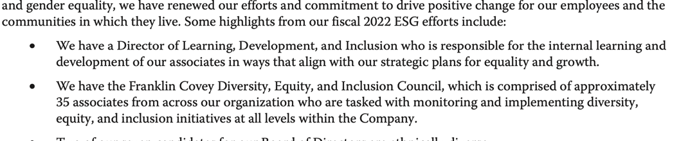

# Solution for the RAG Challenge

[Enterprise RAG Challenge](https://rag.timetoact.at/)

## Problem Statement

This second round we needed to process some set of pdf files and extract some information from them. The pdf files are
[annual reports](https://rag.timetoact.at/data/r2.0/) of companies and the information we need to extract are based on
[generated questions](https://github.com/trustbit/enterprise-rag-challenge/blob/main/main.py). The main goal was only
find correct answers for the questions but link then with the correct page of the pdf file.

```json
{
  "question_text": "Did Franklin Covey Co. outline any new ESG initiatives in the annual report? If there is no mention, return False.",
  "kind": "boolean",
  "value": true,
  "references": [
    {
      "pdf_sha1": "e30ece688caf7602b734bbbcf39559b4acdb2739",
      "page_index": 14
    }
  ]
}
```



## Introduction

## Solution summary (TL-TR)

## Retrieval

### Questions preprocessing.

During first experiment we faced an information retrival problem. While we were putting pdf text into Chroma with the
chunk size of 1_000 and overlap of 100 we realized that feeding the whole question to similarity search is not the best
idea. First of all, the majority of data of the question can be simplified and some patters removed. For example,
`What was the Gross margin (%) for INMUNE BIO INC...` question actually requests for `Gross margin (%)` for
`INMUNE BIO INC`. This information can be used to extract the company name and the metric to be extracted. Moreover,
the structure of the annual report implies that its about single company so it will be more relevant to search for
metric for comparison question like `Which of the companies had the lowest total assets...`. First of all, we prepared
regex question
[extractor](https://github.com/rasskazovaleksey/rag_challange/blob/main/lib/questions.py#L6) and introduces the
synonymization. Since, question are already defined set we just run extracted data through LLM with
[synonyms prompt](https://github.com/rasskazovaleksey/rag_challange/blob/main/prompt/synonyms_prompt.txt) and reviewed
locally stored collection of
synonimatic [questions/metrics](https://github.com/rasskazovaleksey/rag_challange/tree/main/data/r2.0/synonyms).
Our idea was to make from question, structured query for the search engine with will filter only relevant pdf and pages
will be ranked by the similarity to the question.

### Preparing data base.

For search, we utilized [Chroma db](https://www.trychroma.com/) - the open-source embedding database. The main problem
we encountered during experiments was the dependency on chunk size to find the relevant information. General idea
was to search by text and sha key of document in order to collect candidate pages for future processing. We find out
that for majority of questions the chunk size is irrelevant but for some cases search in smaller/bigger database
not give any result. In our tests, performance of both large and small chunks was the same 18/30 with difference in
some questions.

Second interesting thing and mind-blowing for me was the fact that the embedding size has almost negligible effect of
search results. Before, I was convinced that quality of the embedding is the most important thing. Having the greatest
embedding even weak model would perform good. This seems not to be the case, we didn't have much improvement with
`text-embedding-3-large` in comparison to `text-embedding-3-small` which have 3072 and 1580 dimensions respectively.
Moreover, smaller `granite-embedding-107m-multilingual` with 384 seems to find more relevant pages than the larger
open ai embeddings. This is very interesting and I would like to investigate this further since in
[documentation](https://www.ibm.com/docs/en/watsonx/saas?topic=models-granite-embedding-107m-multilingual-model-card)
for this model there is no direct mentions that it was trained on financial data.

For the first submission we used following search configurations:

| Embedding                             | Provider | Chunk/Overlap | Is Filtered |
|---------------------------------------|----------|---------------|-------------|
| `granite-embedding-107m-multilingual` | ibm      | 1000/100      | True        |
| `granite-embedding-107m-multilingual` | ibm      | 100/10        | True        |
| `text-embedding-3-large`              | openai   | 100/10        |             |
| `text-embedding-3-small`              | openai   | 1000/100      |             |
| `text-embedding-3-small`              | openai   | 1000/100      | True        |

### Summing up retrieval pipelane

**Define pipeline:**

```python
from ExperimentPipeline import ExperimentPipeline

dummy = ExperimentPipeline(name="dummy", llm=None, repo=None)
```

**Define question and target pdf:**

```python
question = "For SThree plc, what was the value of End-of-year total headcount at the end of the period listed in annual report? If data is not available, return 'N/A'."
```

**Extract relevant metrics and corresponding sha of annual report:**

```python
extracts = [dummy.extract(q) for q in dummy.questions]
extracts = list(filter(lambda x: x['original_question'] == question, extracts))[0]
```

```
{
    'original_question': "For SThree plc, what was the value of End-of-year total headcount at the end of the period listed in annual report? If data is not available, return 'N/A'.",
    'metric': 'End-of-year total headcount',
    'companies': ['SThree plc'],
    'currency': None,
    'comparison': None,
    'category': 'industry_metric',
    'type': 'number',
    'sha1': '67185fca2a09b3c46ee961b2c1ae160dab8b5231'
}
```

**Look for synonims:**

```python
synonyms_lookup = dummy.read_synonyms()
synonyms_lookup = list(filter(lambda x: x['metric'] == extracts['metric'], synonyms_lookup))[0]
```

```
{
    'metric': 'End-of-year total headcount',
    'synonyms': [{'text': 'Year-end employee count', 'score': 0.95},
                 {'text': 'Total staff at year-end', 'score': 0.92},
                 {'text': 'Year-end workforce size', 'score': 0.9},
                 {'text': 'End-of-year personnel count', 'score': 0.88},
                 {'text': 'Year-end headcount total', 'score': 0.85}]
}
```

**Search for relevant pages in bigger and smaller database:**

```python
from lib.DataRepository import DataRepository
from lib.EmbeddingProvider import WatsonEmbeddingProvider

repoSmall = DataRepository(
    embedding=WatsonEmbeddingProvider(),
    db_path="./data/db/watson_ai_large_100_10_filtered",
    path="./data/r2.0/pdfs",
    name="watson_ai_large_100_10_filtered",
)
dummy.repo = repoSmall
search = dummy.search_database(synonyms_lookup, extracts, main=10, side=5)
smallCandidates = dummy.filter_candidates(search, size=10)
```

**Merge results and sort by relevance:**

```python
mergedCandidates = dummy.merge_data(smallCandidates + bigCandidates)
```

```
[(85, {'count': 8, 'score': 0.5226634033024311}),
 (119, {'count': 7, 'score': 0.4317506636892046}),
 (83, {'count': 5, 'score': 0.4952372074127197}),
 (97, {'count': 5, 'score': 0.5123603880405426}),
 (105, {'count': 5, 'score': 0.5703718423843384}),
 (106, {'count': 4, 'score': 0.576771929860115}),
 (69, {'count': 3, 'score': 0.415793498357137}),
 (3, {'count': 3, 'score': 0.44261035323143005}),
 (87, {'count': 3, 'score': 0.5306304693222046}),
 (125, {'count': 2, 'score': 0.3707282245159149}),
 (57, {'count': 2, 'score': 0.46351566910743713}),
 (104, {'count': 2, 'score': 0.5865854322910309}),
 (81, {'count': 2, 'score': 0.6009736657142639}),
 (86, {'count': 2, 'score': 0.6045263409614563}),
 (39, {'count': 1, 'score': 0.41389599442481995}),
 (96, {'count': 1, 'score': 0.5649453401565552})]
```

At this point we received candidates for the question, and we can proceed with the next step.

## Augmented

### Extracting information from the pdf

Given the candidates for enchanting out prompt we are still not sure if information is relevant. We proposed simple
method to extract only relevant information. One-by-one we feed pages to the LLM and check if the answer is relevant.
If the answer is relevant we store the page and the answer. We also store the answer and the page for the future use.
