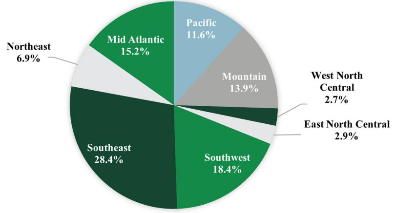

{0}------------------------------------------------

# 2022 Annual Report

{1}------------------------------------------------

{2}------------------------------------------------

Dear Fellow Shareholder,

We are pleased to provide you an update on the progress of your investments in ACRES Commercial Realty Corp. ("ACR" or the "Company"). During the past year, our manager has continued to make progress on the core tenets of its responsibilities to manage the existing assets in the portfolio, originate new loan assets, facilitate the financing of the assets, and control costs to drive earnings and increase book value per share. We are pleased to report that substantial progress has been made on all fronts and we remain focused on these mandates going forward.

The ACRES team continued to diligently manage our assets and provide exceptional service for our borrowers. We worked proactively with these borrowers to address their needs so that they could maintain payments on their loans. These efforts have resulted in a high-quality, stabilized book to build on.

We are proud of the success we achieved in 2022 and are optimistic in our ability to deliver shareholder value over the long term.

# **Selective Growth & Attractive Financing Vehicles**

During 2022, we selectively grew the Company's loan portfolio by leveraging ACRES's complementary lending pipeline and network of sponsor relationships. We are pleased to note that we closed over \$610 million of commercial real estate first-mortgage commitments in 2022.

Additionally, we carefully pursued opportunities to make direct equity investments in real estate in 2022, ultimately acquiring two properties for a total of \$51.6 million. We expect that these investments may yield enhanced returns in the long term that, we will be able to substantially shield from taxes due to the existence of ACR's considerable tax assets and ultimately reinvest into the loan origination pipeline.

We recognize that building on this momentum is essential. Therefore, the ACRES team is vigilant in identifying and executing on opportunities to grow asset-specific financing with duration at attractive coupon rates that can raise our capacity to originate loans. In addition, we have the reinvestment window available on our two ACR securitizations through May 2023 and December 2023. The bulk of the Company's current portfolio was originated in 2021 and 2022, comprising 84% of the current par balance and have initial maturities of 2024 or later and extended maturities of 2026 or later.

# **Portfolio Stability**

The ACRES asset management team prides itself on its ability to tailor solutions that will keep borrowers on track despite challenges that may arise. Current volatility and uncertainty in the market have proved to be such challenges, but ones we've been able to manage as a result of our proactive asset management approach.

Thanks to our asset management team, we've reduced our watch list to 5% of the loan portfolio at the end of 2022, down from 8% at the end of 2021. In January 2023, one watch list loan, a hotel portfolio in the southwest region with a par value of \$56.5 million was paid off in full, which reduced the value of our watch list loans in half as compared to year end 2022.

{3}------------------------------------------------

As of December 31, 2022, 95% of the loan portfolio was performing in line or near underwritten expectations and a significant majority of loans were current on contractual payments, which is an improvement from 92% at December 31, 2021.

As of December 31, 2022, 100% of our loan portfolio by carrying value earned a floating rate of interest and was financed entirely with liabilities that both pay interest at floating rates. Additionally, 89% of the par value of our floating-rate loan portfolio was covered by borrowerowned interest rate caps that provided additional credit protection to the Company in the current rising interest rate environment.

# **Capital Markets Flexibility**

We worked closely with our lenders and executed as planned to provide the Company maximum flexibility given the challenging business environment in 2022.

We finalized terms with Mass Mutual under its non-mark-to-market agreement to upsize the commitment and to provide for individual loan series that will each have a five-year term from the date of issuance. Additionally, we have warehouse lines open with JPM and Morgan Stanley, each collateralized by performing loans and each with excess capacity to support future originations.

In August 2022, we repaid the remaining outstanding 4.50% Convertible Senior Notes upon maturity at par.

During the year ended December 31, 2022, we repurchased 849,000 shares of common stock at an average price of \$10.35, which contributed \$1.32 per share to common stock book value since we were able to repurchase the shares at prices significantly below our common stock book value. Common stock book value was \$24.54 at December 31, 2022, up 3% from December 31, 2021.

# **Corporate Responsibility**

In undertaking our ESG strategy, we are particularly focused on identifying and executing programs that ensure our dedication to diversity and inclusion and emphasize ethical behavior. We are committed to integrating ESG policies and practices into our operational, investment and development strategies to build a sustainable future.

During 2022, we announced a new initiative called "ACRES Protects an Acre" initiative, in which ACRES will make a donation in connection with each loan it closes to a nonprofit organization whose mission is to protect acres of vulnerable land. Additionally, early in 2023, we announced a partnership with Project Destined, an organization that provides training in financial literacy, entrepreneurship, and real estate to students from underserved communities.

# **Looking Ahead**

As we look ahead to 2023, we have established a goal to get the Company fully invested to drive meaningful earnings that can be re-invested back into the loan origination pipeline. We expect our accomplishments in 2022 will help to pave the way to attaining that goal.

{4}------------------------------------------------

{5}------------------------------------------------

[This page intentionally left blank]

{6}------------------------------------------------

# **UNITED STATES SECURITIES AND EXCHANGE COMMISSION Washington, D.C. 20549**

# **FORM 10-K**

(Mark One)

☑ **ANNUAL REPORT PURSUANT TO SECTION 13 OR 15(d) OF THE SECURITIES EXCHANGE ACT OF 1934** 

For the fiscal year ended December 31, 2022

# ☐ **TRANSITION REPORT PURSUANT TO SECTION 13 OR 15(d) OF THE SECURITIES EXCHANGE ACT OF 1934**

For the transition period from _________ to __________

**Commission file number 1-32733** 

or

# **ACRES COMMERCIAL REALTY CORP.**

(Exact name of registrant as specified in its charter)

| Maryland                                                                                                                                                                                                                                                                                                                                                       |                                                                                                                                                                                        | 20-2287134                                |  |
|----------------------------------------------------------------------------------------------------------------------------------------------------------------------------------------------------------------------------------------------------------------------------------------------------------------------------------------------------------------|----------------------------------------------------------------------------------------------------------------------------------------------------------------------------------------|-------------------------------------------|--|
| (State or other jurisdiction of                                                                                                                                                                                                                                                                                                                                |                                                                                                                                                                                        | (I.R.S. Employer                          |  |
| incorporation or organization) Identification No.)                                                                                                                                                                                                                                                                                                          |                                                                                                                                                                                        |                                           |  |
|                                                                                                                                                                                                                                                                                                                                                                | 390 RXR Plaza, Uniondale, New York 11556                                                                                                                                               |                                           |  |
|                                                                                                                                                                                                                                                                                                                                                                | (Address of principal executive offices) (Zip Code) Registrant's telephone number, including area code: 516-535-0015 Securities registered pursuant to Section 12(b) of the Act: |                                           |  |
| Title of each class                                                                                                                                                                                                                                                                                                                                            | Trading Symbol(s)                                                                                                                                                                      | Name of each exchange on which registered |  |
| Common Stock, \$0.001 par value                                                                                                                                                                                                                                                                                                                                | ACR                                                                                                                                                                                    | New York Stock Exchange                   |  |
| 8.625% Fixed-to-Floating Series C Cumulative Redeemable Preferred                                                                                                                                                                                                                                                                                              |                                                                                                                                                                                        |                                           |  |
| Stock                                                                                                                                                                                                                                                                                                                                                          | ACRPrC                                                                                                                                                                                 | New York Stock Exchange                   |  |
| 7.875% Series D Cumulative Redeemable Preferred Stock                                                                                                                                                                                                                                                                                                          | ACRPrD                                                                                                                                                                                 | New York Stock Exchange                   |  |
|                                                                                                                                                                                                                                                                                                                                                                | Securities registered pursuant to Section 12 (g) of the Act: None                                                                                                                      |                                           |  |
| Indicate by check mark if the registrant is a well-known seasoned issuer, as defined in Rule 405 of the Securities Act. ☐ Yes ☑ No                                                                                                                                                                                                                             |                                                                                                                                                                                        |                                           |  |
| Indicate by check mark if the registrant is not required to file reports pursuant to Section 13 or Section 15(d) of the Act. ☐ Yes ☑ No                                                                                                                                                                                                                        |                                                                                                                                                                                        |                                           |  |
| Indicate by check mark whether the registrant (1) has filed all reports required to be filed by Section 13 or 15(d) of the Securities Exchange Act of 1934 during the preceding 12 months (or for                                                                                                                                                              |                                                                                                                                                                                        |                                           |  |
| such shorter period that the registrant was required to file such reports), and (2) has been subject to such filing requirements for the past 90 days. ☑ Yes ☐ No                                                                                                                                                                                              |                                                                                                                                                                                        |                                           |  |
| Indicate by check mark whether the registrant has submitted electronically every Interactive Data File required to be submitted pursuant to Rule 405 of Regulation S-T (§ 232.405 of this chapter) during the preceding 12 months (or for such shorter period that the registrant was required to submit such files). ☑ Yes ☐ No                            |                                                                                                                                                                                        |                                           |  |
| Indicate by check mark whether the registrant is a large accelerated filer, an accelerated filer, a non-accelerated filer, a smaller reporting company, or an emerging growth company. See the definitions of "large accelerated filer," "accelerated filer," "smaller reporting company," and "emerging growth company" in Rule 12b-2 of the Exchange Act. |                                                                                                                                                                                        |                                           |  |
| Large accelerated filer ☐                                                                                                                                                                                                                                                                                                                                   |                                                                                                                                                                                        | Accelerated filer ☑                    |  |
| Non-accelerated filer ☐                                                                                                                                                                                                                                                                                                                                     |                                                                                                                                                                                        | Smaller reporting company ☑            |  |
|                                                                                                                                                                                                                                                                                                                                                                |                                                                                                                                                                                        | Emerging growth company ☐              |  |
| If an emerging growth company, indicate by check mark if the registrant has elected not to use the extended transition period for complying with any new or revised financial accounting standards provided pursuant to Section 13(a) of the Exchange Act. ☐                                                                                                |                                                                                                                                                                                        |                                           |  |
| Indicate by check mark whether the registrant has filed a report on and attestation to its management's assessment of the effectiveness of its internal control over financial reporting under Section                                                                                                                                                         |                                                                                                                                                                                        |                                           |  |
| 404(b) of the Sarbanes-Oxley Act (15 U.S.C. 7262(b)) by the registered public accounting firm that prepared or issued its audit report. ☑                                                                                                                                                                                                                      |                                                                                                                                                                                        |                                           |  |
| If securities are registered pursuant to Section 12(b) of the Act, indicate by check mark whether the financial statements of the registrant included in the filing reflect the correction of an error to previously issued financial statements. ☐                                                                                                         |                                                                                                                                                                                        |                                           |  |
| Indicate by check mark whether any of those error corrections are restatements that required a recovery analysis of incentive-based compensation received by any of the registrant's executive officers during the relevant recovery period pursuant to §240.10D-1(b). ☐                                                                                    |                                                                                                                                                                                        |                                           |  |
| Indicate by check mark whether the registrant is a shell company (as defined in Rule 12b-2 of the Act). ☐ Yes ☑ No                                                                                                                                                                                                                                             |                                                                                                                                                                                        |                                           |  |
| The aggregate market value of the voting common equity held by non-affiliates of the registrant, based on the closing price of such stock on the last business day of the registrant's most recently completed second fiscal quarter (June 30, 2022) was \$65,678,313.                                                                                      |                                                                                                                                                                                        |                                           |  |
| The number of outstanding shares of the registrant's common stock on March 6, 2023 was 8,685,452 shares.                                                                                                                                                                                                                                                       |                                                                                                                                                                                        |                                           |  |
|                                                                                                                                                                                                                                                                                                                                                                | DOCUMENTS INCORPORATED BY REFERENCE                                                                                                                                                    |                                           |  |
| The information required by Part III of this Form 10-K, to the extent not set forth herein or by amendment, is incorporated by reference from the registrant's definitive proxy statement to be filed with the Securities and Exchange Commission not later than 120 days after December 31, 2022.                                                          |                                                                                                                                                                                        |                                           |  |

{7}------------------------------------------------

# **ACRES COMMERCIAL REALTY CORP. AND SUBSIDIARIES INDEX TO ANNUAL REPORT ON FORM 10-K**

|            |                                                                                                              | PAGE |
|------------|--------------------------------------------------------------------------------------------------------------|------|
|            | Forward-Looking Statements                                                                                   | 3    |
| PART I     |                                                                                                              |      |
| Item 1:    | Business                                                                                                     | 5    |
|            | Item 1A: Risk Factors                                                                                        | 16   |
|            | Item 1B: Unresolved Staff Comments                                                                           | 40   |
| Item 2:    | Properties                                                                                                   | 40   |
| Item 3:    | Legal Proceedings                                                                                            | 40   |
| Item 4:    | Mine Safety Disclosures                                                                                      | 40   |
| PART II    |                                                                                                              |      |
| Item 5:    | Market for Registrant's Common Equity, Related Stockholder Matters and Issuer Purchases of Equity Securities | 41   |
| Item 6:    | [Reserved]                                                                                                   | 43   |
| Item 7:    | Management's Discussion and Analysis of Financial Condition and Results of Operations                        | 44   |
|            | Item 7A: Quantitative and Qualitative Disclosures About Market Risk                                          | 81   |
| Item 8:    | Financial Statements and Supplementary Data                                                                  | 83   |
| Item 9:    | Changes in and Disagreements with Accountants on Accounting and Financial Disclosure                         | 139  |
|            | Item 9A: Controls and Procedures                                                                             | 139  |
|            | Item 9B: Other Information                                                                                   | 141  |
|            | Item 9C Disclosure Regarding Foreign Jurisdictions that Prevent Inspections                                  | 141  |
| PART III   |                                                                                                              |      |
|            | Item 10: Directors, Executive Officers and Corporate Governance                                              | 142  |
|            | Item 11: Executive Compensation                                                                              | 142  |
|            | Item 12: Security Ownership of Certain Beneficial Owners and Management and Related Stockholder Matters      | 142  |
|            | Item 13: Certain Relationships and Related Transaction and Director Independence                             | 142  |
|            | Item 14: Principal Accountant Fees and Services                                                              | 142  |
| PART IV    |                                                                                                              |      |
|            | Item 15: Exhibits and Financial Statement Schedules                                                          | 143  |
|            | Item 16: Form 10-K Summary                                                                                   | 147  |
| SIGNATURES |                                                                                                              | 148  |

{8}------------------------------------------------

# **FORWARD-LOOKING STATEMENTS**

*In this annual report on Form 10-K, references to "Company," "we," "us," or "our" refer to ACRES Commercial Realty Corp. and its subsidiaries; references to the Company's "Manager" refer to ACRES Capital, LLC, a subsidiary of ACRES Capital Corp., unless specifically stated otherwise or the context otherwise indicates. This report contains certain forward-looking statements. Forwardlooking statements relate to expectations, beliefs, projections, future plans and strategies, anticipated events or trends and similar expressions concerning matters that are not historical facts. In some cases, you can identify forward-looking statements by terms such as "anticipate," "believe," "could," "estimate," "expects," "intend," "may," "plan," "potential," "project," "should," "will" and "would" or the negative of these terms or other comparable terminology.* 

Forward-looking statements contained in this report are based on our beliefs, assumptions and expectations regarding our future performance, taking into account all information currently available to us. These beliefs, assumptions and expectations can change as a result of many possible events or factors, not all of which are known to us or are within our control. If a change occurs, our business, financial condition, liquidity and results of operations may vary materially from those expressed in our forward-looking statements. Forward-looking statements we make in this report are subject to various risks and uncertainties that could cause actual results to vary from our forward-looking statements, including:

- changes in our industry, interest rates, the debt securities markets, real estate markets or the general economy;
- increased rates of default and/or decreased recovery rates on our investments;
- the performance and financial condition of our borrowers;
- the cost and availability of our financings, which depend in part on our asset quality, the nature of our relationships with our lenders and other capital providers, our business prospects and outlook and general market conditions;
- the availability and attractiveness of terms of additional debt repurchases;
- availability, terms and deployment of short-term and long-term capital;
- events giving rise to increases in our current expected credit loss reserve, including the impact of the current economic environment;
- availability of, and ability to retain, qualified personnel;
- changes in our business strategy;
- the degree and nature of our competition;
- the resolution of our non-performing and sub-performing assets;
- the long-term macroeconomic effects of the novel coronavirus ("COVID-19");
- our ability to comply with financial covenants in our debt instruments;
- the adequacy of our cash reserves and working capital;
- the timing of cash flows, if any, from our investments;
- unanticipated increases in financial and other costs, including a rise in interest rates;
- our ability to maintain compliance with over-collateralization and interest coverage tests in our collateralized debt obligations ("CDOs") and/or collateralized loan obligations ("CLOs");
- our dependence on ACRES Capital, LLC (our "Manager") and ability to find a suitable replacement in a timely manner, or at all, if our Manager or we were to terminate the management agreement;
- environmental and/or safety requirements;
- our ability to satisfy complex rules in order for us to qualify as a real estate investment trust ("REIT"), for federal income tax purposes and qualify for our exemption under the Investment Company Act of 1940, as amended, and our ability and the ability of our subsidiaries to operate effectively within the limitations imposed by these rules;
- legislative and regulatory changes (including changes to laws governing the taxation of REITs or the exemptions from registration as an investment company); and

{9}------------------------------------------------

- the factors described in this report, including those set forth under the sections captioned "Risk Factors," "Business" and "Management's Discussion and Analysis of Financial Conditions and Results of Operations."
We caution you not to place undue reliance on these forward-looking statements, which speak only as of the date of this report. All subsequent written and oral forward-looking statements attributable to us or any person acting on our behalf are expressly qualified in their entirety by the cautionary statements contained or referred to in this section. Except to the extent required by applicable law or regulation, we undertake no obligation to update these forward-looking statements to reflect events or circumstances after the date of this report or to reflect the occurrence of unanticipated events.

{10}------------------------------------------------

### **PART I**

# **ITEM 1. BUSINESS**

### **General**

We are a Maryland corporation, incorporated in 2005, and a real estate finance company that is organized and conducts our operations to qualify as a real estate investment trust ("REIT") for federal income tax purposes under Subchapter M of the Internal Revenue Code of 1986, as amended, or the Code. On February 16, 2021, we amended our certificate of incorporation to change our name to ACRES Commercial Realty Corp. from Exantas Capital Corp. Our investment strategy is primarily focused on originating, holding and managing commercial real estate ("CRE") mortgage loans and equity investments in commercial real estate property through direct ownership and joint ventures. We are externally managed by ACRES Capital, LLC (our "Manager") a subsidiary of ACRES Capital Corp. (collectively "ACRES"), a private commercial real estate lender exclusively dedicated to nationwide middle market CRE lending with a focus on multifamily, student housing, hospitality, industrial and office property in top United States, or U.S., markets. Our Manager draws upon the management team of ACRES and its collective investment experience to provide its services.

Our objective is to provide our stockholders with total returns over time, including the payment of quarterly distributions when approved by our board of directors, (our "Board") and capital appreciation, while seeking to manage the risks associated with our investment strategies. We finance a substantial portion of our portfolio investments through borrowing strategies seeking to match the maturities and repricing dates of our financings with the maturities and repricing dates of our investments.

Our investment strategy targets the following CRE credit investments, including:

- Floating-rate first mortgage loans, which we refer to as whole loans;
- First priority interests in first mortgage loans, which we refer to as A-notes;
- Subordinated interests in first mortgage loans, which we refer to as B-notes;
- Preferred equity investments related to CRE that are subordinate to first mortgage loans and are not collateralized by the property underlying the investment; and
- CRE equity investments.

We generate our income primarily from the spread between the revenues we receive from our assets and the cost to finance our ownership of those assets, including corporate debt.

In December 2019, a novel strain of coronavirus ("COVID-19") was identified. The resulting spread of COVID-19 throughout the globe led the World Health Organization to designate COVID-19 as a pandemic and numerous countries, including the U.S, to declare national emergencies. Many countries responded to the initial and ensuing outbreaks of COVID-19 by instituting quarantines and restrictions on travel and limiting operations of non-essential offices and retail centers, which resulted in the closure or remote operation of non-essential businesses and increased rates of unemployment and market disruption in connection with the economic uncertainty. While the U.S. and certain countries around the world have eased restrictions and financial markets and unemployment rates have stabilized to some degree, the pandemic continues to cause uncertainty in the U.S. and global economies, generally, and the CRE industry in particular.

The aforementioned quarantines and travel restrictions contributed significantly to economic disruptions across the country that directly impacted our borrowers and their ability to pay and to stay current with their debt obligations in 2019 and 2020, causing significant increases in our provisions for credit losses. During this height of the pandemic, we used a variety of legal and structural options to manage credit risk effectively, including through forbearance and extension provisions or agreements. As of December 31, 2022, we have substantially reversed those provisions due to significant improvements in our current and expected macroeconomic operating environments as well as due to improvements in collateral operating performance and market liquidity.

We continue to actively and responsibly manage corporate liquidity and operations in light of the market disruptions caused by COVID-19. However, it is inherently difficult to accurately assess the continuing impact of the pandemic as well as other domestic or global events on our revenues, profitability and financial position. In response, we are focused on maintaining sufficient liquidity while still growing our loan origination business. We continuously monitor the effects of domestic and global events on our operations and financial position to ensure that we remain responsive and adaptable to the dynamic changes in our operating environment.

The negative impact of COVID-19 on our commercial mortgage-backed securities, or CMBS, investments and 2020 results created a net operating loss ("NOL") carryforwards and net capital loss carryforwards ("CLCFs"). Our 2020 tax return, completed in October 2021, resulted in NOL carryforwards of \$47.7 million and CLCFs of \$136.9 million, including net capital loss carryforwards 

{11}------------------------------------------------

from prior years, at our qualified REIT subsidiaries ("QRSs"). Our 2021 tax return, completed in October 2022, resulted in NOL utilization of \$1.1 million and CLCF utilization of \$15.0 million. Additionally, we have NOL carryforwards of \$60.1 million and CLCFs of \$1.0 million at our taxable REIT subsidiaries ("TRSs").

As of December 31, 2022, we have acquired equity investments in CRE properties to utilize CLCFs in our QRSs. These equity investments offer the opportunity for enhanced capital appreciation returns that may be reinvested into the loan origination pipeline when and if realized.

We typically target transitional floating-rate CRE loans between \$10.0 million and \$100.0 million. During the year ended December 31, 2022 we originated 19 CRE loans with total commitments of \$610.8 million. At December 31, 2022, our CRE loan portfolio comprised \$2.1 billion of floating-rate CRE whole loans with a weighted average spread of 3.78% over the one-month benchmark interest rates utilized, which have a weighted average floor of 0.68%, excluding one whole loan without a benchmark floor. Additionally, our CRE loan portfolio comprised one fully reserved \$4.7 million mezzanine loan at December 31, 2022.

# **Our Business Strategy**

The core components of our business strategy are:

*Investment in CRE assets*. We are currently invested in CRE whole loans, CRE mezzanine loans and CRE investments. Our goal is to allocate 90% to 100% of our equity to our CRE assets.

*Managing our investment portfolio.* At December 31, 2022, we managed \$2.1 billion of assets, including \$1.5 billion of assets that were financed and held in variable interest entities. The core of our management process is credit analysis, which our Manager, with the assistance of ACRES, uses to actively monitor our existing investments and as a basis for evaluating new investments. Senior management of ACRES has extensive experience in underwriting the credit risk associated with our targeted asset classes and conducts detailed due diligence on all investments. After we make investments, our Manager actively monitors them for early detection of trouble or deterioration. If a default occurs, we will use our senior management team's asset management experience in seeking to mitigate the severity of any loss and to optimize the recovery from assets collateralizing the investment.

*Managing our interest rate, pricing and liquidity risk*. We engage in a number of business activities that are vulnerable to interest rate, pricing and liquidity risk and we seek to manage those risks. The risks on our long-term financing agreements, principally our term financing facilities, are managed by seeking to match the maturity and repricing dates of our financed investments with the maturities and repricing dates of our long-term financing facilities. Additionally, we seek to match investment and financing maturity and repricing dates using securitization vehicles structured by our Manager and, subject to the availability of markets for securitization financings, we expect to continue to use securitizations in the future to accomplish our long-term match funding financing strategy.

|                                              | Outstanding Borrowings(1) |    | Value of Collateral |    | Equity at Risk (2) |
|----------------------------------------------|------------------------------|----|---------------------|----|--------------------|
| At December 31, 2022:                        |                              |    |                     |    |                    |
| CRE Securitizations                          |                              |    |                     |    |                    |
| ACR 2021-FL1                                 | \$ 671,397                | \$ | 802,643             | \$ | 127,420            |
| ACR 2021-FL2                                 | 562,159                      |    | 700,000             |    | 133,000            |
| Senior Secured Financing Facility            |                              |    |                     |    |                    |
| Massachusetts Mutual Life Insurance Company  | \$ 87,890                 | \$ | 196,837             | \$ | 105,818            |
| CRE -Term Warehouse Financing Facilities     |                              |    |                     |    |                    |
| JPMorgan Chase Bank, N.A.                    | \$ 186,783                | \$ | 255,095             | \$ | 68,768             |
| Morgan Stanley Mortgage Capital Holdings LLC | 141,505                      |    | 198,455             |    | 56,817             |
| Mortgage Payable                             |                              |    |                     |    |                    |
| Readycap Commercial, LLC                     | \$ 18,244                 | \$ | 25,400              | \$ | 6,602              |
| Total                                        | \$ 1,667,978              | \$ | 2,178,430           |    |                    |

At December 31, 2022, our CRE securitizations, financing facilities with debt outstanding, and mortgage payable were as follows (in thousands):

(1) CRE securitizations, senior secured financing facility and mortgage payable include deferred debt issuance costs. Term warehouse financing facilities include accrued interest payable and deferred debt issuance costs.

(2) The senior secured financing facility and term warehouse financing facilities include accrued interest receivable and accrued interest payable, which are excluded from the value of collateral. CRE securitizations reflect the par value of equity investments in retained notes.

The CRE securitizations, senior secured financing facility, term warehouse financing facilities and mortgage payable charge a floating rate of interest. For more information concerning our CRE securitizations, senior secured financing facility, term facilities and mortgage payable, see "Item 7. Management's Discussion and Analysis of Financial Condition and Results of Operations - Liquidity and Capital Resources," and Note 12 contained in "Item 8. Financial Statements and Supplementary Data - Notes to Consolidated Financial Statements" of this report. We continuously monitor our compliance with all of the financial covenants. We were in compliance with all financial covenants, as defined in the respective agreements, at December 31, 2022.

{12}------------------------------------------------

*Diversification of investments*. We manage our investment risk by maintaining a diversified portfolio of CRE mortgage loans and other CRE-related investments. As funds become available for investment or reinvestment, we seek to maintain diversification by property type and geographic location while allocating our capital to investment opportunities that we believe are the most economically attractive. The percentage of assets that we have invested in certain non-qualifying, non-core and other real estate-related investments is subject to the federal income tax requirements for REIT qualification and the requirements for exclusion from regulation under the Investment Company Act of 1940, or the Investment Company Act.

### **Our Operating Policies**

*Investment guidelines.* We have established investment policies, procedures and guidelines that are reviewed and approved by our Manager's investment committee and our Board. The investment committee and/or our Board, as applicable, meets regularly to consider and approve proposed specific investments. Our Board monitors the execution of our overall investment strategies and targeted asset classes. We acquire our investments primarily for income. We do not have a policy that requires us to focus our investments in one or more particular geographic areas or industries.

*Financing policies.* We use leverage in order to increase potential returns to our stockholders and for financing our portfolio. We do not speculate on changes in interest rates. Although we have identified leverage targets for each of our targeted asset classes, our investment policies do not have any minimum or maximum leverage limits. Our Manager's investment committee has the discretion, without the need for further approval by our Board, to increase the amount of leverage we incur above our targeted range for individual asset classes subject, however, to any leverage constraints that may be imposed by existing financing arrangements.

We use borrowing and securitization strategies to accomplish our long-term match funding financing strategy. Based upon current conditions in the credit markets for collateralized debt obligations and collateralized loan obligations (sometimes, collectively, referred to as CDOs and CLOs) we expect to modestly increase leverage through new CRE debt securitizations and the continued use of our senior secured financing facility and term financing facilities. We may also seek other credit arrangements to finance new investments that we believe can generate attractive risk-adjusted returns, subject to availability.

*Credit and risk management policies.* Our Manager focuses its attention on credit and risk assessment from the earliest stage of the investment selection process. In addition, our Manager screens and monitors all potential investments to determine their impact on maintaining our REIT qualification under federal income tax laws and our exclusion from investment company status under the Investment Company Act. Portfolio risks, including risks related to credit losses, interest rate volatility, liquidity and counterparty credit, are generally managed on an asset and portfolio type basis by our Manager.

# **Floating-Rate Loan Portfolio and Borrowings**

As discussed in the "Managing our interest rate, pricing and liquidity risk" section above, our investments in floating-rate assets and utilization of floating-rate borrowings expose us to interest rate risk. In a business environment where benchmark interest rates are increasing significantly, cash flows of the CRE assets underlying our loans may not be sufficient to pay debt service on our loans, which could result in non-performance or default. We partially mitigate this risk by generally requiring our borrowers to purchase interest rate cap agreements with non-affiliated, well-capitalized third parties and by selectively requiring our borrowers to have and maintain debt service reserves. These interest rate caps generally mature prior to the maturity date of the loan and the borrowers are required to pay to extend them. In most cases the sponsors will need to fund additional equity into the properties to cover these costs as the property may not generate sufficient cash flow to pay these costs. At December 31, 2022, 88.8% of the par value of our CRE loan portfolio had interest rate caps in place with a weighted-average maturity of 1.1 years.

Historically, we have used the London Interbank Offered Rate ("LIBOR") as the benchmark interest rate for our floating-rate whole loans and we have been exposed to LIBOR through our floating-rate borrowings. Many of our floating-rate whole loans, CRE securitizations and term warehouse financing facilities included one-month LIBOR as the original contractual benchmark interest rate. Our unsecured junior subordinated debentures use three-month LIBOR as the contractual benchmark interest rate. In March 2021, the United Kingdom's, or U.K.'s, Financial Conduct Authority ("FCA") announced that it would cease publication of the one-week and the two-month USD LIBOR immediately after December 31, 2021, and cease publication of the remaining tenors immediately after June 30, 2023. In July 2021, the U.S. Federal Reserve, in conjunction with the Alternative Reference Rates Committee, a steering committee comprising large U.S. financial institutions, has identified Secured Overnight Financing Rate ("SOFR") as its preferred alternative rate for LIBOR.

All variable rate loans originated by us beginning January 1, 2022 have been benchmarked to SOFR. Additionally, all of our floating-rate whole loans contain provisions that provide for the transition of the contractual benchmark interest rate to an alternative rate. At December 31, 2022, our loan portfolio had a carrying value of \$2.0 billion of floating rate loans, 68.3% or \$1.4 billion of which have interest rates tied to LIBOR and 31.7% or \$646.2 million of which have interest rates tied to SOFR.

{13}------------------------------------------------

In September 2021 and January 2022, the term warehouse financing facilities with JPMorgan Chase Bank, N.A. ("JPMorgan Chase") and Morgan Stanley Mortgage Capital Holdings LLC ("Morgan Stanley"), respectively, were amended to allow for the transition to alternative rates, including rates tied to SOFR, subject to benchmark transition events. Additionally, during the year ended December 31, 2022, we entered into a loan agreement to finance the acquisition of a student housing complex, which uses SOFR as its benchmark interest rate. At December 31, 2022, we had \$1.7 billion of floating rate borrowings, 75.8% or \$1.3 billion of which have interest rates tied to LIBOR and 24.2% or \$419.2 million of which have interest rates tied to SOFR.

We expect to complete the process of converting our LIBOR-based loans and borrowings to an applicable benchmark interest rate during 2023.

Refer to "Part I. - Item 1A. Risk Factors - Changes in the method for determining the LIBOR or a replacement of LIBOR may adversely affect the value of our loans, investments and borrowings and could affect our results of operations" for additional detail about the transition away from LIBOR.

# **Investment Portfolio**

The table below summarizes the amortized costs and net carrying amounts of our investments at December 31, 2022, classified by asset type (dollars in thousands, except amounts in footnotes):

| At December 31, 2022                   | Amortized Cost  | Net Carrying Amount (1) | Percent of Portfolio | Weighted Average Coupon |  |
|----------------------------------------|-----------------|----------------------------|-------------------------|----------------------------|--|
| Loans held for investment:             |                 |                            |                         |                            |  |
| CRE whole loans, floating-rate         | \$ 2,052,890 | \$ 2,038,787            | 93.56%                  | 7.99%                      |  |
| CRE mezzanine loan                     | 4,700           | —                          | 0.00%                   | 10.00%                     |  |
|                                        | 2,057,590       | 2,038,787                  | 93.56%                  |                            |  |
| Other investments:                     |                 |                            |                         |                            |  |
| Investments in unconsolidated entities | 1,548           | 1,548                      | 0.07%                   | N/A (4)                    |  |
| Investments in real estate (2)         | 88,132          | 88,132                     | 4.04%                   | N/A (4)                    |  |
| Properties held for sale (3)           | 50,744          | 50,744                     | 2.33%                   | N/A (4)                    |  |
|                                        | 140,424         | 140,424                    | 6.44%                   |                            |  |
|                                        |                 |                            |                         |                            |  |
| Total investment portfolio             | \$ 2,198,014 | \$ 2,179,211            | 100.00%                 |                            |  |

(1) Net carrying amount includes an allowance for credit losses of \$18.8 million.

(2) Includes real estate-related right of use assets of \$19.5 million, mortgage payable of \$18.2 million, intangible assets of \$8.9 million, lease liabilities of \$42.9 million and other liabilities of \$64,000.

(3) Includes property held for sale-related liabilities of \$3.0 million.

(4) There are no stated rates associated with these investments.

We hold investments in 100% of the common shares of two trusts, Resource Capital Trust I and RCC Trust II, that were formed for the purpose of providing us with unsecured junior subordinated debt financing and are accounted for as investments in unconsolidated entities.

# *CRE Debt Investments*

*Floating-rate whole loans.* We predominantly originate floating-rate first mortgage loans, or whole loans, directly to borrowers. The direct origination of whole loans enables us to better control the structure of the loans and to maintain direct lending relationships with borrowers. Additionally, we may acquire whole loans from third parties that conform to our investment strategy. We may create tranches of a loan we originate, consisting of an A-note (described below) and a B-note (described below), as well as mezzanine loans or other participations, which we may hold or sell to third parties. We do not obtain ratings on these investments. With respect to our portfolio at December 31, 2022, our whole loan investments had loan-to-collateral value, or LTV, ratios that typically do not exceed 85%. Typically, our whole loans are structured with an original term of up to three years, with one-year extensions that bring the loan to a maximum term of five years. Substantially all of our CRE loans held at December 31, 2022 were whole loans. We expect to hold our whole loans to maturity.

*Senior interests in whole loans (A-notes***).** We may invest in senior interests in whole loans, referred to as A-notes, either directly originated or purchased from third parties. We do not intend to obtain ratings on these investments. We expect our typical Anote investments to have LTV ratios not exceeding 70% and will generally be structured with an original term of up to three years, with one-year extensions that bring the loan to a maximum term of five years. We expect to hold any A-note investments to maturity. We did not hold any A-note investments at December 31, 2022.

{14}------------------------------------------------

*Subordinate interests in whole loans (B-notes*). To a lesser extent, we may invest in subordinate interests in whole loans, referred to as B-notes, which we will either directly originate or purchase from third parties. B-notes are loans secured by a first mortgage but are subordinated to an A-note. The subordination of a B-note is generally evidenced by an intercreditor or participation agreement between the holders of the A-note and the B-note. In some instances, the B-note lender may require a security interest in the stock or other equity interests of the borrower as part of the transaction. B-note lenders have the same obligations, collateral and borrower as the A-note lender, but typically are subordinated in recovery upon a default to the A-note lender. B-notes share certain credit characteristics with second mortgages in that both are subject to greater credit risk with respect to the underlying mortgage collateral than the corresponding first mortgage or A-note. We do not intend to obtain ratings on these investments. We expect our typical B-note investments to have LTV ratios between 55% and 80% and will generally be structured with an original term of up to three years, with one-year extensions that bring the loan to a maximum term of five years. We expect to hold any B-note investments to maturity. We did not hold any B-note investments at December 31, 2022.

In addition to the accrued interest receivable on a B-note, we may earn fees charged to the borrower under the note or additional income by receiving principal payments in excess of the discounted price (below par value) we paid to acquire the note. Our ownership of a B-note with controlling class rights may, in the event the financing fails to perform according to its terms, cause us to pursue our remedies as owner of the B-note, which may include foreclosure on, or modification of, the note. In some cases, the owner of the Anote may be able to foreclose or modify the note against our wishes as owner of the B-note. As a result, our economic and business interests may diverge from the interests of the owner of the A-note.

*Mezzanine financing*. Historically, we have invested in mezzanine loans that are senior to the borrower's equity in, and subordinate to the mortgage loan on, a property. A mezzanine loan is typically secured by a pledge of the ownership interests in the entity that directly owns the real property or by a second lien mortgage loan on the property. In addition, mezzanine loans typically include credit enhancements such as letters of credit, personal guarantees of the principals of the borrower, or collateral unrelated to the property. A mezzanine loan may be structured so that we receive a stated fixed or variable interest rate on the loan as well as a percentage of gross revenues and a percentage of the increase in the fair market value of the property securing the loan, payable upon maturity, refinancing or sale of the property. Mezzanine loans may also have prepayment lockouts, penalties, minimum profit hurdles and other mechanisms to protect and enhance returns in the event of premature repayment. At December 31, 2022, our loan portfolio included one mezzanine loan with no carrying value.

*Preferred equity investments.* Historically, we have invested in preferred equity investments in entities that own or acquire CRE properties. These investments are subordinate to first mortgage loans and mezzanine debt and are typically structured to provide some credit enhancement differentiating it from the common equity. We expect our preferred equity investments to have LTV ratios between 65% and 90% with stated maturities from three to eight years. We expect to hold preferred equity investments to maturity. We did not hold any preferred equity investments at December 31, 2022.

{15}------------------------------------------------

The following charts describe the property type and the geographic breakdown, by National Council of Real Estate Investment Fiduciaries ("NCREIF") region of our CRE loan portfolio at December 31, 2022 (based on carrying value):

The total CRE loan portfolio, at carrying value, was \$2.0 billion at December 31, 2022.

The Southwest region constituted 23.2% of our portfolio, of which 100.0% was in Texas, and its collateral comprised 95.6% multifamily properties. The Southeast region constituted 21.5% of our portfolio, of which 79.5% was in Florida, and its collateral comprised 85.7% multifamily properties. The Mountain region constituted 16.2% of our portfolio, of which 68.8% was in Arizona, and its collateral comprised 76.5% multifamily properties. We view our investment and credit strategies as being adequately diversified across property types in the Southwest, Southeast and Mountain regions.

{16}------------------------------------------------

# *CRE Investments*

We may invest directly in the ownership of CRE equity investments by making direct investments where NOL carryforwards exist and can absorb the creation of REIT taxable income or by restructuring CRE loans and taking control of the properties where we believe we can protect capital and ultimately generate capital appreciation. We may acquire CRE equity investments through a joint venture or wholly-owned subsidiary and may classify these investments in real estate as held for investment or held for sale. We intend to primarily use an affiliate of our Manager to manage the CRE equity investments when held. At December 31, 2022, we held four investments in real estate acquired through direct equity investments and two investments in real estate acquired from lending activities (i.e. through the receipt of the deeds-in-lieu of foreclosure on the properties that collateralized former non-performing loans). At December 31, 2022, two of these investments were classified as held for sale.

The following table summarizes the investments in real estate at December 31, 2022 (in thousands, except amounts in footnotes):

|                                                     | December 31, 2022             |         |    |              |                |         |  |  |
|-----------------------------------------------------|-------------------------------|---------|----|--------------|----------------|---------|--|--|
|                                                     | Accumulated Depreciation & |         |    |              |                |         |  |  |
|                                                     | Cost Basis                    |         |    | Amortization | Carrying Value |         |  |  |
| Assets acquired:                                    |                               |         |    |              |                |         |  |  |
| Investments in real estate, equity:                 |                               |         |    |              |                |         |  |  |
| Investments in real estate (1)                      | \$                            | 123,219 | \$ | (2,251)      | \$             | 120,968 |  |  |
| Right of use assets (2)                             |                               | 19,664  |    | (205)        |                | 19,459  |  |  |
| Intangible assets (3)                               |                               | 11,474  |    | (2,594)      |                | 8,880   |  |  |
| Subtotal                                            |                               | 154,357 |    | (5,050)      |                | 149,307 |  |  |
|                                                     |                               |         |    |              |                |         |  |  |
| Investments in real estate from lending activities: |                               |         |    |              |                |         |  |  |
| Properties held for sale (4)                        |                               | 53,769  |    | —            |                | 53,769  |  |  |
| Total                                               |                               | 208,126 |    | (5,050)      |                | 203,076 |  |  |
|                                                     |                               |         |    |              |                |         |  |  |
| Liabilities assumed:                                |                               |         |    |              |                |         |  |  |
| Investments in real estate, equity:                 |                               |         |    |              |                |         |  |  |
| Mortgage payable                                    |                               | 18,089  |    | 155          |                | 18,244  |  |  |
| Other liabilities                                   |                               | 247     |    | (183)        |                | 64      |  |  |
| Lease liabilities (5)                               |                               | 43,260  |    | (393)        |                | 42,867  |  |  |
| Subtotal                                            |                               | 61,596  |    | (421)        |                | 61,175  |  |  |
|                                                     |                               |         |    |              |                |         |  |  |
| Investments in real estate from lending activities: |                               |         |    |              |                |         |  |  |
| Liabilities held for sale                           |                               | 3,025   |    | —            |                | 3,025   |  |  |
| Total                                               |                               | 64,621  |    | (421)        |                | 64,200  |  |  |
|                                                     |                               |         |    |              |                |         |  |  |
| Total net investments in real estate and properties |                               |         |    |              |                |         |  |  |
| held for sale (6)                                   | \$                            | 143,505 |    |              | \$             | 138,876 |  |  |
|                                                     |                               |         |    |              |                |         |  |  |

(1) Includes \$38.4 million of land, which is not depreciable.

(2) Includes a right of use associated with an acquired ground lease of \$42.4 million accounted for as an operating lease, an above-market lease intangible asset of \$19.0 million and a customer list intangible of \$402,000. Amortization of the above-market lease intangible is booked to real estate expenses on the consolidated statements of operations.

(3) Carrying value includes \$42,000 of an acquired in-place lease intangible asset, \$39,000 of an acquired leasing commission intangible asset, management contract at \$3.1 million, franchise intangible of \$5.3 million and a customer list value of \$427,000.

(4) Includes two properties originally acquired in November 2020 and July 2022 that are being marketed for sale.

(5) Lease liabilities include one ground lease at a hotel property with a remaining term of 93 years. Lease expense for this liability for the year ended December 31, 2022 was \$1.1 million.

(6) Excludes items of working capital, either acquired or assumed.

### **Competition**

See "Item 1A. Risk Factors - Risks Related to Our Investments - We may face competition for suitable investments."

{17}------------------------------------------------

# **Management Agreement**

We have a management agreement, amended and restated on July 31, 2020 and further amended on February 16, 2021, or the "Management Agreement," with our Manager pursuant to which our Manager provides the day-to-day management of our operations. The amended Management Agreement was entered into with our Manager and ACRES Capital Corp. The terms were substantially the same as the previous management agreement, except for the term, board designation rights, termination fee, Manager compensation and definition of incentive compensation, all discussed in detail below.

The Management Agreement requires our Manager to manage our business affairs in conformity with the policies and investment guidelines established by our Board. Our Manager provides its services under the supervision and direction of our Board. Our Manager is responsible for the selection, purchase and sale of our portfolio investments, our financing activities and providing us with investment advisory services. Our Manager and its affiliates also provide us with a Chief Financial Officer and a sufficient number of additional accounting, finance, tax and investor relations professionals. Our Manager receives fees and is reimbursed for its expenses as follows:

- A monthly base management fee equal to 1/12th of the amount of our equity multiplied by 1.50%; provided, however, that for each calendar month through July 31, 2022, such fee was equal to a minimum of \$442,000. At December 31, 2022, the calculated fee was in excess of the minimum fee charged. Under the Management Agreement, "equity" is equal to the net proceeds from issuances of shares of capital stock (or the value of common shares upon the conversion of convertible securities), after deducting any underwriting discounts and commissions and other expenses and costs relating to such issuance, plus or minus our retained earnings (excluding non-cash equity compensation incurred in current or prior periods) less all amounts we have paid for common stock and preferred stock repurchases. The calculation is adjusted for one-time events due to changes in accounting principles generally accepted in the U.S., or GAAP, as well as other non-cash charges, upon approval of our independent directors.
- Incentive compensation, calculated quarterly until the quarter ended December 31, 2022 as follows: (A) 20% of the amount by which our Earnings Available for Distribution ("EAD") (as defined in the Management Agreement) for a quarter exceeded the product of (i) the weighted average of (x) the book value divided by 10,293,783 and (y) the per share price (including the conversion price, if applicable) paid for our common shares in each offering (or issuance upon the conversion of convertible securities) by us subsequent to September 30, 2017, multiplied by (ii) the greater of (x) 1.75% and (y) 0.4375% plus one-fourth of the Ten Year Treasury Rate for such quarter; multiplied by (B) the weighted average number of common shares outstanding during such quarter; subject to adjustment (a) to exclude events pursuant to changes in GAAP or the application of GAAP as well as non-recurring or unusual transactions or events, after discussion between our Manager and the independent directors and approval by a majority of the independent directors in the case of nonrecurring or unusual transactions or events, and (b) to deduct an amount equal to any fees paid directly by a TRS (or any subsidiary thereof) to employees, agents and/or affiliates of the Manager with respect to profits of such TRS (or subsidiary thereof) generated from the services of such employees, agents and/or affiliates, the fee structure of which shall have been approved by a majority of the independent directors and which fees may not exceed 20% of the net income (before such fees) of such TRS (or subsidiary thereof).

With respect to each fiscal quarter commencing with the quarter ending December 31, 2022, an incentive management fee calculated and payable in arrears in an amount, not less than zero, equal to:

- *for the first full calendar quarter ending December 31, 2022*, the product of (a) 20% and (b) the excess of (i) EAD of the Company for such calendar quarter, over (ii) the product of (A) the Company's book value equity as of the end of such calendar quarter, and (B) 7% per annum;
- *for each of the second, third and fourth full calendar quarters following the calendar quarter ending December 31, 2022*, the excess of (1) the product of (a) 20% and (b) the excess of (i) EAD of the Company for the calendar quarter(s) following September 30, 2022, over (ii) the product of (A) the Company's book value equity in the calendar quarter(s) following September 30, 2022, and (B) 7% per annum, over (2) the sum of any incentive compensation paid to the Manager with respect to the prior calendar quarter(s) following September 30, 2022 (other than the most recent calendar quarter); and
- *for each calendar quarter thereafter*, the excess of (1) the product of (a) 20% and (b) the excess of (i) EAD of the Company for the previous 12-month period, over (ii) the product of (A) the Company's book value equity in the previous 12-month period, and (B) 7% per annum, over (2) the sum of any incentive compensation paid to the Manager with respect to the first three calendar quarters of such previous 12-month period; provided, however, that no incentive compensation shall be payable with respect to any calendar quarter unless EAD for the twelve most recently completed calendar quarters (or such lesser number of completed calendar quarters from September 30, 2022) in the aggregate is greater than zero.

{18}------------------------------------------------

- Per-loan underwriting and review fees in connection with valuations of and potential investments in certain subordinate commercial mortgage pass-through certificates, in amounts approved by a majority of the independent directors.
- Reimbursement of expenses for personnel of our Manager or its affiliates for their services in connection with the making of fixed-rate commercial real estate loans by us, in an amount equal to one percent of the principal amount of each such loan made.
- Reimbursement of out-of-pocket expenses and certain other costs incurred by our Manager and its affiliates that relate directly to us and our operations.
- Reimbursement of our Manager's and its affiliates' expenses for (A) the wages, salaries and benefits of our Chief Financial Officer, and (B) a portion of the wages, salaries and benefits of accounting, finance, tax and investor relations professionals, in proportion to such personnel's percentage of time allocated to our operations.

Incentive compensation is calculated and payable quarterly to our Manager to the extent it is earned. Up to 75% of the incentive compensation is payable in cash and at least 25% is payable in the form of an award of common stock. Our Manager may elect to receive more than 25% of its incentive compensation in common stock. All shares are fully vested upon issuance; however, our Manager may not sell such shares for one year after the incentive compensation becomes due and payable unless the Management Agreement is terminated. Shares payable as incentive compensation are valued as follows:

- if such shares are traded on a securities exchange, at the average of the closing prices of the shares on such exchange over the 30-day period ending three days prior to the issuance of such shares;
- if such shares are actively traded over-the-counter, at the average of the closing bid or sales price as applicable over the 30-day period ending three days prior to the issuance of such shares; and
- if there is no active market for such shares, at the fair market value as reasonably determined in good faith by our Board.

The Management Agreement's current contract term ends on July 31, 2023, and the agreement provides for automatic one-year renewals on such date and on each July 31 thereafter until terminated. Our Board reviews our Manager's performance annually. The Management Agreement may be terminated annually upon the affirmative vote of at least two-thirds of our independent directors, or by the affirmative vote of the holders of at least a majority of the outstanding shares of our common stock, based upon unsatisfactory performance that is materially detrimental to us or a determination by our independent directors that the management fees payable to our Manager are not fair, subject to our Manager's right to prevent such a compensation termination by accepting a mutually acceptable reduction of management fees. Our Board must provide 180 days' prior notice of any such termination. If we terminate the Management Agreement, our Manager is entitled to a termination fee equal to four times the sum of the average annual base management fee and the average annual incentive compensation earned by our Manager during the two 12-month periods immediately preceding the date of termination, calculated as of the end of the most recently completed fiscal quarter before the date of termination.

We may also terminate the Management Agreement for cause with 30 days' prior written notice from our Board. No termination fee is payable in the event of a termination for cause. The Management Agreement defines cause as:

- our Manager's continued material breach of any provision of the Management Agreement following a period of 30 days after written notice thereof;
- our Manager's fraud, misappropriation of funds, or embezzlement against us;
- our Manager's gross negligence in the performance of its duties under the Management Agreement;
- the dissolution, bankruptcy or insolvency, or the filing of a voluntary bankruptcy petition by our Manager; or
- a change of control (as defined in the Management Agreement) of our Manager if a majority of our independent directors determines, at any point during the 18 months following the change of control, that the change of control was detrimental to the ability of our Manager to perform its duties in substantially the same manner conducted before the change of control.

Cause does not include unsatisfactory performance that is materially detrimental to our business.

Our Manager may terminate the Management Agreement at its option, (A) in the event that we default in the performance or observance of any material term, condition or covenant contained in the Management Agreement and such default continues for a period of 30 days after written notice thereof, or (B) without payment of a termination fee by us, if we become regulated as an investment company under the Investment Company Act, with such termination deemed to occur immediately before such event.

{19}------------------------------------------------

### **Regulatory Aspects of Our Investment Strategy:**

### **Exclusion from Regulation Under the Investment Company Act**

We operate our business so as to be excluded from regulation under the Investment Company Act. Because we conduct our business through wholly-owned subsidiaries, we must ensure not only that we qualify for an exclusion from regulation under the Investment Company Act, but also that each of our subsidiaries also qualifies.

We believe that ACRES Realty Funding, Inc., ("ACRES RF") the subsidiary that at December 31, 2022 held substantially all of our CRE loan assets, is excluded from Investment Company Act regulation under Section 3(c)(5)(C), a provision designed for companies that do not issue redeemable securities and are primarily engaged in the business of purchasing or otherwise acquiring mortgages and other liens on and interests in real estate. To qualify for this exclusion, at least 55% of ACRES RF's assets must consist of mortgage loans and other assets that are considered the functional equivalent of mortgage loans for purposes of the Investment Company Act and interests in real properties, which we refer to as Qualifying Interests. Moreover, 80% of ACRES RF's assets must consist of Qualifying Interests and other real estate-related assets. ACRES RF has not issued, and does not intend to issue, redeemable securities.

We treat our investments in CRE whole loans, A-notes, specific types of B-notes and specific types of mezzanine loans as Qualifying Interests for purposes of determining our eligibility for the exclusion provided by Section 3(c)(5)(C) to the extent such treatment is consistent with guidance provided by the Securities and Exchange Commission, or SEC, or its staff. We believe that SEC staff guidance allows us to treat B-notes as Qualifying Interests where we have unilateral rights to instruct the servicer to foreclose upon a defaulted mortgage loan, replace the servicer in the event the servicer, in its discretion, elects not to foreclose on such a loan, and purchase the A-note in the event of a default on the mortgage loan. We believe, based upon an analysis of existing SEC staff guidance, that we may treat mezzanine loans as Qualifying Interests where (i) the borrower is a special purpose bankruptcy-remote entity whose sole purpose is to hold all of the ownership interests in another special purpose entity that owns commercial real property, (ii) both entities are organized as limited liability companies or limited partnerships, (iii) under their organizational documents and the loan documents, neither entity may engage in any other business, (iv) the ownership interests of either entity have no value apart from the underlying real property which is essentially the only asset held by the property-owning entity, (v) the value of the underlying property in excess of the amount of senior obligations is in excess of the amount of the mezzanine loan, (vi) the borrower pledges its entire interest in the property-owning entity to the lender which obtains a perfected security interest in the collateral and (vii) the relative rights and priorities between the mezzanine lender and the senior lenders with respect to claims on the underlying property are set forth in an intercreditor agreement between the parties which gives the mezzanine lender certain cure and purchase rights in case there is a default on the senior loan. If the SEC staff provides future guidance that these investments are not Qualifying Interests, then we will treat them, for purposes of determining our eligibility for the exclusion provided by Section 3(c)(5)(C), as real estate-related assets or miscellaneous assets, as appropriate. Historically, we have held "whole pool certificates" in mortgage loans, although, at December 31, 2022 and 2021, we had no whole pool certificates in our portfolios. Pursuant to existing SEC staff guidance, we consider whole pool certificates to be Qualifying Interests. A whole pool certificate is a certificate that represents the entire beneficial interest in an underlying pool of mortgage loans. By contrast, a certificate that represents less than the entire beneficial interest in the underlying mortgage loans is not considered to be a Qualifying Interest for purposes of the 55% test, but constitutes a real estate-related asset for purposes of the 80% test.

To the extent ACRES RF holds its CRE loan assets through wholly or majority-owned CRE debt securitization vehicles or special purpose entities, or SPEs, ACRES RF also intends to conduct its operations so that it will not come within the definition of an investment company set forth in Section 3(a)(1)(C) of the Investment Company Act because less than 40% of the value of its total assets (exclusive of government securities and cash items) on an unconsolidated basis will consist of "investment securities," which we refer to as the 40% test. "Investment securities" exclude U.S. government securities and securities of majority-owned subsidiaries that are not themselves investment companies and are not relying on the exception from the definition of investment company under Section 3(c)(1) or Section 3(c)(7) of the Investment Company Act. Certain of the wholly-owned CRE debt securitization subsidiaries of ACRES RF rely on Section 3(c)(5)(C) for their Investment Company Act exemption, with the result that ACRES RF's interests in the CRE debt securitization subsidiaries do not constitute "investment securities" for the purpose of the 40% test.

Our other subsidiaries, RCC Commercial, Inc., or RCC Commercial, RCC Commercial II, Inc., or Commercial II, RCC Commercial III, Inc., or Commercial III, RCC TRS, LLC, or RCC TRS, Resource TRS, LLC, or Resource TRS, and RSO EquityCo, LLC, or RSO Equity, do not qualify for the Section 3(c)(5)(C) exclusion. However, we believe they qualify for exclusion under either Section 3(c)(1) or 3(c)(7). As required by these exclusions, we will not allow any of these entities to make, or propose to make, a public offering of its securities. In addition, with respect to those subsidiaries for which we rely upon the Section 3(c)(1) exclusion, and as required thereby, we limit the number of holders of their securities to not more than 100 persons calculated in accordance with the attribution rules of Section 3(c)(1), and with respect to those subsidiaries for which we rely on the Section 3(c)(7) exclusion, and as required thereby, we limit ownership of their securities to "qualified purchasers." If we form other subsidiaries, we must ensure that they qualify for an exemption or exclusion from regulation under the Investment Company Act.

{20}------------------------------------------------

Moreover, we must ensure that ACRES Commercial Realty Corp. itself qualifies for an exclusion from regulation under the Investment Company Act. We do so by monitoring the value of our interests in our subsidiaries so that we can ensure that ACRES Commercial Realty Corp. satisfies the 40% test. Our interest in ACRES RF does not constitute an "investment security" for purposes of the 40% test, but our interests in RSO Equity and our investments in the common shares of Resource Capital Trust I and RCC Trust II, both of which are held directly by ACRES Commercial Realty Corp., do. Accordingly, we must monitor the value of our interests in that subsidiary and those investments to ensure that the value of our interests in them does not exceed 40% of the value of our total assets.

We have not received, nor have we sought, a no-action letter from the SEC regarding how our investment strategy fits within the exclusions from regulation under the Investment Company Act. To the extent that the SEC provides more specific or different guidance regarding the treatment of assets as Qualifying Interests or real estate-related assets, we may have to adjust our investment strategy. Any additional or different guidance from the SEC could inhibit our ability to pursue our investment strategy.

# **Employees and Human Capital**

We have no direct employees. Under our Management Agreement, our Manager provides us with all management and support personnel and services necessary for our day-to-day operations. To provide its services, our Manager draws upon the expertise and experience of ACRES. Under our Management Agreement, our Manager and its affiliates also must provide us with our Chief Financial Officer, and a sufficient number of additional accounting, finance, tax and investor relations professionals. We bear the expense of the wages, salaries and benefits of our Chief Financial Officer, and the accounting, finance, tax and investor relations professionals to the extent dedicated to us.

# **Environmental, Social and Governance ("ESG") Policies**

Together with our Manager, we recognize the critical importance that ESG factors play when making decisions throughout our organization, including in our investment strategy and execution in our workplace. We are committed to being a good corporate citizen and have implemented policies and practices, which cover our day-to-day operations, our investment strategy, hiring practices and training and development.

# **Internet Address and Availability of Information**

Our internet address is **www.acresreit.com**. We make available, free of charge through a link on our site, all reports filed with or furnished to the SEC as soon as reasonably practicable after such filing or furnishing. Our site also contains our code of business conduct and ethics, corporate governance guidelines and the charters of the audit committee, nominating and governance committee and compensation committee of our Board. A complete list of our filings is available on the SEC's website at **http://www.sec.gov**.

{21}------------------------------------------------

# **ITEM 1A. RISK FACTORS**

This section describes material risks affecting our business. In connection with the forward-looking statements that appear in this annual report, you should carefully review the factors discussed below and the cautionary statements referred to in "Forward-Looking Statements."

# **Risk Factors Summary**

Our risk factors include discussion of risks to our business attributable to the impact of current economic conditions, risks related to our financing, risks related to our operations, risks related to our investments, risks related to our Manager, risks related to our organization and structure, tax risks and general risks, including as follows:

- If current economic and market conditions were to deteriorate, our ability to obtain the capital and financing necessary for growth may be limited, which could limit our profitability, ability to make distributions and the market price of our common stock.
- The outbreak of widespread contagious disease, such as COVID-19, has caused, and may continue to cause, disruptions to the United States and global economy and to our business, which has had, and may continue to have, an adverse impact on our financial condition, our results of operations and our liquidity and capital resources.
- Our portfolio has been financed in material part through the use of leverage that may reduce the return on our investments and cash available for distribution.
- Our repurchase agreements, warehouse facilities and other short-term financings have credit risks that could result in losses.
- We are exposed to loss if lenders under our repurchase agreements, warehouse facilities, senior secured financing facility or other short-term financings liquidate the assets securing those facilities. Moreover, assets acquired by us pursuant to our repurchase agreements, warehouse facilities, senior secured financing facility or other short-term financings may not be suitable for refinancing through long-term arrangements that may require us to liquidate some or all of the related assets.
- We will incur losses on our repurchase transactions if the counterparty to the transactions defaults on its obligation to resell the underlying assets back to us at the end of the transaction term, or if the value of the underlying assets has declined as of the end of the term or if we default in our obligations to purchase the assets.
- We may have to repurchase assets that we have sold in connection with CRE debt securitizations and other securitizations.
- Financing our REIT qualifying assets with repurchase agreements and warehouse facilities could adversely affect our ability to qualify as a REIT.
- Historically, we have financed most of our investments through CRE debt securitizations and have retained the equity. CRE debt securitization equity receives distributions from the CRE debt securitization only if the CRE debt securitization generates enough income to first pay the holders of its debt securities and its expenses.
- If our CRE debt securitization financings fail to meet their performance tests, including over-collateralization requirements, our net income and cash flow from these CRE debt securitizations will be eliminated.
- If we issue debt securities, the terms may restrict our ability to make cash distributions, require us to obtain approval to sell our assets or otherwise restrict our operations in ways that could make it difficult to execute our investment strategy and achieve our investment objectives.
- Depending upon market conditions, we intend to seek financing through CRE debt securitizations, which would expose us to risks relating to the accumulation of assets for use in the CRE debt securitizations.
- We may change our investment strategy without stockholder consent, which may result in riskier investments than those currently targeted.
- Our business is highly dependent on communications and information systems, and systems failures or cybersecurity incidents could significantly disrupt our business, which may, in turn, negatively affect the market price of our common stock and our ability to operate our business.
- Declines in the market values of our investments may reduce periodic reported results, credit availability and our ability to make distributions.
- Increases in interest rates and other factors could reduce the value of our investments, result in reduced earnings or losses and reduce our ability to pay distributions.

{22}------------------------------------------------

- Changes in the method for determining the benchmark rate (LIBOR or a replacement of LIBOR) may adversely affect the value of our loans, investments and borrowings and could affect our results of operations.
- We record some of our portfolio investments, including those classified as assets held for sale, at fair value as estimated by our management and, as a result, there will be uncertainty as to the value of these investments.
- We may face competition for suitable investments.
- Many of our investments may be illiquid, which may result in our realizing less than their recorded value should we need to sell such investments quickly.
- Our investments in real estate and commercial mortgage loans, mezzanine loans and CRE equity investments are subject to the risks inherent in owning the real estate securing or underlying those investments that could result in losses to us.
- Our investments in real estate are subject to particular conditions that may have a negative impact on our results of operations.
- Our investments in real estate are illiquid. We may not be able to dispose of properties when desired or on favorable terms.
- If our allowance for credit losses is not adequate to cover actual future loan and lease losses, our earnings may decline.
- The current expected credit losses, or CECL, model may require us to increase our allowance for credit losses and therefore may have a material adverse effect on our business, financial condition and results of operations.
- Our investment portfolio may have material geographic, sector, property-type and sponsor concentrations.
- We may be exposed to environmental liabilities with respect to properties that we own or take title to in the future.
- We depend on our Manager and ACRES to develop and operate our business and may not find suitable replacements if the Management Agreement terminates.
- Our Manager's fee structure may not create proper incentives, and the incentive compensation we pay our Manager may increase the investment risk of our portfolio.
- Our Manager manages our portfolio pursuant to very broad investment guidelines and our Board does not approve each investment decision, which may result in our making riskier investments.
- Our Manager and ACRES will face conflicts of interest relating to the allocation of investment opportunities and such conflicts may not be resolved in our favor, which could limit our ability to acquire assets and, in turn, limit our ability to make distributions and reduce your overall investment return.
- Our officers and many of the investment professionals that provide services to us through our Manager are also officers or employees of ACRES and may face conflicts regarding the allocation of their time.
- Our charter and bylaws contain provisions that may inhibit potential acquisition bids that you and other stockholders may consider favorable, and the market price of our common stock may be lower as a result.
- Maryland takeover statutes may prevent a change in control of us, and the market price of our common stock may be lower as a result.
- Our rights and the rights of our stockholders to take action against our directors and officers are limited, which could limit your recourse in the event of actions not in your best interests.
- We have not established a minimum distribution payment level and we cannot assure you of our ability to make distributions in the future. In the future, we may use uninvested offering proceeds or borrowed funds to make distributions.
- Loss of our exclusion from regulation under the Investment Company Act would require significant changes in our operations and could reduce the market price of our common stock and our ability to make distributions.
- Legislative, regulatory or administrative changes could adversely affect our stockholders or us.

{23}------------------------------------------------

# **Risks Related to Impact of Current Economic Conditions**

# *If current economic and market conditions were to deteriorate, our ability to obtain the capital and financing necessary for growth may be limited, which could limit our profitability, ability to make distributions and the market price of our common stock.*

We depend upon the availability of adequate debt and equity capital for growth in our operations. Although historically we have been able to raise both debt and equity capital, recent market and economic conditions have made obtaining additional equity capital highly dilutive to existing shareholders and may possibly affect our ability to raise debt capital. If current economic conditions were to deteriorate, our ability to access debt or equity capital on acceptable terms, could be further limited, which could limit our ability to generate growth, our profitability, our ability to make distributions and the market price of our common stock. In addition, as a REIT, we must distribute annually at least 90% of our REIT taxable income, determined without regard to the deduction for dividends paid and excluding net capital gain, to our stockholders and are therefore not able to retain significant amounts of our earnings for new investments, except where the existence of NOL and net capital loss carryforwards enable us to do so. While we may, through our TRSs retain earnings as new capital, we are subject to REIT qualification requirements that limit the value of TRS stock and securities relative to the other assets owned by a REIT.

# *The outbreak of widespread contagious disease, such as COVID-19, has caused, and may continue to cause, disruptions to the U.S. and global economy and to our business, which has had, and may continue to have, an adverse impact on our financial condition, our results of operations and our liquidity and capital resources.*

In December 2019, COVID-19 was identified and the resulting global proliferation of the virus led the World Health Organization to designate COVID-19 as a pandemic and numerous countries, including the U.S., to declare national emergencies. Many countries have responded to the outbreak by instituting quarantines and restrictions on travel, which has resulted in the closure or remote operation of non-essential businesses. While the U.S. and certain countries around the world have eased restrictions and financial markets and unemployment rates have stabilized to some degree, the pandemic continues to cause uncertainty on the U.S. and global economies, generally, and the CRE business in particular.

The COVID-19 pandemic has had, and may continue to have, a material adverse impact on our financial condition, liquidity and results of operations and the market price of our common stock and preferred stock. We expect that these impacts are likely to continue to some extent as the longer-term macro-economic effects of the pandemic continue. Although many or all facets of our business have been or could be impacted by the COVID-19 pandemic, we currently believe the following impacts to be among the most material to us:

- COVID-19 could have a significant long-term impact on the broader economy and the CRE market generally, which would negatively impact the value of the properties collateralizing our loans. Our portfolio includes loans collateralized by hotel, retail, office, multifamily and other property types that are particularly negatively impacted by the pandemic. While we believe the principal amount of our loans is currently generally adequately protected by underlying value, there can be no assurance that as the pandemic continues these values will not be adversely affected, which could impact our ability to realize the entire principal value of some or all of our investments.
- We are actively engaged in discussions with our borrowers, some of whom we expect may face challenges in complying with the terms of their loans. In the past, we have executed extension and forbearance agreements of CRE loans in an effort to reduce the credit risk created as a result of financial difficulties related to the pandemic. We anticipate the future execution of modifications of our loans and potentially instances of default or foreclosure on assets underlying our loans, which may adversely affect the credit profile and realizable value of our assets, our results of operations and our financial condition.
- The shocks to global markets, particularly the real estate credit markets, adversely impacted the market pricing of our CRE securities. Depending on the magnitude and duration of the pandemic's impact, the assets underlying these securities may default on their terms, requiring that we incur credit losses on our portfolio that exceed the allowance for credit losses we have established.

{24}------------------------------------------------

- We have warehouse facilities with numerous lenders and, when utilized, continuously engage in discussions around the value of pledged assets as defined in our agreements with such lenders, potential deleveraging, the application of certain provisions of such agreements to these circumstances and other structural elements under the agreements. When utilized, if we do not have the funds available to make required payments, it would likely result in defaults under the particular facilities affected that, because of cross-default provisions, could result in defaults under other debt instruments as well as potential loss of our assets to the lenders unless we are able to raise the funds from alternative sources, including by selling or financing assets or raising capital, each of which we may be required to do under adverse market conditions or at an inopportune time or on unfavorable terms, or may be unable to do at all. The COVID-19 pandemic has made it very difficult for businesses generally, including us, to access liquidity sources at terms commensurate with those prior to this pandemic, or at all. Pledging additional collateral or otherwise paying down facilities to satisfy our lenders and avoid potential margin calls and loan defaults would reduce our cash available to meet subsequent margin calls and/or future funding requests as well as make other, higher yielding investments, thereby decreasing our liquidity, return on equity, available cash, net income and ability to implement our investment strategy. If we cannot meet lender requirements related to margin calls or other terms of our credit agreements, the lender or counterparty could accelerate our indebtedness, increase the interest rate on advanced funds and terminate our ability to borrow additional funds, which would materially and adversely affect our financial condition and ability to implement our investment strategy.
- The COVID-19 pandemic has in the past reduced, and may reduce, the availability of liquidity sources, but our requirements for liquidity, including future funding commitments and potential margin calls, likely will not be commensurately reduced. If we do not have funds available to meet our obligations, we would have to raise funds from alternative sources, which may be at unfavorable terms or may not be available to us due to the impacts of COVID-19. We expect that the adverse impact of the COVID-19 pandemic may adversely affect our liquidity position and could limit our ability to grow our business and fully execute our business strategy. We seek to preserve and build our liquidity to best position us to weather near-term market uncertainty, satisfy our loan future funding requests and to potentially make new investments, which will cause us to take some or all of the following actions: borrow additional capital, sell assets and /or change our dividend distributions consistent with REIT distribution requirements.
- Interest rates and credit spreads have been significantly impacted since the outbreak of COVID-19. This can result in volatile changes to the fair value of our floating rate loans, fixed-rate loans and CRE securities and also the interest obligations on our floating-rate borrowings, which could result in an increase to our interest expense.

We also have experienced and may continue to experience other negative impacts to our business as a result of the pandemic that could exacerbate other risks, including:

- lack of liquidity in our assets;
- greater risk of loss on our mezzanine loans;
- risk associated with loans that are in transition;
- the concentration of our loans and investments in certain geographies, property types or relationships in areas that may be disproportionately affected by the pandemic;
- risks associated with our securitizations that we use to finance our loans;
- downgrades in credit ratings assigned to our investments;
- the difficulty of estimating provisions for credit losses;
- borrower and counterparty risks;
- operational impacts on ourselves and our third-party advisors, service providers, vendors and counterparties; and
- limitations on our ability to ensure business continuity in the event our, or our third-party advisors' and service providers', continuity of operations plan is not effective or improperly implemented or deployed during the disruption caused by the pandemic.

{25}------------------------------------------------

The rapid development of the pandemic and the resulting economic effects have created uncertainty surrounding the ultimate impact of the COVID-19 pandemic on the global economy generally, and the CRE business in particular. As a result, we cannot project the ultimate adverse impact of the COVID-19 pandemic on the global economy or our business, including our financial condition and performance. The extent of the impact of COVID-19 will depend on future developments, including new information that may emerge about the severity of the pandemic, the timing, scope and effectiveness of additional governmental responses to the pandemic, including the potential re-imposition of quarantines, states of emergencies, restrictions on travel and stay-at-home orders and the ensuing reactions by consumers, companies, governmental entities and global markets.

# *A prolonged economic slowdown or lengthy or severe recession causing declining real estate values could impair our investments and harm our operations.*

We believe the risks associated with our business will be more severe during periods of economic slowdown or recession if these periods are accompanied by declining real estate values. Declining real estate values will likely reduce the level of new mortgage loan originations and other real estate-related investment activities since borrowers often use the appreciation in their existing real estate holdings or the expected appreciation in value-add projects to support the purchase of or incremental investment in additional properties. Further, declining real estate values significantly increase the likelihood that we will incur losses on our loans in the event of default because the value of our collateral may be insufficient to cover our investment in the loan. Any sustained period of increased payment delinquencies, foreclosures or losses could adversely affect our ability to invest in, sell or securitize loans, which could materially and adversely affect our results of operations, financial condition, liquidity and our ability to pay distributions.

# **Risks Related to Our Financing**

# *Our portfolio has been financed in material part through the use of leverage that may reduce the return on our investments and cash available for distribution.*

Our portfolio has been financed in material part through the use of leverage and, as credit market conditions permit, we will seek such financing in the future. Using leverage subjects us to risks associated with debt financing, including the risks that:

- the cash provided by our operating activities will not be sufficient to meet required payments of principal and interest,
- the cost of financing may increase relative to the income from the assets financed, reducing the income we have available to pay distributions, and
- our investments may have maturities that differ from the maturities of the related financing and, consequently, the risk that the terms of any refinancing we obtain will not be as favorable as the terms of existing financing.

If we are unable to secure refinancing of our currently outstanding financing, when due, on acceptable terms, we may be forced to dispose of some of our assets at disadvantageous terms or to obtain financing at unfavorable terms, either of which may result in losses to us or reduce the cash flow available to meet our debt service obligations or to pay distributions.

Financing that we may obtain and financing we have obtained through CRE debt securitizations typically require, or will require, us to maintain a specified ratio of the amount of the financing to the value of the assets financed. A decrease in the value of these assets may lead to margin calls or calls for the pledge of additional assets, which we will have to satisfy. We may not have sufficient funds or unpledged assets to satisfy any such calls, which could result in our loss of distributions from and interests in affected CRE debt securitizations, which would reduce our assets, income and ability to make distributions.

# *Our repurchase agreements, warehouse facilities and other short-term financings have credit risks that could result in losses.*

If we accumulate assets for a CRE debt securitization on a short-term credit facility and do not complete the CRE debt securitization financing, or if a default occurs under the facility, the short-term lender may sell the assets and we would be responsible for the amount by which the original purchase price of the assets exceeds their sale price, up to the amount of our investment or guaranty.

We may lose money on our repurchase transactions if the counterparty to the transaction defaults on its obligation to resell the underlying security back to us at the end of the transaction term, or if the value of the underlying security has declined as of the end of the term or if we default on our obligations under the repurchase agreements.

{26}------------------------------------------------

# *We are exposed to loss if lenders under our repurchase agreements, warehouse facilities, senior secured financing facility or other short-term financings liquidate the assets securing those facilities. Moreover, assets acquired by us pursuant to our repurchase agreements, warehouse facilities, senior secured financing facility or other short-term financings may not be suitable for refinancing through long-term arrangements and may require us to liquidate some or all of the related assets.*

We have entered into repurchase agreements, warehouse facilities and senior secured financing facility and expect in the future to seek additional debt to finance our growth. Lenders typically have the right to liquidate assets securing or acquired under these facilities upon the occurrence of specified events, such as an event of default. We are exposed to loss if the proceeds received by the lender upon liquidation are insufficient to satisfy our obligation to the lender. We are also subject to the risk that the assets subject to such repurchase agreements, warehouse facilities or other debt might not be suitable for long-term refinancing or securitization transactions. If we are unable to refinance these assets on a long-term basis, or if long-term financing is more expensive than we anticipated at the time of our acquisition of the assets to be financed, we might be required to liquidate assets.

# *We will incur losses on our repurchase transactions if the counterparty to the transactions defaults on its obligation to resell the underlying assets back to us at the end of the transaction term, or if the value of the underlying assets has declined as of the end of the term or if we default in our obligations to purchase the assets.*

When engaged in repurchase transactions, we generally sell assets to the transaction counterparty and receive cash from the counterparty. The counterparty must resell the assets back to us at the end of the term of the transaction. Because the cash we receive from the counterparty when we initially sell the assets is less than the market value of those assets, if the counterparty defaults on its obligation to resell the assets back to us we will incur a loss on the transaction. We will also incur a loss if the value of the underlying assets has declined as of the end of the transaction term, as we will have to repurchase the assets for their initial value but would receive assets worth less than that amount. If we default upon our obligation to repurchase the assets, the counterparty may liquidate them at a loss, which we are obligated to repay. Any losses we incur on our repurchase transactions would reduce our equity and our earnings, and thus our cash available for distribution to our stockholders.

# *We may have to repurchase assets that we have sold in connection with CRE debt securitizations and other securitizations.*

If any of the assets that we originate or acquire and sell or securitize do not comply with representations and warranties that we make about them, we may have to repurchase these assets from the CRE debt securitization or securitization vehicle, or replace them. In addition, we may have to indemnify purchasers for losses or expenses incurred as a result of a breach of a representation or warranty. Any significant repurchases or indemnification payments could materially reduce our liquidity, earnings and ability to make distributions.

# *Financing our REIT qualifying assets with repurchase agreements and warehouse facilities could adversely affect our ability to qualify as a REIT.*

We have entered into and intend to enter into, sale and repurchase agreements under which we nominally sell certain REIT qualifying assets to a counterparty and simultaneously enter into an agreement to repurchase the sold assets. We believe that we will be treated for U.S. federal income tax purposes as the owner of the assets that are the subject of any such agreement, notwithstanding that we may transfer record ownership of the assets to the counterparty during the term of the agreement. It is possible, however, that the Internal Revenue Service, or IRS, could assert that we did not own the assets during the term of the sale and repurchase agreement, in which case our ability to qualify as a REIT would be adversely affected. If any of our REIT qualifying assets are subject to a repurchase agreement and are sold by the counterparty in connection with a margin call, the loss of those assets could impair our ability to qualify as a REIT. Accordingly, unlike other REITs, we may be subject to additional risk regarding our ability to qualify and maintain our qualification as a REIT.

# *Historically, we have financed most of our investments through CRE debt securitizations and have retained the equity. CRE debt securitization equity receives distributions from the CRE debt securitization only if the CRE debt securitization generates enough income to first pay the holders of its debt securities and its expenses.*

Historically, we have financed most of our investments through CRE debt securitizations in which we retained the equity interest. Depending on market conditions and credit availability, we intend to use CRE debt securitizations to finance our investments in the future. The equity interests of a CRE debt securitization are subordinate in right of payment to all other securities issued by the CRE debt securitization. The equity is usually entitled to all of the income generated by the CRE debt securitization after the CRE debt securitization pays all of the interest due on the debt securities and its other expenses. However, there will be little or no income available to the CLO equity if there are excessive defaults by the issuers of the underlying collateral, which would significantly reduce the value of that interest. Reductions in the value of the equity interests we have in a CRE debt securitization, if we determine that they are otherthan-temporary, will reduce our earnings. In addition, the liquidity of the equity securities of CLOs is constrained and, because they represent a leveraged investment in the CRE debt securitization's assets, the value of the equity securities will generally have greater fluctuations than the value of the underlying collateral.

{27}------------------------------------------------

# *If our CRE debt securitization financings fail to meet their performance tests, including over-collateralization requirements, our net income and cash flow from these CRE debt securitizations will be eliminated.*

Our CRE debt securitizations generally provide that the principal amount of their assets must exceed the principal balance of the related securities issued by them by a certain amount, commonly referred to as "over-collateralization." If delinquencies and/or losses exceed specified levels, based on the analysis by the rating agencies (or any financial guaranty insurer) of the characteristics of the assets collateralizing the securities issued by the CRE debt securitization issuer, the required level of over-collateralization may be increased or may be prevented from decreasing as would otherwise be permitted if losses or delinquencies did not exceed those levels. A failure by a CRE debt securitization to satisfy an over-collateralization test typically results in accelerated distributions to the holders of the senior debt securities issued by the CRE debt securitization entity, resulting in a reduction or elimination of distributions to more junior securities until the over-collateralization requirements have been met or the senior debt securities have been paid in full.

Our equity holdings and, when we acquire debt interests in CRE debt securitizations, our debt interests, if any, generally are subordinate in right of payment to the other classes of debt securities issued by the CRE debt securitization entity. Accordingly, if overcollateralization tests are not met, distributions on the subordinated debt and equity we hold in these CLOs will cease, resulting in a substantial reduction in our cash flow. Other tests (based on delinquency levels, interest coverage or other criteria) may restrict our ability to receive cash distributions from assets collateralizing the securities issued by the CRE debt securitization entity. Although at December 31, 2022, all of our CRE debt securitizations met their performance tests, we cannot assure you that our CRE debt securitizations will satisfy the performance tests in the future. For information concerning compliance by our CRE debt securitizations with their over-collateralization tests, see "Item 7. Management's Discussion and Analysis of Financial Condition and Results of Operation - Liquidity and Capital Resources."

If any of our CRE debt securitizations fail to meet collateralization or other tests relevant to the most senior debt issued and outstanding by the CRE debt securitization issuer, an event of default may occur under that CRE debt securitization. If that occurs, our Manager's ability to manage the CRE debt securitization likely would be terminated and our ability to attempt to cure any defaults in the CRE debt securitization would be limited, which would increase the likelihood of a reduction or elimination of cash flow and returns to us in those CLOs for an indefinite time.

# *If we issue debt securities, the terms may restrict our ability to make cash distributions, require us to obtain approval to sell our assets or otherwise restrict our operations in ways that could make it difficult to execute our investment strategy and achieve our investment objectives.*

Any debt securities we may issue in the future will likely be governed by an indenture or other instrument containing covenants restricting our operating flexibility. Holders of senior securities may be granted the right to hold a perfected security interest in certain of our assets, to accelerate payments due under the indenture if we breach financial or other covenants, to restrict distributions, and to require us to obtain their approval to sell assets. These covenants could limit our ability to operate our business or manage our assets effectively. Additionally, any convertible or exchangeable securities that we issue may have rights, preferences and privileges more favorable than those of our common stock. We, and indirectly our stockholders, will bear the cost of issuing and servicing such securities.

# *Depending upon market conditions, we intend to seek financing through CRE debt securitizations, which would expose us to risks relating to the accumulation of assets for use in the CRE debt securitizations.*

Historically, we have financed a significant portion of our assets through the use of CRE debt securitizations, and have accumulated assets for these financings through short-term credit facilities, typically repurchase agreements or warehouse facilities. Depending upon market conditions, and, consequently, the extent to which such financing is available to us, we expect to seek similar financing arrangements in the future. In addition to risks discussed above, these arrangements could expose us to other credit risks, including the following:

- An event of default under one short-term facility may constitute a default under other credit facilities we may have, potentially resulting in asset sales and losses to us, as well as increasing our financing costs or reducing the amount of investable funds available to us.
- We may be unable to acquire a sufficient amount of eligible assets to maximize the efficiency of a CRE debt securitization issuance, which would require us to seek other forms of term financing or liquidate the assets. We may not be able to obtain term financing on acceptable terms, or at all, and liquidation of the assets may be at prices less than those we paid, resulting in losses to us.
- Using short-term financing to accumulate assets for a CRE debt securitization issuance may require us to obtain new financing as the short-term financing matures. Residual financing may not be available on acceptable terms, or at all. Moreover, an increase in short-term interest rates at the time that we seek to enter into new borrowings may reduce the spread between the income on our assets and the cost of our borrowings. This would reduce returns on our assets, which would reduce earnings and, in turn, cash available for distribution to our stockholders.

{28}------------------------------------------------

# *We may be subject to losses arising from current and future guarantees of debt and contingent obligations of our subsidiaries or joint venture partners.*

We may guarantee the performance of the obligations of our subsidiaries, including credit and repurchase facilities, derivative agreements, unsecured indebtedness and indebtedness incurred by our joint venture partners. Non-performance on such obligations may cause losses to us in excess of the capital invested in our subsidiary or the relevant joint venture and there is no assurance that we will have sufficient capital to cover any such losses.

# *The debt facilities that we use to finance our investments may require us to provide additional collateral.*

If the market value of the loans or investments pledged or sold by us to a funding source decline in value, we may be required by the lender to provide additional collateral or pay down a portion of the funds advanced. We may not have the funds available to pay down such future debt, which could result in defaults. Posting additional collateral to support these facilities would reduce our liquidity and limit our ability to leverage our assets. In the event we do not have sufficient liquidity to meet such requirements, lenders can accelerate the indebtedness, increase interest rates and terminate our ability to borrow. Further, lenders may require us to maintain a certain amount of uninvested cash or set aside unlevered assets sufficient to maintain a specified liquidity position. As a result, we may not be able to leverage our assets as fully as we would choose, which could reduce our return on assets. In the event that we are unable to meet these collateral obligations, our financial condition could deteriorate rapidly.

# **Risks Related to Our Operations**

# *We may change our investment strategy without stockholder consent, which may result in riskier investments than those currently targeted.*

Subject to maintaining our qualification as a REIT and our exclusion from regulation under the Investment Company Act, we may change our investment strategy, including the percentage of assets that may be invested in each asset class, or in the case of securities, in a single issuer, at any time without the consent of our stockholders, which could result in our making investments that are different from, and possibly riskier than, the investments described in this report. A change in our investment strategy may increase our exposure to interest rate, credit market and real estate market fluctuations, all of which may reduce the market price of our common stock and reduce our ability to make distributions to stockholders. Furthermore, a change in our asset allocation could result in our making investments in asset categories different from those described in this report.

# *We believe earnings available for distribution ("EAD"), a non-GAAP financial measure, is an appropriate measure to evaluate our performance and ability to pay dividends; however, in certain instances EAD may not be reflective of actual economic results.*

We utilize EAD as a measure to evaluate our performance and ability to pay dividends and believe that it is useful to analysts, investors and other parties in the evaluations of REITs. We believe EAD is a useful measure of our performance and ability to pay dividends because it excludes the effects of certain transactions and GAAP adjustments that we believe are not necessarily indicative of our current CRE loan origination portfolio and other CRE-related investments and operations. EAD excludes (i) non-cash equity compensation expense, (ii) unrealized gains or losses, (iii) non-cash provision for loan losses, (iv) non-cash impairments on securities, (v) non-cash amortization of discounts or premiums associated with borrowings, (vi) net income or loss from limited partnership interests owned at the initial measurement date, (vii) net income or loss from non-core assets, (viii) real estate depreciation and amortization, (ix) foreign currency gains or losses and (x) income or losses from discontinued operations. EAD may also be adjusted periodically to exclude certain one-time events pursuant to changes in GAAP and certain non-cash items. Although pursuant to the Management Agreement we calculate incentive compensation using EAD excluding incentive compensation payable to our Manager, we include incentive compensation payable to our Manager in EAD for reporting purposes. EAD does not represent net income or cash generated from operating activities and should not be considered as an alternative to GAAP net income or as a measure of liquidity under GAAP. Our methodology for calculating EAD may differ from methodologies used by other companies to calculate similar supplemental performance measures, and accordingly, our reported EAD may not be comparable to similar performance measures used by other companies.

# *If we fail to maintain an effective system of internal controls, we may not be able to accurately report our financial results or prevent fraud.*

If we fail to maintain an effective system of internal control, fail to correct any flaws in the design or operating effectiveness of internal controls over financial reporting and disclosure, or fail to prevent fraud, our stockholders could lose confidence in our financial and other reporting, which could harm our business and the trading price of our common stock.

{29}------------------------------------------------

### *Our due diligence may not reveal all of an investment's weaknesses.*

Before investing in any asset, we will assess the strength and skills of the asset's management and operations, the value of the asset and, for debt investments, the value of any collateral securing the debt, the ability of the asset or underlying collateral to service the debt and other factors that we believe are material to the performance of the investment. In making the assessment and otherwise conducting customary due diligence, we will rely on the resources available to us and, in some cases, an investigation by third parties. Our due diligence processes, however, may not uncover all facts that may be relevant to an investment decision.

# *Our business is highly dependent on communications and information systems, and systems failures or cybersecurity incidents could significantly disrupt our business, which may, in turn, negatively affect the market price of our common stock and our ability to operate our business.*

We depend on the information systems of our Manager, ACRES and third parties. Any failure or interruption of our systems or cyber-attacks or security breaches of our networks or systems could cause delays or other problems in our lending activities. A disruption or breach could also lead to unauthorized access to and release, misuse, loss or destruction of our confidential information or personal or confidential information of our Manager, ACRES or third parties, which could lead to regulatory fines, litigation, costs of remediating the breach and reputational harm. In addition, we also face the risk of operational failure, termination or capacity constraints of any of the third parties with which we do business or that facilitate our business activities, including clearing agents or other financial intermediaries we use to facilitate our securities transactions, if their respective systems experience failure, interruption, cyber-attacks, or security breaches. If unauthorized parties gain access to our technology systems, they may be able to steal, publish, delete or modify private and sensitive information. Although we have implemented various measures to manage risks relating to these types of events, such systems could prove to be inadequate and, if compromised, could become inoperable for extended periods of time, cease to function properly or fail to adequately secure private information, including material nonpublic information. We may face increased costs as we continue to evolve our cyber defenses in order to contend with changing risks. These costs and losses associated with these risks are difficult to predict and quantify, but could have a significant adverse effect on our operating results.

The costs related to cyber or other security threats or disruptions may not be fully insured or indemnified by other means. As our and our borrowers' reliance on technology has increased, so have the risks posed to our information systems, both internal and those provided by third party service providers, and the information systems of our borrowers. We have implemented processes, procedures and internal controls to help mitigate cybersecurity risks and cyber intrusions, but these measures, as well as our increased awareness of the nature and extent of a risk of a cyber-incident, do not guarantee that a cyber-incident will not occur and/or that our operations or confidential information will not be negatively impacted by such an incident.

Computer malware, viruses, computer hacking and phishing attacks have become more prevalent in our industry and may occur on our systems. We rely heavily on our financial, accounting and other data processing systems. Although we have not detected a material cybersecurity breach to date, other financial services institutions have reported material breaches of their systems, some of which have been significant. Even with all reasonable security efforts, not every breach can be prevented or even detected. It is possible that we have experienced an undetected breach. There is no assurance that we, or the third parties that facilitate our business activities, have not or will not experience a breach. Cyber-attacks on our network or other systems could have a material adverse effect on our business and results of operations, due to, among other things, the loss of investor or proprietary data, interruptions or delays in the operation of our business and damage to our reputation. There can be no assurance that measures we take to ensure the integrity of our systems will provide protection, especially because cyberattack techniques used change frequently or are not recognized until successful. It is difficult to determine what, if any, negative impact may directly result from any specific interruption or cyber-attacks or security breaches of our networks or systems (or the networks or systems of third parties that facilitate our business activities) or any failure to maintain performance, reliability and security of our technical infrastructure, but such computer malware, viruses and computer hacking and phishing attacks may negatively affect our operations.

### **Risks Related to Our Investments**

# *Declines in the market values of our investments may reduce periodic reported results, credit availability and our ability to make distributions.*

Historically, we have classified a substantial portion of our assets for accounting purposes as "available-for-sale." As a result, reductions in the market values of those assets were directly charged to accumulated other comprehensive loss and reduce our stockholders' equity. A decline in these values would reduce the book value of our assets. Moreover, if there is an indication of credit quality issues for a specific investment, under the current expected credit losses, or CECL, accounting guidance, we must record a provision to our earnings in order to estimate expected losses.

{30}------------------------------------------------

A decline in the market value of our assets may also adversely affect us in instances where we have borrowed money based on the market value of those assets. If the market value of those assets declines, the lender may require us to post additional collateral to support the loan. If we are unable to post the additional collateral, we would have to repay some portion or all of the loan, which may require us to sell assets, which could potentially be under adverse market conditions. As a result, our earnings would be reduced or we could sustain losses, and cash available to make distributions could be reduced or eliminated.

# *Increases in interest rates and other factors could reduce the value of our investments, result in reduced earnings or losses and reduce our ability to pay distributions.*

A significant risk associated with our investment in CRE-related loans, and, historically, our CMBS and other debt investments is the risk that either or both of long-term and short-term interest rates increase significantly. If long-term rates increase, the market value of our assets would decline. Even if assets underlying investments we may own in the future are guaranteed by one or more persons, including government or government-sponsored agencies, those guarantees do not protect against declines in market value of the related assets caused by interest rate changes. At the same time, with respect to assets that are not match-funded or that have been acquired with variable rate or short-term financing, an increase in short-term interest rates would increase our interest expense, reducing our net interest spread or possibly result in negative cash flow from those assets. This could result in reduced profitability and distributions or losses.

# *Changes in the method for determining the benchmark rate (LIBOR or a replacement of LIBOR) may adversely affect the value of our loans, investments and borrowings and could affect our results of operations.*

Historically, we have utilized LIBOR as a benchmark interest rate for the pricing of our CRE loans and have been exposed to LIBOR through our issuance of notes on our securitizations and the use of term facilities and repurchase agreements. In July 2017, the U.K. FCA announced that it would phase out LIBOR as a benchmark by the end of 2021. In March 2021, the FCA announced that it would cease publication of the one-week and two-month USD LIBOR immediately after December 31, 2021 and cease publication of the remaining tenors immediately after June 30, 2023. Additionally, the U.S. Federal Reserve encouraged companies to cease using LIBOR as a benchmark rate by December 31, 2021. The U.S. Federal Reserve, in conjunction with the Alternative Reference Rates Committee, a steering committee comprising large U.S. financial institutions, has identified SOFR, a new index calculated by shortterm repurchase agreements backed by U.S. Treasury securities, as its preferred alternative rate for LIBOR.

In connection with such recommendations and developments, all variable rate loans originated by us beginning January 1, 2022 have been benchmarked to SOFR. All of our floating-rate loans contain terms that allow for the transition to alternative rates. In September 2021 and January 2022, the term warehouse financing facilities with JPMorgan Chase and Morgan Stanley, respectively, were amended to allow for the transition to alternative rates, including rates tied to SOFR, subject to benchmark transition events. When LIBOR ceases to exist, we may need to amend our remaining loan and borrowing agreements that utilize LIBOR as a factor in determining the interest rate or hedge against fluctuations in LIBOR based on a new standard that is established, if any. Any resulting differences in interest rate standards among our assets and our borrowings may result in interest rate mismatches between our assets and the borrowings used to fund such assets. The transition from LIBOR to SOFR or to another alternative rate may result in financial market disruptions and significant increases in benchmark rates, resulting in increased financing costs to us, any of which could have an adverse effect on our business, results of operations, financial condition, and the market price of our common stock.

# *Investing in mezzanine debt, preferred equity, mezzanine or other subordinated tranches of CMBS involves greater risks of loss than senior secured debt investments.*

Subject to maintaining our qualification as a REIT and exclusion from regulation under the Investment Company Act, we may invest in mezzanine debt, preferred equity and mezzanine or other subordinated tranches of CMBS. We currently have investments in mezzanine debt. These types of investments carry a higher degree of risk of loss than senior secured debt investments such as our whole loan investments because, in the event of default and foreclosure, holders of senior liens will be paid in full before mezzanine investors. Depending on the value of the underlying collateral at the time of foreclosure, there may not be sufficient assets to pay all or any part of amounts owed to mezzanine investors. Moreover, mezzanine and other subordinate debt investments may have higher LTV than conventional senior lien financing, resulting in less equity in the collateral and increasing the risk of loss of principal. If a borrower defaults or declares bankruptcy, we may be subject to agreements restricting or eliminating our rights as a creditor, including rights to call a default, cure a default, foreclose on collateral, and accelerate maturity or control decisions made in bankruptcy proceedings. In addition, the prices of lower credit quality securities are generally less sensitive to interest rate changes than more highly rated investments, but more sensitive to economic downturns or individual issuer developments because the ability of obligors of investments underlying the securities to make principal and interest payments may be impaired. In such event, existing credit support relating to the securities' structure may not be sufficient to protect us against loss of our principal. For additional risks regarding real estate-related loans, see "Risks Related to Investments- Our commercial mortgage loans and mezzanine loans are subject to the risks inherent in owning the real estate securing or underlying those investments that could result in losses to us."

{31}------------------------------------------------

# *Our investments in preferred equity involve a greater risk of loss than traditional first mortgage debt investments we make.*

We may make preferred equity investments in entities that own or acquire CRE properties. Preferred equity investments involve a higher degree of risk than first mortgage loans due to a variety of factors, including the risk that, similar to mezzanine loans, such investments are subordinate to first mortgage loans and are not collateralized by property underlying the investment. Unlike mezzanine loans, preferred equity investments generally do not have a pledge of the ownership interests of the entity that owns the interest in the entity owning the property. Although as a holder of preferred equity we may enhance our position with covenants that limit the activities of the entity in which we hold an interest and protect our equity by obtaining an exclusive right to control the underlying property after an event of default, should such a default occur on our investment, we would only be able to proceed against the entity in which we hold an interest, and not the property owned by such entity and underlying our investment. As a result, we may not recover some or all of our investment.

# *We record some of our portfolio investments, including those classified as assets held for sale, at fair value as estimated by our management and, as a result, there will be uncertainty as to the value of these investments.*

We currently hold, and expect that we will hold in the future, portfolio investments that are not publicly traded. The fair value of securities and other investments that are not publicly traded may not be readily determinable. We value these investments quarterly at fair value as determined under policies approved by our Board. Because such valuations are inherently uncertain, may fluctuate over short periods of time and may be based on estimates, our determinations of fair value may differ materially from the values that we would have obtained if a ready market for them existed. The value of our common stock will likely decrease if our determinations regarding the fair value of these investments are materially higher than the values that we ultimately realize upon their disposal.

### *We may face competition for suitable investments.*

There are numerous REITs and other financial investors seeking to invest in the types of assets we target. This competition may cause us to forgo particular investments or to accept economic terms or structural features that we would not otherwise have accepted, and it may cause us to seek investments outside of our currently targeted areas. Competition for investment assets may slow our growth or limit our profitability and ability to make distributions to our stockholders.

## *We may not have control over certain of our CRE loans and CRE investments.*

Our ability to manage our portfolio of loans and investments may be limited by the form in which they are made. In certain situations, we may:

- acquire investments subject to rights of senior classes and servicers under inter-creditor or servicing agreements;
- acquire only a minority and/or non-controlling participation in an underlying investment;
- co-invest with third parties through partnerships, joint ventures or other entities, thereby acquiring non-controlling interests; or
- rely on independent third-party management or strategic partners with respect to the management of an asset.

Therefore, we may not be able to exercise control over the loan or investment. Such financial assets may involve risks not present in investments where senior creditors, servicers or third-party controlling investors are not involved. Our rights to control the process following a borrower default may be subject to the rights of senior creditors or servicers whose interests may not be aligned with ours. A third party partner or co-venturer may have financial difficulties resulting in a negative impact on such asset, may have economic or business interest or goals which are inconsistent with ours, or may be in a position to take action contrary to our investment objectives. In addition, in certain circumstances we may be liable for the actions of our third-party partners or co-venturers.

# *Many of our investments may be illiquid, which may result in our realizing less than their recorded value should we need to sell such investments quickly.*

If we determine to sell one or more of our investments, we may encounter difficulties in finding buyers in a timely manner as real estate debt and other of our investments generally cannot be disposed of quickly, especially when market conditions are poor. Moreover, some of these assets may be subject to legal and other restrictions on resale. If we are required to liquidate all or a portion of our portfolio quickly, we may realize significantly less than the value at which we have previously recorded our investments. In addition, we may face other restrictions on our ability to liquidate an investment in a business entity to the extent that we, our Manager or ACRES has or could be attributed with material non-public information regarding such business entity. These factors may limit our ability to vary our portfolio promptly in response to changes in economic or other conditions and may also limit our ability to use portfolio sales as a source of liquidity, which could limit our ability to make distributions to our stockholders or repay debt.

{32}------------------------------------------------

# *Our commercial mortgage loans and mezzanine loans are subject to the risks inherent in owning the real estate securing or underlying those investments that could result in losses to us.*

Commercial mortgage loans are secured by, and mezzanine loans depend on, the performance of the underlying property and are subject to risks of delinquency and foreclosure, and risks of loss, that are greater than similar risks associated with loans made on the security of single-family residential properties. The ability of a borrower to repay a loan or make distributions secured by or dependent upon an income-producing property typically depends primarily upon the successful operation of the property rather than upon the existence of independent income or assets of the borrower. If the net operating income of the property is reduced, the borrower's ability to repay the loan or ability to make distributions may be impaired. Net operating income of an income producing property can be affected by, among other things:

- tenant mix, success of tenant businesses, tenant bankruptcies and property management decisions;
- property location and condition;
- competition from comparable types of properties;
- shifts in consumer habits or adoption of telework policies;
- changes in laws that increase operating expenses or limit rents that may be charged;
- any need to address environmental contamination at the property;
- the occurrence of any uninsured casualty at the property;
- changes in national, regional or local economic conditions and/or the conditions of specific industry segments in which the lessees may operate;
- declines in regional or local real estate values;
- declines in regional or local rental or occupancy rates;
- increases in interest rates, real estate tax rates and other operating expenses;
- the availability of debt or equity financing;
- increases in costs of construction material;
- changes in governmental rules, regulations and fiscal policies, including environmental legislation and zoning laws; and
- acts of God, terrorism, pandemic, social unrest and civil disturbances.

We risk loss of principal on defaulted CRE loans we hold to the extent of any deficiency between the value we can realize from the sale of the collateral securing the loan upon foreclosure and the loan's principal and accrued interest. Moreover, foreclosure of a mortgage loan can be an expensive and lengthy process that could reduce the net amount we can realize on the foreclosed mortgage loan. In a bankruptcy of a mortgage loan borrower, the mortgage loan will be deemed to be secured only to the extent of the value of the underlying collateral at the time of bankruptcy as determined by the bankruptcy court, and the lien securing the mortgage loan will be subject to the avoidance powers of the bankruptcy trustee or debtor-in-possession to the extent the lien is unenforceable under state law.

We may be obligated to fund a portion of the loan at one or more future dates. We may not have the funds available at such future date(s) to meet our funding obligation under the loan. In that event, we would likely be in breach of the loan documents unless we are able to raise the capital, which we may not be able to achieve on favorable terms or at all. Additionally, if we are in breach of the loan documents, the borrower may file a claim against us for failure to perform under the loan documents.

For a discussion of additional risks associated with mezzanine loans, see "Risks Related to Our Investments - Investing in mezzanine debt, preferred equity and mezzanine or other subordinated debt investments involves greater risks of loss than senior secured debt investments."

{33}------------------------------------------------

# *If our allowance for credit losses is not adequate to cover actual future loan losses, our earnings may decline.*

We maintain an allowance for credit losses to provide for loan defaults and non-performance by borrowers of their obligations. Our allowance for credit losses may not be adequate to cover actual future loan losses and future provisions for credit losses could materially reduce our income. We base our allowance for credit losses on historical loss experience, current portfolio and market conditions and reasonable and supportable forecasts for the duration of each respective loan. However, losses have in the past, and may in the future, exceed our current estimates, and the difference could be substantial. The amount of future losses is susceptible to changes in economic, operating and other conditions that may be beyond our control and difficult to estimate, including changes in interest rates, changes in borrowers' creditworthiness and the value of collateral securing loans. Additionally, if we seek to expand our loan portfolios, we may need to make additional provisions for credit losses to ensure that the allowance remains at levels deemed appropriate by our management for the size and quality of our portfolios. While we believe that our allowance for credit losses at December 31, 2022 is adequate to cover our anticipated losses, we cannot assure you that it will not increase in the future. Any increase in our allowance for credit losses will reduce our income and, if sufficiently large, could cause us to incur significant losses.

# *The CECL model may require us to increase our allowance for credit losses and therefore may have a material adverse effect on our business, financial condition and results of operations.*

The CECL allowance required is a valuation account that is deducted from the related loans' and debt securities' amortized cost basis on our consolidated balance sheets, which reduces our total stockholders' equity. Additional changes to the CECL allowance are recognized through net income on our consolidated statements of operations. While the guidance does not require any particular method for determining the CECL allowance, it does specify the allowance should be based on relevant information about past events, including historical loss experience, current portfolio and market conditions, and reasonable and supportable forecasts for the duration of each respective loan. Because our methodology for determining CECL allowances may differ from the methodologies employed by other companies, our CECL allowances may not be comparable with the CECL allowances reported by other companies. In addition, other than pursuant to a few narrow exceptions, the guidance requires that all financial instruments subject to the CECL model have some amount of reserve to reflect the GAAP principal underlying the CECL model that all loans, debt securities, and similar assets have some inherent risk of loss, regardless of credit quality, subordinate capital, or other mitigating factors. Accordingly, the adoption of the CECL model materially affected our determination of the allowance for credit losses and required us to increase our allowance upon adoption and recognize provisions for credit losses earlier in the lending cycle. Moreover, the CECL model has created more volatility in the level of our allowance for credit losses. If we are required to materially increase our level of allowance for credit losses for any reason, such increase could adversely affect our business, financial condition and results of operations.

### *Our investment portfolio may have material geographic, sector, property-type and sponsor concentrations.*

We may have material geographic concentrations related to our direct or indirect investments in real estate loans and properties. We also may have material concentrations in the property types and industry sectors that are in our loan portfolio. Where we have any kind of concentration risk in our investments, we may be affected by sector-specific economic or other problems that are not reflected in the national economy generally or in more diverse portfolios. Where we have a significant concentration of investments with a small number of sponsors, we may be materially affected by an individual sponsors' performance. An adverse development in that area of concentration could reduce the value of our investment and our return on that investment and, if the concentration affects a material amount of our investments, impair our ability to execute our investment strategies successfully, reduce our earnings and reduce our ability to make distributions.

# *The B-notes in which we may invest may be subject to additional risks relating to the privately negotiated structure and terms of the transaction, which may result in losses to us.*

We may invest in B-notes. A B-note is a loan typically secured by a first mortgage on a single large commercial property or group of related properties and subordinated to a senior note secured by the same first mortgage on the same collateral. As a result, if a borrower defaults, there may not be sufficient funds remaining for B-note owners after payment to the senior note owners. Since each transaction is privately negotiated, B-notes can vary in their structural characteristics and risks. For example, the rights of holders of Bnotes to control the process following a borrower default may be limited in certain investments. Depending upon market and economic conditions, we may make B-note investments at any time. B-notes are less liquid than other forms of CRE debt investments, such as CMBS, and, as a result, we may be able to dispose of underperforming or non-performing B-note investments only at a significant discount to book value.

{34}------------------------------------------------

# *We may be exposed to environmental liabilities with respect to properties that we own or take title to in the future.*

In the course of our business, we have made direct investments in, and expect we will continue to make direct investments in, properties or taken title to, and expect we will in the future take title to, real estate through foreclosure on collateral underlying real estate debt investments. When we do take title to any property, we could be subject to environmental liabilities with respect to it. In such a circumstance, we may be held liable to a governmental entity or to third parties for property damage, personal injury, investigation and clean-up costs they incur as a result of environmental contamination, or may have to investigate or clean up hazardous or toxic substances, or chemical releases at a property. The costs associated with investigation or remediation activities could be substantial and could reduce our income and ability to make distributions. Additionally, the presence of hazardous substances on a property we own may adversely affect our ability to sell the property.

# *Real estate ownership is subject to particular conditions that may have a negative impact on our results of operations.*

We are subject to all of the inherent risks associated with the ownership of real estate. We may not be successful in the development or redevelopment/expansion of the acquired properties. In addition, the real estate investments may not perform as well as expected, impacting our anticipated return on investment. We are subject to other risks in connection with any acquisition, development and redevelopment/expansion activities, including the following:

- acquisition or construction costs of a project may be higher than projected, potentially making the project unfeasible or unprofitable;
- development, redevelopment or expansions may take considerably longer than expected, delaying the commencement due to supply chain disruptions;
- we may be unable to obtain zoning, occupancy or other governmental approvals; and
- occupancy rates and rents may not meet our projections and the project may not be accretive.

We risk the loss of our investment if a development or redevelopment/expansion project is unsuccessful, either because it is not meeting our expectations when operational or was not completed according to the project planning.

# *Real estate property investments are illiquid. We may not be able to dispose of properties when desired or on favorable terms.*

Real estate investments are relatively illiquid. Many factors that are beyond our control affect the real estate market. Our ability to quickly sell or exchange any of our properties in response to changes in economic and other conditions will be limited. No assurances can be given that we will recognize full value, at a price and at terms that are acceptable to us, for any property that we are required to sell for liquidity reasons. Our inability to respond rapidly to changes in the performance of our investments could adversely affect our financial condition and results of operations.

# *We may not have control, or control may be limited, over certain of our loans and real estate equity investments.*

Some of our loans or real estate equity investments may be co-lender, joint venture or other arrangements in which we share the rights, obligations and benefits of the loan or real estate equity investment with other lenders, servicers or joint venture partners. We may need the consent of these parties to exercise our rights under the respective agreements, including rights with respect to amendment of loan documentation, enforcement proceedings in the event of default and the institution of, and control over, foreclosure proceedings. The participants of these agreements may have interests that may not be aligned with ours and may be able to take actions to which we object but will be bound if our investment interest represents a noncontrolling interest. We may be adversely affected by such actions. Additionally, our co-lenders, servicers or joint venture partners may have financial difficulties and may not be able to perform their financial obligations in accordance with their respective agreements, in which case we may be obligated to perform on their behalf. If we do not have the capital available or are unable to access funding, we may not have the capital available to meet those obligations, which will most likely result in a default under the respective agreement and could adversely affect our results of operations and financial condition.

{35}------------------------------------------------

### **Risks Related to Our Manager**

# *We depend on our Manager and ACRES to develop and operate our business and may not find suitable replacements if the Management Agreement terminates.*

We have no direct employees. Our officers, portfolio managers, administrative personnel and support personnel are employees of ACRES. We have no separate facilities and completely rely on our Manager; and ACRES has significant discretion as to the implementation of our operating policies and investment strategies. If our Management Agreement terminates, we may be unable to find a suitable replacement for our Manager. Moreover, we believe that our success depends to a significant extent upon the experience of the portfolio managers and officers of our Manager and ACRES who provide services to us, whose continued service is not guaranteed. The departure of any such persons could harm our investment performance.

# *Our Manager's fee structure may not create proper incentives, and the incentive compensation we pay our Manager may increase the investment risk of our portfolio.*

Our Manager is entitled to receive a base management fee equal to 1/12th of our equity, as defined in the Management Agreement, multiplied by 1.50%; provided, however, that for each calendar month through July 31, 2022, such fee was equal to a minimum of \$442,000. Since the base management fee is based on our outstanding equity, our Manager could be incentivized to recommend strategies that increase our equity, and there may be circumstances where increasing our equity will not optimize the returns for our stockholders.

In addition to its base management fee, our Manager is entitled to receive incentive compensation. Until the quarter ended December 31, 2022, this compensation was equal to 20% of the amount by which our EAD, as defined in the Management Agreement, for a quarter exceeded the product of the weighted average of the book value divided by 10,293,783 and the per share price (including the conversion price, if applicable) paid for our common shares in each offering (or issuance upon the conversion of convertible securities) by us subsequent to September 30, 2017, multiplied by the greater of 1.75% or 0.4375% plus one-fourth of the average tenyear U.S. Treasury rate for such quarter, multiplied by the weighted average number of common shares outstanding during the quarter, subject to certain adjustments.

For the first full calendar quarter ended December 31, 2022, the incentive compensation was equal to 20% of the amount by which our EAD for the quarter exceeded the product of our book value equity as of the end of such calendar quarter, and 7% per annum. For each of the second, third and fourth full calendar quarters following the calendar quarter ended December 31, 2022, the calculation will be the excess of the product of 20% and the excess of our EAD for the calendar quarter(s) following September 30, 2022, over the product of our book value equity in the calendar quarter(s) following September 30, 2022, and 7% per annum, over the sum of any incentive compensation paid to our Manager with respect to the prior calendar quarter(s) following September 30, 2022 (other than the most recent calendar quarter).

In evaluating investments and other management strategies, the opportunity to earn incentive compensation based on EAD may lead our Manager to place undue emphasis on the maximization of EAD at the expense of other criteria, such as preservation of capital, in order to achieve higher incentive compensation. Investments with higher yields generally have higher risk of loss than investments with lower yields. If our interests and those of our Manager are not aligned, the execution of our business plan and our results of operations could be adversely affected, which could adversely affect our results of operations and financial condition.

# *Our Manager manages our portfolio pursuant to very broad investment guidelines and our Board does not approve each investment decision, which may result in our making riskier investments.*

Our Manager is authorized to follow very broad investment guidelines. While our directors periodically review our investment guidelines and our investment portfolio, they do not review all of our proposed investments. In addition, in conducting periodic reviews, the directors may rely primarily on information provided to them by our Manager. Furthermore, our Manager may use complex strategies, and transactions entered into by our Manager, which may be difficult or impossible to unwind by the time they are reviewed by the directors. Our Manager has great latitude within the broad investment guidelines in determining the types of investments it makes for us. Poor investment decisions could impair our ability to make distributions to our stockholders.

{36}------------------------------------------------

# *Termination of the Management Agreement by us without cause is difficult and could be costly.*

Termination of our Management Agreement without cause is difficult and could be costly. We may terminate the Management Agreement without cause only annually upon the affirmative vote of at least two-thirds of our independent directors or by a vote of the holders of at least a majority of our outstanding common stock, based upon unsatisfactory performance by our Manager that is materially detrimental to us or a determination that the management fee payable to our Manager is not fair. Moreover, with respect to a determination that the management fee is not fair, our Manager may prevent termination by accepting a mutually acceptable reduction of management fees. We must give not less than 180 days' prior notice of any termination. Upon any termination without cause, our Manager will be paid a termination fee equal to four times the sum of the average annual base management fee and the average annual incentive compensation earned by it during the two 12-month periods immediately preceding the date of termination, calculated as of the end of the most recently completed fiscal quarter before the date of termination.

# *Our Manager and ACRES will face conflicts of interest relating to the allocation of investment opportunities and such conflicts may not be resolved in our favor, which could limit our ability to acquire assets and, in turn, limit our ability to make distributions and reduce your overall investment return.*

Our Management Agreement does not prohibit our Manager, or ACRES from investing in or managing entities that invest in asset classes that are the same as, or similar to, our targeted asset classes, except that they may not raise funds for, sponsor or advise any new publicly-traded REIT that invests primarily in MBS in the U.S. We rely on our Manager to identify suitable investment opportunities for us. Our executive officers and several of the other key real estate professionals, acting on behalf of our Manager, are also the key real estate professionals acting on behalf of the advisors of other investment programs sponsored by, and other clients managed by, ACRES. As such, these investment programs and clients rely on many of the same real estate professionals as will future programs and vehicles sponsored by ACRES. Many investment opportunities that are suitable for us may also be suitable for one or more of these investment programs or clients. When an investment opportunity becomes available, the allocation committee established by ACRES, in accordance with its investment allocation policies and procedures, will offer the opportunity to the investment program or clients for which the investment opportunity is most suitable based on the available capital, investment objectives, portfolio and criteria of each. Thus, the allocation committees could direct attractive investment opportunities to an investment program or client other than us, which could result in us not investing in investment opportunities that could provide an attractive return or investing in investment opportunities that provide less attractive returns. Any of the foregoing may reduce our ability to make distributions to you.

# *Our officers and many of the investment professionals that provide services to us through our Manager are also officers or employees of ACRES and may face conflicts regarding the allocation of their time.*

Our officers, other than our Chief Financial Officer, Chief Accounting Officer and several accounting and tax professionals on their staff, as well as the officers, directors and employees of ACRES who provide services to us, are not required to work full time on our affairs, and may devote significant time to the affairs of ACRES. As a result, there may be significant conflicts between us, on the one hand, and our Manager and ACRES on the other, regarding allocation of our Manager's and ACRES' resources to the management of our investment portfolio.

# *We have engaged in and may again engage in transactions with entities affiliated with our Manager. Our policies and procedures may be insufficient to address any conflicts of interest that may arise.*

We have established policies and procedures regarding review, approval and ratification of transactions that may give rise to a conflict of interest between persons affiliated or associated with our Manager and us. In the ordinary course of our business, we have ongoing relationships and have engaged in and may again engage in transactions with entities affiliated or associated with our Manager. See "Item 13. Certain Relationships and Related Transactions and Director Independence - Relationships and Related Transactions" in this report. Our policies and procedures may not be sufficient to address any conflicts of interest that arise.

# *Our Manager's liability is limited under the Management Agreement, and we have agreed to indemnify our Manager against certain liabilities.*

Our Manager does not assume any responsibility other than to render the services called for under the Management Agreement, and will not be responsible for any action of our Board in following or declining to follow its advice or recommendations. ACRES, our Manager, their directors, managers, officers, employees and affiliates will not be liable to us, any subsidiary of ours, our directors, our stockholders or any subsidiary's stockholders for acts performed in accordance with and pursuant to the Management Agreement, except for acts constituting bad faith, willful misconduct, gross negligence, or reckless disregard of their duties under the Management Agreement. We have agreed to indemnify the parties for all damages and claims arising from acts not constituting bad faith, willful misconduct, gross negligence, or reckless disregard of duties, performed in good faith in accordance with and pursuant to the Management Agreement.

{37}------------------------------------------------

# **Risks Related to Our Organization and Structure**

# *Our charter and bylaws contain provisions that may inhibit potential acquisition bids that you and other stockholders may consider favorable, and the market price of our common stock may be lower as a result.*

Our charter and bylaws contain provisions that may have an anti-takeover effect and inhibit a change in our Board. These provisions include the following:

- *There are ownership limits and restrictions on transferability and ownership in our charter.* For purposes of assisting us in maintaining our REIT qualification under the Code, our charter generally prohibits any person from beneficially or constructively owning more than 9.8% in value or number of shares, whichever is more restrictive, of any class or series of our outstanding capital stock. This restriction may:
	- discourage a tender offer or other transactions or a change in the composition of our Board or control that might involve a premium price for our shares or otherwise be in the best interests of our stockholders; or
	- result in shares issued or transferred in violation of such restrictions being automatically transferred to a trust for a charitable beneficiary, resulting in the forfeiture of those shares.
- *Our charter permits our Board to issue stock with terms that may discourage a third-party from acquiring us.* Our Board may amend our charter without stockholder approval to increase the total number of authorized shares of stock or the number of shares of any class or series and issue common or preferred stock having preferences, conversion or other rights, voting powers, restrictions, limitations as to distributions, qualifications, or terms or conditions of redemption as determined by our Board. Thus, our Board could authorize the issuance of stock with terms and conditions that could have the effect of discouraging a takeover or other transaction in which holders of some or a majority of our shares might receive a premium for their shares over the then-prevailing market price.
- *Our charter and bylaws contain other possible anti-takeover provisions.* Our charter and bylaws contain other provisions, including advance notice procedures for the introduction of business and the nomination of directors, that may have the effect of delaying or preventing a change in control of us or the removal of existing directors and, as a result, could prevent our stockholders from being paid a premium for their common stock over the then-prevailing market price.

# *Maryland takeover statutes may prevent a change in control of us, and the market price of our common stock may be lower as a result.*

*Maryland Control Share Acquisition Act*. Maryland law provides that "control shares" of a corporation acquired in a "control share acquisition" will have no voting rights except to the extent approved by a vote of two-thirds of the votes eligible to be cast on the matter under the Maryland Control Share Acquisition Act, or the Maryland Act. The Maryland Act defines "control shares" as voting shares of stock that, if aggregated with all other shares of stock owned by the acquirer or in respect of which the acquirer is able to exercise or direct the exercise of voting power (except solely by virtue of a revocable proxy), would entitle the acquirer to exercise voting power in electing directors within one of the following ranges of voting power: one-tenth or more but less than one-third, onethird or more but less than a majority, or a majority or more of all voting power. A "control share acquisition" means the acquisition of control shares, subject to specific exceptions.

If voting rights or control shares acquired in a control share acquisition are not approved at a stockholders' meeting or if the acquiring person does not deliver an acquiring person statement as required by the Maryland Act then, subject to specific conditions and limitations, the issuer may redeem any or all of the control shares for fair value. If voting rights of such control shares are approved at a stockholders' meeting and the acquirer becomes entitled to vote a majority of the shares entitled to vote, all other stockholders may exercise appraisal rights.

Our bylaws contain a provision exempting acquisitions of our shares from the Maryland Act. However, our Board may amend our bylaws in the future to repeal this exemption.

*Business combinations.* Under Maryland law, "business combinations" between a Maryland corporation and an interested stockholder or an affiliate of an interested stockholder are prohibited for five years after the most recent date on which the interested stockholder becomes an interested stockholder. These business combinations include a merger, consolidation, share exchange or, in circumstances specified in the statute, an asset transfer or issuance or reclassification of equity securities. An interested stockholder is defined as:

- any person who beneficially owns ten percent or more of the voting power of the corporation's shares; or

{38}------------------------------------------------

- an affiliate or associate of the corporation who, at any time within the two-year period before the date in question, was the beneficial owner of ten percent or more of the voting power of the then outstanding voting stock of the corporation.
A person is not an interested stockholder under the statute if the board of directors approved in advance the transaction by which such person otherwise would have become an interested stockholder. However, in approving a transaction, the board of directors may provide that its approval is subject to compliance, at or after the time of approval, with any terms and conditions determined by the board.

After the five-year prohibition, any business combination between the Maryland corporation and an interested stockholder generally must be recommended by the board of directors of the corporation and approved by the affirmative vote of at least:

- 80% of the votes entitled to be cast by holders of outstanding shares of voting stock of the corporation; and
- two-thirds of the votes entitled to be cast by holders of voting stock of the corporation other than shares held by the interested stockholder with whom or with whose affiliate the business combination is to be effected or held by an affiliate or associate of the interested stockholder.

These super-majority vote requirements do not apply if the corporation's common stockholders receive a minimum price, as defined under Maryland law, for their shares in the form of cash or other consideration in the same form as previously paid by the interested stockholder for its shares.

The statute permits exemptions from its provisions, including business combinations that are exempted by the board of directors before the time that the interested stockholder becomes an interested stockholder.

# *Our rights and the rights of our stockholders to take action against our directors and officers are limited, which could limit your recourse in the event of actions not in your best interests.*

Our charter limits the liability of our directors and officers to our stockholders and us for money damages, except for liability resulting from:

- actual receipt of an improper benefit or profit in money, property or services; or
- a final judgment based upon a finding of active and deliberate dishonesty by the director or officer that was material to the cause of action adjudicated.

In addition, our charter authorizes us to, and we do, indemnify our present and former directors and officers for actions taken by them in those capacities to the maximum extent permitted by Maryland law. Our bylaws require us to indemnify each present or former director or officer, to the maximum extent permitted by Maryland law, in the defense of any proceeding to which he or she is made, or threatened to be made, a party by reason of his or her service to us. In addition, we may be obligated to fund the defense costs incurred by our directors and officers.

# *Our right to take action against our Manager is limited.*

The obligation of our Manager under the Management Agreement is to render its services in good faith. It will not be responsible for any action taken by our Board or investment committee in following or declining to follow its advice and recommendations. Furthermore, as discussed above under - "Risks Related to Our Manager," it will be difficult and costly for us to terminate the Management Agreement without cause. In addition, we will indemnify our Manager, ACRES and their officers and affiliates for any actions taken by them in good faith.

{39}------------------------------------------------

# *We have not established a minimum distribution payment level and we cannot assure you of our ability to make distributions in the future. In the future, we may use uninvested offering proceeds or borrowed funds to make distributions.*

We expect to make quarterly distributions to our stockholders in amounts such that we distribute all or substantially all of our taxable income in each year, subject to certain adjustments. We have not established a minimum distribution payment level, and our ability to make distributions may be impaired by the risk factors described in this report. All distributions will be made at the discretion of our Board and will depend on our earnings, our financial condition, maintenance of our REIT qualification and other factors as our Board may deem relevant from time to time. We may not be able to make distributions in the future. In addition, some of our distributions may include a return of capital. To the extent that we decide to make distributions in excess of our current and accumulated taxable earnings and profits, such distributions would generally be considered a return of capital for federal income tax purposes. A return of capital is not taxable, but it has the effect of reducing the holder's tax basis in its investment. Although we currently do not expect that we will do so, we have in the past and may in the future also use proceeds from any offering of our securities that we have not invested or borrowed funds to make distributions. If we use uninvested offering proceeds to pay distributions in the future, we will have less funds available for investment and, as a result, our earnings and cash available for distribution would be less than we might otherwise have realized had such funds been invested. Similarly, if we borrow to fund distributions, our future interest costs would increase, thereby reducing our future earnings and cash available for distribution from what they otherwise would have been.

# *Loss of our exclusion from regulation under the Investment Company Act would require significant changes in our operations and could reduce the market price of our common stock and our ability to make distributions.*

We rely on an exclusion from registration as an investment company afforded by Section 3(a)(1)(C) of the Investment Company Act. To qualify for this exclusion, we do not engage in the business of investing, reinvesting, owning, holding, or trading securities and we do not own "investment securities" with a value that exceeds 40% of the value of our total assets (exclusive of government securities and cash items) on an unconsolidated basis. We may not be able to maintain such a mix of assets in the future, and attempts to maintain such an asset mix may impair our ability to pursue otherwise attractive investments. In addition, these rules are subject to change and such changes may have an adverse impact on us. We may need to avail ourselves of alternative exclusions and exemptions that may require a change in the organizational structure of our business.

Furthermore, as it relates to our investment in our real estate subsidiary, ACRES RF, we rely on an exclusion from registration as an investment company afforded by Section 3(c)(5)(C) of the Investment Company Act. Given the material size of ACRES RF relative to our 3(a)(1)(C) exclusion, were ACRES RF to be deemed to be an investment company (other than by application of the Section 3(c)(1) exemption for closely held companies and the Section 3(c)(7) exemption for companies owned by "qualified purchasers"), we would not qualify for our 3(a)(1)(C) exclusion. Under the Section 3(c)(5)(C) exclusion, ACRES RF is required to maintain, on the basis of positions taken by the SEC staff in interpretive and no-action letters, a minimum of 55% of the value of the total assets of its portfolio in Qualifying Interests and a minimum of 80% in Qualifying Interests and real estate-related assets, with the remainder permitted to be miscellaneous assets. Because registration as an investment company would significantly affect ACRES RF's ability to engage in certain transactions or to organize itself in the manner it is currently organized, we intend to maintain its qualification for this exclusion from registration.

Historically, we treat our investments in mezzanine loans and our investments in CMBS as Qualifying Interests for purposes of determining our eligibility for the exclusion provided by Section 3(c)(5)(C) to the extent such treatment is consistent with guidance provided by the SEC or its staff. In the absence of specific guidance or guidance that otherwise supports the treatment of these investments as Qualifying Interests, we will treat them, for purposes of determining our eligibility for the exclusion provided by Section 3(c)(5)(C), as real estate-related assets or miscellaneous assets, as appropriate.

If ACRES RF's portfolio does not comply with the requirements of the exclusion we rely upon, it could be forced to alter its portfolio by selling or otherwise disposing of a substantial portion of the assets that are not Qualifying Interests or by acquiring a significant position in assets that are Qualifying Interests. Altering its portfolio in this manner may have an adverse effect on its investments if it is forced to dispose of or acquire assets in an unfavorable market, and may adversely affect our stock price.

If it were established that we were an unregistered investment company, there would be a risk that we would be subject to monetary penalties and injunctive relief in an action brought by the SEC that we would be unable to enforce contracts with third parties, that third parties could seek to obtain rescission of transactions undertaken during the period it was established that we were an unregistered investment company, and that we would be subject to limitations on corporate leverage that would have an adverse impact on our investment returns.

{40}------------------------------------------------

# *Rapid changes in the values of our real estate-related investments may make it more difficult for us to maintain our qualification as a REIT or exclusion from regulation under the Investment Company Act.*

If the market value or income potential of our real estate-related investments declines as a result of economic conditions, increased interest rates, prepayment rates or other factors, we may need to increase our real estate-related investments and income and/or liquidate our non-qualifying assets in order to maintain our REIT qualification or exclusion from registration under the Investment Company Act. If the decline in real estate asset values and/or income occurs quickly, this may be especially difficult to accomplish. We may have to make investment decisions that we otherwise would not make absent REIT qualification and Investment Company Act considerations.

# **Risks Related to Our REIT Status and Certain Other Tax Items**

### *Complying with REIT requirements may cause us to forgo otherwise attractive opportunities.*

To qualify as a REIT for federal income tax purposes, we must continually satisfy various tests regarding the sources of our income, the nature and diversification of our assets, the amounts we distribute to our stockholders and the ownership of our common stock. In order to meet these tests, we may be required to forgo investments we might otherwise make. Thus, compliance with the REIT requirements may hinder our investment performance.

In particular, at least 75% of our assets at the end of each calendar quarter must consist of real estate assets, government securities, cash and cash items. For this purpose, "real estate assets" generally include interests in real property, such as land, buildings, leasehold interests in real property, stock of other entities that qualify as REITs, interests in mortgage loans secured by real property, investments in stock or debt investments during the one-year period following the receipt of new capital and regular or residual interests in a real estate mortgage investment conduit ("REMIC"). In addition, the amount of securities of a single issuer, other than a TRS, that we hold must generally not exceed either 5% of the value of our gross assets or 10% of the vote or value of such issuer's outstanding securities.

Certain of the assets that we hold are not qualified and will not be qualified real estate assets for purposes of the REIT asset tests. CMBS securities should generally qualify as real estate assets. However, to the extent that we own non-REMIC collateralized mortgage obligations or other debt investments secured by mortgage loans (rather than by real property) or secured by non-real estate assets, or debt securities that are not secured by mortgages on real property, those securities are likely not qualifying real estate assets for purposes of the REIT asset test, and will not produce qualifying real estate income. Further, whether securities held by warehouse lenders or financed using repurchase agreements are treated as qualifying assets or as generating qualifying real estate income for purposes of the REIT asset and income tests depends on the terms of the warehouse or repurchase financing arrangement.

We generally will be treated as the owner of any assets that collateralize CRE debt securitization transactions to the extent that we retain all of the equity of the securitization vehicle and do not make an election to treat such securitization vehicle as a TRS, as described in further detail below. It may be possible to reduce the impact of the REIT asset and gross income requirements by holding certain assets through our TRSs, subject to certain limitations as described below.

# *Our qualification as a REIT and exemption from U.S. federal income tax with respect to certain assets may depend on the accuracy of legal opinions or advice rendered or given or statements by the issuers of securities in which we invest, and the inaccuracy of any such opinions, advice or statements may adversely affect our REIT qualification and result in significant corporate level tax.*

When purchasing securities, we have relied and may rely on opinions or advice of counsel for the issuer of such securities, or statements made in related offering documents, for purposes of determining whether such securities represent debt or equity securities for U.S. federal income tax purposes, and also to what extent those securities constitute REIT real estate assets for purposes of the REIT asset tests and produce income that qualifies under the 75% REIT gross income test. In addition, when purchasing CLO equity, we have relied and may rely on opinions or advice of counsel regarding the qualification of interests in the debt of such CLOs for U.S. federal income tax purposes. The inaccuracy of any such opinions, advice or statements may adversely affect our REIT qualification and result in significant corporate-level tax.

# *We may realize excess inclusion income that would increase our tax liability and that of our stockholders.*

Excess inclusion income could result if we hold a residual interest in a REMIC or if we were to own an interest in a taxable mortgage pool. Excess inclusion income also is generated if we issue debt obligations, such as certain CRE debt securitizations, with two or more maturities and the terms of the payments on these obligations bore a relationship to the payments that we received on our mortgage related securities securing those debt obligations. While we do not expect to acquire significant amounts of residual interests in REMICs, nor do we currently own residual interests in taxable mortgage pools, we do issue debt in certain CRE debt securitizations that generates excess inclusion income.

{41}------------------------------------------------

If we realize excess inclusion income and allocate it to stockholders, this income cannot be offset by net operating losses of the stockholders. If the stockholder is a tax-exempt entity, then this income would be fully taxable as unrelated business taxable income under Section 512 of the Code. If the stockholder is a foreign person, it would be subject to federal income tax withholding on this income without reduction or exemption pursuant to any otherwise applicable income tax treaty.

If we realize excess inclusion income, we will be taxed at the highest corporate income tax rate on a portion of such income that is allocable to the percentage of our stock held in record name by "disqualified organizations," which are generally cooperatives, governmental entities and tax-exempt organizations that are exempt from unrelated business taxable income. To the extent that our stock owned by "disqualified organizations" is held in record name by a broker-dealer or other nominee, the broker/dealer or other nominee would be liable for the corporate level tax on the portion of our excess inclusion income allocable to the stock held by the broker-dealer or other nominee on behalf of "disqualified organizations." We expect that disqualified organizations will own our stock. Because this tax would be imposed on us, all of our investors, including investors that are not disqualified organizations, would bear a portion of the tax cost associated with the classification of us or a portion of our assets as a taxable mortgage pool. A regulated investment company or other pass through entity owning stock in record name will be subject to tax at the highest corporate rate on any excess inclusion income allocated to its owners that are disqualified organizations. Finally, if we fail to qualify as a REIT, our taxable mortgage pool securitizations will be treated as separate corporations, for federal income tax purposes that cannot be included in any consolidated corporate tax return.

# *Failure to qualify as a REIT would subject us to federal income tax, which would reduce the cash available for distribution to our stockholders.*

We believe that we have been organized and operated in a manner that has enabled us to qualify as a REIT for federal income tax purposes commencing with our taxable year ended on December 31, 2005. However, the federal income tax laws governing REITs are extremely complex, and interpretations of the federal income tax laws governing qualification as a REIT are limited. Qualifying as a REIT requires us to meet various tests regarding the nature of our assets and our income, the ownership of our outstanding stock, and the amount of our distributions on an ongoing basis.

If we fail to qualify as a REIT in any calendar year and we do not qualify for certain statutory relief provisions, we will be subject to federal income tax, including any applicable alternative minimum tax on our taxable income, at regular corporate rates. Distributions to stockholders would not be deductible in computing our taxable income. Corporate tax liability would reduce the amount of cash available for distribution to our stockholders. Under some circumstances, we might need to borrow money or sell assets in order to pay that tax. Furthermore, if we fail to maintain our qualification as a REIT and we do not qualify for the statutory relief provisions, we no longer would be required to distribute substantially all of our REIT taxable income, determined without regard to the dividends paid deduction and excluding net capital gains, to our stockholders. Unless our failure to qualify as a REIT was excused under federal tax laws, we could not re-elect to qualify as a REIT until the fifth calendar year following the year in which we failed to qualify. In addition, if we fail to qualify as a REIT, our taxable mortgage pool securitizations will be treated as separate corporations for U.S. federal income tax purposes.

# *A determination that we have not made required distributions would subject us to tax or require us to pay a deficiency dividend; payment of tax would reduce the cash available for distribution to our stockholders.*

In order to qualify as a REIT, in each calendar year we must distribute to our stockholders at least 90% of our REIT taxable income, determined without regard to the deduction for dividends paid and excluding net capital gain. To the extent that we satisfy the 90% distribution requirement, but distribute less than 100% of our taxable income, we will be subject to federal corporate income tax on our undistributed income. In addition, we will incur a 4% nondeductible excise tax on the amount, if any, by which our distributions in any calendar year are less than the sum of:

- 85% of our ordinary income for that year;
- 95% of our capital gain net income for that year; and
- 100% our undistributed taxable income from prior years.

We intend to make distributions to our stockholders in a manner intended to satisfy the 90% distribution requirement and to distribute all or substantially all of our net taxable income to avoid both corporate income tax and the 4% nondeductible excise tax. There is no requirement that a domestic TRS distribute its after-tax net income to its parent REIT or their stockholders and our U.S. TRSs may determine not to make any distributions to us. However, non-U.S. TRSs will generally be deemed to distribute their earnings to us on an annual basis for federal income tax purposes, regardless of whether such TRSs actually distribute their earnings.

{42}------------------------------------------------

Our taxable income may substantially exceed our net income as determined by GAAP because, for example, realized capital losses will be deducted in determining our GAAP net income but may not be deductible in computing our taxable income. In addition, we may invest in assets that generate taxable income in excess of economic income or in advance of the corresponding cash flow from the assets, referred to as phantom income. Although some types of phantom income are excluded to the extent they exceed 5% of our REIT taxable income in determining the 90% distribution requirement, we will incur corporate income tax and the 4% nondeductible excise tax with respect to any phantom income items if we do not distribute those items on an annual basis. As a result, we may generate less cash flow than taxable income in a particular year. It is also possible that a loss that we treat as an ordinary loss would be recharacterized as a capital loss. In such event we might have to pay tax for the year in question or pay a deficiency dividend so that we meet the dividends paid requirement for that year. In all such events, we may be required to use cash reserves, incur debt, or liquidate non-cash assets at rates or times that we regard as unfavorable in order to satisfy the distribution requirement and to avoid corporate income tax and the 4% nondeductible excise tax in that year.

# *If we make distributions in excess of our current and accumulated earnings and profits, they will be treated as a return of capital, which will reduce the adjusted basis of your stock. To the extent such distributions exceed your adjusted basis, you may recognize a capital gain upon distribution.*

Unless you are a tax-exempt entity, distributions that we make to you generally will be subject to tax as ordinary income to the extent of our current and accumulated earnings and profits as determined for federal income tax purposes. If the amount we distribute to you exceeds your allocable share of our current and accumulated earnings and profits, the excess will be treated as a return of capital to the extent of your adjusted basis in your stock, which will reduce your basis in your stock but will not be subject to tax. To the extent the amount we distribute to you exceeds both your allocable share of our current and accumulated earnings and profits and your adjusted basis, this excess amount will be treated as a gain from the sale or exchange of a capital asset. For risks related to the use of uninvested offering proceeds or borrowings to fund distributions to stockholders, see - "Risks Related to Our Organization and Structure. - We have not established a minimum distribution payment level and we cannot assure you of our ability to make distributions in the future."

# *Our ownership of and relationship with our TRSs will be limited and a failure to comply with the limits would jeopardize our REIT qualification and may result in the application of a 100% excise tax.*

A REIT may own up to 100% of the securities of one or more TRSs. A TRS may earn specified types of income or hold specified assets that would not be qualifying income or assets if earned or held directly by the parent REIT. Both the subsidiary and the REIT must jointly elect to treat the subsidiary as a TRS. A corporation of which a TRS directly or indirectly owns more than 35% of the voting power or value of the stock will automatically be treated as a TRS. Overall, no more than 20% of the value of a REIT's assets may consist of stock or securities of one or more TRSs. A TRS will pay federal, state and local income tax at regular corporate rates on any income that it earns, whether or not it distributes that income to us. In addition, the TRS rules limit the deductibility of interest paid or accrued by a TRS to its parent REIT to assure that the TRS is subject to an appropriate level of corporate taxation. The rules also impose a 100% excise tax on certain transactions between a TRS and its parent REIT that are not conducted on an arm's-length basis.

Exantas Real Estate TRS, Inc. ("XAN RE TRS") will pay federal, state and local income tax on its taxable income, and its after-tax net income is available for distribution to us but is not required to be distributed to us. Income that is not distributed to us by our U.S. TRS will not be subject to the REIT 90% distribution requirement and therefore will not be available for distributions to our stockholders. We anticipate that the aggregate value of the securities we hold in our TRS will be less than 20% of the value of our total assets, including our TRS securities. We will monitor the compliance of our investments in TRSs with the rules relating to value of assets and transactions not on an arm's-length basis. We cannot assure you, however, that we will be able to comply with such rules.

# *Complying with REIT requirements may limit our ability to hedge effectively.*

The REIT provisions of the Code substantially limit our ability to hedge MBS and related borrowings. Under these provisions, our annual gross income from qualifying and non-qualifying hedges of our borrowings, together with any other income not generated from qualifying real estate assets, cannot exceed 25% of our gross income. In addition, our aggregate gross income from non-qualifying hedges, fees and certain other non-qualifying sources cannot exceed 5% of our annual gross income determined without regard to income from qualifying hedges. As a result, we might have to limit our use of advantageous hedging techniques or implement those hedges through XAN RE TRS. This could increase the cost of our hedging activities or expose us to greater risks associated with changes in interest rates than we would otherwise want to bear.

{43}------------------------------------------------

# *The tax on prohibited transactions will limit our ability to engage in transactions, including certain methods of securitizing mortgage loans that would be treated as sales for federal income tax purposes.*

A REIT's net income from prohibited transactions is subject to a 100% tax. In general, prohibited transactions are sales or other dispositions of property, other than foreclosure property, but including mortgage loans, held primarily for sale to customers in the ordinary course of business. We might be subject to this tax if we were able to sell or securitize loans in a manner that was treated as a sale of the loans for federal income tax purposes. Therefore, in order to avoid the prohibited transactions tax, we may choose not to engage in certain sales of loans and may limit the structures we utilize for our securitization transactions even though such sales or structures might otherwise be beneficial to us.

# *Legislative, regulatory or administrative changes could adversely affect our stockholders or us.*

Legislative, regulatory or administrative changes could be enacted or promulgated at any time, either prospectively or with retroactive effect, and may adversely affect our stockholders and/or us.

The Tax Cuts and Jobs Act, or TCJA, made significant changes to the U.S. federal income tax rules for taxation of individuals and corporations, generally effective for taxable years beginning after December 31, 2017. In addition to reducing corporate and individual tax rates, the TCJA eliminates or restricts various deductions. Most of the changes applicable to individuals are temporary and apply only to taxable years beginning after December 31, 2017 and before January 1, 2026. The TCJA makes numerous large and small changes to the tax rules that do not affect the REIT qualification rules directly but may otherwise affect us or our stockholders.

While the changes in the TCJA generally appear to be favorable with respect to REITs, the extensive changes to non-REIT provisions in the Code may have unanticipated effects on our stockholders or us. Moreover, Congressional leaders have recognized that the process of adopting extensive tax legislation in a short amount of time without hearings and substantial time for review is likely to have led to drafting errors, issues needing clarification and unintended consequences that will have to be revisited in subsequent tax legislation. It is not clear if or when Congress will address these issues or when the IRS will issue administrative guidance on the changes made in the TCJA.

We urge you to consult with your own tax advisor with respect to the status of the TCJA and other legislative, regulatory or administrative developments and proposals and their potential effect on an investment in shares of our common stock.

# *Dividends paid by REITs do not qualify for the reduced tax rates provided for under current law.*

Dividends paid by REITs are generally not eligible for the reduced 15% maximum tax rate for dividends paid to individuals (20% for those with taxable income above certain thresholds that are adjusted annually under current law). The more favorable rates applicable to regular corporate dividends could cause stockholders who are individuals to perceive investments in REITs to be relatively less attractive than investments in the stock of non-REIT corporations that pay dividends to which more favorable rates apply, which could reduce the value of the stocks of REITs. However, under the TCJA, regular dividends from REITs are treated as income from a pass-through entity and are eligible for a 20% deduction. As a result, our regular dividends are taxed at 80% of an individual's marginal tax rate. The current maximum rate is 37% resulting in a maximum tax rate of 29.6%. Dividends from REITs as well as regular corporate dividends will also be subject to a 3.8% Medicare surtax for taxpayers with modified adjusted gross income above \$200,000 (if single) or \$250,000 (if married and filing jointly).

# *We may lose our REIT qualification or be subject to a penalty tax if we modify mortgage loans or acquire distressed debt in a way that causes us to fail our REIT gross income or asset tests.*

Many of the terms of our mortgage loans, mezzanine loans and B-notes and the loans supporting our MBS have been modified and may in the future be modified to avoid foreclosure actions and for other reasons. If the terms of the loan are modified in a manner constituting a "significant modification," such modification triggers a deemed exchange for tax purposes of the original loan for the modified loan. Under existing Treasury Regulations, if a loan is secured by real property and other property and the highest principal amount of the loan outstanding during a taxable year exceeds the fair market value of the real property securing the loan as of (1) the date we agreed to acquire or originate the loan or (2) in the event of certain significant modifications, the date we modified the loan, then a portion of the interest income from such a loan will not be qualifying income for purposes of the 75% gross income test, but will be qualifying income for purposes of the 95% gross income test. Although the law is not entirely clear, a portion of the loan may not be treated as a qualifying "real estate asset" for purposes of the 75% asset test. The non-qualifying portion of such a loan would be subject to, among other requirements, the 10% value test.

{44}------------------------------------------------

Revenue Procedure 2011-16, as modified and superseded by Revenue Procedure 2014-51, provides a safe harbor pursuant to which we will not be required to redetermine the fair market value of the real property securing a loan for purposes of the REIT gross income and asset tests in connection with a loan modification that is: (1) occasioned by a borrower default; or (2) made at a time when we reasonably believe that the modification to the loan will substantially reduce a significant risk of default on the original loan. We cannot assure you that all of our loan modifications have qualified or will qualify for the safe harbor in Revenue Procedure 2011-16, as modified and superseded by Revenue Procedure 2014-51. To the extent we significantly modify loans in a manner that does not qualify for that safe harbor, we will be required to redetermine the value of the real property securing the loan at the time it was significantly modified. In determining the value of the real property securing such a loan, we may not obtain third-party appraisals, but rather may rely on internal valuations. No assurance can be provided that the IRS will not successfully challenge our internal valuations. If the terms of our mortgage loans, mezzanine loans and B-notes and loans supporting our MBS are significantly modified in a manner that does not qualify for the safe harbor in Revenue Procedure 2011-16, as modified and superseded by Revenue Procedure 2014-51, and the fair market value of the real property securing such loans has decreased significantly, we could fail the 75% gross income test, the 75% asset test and/or the 10% value test. Unless we qualified for relief under certain cure provisions in the Code, such failures could cause us to fail to qualify as a REIT.

Our subsidiaries and we have invested and may invest in the future in distressed debt, including distressed mortgage loans, mezzanine loans, B-notes and MBS. Revenue Procedure 2011-16, as modified and superseded by Revenue Procedure 2014-51, provides that the IRS will treat a distressed mortgage loan acquired by a REIT that is secured by real property and other property as producing in part non-qualifying income for the 75% gross income test. Specifically, Revenue Procedure 2011-16, as modified and superseded by Revenue Procedure 2014-51, indicates that interest income on a loan will be treated as qualifying income based on the ratio of (1) the fair market value of the real property securing the loan determined as of the date the REIT committed to acquire the loan and (2) the face amount of the loan (and not the purchase price or current value of the loan). The face amount of a distressed mortgage loan and other distressed debt will typically exceed the fair market value of the real property securing the debt on the date the REIT commits to acquire the debt. We believe that we will continue to invest in distressed debt in a manner consistent with complying with the 75% gross income test and maintaining our qualification as a REIT.

# *The failure of a loan subject to a repurchase agreement, a mezzanine loan or a preferred equity investment to qualify as a real estate asset would adversely affect our ability to qualify as a REIT.*

We have entered into and we intend to continue to enter into sale and repurchase agreements under which we nominally sell certain of our loan assets to a counterparty and simultaneously enter into an agreement to repurchase the sold assets. We believe that we have been and will be treated for U.S. federal income tax purposes as the owner of the loan assets that are the subject of any such agreement notwithstanding that the agreement may transfer record ownership of the assets to the counterparty during the term of the agreement. It is possible, however, that the IRS could assert that we did not own the loan assets during the term of the sale and repurchase agreement, in which case we could fail to qualify as a REIT.

In addition, we have acquired in the past and may continue to acquire mezzanine loans, which are loans secured by equity interest in a partnership or limited liability company that directly or indirectly owns real property, and preferred equity investments, which are senior equity interests in entities that own or acquire real properties. In Revenue Procedure 2003-65, or the Revenue Procedure, the IRS provided a safe harbor pursuant to which a mezzanine loan, if it meets each of the requirements contained in the Revenue Procedure, will be treated by the IRS as a real estate asset for purposes of the REIT asset tests, and interest derived from the mezzanine loan will be treated as qualifying mortgage interest for purposes of the REIT 75% income test. Although the Revenue Procedure provides a safe harbor on which taxpayers may rely, it does not prescribe rules of substantive tax law. We have acquired and may continue to acquire mezzanine loans that may not meet all of the requirements for reliance on this safe harbor. In the event we own a mezzanine loan that does not meet the safe harbor, the IRS could challenge the loan's treatment as a real estate asset for purposes of the REIT asset and income tests, and if the challenge were sustained, we could fail to qualify as a REIT.

### **General Risk Factors**

# *We cannot predict the effects on us of actions taken by the U.S. government and governmental agencies in response to economic conditions in the U.S.*

In response to economic and market conditions, U.S. and foreign governments and governmental agencies have established or proposed a number of programs designed to improve the financial system and credit markets, and to stimulate economic growth. Many governments, including federal, state and local governments in the U.S., are incurring substantial budget deficits and seeking financing in international and national credit markets as well as proposing or enacting austerity programs that seek to reduce government spending, raise taxes, or both. Many credit providers, including banks, may need to obtain additional capital before they will be able to expand their lending activities. We are unable to evaluate the effects these programs and conditions will have upon our financial condition, income, or ability to make distributions to our stockholders.

{45}------------------------------------------------

# **ITEM 1B. UNRESOLVED STAFF COMMENTS**

None.

# **ITEM 2. PROPERTIES**

We maintain offices in Uniondale, New York and Philadelphia, Pennsylvania. Our principal office is located in leased space at 390 RXR Plaza, Uniondale, New York 11556. We do not own any material principal real property, other than certain investments in real estate properties.

### **ITEM 3. LEGAL PROCEEDINGS**

Refer to "Part II - Item 8. Financial Statements and Supplementary Data – Note 24 - Commitments and Contingencies" for the applicable disclosures.

# **ITEM 4. MINE SAFETY DISCLOSURES**

Not applicable.

{46}------------------------------------------------

### **PART II**

# **ITEM 5. MARKET FOR REGISTRANT'S COMMON EQUITY, RELATED STOCKHOLDER MATTERS AND ISSUER PURCHASES OF EQUITY SECURITIES**

### **Market Information**

Our common stock is listed on the New York Stock Exchange, or NYSE, under the symbol "ACR".

We are organized and conduct our operations to qualify as a real estate investment trust ("REIT") which requires that we distribute at least 90% of our REIT taxable income. As a result of losses incurred during the year ended December 31, 2020 in connection with the economic impact of the novel coronavirus ("COVID-19") pandemic, we received significant net operating loss ("NOL") carryforwards. NOLs are able to offset future taxable income, limiting the requirement for common share distributions. We also recognized net capital loss carryforwards as finalized in our 2020 tax return. During the year ended December 31, 2022, all taxable income was distributed in the form of a preferred share distribution, and therefore, no common share distribution was required. As we continue to take steps necessary to stabilize our earnings available for distribution ("EAD"), our board of directors, (our "Board"), will establish a plan for the prudent resumption of the payment of common share distributions. No assurance, however, can be given as to the amounts or timing of future distributions as such distributions are subject to our earnings, financial condition, capital requirements and such other factors as our Board deems relevant.

The following table summarizes our current and estimated tax loss carryforwards (dollars in millions):

|                                 | Tax Year Recognized | REIT (QRS) Tax Loss Carryforwards |           |           | TRS Tax Loss Carryforwards |         |         |    |         |
|---------------------------------|------------------------|-----------------------------------|-----------|-----------|----------------------------|---------|---------|----|---------|
| Tax Asset Item                  |                        | Operating Capital              |           | Operating |                            | Capital |         |    |         |
| Net Operating Loss              |                        |                                   |           |           |                            |         |         |    |         |
| Carryforwards:                  |                        |                                   |           |           |                            |         |         |    |         |
| Cumulative as of 2021           | 2021 Return            | \$                                | 46.6      | \$        | —                          | \$      | 60.1    | \$ | —       |
|                                 |                        |                                   |           |           |                            |         |         |    |         |
| Net Capital Loss Carryforwards: |                        |                                   |           |           |                            |         |         |    |         |
| Cumulative as of 2021           | 2021 Return            |                                   | —         |           | 121.9                      |         | —       |    | 1.0     |
| Total tax asset estimates       |                        | \$                                | 46.6      | \$        | 121.9                      | \$      | 60.1    | \$ | 1.0     |
| Useful life                     |                        |                                   | Unlimited |           | 5 years                    |         | Various |    | 5 years |

During the year ended December 31, 2021, we generated \$1.1 million of taxable income which was offset by our cumulative NOL, leaving \$46.6 million to carry forward to future years. NOL can generally be carried forward to offset both ordinary taxable income and capital gains in future years. The Tax Cuts and Jobs Act ("TCJA") along with revisions made by the Coronavirus Aid, Relief, and Economic Security Act ("CARES") reduced the deduction for NOLs to 80% of taxable income and granted an indefinite carryforward period.

Additionally, \$15.0 million of net capital gains was reported on our tax return for the year ended December 31, 2021. This was offset with our cumulative total net capital losses, leaving \$121.9 million to carry forward to future years. No capital losses expired during 2021.

We also have tax assets in our taxable REIT subsidiaries ("TRS"). These tax assets are analyzed and disclosed quarterly in our financial statements. As of December 31, 2022, our TRSs have \$39.9 million of pre-TCJA NOLs, some of which are set to expire beginning in 2044, \$20.2 million of NOLs with an indefinite carryforward period and net capital loss carryforwards of \$1.0 million.

On February 16, 2021, we completed a one-for-three reverse stock split, which reduced the number of shares of our common stock that were issued and outstanding immediately prior to the effectiveness of the reverse stock split. At the date of the stock split, the number of shares of our authorized common stock was not affected by the reverse stock split and the par value of our common stock remained unchanged at \$0.001 per share. The reverse stock split reduced the number of shares of our common stock that were outstanding at February 16, 2021 from 29,194,460 to 9,731,371 after the cancellation of all fractional shares. No fractional shares were issued in connection with the reverse stock split. Stockholders who otherwise held fractional shares of our common stock as a result of the reverse stock split received a cash payment in lieu of such fractional shares.

In May 2021, we filed an amendment to our charter to decrease the total number of authorized shares from 225,000,000 to 141,666,666 shares, consisting of 41,666,666 shares of common stock, \$0.001 par value per share (decreased from 125,000,000 shares of common stock) and 100,000,000 shares of preferred stock, \$0.001 par value per share. The reduction in authorized shares of common stock is in proportion to the 1-for-3 reverse split noted above.

{47}------------------------------------------------

At March 6, 2023, there were 8,685,452 shares of common stock outstanding held by 206 holders of record. The 206 holders of record include Cede & Co., which holds shares as nominee for The Depository Trust Company, which itself holds shares on behalf of the beneficial owners of our common stock. Such information was obtained through our registrar and transfer agent.

The following table summarizes certain information about our 2005 Stock Incentive Plan, Third Amended and Restated Omnibus Equity Compensation Plan and ACRES Commercial Realty Corp. Manager Incentive Plan at December 31, 2022:

|                                           | (a)                                                                                                  | (b)                                                                               | (c)                                                                                                                                                   |
|-------------------------------------------|------------------------------------------------------------------------------------------------------|-----------------------------------------------------------------------------------|-------------------------------------------------------------------------------------------------------------------------------------------------------|
| Plan Category                             | Number of Securities to be Issued Upon Exercise of Outstanding Options, Warrants and Rights | Weighted-Average Exercise Price of Outstanding Options, Warrants and Rights | Number of Securities Remaining Available for Future Issuance Under Equity Compensation Plans Excluding Securities Reflected in Column (a) |
| Equity compensation approved by security  |                                                                                                      |                                                                                   |                                                                                                                                                       |
| holders:                                  |                                                                                                      |                                                                                   |                                                                                                                                                       |
| Restricted stock (1)                      | 583,333                                                                                              | N/A                                                                               |                                                                                                                                                       |
| Equity compensation plans not approved by |                                                                                                      |                                                                                   |                                                                                                                                                       |
| security holders                          | N/A                                                                                                  | N/A                                                                               |                                                                                                                                                       |
| Total                                     | 583,333                                                                                              |                                                                                   | 1,034,155                                                                                                                                             |

### (1) All restricted stock awards consist of unvested shares.

Our 8.625% Fixed-to-Floating Series C Cumulative Redeemable Preferred Stock, or Series C Preferred Stock, is listed on the NYSE and trades under the symbol "ACRPrC." We have declared and paid the specified quarterly dividend per share of \$0.5390625 through January 2023. No dividends are currently in arrears on the Series C Preferred Stock.

In May 2021, and subsequently in June 2021, we issued the 7.875% Series D Cumulative Redeemable Preferred Stock, or Series D Preferred Stock, which is listed on the NYSE and trades under the symbol "ACRPrD." On October 4, 2021, we and our Manager entered into an Equity Distribution Agreement with JonesTrading Institutional Services LLC, as placement agent, pursuant to which we may issue and sell from time to time up to 2.2 million shares of the Series D Preferred Stock. In December 2021, we issued additional Series D Preferred Stock pursuant to this agreement. We have declared and paid the specified quarterly dividend per share of \$0.4921875 through January 2023. No dividends are currently in arrears on the Series D Preferred Stock.

# **Issuer Purchases of Equity Securities**

In March 2016, our Board approved a securities repurchase program. In November 2020, our Board authorized and approved the continued use of our existing share repurchase program in order to repurchase up to \$20.0 million of our outstanding shares of common stock. In July 2021, the authorized amount was fully utilized.

In November 2021, our Board authorized and approved the continued use of our existing share repurchase program to repurchase an additional \$20.0 million of our outstanding common stock. At December 31, 2022, \$7.2 million remains available under this repurchase program.

{48}------------------------------------------------

The following table presents information about our common stock repurchases made during the year ended December 31, 2022 in accordance with our repurchase program (dollars in thousands, except per share amounts):

|                                        |                                        | Common Stock                           |                                                                                                    |                                                                                                            |  |  |  |  |  |
|----------------------------------------|----------------------------------------|----------------------------------------|----------------------------------------------------------------------------------------------------|------------------------------------------------------------------------------------------------------------|--|--|--|--|--|
|                                        | Total Number of Shares Purchased | Average Price Paid per Share (1) | Total Number of Shares Purchased as Part of Publicly Announced Plans or Programs | Approximate Dollar Value of Shares that may yet be Purchased under the Plans or Programs |  |  |  |  |  |
| January 3, 2022 - January 31, 2022     | 153,522                                | \$ 12.53                            | 153,522                                                                                            | \$ 14,409                                                                                               |  |  |  |  |  |
| February 1, 2022 - February 28, 2022   | 85,777                                 | 12.05                                  | 85,777                                                                                             | 13,377                                                                                                     |  |  |  |  |  |
| March 1, 2022 - March 31, 2022         | 75,253                                 | 12.33                                  | 75,253                                                                                             | 12,450                                                                                                     |  |  |  |  |  |
| April 1, 2022 - April 29, 2022         | 60,410                                 | 13.06                                  | 60,410                                                                                             | 11,662                                                                                                     |  |  |  |  |  |
| May 2, 2022 - May 31, 2022             | 45,743                                 | 10.91                                  | 45,743                                                                                             | 11,164                                                                                                     |  |  |  |  |  |
| June 1, 2022 - June 30, 2022           | 131,577                                | 9.19                                   | 131,577                                                                                            | 9,957                                                                                                      |  |  |  |  |  |
| July 1, 2022 - July 29, 2022           | 58,719                                 | 8.22                                   | 58,719                                                                                             | 9,476                                                                                                      |  |  |  |  |  |
| August 1, 2022 - August 31, 2022       | 81,586                                 | 9.58                                   | 81,586                                                                                             | 8,696                                                                                                      |  |  |  |  |  |
| September 1, 2022 - September 30, 2022 | 58,122                                 | 9.43                                   | 58,122                                                                                             | 8,149                                                                                                      |  |  |  |  |  |
| October 3, 2022 - October 31, 2022     | 39,057                                 | 8.69                                   | 39,057                                                                                             | 7,810                                                                                                      |  |  |  |  |  |
| November 1, 2022 - November 30, 2022   | 42,940                                 | 10.14                                  | 42,940                                                                                             | 7,376                                                                                                      |  |  |  |  |  |
| December 1, 2022 - December 31, 2022   | 16,272                                 | 9.76                                   | 16,272                                                                                             | 7,217                                                                                                      |  |  |  |  |  |
| Total                                  | 848,978                                | \$ 10.75                            | 848,978                                                                                            |                                                                                                            |  |  |  |  |  |

(1) The average price paid per share as reflected above includes broker fees and commissions.

### **Performance Graph**

The following line graph presentation compares cumulative total shareholder returns on our common stock with the Russell 2000 Index and the FTSE NAREIT All REIT Index for the period from December 31, 2017 to December 31, 2022. The graph and table assume that \$100 was invested in each of our common stock, the Russell 2000 Index and the FTSE NAREIT All REIT Index on December 31, 2017, and that all dividends were reinvested. This data is furnished by the Research Data Group.

**ITEM 6. [RESERVED]** 

{49}------------------------------------------------

# **ITEM 7. MANAGEMENT'S DISCUSSION AND ANALYSIS OF FINANCIAL CONDITION AND RESULTS OF OPERATIONS**

The following discussion should be read in conjunction with our consolidated financial statements and accompanying notes included in "Item 8. Financial Statements and Supplementary Data" of this annual report on Form 10-K.

We have omitted discussion of the earliest of the three years covered by our consolidated financial statements presented in this report as that disclosure is included in our Annual Report on Form 10-K for the year ended December 31, 2021 filed with the Securities and Exchange Commission ("SEC") on March 9, 2022. You are encouraged to reference the discussion and analysis of our results of operations for the year ended December 31, 2020 compared to the year ended December 31, 2021 in "Item 7. Management's Discussion and Analysis of Financial Condition and Results of Operations" within that report.

### **Overview**

We are a Maryland corporation and an externally managed REIT that is primarily focused on originating, holding and managing commercial real estate ("CRE") mortgage loans and other commercial real estate-related debt investments. On July 31, 2020, our management contract was acquired from Exantas Capital Manager Inc., a subsidiary of C-III Capital Partners LLC, by ACRES Capital, LLC (our "Manager"), a subsidiary of ACRES Capital Corp. (collectively, "ACRES"), a private commercial real estate lender exclusively dedicated to nationwide middle market CRE lending with a focus on multifamily, student housing, hospitality, office and industrial in top United States ("U.S.") markets (the "ACRES acquisition"). Our Manager draws upon the management team of ACRES and its collective investment experience to provide its services. Our objective is to provide our stockholders with total returns over time, including quarterly distributions and capital appreciation, while seeking to manage the risks associated with our investment strategies as well as to maximize long-term stockholder value by maintaining stability through our available liquidity and diversified CRE loan portfolio.

An important aspect of the ACRES acquisition was that it delivered operational liquidity in order to mitigate additional potential margin call risk as a result of the market volatility that was created by the COVID-19 pandemic (see below), which allowed us to focus on asset management within the portfolio in efforts to restart loan originations and underwriting. Our Manager has and expects to continue to leverage the complementary nature of our lending platforms, its experience and its network of relationships to enhance our new business loan pipeline. Additionally, our Manager continuously monitors for new capital opportunities and executes on agreements that enhance our returns.

In December 2019, COVID-19 was identified. The resulting spread of COVID-19 throughout the globe led the World Health Organization to designate COVID-19 as a pandemic and numerous countries, including the U.S, to declare national emergencies. Many countries responded to the initial and ensuing outbreaks of COVID-19 by instituting quarantines and restrictions on travel and limiting operations of non-essential offices and retail centers, which resulted in the closure or remote operation of non-essential businesses, increased rates of unemployment and market disruption in connection with the economic uncertainty. The aforementioned quarantines and travel restrictions contributed significantly to economic disruptions across the country that directly impacted our borrowers and their ability to pay and to stay current with their debt obligations in 2020 and 2021, causing significant increases in our provisions for credit losses. During the height of the pandemic, we used a variety of legal and structural options to manage credit risk effectively, including through forbearance and extension provisions or other agreements.

Due in large part to the development and distribution of vaccines and other treatments, the U.S. and other countries around the world have eased or removed restrictions entirely, financial markets are more liquid, collateral performance has improved and unemployment rates have stabilized to some degree; as such, at December 31, 2022, we have substantially reversed provisions for credit losses related to macroeconomic factors impacted by COVID-19. For additional discussion with respect to the potential impact of COVID-19 on our liquidity and capital resources, see "Liquidity and Capital Resources."

Currently, domestic and global markets are grappling with managing rising inflation rates, supply chain disruptions and energy market dislocations. These additional market pressures are manifesting themselves in higher consumer prices and have led domestic and global monetary policy makers to raise historically low short-term interest rates at rates much faster than originally anticipated by domestic and global financial markets in hopes of containing inflation and staving off or tempering an economic recession. The U.S. Federal Reserve has raised the Federal Funds rate by 4.25% in seven rate hikes between March 2022 and December 2022 to combat inflation, and more rate hikes are expected in the near future. These increases in the cost of capital and goods are expected to cause short-term dislocations in various investment and financing markets in which we participate as we and other market participants adjust to the new financing environment.

We continuously monitor the effects of domestic and global events, including but not limited to the current and expected impacts of inflation, labor shortages, supply chain matters and rising interest rates, on our operations and financial position to ensure that we remain responsive and adaptable to the dynamic changes in our operating environment. However, it is inherently difficult to accurately assess the continuing impact of domestic or global macroeconomic events on our revenues, profitability and financial position. In response, we continue to actively and responsibly manage corporate liquidity and operations in light of changing 

{50}------------------------------------------------

macroeconomic circumstances, and our Manager continuously monitors for new capital opportunities and executes on agreements that are expected to enhance our returns.

During the year ended December 31, 2021, we issued 4,600,000 shares of new 7.875% Series D Cumulative Redeemable Preferred Stock ("Series D Preferred Stock") for net proceeds of \$110.4 million, which includes the underwriting discounts and offering costs. In October 2021, we and our Manager entered into an Equity Distribution Agreement (the "Preferred ATM Agreement") with JonesTrading Institutional Services LLC, as placement agent ("JonesTrading"), pursuant to which we may issue and sell from time to time up to 2.2 million shares of the Series D Preferred Stock. During the year ended December 31, 2021, we received net proceeds of \$194,000 from the issuance of 7,857 shares of Series D Preferred Stock governed by the Preferred ATM Agreement. During the year ended December 31, 2022, the Company did not issue any Series D Preferred Stock through this agreement.

During the year ended December 31, 2021, we issued \$150.0 million of principal of new 5.75% senior unsecured notes due 2026 ("5.75% Senior Unsecured Notes") for net proceeds of \$146.7 million, which includes debt issuance costs. Using the proceeds, we fully redeemed our \$50.0 million of principal of 12.00% senior unsecured notes ("12.00% Senior Unsecured Notes") for \$55.3 million, which included a \$5.0 million make-whole amount, and partially repurchased \$55.7 million of principal of 4.50% convertible senior notes due 2022 ("4.50% Convertible Senior Notes") during the year ended December 31, 2021. We incurred a loss on extinguishment of \$9.0 million, which comprised a \$5.0 million make-whole amount on the 12.00% Senior Unsecured Notes and \$4.0 million of acceleration of the unamortized market discounts. We also accelerated the amortization of debt issuance costs of \$522,000, which are reflected in interest expense during the year ended December 31, 2021.

In February 2022, we repurchased \$39.8 million par value of our 4.50% Convertible Senior Notes. In conjunction with the repurchase, we accelerated \$460,000 of the convertible note discount, which was recorded as an extinguishment of debt cost, and \$114,000 of deferred debt issuance costs, which were recorded in interest expense. In August 2022, the remaining \$48.2 million of outstanding 4.50% Convertible Senior Notes were paid off upon maturity at par.

The remaining proceeds from these transactions are intended to be used for loan originations and for general corporate purposes in order to improve and grow book value and earnings.

We target originating transitional floating-rate CRE loans between \$10.0 million and \$100.0 million. In March 2020, due to the market disruptions caused by the COVID-19 pandemic, we halted loan originations to manage our liquidity. In conjunction with the capital commitments secured through the ACRES acquisition, we resumed originating floating-rate CRE loans in November 2020. During the year ended December 31, 2022, we originated 19 floating-rate CRE whole loans with total commitments of \$610.8 million. Loan payoffs during the year ended December 31, 2022 were \$399.6 million and net unfunded commitments were \$21.2 million, producing a net increase to the portfolio of \$190.0 million.

Our CRE loan portfolio, which had a \$2.0 billion and \$1.9 billion carrying value at December 31, 2022 and 2021, respectively, comprised:

- First mortgage loans, which we refer to as whole loans. These loans are typically secured by first liens on CRE property, including the following property types: multifamily, office, hotel, self-storage, retail, student housing, manufactured housing, industrial, healthcare and mixed-use. At December 31, 2022 and 2021, our whole loans had a carrying value of \$2.0 billion and \$1.9 billion, respectively, or 100.0% and 99.8%, respectively, of the CRE loan portfolio.
- Mezzanine debt that is senior to borrower's equity but is subordinated to other third-party debt. These loans are subordinated CRE loans, usually secured by a pledge of the borrower's equity ownership in the entity that owns the property or by a second lien mortgage on the property. At December 31, 2021, our mezzanine loans had a carrying value of \$4.4 million, or 0.2%, of the CRE loan portfolio. At December 31, 2022, our mezzanine loans had no carrying value.
- Preferred equity investments that are subordinate to first mortgage loans and mezzanine debt. At December 31, 2020, our preferred equity investments had a carrying value of \$26.0 million, or 1.7% respectively, of the CRE loan portfolio. During the year ended December 31, 2021, our preferred equity investments paid off, generating \$28.8 million of proceeds.

We generate our income primarily from the spread between the revenues we receive from our assets and the cost to finance our ownership of those assets, including corporate debt.

{51}------------------------------------------------

While the CRE whole loans included in the CRE loan portfolio are substantially composed of floating-rate loans benchmarked to market rates including the London Interbank Offered Rate ("LIBOR") and the Secured Overnight Financing Rate ("SOFR"), asset yields are protected through the use of benchmark floors and minimum interest periods that typically range from 12 to 18 months at the time of a loan's origination. Our benchmark floors provide asset yield protection when the benchmark interest rate falls below an inplace benchmark floor. Our net investment returns are enhanced by a decline in the cost of our floating-rate liabilities that do not have benchmark floors. Our net investment returns will be negatively impacted by the rising cost of our floating-rate liabilities that do not have floors until the benchmark interest rate is above the benchmark floor, at which point our floating-rate loans and floating-rate liabilities will be match funded, effectively locking in our net interest margin until the benchmark floor rate is activated again or the floating-rate loan is paid off or refinanced.

In a business environment where benchmark interest rates are increasing significantly, cash flows of the CRE assets underlying our loans may not be sufficient to pay debt service on our loans, which could result in non-performance or default. We partially mitigate this risk by generally requiring our borrowers to purchase interest rate cap agreements with non-affiliated, well-capitalized third parties and by selectively requiring our borrowers to have and maintain debt service reserves. These interest rate caps generally mature prior to the maturity date of the loan and the borrowers are required to pay to extend them. In most cases the sponsors will need to fund additional equity into the properties to cover these costs as the property may not generate sufficient cash flow to pay these costs. At December 31, 2022, 88.8% of the par value of our CRE loan portfolio had interest rate caps in place with a weighted-average maturity of 1.1 years.

At December 31, 2022, our par-value \$2.1 billion floating-rate CRE loan portfolio, which includes one whole loan without a benchmark floor, had a weighted average benchmark floor of 0.68%. At December 31, 2021, our par-value \$1.9 billion floating rate CRE loan portfolio, which includes one whole loan without a benchmark floor, had a weighted average benchmark floor of 0.75%. The decrease in the weighted average benchmark floor was a result of older CRE floating-rate loans with higher floors paying off and being replaced with newer loans with lower floors. With the trend of rising benchmark interest rates in 2022 (both LIBOR and SOFR), we have seen the coupons on all of our floating-rate assets and debt rise accordingly. Because we have equity invested in each floating-rate loan, and because in all instances the benchmark interest rates are above our loan floors, the rise in interest rates expected by the market will result in an increase in our net interest income. See "Interest Rate Risk" in "Item 7A: Quantitative and Qualitative Disclosures About Market Risk."

{52}------------------------------------------------

Our portfolio comprises loans with a diverse array of collateral types and locations. We increased our multifamily portfolio allocation to 75.2% at December 31, 2022 up from 69.7% at December 31, 2021. The following charts show our portfolio allocation by property type at December 31, 2022 and 2021:

Our properties are located throughout the U.S., with two and one National Council of Real Estate Investment Fiduciaries ("NCREIF") regions in excess of 20% of the total portfolio carrying value at December 31, 2022 and 2021, respectively. At December 31, 2022, the Southwest and Southeast regions were in excess of 20%. At December 31, 2021, the Southeast region exceeded 20%. The following charts shows our portfolio allocation by property type at December 31, 2022 and 2021:

{53}------------------------------------------------

All but three of our loans were current on contractual payments at December 31, 2022. Each of these three loans, which were in maturity default, had recent appraisals in excess of their par balances and, as such, did not require individual reserves for current expected credit losses ("CECL"). Additionally, we have executed extensions on eight loans at a weighted average extension of four months in exchange for \$690,000 of fees during the year ended December 31, 2022.

During the year ended December 31, 2022, we acquired properties with a total fair value of \$51.6 million through direct equity investments. In July 2022, we acquired one property for \$14.3 million by taking the deed-in-lieu of foreclosure on a property that formerly collateralized a non-performing CRE whole loan and reported this property as held for sale at December 31, 2022 and was sold for \$15.1 million. We expect to book a nominal gain in February 2023. During the year ended December 31, 2021, we acquired properties with a total fair value of \$46.4 million through direct equity investments and taking the deed-in-lieu of foreclosure on a property that formerly collateralized a non-performing CRE whole loan.

The existence of net capital loss carryforwards allow for potential future capital gains on these investments to be shielded from income taxes. At December 31, 2022 and 2021, the total carrying value of our net real estate-related assets and liabilities was \$138.9 million and \$83.3 million, respectively, on six and four properties, respectively, owned.

{54}------------------------------------------------

We use leverage to enhance our returns. The cost of borrowings to finance our investments is a significant part of our expenses. Our net interest income depends on our ability to control these expenses relative to our revenue. Our CRE loans may initially be financed with term facilities, such as CRE loan warehouse financing facilities, in anticipation of their ultimate securitization. We ultimately seek to finance our CRE loans through the use of non-recourse long-term, match-funded CRE debt securitizations.

Our asset-specific borrowings comprised CRE debt securitizations, term warehouse financing facilities and our senior secured financing facility. In May 2021, we closed ACRES Commercial Realty 2021-FL1 Issuer, Ltd. ("ACR 2021-FL1"), a new CRE debt securitization financing \$802.6 million of CRE loans with \$675.2 million of non-recourse, floating-rate notes at a weighted average cost of one-month LIBOR plus 1.49%. Simultaneously, we executed the optional redemption on Exantas Capital Corp. 2019-RSO7, Ltd. ("XAN 2019-RSO7") and paid off the remaining notes. In December 2021, we closed ACRES Commercial Realty 2021-FL2 Issuer, Ltd. ("ACR 2021-FL2"), a new CRE debt securitization financing \$700.0 million of CRE loans with \$567.0 million of non-recourse, floating-rate notes at a weighted average cost of one-month LIBOR plus 1.80%. Each of these 2021 CLOs provides for a two-year reinvestment period that allows us to reinvest CRE loan payoffs and principal paydown proceeds into the securitizations, pending certain eligibility criteria are met and rating agency approval is obtained. The reinvestment feature of the securitizations will allow us to extend the securitizations' financing lives at favorable interest rates through the reinvestment of loan payoff proceeds into new loans.

In February 2022 and March 2022, we exercised the optional redemptions of Exantas Capital Corp. 2020-RSO8, Ltd. ("XAN 2020-RSO8") and Exantas Capital Corp. 2020-RSO9, Ltd. ("XAN 2020-RSO9"), respectively, and all of the outstanding senior notes were paid off from the sales proceeds of certain of the securitizations' assets.

At December 31, 2022 and 2021, we had outstanding balances on our CRE loan term warehouse financing facilities of \$328.3 million and \$66.8 million, respectively, or 17.6% and 3.7%, respectively, of total outstanding borrowings. At December 31, 2022 and 2021, we had outstanding balances of \$1.2 billion and \$1.5 billion, respectively, on CRE debt securitizations, or 66.1% and 80.8%, respectively, of total outstanding borrowings. At December 31, 2022, we had outstanding borrowings on our senior secured financing facility of \$87.9 million, or 4.7% of total outstanding borrowings. At December 31, 2021, we had no outstanding borrowings on our senior secured financing facility.

In January 2020, we adopted updated accounting guidance that replaced the incurred loss approach with the CECL model for the determination of our allowance for loan losses. We reevaluate our CECL allowance quarterly, incorporating our current expectations of macroeconomic factors considered in the determination of our CECL reserves. The CECL model projected significantly increased expected credit losses during the year ended December 31, 2020 of \$34.3 million in connection with the adverse market conditions caused by the COVID-19 pandemic.

During the year ended December 31, 2021, we recorded a net reversal of credit losses, which reflected improvements in macroeconomic conditions, improved collateral operating performance and improvements in individually-evaluated loans. At December 31, 2021, the CECL allowance on our CRE loan portfolio was \$8.8 million or 0.5% of our \$1.9 billion loan portfolio.

During the year ended December 31, 2022, we recorded a provision of credit losses, which reflected changes in macroeconomic conditions and a specific, full reserve on one mezzanine loan with a par value of \$4.7 million. At December 31, 2022, the CECL allowance on our CRE loan portfolio was \$18.8 million or 0.9% of our \$2.1 billion loan portfolio.

During the year ended December 31, 2022, we recorded charge-offs of \$2.3 million primarily attributable to the January 2022 repayment of a CRE loan with a \$2.3 million allowance.

During the year ended December 31, 2021, we recorded charge-offs of \$4.2 million primarily attributable to: (i) the receipt of the deed-in-lieu of foreclosure of a property formerly-collateralizing a CRE loan with a \$2.3 million allowance at the time of transaction in October 2021 and (ii) the November 2021 sale of a CRE loan note for \$7.6 million of proceeds, net of costs, with a \$1.7 million allowance at the time of sale, including \$60,000 of reversing realized gains from the September 30, 2021 allowance.

We historically used derivative financial instruments, including interest rate swaps, to hedge a portion of the interest rate risk associated with our borrowings. In April 2020, we terminated all interest rate hedges in conjunction with the disposition of our financed commercial mortgage-backed securities ("CMBS") portfolio. At December 31, 2022 and 2021, we had unrealized losses in connection with the terminated hedges of \$6.6 million and \$8.5 million, respectively, which will be amortized into interest expense over the remaining life of the debt. During the year ended December 31, 2022 and 2021, we recognized amortization expense on these terminated contracts of \$1.8 million and \$1.9 million, respectively.

Common stock book value was \$24.54 per share at December 31, 2022, a \$0.67 per share, or 3%, increase from December 31, 2021.

{55}------------------------------------------------

# **Impact of Reference Rate Reform**

As discussed in the "Overview" section above, our CRE whole loans and our asset-specific borrowings are primarily benchmarked to one-month LIBOR and one-month Term SOFR. In March 2021, the United Kingdom's Financial Conduct Authority announced that it would cease publication of the one-week and two-month USD LIBOR immediately after December 31, 2021 and cease publication of the remaining tenors immediately after June 30, 2023. In July 2021, the U.S. Federal Reserve, in conjunction with the Alternative Reference Rates Committee, a steering committee comprising large U.S. financial institutions, has identified SOFR as its preferred alternative rate for LIBOR.

All variable rate loans originated by us beginning January 1, 2022 have been benchmarked to SOFR. Additionally, all of our floating-rate whole loans contain provisions that provide for the transition of the contractual benchmark interest rate to an alternative rate. At December 31, 2022, our loan portfolio had a carrying value of \$2.0 billion of floating rate loans, 68.3% or \$1.4 billion of which have interest rates tied to LIBOR and 31.7% or \$646.2 million of which have interest rates tied to SOFR.

 In September 2021 and January 2022, the term warehouse financing facilities with JPMorgan Chase Bank, N.A. ("JPMorgan Chase") and Morgan Stanley Mortgage Capital Holdings LLC ("Morgan Stanley"), respectively, were amended to allow for the transition to alternative rates, including rates tied to SOFR, subject to benchmark transition events. Additionally, during the year ended December 31, 2022, we entered into a loan agreement to finance the acquisition of a student housing complex, which uses SOFR as its benchmark interest rate. At December 31, 2022, we had \$1.7 billion of floating rate borrowings, 75.8% or \$1.3 billion of which have interest rates tied to LIBOR and 24.2% or \$419.2 million of which have interest rates tied to SOFR.

We expect to complete the process of converting our LIBOR-based loans and borrowings to an applicable benchmark interest rate during 2023.

The transition from LIBOR to SOFR or to another alternative rate may result in financial market disruptions and significant increases in benchmark interest rates, resulting in increased financing costs to us, any of which could have an adverse effect on our business, results of operations, financial condition, and the market price of our common stock. See "Part I. Item 1A. Risk Factors - Changes in the method for determining the benchmark rate (LIBOR or a replacement of LIBOR) may adversely affect the value of our loans, investments and borrowings and could affect our results of operations" for additional discussion on the risk related to ongoing reference rate reform.

# **Results of Operations**

Our net loss allocable to common shares for the year ended December 31, 2022 was \$8.8 million, or \$(1.00) per share-basic (\$(1.00) per share-diluted), as compared to net income allocable to common shares of \$18.0 million, or \$1.85 per share-basic (\$1.85 per share-diluted), for the year ended December 31, 2021.

{56}------------------------------------------------

### *Net Interest Income*

The following table analyzes the change in interest income and interest expense for the comparative years ended December 31, 2022 and 2021 by changes in volume and changes in rates. The changes attributable to the combined changes in volume and rate have been allocated proportionately, based on absolute values, to the changes due to volume and changes due to rates (dollars in thousands, except amounts in footnotes):

|                                                | Year Ended December 31, 2022 Compared to Year Ended December 31, 2021 |                       |                   |            |  |  |  |  |
|------------------------------------------------|--------------------------------------------------------------------------|-----------------------|-------------------|------------|--|--|--|--|
|                                                |                                                                          |                       | Due to Changes in |            |  |  |  |  |
|                                                | Net Change                                                               | Percent Change (1) | Volume            | Rate       |  |  |  |  |
| Increase (decrease) in interest income:        |                                                                          |                       |                   |            |  |  |  |  |
| CRE whole loans (2)                            | \$ 26,751                                                             |                       | 27% \$ 15,498     | \$ 11,253  |  |  |  |  |
| Legacy CRE loan (2)(3)                         | (608 )                                                                   | (95)%                 | (670)             | 62         |  |  |  |  |
| CRE preferred equity investments (2)           | (1,378 )                                                                 | (100)%                | (1,378)           | —          |  |  |  |  |
| CMBS                                           | (161 )                                                                   | (100)%                | (161)             | —          |  |  |  |  |
| Other                                          | 638                                                                      | 658%                  | 638               | —          |  |  |  |  |
| Total increase in interest income              | 25,242                                                                   | 25%                   | 13,927            | 11,315     |  |  |  |  |
|                                                |                                                                          |                       |                   |            |  |  |  |  |
| Increase (decrease) in interest expense:       |                                                                          |                       |                   |            |  |  |  |  |
| Securitized borrowings: (4)                    |                                                                          |                       |                   |            |  |  |  |  |
| XAN 2019-RSO7 Senior Notes                     | (5,172 )                                                                 | (100)%                | (5,172)           | —          |  |  |  |  |
| XAN 2020-RSO8 Senior Notes                     | (6,989 )                                                                 | (85)%                 | (7,380)           | 391        |  |  |  |  |
| XAN 2020-RSO9 Senior Notes                     | (8,280 )                                                                 | (90)%                 | (8,550)           | 270        |  |  |  |  |
| ACR 2021-FL1 Senior Notes                      | 15,511                                                                   | 196%                  | 4,932             | 10,579     |  |  |  |  |
| ACR 2021-FL2 Senior Notes                      | 21,388                                                                   | 6,146%                | 20,723            | 665        |  |  |  |  |
| Senior secured financing facility              | (165 )                                                                   | (4)%                  | (204)             | 39         |  |  |  |  |
| CRE - term warehouse financing facilities (4)  | 8,467                                                                    | 148%                  | 4,757             | 3,710      |  |  |  |  |
| 4.50% Convertible Senior Notes (4)             | (6,595 )                                                                 | (71)%                 | (6,595)           | —          |  |  |  |  |
| 5.75% Senior Unsecured Notes (4)               | 5,771                                                                    | 167%                  | 5,771             | —          |  |  |  |  |
| 12.00% Senior Unsecured Notes (4)              | (3,934 )                                                                 | (93)%                 | (3,934)           | —          |  |  |  |  |
| Unsecured junior subordinated debentures       | 865                                                                      | 40%                   | —                 | 865        |  |  |  |  |
| (4) Hedging                                 | (118 )                                                                   | (6)%                  | (118)             | —          |  |  |  |  |
| Total increase (decrease) in interest expense  | 20,749                                                                   | 34%                   | 4,230             | 16,519     |  |  |  |  |
| Net increase (decrease) in net interest income | \$ 4,493                                                              |                       | \$ 9,697       | \$ (5,204) |  |  |  |  |

(1) Percent change is calculated as the net change divided by the respective interest income or interest expense for the year ended December 31, 2021. (2) Includes decreases in fee income of \$2.0 million and \$73,000 recognized on our CRE whole loans and legacy CRE loan, respectively, and an increase of \$64,000

on our preferred equity investments, that were due to changes in volume. (3) Includes the change in interest income recognized on one legacy CRE loan with an amortized cost of \$11.5 million at December 31, 2021 classified as a CRE loan on the consolidated balance sheets. The loan paid off in January 2022.

(4) Includes decreases in amortization expense of \$6.6 million, \$2.6 million, \$153,000 and \$118,000 on our securitized borrowings, 4.50% Convertible Senior Notes, 12.00% Senior Unsecured Notes and terminated interest rate swap agreements, respectively, and increases in amortization expense of \$186,000 and \$380,000 on our CRE - term warehouse financing facilities and 5.75% Senior Unsecured Notes, respectively, that were due to changes in volume.

*Net Change in Interest Income for the Comparative Years Ended December 31, 2022 and 2021:* 

Aggregate interest income increased by \$25.2 million for the comparative years ended December 31, 2022 and 2021. We attribute the change to the following:

*CRE whole loans.* The increase of \$26.8 million for the comparative years ended December 31, 2022 and 2021 was primarily attributable to a net increase in the size of the total loan portfolio over the comparative periods as well as an increase in benchmark interest rates.

*Legacy CRE loan.* The decrease of \$608,000 for the comparative years ended December 31, 2022 and 2021 was primarily attributable to the payoff of our one remaining legacy CRE whole loan in January 2022.

*CRE preferred equity investments*. The decrease of \$1.4 million for the comparative years ended December 31, 2022 and 2021 was attributable to the payoffs of the preferred equity investments in March 2021 and April 2021.

*CMBS.* The decrease of \$161,000 for the comparative years ended December 31, 2022 and 2021 was attributable to the disposition of our two remaining CMBS securities in March 2021.

{57}------------------------------------------------

*Other.* The increase of \$638,000 for the comparative years ended December 31, 2022 and 2021 was primarily attributable to an increase in yields on our interest earning money market accounts and restricted cash in our CRE securitizations.

*Net Change in Interest Expense for the Comparative Years Ended December 31, 2022 and 2021:* 

Aggregate interest expense increased by \$20.7 million for the comparative years ended December 31, 2022 and 2021. We attribute the change to the following:

*Securitized borrowings.* The net increase of \$16.5 million for the comparative years ended December 31, 2022 and 2021 was primarily attributable to the issuance of ACR 2021-FL1 in May 2021 and ACR 2021-FL2 in December 2021 and an increase in benchmark interest rates over the comparative periods. These increases were partially offset by the liquidations of XAN 2019-RSO7, XAN 2020-RSO8 and XAN 2020-RSO9.

*CRE - term warehouse financing facilities.* The increase of \$8.5 million for the comparative years ended December 31, 2022 and 2021 was primarily attributable to increased utilization of the facilities over the comparative periods as well as an increase in benchmark interest rates.

*4.5% Convertible Senior Notes.* The decrease of \$6.6 million is primarily attributable to the redemption of the remaining \$88.0 million of these notes during the year ended December 31, 2022.

*5.75% Senior Unsecured Notes.* The increase of \$5.8 million for the comparative years ended December 31, 2022 and 2021 was attributable to the issuance of our 5.75% Senior Unsecured Notes in August 2021.

*12.00% Senior Unsecured Notes.* The decrease of \$3.9 million for the comparative years ended December 31, 2022 and 2021 was attributable to the redemption of the entire outstanding balance of our 12.00% Senior Unsecured Notes in August 2021.

*Unsecured junior subordinated debentures.* The increase of \$865,000 for the comparative years ended December 31, 2022 and 2021 was attributable to an increase in the benchmark interest rate for our unsecured junior subordinated debentures over the comparative periods.

{58}------------------------------------------------

# *Average Net Yield and Average Cost of Funds:*

The following table presents the average net yield and average cost of funds for the years ended December 31, 2022 and 2021 (dollars in thousands, except amounts in footnotes):

|                                              |                              | Year Ended December 31, 2022    |                                             | Year Ended December 31, 2021 |                                 |                                             |  |  |
|----------------------------------------------|------------------------------|---------------------------------|---------------------------------------------|------------------------------|---------------------------------|---------------------------------------------|--|--|
|                                              | Average Amortized Cost | Interest Income (Expense) | Average Net Yield (Cost of Funds) (1) | Average Amortized Cost | Interest Income (Expense) | Average Net Yield (Cost of Funds) (1) |  |  |
| Interest-earning assets                      |                              |                                 |                                             |                              |                                 |                                             |  |  |
| CRE whole loans, floating-rate (2)           | \$ 2,000,737                 | \$ 125,035                   |                                             | 6.25% \$ 1,650,512           | \$ 98,284                    | 5.95%                                       |  |  |
| Legacy CRE loan (2)                          | 158                          | 29                              | 18.08%                                      | 11,516                       | 637                             | 5.53%                                       |  |  |
| CRE mezzanine loan                           | 4,700                        | 475                             | 9.96%                                       | 4,700                        | 475                             | 9.96%                                       |  |  |
| CRE preferred equity investments (2)         | —                            | —                               | —%                                          | 8,202                        | 1,378                           | 16.80%                                      |  |  |
| CMBS                                         | —                            | —                               | —%                                          | 4,196                        | 161                             | 3.90%                                       |  |  |
| Other                                        | 85,729                       | 735                             | 0.86%                                       | 96,264                       | 97                              | 0.10%                                       |  |  |
| Total interest income/average net yield      | 2,091,324                    | 126,274                         | 6.04%                                       | 1,775,390                    | 101,032                         | 5.69%                                       |  |  |
| Interest-bearing liabilities                 |                              |                                 |                                             |                              |                                 |                                             |  |  |
| Collateralized by:                           |                              |                                 |                                             |                              |                                 |                                             |  |  |
| CRE whole loans (3)                          | 1,578,403                    | (65,356)                        | (4.09)%                                     | 1,217,251                    | (40,596)                        | (3.24)%                                     |  |  |
| General corporate debt:                      |                              |                                 |                                             |                              |                                 |                                             |  |  |
| Unsecured junior subordinated debentures     | 51,548                       | (3,020)                         | (5.78)%                                     | 51,548                       | (2,155)                         | (4.12)%                                     |  |  |
| 4.50% Convertible Senior Notes (4)           | 34,252                       | (2,690)                         | (7.75)%                                     | 120,276                      | (9,285)                         | (7.61)%                                     |  |  |
| 5.75% Senior Unsecured Notes (5)             | 147,209                      | (9,219)                         | (6.26)%                                     | 55,513                       | (3,448)                         | (6.21)%                                     |  |  |
| 12.00% Senior Unsecured Notes (6)(7)         | —                            | (306)                           | —%                                          | 29,551                       | (4,240)                         | (14.35)%                                    |  |  |
| Hedging (8)                                  | —                            | (1,733)                         | —%                                          | —                            | (1,851)                         | —%                                          |  |  |
| Total interest expense/average cost of funds | 1,811,412                    | (82,324)                        | (4.38)%                                     | 1,474,139                    | (61,575)                        | (3.96)%                                     |  |  |
| Total net interest income                    |                              | \$ 43,950                    |                                             |                              | \$ 39,457                    |                                             |  |  |

(1) Average net yield includes net amortization/accretion and fee income and is computed based on average amortized cost.

(2) Includes fee income of \$9.4 million recognized on our floating-rate CRE whole loans for the year ended December 31, 2022 and \$11.4 million and \$73,000 on our floating-rate CRE whole loans and legacy CRE loan, respectively, for the year ended December 31, 2021. During the year ended December 31, 2021, net amortization expense of \$64,000 was recorded on the preferred equity investments in connection with their payoffs.

(3) Includes amortization expense of \$6.6 million and \$13.1 million for the years ended December 31, 2022 and 2021, respectively, on our interest-bearing liabilities collateralized by CRE whole loans.

(4) Includes aggregated amortization expense of \$1.1 million and \$3.7 million for the years ended December 31, 2022 and 2021, respectively, on our 4.50% Convertible Senior Notes. The amortization expense for the year ended December 31, 2021 included \$304,000 of acceleration of deferred debt issuance costs in connection with the repurchase of \$55.7 million principal amount of 4.50% Convertible Senior Notes during the period.

(5) Includes amortization expense of \$594,000 and \$214,000 for the years ended December 31, 2022 and 2021, respectively, on our 5.75% Senior Unsecured Notes.

(6) Includes amortization expense of \$306,000 and \$459,000 for the years ended December 31, 2022 and 2021, respectively, on our 12.00% Senior Unsecured Notes. The amortization expense for the year ended December 31, 2021 included \$218,000 of acceleration of deferred debt issuance costs in connection with the redemption of all \$50.0 million principal amount of 12.00% Senior Unsecured Notes during the period.

(7) The outstanding par balance of our 12.00% Senior Unsecured Notes was redeemed in full in August 2021. At any time and from time to time prior to July 31, 2022, we were permitted to elect to issue up to \$75.0 million of principal of additional notes. The interest expense incurred during the year ended December 31, 2022 composed of amortization of deferred debt issuance costs on the remaining availability.

(8) Includes net amortization expense of \$1.7 million and \$1.9 million for the years ended December 31, 2022 and 2021, respectively, on 22 terminated interest rate swap agreements that were in net loss positions at the time of termination. The remaining net losses, reported in accumulated other comprehensive loss on the consolidated balance sheets, will be amortized as an expense over the remaining life of the debt.

### *Real Estate Income and Other Revenue*

The following table sets forth information relating to our real estate income and other revenue for the comparative years ended December 31, 2022 and 2021 (dollars in thousands):

|                                       | Years Ended December 31, |    |        |               |        |                |
|---------------------------------------|--------------------------|----|--------|---------------|--------|----------------|
|                                       | 2022                     |    | 2021   | Dollar Change |        | Percent Change |
| Real estate income and other revenue: |                          |    |        |               |        |                |
| Real estate income                    | \$ 31,129             | \$ | 10,553 | \$            | 20,576 | 195%           |
| Other revenue                         | 91                       |    | 65     |               | 26     | 40%            |
| Total                                 | \$ 31,220             | \$ | 10,618 | \$            | 20,602 | 194%           |

Aggregate real estate income and other revenue increased by \$20.6 million for the comparative years ended December 31, 2022 and 2021. We attribute the changes to the acquisition of two revenue-generating properties in the fourth quarter of 2021 and two additional revenue-generating properties in the second quarter of 2022. Real estate income at our hotel property acquired in 2020 additionally benefited from increased personal and business travel resulting from lifted COVID-19 restrictions that occurred late in the spring of 2022. Additionally, we received a deed in lieu of foreclosure in the third quarter of 2022 on a hotel property that has been revenue generating since the deed was received.

{59}------------------------------------------------

# *Operating Expenses*

*Year Ended December 31, 2022 as compared to the Year Ended December 31, 2021* 

The following table sets forth information relating to our operating expenses for the years presented (dollars in thousands):

|                                                | Years Ended December 31, |        |    |          |    |               |                   |  |
|------------------------------------------------|--------------------------|--------|----|----------|----|---------------|-------------------|--|
|                                                | 2022                     |        |    | 2021     |    | Dollar Change | Percent Change |  |
| Operating expenses:                            |                          |        |    |          |    |               |                   |  |
| General and administrative                     | \$                       | 10,575 | \$ | 11,602   | \$ | (1,027)       | (9)%              |  |
| Real estate expenses                           |                          | 33,854 |    | 10,601   |    | 23,253        | 219%              |  |
| Management fees - related party                |                          | 7,035  |    | 6,089    |    | 946           | 16%               |  |
| Equity compensation - related party            |                          | 3,562  |    | 1,722    |    | 1,840         | 107%              |  |
| Corporate depreciation and amortization        |                          | 85     |    | 94       |    | (9)           | (10)%             |  |
| Provision for (reversal of) credit losses, net |                          | 12,295 |    | (21,262) |    | 33,557        | 158%              |  |
| Total                                          | \$                       | 67,406 | \$ | 8,846    | \$ | 58,560        | 662%              |  |

Aggregate operating expenses increased by \$58.6 million for the comparative years ended December 31, 2022 and 2021. We attribute the changes to the following:

*General and administrative.* General and administrative expenses decreased by \$1.0 million for the comparative years ended December 31, 2022 and 2021. The following table summarizes the information relating to our general and administrative expenses for the years presented (dollars in thousands):

|                                         |              | Years Ended December 31, |               |         |                   |
|-----------------------------------------|--------------|--------------------------|---------------|---------|-------------------|
|                                         | 2022         | 2021                     | Dollar Change |         | Percent Change |
| General and administrative              |              |                          |               |         |                   |
| Professional services                   | \$ 5,464  | \$ 5,872              | \$            | (408)   | (7)%              |
| D&O insurance                           | 1,380        | 1,395                    |               | (15)    | (1)%              |
| Wages and benefits                      | 1,227        | 1,598                    |               | (371)   | (23)%             |
| Operating expenses                      | 867          | 1,172                    |               | (305)   | (26)%             |
| Director fees                           | 825          | 709                      |               | 116     | 16%               |
| Dues and subscriptions                  | 755          | 756                      |               | (1)     | (0)%              |
| Travel                                  | 49           | 31                       |               | 18      | 58%               |
| Tax penalties, interest & franchise tax | 8            | 69                       |               | (61)    | (88)%             |
| Total                                   | \$ 10,575 | \$ 11,602             | \$            | (1,027) | (9)%              |

The decrease in general and administrative expenses for the comparative years ended December 31, 2022 and 2021 was primarily attributable to a decrease in professional services, wages and benefits and operating expenses reimbursable to the Manager.

*Real estate expenses.* The increase of \$23.3 million for the comparative years ended December 31, 2022 and 2021 was primarily attributable to the acquisition of two properties, a hotel and a student housing complex, in April 2022, as well as the acquisition of two office properties in October 2021. The increase was also attributable to increased operating expenses incurred on a hotel property acquired in November 2020 due to growth in its operations in the current year and due to the incremental operating expenses incurred on a hotel property on which we received the deed-in-lieu of foreclosure in July 2022.

*Management fees - related party.* The increase of \$946,000 for the comparative years ended December 31, 2022 and 2021 was primarily attributable to an increase in our base management fees during the year ended December 31, 2022. As of July 31, 2020, as part of the Fourth Amended and Restated Management Agreement, as amended ("Management Agreement"), the monthly base management fee payable to our Manager was amended to be the greater of 1/12th of the amount of our equity multiplied by 1.50% or \$442,000 through July 31, 2022. In June 2021, the base management fee calculation exceeded the \$442,000 for the first time since the execution of the Management Agreement in connection with the issuance of the 7.875% Series D Cumulative Redeemable Preferred Stock ("Series D Preferred Stock"). As a result, the management fees incurred during the year ended December 31, 2022 were greater than those incurred during the year ended December 31, 2021.

{60}------------------------------------------------

The increase in management fees - related party is also attributable to a \$340,000 incentive management fee to the Manager recorded in the fourth quarter of 2022, of which \$170,000 was payable in cash and \$170,000 was payable in common stock. Per the Management Agreement, with respect to each fiscal quarter commencing with the quarter ended December 31, 2022, an incentive management fee calculated and payable in arrears in an amount, not less than zero, equal to, for the first full calendar quarter ended December 31, 2022, the product of (a) 20% and (b) the excess of (i) our EAD for such calendar quarter, over (ii) the product of (A) our book value equity as of the end of such calendar quarter, and (B) 7% per annum.

*Equity compensation.* The increase of \$1.8 million for the comparative years ended December 31, 2022 and 2021 was primarily attributable to shares granted in the second quarter 2022 and the second quarter 2021 under our Manager Incentive Plan, which will vest 25% for four years, on each anniversary of the issuance date.

*Provision for (reversal of) credit losses, net.* The provision for credit losses of \$12.3 million for the year ended December 31, 2022 was primarily attributable to a general decline in macroeconomic conditions and one specific, full reserve for our remaining mezzanine loan with a par value of \$4.7 million. The reversal of credit losses of \$21.3 million for the year ended December 31, 2021 was attributable to overall, general improvements in expected macroeconomic conditions at the time and improvements in propertylevel operations on loan collateral at that time.

# *Other Income (Expense)*

# *Year Ended December 31, 2022 as compared to Year Ended December 31, 2021*

The following table sets forth information relating to our other income (expense) for the years presented (dollars in thousands):

|                                                           |             | Years Ended December 31, |               |        |                   |
|-----------------------------------------------------------|-------------|--------------------------|---------------|--------|-------------------|
|                                                           | 2022        | 2021                     | Dollar Change |        | Percent Change |
| Other income (expense):                                   |             |                          |               |        |                   |
| Net realized and unrealized gain on investment securities |             |                          |               |        |                   |
| available-for-sale and loans and derivatives              | \$ —     | \$ 878                | \$            | (878)  | (100)%            |
| Loss on extinguishment of debt                            | (460)       | (9,006)                  |               | 8,546  | (95)%             |
| Gain on sale of real estate                               | 1,870       | —                        |               | 1,870  | 100%              |
| Other income                                              | 1,588       | 822                      |               | 766    | 93%               |
| Total                                                     | \$ 2,998 | \$ (7,306) \$         |               | 10,304 | (141)%            |

Aggregate other income (expense) increased \$10.3 million for the comparative years ended December 31, 2022 and 2021. We attribute the change to the following:

*Net realized and unrealized (loss) gain on investment securities available-for-sale and loans and derivatives.* The decrease of \$878,000 for the year ended December 31, 2022 was attributable to the sale of our two remaining CMBS securities for proceeds of \$3.0 million, which generated non-recurring gains of \$878,000 in March 2021.

*Loss on extinguishment of debt.* The increase of \$8.5 million for the comparative years ended December 31, 2022 and 2021 was attributable to the full redemption of our 12.00% Senior Unsecured Notes in the third quarter of 2021, which resulted in \$7.8 million of losses, and the partial repurchase of our 4.50% Convertible Senior Notes in February 2022, which resulted in \$460,000 of non-cash losses in connection with the acceleration of the ratable market discount.

*Gain on sale of real estate*. The increase of \$1.9 million during the year ended December 31, 2022 was attributed to the sale of an office property in the East North Central Region that generated \$1.9 million of non-recurring gains.

*Other Income.* The increase of \$766,000 during the comparative years ended December 31, 2022 and 2021 was primarily attributable to a loan recovery received during the year ended December 31, 2022 on a middle market loan that was previously charged off. In addition, a reversal of previously accrued property taxes and other trade payables that were considered settled upon final payments to the buyer occurred to generate income of \$361,000.

# **Financial Condition**

# *Summary*

Our total assets were \$2.4 billion at December 31, 2022 as compared to \$2.3 billion at December 31, 2021.

{61}------------------------------------------------

# *Investment Portfolio*

The tables below summarize the amortized cost and net carrying amount of our investment portfolio, classified by asset type, at December 31, 2022 and 2021 as follows (dollars in thousands, except amounts in footnotes):

| At December 31, 2022                   | Amortized Cost  | Net Carrying Amount (1) | Percent of Portfolio | Weighted Average Coupon |
|----------------------------------------|-----------------|----------------------------|-------------------------|----------------------------|
| Loans held for investment:             |                 |                            |                         |                            |
| CRE whole loans, floating-rate         | \$ 2,052,890 | \$ 2,038,787            | 93.56%                  | 7.99%                      |
| CRE mezzanine loan                     | 4,700           | —                          | 0.00%                   | 10.00%                     |
|                                        | 2,057,590       | 2,038,787                  | 93.56%                  |                            |
| Other investments:                     |                 |                            |                         |                            |
| Investments in unconsolidated entities | 1,548           | 1,548                      | 0.07%                   | N/A (4)                    |
| Investments in real estate (2)         | 88,132          | 88,132                     | 4.04%                   | N/A (4)                    |
| Properties held for sale (3)           | 50,744          | 50,744                     | 2.33%                   | N/A (4)                    |
|                                        | 140,424         | 140,424                    | 6.44%                   |                            |
|                                        |                 |                            |                         |                            |
| Total investment portfolio             | \$ 2,198,014 | \$ 2,179,211            | 100.00%                 |                            |

| At December 31, 2021                   | Amortized Cost  | Net Carrying Amount (1) | Percent of Portfolio | Weighted Average Coupon |
|----------------------------------------|-----------------|----------------------------|-------------------------|----------------------------|
| Loans held for investment:             |                 |                            |                         |                            |
| CRE whole loans, floating-rate (5)     | \$ 1,877,851 | \$ 1,869,301            | 95.44%                  | 4.43%                      |
| CRE mezzanine loan                     | 4,700           | 4,445                      | 0.23%                   | 10.00%                     |
|                                        | 1,882,551       | 1,873,746                  | 95.67%                  |                            |
| Other investments:                     |                 |                            |                         |                            |
| Investments in unconsolidated entities | 1,548           | 1,548                      | 0.08%                   | N/A (4)                    |
| Investments in real estate (2)         | 65,465          | 65,465                     | 3.34%                   | N/A (4)                    |
| Property held for sale (3)             | 17,846          | 17,846                     | 0.91%                   | N/A (4)                    |
|                                        | 84,859          | 84,859                     | 4.33%                   |                            |
| Total investment portfolio             | \$ 1,967,410 | \$ 1,958,605            | 100.00%                 |                            |

(1) Net carrying amount includes an allowance for credit losses of \$18.8 million and \$8.8 million at December 31, 2022 and 2021, respectively.

(2) Includes real estate related right of use assets of \$19.5 million and \$5.5 million, intangible assets of \$8.9 million and \$3.9 million, lease liabilities of \$42.9 million and \$3.1 million and other liabilities of \$64,000 and \$169,000 at December 31, 2022 and 2021, respectively. Also includes a mortgage payable of \$18.2 million at December 31, 2022. There was no mortgage payable at December 31, 2021.

(3) Includes property held for sale-related liabilities of \$3.0 million at December 31, 2022. There were no property held for sale-related liabilities at December 31, 2021.

(4) There were no stated rates associated with these investments.

(5) Includes one legacy CRE loan, underwritten prior to 2010, with an amortized cost of \$11.5 million at December 31, 2021, that paid off in January 2022.

*CRE loans.* During the year ended December 31, 2022, we originated \$610.8 million of floating-rate CRE whole loan commitments (of which \$87.6 million was unfunded loan commitments), funded \$66.4 million of previously unfunded loan commitments and received \$399.6 million in proceeds from loan payoffs and paydowns.

{62}------------------------------------------------

The following is a summary of our loans at December 31, 2022 and 2021 (dollars in thousands, except amounts in footnotes):

| Description At December 31, 2022:                                               | Quantity | Principal                             |          | Unamortized (Discount) Premium, net (1) | Amortized Cost                              |          | Allowance for Credit Losses | Carrying Value                          | Contractual Interest Rates (2)                    | Maturity Dates (3)(4)                     |
|------------------------------------------------------------------------------------|----------|---------------------------------------|----------|--------------------------------------------------|------------------------------------------------|----------|--------------------------------|--------------------------------------------|---------------------------------------------------------|----------------------------------------------|
| CRE loans held for investment:                                                     |          |                                       |          |                                                  |                                                |          |                                |                                            |                                                         |                                              |
| Whole loans (5)(6) Mezzanine loan (5) Total CRE loans held for investment | 81 1  | \$ 2,065,504 4,700 \$ 2,070,204 | \$ \$ | (12,614) —                                    | \$ 2,052,890 4,700 (12,614) \$ 2,057,590 | \$ \$ | (14,103) (4,700)            | \$ 2,038,787 — (18,803) \$ 2,038,787 | 1M BR plus 2.85% to 1M BR plus 8.50% 10.00% | January 2023 to July 2026 June 2028 |
|                                                                                    |          |                                       |          |                                                  |                                                |          |                                |                                            |                                                         |                                              |
| At December 31, 2021:                                                              |          |                                       |          |                                                  |                                                |          |                                |                                            |                                                         |                                              |
| CRE loans held for investment:                                                     |          |                                       |          |                                                  |                                                |          |                                |                                            |                                                         |                                              |
|                                                                                    |          |                                       |          |                                                  |                                                |          |                                |                                            | 1M BR plus                                              | January                                      |

|                          |    |              |    |                       |       |                      | 2.70% to   | 2022 to   |
|--------------------------|----|--------------|----|-----------------------|-------|----------------------|------------|-----------|
|                          |    |              |    |                       |       |                      | 1M BR plus | September |
| Whole loans (5)(6)       | 93 | \$ 1,891,795 | \$ | (13,944) \$ 1,877,851 | \$    | (8,550) \$ 1,869,301 | 8.50%      | 2025      |
| Mezzanine loan (5)       | 1  | 4,700        | —  | 4,700                 | (255) | 4,445                | 10.00%     | June 2028 |
| Total CRE loans held for |    |              |    |                       |       |                      |            |           |
| investment               |    | \$ 1,896,495 | \$ | (13,944) \$ 1,882,551 | \$    | (8,805) \$ 1,873,746 |            |           |

(1) Amounts include unamortized loan origination fees of \$12.3 million and \$13.6 million and deferred amendment fees of \$308,000 and \$307,000 at December 31, 2022 and 2021, respectively. Additionally, the amounts include unamortized loan acquisition costs of \$7,300 at December 31, 2021. At December 31, 2022, there were no unamortized loan acquisition costs.

(2) Our whole loan portfolio of \$2.1 billion and \$1.9 billion had a weighted-average benchmark rate ("BR") floor of 0.68% and 0.75% at December 31, 2022 and 2021, respectively. Benchmark rates comprise one-month LIBOR or one-month Term SOFR. At December 31, 2022 and 2021, all but one of our floating-rate whole loans had one-month benchmark floors.

(3) Maturity dates exclude contractual extension options, subject to the satisfaction of certain terms that may be available to the borrowers.

(4) Maturity dates exclude three whole loans, with amortized costs of \$51.6 million and \$27.9 million, in maturity default at December 31, 2022 and 2021, respectively. (5) Substantially all loans are pledged as collateral under various borrowings at December 31, 2022 and 2021.

(6) CRE whole loans had \$158.2 million and \$157.6 million in unfunded loan commitments at December 31, 2022 and 2021, respectively. These unfunded loan commitments are advanced as the borrowers formally request additional funding, as permitted under the loan agreement, and any necessary approvals have been obtained.

At December 31, 2022, 23.2%, 21.5% and 16.2% of our CRE loan portfolio was concentrated in the Southwest, Southeast and Mountain regions, respectively, based on carrying value, as defined by NCREIF. At December 31, 2021, 28.4%, 18.4% and 15.2% of our CRE loan portfolio was concentrated in the Southeast, Southwest and Mid-Atlantic regions, respectively, based on carrying value. No single loan or investment represented more than 10% of our total assets and no single investment group generated over 10% of our total revenue.

*Investments in unconsolidated entities.* Our investments in unconsolidated entities at December 31, 2022 and 2021 comprised a 100% interest in the common shares of Resource Capital Trust I ("RCT I") and RCC Trust II ("RCT II"), respectively, with a value of \$1.5 million in the aggregate, or 3.0% of each trust. We record our investments in RCT I's and RCT II's common shares as investments in unconsolidated entities using the cost method, recording dividend income when declared by RCT I and RCT II. During the years ended December 31, 2022 and 2021, we recorded dividends from the investments in RCT I's and RCT II's common shares, reported in other revenue on the consolidated statements of operations, of \$91,000 and \$65,000, respectively.

*Investments in real estate and property held for sale.* During the year ended December 31, 2022, we acquired two new real estate properties through direct equity investments. We determined that the acquisition of the two properties should be accounted for as asset acquisitions. The combined acquisition-date fair value of \$51.6 million was determined using third-party valuations.

In September 2022, we sold an office property in the East North Central region that we previously designated as a property held for sale. The office property sold for \$19.3 million with selling costs of \$532,000, resulting in a gain on sale of \$1.9 million.

In July 2022, we received the deed-in-lieu of foreclosure on a hotel property in the Northeast region. We determined that the acquisition of the property should be accounted for as an asset acquisition, and the acquisition-date fair value of \$14.3 million was determined using a third-party valuation. The carrying value of the property was \$13.5 million at December 31, 2022 and was reported as property held for sale on the consolidated balance sheets. There was no gain or loss recognized on conversion of the loan to property held for sale. In February 2023, this property was sold for \$15.1 million and we expect to record a modest gain on the sale in the first quarter of 2023.

In September 2022, we reclassified another hotel property in the Northeast region with a carrying value of \$36.9 million to property held for sale.

{63}------------------------------------------------

The following table summarizes the book value of our investments in real estate and related intangible assets at December 31, 2022 (in thousands, except amounts in the footnotes):

|                                                     | December 31, 2022 |            |    |                                               |                |         |  |  |
|-----------------------------------------------------|-------------------|------------|----|-----------------------------------------------|----------------|---------|--|--|
|                                                     |                   | Cost Basis |    | Accumulated Depreciation & Amortization | Carrying Value |         |  |  |
| Assets acquired:                                    |                   |            |    |                                               |                |         |  |  |
| Investments in real estate, equity:                 |                   |            |    |                                               |                |         |  |  |
| Investments in real estate (1)                      | \$                | 123,219    | \$ | (2,251)                                       | \$             | 120,968 |  |  |
| Right of use assets (2)                             |                   | 19,664     |    | (205)                                         |                | 19,459  |  |  |
| Intangible assets (3)                               |                   | 11,474     |    | (2,594)                                       |                | 8,880   |  |  |
| Subtotal                                            |                   | 154,357    |    | (5,050)                                       |                | 149,307 |  |  |
|                                                     |                   |            |    |                                               |                |         |  |  |
| Investments in real estate from lending activities: |                   |            |    |                                               |                |         |  |  |
| Properties held for sale (4)                        |                   | 53,769     |    | —                                             |                | 53,769  |  |  |
| Total                                               |                   | 208,126    |    | (5,050)                                       |                | 203,076 |  |  |
|                                                     |                   |            |    |                                               |                |         |  |  |
| Liabilities assumed:                                |                   |            |    |                                               |                |         |  |  |
| Investments in real estate, equity:                 |                   |            |    |                                               |                |         |  |  |
| Mortgage payable                                    |                   | 18,089     |    | 155                                           |                | 18,244  |  |  |
| Other liabilities                                   |                   | 247        |    | (183)                                         |                | 64      |  |  |
| Lease liabilities (5)                               |                   | 43,260     |    | (393)                                         |                | 42,867  |  |  |
| Subtotal                                            |                   | 61,596     |    | (421)                                         |                | 61,175  |  |  |
|                                                     |                   |            |    |                                               |                |         |  |  |
| Investments in real estate from lending activities: |                   |            |    |                                               |                |         |  |  |
| Liabilities held for sale                           |                   | 3,025      |    | —                                             |                | 3,025   |  |  |
| Total                                               |                   | 64,621     |    | (421)                                         |                | 64,200  |  |  |
|                                                     |                   |            |    |                                               |                |         |  |  |
| Total net investments in real estate and properties |                   |            |    |                                               |                |         |  |  |
| held for sale (6)                                   | \$                | 143,505    |    |                                               | \$             | 138,876 |  |  |

(1) Includes \$38.4 million of land, which is not depreciable.

(2) Includes a right of use associated with an acquired ground lease of \$42.4 million accounted for as an operating lease, an above-market lease intangible asset of \$19.0 million and a customer list intangible of \$402,000. Amortization of the above-market lease intangible is booked to real estate expenses on the consolidated statements of operations.

(3) Carrying value includes \$42,000 of an acquired in-place lease intangible asset, \$39,000 of an acquired leasing commission intangible asset, management contract of \$3.1 million, franchise intangible of \$5.3 million and a customer list value of \$427,000.

(4) Includes two properties originally acquired in November 2020 and July 2022.

(5) Lease liabilities include one ground lease at a hotel property with a remaining term of 93 years. Lease expense for this liability for the year ended December 31, 2022 was \$1.1 million.

(6) Excludes items of working capital, either acquired or assumed.

# **Financing Receivables**

The following tables show the activity in the allowance for credit losses for the years ended December 31, 2022 and 2021 (in thousands):

|                                                  |      | Years Ended December 31, |    |          |  |  |
|--------------------------------------------------|------|--------------------------|----|----------|--|--|
|                                                  | 2022 |                          |    | 2021     |  |  |
| Allowance for credit losses at beginning of year | \$   | 8,805                    | \$ | 34,310   |  |  |
| Provision for (reversal of) credit losses        |      | 12,295                   |    | (21,262) |  |  |
| Charge offs                                      |      | (2,297)                  |    | (4,243)  |  |  |
| Allowance for credit losses at end of year       | \$   | 18,803                   | \$ | 8,805    |  |  |

{64}------------------------------------------------

During the year ended December 31, 2020, higher expected unemployment and increased volatility in CRE asset pricing and liquidity as a result of the COVID-19 pandemic significantly impacted assumptions in our CECL estimates and resulted in a net provision for credit losses of \$30.8 million. However, the discovery and distribution of vaccines and other treatments for COVID-19 led to a recovery of the global economy and markets worldwide, which resulted in a net reversal of credit losses of \$21.3 million during the year ended December 31, 2021. The ensuing macroeconomic factors, including expected increases in inflation, short-term interest rates, energy prices and continued global supply chain dislocation trending negative, compounded by an increase in portfolio credit risk indicated in property-level cash flows that collateralize our loans, resulted in a net provision of expected credit losses of \$12.3 million during the year ended December 31, 2022.

In addition to our general estimate of credit losses, we may also be required to individually evaluate collateral-dependent loans for credit losses if it has determined that foreclosure or sale of the loan or the underlying collateral is probable. At December 31, 2022 and 2021, \$4.7 million and \$2.3 million, respectively, of our allowance for credit losses resulted from collateral-dependent loans that were individually evaluated for credit losses, details of which follow:

During the year ended December 31, 2022, we individually evaluated the following loans:

- One office mezzanine loan in the Northeast region with a principal balance of \$4.7 million. We fully reserved this loan in the fourth quarter of 2022.
- One retail loan in the Northeast region with a principal balance of \$8.0 million. This property has an as-is appraised value in excess of its principal balance, and, as such, had no CECL allowance at December 31, 2022.
- One office loan in the Southwest region with a principal balance of \$20.7 million. This property has an as-is appraised value in excess of its principal balance, and, as such, had no CECL allowance at December 31, 2022.

During the year ended December 31, 2021, we individually evaluated the following loans:

- An office loan in the East North Central region with a \$19.9 million principal balance. We recorded a \$2.3 million CECL allowance in the third quarter of 2021 to reflect the as-is appraised value of the property of \$17.6 million. Upon receipt of the property in full satisfaction of the loan in the fourth quarter of 2021, we charged off the \$2.3 million CECL allowance and recorded the property as a property held for sale on our consolidated balance sheets at its fair value of \$17.6 million.
- A hotel loan in the Northeast region with a \$9.3 million principal balance. We recorded a \$1.8 million CECL allowance in the third quarter of 2021 that reflected our estimate of fair value less costs of sale of \$7.5 million at September 30, 2021. Upon sale of the loan in November 2021, we received proceeds of \$7.6 million, net of costs of sale, and charged off the remaining \$1.7 million CECL allowance.
- A retail loan in the Pacific region with an \$11.5 million principal balance. At December 31, 2021, we had a recorded \$2.3 million CECL allowance that reflected the loss taken on the loan as a result of a discounted payoff received on the loan in January 2022 in full satisfaction of the loan.
- A hotel loan in the East North Central region with an \$8.4 million principal balance. We received payment in full on this loan in January 2022; and, as such, there was no CECL allowance recorded at December 31, 2021.
- A hotel loan in the Northeast region with a \$14.0 million principal balance. The hotel loan has an as-is appraised value in excess of its principal balance, and, as such, had no CECL allowance at December 31, 2021.

# *Credit quality indicators*

# *Commercial Real Estate Loans*

CRE loans are collateralized by a diversified mix of real estate properties and are assessed for credit quality based on the collective evaluation of several factors, including but not limited to: collateral performance relative to underwritten plan, time since origination, current implied and/or re-underwritten loan-to-collateral value ("LTV") ratios, loan structure and exit plan. Depending on the loan's performance against these various factors, loans are rated on a scale from 1 to 5, with loans rated 1 representing loans with the highest credit quality and loans rated 5 representing the loans with the lowest credit quality. The factors evaluated provide general criteria to monitor credit migration in our loan portfolio; as such, a loan's rating may improve or worsen, depending on new information received.

{65}------------------------------------------------

The criteria set forth below should be used as general guidelines and, therefore, not every loan will have all of the characteristics described in each category below. 

| Risk Rating | Risk Characteristics                                                                                                                                                                                                                                                                                                                                                                                                                                                  |
|-------------|-----------------------------------------------------------------------------------------------------------------------------------------------------------------------------------------------------------------------------------------------------------------------------------------------------------------------------------------------------------------------------------------------------------------------------------------------------------------------|
| 1           | • Property performance has surpassed underwritten expectations. • Occupancy is stabilized, the property has had a history of consistently high occupancy, and the property has a diverse and high quality tenant mix.                                                                                                                                                                                                                                     |
| 2           | • Property performance is consistent with underwritten expectations and covenants and performance criteria are being met or exceeded. • Occupancy is stabilized, near stabilized or is on track with underwriting.                                                                                                                                                                                                                                        |
|             |                                                                                                                                                                                                                                                                                                                                                                                                                                                                       |
| 3           | • Property performance lags behind underwritten expectations. • Occupancy is not stabilized and the property has some tenancy rollover.                                                                                                                                                                                                                                                                                                                      |
| 4           | • Property performance significantly lags behind underwritten expectations. Performance criteria and loan covenants have required occasional waivers. • Occupancy is not stabilized and the property has a large amount of tenancy rollover.                                                                                                                                                                                                              |
| 5           | • Property performance is significantly worse than underwritten expectations. The loan is not in compliance with loan covenants and performance criteria and may be in default. Expected sale proceeds would not be sufficient to pay off the loan at maturity. • The property has a material vacancy rate and significant rollover of remaining tenants. • An updated appraisal is required upon designation and updated on an as-needed basis. |

All CRE loans are evaluated for any credit deterioration by debt asset management and certain finance personnel on at least a quarterly basis. Historically, mezzanine loans and preferred equity investments may have experienced greater credit risks due to their nature as subordinated investments.

For the purpose of calculating the quarterly provision for credit losses under CECL, we pool CRE loans based on the underlying collateral property type and utilize a probability of default and loss given default methodology for approximately one year after which we immediately revert to a historical mean loss ratio. In order to calculate the historical mean loss ratio, we utilize our full, 16 year underwriting history in the determination of historical losses, along with the market loss history from a selected population from an engaged third-party provider's database that were similar to our loan types, loan sizes, durations, interest rate structure and general LTV profiles.

Credit risk profiles of CRE loans, at amortized cost, were as follows (in thousands, except amounts in the footnote):

|                            | Rating 1 |   | Rating 2     | Rating 3   | Rating 4   | Rating 5  | Total (1)    |
|----------------------------|----------|---|--------------|------------|------------|-----------|--------------|
| At December 31, 2022:      |          |   |              |            |            |           |              |
| Whole loans, floating-rate | \$       | — | \$ 1,635,376 | 309,491    | \$ 85,226  | \$ 22,797 | \$ 2,052,890 |
| Mezzanine loan             |          | — | —            | —          | —          | 4,700     | 4,700        |
| Total                      | \$       | — | \$ 1,635,376 | \$ 309,491 | \$ 85,226  | \$ 27,497 | \$ 2,057,590 |
|                            |          |   |              |            |            |           |              |
| At December 31, 2021:      |          |   |              |            |            |           |              |
| Whole loans, floating-rate | \$       | — | \$ 1,456,330 | \$ 273,078 | \$ 123,762 | \$ 24,681 | \$ 1,877,851 |
| Mezzanine loan             |          | — | —            | —          | 4,700      | —         | 4,700        |
| Total                      | \$       | — | \$ 1,456,330 | \$ 273,078 | \$ 128,462 | \$ 24,681 | \$ 1,882,551 |

(1) The total amortized cost of CRE loans excluded accrued interest receivable of \$11.9 million and \$6.1 million at December 31, 2022 and 2021, respectively.

{66}------------------------------------------------

Credit risk profiles of CRE loans by origination year at amortized cost were as follows (in thousands, except amounts in footnotes):

|                                 | 2022         | 2021         | 2020         | 2019 |              | 2018       | Prior |        | Total (1)    |  |
|---------------------------------|--------------|--------------|--------------|------|--------------|------------|-------|--------|--------------|--|
| At December 31, 2022:           |              |              |              |      |              |            |       |        |              |  |
| Whole loans, floating-rate: (2) |              |              |              |      |              |            |       |        |              |  |
| Rating 2                        | \$ 526,606   | \$ 1,003,060 | \$ 64,944 | \$   | 26,977 \$ | 13,789     | \$    | —      | \$ 1,635,376 |  |
| Rating 3                        |              | 192,490      | 44,657       |      | 27,881       | 44,463     |       | —      | 309,491      |  |
| Rating 4                        | —            | —            | —            |      | 20,742       | 64,484     |       | —      | 85,226       |  |
| Rating 5                        | —            | —            | —            |      | 22,797       | —          |       | —      | 22,797       |  |
| Total whole loans, floating     |              |              |              |      |              |            |       |        |              |  |
| rate                            | 526,606      | 1,195,550    | 109,601      |      | 98,397       | 122,736    |       | —      | 2,052,890    |  |
| Mezzanine loan (rating 5)       | —            | —            | —            |      | —            | 4,700      |       | —      | 4,700        |  |
| Total                           | \$ 526,606   | \$ 1,195,550 | \$ 109,601   | \$   | 98,397       | \$ 127,436 | \$    | —      | \$ 2,057,590 |  |
|                                 |              |              |              |      |              |            |       |        |              |  |
|                                 |              |              |              |      |              |            |       |        |              |  |
|                                 |              |              |              |      |              |            |       |        |              |  |
| At December 31, 2021:           | 2021         | 2020         | 2019         | 2018 |              | 2017       |       | Prior  | Total (1)    |  |
| Whole loans, floating-rate: (2) |              |              |              |      |              |            |       |        |              |  |
| Rating 2                        | \$ 1,230,810 | \$ 150,513   | \$ 55,510 | \$   | 19,497 \$ | —          | \$    | —      | \$ 1,456,330 |  |
| Rating 3                        | 33,781       | 24,604       | 136,305      |      | 60,888       | —          |       | 17,500 | 273,078      |  |
| Rating 4                        | —            | —            | 28,446       |      | 86,096       | —          |       | 9,220  | 123,762      |  |
| Rating 5                        | —            | —            | 22,385       |      | —            | —          |       | 2,296  | 24,681       |  |
| Total whole loans, floating     |              |              |              |      |              |            |       |        |              |  |
| rate                            | 1,264,591    | 175,117      | 242,646      |      | 166,481      | —          |       | 29,016 | 1,877,851    |  |
| Mezzanine loan (rating 4)       | —            | —            | —            |      | 4,700        | —          |       | —      | 4,700        |  |

(1) The total amortized cost of CRE loans excluded accrued interest receivable of \$11.9 million and \$6.1 million at December 31, 2022 and 2021, respectively.

(2) Acquired CRE whole loans are grouped within each loan's year of issuance.

We had one additional mezzanine loan that was included in assets held for sale, and that loan had no carrying value at December 31, 2022 and 2021.

# *Loan Portfolios Aging Analysis*

The following table presents the CRE loan portfolio aging analysis as of the dates indicated for CRE loans, at amortized cost (in thousands, except amounts in footnotes):

|                            | 30-59 60-89 Days Days |    |   | Greater than 90 Days (1) | Total Past Due | Current (2) | Total Loans Receivable (3) | Total Loans > 90 Days and Accruing |        |
|----------------------------|--------------------------------|----|---|--------------------------------|-------------------|-------------|-------------------------------|------------------------------------------------|--------|
| At December 31, 2022:      |                                |    |   |                                |                   |             |                               |                                                |        |
| Whole loans, floating-rate | \$ —                        | \$ | — | \$ 28,767                      | \$ 28,767      | \$2,024,123 | \$2,052,890                   | \$                                             | —      |
| Mezzanine loan (4)         | —                              |    | — | —                              | —                 | 4,700       | 4,700                         |                                                | —      |
| Total                      | \$ —                        | \$ | — | \$ 28,767                      | \$ 28,767      | \$2,028,823 | \$2,057,590                   | \$                                             | —      |
|                            |                                |    |   |                                |                   |             |                               |                                                |        |
| At December 31, 2021:      |                                |    |   |                                |                   |             |                               |                                                |        |
| Whole loans, floating-rate | \$ —                        | \$ | — | \$ 19,916                      | \$ 19,916      | \$1,857,935 | \$1,877,851                   | \$                                             | 19,916 |
| Mezzanine loan             | —                              |    | — | —                              | —                 | 4,700       | 4,700                         |                                                | —      |
| Total                      | \$ —                        | \$ | — | \$ 19,916                      | \$ 19,916      | \$1,862,635 | \$1,882,551                   | \$                                             | 19,916 |
|                            |                                |    |   |                                |                   |             |                               |                                                |        |

(1) During the years ended December 31, 2022 and 2021, we recognized interest income of \$1.5 million and \$2.0 million, respectively, on two loans with principal payments past due greater than 90 days at December 31, 2022.

(2) Includes one whole loan with total amortized costs of \$22.8 million and \$8.0 million, respectively, in maturity default at December 31, 2022 and 2021, respectively.

(3) The total amortized cost of CRE loans excluded accrued interest receivable of \$11.9 million and \$6.1 million at December 31, 2022 and 2021, respectively.

(4) Fully reserved at December 31, 2022.

{67}------------------------------------------------

At December 31, 2022 and 2021, we had three whole loans in maturity default, with total amortized costs of \$51.6 million and \$27.9 million, respectively. During the year ended December 31, 2022, we received the deed-in-lieu of foreclosure on a hotel property in the Northeast region that collateralized a whole loan with an amortized cost of \$14.0 million and that was in maturity default at June 30, 2022. In February 2023, we sold the hotel property in the Northeast region for \$15.1 million. During the year ended December 31, 2021, we received the deed-in-lieu of foreclosure on an office property in the East North Central region that collateralized a whole loan that was in maturity default at December 31, 2020 with an amortized cost of \$19.9 million. In September 2022, the office property sold for \$19.3 million with selling costs of \$532,000, resulting in a gain on sale of \$1.9 million.

At December 31, 2022, one whole loan, with a total amortized cost of \$8.0 million, was past due on interest payments.

At December 31, 2021, three whole loans, including two loans that had maturity defaults, with a total amortized cost of \$30.4 million were past due on interest payments.

During the year ended December 31, 2022, two whole loans in maturity default at December 31, 2021, including one loan that was past due on interest payments at December 31, 2021, paid off principal of \$17.6 million. The payoff on one loan was the result of a discounted payoff and resulted in a realized loss of \$2.3 million for which a CECL allowance was established as of December 31, 2021.

# *Troubled-Debt Restructurings ("TDRs")*

During the year ended December 31, 2022, we entered into 12 agreements that extended eight loans by a weighted average period of four months and, in certain cases, modified certain other loan terms. One formerly forborne loan was in maturity default at December 31, 2022.

No loan modifications during the year ended December 31, 2022 resulted in TDRs.

# **Restricted Cash**

At December 31, 2022, we had restricted cash of \$38.6 million, which consisted of \$38.2 million held within our five consolidated securitization entities and \$400,000 held in escrow for deposits or tax payments at our real estate properties or pledged with minimum reserve balance requirements. At December 31, 2021, we had restricted cash of \$248.4 million, which consisted of \$248.1 million held within our seven consolidated securitization entities and \$360,000 held in various reserve accounts.

The decrease of \$209.8 million was primarily attributable to the close of ACR 2021-FL1 and ACR 2021-FL2, executed in May and December 2021, respectively, which hold reinvestment capabilities at the securitization level. ACR 2021-FL1 and ACR 2021-FL2 held \$138.1 million and \$99.0 million, respectively, in restricted cash at December 31, 2021. We expect to utilize a significant portion of the restricted cash at ACR 2021-FL1 and ACR 2021-FL2 at December 31, 2022 to acquire loans or future funding participations for the securitizations' portfolios, see "Liquidity and Capital Resources."

### **Accrued Interest Receivable**

The following table summarizes our accrued interest receivable at December 31, 2022 and 2021 (in thousands):

|                                                                             | December 31, |        |    |       |             |  |
|-----------------------------------------------------------------------------|--------------|--------|----|-------|-------------|--|
|                                                                             | 2022         |        |    | 2021  | Net Change  |  |
| Accrued interest receivable from loans                                      | \$           | 11,936 | \$ | 6,106 | \$ 5,830 |  |
| Accrued interest receivable from promissory note, escrow, sweep and reserve |              |        |    |       |             |  |
| accounts                                                                    |              | 33     |    | 6     | 27          |  |
| Total                                                                       | \$           | 11,969 | \$ | 6,112 | \$ 5,857 |  |

The increase of \$5.9 million in accrued interest receivable during the year ended December 31, 2022 was primarily attributable to rising benchmark rates.

{68}------------------------------------------------

# **Other Assets**

The following table summarizes our other assets at December 31, 2022 and 2021 (in thousands):

|                                   | December 31, |    |       |               |
|-----------------------------------|--------------|----|-------|---------------|
|                                   | 2022         |    |       | Net Change    |
| Tax receivables and prepaid taxes | \$ 224    | \$ | 2,120 | \$ (1,896) |
| Other receivables                 | 1,086        |    | 1,573 | (487)         |
| Other prepaid expenses            | 2,181        |    | 1,367 | 814           |
| Fixed assets - non real estate    | 326          |    | 401   | (75)          |
| Other assets, miscellaneous       | 547          |    | 21    | 526           |
| Total                             | \$ 4,364  | \$ | 5,482 | \$ (1,118) |

The decrease of \$1.1 million in other assets was primarily attributable to the receipt of a \$1.9 million tax refund. That receipt was offset by a \$814,000 increase in other prepaid expenses, resulting from the prepayment of property taxes on a hotel property acquired in November 2020 and two office properties acquired in October 2021.

# **Deferred Tax Assets**

At both December 31, 2022 and 2021, our net deferred tax asset was zero, resulting from a full valuation allowance of \$21.2 million and \$21.4 million, respectively, on our gross deferred tax asset as we believed it was more likely than not that some or all of the deferred tax assets would not be realized. We will continue to evaluate our ability to realize the tax benefits associated with deferred tax assets by analyzing forecasted taxable income using both historical and projected future operating results, the reversal of existing temporary differences, taxable income in prior carry back years (if permitted) and the availability of tax planning strategies.

# **Derivative Instruments**

Historically, a significant market risk to us was interest rate risk. We had sought to manage the extent to which net income changes as a result of fluctuation of changes in interest rates by matching adjustable-rate assets with variable-rate borrowings. We sought to mitigate the potential impact on net income (loss) of adverse fluctuations in interest rates incurred on our borrowings by entering into hedging agreements. We classified our interest rate hedges as cash flow hedges, which are hedges that eliminate the risk of changes in the cash flows of a financial asset or liability.

We terminated all of our interest rate swap positions associated with our prior financed CMBS portfolio in April 2020. At termination, we realized a loss of \$11.8 million. At December 31, 2022 and 2021, we had losses of \$6.6 million and \$8.5 million, respectively, recorded in accumulated other comprehensive loss, which will be amortized into earnings over the remaining life of the debt. During the years ended December 31, 2022 and 2021, we recorded amortization expense, reported in interest expense on the consolidated statements of operations, of \$1.8 million and \$1.9 million, respectively.

At December 31, 2022 and 2021, we had unrealized gains of \$256,000 and \$347,000, respectively, attributable to two terminated interest rate swaps, in accumulated other comprehensive loss on the consolidated balance sheets, to be accreted into earnings over the remaining life of the debt. During the years ended December 31, 2022 and 2021, we recorded accretion income, reported in interest expense on the consolidated statements of operations, of \$91,000 in each year.

The following table presents the effect of derivative instruments on our consolidated statements of operations for the years presented (in thousands):

|                                       |                                                |                   |            | Realized and Unrealized Gain (Loss) (1) |
|---------------------------------------|------------------------------------------------|-------------------|------------|-----------------------------------------|
|                                       |                                                |                   | Year Ended | Year Ended                              |
|                                       | Consolidated Statements of Operations Location | December 31, 2022 |            | December 31, 2021                       |
| Interest rate swap contracts, hedging | Interest expense                               | \$                | (1,733) \$ | (1,851)                                 |
|                                       |                                                |                   |            |                                         |

(1) Negative values indicate a decrease to the associated consolidated statements of operations line items.

{69}------------------------------------------------

# **Senior Secured Financing Facility, Term Warehouse Financing Facilities and Mortgage Payable**

Borrowings under our senior secured financing facility, term warehouse financing facilities and mortgage payable are guaranteed by us or one or more of our subsidiaries. The following table sets forth certain information with respect to our borrowings (dollars in thousands, except amounts in footnotes):

|                                                       | December 31, 2022         |                        |                                         | December 31, 2021                    |                           |                        |                                         |                                      |  |
|-------------------------------------------------------|---------------------------|------------------------|-----------------------------------------|--------------------------------------|---------------------------|------------------------|-----------------------------------------|--------------------------------------|--|
|                                                       | Outstanding Borrowings | Value of Collateral | Number of Positions as Collateral | Weighted Average Interest Rate | Outstanding Borrowings | Value of Collateral | Number of Positions as Collateral | Weighted Average Interest Rate |  |
| Senior Secured Financing Facility                     |                           |                        |                                         |                                      |                           |                        |                                         |                                      |  |
| Massachusetts Mutual Life Insurance (1) Company | \$ 87,890              | \$196,837              | 8                                       | 7.94%                                | \$                        | (3,432) \$170,791      | 9                                       | 5.75%                                |  |
|                                                       |                           |                        |                                         |                                      |                           |                        |                                         |                                      |  |
| CRE - Term Warehouse Financing Facilities (2)      |                           |                        |                                         |                                      |                           |                        |                                         |                                      |  |
| JPMorgan Chase Bank, N.A. (3)                         | 186,783                   | 255,095                | 11                                      | 6.74%                                | 18,875                    | 37,167                 | 3                                       | 2.85%                                |  |
| Morgan Stanley Mortgage Capital Holdings LLC (4)   | 141,505                   | 198,455                | 10                                      | 7.00%                                | 47,896                    | 64,860                 | 3                                       | 2.03%                                |  |
|                                                       |                           |                        |                                         |                                      |                           |                        |                                         |                                      |  |
| Mortgage Payable                                      |                           |                        |                                         |                                      |                           |                        |                                         |                                      |  |
| Readycap Commercial, LLC (5)                          | 18,244                    | 25,400                 | 1                                       | 8.08%                                | —                         | —                      | —                                       | —                                    |  |
| Total                                                 | \$ 434,422                | \$675,787              |                                         |                                      | \$ 63,339              | \$272,818              |                                         |                                      |  |

(1) Includes \$3.7 million and \$3.4 million of deferred debt issuance costs at December 31, 2022 and 2021, respectively.

(2) Outstanding borrowings includes accrued interest payable.

(3) Includes \$1.1 million and \$1.8 million of deferred debt issuance costs at December 31, 2022 and 2021, respectively, which includes \$356,000 of deferred debt issuance costs at December 31, 2021 from another term warehouse financing facilities with no balance that matured in October 2022.

(4) Includes \$1.4 million and \$2.2 million of deferred debt issuance costs at December 31, 2022 and 2021, respectively.

(5) Includes \$466,000 of deferred debt issuance costs at December 31, 2022.

We were in compliance with all covenants in the respective agreements at December 31, 2022 and 2021.

# *Senior Secured Financing Facility*

On July 31, 2020, our indirect, wholly owned subsidiary ("Holdings"), along with its direct wholly owned subsidiary (the "Borrower"), entered into a \$250.0 million Loan and Servicing Agreement (the "MassMutual Loan Agreement") with Massachusetts Mutual Life Insurance Company ("MassMutual") and the other lenders party thereto (the "Lenders"). The asset-based revolving loan facility (the "MassMutual Facility") provided under the MassMutual Loan Agreement has been used to finance our core CRE lending business. The MassMutual Facility initially had an interest rate of 5.75% per annum payable monthly and matured on July 31, 2027. We paid a commitment fee as well as other reasonable closing costs. The loans under the MassMutual Facility were available for drawing during the first two years of the MassMutual Facility (the "Availability Period"). During the Availability Period, an unused commitment fee of 0.50% per annum (payable monthly) on unused commitments under the MassMutual Loan Agreement was payable for each day on which less than 75% of the total commitment is drawn.

Pursuant to the MassMutual Loan Agreement, the Borrower's obligations under the MassMutual Loan Agreement are secured by the Borrower's assets and Holdings' equity interests in the Borrower, including all distributions, proceeds and profits from Holdings' interests in the Borrower.

In September 2020, the MassMutual Loan Agreement was amended pursuant to which (i) the initial portfolio assets were revised and an agreed advance rate for each initial portfolio asset (each, an "Initial Portfolio Asset Advance Rate") was set, and (ii) the revolving loan facility under the MassMutual Loan Agreement was amended to require the initial lender (currently MassMutual) to provide a specific advance rate for any future eligible portfolio assets and to limit the aggregate total amount of advances outstanding at any time to both the total facility amount and, in lieu of a 55% LTV, a borrowing base as of any required date of determination equal to the sum of, in each case, the product of the advance rate for such eligible portfolio asset (including in respect of the initial portfolio assets, the applicable Initial Portfolio Asset Advance Rate therefor) and the then determined value of such eligible portfolio asset.

In May 2021, the MassMutual Loan Agreement was amended pursuant to which (i) Mass Mutual consented to Borrower's formation of certain subsidiaries to hold real estate and (ii) such subsidiaries agreed to entered into guaranty agreements in favor of the secured parties under the Mass Mutual Loan Agreement.

{70}------------------------------------------------

In connection with the MassMutual Loan Agreement, we entered into a Guaranty (the "MassMutual Guaranty") among ourselves, Exantas Real Estate Funding 2018-RSO6 Investor, LLC ("RSO6"), Exantas Real Estate Funding 2019-RSO7 Investor, LLC ("RSO7") and Exantas Real Estate Funding 2020-RSO8 Investor, LLC ("RSO8"), each our indirect, wholly owned subsidiary, in favor of the secured parties under the MassMutual Loan Agreement. As of December 31, 2022, RSO6, RSO7 and RSO8 no longer exist. Pursuant to the MassMutual Guaranty, we fully guaranteed all payments and performance of Holdings and the Borrower under the MassMutual Loan Agreement. Additionally, we, and previously RSO6, RSO7 and RSO8, made certain representations and warranties and agreed to not incur debt or liens, each subject to certain exceptions, and agreed to provide the Lenders with certain information.

The MassMutual Loan Agreement contained events of default, subject to certain materiality thresholds and grace periods, customary for this type of financing arrangement. The remedies for such events of default are also customary for this type of transaction.

The MassMutual Loan Agreement was further amended in several instances pursuant to which (i) MassMutual consented to the formation of certain subsidiaries to hold real estate and (ii) such subsidiaries agreed to enter into guaranty agreements in favor of the secured parties under the MassMutual Loan Agreement.

In July 2022, Holdings, the Borrower and the Lenders entered into the Fifth Amendment to the MassMutual Loan Agreement (the "Amendment") to (i) extend the availability period from July 31, 2022 to August 31, 2022 and (ii) amend the interest rate on the outstanding principal amount of the borrowings, with respect to borrowings made in connection with eligible portfolio assets transferred to any borrower after the effective date of the Amendment to the rate per annum determined by the initial lender and otherwise, 5.75% per annum. In August 2022, Holdings, the Borrower and the Lenders entered into the Sixth Amendment to the MassMutual Loan Agreement to extend the availability period from August 31, 2022 to October 15, 2022.

In December 2022, Holdings, the Borrower and the Lenders entered into an Amended and Restated Loan and Servicing Agreement, which amends and restates the existing loan and servicing agreement, and reflects a senior secured term loan facility, not to exceed \$500.0 million, composed of individual loan series issued upon mutual agreement of the Borrower and Lenders. Each loan series will be available for three months after the closing date agreed upon by the Borrower and Lender ("Commitment Period"), subject to the maximum dollar amount agreed upon for that series. The Commitment Period is subject to immediate termination upon the occurrence of an event of default. Each loan series will have a final maturity of five years from the end of the issuance date for the loan series unless an additional time is mutually agreed upon by Lenders and Borrower. The advance rate on portfolio assets will be mutually agreed upon by Lenders and Borrower. Each loan series will have its own mutually agreed upon interest rate equal to one-month Term SOFR plus the applicable spread.

The Amended and Restated Loan and Servicing Agreement contains events of default, subject to certain materiality thresholds and grace periods, customary for this type of financing arrangement. The remedies for such events of default are also customary for this type of transaction and include declaring the final maturity date to have occurred and advances due and liquidation of the assets securing the series.

# *CRE - Term Warehouse Financing Facilities*

In February 2012, an indirect wholly-owned subsidiary of ours entered into a master repurchase and securities agreement, which was subsequently replaced with an amended and restated master repurchase agreement in July 2018, (the "Wells Fargo Facility") with Wells Fargo Bank, N.A. ("Wells Fargo") to finance the origination of CRE loans. In October 2021, the Wells Fargo Facility matured.

In April 2018, an indirect wholly-owned subsidiary of ours entered into a master repurchase agreement (the "Barclays Facility") with Barclays to finance the origination of CRE loans. In connection with the Barclays Facility, we entered into a guaranty agreement (the "Barclays Guaranty") pursuant to which we fully guaranteed all payments and performance under the Barclays Facility. In March 2021, we amended the Barclays Facility to extend the revolving period through October 2021. In October 2021, we amended the revolving period of the Barclays Facility to October 2022 and modified the guaranty to limit financial covenants to be applicable when there are outstanding transactions. In February 2022, we amended the Barclays Facility to add market terms regarding the replacement of LIBOR upon determination of a benchmark transition event. In October 2022, the Barclays Facility matured.

{71}------------------------------------------------

In October 2018, an indirect wholly-owned subsidiary of ours entered into a Master Repurchase and Securities Contract Agreement (the "JPMorgan Chase Facility") with JPMorgan Chase to finance the origination of CRE loans. In connection with the JPMorgan Chase Facility, we entered into a guarantee agreement (the "JPMorgan Chase Guarantee") pursuant to which we fully guaranteed all payments and performance under the JPMorgan Chase Facility. In May 2020, we entered into an amendment to the JPMorgan Chase Guarantee that revised its minimum equity financial covenant as of February 29, 2020. In October 2020, we entered into an amendment to the JPMorgan Chase Guarantee that revised a covenant definition so that credit losses are determined in accordance with a risk rating-based methodology. In September and October 2021, the JPMorgan Chase Facility was amended twice, resulting in (i) the extension of the JPMorgan Chase Facility's maturity date to October 2024, (ii) an update to our tangible net worth requirement and minimum liquidity covenant as set forth in the guarantee agreement and (iii) a modification of market terms regarding the replacement of LIBOR upon determination of a benchmark transition event. In November 2022, the JPMorgan Chase Facility was amended for the following (i) EBITDA to interest expense ratio, (ii) maximum ratio of total indebtedness to its total equity, and (iii) minimum unencumbered liquidity requirement, each through September 2023. The JPMorgan Chase Facility has a maximum facility amount of \$250.0 million, charges interest of one-month benchmark plus market spreads and matures in October 2024.

In November 2021, an indirect wholly-owned subsidiary of ours entered into a Master Repurchase and Securities Contract Agreement (the "Morgan Stanley Facility") with Morgan Stanley Mortgage Capital Holdings LLC ("Morgan Stanley") to finance the origination of CRE loans. Each repurchase transaction will specify its own terms, such as identification of the assets subject to the transaction, sale price, repurchase price and rate. In January 2022, such subsidiary entered into the First Amendment to Master Repurchase and Securities Contract Agreement (the "Morgan Stanley Amendment") with Morgan Stanley, which amended the Morgan Stanley Facility to add market terms regarding the replacement of LIBOR upon determination of a benchmark transition event. In November 2022, the Morgan Stanley Facility was amended for the following (i) EBITDA to interest expense ratio, (ii) maximum ratio of total indebtedness to its total equity, and (iii) minimum unencumbered liquidity requirement, each through March 2024. The Morgan Stanley Facility has a maximum facility amount of \$250.0 million, charges interest of one-month benchmark plus market spreads and matures in November 2024. We also have the right to request an extension for an additional one-year period.

# *Mortgage Payable*

In April 2022, Chapel Drive West, LLC, a wholly owned subsidiary of Charles Street – ACRES FSU Student Venture, LLC (the "FSU Student Venture") entered into a loan agreement (the "Mortgage") with Readycap Commercial, LLC ("Readycap") to finance the acquisition of a student housing complex. The Mortgage is interest only and has a maximum principal balance of \$20.4 million, of which, \$18.7 million was advanced in the initial funding. Initially, the Mortgage charged interest of 30-day average SOFR plus a spread of 3.80%. In October 2022, the Mortgage was amended to charge interest of one-month Term SOFR. The Mortgage matures in April 2025, subject to two one-year extension options.

The Mortgage contains events of default, subject to certain materiality thresholds and grace periods, customary for this type of financing arrangement. The remedies for such events of default are also customary for this type of transaction.

### *Construction Loan*

In January 2023, Chapel Drive East, LLC, a wholly owned subsidiary of the FSU Student Venture, entered into a loan agreement (the "Construction Loan Agreement") with Oceanview Life and Annuity Company ("Oceanview") to finance the construction of a student housing complex (the "Construction Loan"). The Construction Loan is interest only and has a maximum principal balance of \$48.0 million. The Construction Loan charges one-month Term SOFR plus a spread of 6.00% and matures in February 2025, subject to three one-year extension options.

In addition to the Construction Loan, we entered into a financing agreement with Florida Pace Funding Agency to fund energy efficient building improvements and has a maximum principal balance of \$15.5 million. This agreement charges fixed interest of 7.26% and matures in July 2053.

In connection with our investment in the student housing complex, ACRES RF entered into guarantees related to the Construction Loan made by Chapel Drive East, LLC. Pursuant to the guarantees, Jason Pollack, Frank Dellaglio and ACRES RF (collectively, the "Guarantors"), for the benefit of Oceanview, provided limited "bad boy" guaranties to Oceanview pursuant to the Construction Loan Agreement until the earlier of the payment in full of the indebtedness or the date of a sale of the property pursuant to a foreclosure of the mortgage or deed or other transfer in lieu of foreclosure is accepted by Oceanview. The Guarantors also entered into a Completion Guaranty Agreement for the benefit of Oceanview to guaranty the timely completion of the project in accordance with the Construction Loan Agreement, as well as a Carry Guaranty Agreement, for the benefit of Oceanview to guaranty and the unconditional payment by Chapel Drive East, LLC of all customary or necessary costs and expenses incurred in connection with the operation, maintenance and management of the property and an Environmental Indemnity Agreement jointly and severally in favor of Oceanview whereby the Guarantors serving as Indemnitors provided environmental representations and warranties, covenants and indemnifications (collectively the "Guaranties"). The Guaranties include certain financial covenants required of ACRES RF, including required net worth and liquidity requirements.

{72}------------------------------------------------

### **Securitizations**

# *XAN 2019-RSO7*

In April 2019, we closed XAN 2019-RSO7, a \$687.2 million CRE securitization transaction that provided financing for transitional CRE loans. In May 2021, we exercised the optional redemption on XAN 2019-RSO7 in conjunction with the closing of ACR 2021-FL1 (see below).

# *XAN 2020-RSO8*

In March 2020, we closed XAN 2020-RSO8, a \$522.6 million CRE debt securitization transaction that provided financing for CRE loans. In March 2022, we exercised the optional redemption of XAN 2020-RSO8, and all of the outstanding senior notes were paid off from the sales proceeds of certain of the securitization's assets.

# *XAN 2020-RSO9*

In September 2020, we closed XAN 2020-RSO9, a \$297.0 million CRE debt securitization transaction that provided financing for CRE loans. In February 2022, we exercised the optional redemption of XAN 2020-RSO9, and all of the outstanding senior notes were paid off from the sales proceeds of certain of the securitization's assets.

# *ACR 2021-FL1*

In May 2021, we closed ACR 2021-FL1, a \$802.6 million CRE debt securitization transaction that provided financing for CRE loans. ACR 2021-FL1 includes a reinvestment period, which ends in May 2023, that allows it to acquire CRE loans for reinvestment into the securitization using uninvested principal proceeds. ACR 2021-FL1 issued a total of \$675.2 million of non-recourse, floatingrate notes to third parties at par. Additionally, ACRES RF retained 100% of the Class F and Class G notes and a subsidiary of ACRES RF retained 100% of the outstanding preference shares. The preference shares are subordinated in right of payment to all other securities issued by ACR 2021-FL1.

All of the notes issued mature in June 2036, although we have the right to call the notes beginning on the payment date in May 2023 and thereafter.

# *ACR 2021-FL2*

In December 2021, we closed ACR 2021-FL2, a CRE debt securitization transaction that can finance up to \$700.0 million of CRE loans. ACR 2021-FL2 includes a reinvestment period, which ends in December 2023, that allows it to acquire CRE loans for reinvestment into the securitization using uninvested principal proceeds. The reinvestment period includes a 180-day ramp-up acquisition period during which CRE loans for reinvestment into the securitization can be acquired using proceeds from the issuance of the securitization. ACR 2021-FL2 issued a total of \$567.0 million of non-recourse, floating-rate notes to third parties at par. Additionally, ACRES RF retained 100% of the Class F and Class G notes and a subsidiary of ACRES RF retained 100% of the outstanding preference shares. The preference shares are subordinated in right of payment to all other securities issued by ACR 2021-FL2.

All of the notes issued mature in January 2037, although we have the right to call the notes beginning on the payment date in December 2023 and thereafter.

{73}------------------------------------------------

At December 31, 2022, we retain equity in the following securitizations (in thousands, except amounts in footnotes):

|              |               |               |                     | Total Note Paydowns from Closing Date |   |
|--------------|---------------|---------------|---------------------|------------------------------------------|---|
|              |               |               | Reinvestment Period | through December 31,                     |   |
|              | Closing Date  | Maturity Date | End (1)             | 2022                                     |   |
| ACR 2021-FL1 | May 2021      | June 2036     | May 2023            | \$                                       | — |
| ACR 2021-FL2 | December 2021 | January 2037  | December 2023       | \$                                       | — |

(1) The reinvestment period is the period in which principal proceeds received may be used to acquire new CRE loans or the funded commitments of existing collateral for reinvestment into the securitization.

# **Corporate Debt**

# *Unsecured Junior Subordinated Debentures*

During 2006, we formed RCT I and RCT II for the sole purpose of issuing and selling capital securities representing preferred beneficial interests. RCT I and RCT II are not consolidated into our consolidated financial statements because we are not deemed to be the primary beneficiary of these entities. In connection with the issuance and sale of the capital securities, we issued junior subordinated debentures to RCT I and RCT II of \$25.8 million each, representing our maximum exposure to loss. The debt issuance costs associated with the junior subordinated debentures for RCT I and RCT II were included in borrowings and were amortized into interest expense on the consolidated statements of operations using the effective yield method over a ten year period.

There were no unamortized debt issuance costs associated with the junior subordinated debentures for RCT I and RCT II outstanding at December 31, 2022 and 2021. The interest rates for RCT I and RCT II, at December 31, 2022, were 8.68% and 8.36%, respectively. The interest rates for RCT I and RCT II, at December 31, 2021, were 4.17% and 4.08%, respectively.

The rights of holders of common securities of RCT I and RCT II are subordinate to the rights of the holders of capital securities only in the event of a default; otherwise, the common securities' economic and voting rights are pari passu with the capital securities. The capital and common securities of RCT I and RCT II are subject to mandatory redemption upon the maturity or call of the junior subordinated debentures held by each. Unless earlier dissolved, RCT I will dissolve in May 2041 and RCT II will dissolve in September 2041. The junior subordinated debentures are the sole assets of RCT I and RCT II, which mature in June 2036 and October 2036, respectively, and may currently be called at par.

# *4.50% Convertible Senior Notes*

We issued \$143.8 million aggregate principal of our 4.50% convertible senior notes due 2022 ("4.50% Convertible Senior Notes") in August 2017.

During the year ended December 31, 2021, we repurchased \$55.7 million of our 4.50% Convertible Senior Notes, resulting in a charge to earnings of \$1.5 million, comprising an extinguishment of debt charge of \$1.2 million in connection with the acceleration of the market discount and interest expense of \$304,000 in connection with the acceleration of deferred debt issuance costs.

During the year ended December 31, 2022, we repurchased \$39.8 million of our 4.50% Convertible Senior Notes, resulting in a charge to earnings of \$574,000, comprising an extinguishment of debt charge of \$460,000 in connection with the acceleration of the market discount and interest expense of \$114,000 in connection with the acceleration of deferred debt costs. In August 2022, the remaining \$48.2 million of outstanding 4.5% Convertible Senior Notes were paid off upon maturity at par.

### **Senior Unsecured Notes**

# *5.75% Senior Unsecured Notes Due 2026*

On August 16, 2021, we issued \$150.0 million of our 5.75% Senior Unsecured Notes pursuant to our Indenture, dated August 16, 2021 (the "Base Indenture"), between Wells Fargo, now Computershare Trust Company, N.A. ("CTC"), as trustee (the "Trustee"), and us as supplemented by the First Supplemental Indenture, dated August 16, 2021, between Wells Fargo, now CTC, and us (the "Supplemental Indenture" and, together with the Base Indenture, the "Indenture"). Prior to May 15, 2026, we may at our option redeem the 5.75% Senior Unsecured Notes, in whole or in part, at a redemption price equal to the sum of (i) 100% of the principal amount of the notes to be redeemed, plus accrued and unpaid interest to, but not including, the redemption date, and (ii) a make-whole premium. On or after May 15, 2026, we may at our option redeem the 5.75% Senior Unsecured Notes, at any time, in whole or in part, on not less than 15 nor more than 60 days' prior notice, at a redemption price equal to 100% of the principal amount of the 5.75% Senior Unsecured Notes to be redeemed, plus accrued and unpaid interest to, but not including, the redemption date.

{74}------------------------------------------------

The Indenture contains restrictive covenants that, among other things, require us to maintain certain financial ratios. The foregoing limitations are subject to exceptions as set forth in the Supplemental Indenture. At December 31, 2022, we were in compliance with these covenants. The Indenture provides for customary events of default that include, among other things (subject in certain cases to customary grace and cure periods): (i) non-payment of principal or interest, (ii) breach of certain covenants contained in the Indenture or the 5.75% Senior Unsecured Notes, (iii) an event of default or acceleration of certain other indebtedness of ours or a subsidiary in which we have invested at least \$75 million in capital within the applicable grace period and (iv) certain events of bankruptcy or insolvency. Generally, if an event of default occurs (subject to certain exceptions), CTC or the holders of at least 25% in aggregate principal amount of the then outstanding 5.75% Senior Unsecured Notes may declare all of the notes to be due and payable.

# *12.00% Senior Unsecured Notes*

On July 31, 2020, we entered into the Note and Warrant Purchase Agreement with Oaktree Capital Management, L.P. ("Oaktree") and MassMutual pursuant to which we could have issued to Oaktree and MassMutual from time to time up to \$125.0 million aggregate principal amount of 12.00% Senior Unsecured Notes. The 12.00% Senior Unsecured Notes had an annual interest rate of 12.00%, payable up to 3.25% (at our election) as pay-in-kind interest and the remainder as cash interest. On July 31, 2020, we issued to Oaktree \$42.0 million aggregate principal amount of the 12.00% Senior Unsecured Notes. In addition, on July 31, 2020, we issued to MassMutual \$8.0 million aggregate principal amount of the 12.00% Senior Unsecured Notes. At any time and from time to time prior to January 31, 2022, we could have elected to issue to Oaktree and MassMutual up to \$75.0 million aggregate principal amount of additional 12.00% Senior Unsecured Notes.

On August 18, 2021, we entered into an agreement with Oaktree and MassMutual that provided for the redemption in full of the 12.00% Senior Unsecured Notes, including a waiver of certain sections of the Note and Warrant Purchase Agreement. On August 20, 2021, the redemption was consummated and a payment to Oaktree and MassMutual was made for an aggregate \$55.3 million, which consisted of (i) principal in the amount of \$50.0 million, (ii) interest in the amount of \$329,000 and (iii) a make-whole amount of \$5.0 million. In connection with the redemption, we recorded a charge to earnings of \$8.0 million, comprising an extinguishment of debt charge of \$7.8 million in connection with (i) the \$5.0 million net make-whole amount and (ii) the \$2.8 million acceleration of the remaining market discount; and interest expense of \$218,000 in connection with the acceleration of deferred debt issuance costs.

In January 2022, we entered into an amendment of the Note and Warrant Purchase Agreement that extended the time to July 2022 that we could elect to issue to Oaktree and MassMutual up to \$75.0 million of principal of additional notes. At any time and from time to time prior to July 31, 2022, we may have elected to issue to Oaktree and MassMutual warrants to purchase an additional 699,992 shares of the common stock for a purchase price equal to the principal amount of the 12.00% Senior Unsecured Notes being issued. The warrants were immediately exercisable on issuance and expire seven years from the issuance date. The warrants could be exercised with cash or as a net exercise. We did not issue any additional notes under this agreement and it expired as of July 31, 2022.

# **Equity**

Total equity at December 31, 2022 was \$441.3 million and gave effect to \$6.4 million of net unrealized losses on our terminated cash flow hedges, shown as a component of accumulated other comprehensive loss. Equity at December 31, 2021 was \$448.2 million and gave effect to \$8.1 million of unrealized gains on our terminated cash flow hedges shown as a component of accumulated other comprehensive loss. The decrease in equity during the year ended December 31, 2022 was primarily attributable to common stock repurchases.

{75}------------------------------------------------

# **Balance Sheet - Book Value Reconciliation**

The following table rolls forward our common stock book value for the three months and year ended December 31, 2022 (in thousands, except per share data and amounts in footnotes):

|                                                     | Three Months Ended December 31, 2022 |         |    |              | Year Ended December 31, 2022 |          |                     |        |
|-----------------------------------------------------|-----------------------------------------|---------|----|--------------|------------------------------|----------|---------------------|--------|
|                                                     | Per Share Total Amount Amount     |         |    | Total Amount |                              |          | Per Share Amount |        |
| Common stock book value at beginning of period (1)  | \$                                      | 216,026 | \$ | 25.08        | \$                           | 221,596  | \$                  | 23.87  |
| Net loss allocable to common shares (2)             |                                         | (7,431) |    | (0.87)       |                              | (8,799)  |                     | (1.03) |
| Change in other comprehensive income on derivatives |                                         | 401     |    | 0.05         |                              | 1,733    |                     | 0.20   |
| Repurchase of common stock (3)                      |                                         | (934)   |    | 0.18         |                              | (9,128)  |                     | 1.32   |
| Impact to equity of share-based compensation        |                                         | 914     |    | 0.10         |                              | 3,574    |                     | 0.18   |
| Total net increase (decrease)                       |                                         | (7,050) |    | (0.54)       |                              | (12,620) |                     | 0.67   |
| Common stock book value at end of period (4)        | \$                                      | 208,976 | \$ | 24.54        | \$                           | 208,976  | \$                  | 24.54  |

(1) Per share calculations exclude unvested restricted stock, as disclosed on the consolidated balance sheets, of 583,333 shares at December 31, 2022 and September 30, 2022, respectively, and 333,329 shares at December 31, 2021, and include warrants to purchase up to 391,995 shares of common stock at December 31, 2022 and September 30, 2022, respectively, and 466,661 shares of common stock at December 31, 2021, respectively. The denominators for the calculation were 8,516,762, 8,615,031 and 9,282,411 at December 31, 2022, September 30, 2022, and December 31, 2021, respectively.

(2) The per share amounts are calculated with the denominator referenced in footnote (1) at December 31, 2022. We calculated net loss per common share-diluted of \$(0.87) and \$(1.00) using the weighted average diluted shares outstanding during the three and twelve months ended December 31, 2022, respectively.

(3) In November 2021, our Board authorized and approved the continued use of our existing share repurchase program to repurchase up to \$20.0 million of our outstanding common stock. We purchased 1.1 million shares for \$12.8 million through December 31, 2022. Because we repurchased our common stock at significant discounts to book value, these repurchases were accretive to per share book value since the inception of the program.

(4) We calculated common stock book value as total stockholders' equity of \$435.5 million less preferred stock equity of \$226.5 million at December 31, 2022.

# **Management Agreement Equity**

Our monthly base management fee, as defined in our Management Agreement, is equal to the greater of (i) 1/12th of the amount of our equity multiplied by 1.50% or (ii) \$442,000 through July 31, 2022 and is calculated and paid monthly in arrears.

The following table summarizes the calculation of equity, as defined in the Management Agreement (in thousands):

|                                                | Amount          |
|------------------------------------------------|-----------------|
| At December 31, 2022:                          |                 |
| Proceeds from capital stock issuances, net (1) | \$ 1,330,472 |
| Retained earnings, net (2)                     | (643,998)       |
| Payments for repurchases of capital stock      | (239,750)       |
| Total                                          | \$ 446,724   |
|                                                |                 |

(1) Deducts underwriting discounts and commissions and other expenses and costs relating to such issuances.

(2) Excludes non-cash equity compensation expense incurred to date.

# **Earnings Available for Distribution**

Commencing with our financial results for the quarter ended March 31, 2022, we replaced the term Core Earnings with the term Earnings Available for Distribution ("EAD"), and Core Earnings results from comparative reporting periods have been relabeled Earnings Available for Distribution. EAD is a non-GAAP financial measure intended to supplement our financial results computed in accordance with accounting principles generally accepted in the United States of America ("GAAP"), and we believe EAD will serve as a useful indicator for investors in evaluating our performance and ability to pay dividends.

EAD excludes the effects of certain transactions and adjustments in accordance with GAAP that we believe are not necessarily indicative of our current CRE loan portfolio and other CRE-related investments and operations. EAD excludes income (loss) from all non-core assets such as commercial finance, middle market lending, residential mortgage lending, certain legacy CRE loans and other non-CRE assets designated as assets held for sale at the initial measurement date of December 31, 2016.

EAD, for reporting purposes, is defined as GAAP net income (loss) allocable to common shares, excluding (i) non-cash equity compensation expense, (ii) unrealized gains and losses, (iii) non-cash provisions for credit losses, (iv) non-cash impairments on securities, (v) non-cash amortization of discounts or premiums associated with borrowings, (vi) net income or loss from a limited partnership interest owned at the initial measurement date, (vii) net income or loss from non-core assets, (viii) real estate depreciation and amortization, (ix) foreign currency gains or losses and (x) income or loss from discontinued operations. EAD may also be adjusted periodically to exclude certain one-time events pursuant to changes in GAAP and certain non-cash items.

{76}------------------------------------------------

Although pursuant to the Management Agreement we calculate incentive compensation using EAD that excludes incentive compensation payable to our Manager, we include incentive compensation payable to our Manager in calculating EAD for reporting purposes.

The following table provides a reconciliation from GAAP net (loss) income allocable to common shares to EAD allocable to common shares for the periods presented (dollars in thousands, except per share amounts and amounts in the footnotes):

|                                                                    | Years Ended December 31, |    |        |    |          |           |        |  |
|--------------------------------------------------------------------|--------------------------|----|--------|----|----------|-----------|--------|--|
|                                                                    | Per Share                |    |        |    |          | Per Share |        |  |
|                                                                    | 2022                     |    | Data   |    | 2021     |           | Data   |  |
| Net (loss) income allocable to common shares - GAAP                | \$ (8,799)            | \$ | (1.00) | \$ | 18,036   | \$        | 1.85   |  |
| Realized gain on sale of investment in real estate                 | (1,870)                  |    | (0.21) |    | —        |           | —      |  |
| Net (loss) income allocable to common shares - GAAP, adjusted      | \$ (10,669)           | \$ | (1.21) | \$ | 18,036   | \$        | 1.85   |  |
| Reconciling items from continuing operations:                      |                          |    |        |    |          |           |        |  |
| Non-cash equity compensation expense                               | 3,562                    |    | 0.40   |    | 1,722    |           | 0.18   |  |
| Non-cash provision for (reversal of) CRE credit losses             | 12,295                   |    | 1.39   |    | (21,262) |           | (2.18) |  |
| Realized loss on sale of investment in real estate                 | (372)                    |    | (0.04) |    | —        |           | —      |  |
| Realized loss on core activities (1)(2)                            | —                        |    | —      |    | (6,988)  |           | (0.72) |  |
| Unrealized gain on core activities (1)                             | —                        |    | —      |    | (878)    |           | (0.09) |  |
| Real estate depreciation and amortization                          | 5,113                    |    | 0.58   |    | 2,860    |           | 0.29   |  |
| Non-cash amortization of discounts or premiums associated with     |                          |    |        |    |          |           |        |  |
| borrowings                                                         | 1,271                    |    | 0.14   |    | 6,937    |           | 0.71   |  |
| Net income from non-core assets (3)                                | (787)                    |    | (0.09) |    | (247)    |           | (0.03) |  |
| Reconciling items from CRE assets:                                 |                          |    |        |    |          |           |        |  |
| Net interest income on legacy CRE assets (3)                       | (29)                     |    | —      |    | (637)    |           | (0.06) |  |
| Earnings Available for Distribution allocable to common shares     | \$ 10,384             | \$ | 1.17   | \$ | (457) \$ |           | (0.05) |  |
| Weighted average common shares - diluted on Earnings Available for |                          |    |        |    |          |           |        |  |
| Distribution allocable to common shares                            | 8,877                    |    |        |    | 9,736    |           |        |  |
|                                                                    |                          |    |        |    |          |           |        |  |
| Earnings Available for Distribution per common share - diluted     | \$ 1.17               |    |        | \$ | (0.05)   |           |        |  |

(1) In March 2021, the CMBS portfolio was sold for \$3.0 million, representing a total realized loss of \$5.2 million that was included in EAD during the year ended December 31, 2021. Unrealized gain on core activities includes the unrealized gains and losses on the residual CMBS portfolio, which were previously excluded from EAD.

(2) In November 2021, one CRE loan was sold for proceeds, net of costs, of \$7.6 million, representing a total realized loss of \$1.7 million that was included in EAD during the year ended December 31, 2021.

(3) Non-core assets are investments and securities owned by us at the initial measurement date in (i) commercial finance, (ii) middle market lending, (iii) residential mortgage lending, (iv) legacy CRE loans designated as held for sale and (v) other non-CRE assets included in assets held for sale.

EAD in accordance with the Management Agreement, which excludes incentive compensation payable, was \$5.6 million, or \$0.64 per common share outstanding, for the three months ended December 31, 2022. Incentive compensation payable was \$340,000 at December 31, 2022.

# **Incentive Compensation Hurdle**

Prior to the quarter ended December 31, 2022, in accordance with the Management Agreement, incentive compensation was earned by our Manager when our EAD (as defined in the Management Agreement) for such quarter exceeded an amount equal to: (1) the weighted average of (a) book value (as defined in the Management Agreement) as of the end of such quarter divided by 10,293,783 shares and (b) the price per share (including the conversion price, if applicable) paid for common shares in each offering (or issuance, upon the conversion of convertible securities) by us subsequent to September 30, 2017, in each case at the time of issuance, multiplied by (2) the greater of (a) 1.75% and (b) 0.4375% plus one-fourth of the ten year treasury rate, as defined in the Management Agreement, for such quarter (the "Incentive Compensation Hurdle").

Commencing with the quarter ended December 31, 2022, incentive compensation was calculated and payable in arrears in an amount, not less than zero, equal to:

- (i) *for the first full calendar quarter ended December 31, 2022*, the product of (a) 20% and (b) the excess of (i) our EAD (as defined in the Management Agreement) for such calendar quarter, over (ii) the product of (A) our book value equity (as defined in the Management Agreement) as of the end of such calendar quarter, and (B) 7% per annum;

{77}------------------------------------------------

- (ii) *for each of the second, third and fourth full calendar quarters following the calendar quarter ended December 31, 2022*, the excess of (1) the product of (a) 20% and (b) the excess of (i) our EAD (as defined in the Management Agreement) for the calendar quarter(s) following September 30, 2022, over (ii) the product of (A) our book value equity (as defined in the Management Agreement) in the calendar quarter(s) following September 30, 2022, and (B) 7% per annum, over (2) the sum of any incentive compensation paid to our Manager with respect to the prior calendar quarter(s) following September 30, 2022 (other than the most recent calendar quarter); and
- (iii) *for each calendar quarter thereafter*, the excess of (1) the product of (a) 20% and (b) the excess of (i) our EAD (as defined in the Management Agreement) for the previous 12-month period, over (ii) the product of (A) our book value equity (as defined in the Management Agreement) in the previous 12-month period, and (B) 7% per annum, over (2) the sum of any incentive compensation paid to our Manager with respect to the first three calendar quarters of such previous 12-month period; provided, however, that no incentive compensation shall be payable with respect to any calendar quarter unless EAD (as defined in the Management Agreement) for the 12 most recently completed calendar quarters (or such lesser number of completed calendar quarters from September 30, 2022) in the aggregate is greater than zero.

The following table summarizes the calculation of the Incentive Compensation Hurdle for the three months ended December 31, 2022 (dollars in thousands, except per share data):

| Book Value Equity                                                                                        | Amount |         |  |  |
|----------------------------------------------------------------------------------------------------------|--------|---------|--|--|
| Stockholders' equity less equity attributable to any outstanding preferred stock at September 30, 2022   | \$     | 216,026 |  |  |
| Cumulative EAD from and after October 1, 2022 to the end of the most recently completed calendar quarter |        | 5,560   |  |  |
| Amount paid to repurchase common stock after October 1, 2022                                             |        | (934)   |  |  |
| Book value equity at December 31, 2022                                                                   | \$     | 220,652 |  |  |
| Incentive Compensation Hurdle (1)                                                                        | \$     | 3,861   |  |  |
|                                                                                                          |        |         |  |  |
| Average closing price of 30 day period ending three days prior to issuance date                          | \$     | 9.55    |  |  |
| (1) Calculated as book value equity at December 31, 2022 multiplied by 1.75% (7% per annum).          |        |         |  |  |

The amount by which EAD (as defined in the Management Agreement) exceeds the Incentive Compensation Hurdle is multiplied by 20% to arrive at incentive compensation for the quarter.

# **Liquidity and Capital Resources**

Liquidity is a measurement of our ability to meet potential cash requirements, including ongoing commitments to pay dividends, fund investments, repay borrowings and provide for other general business needs, including payment of our base management fee and incentive compensation. Our ability to meet our on-going liquidity needs is subject to our ability to generate cash from operating activities and our ability to maintain and/or obtain additional debt financing and equity capital together with the funds referred to below.

During the year ended December 31, 2022, our principal sources of liquidity were: (i) gross proceeds of \$404.9 million from our CRE - term warehouse financing facilities, (ii) gross proceeds of \$245.0 million from CRE whole loan purchases by our managed CRE securitizations ACR 2021-FL1 and ACR 2021-FL2, (iii) proceeds of \$101.7 million from our senior secured financing facility, (iv) net proceeds of \$57.9 million from repayments on our CRE portfolio, (v) proceeds of \$57.6 million the from purchase of loan advances by our managed CRE securitizations ACR 2021-FL1 and ACR 2021-FL2, (vi) net proceeds of \$18.7 million from the sale of a real estate property held for sale, (vii) net proceeds of \$18.7 million for a mortgage payable for one of our real estate investments and, (viii) net proceeds of \$13.7 million from the liquidation of one of our CRE securitizations. These sources of liquidity were offset by our deployments in CRE whole loans and real estate investments, the partial repurchase and extinguishment of our 4.50% Convertible Senior Notes, repurchases of common stock, distributions on our preferred stock and ongoing operating expenses and substantially resulted in the \$66.2 million of unrestricted cash we held at December 31, 2022.

The outstanding balance of our loan to ACRES Capital Corp., the parent of our Manager, was \$11.3 million and \$11.6 million at December 31, 2022 and 2021, respectively. The note bears interest at 3.00% per annum, payable monthly, and matures in July 2026, subject to two one-year extensions, at ACRES Capital Corp.'s option, and amortizes at a rate of \$25,000 per month.

{78}------------------------------------------------

We utilize a variety of financing arrangements to finance certain assets. We generally utilize the following five types of financing arrangements:

- 1. *Senior Secured Financing Facility:* Our senior secured financing facility allows us to borrow against loans and real estate investments that we own. This facility has an individual floating rate loan series structure that have a three month commitment period after the financing is approved by the lender, subject to the maximum dollar amount agreed upon for the series. Each floating rate loan series will have mutually agreed upon terms including (i) total commitment, including the capacity to fund future funding commitments, where applicable; (ii) advance rate on portfolio assets; (iii) interest rate composed of one-month Term SOFR plus a market rate spread; and (iv) maturity date of five years from the issuance date for the loan series unless an additional time is mutually agreed upon by the parties. The facility has a maximum portfolio LTV of 85% and contains customary events of default, subject to certain materiality thresholds and grace periods, customary for this type of financing arrangement.
- 2. *Term Warehouse Financing Facilities (CRE loans):* Term warehouse financing facilities effectively allow us to borrow against loans that we own. Under these agreements, we transfer loans to a counterparty and agree to purchase the same loans from the counterparty at a price equal to the transfer price plus interest. The counterparty retains the sole discretion over both whether to purchase the loan from us and, subject to certain conditions, the collateral value of such loan for purposes of determining whether we are required to pay margin to the counterparty. Generally, if the lender determines (subject to certain conditions) that the value of the collateral in a repurchase transaction has decreased by more than a defined minimum amount, we would be required to repay any amounts borrowed in excess of the product of (i) the revised collateral or market value multiplied by (ii) the applicable advance rate. During the term of these agreements, we receive the principal and interest on the related loans and pay interest to the counterparty.
- 3. *Securitizations:* We seek non-recourse long-term financing from securitizations of our investments in CRE loans. The securitizations generally involve a senior portion of our loan but may involve the entire loan. Securitization generally involves transferring notes to a special purpose vehicle (or the issuing entity), which then issues one or more classes of non-recourse notes pursuant to the terms of an indenture. The notes are secured by the pool of assets. In exchange for the transfer of assets to the issuing entity, we receive cash proceeds from the sale of non-recourse notes. Securitizations of our portfolio investments might magnify our exposure to losses on those portfolio investments because the retained subordinate interest in any particular overall loan would be subordinate to the loan components sold and we would, therefore, absorb all losses sustained with respect to the overall loan before the owners of the senior notes experience any losses with respect to the loan in question.
- 4. *Mortgage payable:* We have entered into a loan agreement to finance the acquisition of a student housing complex. This loan is interest only and has a maximum principal balance, most of which was advanced in the initial funding. The loan agreement contains events of default, subject to certain materiality thresholds and grace periods, customary for this type of financing arrangement. The remedies for such events of default are also customary for this type of transaction.
- 5. *Construction loan:* We have entered into a loan agreement to finance the construction of a student housing complex. This loan is interest only and has a maximum principal balance of \$48.0 million. The loan agreement contains events of default, subject to certain materiality thresholds and grace periods, customary for this type of financing arrangement. The remedies for such events of default are also customary for this type of transaction. Additionally, we have entered into a financing agreement to fund energy efficient building improvements at this student housing complex, with a maximum principal balance of \$15.5 million.

The issuances of ACR 2021-FL1 and ACR 2021-FL2 include 24-month reinvestment periods ending in May 2023 and December 2023, respectively, that allow us to reinvest CRE loan payoffs and paydowns into the securitizations upon the satisfaction of certain eligibility and reinvestment criteria along with rating agency approval. The reinvestment feature of the securitizations will allow us to extend the securitizations' financing capability by increasing the useful lives of the senior notes through the reinvestment of loan proceeds into new loans. We are also able to acquire future funding participations of the collateral in the securitizations during the reinvestment period.

We were in compliance with all of our covenants at December 31, 2022 in accordance with the terms provided in agreements with our lenders.

We are continuing to monitor the COVID-19 pandemic and its impact on us, the borrowers underlying our commercial real estate-related loans (and their tenants), our financing sources, and the economy as a whole. Because the severity, magnitude and duration of the COVID-19 pandemic and its economic consequences are uncertain, rapidly changing and difficult to predict, the pandemic's impact on our operations and liquidity remains uncertain and difficult to predict. Further discussion of the potential impacts on us from the COVID-19 pandemic is provided in the section entitled "Risk Factors-Impact of Current Economic Conditions" in Part I, Item 1A of this Annual Report on Form 10-K.

{79}------------------------------------------------

At December 31, 2022, we had a senior secured financing facility, term warehouse financing facilities, and a mortgage payable as summarized below (in thousands, except amounts in footnotes):

|                                                            |                |               | Facility Maximum Principal |    |             |  |              |  |
|------------------------------------------------------------|----------------|---------------|----------------------------------|----|-------------|--|--------------|--|
|                                                            | Execution Date | Maturity Date | Capacity                         |    | Outstanding |  | Availability |  |
| Senior Secured Financing Facility (1)                      |                |               |                                  |    |             |  |              |  |
| Massachusetts Mutual Life Insurance Company                | July 2020      | December 2027 | \$ 500,000                       | \$ | 91,549      |  | \$ 408,451   |  |
| CRE - Term Warehouse Financing Facilities (2)(3)        |                |               |                                  |    |             |  |              |  |
| JPMorgan Chase Bank, N.A.                                  | October 2018   | October 2024  | 250,000                          |    | 187,369     |  | 62,631       |  |
| Morgan Stanley Mortgage Capital Holdings LLC November 2021 |                | November 2024 | 250,000                          |    | 142,586     |  | 107,414      |  |
| Mortgage Payable (4)                                       |                |               |                                  |    |             |  |              |  |
| Readycap Commercial, LLC                                   | April 2022     | April 2025    | 20,375                           |    | 18,710      |  | 1,665        |  |
| Total                                                      |                |               |                                  | \$ | 440,214     |  |              |  |

(1) Facility principal outstanding excludes deferred debt issuance costs of \$3.7 million at December 31, 2022. In December 2022, we amended the previously revolving fixed rate credit facility to a floating rate term loan series structure. Each loan series will have a maturity date of five years from the issuance date for the loan series.

(2) Facilities principal outstanding excludes accrued interest payable of \$894,000 and deferred debt issuance costs of \$2.6 million at December 31, 2022.

(3) In October 2022, we allowed our \$250.0 million Barclays term warehouse financing facility to mature. (4) Facility principal outstanding excludes deferred debt issuance costs of \$466,000 at December 31, 2022.

The following table summarizes the average principal outstanding on our financing arrangements during the three months ended December 31, 2022 and 2021 and the principal outstanding on our financing arrangements at December 31, 2022 and 2021 (in thousands, except amounts in footnotes):

|                                                 | Three Months Ended December 31, 2022 December 31, 2022 Average Principal Principal Outstanding (1)(2)(3) Outstanding |         |    |         |                                     | Three Months Ended December 31, 2021 |                                 |        | December 31, 2021 |
|-------------------------------------------------|-------------------------------------------------------------------------------------------------------------------------------------------------|---------|----|---------|-------------------------------------|-----------------------------------------------|---------------------------------|--------|-------------------|
|                                                 |                                                                                                                                                 |         |    |         | Average Principal Outstanding |                                               | Principal Outstanding (1)(2) |        |                   |
| Financing Arrangement                           |                                                                                                                                                 |         |    |         |                                     |                                               |                                 |        |                   |
| Senior secured financing facility               | \$                                                                                                                                              | 88,795  | \$ | 91,549  | \$                                  | 32,021                                        | \$                              | —      |                   |
| Term warehouse financing facilities - CRE loans |                                                                                                                                                 | 359,829 |    | 329,955 |                                     | 397,744                                       |                                 | 71,020 |                   |
| Mortgage payable                                |                                                                                                                                                 | 18,710  |    | 18,710  |                                     | —                                             |                                 | —      |                   |
| Total                                           | \$                                                                                                                                              | 467,334 | \$ | 440,214 | \$                                  | 429,765                                       | \$                              | 71,020 |                   |

(1) Excludes accrued interest payable on the senior secured financing facility collateralized by CRE loans and investments in real estate of \$202,000 and \$26,000 and deferred debt issuance costs of \$3.7 million and \$3.4 million at December 31, 2022 and 2021, respectively.

(2) Excludes accrued interest payable on term warehouse financing facilities collateralized by CRE loans of \$894,000 and \$58,000 and deferred debt issuance costs of \$2.6 million and \$4.3 million at December 31, 2022 and 2021, respectively.

(3) Excludes deferred debt issuance costs on mortgage payable of \$466,000 at December 31, 2022.

The following table summarizes the maximum month-end principal outstanding on our financing arrangements during the periods presented (in thousands, except amount in footnotes):

|                                                     | Maximum Month-End Principal Outstanding During the |      |         |  |
|-----------------------------------------------------|-------------------------------------------------------|------|---------|--|
|                                                     | Years Ended December 31,                              |      |         |  |
|                                                     | 2022                                                  | 2021 |         |  |
| Financing Arrangement                               |                                                       |      |         |  |
| Senior secured financing facility                   | \$ 94,549                                          | \$   | 77,407  |  |
| Term warehouse financing facilities - CRE loans (1) | 392,716                                               |      | 423,585 |  |
| Mortgage payable                                    | 18,710                                                |      | —       |  |

(1) Decreases in the maximum month-end outstanding principal balances for the periods presented resulted from the financing of CRE loans into our CRE securitizations.

Historically, we financed the acquisition of our investments through CDOs and securitizations that essentially match the maturity and repricing dates of these financing vehicles with the maturities and repricing dates of our investments. In the past, we have derived substantial operating cash from our equity investments in our CDOs and securitizations, which will cease if the CDOs and securitizations fail to meet certain tests. Through December 31, 2022, we did not experience difficulty in maintaining our existing CDO and securitization financing and passed all of the critical tests required by these financings.

{80}------------------------------------------------

The following table sets forth the distributions received by us and coverage test summaries for our active securitizations at the periods presented (in thousands, except amounts in footnotes):

|              |    | Cash Distributions For the Year Ended |    |                      | Overcollateralization Cushion (1) |                            |    | Annualized Interest Coverage Cushion (2)(3) |    |                         |                                |
|--------------|----|------------------------------------------|----|----------------------|--------------------------------------|----------------------------|----|---------------------------------------------------|----|-------------------------|--------------------------------|
| Name         |    | December 31, 2022                     |    | December 31, 2021 |                                      | At December 31, 2022 |    | At the Initial Measurement Date             |    | At December 31, 2022 | Reinvestment Period End (4) |
| ACR 2021-FL1 | \$ | 21,141                                   | \$ | 17,727               | \$                                   | 6,758                      | \$ | 6,758                                             | \$ | 22,428                  | May 2023                       |
| ACR 2021-FL2 |    | 14,537                                   |    | —                    |                                      | 5,652                      |    | 5,652                                             |    | 15,323                  | December 2023                  |

(1) Overcollateralization cushion represents the amount by which the collateral held by the securitization issuer exceeds the minimum amount required.

(2) Interest coverage includes annualized amounts based on the most recent trustee statements.

(3) Interest coverage cushion represents the amount by which annualized interest income expected exceeds the annualized amount payable on our active securitizations.

(4) The reinvestment period is the period in which principal proceeds received may be used to acquire new CRE loans or the funded commitments of existing collateral for reinvestment into the securitization.

The following table sets forth the distributions made by and liquidation details for our liquidated securitizations for the periods presented (in thousands):

|                   |    | Cash Distributions For the Year Ended |              |        | Liquidation Details |    |                                           |  |
|-------------------|----|---------------------------------------|--------------|--------|---------------------|----|-------------------------------------------|--|
|                   |    | December 31,                          | December 31, |        |                     |    | Remaining Assets at the Liquidation |  |
| Name              |    | 2022                                  |              | 2021   | Liquidation Date    |    | Date (1)                                  |  |
| XAN 2019-RSO7     | \$ | —                                     | \$           | 9,339  | May 2021            | \$ | 391,168                                   |  |
| XAN 2020-RSO9 (2) | \$ | 14,308                                | \$           | 7,944  | February 2022       | \$ | 111,335                                   |  |
| XAN 2020-RSO8     | \$ | 1,628                                 | \$           | 13,830 | March 2022          | \$ | 171,225                                   |  |

(1) The remaining assets at the liquidation date were distributed to us in exchange for our notes owned and preference shares in the respective securitization.

(2) Cash distributions for the year ended December 31, 2022 included a principal distribution on our preference share at liquidation of \$13.5 million for XAN 2020- RSO9.

At December 31, 2022, our liquidity consisted of \$66.2 million of unrestricted cash and cash equivalents, \$13.7 million of unlevered financeable CRE loans and \$37.7 million of cash held for reinvestment at our CRE securitizations.

Our leverage ratio, defined as the ratio of borrowings to total equity, may vary as a result of the various funding strategies we use. At December 31, 2022 and 2021, our leverage ratio under GAAP was 4.2 and 4.0 times, respectively. The leverage ratio increase through December 31, 2022 was primarily attributable to the net increase in asset specific borrowing while being offset by the payoff of our 4.50% convertible senior notes and leverage also increased due to the net decrease in total equity primarily from our common stock repurchase program.

### *Net Operating Losses and Loss Carryforwards*

The following table sets forth the net operating losses and loss carryforwards for the periods presented (in millions):

|                                 | Tax Year Recognized | REIT (QRS) Tax Loss Carryforwards |           | TRS Tax Loss Carryforwards |         |           |         |         |         |
|---------------------------------|------------------------|-----------------------------------|-----------|----------------------------|---------|-----------|---------|---------|---------|
| Tax Asset Item                  |                        | Operating                         |           | Capital                    |         | Operating |         | Capital |         |
| Net Operating Loss              |                        |                                   |           |                            |         |           |         |         |         |
| Carryforwards:                  |                        |                                   |           |                            |         |           |         |         |         |
| Cumulative as of 2021           | 2021 Return            | \$                                | 46.6      | \$                         | —       | \$        | 60.1    | \$      | —       |
|                                 |                        |                                   |           |                            |         |           |         |         |         |
| Net Capital Loss Carryforwards: |                        |                                   |           |                            |         |           |         |         |         |
| Cumulative as of 2021           | 2021 Return            |                                   | —         |                            | 121.9   |           | —       |         | 1.0     |
| Total tax asset estimates       |                        | \$                                | 46.6      | \$                         | 121.9   | \$        | 60.1    | \$      | 1.0     |
| Useful life                     |                        |                                   | Unlimited |                            | 5 years |           | Various |         | 5 years |
|                                 |                        |                                   |           |                            |         |           |         |         |         |

During the year ended December 31, 2021, we generated \$1.1 million of taxable income which was offset by our cumulative net operating losses ("NOL"), leaving \$46.6 million to carry forward to future years. NOL can generally be carried forward to offset both ordinary taxable income and capital gains in future years. The Tax Cuts and Jobs Act ("TCJA") along with revisions made by the Coronavirus Aid, Relief, and Economic Security ("CARES") Act reduced the deduction for NOLs to 80% of taxable income and granted an indefinite carryforward period.

{81}------------------------------------------------

Additionally, \$15.0 million of net capital gains was reported on our tax return for the year ended December 31, 2021. This was offset with our cumulative total net capital losses, leaving \$121.9 million to carry forward to future years. No capital losses expired during 2021 or 2022.

We also have tax assets in our taxable REIT subsidiaries ("TRS"). These tax assets are analyzed and disclosed quarterly in our financial statements. As of December 31, 2021, our TRSs have \$39.9 million of pre-TCJA NOLs, some of which are set to expire beginning in 2044, \$20.2 million of NOLs with an indefinite carryforward period and net capital loss carryforwards of \$1.0 million.

# *Distributions*

We did not pay distributions on our common shares during the years ended December 31, 2020, 2021 and 2022 as we were focused on prudently retaining and managing sufficient excess liquidity in connection with the economic impact of the COVID-19 pandemic. As a result of losses during that year, we received significant NOL carryforwards and net capital loss carryforwards, as finalized in our 2020 tax return. We intend to retain taxable income by utilizing our NOL carryforwards and expect to generate capital gains to use a portion of our net capital loss carryforwards, thereby growing book value and our investable equity base. As we continue to take steps necessary to stabilize our earnings available for distribution, our Board will establish a plan for the prudent resumption of the payment of common share distributions. No assurance, however, can be given as to the amounts or timing of future distributions as such distributions are subject to our earnings, financial condition, capital requirements and such other factors as our Board deems relevant.

We intend to continue to make regular quarterly distributions to holders of our preferred stock.

U.S. federal income tax law generally requires that a REIT distribute at least 90% of its REIT taxable income annually, determined without regard to the deduction for dividends paid and excluding net capital gains, and that it pay tax at regular corporate rates to the extent that it annually distributes less than 100% of its taxable income. Before we pay any dividend, whether for U.S. federal income tax purposes or otherwise, we must first meet both our operating and debt service requirements on our repurchase agreements and other debt payable. If our cash available for distribution is less than our taxable income, we could be required to sell assets or borrow funds to make cash distributions, or we may make a portion of the required distribution in the form of a taxable stock distribution or distribution of debt securities.

# **Contractual Obligations and Commitments**

|                                                  | Contractual Commitments (dollars in thousands, except amounts in footnotes) Payments due by Period |                      |        |             |             |              |  |
|--------------------------------------------------|----------------------------------------------------------------------------------------------------------|----------------------|--------|-------------|-------------|--------------|--|
|                                                  | Total                                                                                                    | More than 5 years |        |             |             |              |  |
| At December 31, 2022:                            |                                                                                                          |                      | year   | 1 - 3 years | 3 - 5 years |              |  |
| CRE securitizations                              | \$ 1,242,223                                                                                             | \$                   | —      | \$ —     | \$ —     | \$ 1,242,223 |  |
| (1) Senior secured financing facility         | 91,549                                                                                                   |                      | —      | —           | 91,549      | —            |  |
| CRE - term warehouse financing facilities (2)(3) | 330,849                                                                                                  |                      | —      | 330,849     | —           | —            |  |
| Mortgage payable (4)                             | 18,710                                                                                                   |                      | —      | 18,710      | —           | —            |  |
| 5.75% Senior Unsecured Notes (5)                 | 150,000                                                                                                  |                      | —      | —           | 150,000     | —            |  |
| Unsecured junior subordinated debentures (6)     | 51,548                                                                                                   |                      | —      | —           | —           | 51,548       |  |
| Lease liabilities (7)                            | 856,189                                                                                                  |                      | 1,583  | 5,490       | 6,000       | 843,116      |  |
| Unfunded commitments on CRE loans (8)            | 158,195                                                                                                  |                      | 8,985  | 149,210     | —           | —            |  |
| Base management fees (9)                         | 6,701                                                                                                    |                      | 6,701  | —           | —           | —            |  |
| Total                                            | \$ 2,905,964                                                                                             | \$                   | 17,269 | \$ 504,259  | \$ 247,549  | \$ 2,136,887 |  |

(1) Excludes \$202,000 of accrued interest payable at December 31, 2022.

(2) Includes \$894,000 of accrued interest payable at December 31, 2022.

(3) In October 2022, we allowed our Barclays term warehouse financing facility to mature.

(4) Excludes \$88,000 of accrued interest payable at December 31, 2022.

(5) Excludes \$34.5 million of interest expense payable through maturity in August 2026.

(6) Excludes \$27.5 million and \$28.5 million of estimated interest expense payable through maturity, in June 2036 and October 2036, respectively.

(7) Lease liabilities includes a ground rent lease for a hotel property with a remaining term of 93 years and an annual growth rate of 3%.

(8) Unfunded commitments on our originated CRE loans generally fall into two categories: (i) pre-approved capital improvement projects and (ii) new or additional construction costs subject, in each case, to the borrower meeting specified criteria. Upon completion of the improvements or construction, we would receive additional interest income on the advanced amount. At December 31, 2022, we had unfunded commitments on 57 CRE whole loans.

(9) Base management fees presented are based on an estimate of base management fees payable to our Manager over the next 12 months. Our Management Agreement also provides for an incentive compensation arrangement that is based on operating performance. The incentive compensation is not a fixed and determinable amount, and therefore it is not included in this table.

{82}------------------------------------------------

### **Off-Balance Sheet Arrangements**

# *General*

At December 31, 2022, we did not maintain any relationships with unconsolidated entities or financial partnerships that were established for the purpose of facilitating off-balance sheet arrangements or contractually narrow or limited purposes, although we do have interests in unconsolidated entities not established for those purposes. Except as set forth below, at December 31, 2022, we had not guaranteed obligations of any unconsolidated entities or entered into any commitment or letter of intent to provide additional funding to any such entities.

# *Unfunded CRE Loan Commitments*

In the ordinary course of business, we make commitments to borrowers whose loans are in our CRE loan portfolio to provide additional loan funding in the future. Disbursement of funds pursuant to these commitments is subject to the borrower meeting prespecified criteria. These commitments are subject to the same underwriting requirements and ongoing portfolio maintenance as are the on-balance sheet financial investments that we hold. Since these commitments may expire without being drawn upon, the total commitment amount does not necessarily represent future cash requirements. Whole loans had \$158.2 million and \$157.6 million in unfunded loan commitments at December 31, 2022 and 2021, respectively. Preferred equity investments had \$2.5 million in unfunded investment commitments at December 31, 2020. The preferred equity investments paid off during the year ended December 31, 2021. Unfunded commitments are not considered in the CECL reserve if they are unconditionally cancellable.

# *Guarantees and Indemnifications*

In the ordinary course of business, we may provide guarantees and indemnifications that contingently obligate us to make payments to the guaranteed or indemnified party based on changes in the value of an asset, liability or equity security of the guaranteed or indemnified party. As such, we may be obligated to make payments to a guaranteed party based on another entity's failure to perform or achieve specified performance criteria, or we may have an indirect guarantee of the indebtedness of others.

As part of our May 2017 sale of our equity interest in Pearlmark Mezz, we entered into an indemnification agreement whereby we indemnified the purchaser against realized losses of up to \$4.3 million on one mezzanine loan until its final maturity date in 2020. As a result of the indemnified party's partial sale of the mezzanine loan, our maximum exposure was reduced to \$536,000 in 2019. In October 2020, the mezzanine loan paid off its balance to the indemnified party, resulting in the extinguishment of our liability.

In January 2023, Chapel Drive East, LLC, a wholly owned subsidiary of the FSU Student Venture, entered into a loan agreement (the "Construction Loan Agreement") with Oceanview Life and Annuity Company ("Oceanview") to finance the construction of a student housing complex (the "Construction Loan").

In connection with our investment in the student housing complex, ACRES RF entered into guarantees related to the Construction Loan. Pursuant to the guarantees, Jason Pollack, Frank Dellaglio and ACRES RF (collectively, the "Guarantors"), for the benefit of Oceanview, provided limited "bad boy" guaranties to Oceanview pursuant to the Construction Loan Agreement until the earlier of the payment in full of the indebtedness or the date of a sale of the property pursuant to a foreclosure of the mortgage or deed or other transfer in lieu of foreclosure is accepted by Oceanview. The Guarantors also entered into a Completion Guaranty Agreement for the benefit of Oceanview to guaranty the timely completion of the project in accordance with the Construction Loan Agreement, as well as a Carry Guaranty Agreement, for the benefit of Oceanview to guaranty and unconditional payment by Chapel Drive East, LLC of all customary or necessary costs and expenses incurred in connection with the operation, maintenance and management of the property and an Environmental Indemnity Agreement jointly and severally in favor of Oceanview whereby the Guarantors serving as Indemnitors provided environmental representations and warranties, covenants and indemnifications (collectively the "Guaranties"). The Guaranties include certain financial covenants required of ACRES RF, including required net worth and liquidity requirements.

### **Critical Accounting Policies and Estimates**

Our consolidated financial statements are prepared by management in accordance with GAAP. The preparation of financial statements in conformity with GAAP requires that we make estimates and assumptions that may affect the value of our assets or liabilities and disclosure of contingent assets and liabilities at the date of our financial statements, and our financial results. We believe that certain of our policies are critical because they require us to make difficult, subjective and complex judgments about matters that are inherently uncertain. The critical policies summarized below relate to valuation of investment securities, accounting for derivative financial instruments and hedging activities, income taxes, allowance for credit losses and variable interest entities ("VIEs"). We have reviewed these accounting policies with our Board and believe that all of the decisions and assessments upon which our financial statements are based were reasonable at the time made based upon information available to us at the time.

{83}------------------------------------------------

### *Allowance for Credit Losses*

We maintain an allowance for credit loss on our loans held for investment. CRE loans that are held for investment are carried at cost, net of unamortized acquisition premiums or discounts, loan fees and origination costs as applicable. Effective January 1, 2020, we determine our allowance for credit losses, consistent with GAAP, by measuring CECL on the loan portfolio on a quarterly basis. We utilize a probability of default and loss given default methodology over a reasonable and supportable forecast period after which we revert to the historical mean loss ratio, utilizing a blended approach sourced from our own historical losses and the market losses from an engaged third party's database, to be applied for the remaining estimable period. The CECL model requires us to make significant judgments, including: (i) the selection of a reasonable and supportable forecast period, (ii) the selection and weighting of appropriate macroeconomic forecast scenarios, (iii) projections for the amounts and timing of future fundings of committed balances and prepayments on CRE investments, (iv) the determination of the risk characteristics in which to pool financial assets, and (v) the appropriate historical loss data to use in the model. Unfunded commitments are not considered in the CECL reserve if they are unconditionally cancellable by us.

We measure the loan portfolio's credit losses by grouping loans based on similar risk characteristics under CECL, which is typically based on the loan's collateral type. We regularly evaluate the risk characteristics of our loan portfolio to determine whether a different pooling methodology is more accurate. Further, if we determine that foreclosure of a loan's collateral is probable or repayment of the loan is expected through sale or operation of the collateral and the borrower is experiencing financial difficulty, expected credit losses are measured as the difference between the current fair value of the collateral and the amortized cost of the loan. Fair value may be determined based on (i) the present value of estimated cash flows; (ii) the market price, if available; or (iii) the fair value of the collateral less estimated disposition costs.

While a loan exhibiting credit quality deterioration may remain on accrual status, the loan is placed on non-accrual status at such time as (i) management believes that scheduled debt service payments will not be met within the coming 12 months; (ii) the loan becomes 90 days past due; (iii) management determines the borrower is incapable of, or has ceased efforts toward, curing the cause of the credit deterioration; or (iv) the net realizable value of the loan's underlying collateral approximates our carrying value for such loan. While on non-accrual status, we recognize interest income only when an actual payment is received if a credit analysis supports the borrower's principal repayment capacity. When a loan is placed on non-accrual, previously accrued interest is reversed from interest income.

We utilize the contractual life of our loans to estimate the period over which we measure expected credit losses. Estimates for prepayments and extensions are incorporated into the inputs for our CECL model. Modifications to loan terms, such as a modification in connection with a TDR, where a concession is granted to a borrower experiencing financial difficulty, may result in the extension of the loan's life and an increase in the allowance for credit losses. In March 2020, the Financial Accounting Standards Board ("FASB") concurred with a joint statement of federal and state banking regulators that eased the requirements to classify a modification as a TDR if the modification was granted in connection with the effects of the COVID-19 pandemic. The measurement of the impact of TDRs on the expected credit losses occurs when a TDR is reasonably expected. If the concession granted on a TDR can only be captured through a discounted cash flow analysis, then we will individually assess the loan for expected credit losses using the discounted cash flow method.

In order to calculate the historical mean loss ratio applied to the loan portfolio, we utilize historical losses from our full underwriting history, along with the market loss history of a selected population of loans from a third party's database that are similar to our loan types, loan sizes, durations, interest rate structure and general LTV profiles. We may make adjustments to the historical loss history for qualitative or environmental factors if we believe there is evidence that the estimate for expected credit losses should be increased or decreased.

We record write-offs against the allowance for credit losses if we deem that all or a portion of a loan's balance is uncollectible. If we receive cash in excess of some or all of the amounts we previously wrote off, we record a recovery to increase the allowance for credit losses.

As part of the evaluation of the loan portfolio, we assess the performance of each loan and assign a risk rating based on the collective evaluation of several factors, including but not limited to: collateral performance relative to underwritten plan, time since origination, current implied and/or re-underwritten LTV ratios, risk inherent in the loan structure and exit plan. Loans are rated "1" through "5," from least risk to greatest risk, in connection with this review.

Prior to the implementation of CECL, we calculated our allowance for credit losses through the calculation of general and specific reserves. The general reserve, established for loans not determined to be impaired individually, was based on our loan risk ratings. We recorded a general reserve equal to 1.5% of the aggregate face values of loans with a risk rating of "3," plus 5.0% of the aggregate face values of loans with a risk rating of "4." Loans with a risk rating of "5" were individually measured for impairment to be included in a specific reserve on a quarterly basis.

{84}------------------------------------------------

# *Investment in Real Estate*

We acquire investments in real estate through direct equity investments and as a result of our lending activities (i.e. through foreclosure or the receipt of the deed-in-lieu of foreclosure on a property). Acquired investments in real estate assets are recorded initially at fair value in accordance with U.S. GAAP. We allocate the purchase price of our acquired assets and assumed liabilities based on the relative fair values of the assets acquired and liabilities assumed.

We evaluate whether property obtained as a result of our lending activities should be identified as held for sale. If a property is determined to be held for sale, all of the acquired assets and assumed liabilities will be recorded in property held for sale on the consolidated balance sheets and recorded at the lower of cost or fair value. Once a property is classified as held for sale, depreciation expense is no longer recorded.

Investments in real estate are carried net of accumulated depreciation. We depreciate real property, building and tenant improvements and furniture, fixtures, and equipment using the straight-line method over the estimated useful lives of the assets. We amortize any acquired intangible assets using the straight-line method over the estimated useful lives of the intangible assets. We amortize the value allocated to lease right of use assets and related in-place lease liabilities, when determined to be operating leases, using the straight-line method over the remaining lease term. The value allocated to any associated above or below market lease intangible asset or liability is amortized to lease expense over the remaining lease term.

Ordinary repairs and maintenance are expensed as incurred. Costs related to the improvement of the real property are capitalized and depreciated over their useful lives.

We depreciate investments in real estate and amortize intangible assets over the estimated useful lives of the assets as follows:

| Category                          | Term                                          |
|-----------------------------------|-----------------------------------------------|
| Building                          | 35 to 40 years                                |
| Building improvements             | 8 to 35 years                                 |
| Site improvements                 | 10 years                                      |
| Tenant improvements               | Shorter of lease term or expected useful life |
| Furniture, fixtures and equipment | 3 to 12 years                                 |
| Right of use assets               | 7 to 94 years                                 |
| Intangible assets                 | 90 days to 18 years                           |
| Lease liabilities                 | 7 to 94 years                                 |

### *Revenue Recognition*

Interest income from our loan portfolio is recognized over the life of each loan using the effective interest method and is recorded on the accrual basis. Premiums and discounts are amortized or accreted into income using the effective yield method. If a loan with a premium or discount is prepaid, we immediately recognize the unamortized portion as a decrease or increase to interest income. In addition, we defer loan origination and extension fees and loan origination costs and recognize them over the life of the related loan with interest income using the straight-line method, which approximates the effective yield method. Income recognition is suspended for loans at the earlier of the date at which payments become 90 days past due or when, in our opinion, a full recovery of principal and income becomes doubtful. When the ultimate collectability of the principal is in doubt, all payments received are applied to principal under the cost recovery method. When the ultimate collectability of the principal is not in doubt, contractual interest is recorded as interest income when received, under the cash method, until an accrual is resumed when the loan becomes contractually current and performance is demonstrated to be resumed.

Through our investments in real estate, we earn revenue associated with rental operations and hotel operations, which are presented in real estate income on the consolidated statements of operations.

Rental operating revenue consists of fixed contractual base rent arising from tenant leases at our office properties under operating leases. Revenue is recognized on a straight-line basis over the non-cancelable terms of the related leases. For leases that have fixed and measurable rent escalations, the difference between such rental income earned and the cash rent due under the provisions of the lease is recorded in our consolidated balance sheets. We move to cash basis operating lease income recognition in the period in which collectability of all lease payments is no longer considered probable. At such time, any uncollectible receivable balance will be written off.

{85}------------------------------------------------

Hotel operating revenue consists of amounts derived from hotel operations, including room sales and other hotel revenues. We recognize hotel operating revenue when guest rooms are occupied, services have been provided or fees have been earned. Revenues are recorded net of any sales, occupancy or other taxes collected from customers on behalf of third parties. The following provides additional detail on room revenue and other operating revenue:

- Room revenue is recognized when our hotel satisfies its performance obligation of providing a hotel room. The hotel reservation defines the terms of the agreement including an agreed-upon rate and length of stay. Payment is typically due and paid in full at the end of the stay with some customers prepaying for their rooms prior to the stay. Payments received from a customer prior to arrival are recorded as an advance deposit and are recognized as revenue at the time of occupancy.
- Other operating revenue is recognized at the time when the goods or services are provided to the customer or when the performance obligation is satisfied. Payment is due at the time that goods or services are rendered or billed.

# *Variable Interest Entities*

We consolidate entities that are VIEs where we have determined that we are the primary beneficiary of such entities. Once it is determined that we hold a variable interest in a VIE, management performs a qualitative analysis to determine (i) if we have the power to direct the matters that most significantly impact the VIE's financial performance; and (ii) if we have the obligation to absorb the losses of the VIE that could potentially be significant to the VIE or the right to receive the benefits of the VIE that could potentially be significant to the VIE. If our variable interest possesses both of these characteristics, we are deemed to be the primary beneficiary and would be required to consolidate the VIE. This assessment must be done on an ongoing basis.

At December 31, 2022, we determined that we are the primary beneficiary of five VIEs that are consolidated.

# **Recent Accounting Pronouncements**

# *Accounting Standards Adopted in 2022*

In August 2020, the Financial Accounting Standards Board ("FASB") issued guidance that removes certain separation models for convertible debt instruments and convertible preferred stock that require the separation into a debt component and an equity or derivative component. Consequently, a convertible debt instrument will be accounted for as a single liability measured at its amortized cost, if no other features require bifurcation and recognition as derivatives and the convertible instrument is not issued with substantial premiums accounted for as paid-in capital. By removing those separation models, the interest rate of convertible debt instruments typically will be closer to the coupon interest rate. The guidance also revises the derivative scope exception for contracts in an entity's own equity and improves the consistency of EPS calculations. Adoption did not have a material impact on our consolidated financial statements.

# *Accounting Standards to be Adopted in Future Periods*

In March 2022, the FASB issued an amendment eliminating certain previously issued accounting guidance for troubled debt restructurings ("TDRs") and enhancing disclosure requirements surrounding refinancings, restructurings, and write-offs. Current GAAP provides an exception to general recognition and measurement guidance for loan restructurings if they meet specific criteria to be considered TDRs. If a modification is a TDR, incremental expected losses are recorded in the allowance for credit losses upon modification and specific disclosures are required. The new amendment eliminates the TDR recognition and measurement guidance and requires the reporting entity to evaluate whether the modification represents a new loan or a continuation of an existing loan, consistent with accounting for other loan modifications. The amendment also requires public business entities to disclose current-period gross write-offs by year of origination for certain financing receivables and net investments in leases. For entities that have adopted the previously issued guidance amended by this update, which we did during the year ended December 31, 2020, this update is effective for fiscal years beginning after December 15, 2022, including interim periods within those fiscal years. Early adoption is permitted for entities that have adopted the previously issued guidance amended by this update. We are in the process of evaluating the impact of this guidance.

# **Inflation**

Virtually all of our assets and liabilities are interest rate sensitive in nature. As a result, interest rates and other factors influence our performance far more than does inflation. Changes in interest rates do not necessarily correlate with inflation rates or changes in inflation rates. Our consolidated financial statements are prepared in accordance with GAAP and our distributions are determined by our Board based primarily on our maintaining our REIT qualification; in each case, our activities and balance sheet are measured with reference to historical cost and/or fair market value without considering inflation.

{86}------------------------------------------------

### **Subsequent Events**

We have evaluated subsequent events through the filing of this report and determined that, except for the subsequent events referred to in Note 7, Note 8, Note 12 and Note 24 of our consolidated financial statements, there have not been any events that have occurred that would require adjustments to or disclosures in our consolidated financial statements.

### **ITEM 7A. QUANTITATIVE AND QUALITATIVE DISCLOSURES ABOUT MARKET RISK**

At December 31, 2022, the primary components of our market risk were credit risk, counterparty risk, financing risk and interest rate risk, as described below. While we do not seek to avoid risk completely, we do seek to assume risk that can be quantified from historical experience, to actively manage that risk, to earn sufficient compensation to justify assuming that risk and to maintain capital levels consistent with the risk we undertake or to which we are exposed.

### **Credit Risks**

Our loans and investments are subject to credit risk. The performance and value of our loans and investments depend upon the sponsors' ability to operate the properties that serve as our collateral so that they produce cash flows adequate to pay interest and principal due to us. To monitor this risk, ACRES Capital, LLC's asset management team reviews our investment portfolios and in certain instances is in regular contact with our borrowers, monitoring performance of the collateral and enforcing our rights as necessary.

In addition, we are exposed to the risks generally associated with the commercial real estate ("CRE") market, including variances in occupancy rates, capitalization rates, absorption rates, and other macroeconomic factors beyond our control. We seek to manage these risks through our underwriting and asset management processes.

The COVID-19 pandemic significantly impacted the CRE markets as numerous state, local, and federal regulations were issued that imposed restrictions on travel and economic activity to contain the spread of the contagion, causing reduced occupancy, requests from tenants for rent deferral or abatement, and delays in construction and development projects. While many of these restrictions have been lifted, the reduced economic activity experienced during the COVID-19 pandemic could still severely impact borrowers' businesses, financial condition and liquidity and may result in borrowers being unwilling or unable to meet their obligations to us in part or in full.

In a business environment where benchmark interest rates are increasing significantly, cash flows of the CRE assets underlying our loans may not be sufficient to pay debt service on our loans, which could result in non-performance or default. We partially mitigate this risk by generally requiring our borrowers to purchase interest rate cap agreements with non-affiliated, well-capitalized third parties and by selectively requiring our borrowers to have and maintain debt service reserves. These interest rate caps generally mature prior to the maturity date of the loan and the borrowers are required to pay to extend them. In most cases the sponsors will need to fund additional equity into the properties to cover these costs as the property may not generate sufficient cash flow to pay these costs. At December 31, 2022, 88.8% of par value of our CRE loan portfolio had interest rate caps in place with a weighted-average maturity of 1.1 years.

These macroeconomic conditions may persist into the future and impair our borrowers' ability to comply with the terms under our loan agreements. We maintain a robust asset management relationship with our borrowers and have utilized these relationships to address the potential impacts of the COVID-19 pandemic, rising interest rates and other macroeconomic factors on our loans secured by properties experiencing cash flow pressure. While we believe the principal amounts of our loans are generally adequately protected by underlying collateral value, there is a risk that we will not realize the entire principal value of certain investments. In order to mitigate that risk, we have proactively engaged with our borrowers, particularly with those with near-term maturities, in order to maximize recovery.

### **Counterparty Risk**

The nature of our business requires us to hold our cash and cash equivalents and obtain financing from with various financial institutions. This exposes us to the risk that these financial institutions may not fulfill their obligations to us under these various contractual arrangements. We mitigate this exposure by depositing our cash and cash equivalents and entering into financing agreements with high credit-quality institutions.

### **Financing Risk**

We finance our target assets using our CRE debt securitizations, a senior secured financing facility and warehouse financing facilities. Over time, as market conditions change, we may use other forms of leverage in addition to these methods of financing. Weakness or volatility in the financial markets, the CRE and mortgage markets or the economy generally, such as through the impact of the COVID-19 pandemic, could adversely affect one or more of our lenders or potential lenders and could cause one or more of our lenders or potential lenders to be unwilling or unable to provide us with financing, or to decrease the amount of our available financing, or to increase the costs of that financing.

{87}------------------------------------------------

### **Interest Rate Risk**

Our business model is such that rising interest rates will increase our net income, while declining interest rates will decrease net income, subject to the impact of interest rate floors. As of December 31, 2022, 99.8% of our CRE loan portfolio by par value earned a floating rate of interest and may be financed with liabilities that both pay interest at floating rates and that are fixed. Floating-rate loans financed with fixed rate liabilities have a negative correlation with declining interest rates to the extent of our financing. The remaining 0.2% of our CRE loan portfolio by par value earned a fixed rate of interest and may be financed with liabilities that pay interest at fixed rates. To the extent that interest rate floors on our floating-rate CRE loans are in the money, our net interest will have a negative correlation with rising interest rates to the extent of those interest rate floors. Our floating-rate loan portfolio of \$2.1 billion has a weighted-average one-month LIBOR floor of 0.68% at December 31, 2022. Additionally, all interest rate floors on our CRE loan portfolio were in the money at December 31, 2022.

The following table estimates the hypothetical impact on our net interest income assuming an immediate increase or decrease of 100 basis points in the applicable interest rate benchmark (in thousands, except per share data):

|                                     |         | Year Ended December 31, 2022 |                              |                          |                            |  |  |  |  |  |
|-------------------------------------|---------|------------------------------|------------------------------|--------------------------|----------------------------|--|--|--|--|--|
|                                     |         |                              | 100 Basis Point Decrease (4) | 100 Basis Point Increase |                            |  |  |  |  |  |
| Net Assets Subject to Interest Rate |         | Increase (Decrease) to       | Increase (Decrease) to Net   | Increase (Decrease) to   | Increase (Decrease) to Net |  |  |  |  |  |
| Sensitivity (1)(2)(3)               |         | Net Interest Income          | Interest Income Per Share    | Net Interest Income      | Interest Income Per Share  |  |  |  |  |  |
| \$                                  | 350,229 | \$ (4,891) \$             | (0.56) \$                    | 3,539                    | \$ 0.41                 |  |  |  |  |  |
|                                     |         |                              |                              |                          |                            |  |  |  |  |  |

(1) Includes our floating-rate CRE loans at December 31, 2022.

(2) Includes amounts outstanding on our securitizations, CRE term warehouse financing facilities, senior secured financing facility and unsecured junior subordinated debentures.

(3) Certain of our floating rate loans are subject to a benchmark rate floor.

(4) Decrease in rates assumes the applicable benchmark rate does not fall below 0%.

### *Risk Management*

To the extent consistent with maintaining our status as a REIT, we seek to manage our interest rate risk exposure to protect our variable rate debt against the effects of major interest rate changes. We generally seek to manage our interest rate risk by monitoring and adjusting, if necessary, the reset index and interest rate related to our borrowings.

{88}------------------------------------------------

# **ITEM 8. FINANCIAL STATEMENTS AND SUPPLEMENTARY DATA**

# **INDEX TO FINANCING STATEMENTS**

|                                                                         | PAGE |
|-------------------------------------------------------------------------|------|
| Report of Independent Registered Public Accounting Firm (PCAOB ID: 248) | 84   |
| Consolidated Balance Sheets                                             | 86   |
| Consolidated Statements of Operations                                   | 88   |
| Consolidated Statements of Comprehensive Income (Loss)                  | 89   |
| Consolidated Statements of Changes in Equity                            | 90   |
| Consolidated Statements of Cash Flows                                   | 93   |
| Notes to Consolidated Financial Statements                              | 95   |

{89}------------------------------------------------

# **REPORT OF INDEPENDENT REGISTERED PUBLIC ACCOUNTING FIRM**

Board of Directors and Shareholders ACRES Commercial Realty Corp.

# **Opinion on the financial statements**

We have audited the accompanying consolidated balance sheets of ACRES Commercial Realty Corp. (a Maryland corporation) and subsidiaries (the "Company") as of December 31, 2022 and 2021, the related consolidated statements of operations, comprehensive income (loss), changes in equity, and cash flows for each of the three years in the period ended December 31, 2022, and the related notes and financial statement schedules included under Item 15(a) (collectively referred to as the "financial statements"). In our opinion, the financial statements present fairly, in all material respects, the financial position of the Company as of December 31, 2022 and 2021, and the results of its operations and its cash flows for each of the three years in the period ended December 31, 2022, in conformity with accounting principles generally accepted in the United States of America.

We also have audited, in accordance with the standards of the Public Company Accounting Oversight Board (United States) ("PCAOB"), the Company's internal control over financial reporting as of December 31, 2022, based on criteria established in the 2013 *Internal Control—Integrated Framework* issued by the Committee of Sponsoring Organizations of the Treadway Commission ("COSO"), and our report dated March 7, 2023 expressed an unqualified opinion.

# **Basis for opinion**

These financial statements are the responsibility of the Company's management. Our responsibility is to express an opinion on the Company's financial statements based on our audits. We are a public accounting firm registered with the PCAOB and are required to be independent with respect to the Company in accordance with the U.S. federal securities laws and the applicable rules and regulations of the Securities and Exchange Commission and the PCAOB.

We conducted our audits in accordance with the standards of the PCAOB. Those standards require that we plan and perform the audit to obtain reasonable assurance about whether the financial statements are free of material misstatement, whether due to error or fraud. Our audits included performing procedures to assess the risks of material misstatement of the financial statements, whether due to error or fraud, and performing procedures that respond to those risks. Such procedures included examining, on a test basis, evidence regarding the amounts and disclosures in the financial statements. Our audits also included evaluating the accounting principles used and significant estimates made by management, as well as evaluating the overall presentation of the financial statements. We believe that our audits provide a reasonable basis for our opinion.

# **Critical audit matter**

The critical audit matter communicated below is a matter arising from the current period audit of the financial statements that was communicated or required to be communicated to the audit committee and that: (1) relates to accounts or disclosures that are material to the financial statements and (2) involved our especially challenging, subjective, or complex judgments. The communication of the critical audit matter does not alter in any way our opinion on the financial statements, taken as a whole, and we are not, by communicating the critical audit matter below, providing separate opinions on the critical audit matter or on the accounts or disclosures to which they relate.

# *Allowance for credit losses on CRE whole loans*

As described in Note 2 and Note 7 to the financial statements, and in accordance with Accounting Standard Codification 326, Financial Instruments – Credit Losses, the Company utilizes a current expected credit loss methodology to determine the allowance for credit losses on its commercial real estate (CRE) whole loans. The Company measures lifetime expected credit losses on CRE whole loans on a pooled basis, based on shared risk characteristics or individually for collateral-dependent loans. To estimate the allowance for credit losses on pooled CRE whole loans, the Company utilizes a probability of default times loss given default methodology, which incorporates individual loan characteristics, historical loss experience and the weighting of forecasted economic scenarios. For loans determined to be collateral-dependent that are individually evaluated, the reserve is calculated based on the difference between the current fair value of the collateral and the amortized cost of the loan. We identified the allowance for credit losses as a critical audit matter.

The principal considerations for our determination that the allowance for credit losses is a critical audit matter are that management is required to make significant judgments in determining the accuracy of loan level data input into the estimate, the weighing of the forecasted economic scenarios, and in evaluating whether factors are present that indicate if an individual loan does not share risk characteristics of the pool. For loans that are determined to be collateral-dependent and individually evaluated, the assessment of fair 

{90}------------------------------------------------

value of the underlying collateral involves subjective assumptions. Evaluating these conclusions made by management required significant auditor judgment in obtaining sufficient and appropriate audit evidence related to these management determinations.

Our audit procedures related to the allowance for credit losses included the following, among others:

- We tested the design and operating effectiveness of controls over the calculation of the allowance for credit losses, which included controls related to the completeness and accuracy of loan specific data used on pooled CRE whole loans, identification of loans that no longer share risk characteristics of the portfolio and required individual evaluation, weighting of forecasted economic scenarios on pooled CRE whole loans, and for individually evaluated loans, review of the collateral valuation used in determining if the amortized cost of the loan exceeds the current fair value of the collateral.
- For a selection of pooled CRE whole loans, we evaluated the completeness and accuracy of loan specific data used in the calculation of the allowance for credit losses.
- We inspected a selection of pooled CRE whole loan files to analyze the completeness of management's identification and evaluation of collateral dependent loans.
- We assessed the weighting of the various economic scenarios selected by management that were applied to pooled CRE whole loans by inspecting the underlying assumptions of the various scenarios and considering other relevant and reliable third-party evidence.
- For individually evaluated CRE whole loans, with the assistance of our valuation specialists, we evaluated the reasonableness of the valuation methodology and significant assumptions made to value the collateral, to determine if the amortized cost exceeds current fair value of the collateral, thereby necessitating an allowance for credit loss.

# /s/ GRANT THORNTON LLP We have served as the Company's auditor since 2005.

San Francisco, California March 7, 2023

{91}------------------------------------------------

# **ACRES COMMERCIAL REALTY CORP. AND SUBSIDIARIES CONSOLIDATED BALANCE SHEETS (in thousands, except share and per share data)**

|                                                                                         |                 | December 31 |           |
|-----------------------------------------------------------------------------------------|-----------------|-------------|-----------|
|                                                                                         | 2022            |             | 2021      |
| (1) ASSETS                                                                           |                 |             |           |
| Cash and cash equivalents                                                               | \$ 66,232    | \$          | 35,500    |
| Restricted cash                                                                         | 38,579          |             | 248,431   |
| Accrued interest receivable                                                             | 11,969          |             | 6,112     |
| CRE loans                                                                               | 2,057,590       |             | 1,882,551 |
| Less: allowance for credit losses                                                       | (18,803)        |             | (8,805)   |
| CRE loans, net                                                                          | 2,038,787       |             | 1,873,746 |
| Principal paydowns receivable                                                           | —               |             | 14,899    |
| Loan receivable - related party                                                         | 11,275          |             | 11,575    |
| Investments in unconsolidated entities                                                  | 1,548           |             | 1,548     |
| Properties held for sale                                                                | 53,769          |             | 17,846    |
| Investments in real estate                                                              | 120,968         |             | 59,308    |
| Right of use assets                                                                     | 20,281          |             | 5,951     |
| Intangible assets                                                                       | 8,880           |             | 3,877     |
| Other assets                                                                            | 4,364           |             | 5,482     |
| Total assets                                                                            | \$ 2,376,652 | \$          | 2,284,275 |
| (2) LIABILITIES                                                                      |                 |             |           |
| Accounts payable and other liabilities                                                  | \$ 10,391    | \$          | 7,025     |
| Management fee payable - related party                                                  | 898             |             | 561       |
| Accrued interest payable                                                                | 6,921           |             | 5,937     |
| Borrowings                                                                              | 1,867,033       |             | 1,814,424 |
| Lease liabilities                                                                       | 43,695          |             | 3,537     |
| Distributions payable                                                                   | 3,262           |             | 3,262     |
| Accrued tax liability                                                                   | 113             |             | 1         |
| Liabilities held for sale                                                               | 3,025           |             | 1,333     |
| Total liabilities                                                                       | 1,935,338       |             | 1,836,080 |
| EQUITY                                                                                  |                 |             |           |
| Preferred stock, par value \$0.001: 10,000,000 shares authorized 8.625% Fixed-to        |                 |             |           |
| Floating Series C Cumulative Redeemable Preferred Stock, liquidation preference \$25.00 |                 |             |           |
| per share; 4,800,000 and 4,800,000 shares issued and outstanding                        | 5               |             | 5         |
| Preferred stock, par value \$0.001: 6,800,000 shares authorized 7.875% Series D         |                 |             |           |
| Cumulative Redeemable Preferred Stock, liquidation preference \$25.00 per share;        |                 |             |           |
| 4,607,857 and 4,607,857 shares issued and outstanding                                   | 5               |             | 5         |
| Common stock, par value \$0.001: 41,666,666 shares authorized; 8,708,100 and            |                 |             |           |
| 9,149,079 shares issued and outstanding (including 583,333 and 333,329 unvested         |                 |             |           |
| restricted shares)                                                                      | 9               |             | 9         |
| Additional paid-in capital                                                              | 1,174,202       |             | 1,179,863 |
| Accumulated other comprehensive loss                                                    | (6,394)         |             | (8,127)   |
| Distributions in excess of earnings                                                     | (732,359)       |             | (723,560) |
| Total stockholders' equity                                                              | 435,468         |             | 448,195   |
| Non-controlling interests                                                               | 5,846           |             | —         |
| Total equity                                                                            | 441,314         |             | 448,195   |
| TOTAL LIABILITIES AND EQUITY                                                            | \$ 2,376,652 | \$          | 2,284,275 |
|                                                                                         |                 |             |           |

{92}------------------------------------------------

# **ACRES COMMERCIAL REALTY CORP. AND SUBSIDIARIES CONSOLIDATED BALANCE SHEETS - (Continued)**

**(in thousands, except share and per share data)** 

|                                                                                         | December 31     |                 |
|-----------------------------------------------------------------------------------------|-----------------|-----------------|
|                                                                                         | 2022            | 2021            |
| (1) Assets of consolidated variable interest entities ("VIEs") included in total assets |                 |                 |
| above:                                                                                  |                 |                 |
| Restricted cash                                                                         | \$ 38,180    | \$ 248,371   |
| Accrued interest receivable                                                             | 8,184           | 3,826           |
| CRE loans, pledged as collateral (3)                                                    | 1,456,649       | 1,601,482       |
| Principal paydowns receivable                                                           | —               | 14,899          |
| Other assets                                                                            | 119             | 36              |
| Total assets of consolidated VIEs                                                       | \$ 1,503,132 | \$ 1,868,614 |
| (2) Liabilities of consolidated VIEs included in total liabilities above:               |                 |                 |
| Accounts payable and other liabilities                                                  | \$ 93        | \$ 315       |
| Accrued interest payable                                                                | 3,083           | 997             |
| Borrowings                                                                              | 1,233,556       | 1,466,499       |
| Total liabilities of consolidated VIEs                                                  | \$ 1,236,732 | \$ 1,467,811 |

(3) Excludes the allowance for credit losses.

The accompanying notes are an integral part of these statements

{93}------------------------------------------------

# **ACRES COMMERCIAL REALTY CORP. AND SUBSIDIARIES CONSOLIDATED STATEMENTS OF OPERATIONS (in thousands, except share and per share data)**

|                                                                                         |                | Years Ended December 31, |                 |
|-----------------------------------------------------------------------------------------|----------------|--------------------------|-----------------|
|                                                                                         | 2022           | 2021                     | 2020            |
| REVENUES                                                                                |                |                          |                 |
| Interest income:                                                                        |                |                          |                 |
| CRE loans                                                                               | \$ 125,539  | \$ 100,774            | \$ 101,303   |
| Securities                                                                              | —              | 161                      | 6,717           |
| Other                                                                                   | 735            | 97                       | 223             |
| Total interest income                                                                   | 126,274        | 101,032                  | 108,243         |
| Interest expense                                                                        | 82,324         | 61,575                   | 58,008          |
| Net interest income                                                                     | 43,950         | 39,457                   | 50,235          |
| Real estate income                                                                      | 31,129         | 10,553                   | —               |
| Other revenue                                                                           | 91             | 65                       | 76              |
| Total revenues                                                                          | 75,170         | 50,075                   | 50,311          |
| OPERATING EXPENSES                                                                      |                |                          |                 |
| General and administrative                                                              | 10,575         | 11,602                   | 14,335          |
| Real estate expenses                                                                    | 33,854         | 10,601                   | 298             |
| Management fees - related party                                                         | 7,035          | 6,089                    | 6,054           |
| Equity compensation - related party                                                     | 3,562          | 1,722                    | 3,136           |
| Corporate depreciation and amortization                                                 | 85             | 94                       | 49              |
| Provision for (reversal of) credit losses, net                                          | 12,295         | (21,262)                 | 30,815          |
| Total operating expenses                                                                | 67,406         | 8,846                    | 54,687          |
|                                                                                         | 7,764          | 41,229                   | (4,376)         |
| OTHER INCOME (EXPENSE)                                                                  |                |                          |                 |
| Net realized and unrealized gain (loss) on investment securities available-for-sale and |                |                          |                 |
| loans and derivatives                                                                   | —              | 878                      | (186,610)       |
| Fair value adjustments on financial assets held for sale                                | —              | —                        | (8,768)         |
| Gain on conversion of real estate                                                       | —              | —                        | 1,570           |
| Loss on extinguishment of debt                                                          | (460 )         | (9,006)                  | —               |
| Gain on sale of real estate                                                             | 1,870          | —                        | —               |
| Other income                                                                            | 1,588          | 822                      | 471             |
| Total other income (expense)                                                            | 2,998          | (7,306)                  | (193,337)       |
| INCOME (LOSS) BEFORE TAXES                                                              | 10,762         | 33,923                   | (197,713)       |
| Income tax expense                                                                      | (336 )         | —                        | —               |
| NET INCOME (LOSS)                                                                       | 10,426         | 33,923                   | (197,713)       |
| Net income allocated to preferred shares                                                | (19,422 )      | (15,887)                 | (10,350)        |
| Net loss allocable to non-controlling interest, net of taxes                            | 197            | —                        | —               |
| NET (LOSS) INCOME ALLOCABLE TO COMMON SHARES                                            | \$ (8,799 ) | \$ 18,036             | \$ (208,063) |
| NET (LOSS) INCOME PER COMMON SHARE - BASIC                                              | \$ (1.00 )  | \$ 1.85               | \$ (19.33)   |
| NET (LOSS) INCOME PER COMMON SHARE - DILUTED                                            | \$ (1.00 )  | \$ 1.85               | \$ (19.33)   |
| WEIGHTED AVERAGE NUMBER OF COMMON SHARES OUTSTANDING -                                  |                |                          |                 |
| BASIC                                                                                   | 8,811,761      | 9,736,268                | 10,763,261      |
| WEIGHTED AVERAGE NUMBER OF COMMON SHARES OUTSTANDING - DILUTED                       | 8,811,761      | 9,763,217                | 10,763,261      |
|                                                                                         |                |                          |                 |

The accompanying notes are an integral part of these statements

{94}------------------------------------------------

# **ACRES COMMERCIAL REALTY CORP. AND SUBSIDIARIES CONSOLIDATED STATEMENTS OF COMPREHENSIVE INCOME (LOSS)**

**(in thousands)** 

|                                                                           |                   | Years Ended December 31, |                 |
|---------------------------------------------------------------------------|-------------------|--------------------------|-----------------|
|                                                                           | 2022              | 2021                     | 2020            |
| Net income (loss)                                                         | \$ 10,426      | \$ 33,923             | \$ (197,713) |
| Other comprehensive income (loss):                                        |                   |                          |                 |
| Reclassification adjustments for realized losses on investment securities |                   |                          |                 |
| available-for-sale included in net income loss                            | —                 | —                        | 185,463         |
| Unrealized losses on investment securities available-for-sale, net        | —                 | —                        | (191,283)       |
| Reclassification adjustments associated with net unrealized losses from   |                   |                          |                 |
| interest rate swaps included in net income (loss)                         | 1,733             | 1,851                    | 1,254           |
| Unrealized losses on derivatives, net                                     | —                 | —                        | (7,233)         |
| Total other comprehensive income (loss)                                   | 1,733             | 1,851                    | (11,799)        |
| Comprehensive income (loss) before allocation to preferred shares         | 12,159            | 35,774                   | (209,512)       |
| Net loss allocated to non-controlling interests shares                    | 197               | —                        | —               |
| Net income allocated to preferred shares                                  | (19,422 )         | (15,887)                 | (10,350)        |
| Comprehensive (loss) income allocable to common shares                    | \$ (7,066 ) \$ | 19,887                   | \$ (219,862) |

The accompanying notes are an integral part of these statements

{95}------------------------------------------------

# **ACRES COMMERCIAL REALTY CORP. AND SUBSIDIARIES CONSOLIDATED STATEMENTS OF CHANGES IN EQUITY FOR THE YEARS ENDED DECEMBER 31, 2022, 2021 AND 2020 (in thousands, except share and per share data)**

**Common Stock**  **Retained** 

|                                                                                                     |            |          | Series C  | Series D  | Additional   | Accumulated Other | (Distributions Earnings | Total         | Non         |            |
|-----------------------------------------------------------------------------------------------------|------------|----------|-----------|-----------|--------------|----------------------|----------------------------|---------------|-------------|------------|
|                                                                                                     |            |          | Preferred | Preferred | Paid-In      | Comprehensive        | in Excess of               | Stockholders' | Controlling | Total      |
|                                                                                                     | Shares     | Amount   | Stock     | Stock     | Capital      | Income (Loss)        | Earnings)                  | Equity        | Interest    | Equity     |
| Balance, December 31, 2019                                                                          | 10,626,864 | 11 \$ | 5 \$   | — \$   | \$ 1,085,062 | 1,821 \$          | (530,501) \$            | 556,398 \$ | — \$     | \$ 556,398 |
| Cumulative effect of accounting change for adoption                                                 |            |          |           |           |              |                      |                            |               |             |            |
| of credit loss guidance                                                                             | —          | —        | —         | —         | —            | —                    | (3,032)                    | (3,032)       | —           | (3,032)    |
| Balance, January 1, 2020                                                                            | 10,626,864 | 11       | 5         | —         | 1,085,062    | 1,821                | (533,533)                  | 553,366       | —           | 553,366    |
| Equity component of 12% Senior Unsecured Notes                                                      | —          | —        | —         | —         | 3,108        | —                    | —                          | 3,108         | —           | 3,108      |
| Purchase and retirement of common stock                                                             | (535,485)  | (1)      | —         | —         | (5,364)      | —                    | —                          | (5,365)       | —           | (5,365)    |
| Stock-based compensation                                                                            | 80,906     | —        | —         | —         | (1)          | —                    | —                          | (1)           | —           | (1)        |
| Amortization of stock-based compensation                                                            | —          | —        | —         | —         | 3,136        | —                    | —                          | 3,136         | —           | 3,136      |
| Forfeiture of unvested stock                                                                        | (9,996)    | —        | —         | —         | —            | —                    | —                          | —             | —           | —          |
| Net loss                                                                                            | —          | —        | —         | —         | —            | —                    | (197,713)                  | (197,713)     | —           | (197,713)  |
| Distributions and accrual of cumulative preferred stock dividends                                | —          | —        | —         | —         | —            | —                    | (10,350)                   | (10,350)      | —           | (10,350)   |
| Securities available-for-sale without an allowance for credit losses, fair value adjustment, net | —          | —        | —         | —         | —            | (5,820)              | —                          | (5,820)       | —           | (5,820)    |
| Designated derivatives, fair value adjustment                                                       | —          | —        | —         | —         | —            | (5,979)              | —                          | (5,979)       | —           | (5,979)    |
| Balance, December 31, 2020                                                                          | 10,162,289 | 10 \$ | 5 \$   | — \$   | \$ 1,085,941 | (9,978) \$        | (741,596) \$            | 334,382 \$ | — \$     | \$ 334,382 |
|                                                                                                     |            |          |           |           |              |                      |                            |               |             |            |

{96}------------------------------------------------

# **ACRES COMMERCIAL REALTY CORP. AND SUBSIDIARIES CONSOLIDATED STATEMENTS OF CHANGES IN EQUITY FOR THE YEARS ENDED DECEMBER 31, 2022, 2021 AND 2020 - (Continued) (in thousands, except share and per share data)**

| Common Stock |  |
|--------------|--|
|              |  |
|              |  |
|              |  |

|                                                                      |             |          |                       |                       |                       | Accumulated            | Earnings Retained           |                        |                    |            |
|----------------------------------------------------------------------|-------------|----------|-----------------------|-----------------------|-----------------------|------------------------|--------------------------------|------------------------|--------------------|------------|
|                                                                      |             |          | Preferred Series C | Preferred Series D | Additional Paid-In | Comprehensive Other | (Distributions in Excess of | Stockholders' Total | Controlling Non | Total      |
|                                                                      | Shares      | Amount   | Stock                 | Stock                 | Capital               | Income (Loss)          | Earnings)                      | Equity                 | Interest           | Equity     |
| Balance, January 1, 2021                                             | 10,162,289  | 10 \$ | 5 \$               | — \$               | \$ 1,085,941          | (9,978) \$          | (741,596) \$                | 334,382 \$          | — \$            | \$ 334,382 |
| Proceeds from issuance of preferred stock                            | —           | —        | —                     | 5                     | 115,189               | —                      | —                              | 115,194                | —                  | 115,194    |
| Offering costs                                                       | —           | —        | —                     | —                     | (4,589)               | —                      | —                              | (4,589 )               | —                  | (4,589)    |
| Purchase and retirement of common stock                              | (1,346,539) | (1)      | —                     | —                     | (18,400)              | —                      | —                              | (18,401 )              | —                  | (18,401)   |
| Stock-based compensation                                             | 333,329     | —        | —                     | —                     | —                     | —                      | —                              | —                      | —                  | —          |
| Amortization of stock-based compensation                             | —           | —        | —                     | —                     | 1,722                 | —                      | —                              | 1,722                  | —                  | 1,722      |
| Net income                                                           | —           | —        | —                     | —                     | —                     | —                      | 33,923                         | 33,923                 | —                  | 33,923     |
| Distributions and accrual of cumulative preferred stock dividends | —           | —        | —                     | —                     | —                     | —                      | (15,887)                       | (15,887 )              | —                  | (15,887)   |
| Amortization of terminated derivatives                               | —           | —        | —                     | —                     | —                     | 1,851                  | —                              | 1,851                  | —                  | 1,851      |
| Balance, December 31, 2021                                           | 9,149,079   | 9 \$  | 5 \$               | 5 \$               | \$ 1,179,863          | (8,127) \$          | (723,560) \$                | 448,195 \$          | — \$            | \$ 448,195 |
|                                                                      |             |          |                       |                       |                       |                        |                                |                        |                    |            |

{97}------------------------------------------------

**ACRES COMMERCIAL REALTY CORP. AND SUBSIDIARIES CONSOLIDATED STATEMENTS OF CHANGES IN EQUITY FOR THE YEARS ENDED DECEMBER 31, 2022, 2021 AND 2020 - (Continued) (in thousands, except share and per share data)** 

**Common Stock** 

|                                                                      |           |         |           |           |              | Accumulated   | Retained Earnings |               |             |            |
|----------------------------------------------------------------------|-----------|---------|-----------|-----------|--------------|---------------|----------------------|---------------|-------------|------------|
|                                                                      |           |         | Series C  | Series D  | Additional   | Other         | (Distributions       | Total         | Non         |            |
|                                                                      |           |         | Preferred | Preferred | Paid-In      | Comprehensive | in Excess of         | Stockholders' | Controlling | Total      |
|                                                                      | Shares    | Amount  | Stock     | Stock     | Capital      | Income (Loss) | Earnings)            | Equity        | Interest    | Equity     |
| Balance, January 1, 2022                                             | 9,149,079 | 9 \$ | 5 \$   | 5 \$   | \$ 1,179,863 | (8,127) \$ | (723,560) \$      | 448,195 \$ | — \$     | \$ 448,195 |
| Offering costs                                                       | —         | —       | —         | —         | (101)        | —             | —                    | (101 )        | —           | (101)      |
| Conversion of 4.5% convertible senior notes                          | —         | —       | —         | —         | 4            | —             | —                    | 4             | —           | 4          |
| Exercise of warrants at \$0.03 per share                             | 74,666    | —       | —         | —         | 2            | —             | —                    | 2             | —           | 2          |
| Purchase and retirement of common stock                              | (848,978) | —       | —         | —         | (9,128)      | —             | —                    | (9,128 )      | —           | (9,128)    |
| Stock-based compensation                                             | 333,333   | —       | —         | —         | —            | —             | —                    | —             | —           | —          |
| Amortization of stock-based compensation                             | —         | —       | —         | —         | 3,562        | —             | —                    | 3,562         | —           | 3,562      |
| Contributions from non-controlling interests                         | —         | —       | —         | —         | —            | —             | —                    | —             | 6,043       | 6,043      |
| Net income                                                           | —         | —       | —         | —         | —            | —             | 10,623               | 10,623        | (197)       | 10,426     |
| Distributions and accrual of cumulative preferred stock dividends | —         | —       | —         | —         | —            | —             | (19,422)             | (19,422 )     | —           | (19,422)   |
| Amortization of terminated derivatives                               | —         | —       | —         | —         | —            | 1,733         | —                    | 1,733         | —           | 1,733      |
| Balance, December 31, 2022                                           | 8,708,100 | 9 \$ | 5 \$   | 5 \$   | \$ 1,174,202 | (6,394) \$ | (732,359) \$      | 435,468 \$ | 5,846 \$ | \$ 441,314 |
|                                                                      |           |         |           |           |              |               |                      |               |             |            |

{98}------------------------------------------------

# **ACRES COMMERCIAL REALTY CORP. AND SUBSIDIARIES CONSOLIDATED STATEMENTS OF CASH FLOWS**

# **(in thousands)**

|                                                                                                                                   |              | Years Ended December 31, |              |
|-----------------------------------------------------------------------------------------------------------------------------------|--------------|--------------------------|--------------|
|                                                                                                                                   | 2022         | 2021                     | 2020         |
| CASH FLOWS FROM OPERATING ACTIVITIES:                                                                                             |              |                          |              |
| Net income (loss)                                                                                                                 | \$ 10,426 | \$ 33,923             | \$ (197,713) |
| Adjustments to reconcile net income (loss) from continuing operations to net cash provided by continuing operating activities: |              |                          |              |
| Provision for (reversal of) credit losses, net                                                                                    | 12,295       | (21,262)                 | 30,815       |
| Depreciation, amortization and accretion                                                                                          | 7,491        | 13,988                   | 6,524        |
| Amortization of stock-based compensation                                                                                          | 3,562        | 1,722                    | 3,136        |
| Loss on the extinguishment of debt                                                                                                | 460          | 4,043                    | —            |
| Net realized and unrealized (gain) loss on investment securities available-for-sale and                                           |              |                          |              |
| loans and derivatives                                                                                                             | —            | (878)                    | 186,545      |
| Gain on sale of real estate                                                                                                       | (1,870)      | —                        | —            |
| Net gain on conversion to real estate                                                                                             | —            | —                        | (1,794)      |
| Fair value and other adjustments on asset held for sale                                                                           | —            | —                        | 8,768        |
| Changes in operating assets and liabilities:                                                                                      |              |                          |              |
| (Increase) decrease in accrued interest receivable, net of purchased interest                                                     | (6,138)      | 1,347                    | (322)        |
| Increase in interest receivable - related party                                                                                   | —            | —                        | (39)         |
| Increase (decrease) in management fee payable                                                                                     | 337          | 119                      | (259)        |
| Increase (decrease) in accounts payable and other liabilities                                                                     | 2,743        | 4,101                    | (559)        |
| Decrease in lease liability                                                                                                       | (94)         | (39)                     | —            |
| Increase (decrease) in accrued interest payable                                                                                   | 985          | (39)                     | 1,536        |
| Decrease (increase) in other assets                                                                                               | 2,500        | 3,567                    | (4,828)      |
| Net cash provided by operating activities                                                                                         | 32,697       | 40,592                   | 31,810       |
| CASH FLOWS FROM INVESTING ACTIVITIES:                                                                                             |              |                          |              |
| Origination and purchase of loans                                                                                                 | (583,543)    | (1,381,660)              | (298,094)    |
| Principal payments received on loans and leases                                                                                   | 414,450      | 1,008,967                | 509,236      |
| Investments in real estate                                                                                                        | (81,749)     | (28,924)                 | —            |
| Proceeds from sale of real estate                                                                                                 | 18,729       | —                        | —            |
| Proceeds from sale of loans or assets previously held for sale                                                                    | —            | 7,915                    | 27,745       |
| Purchase of investment securities available-for-sale                                                                              | —            | —                        | (24,610)     |
| Principal payments on investment securities available-for-sale                                                                    | —            | —                        | 4,733        |
| Proceeds from sale of investment securities available-for-sale                                                                    | —            | 2,958                    | 37,764       |
| Purchase of furniture and fixtures                                                                                                | (741)        | (61)                     | (5)          |
| Investment in loan - related party                                                                                                | —            | —                        | (12,000)     |
| Principal payments received on loan - related party                                                                               | 300          | 300                      | 125          |
|                                                                                                                                   |              |                          |              |
| Net cash (used in) provided by investing activities CASH FLOWS FROM FINANCING ACTIVITIES:                                      | (232,554)    | (390,505)                | 244,894      |
| Repurchase of common stock                                                                                                        | (9,128)      | (18,401)                 | (5,365)      |
| Proceeds from issuance of preferred shares (net of \$101 and \$4,589 of underwriting                                              |              |                          |              |
|                                                                                                                                   |              |                          |              |
| discounts and offering costs)                                                                                                     | (101)        | 110,605                  | —            |
| Proceeds from exercise of warrants                                                                                                | 2            | —                        | —            |
| Proceeds from borrowings:                                                                                                         |              |                          |              |
| Securitizations                                                                                                                   | —            | 1,242,223                | 639,074      |
| Senior secured financing facility                                                                                                 | 101,699      | 173,087                  | 128,495      |
| Warehouse financing facilities and repurchase agreements                                                                          | 405,743      | 862,681                  | 288,555      |
| Senior unsecured notes                                                                                                            | —            | 150,000                  | 50,000       |
| Mortgage payable                                                                                                                  | 18,710       | —                        | —            |

{99}------------------------------------------------

# **ACRES COMMERCIAL REALTY CORP. AND SUBSIDIARIES**

# **CONSOLIDATED STATEMENTS OF CASH FLOWS - (Continued)**

**(in thousands)** 

|                                                              |            | Years Ended December 31, |              |
|--------------------------------------------------------------|------------|--------------------------|--------------|
|                                                              | 2022       | 2021                     | 2020         |
| CASH FLOWS FROM FINANCING ACTIVITIES - (Continued):          |            |                          |              |
| Payments on borrowings:                                      |            |                          |              |
| Securitizations                                              | (237,189)  | (801,622)                | (413,023)    |
| Senior secured financing facility                            | (10,150)   | (206,447)                | (95,135)     |
| Warehouse financing facilities and repurchase agreements     | (145,972)  | (805,119)                | (827,684)    |
| Convertible senior notes                                     | (88,010)   | (55,736)                 | (21,182)     |
| Senior unsecured notes                                       | —          | (50,000)                 | —            |
| Payment of debt issuance costs                               | (1,488)    | (20,818)                 | (16,253)     |
| Settlement of derivative instruments                         | —          | —                        | (11,762)     |
| Proceeds received from non-controlling interests             | 6,043      | —                        | —            |
| Distributions paid on preferred stock                        | (19,422)   | (14,350)                 | (10,350)     |
| Distributions paid on common stock                           | —          | —                        | (8,767)      |
| Net cash provided by (used in) financing activities          | 20,737     | 566,103                  | (303,397)    |
| NET (DECREASE) INCREASE IN CASH AND CASH EQUIVALENTS AND     |            |                          |              |
| RESTRICTED CASH                                              | (179,120)  | 216,190                  | (26,693)     |
| CASH AND CASH EQUIVALENTS AND RESTRICTED CASH AT BEGINNING   |            |                          |              |
| OF YEAR                                                      | 283,931    | 67,741                   | 94,434       |
| CASH AND CASH EQUIVALENTS AND RESTRICTED CASH AT END OF YEAR | \$ 104,811 | \$ 283,931               | \$ 67,741 |

{100}------------------------------------------------

# **NOTE 1 - ORGANIZATION**

ACRES Commercial Realty Corp., a Maryland corporation, along with its subsidiaries (collectively, the "Company"), is a REIT that is primarily focused on originating, holding and managing commercial real estate ("CRE") mortgage loans and equity investments in commercial real estate properties through direct ownership and joint ventures. On July 31, 2020, the Company's management contract was acquired from Exantas Capital Manager Inc. (the "Prior Manager"), a subsidiary of C-III Capital Partners LLC ("C-III"), by ACRES Capital, LLC (the "Manager"), a subsidiary of ACRES Capital Corp. (collectively, "ACRES"), a private commercial real estate lender exclusively dedicated to nationwide middle market CRE lending with a focus on multifamily, student housing, hospitality, office and industrial property in top United States ("U.S.") markets (the "ACRES acquisition").

The Company has qualified, and expects to qualify in the current fiscal year, as a REIT.

The Company conducts its operations through the use of subsidiaries that it consolidates into its financial statements. The Company's core assets are consolidated through its investment in ACRES Realty Funding, Inc. ("ACRES RF"), a wholly-owned subsidiary that holds CRE loans, CRE-related securities and investments in CRE securitizations, which are consolidated as VIEs as discussed in Note 3, and special purpose entities.

# **Reverse Stock Split**

Effective February 16, 2021, the Company completed a one-for-three reverse stock split of its outstanding common stock. The accompanying financial statements and notes to the financial statements give retroactive effect to the reverse stock split for all periods presented. In addition, the Company adopted articles of amendment to its charter, which provided that the par value of the Company's common stock remained \$0.001 immediately after effect was given for the reverse stock split. No fractional shares were issued in connection with the reverse stock split. Stockholders who otherwise held fractional shares of the Company's common stock as a result of the reverse stock split received a cash payment in lieu of such fractional shares.

In May 2021, the Company adopted articles of amendment to its charter to decrease its authorized shares of capital stock from 225,000,000 shares, consisting of 125,000,000 shares of common stock and 100,000,000 shares of preferred stock to 141,666,666 shares consisting of 41,666,666 shares of common stock and 100,000,000 shares of preferred stock.

# **NOTE 2 - SUMMARY OF SIGNIFICANT ACCOUNTING POLICIES**

### **Principles of Consolidation**

The accompanying consolidated financial statements have been prepared in conformity with accounting principles generally accepted in the U.S. ("GAAP"). The consolidated financial statements include the accounts of the Company, majority-owned or controlled subsidiaries and VIEs for which the Company is considered the primary beneficiary. All inter-company transactions and balances have been eliminated in consolidation.

### *Variable Interest Entities*

A VIE is defined as an entity in which equity investors (i) do not have a controlling financial interest and/or (ii) do not have sufficient equity at risk for the entity to finance its activities without additional subordinated financial support from other parties. A VIE is required to be consolidated by its primary beneficiary, which is defined as the party that (a) has the power to control the activities that most significantly impact the VIE's economic performance and (b) has the obligation to absorb losses of the VIE that could potentially be significant to the VIE or the right to receive benefits from the VIE that could potentially be significant to the VIE.

The Company considers the following criteria in determining whether an entity is a VIE:

- 1. The equity investment at risk is not sufficient to permit the entity to finance its activities without additional subordinated financial support provided by any parties, including the equity holders.
- 2. The equity investors lack one or more of the following essential characteristics of a controlling financial interest.
	- a. The direct ability to make decisions about the entity's activities through voting rights or similar rights.
	- b. The obligation to absorb the expected losses of the entity.

{101}------------------------------------------------

- c. The right to receive the expected residual returns of the entity. The equity investors have voting rights that are not proportionate to their economic interests, and the activities of the entity involve or are conducted on behalf of an investor with a disproportionately small voting interest.
In determining whether the Company is the primary beneficiary of a VIE, the Company reviews governing contracts, formation documents and any other contractual arrangements for any relevant terms and determines the activities that have the most significant impact on the VIE and who has the power to direct those activities. The Company also looks for kick-out rights, protective rights and participating rights as well as any financial or other support provided to the VIE and the reason for that support, and the terms of any explicit or implicit arrangements that may require the Company to provide future support. The Company then makes a determination based on its power to direct the most significant activities of the VIE and/or a financial interest that is potentially significant. In instances when a VIE is owned by both the Company and related parties, the Company considers whether there is a single party in the related party group that meets both the power and losses or benefits criteria on its own as though no related party relationship existed. If one party within the related party group meets both these criteria, such reporting entity is the primary beneficiary of the VIE and no further analysis is needed. If no party within the related party group on its own meets both the power and losses or benefits criteria, but the related party group as a whole meets these two criteria, the determination of primary beneficiary within the related party group is based upon an analysis of the facts and circumstances with the objective of determining which party is most closely associated with the VIE. Determining the primary beneficiary requires significant judgment. The Company continuously analyzes entities in which it holds variable interests, including when there is a reconsideration event, to determine whether such entities are VIEs and whether such potential VIEs should be consolidated or deconsolidated.

# *Voting Interest Entities*

A voting interest entity is an entity in which the total equity investment at risk is sufficient to enable it to finance its activities independently and the equity holders have the power to direct the activities of the entity that most significantly impact its economic performance, the obligation to absorb the losses of the entity and the right to receive the residual returns of the entity. The usual condition for a controlling financial interest in a voting interest entity is ownership of a majority voting interest. If the Company has a majority voting interest in a voting interest entity, the entity will generally be consolidated. The Company does not consolidate a voting interest entity if there are substantive participating rights by other parties and/or kick-out rights by a single party or through a simple majority vote.

The Company performs on-going reassessments of whether entities previously evaluated under the voting interest framework have become VIEs, based on certain events, and therefore subject to the VIE consolidation framework.

# **Use of Estimates**

The preparation of financial statements in conformity with GAAP requires management to make estimates and assumptions that affect the reported amounts of assets and liabilities and disclosure of contingent assets and liabilities at the date of the financial statements and within the period of financial results. Actual results could differ from those estimates. Estimates affecting the accompanying consolidated financial statements include but are not limited to the net realizable and fair values of the Company's investments and derivatives, the estimated useful lives used to calculate depreciation, the expected lives over which to amortize premiums and accrete discounts, provisions for or reversals of expected credit losses and the disclosure of contingent liabilities.

### **Cash and Cash Equivalents**

Cash and cash equivalents include cash on hand and all highly liquid investments with original maturities of three months or less at the time of purchase. At December 31, 2022 and 2021, \$63.3 million and \$33.3 million, respectively, of the reported cash balances exceeded the Federal Deposit Insurance Corporation and Securities Investor Protection Corporation deposit insurance limits of \$250,000 per respective depository or brokerage institution. However, all of the Company's cash deposits are held at multiple, established financial institutions, in multiple accounts associated with its parent and respective consolidated subsidiaries, to minimize credit risk exposure.

Restricted cash includes required account balance minimums as well as cash held for primarily for the Company's CRE debt securitizations as well as cash held in the CRE debt securitizations and the syndicated corporate loan collateralized debt obligations ("CDOs").

{102}------------------------------------------------

The following table provides a reconciliation of cash, cash equivalents and restricted cash on the consolidated balance sheets to the total amount shown on the consolidated statements of cash flows (in thousands):

|                                                                                      |               | December 31, |         |  |  |
|--------------------------------------------------------------------------------------|---------------|--------------|---------|--|--|
|                                                                                      | 2022          |              | 2021    |  |  |
| Cash and cash equivalents                                                            | \$ 66,232  | \$           | 35,500  |  |  |
| Restricted cash                                                                      | 38,579        |              | 248,431 |  |  |
| Total cash, cash equivalents and restricted cash shown on the Company's consolidated |               |              |         |  |  |
| statements of cash flows                                                             | \$ 104,811 | \$           | 283,931 |  |  |

# **Investment in Unconsolidated Entities**

The Company's non-controlling investments in unconsolidated entities are included in investments in unconsolidated entities on the consolidated balance sheets and are accounted for under the cost method. Under the cost method, the Company records dividend income when declared to the extent it is not considered a return of capital, which is recorded as a reduction of the cost of the investment.

# **Loans**

The Company acquires loans through direct origination and occasionally through purchases from third-parties and had historically acquired corporate leveraged loans in the secondary market and through syndications of newly originated loans. Loans are held for investment; therefore, the Company initially records loans at the amount funded for originated loans or at the acquisition price for loans purchased, and subsequently, accounts for them based on their outstanding principal plus or minus unamortized premiums or discounts. The Company may sell a loan held for investment where the credit fundamentals underlying a particular loan have changed in such a manner that the Company's expected return on investment may decrease. Once the determination has been made by the Company that it no longer will hold the loan for investment, the Company identifies these loans as loans held for sale. Any credit-related write-off considerations prior to the transfer of the loan to loans held for sale are accounted for through the allowance for credit losses on the Company's consolidated balance sheets.

The Company reports its loans held for sale at the lower of amortized cost or fair value. To determine fair value, the Company primarily uses appraisals of underlying collateral obtained from third-parties as a practical expedient. Key assumptions used in those appraisals are reviewed by the Company. If there is a material difference between the value provided by the appraiser and information used by the Company to validate the appraisal, the Company will evaluate the difference with the appraiser, which could result in an updated appraisal. The Company may also use the present value of estimated cash flows, market price, if available, or other determinants of the fair value of the collateral less estimated disposition costs. Any determined changes in the fair value of loans held for sale are recorded in fair value adjustments on financial assets held for sale on the Company's consolidated statements of operations. Based on a prioritization of inputs used in the valuation of each position, the Company categorizes these investments as either Level 2 or Level 3 in the fair value hierarchy.

# **Loan Interest Income Recognition**

Interest income on loans includes interest at stated rates adjusted for amortization or accretion of premiums and discounts based on the contractual payment terms of the loan. Premiums and discounts are amortized or accreted into income using the effective yield method. If a loan with a premium or discount is prepaid, the Company immediately recognizes the unamortized portion as a decrease or increase to interest income. In addition, the Company defers loan origination and extension fees and loan origination costs and recognizes them over the life of the related loan against interest income using the straight line method, which approximates the effective yield method. Income recognition is suspended for loans at the earlier of the date at which payments become 90 days past due or when, in the opinion of management, a full recovery of principal and income becomes doubtful. When the ultimate collectability of the principal is in doubt, all payments received are applied to principal under the cost recovery method. On the other hand, when the ultimate collectability of the principal is not in doubt, contractual interest is recorded as interest income when received, under the cash method, until an accrual is resumed when the loan becomes contractually current and performance is demonstrated to be resumed. A loan is written off when it is no longer realizable and/or legally discharged.

The Company records interest receivable on its loans in accrued interest receivable on its consolidated balance sheets. The Company analyzes the interest receivable balances on a timely basis, or at least quarterly, to determine if they are uncollectible. If an interest receivable amount is deemed uncollectible, then the Company writes off that uncollectible amount of the interest receivable through a reversal of interest income.

{103}------------------------------------------------

# **Preferred Equity Investment**

Historically, the Company invested in preferred equity investments. Preferred equity investments, which are subordinate to any loans but senior to common equity, depending on the investment's characteristics, could be accounted for as real estate, joint ventures or as mortgage loans. The Company's preferred equity investments were accounted for as CRE loans held for investment, were carried at cost, net of unamortized loan fees and origination costs, and were included within CRE loans on the Company's consolidated balance sheets. The Company accreted or amortized any discounts or premiums over the life of the related loan utilizing the effective interest method. Interest and fees were recognized as income subject to recoverability, which was substantiated by obtaining annual appraisals on the underlying property.

### **Allowance for Credit Losses**

The Company maintains an allowance for credit loss on its loans held for investment. Effective January 1, 2020, the Company determines its allowance for credit losses by measuring the current expected credit losses ("CECL") on the loan portfolio on a quarterly basis. The Company utilizes a probability of default and loss given default methodology together with collateral-specific data for each loan over a reasonable and supportable forecast period after which it reverts to its historical mean loss ratio, utilizing a blended approach sourced from its own historical losses and the market losses from an engaged third party's database, to be applied for the remaining estimable period. The CECL model requires the Company to make significant judgments, including: (i) the selection of a reasonable and supportable forecast period, (ii) the selection and weighting of appropriate macroeconomic forecast scenarios, (iii) projections for the amounts and timing of future fundings of committed balances and prepayments on CRE investments, (iv) the determination of the risk characteristics in which to pool financial assets, and (v) the appropriate historical loss data to use in the model. Unfunded commitments are not considered in the CECL reserve if they are unconditionally cancellable by the Company.

The Company measures the loan portfolio's credit losses by grouping loans based on similar risk characteristics under CECL, which is typically based on the loan's collateral type. The Company regularly evaluates the risk characteristics of its loan portfolio to determine whether a different pooling methodology is more accurate. Further, if the Company determines that foreclosure of a loan's collateral is probable or repayment of the loan is expected through sale or operation of the collateral and the borrower is experiencing financial difficulty, expected credit losses are measured as the difference between the current fair value of the collateral and the amortized cost of the loan. Fair value may be determined based on (i) the present value of estimated cash flows; (ii) the market price, if available; or (iii) the fair value of the collateral less estimated disposition costs.

While a loan exhibiting credit quality deterioration may remain on accrual status, the loan is placed on non-accrual status at such time as (i) management believes that scheduled debt service payments will not be met within the coming 12 months; (ii) the loan becomes 90 days past due; (iii) management determines the borrower is incapable of, or has ceased efforts toward, curing the cause of the credit deterioration; or (iv) the net realizable value of the loan's underlying collateral approximates the Company's carrying value for such loan. While on non-accrual status, the Company recognizes interest income only when an actual payment is received if a credit analysis supports the borrower's principal repayment capacity. When a loan is placed on non-accrual, previously accrued and uncollected interest is reversed from interest income.

The Company utilizes the contractual life of its loans to estimate the period over which it measures expected credit losses. Estimates for prepayments and extensions are incorporated into the inputs for the Company's CECL model. Modifications to loan terms, such as a modification in connection with a troubled debt restructuring ("TDR"), where a concession is granted to a borrower experiencing financial difficulty, may result in the extension of the loan's life and an increase in the allowance for credit losses. In March 2020, the Financial Accounting Standards Board ("FASB") concurred with a joint statement of federal and state banking regulators that eased the requirements to classify a modification as a TDR if the modification was granted in connection with the effects of the COVID-19 pandemic. If the concession granted on a TDR can only be captured through a discounted cash flow analysis, then the Company will individually assess the loan for expected credit losses using the discounted cash flow method.

In order to calculate the historical mean loss ratio applied to the loan portfolio, the Company utilizes historical losses from its full underwriting history, along with the market loss history of a selected population of loans from a third party's database that are similar to the Company's loan types, loan sizes, durations, interest rate structure and general loan-to-collateral value ("LTV") profiles. The Company may make adjustments to the historical loss history for qualitative or environmental factors if it believes there is evidence that the estimate for expected credit losses should be increased or decreased.

The Company records write-offs against the allowance for credit losses if it deems that all or a portion of a loan's balance is uncollectible. If the Company receives cash in excess of some or all of the amounts it previously wrote off, it records the recovery by increasing the allowance for credit losses.

{104}------------------------------------------------

As part of the evaluation of the loan portfolio, the Company assesses the performance of each loan and assigns a risk rating based on the collective evaluation of several factors, including but not limited to: collateral performance relative to underwritten plan, time since origination, current implied and/or re-underwritten LTV ratios, risk inherent in the loan structure and exit plan. Loans are rated "1" through "5," from the least risk to the greatest risk, in connection with this review.

Prior to the implementation of CECL, the Company calculated its allowance for credit losses through the calculation of general and specific reserves. The general reserve, established for loans not determined to be impaired individually, was based on the Company's loan risk ratings. The Company recorded a general reserve equal to 1.5% of the aggregate face values of loans with a risk rating of "3," plus 5.0% of the aggregate face values of loans with a risk rating of "4." Loans with a risk rating of "5" were individually measured for impairment to be included in a specific reserve on a quarterly basis.

# **Operating Revenue at Properties**

Through its investments in real estate, the Company earns revenue associated with rental operations and hotel operations, which are presented in real estate income on the consolidated statements of operations.

The Company's rental operating revenue consists of fixed contractual base rent arising from tenant leases at the Company's office and student housing properties under operating leases. Revenue is recognized on a straight-line basis over the non-cancelable terms of the related leases. For leases that have fixed and measurable rent escalations, the difference between such rental income earned and the cash rent due under the provisions of the lease is recorded in the Company's consolidated balance sheets. The Company moves to cash basis operating lease income recognition in the period in which collectability of all lease payments is no longer considered probable. At such time, any uncollectible receivable balance will be written off.

Hotel operating revenue consists of amounts derived from hotel operations, including room sales and other hotel revenues. The Company recognizes hotel operating revenue when guest rooms are occupied, services have been provided or fees have been earned. Revenues are recorded net of any sales, occupancy or other taxes collected from customers on behalf of third parties. The following provides additional detail on room revenue and other operating revenue:

- Room revenue is recognized when the Company's hotel satisfies its performance obligation of providing a hotel room. The hotel reservation defines the terms of the agreement including an agreed-upon rate and length of stay. Payment is typically due and paid in full at the end of the stay with some customers prepaying for their rooms prior to the stay. Payments received from a customer prior to arrival are recorded as an advance deposit and are recognized as revenue at the time of occupancy.
- Other operating revenue is recognized at the time when the goods or services are provided to the customer or when the performance obligation is satisfied. Payment is due at the time that goods or services are rendered or billed.

# **Investment in Real Estate**

The Company acquires investments in real estate through direct equity investments and as a result of its lending activities (i.e. through foreclosure or the receipt of the deed-in-lieu of foreclosure on a property). Acquired investments in real estate assets are recorded initially at fair value in accordance with U.S. GAAP. The Company allocates the purchase price of its acquired assets and assumed liabilities based on the relative fair values of the assets acquired and liabilities assumed. The Company accounts for leases that it acquires as operating leases.

The Company evaluates whether property obtained as a result of its lending activities should be identified as held for sale. If a property is determined to be held for sale, all of the acquired assets and assumed liabilities will be recorded in property held for sale on the consolidation balance sheet and recorded at the lower of cost or fair value, see the "Assets and Liabilities Held for Sale" section below. Once a property is classified as held for sale, depreciation expense is no longer recorded.

Investments in real estate are carried net of accumulated depreciation. The Company depreciates real property, building and tenant improvements and furniture, fixtures, and equipment using the straight-line method over the estimated useful lives of the assets unless the asset is designated as held for sale. The Company amortizes any acquired intangible assets using the straight-line method over the estimated useful lives of the intangible assets. The Company amortizes the value allocated to lease right of use assets and related inplace lease liabilities, when determined to be operating leases, using the straight-line method over the remaining lease term. The value allocated to any associated above or below market lease intangible asset or liability is amortized to lease expense over the remaining lease term.

{105}------------------------------------------------

Ordinary repairs and maintenance are expensed as incurred. Costs related to the improvement of the real property are capitalized and depreciated over their useful lives. Costs related to the development and construction of real property are capitalized to Construction in Progress during the period beginning with the commencement of development and ending with the completion of construction.

The Company depreciates investments in real estate and amortizes intangible assets over the estimated useful lives of the assets as follows:

| Category                          | Term                                          |
|-----------------------------------|-----------------------------------------------|
| Building                          | 35 to 40 years                                |
| Building improvements             | 8 to 35 years                                 |
| Site improvements                 | 10 years                                      |
| Tenant improvements               | Shorter of lease term or expected useful life |
| Furniture, fixtures and equipment | 3 to 12 years                                 |
| Right of use assets               | 7 to 94 years                                 |
| Intangible assets                 | 90 days to 18 years                           |
| Lease liabilities                 | 7 to 94 years                                 |

# **Leases**

The value of the operating leases are determined through the discounted cash flow method and are recognized on the consolidated balance sheets as offsetting right of use assets and lease liabilities. The operating lease for the Company's office space is amortized over the lease term, or seven years, using the effective-interest method. The Company's operating lease for office equipment is amortized over the lease term, or three years, using the straight-line method.

# **Assets and Liabilities Held for Sale**

The Company classifies long-lived assets or a disposal group to be sold as held for sale in the period in which all of the following criteria are met:

- management, having the authority to approve the action, commits to a plan to sell the asset or the disposal group;
- the asset or disposal group is available for immediate sale in its present condition subject only to terms that are usual and customary for sales of such assets;
- an active program to locate a buyer and other actions required to complete the plan to sell the asset or disposal group have been initiated;
- the sale of the asset or disposal group is probable, and transfer of the asset or disposal group is expected to qualify for recognition as a completed sale within one year, except if events or circumstances beyond the Company's control extend the period of time required to sell the asset or disposal group beyond one year;
- the asset or disposal group is being actively marketed for sale at a price that is reasonable in relation to its current fair value; and
- actions required to complete the plan indicate that it is unlikely that significant changes to the plan will be made or that the plan will be withdrawn.

A long-lived asset or disposal group that is classified as held for sale is initially measured at the lower of its cost or fair value less any costs to sell. Any loss resulting from the transfer of long-lived assets or disposal groups to assets held for sale is recognized in the period in which the held for sale criteria are met.

The fair values of assets held for sale are assessed each reporting period and changes in such fair values are reported as an adjustment to the carrying value of the asset or disposal group with an offset to fair value adjustments on financial assets held for sale on the Company's consolidated statements of operations, to the extent that any subsequent changes in fair value do not exceed the cost basis of the asset or disposal group.

Additionally, upon determining that a long-lived asset or disposal group meets the criteria to be classified as held for sale, the Company reports the assets and liabilities of the disposal group, if material, in the line items assets or liabilities held for sale, respectively, on the consolidated balance sheets.

{106}------------------------------------------------

# **Discontinued Operations**

The results of operations of a component or a group of components of the Company that either has been disposed of or is classified as held for sale is reported in discontinued operations if the disposal represents a strategic shift that has or will have a major effect on the Company's operations and financial results.

### **Comprehensive Income (Loss)**

Comprehensive income (loss) for the Company includes net income and the change in net unrealized gains (losses) on availablefor-sale securities and derivative instruments that were used to hedge exposure to interest rate fluctuations.

### **Income Taxes**

The Company operates in such a manner as to qualify as a REIT under the provisions of the Internal Revenue Code of 1986, as amended (the "Code"); therefore, applicable REIT taxable income is included in the taxable income of its shareholders, to the extent distributed by the Company. To maintain REIT status for federal income tax purposes, the Company is generally required to distribute at least 90% of its REIT taxable income to its shareholders as well as comply with certain other qualification requirements as defined under the Code. As a REIT, the Company is not subject to federal corporate income tax to the extent that it distributes 100% of its REIT taxable income each year.

Taxable income, from non-REIT activities managed through the Company's taxable REIT subsidiaries ("TRSs"), is subject to federal, state and local income taxes. The Company's TRS' income taxes are accounted for under the asset and liability method. Under the asset and liability method, deferred income taxes are recognized for the temporary differences between the financial reporting basis and tax basis of assets and liabilities. The Company evaluates the realizability of its deferred tax assets and liabilities and recognizes a valuation allowance if, based on available evidence, it is more likely than not that some or all of its deferred tax assets will not be realized. In evaluating the realizability of the deferred tax asset or liability, the Company will consider the expected future taxable income, existing and projected book to tax differences as well as tax planning strategies. This analysis is inherently subjective, as it is based on forecasted earning and business and economic activity. Changes in estimates of deferred tax asset realizability, if any, are included in income tax (expense) benefit on the consolidated statements of operations.

In addition, several of the Company's foreign TRSs, are organized as exempted companies incorporated with limited liability under the laws of the Cayman Islands. Despite their status as TRSs, they generally will not be subject to corporate tax on their earnings and no provision for income taxes is required. However, because they are either controlled foreign corporations or passive foreign investment companies (in which the Company has made a Qualified Electing Fund election), the Company will generally be required to include its share of current taxable income from the foreign TRSs in its calculation of REIT taxable income.

The Company accounts for taxes assessed by a governmental authority that is directly imposed on a revenue-producing transaction (e.g., sales, use, value added) on a net (excluded from revenue) basis.

The Company established a full valuation allowance against its net deferred tax asset that was tax effected at \$21.2 million and \$21.4 million, at December 31, 2022 and 2021, respectively, as the Company believed it was more likely than not that all of the deferred tax assets would not be realized. This assessment was based on the Company's cumulative historical losses and uncertainties as to the amount of taxable income that would be generated in future years in its TRSs.

The Company evaluates and recognizes tax positions only if it is more likely than not that the position will be sustained upon examination by the appropriate taxing authority. A tax position that meets this threshold is measured as the largest amount of benefit that is greater than 50% likely of being realized upon ultimate settlement. The Company classifies any tax penalties as other operating expenses and any interest as interest expense. The Company does not have any unrecognized tax benefits that would affect the Company's financial position.

{107}------------------------------------------------

### **Stock Based Compensation**

Issuances of restricted stock and options are initially measured at fair value on the grant date and expensed monthly on a straight-line basis over the service period to equity compensation expense on the consolidated statements of operations, with a corresponding entry to additional paid-in capital on the consolidated balance sheets. In accordance with GAAP, the fair value of all unvested issuances of restricted stock and options is not remeasured after the initial grant date.

### **Earnings Per Share**

The Company presents both basic and diluted earnings per share ("EPS"). Basic EPS excludes dilution and is computed by dividing net income (loss) allocable to common shares by the weighted average number of shares outstanding for the period. Diluted EPS reflects the potential dilution that could occur if securities or other contracts to issue common stock were exercised or converted into common stock, where such exercise or conversion would result in a lower EPS amount.

### **Fair Value Measurements**

In analyzing the fair value of its investments accounted for on a fair value basis, the Company uses the fair value hierarchy, which requires an entity to maximize the use of observable inputs and minimize the use of unobservable inputs when measuring fair value. The Company determines fair value based on quoted prices when available or, if quoted prices are not available, through the use of alternative approaches, such as discounting the expected cash flows using market interest rates commensurate with the credit quality and duration of the investment. The hierarchy defines three levels of inputs that may be used to measure fair value:

Level 1 - Quoted prices for identical instruments in active markets.

Level 2 - Quoted prices for similar instruments in active markets; quoted prices for identical or similar instruments in markets that are not active; and model-derived valuations whose inputs are observable or whose significant value inputs are observable.

Level 3 - Prices are determined using significant unobservable inputs. In situations where quoted prices or observable inputs are unavailable, for example, when there is little or no market activity for an investment at the end of the period, unobservable inputs may be used.

The level in the fair value hierarchy within which a fair value measurement in its entirety falls is based on the lowest level input that is significant to the fair value measurement in its entirety. The determination of where an asset or liability falls in the hierarchy requires significant judgment. The Company evaluates its hierarchy disclosures each quarter; depending on various factors, it is possible that an asset or liability may be classified differently from quarter to quarter. Transfers between levels are determined by the Company at the end of the reporting period. However, the Company expects that changes in classifications between levels will be rare.

# **Reference Rate Reform**

Historically, the Company has used LIBOR as the benchmark interest rate for its floating-rate whole loans and the Company has been exposed to LIBOR through its floating-rate borrowings. Many of its floating-rate whole loans, CRE securitizations and term warehouse financing facilities included one-month LIBOR as the original contractual benchmark interest rate. The Company's unsecured junior subordinated debentures use three-month LIBOR as the contractual benchmark rate. In March 2021, the United Kingdom's, or U.K.'s, Financial Conduct Authority ("FCA") announced that it would cease publication of the one-week and the two-month USD LIBOR immediately after December 31, 2021, and cease publication of the remaining tenors immediately after June 30, 2023. In July 2021, the U.S. Federal Reserve, in conjunction with the Alternative Reference Rates Committee, a steering committee comprising large U.S. financial institutions, has identified Secured Overnight Financing Rate ("SOFR") as its preferred alternative rate for LIBOR.

All variable rate loans originated by the Company beginning January 1, 2022 have been benchmarked to SOFR. Additionally, all of its floating-rate whole loans contain provisions that provide for the transition of the contractual benchmark rate to an alternative rate. At December 31, 2022, the Company's loan portfolio had a carrying value of \$2.0 billion of floating rate loans, 68.3% or \$1.4 billion of which have interest rates tied to LIBOR and 31.7% or \$646.2 million of which have interest rates tied to SOFR.

In September 2021 and January 2022, the term warehouse financing facilities with JPMorgan Chase Bank, N.A. ("JPMorgan Chase") and Morgan Stanley Mortgage Capital Holdings LLC ("Morgan Stanley"), respectively, were amended to allow for the transition to alternative rates, including rates tied to SOFR, subject to benchmark transition events. Additionally, during the year ended December 31, 2022, the Company entered into a loan agreement to finance the acquisition of a student housing complex, which uses SOFR as its benchmark interest rate. At December 31, 2022, the Company had \$1.7 billion of floating rate borrowings, 75.8% or \$1.3 billion of which have interest rates tied to LIBOR and 24.2% or \$419.2 million of which have interest rates tied to SOFR.

{108}------------------------------------------------

The Company expects to complete the process of converting its LIBOR-based loans and borrowings to an applicable benchmark interest rate during 2023.

# **Recent Accounting Standards**

# *Accounting Standards Adopted in 2022*

In August 2020, the FASB issued guidance that removes certain separation models for convertible debt instruments and convertible preferred stock that require the separation into a debt component and an equity or derivative component. Consequently, a convertible debt instrument will be accounted for as a single liability measured at its amortized cost, if no other features require bifurcation and recognition as derivatives and the convertible instrument is not issued with substantial premiums accounted for as paidin capital. By removing those separation models, the interest rate of convertible debt instruments typically will be closer to the coupon interest rate. The guidance also revises the derivative scope exception for contracts in an entity's own equity and improves the consistency of EPS calculations. Adoption did not have a material impact on the Company's consolidated financial statements.

### *Accounting Standards to be Adopted in Future Periods*

In March 2022, the FASB issued an amendment eliminating certain previously issued accounting guidance for troubled debt restructurings ("TDRs") and enhancing disclosure requirements surrounding refinancings, restructurings, and write-offs. Current GAAP provides an exception to general recognition and measurement guidance for loan restructurings if they meet specific criteria to be considered TDRs. If a modification is a TDR, incremental expected losses are recorded in the allowance for credit losses upon modification and specific disclosures are required. The new amendment eliminates the TDR recognition and measurement guidance and requires the reporting entity to evaluate whether the modification represents a new loan or a continuation of an existing loan, consistent with accounting for other loan modifications. The amendment also requires public business entities to disclose current-period gross write-offs by year of origination for certain financing receivables and net investments in leases. For entities that have adopted the previously issued guidance amended by this update, which the Company did during the year ended December 31, 2020, this update is effective for fiscal years beginning after December 15, 2022, including interim periods within those fiscal years. Early adoption is permitted for entities that have adopted the previously issued guidance amended by this update. The Company is in the process of evaluating the impact of this guidance.

# **Reclassifications**

Certain reclassifications have been made to the 2020 consolidated financial statements to conform to the 2021 presentation. These reclassifications had no effect on net loss reported.

# **NOTE 3 - VARIABLE INTEREST ENTITIES**

The Company has evaluated its loans, investments in unconsolidated entities, liabilities to subsidiary trusts issuing preferred securities (consisting of unsecured junior subordinated notes), securitizations, guarantees and other financial contracts in order to determine if they are variable interests in VIEs. The Company regularly monitors these legal interests and contracts and, to the extent it has determined that it has a variable interest, analyzes the related entity for potential consolidation.

### **Consolidated VIEs (the Company is the primary beneficiary)**

Based on management's analysis, the Company was the primary beneficiary of five and seven VIEs at December 31, 2022 and 2021, respectively (collectively, the "Consolidated VIEs").

The Consolidated VIEs are CRE securitizations and CDOs that were formed on behalf of the Company to invest in real estaterelated securities, commercial mortgage-backed securities ("CMBS"), syndicated corporate loans and corporate bonds were financed by the issuance of debt securities. By financing these assets with long-term borrowings through the issuance of debt securities, the Company seeks to generate attractive risk-adjusted equity returns and to match the term of its assets and liabilities. The primary beneficiary determination for each of these VIEs was made at each VIE's inception and is continually assessed.

In April 2022, the Company contributed an initial investment of \$13.0 million for a 72.1% interest in Charles Street-ACRES FSU Student Venture, LLC (the "FSU Student Venture"). The FSU Student Venture, a joint venture between the Company and two unrelated third parties, was formed for the purpose of developing a student housing project. The FSU Student Venture was determined not to be a VIE as there was sufficient equity at risk, it does not have disproportionate voting rights and its members all have the following characteristics: (1) the power to direct activities, (2) the obligation to absorb losses and (3) the right to receive residual returns. However, the Company consolidated the FSU Student Venture due to its 72.1% interest that provides the Company with unilateral

{109}------------------------------------------------

control over all major decisions of the joint venture. The portion of the joint venture that the Company does not own is presented as non-controlling interest at and for the periods presented in the Company's consolidated financial statements.

The Company has exposure to losses on its securitizations to the extent of its investments in the subordinated debt and preferred equity of each securitization. The Company is entitled to receive payments of principal and interest on the debt securities it holds and, to the extent revenues exceed debt service requirements and other expenses of the securitizations, distributions with respect to its preferred equity interests. As a result of consolidation, the debt and equity interests the Company holds in these securitizations have been eliminated, and the Company's consolidated balance sheets reflect the assets held, debt issued by the securitizations to third parties and any accrued payables to third parties. The Company's operating results and cash flows include the gross amounts related to the securitizations' assets and liabilities as opposed to the Company's net economic interests in the securitizations. Assets and liabilities related to the securitizations are disclosed, in the aggregate, on the Company's consolidated balance sheets. For a discussion of the debt issued through the securitizations see Note 12.

Creditors of the Company's Consolidated VIEs have no recourse to the general credit of the Company, nor to each other. During the years ended December 31, 2022, 2021 and 2020, the Company did not provide any financial support to any of its VIEs nor does it have any requirement to do so, although it may choose to do so in the future to maximize future cash flows on such investments by the Company. There are no explicit arrangements that obligate the Company to provide financial support to any of its Consolidated VIEs.

The following table shows the classification and carrying values of assets and liabilities of the Company's Consolidated VIEs at December 31, 2022 (in thousands):

|                                        |                 | CRE       |           |                 |
|----------------------------------------|-----------------|-----------|-----------|-----------------|
|                                        | Securitizations |           | Other     | Total           |
| ASSETS                                 |                 |           |           |                 |
| Restricted cash                        | \$              | 37,872    | \$ 308 | \$ 38,180    |
| Accrued interest receivable            |                 | 8,184     | —         | 8,184           |
| CRE loans, pledged as collateral (1)   |                 | 1,456,649 | —         | 1,456,649       |
| Other assets                           |                 | 63        | 56        | 119             |
| Total assets (2)                       | \$              | 1,502,768 | \$ 364 | \$ 1,503,132 |
|                                        |                 |           |           |                 |
| LIABILITIES                            |                 |           |           |                 |
| Accounts payable and other liabilities | \$              | 93        | \$ —   | \$ 93        |
| Accrued interest payable               |                 | 3,083     | —         | 3,083           |
| Borrowings                             |                 | 1,233,556 | —         | 1,233,556       |
| Total liabilities                      | \$              | 1,236,732 | \$ —   | \$ 1,236,732 |

(1) Excludes allowance for credit losses.

(2) Assets of each of the Consolidated VIEs may only be used to settle the obligations of each respective VIE.

# **Unconsolidated VIEs (the Company is not the primary beneficiary, but has a variable interest)**

Based on management's analysis, the Company is not the primary beneficiary of the VIEs discussed below since it does not have both (i) the power to direct the activities that most significantly impact the VIE's economic performance and (ii) the obligation to absorb the losses of the VIE or the right to receive the benefits from the VIE, which could be significant to the VIE. Accordingly, the following VIEs are not consolidated in the Company's financial statements at December 31, 2022. The Company continuously reassesses whether it is deemed to be the primary beneficiary of its unconsolidated VIEs. The Company's maximum exposure to risk for each of these unconsolidated VIEs is set forth in the "Maximum Exposure to Loss" column in the table below.

# *Unsecured Junior Subordinated Debentures*

The Company has a 100% interest in the common shares of Resource Capital Trust I ("RCT I") and RCC Trust II ("RCT II"), respectively, with a value of \$1.5 million in the aggregate, or 3.0% of each trust, at December 31, 2022. RCT I and RCT II were formed for the purposes of providing debt financing to the Company. The Company completed a qualitative analysis to determine whether it is the primary beneficiary of each of the trusts and determined that it was not the primary beneficiary of either trust because it does not have the power to direct the activities most significant to the trusts, which include the collection of principal and interest through servicing rights. Accordingly, neither trust is consolidated into the Company's consolidated financial statements.

{110}------------------------------------------------

The Company records its investments in RCT I and RCT II's common shares of \$774,000 each as investments in unconsolidated entities using the cost method, recording dividend income when declared by RCT I and RCT II. The trusts each hold subordinated debentures, for which the Company is the obligor, in the amount of \$25.8 million for each of RCT I and RCT II. The debentures were funded by the issuance of trust preferred securities of RCT I and RCT II.

The following table shows the classification, carrying value and maximum exposure to loss with respect to the Company's unconsolidated VIEs at December 31, 2022 (in thousands):

|                                        | Unsecured Junior Subordinated Debentures | Maximum Exposure to Loss |
|----------------------------------------|------------------------------------------------|-----------------------------|
| ASSETS                                 |                                                |                             |
| Accrued interest receivable            | \$ 11                                       | \$ —                     |
| Investments in unconsolidated entities | 1,548                                          | \$ 1,548                 |
| Total assets                           | 1,559                                          |                             |
|                                        |                                                |                             |
| LIABILITIES                            |                                                |                             |
| Accrued interest payable               | 378                                            | N/A                         |
| Borrowings                             | 51,548                                         | N/A                         |
| Total liabilities                      | 51,926                                         |                             |
| Net (liability) asset                  | \$ (50,367)                                 |                             |

At December 31, 2022, there were no explicit arrangements or implicit variable interests that could require the Company to provide financial support to any of its unconsolidated VIEs.

# **NOTE 4 - SUPPLEMENTAL CASH FLOW INFORMATION**

The following table summarizes the Company's supplemental disclosure of cash flow information (in thousands):

|                                                                                            | Years Ended December 31, |             |    |             |    |           |
|--------------------------------------------------------------------------------------------|--------------------------|-------------|----|-------------|----|-----------|
|                                                                                            |                          | 2022        |    | 2021        |    | 2020      |
| Supplemental cash flows:                                                                   |                          |             |    |             |    |           |
| Interest expense paid in cash                                                              | \$                       | 70,025      | \$ | 42,345      | \$ | 44,677    |
| Income taxes paid in cash                                                                  |                          | 228         |    | —           |    | —         |
| Non-cash operating activities include the following:                                       |                          |             |    |             |    |           |
| Acquisition of below-market lease intangible related to the receipt of deed in lieu of     |                          |             |    |             |    |           |
| foreclosure                                                                                | \$                       | —           | \$ | —           | \$ | (2,490)   |
| Acquisition of right of use asset related to the receipt of deed in lieu of foreclosure    |                          | —           |    | —           |    | (3,113)   |
| Assumption of operating lease related to the receipt of deed in lieu of foreclosure        |                          | —           |    | —           |    | 3,113     |
| Acquisition of other right of use assets                                                   |                          | (299)       |    | (479)       |    | —         |
| Assumption of other operating lease liabilities                                            |                          | 299         |    | 479         |    | —         |
| Non-cash investing activities include the following:                                       |                          |             |    |             |    |           |
| Investment in property held for sale related to the receipt of deed in lieu of foreclosure | \$                       | (14,299) \$ |    | (17,600) \$ |    | —         |
| Proceeds from the relinquishment of investment securities available-for-sale               |                          | —           |    | —           |    | 369,873   |
| Proceeds from the receipt of deed in lieu of foreclosure on loan                           |                          | 14,299      |    | 17,600      |    | 39,750    |
| Investment in real estate assets related to the receipt of deed in lieu of foreclosure     |                          | —           |    | —           |    | (33,924)  |
| Investment in intangible assets related to the receipt of deed in lieu of foreclosure      |                          | —           |    | —           |    | (3,336)   |
| Non-cash financing activities include the following:                                       |                          |             |    |             |    |           |
| Repayment of repurchase agreements from the relinquishment of investment securities        |                          |             |    |             |    |           |
| available-for-sale                                                                         | \$                       | —           | \$ | —           | \$ | (369,873) |
| Distributions on preferred stock accrued but not paid                                      |                          | 3,262       |    | 3,262       |    | 1,725     |

{111}------------------------------------------------

# **NOTE 5 - RESTRICTED CASH**

The following table summarizes the Company's restricted cash (in thousands):

|                                                                   | December 31, |        |    |         |
|-------------------------------------------------------------------|--------------|--------|----|---------|
|                                                                   | 2022         |        |    | 2021    |
| Restricted cash:                                                  |              |        |    |         |
| Cash held by consolidated CRE securitizations, CDOs and CLOs      | \$           | 38,180 | \$ | 248,071 |
| Restricted cash held in escrow for tax payments                   |              | 274    |    | —       |
| Restricted cash pledged with minimum reserve balance requirements |              | 125    |    | 360     |
| Total                                                             | \$           | 38,579 | \$ | 248,431 |

{112}------------------------------------------------

# **NOTE 6 - LOANS**

The following is a summary of the Company's loans (dollars in thousands, except amounts in footnotes):

| Description At December 31, 2022:   | Quantity | Principal    | Unamortized (Discount) Premium, net (1) | Amortized Cost | Allowance for Credit Losses | Carrying Value | Contractual Interest Rates (2) | Maturity Dates (3)(4) |
|----------------------------------------|----------|--------------|--------------------------------------------------|-------------------|--------------------------------|-------------------|--------------------------------------|--------------------------|
| CRE loans held for investment:         |          |              |                                                  |                   |                                |                   |                                      |                          |
|                                        |          |              |                                                  |                   |                                |                   | 1M BR plus 2.85% to 1M BR plus | January 2023 to       |
| Whole loans (5)(6)                     | 81       | \$ 2,065,504 | \$ (12,614)                                   | \$ 2,052,890      | \$ (14,103)                 | \$ 2,038,787      | 8.50%                                | July 2026                |
| Mezzanine loan (5)                     | 1        | 4,700        | —                                                | 4,700             | (4,700)                        | —                 | 10.00%                               | June 2028                |
| Total CRE loans held for investment |          | \$ 2,070,204 | \$ (12,614)                                   | \$ 2,057,590      | \$ (18,803)                 | \$ 2,038,787      |                                      |                          |

# **At December 31, 2021:**

CRE loans held for investment:

| 1M BR plus                                                                                                           | January   |
|----------------------------------------------------------------------------------------------------------------------|-----------|
| 2.70% to                                                                                                             | 2022 to   |
| 1M BR plus                                                                                                           | September |
| Whole loans (5)(6) 93 \$ 1,891,795 \$ (13,944) \$ 1,877,851 \$ (8,550) \$ 1,869,301 8.50% | 2025      |
| Mezzanine loan (5) 1 4,700 — 4,700 (255) 4,445 10.00%                                           | June 2028 |
| Total CRE loans held for                                                                                             |           |
| investment \$ 1,896,495 \$ (13,944) \$ 1,882,551 \$ (8,805) \$ 1,873,746                        |           |

(1) Amounts include unamortized loan origination fees of \$12.3 million and \$13.6 million and deferred amendment fees of \$308,000 and \$307,000 at December 31, 2022 and 2021, respectively. Additionally, the amounts include unamortized loan acquisition costs of \$7,300 at December 31, 2021. At December 31, 2022, the Company had no unamortized loan acquisition costs.

(2) Weighted-average one-month benchmark rate ("BR") floors were 0.68% and 0.75% at December 31, 2022 and 2021, respectively. Benchmark rates comprise onemonth LIBOR or one-month Term SOFR. At both December 31, 2022 and 2021, all but one of the Company's floating-rate whole loans had one-month benchmark floors.

(3) Maturity dates exclude contractual extension options, subject to the satisfaction of certain terms, that may be available to the borrowers.

(4) Maturity dates exclude three whole loans, with amortized costs of \$51.6 million and \$27.9 million, in maturity default at December 31, 2022 and 2021, respectively. (5) Substantially all loans are pledged as collateral under various borrowings at December 31, 2022 and 2021.

(6) CRE whole loans had \$158.2 million and \$157.6 million in unfunded loan commitments at December 31, 2022 and 2021, respectively. These unfunded loan commitments are advanced as the borrowers formally request additional funding and meet certain benchmarks, as permitted under the applicable loan agreement, and any necessary approvals have been obtained.

The following is a summary of the contractual maturities of the Company's CRE loans held for investment, at amortized cost (in thousands, except amounts in the footnotes):

|                       |             |      |         |      |         |            | 2025 and   |                 |
|-----------------------|-------------|------|---------|------|---------|------------|------------|-----------------|
|                       | Description |      | 2023    |      | 2024    |            | Thereafter | Total           |
| At December 31, 2022: |             |      |         |      |         |            |            |                 |
| Whole loans (1)       |             | \$   | 268,120 | \$   | 882,175 | \$         | 851,031    | \$ 2,001,326 |
| Mezzanine loan        |             |      | —       |      | —       |            | 4,700      | 4,700           |
| Total CRE loans (2)   |             | \$   | 268,120 | \$   | 882,175 | \$         | 855,731    | \$ 2,006,026 |
|                       |             |      |         |      |         |            |            |                 |
|                       |             |      |         |      |         |            | 2024 and   |                 |
|                       | Description | 2022 |         | 2023 |         | Thereafter |            | Total           |
| At December 31, 2021: |             |      |         |      |         |            |            |                 |
| Whole loans (1)       |             | \$   | 377,024 | \$   | 230,872 | \$         | 1,242,013  | \$ 1,849,909 |
| Mezzanine loan        |             |      | —       |      | —       |            | 4,700      | 4,700           |
| Total CRE loans (2)   |             | \$   | 377,024 | \$   | 230,872 | \$         | 1,246,713  | \$ 1,854,609 |
|                       |             |      |         |      |         |            |            |                 |

(1) Maturity dates exclude three whole loans with amortized costs of \$51.6 million and \$27.9 million in maturity default at December 31, 2022 and 2021, respectively.

(2) At December 31, 2022, the amortized costs of the CRE whole loans, summarized by contractual maturity assuming full exercise of the extension options, were \$113.8 million, \$68.6 million and \$1.8 billion in 2023, 2024 and 2025 and thereafter, respectively. At December 31, 2021, the amortized costs of the CRE whole loans, summarized by contractual maturity assuming full exercise of the extension options, were \$52.0 million, \$127.6 million and \$1.7 billion in 2022, 2023 and 2024 and thereafter, respectively.

{113}------------------------------------------------

At December 31, 2022, 23.2%, 21.5% and 16.2% of the Company's CRE loan portfolio was concentrated in the Southwest, Southeast and Mountain regions, respectively, based on carrying value, as defined by the NCREIF. At December 31, 2021, 28.4%, 18.4%, and 15.2% of the Company's CRE loan portfolio was concentrated in the Southeast, Southwest, and Mid-Atlantic regions, respectively, based on carrying value. No single loan or investment represented more than 10% of the Company's total assets and no single investment group generated over 10% of its total revenue.

# *Principal Paydowns Receivable*

Principal paydowns receivable represents loan principal payments that have been received by the Company's servicers and trustees but have not been remitted to the Company. At December 31, 2022, the Company had no loan principal paydowns receivable. At December 31, 2021, the Company had \$14.9 million of loan principal paydowns receivable, all of which was received by the Company during January 2022.

# **NOTE 7 - FINANCING RECEIVABLES**

The following tables show the activity in the allowance for credit losses for the years ended December 31, 2022 and 2021 (in thousands):

|                                                  | Years Ended December 31, |    |          |  |
|--------------------------------------------------|--------------------------|----|----------|--|
|                                                  | 2022                     |    | 2021     |  |
| Allowance for credit losses at beginning of year | \$ 8,805              | \$ | 34,310   |  |
| Provision for (reversal of) credit losses        | 12,295                   |    | (21,262) |  |
| Charge offs                                      | (2,297)                  |    | (4,243)  |  |
| Allowance for credit losses at end of year       | \$ 18,803             | \$ | 8,805    |  |

During the year ended December 31, 2020, higher expected unemployment and increased volatility in CRE asset pricing and liquidity as a result of the COVID-19 pandemic significantly impacted assumptions in the Company's CECL estimates and resulted in a net provision for credit losses of \$30.8 million. However, the discovery and distribution of vaccines and other treatments for COVID-19 led to a recovery of the global economy and markets worldwide, which resulted in a net reversal of credit losses of \$21.3 million during the year ended December 31, 2021. The ensuing macroeconomic factors, including expected increases in inflation, short-term interest rates that collateralize the Company's loans, energy prices and continued global supply chain dislocation trending negative, compounded by an increase in portfolio credit risk indicated in property-level cash flows, resulted in a net provision of expected credit losses of \$12.3 million during the year ended December 31, 2022.

In addition to the Company's general estimate of credit losses, the Company may also be required to individually evaluate collateral-dependent loans for credit losses if it has determined that foreclosure or sale of the loan or the underlying collateral is probable. At December 31, 2022 and 2021, \$4.7 million and \$2.3 million, respectively, of the Company's allowance for credit losses resulted from collateral-dependent loans that were individually evaluated for credit losses, details of which follow:

During the year ended December 31, 2022, the Company individually evaluated the following loans:

- One office mezzanine loan in the Northeast region with a principal balance of \$4.7 million. The Company fully reserved this loan in the fourth quarter of 2022.
- One retail loan in the Northeast region and one office loan in the Southwest region with principal balances of \$8.0 million and \$20.7 million, respectively, for which foreclosure was determined to be probable. Each loan had an as-is appraised value in excess of its principal and interest balances, and, as such, had no CECL allowance at December 31, 2022.

During the year ended December 31, 2021, the Company individually evaluated the following loans:

- An office loan in the East North Central region with a \$19.9 million principal balance. The Company recorded a \$2.3 million CECL allowance in the third quarter of 2021 to reflect the as-is appraised value of the property of \$17.6 million. Upon receipt of the property in full satisfaction of the loan in the fourth quarter of 2021, the Company charged off the \$2.3 million CECL allowance and recorded the property as a property held for sale on its consolidated balance sheets at its fair value of \$17.6 million. (see Note 8).

{114}------------------------------------------------

- A hotel loan in the Northeast region with a \$9.3 million principal balance. The Company recorded a \$1.8 million CECL allowance in the third quarter of 2021 that reflected the Company's estimate of fair value less costs of sale of \$7.5 million at September 30, 2021. Upon sale of the loan in November 2021, the Company received proceeds of \$7.6 million, net of costs of sale, and charged off the remaining \$1.7 million CECL allowance.
- A retail loan in the Pacific region with an \$11.5 million principal balance. At December 31, 2021, the Company had a recorded \$2.3 million CECL allowance that reflected the loss taken on the loan as a result of a discounted payoff received on the loan in January 2022 in full satisfaction of the loan.
- A hotel loan in the East North Central region with an \$8.4 million principal balance. The Company received payment in full on this loan in January 2022; and, as such, there was no CECL allowance recorded at December 31, 2021.
- A hotel loan in the Northeast region with a \$14.0 million principal balance. The hotel loan had an as-is appraised value in excess of its principal balance, and, as such, had no CECL allowance at December 31, 2021.

During the year ended December 31, 2020, the Company individually evaluated the following loans:

- A hotel loan in the Northeast region with a \$37.9 million principal balance for which foreclosure was deemed probable. In November 2020, the Company received the deed-in-lieu of foreclosure on the property. In conjunction with the receipt of the deed, the Company obtained an updated appraisal that indicated an as-is appraised value of \$39.8 million (see Note 8) and consequently reversed the then-outstanding \$8.0 million CECL allowance and recorded the property as an investment in real estate on the consolidated balance sheets at its appraised value.
- A office loan in the East North Central region with a \$19.9 million principal balance and a hotel loan in the Northeast region with a \$14.0 million par balance for which foreclosure was determined to be probable. The Company determined that these loans had CECL allowances of \$1.9 million and \$0, respectively, calculated as the difference between the as-is appraised values and the loans' amortized costs. In September 2022, the Company sold the office property for \$19.3 million with selling costs of \$532,000, resulting in a gain on sale of \$1.9 million. In February 2023, the Company sold the hotel property for \$15.1 million (see Note 8).

In June 2020, the Company sold one CRE whole loan note for \$17.4 million, which resulted in a realized loss of \$1.0 million recorded in the provision for credit losses during the year ended December 31, 2020.

# *Credit quality indicators*

# *Commercial Real Estate Loans*

CRE loans are collateralized by a diversified mix of real estate properties and are assessed for credit quality based on the collective evaluation of several factors, including but not limited to: collateral performance relative to underwritten plan, time since origination, current implied and/or re-underwritten LTV ratios, loan structure and exit plan. Depending on the loan's performance against these various factors, loans are rated on a scale from 1 to 5, with loans rated 1 representing loans with the highest credit quality and loans rated 5 representing loans with the lowest credit quality. The factors evaluated provide general criteria to monitor credit migration in the Company's loan portfolio; as such, a loan's rating may improve or worsen, depending on new information received.

{115}------------------------------------------------

The criteria set forth below should be used as general guidelines and, therefore, not every loan will have all of the characteristics described in each category below.

| Risk Rating | Risk Characteristics                                                                                                                                                                                                                                                                                                                                                                                                                                               |
|-------------|--------------------------------------------------------------------------------------------------------------------------------------------------------------------------------------------------------------------------------------------------------------------------------------------------------------------------------------------------------------------------------------------------------------------------------------------------------------------|
| 1           | • Property performance has surpassed underwritten expectations. • Occupancy is stabilized, the property has had a history of consistently high occupancy, and the property has a diverse and high quality tenant mix.                                                                                                                                                                                                                                  |
| 2           | • Property performance is consistent with underwritten expectations and covenants and performance criteria are being met or exceeded. • Occupancy is stabilized, near stabilized or is on track with underwriting.                                                                                                                                                                                                                                     |
| 3           | • Property performance lags behind underwritten expectations. • Occupancy is not stabilized and the property has some tenancy rollover.                                                                                                                                                                                                                                                                                                                   |
| 4           | • Property performance significantly lags behind underwritten expectations. Performance criteria and loan covenants have required occasional waivers. • Occupancy is not stabilized and the property has a large amount of tenancy rollover.                                                                                                                                                                                                           |
| 5           | • Property performance is significantly worse than underwritten expectations. The loan is not in compliance with loan covenants and performance criteria and may be in default. Expected sale proceeds would not be sufficient to pay off the loan at maturity. • The property has a material vacancy rate and significant rollover of remaining tenants. • An updated appraisal is required upon designation and updated on an as-needed basis. |

All CRE loans are evaluated for any credit deterioration by debt asset management and certain finance personnel on at least a quarterly basis. Mezzanine loans may experience greater credit risks due to their nature as subordinated investments.

For the purpose of calculating the quarterly provision for credit losses under CECL, the Company pools CRE loans based on the underlying collateral property type and utilizes a probability of default and loss given default methodology for approximately one year after which it immediately reverts to a historical mean loss ratio.

Credit risk profiles of CRE loans at amortized cost were as follows (in thousands, except amounts in the footnote):

|                            | Rating 1 |   | Rating 2     | Rating 3   | Rating 4   | Rating 5  | Total (1)    |
|----------------------------|----------|---|--------------|------------|------------|-----------|--------------|
| At December 31, 2022:      |          |   |              |            |            |           |              |
| Whole loans, floating-rate | \$       | — | \$ 1,635,376 | 309,491    | \$ 85,226  | \$ 22,797 | \$ 2,052,890 |
| Mezzanine loan             |          | — | —            | —          | —          | 4,700     | 4,700        |
| Total                      | \$       | — | \$ 1,635,376 | \$ 309,491 | \$ 85,226  | \$ 27,497 | \$ 2,057,590 |
|                            |          |   |              |            |            |           |              |
| At December 31, 2021:      |          |   |              |            |            |           |              |
| Whole loans, floating-rate | \$       | — | \$ 1,456,330 | \$ 273,078 | \$ 123,762 | \$ 24,681 | \$ 1,877,851 |
| Mezzanine loan             |          | — | —            | —          | 4,700      | —         | 4,700        |
| Total                      | \$       | — | \$ 1,456,330 | \$ 273,078 | \$ 128,462 | \$ 24,681 | \$ 1,882,551 |
|                            |          |   |              |            |            |           |              |

(1) The total amortized cost of CRE loans excluded accrued interest receivable of \$11.9 million and \$6.1 million at December 31, 2022 and 2021, respectively.

{116}------------------------------------------------

Credit risk profiles of CRE loans by origination year at amortized cost were as follows (in thousands, except amounts in footnotes):

|                                 | 2022         | 2021         | 2020         | 2019         | 2018         | Prior   | Total (1)    |
|---------------------------------|--------------|--------------|--------------|--------------|--------------|---------|--------------|
| At December 31, 2022:           |              |              |              |              |              |         |              |
| Whole loans, floating-rate: (2) |              |              |              |              |              |         |              |
| Rating 2                        | \$ 526,606   | \$ 1,003,060 | \$ 64,944 | \$ 26,977 | \$ 13,789 | \$ — | \$ 1,635,376 |
| Rating 3                        |              | 192,490      | 44,657       | 27,881       | 44,463       | —       | 309,491      |
| Rating 4                        | —            | —            | —            | 20,742       | 64,484       | —       | 85,226       |
| Rating 5                        | —            | —            | —            | 22,797       | —            | —       | 22,797       |
| Total whole loans, floating     |              |              |              |              |              |         |              |
| rate                            | 526,606      | 1,195,550    | 109,601      | 98,397       | 122,736      | —       | 2,052,890    |
| Mezzanine loan (rating 5)       | —            | —            | —            | —            | 4,700        | —       | 4,700        |
| Total                           | \$ 526,606   | \$ 1,195,550 | \$ 109,601   | \$ 98,397 | \$ 127,436   | \$ — | \$ 2,057,590 |
|                                 |              |              |              |              |              |         |              |
|                                 | 2021         | 2020         | 2019         | 2018         | 2017         | Prior   | Total (1)    |
| At December 31, 2021:           |              |              |              |              |              |         |              |
|                                 |              |              |              |              |              |         |              |
| Whole loans, floating-rate: (2) |              |              |              |              |              |         |              |
| Rating 2                        | \$ 1,230,810 | \$ 150,513   | \$ 55,510 | \$ 19,497 | \$ —      | \$ — | \$ 1,456,330 |
| Rating 3                        | 33,781       | 24,604       | 136,305      | 60,888       | —            | 17,500  | 273,078      |
| Rating 4                        | —            | —            | 28,446       | 86,096       | —            | 9,220   | 123,762      |
| Rating 5                        | —            | —            | 22,385       | —            | —            | 2,296   | 24,681       |
| Total whole loans, floating     |              |              |              |              |              |         |              |
| rate                            | 1,264,591    | 175,117      | 242,646      | 166,481      | —            | 29,016  | 1,877,851    |
| Mezzanine loan (rating 4)       | —            | —            | —            | 4,700        | —            | —       | 4,700        |

(1) The total amortized cost of CRE loans excluded accrued interest receivable of \$11.9 million and \$6.1 million at December 31, 2022 and 2021, respectively.

(2) Acquired CRE whole loans are grouped within each loan's year of issuance.

The Company had one additional mezzanine loan that was included in assets held for sale, and that loan had no carrying value at December 31, 2022 and 2021.

# *Loan Portfolios Aging Analysis*

The following table presents the CRE loan portfolio aging analysis as of the dates indicated for CRE loans at amortized cost (in thousands, except amounts in footnotes):

|         |               |   | Greater than 90 | Total Past   |             | Total Loans | Total Loans > 90 Days and Accruing |        |
|---------|---------------|---|--------------------|--------------|-------------|-------------|------------------------------------------------|--------|
|         |               |   |                    |              |             |             |                                                |        |
| \$ — | \$            | — | \$ 28,767          | \$ 28,767 | \$2,024,123 | \$2,052,890 | \$                                             | —      |
| —       |               | — | —                  | —            | 4,700       | 4,700       |                                                | —      |
| \$ — | \$            | — | \$ 28,767          | \$ 28,767 | \$2,028,823 | \$2,057,590 | \$                                             | —      |
|         |               |   |                    |              |             |             |                                                |        |
|         |               |   |                    |              |             |             |                                                |        |
| \$ — | \$            | — | \$ 19,916          | \$ 19,916 | \$1,857,935 | \$1,877,851 | \$                                             | 19,916 |
| —       |               | — | —                  | —            | 4,700       | 4,700       |                                                | —      |
| \$ — | \$            | — | \$ 19,916          | \$ 19,916 | \$1,862,635 | \$1,882,551 | \$                                             | 19,916 |
|         | 30-59 Days |   | 60-89 Days      | Days (1)     | Due         | Current (2) | Receivable (3)                                 |        |

(1) During the years ended December 31, 2022, 2021 and 2020, the Company recognized interest income of \$1.5 million, \$2.0 million and \$2.0 million, respectively, on two loans with principal payments past due greater than 90 days at December 31, 2022.

(2) Includes one whole loan with total amortized costs of \$22.8 million and \$8.0 million in maturity default at December 31, 2022 and 2021, respectively.

(3) The total amortized cost of CRE loans excluded accrued interest receivable of \$11.9 million and \$6.1 million at December 31, 2022 and 2021, respectively.

(4) Fully reserved at December 31, 2022.

{117}------------------------------------------------

At December 31, 2022 and 2021, the Company had three whole loans in maturity default with total amortized costs of \$51.6 million and \$27.9 million, respectively. In July 2022, the Company received the deed-in-lieu of foreclosure on a hotel property in the Northeast region that collateralized a whole loan with an amortized cost of \$14.0 million and that was in maturity default at June 30, 2022. In February 2023, the Company sold the hotel property in the Northeast region for \$15.1 million (see Note 8).

During the year ended December 31, 2021, the Company received the deed-in-lieu of foreclosure on an office property in the East North Central region that collateralized a whole loan that was in maturity default at December 31, 2020 with an amortized cost of \$19.9 million. In September 2022, the Company sold the office property in the East North Central region for \$19.3 million with selling costs of \$532,000, resulting in a gain on sale of \$1.9 million. (see Note 8).

At December 31, 2022, one whole loan in maturity default, with a total amortized cost of \$8.0 million, was past due on interest payments.

At December 31, 2021, three whole loans, including two loans that had maturity defaults, with a total amortized cost of \$30.4 million were past due on interest payments.

During the year ended December 31, 2022, two whole loans in maturity default at December 31, 2021, including one loan that was past due on interest payments at December 31, 2021, paid off principal of \$17.6 million. The payoff on one loan was the result of a discounted payoff and resulted in a realized loss of \$2.3 million for which a CECL allowance was established as of December 31, 2021.

# *Troubled-Debt Restructurings*

During the year ended December 31, 2022, the Company entered into 12 agreements that extended eight loans by a weighted average period of four months and, in certain cases, modified certain other loan terms. One formerly forborne loan was in maturity default at December 31, 2022.

No loan modifications during the years ended December 31, 2022 or 2021 resulted in TDRs.

# **NOTE 8 - INVESTMENTS IN REAL ESTATE AND OTHER ACQUIRED ASSETS AND ASSUMED LIABILITIES**

At December 31, 2022, the Company held investments in six real estate properties, four of which are included in Investments in Real Estate, and two of which are included in Properties held for Sale on the consolidated balance sheets.

During the year ended December 31, 2022, the Company acquired two real estate properties through direct equity investments. The Company determined that the acquisition of the two properties should be accounted for as asset acquisitions. The combined acquisition-date fair value of \$51.6 million was determined using third-party valuations.

In September 2022, the Company sold an office property in the East North Central region that it previously designated as a property held for sale. The office property sold for \$19.3 million with selling costs of approximately \$532,000, resulting in a gain on sale of \$1.9 million.

In July 2022, the Company received the deed-in-lieu of foreclosure on a hotel property in the Northeast region. The Company determined that the acquisition of the property should be accounted for as an asset acquisition, and the acquisition-date fair value of \$14.3 million was determined using a third-party valuation. The carrying value of the property was \$13.5 million at December 31, 2022 and was reported as property held for sale on the consolidated balance sheets. There was no gain or loss recognized on conversion of the loan to property held for sale. In February 2023, the property was sold for \$15.1 million and the Company expects to book a modest gain on sale in the first quarter of 2023.

In September 2022, the Company reclassified another hotel property in the Northeast region with a carrying value of \$36.9 million to property held for sale, which the Company had received via deed-in-lieu of foreclosure in November 2020.

The following table summarizes the acquisition date values of acquired assets and assumed liabilities during the year ended December 31, 2022 (in thousands):

{118}------------------------------------------------

# **Investments in real estate, equity:**

| Assets acquired:                                       |              |
|--------------------------------------------------------|--------------|
| Land                                                   | \$ 16,327 |
| Building                                               | 65,488       |
| Building and tenant improvements                       | 577          |
| Personal property                                      | 4,402        |
| Investments in real estate                             | 86,794       |
| Right of use assets                                    | 19,664       |
| Cash and other assets                                  | 2,117        |
| Intangible assets                                      | 9,748        |
| Total                                                  | 118,323      |
|                                                        |              |
| Liabilities assumed:                                   |              |
| Mortgage payable                                       | 18,089       |
| Operating leases                                       | 43,260       |
| Other liabilities                                      | 311          |
| Subtotal                                               | 61,660       |
| Fair value of net assets acquired                      | 56,663       |
|                                                        |              |
| Less: Non-controlling interest                         | 5,036        |
|                                                        |              |
| Investments in real estate from lending activities:    |              |
| Property held for sale                                 | 14,299       |
|                                                        |              |
| Total fair value at acquisition of net assets acquired | \$ 65,926 |

{119}------------------------------------------------

The following table summarizes the book value of the Company's acquired assets and assumed liabilities (in thousands, except amounts in the footnotes):

|                                                                                                                                   | December 31, 2022 |    |                                               |    | December 31, 2021 |              |    |                                               |    |                   |
|-----------------------------------------------------------------------------------------------------------------------------------|-------------------|----|-----------------------------------------------|----|-------------------|--------------|----|-----------------------------------------------|----|-------------------|
|                                                                                                                                   | Cost Basis        |    | Accumulated Depreciation & Amortization |    | Carrying Value | Cost Basis   |    | Accumulated Depreciation & Amortization |    | Carrying Value |
| Assets acquired:                                                                                                                  |                   |    |                                               |    |                   |              |    |                                               |    |                   |
| Investments in real estate, equity:                                                                                               |                   |    |                                               |    |                   |              |    |                                               |    |                   |
| Investments in real estate (1)                                                                                                    | \$ 123,219     | \$ | (2,251) \$                                    |    | 120,968           | \$ 27,065 | \$ | (191 ) \$                                     |    | 26,874            |
| Right of use assets (2)(3)                                                                                                        | 19,664            |    | (205)                                         |    | 19,459            | —            |    | —                                             |    | —                 |
| Intangible assets (4)                                                                                                             | 11,474            |    | (2,594)                                       |    | 8,880             | 1,726        |    | (806 )                                        |    | 920               |
| Subtotal                                                                                                                          | 154,357           |    | (5,050)                                       |    | 149,307           | 28,791       |    | (997 )                                        |    | 27,794            |
| Investments in real estate from lending activities:                                                                            |                   |    |                                               |    |                   |              |    |                                               |    |                   |
| Investment in real estate (5)                                                                                                     | —                 |    | —                                             |    | —                 | 34,124       |    | (1,689 )                                      |    | 32,435            |
| Properties held for sale (6)                                                                                                      | 53,769            |    | —                                             |    | 53,769            | 17,846       |    | —                                             |    | 17,846            |
| Right of use assets (3)(7)                                                                                                        | —                 |    | —                                             |    | —                 | 5,603        |    | (95 )                                         |    | 5,508             |
| Intangible assets (8)                                                                                                             | —                 |    | —                                             |    | —                 | 3,337        |    | (380 )                                        |    | 2,957             |
| Subtotal                                                                                                                          | 53,769            |    | —                                             |    | 53,769            | 60,910       |    | (2,164 )                                      |    | 58,746            |
| Total                                                                                                                             | 208,126           |    | (5,050)                                       |    | 203,076           | 89,701       |    | (3,161 )                                      |    | 86,540            |
| Liabilities assumed:                                                                                                              |                   |    |                                               |    |                   |              |    |                                               |    |                   |
| Investments in real estate, equity:                                                                                               |                   |    |                                               |    |                   |              |    |                                               |    |                   |
| Mortgage payable                                                                                                                  | 18,089            |    | 155                                           |    | 18,244            | —            |    | —                                             |    | —                 |
| Other liabilities                                                                                                                 | 247               |    | (183)                                         |    | 64                | 247          |    | (78 )                                         |    | 169               |
| Lease liabilities (3)(9)                                                                                                          | 43,260            |    | (393)                                         |    | 42,867            | —            |    | —                                             |    | —                 |
| Subtotal                                                                                                                          | 61,596            |    | (421)                                         |    | 61,175            | 247          |    | (78 )                                         |    | 169               |
| Investments in real estate from lending activities:                                                                            |                   |    |                                               |    |                   |              |    |                                               |    |                   |
| Liabilities held for sale                                                                                                         | 3,025             |    | —                                             |    | 3,025             | 3,113        |    | (53 )                                         |    | 3,060             |
| Total                                                                                                                             | 64,621            |    | (421)                                         |    | 64,200            | 3,360        |    | (131 )                                        |    | 3,229             |
| Total net investments in real estate and properties held for sale (10)                                                      | \$ 143,505     |    |                                               | \$ | 138,876           | \$ 86,341 |    |                                               | \$ | 83,311            |
| (1) Includes \$38.4 million and \$22.4 million of land, which is not depreciable, at December 31, 2022 and 2021, respectively. |                   |    |                                               |    |                   |              |    |                                               |    |                   |

(2) Includes a right of use associated with an acquired ground lease of \$42.4 million accounted for as an operating lease, an above-market lease intangible asset of \$19.0 million and a customer

list intangible of \$402,000 at December 31, 2022. Amortization of the above-market lease intangible is booked to real estate expenses on the consolidated statements of operations.

(3) Refer to Note 9 for additional information on the Company's remaining operating leases.

(4) Carrying value includes \$42,000 and \$819,000 of an acquired in-place lease intangible asset and \$39,000 and \$101,000 of an acquired leasing commission intangible asset at December 31, 2022 and 2021, respectively. In 2022, investments in real estate acquired resulted in acquisitions of intangible assets. Carrying value of these assets at December 31, 2022 included a management contract at \$3.1 million, franchise intangible of \$5.3 million and a customer list value of \$427,000.

(5) Includes \$129,000 of building renovations assets at carrying value at December 31, 2021 made subsequent to the date of acquisition of a property.

(6) At December 31, 2022, property held for sale includes two properties originally acquired in November 2020 and July 2022. At December 31, 2021, there was one property held for sale that was acquired in October 2021 and that was subsequently sold in September 2022.

(7) Includes a right of use asset associated with an acquired ground lease of \$3.1 million accounted for as an operating lease and a below-market lease intangible asset of \$2.4 million at December 31, 2021. At December 31, 2022, these were reclassified to properties held for sale on the consolidated balance sheets.

(8) Carrying value includes franchise agreement intangible assets of \$2.6 million and a customer list intangible asset of \$311,000 at December 31, 2021. At December 31, 2022, these intangible assets were reclassified to properties held for sale on the consolidated balance sheets.

(9) Includes one ground lease at a hotel property with a remaining term of 93 years. Lease expenses for this liability for the year ended December 31, 2022 were \$1.1 million.

(10) Excludes items of working capital, either acquired or assumed.

The right of use assets and respective lease liabilities comprise the following two acquired ground leases determined to be operating leases:

{120}------------------------------------------------

- The first ground lease has an associated below-market lease intangible asset. The payments on the ground lease consist of air rights rent, retail rent and parking rent, the amounts of which are specifically determined in the executed lease agreement and subsequently increased based on the increase of the consumer price index over a specified number of periods. The Company acquired the original 99-year lease with 66 years remaining. At December 31, 2022, 64 years remain in its term. The Company recorded lease expense of \$378,000 for the year ended December 31, 2022. The Company recorded lease expense of \$368,000 for the year ended December 31, 2021. The Company recorded offsetting amortization and accretion on its ground lease right of use assets and lease liabilities of \$35,000 and \$47,000 during the years ended December 31, 2022 and 2021, respectively.
- The second ground lease has an associated above-market lease intangible liability. The ground lease confers the Company the right to use the land on which its hotel operates, and the ground lease payments increase 3.00% per year until 2116. The Company acquired the original 99-year lease with 94 years remaining. At December 31, 2022, 93 years remain in its term. The Company recorded lease payments of \$1.3 million for the year ended December 31, 2022. The Company recorded amortization of \$153,000 during the year ended December 31, 2022 related to the right of use asset and accretion of \$341,000 during the year ended December 31, 2022 related to its ground lease liability.

During the years ended December 31, 2022, 2021 and 2020, the Company recorded amortization expense of \$2.1 million, \$1.2 million and \$47,000, respectively, on its intangible assets. The Company expects to record amortization expense of \$1.3 million, \$1.2 million, \$1.1 million, \$1.0 million and \$1.0 million during the 2023, 2024, 2025, 2026 and 2027 fiscal years, respectively, on its intangible assets.

# **NOTE 9 - LEASES**

In addition to the ground leases discussed in Note 8, the Company has operating leases for office space and office equipment. The leases have terms that expire between January 2024 and September 2029. The leases on the office space and office equipment contain options for early termination granted to the Company and the lessor. Lease payments are determined as follows:

- Office space: payments are made on a fixed schedule, escalating annually, and include the Company's responsibility for a percentage of increases in the building's property taxes and operating expenses over the base year.
- Office equipment: payments are made on a fixed schedule.

The following table summarizes the Company's operating leases (in thousands):

|                                        | December 31, 2022 | December 31, 2021 |
|----------------------------------------|-------------------|-------------------|
| Operating Leases:                      |                   |                   |
| Right of use assets                    | \$ 822         | \$ 443         |
| Lease liabilities                      | \$ (828)       | \$ (477)       |
|                                        |                   |                   |
| Weighted average remaining lease term: | 6.7 years         | 6.6 years         |
| Weighted average discount rate (1):    | 8.71%             | 10.65%            |

(1) The market discount rate is used, when readily determinable, in calculating the present value of lease payments for the operating lease liability. Otherwise, the incremental borrowing rate on the commencement date is used.

{121}------------------------------------------------

The following table summarizes the Company's operating lease costs and cash payments during the periods indicated (in thousands):

|                                                                        | Year Ended December 31, 2022 |    | Year Ended December 31, 2021 |    |  |
|------------------------------------------------------------------------|---------------------------------|----|---------------------------------|----|--|
| Lease Cost:                                                            |                                 |    |                                 |    |  |
| Operating lease cost                                                   | \$                              | 68 | \$                              | 75 |  |
|                                                                        |                                 |    |                                 |    |  |
| Other Information:                                                     |                                 |    |                                 |    |  |
| Cash paid for amounts included in the measurement of lease liabilities |                                 |    |                                 |    |  |
| Operating cash flows from operating leases                             | \$                              | 94 | \$                              | 39 |  |

The following table summarizes the Company's operating leases cash flow obligations on an undiscounted, annual basis (in thousands):

|                          | Operating Leases |  |  |  |
|--------------------------|------------------|--|--|--|
| 2023                     | \$ 158        |  |  |  |
| 2024                     | 155              |  |  |  |
| 2025                     | 159              |  |  |  |
| 2026                     | 163              |  |  |  |
| 2027                     | 167              |  |  |  |
| Thereafter               | 303              |  |  |  |
| Subtotal                 | 1,105            |  |  |  |
| Less: impact of discount | (277)            |  |  |  |
| Total                    | \$ 828        |  |  |  |

# **NOTE 10 - INVESTMENT SECURITIES AVAILABLE-FOR-SALE**

Beginning in the first quarter of 2020, the COVID-19 pandemic produced material and previously unforeseeable liquidity shocks to credit markets, resulting in significant declines in the pricing of the Company's investment securities available-for-sale. This triggered substantial margin calls by the Company's counterparties and, in certain cases, formal notices of events of default, all of which were withdrawn or rescinded as of April 19, 2020. As a result of these circumstances and the uncertainty caused by the COVID-19 pandemic, substantially all the Company's remaining CMBS available-for-sale were sold as of April 2020.

During the year ended December 31, 2020, the Company incurred losses of \$186.4 million on its CMBS portfolio, including realized losses of \$180.3 million primarily attributable to the sale of 67 CMBS as of April 2020. The remaining unrealized losses of \$6.1 million were recorded on two securities that previously had fair values below the amortized cost bases and which were expected to be sold prior to their recoveries, with an offsetting charge directly to their amortized cost bases. In March 2021, the Company sold these two positions, resulting in cash proceeds of \$3.0 million and gains of \$878,000 during the year ended December 31, 2021.

The Company had no remaining CMBS positions at December 31, 2022 and 2021.

# **NOTE 11 - INVESTMENTS IN UNCONSOLIDATED ENTITIES**

The Company's investments in unconsolidated entities at December 31, 2022 and 2021 comprised a 100% interest in the common shares of RCT I and RCT II with a value of \$1.5 million in the aggregate, or 3.0% of each trust. The Company records its investments in RCT I's and RCT II's common shares as investments in unconsolidated entities using the cost method, recording dividend income when declared by RCT I and RCT II. During the years ended December 31, 2022, 2021 and 2020, the Company recorded dividends from its investments in RCT I's and RCT II's common shares, reported in other revenue on the consolidated statements of operations, of \$91,000, \$65,000, and \$76,000, respectively.

{122}------------------------------------------------

# **NOTE 12 - BORROWINGS**

The Company historically has financed the acquisition of its investments, including investment securities and loans, through the use of secured and unsecured borrowings in the form of securitized notes, secured term warehouse financing facilities, a senior secured financing facility, a mortgage payable, senior unsecured notes, convertible senior notes and trust preferred securities issuances. Certain information with respect to the Company's borrowings is summarized in the following table (dollars in thousands, except amounts in footnotes):

|                                               | Unamortized Principal Issuance Costs Outstanding and Discounts |              | Outstanding Borrowings | Weighted Average Borrowing Rate | Weighted Average Remaining Maturity | Value of Collateral |
|-----------------------------------------------|----------------------------------------------------------------------------|--------------|---------------------------|---------------------------------------|----------------------------------------------|------------------------|
| At December 31, 2022:                         |                                                                            |              |                           |                                       |                                              |                        |
| ACR 2021-FL1 Senior Notes                     | \$ 675,223                                                                 | \$ 3,826  | \$ 671,397                | 5.81%                                 | 13.5 years                                   | 802,643                |
| ACR 2021-FL2 Senior Notes                     | 567,000                                                                    | 4,841        | 562,159                   | 6.13%                                 | 14.1 years                                   | 700,000                |
| Senior secured financing facility             | 91,549                                                                     | 3,659        | 87,890                    | 7.94%                                 | 5.0 years                                    | 196,837                |
| CRE - term warehouse financing facilities (1) | 330,849                                                                    | 2,561        | 328,288                   | 6.85%                                 | 1.8 years                                    | 453,550                |
| Mortgage payable                              | 18,710                                                                     | 466          | 18,244                    | 8.08%                                 | 2.3 years                                    | 25,400                 |
| 5.75% Senior Unsecured Notes                  | 150,000                                                                    | 2,493        | 147,507                   | 5.75%                                 | 3.6 years                                    | —                      |
| Unsecured junior subordinated debentures      | 51,548                                                                     | —            | 51,548                    | 8.52%                                 | 13.7 years                                   | —                      |
| Total                                         | \$ 1,884,879                                                               | \$ 17,846 | \$ 1,867,033              | 6.29%                                 | 10.3 years                                   | \$2,178,430            |

|                                               | Principal Outstanding | Unamortized Issuance Costs and Discounts | Outstanding Borrowings | Weighted Average Borrowing Rate | Weighted Average Remaining Maturity | Value of Collateral |
|-----------------------------------------------|--------------------------|------------------------------------------------|---------------------------|---------------------------------------|----------------------------------------------|------------------------|
| At December 31, 2021:                         |                          |                                                |                           |                                       |                                              |                        |
| XAN 2020-RSO8 Senior Notes                    | \$ 142,375               | \$ 577                                      | \$ 141,798                | 2.18%                                 | 13.2 years                                   | \$ 229,263          |
| XAN 2020-RSO9 Senior Notes                    | 94,814                   | 489                                            | 94,325                    | 4.25%                                 | 15.3 years                                   | 144,361                |
| ACR 2021-FL1 Senior Notes (2)                 | 675,223                  | 5,410                                          | 669,813                   | 1.60%                                 | 14.5 years                                   | 802,643                |
| ACR 2021-FL2 Senior Notes                     | 567,000                  | 6,437                                          | 560,563                   | 1.90%                                 | 15.1 years                                   | 700,000                |
| Senior secured financing facility             | —                        | 3,432                                          | (3,432)                   | 5.75%                                 | 6.2 years                                    | 170,791                |
| CRE - term warehouse financing facilities (1) | 71,078                   | 4,307                                          | 66,771                    | 2.27%                                 | 2.8 years                                    | 102,027                |
| 4.50% Convertible Senior Notes                | 88,014                   | 1,583                                          | 86,431                    | 4.50%                                 | 227 days                                     | —                      |
| 5.75% Senior Unsecured Notes (3)              | 150,000                  | 3,393                                          | 146,607                   | 5.75%                                 | 4.6 years                                    | —                      |
| Unsecured junior subordinated debentures      | 51,548                   | —                                              | 51,548                    | 4.12%                                 | 14.7 years                                   | —                      |
| Total                                         | \$ 1,840,052             | \$ 25,628                                   | \$ 1,814,424              | 2.44%                                 | 12.7 years                                   | \$2,149,085            |

(1) Principal outstanding includes accrued interest payable of \$894,000 and \$58,000 at December 31, 2022 and 2021, respectively.

(2) Value of collateral excludes interest income of \$730,000 and exit fees of \$228,000 received as of December 31, 2021.

(3) Includes deferred debt issuance costs of \$306,000 at December 31, 2021 from the unused 12.00% senior unsecured notes due 2027 that had no outstanding balance at December 31, 2021.

# **Securitizations**

The following table sets forth certain information with respect to the Company's consolidated securitizations at December 31, 2022 (in thousands):

|              |               |               |                     | Total Note Paydowns from Closing Date |   |
|--------------|---------------|---------------|---------------------|------------------------------------------|---|
|              |               |               | Reinvestment Period | through December 31,                     |   |
|              | Closing Date  | Maturity Date | End (1)             | 2022                                     |   |
| ACR 2021-FL1 | May 2021      | June 2036     | May 2023            | \$                                       | — |
| ACR 2021-FL2 | December 2021 | January 2037  | December 2023       | \$                                       | — |

(1) The reinvestment period is the period in which principal proceeds received may be used to acquire CRE loans for reinvestment into the securitization.

The investments held by the Company's securitizations collateralize the securitizations' borrowings and, as a result, are not available to the Company, its creditors, or stockholders. All senior notes of the securitizations held by the Company at December 31, 2022 and 2021 were eliminated in consolidation.

{123}------------------------------------------------

# *XAN 2019-RSO7*

In April 2019, the Company closed Exantas Capital Corp. 2019-RSO7, Ltd. ("XAN 2019-RSO7"), a \$687.2 million CRE debt securitization transaction that provided financing for CRE loans. In May 2021, the Company exercised the optional redemption of XAN 2019-RSO7, and all of the outstanding senior notes were paid off from the sales proceeds of certain of the securitization's assets.

# *XAN 2020-RSO8*

In March 2020, the Company closed XAN 2020-RSO8, a \$522.6 million CRE debt securitization transaction that provided financing for CRE loans. In March 2022, the Company exercised the optional redemption of XAN 2020-RSO8, and all of the outstanding senior notes were paid off from the sales proceeds of certain of the securitization's assets.

# *XAN 2020-RSO9*

In September 2020, the Company closed XAN 2020-RSO9, a \$297.0 million CRE debt securitization transaction that provided financing for CRE loans. In February 2022, the Company exercised the optional redemption of XAN 2020-RSO9, and all of the outstanding senior notes were paid off from the sales proceeds of certain of the securitization's assets.

# *ACR 2021-FL1*

In May 2021, the Company closed ACRES Commercial Realty 2021-FL1 Issuer, Ltd. ("ACR 2021-FL1"), a \$802.6 million CRE debt securitization transaction that provided financing for CRE loans. ACR 2021-FL1 issued a total of \$675.2 million of nonrecourse, floating-rate notes to third parties at par. Additionally, ACRES RF retained 100% of the Class F and Class G notes and a subsidiary of ACRES RF retained 100% of the outstanding preference shares. The preference shares are subordinated in right of payment to all other securities issued by ACR 2021-FL1. ACR 2021-F1 includes a reinvestment period, which ends in May 2023, that allows it to acquire CRE loans for reinvestment into the securitization using uninvested principal proceeds.

At closing, the senior notes issued to investors consisted of the following classes: (i) \$431.4 million of Class A notes bearing interest at one-month LIBOR plus 1.20%; (ii) \$100.3 million of Class A-S notes bearing interest at one-month LIBOR plus 1.60%; (iii) \$37.1 million of Class B notes bearing interest at one-month LIBOR plus 1.80%; (iv) \$43.1 million of Class C notes bearing interest at one-month LIBOR plus 2.00%; (v) \$50.2 million of Class D notes bearing interest at one-month LIBOR plus 2.65%; and (vi) \$13.0 million of Class E notes bearing interest at one-month LIBOR plus 3.10%.

All of the notes issued mature in June 2036, although the Company has the right to call the notes beginning on the payment date in May 2023 and thereafter.

# *ACR 2021-FL2*

In December 2021, the Company closed ACRES Commercial Realty 2021-FL2 Issuer, Ltd. ("ACR 2021-FL2"), a CRE debt securitization transaction that can finance up to \$700.0 million of CRE loans. ACR 2021-FL2 issued a total of \$567.0 million of nonrecourse, floating-rate notes to third parties at par. Additionally, ACRES RF retained 100% of the Class F and Class G notes and a subsidiary of ACRES RF retained 100% of the outstanding preference shares. The preference shares are subordinated in right of payment to all other securities issued by ACR 2021-FL2. ACR 2021-FL2 included a 180-day ramp up acquisition period that allowed it to acquire CRE loans using unused proceeds from the issuance of the non-recourse floating-rate notes. Additionally, ACR 2021-FL2 includes a reinvestment period, which ends in December 2023, that allows it to acquire CRE loans for reinvestment into the securitization using uninvested principal proceeds.

At closing, the senior notes issued to investors consisted of the following classes: (i) \$385.0 million of Class A notes bearing interest at one-month LIBOR plus 1.40%; (ii) \$30.6 million of Class A-S notes bearing interest at one-month LIBOR plus 1.75%; (iii) \$38.5 million of Class B notes bearing interest at one-month LIBOR plus 2.25%; (iv) \$47.3 million of Class C notes bearing interest at one-month LIBOR plus 2.65%; (v) \$51.6 million of Class D notes bearing interest at one-month LIBOR plus 3.10%; and (vi) \$14.0 million of Class E notes bearing interest at one-month LIBOR plus 4.00%.

All of the notes issued mature in January 2037, although the Company has the right to call the notes beginning on the payment date in December 2023 and thereafter.

{124}------------------------------------------------

# **Corporate Debt**

# *Unsecured Junior Subordinated Debentures*

During 2006, the Company formed RCT I and RCT II for the sole purpose of issuing and selling capital securities representing preferred beneficial interests. RCT I and RCT II are not consolidated into the Company's consolidated financial statements because the Company is not deemed to be the primary beneficiary of these entities. In connection with the issuance and sale of the capital securities, the Company issued junior subordinated debentures to RCT I and RCT II of \$25.8 million each, representing the Company's maximum exposure to loss. The debt issuance costs associated with the junior subordinated debentures for RCT I and RCT II were included in borrowings and were amortized into interest expense on the consolidated statements of operations using the effective yield method over a ten year period.

There were no unamortized debt issuance costs associated with the junior subordinated debentures for RCT I and RCT II outstanding at December 31, 2022 and 2021. The interest rates for RCT I and RCT II, at December 31, 2022, were 8.68% and 8.36%, respectively. The interest rates for RCT I and RCT II, at December 31, 2021, were 4.17% and 4.08%, respectively.

The rights of holders of common securities of RCT I and RCT II are subordinate to the rights of the holders of capital securities only in the event of a default; otherwise, the common securities' economic and voting rights are pari passu with the capital securities. The capital and common securities of RCT I and RCT II are subject to mandatory redemption upon the maturity or call of the junior subordinated debentures held by each. Unless earlier dissolved, RCT I will dissolve in May 2041 and RCT II will dissolve in September 2041. The junior subordinated debentures are the sole assets of RCT I and RCT II, which mature in June 2036 and October 2036, respectively, and may currently be called at par.

# *4.50% Convertible Senior Notes*

The Company issued \$143.8 million aggregate principal of its 4.50% convertible senior notes due 2022 ("4.50% Convertible Senior Notes") in August 2017.

During the year ended December 31, 2021, the Company repurchased \$55.7 million of its 4.50% Convertible Senior Notes, resulting in a charge to earnings of \$1.5 million, comprising an extinguishment of debt charge of \$1.2 million in connection with the acceleration of the market discount and interest expense of \$304,000 in connection with the acceleration of deferred debt issuance costs.

In February 2022, the Company repurchased \$39.8 million of its 4.50% Convertible Senior Notes, resulting in a charge to earnings of \$574,000, comprising an extinguishment of debt charge of \$460,000 in connection with the acceleration of the market discount and interest expense of \$114,000 in connection with the acceleration of deferred debt costs. In August 2022, the remaining \$48.2 million of the 4.50% Convertible Senior Notes were paid off upon maturity at par.

During the years ended December 31, 2022 and 2021, the effective interest rate was 7.43%.

### **Senior Unsecured Notes**

# *5.75% Senior Unsecured Notes Due 2026*

On August 16, 2021, the Company issued \$150.0 million of its 5.75% senior unsecured notes due 2026 (the "5.75% Senior Unsecured Notes") pursuant to its Indenture, dated August 16, 2021 (the "Base Indenture"), between it and Wells Fargo, now Computershare Trust Company, N.A. ("CTC"), as trustee (the "Trustee"), as supplemented by the First Supplemental Indenture, dated August 16, 2021, between it and Wells Fargo, now CTC, (the "Supplemental Indenture" and, together with the Base Indenture, the "Indenture"). Prior to May 15, 2026, the Company may at its option redeem the 5.75% Senior Unsecured Notes, in whole or in part, at a redemption price equal to the sum of (i) 100% of the principal amount of the notes to be redeemed, plus accrued and unpaid interest to, but not including, the redemption date, and (ii) a make-whole premium. On or after May 15, 2026, the Company may at its option redeem the 5.75% Senior Unsecured Notes, at any time, in whole or in part, on not less than 15 nor more than 60 days' prior notice, at a redemption price equal to 100% of the principal amount of the 5.75% Senior Unsecured Notes to be redeemed, plus accrued and unpaid interest to, but not including, the redemption date.

{125}------------------------------------------------

The Indenture contains restrictive covenants that, among other things, require the Company to maintain certain financial ratios. The foregoing limitations are subject to exceptions as set forth in the Supplemental Indenture. At December 31, 2022, the Company was in compliance with these covenants. The Indenture provides for customary events of default that include, among other things (subject in certain cases to customary grace and cure periods): (i) non-payment of principal or interest, (ii) breach of certain covenants contained in the Indenture or the 5.75% Senior Unsecured Notes, (iii) an event of default or acceleration of certain other indebtedness of the Company or a subsidiary in which the Company has invested at least \$75 million in capital within the applicable grace period and (iv) certain events of bankruptcy or insolvency. Generally, if an event of default occurs (subject to certain exceptions), CTC or the holders of at least 25% in aggregate principal amount of the then outstanding 5.75% Senior Unsecured Notes may declare all of the notes to be due and payable.

# *12.00% Senior Unsecured Notes*

On July 31, 2020, the Company entered into a Note and Warrant Purchase Agreement (the "Note and Warrant Purchase Agreement") with Oaktree Capital Management, L.P. ("Oaktree") and Massachusetts Mutual Life Insurance Company ("MassMutual") pursuant to which the Company could issue to Oaktree and MassMutual from time to time up to \$125.0 million aggregate principal amount of 12.00% Senior Unsecured Notes. The 12.00% Senior Unsecured Notes had an annual interest rate of 12.00%, payable up to 3.25% (at the election of the Company) as pay-in-kind interest and the remainder as cash interest. On July 31, 2020, the Company issued to Oaktree \$42.0 million aggregate principal amount of the 12.00% Senior Unsecured Notes. In addition, on July 31, 2020, the Company issued to MassMutual \$8.0 million aggregate principal amount of the 12.00% Senior Unsecured Notes.

At December 31, 2021, the Company had a discount of \$3.1 million (the offset of which was recorded in additional paid-in capital) on the 12.00% Senior Unsecured Notes.

On August 18, 2021, the Company entered into an agreement with Oaktree and MassMutual that provided for the redemption in full of the outstanding balance of the 12.00% Senior Unsecured Notes, including a waiver of certain sections of the Note and Warrant Purchase Agreement. On August 20, 2021, the redemption was consummated and a payment to Oaktree and MassMutual was made for an aggregate \$55.3 million, which consisted of (i) principal in the amount of \$50.0 million, (ii) interest in the amount of \$329,000 and (iii) a make-whole amount of \$5.0 million. In connection with the redemption, the Company recorded a charge to earnings of \$8.0 million, comprising an extinguishment of debt charge of \$7.8 million in connection with (i) the \$5.0 million net make-whole amount and (ii) the \$2.8 million acceleration of the remaining market discount; and interest expense of \$218,000 in connection with the acceleration of deferred debt issuance costs.

In January 2022, the Company entered into an amendment of the Note and Warrant Purchase Agreement that extended the time to July 2022 that the Company could elect to issue to Oaktree and MassMutual up to \$75.0 million of principal of additional notes. The Company did not issue any additional notes under this agreement and it expired as of July 31, 2022.

{126}------------------------------------------------

# **Senior Secured Financing Facility, Term Warehouse Financing Facilities and Mortgage Payable**

Borrowings under the Company's senior secured financing facility, term warehouse facilities and mortgage payable are guaranteed by the Company or one or more of its subsidiaries. The following table sets forth certain information with respect to the Company's senior secured financing facility, term warehouse facilities and mortgage payable (dollars in thousands, except amounts in footnotes):

|                                                       | December 31, 2022         |                        |                                         |                                      | December 31, 2021         |                        |                                         |                                      |  |
|-------------------------------------------------------|---------------------------|------------------------|-----------------------------------------|--------------------------------------|---------------------------|------------------------|-----------------------------------------|--------------------------------------|--|
|                                                       | Outstanding Borrowings | Value of Collateral | Number of Positions as Collateral | Weighted Average Interest Rate | Outstanding Borrowings | Value of Collateral | Number of Positions as Collateral | Weighted Average Interest Rate |  |
| Senior Secured Financing Facility                     |                           |                        |                                         |                                      |                           |                        |                                         |                                      |  |
| Massachusetts Mutual Life Insurance (1) Company | \$ 87,890              | \$196,837              | 8                                       | 7.94%                                | \$                        | (3,432) \$170,791      | 9                                       | 5.75%                                |  |
|                                                       |                           |                        |                                         |                                      |                           |                        |                                         |                                      |  |
| CRE - Term Warehouse Financing Facilities (2)      |                           |                        |                                         |                                      |                           |                        |                                         |                                      |  |
| JPMorgan Chase Bank, N.A. (3)                         | 186,783                   | 255,095                | 11                                      | 6.74%                                | 18,875                    | 37,167                 | 3                                       | 2.85%                                |  |
| Morgan Stanley Mortgage Capital                       |                           |                        |                                         |                                      |                           |                        |                                         |                                      |  |
| Holdings LLC (4)                                      | 141,505                   | 198,455                | 10                                      | 7.00%                                | 47,896                    | 64,860                 | 3                                       | 2.03%                                |  |
|                                                       |                           |                        |                                         |                                      |                           |                        |                                         |                                      |  |
| Mortgage Payable                                      |                           |                        |                                         |                                      |                           |                        |                                         |                                      |  |
| Readycap Commercial, LLC (5)                          | 18,244                    | 25,400                 | 1                                       | 8.08%                                | —                         | —                      | —                                       | —                                    |  |
| Total                                                 | \$ 434,422                | \$675,787              |                                         |                                      | \$ 63,339              | \$272,818              |                                         |                                      |  |

(1) Includes \$3.7 million and \$3.4 million of deferred debt issuance costs at December 31, 2022 and 2021, respectively.

(2) Outstanding borrowings include accrued interest payable.

(3) Includes \$1.1 million and \$1.8 million of deferred debt issuance costs at December 31, 2022 and 2021, respectively, which includes \$356,000 of deferred debt issuance costs at December 31, 2021 from another term warehouse financing facility with no balance that matured in October 2022.

(4) Includes \$1.4 million and \$2.2 million of deferred debt issuance costs at December 31, 2022 and 2021, respectively.

(5) Includes \$466,000 of deferred debt issuance costs at December 31, 2022.

The following table shows information about the amount at risk under the Company's financing arrangements (dollars in thousands):

|                                               | Amount at Risk (1) |         | Weighted Average Remaining Maturity | Weighted Average Interest Rate |
|-----------------------------------------------|-----------------------|---------|----------------------------------------|-----------------------------------|
| At December 31, 2022:                         |                       |         |                                        |                                   |
| Senior Secured Financing Facility (1)         |                       |         |                                        |                                   |
| Massachusetts Mutual Life Insurance Company   | \$                    | 105,818 | 5.0 years                              | 7.94%                             |
| CRE - Term Warehouse Financing Facilities (1) |                       |         |                                        |                                   |
| JPMorgan Chase Bank, N. A.                    | \$                    | 68,768  | 1.8 years                              | 6.74%                             |
| Morgan Stanley Mortgage Capital Holdings LLC  | \$                    | 56,817  | 1.8 years                              | 7.00%                             |
| Mortgage Payable (2)                          |                       |         |                                        |                                   |
| Readycap Commercial, LLC                      | \$                    | 6,602   | 2.3 years                              | 8.08%                             |

(1) Equal to the total of the estimated fair value of securities or loans sold and accrued interest receivable, minus the total of the warehouse financing agreement liabilities and accrued interest payable.

(2) Equal to the total of the estimated fair value of real estate property investment financed, minus the total of the mortgage payable agreement liability and accrued interest payable.

The Company was in compliance with all financial covenants in each agreement at December 31, 2022.

{127}------------------------------------------------

# *Senior Secured Financing Facility*

On July 31, 2020, an indirect, wholly owned subsidiary ("Holdings"), along with its direct wholly owned subsidiary (the "Borrower"), of the Company entered into a \$250.0 million Loan and Servicing Agreement (the "MassMutual Loan Agreement") with MassMutual and the other lenders party thereto (the "Lenders"). The asset-based revolving loan facility (the "MassMutual Facility") provided under the MassMutual Loan Agreement has been used to finance the Company's core CRE lending business. The MassMutual Facility initially had an interest rate of 5.75% per annum payable monthly and matured on July 31, 2027. The Company paid a commitment fee as well as other reasonable closing costs. The loans under the MassMutual Facility are available for drawing during the first two years of the MassMutual Facility (the "Availability Period"). During the Availability Period, an unused commitment fee of 0.50% per annum (payable monthly) on unused commitments under the MassMutual Loan Agreement is payable for each day on which less than 75% of the total commitment is drawn.

Pursuant to the MassMutual Loan Agreement, the Borrower's obligations under the MassMutual Loan Agreement are secured by the Borrower's assets and Holdings' equity interests in the Borrower, including all distributions, proceeds and profits from Holdings' interests in the Borrower.

In September 2020, the MassMutual Loan Agreement was amended pursuant to which (i) the initial portfolio assets were revised and an agreed advance rate for each initial portfolio asset (each, an "Initial Portfolio Asset Advance Rate") was set, and (ii) the revolving loan facility under the MassMutual Loan Agreement was amended to require the initial lender (currently MassMutual) to provide a specific advance rate for any future eligible portfolio assets and to limit the aggregate total amount of advances outstanding at any time to both the total facility amount and, in lieu of a 55% LTV, a borrowing base as of any required date of determination equal to the sum of, in each case, the product of the advance rate for such eligible portfolio asset (including in respect of the initial portfolio assets, the applicable Initial Portfolio Asset Advance Rate therefor) and the then determined value of such eligible portfolio asset.

In May 2021, the MassMutual Loan Agreement was amended pursuant to which (i) Mass Mutual consented to Borrower's formation of certain subsidiaries to hold real estate and (ii) such subsidiaries agreed to entered into guaranty agreements in favor of the secured parties under the MassMutual Loan Agreement.

In connection with the MassMutual Loan Agreement, the Company entered into a Guaranty (the "MassMutual Guaranty") among the Company, Exantas Real Estate Funding 2018-RSO6 Investor, LLC ("RSO6"), Exantas Real Estate Funding 2019-RSO7 Investor, LLC ("RSO7") and Exantas Real Estate Funding 2020-RSO8 Investor, LLC ("RSO8"), each an indirect, wholly owned subsidiary of the Company, in favor of the secured parties under the MassMutual Loan Agreement. As of December 31, 2021, RSO6, RSO7 and RSO8 no longer exist. Pursuant to the MassMutual Guaranty, the Company fully guaranteed all payments and performance of Holdings and the Borrower under the MassMutual Loan Agreement. Additionally, the Company, and previously RSO6, RSO7 and RSO8, made certain representations and warranties and agreed to not incur debt or liens, each subject to certain exceptions, and agreed to provide the Lenders with certain information.

The MassMutual Loan Agreement contained events of default, subject to certain materiality thresholds and grace periods, customary for this type of financing arrangement. The remedies for such events of default are also customary for this type of transaction.

The MassMutual Loan Agreement was further amended in several instances pursuant to which (i) MassMutual consented to the formation of certain subsidiaries to hold real estate and (ii) such subsidiaries agreed to enter into guaranty agreements in favor of the secured parties under the MassMutual Loan Agreement.

In July 2022, Holdings, the Borrower and the Lenders entered into the Fifth Amendment to the MassMutual Loan Agreement (the "July 2022 Amendment") to (i) extend the availability period from July 31, 2022 to August 31, 2022 and (ii) amend the interest rate on the outstanding principal amount of the borrowings, with respect to borrowings made in connection with eligible portfolio assets transferred to any borrower after the effective date of the July 2022 Amendment to the rate per annum determined by the initial lender or otherwise 5.75% per annum. In August 2022, Holdings, the Borrower and the Lenders entered into the Sixth Amendment to the MassMutual Loan Agreement to extend the availability period from August 31, 2022 to October 15, 2022.

In December 2022, Holdings, the Borrower and the Lenders entered into an Amended and Restated Loan and Servicing Agreement, which amends and restates the existing loan and servicing agreement, and reflects a senior secured term loan facility, not to exceed \$500.0 million, composed of individual loan series issued upon mutual agreement of the Borrower and Lenders. Each loan series will be available for three months after the closing date agreed upon by the Borrower and Lender ("Commitment Period"), subject to the maximum dollar amount agreed upon for that series. The Commitment Period is subject to immediate termination upon the occurrence of an event of default. Each loan series will have a final maturity of five years from the issuance date for the loan series unless an additional time is mutually agreed upon by Lenders and Borrower. The advance rate on portfolio assets will be mutually agreed

{128}------------------------------------------------

upon by Lenders and Borrower. Each loan series will have its own mutually agreed upon interest rate equal to one-month Term SOFR plus the applicable spread.

The Amended and Restated Loan and Servicing Agreement contains events of default, subject to certain materiality thresholds and grace periods, customary for this type of financing arrangement. The remedies for such events of default are also customary for this type of transaction and include declaring the final maturity date to have occurred and advances due and liquidation of the assets securing the series.

# *CRE - Term Warehouse Financing Facilities*

In February 2012, a wholly-owned subsidiary entered into a master repurchase and securities agreement (the "2012 Facility") with Wells Fargo to finance the origination of CRE loans. In July 2018, the subsidiary entered into an amended and restated master repurchase agreement (the "2018 Facility"), in exchange for an extension fee and other reasonable costs, that maintained the \$250.0 million maximum facility amount and extended the term of the facility to July 2020 with three one-year extension options exercisable at the Company's discretion. In October 2021, the 2018 Facility matured.

In April 2018, the Company's indirect wholly-owned subsidiary entered into a master repurchase agreement (the "Barclays Facility") with Barclays to finance the origination of CRE loans. In connection with the Barclays Facility, the Company entered into a guaranty agreement (the "Barclays Guaranty") pursuant to which the Company fully guaranteed all payments and performance under the Barclays Facility. In March 2021, the Company amended the Barclays Facility to extend the revolving period through October 2021. In October 2021, the Barclays Facility and the Barclays Guaranty were amended to extend the revolving period of the facility to October 2022 and to modify the guaranty to limit financial covenants to be applicable when there are outstanding transactions. The Barclays Facility had a maximum facility amount of \$250.0 million and charged interest of one-month LIBOR plus market spreads. In February 2022, the Company amended the Barclays Facility to add market terms regarding the replacement of LIBOR upon determination of a benchmark transition event. In October 2022, the Barclays Facility matured.

In October 2018, an indirect wholly-owned subsidiary of the Company entered into a master repurchase agreement (the "JPMorgan Chase Facility") with JPMorgan Chase to finance the origination of CRE loans. In connection with the JPMorgan Chase Facility, the Company entered into a guarantee agreement (the "JPMorgan Chase Guarantee") pursuant to which the Company fully guaranteed all payments and performance under the JPMorgan Chase Facility. In May 2020, the Company entered into an amendment to the JPMorgan Chase Guarantee that revised its minimum equity financial covenant as of February 29, 2020. In October 2020, the Company entered into an amendment to the JPMorgan Chase Guarantee that revised a covenant definition so that credit losses are determined in accordance with a risk rating-based methodology. In September and October 2021, the JPMorgan Chase Facility was amended twice, resulting in (i) the extension of the JPMorgan Chase Facility's maturity date to October 2024, (ii) an update to the Company's tangible net worth requirement and minimum liquidity covenant as set forth in the guarantee agreement and (iii) a modification of market terms regarding the replacement of LIBOR upon determination of a benchmark transition event. In November 2022, the JPMorgan Chase Facility was amended for the following (i) EBITDA to interest expense ratio, (ii) maximum ratio of total indebtedness to its total equity, and (iii) minimum unencumbered liquidity requirement, each through September 2023. The JPMorgan Chase Facility has a maximum facility amount of \$250.0 million, charges interest of one-month benchmark plus market spreads and has an initial maturity date of October 2024.

The JPMorgan Chase Facility contains margin call provisions that provide JPMorgan Chase with certain rights if the value of purchased assets declines. Under these circumstances, JPMorgan Chase may require the Company to transfer cash in an amount necessary to eliminate such margin deficit or repurchase the asset(s) that resulted in the margin call.

In connection with the JPMorgan Chase Facility, the Company guaranteed the payment and performance under the JPMorgan Chase Facility pursuant to the JPMorgan Chase Guarantee subject to a limit of 25% of the then currently unpaid aggregate repurchase price of all purchased assets. The JPMorgan Chase Guarantee includes certain financial covenants required of the Company, including required liquidity, required capital, ratios of total indebtedness to equity and EBITDA requirements. Also, ACRES RF, the direct owner of the wholly-owned subsidiary borrower, executed a pledge agreement with JPMorgan Chase pursuant to which it pledged and granted to JPMorgan Chase a continuing security interest in any and all of its right, title and interest in and to the wholly-owned subsidiary, including all distributions, proceeds, payments, income and profits from its interests in the wholly-owned subsidiary.

The JPMorgan Chase Facility specifies events of default, subject to certain materiality thresholds and grace periods, customary for this type of financing arrangement. The remedies for such events of default are also customary for this type of financing arrangement and include the acceleration of the principal amount outstanding under the JPMorgan Chase Facility and the liquidation by JPMorgan Chase of purchased assets then subject to the JPMorgan Chase Facility.

{129}------------------------------------------------

In November 2021, an indirect, wholly-owned subsidiary of the Company entered into a \$250.0 million Master Repurchase and Securities Contract Agreement with Morgan Stanley, to be used to finance the Company's commercial real estate lending business (the "Morgan Stanley Facility"). Each repurchase transaction will specify its own terms, such as identification of the assets subject to the transaction, sale price, repurchase price and rate. In January 2022, the Morgan Stanley Facility was amended to add market terms regarding the replacement of LIBOR upon determination of a benchmark transition event. In November 2022, the Morgan Stanley Facility was amended for the following (i) EBITDA to interest expense ratio, (ii) maximum ratio of total indebtedness to its total equity, and (iii) minimum unencumbered liquidity requirement, each through March 2024. The Morgan Stanley Facility has a maximum facility amount of \$250.0 million, charges interest of one-month benchmark plus market spreads and matures in November 2024. The Company also has the right to request a one-year extension.

The Morgan Stanley Facility contains margin call provisions that provide Morgan Stanley with certain rights if the value of purchased assets declines. Under these circumstances, Morgan Stanley may require the subsidiary to transfer cash in an amount necessary to eliminate such margin deficit or repurchase the asset(s) that resulted in the margin call.

The Company guaranteed its subsidiary's payment and performance under the Morgan Stanley Facility pursuant to a guaranty agreement (the "Morgan Stanley Guaranty"), subject to a limit of 25% of the then currently unpaid aggregate repurchase price of all purchased assets. The Morgan Stanley Guaranty includes certain financial covenants required of the Company, including required liquidity, required capital, ratios of total intendedness to equity and EBITDA requirements. Also, the subsidiary's direct parent, ACRES RF, executed a Pledge Agreement with Morgan Stanley pursuant to which ACRES RF pledged and granted to Morgan Stanley a continuing security interest in any and all of ACRES RF's right, title and interest in and to the subsidiary, including all distributions, proceeds, payments, income and profits from ACRES RF's interests in the subsidiary.

The Morgan Stanley Facility specifies events of default, subject to certain materiality thresholds and grace periods, customary for this type of financing arrangement. The remedies for such events of default are also customary for this type of financing arrangement and include acceleration of the principal amount outstanding under the Morgan Stanley Facility and liquidation by Morgan Stanley of purchased assets then subject to the Morgan Stanley Facility.

# *Mortgage Payable*

In April 2022, Chapel Drive West, LLC, a wholly owned subsidiary of the FSU Student Venture, entered into a Loan Agreement (the "Mortgage") with Readycap Commercial, LLC ("Readycap") to finance the acquisition of a student housing complex. The Mortgage is interest only and has a maximum principal balance of \$20.4 million, of which, \$18.7 million was advanced in the initial funding. Initially, the Mortgage charged interest of 30-day average SOFR plus a spread of 3.80%. In October 2022, the Mortgage was amended to charge interest of one-month Term SOFR plus a spread of 3.80%. The Mortgage matures in April 2025, subject to two oneyear extension options.

The Mortgage contains events of default, subject to certain materiality thresholds and grace periods, customary for this type of financing arrangement. The remedies for such events of default are also customary for this type of transaction.

# *Construction Loan*

In January 2023, Chapel Drive East, LLC, a wholly owned subsidiary of the FSU Student Venture, entered into a loan agreement (the "Construction Loan Agreement") with Oceanview Life and Annuity Company ("Oceanview") to finance the construction of a student housing complex (the "Construction Loan"). The Construction Loan is interest only and has a maximum principal balance of \$48.0 million. The Construction Loan charges one-month Term SOFR plus a spread of 6.00% and matures in February 2025, subject to three one-year extension options.

In addition to the Construction Loan, Chapel Drive East, LLC, entered into a financing agreement with Florida Pace Funding Agency to fund energy efficient building improvements and has a maximum principal balance of \$15.5 million. This agreement charges fixed interest of 7.26% and matures in July 2053. The Company does not guarantee this financing agreement.

In connection with the Company's investment in the student housing complex, ACRES RF entered into guarantees related to the Construction Loan. Pursuant to the guarantees, Jason Pollack, Frank Dellaglio and ACRES RF (collectively, the "Guarantors"), for the benefit of Oceanview, provided limited "bad boy" guaranties to Oceanview pursuant to the Construction Loan Agreement until the earlier of the payment in full of the indebtedness or the date of a sale of the property pursuant to a foreclosure of the mortgage or deed or other transfer in lieu of foreclosure is accepted by Oceanview. The Guarantors also entered into a Completion Guaranty Agreement for the benefit of Oceanview to guaranty the timely completion of the project in accordance with the Construction Loan Agreement, as well as a Carry Guaranty Agreement, for the benefit of Oceanview to guaranty and unconditional payment by Chapel Drive East, LLC of all customary or necessary costs and expenses incurred in connection with the operation, maintenance and management of the property

{130}------------------------------------------------

and an Environmental Indemnity Agreement jointly and severally in favor of Oceanview whereby the Guarantors serving as Indemnitors provided environmental representations and warranties, covenants and indemnifications (collectively the "Guaranties"). The Guaranties include certain financial covenants required of ACRES RF, including required net worth and liquidity requirements.

Contractual maturity dates of the Company's borrowings' principal outstanding by category and year are presented in the table below (in thousands, except amounts in footnotes):

|                                               | Total        | 2023 |   | 2024       | 2025 |           | 2026       | 2027 and Thereafter |  |
|-----------------------------------------------|--------------|------|---|------------|------|-----------|------------|------------------------|--|
| At December 31, 2022:                         |              |      |   |            |      |           |            |                        |  |
| CRE securitizations                           | \$ 1,242,223 | \$   | — | \$ —    | \$   | —         | \$ —    | \$ 1,242,223           |  |
| Senior Secured Financing Facility             | 91,549       |      | — | —          |      | —         | —          | 91,549                 |  |
| CRE - term warehouse financing facilities (1) | 330,849      |      | — | 330,849    |      | —         | —          | —                      |  |
| Mortgage payable                              | 18,710       |      | — | —          |      | 18,710    | —          | —                      |  |
| 5.75% Senior Unsecured Notes                  | 150,000      |      | — | —          |      | —         | 150,000    | —                      |  |
| Unsecured junior subordinated debentures      | 51,548       |      | — | —          |      | —         | —          | 51,548                 |  |
| Total                                         | \$ 1,884,879 | \$   | — | \$ 330,849 |      | \$ 18,710 | \$ 150,000 | \$ 1,385,320           |  |

(1) Includes accrued interest payable in the balances of principal outstanding.

# **NOTE 13 - SHARE ISSUANCE AND REPURCHASE**

In May 2021, and subsequently in June 2021, the Company issued a total of 4.6 million shares of 7.875% Series D Cumulative Redeemable Preferred Stock ("Series D Preferred Stock") at a public offering price of \$25.00 per share. The Company received net proceeds of \$110.4 million after \$4.6 million of underwriting discounts and other offering expenses. Dividends are payable quarterly in arrears at the end of January, April, July and October. The Series D Preferred Stock has no maturity date and the Company is not required to redeem the Series D Preferred Stock at any time. On or after May 21, 2026, the Company may, at its option, redeem the Series D Preferred Stock, in whole or part, at any time and from time to time, for cash at \$25.00 per share, plus accrued and unpaid dividends, if any, to the redemption date.

On October 4, 2021, the Company and the Manager entered into an Equity Distribution Agreement with JonesTrading Institutional Services LLC, as placement agent ("JonesTrading"), pursuant to which the Company may issue and sell from time to time up to 2.2 million shares of the Series D Preferred Stock. Sales of the Series D Preferred Stock may be made in transactions that are deemed to be "at the market" offerings, as defined in Rule 415 of the Securities Act of 1933, as amended, including without limitation, sales made directly on the New York Stock Exchange, on any other existing trading market for the shares or to or through a market maker. Subject to the terms of the Company's notice, JonesTrading may also sell the shares by any other method permitted by law, including but not limited to in privately negotiated transactions. The Company will pay JonesTrading a commission up to 3.0% of the gross proceeds from the sales of the Series D Preferred Stock pursuant to the agreement. The terms and conditions of the agreement include various representations and warranties, conditions to closing, indemnification rights and obligations of the parties and termination provisions. During the year ended December 31, 2022, the Company did not issue any Series D Preferred Stock through this agreement. During the year ended December 31, 2021, the Company received net proceeds of \$194,000 from the issuance of 7,857 shares of Series D Preferred Stock governed by the agreement.

On or after July 30, 2024, the Company may, at its option, redeem its 8.625% Fixed-to-Floating Series C Cumulative Redeemable Preferred Stock ("Series C Preferred Stock"), in whole or in part, at any time and from time to time, for cash at \$25.00 per share, plus accrued and unpaid dividends, if any, to the redemption date. Effective July 30, 2024 and thereafter, the Company will pay cumulative distributions on the Series C Preferred Stock at a floating rate equal to three-month LIBOR plus a spread of 5.927% per annum based on the \$25.00 liquidation preference, provided that such floating rate shall not be less than the initial rate of 8.625% at any date of determination.

At December 31, 2022, the Company had 4.8 million shares of Series C Preferred Stock and 4.6 million shares of Series D Preferred Stock outstanding, with weighted average issuance prices, excluding offering costs, of \$25.00.

In March 2016, the board of directors (the "Board") approved a securities repurchase plan and in November 2020, the Board reauthorized and approved the continued use of this plan to repurchase up to \$20.0 million of the outstanding shares of the Company's common stock. Additionally, the Board authorized the Company to enter into written trading plans under Rule 10b5-1 of the Securities Exchange Act of 1934 ("the Exchange Act"). In July 2021, the authorized amount was fully utilized.

{131}------------------------------------------------

In November 2021, the Board authorized and approved the continued use of its existing share repurchase program to repurchase an additional \$20.0 million of the outstanding shares of the Company's common stock. Under the share repurchase program, the Company intends to repurchase shares through open market purchases, privately-negotiated transactions, block purchases or otherwise in accordance with applicable federal securities laws, including Rule 10b-18 and 10b5-1 of the Exchange Act.

During the years ended December 31, 2022 and 2021, the Company repurchased \$9.1 million and \$18.4 million of its common stock, representing 848,978 and 1,346,424 shares, respectively. At December 31, 2022, \$7.2 million remains available under this repurchase plan.

In connection with the Note and Warrant Purchase Agreement, the 12.00% Senior Unsecured Notes give Oaktree and MassMutual warrants to purchase an aggregate of up to 1,166,653 shares of common stock at an exercise price of \$0.03 per share, subject to certain potential adjustments. On July 31, 2020, concurrently with the issuance of the 12.00% Senior Unsecured Notes, the Company issued to Oaktree warrants to purchase 391,995 shares of common stock for an aggregate purchase price of \$42.0 million and issued to MassMutual warrants to purchase 74,666 shares of common stock for an aggregate purchase price of \$8.0 million. The warrants are recorded in additional paid-in capital on the consolidated balance sheets at their fair value of \$3.1 million at issuance. The warrants are immediately exercisable on issuance and expire seven years from the issuance date. The warrants can be exercised with cash or as a net exercise. In July 2022, MassMutual exercised their warrants to purchase 74,666 shares.

# **NOTE 14 - SHARE-BASED COMPENSATION**

In June 2021, the Company's shareholders approved the ACRES Commercial Realty Corp. Third Amended and Restated Omnibus Equity Compensation Plan (the "Omnibus Plan") and the ACRES Commercial Realty Corp. Manager Incentive Plan (the "Manager Plan" and together with the Omnibus Plan, the "Plans"). The Omnibus Plan was amended (i) increase the number of shares authorized for issuance by an additional 1,100,000 shares of common stock less any shares of common stock issued or subject to awards granted under the Manager Plan; and (ii) extend the expiration date of the Omnibus Plan from June 2029 to June 2031. The maximum number of shares that may be subject to awards granted under the Plans, determined on a combined basis, will be 1,700,817 shares of common stock.

The Company recognized stock-based compensation expense of \$3.6 million, \$1.7 million and \$3.1 million during the years ended December 31, 2022, 2021 and 2020, respectively, related to restricted stock.

The following table summarizes the Company's restricted common stock transactions:

|                                      | Manager  | Directors | Total Number of Shares | Weighted-Average Grant-Date Fair Value |
|--------------------------------------|----------|-----------|---------------------------|-------------------------------------------|
| Unvested shares at January 1, 2022   | 299,999  | 33,330    | 333,329                   | \$ 17.39                               |
| Issued                               | 299,999  | 33,334    | 333,333                   | 11.85                                     |
| Vested                               | (74,999) | (8,330)   | (83,329)                  | 17.39                                     |
| Forfeited                            | —        | —         | —                         | —                                         |
| Unvested shares at December 31, 2022 | 524,999  | 58,334    | 583,333                   | \$ 14.22                               |

The unvested restricted common stock shares are expected to vest during the following years:

|       | Shares  |
|-------|---------|
| 2023  | 166,658 |
| 2024  | 166,658 |
| 2025  | 166,671 |
| 2026  | 83,346  |
| Total | 583,333 |

The shares issued during the year ended December 31, 2022 will vest in installments over a four-year period, pursuant to the terms of the respective award agreements. At December 31, 2022, total unrecognized compensation costs relating to unvested restricted stock was \$4.5 million based on the grant date fair value of shares granted. The cost is expected to be recognized over a weighted average period of 3.0 years.

{132}------------------------------------------------

Under the Company's Fourth Amended and Restated Management Agreement, as amended ("Management Agreement"), incentive compensation is paid quarterly. Up to 75% of the incentive compensation is paid in cash and at least 25% is paid in the form of an award of common stock recorded in management fees on the consolidated statements of operations. During the year ended December 31, 2022, the Company incurred incentive compensation payable to the Manager of \$340,000, of which \$170,000 was payable in cash and \$170,000, representing 17,780 shares, was payable in common stock. No incentive compensation was paid to the Manager for the years ended December 31, 2021 and 2020.

The Omnibus Plan and the Manager Plan are administered by the compensation committee of the Company's Board (the "Compensation Committee"). In 2020, the Compensation Committee and the Board created parameters for equity awards, whereby they are no longer discretionary but are now based upon the Company's achievement of performance parameters using book value of the common stock as the appropriate benchmark. See Note 18 for a description of awards made under the Manager Plan.

# **NOTE 15 - EARNINGS PER SHARE**

The following table presents a reconciliation of basic and diluted earnings (losses) per common share for the periods presented (dollars in thousands, except per share amounts):

|                                                                    | Years Ended December 31, |            |    |           |    |            |  |
|--------------------------------------------------------------------|--------------------------|------------|----|-----------|----|------------|--|
|                                                                    |                          | 2022       |    | 2021      |    | 2020       |  |
| Net income (loss)                                                  | \$                       | 10,426     | \$ | 33,923    | \$ | (197,713)  |  |
| Net income allocated to preferred shares                           |                          | (19,422)   |    | (15,887)  |    | (10,350)   |  |
| Net loss allocable to non-controlling interest, net of taxes       |                          | 197        |    | —         |    | —          |  |
| Net (loss) income allocable to common shares                       | \$                       | (8,799) \$ |    | 18,036    | \$ | (208,063)  |  |
|                                                                    |                          |            |    |           |    |            |  |
| Weighted average number of common shares outstanding:              |                          |            |    |           |    |            |  |
| Weighted average number of common shares outstanding - basic       |                          | 8,380,490  |    | 9,269,607 |    | 10,566,904 |  |
| Weighted average number of warrants outstanding (1)                |                          | 431,271    |    | 466,661   |    | 196,357    |  |
| Total weighted average number of common shares outstanding - basic |                          | 8,811,761  |    | 9,736,268 |    | 10,763,261 |  |
| Effect of dilutive securities - unvested restricted stock          |                          | —          |    | 26,949    |    | —          |  |
| Weighted average number of common shares outstanding - diluted     |                          | 8,811,761  |    | 9,763,217 |    | 10,763,261 |  |
|                                                                    |                          |            |    |           |    |            |  |
| Net (loss) income per common share - basic                         | \$                       | (1.00) \$  |    | 1.85      | \$ | (19.33)    |  |
| Net (loss) income per common share - diluted                       | \$                       | (1.00) \$  |    | 1.85      | \$ | (19.33)    |  |

(1) See Note 13 for further details regarding the warrants.

# **NOTE 16 - DISTRIBUTIONS**

In order to qualify as a REIT, the Company must currently distribute at least 90% of its taxable income. In addition, the Company must distribute 100% of its taxable income in order to not be subject to corporate federal income taxes on retained income. The Company anticipates it will distribute substantially all of its taxable income to its stockholders. Because taxable income differs from cash flow from operations due to non-cash revenues or expenses (such as provisions for loan and lease losses and depreciation) and tax loss carryforwards, in certain circumstances the Company may generate operating cash flow in excess of its distributions or, alternatively, may be required to borrow funds to make sufficient distribution payments.

The Company's 2023 distributions are, and will be, determined by the Company's Board, which will also consider the composition of any distributions declared, including the option of paying a portion in cash and the balance in additional shares of common stock.

For the years ended December 31, 2022, 2021 and 2020, the Company did not pay any common share distributions.

{133}------------------------------------------------

The following table presents distributions declared (on a per share basis) for the years ended December 31, 2022, 2021 and 2020 with respect to the Company's Series C Preferred Stock and Series D Preferred Stock:

|                                        |                     | Series C Preferred Stock   |                |  |                           |                     | Series D Preferred Stock   |                |                           |              |  |  |
|----------------------------------------|---------------------|----------------------------|----------------|--|---------------------------|---------------------|----------------------------|----------------|---------------------------|--------------|--|--|
|                                        | Date Paid           | Total Distribution Paid |                |  | Distribution Per Share | Date Paid           | Total Distribution Paid |                | Distribution Per Share |              |  |  |
|                                        |                     |                            | (in thousands) |  |                           |                     |                            | (in thousands) |                           |              |  |  |
| 2022                                   |                     |                            |                |  |                           |                     |                            |                |                           |              |  |  |
| December 31                            | January 30, 2023 | \$                         | 2,587          |  | \$ 0.5390625              | January 30, 2023 | \$                         | 2,268          |                           | \$ 0.4921875 |  |  |
| September 30                           | October 31          |                            | 2,587          |  | 0.5390625                 | October 31          |                            | 2,268          |                           | 0.4921875    |  |  |
| June 30                                | August 1            |                            | 2,588          |  | 0.5390625                 | August 1            |                            | 2,268          |                           | 0.4921875    |  |  |
| March 31                               | May 2               |                            | 2,588          |  | 0.5390625                 | May 2               |                            | 2,268          |                           | 0.4921875    |  |  |
| 2021                                   |                     |                            |                |  |                           |                     |                            |                |                           |              |  |  |
| December 31                            | January 31, 2022 | \$                         | 2,588          |  | \$ 0.5390625              | January 31, 2022 | \$                         | 2,268          |                           | \$ 0.4921875 |  |  |
| September 30                           | November 1          |                            | 2,588          |  | 0.5390625                 | November 1          |                            | 2,264          |                           | 0.4921875    |  |  |
| June 30                                | July 30             |                            | 2,588          |  | 0.5390625                 | July 30             |                            | 1,736          |                           | 0.3773440    |  |  |
| March 31                               | April 30            |                            | 2,588          |  | 0.5390625                 | N/A                 |                            | N/A            |                           | N/A          |  |  |
| 2020                                   |                     |                            |                |  |                           |                     |                            |                |                           |              |  |  |
| December 31                            | February 1, 2021 | \$                         | 2,587          |  | \$ 0.5390625              | N/A                 |                            | N/A            |                           | N/A          |  |  |
| March 31, June 30, and September 30 | October 25          |                            | 7,763          |  | 1.6171875                 | N/A                 |                            | N/A            |                           | N/A          |  |  |
|                                        |                     |                            |                |  |                           |                     |                            |                |                           |              |  |  |

# **NOTE 17 - ACCUMULATED OTHER COMPREHENSIVE LOSS**

The following table presents the changes in net unrealized loss on derivatives, the sole component of accumulated other comprehensive loss, for the year ended December 31, 2022 (in thousands):

|                                                                    | Accumulated Other              |  |  |
|--------------------------------------------------------------------|--------------------------------|--|--|
|                                                                    | Comprehensive Loss - Net       |  |  |
|                                                                    | Unrealized Gain on Derivatives |  |  |
| Balance at January 1, 2022                                         | \$ (8,127)                  |  |  |
| Amounts reclassified from accumulated other comprehensive loss (1) | 1,733                          |  |  |
| Balance at December 31, 2022                                       | \$ (6,394)                  |  |  |

(1) Amounts reclassified from accumulated other comprehensive loss are reclassified to interest expense on the Company's consolidated statements of operations.

# **NOTE 18 - RELATED PARTY TRANSACTIONS**

# **Management Agreement**

In March 2005, the Company entered into a Management Agreement, which was last amended on February 16, 2021, with the Manager pursuant to which the Manager provides the day-to-day management of the Company's operations. The Management Agreement requires the Manager to manage the Company's business affairs in conformity with the policies and investment guidelines established by the Company's Board. The Manager provides its services under the supervision and direction of the Company's Board. The Manager is responsible for the selection, purchase and sale of the Company's portfolio investments, its financing activities and providing investment advisory services. The Manager and its affiliates also provide the Company with a Chief Financial Officer and a sufficient number of additional accounting, finance, tax and investor relations professionals. The Manager receives fees and is reimbursed for its expenses as follows:

- A monthly base management fee equal to 1/12th of the amount of the Company's equity multiplied by 1.50%; provided, however, that for each calendar month through July 31, 2022, such fee was equal to a minimum of \$442,000. Under the Management Agreement, "equity" is equal to the net proceeds from issuances of shares of capital stock (or the value of common shares upon the conversion of convertible securities), after deducting any underwriting discounts and commissions and other expenses and costs relating to such issuance, plus or minus the Company's retained earnings (excluding non-cash equity compensation incurred in current or prior periods) less all amounts the Company has paid for common stock and preferred stock repurchases. The calculation is adjusted for one-time events due to changes in GAAP, as well as other non-cash charges, upon approval of the Company's independent directors.

{134}------------------------------------------------

- Incentive compensation, calculated quarterly until the quarter ended December 31, 2022 as follows: (A) 20% of the amount by which the Company's EAD (as defined in the Management Agreement) for a quarter exceeds the product of (i) the weighted average of (x) the book value divided by 10,293,783 and (y) the per share price (including the conversion price, if applicable) paid for the Company's common shares in each offering (or issuance, upon the conversion of convertible securities) by it subsequent to September 30, 2017, multiplied by (ii) the greater of (x) 1.75% and (y) 0.4375% plus onefourth of the Ten Year Treasury Rate for such quarter; multiplied by (B) the weighted average number of common shares outstanding during such quarter; subject to adjustment (a) to exclude events pursuant to changes in GAAP or the application of GAAP as well as non-recurring or unusual transactions or events, after discussion between the Manager and the independent directors and approval by a majority of the independent directors in the case of non-recurring or unusual transactions or events, and (b) to deduct an amount equal to any fees paid directly by a TRS (or any subsidiary thereof) to employees, agents and/or affiliates of the Manager with respect to profits of such TRS (or subsidiary thereof) generated from the services of such employees, agents and/or affiliates, the fee structure of which shall have been approved by a majority of the independent directors and which fees may not exceed 20% of the net income (before such fees) of such TRS (or subsidiary thereof).
With respect to each fiscal quarter commencing with the quarter ended December 31, 2022, an incentive management fee calculated and payable in arrears in an amount, not less than zero, equal to:

- *for the first full calendar quarter ended December 31, 2022*, the product of (a) 20% and (b) the excess of (i) EAD of the Company for such calendar quarter, over (ii) the product of (A) the Company's book value equity as of the end of such calendar quarter, and (B) 7% per annum;
- *for each of the second, third and fourth full calendar quarters following the calendar quarter ended December 31, 2022,* the excess of (1) the product of (a) 20% and (b) the excess of (i) EAD of the Company for the calendar quarter(s) following September 30, 2022, over (ii) the product of (A) the Company's book value equity in the calendar quarter(s) following September 30, 2022, and (B) 7% per annum, over (2) the sum of any incentive compensation paid to the Manager with respect to the prior calendar quarter(s) following September 30, 2022 (other than the most recent calendar quarter); and
- *for each calendar quarter thereafter,* the excess of (1) the product of (a) 20% and (b) the excess of (i) EAD of the Company for the previous 12-month period, over (ii) the product of (A) the Company's book value equity in the previous 12-month period, and (B) 7% per annum, over (2) the sum of any incentive compensation paid to the Manager with respect to the first three calendar quarters of such previous 12-month period; *provided*, however, that no incentive compensation shall be payable with respect to any calendar quarter unless EAD for the 12 most recently completed calendar quarters (or such lesser number of completed calendar quarters from September 30, 2022) in the aggregate is greater than zero.
- Per loan underwriting and review fees in connection with valuations of and potential investments in certain subordinate commercial mortgage pass-through certificates, in amounts approved by a majority of the independent directors.
- Reimbursement of expenses for personnel of the Manager or its affiliates for their services in connection with the making of fixed-rate commercial real estate loans by the Company, in an amount equal to one percent of the principal amount of each such loan made.
- Reimbursement of out-of-pocket expenses and certain other costs incurred by the Manager and its affiliates that relate directly to the Company and its operations.
- Reimbursement of the Manager's and its affiliates' expenses for (A) wages, salaries and benefits of the Company's Chief Financial Officer, and (B) a portion of the wages, salaries and benefits of accounting, finance, tax and investor relations professionals, in proportion to such personnel's percentage of time allocated to its operations.

Incentive compensation is calculated and payable quarterly to the Manager to the extent it is earned. Up to 75% of the incentive compensation is payable in cash and at least 25% is payable in the form of an award of common stock. The Manager may elect to receive more than 25% of its incentive compensation in common stock. All shares are fully vested upon issuance, however, the Manager may not sell such shares for one year after the incentive compensation becomes due and payable unless the Management Agreement is terminated. Shares payable as incentive compensation are valued as follows:

- if such shares are traded on a securities exchange, at the average of the closing prices of the shares on such exchange over the 30-day period ending three days prior to the issuance of such shares;

{135}------------------------------------------------

- if such shares are actively traded over-the-counter, at the average of the closing bid or sales price as applicable over the 30-day period ending three days prior to the issuance of such shares; and
- if there is no active market for such shares, at the fair market value as reasonably determined in good faith by the Board of the Company.

The Management Agreement's current contract term ends on July 31, 2023 and the agreement provides for automatic one year renewals on such date and on each July 31 thereafter until terminated. The Company's Board reviews the Manager's performance annually. The Management Agreement may be terminated annually upon the affirmative vote of at least two-thirds of the Company's independent directors, or by the affirmative vote of the holders of at least a majority of the outstanding shares of its common stock, based upon unsatisfactory performance that is materially detrimental to the Company or a determination by its independent directors that the management fees payable to the Manager are not fair, subject to the Manager's right to prevent such a compensation termination by accepting a mutually acceptable reduction of management fees. The Company's Board must provide 180 days' prior notice of any such termination. If the Company terminates the Management Agreement, the Manager is entitled to a termination fee equal to four times the sum of the average annual base management fee and the average annual incentive compensation earned by the Manager during the two 12-month periods immediately preceding the date of termination, calculated as of the end of the most recently completed fiscal quarter before the date of termination.

The Company may also terminate the Management Agreement for cause with 30 days' prior written notice from its Board. No termination fee is payable in the event of a termination for cause. The Management Agreement defines cause as:

- the Manager's continued material breach of any provision of the Management Agreement following a period of 30 days after written notice thereof;
- the Manager's fraud, misappropriation of funds, or embezzlement against the Company;
- the Manager's gross negligence in the performance of its duties under the Management Agreement;
- the dissolution, bankruptcy or insolvency, or the filing of a voluntary bankruptcy petition, by the Manager; or
- a change of control (as defined in the Management Agreement) of the Manager if a majority of the Company's independent directors determines, at any point during the 18 months following the change of control, that the change of control was detrimental to the ability of the Manager to perform its duties in substantially the same manner conducted before the change of control.

Cause does not include unsatisfactory performance that is materially detrimental to the Company's business.

The Manager may terminate the Management Agreement at its option, (A) in the event that the Company defaults in the performance or observance of any material term, condition or covenant contained in the Management Agreement and such default continues for a period of 30 days after written notice thereof, or (B) without payment of a termination fee by the Company, if it becomes regulated as an investment company under the Investment Company Act of 1940, with such termination deemed to occur immediately before such event.

# **Relationship with ACRES Capital Corp. and certain of its Subsidiaries**

*Relationship with ACRES Capital Corp. and certain of its Subsidiaries.* The Manager is a subsidiary of ACRES Capital Corp., of which Andrew Fentress, the Company's Chairman, serves as Managing Partner and Mark Fogel, the Company's President, Chief Executive Officer and Director, serves as Chief Executive Officer and President. Mr. Fentress and Mr. Fogel are also shareholders and board members of ACRES Capital Corp.

Effective on July 31, 2020, the Company has a Management Agreement with the Manager pursuant to which the Manager provides the day-to-day management of the Company's operations and receives management fees. For the years ended December 31, 2022, 2021 and 2020, the Manager earned base management fees of \$6.7 million, \$6.1 million and \$2.2 million, respectively. For the year ended December 31, 2022, the Manager earned incentive management fees of \$340,000, of which \$170,000 was payable at year end in cash and \$170,000 was payable at year end in common stock. No incentive compensation was earned or payable at year end for the years ended December 31, 2021 and 2020. At December 31, 2022 and 2021, \$558,000 and \$561,000, respectively, of base management fees were payable by the Company to the Manager.

{136}------------------------------------------------

The Manager and its affiliates provided the Company with a Chief Financial Officer and a sufficient number of additional accounting, finance, tax and investor relations professionals. The Company reimbursed the Manager's expenses for (a) the wages, salaries and benefits of the Chief Financial Officer, and (b) a portion of the wages, salaries and benefits of accounting, finance, tax and investor relations professionals, in proportion to such personnel's percentage of time allocated to the Company's operations. The Company reimbursed out-of-pocket expenses and certain other costs incurred by the Manager that related directly to the Company's operations. For the years ended December 31, 2022, 2021 and 2020, the Company reimbursed the Manager \$5.1 million, \$4.7 million and \$1.8 million, respectively, for all such compensation and costs. At December 31, 2022 and 2021, the Company had payables to the Manager pursuant to the Management Agreement totaling \$179,000 and \$1.2 million, respectively, related to such compensation and costs. The Company's base management fee payable and expense reimbursements payable were recorded in management fee payable and accounts payable and other liabilities on the consolidated balance sheets, respectively.

On July 31, 2020, ACRES RF, a direct, wholly owned subsidiary of the Company, provided a \$12.0 million loan (the "ACRES Loan") to ACRES Capital Corp. evidenced by the Promissory Note from ACRES Capital Corp.

The ACRES Loan accrues interest at 3.00% per annum payable monthly. The monthly amortization payment is \$25,000. The ACRES Loan matures in July 2026, subject to two one-year extensions (at ACRES Capital Corp.'s option) subject to the payment of a 0.5% extension fee to ACRES RF on the outstanding principal amount of the ACRES Loan.

During the years ended December 31, 2022, 2021 and 2020, the Company recorded interest income of \$348,000, \$357,000 and \$153,000, respectively, on the ACRES Loan in other income on the consolidated statements of operations. At December 31, 2022 and 2021, the ACRES Loan had a principal balance of \$11.3 million and \$11.6 million recorded in loan receivable - related party on the consolidated balance sheets. At December 31, 2022 and 2021, the ACRES loan had no interest receivable.

During the year ended December 31, 2022, the Company originated one CRE whole loan with a par value of \$38.6 million that was refinanced from a loan originated by affiliates of the Manager. The Company did not originate any loans that were refinanced from loans originated by affiliates of the Manager during the year ended December 31, 2021. During the year ended December 31, 2022, the Company acquired 100% equity in one property for \$38.6 million, that previously served as collateral for a loan held by an affiliate of the Manager prior to the acquisition. During the year ended December 31, 2021, the Company acquired 100% equity in one property for \$14.2 million, which previously served as collateral for a loan held by an affiliate of the Manager prior to the acquisition.

At December 31, 2022, the Company retained equity in two securitization entities that were structured for the Company by the Manager. Under the Management Agreement, the Manager was not separately compensated by the Company for executing this transaction and was not separately compensated for managing the securitization entity and its assets.

During the year ended December 31, 2022, the Company co-originated and entered into joint funding agreements with ACRES Loan Origination, LLC, an affiliate of ACRES Capital Corp. and the Manager, on four loan originations, with total initial fundings of \$97.2 million.

*Relationship with ACRES Capital Servicing LLC.* Under the MassMutual Loan Agreement, ACRES Capital Servicing LLC ("ACRES Capital Servicing"), an affiliate of ACRES Capital Corp. and the Manager, serves as the portfolio servicer. Additionally, ACRES Capital Servicing served as the special servicer of XAN 2019-RSO7, XAN 2020-RSO8, and XAN 2020-RSO9 and serves as special servicer of ACR 2021-FL1, and ACR 2021-FL2. During the years ended December 31, 2022, 2021 and 2020, ACRES Capital Servicing received no portfolio servicing fees. During the years ended December 31, 2022 and 2021, ACRES Capital Servicing earned \$74,000 and \$14,000, respectively, in special servicing fees, of which \$51,000 and \$14,000 were recorded as a reduction to interest income in the consolidated statements of operations. During the year ended December 31, 2020, ACRES Capital Servicing earned no special servicing fees.

*Relationship with ACRES Collateral Manager, LLC.* ACRES Collateral Manager, LLC, an affiliate of ACRES Capital Corp. and the Manager, serves as the collateral manager of ACR 2021-FL1 and ACR 2021-FL2, a role for which it waived its fee.

*Relationship with ACRES Development Management, LLC.* ACRES Development Management, LLC ("DevCo") is a wholly owned subsidiary of ACRES Capital Corp., the parent of the Manager. DevCo acts in various capacities as a co-developer or owner's representative for direct equity investments within the Company's portfolio. In November 2021, December 2021 and April 2022, the joint venture entities of the three CRE equity investments acquired through direct investment entered into development agreements with DevCo (the "Development Agreements"). Pursuant to the Development Agreements, DevCo agreed to manage the development of the projects associated with each equity investment in accordance with a development standard in exchange for fees equal to between 1.25% and 1.5% of all project costs. During the year ended December 31, 2022, \$22,000 in fees were earned by DevCo for services rendered under the Development Agreements. No fees were incurred or paid to DevCo for services rendered under the Development Agreements during the year ended December 31, 2021.

{137}------------------------------------------------

*Relationship with ACRES Share Holdings, LLC.* In June 2021, the Company's Manager Plan was approved by its shareholders, which authorized up to 1,100,000 shares of common stock for issuance to the Manager (less shares of common stock issued or subject to awards under the Omnibus Plan). For each of the years ended December 31, 2022 and 2021, ACRES Share Holdings, LLC, an affiliate of ACRES Capital Corp. and the Manager, was granted 299,999 shares. These shares will vest 25% for four years, on each anniversary of the issuance date. Subsequent to year end, the Company issued 17,780 shares that were payable to the Manager under the incentive management fee noted above. See Note 14 for additional details.

# **Relationship with C-III and certain of its Subsidiaries**

*Relationship with C-III and certain of its Subsidiaries.* Prior to July 31, 2020, the Company had a management agreement with the Prior Manager pursuant to which the Prior Manager provided the day-to-day management of the Company's operations and received substantial fees. For the year ended December 31, 2020, the Prior Manager earned base management fees of \$3.8 million. The Prior Manager did not earn incentive compensation for the year ended December 31, 2020.

The Company reimbursed out-of-pocket expenses and certain other costs incurred by the Prior Manager and its affiliates that related directly to the Company's operations. For the year ended December 31, 2020, the Company reimbursed the Prior Manager \$4.1 million for all such compensation and costs.

In May 2019, ACRES RF entered into a Mortgage Loan Sale and Purchase Agreement (the "May 2019 Loan Acquisition Agreement") with C-III Commercial Mortgage LLC ("C-III Commercial Mortgage"), a wholly-owned subsidiary of C-III, that provided for the acquisition by ACRES RF of certain CRE loans on a servicing-released basis at par, plus accrued and unpaid interest on each loan for an aggregate purchase price of \$197.6 million. In accordance with the terms of the May 2019 Loan Acquisition Agreement, C-III Commercial Mortgage retains its title to all exit fees in excess of 0.50% of the outstanding principal balance. During the year ended December 31, 2021 and 2020, C-III Commercial Mortgage earned \$361,000 and \$74,000, respectively, in exit fees. C-III and its subsidiaries ceased being a related party as of July 31, 2020.

# **Relationship with Resource Real Estate Opportunity REIT**

In July 2020, ACRES and the Company entered into agreements with Resource America pursuant to which Resource America provided office space and other office-related services as well as performed an internal audit program. In September 2020, the sublease was assigned from Resource America to Resource Real Estate Opportunity REIT and the internal audit engagement letter was assigned from Resource America to Resource NewCo LLC, a subsidiary of Resource Real Estate Opportunity REIT. A former non-employee director of the Company was an executive at, and a director of, Resource Real Estate Opportunity REIT. During the years ended December 31, 2021 and 2020, the Company incurred \$67,000 and \$45,000, respectively, of expenses in connection with these agreements. The Company had no payables to Resource Real Estate Opportunity REIT at December 31, 2021. These agreements were terminated as of March 31, 2021. Resource America and its subsidiaries ceased being related party as of June 2021.

# **NOTE 19 - FAIR VALUE OF FINANCIAL INSTRUMENTS**

The Company had no financial instruments carried at fair value on a recurring basis at either December 31, 2022 or 2021.

In October 2021, the Company received the deed in lieu of foreclosure on a property that formerly collateralized a CRE whole loan. The property was appraised and determined to have a fair value of \$17.6 million at the time of acquisition.

The Company is required to disclose the fair value of financial instruments for which it is practicable to estimate that value. The fair values of the Company's short-term financial instruments such as cash and cash equivalents, restricted cash, accrued interest receivable, principal paydowns receivable, accrued interest payable and distributions payable approximate their carrying values on the consolidated balance sheets. The fair values of the Company's assets and liabilities are estimated as follows:

*CRE whole loans.* The fair values of the Company's loans held for investment are measured by discounting the expected future cash flows using the current interest rates at which similar loans would be made to borrowers with similar credit ratings and for the same remaining maturities. Par values of loans with variable interest rates are expected to approximate fair value unless evidence of credit deterioration exists, in which case the fair value approximates the par value less the loan's allowance estimated through individual evaluation. Fair values of loans with fixed rates are calculated using the net present values of future cash flows, discounted at market rates. The Company's floating-rate CRE loans had interest rates from 7.03% to 12.67% and 3.01% to 9.00% at December 31, 2022 and 2021, respectively.

{138}------------------------------------------------

*CRE mezzanine loan.* Historically, this was measured by discounting the expected remaining cash flows using the current interest rates at which similar instruments would be originated for the same remaining maturity. The Company's mezzanine loan was discounted at a rate of 10.00%. The Company's mezzanine loan had no carrying or fair value at December 31, 2022.

*Loan receivable- related party*. This is estimated using a discounted cash flow model.

*Senior notes in CRE securitizations.* These are estimated using a discounted cash flow model with implied yields based on trades for similar securities.

*Senior secured financing facility, warehouse financing facilities and mortgage payable.* These are variable rate debt instruments indexed to either LIBOR or Term SOFR that reset periodically and, as a result, their carrying value approximates their fair value, excluding deferred debt issuance costs.

*4.50% Convertible Senior Notes.* This is determined using a discounted cash flow model that discounts the issuance's contractual future cash flows using the current interest rate on similar debt issuances with similar terms and similar remaining maturities that do not have a conversion option.

*5.75% Senior Unsecured Notes and Junior subordinated notes*. These are estimated by using a discounted cash flow model.

The fair values of the Company's financial and non-financial instruments that are not reported at fair value on the consolidated balance sheets are reported in the following table (in thousands, except amount in footnotes):

|                                     | Fair Value Measurements |           |            |           |                                                                                              |   |                                                        |   |    |                                                    |
|-------------------------------------|-------------------------|-----------|------------|-----------|----------------------------------------------------------------------------------------------|---|--------------------------------------------------------|---|----|----------------------------------------------------|
|                                     | Carrying Value          |           | Fair Value |           | Quoted Prices in Active Markets for Identical Assets of Liabilities (Level 1) |   | Significant Other Observable Inputs (Level 2) |   |    | Significant Unobservable Inputs (Level 3) |
| At December 31, 2022:               |                         |           |            |           |                                                                                              |   |                                                        |   |    |                                                    |
| Assets:                             |                         |           |            |           |                                                                                              |   |                                                        |   |    |                                                    |
| CRE whole loans                     | \$                      | 2,038,787 | \$         | 2,065,504 | \$                                                                                           | — | \$                                                     | — | \$ | 2,065,504                                          |
| Loan receivable - related party     |                         | 11,275    |            | 9,672     |                                                                                              | — |                                                        | — |    | 9,672                                              |
| Liabilities:                        |                         |           |            |           |                                                                                              |   |                                                        |   |    |                                                    |
| Senior notes in CRE securitizations |                         | 1,233,556 |            | 1,179,313 |                                                                                              | — |                                                        | — |    | 1,179,313                                          |
| Senior secured financing facility   |                         | 87,890    |            | 91,549    |                                                                                              | — |                                                        | — |    | 91,549                                             |
| Warehouse financing facilities      |                         | 328,288   |            | 330,848   |                                                                                              | — |                                                        | — |    | 330,848                                            |
| Mortgage payable                    |                         | 18,244    |            | 18,710    |                                                                                              | — |                                                        | — |    | 18,710                                             |
| 5.75% Senior Unsecured Notes        |                         | 147,507   |            | 138,435   |                                                                                              | — |                                                        | — |    | 138,435                                            |
| Junior subordinated notes           |                         | 51,548    |            | 35,821    |                                                                                              | — |                                                        | — |    | 35,821                                             |
| At December 31, 2021:               |                         |           |            |           |                                                                                              |   |                                                        |   |    |                                                    |
| Assets:                             |                         |           |            |           |                                                                                              |   |                                                        |   |    |                                                    |
| CRE whole loans                     | \$                      | 1,869,301 | \$         | 1,889,499 | \$                                                                                           | — | \$                                                     | — | \$ | 1,889,499                                          |
| CRE mezzanine loan                  |                         | 4,445     |            | 4,700     |                                                                                              | — |                                                        | — |    | 4,700                                              |
| Loan receivable - related party     |                         | 11,575    |            | 10,407    |                                                                                              | — |                                                        | — |    | 10,407                                             |
| Liabilities:                        |                         |           |            |           |                                                                                              |   |                                                        |   |    |                                                    |
| Senior notes in CRE securitizations |                         | 1,466,499 |            | 1,473,893 |                                                                                              | — |                                                        | — |    | 1,473,893                                          |
| Warehouse financing facilities      |                         | 66,771    |            | 68,905    |                                                                                              | — |                                                        | — |    | 68,905                                             |
| 4.50% Convertible Senior Notes      |                         | 86,431    |            | 87,873    |                                                                                              | — |                                                        | — |    | 87,873                                             |
| 5.75% Senior Unsecured Notes (1)    |                         | 146,607   |            | 148,125   |                                                                                              | — |                                                        | — |    | 148,125                                            |
| Junior subordinated notes           |                         | 51,548    |            | 41,424    |                                                                                              | — |                                                        | — |    | 41,424                                             |

{139}------------------------------------------------

(1) Carrying value includes deferred debt issuance costs of \$307,000 from the redeemed 12.00% Senior Unsecured Notes.

### **NOTE 20 - MARKET RISK AND DERIVATIVE INSTRUMENTS**

The Company is affected by changes in certain market conditions. These changes in market conditions may adversely impact the Company's financial performance and are referred to as "market risks." When deemed appropriate, the Company used derivatives as a risk management tool to mitigate the potential impact of certain market risks. The primary market risks managed by the Company through the use of derivative instruments were interest rate risk and market price risk.

The Company also historically managed its interest rate risk with interest rate swaps. Interest rate swaps are contracts between two parties to exchange cash flows based on specified underlying notional amounts, assets and/or indices.

The Company seeks to manage the extent to which net income changes as a function of changes in interest rates by matching adjustable-rate assets with variable-rate borrowings.

The Company classified its interest rate swap contracts as cash flow hedges, which are hedges that eliminate the risk of changes in the cash flows of a financial asset or liability.

The Company terminated all of its interest rate swap positions associated with its financed CMBS portfolio in April 2020. At termination, the Company realized a loss of \$11.8 million. At December 31, 2022 and 2021, the Company had losses of \$6.6 million and \$8.5 million, respectively, recorded in accumulated other comprehensive loss, which will be amortized into earnings over the remaining life of the debt. During the years ended December 31, 2022, 2021 and 2020, the Company recorded amortization expense, reported in interest expense on the consolidated statements of operations, of \$1.8 million, \$1.9 million and \$1.3 million, respectively.

At December 31, 2022 and 2021, the Company had an unrealized gain of \$256,000 and \$347,000, respectively, attributable to two terminated interest rate swaps in accumulated other comprehensive loss on the consolidated balance sheets, to be accreted into earnings over the remaining life of the debt. The Company recorded accretion income, reported in interest expense on the consolidated statements of operations, of \$91,000, \$91,000 and \$92,000 into earnings during the years ended December 31, 2022, 2021 and 2020, respectively.

The Company's prior origination of fixed-rate CRE whole loans exposed it to market pricing risk in connection with the fluctuations of market interest rates. As market interest rates increase or decrease, the fair value of the fixed-rate CRE whole loans will decrease or increase accordingly. In order to mitigate this market price risk, the Company entered into interest rate swap contracts in which it pays a fixed rate of interest in exchange for a variable rate of interest, usually three-month LIBOR. Unrealized gains and losses on the value of these swap contracts were recorded in other income (expense) on the consolidated statements of operations. In December 2020, these interest rate swap contracts were terminated.

The following table presents the effect of the derivative instruments on the consolidated statements of operations during the years ended December 31, 2022, 2021 and 2020:

|                               |                                                | Realized and Unrealized Gain (Loss) (1) |              |              |              |  |  |
|-------------------------------|------------------------------------------------|-----------------------------------------|--------------|--------------|--------------|--|--|
|                               |                                                |                                         | Year Ended   | Year Ended   | Year Ended   |  |  |
|                               |                                                |                                         | December 31, | December 31, | December 31, |  |  |
|                               | Consolidated Statements of Operations Location |                                         | 2022         | 2021         | 2020         |  |  |
| Interest rate swap contracts, | Interest expense                               |                                         |              |              |              |  |  |
| hedging                       |                                                | \$                                      | (1,733) \$   | (1,851) \$   | (1,562)      |  |  |
| Interest rate swap contracts  | Other (expense) income                         | \$                                      | — \$      | —            | \$ (10)   |  |  |

(1) Negative values indicate a decrease to the associated consolidated statements of operations line items.

{140}------------------------------------------------

# **NOTE 21 - OFFSETTING OF FINANCIAL ASSETS AND LIABILITIES**

The following table presents a summary of the Company's offsetting of financial liabilities and derivative liabilities (in thousands, except amounts in footnotes):

|                                       | (ii) (i) Gross Amounts Gross Amounts Offset on the |                              |    |                                | (iii) = (i) - (ii) Net Amounts of Liabilities Presented Gross Amounts Not Offset on the on the Consolidated Balance Sheets |         |    |                              | (iv)                       |   |                                  |
|---------------------------------------|----------------------------------------------------------------|------------------------------|----|--------------------------------|----------------------------------------------------------------------------------------------------------------------------------------------|---------|----|------------------------------|----------------------------|---|----------------------------------|
|                                       |                                                                | of Recognized Liabilities |    | Consolidated Balance Sheets | Consolidated Balance Sheets                                                                                                               |         |    | Financial Instruments (1) | Cash Collateral Pledged |   | (v) = (iii) - (iv) Net Amount |
| At December 31, 2022:                 |                                                                |                              |    |                                |                                                                                                                                              |         |    |                              |                            |   |                                  |
| Warehouse financing facilities (2) | \$                                                             | 328,288                      | \$ | —                              | \$                                                                                                                                           | 328,288 | \$ | 328,288                      | \$                         | — | \$ —                          |
| At December 31, 2021:                 |                                                                |                              |    |                                |                                                                                                                                              |         |    |                              |                            |   |                                  |
| Warehouse financing facilities (2) | \$                                                             | 66,771                       | \$ | —                              | \$                                                                                                                                           | 66,771  | \$ | 66,771                       | \$                         | — | \$ —                          |

(1) Amounts represent financial instruments pledged that are available to be offset against liability balances associated with term warehouse financing facilities, repurchase agreements and derivatives.

(2) The combined fair value of securities and loans pledged against the Company's various warehouse financing facilities and repurchase agreements was \$453.6 million and \$102.0 million at December 31, 2022 and 2021, respectively.

All balances associated with warehouse financing facilities are presented on a gross basis on the Company's consolidated balance sheets.

Certain of the Company's warehouse financing facilities are governed by underlying agreements that generally provide for a right of offset in the event of default or in the event of a bankruptcy of either party to the transaction.

### **NOTE 22 - INCOME TAXES**

The following table details the components of income taxes at the Company's TRSs (in thousands):

|                               | Years Ended December 31, |         |      |  |  |  |  |  |
|-------------------------------|--------------------------|---------|------|--|--|--|--|--|
|                               | 2022                     | 2021    | 2020 |  |  |  |  |  |
| Income tax (benefit) expense: |                          |         |      |  |  |  |  |  |
| Current:                      |                          |         |      |  |  |  |  |  |
| Federal                       | \$ — \$            | — \$ | —    |  |  |  |  |  |
| State                         | 13                       | —       | —    |  |  |  |  |  |
| Total current                 | 13                       | —       | —    |  |  |  |  |  |
| Deferred:                     |                          |         |      |  |  |  |  |  |
| Federal                       | —                        | —       | —    |  |  |  |  |  |
| State                         | —                        | —       | —    |  |  |  |  |  |
| Total deferred                | —                        | —       | —    |  |  |  |  |  |
| Total                         | \$ 13 \$           | — \$ | —    |  |  |  |  |  |
|                               |                          |         |      |  |  |  |  |  |

A reconciliation of the income tax expense based upon the statutory tax rate to the effective income tax rate was as follows for the Company's TRSs for the years presented (in thousands):

|                                               | Years Ended December 31, |           |    |         |    |         |  |  |  |  |
|-----------------------------------------------|--------------------------|-----------|----|---------|----|---------|--|--|--|--|
|                                               | 2022                     | 2021      |    | 2020    |    |         |  |  |  |  |
| Income tax (benefit) expense:                 |                          |           |    |         |    |         |  |  |  |  |
| Statutory tax                                 | \$                       | (178 ) \$ |    | (66) \$ |    | (37)    |  |  |  |  |
| State and local taxes, net of federal benefit |                          | 313       |    | (59)    |    | (3,353) |  |  |  |  |
| True-up of prior period tax expense           |                          | —         |    | —       |    | —       |  |  |  |  |
| Valuation allowance                           |                          | (64 )     |    | 125     |    | 6,407   |  |  |  |  |
| Discontinued operations adjustment            |                          | —         |    | —       |    | —       |  |  |  |  |
| Other items                                   |                          | (58 )     |    | —       |    | (3,017) |  |  |  |  |
| Total                                         | \$                       | 13        | \$ | —       | \$ | —       |  |  |  |  |

{141}------------------------------------------------

The components of deferred tax assets and liabilities were as follows for the Company's TRSs (in thousands):

|                                                       | December 31, |          |    |          |  |
|-------------------------------------------------------|--------------|----------|----|----------|--|
|                                                       | 2022         |          |    | 2021     |  |
| Deferred tax assets related to:                       |              |          |    |          |  |
| Federal, state and local loss carryforwards           | \$           | 14,018   | \$ | 14,362   |  |
| Charitable contribution carryforward                  |              | —        |    | 58       |  |
| Capital loss carryforward                             |              | 309      |    | 327      |  |
| Equity investments                                    |              | 6,657    |    | 6,728    |  |
| Interest expense limitation 163(j)                    |              | 527      |    | 202      |  |
| Total deferred tax assets                             |              | 21,511   |    | 21,677   |  |
| Valuation allowance                                   |              | (21,171) |    | (21,360) |  |
| Total deferred tax assets, net of valuation allowance | \$           | 340      | \$ | 317      |  |
|                                                       |              |          |    |          |  |
| Deferred tax liabilities related to:                  |              |          |    |          |  |
| Amortization of intangibles                           | \$           | (254) \$ |    | (260)    |  |
| Unrealized gains                                      |              | (86)     |    | (57)     |  |
| Total deferred tax liabilities                        | \$           | (340) \$ |    | (317)    |  |
|                                                       |              |          |    |          |  |
| Deferred tax assets, net                              | \$           | —        | \$ | —        |  |

At December 31, 2022 and 2021, the Company had \$60.1 million and \$61.1 million, respectively, of gross federal and \$1.8 million and \$1.9 million, respectively, of gross state and local net operating tax loss carryforwards (a collective deferred tax asset of \$14.0 million and \$14.4 million, respectively) reported in other assets in the Company's consolidated balance sheets.

The Company also generated a gross capital loss carryforward of \$1.0 million (tax effected expense of \$309,000 at December 31, 2022) in 2021 and 2020. Due to changes in management's focus regarding the non-core asset classes, the Company determined that it no longer expected to have sufficient forecasted taxable income to completely realize the tax benefits of the deferred tax assets at December 31, 2022 and 2021. Therefore, a full valuation allowance with a tax effected expense of \$21.2 million and \$21.4 million has been recorded against the deferred tax asset at December 31, 2022 and 2021, respectively. Management will continue to assess its estimate of the amount of deferred tax assets that the Company will be able to utilize.

The Company is subject to examination by the Internal Revenue Service for calendar years including and subsequent to 2019, and is subject to examination by state and local jurisdictions for calendar years including and subsequent to 2019.

{142}------------------------------------------------

# **NOTE 23 - QUARTERLY RESULTS**

The following is a presentation of the quarterly results of operations:

|                                                              | March 31 (unaudited) |            | June 30 (unaudited) |         | September 30 (unaudited) (in thousands, except per share data) |            | December 31 (unaudited) |
|--------------------------------------------------------------|-------------------------|------------|------------------------|---------|----------------------------------------------------------------------|------------|----------------------------|
| Year ended December 31, 2022:                                |                         |            |                        |         |                                                                      |            |                            |
| Interest income                                              | \$                      | 22,676     | \$                     | 27,019  | \$                                                                   | 34,065     | \$ 42,514               |
| Interest expense                                             |                         | 14,907     |                        | 15,745  |                                                                      | 22,939     | 28,733                     |
| Net interest income                                          | \$                      | 7,769      | \$                     | 11,274  | \$                                                                   | 11,126     | \$ 13,781               |
| Net income (loss)                                            | \$                      | 2,084      | \$                     | 5,522   | \$                                                                   | 5,486      | \$ (2,666)              |
| Net income allocated to preferred shares                     |                         | (4,855)    |                        | (4,856) |                                                                      | (4,855)    | (4,856)                    |
| Net loss allocated to non-controlling interest, net of taxes |                         | —          |                        | 24      |                                                                      | 82         | 91                         |
| Net (loss) income allocable to common shares                 | \$                      | (2,771) \$ |                        | 690     | \$                                                                   | 713        | \$ (7,431)              |
| Net (loss) income per common share - basic                   | \$                      | (0.30) \$  |                        | 0.08    | \$                                                                   | 0.08       | \$ (0.87)               |
| Net (loss) income per common share - diluted                 | \$                      | (0.30) \$  |                        | 0.08    | \$                                                                   | 0.08       | \$ (0.87)               |
|                                                              | March 31 (unaudited) |            | June 30 (unaudited) |         | September 30 (unaudited) (in thousands, except per share data) |            | December 31 (unaudited) |
| Year ended December 31, 2021:                                |                         |            |                        |         |                                                                      |            |                            |
| Interest income                                              | \$                      | 24,749     | \$                     | 25,793  | \$                                                                   | 23,986     | \$ 26,504               |
| Interest expense                                             |                         | 13,724     |                        | 18,702  |                                                                      | 14,534     | 14,615                     |
| Net interest income                                          | \$                      | 11,025     | \$                     | 7,091   | \$                                                                   | 9,452      | \$ 11,889               |
| Net income (loss)                                            | \$                      | 13,056     | \$                     | 13,639  | \$                                                                   | (4,928) \$ | 12,156                     |
| Net income allocated to preferred shares                     |                         | (2,588)    |                        | (3,568) |                                                                      | (4,877)    | (4,854)                    |
| Net income (loss) allocable to common shares                 | \$                      | 10,468     | \$                     | 10,071  | \$                                                                   | (9,805) \$ | 7,302                      |
| Net income (loss) per common share - basic                   | \$                      | 1.03       | \$                     | 1.04    | \$                                                                   | (1.03) \$  | 0.77                       |
| Net income (loss) per common share - diluted                 | \$                      | 1.03       | \$                     | 1.04    | \$                                                                   | (1.03) \$  | 0.76                       |

# **NOTE 24 - COMMITMENTS AND CONTINGENCIES**

The Company may become involved in litigation on various matters due to the nature of the Company's business activities. The resolution of these matters may result in adverse judgments, fines, penalties, injunctions and other relief against the Company as well as monetary payments or other agreements and obligations. In addition, the Company may enter into settlements on certain matters in order to avoid the additional costs of engaging in litigation. Except as discussed below, the Company is unaware of any contingencies arising from such litigation that would require accrual or disclosure in the consolidated financial statements at December 31, 2022.

Primary Capital Mortgage, LLC ("PCM") is subject to potential litigation related to claims for repurchases or indemnifications on loans that PCM has sold to third parties. At December 31, 2022 and 2021, no such litigation demand was outstanding. Reserves for such potential litigation demands are included in the reserve for mortgage repurchases and indemnifications that totaled \$1.2 million and \$1.3 million at December 31, 2022 and 2021, respectively. The reserves for mortgage repurchases and indemnifications are included in liabilities held for sale on the consolidated balance sheets.

The Company did not have any general litigation reserve at December 31, 2022 or 2021.

# *Other Contingencies*

As part of the May 2017 sale of its equity interest in Pearlmark Mezzanine Realty Partners IV, L.P., the Company entered into an indemnification agreement pursuant to which the Company agreed to indemnify the purchaser against realized losses of up to \$4.3 million on one mezzanine loan until its final maturity date in 2020. As a result of the indemnified party's partial sale of the mezzanine loan, the maximum exposure was reduced to \$536,000 in 2019. In October 2020, the mezzanine loan paid off its balance to the indemnified party, resulting in the extinguishment of the Company's liability.

{143}------------------------------------------------

PCM is subject to additional claims for repurchases or indemnifications on loans that PCM has sold to investors. At December 31, 2022 and 2021, outstanding demands for indemnification, repurchase or make whole payments totaled \$3.3 million. The Company's estimated exposure for such outstanding claims, as well as unasserted claims, is included in its reserve for mortgage repurchases and indemnifications.

# *Other Guarantees*

In January 2023, Chapel Drive East, LLC, a wholly owned subsidiary of the FSU Student Venture, entered into a loan agreement (the "Construction Loan Agreement") with Oceanview Life and Annuity Company ("Oceanview") to finance the construction of a student housing complex (the "Construction Loan").

In connection with the Company's investment in the student housing complex, ACRES RF entered into guarantees related to the Construction Loan. Pursuant to the guarantees, Jason Pollack, Frank Dellaglio and ACRES RF (collectively, the "Guarantors"), for the benefit of Oceanview, provided limited "bad boy" guaranties to Oceanview pursuant to the Construction Loan Agreement until the earlier of the payment in full of the indebtedness or the date of a sale of the property pursuant to a foreclosure of the mortgage or deed or other transfer in lieu of foreclosure is accepted by Oceanview. The Guarantors also entered into a Completion Guaranty Agreement for the benefit of Oceanview to guaranty the timely completion of the project in accordance with the Construction Loan Agreement, as well as a Carry Guaranty Agreement, for the benefit of Oceanview to guaranty and unconditional payment by Chapel Drive East, LLC of all customary or necessary costs and expenses incurred in connection with the operation, maintenance and management of the property and an Environmental Indemnity Agreement jointly and severally in favor of Oceanview whereby the Guarantors serving as Indemnitors provided environmental representations and warranties, covenants and indemnifications (collectively the "Guaranties"). The Guaranties include certain financial covenants required of ACRES RF, including required net worth and liquidity requirements.

# *Unfunded Commitments*

Unfunded commitments on the Company's originated CRE loans generally fall into two categories: (1) pre-approved capital improvement projects; and (2) new or additional construction costs subject, in each case, to the borrower meeting specified criteria. Upon completion of the improvements or construction, the Company would receive additional interest income on the advanced amount. Whole loans had \$158.2 million and \$157.6 million in unfunded loan commitments at December 31, 2022 and 2021, respectively. Preferred equity investments had \$2.5 million in unfunded investment commitments at December 31, 2020 and were paid off during the year ended December 31, 2021.

# **NOTE 25 - SUBSEQUENT EVENTS**

The Company has evaluated subsequent events through the filing of this report and determined that, except for the subsequent events referred to in Note 7, Note 8, Note 12 and Note 24, there have not been any events that have occurred that would require adjustments to or disclosures in the consolidated financial statements.

{144}------------------------------------------------

# **ITEM 9. CHANGES AND DISAGREEMENTS WITH ACCOUNTANTS ON ACCOUNTING AND FINANCIAL DISCLOSURE**

None.

### **ITEM 9A. CONTROLS AND PROCEDURES**

### **Disclosure Controls and Procedures**

We maintain disclosure controls and procedures that are designed to ensure that information required to be disclosed in our Securities Exchange Act of 1934, as amended, or the Exchange Act, reports is recorded, processed, summarized and reported within the time periods specified in the Securities and Exchange Commission's rules and forms, and that such information is accumulated and communicated to our management, including our Chief Executive Officer and our Chief Financial Officer, as appropriate, to allow timely decisions regarding required disclosure. In designing and evaluating the disclosure controls and procedures, our management recognized that any controls and procedures, no matter how well designed and operated, can provide only reasonable assurance of achieving the desired control objectives, and our management necessarily was required to apply its judgment in evaluating the costbenefit relationship of possible controls and procedures.

Under the supervision of our Chief Executive Officer and Chief Financial Officer, we have carried out an evaluation of the effectiveness of our disclosure controls and procedures as of the end of the period covered by this report. Based upon that evaluation, our Chief Executive Officer and Chief Financial Officer concluded that our disclosure controls and procedures are effective at the reasonable assurance level.

### **Management's Report on Internal Control over Financial Reporting**

Our management is responsible for establishing and maintaining adequate internal control over financial reporting as defined in Rules 13a-15(f) and 15d-15(f) under the Exchange Act. Because of its inherent limitations, internal control over financial reporting may not prevent or detect misstatements. Projections of any evaluation of effectiveness to future periods are subject to the risks that controls may become inadequate because of changes in conditions, or that the degree of compliance with the policies or procedures may deteriorate.

Management assessed the effectiveness of our internal control over financial reporting at December 31, 2022. In making this assessment, management used the criteria set forth in the 2013 version of the *Internal Control-Integrated Framework* issued by the Committee of Sponsoring Organizations of the Treadway Commission. Based upon this assessment, management concluded that our internal control over financial reporting is effective at December 31, 2022.

Our independent registered public accounting firm, Grant Thornton LLP, audited our internal control over financial reporting at December 31, 2022. Their report, dated March 7, 2023, expressed an unqualified opinion on our internal control over financial reporting. This report is included in this Item 9A.

### **Changes in Internal Control over Financial Reporting**

There were no changes in our internal control over financial reporting during the quarter ended December 31, 2022 that have materially affected, or are reasonably likely to materially affect, our internal control over financial reporting.

{145}------------------------------------------------

# **REPORT OF INDEPENDENT REGISTERED PUBLIC ACCOUNTING FIRM**

Board of Directors and Shareholders ACRES Commercial Realty Corp.

# **Opinion on internal control over financial reporting**

We have audited the internal control over financial reporting of ACRES Commercial Realty Corp. (a Maryland corporation) and subsidiaries (the "Company") as of December 31, 2022, based on criteria established in the 2013 *Internal Control—Integrated Framework* issued by the Committee of Sponsoring Organizations of the Treadway Commission ("COSO"). In our opinion, the Company maintained, in all material respects, effective internal control over financial reporting as of December 31, 2022, based on criteria established in the 2013 *Internal Control—Integrated Framework* issued by COSO.

We also have audited, in accordance with the standards of the Public Company Accounting Oversight Board (United States) ("PCAOB"), the consolidated financial statements of the Company as of and for the year ended December 31, 2022, and our report dated March 7, 2023 expressed an unqualified opinion on those financial statements.

# **Basis for opinion**

The Company's management is responsible for maintaining effective internal control over financial reporting and for its assessment of the effectiveness of internal control over financial reporting, included in the accompanying Management's Report on Internal Control over Financial Reporting. Our responsibility is to express an opinion on the Company's internal control over financial reporting based on our audit. We are a public accounting firm registered with the PCAOB and are required to be independent with respect to the Company in accordance with the U.S. federal securities laws and the applicable rules and regulations of the Securities and Exchange Commission and the PCAOB.

We conducted our audit in accordance with the standards of the PCAOB. Those standards require that we plan and perform the audit to obtain reasonable assurance about whether effective internal control over financial reporting was maintained in all material respects. Our audit included obtaining an understanding of internal control over financial reporting, assessing the risk that a material weakness exists, testing and evaluating the design and operating effectiveness of internal control based on the assessed risk, and performing such other procedures as we considered necessary in the circumstances. We believe that our audit provides a reasonable basis for our opinion.

# **Definition and limitations of internal control over financial reporting**

A company's internal control over financial reporting is a process designed to provide reasonable assurance regarding the reliability of financial reporting and the preparation of financial statements for external purposes in accordance with generally accepted accounting principles. A company's internal control over financial reporting includes those policies and procedures that (1) pertain to the maintenance of records that, in reasonable detail, accurately and fairly reflect the transactions and dispositions of the assets of the company; (2) provide reasonable assurance that transactions are recorded as necessary to permit preparation of financial statements in accordance with generally accepted accounting principles, and that receipts and expenditures of the company are being made only in accordance with authorizations of management and directors of the company; and (3) provide reasonable assurance regarding prevention or timely detection of unauthorized acquisition, use, or disposition of the company's assets that could have a material effect on the financial statements.

Because of its inherent limitations, internal control over financial reporting may not prevent or detect misstatements. Also, projections of any evaluation of effectiveness to future periods are subject to the risk that controls may become inadequate because of changes in conditions, or that the degree of compliance with the policies or procedures may deteriorate.

# /s/ GRANT THORNTON LLP

San Francisco, California March 7, 2023

{146}------------------------------------------------

# **ITEM 9B. OTHER INFORMATION**

None.

# **ITEM 9C. DISCLOSURE REGARDING FOREIGN JURISDICTIONS THAT PREVENT INSPECTIONS**

Not applicable.

{147}------------------------------------------------

# **PART III**

# **ITEM 10. DIRECTORS, EXECUTIVE OFFICERS AND CORPORATE GOVERNANCE**

The information required by this item will be set forth in our definitive proxy statement with respect to our 2023 annual meeting of stockholders, to be filed on or before May 1, 2023 ("2023 Proxy Statement"), which is incorporated herein by this reference.

# **ITEM 11. EXECUTIVE COMPENSATION**

The information required by this item will be set forth in our 2023 Proxy Statement, which is incorporated herein by this reference.

# **ITEM 12. SECURITY OWNERSHIP OF CERTAIN BENEFICIAL OWNERS AND MANAGEMENT AND RELATED STOCKHOLDER MATTERS**

The information required by this item will be set forth in our 2023 Proxy Statement, which is incorporated herein by this reference.

# **ITEM 13. CERTAIN RELATIONSHIPS AND RELATED TRANSACTIONS AND DIRECTOR INDEPENDENCE**

The information required by this item will be set forth in our 2023 Proxy Statement, which is incorporated herein by this reference.

# **ITEM 14. PRINCIPAL ACCOUNTANT FEES AND SERVICES**

The information required by this item will be set forth in our 2023 Proxy Statement, which is incorporated herein by this reference.

{148}------------------------------------------------

# **PART IV**

# **ITEM 15. EXHIBITS AND FINANCIAL STATEMENT SCHEDULES**

(a) The following documents are filed as part of this Annual Report on Form 10-K:

# **1. Financial Statements**

See Part II - Item 8 - "Financial Statements and Supplementary Data," filed herewith, for a list of financial statements.

# **2. Financial Statement Schedules**

- **3. Exhibits**

| Exhibit No.      | Description                                                                                                                                                                                                                                                                                                                           |
|------------------|---------------------------------------------------------------------------------------------------------------------------------------------------------------------------------------------------------------------------------------------------------------------------------------------------------------------------------------|
| 2.1              | Asset Purchase Agreement, dated June 6, 2017, by and among Stearns Lending, LLC, Primary Capital Mortgage, LLC, and Resource Capital Corp. (32)                                                                                                                                                                                    |
| 3.1(a)           | Amended and Restated Articles of Incorporation of Resource Capital Corp. (1)                                                                                                                                                                                                                                                          |
| 3.1(b)           | Articles of Amendment to Restated Certificate of Incorporation of Resource Capital Corp. (27)                                                                                                                                                                                                                                         |
| 3.1(c)           | Articles Supplementary 8.625% Fixed-to-Floating Series C Cumulative Redeemable Preferred Stock. (8)                                                                                                                                                                                                                                   |
| 3.1(d)           | Articles Supplementary 7.875% Series D Cumulative Redeemable Preferred Stock, as corrected. (59)                                                                                                                                                                                                                                      |
| 3.1(e)           | Articles of Amendment, effective May 25, 2018. (39)                                                                                                                                                                                                                                                                                   |
| 3.1(f)           | Articles of Amendment, effective February 16, 2021. (56)                                                                                                                                                                                                                                                                              |
| 3.1(g)           | Articles of Amendment, effective May 28, 2021. (60)                                                                                                                                                                                                                                                                                   |
| 3.2              | Fourth Amended and Restated Bylaws of ACRES Commercial Realty Corp. (56)                                                                                                                                                                                                                                                              |
| 4.1(a)           | Form of Certificate for Common Stock for Resource Capital Corp. (1)                                                                                                                                                                                                                                                                   |
| 4.1(b)           | Form of Certificate for 8.625% Fixed-to-Floating Series C Cumulative Redeemable Preferred Stock. (8)                                                                                                                                                                                                                                  |
| 4.1(c)           | Form of Certificate for 7.875% Series D Cumulative Redeemable Preferred Stock. (59)                                                                                                                                                                                                                                                   |
| 4.2(a)           | Junior Subordinated Indenture between Resource Capital Corp. and Wells Fargo Bank, N.A., dated May 25, 2006. (2)                                                                                                                                                                                                                      |
| 4.2(b)           | Amendment to Junior Subordinated Indenture and Junior Subordinated Note due 2036 between Resource Capital Corp. and Wells Fargo Bank, N.A., dated October 26, 2009 and effective September 30, 2009. (6)                                                                                                                           |
| 4.3(a)           | Amended and Restated Trust Agreement among Resource Capital Corp., Wells Fargo Bank, N.A., Wells Fargo Delaware Trust Company and the Administrative Trustees named therein, dated May 25, 2006. (2)                                                                                                                               |
|                  | Amendment to Amended and Restated Trust Agreement and Preferred Securities Certificate among Resource Capital Corp., Wells                                                                                                                                                                                                            |
| 4.3(b)           | Fargo Bank, N.A. and the Administrative Trustees named therein, dated October 26, 2009 and effective September 30, 2009. (6)                                                                                                                                                                                                          |
| 4.4              | Junior Subordinated Note due 2036 in the principal amount of \$25,774,000, dated October 26, 2009. (6)                                                                                                                                                                                                                                |
| 4.5(a) 4.5(b) | Junior Subordinated Indenture between Resource Capital Corp. and Wells Fargo Bank, N.A., dated September 29, 2006. (3) Amendment to Junior Subordinated Indenture and Junior Subordinated Note due 2036 between Resource Capital Corp. and Wells Fargo Bank, N.A., dated October 26, 2009 and effective September 30, 2009. (6) |
|                  | Amended and Restated Trust Agreement among Resource Capital Corp., Wells Fargo Bank, N.A., Wells Fargo Delaware Trust                                                                                                                                                                                                                 |
| 4.6(a)           | Company and the Administrative Trustees named therein, dated September 29, 2006. (3)                                                                                                                                                                                                                                                  |
| 4.6(b)           | Amendment to Amended and Restated Trust Agreement and Preferred Securities Certificate among Resource Capital Corp., Wells Fargo Bank, N.A. and the Administrative Trustees named therein, dated October 26, 2009 and effective September 30, 2009. (6)                                                                            |
| 4.7              | Amended Junior Subordinated Note due 2036 in the principal amount of \$25,774,000, dated October 26, 2009. (6)                                                                                                                                                                                                                        |
| 4.8              | Description of Registrant's Securities Registered Pursuant to Section 12 of the Securities Exchange Act of 1934. (70)                                                                                                                                                                                                                 |
| 4.9(a)           | Base Indenture, dated August 16, 2021, between the Company and the Trustee. (63)                                                                                                                                                                                                                                                      |
| 4.9(b)           | First Supplemental Indenture, dated August 16, 2021, between the Company and the Trustee. (63)                                                                                                                                                                                                                                        |
| 4.9(c)           | Form of 5.75% Senior Note due 2026 (included in Exhibit 4.9(b))                                                                                                                                                                                                                                                                       |
| 10.1(a)          | Fourth Amended and Restated Management Agreement, dated as of July 31, 2020, by and among Exantas Capital Corp., ACRES Capital, LLC and ACRES Capital Corp. (51)                                                                                                                                                                   |
| 10.1(b)          | First Amendment to Fourth Amended and Restated Management Agreement, dated as of February 16, 2021, by and among ACRES Commercial Realty Corp. f/k/a Exantas Capital Corp., ACRES Capital, LLC and ACRES Capital Corp. (57)                                                                                                        |
| 10.1(c)          | Second Amendment to Fourth Amended and Restated Management Agreement, dated as of May 6, 2022, by and among ACRES Commercial Realty Corp. f/k/a Exantas Capital Corp., ACRES Capital, LLC and ACRES Capital Corp. (71)                                                                                                             |
| 10.2(a)          | Second Amended and Restated Omnibus Equity Compensation Plan. (45)                                                                                                                                                                                                                                                                    |
| 10.2(b)          | Amendment No. 1 to the Exantas Capital Corp. Second Amended and Restated Omnibus Equity Compensation Plan. (52)                                                                                                                                                                                                                       |
| 10.2(c)          | Third Amended and Restated Omnibus Equity Compensation Plan. (58)                                                                                                                                                                                                                                                                     |
| 10.2(d)          | Form of Stock Award Agreement. (25)                                                                                                                                                                                                                                                                                                   |
| 10.2(e)          | Form of Stock Award Agreement (for employees with Resource America, Inc. employment agreements). (25)                                                                                                                                                                                                                                 |

{149}------------------------------------------------

| 10.3               | Form of Indemnification Agreement. (33)                                                                                                                                                                                                                                                                                                                                                                                                                                                                                     |
|--------------------|-----------------------------------------------------------------------------------------------------------------------------------------------------------------------------------------------------------------------------------------------------------------------------------------------------------------------------------------------------------------------------------------------------------------------------------------------------------------------------------------------------------------------------|
|                    | Loan and Servicing Agreement, dated as of July 31, 2020, among RCC Real Estate SPE Holdings LLC, as Holdings, RCC Real Estate SPE 9 LLC, as the Borrower, Massachusetts Mutual Life Insurance Company and the other Lenders from time to time party thereto, Wells Fargo Bank, National Association, as the Administrative Agent, Massachusetts Mutual Life Insurance Company, as the Facility Servicer, ACRES Capital Servicing LLC, as the Portfolio Asset Servicer, and Wells Fargo Bank, National Association, |
| 10.4(a)            | as the Collateral Custodian. (51) First Amendment to Loan and Servicing Agreement, dated as of September 16, 2020, among RCC Real Estate SPE Holdings LLC, RCC Real Estate SPE 9 LLC, Massachusetts Mutual Life Insurance Company and Wells Fargo Bank, National Association, as the                                                                                                                                                                                                                                  |
| 10.4(b)            | Administrative Agent. (53)                                                                                                                                                                                                                                                                                                                                                                                                                                                                                                  |
|                    | Second Amendment to Loan and Servicing Agreement, dated as of May 25, 2021, among RCC Real Estate SPE Holdings LLC, RCC Real Estate SPE 9 LLC, Massachusetts Mutual Life Insurance Company and Wells Fargo Bank, National Association as the                                                                                                                                                                                                                                                                             |
| 10.4(c)            | Administrative Agent. (62) Third Amendment to Loan and Servicing Agreement, dated as of August 16, 2021, among RCC Real Estate SPE Holdings LLC, RCC Real Estate SPE 9 LLC, the Lenders party thereto and Mutual Life Insurance Company and Wells Fargo Bank, National                                                                                                                                                                                                                                                |
| 10.4(d)            | Association as the Administrative Agent. (68) Fourth Amendment to Loan and Servicing Agreement, dated as of April 12, 2022, among RCC Real Estate SPE Holdings LLC, RCC Real Estate SPE 9 LLC, the Lenders party thereto and Massachusetts Mutual Life Insurance Company and Wells Fargo Bank,                                                                                                                                                                                                                        |
| 10.4(e)            | National Association as the Administrative Agent. (71)                                                                                                                                                                                                                                                                                                                                                                                                                                                                      |
|                    | Fifth Amendment to Loan and Servicing Agreement, dated as of July 26, 2022, among RCC Real Estate SPE Holdings LLC, RCC Real Estate SPE 9 LLC, the Lenders party thereto and Massachusetts Mutual Life Insurance Company and Wells Fargo Bank,                                                                                                                                                                                                                                                                           |
| 10.4(f)            | National Association as the Administrative Agent. (72) Sixth Amendment to Loan and Servicing Agreement, dated as of August 29, 2022, among RCC Real Estate SPE Holdings LLC, RCC Real Estate SPE 9 LLC, the Lenders party thereto and Massachusetts Mutual Life Insurance Company and Wells Fargo Bank,                                                                                                                                                                                                               |
| 10.4(g)            | National Association as the Administrative Agent. (74)                                                                                                                                                                                                                                                                                                                                                                                                                                                                      |
| 10.4(h)            | Guaranty, dated as of July 31, 2020, by Exantas Capital Corp., and each of Exantas Real Estate Funding 2018-RSO6 Investor, LLC, Exantas Real Estate Funding 2019-RSO7 Investor, LLC, and Exantas Real Estate Funding 2020-RSO8 Investor, LLC, in favor of the Secured Parties. (51)                                                                                                                                                                                                                                   |
|                    | Amended and Restated Loan and Servicing Agreement, dated as of December 22, 2022, among RCC Real Estate SPE Holdings                                                                                                                                                                                                                                                                                                                                                                                                        |
|                    | LLC, RCC Real Estate SPE 9 LLC, Plymouth Meeting Holdings, LLC, Exantas Phili Holdings, LLC, ACRES Real Estate TRS 9                                                                                                                                                                                                                                                                                                                                                                                                        |
| 10.4(i)            | LLC, Massachusetts Mutual Life Insurance Company and ACRES Capital Servicing (76)                                                                                                                                                                                                                                                                                                                                                                                                                                           |
| 10.4(j) 10.4(k) | Guaranty, dated May 25, 2021 between Exantas Phili Holdings, LLC in favor of the Secured Parties. (71) Guaranty, dated May 25, 2021 between 65 E. Wacker Holdings, LLC in favor of the Secured Parties. (71)                                                                                                                                                                                                                                                                                                             |
| 10.4(l)            | Guaranty, dated May 25, 2021 between Plymouth Meeting Holdings, LLC in favor of the Secured Parties. (71)                                                                                                                                                                                                                                                                                                                                                                                                                   |
|                    | Pledge and Guaranty Agreement, dated August 16, 2021 between ACRES Real Estate TRS 9 LLC in favor of the Secured Parties.                                                                                                                                                                                                                                                                                                                                                                                                   |
| 10.4(m)            | (71)                                                                                                                                                                                                                                                                                                                                                                                                                                                                                                                        |
| 10.4(n)            | Guaranty, dated April 12, 2022 between Appleton Hotel Holdings, LLC and Appleton Hotel Leasing, LLC in favor of the Secured Parties. (71)                                                                                                                                                                                                                                                                                                                                                                                |
| 10.5(a)            | Note and Warrant Purchase Agreement, dated as of July 31, 2020, by and among Exantas Capital Corp. and the Purchasers signatory thereto. (51)                                                                                                                                                                                                                                                                                                                                                                            |
| 10.5(b)            | Agreement between the Company, OCM XAN Holdings PT, LLC and the Massachusetts Mutual Life Insurance Company, dated August 18, 2021. (64)                                                                                                                                                                                                                                                                                                                                                                                 |
| 10.5(c)            | Amendment No. 1 to Note and Warrant Purchase Agreement, dated January 31, 2022, between ACRES Commercial Realty Corp. and the Purchasers signatory thereto. (69)                                                                                                                                                                                                                                                                                                                                                         |
| 10.6               | Promissory Note, dated as of July 31, 2020, issued by ACRES Capital Corp. to RCC Real Estate, Inc. (51)                                                                                                                                                                                                                                                                                                                                                                                                                     |
| 10.7(a)            | Manager Incentive Plan. (58)                                                                                                                                                                                                                                                                                                                                                                                                                                                                                                |
| 10.7(b)            | Form of Stock Award Agreement Under the Manager Incentive Plan. (61)                                                                                                                                                                                                                                                                                                                                                                                                                                                        |
|                    | Equity Distribution Agreement, dated October 4, 2021, by and among ACRES Commercial Realty Corp., ACRES Capital, LLC                                                                                                                                                                                                                                                                                                                                                                                                        |
| 10.8               | and JonesTrading Institutional Services LLC. (66) Building Loan Agreement, dated as of January 24, 2023 between Chapel Drive East, LLC and Oceanview Life and Annuity                                                                                                                                                                                                                                                                                                                                                    |
| 10.9(a)            | Company Guaranty Agreement executed January 24, 2023 by Jason Pollack, Frank Dellaglio and ACRES Realty Funding, Inc. for the benefit                                                                                                                                                                                                                                                                                                                                                                                    |
| 10.9(b)            | of Oceanview Life and Annuity Company. (75) Completion Guaranty Agreement executed January 24, 2023 by Jason Pollack, Frank Dellaglio and ACRES Realty Funding, Inc.                                                                                                                                                                                                                                                                                                                                                     |
| 10.9(c)            | for the benefit of Oceanview Life and Annuity Company. (75) Carry Guaranty Agreement executed January 24, 2023 by Jason Pollack, Frank Dellaglio and ACRES Realty Funding, Inc. for the                                                                                                                                                                                                                                                                                                                                  |
| 10.9(d)            | benefit of Oceanview Life and Annuity Company. (75)                                                                                                                                                                                                                                                                                                                                                                                                                                                                         |
| 10.9(e)            | Environmental Indemnity Agreement executed January 24, 2023 by Jason Pollack, Frank Dellaglio and ACRES Realty Funding, Inc. in favor of Oceanview Life and Annuity Company. (75)                                                                                                                                                                                                                                                                                                                                        |
| 21.1               | List of Subsidiaries of ACRES Commercial Realty Corp.                                                                                                                                                                                                                                                                                                                                                                                                                                                                       |
| 23.1               | Consent of Grant Thornton LLP.                                                                                                                                                                                                                                                                                                                                                                                                                                                                                              |
| 31.1               | Rule 13a-14(a)/Rule 15d-14(a) Certification of Chief Executive Officer.                                                                                                                                                                                                                                                                                                                                                                                                                                                     |
| 31.2               | Rule 13a-14(a)/Rule 15d-14(a) Certification of Chief Financial Officer.                                                                                                                                                                                                                                                                                                                                                                                                                                                     |
| 32.1               | Certification Pursuant to 18 U.S.C. Section 1350.                                                                                                                                                                                                                                                                                                                                                                                                                                                                           |
| 32.2               | Certification Pursuant to 18 U.S.C. Section 1350.                                                                                                                                                                                                                                                                                                                                                                                                                                                                           |
|                    |                                                                                                                                                                                                                                                                                                                                                                                                                                                                                                                             |

{150}------------------------------------------------

|         | Master Repurchase Agreement for \$250,000,000 between RCC Real Estate SPE 8, LLC, as Seller, and JPMorgan Chase Bank,                                                                                                                |
|---------|--------------------------------------------------------------------------------------------------------------------------------------------------------------------------------------------------------------------------------------|
| 99.1(a) | National Association, as Buyer, dated October 26, 2018. (40)                                                                                                                                                                         |
| 99.1(b) | First Amendment to Uncommitted Master Repurchase Agreement dated as of August 14, 2020 between RCC Real Estate SPE 8, LLC and JPMorgan Chase Bank, National Association. (55)                                                     |
|         | Amendment No. 2 to Master Repurchase Agreement, dated September 1, 2021 between RCC Real Estate SPE 8, LLC and                                                                                                                       |
| 99.1(c) | JPMorgan Chase Bank, National Association. (65)                                                                                                                                                                                      |
| 99.1(d) | Amendment No. 3 to Master Repurchase Agreement and Guarantee Agreement, dated October 26, 2021 between RCC Real Estate SPE 8, LLC, JPMorgan Chase Bank, National Association and ACRES Commercial Realty Corp., as guarantor (67) |
|         | Guarantee made by Exantas Capital Corp., as guarantor, in favor of JPMorgan Chase Bank, National Association, dated October                                                                                                          |
| 99.1(e) | 26, 2018. (40)                                                                                                                                                                                                                       |
| 99.1(f) | First Amendment to Guarantee Agreement, dated May 6, 2020, between Exantas Capital Corp. and JPMorgan Chase Bank, National Association. (50)                                                                                      |
|         | Amendment No. 2 To Guarantee Agreement, dated October 2, 2020 between Exantas Capital Corp. and JPMorgan Chase Bank,                                                                                                                 |
| 99.1(g) | National Association. (54)                                                                                                                                                                                                           |
|         | Amendment No. 4 To Guarantee Agreement, dated November 17, 2022 between ACRES Commercial Realty Corp. and JPMorgan                                                                                                                   |
| 99.1(h) | Chase Bank, National Association. (77) Master Repurchase and Securities Contract Agreement between ACRES Real Estate SPE 10, LLC, as Seller, and Morgan Stanley                                                                   |
| 99.2(a) | Mortgage Capital Holdings LLC, as Administrative Agent, dated November 3, 2021. (68)                                                                                                                                                 |
|         | First Amendment to Master Repurchase and Securities Contract Agreement, dated January 28, 2022, between ACRES Real Estate                                                                                                            |
| 99.2(b) | SPE 10, LLC and Morgan Stanley Mortgage Capital Holdings LLC, as Administrative Agent. (69) Guaranty made by ACRES Commercial Realty Corp., as Guarantor, in favor of Morgan Stanley Mortgage Capital Holdings LLC,               |
| 99.2(c) | dated November 3, 2021. (68)                                                                                                                                                                                                         |
|         | Amendment No. 1 to Guaranty, dated November 18, 2022 between ACRES Commercial Realty Corp. and Morgan Stanley                                                                                                                        |
| 99.2(d) | Mortgage Capital Holdings LLC. (77)                                                                                                                                                                                                  |
| 99.3    | Federal Income Tax Consequences of our Qualification as a REIT. Inline XBRL Instance Document - the instance document does not appear in the Interactive Data File because its XBRL tags are                                      |
| 101.INS | embedded within the Inline XBRL document.                                                                                                                                                                                            |
| 101.SCH | Inline XBRL Taxonomy Extension Schema Document.                                                                                                                                                                                      |
| 101.CAL | Inline XBRL Taxonomy Extension Calculation Linkbase Document.                                                                                                                                                                        |
| 101.DEF | Inline XBRL Taxonomy Extension Definition Linkbase Document.                                                                                                                                                                         |
| 101.LAB | Inline XBRL Taxonomy Extension Label Linkbase Document.                                                                                                                                                                              |
| 101.PRE | Inline XBRL Taxonomy Extension Presentation Linkbase Document.                                                                                                                                                                       |
| 104     | Cover Page Interactive Data File.                                                                                                                                                                                                    |
|         |                                                                                                                                                                                                                                      |
| (1)     | Filed previously as an exhibit to the Company's Registration Statement on Form S-11, Registration No. 333-126517.                                                                                                                    |
| (2)     | Filed previously as an exhibit to the Company's Quarterly Report on Form 10-Q for the quarter ended June 30, 2006.                                                                                                                   |
| (3)     | Filed previously as an exhibit to the Company's Quarterly Report on Form 10-Q for the quarter ended September 30, 2006.                                                                                                              |
| (4)     | Filed previously as an exhibit to the Company's Quarterly Report on Form 10-Q for the quarter ended September 30, 2013.                                                                                                              |
| (5)     | Filed previously as an exhibit to the Company's Current Report on Form 8-K filed on June 26, 2014.                                                                                                                                   |
| (6)     | Filed previously as an exhibit to the Company's Quarterly Report on Form 10-Q for the quarter ended September 30, 2009.                                                                                                              |
| (7)     | RESERVED                                                                                                                                                                                                                             |
| (8)     | Filed previously as an exhibit to the Company's Registration Statement on Form 8-A filed on June 9, 2014.                                                                                                                            |
| (9)     | Filed previously as an exhibit to the Company's Annual Report on Form 10-K for the year ended December 31, 2010.                                                                                                                     |
| (10)    | RESERVED                                                                                                                                                                                                                             |
| (11)    | RESERVED                                                                                                                                                                                                                             |
| (12)    | RESERVED                                                                                                                                                                                                                             |
|         |                                                                                                                                                                                                                                      |
| (13)    | Filed previously as an exhibit to the Company's Current Report on Form 8-K filed on March 2, 2012.                                                                                                                                   |
| (14)    | Filed previously as an exhibit to the Company's Current Report on Form 8-K filed on June 13, 2012.                                                                                                                                   |
| (15)    | RESERVED                                                                                                                                                                                                                             |
| (16)    | RESERVED                                                                                                                                                                                                                             |
| (17)    | RESERVED                                                                                                                                                                                                                             |
| (18)    | Filed previously as an exhibit to the Company's Current Report on Form 8-K filed on September 23, 2014.                                                                                                                              |
| (19)    | RESERVED                                                                                                                                                                                                                             |
| (20)    | Filed previously as an exhibit to the Company's Current Report on Form 8-K filed on October 1, 2012.                                                                                                                                 |
| (21)    | RESERVED                                                                                                                                                                                                                             |
| (22)    | Filed previously as an exhibit to the Company's Current Report on Form 8-K filed on April 8, 2013.                                                                                                                                   |
| (23)    | Filed previously as an exhibit to the Company's Current Report on Form 8-K filed on July 25, 2013.                                                                                                                                   |

{151}------------------------------------------------

| (24)         | Filed previously as an exhibit to the Company's Current Report on Form 8-K filed on October 21, 2013.                                                                                                                     |
|--------------|---------------------------------------------------------------------------------------------------------------------------------------------------------------------------------------------------------------------------|
| (25)         | Filed previously as an exhibit to the Company's Quarterly Report on Form 10-Q for the quarter ended June 30, 2014.                                                                                                        |
| (26)         | Filed previously as an exhibit to the Company's Quarterly Report on Form 10-Q for the quarter ended March 31, 2015.                                                                                                       |
| (27)         | Filed previously as an exhibit to the Company's Current Report on Form 8-K filed on September 1, 2015.                                                                                                                    |
| (28)         | RESERVED                                                                                                                                                                                                                  |
| (29)         | Filed previously as an exhibit to the Company's Quarterly Report on Form 10-Q for the quarter ended June 30, 2016.                                                                                                        |
| (30)         | RESERVED                                                                                                                                                                                                                  |
| (31)         | Filed previously as an exhibit to the Company's Annual Report on Form 10-K for the year ended December 31, 2016.                                                                                                          |
| (32)         | Filed previously as an exhibit to the Company's Current Report on Form 8-K filed on June 8, 2017.                                                                                                                         |
|              |                                                                                                                                                                                                                           |
| (33)         | Filed previously as an exhibit to the Company's Quarterly Report on Form 10-Q for the quarter ended June 30, 2017.                                                                                                        |
| (34)         | RESERVED                                                                                                                                                                                                                  |
| (35)         | Filed previously as an exhibit to the Company's Quarterly Report on Form 10-Q for the quarter ended September 30, 2016.                                                                                                   |
| (36)         | RESERVED                                                                                                                                                                                                                  |
| (37)         | Filed previously as an exhibit to the Company's Quarterly Report on Form 10-Q for the quarter ended September 30, 2017.                                                                                                   |
| (38)         | Filed previously as an exhibit to the Company's Current Report on Form 8-K filed on April 12, 2018.                                                                                                                       |
| (39)         | Filed previously as an exhibit to the Company's Current Report on Form 8-K filed on May 25, 2018.                                                                                                                         |
| (40)         | Filed previously as an exhibit to the Company's Current Report on Form 8-K filed on October 30, 2018.                                                                                                                     |
| (41)         | RESERVED                                                                                                                                                                                                                  |
| (42)         | Filed previously as an exhibit to the Company's Annual Report on Form 10-K for the year ended December 31, 2018.                                                                                                          |
| (43)         | RESERVED                                                                                                                                                                                                                  |
| (44)         | RESERVED                                                                                                                                                                                                                  |
| (45)         | Filed previously as an exhibit to the Company's Proxy Statement filed on April 18, 2019.                                                                                                                                  |
| (46)         | RESERVED                                                                                                                                                                                                                  |
| (47)         | RESERVED                                                                                                                                                                                                                  |
| (48)         | RESERVED                                                                                                                                                                                                                  |
| (49)         | Filed previously as an exhibit to the Company's Annual Report on Form 10-K for the year ended December 31, 2019.                                                                                                          |
| (50)         | Filed previously as an exhibit to the Company's Quarterly Report on Form 10-Q for the quarter ended March 31, 2020.                                                                                                       |
| (51)         | Filed previously as an exhibit to the Company's Current Report on Form 8-K filed on August 3, 2020.                                                                                                                       |
| (52)         | Filed previously as an exhibit to the Company's Quarterly Report on Form 10-Q for the quarter ended June 30, 2020.                                                                                                        |
| (53)         | Filed previously as an exhibit to the Company's Current Report on Form 8-K filed on September 22, 2020.                                                                                                                   |
| (54)         | Filed previously as an exhibit to the Company's Current Report on Form 8-K filed on October 7, 2020.                                                                                                                      |
| (55)         | Filed previously as an exhibit to the Company's Quarterly Report on Form 10-Q for the quarter ended September 30, 2020.                                                                                                   |
| (56)         | Filed previously as an exhibit to the Company's Current Report on Form 8-K filed on February 18, 2021.                                                                                                                    |
| (57)         | Filed previously as an exhibit to the Company's Annual Report on Form 10-K for the year ended December 31, 2020.                                                                                                          |
| (58)         | Filed previously as an exhibit to the Company's Proxy Statement filed on April 12, 2021.                                                                                                                                  |
| (59)         | Filed previously as an exhibit to the Company's Current Report on Form 8-K filed on May 21, 2021.                                                                                                                         |
| (60)         | Filed previously as an exhibit to the Company's Current Report on Form 8-K filed on June 1, 2021.                                                                                                                         |
| (61)         | Filed previously as an exhibit to the Company's Current Report on Form 8-K filed on June 9, 2021.                                                                                                                         |
| (62)         | Filed previously as an exhibit to the Company's Quarterly Report on Form 10-Q for the quarter ended June 30, 2021.                                                                                                        |
| (63)         | Filed previously as an exhibit to the Company's Current Report on Form 8-K filed on August 17, 2021.                                                                                                                      |
| (64)         | Filed previously as an exhibit to the Company's Current Report on Form 8-K filed on August 20, 2021.                                                                                                                      |
| (65)         |                                                                                                                                                                                                                           |
| (66)         | Filed previously as an exhibit to the Company's Current Report on Form 8-K filed on September 2, 2021.                                                                                                                    |
| (67)         | Filed previously as an exhibit to the Company's Current Report on Form 8-K filed on October 7, 2021.                                                                                                                      |
| (68)         | Filed previously as an exhibit to the Company's Current Report on Form 8-K filed on October 29, 2021.                                                                                                                     |
|              | Filed previously as an exhibit to the Company's Quarterly Report on Form 10-Q for the quarter ended September 30, 2021.                                                                                                   |
| (69) (70) | Filed previously as an exhibit to the Company's Current Report on Form 8-K filed on February 3, 2022. Filed previously as an exhibit to the Company's Annual Report on Form 10-K for the year ended December 31, 2021. |
| (71)         | Filed previously as an exhibit to the Company's Quarterly Report on Form 10-Q for the quarter ended March 31, 2022.                                                                                                       |
| (72)         | Filed previously as an exhibit to the Company's Current Report on Form 8-K filed on July 27, 2022.                                                                                                                        |
| (73)         | Filed previously as an exhibit to the Company's Quarterly Report on Form 10-Q for the quarter ended June 30, 2022.                                                                                                        |
| (74) (75) | Filed previously as an exhibit to the Company's Current Report on Form 8-K filed on August 30, 2022. Filed previously as an exhibit to the Company's Current Report on Form 8-K filed on January 25, 2023.             |
|              |                                                                                                                                                                                                                           |

{152}------------------------------------------------

(76) Filed previously as an exhibit to the Company's Current Report on Form 8-K filed on December 22, 2022.

(77) Filed previously as an exhibit to the Company's Current Report on Form 8-K filed on November 18, 2022.

# **ITEM 16. FORM 10-K SUMMARY**

None.

{153}------------------------------------------------

# **SIGNATURES**

Pursuant to the requirements of Section 13 or 15(d) of the Securities Exchange Act of 1934, as amended, the registrant has duly caused this report to be signed on its behalf by the undersigned, thereunto duly authorized.

ACRES COMMERCIAL REALTY CORP.

March 7, 2023 By: /s/ Mark Fogel

Mark Fogel President & Chief Executive Officer

Pursuant to the requirements of the Securities Exchange Act of 1934, as amended, this report has been signed below by the following persons on behalf of the registrant and in the capacities and on the dates indicated.

| /s/ Andrew Fentress     | Chairman of the Board                         | March 7, 2023 |
|-------------------------|-----------------------------------------------|---------------|
| ANDREW FENTRESS         |                                               |               |
|                         |                                               |               |
| /s/ Mark Fogel          | President, Chief Executive Officer & Director | March 7, 2023 |
| MARK FOGEL              | (Principal Executive Officer)                 |               |
|                         |                                               |               |
| /s/ Karen Edwards       | Director                                      | March 7, 2023 |
| KAREN EDWARDS           |                                               |               |
|                         |                                               |               |
| /s/ William B. Hart     | Director                                      | March 7, 2023 |
| WILLIAM B. HART         |                                               |               |
|                         |                                               |               |
| /s/ Gary Ickowicz       | Director                                      | March 7, 2023 |
| GARY ICKOWICZ           |                                               |               |
|                         |                                               |               |
| /s/ Steven J. Kessler   | Director                                      | March 7, 2023 |
| STEVEN J. KESSLER       |                                               |               |
|                         |                                               |               |
| /s/ Murray S. Levin     | Director                                      | March 7, 2023 |
| MURRAY S. LEVIN         |                                               |               |
|                         |                                               |               |
| /s/ P. Sherrill Neff    | Director                                      | March 7, 2023 |
| P. SHERRILL NEFF        |                                               |               |
|                         |                                               |               |
| /s/ Dawanna Williams    | Director                                      | March 7, 2023 |
| DAWANNA WILLIAMS        |                                               |               |
|                         |                                               |               |
| /s/ David J. Bryant     | Senior Vice President                         | March 7, 2023 |
| DAVID J. BRYANT         | Chief Financial Officer and Treasurer         |               |
|                         | (Principal Financial Officer)                 |               |
|                         |                                               |               |
| /s/ Eldron C. Blackwell | Vice President                                | March 7, 2023 |
| ELDRON C. BLACKWELL     | Chief Accounting Officer                      |               |
|                         | (Principal Accounting Officer)                |               |

{154}------------------------------------------------

# **SCHEDULE II ACRES Commercial Realty Corp. Valuation and Qualifying Accounts (in thousands)**

**Adoption of** 

|                                  | Beginning of Balance at | Accounting Updated | Charge to      | Loans Charged |         | Balance at End of |  |
|----------------------------------|----------------------------|-----------------------|----------------|---------------|---------|-------------------|--|
|                                  | Period                     | Guidance              | Expense        | off/Recovered |         | Period            |  |
| Allowance for credit losses:     |                            |                       |                |               |         |                   |  |
| mber 31, 2022 Year Ended Dece | 8,805 \$                |                       | \$ 12,295   | \$            | (2,297) | \$ 18,803      |  |
| mber 31, 2021 Year Ended Dece | 34,310 \$               | \$ —               | \$ (21,262) | \$            | (4,243) | \$ 8,805       |  |
| mber 31, 2020 Year Ended Dece | 1,460 \$                | \$ 3,032           | \$ 30,815   | \$            | (997)   | \$ 34,310      |  |
|                                  |                            |                       |                |               |         |                   |  |
|                                  |                            |                       |                |               |         |                   |  |

{155}------------------------------------------------

**Gross Amount of Which Carried at** 

|                                                                                                 |              | Initial Cost to Company |                               |                                       |     |           | Close of Period               |            |                             |                         |                  |                                                                              |
|-------------------------------------------------------------------------------------------------|--------------|-------------------------|-------------------------------|---------------------------------------|-----|-----------|-------------------------------|------------|-----------------------------|-------------------------|------------------|------------------------------------------------------------------------------|
|                                                                                                 |              |                         |                               | Subsequent to Capitalized Costs |     |           |                               |            |                             |                         |                  | Comprehensive Depreciation in Life on Which Statements of Latest |
|                                                                                                 | Encumbrances | Land                    | Improvements Buildings and | Improvements Acquisition -         |     | Land      | Improvements Buildings and | Total      | Accumulated Depreciation | Construction Year of | Acquired Date | Computed Income is                                                        |
| Hotel property, Northeast region (held for sale) (1)(2)(3)                                   | \$ 19,875 | — \$                 | \$ 30,944                  | 450 \$                             | \$  | —         | 31,394 \$                  | \$ 31,394  | (1,693) \$               | 2000                    | November 2020 | 34.8 years                                                                   |
| Office property, Northeast region (4)                                                           | N/A          | 8,189                   | 4,706                         |                                       | —   | 8,189     | 4,706                         | 12,895     |                             | 1999 (488)           | October 2021     | 38.6 years                                                                   |
| Unimproved land, Northeast region                                                               | N/A          | 14,171                  | —                             |                                       | 32  | 14,171    | 32                            | 14,203     |                             | N/A —                | November 2021 | N/A                                                                          |
| Student housing property, Southeast region (4)                                                  | 18,710       | 15,976                  | 19,114                        |                                       | —   | 15,976    | 19,114                        | 35,090     |                             | 2003 (391)           | April 2022       | 39.1 years                                                                   |
| Hotel property, East North Central region (3)(4)                                                | 20,300       | —                       | 51,353                        |                                       | 347 | —         | 51,700                        | 51,700     |                             | 1982 (892)           | April 2022       | 37.2 years                                                                   |
| Hotel property, Northeast region (held for sale) (1)                                         | N/A          | —                       | 13,442                        |                                       | 36  | —         | 13,478                        | 13,478     |                             | 1999 —               | July 2022        | N/A                                                                          |
| Total                                                                                           | \$ 58,885 | \$ 38,336               | \$ 119,559                 | \$                                    | 865 | \$ 38,336 | 120,424 \$                 | \$ 158,760 | (3,464) \$               |                         |                  |                                                                              |
| The property is being held for sale and is evaluated at the lower of cost or fair value. (1) |              |                         |                               |                                       |     |           |                               |            |                             |                         |                  |                                                                              |

(2) The property was acquired through a deed in lieu of foreclosure transaction. 

The property is included as collateral on our senior secured financing facility.

(3) (4) The life on which depreciation in latest statements of comprehensive income is computed was calculated as the weighted average of the useful lives of the building, site improvements and tenant improvements, whichcomprise the investments in the properties.

The following table rolls forward our gross investment in real estate and the related accumulated depreciation (in thousands): 

|                                                  |      |          | Years Ended December 31, |         |      |        |
|--------------------------------------------------|------|----------|--------------------------|---------|------|--------|
|                                                  | 2022 |          | 2021                     |         | 2020 |        |
| Investments in Real Estate:                      |      |          |                          |         |      |        |
| Balance at beginning of period                   | \$   | 75,989   | \$                       | 30,944  | \$   | —      |
| Additions during period:                         |      |          |                          |         |      |        |
| Acquisitions through deed-in-lieu of foreclosure |      | 13,442   |                          | 17,889  |      | 30,944 |
| Other acquisitions                               |      | 86,444   |                          | 27,065  |      | —      |
| Improvements, etc.                               |      | 731      |                          | 134     |      | —      |
| Deductions during period:                        |      |          |                          |         |      |        |
| Other                                            |      | (17,846) |                          | (43)    |      | —      |
| Balance at close of period                       | \$   | 158,760  | \$                       | 75,989  | \$   | 30,944 |
|                                                  |      |          |                          |         |      |        |
| Accumulated Depreciation:                        |      |          |                          |         |      |        |
| Balance at beginning of period                   | \$   | (1,204)  | \$                       | (112)   | \$   | —      |
| Additions during period:                         |      |          |                          |         |      |        |
| Depreciation expense                             |      | (2,260)  |                          | (1,092) |      | (112)  |
| Balance at close of period                       | \$   | (3,464)  | \$                       | (1,204) | \$   | (112)  |

{156}------------------------------------------------

|                                                                              |                              | (in thousands, except a At                    | mber 31, 2022 Dece | mounts in footnotes)             |                |                            |                                          |              |                                                                                      |
|------------------------------------------------------------------------------|------------------------------|--------------------------------------------------|-----------------------|----------------------------------|----------------|----------------------------|------------------------------------------|--------------|--------------------------------------------------------------------------------------|
| Type of Loan/ Borrower                                                    | Description / Location    | Payment Rates (1) Interest                    | Maturity Date (2)  | Payment Periodic Terms (3) | Prior Liens | of Loans Amount Face | of Loans(4) Carrying Amount Net |              | Loans Subject to Delinquent Principal or Amount of Principal Interest |
| CRE whole loans:                                                             |                              |                                                  |                       |                                  |                |                            |                                          |              |                                                                                      |
| CRE whole loans in excess of 3% of the carrying amount of total loans     |                              |                                                  |                       |                                  |                |                            |                                          |              |                                                                                      |
| Borrower A                                                                   | Multifamily/Rock Hill, SC | M BR + 3.30% FLOOR 0.10% 1                 | 2025                  | I/O                              | —              | 68,397 \$               | \$                                       | \$ 67,925 | —                                                                                    |
| CRE whole loans less than 3% of the carrying amount of total loans        |                              |                                                  |                       |                                  |                |                            |                                          |              |                                                                                      |
| CRE whole loan (5)                                                           | Multifamily/ Various      | M BR + 2.85% - 5.00% FLOOR 0.05% - 4.32% 1 | 2023-2026             | I/O                              | —              | 1,483,538                  | 1,474,330                                |              | —                                                                                    |
| CRE whole loan (6)(7)                                                        | Various Office/           | M BR + 3.09% - 6.00% FLOOR 0.10% - 3.13% 1 | 2023-2026             | I/O                              | —              | 273,357                    |                                          | 271,738      | 43,539                                                                               |
| CRE whole loan                                                               | Various Hotel/            | M BR + 3.83% - 8.50% FLOOR 0.05% - 3.02% 1 | 2023-2025             | I/O                              | —              | 179,475                    |                                          | 178,502      | —                                                                                    |
| CRE whole loan                                                               | Self-Storage/ Various     | M BR + 3.85% - 5.50% FLOOR 0.10% - 1.00% 1 | 2024-2025             | I/O                              | —              | 52,712                     |                                          | 52,370       | —                                                                                    |
| CRE whole loan (6)                                                           | Various Retail/           | M BR + 4.65% FLOOR 2.05% 1                 |                       | I/O                              | —              | 8,025                      |                                          | 8,025        | 8,025                                                                                |
| Total CRE whole loans                                                        |                              |                                                  |                       |                                  |                | 2,065,504                  | 2,052,890                                |              | 51,564                                                                               |
| Mezzanine loans:                                                             |                              |                                                  |                       |                                  |                |                            |                                          |              |                                                                                      |
| Mezzanine loans less than 3% of the carrying amount of total loans (8)(9) |                              |                                                  |                       |                                  |                | 42,772                     |                                          | 4,700        | 38,072                                                                               |
| Total mezzanine loans                                                        |                              |                                                  |                       |                                  |                | 42,772                     |                                          | 4,700        | 38,072                                                                               |
| Allowance for credit losses                                                  |                              |                                                  |                       |                                  |                |                            |                                          | (18,803 )    |                                                                                      |

**SCHEDULE IV** 

**ACRES Commercial Realty Corp.** 

**Mortgage Loans on Real Estate** 

# (1) The benchmark rate, "BR" comprises of the London Interbank Offered Rate ("LIBOR") and the Term Secured Overnight Financing Rate ("SOFR"), which are used as benchmarks on the Company's CRE whole loans. Effective June 30, 2023, one-month LIBOR will no longer be published.

\$ 2,038,787 \$ 89,636

**Total loans** \$ 2,108,276

 (2)Maturity dates exclude extension options that may be available to borrower.

 (3) I/O = interest only (4) The net carrying amount of loans includes an individually determined allowance for credit losses of \$4.7 million and a general allowance for credit losses of \$14.1 million at December 31, 2022.

(5) Benchmark rates exclude one interest-only multifamily loan with no benchmark floor.

(6) Maturity dates exclude two office loans and one retail loan in maturity default at December 31, 2022.

(7) Includes three office loans with total par of \$36.2 million that are amortizing loans. 

(8) Includes one mezzanine loan with a par of \$4.7 million that had an individually determined reserve of \$4.7 million. (9)

Includes one mezzanine loan with a par of \$38.1 million and a carrying value of zero in default at December 31, 2022.

{157}------------------------------------------------

|                                                                                             |                 | Years Ended December 31, |                 |  |
|---------------------------------------------------------------------------------------------|-----------------|--------------------------|-----------------|--|
|                                                                                             | 2022            | 2021                     | 2020            |  |
| Balance at beginning of year                                                                | \$ 1,873,746 | \$ 1,507,682          | \$ 1,789,985 |  |
| g the period: Additions durin                                                            |                 |                          |                 |  |
| d ginated or acquire New loans ori                                                    | 523,259         | 1,367,157                | 263,081         |  |
| mmitments g loan co g of existin Fundin                                            | 66,296          | 29,855                   | 34,981          |  |
| gination costs, net gination and extension fees and loan ori Amortization of loan ori | 8,189           | 8,337                    | 5,555           |  |
| (Provision for) reversal of credit losses, net                                              | (12,295)        | 21,262                   | (30,815)        |  |
| ged-off Loans char                                                                       | 2,297           | 4,243                    | 997             |  |
| Capitalized interest and loan acquisition costs                                             | —               | 228                      | 1,126           |  |
|                                                                                             |                 |                          |                 |  |
| g the period: Deductions durin                                                           |                 |                          |                 |  |
| ydown of loans yoff and pa Pa                                                         | (399,550)       | (1,019,616)              | (493,968)       |  |
| Deed in lieu of foreclosure                                                                 | (14,000)        | (19,900)                 | (37,956)        |  |
| gination and extension fees Capitalized ori                                              | (6,858)         | (16,202)                 | (3,821)         |  |
| Loss on discounted payoff                                                                   | (2,297)         | —                        | —               |  |
| d Cost of loans sol                                                                      | —               | (9,300)                  | (18,451)        |  |
| guidance ge for adoption of credit loss g chan Cumulative effect of accountin      | —               | —                        | (3,032)         |  |
| Balance at end of year                                                                      | \$ 2,038,787 | \$ 1,873,746          | \$ 1,507,682 |  |
|                                                                                             |                 |                          |                 |  |

The following table reconciles our CRE loans carrying amounts for the periods indicated (in thousands):

{158}------------------------------------------------

# **Board of Directors**

**Andrew Fentress (Chairman)**  Managing Partner, ACRES Capital Corp.

**Mark S. Fogel** President and Chief Executive Officer, ACRES Capital Corp.

**Karen Edwards** Partner of Boyden Global Executive Search

**William B. Hart** Former Chairman of the Board of Trustees of the National Trust for Historic Preservation

**Gary Ickowicz** Managing Partner of IR Capital LLC

**Steven J. Kessler** Former Chairman of ACRES Commercial Realty Corp. and Former Executive Vice President of Resource America, Inc.

**Murray L. Levin** Senior Counsel at Troutman Pepper

**P. Sherrill Neff** Founding partner of Quaker Partners

**Dawanna Williams** Founder of Dabar Development Partners

# **Executive Officers**

**Mark S. Fogel** Chief Executive Officer & President

**David J. Bryant** Chief Financial Officer, Senior Vice President & Treasurer

**Jaclyn A. Jesberger** Chief Legal Officer, Senior Vice President & Secretary

**Eldron C. Blackwell** Chief Accounting Officer & Vice President

# **Stock Listing**

ACRES Commercial Realty Corp.'s common stock is listed on the New York Stock Exchange under the symbol "ACR"

# **Transfer Agent and Registrar**

American Stock Transfer & Trust Company, LLC (800) 937-5449 US & Canada or (718) 921-8200 Int'l. (866) 703-9077 or (718) 921-8386 for Hearing Impaired Email: info@amstock.com Website: www.amstock.com

# **Annual Report on Form 10-K**

ACRES Commercial Realty Corp.'s Annual Report on Form 10-K for the year ended December 31, 2022 is included in this annual report. The exhibits accompanying the report are filed with the Securities and Exchange Commission and may be accessed in the EDGAR database at the Securities and Exchange Commission's website, www.sec.gov, or through ACRES Commercial Realty Corp.'s website in the "Investor Relations" section at www.acresreit.com. We will provide these items to stockholders upon request. Requests for any such exhibits should be made to:

> ACRES Commercial Realty Corp. 390 RXR Plaza Uniondale, NY 11556 Attention: Secretary

# **Annual Meeting of Stockholders**

Stockholders of ACRES Commercial Realty Corp. are cordially invited to attend the 2023 Annual Meeting of Stockholders scheduled to be held virtually on June 8, 2023 at 11:00 a.m.

# **Forward Looking Statements**

In accordance with the Private Securities Litigation Reform Act of 1995, ACRES Commercial Realty Corp. notes that this annual report contains forward-looking statements that involve risks and uncertainties, including those relating to its future success and growth. Actual results may differ materially due to risks and uncertainties described in ACRES Commercial Realty Corp.'s filings with the U.S. Securities and Exchange Commission. ACRES Commercial Realty Corp. does not intend to update these forward-looking statements except as required by law.

**Independent Registered Public Accounting Firm** Grant Thornton LLP

# **Investor Relations**

Contact Investor Relations at **IR@acresreit.com** for investor relations inquiries.

{159}------------------------------------------------

 **ACRES Commercial Realty Corp. 390 RXR Plaza Uniondale, NY 11556 acresreit.com IR@acresreit.com**