{0}------------------------------------------------

# **UNITED STATES SECURITIES AND EXCHANGE COMMISSION**

**Washington, D.C. 20549**

## **FORM 10-K**

*(***Mark One)**

#### ☒ **ANNUAL REPORT PURSUANT TO SECTION 13 OR 15(d) OF THE SECURITIES EXCHANGE ACT OF 1934 For the fiscal year ended December 31, 2022**

**OR**

### ☐ **TRANSITION REPORT PURSUANT TO SECTION 13 OR 15(d) OF THE SECURITIES EXCHANGE ACT OF 1934 FOR THE TRANSITION PERIOD FROM**

#### **TO**

**Commission File Number 001-37746**

# **APTEVO THERAPEUTICS INC.**

(Exact name of Registrant as specified in its Charter)

(State or other jurisdiction of incorporation or organization)

**2401 4 Avenue, Suite 1050**

**Delaware 81-1567056** (I.R.S. Employer Identification No.)

**Seattle, Washington 98121**

(Address of principal executive offices) (Zip Code)

**th**

Securities registered pursuant to Section 12(b) of the Act:

Registrant's telephone number, including area code: **(206) 838-0500**

| Title of Each Class                       | Trading Symbol | Name of Exchange on Which Registered                       |
|-------------------------------------------|----------------|------------------------------------------------------------|
| Common Stock, \$0.001 par value per share | APVO           | The Nasdaq Stock Market LLC (The Nasdaq Capital Market) |

Securities registered pursuant to Section 12(g) of the Act:

#### **None**

Indicate by check mark if the Registrant is a well-known seasoned issuer, as defined in Rule 405 of the Securities Act. YES ☐ NO ☒

Indicate by check mark if the Registrant is not required to file reports pursuant to Section 13 or 15(d) of the Act. YES ☐ NO ☒

Indicate by check mark whether the Registrant (1) has filed all reports required to be filed by Section 13 or 15(d) of the Securities Exchange Act of 1934 during the preceding 12 months (or for such shorter period that the Registrant was required to file such reports), and (2) has been subject to such filing requirements for the past 90 days. YES ☒ NO ☐

Indicate by check mark whether the Registrant has submitted electronically every Interactive Data File required to be submitted pursuant to Rule 405 of Regulation S-T (§232.405 of this chapter) during the preceding 12 months (or for such shorter period that the Registrant was required to submit such files). YES ☒ NO ☐

Indicate by check mark whether the Registrant is a large accelerated filer, an accelerated filer, a non-accelerated filer, a smaller reporting company, or emerging growth company. See the definition of "large accelerated filer", "accelerated filer", "smaller reporting company" and "emerging growth company" in Rule 12b-2 of the Exchange Act:

| Large accelerated filer | ☐ | Accelerated filer         | ☐ |
|-------------------------|---|---------------------------|---|
| Non-accelerated filer   | ☒ | Smaller reporting company | ☒ |

| Emerging growth company | ☐ |
|-------------------------|---|
|-------------------------|---|

If an emerging growth company, indicate by check mark if the registrant has elected not to use the extended transition period for complying with any new or revised financial accounting standards provided pursuant to Section 13(a) of the Exchange Act. ☐

Indicate by check mark whether the registrant has filed a report on and attestation to its management's assessment of the effectiveness of its internal control over financial reporting under Section 404(b) of the Sarbanes-Oxley Act (15 U.S.C. 7262(b)) by the registered public accounting firm that prepared or issued its audit report. ☐

If securities are registered pursuant to Section 12(b) of the Act, indicate by check mark whether the financial statements of the registrant included in the filing reflect the correction of an error to previously issued financial statements. ☐

Indicate by check mark whether any of those error corrections are restatements that required a recovery analysis of incentive-based compensation received by any of the registrant's executive officers during the relevant recovery period pursuant to §240.10D-1(b). ☐

Indicate by check mark whether the registrant is a shell company (as defined in Rule 12b-2 of the Act). YES ☐ NO ☒

The aggregate market value of common stock held by non-affiliates of the Registrant as of June 30, 2022, the last business day of the Registrant's most recently completed second fiscal quarter, was \$18 million, based upon the closing price of the Registrant's common stock on the Nasdaq Stock Market LLC on June 30, 2022, the last trading day of the fiscal quarter.

Excludes an aggregate of 51,342 shares of the Registrant's common stock held as of such date by officers, directors, and stockholders that the registrant has concluded are or were affiliates of the Registrant. Exclusion of such shares should not be construed to indicate that the holder of any such shares possesses the power, direct or indirect, to direct or cause the direction of the management or policies of the Registrant or that such person is controlled by or under common control with the Registrant. As of March 30, 2023, the number of shares of Registrant's common stock outstanding was 7,239,471.

#### **DOCUMENTS INCORPORATED BY REFERENCE**

Portions of the Registrant's definitive proxy statement to be filed with the Securities and Exchange Commission pursuant to Regulation 14A, not later than 120 days after the end of the fiscal year covered by this Annual Report on Form 10-K, relating to the Registrant's 2023 Annual Meeting of Stockholders are incorporated by reference into Part III of this Report.

{1}------------------------------------------------

### **Table of Contents**

|          |                                                                                                              | Page |
|----------|--------------------------------------------------------------------------------------------------------------|------|
| PART I   |                                                                                                              |      |
| Item 1.  | Business                                                                                                     | 1    |
| Item 1A. | Risk Factors                                                                                                 | 23   |
| Item 1B. | Unresolved Staff Comments                                                                                    | 62   |
| Item 2.  | Properties                                                                                                   | 62   |
| Item 3.  | Legal Proceedings                                                                                            | 62   |
| Item 4.  | Mine Safety Disclosures                                                                                      | 62   |
| PART II  |                                                                                                              |      |
| Item 5.  | Market for Registrant's Common Equity, Related Stockholder Matters and Issuer Purchases of Equity Securities | 63   |
| Item 6.  | [Reserved]                                                                                                   | 63   |
| Item 7.  | Management's Discussion and Analysis of Financial Condition and Results of Operations                        | 64   |
| Item 7A. | Quantitative and Qualitative Disclosures About Market Risk                                                   | 74   |
| Item 8.  | Financial Statements and Supplementary Data                                                                  | 75   |
| Item 9.  | Changes in and Disagreements with Accountants on Accounting and Financial Disclosure                         | 101  |
| Item 9A. | Controls and Procedures                                                                                      | 101  |
| Item 9B. | Other Information                                                                                            | 101  |
| Item 9C. | Disclosure Regarding Foreign Jurisdictions that Prevent Inspections                                          | 101  |
| PART III |                                                                                                              |      |
| Item 10. | Directors, Executive Officers and Corporate Governance                                                       | 102  |
| Item 11. | Executive Compensation                                                                                       | 102  |
| Item 12. | Security Ownership of Certain Beneficial Owners and Management and Related Stockholder Matters               | 102  |
| Item 13. | Certain Relationships and Related Transactions, and Director Independence                                    | 102  |
| Item 14. | Principal Accountant Fees and Services                                                                       | 102  |
| PART IV  |                                                                                                              |      |
| Item 15. | Exhibits, Financial Statement Schedules                                                                      | 103  |
| Item 16. | Form 10-K Summary                                                                                            | 109  |
|          |                                                                                                              |      |

In this Annual Report on Form 10-K, "we," "our," "us," "Aptevo," and the "Company" refer to Aptevo Therapeutics Inc. and, where appropriate, its consolidated subsidiaries.

ii

{2}------------------------------------------------

#### **PART I**

### **Cautionary Note Regarding Forward-Looking Information**

*This Annual Report on Form 10-K includes "forward-looking statements" within the meaning of Section 27A of the Securities Act of 1933, as amended, and Section 21E of the Securities Exchange Act of 1934, as amended (the Exchange Act). Statements in this Annual Report on Form 10-K, other than statements of historical facts, including statements regarding our strategy, future operations, including the timing of future clinical trials, future financial position, future revenues, projected costs, prospects, plans, intentions, expectations, and objectives could be forward-looking statements. The words "anticipates," "believes," "could," "designed," "estimates," "expects," "goal," "intends," "may," "plans," "projects," "pursuing," "will," "would" and similar expressions (including the negatives thereof) are intended to identify forward-looking statements, although not all forward-looking statements contain these identifying words. Any forward-looking statements are based upon management's assumptions, expectations, projections, intentions, objectives and/or beliefs about future events or occurrences and are subject to a number of risks and uncertainties. The timing of certain events and circumstances and known and unknown risks and uncertainties could cause actual results to dif er materially from the plans, intentions, expectations and objectives underlying or disclosed in the forward-looking statements that we make. Therefore, you should not place undue reliance on our forwardlooking statements. Some factors that we believe could cause actual results or events to dif er materially from our forward-looking statements include, but are not limited to, those discussed in "Risk Factors", "Management's Discussion and Analysis of Financial Condition and Results of Operations" and elsewhere in this Annual Report on Form 10-K. Our forward-looking statements in this Annual Report on Form 10-K are based on current information and we do not assume any obligation to update any forward-looking statements except as required by the federal securities laws.*

*You should read the following discussion and analysis together with the financial statements and the related notes to those statements included elsewhere in this Annual Report on Form 10-K.*

### **Item 1. Business.**

### **OVERVIEW**

We are a clinical-stage, research and development biotechnology company focused on developing novel immunotherapy candidates for the treatment of different forms of cancer. We have developed two versatile and enabling platform technologies for rational design of precision immune modulatory drugs. Our lead clinical candidates, APVO436 and ALG.APV-527, and preclinical candidates, APVO603 and APVO711, were developed using our ADAPTIR™ modular protein technology platform. Our preclinical candidate APVO442 was developed using our ADAPTIR-FLEX™ modular protein technology platform.

Our ADAPTIR and ADAPTIR-FLEX platforms are designed to generate monospecific, bispecific, and multi-specific antibody candidates capable of enhancing the human immune system against cancer cells. ADAPTIR and ADAPTIR-FLEX are both modular platforms, which gives us the flexibility to potentially generate immunotherapeutic candidates with a variety of mechanisms of action. This flexibility in design allows us to generate novel therapeutic candidates that may provide effective strategies against difficult to treat, as well as advanced forms of cancer. We have successfully designed and constructed numerous investigational-stage product candidates based on our ADAPTIR platform. The ADAPTIR platform technology is designed to generate monospecific and bispecific immunotherapeutic proteins that specifically bind to one or more targets, for example, bispecific therapeutic molecules, which may have structural and functional advantages over monoclonal antibodies. The structural differences of ADAPTIR molecules over monoclonal antibodies allow for the development of ADAPTIR immunotherapeutics that are designed to engage immune effector cells and disease targets to produce signaling responses that modulate the immune system to kill tumor cells.

We believe we are skilled at candidate generation, validation, and subsequent preclinical and clinical development using the ADAPTIR platform and the ADAPTIR-FLEX platform to generate multi-specific candidates or other candidates to our platform capabilities. We have developed a preclinical candidate based on the ADAPTIR-FLEX platform which is advancing in our pipeline. We are developing our ADAPTIR and ADAPTIR-FLEX molecules using our protein engineering, preclinical development, process development, and clinical development capabilities.

{3}------------------------------------------------

### **STRATEGY**

We seek to grow our business by, among other things:

*Advancing our lead clinical stage candidate, APVO436, through clinical development to evaluate its therapeutic potential alone and in combination with other therapies.* Based on the positive results from our Phase 1 dose escalation and dose expansion study, we plan to initiate a Phase 2 clinical trial in the second half of 2023 to continue to assess efficacy of APVO436 in combination with Venetoclax and Azacitidine for the treatment of acute myelogenous leukemia (AML).

*Advancing our solid tumor candidate, ALG.APV-527, developed in partnership with Alligator Bioscience AB (Alligator), further in the clinic.* Aptevo and Alligator continue to investigate ALG.APV-527 for the treatment of multiple 5T4-tumor expressing antigens in multiple solid tumor indications in a first-in-human Phase I clinical study that started in the first quarter of 2023. We are currently enrolling new patients. ALG.APV-527 targets the 4-1BB co-stimulatory receptor (on T lymphocytes and NK cells) and 5T4 (solid tumor antigen) and is designed to promote anti-tumor immunity.

*Continued development and advancement our preclinical candidates, APVO603 (targeting 4-1BB (CD137) and OX40 (CD134), both members of the TNF-receptor family), APVO442 (targeting Prostate Specific Membrane Antigen (PSMA), a tumor antigen that is highly expressed on prostate cancer cells and CD3), and APVO711 (an anti-PD-L1 x anti-CD40 compound).* We continue advance APVO603 and APVO442 through preclinical and IND-enabling studies. In January 2023, we filed a provisional patent with the U.S. Patent and Trademark Office (USPTO) pertaining to APVO711, with the potential to treat a range of solid malignancies such as head and neck cancer. APVO711 is a dual mechanism bispecific antibody candidate that is designed to provide synergistic stimulation of CD40 on antigen presenting cells while simultaneously blocking the PD-1/PD-L1 inhibitory pathway to potentially promote a robust anti-tumor response. Preclinical studies are planned to further evaluate the mechanism of action and efficacy of APVO711.

*Development of novel bispecific and multi-specific proteins for the treatment of cancer using our ADAPTIR and ADAPTIR-FLEX platforms.* We have expertise in molecular and cellular biology, immunology, oncology, pharmacology, translational sciences, antibody engineering and the development of protein therapeutics. This includes target validation, preclinical proof of concept, cell line development, protein purification, bioassay and process development and analytical characterization. We focus on product development using our ADAPTIR and ADAPTIR-FLEX platforms. We plan to generate additional monospecific, bispecific, and multi-specific protein immunotherapies for development, potentially with other collaborative partners, to exploit the potential of the ADAPTIR and ADAPTIR-FLEX platforms. We will select novel candidates that have the potential to demonstrate proof of concept early in development. We expect to continue to expand the ADAPTIR and ADAPTIR-FLEX product pipelines to address areas of unmet medical need.

*Establishing collaborative partnerships to broaden our pipeline and provide funding for research and development.* We intend to pursue collaborations with other biotechnology and pharmaceutical companies, academia, and non-governmental organizations to advance our product portfolio.

### **PLATFORM TECHNOLOGY AND PRODUCT CANDIDATES**

|                               | Technology                                                                                              |                                                                                    |  |
|-------------------------------|---------------------------------------------------------------------------------------------------------|------------------------------------------------------------------------------------|--|
| Characteristics               | ADAPTIR                                                                                                 | ADAPTIR-FLEX                                                                       |  |
| Drug Targeting                | Bind up to two targets                                                                                  | Bind up to four targets                                                            |  |
| Genetic and Structural Format | Single gene that assembles into a homodimer based on an antibody backbone                            | Two genes that assemble into a heterodimer based on a mutated antibody backbone |  |
| Half-life                     | Contains Immunoglobulin Gamma 1 Fc Demonstrated antibody-like half-life in mice                      |                                                                                    |  |
| Effector Function             | Fc mutations may be utilized to eliminate binding to Fc Gamma Receptors or to enhance effector function |                                                                                    |  |
| Manufacturing                 | Antibody-like manufacturing processes                                                                   |                                                                                    |  |
| Current Pipeline Candidates   | APVO436 (CD123 x CD3) ALG.APV-527 (41BB x 5T4) APVO603 (41BB x OX40) APVO711 (PD-L1 x CD40)    | APVO442 (PSMA x CD3)                                                               |  |

{4}------------------------------------------------

#### **Platform Technology**

*ADAPTIR and ADAPTIR-FLEX Platform Technologies*. The ADAPTIR and ADAPTIR-FLEX platform technologies can be used to produce monospecific, bispecific, and multi-specific immunotherapeutic proteins. These protein candidates bind to one or more targets on tumor cells, immune cells, or other cells in circulation to either amplify, suppress, or otherwise regulate the body's defense mechanisms to treat cancer. We focus on developing drugs for treatment of oncology indications, but also may pursue other indications, including inflammatory diseases. We believe we are well positioned for the development of monospecific, bispecific, and multi-specific therapeutics, which are antibody-based molecules that can bind one or more targets of therapeutic interest, utilizing our innovative ADAPTIR (modular protein technology) and ADAPTIR-FLEX platform technologies. This allows us to take an innovative approach to cancer immunotherapy or treatment of other diseases.

ADAPTIR and ADAPTIR-FLEX molecules are similar to antibodies; they can exhibit similar therapeutic properties to an antibody but can be easily modified to either eliminate or incorporate activities, while maintaining a similar size, stability, half-life and manufacturing advantages of a monoclonal antibody. The ADAPTIR molecules are single-chain polypeptides comprising customized elements, including a protein domain that binds to one or more targets connected to the hinge domain and a set of antibody constant domains known as the fragment crystallizable region, or Fc region of a human antibody. A second protein binding domain can be connected to the Fc region using a linker. The antibody Fc region can elicit an immune response by binding to the corresponding Fc receptors found on various immune cells such as natural killer (NK) cells, and other cells bearing Fc receptors to mediate antibody-dependent cell cytotoxicity resulting in killing the target. With the ADAPTIR platform, the Fc region can be modified to enhance or eliminate these functions. Incorporation of the Fc region into the ADAPTIR platform also provides for an extended serum half-life by engaging recycling via the neonatal Fc receptor or FcRn. A longer serum half-life could potentially reduce dosing frequency and dose quantity. The ADAPTIR-FLEX molecules are comprised of at least two polypeptides that are comprised of customized elements similar to ADAPTIR candidates. The Fc region of these molecules can be modified to enable formation of a stable heterodimer. These candidates have similar mutations in the Fc region as ADAPTIR candidates to enable or eliminate binding to Fc receptors but retaining binding to FcRn to provide for an extended serum half-life.

{5}------------------------------------------------

The ADAPTIR platform technology enables the design of both monospecific and bispecific bi-valent protein therapeutics.

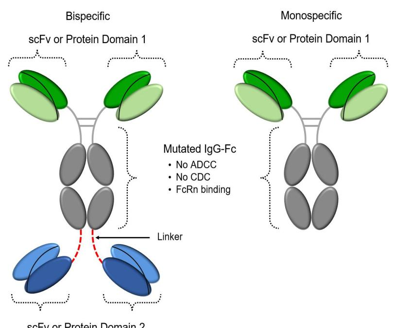

Bispecific ADAPTIR molecules are similar in structure to monospecific ADAPTIR molecules, with the exception that they have two customized target binding domains on the ends of the Fc region. We have created several bispecific molecules that are able to redirect T cell cytotoxicity (RTCC). T cells are white blood cells that fight infections and tumor cells. RTCC ADAPTIR molecules are designed to activate T cells to specifically kill tumor cells. The RTCC ADAPTIR does so by binding to a common T cell component CD3, a receptor complex that activates T cells, when engaging a specific tumor antigen on a specific tumor via the second binding domain, thereby activating the T cell to kill the tumor cell.

{6}------------------------------------------------

Our ADAPTIR-FLEX platform technology extends advantages of ADAPTIR technology to create protein therapeutics with varied specificity and valency and potentially new modes of action.

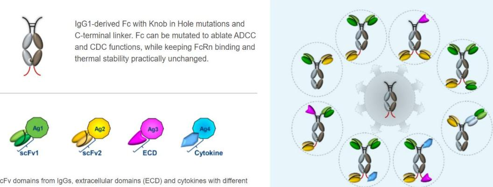

ADAPTIR-FLEX molecules are composed of two different polypeptides that form a hetero-dimer through modifying specific sequences in the Fc region of each polypeptide. Each end of the polypeptide may contain one or two different binding domains, enabling the ADAPTIR-FLEX molecules to bind up to four targets. In addition, the ADAPTIR-FLEX platform can be used to modify the valency of binding to each target, which means it can bind a target, through one binding domain or through multiple binding domains, to a specific target to enable modifying the strength of binding to a specific target.

We believe that ADAPTIR and ADAPTIR-FLEX are promising platform technologies within the rapidly growing field of immuno-oncology therapeutics. The structural differences between ADAPTIR and ADAPTIR-FLEX molecules and monoclonal antibodies allow for the development of new immunotherapeutics that engage disease targets in a novel manner and produce a unique signaling response. By customizing the binding domains of our molecules, we can select the desired potency, half-life, toxicity and stability/manufacturability. We have the potential to develop products with mechanisms of action including, but not limited to, redirected T cell cytotoxicity (RTCC), modulating signals through immunostimulatory or immunoinhibitory receptors and targeted cytokine delivery. We believe we can expand our ADAPTIR and ADAPTIR-FLEX platforms to generate monospecifics, bispecifics, or multi-specifics that target tumor antigens in combination with co-stimulatory molecules, including TNF-Receptor family members and other activating or inhibitory signaling receptors. We believe the ADAPTIR and ADAPTIR-FLEX platform technologies may prove to have advantages over other immunotherapeutics and other bispecific T cell engaging technologies. In preclinical studies, our data indicates that APVO436, a RTCC ADAPTIR bispecific that binds CD123, may have high potency and activity at low doses with reduced cytokine release compared to other bispecifics targeting the same tumor antigen and CD3. The ADAPTIR and ADAPTIR-FLEX monospecifics, bispecifics, and multi-specifics can be produced using standard manufacturing practices. Further clinical and preclinical studies may not confirm the anticipated benefits of this platform.

Our ADAPTIR and ADAPTIR-FLEX platform intellectual property (IP) portfolio consists of IP that we solely own and control, with the exception of non-exclusive licenses to Chinese hamster ovary (CHO) cell lines and related expression systems, and a non-exclusive license to certain transgenic rodents of Open Monoclonal Technology, Inc.'s (OMT) OmniAb platform, which we non-exclusively license from various third parties. See "Intellectual Property" for additional information about the ownership rights to ADAPTIR and ADAPTIR-FLEX platform intellectual property.

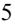

{7}------------------------------------------------

### **Product Portfolio**

Our current product candidate pipeline is summarized in the table below:

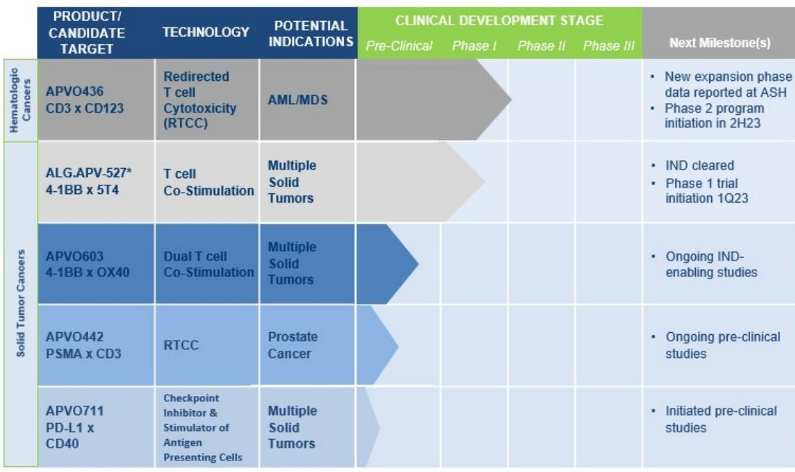

#### **Product Candidates**

Our pipeline includes investigational clinical and preclinical stage anti-cancer drug candidates with clinical impact potential for treating both hematologic malignancies, also known as "liquid" tumors, and solid tumor malignancies.

*APVO436.* APVO436 is a bispecific ADAPTIR that is designed to engage CD3 and CD123 to redirect T-cells to destroy leukemia cells expressing the target CD123 molecule on their surface. We have finished enrollment into a multi-center, multi-cohort Phase 1b clinical trial to evaluate APVO436 in adult patients with AML both as monotherapy and in combination with current standard-of-care therapies (APVO436-5001). This antibody-like recombinant protein therapeutic candidate is designed to engage both leukemia cells and T-cells of the immune system and activate T cells via CD3 only when engaging CD123 to trigger the destruction of leukemia cells as well as leukemic stem cells. Importantly, CD123 is not only expressed on the leukemic blast cells but is also expressed on leukemic stem cells. APVO436 has been engineered using our proprietary ADAPTIR platform technology and is uniquely designed to reduce the likelihood and severity of cytokine release syndrome (CRS). APVO436 has received orphan drug designation ("orphan status") for the treatment of acute myelogenous leukemia from the U.S. Food and Drug Administration (FDA).

In Part 2 of APVO436-5001, which was the dose expansion part of this Phase 1b multi-center study, 5 cohorts of AML patients were planned to be enrolled to evaluate safety and efficacy. Cohorts included both monotherapy and combination therapy protocols. The dose expansion part of the trial evaluated the safety and tolerability of APVO436 when used as an adjunct to other therapies with MEC (Mitoxantrone, Etoposide, Cytarabine) or Venetoclax plus Azacitidine, and as a monotherapy, andtoobtain a preliminary assessment of the anti-leukemia activity of APVO436 in both modalities. Aptevo has concluded enrollment and presented preliminary data at the 64th American Society of Hematology (ASH) annual meeting on December 11, 2022 for those cohorts where enrollment of patients occurred.

{8}------------------------------------------------

*Overview of Cohorts and Study Design:* This Phase 1b study was designed to enroll five (5) cohorts in parallel at up to 20 trial sites in the U.S. – up to 18 patients per cohort were planned for a total of up to 90 patients. At the 64th annual ASH meeting, data from cohorts with enrollment were presented. Following the analysis of promising data in Cohort 2, Aptevo decided to conclude enrollment and move forward with a Phase 2 study and explore APVO436 combination therapy with venetoclax and azacitidine in AML patients. The table below shows the originally planned Phase 1b cohort treatment paradigms.

|                      | Cohort 1                                                     | Cohort 2                                                     | Cohort 3                                                                      | Cohort 4                             | Cohort 5            |
|----------------------|--------------------------------------------------------------|--------------------------------------------------------------|-------------------------------------------------------------------------------|--------------------------------------|---------------------|
| Patients             | 1st or 2nd early relapse or primary refractory disease | Frontline or 1st relapse or primary refractory disease | Consolidation after frontline or 2nd line or primary refractory disease | MRD+: 1st remission                  | MRD+: 2nd remission |
| Combination agent | IDAC D1-5 4 cycles or MEC D1-6 2 cycles                   | Venetoclax D1-21 4 cycles + azacitidine D1-7 4 cycles  | None                                                                          | Azacitidine (oral) D1-14 4 cycles | None                |
| APV0436              | 18 µg QW 4 cycles                                            | 18 µg QW 4 cycles                                            | 18 µg QW 4 cycles                                                             | 18 µg QW 4 cycles                    | 18 µg BIW 4 cycles  |

Patients received APVO436 by intravenous dosing for up to four 28-day cycles. The objective of the trial was to evaluate safety, pharmacokinetics, and pharmacodynamics of APVO436. Forty-four AML patients were enrolled in the dose expansion part of the study across three cohorts.

The Company observed positive clinical data from its Phase 1b trial and summarized the safety profile and efficacy data in a heavily pretreated population in the table below. APVO436 was generally well tolerated, with the highest response rate of 82% composite clinical remission (Composite CR) and 73% complete remission/complete remission with incomplete hematologic recovery (CR/CRi) observed in Cohort 2 in Venetoclax naïve patients, where we saw 91% clinical benefit.

The table below shows the patient response rate to APVO436 treatment as of February 21, 2023 for patients enrolled in Cohorts 1, 2, and 3:

|                       | Cohort 1      | Cohort 2          | Cohort 2 (Venetoclax naïve) | Cohort 3                           |
|-----------------------|---------------|-------------------|--------------------------------|------------------------------------|
| Cohort Description    | APVO436 + MEC | APVO436 + Ven/Aza | APVO436 + Ven/Aza              | APVO436 only after CT induction |
| Patients enrolled, n  | 18            | 19                | 12                             | 7                                  |
| Patients evaluable, n | 11            | 16                | 11                             | 4                                  |
| CR, n                 | 5             | 5                 | 5                              | 0                                  |
| CRi, n                | 0             | 3                 | 3                              | 0                                  |
| MLFS, n               | 1             | 1                 | 1                              | 1                                  |
| SD, n                 | 3             | 3                 | 1                              | 2                                  |
| CBR, %                | 82            | 75                | 91                             | 75                                 |
| Composite CR, %       | 55            | 56                | 82                             | 25                                 |
| CR/Cri %              | 45            | 50                | 73                             | 0                                  |

Overall, patients had a median age of 63.5 years (range 25–84). The median number (range) of administered APVO436 cycles were 1.0 (1–4), 2.0 (1–4), 2.0 (1–4), and 3.0 (3–3) for Cohorts 1, 2, 3, and 5, respectively. The most common TEAEs (reported in ≥20%) were fatigue (33%), pyrexia (31%), hypokalemia (29%), nausea (24%), and anemia (21%). Ten of the 42 patients developed Cytokine Release Syndrome (CRS). The majority of cases were mild to moderate (grade 1 or 2). However, one patient experienced a treatment related grade 5 CRS event, although this case was highly confounded by sepsis and pneumonia which made a causality assessment difficult.

{9}------------------------------------------------

A potential complication associated with treatment using bispecific, T cell engaging antibodies is a systemic inflammatory syndrome known as CRS. CRS may occur within minutes to hours after infusion of the bispecific T cell engaging antibody or emerge as a delayed onset complication after several days. Clinical manifestations of CRS may range from mild to severe including hypotension, hypoxia, and uncontrolled systemic inflammatory response with circulatory collapse, vascular leakage, peripheral and/or pulmonary edema, renal failure, cardiac dysfunction, and fatal multiorgan system failure. Heart failure can also be a consequence of the systemic inflammatory syndrome of CRS. Another form of systemic inflammation a bispecific T cell engaging antibody can cause is Hemophagocytic Lymphohistiocytosis (HLH)/Macrophage Activation Syndrome (MAS) which shares many clinical and laboratory features with CRS. HLH/MAS is considered a form of CRS when it occurs after treatment with a bispecific T cell engaging antibody.

CRS cases occurred in some APVO436 patients in both the dose escalation as well as the dose expansion phases. These patients were effectively treated using the generally recommended standard CRS treatment, which includes the use of tocilizumab and dexamethasone, combined with standard supportive care. This has been confirmed to be generally effective in the APVO436 patients that have experienced CRS.

On November 26, 2019, the FDA granted Orphan Drug Designation for the treatment of acute myelogenous leukemia to APVO436, which grants us potential exclusive marketing and development rights, as well as eligibility for market exclusivity upon FDA approval of APVO436.

*ALG.APV-527.* ALG.APV-527 is a novel investigational bispecific ADAPTIR candidate, developed in partnership with Alligator Bioscience AB (Alligator), featuring a mechanism of action designed to simultaneously target 4-1BB (CD137) and 5T4, a tumor antigen overexpressed in several different types of cancer. 4-1BB, a co-stimulatory receptor on T cells, is known to enhance the immune response to cancer through activation of tumor-specific T cells and is believed to be a promising target for new immunotherapeutic approaches. ALG.APV-527 could potentially have utility in the treatment of a broad spectrum of cancers over-expressing the 5T4 tumor antigen, including malignant pleural mesothelioma, non-small cell lung, gastric/gastroesophageal, head and neck squamous cell carcinoma, pancreatic, renal, ovarian, prostate, breast, cervical, colorectal, endometrial, and bladder cancers.

Aptevo and Alligator continue to advance ALG.APV-527 for the treatment of solid tumors and commenced a first-in-human study started in the first quarter of 2023. We continue to enroll new patients across the United States.

*APVO603.* APVO603 is a preclinical dual agonist bispecific ADAPTIR candidate designed to simultaneously target 4-1BB (CD137) and OX40 (CD134), both members of the TNF-receptor family. Dual targeting of 4-1BB and OX40 provides synergistic co-stimulation of T cells with the potential to amplify the cytotoxic function of activated T cells and NK cells, potentially leading to robust anti-tumor responses. APVO603's combined activation of both the 4-1BB and OX40 TNF receptors represents an attractive approach in potentially overcoming the immunosuppressive tumor microenvironment. The targeted co-stimulation of 4-1BB and OX40 has the potential to promote an important immunological cascade, enhancing T cell activation, prolonging T cell survival, and improving tumor cell killing. Of note, this product candidate is not dependent on any one tumor antigen and has the potential to treat multiple solid tumors. IND-enabling studies continue for APVO603.

*APVO442.* APVO442 is a novel bispecific candidate based on the ADAPTIR-FLEX platform technology that binds to PSMA with two identical binding domains and with one binding domain to CD3 with reduced binding affinity. This candidate was designed to increase biodistribution of drugs to PSMA positive tumors for treatment of prostate cancer. The low-affinity single binding domain to CD3 has the potential to allow for increased concentrations at the tumor due to reduced binding of the drug by circulating peripheral T cells. Preclinical studies are being concluded and demonstrate *in vitro* RTCC that is directed to PSMA bearing tumor cell lines *in vitro* and in animal tumor models. IND-enabling studies are beginning.

*APVO711.* APVO711 is a preclinical dual mechanism bispecific ADAPTIR candidate that is designed to provide synergistic stimulation of CD40 on antigen presenting cells while simultaneously blocking the PD-1/PD-L1 inhibitory pathway to potentially promote a more robust anti-tumor response. Preclinical studies both *in vitro* and *in vivo* will continue to provide us a better understanding of the mechanism of action and the efficacy of APVO711.

{10}------------------------------------------------

#### **Competition**

We face, and will continue to face, intense competition from both U.S.-based and foreign producers of both large and small molecule immunotherapeutic products, some of which have lower cost structures, greater access to capital, greater resources for research and development, and sophisticated marketing capabilities. Any product candidate that we successfully develop and commercialize is likely to compete with currently marketed products, as well as other novel product candidates that are in development for the same indications.

*APVO436:* We anticipate that APVO436 would compete with other agents targeting both CD123 and non-CD123 that are in development if they are also approved. Antibody therapies in development targeting CD123 include: MGD024 (Macrogenics & Gilead), and IMGN632 (ImmunoGen & Jazz). There are numerous CAR-T therapies in development: CART123 (University of Penn.), CARTCD123 (NCI/City of Hope), UCART123 (Cellectis), MB-102 (Mustang Bio) and several others in development in China. Other competitive products targeting CD123 are: tagraxofusp (formerly SL-401, an antibody immunotoxin, Stemline), KHK2833 (monoclonal antibody, Kyowa Hakko Kirin Pharma), CSL362 (monoclonal antibody, CSL/Janssen), AVC-101 (VenCell Therapeutics), and IPH6101 (Innate Pharma).

*ALG.APV-527:* This asset targets 4-1BB in a bispecific format when cross-linked with the tumor antigen 5T4. We anticipate that ALG.APV-527 would compete with bispecifics targeting 5T4 and 4-1BB, which are currently in preclinical development (Crescendo Biologics). Bispecific in the clinic targeting 5T4 include GenMab and Abbvie's (GEN1044), a 5T4 x CD3 DuoBody, in Phase 1/2 trials. In addition, other competitors include bispecifics targeting 4-1BB in combination with other targets such as 4-1BB x FAP (FAP is expressed on tumor associated stromal fibroblasts). 4-1BB x FAP is currently in phase 1 clinical development by Molecular Partners and Amgen (AMG506) and Hoffmann-La Roche (RO7122290) for treatment of advanced solid tumors. Another bispecific targets 4-1BB x HER (Cinrebafusp Alfa, PRS343) which is in phase 2 clinical development by Pieris for treatment of HER2+ solid tumors.

Furthermore, we face significant competition in the oncology market in general, including from: AbbVie Inc., Affirmed, Amgen Inc., AnaptysBio, Inc., Astellas Pharma Inc., Bayer AG, Biogen Idec Inc., Boehringer Ingelheim GmbH, Bristol Myers Squibb, F-Star Biotechnology Ltd., Genentech Inc. (a subsidiary of F. Hoffmann-La Roche Ltd.), Genmab A/S, Gilead Sciences Inc., GlaxoSmithKline plc, Grifols USA LLC, Harpoon Therapeutics, I-Mab Biopharma, ImmunoGen, Inc., Immunomedics, Inc., Inhibrx Inc., Janssen BioTech Inc., Johnson & Johnson, Macrogenics, Inc., Pieris Pharmaceuticals, Inc., Sanofi-Aventis US LLC, Takeda Pharmaceuticals U.S.A., Inc., Xencor, Inc. Y-mAbs Therapeutics, Inc., and Zymeworks Biopharmaceuticals, Inc. Additionally, there may be other potential competitors or companies developing competitive products that may not be known to us at this time.

#### **COLLABORATIONS WITH ALLIGATOR BIOSCIENCE**

On July 20, 2017, our wholly owned subsidiary Aptevo Research and Development LLC (Aptevo R&D), entered into a collaboration and option agreement (the Collaboration Agreement) with Alligator Bioscience AB, (Alligator), pursuant to which Aptevo R&D and Alligator are collaboratively developing ALG.APV-527, a lead bispecific antibody candidate simultaneously targeting 4-1BB (CD137), a member of the TNFR superfamily of a costimulatory receptor found on activated T cells, and 5T4 a tumor antigen overexpressed in a number of different types of cancer. This product candidate is built on our novel ADAPTIR platform. A first-in-human clinical study of ALG.APV-527 started in the first quarter of 2023. We continue to enroll new patients across the United States. ALG.APV-527 targets 4-1BB (T lymphocyte co-stimulatory receptor) and 5TA (tumor antigen) and is designed to reactivate antigen-primed T cells.

Subject to certain exceptions for Aptevo R&D's manufacturing and platform technologies, the parties jointly own intellectual property generated in the performance of the development activities under the Collaboration Agreement. Under the terms of the Collaboration Agreement, the parties intend to share revenue received from a third-party commercialization partner equally, or, if the development costs are not equally shared under the Collaboration Agreement, in proportion to the development costs borne by each party.

The Collaboration Agreement also contains several points in development at which either party may elect to "opt-out" (i.e., terminate without cause) and, following a termination notice period, cease paying development costs for this product candidate, which would be borne fully by the continuing party. Following an opt-out by a party, the continuing party will be granted exclusive rights to continue the development and commercialization of this product

{11}------------------------------------------------

candidate, subject to a requirement to pay a percentage of revenue received from any future commercialization partner for this product, or, if the continuing party elects to self-commercialize, tiered royalties on the net sales of this product by the continuing party ranging from the low to mid-single digits, based on the point in development at which the opt-out occurs. The parties have also agreed on certain technical criteria or "stage gates" related to the development of this product that, if not met, will cause an automatic termination and wind-down of the Collaboration Agreement and the activities thereunder, provided that the parties do not agree to continue.

The Collaboration Agreement contains industry standard termination rights, including for material breach following a specified cure period, and in the case of a party's insolvency.

#### **INTELLECTUAL PROPERTY**

We rely on a combination of patents, trademarks, trade secrets, and nondisclosure and non-competition agreements to protect our proprietary intellectual property and will continue to do so. We own or exclusively license the patents and patent applications in our patent portfolio that support the ADAPTIR-FLEX platform, ADAPTIR platform and pipeline products with the exception of certain cell line rights and other research tools, which we license on a non-exclusive basis. We practice patent life cycle management by filing patent applications to protect new inventions relating to meaningful improvements to our products and related methods. We primarily seek patent protection for inventions that support our products and product candidates, but from time to time, we may seek patent protection for inventions that could, for instance, support a potential business opportunity or block a competitor from designing around our existing patents.

In general, and where possible, we pursue patent protection in countries where we believe there will be a significant market for the corresponding product or product candidate. We generally do not seek patent protection in countries where we have reason to believe we would not be able to enforce patents. For instance, we tend to not file in countries that are frequently listed on the Priority Watch List of the Special 301 Report prepared by the Office of the United States Trade Representative, with the exception that we typically file patent applications in China, Russia and India. We may also decide to take a narrower filing approach for secondary and improvement type inventions as compared to inventions that are more foundational to our products. We do not seek patent protection in countries that are on the United Nations, or U.N., list of Least Developed Countries.

The term of protection for various patents associated with, and expected to be associated with, our marketed product and product candidates is typically twenty years from the filing date, but may vary depending on a variety of factors, including the date of filing of the patent application or the date of patent issuance and the legal term of patents in the countries in which they are obtained. The protection afforded by a patent varies on a product-byproduct basis and country-to-country basis and depends upon many factors, including the type of patent, the scope of its coverage, the availability of regulatory-related extensions, the necessity for terminal disclaimers, the availability of legal remedies in a particular country, and the validity and enforceability of the patents.

In some cases, we may decide that the best way to protect our intellectual property is to retain proprietary information as trade secrets and confidential information, rather than to apply for patents, which would involve disclosure of proprietary information to the public. When determining whether to protect intellectual property as a trade secret, we consider many factors including, for instance, our ability to maintain the trade secret, the likelihood that a competitor will independently develop the information, our ability to patent protect the intellectual property and the likelihood we would be able to enforce a resulting patent.

We are a party to a number of license agreements under which we license patents, patent applications, and other intellectual property. These agreements impose various commercial diligence and financial payment obligations on us. We expect to continue to enter into these types of license agreements in the future.

*ADAPTIR and ADAPTIR-FLEX Platforms.* We protect the ADAPTIR platform technology through a combination of patents and trade secrets. We own all ADAPTIR and ADAPTIR-FLEX platform intellectual property, with the exception that we have licenses to certain intellectual property related to third party research tools that we use in conjunction with our ADAPTIR platform technology such as cell lines, vectors, expression systems, and transgenic rodents. For instance, we have a non-exclusive commercial license and research license with Lonza Group AG (Lonza) related to its CHO cell lines and vectors. Under our Lonza research license, we have an option to take a license to use the GS System to develop and manufacture therapeutic proteins for our commercial purposes. We also have a non-exclusive license to certain transgenic rodents of OMT's OmniAb platform.

{12}------------------------------------------------

The initial version of the ADAPTIR platform technology was originally developed by Trubion Pharmaceuticals, Inc. (Trubion) prior to its acquisition by Emergent BioSolutions Inc (Emergent). A patent family supporting use of unique linkers in the homodimer (a molecule consisting of two identical halves) version of the ADAPTIR platform was invented jointly by Trubion and Wyeth Pharmaceuticals, Inc. (Wyeth) as part of a collaboration between the two companies. Wyeth assigned the rights it had in that platform patent family to Trubion. We subsequently received the rights to the platform patent family upon our spinoff from Emergent.

In order to differentiate our platform inventions from antibodies and other antibody-like constructs that have been publicly disclosed, many of our patents and patent applications are directed to unique aspects or components of our platform such as linkers, targets, or binding domains.

We have patents relating to the ADAPTIR platform issued in the United States, Australia, Israel, Japan, Malaysia, Mexico, New Zealand, Philippines, Russia, Singapore, South Africa, South Korea, and Vietnam. We also have applications pending in various territories including Brazil, Canada, and Norway. We plan to continue to improve our ADAPTIR platform and to file patent applications on those improvements. Our decision as to where to file any new ADAPTIR improvement inventions will be based in part on the significance of the improvement. If patents issue on the pending ADAPTIR patent applications, the patent term for those patents are estimated to expire between 2027 and 2036. As our ADAPTIR platform technology evolves, we may decide to allow patent applications and patents to expire if they contain claims that are limited to aspects of the platform that are no longer of value to Aptevo.

ADAPTIR-FLEX, our heterodimer platform, is covered by patent application under the Patent Cooperation Treaty (PCT) that we filed in 2021. The PCT patent application allows us to file patent applications in PCT member state countries including, for instance, the United States, Europe, Japan, China, Australia, and Canada. If patents claiming priority to the pending ADAPTIR-FLEX patent application are issued, the resulting patents are estimated to expire in 2041.

We own patent families directed to use of particular binding domains in the ADAPTIR and ADAPTIR-FLEX platforms. For instance, we have some patents that cover the use of an ADAPTIR therapeutic to target CD3. We also have pending patent applications that cover ADAPTIR therapeutics containing our preferred humanized CD3 binding domain polypeptide sequences.

*APVO436.* We nationalized our core patent family, which covers the APVO436 product candidate in various countries and territories including the U.S., Australia, Brazil, Canada, China, Colombia, Eurasia, Europe, Hong Kong, India, Indonesia, Israel, Japan, Malaysia, Mexico, New Zealand, Philippines, Singapore, South Africa, South Korea, Ukraine, and Vietnam.

*ALG.APV-527.* We co-own with Alligator a patent family corresponding to PCT application PCT/EP2018/069850, which covers the ALG.APV-527 product candidate. In January and February of 2020, this patent family was nationalized in various countries. Aptevo and Alligator also co-own U.S. patent 10,239,949, which relates to protein molecules that specifically bind to 5T4 and/or 4-1BB and U.S. patent 11,312,786, which relates to the 4-1BB binding domain.

In addition to the co-owned assets, Alligator owns a patent family corresponding to PCT application PCT/EP2017/059656, which also covers ALG.APV-527. Aptevo has an exclusive license from Alligator to this patent family for the development of the ALG.APV-527 product candidate.

*Preclinical Therapeutic Candidates.* We routinely file United States provisional patent applications and/or Patent Cooperation Treaty (PCT) patent applications on our preclinical therapeutic assets when we believe we have sufficient data to support a patent application filing. Aptevo owns pending patent applications for its APVO603 therapeutic candidate, which was nationalized in various countries and territories, as well as APVO442 and APVO711 therapeutic candidates.

*Trademarks owned by Aptevo Therapeutics Inc. and its subsidiaries.* Where possible, we pursue registered trademarks for our marketed products in significant markets. We own trademark registrations and pending applications for the marks: APTEVO THERAPEUTICS, APTEVO BIOTHERAPEUTICS, APTEVO RESEARCH AND DEVELOPMENT, the Aptevo logo, ADAPTIR, and ADAPTIR-FLEX in relevant jurisdictions.

{13}------------------------------------------------

#### **REGULATION**

Regulations in the United States and other countries have a significant impact on our product development, manufacturing, and marketing activities. Government authorities in the United States, at the federal, state, and local level, and in other countries, extensively regulate, among other things, the research, development, testing, approval, manufacture, packaging, storage, recordkeeping, labeling, advertising, promotion, distribution, marketing, import, and export of biopharmaceutical products. In addition, sponsors of biopharmaceutical products participating in Medicaid and Medicare are required to comply with mandatory price reporting, discount, and rebate requirements. The processes for obtaining regulatory approvals in the United States and in foreign countries, along with compliance with applicable statutes and regulations, require the expenditure of substantial time and financial resources. In the United States, the FDA regulates biopharmaceutical products under the Federal Food, Drug, and Cosmetic Act, or FDCA, the Public Health Services Act, or PHSA, and their implementing regulations. FDA's requirements and expectations with respect to product development are constantly evolving.

#### **U.S. Product Development for Therapeutics**

The process required by the FDA before a biologic may be marketed in the United States generally involves the following:

- completion of preclinical laboratory tests, animal studies according to Good Laboratory Practices, or GLP;
- submission to the FDA of an investigational new drug application, or IND, which must become effective before human clinical trials may begin;
- performance of adequate and well-controlled human clinical trials according to Good Clinical Practices, or GCP, to establish the safety and efficacy of the proposed drug or safety, purity and potency of the proposed biologic, for the intended use;
- preparation and submission to the FDA of biologics license application, or BLA;
- a determination by the FDA within 60 days of its receipt of a BLA to file the application for review;
- satisfactory completion of an FDA inspection of the manufacturing facility or facilities at which the product, or components thereof, are produced to assess compliance with current Good Manufacturing Practices, or cGMP;
- review of the product candidate by an FDA advisory committee, where appropriate and if applicable;
- payment of user fees for FDA review of the BLA (unless a fee waiver applies);
- FDA audits of some clinical trial sites to ensure compliance with GCP; and
- FDA review and approval of the BLA.

*Preclinical Testing.* Before beginning testing of any compounds with potential therapeutic value in human subjects in the United States, stringent government requirements for preclinical data must be satisfied. Preclinical testing includes both *in vitro*, or in an artificial environment outside of a living organism, and *in vivo*, or within a living organism, laboratory evaluation and characterization of the safety and efficacy of a drug and its formulation, as well as its chemistry, pharmacology, and toxicity. We perform preclinical testing on all of our product candidates before we initiate any human trials.

*Investigational New Drug Application.* Before clinical testing may begin, the results of preclinical testing, together with manufacturing information, analytical data and any other available clinical data or literature, must be submitted to the FDA, as part of an IND. The sponsor must also include an initial protocol detailing the first phase of the proposed clinical investigation, together with information regarding the qualifications of the clinical investigators. The provided data must provide an adequate basis for evaluating both the safety and the scientific rationale for the initial clinical studies in human volunteers. The IND automatically becomes effective 30 days after receipt by the FDA unless the FDA imposes a clinical hold within that 30-day time period. In such a case, the IND sponsor and the FDA must resolve any outstanding concerns before the clinical trial can begin. Clinical holds also may be imposed by

{14}------------------------------------------------

the FDA at any time before or during trials due to safety concerns or non-compliance. As a result, submission of an IND may not result in FDA authorization to commence a clinical trial.

*Clinical Trials.* Clinical trials involve the administration of the drug to healthy human volunteers, or to patients with the target disease or disorder under the supervision of a qualified physician (also called an investigator) pursuant to an FDA-reviewed protocol. Human clinical trials typically are conducted in three sequential phases, although the phases may overlap with one another. Clinical trials must be conducted under protocols that detail the objectives of the study, the parameters to be used to monitor safety and the efficacy criteria, if any, to be evaluated. Each protocol, and any subsequent amendments, must be submitted to the FDA, as part of the IND, or comparable foreign regulatory authorities.

- Phase 1 clinical trials test for safety, dose tolerance, absorption, bio-distribution, metabolism, excretion, structure activity relationships, mechanism of action, and clinical pharmacology and, if possible, for early evidence regarding efficacy. Phase 1 studies may be conducted in healthy human volunteers or patients with the target disease or condition. Phase 1a is typically a dose escalation trial. Phase 1b may involve cohort expansion at one or more dose levels combinations, or in different populations to determine the recommended Phase 2 dose and strategy.
- Phase 2 clinical trials are controlled studies that involve a small sample of individuals with the target disease or disorder and seek to assess the efficacy of the drug for specific targeted indications to determine dose response and the optimal dose range and dose regimen and to gather additional information relating to safety and potential adverse effects.
- Phase 3 clinical trials are adequate and controlled studies that consist of expanded, large-scale studies of patients, at geographically dispersed sites, with the target disease or disorder to obtain definitive statistical evidence of the efficacy and safety of the proposed product and dosing regimen. The safety and efficacy data generated from Phase 3 clinical trials typically form the basis for FDA or comparable foreign regulatory authority approval of the product candidate, as well as product labeling. Typically, two Phase 3 trials are required by the FDA for product approval. Under some limited circumstances, however, the FDA may approve a BLA based upon a single Phase 3 clinical study plus confirmatory evidence or a single large multicenter trial without confirmatory evidence.
- Phase 4 clinical trials, if conducted, are conducted after a product has been approved. These trials can be conducted for a number of purposes, including to collect long-term safety information or to collect additional data about a specific population. As part of a product approval, the FDA or comparable foreign regulatory authorities may require that certain Phase 4 studies, which are called post-marketing commitment studies, be conducted post-approval. The results of Phase 4 studies can confirm or refute the effectiveness of a product candidate, and can provide important safety information.

In March 2022, the FDA released a final guidance entitled "Expansion Cohorts: Use in First-In-Human Clinical Trials to Expedite Development of Oncology Drugs and Biologics," which outlines how drug developers can utilize an adaptive trial design commonly referred to as a seamless trial design in early stages of oncology drug development (i.e., the first-in-human clinical trial) to compress the traditional three phases of trials into one continuous trial called an expansion cohort trial. Information to support the design of individual expansion cohorts are included in IND applications and assessed by FDA. Expansion cohort trials can potentially bring efficiency to drug development and reduce developmental costs and time.

Additional kinds of data may also help to support a BLA or product development, such as patient experience and real-world evidence. For appropriate indications sought through supplemental BLAs, data summaries may provide marketing application support. For genetically targeted products and variant protein targeted products intended to address an unmet medical need in one or more patient subgroups with a serious or life threatening rare disease or condition, the FDA may allow a sponsor to rely upon data and information previously developed by the sponsor or for which the sponsor has a right of reference, that was submitted previously to support an approved application for a product that incorporates or utilizes the same or similar genetically targeted technology or a product that is the same or utilizes the same variant protein targeted drug as the product that is the subject of the application.

{15}------------------------------------------------

In addition, under the Pediatric Research Equity Act of 2003, or PREA, BLAs and supplements for a new active ingredient, indication, dosage form, dosage regimen, or route of administration must contain data to assess the safety and efficacy of the product for the claimed indications in all relevant pediatric subpopulations and to support dosing and administration for each pediatric subpopulation for which the product is safe and effective. The FDA may grant deferrals for submission of data or full or partial waivers. Unless otherwise required by regulation, PREA does not apply to any drug or biologic for an indication for which orphan designation has been granted for the relevant indication except that PREA will apply to an original BLA for a new active ingredient that is orphan-designated if the biologic is a molecularly targeted cancer product intended for the treatment of an adult cancer and is directed at a molecular target that FDA determines to be substantially relevant to the growth or progression of a pediatric cancer.

*Good Clinical Practice.* All of the phases of clinical studies must be conducted in conformance with the FDA's GCP or equivalent standards from comparable foreign regulatory authorities, which are ethical and scientific quality standards for conducting, recording and reporting clinical trials to assure that the data and reported results are credible and accurate and that the rights, safety and well-being of trial participants are protected. GCP include requirements that all research subjects provide their informed consent in writing for their participation in any clinical trial. Investigators must also provide certain information to the clinical trial sponsors to allow the sponsors to make certain financial disclosures to the FDA. In addition, an Institutional Review Board, or IRB, at each study site participating in the clinical trial or a central IRB must review and approve the plan for any clinical trial, informed consent forms, and communications to study subjects before a study commences at that site. An IRB considers, among other things, whether the risks to individuals participating in the trials are minimized and are reasonable in relation to anticipated benefits, and whether the planned human subject protections are adequate. The IRB must continue to oversee the clinical trial while it is being conducted. Once an IND is in effect, each new clinical protocol and any amendments to the protocol must be submitted to FDA for review, and to the IRB for approval. If a product candidate is being investigated for multiple intended indications, separate INDs may also be required. Progress reports detailing the results of the clinical trials must also be submitted at least annually to the FDA and the IRB and more frequently if serious and unexpected suspected adverse events are observed or other significant safety information is found, such as any findings from other studies or animal or *in vitro* testing that suggest a significant risk in humans exposed to the product. The sponsor must submit an IND safety report within 15 calendar days after the sponsor determines that the information qualifies for reporting. The sponsor also must notify the FDA of any unexpected fatal or life-threatening suspected adverse reaction within seven calendar days after the sponsor's initial receipt of the information.

Information about certain clinical trials, including a description of the study and study results, must be submitted within specific timeframes to the National Institutes of Health, or NIH, for public dissemination on their clinicaltrials.gov website. Sponsors or distributors of investigational products for the diagnosis, monitoring, or treatment of one or more serious diseases or conditions must also have a publicly available policy on evaluating and responding to requests for expanded access requests.

The manufacture of investigational biologics for the conduct of human clinical trials is subject to FDA's current Good Manufacturing Practice, or cGMP requirements. Investigational biologics and therapeutic substances imported into the United States are also subject to regulation by the FDA. Further, the export of investigational products outside of the United States is subject to regulatory requirements of the receiving country as well as U.S. export requirements under the FDCA.

Concurrent with clinical trials, companies usually complete additional animal studies and must also develop additional information about the chemistry and physical characteristics of the product candidate as well as finalize a process for manufacturing the product in commercial quantities in accordance with cGMP requirements. The manufacturing process must be capable of consistently producing quality batches of the product candidate and, among other things, manufacturers must develop methods for testing the identity, strength, quality, potency, and purity of the final product. Additionally, appropriate packaging must be selected and tested, and stability studies must be conducted to demonstrate that the product candidate does not undergo unacceptable deterioration over its shelf life.

The FDA may order the temporary, or permanent, discontinuation of a clinical trial at any time, or impose other sanctions, if it believes that the clinical trial either is not being conducted in accordance with FDA requirements or presents an unacceptable risk to the clinical trial patients. An IRB may also require the clinical trial at the site to be halted, either temporarily or permanently, for failure to comply with the IRB's requirements or if the trial poses an unexpected serious harm to subjects. The FDA or an IRB may also impose conditions on the conduct of a clinical trial. Clinical trial sponsors may also choose to discontinue clinical trials as a result of risks to subjects, a lack of favorable results, or changing business priorities.

{16}------------------------------------------------

#### **Marketing Approval - Biologics**

*Biologics License Application.* All data obtained from a comprehensive development program, including research and product development, manufacturing, preclinical and clinical trials, labeling and related information are submitted in a biologics license application, or BLA, to the FDA and in similar regulatory filings with the corresponding agencies in other countries for review and approval. In most cases, the submission of a marketing application is subject to a substantial application user fee. These user fees must be paid at the time of the first submission of the application, even if the application is being submitted on a rolling basis. Fee waivers or reductions are available in certain circumstances. By example, product candidates that are designated as orphan products, which are further described below, are not subject to application user fees unless the application includes an indication other than the orphan indication.

The submission of an application is not a guarantee that the FDA will find the application complete and accept it for filing. The FDA may refuse to file the application and request additional information rather than accept the application for filing, in which case the application must be resubmitted with the supplemental information. The resubmitted application is also subject to review before the FDA accepts it for filing. The FDA has two months to review an application for its acceptability for filing.

Once an application is accepted for filing, the FDA begins an in-depth substantive review. The Prescription Drug User Fee Act, or PDUFA, establishes a two-tiered review system: Standard Review and Priority Review. When conducting Priority Review, the FDA has a goal to review and act on BLA submissions within six months from the date of the FDA's acceptance for filing of the application, rather than the ten-month goal under a Standard Review. The FDA gives Priority Review status to product candidates that provide safe and effective therapies where no satisfactory alternative exists or to a product candidate that are intended to treat serious conditions and, if approved, would provide significant improvements in the safety or effectiveness of the treatment, diagnosis, or prevention of the serious condition. The PDUFA date is only a goal, thus, the FDA does not always meet its PDUFA dates. The review process and the PDUFA date may also be extended if the FDA requests or the sponsor otherwise provides substantial additional information or clarification regarding the submission.

The FDA may refer certain applications to an advisory committee. Before approving a product candidate for which no active ingredient (including any ester or salt of active ingredients) has previously been approved by the FDA, the FDA must either refer that product candidate to an external advisory committee or provide in an action letter, a summary of the reasons why the FDA did not refer the product candidate to an advisory committee. The FDA may also refer other product candidates to an advisory committee if FDA believes that the advisory committee's expertise would be beneficial. An advisory committee is typically a panel that includes clinicians and other experts, which review, evaluate, and make a recommendation as to whether the application should be approved and under what conditions. The FDA is not bound by the recommendations of an advisory committee, but it considers such recommendations carefully when making decisions.

The FDA reviews applications to determine, among other things, whether a product candidate meets the agency's approval standards and whether the manufacturing methods and controls are adequate to assure and preserve the product's identity, strength, quality, potency, and purity. Before approving a marketing application, the FDA typically will inspect the facility or facilities where the product is manufactured, referred to as a Pre-Approval Inspection. The FDA will not approve an application unless it determines that the manufacturing processes and facilities, including contract manufacturers and subcontractors, are in compliance with cGMP requirements and adequate to assure consistent production of the product within required specifications. Additionally, before approving a marketing application the FDA will inspect one or more clinical trial sites to assure compliance with GCP.

In reviewing a BLA, the FDA may grant approval or deny the application through a complete response letter, or CRL, if it determines the application does not provide an adequate basis for approval requesting additional information. A CRL indicates that the review cycle of the application is complete and the application is not ready for approval and describes all of the specific deficiencies that the FDA identified. A CRL generally contains a statement of specific conditions that must be met in order to secure final approval of the marketing application, and may require additional clinical or preclinical testing in order for the FDA to reconsider the application. The deficiencies identified may be minor, for example, requiring labeling changes; or major, for example, requiring additional clinical trials. If a CRL is issued, the applicant may either: resubmit the marketing application, addressing all of the deficiencies identified in the letter; withdraw the application; or request an opportunity for a hearing. Even if additional information outlined in a CRL is submitted, the FDA may ultimately decide that the BLA does not satisfy the criteria for approval.

{17}------------------------------------------------

The receipt of regulatory approval often takes many years, involving the expenditure of substantial financial resources. The speed with which approval is granted often depends on a number of factors, including the severity of the disease in question, the availability of alternative treatments and the risks and benefits demonstrated in clinical trials. The FDA may also impose conditions upon approval. For example, it may require a Risk Evaluation and Mitigation Strategy, or REMS, for a product. This can include various required elements, such as publication of a medication guide, patient package insert, a communication plan to educate health care providers of the drug's risks and/or restrictions on distribution and use, such as limitations on who may prescribe or dispense the drug. Following product approval, a REMS may also be required by the FDA if new safety information is discovered and the FDA determines that a REMS is necessary to ensure that the benefits of the product outweigh the risks.

The FDA may also significantly limit the indications or populations approved for a given product, require that contraindications, warnings, or precautions be included in the product labeling, including a boxed warning, and/or require, as a condition of approval, enhanced labeling, special packaging or labeling, post-approval clinical trials, distribution or other risk management mechanisms, expedited reporting of certain adverse events, preapproval of promotional materials or restrictions on direct-to-consumer advertising, any of which could negatively impact the commercial success of a drug. The FDA may also not approve label statements that are necessary for successful commercialization and marketing.

After approval, some types of changes to the approved product, such as adding new indications, manufacturing changes, and additional labeling claims, are subject to further testing requirements and FDA review and approval. The FDA may also withdraw the product approval if compliance with the pre- and post-marketing regulatory standards are not maintained or if problems occur after the product reaches the marketplace. Further, should new safety information arise, additional testing, product labeling, or FDA notification may be required.

*Designated Platform Technology.* Under the Food and Drug Omnibus Reform Act of 2022, or FDORA, a platform technology incorporated within or utilized by a biologic is eligible for designation as a designated platform technology if (1) the platform technology is incorporated in, or utilized by, a product approved under a BLA; (2) preliminary evidence submitted by the sponsor of the approved or licensed product, or a sponsor that has been granted a right of reference to data submitted in the application for such product, demonstrates that the platform technology has the potential to be incorporated in, or utilized by, more than one product without an adverse effect on quality, manufacturing, or safety; and (3) data or information submitted by the applicable person indicates that incorporation or utilization of the platform technology has a reasonable likelihood to bring significant efficiencies to the drug development or manufacturing process and to the review process. A sponsor may request the FDA to designate a platform technology as a designated platform technology concurrently with, or at any time after, submission of an IND application for a product that incorporates or utilizes the platform technology that is the subject of the request. If so designated, the FDA may expedite the development and review of any subsequent original BLA for a product that uses or incorporates the platform technology. Designated platform technology status does not ensure that a product will be developed or reviewed by the FDA more quickly or receive FDA approval. In addition, the FDA may revoke a designation if the FDA determines that a designated platform technology no longer meets the criteria for such designation.

*Breakthrough Therapy.* Under the provisions of the Food and Drug Administration Safety and Innovation Act, or FDASIA, the FDA may designate a product as a breakthrough therapy if the product is intended, alone or in combination with one or more other products, to treat a serious or life-threatening disease or condition, and preliminary clinical evidence indicates that the product may demonstrate substantial improvement over existing therapies on one or more clinically significant endpoints, such as substantial treatment effects observed early in clinical development. Products designated as breakthrough therapies are also eligible for accelerated approval. A sponsor may request that a product candidate be designated as a breakthrough therapy concurrently with, or at any time after, the submission of an IND, and the FDA must determine if the candidate qualifies for breakthrough therapy designation within 60 days of receipt of the sponsor's request. If so designated, the FDA must take certain actions, such as holding timely meetings and providing advice, intended to expedite the development and review of an application for approval of a breakthrough therapy. The FDA may rescind breakthrough therapy designation if the product candidate does not continue to meet the criteria for such designation.

{18}------------------------------------------------

*Orphan Drugs.* Under the Orphan Drug Act, an applicant can request the FDA to designate a product as an "orphan drug" in the United States if the drug is intended to treat an orphan, or rare, disease or condition. A disease or condition is considered orphan if it affects fewer than 200,000 people in the United States, or affecting more than 200,000 in the United States and for which there is no reasonable expectation that the cost of developing and making the product available in the United States will be recovered from United States sales. Additionally, sponsors must present a plausible hypothesis for clinical superiority to obtain orphan drug designation if there is a product already approved by the FDA that that is considered by the FDA to be the same as the already approved product and is intended for the same indication. This hypothesis must be demonstrated to obtain orphan exclusivity. Orphan drug designation must be requested before submitting a BLA. Products designated as orphan drugs are eligible for special grant funding for research and development, potential tax credits for research, waived user fees for marketing applications and a seven-year period of market exclusivity after marketing approval. The tax advantages, however, were limited in the 2017 Tax Cuts and Jobs Act.

Orphan drug exclusivity (afforded to the first applicant to receive approval for an orphan designated drug) prevents FDA approval of applications by others for the same drug for the designated orphan disease or condition. The FDA may approve a subsequent application from another applicant if the FDA determines that the application is for a different drug or different use, or if the FDA determines that the subsequent product is clinically superior, or that the holder of the initial orphan drug approval cannot assure the availability of sufficient quantities of the drug to meet the public's need. A grant of an orphan designation is not a guarantee that a product will be approved. On November 26, 2019 FDA granted Orphan Drug Designation to APVO436, a bispecific antibody candidate, for the treatment of acute myelogenous leukemia. APVO436 is currently being evaluated in a Phase 1b clinical trial in patients with AML and MDS.

*Post-Approval Requirements.* Any biologic for which we receive FDA approval will be subject to continuing regulation by the FDA, including, among other things, record keeping requirements, reporting of adverse experiences, reporting of deviations and shortages, providing the FDA with updated safety and efficacy information, product sampling and distribution requirements, cGMP, and restrictions on advertising and promotion. Adverse events that are reported after marketing approval can result in additional limitations being placed on the product's distribution or use and, potentially, withdrawal or suspension of the product from the market. In addition, the FDA authority to require post-approval clinical trials and/or safety labeling changes if warranted. In certain circumstances, the FDA may impose a REMS after a product has been approved.

Facilities involved in the manufacture and distribution of approved products are required to register their establishments with the FDA and certain state agencies, list their manufactured products, and are subject to periodic unannounced inspections by the FDA for compliance with cGMP and other laws. Manufacturers and other parties involved in the supply chain for prescription drug products must also comply with product tracking and tracing requirements and for notifying the FDA of counterfeit, diverted, stolen and intentionally adulterated products or products that are otherwise unfit for distribution in the United States. Recently, the information that must be submitted to FDA regarding manufactured products was expanded through the Coronavirus Aid, Relief, and Economic Security, or CARES, Act to include the volume of drugs produced during the prior year. Manufacturers must continue to expend time, money, and effort in the areas of production and quality-control to maintain compliance with cGMP. Regulatory authorities may withdraw product approvals, require label modifications, or request product recalls, among other actions, if a company fails to comply with regulatory standards, if it encounters problems following initial marketing, or if previously unrecognized problems are subsequently discovered.

{19}------------------------------------------------

The FDA also closely monitors advertising and promotional materials we may disseminate for our products for compliance with restrictions on offlabel promotion and other laws. We may not promote our products for conditions of use that are not included in the approved package inserts for our products. Physicians, in their independent professional medical judgment, however, may prescribe legally available products for unapproved indications that are not described in the product's labeling and that differ from those tested and approved by the FDA. Certain additional restrictions on advertising and promotion exist for products that have boxed warnings in their approved package inserts. The FDA and other agencies actively enforce the laws and regulations prohibiting the promotion of off-label uses, and a company that is found to have improperly promoted off-label uses may be subject to significant liability, including, but not limited to, criminal and civil penalties under the FDCA and False Claims Act, exclusion from participation in federal healthcare programs, mandatory compliance programs under corporate integrity agreements, suspension and debarment from government contracts, and refusal of orders under existing government contracts.

*Biosimilars and Exclusivity.* The Biologics Price Competition and Innovation Act of 2009, or BPCIA, creates an abbreviated approval pathway for biological products shown to be highly similar to or interchangeable with an FDA-licensed reference biological product. Biosimilarity sufficient to reference a prior FDA-approved product requires a high similarity to the reference product notwithstanding minor differences in clinically inactive components, and no clinically meaningful differences between the biological product and the reference product in terms of safety, purity, and potency. Biosimilarity must be shown through analytical studies, animal studies, and at least one clinical trial, absent a waiver by the FDA. There must be no difference between the reference product and a biosimilar in mechanism of action, conditions of use, route of administration, dosage form, and strength. A biosimilar product may be deemed interchangeable with a prior approved product if it meets the higher hurdle of demonstrating that it can be expected to produce the same clinical results as the reference product and, for products administered multiple times, the biologic and the reference biologic may be switched after one has been previously administered without increasing safety risks or risks of diminished efficacy relative to exclusive use of the reference biologic.

A reference biologic is granted 12 years of exclusivity from the time of first licensure, and no application for a biosimilar can be submitted for four years from the date of licensure. However, certain changes and supplements to an approved BLA, and subsequent applications filed by the same sponsor, manufacturer, licensor, predecessor in interest, or other related entity do not qualify for the twelve-year exclusivity period. The first biologic product submitted under the abbreviated approval pathway that is determined to be interchangeable with the reference product is eligible for a period of exclusivity against other biologics submitted under the abbreviated approval pathway during which time the FDA may not determine that another product is interchangeable with the same reference product for any condition of use. The FDA may approve multiple "first" interchangeable products so long as they are all approved on the same first day of marketing. This exclusivity period, which may be shared amongst multiple first interchangeable products, lasts for the lesser of (i) one year after the first commercial marketing, (ii) 18 months after approval if there is no legal challenge, (iii) 18 months after the resolution in the applicant's favor of a lawsuit challenging the biologic's patents if an application has been submitted, or (iv) 42 months after the application has been approved if a lawsuit is ongoing within the 42-month period. The PHSA also includes provisions to protect reference products that have patent protection. The biosimilar product sponsor and reference product sponsor may exchange certain patent and product information for the purpose of determining whether there should be a legal patent challenge. Based on the outcome of negotiations surrounding the exchanged information, the reference product sponsor may bring a patent infringement suit and injunction proceedings against the biosimilar product sponsor. The biosimilar applicant may also be able to bring an action for declaratory judgment concerning the patent.

In an effort to increase competition in the biologic product marketplace, Congress, the executive branch, and the FDA have taken certain legislative and regulatory steps. For example, in 2020, FDA finalized a guidance to facilitate drug and biologic product importation. Moreover, the 2020 Further Consolidated Appropriations Act included provisions requiring that sponsors of approved biologic products, including those subject to REMS, provide samples of the approved products to persons developing biosimilar products within specified timeframes, in sufficient quantities, and on commercially reasonable market-based terms. Failure to do so can subject the approved product sponsor to civil actions, penalties, and responsibility for attorney's fees and costs of the civil action. This same bill also includes provisions with respect to shared and separate REMS programs for reference and generic drug products.

*Patent Term Restoration.* If approved, biologic products may also be eligible for periods of U.S. patent term restoration. If granted, patent term restoration extends the patent life of a single unexpired patent, that has not previously been extended, for a maximum of five years. The total patent life of the product with the extension also cannot exceed fourteen years from the product' approval date. Subject to the prior limitations, the period of the

{20}------------------------------------------------

extension is calculated by adding half of the time from the effective date of an IND to the initial submission of a marketing application, and all of the time between the submission of the marketing application and its approval. This period may also be reduced by any time that the applicant did not act with due diligence.

*Regulation in the European Union.* Product development, the regulatory approval process and safety monitoring of medicinal products and their manufacturers in the European Union proceed broadly in the same way as they do in the United States. Therefore, many of the issues discussed above apply similarly in the context of the European Union. In addition, drugs are subject to the extensive price and reimbursement regulations of the various EU member states. The Clinical Trial Regulation EU 536/2014 (CTR) repealed the Clinical Trials Directive 2001/20/EC, as amended (CTD) on January 31, 2022, subject to a three-year transition period. The CTR makes it possible within the EU for sponsors to submit a single harmonized electronic submission via a single online platform known as the Clinical Trials Information System (CTIS) for approval to conduct a clinical trial in several European countries and have a single assessment process for clinical trials conducted in multiple member states. Under the CTR, sponsors can use the CTIS from January 31, 2022 but are not obliged to use it immediately, in line with a three-year transition period. Sponsors may use CTIS to apply to conduct a clinical trial under the CTR or may choose to apply to conduct a trial under the CTD until January 30, 2023. From January 31, 2023, sponsors will need to use CTIS to apply to start a new clinical trial in the EU/EEA. From January 31, 2025, any trials approved under the CTD that continue running will need to comply with the CTR and their sponsors must have recorded information on such trials in CTIS.

#### **Healthcare Fraud and Abuse and Anti-Corruption Laws**

Various federal and state laws pertaining to health care "fraud and abuse" exist, including state and federal anti-kickback laws false claims laws, and patent privacy and security laws. Anti-kickback laws make it illegal for a drug manufacturer to knowingly and willfully solicit, offer, receive or pay any remuneration in exchange for, to induce, or in return for, the referral of business that may be reimbursed by a third party payor (including Medicare and Medicaid), including the purchase, prescribing or recommendation of a particular drug. Due to the breadth of the statutory provisions, it is possible that our practices might be challenged under anti-kickback or similar laws. Civil and criminal false claims laws, false statement laws and civil monetary penalty laws prohibit, among other things, anyone from knowingly presenting, or causing to be presented for payment, to third-party payors (including Medicare and Medicaid) claims for reimbursed drugs or services that are false or fraudulent, claims for items or services not provided as claimed or claims for medically unnecessary items or services. Our activities relating to the sale and marketing of our products may be subject to scrutiny under these laws. Privacy and security laws, such as the Health Insurance Portability and Accountability Act of 1996, or HIPAA, create federal criminal and civil liability for executing a scheme to defraud any healthcare benefit program or knowingly and willfully falsifying, concealing or covering up a material fact or making any materially false statement in connection with the delivery of or payment for healthcare benefits, items or services. Additionally, HIPAA, as amended by the Health Information Technology for Economic and Clinical Health, or HITECH, and their respective implementing regulations, impose certain requirements relating to the privacy, security, and transmission of individually identifiable health information.

In addition, as part of the Affordable Care Act, the federal government enacted the Physician Payment Sunshine Act. Manufacturers of drugs biologics and devices that are reimbursed by Medicare, Medicaid or the Children's Health Insurance Program are required to annually report to CMS payments and transfers of value made to physicians (defined to include doctors, dentists, optometrists, podiatrists and chiropractors) and teaching hospitals, and ownership or investment interest held by physicians and their family members. Effective January 1, 2022, these reporting obligations extend to include transfers of value made to certain non-physician providers (physician assistants, nurse practitioners, clinical nurse specialists, certified registered nurse anesthetists and anesthesiologist assistants, and certified-nurse midwives).

Our operations are also subject to compliance with the U.S. Foreign Corrupt Practices Act, or FCPA, which prohibits corporations and individuals from directly or indirectly paying, offering to pay, or authorizing the payment of anything of value to any foreign government official or employee, or any foreign political party or political candidate in an attempt to obtain or retain business or to otherwise influence such official, employee, party or candidate in his or her or its official capacity. Our operations are also subject to compliance with the U.K. Bribery Act of 2010, which applies to activities both in the public and private sector, Canada's Corruption of Foreign Public Officials Act and similar laws and industry codes in other countries where we do business.

{21}------------------------------------------------

### **Other Regulation**

Our present and future business has been and will continue to be subject to various other laws and regulations. Various laws, regulations and recommendations relating to safe working conditions, laboratory practices, the experimental use of animals, and the purchase, storage, movement, import, export, use and disposal of hazardous or potentially hazardous substances, including radioactive compounds and infectious disease agents used in connection with our product development, are or may be applicable to our activities.

### **HUMAN CAPITAL**

#### **Employees and Office Location**

Aptevo employed 45 full-time persons as of December 31, 2022. The team is comprised of a dedicated group of accomplished professionals who bring a broad range of academic achievements combined with significant industry experience. We believe that our future success will depend in part on our continued ability to attract, hire and retain qualified personnel. To this end, we strive to maintain competitive base compensation structures and comprehensive benefits packages, and to engage our employees through ongoing development and training. None of our employees are represented by a labor union or covered by collective bargaining agreements. We believe our relationships with our employees are positive.

Our principal executive offices are located at 2401 4th Ave., Suite 1050, Seattle, Washington 98121. Our telephone number is (206) 838-0500.

#### **Corporate Values**

Leading by our core values unifies Aptevo and enables every employee to be an agent of positive culture. We believe that our success depends on creating an environment that is personally and professionally rewarding and creating opportunities for personal and professional development. These values, which are the foundation of our Company culture, are:

- *Empowerment*
	- o Act respectfully with all;
	- o Deal with each other directly, clearly, and transparently; and
	- o Routinely seek feedback and receive it maturely.
- *Ownership*
	- o Work towards objectives with focus and speed without sacrificing quality;
	- o Approach our work like the business owners; and
	- o Invest with the best interest of the Company in mind.
- *Professionalism*
	- o Assume all employees are capable and collegial adults;
	- o Leaders enable employees to accept delegation; and
	- o Bureaucracy and administrative tasks must be justified.

We consider these values to be an integral part of our corporate goal setting and review process. We believe in empowering our employees and consider them as owners of the business. We treat each other with respect and maintain a high level of professionalism and accountability. Our Board of Directors and executive team continues to monitor and focus on our human capital resources to ensure we live by our core values.

{22}------------------------------------------------

#### **Diversity, Equity, and Inclusion**

Diversity, equity, and inclusion (DEI) is of great importance to our culture, day-to-day operations, and future success. Aptevo is an equal opportunity employer, and we are committed to fostering DEI within our work environment and beyond. We believe DEI promotes our business growth, drives innovation in the therapeutic product candidates we develop, and in the way we solve problems. Our efforts are focused on hiring and retaining qualified candidates, and promoting a supportive and inclusive working environment for all of our employees. The Company is resolute on its commitment to the development and fair treatment of all candidates and employees, including equal opportunity hiring and advancement practices and policies, and antiharassment and anti-retaliation policies. We believe that fostering diversity, equity, and inclusion is a key element to discovering, developing, and bringing transformative therapies to patients. As of December 31, 2022, 60% of our workforce and 50% of our leadership (at the Director level and above) were female. In addition, 40% of our workforce and 36% of our leadership (at the Director level and above) were racially or ethnically diverse. We strive to build a workforce representative of the people we serve and to nurture an inclusive culture where all voices are welcomed, heard, and respected.

### **Recruiting and Retention**

We invest in resources to recruit, develop, and retain the talent needed to achieve our business goals. We believe in supporting our employees to reach their full potential and strive to promote internally. We have been successful in attracting and retaining talented personnel to support our business, though competition for personnel in our industry is intense.

#### **Compensation and Benefits**

Our compensation packages are designed to attract and retain talent, drive Company performance and achieve business goals. In setting appropriate compensation levels, we look at the average base pay rate for each position based on market data. We also offer an annual cash incentive program and longterm equity incentive plans designed to assist in attracting, retaining, and motivating employees and promoting the creation of long-term value for stockholders. Further, all employees are eligible for health insurance and other health benefits, paid and unpaid leaves, retirement benefits with Company match, and life and disability coverage/insurance. We have an unlimited paid time off policy that provides employees with considerable flexibility in scheduling time away from work.

#### **Health & Safety**

Employee safety and well-being is of paramount importance to us and was of continued focus in 2022 in light of the ongoing COVID-19 global pandemic. The Company maintains a hybrid working environment. Our essential employees, which mainly include our research and development team, work onsite, and non-essential employees work remotely or hybrid. We equip our employees working remotely or hybrid with necessary equipment and tools to continue to collaborate and remain productive.

Additionally, we have an Environmental, Health and Safety program that focuses on implementing policies and training programs, as well as performing self-audits to enhance work safety.

#### **ORGANIZATIONAL HISTORY**

Aptevo was formed as a wholly-owned subsidiary of Emergent for the purpose of serving as the parent company for the development-based biotechnology business focused on novel oncology, hematology, and autoimmune and inflammatory therapeutics and was incorporated in Delaware in February 2016. On August 1, 2016, Emergent effectuated a spin-off of Aptevo into an independent publicly traded company and made a pro rata distribution of Aptevo common stock to Emergent's stockholder base at that time. Accordingly, Aptevo has operated as an independent publicly traded company since August 1, 2016.

{23}------------------------------------------------

#### **AVAILABLE INFORMATION**

The Aptevo website is located at *www.AptevoTherapeutics.com*. Aptevo makes certain filings with the Securities and Exchange Commission (the SEC), including its Annual Report on Form 10-K, Quarterly Reports on Form 10-Q, Current Reports on Form 8-K, and all amendments to those reports filed or furnished pursuant to Section 13(a) or 15(d) of the Exchange Act available free of charge through its website as soon as reasonably practicable after we electronically file those reports with, or furnish them to, the SEC.

In addition, all disclosures that are required to be posted by applicable law, the rules of the SEC or the Nasdaq listing standards regarding any amendment to, or waiver of, our code of business conduct and ethics are available free of charge on our website. We intend to use our website as a means of disclosing material non-public information and for complying with our disclosure obligations under Regulation FD. Accordingly, investors should monitor our website, in addition to following our press releases, investor deck, SEC filings and public conference calls and webcasts. We have included our website address as an inactive textual reference only. The information contained on, or that can be accessed through, our website is not a part of, or incorporated by reference into, this Annual Report on form 10-K.

{24}------------------------------------------------

### **Item 1A. Risk Factors.**

*We are subject to significant risks and uncertainties that could impact the Company's businesses, results of operations and financial condition, including by causing our actual results to dif er materially from those projected in any forward-looking statements. Additional risks and uncertainties that are not currently known to the Company or management or that are not currently believed by the Company or management to be material may also harm the Company's business, financial condition and results of operation. You should carefully consider the following risks and other information in this Annual Report on Form 10-K in evaluating us and our common stock.*

### **RISK FACTOR SUMMARY**

The following is a summary of the material risks to our business, operations, and ownership of our common stock:

- We have a history of losses and may not be profitable in the future.
- We will require additional capital and may be unable to raise capital when needed or on acceptable terms.
- Our success is dependent on our continued ability to attract, motivate and retain key personnel, and any failure to attract or retain key personnel may negatively affect our business.
- If we experience delays or difficulties in the commencement, site initiation, enrollment of patients or completion of our clinical trials, the time to reach critical trial data and receipt of any necessary regulatory approvals could be delayed.
- Our long-term success depends, in part, upon our ability to develop, receive regulatory approval for and commercialize our product candidates.
- We may not be successful in establishing and maintaining collaborations that leverage our capabilities in pursuit of developing and commercializing our product candidates.
- We face and will continue to face substantial competition and our failure to effectively compete may prevent us from achieving significant market penetration for our product candidates, if approved.
- Our business is affected by macroeconomic conditions, including rising and fluctuating inflation, interest rates, market volatility, economic uncertainty, and supply chain constraints.
- We may not be successful in our efforts to use and further develop our ADAPTIR or ADAPTIR-FLEX platforms.
- If we are unable to protect our intellectual proprietary rights, our business could be harmed.
- The ongoing COVID-19 pandemic, including the identification of new variants of the COVID-19 virus, could adversely impact our business, including our clinical trials.
- Actions of activist stockholders against us have been and could be disruptive and costly and may cause uncertainty about the strategic direction of our business.
- Our future cash flow will depend, in part, on the ability of Pfizer to successfully sell RUXIENCE and our receipt of milestone payments from HCR in connection therewith. If Pfizer is unable, or does not devote sufficient resources, to maintain or continue increasing sales of RUXIENCE, or if HCR does not comply with the Royalty Purchase Agreement, our results of operations will be adversely affected.
- The results of our current and planned preclinical studies and clinical trials may not satisfy the requirements of the FDA or non-U.S. regulatory authorities. Results from early-preclinical studies and clinical trials may not be predictive of results from later-stage or other trials and interim or top line data may be subject to change or qualification based on the complete analysis of data.
- Serious adverse events, undesirable side effects or other unexpected properties of our product candidates may be identified that could delay, prevent, or cause the withdrawal of regulatory approval, limit the commercial potential, or result in significant negative consequences following marketing approval.

{25}------------------------------------------------

- We depend on third parties to conduct our clinical and non-clinical trials. If these third parties do not effectively carry out their contractual duties, comply with regulatory requirements or meet expected deadlines, we may not be able to obtain regulatory approval for or commercialize our product candidates and our business could be substantially harmed.
- Our stock price may be volatile.
- Our common stock may be at risk for delisting from the Nasdaq Capital Market in the future if we do not maintain compliance with Nasdaq's continued listing requirements. Delisting could adversely affect the liquidity of our common stock and the market price of our common stock could decrease.
- We may be subject to periodic litigation, which could result in losses or unexpected expenditure of time and resources.
- Our future income will depend, in part, on the ability of Medexus to successfully further develop, market and commercialize IXINITY, resulting in milestone payments and deferred payments to the Company by Medexus.

### **RISKS RELATED TO OUR BUSINESS**

### **Financial Risks**

### *We have a history of losses and may not be profitable in the future.*

We have experienced significant operating losses in the past and may not be profitable in the future. For the year ended December 31, 2022, we had net income of \$8.0 million compared to \$28.5 million net loss for the same period in 2021. The net income for the year ended December 31, 2022 was due to a one-time \$37.2 million gain recognized as a result of Amendment to Royalty Purchase Agreement with HCR. As of December 31, 2022, we had an accumulated deficit of \$206.0 million. We expect to continue to incur annual net operating losses for the foreseeable future, and will require substantial resources over the next several years as we expand our efforts to discover, develop and commercialize immunotherapeutic candidates. While we believe our existing cash and cash equivalents and the funding provided by our IXINITY deferred payment streams, the ability to receive Milestone Amounts under the Royalty Purchase Agreement with HCR, access to credit under the Credit Agreement with MidCap Financial, our ability to issue securities under the Equity Distribution Agreement with Piper Sandler and our Purchase Agreement with Lincoln Park Capital, and exercises of warrants will provide us with sufficient liquidity to meet our cash requirements through at least the next twelve months, our future success and ability to attain profitability will depend upon our ability to develop and commercialize our product candidates.

### *We will require additional capital and may be unable to raise capital when needed or on acceptable terms.*

As of December 31, 2022, we had cash, cash equivalents, and restricted cash in the amount of \$22.6 million. We will require additional funding to grow our business including to support the ongoing clinical development of APVO436, develop additional products, support commercial marketing activities or otherwise provide additional financial flexibility. If we are not able to secure adequate additional funding, we may need to make reductions in spending. This may include extending payment terms with suppliers, liquidating assets, and suspending or curtailing planned programs. We may also have to delay, reduce the scope of, suspend or eliminate one or more research and development programs. We may also be forced to grant rights to develop and market our product candidates that we would otherwise prefer to develop or market ourselves or we may be unable to take advantage of future business opportunities. A failure to raise the additional funding or to effectively implement cost reductions could harm our business, results of operations and future prospects. Our future capital requirements will depend on many factors, including:

- the level, timing and receipt of any milestone or deferred payments under our agreement with Medexus with respect to the sales of IXINITY;
- whether and to what extent future milestone payments are received under our Amendment to Royalty Purchase Agreement with HCR;
- the extent to which we invest in products or technologies;
- the ability to satisfy the payment obligations and covenants under any future indebtedness;

{26}------------------------------------------------

- the ability to secure partnerships and/or collaborations that generate additional cash;
- capital improvements to our facilities;
- the scope, progress, results, and costs of our development activities;
- clinical development costs, timing, and other requirements to complete dosing of our Phase 1b clinical trial for APVO436 and Phase 1 clinical trial of ALG.APV-527, as well as future clinical trials;
- the cost of preparing, filing and prosecuting patent applications, obtaining, maintaining, enforcing and protecting our intellectual property rights and defending intellectual property-related claims; and
- macroeconomic conditions, including the impact of inflation and cost of capital.

Further, changing circumstances, some of which may be beyond our control, such as macroeconomic conditions, could cause us to consume capital significantly faster than we currently anticipate, and we may need to seek additional funds sooner than planned.

We cannot guarantee that future financing will be available in sufficient amounts, or on commercially reasonable terms, or at all. If our capital resources are insufficient to meet our future capital requirements, we will need to finance our cash needs through bank loans, public or private equity or debt offerings, collaboration and licensing arrangements, or other strategic transactions. Our ability to raise future capital on acceptable terms or at all will be impacted by the macroeconomic environment, including rising and fluctuating interest rates, economic uncertainty and volatility in the capital market, geopolitical tensions, including the ongoing war between Ukraine and Russia, or other factors could also adversely impact our ability to access capital as and when needed or increase our costs in order to raise capital. Current capital market conditions, including the impact of inflation, have increased borrowing rates and can be expected to significantly increase our cost of capital as compared to prior periods. Future issuances of common stock may include, but not be limited to, (i) any sale of up to \$50.0 million worth of shares of our common stock pursuant to our Equity Distribution Agreement with Piper Sandler, (ii) any sale of up to \$35 million worth of shares of our common stock to issue from our Purchase Agreement with Lincoln Park, (iii) the issuance of up to 350,589 remaining outstanding shares of common stock upon the exercise of warrants issued in connection with our March 2019 public offering of common stock and warrants or (iv) the issuance of common stock in a firm commitment offering or private placement. Public or bank debt financing, if available, may involve agreements that include covenants limiting or restricting our ability to take specific actions, such as incurring additional debt, making capital expenditures, pursuing acquisition opportunities, declaring dividends, our ability to acquire, sell or license intellectual property rights and other operating restrictions that could adversely impact our ability to conduct our business. If we raise funds by issuing equity securities, our stockholders will experience dilution. If we raise funds through collaboration and licensing arrangements with third parties or enter into other strategic transactions, it may be necessary to relinquish valuable rights to our technologies or product candidates or grant licenses on terms that may not be favorable to us. If financing is unavailable or lost, our business, results of operations, financial condition and financial prospects would be adversely affected and we could be forced to delay, reduce the scope of or eliminate many of our planned activities.

Further, SEC regulations limit the amount of funds we can raise during any 12-month period pursuant to our shelf registration statement on Form S-3. On March 29, 2022, we filed an amendment to the prospectus related to the Registration Statement on Form S-3 filed on December 14, 2020 pursuant to General Instruction I.B.6 of Form S-3 (General Instruction I.B.6), which updates the amount of shares that we are eligible to sell under the Equity Distribution Agreement. So long as the aggregate market value of our common stock held by non-affiliates is less than \$75 million, we will not sell shares under the Equity Distribution Agreement with a value of more than one-third of the aggregate market value of our common stock held by non-affiliates in any 12-month period due to the limitations of General Instruction I.B.6 of Form S-3 and the current public float of our common stock. The limitations of General Instruction I.B.6 do not apply to sales of our shares under our Purchase Agreement with Lincoln Park Financial LLC as those sales were committed prior to us being subject to the limitations of General Instruction I.B.6. If we are required to file a new registration statement on another form, we may incur additional costs and be subject to delays in raising capital due to review by SEC staff.

### *Our business is af ected by macroeconomic conditions, including rising and fluctuating inflation, interest rates, market volatility, economic uncertainty, and supply chain constraints.*

Various macroeconomic factors have in the past and could adversely affect in the future our business and the results of our operations and financial condition, including changes in inflation, interest rates and overall economic

{27}------------------------------------------------

conditions and uncertainties such as those resulting from the current and future conditions in the global financial markets. For instance, inflation has negatively impacted the Company by increasing our labor costs, through higher wages and higher interest rates, and operating costs. Supply chain constraints have led to higher inflation, which if sustained could have a negative impact on the Company's product development and operations. If inflation or other factors were to significantly increase our business costs, our ability to develop our current pipeline and new therapeutic products may be negatively affected. Interest rates, the liquidity of the credit markets and the volatility of the capital markets could also affect the operation of our business and our ability to raise capital on favorable terms, or at all, in order to fund our operations.

We are susceptible to changes in the U.S. economy. The U.S. economy has been affected from time to time by economic downturns or recessions, supply chain constraints, rising and fluctuating inflation and interest rates, restricted credit, poor liquidity, reduced corporate profitability, volatility in credit, equity and foreign exchange markets, bankruptcies and overall uncertainty with respect to the economy. For example, on March 10 and March 12, 2023, the Federal Deposit Insurance Corporation ("FDIC") took control and was appointed receiver of Silicon Valley Bank ("SVB") and Signature Bank, respectively, after each bank was unable to continue their operations. These events exposed vulnerabilities in the banking sector, including legal uncertainties, significant volatility and contagion risk, and caused market prices of regional bank stocks to plummet. As of the date of this filing, we don't have any exposure to SVB and Signature Bank, however, we are unable to predict the extent or nature of the impacts of these evolving circumstances at this time. If, for example, other banks and financial institutions enter receivership or become insolvent in the future in response to financial conditions affecting the banking system and financial markets, our ability to access our existing cash, cash equivalents and investments may be threatened. While it is not possible at this time to predict the extent of the impact that the failure of SVB and Signature Bank or the high market volatility and instability of the banking sector could have on economic activity and our business in particular, the failure of other banks and financial institutions and the measures taken by governments, businesses and other organizations in response to these events could adversely impact our business, financial condition and results of operations.

In addition, any further deterioration in the U.S. economy would likely affect the operation of our business and ability to raise capital. In addition, U.S. debt ceiling and budget deficit concerns have increased the possibility of additional credit-rating downgrades and economic slowdowns, or a recession in the United States. Although U.S. lawmakers passed legislation to raise the federal debt ceiling on multiple occasions, ratings agencies have lowered or threatened to lower the long-term sovereign credit rating on the United States. The impact of this or any further downgrades to the U.S. government's sovereign credit rating or its perceived creditworthiness could adversely affect the U.S. and global financial markets and economic conditions. Similarly, these macroeconomic factors could affect the ability of our third-party suppliers and manufacturers to manufacture clinical trial materials for our product candidates.

### *Actions of activist stockholders against us have been and could be disruptive and costly and may cause uncertainty about the strategic direction of our business.*

Stockholders have in the past and may, from time to time, engage in proxy solicitations or advance stockholder proposals, or otherwise attempt to effect changes and assert influence on our board of directors and management. For example, on February 9, 2021, Tang Capital Partners LP, Tang Capital Management, LLC and Kevin Tang (collectively, "Tang") submitted an advisory stockholder proposal for consideration at our 2021 annual meeting of stockholders to commence a process to sell Aptevo to the highest bidder. Activist campaigns that contest or conflict with our strategic direction or seek changes in the composition of our board of directors or management could have an adverse effect on our operating results and financial condition. A proxy contest would require us to incur significant legal and advisory fees, proxy solicitation expenses and administrative and associated costs and require significant time and attention by our board of directors and management, diverting their attention from the pursuit of our business strategy. Any perceived uncertainties as to our future direction and control, our ability to execute on our strategy, or changes to the composition of our board of directors or senior management team arising from a proxy contest could lead to the perception of a change in the direction of our business or instability which may result in the loss of potential business opportunities, make it more difficult to pursue our strategic initiatives, or limit our ability to attract and retain qualified personnel and business partners, any of which could adversely affect our business and operating results. If individuals are ultimately elected to our board of directors with a specific agenda, it may adversely affect our ability to effectively implement our business strategy and create additional value for our stockholders. We may choose to initiate, or may become subject to, litigation as a result of a proxy contest or matters arising from the proxy contest, which would serve as a further distraction to our board of directors and management and would require us to incur

{28}------------------------------------------------

significant additional costs. In addition, actions such as those described above could cause significant fluctuations in our stock price based upon temporary or speculative market perceptions or other factors that do not necessarily reflect the underlying fundamentals and prospects of our business.

### *Our future income will depend, in part, on the ability of Medexus to successfully further develop, market and commercialize IXINITY, resulting in milestone payments and deferred payments to the Company by Medexus.*

On February 28, 2020, we entered into a Purchase Agreement with Medexus, pursuant to which we sold all of the issued and outstanding limited liability company interests of Aptevo BioTherapeutics, a subsidiary of Aptevo that wholly owns the IXINITY and related Hemophilia B business. We are entitled to receive future potential payments to the extent of the achievement of certain regulatory and commercial milestones and through deferred payments based on net sales of IXINITY. Royalties were earned at the rate of 2% of net revenue through June 2022. As of June 30, 2022, the royalty rate on net revenue of IXINITY increased to 5%. We no longer control the development, marketing, and commercialization of IXINITY and are dependent on Medexus to successfully do so. Although Medexus has agreed to use commercially reasonable efforts to commercialize IXINITY in the ordinary course of business in good faith, Medexus may not commit adequate resources to the further development, marketing, and commercialization of IXINITY, may experience financial difficulties, may face competition, or may prioritize other products or initiatives. Medexus' ability to continue to successfully commercialize the IXINITY business may be affected, and we may experience potential impacts on our future deferred payments from Medexus due to the macroeconomic environment and ongoing COVID-19 pandemic. The failure of Medexus to successfully market and commercialize IXINITY, including because of factors outside of Medexus' control, could result in lower than expected milestone or deferred payments to us and negatively impact our future financial and operating results.

#### *Our operating results are unpredictable and may fluctuate.*

Our operating results are difficult to predict and will likely fluctuate from quarter to quarter and year to year, as a result of a variety of factors, including:

- the level and timing of any milestone or deferred payments with respect to sales of IXINITY by Medexus;
- whether and to what extent future milestone payments are received under our Amendment to Royalty Purchase Agreement with HCR;
- the extent of any payments received from collaboration arrangements and development funding as well as the achievement of development and clinical milestones under collaboration and license agreements that we may enter into from time to time and that may vary significantly from quarter to quarter; and,
- the timing, cost, and level of investment in our research and development and clinical activities as well as expenditures we will or may incur to acquire or develop additional technologies, products and product candidates.

Due to the ongoing COVID-19 pandemic and macroeconomic environment, we may experience delays in opportunities to partner our product candidates, due to financial and other impacts on potential partners. Additionally, we may experience potential impacts on our future milestone or deferred payments from Medexus, which may impact Medexus' ability to continue to successfully commercialize the IXINITY businesses. These and other factors may have a material adverse effect on our business, results of operations and financial condition.

### *Our future cash flow will depend, in part, on the ability of Pfizer to successfully sell RUXIENCE and our receipt of milestone payments from HCR in connection therewith. If Pfizer is unable, or does not devote suf icient resources, to maintain or continue increasing sales of RUXIENCE, or if HCR does not comply with the Royalty Purchase Agreement, our results of operations will be adversely af ected.*

On June 25, 2020, we announced that we were entitled to royalty payments from Pfizer related to sales of a rituximab biosimilar product, RUXIENCE (Rituximab-pvvr), which was approved by the U.S. Food and Drug Administration in July 2019 and launched by Pfizer in the United States and Japan in early 2020, and the European Union in the third quarter of 2020. The payments from Pfizer relate to a Collaboration and License Agreement acquired by us as part of our spin-off from Emergent in 2016, which applies a fixed royalty rate of 2.5% on global net sales of RUXIENCE. The agreement was originally executed by Trubion Pharmaceuticals (which was subsequently acquired by Emergent) and Wyeth (a wholly-owned subsidiary of Pfizer).

{29}------------------------------------------------

On March 30, 2021, we entered into and closed a Royalty Purchase Agreement with HCR (Royalty Purchase Agreement) pursuant to which we sold to HCR the right to receive royalty payments made by Pfizer in respect of net sales of RUXIENCE. Under the terms of the Royalty Purchase Agreement, we received \$35 million at closing and we were eligible to receive additional payments in aggregate of up to an additional \$32.5 million based on the achievement of sales milestones in 2021, 2022 and 2023. The Company received the 2021 milestone payments in the collective amount of \$10 million on March 8, 2022. The proceeds from these milestone payments, net of transaction costs, were recorded as an additional liability related to the sale of royalties on the consolidated balance sheet as of March 31, 2022. In order to non-dilutively address a Nasdaq listing compliance matter, on June 7, 2022, we entered into and closed an amendment to the Royalty Purchase Agreement (the Amendment to Royalty Purchase Agreement), pursuant to which we agreed to forego our right to receive 50% of incremental RUXIENCE royalty revenue after HCR received aggregate royalty payments totaling 190% of the Investment Amount plus Milestone Amounts to the extent paid by HCR. We received 2022 milestone payment of \$2.5 million on February 28, 2023. The proceed from 2022 milestone payment was recorded as other income in the consolidated statement of operations for the year ended December 31, 2022. The Amendment to Royalty Purchase Agreement continues to include the opportunity receive additional milestone payment of \$10 million based on achievement of sales milestones in 2023.

We have no control over the sales of RUXIENCE and are therefore dependent on the efforts and ability of Pfizer to generate net sales of RUXIENCE sufficient for us to receive Milestone Payments under the Royalty Purchase Agreement. The failure of Pfizer to successfully generate such net sales could negatively impact our future financial and operating results and our results of operations could therefore be adversely affected. Additionally, even if Pfizer is able to generate net sales of RUXIENCE sufficient for us to receive such milestone payments, if HCR breaches the Royalty Purchase Agreement (for example, by not making required payments when due, or at all), disputes or litigation may arise. Such disputes or litigation could be timeconsuming and expensive and could adversely affect our business.

### *We face product liability exposure, which could cause us to incur substantial liabilities and negatively af ect our business, financial condition, and results of operations.*

The nature of our business exposes us to potential liability inherent in pharmaceutical products, including with respect to the testing of our product candidates in clinical trials and any product candidates that we successfully develop. Product liability claims might be made by patients in clinical trials, consumers, health care providers or pharmaceutical companies or others that sell any products that we successfully develop. These claims may be made even with respect to those products that are manufactured in licensed and regulated facilities or otherwise receive regulatory approval for study or commercial sale. We cannot predict the frequency, outcome or cost to defend any such claims.

If we cannot successfully defend ourselves against future claims that our product candidates caused injuries, we may incur substantial liabilities. Regardless of merit or eventual outcome, product liability claims may result in:

- adverse publicity and/or injury to our reputation;
- withdrawal of clinical trial participants;
- costs to defend the related litigation;
- substantial monetary awards to trial participants or patients;
- decreased demand or withdrawal of an approved product;
- loss of revenue; and
- an inability to commercialize products that we may develop.

{30}------------------------------------------------

The amount of insurance that we currently hold may not be adequate to cover all liabilities that may occur. Further product liability insurance may be difficult and expensive to obtain. We may not be able to maintain insurance coverage at a reasonable cost and we may not be able to obtain insurance coverage that will be adequate to satisfy all potential liabilities. Claims or losses in excess of our product liability insurance coverage could have a material adverse effect on our business, financial condition, and results of operations. The cost of defending any product liability litigation or other proceeding, even if resolved in our favor, could be substantial. Uncertainties resulting from the initiation and continuation of product liability litigation or other proceedings could have a material adverse effect on our ability to compete in the marketplace. Product liability claims, regardless of merit or eventual outcome, may absorb significant management time and result in reputational harm, potential loss of revenue from decreased demand for any product candidates we successfully develop, withdrawal of clinical trial participants and potential termination of clinical trial sites or entire clinical programs, and could cause our stock price to fall.

### *Our success is dependent on our continued ability to attract, motivate and retain key personnel, and any failure to attract or retain key personnel may negatively af ect our business.*

Because of the specialized scientific nature of our business, our ability to develop products and to compete with our current and future competitors largely depends upon our ability to attract, retain and motivate highly qualified managerial and key scientific and technical personnel. If we are unable to retain the services of one or more of the principal members of senior management, including our Chief Executive Officer, Marvin L. White, our Chief Operating Officer, Jeffrey G. Lamothe, our Chief Financial Officer, Daphne Taylor, our General Counsel, SoYoung Kwon, or other key employees, our ability to implement our business strategy could be materially harmed. We face intense competition for qualified employees from biotechnology and pharmaceutical companies, research organizations and academic institutions. Moreover, we have experienced increased levels of attrition. Attracting, retaining or replacing these personnel on acceptable terms may be difficult and time-consuming given the high demand in our industry for similar personnel. We believe part of being able to attract, motivate and retain personnel is our ability to offer a competitive compensation package, including equity incentive awards. If we cannot offer a competitive compensation package or otherwise attract and retain the qualified personnel necessary for the continued development of our business, we may not be able to maintain our operations or grow our business.

### *The ongoing COVID-19 pandemic, including the identification of new variants of the COVID-19 virus, could adversely impact our business, including our clinical trials.*

The COVID-19 pandemic has caused severe global economic and societal disruptions and uncertainties, and we have experienced disruptions that have impacted our business and clinical trials. Although nearly all of the restrictions placed to reduce the spread of COVID-19 have been lifted and COVID-19 vaccines are available, we may continue to experience disruptions in the future, or additional disruptions that could severely impact our business, such as delays or difficulties to the financing environment and raising capital due to economic uncertainty or volatility; supply constraints; delays in opportunities to partner our product candidates, due to financial and other impacts on potential partners; diversion of healthcare resources away from the conduct of clinical trials; potential impacts on our future deferred payments and milestones from Medexus due to the environment which may impact Medexus' ability to continue to successfully commercialize the IXINITY business or Pfizer to successfully commercialize RUXIENCE; and negative impacts on suppliers and licensees.

The extent to which the direct and indirect effects of the ongoing COVID-19 pandemic may impact our business and clinical trials will depend on future developments, which are highly uncertain and cannot be predicted with confidence. For example, new variants may emerge and may result in the need to delay initiation of trial sites, suspend enrollment into studies, patient withdrawals, postponement of preclinical studies, study modification, suspension, or termination, the introduction of remote study procedures and modified informed consent procedures, study site changes, direct delivery of investigational products to patient homes requiring state licensing, study deviations or noncompliance, and changes or delays in site monitoring. The foregoing may also impact the integrity of our study data. The pandemic could further impact our ability to interact with the FDA or other regulatory authorities, and may result in delays in the conduct of inspections or review of pending submissions.

{31}------------------------------------------------

The ongoing COVID-19 pandemic may further impact our suppliers and manufacturers. If any of our suppliers cannot obtain the necessary supplies, or if such third parties need to prioritize other products or customers over us, we may experience delays or disruptions in our supply chain, which could have a material and adverse impact on our business and development plans. Third party manufacturers may also need to implement measures and changes, or deviate from typical requirements, pandemic that may otherwise adversely impact our supply chains or the quality of the resulting products or supplies.

The ongoing COVID-19 pandemic may result in changes in laws, policies, and regulations. By example, due to the potential impact of the COVID-19 pandemic FDA issued guidance several times concerning how sponsors and investigators may address these challenges. FDA's guidance is continually evolving. This and any future changes in law may require that we change our internal processes and procedures to ensure continued compliance.

#### *The terms of our credit agreement may restrict the operation of our business and limit the cash available for investment in our business operations.*

In August 2020, we entered into a Credit and Security Agreement (the Credit Agreement), by and among us and certain of our subsidiaries as borrowers, MidCap Financial, as agent, and the lenders from time-to-time party thereto. The terms of the Credit Agreement and borrowings we may make under the Credit Agreement in the future, could have significant adverse consequences for our business, including:

- requiring us to dedicate a substantial portion of any cash flow from operations to payment on our debt, which would reduce the amounts available to fund other corporate initiatives;
- increasing the amount of interest that we have to pay on borrowings under the Credit Agreement if market rates of interest increase;
- requiring compliance with restrictive covenants restricting, among other things, certain indebtedness, liens, dividends and other distributions, repayment of subordinated indebtedness, mergers, dispositions, investments, acquisitions, transactions with affiliates and modification of organizational documents or certain other agreements, subject to certain exceptions;
- requiring compliance with affirmative covenants including payment and reporting covenants; and
- placing us at a competitive disadvantage compared to our competitors that have less debt, better debt servicing options or stronger debt servicing capacity.

We may not have sufficient funds or be able to obtain additional financing to pay the amounts due under the Credit Agreement. In addition, failure to comply with the covenants under the Credit Agreement, including those outside of our control, could result in an event of default. An event of default could result in the acceleration of amounts due under the Credit Agreement, and we may not be able to obtain additional financing to make any accelerated payments. Under these circumstances, our lenders could seek to enforce security interests in our assets securing our indebtedness, including our intellectual property.

### *We completed a Section 382 study and have concluded that we experienced an "ownership change" as defined in Section 382 of the U.S. Internal Revenue Code of 1986, as amended (the Code), and thus the tax benefits of our pre-"ownership change" net operating loss carryforwards and certain other tax attributes will be subject to an annual limitation under Sections 382 and 383 of the Code.*

In general, a corporation undergoes an "ownership change" under Section 382 of the Code if, among other things, the stockholders who own, directly or indirectly, 5% or more of the corporation's stock (by value), or are otherwise treated as "5% stockholders" under Section 382 of the Code and the Treasury regulations promulgated thereunder, increase their aggregate percentage ownership (by value) of the corporation's stock by more than 50 percentage points over the lowest percentage of stock owned by the 5% stockholders at any time during the applicable testing period, which is generally the rolling three-year period preceding the date of the potential ownership change testing event. Such potential ownership change testing events include changes involving a stockholder becoming a 5% stockholder or arising from a new issuance of capital stock or share repurchases by the corporation, subject to certain exceptions.

In the event of an "ownership change," Sections 382 and 383 of the Code impose an annual limitation on the amount of taxable income a corporation may offset with pre-change net operating loss carryforwards and certain other

{32}------------------------------------------------

tax attributes. The annual limitation is generally equal to the value of the outstanding stock of the corporation immediately before the ownership change (excluding certain capital contributions), multiplied by the long-term tax-exempt rate as published by the IRS for the month in which the ownership change occurs (the long-term tax-exempt rate for November 2020 is 0.89%). Any unused annual limitation may generally be carried over to subsequent years until the pre-ownership change net operating loss carryforwards and certain other tax attributes expire or are fully utilized by the corporation. Similar provisions of state tax law may also apply to limit the use of state net operating loss carryforwards and certain other tax attributes.

Additionally, Section 382 of the Code includes special rules that apply to a corporation with a significant amount of net unrealized built-in gains or net unrealized built-in losses in its assets immediately prior to ownership change under Section 382 of the Code. In general, certain built-in gains recognized during the five-year period beginning on the date of the ownership change increases the corporation's annual limitation under Sections 382 and 383 of the Code in the taxable year that such built-in gains are recognized or deemed recognized (but only up to the amount of the net unrealized built-in gain), while certain built-in losses recognized during such five-year period are subject to the annual limitation under Section 382 of the Code (but only up to the amount of the net unrealized built-in loss).

As of December 31, 2022, we had approximately \$156.2 million and \$71.1 million of federal and state net operating loss carryforwards, respectively, available to reduce future taxable income that will begin to expire in 2037 for federal income tax purposes. We completed an IRC Section 382 study through December 31, 2021. The study concluded that we have experienced an ownership change in November of 2020 and December of 2020 and \$162.6 of our NOL carry forwards are subject to an annual limitation. It is not expected that the annual limitations will result in the expiration of NOL carryforwards prior to utilization assuming sufficient income.

We cannot predict or control the occurrence or timing of another ownership change under Section 382 of the Code in the future. In addition, it is possible that any offering of securities by us could result in an ownership change. If another ownership change were to occur, future limitations could apply to our net operating losses and certain other tax attributes, which could result in a material amount of our net operating loss carryforwards and certain other tax attributes becoming unavailable to offset future income tax liabilities.

The realization of all or a portion of our deferred income tax assets (including net operating loss carryforwards) is dependent upon the generation of future income during the statutory carryforward periods. Our inability to utilize our limited pre-ownership change net operating loss carryforwards and certain other tax attributes, or the occurrence of a future ownership change and resulting additional limitations to these tax attributes, could have a material adverse effect on our financial condition, results of operations and cash flows.

### *The change to the deductibility of our research and development expenditures enacted under the Tax Cuts and Jobs Act (TCJA) could increase the amount of taxes to which we are subject and our ef ective tax rate.*

Beginning in 2022, the TCJA eliminates the option to deduct research and development expenditures currently and requires taxpayers to capitalize and amortize these expenditures over five or fifteen years depending on the type of research and development expenditure pursuant to Section 174 of the Code. Such change to the deductibility of our research and development expenditures could increase the amount of taxes to which we are subject and our effective tax rate.

### *Our investments are subject to market and credit risks that could diminish their value and these risks could be greater during periods of extreme volatility or disruption in the financial and credit markets, which could adversely impact our business, financial condition, results of operations, liquidity and cash flows.*

Our investments are subject to risks of credit defaults and changes in market values. Periods of macroeconomic weakness or recession, heightened volatility or disruption in the financial and credit markets, such as the current macroeconomic environment, increase these risks, potentially resulting in other-than-temporary impairment of assets in our investment portfolio. The impact of geopolitical tension, such as a deterioration in the bilateral relationship between the US and China or Russia's invasion of Ukraine, including any additional sanctions, export controls or other restrictive actions that may be imposed by the United States and/or other countries against governmental or other entities in, for example, Russia, also could lead to disruption, instability and volatility in the global markets, which may have an impact on our investments across negatively impacted sectors or geographies.

{33}------------------------------------------------

#### **Product Development Risks**

### *The results of our current and planned preclinical studies and clinical trials may not satisfy the requirements of the FDA or non-U.S. regulatory authorities. Results from early preclinical studies and clinical trials may not be predictive of results from later-stage or other trials and interim or top line data may be subject to change or qualification based on the complete analysis of data.*

We are conducting our Phase 1b clinical trial with APVO436 and first-in-human Phase 1 clinical study of ALG.APV-527. None of our other product candidates have entered clinical development. Clinical failure can occur at any stage of preclinical or clinical development. Preclinical studies and clinical trials may produce inconsistent, negative or inconclusive results. The FDA or a non-US regulatory authority may require us to conduct additional clinical or preclinical testing. Success in early preliminary data, preclinical studies and clinical trials does not mean that future larger registration clinical trials will be successful and interim results of a clinical trial do not necessarily predict final results. Product candidates in later-stage clinical trials may fail to demonstrate sufficient safety and efficacy to the satisfaction of the FDA and non-U.S. regulatory authorities despite having progressed through initial clinical trials. In some instances, there can be significant variability in safety or efficacy results between different clinical trials of the same product candidate due to numerous factors, including changes in trial procedures set forth in protocols, differences in the size and type of the patient populations, changes in adherence to the dosing regimen and other clinical trial protocols and the rate of dropout among clinical trial participants. In addition, preclinical and clinical data are often susceptible to various interpretations and analyses, and many companies whose product candidates performed satisfactorily in preclinical studies and clinical trials have nonetheless failed to obtain marketing approval. Product candidates in later stages of clinical trials may fail to show the desired safety and efficacy profile despite having progressed through preclinical studies and initial clinical trials. A number of companies in the pharmaceutical and biopharmaceutical industry have suffered significant setbacks in advanced clinical trials due to lack of efficacy or adverse safety profiles, notwithstanding promising results in earlier studies, and we cannot be certain that we will not face similar setbacks. Even if early-stage clinical trials are promising, we may need to conduct additional clinical trials of our product candidates in additional patient populations or under different treatment conditions before we are able to seek approvals from the FDA and regulatory authorities outside the United States to market and sell these product candidates. Any of these events could limit the commercial potential of our product candidates and have a material adverse effect on our business, prospects, financial condition and results of operations. A number of companies in the pharmaceutical industry, including those with greater resources and experience than us, have suffered significant setbacks in advanced clinical trials, even after obtaining promising results in earlier clinical trials.

In addition, our APVO436 clinical trial is an open-label study and is conducted at a limited number of clinical sites on a limited number of patients. An "open-label" clinical trial is one where both the patient and investigator know whether the patient is receiving the investigational product candidate or an existing approved drug. Most typically, open-label clinical trials test only the investigational product candidate and sometimes may do so at different dose levels or in combination with other drugs. Open-label clinical trials are subject to various limitations that may exaggerate any therapeutic effect as patients in open-label clinical trials are aware when they are receiving treatment. Open-label clinical trials may be subject to a "patient bias" where patients perceive their symptoms to have improved merely due to their awareness of receiving an experimental treatment. In addition, open-label clinical trials may be subject to an "investigator bias" where those assessing and reviewing the physiological outcomes of the clinical trials are aware of which patients have received treatment and may interpret the information of the treated group more favorably given this knowledge. The results from these clinical trials may not be predictive of future clinical trial results with APVO436 or other product candidates. In addition, although the FDA issued a "may proceed" notification which allowed us and Alligator to initiate our Phase 1 clinical trial of ALG.APV-527, we cannot guarantee that this trial or future trials of ALG.APV-527 will show the desired safety and efficacy.

We may publicly disclose top line or interim data from time to time, which is based on a preliminary analysis of then-available data, and the results and related findings and conclusions are subject to change following a more comprehensive review of the data related to the particular study or trial. The top line or interim results that we report may differ from future results of the same studies, or different conclusions or considerations may qualify such results once additional data have been received and fully evaluated. For example, we released preliminary data regarding our APVO436 Phase 1b clinical trial study which may change or be inconsistent with future results. Even in situations where a clinical stage candidate appears to be benefiting a patient, that benefit may not be of a permanent nature. Top line and interim data also remain subject to audit and verification procedures, that may result in the final data being materially different from the preliminary data we previously published. In addition, the achievement of one primary

{34}------------------------------------------------

endpoint for a trial does not guarantee that additional co-primary endpoints or secondary endpoints will be achieved. Further, others, including regulatory agencies, may not accept or agree with our assumptions, estimates, calculations, conclusions or analyses or may interpret or weigh the importance of data differently, which could impact the value of the particular program, the approvability or commercialization of the particular product candidate or product and our company in general. In addition, the information we choose to publicly disclose regarding a particular study or clinical trial is based on what is typically extensive information, and you or others may not agree with what we determine is material or otherwise appropriate information to include in our disclosure.

Our future clinical trials may not be successful. Moreover, should there be a flaw in a clinical trial, it may not become apparent until the clinical trial is well advanced. We may also experience numerous unforeseen events during, or as a result of, clinical trials that could delay or prevent our ability to receive marketing approval or commercialize our product candidates, including:

- regulators or Institutional Review Boards (IRBs) may not authorize us or our investigators to commence or continue a clinical trial, conduct a clinical trial at a prospective trial site, or amend trial protocols, or regulators or IRBs may require that we modify or amend our clinical trial protocols;
- we may experience delays in reaching, or fail to reach, agreement on acceptable clinical trial contracts or clinical trial protocols with prospective trial sites and our contract research organizations (CROs);
- regulators may require us to perform additional or unanticipated clinical trials to obtain approval or we may be subject to additional postmarketing testing, surveillance, or Risk Evaluation and Mitigation Strategy (REMS) requirements to maintain regulatory approval;
- clinical trials of our product candidates may produce negative or inconclusive results, or our studies may fail to reach the necessary level of statistical significance;
- changes in marketing approval policies, laws, regulations, or the regulatory review process during the development period rendering our data insufficient to obtain marketing approval;
- the cost of clinical trials of our product candidates may be greater than we anticipate or we may have insufficient funds for a clinical trial or to pay the substantial user fees required by the FDA upon the filing of a marketing application;
- the supply or quality of our product candidates or other materials necessary to conduct clinical trials of our product candidates may be insufficient or inadequate;
- we may fail to reach an agreement with regulators or IRBs regarding the scope, design, or implementation of our clinical trials;
- we may have delays in adding new investigators or clinical trial sites, or we may experience a withdrawal of clinical trial sites;
- there may be regulatory questions or disagreements regarding interpretations of data and results, or new information may emerge regarding our product candidates;
- the FDA or comparable foreign regulatory authorities may disagree with our study design, including endpoints, or our interpretation of data from non-clinical studies and clinical trials or find that a product candidate's benefits do not outweigh its safety risks;
- the FDA or comparable foreign regulatory authorities may not accept data from studies with clinical trial sites in foreign countries;
- the FDA or comparable regulatory authorities may disagree with our intended indications;
- the FDA or comparable foreign regulatory authorities may fail to approve or subsequently find fault with the manufacturing processes or our contract manufacturer's manufacturing facility for clinical and future commercial supplies; and
- we may not be able to demonstrate that a product candidate provides an advantage over current standards of care or current or future competitive therapies in development.

{35}------------------------------------------------

Further, our product candidates may not be approved even if they achieve their primary endpoints in Phase 3 clinical trials or registration trials. Regardless of any advisory committee recommendation, the FDA may decline to approve the BLA for a number of reasons including, if the clinical benefit, safety profile or effectiveness of the drug is not deemed by the FDA to warrant approval. The FDA or other non-U.S. regulatory authorities may disagree with our trial design, and our interpretation of data from non-clinical studies and clinical trials. In particular, the FDA may not view our data as being clinically meaningful or statistically persuasive. The regulatory authorities and policies governing the development of our product candidates may also change at any time. In addition, any of these regulatory authorities may change requirements for the approval of a product candidate even after reviewing and providing comments or advice on a protocol for a pivotal Phase 3 clinical trial. Any of these regulatory authorities may also approve a product candidate for fewer or more limited indications than we request or may grant approval contingent on the performance of costly post-marketing clinical trials. The FDA or other non-U.S. regulatory authorities may not approve the labeling claims that we believe would be necessary or desirable for the successful commercialization of our product candidates.

### *We may not be able to file INDs or IND amendments to commence additional clinical trials on the timelines we expect, and even if we are able to, the FDA may not permit us to proceed.*

We submitted an IND for ALG.APV-527 to the FDA in the second half of 2022 for which we received a "may proceed" notification from the FDA. However, we may not be able to file future INDs for our product candidates on the timelines we expect. For example, we may experience manufacturing delays or other delays with IND-enabling studies. Moreover, we cannot be sure that submission of future INDs will result in the FDA allowing clinical trials to begin, or that, once begun, issues will not arise that suspend or terminate clinical trials. Additionally, even if such regulatory authorities agree with the design and implementation of the clinical trials set forth in an IND, we cannot guarantee that such regulatory authorities will not change their requirements in the future. These considerations also apply to new clinical trials we may submit as amendments to existing INDs or to a new IND. Any failure to file INDs on the timelines we expect or to obtain regulatory approvals for our trials may prevent us from completing our clinical trials or commercializing our products on a timely basis, if at all.

### *If we experience delays or dif iculties in the commencement, site initiation, enrollment of patients or completion of our clinical trials, the time to reach critical trial data and receipt of any necessary regulatory approvals could be delayed.*

We may not be able to initiate or continue clinical trials for our product candidates if we are unable to locate, enroll and maintain a sufficient number of eligible patients to participate in these trials as required by the FDA or similar regulatory authorities outside the United States. In addition, some of our competitors have ongoing clinical trials for product candidates that treat the same indications as our product candidates, and patients who would otherwise be eligible for our clinical trials may instead enroll in clinical trials of our competitors' product candidates. Furthermore, APVO436 has received orphan drug designation for acute myelogenous leukemia and thus has a relatively small patient population. Also, the eligibility criteria of our clinical trials may further limit the pool of available study participants as we require that patients have specific characteristics that we can measure to assure their disease is either severe enough or not too advanced to include them in a study. In addition, the global spread of the COVID-19 pandemic makes it more difficult to initiate clinical trials and enroll patients and the process of finding and diagnosing eligible patients under these conditions may prove costly.

Patient enrollment is affected by other factors including:

- the severity of the disease under investigation;
- the design of the clinical trial, including the patient eligibility criteria for the study in question;
- the perceived risks and benefits of the product candidate under study;
- our payments for conducting clinical trials;
- the patient referral practices of physicians;
- our ability to recruit clinical trial investigators with the appropriate competencies and experiences;
- our ability to obtain and maintain patient consents;
- the ability to monitor patients adequately during and after treatment;

{36}------------------------------------------------

- reporting of preliminary results of any of our clinical trial sites;
- the proximity and availability of clinical trial sites for prospective patients; and
- factors we may not be able to control that may limit patients, principal investigators or staff or clinical site availability, such as the ongoing COVID-19 pandemic.

Our inability to enroll a sufficient number of patients for clinical trials could result in significant delays and could require us to abandon one or more clinical trials altogether. Site initiation and enrollment delays in our clinical trials may result in increased development costs for our product candidates, delays in the availability of preliminary or final results, and delays to commercially launching our product candidates, if approved, which may cause the value of our company to decline and limit our ability to obtain additional financing.

### *Serious adverse events, undesirable side ef ects or other unexpected properties of our product candidates may be identified that could delay, prevent, or cause the withdrawal of regulatory approval, limit the commercial potential, or result in significant negative consequences following marketing approval.*

Serious adverse events or undesirable side effects caused by, or other unexpected properties of any of our product candidates, either when used alone or in combination with other approved or investigational therapies, could cause us or regulatory authorities to interrupt, delay or halt our development activities and manufacturing and distribution operations and could result in a more restrictive label, the imposition of a clinical hold, suspension, distribution or use restrictions or the delay or denial of regulatory approval by the FDA or comparable foreign regulatory authorities. If any of our product candidates are associated with serious adverse events or undesirable side effects or have properties that are unexpected, we may need to abandon their development or limit development to certain uses or subpopulations in which the undesirable side effects or other characteristics are less prevalent, less severe or more acceptable from a risk-benefit perspective. Many compounds that initially showed promise in clinical or earlier stage testing have later been found to cause undesirable or unexpected side effects that prevented further development of the compound.

As we continue developing our product candidates and conduct clinical trials of our product candidates, serious adverse events, or SAEs, undesirable side effects, relapse of disease or unexpected characteristics may emerge causing us to abandon these product candidates or limit their development to more narrow uses or subpopulations in which the SAEs or undesirable side effects or other characteristics are less prevalent, less severe or more acceptable from a risk-benefit perspective or in which efficacy is more pronounced or durable. Undesirable side effects, or other unexpected adverse events or properties of any of our product candidates, could arise or become known either during clinical development or, if approved, after the approved product has been marketed. If such an event occurs during development, the FDA or comparable foreign regulatory authorities could suspend or terminate a clinical trial or deny approval of our product candidates. Furthermore, we are currently and may in the future evaluate our product candidates in combination with approved and/or experimental therapies. These combinations may have additional or more severe side effects than caused by our product candidate as monotherapies. The uncertainty resulting from the use of our product candidate in combination with other therapies may make it difficult to accurately predict side effects or efficacy in potential future clinical trials. If our product candidates receive marketing approval and we or others later identify undesirable side effects caused by such products, a number of potentially significant negative consequences may result, including:

- regulatory authorities may require us to conduct additional clinical trials or abandon our research efforts for our other product candidates;
- regulatory authorities may require additional warnings on the label or impose distribution or use restrictions;
- regulatory authorities may require one or more post-market studies;
- we may be required to create a medication guide outlining the risks of such side effects for distribution to patients;
- regulatory authorities may require implementation of a REMS, Field Safety Corrective Actions or equivalent, which may include safety surveillance, restricted distribution and use, patient education, enhanced labeling, special packaging or labeling, expedited reporting of certain adverse events, preapproval of promotional materials and restrictions on direct-to-consumer advertising;

{37}------------------------------------------------

- we could be sued and held liable for harm caused to patients; and
- our reputation may suffer.

Any of these events could prevent us from achieving or maintaining market approval and acceptance of the affected product candidate, or could substantially increase commercialization costs and expenses, which could delay or prevent us from generating revenue from the sale of our products and materially harm our business and results of operations.

### *We depend on third parties to conduct our clinical and non-clinical trials. If these third parties do not ef ectively carry out their contractual duties, comply with regulatory requirements or meet expected deadlines, we may not be able to obtain regulatory approval for or commercialize our product candidates and our business could be substantially harmed.*

We do not have the ability to independently conduct the clinical and preclinical trials required to obtain regulatory approval for our product candidates. We depend on third parties, such as independent clinical investigators, research sites, contract research organizations, or CROs, and other thirdparty service providers to conduct the clinical and preclinical trials of our product candidates, and we expect to continue to do so. For example, Dr. Dirk Huebner, Chief Medical Officer, is providing clinical trial and medical affairs oversight duties as an independent consultant. We rely heavily on Dr. Huebner and these other third parties for successful execution and oversight of our clinical and non-clinical trials, but we do not exercise day to day control over their activities.

While we have agreements governing the activities of third parties, we have limited influence and control over their actual performance and activities. For instance, our third-party service providers are not our employees, and except for remedies available to us under our agreements with such third parties we cannot control whether or not they devote sufficient time and resources to our ongoing clinical, and non-clinical programs. Our third-party service providers may also have relationships with other entities, some of which may be our competitors, for whom they may also be conducting trials or other therapeutic development activities that could harm our competitive position. If these third parties do not successfully carry out their contractual duties, meet expected deadlines or conduct our non-clinical studies or clinical trials in accordance with regulatory requirements or our stated protocols, if they need to be replaced or if the quality or accuracy of the data they obtain is compromised due to the failure to adhere to our protocols, regulatory requirements or for other reasons, our trials may be repeated, extended, delayed, or terminated, we may not be able to obtain, or may be delayed in obtaining, marketing approvals for our product candidates, we may not be able to, or may be delayed in our efforts to, successfully commercialize our product candidates, or we or they may be subject to regulatory enforcement actions.

Our reliance on third-party service providers does not relieve us of our regulatory responsibilities, including ensuring that our trials are conducted in accordance with the FDA-approved good clinical practices, or GCPs, and the plans and protocols contained in the relevant regulatory application. In addition, these organizations and individuals may not complete these activities on our anticipated or desired timeframe. We also may experience unexpected cost increases that are beyond our control. Problems with the timeliness or quality of the work of a contract research organization may lead us to seek to terminate the relationship and use an alternative service provider, which may prove difficult and/or costly and result in a delay of our trials. In addition, business disruptions arising from circumstances out of our control, such as the ongoing COVID-19 pandemic could negatively affect the ability of some of the independent clinical investigators, contract research organizations and other third-party service providers that conduct our clinical and preclinical trials of our product candidates. Any delay in or inability to complete our trials could delay or prevent the development, approval, and commercialization of our product candidates.

If CROs or other third parties assisting us or our study sites fail to comply with applicable GCPs, the clinical data generated in our clinical trials may be deemed unreliable and the FDA or its non-U.S. counterparts may require us to perform additional clinical trials before approving our marketing applications. We or they may also face regulatory enforcement action. We cannot assure you that, upon inspection, the FDA or non-U.S. regulatory agencies will determine that any of our clinical trials comply with GCP. In addition, our clinical trials must be conducted with product produced under GMP and similar regulations outside of the United States. Our failure, or the failure of our product candidate manufacturers, to comply with these regulations may require us to repeat or redesign clinical trials, or conduct additional trials, which would increase our development costs and delay or impact the conduct of our preclinical studies, clinical trials, and the likelihood of regulatory approval.

{38}------------------------------------------------

If third parties do not carry out their duties under their agreements with us, if the quality or accuracy of the data they obtain is compromised due to the failure to adhere to our clinical protocols, including dosing requirements, or regulatory requirements, or if they otherwise fail to comply with clinical trial protocols or meet expected deadlines, our clinical trials may not meet regulatory requirements. If our clinical trials do not meet regulatory requirements or if these third parties need to be replaced, our clinical trials may be extended, delayed, suspended or terminated.

Agreements with third parties conducting or otherwise assisting with our clinical or non-clinical studies might terminate for a variety of reasons, including a failure to perform by the third parties. If any of our relationships with these third parties terminate, we may not be able to enter into arrangements with alternative providers or to do so on commercially reasonable terms. Switching or adding additional third parties involves additional cost and requires management time and focus. In addition, there is a natural transition period when a new third party commences work. As a result, if we need to enter into alternative arrangements, it could delay our product development activities and adversely affect our business. Though we carefully manage our relationships with our third parties, there can be no assurance that we will not encounter challenges or delays in the future or that these delays or challenges will not have a material adverse impact on our business, financial condition and prospects, and results of operations.

If any of these events occur, we may not be able to obtain regulatory approval of our product candidates or succeed in our efforts to create approved line extensions for certain of our existing products or generate additional useful clinical data in support of these products. Moreover, if we are unable to obtain any necessary third-party services on acceptable terms or if these service providers do not successfully carry out their contractual duties or meet expected deadlines, our efforts to obtain regulatory approvals for our product candidates may be delayed or prevented.

### *Manufacture of our product candidates, especially in large quantities, is complex and time consuming. The loss of any of our third-party manufacturers, or delays or problems in the manufacture of our product candidates, could result in product shortages and/or delays in clinical development.*

We do not have manufacturing capabilities and do not plan to develop such capacity in the foreseeable future. We depend on a limited number of third-party suppliers for the production of our product candidates. Accordingly, our ability to develop and deliver product candidates in a timely and competitive manner and to enable us to conduct our development programs depends on our third-party manufacturers being able to continue to meet our ongoing clinical trial needs and perform their contractual obligations. In order to successfully develop and commercialize our product candidates in a timely manner, we and our third-party manufacturers must be able to develop and execute on manufacturing processes and reach agreement on contract terms.

Our current and anticipated future dependence upon others for the manufacture of our product candidates or any product that we develop may adversely affect our future profit margins and our ability to commercialize any products that receive marketing approval on a timely and competitive basis. In addition, any performance failure on the part of our existing or future manufacturers could delay clinical development or marketing approval.

If these third-party manufacturers do not successfully carry out their contractual duties, meet expected deadlines or manufacture our product candidates in accordance with regulatory requirements, if there are disagreements between us and such parties, or if such parties are unable to expand capacities to support commercialization of any of our product candidates for which we obtain marketing approval, we may not be able to produce, or may be delayed in producing sufficient product candidates to meet our supply requirements. Any delays in obtaining adequate supplies with respect to our product candidates and components may delay the development or commercialization of our product candidates.

We may not succeed in our efforts to establish manufacturing relationships or other alternative arrangements for any of our product candidates, components, and programs. Our product candidates may compete with other products and product candidates for access to manufacturing facilities. There are a limited number of manufacturers that operate under cGMP regulations and that are both capable of manufacturing for us and willing to do so.

If our existing third-party manufacturers, or the third parties that we engage in the future to manufacture a product or component for commercial sale or for our clinical trials should cease to continue to do so for any reason, we likely would experience delays in obtaining sufficient quantities of our product candidates for us to meet commercial demand or to advance our clinical trials while we identify and qualify replacement suppliers. These thirdparty facilities may also be affected by natural disasters, such as floods or fire, or such facilities could face manufacturing issues, such as contamination or regulatory findings following a regulatory inspection of such facility. In such instances, we may need to locate an appropriate replacement third-party relationship, which may not be readily

{39}------------------------------------------------

available or on acceptable terms, which would cause additional delay and increased expense. In some cases, the technical skills required to manufacture our products or product candidates may be unique or proprietary to the original manufacturer and we may have difficulty, or there may be contractual restrictions prohibiting us from, transferring such skills to an alternate supplier in a timely fashion if at all. The addition of a new or alternative manufacturer may also require FDA approvals and may have a material adverse effect on our business.

If for any reason we are unable to obtain adequate supplies of our product candidates or the components used to manufacture them, it will be more difficult for us to develop our product candidates and compete effectively. Further, even if we do establish such collaborations or arrangements, our thirdparty manufacturers may breach, terminate, or not renew these agreements.

We or our third-party manufacturers may also encounter shortages in the raw materials or therapeutic substances necessary to produce our product candidates in the quantities needed for our clinical trials or, if our product candidates are approved, in sufficient quantities for commercialization or to meet an increase in demand. Such shortages may occur for a variety of reasons, including capacity constraints, delays or disruptions in the market, and shortages caused by the purchase of such materials by our competitors or others. We may also not be able to obtain such materials on favorable terms as a result of global trade policies. Our third-party manufacturers' failure to obtain the raw materials, therapeutic substances, or active pharmaceutical ingredients necessary to manufacture sufficient quantities of our product candidates may have a material adverse effect on our business.

All of our current product candidates are biologics. Our product candidates must be made consistently and in compliance with a clearly defined manufacturing process. Problems may arise during manufacturing for a variety of reasons, including problems with raw materials, equipment malfunction or replacement and failure to follow specific protocols and procedures. Slight deviations anywhere in the manufacturing process, including obtaining materials, maintaining master seed or cell banks and preventing genetic drift, seed or cell growth, fermentation and contamination including from, among other things, particulates, filtration, filling, labeling, packaging, storage and shipping, and quality control testing, may result in lot failures or manufacturing shut-down, delays in the release of lots, product recalls, spoilage or regulatory action. Due to the ongoing COVID-19 pandemic, our third-party manufacturers may experience difficulties, such as supply shortages, that impact our product candidates and production timelines.

Additionally, our development and commercialization strategy involves entering into arrangements with corporate and academic collaborators, contract research organizations, distributors, third-party manufacturers, licensors, licensees and others to conduct development work, manage or conduct our clinical trials, manufacture our product candidates and market and sell our products outside of the United States and maintain our existing arrangements with respect to the commercialization or manufacture of our products. We may not have the expertise or the resources to conduct all of these activities for all products and product candidates on our own and, as a result, are particularly dependent on third parties in many areas. Any current or future arrangements for development and commercialization may not be successful, as the amount and timing of resources that third parties devote to developing, manufacturing, and commercializing our products candidates are not within our control. If we are not able to establish or maintain agreements relating to our product candidates in development, our results of operations and prospects would be materially and adversely affected.

Any loss of a third-party manufacturer, any delays, or problems in the manufacture of our products, or termination of any arrangements for development and commercialization of our products could have a material adverse effect on our business, operations, results of operations and financial condition. We may be required to replace our manufacturer and if this were to occur, we may incur added costs and delays in identifying and qualifying any such replacements. We may also not be able to enter into such arrangements on favorable commercial terms.

#### *Changes in product candidate manufacturing or formulation may result in additional costs or delay.*

As product candidates are developed through preclinical studies to late-stage clinical trials toward approval and commercialization, it is common that various aspects of the development program, such as manufacturing methods, manufacturing sites, and formulation, are altered along the way in an effort to optimize processes and results. Any of these changes could cause our product candidates to perform differently and affect the results of planned clinical trials or other future clinical trials conducted with the altered materials. Such changes may also require additional testing, clinical trials, FDA notification, or FDA approval. Any of the foregoing could limit our future revenues and growth.

{40}------------------------------------------------

### *Failure of our third-party manufacturers to successfully manufacture material that conforms to our specifications and the FDA's or foreign regulatory authorities' strict regulatory requirements, may prevent regulatory approval of those manufacturing facilities.*

We rely on third parties to manufacture all clinical trial materials for our product candidates, and we will rely on third parties to manufacture commercial supplies, if any such product candidates are ultimately approved for commercial sale. Manufacturers of our product candidates and therapeutic substances must comply with GMP requirements enforced by the FDA that are applicable to both finished products and their active components used both for clinical and commercial supply. The FDA enforces these requirements through its facilities inspection program. Our product candidates, including APVO436 and ALG.APV-527, will not be approved for marketing by the FDA or other foreign regulatory authorities unless the FDA or their foreign equivalents also approve the facilities used by our third-party manufacturers to produce them for commercialization. If our third-party manufacturers cannot successfully manufacture material that conforms to our specifications and the FDA's or foreign regulatory authorities' strict regulatory requirements, the FDA or their foreign counterparts will not approve their manufacturing facilities, which would result in significant delays in obtaining FDA or foreign marketing approvals for our product candidates. If this were to occur, we may also never receive marketing approval, we may need to repeat clinical trials, we may need to undertake costly corrective actions, including product recalls, we may risk harm to subjects or patients, and we may face enforcement actions.

While we are ultimately responsible for the manufacture of our product candidates, other than through our contractual arrangements, we have little control over our manufacturers' compliance with these regulations and standards. If the FDA or a comparable foreign regulatory authority does not approve these facilities for the manufacture of our product candidates or if it withdraws any such approval in the future, we may need to find alternative manufacturing facilities, which would significantly impact our ability to develop, obtain and maintain regulatory approval for or market our product candidates, if approved. Additionally, we may be unable to contract with alternative manufacturers on favorable or reasonable terms. Any new manufacturers would need to either obtain or develop the necessary manufacturing know-how, and obtain the necessary equipment and materials, which may take substantial time and investment. In some cases, the technical skills required to manufacture our products or product candidates may be unique or proprietary to the original manufacturer and we may have difficulty, or there may be contractual restrictions prohibiting us from, transferring such skills to a back-up or alternate supplier, or we may be unable to transfer such skills at all. In addition, if we are required to change manufacturers for any reason, we will be required to verify that the new manufacturer maintains facilities and procedures that comply with quality standards and with all applicable regulations. We will also need to verify, such as through a manufacturing comparability study, that any new manufacturing process will produce our product candidate according to the specifications previously submitted to the FDA or any other regulatory authority. The delays associated with the verification of a new manufacturer could negatively affect our ability to develop product candidates or commercialize our products in a timely manner or within budget. Furthermore, a manufacturer may possess technology related to the manufacture of our product candidate that such manufacturer owns independently. This would increase our reliance on such manufacturer or require us to obtain a license from such manufacturer in order to have another manufacturer produce our product candidates. In addition, changes in manufacturers often involve changes in manufacturing procedures and processes, which could require that we conduct bridging studies between our prior clinical supply used in our clinical trials and that of any new manufacturer. We may be unsuccessful in demonstrating the comparability of clinical supplies which could require the conduct of additional clinical trials. We must also receive FDA approval for the use of any new manufacturers for commercial supply.

We and our third-party manufacturers may not be able to meet these manufacturing process requirements for any of our current product candidates, all of which have complex manufacturing processes, which make meeting these requirements even more challenging. Due to the direct and indirect effects of the ongoing COVID-19 pandemic, our third-party manufacturers may experience difficulties that impact our product candidates. If we are unable to develop manufacturing processes for our clinical product candidates that satisfy these requirements, we will not be able to supply sufficient quantities of test material to conduct our clinical trials in a timely or cost-effective manner, and as a result, our development programs will be delayed, our financial performance will be adversely impacted and we will be unable to meet our long-term goals.

{41}------------------------------------------------

### *Certain of our product candidates have received orphan drug designation from the FDA. However, there is no guarantee that we will be able to maintain this designation, receive this designation for any of our other product candidates, or receive or maintain any corresponding benefits, including periods of exclusivity.*

Certain of our product candidates have received orphan drug designation. We may also seek orphan drug designation for our other product candidates, as appropriate. While orphan drug designation does provide us with certain advantages, it neither shortens the development time or regulatory review time of a product candidate nor gives the product candidate any advantage in the regulatory review or approval process.

Generally, if a product candidate with orphan drug designation subsequently receives marketing approval before another product considered by the FDA to be the same for the same orphan indication, the product is entitled to a period of marketing exclusivity, which precludes the FDA from approving another marketing application for the same drug or biologic for the same indication for a period of seven years in the United States.

We may not be able to obtain any future orphan drug designations that we apply for. Orphan drug designations do not guarantee that we will be able to successfully develop our product candidates, and there is no guarantee that we will be able to maintain any orphan drug designations that we receive. For instance, orphan drug designations may be revoked if the FDA finds that the request for designation contained an untrue statement of material fact or omitted material information, or if the FDA finds that the product candidate was not eligible for designation at the time of the submission of the request.

Moreover, even if we are able to receive and maintain orphan drug designations, we may ultimately not receive any period of regulatory exclusivity if our product candidates are approved. For instance, we may not receive orphan product regulatory exclusivity if the indication for which we receive FDA approval is broader than the orphan drug designation. Orphan exclusivity may also be lost for the same reasons that orphan drug designation may be lost. Orphan exclusivity may further be lost if we are unable to assure a sufficient quantity of the product to meet the needs of patients with the rare disease or condition.

Even if we obtain orphan exclusivity for any of our current or future product candidates, that exclusivity may not effectively protect the product from competition as different products can be approved for the same condition or products that are the same as ours can be approved for different conditions. Even after an orphan product is approved, the FDA can also subsequently approve a product containing the same principal molecular features for the same condition if the FDA concludes that the later product is clinically superior. The FDA may further grant orphan drug designation to multiple sponsors for the same compound or active molecule and for the same indication. If another sponsor receives FDA approval for such product before we do, we would be prevented from launching our product in the United States for the orphan indication for a period of at least seven years, unless we can demonstrate clinical superiority. Moreover, third-party payors may reimburse for products off-label even if not indicated for the orphan condition.

### *We may seek Breakthrough Therapy designation by the FDA for a product candidate that we develop, and we may be unsuccessful. If we are successful, the designation may not lead to a faster development or regulatory review or approval process, and it does not increase the likelihood that our product candidates will receive marketing approval.*

We may seek Breakthrough Therapy designation for any product candidate that we develop. A breakthrough therapy is defined as a drug that is intended, alone or in combination with one or more other drugs, to treat a serious or life-threatening disease or condition, and preliminary clinical evidence indicates that the drug may demonstrate substantial improvement over currently approved therapies on one or more clinically significant endpoints, such as substantial treatment effects observed early in clinical development. For drugs that have been designated as breakthrough therapies, interaction and communication between the FDA and the sponsor of the trial can help to identify the most efficient path for clinical development while minimizing the number of patients placed in ineffective control regimens. Drugs designated as breakthrough therapies by the FDA are also eligible for accelerated approval and priority review.

Even if we believe a product candidate we develop meets the criteria for designation as a breakthrough therapy, the FDA may disagree and instead determine not to make such designation. In any event, the receipt of Breakthrough Therapy designation for a product candidate may not result in a faster development process, review or approval compared to drugs considered for approval under conventional FDA procedures and does not assure ultimate approval

{42}------------------------------------------------

by the FDA. In addition, even if the product candidates we develop qualify as breakthrough therapies, the FDA may later decide that the drugs no longer meet the conditions for qualification and rescind the designation.

### *We may seek designation for our ADAPTIR and ADAPTIR-FLEX platform technologies as a designated platform technology, but we might not receive such designation, and even if we do, such designation may not lead to a faster development, regulatory review or approval process.*

We may seek designation for our ADAPTIR and ADAPTIR-FLEX platform technologies as a designated platform technology. Under the FDORA, a platform technology incorporated within or utilized by a biologic is eligible for designation as a designated platform technology if (1) the platform technology is incorporated in, or utilized by, a product approved under a BLA; (2) preliminary evidence submitted by the sponsor of the approved or licensed product, or a sponsor that has been granted a right of reference to data submitted in the application for such product, demonstrates that the platform technology has the potential to be incorporated in, or utilized by, more than one product without an adverse effect on quality, manufacturing, or safety; and (3) data or information submitted by the applicable person indicates that incorporation or utilization of the platform technology has a reasonable likelihood to bring significant efficiencies to the drug development or manufacturing process and to the review process. A sponsor may request the FDA to designate a platform technology as a designated platform technology concurrently with, or at any time after, submission of an IND application for a product that incorporates or utilizes the platform technology that is the subject of the request. If so designated, the FDA may expedite the development and review of any subsequent original BLA for a product that uses or incorporates the platform technology. Even if we believe our platform technology meets the criteria for such designation, the FDA may disagree and instead determine not to grant such designation. In addition, the receipt of such designation for a platform technology does not ensure that a product will be developed more quickly or receive a faster FDA review process or ultimate FDA approval. Moreover, the FDA may revoke a designation if the FDA determines that a designated platform technology no longer meets the criteria for such designation.

### *We have in the past and may in the future conduct clinical trials for our product candidates outside the United States, and the FDA or non-U.S. regulatory authorities may not accept data from such trials in the development or approval of our product candidates in those jurisdictions.*

We have in the past and may in the future conduct clinical trials outside the U.S. and the FDA and foreign regulatory authorities may not accept those data in support of the further development or approval of our product candidates. The acceptance of trial data from clinical trials conducted outside the United States by the FDA or applicable foreign regulatory authority may be subject to certain conditions. In cases where data from foreign clinical trials are intended to serve as the basis for marketing approval in the United States, the FDA will generally not approve the application on the basis of foreign data alone unless (i) the data are applicable to the United States population and United States medical practice; (ii) the trials were performed by clinical investigators of recognized competence; and (iii) the data may be considered valid without the need for an on-site inspection by the FDA, or if the FDA considers such an inspection to be necessary, the FDA is able to validate the data through an on-site inspection or other appropriate means. Additionally, the FDA's clinical trial requirements, including sufficient size of patient populations and statistical powering, must be met. Many foreign regulatory bodies have similar approval requirements.

In addition, such foreign trials will be subject to the applicable local laws of the foreign jurisdictions where the trials are conducted. There can be no assurance that the FDA or any applicable foreign regulatory authority will accept data from trials conducted outside of the United States. If the FDA or any applicable foreign regulatory authority does not accept such data, it would result in the need to conduct additional trials beyond those we have planned, which would be costly and time-consuming and delay aspects of our business plan, and which may result in our product candidates not receiving marketing approval for commercialization in the applicable jurisdiction.

### **Commercialization Risks**

### *Our ability to grow revenues and execute on our long-term strategy depends heavily on our ability to discover, develop, and obtain marketing approval for our product candidates.*

We currently have no products approved for commercial distribution. We have invested a significant portion of our efforts and financial resources in the development of our product candidates. Our business depends on the successful development and commercialization of our product candidates, which will require additional clinical and preclinical development, regulatory approval, commercial manufacturing arrangements, establishment of a

{43}------------------------------------------------

commercial organization, significant marketing efforts, and further investment, which may never occur. Our ability to generate revenues is substantially dependent on our ability to develop, obtain regulatory approval for, and then successfully commercialize our product candidates. Except for the revenues from previously sold products, we currently generate no revenues from sales of any products, and we may never be able to develop or commercialize a marketable product.

In order for us to achieve our long-term business objectives, we will need to successfully discover and/or develop and commercialize our product candidates. Although we have made, and expect to continue to make, significant investments in research and development, we have had only a limited number of our internally-discovered product candidates reach the clinical development stage. We currently have two clinical-stage candidates, APVO436 and ALG.APV-527, which were built on the ADAPTIR platform. Drug discovery and development is a complex, time-consuming and expensive process that is fraught with risk and a high rate of failure. Our product candidates are susceptible to the risks of failure inherent at any stage of product development, including the appearance of unexpected or unacceptable adverse events or failure to demonstrate efficacy in clinical trials. Failure to successfully discover and/or develop, obtain marketing approval for and commercialize additional products and product candidates would likely have a material adverse effect on our ability to grow revenues and improve our financial condition. If we are required to conduct additional clinical trials or other testing of our product candidates that we develop beyond those that we currently expect, if we are unable to successfully complete clinical trials of our product candidates or other testing, if the results of these trials or tests are not positive or are only modestly positive, or if there are safety concerns, we may be delayed in obtaining marketing approval for our product candidates, not obtain marketing approval at all, obtain approval for limited indications or patient populations, with a label without claims necessary for us to successfully market our products, or with significant labeled warnings. We may also be subject to additional post-marketing testing requirements, surveillance requirements, or REMS. To the extent any of the foregoing should occur, our business may be materially harmed.

#### *We may not be successful in our ef orts to use and further develop our ADAPTIR or ADAPTIR-FLEX platforms.*

A key element of our strategy is to expand our product pipeline of immunotherapeutics based on our ADAPTIR and ADAPTIR-FLEX platform technologies. We plan to select and create product candidates for early development, potentially with other collaborative partners. We expect to continue to develop the platform to address unmet medical needs through directed cytokine delivery via monospecifics and bispecifics in areas including oncology, and multi-specific molecules in oncology and other therapeutic areas. Our goal is to leverage this technology to make targeted investment in monospecific, bispecific, and multi-specific ADAPTIR and ADAPTIR-FLEX therapeutics. Even if we are successful in continuing to build our pipeline, the potential product candidates that we identify may not be suitable for clinical development, including as a result of being shown to have harmful side effects or other characteristics that indicate that they are unlikely to be products that will receive marketing approval and achieve market acceptance. If we do not successfully develop and commercialize product candidates based on our ADAPTIR and ADAPTIR-FLEX platform technologies, our ability to obtain product revenues in future periods may be adversely affected, which likely would result in harm to our financial position and our financial prospects, and adversely affect our stock price.

### *We face and will continue to face substantial competition and our failure to ef ectively compete may prevent us from achieving significant market penetration for our product candidates, if approved.*

The development and commercialization of new biotechnology products is highly competitive and subject to rapid technological advances. We may face future competition with respect to our current product candidates and any product candidates we may seek to develop or commercialize in the future obtained from other companies and governments, universities, and other non-profit research organizations. Our competitors may develop products that are safer, more effective, more convenient, or less costly than any products that we may develop or market, or may obtain marketing approval for their products from the FDA, or equivalent foreign regulatory bodies more rapidly than we may obtain approval for our product candidates. Our competitors may have greater resources and may devote greater resources to research and develop their products, research and development capabilities, adapt more quickly to new technologies, scientific advances or patient preferences and needs, initiate or withstand substantial price competition or macroeconomic impacts more successfully, or more effectively negotiate third-party licensing and collaborative arrangements.

{44}------------------------------------------------

We believe that our most significant competitors in the oncology market include: AbbVie Inc., Affimed, Amgen Inc., AnaptysBio, Inc., Astellas Pharma Inc., Bayer AG, Biogen Idec Inc., Boehringer Ingelheim GmbH, Bristol Myers Squibb, Cellectis, Chinook Therapeutics, City of Hope, F-Star Biotechnology Ltd., Genentech Inc. (a subsidiary of F. Hoffmann-La Roche Ltd.), Genmab A/S, Gilead Sciences, Inc., GlaxoSmithKline plc, Grifols USA LLC, Harpoon Therapeutics, ImmunoGen, Inc., Immunomedics, Inc., Inhibrx Inc., Innate Pharma, Janssen BioTech Inc., Johnson & Johnson, Kyowa Hakko Kirin Pharma, Macrogenics, Inc., Mustang Bio, Pieris Pharmaceuticals, Inc., ProMab Biotechnologies, Sanofi-Aventis US LLC, Strike Pharma, Takeda Pharmaceuticals U.S.A., Inc., University of Pennsylvania, VenCell Therapeutics, Xencor, Inc., Y-mAbs Therapeutics, Inc., and Zymeworks Biopharmaceuticals, Inc. We expect to compete on the basis of product efficacy, safety, ease of administration, price and economic value compared to drugs used in current practice or currently being developed. If we are not successful in demonstrating these attributes, physicians and other key healthcare decision makers may choose other products over any products we successfully develop, switch from our products to new products or choose to use our products only in limited circumstances, which could adversely affect our business, financial condition and results of operations.

### *Any of our product candidates, if approved, may become subject to unfavorable pricing regulations or third-party coverage and reimbursement policies, which would harm our business***.**

The success of our product candidates, if approved, will depend upon, among other things, their acceptance by physicians, patients, third-party payors, and other members of the medical community as a therapeutic and cost-effective alternative to competing products and treatments. If any of our product candidates do not achieve and maintain an adequate level of acceptance, we may not generate material revenues from sales of these products. The degree of market acceptance of our products will depend on a number of factors, including: our ability to provide acceptable evidence of safety and efficacy; the prevalence and severity of any side effects; availability, relative cost and relative efficacy of alternative and competing treatments; the ability to offer our products for sale at competitive prices; our ability to continuously supply the market without interruption; the relative convenience and ease of administration; the willingness of the target patient population to try new products and of physicians to prescribe these products; the strength of marketing and distribution support; publicity concerning our products or competing products and treatments; and the sufficiency of coverage or reimbursement by third parties.

#### *Legislative or healthcare reform measures may have a material adverse ef ect on our business and results of operations.*

In the United States, there have been and continue to be a number of legislative initiatives to contain healthcare costs. For example, in March 2010, the ACA was enacted, which substantially changed the way health care is financed by both governmental and private insurers, and significantly impacted the U.S. pharmaceutical industry. However, some provisions of the ACA have yet to be fully implemented and certain provisions have been subject to legal and political challenges, as well as efforts to repeal, replace delay, circumvent, or loosen certain aspects of the ACA or mandates required thereby. Additionally, Congress has considered legislation that would repeal or repeal and replace all or part of the ACA. While Congress has not passed comprehensive repeal legislation, it has enacted laws that modify certain provisions of the ACA, such as removing penalties as of January 1, 2019 for not complying with the ACA's individual mandate to carry health insurance, delaying the implementation of certain ACA-mandated fees, and increasing the point-of-sale discount that is owed by pharmaceutical manufacturers who participate in Medicare Part D. On June 17, 2021, the U.S. Supreme Court dismissed the most recent judicial challenge to the ACA brought by several states without specifically ruling on the constitutionality of the ACA. It is unclear how other healthcare reform measures of the Biden administration or other efforts, if any, to challenge, repeal or replace the ACA will impact our business. In addition, other legislative changes have been proposed and adopted in the United States since the ACA was enacted:

- On August 2, 2011, the Budget Control Act of 2011 among other things, included aggregate reductions of Medicare payments to providers of 2% per fiscal year. These reductions went into effect on April 1, 2013 and, due to subsequent legislative amendments to the statute, will remain in effect through 2030, with the exception of a temporary suspension from May 1, 2020 through March 31, 2022 due to the COVID-19 pandemic. Following the temporary suspension, a 1% payment reduction occurred beginning April 1, 2022 through June 30, 2022, and the 2% payment reduction will resume on July 1, 2022.
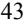

{45}------------------------------------------------

- On May 30, 2018, the Right to Try Act, was signed into law. The law, among other things, provides a federal framework for certain patients to access certain investigational new drug products that have completed a Phase 1 clinical trial and that are undergoing investigation for FDA approval. Under certain circumstances, eligible patients can seek treatment without enrolling in clinical trials and without obtaining FDA permission under the FDA expanded access program. There is no obligation for a pharmaceutical manufacturer to make its drug products available to eligible patients as a result of the Right to Try Act.
In addition, other legislative changes have been proposed and adopted in the United States since the ACA was enacted. On August 2, 2011, the Budget Control Act of 2011 among other things, created measures for spending reductions by Congress. A Joint Select Committee on Deficit Reduction, tasked with recommending a targeted deficit reduction of at least \$1.2 trillion for the years 2013 through 2021, was unable to reach required goals, thereby triggering the legislation's automatic reduction to several government programs. This includes aggregate reductions of Medicare payments to providers of 2 percent per fiscal year. These reductions went into effect on April 1, 2013 and, due to subsequent legislative amendments to the statute, will remain in effect through 2030 unless additional Congressional action is taken.

Additionally, there has been heightened governmental scrutiny recently over the manner in which manufacturers set prices for their marketed products. For example, there have been several recent Congressional inquiries and proposed and enacted federal and state legislation designed to, among other things, bring more transparency to drug pricing, review the relationship between pricing and manufacturer patient programs, and reform government program reimbursement methodologies for drug products, including by tying reimbursement to the price of products in other developed countries. For example, proposals have been made to increase drug manufacturer competition, increase the negotiating power of certain federal healthcare programs, incentivize manufacturers to lower the list price of their products, and reduce the out-of-pocket costs of drug products paid by consumers. Individual states in the United States have also become increasingly active in passing legislation and implementing regulations designed to control pharmaceutical product pricing, including price or patient reimbursement constraints, discounts, restrictions on certain product access and marketing cost disclosure and transparency measures, and, in some cases, designed to encourage importation from other countries and bulk purchasing. Legislative and regulatory agendas, as they relate to the healthcare and pharmaceutical industries and the economy as a whole, of the Biden administration and the U.S. Congress currently remain uncertain. One example of President Biden's priorities came via an executive order that he issued on July 9, 2021 directing the FDA to, among other things, continue to clarify and improve the approval framework for biosimilars, including the standards for interchangeability of biological products, facilitate the development and approval of biosimilar and interchangeable products, clarify existing requirements and procedures related to the review and submission of BLAs, and identify and address any efforts to impede biosimilar competition. Any new laws and initiatives may result in additional reductions in Medicare and other healthcare funding or impose additional regulatory requirements on drug development or approval, which could have a material adverse effect on our future customers and accordingly, our financial operations.

We expect that additional state and federal healthcare reform measures will be adopted in the future, any of which could limit the amounts that federal and state governments will pay for healthcare products and services, which could result in reduced demand for any product candidates we successfully develop or additional pricing pressures.

#### **Regulatory and Compliance Risks**

#### *Our long-term success depends, in part, upon our ability to develop, receive regulatory approval for and commercialize our product candidates.*

Our product candidates and the activities associated with their development, including testing, manufacture, recordkeeping, storage, and approval, are subject to comprehensive regulation by the FDA and other regulatory agencies in the United States and by comparable authorities in other countries. Failure to obtain regulatory approval for a product candidate will prevent us from commercializing the product candidate. We have limited resources for use in preparing, filing, and supporting the applications necessary to gain regulatory approvals and expect to rely on third-party contract research organizations and consultants to assist us in this process.

The FDA and other comparable regulatory agencies in foreign countries impose substantial and rigorous requirements for the development, production, marketing authorization and commercial introduction of drug products. These requirements include non-clinical, laboratory and clinical testing procedures, sampling activities, clinical trials, and other costly and time-consuming procedures. In addition, regulation is not static, and regulatory authorities,

{46}------------------------------------------------

including the FDA evolve in their staff interpretations and practices and may impose more stringent or different requirements than currently in effect, which may adversely affect our planned and ongoing drug development and/or our sales and marketing efforts.

In the United States, to obtain approval from the FDA to market any of our future biologic products, we will be required to submit a BLA to the FDA. Ordinarily, the FDA requires a sponsor to support a BLA with substantial evidence of the product's safety, purity, and potency in treating the targeted indication based on data derived from adequate and well-controlled clinical trials, including Phase 3 safety and efficacy trials conducted in patients with the disease or condition being targeted.

Developing and obtaining regulatory approval for product candidates is a lengthy process, often taking a number of years, is uncertain and expensive. All of the product candidates that we are developing, or may develop in the future, require research and development, non-clinical studies, nonclinical testing, and clinical trials prior to seeking regulatory approval, and commencing commercial sales. In addition, we may need to address a number of technological challenges in order to complete development of our product candidates. As a result, the development of product candidates may take longer than anticipated or not be successful at all.

Our product candidate development costs will also increase if we experience delays in testing or approvals, and we may not have sufficient funding to complete the testing and approval process for any of our product candidates. We may be required to obtain additional funds to complete clinical trials and prepare for possible commercialization of our product candidates. We do not know whether any non-clinical tests or clinical trials above what we currently have planned will be required, will begin as planned, will need to be restructured, or will be completed on schedule, or at all. Significant delays relating to any preclinical or clinical trials also could shorten any periods during which we may have the exclusive right to commercialize our product candidates or allow our competitors to bring products to market before we do. This may prevent us from receiving marketing approvals and impair our ability to successfully commercialize our product candidates and may harm our business and results of operations. In addition, many of the factors that cause, or lead to, delays in clinical trials may ultimately lead to the denial of marketing approval of any of our product candidates. If any of this occurs, our business, financial condition, results of operations, and prospects will be materially harmed.

### *Generally, no product can receive FDA approval, marketing authorization from the European Commission or the competent authorities of the EU Member States, or approval from comparable regulatory agencies in foreign countries unless data generated in human clinical trials demonstrates both safety and ef icacy for each target indication in accordance with such authority's standards.*

The large majority of product candidates that begin human clinical trials fail to demonstrate the required safety and efficacy characteristics necessary for marketing approval. Failure to demonstrate the safety and efficacy of any of our product candidates for each target indication in clinical trials would prevent us from obtaining required approvals from regulatory authorities, which would prevent us from commercializing those product candidates. Negative or inconclusive results from the clinical trials or adverse medical events during the trials could lead to requirements that trials be repeated or extended, or that additional trials be conducted, any of which may not be clinically feasible or financially practicable, that the conduct of trials be suspended, or that a program be terminated.

Any regulatory approval we ultimately obtain may limit the indicated uses for the product or subject the product to restrictions or post-approval commitments that render the product commercially non-viable. Securing regulatory approval requires the submission of extensive non-clinical and clinical data, information about product manufacturing processes and inspection of facilities and supporting information to the regulatory authorities for each therapeutic indication to establish the product's safety and efficacy. If we are unable to submit the necessary data and information, for example, because the results of clinical trials are not favorable, or if the applicable regulatory authority delays reviewing or does not approve our applications, we will be unable to obtain regulatory approval.

Delays in obtaining or failure to obtain regulatory approvals may delay or prevent the successful commercialization of any of the products or product candidates in the jurisdiction for which approval is sought; diminish our competitive advantage; and defer or decrease our receipt of revenue.

Some of our product candidates previously in development experienced regulatory and/or clinical setbacks. Clinical development has been discontinued for product candidates otlertuzumab, APVO414, and APVO210. Both APVO414 and APVO210 were discontinued after patients developed ADA. Most recently, in 2019, we elected to discontinue the APVO210 development program following the review of data from the Phase 1 multiple ascending

{47}------------------------------------------------

dose (MAD) clinical study of APVO210 in healthy volunteers that suggests that APVO210 would not meet the desired target product profile for future commercialization. Specifically, the clinical data showed evidence of increasing titers of ADA with repeated doses of APVO210, which had varying impact on APVO210 drug levels in subjects' blood. The cause of the ADA is uncertain; however, we believe that appearance of ADA is related to the mechanism of action of APVO210, and not due to the structure, or sequences characteristic of the ADAPTIR platform. Although we have re-designed certain components of the ADAPTIR platform based on what we have learned in prior clinical trials, there is no guarantee that the occurrence of ADA or other clinical setbacks will not occur in the development of our existing and future ADAPTIR product candidates.

The procedures to obtain marketing approvals vary among countries and can involve additional clinical trials or other pre-filing requirements. The time required to obtain foreign regulatory approval may differ from that required to obtain FDA approval. The foreign regulatory approval process may include all the risks associated with obtaining FDA approval, or different or additional risks. Regulatory agencies may have varying interpretations of the same data, and approval by one regulatory authority does not ensure approval by regulatory authorities in other jurisdictions. Accordingly, approval by the FDA does not ensure approval by the regulatory authorities in other countries, and approval by one foreign regulatory authority does not ensure approval by the FDA or regulatory authorities in other foreign countries. Failure to obtain regulatory approval in one jurisdiction, however, may impact the decision of other jurisdictions. We may not be able to file for regulatory approvals and may not receive necessary approvals to commercialize our products and products in development in any market on a timely basis, if at all.

### *Inadequate funding for the FDA, the SEC and other government agencies, including from government shutdowns, or other disruptions to these agencies' operations, could hinder their ability to hire and retain key leadership and other personnel, prevent new products and services from being developed or commercialized in a timely manner or otherwise prevent those agencies from performing normal business functions on which the operation of our business may rely, which could negatively impact our business.*

The ability of the FDA to review and approve new products can be affected by a variety of factors, including government budget and funding levels, the ability to hire and retain key personnel and accept the payment of user fees, and statutory, regulatory and policy changes. Average review times at the agency have fluctuated in recent years as a result. In addition, government funding of the SEC and other government agencies on which our operations may rely, including those that fund research and development activities, is subject to the political process, which is inherently fluid and unpredictable.

Disruptions at the FDA and other agencies may also slow the time necessary for new product candidates to be reviewed and/or approved by necessary government agencies, which would adversely affect our business. If a prolonged government shutdown occurs, it could significantly impact the ability of the FDA to timely review and process our regulatory submissions, which could have a material adverse effect on our business. Further, future government shutdowns could impact our ability to access the public markets and obtain necessary capital in order to properly capitalize and continue our operations.

### *Our product candidates are and will continue to be subject to ongoing obligations and continued regulatory review, which may result in significant additional expense. We may be subject to penalties if we fail to comply with regulatory requirements or experience unanticipated problems with our products.*

We and our product candidates are subject to extensive and ongoing requirements of and review by the FDA and other regulatory authorities, including requirements related to the conduct of clinical and non-clinical studies, manufacturing processes, post-approval clinical data, labeling, packaging, distribution, adverse event reporting, storage, recordkeeping, export, import, advertising, marketing, and promotional activities for such products. These requirements further include submissions of safety and other post-marketing information, including manufacturing deviations and reports, registration and listing requirements, the payment of annual fees, continued compliance with GMP-requirements relating to manufacturing, quality control, quality assurance, and corresponding maintenance of records and documents, and requirements regarding the distribution of samples to physicians. Manufacturers and manufacturers' facilities are required to comply with extensive FDA, and comparable foreign regulatory authority requirements, including ensuring that quality control and manufacturing procedures conform to GMP requirements and applicable product tracking and tracing requirements.

FDA and comparable foreign regulatory authorities will continue to closely monitor the safety profile of any product even after approval. If the FDA or comparable foreign regulatory authorities become aware of new safety

{48}------------------------------------------------

information after approval of any of our product candidates, they may, among other actions, withdraw approval, require labeling changes or establishment of a REMS or similar strategy, impose significant restrictions on a product's indicated uses or marketing, or impose ongoing requirements for potentially costly post-approval studies or post-market surveillance. Any such restrictions could limit sales of the product.

We and any of our collaborators could be subject to periodic unannounced inspections by the FDA to monitor and ensure compliance with GMPs and other FDA regulatory requirements. Application holders must further notify the FDA, and depending on the nature of the change, obtain FDA preapproval for product and manufacturing changes. In addition, later discovery of previously unknown adverse events or that the product is less effective than previously thought or other problems with our products, manufacturers or manufacturing processes, or failure to comply with regulatory requirements both before and after approval, may yield various results, including:

- restrictions on manufacturing or distribution, or marketing of such products;
- modifications to promotional pieces and product labels;
- issuance of corrective information;
- requirements to conduct post-marketing studies or other clinical trials;
- clinical holds or termination of clinical trials;
- requirements to establish or modify a REMS or a similar strategy;
- changes to the way the product is administered;
- liability for harm caused to patients or subjects;
- reputational harm;
- the product becoming less competitive;
- warning, untitled, or cyber letters;
- suspension of marketing or withdrawal of the products from the market;
- regulatory authority issuance of safety alerts, Dear Healthcare Provider letters, press releases, or other communications containing warnings or other safety information about the product;
- refusal to approve pending applications or supplements to approved applications that we submit;
- recalls of products;
- fines, restitution or disgorgement of profits or revenues;
- suspension or withdrawal of marketing approvals;
- refusal to permit the import or export of our products;
- product seizure or detention;
- FDA debarment, suspension and debarment from government contracts, and refusal of orders under existing government contracts, exclusion from federal healthcare programs, consent decrees, or corporate integrity agreements; or
- injunctions or the imposition of civil or criminal penalties, including imprisonment.

Any of these events could prevent us from achieving or maintaining product approval and market acceptance of the particular product candidate, if approved, or could substantially increase the costs and expenses of developing and commercializing such product, which in turn could delay or prevent us from generating significant revenues from its sale. Any of these events could further have other material and adverse effects on our operations and business and could adversely impact our stock price and could significantly harm our business, financial condition, results of operations, and prospects.

The FDA's policies may change and additional government laws and regulations may be enacted that could prevent, limit, or delay regulatory approval of our product candidates, that could limit the marketability of our product

{49}------------------------------------------------

candidates, or that could impose additional regulatory obligations on us. For example, the current administration may implement new or revised laws, regulatory requirements, and associated compliance obligations, as well as postponed or frozen regulatory requirements. Changes in medical practice and standard of care may also impact the marketability of our product candidates. If we are slow or unable to adapt to changes in existing requirements, standards of care, or the adoption of new requirements or policies, or if we are not able to maintain regulatory compliance, we may lose any marketing approval that we may have obtained and be subject to regulatory enforcement action.

Should any of the above actions take place, they could adversely affect our ability to achieve or sustain profitability. Further, the cost of compliance with post-approval regulations may have a negative effect on our operating results and financial condition.

### *If we fail to comply with foreign, federal, state, and local healthcare laws, including fraud and abuse and health information privacy and security laws, we could face substantial penalties and our business, results of operations, financial condition and prospects could be adversely af ected.*

As a biotechnology company, even though we do not provide healthcare services or receive payments directly from or bill directly to Medicare, Medicaid, or other third-party payors for our products, certain federal, state, local and foreign healthcare laws and regulations pertaining to fraud and abuse and patients' rights are applicable to our business. We are subject to healthcare fraud and abuse and patient privacy regulation by both the federal government and the states in which we conduct our business. The laws that may affect our ability to operate include:

- the federal Anti-Kickback Statute makes it illegal for any person or entity, including a prescription drug manufacturer (or a party acting on its behalf) to knowingly and willfully solicit, receive, offer or pay remuneration, directly or indirectly, overtly or covertly, to induce, or in return for, either the referral of an individual, or the purchase, lease, prescribing or recommendation of an item, good, facility or service reimbursable by a federally funded healthcare program, such as the Medicare or Medicaid program. The term "remuneration" has been interpreted broadly and may constrain our marketing practices, educational programs, pricing policies and relationships with healthcare providers or other entities, among other activities;
- federal civil and criminal false claims, including the federal False Claims Act, and false statement laws and civil monetary penalty laws, which impose criminal and civil penalties, including through civil whistleblower or qui tam actions, on individuals or entities for, among other things, knowingly presenting, or causing to be presented, claims for payment or approval from Medicare, Medicaid or other federal health care programs that are false or fraudulent or knowingly making any materially false statement in connection with the delivery or payment for healthcare benefits, items or services;
- the U.S. federal Health Insurance Portability and Accountability Act of 1996, as amended, or HIPAA, which imposes criminal and civil liability for, among other things, knowingly and willfully executing, or attempting to execute, a scheme to defraud any healthcare benefit program or obtain, by means of false or fraudulent pretenses, representations, or promises, any of the money or property owned by, or under the custody or control of, any healthcare benefit program, regardless of the payor (e.g., public or private) and knowingly and willfully falsifying, concealing or covering up by any trick or device a material fact or making any materially false statement, in connection with the delivery of, or payment for, healthcare benefits, items or services. Similar to the U.S. federal Anti-Kickback Statute, a person or entity does not need to have actual knowledge of the statute or specific intent to violate it in order to have committed a violation;
- HIPAA, as amended by the Health Information Technology for Economic and Clinical Health, or HITECH, and their respective implementing regulations mandates, among other things, the adoption of uniform standards for the electronic exchange of information in common healthcare transactions, as well as standards relating to the privacy, security and transmission of individually identifiable health information, which require the adoption of administrative, physical and technical safeguards to protect such information. Among other things, HITECH makes HIPAA's security standards directly applicable to "business associates", or independent contractors or agents of covered entities that create, receive or obtain protected health information in connection with providing a service for or on behalf of a covered entity;

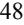

{50}------------------------------------------------

- the Physician Payments Sunshine Act and its implementing regulations, which requires certain manufacturers of drugs, biologics, medical devices and medical supplies for which payment is available under Medicare, Medicaid or the CMS, certain payments and transfers of value made to physicians and teaching hospitals, and ownership or investment interests held by physicians and their immediate family members. Effective January 1, 2022, applicable manufacturers are required to report information regarding payments and transfers of value provided to physician assistants, nurse practitioners, clinical nurse specialists, certified nurse anesthetists, and certified nurse-midwives; and,
- state law equivalents of each of the above federal laws, such as anti-kickback and false claims laws, which may apply to items or services reimbursed by any third-party payor, including commercial insurers; state and foreign laws governing the privacy and security of health information in certain circumstances, many of which differ from each other in significant ways and may not have the same effect, thus complicating compliance efforts; state, local and foreign laws that require pharmaceutical companies to comply with the pharmaceutical industry's voluntary compliance guidelines and the relevant compliance guidance promulgated by the federal government, obtain pharmaceutical agent licensure, and/or otherwise restrict payments that may be made to healthcare providers and entities; and state, local and foreign laws and industry codes that require drug manufacturers to report information related to payments and other transfers of value to healthcare providers or entities, or marketing expenditures.

Because of the breadth of these laws and the narrowness of the statutory exceptions and safe harbors available under the U.S. federal Anti-Kickback Statute, it is possible that some of our business activities could be subject to challenge under one or more of such laws. Moreover, recent health care reform legislation has strengthened these laws. For example, the ACA, among other things, amends the intent requirement of the federal Anti-Kickback Statute and criminal health care fraud statutes, so that a person or entity no longer needs to have actual knowledge of the statute or specific intent to violate it. In addition, the ACA provides that the government may assert that a claim including items or services resulting from a violation of the federal Anti-Kickback Statute constitutes a false or fraudulent claim for purposes of the False Claims Act.

Recently, several pharmaceutical and other healthcare companies have been prosecuted under the federal false claims laws for allegedly inflating drug prices they report to pricing services, which in turn are used by the government to set Medicare and Medicaid reimbursement rates, and for allegedly providing free product to customers with the expectation that the customers would bill federal programs for the product. In addition, certain marketing practices, including off-label promotion, interactions with specialty pharmacies, and patient assistance programs may also violate fraud and abuse laws. To the extent that any product we make is sold in a foreign country, we may be subject to similar foreign laws and regulations.

In addition, certain state and local laws mandate that we comply with a state code of conduct, adopt a company code of conduct under state criteria, disclose marketing payments made to health care professionals and entities, disclose drug pricing information and/or report compliance information to the state authorities. The shifting compliance environment and the need to build and maintain robust and expandable systems to comply in multiple jurisdictions with different compliance and reporting requirements increase the possibility that a pharmaceutical company may violate one or more of the requirements. Any failure to comply with these reporting requirements could result in significant fines and penalties.

The risks of complying with these laws cannot be entirely eliminated. The risk of violation of such laws is also increased because many of them have not been fully interpreted by the regulatory authorities or the courts, and their provisions are open to a variety of interpretations. Any action against us for violation of these laws, even if we successfully defend against it, could cause us to incur significant legal expenses and divert our management's attention from the operation of our business. Moreover, achieving and sustaining compliance with applicable federal, state, local and foreign privacy, security, fraud and transparency laws may prove costly. If our past or present operations, or those of our distributors are found to be in violation of any of the laws described above or any other governmental regulations that apply to us, we may be subject to sanctions, including civil and administrative penalties, criminal fines, damages, disgorgement, exclusion from participation in U.S. federal or state health care programs, individual imprisonment, integrity obligations, and the curtailment or restructuring of our operations, any of which could materially adversely affect our ability to operate our business and our financial results. Similarly, if healthcare providers, distributors or other entities with whom we do business are found to be out of compliance with applicable laws and regulations, they may be subject to sanctions, which could also have a negative impact on us.

{51}------------------------------------------------

### *Our employees, independent contractors, consultants, commercial partners, principal investigators, or CROs may engage in misconduct or other improper activities, including noncompliance with regulatory standards and requirements, which could have a material adverse ef ect on our business.*

We are exposed to the risk of employee fraud or other misconduct. Misconduct by employees, independent contractors, consultants, commercial partners, manufacturers, investigators, or CROs could include intentional, reckless, negligent, or unintentional failures to comply with FDA regulations or applicable fraud and abuse laws, provide accurate information to the FDA, properly calculate pricing information required by federal programs, comply with federal procurement rules or contract terms, report financial information or data accurately or disclose unauthorized activities to us. This misconduct could also involve the improper use or misrepresentation of information obtained in the course of clinical trials, which could result in regulatory sanctions and serious harm to our reputation. It is not always possible to identify and deter this type of misconduct, and the precautions we take to detect and prevent this activity may not be effective in controlling unknown or unmanaged risks or losses or in protecting us from governmental investigations or other actions or lawsuits stemming from a failure to be in compliance with such laws or regulations. Moreover, it is possible for a whistleblower to pursue a False Claims Act case against us even if the government considers the claim unmeritorious and declines to intervene, which could require us to incur costs defending against such a claim. Further, due to the risk that a judgment in a False Claims Act case could result in exclusion from federal health programs or debarment from government contracts, whistleblower cases often result in large settlements. If any such actions are instituted against us, and we are not successful in defending ourselves or asserting our rights, those actions could have a significant impact on our business, financial condition, and results of operations, including the imposition of significant fines or other sanctions.

### *Our operations, including our use of hazardous materials, chemicals, bacteria, and viruses, require us to comply with regulatory requirements and expose us to significant potential liabilities.*

Our operations involve the use of hazardous materials, including chemicals, and may produce dangerous waste products. Accordingly, we, along with the third parties that conduct clinical trials and manufacture our products and product candidates on our behalf, are subject to federal, state, local and foreign laws and regulations that govern the use, manufacture, distribution, storage, handling, exposure, disposal and recordkeeping with respect to these materials. We are also subject to a variety of environmental and occupational health and safety laws. Compliance with current or future laws and regulations can require significant costs and we could be subject to substantial fines and penalties in the event of noncompliance. In addition, the risk of contamination or injury from these materials cannot be completely eliminated. In such event, we could be held liable for substantial civil damages or costs associated with the cleanup of hazardous materials.

### **Intellectual Property Risks**

### *If we are unable to protect our intellectual proprietary rights, our business could be harmed.*

Our commercial success will depend, in large part, on our ability to obtain and maintain protection in the United States and other countries for the intellectual property covering or incorporated into our technology, products and product candidates. Obtaining and maintaining this protection is very costly. The patentability of technology in the biotechnology field generally is highly uncertain and involves complex legal and scientific questions. We cannot be certain that our patents and patent applications, including our own and those that we have rights through licenses from third parties, will adequately protect our intellectual property. Our success in protecting our intellectual property depends significantly on our ability to:

- obtain and maintain U.S. and foreign patents, that are meaningful to our products, including defending those patents against adverse claims;
- secure patent term extension for the patents covering our approved products;
- protect trade secrets;
- operate without infringing the proprietary rights of others; and,
- prevent others from infringing our proprietary rights.

{52}------------------------------------------------

We may not be able to obtain issued patents relating to our technology or product candidates. Even if issued, patents may inadvertently lapse or be challenged, narrowed, invalidated, or circumvented, which could limit our ability to stop competitors from marketing similar products or limit the duration of patent protection we may have for our product candidates. Further, patents may lapse prior to the regulatory approval of the underlying product in one or more territories. In the past, we have abandoned the prosecution and/or maintenance of patent applications related to patent families in the ordinary course of business. In the future, we may choose to abandon such prosecution and/or maintenance in a similar fashion. If these patent rights are later determined to be valuable or necessary to our business, our competitive position may be adversely affected. Changes in patent laws or administrative patent office rules or changes in interpretations of patent laws in the United States and in other countries may diminish the value of our intellectual property or narrow the scope of our patent protection, or result in costly defensive measures.

Patent and other intellectual property laws outside the United States are even more uncertain than in the United States and are continually undergoing review and revisions in many countries. Further, the laws of some foreign countries may not protect our intellectual property rights to the same extent as the laws of the United States. For example, certain countries do not grant patent claims that are directed to business methods and processes. In addition, we may have to participate in additional opposition proceedings, like the proceedings described above, to determine the validity of our foreign patents or our competitors' foreign patents, which could result in substantial costs and diversion of our efforts.

Our collaborative partners and licensors may not adequately protect our intellectual property rights. These third parties may have the first right to maintain or defend intellectual property rights in which we have an interest and, although we may have the right to assume the maintenance and defense of such intellectual property rights if these third parties do not do so, our ability to maintain and defend such intellectual property rights may be compromised by the acts or omissions of these third parties.

The cost of litigation to uphold the validity of patents, once obtained, to prevent infringement or to otherwise protect or enforce our proprietary rights could be substantial and, from time to time, our patents are subject to patent office proceedings. Some of our competitors may be better able to sustain the costs of complex patent litigation because they may have substantially greater financial resources. Intellectual property lawsuits are expensive and unpredictable and would consume management's time and attention and other resources, even if the outcome were successful. In addition, there is a risk that a court would decide that our patents are not valid and that we do not have the right to stop the other party from using the inventions covered by or incorporating them. There is also a risk that, even if the validity of a patent were upheld, a court would refuse to stop the other party from using the invention(s), including on the grounds that its activities do not infringe the patent. If any of these events were to occur, our business, financial condition and operating results could be materially and adversely affected.

In addition to patent litigation, we may be a party to adversarial proceedings before the Patent Trial and Appeal Board (PTAB) of the USPTO, or the Opposition Division of the European Patent Office (EPO). Potential proceedings before the PTAB include inter partes review proceedings, post-grant review proceedings and interference proceedings. Depending on our level of success at the PTAB and Opposition Division of the EPO, these proceedings could adversely impact our intellectual property rights with respect to our products and technology.

In addition, the U.S. Supreme Court has ruled on several patent cases in recent years, either narrowing the scope of patent protection available in certain circumstances or weakening the rights of patent owners in certain situations. This combination of events has created uncertainty with respect to the value of patents, once obtained, and with regard to our ability to obtain patents in the future. Depending on decisions by the U.S. Congress, the federal courts, and the USPTO, the laws and regulations governing patents could change in unpredictable ways that would weaken our ability to obtain new patents or to enforce our existing patents and patents that we might obtain in the future. Patent and intellectual property laws outside of the United States may also change and be uncertain.

Our patents, once obtained, also may not afford us protection against competitors with similar technology. Because patent applications in the United States and many foreign jurisdictions are typically not published until eighteen months after filing, or in some cases not at all, and because publications of discoveries in the scientific literature often lag behind actual discoveries, neither we nor our licensors can be certain that others have not filed or maintained patent applications for technology used by us or covered by our pending patent applications without our being aware of these applications.

We also will rely on current and future trademarks to establish and maintain recognized brands, including APTEVO THERAPEUTICS, APTEVO BIOTHERAPEUTICS, APTEVO RESEARCH AND DEVELOPMENT, the

{53}------------------------------------------------

Aptevo logo, ADAPTIR, and ADAPTIR-FLEX in relevant jurisdictions. If we fail to acquire and protect such trademarks, our ability to market and sell our products, if approved for marketing, will be harmed. In addition, our current and future trademarks may be challenged, infringed, circumvented, declared generic, lapsed or determined to be infringing on or dilutive of other marks and we may not be able to protect our rights in these trademarks, which we need in order to build name recognition. Any of the foregoing could have a material and adverse effect on our business, financial condition and operating results.

#### *If approved, our products regulated as biologics may face competition from biosimilars approved through an abbreviated regulatory pathway.*

The Patient Protection and Affordable Care Act, as amended by the Health Care and Education Reconciliation Act of 2010, or collectively the ACA, includes a subtitle called the Biologics Price Competition and Innovation Act of 2009, or BPCIA, which created an abbreviated approval pathway for biological products that are biosimilar to or interchangeable with an FDA-licensed reference biological product. Under the BPCIA, an application for a biosimilar product may not be submitted to the FDA until four years following the date that the reference product was first licensed by the FDA. In addition, the approval of a biosimilar product may not be made effective by the FDA until 12 years from the date on which the reference product was first licensed. During this 12-year period of exclusivity, another company may still market a competing version of the reference product if the FDA approves a BLA for the competing product containing the sponsor's own preclinical data and data from adequate and well-controlled clinical trials to demonstrate the safety, purity, and potency of the other company's product. The law is complex and is still being interpreted and implemented by the FDA. As a result, its ultimate impact, implementation, and meaning are subject to uncertainty. We believe that any of our product candidates approved as a biological product under a BLA should qualify for the 12-year period of exclusivity. However, there is a risk that this exclusivity could be shortened due to congressional action or otherwise, or that the FDA will not consider our investigational medicines to be reference products for competing products, potentially creating the opportunity for generic competition sooner than anticipated. Other aspects of the BPCIA, some of which may impact the BPCIA exclusivity provisions, have also been the subject of recent litigation.

There is a similar abbreviated pathway for the approval of biosimilar products in the EU. Reference products in the EU benefit from an eight year data exclusivity period during which the data included in the dossier for the reference product may not be referenced for the purposes of an abbreviated biosimilar application. Following the expiration of the data exclusivity period, there is an additional two year period of market exclusivity during which a biosimilar marketing authorization application can be submitted, and the innovator's data may be referenced, but no product can be placed on the market until the expiration of such period. The overall 10-year period can be extended to a maximum of 11 years in certain circumstances. As in the U.S., there is no guarantee that a product will qualify for the prescribed period of exclusivity and, even if a product does qualify, another company may market a competing version of the reference product if such company obtained a marketing authorization with a complete independent data package of pharmaceutical tests, preclinical tests and clinical trials.

Moreover, the extent to which a biosimilar, once licensed, will be substituted for any one of our reference products in a way that is similar to traditional generic substitution for non-biological products, and will depend on a number of marketplace and regulatory factors that are still developing. If competitors are able to obtain marketing approval for biosimilars referencing any of our products, if approved, our products may become subject to competition from such biosimilars, which would impair our ability to successfully commercialize and generate revenues from sales of such products.

#### *Third parties may choose to file patent infringement claims against us.*

Our development and commercialization activities, as well as any product candidates or products resulting from these activities, may infringe or be claimed to infringe patents and other intellectual property rights of third parties under which we do not hold sufficient licenses or other rights. Third parties may be successful in obtaining patent protection for technologies that cover development and commercialization activities in which we are already engaged. These third parties may have substantially greater financial resources than us and could bring claims against us that could cause us to incur substantial expenses to defend against these claims and, if successful against us, could cause us to pay substantial damages. If a patent infringement or other similar suit were brought against us, we could be forced to stop or delay development, manufacturing or sales of the product or product candidate that is the subject of the suit. Intellectual property litigation in the biotechnology industry is common, and we expect this trend to continue.

{54}------------------------------------------------

As a result of patent infringement or other similar claims, or to avoid potential claims, we may choose or be required to seek a license from the third party and be required to pay license fees or royalties or both. These licenses may not be available on acceptable terms, or at all. Even if we were able to obtain a license, the rights may be non-exclusive, which could result in our competitors gaining access to the same intellectual property. Ultimately, we could be prevented from commercializing a product, or be forced to cease some aspect of our business operations, if, as a result of actual or threatened patent infringement claims, we are unable to enter into licenses on acceptable terms, if at all, or if an injunction is granted against us, which could harm our business significantly.

There has been substantial litigation and other proceedings regarding patent and other intellectual property rights in the pharmaceutical and biotechnology industries. In addition to infringement claims against us, we may become a party to other patent litigation and other adversarial proceedings such as proceedings before the Patent Trial Appeals Board and opposition proceedings in the European Patent Office, regarding intellectual property rights that could impact our products and technology.

Patent litigation and other proceedings may also absorb significant management time. The cost to us of any patent litigation or other proceeding, even if resolved in our favor, could be substantial. Some of our competitors may be able to sustain the costs of such litigation or proceedings more effectively than we can because of their substantially greater financial resources. Uncertainties resulting from the initiation and continuation of patent litigation or other proceedings could have a material adverse effect on our ability to compete in the marketplace. Patent litigation and other proceedings may also absorb significant management time.

#### *Our Aptevo trademarks may be opposed which could have a material and adverse ef ect on our business.*

We have an application pending that covers the APTEVO THERAPEUTICS trademark and received a notice of allowance from the USPTO for the APTEVO BIOTHERAPEUTICS and APTEVO RESEARCH AND DEVELOPMENT trademarks in August 2022. We refer to these trademarks as our house marks. If a third party opposes any of these house marks and we are unable to reach settlement prior to the commencement of an opposition proceeding, we may incur significant expense in the course of participating in the opposition process, which can be expensive and lengthy. Any settlement with a third party may result in our agreeing to be subject to restrictions on our use of the relevant house mark. In addition, if we are unsuccessful in an opposition against a house mark, we would lose the ability to obtain trademark registration for one or more uses of the relevant mark both in the United States and in other territories which could have a material and adverse effect on our business.

#### *We may be subject to claims that our employees have wrongfully used or disclosed alleged trade secrets of their former employers.*

As is common in the biotechnology and pharmaceutical industry, we employ individuals who were previously employed at other biotechnology or pharmaceutical companies, including our competitors or potential competitors. We may be subject to claims that these employees or we have inadvertently or otherwise used or disclosed trade secrets or other proprietary information of their former employers. Litigation may be necessary to defend against these claims. Even if we are successful in defending against these claims, litigation could result in substantial costs and be a distraction to management.

#### *Failure to comply with our obligations in our intellectual property licenses with third parties, could result in loss of license rights or other damages.*

We are a party to a number of license agreements and expect to enter into additional license agreements in the future. Our existing licenses impose, and we expect future licenses will impose, various diligence, milestone payment, royalty, insurance, and other obligations on us. If we fail to comply with these obligations, the licensor may have the right to terminate the license in whole or in part, terminate the exclusive nature of the license and/or sue us for breach, which could cause us to not be able to market any product that is covered by the licensed patents and may be subject to damages.

### *If we are unable to protect the confidentiality of our proprietary information and know-how, the value of our technology and product candidates could be adversely af ected.*

In addition to patented technology, we rely upon unpatented proprietary technology, information processes and know-how. These types of trade secrets can be difficult to protect. We seek to protect this confidential information, in part, through agreements with our employees, consultants and third parties as well as confidentiality policies and

{55}------------------------------------------------

audits, although these may not be successful in protecting our trade secrets and confidential information. These agreements may be breached, and we may not have adequate remedies for any such breach. In addition, our trade secrets may otherwise become known, including through a potential cyber security breach, or may be independently developed by competitors. If we are unable to protect the confidentiality of our proprietary information and know-how, competitors may be able to use this information to develop products that compete with our products, which could adversely impact our business.

### **Risks Related to Collaborations and Other Transactions**

### *We may not be successful in establishing and maintaining collaborations and entering into other transactions that leverage our capabilities in pursuit of developing and commercializing our product candidates and any such collaborations and transactions, if any, could result in financial results that dif er from market expectations.*

For each of our product candidates we plan to evaluate the merits of entering into collaboration arrangements with third parties, including leading biotechnology companies or non-governmental organizations. In July 2017, we entered into a collaboration agreement with Alligator pursuant to which Aptevo R&D and Alligator have been collaboratively developing ALG.APV-527, a lead bispecific antibody candidate simultaneously targeting 4-1BB (CD137), a member of the TNFR superfamily of a co-stimulatory receptor found on activated T cells, and 5T4, a tumor antigen widely overexpressed in a number of different types of cancer. We intend to pursue collaboration arrangements with third parties that have particular technology, expertise or resources for the development or commercialization of our product candidates or for accessing particular markets. We face, and will continue to face, significant competition in seeking appropriate partners for our product candidates. If we are unable to identify partners whose capabilities complement and integrate well with ours and reach collaboration arrangements with such partners on a timely basis, on acceptable terms or at all, or if the arrangements we establish are unproductive for us, we may fail to meet our business objectives for the particular product candidate. Our ability to enter into such arrangements with respect to products in development that are subject to licenses may be limited by the terms of those licenses.

Our collaboration agreement with Alligator, or any collaboration agreement we may consider entering into, may not be successful and the success of our collaboration arrangements will depend heavily on the efforts and activities of our collaborative partners. It is likely that our collaborative partners will have significant discretion in determining the efforts and resources that they will apply to these collaborations.

The risks that we are subject to in any of our collaborations include, among others:

- our collaborative partners may not commit adequate resources to the development, marketing and distribution of any collaboration products, limiting our potential revenues from these products;
- our collaborative partners may experience financial difficulties and may therefore be unable to meet their commitments to us;
- our collaborative partners may pursue a competing product candidate developed either independently or in collaboration with others, including our competitors; and,
- our collaborative partners may terminate our relationship.

The failure of any of our current or future collaboration partners to perform as expected could place us at a competitive disadvantage and adversely affect us financially, including delay and increased costs of development, loss of market opportunities, lower than expected revenues and impairment of the value of the related product candidate. A loss of our collaboration agreement with Alligator would result in a burden of locating a replacement partner under potentially less favorable terms at an additional cost. Collaborations are a critical part of our business strategy, and any inability on our part to establish and successfully maintain such arrangements on terms favorable to us or to work successfully with our collaborative partners could have an adverse effect on our operations and financial performance. Due to the ongoing COVID-19 pandemic and macroeconomic factors, we may experience delays in opportunities to develop our product candidates, due to financial and other impacts on potential partners.

In addition, in the normal course of business, the Company engages in discussions with third parties regarding possible strategic alliances, joint ventures, acquisitions, divestitures and business combinations to further develop or commercialize our product candidates. As a result of such transactions, our financial results may differ from our own or the investment community's expectations in a given fiscal quarter or over the long term. Furthermore, efforts to engage in such transactions require varying levels of management resources, which may divert the Company's

{56}------------------------------------------------

attention from other business operations. Any transactions we engage in could result in our financial results differing materially from market expectations.

### *In connection with our separation from Emergent, we and Emergent agreed to indemnify the other party for certain liabilities. The Emergent indemnity may not be suf icient to hold us harmless from the full amount of liabilities for which Emergent will be allocated responsibility, and Emergent may not be able to satisfy its indemnification obligations in the future.*

Pursuant to the separation agreement and certain other agreements with Emergent, Emergent has agreed to indemnify us for certain liabilities, and we agreed to indemnify Emergent for certain liabilities. Indemnities that we may be required to provide Emergent are not subject to any cap, may be significant and could negatively impact our business, particularly indemnities relating to our actions that could impact the tax-free nature of the distribution. Third parties could also seek to hold us responsible for any of the liabilities that Emergent has agreed to retain. Any amounts we are required to pay pursuant to these indemnification obligations and other liabilities could require us to divert cash that would otherwise have been used in furtherance of our operating business. Further, the indemnity from Emergent may not be sufficient to protect us against the full amount of such liabilities, and Emergent may not be able to fully satisfy its indemnification obligations. Moreover, even if we ultimately succeed in recovering from Emergent any amounts for which we are held liable, we may be temporarily required to bear these losses ourselves. Each of these risks could negatively affect our business, results of operations and financial condition.

### **Risks Related to Our Common Stock and General Risks**

### *Our stock price may be volatile.*

Our stock price has fluctuated in the past and is likely to be volatile in the future. Between August 1, 2016 and December 31, 2022, the reported closing price of our common stock has fluctuated between \$2.00 and \$83.16 per share (as adjusted to reflect our 1-for-14 reverse stock split of our outstanding common stock that was effective on March 26, 2020). The stock market in general, and the market for biotechnology companies in particular, have experienced extreme volatility that has often been unrelated to the operating performance of particular companies. In particular, the stock market has experienced extreme volatility in recent months as a result of the geopolitical climate, including the war in Ukraine, and macroeconomic conditions, including rising and fluctuating inflation and interest rates and reduced consumer confidence. The market price of our common stock may fluctuate significantly due to a number of factors, some of which may be beyond our control or unrelated to our operations, including, among others:

- changes in earnings estimated by securities analysts or management, or our ability to meet those estimates;
- investor perceptions or negative announcements by our competitors, suppliers, or partners regarding their own performance;
- the success of competitive products or technologies;
- the timing, expenses, and results of clinical and preclinical trials of our product candidates;
- announcements regarding clinical trial results and product introductions by us or our competitors;
- announcements of acquisitions, collaborations, financings or other transactions by us or our competitors;
- public concern as to the safety of our product candidates;
- termination or delay of a development program;
- the recruitment or departure of key personnel;
- estimated or actual sales of IXINITY by Medexus;

{57}------------------------------------------------

- whether and to what extent future milestone payments are received under our Amendment to Royalty Purchase Agreement with HCR;
- actual or anticipated variations in our cash flows or results of operations;
- the operating and stock price performance of comparable companies;
- the impact of the ongoing COVID-19 pandemic or similar global health challenges;
- general industry conditions and domestic and global financial, economic, and geopolitical instability; and,
- the other factors described in this "Risk Factors" section.

Biotechnology company stock prices have declined significantly in certain instances where companies have failed to obtain FDA or foreign regulatory authority approval of a product candidate or if the timing of FDA or foreign regulatory authority approval is delayed. If the FDA's or any foreign regulatory authority's response to any application for approval is delayed or not favorable for any of our product candidates, our stock price could decline significantly.

In addition, when the market price of a company's common stock drops significantly, stockholders often institute securities class action lawsuits against the company. A lawsuit against us could cause us to incur substantial costs and could divert the time and attention of our management and other resources.

### *In the event that coverage under our directors' and of icers' liability insurance is reduced or terminated as a result of an ownership change or otherwise, our indemnification obligations and limitations of our directors' and of icers' liability insurance may have a material adverse ef ect on our financial condition, results of operations and cash flows.*

Under Delaware law, our certificate of incorporation, and our by-laws and certain indemnification agreements to which we are a party, we have an obligation to indemnify, or we have otherwise agreed to indemnify, certain of our current and former directors and officers with respect to past, current, and future investigations and litigation. In order to reduce the risk of expense of these obligations, we maintain directors' and officers' liability insurance. A significant change in the Company's risk profile, such as the Tang Ownership Change, could increase the cost to us of our directors' and officers' liability insurance coverage or the coverage thereunder may be reduced or terminated in full. In the event that the coverage under our directors' and officers' liability insurance is reduced or terminated, we will be required to pay the expenses of indemnifying our current and former directors and officers in their defense of current and future investigations and litigation, which expenses may be significant. The increased costs to us of our directors' and officers' liability insurance coverage, or our indemnification obligations if our directors' and officers' liability insurance coverage is reduced or terminated, could result in the diversion of our financial resources, and may have a material adverse effect on our financial condition, results of operations and cash flows.

#### *If we do not maintain ef ective internal controls, we may not be able to accurately report our financial results and our business could be harmed.*

The Sarbanes-Oxley Act requires, among other things, that we assess the effectiveness of our internal control over financial reporting annually and the effectiveness of our disclosure controls and procedures quarterly. In particular, Section 404 of the Sarbanes-Oxley Act, or Section 404, requires us to perform system and process evaluation and testing of our internal control over financial reporting to allow management to report on, and our independent registered public accounting firm potentially to attest to, the effectiveness of our internal control over financial reporting. In the past, we were an emerging growth company and we currently are a non-accelerated filer and have availed ourselves of the exemption from the requirement that our independent registered public accounting firm attest to the effectiveness of our internal control over financial reporting under Section 404. If we cease to be a nonaccelerated filer and our independent registered public accounting firm is required to undertake an assessment of our internal control over financial reporting, the cost of our compliance with Section 404 will correspondingly increase. Our compliance with applicable provisions of Section 404 will require that we incur substantial accounting expense and expend significant management time on compliance-related issues as we implement additional corporate governance practices and comply with reporting requirements. Moreover, if we are not able to comply with the requirements of Section 404 applicable to us in a timely manner, or if we or our independent registered public accounting firm identifies deficiencies in our internal control over financial reporting that are deemed to be material

{58}------------------------------------------------

weaknesses, the market price of our stock could decline and we could be subject to sanctions or investigations by the SEC or other regulatory authorities, which would require additional financial and management resources.

Investor perceptions of our company may suffer if material weaknesses are found, and this could cause a decline in the market price of our common stock. Irrespective of compliance with Section 404, any failure of our internal control over financial reporting could harm our operating results and reputation. If we are unable to implement these requirements effectively or efficiently, it could harm our operations, financial reporting, or financial results and could result in an adverse opinion on our internal controls from our independent registered public accounting firm.

### *The public announcement of data from clinical trials or news of any developments related to our product pipeline may cause significant volatility in our stock price.*

The announcement of data from clinical trials by us or our collaborative partners or news of any developments related to our key pipeline product candidates has in the past caused and may in the future cause significant volatility in our stock price. Furthermore, the announcement of any negative or unexpected data or the discontinuation of development of any of our key pipeline product candidates, or any delay in our anticipated timelines for filing for regulatory approval, could cause our stock price to decline significantly. There can be no assurance that data from clinical trials will support a filing for regulatory approval or even if approved, that any of our key pipeline products will become commercially successful.

### *Our common stock may be at risk for delisting from the Nasdaq Capital Market in the future if we do not maintain compliance with Nasdaq's continued listing requirements. Delisting could adversely af ect the liquidity of our common stock and the market price of our common stock could decrease.*

Our common stock is currently listed on the Nasdaq Capital Market LLC (Nasdaq). Nasdaq has minimum requirements that a company must meet in order to remain listed on Nasdaq, including corporate governance standards and a requirement that we maintain a minimum closing bid price of \$1.00 per share.

On April 1, 2022, the Company received a letter from Nasdaq indicating that it was not in compliance with Nasdaq Listing Rule 5550(b)(1), which requires companies listed on Nasdaq to maintain a minimum of \$2,500,000 in stockholders' equity for continued listing. On its annual report for the year ended December 31, 2021, the Company reported stockholders' equity of \$1,216,000, and, as a result, did not satisfy Listing Rule 5550(b)(1). In the second quarter of 2022, the Company regained compliance with the Nasdaq Listing Rule.

In the future, if we fail to maintain such minimum requirements and a final determination is made by Nasdaq that our common stock must be delisted, the liquidity of our common stock would be adversely affected and the market price of our common stock could decrease. In addition, if delisted, we would no longer be subject to Nasdaq rules, including rules requiring us to have a certain number of independent directors and to meet other corporate governance standards. Our failure to be listed on Nasdaq or another established securities market would have a material adverse effect on the value of your investment in us.

If our common stock is not listed on Nasdaq or another national exchange, the trading price of our common stock is below \$5.00 per share and we have net tangible assets of \$6,000,000 or less, the open-market trading of our common stock will be subject to the "penny stock" rules promulgated under the Securities Exchange Act of 1934, as amended. If our shares become subject to the "penny stock" rules, broker-dealers may find it difficult to effectuate customer transactions and trading activity in our securities may be adversely affected.

### *Your percentage of ownership in Aptevo may be diluted in the future.*

In the future, your percentage ownership in Aptevo may be diluted because of equity issuances or securities convertible into equity for acquisitions, capital market transactions or otherwise, including, but not limited to, equity issuances under our existing Purchase Agreement with Lincoln Park, under our Equity Distribution Agreement with Piper Sandler, under our Rights Plan with Broadridge Corporate Issuer Solutions, Inc., upon the exercise of warrants issued in connection with our March 2019 public offering, and equity awards to our directors, officers and employees. Our employees have options to purchase shares of our common stock and from time to time, we expect to issue additional options, restricted stock units, or other stock-based awards to our employees under our employee benefits plans.

{59}------------------------------------------------

In addition, our restated certificate of incorporation authorizes us to issue, without the approval of our stockholders, one or more classes or series of preferred stock having such designation, powers, preferences and relative, participating, optional and other special rights, including preferences over our common stock respecting dividends and distributions, as our board of directors generally may determine. The terms of one or more classes or series of preferred stock could dilute the voting power or reduce the value of our common stock. For example, we could grant the holders of preferred stock the right to elect some number of our directors in all events or on the happening of specified events or the right to veto specified transactions. Similarly, the repurchase or redemption rights or liquidation preferences we could assign to holders of preferred stock could affect the residual value of the common stock.

### *Provisions under Delaware law and in our restated certificate of incorporation, amended and restated by-laws and rights agreement may discourage acquisition proposals, delay a change in control or prevent transactions that stockholders may consider favorable.*

Certain provisions in our restated certificate of incorporation and amended and restated by-laws, and under Delaware law, may discourage, delay, or prevent a merger, acquisition or other changes in control that stockholders may consider favorable, including transactions in which stockholders might otherwise receive a premium for their shares. These provisions may also prevent or frustrate attempts by our stockholders to replace or remove our incumbent directors and management.

These provisions include:

- the classification of our directors;
- limitations on the removal of directors;
- limitations on filling vacancies on the board;
- advance notice requirements for stockholder nominations of candidates for election to the Board of Directors and other proposals;
- the inability of stockholders to act by written consent;
- the inability of stockholders to call special meetings; and,
- the ability of our Board of Directors to designate the terms of and issue a new series of preferred stock without stockholder approval.

The affirmative vote of holders of our capital stock representing at least 75% of the voting power of all outstanding stock entitled to vote is required to amend or repeal the above provisions of our certificate of incorporation. The affirmative vote of either a majority of the directors present at a meeting of our Board of Directors or holders of our capital stock representing at least 75% of the voting power of all outstanding stock entitled to vote is required to amend or repeal our by-laws.

In addition, Section 203 of the General Corporation Law of Delaware prohibits a corporation from engaging in a business combination with an interested stockholder, generally a person which, together with its affiliates, owns or within the last three years has owned 15% or more of the corporation's voting stock, for a period of three years after the date of the transaction in which the person became an interested stockholder, unless the business combination is approved in a prescribed manner. Accordingly, Section 203 may discourage, delay or prevent a change in control of us. Tang is an interested stockholder for purposes of Section 203.

Moreover, we currently have a short-term stockholder rights agreement in effect. This rights agreement was amended on November 4, 2021 to extend the expiration date of such agreement from November 8, 2021 to November 5, 2022 and further amended on November 4, 2022 to extend the expiration of such agreement to November 4, 2023. This rights agreement could render more difficult, or discourage a merger, tender offer, or assumption of control of the Company that is not approved by our Board that some stockholders may consider favorable. The rights agreement, however, should not interfere with any merger, tender or exchange offer or other business combination approved by our Board. Nor does the rights agreement prevent our Board from considering any offer that it considers to be in the best interest of our stockholders.

{60}------------------------------------------------

#### *Our by-laws include a forum selection clause, which may impact your ability to bring actions against us.*

Subject to certain limitations, our bylaws provide that, unless we consent in writing to the selection of an alternative forum, the Court of Chancery in the State of Delaware will be the sole and exclusive forum for any stockholder (including a beneficial owner) to bring: (a) any derivative action or proceeding brought on our behalf; (b) any action asserting a claim of breach of fiduciary duty owed by any of our directors, officers or other employees or our stockholders; (c) any action asserting a claim arising pursuant to any provision of the DGCL or our certificate of incorporation or by-laws; or (d) any action asserting a claim governed by the internal affairs doctrine. In addition, our bylaws provide that unless we consent in writing to the selection of an alternative forum, the federal district courts of the United States will be the exclusive forum for resolving any complaint asserting a cause of action arising under the federal securities laws of the United States against us, our officers, directors, employees or underwriters. These limitations on the forum in which stockholders may initiate action against us could create costs, inconvenience or otherwise adversely affect your ability to seek legal redress.

Section 22 of the Securities Act creates concurrent jurisdiction for federal and state courts over all suits brought to enforce any duty or liability created by the Securities Act or the rules and regulations thereunder. As a result, a court may decline to enforce these exclusive forum provisions with respect to suits brought to enforce any duty or liability created by the Securities Act or any other claim for which the federal and state courts have concurrent jurisdiction, and our stockholders may not be deemed to have waived our compliance with the federal securities laws and the rules and regulations thereunder. If a court were to find the exclusive forum provisions to be inapplicable or unenforceable in an action, we may incur additional costs associated with resolving such action in other jurisdictions.

#### *We may be subject to periodic litigation, which could result in losses or unexpected expenditure of time and resources.*

From time to time, we may be called upon to defend ourselves against lawsuits relating to our business. Any litigation, regardless of its merits, could result in substantial costs and a diversion of management's attention and resources that are needed to successfully run our business. Due to the inherent uncertainties of litigation, we cannot accurately predict the ultimate outcome of any such proceedings. An unfavorable outcome in any such proceedings could have an adverse impact on our business, financial condition and results of operations. If our stock price is volatile, we may become involved in securities class action lawsuits in the future.

### *Our failure to comply with data protection laws and regulations could lead to government enforcement actions and significant penalties against us, and adversely impact our operating results.*

EU Member States, Switzerland and other countries have adopted data protection laws and regulations, which impose significant compliance obligations. For example, European Union, or EU, member states and other foreign jurisdictions, including Switzerland, have adopted data protection laws and regulations which impose significant compliance obligations. Moreover, the collection and use of personal health data in the EU is now governed under the EU General Data Protection Regulation, or the GDPR, effective in May 2018. The GDPR, which is wide-ranging in scope, imposed several requirements relating to the consent of the individuals to whom the personal data relates, the information provided to the individuals, the security and confidentiality of the personal data, data breach notification and the use of third-party processors in connection with the processing of personal data. The GDPR also imposes strict rules on the transfer of personal data out of the EU to the U.S., provides an enforcement authority and imposes large penalties for noncompliance, including the potential for fines of up to €20 million or 4% of the annual global revenues of the noncompliant company, whichever is greater. The GDPR requirements apply not only to third-party transactions, but also to transfers of information between us and our subsidiaries, including employee information. The GDPR increases our responsibility and liability in relation to personal data that we process, including in clinical trials, and we may be required to put in place additional mechanisms to ensure compliance with the GDPR, which could divert management's attention and increase our cost of doing business. In addition, new regulation or legislative actions regarding data privacy and security (together with applicable industry standards) may increase our costs of doing business. However, despite our ongoing efforts, we may not be successful either due to various factors within our control, such as limited financial or human resources, or other factors outside our control. It is also possible that local data protection authorities may have different interpretations of the GDPR, leading to potential inconsistencies amongst various EU member states. Any failure or alleged failure (including as a result of deficiencies in our policies, procedures, or measures relating to privacy, data security, marketing, or communications) by us to comply with laws, regulations, policies, legal or contractual obligations, industry standards, or regulatory guidance relating to privacy or data security, may result in governmental investigations and enforcement actions, litigation, fines and penalties or

{61}------------------------------------------------

adverse publicity. In addition, we expect that there will continue to be new proposed laws, regulations and industry standards relating to privacy and data protection in the United States, the EU and other jurisdictions, such as the California Consumer Privacy Act of 2018, which has been characterized as the first "GDPR-like" privacy statute to be enacted in the United States, and we cannot determine the impact such future laws, regulations and standards may have on our business.

### *If we experience a significant disruption in our information technology systems or breaches of data security, including due to a cyber-security incident, our business could be adversely af ected.*

We rely on information technology systems to keep financial records, capture laboratory data, maintain clinical trial data and corporate records, communicate with staff and external parties and operate other critical functions. Our information technology systems are potentially vulnerable to disruption due to breakdown, malicious intrusion and computer viruses or other disruptive events including but not limited to natural disaster. The impact of the ongoing COVID-19 pandemic also poses an increased security risk, due to the remote working environment.

We also face the challenge of promptly detecting and remediating any cyber-security breaches. Our information technology systems security measures are focused on the prevention, detection and remediation of damage from computer viruses, unauthorized access, cyber-attack and other similar disruptions. However, our information technology systems protection measures may not be successful in preventing unauthorized access, intrusion and damage. Threats to our systems can derive from human error, fraud or malice on the part of employees or third parties, including computer hackers, encryption by ransomware, or may result from technological failure.

If we were to experience a prolonged system disruption in our information technology systems or those of certain of our vendors, it could delay or negatively impact our development and commercialization of our product candidates, which could adversely impact our business. If operations at our facilities were disrupted, it may cause a material disruption in our business if we are not capable of restoring function on an acceptable timeframe.

In addition, as discussed above, our information technology systems are potentially vulnerable to data security breaches—whether by employees or others, intentionally or unintentionally—which may expose sensitive or personal data to unauthorized persons. Such data security breaches could lead to the loss of trade secrets or other intellectual property, or could lead to the public exposure of personal information (including sensitive personal information) of our employees, customers and others, any of which could have a material adverse effect on our business, financial condition and results of operations.

Moreover, a security breach or privacy violation that leads to destruction, loss, alteration, unauthorized use or access, disclosure or modification of, personally identifiable information or personal data, could harm our reputation, compel us to comply with federal, state and/or international breach notification laws, subject us to mandatory corrective or regulatory action, require us to verify the correctness of database contents and otherwise subject us to liability under laws and regulations that protect personal data, including the GDPR and the California Consumer Privacy Act of 2018, which could disrupt our business, result in increased costs or loss, and/or result in significant legal and financial exposure. In addition, a data security breach could result in loss of clinical trial data or damage to the integrity of that data.

If we are unable to implement and maintain adequate organizational and technical measures to prevent such security breaches or privacy violations, or to respond adequately in the event of a breach, our operations could be disrupted, and we may suffer loss of reputation, problems with regulatory authorities, financial loss and other negative consequences. In addition, these breaches and other inappropriate access can be difficult to detect, and any delay in identifying them may lead to increased harm of the type described above.

If a breach of our information technology systems occurs, we may incur additional costs related to repairing or rebuilding our internal systems, complying with breach notification laws, defending legal claims or proceedings, responding to regulatory actions, incurring penalties, and paying damages. Moreover, it may be determined that as a result of such a breach there was a material weakness or significant deficiency in our internal controls or other failure of our control environment. If such a breach occurs, it may have a material adverse effect on our business, results of operations, and financial condition, and it may also negatively impact our reputation.

{62}------------------------------------------------

#### *A significant portion of our shares may be sold into the market at any time which could depress our stock price.*

If our stockholders sell a substantial number of shares of our common stock in the public market, our market price could decline. In connection with the transaction with Lincoln Park, we registered under the Securities Act of 1933, as amended, the resale of shares of common stock that have been and may be issued under the Purchase Agreement with Lincoln Park. Any such sales or perception that such sales may occur, whether under the Lincoln Park Purchase Agreement or otherwise, could decrease the market price of our common stock.

{63}------------------------------------------------

#### **Item 1B. Unresolved Staff Comments.**

None.

#### **Item 2. Properties.**

We lease our headquarters office and laboratory space in Seattle, Washington. The Seattle facility is approximately 48,000 square feet and the lease for the Seattle facility expires in April 2030.

#### **Item 3. Legal Proceedings.**

We may from time to time be named as a party to legal claims, actions and complaints, including matters involving employment claims, our intellectual property or other third party claims. Our management believes that there are currently no claims or actions pending against us, the ultimate disposition of which could have a material adverse effect on our results of operations, financial condition, or cash flows.

#### **Item 4. Mine Safety Disclosures.**

Not applicable.

{64}------------------------------------------------

#### **PART II**

#### **Item 5. Market for Registrant's Common Equity, Related Stockholder Matters and Issuer Purchases of Equity Securities.**

Our common stock has been listed on The Nasdaq Capital Market under the symbol "APVO" since October 18, 2019, and was listed on The Nasdaq Global Market from August 1, 2016 to October 17, 2019.

#### **Holders of Common Stock**

As of March 30, 2023, we had 7,239,471 shares of common stock outstanding held by 115 holders of record of our common stock. The number of record holders does not include stockholders who are beneficial owners but whose shares are held in "street name" by brokers and other nominees or persons, partnerships, associates, corporations, or other entities identified in security position listings maintained by depositories. We have never declared or paid any cash dividends and do not anticipate declaring or paying cash dividends for the foreseeable future.

#### **Dividend Policy**

We have never declared or paid any cash dividends on our common stock or any other securities. We anticipate that we will retain all available funds and any future earnings, if any, for use in the operation of our business and do not anticipate paying cash dividends in the foreseeable future. In addition, future debt instruments may materially restrict our ability to pay dividends on our common stock. Payment of future cash dividends, if any, will be at the discretion of the board of directors after taking into account various factors, including our financial condition, operating results, current and anticipated cash needs, the requirements of then-existing debt instruments and other factors the board of directors deems relevant.

#### **Recent Sales of Unregistered Securities**

We did not sell any unregistered securities during the year ended December 31, 2022.

#### **Issuer Purchases of Equity Securities**

We did not repurchase any shares of our common stock during the year ended December 31, 2022.

#### **Item 6. [Reserved]**

{65}------------------------------------------------

### **Item 7. Management's Discussion and Analysis of Financial Condition and Results of Operations.**

*You should read the following Management's Discussion and Analysis of Financial Condition and Results of Operations (this MD&A) together with the consolidated financial statements and the related notes thereto included in this Annual Report on Form 10-K. This MD&A contains forward-looking statements that are subject to risks and uncertainties, such as those set forth in the sections of this Annual Report on Form 10-K captioned "Cautionary Note Regarding Forward-Looking Statements," "Risk Factors" and elsewhere. As a result, our actual results may dif er materially from those anticipated in these forward-looking statements.*

### **Overview**

We are a clinical-stage, research and development biotechnology company focused on developing novel immunotherapy candidates for the treatment of different forms of cancer. We have developed two versatile and enabling platform technologies for rational design of precision immune modulatory drugs. Our lead clinical candidates, APVO436 and ALG.APV-527 (in collaboration with Alligator), and preclinical candidates, APVO603 and APVO711, were developed using our ADAPTIR™ modular protein technology platform. Our preclinical candidate APVO442 was developed using our ADAPTIR-FLEX™ modular protein technology platform.

The versatile and robust ADAPTIR and ADAPTIR-FLEX platforms are designed to generate monospecific, bispecific, and multi-specific antibody candidates capable of enhancing the human immune system against cancer cells. ADAPTIR and ADAPTIR-FLEX are both modular platforms, which gives us the flexibility to generate immunotherapeutic candidates with a variety of mechanisms of action. This flexibility in design allows us to potentially generate novel therapeutic candidates that may provide effective strategies against difficult to treat, as well as advanced forms of cancer. We have successfully designed and constructed numerous investigational-stage product candidates based on our ADAPTIR platform. The ADAPTIR platform technology is designed to generate monospecific and bispecific immunotherapeutic proteins that specifically bind to one or more targets, for example, bispecific therapeutic molecules, which may have structural and functional advantages over monoclonal antibodies. The structural differences of ADAPTIR molecules over monoclonal antibodies allow for the development of ADAPTIR immunotherapeutics that are designed to engage immune effector cells and disease targets to produce signaling responses that modulate the immune system to kill tumor cells.

We believe we are skilled at candidate generation, validation, and subsequent preclinical and clinical development using the ADAPTIR platform and the ADAPTIR-FLEX platform to generate multi-specific candidates or other candidates to our platform capabilities. We have developed a preclinical candidate based on the ADAPTIR-FLEX platform which is advancing in our pipeline. We are developing our ADAPTIR and ADAPTIR-FLEX molecules using our protein engineering, preclinical development, process development, and clinical development capabilities.

### **Recent Developments**

On January 9, 2023, we filed a provisional patent with the USPTO pertaining to an anti-PD-L1 and anti-CD40 compound, APVO711, with the potential to fight a range of solid malignancies such as head and neck squamous cell carcinoma, melanoma, and carcinomas of the lung, gastrointestinal tract and colon. We initiated preclinical studies in the first quarter of 2023.

In December 2022 we announced that APVO436, in combination with venetoclax and azacitidine, demonstrated substantial clinical activity and a favorable safety and tolerability profile in adult venetoclax treatment naïve AML patients. More specifically:

- The combination of venetoclax and azacitidine with APVO436 in venetoclax treatment naïve response-evaluable patients in Cohort 2 of the Phase 1b study outperformed a composite benchmark across all clinical benefit categories (Benchmark Composite References:
Aldoss 2019, Maiti 2021, Morsia 2020, Garciaz 2022, Feld 2021)

{66}------------------------------------------------

- The data, which was presented in a poster session at the 64th American Society of Hematology Annual Meeting and Exposition (ASH) in New Orleans, also showed that APVO436, when given in combination with venetoclax and azacitidine was observed to be generally safe and well tolerated.
- Based on Phase 1b outcomes, we plan to initiate a Phase 2 trial in the second half of 2023 to further evaluate APVO436 in combination with venetoclax and azacitidine in venetoclax treatment naïve patients.

In September 2022, we received a "may proceed" notification from the U.S. Food and Drug Administration (FDA), allowing us and our partner, Alligator Bioscience, to initiate clinical trials evaluating the compound for the treatment of 5T4-expressing tumors in multiple solid tumor types. A first-inhuman study was initiated in the first quarter of 2023.

- The first patient in this trial was dosed in February 2023. Patient recruitment is ongoing. ALG.APV-527 targets 4-1BB co-stimulatory receptor (on T lymphocytes and NK cells) and 5T4 (solid tumor antigen) and is designed to promote anti-tumor immunity.
### **Results of Operations**

Except as otherwise stated below, the following discussions of our results of operations reflect the results of our continuing operations, excluding the results related to Aptevo BioTherapeutics LLC (Aptevo BioTherapeutics), which was sold in February 2020 to Medexus and has been separated from continuing operations and reflected as a discontinued operation. See Note 2 – Discontinued Operations to the accompanying consolidated financial statements for additional information.

#### **Year Ended December 31, 2022 Compared to Year Ended December 31, 2021**

For the year ended December 31, 2022, we had net income of \$8.0 million compared to \$28.5 million net loss for the same period in 2021. As of December 31, 2022, we had an accumulated deficit of \$206.0 million.

#### **Royalty Revenue**

For the years ended December 31, 2022 and 2021, we recorded royalty revenue of \$3.1 million and \$12.3 million, respectively. Royalty revenue for the period covered by this report reflects revenue recorded only prior to the second quarter of 2022 due to our Amendment to Royalty Purchase Agreement with HCR (see Note 8). As a result of the amendment, we ceased reporting as royalty revenue, royalties paid by Pfizer to HCR related to Pfizer's sales of RUXIENCE. The royalty revenue from Pfizer related to a Collaboration and License Agreement (Definitive Agreement) acquired by Aptevo as part of our spin-off from Emergent in 2016. The agreement was originally executed by Trubion Pharmaceuticals, which was subsequently acquired by Emergent, and Wyeth, a wholly owned subsidiary of Pfizer.

On March 30, 2021, we entered into and closed a Royalty Purchase Agreement with an entity managed by HCR pursuant to which we sold to HCR the right to receive royalty payments made by Pfizer in respect of net sales of RUXIENCE. Under the terms of the Royalty Purchase Agreement, the Company received \$35 million at closing and we are eligible to receive additional payments in the aggregate of up to an additional \$32.5 million based on the achievement of sales milestones in 2021, 2022 and 2023. We received the 2021 milestone payments in the collective amount of \$10 million on March 8, 2022. The proceeds from these milestone payments, net of transaction costs, were recorded as an additional liability related to the sale of royalties on the consolidated balance sheet as of March 31, 2022.

Due to the nature of the transaction, which included a cap on HCR's rate of return, constituting continuing involvement under the Collaboration and License Agreement originally between Trubion and Wyeth, we recorded a liability related to the proceeds received from HCR of \$35.0 million, net of transaction costs of \$1.1 million. Further, we received proceeds related to the 2021 milestone of \$10.0 million, net of transaction costs of \$0.5 million, and recorded additional liability related to sale of royalties. We recognized royalty revenue on net sales of RUXIENCE and recorded the royalty payments to HCR as a reduction of the liability when paid.

In order to non-dilutively address a Nasdaq listing compliance matter, on June 7, 2022, we entered into and closed an amendment to the Royalty Purchase Agreement (the Amendment to Royalty Purchase Agreement), pursuant to which we agreed to forego our right to receive 50% of incremental RUXIENCE royalty revenue after HCR received aggregate royalty payments totaling 190% of the Investment Amount plus Milestone Amounts to the extent paid by

{67}------------------------------------------------

HCR. The Amendment to Royalty Purchase Agreement eliminated all of our continuing involvement with the cash generating activities related to the royalties and removed all restrictions related to HCR's rate of return and therefore was accounted for under ASC 610-20, *Gains and Losses from Derecognition of Nonfinancial Assets* and ASC 405-20, *Liabilities – Extinguishment of Liabilities*, resulting in recognition of \$37.2 million gain, which was the total balance of the liability related to the sale of royalties on the closing date. We received 2022 milestone payment of \$2.5 million on February 28, 2023. The proceed from 2022 milestone payment was recorded as other income in the consolidated statement of operations for the year ended December 31, 2022. The Amendment to Royalty Purchase Agreement continues to include the opportunity receive additional milestone payment of \$10 million based on achievement of sales milestones in 2023.

### **Research and Development Expenses**

We expense research and development costs as incurred. These expenses consist primarily of the costs associated with our research and development activities, including conducting non-clinical studies and clinical trials, fees to professional service providers for analytical testing, consulting costs, independent monitoring or other administration of our clinical trials and obtaining and evaluating data from our clinical trials and non-clinical studies, as well as costs of contract manufacturing services for clinical trial material, and costs of materials used in clinical trials and research and development.

We expect our research and development spending will be dependent upon such factors as the results from our clinical trials, the availability of reimbursement of research and development spending, the number of product candidates under development, the size, structure and duration of any clinical programs that we may initiate, and the costs associated with manufacturing our product candidates on a large-scale basis for later stage clinical trials. We may experience interruption of key clinical trial activities, such as site initiation, patient enrollment and clinical trial site monitoring, and key non-clinical activities due to the ongoing COVID-19 pandemic. While a number of our programs are still in the preclinical trial phase, we do not provide a breakdown of the initial associated expenses as we are often evaluating multiple product candidates simultaneously. Costs are reported in preclinical research and discovery until the program enters the clinic.

Our research and development expenses by program for the years ended December 31, 2022 and 2021 are shown in the following table:

|                                                     | For the Year Ended December 31, |        |      |        |        |          |
|-----------------------------------------------------|---------------------------------|--------|------|--------|--------|----------|
| (in thousands)                                      | 2022                            |        | 2021 |        | Change |          |
| Clinical programs:                                  |                                 |        |      |        |        |          |
| APVO436                                             | \$                              | 6,503  | \$   | 5,323  | \$     | 1,180    |
| Other                                               |                                 | (73 )  |      | (223 ) |        | 150      |
| Total clinical programs                             |                                 | 6,430  |      | 5,100  |        | 1,330    |
|                                                     |                                 |        |      |        |        |          |
| Preclinical program, general research and discovery |                                 | 11,452 |      | 13,894 |        | (2,442 ) |
| Total                                               | \$                              | 17,882 | \$   | 18,994 | \$     | (1,112 ) |

Research and development expenses decreased by \$1.1 million, to \$17.9 million for the year ended December 31, 2022 from \$19.0 million for the year ended December 31, 2021. The decrease was primarily due to lower spending on preclinical projects and employee costs. The decrease was partially offset by higher spending on our APVO436 Phase 1b clinical trial and getting ALG.APV-527 ready for entry into the clinic.

#### **General and Administrative Expenses**

General and administrative expenses consist primarily of personnel-related costs and professional fees in support of our executive, business development, finance, accounting, information technology, legal and human resource functions. Other costs include facility costs not otherwise included in research and development expenses.

For the year ended December 31, 2022, general and administrative expenses decreased by \$0.8 million, to \$13.9 million from \$14.7 million for the year ended December 31, 2021. The decrease is primarily due to lower employee and consulting costs and no costs related to responding to a stockholder activism matter.

{68}------------------------------------------------

### **Other Income (Expense), Net**

Other income (expense), net consists primarily of gain on extinguishment of liabilities, milestone income related to sale of royalties, costs related to debt extinguishment, accrued exit fees on debt, non-cash interest on financing agreements, and interest on debt.

### *Other Expense, Net*

Other expense, net was \$4.0 million for the year ended December 31, 2022 and \$8.0 million for the year ended December 31, 2021. This decrease is primarily due to a significant decrease of non-cash interest expenses recorded for the year ended December 31, 2022. We no longer record non-cash interest expense due to our Amendment to the Royalty Purchase Agreement in the second quarter of 2022, which eliminated the liability related to the sale of royalties. Additionally, interest expense on our MidCap Credit Agreement has decreased due to principal payments made in 2022.

### *Gain on Extinguishment of Liability Related to Sale of Royalties*

We recorded \$37.2 million in other income for the year ended December 31, 2022, due to our Amendment to Royalty Purchase Agreement (see Note 8). We did not have any such gain for the year ended December 31, 2021.

### *Milestone Income Related to Sale of Royalties*

We recorded \$2.5 million in other income for the year ended December 31, 2022, related to Pfizer's net sales of RUXIENCE in fiscal year 2022. Due to our Amendment to Royalty Purchase Agreement, we record Milestone Amounts from HCR when they are earned (see Note 8). We received the 2021 milestone payment of \$10 million, net of transaction costs, in the first quarter of 2022 and recorded the proceeds received as an additional liability related to sale of royalties under ASC 470-10-25, *Debt – Sales of Future Revenues or Various Other Measures of Income*.

### **Discontinued Operations**

The accompanying consolidated financial statements include discontinued operations from two separate transactions: the sale of hyperimmune business to Saol International Limited in September 2017, from which we received a payment in 2021 related to collection of certain accounts receivable, and the sale of Aptevo BioTherapeutics LLC in 2020.

The following table represents the components attributable to income from discontinued operations in the consolidated statements of operations (in thousands):

|                                            | For the Year Ended December 31, |    |      |  |
|--------------------------------------------|---------------------------------|----|------|--|
|                                            | 2022                            |    | 2021 |  |
| Deferred payments from Medexus             | 1,013                           |    | 491  |  |
| Gain on contingent consideration from Saol | —                               |    | 460  |  |
| Income from discontinued operations        | \$ 1,013                     | \$ | 951  |  |

{69}------------------------------------------------

Income from discontinued operations was \$1.0 million for the year ended December 31, 2022 and 2021. For the year ended December 31, 2022, we collected \$1.0 million in deferred payments from Medexus related to IXINITY sales. For the year ended December 31, 2021, we collected \$0.5 million related to the 2017 sale of the hyperimmune business to Saol as a result of the collection of certain accounts receivable and deferred payments of \$0.5 million from Medexus related to IXINITY sales.

### **Liquidity and Capital Resources**

### *Cash Flows*

The following table provides information regarding our cash flows for year ended December 31, 2022 and 2021:

|                                                  | For the Year Ended December 31, |           |    |           |  |
|--------------------------------------------------|---------------------------------|-----------|----|-----------|--|
| (in thousands)                                   |                                 | 2022      |    | 2021      |  |
| Net cash (used in) provided by:                  |                                 |           |    |           |  |
| Operating activities                             | \$                              | (21,022 ) | \$ | (21,679 ) |  |
| Investing activities                             |                                 | (29 )     |    | (713 )    |  |
| Financing activities                             |                                 | (2,616 )  |    | 26,161    |  |
| (Decrease) increase in cash and cash equivalents | \$                              | (23,667 ) | \$ | 3,769     |  |

Net cash used in operating activities for the year ended December 31, 2022 was primarily due to changes in working capital accounts and our operating cash spend. Net cash used in operating activities for the year ended December 31, 2021 was primarily due to our net operating loss of \$28.5 million and changes in working capital accounts.

Net cash used in investing activities for the year ended December 31, 2022 and 2021 was primarily due to purchases of property and equipment.

Net cash used in financing activities for the year ended December 31, 2022 was primarily due to the \$12.3 million of repayments of the MidCap Financial term loan, and \$6.8 million royalties received from Pfizer by HCR pursuant to our Royalty Purchase Agreement. This was offset by the \$10 million milestone received by Aptevo from HCR related to the sale of royalties, net of \$0.5 million transaction costs, and \$7.0 million of proceeds received from issuance of common stock pursuant to our Equity Distribution Agreement with Piper Sandler. Net cash provided by financing activities for the year ended December 31, 2021, was primarily due to \$35.0 million received from the Royalty Purchase Agreement, \$10.2 million received from the common stock sold to Lincoln Park, offset by the \$10.5 million partial repayment of the MidCap Financial term loan and the \$8.6 million repayments under liability related to sale of royalties.

### *Sources of Liquidity*

### *Royalty Purchase Agreement and Milestone Payments*

On March 30, 2021, we entered into Royalty Purchase Agreement with HCR pursuant to which we sold HCR the right to receive royalty payments made by Pfizer in respect to net sale of RUXIENCE. Under the Royalty Purchase Agreement, we received \$35 million at closing and incurred \$1.1 million in transaction costs. We were eligible to receive additional payments in aggregate of up to an additional \$32.5 million based on achievement of sales milestones in 2021, 2022 and 2023. We received the 2021 milestone payments in the collective amount of \$10 million on March 8, 2022 and the 2022 milestone payment of \$2.5 million on February 28, 2023. Aptevo is eligible to receive additional milestone payment of \$10 million based on achievement of sales milestones in 2023.

### *IXINITY Royalty Payments*

On February 28, 2020, we entered into an LLC Purchase Agreement with Medexus, pursuant to which we sold all of the issued and outstanding limited liability company interests of Aptevo BioTherapeutics LLC, a wholly owned subsidiary of Aptevo. In addition to the payment received at closing, the Company receives deferred payments based on quarterly net sales of IXINITY and may also earn milestones in aggregate of up to \$11 million from Medexus in the future. Milestones are based on Medexus obtaining certain regulatory approvals and sales thresholds. Pursuant to

{70}------------------------------------------------

our LLC Purchase Agreement, the rate for deferred payments increased from 2% to 5% of net sales as of June 30, 2022. For the year ended December 31, 2022, Aptevo received \$1.0 million in deferred payments from Medexus related to IXINITY sales.

#### *Equity Distribution Agreement*

On December 14, 2020, we entered into an Equity Distribution Agreement with Piper Sandler & Co (Piper Sandler). The Equity Distribution Agreement provides that, upon the terms and subject to the conditions set forth therein, we may issue and sell through Piper Sandler, acting as sales agent, shares of our common stock having an aggregate offering price of up to \$50 million. We have no obligation to sell any such shares under the Equity Distribution Agreement. The sale of the shares of our common stock by Piper Sandler, if any, will be effected pursuant to a Registration Statement on Form S-3 which we filed on December 14, 2020. For the year ended December 31, 2022, we issued 1,452,065 shares of our common stock at an average share price of \$4.92 under the Equity Distribution Agreement. We received \$7.0 million in proceeds from issuance of these shares. We did not issue any shares under the Equity Distribution Agreement for the year ended December 31, 2021.

The Equity Distribution Agreement will terminate upon the issuance and sale of all shares under the Equity Distribution Agreement or upon the earlier termination thereof at any time by us or Piper Sandler upon notice to the other party.

#### *Registration Statement*

On December 14, 2020, we filed a Registration Statement on Form S-3 covering the offering, issuance, and sale of up to \$200 million in common stock, preferred stock, and various series of debt securities and/or warrants to purchase any of such securities, which included the unsold securities from the Prior Registration Statement. On March 29, 2022, we filed an amendment to the prospectus supplement to the Registration Statement on Form S-3 filed on December 14, 2020 pursuant to General Instruction I.B.6 of Form S-3 (General Instruction I.B.6), which updates the amount of shares that we are eligible to sell under the Equity Distribution Agreement. So long as the aggregate market value of our common stock held by non-affiliates is less than \$75 million, we will not sell shares under the Equity Distribution Agreement with a value of more than one-third of the aggregate market value of our common stock held by non-affiliates in any 12-month period due to the limitations of General Instruction I.B.6 of Form S-3 and the current public float of our common stock. If our public float increases such that we may sell additional amounts under the Equity Distribution Agreement and the prospectus than is mentioned in our last prospectus supplement to the Registration Statement on Form S-3 filed on December 13, 2020, we will file another amendment to the prospectus supplement prior to making additional sales. The limitations of General Instruction I.B.6 do not apply to sales of our shares under our Purchase Agreement with Lincoln Park Financial LLC as those sales were committed prior to us being subject to the limitations of General Instruction I.B.6.

#### *Lincoln Park Purchase Agreement*

On February 16, 2022, we entered into a new Purchase Agreement and a Registration Rights Agreement with Lincoln Park (2022 Purchase Agreement and Registration Rights Agreement). The 2022 Purchase Agreement and Registration Rights Agreement replaced our Purchase Agreement and Registration Rights Agreement with Lincoln Park that we entered into with them in December 2018. Under the 2022 Purchase Agreement, Lincoln Park committed to purchase up to \$35.0 million worth of our common stock over a 36-month period commencing after the satisfaction of certain conditions, which are within our control, as set forth in the Purchase Agreement. The purchase price per share will be based on the prevailing market price; provided, however, that the prevailing market price is not below \$1.00. The Company issued 99,276 shares of our common stock to Lincoln Park for no cash consideration as an initial fee for its commitment to purchase shares of our common stock under the Purchase Agreement. The Company did not issue any shares of common stock for cash consideration to Lincoln Park under the Purchase Agreement for the year ended December 30, 2022.

Actual sales of shares of our common stock to Lincoln Park under the Purchase Agreement will occur at our discretion from time to time and depend on a variety of factors, including, among others, market conditions, the trading price of our common stock and additional determinations as to the appropriate sources of funding for our operations. Lincoln Park has no right to require any sales, but is obligated to make purchases as we direct, in accordance with the Purchase Agreement.

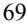

{71}------------------------------------------------

#### *Warrants*

On March 11, 2019, we completed a public offering of common stock and warrants, as follows:

- for a combined public offering price of \$14.00 per share of common stock and related warrants, 1,417,857 shares of common stock and related warrants with a 5-year life to purchase up to 1,417,857 shares of common stock at an exercise price of \$18.20 per share,
- for a combined public offering price of \$13.86 per pre-funded warrant and related warrant, pre-funded warrants with a 10-year life to purchase up to 153,571 shares of common stock at an exercise price of \$0.14 per share and related warrants with a 5-year life to purchase up to 153,571 shares of common stock at an exercise price of \$18.20 per share. These pre-funded warrants were exercised on March 21, 2019.

For the year ended December 31, 2022, the Company did not have any of its warrants exercised. For the year ended December 31, 2021, certain of the holders of the Company's warrants exercised warrants with a strike price of \$18.20 per share, resulting in the issuance of 54,105 shares of the Company's common stock and aggregate proceeds to the Company of approximately \$1.0 million. As of December 31, 2022, there were warrants to purchase 350,589 shares of common stock outstanding.

#### *Liquidity*

We have financed our operations to date primarily through revenue generated from our commercial products, the Royalty Purchase Agreement with HCR, royalty payments from Pfizer, deferred payments from Medexus, the sale of our hyperimmune products business in September 2017, the sale of Aptevo BioTherapeutics on February 28, 2020, public offerings of our common stock, proceeds from issuance of our common stock pursuant to our 2018 Purchase Agreement with Lincoln Park, loan proceeds, milestone payments, research and development funding from strategic partners, and funds received at the date of our spin-off from Emergent. We had cash and cash equivalents of \$22.6 million and an accumulated deficit of \$206.0 million as of December 31, 2022.

For the year ended December 31, 2022, net cash used in our operating activities was \$21.0 million.

Our future success is dependent on our ability to develop our product candidates and ultimately upon our ability to attain profitable operations. We anticipate that we will continue to incur significant operating losses for the next several years as we incur expenses to continue to execute on our development strategy to advance our preclinical and clinical stage assets. We will not generate revenues from our development stage product candidates unless and/or until we or our collaborators successfully complete development and obtain regulatory approval for such product candidates, which we expect will take a number of years and is subject to significant uncertainty. If we obtain regulatory approval for one of our development stage product candidates, we expect to incur significant commercialization expenses related to sales, marketing, manufacturing and distribution, to the extent that such costs are not paid by collaborators. We do not have sufficient cash to complete the clinical development of any of our development stage product candidates and will require additional funding in order to complete the development activities required for regulatory approval of such product candidates. We will require substantial additional funds to continue our development programs and to fulfill our planned operating goals.

{72}------------------------------------------------

Due to the ongoing COVID-19 pandemic, including if any new variants emerge, and macroeconomic environment, we may experience delays in opportunities to partner our product candidates, due to financial and other impacts on potential partners. Additionally, we may experience potential impacts on our future deferred payments and milestones from Medexus due to effects of macroeconomic impacts, including, but not limited to, the ongoing COVID-19 pandemic, and rising and fluctuating inflation, which may impact Medexus' ability to continue to successfully commercialize the IXINITY businesses. Additionally, we may experience potential impacts on our future milestones, which are based on global net sales of RUXIENCE, from HCR due to the effects of the ongoing COVID-19 pandemic and macroeconomic environment, which may impact Pfizer's ability to continue to successfully commercialize the RUXIENCE business. We believe that our existing cash resources, milestone payments related to the Royalty Purchase Agreement with HCR, funds available under Purchase Agreement with Lincoln Park and the Equity Distribution Agreement with Piper Sandler, cash to be generated from future deferred payments and milestones related to IXINITY sales and approvals by Medexus, will be sufficient to meet our projected operating requirements and debt service for at least twelve months from the date of this filing of this Annual Report on Form 10-K.

There are numerous risks and uncertainties associated with research, development, and commercialization of pharmaceutical products. Accordingly, our future funding requirements may vary from our current expectations and will depend on many factors, including, but not limited to:

- our ability to raise additional capital when needed or on acceptable terms;
- future profitability given our historical losses;
- our ability to attract, motivate and retain key personnel;
- the impact of the ongoing COVID-19 pandemic to our business, including clinical trials;
- the timing of, and the costs involved in, completing our clinical trials, and obtaining regulatory approvals for our product candidates;
- our ability to obtain regulatory clearance to commence clinical trials for product candidates;
- our ability to establish and maintain strategic partnerships, licensing or other arrangements and the financial terms of such agreements;
- the effects of macroeconomic conditions, including rising and fluctuating inflation, interest rates and supply chain constraints;
- our ability to successfully develop our ADAPTIR or ADAPTIR-FLEX platforms;
- the terms of our credit agreement and potential restrictions to our operations and availability of cash for investment in our business operations;
- the results of our current and planned preclinical studies and clinical trials;
- the scope, progress, results, and costs of researching and developing our product candidates, and of conducting preclinical and clinical trials, including whether clinical trial results will be consistent with the past data;
- our reliance on third parties to effectively conduct our clinical and non-clinical trials, and to effectively carry out their contractual duties, comply with regulatory requirements or meet expected deadlines;
- the costs involved in preparing, filing, prosecuting, maintaining, defending and enforcing patent claims, including litigation costs and the outcome of such litigation;
- the cost of commercialization activities if any of our product candidates are approved for sale, including marketing, sales, and distribution costs;
- whether and to what extent future milestones are received under our Royalty Purchase Agreement with HCR; and
- the timing, receipt and amount of any milestone payments and deferred payments from Medexus with respect to IXINITY.

{73}------------------------------------------------

If we are unable to raise substantial additional capital in the next year, whether on terms that are acceptable to us or at all, then we may be required

- to:
- delay, limit, reduce or terminate our clinical trials or other development activities for one or more of our product candidates; and/or,
- delay, limit, reduce or terminate our establishment of other activities that may be necessary to commercialize our product candidates, if approved.

The sale of additional equity or convertible debt securities may result in additional dilution to our stockholders. If we raise additional funds through the issuance of debt securities or preferred stock or through credit facilities, these securities and/or the loans under credit facilities could provide for rights senior to those of our common stock and could contain covenants that would restrict our operations. Additional funds may not be available when we need them, on terms that are acceptable to us, or at all. We also expect to seek additional funds through arrangements with collaborators, licensees or other third parties. These arrangements would generally require us to relinquish or encumber rights to some of our technologies or drug candidates, and we may not be able to enter into such arrangements on acceptable terms, if at all. Due to the ongoing COVID-19 pandemic, including if any new variants emerge, and macroeconomic factors, we may experience delays in clinical trials and non-clinical work, and opportunities to partner our product candidates, due to financial and other impacts on potential partners.

### *Contractual Obligations*

We have an operating lease related to our office and laboratory space in Seattle, Washington. This lease was amended in March 2019 to extend the term of the amended lease is through April 2030 and provided two options to extend the lease term, each by five years, as well as a one-time option to terminate the lease in April 2023, with nine months' notice, or by July 2022. On May 26, 2022, we further amended our office and laboratory lease to remove the one-time termination option in April 2023. In exchange for removing the termination option, we received six months of free rent. As a result, we recorded an additional \$4.4 million of lease liability and right-of-use asset on the consolidated balance sheet in May 2022.

We have a non-exclusive Commercial Platform License Agreement with OMT (OMT License Agreement") for certain transgenic rodents of OMT's OmniAb platform. Our OMT License Agreement obligates us to make milestone and royalty payments upon achievement of certain regulatory approvals and commercialization of our product candidates. APVO436 and APVO603 are the product candidates currently subject to this agreement. Pursuant to our agreement, we expect to make \$2,000,000 milestone payment upon dosing the first patient in our Phase 2 clinical trial of APVO436, which we expect to initiate in the second half of 2023.

On August 5, 2020, we entered into a new Credit Agreement, with MidCap Financial which was subsequently amended. The Credit Agreement provided us with up to \$25 million of available borrowing capacity. The MidCap Financial loan has a 48 month term, is interest-only for the first 18 months, with straight-line amortization for the remaining 30 months and bears interest at a rate of one month London Interbank Offered Rate (LIBOR) plus 6.25% per annum, subject to a 1.50% LIBOR floor and a 2.50% LIBOR cap. On March 30, 2021, we amended our Credit Agreement with MidCap Financial and used \$10 million of the proceeds received from the Royalty Purchase Agreement with HCR to pay down the outstanding principal under this agreement from \$25 million to \$15 million. Additionally, the Company used the \$10 million milestone payment received on March 8, 2022, pursuant to our Royalty Purchase Agreement with HCR to further pay down the outstanding principal down to \$5 million.

On June 7, 2022, the Company further amended its Credit Agreement with MidCap Financial to obtain MidCap Financial's limited consent to amend its Royalty Purchase Agreement with HCR. The Limited Consent and Second Amendment to Credit Agreement did not change future cash flows or other terms of the Credit Agreement.

Additionally, on August 30, 2022, we amended our Credit Agreement with MidCap Financial to replace the LIBOR benchmark with Secured Overnight Financing Rate (SOFR), which is regulated by the Federal Reserve Bank of New York. Aptevo amended our Credit Agreement due to the United Kingdom's Financial Conduct Authority (FCA) planned phase-out of one-month US Dollar LIBOR settings in 2023. Our Credit Agreement continues to bear base interest at a rate of 6.25% per annum plus SOFR, subject to a 1.50% SOFR floor and a 2.50% SOFR cap.

{74}------------------------------------------------

Our principal commitments include obligations under vendor contracts to purchase research services and other purchase commitments with our vendors. In the normal course of business, we enter into services agreements with contract research organizations, contract manufacturing organizations and other third parties. Generally, these agreements provide for termination upon notice, with specified amounts due upon termination based on the timing of termination and the terms of the agreement. The actual amounts and timing of payments under these agreements are uncertain and contingent upon the initiation and completion of the services to be provided.

#### **Critical Accounting Policies, and Significant Judgments, and Estimates**

The preparation of our consolidated financial statements in conformity with accounting principles generally accepted in the United States (GAAP) requires management to make estimates and assumptions that affect the amounts reported in the financial statements and accompanying notes. We base our estimates on historical experience and on various other factors. Although we believe that our judgments and estimates are appropriate, actual results may differ materially from our estimates and changes in these estimates are recorded when known. An accounting policy is considered critical if it is important to a company's financial condition and results of operations and if it requires the exercise of significant judgment and the use of estimates on the part of management in its application.

While our significant accounting policies are more fully described in Note 1 to our audited consolidated financial statements appearing elsewhere in this report, we believe the following accounting policies are the most critical to the judgments and estimates we use in the preparation of our consolidated financial statements.

#### **Liability Related to Sale of Royalties and Other Income (Expense)**

On June 7, 2022, we amended our Royalty Purchase Agreement pursuant to which we agreed to forego our right to receive 50% of incremental RUXIENCE royalty revenue after HCR received aggregate royalty payments totaling 190% of the Investment Amount plus Milestone Amounts to the extent paid by HCR. The Amendment to Royalty Purchase Agreement eliminated all of our continuing involvement with the cash generating activities related to the royalties and removed all restrictions related to HCR's rate of return and therefore was accounted for under ASC 610-20, *Gains and Losses from Derecognition of Nonfinancial Assets* and ASC 405-20, *Liabilities – Extinguishment of Liabilities*, resulting in recognition of a \$37.2 million gain, which was the total balance of the liability related to the sale of royalties on the closing date.

Prior to the Amendment to Royalty Purchase Agreement, we accounted for the Royalty Purchase Agreement with HCR, including future milestone payments to be received, as a debt-like instrument within the scope of ASC 470-10-25, *Debt – Sales of Future Revenues or Various Other Measures of Income*. We recorded the proceeds from the Royalty Purchase Agreement as a liability related to the sale of royalties, net of transaction costs, and amortized the balance using the effective interest method. To determine the amortization of the liability, the Company estimated the total amount of future net royalty payments over the life of the arrangement. The total amount of net royalty payments over the life of the arrangement, less the net proceeds received, were recorded as non-cash interest expense over the life of the arrangement using the effective interest method. The actual effective interest rate was affected by the amount and timing of the net royalty payments received by HCR and changes in the Company's royalty forecasts. The Company engaged third party consultant services in estimating total future net royalty payments and assessed the effective interest rate by comparing projected net royalty payments to actual and adjusts the effective interest rate retrospectively. Milestone payments were recorded as additions to the liability related to the sale of royalties, net of transaction costs. While we believe our estimates were reasonable, there were differences between actual net royalty payments and our projections. Historically, differences between estimated and actual net royalty payments were not material.

#### **Research and Development Expenses**

Research and development expenses are expensed as incurred. Research and development costs primarily consist of internal labor costs, fees paid to outside service providers and the costs of materials used in clinical trials and research and development. Other research and development expenses include facility, maintenance, and related support expenses.

A substantial portion of our preclinical studies and all of our clinical studies have been performed by third-party contract research organizations (CRO). We review the activities performed by the CROs each period. For preclinical studies, the significant factors used in estimating accruals include the percentage of work completed to date and

{75}------------------------------------------------

contract milestones achieved. For clinical study expenses, the significant factors used in estimating accruals include the number of enrolled patients visit at each site to date. Our estimates are highly dependent upon the timeliness and accuracy of the data provided by our CROs regarding the status of each program and total program spending and adjustments are made when deemed necessary.

### **Stock-Based Compensation**

Under ASC 718, *Compensation—Stock-based Compensation*, we measure and recognize compensation expense for restricted stock units (RSUs), and stock options granted to our employees and directors based as of the fair value of the awards on the date of grant. The fair value of stock options is estimated at the date of grant using the Black-Scholes option pricing model that requires management to apply judgment and make estimates, including:

- the expected term of the stock option award, which we calculate using the simplified method, as permitted by the SEC Staff Accounting Bulletin No. 110, *Share-Based Payment*, as we have insufficient historical information regarding our stock options to provide a basis for an estimate;
- the expected volatility of our underlying common stock, which we estimate based on the historical volatility of a representative group of publicly traded biopharmaceutical companies with similar characteristics to us, and our own historical and implied future volatility;
- the risk-free interest rate, which we based on the yield curve of U.S. Treasury securities with periods commensurate with the expected term of the options being valued;
- the expected dividend yield, which we estimate to be zero based on the fact that we have never paid cash dividends and have no present intention to pay cash dividends; and
- the fair value of our common stock on the date of grant.

Stock-based compensation expense for RSUs, and stock options is recognized on a straight-line basis over the requisite service period, which is generally the vesting period of the respective award. We are required to estimate a forfeiture rate to calculate the stock-based compensation expense for our awards. Our forfeiture rate is based on an analysis of our actual forfeitures since the adoption of our equity award plan. We routinely evaluate the appropriateness of the forfeiture rate based on actual forfeiture experience, analysis of employee turnover, and expectations of future option exercise behavior.

### **Item 7A. Quantitative and Qualitative Disclosures About Market Risk.**

We are a smaller reporting company as defined by Rule 12b-2 of the Exchange Act, and are not required to provide the information required under this item.

{76}------------------------------------------------

### **Index to Consolidated Financial Statements**

### **Item 8. Financial Statements and Supplementary Data**

### **APTEVO THERAPEUTICS INC.**

| Report of Moss Adams LLP, Independent Registered Public Accounting Firm (Moss Adams LLP, Seattle, WA, PCAOB ID: 659) | 76 |
|----------------------------------------------------------------------------------------------------------------------|----|
| Financial Statements                                                                                                 |    |
| Consolidated Balance Sheets                                                                                          | 78 |
| Consolidated Statements of Operations                                                                                | 79 |
| Consolidated Statements of Cash Flows                                                                                | 80 |
| Consolidated Statements of Changes in Stockholders' Equity                                                           | 81 |
| Notes to Consolidated Financial Statements                                                                           | 82 |
|                                                                                                                      |    |

{77}------------------------------------------------

### **Report of Independent Registered Public Accounting Firm**

To the Stockholders and the Board of Directors of Aptevo Therapeutics Inc.

### *Opinion on the Financial Statements*

We have audited the accompanying consolidated balance sheets of Aptevo Therapeutics Inc. (the "Company") as of December 31, 2022 and 2021, the related consolidated statements of operations, cash flows, and changes in stockholders' equity for the years then ended, and the related notes (collectively referred to as the "consolidated financial statements"). In our opinion, the consolidated financial statements present fairly, in all material respects, the consolidated financial position of the Company as of December 31, 2022 and 2021, and the consolidated results of its operations and its cash flows for the years then ended, in conformity with accounting principles generally accepted in the United States of America.

### *Basis for Opinion*

These consolidated financial statements are the responsibility of the Company's management. Our responsibility is to express an opinion on the Company's consolidated financial statements based on our audits. We are a public accounting firm registered with the Public Company Accounting Oversight Board (United States) ("PCAOB") and are required to be independent with respect to the Company in accordance with the U.S. federal securities laws and the applicable rules and regulations of the Securities and Exchange Commission and the PCAOB.

We conducted our audits in accordance with the standards of the PCAOB. Those standards require that we plan and perform the audits to obtain reasonable assurance about whether the consolidated financial statements are free of material misstatement, whether due to error or fraud. The Company is not required to have, nor were we engaged to perform, an audit of its internal control over financial reporting. As part of our audits we are required to obtain an understanding of internal control over financial reporting but not for the purpose of expressing an opinion on the effectiveness of the Company's internal control over financial reporting. Accordingly, we express no such opinion.

Our audits included performing procedures to assess the risks of material misstatement of the consolidated financial statements, whether due to error or fraud, and performing procedures to respond to those risks. Such procedures included examining, on a test basis, evidence regarding the amounts and disclosures in the consolidated financial statements. Our audits also included evaluating the accounting principles used and significant estimates made by management, as well as evaluating the overall presentation of the consolidated financial statements. We believe that our audits provide a reasonable basis for our opinion.

### *Critical Audit Matter*

The critical audit matter communicated below is a matter arising from the current period audit of the consolidated financial statements that was communicated or required to be communicated to the audit committee and that (1) relates to accounts or disclosures that are material to the consolidated financial statements and (2) involved especially challenging, subjective, or complex judgments. The communication of critical audit matters does not alter in any way our opinion on the consolidated financial statements, taken as a whole, and we are not, by communicating the critical audit matter below, providing a separate opinion on the critical audit matter or on the accounts or disclosures to which it relates.

### *Liability Related to Sale of Royalties and Other Income*

As described in Note 8, the Company previously entered into a royalty purchase agreement (the Royalty Purchase Agreement) in 2021 with an entity managed by HealthCare Royalty Management, LLC (HCR), through which the Company sold the right to receive royalty payments made by Pfizer Inc. in respect of global net sales of RUXIENCE. The Company initially received \$35 million at the closing of the Royalty Purchase Agreement and was eligible to receive additional payments in aggregate of up to an additional \$32.5 million based on the achievement of RUXIENCE sales milestones in 2021, 2022, and 2023. Due to the nature of the transaction, which included a cap on HCR's rate of return which constituted continuing involvement, the Company recorded a liability related to the proceeds (net of

{78}------------------------------------------------

transaction costs) received from HCR, which was reduced by the royalty revenue recognized on net sales of RUXIENCE when received. On June 7, 2022, the Company entered into an Amendment to the Royalty Purchase Agreement which eliminated all of the Company's continuing involvement, resulting in the Company derecognizing the liability and recognizing a \$37.2 million gain, which represented the total balance of the liability on the closing date. Future milestone payments are accounted for as variable consideration and recognized using the most likely method in accordance with ASC 610-20 *Other Income — Gains and Losses from the Derecognition of Nonfinancial Assets*. The proceeds from 2022 milestones of \$2.5 million were recorded as other income in the consolidated statement of operations for the year ended December 31, 2022.

We identified the Amendment to the Royalty Purchase Agreement as a critical audit matter given the Company applied significant judgment in determining the appropriate accounting treatment for the transaction. This in turn led to a high degree of auditor judgment and increased extent of effort, including the use of individuals with specialized skill, in performing procedures and evaluating whether the transaction had been properly accounting for in accordance with the relevant accounting principles generally accepted in the United States.

The primary procedures we performed to address this critical audit matter included:

- Obtaining and evaluating all relevant contract source documents.
- In consultation with our professional practice group, evaluating the accounting treatment for the Amendment to Royalty Purchase Agreement under the relevant accounting guidance.
- Testing the inputs to the calculation and the mathematical accuracy of management's calculations of the gain from extinguishment of the liability related to sale of royalties in the consolidated financial statements.
- Evaluating all cash milestone payments received from HCR through issuance of the consolidated financial statements for proper inclusion as other income in the consolidated statement of operations for the year ended December 31, 2022.

/s/ Moss Adams LLP

Seattle, Washington March 30, 2023

We have served as the Company's auditor since 2020.

{79}------------------------------------------------

### **Aptevo Therapeutics Inc. CONSOLIDATED BALANCE SHEETS (in thousands, except share and per share amounts)**

| ASSETS Current assets: Cash and cash equivalents \$ 22,635 \$ 45,044 Restricted cash — 1,259 Royalty and milestone receivable 2,500 3,664 Prepaid expenses 1,571 1,823 Other current assets 744 780 Total current assets 27,450 52,570 Property and equipment, net 1,462 2,379 Operating lease right-of-use asset 5,303 1,584 Other assets — 68 Total assets \$ 34,215 \$ 56,601 LIABILITIES AND STOCKHOLDERS' EQUITY Current liabilities: Accounts payable and other accrued liabilities \$ 3,499 \$ 3,462 Accrued compensation 2,105 2,077 Liability related to the sale of royalties, net - short-term — 15,465 Current portion of long-term debt 2,000 11,667 Other current liabilities 1,102 2,086 Total current liabilities 8,706 34,757 Liability related to the sale of royalties, net - long-term — 15,580 Long-term debt 1,456 3,707 Operating lease liability 6,079 1,341 Total liabilities 16,241 55,385 Stockholders' equity: Preferred stock: \$0.001 par value; 15,000,000 shares authorized, zero shares issued or outstanding — — Common stock: \$0.001 par value; 500,000,000 shares authorized; 6,466,294 and 4,898,143 shares issued and outstanding at December 31, 2022 and December 31, 2021, respectively 48 47 Additional paid-in capital 223,962 215,232 |                     | December 31, 2022 |            | December 31, 2021 |            |
|------------------------------------------------------------------------------------------------------------------------------------------------------------------------------------------------------------------------------------------------------------------------------------------------------------------------------------------------------------------------------------------------------------------------------------------------------------------------------------------------------------------------------------------------------------------------------------------------------------------------------------------------------------------------------------------------------------------------------------------------------------------------------------------------------------------------------------------------------------------------------------------------------------------------------------------------------------------------------------------------------------------------------------------------------------------------------------------------------------------------------------------------------------------------------------------------------------------------------------------------------------------------------------------------------------------------------------------------------------------------------------------------------------------------------------------------------------------------------------------------------------------------------------------|---------------------|-------------------|------------|-------------------|------------|
|                                                                                                                                                                                                                                                                                                                                                                                                                                                                                                                                                                                                                                                                                                                                                                                                                                                                                                                                                                                                                                                                                                                                                                                                                                                                                                                                                                                                                                                                                                                                          |                     |                   |            |                   |            |
|                                                                                                                                                                                                                                                                                                                                                                                                                                                                                                                                                                                                                                                                                                                                                                                                                                                                                                                                                                                                                                                                                                                                                                                                                                                                                                                                                                                                                                                                                                                                          |                     |                   |            |                   |            |
|                                                                                                                                                                                                                                                                                                                                                                                                                                                                                                                                                                                                                                                                                                                                                                                                                                                                                                                                                                                                                                                                                                                                                                                                                                                                                                                                                                                                                                                                                                                                          |                     |                   |            |                   |            |
|                                                                                                                                                                                                                                                                                                                                                                                                                                                                                                                                                                                                                                                                                                                                                                                                                                                                                                                                                                                                                                                                                                                                                                                                                                                                                                                                                                                                                                                                                                                                          |                     |                   |            |                   |            |
|                                                                                                                                                                                                                                                                                                                                                                                                                                                                                                                                                                                                                                                                                                                                                                                                                                                                                                                                                                                                                                                                                                                                                                                                                                                                                                                                                                                                                                                                                                                                          |                     |                   |            |                   |            |
|                                                                                                                                                                                                                                                                                                                                                                                                                                                                                                                                                                                                                                                                                                                                                                                                                                                                                                                                                                                                                                                                                                                                                                                                                                                                                                                                                                                                                                                                                                                                          |                     |                   |            |                   |            |
|                                                                                                                                                                                                                                                                                                                                                                                                                                                                                                                                                                                                                                                                                                                                                                                                                                                                                                                                                                                                                                                                                                                                                                                                                                                                                                                                                                                                                                                                                                                                          |                     |                   |            |                   |            |
|                                                                                                                                                                                                                                                                                                                                                                                                                                                                                                                                                                                                                                                                                                                                                                                                                                                                                                                                                                                                                                                                                                                                                                                                                                                                                                                                                                                                                                                                                                                                          |                     |                   |            |                   |            |
|                                                                                                                                                                                                                                                                                                                                                                                                                                                                                                                                                                                                                                                                                                                                                                                                                                                                                                                                                                                                                                                                                                                                                                                                                                                                                                                                                                                                                                                                                                                                          |                     |                   |            |                   |            |
|                                                                                                                                                                                                                                                                                                                                                                                                                                                                                                                                                                                                                                                                                                                                                                                                                                                                                                                                                                                                                                                                                                                                                                                                                                                                                                                                                                                                                                                                                                                                          |                     |                   |            |                   |            |
|                                                                                                                                                                                                                                                                                                                                                                                                                                                                                                                                                                                                                                                                                                                                                                                                                                                                                                                                                                                                                                                                                                                                                                                                                                                                                                                                                                                                                                                                                                                                          |                     |                   |            |                   |            |
|                                                                                                                                                                                                                                                                                                                                                                                                                                                                                                                                                                                                                                                                                                                                                                                                                                                                                                                                                                                                                                                                                                                                                                                                                                                                                                                                                                                                                                                                                                                                          |                     |                   |            |                   |            |
|                                                                                                                                                                                                                                                                                                                                                                                                                                                                                                                                                                                                                                                                                                                                                                                                                                                                                                                                                                                                                                                                                                                                                                                                                                                                                                                                                                                                                                                                                                                                          |                     |                   |            |                   |            |
|                                                                                                                                                                                                                                                                                                                                                                                                                                                                                                                                                                                                                                                                                                                                                                                                                                                                                                                                                                                                                                                                                                                                                                                                                                                                                                                                                                                                                                                                                                                                          |                     |                   |            |                   |            |
|                                                                                                                                                                                                                                                                                                                                                                                                                                                                                                                                                                                                                                                                                                                                                                                                                                                                                                                                                                                                                                                                                                                                                                                                                                                                                                                                                                                                                                                                                                                                          |                     |                   |            |                   |            |
|                                                                                                                                                                                                                                                                                                                                                                                                                                                                                                                                                                                                                                                                                                                                                                                                                                                                                                                                                                                                                                                                                                                                                                                                                                                                                                                                                                                                                                                                                                                                          |                     |                   |            |                   |            |
|                                                                                                                                                                                                                                                                                                                                                                                                                                                                                                                                                                                                                                                                                                                                                                                                                                                                                                                                                                                                                                                                                                                                                                                                                                                                                                                                                                                                                                                                                                                                          |                     |                   |            |                   |            |
|                                                                                                                                                                                                                                                                                                                                                                                                                                                                                                                                                                                                                                                                                                                                                                                                                                                                                                                                                                                                                                                                                                                                                                                                                                                                                                                                                                                                                                                                                                                                          |                     |                   |            |                   |            |
|                                                                                                                                                                                                                                                                                                                                                                                                                                                                                                                                                                                                                                                                                                                                                                                                                                                                                                                                                                                                                                                                                                                                                                                                                                                                                                                                                                                                                                                                                                                                          |                     |                   |            |                   |            |
|                                                                                                                                                                                                                                                                                                                                                                                                                                                                                                                                                                                                                                                                                                                                                                                                                                                                                                                                                                                                                                                                                                                                                                                                                                                                                                                                                                                                                                                                                                                                          |                     |                   |            |                   |            |
|                                                                                                                                                                                                                                                                                                                                                                                                                                                                                                                                                                                                                                                                                                                                                                                                                                                                                                                                                                                                                                                                                                                                                                                                                                                                                                                                                                                                                                                                                                                                          |                     |                   |            |                   |            |
|                                                                                                                                                                                                                                                                                                                                                                                                                                                                                                                                                                                                                                                                                                                                                                                                                                                                                                                                                                                                                                                                                                                                                                                                                                                                                                                                                                                                                                                                                                                                          |                     |                   |            |                   |            |
|                                                                                                                                                                                                                                                                                                                                                                                                                                                                                                                                                                                                                                                                                                                                                                                                                                                                                                                                                                                                                                                                                                                                                                                                                                                                                                                                                                                                                                                                                                                                          |                     |                   |            |                   |            |
|                                                                                                                                                                                                                                                                                                                                                                                                                                                                                                                                                                                                                                                                                                                                                                                                                                                                                                                                                                                                                                                                                                                                                                                                                                                                                                                                                                                                                                                                                                                                          |                     |                   |            |                   |            |
|                                                                                                                                                                                                                                                                                                                                                                                                                                                                                                                                                                                                                                                                                                                                                                                                                                                                                                                                                                                                                                                                                                                                                                                                                                                                                                                                                                                                                                                                                                                                          |                     |                   |            |                   |            |
|                                                                                                                                                                                                                                                                                                                                                                                                                                                                                                                                                                                                                                                                                                                                                                                                                                                                                                                                                                                                                                                                                                                                                                                                                                                                                                                                                                                                                                                                                                                                          |                     |                   |            |                   |            |
|                                                                                                                                                                                                                                                                                                                                                                                                                                                                                                                                                                                                                                                                                                                                                                                                                                                                                                                                                                                                                                                                                                                                                                                                                                                                                                                                                                                                                                                                                                                                          |                     |                   |            |                   |            |
|                                                                                                                                                                                                                                                                                                                                                                                                                                                                                                                                                                                                                                                                                                                                                                                                                                                                                                                                                                                                                                                                                                                                                                                                                                                                                                                                                                                                                                                                                                                                          |                     |                   |            |                   |            |
|                                                                                                                                                                                                                                                                                                                                                                                                                                                                                                                                                                                                                                                                                                                                                                                                                                                                                                                                                                                                                                                                                                                                                                                                                                                                                                                                                                                                                                                                                                                                          |                     |                   |            |                   |            |
|                                                                                                                                                                                                                                                                                                                                                                                                                                                                                                                                                                                                                                                                                                                                                                                                                                                                                                                                                                                                                                                                                                                                                                                                                                                                                                                                                                                                                                                                                                                                          |                     |                   |            |                   |            |
|                                                                                                                                                                                                                                                                                                                                                                                                                                                                                                                                                                                                                                                                                                                                                                                                                                                                                                                                                                                                                                                                                                                                                                                                                                                                                                                                                                                                                                                                                                                                          |                     |                   |            |                   |            |
|                                                                                                                                                                                                                                                                                                                                                                                                                                                                                                                                                                                                                                                                                                                                                                                                                                                                                                                                                                                                                                                                                                                                                                                                                                                                                                                                                                                                                                                                                                                                          | Accumulated deficit |                   | (206,036 ) |                   | (214,063 ) |
| Total stockholders' equity 17,974 1,216                                                                                                                                                                                                                                                                                                                                                                                                                                                                                                                                                                                                                                                                                                                                                                                                                                                                                                                                                                                                                                                                                                                                                                                                                                                                                                                                                                                                                                                                                            |                     |                   |            |                   |            |
| Total liabilities and stockholders' equity \$ 34,215 \$ 56,601                                                                                                                                                                                                                                                                                                                                                                                                                                                                                                                                                                                                                                                                                                                                                                                                                                                                                                                                                                                                                                                                                                                                                                                                                                                                                                                                                                                                                                                               |                     |                   |            |                   |            |

*The accompanying notes are an integral part of these consolidated financial statements.*

{80}------------------------------------------------

### **Aptevo Therapeutics Inc. CONSOLIDATED STATEMENTS OF OPERATIONS (in thousands, except share and per share amounts)**

|                                                                     |      | For the Year Ended December 31, |           |  |
|---------------------------------------------------------------------|------|---------------------------------|-----------|--|
|                                                                     | 2022 |                                 | 2021      |  |
| Royalty revenue                                                     |      | 3,114                           | 12,292    |  |
| Operating expenses:                                                 |      |                                 |           |  |
| Research and development                                            |      | (17,882 )                       | (18,994 ) |  |
| General and administrative                                          |      | (13,873 )                       | (14,698 ) |  |
| Loss from operations                                                |      | (28,641 )                       | (21,400 ) |  |
| Other income (expense):                                             |      |                                 |           |  |
| Other expense from continuing operations, net                       |      | (4,027 )                        | (8,008 )  |  |
| Gain on extinguishment of liability related to sale of royalties |      | 37,182                          | —         |  |
| Milestone income related to sale of royalties                       |      | 2,500                           | —         |  |
| Net income (loss) from continuing operations                        |      | 7,014                           | (29,408 ) |  |
| Discontinued operations:                                            |      |                                 |           |  |
| Income from discontinued operations                                 |      | 1,013                           | 951       |  |
| Net income (loss)                                                   | \$   | 8,027 \$                     | (28,457 ) |  |
| Net income (loss) per share:                                        |      |                                 |           |  |
| Basic                                                               | \$   | 1.57 \$                      | (6.07 )   |  |
| Diluted                                                             | \$   | 1.57 \$                      | (6.07 )   |  |
| Shares used in calculation:                                         |      |                                 |           |  |
| Basic                                                               |      | 5,100,310                       | 4,687,952 |  |
| Diluted                                                             |      | 5,102,914                       | 4,687,952 |  |

*The accompanying notes are an integral part of these consolidated financial statements.*

{81}------------------------------------------------

### **Aptevo Therapeutics Inc. CONSOLIDATED STATEMENTS OF CASH FLOWS (in thousands)**

| 2022 2021 Operating Activities Net income (loss) \$ 8,027 \$ Adjustments to reconcile net income (loss) to net cash used in operating activities: Stock-based compensation 1,802 Depreciation and amortization 901 Loss on disposal of property and equipment 47 Non-cash interest expense and other 3,239 Gain on extinguishment of liability related to sale of royalties (37,182 ) Changes in operating assets and liabilities: Royalty receivable 1,164 Prepaid expenses and other current assets 355 Operating lease right-of-use asset 653 Accounts payable, accrued compensation and other liabilities (394 ) Long-term operating lease liability 366 Net cash used in operating activities (21,022 ) |                      | For the Year Ended December 31, |           |
|-----------------------------------------------------------------------------------------------------------------------------------------------------------------------------------------------------------------------------------------------------------------------------------------------------------------------------------------------------------------------------------------------------------------------------------------------------------------------------------------------------------------------------------------------------------------------------------------------------------------------------------------------------------------------------------------------------------------------------------------------------------------------------------------------------------|----------------------|---------------------------------|-----------|
|                                                                                                                                                                                                                                                                                                                                                                                                                                                                                                                                                                                                                                                                                                                                                                                                           |                      |                                 |           |
|                                                                                                                                                                                                                                                                                                                                                                                                                                                                                                                                                                                                                                                                                                                                                                                                           |                      |                                 |           |
|                                                                                                                                                                                                                                                                                                                                                                                                                                                                                                                                                                                                                                                                                                                                                                                                           |                      |                                 | (28,457 ) |
|                                                                                                                                                                                                                                                                                                                                                                                                                                                                                                                                                                                                                                                                                                                                                                                                           |                      |                                 |           |
|                                                                                                                                                                                                                                                                                                                                                                                                                                                                                                                                                                                                                                                                                                                                                                                                           |                      |                                 |           |
|                                                                                                                                                                                                                                                                                                                                                                                                                                                                                                                                                                                                                                                                                                                                                                                                           |                      |                                 | 1,643     |
|                                                                                                                                                                                                                                                                                                                                                                                                                                                                                                                                                                                                                                                                                                                                                                                                           |                      |                                 | 1,144     |
|                                                                                                                                                                                                                                                                                                                                                                                                                                                                                                                                                                                                                                                                                                                                                                                                           |                      |                                 | 4         |
|                                                                                                                                                                                                                                                                                                                                                                                                                                                                                                                                                                                                                                                                                                                                                                                                           |                      |                                 | 6,642     |
|                                                                                                                                                                                                                                                                                                                                                                                                                                                                                                                                                                                                                                                                                                                                                                                                           |                      |                                 | —         |
|                                                                                                                                                                                                                                                                                                                                                                                                                                                                                                                                                                                                                                                                                                                                                                                                           |                      |                                 |           |
|                                                                                                                                                                                                                                                                                                                                                                                                                                                                                                                                                                                                                                                                                                                                                                                                           |                      |                                 | (1,295 )  |
|                                                                                                                                                                                                                                                                                                                                                                                                                                                                                                                                                                                                                                                                                                                                                                                                           |                      |                                 | 436       |
|                                                                                                                                                                                                                                                                                                                                                                                                                                                                                                                                                                                                                                                                                                                                                                                                           |                      |                                 | 1,138     |
|                                                                                                                                                                                                                                                                                                                                                                                                                                                                                                                                                                                                                                                                                                                                                                                                           |                      |                                 | (1,915 )  |
|                                                                                                                                                                                                                                                                                                                                                                                                                                                                                                                                                                                                                                                                                                                                                                                                           |                      |                                 | (1,019 )  |
|                                                                                                                                                                                                                                                                                                                                                                                                                                                                                                                                                                                                                                                                                                                                                                                                           |                      |                                 | (21,679 ) |
|                                                                                                                                                                                                                                                                                                                                                                                                                                                                                                                                                                                                                                                                                                                                                                                                           | Investing Activities |                                 |           |
| Purchases of property and equipment (29 )                                                                                                                                                                                                                                                                                                                                                                                                                                                                                                                                                                                                                                                                                                                                                              |                      |                                 | (713 )    |
| Net cash used in investing activities (29 )                                                                                                                                                                                                                                                                                                                                                                                                                                                                                                                                                                                                                                                                                                                                                            |                      |                                 | (713 )    |
| Financing Activities                                                                                                                                                                                                                                                                                                                                                                                                                                                                                                                                                                                                                                                                                                                                                                                      |                      |                                 |           |
| Payments of long-term debt, including fees (12,267 )                                                                                                                                                                                                                                                                                                                                                                                                                                                                                                                                                                                                                                                                                                                                                   |                      |                                 | (10,550 ) |
| Repayments under liability related to sale of royalties (6,779 )                                                                                                                                                                                                                                                                                                                                                                                                                                                                                                                                                                                                                                                                                                                                       |                      |                                 | (8,627 )  |
| Proceeds from sale of royalties —                                                                                                                                                                                                                                                                                                                                                                                                                                                                                                                                                                                                                                                                                                                                                                      |                      |                                 | 35,000    |
| Transaction costs from sale of royalties —                                                                                                                                                                                                                                                                                                                                                                                                                                                                                                                                                                                                                                                                                                                                                             |                      |                                 | (1,100 )  |
| Proceeds from exercise of stock options —                                                                                                                                                                                                                                                                                                                                                                                                                                                                                                                                                                                                                                                                                                                                                              |                      |                                 | 220       |
| Value of equity awards withheld for tax liability (4 )                                                                                                                                                                                                                                                                                                                                                                                                                                                                                                                                                                                                                                                                                                                                                 |                      |                                 | —         |
| Proceeds from exercises of warrants —                                                                                                                                                                                                                                                                                                                                                                                                                                                                                                                                                                                                                                                                                                                                                                  |                      |                                 | 985       |
| Proceeds from milestones related to sale of royalties 10,000                                                                                                                                                                                                                                                                                                                                                                                                                                                                                                                                                                                                                                                                                                                                           |                      |                                 | —         |
| Transaction costs for milestones related to sale of royalties (500 )                                                                                                                                                                                                                                                                                                                                                                                                                                                                                                                                                                                                                                                                                                                                   |                      |                                 | —         |
| Proceeds from issuance of common stock 6,934                                                                                                                                                                                                                                                                                                                                                                                                                                                                                                                                                                                                                                                                                                                                                           |                      |                                 | 10,233    |
| Net cash (used in) provided by financing activities (2,616 )                                                                                                                                                                                                                                                                                                                                                                                                                                                                                                                                                                                                                                                                                                                                           |                      |                                 | 26,161    |
| (Decrease) increase in cash, cash equivalents, and restricted cash (23,667 )                                                                                                                                                                                                                                                                                                                                                                                                                                                                                                                                                                                                                                                                                                                           |                      |                                 | 3,769     |
| Cash, cash equivalents, and restricted cash at beginning of period 46,303                                                                                                                                                                                                                                                                                                                                                                                                                                                                                                                                                                                                                                                                                                                              |                      |                                 | 42,534    |
| Cash, cash equivalents, and restricted cash at end of period \$ 22,636 \$                                                                                                                                                                                                                                                                                                                                                                                                                                                                                                                                                                                                                                                                                                                        |                      |                                 | 46,303    |
|                                                                                                                                                                                                                                                                                                                                                                                                                                                                                                                                                                                                                                                                                                                                                                                                           |                      |                                 |           |
| Supplemental Cash Flow Information                                                                                                                                                                                                                                                                                                                                                                                                                                                                                                                                                                                                                                                                                                                                                                        |                      |                                 |           |
| Change in right-of-use asset and lease liability from lease remeasurement \$ 4,372 \$                                                                                                                                                                                                                                                                                                                                                                                                                                                                                                                                                                                                                                                                                                            |                      |                                 | —         |

*The accompanying notes are an integral part of these consolidated financial statements.*

{82}------------------------------------------------

### **Aptevo Therapeutics Inc. CONSOLIDATED STATEMENT OF CHANGES IN STOCKHOLDERS' EQUITY (in thousands, except share amounts)**

|                                                                                           |              |          | Additional    |                  | Total         |
|-------------------------------------------------------------------------------------------|--------------|----------|---------------|------------------|---------------|
|                                                                                           | Common Stock |          | Paid-In       | Accumulated      | Stockholders' |
|                                                                                           | Shares       | Amount   | Capital       | Deficit          | Equity        |
| Balance at December 31, 2020                                                              | 4,410,909    | \$ 46 | \$ 202,154 | \$ (185,606 ) | \$ 16,594  |
| Proceeds from exercise of stock options                                                   | 26,082       | —        | 218           | —                | 218           |
| Proceeds from exercise of warrants                                                        | 54,105       | —        | 984           | —                | 984           |
| Proceeds from issuance of common stock                                                    | 407,047      | 1        | 10,233        | —                | 10,234        |
| Stock-based compensation                                                                  | —            | —        | 1,643         | —                | 1,643         |
| Net loss for the period                                                                   | —            | —        | —             | (28,457 )        | (28,457 )     |
| Balance at December 31, 2021                                                              | 4,898,143    | \$ 47 | \$ 215,232 | \$ (214,063 ) | \$ 1,216   |
| Common stock issued upon vesting of restricted stock units and exercised stock options | 16,810       | —        | (5 )          | —                | (5 )          |
| Commitment shares issued pursuant to Lincoln Park Purchase Agreement                   | 99,276       | —        | —             | —                | —             |
| Proceeds from issuance of common stock                                                    | 1,452,065    | 1        | 6,933         | —                | 6,934         |
| Stock-based compensation                                                                  | —            | —        | 1,802         | —                | 1,802         |
| Net income for the period                                                                 | —            | —        | —             | 8,027            | 8,027         |
| Balance at December 31, 2022                                                              | 6,466,294    | \$ 48 | \$ 223,962 | \$ (206,036 ) | \$ 17,974  |

*The accompanying notes are an integral part of these consolidated financial statements.*

{83}------------------------------------------------

### **Aptevo Therapeutics Inc. Notes to Consolidated Financial Statements**

#### **Note 1. Nature of Business and Significant Accounting Policies**

#### **Organization and Liquidity**

Aptevo Therapeutics Inc. (Aptevo, we, us, or the Company) is a clinical-stage, research and development biotechnology company focused on developing novel immunotherapy candidates for the treatment of different forms of cancer. We have developed two versatile and enabling platform technologies for rational design of precision immune modulatory drugs. Our lead clinical candidates, APVO436 and ALG.APV-527, and preclinical candidates, APVO603 and APVO711, were developed using our ADAPTIR™ modular protein technology platform. Our preclinical candidate APVO442 was developed using our ADAPTIR-FLEX™ modular protein technology platform.

We are currently trading on the Nasdaq Capital Market under the symbol "APVO."

The accompanying consolidated financial statements have been prepared on a basis that assumes we will continue as a going concern and which contemplates the realization of assets, and satisfaction of liabilities, and commitments in the normal course of business. For the year ended December 31, 2022, we had net income of \$8.0 million. We had an accumulated deficit of \$206.0 million as of December 31, 2022. For the year ended December 31, 2022, net cash used in our operating activities was \$21.0 million. We have suffered recurring losses from operations and negative cash flows from operating activities. We have suffered recurring losses from operations and negative cash flows from operating activities. We believe that our existing cash resources, milestone payments related to the Royalty Purchase Agreement with HCR, funds available under the Purchase Agreement with Lincoln Park and the Equity Distribution Agreement with Piper Sandler, cash to be generated from future deferred payments and milestones related to IXINITY sales and regulatory approvals achieved by Medexus, and contingent considerations to be received from Kamada Ltd. (previously Saol), will be sufficient to meet our projected operating requirements and debt service for at least twelve months from the date of issuance of these financial statements. We may choose to raise additional funds to support our operating and capital needs in the future.

We continue to face significant challenges and uncertainties and, as a result, our available capital resources may be consumed more rapidly than currently expected due to: (a) changes we may make to the business that affect ongoing operating expenses; (b) changes we may make in our business strategy; (c) changes we may make in our research and development spending plans; (d) potential decreases in our expected milestone and deferred payments from Medexus with respect to IXINITY; (e) whether and to what extent future milestone payments are received under our Royalty Purchase Agreement; (f) macroeconomic conditions such as rising interest rates, inflation and costs; and (g) other items affecting our forecasted level of expenditures and use of cash resources. We may obtain additional funding through our existing equity Purchase Agreement with Lincoln Park or our Equity Distribution Agreement with Piper Sandler, or attempt to obtain other public or private financing, collaborative or licensing arrangements with strategic partners, or through credit lines or other debt financing sources to increase the funds available to fund operations. However, we may not be able to secure such funding in a timely manner or on favorable terms, if at all. Furthermore, if we issue equity or debt securities to raise additional funds, our existing stockholders may experience dilution, and the new equity or debt securities may have rights, preferences, and privileges senior to those of our existing stockholders. If we raise additional funds through collaboration, licensing, or other similar arrangements, it may be necessary to relinquish valuable rights to our potential products or proprietary technologies, or grant licenses on terms that are not favorable to us. Without additional funds, we may be forced to delay, scale back, or eliminate some of our research and development activities or other operations and potentially delay product development in an effort to provide sufficient funds to continue our operations. If any of these events occurs, our ability to achieve our development and commercialization goals may be adversely affected. Given the continuing global economic and geopolitical climate, including rising interest rates and stock market volatility, we may experience delays or difficulties in the financing environment and raising capital due to economic uncertainty.

{84}------------------------------------------------

#### **Basis of Presentation**

The accompanying consolidated financial statements have been prepared in accordance with U.S. generally accepted accounting principles (GAAP). These consolidated financial statements include all adjustments, which include normal recurring adjustments, necessary for the fair presentation of the Company's financial position.

The preparation of financial statements in conformity with GAAP requires management to make estimates and assumptions that affect the reported amounts of assets and liabilities at the date of the financial statements and the reported amounts of revenues and expenses during the reporting period. Actual results could differ from these estimates and changes in these estimates are recorded when known.

The consolidated financial statements include the accounts of the Company and our wholly owned subsidiary, Aptevo Research and Development LLC. All intercompany balances and transactions have been eliminated. All intercompany balances and transactions have been eliminated.

#### **Significant Accounting Policies**

#### *Use of Estimates*

The preparation of financial statements in conformity with GAAP requires estimates and assumptions that affect the reported amounts of assets and liabilities, revenues and expenses, and related disclosures of contingent liabilities in the consolidated financial statements and accompanying notes. Estimates are used for, but not limited to, forecasted royalties, effective interest rates, clinical accruals, useful lives of equipment, commitments and contingencies, stock-based compensation, and incremental borrowing rate (IBR) used for our lease. Given the global economic climate and additional or unforeseen effects from the ongoing COVID-19 pandemic, these estimates are becoming more challenging, and actual results could differ materially from those estimates.

#### *Cash Equivalents*

Cash equivalents are highly liquid investments with a maturity of 90 days or less at the date of purchase and include time deposits and investments in money market funds with commercial banks and financial institutions.

#### *Restricted Cash*

As of December 31, 2022 and 2021, we had current restricted cash of \$0 and \$1.3 million related to securing letters of credit. We classify our restricted cash as either current or non-current based on the term of the underlying letters of credit.

#### *Concentrations of Credit Risk*

Financial instruments that potentially subject Aptevo to concentrations of credit risk consist primarily of cash and cash equivalents, certain investments and royalty and milestone receivable. Aptevo places its cash and cash equivalents with high quality financial institutions and may maintain cash balances in excess of insured limits. Management believes that the financial risks associated with its cash and cash equivalents are minimal.

The royalty and milestone receivable relates to our Amendment to Royalty Purchase Agreement with HCR. We do not believe that Aptevo is exposed to significant credit risk related to royalty and milestone receivable due to the credit quality and history of collections from HCR.

#### *Property and Equipment*

Property and equipment are stated at cost. Depreciation is computed using the straight-line method over the following estimated useful lives:

| Furniture and equipment | 7-10 years                                           |
|-------------------------|------------------------------------------------------|
| Software and hardware   | 3-5 years or product life                            |
| Leasehold improvements  | Lesser of the asset life or the remaining lease term |

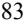

{85}------------------------------------------------

Upon retirement or sale, the cost of assets disposed of and the related accumulated depreciation are removed from the accounts and any resulting gain or loss is credited or charged to operations. Repairs and maintenance costs are expensed as incurred.

#### *Leases*

We determine if an arrangement is a lease at inception date. Leases are to be classified as finance or operating leases at the lease commencement date, which affects the classification of expense recognition in the consolidated statement of operations. Right-of-use assets represent the right to use an underlying asset for the lease term and lease liabilities represent the obligation to make lease payments, as agreed to in the lease. Operating lease liabilities and the corresponding right-of-use assets are recognized based on the present value of the future minimum lease payments over the lease term at commencement date. An operating right-of-use asset is measured as the amount of the initial measurement of the lease liability, adjusted for prepaid or accrued lease payments, the remaining balance of any lease incentive received, unamortized initial direct costs, and any impairment of the right-of-use asset. The initial measurement of the lease liabilities and right-to-use assets of finance leases is the same as for operating leases. We include options to extend the lease and certain termination options in our lease liability and right-of-use asset when it is reasonably certain that we will exercise those options.

As our existing leases do not contain an implicit interest rate, we estimate our IBR based on information available at commencement date in determining the present value of future payments. Due to the significant judgment involved and the complex analysis needed to determine this discount rate, we engaged a third-party valuation specialist to advise us in our determination of our IBR for the initial adoption of the standard and subsequent amendment of our office lease.

Lease expense for operating leases is recognized on a straight-line basis over the lease term as part of our selling, general and administrative expenses and our research and development expenses on our consolidated statements of operations. Lease expense for financing leases consists of amortization of the right-of-use asset and interest on the lease liability as part of our research and development expenses on our consolidated statements of operations.

#### *Fair Value of Financial Instruments*

We measure and record cash equivalents at fair value in the accompanying financial statements. Fair value is defined as the exchange price that would be received for an asset or paid to transfer a liability, an exit price, in the principal or most advantageous market for the asset or liability in an orderly transaction between market participants on the measurement date. Valuation techniques used to measure fair value must maximize the use of observable inputs and minimize the use of unobservable inputs.

The carrying amounts of our short-term financial instruments, which include cash and cash equivalents, royalty and milestone receivable and accounts payable, approximate their fair value due to their short maturities.

#### *Debt Issuance Costs*

Aptevo defers costs related to debt issuance and amortizes these costs to interest expense over the term of the debt, using the effective interest method. Debt issuance costs are presented in the consolidated balance sheet as a reduction of the carrying amount of the debt liability.

#### *Debt Modification*

On March 30, 2021, we amended our Credit Agreement with MidCap Financial (First Amendment to Credit Agreement) and used \$10 million of the proceeds received from the Royalty Purchase Agreement to pay down the outstanding principal under the Credit Agreement from \$25 million to \$15 million. The amended Credit Agreement was accounted for under ASC 470-50, *Debt Modifications and Extinguishments* as a debt modification, rather than an extinguishment, based on a comparison of the present value of the cash flows under the terms of the debt immediately before and after the amendment, which resulted in a change of less than 10%. Unamortized issuance costs as of the date of modification will be amortized to interest expense using the effective interest method over the repayment term.

{86}------------------------------------------------

On June 7, 2022, we further amended the Credit Agreement with MidCap Financial (Limited Consent and Second Amendment to Credit Agreement) to obtain MidCap Financial's limited consent to amend the Royalty Purchase Agreement with HCR. The Limited Consent and Second Amendment to Credit Agreement did not change future cash flows or other terms of the Credit Agreement.

Additionally, on August 30, 2022, we amended our Credit Agreement with MidCap Financial (Third Amendment to Credit Agreement) to replace the LIBOR benchmark with SOFR, which is regulated by the Federal Reserve Bank of New York. We amended our Credit Agreement due to FCA's planned phase-out of one-month US Dollar LIBOR settings in 2023. Our Credit Agreement continues to bear base interest at a rate of 6.25% per annum plus SOFR, subject to a 1.50% SOFR floor and a 2.50% SOFR cap.

#### *Liability Related to Sale of Royalties and Other Income (Expense)*

On March 30, 2021, we entered into and closed a Royalty Purchase Agreement with HCR pursuant to which we sold to HCR the right to receive royalty payments made by Pfizer in respect of net sales of RUXIENCE. Under the terms of the Royalty Purchase Agreement, we received \$35 million at closing and we are eligible to receive additional payments in the aggregate of up to an additional \$32.5 million based on the achievement of sales milestones in 2021, 2022 and 2023.

On the date we entered into the transaction, we accounted for the Royalty Purchase Agreement with HCR as a debt-like instrument, amortized under the effective interest rate method over the life of the related expected royalty stream. The liabilities related to the sale of royalties and the debt amortization were based on our estimates of royalties expected to be paid over the life of the arrangement. We received the 2021 milestone payments in the collective amount of \$10 million on March 8, 2022. The proceeds from these milestone payments, net of transaction costs, were recorded as an additional liability related to the sale of royalties on the consolidated balance sheet as of March 31, 2022 pursuant to ASC 470-10-25, *Debt – Sales of Future Revenues or Various Other Measures of Income*.

On June 7, 2022, we entered into and closed an amendment to the Royalty Purchase Agreement (the Amendment to Royalty Purchase Agreement) (see Note 8) which removed all restrictions related to HCR's rate of return, and it is no longer a sale of a specified percentage of royalty revenue. The Amendment to Royalty Purchase Agreement was accounted for under ASC 610-20, *Gains and Losses from Derecognition of Nonfinancial Assets* and ASC 405-20, *Liabilities – Extinguishment of Liabilities* and the transaction is no longer considered a debt-like financing.

As a result of the Amendment to Royalty Purchase Agreement, the Company recognized a gain of \$37.2 million, which was the total balance of liability related to the sale of royalties on the closing date. The Amendment to Royalty Purchase Agreement allowed us to regain full compliance with Nasdaq Listing Rule 5550(b)(1) in a way that was non-dilutive for our shareholders. No royalty revenue on net sales of RUXIENCE that are paid by Pfizer to HCR has been recognized subsequent to when we entered into the Amendment to Royalty Purchase Agreement. The royalty revenue included in the consolidated statements of operations reflects revenue recorded only prior to the second quarter of 2022 due to our Amendment to Royalty Purchase Agreement. Future Milestone Amounts will be accounted for as variable consideration and recognized as other income when such milestones are earned using the most likely method in accordance with ASC 610-20 *Other Income — Gains and Losses from the Derecognition of Nonfinancial Assets.* We received 2022 milestone payment of \$2.5 million on February 28, 2023. The proceed from 2022 milestone payment was recorded as other income in the consolidated statement of operations for the year ended December 31, 2022. The Company is eligible to receive additional milestone payment of \$10 million based on achievement of sales milestones in 2023.

#### *Royalty Revenue*

We recognized revenue in accordance with Accounting Standards Codification Topic 606, *Revenue from Contracts with Customers* (ASC 606). Under ASC 606, an entity recognizes revenue when its customer obtains control of promised goods or services, in an amount that reflects the consideration that the entity expects to receive in exchange for those goods or services. To determine revenue recognition for arrangements that an entity determines are within the scope of ASC 606, the entity performs the following five steps: (i) identify the contract(s) with a customer; (ii) identify the performance obligations in the contract; (iii) determine the transaction price; (iv) allocate the transaction price to the performance obligations in the contract; and (v) recognize revenue when (or as) the entity satisfies a performance obligation.

{87}------------------------------------------------

#### *RUXIENCE Royalty Revenue*

Aptevo's royalty revenue exclusively related to royalties on Pfizer's net sales of RUXIENCE. Royalty revenue for the period covered by this report reflects revenue recorded only prior to the second quarter of 2022 due to our Amendment to Royalty Purchase Agreement with HCR (see Note 8). As a result of the Amendment to Royalty Purchase Agreement, we ceased reporting as royalty revenue, royalties paid by Pfizer to HCR related to Pfizer's sales of RUXIENCE.

We recognized royalty revenue under ASC 606, which provides revenue recognition constraints by requiring the recognition of revenue at the later of the following: (1) when the subsequent sale or usage occurs or (2) when the performance obligation to which some or all of the sales-based or usagebased royalty has been allocated has been satisfied (or partially satisfied). We satisfied our performance obligation prior to the period covered by this report, specifically in May 2011 when the original Collaboration and License Agreement between Trubion Pharmaceuticals and Wyeth was amended to remove the exclusivity/non-compete restrictions so that Pfizer could develop a CD20 biosimilar product in exchange for a one-time payment of \$2.5 million and future royalties of 2.5% on any CD20 biosimilar product commercialized by Pfizer in the future. We do not have future performance obligations under this agreement. We applied the royalty recognition constraint required under the guidance for sales-based royalties, which requires a sales-based royalty to be recorded no sooner than the underlying sale. Therefore, royalties on sales of products commercialized by Pfizer were recognized in the quarter the product is sold.

Given the royalty revenues were based on 2.5% of global net sales of RUXIENCE, the considerations were considered variable. Pfizer generally reported sales information to us within 60 days of quarter end. Unless we received finalized sales information for the respective quarter, we estimated the expected royalty proceeds based on an analysis of historical experience, analyst expectations, interim data provided by Pfizer, including their publicly announced sales, and other publicly available information. Differences between actual and estimated royalty revenues were adjusted for in the period in which they became known, typically the following quarter. Revenue recorded in the period covered by this report represents actual royalty revenue given the timing of RUXIENCE sales reports received from Pfizer. There was no significant financing component to the contract.

#### *Research and Development Expenses*

Research and development expenses are expensed as incurred. Research and development costs primarily consist of internal labor costs, fees paid to outside service providers and the costs of materials used in clinical trials and research and development. Other research and development expenses include facility, maintenance, and related support expenses.

A substantial portion of Aptevo's preclinical studies and all of its clinical studies have been performed by third-party CROs. The Company reviews the activities performed by the CROs each period. For preclinical studies, the significant factors used in estimating accruals include the percentage of work completed to date and contract milestones achieved. For clinical study expenses, the significant factors used in estimating accruals include the number of patients enrolled and services provided but not yet invoiced. The Company's estimates are highly dependent upon the timeliness and accuracy of the data provided by its CROs regarding the status of each program and total program spending and adjustments are made when deemed necessary.

{88}------------------------------------------------

#### *General and Administrative Expenses*

General and administrative expenses consist primarily of personnel-related costs and professional fees in support of our executive, business development, finance, accounting, information technology, legal and human resource functions. Other costs include facility costs not otherwise included in research and development expense.

### *Stock-Based Compensation*

We measure and recognize compensation expense for restricted stock units (RSUs), and stock options granted to our employees and directors based on the fair value of the awards as of the date of grant. The fair value of stock options is estimated at the date of grant using the Black-Scholes option pricing model that requires management to apply judgment and make estimates, including:

- the expected term of the stock option award, which we calculate using the simplified method, as we have insufficient historical information regarding our stock options to provide a basis for an estimate;
- the expected volatility of our underlying common stock, which we estimate based on the historical volatility of the historical and implied future volatility of our common stock;
- the risk-free interest rate, which we based on the yield curve of U.S. Treasury securities with periods commensurate with the expected term of the options being valued;
- the expected dividend yield, which we estimate to be zero based on the fact that we have never paid cash dividends and have no present intention to pay cash dividends; and
- the fair value of our common stock on the date of grant.

Stock-based compensation expense for RSUs is recognized on a straight-line basis over the vesting period of the respective award. Stock-based compensation expense for our stock options, both converted and Aptevo granted, is recognized on a straight-line basis over the vesting period of the respective award.

We routinely evaluate the appropriateness of the forfeiture rate based on actual forfeiture experience, analysis of employee turnover, and expectations of future option exercise behavior.

#### *Income Taxes*

Income taxes are accounted for using the liability method. Deferred tax assets and liabilities are recognized for future tax consequences attributable to differences between financial statement carrying amounts of existing assets and liabilities and their respective tax bases and net operating loss and tax credit carry forwards. Deferred tax assets and liabilities are measured using enacted tax rates expected to apply to taxable income in the year in which those temporary differences are expected to be recovered or settled.

Aptevo's ability to realize deferred tax assets depends upon future taxable income, as well as the limitations discussed below. For financial reporting purposes, a deferred tax asset must be reduced by a valuation allowance if it is more likely than not that some portion or all of the deferred tax assets will not be realized prior to expiration. Aptevo considers historical and future taxable income, future reversals of existing taxable temporary differences, taxable income in prior carryback years, and ongoing tax planning strategies in assessing the need for valuation allowances. In general, if Aptevo determines that it is more likely than not to realize more than the recorded amounts of net deferred tax assets in the future, Aptevo will reverse all or a portion of the valuation allowance established against its deferred tax assets, resulting in a decrease to the provision for income taxes in the period in which the determination is made. Likewise, if Aptevo determines that it is not more likely than not to realize all or part of the net deferred tax asset in the future, Aptevo will establish a valuation allowance against deferred tax assets, with an offsetting increase to the provision for income taxes, in the period in which the determination is made.

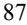

{89}------------------------------------------------

Because tax laws are complex and subject to different interpretations, significant judgment is required. As a result, Aptevo makes certain estimates and assumptions, in (1) calculating Aptevo's income tax expense, deferred tax assets and deferred tax liabilities, (2) determining any valuation allowance recorded against deferred tax assets and (3) evaluating the amount of unrecognized tax benefits, as well as the interest and penalties related to such uncertain tax positions. Aptevo's estimates and assumptions may differ significantly from tax benefits ultimately realized.

#### *Segment Reporting*

Operating segments are identified as components of an entity about which separate discrete financial information is available for evaluation by the chief operating decision maker (CODM), or decision-making group, in making decisions on how to allocate resources and assess performance. The Company's CODM is the Chief Executive Officer, who views the Company's operations as one operating segment, which is discovery and development of novel oncology therapeutics.

#### **Recently Adopted Accounting Pronouncement**

In March 2020, the Financial Accounting Standards Board (FASB) issued Accounting Standard Update (ASU) 2020-04, *Reference Rate Reform* (ASC 848) to provide optional expedients and exceptions for applying GAAP to loan and lease agreements, derivative contracts, and other transactions affected by the anticipated transition away from LIBOR toward new interest rate benchmarks. The FCA, which regulates LIBOR, phased out one-week and two-month US Dollar LIBOR settings on December 31, 2021. All other US Dollar LIBOR settings, including the overnight, one-month, three-month, sixmonth and twelve-month, will be phased out on June 30, 2023.

We evaluated ASC 848, *Reference Rate Reform*, as part of our August 30, 2022 amendment to Credit Agreement with MidCap Financial (see Note 7). The adoption of ASC 848 did not have a material impact on our consolidated financial statements.

#### **Note 2. Discontinued Operations**

The accompanying financial statements include discontinued operations from two separate transactions: the sale of our hyperimmune business in 2017, from which we received a payment in March 2021 related to the collection of a certain accounts receivable, and the sale of our Aptevo BioTherapeutics LLC business in February 2020.

On February 28, 2020, we entered into an LLC Purchase Agreement with Medexus, pursuant to which we sold all of the issued and outstanding limited liability company interests of Aptevo BioTherapeutics LLC, a wholly owned subsidiary of Aptevo. As a result of the transaction, Medexus obtained all rights, title and interest to the IXINITY product and the related Hemophilia B business and intellectual property.

The following table represents the components attributable to income from discontinued operations in the consolidated statements of operations (in thousands):

|                                            |      | For the Year Ended December 31, |    |      |  |  |
|--------------------------------------------|------|---------------------------------|----|------|--|--|
|                                            | 2022 |                                 |    | 2021 |  |  |
| Deferred payments from Medexus             |      | 1,013                           |    | 491  |  |  |
| Gain on contingent consideration from Saol |      | —                               |    | 460  |  |  |
| Income from discontinued operations        | \$   | 1,013                           | \$ | 951  |  |  |

The LLC Purchase Agreement with Medexus entitles us to future deferred payments and royalties. For the year ended December 31, 2022, we collected an approximately \$1.0 million deferred payment from Medexus related to IXINITY sales. For the year ended December 31, 2021, we collected \$0.5 million related to the sale of the hyperimmune business to Saol as a result of the collection of certain accounts receivable and deferred payments of \$0.5 million from Medexus related to IXINITY sales. Pursuant to our LLC Purchase Agreement with Medexus, the rate for deferred payments increased from 2% to 5% of net sales as of June 30, 2022.

{90}------------------------------------------------

### **Note 3. Collaboration Agreements**

#### *Alligator Bioscience AB*

On July 20, 2017, our wholly owned subsidiary Aptevo Research and Development LLC (Aptevo R&D), entered into a collaboration and option agreement (the Collaboration Agreement) with Alligator Bioscience AB (Alligator), pursuant to which Aptevo and Alligator have been collaboratively developing ALG.APV-527, a lead bispecific antibody candidate simultaneously targeting 4-1BB (CD137), a member of the TNFR superfamily of a costimulatory receptor found on activated T cells, and 5T4, a tumor antigen widely overexpressed in a number of different types of cancer.

We assessed the arrangement in accordance with ASC 606 and concluded that the contract counterparty, Alligator, is not a customer. As such the arrangement is not in the scope of ASC 606 and is instead treated as a collaborative agreement under ASC 808 – *Collaborative Arrangements* (ASC 808). In accordance with ASC 808, we concluded that because the Collaboration Agreement is a cost sharing agreement, there is no revenue.

For the years ended December 31, 2022 and 2021, we recorded approximately \$1.7 million and \$0.1 million in our research and development expense related to the collaboration arrangement, respectively.

#### **Note 4. Fair Value Measurements**

The Company's estimates of fair value for financial assets and financial liabilities are based on the framework established in the fair value accounting guidance. The framework is based on the inputs used in valuation, gives the highest priority to quoted prices in active markets and requires that observable inputs be used in the valuations when available. The disclosure of fair value estimates in the fair value accounting guidance hierarchy is based on whether the significant inputs into the valuation are observable. In determining the level of the hierarchy in which the estimate is disclosed, the highest priority is given to unadjusted quoted prices in active markets and the lowest priority to unobservable inputs that reflect the Company's significant market assumptions. The level in the fair value hierarchy within which the fair value measurement is reported is based on the lowest level input that is significant to the measurement in its entirety. The three levels of the hierarchy are as follows:

Level 1— Quoted prices in active markets for identical assets and liabilities;

Level 2— Inputs other than quoted prices in active markets, that are either directly or indirectly observable; and,

Level 3— Unobservable inputs that are supported by little or no market activity, and that are significant to the fair value of the assets or liabilities.

At December 31, 2022 and 2021, we had \$21.6 million and \$41.2. million in money market funds, respectively. The carrying amounts of our money market funds approximate their fair value. At December 31, 2022 and 2021, we did not have any Level 2 or Level 3 assets or liabilities.

#### **Note 5. Cash, Cash Equivalents, and Restricted Cash**

The Company's cash equivalents are highly liquid investments with a maturity of 90 days or less at the date of purchase and investments in money market funds. Restricted cash are time deposits, which include securing letters of credit.

The following table shows our cash, cash equivalents and current restricted cash as of December 31, 2022 and 2021:

|                                                   |    |        |      | For the Year Ended December 31, |  |  |  |
|---------------------------------------------------|----|--------|------|---------------------------------|--|--|--|
| (in thousands)                                    |    | 2022   | 2021 |                                 |  |  |  |
| Cash                                              | \$ | 1,066  | \$   | 3,841                           |  |  |  |
| Cash equivalents                                  |    | 21,569 |      | 41,203                          |  |  |  |
| Restricted cash                                   |    | —      |      | 1,259                           |  |  |  |
| Total cash, cash equivalents, and restricted cash | \$ | 22,635 | \$   | 46,303                          |  |  |  |

{91}------------------------------------------------

### **Note 6. Property and equipment, net**

Property and equipment consist of the following:

|                                   |    | For the Year Ended December 31, |    |           |  |
|-----------------------------------|----|---------------------------------|----|-----------|--|
| (in thousands)                    |    | 2022                            |    | 2021      |  |
| Leasehold improvements            | \$ | 2,228                           | \$ | 2,228     |  |
| Furniture and equipment           |    | 12,260                          |    | 12,430    |  |
| Property and equipment, gross     |    | 14,488                          |    | 14,658    |  |
| Less: Accumulated depreciation    |    | (13,026 )                       |    | (12,279 ) |  |
| Total property and equipment, net | \$ | 1,462                           | \$ | 2,379     |  |

Depreciation expense for the years ended December 31, 2022 and 2021 was \$0.9 million and \$1.1 million, respectively.

#### **Note 7. Debt**

### *Credit Agreement*

On August 5, 2020, we entered into a Credit Agreement with MidCap Financial. The Credit Agreement provided us with up to \$25.0 million of available borrowing capacity under a term loan facility. The full \$25.0 million was drawn on the closing date of the Credit Agreement. The term loan facility has a 48 month term, is interest-only for the first 18 months, with straight-line amortization for the remaining 30 months and bears interest at a rate of one month LIBOR plus 6.25% per annum, subject to a 1.50% LIBOR floor and a 2.50% LIBOR cap. Certain assets of the Company are pledged as collateral under the terms of the Credit Agreement. The FCA, which regulates LIBOR, phased out one-week and two-month US Dollar LIBOR settings on December 31, 2021. All other US Dollar LIBOR settings, including the overnight, one-month, three-month, six-month and twelve-month, will be phased out on June 30, 2023. Our 2020 Credit Agreement with MidCap Financial originally referenced one-month LIBOR and also provided that we may amend the Credit Agreement to reflect an alternative rate of interest upon the phase out of LIBOR.

On November 6, 2020, Kevin Tang and his related entities filed a statement on Schedule 13D to report the purchase of 1,760,000 shares of the Company's common stock, which at the time represented approximately 54% of the Company's issued and outstanding shares of the Company's common stock. This acquisition of voting stock triggered a change in control, resulting in an Event of Default under Section 10.1(a)(ii) of the Credit Agreement. On November 10, 2020, the Company obtained a waiver from MidCap Financial pursuant to which, among other things, MidCap Financial waived such Event of Default and MidCap Financial and the Company agreed that an immediate event of default under the Credit Agreement will be deemed to have occurred in the event that (a) a majority of the seats on the Company's board of directors are occupied by persons who were neither (i) nominated by the Company's board of directors nor (ii) appointed by the directors so nominated, and (b) Tang has appointed the majority of the Company's board of directors. No other events of default have occurred with respect to the Credit Agreement.

On March 30, 2021, we amended our Credit Agreement with MidCap Financial and used \$10.0 million of the proceeds received from the Royalty Purchase Agreement to pay down the outstanding principal under the Credit Agreement from \$25.0 million to \$15.0 million. A fee of \$0.6 million was paid by the Company to MidCap Financial in connection with the amendment in lieu of the formula-based fee previously required. \$10.0 million of the remaining \$15.0 million principal balance was paid on March 29, 2022 and we incurred additional \$0.6 million prepayment fees. Beginning March 1, 2022, monthly repayment of the remaining \$5.0 million of principal commenced and will continue for the final 30 months of the loan term. The term loan facility includes additional payment provisions if milestones related to IXINITY under the LLC Purchase Agreement with Medexus or royalties related to RUXIENCE under the Royalty Purchase Agreement with HCR are sold during the term of the loan. If the Company sells the IXINITY deferred payment stream and milestones prior to full repayment of this \$5.0 million principal amount, under the agreement with MidCap Financial, we will be required to use the proceeds from the sale to pay down the outstanding loan principal balance. MidCap Financial also released its security interest in the RUXIENCE royalty payments.

The amended Credit Agreement was accounted for as a debt modification, rather than an extinguishment, based on a comparison of the present value of the cash flows under the terms of the debt immediately before and after the

{92}------------------------------------------------

amendment, which resulted in a change of less than 10%. Unamortized issuance costs as of the date of modification will be amortized to interest expense using the effective interest method over the repayment term.

On June 7, 2022, we further amended the Credit Agreement with MidCap Financial to obtain MidCap Financial's limited consent to amend our Royalty Purchase Agreement with HCR. The Limited Consent and Second Amendment to Credit Agreement did not change future cash flows or other terms of the Credit Agreement.

Additionally, on August 30, 2022, we amended our Credit Agreement with MidCap Financial to replace the LIBOR benchmark with SOFR, which is regulated by the Federal Reserve Bank of New York. We amended our Credit Agreement due to FCA's planned phase-out of one-month US Dollar LIBOR settings in 2023. Our Credit Agreement continues to bear base interest at a rate of 6.25% per annum plus SOFR, subject to a 1.50% SOFR floor and a 2.50% SOFR cap.

As of December 31, 2022, we classified \$2.0 million of the \$3.5 million principal of the amended Credit Agreement to current portion of long-term debt on the consolidated balance sheet. For the years ended December 31, 2022 and 2021, the Company paid \$0.6 million and \$1.4 million in interest expense pursuant to our Credit Agreement.

This facility is subject to a subjective acceleration clause that could be invoked by MidCap Financial upon the occurrence of any event MidCap Financial deems to have a material adverse effect on our ability to repay the lender.

Future principal, interest, and other related fee payments in connection with the Credit Agreement as of December 31, 2022 are as follows:

| (in thousands) |             |
|----------------|-------------|
| 2023           | \$ 2,279 |
| 2024           | 1,727       |
| Total          | \$ 4,006 |

#### **Note 8. Liability Related to Sale of Royalties**

In March 2021, we entered into and closed the Royalty Purchase Agreement with HCR pursuant to which we sold to HCR the right to receive royalty payments made by Pfizer in respect of global net sales of RUXIENCE. Under the terms of the agreement, we received \$35.0 million at closing and we are eligible to receive additional payments in the aggregate of up to an additional \$32.5 million based on the achievement of sales milestones in 2021, 2022 and 2023 (up to \$10 million and \$12.5 million in 2021 and 2022, respectively and \$10 million in 2023).

Due to the nature of the transaction, which included a cap on HCR's rate of return, constituting continuing involvement under the Collaboration and License Agreement originally between Trubion and Wyeth, we recorded a liability related to the proceeds received from HCR of \$35.0 million, net of transaction costs of \$1.1 million. Further, we received proceeds related to the 2021 milestone of \$10.0 million, net of transaction costs of \$0.5 million, and recorded additional liability related to sale of royalties. We recognized royalty revenue on net sales of RUXIENCE and recorded the royalty payments to HCR as a reduction of the liability when paid. We received the 2021 milestone payments in the collective amount of \$10.0 million on March 8, 2022. The proceeds from these milestone payments, net of transaction costs, were recorded as an additional liability related to the sale of royalties on the consolidated balance sheet as of March 31, 2022 pursuant to ASC 470-10-25, *Debt – Sales of Future Revenues or Various Other Measures of Income.*

On April 1, 2022, the Company received a letter from Nasdaq indicating that it was not in compliance with Nasdaq Listing Rule 5550(b)(1). On June 7, 2022, we entered into and closed an amendment to our Royalty Purchase Agreement, resulting in the Company recognizing a \$37.2 million gain, which was the total balance of liability related to the sale of royalties on the closing date. The Amendment to Royalty Purchase Agreement allowed us to regain full compliance with Nasdaq Listing Rule 5550(b)(1) in a way that was non-dilutive for our shareholders. Pursuant to the Amendment to Royalty Purchase Agreement, we agreed to forego our right to receive 50% of incremental RUXIENCE royalty revenue after HCR received aggregate royalty payments totaling 190% of the Investment Amount plus Milestone Amounts to the extent paid by HCR. The Amendment to Royalty Purchase Agreement eliminated all of our continuing involvement with the cash generating activities related to the royalties and removed all restrictions related to the rate of return and was therefore accounted for under ASC 610-20, *Gains and Losses from Derecognition of Nonfinancial Assets* and ASC 405-20, *Liabilities – Extinguishment of Liabilities*.

{93}------------------------------------------------

The royalty revenue included in the consolidated statements of operations reflects revenue recorded only prior to the second quarter of 2022 due to our Amendment to Royalty Purchase Agreement. Future milestone payments will be accounted for as variable consideration and recognized using the most likely method in accordance with ASC 610-20 *Other Income — Gains and Losses from the Derecognition of Nonfinancial Assets*. We received 2022 milestone payment of \$2.5 million on February 28, 2023. The proceeds from 2022 milestone payment was recorded as other income in the consolidated statement of operations for the year ended December 31, 2022. We are eligible to receive additional milestone payment of \$10 million based on achievement of sales milestones in 2023.

The following table presents the changes in the liability in the year related to the sale of royalties under the Royalty Purchase Agreement with HCR (in thousands):

|                                                                    |      | For the year ended December 31, |    |           |  |
|--------------------------------------------------------------------|------|---------------------------------|----|-----------|--|
|                                                                    | 2022 |                                 |    | 2021      |  |
| Liability related to sale of royalties, beginning balance          | \$   | 31,045                          | \$ | —         |  |
| Proceeds from sale of royalties, net of transaction costs          |      | —                               |    | 33,900    |  |
| Proceeds from milestone payments, net of transaction costs         |      | 9,500                           |    | —         |  |
| Non-cash interest expense                                          |      | 3,416                           |    | 5,772     |  |
| RUXIENCE royalties paid by Pfizer to HCR                           |      | (6,779 )                        |    | (8,627 )  |  |
| Gain from extinguishment of liability related to sale of royalties |      | (37,182 )                       |    | —         |  |
| Liability related to sale of royalties, ending balance             |      | —                               |    | 31,045    |  |
| Current portion of liability related to sale of royalties          |      | —                               |    | (15,465 ) |  |
| Liability related to sale of royalties, non-current                | \$   | —                               | \$ | 15,580    |  |

### **Note 9. Leases and Contingencies**

#### *Of ice Space Lease – Operating*

We have an operating lease related to our office and laboratory space in Seattle, Washington. This lease was amended in March 2019 to extend the term through April 2030 and provide two options to extend the lease term, each by five years, as well as a one-time option to terminate the lease in April 2023, with nine months' notice, or by July 2022. We had previously determined to record lease liability and ROU asset through April 30, 2023 given we were not reasonable certain to not exercise the termination option.

On May 26, 2022, we amended our office and laboratory lease to remove the one-time termination option. In exchange for removing the termination option, we received six months of free rent. As a result, we recorded an additional \$4.4 million of lease liability and right-of-use asset on the consolidated balance sheet on the date of the amendment. As of December 31, 2022, we are not reasonably certain to exercise the two options to extend the lease term. Therefore, pursuant to our May 26, 2022, amendment, we recorded our lease liability through April 30, 2030.

For the years ended December 31, 2022 and 2021, we recorded \$0.7 million and \$0.8 million, respectively, related to variable expense due to true ups of operating costs or real estate taxes.

#### *Equipment Leases - Operating and Financing*

As of December 31, 2022, we did not have any operating or financing leases for equipment.

{94}------------------------------------------------

### *Components of lease expense:*

| (in thousands)       |    | For the year ended December 31, 2022 |    | For the year ended December 31, |  |
|----------------------|----|--------------------------------------------|----|------------------------------------|--|
|                      |    |                                            |    | 2021                               |  |
| Operating lease cost | \$ | 1,277                                      | \$ | 1,556                              |  |
| Total lease cost     | \$ | 1,277                                      | \$ | 1,556                              |  |

### *Right-of-use assets acquired under operating leases:*

|                                                  | As of December 31, 2022 |       | As of December 31, |       |
|--------------------------------------------------|----------------------------|-------|--------------------|-------|
| (in thousands)                                   |                            |       | 2021               |       |
| Operating leases, excluding Seattle office lease | \$                         | —     | \$                 | 7     |
| Seattle office lease, including amendment        |                            | 5,303 |                    | 1,577 |
| Total right-of-use assets                        | \$                         | 5,303 | \$                 | 1,584 |

### *Lease payments:*

|                      | For the year ended December 31, |      | For the year ended December 31, |       |  |
|----------------------|------------------------------------|------|------------------------------------|-------|--|
| (in thousands)       |                                    | 2022 |                                    | 2021  |  |
| For operating leases | \$                                 | 895  | \$                                 | 1,387 |  |

Future minimum payments as of December 31, 2022 are as follows:

| (in thousands)                      |             |
|-------------------------------------|-------------|
| 2023                                | 1,147       |
| 2024                                | 1,376       |
| 2025                                | 1,376       |
| 2026 and beyond                     | 5,963       |
| Total future minimum lease payments | 9,862       |
| Less: imputed interest              | (3,402 )    |
| Total                               | \$ 6,460 |

As of December 31, 2022, the long-term and current portion of the lease liabilities were \$6.1 million and \$0.4 million, respectively. As of December 31, 2021, the long-term and current portion of the lease liabilities were \$1.3 million and \$1.0 million, respectively.

As of December 31, 2022, the weighted average remaining lease term and weighted discount rate for operating leases was 7.3 years and 12.03%. As of December 31, 2021, the weighted average remaining lease term and weighted discount rate for operating leases was 1.3 years and 14.46%.

### **Note 10. Net Income (Loss) per Share**

Basic net income (loss) per share is calculated by dividing the net income (loss) by the weighted average number of common shares outstanding for the period. Diluted net income (loss) per share is computed by dividing the net income (loss) by the weighted average number of common share equivalents outstanding for the period using the as-if converted method. For the purpose of this calculation, warrants, stock options and restricted stock units (RSUs) are only included in the calculation of diluted net income (loss) per share when their effect is dilutive.

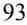

{95}------------------------------------------------

We utilize the control number concept in the computation of diluted earnings per share to determine whether potential common stock instruments are dilutive. The control number used is loss from continuing operations or income from discontinued operations. The control number concept requires that the same number of potentially dilutive securities applied in computing diluted earnings per share from continuing operations be applied to all other categories of income or loss, regardless of their anti-dilutive effect on such categories.

Common stock equivalents include warrants, stock options and unvested RSUs.

The following table presents the computation of basic and diluted net income (loss) per share (in thousands, except share and per share amounts):

|                                                                           | For the Year Ended December 31, |    |           |  |
|---------------------------------------------------------------------------|---------------------------------|----|-----------|--|
|                                                                           | 2022                            |    | 2021      |  |
| Net income (loss) from continuing operations                              | \$ 7,014                     | \$ | (29,408 ) |  |
| Income from discontinued operations                                       | 1,013                           |    | 951       |  |
| Net income (loss)                                                         | \$ 8,027                     | \$ | (28,457 ) |  |
| Basic and diluted net income (loss) per share from continuing operations: |                                 |    |           |  |
| Basic                                                                     | \$ 1.37                      | \$ | (6.27 )   |  |
| Diluted                                                                   | \$ 1.37                      | \$ | (6.27 )   |  |
| Basic and diluted net income per share from discontinued operations:      |                                 |    |           |  |
| Basic                                                                     | \$ 0.20                      | \$ | 0.20      |  |
| Diluted                                                                   | \$ 0.20                      | \$ | 0.20      |  |
|                                                                           |                                 |    |           |  |
| Shares used in calculation                                                |                                 |    |           |  |
| Basic                                                                     | 5,100,310                       |    | 4,687,952 |  |
| Diluted                                                                   | 5,102,914                       |    | 4,687,952 |  |

The following table represents all potentially dilutive shares:

|                                              |      | As of December 31, |  |  |
|----------------------------------------------|------|--------------------|--|--|
| (in thousands, except for per share amounts) | 2022 | 2021               |  |  |
| Warrants                                     | 351  | 351                |  |  |
| Outstanding options to purchase common stock | 364  | 334                |  |  |
| Unvested RSUs                                | 224  | 57                 |  |  |

### **Note 11. Equity**

### C*ommon Stock*

The Company issued warrants to purchase shares of our common stock outstanding related to our March 11, 2019 public offering. For the year ended December 31, 2022, the Company did not have any of its warrants exercised. For the year ended December 31, 2021, certain of the holders of the Company's warrants exercised warrants with a strike price of \$18.20 per share, resulting in the issuance of 54,105 shares of the Company's common stock and aggregate proceeds to the Company of approximately \$1.0 million. As of December 31, 2022 and 2021, there were warrants to purchase 350,589 shares of common stock outstanding.

For the year ended December 31, 2022, we issued 16,809 shares of our common stock due to the vesting of RSUs. For the year ended December 31, 2021, we did not issue any common stock due to the vesting of RSUs.

For the year ended December 31, 2022, an immaterial number of shares of stock options were exercised. For the year ended December 31, 2021, we received proceeds of \$0.2 million upon the exercise of stock options which resulted in the issuance of 26,082 shares of common stock.

{96}------------------------------------------------

#### *Equity Distribution Agreement*

On December 14, 2020, we entered into an Equity Distribution Agreement with Piper Sandler. The Equity Distribution Agreement provides that, upon the terms and subject to the conditions set forth therein, we may issue and sell through Piper Sandler, acting as sales agent, shares of our common stock, \$0.001 par value per share having an aggregate offering price of up to \$50.0 million. This offering supersedes and replaces the program we commenced in December 2017. We have no obligation to sell any such shares under the Equity Distribution Agreement. The sale of such shares of common stock by Piper Sandler will be effected pursuant to a Registration Statement on Form S-3 which we filed on December 14, 2020. For the year ended December 31, 2022, we issued 1,452,065 shares of our common stock at an average share price of \$4.92 under the Equity Distribution Agreement. We received \$7.0 million in proceeds from issuance of these shares. We did not issue any shares under the Equity Distribution Agreement for the year ended December 31, 2021.

#### *Lincoln Park Purchase Agreement*

On February 16, 2022, we entered into a Purchase Agreement (2022 Purchase Agreement) and a Registration Rights Agreement with Lincoln Park. The 2022 Purchase Agreement and Registration Rights Agreement replaced our 2018 Purchase Agreement and Registration Rights Agreement with Lincoln Park. Under the 2022 Purchase Agreement, Lincoln Park committed to purchase up to \$35.0 million of our common stock over a 36-month period commencing after the satisfaction of certain conditions, which are within our control, as set forth in the Purchase Agreement. The purchase price per share will be based on prevailing market prices; provided, however, that the prevailing market price is not below \$1.00. We agreed to and issued 99,276 shares of our common stock to Lincoln Park for no cash consideration as an initial fee for its commitment to purchase shares of our common stock under the 2022 Purchase Agreement.

For in the year ended December 31, 2022, we did not issue any shares of common stock for cash consideration to Lincoln Park under the 2022 Purchase Agreement. For the year ended December 31, 2021, the Company issued 407,047 shares of common stock to Lincoln Park under the 2018 Purchase Agreement and received \$10.2 million in proceeds from issuance of these shares.

#### *Rights Plan*

On November 8, 2020, our Board of Directors (Board) approved and adopted a Rights Agreement by and between the Company and Broadridge Corporate Issuer Solutions, Inc., as rights agent, pursuant to which the Board declared a dividend of one preferred share purchase right (each, a Right) for each outstanding share of the Company's common stock held by stockholders as of the close of business on November 23, 2020. When exercisable, each Right initially would represent the right to purchase from the Company one one-thousandth of a share of a newly-designated series of preferred stock, Series A Junior Participating Preferred Stock, par value \$0.001 per share, of the Company, at an exercise price of \$400.00 per one one-thousandth of a Series A Junior Participating Preferred Share, subject to adjustment. Subject to various exceptions, the Rights become exercisable in the event any person (excluding certain exempted or grandfathered persons) becomes the beneficial owner of ten percent (10%) or more of the Company's common stock without the approval of the Board. The Rights Agreement was amended on November 4, 2021 to extend the expiration date of such agreement from November 8, 2021 to November 5, 2022 and further amended on November 4, 2022 to extend the expiration of such agreement to November 4, 2023.

#### *2016 Stock Incentive Plan*

On August 1, 2016, the Company adopted the 2016 Stock Incentive Plan (the 2016 SIP). A total of 0.2 million shares of our common stock have been authorized for issuance under the 2016 SIP in the form of equity stock options.

On May 31, 2017, at the 2017 Annual Meeting of Stockholders (Annual Meeting), the Company's stockholders approved the amendment and restatement of the Company's 2016 SIP (Restated 2016 Plan) to, among other things, increase the number of authorized shares issuable by 0.1 million shares of our common stock. The Restated 2016 Plan was previously approved, subject to stockholder approval, by the Board of Directors of the Company.

{97}------------------------------------------------

#### *2018 Stock Incentive Plan*

On June 1, 2018, at the 2018 Annual Meeting of the Stockholders, the Company's stockholders approved a new 2018 Stock Incentive Plan (2018 SIP), which replaced the Restated 2016 Plan on a go-forward basis. All stock options, RSUs or other equity awards granted subsequent to June 1, 2018 have been and will be issued out of the 2018 SIP, which has 0.3 million shares of our common stock authorized for issuance. The 2018 Plan became effective immediately upon stockholder approval at the 2018 Annual Meeting of the Stockholders. Any shares subject to outstanding stock awards granted under the 2016 SIP that (a) expire or terminate for any reason prior to exercise or settlement; (b) are forfeited because of the failure to meet a contingency or condition required to vest such shares or otherwise return to the Company; or (c) otherwise would have returned to the 2016 SIP for future grant pursuant to the terms of the 2016 Plan (such shares, the "Returning Shares") will immediately be added to the share reserve under the 2018 SIP as and when such shares become Returning Shares, up to a maximum of 0.3 million shares.

On June 7, 2022, at the 2022 Annual Meeting of Stockholders, our stockholders approved the Amended and Restated 2018 SIP to increase the number of shares authorized for issuance under the 2018 SIP by 0.5 million shares of common stock. As of December 31, 2022, there are less than 0.4 million shares available to be granted under the 2018 SIP.

Stock options and RSUs under the Amended and Restated 2018 SIP generally vest pro rata over a one-year or three-year period. Stock options terminate ten years from the grant date, though the specific terms of each grant are determined individually. The Company's executive officers, members of our board of directors, and certain other employees and consultants may be awarded options and/or RSUs with different vesting criteria, and awards granted to non-employee directors will vest over a one-year period. Option exercise and RSU grant prices for new awards granted by the Company equal the closing price of the Company's common stock on the Nasdaq Capital Market on the date of grant.

#### *Stock-Based Compensation Expense*

Stock-based compensation expense includes amortization of stock options and RSUs granted to employees and non-employees and has been reported in our consolidated statements of operations as follows:

|                                        | 2022 |       |    | For the Year Ended December 31, |  |  |
|----------------------------------------|------|-------|----|---------------------------------|--|--|
| (in thousands)                         |      |       |    | 2021                            |  |  |
| Research and development               | \$   | 196   | \$ | 510                             |  |  |
| General and administrative             |      | 1,606 |    | 1,133                           |  |  |
| Total stock-based compensation expense | \$   | 1,802 | \$ | 1,643                           |  |  |

The Company accounts for stock-based compensation by measuring the cost of employee services received in exchange for all equity awards granted based on the fair value of the award as of the grant date. The Company recognizes the compensation expense over the vesting period. All assumptions used to calculate the grant date fair value of non-employee equity awards are generally consistent with the assumptions used for equity awards granted to employees. In the event the Company terminates any of its consulting agreements, the unvested equity underlying the agreements would also be cancelled.

#### *Stock Options*

Aptevo utilizes the Black-Scholes valuation model for estimating the fair value of all stock options granted. Set forth below are the assumptions used in valuing the stock options granted:

|                                  | For the Year Ended December 31, |         |
|----------------------------------|---------------------------------|---------|
|                                  | 2022                            | 2021    |
| Expected dividend yield          | 0.00%                           | 0.00%   |
| Expected volatility              | 106.24%                         | 99.15%  |
| Risk-free interest rate          | 1.71%                           | 0.61%   |
| Expected average life of options | 5 years                         | 5 years |

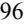

{98}------------------------------------------------

Management has applied an estimated forfeiture rate of 30% and 23% for the year ended December 31, 2022 and 2021, respectively. Expected volatility increased, as our stock price fluctuated from a low of \$2.00 to a high of \$8.42 throughout the year ended December 31, 2022, compared to a low of \$6.48 to a high of \$40.59 for the year ended December 31, 2021.

The following is a summary of option activity for the year ended December 31, 2022:

|                                                  | Number of Shares | Weighted Average Exercise Price | Weighted Average Remaining Term | Aggregate Intrinsic Value (in thousands) |
|--------------------------------------------------|---------------------|---------------------------------------|------------------------------------------|---------------------------------------------------|
| Outstanding at December 31, 2021                 | 334,412             | \$ 19.17                           | 8.70                                     | \$ 43,210                                      |
| Granted                                          | 69,588              | 5.54                                  | —                                        | —                                                 |
| Exercised                                        | (85 )               | 6.97                                  | —                                        | 21                                                |
| Forfeited                                        | (39,649 )           | 25.61                                 | —                                        | —                                                 |
| Outstanding at December 31, 2022                 | 364,266             | 15.77                                 | 7.39                                     | —                                                 |
| Exercisable at December 31, 2022                 | 187,838             | \$ 13.73                           | 6.33                                     | —                                                 |
| Vested and expected to vest at December 31, 2022 | 321,078             | \$ 15.77                           | 7.21                                     | \$ —                                           |

As of December 31, 2022, we had \$1.9 million of unrecognized compensation expense related to options expected to vest over a weighted average period of 1.3 years. The weighted-average grant date fair value per share of options granted during the years ended December 31, 2022 and 2021 was \$4.36 and \$23.02, respectively. The aggregate intrinsic value of options exercised for the years ended December 31, 2022 and 2021 was \$0 and \$0.4 million, respectively. The total fair value of stock options vested for the years ended December 31, 2022 and 2021 was \$1.3 million and \$1.6 million, respectively.

The aggregate intrinsic value in the table above represents the total pretax intrinsic value (the difference between the closing stock price of Aptevo's common stock on the last trading day of December 2022 and the exercise price, multiplied by the number of in the money options) that would have been received by the option holders had all the option holders exercised their options on the last trading day of the quarter.

### *Restricted Stock Units*

The following is a summary of restricted stock activity for the year ended December 31, 2022:

|                                  | Number of Units | Weighted Average Fair Value per Unit |  |
|----------------------------------|--------------------|--------------------------------------------|--|
| Outstanding at December 31, 2021 | 56,810             | \$ 30.66                                |  |
| Granted                          | 199,604            | 5.05                                       |  |
| Vested                           | (17,903 )          | 30.43                                      |  |
| Forfeited                        | (14,736 )          | 21.08                                      |  |
| Outstanding at December 31, 2022 | 223,775            | \$ 8.47                                 |  |
| Expected to Vest                 | 223,775            | \$ 8.47                                 |  |

As of December 31, 2022, we had \$1.5 million of unrecognized stock-based compensation expense related to RSUs expected to vest over a weighted average period of 1.6 years. As of December 31, 2021, we had \$1.4 million of unrecognized stock-based compensation expense related to RSUs expected to vest over a weighted average period of 2.2 years.

The fair value of each RSU has been determined to be the closing trading price of the Company's common stock on the date of grant as quoted on the Nasdaq Capital Market.

{99}------------------------------------------------

#### *Warrants*

In March 2019, as part of a public offering, we issued warrants to purchase up to 1,725,000 shares of our common stock, 1,571,429 of which have an exercise price of \$18.20 per share and have a five-year life, and 153,571 of pre-funded warrants with an exercise price of \$0.14 per share. The prefunded warrants had a ten-year life and would have expired on March 11, 2029; however, all of the pre-funded warrants were exercised in March 2019. We determined the warrants do not meet liability classification pursuant to ASC 480 – *Distinguishing Liabilities from Equity*. These are therefore included within equity on our consolidated balance sheets. For the year ended December 31, 2022, the Company did not have any of its warrants exercised. For the year ended December 31, 2021, certain of the holders of the Company's warrants exercised warrants with a strike price of \$18.20 per share, resulting in the issuance of 54,105 shares of the Company's common stock and aggregate proceeds to the Company of approximately \$1.0 million. As of December 31, 2022, there were warrants to purchase 350,589 shares of common stock outstanding.

#### **Note 12. 401(k) Savings Plan**

Aptevo has established a defined contribution savings plan under Section 401(k) of the Internal Revenue Code, as amended. The 401(k) Plan covers all employees. Under the 401(k) Plan, employees may make elective salary deferrals. Aptevo currently provides for matching of qualified deferrals up to 50% of 401(k) employee deferral contributions, based on a maximum employee deferral rate of 6% of compensation. During the year ended December 31, 2022 and 2021, Aptevo's related share of matching contributions was approximately \$0.2 million.

#### **Note 13. Income Taxes**

We did not have an income tax benefit or income tax expense from continuing operations in the years ended December 31, 2022 and 2021.

The components of income (loss) before income taxes were as follows (in thousands):

|                                                                           | Year ended December 31, |    |           |  |
|---------------------------------------------------------------------------|-------------------------|----|-----------|--|
| (in thousands)                                                            | 2022                    |    | 2021      |  |
| US                                                                        | \$ 7,014             | \$ | (29,408 ) |  |
| Income (loss) from continuing operations before benefit from income taxes | \$ 7,014             | \$ | (29,408 ) |  |

{100}------------------------------------------------

The tax effects of temporary differences that give rise to significant portions of the deferred tax assets and deferred tax liabilities are presented below:

|                                          | For the Year Ended December 31, |    |           |  |
|------------------------------------------|---------------------------------|----|-----------|--|
| (in thousands)                           | 2022 2021                    |    |           |  |
| Federal losses carryforward              | \$ 32,793                    | \$ | 33,520    |  |
| Capitalized research expenditures        | 3,361                           |    | —         |  |
| Intangible assets                        | 195                             |    | 235       |  |
| Stock-based compensation                 | 912                             |    | 986       |  |
| State losses carryforward                | 3,799                           |    | 3,743     |  |
| Other deferred tax assets                | 496                             |    | 2,023     |  |
| Other tax credits                        | 4,852                           |    | 3,253     |  |
| Lease Liabilities                        | 1,371                           |    | 496       |  |
| Fixed Assets                             | 442                             |    | 456       |  |
| Gain related to sale of future royalties | 2,016                           |    | 5,866     |  |
| Deferred tax assets, gross               | 50,237                          |    | 50,578    |  |
| Valuation allowance                      | (49,113 )                       |    | (50,245 ) |  |
| Deferred tax assets, net of valuation    | 1,124                           |    | 333       |  |
| ROU Assets                               | (1,124 )                        |    | (333 )    |  |
| Deferred tax liability                   | (1,124 )                        |    | (333 )    |  |
| Net deferred tax assets                  | \$ —                         | \$ | —         |  |

The Company evaluated the positive and negative evidence bearing upon the realizability of its deferred tax assets. Based on the Company's history of operating losses, including a three-year cumulative loss position as of December 31, 2022, the Company has concluded that it is more likely than not that the benefit of its deferred tax assets will not be realized. Accordingly, the Company provided a full valuation allowance for its net deferred tax assets as of December 31, 2022 and 2021. The valuation allowance decreased by \$1.1 million during the year ended December 31, 2022. The decrease in the valuation allowance during the year ended December 31, 2022 was due primarily to a decrease in deferred tax assets resulting from the current year write-off of DTA related to the sale of the Company's RUXIENCE royalty rights to HCR and decrease in Section 163(j) limitation, which was utilized at return time, the impact of which was partially offset by orphan drug credit generated during the period, Section 174 capitalized research expenditures, and the generation of federal and state NOLs during the period.

As of December 31, 2022 and 2021, we have recorded gross federal net operating losses (NOL) carryforwards of approximately \$156.2 and \$159.6 million, respectively, gross state NOL carryforwards of approximately \$71.1 and \$70.3 million, respectively, and tax credit carryforwards of \$4.9 million and \$3.3 million, respectively. Approximately \$15.1 million of federal losses and credits would begin to expire in 2037, while \$141.1 million of federal losses may be carried forward indefinitely. The state net operating losses will begin to expire in varying periods.

The Company completed an IRC Section 382/383 study on its federal and state tax attributes based on an ownership change that occurred during 2021. Based on the study, there are not any permanent limitations on our ability to use federal and state net operating loss carryforwards and tax credits. We may experience ownership changes in the future as a result of subsequent shifts in our stock ownership, some of which may be outside of our control. If an ownership change occurs in the future, our ability to use our net operating loss carryforwards and credits could be limited.

{101}------------------------------------------------

The Company files income tax returns in the U.S. and several state jurisdictions and are open to review by taxing authorities for the 2016 tax filings and thereafter.

We are subject to the accounting guidance for uncertain income tax positions. We believe that our income tax positions and deductions will be sustained on audit and do not anticipate any adjustments that will result in a material adverse effect on our financial condition, results of operations, or cash flow. Our policy for recording interest and penalties associated with audits and uncertain tax positions is to record such items as a component of income tax expense, and amounts recognized to date are insignificant. No uncertain income tax positions are recorded, and we do not expect our uncertain tax position to change during the next twelve months.

The reconciliation of the federal statutory income tax rate to the Company's effective income tax from continuing operations is as follows:

|                                     | Year ended December 31, |         |  |
|-------------------------------------|-------------------------|---------|--|
|                                     | 2022                    | 2021    |  |
| Federal tax at statutory rates      | 21.0 %                  | 21.0 %  |  |
| State taxes, net of federal benefit | -1.8 %                  | -1.0 %  |  |
| Change in valuation allowance       | -12.5 %                 | -20.9 % |  |
| Tax credits                         | -15.3 %                 | 3.2 %   |  |
| Permanent differences               | 0.8 %                   | 0.0 %   |  |
| Stock-based compensation            | 10.1 %                  | -1.3 %  |  |
| Other                               | -2.3 %                  | -1.0 %  |  |
| Total income tax benefit            | 0.0 %                   | 0.0 %   |  |

#### **Note 14. Subsequent Events**

We issued 730,913 shares of our common stock after December 31, 2022 but before the issuance of this report, which would have further diluted our net income per share had they been issued prior to December 31, 2022. These shares were issued pursuant to our Equity Distribution Agreement with Piper Sandler.

On February 28, 2023, the Company received a \$2.5 million milestone payment from HCR pursuant to our Royalty Purchase Agreement. Proceed from the milestone payment was recorded as other income in the consolidated statement of operations for the year ended December 31, 2022, using the most likely method in accordance with ASC 610-20 *Other Income — Gains and Losses from the Derecognition of Nonfinancial Assets*.

On March 29, 2023, we entered into and closed a payment interest purchase agreement (the "Purchase Agreement") with XOMA (US) LLC ("XOMA") pursuant to which we sold to XOMA our right, title and interest in and to all of the deferred payments and a portion of the milestone payments from Medexus pursuant to our LLC Purchase Agreement. Under the terms of the Purchase Agreement, we received \$9.6 million at closing (the "Closing Payment") and we are eligible to receive additional post-closing payment of \$0.05 million if the deferred payment in respect of net sales under our LLC Purchase Agreement with Medexus for the first calendar quarter of 2023 ("Q1 2023") exceeds \$0.5 million. In exchange for the Closing Payment, the Company sold to XOMA its right, title and interest to the following payments under the LLC Purchase Agreement: (i) 100% of the Company's entitlement to receive the deferred payments that may become due and payable following March 29, 2023 (including, for avoidance of doubt, any and all payments earned during Q1 2023), (ii) 25% of the Company's entitlement to receive the Canadian Approval Milestone Payment; and (iii) 50% of the Company's entitlement to receive the European Approval Milestone Payments and Net Sales Milestone Payment.

On March 29, 2023, we used a portion of the proceeds from our Purchase Agreement with XOMA to fully repay \$2.8 million outstanding principal of our MidCap debt, including payment of \$0.3 million in exit fees.

{102}------------------------------------------------

### **Item 9. Changes in and Disagreements with Accountants on Accounting and Financial Disclosure.**

None.

### **Item 9A. Controls and Procedures.**

#### **Evaluation of Disclosure Controls and Procedures**

As of December 31, 2022, management, with the participation of our Chief Executive Officer and Chief Financial Officer, performed an evaluation of the effectiveness of our disclosure controls and procedures as defined in Rules 13a- 15(e) and 15d-15(e) of the Exchange Act. Based on this evaluation, our Chief Executive Officer and Chief Financial Officer concluded that, as of December 31, 2022, the design and operation of our disclosure controls and procedures were effective to provide reasonable assurance that information we are required to disclose in reports that we file or submit under the Exchange Act is recorded, processed, summarized, and reported within the time periods specified in the SEC's rules and forms and to provide reasonable assurance that such information is accumulated and communicated to our management, including our Chief Executive Officer and Chief Financial Officer, as appropriate to allow timely decisions regarding required disclosure.

#### **Management's Report on Internal Control over Financial Reporting**

Management is responsible for establishing and maintaining adequate internal control over financial reporting, as defined in Rule 13a-15(f) of the 1934 Act. Management has assessed the effectiveness of our internal control over financial reporting as of December 31, 2022 based on criteria established in Internal Control—Integrated Framework (2013) issued by the Committee of Sponsoring Organizations of the Treadway Commission. As a result of this assessment, management concluded that, as of December 31, 2022, our internal control over financial reporting was effective in providing reasonable assurance regarding the reliability of financial reporting and the preparation of financial statements for external purposes in accordance with generally accepted accounting principles.

#### **Changes in Internal Control over Financial Reporting**

There have been no changes in our internal control over financial reporting (as defined in Rules 13a-15(f) and 15d-15(f) under the Exchange Act) during the quarter ended December 31, 2022, that have materially affected, or are reasonably likely to materially affect, our internal control over financial reporting.

#### **Limitations on Controls**

Because of inherent limitations, disclosure controls and internal control over financial reporting may not prevent or detect misstatements. Also, projections of any evaluation of effectiveness to future periods are subject to the risk that controls may become inadequate because of changes in conditions, or that the degree of compliance with the policies or procedures may deteriorate.

#### **Item 9B. Other Information.**

None.

#### **Item 9C. Disclosure Regarding Foreign Jurisdictions That Prevent Inspections.**

Not Applicable.

{103}------------------------------------------------

#### **PART III**

#### **Item 10. Directors, Executives Officers and Corporate Governance.**

Information required by this item will be contained in our definitive proxy statement to be filed with the SEC on Schedule 14A in connection with our 2023 Annual Meeting of Stockholders (the Proxy Statement), which is expected to be filed not later than 120 days after December 31, 2022, under the headings "Executive Officers," "Proposal 1 - Election of Directors," "Information Regarding the Board of Directors and Corporate Governance," and "Delinquent Section 16(a) Reports," and is incorporated herein by reference.

### **Item 11. Executive Compensation.**

Information required by this item will be contained in the Proxy Statement under the headings "Executive Compensation" and "Director Compensation," and is incorporated herein by reference.

#### **Item 12. Security Ownership of Certain Beneficial Owners and Management and Related Stockholder Matters.**

Information required by this item will be contained in the Proxy Statement under the headings "Security Ownership of Certain Beneficial Owners and Management" and is incorporated herein by reference.

#### **Item 13. Certain Relationships, Related Transactions and Director Independence.**

Information required by this item will be contained in the Proxy Statement under the headings "Transactions with Related Persons" and "Information Regarding the Board of Directors and Corporate Governance," and is incorporated herein by reference.

#### **Item 14. Principal Accountant Fees and Services.**

Information required by this item will be contained in the Proxy Statement under the heading "Proposal 2 – Ratification of the Selection of Independent Registered Public Accounting Firm," and is incorporated herein by reference.

{104}------------------------------------------------

### **Item 15. Exhibits, Financial Statement Schedules.**

- (a) The following documents are filed as part of this report:
	- 1. Consolidated Financial Statements

See Index to Consolidated Financial Statements at Item 8 herein.

- 2. Consolidated Financial Statement Schedules
All schedules are omitted because they are not applicable or the required information is shown in the consolidated financial statements or notes thereto.

3. Exhibit Index

{105}------------------------------------------------

### **Exhibit Index**

| Exhibit Number | Description                                                                                                                                                                                   | Form | Exhibit | Filing Date       | File No.  | Filed Herewith |
|-------------------|-----------------------------------------------------------------------------------------------------------------------------------------------------------------------------------------------|------|---------|-------------------|-----------|-------------------|
| 2.1               | Contribution Agreement, dated July 29, 2016, by and among Emergent BioSolutions Inc., Aptevo Therapeutics Inc., Aptevo Research and Development LLC and Aptevo BioTherapeutics LLC      | 8-K  | 2.1     | August 2, 2016    | 001-37746 |                   |
| +2.2              | Separation and Distribution Agreement, dated July 29, 2016, by and between Emergent BioSolutions Inc. and Aptevo Therapeutics Inc.                                                         | 8-K  | 2.2     | August 2, 2016    | 001-37746 |                   |
| †+2.3             | LLC Purchase Agreement, dated as of August 31, 2017, by and among Aptevo BioTherapeutics LLC, Aptevo Therapeutics Inc., Venus Bio Therapeutics Sub LLC, and Saol International Limited. | 10-Q | 2.1     | November 13, 2017 | 001-37746 |                   |
| +2.4              | LLC Purchase Agreement by and among Aptevo Therapeutics Inc. and Medexus Pharma, Inc. dated February 28, 2020.                                                                             | 8-K  | 2.1     | March 2, 2020     | 001-37746 |                   |
| 3.1               | Amended and Restated Certificate of Incorporation of Aptevo Therapeutics Inc.                                                                                                              | 8-K  | 3.1     | August 2, 2016    | 001-37746 |                   |
| 3.2               | Amended and Restated By-laws of Aptevo Therapeutics Inc., as amended and restated on November 8, 2022.                                                                                     | 10-Q | 3.1     | November 10, 2022 | 001-37746 |                   |
| 3.3               | Certificate of Amendment of Amended and Restated Certificate of Incorporation of Aptevo Therapeutics Inc.                                                                                  | 8-K  | 3.1     | March 27, 2020    | 001-37746 |                   |
| 3.4               | Certificate of Designation of Series A Junior Participating Preferred Stock of Aptevo Therapeutics Inc.                                                                                    | 8-K  | 3.1     | November 9, 2020  | 001-37746 |                   |
| 3.5               | Amended and Restated Bylaws of Aptevo Therapeutics Inc.                                                                                                                                       | 8-K  | 3.1     | November 30, 2020 | 001-37746 |                   |
| 4.1               | Form of Common Stock Certificate                                                                                                                                                              | 10   | 4.1     | June 29, 2016     | 001-37746 |                   |
| 4.2               | Registration Rights Agreement, dated as of August 1, 2016, by and among Aptevo Therapeutics Inc. and certain of its stockholders                                                           | 8-K  | 4       | August 2, 2016    | 001-37746 |                   |
| 4.3               | Registration Rights Agreement, dated December 20, 2018, by and between Aptevo Therapeutics Inc. and Lincoln Park Capital Fund, LLC.                                                     | 8-K  | 10.2    | December 24, 2018 | 001-37746 |                   |
| 4.4               | Rights Agreement, dated as of November 8, 2020, by and between Aptevo Therapeutics Inc. and Broadridge Corporate Issuer Solutions, Inc., as rights agent                                | 8-K  | 4.1     | November 9, 2020  | 001-37746 |                   |
| 4.5               | Amendment No. 1 to Right Agreement, dated as of November 5, 2021, between the Company and Broadridge Corporate Issuer Solutions, Inc., as Rights Agent                                  | 8-K  | 4.1     | November 5, 2021  | 001-37746 |                   |

{106}------------------------------------------------

| Exhibit Number | Description                                                                                                                                                                                                                                                                              | Form | Exhibit | Filing Date      | File No.  | Filed Herewith |
|-------------------|------------------------------------------------------------------------------------------------------------------------------------------------------------------------------------------------------------------------------------------------------------------------------------------|------|---------|------------------|-----------|-------------------|
| 4.6               | Amendment No. 2 to Rights Agreement, dated as of November 4, 2022, between the Company and Broadridge Corporate Issuer Solutions, Inc., as Rights Agent.                                                                                                                        | 8-K  | 4.1     | November 4, 2022 | 001-37746 |                   |
| 4.7               | Description of Capital Stock of Aptevo Therapeutics                                                                                                                                                                                                                                      |      | 4.5     | March 31, 2021   | 001-37746 |                   |
| 4.8               | Agreement to Terminate Registration Rights Agreement between the Company and Intervac L.L.C. and BioVac L.L.C.                                                                                                                                                                        | 10-K | 4.1     | March 24, 2022   | 001-37746 |                   |
| 10.1              | Transition Services Agreement, dated July 29, 2016, by and between Emergent BioSolutions Inc. and Aptevo Therapeutics Inc.                                                                                                                                                            | 8-K  | 10.2    | August 2, 2016   | 001-37746 |                   |
| 10.2              | Tax Matters Agreement, dated July 29, 2016, by and between Emergent BioSolutions Inc. and Aptevo Therapeutics Inc.                                                                                                                                                                    | 8-K  | 10.3    | August 2, 2016   | 001-37746 |                   |
| 10.3              | Product License Agreement, dated July 29, 2016, by and between Emergent BioSolutions Inc. and Aptevo Therapeutics Inc.                                                                                                                                                                | 8-K  | 10.8    | August 2, 2016   | 001-37746 |                   |
| C 10.4            | Aptevo Therapeutics Inc. Amended and Restated 2016 Stock Incentive Plan.                                                                                                                                                                                                              | 10-Q | 4.1     | August 10, 2017  | 001-37746 |                   |
| C 10.5            | Aptevo Therapeutics Inc. Converted Equity Awards Incentive Plan                                                                                                                                                                                                                          | 8-K  | 10.10   | August 2, 2016   | 001-37746 |                   |
| C 10.6            | Aptevo Therapeutics Inc. Amended and Restated Senior Management Severance Plan                                                                                                                                                                                                        | 10-K | C 10.6  | March 24, 2022   | 001-37746 |                   |
| C 10.7            | Form of Indemnity Agreement for directors and senior officers                                                                                                                                                                                                                            | 10   | 10.9    | April 15, 2016   | 001-37746 |                   |
| 10.8              | Fourth and Battery Office Lease, dated as of April 28, 2003, by and between Emergent Product Development Seattle, LLC (as successor in-interest to Trubion Pharmaceuticals, Inc. and Genecraft, Inc.) and Selig Real Estate Holdings Eight L.L.C. , or the Seattle Office Lease | 10   | 10.12   | April 15, 2016   | 001-37746 |                   |
| 10.9              | Seattle Office Lease Amendment, dated December 8, 2004                                                                                                                                                                                                                                   | 10   | 10.13   | April 15, 2016   | 001-37746 |                   |
| 10.10             | Seattle Office Lease Amendment, dated February 1, 2006                                                                                                                                                                                                                                   | 10   | 10.14   | April 15, 2016   | 001-37746 |                   |
| 10.11             | Seattle Office Lease Amendment, dated February 2, 2007                                                                                                                                                                                                                                   | 10   | 10.15   | April 15, 2016   | 001-37746 |                   |
| 10.12             | Seattle Office Lease Amendment, dated June 7, 2010                                                                                                                                                                                                                                       | 10   | 10.16   | April 15, 2016   | 001-37746 |                   |
| 10.13             | Seattle Office Lease Amendment, dated December 21, 2010                                                                                                                                                                                                                                  | 10   | 10.17   | April 15, 2016   | 001-37746 |                   |

{107}------------------------------------------------

| Exhibit Number | Description                                                                                                                                                                                                                        | Form | Exhibit | Filing Date       | File No.  | Filed Herewith |
|-------------------|------------------------------------------------------------------------------------------------------------------------------------------------------------------------------------------------------------------------------------|------|---------|-------------------|-----------|-------------------|
| 10.14             | Seattle Office Lease Amendment, dated July 17, 2012                                                                                                                                                                                | 10   | 10.18   | April 15, 2016    | 001-37746 |                   |
| 10.15             | Seventh Amendment to Seattle Office Lease, dated December 5, 2014                                                                                                                                                                  | 10   | 10.19   | April 15, 2016    | 001-37746 |                   |
| †10.16            | License and Co-Development Agreement, dated as of August 19, 2014, by and between Emergent Product Development Seattle, LLC                                                                                                     | 10   | 10.20   | June 29, 2016     | 001-37746 |                   |
| †10.17            | and MorphoSys AG, or the MorphoSys Collaboration Agreement First Amendment to MorphoSys Collaboration Agreement, dated June 19, 2015                                                                                         | 10   | 10.21   | April 15, 2016    | 001-37746 |                   |
| †10.18            | Second Amendment to MorphoSys Collaboration Agreement, dated December 7, 2015                                                                                                                                                   | 10   | 10.22   | April 15, 2016    | 001-37746 |                   |
| 10.19             | Third Amendment to MorphoSys Collaboration Agreement, dated December 12, 2016                                                                                                                                                   | 8-K  | 10.1    | December 15, 2016 | 001-37746 |                   |
| 10.20             | Fourth Amendment MorphoSys Collaboration Agreement, dated June 19, 2017.                                                                                                                                                        | 10   | 10.3    | August 10, 2017   | 001-37746 |                   |
| 10.21             | Equity Distribution Agreement, dated November 9, 2017, between Aptevo Therapeutics, Inc. and Piper Jaffray and Company LLC.                                                                                                     | 8-K  | 1.1     | November 9, 2017  | 001-37746 |                   |
| 10.22             | Collaboration and Option Agreement, dated as of July 20, 2017, by and between Aptevo Research and Development LLC, and Alligator Bioscience AB.                                                                              | 10-Q | 10.2    | November 13, 2017 | 001-37746 |                   |
| 10.23             | Amendment No. 3 to Credit and Security Agreement, dated as of February 23, 2018, by and among Aptevo Therapeutics Inc. and certain of its subsidiaries and Midcap Financial Trust.                                           | 10-K | 10.38   | March 13, 2018    | 001-37746 |                   |
| 10.24             | Aptevo Therapeutics Inc. 2018 Stock Incentive Plan.                                                                                                                                                                                | 10-Q | 10.1    | August 9, 2018    | 001-37746 |                   |
| 10.25             | Aptevo Therapeutics Inc. Non-Statutory Stock Option Agreement.                                                                                                                                                                     | 10-Q | 10.2    | August 9, 2018    | 001-37746 |                   |
| 10.26             | Purchase Agreement, dated December 20, 2018, by and between Aptevo Therapeutics Inc. and Lincoln Park Capital Fund, LLC.                                                                                                        | 8-K  | 10.1    | December 24, 2018 | 001-37746 |                   |
| 10.27             | Eighth Amendment to Office Lease, dated as of March 19, 2019, by and between Aptevo Therapeutics Inc. and Selig Real Estate Holdings Eight L.L.C.                                                                            | 8-K  | 10.1    | March 22, 2019    | 001-37746 |                   |
| 10.28             | Ninth Amendment to Office Lease, dated May 26, 2022, by and between Aptevo Therapeutics Inc. and Selig Real Estate Holdings Eight L.L.C.                                                                                     | 8-K  | 10.3    | August 11, 2022   | 001-37746 |                   |
| 10.29             | Amendment to LLC Purchase Agreement, dated as of August 31, 2017, by and among Aptevo BioTherapeutics LLC, Aptevo Therapeutics Inc., Venus Bio Therapeutics Sub LLC, and Saol International Limited. | 10-Q | 10.1    | August 9, 2019    | 001-37746 |                   |

{108}------------------------------------------------

| Exhibit Number | Description                                                                                                                                                                                                                                                                                                                                                                                   | Form | Exhibit | Filing Date       | File No.  | Filed Herewith |
|-------------------|-----------------------------------------------------------------------------------------------------------------------------------------------------------------------------------------------------------------------------------------------------------------------------------------------------------------------------------------------------------------------------------------------|------|---------|-------------------|-----------|-------------------|
| 10.30             | Collaboration and License Agreement, dated as of December 19, 2005, by and among Wyeth Pharmaceuticals and Trubion Pharmaceuticals, Inc.                                                                                                                                                                                                                                                | 10-Q | 10.1    | August 14, 2020   | 001-37746 |                   |
| 10.31             | Amendment No. 1 to the Collaboration and License Agreement dated as of December 19, 2005 (the "Agreement") by and between Trubion Pharmaceuticals, Inc. ("Trubion") and Wyeth, acting through its Wyeth Pharmaceuticals Division ("Wyeth").                                                                                                                                          | 10-Q | 10.2    | August 14, 2020   | 001-37746 |                   |
| 10.32             | Amendment No. 2 to the Collaboration and License Agreement dated as of December 19, 2005 (as previously amended, the "Agreement") by and between Trubion Pharmaceuticals, Inc. ("Trubion") and Wyeth LLC (formerly known as Wyeth), acting through its Wyeth Pharmaceuticals Division ("Wyeth").                                                                         | 10-Q | 10.3    | August 14, 2020   | 001-37746 |                   |
| 10.33             | Amendment No. 3 to the Collaboration and License Agreement dated as of December 19, 2005 (as previously amended, the "Agreement") by and between Emergent Product Development Seattle, LLC (successor to Trubion Pharmaceuticals, Inc. ("Trubion")) ("EPDS") and Wyeth LLC (formerly known as Wyeth), acting through its Wyeth Pharmaceuticals Division ("Wyeth"). | 8-K  | 10.4    | August 14, 2020   | 001-37746 |                   |
| 10.34             | Amendment No. 4 to the Collaboration and License Agreement dated as of December 19, 2005 (as previously amended, the "Agreement") by and between Emergent Product Development Seattle, LLC (successor to Trubion Pharmaceuticals, Inc. ("Trubion")) and Wyeth LLC (formerly known as Wyeth), acting through its Wyeth Pharmaceuticals Division ("Wyeth"). | 10-Q | 10.5    | August 14, 2020   | 001-37746 |                   |
| 10.35             | Credit and Security Agreement, dated as of August 5, 2020, by and among Aptevo Therapeutics Inc., and MidCap Financial Trust.                                                                                                                                                                                                                                                              | 10-Q | 10.1    | November 10, 2019 | 001-37746 |                   |
| 10.36             | Equity Distribution Agreement, dated December 14, 2020, between Aptevo Therapeutics Inc. and Piper Sandler & Co.                                                                                                                                                                                                                                                                           | 8-K  | 1.1     | December 14, 2020 | 001-37746 |                   |
| 10.37             | Royalty Purchase Agreement by and among Aptevo Therapeutics Inc. and Healthcare Royalty Partners IV, LP. dated as of March 30, 2021.                                                                                                                                                                                                                                                       | 10-Q | 10.1    | May 11, 2021      | 001-37746 |                   |
| 10.38             | Amendment to Royalty Purchase Agreement dated June 7, 2022.                                                                                                                                                                                                                                                                                                                                   | 8-K  | 10.1    | August 11, 2022   | 001-37746 |                   |
| 10.39             | First Amendment to Credit and Security Agreement dated March 30, 2021.                                                                                                                                                                                                                                                                                                                     | 10-Q | 10.2    | May 11, 2021      | 001-37746 |                   |

{109}------------------------------------------------

| Exhibit Number | Description                                                                                                                                                                                                   | Form | Exhibit | Filing Date       | File No.  | Filed Herewith |
|-------------------|---------------------------------------------------------------------------------------------------------------------------------------------------------------------------------------------------------------|------|---------|-------------------|-----------|-------------------|
| 10.40             | Limited consent and Second Amendment to Credit and Security Agreement dated June 7, 2022.                                                                                                                  | 8-K  | 10.2    | August 11, 2022   | 001-37746 |                   |
| 10.41             | Third Amendment to Credit and Security Agreement dated August 30, 2022.                                                                                                                                    | 10-Q | 10.2    | November 10, 2022 | 001-37746 |                   |
| 10.42             | Executive Transition Services Agreement.                                                                                                                                                                      | 10-Q | 10.3    | November 12, 2021 | 001-37746 |                   |
| 10.43             | Amendment to Executive Transition Services Agreement.                                                                                                                                                         | 10-Q | 10.4    | November 12, 2021 | 001-37746 |                   |
| 10.44             | Purchase Agreement, dated February 16, 2022, by and between the Company and Lincoln Park.                                                                                                                  | 8-K  | 10.1    | February 17, 2022 | 001-37746 |                   |
| 10.45             | Registration Rights Agreement, dated February 16, 2022, by and between the Company and Lincoln Park.                                                                                                       | 8-K  | 10.2    | February 17, 2022 | 001-37746 |                   |
| 21.1              | Subsidiaries of Aptevo Therapeutics Inc.                                                                                                                                                                      |      |         |                   |           | X                 |
| 23.1              | Consent of Independent Registered Public Accounting Firm.                                                                                                                                                     |      |         |                   |           | X                 |
| 31.1              | Certification of Principal Executive Officer Pursuant to Rules 13a 14(a) and 15d-14(a) under the Securities Exchange Act of 1934, as Adopted Pursuant to Section 302 of the Sarbanes-Oxley Act of 2002. |      |         |                   |           | X                 |
| 31.2              | Certification of Principal Financial Officer Pursuant to Rules 13a-14(a) and 15d-14(a) under the Securities Exchange Act of 1934, as Adopted Pursuant to Section 302 of the Sarbanes-Oxley Act of 2002. |      |         |                   |           | X                 |
| 32.1*             | Certification of Principal Executive Officer Pursuant to 18 U.S.C. Section 1350, as Adopted Pursuant to Section 906 of the Sarbanes Oxley Act of 2002.                                                  |      |         |                   |           | X                 |
| 32.2*             | Certification of Principal Financial Officer Pursuant to 18 U.S.C. Section 1350, as Adopted Pursuant to Section 906 of the Sarbanes Oxley Act of 2002.                                                  |      |         |                   |           | X                 |
| 101.INS           | Inline XBRL Instance Document                                                                                                                                                                                 |      |         |                   |           | X                 |
| 101.SCH           | Inline XBRL Taxonomy Extension Schema Document                                                                                                                                                                |      |         |                   |           | X                 |
| 101.CAL           | Inline XBRL Taxonomy Extension Calculation Linkbase Document                                                                                                                                                  |      |         |                   |           | X                 |
| 101.DEF           | Inline XBRL Taxonomy Extension Definition Linkbase Document                                                                                                                                                   |      |         |                   |           | X                 |
| 101.LAB           | Inline XBRL Taxonomy Extension Label Linkbase Document                                                                                                                                                        |      |         |                   |           | X                 |
| 101.PRE           | Inline XBRL Taxonomy Extension Presentation Linkbase Document                                                                                                                                                 |      |         |                   |           | X                 |
|                   |                                                                                                                                                                                                               |      |         |                   |           |                   |

{110}------------------------------------------------

| Exhibit Number | Description                                                     | Form | Exhibit | Filing Date | File No. | Filed Herewith |
|-------------------|-----------------------------------------------------------------|------|---------|-------------|----------|-------------------|
| 104               | Cover Page Interactive Data File (formatted as Inline XBRL with |      |         |             |          | X                 |

applicable taxonomy extension information contained in Exhibits 101)

* Document has been furnished, is not deemed filed and is not to be incorporated by reference into any of the Company's filings under the Securities Act of 1933, as amended, or the Securities Exchange Act of 1934, as amended, irrespective of any general incorporation language contained in any such filing. † Confidential treatment granted from the Securities and Exchange Commission as to certain portions, which portions have been omitted and filed separately with the Securities and Exchange Commission.

C Management contract or compensatory plan.

+ Schedules have been omitted pursuant to Item 601(b)(2) of Regulation S-K. Aptevo will furnish copies of any such schedules to the Securities and Exchange Commission upon request.

### **Item 16. Form 10-K Summary**

We have chosen not to include the summary permitted by this Item 16.

{111}------------------------------------------------

#### **SIGNATURES**

Pursuant to the requirements of Section 13 or 15(d) of the Securities Exchange Act of 1934, as amended, the Registrant has duly caused this Report to be signed on its behalf by the undersigned, thereunto duly authorized.

#### Company Name

Date: March 30, 2023 By: */s/ Marvin L. White* Marvin L. White President and Chief Executive Officer

Pursuant to the requirements of the Securities Exchange Act of 1934, as amended, this Report has been signed below by the following persons on behalf of the Registrant in the capacities and on the dates indicated.

| Name                                                      | Title                                                                                             | Date           |
|-----------------------------------------------------------|---------------------------------------------------------------------------------------------------|----------------|
| /s/Marvin L. White Marvin L. White                     | President, Chief Executive Officer and Director (Principal Executive Officer)                  | March 30, 2023 |
| /s/Daphne Taylor Daphne Taylor                         | Senior Vice President and Chief Financial Officer (Principal Financial and Accounting Officer) | March 30, 2023 |
| /s/John E. Niederhuber, M.D. John E. Niederhuber, M.D. | Chairman of the Board of Directors                                                                | March 30, 2023 |
| /s/Daniel J. Abdun-Nabi Daniel J. Abdun-Nabi           | Director                                                                                          | March 30, 2023 |
| /s/Grady Grant, III Grady Grant, III                   | Director                                                                                          | March 30, 2023 |
| /s/Zsolt Harsanyi, Ph. D. Zsolt Harsanyi, Ph. D.       | Director                                                                                          | March 30, 2023 |
| /s/Barbara Lopez Kunz Barbara Lopez Kunz               | Director                                                                                          | March 30, 2023 |
|                                                           | 110                                                                                               |                |

{112}------------------------------------------------

### **LIST OF SUBSIDIARIES**

### **Name of Subsidiary**

Aptevo Research and Development LLC

**Jurisdiction of Incorporation or Organization**

Delaware

{113}------------------------------------------------

### **Consent of Independent Registered Public Accounting Firm**

We consent to the incorporation by reference in the following Registration Statements of Aptevo Therapeutics Inc. of our report dated March 30, 2023, relating to the 2022 consolidated financial statements of Aptevo Therapeutics Inc., appearing in this Annual Report on Form 10-K for the year ended December 31, 2022.

- Registration Statement on Form S-8 (No. 333-265468) pertaining to the 2018 Stock Incentive Plan (as Amended and Restated) of Aptevo Therapeutics Inc.,
- Registration Statement on Form S-8 (No. 333-213108) pertaining to the Converted Equity Awards Incentive Plan and 2016 Stock Incentive Plan of Aptevo Therapeutics Inc.,
- Registration Statement on Form S-8 (No. 333-219875) pertaining to the 2016 Stock Incentive Plan of Aptevo Therapeutics Inc.,
- Registration Statement on Form S-8 (No. 333-226717) pertaining to the 2018 Stock Incentive Plan of Aptevo Therapeutics Inc., and
- Registration Statement on Form S-3 (No. 333-251318) of Aptevo Therapeutics Inc.

/s/ Moss Adams LLP

Seattle, Washington March 30, 2023

{114}------------------------------------------------

### **CERTIFICATION PURSUANT TO RULES 13a-14(a) AND 15d-14(a) UNDER THE SECURITIES EXCHANGE ACT OF 1934, AS ADOPTED PURSUANT TO SECTION 302 OF THE SARBANES-OXLEY ACT OF 2002**

I, Marvin White, certify that:

- 1. I have reviewed this Annual Report on Form 10-K of Aptevo Therapeutics Inc.;
- 2. Based on my knowledge, this report does not contain any untrue statement of a material fact or omit to state a material fact necessary to make the statements made, in light of the circumstances under which such statements were made, not misleading with respect to the period covered by this report;
- 3. Based on my knowledge, the financial statements, and other financial information included in this report, fairly present in all material respects the financial condition, results of operations and cash flows of the registrant as of, and for, the periods presented in this report;
- 4. The registrant's other certifying officer(s) and I are responsible for establishing and maintaining disclosure controls and procedures (as defined in Exchange Act Rules 13a-15(e) and 15d-15(e)) and internal control over financial reporting (as defined in Exchange Act Rules 13a-15(f) and 15d-15(f)) for the registrant and have:
	- (a) Designed such disclosure controls and procedures, or caused such disclosure controls and procedures to be designed under our supervision, to ensure that material information relating to the registrant, including its consolidated subsidiaries, is made known to us by others within those entities, particularly during the period in which this report is being prepared;
	- (b) Designed such internal control over financial reporting, or caused such internal control over financial reporting to be designed under our supervision, to provide reasonable assurance regarding the reliability of financial reporting and the preparation of financial statements for external purposes in accordance with generally accepted accounting principles;
	- (c) Evaluated the effectiveness of the registrant's disclosure controls and procedures and presented in this report our conclusions about the effectiveness of the disclosure controls and procedures, as of the end of the period covered by this report based on such evaluation; and
	- (d) Disclosed in this report any change in the registrant's internal control over financial reporting that occurred during the registrant's most recent fiscal quarter (the registrant's fourth fiscal quarter in the case of an annual report) that has materially affected, or is reasonably likely to materially affect, the registrant's internal control over financial reporting; and
- 5. The registrant's other certifying officer(s) and I have disclosed, based on our most recent evaluation of internal control over financial reporting, to the registrant's auditors and the audit committee of the registrant's board of directors (or persons performing the equivalent functions):
	- (a) All significant deficiencies and material weaknesses in the design or operation of internal control over financial reporting which are reasonably likely to adversely affect the registrant's ability to record, process, summarize and report financial information; and
	- (b) Any fraud, whether or not material, that involves management or other employees who have a significant role in the registrant's internal control over financial reporting.

Date: March 30, 2023 By: /s/ Marvin L. White **Marvin L. White President and Chief Executive Officer**

{115}------------------------------------------------

### **CERTIFICATION PURSUANT TO RULES 13a-14(a) AND 15d-14(a) UNDER THE SECURITIES EXCHANGE ACT OF 1934, AS ADOPTED PURSUANT TO SECTION 302 OF THE SARBANES-OXLEY ACT OF 2002**

I, Daphne Taylor, certify that:

- 1. I have reviewed this Annual Report on Form 10-K of Aptevo Therapeutics Inc.;
- 2. Based on my knowledge, this report does not contain any untrue statement of a material fact or omit to state a material fact necessary to make the statements made, in light of the circumstances under which such statements were made, not misleading with respect to the period covered by this report;
- 3. Based on my knowledge, the financial statements, and other financial information included in this report, fairly present in all material respects the financial condition, results of operations and cash flows of the registrant as of, and for, the periods presented in this report;
- 4. The registrant's other certifying officer(s) and I are responsible for establishing and maintaining disclosure controls and procedures (as defined in Exchange Act Rules 13a-15(e) and 15d-15(e)) and internal control over financial reporting (as defined in Exchange Act Rules 13a-15(f) and 15d-15(f)) for the registrant and have:
	- (a) Designed such disclosure controls and procedures, or caused such disclosure controls and procedures to be designed under our supervision, to ensure that material information relating to the registrant, including its consolidated subsidiaries, is made known to us by others within those entities, particularly during the period in which this report is being prepared;
	- (b) Designed such internal control over financial reporting, or caused such internal control over financial reporting to be designed under our supervision, to provide reasonable assurance regarding the reliability of financial reporting and the preparation of financial statements for external purposes in accordance with generally accepted accounting principles;
	- (c) Evaluated the effectiveness of the registrant's disclosure controls and procedures and presented in this report our conclusions about the effectiveness of the disclosure controls and procedures, as of the end of the period covered by this report based on such evaluation; and
	- (d) Disclosed in this report any change in the registrant's internal control over financial reporting that occurred during the registrant's most recent fiscal quarter (the registrant's fourth fiscal quarter in the case of an annual report) that has materially affected, or is reasonably likely to materially affect, the registrant's internal control over financial reporting; and
- 5. The registrant's other certifying officer(s) and I have disclosed, based on our most recent evaluation of internal control over financial reporting, to the registrant's auditors and the audit committee of the registrant's board of directors (or persons performing the equivalent functions):
	- (a) All significant deficiencies and material weaknesses in the design or operation of internal control over financial reporting which are reasonably likely to adversely affect the registrant's ability to record, process, summarize and report financial information; and
	- (b) Any fraud, whether or not material, that involves management or other employees who have a significant role in the registrant's internal control over financial reporting.

Date: March 30, 2023 By: /s/ Daphne Taylor **Daphne Taylor Senior Vice President and Chief Financial Officer**

{116}------------------------------------------------

### **CERTIFICATION PURSUANT TO RULE 13a-14(b) OF THE SECURITIES EXCHANGE ACT OF 1934, AS AMENDED AND 18 U.S.C. SECTION 1350, AS ADOPTED PURSUANT TO SECTION 906 OF THE SARBANES-OXLEY ACT OF 2002**

In connection with the Annual Report of Aptevo Therapeutics Inc. (the "Company") on Form 10-K for the period ending December 31, 2022 as filed with the Securities and Exchange Commission on the date hereof (the "Report"), I certify, pursuant to 18 U.S.C. § 1350, as adopted pursuant to § 906 of the Sarbanes-Oxley Act of 2002, that:

- (1) The Report fully complies with the requirements of Section 13(a) or Section 15(d) of the Securities Exchange Act of 1934; and
- (2) The information contained in the Report fairly presents, in all material respects, the financial condition and results of operations of the Company.

| Date: March 30, 2023 | By: | /s/ Marvin L. White                                      |  |
|----------------------|-----|----------------------------------------------------------|--|
|                      |     | Marvin L. White President and Chief Executive Officer |  |

"This certification accompanies the Form 10-K to which it relates, is not deemed filed with the Securities and Exchange Commission and is not to be incorporated by reference into any filing of Aptevo Therapeutics Inc. under the Securities Act of 1933, as amended, or the Securities Exchange Act of 1934, as amended (whether made before or after the date of the Form 10-K), irrespective of any general incorporation language contained in such filing."

{117}------------------------------------------------

### **CERTIFICATION PURSUANT TO RULE 13a-14(b) OF THE SECURITIES EXCHANGE ACT OF 1934, AS AMENDED AND 18 U.S.C. SECTION 1350, AS ADOPTED PURSUANT TO SECTION 906 OF THE SARBANES-OXLEY ACT OF 2002**

In connection with the Annual Report of Aptevo Therapeutics Inc. (the "Company") on Form 10-K for the period ending December 31, 2022 as filed with the Securities and Exchange Commission on the date hereof (the "Report"), I certify, pursuant to 18 U.S.C. § 1350, as adopted pursuant to § 906 of the Sarbanes-Oxley Act of 2002, that:

- (1) The Report fully complies with the requirements of Section 13(a) or Section 15(d) of the Securities Exchange Act of 1934; and
- (2) The information contained in the Report fairly presents, in all material respects, the financial condition and results of operations of the Company.

Date: March 30, 2023 By: /s/ Daphne Taylor

**Daphne Taylor**

**Senior Vice President and Chief Financial Officer**

"This certification accompanies the Form 10-K to which it relates, is not deemed filed with the Securities and Exchange Commission and is not to be incorporated by reference into any filing of Aptevo Therapeutics Inc. under the Securities Act of 1933, as amended, or the Securities Exchange Act of 1934, as amended (whether made before or after the date of the Form 10-K), irrespective of any general incorporation language contained in such filing."

{118}------------------------------------------------