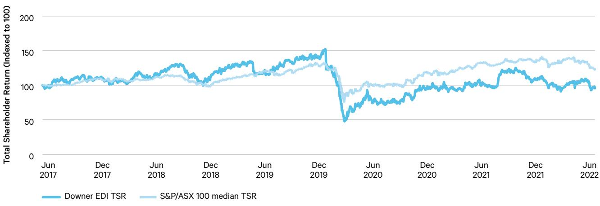
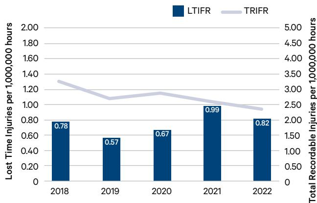

{0}------------------------------------------------

## **Annual Report 2022**

{1}------------------------------------------------

{2}------------------------------------------------

# Contents

| Directors' Report                                                       | 6  |
|-------------------------------------------------------------------------|----|
| Auditor's Signed Reports                                                |    |
| Auditor's Independence Declaration                                      | 52 |
| Independent Auditor's Report                                            | 53 |
| Financial Statements                                                    |    |
| Consolidated Statement of Profit or Loss and Other Comprehensive Income | 61 |
| Consolidated Statement of Financial Position                            | 62 |
| Consolidated Statement of Changes in Equity                             | 63 |
| Consolidated Statement of Cash Flows                                    | 64 |

#### **Notes to the consolidated financial statements**

| A About this report Page 65-66 | B Business performance Page 67-80 | C Operating assets and liabilities Page 81-95  | D Employee benefits Page 96-97           | E Capital structure and financing Page 98-105 | F Group structure Page 106-116               | G Other Page 117-124                         |
|-----------------------------------------|--------------------------------------------|---------------------------------------------------------|---------------------------------------------------|--------------------------------------------------------|-------------------------------------------------------|----------------------------------------------------|
|                                         |                                            |                                                         |                                                   |                                                        |                                                       |                                                    |
|                                         | B1 Segment information               | C1 Reconciliation of cash and cash equivalents | D1 Employee benefits                           | E1 Borrowings                                       | F1 Joint arrangements and associate entities | G1 New accounting standards                  |
|                                         | B2 Revenue                              | C2 Trade receivables and contract assets          | D2 Defined benefit plan                     | E2 Financing facilities                             | F2 Controlled entities                             | G2 Capital and financial risk management     |
|                                         | B3 Individually significant items    | C3 Inventories                                       | D3 Key management personnel compensation | E3 Lease liabilities                                | F3 Related party information                    | G3 Other financial assets and liabilities |
|                                         | B4 Earnings per share                   | C4 Trade payables and contract liabilities        | D4 Employee discount share plan             | E4 Commitments                                      | F4 Parent entity disclosures                    |                                                    |
|                                         | B5 Taxation                             | C5 Property, plant and equipment                  |                                                   | E5 Issued capital                                   | F5 Acquisition of businesses                    |                                                    |
|                                         | B6 Remuneration of auditor           | C6 Right-of-use assets                               |                                                   | E6 Reserves                                         | F6 Disposal of businesses                       |                                                    |
|                                         | B7 Subsequent events                    | C7 Intangible assets                                 |                                                   | E7 Dividends                                        |                                                       |                                                    |
|                                         |                                            | C8 Other provisions                                  |                                                   |                                                        |                                                       |                                                    |
|                                         |                                            | C9 Contingent liabilities                            |                                                   |                                                        |                                                       |                                                    |

| Directors' Declaration                  | 125 |
|-----------------------------------------|-----|
| Other information                       |     |
| Sustainability Performance Summary 2022 | 126 |
| Corporate Governance                    | 132 |
| Information for Investors               | 144 |

{3}------------------------------------------------

Highlights Downer's Urban Services businesses performed well in FY22. Despite positive underlying core markets, earnings were weighed down by the disruptive impacts of COVID-19 and severe wet weather on operations.

> Downer reported a statutory net profit after tax (NPAT) of \$152.0 million, and an underlying NPATA of \$225.3 million.

Cash performance remains strong, with cash conversion of 83.9% (underlying cash conversion of 88.9%1 ).

Downer's performance, and the continued strength of the balance sheet, has resulted in the Board declaring a final dividend of 12 cents per share, taking total dividends for the year to 24 cents per share (up 3 cents per share on prior year), unfranked.

Total Revenue2

Underlying3 EBITA

\$358.0m \$399.2m

## Statutory NPAT

Underlying3 NPATA

- 1. The underlying cash conversion is calculated after adjusting for cash outflows related to FY20 items outside underlying earnings of \$22.3 million and bid costs for the Queensland Train Manufacturing Program of \$12.7 million.
- 2. Total revenue is a non-statutory disclosure and includes revenue from joint ventures, other alliances and other income.
- 3. Underlying EBITA and NPATA are non-IFRS measures that are used by Management to assess the performance of the business. They have been calculated from the statutory measures and underlying EBITA is reconciled to statutory NPAT in the Directors' Report Group Financial Performance section on pages 12 and 13.

\$152.0m

\$225.3m

## Operating Cash Flow

\$495.4m

{4}------------------------------------------------

After successfully exiting the remaining non-core businesses (Mining and Hospitality), Downer's strategy is to continue to focus on its core Urban Services businesses. These businesses have:

- demonstrated strength and resilience
- leading market positions and attractive medium and long-term growth opportunities
- a high proportion of government and government-related contracts
- a capital light, services-based business model generating lower risk, more predictable revenues and cash flows.

## The Downer Portfolio

#### **Transport**

Road Services Rail and Transit Systems Projects

**Utilities**

Telecommunications Water Power and Gas

#### **Facilities**

Government Health and Education Defence Building Power and Energy Industrial and Marine Mineral Technologies

{5}------------------------------------------------

# Directors' Report

for the year ended 30 June 2022

The Directors of Downer EDI Limited submit the Annual Financial Report of the Company for the financial year ended 30 June 2022. In compliance with the provisions of the *Corporations Act 2001* (Cth), the Directors' Report is set out below.

#### **Board of Directors**

#### **MARK PETER CHELLEW (66)**

Chairman since October 2021

#### Independent Non-executive Director since September 2021

Mr Chellew has over 40 years of experience in the building materials and related industries, including roles such as Managing Director and Chief Executive Officer of Adelaide Brighton Limited, Managing Director of Blue Circle Cement in the United Kingdom and senior management positions within the CSR group of companies in Australia and the United Kingdom.

He is currently the Non-executive Chairman of Cleanaway Waste Management Limited and a Non-executive Director of Ampol Limited. He is a former Non-executive Director of Virgin Australia Holdings Limited and Infigen Energy Limited.

Mr Chellew holds a Bachelor of Science (Ceramic Engineering), Masters of Engineering (Mechanical Engineering) and a Graduate Diploma in Management.

Mr Chellew lives in the Southern Highlands of New South Wales.

#### **GRANT ANTHONY FENN (57)**

#### Managing Director and Chief Executive Officer since July 2010

Mr Fenn has over 30 years' experience in operational management, strategic development and financial management. He joined Downer in October 2009 as Chief Financial Officer and was appointed Chief Executive Officer in July 2010.

He was previously a member of the Qantas Executive Committee, holding a number of senior roles over 14 years, as well as Chairman of Star Track Express and a Director of Australian Air Express. He worked at KPMG for eight years before he joined Qantas.

Mr Fenn is currently a Director of Spotless Group Holdings Limited and a former Director of Sydney Airport Limited.

Mr Fenn holds a Bachelor of Economics from Macquarie University and is a member of the Australian Institute of Chartered Accountants.

Mr Fenn lives in Sydney.

{6}------------------------------------------------

#### **MARK JAMES BINNS (66)**

#### Independent Non-executive Director since March 2022

Mr Binns is an experienced senior executive and non-executive director with extensive experience in New Zealand in the energy, construction and building materials sectors where he has been closely involved in many of New Zealand's largest infrastructure projects, including the Wiri Prison public-private partnership, Waterview Connection, SKYCITY, Museum of New Zealand Te Papa Tongarewa and the second Manapōuri tunnel.

Mr Binns was Chief Executive Officer of Meridian Energy from 2012 to 2017 and prior to that held several senior roles with Fletcher Building, including as Chief Executive Officer of the Infrastructure Division where he was responsible for the construction and heavy building materials operations in Australia, South East Asia, India, South America, the United States and the South Pacific, as well as in New Zealand.

Mr Binns is currently Chairman of Crown Infrastructure Partners and Hynds Limited and a Non-executive Director of Auckland International Airport and several private companies.

Mr Binns holds a Bachelor of Laws from the University of Auckland.

Mr Binns lives in Auckland.

#### **TERESA GAYLE HANDICOTT (59)**

#### Independent Non-executive Director since September 2016

Ms Handicott is a former corporate lawyer with over 30 years' experience in mergers and acquisitions, capital markets and corporate governance. She was a partner of national law firm Corrs Chambers Westgarth for 22 years, serving as a member of its National Board for seven years including four years as National Chairman. She also has extensive experience in governance of local and state government organisations.

Ms Handicott is currently the Chairman of listed company PWR Holdings Limited and of Peak Services Holdings Pty Ltd, which is the subsidiary of the Local Government Association of Queensland that is responsible for its commercial operations. Ms Handicott is also State President of the Queensland Division of the Australian Institute of Company Directors.

Ms Handicott is a former Director of CS Energy Limited, a former member of the Queensland University of Technology (QUT) Council, the Takeovers Panel and Corporations and Markets Advisory Committee and a former Associate Member of the Australian Competition and Consumer Commission.

A Senior Fellow of FINSIA, Fellow of the Australian Institute of Company Directors and Member of Chief Executive Women, Ms Handicott holds a Bachelor of Laws (Hons) degree from the Queensland University of Technology.

Ms Handicott lives in Brisbane.

{7}------------------------------------------------

#### **NICOLE MAREE HOLLOWS (51)**

#### Independent Non-executive Director since June 2018

Ms Hollows has 25 years' experience in the resources sector in a number of senior managerial roles across both the public and private sectors, including in mining, utilities and rail. Her experience spans operational management, accounting and finance, mergers and acquisitions, capital management and corporate governance.

Ms Hollows is the Non-executive Chair of Jameson Resources Limited, and a Non-executive Director of Qube Holdings Limited and Chief Executive Women.

She was formerly the Chief Executive Officer of SunWater Limited, a Queensland Government owned corporation, the Chief Financial Officer and subsequently Chief Executive Officer of Macarthur Coal Limited and Managing Director of AMCI Australia and South East Asia.

A Fellow of the Australian Institute of Company Directors and a Member of Chief Executive Women and the Institute of Chartered Accountants, Ms Hollows holds a Bachelor of Business – Accounting and a Graduate Diploma in Advanced Accounting (Distinction) from the Queensland University of Technology and is a Graduate of Harvard Business School's Program for Management Development.

## Ms Hollows lives in Brisbane.

#### **DR ADELLE MAREE HOWSE (51)**

#### Independent Non-executive Director since April 2022

Dr Howse has extensive senior executive and non-executive experience in the infrastructure, energy and resources, construction, data centres, telecommunication and property sectors.

Dr Howse held several senior roles with CIMIC, including Chief Strategy Officer.

Dr Howse is currently a Non-executive Director of Macquarie Telecom Group, Sydney Desalination Plant and is Chairman of the Australian Mathematical Sciences Institute. She has previously served on the boards of Devine Group, Design Studio Group, Ventia, Nextgen Holdings and Manila North Tollroads Corporation.

Dr Howse holds a Bachelor of Science and Doctor of Philosophy (Mathematics) from the University of Queensland, an executive MBA from IMD, Switzerland and a Graduate Diploma of Applied Finance and Investment. She is a member of the Australian Institute of Company Directors.

Dr Howse lives in Sydney.

{8}------------------------------------------------

#### **MARK JOHN MENHINNITT (57)**

#### Independent Non-executive Director since March 2022

Mr Menhinnitt is an experienced senior executive with extensive domestic and international experience in large infrastructure development and urban regeneration, investment management, construction, asset services, operations and maintenance.

Mr Menhinnitt held several senior roles over a 30-year career with Lendlease, including as Chief Executive Officer of Lendlease Australia.

Mr Menhinnitt is currently a Non-executive Director of The GPT Group, a Non-executive Director of Sunshine Coast Airport Pty Ltd, a member of the Australian War Memorial Development Committee and Chairman of Fluent Property Pty Ltd.

Mr Menhinnitt holds a Bachelor of Engineering (Mechanical) and Master of Business (Applied Finance), both from the Queensland University of Technology. He is a member of the Australian Institute of Company Directors and a Fellow of the Governance Institute of Australia.

Mr Menhinnitt lives on the Sunshine Coast.

#### **PETER LAWRENCE WATSON (65)**

#### Independent Non-executive Director since May 2019

Mr Watson has extensive experience in the construction and engineering sectors in senior executive and governance roles, including in the industrial, transport, defence, health, justice and utilities sectors. He was Chief Executive Officer and Managing Director of Transfield Services Limited (now known as Broadspectrum which is owned by Ventia) for ten years. During this period, he led the business through a successful transition, cultivating a sustainable and successful public company. He also has considerable experience in various Non-executive Director roles.

Mr Watson is currently the Non-executive Chairman of BG&E Group Limited and a Consultant of Stephenson Mansell Group where he provides coaching and mentoring to senior executives.

Mr Watson is a former Chairman of LogiCamms Limited (now known as Verbrec), Watpac Limited, Regional Rail Link Authority in Victoria and AssetCo Management which managed PPP assets, a former Director of the Major Transport Infrastructure Board in Victoria, Yarra Trams and Save the Children Australia and was a Board member of Infrastructure Australia and independent Chair of Ross River Solar Farm.

A Fellow of the Australian Academy of Technological Sciences and Engineering and member of the Institute of Engineers Australia and Australian Institute of Company Directors, Mr Watson holds a Diploma of Civil Engineering from the Caulfield Institute of Technology and is a Graduate of the Wharton Advanced Management Program of the University of Pennsylvania.

Mr Watson lives on the Sunshine Coast.

#### **RETIRED DIRECTORS**

#### Richard Michael Harding

Independent Non-executive Director from 1 July 2008 to 30 September 2021, Chairman from November 2010.

#### Philip Stuart Garling

Independent Non-executive Director from 24 November 2011 to 30 June 2022.

{9}------------------------------------------------

### **Directors' shareholdings**

The following table sets out each Director's relevant interest (direct and indirect) in shares, debentures, and rights or options in shares or debentures (if any) of the Company at the date of this report. No Director has any relevant interest in shares, debentures and rights or options in shares or debentures, of a related body corporate as at the date of this report.

| Director       | Number of Fully Paid Ordinary Shares | Number of Fully Paid Performance Rights | Number of Fully Paid Performance Options |
|----------------|-----------------------------------------|--------------------------------------------|---------------------------------------------|
| M P Chellew    | 18,000                                  | –                                          | –                                           |
| G A Fenn1      | 2,049,772                               | 584,317                                    | –                                           |
| M J Binns      | –                                       | –                                          | –                                           |
| T G Handicott  | 21,100                                  | –                                          | –                                           |
| N M Hollows    | 25,538                                  | –                                          | –                                           |
| A M Howse      | 5,000                                   | –                                          | –                                           |
| M J Menhinnitt | 21,748                                  | –                                          | –                                           |
| P L Watson     | 17,933                                  | –                                          | –                                           |

1. Performance rights granted to Mr Fenn are subject to performance and/or service period conditions over the period 2019 to 2024. Further details regarding the conditions relating to these restricted shares and performance rights are outlined in sections 6.4 and 9.2 of the Remuneration Report.

#### **Company Secretary**

The Company Secretarial function is responsible for ensuring that the Company complies with its statutory duties and maintains proper documentation, registers and records. It also provides advice to Directors and officers about corporate governance and gives practical effect to any decisions made by the Board.

Mr Robert Regan was appointed Group General Counsel and Company Secretary in January 2019. He has qualifications in law from the University of Sydney and is an admitted solicitor in New South Wales. Mr Regan was formerly a partner of Corrs Chambers Westgarth and has over 30 years of experience in legal practice.

Mr Peter Lyons was appointed joint Company Secretary in July 2011. A member of CPA Australia and the Governance Institute of Australia, he has qualifications in commerce from the University of Western Sydney and corporate governance from the Governance Institute of Australia. Mr Lyons was previously Deputy Company Secretary and has been in financial and secretarial roles at Downer for over 20 years.

#### **Review of Operations**

#### **Principal Activities**

Downer EDI Limited (Downer) is a leading provider of integrated services in Australia and New Zealand. Downer employs approximately 33,000 people, mostly in Australia and New Zealand.

Downer operates in sectors that are closely connected to the investment that is being driven by population growth and urbanisation. These sectors include roads, rail, light rail, other public transport, power, gas, water, telecommunications, health, education, defence and other government sectors.

These sectors are served by Downer's Urban Services businesses – Transport, Utilities and Facilities.

These Urban Services businesses have:

- § Demonstrated strength and resilience
- § Leading market positions and attractive medium-term and long-term growth opportunities
- § A high proportion of government and government-related contracts
- § A capital light, services-based business model generating lower risk, more predictable revenues and cash flows.

In the 12 months ended 30 June 2022, Downer completed the divestment of its Mining portfolio of businesses, with the sale of Open Cut Mining East and Otraco. During the year, Downer also exited the majority of its Hospitality contracts.

{10}------------------------------------------------

#### **Sustainability**

At Downer, sustainability means sustainable and profitable growth, providing value to customers, delivering services in a safe and environmentally responsible manner, helping its people to be better and advancing the communities in which the Group operates.

Downer's commitments to sustainability are outlined in its policies, which are accessible from the Downer website (**www.downergroup.com**). The Group's 2022 Sustainability Report details Downer's sustainabilityrelated performance for the financial year ended 30 June 2022 can be found on the Company website (**www.downergroup.com/2022sustainabilityreport**).

A core element of Downer's sustainability approach is to focus on its customers' success. The Group's core operating philosophy, 'Relationships creating success', encapsulates this theme. With Downer's services impacting millions of lives every day, the sustainability of the Group's operations is paramount – for its people, partners, shareholders, customers and their customers. Downer delivers these services while managing the impacts of its activities on people, the environment and communities in which the Group operates and working collaboratively with its supply chain. Downer's extensive capability is well-placed for the decarbonisation effort that is required to meet Australia and New Zealand's Net Zero emissions target. The Group understands that its ability to do this is fundamental to Downer's long-term success.

#### **Group Financial Performance**

For the 12 months ended 30 June 2022, Downer reported a decrease in total revenue and earnings before interest, tax and amortisation of acquired intangibles (EBITA) driven by the loss of contribution from the Mining and Laundries divestments made in the current and prior periods. In addition, the Group's financial performance has been impacted by COVID-19 as well as severe wet weather conditions as a result of La Niña.

The main features of the result for the 12 months ended 30 June 2022 were:

- § Total revenue1 of \$12.0 billion, down 2.0%
- § Statutory EBITA of \$358.0 million, down 10.7%; from \$401.0 million
- § EBITA margin of 3.0% down from 3.3% at 30 June 2021
- § Statutory earnings before interest and tax (EBIT) of \$323.2 million, down 3.5%; from \$334.8 million
- § Statutory net profit after tax and before amortisation of acquired intangible assets (NPATA) of \$176.4 million, down 23.3%; from \$230.0 million
- § Statutory net profit after tax (NPAT) of \$152.0 million, down 17.3%; from \$183.7 million.

Gearing has decreased by 1.3 percentage points (pp) to 17.7% since June 2021 reflecting the strong operating cash flows and proceeds from the divestment program partially offset by the impact of the share buy-back program.

Cash conversion for the year was 83.9% and 88.9% after adjusting for \$22.3 million2 cash outflows related to items recognised in FY20 and funded from the July 2020 capital raising, and \$12.7 million bid costs for the Queensland Train Manufacturing Program.

Corporate costs decreased by \$2.7 million or, 2.6%, to \$100.5 million as a result of portfolio restructure and cost management, partially offset by higher information technology security and insurance related costs.

Net finance costs decreased by \$19.5 million or, 18.6%, to \$85.4 million driven by lower average debt drawn and lower lease interest expense.

The underlying effective tax rate of 28.0% is lower than the statutory corporate tax rate of 30.0% due to the impact of items including non-taxable distributions from joint ventures and lower tax rates in overseas jurisdictions (e.g. New Zealand).

Individually Significant Items (ISIs) totalled \$41.2 million loss before interest and tax for the year, (\$48.9 million loss after-tax). These ISIs relate to:

- § The fair value movement of the Downer Contingent Share Options (DCSO) issued in FY21 as part of the acquisition of the remaining 12.2% interest in Spotless
- § Divestments and exit costs
- § Portfolio restructure costs
- § Bid costs
- § Probuild credit loss
- § Gain on sale of PP&E.

Refer to Note B3 to the Financial Report for further details.

- 1. Total revenue is a non-statutory disclosure and includes revenue, other income and notional revenue from joint ventures and other alliances not proportionately consolidated.
- 2. Downer undertook a Non-renounceable Pro-rata Entitlement Offer, for which the uses included the funding of payroll remediation costs and legal settlements of New Zealand building works.

{11}------------------------------------------------

The table below provides a comparison of the underlying1 earnings for FY22 versus the results for FY21 and a reconciliation to statutory NPAT.

| Underlying1 EBITA (A\$m)                     | Segment            | FY22    | FY21    | Variance (%) |
|-------------------------------------------------|--------------------|---------|---------|-----------------|
| Transport                                       | Transport          | 254.6   | 250.2   | 1.8%            |
| Utilities2                                      | Utilities          | 73.7    | 94.8    | (22.3%)         |
| Facilities2                                     | Facilities         | 179.8   | 178.6   | 0.7%            |
| Core Urban Services Businesses                  |                    | 508.1   | 523.6   | (3.0%)          |
| Engineering & Construction                      | All other segments | –       | (5.1)   | 100.0%          |
| Mining                                          | All other segments | 8.1     | 46.6    | (82.6%)         |
| Laundries                                       | Facilities         | –       | 5.0     | (100.0%)        |
| Hospitality                                     | Facilities         | (16.5)  | 0.4     | <(100%)         |
| Non-core businesses                             |                    | (8.4)   | 46.9    | <(100%)         |
| Corporate                                       | Unallocated        | (100.5) | (103.2) | 2.6%            |
| Group Underlying EBITA2                         |                    | 399.2   | 467.3   | (14.6%)         |
| Amortisation of acquired intangibles (pre-tax)  |                    | (34.8)  | (66.2)  | 47.4%           |
| Underlying EBIT                                 |                    | 364.4   | 401.1   | (9.1%)          |
| Net interest expense                            |                    | (85.4)  | (100.6) | 15.1%           |
| Tax expense                                     |                    | (78.1)  | (85.6)  | 8.8%            |
| Underlying NPAT                                 |                    | 200.9   | 214.9   | (6.5%)          |
| Amortisation of acquired intangibles (post-tax) |                    | 24.4    | 46.3    | (47.3%)         |
| Underlying NPATA3                               |                    | 225.3   | 261.2   | (13.7%)         |
| Items outside of underlying NPATA               |                    | (41.2)  | (70.6)  | 41.6%           |
| Tax (expense)/benefit on items outside NPATA    |                    | (7.7)   | 39.4    | <(100%)         |
| Statutory NPATA                                 |                    | 176.4   | 230.0   | (23.3%)         |
| Amortisation of acquired intangibles (post-tax) |                    | (24.4)  | (46.3)  | 47.3%           |
| Statutory NPAT                                  |                    | 152.0   | 183.7   | (17.3%)         |

1. The underlying result is a non-IFRS measure that is used by Management to assess the performance of the business. Non-IFRS measures have not been subject to audit or review.

2. The Group has restated the previously reported segment information for the year ended 30 June 2021 to align it with the current segment presentation.

3. Downer calculates EBITA and NPATA by adjusting EBIT and NPAT to add back acquired intangible assets amortisation expense.

Group FY22: \$34.8 million, \$24.4 million after-tax. (FY21: \$66.2 million, \$46.3 million after-tax).

{12}------------------------------------------------

#### **Statutory earnings**

Statutory earnings before interest and tax (EBIT) of \$323.2 million, down 3.5%; from \$334.8 million. Statutory EBITA of \$358.0 million, down 10.7%, from \$401.0 million. Underlying EBITA of \$399.2 million, down 14.6%; from \$467.3 million.

A reconciliation of the FY22 underlying result to the statutory result is provided in the table below:

|                                       |        | Net Interest | Tax     | Amortisation of acquired intangibles |            |        |
|---------------------------------------|--------|--------------|---------|--------------------------------------------|------------|--------|
| A\$m                                  | EBITA  | expense      | expense | NPATA                                      | (post-tax) | NPAT   |
| Underlying result                     | 399.2  | (85.4)       | (88.5)  | 225.3                                      | (24.4)     | 200.9  |
| Fair value on Downer Contingent       |        |              |         |                                            |            |        |
| Share Options (DCSO)1                 | 3.7    | –            | –       | 3.7                                        | –          | 3.7    |
| Divestments and exit costs            | (75.8) | –            | 5.0     | (70.8)                                     | –          | (70.8) |
| Portfolio restructure costs           | (7.6)  | –            | 2.3     | (5.3)                                      | –          | (5.3)  |
| Bid costs2                            | (12.7) | –            | 3.8     | (8.9)                                      | –          | (8.9)  |
| Probuild credit loss                  | (34.6) | –            | 6.9     | (27.7)                                     | –          | (27.7) |
| Gain on sale of PP&E                  | 85.8   | –            | (25.7)  | 60.1                                       | –          | 60.1   |
| Total items outside underlying result | (41.2) | –            | (7.7)   | (48.9)                                     | –          | (48.9) |
| Statutory result – Profit/(loss)      | 358.0  | (85.4)       | (96.2)  | 176.4                                      | (24.4)     | 152.0  |

1. The Downer Contingent Share Options (DCSO) issued as part of the acquisition of the minority interest in Spotless in August 2020 are required to be recorded at fair value with changes in fair value recorded through profit or loss. Since 30 June 2021, the fair value of the DCSO has decreased by \$3.7 million, which has been recognised in 'Other income' in the Consolidated Statement of Profit or Loss and Other Comprehensive Income during the year. This income is primarily driven by the decrease in Downer's share price from \$5.59 at 30 June 2021 to \$5.05 at 30 June 2022.

2. Downer is in the process of tendering for the State of Queensland Train Manufacturing Program, for which a net \$12.7 million in bid costs were expensed during the year.

Refer to Note B3 to the Financial Report for further details.

#### **Expenses**

Total expenses decreased by 3.6%, or \$410.5 million compared to the prior corresponding period (pcp) and includes \$153.7 million of items outside the underlying result, while the pcp included \$77.0 million of ISIs.

Excluding these items, total expenses in FY22 decreased by 4.4%, or \$487.2 million.

Downer's cost base (including ISIs) by type of expense compared to the pcp is as follows:

Employee benefits expense decreased by 7.2%, or \$278.3 million, to \$3.6 billion and represents 33.0% of Downer's cost base. The decrease is mainly driven by divestments (Mining and Laundries) and exiting of contracts in Hospitality together with a shift in the mix of labour from direct labour to subcontractors. Accordingly, subcontractor costs increased by 7.2%, or \$297.8 million, to \$4.4 billion and represents 40.8% of Downer's cost base (36.7% in pcp).

Raw materials and consumables used decreased by 13.4%, or \$213.3 million, to \$1.4 billion and represents 12.7% of Downer's cost base. The decrease is mainly driven by lower raw materials costs following the divestment of Mining and Laundries and completion of the Sydney Growth Trains (SGT) construction phase within Transport.

Plant and equipment costs decreased by 20.6%, or \$121.7 million, to \$0.5 billion and represents 4.3% of Downer's cost base. The decrease in plant and equipment costs is attributed to a less capital-intensive business following the divestment of Mining and Laundries as well as from initiatives to drive efficient plant and equipment utilisation and maintenance practices. Total depreciation and amortisation decreased by 30.8%, or \$152.2 million, to \$0.3 billion and represents 3.2% of Downer's cost base. The decrease is driven by assets disposed as part of the Laundries and Mining divestments.

{13}------------------------------------------------

Other expenses from ordinary activities which include communication, travel, professional fees and occupancy costs, increased by 6.1%, or \$35.4 million, to \$615.3 million and represents 5.7% of Downer's cost base.

Other expenses include \$84.0 million of pre-tax ISIs (pcp included \$60.4 million), mainly related to divestment results (including transaction and divestment costs) and the credit loss incurred as a result of the customer Probuild entering administration as described in Note B3 to the Financial Report. Excluding the impact of ISIs, other expenses increased 2.3% or \$11.8 million mainly due to higher information technology security and insurance costs.

#### **Cash flow**

#### **Operating Cash Flow**

Operating cash flow of \$495.4 million represents a cash conversion of 83.9% of adjusted earnings before interest, tax, depreciation and amortisation (EBITDA).

The decrease in cash was predominantly driven by lower contributions from Mining and Laundries as a result of divestment activities as well as from the impact of severe wet weather as a result of La Niña and from COVID-19 across the Group.

Included within the operating cash flows is \$22.3 million1 of cash outflows related to items recognised in FY20 and funded from the July 2020 capital raising, and a net \$12.7 million in relation to bid costs. Excluding these cash outflows, cash conversion would be 88.9%.

#### **Investing Cash Flow**

Total investing cash inflow of \$38.4 million was \$2.5 million higher than the pcp and includes \$245.4 million proceeds from the disposal of Mining during the year. Proceeds from disposal activities include: \$75.1 million net proceeds from Otraco, \$131.0 million net proceeds from Open Cut Mining East and \$39.3 million deferred proceeds received in relation to Open Cut Mining West and Blasting (divested in FY21).

Excluding payments for the acquisition of businesses and proceeds from the disposal of businesses, investing cash outflow would have decreased by 21.0% or \$48.5 million to \$182.9 million largely due to lower capex requirements following the divestment of the Laundries and Mining businesses.

#### **Debt and bonding**

The Group's performance bonding facilities totalled \$1,964.7 million at 30 June 2022 with \$591.8 million undrawn. There is sufficient available capacity to support the ongoing operations of the Group.

As at 30 June 2022, the Group had liquidity of \$1.9 billion comprising cash balances of \$738.5 million and undrawn committed debt facilities of \$1.2 billion.

- 1. Downer undertook a Non-renounceable Pro-rata Entitlement Offer, for which the uses included the funding of payroll remediation costs and legal settlements of New Zealand building works.
A buyback of Downer's shares was announced to the market on 27 April 2021 and the buyback commenced on 8 June 2021. During the year ended 30 June 2022, a total of 24,002,597 shares were purchased for total consideration of \$142.6 million. Since announcement, \$167.4 million has been spent on the buyback program with 28,365,995 shares bought back.

The Group continues to be rated BBB (Stable) by Fitch Ratings.

#### **Balance sheet**

Since 30 June 2021, the net assets of the Group decreased by \$123.4 million or, 4.2%, to \$2.8 billion driven by the impact of Mining divestments (now concluded) as shown below:

#### Movement in Net Assets

Net debt is calculated as borrowings (excluding lease liabilities) less cash and cash equivalents. Net debt has decreased by \$47.0 million or, 7.0%, mainly driven by \$119.9 million lower borrowings following debt repayments made, partially offset by the lower cash position since 30 June 2021.

The Mining divestment program reduced net assets of the Group by \$236.5 million as described in Note F6 to the Financial Report.

Excluding the impact from the disposal of Mining; Property, plant and equipment increased by \$103.8 million or, 12.6%. This was driven by capital expenditure in the Transport segment including assets from the acquisition of Fowlers Asphalting as well as the Rosehill Asphalt plant and Somerton land. Right-ofuse assets decreased by \$68.6 million, or 13.6%, representing a lower leased asset portfolio following divestments.

Total Equity decreased by \$123.4 million mainly driven by the \$142.6 million in shares bought back and \$171.4 million dividends paid during the year. This was partially offset by \$152.0 million net profit after tax and mark to market gain on cross currency interest rates swaps recognised in hedge reserves.

{14}------------------------------------------------

#### **Segment financial performance**

#### **Transport**

Transport comprises Downer's Road Services, Rail and Transit Systems and Projects businesses.

- 1. Total revenue is a non-statutory disclosure and includes revenue, other income and notional revenue from joint ventures and other alliances not proportionately consolidated.
- 2 Downer calculates EBITA by adjusting EBIT to add back acquired intangibles amortisation expense. Due to rounding, divisional percentages do not add up precisely to 100%.

Transport revenue increased by 8.1%, or \$426.5 million, to \$5.7 billion due to higher contributions from the Projects business in Australia resulting from the commencement of new projects as well as an improved contribution from the Keolis Downer JV due to patronage increase following the easing of COVID-19 restrictions and the commencement of the Adelaide Metro contract. These increases were partially offset by lower revenue in Rail and Transit Systems following completion of the Sydney Growth Trains (SGT) construction phase.

Transport EBITA increased by 1.8% to \$254.6 million due to new contracts within the Project business and an increased contribution from the Keolis Downer JV. This was partially offset by a decrease in contribution from Road Services in Australia mainly from wet weather impact from La Niña and from the completion of the SGT delivery project in Rail and Transit Systems business.

#### **Road Services**

Downer manages and maintains road networks across Australia and New Zealand and manufactures and supplies products and services to create safe, efficient and reliable journeys. Downer offers one of the largest non-government owned road infrastructure services businesses in Australia and New Zealand, maintaining more than 28,000 kilometres of road in Australia and more than 25,000 kilometres in New Zealand.

Downer creates and delivers solutions to its customers' challenges through strategic asset management and a leading portfolio of products and services. Downer is a leading manufacturer and supplier of bitumen-based products and an innovator in the sustainable asphalt industry and circular economy, using recycled products and environmentally sustainable methods to produce asphalt.

#### **Rail and Transit Systems**

Downer has over 100 years' rail experience providing endto-end, innovative transport solutions. Downer is a leading provider of rollingstock asset management services in Australia, with expertise in delivering whole-of-life asset management support to its customers. Downer's capability spans all sectors, from rollingstock to infrastructure, and every project phase, from design and manufacture to through-life-support, fleet maintenance, operations and comprehensive overhaul of assets.

The Keolis Downer joint venture is Australia's largest private provider of multi-modal public transport solutions, with contracts to operate and maintain Yarra Trams in Melbourne, the Gold Coast light rail system in Queensland, Adelaide Metro and an integrated public transport system for the city of Newcastle in New South Wales. Keolis Downer is also one of Australia's most significant bus operators.

#### **Projects**

Downer delivers multi-disciplined infrastructure solutions to customers within the transport and power sector. The services provided by Downer include the design and construction of light rail, heavy rail, signalling, track and station works, rail safety technology, bridges and roads as well as design and construction of steel lattice transmission towers and design and build of substations.

Downer has a long history of delivering infrastructure projects under a variety of contracting models. Downer's integrated capabilities enable intelligent transport solutions, road network management and maintenance, facility maintenance, utilities services and renewable energy technologies.

#### **Utilities**

Downer offers a range of services to customers across the power and gas, water, telecommunications and renewables sectors.

- 1. Total revenue is a non-statutory disclosure and includes revenue, other income and notional revenue from joint ventures and other alliances not proportionately consolidated.
- 2. Downer calculates EBITA by adjusting EBIT to add back acquired intangibles amortisation expense. Due to rounding, divisional percentages do not add up precisely to 100%.

Utilities revenue decreased by 6.0%, or \$112.0 million, to \$1.8 billion largely due to a decrease in volumes relating to COVID-19 related disruptions; partially offset by increased activities in Telecommunications in Australia.

{15}------------------------------------------------

Utilities EBITA decreased by 22.3% to \$73.7 million largely due to COVID-19 lockdowns impacts particularly in Water Services and Metering Services in Australia and in Telecommunications and Energy in New Zealand; partially offset by an increase in contribution from Telecommunications in Australia.

#### **Power and Gas**

Downer's services include planning, designing, constructing, operating, maintaining, managing and decommissioning power and gas network assets. A collaborative approach has made Downer a benchmark end-to-end service provider to owners of utility assets.

Downer constructs and maintains electricity and gas networks, provides asset inspection and monitoring services, connects tens of thousands of new power and gas customers each year and provides meter, energy and water efficiency services for governments, utilities and corporations.

#### **Water**

Downer is dedicated to delivering complete water lifecycle solutions for municipal and industrial water users.

Downer's expertise includes water treatment, wastewater treatment, water and wastewater network construction and rehabilitation, desalination and biosolids treatment.

As a leading provider of asset management services, Downer supports its customers across the full asset lifecycle from conceptual development through to design, construction, commissioning and into operations and maintenance.

#### **Telecommunications**

Downer is a leading provider of end-to-end technology and communications service solutions, offering integrated civil construction, electrical, fibre, copper and radio network deployment capability throughout Australia and New Zealand. Key capabilities include designing, engineering, maintenance, operations and smart metering.

#### **Facilities**

The Facilities service line operates in Australia and New Zealand across a range of industry sectors including defence, education, health, government, power & energy, industrial & marine and hospitality.

1. Total revenue is a non-statutory disclosure and includes revenue, other income and notional revenue from joint ventures and other alliances not proportionately consolidated.

- 2. Downer calculates EBITA by adjusting EBIT to add back acquired intangibles amortisation expense. Due to rounding, divisional percentages do not add up precisely to 100%.
Facilities revenue increased by 16.5%, or \$588.9 million, to \$4.2 billion largely driven by increased activities in Building Projects in New Zealand and higher activities in Australia in Health & Education. This was partially offset by loss of revenue contribution from Laundries (disposed in FY21, \$186.1 million contribution in pcp) while COVID-19 lockdowns and exiting of contracts impacted Hospitality activities.

Facilities EBITA decreased by 11.3%, or \$20.7 million to \$163.3 million mainly driven by the impact of COVID-19 lockdowns during the year on several sectors (particularly in Hospitality), loss of contribution from the Laundries business following disposal in FY21, partially offset by higher contribution from Building Projects in New Zealand and from Health & Education in Australia.

#### **Facilities**

Downer is the largest integrated facilities management services provider in Australia and New Zealand, delivering property and facilities management services to government departments, agencies and authorities at the Federal, State and municipal level. With 21 Public Private Partnership projects across the defence, education, health and leisure sectors, Downer provides innovative management of its customers' assets across their lifecycle.

Downer has a 40-year history of supporting the daily operations of hospitals across Australia and New Zealand, delivering a range of services that create a safe environment for hospital staff, patients and their guests. At leading schools and tertiary institutions, Downer helps to create world-class learning environments through integrated services such as catering, building and grounds maintenance, conserving energy with air-conditioning and lighting solutions and ensuring a secure environment.

#### **Power & Energy and Industrial & Marine**

Downer is a leading provider of asset maintenance and specialist services to Australia's critical economic infrastructure including the oil and gas, power generation and industrial sectors. As a trusted partner with a leading safety record, Downer optimises the reliability, efficiency and wholeof-life costs of its customers' assets through long-term relationship-based contracts.

#### **Mineral Technologies**

Downer's Mineral Technologies business is the world leader in fine physical mineral separation solutions, including spiral gravity concentrators and magnetic and electrostatic separation technology. Mineral Technologies delivers innovative process solutions for iron ore, mineral sands, silica sands, coal, chromite, gold, tin, tungsten, tantalum and several other fine materials.

{16}------------------------------------------------

#### **All other segments**

All other segments comprise the Group's Mining activities prior to divestment and in the comparative period also includes the Engineering and Construction business unit which was previously reported as 'businesses in wind down'.

- 1. Total revenue is a non-statutory disclosure and includes revenue, other income and notional revenue from joint ventures and other alliances not proportionately consolidated.
- 2. Downer calculates EBITA by adjusting EBIT to add back acquired intangibles amortisation expense. Due to rounding, divisional percentages do not add up precisely to 100%.

All other segments revenue decreased by 83.0%, or \$1.2 billion, to \$0.2 billion and EBITA decreased by 80.5% to \$8.1 million due to cessation of revenue and EBITA contribution from the remaining Mining businesses disposed during the year as part of the Group's Urban Services strategy.

#### **Mining**

Downer has completed the divestment of Mining operations. The results for the year ended 30 June 2022 include contribution from the Mining business units to the point of disposal.

#### **Engineering and Construction**

Downer announced in February 2020 that it would focus its construction efforts on areas where it has a competitive differentiation. As a result, Downer no longer tenders for 'hard dollar' construction contracts in the coal, iron ore and industrial Electrical & Instrumentation and Structural, Mechanical and Piping sectors.

#### **Dividends**

The Downer Board resolved to pay a final dividend of 12.0 cents per share, unfranked, payable on 28 September 2022 to shareholders on the register at 31 August 2022. The portion of the unfranked dividend amount that will be paid out of Conduit Foreign Income (CFI) is 14%.1

The Board also determined to continue to pay a fully imputed dividend on the ROADS security, which having been reset on 15 June 2022 has a yield of 8.14% per annum payable quarterly in arrears, with the next payment due on 15 September 2022. As this dividend is fully imputed (the New Zealand equivalent of being fully franked), the actual cash yield paid by Downer will be 5.86% per annum until the next reset date.

Consistent with the prior year, the Company's Dividend Reinvestment Plan remains suspended.

#### **Zero harm**

Downer's Lost Time Injury Frequency Rate (LTIFR) decreased to 0.82 from 0.99 and its Total Recordable Injury Frequency Rate (TRIFR) decreased to 2.35 from 2.60 per million hours worked2 .

Sadly, a long-term Downer employee in New Zealand died in May 2022 following a fall at work. Although the cause of death is not yet known, Downer has treated this as a workplace fatality. This incident is a reminder of the challenges of ensuring we remain vigilant and relentlessly manage the Critical Risks associated with the work we do every day.

#### Downer Group Safety Performance (12-month rolling frequency rates)

1. This is relevant only for non-resident shareholders. The effect is that the portion of the unfranked dividend paid out of CFI is not subject to Australian dividend withholding tax.

2 . Lost time injuries (LTIs) are defined as injuries that cause the injured person (employee or contractor) to be unfit to perform any work duties for one whole day or shift, or more, after the shift on which the injury occurred, and any injury that results, directly or indirectly, in the death of the person. The Lost Time Injury Frequency Rate (LTIFR) is the number of LTIs per million hours worked. Total Recordable Injuries (TRIs) are the number of LTIs plus medically treated injuries (MTIs) for employees and contractors. Total Recordable Injury Frequency Rate (TRIFR) is the number of TRIs per million hours worked.

{17}------------------------------------------------

#### **Group Business Strategies and Prospects for Future Financial Years**

Downer's **Purpose** is to create and sustain the modern environment by building trusted relationships with our customers.

Our **Promise** is to work closely with our customers to help them succeed, using world-leading insights and solutions.

Our business is founded on **four Pillars**:

- § **Safety**: Zero Harm is embedded in Downer's culture and is fundamental to the company's future success
- § **Delivery**: we build trust by delivering on our promises with excellence while focusing on safety, value for money and efficiency
- § **Relationships**: we collaborate to build and sustain enduring relationships based on trust and integrity
- § **Thought leadership**: we remain at the forefront of our industry by employing the best people and having the courage to challenge the status quo.

Downer's strategic objectives, prospects, and the risks that could adversely affect the achievement of these objectives, are set out in the table below.

#### **Strategic Objective Prospects Risks and risk management**

| Maintain focus on Zero Harm                                                                 | Downer believes that a sustainable and embedded Zero Harm culture is fundamental to the Company's ongoing success, and to building trusted relationships with customers and business partners. Downer's approach to Zero Harm enables it to work safely and environmentally responsibly in industry sectors with inherently hazardous environments. Zero Harm at Downer means a work environment that supports the health, including mental health and wellbeing, and safety of its people and allows it to deliver its business activities in an environmentally sustainable manner and advance the communities in which it operates. This includes continuing to monitor all COVID-19 risks and controls, and supporting the Government's vaccination rollout strategy. | Downer has a robust Critical Risk program. Risks that could cause serious injury to people or harm to the environment, and the controls needed to eliminate or manage those risks, are understood. This knowledge forms the core of Downer's risk management processes, and the monitoring of its critical controls. There is a strong commitment to Downer's Zero Harm objectives across all levels of the business. A core objective of The Downer Standard program is to unify the way Downer manages Zero Harm and performs its work. In an important step, Downer achieved centralised third-party accreditation to the International Standards ISO 45001 (Safety), ISO 9001 (Quality) and ISO 14001 (Environment). This gives Downer a single system of work for safety, quality and environment, and a framework to develop, implement and monitor The Downer Standard. Establishing this consistent single platform means Downer can deliver consistent best practice information and work processes to its frontline employees, helping them to better manage risk and change in their dynamic workplaces. Downer continues to be vigilant around the management of COVID-19 and maintaining the highest levels of controls in line with expert advice and Government guidance. Downer supported the Government's vaccination initiative and strongly encouraged its employees to have the vaccination when it was available to them, once they had consulted a health |
|------------------------------------------------------------------------------------------------|---------------------------------------------------------------------------------------------------------------------------------------------------------------------------------------------------------------------------------------------------------------------------------------------------------------------------------------------------------------------------------------------------------------------------------------------------------------------------------------------------------------------------------------------------------------------------------------------------------------------------------------------------------------------------------------------------------------------------------------------------------------------------------------------------------------------------------------|------------------------------------------------------------------------------------------------------------------------------------------------------------------------------------------------------------------------------------------------------------------------------------------------------------------------------------------------------------------------------------------------------------------------------------------------------------------------------------------------------------------------------------------------------------------------------------------------------------------------------------------------------------------------------------------------------------------------------------------------------------------------------------------------------------------------------------------------------------------------------------------------------------------------------------------------------------------------------------------------------------------------------------------------------------------------------------------------------------------------------------------------------------------------------------------------------------------------------------------------------------------------------------------------------------------------------------------------------------------------------------------------------------------------------------------------------------------------------------------------------------------------------------------------------|
| Embed asset management and standardisation as a cornerstone of the Delivery pillar | Downer has developed extensive asset management knowledge and expertise and also adopts and implements world leading insights and solutions. Downer strives for standardisation in its risk management and project delivery to ensure consistent quality outcomes for                                                                                                                                                                                                                                                                                                                                                                                                                                                                                                                                               | professional on the associated risks and benefits. The expectations of Downer's customers, and their customers, continue to grow with regards to reliable, intuitive, and cost effective assets and services. Downer has invested in capability and talent to improve asset management through standard processes, data analytics and lifecycle performance analytics. A number of these investments have Group-wide application in addition to their bespoke customer benefits.                                                                                                                                                                                                                                                                                                                                                                                                                                                                                                                                                                                                                                                                                                                                                                                                                                                                                                                                                                                                                                                |
|                                                                                                | its customers.                                                                                                                                                                                                                                                                                                                                                                                                                                                                                                                                                                                                                                                                                                                                                                                                                        | Risks to be managed include: delivering services with limited value to customers; scope reduction by customers who elect to insource services and directly source blue-collar contractors; an inability to deliver obligations in performance frameworks and service outcome contracts; exposure to modern slavery risks in the Group's labour force and supply chain; and adjustment mechanisms and allowances for price movements (for example, CPI movements, material costs and labour cost).                                                                                                                                                                                                                                                                                                                                                                                                                                                                                                                                                                                                                                                                                                                                                                                                                                                                                                                                                                                                                               |

{18}------------------------------------------------

| Strategic Objective                                                                                                | Prospects                                                                                                                                                                                                                                                                                                                                                                                                           | Risks and risk management                                                                                                                                                                                                                                                                                                                                                                                                                                                                                                                                                                                             |  |  |
|--------------------------------------------------------------------------------------------------------------------|---------------------------------------------------------------------------------------------------------------------------------------------------------------------------------------------------------------------------------------------------------------------------------------------------------------------------------------------------------------------------------------------------------------------|-----------------------------------------------------------------------------------------------------------------------------------------------------------------------------------------------------------------------------------------------------------------------------------------------------------------------------------------------------------------------------------------------------------------------------------------------------------------------------------------------------------------------------------------------------------------------------------------------------------------------|--|--|
| Focus on engagement with customers and suppliers as a cornerstone of the Relationships pillar       | Providing valuable and reliable products and services to customers, and their customers, is at the heart of Downer's culture. It enables Downer's customers to focus more on their core expertise while Downer delivers non-core                                                                                                                                                                     | Relationships creating success continues to be Downer's core operating philosophy that drives delivery of projects and services. It helps to ensure investment as initiatives and activities are focused on helping Downer's customers to succeed.                                                                                                                                                                                                                                                                                                                                                        |  |  |
|                                                                                                                    | operational services. Through ongoing analysis of markets, customers and competitors, Downer is well positioned to improve value and service for its customers and their customers.                                                                                                                                                                                                                     | Risks to be managed include: the threat of new competitors and disruptors in traditional markets; not keeping pace with changing customer expectations; and the threat of commoditisation of core products and services.                                                                                                                                                                                                                                                                                                                                                                                     |  |  |
| Utilise technology in core service offerings as a cornerstone of Downer's Thought Leadership pillar | Technology is an inherent feature of today's world and there is therefore greater demand for provision of cyber secure technology in the services Downer provides. Customer operations are growing in complexity in an ever-changing threat landscape, and this creates opportunities for Downer to connect securely, manage, monitor and report on core services and infrastructure. | Downer invests in a range of technology platforms and partnerships to meet customer needs. Downer focuses on selecting the right investments, for example those that can be leveraged across a number of service lines to maximise value for the greatest number of customers. Downer remains firmly focused on continuously protecting against evolving cyber risks and threats, demonstrating credibility and trust through secure cyber stewardship and custody. Risks to be managed include: intensification of competition as customers converge into large single market procurement |  |  |
|                                                                                                                    |                                                                                                                                                                                                                                                                                                                                                                                                                     | channels; introduction of foreign and technology-based competitors that bring a different value proposition; and a need for greater investment in technology and data services.                                                                                                                                                                                                                                                                                                                                                                                                                                 |  |  |
| Strengthen Downer's position as an employer of choice by fostering an inclusive workplace culture   | For Downer to deliver the best possible outcomes for its customers, it needs a workforce that is diverse, inclusive, capable and engaged. Downer's actions are guided by its Inclusion and Belonging (I&B) Strategy, which promotes a culture where employees feel a sense of belonging.                                                                                                       | Downer operates in sectors that are subject to highly competitive labour markets, which makes employee retention and attraction an important strategic objective.                                                                                                                                                                                                                                                                                                                                                                                                                                               |  |  |
|                                                                                                                    |                                                                                                                                                                                                                                                                                                                                                                                                                     | Downer has the ability to leverage its large workforce, broad geographic footprint and diverse technical skill base to mitigate labour supply challenges by redeploying skilled employees to high-priority contracts/projects to ensure the right people are in place to deliver high-quality services for its customers.                                                                                                                                                                                                                                                                                 |  |  |
|                                                                                                                    |                                                                                                                                                                                                                                                                                                                                                                                                                     | Downer's talent attraction and retention strategy focuses on providing opportunities for employees to grow their careers, offering benefits that are competitive with the market, and creating channels for engagement and feedback.                                                                                                                                                                                                                                                                                                                                                                         |  |  |
|                                                                                                                    |                                                                                                                                                                                                                                                                                                                                                                                                                     | Downer is focused on maintaining the work-life balance of its people and supports flexible working arrangements, where possible, to meet the growing expectations of its current and future workforce.                                                                                                                                                                                                                                                                                                                                                                                                       |  |  |
|                                                                                                                    |                                                                                                                                                                                                                                                                                                                                                                                                                     | Downer also understands that mental health is a growing societal issue, and has developed and implemented its accredited Mental Health First Aid program to arm its people with the knowledge and skills to support their own mental health as well as the mental health of their friends and family.                                                                                                                                                                                                                                                                                                     |  |  |
|                                                                                                                    |                                                                                                                                                                                                                                                                                                                                                                                                                     | Risks to manage include: effective retention of high-performing people; potential for high employee turnover; increased competition for talent due to tight labour market; workforce resilience; and low unemployment and high job mobility rates.                                                                                                                                                                                                                                                                                                                                                           |  |  |

{19}------------------------------------------------

#### **Strategic Objective Prospects Risks and risk management**

Mitigate climaterelated risks and capture growth opportunities presented by decarbonisation As society shifts towards a net zero emissions future, Downer is seeing increasing interest in decarbonisation across its customer base.

Downer is uniquely positioned with its skills, experience and technical capabilities to play a pivotal role in the energy transition.

Downer believes its own pathway to net zero is essential in adding credibility to the services it delivers to help customers decarbonise their own operations.

Downer has committed to an absolute near-term target of 50% reduction of its Scope 1 and 2 GHG emissions by 2032 and an absolute near-term target of 30% reduction of its Scope 3 emissions by 2032. Downer has set a long-term target to be net zero in Scope 1, 2 and 3 GHG emissions by 2050, subject to future available technologies. Both the near-term and the long-term targets have a base year of 2020.

Downer's key climate-related challenge is to decouple its GHG emissions from revenue growth.

In FY22, Downer completed a detailed review of its most material climate-related risks and opportunities in line with the Taskforce for Climate-related Financial Disclosures (TCFD). This work built on Downer's previous TCFD analysis in 2019, and reaffirmed that climate change presents considerable opportunities for Downer – and that these opportunities will increase as efforts to decarbonise accelerate.

The analysis determined that Downer's greatest exposure to transition risk are its asphalt plants as well as its light and heavy vehicle fleet and plant and equipment. Downer has decarbonisation strategies and plans to minimise exposure to transition risks.

In addition, Downer has undertaken a review of its capital allocation process to integrate climate thinking and considerations. This led to the creation of a centralised decarbonisation fund to support initiatives that will help achieve Downer's net zero commitments.

Risks to manage include: the physical risks to Downer's fixed assets, key sites and locations (such as extreme heat, bushfires and severe weather events); transition risks associated with decarbonising Downer's asphalt manufacturing process and its fleet; regulatory risk and cost increase due to Government policy (i.e. carbon price); reputational risk such as customer and shareholder expectations; and reducing Downer's Scope 3 emissions, in particular emissions derived from purchased goods and services.

{20}------------------------------------------------

The following table provides an overview of the key prospects relevant to each of Downer's service lines and summarises Downer's intended strategic response across each sector to maximise the Company's performance and realise future opportunities.

| Service line | Prospects                                                                                                                                                                                                                                                                                                                                                                                                                                                                                       | Downer's response                                                                                                                                                                                                                                                                                                                                                                                                                                                                                                                                                                                                                                                                                                         |
|--------------|-------------------------------------------------------------------------------------------------------------------------------------------------------------------------------------------------------------------------------------------------------------------------------------------------------------------------------------------------------------------------------------------------------------------------------------------------------------------------------------------------|---------------------------------------------------------------------------------------------------------------------------------------------------------------------------------------------------------------------------------------------------------------------------------------------------------------------------------------------------------------------------------------------------------------------------------------------------------------------------------------------------------------------------------------------------------------------------------------------------------------------------------------------------------------------------------------------------------------------------|
| Transport    | The multi-billion dollar market for transport services continues to grow in both Australia and New Zealand. Governments in both countries continue to invest in a range of projects to reduce congestion, improve mobility, and provide better linkages between communities.                                                                                                                                                                                            | Downer is a market leader in road services in both Australia and New Zealand, light rail construction in Australia and heavy rail construction and maintenance in Australia. Downer maintains strong strategic partnerships with leading global transport solutions providers and, through this model, is pursuing opportunities in rollingstock manufacture and maintenance, and transport network operations and maintenance. The Keolis Downer joint venture is a leading Australian multi-modal transport operator. Downer is also seeing increased demand for its circular economy products like ReconophaltTM, a sustainable asphalt product made from up to 100% recycled materials. |
| Utilities    | Growth across utility markets is multi-faceted with a good pipeline of prospects in both Australia and New Zealand. Downer's customers are actively investing in decarbonisation projects.                                                                                                                                                                                                                                                                                    | Downer has market leading positions in the power, gas, water and telecommunications sectors in both Australia and New Zealand. Downer is strongly positioned to take advantage of the growth opportunities available in these sectors, with a demonstrable track record of excellence in service delivery, and a greater focus on introducing operational technology to improve the value Downer brings to customers. Downer is also one of the largest and most experienced providers in the renewable energy market and power systems sectors, with more than 3GW of renewable energy generated by wind and solar farms, either built or currently being delivered.                          |
| Facilities   | Large-scale and long-term outsourcing contracts continue to come to market, however the long-term nature of contracts in this sector means that a lot of work is already under contract. There is a strong pipeline of opportunities on the short-to medium-term horizon in both Australia and New Zealand. In addition, all Downer's customers are actively investing in decarbonisation projects and many are investigating Hydrogen opportunities. | Through the acquisition of Spotless, Downer is a major force in both Australia and New Zealand with market-leading positions across key sectors including defence, health, education and government. Downer also has strong market positions across the power & energy, industrial & marine, and future energy areas. Downer is investing in expertise and capability that will position Australia as a world leader in clean Hydrogen and has also supported customers in delivering carbon capture underground storage systems. In FY22, Downer exited the majority of its Hospitality contracts.                                                                                               |

{21}------------------------------------------------

#### **Outlook**

For FY23, Downer expects 10-20% underlying NPATA growth, assuming no material COVID-19, weather, labour or other disruptions.

#### **Subsequent Events**

At the date of this report there is no matter or circumstance that has arisen since the end of the financial year that has significantly affected, or may significantly affect:

- (a) the Group's operations in future financial years,
- (b) the results of those operations in future financial years, or
- (c) the Group's state of affairs in future financial years.

#### **Changes in state of affairs**

During the financial year there was no significant change in the state of affairs of the Group other than that referred to in the financial statements or notes thereto.

#### **Environmental management**

Environmental management is an important component of Downer's Zero Harm philosophy. Downer's environmental commitments are outlined in its Environmental Sustainability Policy which can be found on the Downer website at **www.downergroup.com/board-policies**.

Effectively managing its environmental aspects and impacts is fundamental to Downer's approach to delivering its services. Downer puts significant emphasis on its critical risk program ensuring effective controls are implemented and continuous improvement through lessons learned. Downer's 10 Environmental Principles are critical to ensuring its employees and broader stakeholder groups are engaged and aware of its environmental commitments, including meeting and exceeding its environmental compliance obligations.

Downer's environmental management system is accredited to AS/NZ ISO14001:2015 and is integrated into its Group-wide management system, known as The Downer Standard. The Downer Standard ensures a consistent approach to identifying and controlling environmental hazards and risks, and managing the Company's environmental performance across the organisation. The environmental management system is audited, both internally and externally, by independent third parties.

Downer's ability to manage the impacts of its activities on the natural and built environment is fundamental to its long-term success. Downer is committed to helping its customers succeed by developing and delivering environmentally responsible and sustainable solutions so communities remain resilient and thrive in the future.

Downer is conscious of its social licence to operate – and responds to this by improving the sustainability of its operations, aiming to achieve Zero Harm to its people, minimising harm to the environment, and always striving to enhance Downer's reputation, business value and ultimately shareholder wealth.

Suitably qualified environment and sustainability professionals support each of the Business Units. Each Business Unit has developed Sustainability Improvement Plans aligned to specific United Nations Sustainable Development Goals with year-onyear actions and deliverables. In addition, each Business Unit has a customised Decarbonisation Plan. These plans assign responsibilities for implementing the actions and deliverables. Progress is monitored and reported throughout the year and assessed as part of the Business Unit's annual performance, which is linked to the short-term incentive program.

#### **Employee Discount Share Plan (ESP)**

An ESP was instituted in June 2005. In accordance with the provisions of the plan, as approved by shareholders at the 1998 Annual General Meeting, permanent full-time and parttime employees of Downer EDI Limited and its subsidiary companies who have completed six months service may be invited to participate.

No shares were issued under the ESP during the years ended 30 June 2022 or 30 June 2021.

There are no performance rights or performance options, in relation to unissued shares, that are outstanding.

{22}------------------------------------------------

#### **Directors' meetings**

The following table sets out the number of Directors' meetings (including meetings of Board Committees) held during the 2022 financial year and the number of meetings attended by each Director (while they were a Director or Board Committee member). During the year, nine Board meetings, six Audit and Risk Committee meetings, three Remuneration Committee meetings, four Zero Harm Committee meetings and two Nominations and Corporate Governance Committee meetings were held. In addition, 17 ad hoc meetings (attended by various Directors) were held in relation to various matters including tender reviews, major projects and due diligence for the on-market share buy-back program.

|                 | Board |          |       | Audit and Risk Committee |       | Remuneration Committee |
|-----------------|-------|----------|-------|-----------------------------|-------|---------------------------|
| Director        | Held1 | Attended | Held1 | Attended                    | Held1 | Attended                  |
| M P Chellew2    | 8     | 8        | –     | –                           | 2     | 2                         |
| R M Harding3    | 2     | 2        | –     | –                           | 1     | 1                         |
| G A Fenn        | 9     | 9        | –     | –                           | –     | –                         |
| M J Binns4      | 4     | 4        | –     | –                           | –     | –                         |
| P S Garling6    | 9     | 9        | –     | –                           | 3     | 3                         |
| T G Handicott   | 9     | 9        | 6     | 6                           | 3     | 3                         |
| N M Hollows     | 9     | 9        | 6     | 6                           | 3     | 3                         |
| A M Howse5      | 3     | 3        | –     | –                           | –     | –                         |
| M J Menhinnitt4 | 3     | 3        | –     | –                           | –     | –                         |
| P L Watson      | 9     | 9        | 6     | 6                           | –     | –                         |

|                 | Zero Harm Committee |          | Nominations and Corporate Governance Committee |          |
|-----------------|------------------------|----------|---------------------------------------------------|----------|
| Director        | Held1                  | Attended | Held1                                             | Attended |
| M P Chellew2    | 3                      | 3        | 2                                                 | 2        |
| R M Harding3    | 2                      | 2        | –                                                 | –        |
| G A Fenn        | 4                      | 4        | –                                                 | –        |
| M J Binns4      | –                      | –        | –                                                 | –        |
| P S Garling6    | 4                      | 4        | –                                                 | –        |
| T G Handicott   | –                      | –        | 2                                                 | 2        |
| N M Hollows     | –                      | –        | 2                                                 | 2        |
| A M Howse5      | –                      | –        | –                                                 | –        |
| M J Menhinnitt4 | –                      | –        | –                                                 | –        |
| P L Watson      | 4                      | 4        | –                                                 | –        |

1. These columns indicate the number of meetings held during the period each person listed was a Director or member of the relevant Board Committee.

2. Mr Chellew joined the Board on 1 September 2021.

3. Mr Harding retired on 30 September 2021.

4. Mr Binns and Mr Menhinnitt joined the Board on 1 March 2022.

5. Dr Howse joined the Board on 1 April 2022.

6. Mr Garling retired on 30 June 2022.

{23}------------------------------------------------

#### **Indemnification of officers and auditors**

During the financial year, the Company paid a premium in respect of a contract insuring the Directors of the Company, the Company Secretary, all officers of the Company and of any related body corporate against a liability incurred as a Director, secretary or executive officer to the extent permitted by the *Corporations Act 2001* (Cth).

The contract of insurance prohibits disclosure of the nature of the liability and the amount of the premium.

Downer's Constitution includes indemnities, to the extent permitted by law, for each Director and Company Secretary of Downer and its subsidiaries against liability incurred in the performance of their roles as officers. The Directors and the Company Secretaries listed on pages 6 to 10, individuals who act as a Director or Company Secretary of Downer's subsidiaries and certain individuals who formerly held any of these roles also have the benefit of the indemnity in the Constitution.

The Company has not otherwise, during or since the financial year, indemnified or agreed to indemnify an officer or auditor of the Company or of any related body corporate against a liability incurred as such an officer or auditor.

#### **Corporate Governance**

In recognising the need for the highest standards of corporate behaviour and accountability, the Board endorses the ASX Corporate Governance Council's *Corporate Governance Principles and Recommendations* (ASX Principles). The Group's corporate governance statement is set out at pages 132 to 143 of this Annual Report.

#### **Non-audit services**

Downer is committed to audit independence. The Audit and Risk Committee reviews the independence of the external auditors on an annual basis. This process includes confirmation from the auditors that, in their professional judgement, they are independent of the Group. To ensure that there is no potential conflict of interest in work undertaken by Downer's external auditors, KPMG, they may only provide services that are consistent with the role of the Company's auditor.

The Board has considered the position and, in accordance with the advice from the Audit and Risk Committee, is satisfied that the provision of non-audit services during the year is compatible with the general standard of independence for auditors imposed by the *Corporations Act 2001* (Cth).

The Directors are of the opinion that the services as disclosed below do not compromise the external auditor's independence, based on advice received from the Audit and Risk Committee, for the following reasons:

- § All non-audit services have been reviewed and approved to ensure that they do not impact the integrity and objectivity of the auditor
- § None of the services undermine the general principles relating to auditor independence as set out in the Institute of Chartered Accountants in Australia and CPA Australia's *Code of Conduct APES 110 Code of Ethics for Professional Accountants* issued by the Accounting Professional and Ethical Standards Board, including reviewing or auditing the auditor's own work, acting in a management or decisionmaking capacity for the Company, acting as advocate for the Company or jointly sharing economic risks and rewards.

A copy of the auditor's independence declaration is set out on page 52 of this Annual Report.

During the year, details of the fees paid or payable for non-audit services provided by the auditor of the parent entity, its related practices and related audit firms were as follows:

| Non-audit services | 2022 \$ | 2021 \$ |  |
|--------------------|------------|------------|--|
|                    |            |            |  |
| Tax services       | 248,596    | 205,795    |  |
| Advisory services  | 96,679     | 506,977    |  |
|                    | 345,275    | 712,772    |  |

#### **Rounding of amounts**

The Company is of a kind referred to in ASIC Corporations (Rounding in Financial/Directors' reports) Instrument 2016/191, relating to the 'rounding off' of amounts in the Directors' Report and consolidated financial statements. Unless otherwise stated, amounts have been rounded off to the nearest whole number of millions of dollars and one place of decimals representing hundreds of thousands of dollars.

{24}------------------------------------------------

# Remuneration Report

#### **Chairman's Letter**

#### Dear Shareholders,

Downer's 2022 Remuneration Report provides information about the remuneration of its most senior executives and explains how performance has been linked to reward outcomes at Downer for the 2022 financial year.

At the last Annual General Meeting in November 2021, 97.2% of all votes cast by shareholders were in favour of the 2021 Remuneration Report.

#### **A challenging but productive year**

The 2022 financial year has been extremely challenging for Downer and indeed most companies across the globe. The impact of widespread COVID-19 infections within the community and the restrictions placed on businesses and employees by government were not anticipated at the time we set our targets and forecasts for 2022. Additionally, the prolonged and severe wet weather patterns experienced throughout Australia's eastern States have been debilitating and unprecedented. The impact of COVID-19 and severe wet weather patterns have materially impacted the Company's financial performance in 2022.

Notwithstanding the difficulties presented during the period our staff and management responded outstandingly in highly challenging circumstances, maximising outcomes for shareholders, protecting not only the performance of your Company but also the communities in which Downer operates, all while delivering quality service outcomes for our customers. If not for this 'above and beyond' effort, our Company would not be in the strong position it is in today.

We remain leaders in the markets in which we operate, strengthening our position over the past 12 months with \$36.1 billion work in hand. Our Net Debt to EBITDA is just 1.6x with available liquidity of \$1.9 billion. We have won over \$3.5 billion in new work over the last quarter of 2022 setting the Company up for a strong 2023 and beyond.

During the period our executive team have continued to improve the portfolio by:

- § Completing the exit of the Open Cut Mining East and Otraco businesses, delivering on the strategy to exit capital-intensive businesses and significantly decreasing the Group's carbon emissions profile
- § Completing the exit of the Hospitality businesses, improving the Group's resilience and reducing volatility
- § Acquiring Fowlers Asphalting in Victoria's Gippsland
- § Completing the sale of our Rosehill Asphalt Plant and the construction of our new world leading replacement plant.

Many of the activities that Downer's people perform every day have potential risks and ensuring they remain safe is of paramount importance. Downer's Lost Time Injury Frequency Rate for the year was 0.82 and the Total Recordable Injury Frequency Rate was 2.35. Sadly, a long-term Downer employee in New Zealand died in May 2022 following a fall at work. Although the cause of death is not yet known, Downer has treated this as a workplace fatality. Downer operates in sectors that are exposed to high-risk activities and, while we have a history of strong safety performance, we are determined to learn from this loss. The health and safety of our people is Downer's number one priority.

The impact of divestments or acquisitions on executive remuneration can be significant. The Board's overarching concern is to ensure executives:

- § Are accountable for delivery of the annual budget and business plan
- § Consider potential acquisition or divestment opportunities without the influence of their impact on remuneration outcomes.

The Board's policy is that:

- § Where a transaction is both material and unbudgeted, the impact of the transaction when calculating the key performance indicators on which executive performance is measured should be removed. This ensures that executives are 'no better or worse off' due to the transaction
- § For individually significant items, whether to adjust for their impact (positive or negative) is considered having regard to the circumstances relevant to each.

In 2022 the impact of the acquisition of Fowlers Asphalting, the exit of the remaining Hospitality contracts, the divestments of the Mining businesses of Otraco and Open Cut Mining East, and the gain on the sale of the Rosehill Asphalt Plant have been removed, in line with policy.

{25}------------------------------------------------

There were other unbudgeted individually significant items in 2022 which also affected statutory results, being:

- § The fair value adjustment on the Downer Contingent Share Options issued as part of the consideration for acquisition of the remaining interests in Spotless
- § Bid costs for the Queensland Train Manufacturing Program.

The impact of these items on executive performance KPIs have also been removed as they were either not contemplated at the time KPI targets were set or were unable to be calculated at that time. This is consistent with policy and past practice. More detail can be found on these items at section 7.4.2 of this report.

Most importantly, the Board has assessed the impact of COVID-19 and severe wet weather on executive performance KPIs and formed the view that the executive was likely to achieve at least target earnings performance in 2022, in the absence of those impacts.

After extensive deliberation of these issues and the Company's financial and non-financial performance, the Board determined it important and appropriate to exercise discretion and award an STI outcome of 65% for the Executives, which is between threshold and target. In keeping with policy, 50% of these awards are deferred.

In assessing the appropriate level of award the Board has balanced the challenging environment for shareholders and the strong competition for talent and retention across Australia and New Zealand, which is unparalleled in recent years.

#### **Link between Downer performance and reward outcomes**

Downer's remuneration framework for key senior employees has been very successful in aligning Downer's strategy and the creation of alignment between senior executives and shareholders. As set out in this Remuneration Report, Downer's remuneration strategy continues to provide:

- § A significant proportion of remuneration being 'at risk' linked to clear, objective measures
- § A profitability gateway as a precondition to any short-term incentive entitlement
- § For deferral of 50% of short-term incentive payments over a further two-year period
- § The delivery of a significant proportion of pay in equity.

We trust that this overview and the accompanying detailed analysis are helpful when forming your own views on Downer's remuneration arrangements.

**M P Chellew T G Handicott**

Chairman Remuneration Committee Chairman

{26}------------------------------------------------

# Remuneration Report – AUDITED

The Remuneration Report provides information about the remuneration arrangements for key management personnel (KMP), which means Non-executive Directors and the Group's most senior executives, for the year to 30 June 2022. The term 'executive' in this Report means KMPs who are not Non-executive Directors.

The Report covers the following matters:

- 1. Year in Review
- 2. Details of Key Management Personnel
- 3. Remuneration Policy, Principles and Practices
- 4. Relationship between Remuneration Policy and Company Performance
- 5. The Board's Role in Remuneration
- 6. Description of Executive Remuneration
- 7. Details of Executive Remuneration
- 8. Executive Equity Ownership
- 9. Key Terms of Employment Contracts
- 10. Related Party Information
- 11. Description of Non-executive Director Remuneration

{27}------------------------------------------------

#### **1. Year in Review**

#### **1.1 Summary of changes to remuneration policy**

Downer has continued to refine its remuneration policy during the period. The Board considered Company strategy and reward plans based on performance measurement, competitive position and stakeholder feedback. Changes to policy are noted in the relevant sections of this Report and are summarised in the table below.

| Policy                          | Enhancements since 2021                                                                                                                                                                                                                                                                                                                |  |  |
|---------------------------------|----------------------------------------------------------------------------------------------------------------------------------------------------------------------------------------------------------------------------------------------------------------------------------------------------------------------------------------|--|--|
| Short-term incentive (STI) plan | The environmental sustainability and critical risk measures for the Zero Harm element have been further refined, building upon previous improvements to move with and support growth in organisational maturity and ensure continual stretch and ongoing Zero Harm improvement through, in addition to existing requirements: |  |  |
|                                 | § Introducing a requirement to undertake a climate-related risk and opportunity assessment, and address one climate risk, progress one climate opportunity, and incorporate these into the decarbonisation plan                                                                                                                  |  |  |
|                                 | § Reviewing the Sustainable Development Goal Improvement Plans developed in 2021 and achievement of the Year 2 goals from those plans                                                                                                                                                                                               |  |  |
|                                 | § Undertaking a detailed analysis to understand the top three controls requiring improvement within an area of responsibility and completion of projects to improve them                                                                                                                                                            |  |  |
|                                 | § Achievement of the stretch targets for the Group's Sustainability Linked Loan Key Performance Indicators, which include greenhouse gas emissions reductions and social sustainability measures of Indigenous Cultural Awareness and Mental Health First Aid training targets.                                                  |  |  |
|                                 | Further detail on the measures for the STI plan are set out at section 6.3.4.                                                                                                                                                                                                                                                          |  |  |

#### **2. Details of Key Management Personnel**

The following persons acted as Directors of the Company during or since the end of the most recent financial year:

| Director       | Role                                                                      |  |
|----------------|---------------------------------------------------------------------------|--|
| M P Chellew    | Chairman, Independent Non-executive Director (commenced 1 September 2021) |  |
| R M Harding    | Chairman, Independent Non-executive Director (retired 30 September 2021)  |  |
| G A Fenn       | Managing Director and Chief Executive Officer                             |  |
| M J Binns      | Independent Non-executive Director (commenced 1 March 2022)               |  |
| P S Garling    | Independent Non-executive Director (retired 30 June 2022)                 |  |
| T G Handicott  | Independent Non-executive Director                                        |  |
| N M Hollows    | Independent Non-executive Director                                        |  |
| A M Howse      | Independent Non-executive Director (commenced 1 April 2022)               |  |
| M J Menhinnitt | Independent Non-executive Director (commenced 1 March 2022)               |  |
| P L Watson     | Independent Non-executive Director                                        |  |

Downer undertook an organisational restructure which was implemented effective 1 July 2021. The restructure saw the rationalisation of the management structure and the appointment of a Group Chief Operating Officer. Accordingly, the Executive Key Management Personnel who have the authority and responsibility for planning, directing and controlling the activities of the Group were reassessed.

The named persons held their current executive position for the whole of the most recent financial year.

| Executive    | Role                    |
|--------------|-------------------------|
| M J Ferguson | Chief Financial Officer |
| P J Tompkins | Chief Operating Officer |

{28}------------------------------------------------

#### **3. Remuneration Policy, Principles and Practices**

#### **3.1 Executive remuneration policy**

Downer's executive remuneration policy and practices are summarised in the table below.

| Policy                                                                                                        | Practices aligned with policy                                                                                                                                                                                                                                                                                                                                                                                                                                                                                                                                                                                                                                                                                                                                                                                                                                                                                                                                                                                                                                               |
|---------------------------------------------------------------------------------------------------------------|-----------------------------------------------------------------------------------------------------------------------------------------------------------------------------------------------------------------------------------------------------------------------------------------------------------------------------------------------------------------------------------------------------------------------------------------------------------------------------------------------------------------------------------------------------------------------------------------------------------------------------------------------------------------------------------------------------------------------------------------------------------------------------------------------------------------------------------------------------------------------------------------------------------------------------------------------------------------------------------------------------------------------------------------------------------------------------|
| Retain experienced, proven performers, and those considered to have high potential for succession | § Provide remuneration that is internally fair § Ensure remuneration is competitive with the external market § Defer a substantial part of pay contingent on continuing service and sustained performance.                                                                                                                                                                                                                                                                                                                                                                                                                                                                                                                                                                                                                                                                                                                                                                                                                                                            |
| Focus performance                                                                                             | § Provide a substantial component of pay contingent on performance against targets § Focus attention on the most important drivers of value by linking pay to their achievement § Require profitability to reach a challenging level before any bonus payments can be made § Provide a LTI plan component that rewards consistent Scorecard performance over multiple years and over which executives have a clear line of sight.                                                                                                                                                                                                                                                                                                                                                                                                                                                                                                                                                                                                                               |
| Provide a Zero Harm environment                                                                            | § Incorporate measures that embody Zero Harm for Downer's employees, contractors, communities and the environment as a significant component of reward.                                                                                                                                                                                                                                                                                                                                                                                                                                                                                                                                                                                                                                                                                                                                                                                                                                                                                                                  |
| Manage risk                                                                                                   | § Encourage sustainability by balancing incentives for achieving both short-term and longer-term results, and deferring equity-based reward vesting after performance has been initially tested § Set stretch targets that finely balance returns with reasonable but not excessive risk taking and cap maximum incentive payments § Do not provide excessive 'cliff' reward vesting that may encourage excessive risk taking as a performance threshold is approached § Diversify risk and limit the prospects of unintended consequences from focusing on just one measure in both short-term and long-term incentive plans § Stagger vesting of deferred short-term incentive payments to encourage retention and allow forfeiture of rewards that are the result of misconduct or material adjustments § Retain full Board discretion to vary incentive payments, including in the event of excessive risk taking § Restrict trading of vested equity rewards to ensure compliance with the Company's Securities Trading Policy. |
| Align executive interests with those of shareholders                                                       | § Provide that a significant proportion of pay is delivered as equity so part of executive reward is linked to shareholder value performance § Provide a long-term incentive that is based on consistent Scorecard performance against challenging targets set each year that reflect sector volatility and prevailing economic conditions as well as relative TSR and earnings per share measures directly related to shareholder value § Maintain a guideline minimum shareholding requirement for the Managing Director § Exclude the short-term impact of unbudgeted and opportunistic acquisitions and divestments from performance assessment to encourage agility and responsiveness § Encourage holding of shares after vesting via a trading restriction for all executives and payment of LTI components in shares § Prohibit hedging of unvested equity and equity subject to a trading lock to ensure alignment with shareholder outcomes.                                                                                     |
| Attract experienced, proven performers                                                                     | § Provide a total remuneration opportunity sufficient to attract proven and experienced executives from secure positions in other companies and retain existing executives.                                                                                                                                                                                                                                                                                                                                                                                                                                                                                                                                                                                                                                                                                                                                                                                                                                                                                              |

{29}------------------------------------------------

#### **4. Relationship between Remuneration Policy and Company Performance**

#### **4.1 Company strategy and remuneration**

Downer's business strategy includes:

- § Maintaining focus on Zero Harm by continually improving health, safety and environmental performance to achieve Downer's goal of zero work-related injuries and significant environmental incidents
- § Driving growth in core markets through focusing on serving existing customers better across multiple products and service offerings, growing capabilities and investing in innovation, research and development and community and Indigenous partnerships
- § Creating new strategic positions through enhanced valueadd services that improve propositions for customers and exporting established core competencies into new overseas markets with current customers of the Company
- § Reducing risk and enhancing the Company's capability to withstand threats, take advantage of opportunities and reduce cyclical volatility
- § Obtaining better utilisation of assets and improved margins through simplifying and driving efficiency
- § Identifying opportunities to manage the Downer portfolio through partnering, acquisition and divestment that deliver long-term shareholder value
- § Maintaining flexibility to be able to adapt to the changing economic and competitive environment to ensure Downer delivers shareholder value.

The Company's remuneration policy complements this strategy by:

- § Emphasis on Zero Harm measures across safety performance, critical risk and environmental and social sustainability and setting safety and environmental gateways in the STI to maintain the Company's position as a Zero Harm leader, and employer and service provider of choice, thereby delivering a competitive advantage
- § Incorporating Company-wide performance requirements for both STI and LTI reward vesting for earnings (NPATA), Free Cash Flow (FFO) and People measures to encourage crossdivisional collaboration
- § Incorporating performance metrics that focus on cash flow to reduce working capital and debt exposure
- § Setting NPATA, EBITA and FFO STI performance and gateway requirements based on effective application of funds employed to run the business for better capital efficiency
- § Employing FFO as the cash measure for the STI to provide more emphasis on control of capital expenditure
- § Excluding the short-term impacts of opportunistic and unbudgeted acquisitions and divestments on incentive outcomes to encourage flexibility, responsiveness and growth consistent with strategy
- § Deferring 50% of STI awards to encourage sustainable performance and a longer-term focus
- § Incorporating consistent financial performance in the LTIP Scorecard measure
- § Encouraging engagement with, and the development and retention of, its people to help maintain a sustainable supply of talent.

#### **4.2 Remuneration linked to performance**

The link to performance is provided by:

- § Requiring a significant portion of executive remuneration to vary with short-term and long-term performance
- § Applying a profitability gateway to be achieved before an STI calculation for executives is made
- § Applying further Zero Harm gateways to be achieved before calculating any reward for safety or environmental performance
- § Applying challenging financial and non-financial measures to assess performance
- § Ensuring that these measures focus management on strategic business objectives that create shareholder value
- § Delivering a significant proportion of payment in equity for alignment with shareholder interests.

Downer measures performance on the following key corporate measures:

- § Earnings per share (EPS) growth
- § Total shareholder return (TSR) relative to other ASX 100 companies (excluding ASX 'Financials' sector companies)
- § Group NPATA
- § Divisional EBITA
- § FFO
- § Engagement with Downer's people
- § Zero Harm measures of safety and environmental sustainability.

Remuneration for all executives varies with performance on these key measures.

{30}------------------------------------------------

The following graph shows the Company's performance compared to the median performance of the ASX 100 over the five-year period to 30 June 2022.

#### **Downer EDI TSR compared to S&P/ASX 100 median***

* S&P/ASX 100 companies as at 30/06/2017

The graphs below illustrate Downer's performance against key financial and non-financial performance indicators over the last five years.

#### **Net profit after tax Free cash flow**

1. Adjusted for material unbudgeted transactions and individually significant items. 2018: \$176.7 million net increase, 2021: \$51.8 million net increase and 2022: \$26.1 million net increase.

2. Adjusted for material unbudgeted transactions by \$18.0 million net decrease.

**Basic earnings per share 5 Safety 6**

5. Basic earnings per share for 2018 and 2019 were restated as a result of 106.6 million shares issued from the capital raising as part of the acquisition of the remaining shares in Spotless. The weighted average number of shares (WANOS) to calculate EPS was adjusted by an adjustment factor of 0.9817.

3. Adjusted for material unbudgeted transactions, including payment for Spotless shares. 2018: \$324.6 million net decrease and 2021: \$313.1 million net decrease.

4. Adjusted for material unbudgeted transactions. 2019: \$65.2 million net increase and 2022: \$104.5 million net decrease.

1000

1200

6. Safety data for 2021 and 2022 includes Hawkins and Spotless. Safety data for 2018 to 2020 excludes Hawkins and Spotless.

{31}------------------------------------------------

#### **5. The Board's Role in Remuneration**

The Board engages with shareholders, management and other stakeholders as required, to continuously refine and improve executive and Director remuneration policies and practices.

Two Board Committees deal with remuneration matters. They are the Remuneration Committee and the Nominations and Corporate Governance Committee.

The role of the Remuneration Committee is to review and make recommendations to the Board in relation to executives in respect of:

- § Executive remuneration and incentive policy
- § Remuneration of senior executives of the Company
- § Executive reward and its impact on risk management
- § Executive incentive plans
- § Equity-based incentive plans
- § Superannuation arrangements
- § Recruitment, retention, performance measurement and termination policies and procedures for all Key Management Personnel and senior executives reporting directly to the Managing Director
- § Disclosure of remuneration in the Company's public materials including ASX filings and the Annual Report
- § Retirement payments for all Key Management Personnel and senior executives reporting directly to the Managing Director.

The Nominations and Corporate Governance Committee is responsible for recommending and reviewing remuneration arrangements for the Executive Director and Non-executive Directors of the Company.

Each Committee has the authority to engage external professional advisors without seeking approval of the Board or management. During the reporting period, the Remuneration Committee retained Guerdon Associates Pty Ltd as its advisor. Guerdon Associates Pty Ltd does not provide services to management and is considered to be independent.

#### **6. Description of Executive Remuneration**

#### **6.1 Executive remuneration structure**

Executive remuneration has a fixed component and a component that varies with performance.

The variable component ensures that a proportion of pay varies with performance. Performance is assessed annually for performance periods covering one year and three years. Payment for performance assessed over one year is an STI. Payment for performance over a three-year period is an LTI.

In order for maximum STIs to be awarded, performance must achieve a stretch goal that is a clear margin above the planned budget for the period. This enables the Company to attract and retain better performing executives, and ensures pay outcomes are aligned with shareholder returns.

Target STIs are less than the maximum STI. Target STI is payable on achievement of planned objectives. For executives, the target STI is 75% of the maximum STI. The maximum total remuneration that can be earned by an executive is capped. The maximums are determined as a percentage of fixed remuneration.

| Executive position | Target STI % of fixed remuneration | Maximum STI % of fixed remuneration | Maximum LTI % of fixed remuneration | Maximum total performance based pay as a % of fixed remuneration |
|--------------------|------------------------------------------|-------------------------------------------|-------------------------------------------|------------------------------------------------------------------------------|
| Managing Director  | 75                                       | 100                                       | 100                                       | 200                                                                          |
| KMP                | 56.25                                    | 75                                        | 50                                        | 125                                                                          |

The proportions of STI to LTI take into account:

- § Market practice
- § The service period before executives can receive equity rewards
- § The behaviours that the Board seeks to encourage through direct key performance indicators
- § The guideline for the Managing Director to maintain a shareholding as a multiple of pay after long-term incentive rewards have vested.

{32}------------------------------------------------

#### **6.2 Fixed remuneration**

Fixed remuneration is the sum of salary and the direct cost of providing employee benefits, including superannuation, motor vehicles, car parking, living away from home expenses and fringe benefits tax.

The level of remuneration is set to be able to retain proven performers and when necessary to attract the most suitable external candidates from secure employment elsewhere.

Remuneration is benchmarked against a peer group of direct competitors and a sector peer group. While market levels of remuneration are monitored on a regular basis, there is no contractual requirement or expectation that any adjustments will be made.

No adjustment has been made to remuneration for the Managing Director since July 2012, other than a voluntary reduction in his fixed remuneration by 50% for the period 1 April 2020 to 30 June 2020 in recognition of the likely impact of the coronavirus pandemic on Downer and its people. The funds from this voluntary remuneration reduction, along with contributions from Directors and other executives, were used to establish a fund to provide financial assistance to employees experiencing severe hardship.

#### **6.3 Short-term Incentive**

#### 6.3.1 STI tabular summary

The following table outlines the major features of the 2022 STI plan.

| Purpose of STI plan                                                                                                                                                                                                                                | § Focus performance on drivers of shareholder value over a 12-month period                                                                                                                                                     |  |
|----------------------------------------------------------------------------------------------------------------------------------------------------------------------------------------------------------------------------------------------------|--------------------------------------------------------------------------------------------------------------------------------------------------------------------------------------------------------------------------------|--|
|                                                                                                                                                                                                                                                    | § Improve Zero Harm and people related results                                                                                                                                                                                 |  |
|                                                                                                                                                                                                                                                    | § Ensure a part of remuneration varies with the Company's 12-month performance.                                                                                                                                                |  |
| Minimum performance 'gateway' before any payments can be made                                                                                                                                                                                | Achievement of a gateway based on budgeted Group NPATA for corporate executives and Division EBITA for divisional heads.                                                                                                    |  |
| Maximum STI that can be earned                                                                                                                                                                                                                     | § Managing Director: up to 100% of fixed remuneration                                                                                                                                                                          |  |
|                                                                                                                                                                                                                                                    | § KMP: up to 75% of fixed remuneration.                                                                                                                                                                                        |  |
| Percentage of STI that can be earned on achieving target expectations                                                                                                                                                                        | 75% of the maximum. For an executive to receive more, performance in excess of target expectations will be required.                                                                                                        |  |
| Individual Performance Modifier (IPM)                                                                                                                                                                                                           | § An IPM may be applied based on an executive's individual key performance indicators and relative performance                                                                                                              |  |
|                                                                                                                                                                                                                                                    | § Moderate individual performance may result in an IPM of less than 1 or outstanding performance may result in an IPM greater than 1. The IPM must average 1 across all participants                                     |  |
|                                                                                                                                                                                                                                                    | § Application of an IPM cannot result in an award greater than the maximum STI% level set out in section 6.1.                                                                                                               |  |
| Discretion to vary payments                                                                                                                                                                                                                        | The Board, in its discretion, may vary STI payments by up to + or – 100% from the payment applicable to the level of performance achieved, up to the maximum for that executive.                                            |  |
| Performance period                                                                                                                                                                                                                                 | 1 July 2021 to 30 June 2022.                                                                                                                                                                                                   |  |
| Performance assessed                                                                                                                                                                                                                               | August 2022, following audit of accounts.                                                                                                                                                                                      |  |
| Additional service period after 50% of the award is deferred with the first tranche of 25% vesting one year following award performance period for payment and the second tranche of 25% vesting two years following award. to be made |                                                                                                                                                                                                                                |  |
| Payment timing                                                                                                                                                                                                                                     | September 2022 for the first cash payment of 50% of the award. The deferred components of the STI payments will be paid one and two years following the award, in equal tranches of 25% of the award.                    |  |
| Form of payment                                                                                                                                                                                                                                    | Cash for initial payment.                                                                                                                                                                                                      |  |
|                                                                                                                                                                                                                                                    | The value of deferred components will be settled in cash or shares, net of personal tax. An eligible leaver's deferred components will be settled in shares or in cash in the sole and absolute discretion of the Board. |  |
| Performance requirements                                                                                                                                                                                                                           | Group NPATA and divisional EBITA, FFO, Zero Harm and people measures.                                                                                                                                                          |  |

{33}------------------------------------------------

| Board discretion       | The Board may exercise discretion to:                                                                                                                                                                                                                                                                                                                                                                                                    |  |  |  |  |
|------------------------|------------------------------------------------------------------------------------------------------------------------------------------------------------------------------------------------------------------------------------------------------------------------------------------------------------------------------------------------------------------------------------------------------------------------------------------|--|--|--|--|
|                        | § Reduce partly or fully the value of the deferred components that are due to vest in certain circumstances, including where an executive has acted inappropriately or where the Board considers that the financial results against which the STI performance measures were tested were incorrect in a material respect or have been reversed or restated                                                                       |  |  |  |  |
|                        | § Settle deferred components in shares or cash.                                                                                                                                                                                                                                                                                                                                                                                          |  |  |  |  |
| New recruits           | New executives (either new starts or promoted employees) are eligible to participate in the STI in the year in which they commence in their position with a pro-rata entitlement.                                                                                                                                                                                                                                                     |  |  |  |  |
| Terminating executives | There is no STI entitlement where an executive's employment terminates prior to the end of the financial year. Where an executive's employment terminates prior to the vesting date, the unvested deferred components will be forfeited. However, the Board has retained discretion to vest deferred awards, in the form of shares or cash, in their ordinary course where the executive is judged to be an eligible leaver. |  |  |  |  |

#### 6.3.2 STI overview

The STI plan provides for an annual payment that varies with annual performance. This has been applied to performance measured over the Company's financial year to 30 June 2022.

The basis of the plan is designed to align STI outcomes with financial results. No STI is paid unless a minimum profit gateway is met. For corporate executives, the gateway is based on the Group budgeted profit target. For Divisional executives, the gateway is based on the Division budgeted profit target. Profit for this purpose is defined as NPATA for Corporate executives and EBITA for Divisional executives. This minimum must be at a challenging level to justify the payment of STI to an executive and deliver an acceptable return for the funds employed in running the business. Positive and negative impacts from material but unbudgeted and opportunistic transactions are excluded from gateway assessment. Whether to exclude the impact of significant items (positive or negative) is considered on a case by case basis.

As noted in section 6.1, the maximum STI that can be earned is capped to minimise excessive risk taking.

Deferral is a key feature as part of the STI structure. Payment of 50% of the award is made at the time of award in cash and the remaining 50% of the award earned is deferred over two years.

The first payment of 50% of the award will be in cash after finalisation of the annual audited results. The payment of the deferred component of the award will be in the form of two tranches, each to the value of 25% of the award.

The deferred components represent an entitlement to cash or shares, subject to the satisfaction of a continued employment condition. The first tranche will vest one year following award and the second tranche will vest two years following award, provided an executive remains employed by the Group at the time of vesting.

The value of deferred components will generally be settled in shares, net of applicable personal tax. This is designed to encourage executive share ownership, and not adversely impact executives who have to meet their taxation obligations arising from the vesting of the deferred components. However, the Board retains the discretion to vest deferred awards, in the form of shares or cash, and will generally have regard to an executive's individual circumstances and existing level of equity ownership.

No dividend entitlements are attached to the deferred components during the vesting period.

Where an executive ceases employment with the Group prior to the vesting date, the deferred components will be forfeited. However, the Board has retained the discretion to vest deferred awards, in the form of shares or cash, in their ordinary course where the executive is judged to be an eligible leaver.

| Target STI plan percentage of pay             | An individual's target incentive under the STI plan is expressed as a percentage of fixed remuneration. The STI plan percentage is set according to policy set out in section 6.1.                                                                                                                                                                                                               |
|--------------------------------------------------|-----------------------------------------------------------------------------------------------------------------------------------------------------------------------------------------------------------------------------------------------------------------------------------------------------------------------------------------------------------------------------------------------------|
| Organisational or divisional scorecard result | As a principle, 'target' achievement would be represented at budget. Thresholds and maximums are also set.                                                                                                                                                                                                                                                                                       |
| Individual Performance Modifier (IPM)         | At the end of the plan year, eligible employees are provided with an IPM against their key performance indicators and relative performance. Individual key performance indicators are set between the individual and the Managing Director (if reporting to the Managing Director) or the Board (if the Managing Director) at the start of the performance period. IPMs must average to 1. |
| STI plan incentive calculation                   | Fixed remuneration x maximum STI plan percentage x scorecard result x IPM.                                                                                                                                                                                                                                                                                                                          |

#### 6.3.3 How STI payments are assessed

{34}------------------------------------------------

#### 6.3.4 STI performance requirements

Overall performance is assessed on Group NPATA, Divisional EBITA, FFO, Zero Harm and a measure of employee engagement.

NPATA and EBITA include joint ventures and associates and include, inter alia, changes in accounting policy. NPATA and EBITA provide transparency on operational business performance, align with how Downer presents its results to the market and allow for easier understanding of alignment between performance and remuneration outcomes. The Board considers this approach to be appropriate as:

- § The Board is the ultimate decision maker for transactions that give rise to acquired intangibles that result in the amortisation expense
- § The impact of amortisation of acquired intangibles, which in nature relate to long-term strategic decisions, remains reflected in incentive outcomes through the EPS measure in the LTI plan.

FFO is defined as net cash from operating activities (i.e. EBIT plus non-cash items in operating profit plus distributions received from JVs or associates plus movements in working capital plus movements in operating assets less net interest less tax paid), less investing cash flow.

Zero Harm reflects Downer's commitment to safety, environment, social and governance matters. The Zero Harm element includes key safety performance indicators, safety and environmental risk and environmental sustainability measures, underscoring Downer's commitment to customers, employees, regulators and the communities in which it operates.

The measures for the Zero Harm element of the scorecard are as follows:

| Measure                                           | Target                                                                                                                                                                                                                                                                                                                                                                                   |  |  |  |
|---------------------------------------------------|------------------------------------------------------------------------------------------------------------------------------------------------------------------------------------------------------------------------------------------------------------------------------------------------------------------------------------------------------------------------------------------|--|--|--|
| Safety                                            | Achieve TRIFR below 3.5 and LTIFR below 0.9 for area of responsibility.                                                                                                                                                                                                                                                                                                                  |  |  |  |
| Total Recordable Injury Frequency Rate (TRIFR) | TRIFR is calculated as the number of recordable injuries per million hours calculated over 12 months.                                                                                                                                                                                                                                                                                 |  |  |  |
| Lost Time Injury Frequency Rate (LTIFR)        | LTIFR is calculated as the number of lost time injuries per million hours calculated over 12 months.                                                                                                                                                                                                                                                                                  |  |  |  |
| Critical Risk                                     | Completion of all actions arising from high potential incidents within a defined timeframe.                                                                                                                                                                                                                                                                                              |  |  |  |
|                                                   | Lead and finalise a Group-wide Community of Practice (CoP) focusing on better control of one critical risk. The CoP must deliver a set of minimum deliverables identified in the STI Guide. The CoP must conduct a Downer Standard gap analysis, identify practice guidance and control standard requirements, define master risks and controls and produce a training package. |  |  |  |
|                                                   | Undertake detailed analysis to understand the top three controls requiring improvement within an area of responsibility and completion of projects to improve them.                                                                                                                                                                                                                   |  |  |  |
| Sustainability                                    | Review of the Sustainable Development Goal Improvement Plans developed in 2021 and achievement of the Year 2 goals from those plans.                                                                                                                                                                                                                                                  |  |  |  |
|                                                   | Undertake a climate related risk and opportunity assessment. Address one climate risk and progress one opportunity and incorporate these into the decarbonisation plan.                                                                                                                                                                                                               |  |  |  |
|                                                   | Evidence that the relevant business unit is on track to achieve its science-based decarbonisation target.                                                                                                                                                                                                                                                                             |  |  |  |
|                                                   | Achievement of the stretch targets for the Group's Sustainability Linked Loan Key Performance Indicators, which include greenhouse gas emissions reductions and social sustainability measures of Indigenous Cultural Awareness and Mental Health First Aid training.                                                                                                              |  |  |  |

{35}------------------------------------------------

The Zero Harm measures have matured over time, with the Critical Risk and Sustainability measures now incorporating targets across safety, environmental sustainability and social sustainability. Accordingly, the independent gateways have also been matured to address this blend. Should a workplace fatality or serious environmental incident occur, 50% of the Zero Harm element is foregone, with 100% foregone should both occur.

Weightings applied to the 2022 STI scorecard measures for all executives, including the Managing Director, are set out in the table below.

| Executive     | Group NPATA | Divisional EBITA | Free cash flow                         | Zero Harm | People                            |
|---------------|-------------|------------------|----------------------------------------|-----------|-----------------------------------|
| Corporate     | 30%         | –                | 30%                                    | 30%       | 10%                               |
| Business Unit | 7.5%        | 22.5%            | 30% (7.5% Group, 22.5% Division) | 30%       | 10% (3% Group, 7% Division) |
|               |             |                  |                                        |           |                                   |

The Board has discretion to vary STI payments by up to + or – 100% from the payment applicable to the level of performance achieved, up to the maximum for that executive.

The Board retains the right to vary from policy in exceptional circumstances. However, any variation from policy and the reasons for it will be disclosed.

#### **6.4 Long-term Incentive**

#### 6.4.1 LTI tabular summary

The following table outlines the major features of the 2022 LTI plan.

| Purpose of LTI plan                                                         | § Focus performance on drivers of shareholder value over a three-year period                                                                                                                                                                                                         |                                                                                                                                                                |  |  |  |
|-----------------------------------------------------------------------------|--------------------------------------------------------------------------------------------------------------------------------------------------------------------------------------------------------------------------------------------------------------------------------------|----------------------------------------------------------------------------------------------------------------------------------------------------------------|--|--|--|
|                                                                             | § Manage risk by countering any tendency to over-emphasise short-term performance to the detriment of longer-term growth and sustainability                                                                                                                                       |                                                                                                                                                                |  |  |  |
|                                                                             | § Ensure a part of remuneration varies with the Company's longer-term performance.                                                                                                                                                                                                   |                                                                                                                                                                |  |  |  |
| Maximum value of equity                                                     | § Managing Director: 100% of fixed remuneration                                                                                                                                                                                                                                      |                                                                                                                                                                |  |  |  |
| that can be granted                                                         | § KMP: 50% of fixed remuneration.                                                                                                                                                                                                                                                    |                                                                                                                                                                |  |  |  |
| Performance period                                                          | 1 July 2021 to 30 June 2024.                                                                                                                                                                                                                                                         |                                                                                                                                                                |  |  |  |
| Performance assessed                                                        | August 2024.                                                                                                                                                                                                                                                                         |                                                                                                                                                                |  |  |  |
| Additional service period after performance period for shares to vest | Performance rights for which the relevant performance vesting condition is satisfied will not vest unless executives remain employed with the Group on 30 June 2025.                                                                                                              |                                                                                                                                                                |  |  |  |
| Performance rights vest                                                     | July 2025.                                                                                                                                                                                                                                                                           |                                                                                                                                                                |  |  |  |
| Form of award and payment                                                   | Performance rights.                                                                                                                                                                                                                                                                  |                                                                                                                                                                |  |  |  |
| Performance conditions                                                      | There are three performance conditions. Each applies to one-third of the performance rights granted to each executive.                                                                                                                                                            |                                                                                                                                                                |  |  |  |
|                                                                             | Relative TSR                                                                                                                                                                                                                                                                         |                                                                                                                                                                |  |  |  |
|                                                                             | The relative TSR performance condition is based on the Company's TSR performance relative to the TSR of companies comprising the ASX 100 index, excluding financial services companies, at the start of the performance period, measured over the three years to 30 June 2024. |                                                                                                                                                                |  |  |  |
|                                                                             | TSR test is shown in the table below:                                                                                                                                                                                                                                                | The performance vesting scale that will apply to the performance rights subject to the relative                                                                |  |  |  |
|                                                                             | Downer EDI Limited's TSR Ranking                                                                                                                                                                                                                                                  | Percentage of performance rights subject to TSR condition that qualify for vesting                                                                          |  |  |  |
|                                                                             | < 50th percentile                                                                                                                                                                                                                                                                    | 0%                                                                                                                                                             |  |  |  |
|                                                                             | 50th percentile                                                                                                                                                                                                                                                                      | 30%                                                                                                                                                            |  |  |  |
|                                                                             | Above 50th and below 75th percentile                                                                                                                                                                                                                                              | Pro-rata so that 2.8% of the performance rights in the tranche will vest for every 1 percentile increase between the 50th percentile and 75th percentile |  |  |  |
|                                                                             | 75th percentile and above                                                                                                                                                                                                                                                            | 100%                                                                                                                                                           |  |  |  |

{36}------------------------------------------------

#### Performance conditions EPS growth

The EPS growth performance condition is based on the Company's compound annual EPS growth over the three years to 30 June 2024.

The performance vesting scale that will apply to the performance rights subject to the EPS growth test is shown in the table below:

#### **Downer EDI Limited's EPS compound annual growth Percentage of performance rights subject to EPS condition that qualify for vesting**

| < 5%              | 0%                                                                                                                                |
|-------------------|-----------------------------------------------------------------------------------------------------------------------------------|
| 5%                | 30%                                                                                                                               |
| Above 5% to < 10% | Pro-rata so that 14% of the performance rights in the tranche will vest for every 1% increase in EPS growth between 5% and 10% |
| 10% or more       | 100%                                                                                                                              |

#### Scorecard

The Scorecard performance condition is based on the Group's NPATA and FFO for each of the three years to 30 June 2024. These measures are considered to be key drivers of shareholder value. Accordingly, they have been included in the LTI plan to reward sustainable financial performance. The performance vesting scale that will apply to the performance rights subject to the Scorecard test is shown in the table below:

|                                                                      | Scorecard result                                                                                                                                                                                                                                        | Percentage of performance rights subject to Scorecard condition that qualify for vesting                                                                                                                                                                                                                                                                                                                                                                                                                                                                                                     |  |  |  |  |  |
|----------------------------------------------------------------------|---------------------------------------------------------------------------------------------------------------------------------------------------------------------------------------------------------------------------------------------------------|-------------------------------------------------------------------------------------------------------------------------------------------------------------------------------------------------------------------------------------------------------------------------------------------------------------------------------------------------------------------------------------------------------------------------------------------------------------------------------------------------------------------------------------------------------------------------------------------------|--|--|--|--|--|
|                                                                      | < 90%                                                                                                                                                                                                                                                   | 0%                                                                                                                                                                                                                                                                                                                                                                                                                                                                                                                                                                                              |  |  |  |  |  |
|                                                                      | 90%                                                                                                                                                                                                                                                     | 30%                                                                                                                                                                                                                                                                                                                                                                                                                                                                                                                                                                                             |  |  |  |  |  |
|                                                                      | Above 90% to < 110%                                                                                                                                                                                                                                     | Pro-rata so that 3.5% of the performance rights in the tranche will vest for every 1% increase in the Scorecard result between 90% and 110%                                                                                                                                                                                                                                                                                                                                                                                                                                                  |  |  |  |  |  |
|                                                                      | 110% or more                                                                                                                                                                                                                                            | 100%                                                                                                                                                                                                                                                                                                                                                                                                                                                                                                                                                                                            |  |  |  |  |  |
| How performance rights and shares are acquired                    | The rights are issued by the Company and held by the participant subject to the satisfaction of the vesting conditions. The number of rights held may be adjusted pro-rata, consistent with ASX adjustment factors, for any capital restructures. |                                                                                                                                                                                                                                                                                                                                                                                                                                                                                                                                                                                                 |  |  |  |  |  |
|                                                                      | If the rights vest, executives can exercise them to receive shares that are normally acquired on-market. The Board retains the discretion to vest awards in the form of cash.                                                                        |                                                                                                                                                                                                                                                                                                                                                                                                                                                                                                                                                                                                 |  |  |  |  |  |
| Treatment of dividends and voting rights on performance rights |                                                                                                                                                                                                                                                         | Performance rights do not have voting rights or accrue dividends.                                                                                                                                                                                                                                                                                                                                                                                                                                                                                                                               |  |  |  |  |  |
| Restriction on hedging                                               |                                                                                                                                                                                                                                                         | Hedging of entitlements under the plan by executives is not permitted.                                                                                                                                                                                                                                                                                                                                                                                                                                                                                                                          |  |  |  |  |  |
| Restriction on trading                                               |                                                                                                                                                                                                                                                         | Vested shares arising from the rights may only be traded with the approval of the Remuneration Committee. Approval requires that trading complies with the Company's Securities Trading Policy.                                                                                                                                                                                                                                                                                                                                                                                              |  |  |  |  |  |
| New participants                                                     | may be made on a discretionary basis.                                                                                                                                                                                                                   | New executives (either new starters or promoted employees) are eligible to participate in the LTI on the first grant date applicable to all executives after they commence in their position. An additional pro-rata entitlement if their employment commenced after the grant date in the prior calendar year                                                                                                                                                                                                                                                                            |  |  |  |  |  |
| Ceasing executives                                                   |                                                                                                                                                                                                                                                         | Where an executive ceases employment with the Group prior to the vesting date, the rights will be forfeited. However, the Board will retain the discretion to retain executives in the plan in certain circumstances including the death, total and permanent disability or retirement of an executive. In these circumstances, the Board will also retain the discretion to vest awards in the form of cash.                                                                                                                                                                          |  |  |  |  |  |
| Change of control                                                    |                                                                                                                                                                                                                                                         | On the occurrence of a change of control event and providing at least 12 months of the grants' performance period have elapsed, unvested performance rights pro-rated with the elapsed service period are tested for vesting with performance against the relevant relative TSR, EPS growth or Scorecard requirements for that relevant period. Vesting will occur to the extent the performance conditions are met. Performance rights that have already been tested, have met performance requirements and are subject to the completion of the service condition, fully vest. |  |  |  |  |  |

{37}------------------------------------------------

#### 6.4.2 LTI overview

Executives participate in a LTI plan. This is an equity-based plan that provides for a reward that varies with Company performance over three-year measures of performance.

Three-year measures of performance are considered to be the maximum reasonable time period for setting incentive targets for earnings per share and are generally consistent with market practice in the Company's sector.

The payment is in the form of performance rights. The performance rights do not have any dividend entitlements or voting rights. If all the vesting requirements are satisfied, the performance rights will vest and the executives will receive shares in the Company or cash at the discretion of the Board.

The 2022 LTI represents an entitlement to performance rights to ordinary shares exercisable subject to satisfaction of both a performance condition and a continued employment condition. Grants will be in three equal tranches, with each tranche subject to an independent performance requirement. The performance requirements for each tranche will share two common features:

- § Once minimum performance conditions are met, the proportion of performance rights that qualify for vesting commences at 30% and gradually increases pro-rata with performance. This approach provides a strong motivation for meeting minimum performance, but avoids a large 'cliff' which may encourage excessive risk taking
- § The maximum reward is capped at a 'stretch' performance level that is considered attainable without excessive risk taking.

Performance for the 2022 LTI grants will be measured over the three-year period to 30 June 2024.

The proportion of performance rights that can vest will be calculated in August 2024, but executives will be required to remain in service until 30 June 2025 to be eligible to receive any shares.

Where an executive ceases employment with the Group prior to the vesting date, the rights will be forfeited. However, the Board will retain the discretion to retain executives in the plan in certain circumstances such as the death, total and permanent disability or retirement of an executive. In these circumstances, the Board will also retain the discretion to vest awards in the form of cash.

After vesting, any shares will remain subject to a trading restriction that is governed by the Company's Securities Trading Policy.

All unvested performance rights will be forfeited if the Board determines that an executive has committed an act of fraud, defalcation or gross misconduct or in other circumstances at the discretion of the Board.

#### 6.4.3 Performance requirements

One tranche of performance rights in the 2022 LTI grant will qualify for vesting subject to performance relative to other companies, while the other two tranches of performance rights will qualify for vesting subject to separate, independent absolute performance requirements.

The relative performance requirement applicable to the first tranche of performance rights is based on total shareholder return (TSR). TSR is calculated as the difference in share price over the performance period, plus the value of shares earned from reinvesting dividends received over this period, expressed as a percentage of the share price at the beginning of the performance period. If the TSR for each company in the comparator group is ranked from highest to lowest, the median TSR is the percentage return to shareholders that exceeds the TSR for half of the comparison companies. The 75th percentile TSR is the percentage return required to exceed the TSR for 75% of the comparison companies.

Performance rights in the tranche to which the relative TSR performance requirement applies will vest pro-rata between the median and 75th percentile. That is, 30% of the tranche vest at the 50th percentile, 32.8% at the 51st percentile, 35.6% at the 52nd percentile and so on until 100% vest at the 75th percentile.

The comparator group for the 2022 LTI grants will be the companies, excluding financial services companies, in the ASX 100 index as at the start of the performance period on 1 July 2021. Consideration has been given to using a smaller group of direct competitors for comparison, however:

- § Limiting the comparator group to a small number of direct competitors could result in very volatile outcomes from period to period
- § Management's strong focus on improving the Company's ranking among ASX 100 companies has become embedded in Company culture, so reinforcing this rather than trying to dislodge it with another focus was considered desirable.

The absolute performance requirement applicable to the second tranche of performance rights is based on Earnings per Share (EPS) growth over the three-year performance period to 30 June 2024. The EPS measure is based on AASB 133 *Earnings per Share*.

The tranche of performance rights dependent on the EPS performance condition will vest pro-rata between 5% compound annual EPS growth and 10% compound annual EPS growth.

Vesting applies on a pro-rata basis from 30% upon meeting the minimum compound annual EPS growth performance level of 5% to 100% at 10% compound annual EPS growth. Capping reduces the tendency for excessive risk taking and volatility that may be encouraged if the annual compound EPS growth bar is set above 10%.

{38}------------------------------------------------

The absolute performance requirement applicable to the third tranche of performance rights is based on the Scorecard condition over the three-year performance period to 30 June 2024.

The Scorecard condition is designed to:

- § Strengthen retention through the setting of challenging targets on an annual basis that reflect prevailing market conditions, for a portion of LTI awards
- § Align with the STI plan to encourage a long-term approach to achieving annual financial performance targets
- § Improve the line of sight for executives so as to increase motivation and focus on consistent performance
- § Focus on performance sustainability through reward of consistent achievement of absolute performance targets over the long term.

The Scorecard condition is comprised of two independent absolute components of equal weighting. These components are based on Group NPATA and Group FFO.

The performance of each component will be measured over the three-year period to 30 June 2024.

NPATA and FFO targets are set at the beginning of each of the three financial years. The performance of each component will be assessed each year relative to the targets. Performance of each component will be determined as the average of the annual performance assessments for the three years. The performance rights will vest on a pro-rata basis from 30% upon meeting the minimum three-year average component performance level of 90% of target to 100% at the capped maximum three-year average component performance level of 110% of target.

The processes and timing applicable for the Scorecard measure are outlined below:

| Timing                                        | Actions                                                                                                                                  |
|-----------------------------------------------|------------------------------------------------------------------------------------------------------------------------------------------|
| At the beginning of the plan               | Weighting of components is determined. In 2022 the components are equally weighted.                                                   |
| At the beginning of each financial year | NPATA and FFO target performance levels are set.                                                                                      |
| At the end of each financial year          | § Calculate actual performance § Assess actual performance compared to target to determine performance percentage for the year. |
| At the end of three years                  | § Calculate average annual performance for each component § Calculate award based on performance against the vesting range.     |
| At the end of four years                   | Consider the continued service condition and determine vesting.                                                                       |

#### 6.4.4 Post-vesting shareholding guideline

The Managing Director is required to continue to hold shares after they have vested until the shareholding guideline has been attained. This guideline requires that the Managing Director holds vested long-term incentive shares equal in value to 100% of his fixed remuneration. The Managing Director's shareholding is currently well in excess of the guideline.

The guideline requirement has been developed to reinforce alignment with shareholder interests. The Remuneration Committee has discretion to allow variations from this guideline requirement.

The Board retains the right to vary from policy in exceptional circumstances. However, any variation from policy and the reasons for it will be disclosed.

#### **6.5 Treatment of major transactions**

Downer has delivered significant shareholder value through a long history of strategic mergers, acquisitions and divestments. On each occasion, the Board considers the impact of these transactions. Where a transaction is both material and unbudgeted, the Board considers whether it is appropriate to adjust for its impact on the key performance indicators on which executive performance is measured. The objective of any adjustment is to ensure that opportunities to add value through an opportunistic divestment or acquisition should not be fettered by consideration of the impact on incentive payments. That is, executives should be 'no better or worse off' as a result of the transaction. No adjustments are made for market reactions to a transaction as the Board believes that management is accountable for those outcomes.

The Board considers this approach to be appropriate as it:

- § Ensures that executives and the Board consider these transactions solely based on the best interests of Downer
- § Means executives remain accountable for transaction execution and post-transaction performance from the next budget cycle
- § Ensures that executives complete opportunistic transactions that are in the long-term interests of shareholders
- § Is consistent with the Board's long-term view when considering the value of major transactions to Downer's shareholders
- § Ensures Downer remains agile and responsive in managing its portfolio by pursuing opportunities as and when they emerge rather than being constrained by the annual budget process.

{39}------------------------------------------------

In assessing Zero Harm performance of executives, the results of acquired businesses are excluded for a period of 12 months post acquisition to ensure that management is accountable for the objectives set in the annual business planning process and in recognition that an integration period during which Downer's Zero Harm framework (including systems, processes, definitions and measurement and reporting methods) is implemented through the acquired business is appropriate. Where this transition to Downer's framework takes place over a longer period due to the complexity of the implementation or the maturity profile of the acquired business, the Board will consider an extension to a more appropriate period.

#### **6.6 Treatment of significant items**

From time to time, Downer's performance is impacted by significant items. Where these occur, the Board considers whether to adjust for their impact (positive or negative) on a case by case basis, having regard to the circumstances relevant to each item.

The Board considers this approach to be appropriate as it ensures that executives and the Board make decisions solely based on the best interests of Downer.

#### **7. Details of Executive Remuneration**

#### **7.1 Remuneration received in relation to the 2022 financial year**

Executives receive a mix of remuneration during the year, comprising fixed remuneration, an STI paid in cash, and a LTI in the form of performance rights that vest four years later, subject to meeting performance and continued employment conditions.

The table below lists the remuneration actually received in relation to the 2022 financial year, comprising fixed remuneration, cash STIs relating to 2022, deferred STIs payable in 2022 in respect of prior years and the value of LTI grants that vested during the 2022 financial year. This information differs to that provided in the statutory remuneration table at section 7.2 which shows the accounting expense of LTIs and deferred STIs for 2022 determined in accordance with accounting standards rather than the value of LTI grants that vested during the year.

|              | Fixed Remuneration1 \$ | Cash Bonus paid or payable in respect of current year2 \$ | Deferred Bonus paid or payable in respect of prior years4 \$ | Total payments \$ | Equity that vested during 20223 \$ | Total remuneration received \$ |
|--------------|------------------------------|--------------------------------------------------------------------------|--------------------------------------------------------------------------|-------------------------|---------------------------------------------|-----------------------------------------|
| G A Fenn     | 2,091,147                    | 650,000                                                                  | 430,750                                                                  | 3,171,897               | –                                           | 3,171,897                               |
| M J Ferguson | 1,000,000                    | 243,750                                                                  | 161,531                                                                  | 1,405,281               | –                                           | 1,405,281                               |
| P J Tompkins | 1,000,000                    | 243,750                                                                  | 160,613                                                                  | 1,404,363               | –                                           | 1,404,363                               |
|              | 4,091,147                    | 1,137,500                                                                | 752,894                                                                  | 5,981,541               | –                                           | 5,981,541                               |

1. Fixed remuneration comprises salary and fees, payment of leave entitlements, non-monetary benefits and superannuation payments.

2. Cash Bonus paid or payable in respect of current year represents cash payments in relation to the 2022 financial year. These comprise the 50% cash component of the award. The remaining 50% of the total award is deferred as described in Section 6.3.

3. Represents the value of performance rights granted in previous years that vested during the year, calculated as the number of performance rights that vested multiplied by the closing market prices of Downer shares on the vesting date.

4. Deferred Bonus represents the deferred cash bonus amount to be paid in September 2022, being the first deferred component of the 2021 award, being 25% of the award.

{40}------------------------------------------------

| 2022         | Short-term employee benefits |                                                                                |                                                |                       | Post-employment benefits |                         |                                   |                |                                                      |             |
|--------------|------------------------------|--------------------------------------------------------------------------------|------------------------------------------------|-----------------------|--------------------------|-------------------------|-----------------------------------|----------------|------------------------------------------------------|-------------|
|              | Salary and fees \$     | Cash Bonus paid or payable in respect of current year1 \$ | Deferred Bonus paid or payable3 \$ | Non monetary \$ | Super annuation \$ | Other benefits \$ | Term ination Benefits \$ | Subtotal \$ | Share based payment transac tions2 \$ | Total \$ |
| G A Fenn     | 1,691,432                    | 650,000                                                                        | 629,792                                        | 376,147               | 23,568                   | –                       |                                   | – 3,370,939    | 395,888                                              | 3,766,827   |
| M J Ferguson | 964,390                      | 243,750                                                                        | 236,172                                        | 12,042                | 23,568                   | –                       | –                                 | 1,479,922      | 110,153                                              | 1,590,075   |
| P J Tompkins | 952,209                      | 243,750                                                                        | 235,406                                        | 20,295                | 27,496                   | –                       | –                                 | 1,479,156      | 98,974                                               | 1,578,130   |
|              | 3,608,031                    | 1,137,500                                                                      | 1,101,370                                      | 408,484               | 74,632                   | –                       |                                   | – 6,330,017    | 605,015                                              | 6,935,032   |

#### **7.2 Remuneration of executive key management personnel required under the** *Corporations Act 2001* **(Cth)**

1. Cash Bonus paid or payable in respect of current year represents cash payments in relation to the 2022 financial year. These comprise the 50% cash component of the award.

2. Represents the value of vested and unvested equity expensed during the period including reversal for forfeited equity incentives and the probability of the incentives vesting, in accordance with AASB 2 *Share-based Payment*, related to grants made to the executive, as outlined in section 8.3. Vesting of the majority of securities remains subject to significant performance and service conditions as outlined in section 6.4.

3. Deferred Bonus represents the value of deferred components attributable to the 2022 financial year based on amortisation of deferred components over the period from the commencement of the relevant performance year to the end of financial year to which payment of the relevant deferred component relates.

| 2021         | Short-term employee benefits |                                                                                |                                                |                       | Post-employment benefits |                         |                                   |                |                                                      |             |
|--------------|------------------------------|--------------------------------------------------------------------------------|------------------------------------------------|-----------------------|--------------------------|-------------------------|-----------------------------------|----------------|------------------------------------------------------|-------------|
|              | Salary and fees \$     | Cash Bonus paid or payable in respect of current year1 \$ | Deferred Bonus paid or payable3 \$ | Non monetary \$ | Super annuation \$ | Other benefits \$ | Term ination Benefits \$ | Subtotal \$ | Share based payment transac tions2 \$ | Total \$ |
| G A Fenn     | 1,723,306                    | 861,500                                                                        | 483,425                                        | 339,302               | 21,694                   | –                       | –                                 | 3,429,227      | (116,059)                                            | 3,313,168   |
| S Cinerari   | 1,078,306                    | 473,825                                                                        | 277,691                                        | 15,566                | 26,051                   | –                       | –                                 | 1,871,439      | (61,165)                                             | 1,810,274   |
| M J Ferguson | 965,904                      | 323,063                                                                        | 181,284                                        | 12,402                | 21,694                   | –                       | –                                 | 1,504,347      | 4,098                                                | 1,508,445   |
| S L Killeen  | 905,749                      | 306,360                                                                        | 177,841                                        | 72                    | 32,478                   | –                       | –                                 | 1,422,500      | 1,733                                                | 1,424,233   |
| P J Tompkins | 959,525                      | 321,225                                                                        | 167,103                                        | 18,781                | 21,694                   | –                       | –                                 | 1,488,328      | 21,039                                               | 1,509,367   |
|              | 5,632,790                    | 2,285,973 1,287,344                                                            |                                                | 386,123               | 123,611                  | –                       | –                                 |                | 9,715,841 (150,354) 9,565,487                        |             |

1. Cash Bonus paid or payable in respect of current year represents cash payments in relation to the 2021 financial year. These comprise the 50% cash component of the award.

2. Represents the value of vested and unvested equity expensed during the period including reversal for forfeited equity incentives and the probability of the incentives vesting, in accordance with AASB 2 *Share-based Payment*, related to grants made to the executive, as outlined in section 8.3. Vesting of the majority of securities remains subject to significant performance and service conditions as outlined in section 6.4.

3. Deferred Bonus represents the value of deferred components attributable to the 2021 financial year based on amortisation of deferred components over the period from the commencement of the relevant performance year to the end of financial year to which payment of the relevant deferred component relates.

#### **7.3 Performance related remuneration**

#### 7.3.1 Performance outcomes required under the *Corporations Act 2001* (Cth)

The table below lists the proportions of remuneration paid during the year ended 30 June 2022 that are performance and non-performance related and the proportion of STIs that were earned during the year ended 30 June 2022 due to the achievement of the relevant performance targets.

|              |                              | Proportion of 2022 remuneration | 2022 Short-term incentive |                |  |
|--------------|------------------------------|------------------------------------|---------------------------|----------------|--|
|              | Performance Related1 % | Non performance Related % | Paid %                 | Forfeited % |  |
| G A Fenn     | 44                           | 56                                 | 65                        | 35             |  |
| M J Ferguson | 37                           | 63                                 | 65                        | 35             |  |
| P J Tompkins | 37                           | 63                                 | 65                        | 35             |  |

1. Performance related portion includes the reversal of expense for forfeited equity incentives described in section 6.4.

{41}------------------------------------------------

#### 7.3.2 STI performance outcomes

In order for an STI to be paid, a minimum of 90% of the budgeted profit target must be met. For KMP, the hurdle is 90% of the Group budgeted profit target. Profit for this purpose is defined as NPATA.

Further information on the financial element and assessment of STI outcomes is set out at section 7.4.

For the Zero Harm element, performance between target and stretch of the individual safety and sustainability measures was achieved. Sadly, a long-term Downer employee in New Zealand died in May 2022 following a fall at work. Although the cause of death is not yet known, Downer has treated this as a workplace fatality. Accordingly, it was determined that the safety gate was not met and 50% of the total Zero Harm achievement is forgone.

For the People element, threshold performance was achieved.

Specific STI financial and commercial targets remain commercially sensitive and so have not been reported..

#### 7.3.3 LTI performance outcomes

The table below summarises LTI performance measures tested and the outcomes for each executive.

| Relevant executives1          | Relevant LTI measure                                                                                                                                                                                                      | Performance outcome                                                                     | % LTI tranche that vested                                  |  |  |  |  |
|-------------------------------|---------------------------------------------------------------------------------------------------------------------------------------------------------------------------------------------------------------------------|-----------------------------------------------------------------------------------------|------------------------------------------------------------|--|--|--|--|
| G A Fenn,                     | 2019 plan – performance period 1 July 2018 to 30 June 2021                                                                                                                                                                |                                                                                         |                                                            |  |  |  |  |
| M J Ferguson, P J Tompkins | TSR tranche – percentile ranking Actual performance ranked of Downer's TSR relative to the at the 30th percentile based constituents of the ASX 100 over on a TSR result of –8.4%. a three-year period. |                                                                                         | 0% became provisionally qualified. 100% were forfeited. |  |  |  |  |
|                               | EPS tranche – compound annual earnings per share growth against absolute targets over a three-year period.                                                                                                       | Actual performance was –4.3%.                                                        | 0% became provisionally qualified. 100% were forfeited. |  |  |  |  |
|                               | Scorecard tranche – sustained NPAT and FFO performance against budget over a three-year period.                                                                                                                     | Actual performance was 54.3% for NPAT and 63.6% for FFO.                             | 0% became provisionally qualified. 100% were forfeited. |  |  |  |  |
| G A Fenn,                     | 2020 plan – performance period 1 July 2019 to 30 June 20222                                                                                                                                                               |                                                                                         |                                                            |  |  |  |  |
| M J Ferguson, P J Tompkins | TSR tranche – percentile ranking of Downer's TSR relative to the constituents of the ASX 100 over a three-year period.                                                                                           | Actual performance ranked at the 26th percentile based on a TSR result of –18.3%. | 0% became provisionally qualified. 100% were forfeited. |  |  |  |  |
|                               | EPS tranche – compound annual earnings per share growth against absolute targets over a three-year period.                                                                                                       | Actual performance was –4.1%.                                                           | 0% became provisionally qualified. 100% were forfeited. |  |  |  |  |
|                               | Scorecard tranche – sustained NPATA and FFO performance against budget over a three-year period.                                                                                                                    | Actual performance was 57.6% for NPATA and 62.9% for FFO.                            | 0% became provisionally qualified. 100% were forfeited. |  |  |  |  |

1. Relevant executives refers to members of the KMP who are participants in the plan tested.

2. Test outcomes for the 2020 plan are provisional and will be confirmed following release of the Company's audited 2022 results. Accordingly, the outcomes are not reflected in the disclosures in section 8.

{42}------------------------------------------------

#### **7.4 Major transactions and significant items**

In 2022 there were five major unbudgeted transactions and three unbudgeted significant items. Each of these items is described below at sections 7.4.1 and 7.4.2 of this report, along with the impact of the item and effect on remuneration outcomes at section 7.4.3.

#### 7.4.1 Major transactions

In 2022 Downer continued to optimise its portfolio in keeping with its Urban Services strategy through restructuring, partnering, acquisition and divestment.

Downer undertook five major unbudgeted transactions during 2022. These transactions were the acquisition of Fowlers Asphalting, the exit of the Hospitality businesses, the divestments of the Mining businesses of Otraco and Open Cut Mining East, and the sale of the Rosehill Asphalt Plant.

In accordance with its policy, the Board considered the impact of each major transaction on incentive outcomes and determined that:

- § The Fowlers Asphalting acquisition was a material, unbudgeted transaction for which it was appropriate to adjust incentive outcomes
- § The exit of Hospitality businesses was a material, unbudgeted transaction for which it was appropriate to adjust incentive outcomes
- § The divestment of the Otraco business was a material, unbudgeted transaction for which it was appropriate to adjust incentive outcomes
- § The divestment of the Open Cut Mining East business was a material, unbudgeted transaction for which it was appropriate to adjust incentive outcomes
- § The gain on sale of the Rosehill site was a material, unbudgeted transaction for which it was appropriate to adjust incentive outcomes.

#### 7.4.2 Significant items

During the year, three unbudgeted items had a significant impact. The Board considers such items at the end of each performance period and whether it is appropriate to adjust for their impact on incentive outcomes.

The Board considered it was appropriate to adjust incentive outcomes for the following items:

| Item                                                               | Description                                                                                                                                                                                                                                                                                                                                                    |  |  |
|--------------------------------------------------------------------|----------------------------------------------------------------------------------------------------------------------------------------------------------------------------------------------------------------------------------------------------------------------------------------------------------------------------------------------------------------|--|--|
| Fair value adjustment on the Downer Contingent Share Options | In September 2020, Downer issued contingent share options as part of the consideration for its acquisition of the remaining interests in Spotless.                                                                                                                                                                                                          |  |  |
|                                                                    | The options are required to be remeasured to fair value at each reporting date. For 2022, the options were revalued downwards by \$3.7 million post-tax, resulting in an unbudgeted gain.                                                                                                                                                                   |  |  |
|                                                                    | Issuing the securities in order to acquire the remaining interests in Spotless was considered to be in the best interests of Downer.                                                                                                                                                                                                                        |  |  |
|                                                                    | It was determined that it was appropriate to adjust incentive outcomes for this item.                                                                                                                                                                                                                                                                          |  |  |
| Bid costs                                                          | Downer is in the process of tendering for the Queensland Train Manufacturing Program. This opportunity was identified in the business planning process, however crystallised earlier than expected. In order to secure this opportunity, it was necessary to incur bid costs of \$12.7 million (post-tax \$8.9 million) which was unbudgeted in 2022. |  |  |
|                                                                    | Securing this opportunity is considered to be in the best interest of Downer. Accordingly, it was determined that it was appropriate to adjust incentive outcomes for this item.                                                                                                                                                                            |  |  |
| Credit risk loss – Probuild                                     | In November 2018, Downer entered contracts with Probuild Constructions (Australia) Pty Ltd (Probuild) for the provision of mechanical and electrical services for the new Victoria Police building in Melbourne. On 23 February 2022 Probuild entered voluntary administration and appointed an Administrator.                                        |  |  |
|                                                                    | Downer achieved Practical Completion of its services on 9 July 2020 with the defect liability period ending on 9 July 2022. There are outstanding claims which are unpaid by Probuild, of which post-tax \$27.7 million has been recognised by Downer and recovery is now subject to risk due to the administration.                                  |  |  |
|                                                                    | The Board determined that no adjustment be made for this item.                                                                                                                                                                                                                                                                                                 |  |  |

{43}------------------------------------------------

#### 7.4.3 Adjustments made to incentive calculations for major transactions and significant items

The Board determined that the following adjustments be made to KPI calculations for the impact of major transactions and significant items. The adjustments mean that executives are 'no better or worse off' as a result of the transactions and significant items so that performance is measured against delivery of the Company's budget and business plan.

| Measure | Adjustment                                                                                                                                                                                                                           | Impact on STI   | Impact on LTI   |
|---------|--------------------------------------------------------------------------------------------------------------------------------------------------------------------------------------------------------------------------------------|-----------------|-----------------|
| NPATA   | Net increase of \$26.1 million comprised of:                                                                                                                                                                                         | No change.      | No change.      |
|         | § Exclusion of \$3.7 million of fair value movement on Downer Contingent Share Options (DCSO) liability                                                                                                                           |                 |                 |
|         | § Exclusion of net loss on exit of the Open Cut Mining East, Otraco and Hospitality businesses, including the loss of operating earnings since the divestment net of interest expense of \$83.2 million (post-tax)             |                 |                 |
|         | § Exclusion of operating earnings from Fowlers Asphalting net of transaction costs and net interest expense of \$2.2 million                                                                                                      |                 |                 |
|         | § Exclusion of bid costs in relation to tendering for the Queensland Train Manufacturing Program of \$8.9 million (post-tax)                                                                                                      |                 |                 |
|         | § Exclusion of the gain on sale of the Rosehill Asphalt Plant of \$60.1 million (post-tax).                                                                                                                                       |                 |                 |
| FFO     | Net decrease of \$104.5 million comprised of:                                                                                                                                                                                        | No change.      | No change.      |
|         | § Exclusion of \$105.8 million proceeds from the divestment of the Open Cut Mining East, Otraco and Hospitality businesses (net of transaction and other exit costs) including the loss of operating cash since the divestment |                 |                 |
|         | § Exclusion of the cash flow impact on Fowlers Asphalting (transaction costs, net interest expense, operating cash and payment for business acquisition) of \$18.4 million                                                     |                 |                 |
|         | § Exclusion of payment for bid costs in relation to tendering for the Queensland Train Manufacturing Program of \$8.9 million                                                                                                     |                 |                 |
|         | § Exclusion of the net cash inflow impact of the sale of the Rosehill Asphalt Plant of \$26.0 million.                                                                                                                            |                 |                 |
| EPS     | The use of NPAT adjusted as set out above.                                                                                                                                                                                           | Not applicable. | No change.      |
| TSR     | No adjustments were made.                                                                                                                                                                                                            | Not applicable. | Not applicable. |

{44}------------------------------------------------

The Board's determination to adjust incentive outcomes for major transactions and significant items as set out in sections 7.4.1 and 7.4.2 did not impact incentive outcomes for executives as the earnings gate was not met.

The Board considered this outcome and whether it was appropriate.

The impact of widespread COVID-19 infections within the community and the restrictions placed on businesses and employees by government was not anticipated at the time targets and forecasts for 2022 were set. Additionally, the prolonged and severe wet weather patterns experienced throughout Australia's eastern States have been debilitating and unprecedented. The impact of COVID-19 and severe wet weather patterns materially impacted the Company's financial performance.

Notwithstanding the difficulties presented during the period our staff and management responded outstandingly in highly challenging circumstances, maximising outcomes for shareholders, protecting not only the performance of the Company but also the communities in which Downer operates, all while delivering quality service outcomes for customers. If not for this 'above and beyond' effort, Downer would not be in the strong position it is in today.

During the period the executive team continued to improve the Company by:

- § Completing the exit of the Open Cut Mining East and Otraco businesses, delivering on the strategy to exit capital-intensive businesses and significantly decreasing the Group's carbon emissions profile
- § Completing the exit of the Hospitality businesses, improving the Group's resilience and reducing volatility
- § Acquiring Fowlers Asphalting in Victoria's Gippsland
- § Completing the sale of our Rosehill Asphalt Plant and the construction of a world-leading replacement plant.

The Board assessed the impact of COVID-19 and severe wet weather on executive performance KPIs and formed the view that the executive was likely to achieve at least target earnings performance in 2022, in the absence of those impacts.

After extensive deliberation of these issues and the Company's financial and non-financial performance, the Board determined it important and appropriate to exercise discretion to award an STI outcome of 65% for the executives, which is between threshold and target. In keeping with policy, 50% of these awards are deferred.

In assessing the appropriate level of award the Board has balanced the challenging environment for shareholders and the strong competition for talent and retention across Australia and New Zealand, which is unparalleled in recent years.

#### 7.4.4 Future periods

For major transactions completed in 2022, the impact on operational performance is included in the 2023 budget and accordingly no adjustments are expected in respect of FY23 operational performance.

#### **7.5 Variations from policy**

There were no variations from policy in 2022.

{45}------------------------------------------------

#### **8. Executive Equity Ownership**

#### **8.1 Ordinary shares**

KMP equity holdings in fully paid ordinary shares and performance rights issued by Downer EDI Limited are as follows:

|              | Ordinary shares                  |                   |                                   | Performance rights               |                   |                                   |
|--------------|----------------------------------|-------------------|-----------------------------------|----------------------------------|-------------------|-----------------------------------|
|              | Balance at 1 July 2021 No. | Net Change No. | Balance at 30 June 2022 No. | Balance at 1 July 2021 No. | Net Change No. | Balance at 30 June 2022 No. |
| G A Fenn     | 2,049,772                        | –                 | 2,049,772                         | 625,748                          | 276,744           | 902,492                           |
| M J Ferguson | 92,694                           | 11,279            | 103,973                           | 152,591                          | 73,031            | 225,622                           |
| P J Tompkins | 286,004                          | –                 | 286,004                           | 156,437                          | 69,185            | 225,622                           |

#### **8.2 Options and rights**

No performance options were granted by Downer EDI Limited or exercised during the 2021 financial year.

As outlined in section 6.4.1, the LTI plan for the 2022 financial year is in the form of performance rights. Relief from certain regulatory requirements was applied for and has been received from the Australian Securities and Investments Commission. During the year, the LTI plan for the 2022 financial year was approved as outlined in section 6.4 of this report, however grants of performance rights have not yet been made to KMP, however they are expected to be made early in the 2023 financial year. This means that grants in relation to 2022 and 2023 are expected to be made during the 2023 financial year.

Consistent with the ASX Listing Rules for the adjustment of the quantity of rights and options on issue at the time of new share issues, the quantity of unlapsed rights granted to executives under the 2019 plan was adjusted by the ASX Adjustment Factor of 0.9812 in respect of the bonus element of the accelerated non-renounceable entitlement offer made during the 2021 year.

The following table shows the number of performance rights granted by Downer EDI Limited and percentage of performance rights that vested or were forfeited during the year for each grant that affects compensation in this or future reporting periods.

|              | 2019 Plan                           |             |                | 2020 Plan                           |             |                |
|--------------|-------------------------------------|-------------|----------------|-------------------------------------|-------------|----------------|
|              | Number of performance rights1 | Vested % | Forfeited % | Number of performance rights2 | Vested % | Forfeited % |
| G A Fenn     | 307,573                             | –           | 100            | 318,175                             | –           | –              |
| M J Ferguson | 73,048                              | –           | 100            | 79,543                              | –           | –              |
| P J Tompkins | 76,894                              | –           | 100            | 79,543                              | –           | –              |

1. Grant date 3 June 2019. Expiry date is 1 July 2022. The fair value of shares granted was \$5.93 per share for the EPS and Scorecard tranches and \$2.22 per share for the TSR tranche.

2. Grant date 21 October 2020. Expiry date is 1 July 2023. The fair value of shares granted was \$4.36 per share for the EPS and Scorecard tranches and \$1.14 per share for the TSR tranche.

{46}------------------------------------------------

|              |                                     | 2021 Plan   |                |  |
|--------------|-------------------------------------|-------------|----------------|--|
|              | Number of performance rights1 | Vested % | Forfeited % |  |
| G A Fenn     | 584,317                             | –           | –              |  |
| M J Ferguson | 146,079                             | –           | –              |  |
| P J Tompkins | 146,079                             | –           | –              |  |

1. Grant date 30 September 2021. Expiry date is 1 July 2024. The fair value of shares granted was \$5.73 per share for the EPS and Scorecard tranches and \$3.86 per share for the TSR tranche.

The maximum number of performance options and rights that may vest in future years that will be recognised as share-based payments in future years is set out in the table below:

#### **Maximum number of shares for the vesting year**

|              | 2023 | 2024    | 2025    |
|--------------|------|---------|---------|
| G A Fenn     | –    | 318,175 | 584,137 |
| M J Ferguson | –    | 79,543  | 146,079 |
| P J Tompkins | –    | 79,543  | 146,079 |

The maximum expense for performance options and rights that may vest in future years that will be recognised as share-based payments in future years is set out in the table below. The amount reported is the value of share-based payments calculated in accordance with AASB 2 *Share-based Payment* over the vesting period. In respect of the 2022 plan an estimated expense has been recognised that will be trued up following formal valuation after the grants have been made.

|              | 2023      | 2024      | 2025    |
|--------------|-----------|-----------|---------|
| G A Fenn     | 1,507,412 | 1,245,978 | 500,000 |
| M J Ferguson | 376,852   | 311,494   | 125,000 |
| P J Tompkins | 376,852   | 311,494   | 125,000 |

#### **8.3 Remuneration consultants**

Guerdon Associates Pty Ltd was engaged by the Board Remuneration Committee to provide remuneration advice in relation to KMP, but did not provide the Board Remuneration Committee with remuneration recommendations as defined under Division 1, Part 1.2, 9B (1) of the *Corporations Act 2001* (Cth).

The Board was satisfied that advice received was free from any undue influence by KMP to whom the advice may relate, because strict protocols were observed and complied with regarding any interaction between Guerdon Associates Pty Ltd and management, and because all remuneration advice was provided to the Board Remuneration Committee chair.

{47}------------------------------------------------

## **9. Key Terms of Employment Contracts**

#### **9.1 Notice and termination payments**

Executives are on contracts with no fixed end date.

The following table captures the notice periods applicable to termination of the employment of executives.

|                   | Termination notice period by Downer | Termination notice period by employee | Termination payments payable under contract |
|-------------------|----------------------------------------|------------------------------------------|------------------------------------------------|
| Managing Director | 12 months                              | 6 months                                 | 12 months                                      |
| Other Executives  | 12 months                              | 6 months                                 | 12 months                                      |

Termination payments are calculated based upon total fixed remuneration at the date of termination. No payment is made for termination due to gross misconduct.

### **9.2 Managing Director and Chief Executive Officer of Downer's employment agreement**

Mr Fenn was appointed as the Managing Director of Downer commencing on 30 July 2010. The following table sets out the key terms of the Managing Director's employment agreement.

| Term            | Until terminated by either party.                                                                                                                                                                                                                                                                                                                                                                                                                                                                                               |  |  |  |  |
|-----------------|---------------------------------------------------------------------------------------------------------------------------------------------------------------------------------------------------------------------------------------------------------------------------------------------------------------------------------------------------------------------------------------------------------------------------------------------------------------------------------------------------------------------------------|--|--|--|--|
| Fixed           | \$2.0 million per annum. This has remained unchanged since July 2012.                                                                                                                                                                                                                                                                                                                                                                                                                                                           |  |  |  |  |
| remuneration    | Fixed remuneration includes superannuation and non-cash benefits but excludes entitlements to reimbursement for Mr Fenn's home telephone rental and call costs, home internet costs and medical, life and salary continuance insurance. Mr Fenn may also be accompanied by his wife when travelling on business, at the Chairman's discretion. There was no such travel during the year.                                                                                                                               |  |  |  |  |
| STI opportunity | Mr Fenn is eligible to receive an annual STI and the maximum STI opportunity is 100% of fixed remuneration.                                                                                                                                                                                                                                                                                                                                                                                                                     |  |  |  |  |
|                 | Any entitlement to an STI is at the discretion of the Board, having regard to performance measures and targets developed in consultation with Mr Fenn including Downer's financial performance, safety, people, environmental and sustainability targets and adherence to risk management policies and practices. The Board also retains the right to vary the STI by + or – 100% (up to the 100% maximum) based on its assessment of performance. The STI deferral arrangements in place for KMP apply to Mr Fenn. |  |  |  |  |
|                 | There is no STI entitlement where the Managing Director's employment terminates prior to the end of the financial year, other than in the event of a change in control or by mutual agreement.                                                                                                                                                                                                                                                                                                                               |  |  |  |  |
| LTI opportunity | Mr Fenn is eligible to participate in the annual LTI plan and the value of the award is 100% of fixed remuneration calculated using the volume weighted average price after each year's half-yearly results announcement.                                                                                                                                                                                                                                                                                                 |  |  |  |  |
|                 | Mr Fenn's performance requirements have been described in section 6.4.                                                                                                                                                                                                                                                                                                                                                                                                                                                          |  |  |  |  |
|                 | In the event of a change of control, providing at least 12 months of a grant's performance period have elapsed, unvested shares and performance rights pro-rated with the elapsed service period are tested for vesting with performance against the relevant hurdles for that period and vest, as appropriate. Shares that have already been tested, have met performance requirements, and are subject to the completion of the service condition, fully vest.                                                    |  |  |  |  |

{48}------------------------------------------------

| Termination | Mr Fenn can resign:                                                                                                                                                                                                                                                                                                                                               |  |  |  |  |
|-------------|-------------------------------------------------------------------------------------------------------------------------------------------------------------------------------------------------------------------------------------------------------------------------------------------------------------------------------------------------------------------|--|--|--|--|
|             | (a) By providing six months' written notice; or                                                                                                                                                                                                                                                                                                                |  |  |  |  |
|             | (b) Immediately in circumstances where there is a fundamental change in his role or responsibilities. In these circumstances, Mr Fenn is entitled to a payment in lieu of 12 months' notice.                                                                                                                                                                |  |  |  |  |
|             | Downer can terminate Mr Fenn's employment:                                                                                                                                                                                                                                                                                                                        |  |  |  |  |
|             | (a) Immediately for misconduct or other circumstances justifying summary dismissal; or                                                                                                                                                                                                                                                                         |  |  |  |  |
|             | (b) By providing 12 months' written notice.                                                                                                                                                                                                                                                                                                                    |  |  |  |  |
|             | When notice is required, Downer can make a payment in lieu of notice of all or part of any notice period (calculated based on Mr Fenn's fixed annual remuneration).                                                                                                                                                                                            |  |  |  |  |
|             | If Mr Fenn resigns because ill health prevents him from continuing his duties, he will receive a payment in recognition of his past services equivalent to 12 months' fixed remuneration. At the discretion of the Board, his shares under the LTI plan may also vest.                                                                                      |  |  |  |  |
|             | If Downer terminates Mr Fenn's employment on account of redundancy, in addition to the notice (or payment in lieu of notice) required to be given by Downer, Mr Fenn will receive a payment in recognition of his past services equivalent to 12 months' fixed remuneration.                                                                                |  |  |  |  |
|             | If Mr Fenn resigns he will be subject to a six-month post-employment restraint in certain areas where the Downer Group operates, where he is restricted from working for competitive businesses.                                                                                                                                                               |  |  |  |  |
| Other       | The agreement contains provisions regarding leave entitlements, duties, confidentiality, intellectual property, moral rights and other facilitative and ancillary clauses. It also contains provisions regarding corporate governance and a provision dealing with the Corporations Act 2001 (Cth) limits on termination benefits to be made to Mr Fenn. |  |  |  |  |

#### **10. Related Party Information**

#### **10.1 Transactions with other related parties**

Transactions entered into during the year with Directors of Downer EDI Limited and the Group are within normal employee, customer or supplier relationships on terms and conditions no more favourable than dealings in the same circumstances on an arm's length basis and included:

- § The receipt of dividends from Downer EDI Limited
- § Participation in the Long-Term Incentive Plan
- § Terms and conditions of employment
- § Reimbursement of expenses.

A number of Directors of the Company hold directorships in other entities. Several of these entities transacted with the Group on terms and conditions no more favourable than those available on an arm's length basis.

{49}------------------------------------------------

#### **11. Description of Non-executive Director Remuneration**

#### **11.1 Non-executive Director remuneration policy**

Downer's Non-executive Director remuneration policy is to provide fair remuneration that is sufficient to attract and retain Directors with the experience, knowledge, skills and judgement to steward the Company.

Fees for Non-executive Directors are fixed and are not linked to the financial performance of the Company. The Board believes this is necessary for Non-executive Directors to maintain their independence.

Non-executive Directors are not entitled to retirement benefits. Shareholders approved an annual aggregate cap of \$2.0 million for Non-executive Director fees at the 2008 AGM. The allocation of fees to Non-executive Directors within this cap has been determined after consideration of a number of factors, including the time commitment of Directors, the size and scale of the Company's operations, the skill sets of Board members, the quantum of fees paid to Non-executive Directors of comparable companies and participation in Board Committee work.

The Chairman receives a fee of \$410,625 per annum (inclusive of all Committee fees) and superannuation. The other Non-executive Directors each receive a base fee of \$164,250 per annum. Additional fees are paid for Committee duties: \$35,000 for the chair of the Audit and Risk Committee; \$27,000 for the chair of each of the Zero Harm Committee and Remuneration Committee, and \$17,000 for the chair of the Tender Risk Evaluation Committee.

The basis of fees and the fee pool are reviewed when new Directors are appointed to the Board, when the structure of the Board changes, or at least every three years. Reference is made to individual Non-executive Director fee levels and workload (i.e. number of meetings and the number of Directors) at comparably sized companies from all industries other than the financial services sector, and the fee pools at these companies. In addition, an assessment is made on the extent of flexibility provided by the fee pool to recruit any additional Directors for planned succession after allocation of fees to existing Directors.

A review of fees was conducted in 2021. The review found that base fees paid to the Chairman and Non-executive Directors remained appropriate however fees paid for chairing or serving as a member of a committee were below market levels. Accordingly, as foreshadowed in the 2021 Remuneration Report, the following changes in fees were applied from 1 July 2021:

- § Fees set at a fixed value inclusive of superannuation, rather than a fee plus superannuation at the superannuation guarantee rate
- § Increase in the Chairman fees for the Remuneration Committee to \$27,000 from \$16,425
- § Increase in the Chairman fees for the Zero Harm Committee to \$27,000 from \$16,425
- § Increase in the Chairman fees for the Tender Risk Evaluation Committee to \$17,000 from \$16,425
- § Introduction of fees for committee members at the rate of 50% of the respective committee Chairman fee.

{50}------------------------------------------------

#### **11.2 Non-executive Directors' remuneration**

The table below sets out the remuneration paid to Non-executive Directors for the 2022 and 2021 financial years.

|                 | Short-term benefits |                    |                        | Post-employment benefits |                           |                               |             |
|-----------------|---------------------|--------------------|------------------------|--------------------------|---------------------------|-------------------------------|-------------|
|                 | Year                | Board fee \$ | Committee fee \$ | Total fees \$      | Super- annuation \$ | Termination benefits \$ | Total \$ |
| M P Chellew1    | 2022                | 302,736            | –                      | 302,736                  | 18,920                    | –                             | 321,656     |
|                 | 2021                | –                  | –                      | –                        | –                         | –                             | –           |
| R M Harding1    | 2022                | 93,324             | –                      | 93,324                   | 9,332                     | –                             | 102,656     |
|                 | 2021                | 375,000            | –                      | 375,000                  | 35,625                    | –                             | 410,625     |
| M J Binns1      | 2022                | 53,640             | 2,348                  | 55,988                   | 1,345                     | –                             | 57,333      |
|                 | 2021                | –                  | –                      | –                        | –                         | –                             | –           |
| P S Garling1    | 2022                | 149,318            | 22,500                 | 171,818                  | 17,182                    | –                             | 189,000     |
|                 | 2021                | 150,000            | 13,750                 | 163,750                  | 15,556                    | –                             | 179,306     |
| T G Handicott   | 2022                | 149,318            | 41,966                 | 191,284                  | 19,128                    | –                             | 210,412     |
|                 | 2021                | 150,000            | 15,000                 | 165,000                  | 15,675                    | –                             | 180,675     |
| N M Hollows     | 2022                | 149,318            | 54,841                 | 204,159                  | 20,416                    | –                             | 224,575     |
|                 | 2021                | 150,000            | 35,000                 | 185,000                  | 17,575                    | –                             | 202,575     |
| A M Howse1      | 2022                | 37,330             | 3,617                  | 40,947                   | 4,095                     | –                             | 45,042      |
|                 | 2021                | –                  | –                      | –                        | –                         | –                             | –           |
| M J Menhinnitt1 | 2022                | 49,773             | 4,017                  | 53,790                   | 5,379                     | –                             | 59,169      |
|                 | 2021                | –                  | –                      | –                        | –                         | –                             | –           |
| C G Thorne1     | 2022                | –                  | –                      | –                        | –                         | –                             | –           |
|                 | 2021                | 5,766              | –                      | 5,766                    | 548                       | –                             | 6,314       |
| P L Watson      | 2022                | 149,318            | 57,421                 | 206,739                  | 20,674                    | –                             | 227,413     |
|                 | 2021                | 150,000            | 28,347                 | 178,347                  | 16,943                    | –                             | 195,290     |

1. Amounts represent the payments relating to the period during which the individual was a Non-executive Director.

#### **11.3 Equity held by Non-executive Directors**

The table below sets out the equity in Downer held by Non-executive Directors for the 2022 and 2021 financial years.

|                |                           | 2022       |                             |                           | 2021       |                            |  |  |
|----------------|---------------------------|------------|-----------------------------|---------------------------|------------|----------------------------|--|--|
|                | Balance at 1 July 2021 | Net change | Balance at 30 June 20221 | Balance at 1 July 2020 | Net change | Balance at 30 June 2021 |  |  |
| M P Chellew    | –                         | 18,000     | 18,000                      | –                         | –          | –                          |  |  |
| R M Harding    | 34,028                    | –          | 34,028                      | 28,856                    | 5,172      | 34,028                     |  |  |
| M J Binns      | –                         | –          | –                           | –                         | –          | –                          |  |  |
| P S Garling    | 23,540                    | –          | 23,540                      | 19,962                    | 3,578      | 23,540                     |  |  |
| T G Handicott  | 20,047                    | 1,053      | 21,100                      | 17,000                    | 3,047      | 20,047                     |  |  |
| N M Hollows    | 15,538                    | 10,000     | 25,538                      | 3,000                     | 12,538     | 15,538                     |  |  |
| A M Howse      | –                         | 5,000      | 5,000                       | –                         | –          | –                          |  |  |
| M J Menhinnitt | –                         | 21,748     | 21,748                      | –                         | –          | –                          |  |  |
| P L Watson     | 17,933                    | –          | 17,933                      | 6,329                     | 11,604     | 17,933                     |  |  |

1. Balance at 30 June 2022 for R M Harding and P S Garling represents the number of shares held as at their retirement date.

Signed in accordance with a resolution of the Directors made pursuant to section 298(2) of the *Corporations Act 2001* (Cth). On behalf of the Directors.

**M P Chellew** Chairman Sydney, 17 August 2022

{51}------------------------------------------------

# Auditor's Independence Declaration

for the year ended 30 June 2022

logo are trademarks used under license by the independent member firms of the KPMG global organisation. Liability limited by a scheme approved under Professional Standards Legislation.

{52}------------------------------------------------

# Independent Auditor's Report

for the year ended 30 June 2022

KPMG, an Australian partnership and a member firm of the KPMG global organisation of independent member firms affiliated with KPMG International Limited, a private English company limited by guarantee. All rights reserved. The KPMG name and logo are trademarks used under license by the independent member firms of the KPMG global organisation. Liability limited by a scheme approved under Professional Standards Legislation.

{53}------------------------------------------------

# Independent Auditor's Report – continued

for the year ended 30 June 2022

| Key Audit Matters                                                                                                                                                                                                                                                                                                                                                                                                                                                                                                                                                                                                                                                                                                                                                                                                                 |  |                                                                                                                                                                                                                                                                                                                                                                                                                                                                                                                                                                                                                                                                                                                                                                                                                                                                                                                                             |  |  |  |  |
|-----------------------------------------------------------------------------------------------------------------------------------------------------------------------------------------------------------------------------------------------------------------------------------------------------------------------------------------------------------------------------------------------------------------------------------------------------------------------------------------------------------------------------------------------------------------------------------------------------------------------------------------------------------------------------------------------------------------------------------------------------------------------------------------------------------------------------------|--|---------------------------------------------------------------------------------------------------------------------------------------------------------------------------------------------------------------------------------------------------------------------------------------------------------------------------------------------------------------------------------------------------------------------------------------------------------------------------------------------------------------------------------------------------------------------------------------------------------------------------------------------------------------------------------------------------------------------------------------------------------------------------------------------------------------------------------------------------------------------------------------------------------------------------------------------|--|--|--|--|
| The Key Audit Matters we identified are: • Recognition of revenue                                                                                                                                                                                                                                                                                                                                                                                                                                                                                                                                                                                                                                                                                                                                                        |  | Key Audit Matters are those matters that, in our professional judgement, were of most significance in our audit of the Financial Report of the current period.                                                                                                                                                                                                                                                                                                                                                                                                                                                                                                                                                                                                                                                                                                                                                                        |  |  |  |  |
| • Value of goodwill                                                                                                                                                                                                                                                                                                                                                                                                                                                                                                                                                                                                                                                                                                                                                                                                            |  | These matters were addressed in the context of our audit of the Financial Report as a whole, and in forming our opinion thereon, and we do not provide a separate opinion on these matters.                                                                                                                                                                                                                                                                                                                                                                                                                                                                                                                                                                                                                                                                                                                                        |  |  |  |  |
| Recognition of revenue                                                                                                                                                                                                                                                                                                                                                                                                                                                                                                                                                                                                                                                                                                                                                                                                            |  |                                                                                                                                                                                                                                                                                                                                                                                                                                                                                                                                                                                                                                                                                                                                                                                                                                                                                                                                             |  |  |  |  |
| Refer to Note B2 'Revenue' (\$10,989.0m)                                                                                                                                                                                                                                                                                                                                                                                                                                                                                                                                                                                                                                                                                                                                                                                          |  |                                                                                                                                                                                                                                                                                                                                                                                                                                                                                                                                                                                                                                                                                                                                                                                                                                                                                                                                             |  |  |  |  |
| The key audit matter                                                                                                                                                                                                                                                                                                                                                                                                                                                                                                                                                                                                                                                                                                                                                                                                              |  | How the matter was addressed in our audit                                                                                                                                                                                                                                                                                                                                                                                                                                                                                                                                                                                                                                                                                                                                                                                                                                                                                                   |  |  |  |  |
| Recognition of revenue is a key audit matter due to the: • Significance of revenue to the financial statements • Large number of contracts with numerous estimation events potentially occurring over the course of the contract's life. This results in complex and judgemental revenue recognition from rendering of services and construction contracts and therefore significant audit effort is required to gather sufficient audit evidence for revenue recognition. We focused on the Group's assessment of the following elements of revenue recognition for rendering of services and construction contracts, as applicable: • Revisions to total expected costs for certain events or conditions occurring during the performance of the contract, or |  | Our procedures included: • We obtained an understanding of the Group's process of accounting for rendering of services and construction contract revenues. We considered the appropriateness of the Group's accounting policy for rendering of services and construction contract revenues, including variations and claims and variable consideration, against the requirements of the accounting standards. We tested key controls such as: Management's review and approval of - information for key bids including estimated project milestones, projected Earnings Before Interest and Tax (EBIT), Net Present Value (NPV), Return On Funds Employed (ROFE), and potential legal risks; Management's review of key contracts where - events or conditions have occurred that require changes to revenue recognition; The Group's requirement to obtain customer - |  |  |  |  |
| are expected to occur to complete the contract, which is difficult to estimate; • The Group's assessment of when a modification to the contract scope and/or price for variations and claims is approved and enforceable. The Group's consideration of the enforceability or approval may include evidence that is written, oral or implied by customary business practice and therefore requires a degree of judgement. The Group's                                                                                                                                                                                                                                                                                                                                                             |  | acceptance prior to billing an invoice. • We selected a statistical sample of revenue recognised and checked to evidence of the service being performed such as customer approval. • We used data analytic routines to select a sample of contracts for testing based on a number of quantitative and qualitative factors. These factors included contracts with significant deterioration in margin, significant variations and claims or variable consideration. We also included factors which                                                                                                                                                                                                                                                                                                                                                                                                          |  |  |  |  |

{54}------------------------------------------------

assessment of the enforceability of variations and claims can drive different accounting treatments, increasing the risk of inappropriately recognising revenue; and

- The Group's policy for the determination of the amount of revenue recognised from variable consideration which is highly probable of not reversing. Variable consideration is contingent on the Group's performance and includes key performance payments, abatements offsetting revenue under the contract and liquidated damages. The Group's determination that variable consideration is highly probable requires a degree of estimation and judgement. This increased the audit effort we applied to gather sufficient audit evidence.
indicated to us a greater level of judgement was required by the Group when assessing the revenue recognition based on the estimates developed for current and forecast contract performance. For the samples selected, where relevant:

- we read the selected contract terms and conditions to evaluate the individual characteristics of each contract reflected in the Group's estimate of revenue;
- we assessed the estimation of total expected costs, including cost contingencies for contracting risks, by challenging the Group's project and finance managers on their estimations. We also checked key forecast cost assumptions to independent sources and underlying documentation such as inflation, Enterprise Bargaining Agreements for wage rates, salary costs and agreements with subcontractors;
- we evaluated the Group's assessment of when a modification to the contract scope and/or price for variations and claims is approved and enforceable. This included assessing the underlying records, legal documents, customer correspondence and contracts. We recalculated the amount of revenue using the modified features of the contract. We compared the recalculated amounts against the amounts recorded by the Group;
- we assessed the Group's estimation of the highly probable amount of revenue for variations and claims. This included comparing underlying evidence such as correspondence with customers, and reports from objective time and cost claim experts (where applicable) for consistency with contract terms;
- we evaluated the Group's legal and external experts' reports received on contentious matters to identify conditions indicating inappropriate recognition of variations and claims. We checked the consistency of this to the inclusion or not of an amount in the estimates used for revenue recognition;

{55}------------------------------------------------

# Independent Auditor's Report – continued

for the year ended 30 June 2022

|                                                                                                                                                                                                                                                                                                                                                                                                                                                                                                                                                                                                                                                                                                                                                                                                                 | we assessed the scope, competency and - objectivity of the legal and external experts engaged by the Group; and • We evaluated the method applied by the Group to estimate the highly probable amount of the key performance payments, liquidated damages and abatements against the specific contract terms. This included gathering underlying evidence in relation to the Group's performance against the terms of the contract. We then recalculated the amount of variable consideration. We compared the recalculated amounts to the amounts recorded by the Group as offsets to revenue.                                                                                                                                                                                                                                                                      |
|-----------------------------------------------------------------------------------------------------------------------------------------------------------------------------------------------------------------------------------------------------------------------------------------------------------------------------------------------------------------------------------------------------------------------------------------------------------------------------------------------------------------------------------------------------------------------------------------------------------------------------------------------------------------------------------------------------------------------------------------------------------------------------------------------------------------|----------------------------------------------------------------------------------------------------------------------------------------------------------------------------------------------------------------------------------------------------------------------------------------------------------------------------------------------------------------------------------------------------------------------------------------------------------------------------------------------------------------------------------------------------------------------------------------------------------------------------------------------------------------------------------------------------------------------------------------------------------------------------------------------------------------------------------------------------------------------------------------------------------------|
| Value of goodwill                                                                                                                                                                                                                                                                                                                                                                                                                                                                                                                                                                                                                                                                                                                                                                                               |                                                                                                                                                                                                                                                                                                                                                                                                                                                                                                                                                                                                                                                                                                                                                                                                                                                                                                                |
| Refer to Note C7 'Intangible assets' (\$2,285.0m)                                                                                                                                                                                                                                                                                                                                                                                                                                                                                                                                                                                                                                                                                                                                                               |                                                                                                                                                                                                                                                                                                                                                                                                                                                                                                                                                                                                                                                                                                                                                                                                                                                                                                                |
| The key audit matter                                                                                                                                                                                                                                                                                                                                                                                                                                                                                                                                                                                                                                                                                                                                                                                            | How the matter was addressed in our audit                                                                                                                                                                                                                                                                                                                                                                                                                                                                                                                                                                                                                                                                                                                                                                                                                                                                      |
| The value of goodwill is a key audit matter due to the size of the balance (being 30.6% of total assets) and the significant audit effort arising from: • The Group having 5 groups of Cash Generating Units (CGUs) for which the impairment of goodwill is assessed; • The risk that a reasonably possible unfavourable change in certain key assumptions for the Facilities CGU in the absence of mitigating factors, may result in nil headroom for that CGU; and • The Group reorganising its internal reporting structure during the year, necessitating our consideration of the changes to the Group's segments and composition of the Group's CGUs and the level at which goodwill was assessed. We focused on the following key forward | Our procedures included: • We obtained an understanding of the Group's goodwill impairment assessment process and tested key controls such as the review and approval of the budget by management and the Board. • We considered the appropriateness of the value in use method applied by the Group to perform the annual test of goodwill for impairment against the requirements of the accounting standards. • We considered the Group's determination of their CGUs based on our understanding of the operations of the Group and how independent cash inflows were generated, against the requirements of the accounting standards. • We analysed the Group's reorganised segments and the Group's internal reporting to assess the Group's monitoring and management of activities, and the allocation of goodwill to Groups of CGUs. |
| looking assumptions in the Group's value in use models: •                                                                                                                                                                                                                                                                                                                                                                                                                                                                                                                                                                                                                                                                                                                                                 | • We assessed the integrity of the value in use model used, including the accuracy of the                                                                                                                                                                                                                                                                                                                                                                                                                                                                                                                                                                                                                                                                                                                                                                                                                |

{56}------------------------------------------------

the expected outcome of tenders and contract renewals.

- Discount rates these are complicated in nature and vary according to the conditions and environment the specific CGU is subject to from time to time; and
- Long-term growth rates certain valuations for CGUs of the Group are highly sensitive to changes in this assumption.

Using forward-looking assumptions tends to be prone to greater risk for potential bias, error and inconsistent application. These conditions necessitate additional scrutiny by us, in particular to address the objectivity of sources used for assumptions, and their consistent application.

The significant judgement involved in key assumptions required the involvement of valuation specialists to supplement our senior audit team members in assessing this key audit matter.

challenged the Group's projected cash flows by comparing the budget and business plan to our understanding of the business. We compared actual performance in FY22 to the budget for FY23. We also considered the revenue growth rate and EBIT margin between FY22 and the terminal year in the models through our sensitivity analysis.

- We considered the sensitivity of the models by varying key assumptions including revenue growth rate and EBIT margin, long-term growth rates and discount rates, within a reasonably possible range. We considered the interdependencies of key assumptions when performing the sensitivity analysis. We did this to identify those CGUs at higher risk of impairment and those assumptions at higher risk of bias or inconsistency in application to focus our further procedures.
- We obtained independent economic views on the expected revenue growth rates for the CGUs in the forecast years to challenge the forecast cashflows.
- For the Facilities CGU with a higher risk of impairment we performed a range of sensitivity analyses to identify those assumptions at higher risk of bias or inconsistency in application. This included the discount rate, long-term growth rate, revenue growth rate and EBIT margin. We assessed the inclusion of expected tender wins and contract renewals by comparing to historical win and renewal rates to inform this testing. We considered the sensitivity of the models by varying key assumptions within a reasonably possible range.
- Working with our valuation specialists we:
	- o independently developed a discount rate range using publicly available market data for comparable entities, adjusted by risk factors specific to the Group and the industry it operates in; and
	- o independently assessed the long-term growth rate for each of the CGUs against publicly available data and compared this to the Group's assumption.
- We assessed the Group's disclosures of the quantitative and qualitative considerations in relation to the valuation of goodwill, by comparing these disclosures to our understanding and the requirements of the accounting standards.

{57}------------------------------------------------

# Independent Auditor's Report – continued

for the year ended 30 June 2022

{58}------------------------------------------------

#### **Report on the Remuneration Report**

#### **Opinion**

In our opinion, the Remuneration Report of Downer EDI Limited for the year ended 30 June 2022, complies with Section 300A of the Corporations Act 2001.

#### **Directors' responsibilities**

The Directors of the Company are responsible for the preparation and presentation of the Remuneration Report in accordance with Section 300A of the Corporations Act 2001.

#### **Our responsibilities**

We have audited the Remuneration Report included in pages 27 to 51 of the Directors' report for the year ended 30 June 2022.

Our responsibility is to express an opinion on the Remuneration Report, based on our audit conducted in accordance with Australian Auditing Standards.

KPMG

Partner Partner

Sydney

17 August 2022

Nigel Virgo Stephen Isaac

{59}------------------------------------------------

# Financial Statements

for the year ended 30 June 2022

| Consolidated Statement of Profit or Loss and Other Comprehensive Income | 61 |
|-------------------------------------------------------------------------|----|
| Consolidated Statement of Financial Position                            | 62 |
| Consolidated Statement of Changes in Equity                             | 63 |
| Consolidated Statement of Cash Flows                                    | 64 |
|                                                                         |    |

#### **Notes to the consolidated financial statements**

| A About this report | B Business performance            | C Operating assets and liabilities                | D Employee benefits                         | E Capital structure and financing | F Group structure                               | G Other                                         |
|---------------------------|-----------------------------------------|---------------------------------------------------------|---------------------------------------------------|-----------------------------------------|-------------------------------------------------------|----------------------------------------------------|
| Page 65-66                | Page 67-80                              | Page 81-95                                              | Page 96-97                                        | Page 98-105                             | Page 106-116                                          | Page 117-124                                       |
|                           |                                         |                                                         |                                                   |                                         |                                                       |                                                    |
|                           | B1 Segment information            | C1 Reconciliation of cash and cash equivalents | D1 Employee benefits                           | E1 Borrowings                        | F1 Joint arrangements and associate entities | G1 New accounting standards                  |
|                           | B2 Revenue                           | C2 Trade receivables and contract assets          | D2 Defined benefit plan                     | E2 Financing facilities              | F2 Controlled entities                             | G2 Capital and financial risk management     |
|                           | B3 Individually significant items | C3 Inventories                                       | D3 Key management personnel compensation | E3 Lease liabilities                 | F3 Related party information                    | G3 Other financial assets and liabilities |
|                           | B4 Earnings per share                | C4 Trade payables and contract liabilities        | D4 Employee discount share plan             | E4 Commitments                       | F4 Parent entity disclosures                    |                                                    |
|                           | B5 Taxation                          | C5 Property, plant and equipment                  |                                                   | E5 Issued capital                    | F5 Acquisition of businesses                    |                                                    |
|                           | B6 Remuneration of auditor        | C6 Right-of-use assets                               |                                                   | E6 Reserves                          | F6 Disposal of businesses                       |                                                    |
|                           | B7 Subsequent events                 | C7 Intangible assets                                 |                                                   | E7 Dividends                         |                                                       |                                                    |
|                           |                                         | C8 Other provisions                                  |                                                   |                                         |                                                       |                                                    |
|                           |                                         | C9                                                      |                                                   |                                         |                                                       |                                                    |

Contingent liabilities

Directors' Declaration 125

{60}------------------------------------------------

#### **Consolidated Statement of Profit or Loss and Other Comprehensive Income**

for the year ended 30 June 2022

|                                                                               | Note     | 2022 \$'m | 2021 \$'m |
|-------------------------------------------------------------------------------|----------|--------------|--------------|
| Revenue                                                                       | B2       | 10,989.0     | 11,530.2     |
| Other income                                                                  | B2       | 165.5        | 53.9         |
| Total revenue and other income                                                |          | 11,154.5     | 11,584.1     |
| Employee benefits expense                                                     | D1       | (3,581.2)    | (3,859.5)    |
| Subcontractor costs                                                           |          | (4,430.5)    | (4,132.7)    |
| Raw materials and consumables used                                            |          | (1,381.3)    | (1,594.6)    |
| Plant and equipment costs                                                     |          | (468.5)      | (590.2)      |
| Depreciation on leased assets                                                 | C6       | (160.3)      | (180.6)      |
| Other depreciation and amortisation                                           | C5,C7    | (181.9)      | (313.8)      |
| Impairment of non-current assets                                              | C5,C6,C7 | (42.0)       | (20.2)       |
| Other expenses from ordinary activities                                       |          | (615.3)      | (579.9)      |
| Total expenses                                                                |          | (10,861.0)   | (11,271.5)   |
| Share of net profit of joint ventures and associates                          | F1(a)    | 29.7         | 22.2         |
| Earnings before interest and tax                                              |          | 323.2        | 334.8        |
| Finance income                                                                |          | 2.4          | 4.2          |
| Lease finance costs                                                           |          | (22.0)       | (27.7)       |
| Other finance costs                                                           |          | (65.8)       | (81.4)       |
| Net finance costs                                                             |          | (85.4)       | (104.9)      |
| Profit before income tax                                                      |          | 237.8        | 229.9        |
| Income tax expense                                                            | B5(a)    | (85.8)       | (46.2)       |
| Profit after income tax                                                       |          | 152.0        | 183.7        |
| Profit for the year is attributable to:                                       |          |              |              |
| – Non-controlling interest                                                    |          | 0.4          | 2.1          |
| – Members of the parent entity                                                |          | 151.6        | 181.6        |
| Profit for the year                                                           |          | 152.0        | 183.7        |
| Other comprehensive income                                                    |          |              |              |
| Items that will not be reclassified subsequently to profit or loss:           |          |              |              |
| – Actuarial movement on net defined benefit plan obligations                  | D2       | 6.8          | 5.0          |
| – Income tax effect of actuarial movement on defined benefit plan obligations |          | (2.1)        | (1.5)        |
| Items that may be reclassified subsequently to profit or loss:                |          |              |              |
| – Exchange differences arising on translation of foreign operations           |          | (16.9)       | 1.1          |
| – Net gain on foreign currency forward contracts taken to equity              |          | 2.4          | 1.4          |
| – Net gain on cross currency and interest rate swaps taken to equity          |          | 41.1         | 8.4          |
| – Change in fair value of unquoted equity investments                         |          | 0.2          | –            |
| – Income tax effect of items above                                            |          | (13.0)       | (2.9)        |
| Other comprehensive income for the year (net of tax)                          |          | 18.5         | 11.5         |
| Other comprehensive income for the year is attributable to:                   |          |              |              |
| – Non-controlling interest                                                    |          | (0.3)        | 0.5          |
| – Members of the parent entity                                                |          | 18.8         | 11.0         |
| Other comprehensive income for the year                                       |          | 18.5         | 11.5         |
| Total comprehensive income for the year                                       |          | 170.5        | 195.2        |
| Earnings per share (cents)                                                    |          |              |              |
| Basic earnings per share                                                      | B4       | 21.3         | 25.4         |
| Diluted earnings per share                                                    | B4       | 21.2         | 24.8         |

The consolidated statement of profit or loss and other comprehensive income should be read in conjunction with the accompanying notes on pages 65 to 124.

{61}------------------------------------------------

#### **Consolidated Statement of Financial Position**

as at 30 June 2022

|                                                                 | Note     | 2022 \$'m  | 2021 \$'m    |
|-----------------------------------------------------------------|----------|---------------|-----------------|
|                                                                 |          |               |                 |
| ASSETS                                                          |          |               |                 |
| Current assets                                                  |          |               |                 |
| Cash and cash equivalents                                       | C1(c)    | 738.5         | 811.4           |
| Trade receivables and contract assets Other financial assets | C2 G3 | 1,953.0       | 2,121.0 62.7 |
| Inventories                                                     | C3       | 28.2 208.9 | 254.2           |
| Lease receivables                                               |          | –             | 0.1             |
| Current tax assets                                              |          | 40.1          | 48.6            |
| Prepayments and other assets                                    |          | 59.3          | 63.7            |
| Assets held for sale                                            |          | –             | 41.5            |
| Total current assets                                            |          | 3,028.0       | 3,403.2         |
| Non-current assets                                              |          |               |                 |
| Trade receivables and contract assets                           | C2       | 121.6         | 109.2           |
| Equity accounted investments                                    | F1(a)    | 162.8         | 155.1           |
| Property, plant and equipment                                   | C5       | 924.4         | 994.7           |
| Right-of-use assets                                             | C6       | 436.2         | 546.5           |
| Intangible assets                                               | C7       | 2,741.4       | 2,782.9         |
| Other financial assets                                          | G3       | 32.7          | 7.8             |
| Deferred tax assets                                             | B5(b)    | 3.8           | 65.3            |
| Prepayments and other assets                                    |          | 10.1          | 7.4             |
| Total non-current assets                                        |          | 4,433.0       | 4,668.9         |
| Total assets                                                    |          | 7,461.0       | 8,072.1         |
| LIABILITIES                                                     |          |               |                 |
| Current liabilities                                             |          |               |                 |
| Trade payables and contract liabilities                         | C4       | 2,208.1       | 2,363.0         |
| Borrowings                                                      | E1       | –             | 296.2           |
| Lease liabilities                                               | E3       | 132.4         | 157.7           |
| Other financial liabilities                                     | G3       | 26.4          | 49.0            |
| Employee benefits provision                                     | D1       | 303.5         | 353.6           |
| Other provisions                                                | C8       | 54.5          | 64.4            |
| Current tax liabilities                                         |          | 5.2           | 7.9             |
| Liabilities held for sale                                       |          | –             | 17.2            |
| Total current liabilities                                       |          | 2,730.1       | 3,309.0         |
| Non-current liabilities                                         |          |               |                 |
| Trade payables and contract liabilities                         | C4       | 46.5          | 34.2            |
| Borrowings                                                      | E1       | 1,361.7       | 1,185.4         |
| Lease liabilities                                               | E3       | 411.5         | 505.1           |
| Other financial liabilities                                     | G3       | 5.0           | 18.3            |
| Employee benefits provision                                     | D1       | 18.7          | 35.3            |
| Other provisions                                                | C8       | 18.8          | 21.6            |
| Deferred tax liabilities                                        | B5(b)    | 34.7          | 5.8             |
| Total non-current liabilities                                   |          | 1,896.9       | 1,805.7         |
| Total liabilities                                               |          | 4,627.0       | 5,114.7         |
| Net assets                                                      |          | 2,834.0       | 2,957.4         |
| EQUITY                                                          |          |               |                 |
| Issued capital                                                  | E5       | 2,660.2       | 2,802.6         |
| Reserves                                                        | E6       | 12.1          | (31.2)          |
| Retained earnings                                               |          | 161.7         | 181.5           |
| Parent interests                                                |          | 2,834.0       | 2,952.9         |
| Non-controlling interest                                        |          | –             | 4.5             |
| Total equity                                                    |          | 2,834.0       | 2,957.4         |

The consolidated statement of financial position should be read in conjunction with the accompanying notes on pages 65 to 124.

{62}------------------------------------------------

#### **Consolidated Statement of Changes in Equity**

for the year ended 30 June 2022

| 2022 \$'m                                         | Issued capital | Reserves | Retained earnings | Total attributable to owners of the parent | Non- controlling interest | Total   |
|------------------------------------------------------|-------------------|----------|----------------------|-----------------------------------------------------|---------------------------------|---------|
| Balance at 1 July 2021                               | 2,802.6           | (31.2)   | 181.5                | 2,952.9                                             | 4.5                             | 2,957.4 |
| Profit after income tax                              | –                 | –        | 151.6                | 151.6                                               | 0.4                             | 152.0   |
| Other comprehensive income for the year (net of tax) | –                 | 18.8     | –                    | 18.8                                                | (0.3)                           | 18.5    |
| Total comprehensive income for the year              | –                 | 18.8     | 151.6                | 170.4                                               | 0.1                             | 170.5   |
| Vested executive incentive share transactions        | 0.2               | (0.2)    | –                    | –                                                   | –                               | –       |
| Vested Downer Contingent Share Options(i)            | –                 | 16.0     | –                    | 16.0                                                | –                               | 16.0    |
| Share-based employee benefits expense                | –                 | 4.2      | –                    | 4.2                                                 | –                               | 4.2     |
| Income tax relating to share-based transactions      |                   |          |                      |                                                     |                                 |         |
| during the year                                      | –                 | (2.7)    | –                    | (2.7)                                               | –                               | (2.7)   |
| Group on-market share buy-back                       | (142.6)           | –        | –                    | (142.6)                                             | –                               | (142.6) |
| Disposal of business                                 | –                 | 7.2      | –                    | 7.2                                                 | (4.6)                           | 2.6     |
| Payment of dividends(ii)                             | –                 | –        | (171.4)              | (171.4)                                             | –                               | (171.4) |
| Balance at 30 June 2022                              | 2,660.2           | 12.1     | 161.7                | 2,834.0                                             | –                               | 2,834.0 |

(i) On 24 August 2021, the Target Price Condition of Tranche 1 of the Downer Contingent Share Options (DCSO) was satisfied resulting in 2,499,264 shares exercised at \$6.382 per share.

(ii) Relates to the 2021 final dividend, 2022 interim dividend and \$5.9 million ROADS dividends paid during the financial year.

|                                                      |                   |          |                      | Total attributable      | Non-                    |         |
|------------------------------------------------------|-------------------|----------|----------------------|----------------------------|-------------------------|---------|
| 2021 \$'m                                         | Issued capital | Reserves | Retained earnings | to owners of the parent | controlling interest | Total   |
| Balance at 1 July 2020                               | 2,429.7           | (47.7)   | 68.8                 | 2,450.8                    | 144.2                   | 2,595.0 |
| Profit after income tax                              | –                 | –        | 181.6                | 181.6                      | 2.1                     | 183.7   |
| Other comprehensive income for the year (net of tax) | –                 | 11.0     | –                    | 11.0                       | 0.5                     | 11.5    |
| Total comprehensive income for the year              | –                 | 11.0     | 181.6                | 192.6                      | 2.6                     | 195.2   |
| Capital raising (net of transaction costs and tax)   | 393.2             | –        | –                    | 393.2                      | –                       | 393.2   |
| Vested executive incentive share transactions        | 4.5               | (4.5)    | –                    | –                          | –                       | –       |
| Share-based employee benefits expense                | –                 | (0.4)    | –                    | (0.4)                      | –                       | (0.4)   |
| Income tax relating to share-based transactions      |                   |          |                      |                            |                         |         |
| during the year                                      | –                 | 1.2      | –                    | 1.2                        | –                       | 1.2     |
| Group on-market share buy-back                       | (24.8)            | –        | –                    | (24.8)                     | –                       | (24.8)  |
| Acquisition of non-controlling interest (net of tax) | –                 | 9.2      | –                    | 9.2                        | (140.9)                 | (131.7) |
| Payment of dividends(i)                              | –                 | –        | (68.9)               | (68.9)                     | (1.4)                   | (70.3)  |
| Balance at 30 June 2021                              | 2,802.6           | (31.2)   | 181.5                | 2,952.9                    | 4.5                     | 2,957.4 |

(i) Relates to the 2021 interim dividend and \$5.8 million ROADS dividends paid during the financial year.

The consolidated statement of changes in equity should be read in conjunction with the accompanying notes on pages 65 to 124.

{63}------------------------------------------------

#### **Consolidated Statement of Cash Flows**

for the year ended 30 June 2022

|                                                                   | Note  | 2022 \$'m | 2021 \$'m |
|-------------------------------------------------------------------|-------|--------------|--------------|
| Cash flows from operating activities                              |       |              |              |
| Receipts from customers                                           |       | 12,416.3     | 12,988.8     |
| Payments to suppliers and employees                               |       | (11,845.2)   | (12,173.2)   |
| Distributions from equity accounted investees                     | F1(a) | 21.9         | 11.6         |
| Net cash generated by operating cash flow before interest and tax |       | 593.0        | 827.2        |
| Interest received                                                 |       | 2.2          | 2.9          |
| Interest paid on lease liabilities                                |       | (22.0)       | (27.7)       |
| Interest and other costs of finance paid                          |       | (61.9)       | (73.8)       |
| Income tax paid                                                   |       | (15.9)       | (19.9)       |
| Net cash generated by operating activities                        | C1(a) | 495.4        | 708.7        |
| Cash flows from investing activities                              |       |              |              |
| Proceeds from sale of property, plant and equipment               |       | 99.6         | 69.6         |
| Payments for property, plant and equipment                        |       | (243.3)      | (250.2)      |
| Payments for intangible assets                                    |       | (36.5)       | (28.4)       |
| Payment to acquire remaining shares in NCI(i)                     |       | –            | (134.5)      |
| Payments of deferred consideration on acquisition of businesses   | F5    | (0.1)        | (14.3)       |
| Payments for acquisition of businesses (net of cash acquired)     | F5    | (24.0)       | –            |
| Proceeds from sale of business (net of cash disposed)             | F6    | 245.4        | 395.9        |
| Proceeds from sale of equity accounted investments                |       | –            | 20.2         |
| Investment in equity accounted and other investments              |       | (7.5)        | (9.8)        |
| Advances from/(to) equity accounted investments                   |       | 4.8          | (5.9)        |
| Purchases of assets as a lessor                                   |       | –            | (6.7)        |
| Net cash generated by investing activities                        |       | 38.4         | 35.9         |
| Cash flows from financing activities                              |       |              |              |
| Group on-market share buy-back                                    | E5    | (142.6)      | (24.8)       |
| Proceeds from issue of shares (net of costs)                      |       | –            | 390.4        |
| Proceeds from borrowings                                          |       | 11,413.0     | 6,653.0      |
| Repayments of borrowings                                          |       | (11,535.6)   | (7,193.7)    |
| Payment of principal of lease liabilities                         | C1(b) | (163.6)      | (194.5)      |
| Dividends paid                                                    |       | (171.4)      | (153.6)      |
| Net cash used in financing activities                             |       | (600.2)      | (523.2)      |
| Net (decrease)/increase in cash and cash equivalents              |       | (66.4)       | 221.4        |
| Cash and cash equivalents at the beginning of the year            |       | 811.4        | 588.5        |
| Effect of exchange rate changes                                   |       | (6.5)        | 1.5          |
| Cash and cash equivalents at the end of the year                  | C1(c) | 738.5        | 811.4        |

(i) Represents the amount paid on 7 October 2020 when the Group completed the acquisition of the remaining 12.198% interest in Spotless.

The consolidated statement of cash flows should be read in conjunction with the accompanying notes on pages 65 to 124.

{64}------------------------------------------------

# Notes to the consolidated financial statements

for the year ended 30 June 2022

#### **Statement of compliance**

These financial statements represent the consolidated results of Downer EDI Limited (ABN 97 003 872 848).

The consolidated Financial Report (Financial Report) is a general purpose financial report which has been prepared in accordance with Australian Accounting Standards adopted by the Australian Accounting Standards Board (AASB) and the *Corporations Act 2001* (Cth). The Financial Report complies with International Financial Reporting Standards (IFRS) adopted by the International Accounting Standards Board (IASB).

The Financial Report was authorised for issue by the Board of Directors on 17 August 2022.

#### **Rounding of amounts**

Downer is a company of the kind referred to in ASIC Corporations (Rounding in Financial/Directors' reports) Instrument 2016/191, relating to the 'rounding off' of amounts in the Directors' Report and consolidated financial statements. Unless otherwise expressly stated, amounts have been rounded off to the nearest whole number of millions of dollars and one place of decimals representing hundreds of thousands of dollars in accordance with that Instrument. Amounts shown as \$- represent amounts less than \$50,000 which have been rounded down.

#### **Basis of preparation**

The Financial Report has been prepared on a historical cost basis, except for the revaluation of certain financial instruments. Cost is based on the fair values of the consideration given in exchange for assets. All amounts are presented in Australian dollars, unless otherwise noted.

Certain comparative balances have been reclassified to ensure consistency with the classification in the 30 June 2021 Financial Report.

The accounting policies used in the preparation of the Financial Report are consistent with those adopted and disclosed in Downer's Annual Report for the financial year ended 30 June 2021, except in relation to the relevant new and amended accounting standards adopted by the Group and their effects on the current period or prior periods as described in Note G1.

#### **Accounting estimates and judgements**

Preparation of the Financial Report requires management to make judgements, estimates and assumptions about future events. Information on material estimates and judgements considered when applying the accounting policies can be found in the following notes:

## **Accounting estimates**

| and judgements                   | Note     | Page       |
|----------------------------------|----------|------------|
| Revenue recognition              | B2       | 73         |
| Recovery of deferred tax assets  | B5       | 78         |
| Income taxes                     | B5       | 78         |
| Credit risk                      | C2       | 84         |
| Useful lives and residual values | C5 to C7 | 86, 87, 90 |
| Impairment of assets             | C7       | 90         |
| Other provisions                 | C8       | 94         |
| Employee benefits obligations    | D1       | 96         |
| Valuation of the defined benefit |          |            |
| plan assets and obligations      | D2       | 97         |
| Lease liabilities                | E3       | 101        |
| Acquisition of businesses        | F5       | 113        |

{65}------------------------------------------------

#### **A. About this report – continued**

#### **Significant accounting policies**

Accounting policies are selected and applied in a manner that ensures that the resulting financial information satisfies the concepts of relevance and reliability, thereby ensuring that the substance of the underlying transactions or other events is reported. Other significant accounting policies are contained in the notes to the Financial Report to which they relate.

#### **(i) Principles of consolidation**

The Financial Report incorporates the financial statements of the Company and entities controlled by the Group and its subsidiaries. The Group controls an entity when it is exposed to, or has rights to, variable returns from its involvement with the entity and has the ability to affect those returns from its involvement with the entity and has the ability to affect those returns through its power over the entity.

The Financial Report includes the information and results of each subsidiary from the date on which the Company obtains control and until such time as the Company ceases to control such entity.

In preparing the Financial Report, all intercompany balances and transactions, and unrealised profits arising within the consolidated entity, are eliminated in full.

#### **(ii) Foreign currency**

Transactions, assets and liabilities denominated in foreign currencies are translated into Australian dollars at reporting date using the following applicable exchange rates:

| Foreign currency amount           | Applicable exchange rate |
|-----------------------------------|--------------------------|
| Transactions                      | Date of transaction      |
| Monetary assets and liabilities   | Reporting date           |
| Non-monetary assets and           | Date fair value          |
| liabilities carried at fair value | is determined            |

Foreign exchange gains and losses resulting from translation are recognised in the Consolidated Statement of Profit or Loss and Other Comprehensive Income, except for qualifying cash flow hedges which are deferred to equity.

On consolidation the assets, liabilities, income and expenses of foreign operations are translated into Australian dollars using the following applicable exchange rates:

| Foreign currency amount | Applicable exchange rate |  |  |  |
|-------------------------|--------------------------|--|--|--|
| Income and expenses     | Average exchange rate    |  |  |  |
| Assets and liabilities  | Reporting date           |  |  |  |
| Equity                  | Historical date          |  |  |  |

Foreign exchange differences resulting from translation are initially recognised in the foreign currency translation reserve and subsequently transferred to the profit or loss on disposal of the foreign operation.

#### **(iii) Finance and borrowing costs**

Finance costs comprise interest expense on borrowings, unwind of discounts on provisions, cost to establish financing facilities (which are expensed over the term of the facility), losses on ineffective hedging instruments that are recognised in profit or loss and finance lease charges.

{66}------------------------------------------------

# B **Business performance**

This section provides the information that is most relevant to understanding the financial performance of the Group during the financial year and, where relevant, the accounting policies applied and the critical judgements and estimates made.

- B1. Segment information
- B2. Revenue
- B3. Individually significant items
- B4. Earnings per share
- B5. Taxation
- B6. Remuneration of auditor
- B7. Subsequent events

#### **B1. Segment information**

#### **Identification of reportable segments**

An operating segment is a component of an entity that engages in business activities from which it may earn revenue and incur expenses, whose operating results are regularly reviewed by the Group's chief operating decision maker in order to effectively allocate Group resources and assess performance.

The Group has identified its operating segments based on the internal reports that are reviewed and used by the Group CEO in assessing performance and in determining the allocation of resources. The operating segments are identified by the Group based on the nature of the services provided. Discrete financial information about each of these operating businesses is reported to the Group CEO on a recurring basis.

The reportable segments are based on a combination of operating segments determined by the similarity of the services provided, the sources of the Group's major risks that could therefore have the greatest effect on the rates of return and their quantitative contribution to the Group's results.

During the year, the composition of business units within operating segments were realigned to better reflect how the Group's chief operating decision maker assesses performance and allocates Group resources. As a result, the Asset Services business unit (previously reported as part of the Engineering, Construction and Maintenance (EC&M) segment) was reallocated to the Facilities segment. The Mining business unit (previously a separate reportable segment) and the Engineering and Construction business unit (previously reported as part of the EC&M segment), have been included within All other segments following the reduction in their contribution to the Group's performance following divestments and wind-down of contracts. The new structure aligns the segment reporting with Downer's end markets and management reporting structure.

The Group has restated the previously reported segment information for the year ended 30 June 2021.

{67}------------------------------------------------

#### **B1. Segment information – continued**

The reportable segments identified within the Group are outlined as follows:

| Segment               | Segment description                                                                                                                                                                                                                                                                                                                                                                                                                                                                                                                                                                                                                                                                                                                                                                                                                                                                                                        |  |  |  |  |
|-----------------------|----------------------------------------------------------------------------------------------------------------------------------------------------------------------------------------------------------------------------------------------------------------------------------------------------------------------------------------------------------------------------------------------------------------------------------------------------------------------------------------------------------------------------------------------------------------------------------------------------------------------------------------------------------------------------------------------------------------------------------------------------------------------------------------------------------------------------------------------------------------------------------------------------------------------------|--|--|--|--|
| Transport             | Comprises the Group's road services, transport infrastructure and rail businesses. Downer's road and transport infrastructure services include: road network management; routine road maintenance; asset management systems; spray sealing; asphalt laying; manufacture and supply of bitumen-based products and asphalt products; the use of recycled products and environmentally sustainable methods to produce asphalt; landfill diversion solutions; intelligent transport systems; design and construction of light rail and heavy rail networks; signalling; track and station works; rail safety technology; and bridges. The Rail business spans all light rail and heavy rail sectors, from rollingstock to infrastructure; from design and manufacture to through-life-support including fleet maintenance, operations and comprehensive overhaul of assets.                               |  |  |  |  |
| Utilities             | Comprises the Group's power, gas, water and telecommunications businesses. This includes: planning, designing, constructing, operating, maintaining, managing and decommissioning power and gas network assets; providing complete water lifecycle solutions for municipal and industrial water users including water and wastewater treatment, network construction and rehabilitation; and end-to-end technology and communications solutions including design, civil construction, network construction, operations and maintenance across fibre, copper and radio networks.                                                                                                                                                                                                                                                                                                                             |  |  |  |  |
| Facilities            | Facilities operates in Australia and New Zealand and provides outsourced facility services to customers across a diverse range of industry sectors including: defence; education; government; healthcare; resources; leisure; assets services and hospitality. Facilities provides technical and engineering services; maintenance and asset management services including shutdowns, turnaround and outage delivery; operations maintenance, refrigeration solutions and ongoing management of strategic assets across a range of sectors. It also provides feasibility studies; engineering design; procurement and construction; commissioning and decommissioning services; and design and manufacture of mineral process equipment as well as building and construction solutions across a variety of sectors in New Zealand. 70% of the laundries business was disposed of on 31 March 2021. |  |  |  |  |
| All other segments | Include the Group's Mining and Engineering and Construction operating segments. The Mining divestment is complete with Otraco and Open Cut Mining East disposed of during the financial year ended 30 June 2022 while Snowden, RTL JV, Open Cut Mining West, Underground and Downer Blasting Services have been disposed of during the year ended 30 June 2021. There is no contribution from Engineering and Construction in FY22 as Downer no longer tenders for construction contracts in the coal, iron ore and industrial Electrical & Instrumentation and Structural, Mechanical and Piping sectors.                                                                                                                                                                                                                                                                                                  |  |  |  |  |

{68}------------------------------------------------

| 2022 \$'m                                                    | Transport     | Utilities | Facilities  | All other | segments Unallocated | Total         |
|-----------------------------------------------------------------|---------------|-----------|-------------|-----------|----------------------|---------------|
| Segment revenue and other income                                | 4,959.6       | 1,769.7   | 4,159.6     | 248.2     | 17.4                 | 11,154.5      |
| Share of sales revenue from joint ventures and associates(i) | 762.1         | –         | 1.6         | –         | 68.9                 | 832.6         |
| Total revenue including joint ventures and other income(i)   | 5,721.7       | 1,769.7   | 4,161.2     | 248.2     | 86.3                 | 11,987.1      |
| Share of net profit from joint ventures                         |               |           |             |           |                      |               |
| and associates Depreciation and amortisation                 | 34.6 185.0 | – 28.8 | 0.1 56.2 | – 19.7 | (5.0) 52.5        | 29.7 342.2 |
| EBIT before amortisation of acquired                            |               |           |             |           |                      |               |
| intangibles (EBITA)                                             | 254.6         | 73.7      | 163.3       | 8.1       | (141.7)              | 358.0         |
| Amortisation of acquired intangibles                            | (4.4)         | (0.3)     | (5.7)       | –         | (24.4)               | (34.8)        |
| Total reported segment results (EBIT)                           | 250.2         | 73.4      | 157.6       | 8.1       | (166.1)              | 323.2         |
| Net finance costs                                               |               |           |             |           |                      | (85.4)        |
| Total profit before income tax                                  |               |           |             |           |                      | 237.8         |
| Acquisition of segment assets                                   | 247.8         | 8.4       | 14.1        | 7.6       | 32.5                 | 310.4         |
| Segment assets                                                  | 3,236.3       | 873.2     | 2,758.3     | 5.5       | 587.7                | 7,461.0       |
| Segment liabilities                                             | 1,348.9       | 460.5     | 1,064.6     | 12.8      | 1,740.2              | 4,627.0       |
| Carrying value of equity accounted investees                    | 134.4         | –         | –           | –         | 28.4                 | 162.8         |

| 2021 (restated) \$'m                                         | Transport | Utilities | Facilities | All other | segments Unallocated | Total    |
|-----------------------------------------------------------------|-----------|-----------|------------|-----------|----------------------|----------|
| Segment revenue and other income                                | 4,658.2   | 1,881.7   | 3,566.7    | 1,455.9   | 21.6                 | 11,584.1 |
| Share of sales revenue from joint ventures and associates(i) | 637.0     | –         | 5.6        | 7.5       | –                    | 650.1    |
| Total revenue including joint ventures and other income(i)   | 5,295.2   | 1,881.7   | 3,572.3    | 1,463.4   | 21.6                 | 12,234.2 |
| Share of net profit from joint ventures                         |           |           |            |           |                      |          |
| and associates                                                  | 22.0      | –         | (0.1)      | 0.3       | –                    | 22.2     |
| Depreciation and amortisation                                   | 168.5     | 34.8      | 99.3       | 111.0     | 80.8                 | 494.4    |
| EBIT before amortisation of acquired                            |           |           |            |           |                      |          |
| intangibles (EBITA)                                             | 250.2     | 94.8      | 184.0      | 41.5      | (169.5)              | 401.0    |
| Amortisation of acquired intangibles                            | (7.3)     | (0.7)     | (8.6)      | –         | (49.6)               | (66.2)   |
| Total reported segment results (EBIT)                           | 242.9     | 94.1      | 175.4      | 41.5      | (219.1)              | 334.8    |
| Net finance costs                                               |           |           |            |           |                      | (104.9)  |
| Total profit before income tax                                  |           |           |            |           |                      | 229.9    |
| Acquisition of segment assets                                   | 199.9     | 16.2      | 47.0       | 44.8      | 30.2                 | 338.1    |
| Segment assets                                                  | 3,178.4   | 971.9     | 2,380.5    | 767.3     | 774.0                | 8,072.1  |
| Segment liabilities                                             | 1,628.0   | 415.5     | 842.6      | 291.4     | 1,937.2              | 5,114.7  |
| Carrying value of equity accounted investees                    | 121.7     | –         | –          | –         | 33.4                 | 155.1    |

(i) This is a non-statutory disclosure as it relates to Downer's share of revenue from equity accounted joint ventures and associates.

{69}------------------------------------------------

#### **B1. Segment information – continued**

Reconciliation of segment EBIT to net profit after tax:

|                                                               |       | Segment results |              |  |
|---------------------------------------------------------------|-------|-----------------|--------------|--|
|                                                               | Note  | 2022 \$'m    | 2021 \$'m |  |
| Segment EBIT                                                  |       | 489.3           | 553.9        |  |
| Unallocated:                                                  |       |                 |              |  |
| Fair value movement on DCSO liability                         | B3    | 3.7             | (16.6)       |  |
| Divestments and exit costs                                    | B3    | (75.8)          | –            |  |
| Portfolio restructure costs                                   | B3    | (7.6)           | –            |  |
| Probuild credit loss                                          | B3    | (34.6)          | –            |  |
| Bid costs                                                     | B3    | (12.7)          | –            |  |
| Gain on sale of property, plant and equipment                 | B3    | 85.8            | –            |  |
| SaaS arrangements                                             | B3    | –               | (14.0)       |  |
| Laundries divestment                                          | B3    | –               | (16.2)       |  |
| Mining divestment                                             | B3    | –               | (19.5)       |  |
| Amortisation of Spotless and Tenix acquired intangible assets |       | (24.4)          | (49.6)       |  |
| Corporate costs                                               |       | (100.5)         | (103.2)      |  |
| Total unallocated                                             |       | (166.1)         | (219.1)      |  |
| Earnings before interest and tax                              |       | 323.2           | 334.8        |  |
| Net finance costs                                             |       | (85.4)          | (104.9)      |  |
| Profit before income tax                                      |       | 237.8           | 229.9        |  |
| Income tax expense                                            | B5(a) | (85.8)          | (46.2)       |  |
| Profit after income tax                                       |       | 152.0           | 183.7        |  |

#### **Segment assets by geographical location**

|                          | Segment assets Non-current(ii) |              | Acquisition of segment assets Non-current |              |
|--------------------------|-----------------------------------|--------------|-------------------------------------------------|--------------|
|                          | 2022 \$'m                      | 2021 \$'m | 2022 \$'m                                    | 2021 \$'m |
| Geographical location(i) |                                   |              |                                                 |              |
| Australia                | 3,747.2                           | 3,925.5      | 255.6                                           | 271.9        |
| New Zealand and Pacific  | 521.8                             | 554.3        | 54.3                                            | 65.7         |
| Rest of the world        | 0.5                               | 6.8          | 0.5                                             | 0.5          |
| Total                    | 4,269.5                           | 4,486.6      | 310.4                                           | 338.1        |

(i) Assets are allocated based on the geographical location of the legal entity.

(ii) Total of non-current assets other than deferred tax assets, financial instruments, post-employment benefit assets and trade and other receivables.

{70}------------------------------------------------

#### **B2. Revenue**

#### **Revenue and other income**

| 2022 \$'m                      | Transport | Utilities | Facilities | All other segments | Unallocated | Total    |
|-----------------------------------|-----------|-----------|------------|-----------------------|-------------|----------|
| Rendering of services             | 2,758.5   | 1,758.3   | 3,382.8    | 241.9                 | –           | 8,141.5  |
| Construction contracts(i)         | 1,842.7   | –         | 720.1      | –                     | –           | 2,562.8  |
| Sale of goods                     | 213.6     | 4.0       | 43.1       | 0.7                   | –           | 261.4    |
| Total revenue from contracts      |           |           |            |                       |             |          |
| with customers                    | 4,814.8   | 1,762.3   | 4,146.0    | 242.6                 | –           | 10,965.7 |
| Other revenue                     | 6.9       | 0.5       | 0.7        | 6.2                   | 9.0         | 23.3     |
| Total revenue                     | 4,821.7   | 1,762.8   | 4,146.7    | 248.8                 | 9.0         | 10,989.0 |
| Government grants(ii)             | 8.2       | 6.0       | 4.0        | –                     | –           | 18.2     |
| Insurance recoveries              | 4.0       | –         | 5.6        | –                     | 3.3         | 12.9     |
| Gain/(loss) on sale of property,  |           |           |            |                       |             |          |
| plant and equipment               | 120.6     | 0.5       | 0.3        | (0.5)                 | 1.2         | 122.1    |
| Other                             | 5.1       | 0.4       | 3.0        | (0.1)                 | 3.9         | 12.3     |
| Other income                      | 137.9     | 6.9       | 12.9       | (0.6)                 | 8.4         | 165.5    |
| Total revenue and other income    | 4,959.6   | 1,769.7   | 4,159.6    | 248.2                 | 17.4        | 11,154.5 |
| Share of sales revenue from joint |           |           |            |                       |             |          |
| ventures and associates(iii)      | 762.1     | –         | 1.6        | –                     | 68.9        | 832.6    |
| Total revenue including joint     |           |           |            |                       |             |          |
| ventures and other income(iii)    | 5,721.7   | 1,769.7   | 4,161.2    | 248.2                 | 86.3        | 11,987.1 |

| 2021 (restated)(iv)               |           |           |            | All other |             |          |
|-----------------------------------|-----------|-----------|------------|-----------|-------------|----------|
| \$'m                              | Transport | Utilities | Facilities | segments  | Unallocated | Total    |
| Rendering of services             | 2,908.8   | 1,687.2   | 2,805.0    | 1,156.6   | 0.1         | 8,557.7  |
| Construction contracts            | 1,540.6   | 188.3     | 695.5      | 251.7     | –           | 2,676.1  |
| Sale of goods                     | 188.8     | 5.0       | 57.7       | 27.5      | –           | 279.0    |
| Total revenue from contracts      |           |           |            |           |             |          |
| with customers                    | 4,638.2   | 1,880.5   | 3,558.2    | 1,435.8   | 0.1         | 11,512.8 |
| Other revenue                     | 4.8       | 0.2       | 0.1        | 7.4       | 4.9         | 17.4     |
| Total revenue                     | 4,643.0   | 1,880.7   | 3,558.3    | 1,443.2   | 5.0         | 11,530.2 |
| Government grants(ii)             | 0.3       | 0.3       | 4.4        | –         | –           | 5.0      |
| Gain on divestments of equity     |           |           |            |           |             |          |
| accounted investee                | –         | –         | 0.9        | 10.7      | –           | 11.6     |
| Insurance recoveries              | 10.2      | –         | –          | –         | 13.6        | 23.8     |
| Other                             | 4.7       | 0.7       | 3.1        | 2.0       | 3.0         | 13.5     |
| Other income                      | 15.2      | 1.0       | 8.4        | 12.7      | 16.6        | 53.9     |
| Total revenue and other income    | 4,658.2   | 1,881.7   | 3,566.7    | 1,455.9   | 21.6        | 11,584.1 |
| Share of sales revenue from joint |           |           |            |           |             |          |
| ventures and associates(iii)      | 637.0     | –         | 5.6        | 7.5       | –           | 650.1    |
| Total revenue including joint     |           |           |            |           |             |          |
| ventures and other income(iii)    | 5,295.2   | 1,881.7   | 3,572.3    | 1,463.4   | 21.6        | 12,234.2 |

(i) Downer has updated the definition of 'construction' for the purposes of this disclosure to be consistent with published external information relating to services and construction work-in-hand.

(ii) Government grants represents incentives received under the New Zealand Government's wage subsidy scheme, COVID leave support scheme available to eligible businesses impacted by the COVID-19 pandemic as well as in relation to the New Zealand Government's Apprentice Boost Scheme.

(iii) This is a non-statutory disclosure as it relates to Downer's share of revenue from equity accounted joint ventures and associates.

(iv) Revenue disclosures have been restated for the change in Operating Segments detailed in Note B1.

{71}------------------------------------------------

#### **B2. Revenue – continued**

#### **Revenue from contracts with customers by geographical location**

| 2022 \$'m                 | Transport | Utilities | Facilities | All other segments | Unallocated | Total    |
|------------------------------|-----------|-----------|------------|-----------------------|-------------|----------|
| Geographical location(i)     |           |           |            |                       |             |          |
| Australia                    | 3,568.0   | 1,265.0   | 3,070.9    | 229.0                 | –           | 8,132.9  |
| New Zealand and Pacific      | 1,246.8   | 497.3     | 1,048.8    | –                     | –           | 2,792.9  |
| Rest of the world            | –         | –         | 26.3       | 13.6                  | –           | 39.9     |
| Total revenue from contracts |           |           |            |                       |             |          |
| with customers               | 4,814.8   | 1,762.3   | 4,146.0    | 242.6                 | –           | 10,965.7 |
| 2021 (restated)(ii) \$'m  | Transport | Utilities | Facilities | All other segments | Unallocated | Total    |
| Geographical location(i)     |           |           |            |                       |             |          |
| Australia                    | 3,353.8   | 1,318.0   | 2,884.4    | 1,384.9               | 0.1         | 8,941.2  |
| New Zealand and Pacific      | 1,284.4   | 562.5     | 673.8      | –                     | –           | 2,520.7  |
| Rest of the world            | –         | –         | –          | 50.9                  | –           | 50.9     |
| Total revenue from contracts |           |           |            |                       |             |          |
| with customers               | 4,638.2   | 1,880.5   | 3,558.2    | 1,435.8               | 0.1         | 11,512.8 |

(i) Revenue is allocated based on the geographical location of the legal entity.

(ii) Revenue disclosures have been restated for the change in Operating Segments detailed in Note B1.

#### **Recognition and measurement**

#### **Revenue**

The Group recognises revenue when a customer obtains control of the goods or services, in accordance with AASB 15 *Revenue from Contracts with Customers* (AASB 15). Revenue is measured at the fair value of the consideration received or receivable. Determining the timing of the transfer of control – at a point in time or over time – requires judgement. Revenue is recognised if it meets the criteria below.

#### (i) Rendering of services

The Group primarily generates service revenue from the following activities:

- § Maintenance and management of transport infrastructure
- § Utilities infrastructure maintenance services (gas, power and water)
- § Maintenance and installation of infrastructure in the telecommunications sector
- § Industrial plant maintenance
- § Rollingstock maintenance and rail asset management services
- § Engineering and consultancy services
- § Facilities management
- § Contract mining services, mining assets maintenance services, tyre management and blasting.

Typically, under the performance obligations of service contracts, the customer consumes and receives the benefit of the service as it is provided. As such, service revenue is recognised over time as the services are provided.

#### (ii) Construction contracts

The contractual terms and the way in which the Group operates its construction contracts are predominantly derived from projects containing one performance obligation. Under these performance obligations, customers either simultaneously receive and consume the benefits as the Group performs them or performance creates or enhances an asset that the customer controls as the asset is created or enhanced. Therefore, contracted revenue is recognised over time based on stage of completion of the contract.

#### (iii) Sale of goods

Revenue is recognised at a point in time when the customer obtains control of goods.

#### (iv) Other revenue

Other revenue primarily includes rental income.

#### (v) Other income

Other income primarily includes insurance recoveries, government grants and gains on sale of property, plant and equipment.

Insurance recoveries relate to insurance refunds received for claims lodged that met the recoverability criteria of being 'virtually certain' following confirmation of indemnity received from insurers.

Government grants relate to income received under the New Zealand Government's Wage Subsidy Scheme, COVID leave support scheme available to eligible businesses that were adversely impacted by the COVID-19 pandemic as well as in relation to the New Zealand Government's apprentice boost scheme. The Group elects to present these subsidies in 'Other income' as allowed under AASB 120 *Accounting for Government grants and disclosure of Government assistance*.

{72}------------------------------------------------

Gain on sale of property, plant and equipment primarily relates to the compulsory acquisition of Downer's land at Rosehill. For more details, see Note B3.

#### Contract modifications

For services and construction contracts, revenue from variations and claims is recognised to the extent they are approved or enforceable under the contract. The amount of revenue is then recognised to the extent it is highly probable that a significant reversal of revenue will not occur.

In making this assessment, the Group considers a number of factors including nature of the claim, formal or informal acceptance by the customer of the validity of the claim, stage of negotiations, or the historical outcome of similar claims to determine whether the enforceable and 'highly probable' threshold has been met.

Revenue in relation to modifications, such as a change in the scope of the contract, will only be included in the transaction price when it is approved by the parties to the contract or the modification is enforceable and the amount becomes highly probable. Modifications may also be recognised when client instruction has been received in line with customary business practice for the customer.

#### Contract costs (tender costs)

Costs incurred during the tender/bid process are expensed, unless they are incremental to obtaining the contract and the Group expects to recover those costs or where they are explicitly chargeable to the customer regardless of whether the contract is obtained.

#### Performance obligations and contract duration

Revenue is allocated to each performance obligation and recognised as the performance obligation is satisfied which may be at a point in time or over time.

AASB 15 requires a granular approach to identify the different revenue streams (i.e. performance obligations) in a contract by identifying the different activities that are being undertaken and then aggregating only those where the different activities are significantly integrated or highly interdependent. Revenue will be recognised, on certain contracts over time, as a single

performance obligation when the services are part of a series of distinct goods and services that are substantially integrated with the same pattern of transfer.

AASB 15 provides guidance in respect of the term over which revenue may be recognised and is limited to the period for which the parties have enforceable rights and obligations. When the customer can terminate a contract for convenience (without a substantive penalty), the contract term and related revenue is limited to the termination period.

The Group has elected to apply the practical expedient to not adjust the total consideration over the contract term for the effect of a financing component if the period between the transfer of services to the customer and the customer's payment for these services is expected to be one year or less.

#### Measure of progress

The Group recognises revenue using the measure of progress that best reflects the Group's performance in satisfying the performance obligation within the contracts over time. The different methods of measuring progress include an input method (e.g. costs incurred) or an output method (e.g. milestones reached). The same method of measuring progress will be consistently applied to similar performance obligations.

#### Variable consideration

Variable consideration that is contingent on the Group's performance, including key performance payments, liquidated damages and abatements that offset revenue under the contract, is recognised only when it is highly probable that a reversal of that revenue will not occur.

In addition, where the identified revenue stream is determined to be a series of distinct goods or services that are substantially the same and that have the same pattern of transfer to the customer (e.g. maintenance services), variable consideration is recognised in the period/(s) in which the series of distinct goods or services subject to the variable consideration are completed.

#### Loss-making contracts

Loss-making contracts are recognised under AASB 137 *Provisions, Contingent Liabilities and Contingent Assets* as onerous contracts.

#### **Key estimate and judgement: Revenue recognition**

#### **Stage of completion**

Determining the stage of completion requires an estimate of expenses incurred to date as a percentage of total estimated costs.

#### **Modifications**

When a contract modification exists and the Group has an approved enforceable right to payment, revenue in relation to claims and variations is only included in the transaction price when the amount claimable becomes highly probable. Management uses judgement in determining whether an approved enforceable right exists.

#### **Variable consideration**

Determining the amount of variable consideration requires an estimate based on either the 'expected value' or the 'most likely amount'. The estimate of variable consideration can only be recognised to the extent it is highly probable that a significant revenue reversal will not occur in future.

Changes in these estimates or judgements could have a material impact on the financial statements of the Group.

{73}------------------------------------------------

### **B3. Individually significant items**

The following material items of expense, forming part of the unallocated segment are relevant to an understanding of the Group's financial performance:

| 2022 \$'m                               | Fair value movement on DCSO liability | Divestments and exit costs | Portfolio restructure costs | Probuild credit loss | Bid costs | Gain on sale of PP&E | Total   |
|--------------------------------------------|------------------------------------------------|----------------------------------|-----------------------------------|----------------------------|-----------|----------------------------|---------|
| Revenue and other income                   | (3.7)                                          | –                                | –                                 | –                          | (4.0)     | (104.8)                    | (112.5) |
| Loss on disposal of businesses             | –                                              | 17.3                             | –                                 | –                          | –         | –                          | 17.3    |
| Impairment of non-current assets           | –                                              | 38.8                             | –                                 | –                          | –         | –                          | 38.8    |
| Employee benefits expense                  | –                                              | 6.8                              | 7.6                               | –                          | 4.3       | –                          | 18.7    |
| Subcontractors costs                       | –                                              | –                                | –                                 | –                          | 12.2      | –                          | 12.2    |
| Other expenses from ordinary activities | –                                              | 12.9                             | –                                 | 34.6                       | 0.2       | 19.0                       | 66.7    |
| Loss/(profit) before interest              |                                                |                                  |                                   |                            |           |                            |         |
| and tax                                    | (3.7)                                          | 75.8                             | 7.6                               | 34.6                       | 12.7      | (85.8)                     | 41.2    |
| Income tax (benefit)/expense               | –                                              | (5.0)                            | (2.3)                             | (6.9)                      | (3.8)     | 25.7                       | 7.7     |
| Loss/(profit) after income tax             | (3.7)                                          | 70.8                             | 5.3                               | 27.7                       | 8.9       | (60.1)                     | 48.9    |

#### **Fair value movement on Downer Contingent Share Options (DCSO) liability**

As part of the consideration to acquire the shares in Spotless that it did not already own, the Group granted three tranches of 2.5 million share options to the previous minority interest shareholders which are exercisable within four years of issue on achievement of three prescribed share price targets (the Downer Contingent Share Options or DCSO). The fair value at issue date of these options was recognised as a liability arising on the acquisition of the shares. The DCSO are classified as a liability, with subsequent changes in the fair value recognised in the Consolidated Statement of Profit or Loss and Other Comprehensive Income. Since 30 June 2021, the fair value of the DCSO has decreased by \$3.7 million, which has been recognised in 'Other income' in the Consolidated Statement of Profit or Loss and Other Comprehensive Income during the year. This income is primarily driven by the decrease in Downer's share price from \$5.59 at 30 June 2021 to \$5.05 at 30 June 2022.

#### **Divestments and exit costs**

The divestment program has been completed following the disposal of Otraco on 1 December 2021, the sale of Open Cut Mining East (OCE) on 17 December 2021, and the exit from a number of Hospitality contracts. Assets previously utilised by those businesses which will no longer be utilised by the Group have been written off. The material elements of divestment and exit costs include:

- § \$17.3 million net pre-tax loss (including disposal costs) from the disposal of Otraco and OCE. Refer to Note F6.
- § \$58.5 million pre-tax exit costs, relating to impairments of IT infrastructure and applications (\$25.5 million), impairment of right-of-use assets and leasehold improvements for leased properties (\$13.3 million); and inventory write-offs and other exit costs totalling \$19.7 million.

- § A net income tax benefit of \$5.0 million arising on divestment and exit costs. This is comprised of an income tax benefit of \$22.6 million on divestment costs offset in part by income tax expense of \$17.6 million on derecognition of deferred tax balances in the AE Smith Construction taxconsolidated group due to a change in strategic direction of these companies.
#### **Portfolio restructure costs**

As a result of the divestment program, Downer has reduced management overhead with restructuring costs of \$7.6 million expensed during the year.

#### **Probuild credit loss**

In November 2018, the Group entered into contracts with Probuild Constructions (Australia) Pty Ltd (Probuild) as a subcontractor for the provision of mechanical and electrical services for the new Victoria Police building in Melbourne. On 23 February 2022 Probuild entered into voluntary administration and appointed an Administrator. The Practical Completion of services was achieved on 9 July 2020.

There are outstanding claims which are unpaid by Probuild, of which approximately \$29.4 million had previously been recognised as a contract asset by the Group. Recovery is now subject to risk due to the administration. The total expense recognised in the year of \$34.6 million includes the impairment of this contract asset, trade receivables balances as well as legal costs incurred.

The net income tax benefit arising on the Probuild credit loss is \$6.9 million. No income tax benefit has been recognised on unrecoverable Probuild costs in the AE Smith Construction taxconsolidated group as a consequence of the change in strategic direction of these companies.

{74}------------------------------------------------

#### **Bid costs**

Downer is in the process of tendering for the State of Queensland Train Manufacturing Program, for which a net \$12.7 million in bid costs were expensed during the year.

#### **Gain on sale of property, plant and equipment**

Downer received notice from Sydney Metro of its intention to compulsorily acquire Downer's land at 1A Unwin Street, Rosehill for the purposes of the Sydney Metro West project.

The site was used to operate Downer's primary Asphalt and recycling operations in Sydney.

Sydney Metro and Downer reached agreement under the Land Acquisition (Just Terms Compensation) Act on the compensation payable to Downer for the acquisition.

The transaction has resulted in Sydney Metro reimbursing Downer, on a like-for-like basis, for the actual costs incurred on the construction and commissioning of a replacement facility.

Downer has completed the construction of replacement facility, also in Rosehill, without any disruptions to its operations.

The difference between the historical written-down book value of the existing facility, the reimbursement of costs for the replacement facility and relocation costs has been recognised as a \$60.1 million after-tax gain for the year ended 30 June 2022.

#### **2021**

The Group recognised the following items as individually significant items as at 30 June 2021:

| 2021 \$'m                            | Fair value movement on DCSO liability | Termination of Spotless financing arrangements | Software as-a-Service (SaaS) arrangements | Mining divestments | Laundries divestment | Total  |
|-----------------------------------------|---------------------------------------------|---------------------------------------------------------|----------------------------------------------------|-----------------------|-------------------------|--------|
| Loss on disposal of businesses(i)       | –                                           | –                                                       | –                                                  | 7.1                   | 16.2                    | 23.3   |
| Gain on divestment of equity            |                                             |                                                         |                                                    |                       |                         |        |
| accounted investee                      | –                                           | –                                                       | –                                                  | (10.7)                | –                       | (10.7) |
| Depreciation and amortisation           | –                                           | –                                                       | (3.6)                                              | –                     | –                       | (3.6)  |
| Impairment of non-current assets        | –                                           | –                                                       | –                                                  | 20.2                  | –                       | 20.2   |
| Other expenses from ordinary activities | 16.6                                        | –                                                       | 17.6                                               | 2.9                   | –                       | 37.1   |
| Loss before interest and tax            | 16.6                                        | –                                                       | 14.0                                               | 19.5                  | 16.2                    | 66.3   |
| Other finance costs                     | –                                           | 4.3                                                     | –                                                  | –                     | –                       | 4.3    |
| Income tax benefit                      | –                                           | (1.3)                                                   | (4.1)                                              | (17.5)                | (16.5)                  | (39.4) |
| Loss/(profit) after income tax          | 16.6                                        | 3.0                                                     | 9.9                                                | 2.0                   | (0.3)                   | 31.2   |

(i) Refer to Note F6 for additional information on disposal of businesses.

#### **Fair value movement on Downer Contingent Share Options (DCSO) liability**

Since grant date, and primarily driven by the movement in Downer's share price from \$4.30 at grant date to \$5.59 at 30 June 2021, the fair value of the DCSO increased by \$16.6 million, which has been expensed through 'Other expenses' in the Consolidated Statement of Profit or Loss and Other Comprehensive Income.

#### **Termination of Spotless financing arrangements**

Following the purchase of the Non-Controlling Interest (NCI) in Spotless, the Group extinguished the Spotless financing arrangements. As a result, the unamortised deferred financing costs related to the extinguished facilities were immediately written-off to the 'Other finance costs' line in the Consolidated Statement of Profit or Loss and Other Comprehensive Income, with the tax effect of \$1.3 million being credited to the income tax expense line.

#### **Mining divestments**

The divestment program for the Mining division has resulted in a number of material transactions netting to a pre-tax \$19.5 million expense. These include:

- § \$7.1 million representing the net loss made from the disposal of Open Cut Mining West, Downer Blasting Services, Underground and Snowden businesses. This individually significant item is disclosed as part of 'Other expenses from ordinary activities' in the Consolidated Statement of Profit or Loss and Other Comprehensive Income
- § \$10.7 million gain on the divestment of the equity accounted investment in RTL JV. This individually significant item is disclosed as part of 'Other income' in the Consolidated Statement of Profit or Loss and Other Comprehensive Income
- § \$20.2 million impairment charge to adjust the carrying value of the property, plant and equipment and other assets of the Open Cut Mining West business to its expected recoverable value on the earlier classification of this business as a Disposal group held for sale
- § \$2.9 million representing transaction, redundancies and other costs incurred as part of the divestment program.

{75}------------------------------------------------

#### **B3. Individually significant items – continued**

The net income tax benefit arising on the Mining divestments is \$17.5 million. This is comprised of a tax benefit of \$5.4 million attributable to net non-taxable accounting gains on divestments and a net tax benefit of \$5.9 million arising on associated divestment costs. A tax benefit of \$6.2 million has also been recognised in respect of previously unbooked capital losses used to offset capital gains arising on the Mining divestments.

#### **Laundries divestment**

On 31 March 2021, the Group completed the share sale of 70% of Spotless' Laundries business to Adamantem Capital (Adamantem) and recognised a 30% interest in the remaining Laundries business as an equity accounted investment (refer to Note F1(a)). The transaction resulted in a pre-tax loss of \$16.2 million net of transaction costs and stamp duty costs incurred. This individually significant item is disclosed as part of 'Other expenses from ordinary activities' in the Consolidated Statement of Profit or Loss and Other Comprehensive Income.

The net income tax benefit arising on the Laundries divestment is \$16.5 million. This is primarily comprised of a tax benefit of \$12.8 million in respect of capital losses arising on the divestment and a net tax benefit of \$3.7 million arising on associated divestment costs.

#### **Software-as-a-Service (SaaS) arrangements**

The IFRS Interpretations Committee (IFRIC) issued an agenda decision in April 2021 which impacts whether a customer can recognise an intangible asset in relation to configuration or customisation of cloud computing arrangements (CCA), specifically for Software-as-a-Service (SaaS). The Group's accounting policy had historically been to capitalise costs related to the configuration and customisation of SaaS arrangements as intangible assets in the Statement of Financial Position.

Downer used SaaS across a range of businesses and functions. Following the adoption of the above IFRIC agenda decision, current SaaS arrangements were identified and assessed to determine if the Group has control of the software. For those arrangements where control does not exist, the Group derecognised the intangible previously capitalised. The adoption of the above agenda decisions has resulted in recognition of costs to configure SaaS arrangements as a pretax expense of \$14.0 million in the Consolidated Statement of Profit or Loss and Other Comprehensive Income in the year.

Following the implementation of the IFRIC interpretation around SaaS arrangements in FY21, the interpretation now forms part of the Group's recurring accounting treatment for these costs (refer to Note C7).

#### **B4. Earnings per share**

#### **Basic earnings per share**

The calculation of basic earnings per share (EPS) is based on the profit attributable to ordinary shareholders and the weightedaverage number of ordinary shares outstanding.

|                                                                                          | 2022  | 2021  |
|------------------------------------------------------------------------------------------|-------|-------|
| Profit attributable to members of the parent entity (\$'m)                               | 151.6 | 181.6 |
| Adjustment to reflect ROADS dividends paid (\$'m)                                        | (5.9) | (5.8) |
| Profit attributable to members of the parent entity used in calculating basic EPS (\$'m) | 145.7 | 175.8 |
| Weighted average number of ordinary shares (WANOS) on issue (m's)(i)                     | 684.2 | 692.9 |
| Basic earnings per share (cents)                                                         | 21.3  | 25.4  |

#### **Diluted earnings per share**

The calculation of diluted earnings per share is based on the following profit attributable to ordinary shareholders and the weighted-average number of ordinary shares outstanding after adjustments for the effects of all dilutive potential ordinary shares.

|                                                                                          | 2022  | 2021  |
|------------------------------------------------------------------------------------------|-------|-------|
| Profit attributable to members of the parent entity used in calculating basic EPS (\$'m) | 151.6 | 181.6 |
| Weighted average number of ordinary shares                                               |       |       |
| – Weighted average number of ordinary shares (WANOS) on issue (m's)(i)                   | 684.2 | 692.9 |
| – WANOS adjustment to reflect potential dilution for ROADS (m's)(ii)                     | 32.2  | 38.0  |
| WANOS used in the calculation of diluted EPS (m's)                                       | 716.4 | 730.9 |
| Diluted earnings per share (cents)                                                       | 21.2  | 24.8  |

(i) The WANOS on issue has been adjusted by the weighted average effect of on-market share buy-back and the unvested executive incentive shares.

(ii) The WANOS adjustment is the value of ROADS that could potentially be converted into ordinary shares at the reporting date. It is calculated based on the issued value of ROADS in New Zealand dollars converted to Australian dollars at the spot rate prevailing at the reporting date, which was \$180.4 million (2021: \$186.2 million), divided by the average market price of the Company's ordinary shares for the period 1 July 2021 to 30 June 2022 discounted by 2.5% according to the ROADS contract terms, which was \$5.60 (2021: \$4.90).

{76}------------------------------------------------

#### **B5. Taxation**

#### **(a) Reconciliation of income tax expense**

The prima facie income tax expense on the pre-tax result for the year reconciles to the income tax expense in the financial statements as follows:

|                                                                      | 2022 \$'m | 2021 \$'m |
|----------------------------------------------------------------------|--------------|--------------|
| Profit before income tax                                             | 237.8        | 229.9        |
| Tax using the Company's statutory tax rate                           | 71.3         | 69.0         |
| Effect of tax rates in foreign jurisdictions                         | (1.8)        | (2.6)        |
| Non-deductible expenses                                              | 4.1          | 5.6          |
| Profits and franked distributions from joint ventures and associates | (6.8)        | (5.2)        |
| Non-assessable income                                                | (3.9)        | –            |
| Tax effect of divestments                                            | –            | (17.1)       |
| Tax effect of previously unrecognised capital losses                 | (2.6)        | (6.2)        |
| Derecognition of temporary differences                               | 17.6         | –            |
| Other items                                                          | 3.7          | 0.9          |
| Under provision of income tax in previous year                       | 4.2          | 1.8          |
| Total income tax expense                                             | 85.8         | 46.2         |
| Current tax expense                                                  | 23.9         | 36.7         |
| Deferred tax expense                                                 | 61.9         | 9.5          |

The tax rate used in the above reconciliation is the corporate tax rate of 30% payable by Australian corporate entities on taxable profits under Australian tax law. There has been no change in the corporate tax rate when compared with the previous year.

#### **Recognition and measurement**

#### **Current tax**

Current tax assets and liabilities are measured at the amount of income taxes payable or recoverable in respect of the taxable profit or tax loss for the period; this is calculated using tax rates and tax laws that have been enacted or substantively enacted by the reporting date.

#### **Deferred tax**

Deferred tax is accounted for in respect of temporary differences arising from differences between the carrying amount of assets and liabilities and the corresponding tax base.

Deferred tax liabilities are recognised for all taxable temporary differences. Deferred tax assets are recognised for all deductible temporary differences, unused tax and capital losses and tax offsets, to the extent that it is probable that sufficient taxable profits will be available to utilise them.

However, deferred tax assets and liabilities are not recognised for:

- § Temporary differences that arise from the initial recognition of assets or liabilities in a transaction that is not a business combination which affects neither taxable income nor accounting profit
- § Temporary differences relating to investments in subsidiaries, associates and joint ventures to the extent that the Group is able to control the timing of the reversal of the temporary differences and it is probable that they will not reverse in the foreseeable future
- § Temporary differences arising from goodwill.

Deferred tax assets for temporary differences, including tax losses, of \$17.6 million in relation to the AE Smith Construction taxconsolidated group have been derecognised in the year following an assessment that it is no longer probable that sufficient taxable profits will be available against which these will be utilised due to a change in strategic direction of these companies.

Deferred tax assets and liabilities are measured at the tax rates and tax laws that are expected to apply in the year when the asset is utilised or liability is settled, based on tax rates and tax laws that have been enacted or substantively enacted at the reporting date.

Income taxes relating to items recognised directly in equity are recognised in equity and not in the income statement.

{77}------------------------------------------------

#### **B5. Taxation – continued**

#### **(a) Reconciliation of income tax expense – continued**

#### **Recognition and measurement – continued**

#### **Offsetting deferred tax balances**

Deferred tax assets and liabilities are offset when they relate to income taxes levied by the same taxation authority and the Company/consolidated entity intends to settle its current tax assets and liabilities on a net basis.

#### **Tax consolidation**

Downer EDI Limited and its wholly owned Australian entities are part of a tax-consolidated group under Australian taxation law. Downer EDI Limited is the head entity in the tax-consolidated group. Entities within the tax-consolidated group have entered into a tax funding agreement and a tax sharing agreement with the head entity. Under the terms of the tax funding agreement, Downer EDI Limited and each of the entities in the tax-consolidated group have agreed to pay (or receive) a tax equivalent payment to (or from) the head entity, based on the current tax liability or current tax asset of the entity.

#### **Key estimates and judgements:**

#### **Recovery of deferred tax assets**

Deferred tax assets are recognised for deductible temporary differences, unused tax and capital losses and tax offsets, to the extent it is probable that sufficient future taxable profits will be available to utilise them. Judgement is required to determine the amount of deferred tax assets that can be recognised, based upon the likely timing, nature and level of future taxable profits.

#### **Income taxes**

The Group is subject to income taxes in Australia and jurisdictions where it has foreign operations. Judgement is required to determine the worldwide provision for income taxes and to assess whether deferred tax balances are recognised on the statement of financial position. Changes in circumstances will alter expectations, which may impact the amount of provision for income taxes and deferred tax balances recognised.

{78}------------------------------------------------

| (b) Movement in deferred tax balances |
|---------------------------------------|
|                                       |
|                                       |
|                                       |
|                                       |
|                                       |
|                                       |
|                                       |
|                                       |
|                                       |
|                                       |
|                                       |
|                                       |
|                                       |
|                                       |
|                                       |
|                                       |
|                                       |
|                                       |
|                                       |
|                                       |
|                                       |
|                                       |
|                                       |
|                                       |
|                                       |
|                                       |
|                                       |
|                                       |
|                                       |
|                                       |
|                                       |
|                                       |
|                                       |

| 2022 \$'m                                                                |                    |                                 | profit or loss At 30 June 2021              | Recognised in           | comprehensive in other income and equity Recognised | currency exchange differences Net foreign | Acquisition and disposal | balance at 30 June 2022 Net | Deferred tax assets | Deferred tax liabilities |
|-----------------------------------------------------------------------------|--------------------|---------------------------------|---------------------------------------------------|-------------------------|-----------------------------------------------------------------|----------------------------------------------------|-----------------------------|-----------------------------------|------------------------|-----------------------------|
| Trade receivables and contract assets                                       |                    |                                 | (129.5)                                           | (3.1)                   | –                                                               | 0.6                                                | 0.1                         | (131.9)                           | –                      | (131.9)                     |
| Property, plant and equipment, Right-of-use assets                          |                    |                                 |                                                   |                         |                                                                 |                                                    |                             |                                   |                        |                             |
| and Lease liabilities                                                       |                    |                                 | (36.5)                                            | 8.0                     | –                                                               | (0.3)                                              | (0.1)                       | (28.9)                            | –                      | (28.9)                      |
| Intangible assets                                                           |                    |                                 | (83.9)                                            | 7.8                     | –                                                               | 0.1                                                | –                           | (76.0)                            | –                      | (76.0)                      |
| Tax losses and other attributes                                             |                    |                                 | 87.5                                              | (37.1)                  | –                                                               | –                                                  | –                           | 50.4                              | 50.4                   | –                           |
| Trade payables and contract liabilities                                     |                    |                                 | 15.1                                              | (1.9)                   | –                                                               | 0.2                                                | –                           | 13.4                              | 13.4                   | –                           |
| Employee benefits and other provisions                                      |                    |                                 | 182.1                                             | (16.4)                  | (4.1)                                                           | (0.5)                                              | (10.3)                      | 150.8                             | 150.8                  | –                           |
| Other                                                                       |                    |                                 | 24.7                                              | (19.2)                  | (14.3)                                                          | –                                                  | 0.1                         | (8.7)                             | –                      | (8.7)                       |
| Net deferred tax assets/(liabilities)                                       |                    |                                 | 59.5                                              | (61.9)                  | (18.4)                                                          | 0.1                                                | (10.2)                      | (30.9)                            | 214.6                  | (245.5)                     |
| Set-off of DTA against DTL                                                  |                    |                                 |                                                   |                         |                                                                 |                                                    |                             |                                   | (210.8)                | 210.8                       |
| Net tax assets/(liabilities)                                                |                    |                                 |                                                   |                         |                                                                 |                                                    |                             | (30.9)                            | 3.8                    | (34.7)                      |
| 2021 \$'m                                                                | At 30 June 2020 | Recognised in profit or loss | comprehensive Recognised in other income | Recognised in equity | Net foreign currency exchange differences              | Acquisition and disposal                        | Assets held for sale     | Net balance at 30 June 2021    | Deferred tax assets | Deferred tax liabilities |
| Trade receivables and contract assets                                       | (133.3)            | (8.2)                           | 0.9                                               | 11.2                    |                                                                 | 0.1                                                | (0.2)                       | (129.5) –                      | –                      | (129.5)                     |
| Right-of-use assets and Lease liabilities Property, plant and equipment, | (42.1)             | (6.8)                           | –                                                 | 13.3                    |                                                                 | (0.1)                                              | 0.8                         | (36.5) (1.6)                   | –                      | (36.5)                      |
| Intangible assets                                                           | (108.4)            | 24.5                            | –                                                 | –                       |                                                                 | –                                                  | –                           | (83.9) –                       | –                      | (83.9)                      |
| Tax losses and other attributes                                             | 96.6               | (9.1)                           | –                                                 | –                       |                                                                 | –                                                  | –                           | 87.5 –                         | 87.5                   | –                           |
| Trade payables and contract liabilities                                     | 37.1               | (21.0)                          | (0.2)                                             | –                       |                                                                 | –                                                  | (0.8)                       | 15.1 –                         | 15.1                   | –                           |
| Employee benefits and other provisions                                      | 192.9              | (0.2)                           | (1.5)                                             | –                       |                                                                 | (0.1)                                              | (9.0)                       | 182.1 –                        | 182.1                  | –                           |
| Other                                                                       | 14.8               | 11.3                            | (1.6)                                             | 0.3                     |                                                                 | 0.2                                                | (0.3)                       | 24.7 –                         | 24.7                   | –                           |
| Net deferred tax assets/(liabilities)                                       | 57.6               | (9.5)                           | (2.4)                                             | 24.8                    |                                                                 | 0.1                                                | (9.5)                       | 59.5 (1.6)                     | 309.4                  | (249.9)                     |
| Set-off of DTA against DTL                                                  |                    |                                 |                                                   |                         |                                                                 |                                                    |                             |                                   | (244.1)                | 244.1                       |
| Net tax assets/(liabilities)                                                |                    |                                 |                                                   |                         |                                                                 |                                                    |                             | 59.5                              | 65.3                   | (5.8)                       |
|                                                                             |                    |                                 |                                                   |                         |                                                                 |                                                    |                             |                                   |                        |                             |

{79}------------------------------------------------

#### **B6. Remuneration of auditor**

|                                          | 2022 \$ | 2021 \$ |
|------------------------------------------|------------|------------|
| Audit and review of financial statements | 4,938,095  | 5,355,264  |
| Assurance services:                      |            |            |
| Regulatory assurance services            | 20,000     | 20,000     |
| Other assurance services                 | 445,278    | 325,566    |
| Total assurance services                 | 465,278    | 345,566    |
| Other services:                          |            |            |
| Tax services                             | 248,596    | 205,795    |
| Advisory services                        | 96,679     | 506,977    |
| Total other services                     | 345,275    | 712,772    |

The auditor of the Group is KPMG.

#### **B7. Subsequent events**

At the date of this report, there is no matter or circumstance that has arisen since the end of the financial year, that has significantly affected, or may significantly affect, the operations of the Group, the results of those operations, or the state of affairs of the Group in subsequent financial years.

{80}------------------------------------------------

This section provides information relating to the operating assets and liabilities of the Group. Downer has a strong focus on maintaining a strong balance sheet through continued focus on cash conversion. The Group's strategy also considers expenditure, growth and acquisition requirements.

C6. Right-of-use assets

- C1. Reconciliation of cash and cash equivalents
C2. Trade receivables and contract assets

- C4. Trade payables and contract liabilities
C5. Property, plant and equipment

- C7. Intangible assets
- C8. Other provisions
- C9. Contingent liabilities

- C3. Inventories
#### **C1. Reconciliation of cash and cash equivalents**

#### **(a) Reconciliation of cash flows from operating activities**

|                                                                                     | Note  | 2022 \$'m | 2021 \$'m |
|-------------------------------------------------------------------------------------|-------|--------------|--------------|
| Profit after tax for the year                                                       |       | 152.0        | 183.7        |
| Adjustments for:                                                                    |       |              |              |
| Share of joint ventures and associates' profits net of distributions                | F1(a) | (7.8)        | (10.6)       |
| Depreciation on leased assets                                                       | C6    | 160.3        | 180.6        |
| Depreciation and amortisation of other non-current assets                           | C5,C7 | 181.9        | 313.8        |
| Impairment of other non-current assets                                              |       | 42.0         | 20.2         |
| Amortisation of deferred borrowing costs                                            |       | 4.4          | 8.4          |
| Net loss on disposal of businesses                                                  | F6    | 17.3         | –            |
| Movement in current tax balances                                                    |       | 6.1          | 14.3         |
| Movement in deferred tax balances                                                   |       | 61.9         | 1.0          |
| Movements on net defined benefit plan obligation                                    | D2    | 1.6          | 1.7          |
| Share-based employee benefits expense                                               | D1    | 4.2          | (0.4)        |
| Other                                                                               |       | 4.1          | (7.0)        |
|                                                                                     |       | 476.0        | 522.0        |
| Changes in net assets and liabilities, net of effects from acquisition and disposal |       |              |              |
| of businesses:                                                                      |       |              |              |
| (Increase)/decrease in assets:                                                      |       |              |              |
| Current trade receivables and contract assets                                       |       | 61.9         | 115.7        |
| Current inventories                                                                 |       | 2.8          | –            |
| Other current assets                                                                |       | 3.5          | (9.5)        |
| Non-current trade receivables and contract assets                                   |       | (13.7)       | (14.0)       |
| Other non-current assets                                                            |       | (3.6)        | 4.7          |
| Increase/(decrease) in liabilities:                                                 |       |              |              |
| Current trade payables and contract liabilities                                     |       | (172.7)      | (15.6)       |
| Current financial liabilities                                                       |       | 34.9         | (16.4)       |
| Shareholder class action payable                                                    |       | –            | (34.0)       |
| Current provisions                                                                  |       | (27.5)       | 0.7          |
| Non-current trade payables and contract liabilities                                 |       | 11.8         | 4.2          |
| Non-current financial liabilities                                                   |       | (13.4)       | 3.8          |
| Non-current provisions                                                              |       | (16.6)       | (36.6)       |
|                                                                                     |       | (132.6)      | 3.0          |
| Net cash generated by operating activities                                          |       | 495.4        | 708.7        |

{81}------------------------------------------------

### **C1. Reconciliation of cash and cash equivalents – continued**

#### **(b) Reconciliation of liabilities arising from financing activities**

| \$'m                                           | 1 July 2021 | Net cash flows | Lease net additions and remeasure | Other non-cash changes | Disposal of businesses | 30 June 2022 |
|------------------------------------------------|----------------|-------------------|-----------------------------------------|------------------------------|---------------------------|-----------------|
| Interest bearing loans                         | 1,481.6        | (122.6)           | –                                       | 2.7                          | –                         | 1,361.7         |
| Lease liabilities                              | 662.8          | (163.6)           | 107.2                                   | (21.7)                       | (40.8)                    | 543.9           |
| Total liabilities from financing activities | 2,144.4        | (286.2)           | 107.2                                   | (19.0)                       | (40.8)                    | 1,905.6         |

#### **(c) Cash and cash equivalents**

|                                                                                      | 2022 \$'m | 2021 \$'m |
|--------------------------------------------------------------------------------------|--------------|--------------|
| For the purpose of the statement of cash flows, cash and cash equivalents comprises: |              |              |
| Cash                                                                                 | 716.2        | 563.8        |
| Short-term deposits                                                                  | 22.3         | 247.6        |
| Total cash and cash equivalents                                                      | 738.5        | 811.4        |

#### **C2. Trade receivables and contract assets**

|                                                                                               | 2022 \$'m | 2021 \$'m |
|-----------------------------------------------------------------------------------------------|--------------|--------------|
| Trade receivables                                                                             | 682.9        | 685.4        |
| Contract assets(i)                                                                            | 1,383.6      | 1,493.8      |
|                                                                                               | 2,066.5      | 2,179.2      |
| Other receivables                                                                             | 40.5         | 71.6         |
| Loss allowance on trade receivables and contract assets arising from contracts with customers | (32.4)       | (20.6)       |
| Total trade receivables and contract assets                                                   | 2,074.6      | 2,230.2      |
| Included in the financial statements as:                                                      |              |              |
| Current(i)                                                                                    | 1,953.0      | 2,121.0      |
| Non-current                                                                                   | 121.6        | 109.2        |

(i) Current contract assets: \$1,263.0 million (2021: \$1,386.5 million).

#### **Allowance for credit losses:**

The Group's trade receivables and contract assets are disaggregated based on their expected credit risks between Government and Private (non-government) customers. An analysis of the balances is presented below:

|                                                                                               | 2022 \$'m | 2021 \$'m |
|-----------------------------------------------------------------------------------------------|--------------|--------------|
| Government – not due                                                                          | 831.2        | 938.7        |
| Government – less than 90 days past due                                                       | 29.8         | 29.5         |
| Government – more than 90 days past due                                                       | 23.8         | 35.0         |
| Private – not due                                                                             | 1,096.6      | 1,078.6      |
| Private – less than 90 days past due                                                          | 62.4         | 63.0         |
| Private – more than 90 days past due                                                          | 22.7         | 34.4         |
| Total Gross Carrying Amount                                                                   | 2,066.5      | 2,179.2      |
| Credit impaired – specific allowance                                                          | 29.8         | 13.2         |
| Not credit impaired – lifetime expected credit loss                                           | 2.6          | 7.4          |
| Loss allowance on trade receivables and contract assets arising from contracts with customers | 32.4         | 20.6         |

{82}------------------------------------------------

The Group has policies to manage its overall exposure to credit risk as set out in Note G2(e).

In assessing lifetime expected credit losses (ECL) as at 30 June 2022, the Group has considered the risk arising from the economic impacts of COVID-19 and potential defaults occurring within the smaller construction environment in which Downer operates. The Group has assessed ECLs by segmenting the portfolio of trade receivables and contract assets by customer (i.e. Government and Private) as well as by geography to better assess inherent credit risk. The Company defines counterparties as 'Government' if the contract is with a Federal, State or Local Government body. Any counterparties other than those defined as 'Government' are classified as 'Private', and includes sectors heavily regulated by Government organisations (such as Gas and Electricity), Blue-Chip listed companies, contracts run under the Public-Private-Partnership model ((PPPs) for which Government organisations are often the end customer), large multinational companies, network infrastructure companies, as well as other private sector businesses.

The credit risk associated with Government balances is considered to be negligible (2021: negligible) due to the high creditworthiness of the counterparties. No 'Government' related balances are currently in default.

For 'Private' balances, the Group has assessed the potential credit risk of default on key customers utilising credit ratings provided by financial institutions. For those 'Private' receivables/ contract assets that are ultimately backed by the Government or a Government body, the credit risk is considered to be low or negligible. For those counterparties that are currently in default or a risk of default is determined, the Group has recognised specific impairment/credit allowances. As at 30 June 2022, the \$32.4 million loss allowance includes a specific provision of \$29.4 million in relation to Probuild Pty Ltd as this customer is currently under administration.

The ECLs have decreased from \$7.4 million at 30 June 2021 to \$2.6 million at 30 June 2022 reflecting a lower credit risk in the current portfolio of trade receivables and contract assets, determined based on the above methodology and in reference to past default experience.

Credit losses on 'Private' counterparty balances have historically averaged less than 1%. The allowance for credit losses, excluding specific provisions, is 0.3% (2021: 0.6%) of the trade receivables and contract assets.

#### **Remaining performance obligations**

As of 30 June 2022, the aggregate amount of the transaction price allocated to the remaining performance obligations is \$15,973.1 million (2021: \$13,572.6 million). The Group will recognise this revenue when the performance obligations are satisfied. Approximately ~40% of remaining performance obligations are expected to occur within the next five years; with the remaining ~60% related to long-term service/ maintenance contracts ranging up to 40 years.

The remaining performance obligations balances for both 30 June 2022 and 30 June 2021 presented above relate to the revenue expected to be recognised from ongoing contracts with an expected duration of more than 12 months.

During the current financial year revenue of \$2,696.3 million has been recognised in relation to performance obligations satisfied or partially satisfied in previous periods.

#### **Recognition and measurement**

#### **Trade receivables**

Trade receivables and other receivables are initially recognised at fair value and subsequently at amortised cost using the effective interest rate method, less an allowance for impairment.

#### **Contract assets**

Contract assets primarily relate to the Group's rights to consideration for work performed but not billed at the reporting date. The contract assets are transferred to trade receivables when the rights have become unconditional. This usually occurs when the Group issues an invoice in accordance with contractual terms to the customer.

Payments from customers are received based on a billing schedule/milestone basis, as established in our contracts.

#### **Costs to obtain or fulfil contracts**

Costs incremental to obtaining a contract and that are expected to be recovered or are explicitly chargeable to the customer regardless of whether the contract is obtained are capitalised.

#### **Financial assets and liabilities**

AASB 9 *Financial Instruments* (AASB 9) contains a classification and measurement approach for financial assets that reflects the business model in which assets are managed and their cash flow characteristics.

AASB 9 contains three principal classification categories for financial assets: measured at amortised cost, fair value through other comprehensive income (FVOCI) and fair value through profit or loss (FVTPL).

#### **Fair value**

Due to the short-term nature of these financial rights, the carrying amounts of the trade receivables and contract assets are estimated to represent their fair values.

{83}------------------------------------------------

#### **C2. Trade receivables and contract assets – continued**

#### **Recognition and measurement – continued**

#### **Impairment**

The Group has applied the simplified approach to recognise lifetime expected credit losses for trade receivables, contract assets and finance lease receivables as permitted by AASB 9.

The Group considers the relevant credit risk associated with disaggregated portions of the financial assets and after considering specific provisions against counterparties and defaults, applies an expected credit loss (ECL) percentage derived from recorded historic credit losses associated with specific population. The key disaggregation of the balances is between those that are backed by Government funding and those that are not and between those that are current or are overdue less than 90 days or become more than 90 days overdue. The Group exercises considerable judgement about how economic factors (such as the economic impact triggered by the COVID-19 pandemic) affect the ECL of each of the disaggregated balances independently, and applies a premium as deemed appropriate to adjust the historically determined default rates to present the total expected credit losses on the current balances.

This impairment model applies to financial assets measured at amortised cost or FVOCI (except for investments in equity instruments).

#### **Key estimate and judgement: Credit risk**

Credit risk represents the risk that a counterparty will fail to perform an obligation causing a financial loss to the Group. The Group minimises credit risk by undertaking transactions with a large number of customers in various industries and geographical areas. A credit risk management policy is in place and exposure to credit risk is monitored on an ongoing basis.

The Group uses historical information as a basis for the estimation of expected credit losses and then adjusts its assessment of credit risk based on current macro/micro-economic conditions; however, judgement is applied in doing this assessment.

#### **C3. Inventories**

|                            | 2022 \$'m | 2021 \$'m |
|----------------------------|--------------|--------------|
| Current                    |              |              |
| Raw materials              | 39.2         | 74.4         |
| Work in progress           | 3.9          | 4.3          |
| Finished goods             | 55.6         | 54.4         |
| Components and spare parts | 110.2        | 121.1        |
| Total inventories          | 208.9        | 254.2        |

#### **Recognition and measurement**

Inventories are valued at the lower of cost and net realisable value. Net realisable value represents the estimated selling price less all estimated costs of completion and costs to be incurred in marketing, selling and distribution.

#### **C4. Trade payables and contract liabilities**

|                                               | 2022 \$'m | 2021 \$'m |
|-----------------------------------------------|--------------|--------------|
| Trade payables                                | 785.0        | 670.5        |
| Contract liabilities                          | 364.6        | 444.3        |
| Accruals                                      | 949.1        | 1,091.5      |
| Other payables                                | 155.9        | 190.9        |
| Total trade payables and contract liabilities | 2,254.6      | 2,397.2      |
| Included in the financial statements as:      |              |              |
| Current                                       | 2,208.1      | 2,363.0      |
| Non-current                                   | 46.5         | 34.2         |

{84}------------------------------------------------

#### **Recognition and measurement**

#### **Trade payables, accruals and other payables**

Trade payables, accruals and other payables are recognised when the Group becomes obliged to make future payments resulting from the purchase of goods and services.

#### **Contract liabilities**

Contract liabilities primarily relate to the Group's obligation to transfer goods or services to a customer for which the Group has received consideration (or an amount of consideration is due) from the customer. Contract liabilities are recognised as revenue when work is performed under the contract.

If the net amount of the Company's rights to consideration for work performed after deduction of progress payments received is negative, the difference is recognised as a liability and included as part of Contract liabilities.

Of the Contract liabilities balance of \$444.3 million at 30 June 2021, substantially all of this revenue has been recognised in the current year.

#### **Fair value**

Due to the short-term nature of these financial obligations, their carrying amounts are estimated to represent their fair values.

#### **C5. Property, plant and equipment**

| 2022 \$'m Note                                        | Freehold land and buildings | Plant, equipment and leasehold improvements | Total   |
|-------------------------------------------------------------|-----------------------------------|------------------------------------------------------|---------|
| Balance as at 1 July 2021                                   | 67.1                              | 927.6                                                | 994.7   |
| Additions                                                   | 29.0                              | 221.5                                                | 250.5   |
| Acquisition of businesses                                   | 6.3                               | 9.3                                                  | 15.6    |
| Disposals at net book value                                 | (12.3)                            | (18.4)                                               | (30.7)  |
| Disposal of businesses(i) F6                             | –                                 | (164.7)                                              | (164.7) |
| Depreciation expense                                        | (2.2)                             | (122.5)                                              | (124.7) |
| Impairment charge(ii)                                       | –                                 | (10.4)                                               | (10.4)  |
| Net foreign currency exchange differences at net book value | (0.4)                             | (5.5)                                                | (5.9)   |
| Net book value as at 30 June 2022                           | 87.5                              | 836.9                                                | 924.4   |
| Cost                                                        | 118.6                             | 1,748.0                                              | 1,866.6 |
| Accumulated depreciation and impairment                     | (31.1)                            | (911.1)                                              | (942.2) |

| Note | Freehold land and buildings | Plant, equipment and leasehold improvements | Laundries rental stock | Total     |
|------|-----------------------------------|------------------------------------------------------|---------------------------|-----------|
|      | 123.1                             | 1,187.9                                              | 39.2                      | 1,350.2   |
|      | 0.7                               | 281.4                                                | 27.6                      | 309.7     |
|      | (1.8)                             | (59.6)                                               | –                         | (61.4)    |
| F6   | (52.2)                            | (247.7)                                              | (40.9)                    | (340.8)   |
|      | (2.6)                             | (196.2)                                              | (25.8)                    | (224.6)   |
| B3   | –                                 | (20.2)                                               | –                         | (20.2)    |
|      | –                                 | (9.4)                                                | –                         | (9.4)     |
|      | –                                 | (8.2)                                                | –                         | (8.2)     |
|      | (0.1)                             | (0.4)                                                | (0.1)                     | (0.6)     |
|      | 67.1                              | 927.6                                                | –                         | 994.7     |
|      | 96.5                              | 2,005.4                                              | –                         | 2,101.9   |
|      | (29.4)                            | (1,077.8)                                            | –                         | (1,107.2) |
|      |                                   |                                                      |                           |           |

(i) A further \$9.4 million of Otraco assets classified as Assets Held for Sale at 30 June 2021 were also disposed. Refer to Note F6.

(ii) Impairment includes \$7.2 million in relation to leasehold improvements write-off as a result of divestments (Note B3) and to assets damaged following the flooding/wet weather events in Queensland.

(iii) Impairment relates to the divestment of Open Cut Mining West.

(iv) Reclassifications of software from Capital work in progress to Intangible assets.

{85}------------------------------------------------

#### **C5. Property, plant and equipment – continued**

#### **Recognition and measurement**

The value of property, plant and equipment is measured as the cost of the asset less accumulated depreciation and impairment. The expected useful life and depreciation methods used are listed below:

| Item                                | Useful life    | Depreciation method   |  |
|-------------------------------------|----------------|-----------------------|--|
| Freehold land                       | n/a            | No depreciation       |  |
| Buildings                           | 20 to 50 years | Straight-line         |  |
| Leasehold improvements              | Life of lease  | Straight-line         |  |
| Plant and equipment – power and gas | Working hours  | Based on hours of use |  |
| Plant and equipment – other         | 3 to 25 years  | Straight-line         |  |

**Key estimate and judgement: Useful lives and residual values**

The estimation of the useful lives and residual values of assets has been based on historical experience as well as manufacturers' warranties (for plant and equipment), lease terms (for leasehold improvements) and turnover policies. In addition, the condition of the assets is assessed at least annually and considered against the remaining useful life. Adjustments to useful lives and residual values are made when considered necessary.

#### **C6. Right-of-use assets**

The Group leases many assets including property, motor vehicles and plant and equipment. Information about leased assets for which the Group is a lessee is presented below:

| 2022 \$'m                                                | Note | Leasehold property | Motor vehicles | Plant and equipment | Total   |
|-------------------------------------------------------------|------|-----------------------|-------------------|------------------------|---------|
| Balance as at 1 July 2021                                   |      | 281.6                 | 120.3             | 144.6                  | 546.5   |
| Additions                                                   |      | 17.0                  | 47.3              | 15.9                   | 80.2    |
| Remeasure                                                   |      | 11.2                  | 7.2               | 8.6                    | 27.0    |
| Depreciation expense                                        |      | (56.0)                | (61.2)            | (43.1)                 | (160.3) |
| Impairment charge(i)                                        | B3   | (7.0)                 | –                 | –                      | (7.0)   |
| Disposals at net book value                                 |      | (1.9)                 | (2.0)             | (1.5)                  | (5.4)   |
| Disposal of businesses(ii)                                  | F6   | –                     | (0.7)             | (38.8)                 | (39.5)  |
| Net foreign currency exchange differences at net book value |      | (2.6)                 | (0.8)             | (1.9)                  | (5.3)   |
| Net book value as at 30 June 2022                           |      | 242.3                 | 110.1             | 83.8                   | 436.2   |
| Cost                                                        |      | 418.0                 | 258.8             | 177.2                  | 854.0   |
| Accumulated depreciation and impairment                     |      | (175.7)               | (148.7)           | (93.4)                 | (417.8) |

| 2021 \$'m                                                | Note | Leasehold property | Motor vehicles | Plant and equipment | Total   |
|-------------------------------------------------------------|------|-----------------------|-------------------|------------------------|---------|
| Balance as at 1 July 2020                                   |      | 340.9                 | 109.1             | 142.6                  | 592.6   |
| Additions                                                   |      | 35.3                  | 53.2              | 77.3                   | 165.8   |
| Remeasure                                                   |      | (1.4)                 | 25.7              | 12.8                   | 37.1    |
| Depreciation expense                                        |      | (61.1)                | (61.4)            | (58.1)                 | (180.6) |
| Transferred to disposal group assets held for sale          |      | (0.2)                 | (1.1)             | (0.9)                  | (2.2)   |
| Disposals at net book value                                 |      | (5.4)                 | (2.6)             | (2.1)                  | (10.1)  |
| Disposal of businesses                                      | F6   | (25.8)                | (2.5)             | (26.9)                 | (55.2)  |
| Net foreign currency exchange differences at net book value |      | (0.7)                 | (0.1)             | (0.1)                  | (0.9)   |
| Net book value as at 30 June 2021                           |      | 281.6                 | 120.3             | 144.6                  | 546.5   |
| Cost                                                        |      | 401.6                 | 226.7             | 224.0                  | 852.3   |
| Accumulated depreciation and impairment                     |      | (120.0)               | (106.4)           | (79.4)                 | (305.8) |

(i) Impairment relates to Property rationalisation as a result of divestments.

(ii) A further \$2.2 million of Otraco assets classified as Assets Held for Sale at 30 June 2021 were also disposed. Refer to Note F6.

{86}------------------------------------------------

#### **Recognition and measurement**

The right-of-use assets are initially measured at cost, which comprises:

- § The amount of the initial measurement of the lease liability
- § Any lease payments made at or before the commencement date, less any lease incentives and any initial direct costs incurred by the lessee
- § An estimate of the costs to dismantle and remove the underlying asset or to restore the underlying asset.

Subsequently the right-of-use asset is measured at cost less any accumulated depreciation and impairment losses and adjusted for certain remeasurements of the lease liability.

The right-of-use asset is depreciated over the shorter period of the lease term and the economic useful life of the underlying asset. If a lease transfers ownership of the underlying asset or the costs of the right-of-use asset reflect that the Group will exercise a purchase option, the asset will be depreciated from the commencement date to the end of the useful life of the underlying asset. The depreciation starts at the commencement date of the lease.

Where the initially anticipated lease term is subsequently reassessed, any changes are reflected in a remeasurement of the lease liability and a corresponding adjustment to the asset.

If the recoverable amount of a right-of-use asset is less than its carrying value, an impairment charge is recognised in the profit or loss, and the carrying value of the asset written-down to its recoverable amount. Should the recoverable amount increase in future periods the carrying value may be adjusted to the lower of the recoverable value or the amortised cost of the asset had it not been impaired.

#### **Key estimate and judgement: Useful lives/lease term and recoverable value**

The estimation of the useful lives has been based on the assets' lease terms. There are a number of judgements made in determining the lease terms as noted in the Key estimates and judgements section of Note E3.

The expected useful life of the asset includes a judgement as to whether available extension changes will be exercised. Changes to this assessment are reflected as a remeasurement, with a corresponding adjustment for the liability.

In assessing whether a right-of-use asset is impaired, judgement is required to determine the recoverable value of the asset. For corporate right-of-use assets, impairment is assessed against the recoverable amount of cash-generating units to which they are allocated.

{87}------------------------------------------------

#### **C7. Intangible assets**

| 2022 \$'m                                                   | Goodwill | Customer contracts and relationships | Brand names on acquisition | Intellectual property on acquisition | Software and system development | Total   |
|----------------------------------------------------------------|----------|-----------------------------------------------|----------------------------------|--------------------------------------------|---------------------------------------|---------|
| Balance as at 1 July 2021                                      | 2,280.8  | 203.2                                         | 63.0                             | 1.6                                        | 234.3                                 | 2,782.9 |
| Additions                                                      | –        | –                                             | –                                | –                                          | 36.5                                  | 36.5    |
| Acquisition of businesses(i)                                   | 7.8      | –                                             | –                                | –                                          | –                                     | 7.8     |
| Amortisation expense                                           | –        | (30.7)                                        | (4.0)                            | (0.1)                                      | (22.4)                                | (57.2)  |
| Impairment charge(ii)                                          | –        | –                                             | –                                | –                                          | (24.6)                                | (24.6)  |
| Net foreign currency exchange differences at net book value | (3.6)    | –                                             | (0.3)                            | –                                          | (0.1)                                 | (4.0)   |
| Net book value as at 30 June 2022                              | 2,285.0  | 172.5                                         | 58.7                             | 1.5                                        | 223.7                                 | 2,741.4 |
| Cost                                                           | 2,602.4  | 515.1                                         | 78.5                             | 2.4                                        | 504.6                                 | 3,703.0 |
| Accumulated amortisation and impairment                     | (317.4)  | (342.6)                                       | (19.8)                           | (0.9)                                      | (280.9)                               | (961.6) |

| 2021 \$'m                                          | Goodwill | Customer contracts and relationships | Brand names on acquisition | Intellectual property on acquisition | Software and system development | Total   |
|-------------------------------------------------------|----------|-----------------------------------------------|----------------------------------|--------------------------------------------|---------------------------------------|---------|
| Balance as at 1 July 2020                             | 2,281.3  | 280.6                                         | 67.0                             | 1.8                                        | 229.3                                 | 2,860.0 |
| Additions                                             | –        | –                                             | –                                | –                                          | 28.4                                  | 28.4    |
| Amortisation expense                                  | –        | (62.0)                                        | (4.0)                            | (0.2)                                      | (23.0)                                | (89.2)  |
| Transferred to disposal group assets held for sale | –        | –                                             | –                                | –                                          | (0.5)                                 | (0.5)   |
| Reclassification at net book value(iii)               | –        | –                                             | –                                | –                                          | 8.2                                   | 8.2     |
| Disposal of businesses                                | –        | (15.4)                                        | –                                | –                                          | (8.2)                                 | (23.6)  |
| Net foreign currency exchange                         |          |                                               |                                  |                                            |                                       |         |
| differences at net book value                         | (0.5)    | –                                             | –                                | –                                          | 0.1                                   | (0.4)   |
| Net book value as at 30 June 2021                     | 2,280.8  | 203.2                                         | 63.0                             | 1.6                                        | 234.3                                 | 2,782.9 |
| Cost                                                  | 2,598.2  | 471.2                                         | 79.0                             | 2.4                                        | 436.6                                 | 3,587.4 |
| Accumulated amortisation and impairment            | (317.4)  | (268.0)                                       | (16.0)                           | (0.8)                                      | (202.3)                               | (804.5) |

(i) This relates to goodwill on acquisition of Fowlers. Refer to Note F5.

(ii) Impairment relates to ERP systems write-off as a result of divestments. Refer to Note B3.

(iii) Reclassifications of software from Capital work in progress to Intangible assets.

{88}------------------------------------------------

#### **Recognition and measurement**

#### **Goodwill**

Goodwill acquired in a business combination is measured at cost and subsequently measured at cost less any impairment losses. The cost represents the excess of the cost of a business combination over the fair value of the identifiable assets, liabilities and contingent liabilities acquired.

#### **Customer contracts and relationships on acquisition**

Customer contracts and relationships acquired as part of a business combination are recognised separately from goodwill and are carried at fair value at date of acquisition less accumulated amortisation and any accumulated impairment losses.

#### **Brand names on acquisition**

Brand names acquired as part of a business combination are recognised separately from goodwill and are carried at fair value at date of acquisition less accumulated amortisation and any accumulated impairment losses.

#### **Intellectual property on acquisition**

Intellectual property acquired as part of a business combination is recognised separately from goodwill and is carried at fair value at date of acquisition less accumulated amortisation and any accumulated impairment losses.

#### **Intellectual property, software and system development**

Intangible assets acquired by the Group, including intellectual property (purchased patents and trademarks) and software are initially recognised at cost, and subsequently measured at cost less accumulated amortisation and any impairment losses. Internally developed systems are capitalised once the project is assessed to be feasible. The costs capitalised include consulting and direct labour costs. Costs incurred in determining project feasibility are expensed as incurred.

#### **Software-as-a-Service (SaaS) arrangements**

SaaS arrangements are service contracts providing the Group with the right to access the cloud provider's application software over the contract period. As such the Group does not receive a software intangible asset at the contract commencement date.

For SaaS arrangements, the Group assesses if the contract will provide a resource that it can 'control' to determine whether an intangible asset is present. If the Group cannot determine control of the software, the arrangement is deemed a service contract and any implementation costs including costs to configure or customise the cloud provider's application software are recognised as operating expenses when incurred.

#### **Amortisation**

Intangible assets with finite useful lives are amortised on a straight-line basis over their useful lives. The estimated useful lives are generally:

| Item                                 | Useful life |
|--------------------------------------|-------------|
| Customer contracts and relationships | 1-20 years  |
| Brand names                          | 20 years    |
| Intellectual property acquired       | 15-20 years |
| Software and system development      | 5-15 years  |
| Other intangible assets              | 20 years    |

The estimated useful life and amortisation method are reviewed at the end of each annual reporting period.

#### **Impairment of assets**

Goodwill and intangible assets that have an indefinite useful life are tested annually for impairment, or more frequently if events or changes in circumstances indicate that they might be impaired.

Other assets are reviewed for impairment whenever events or changes in circumstances indicate that the carrying amount may not be recoverable.

An impairment loss is recognised for the amount by which the asset's carrying amount exceeds its recoverable amount. For the purpose of assessing impairment, assets are grouped at the lowest levels for which there are separately identifiable cash inflows that are largely independent of the cash inflows from other assets or groups of assets (cash-generating units or CGUs). Non-financial assets other than goodwill that suffered impairment are reviewed for possible reversal of the impairment at each reporting date.

{89}------------------------------------------------

#### **C7. Intangible assets – continued**

#### **Allocation of goodwill to Groups of Cash-Generating Units**

Goodwill has been allocated for impairment testing purposes to Groups of CGUs that represent the lowest level within the Group at which goodwill is monitored for internal management purposes.

The final stage of the Spotless integration into the Group occurred on 1 July 2021 which enabled a number of operational changes and business unit structures to be reorganised.

This restructure impacted the Group's internal reporting structure and the level at which performance and goodwill is monitored. This has resulted in a change to the manner in which impairment testing of goodwill has been performed.

The Group has reassessed its Groups of CGUs with five Groups of CGUs (previously eight) identified.

The goodwill allocation to each of the Groups of CGUs (hereafter 'CGUs') is presented below:

|                          |              | Carrying value of consolidated goodwill |  |  |
|--------------------------|--------------|--------------------------------------------|--|--|
|                          | 2022 \$'m | 2021 restated(i) \$'m                |  |  |
| Transport Australia      | 435.8        | 428.0                                      |  |  |
| Rail and Transit Systems | 55.3         | 55.3                                       |  |  |
| Utilities Australia      | 294.4        | 294.4                                      |  |  |
| New Zealand              | 193.1        | 196.7                                      |  |  |
| Facilities               | 1,306.4      | 1,306.4                                    |  |  |
|                          | 2,285.0      | 2,280.8                                    |  |  |

(i) FY21 goodwill has been reallocated to reflect the changes to the CGUs.

#### **Key estimates and judgements:**

#### **Impairment of assets**

Determination of potential impairment requires an estimation of the recoverable amount of the CGUs to which the goodwill and intangible assets with indefinite useful lives are allocated. Key assumptions requiring judgement include projected cash flows, discount rates, budgeted revenue growth rate and EBIT margin, and the long-term growth rate.

#### **Estimation of useful life**

The estimation of the economic useful life of software is initially determined based on historical experience. The useful lives of intangible assets recognised on business combinations is independently determined based on detailed reviews of similar assets and underlying factors. These useful lives are regularly reassessed for indicators of any change to the initial assessments. If the economic useful lives are determined to have changed, the amortisation of the assets is adjusted to reflect the new expected useful life, impacting the future amortisation recognised.

#### **Recoverable amount testing**

The recoverable amount of the identified CGUs has been assessed using the higher of 'value in use' (VIU) and 'fair value less cost of disposal' (FVLCD). For each CGU, this has resulted in a 'value in use' methodology being used.

#### **Value in use calculation**

In assessing VIU, the estimated future cash flows are discounted to their present value using a discount rate that uses current market assessments of the time value of money and the risks specific to the CGU.

The Group determines the recoverable amount, using threeyear cash flow projections based on the FY23 budget and the business plans for the years ending 30 June 2024 and 2025 (as approved by the Board). For FY26 onwards, the Group assumes a long-term growth rate of 2.5% to reflect the organic growth expectations of the industry.

Cash flow projections are determined utilising budgeted Earnings Before Interest and Tax (EBIT) less tax, capital maintenance spending and working capital changes, adjusted to exclude any uncommitted restructuring costs and future benefits to provide a 'free cash flow' estimate. This calculated 'free cash flow' is then discounted to its present value using a post-tax discount rate that reflects current market assessments of the time value of money and the risks specific to the asset for which the estimates of future cash flows have not been adjusted.

{90}------------------------------------------------

#### **Results of impairment testing**

No impairment has been identified for any of the CGUs.

For all CGUs, sensitivities were made around discount rate, long-term growth rate and cash flow assumptions as discussed in the Sensitivity section below.

#### **Recoverable amount testing – Key assumptions**

The table below summarises the key assumptions utilised in the VIU calculations.

|                     | 2022                   |                    |                          |                             | 2021                     |                    |                          |                             |
|---------------------|------------------------|--------------------|--------------------------|-----------------------------|--------------------------|--------------------|--------------------------|-----------------------------|
|                     | Budgeted revenue(i) | EBIT margin(ii) | Long-term growth rate | Discount rate (post-tax) | Budgeted revenue(iii) | EBIT margin(ii) | Long-term growth rate | Discount rate (post-tax) |
| Transport Australia | 3.9%                   | 6.3%               | 2.50%                    | 8.5%                        | 2.6%                     | 6.6%               | 2.25%                    | 8.5%                        |
| Rail and            |                        |                    |                          |                             |                          |                    |                          |                             |
| Transit Systems     | 8.2%                   | 5.4%               | 2.50%                    | 8.7%                        | 3.3%                     | 5.5%               | 2.25%                    | 8.7%                        |
| Utilities Australia | 3.7%                   | 4.7%               | 2.50%                    | 8.8%                        | 5.6%                     | 5.3%               | 2.25%                    | 8.3%                        |
| New Zealand         | 2.1%                   | 5.7%               | 2.50%                    | 8.9%                        | 4.9%                     | 4.9%               | 2.25%                    | 8.6%                        |
| Facilities          | 6.4%                   | 5.9%               | 2.50%                    | 8.7%                        | 7.2%                     | 7.8%               | 2.25%                    | 8.4%                        |

(i) Budgeted revenue for 2022 is expressed as the compound annual growth rates (CAGR) from FY22 to terminal year forecast based on the CGUs business plan.

(ii) EBIT margin represents the terminal year forecast margin based on the CGUs business plan.

(iii) Budgeted revenue for 2021 is expressed as the compound annual growth rates (CAGR) from FY21 to terminal year forecast based on the CGUs business plan.

#### **(i) Projected cash flows – including budgeted revenue and EBIT margin and the impact of COVID-19**

#### COVID-19 Impact on projected cash flows

The ongoing disruptions related to the COVID-19 pandemic throughout FY22 across Australia and New Zealand have impacted the Group's business lines to varying degrees, with impacts including supply chain restrictions, labour shortages and deferral of contracts.

Downer continues to be vigilant around the management of COVID-19 and maintaining the highest levels of controls in line with expert advice and Government guidance.

Whilst the near-term consequences of COVID-19 remain uncertain, the experience to date of the impacts of COVID-19 on FY20, FY21 and FY22 financial performance have been taken into consideration in the preparation of the projected cash flows for the FY23 budget.

The majority of Downer's businesses were impacted by COVID-19 in FY22 to varying degrees. Those with a higher proportion of the customer base being Government Agencies or Government-owned corporations in the provision of critical services were the least impacted and include businesses within the Transport Australia and Rail and Transit Systems CGUs, in addition to the Facilities Management (Government and Health & Education) businesses within the Facilities CGU. The Utilities Australia CGU was modestly impacted by COVID-19 in FY22, most notably within the Meter Reading and Water Services businesses. New Zealand was more materially impacted due to the extent of lockdowns across the country, whilst the Facilities CGU also experienced meaningful impacts in Hospitality and Asset Services due to event cancellations and deferred maintenance expenditure.

The business plans for FY24 onwards assume no material COVID-19 disruptions.

#### Inflation and price escalation

The Group's exposure to inflationary pressures in labour, material and other costs in its long-term services contracts is mitigated via contractual mechanisms and allowances for price movements. These mechanisms typically include one of, or multiple of, the following: consumer price index, labour index, relevant materials indices (such as bitumen) or contractual price rebasing at select intervals. In addition, the Group has a number of 'cost-plus' reimbursable contracts where inflation does not represent a risk.

#### Ongoing cash flow forecasts

The cash flow projections through to the terminal year are based on the Group's past experience and assessment of economic and regulatory factors affecting the business in which the Downer businesses operate. Specifically, for each CGU:

- § Transport Australia is expected to benefit from activity/ volume growth in road infrastructure post the impact of severe wet weather in FY22 and from increased Government investment in Western Melbourne and Western Sydney as well as in regional Australia.
- § Rail and Transit Systems is expected to benefit from new opportunities on rail fleet extensions and maintenance contracts, increased work opportunities in Queensland and from emerging trends on energy consumption and energy saving initiatives across rail and transit system sectors.
- § Utilities Australia is expected to benefit from an increase in activity from existing customers in the wireless programs and in the water sector including increased levels of activity in maintenance work contracts.

{91}------------------------------------------------

#### **C7. Intangible assets – continued**

#### **Recoverable amount testing – Key assumptions – continued**

#### **Ongoing cash flow forecasts – continued**

- § New Zealand is expected to benefit from increased investment in infrastructure, particularly in the transport and utilities sectors with an expected recovery of activity to a pre-COVID-19 level and an increase on maintenance contracts in the transport sector.
- § Facilities is expected to benefit from a pipeline of opportunities across its diverse operations as well as from a rebound in activity as follows:
	- Health & Education has a favourable market outlook with increased Government spend to fulfil growing structural demand for these services, underpinned by an ageing population and higher community expectations relating to health following COVID-19 as well as from contract renewals/extensions
	- Government sector has significant growth opportunities to service an increasing public sector asset base and ageing of existing buildings, leveraging its assets and management expertise and national footprint
	- Power & Energy sector has opportunities from the decarbonisation of energy generators' owners as well as a strong rebound in activity following deferrals of plant shutdowns and maintenance stemming from COVID-19 related disruptions
	- Defence will benefit from increased Government investment on new military capability, upgrades to base infrastructure and estate management services.

#### **(ii) Long-term growth rates**

The long-term annual growth rates, applicable for the periods after which detailed forecasts have been prepared, are based on the long-term expected GDP rates for the country of operation, adjusted as necessary to reflect industry-specific considerations. The Group assumes a long-term growth rate of 2.50% (FY21: 2.25%) to allow for organic growth on the existing asset base. The increase in the rate is in line with economic conditions and ending of a sustained period of suppressed inflation rates.

#### **(iii) Discount rates**

Post-tax discount rates of between 8.5% and 8.9% reflect the Group's estimate of the time value of money and risks associated with each CGU.

In determining the appropriate discount rate for each CGU, consideration has been given to the estimated weighted average cost of capital (WACC) for the Group adjusted for country and business risks specific to that CGU. The post-tax discount rate is applied to post-tax cash flows that include an allowance for tax based on the respective jurisdiction's tax rate. This method is used to approximate the requirement of the accounting standards to apply a pre-tax discount rate to pre-tax cash flows.

#### **(iv) Budgeted capital expenditure**

The expected cash flows for capital expenditure are based on past experience and the amounts included in the terminal year calculation are for maintenance capital used for existing plant and replacement of plant as it is retired from service. The resulting expenditure has been compared against the annual depreciation charge to ensure that it is reasonable.

#### **(v) Budgeted working capital**

Working capital has been maintained at a level required to support the business activities of each CGU, taking into account changes in the business cycle. It has been assumed to be in line with historic trends given the level of operating activity.

#### **Sensitivities**

The recoverable amount of the Facilities CGU currently exceeds its carrying value by \$197.3 million. Based on the modelling and analysis performed utilising a 'value in use' model, the recoverable amount of the Facilities CGU is expected to be greater than its carrying value.

Management has identified that a reasonably possible unfavourable change in the three-year compound annual revenue growth rate, EBIT margin assumption, long-term terminal growth rate and discount rate assumptions, in isolation, and in the absence of any mitigating factors or unchanged circumstances, would result in the carrying value of the Facilities CGU becoming equal to the recoverable amount.

The following table shows the approximate individual change in key assumptions under a downside sensitivity scenario for the estimated recoverable amount of the Facilities CGU to be equal to the carrying amount.

#### **Individual changes in key assumptions that would result in nil headroom**

| Decrease in assumed revenue or         |                   |
|----------------------------------------|-------------------|
| EBIT margin percentage                 | (8.7%)            |
| Decrease in long-term growth rate      | from 2.5% to 1.6% |
| Increase in the post-tax discount rate | from 8.7% to 9.3% |

Other than as disclosed above the Group believes that for all CGUs, any reasonably possible change in the key assumptions would not cause the carrying value of the CGUs to exceed their recoverable amounts.

{92}------------------------------------------------

#### **Impact of climate change**

The Group recognises that an integrated approach to managing risks and opportunities is essential. The Downer Board, through its oversight functions, has ensured Downer appropriately considers Environmental, Social and Governance (ESG) risks, including those related to climate change. Climate-related risks and opportunities are incorporated into Downer's broader corporate strategy, planning and risk management processes. This includes through the development of decarbonisation strategies, plans to mitigate exposure to physical and transition risks, and consideration of embedding emissions reduction targets into capital allocation and decision-making process.

Downer is committed to decarbonising its operations, recognising the need to develop emissions reduction targets that align with the 2015 Paris Agreement goals to pursue efforts to limit the temperature increase to 1.5°C by the end of this century. To guide its ambition, Downer has set an absolute near-term target of 50% reduction of its Scope 1 and 2 GHG emissions by 2032 and an absolute near-term target of 30% reduction of its Scope 3 emissions by 2032. Downer has set a long-term target to be Net Zero1 in Scope 1, 2 and 3 GHG emissions by 2050, subject to future available technologies. Both the near-term and the long-term targets have a base year of 2020.

In FY22, Downer completed a detailed review of its most material climate-related risks and opportunities in line with the Taskforce for Climate-related Financial Disclosures (TCFD), building on the work that Downer completed and disclosed through the Downer Sustainability Report in 2019. There remains uncertainty regarding the pace of global and local efforts to decarbonise, the economic and policy tools which may be used by governments and regulators, customer requirements, and the technology available to be applied. Therefore, Downer undertook scenario analysis to test the resilience of its business strategy, leveraging prioritised climate related risk and opportunities. In addition, the scenario analysis was used to assess and quantify the estimated financial impact of different climate scenarios across Downer's operations and value chain, including potential mitigation costs arising from physical and transition risks, and the opportunities arising from new and existing business lines.

To assess the physical risks, Downer used a moderate emission scenario (rise between 2°C and 3°C by 2100) and a high emission scenario (rise above 4°C by 2100). To assess the transition risk, Downer chose two of the Network for Greening the Financial System (NGFS) 1.5°C aligned scenarios consisting of the Net Zero 20502 scenario and the Divergent Net Zero3 scenario. The NGFS climate scenarios have been selected to provide insights into the risks and opportunities of the transition to a low carbon future. The NGFS dataset contains

multiple parameters (e.g. emissions trajectory, carbon price and fuel mix) at the sub sectoral and country levels for each of the geographies being investigated, allowing the comparison of difference across geographies within the same plausible future scenario.

Not all assumptions used in scenario modelling (for TCFD purposes) are appropriate for incorporation in impairment models required by accounting standards. The modelled scenarios set out below were not included in the Group's impairment model assumptions relating to asset values or cashflow.

The scenario analysis performed considered the following impacts to asset values and cashflows:

- § Physical risks to Downer's non-current assets, including key sites and locations, from events such as extreme heat, an increased frequency and severity of bushfires, and severe weather events. The scenario analysis quantified a physical risk which is not material to the Group's future cashflows. The analysis confirmed no change to the expected useful economic lives of non-current assets as disclosed in Note C5.
- § Transition risks are primarily associated with decarbonising Downer's carbon intensive non-current assets, in the Transport CGU's asphalt manufacturing process, and transitioning from internal combustion engine to an electric one for the light and heavy vehicle fleets. The analysis determined that the impact of decarbonising the asphalt plants through energy efficiency measures, using alternate or emerging fuels, or new technology, is not expected to materially impact the Group's forecast cash flows.
- § Light vehicle fleet replacement from internal combustion engines to electric vehicles is anticipated to occur from 2025 onwards, with heavy vehicle replacements anticipated to commence from 2030 onwards. Management continues to assess options for fleet replacement in the short term; however, any acceleration from these dates is limited by technology and global supply constraints.

The modelled impact is not material to the Group's cashflows, with the analysis reaffirming that the anticipated response to climate change presents a net opportunity for Downer. This net opportunity is likely to increase as efforts to decarbonise accelerate, due to the significant opportunities for Downer's business lines to support both new and existing customers' decarbonisation transitions.

1 Net Zero is defined as the mitigation of direct emissions to as low a level as possible and offsetting the remainder through carbon removals. Downer has utilised the Science Based Target Initiative's threshold of a 90% reduction in its emissions as being 'as low a level as possible'.

2 NGFS Net Zero 2050 is an ambitious scenario that limits global warming to 1.5°C through stringent climate policies and innovation, reaching net zero CO2 emissions around 2050. This scenario assumes that ambitious climate policies are introduced immediately.

3 NGFS Divergent Net Zero reaches net zero by 2050 but with higher costs due to divergent policies introduced across sectors and a quicker phase out of fossil fuels. This scenario differentiates itself from the Net Zero 2050 by assuming that climate policies are more stringent in the transportation and buildings sectors, while decarbonisation of energy supply and industry is less stringent.

{93}------------------------------------------------

### **C8. Other provisions**

| 2022 \$'m                              | Decomm issioning and restoration | Warranties and contract claims | Onerous contracts and other | Total  |
|-------------------------------------------|-------------------------------------------|-----------------------------------------|-----------------------------------|--------|
| Balance as at 1 July 2021                 | 25.1                                      | 26.3                                    | 34.6                              | 86.0   |
| Additional provisions recognised          | 4.0                                       | 8.7                                     | 32.0                              | 44.7   |
| Unused provisions reversed                | (0.6)                                     | (2.7)                                   | (10.3)                            | (13.6) |
| Utilisation of provisions                 | (2.3)                                     | (12.8)                                  | (28.7)                            | (43.8) |
| Disposal of businesses                    | –                                         | –                                       | (0.2)                             | (0.2)  |
| Net foreign currency exchange differences | –                                         | 0.2                                     | –                                 | 0.2    |
| Balance as at 30 June 2022                | 26.2                                      | 19.7                                    | 27.4                              | 73.3   |
| Included in the financial statements as:  |                                           |                                         |                                   |        |
| Current                                   | 12.8                                      | 15.0                                    | 26.7                              | 54.5   |
| Non-current                               | 13.4                                      | 4.7                                     | 0.7                               | 18.8   |

#### **Recognition and measurement**

#### **Provisions**

Provisions are recognised when:

- § The Group has a present obligation as a result of a past event
- § It is probable that resources will be expended to settle the obligation
- § The amount of the provision can be measured reliably.

#### (i) Decommissioning and restoration

Provisions for decommissioning and restoration are made for close down, restoration and environmental rehabilitation costs, including the cost of dismantling and demolition of infrastructure, removal of residual materials and remediation of disturbed areas.

Future rectification costs are reviewed annually and any changes are reflected in the present value of the rectification provision at the end of the reporting period.

The provision is discounted using a pre-tax rate that reflects current market assessments of the time value of money and the risks specific to the liability.

#### (ii) Warranties and contract claims

Provisions for warranties and contract claims are made for the estimated liability on all products still under warranty at balance sheet date and known claims arising under service and construction contracts.

#### (iii) Onerous contracts and other

Provisions primarily include amounts recognised in relation to onerous customer contracts.

The onerous contract provision is discounted using a pre-tax rate that reflects current market assessments of the time value of money and the risks specific to the liability.

#### **Key estimates and judgements: Other provisions**

#### (i) Decommissioning and restoration

Judgement is required in determining the expected expenditure required to settle rectification obligations at the reporting date, based on current legal requirements, technology and estimates of inflation.

#### (ii) Warranties and contract claims

The provision is estimated having regard to previous claims experience.

#### (iii) Onerous contracts and other

These provisions have been calculated based on management's best estimate of discounted net cash outflows required to fulfil the contracts. The status of these contracts and the adequacy of provisions are assessed at each reporting date. Any change in the assessment of provisions impacts the results of the business.

{94}------------------------------------------------

### **C9. Contingent liabilities**

| Bonding                                                                                                                                             | Note | 2022 \$'m | 2021 \$'m |
|-----------------------------------------------------------------------------------------------------------------------------------------------------|------|--------------|--------------|
| The Group has bid bonds and performance bonds issued in respect of contract performance in the normal course of business for controlled entities | E2   | 1,372.9      | 1,376.3      |

The Group is called upon to give guarantees and indemnities to counterparties, relating to the performance of contractual and financial obligations (including for controlled entities and related parties). Other than as noted above, these guarantees and indemnities are indeterminable in amount.

#### **Other contingent liabilities**

- (i) The Group is subject to design liability in relation to completed design and construction projects. The Directors are of the opinion that there is adequate insurance to cover this area and accordingly, no amounts are recognised in the financial statements.
- (ii) The Group is subject to product liability claims. Provision is made for the potential costs of carrying out rectification works based on known claims and previous claims history. However, as the ultimate outcome of these claims cannot be reliably determined at the date of this report, contingent liability may exist for any amounts that ultimately become payable in excess of current provisioning levels.
- (iii) Controlled entities have entered into various joint arrangements under which the controlled entity is jointly and severally liable for the obligations of the relevant joint arrangements.
- (iv) The Group carries the normal contractors' and consultants' liability in relation to services, supply and construction contracts (for example, liability relating to professional advice, design, completion, workmanship and damage), as well as liability for personal injury/property damage during the course of a project. Potential liability may arise from claims, disputes and/or litigation/arbitration by or against Group companies and/or joint venture arrangements in which the Group has an interest. The Group is currently managing a number of claims, arbitration and litigation processes in relation to services, supply and construction contracts as well as in relation to personal injury and property damage claims arising from project delivery.
- (v) Downer New Zealand, an entity in the Group, has been named as co-defendant in a 'leaky building' claim. The leaky building claim where the Group entity is co-defendant relates to water damage arising from historical design and construction methodologies (and certification) for residential and other buildings in New Zealand during the early to mid 2000s. The Directors are of the opinion that disclosure of any further information relating to the leaky building claim would be prejudicial to the interests of the Group.

{95}------------------------------------------------

This section provides a breakdown of the various programs Downer uses to reward and recognise employees and key executives, including Key Management Personnel (KMP). Downer believes that these programs reinforce the value of ownership and incentives and drive performance both individually and collectively to deliver better returns to shareholders.

- D1. Employee benefits
- D2. Defined benefit plan
- D3. Key management personnel compensation
- D4. Employee discount share plan

### **D1. Employee benefits**

|                                            | 2022 \$'m | 2021 \$'m |
|--------------------------------------------|--------------|--------------|
| Employee benefits expense:                 |              |              |
| – Defined contribution plans costs         | 200.3        | 214.6        |
| – Share-based employee benefits expense(i) | 4.2          | (0.4)        |
| – Employee benefits                        | 3,375.1      | 3,643.6      |
| – Defined benefit plan costs               | 1.6          | 1.7          |
| Total employee benefits expense            | 3,581.2      | 3,859.5      |
| Employee benefits provision:               |              |              |
| – Current                                  | 303.5        | 353.6        |
| – Non-current(ii)                          | 18.7         | 35.3         |
| Total employee benefits provision          | 322.2        | 388.9        |

(i) Share-based payments net benefit for 2021 includes the reversal for the 2018 Long-Term Incentive Plan performance rights due to forfeiture.

(ii) Non-current employee benefit provision in 2021 included the net obligation of the defined benefit plan.

#### **Recognition and measurement**

The employee benefits liability represents accrued wages and salaries, leave entitlements and other incentives recognised in respect of employees' services up to the end of the reporting period. These liabilities are measured at the amounts expected to be paid when they are settled and include related on-costs, such as workers compensation insurance, superannuation and payroll tax.

#### **Key estimates and judgements:**

#### **Annual leave and long service leave**

Long-term employee benefits are measured at the present value of estimated future payments for the services provided by employees up to the end of the reporting period. This calculation requires judgement in determining the following key assumptions:

- Future increase in wages and salary rates
- Future on-cost rates
- Expected settlement dates based on staff turnover history.

The liability is discounted using the Australian corporate bond rates which most closely match the terms to maturity of the entitlement.

For New Zealand employees the liability is discounted using long-term government bond rates given there is no deep corporate bond market.

{96}------------------------------------------------

### **D2. Defined benefit plan**

The Group participates in the Equipsuper Defined Benefit Scheme which provides participants (<100 employees) with a lump sum benefit on retirement, death, disablement or withdrawal. The scheme operates under the Superannuation Industry legislation, and is governed by The Scheme Trustees, in compliance with Australian Prudential Regulation Authority framework. The scheme is closed to new employees.

As at 30 June 2022, the fair value of plan assets (comprising Investment Funds) was \$58.6 million. The plan obligation balance was \$53.2 million. The net asset of \$5.4 million is included in Non-current prepayments and other assets. These balances were subject to an independent actuarial review as at 30 June 2022.

The main movements during the year were \$1.6 million of services costs expensed to the profit or loss, \$6.8 million of actuarial gains on the obligation, and the Group contributions of \$1.1 million (all pre-tax amounts).

Key actuarial assumptions used in determining the values were a discount rate of 4.4% and an expected salary increase rate of 3.0%. Sensitivity analysis shows a 0.5 percentage point reduction in the discount rate would increase the obligation by 4.2% and 0.5 percentage point increase in the expected salary increase rate would increase the obligation by 3.6%.

#### **Key estimate and judgement: Valuation of the defined benefit plan assets and obligations**

There are a number of estimates and assumptions used in determining the defined benefit plan assets, obligations and expenses. These include salary increases, future earnings, and the returns on fund investments. Any difference in these assumptions or estimates will be recognised in other comprehensive income and not through the income statement. The net of the plan assets and obligations recognised in the statement of financial position will be affected by any movement in the returns on the investment or the rate of interest.

#### **D3. Key management personnel compensation**

|                              | 2022 \$ | 2021 \$ |
|------------------------------|------------|------------|
| Short-term employee benefits | 7,576,170  | 10,665,093 |
| Post-employment benefits     | 191,103    | 225,533    |
| Share-based payments(i)      | 605,015    | (150,354)  |
| Total                        | 8,372,288  | 10,740,272 |

(i) Share-based payments net benefit for 2021 includes the reversal for the 2018 Long-Term Incentive Plan performance rights due to forfeiture.

#### **Recognition and measurement**

#### **Equity-settled transactions**

Equity-settled share-based transactions are measured at fair value at the date of grant. The cost of these transactions is recognised in profit or loss and credited to equity over the vesting period. At each balance sheet date, the Group revises its estimates of the number of rights that are expected to vest for service and non-market performance conditions. The expense recognised each year takes into account the most recent estimate.

The fair value at grant date is independently determined using an option pricing model and takes into account any market related performance conditions. Non-market vesting conditions are not considered when determining value; however they are included in assumptions about the number of rights that are expected to vest.

#### **Cash-settled transactions**

The amount payable to employees in respect of cash-settled share-based payments is recognised as an expense, with a corresponding increase in liabilities, over the period during which the employees become unconditionally entitled to the payment. The liability is remeasured at each reporting date and at settlement date based on the fair value, with any changes in the liability being recognised in profit or loss.

#### **D4. Employee discount share plan**

No shares were issued under the Employee Discount Share Plan during the years ended 30 June 2022 and 30 June 2021.

{97}------------------------------------------------

## **Capital structure and financing**

This section provides information relating to the Group's capital structure and its exposure to financial risks, how they affect the Group's financial position and performance and how the risks are managed.

The capital structure of the Group consists of debt and equity. The Directors determine the appropriate capital structure of Downer, specifically how much is raised from shareholders (equity) and how much is borrowed from financial institutions (debt) in order to finance the current and future activities of the Group.

The Directors review the Group's capital structure and dividend policy regularly and do so in the context of the Group's ability to continue as a going concern, to invest in opportunities that grow the business and enhance shareholder value.

E1. Borrowings

- E2. Financing facilities
- E3. Lease liabilities
- E4. Commitments

E5. Issued capital E6. Reserves E7. Dividends

#### **E1. Borrowings**

|                                   | 2022 \$'m | 2021 \$'m |
|-----------------------------------|--------------|--------------|
| Current                           |              |              |
| Unsecured:                        |              |              |
| – Bank loans                      | –            | 50.0         |
| – AUD medium term notes           | –            | 250.0        |
| – Deferred finance charges        | –            | (3.8)        |
| Total current borrowings          | –            | 296.2        |
| Non-current                       |              |              |
| Unsecured:                        |              |              |
| – Bank loans                      | 582.0        | 400.0        |
| – USD private placement notes     | 145.2        | 133.0        |
| – AUD private placement notes     | 30.0         | 30.0         |
| – AUD medium term notes           | 508.6        | 510.7        |
| – JPY medium term notes           | 106.4        | 120.4        |
| – Deferred finance charges        | (10.5)       | (8.7)        |
| Total non-current borrowings      | 1,361.7      | 1,185.4      |
| Total borrowings                  | 1,361.7      | 1,481.6      |
| Fair value of total borrowings(i) | 1,384.5      | 1,611.5      |

(i) Excludes lease liabilities.

{98}------------------------------------------------

#### **Recognition and measurement**

#### **Borrowings**

Borrowings are initially recognised at fair value, net of transaction costs. They are subsequently measured at amortised cost using the effective interest rate method.

#### **Fair value**

The cash flows under the Group's debt instruments are discounted using current market base interest rates and adjusted for current market credit default swap spreads for companies with a BBB credit rating.

#### **E2. Financing facilities**

At reporting date, the Group had the following facilities that were unutilised:

|                                                            | 2022 \$'m | 2021 \$'m |
|------------------------------------------------------------|--------------|--------------|
| Syndicated loan facilities                                 | 1,010.0      | 1,100.0      |
| Bilateral loan facilities                                  | 195.0        | 327.0        |
| Total unutilised loan facilities                           | 1,205.0      | 1,427.0      |
| Syndicated bank guarantee facilities                       | 61.7         | 148.1        |
| Bilateral bank guarantees and insurance bonding facilities | 530.1        | 484.9        |
| Total unutilised bonding facilities                        | 591.8        | 633.0        |

#### **Summary of borrowing arrangements**

The Group's borrowing arrangements are as follows:

#### **Bank loan facilities**

Bilateral loan facilities:

The Group has a total of \$387.0 million in bilateral loan facilities which are unsecured, committed facilities.

#### Syndicated loan facilities:

The Group has \$1,400.0 million of syndicated bank loan facilities which are unsecured, committed facilities.

#### **USD private placement notes**

USD unsecured private placement notes are on issue for a total amount of US\$100.0 million with a maturity date of July 2025. The USD denominated principal and interest amounts have been fully hedged against the Australian dollar through crosscurrency interest rate swaps.

#### **AUD private placement notes**

AUD unsecured private placement notes are on issue for a total amount of \$30.0 million with a maturity date of July 2025.

#### **Medium Term Notes (MTNs)**

The Group has the following unsecured MTNs on issue:

- § \$500.0 million maturing April 2026
- § JPY 10.0 billion maturing May 2033
- § The carrying value of the AUD MTN maturing April 2026 includes a premium of \$8.6 million over the face value owing to the differential between the coupon rate for that instrument and the prevailing market interest rate at the date of issue.
- § The JPY denominated principal and interest amounts have been fully hedged against the Australian dollar through a cross-currency interest rate swap.

The above loan facilities and note issuances are supported by guarantees from certain Group subsidiaries.

The maturity profile of the Group's borrowing arrangements by financial year is represented in the below table by facility limit:

| Maturing in the period \$'m | Bilateral Loan Facilities | Syndicated Loan Facilities | USD Private Placement Notes | AUD Private Placement Notes | Medium Term Notes | Total   |
|--------------------------------|---------------------------------|----------------------------------|--------------------------------------|--------------------------------------|-------------------------|---------|
| 1 July 2023 to 30 June 2024    | 175.0                           | –                                | –                                    | –                                    | –                       | 175.0   |
| 1 July 2024 to 30 June 2025    | 212.0                           | 500.0                            | –                                    | –                                    | –                       | 712.0   |
| 1 July 2025 to 30 June 2026    | –                               | –                                | 145.2                                | 30.0                                 | 500.0                   | 675.2   |
| 1 July 2026 to 30 June 2027    | –                               | 600.0                            | –                                    | –                                    | –                       | 600.0   |
| 1 July 2027 to 30 June 2028    | –                               | 300.0                            | –                                    | –                                    | –                       | 300.0   |
| 1 July 2032 to 30 June 2033    | –                               | –                                | –                                    | –                                    | 106.4                   | 106.4   |
| Total                          | 387.0                           | 1,400.0                          | 145.2                                | 30.0                                 | 606.4                   | 2,568.6 |

{99}------------------------------------------------

#### **E2. Financing facilities – continued**

#### **Covenants on financing facilities**

Downer Group's financing facilities contain undertakings to comply with financial covenants and ensure that Group guarantors of these facilities collectively meet certain minimum threshold amounts of Group EBITA and Group Total Tangible Assets.

The main financial covenants which the Group is subject to are Net Worth, Interest Service Coverage and Leverage.

Financial covenants testing is undertaken monthly and reported at the Downer Board meetings. Reporting of financial covenants to financiers occurs semi-annually for the rolling 12-month periods to 30 June and 31 December. Downer Group was in compliance with all its financial covenants as at 30 June 2022.

#### **Bank guarantees and insurance bonds**

The Group has \$1,964.7 million of bank guarantee and insurance bond facilities to support its contracting activities. \$1,064.1 million of these facilities are provided to the Group on a committed basis and \$900.6 million on an uncommitted basis.

The Group's facilities are provided by a number of banks and insurance companies on an unsecured and revolving basis. \$1,372.9 million (refer to Note C9) of these facilities were utilised as at 30 June 2022 with \$591.8 million unutilised. These facilities have varying maturity dates between financial years 2023, 2024 and 2025.

The underlying risk being assumed by the relevant financier under all bank guarantees and insurance bonds is corporate credit risk rather than project-specific risk.

The Group has flexibility in respect of certain committed facility amounts (shown as part of the unutilised bilateral loan facilities) which can, at the election of the Group, be utilised to provide additional bank guarantee capacity.

#### **Refinancing requirements**

The Group will negotiate with existing and, where required, with new financiers to extend the maturity date or refinance facilities maturing within the next 12 months. The Group's financial metrics and credit rating as well as conditions in financial markets and other factors may influence the outcome of these negotiations. As at 30 June 2022, the Group has no debt facilities maturing within the 12 months to 30 June 2023.

#### **Credit ratings**

The Group has an Investment Grade credit rating of BBB (Outlook Stable) from Fitch Ratings. Where the credit rating is lowered or placed on negative watch, customers and suppliers may be less willing to contract with the Group. Furthermore, banks and other lending institutions may demand more stringent terms (including increased pricing, reduced tenors and lower facility limits) on all financing facilities, to reflect the weaker credit risk profile.

{100}------------------------------------------------

#### **E3. Lease liabilities**

|                                        | 2022 \$'m | 2021 \$'m |
|----------------------------------------|--------------|--------------|
| Contractual undiscounted cash flows |              |              |
| – Within one year                      | 148.2        | 182.2        |
| – Between one and five years           | 305.2        | 382.2        |
| – Greater than five years              | 169.5        | 214.0        |
| Total undiscounted                     |              |              |
| lease liabilities                      | 622.9        | 778.4        |
| – Current                              | 132.4        | 157.7        |
| – Non-current                          | 411.5        | 505.1        |
| Total lease liabilities                | 543.9        | 662.8        |

#### **Recognition and measurement**

#### **Lease liabilities**

The lease liability is initially measured at the present value of future lease payments that are not paid at the commencement date, discounted using the interest rate implicit in the lease or if this rate cannot be readily determined the Group's incremental borrowing rate. Generally, the Group uses its incremental borrowing rate as the discount rate.

Lease payments included in the measurement of the lease liability comprise:

- § Fixed payments (including in-substance fixed payments), less any lease incentives receivable
- § Variable lease payments that depend on an index or a rate
- § The exercise price of a purchase option if the lessee is reasonably certain to exercise that option
- § The amount expected to be payable under a residual value guarantee
- § Payments of penalties for termination of the lease, if the lease term reflects the lessee exercising an option to terminate the lease.

Variable lease payments not included in the initial measurement of the lease liability are recognised directly in profit or loss.

The lease liability is subsequently measured by increasing the carrying amount to reflect interest on the lease liability (using the effective interest method) and by reducing the carrying amount to reflect the lease payments made.

The Group remeasures the lease liability (and makes a corresponding adjustment to the related right-of-use asset) whenever:

- § The lease term has changed or there is a significant event or change in circumstances resulting in a change in the assessment of exercise of a purchase option, in which case the lease liability is remeasured by discounting the revised lease payments using a revised discount rate
- § The lease payments change due to changes in an index or rate or a change in the amount expected to be payable under a residual value guarantee
- § A lease contract is modified, and the lease modification is not accounted for as a separate lease, in which case the lease liability is remeasured based on the lease term of the modified lease by discounting the revised lease payments using a revised discount rate at the effective date of the modification.

The expense charged to profit or loss for low value and shortterm leases (excluded from lease liabilities) is analysed as:

|                      | 2022 \$'m | 2021 \$'m |
|----------------------|--------------|--------------|
| Lease expenses       |              |              |
| Land and buildings   | 2.0          | 2.1          |
| Plant and equipment  | 43.4         | 52.7         |
| Total lease expenses | 45.4         | 54.8         |

#### **Key estimate and judgement: Lease liabilities**

#### (i) Extension option

In determining the lease term, the Group considers all facts and circumstances that create an economic incentive to exercise an extension option, or not exercise a termination option. Extension options (or periods after termination options) are only included in the lease term if the lease is reasonably certain to be extended (or not terminated).

#### (ii) Incremental borrowing rate

In determining the present value of the future lease payments, the Group discounts the lease payments using an incremental borrowing rate (IBR). The IBR reflects the financing characteristics and duration of the underlying lease. Once a discount rate has been set for a leased asset (or portfolio of assets with similar characteristics), this rate will remain unchanged for the term of that lease. When a lease modification occurs, and it is not accounted for as a separate lease, a new IBR will be assigned to reflect the new characteristics of the lease.

{101}------------------------------------------------

#### **E4. Commitments**

|                                                                                           | 2022 \$'m | 2021 \$'m |
|-------------------------------------------------------------------------------------------|--------------|--------------|
| Capital expenditure commitments                                                           |              |              |
| Plant and equipment and other                                                             |              |              |
| – Within one year                                                                         | 60.3         | 42.5         |
| – Between one and five years                                                              | 2.0          | 16.7         |
| – Greater than five years                                                                 | –            | 0.7          |
| Total                                                                                     | 62.3         | 59.9         |
| Catering rights                                                                           |              |              |
| Catering rights relates to exclusive secured catering rights arrangements with customers. |              |              |
| – Within one year                                                                         | 2.0          | 16.8         |
| – Between one and five years                                                              | 6.3          | 7.0          |
| – Greater than five years                                                                 | 0.8          | 2.5          |
| Total                                                                                     | 9.1          | 26.3         |

#### **E5. Issued capital**

|                                               | Jun 2022    |         | Jun 2021    |         |
|-----------------------------------------------|-------------|---------|-------------|---------|
|                                               | No.         | \$'m    | No.         | \$'m    |
| Ordinary shares                               | 675,425,623 | 2,488.9 | 696,928,956 | 2,631.5 |
| Unvested executive incentive shares           | 1,193,978   | (7.3)   | 1,249,255   | (7.5)   |
| Redeemable Optionally Adjustable Distributing |             |         |             |         |
| Securities (ROADS)                            | 200,000,000 | 178.6   | 200,000,000 | 178.6   |
| Total                                         |             | 2,660.2 |             | 2,802.6 |

#### **(a) Fully paid ordinary share capital**

Fully paid ordinary shares carry one vote per share and carry the right to dividends.

|                                                |        | 2022    |       | 2021    |  |
|------------------------------------------------|--------|---------|-------|---------|--|
|                                                | m's    | \$'m    | m's   | \$'m    |  |
| Fully paid ordinary share capital              |        |         |       |         |  |
| Balance at the beginning of the financial year | 696.9  | 2,631.5 | 594.7 | 2,263.1 |  |
| Capital raising(i)                             | –      | –       | 106.6 | 399.7   |  |
| Capital raising costs net of tax               | –      | –       | –     | (6.5)   |  |
| Group on-market share buy-back                 | (24.0) | (142.6) | (4.4) | (24.8)  |  |
| Vested Downer Contingent Share Options(ii)     | 2.5    | –       | –     | –       |  |
| Balance at the end of the financial year       | 675.4  | 2,488.9 | 696.9 | 2,631.5 |  |

(i) On 30 July 2020, 88,585,611 shares were issued with net proceeds of \$332.2 million, and on 20 August 2020, 18,004,231 shares were issued with net proceeds of \$67.5 million being received.

(ii) On 24 August 2021, the Target Price Condition of the Tranche 1 Series Downer Contingent Share Options was satisfied resulting in 2,499,264 shares exercised at \$6.382 per share. Refer to Note E6.

{102}------------------------------------------------

#### **(b) Unvested executive incentive shares**

|                                                  | 2022   |       | 2021   |        |
|--------------------------------------------------|--------|-------|--------|--------|
|                                                  | m's    | \$'m  | m's    | \$'m   |
| Unvested executive incentive shares              |        |       |        |        |
| Balance at the beginning of the financial year   | 1.25   | (7.5) | 2.23   | (12.0) |
| Vested executive incentive share transactions(i) | (0.06) | 0.2   | (0.98) | 4.5    |
| Balance at the end of the financial year         | 1.19   | (7.3) | 1.25   | (7.5)  |

(i) June 2022 figures relate to the second deferred component of the 2019 STI award of 55,277 vested shares for a value of \$252,571. June 2021 figures relate to the 2017 LTI plan, second deferred component of the 2018 STI award and first deferred component of the 2019 STI award totalling 982,377 vested shares for a value of \$4,488,658.

Unvested executive incentive shares are stock market purchases and are held by the Executive Employee Share Plan Trust under the Long-Term Incentive (LTI) plan. From the 2011 LTI plan onwards, no dividends will be distributed on shares held in trust during the performance measurement and service periods. Accumulated dividends will be paid out to executives after all vesting conditions have been met. Otherwise, excess net dividends are retained in the trust to be used by the Company to acquire additional shares on the market for employee equity plans.

#### **(c) Redeemable Optionally Adjustable Distributing Securities (ROADS)**

|                                                               |       | 2022  | 2021  |       |
|---------------------------------------------------------------|-------|-------|-------|-------|
|                                                               | m's   | \$'m  | m's   | \$'m  |
| Balance at the beginning and at the end of the financial year | 200.0 | 178.6 | 200.0 | 178.6 |

ROADS are perpetual, redeemable, exchangeable preference shares. In accordance with the terms of the ROADS preference shares, the dividend rate for the one year commencing 15 June 2022 is 8.14% per annum (2021: 4.42% per annum) which is equivalent to the one year swap rate on 15 June 2022 of 4.09% per annum plus the step-up margin of 4.05% per annum.

#### **(d) Share options and performance rights**

The Group has no share option to issue.

During the financial year 2,585,870 performance rights (2021: 1,420,213) in relation to unissued shares were granted to senior executives of the Group under the LTI plan. Further details of the Key Management Personnel (KMP) LTI plan are contained in the Remuneration Report.

#### **Recognition and measurement**

#### **Ordinary shares**

Incremental costs directly attributed to the issue of ordinary shares are accounted for as a deduction from equity, net of any tax effects.

#### **Executive incentive shares**

When executive incentive shares subsequently vest to employees under the Downer employee share plans, the carrying value of the vested shares is transferred from the Employee benefits reserve.

{103}------------------------------------------------

#### **E6. Reserves**

| 2022 \$'m                                                                   | Hedge reserve | Foreign currency translation reserve | Employee benefits reserve | Equity reserve | Fair value through OCI reserve | Total attributable to the members of the Parent |
|--------------------------------------------------------------------------------|------------------|-----------------------------------------------|---------------------------------|-------------------|--------------------------------------|-------------------------------------------------------------|
| Balance at 1 July 2021                                                         | (23.1)           | (29.7)                                        | 14.7                            | 9.5               | (2.6)                                | (31.2)                                                      |
| Foreign currency translation difference                                        | –                | (16.6)                                        | –                               | –                 | –                                    | (16.6)                                                      |
| Actuarial movement on net defined benefit plan obligations                  | –                | –                                             | 6.8                             | –                 | –                                    | 6.8                                                         |
| Income tax effect of actuarial movement on defined benefit plan obligations | –                | –                                             | (2.1)                           | –                 | –                                    | (2.1)                                                       |
| Change in fair value of cash flow hedges (net of tax)                       | 30.5             | –                                             | –                               | –                 | –                                    | 30.5                                                        |
| Change in fair value of unquoted                                               |                  |                                               |                                 |                   |                                      |                                                             |
| equity investments                                                             | –                | –                                             | –                               | –                 | 0.2                                  | 0.2                                                         |
| Total comprehensive income for the year                                        | 30.5             | (16.6)                                        | 4.7                             | –                 | 0.2                                  | 18.8                                                        |
| Vested executive incentive share transactions                                  | –                | –                                             | (0.2)                           | –                 | –                                    | (0.2)                                                       |
| Vested Downer Contingent Share Options                                         | –                | –                                             | –                               | 16.0              | –                                    | 16.0                                                        |
| Share-based employee benefits expense                                          | –                | –                                             | 4.2                             | –                 | –                                    | 4.2                                                         |
| Income tax relating to share-based transactions                                |                  |                                               |                                 |                   |                                      |                                                             |
| during the year                                                                | –                | –                                             | (2.7)                           | –                 | –                                    | (2.7)                                                       |
| Disposal of business                                                           | –                | 7.2                                           | –                               | –                 | –                                    | 7.2                                                         |
| Balance at 30 June 2022                                                        | 7.4              | (39.1)                                        | 20.7                            | 25.5              | (2.4)                                | 12.1                                                        |

#### **2021 \$'m**

| Balance at 1 July 2020                                                         | (29.4) | (30.6) | 14.9  | –   | (2.6) | (47.7) |
|--------------------------------------------------------------------------------|--------|--------|-------|-----|-------|--------|
| Foreign currency translation difference                                        | –      | 0.7    | –     | –   | –     | 0.7    |
| Actuarial movement on net defined benefit plan obligations                  | –      | –      | 5.0   | –   | –     | 5.0    |
| Income tax effect of actuarial movement on defined benefit plan obligations | –      | –      | (1.5) | –   | –     | (1.5)  |
| Change in fair value of cash flow hedges (net of tax)                       | 6.8    | –      | –     | –   | –     | 6.8    |
| Total comprehensive income for the year                                        | 6.8    | 0.7    | 3.5   | –   | –     | 11.0   |
| Vested executive incentive share transactions                                  | –      | –      | (4.5) | –   | –     | (4.5)  |
| Share-based employee benefits expense                                          | –      | –      | (0.4) | –   | –     | (0.4)  |
| Income tax relating to share-based transactions during the year             | –      | –      | 1.2   | –   | –     | 1.2    |
| Acquisition of non-controlling interest (net of tax)                           | (0.5)  | 0.2    | –     | 9.5 | –     | 9.2    |
| Balance at 30 June 2021                                                        | (23.1) | (29.7) | 14.7  | 9.5 | (2.6) | (31.2) |

{104}------------------------------------------------

#### **Hedge reserve**

The hedge reserve comprises the effective portion of the cumulative net change in the fair value of cash flow hedging instruments relating to future transactions.

#### **Foreign currency translation reserve**

The foreign currency translation reserve comprises foreign exchange differences arising from the translation of the financial statements of operations where their functional currency is different to the presentation currency of the Group.

#### **Employee benefits reserve**

The employee benefits reserve is used to recognise the fair value of share-based payments issued to employees over the vesting period, and to recognise the value attributable to the share-based payments during the reporting period. This reserve also includes the actuarial gain/loss arisen on the defined benefit plan (refer to Note D2).

#### **Equity reserve**

The equity reserve accounts for the difference between the fair value of, and the amounts paid or received for, equity transactions with non-controlling interests.

#### **Fair value through OCI reserve**

The fair value through OCI reserve comprises the cumulative net change in the fair value of equity investments designated as FVOCI. Until the assets are derecognised or reclassified, this amount is reduced by the amount of loss allowance.

#### **E7. Dividends**

#### **(a) Ordinary shares**

|                                          | 2022 Final | 2022 Interim | 2021 Final | 2021 Interim |
|------------------------------------------|---------------|-----------------|---------------|-----------------|
| Dividend per share (in Australian cents) | 12.0          | 12.0            | 12.0          | 9.0             |
| Franking percentage                      | 0%            | 0%              | 0%            | 0%              |
| Cost (in \$'m)                           | 81.1          | 81.8            | 83.7          | 63.1            |
| Dividend record date                     | 31/8/22       | 24/2/22         | 26/8/21       | 25/2/21         |
| Payment date                             | 28/9/22       | 24/3/22         | 23/9/21       | 25/3/21         |

#### **Recognition and measurement**

A liability is recognised for the amount of any dividend declared, being appropriately authorised and no longer at the discretion of the entity, before or at the end of the financial year but not distributed at balance sheet date.

The final 2022 dividend has not been declared at the reporting date and therefore is not reflected in the consolidated financial statements.

#### **(b) Redeemable Optionally Adjustable Distributing Securities (ROADS)**

| 2022                                     | Quarter 1 | Quarter 2 | Quarter 3 | Quarter 4 | Total |
|------------------------------------------|-----------|-----------|-----------|-----------|-------|
| Dividend per ROADS (in Australian cents) | 0.76      | 0.75      | 0.74      | 0.72      | 2.97  |
| New Zealand imputation credit percentage | 100%      | 100%      | 100%      | 100%      | 100%  |
| Cost (in A\$'m)                          | 1.5       | 1.5       | 1.5       | 1.4       | 5.9   |
| Payment date                             | 15/9/21   | 15/12/21  | 15/3/22   | 15/6/22   |       |
|                                          |           |           |           |           |       |
| 2021                                     | Quarter 1 | Quarter 2 | Quarter 3 | Quarter 4 | Total |
| Dividend per ROADS (in Australian cents) | 0.72      | 0.73      | 0.71      | 0.72      | 2.88  |
| New Zealand imputation credit percentage | 100%      | 100%      | 100%      | 100%      | 100%  |
| Cost (in A\$'m)                          | 1.4       | 1.5       | 1.5       | 1.4       | 5.8   |

#### **(c) Franking credits**

The franking account balance as at 30 June 2022 is nil (2021: nil).

{105}------------------------------------------------

This section explains significant aspects of Downer's Group structure, including joint arrangements where the Group has interest in its controlled entities and how changes have affected the Group structure.

It also provides information on business acquisitions and disposals made during the financial year as well as information relating to Downer's related parties, the extent of related party transactions and the impact they had on the Group's financial performance and position.

- F1. Joint arrangements and associate entities
- F4. Parent entity disclosures
- F5. Acquisition of businesses

- F2. Controlled entities
- F3. Related party information
- F6. Disposal of businesses

#### **F1. Joint arrangements and associate entities**

#### **(a) Interest in joint ventures and associate entities**

| Note                                                              | 2022 \$'m | 2021 \$'m |
|-------------------------------------------------------------------|--------------|--------------|
| Interest in joint ventures at the beginning of the financial year | 24.1         | 32.1         |
| Share of net profit                                               | 21.5         | 12.9         |
| Share of distributions                                            | (13.6)       | (11.6)       |
| Interest in joint venture divested                                | –            | (9.3)        |
| Foreign currency exchange differences                             | (0.1)        | –            |
| Interest in joint ventures at the end of the financial year       | 31.9         | 24.1         |
| Interest in associates at the beginning of the financial year     | 131.0        | 78.5         |
| Share of net profit                                               | 8.2          | 9.3          |
| Share of distributions                                            | (8.3)        | –            |
| Investment in associates                                          | –            | 9.8          |
| Additional associate interest acquired F6                      | –            | 33.4         |
| Interest in associates at the end of the financial year           | 130.9        | 131.0        |
| Total interest in joint ventures and associates                   | 162.8        | 155.1        |

{106}------------------------------------------------

The Group has interests in the following joint ventures and associates which are equity accounted:

|                                                            |                                                                                                                    |                         | Ownership interest |           |
|------------------------------------------------------------|--------------------------------------------------------------------------------------------------------------------|-------------------------|--------------------|-----------|
| Name of arrangement                                        | Principal activity                                                                                                 | Country of operation | 2022 %          | 2021 % |
| Joint Ventures                                             |                                                                                                                    |                         |                    |           |
| Allied Asphalt Limited                                     | Asphalt plant                                                                                                      | New Zealand             | 50                 | 50        |
| Bitumen Importers Australia Joint Venture Bitumen importer |                                                                                                                    | Australia               | 50                 | 50        |
| Bitumen Importers Australia Pty Ltd                        | Bitumen importer                                                                                                   | Australia               | 50                 | 50        |
| EDI Rail-Bombardier Transportation Pty Ltd              | Sale and maintenance of railway rollingstock                                                                       | Australia               | 50                 | 50        |
| Emulco Limited                                             | Emulsion plant                                                                                                     | New Zealand             | 50                 | 50        |
| Isaac Asphalt Limited                                      | Manufacture and supply of asphalt                                                                                  | New Zealand             | 50                 | 50        |
| Repurpose It Holdings Pty Ltd                              | Waste recycling                                                                                                    | Australia               | 45                 | 45        |
| Waanyi Downer JV Pty Ltd(i)                                | Contract mining services                                                                                           | Australia               | –                  | 50        |
| ZFS Functions (Pty) Ltd(i)                                 | Catering for functions at Federation Square                                                                        | Australia               | –                  | 50        |
| Associates                                                 |                                                                                                                    |                         |                    |           |
| Keolis Downer Pty Ltd                                      | Operation and maintenance of Gold Coast light rail, Melbourne tram network, Adelaide metro and bus operation | Australia               | 49                 | 49        |
| HT HoldCo Pty Ltd                                          | Laundries services                                                                                                 | Australia               | 30                 | 30        |

(i) Downer's interest in this joint venture was disposed of during the year ended 30 June 2022.

There are no material commitments held by joint ventures and associates. All joint ventures and associates have a statutory reporting date of 30 June.

The Group's share of aggregate financial information from joint ventures and associates is presented below.

The Group does not disclose the details of the individual joint ventures and associates on the basis these are individually immaterial.

#### **The Group's share of the carrying amounts:**

|                                         | 2022 \$'m | 2021 \$'m |
|-----------------------------------------|--------------|--------------|
| Current assets                          | 289.2        | 266.1        |
| Non-current assets                      | 272.2        | 228.2        |
| Current liabilities                     | (190.2)      | (165.8)      |
| Non-current liabilities                 | (219.9)      | (184.6)      |
| Net assets                              | 151.3        | 143.9        |
| Goodwill                                | 7.0          | 7.0          |
| Adjustment to align accounting policies | 4.5          | 4.2          |
| Carrying amounts                        | 162.8        | 155.1        |
| Profit for the year                     | 29.7         | 22.2         |
| Total comprehensive income for the year | 29.7         | 22.2         |

{107}------------------------------------------------

#### **F1. Joint arrangements and associate entities – continued**

#### **Recognition and measurement**

#### **Equity accounting**

#### (i) Investments in joint ventures

Investments in joint ventures are accounted for using the equity method of accounting.

#### (ii) Investments in associates

Investments in entities over which the Group has the ability to exercise significant influence, but not control, are accounted for using the equity method of accounting. The investment in associates is carried at cost plus post-acquisition changes in the Group's share of the associates' net assets, less any impairment in value.

#### **(b) Interest in joint operations**

The Group has interests in the following joint operations which are proportionately consolidated:

|                                                                                | Principal activity                                                |                         | Ownership interest |           |
|--------------------------------------------------------------------------------|-------------------------------------------------------------------|-------------------------|--------------------|-----------|
| Name of joint operation                                                        |                                                                   | Country of operation | 2022 %          | 2021 % |
| Ausenco Downer Joint Venture                                                   | Enabling works for Carrapateena Project                           | Australia               | 50                 | 50        |
| Bama Civil Pty Ltd & Downer EDI Works Pty Ltd                               | Civil Infrastructure design and/or construction activities     | Australia               | 50                 | 50        |
| Cameron Road Joint Venture (i)                                                 | Cameron Road construction                                         | New Zealand             | 50                 | –         |
| China Hawkins Construction JV                                                  | Building construction                                             | New Zealand             | 50                 | 50        |
| City Rail JV                                                                   | Enabling works for Auckland City Rail Link                        | New Zealand             | 50                 | 50        |
| Concrete Pavement Recycling Pty Ltd                                            | Road maintenance                                                  | Australia               | 49                 | 49        |
| Confluence Water JV                                                            | Sydney Water services                                             | Australia               | 43                 | 43        |
| CPB Contractors Pty Ltd & Spotless Facility Services Pty Ltd (i)            | Riverina Redevelopment Program                                    | Australia               | 50                 | –         |
| CPB Downer Joint Venture                                                       | Parramatta Light Rail construction                                | Australia               | 50                 | 50        |
| CRL Construction Joint Venture                                                 | Construction of the City Rail Link Alliance Project            | New Zealand             | 30                 | 30        |
| Dampier Highway Joint Venture                                                  | Highway construction and design                                   | Australia               | 50                 | 50        |
| Downer BMD Joint Venture (i)                                                   | West Camden Water Recycling Plant Upgrade                         | Australia               | 50                 | –         |
| Downer-Carey Mining JV (ii)                                                    | Management of run of mine and ore rehandling services          | Australia               | –                  | 46        |
| Downer EDI Works Pty Ltd & CPB Contractors Pty Ltd (i)                      | Warringah Freeway Upgrade Project                                 | Australia               | 33                 | –         |
| Downer EDI Works Pty Ltd & McConnell Dowell Constructors (Aust) Pty Ltd (i) | Waurn Ponds Duplication                                           | Australia               | 50                 | –         |
| Downer Electrical GHD JV (iii)                                                 | Traffic control infrastructure                                    | Australia               | 90                 | 90        |
| Downer FKG JV                                                                  | Major civil and roadworks                                         | Australia               | 50                 | 50        |
| Downer HEB Joint Venture (Memorial Park Alliance)                           | Design and build of the New Zealand National War Memorial Park | New Zealand             | 50                 | 50        |
| Downer HEB Joint Venture (Mt Messenger Project)                             | Design and build of the Mt Messenger Project New Zealand          |                         | 50                 | 50        |
| Downer MCD Wynyard Edge JV (Americas Cup Project)                           | Design and build on Americas Cup Project                          | New Zealand             | 50                 | 50        |
| Downer Seymour Whyte JV                                                        | Road construction                                                 | Australia               | 50                 | 50        |
| Downer York Joint Venture (ii)                                                 | Tramline extension                                                | Australia               | –                  | 50        |
| Downtown Infrastructure Development Project JV                              | Downtown infrastructure development program                    | New Zealand             | 33                 | 33        |
| Gumala Downer Joint Venture (ii)                                               | Contract mining services                                          | Australia               | –                  | 50        |
| Hatch Downer JV (ii)                                                           | Design and construction of solvent extraction plant            | Australia               | –                  | 50        |
| HCMT Supplier JV                                                               | Rail build supplier                                               | Australia               | 50                 | 50        |

{108}------------------------------------------------

|                                                                                     |                                                                |                         | Ownership interest |           |
|-------------------------------------------------------------------------------------|----------------------------------------------------------------|-------------------------|--------------------|-----------|
| Name of joint operation                                                             | Principal activity                                             | Country of operation | 2022 %          | 2021 % |
| John Holland Pty Ltd & Downer Utilities Australia Pty Ltd Partnership            | Operation of water recycling plant at Mackay                   | Australia               | 50                 | 50        |
| Macdow Downer Joint Venture (Connectus)                                             | Rail construction                                              | New Zealand             | 50                 | 50        |
| Macdow Downer Joint Venture (CSM2)                                                  | Road construction                                              | New Zealand             | 50                 | 50        |
| Macdow Downer Joint Venture (Russley Road)                                       | Road construction                                              | New Zealand             | 50                 | 50        |
| NEWest Alliance                                                                     | Construction activities as part of Perth's METRONET program | Australia               | 50                 | 50        |
| North Canterbury Transport Infrastructure Economic Recovery Alliance 'NCTIER' JV | Kaikoura earthquake works                                      | New Zealand             | 25                 | 25        |
| Safety Focused Performance JV                                                       | Water and sewerage capital works                               | Australia               | 45                 | 45        |
| Thiess VEC Joint Venture                                                            | Highway construction                                           | Australia               | 50                 | 50        |
| Utilita Water JV                                                                    | Plant maintenance                                              | Australia               | 50                 | 50        |
| VEC Shaw Joint Venture                                                              | Road construction                                              | Australia               | 50                 | 50        |
| Waanyi ReGen JV (ii)                                                                | Rehab contract services                                        | Australia               | –                  | 50        |
| WDJV Unit Trust (ii)                                                                | Contract mining services                                       | Australia               | –                  | 50        |
| Wiri Train Depot Joint Venture                                                      | Construction of the Wiri train depot                           | New Zealand             | 50                 | 50        |

(i) Joint operation entered into during the year ended 30 June 2022.

(ii) Joint operation disposed/terminated during the year ended 30 June 2022.

(iii) Contractual arrangement prevents control despite ownership of more than 50% of this joint operation.

#### **Recognition and measurement**

#### **Proportionate consolidation**

#### Joint operations

Joint operations give the Group the right to the underlying assets and obligations for liabilities and are accounted for by recognising the share of those assets and liabilities.

#### **F2. Controlled entities**

The controlled entities of the Group listed below were wholly owned during the current and prior year, unless otherwise stated:

#### **Australia**

A E Smith & Son (NQ) Pty Ltd (vii) A E Smith & Son (SEQ) Pty Ltd (vii) A.E. Smith & Son Proprietary Limited (vii) AE Smith Building Technologies Pty Ltd (vii) A.E. Smith Service (SEQ) Pty Ltd (vii) A.E. Smith Service Holdings Pty Ltd (vii) A.E. Smith Service Pty Ltd (vii) ACN 009 173 040 Pty Ltd AGIS Group Pty Limited Airparts Fabrication Pty Ltd (vii) Airparts Fabrication Unit Trust (vii) Airparts Holdings Pty Ltd (vii) Aladdin Group Services Pty Limited Aladdin Laundry Pty Limited Aladdin Linen Supply Pty Limited Aladdins Holdings Pty. Limited ASPIC Infrastructure Pty Ltd Asset Services (Aust) Pty Ltd Berkeley Challenge (Management) Pty Limited Berkeley Challenge Pty Limited Berkeley Railcar Services Pty Ltd

- Berkeleys Franchise Services Pty Ltd Bonnyrigg Management Pty. Limited Cleandomain Proprietary Limited Cleanevent Australia Pty. Ltd. Cleanevent Holdings Pty. Limited Cleanevent International Pty. Limited Cleanevent Technology Pty Ltd DM Road Services Pty Ltd DMH Electrical Services Pty Ltd DMH Maintenance and Technology Services Pty Ltd DMH Plant Services Pty Ltd Downer Australia Pty Ltd Downer EDI Associated Investments Pty Ltd Downer EDI Engineering Company Pty Limited Downer EDI Engineering CWH Pty Limited Downer EDI Engineering Electrical Pty Ltd Downer EDI Engineering Group Pty Limited Downer EDI Engineering Holdings Pty Ltd Downer EDI Engineering Power Pty Ltd

{109}------------------------------------------------

#### **F2. Controlled entities – continued**

#### **Australia – continued**

Downer EDI Engineering Pty Limited Downer EDI Limited Tax Deferred Employee Share Plan Downer EDI Mining Pty Ltd Downer EDI Mining-Minerals Exploration Pty Ltd Downer EDI Rail Pty Ltd Downer EDI Services Pty Ltd Downer EDI Works Pty Ltd Downer Energy Systems Pty Limited Downer Group Finance Pty Limited Downer Holdings Pty Limited Downer Investments Holdings Pty Ltd Downer Mining Regional NSW Pty Ltd Downer PipeTech Pty Limited Downer PPP Investments Pty Ltd Downer Utilities Australia Pty Ltd Downer Utilities Holdings Australia Pty Ltd Downer Utilities New Zealand Pty Ltd Downer Utilities SDR Pty Ltd Downer Victoria PPP Maintenance Pty Ltd EDI Rail PPP Maintenance Pty Ltd EDICO Pty Ltd Emerald ESP Pty Ltd (vii) Emoleum Partnership Emoleum Road Services Pty Ltd Emoleum Roads Group Pty Ltd Envar Engineers and Contractors Pty Ltd (vii) Envar Holdings Pty Ltd (vii) Envar Installation Pty Ltd (vii) Envar Service Pty Ltd (vii) Envista Pty Limited Errolon Pty Ltd Evans Deakin Industries Pty Ltd Fieldforce Services Pty Ltd Fowlers Asphalting Pty. Limited (vi) Gippsland Asphalt Pty. Ltd.(vi) Infrastructure Constructions Pty Ltd International Linen Service Pty Ltd LNK Group Pty Ltd Lowan (Management) Pty. Ltd. Maclab Services Pty Ltd Mineral Technologies (Holdings) Pty Ltd Mineral Technologies Pty Ltd Monteon Pty Ltd National Community Enterprises (iv) (vii) Nationwide Venue Management Pty Limited New South Wales Spray Seal Pty Ltd NG-Serv Pty Ltd Nuvogroup (Australia) Pty Ltd Otraco International Pty Ltd (v) Otracom Pty Ltd (v) Pacific Industrial Services BidCo Pty Ltd Pacific Industrial Services FinCo Pty Ltd Primary Producers Improvers Pty. Ltd. Rail Services Victoria Pty Ltd Riley Shelley Services Pty Limited

Roche Services Pty Ltd RPC Roads Pty Ltd RPQ Asphalt Pty. Ltd. RPQ Mackay Pty Ltd RPQ North Coast Pty. Ltd. RPQ Pty Ltd RPQ Services Pty. Ltd. RPQ Spray Seal Pty. Ltd. Skilltech Consulting Services Pty. Ltd. Skilltech Metering Solutions Pty Ltd. Smarter Contracting Pty Ltd Southern Asphalters Pty Ltd Sports Venue Services Pty Ltd Spotless Defence Services Pty Ltd Spotless Facility Services Pty Ltd Spotless Financing Pty Limited Spotless Group Holdings Limited Spotless Group Limited Spotless Investment Holdings Pty Ltd Spotless Management Services Pty Ltd Spotless Property Cleaning Services Pty Ltd Spotless Securities Plan Pty Ltd Spotless Services Australia Limited Spotless Services International Pty Ltd Spotless Services Limited Spotless Treasury Pty Limited SSL Asset Services (Management) Pty Ltd SSL Facilities Management Real Estate Services Pty Ltd SSL Security Services Pty Ltd Tarmac Linemarking Pty Ltd (vi) Taylors Two Two Seven Pty Ltd Trenchless Group Pty Ltd Trico Asphalt Pty. Ltd. UAM Pty Ltd Utility Services Group Holdings Pty Ltd Utility Services Group Limited VEC Civil Engineering Pty Ltd VEC Plant & Equipment Pty Ltd

#### **New Zealand and Pacific**

AF Downer Memorial Scholarship Trust DGL Investments Limited Downer Construction (Fiji) Pte Limited Downer Construction (New Zealand) Limited Downer EDI Engineering Power Limited Downer EDI Engineering PNG Limited Downer EDI Works Vanuatu Limited Downer New Zealand Limited Downer New Zealand Projects 1 Limited Downer New Zealand Projects 2 Limited Downer Utilities Alliance New Zealand Limited (viii) Downer Utilities New Zealand Limited Downer Utilities PNG Limited (iv) Green Vision Recycling Limited Hawkins Limited Hawkins Project 1 Limited ITS Pipetech Pacific (Fiji) Pte Limited

{110}------------------------------------------------

Richter Drilling (PNG) Limited Spotless Facility Services (NZ) Limited Spotless Holdings (NZ) Limited Techtel Training & Development Limited The Roading Company Limited Underground Locators Limited (viii) Waste Solutions Limited Works Finance (NZ) Limited

#### **Africa**

Downer EDI Mining - Ghana Limited Downer Mining South Africa Proprietary Limited MD Mineral Technologies Africa (Pty) Ltd (ix) MD Mining and Mineral Services (Pty) Ltd (i) Otraco Botswana (Proprietary) Limited (v) Otraco Southern Africa (Pty) Ltd (ii) Otraco Tyre Management Namibia (Proprietary) Limited (v)

#### **Asia**

- Chang Chun Ao Hua Technical Consulting Co Ltd Cleanevent Middle East FZ LLC (iii) Downer EDI Engineering (S) Pte Ltd Downer EDI Engineering Holdings (Thailand) Limited Downer EDI Engineering Thailand Ltd Downer EDI Group Insurance Pte Ltd Downer EDI Rail (Hong Kong) Limited Downer EDI Works (Hong Kong) Limited Downer Pte Ltd Downer Singapore Pte Ltd MD Mineral Technologies Private Limited PT Duffill Watts Indonesia PT Otraco Indonesia (iii)
#### **Americas**

Mineral Technologies Comercio de Equipamentos para Processamento de Minerais LTD Mineral Technologies, Inc. Otraco Brasil Gerenciamento de Pneus Ltda Otraco Chile SA (v)

#### **United Kingdom and Channel Islands**

KHSA Limited Sillars (B. & C.E.) Limited (iii) Sillars (TMWD) Limited (iii) Sillars Holdings Limited (iii) Sillars Road Construction Limited (iii) Works Infrastructure (Holdings) Limited (iii) Works Infrastructure Limited (iii)

- (i) 70% ownership interest.
- (ii) Entity disposed during the financial year ended 30 June 2022. The Group had 74% ownership interest prior to its disposal.
- (iii) Entity is currently undergoing liquidation/dissolution.
- (iv) Entity liquidated/de-registered during the financial year ended 30 June 2022.
- (v) Entity disposed during the financial year ended 30 June 2022.
- (vi) Entity acquired during the financial year ended 30 June 2022.
- (vii) Entity does not form part of the tax-consolidated group of which Downer EDI Limited is the head entity.
- (viii) Entity amalgamated into Downer New Zealand Limited during the financial year ended 30 June 2022.
- (ix) MD Mineral Technologies SA (Pty) Ltd. changed its name to MD Mineral Technologies Africa (Pty) Ltd during the financial year ended 30 June 2022.

#### **F3. Related party information**

#### **(a) Transactions with controlled entities**

Aggregate amounts receivable from and payable to controlled entities by the parent entity are included within total assets and liabilities balances as disclosed in Note F4.

Other transactions which occurred during the financial year between the parent entity and controlled entities, as well as between entities in the Group, were on normal arm's length commercial terms.

#### **(b) Equity interests in related parties**

#### **Equity interests in subsidiaries**

Details of the percentage of ordinary shares held in controlled entities are disclosed in Note F2.

#### **Equity interests in joint arrangements and associate entities**

Details of interests in joint arrangements and associate entities are disclosed in Note F1. The business activities of a number of these entities are conducted under joint venture arrangements. Associated entities conduct business transactions with various controlled entities. Such transactions include purchases and sales, dividends and interest. All such transactions are conducted on the basis of normal arm's length commercial terms.

#### **(c) Controlling entity**

The parent entity of the Group is Downer EDI Limited.

{111}------------------------------------------------

### **F4. Parent entity disclosures**

#### **(a) Financial position**

|                         |              | Company      |  |
|-------------------------|--------------|--------------|--|
|                         | 2022 \$'m | 2021 \$'m |  |
| Assets                  |              |              |  |
| Current assets          | 24.1         | 19.8         |  |
| Non-current assets      | 2,774.8      | 2,883.8      |  |
| Total assets            | 2,798.9      | 2,903.6      |  |
| Liabilities             |              |              |  |
| Current liabilities     | 30.1         | 74.6         |  |
| Non-current liabilities | 5.8          | 4.2          |  |
| Total liabilities       | 35.9         | 78.8         |  |
| Net assets              | 2,763.0      | 2,824.8      |  |
| Equity                  |              |              |  |
| Issued capital          | 2,481.6      | 2,624.0      |  |
| Retained earnings       | 253.5        | 190.1        |  |
| Reserves                | 27.9         | 10.7         |  |
| Total equity            | 2,763.0      | 2,824.8      |  |

The parent entity was in a net current liabilities position largely due to the recognition of the fair value on the Downer Contingent Share Options (DCSO) of \$13.7 million financial instrument at reporting date which would be settled in equity. The parent entity can meet all its financial obligations when they fall due since it has the ability to control the timing of the funding from its controlled entities.

#### **(b) Financial performance**

|                            |              | Company      |  |
|----------------------------|--------------|--------------|--|
|                            | 2022 \$'m | 2021 \$'m |  |
| Profit for the year        | 228.7        | 244.2        |  |
| Total comprehensive income | 228.7        | 244.2        |  |

#### **(c) Guarantees entered into by the parent entity in relation to the debts of its subsidiaries**

The parent entity has, in the normal course of business, entered into guarantees in relation to the debts of its subsidiaries during the financial year.

#### **(d) Contingent liabilities of the parent entity**

The parent entity has no contingent liabilities as at 30 June 2022 (2021: nil) other than those disclosed in Note C9 to the financial statements.

#### **(e) Commitments for the acquisition of property, plant and equipment by the parent entity**

The parent entity does not have any commitments for acquisition of property, plant and equipment as at 30 June 2022 (2021: nil).

{112}------------------------------------------------

#### **F5. Acquisition of businesses**

#### **Current year acquisitions**

#### **Fowlers**

On 30 November 2021, the Group acquired 100% of Fowlers Asphalting Pty. Limited, Gippsland Asphalt Pty. Ltd. and Tarmac Linemarking Pty Ltd ('Fowlers') for total consideration of \$25.9 million. Total consideration for this acquisition comprises \$24.0 million cash paid (net of \$0.6 million cash balances acquired) and \$1.3 million deferred consideration. The fair value of the acquired net assets amounts to \$18.1 million resulting in goodwill of \$7.8 million being recognised. Fowlers is an asphalting and civil construction business operating in the Gippsland area of Victoria. The acquisition accounting for Fowlers remains provisionally accounted for as at 30 June 2022.

#### **Goodwill from acquisition**

The goodwill resulting from the above acquisition represents the future market development, expected revenue growth opportunities, technical talent and expertise, and the benefits of expected synergies. These benefits are not recognised separately from goodwill because they do not meet the recognition criteria for identifiable intangible assets.

#### **Other**

During the year, deferred consideration payments of \$0.1 million were made (2021: \$14.3 million) in relation to acquisitions completed in previous periods.

#### **Prior year acquisitions**

#### **Other**

The purchase of the remaining Spotless shares not already owned in the year ended 30 June 2021 did not represent an acquisition of a business as the Group already controlled this entity.

#### **Measurement of fair values**

The valuation techniques used for measuring the fair value of material assets acquired were as follows:

| Asset/liability acquired              | Valuation technique                                                                                                                                                                                                                                                                                                                                                                                                        |
|------------------------------------------|----------------------------------------------------------------------------------------------------------------------------------------------------------------------------------------------------------------------------------------------------------------------------------------------------------------------------------------------------------------------------------------------------------------------------|
| Trade receivables and contract assets | Cost technique – considers the expected economic benefits receivable when due.                                                                                                                                                                                                                                                                                                                                          |
| Property, plant and equipment         | Market comparison technique and cost technique – the valuation model considers quoted market prices for similar items when available and current replacement cost when appropriate.                                                                                                                                                                                                                            |
| Intangible assets                        | Multi-period excess earnings method – considers the present value of net cash flows expected to be generated by the customer contracts and relationships, intellectual property and brand names, excluding any cash flows related to contributory assets. For the valuation of certain brand names, discounted cash flow under the relief from royalty valuation methodology has been utilised. |
| Trade payables and other payables     | Cost technique – considers the expected economic outflow of resources when due.                                                                                                                                                                                                                                                                                                                                         |

| Asset/liability acquired | Valuation technique                                                                                     |
|-----------------------------|---------------------------------------------------------------------------------------------------------|
| Borrowings                  | Cost technique – considers the expected economic outflow of resources when due.                      |
| Provisions                  | Cost technique – considers the probable economic outflow of resources when the obligation arises. |

#### **Recognition and measurement**

#### **Business combinations**

The Group accounts for business combinations using the acquisition method when control is transferred to the Group. The consideration transferred in the acquisition is measured at fair value. Acquisition-related costs are expensed as incurred in profit or loss.

#### (i) Acquisition achieved in stages

Where a business combination is achieved in stages, the Group's previously held equity interest in the acquiree is remeasured to fair value at the acquisition date (i.e. the date when the Group attains control) and the resulting gain or loss, if any, is recognised in profit or loss. Amounts arising from interests in the acquiree prior to the acquisition date that have previously been recognised in other comprehensive income are reclassified to profit or loss where such treatment would be appropriate if that interest were disposed of or control of the acquiree obtained.

#### (ii) Contingent consideration

The subsequent accounting for changes in the fair value of contingent consideration that do not qualify as measurement period adjustments depends on how the contingent consideration is classified. Contingent consideration that is classified as equity is not remeasured at subsequent reporting dates and its subsequent settlement is accounted for within equity. Contingent consideration that is classified as an asset or liability is remeasured at subsequent reporting dates with the corresponding gain or loss being recognised in profit or loss.

#### (iii) Non-controlling interest

The Group can elect, on an acquisition by acquisition basis, to recognise non-controlling interests in an acquired entity either at fair value or at the non-controlling interest's share of the acquired entity's net identifiable assets/(liabilities).

#### **Key estimate and judgement: Acquisition of businesses**

Accounting for acquisition of businesses requires judgement and estimates in determining the fair value of acquired assets and liabilities. The relevant accounting standard allows the fair value of assets acquired to be refined in a window of a year after the acquisition date and judgement is required to ensure that the adjustments made reflect new information obtained about facts and circumstances that existed as of the acquisition date. The adjustments made to the fair value of assets are retrospective in nature and have an impact on goodwill recognised on acquisition.

{113}------------------------------------------------

#### **F6. Disposal of businesses**

#### **Current year divestments**

#### **Disposal of Mining businesses**

#### Open Cut Mining East business

On 11 October 2021, Downer entered into an agreement to sell its Open Cut Mining East business to an Australian subsidiary of PT Bukit Makmur Mandiri Utama (BUMA), a large Mining services provider in Indonesia, for gross proceeds of \$150 million. The sale included the transfer of assets (including fleet and inventory) and liabilities; and the novation of the existing contracts to BUMA. Downer received an initial deposit of \$16 million at that date. On 17 December 2021, the sale of Open Cut Mining East was completed and Downer received the remaining purchase price. As at 30 June 2022, net proceeds (after transaction costs) of \$131.0 million had been received with a \$64.7 million pre-tax loss on disposal recognised.

#### Otraco business

On 26 April 2021, an agreement was reached for the sale of Mining's tyre management business (Otraco) to Bridgestone Corporation (Bridgestone). Otraco was disclosed as a disposal group held for sale in the Group's 2021 Annual Report. On 1 December 2021, the sale of Otraco was completed and Downer received net proceeds (after transaction costs) of \$75.1 million and recorded a net pre-tax gain on disposal of \$47.4 million.

The below table summarises the impact of divestments during the 2022 financial year:

| 2022 \$'m Note                            | Mining Divestments |
|-------------------------------------------------|-----------------------|
| Proceeds on disposal (net of transaction costs) | 221.8                 |
| Less cash disposed                              | (15.7)                |
| Proceeds net of disposal costs(i)               | 206.1                 |

| Proceeds on disposal (net of transaction costs) | 221.8  |
|-------------------------------------------------|--------|
| Cash and cash equivalents                       | 15.7   |
| Trade receivables and contract assets           | 40.4   |
| Property, plant and equipment(ii)               | 174.1  |
| Right-of-use assets(iii)                        | 41.7   |
| Intangible assets(iv)                           | 0.5    |
| Inventories                                     | 40.3   |
| Current tax assets                              | 1.7    |
| Deferred tax assets                             | 9.2    |
| Prepayments and other assets                    | 0.7    |
| Assets disposed                                 | 324.3  |
| Trade payables and contract liabilities         | 5.9    |
| Lease liabilities(v)                            | 43.2   |
| Employee benefits provision                     | 38.5   |
| Other provisions                                | 0.2    |
| Liabilities disposed                            | 87.8   |
| Net assets disposed                             | 236.5  |
| Add non-controlling interest disposed           | 4.6    |
| Less FCTR held on businesses disposed           | 7.2    |
| B3 (Loss) on disposal before tax             | (17.3) |

(i) A further \$39.3 million proceeds in relation to Open Cut Mining West and Blasting businesses disposed during FY21 have been received during the year. Total divestment proceeds received as at 30 June 2022 amounts to \$245.4 million.

(ii) A further \$9.4 million of Otraco assets classified as Assets Held for Sale at 30 June 2021 were also disposed. Refer to Note C5.

(iii) A further \$2.2 million of Otraco assets classified as Assets Held for Sale at 30 June 2021 were also disposed. Refer to Note C6.

(iv) \$0.5 million of Otraco intangible assets classified as Assets Held for Sale at 30 June 2021 were also disposed. Refer to Note C7.

(v) A further \$2.4 million of Otraco lease liabilities classified as Liabilities Held for Sale at 30 June 2021 were also disposed. Refer to Annual Report 2021.

{114}------------------------------------------------

#### **Prior year divestments**

**Disposal of Mining businesses**

#### Disposal of Downer Blasting Services (DBS) business

On 18 November 2020, Downer entered into an agreement to sell its blasting services business (Downer Blasting Services or DBS) to Enaex S.A. (a subsidiary of Sigdo Koppers Group (Chile)) for gross proceeds of \$62.0 million. The transaction was completed on 1 March 2021 with net proceeds (after transaction costs) of \$59.1 million and net gain on disposal of \$6.5 million.

#### Disposal of Open Cut Mining West business

On 15 December 2020, Downer entered into an agreement to sell its Western Australian open cut mining business (Open Cut Mining West) to MACA Limited for gross proceeds of \$175 million. The sale included the transfer of certain assets (including fleet and inventory) and liabilities; and the novation of the existing contracts to MACA. On classification as a disposal group held for sale, the Group recognised a \$20.2 million impairment to adjust the carrying value of the assets to its expected recoverable value. Refer to Note B3.

On 1 February 2021, the sale of Open Cut Mining West was completed. Downer received an initial payment of \$109.0 million, with an additional \$66.0 million to be received in 12 equal monthly instalments of \$5.5 million commencing in February 2021. As at 30 June 2021, net proceeds of \$133.5 million had been received with a \$14.4 million pre-tax loss on disposal recognised.

#### Disposal of Underground

On 4 March 2021, Downer completed the transition of underground mining services at OZ Minerals' Carrapateena mine to Byrnecut Australia. The transition included the transfer of equipment from Downer to Byrnecut for \$56 million (representing book value). Net proceeds received (after transaction costs with the unwinding of working capital) amounted to \$59.6 million with a net pre-tax loss on disposal of \$4.8 million recognised.

#### Disposal of Snowden

During the year, Downer disposed of its Snowden Consulting business.

The sale of Snowden Consulting was completed on 15 July 2020 to Datamine for a net consideration of \$7.5 million with a net gain on disposal of \$5.6 million recognised.

#### Disposal of RTL JV

On 28 August 2020, Mining disposed its 44% interest in RTL JV to Thiess for a total gross consideration of \$18.9 million, representing a gain on disposal of \$10.7 million.

#### **Divestment of 70% of the Laundries business**

On 2 December 2020, Downer entered into an agreement to sell 70% of its Laundries business to an Australian private equity firm, Adamantem Capital (Adamantem) for \$139.6 million (net of transaction costs). The sale was completed on 31 March 2021.

Upon completion of this transaction, Downer ceased to consolidate the Laundries business on 31 March 2021 and recognised its remaining interest in the Laundries business of 30% as an equity accounted investment. Refer to Note F1(a).

As at 30 June 2021, net proceeds of \$136.2 million had been received with a \$16.2 million pre-tax loss on disposal recognised.

{115}------------------------------------------------

#### **F6. Disposal of businesses – continued**

#### **Prior year divestments – continued**

The below table summarises the impact of divestments during the 2021 financial year:

| 2021 \$'m                                    | Note | Laundries | Mining Divestments | Total  |
|-------------------------------------------------|------|-----------|-----------------------|--------|
| Proceeds on disposal (net of transaction costs) |      | 139.6     | 260.6                 | 400.2  |
| Less cash disposed                              |      | (3.4)     | (0.9)                 | (4.3)  |
| Proceeds net of disposal costs                  |      | 136.2     | 259.7                 | 395.9  |
| Deferred consideration                          |      | –         | 39.2                  | 39.2   |
| Additional associate interest acquired          | F1   | 33.4      | –                     | 33.4   |
| Total proceeds on disposal                      |      | 169.6     | 298.9                 | 468.5  |
| Cash and cash equivalents                       |      | 3.4       | 0.9                   | 4.3    |
| Trade receivables and contract assets           |      | 30.7      | 37.6                  | 68.3   |
| Property, plant and equipment                   | C5   | 180.1     | 160.7                 | 340.8  |
| Right-of-use assets                             | C6   | 26.1      | 29.1                  | 55.2   |
| Intangible assets                               | C7   | 23.6      | –                     | 23.6   |
| Other assets                                    |      | 1.4       | 0.5                   | 1.9    |
| Inventories                                     |      | 3.7       | 74.4                  | 78.1   |
| Lease receivables                               |      | –         | 60.6                  | 60.6   |
| Deferred tax assets                             |      | 19.7      | 5.1                   | 24.8   |
| Assets disposed                                 |      | 288.7     | 368.9                 | 657.6  |
| Trade payables and contract liabilities         |      | 11.3      | 16.1                  | 27.4   |
| Lease liabilities                               |      | 59.7      | 29.5                  | 89.2   |
| Employee benefits provision                     |      | 13.9      | 16.4                  | 30.3   |
| Other provisions                                |      | –         | 0.8                   | 0.8    |
| Deferred tax liabilities                        |      | 14.6      | 0.7                   | 15.3   |
| Liabilities disposed                            |      | 99.5      | 63.5                  | 163.0  |
| Net assets disposed                             |      | 189.2     | 305.4                 | 494.6  |
| FCTR held on businesses disposed                |      | –         | 1.5                   | 1.5    |
| (Loss) on disposal before tax                   | B3   | (16.2)    | (7.1)                 | (23.3) |

{116}------------------------------------------------

This section provides details on other required disclosures relating to the Group to comply with the accounting standards and other pronouncements including the Group's capital and financial risk management disclosure.

This disclosure provides information around the Group's risk management policies and how Downer uses derivatives to hedge the underlying exposure to changes in interest rates and to foreign exchange rate fluctuations.

- G1. New accounting standards
- G2. Capital and financial risk management
- G3. Other financial assets and liabilities

#### **G1. New accounting standards**

#### **(a) New and amended accounting standards adopted by the Group**

During the year, the Group has applied a number of new and revised accounting standards issued by the Australian Accounting Standards Board (AASB) that are mandatorily effective for an accounting period that begins on or after 1 July 2021, as follows:

- § AASB 2020-8 *Amendments to Australian Accounting Standards – Interest Rate Benchmark Reform – Phase 2*.
- § AASB 2021-3 *Amendments to Australian Accounting Standards – Covid-19 Related Rent Concessions Beyond 30 June 2021*.
- § IFRIC agenda decisions on *Costs Necessary to Sell Inventories.*

None of the above new and amended accounting standards have had a significant impact on the Group's consolidated financial statements.

#### **(b) New accounting standards and interpretations not yet adopted**

The following standards, amendments to standards and interpretations are relevant to current operations. They are available for early adoption but have not been applied by the Group in this Financial Report.

- § AASB 2020-1 and 2020-6 *Classification of Liabilities as Current or Non-current.*
- § AASB 2020-3 *Amendments to Australian Accounting Standards – Annual Improvements 2018-2020 and Other Amendments.*
- § AASB 2021-2 *Amendments to Australian Accounting Standards – Disclosure of Accounting Policies and Definition of Accounting Estimates.*
- § AASB 2021-5 *Amendments to Australian Accounting Standards – Deferred Tax related to Assets and Liabilities arising from a Single Transaction.*
- § AASB 17 *Insurance Contracts*
- § AASB 2014-10 *Amendments to Australian Accounting Standards – Sale or Contribution of Assets between an Investor and its Associate or Joint Venture.*

Management continues to assess the impact of AASB 17 *Insurance Contracts* on the Group, and has not yet quantified the effect of the new standard. These new or amended standards' impacts are not expected to have a significant impact on the Group's consolidated financial statements when they are adopted.

{117}------------------------------------------------

### **G2. Capital and financial risk management**

#### **(a) Capital risk management**

The capital structure of the Group consists of debt and equity. The Group may vary its capital structure by adjusting the amount of dividends, returning capital to shareholders, issuing new shares or increasing or reducing debt.

The Group's objectives when managing capital are to safeguard its ability to operate as a going concern so that it can meet all its financial obligations when they fall due, provide adequate returns to shareholders, maintain an appropriate capital structure to optimise its cost of capital and maintain an investment grade credit rating to ensure ongoing access to funding.

A buy-back of Downer's shares was announced to the market on 27 April 2021 and the buy-back commenced on 8 June 2021. As of 30 June 2022, a total of 28,365,995 shares were purchased for total consideration of \$167.4 million, funded by the Group's cash reserves.

#### **(b) Financial risk management objectives**

The Group's Treasury function manages the funding, liquidity and financial risks of the Group. These risks include foreign exchange, interest rate, commodity and financial counterparty credit risk.

The Group enters into a variety of derivative financial instruments to manage its exposures including:

- (i) Forward foreign exchange contracts to hedge the exchange rate risk arising from cross-border trade flows, foreign income and debt service obligations
- (ii) Cross-currency interest rate swaps to manage the interest rate and currency risk associated with foreign currency denominated borrowings
- (iii) Interest rate swaps to manage interest rate risk
- (iv) Commodity forward contracts to manage commodity price movements in contracts.

The Group does not enter into or trade derivative financial instruments for speculative purposes.

Financial assets and liabilities are offset and the net amount reported in the Consolidated Statement of Financial Position, when there is a legally enforceable right to offset the recognised amounts and there is an intention to settle on a net basis or realise the asset and settle the liability simultaneously. No material amounts with a right to offset were identified in the Consolidated Statement of Financial Position.

#### **(c) Foreign currency risk management**

The Group undertakes certain transactions denominated in foreign currencies. As a result, exposures to exchange rate fluctuations arise. Exchange rate exposures are managed within approved policy parameters, utilising forward foreign exchange contracts and cross-currency swaps.

The carrying amounts of the Group's unhedged foreign currency denominated financial assets and financial liabilities at the reporting date are as follows:

|                 | Financial assets(i) |              | Financial liabilities(i) |              |
|-----------------|------------------------|--------------|-----------------------------|--------------|
|                 | 2022 \$'m           | 2021 \$'m | 2022 \$'m                | 2021 \$'m |
| US Dollar (USD) | 1.3                    | 2.3          | –                           | –            |
| Euro (EUR)      | 0.6                    | –            | 2.3                         | –            |

(i) The above table shows foreign currency financial assets and liabilities in Australian dollar equivalent.

#### **Foreign currency forward contracts**

The following table summarises, by currency pairs, the Australian dollar value (unless otherwise stated) of forward exchange contracts outstanding as at the reporting date:

|                       | Weighted average exchange rate |        | Foreign currency |              | Contract value |              | Fair value   |              |
|-----------------------|-----------------------------------|--------|------------------|--------------|----------------|--------------|--------------|--------------|
| Outstanding contracts | 2022                              | 2021   | 2022 FC'm     | 2021 FC'm | 2022 \$'m   | 2021 \$'m | 2022 \$'m | 2021 \$'m |
| Buy USD/Sell AUD      |                                   |        |                  |              |                |              |              |              |
| Less than 3 months    | 0.7217                            | 0.7728 | 7.2              | 5.1          | 10.0           | 6.7          | 0.5          | 0.2          |
| 3 to 6 months         | 0.7305                            | 0.7729 | 9.6              | 12.1         | 13.1           | 15.7         | 0.8          | 0.4          |
| Later than 6 months   | 0.7387                            | 0.7593 | 7.5              | 2.8          | 10.1           | 3.7          | 0.7          | –            |
|                       |                                   |        | 24.3             | 20.0         | 33.2           | 26.1         | 2.0          | 0.6          |
| Sell USD/Buy AUD      |                                   |        |                  |              |                |              |              |              |
| Less than 3 months    | 0.7194                            | 0.7755 | 3.5              | 5.8          | 4.9            | 7.4          | (0.2)        | (0.2)        |
| 3 to 6 months         | 0.7431                            | 0.7625 | 12.4             | 6.9          | 16.7           | 9.1          | (1.2)        | (0.1)        |
| Later than 6 months   | 0.7225                            | 0.7777 | 8.8              | 29.9         | 12.2           | 38.5         | (0.5)        | (1.3)        |
|                       |                                   |        | 24.7             | 42.6         | 33.8           | 55.0         | (1.9)        | (1.6)        |

{118}------------------------------------------------

|                       | Weighted average exchange rate |        | Foreign currency |              | Contract value |              | Fair value   |              |
|-----------------------|-----------------------------------|--------|------------------|--------------|----------------|--------------|--------------|--------------|
| Outstanding contracts | 2022                              | 2021   | 2022 FC'm     | 2021 FC'm | 2022 \$'m   | 2021 \$'m | 2022 \$'m | 2021 \$'m |
| Buy EUR/Sell AUD      |                                   |        |                  |              |                |              |              |              |
| Less than 3 months    | 0.6530                            | 0.6356 | 3.8              | 4.1          | 5.9            | 6.4          | (0.2)        | –            |
| 3 to 6 months         | 0.6304                            | 0.6127 | 1.0              | 1.6          | 1.6            | 2.7          | (0.1)        | (0.1)        |
| Later than 6 months   | 0.6260                            | 0.6208 | 0.8              | 2.1          | 1.2            | 3.4          | –            | –            |
|                       |                                   |        | 5.6              | 7.8          | 8.7            | 12.5         | (0.3)        | (0.1)        |
| Buy JPY/Sell AUD      |                                   |        |                  |              |                |              |              |              |
| Less than 3 months    | 86.14                             | 78.50  | 584.6            | 138.5        | 6.8            | 1.8          | (0.6)        | (0.1)        |
| 3 to 6 months         | 89.82                             | 77.44  | 75.6             | 80.5         | 0.8            | 1.0          | –            | (0.1)        |
| Later than 6 months   | 82.77                             | 84.02  | 342.4            | 463.0        | 4.1            | 5.5          | (0.4)        | 0.1          |
|                       |                                   |        | 1,002.6          | 682.0        | 11.7           | 8.3          | (1.0)        | (0.1)        |
| Sell JPY/Buy AUD      |                                   |        |                  |              |                |              |              |              |
| Less than 3 months    | 87.97                             | 78.27  | 515.9            | 116.7        | 5.9            | 1.5          | 0.4          | 0.1          |
| 3 to 6 months         | –                                 | 83.01  | –                | 12.8         | –              | 0.2          | –            | –            |
| Later than 6 months   | 80.02                             | 83.79  | 51.3             | 301.2        | 0.6            | 3.6          | 0.1          | –            |
|                       |                                   |        | 567.2            | 430.7        | 6.5            | 5.3          | 0.5          | 0.1          |
| Buy NZD/Sell AUD      |                                   |        |                  |              |                |              |              |              |
| Less than 3 months    | 1.0992                            | 1.0767 | 45.0             | 190.0        | 40.9           | 176.5        | (0.3)        | 0.4          |
| Sell NZD/Buy AUD      |                                   |        |                  |              |                |              |              |              |
| Less than 3 months    | –                                 | 1.0746 | –                | 10.0         | –              | 9.3          | –            | –            |
| Buy GBP/Sell AUD      |                                   |        |                  |              |                |              |              |              |
| Less than 3 months    | 0.5669                            | 0.5625 | 0.4              | 1.9          | 0.6            | 3.4          | –            | 0.1          |
| Later than 6 months   | 0.5291                            | 0.5653 | 0.7              | 1.5          | 1.3            | 2.7          | (0.1)        | 0.1          |
|                       |                                   |        | 1.1              | 3.4          | 1.9            | 6.1          | (0.1)        | 0.2          |
| Total                 |                                   |        |                  |              |                |              | (1.1)        | (0.5)        |

#### **Cross-currency interest rate swaps**

Under cross-currency interest rate swaps, the Group is committed to exchange certain foreign currency loan principal and interest amounts at agreed future dates at fixed foreign exchange and interest rates. Such contracts enable the Group to eliminate the risk of adverse movements in foreign exchange and interest rates related to foreign currency denominated borrowings.

The following table details the Australian dollar equivalent of cross-currency interest rate swaps outstanding as at the reporting date:

|                       | Weighted average AUD equivalent interest rate (including credit margin) |           |        | Weighted average exchange rate |              | Contract value |              | Fair value   |  |
|-----------------------|-------------------------------------------------------------------------------------|-----------|--------|-----------------------------------|--------------|----------------|--------------|--------------|--|
| Outstanding contracts | 2022 %                                                                           | 2021 % | 2022   | 2021                              | 2022 \$'m | 2021 \$'m   | 2022 \$'m | 2021 \$'m |  |
| Buy USD/Sell AUD      |                                                                                     |           |        |                                   |              |                |              |              |  |
| 1 to 5 years          | 5.9                                                                                 | 5.9       | 0.7739 | 0.7739                            | 129.2        | 129.2          | 14.7         | (2.1)        |  |
| Buy JPY/Sell AUD      |                                                                                     |           |        |                                   |              |                |              |              |  |
| 5 years or more       | 5.2                                                                                 | 5.2       | 83.12  | 83.12                             | 120.3        | 120.3          | (7.8)        | (20.7)       |  |

The above cross-currency interest rate swaps are designated as effective cash flow hedges.

{119}------------------------------------------------

### **G2. Capital and financial risk management – continued**

#### **(c) Foreign currency risk management – continued**

#### **Foreign currency sensitivity analysis**

The Group is mainly exposed to the movement in United States dollar (USD) and New Zealand dollar (NZD) arising from cross-border trade and intercompany flows.

The following table details the Group's sensitivity to movements in the Australian dollar against relevant foreign currencies. The percentages disclosed below represent the Group's assessment of the possible changes in spot foreign exchange rates (i.e. forward exchange points and discount factors have been kept constant). The sensitivity analysis includes only outstanding foreign currency denominated monetary items and adjusts their translation at the period end for a given percentage change in foreign exchange rates.

A positive number indicates a before-tax increase in profit and equity and a negative number indicates a before-tax decrease in profit and equity.

|                   |              | Profit/(loss)(i) |              | Equity(ii)   |  |  |
|-------------------|--------------|------------------|--------------|--------------|--|--|
|                   | 2022 \$'m | 2021 \$'m     | 2022 \$'m | 2021 \$'m |  |  |
| USD impact        |              |                  |              |              |  |  |
| - 15% rate change | 0.2          | 0.4              | (0.2)        | (4.7)        |  |  |
| + 15% rate change | (0.1)        | (0.3)            | 0.2          | 3.5          |  |  |
| NZD impact        |              |                  |              |              |  |  |
| - 15% rate change | –            | –                | 7.2          | 19.7         |  |  |
| + 15% rate change | –            | –                | (5.3)        | (14.6)       |  |  |

(i) This is mainly as a result of the changes in the value of unhedged foreign currency denominated financial asset and liabilities.

(ii) This is as a result of the changes in the value of forward foreign exchange contracts designated as cash flow hedges.

#### **(d) Interest rate risk management**

The Group is exposed to interest rate risk as entities borrow funds at floating interest rates. Management of this risk is governed by a Board approved Treasury Policy and is managed by maintaining an appropriate mix between fixed and floating rate borrowings and hedging is undertaken through cross-currency interest rate swaps and interest rate swap contracts and the issue of long-term fixed rate debt securities.

The Group's exposure to interest rates on financial assets and financial liabilities is detailed in the table below:

|                                              |           | Weighted average AUD equivalent interest rate (including credit margin) | Liability/(asset) |              |  |
|----------------------------------------------|-----------|-------------------------------------------------------------------------------|-------------------|--------------|--|
|                                              | 2022 % | 2021 %                                                                     | 2022 \$'m      | 2021 \$'m |  |
| Floating interest rates – cash flow exposure |           |                                                                               |                   |              |  |
| Bank loans                                   | 1.8       | 1.2                                                                           | 7.0               | 45.0         |  |
| Cash and cash equivalents                    | 0.3       | 0.3                                                                           | (738.5)           | (811.4)      |  |
| Total cash flow exposure                     |           |                                                                               | (731.5)           | (766.4)      |  |
| Fixed interest rates – fair value exposure   |           |                                                                               |                   |              |  |
| Bank loans(i)                                | 2.0       | 3.0                                                                           | 568.0             | 407.7        |  |
| USD private placement notes(i)               | 5.9       | 5.9                                                                           | 130.5             | 135.2        |  |
| AUD private placement notes                  | 5.8       | 5.8                                                                           | 30.0              | 30.0         |  |
| Medium term notes(i)                         | 3.6       | 3.9                                                                           | 622.9             | 901.8        |  |
| Total fair value exposure                    |           |                                                                               | 1,351.4           | 1,474.7      |  |

(i) The marked to market values of the interest rate and cross-currency swaps have been included in the debt amounts.

{120}------------------------------------------------

All interest rates in the above table reflect rates in the currency of the relevant loan other than USD private placement notes and JPY medium term notes, where the AUD rates under the relevant cross-currency swaps are used.

The table above relates to amounts that are drawn. The Group has a number of undrawn facilities, which if utilised would be on a floating rate basis.

The Group uses cross-currency interest rate swaps and interest rate swap contracts to manage interest rate exposures. Under these contracts, the Group commits to exchange the difference between fixed and floating rate interest amounts calculated on notional principal amounts. The fair values of interest rate swaps are based on market values of equivalent instruments at the reporting date.

The following table details the interest rate swap contracts and related notional principal amounts as at the reporting date:

|                                                 |           | Weighted average interest rate |              | Notional principal amount |              | Fair value   |  |
|-------------------------------------------------|-----------|-----------------------------------|--------------|------------------------------|--------------|--------------|--|
| Outstanding floating to fixed swap contracts | 2022 % | 2021 %                         | 2022 \$'m | 2021 \$'m                 | 2022 \$'m | 2021 \$'m |  |
| AUD interest rate swaps                         |           |                                   |              |                              |              |              |  |
| Less than 1 year                                | 0.7       | 1.2                               | 575.0        | 270.0                        | 5.4          | (1.0)        |  |
| 1 to 2 years                                    | 3.3       | 1.3                               | 225.0        | 135.0                        | 1.5          | (1.7)        |  |
|                                                 |           |                                   | 800.0        | 405.0                        | 6.9          | (2.7)        |  |

#### **Interest rate sensitivity analysis**

The sensitivity analysis has been determined based on the exposure to interest rates at the reporting date and assuming that the rate change occurs at the beginning of the financial year and is then held constant throughout the reporting period.

Sensitivities have been based on a movement in interest rates of 100 basis points across the yield curve of the relevant currencies. The selected basis point increase or decrease represents the Group's assessment of the possible change in interest rates on variable rate instruments, cross-currency interest rate swaps and interest rate swaps. An increase in interest rates of 100 basis points on the unhedged position (mostly cash and cash equivalents) will generate a profit of \$7.3 million (2021: \$7.7 million profit) to the profit or loss; a similar decrease in interest rates will generate a loss of \$7.3 million (2021: \$7.7 million loss) to the profit or loss.

For hedged positions designated as cash flow hedges, an increase and decrease in interest rates of 100 basis points will generate an increase and decrease in equity of \$5.8 million (2021: \$2.0 million) and \$5.6 million (2021: \$3.5 million) respectively.

#### **(e) Credit risk management**

Credit risk refers to the risk that a financial counterparty will default on its contractual obligations in respect of a financial instrument, resulting in a potential loss to the Group.

Trade receivables and contract assets arise from a large number of customers, spread across diverse industries and geographical areas. A credit risk assessment is performed at the onset of material contracts to assess the financial condition of the counterparty and reviewed annually to take account of any changes in the risk profile of the counterparty. Where possible, a bank guarantee or performance bond, or parent guarantee from a creditworthy counterparty, is sought to secure a counterparty's contractual payment obligations. Refer to Note C2 for details on credit risk arising from trade receivables and contract assets.

Financial counterparty credit limits and the related credit acceptability of financial counterparties are set by a Board approved Treasury Policy that is subject to annual review to ensure it remains relevant to the external environment and reflects the Group's risk appetite at all times. The Treasury Policy sets clear parameters for determining acceptable financial counterparties and limits the exposure the Group may have at any one time to any financial counterparties to mitigate financial loss due to a default by a counterparty. No material exposure is considered to exist by virtue of the non-performance of any financial counterparty.

Credit risk on derivative financial instruments and cash balances held with financial counterparties is managed by Group Treasury with transactions only made with approved counterparties that have a minimum investment grade rating from Standard & Poor's of A- (or equivalent from Moody's or Fitch rating agencies). In limited circumstances, surplus cash may be held in foreign jurisdictions with financial counterparties that do not meet the minimum rating threshold where there is no other alternative.

The carrying amount of financial assets recorded in the financial statements, net of any allowances for losses, represents the Group's maximum exposure to credit risk.

{121}------------------------------------------------

#### **G2. Capital and financial risk management – continued**

#### **(f) Liquidity risk management**

Liquidity risk is the risk that the Group is unable to meet its financial obligations as and when they fall due. The Group's liquidity risk is managed under a Board approved Treasury Policy that sets clear parameters governing the Group's continued access to liquidity.

The Group manages liquidity risk by ensuring a minimum level of liquidity is available to meet the Group's financial obligations in the form of available liquid cash balances and access to committed undrawn debt facilities and other forms of capital, monitoring forecast and actual cash flows and matching the maturity profile of financial assets and liabilities.

The Group seeks to mitigate its exposure to liquidity risk by ensuring that debt facilities are provided by strong investment grade rated financial counterparties and by the early refinancing of debt facilities to ensure continued access to capital over the medium term.

As at 30 June 2022, the Group has no debt facilities maturing within the 12 months to 30 June 2023. The maturity profile and quantum of the Group's debt facilities will continue to be monitored and refinanced in advance subject to credit market conditions and the support of its financial counterparties. Included in Note E2 is a summary of committed undrawn bank loan facilities.

#### **Liquidity risk tables**

The following tables detail the contractual maturity of the Group's financial liabilities. The tables are based on the undiscounted cash flows of financial liabilities and include both interest and principal cash flows.

| 2022 \$'m                        | Less than 1 year | 1 to 2 years | 2 to 3 years | 3 to 4 years | 4 to 5 years | More than 5 years |
|-------------------------------------|---------------------|-----------------|-----------------|-----------------|-----------------|----------------------|
| Bank loans(i)                       | 1.5                 | 100.0           | 182.0           | –               | –               | 300.0                |
| USD notes                           | 6.6                 | 6.6             | 6.6             | 148.5           | –               | –                    |
| AUD notes                           | 1.7                 | 1.7             | 1.7             | 30.9            | –               | –                    |
| Medium term notes                   | 19.7                | 19.7            | 19.7            | 519.7           | 1.2             | 113.5                |
| Total borrowings including interest | 29.5                | 128.0           | 210.0           | 699.1           | 1.2             | 413.5                |
| Cross-currency interest rate swaps  | 6.0                 | 6.0             | 6.1             | (10.5)          | 5.1             | 44.2                 |
| Interest rate swaps                 | (5.4)               | (1.5)           | (0.4)           | –               | –               | –                    |
| Foreign currency forward contracts  | 1.8                 | 0.1             | (0.1)           | –               | –               | –                    |
| Total derivative instruments(ii)    | 2.4                 | 4.6             | 5.6             | (10.5)          | 5.1             | 44.2                 |
| Trade payables                      | 785.0               | –               | –               | –               | –               | –                    |
| Lease liabilities                   | 148.2               | 111.8           | 80.4            | 64.1            | 48.9            | 169.5                |
| Total financial liabilities         | 965.1               | 244.4           | 296.0           | 752.7           | 55.2            | 627.2                |

| 2021 \$'m                        | Less than 1 year | 1 to 2 years | 2 to 3 years | 3 to 4 years | 4 to 5 years | More than 5 years |
|-------------------------------------|---------------------|-----------------|-----------------|-----------------|-----------------|----------------------|
| Bank loans(i)                       | 51.8                | 100.0           | –               | –               | –               | 300.0                |
| USD notes                           | 6.1                 | 6.1             | 6.1             | 6.1             | 136.1           | –                    |
| AUD notes                           | 1.7                 | 1.7             | 1.7             | 1.7             | 30.9            | –                    |
| Medium term notes                   | 281.1               | 19.8            | 19.8            | 19.8            | 519.8           | 129.7                |
| Total borrowings including interest | 340.7               | 127.6           | 27.6            | 27.6            | 686.8           | 429.7                |
| Cross-currency interest rate swaps  | 6.5                 | 6.4             | 6.4             | 6.5             | 1.8             | 34.3                 |
| Interest rate swaps                 | 3.1                 | 0.3             | –               | –               | –               | –                    |
| Foreign currency forward contracts  | 0.7                 | 0.1             | –               | –               | –               | –                    |
| Total derivative instruments(ii)    | 10.3                | 6.8             | 6.4             | 6.5             | 1.8             | 34.3                 |
| Trade payables                      | 670.5               | –               | –               | –               | –               | –                    |
| Lease liabilities                   | 182.2               | 138.6           | 107.8           | 80.3            | 55.5            | 214.0                |
| Total financial liabilities         | 1,203.7             | 273.0           | 141.8           | 114.4           | 744.1           | 678.0                |

(i) \$582 million (2021: \$450 million) of the bank loan liabilities relate to loan principal obligations with the balance relating to interest obligations for the current quarterly or monthly drawn profile. Interest obligations beyond the respective loan rollover dates are set by reference to the quarterly or monthly floating interest rate at the time of the respective loan rollover. As these rates have not yet been quantified, the interest obligations for these liabilities beyond the current rollover period have not been disclosed.

(ii) Includes assets and liabilities.

{122}------------------------------------------------

#### **Recognition and measurement**

#### **Derivative financial instruments**

Derivative financial instruments are initially recognised at fair value on the date a derivative contract is entered into and are subsequently re-measured to their fair value at each reporting date. Any gains or losses arising from changes in fair value of derivatives, except those that qualify as effective hedges, are immediately recognised in profit or loss.

#### **Hedge accounting**

AASB 9 aligns the accounting for hedging instruments closely with the Group's risk management objectives and strategy and applies a more qualitative and forward-looking approach to assessing hedge effectiveness. The Group has elected to adopt the general hedge accounting model in AASB 9. AASB 9 includes requirements on rebalancing hedge relationships and prohibiting voluntary discontinuation of hedge accounting.

#### **Fair value hedges**

Fair value hedges are used to hedge the exposure to changes in the fair value of a recognised asset, liability or firm commitment. For fair value hedges, changes in the fair value of the derivative, together with any changes in the fair value of the hedged asset or liability that is attributable to the hedged risk, are immediately recorded in profit or loss. Hedge accounting is discontinued when the hedge instrument expires or is sold, terminated, exercised, or no longer qualifies for hedge accounting.

#### **Cash flow hedges**

Cash flow hedges are used to hedge risks associated with contracted and highly probable forecast transactions. For cash flow hedges, the effective portion of changes in the fair value of the derivative is deferred in equity and the gain or loss relating to the ineffective portion is recognised immediately in profit or loss.

Amounts deferred in equity are transferred to profit or loss in the same period the hedged item is recognised in profit or loss. When the forecast transaction that is hedged results in the recognition of a non-financial asset or liability, the gains and losses previously deferred in equity are transferred to form part of the initial measurement of the cost of the non-financial asset or liability.

If the forecast transaction is no longer expected to occur, the cumulative gain or loss that was deferred in equity is recognised immediately in profit or loss. If the hedge instrument expires or is sold, terminated, exercised, or no longer qualifies for hedge accounting, any gain or loss deferred in equity remains in equity until the forecast transaction occurs.

#### **G3. Other financial assets and liabilities**

| 2022                                                        | Financial assets |             | Financial liabilities |             |
|-------------------------------------------------------------|------------------|-------------|-----------------------|-------------|
| \$'m                                                        | Current          | Non-current | Current               | Non-current |
| At amortised cost:                                          |                  |             |                       |             |
| Other financial assets                                      | 15.7             | 5.6         | –                     | –           |
| Advances to/from joint ventures and associates              | 0.3              | –           | 3.6                   | –           |
| Deferred consideration                                      | 4.5              | –           | 0.2                   | 1.3         |
|                                                             | 20.5             | 5.6         | 3.8                   | 1.3         |
| At fair value:                                              |                  |             |                       |             |
| Level 2                                                     |                  |             |                       |             |
| Foreign currency forward contracts – Cash flow hedge        | 2.2              | 0.4         | 3.6                   | 0.3         |
| Cross-currency and interest rate swaps – Cash flow hedge    | 5.5              | 17.0        | 5.3                   | 3.4         |
| Downer Contingent Share Options (DCSO) financial instrument | –                | –           | 13.7                  | –           |
|                                                             | 7.7              | 17.4        | 22.6                  | 3.7         |
| Level 3                                                     |                  |             |                       |             |
| Unquoted equity investments – Fair value through OCI        | –                | 9.7         | –                     | –           |
|                                                             | –                | 9.7         | –                     | –           |
| Total                                                       | 28.2             | 32.7        | 26.4                  | 5.0         |

{123}------------------------------------------------

### **G3. Other financial assets and liabilities – continued**

|                                                             |         | Financial assets | Financial liabilities |             |
|-------------------------------------------------------------|---------|------------------|-----------------------|-------------|
| 2021 \$'m                                                | Current | Non-current      | Current               | Non-current |
| At amortised cost:                                          |         |                  |                       |             |
| Other financial assets                                      | 18.8    | 5.7              | –                     | –           |
| Advances to/from joint ventures and associates              | 3.2     | –                | 3.6                   | –           |
| Deferred consideration                                      | 39.2    | –                | 0.1                   | 0.2         |
|                                                             | 61.2    | 5.7              | 3.7                   | 0.2         |
| At fair value:                                              |         |                  |                       |             |
| Level 2                                                     |         |                  |                       |             |
| Foreign currency forward contracts – Cash flow hedge        | 1.5     | 0.1              | 2.0                   | 0.2         |
| Commodity forward contract – Cash flow hedge                | –       | –                | 2.4                   | –           |
| Cross-currency and interest rate swaps – Cash flow hedge    | –       | –                | 7.6                   | 17.9        |
| Downer Contingent Share Options (DCSO) financial instrument | –       | –                | 33.3                  | –           |
|                                                             | 1.5     | 0.1              | 45.3                  | 18.1        |
| Level 3                                                     |         |                  |                       |             |
| Unquoted equity investments – Fair value through OCI        | –       | 2.0              | –                     | –           |
|                                                             | –       | 2.0              | –                     | –           |
| Total                                                       | 62.7    | 7.8              | 49.0                  | 18.3        |

#### **Reconciliation of Level 3 fair value measurements of financial assets**

The fair value of Level 3 investments has increased by \$7.7 million from prior year (2021: no change) due to the \$7.5 million investment in Evolution Rail (HCMT project) and \$0.2 million revaluation of an investment.

#### **Recognition and measurement**

#### **Fair value measurement**

When a derivative is designated as the cash flow hedging instrument, the effective portion of changes in the fair value of the derivative is recognised in Other comprehensive income and accumulated in the hedging reserve. Any ineffective portion of changes in the fair value of the derivative is recognised immediately in profit or loss.

#### **Valuation of financial instruments**

For financial instruments measured and carried at fair value, the Group uses the following to categorise the methods used:

- § Level 1: fair value is calculated using quoted prices in active markets for identical assets or liabilities
- § Level 2: fair value is estimated using inputs other than quoted prices included within Level 1 that are observable for the asset or liability, either directly (as prices) or indirectly (derived from prices)
- § Level 3: fair value is estimated using inputs for the asset or liability that are not based on observable market data.

During the year there were no transfers between Level 1, Level 2 and Level 3 fair value hierarchies.

The following table shows the valuation technique used in measuring Level 2 and 3 fair values, as well as significant unobservable inputs used:

| Type                                      | Valuation technique                                                                                        | Significant unobservable input                                                                                                                                                                                                                                                                                    |
|-------------------------------------------|------------------------------------------------------------------------------------------------------------|-------------------------------------------------------------------------------------------------------------------------------------------------------------------------------------------------------------------------------------------------------------------------------------------------------------------|
| Cross-currency and interest rate swaps | Calculated using the present value of the estimated future cash flows based on observable yield curves. | Not applicable.                                                                                                                                                                                                                                                                                                   |
| Foreign currency forward contracts     | Calculated using forward exchange rates prevailing at the balance sheet date.                           | Not applicable.                                                                                                                                                                                                                                                                                                   |
| Unquoted equity investments            | Calculated based on the Group's interest in the net assets of the unquoted entities.                    | Assumptions are made with regard to future expected revenues and discount rates. Changing the inputs to the valuations to reasonably possible alternative assumptions would not significantly change the amounts recognised in profit or loss, total assets or total liabilities, or total equity. |

{124}------------------------------------------------

# Directors' Declaration

for the year ended 30 June 2022

In the opinion of the Directors of Downer EDI Limited:

- (a) The financial statements and notes set out on pages 61 to 124 are in accordance with the Australian *Corporations Act 2001* (Cth), including:
	- (i) Complying with Accounting Standards, the *Corporations Regulations 2001* and other mandatory professional reporting requirements; and
	- (ii) The financial statements and notes thereto give a true and fair view of the financial position and performance of the Company and the consolidated entity;
- (b) There are reasonable grounds to believe that Downer EDI Limited will be able to pay its debts as and when they become due and payable;
- (c) The Directors have been given the declarations required by Section 295A of the *Corporations Act 2001* (Cth); and
- (d) The attached financial statements are in compliance with International Financial Reporting Standards, as noted in Note A to the financial statements.

Signed in accordance with a resolution of the Directors made pursuant to Section 295(5) of the *Corporations Act 2001* (Cth).

On behalf of the Directors

**M P Chellew** Chairman Sydney, 17 August 2022

{125}------------------------------------------------

# Sustainability Performance Summary 2022

#### **Downer's Sustainability Approach**

At Downer, sustainability means sustainable and profitable growth, providing value to our customers, delivering our services in a safe and environmentally responsible manner, helping our people to be better and advancing the communities in which we operate. Downer recognises that sustainability is vital for securing long-term environmental, economic and social viability and understands its role in contributing to a sustainable future for communities to prosper.

Downer's sustainability strategy is integrated into its business strategy which is shaped by its four Pillars: Safety; Delivery; Relationships; and Thought Leadership. Downer's commitment to sustainability is outlined on the Downer website and within the Sustainability Report located at **www.downergroup.com/2022sustainabilityreport**.

Downer leverages its understanding of Environment, Social and Governance mega-trends and key material sustainability issues to drive innovation and identify new sources of growth and revenue for the business. Downer operates in sectors that are closely connected to the investment that is being driven by population growth and urbanisation. These sectors include roads, rail, light rail, other public transport, power, gas, water, telecommunications, health, education, defence and other government sectors.

These sectors are served by Downer's Urban Services businesses – Transport, Utilities, and Facilities. These businesses have demonstrated strength and resilience, hold market-leading positions and attractive medium-term and long-term growth opportunities. They have a high proportion of government and government-related contracts and a capital light, services-based business model, with a lower risk profile and are generating more predictable revenues and cash flows.

Downer's Urban Services strategy delivers many environmental and social benefits including a move to lower capital intensive and lower carbon activities which supports Downer's decarbonisation pathway. Downer completed the sale of its Open Cut Mining East business in December 2021. This completed the divestment of Downer's former Mining Service Business Unit.

Downer is proud of the role we play in creating more sustainable cities and improving the quality of life in Australia and New Zealand. Our customers trust us to deliver these services, which will have a direct impact on their customers every day.

With our services impacting millions of lives every day, the sustainability of our operations is paramount – for our people, our partners, our shareholders, our customers and their customers. We deliver these services while managing the impacts of our activities on the environment and communities in which we operate, and working collaboratively with our supply chain. We understand that our ability to do this is fundamental to Downer's long-term success.

#### **Downer's ESG Reporting Approach**

Downer prepares its Sustainability Report with reference to the Global Reporting Initiative's (GRI) Standards to provide investors with comparable information relating to environmental, social and governance (ESG) performance. Specifically, Downer's approach takes into consideration the GRI's principles for informing report content: materiality, completeness, and sustainability context and stakeholder inclusiveness. A key focus is to demonstrate how Downer delivers sustainable returns while managing risk and being responsible in how it operates.

Downer seeks to identify the issues that have the greatest potential to impact its future success and returns to shareholders. In FY21, Downer revisited its materiality assessment in line with the GRI Standards via a rigorous independently-led process to formally engage internal and external stakeholders to understand what they believe are the material sustainability issues for Downer and inform the identification of its material issues by economic, social, environmental and governance.

The materiality assessment provided key sustainability insights for Downer's strategy and frames the content for this year's Sustainability Report. The results were positive with strong alignment between internal and external stakeholder views.

Downer continues to refine its material issues list as a result of changes in the organisation, and the market in which it operates. Downer typically undertakes a comprehensive materiality assessment every two to three years or when there have been significant or material changes within the business. For example, Downer's last materiality assessment in 2021 took into consideration the divestment of the Laundries and Mining Services businesses. A desktop review of the results from our 2021 assessment was undertaken this year, with no significant changes to the business.

{126}------------------------------------------------

The material issues ranked in order of importance for Downer and its stakeholders are:

- 1. Health, safety and wellbeing
- 2. Governance and ethical conduct
- 3. Economic performance
- 4. Customer relationships
- 5. Contractor management
- 6. Climate change
- 7. Cybersecurity
- 8. Business resilience
- 9. Employee development and engagement
- 10. Diversity and inclusion
- 11. Community engagement, impact and development
- 12. Human rights (including modern slavery)
- 13. Supply chain management

Further information including the Materiality process undertaken is available on Downer's website and within the 2022 Sustainability Report located at **www.downergroup.com/2022sustainabilityreport**.

#### **Governance and Risk Management**

The Downer Board, through its oversight functions, has verified that Downer appropriately considers Environmental, Social and Governance (ESG) risks including those related to climate change. In fulfilling this function, the Downer Board also receives oversight from Downer's Zero Harm Board Committee, Audit and Risk Committee, Tender Risk Evaluation Committee and Disclosure Committee. ESG related risks and opportunities are incorporated into Downer's broader corporate strategy, planning and risk management processes.

The Downer Board recognises that an integrated approach to managing ESG risks and opportunities is essential. This has been reflected in the strengthening of Downer's governance and increased focus in both Board and Executive forums throughout the 2022 financial year. Managing our business to be sustainable over the long term has always been front of mind for Downer's Board.

ESG risks and opportunities are governed as part of Downer's Group Risk and Opportunity Management Framework and Project Risk Management Framework. Downer identifies, manages and discloses material climate-related risks as part of Downer's standard business practices, and, in accordance with the Group and Business Unit strategies, which apply to everyone at Downer.

Downer's Zero Harm Management System Framework sets the Company's Zero Harm and sustainability governance requirements. Downer maintained its centralised third-party accreditation to the International Standards ISO 45001 (Safety), ISO 9001 (Quality) and ISO 14001 (Environment). This gives Downer a single system of work for safety, quality and environment, and a framework to develop, implement and monitor The Downer Standard.

The Board's Zero Harm Committee oversees the strategy and monitors the development and implementation of Downer's Zero Harm management systems, improvement and performance reporting systems, and monitors Downer's Zero Harm performance. Effective monitoring occurs through extensive internal and third-party audit programs, with oversight by both the Board Zero Harm and Board Audit and Risk Committees. Other aspects of Downer's approach to sustainability are overseen by other relevant corporate governance forums, for example the Group Diversity Committee.

The method for measuring the Company's performance is clearly set out in its governance framework. Short-term remuneration incentives are offered to senior managers in relation to the Company's performance against Zero Harm and Sustainability targets. These targets include the management of Downer's Safety performance (LTIFR and TRIFR), Zero Harm critical risks, developing improvement plans aligned to the United Nations Sustainable Development Goals and focusing on decarbonisation (GHG emissions reductions) in order to achieve Downer's science-based target to be net zero by 2050.

Downer's Zero Harm performance during 2022 is summarised below. More comprehensive information is provided in Downer's 2022 Sustainability Report which will be available on the Downer website **www.downergroup.com/2022sustainabilityreport**.

#### **Health, Safety and Wellbeing**

Downer's business is founded on a deeply held value of Zero Harm. Health and safety is Downer's highest priority, its top material issue and the first of its strategic pillars. Zero Harm is embedded in Downer's culture and is fundamental to future success. Downer's managers, supervisors and employees bring this core principle to fruition and actively live it every day, vigilantly protecting the health and safety of themselves and others in and around its workplaces.

Downer's approach to health and safety is built on leading, innovating, managing risk, rethinking processes, applying lessons learnt, and adopting and adapting practices that aim to achieve zero work-related injuries. Downer's integrated lifecycle approach is a market differentiator and enables its people to work safely in industry sectors that may be inherently hazardous. In everything it does, the health and safety of its people and communities that it works within is always its top priority.

{127}------------------------------------------------

Downer's commitment is enhanced by strong leadership from senior leaders within the business, who actively engage, enable and empower its people to work safely, and maintain safe working environments for themselves and the community. Downer has a mature safety culture, and it is proud of its people's support and commitment to its Zero Harm principles and practices.

Downer's Total Recordable Injury Frequency Rate (TRIFR) for FY22 was below target at 2.35 which was an improvement on 2.60 in FY21. Downer's Lost Time Injury Frequency Rate (LTIFR) is below target (<0.90) at 0.82, an improvement on 0.99 in FY21. This is below industry benchmarks published by Safe Work Australia for all industries which Downer operates in, the lowest of which relates to Architectural, Engineering and Technical Services with an LTIFR benchmark of 1.

**FY22 Safety Performance**

* Note: In 2021 onwards Downer's Safety Performance includes Spotless and Hawkins. Safety data for 2018 to 2020 excludes Spotless and Hawkins.

Sadly, a long-term Downer employee in New Zealand died in May 2022 following a fall at work. Although the cause of death is not yet known, Downer has treated this as a workplace fatality. This incident is a reminder of the challenges of ensuring we remain vigilant and relentlessly manage the Critical Risks associated with the work we do every day.

During FY22, Downer incurred two penalty infringement notices relating to safety concerns totalling \$13,904 (AUD).

- § A penalty infringement for \$10,904 (AUD) was issued concerning an alleged technical breach of the *Public Health and Wellbeing Act 2008* (Vic). Downer believed it was in compliance, in that the scope of work being conducted at that location was permitted in accordance with the list of exempted works, and that Downer had received authorisation. Downer was unsuccessful in its administrative appeal of the notice and opted to pay the fine rather than pursue further challenges.
- § Downer's VEC Civil Engineering business was issued with an infringement notice for \$3,000 (AUD) relating to work in proximity of overhead power lines.

Downer was also charged with a breach of the *Heavy Vehicle National Law Application Act 2013 (*Vic*)* relating to overload of a heavy vehicle moving stockpile, which required a short travel on public roads. Downer has entered into an Enforceable Undertaking with the National Heavy Vehicle Regulator.

Downer partnered with McConnell Dowell in a joint venture to deliver Stage 2 of the Christchurch Southern Motorway extension and upgrade (CSM2). On 30 October 2019, a cyclist was fatally injured in a collision with a concrete truck delivering concrete to the CSM2 project. As a result, Downer and McConnell Dowell were charged with one offence under sections 36(2), 48(1) and 48(2) of the Health and Safety at Work Act 2015 in relation to the incident. On 22 March 2022, Work Safe New Zealand accepted an Enforceable Undertaking from Downer New Zealand Limited which commits to total expenditure of at least \$1,000,000 (NZD) to develop a training program, support a scoping study, develop a NZQA qualification and facilitate a cyclist awareness campaign, in order to improve safety for vulnerable road users.

Strategic initiatives as identified for FY22 have been progressed and have continued to strive for a more aligned and consistent approach across the Group. Downer's strategic program for health and safety has focused on:

- § Continue the consolidation of Critical Risk bow tie analysis and verification through the Communities of Practice.
- § Implement the improvements and outcomes identified by the Communities of Practice and incorporate them into The Downer Standard.
- § Build on the progress made on The Downer Standard and extend our consistent approach into deeper layers within the Company, improving utilisation by the frontline.
- § Enriching the quality of our data and utilising emerging technologies in our strategy and planning activities.
- § Roll out Downer's Enterprise Data Warehouse (EDW) to provide a foundation for advanced data analytics and reporting, including the introduction of data science techniques such as natural language processing and other forms of machine learning.
- § Refine our in-house training programs to reflect The Downer Standard, and increase the risk management competency of our workforce.
- § Continued delivery of our Foundations of Mental Health program, which gives an insight into the basic neuroscience behind the most common mental illnesses, and the accredited Mental Health First Aid (MHFA) training course which arms our people with the knowledge and insights to support themselves, their colleagues, and their family and friends.
- § Continue to monitor all COVID-19 risks and controls and support government vaccination roll-out strategies.

More comprehensive information on Downer's approach to Health, Safety and Wellbeing is provided in Downer's 2022 Sustainability Report which will be available on the Downer website **www.downergroup.com/2022sustainabilityreport**.

{128}------------------------------------------------

### **Environmental Sustainability**

Downer is committed to mitigating the impact of its activities on the natural and built environment.

Downer's environmental sustainability performance is measured against the key areas of risk management, minimising environmental impact, legal compliance, reducing its operational (Scope 1 and 2) GHG emissions and maximising resource efficiency opportunities in its own and its customers' businesses. Downer's key focus areas during the year were:

- § Improving Downer's environmental, social and governance performance and disclosure, in turn improving ESG analyst rating scores and project/contract related sustainability ratings.
- § Take a whole-of-life approach when considering initiatives and specifying materials. Apply Lifecycle Assessment to our road pavement products.
- § Complete a comprehensive review of its critical environmental risks. This resulted in a standardised set of critical control verifications that were deployed across the Group. The combination of the critical risk program, system improvements to The Downer Standard and the continued roll-out of environmental awareness training to the workforce has resulted in improved environmental performance.
- § Prepare the business as markets transition to a low carbon economy.
- § Continue efforts to decarbonise Downer's Fleet in the short to medium term, balancing supply issue and technology readiness. Continue to pilot Electric Vehicles (EVs) and commit to at least three pilot trials of EVs.
- § Protect high value biodiversity located on sites Downer owns, occupies or operates.
- § Improve environmental sustainability workforce capability.

Downer achieved its Group-wide target of zero Level 51 or Level 62 environmental incidents. There were no significant environmental incidents3 (≥ Level 4) during financial year 2022.

In FY22, unfortunately, Downer incurred two penalty infringement notices totalling \$13,617 AUD. On 15 July 2021, Downer received a Penalty Infringement Notice (PIN) for the amount of \$13,345 AUD from Moreton Bay Council. The PIN was issued for the contravention of a condition of the Environmental Authority under the *Environmental Protection Act 1994* involving the uncontrolled release of a contaminant into a stormwater drain.

In December 2021, Downer received a PIN for NZ\$300 (\$272 AUD) from Christchurch City Council. The PIN was issued for an environmental breach of the *Resource Management Act 1991* involving the discharge of sediment latent water into a stormwater drain.

In June 2022, Utilita, a joint venture between Downer and Ventia, received a Compliance Notice from Brisbane City Council for the alleged contravention of the Natural Assets Local Law 2003. The Compliance Notice included an amount of \$16,199.40 (AUD) to offset the canopy loss due to the interference of native trees on Council land, where a Brisbane Utilities water asset is being managed by Utilita. Utilita has formally requested a review of the decision, and at the time of publishing this report, the outcome was pending.

Noteworthy achievements for FY22 include:

- § Maintained its 'AA' MSCI rating and increased its S&P Global CSA score to be ranked in the 93rd percentile, up from 82nd percentile (fifth position worldwide) in its industry sector in 2021. S&P Global once again listed Downer in its Sustainability Yearbook 2021, recognising outstanding performance. In addition, Downer increased its Carbon Disclosure Project (CDP) Climate Change score from a C to a B in the Industrial Support Services category and scored a B– in the CDP Water Security survey.
- § Completed the sale of its Open Cut Mining East business in December 2021 which completed the divestment of Downer's former Mining Services Business Unit. This resulted in reduction of Downer's operational emissions by 35% or 206,000 tonnes of carbon dioxide equivalent.
- § Reduced Downer's absolute Scope 1 and 2 GHG emissions by 26% and lowered Downer's GHG emissions intensity by 25% from 41.4 in FY21 to 31.1 in FY22.
- § Achieved FY22 Sustainability Linked Loan Targets for KPI 1, KPI 3 and KPI 4.
- § Performed a full assessment of our Scope 3 emissions portfolio in accordance with the Greenhouse Gas Protocol's Corporate Value Chain (Scope 3) Standard.
- § Continued delivering several Infrastructure Sustainability rated projects including Warrnambool Line Upgrade (Victoria), Transport access Program Tranche 3 (New South Wales), Auckland City Rail Link and the South Australia Road Maintenance Services contract.
- § Business Units achieved the goals and deliverables set within their Sustainable Development Goal aligned Sustainability Improvement Plans.

1. A Level 5 environmental incident is defined as any incident that causes significant impact or serious harm on the environment, where material harm has occurred and if costs in aggregate exceed \$50,000.

- 2. A Level 6 environmental incident is defined as an incident that results in catastrophic widespread impact on the environment, resulting in irreversible damage.
- 3. A significant environmental incident or significant environmental spill (≥ Level 4) is any environmental incident or spill where there is significant impact on or material harm to the environment; or a notifiable incident where there is a spill that results in significant impact or material harm; or there is long-term community irritation leading to disruptive actions and requiring continual management attention.

{129}------------------------------------------------

#### **Climate Change and TCFD Update**

Decarbonisation is now recognised as humanity's greatest challenge and Downer is well placed to have a significant role in decarbonising the economy in Australia and New Zealand.

The economics of climate change are rapidly shifting, presenting significant opportunities for Downer's services. Downer's Urban Services strategy delivers many environmental and social benefits, including a move to lower capital intensive and lower carbon activities, supporting Downer's climate change resilience and decarbonisation pathway. Downer is committed to reducing its direct emissions profile and is well positioned to service our customers through the energy transition essential for the broader economy to achieve Net Zero by 2050.

Downer accepts the Intergovernmental Panel on Climate Change's assessment of the science related to climate change and supports the Paris Agreement in transitioning to net zero emissions by 2050 to limit the global temperature increase to 1.5°C by the end of this century. Downer will track its progress towards its emissions reduction target and review its emission reduction approach in line with Intergovernmental Panel on Climate Change (IPCC) updated scientific reports, whilst considering other developments in low-emissions technology, to ensure a practical and affordable transition towards this commitment.

To guide its ambition, Downer has set an absolute near-term target of 50% reduction of its Scope 1 and 2 GHG emissions by 2032 and an absolute near-term target of 30% reduction of its Scope 3 emissions by 2032. Downer has set a long-term target to be net zero1 in Scope 1, 2 and 3 GHG emissions by 2050, subject to future available technologies. Both the near-term and the long-term targets have a base year of 2020.

Building on the TCFD disclosures that Downer has made annually since 2019 and coupled with the changes in Downer's business and strategy in FY22 a detailed review of Downer's most material climate-related risks and opportunities was completed. This work reaffirmed that climate change presents considerable opportunities for Downer, and that these opportunities increase as efforts to decarbonise accelerate. The insights and findings from the work undertaken will continue to inform Downer's decarbonisation plans and growth strategies.

Downer also undertook a review of the Taskforce on Climaterelated Financial Disclosures (TCFD) annex, released in October 2021, which updated their implementation guidance. To which, we have undertaken further work to assess and understand the decarbonisation financial implications.

In FY22, an assessment was commenced to quantify the estimated financial impact of different climate scenarios on Downer's value chain. It also assessed the potential mitigation costs against the identified risks. There are three key areas of focus for this work: Downer's fleet, our asphalt plants, and the physical climate impacts on Downer's fixed assets and key operational locations.

A review was also commenced to review Downer's current capital asset decision-making process. This review has examined opportunities to integrate more formal climate considerations into Downer's capital allocation decision-making process.

In FY23 Downer will enhance its position as a thought leader in this space by developing and publishing a standalone Climate Change Report, which will complement this Annual Report and the Sustainability Report. The Climate Change Report will be prepared to provide shareholders and potential shareholders with information on Downer's climate-related plans. This includes its strategies to thrive through the energy transition by summarising our climate-related plans, activities and disclosures in accordance with the TCFD.

Downer believes its own pathway to Net Zero is essential in adding credibility to the services we deliver to our customers to help them decarbonise their own operations. Downer remains focused on six key areas to ensure we meet our near-term and long-term science-based target commitments. Downer has a clear pathway to Net Zero by 2050, which aligns with its Urban Service Strategy. The six key focus areas include:

- 1. Increase our focus on core urban services which has seen a shift from high capital, carbon intensive industries to lower carbon activities.
- 2. Continue to focus on energy efficiency and GHG emission reductions.
- 3. Decarbonise our fixed assets with new technology and fuel switching.
- 4. Decarbonise Downer's fleet through electric and alternate fuel vehicles.
- 5. Increase uptake of renewables on- and off-grid.
- 6. Reducing Scope 3 emissions i.e. low carbon materials, e.g. bituminous products; and working with suppliers to lower their emissions.

In February 2022, Downer established a Fleet Decarbonisation Committee, with Executive support from the CFO, Head of Sustainability, Head of Road Services and Head of Utilities. This committee demonstrates the importance of fleet decarbonisation to Downer and provides governance and oversight on Downer's fleet decarbonisation plan and associated actions.

{130}------------------------------------------------

This year, the Board considered information on Downer's climate-related risks and opportunities, as identified through the TCFD analysis. Due to the opportunities identified, decarbonisation and energy transition have been highlighted as a key growth strategy for Downer. As an outcome Downer established a centralised decarbonisation fund, which makes funds accessible to Business Units for initiatives that result in structural decarbonisation. The Board has endorsed a series of decarbonisation initiatives in the short term which include PV solar, fuel switching of asphalt manufacturing process from diesel to natural gas and biogas, and the acceleration of alternate fuel vehicles such as hybrid and electric into the fleet.

In FY23 and beyond Downer will:

- § Continue to progress activities under the six decarbonisation strategic focus areas mentioned on page 130, with a specific focus on Downer's fleet and fixed assets.
- § Actively seek to progress opportunities to assist our customers' decarbonisation, in line with our Urban Services strategy.
- § Consider a framework to integrate climate thinking into Downer's capital allocation decision-making process that considers the carbon implications of investment over the short and longer terms.

Refer to Downer's Climate Change Report which will be located at **www.downergroup.com/2022sustainabilityreport** for further disclosures on Downer's response to climate change as it specifically addresses the TCFD recommendations.

{131}------------------------------------------------

# Corporate Governance

for the year ended 30 June 2022

### **Overview**

Downer's corporate governance framework provides the platform from which:

- § The Board is accountable to shareholders for the operations, performance and growth of the Company
- § Downer management is accountable to the Board
- § The risks to Downer's business are identified and managed
- § Downer effectively communicates with its shareholders and the investment community.

Downer continues to enhance its policies and processes to promote leading corporate governance practices.

The Board endorses the ASX Corporate Governance Council's *Corporate Governance Principles and Recommendations*  (ASX Principles).

#### **Principle 1: Lay solid foundations for management and oversight**

The Downer Board Charter sets out the functions and responsibilities of the Board and is available on the Downer website at **www.downergroup.com**.

The Board Charter states that the role of the Board is to provide strategic guidance and to effectively oversee management of the Company. Among other things, the Board is responsible for:

- § Overseeing the Company, including its control and accountability systems
- § Appointing and removing the Group CEO and senior executives
- § Monitoring performance of the Group CEO and senior executives
- § Reviewing, ratifying and monitoring systems of risk management and internal control, codes of conduct and legal compliance.

Before appointing a Director or senior executive, the Board undertakes appropriate checks.

The Board provides shareholders with all material information which is relevant to the decision to elect or re-elect a Director.

Directors receive formal letters of engagement setting out the key terms, conditions and expectations of their engagement.

The Board Charter also describes the functions delegated to management, led by the Group CEO.

The primary goal set for management by the Board is to focus on enhancing shareholder value, which includes responsibility for Downer's economic, environmental and social performance.

The Group CEO is responsible for the day-to-day management of Downer and his authority is delegated and authorised by the Board.

{132}------------------------------------------------

Downer has written employment agreements with each of its senior executives and the performance of those senior executives is regularly reviewed against appropriate measures, including performance targets linked to the business plan and overall corporate objectives. In 2022, Downer's senior executives participated in periodic performance evaluations where they received feedback on progress against these targets.

The Company Secretary is responsible for supporting the effectiveness of the Board and is directly accountable to the Board, through the Chairman, on all matters to do with the proper functioning of the Board.

Details of Downer's Directors and the Executive Leadership Team are available on the Downer website at **www.downergroup.com**.

#### **Diversity at Downer**

Downer is committed to ensuring that it has a diverse and inclusive workforce, which fulfils the expectations of its employees, customers and shareholders while building a sustainable future for its business. This is formalised through the Downer Diversity and Inclusion (D&I) Policy which outlines the Company's commitment to developing a diverse and inclusive workforce.

In May 2022, Downer progressed its Diversity Framework through the launch of 'Own Different', an enhanced Diversity Strategy and Action Plan focused on Inclusion and Belonging (I&B). This plan supports the D&I Policy and implementation of Divisional I&B strategies.

The D&I Policy is available on the Downer website at **www.downergroup.com**.

#### **ASX diversity recommendations – diversity statement**

This diversity statement outlines Downer's performance throughout 2022 with respect to its broader diversity program, but with a particular focus on gender, and specifically includes:

- § Details of Downer's key gender representation metrics
- § An overview of the gender diversity initiatives undertaken by Downer throughout 2022
- § An outline of Downer's measurable gender diversity objectives for 2022.

#### **Gender representation metrics**

As at 30 June 2022, Downer's female gender representation metrics were as follows:

| Board             | 37.5% |
|-------------------|-------|
| Senior Executive1 | 23%   |
| Management2       | 17%   |
| Workforce         | 31%   |

1. For present purposes, 'Senior Executive' refers to CEO, KMP and Other Executives/General Managers as defined in the Workplace Gender Equality Agency Reference Guide to the workplace profile and reporting questionnaire (WGEA Reference Guide).

2. For present purposes, 'Management' refers to CEO, KMP, Other Executives/General Managers, Senior Managers and Other Managers as defined in the WGEA Reference Guide.

{133}------------------------------------------------

#### **Looking back: 2022 measurable objectives**

| Focus Area                                 | Objective                                                                                                                                                      | Targets                                                                                                                         | Initiatives                                                                                                                                                                                                                             | Outcomes                                                                                                                                                                               |                                                                                                                                                                                                                                                      |
|--------------------------------------------|----------------------------------------------------------------------------------------------------------------------------------------------------------------|---------------------------------------------------------------------------------------------------------------------------------|-----------------------------------------------------------------------------------------------------------------------------------------------------------------------------------------------------------------------------------------|----------------------------------------------------------------------------------------------------------------------------------------------------------------------------------------|------------------------------------------------------------------------------------------------------------------------------------------------------------------------------------------------------------------------------------------------------|
| Flexibility, Diversity and Inclusion | To continue developing Downer's commitment to representing the businesses and communities in which we serve through a focus on I&B. | Report quarterly to the Executive Committee and Lines of Business on progress towards targets and objectives. | ' Embed talent management and succession planning framework cohort to CEO-3 for females.                                                                                                                                          | ' Executive Committee pilot launched June 2022. Top talent being mentored by Senior Leadership Team members.                                                                     |                                                                                                                                                                                                                                                      |
|                                            |                                                                                                                                                                |                                                                                                                                 | ' Establishing a Group Level Community of Practice that provides strategic advice and governance for the Line of Business I&B Steering Committees. This will include a strategic focus on flexible work arrangements. | ' I&B Community of Practice has been established and meeting on a bi-monthly schedule.                                                                                           |                                                                                                                                                                                                                                                      |
|                                            |                                                                                                                                                                |                                                                                                                                 | ' Embedding and leveraging the Diversity and Inclusion Steering Committees within each Line of Business to focus on programs and initiatives that will support the achievement of targets.                               | ' Each Line of Business has developed an I&B Tactical Plan consisting of initiatives and actions specific to their Lines of Business I&B maturity and strategic direction. |                                                                                                                                                                                                                                                      |
|                                            |                                                                                                                                                                |                                                                                                                                 | ' Continuing to review and modify Downer's Mandatory Induction program to ensure our commitment to a diverse and inclusive workforce and working environment is embedded in Downer's culture.                         | ' In progress.                                                                                                                                                                         |                                                                                                                                                                                                                                                      |
|                                            |                                                                                                                                                                |                                                                                                                                 | ' Delivering a series of D&I 'Lunch 'n' Learn' sessions for all employees across the Group, covering a range of topics including Indigenous, gender, disability, orientation and generational diversity.              | ' Commencing March 2021, the I&B Team have been delivering monthly Lunch 'n' Learn sessions across all focus areas identified in the strategy.                                |                                                                                                                                                                                                                                                      |
|                                            |                                                                                                                                                                |                                                                                                                                 |                                                                                                                                                                                                                                         | ' Launch Workplace Giving Program.                                                                                                                                                  | ' In December 2021, Downer launched the Workplace Giving Program as part of our Corporate Philanthropic arm.                                                                                                                                   |
|                                            |                                                                                                                                                                |                                                                                                                                 |                                                                                                                                                                                                                                         | ' Continuing to leverage our relationships that manage the transition of ex-Defence personnel into employment                                                                 | ' Downer's partnerships with Right Management and the Australian Veterans Employment Coalition (AVEC) are core to supporting the transition of current and ex-Australian Defence Force members and their families into employment. |
|                                            |                                                                                                                                                                |                                                                                                                                 | ' Engage with not-for-profit and community organisations to provide pathways and opportunities for culturally and linguistically diverse groups and people.                                                              | ' Downer is continuing our partnership with Career Seekers and has two placement programs that we are engaged in.                                                             |                                                                                                                                                                                                                                                      |

{134}------------------------------------------------

#### **Looking back: 2022 measurable objectives**

| Focus Area                | Objective                                                                                                                                                                                                                                     | Targets                                                                            | Initiatives                                                                                                                                                       | Outcomes                                                                                                                                                                                   |  |
|---------------------------|-----------------------------------------------------------------------------------------------------------------------------------------------------------------------------------------------------------------------------------------------|------------------------------------------------------------------------------------|-------------------------------------------------------------------------------------------------------------------------------------------------------------------|--------------------------------------------------------------------------------------------------------------------------------------------------------------------------------------------|--|
| Gender Diversity       | To improve opportunities for women to reach their potential through an inclusive work environment while positioning Downer Group as a preferred employer for women in our industry.                       | 40% women in the workforce by 2023.                                          | ' Analyse the WGEA reporting data and use the learnings as key inputs to develop ongoing strategy, programs and initiatives.                             | ' In progress.                                                                                                                                                                             |  |
|                           |                                                                                                                                                                                                                                               | 25% women in management positions by 2023.                                | ' Deliver Downer's THRIVE women's personal and professional growth program.                                                                                 | ' Downer's THRIVE program is now in the second cohort series and has seen 218 participants commence the program.                                                                     |  |
|                           |                                                                                                                                                                                                                                               | 25% women in executive positions by 2023.                                 | ' Develop and release an unconscious bias capability program to support an inclusive workplace.                                                             | ' The strategy around unconscious bias is multi-faceted, consisting of online modules through the Inclusion Habits Journey, podcasts, Fact Sheets and Lunch 'n' Learn sessions |  |
|                           |                                                                                                                                                                                                                                               | 30% women on the Board.                                                         |                                                                                                                                                                   | and the Diversity @ Downer external learning package.                                                                                                                                   |  |
|                           |                                                                                                                                                                                                                                               |                                                                                    | ' Realign our Leadership programs to include further diversity and inclusion content and learning.                                                          | ' Programs have been reviewed to include I&B information. Introduction of Diversity @ Downer.                                                                                        |  |
| Cultural Diversity     | To build on Downer Group's commitment to closing the gap by increasing Indigenous workforce participation and developing strategic partnerships with Indigenous organisations and community groups. | 3% Aboriginal and Torres Strait Islander employees.                       | ' Work with Reconciliation Australia to develop and launch a Downer Group Innovate Reconciliation Action Plan (RAP).                                     | ' In late May 2022, we received conditional endorsement of our Downer Innovate RAP, which launched during NAIDOC week.                                                            |  |
|                           |                                                                                                                                                                                                                                               |                                                                                    | ' Create an Indigenous Champions network.                                                                                                                      | ' Ongoing. In the I&B Strategy and Action Plan we have determined that the creation of 'Listening Circles' around all focus areas is more culturally appropriate.              |  |
|                           |                                                                                                                                                                                                                                               |                                                                                    | ' Embed best practice cultural heritage monitoring within large scale on-country project deliveries.                                                        | ' Ongoing. A Downer-wide best practice cultural heritage monitoring guide will be delivered in Q3 of FY23.                                                                           |  |
|                           |                                                                                                                                                                                                                                               |                                                                                    | ' Continue to deliver Downer's Māori Leadership Development program, Te Ara Whanake.                                                                        | ' In FY22 three Te Ara Whanake and two Te Ara Whanake Wahine Toa programs were run with a total of 89 participants                                                                   |  |
|                           |                                                                                                                                                                                                                                               |                                                                                    | ' Continue to deliver the Te Ara Whanake program to Non-Māori leaders which gives them a deeper understanding of Māori history, culture and Tikanga.  | completing the program. In addition, we completed eight additional Māori programs.                                                                                                   |  |
|                           |                                                                                                                                                                                                                                               |                                                                                    | ' Continue to deliver Te Ara Maramatanga.                                                                                                                      | ' In FY22, 58 participants completed the Te Ara Maramatanga program.                                                                                                                    |  |
| Generational Diversity | To establish Downer Group as a sought after employer for all age groups and as an organisation that builds a talent pipeline of                                                                                       | Maintain or increase the number of graduate employees year-on-year. | ' Continue to build a talent pipeline by investing in entry level programs that align to our generational diversity focus and priority areas, including: | ' Ongoing. In addition to the Graduate Program, Cadets and Undergraduate programs, Apprentices and Trainees, we are also utilising the sponsorship                                |  |
|                           |                                                                                                                                                                                                                                               |                                                                                    | –The Downer Graduate Development Program                                                                                                                       | arrangements that Downer has made to fill these pipelines with Indigenous students and Alumni and migrant and refugee opportunities.                                              |  |
|                           |                                                                                                                                                                                                                                               |                                                                                    | –Cadets and further Undergraduate programs                                                                                                                     |                                                                                                                                                                                            |  |
|                           | thought leaders and continues to value experience.                                                                                                                                                                                      |                                                                                    | –Apprentices and Trainees.                                                                                                                                        |                                                                                                                                                                                            |  |

{135}------------------------------------------------

#### **Looking ahead: 2023 measurable objectives**

| Focus Area                                                    | Objective                                                                                                                                                                                                   | Targets                                                        | Initiatives                                                                                                                                                                                                                                                       |  |  |
|---------------------------------------------------------------|-------------------------------------------------------------------------------------------------------------------------------------------------------------------------------------------------------------|----------------------------------------------------------------|-------------------------------------------------------------------------------------------------------------------------------------------------------------------------------------------------------------------------------------------------------------------|--|--|
| Aboriginal, Torres Strait Islander and Māori Peoples | Educate and embed best practice cultural heritage monitoring within large-scale on-country                                                                                                         | 3% Aboriginal and Torres Strait Islander employees.      | ' Develop and deliver a series of information sessions, awareness packs and other resources to the business about Aboriginal, Torres Strait Islander and Māori history and cultures, such as Cultural Learning Bites.                                    |  |  |
|                                                               | project deliveries. Support engagement and partnership with Iwi, Local Traditional Owner                                                                                                           |                                                                | ' Develop and endorse inclusive 'optional' mentoring programs for Aboriginal and Torres Strait Islander employees, to ensure supported ongoing 'Cultural Safety' in their roles.                                                                            |  |  |
|                                                               | groups and Registered Native Title bodies. Focus on talent and                                                                                                                                        |                                                                | ' Develop internal Indigenous pre-employment and internship programs in Australia, through the consultation, education, engagement, and collaboration with Business Units across Downer.                                                                 |  |  |
|                                                               | sourcing pipelines, Employee Value Proposition, retention and engagement.                                                                                                                          |                                                                | ' Identify and implement pipeline activities for potential candidates from Aboriginal, Torres Strait Islander and Māori heritage. Develop innovative programs and approaches to reach a wider range of recruitment platforms and diverse communities. |  |  |
|                                                               |                                                                                                                                                                                                             |                                                                | ' Develop a strategic and inclusive Diversity Attraction, Employment, Engagement and Retention Plan.                                                                                                                                                           |  |  |
|                                                               |                                                                                                                                                                                                             |                                                                | ' Continue to deliver Downer's Māori Leadership Development program, Te Ara Whanake.                                                                                                                                                                           |  |  |
|                                                               |                                                                                                                                                                                                             |                                                                | ' Continue to deliver the Te Ara Whanake program to Non-Māori leaders which gives them a deeper understanding of Māori history, culture and Tikanga.                                                                                                        |  |  |
|                                                               |                                                                                                                                                                                                             |                                                                | ' Continue to deliver Te Ara Maramatanga.                                                                                                                                                                                                                         |  |  |
|                                                               |                                                                                                                                                                                                             |                                                                | ' Create and maintain identified positions for Aboriginal and Torres Strait Islander people.                                                                                                                                                                   |  |  |
| Gender Diversity                                           | To improve opportunities for women to reach their potential through an inclusive work environment while positioning Downer Group as a preferred employer for women in our industry. | 40% women in the workforce by 2023.                         | ' Analyse the WGEA reporting data and use the learnings as key inputs to develop ongoing strategy, programs and initiatives.                                                                                                                                |  |  |
|                                                               |                                                                                                                                                                                                             | 25% women in management positions by 2023.               | ' Develop a strategic and inclusive Diversity Attraction, Employment, Engagement and Retention Plan.                                                                                                                                                           |  |  |
|                                                               |                                                                                                                                                                                                             | 25% women in executive positions by 2023.                | ' Conduct self-assessment against criteria and standards outlined in the Workplace Equality and Respect Standards and Gender Equality Act 2020 (Vic), reporting on areas                                                                                    |  |  |
|                                                               |                                                                                                                                                                                                             | 30% women on the Board.                                     | for improvement. ' Continue to deliver THRIVE, our women's personal and professional growth program and New Zealand's Women In Leadership Downer program (WILD).                                                                                         |  |  |
| Cultural and Linguistic Diversity                       | To improve opportunities for employees from                                                                                                                                                              | Increase employees who identify to                          | ' Develop a strategic and inclusive Diversity Attraction, Employment, Engagement and Retention Plan.                                                                                                                                                           |  |  |
|                                                               | different cultural and linguistic backgrounds.                                                                                                                                                           | be from cultural and linguistically diverse backgrounds. | ' Develop and deliver information sessions, awareness packs and other resources to the business in relation to the awareness and understanding of different cultures and languages.                                                                      |  |  |
|                                                               |                                                                                                                                                                                                             |                                                                | ' Identify new partnerships and opportunities for sourcing and recruiting employees from under-represented cultural groups.                                                                                                                                 |  |  |

{136}------------------------------------------------

#### **Looking ahead: 2023 measurable objectives**

| Focus Area                       | Objective                                                                                                                                                      | Targets                                                                               | Initiatives                                                                                                                                                                                                                                                                                                                                                                                                                                                                        |  |  |
|----------------------------------|----------------------------------------------------------------------------------------------------------------------------------------------------------------|---------------------------------------------------------------------------------------|------------------------------------------------------------------------------------------------------------------------------------------------------------------------------------------------------------------------------------------------------------------------------------------------------------------------------------------------------------------------------------------------------------------------------------------------------------------------------------|--|--|
| Generational Diversity        | To establish Downer Group as a sought                                                                                                                       | Increase the number of graduate employees year-on-year.                         | ' Develop a strategic and inclusive Diversity Attraction, Employment, Engagement and Retention Plan.                                                                                                                                                                                                                                                                                                                                                                            |  |  |
|                                  | after employer for all age-groups and as an organisation that builds a talent pipeline of thought leaders and continues to value experience. |                                                                                       | ' Continue to build a talent pipeline by investing in entry level programs that align to our generational diversity focus and priority areas, including: ' The Downer Graduate Development Program ' Cadetships and further Undergraduate programs ' Apprenticeships and traineeships (mature-age opportunities, recognition of prior learning for experienced workers without formal qualifications) ' Internships ' CSO pre-employment programs (NZ). |  |  |
| LGBTIQA+                         | Create a welcoming and safe environment for all employees who identify                                                                                   | Increase confidence of employees to identify as LGBTIQA+.                       | ' Develop and deliver information sessions, awareness packs and other resources to the business in relation to LGBTQIA+ communities.                                                                                                                                                                                                                                                                                                                                         |  |  |
|                                  | as lesbian, gay, bisexual, transgender, intersex, queer, asexual and other diverse genders, sexes and sexualities.                                 |                                                                                       | ' Identify new partnerships and opportunities for sourcing and recruiting employees from the LGBTQIA+ community.                                                                                                                                                                                                                                                                                                                                                                |  |  |
| Disability and Neurodiversity | Providing a safe and inclusive workplace that                                                                                                               | Increase confidence of employees to identify as employees with a disability. | ' Identify new partnerships and opportunities for sourcing and recruiting employees with a disability.                                                                                                                                                                                                                                                                                                                                                                          |  |  |
|                                  | enables people of all abilities to realise their full potential and make valued contributions.                                                        |                                                                                       | ' Autism recruitment pilot within a specific Business Unit. Identify target roles and seek a recruitment exemption from the Anti-Discrimination Board (Australia).                                                                                                                                                                                                                                                                                                           |  |  |
|                                  |                                                                                                                                                                |                                                                                       | ' Develop and deliver information sessions, awareness packs and other resources to the business in relation to disability workplace accessibility and inclusion.                                                                                                                                                                                                                                                                                                             |  |  |

{137}------------------------------------------------

#### **Principle 2: Structure the Board to be effective and add value**

Throughout the 2022 financial year, the Board was comprised of a majority of independent Directors.

The Board is currently comprised of the Chairman (Mark Chellew, an independent, Non-executive Director), six other independent, Non-executive Directors and an Executive Director (the Group CEO, Grant Fenn). Details of the members of the Board, including their skills, experience, status and their term of office are set out in the Directors' Report on pages 6 to 51 and are also available on the Downer website at **www.downergroup.com**.

The composition of the Board is reviewed and assessed by the Nominations and Corporate Governance Committee to ensure the Board is of a composition, size and commitment to effectively discharge its responsibilities and duties.

Directors are required to bring their independent judgement to bear on all Board decisions. To facilitate this, it is Downer's policy to provide Directors with access to independent professional advice at the Company's expense in appropriate circumstances.

Downer's Non-executive Directors recognise the benefit of conferring regularly without management present, and they do so at various times throughout the year.

The Board considers that an independent Director is a Nonexecutive Director who is not a member of management and who is free of any business or other relationship that could (or could reasonably be perceived to) materially interfere with the independent exercise of their judgement.

The Board regularly assesses the independence of each Director to ensure that each Director has the capacity to bring independent judgement to bear on issues before the Board and to act in the best interests of Downer as a whole.

Downer's governance framework requires each Director to promptly disclose actual and possible conflicts of interest, any interests in contracts, other directorships or offices held, related party transactions and any dealing in the Company's securities.

At least one Director must retire from office at each Annual General Meeting (AGM). No Non-executive Director can serve more than three years without offering themselves for re-election.

The Chairman of the Board is an independent, Non-executive Director. He is responsible for the leadership of the Board and for the efficient organisation and functioning of the Board. The Chairman is appointed by the Board to ensure that a high standard of values, governance and constructive interaction is maintained.

The Chairman facilitates the effective contribution of all Directors and promotes constructive and respectful relations between Directors and the Board and management. He also represents the views of the Board to Downer's shareholders and conducts the AGM.

The roles of Chairman and Group CEO are not exercised by the same person and the division of responsibilities between the Chairman and the Group CEO have been agreed by the Board and are set out in the Board Charter and Downer's Delegations Policy.

The Board has established a number of committees to assist the Board to effectively and efficiently execute its responsibilities. A list of the main Board Committees and their current membership is set out in the table below.

| Board Committee        | Chairman      | Members        |
|------------------------|---------------|----------------|
| Audit and Risk         | N M Hollows   | T G Handicott  |
|                        |               | A M Howse      |
|                        |               | P L Watson     |
| Zero Harm              | P L Watson    | M J Binns      |
|                        |               | G A Fenn       |
| Nominations and        | M P Chellew   | T G Handicott  |
| Corporate Governance   |               | N M Hollows    |
| Remuneration           | T G Handicott | N M Hollows    |
|                        |               | A M Howse      |
|                        |               | M J Menhinnitt |
| Disclosure             | T G Handicott | M P Chellew    |
|                        |               | G A Fenn       |
| Tender Risk Evaluation | P L Watson    | M J Binns      |
|                        |               | G A Fenn       |
|                        |               | N M Hollows    |
|                        |               | M J Menhinnitt |

The names of members of each committee, the number of meetings and the attendances by each of the members of the various committees to which they are appointed is set out in the Directors' Report on page 23.

The Tender Risk Evaluation Committee's primary purpose is to oversee tenders and contracts that exceed the delegation of the Group CEO. The Tender Risk Evaluation Committee, is chaired by an independent Director and comprises four members, including the Group CEO. Meetings of the Tender Risk Evaluation Committee are convened as required to review tender opportunities.

The Board has established the Nominations and Corporate Governance Committee to oversee the practices for selection and appointment of Directors of the Company.

The Nominations and Corporate Governance Committee's primary purpose is to support and advise the Board on fulfilling its responsibilities to shareholders by ensuring that the Board is comprised of individuals who are best able to discharge the responsibilities of Directors having regard to the law and leading governance practice.

{138}------------------------------------------------

The Nominations and Corporate Governance Committee has a charter which sets out its roles and responsibilities, composition, structure, membership requirements and the procedures for inviting non-committee members to attend meetings. The Nominations and Corporate Governance Committee Charter gives the Nominations and Corporate Governance Committee access to internal and external resources, including advice from external consultants and specialists. The Nominations and Corporate Governance Committee Charter is available on the Downer website at **www.downergroup.com**.

The Nominations and Corporate Governance Committee, all members of which are independent Directors, is chaired by an independent Director and has a minimum of three members.

The Committee's responsibilities include:

- § Assessing the skills and competencies required on the Board
- § Assessing the extent to which the required skills are represented on the Board
- § Establishing processes for the review of the performance of individual Directors, Board Committees and the Board as a whole
- § Establishing processes for identifying suitable candidates for appointment to the Board (including undertaking a formal due diligence screening process)
- § Recommending the engagement of nominated persons as Directors.

When appointing Directors, the Nominations and Corporate Governance Committee aims to ensure that an appropriate balance of skills, experience, expertise and diversity is represented on the Board. This may result in a Non-executive Director with a longer tenure remaining in office to bring that experience and depth of understanding to matters brought before the Board.

Given the breadth of Downer's service offerings across a range of markets, the Board seeks to ensure that it maintains an appropriate range of technical skills and executive experience across engineering, construction and scientific disciplines as well as services activities and professional services when considering the appointment of a new Director.

During 2022, Downer's Board renewal program continued. On 1 September 2021, Mark Chellew joined the Downer Board as Non-executive Director and Chairman-elect, succeeding Mike Harding as Chairman on his retirement from the Board on 30 September 2021. This was followed by the appointments of Mark Binns and Mark Menhinnitt on 1 March 2022 and Adelle Howse on 1 April 2022.

In making these appointments, the Downer Board identified the need to ensure ongoing engineering and operational expertise, experience in senior executive roles, various aspects of major infrastructure projects, as well as knowledge and experience of the construction and New Zealand markets.

Mr Chellew has extensive experience in engineering and the building materials sector, as well as a Chief Executive Officer, Non-executive Director and Non-executive Chairman of large publicly listed organisations.

Mr Binns is an experienced senior executive and Non-executive Director with extensive experience in New Zealand in the energy, construction and building materials sectors where he has been closely involved in many of New Zealand's largest infrastructure projects.

Mr Menhinnitt is an experienced senior executive with extensive domestic and international experience in large infrastructure development and urban regeneration, investment management, construction, asset services, operations and maintenance.

Dr Howse has extensive senior executive and Non-executive Director experience in the infrastructure, energy and resources, construction, data centres, telecommunications and property sectors.

{139}------------------------------------------------

The chart below illustrates the balance achieved with the current Board composition. The Company recognises the value of diversity which has been a component of the appointment process over the past few years.

#### **Professional qualifications**

* Comprises construction, engineering, metallurgy and science.

#### **Industry experience**

|                      |     |     | Professional services* |     |     |                              |     |
|----------------------|-----|-----|------------------------|-----|-----|------------------------------|-----|
| Resources and energy |     |     |                        |     |     |                              |     |
|                      |     |     |                        |     |     | Transport and infrastructure |     |
|                      |     |     |                        |     |     |                              |     |
| 0.0                  | 1.0 | 2.0 | 3.0                    | 4.0 | 5.0 | 6.0                          | 7.0 |

* Includes banking, finance and legal.

From time to time, Downer engages external specialists to assist with the selection process as necessary, and the Chairman, Board and Group CEO meet with candidates as part of the appointment process.

Nominations for re-election of Directors are reviewed by the Nominations and Corporate Governance Committee and Directors are re-elected in accordance with the Downer Constitution and the ASX Listing Rules.

As part of its commitment to leading corporate governance practice, the Board undertakes improvement programs, including externally facilitated periodic reviews of its performance and that of its Committees and Directors. The last review was completed during FY22 and included consideration of the skills and knowledge of Directors.

The Company has formal induction procedures for both Directors and senior executives. These induction procedures have been developed to enable new Directors and senior executives to gain an understanding of:

- § Downer's financial position, strategies, operations and risk management policies
- § The respective rights, duties and responsibilities and roles of the Board and senior executives
- § Downer's culture and values.

Directors are given an induction briefing by the Company Secretary and an induction pack containing information about Downer and its business, Board and Committee charters and Downer Group policies. New Directors also meet with key senior executives to gain an insight into the Company's business operations and the Downer Group structure.

Directors are encouraged to continually build on their exposure to the Company's business and a formal program of Director site visits has been in place since 2009. Directors are also encouraged to attend appropriate training and professional development courses to update and enhance their skills and knowledge and the Company Secretary regularly organises governance and other continuing education sessions for the Board.

The Board is provided with the information it needs to discharge its responsibilities effectively. The Directors also have access to the Company Secretary for all Board and governancerelated issues and the appointment and removal of the Company Secretary is determined by the Board. The Company Secretary is accountable to the Board, through the Chair, on all governance matters.

{140}------------------------------------------------

#### **Principle 3: Instil a culture of acting lawfully, ethically and responsibly**

Downer's Purpose is to create and sustain the modern environment by building trusted relationships with our customers. Its Promise is to work closely with our customers to help them succeed, using world-leading insights and solutions. Downer's Purpose and Promise are founded on the Pillars of Zero Harm, Delivery, Relationships and Thought Leadership and define the way it manages its business and are the foundations that support Downer's culture. An overview of the Purpose, Promise and Pillars can be found on the Downer website at **www.downergroup.com**.

Downer strives to attain the highest standards of behaviour and business ethics when engaging in corporate activity. The Downer Standards of Business Conduct sets the ethical tone and standards of the Company and deals with matters such as:

- § Compliance with the letter and the spirit of the law
- § Workplace behaviour
- § Prohibition against bribery and corruption
- § Protection of confidential information
- § Engaging with stakeholders
- § Workplace safety
- § Diversity and inclusiveness
- § Sustainability
- § Conflicts of interest.

Downer has a formal whistleblower policy and procedures for reporting and investigating breaches of the Standards of Business Conduct. This includes the Our Voice service, an external and independent reporting service which enables employees to anonymously report potential breaches of the Standards of Business Conduct, including misconduct or other unethical behaviour. Reports received through Our Voice are investigated where appropriate, with the Company Secretary overseeing the completion of any remedial action. The Board is informed of material breaches of the Standards of Business Conduct through reporting of incidents reported under the whistleblower policy, investigations of allegations of fraud and breaches of Downer's Zero Harm Cardinal Rules.

The Standards of Business Conduct applies to all officers and employees and is available on the Downer website at **www.downergroup.com**.

Downer endorses leading governance practices and has in place policies setting out the Company's approach to various matters, including:

- § Securities trading (stipulating 'closed periods' for designated employees and a formal process which employees must adhere to when dealing in securities)
- § The Company's disclosure obligations (including continuous disclosure)
- § Communicating with shareholders and the general investment community

Downer has an Anti-Bribery and Corruption Policy which expands upon the prohibition against bribery and corruption currently contained in the Standards of Business Conduct, and which addresses key issues such as working with government, political donations, human rights, conducting business internationally and gifts and benefits. The Board is informed of material breaches of the Anti-Bribery and Corruption Policy.

As Downer has operations in foreign jurisdictions, Downer employees are confronted by the challenges of doing business in environments where bribery and corruption are real risks. However, regardless of the country or culture within which its people work, Downer is committed to compliance with the law, as well as maintaining its reputation for ethical practice.

These policies are available on the Downer website at **www.downergroup.com**.

#### **Principle 4: Safeguard the integrity of corporate reports**

The Company has in place a structure of review and authorisation which independently verifies and safeguards the integrity of its financial reporting.

An external limited assurance engagement is performed on selected sustainability information in Downer's annual Sustainability Report. Downer also follows a comprehensive internal verification process to ensure the integrity of the Sustainability Report and other periodic corporate reports which are not audited or reviewed by the external auditor, including the Directors' Report, Corporate Governance Statement, and Information for Investors. This process involves review of reporting by relevant subject matter experts across the organisation to ensure it is materially accurate, balanced and provides investors with appropriate information.

The Audit and Risk Committee assists the Board to fulfil its responsibilities relating to:

- § The quality and integrity of the accounting, auditing and reporting practices of the Company with a particular focus on the qualitative aspects of financial reporting to shareholders
- § The Company's risk profile and risk policies
- § The effectiveness of the Company's system of internal control and framework for risk management.

The Audit and Risk Committee is structured so that it:

- § Consists of only Non-executive Directors
- § Consists of a majority of independent Directors
- § Is chaired by an independent Chairman (who is not the Chairman of the Board)
- § Has at least three members.

The Audit and Risk Committee comprises only independent Directors, includes members who are financially literate and has at least one member who has relevant qualifications and experience.

- § Privacy.

{141}------------------------------------------------

The Audit and Risk Committee Charter sets out the Audit and Risk Committee's role and responsibilities, composition, structure and membership requirements and the procedures for inviting non-committee members to attend meetings.

The Board receives assurances from the Group CEO and the Group CFO that the declarations provided to it in relation to the annual and half-year financial statements, in accordance with sections 295A and 303(4) of the *Corporations Act 2001* (Cth), are founded on a sound system of risk management and internal control and that the system is operating effectively in all material respects in relation to financial reporting risks.

Downer's external auditor attends the Company's AGMs and is available to answer any questions which shareholders may have about the conduct of the external audit for the relevant financial year and the preparation and content of the Audit Report.

Information regarding the number of times the Audit and Risk Committee convened in FY22, together with the individual attendances of members at the meetings, is set out in the Directors' Report on page 23.

The Audit and Risk Committee Charter is available on the Downer website at **www.downergroup.com**.

#### **Principle 5: Make timely and balanced disclosure**

The Company's Disclosure Policy sets out processes which assist the Company to ensure that all investors have equal and timely access to material information about the Company and that Company announcements are factual and presented in a clear and balanced way. It includes that new and substantive investor or analyst presentations are released on the ASX Market Announcements Platform ahead of the presentation. A copy of the Disclosure Policy is available on the Downer website at **www.downergroup.com**.

The Disclosure Policy also sets out the procedures for identifying and disclosing material and market-sensitive information in accordance with the *Corporations Act 2001*  (Cth) and the ASX Listing Rules. The Board receives copies of all material market announcements promptly after they have been made.

Downer's Disclosure Committee consists of two independent, Non-executive Directors (one of which is the Chairman of the Board) and the Group CEO. The Disclosure Committee oversees disclosure of information by the Company to the market and the general investment community.

#### **Principle 6: Respect the rights of security holders**

Downer empowers its shareholders by:

- § Communicating effectively, openly and honestly with shareholders
- § Giving shareholders ready access to balanced and understandable information about the Company and its governance
- § Making it easy for shareholders to participate in general meetings
- § Giving shareholders the option to receive communications from, and send communications to, the Company and its security registry electronically.

The Downer Communication Policy sets out the Company's approach to communicating with shareholders and is available on the Downer website at **www.downergroup.com**.

The Company publishes corporate information on its website (**www.downergroup.com**), including Annual and Half Year Reports, ASX announcements, investor updates and media releases.

Downer encourages shareholder participation at members' meetings through its use of electronic communication, including by making notices of meetings available on its website and audio casting of general meetings and significant Group presentations. All substantive resolutions at meetings of shareholders are conducted by poll.

The Directors and key members of management attend the Company's AGMs and are available to answer questions.

#### **Principle 7: Recognise and manage risk**

To mitigate the risks that arise through its activities, Downer has various risk management policies and procedures in place that cover (among other matters) interest rate management, foreign exchange risk management, credit risk management, tendering and contracting risk and project management.

Downer has controls at the Board, executive and business unit levels that are designed to safeguard Downer's interests and ensure the integrity of reporting (including accounting, financial reporting, environmental and workplace health and safety policies and procedures). These controls are designed to ensure that Downer complies with legal and regulatory requirements, as well as community standards.

Downer has a Risk Management Framework in place to enable business risks to be identified, evaluated and managed. The Board ratifies Downer's approach to managing risk and oversees Downer's Risk Management Framework, including the Group risk profile and the effectiveness of the systems being implemented to manage risk. The last review of the Risk Management Framework was completed in 2022. The Board reviews the Group risk profile twice each year and considers other risk matters, such as business resilience, tender review

{142}------------------------------------------------

processes, risk appetite, and specific risk areas, on a regular basis, as well as regular reports from senior management, the internal audit team, and the external auditor.

Downer's annual Sustainability Report provides a detailed overview of Downer's approach to managing its environmental and social risks. The Sustainability Report is available on the Downer website at **www.downergroup.com/2022sustainabilityreport**.

The Company's internal audit function objectively evaluates and reports on the existence, design and operating effectiveness of internal controls. Downer's internal audit team is independent of the external auditor and reports to the Audit and Risk Committee.

Downer's Audit and Risk Committee assists the Board in its oversight of Downer's risk profile and risk policies, the effectiveness of the systems of internal control and Risk Management Framework and Downer's compliance with applicable legal and regulatory obligations. The Audit and Risk Committee Charter is available on the Downer website at **www.downergroup.com**.

Management reports regularly to the Audit and Risk Committee on the effectiveness of Downer's management of its material business risks and on the progress of mitigation treatments.

### **Principle 8: Remunerate fairly and responsibly**

The Board has established a Remuneration Committee and has adopted the Remuneration Committee Charter which sets out its role and responsibilities, composition, structure and membership requirements and the procedures for inviting non-committee members to attend meetings.

The Remuneration Committee is responsible for reviewing and making recommendations to the Board about:

- § Executive remuneration and incentive policies
- § The remuneration, recruitment, retention, performance measurement and termination policies and procedures for all senior executives reporting directly to the Group CEO
- § Executive and equity-based incentive plans
- § Superannuation arrangements and retirement payments.

Remuneration of the Group CEO, Executive Directors and Nonexecutive directors forms part of the responsibilities of the Nominations and Corporate Governance Committee.

Downer's remuneration policy is designed to motivate senior executives to pursue the long-term growth and success of the Company and prescribes a relationship between the performance and remuneration of senior executives.

The Remuneration Committee is structured so that it:

- § Consists of a majority of independent Directors
- § Is chaired by an independent Director
- § Has at least three members.

The Executive Director is not a member of the Remuneration Committee.

The maximum aggregate fee approved by shareholders that can be paid to Non-executive Directors is \$2.0 million per annum. This cap was approved by shareholders on 30 October 2008. Further details about remuneration paid to Non-executive Directors are set out in the Remuneration Report at page 27.

Retirement benefits are not paid to Non-executive Directors.

Non-executive Directors do not participate in any equity incentive schemes.

The remuneration structure for Executive Directors and senior executives is designed to achieve a balance between fixed and variable remuneration taking into account the performance of the individual and the performance of the Company. Executive Directors receive payment of equity-based remuneration as short-term and long-term incentives.

Executive Directors and senior executives are prohibited from entering into transactions in associated products which limit the economic risk of participating in unvested entitlements under any of the Company's equity-based remuneration schemes, as set out in the Securities Trading Policy. A copy of the Securities Trading Policy is available on the Downer website at **www.downergroup.com**.

Further details about the remuneration of Executive Directors and senior executives are set out in the Remuneration Report at page 27 and details of Downer shares beneficially owned by Directors are provided in the Directors' Report at page 10.

{143}------------------------------------------------

# Information for Investors

for the year ended 30 June 2022

#### **Downer shareholders**

Downer had 26,221 ordinary shareholders as at 30 June 2022, of which 24,525 shareholders had a registered address in Australia.

The largest shareholder, HSBC Custody Nominees (Australia) Limited, held 35.80% of the 675,425,623 fully paid ordinary shares issued at that date.

#### **Securities exchange listing**

Downer is listed on the Australian Securities Exchange (ASX) under the 'Downer EDI' market call code 3965, with ASX code DOW, and is a foreign exempt issuer on the New Zealand Exchange with the ticker code DOW NZ.

#### **Company information**

The Company's website **www.downergroup.com** offers comprehensive information about Downer and its services. The site also contains news releases and announcements to the ASX and NZX, financial presentations, Annual Reports, Half Year Reports and Company newsletters. Downer printed communications for shareholders include the Annual Report which is available on request.

#### **Dividends**

Dividends are determined by the Board having regard to a range of circumstances within the business operations of Downer including operating profit and capital requirements. The level of franking on dividends is dependent on the level of taxes paid to the Australian Taxation Office by Downer and its incorporated joint ventures.

Dividends are paid in Australian dollars, other than for shareholders with a registered address in New Zealand, who receive dividends in New Zealand dollars unless an election is made to receive payment in Australian dollars by providing Australian bank account details.

International shareholders can use Computershare's Global Payments System to receive dividend payments in the currency of their choice at a nominal cost to the shareholder.

#### **Dividend reinvestment plan**

Downer's Dividend Reinvestment Plan (DRP) is a mechanism to allow shareholders to increase their shareholding in the Company without the usual costs associated with share acquisitions, such as brokerage. Details of the DRP are available from the Company's website or the Easy Update website at **www.computershare.com.au/easyupdate/dow**.

#### **Share registry**

Shareholders and investors seeking information about Downer shareholdings or dividends should contact the Company's share registry, Computershare Investor Services Pty Ltd (Computershare):

Level 3 60 Carrington Street Sydney NSW 2000

GPO Box 2975 Melbourne VIC 3000

Tel: 1300 556 161 (within Australia) +61 3 9415 4000 (outside Australia)

Fax: 1300 534 987 (within Australia) +61 3 9473 2408 (outside Australia)

#### **www.computershare.com**

Shareholders must give their holder number (SRN/HIN) when making inquiries. This number is recorded on issuer sponsored and CHESS statements.

#### **Updating your shareholder details**

Shareholders can update their details (including bank accounts, DRP elections, tax file numbers and email addresses) online at **www.computershare.com.au/easyupdate/dow**.

Shareholders will require their holder number (SRN/HIN) and postcode to access this site.

#### **Tax file number information**

Providing your tax file number to Downer is not compulsory. However, for shareholders who have not supplied their tax file number, Downer is required to deduct tax at the top marginal rate plus Medicare levy from unfranked dividends paid to investors residing in Australia. For more information please contact Computershare.

#### **Lost issuer sponsored statement**

You are advised to contact Computershare immediately, in writing, if your issuer sponsored statement has been lost or stolen.

#### **Annual Report mailing list**

Shareholders must elect to receive a Downer Annual Report by writing to Computershare Investor Services Pty Ltd at the address provided. Alternatively, shareholders may choose to receive this publication electronically.

#### **Change of address**

So that we can keep you informed, and protect your interests in Downer, it is important that you inform Computershare of any change of your registered address.

{144}------------------------------------------------

### **Registered office and principal administration office**

- Downer EDI Limited Level 2, Triniti III Triniti Business Campus 39 Delhi Road North Ryde NSW 2113 Tel: +61 2 9468 9700 Fax: +61 2 9813 8915
#### **Auditor**

KPMG International Towers Sydney 3 300 Barangaroo Avenue Sydney NSW 2000

#### **Australian securities exchange information as at 30 June 2022**

Number of holders of equity securities:

#### **Ordinary share capital**

675,425,623 fully paid listed ordinary shares were held by 26,221 shareholders. All issued ordinary shares carry one vote per share.

#### **Substantial shareholders**

The following shareholders have notified that they are substantial shareholders of Downer as at 30 June 2022

| Shareholders                        | Ordinary shares Held | % of issued shares |
|-------------------------------------|-------------------------|-----------------------|
| Aware Super Pty Ltd atf Aware Super | 44,049,193              | 6.52                  |
| Yarra Management Nominees Pty Ltd   | 43,790,962              | 6.48                  |
| Pendal Group Limited                | 41,010,826              | 6.07                  |
| T Rowe Price Associates, Inc.       | 35,171,878              | 5.21                  |
| The Vanguard Group                  | 35,082,734              | 5.19                  |
| L1 Capital Pty Ltd                  | 34,994,479              | 5.18                  |
| Dimensional Fund Advisors           | 34,203,417              | 5.06                  |

#### **Distribution of holders of quoted equity securities**

Shareholder distribution of quoted equity securities as at 30 June 2022 is as follows.

| Range of holdings                               | Number of shareholders | Shareholders % | Ordinary shares held | Shares % |
|-------------------------------------------------|---------------------------|-------------------|-------------------------|-------------|
| 1 – 1,000                                       | 14,361                    | 54.77             | 6,005,399               | 0.89        |
| 1,001 – 5,000                                   | 8,899                     | 33.94             | 20,965,274              | 3.10        |
| 5,001 – 10,000                                  | 1,799                     | 6.86              | 12,919,359              | 1.91        |
| 10,001 – 100,000                                | 1,107                     | 4.22              | 24,251,009              | 3.59        |
| 100,001 and over                                | 55                        | 0.21              | 611,284,582             | 90.50       |
| Total                                           | 26,221                    |                   | 675,425,623             | 100.00      |
| Holding less than a marketable parcel of shares | 1,354                     |                   |                         |             |

{145}------------------------------------------------

#### **Twenty largest shareholders**

Downer's 20 largest shareholders of ordinary fully paid shares as at 30 June 2022 are as follows.

| Shareholders                                                                                     | Shares held | % of issued shares |
|--------------------------------------------------------------------------------------------------|-------------|-----------------------|
| HSBC CUSTODY NOMINEES (AUSTRALIA) LIMITED                                                        | 241,772,057 | 35.80                 |
| CHASE MANHATTAN NOMINEES LIMITED                                                                 | 159,929,817 | 23.68                 |
| CITICORP NOMINEES PTY LIMITED                                                                    | 105,917,928 | 15.68                 |
| NATIONAL NOMINEES LIMITED                                                                        | 36,083,434  | 5.34                  |
| BNP PARIBAS NOMS PTY LTD <drp></drp>                                                             | 23,787,058  | 3.52                  |
| ARGO INVESTMENTS LTD                                                                             | 13,315,059  | 1.97                  |
| BNP PARIBAS NOMINEES PTY LTD <agency a="" c="" drp="" lending=""></agency>                       | 3,660,060   | 0.54                  |
| NETWEALTH INVESTMENTS LIMITED <wrap a="" c="" services=""></wrap>                                | 2,966,310   | 0.44                  |
| SANDHURST TRUSTEES LTD <harper a="" bernays="" c="" ltd=""></harper>                             | 2,811,073   | 0.42                  |
| CITICORP NOMINEES PTY LIMITED <colonial a="" c="" first="" inv="" state=""></colonial>           | 2,507,866   | 0.37                  |
| UBS NOMINEES PTY LTD                                                                             | 1,572,535   | 0.23                  |
| BNP PARIBAS NOMS (NZ) LTD <drp></drp>                                                            | 1,365,616   | 0.20                  |
| HSBC CUSTODY NOMINEES (AUSTRALIA) LIMITED <nt-comnwlth a="" c="" corp="" super=""></nt-comnwlth> | 1,254,143   | 0.19                  |
| CPU SHARE PLANS PTY LIMITED                                                                      | 1,079,890   | 0.16                  |
| HOBSON WEALTH CUSTODIANS LTD <resident account="" cash=""></resident>                            | 1,051,196   | 0.16                  |
| WOODROSS NOMINEES PTY LTD                                                                        | 922,250     | 0.14                  |
| MR BARRY SYDNEY PATTERSON + MRS GLENICE MARGARET PATTERSON                                       | 891,642     | 0.13                  |
| BNP PARIBAS NOMINEES PTY LTD <agency collateral="" lending=""></agency>                          | 870,000     | 0.13                  |
| GRANT FENN                                                                                       | 795,809     | 0.12                  |
| BNP PARIBAS NOMINEES PTY LTD HUB24 CUSTODIAL SERV LTD <drp a="" c=""></drp>                      | 718,840     | 0.11                  |
| Total for top 20 shareholders                                                                    | 603,272,583 | 89.32                 |

{146}------------------------------------------------

{147}------------------------------------------------

# **downergroup.com**

**HOSPITAL**

**SCHOOL**

**GOVERNMENT**