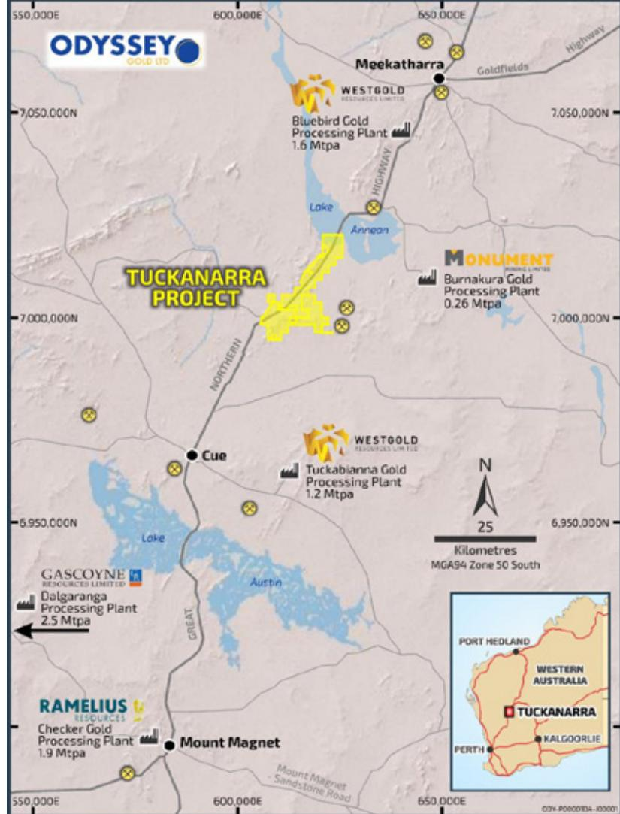
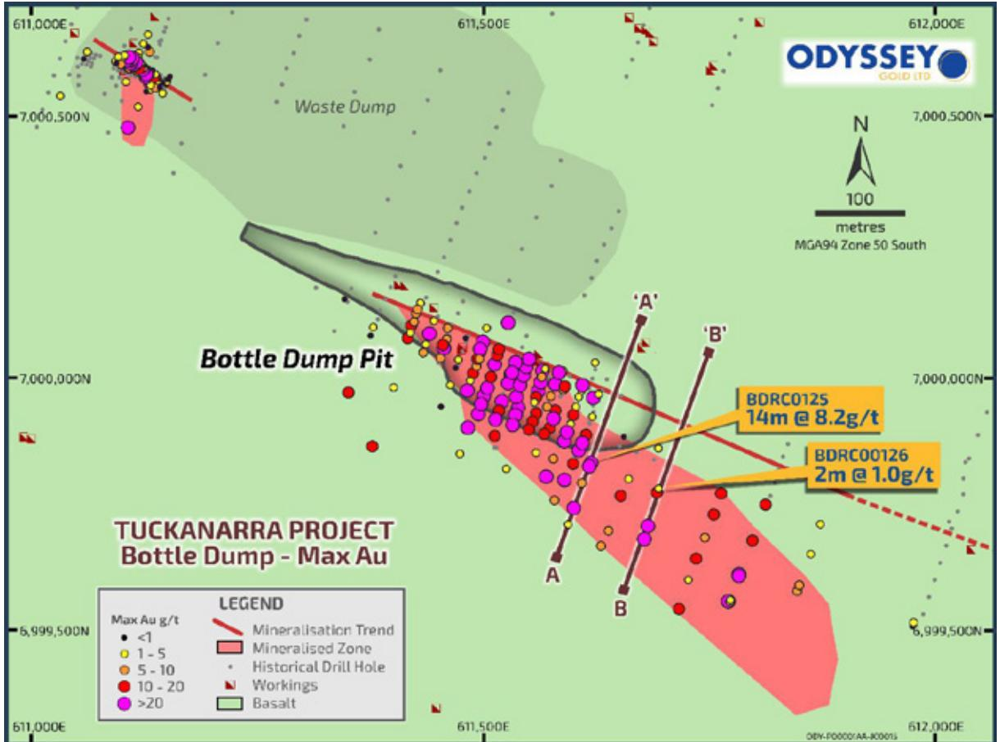
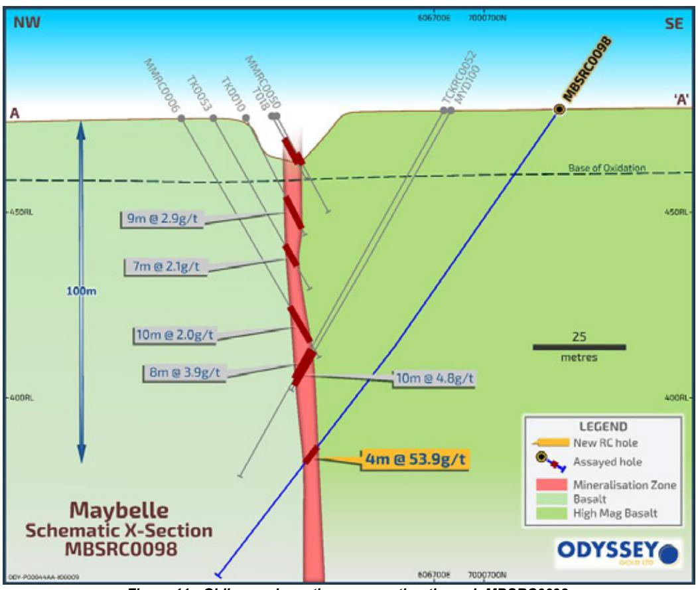

{0}------------------------------------------------

# ANNUAL REPORT **2022**

ASX:**ODY** ABN: 73 116 151 636

ODYSSEY GOLD LTD

**ANNUAL REPORT**

ASX:**ODY**

ABN: 73 116 151 636

odysseygold.com.au

ODYSSEY GOLD LTD

Telephone: +61 8 9322 6322

Facsimile: +61 8 9322 6558

Level 9, 28 The Esplanade, Perth WA 6000

{1}------------------------------------------------

# **Corporate Directory**

#### **DIRECTORS**

Mr Ian Middlemas – Chairman Mr Matthew Briggs – Managing Director & CEO Mr Matthew Syme – Director Mr Levi Mochkin – Director Mr Robert Behets – Director

#### **COMPANY SECRETARY**

Mr Gregory Swan

#### **REGISTERED AND PRINCIPAL OFFICE**

Level 9, 28 The Esplanade, Perth WA 6000 Tel: +61 8 9322 6322 Fax: +61 8 9322 6558

#### **SHARE REGISTER**

Automic Pty Ltd Level 5, 191 St Georges Terrace, Perth WA 6000 Tel: 1300 288 664 Int: +61 2 9698 5414

#### **STOCK EXCHANGE LISTING**

Australian Securities Exchange Home Branch – Perth Level 40, Central Park, 152 – 158 St Georges Terrace, Perth WA 6000

#### **ASX CODE**

ODY – Fully paid ordinary shares

#### **SOLICITORS**

Thomson Geer

#### **AUDITOR**

William Buck Audit (WA) Pty Ltd

## **Contents**

| Directors Report                                                        | 1  |
|-------------------------------------------------------------------------|----|
| Auditor Independence Declaration                                        | 29 |
| Consolidated Statement of Profit or Loss and Other Comprehensive Income | 30 |
| Consolidated Statement of Financial Position                            | 31 |
| Consolidated Statement of Cash Flows                                    | 32 |
| Consolidated Statement of Changes in Equity                             | 33 |
| Notes to and forming Part of the Financial Statements                   | 34 |
| Directors Declaration                                                   | 55 |
| Independent Auditor's Report                                            | 57 |
| Corporate Governance                                                    | 61 |
| ASX Additional Information                                              | 62 |

{2}------------------------------------------------

30 June 2022

**Corporate Directory**

**STOCK EXCHANGE LISTING**

Australian Securities Exchange

152 – 158 St Georges Terrace,

ODY – Fully paid ordinary shares

William Buck Audit (WA) Pty Ltd

Home Branch – Perth Level 40, Central Park,

Perth WA 6000

**ASX CODE** 

**SOLICITORS** 

Thomson Geer

**AUDITOR** 

Directors Report **1**

Auditor Independence Declaration **29**

Consolidated Statement of Profit or Loss and Other Comprehensive Income **30**

Consolidated Statement of Financial Position **31**

Consolidated Statement of Cash Flows **32**

Consolidated Statement of Changes in Equity **33**

Notes to and forming Part of the Financial Statements **34**

Directors Declaration **55**

Independent Auditor's Report **57**

Corporate Governance **61**

ASX Additional Information **62**

Mr Matthew Briggs – Managing Director & CEO

**REGISTERED AND PRINCIPAL OFFICE** 

Level 9, 28 The Esplanade, Perth WA 6000

Level 5, 191 St Georges Terrace, Perth WA 6000

**Contents**

**DIRECTORS**

Mr Ian Middlemas – Chairman

Mr Matthew Syme – Director

Mr Levi Mochkin – Director

Mr Robert Behets – Director

**COMPANY SECRETARY**

Mr Gregory Swan

Tel: +61 8 9322 6322 Fax: +61 8 9322 6558

**SHARE REGISTER**

Tel: 1300 288 664 Int: +61 2 9698 5414

Automic Pty Ltd

The Directors of Odyssey Gold Limited present their report on the Group consisting of Odyssey Gold Limited ("Company" or "Odyssey" or "Parent Entity") and the entities it controlled at the end of, or during, the year ended 30 June 2022 ("Group").

## **OPERATING AND FINANCIAL REVIEW**

## **Operations**

Odyssey is a Western Australian gold explorer with a land position of over 170km2 in the prolific Murchison Goldfields. The Murchison Goldfields are host to a +35Moz gold endowment. Odyssey holds an 80% interest in the Tuckanarra and Stakewell gold projects (together, the "Tuckanarra Project" or "Project").

Five shallow oxide pits were mined on the Tuckanarra Project in the 1990's producing 52.9koz at an average grade of 3.4g/t gold. Additionally, approximately 29koz were produced at an average grade of 5.5g/t gold from the only modern underground mine on the Projects. The Project is located between Meekatharra and Mount Magnet, proximal to multiple gold processing plants, along the Great Northern Highway.

Previous resource development and open pit mining was focused on laterite and oxide mineralisation due to low gold prices. Odyssey has recognised the potential for significant strike and plunge extensions to the mineralisation. Drilling during 2021 demonstrated mineralisation along 1.6km of strike at the Cable Bollard Trend and more recently a new structure at the Highway Zone.

Odyssey's strategy is to continue to rapidly define high grade shoots on the Highway Zone structure, in addition to the 300m long shoot already identified, with reverse circulation ("RC") and diamond core ("DD") drilling.

*Figure 1 - Odyssey's land position.*

{3}------------------------------------------------

(Continued)

#### **OPERATING AND FINANCIAL REVIEW (continued)**

#### **Highlights**

The Company successfully completed the 2022 drill program, with more strong results (Figure 2) delivered from both RC and DD drilling across the Tuckanarra Project. A total of 131 holes (23,131m) of RC, 15 holes (3,649m) of DD, and 11 holes (3,152) with RC pre-collars and DD tails were also completed during the period.

The results continue to demonstrate the potential near-term open pit development scenarios and future underground mining potential of the Tuckanarra Project. The future development of targets will be aided by the majority being located on granted mining leases, prior baseline environmental studies, and production records. Metallurgical recovery testwork, with favourable results are documented for all the advanced targets.

#### *Highway Zone*

- Drilling has defined high grade mineralisation at the Highway Zone. Significant assays from this target reported during the year include:
	- o 84m @ 2.5g/t Au from 25m
	- o 11m @ 7.8g/t Au from 199m
	- o 13m @ 3.7g/t Au from 180m
	- o 16m @ 3.3g/t Au from 184m
- The Highway Zone, which was first recognised in late 2021, continues to be the priority advanced target as we see clear potential to grow the open pit and underground mining potential with additional drilling.

#### *Cable-Bollard*

- Significant assays from the Cable Bollard Trend reported during the year include:
	- o 16.6m @ 16.2g/t Au from 56m
	- o 12m @ 4.7g/t Au from 128.5m
	- o 14m @ 2.4g/t Au from 115m
	- o 11m @ 4.6g/t Au from 167m
- Drilling demonstrates continuity of gold grades at depth in the Bollard and Cable Pits, with 150m of continuous mineralisation observed on the Cable East structures.
- Drilling has defined a numerous >25 gram metres (length x grade) on a shallow plunging shoot for 500m to the south of the Cable Pit, and a high grade shoot recognised below the Bollard Pit.

#### *Bottle Dump*

- Significant assays from Bottle Dump reported during the year include:
	- o 14m @ 8.2g/t Au from 95m
	- o 3.6m @ 10.0g/t Au from 225m
- Drilling by Odyssey over the last 18 months has successfully defined the mineralisation from the base of the pit to over 360m down plunge and over 240m below surface.
- Notably the result of 14m @ 8.2g/t is only 28m below the Bottle Dump pit and located up dip of a previous hole TCKRC0004, drilled in March 2021, which returned 16m @ 2.3g/t Au.

#### *Maybelle and Anchor*

- Significant assays from Bottle Dump reported during the year include:
	- o 4m @ 53.9g/t Au from 124m
	- o 8m @ 3.9 g/t Au from 80m
	- o 8m @ 6.2 g/t Au from 60m
- The southern high grade shoot under the Maybelle Pit is not closed off to the north and will be the target of a follow-up RC drilling campaign.

{4}------------------------------------------------

*Figure 2 - Highlight results from FY2022 drilling on the Tuckanarra Project.*

## **Drilling**

**DIRECTORS' REPORT**

**OPERATING AND FINANCIAL REVIEW (continued)**

The Company successfully completed the 2022 drill program, with more strong results (Figure 2) delivered from both RC and DD drilling across the Tuckanarra Project. A total of 131 holes (23,131m) of RC, 15 holes (3,649m) of

The results continue to demonstrate the potential near-term open pit development scenarios and future underground mining potential of the Tuckanarra Project. The future development of targets will be aided by the majority being located on granted mining leases, prior baseline environmental studies, and production records.

• Drilling has defined high grade mineralisation at the Highway Zone. Significant assays from this target reported

• The Highway Zone, which was first recognised in late 2021, continues to be the priority advanced target as we

• Drilling demonstrates continuity of gold grades at depth in the Bollard and Cable Pits, with 150m of continuous

• Drilling has defined a numerous >25 gram metres (length x grade) on a shallow plunging shoot for 500m to the

• Drilling by Odyssey over the last 18 months has successfully defined the mineralisation from the base of the pit

• Notably the result of 14m @ 8.2g/t is only 28m below the Bottle Dump pit and located up dip of a previous hole

• The southern high grade shoot under the Maybelle Pit is not closed off to the north and will be the target of a

see clear potential to grow the open pit and underground mining potential with additional drilling.

• Significant assays from the Cable Bollard Trend reported during the year include:

south of the Cable Pit, and a high grade shoot recognised below the Bollard Pit.

• Significant assays from Bottle Dump reported during the year include:

TCKRC0004, drilled in March 2021, which returned 16m @ 2.3g/t Au.

• Significant assays from Bottle Dump reported during the year include:

to over 360m down plunge and over 240m below surface.

DD, and 11 holes (3,152) with RC pre-collars and DD tails were also completed during the period.

Metallurgical recovery testwork, with favourable results are documented for all the advanced targets.

(Continued)

**Highlights**

*Highway Zone* 

*Cable-Bollard*

*Bottle Dump*

*Maybelle and Anchor*

during the year include:

o 84m @ 2.5g/t Au from 25m o 11m @ 7.8g/t Au from 199m o 13m @ 3.7g/t Au from 180m o 16m @ 3.3g/t Au from 184m

o 16.6m @ 16.2g/t Au from 56m o 12m @ 4.7g/t Au from 128.5m o 14m @ 2.4g/t Au from 115m o 11m @ 4.6g/t Au from 167m

o 14m @ 8.2g/t Au from 95m o 3.6m @ 10.0g/t Au from 225m

o 4m @ 53.9g/t Au from 124m o 8m @ 3.9 g/t Au from 80m o 8m @ 6.2 g/t Au from 60m

follow-up RC drilling campaign.

mineralisation observed on the Cable East structures.

**2**

#### *The Highway Zone*

Historical drilling at the Highway Zone intercepted 20.0m @ 5.7g/t Au (TPH0238), 3.0m @ 9.3g/t Au (TPH0134) and 3.0m @ 4.1g/t Au (TPH0223) at shallow depths. Odyssey first drilled the Highway Zone in late 2021, with the maiden hole intercepting 12.0m @ 6.5g/t Au from 132m in TCKRC0100 interpreted to be down dip of the historical intercepts.

Subsequent drilling has defined a significant new mineralised structure 150m to the East of the Bollard Pit. The structure is currently drilled for 480m and is open along strike. A mineralised shoot 300m long, >10m wide true width, 2-9g/t Au has been defined in RC drilling (Figure 3). The deepest hole intersected mineralisation continuing at 200m below surface (Figure 4). Wide intersections in oxide and, 5 of 8 RC holes containing intervals of over 5g/t Au in the mineralised shoot, give strong encouragement for the potential for both open pit and underground development in the future.

The favourable lithology may extend for a further 800m to the northeast (Figure 5) based on historical workings, the interpretation of airborne magnetics, and historical mapping. The Highway Zone is the highest priority advanced target on the Tuckanarra Project.

{5}------------------------------------------------

(Continued)

#### **OPERATING AND FINANCIAL REVIEW (continued)**

#### **Drilling (continued)**

#### *The Highway Zone (continued)*

Significant intercepts received during and subsequent to the period include:

- **84m @ 2.5g/t Au from 25m** (CBRC0055)
- **44m @ 1.8g/t Au from 156m** (CBRC0057)
- **40m @ 3.9g/t Au from 170m** (CBRC0056)
- **12m @ 6.5g/t Au from 132m** (TCKRC0100)
- **44m @ 0.6g/t Au from 32m** (TCKRC0117)
- **14m @ 1.9g/t Au from 165m** (TCKRC0101)
- **4m @ 7.1g/t Au from 176m** (CBRC0058
- **7m @ 2.5g/t Au from 153m** (TCKRC0101)
- **3m @ 4.9g/t Au from 124m** (TCKRC0102)
- **5m @ 2.2g/t Au from 189m** (TCKRC0101)

*Figure 3 – Schematic long section showing mineralisation at the Highway Zone.*

{6}------------------------------------------------

**Drilling (continued)**

*The Highway Zone (continued)*

**OPERATING AND FINANCIAL REVIEW (continued)**

▪ **84m @ 2.5g/t Au from 25m** (CBRC0055) ▪ **44m @ 1.8g/t Au from 156m** (CBRC0057) ▪ **40m @ 3.9g/t Au from 170m** (CBRC0056) ▪ **12m @ 6.5g/t Au from 132m** (TCKRC0100) ▪ **44m @ 0.6g/t Au from 32m** (TCKRC0117) ▪ **14m @ 1.9g/t Au from 165m** (TCKRC0101) ▪ **4m @ 7.1g/t Au from 176m** (CBRC0058 ▪ **7m @ 2.5g/t Au from 153m** (TCKRC0101) ▪ **3m @ 4.9g/t Au from 124m** (TCKRC0102) ▪ **5m @ 2.2g/t Au from 189m** (TCKRC0101)

Significant intercepts received during and subsequent to the period include:

*Figure 3 – Schematic long section showing mineralisation at the Highway Zone.*

(Continued)

**4**

*Figure 4 - Highway Zone schematic cross section through RC hole CBRC0055.*

*Figure 5 - The Highway Zone with potential extensions to over 800m to the East.*

{7}------------------------------------------------

(Continued)

## **OPERATING AND FINANCIAL REVIEW (continued)**

#### **Drilling (continued)**

#### *Cable-Bollard*

The Company completed 89 RC holes for 17,485m and 13 DD holes for 2,980m at Cable-Bollard, for a total of 6,940m.

The Cable-Bollard Trend comprises multiple parallel gold bearing structures. The mineralisation is hosted in sheared laminated quartz veins or sulphides associated with banded iron formation ("BIF") units, within mafic intrusives and metavolcanics, and highly silicified ultramafics. Infrequent felsic dykes crosscut the mineralisation.

The Cable-Bollard Trend extends for over 1.6km of strike with deepest drilling to a vertical depth of 150m. The project has significant growth potential, with the favourable lithology and historic workings. Drilling along the Cable-Bollard Trend has identified the 500m of strike length immediately below the 35m deep Cable Pit, and to the south to the south of the Cable Pit as one of several significant shoots on the Tuckanarra Project. Similarly, a high grade shoot was intersected in several holes beneath the Bollard Pit (Figure 7). This shoot will be a focus of future drilling and underground mining evaluation.

During the period, a number of high-grade infill and extensional gold intercepts were returned from drilling including:

- **11m @ 4.6g/t Au from 167m** (TCKRC0104)
- 
- **12.4m@ 4.7g/t Au from 128.5m** (CBDD0010) ▪ **20m @ 2.2g/t Au from 124m** (CBRC0047)
- **4m @ 8.6g/t Au from 12m** (TCKRC0108)
- **4.3m @ 7.6g/t Au from 57m** (CBDD0007)
- **12m @ 2.6g/t Au from 94m** (TCKRC0090)
- 
- **7m @ 4.2g/t Au from 89m** (CBDD0003)
- **7.9m @ 3.5g/t Au from 113m** (CBDD0002)
- **6m @ 3.7g/t Au from 143m** (TCKRC0104) ▪ **6.4m @ 3.4g/t Au from 206m** (CBDD0013)
- **1m @ 19.0g/t Au from 78m** (TCKRC0116)
- **1m @ 18.0g/t Au from 196m** (TCKRC0111)
- **3m @ 5.4g/t Au from 133m** (TCKRC0117)
- **7m @ 2.3g/t Au from 33m** (TCKRC0116)
- **4m @ 2.4g/t Au from 20m** (TCKRC0114)
- **2m @ 3.5g/t Au from 147m** (TCKRC0117)

*Figure 6 - Oblique schematic cross section through CBDD0006 drilled beneath the Cable Pit.*

{8}------------------------------------------------

*Figure 7 - Oblique schematic cross section through CBDD0010 drilled beneath the Bollard Pit.*

#### *Bottle Dump*

**DIRECTORS' REPORT**

**Drilling (continued)**

and underground mining evaluation.

▪ **11m @ 4.6g/t Au from 167m** (TCKRC0104) ▪ **12.4m@ 4.7g/t Au from 128.5m** (CBDD0010) ▪ **20m @ 2.2g/t Au from 124m** (CBRC0047) ▪ **4m @ 8.6g/t Au from 12m** (TCKRC0108) ▪ **4.3m @ 7.6g/t Au from 57m** (CBDD0007) ▪ **12m @ 2.6g/t Au from 94m** (TCKRC0090) ▪ **7m @ 4.2g/t Au from 89m** (CBDD0003) ▪ **7.9m @ 3.5g/t Au from 113m** (CBDD0002)

*Cable-Bollard* 

6,940m.

**OPERATING AND FINANCIAL REVIEW (continued)**

The Company completed 89 RC holes for 17,485m and 13 DD holes for 2,980m at Cable-Bollard, for a total of

The Cable-Bollard Trend comprises multiple parallel gold bearing structures. The mineralisation is hosted in sheared laminated quartz veins or sulphides associated with banded iron formation ("BIF") units, within mafic intrusives and metavolcanics, and highly silicified ultramafics. Infrequent felsic dykes crosscut the mineralisation. The Cable-Bollard Trend extends for over 1.6km of strike with deepest drilling to a vertical depth of 150m. The project has significant growth potential, with the favourable lithology and historic workings. Drilling along the Cable-Bollard Trend has identified the 500m of strike length immediately below the 35m deep Cable Pit, and to the south to the south of the Cable Pit as one of several significant shoots on the Tuckanarra Project. Similarly, a high grade shoot was intersected in several holes beneath the Bollard Pit (Figure 7). This shoot will be a focus of future drilling

During the period, a number of high-grade infill and extensional gold intercepts were returned from drilling including:

*Figure 6 - Oblique schematic cross section through CBDD0006 drilled beneath the Cable Pit.*

▪ **6m @ 3.7g/t Au from 143m** (TCKRC0104) ▪ **6.4m @ 3.4g/t Au from 206m** (CBDD0013) ▪ **1m @ 19.0g/t Au from 78m** (TCKRC0116) ▪ **1m @ 18.0g/t Au from 196m** (TCKRC0111) ▪ **3m @ 5.4g/t Au from 133m** (TCKRC0117) ▪ **7m @ 2.3g/t Au from 33m** (TCKRC0116) ▪ **4m @ 2.4g/t Au from 20m** (TCKRC0114) ▪ **2m @ 3.5g/t Au from 147m** (TCKRC0117)

(Continued)

**6**

Bottle Dump is BIF hosted mineralisation located approximately 3km to the south-east of Cable-Bollard. A shallow oxide pit was mined in 1990's. Drilling by Odyssey has delineated along 600m of strike and up to ~250m down dip. The mineralisation is open along strike to the east and north-west, and down dip and down plunge to the southeast.

The Bottle Dump Shear Zone has the strong potential to host significant gold mineralisation due to its east-southeast ("ESE") trending BIF sequences being subparallel to interpreted ESE trending major shears.

During the period, assay results for 19 drill holes were received including notable results of:

- **3.6m @ 10.0g/t Au from 225m** (TCKDD0064)
- **1.3m @ 8.0g/t Au from 219m** (TCKRCD0076)
- **7m @ 1.7g/t Au from 79m** (TCKRC0015)
- **4m @ 2.9g/t Au from 271m** (TCKRCD0067)
- **1m @ 3.1g/t Au from 67m** (TCKRC0078)

{9}------------------------------------------------

(Continued)

#### **OPERATING AND FINANCIAL REVIEW (continued)**

#### **Drilling (continued)**

*Bottle Dump (continued)*

*Figure 8 - Bottle Dump plan showing H2 FY2022 RC drill results.*

High-grade gold intercepts from the last round of drilling at Bottle Dump show the potential for the continuation of gold mineralisation down dip, down plunge towards the south-east (Figure 8).

Parts of the Bottle Dump mineralisation remain open up dip. Additional shoots are likely to occur along strike to the east, or on parallel structures to the north and south of Bottle Dump.

#### *Maybelle and Lucknow Trends*

Gold mineralisation at Maybelle is associated with steeply dipping sheared sediments that extend for over 1.5km along a line of historical workings. A shallow oxide pit, on the southern 450m of sediment, was predominantly mined in the mid 1990's.

Historic drilling at Maybelle was typically less than 60m in depth. Prior to the recent drilling campaign, only one hole was drilled deeper than 100m below surface. Mining was to a maximum of 26m below surface.

Ore treated from mining at Maybelle up to 1904 is reported as ~554t @ 5.7g/t Au for 103oz produced. Subsequent open pit mining to a depth of ~30m in the early 1990's produced 52kt @ 3.6g/t Au for 6,020oz before mining was halted as the ore started to transition to primary sulphides. Metallurgical test work completed in 1994 on composites from fresh sulphide mineralisation recovered over 98% of gold in fresh rock.

RC drilling completed during the period demonstrated the continuity of multiple shoots down dip of shallow oxide mineralisation along 1.5km of strike of the Maybelle Trend. The RC program was completed on an 80x40m spacing down plunge of the historic rotary air blast ("RAB") and shallow RC drilling. A total of 28 RC holes for 3,645m was completed. The most notable is a result of 4m @ 53g/t Au. This hole confirms a steeper plunge of the mineralisation shoots, over 100m of vertical continuity of mineralisation (Figure 10), and the potential for higher grade mineralisation that can be considered for underground evaluation following additional positive drilling results.

{10}------------------------------------------------

Highlights of the Maybelle and Lucknow Trend drilling are summarised below:

- **4m @ 53.9g/t Au from 124m** (MBSRC0098)
**DIRECTORS' REPORT**

**Drilling (continued)**

*Bottle Dump (continued)*

**OPERATING AND FINANCIAL REVIEW (continued)**

*Figure 8 - Bottle Dump plan showing H2 FY2022 RC drill results.* High-grade gold intercepts from the last round of drilling at Bottle Dump show the potential for the continuation of

Parts of the Bottle Dump mineralisation remain open up dip. Additional shoots are likely to occur along strike to the

Gold mineralisation at Maybelle is associated with steeply dipping sheared sediments that extend for over 1.5km along a line of historical workings. A shallow oxide pit, on the southern 450m of sediment, was predominantly mined

Historic drilling at Maybelle was typically less than 60m in depth. Prior to the recent drilling campaign, only one hole

Ore treated from mining at Maybelle up to 1904 is reported as ~554t @ 5.7g/t Au for 103oz produced. Subsequent open pit mining to a depth of ~30m in the early 1990's produced 52kt @ 3.6g/t Au for 6,020oz before mining was halted as the ore started to transition to primary sulphides. Metallurgical test work completed in 1994 on composites

RC drilling completed during the period demonstrated the continuity of multiple shoots down dip of shallow oxide mineralisation along 1.5km of strike of the Maybelle Trend. The RC program was completed on an 80x40m spacing down plunge of the historic rotary air blast ("RAB") and shallow RC drilling. A total of 28 RC holes for 3,645m was completed. The most notable is a result of 4m @ 53g/t Au. This hole confirms a steeper plunge of the mineralisation shoots, over 100m of vertical continuity of mineralisation (Figure 10), and the potential for higher grade mineralisation that can be considered for underground evaluation following additional positive drilling results.

was drilled deeper than 100m below surface. Mining was to a maximum of 26m below surface.

gold mineralisation down dip, down plunge towards the south-east (Figure 8).

from fresh sulphide mineralisation recovered over 98% of gold in fresh rock.

east, or on parallel structures to the north and south of Bottle Dump.

*Maybelle and Lucknow Trends*

in the mid 1990's.

(Continued)

**8**

- **7m @ 4.5g/t Au from 112m** (MBNRC0105)
- **4m @ 3.8g/t Au from 119m** (MBNRC0103)
- **7m @ 2.3g/t Au from 70m** (MBNRC0102)
- **3m @ 3.8g/t Au from 52m** (MBNRC0109)

*Figure 9 - Visible gold panned from 125-126m downhole in MBSRC0098. The field of view in each image is approximately 1cm. Visible gold was logged from 124-128m.*

*Figure 10 - Maybelle schematic long section.*

{11}------------------------------------------------

(Continued)

#### **OPERATING AND FINANCIAL REVIEW (continued)**

#### **Drilling (continued)**

#### *Maybelle and Lucknow Trends (continued)*

*Figure 11 - Oblique schematic cross section through MBSRC0098.*

## **Mapping**

The Company continued detailed field mapping around Anchor and east of the Cable-Bollard Trend. The total area mapped in detail by Odyssey increased to approximately 6.4km2.

The detailed field mapping, once integrated with the geochemical and geophysical surveys, will serve as part of an exploration model that will significantly increase the geological understanding of the area.

During the process of mapping samples were collected of historic RAB and aircore drill spoils (156 samples), and rock chip/grab samples (111) of outcrop of interest.

## **Soil Geochemistry**

Odyssey continued a detailed soil sampling program at the Tuckanarra Project. A total of 1,535 samples were collected during the period. Results confirmed relatively continuous >10ppb soil anomalism extending from the northern end of the Cable-Bollard Trend to west of the Bottle Dump Pit.

Substantial progress has been made on the classification of drillhole and spoil XRF data with semi-supervised machine learning. All XRF data is now classified using the machine learning algorithm to provide higher confidence in lithology data. 35,537 XRF readings have been collected and classified by the Company.

{12}------------------------------------------------

#### **Geophysics**

**DIRECTORS' REPORT**

**Drilling (continued)**

**OPERATING AND FINANCIAL REVIEW (continued)**

mapped in detail by Odyssey increased to approximately 6.4km2.

northern end of the Cable-Bollard Trend to west of the Bottle Dump Pit.

rock chip/grab samples (111) of outcrop of interest.

*Figure 11 - Oblique schematic cross section through MBSRC0098.*

The Company continued detailed field mapping around Anchor and east of the Cable-Bollard Trend. The total area

The detailed field mapping, once integrated with the geochemical and geophysical surveys, will serve as part of an

During the process of mapping samples were collected of historic RAB and aircore drill spoils (156 samples), and

Odyssey continued a detailed soil sampling program at the Tuckanarra Project. A total of 1,535 samples were collected during the period. Results confirmed relatively continuous >10ppb soil anomalism extending from the

Substantial progress has been made on the classification of drillhole and spoil XRF data with semi-supervised machine learning. All XRF data is now classified using the machine learning algorithm to provide higher confidence

exploration model that will significantly increase the geological understanding of the area.

in lithology data. 35,537 XRF readings have been collected and classified by the Company.

*Maybelle and Lucknow Trends (continued)*

(Continued)

**10**

**Mapping**

**Soil Geochemistry**

The Company continued flying and processing high-resolution drone magnetic geophysical surveys at the Tuckanarra Project. The area covered totals 17.2km2. The integration with other exploration data such as geochemistry will be ongoing as required.

*Figure 12 - Plan view map illustrating the status of geophysics and geophysics flown during the period at Tuckanarra.*

## **Future Work**

Drilling during the reporting period has highlighted the potential of the Highway Zone to be a significant area of new mineralisation on the Tuckanarra Project. Over 50% of holes intersected 25 gram metres or more along the 400m of strike the structure is defined. High grades and wide intersections give strong encouragement for future open pit and underground mining potential at the Highway Zone. The structure remains open along strike and down plunge. RC drilling the strike extensions will be the focus of drilling in FY2023.

The company has a portfolio of advanced targets with shallow oxide mineralisation and emerging high grade shoots. The inventory growth on the Tuckanarra Project is in a district of mining companies with, cumulatively, 7.5Mtpa of processing capacity during a period of extended strong gold price.

Additionally, preparation is underway for RAB drilling planned to drill the Greenstone Target and Regal Target (Figure 15). The Greenstone Target comprises 8km of antiformal basalts and dolerite adjacent to the flexure of a regional fault. This favourable structural setting in known hosts of high-grade gold mineralisation makes the Greenstone Target a high priority for RAB drilling. The Greenstone Target has not previously been bedrock drilled.

The Regal Target contains a large number of historic workings on the continuation of the Maybelle Trend. Very sparse RAB drilling has occurred in the area and no RC or diamond drilling is known.

{13}------------------------------------------------

(Continued)

## **OPERATING AND FINANCIAL REVIEW (continued)**

## **Future Work (continued)**

*Figure 13 - Strike extensions of the Highway Zone planned for RC drilling in FY2023.*

*Figure 14 - Tuckanarra Project FY2022 Drilling Collars.*

{14}------------------------------------------------

**Future Work (continued)**

**OPERATING AND FINANCIAL REVIEW (continued)**

*Figure 13 - Strike extensions of the Highway Zone planned for RC drilling in FY2023.*

*Figure 14 - Tuckanarra Project FY2022 Drilling Collars.*

(Continued)

**12**

*Figure 15 - FY2023 early-stage exploration targets.*

{15}------------------------------------------------

(Continued)

#### **OPERATING AND FINANCIAL REVIEW (continued)**

#### **Tenements**

As at 30 June 2022, the Company holds an interest in the following mining and exploration tenements:

| Project Name                               | Permit Number | Percentage Interest | Status  |
|--------------------------------------------|---------------|---------------------|---------|
| Tuckanarra Gold Project, Western Australia | M20/527       | 80%                 | Granted |
|                                            | E20/782       | 80%                 | Granted |
|                                            | E20/783       | 80%                 | Granted |
|                                            | P20/2399      | 80%                 | Granted |
|                                            | P20/2400      | 80%                 | Granted |
|                                            | P20/2401      | 80%                 | Granted |
|                                            | P20/2415      | 80%                 | Granted |
|                                            | P20/2416      | 80%                 | Granted |
|                                            | P20/2417      | 80%                 | Granted |
|                                            | P20/2418      | 80%                 | Granted |
|                                            | E20/924       | 100%                | Granted |
|                                            | E20/925       | 100%                | Granted |
|                                            | E20/996       | 100%                | Granted |
| Stakewell Gold Project, Western Australia  | E51/1806      | 80%                 | Granted |
|                                            | P51/2869      | 80%                 | Granted |
|                                            | P51/2870      | 80%                 | Granted |
|                                            | P51/2871      | 80%                 | Granted |
|                                            | P51/2872      | 80%                 | Granted |
|                                            | P51/2873      | 80%                 | Granted |
|                                            | P51/2874      | 80%                 | Granted |
|                                            | P51/2875      | 80%                 | Granted |
|                                            | P51/2876      | 80%                 | Granted |
|                                            | P51/2877      | 80%                 | Granted |
|                                            | P51/2878      | 80%                 | Granted |
|                                            | L51/27        | 80%                 | Granted |
|                                            | L51/28        | 80%                 | Granted |
|                                            | L51/32        | 80%                 | Granted |

#### **COVID-19**

The outbreak of the 2019 novel strain of coronavirus causing a contagious respiratory disease known as COVID-19, and the subsequent quarantine measures imposed by the Australian and other governments, and related travel and trade restrictions have caused disruption to businesses and resulted in significant global economic impacts. As at 30 June 2022, these impacts have not had a significant effect on the Group's financial results or operations. However, as the impact of COVID-19 continues to evolve, including changes in government policy and business reactions thereto, if our staff are unable to work or travel due to illness or government restrictions, we may be forced to reduce or suspend our exploration and development activities. In addition, as the COVID-19 pandemic and mitigation measures have also negatively impacted global economic conditions, this, in turn, could adversely affect our business in the future. Due to the continually evolving nature of COVID-19 the Directors cannot reasonably estimate the effects that the COVID-19 pandemic could have on future periods and believes that any disturbance may be temporary. However, there is uncertainty about the length and potential impact of any resultant disturbance. As a result, we are unable to estimate the potential impact on the Group's future operations as at the date of these Financial Statements.

#### **Corporate**

During the year, the Company appointed highly respected gold geologist, Mr Matthew Briggs, as Managing Director and Chief Executive Officer ("CEO") of the Company, effective from 17 January 2022. Mr Briggs is an expert and experienced professional exploration geologist with an ideal background in gold exploration and mining in Australia, most recently as Managing Director of Tanami gold explorer, Prodigy Gold Ltd.

{16}------------------------------------------------

## **Results of Operations**

**DIRECTORS' REPORT**

**OPERATING AND FINANCIAL REVIEW (continued)**

As at 30 June 2022, the Company holds an interest in the following mining and exploration tenements:

**Project Name Permit Number Percentage Interest Status** Tuckanarra Gold Project, Western Australia M20/527 80% Granted

Stakewell Gold Project, Western Australia E51/1806 80% Granted

The outbreak of the 2019 novel strain of coronavirus causing a contagious respiratory disease known as COVID-19, and the subsequent quarantine measures imposed by the Australian and other governments, and related travel and trade restrictions have caused disruption to businesses and resulted in significant global economic impacts. As at 30 June 2022, these impacts have not had a significant effect on the Group's financial results or operations. However, as the impact of COVID-19 continues to evolve, including changes in government policy and business reactions thereto, if our staff are unable to work or travel due to illness or government restrictions, we may be forced to reduce or suspend our exploration and development activities. In addition, as the COVID-19 pandemic and mitigation measures have also negatively impacted global economic conditions, this, in turn, could adversely affect our business in the future. Due to the continually evolving nature of COVID-19 the Directors cannot reasonably estimate the effects that the COVID-19 pandemic could have on future periods and believes that any disturbance may be temporary. However, there is uncertainty about the length and potential impact of any resultant disturbance. As a result, we are unable to estimate the potential impact on the Group's future operations as at the date of these

During the year, the Company appointed highly respected gold geologist, Mr Matthew Briggs, as Managing Director and Chief Executive Officer ("CEO") of the Company, effective from 17 January 2022. Mr Briggs is an expert and experienced professional exploration geologist with an ideal background in gold exploration and mining in Australia,

most recently as Managing Director of Tanami gold explorer, Prodigy Gold Ltd.

E20/782 80% Granted E20/783 80% Granted P20/2399 80% Granted P20/2400 80% Granted P20/2401 80% Granted P20/2415 80% Granted P20/2416 80% Granted P20/2417 80% Granted P20/2418 80% Granted E20/924 100% Granted E20/925 100% Granted E20/996 100% Granted

P51/2869 80% Granted P51/2870 80% Granted P51/2871 80% Granted P51/2872 80% Granted P51/2873 80% Granted P51/2874 80% Granted P51/2875 80% Granted P51/2876 80% Granted P51/2877 80% Granted P51/2878 80% Granted L51/27 80% Granted L51/28 80% Granted L51/32 80% Granted

(Continued)

**Tenements**

**COVID-19**

Financial Statements.

**Corporate**

**14**

The net loss of the Group for the year ended 30 June 2022 was \$9,538,268 (2021: loss of \$4,372,043). This loss is predominately comprised of exploration and evaluation expenditure of \$8,282,758 (2021: \$3,049,705) and is attributable to the Group's accounting policy of expensing exploration and evaluation expenditure (other than expenditures incurred in the acquisition of the rights to explore) incurred by the Group.

#### **Financial Position**

The Group had cash reserves of \$3,480,120 at 30 June 2022 (2021: \$12,689,470) and no debt. At 30 June 2022, the Group had net assets of \$9,977,771 (2021: \$19,270,545), a decrease of 48% compared with the previous year driven predominately by the loss for the financial year. As at 30 June 2022, the Company had a net current asset surplus of \$877,909 (2021: \$11,282,642).

## **Environmental Regulation and Performance**

The Group's operations are subject to various environmental laws and regulations under the relevant government's legislation. Full compliance with these laws and regulations is regarded as a minimum standard for all operations to achieve.

Instances of environmental non-compliance by an operation are identified either by external compliance audits or inspections by relevant government authorities. There have been no significant known breaches by the Group during the financial year.

## **Principal Activities**

The principal activities of the Group during the year consisted of the exploration and development of mineral resource projects in Western Australia.

#### **Business Strategies and Prospects for Future Financial Years**

The objective of the Group is to create long-term shareholder value through the acquisition and development of technically and economically viable mineral deposits.

To date, the Group has not commenced production of any minerals, nor has it identified a Mineral Resource in accordance with the JORC Code. To achieve its objective, the Group currently intends over the medium term to conduct further exploration activities including field work to follow up targets identified at the Tuckanarra and Stakewell Gold Projects.

These activities are inherently risky and the Board is unable to provide certainty of the expected results of these activities, or that any or all of these likely developments will be achieved.

The material business risks faced by the Group that could have an effect on the Group's future prospects, and how the Group manages these risks include:

- **The Group's exploration programmes may not identify an economic deposit -** The Group's Projects are at an early stage of exploration and current/potential investors should understand that mineral exploration, development and mining are high-risk enterprises, only occasionally providing high rewards. The success of the Group depends, among other things, on successful exploration and/or acquisition of reserves, securing and maintaining title to tenements and consents, successful design, construction, commissioning and operating of mining and processing facilities, successful development and production in accordance with forecasts and successful management of the operations. Exploration and mining activities may also be hampered by force majeure circumstances, land claims and unforeseen mining problems. There is no assurance that exploration and development of the mineral interests owned by the Group, or any other projects that may be acquired in the future, will result in the discovery of mineral deposits which are capable of being exploited economically. Even if an apparently viable deposit is identified, there is no guarantee that it can be profitably exploited. If such commercial viability is never attained, the Group may seek to transfer its property interests or otherwise realise value, or the Group may even be required to abandon its business and fail as a "going concern";

{17}------------------------------------------------

(Continued)

## **OPERATING AND FINANCIAL REVIEW (continued)**

## **Business Strategies and Prospects for Future Financial Years (continued)**

- **The Group's exploration activities being delayed due to lack of available equipment and services -** The exploration activities of the Group requires the involvement of a number of third parties, including drilling contractors, assay laboratories, consultants, other contractors and suppliers. Demand for drilling equipment and exploration related services in Western Australia is currently very high and has resulted in higher exploration costs, delays in completing the Group's exploration activities, and delays in the assessment and reporting of the results. Should there continue to be high demand for exploration equipment and related services, there may be further delays in undertaking exploration activities, which may result in increased exploration costs and/or increased working capital requirements for the Group and may have a material impact on the Group's operations and performance;
- **The Group's operations will require further capital** the exploration and any development of the Group's exploration properties will require substantial additional financing. Failure to obtain sufficient financing may result in delaying, or the indefinite postponement of, exploration and any development of the Group's properties or even a loss of property interest. There can be no assurance that additional capital or other types of financing will be available if needed or that, if available, the terms of such financing will be favourable to the Group;
- **The Group may be adversely affected by fluctuations in commodity prices**  the price of commodities fluctuate widely and are affected by numerous factors beyond the control of the Group. Future production, if any, from the Group's mineral properties will be dependent upon the price of commodities being adequate to make these properties economic. The Group currently does not engage in any hedging or derivative transactions to manage commodity price risk. As the Group's operations change, this policy will be reviewed periodically going forward; and
- **Global financial conditions may adversely affect the Group's growth and profitability** many industries, including the mineral resource industry, are impacted by these market conditions. Some of the key impacts include contraction in credit markets resulting in a widening of credit risk, devaluations and high volatility in global equity, commodity, foreign exchange and precious metal markets, and a lack of market liquidity. Due to the current nature of the Group's activities, a slowdown in the financial markets or other economic conditions may adversely affect the Group's growth and ability to finance its activities.

{18}------------------------------------------------

## **DIRECTORS**

**DIRECTORS' REPORT**

be favourable to the Group;

be reviewed periodically going forward; and

**OPERATING AND FINANCIAL REVIEW (continued)**

**Business Strategies and Prospects for Future Financial Years (continued)**

may have a material impact on the Group's operations and performance;

• **The Group's exploration activities being delayed due to lack of available equipment and services -** The exploration activities of the Group requires the involvement of a number of third parties, including drilling contractors, assay laboratories, consultants, other contractors and suppliers. Demand for drilling equipment and exploration related services in Western Australia is currently very high and has resulted in higher exploration costs, delays in completing the Group's exploration activities, and delays in the assessment and reporting of the results. Should there continue to be high demand for exploration equipment and related services, there may be further delays in undertaking exploration activities, which may result in increased exploration costs and/or increased working capital requirements for the Group and

• **The Group's operations will require further capital** – the exploration and any development of the Group's exploration properties will require substantial additional financing. Failure to obtain sufficient financing may result in delaying, or the indefinite postponement of, exploration and any development of the Group's properties or even a loss of property interest. There can be no assurance that additional capital or other types of financing will be available if needed or that, if available, the terms of such financing will

• **The Group may be adversely affected by fluctuations in commodity prices** – the price of commodities fluctuate widely and are affected by numerous factors beyond the control of the Group. Future production, if any, from the Group's mineral properties will be dependent upon the price of commodities being adequate to make these properties economic. The Group currently does not engage in any hedging or derivative transactions to manage commodity price risk. As the Group's operations change, this policy will

• **Global financial conditions may adversely affect the Group's growth and profitability** – many industries, including the mineral resource industry, are impacted by these market conditions. Some of the key impacts include contraction in credit markets resulting in a widening of credit risk, devaluations and high volatility in global equity, commodity, foreign exchange and precious metal markets, and a lack of market liquidity. Due to the current nature of the Group's activities, a slowdown in the financial markets or other economic conditions may adversely affect the Group's growth and ability to finance its activities.

(Continued)

**16**

The names of directors in office at any time during the financial year or since the end of the financial year are:

| Current Directors |                                                                                    |
|-------------------|------------------------------------------------------------------------------------|
| Mr Ian Middlemas  | Chairman                                                                           |
| Mr Matthew Briggs | Managing Director and CEO (appointed 17 January 2022)                              |
| Mr Matthew Syme   | Executive Director                                                                 |
| Mr Levi Mochkin   | Executive Director (appointed Executive 1 November 2021, previously Non-Executive) |
| Mr Robert Behets  | Non-Executive Director                                                             |

Unless otherwise disclosed, the Directors held their office from 1 July 2021 until the date of this report.

#### **DIRECTORS AND OFFICERS**

#### **Ian Middlemas Chairman Qualifications – B.Com, CA**

Mr Middlemas is a Chartered Accountant and holds a Bachelor of Commerce degree. He worked for a large international Chartered Accounting firm before joining the Normandy Mining Group where he was a senior group executive for approximately 10 years. He has had extensive corporate and management experience and is currently a director of a number of publicly listed companies in the resources sector.

Mr Middlemas was appointed a Director of the Company on 8 September 2005. During the three year period to the end of the financial year, Mr Middlemas has held directorships in Constellation Resources Limited (November 2017 – present), Apollo Minerals Limited (July 2016 – present), GCX Metals Limited (October 2013 – present), Berkeley Energia Limited (April 2012 – present), GreenX Mining Limited (August 2011 – present), Salt Lake Potash Limited (Administrators Appointed) (Receivers and Managers Appointed) (January 2010 – present), Equatorial Resources Limited (November 2009 – present), Sovereign Metals Limited (July 2006 – present), Peregrine Gold Limited (September 2020 – February 2022), Piedmont Lithium Limited (September 2009 – December 2020) and Cradle Resources Limited (May 2016 – July 2019).

#### **Matthew Briggs Managing Director and CEO Qualifications – BSc Hons (Geology), MAusIMM**

Mr Briggs is an expert and experienced professional exploration geologist with an ideal background in gold exploration and mining in Australia, most recently as Managing Director of Tanami gold explorer, Prodigy Gold NL. He completed an Honours degree in Geology at the University of Queensland and embarked on a 25-year career in gold exploration, starting as an exploration geologist at Central Norseman Gold, then rising to Exploration Manager at St Ives Gold and eventually becoming Vice President and Group Head of Strategic Planning at Gold Fields. He became Managing Director of Prodigy Gold's predecessor, ABM Resources Ltd, in 2016. Mr Briggs is a councillor of the Association of Mining and Exploration Companies (AMEC).

Mr Briggs was appointed Managing Director and CEO on 17 January 2022. During the three year period to the end of the financial year, Mr Briggs has held directorships in Prodigy Gold NL (October 2016 – January 2022) and controlled entities Rare Resources NL and Australian Tenement Holdings Pty Ltd.

#### **Matthew Syme Executive Director Qualifications – B.Com, CA**

Mr Syme is a Chartered Accountant and an accomplished mining executive with over 27 years' experience in senior management roles in Australia and overseas. He was a Manager in a major international Chartered Accounting firm before spending three years as an equities analyst in a large stockbroking firm. He was then Chief Financial Officer of Pacmin Mining Limited, a successful Australian gold mining company.

Mr Syme has considerable experience in managing mining projects in a wide range of commodities and countries. Mr Syme previously held the position of Managing Director at copper-gold developer Sierra Mining Limited, which was acquired by RTG Mining Inc in early June 2014. Mr Syme was responsible for the acquisition of Sierra's key Mabilo Project in late 2011. Prior to joining Sierra in 2010 he was Managing Director of Berkeley Resources Limited where he successfully guided the acquisition and scoping studies of Berkeley's Salamanca Uranium Project in Spain.

Mr Syme was appointed a Director of the Company on 28 August 2020. During the three year period to the end of the financial year, Mr Syme has held directorships in Salt Lake Potash Limited (Administrators Appointed) (Receivers and Managers Appointed) (April 2015 – July 2019).

{19}------------------------------------------------

(Continued)

## **DIRECTORS AND OFFICERS (Continued)**

## **Mr Levi Mochkin**

#### **Executive Director**

Mr Mochkin is a key member of the Ledger Holdings Pty Ltd Group (the Ledger Group), located in Melbourne, Australia and has been in the resources sector for over 28 years advising companies, identifying projects and raising capital of over A\$800 million for mining projects.

Mr Mochkin was appointed a Director on 31 August 2020. During the three-year period to the end of the financial year, Mr Mochkin has held directorships in Piedmont Lithium Limited (April 2006 – June 2021).

#### **Mr Robert Behets Non-Executive Director Qualifications – B.Sc(Hons), FAusIMM, MAIG**

Mr Behets is a geologist with 30 years' experience in the mineral exploration and mining industry in Australia and internationally. He has had extensive corporate and management experience and has been Director of a number of ASX-listed companies in the resources sector including Mantra Resources Limited ("Mantra"), Papillon Resources Limited, and Berkeley Energia Limited. Mr Behets was instrumental in the founding, growth and development of Mantra, an African-focussed uranium company, through to its acquisition by ARMZ for approximately A\$1 billion in 2011. Prior to Mantra, he held various senior management positions during a long career with WMC Resources Limited.

Mr Behets has a strong combination of technical, commercial and managerial skills and extensive experience in exploration, mineral resource and ore reserve estimation, feasibility studies and operations across a range of commodities, including uranium, gold and base metals. He is a Fellow of The Australasian Institute of Mining and Metallurgy, a Member of the Australian Institute of Geoscientists and was previously a member of the Australasian Joint Ore Reserves Committee ("JORC").

Mr Behets was appointed a Director of the Company on 28 August 2020. During the three year period to the end of the financial year, Mr Behets has held directorships in Apollo Minerals Limited (October 2016 – present), Constellation Resources Limited (June 2017 – present), Equatorial Resources Limited (February 2016 – present) and Berkeley Energia Limited (April 2012 - present).

## **Mr Gregory Swan**

#### **Company Secretary Qualifications – BCom, CA, FCIS, FFin**

Mr Swan is a Chartered Accountant with over 15 years' experience in the formation and development of publicly listed natural resources companies. He currently serves as Chief Financial Officer and/or Company Secretary for several listed companies that operate in the resources sector. He commenced his career at a large international Chartered Accounting firm and has since been involved with a number of mining exploration and development companies, including Piedmont Lithium Inc, IperionX Limited, Mantra Resources Limited, and Papillon Resources Limited.

Mr Swan was appointed Company Secretary of the Company on 4 November 2020.

#### **SIGNIFICANT EVENTS AFTER BALANCE DATE**

- (a) On 29 September 2022, the Company announced that it will undertake a non-renounceable entitlements offer ("Entitlements Offer") to raise up to \$4.6 million before costs. Under the Entitlements Offer, eligible shareholders will be offered the opportunity to purchase one (1) new fully paid ordinary share in the Company ("New Shares") for every four (4) fully paid ordinary shares held at the record date, at an issue price of \$0.03 per New Share. The Directors and Officers of the Company have agreed to take up their full entitlements under the Entitlement Offer and also agreed to partially underwrite the Entitlement Offer by applying for shortfall shares, up to a combined amount of approximately \$0.9 million.
Other than the above, there are no matters or circumstances which have arisen since 30 June 2022 that have significantly affected or may significantly affect:

- the operations, in financial years subsequent to 30 June 2022, of the Group;
- the results of those operations, in financial years subsequent to 30 June 2022, of the Group; or
- the state of affairs, in financial years subsequent to 30 June 2022, of the Group.

{20}------------------------------------------------

## **SIGNIFICANT CHANGES IN THE STATE OF AFFAIRS**

- (a) On 8 December 2021, the Company announced the appointment of Mr Matthew Briggs as Managing Director and Chief Executive Officer ("CEO"), effective 17 January 2022.
## **INFORMATION ON DIRECTORS' INTERESTS IN SECURITIES OF ODYSSEY**

The following table sets out each Director's relevant interest in securities of the Company as at the date of this report:

|                   | Interest in Securities at the date of this Report |            |                     |
|-------------------|---------------------------------------------------|------------|---------------------|
|                   | Shares1                                           | Options2   | Performance Rights3 |
| Mr Ian Middlemas  | 27,312,500                                        | -          | -                   |
| Mr Matthew Briggs | -                                                 | 2,000,000  | 6,000,000           |
| Mr Matthew Syme   | 11,556,625                                        | 15,000,000 | -                   |
| Mr Levi Mochkin   | 24,155,356                                        | 9,000,000  | -                   |
| Mr Robert Behets  | 4,225,000                                         | 3,000,000  | -                   |

**Note:**

**DIRECTORS' REPORT**

**DIRECTORS AND OFFICERS (Continued)**

capital of over A\$800 million for mining projects.

**Qualifications – B.Sc(Hons), FAusIMM, MAIG**

career with WMC Resources Limited.

Joint Ore Reserves Committee ("JORC").

**Qualifications – BCom, CA, FCIS, FFin**

and Berkeley Energia Limited (April 2012 - present).

Mr Mochkin is a key member of the Ledger Holdings Pty Ltd Group (the Ledger Group), located in Melbourne, Australia and has been in the resources sector for over 28 years advising companies, identifying projects and raising

Mr Mochkin was appointed a Director on 31 August 2020. During the three-year period to the end of the financial

Mr Behets is a geologist with 30 years' experience in the mineral exploration and mining industry in Australia and internationally. He has had extensive corporate and management experience and has been Director of a number of ASX-listed companies in the resources sector including Mantra Resources Limited ("Mantra"), Papillon Resources Limited, and Berkeley Energia Limited. Mr Behets was instrumental in the founding, growth and development of Mantra, an African-focussed uranium company, through to its acquisition by ARMZ for approximately A\$1 billion in 2011. Prior to Mantra, he held various senior management positions during a long

Mr Behets has a strong combination of technical, commercial and managerial skills and extensive experience in exploration, mineral resource and ore reserve estimation, feasibility studies and operations across a range of commodities, including uranium, gold and base metals. He is a Fellow of The Australasian Institute of Mining and Metallurgy, a Member of the Australian Institute of Geoscientists and was previously a member of the Australasian

Mr Behets was appointed a Director of the Company on 28 August 2020. During the three year period to the end of the financial year, Mr Behets has held directorships in Apollo Minerals Limited (October 2016 – present), Constellation Resources Limited (June 2017 – present), Equatorial Resources Limited (February 2016 – present)

Mr Swan is a Chartered Accountant with over 15 years' experience in the formation and development of publicly listed natural resources companies. He currently serves as Chief Financial Officer and/or Company Secretary for several listed companies that operate in the resources sector. He commenced his career at a large international Chartered Accounting firm and has since been involved with a number of mining exploration and development companies, including Piedmont Lithium Inc, IperionX Limited, Mantra Resources Limited, and Papillon Resources

(a) On 29 September 2022, the Company announced that it will undertake a non-renounceable entitlements offer ("Entitlements Offer") to raise up to \$4.6 million before costs. Under the Entitlements Offer, eligible shareholders will be offered the opportunity to purchase one (1) new fully paid ordinary share in the Company ("New Shares") for every four (4) fully paid ordinary shares held at the record date, at an issue price of \$0.03 per New Share. The Directors and Officers of the Company have agreed to take up their full entitlements under the Entitlement Offer and also agreed to partially underwrite the Entitlement Offer by applying for

Other than the above, there are no matters or circumstances which have arisen since 30 June 2022 that have

• the results of those operations, in financial years subsequent to 30 June 2022, of the Group; or

Mr Swan was appointed Company Secretary of the Company on 4 November 2020.

shortfall shares, up to a combined amount of approximately \$0.9 million.

• the operations, in financial years subsequent to 30 June 2022, of the Group;

• the state of affairs, in financial years subsequent to 30 June 2022, of the Group.

**SIGNIFICANT EVENTS AFTER BALANCE DATE** 

significantly affected or may significantly affect:

year, Mr Mochkin has held directorships in Piedmont Lithium Limited (April 2006 – June 2021).

(Continued)

**Mr Levi Mochkin Executive Director**

**Mr Robert Behets Non-Executive Director**

**Mr Gregory Swan Company Secretary**

Limited.

**18**

**1** 'Shares' means fully paid ordinary shares in the capital of the Company.

**2** 'Options' means an unlisted option to subscribe for one Share in the capital of the Company.

**3** 'Performance Rights' means an unlisted performance right which converts to one Share in the capital of the Company upon the satisfaction of certain performance milestones.

## **SHARE OPTIONS, PERFORMANCE RIGHTS AND PERFORMANCE SHARES**

At the date of this report the following securities have been issued over unissued Ordinary Shares of the Company:

- 50,000,000 unlisted options exercisable at \$0.025, expiring 23 December 2023;
- 25,000,000 unlisted options exercisable at \$0.03, expiring 23 December 2023;
- 15,500,000 unlisted options exercisable at \$0.04, expiring 23 December 2023;
- 13,000,000 unlisted options exercisable at \$0.07, expiring 23 December 2023;
- 13,000,000 unlisted options exercisable at \$0.10, expiring 23 December 2023;
- 1,000,000 unlisted options exercisable at \$0.10, expiring 8 December 2024;
- 1,000,000 unlisted options exercisable at \$0.15, expiring 8 December 2024;
- 2,305,000 performance rights that vest upon a Mineral Resource estimate of at least 500,000 ounces of gold on the Company's projects, expiring 31 December 2023;
- 2,305,000 performance rights that vest upon a Mineral Resource estimate of at least 1,000,000 ounces of gold on the Company's projects, expiring 31 December 2024;
- 2,305,000 performance rights that vest upon a Mineral Resource estimate of at least 2,000,000 ounces of gold on the Company's projects, expiring 31 December 2025;
- 2,305,000 performance rights that vest upon the results of a positive Scoping Study on the Company's projects, expiring 31 December 2025; and
- 50,000,000 performance shares which vest and convert into an equivalent number of ordinary shares upon the earlier of: (a) a change of control event; or (b) delineation of an independently assessed JORC Code inferred resource of at least 200,000 ounces of gold at a minimum resource grade of 6.5g/t Au at the Stakewell Gold Project, within 30 months from completion of the Stakewell Acquisition.

During the year ended 30 June 2022 and up to the date of this report, no Ordinary Shares have been issued as a result of the exercise of options or conversion of performance rights.

{21}------------------------------------------------

(Continued)

## **MEETINGS OF DIRECTORS**

The following table sets out the number of meetings of the Company's directors held during the year ended 30 June 2022, and the number of meetings attended by each director.

| Current Directors | Board Meetings Number Eligible to Attend | Board Meetings Number Attended |
|-------------------|---------------------------------------------|-----------------------------------|
| Mr Ian Middlemas  | 3                                           | 3                                 |
| Mr Matthew Briggs | 2                                           | 2                                 |
| Mr Matthew Syme   | 3                                           | 3                                 |
| Mr Levi Mochkin   | 3                                           | 3                                 |
| Mr Robert Behets  | 3                                           | 3                                 |

The Board currently does not have any committees, however this will be reviewed should the size and nature of the Company's activities change.

## **DIVIDENDS**

No dividends have been declared, provided for or paid in respect of the year ended 30 June 2022 (2021: nil).

## **EARNINGS PER SHARE**

|                                  | 2022 Cents | 2021 Cents |
|----------------------------------|---------------|---------------|
| Basic and diluted loss per share | (1.56)        | (1.00)        |

## **PROCEEDINGS ON BEHALF OF THE COMPANY**

No person has applied for leave of court to bring proceedings on behalf of the Company or intervene in any proceedings to which the Company is a part for the purpose of taking responsibility on behalf of the Company for all or any part of those proceedings. The Company was not a party to any such proceedings during the year.

#### **INSURANCE OF OFFICERS**

The Company has entered into Deeds of Indemnity with the Directors indemnifying them against certain liabilities and costs to the extent permitted by law.

The Company has paid, or agreed to pay, a premium in respect of Directors' and Officers' Liability Insurance and Company Reimbursement policies for the 12 months ended 30 June 2022 and 2021, which cover all Directors and officers of the Company against liabilities to the extent permitted by the Corporations Act 2001. The policy conditions preclude the Company from any detailed disclosures including the premium amount paid.

{22}------------------------------------------------

## **REMUNERATION REPORT – AUDITED**

This Remuneration Report, which forms part of the Directors' Report, sets out information about the remuneration of Key Management Personnel ("KMP") of the Group.

#### **Details of Key Management Personnel**

The KMP of the Group during or since the end of the financial year were as follows:

| Mr Ian Middlemas  | Chairman                                                                           |
|-------------------|------------------------------------------------------------------------------------|
| Mr Matthew Briggs | Managing Director and CEO (appointed 17 January 2022)                              |
| Mr Matthew Syme   | Executive Director                                                                 |
| Mr Levi Mochkin   | Executive Director (appointed Executive 1 November 2021, previously Non-Executive) |
| Mr Robert Behets  | Non-Executive Director                                                             |
| Mr Steven Le Brun | Chief Geologist (KMP effective 1 July 2021)                                        |

Unless otherwise disclosed, the KMP held their position from 1 July 2021 until the date of this report.

#### **Remuneration Policy**

**DIRECTORS' REPORT**

Company's activities change.

**EARNINGS PER SHARE**

**INSURANCE OF OFFICERS**

and costs to the extent permitted by law.

**DIVIDENDS**

**MEETINGS OF DIRECTORS**

2022, and the number of meetings attended by each director.

**Current Directors Board Meetings**

**PROCEEDINGS ON BEHALF OF THE COMPANY**

The following table sets out the number of meetings of the Company's directors held during the year ended 30 June

**Number Eligible to Attend**

The Board currently does not have any committees, however this will be reviewed should the size and nature of the

No dividends have been declared, provided for or paid in respect of the year ended 30 June 2022 (2021: nil).

Basic and diluted loss per share **(1.56)** (1.00)

No person has applied for leave of court to bring proceedings on behalf of the Company or intervene in any proceedings to which the Company is a part for the purpose of taking responsibility on behalf of the Company for all or any part of those proceedings. The Company was not a party to any such proceedings during the year.

The Company has entered into Deeds of Indemnity with the Directors indemnifying them against certain liabilities

The Company has paid, or agreed to pay, a premium in respect of Directors' and Officers' Liability Insurance and Company Reimbursement policies for the 12 months ended 30 June 2022 and 2021, which cover all Directors and officers of the Company against liabilities to the extent permitted by the Corporations Act 2001. The policy conditions

preclude the Company from any detailed disclosures including the premium amount paid.

Mr Ian Middlemas 3 3 Mr Matthew Briggs 2 2 Mr Matthew Syme 3 3 Mr Levi Mochkin 3 3 Mr Robert Behets 3 3

**Board Meetings Number Attended**

**2022 Cents**

**2021 Cents**

(Continued)

**20**

The remuneration policy for the Group's KMP has been developed by the Board taking into account:

- the size of the Group;
- the size of the management team for the Group;
- the nature and stage of development of the Group's current operations; and
- market conditions and comparable salary levels for companies of a similar size and operating in similar sectors.

In addition to considering the above general factors, the Board has also placed emphasis on the following specific issues in determining the remuneration policy for KMP:

- the Group is currently focused on identifying new business projects, and undertaking exploration and development activities;
- risks associated with small cap resource companies whilst acquiring, exploring and developing projects; and
- other than profit which may be generated from asset sales, the Group does not expect to be undertaking profitable operations until sometime after the successful commercialisation, production and sales of commodities from one or more of its projects, or the acquisition of a profitable project.

#### **Executive Remuneration**

The Group's remuneration policy is to provide executives a fixed remuneration component and a performance based component (including incentive and/or performance based securities, see below). The Board believes that this remuneration policy is appropriate given the considerations discussed in the section above and is appropriate in aligning KMP objectives with shareholder and business objectives.

#### *Fixed Remuneration*

Fixed remuneration consists of base salary, as well as employer contributions to superannuation funds and other non-cash benefits.

Fixed remuneration is reviewed annually by the Board (if applicable). The process consists of a review of company and individual performance, relevant comparative remuneration externally and internally and, where appropriate, external advice on policies and practices.

#### *Performance Based Remuneration – Short Term Incentive ("STI")*

Some executives may be entitled to an annual cash bonus upon achieving various key performance indicators ("KPI's"), as set by the Board. Having regard to the current size, nature and opportunities of the Group, the Board has determined that these KPI's will include measures such as:

- successful exploration activities (e.g. completion of exploration programs within budgeted timeframes and costs);
- successful development activities (e.g. completion of technical studies);
- successful corporate activities (e.g. recruitment and management of key personnel and investor relations activities); and
- successful business development activities (e.g. corporate transactions and capital raisings).

{23}------------------------------------------------

(Continued)

## **REMUNERATION REPORT – AUDITED (Continued)**

#### **Executive Remuneration (Continued)**

These measures were chosen as the Board believes these represent the key drivers in the short and medium term success of the Group's development. On an annual basis, subsequent to year end, the Board assesses performance against each individual executive's KPI criteria and considers the position of the Group to be able to award STI cash bonuses.

During the 2022 financial year, no STI cash bonuses were awarded to KMP (2021: nil).

#### *Performance Based Remuneration – Long Term Incentive Plan*

The Group has a long-term equity incentive plan ("Incentive Plan") comprising the grant of Performance Rights and/or Incentive Options to reward KMP and key employees and contractors for long-term performance. To achieve its corporate objectives, the Group needs to attract, incentivise, and retain its key employees and contractors. The Board believes that grants of Performance Rights and/or Incentive Options to KMP will provide a useful tool to underpin the Group's employment and engagement strategy.

#### (i) Performance Rights

The Group has an Incentive Plan that provides for the issuance of unlisted performance share rights ("Performance Rights") which, upon satisfaction of the relevant performance conditions attached to the Performance Rights, will result in the issue of an Ordinary Share for each Performance Right. Performance Rights are issued for no consideration and no amount is payable upon conversion thereof.

The Incentive Plan enables the Group to: (a) recruit, incentivise and retain KMP and other key employees and contractors needed to achieve the Group's business objectives; (b) link the reward of key staff with the achievement of strategic goals and the long-term performance of the Group; (c) align the financial interest of participants of the Plan with those of Shareholders; and (d) provide incentives to participants of the Incentive Plan to focus on superior performance that creates Shareholder value.

Performance Rights granted under the Incentive Plan to eligible participants will be linked to the achievement by the Group of certain performance conditions as determined by the Board from time to time. These performance conditions must be satisfied in order for the Performance Rights to vest. Upon Performance Rights vesting, Ordinary Shares are automatically issued for no consideration. If a performance condition of a Performance Right is not achieved by the expiry date then the Performance Right will lapse.

During the financial year ended 30 June 2022, 8,400,000 Performance Rights were granted to KMP (2021: nil). No Performance Rights held by KMP lapsed during the financial year nor did any convert into ordinary shares.

#### (ii) Incentive Options

The Group has an Incentive Plan that provides for the issuance of unlisted incentive options ("Incentive Options") as part of remuneration and incentive arrangements in order to attract and retain services and to provide an incentive linked to the performance of the Group. The Board's policy is to grant Incentive Options to KMP with exercise prices at or above market share price (at the time of agreement). As such, the Incentive Options granted to KMP are generally only of benefit if the KMP performs to the level whereby the value of the Group increases sufficiently to warrant exercising the Incentive Options granted. Other than service-based vesting conditions (if any) and the exercise price required to exercise the Incentive Options, there are no additional performance criteria on the Incentive Options granted to KMP, as given the speculative nature of the Group's activities and the small management team responsible for its running, it is considered that the performance of the KMP and the performance and value of the Group are closely related. The Company's Securities Trading Policy prohibits KMP's from entering into arrangements to limit their exposure to Incentive Securities granted as part of their remuneration package.

During the financial year ended 30 June 2022, 2,000,000 Incentive Options were granted to KMP (2021: 27,000,000). No Incentive Options held by KMP expired during the financial year nor were any exercised into ordinary shares.

{24}------------------------------------------------

#### **Remuneration Policy for Non-Executive Directors**

**DIRECTORS' REPORT**

award STI cash bonuses.

(i) Performance Rights

(ii) Incentive Options

ordinary shares.

**Executive Remuneration (Continued)**

**REMUNERATION REPORT – AUDITED (Continued)**

*Performance Based Remuneration – Long Term Incentive Plan*

underpin the Group's employment and engagement strategy.

consideration and no amount is payable upon conversion thereof.

achieved by the expiry date then the Performance Right will lapse.

performance that creates Shareholder value.

During the 2022 financial year, no STI cash bonuses were awarded to KMP (2021: nil).

These measures were chosen as the Board believes these represent the key drivers in the short and medium term success of the Group's development. On an annual basis, subsequent to year end, the Board assesses performance against each individual executive's KPI criteria and considers the position of the Group to be able to

The Group has a long-term equity incentive plan ("Incentive Plan") comprising the grant of Performance Rights and/or Incentive Options to reward KMP and key employees and contractors for long-term performance. To achieve its corporate objectives, the Group needs to attract, incentivise, and retain its key employees and contractors. The Board believes that grants of Performance Rights and/or Incentive Options to KMP will provide a useful tool to

The Group has an Incentive Plan that provides for the issuance of unlisted performance share rights ("Performance Rights") which, upon satisfaction of the relevant performance conditions attached to the Performance Rights, will result in the issue of an Ordinary Share for each Performance Right. Performance Rights are issued for no

The Incentive Plan enables the Group to: (a) recruit, incentivise and retain KMP and other key employees and contractors needed to achieve the Group's business objectives; (b) link the reward of key staff with the achievement of strategic goals and the long-term performance of the Group; (c) align the financial interest of participants of the Plan with those of Shareholders; and (d) provide incentives to participants of the Incentive Plan to focus on superior

Performance Rights granted under the Incentive Plan to eligible participants will be linked to the achievement by the Group of certain performance conditions as determined by the Board from time to time. These performance conditions must be satisfied in order for the Performance Rights to vest. Upon Performance Rights vesting, Ordinary Shares are automatically issued for no consideration. If a performance condition of a Performance Right is not

During the financial year ended 30 June 2022, 8,400,000 Performance Rights were granted to KMP (2021: nil). No Performance Rights held by KMP lapsed during the financial year nor did any convert into ordinary shares.

The Group has an Incentive Plan that provides for the issuance of unlisted incentive options ("Incentive Options") as part of remuneration and incentive arrangements in order to attract and retain services and to provide an incentive linked to the performance of the Group. The Board's policy is to grant Incentive Options to KMP with exercise prices at or above market share price (at the time of agreement). As such, the Incentive Options granted to KMP are generally only of benefit if the KMP performs to the level whereby the value of the Group increases sufficiently to warrant exercising the Incentive Options granted. Other than service-based vesting conditions (if any) and the exercise price required to exercise the Incentive Options, there are no additional performance criteria on the Incentive Options granted to KMP, as given the speculative nature of the Group's activities and the small management team responsible for its running, it is considered that the performance of the KMP and the performance and value of the Group are closely related. The Company's Securities Trading Policy prohibits KMP's from entering into arrangements to limit their exposure to Incentive Securities granted as part of their remuneration package. During the financial year ended 30 June 2022, 2,000,000 Incentive Options were granted to KMP (2021: 27,000,000). No Incentive Options held by KMP expired during the financial year nor were any exercised into

(Continued)

**22**

The Board's policy is to remunerate Non-Executive Directors at market rates for comparable companies for time, commitment and responsibilities. Given the current size, nature and risks of the Group, incentive securities have been used to attract and retain Non-Executive Directors. The Board determines payments to the Non-Executive Directors and reviews their remuneration annually, based on market practice, duties and accountability. Independent external advice is sought when required.

The maximum aggregate amount of fees that can be paid to Non-Executive Directors is subject to approval by shareholders at a General Meeting. Total directors' fees paid to all non-executive directors are not to exceed \$150,000 per annum. Director's fees paid to Non-Executive Directors accrue on a daily basis. Fees for Non-Executive Directors are not linked to the performance of the economic entity. However, to align Directors' interests with shareholder interests, the Directors are encouraged to hold shares in the Company and Non-Executive Directors may in limited circumstances receive incentive securities in order to secure their services.

Fees for the Chairman are presently \$36,000 per annum (2021: \$36,000) and fees for other Non-Executive Directors are presently \$25,000 (2021: \$20,000-\$36,000). These fees cover main board activities only. Non-Executive Directors may receive additional remuneration for other services provided to the Group, including but not limited to, membership of committees.

#### **Relationship between Remuneration of KMP and Shareholder Wealth**

During the Group's project identification, acquisition, exploration and development phases of its business, the Board anticipates that the Group will retain earnings (if any) and other cash resources for the exploration and development of its resource projects. Accordingly the Group does not currently have a policy with respect to the payment of dividends and returns of capital. Therefore there is no relationship between the Board's policy for determining the nature and amount of remuneration of KMP and dividends paid and returns of capital by the Group during the current and previous four financial years.

The Board did not determine the nature and amount of remuneration of the KMP by reference to changes in the price at which shares in the Group traded between the beginning and end of the current financial year. Discretionary annual cash bonuses, when applicable, will be based on achieving various non-financial key performance indicators to be determined by the Board. However, as noted above, KMP's may receive Incentive Securities which generally will only be of value should the value of the Company's shares increase sufficiently to warrant exercising the Incentive Securities.

#### **Relationship between Remuneration of KMP and Earnings**

As discussed above, the Group is currently undertaking new project acquisition, exploration and development activities, and does not expect to be undertaking profitable operations (other than by way of material asset sales, none of which is currently planned) until sometime after the successful commercialisation, production and sales of commodities from one or more of its projects. Accordingly the Board does not consider earnings during the current and previous four financial years when determining the nature and amount of remuneration of KMP.

{25}------------------------------------------------

(Continued)

## **REMUNERATION REPORT – AUDITED (Continued)**

#### **Remuneration of Key Management Personnel**

Details of the nature and amount of each element of the remuneration of each director and KMP of the Group for the year ended 30 June 2022 and 30 June 2021 are as follows:

|                    | Short-term benefits |       | Post                   | Share             |           |                        |
|--------------------|---------------------|-------|------------------------|-------------------|-----------|------------------------|
|                    | Salary & Fees    | Other | employment benefits | based payments | Total     | Performance Related |
| 2022               | \$                  | \$    | \$                     | \$                | \$        | %                      |
| Directors          |                     |       |                        |                   |           |                        |
| Mr Ian Middlemas   | 36,000              | -     | 3,600                  | -                 | 39,600    | -                      |
| Mr Matthew Briggs1 | 131,923             | -     | 13,192                 | 84,657            | 229,772   | 37                     |
| Mr Matthew Syme    | 150,000             | -     | -                      | 67,930            | 217,930   | 31                     |
| Mr Levi Mochkin2   | 156,000             | -     | 1,200                  | 40,957            | 198,157   | 21                     |
| Mr Robert Behets   | 25,000              | -     | 2,500                  | 13,586            | 41,086    | 33                     |
| Other KMP          |                     |       |                        |                   |           |                        |
| Steven Le Brun3    | 240,000             | -     | 24,000                 | 24,384            | 288,384   | 8                      |
| Total              | 738,923             | -     | 44,492                 | 231,514           | 1,014,929 |                        |

#### **Notes:**

**1** Mr Briggs was appointed as Managing Director and Chief Executive Officer on 17 January 2022.

**2** Mr Mochkin was appointed as an Executive Director on 1 November 2021 (previously a Non-Executive). In addition, Ledger Holdings Pty Ltd ("Ledger"), a company associated with Mr Mochkin, was paid \$28,000 during the period 1 July 2021 to 31 October 2021 for the provision of services in relation to business development activities (2021: \$45,000) prior to Mr Mochkin being appointed an Executive Director.

**3** KMP effective from 1 July 2021.

|                   | Short-term benefits |             | Post                   | Share             |         |                        |
|-------------------|---------------------|-------------|------------------------|-------------------|---------|------------------------|
|                   | Salary &            |             | employment benefits | based payments | Total   | Performance Related |
| 2021              | Fees \$          | Other \$ | \$                     | \$                | \$      | %                      |
| Directors         |                     |             |                        |                   |         |                        |
| Mr Ian Middlemas  | 34,500              | -           | 3,278                  | -                 | 37,778  | -                      |
| Mr Matthew Syme1  | 163,200             | -           | -                      | 78,759            | 241,959 | 33                     |
| Mr Levi Mochkin1  | 30,143              | -           | 2,864                  | 47,038            | 80,045  | 59                     |
| Mr Robert Behets1 | 21,032              | -           | 1,998                  | 15,752            | 38,782  | 41                     |
| Total             | 248,875             | -           | 8,140                  | 141,549           | 398,564 |                        |

**Notes:**

**1** Mr Syme and Mr Behets were appointed on 28 August 2020 and Mr Mochkin was appointed on 31 August 2020.

{26}------------------------------------------------

#### **Shareholdings of Key Management Personnel**

Details of the ordinary shares held by each director and KMP of the Group for the year ended 30 June 2022 are as follows:

| 2022              | Held at 1 July 2021 (#) | Granted as Remuner ation (#) | Sales (#) | Purchases (#) | Net Change Other (#) | Held at 30 June 2022 (#) |
|-------------------|-------------------------------|---------------------------------------|--------------|------------------|----------------------------|-----------------------------------|
| Directors         |                               |                                       |              |                  |                            |                                   |
| Mr Ian Middlemas  | 27,312,500                    | -                                     | -            | -                | -                          | 27,312,500                        |
| Mr Matthew Briggs | 1 -                        | -                                     | -            | -                | -                          | -                                 |
| Mr Matthew Syme   | 10,800,000                    | -                                     | -            | 756,625          | -                          | 11,556,625                        |
| Mr Levi Mochkin   | 12,500,000                    | -                                     | -            | 11,655,356       | -                          | 24,155,356                        |
| Mr Robert Behets  | 4,225,000                     | -                                     | -            | -                | -                          | 4,225,000                         |
| Other KMP         |                               |                                       |              |                  |                            |                                   |
| Steven Le Brun    | 10,051                        | -                                     | -            | -                | -                          | 10,051                            |
|                   | 54,847,551                    | -                                     | -            | 12,411,981       | -                          | 67,259,532                        |

**Notes:**

**DIRECTORS' REPORT**

**REMUNERATION REPORT – AUDITED (Continued)**

the year ended 30 June 2022 and 30 June 2021 are as follows:

to Mr Mochkin being appointed an Executive Director.

**Salary & Fees \$**

**3** KMP effective from 1 July 2021.

**Salary & Fees \$**

Details of the nature and amount of each element of the remuneration of each director and KMP of the Group for

**2022 %**

Mr Ian Middlemas 36,000 - 3,600 - 39,600 - Mr Matthew Briggs1 131,923 - 13,192 84,657 229,772 37 Mr Matthew Syme 150,000 - - 67,930 217,930 31 Mr Levi Mochkin2 156,000 - 1,200 40,957 198,157 21 Mr Robert Behets 25,000 - 2,500 13,586 41,086 33

Steven Le Brun3 240,000 - 24,000 24,384 288,384 8

**2** Mr Mochkin was appointed as an Executive Director on 1 November 2021 (previously a Non-Executive). In addition, Ledger Holdings Pty Ltd ("Ledger"), a company associated with Mr Mochkin, was paid \$28,000 during the period 1 July 2021 to 31 October 2021 for the provision of services in relation to business development activities (2021: \$45,000) prior

**2021 %**

Mr Ian Middlemas 34,500 - 3,278 - 37,778 - Mr Matthew Syme1 163,200 - - 78,759 241,959 33 Mr Levi Mochkin1 30,143 - 2,864 47,038 80,045 59 Mr Robert Behets1 21,032 - 1,998 15,752 38,782 41

**1** Mr Syme and Mr Behets were appointed on 28 August 2020 and Mr Mochkin was appointed on 31 August 2020.

**employment benefits \$**

**Total 738,923 - 44,492 231,514 1,014,929**

**1** Mr Briggs was appointed as Managing Director and Chief Executive Officer on 17 January 2022.

**Short-term benefits Post-**

**Other \$**

**Total 248,875 - 8,140 141,549 398,564**

**employment benefits \$**

**Sharebased payments \$**

**Sharebased payments \$**

**Total \$**

**Total \$**

**Performance Related**

**Performance Related**

**Short-term benefits Post-**

**Other \$**

**Remuneration of Key Management Personnel**

(Continued)

**Directors**

**Other KMP**

**Notes:**

**Directors**

**Notes:**

**24**

**1** As at date of appointment.

#### **Option and Performance Rights holdings of Key Management Personnel**

Details of Unlisted Options and Performance Rights granted, exercised or lapsed for each director and KMP of the Group during the 2022 financial year are as follows:

|                   | Held at 1 July 2021 | Granted as Remuner ation | Options and Rights Exercised | Options and Rights Lapsed/ Forfeited | Net change other | Held at 30 June 2022 | Vested and exercisable |
|-------------------|---------------------------|--------------------------------|------------------------------------|-----------------------------------------------|---------------------|----------------------------|---------------------------|
| 2022              | (#)                       | (#)                            | (#)                                | (#)                                           | (#)                 | (#)                        | (#)                       |
| Directors         |                           |                                |                                    |                                               |                     |                            |                           |
| Mr Ian Middlemas  | -                         | -                              | -                                  | -                                             | -                   | -                          | -                         |
| Mr Matthew Briggs | 1 -                    | 8,000,000                      | -                                  | -                                             | -                   | 8,000,000                  | -                         |
| Mr Matthew Syme   | 15,000,000                | -                              | -                                  | -                                             | -                   | 15,000,000                 | 10,000,000                |
| Mr Levi Mochkin   | 9,000,000                 | -                              | -                                  | -                                             | -                   | 9,000,000                  | 6,000,000                 |
| Mr Robert Behets  | 3,000,000                 | -                              | -                                  | -                                             | -                   | 3,000,000                  | 2,000,000                 |
|                   |                           |                                |                                    |                                               |                     |                            |                           |
| Other KMP         |                           |                                |                                    |                                               |                     |                            |                           |
| Steven Le Brun    | -                         | 2,400,000                      | -                                  | -                                             | -                   | 2,400,000                  | -                         |
|                   | 27,000,000                | 10,400,000                     | -                                  | -                                             | -                   | 37,400,000                 | 18,000,000                |

**Notes:**

**1** As at date of appointment.

{27}------------------------------------------------

(Continued)

## **REMUNERATION REPORT – AUDITED (Continued)**

#### **Incentive Securities Granted to Key Management Personnel**

Details of Unlisted Options and Performance Rights granted by the Group to each director and KMP of the Group during the financial year are as follows:

|                | Options or Rights | Number Granted | Grant Date | Vesting Date | Expiry Date | Exercise Price \$ | Grant Date Fair Value \$ | No. Vested as at 30 June 2022 | % vested in year | % forfeited in year |
|----------------|-------------------------|-------------------|---------------|-----------------|----------------|-------------------------|--------------------------------------|-------------------------------------|------------------------|---------------------------|
| Directors      |                         |                   |               |                 |                |                         |                                      |                                     |                        |                           |
| Matthew Briggs | Options                 | 1,000,000         | 7/12/2021     | 17/01/2024      | 8/12/2024      | \$0.10                  | \$0.048                              | -                                   | -                      | -                         |
|                | Options                 | 1,000,000         | 7/12/2021     | 17/01/2024      | 8/12/2024      | \$0.15                  | \$0.044                              | -                                   | -                      | -                         |
|                | Rights                  | 1,500,000         | 7/12/2021     | 31/12/2023      | 31/12/2023     | -                       | \$0.069                              | -                                   | -                      | -                         |
|                | Rights                  | 1,500,000         | 7/12/2021     | 31/12/2024      | 31/12/2024     | -                       | \$0.069                              | -                                   | -                      | -                         |
|                | Rights                  | 1,500,000         | 7/12/2021     | 31/12/2025      | 31/12/2025     | -                       | \$0.069                              | -                                   | -                      | -                         |
|                | Rights                  | 1,500,000         | 7/12/2021     | 31/12/2025      | 31/12/2025     | -                       | \$0.069                              | -                                   | -                      | -                         |
| Other KMP      |                         |                   |               |                 |                |                         |                                      |                                     |                        |                           |
| Steven Le Brun | Rights                  | 600,000           | 21/01/2022    | 31/12/2023      | 31/12/2023     | -                       | \$0.067                              | -                                   | -                      | -                         |
|                | Rights                  | 600,000           | 21/01/2022    | 31/12/2024      | 31/12/2024     | -                       | \$0.067                              | -                                   | -                      | -                         |
|                | Rights                  | 600,000           | 21/01/2022    | 31/12/2025      | 31/12/2025     | -                       | \$0.067                              | -                                   | -                      | -                         |
|                | Rights                  | 600,000           | 21/01/2022    | 31/12/2025      | 31/12/2025     | -                       | \$0.067                              | -                                   | -                      | -                         |

There were no incentive securities that lapsed for any KMP of the Company during the 2022 and 2021 financial years.

The fair value of Performance Rights is estimated as at the date of grant using the closing share price of the Company on such date. The fair value of Incentive Options granted is estimated as at the date of grant using the Black Scholes option valuation model taking into account the terms and conditions upon which the Incentive Options were granted. The table below lists the inputs to the valuation model used for share options granted by the Company to the KMP in the previous table:

| Inputs                   | Series 1 | Series 2 |
|--------------------------|----------|----------|
| Exercise price           | A\$0.10  | A\$0.15  |
| Grant date share price   | A\$0.069 | A\$0.069 |
| Dividend yield1          | -        | -        |
| Volatility               | 130%     | 130%     |
| Risk-free interest rate  | 0.903%   | 0.903%   |
| Grant date               | 7-Dec-21 | 7-Dec-21 |
| Expiry date              | 8-Dec-24 | 8-Dec-24 |
| Expected life of option2 | 3 years  | 3 years  |
| Fair value at grant date | A\$0.048 | A\$0.044 |

**Notes:**

1 The dividend yield reflects the assumption that the current dividend payout will remain unchanged.

2 The expected life of the options is based on the expiry date of the options.

{28}------------------------------------------------

#### **Incentive Securities Granted to Key Management Personnel (continued)**

**DIRECTORS' REPORT**

during the financial year are as follows:

**Options or Rights**

**REMUNERATION REPORT – AUDITED (Continued)**

Details of Unlisted Options and Performance Rights granted by the Group to each director and KMP of the Group

**Expiry Date**

Options 1,000,000 7/12/2021 17/01/2024 8/12/2024 \$0.15 \$0.044 - - - Rights 1,500,000 7/12/2021 31/12/2023 31/12/2023 - \$0.069 - - - Rights 1,500,000 7/12/2021 31/12/2024 31/12/2024 - \$0.069 - - - Rights 1,500,000 7/12/2021 31/12/2025 31/12/2025 - \$0.069 - - - Rights 1,500,000 7/12/2021 31/12/2025 31/12/2025 - \$0.069 - - -

Rights 600,000 21/01/2022 31/12/2024 31/12/2024 - \$0.067 - - - Rights 600,000 21/01/2022 31/12/2025 31/12/2025 - \$0.067 - - - Rights 600,000 21/01/2022 31/12/2025 31/12/2025 - \$0.067 - - -

**Exercise Price \$**

**Grant Date Fair Value \$**

**No. Vested as at 30 June 2022**

**% vested in year**

**% forfeited in year**

**Vesting Date**

Matthew Briggs Options 1,000,000 7/12/2021 17/01/2024 8/12/2024 \$0.10 \$0.048 - - -

There were no incentive securities that lapsed for any KMP of the Company during the 2022 and 2021 financial

Steven Le Brun Rights 600,000 21/01/2022 31/12/2023 31/12/2023 - \$0.067 - - -

The fair value of Performance Rights is estimated as at the date of grant using the closing share price of the Company on such date. The fair value of Incentive Options granted is estimated as at the date of grant using the Black Scholes option valuation model taking into account the terms and conditions upon which the Incentive Options were granted. The table below lists the inputs to the valuation model used for share options granted by the Company

**Inputs Series 1 Series 2** Exercise price A\$0.10 A\$0.15 Grant date share price A\$0.069 A\$0.069 Dividend yield1 - - Volatility 130% 130% Risk-free interest rate 0.903% 0.903% Grant date 7-Dec-21 7-Dec-21 Expiry date 8-Dec-24 8-Dec-24 Expected life of option2 3 years 3 years Fair value at grant date A\$0.048 A\$0.044

1 The dividend yield reflects the assumption that the current dividend payout will remain unchanged.

2 The expected life of the options is based on the expiry date of the options.

**Incentive Securities Granted to Key Management Personnel**

**Number Granted** **Grant Date**

(Continued)

**Directors**

**Other KMP**

years.

to the KMP in the previous table:

**26**

**Notes:**

Details of the values of Incentive securities granted, exercised or lapsed for each KMP during the 2022 financial year are as follows:

| 2022           | No. of Options and Rights granted during the year (#) | No. of Options and Rights vested during the year (#) | Value of Options & Rights granted during the Year \$ | Value of Options & Rights exercised during the year \$ | Value of Options and Rights included in remuneration for the year \$ | Remuneration for the year that consists of Options and Rights % |
|----------------|----------------------------------------------------------------------|---------------------------------------------------------------------|------------------------------------------------------------------------|--------------------------------------------------------------------------|----------------------------------------------------------------------------------------|--------------------------------------------------------------------------------|
| Directors      |                                                                      |                                                                     |                                                                        |                                                                          |                                                                                        |                                                                                |
| Matthew Briggs | 8,000,000                                                            | -                                                                   | 505,574                                                                | -                                                                        | 84,657                                                                                 | 37                                                                             |
| Matthew Syme   | -                                                                    | 10,000,000                                                          | -                                                                      | -                                                                        | 67,930                                                                                 | 31                                                                             |
| Levi Mochkin   | -                                                                    | 6,000,000                                                           | -                                                                      | -                                                                        | 40,957                                                                                 | 21                                                                             |
| Robert Behets  | -                                                                    | 2,000,000                                                           | -                                                                      | -                                                                        | 13,586                                                                                 | 33                                                                             |
| Other KMP      |                                                                      |                                                                     |                                                                        |                                                                          |                                                                                        |                                                                                |
| Steven Le Brun | 2,400,000                                                            | -                                                                   | 160,800                                                                | -                                                                        | 24,384                                                                                 | 8                                                                              |
| Total          | 10,400,000                                                           | 18,000,000                                                          | 666,374                                                                | -                                                                        | 231,514                                                                                |                                                                                |

#### **Employment Contracts with Key Management Personnel**

Mr Briggs, Managing Director and Chief Executive Officer, has an employment agreement confirming the terms and conditions of his appointment as Managing Director and Chief Executive Officer of the Company dated 8 December 2021, that the Company may terminate without cause by providing 3 months' written notice. The contract specifies the duties and obligations to be fulfilled by the Managing Director and Chief Executive Officer. Mr Briggs receives a salary of \$300,000 per annum plus statutory superannuation and a discretionary performance bonus of up to \$50,000 per annum upon the achievement of relevant key performance indicators to be determined by the Company.

Mr Syme is engaged as an Executive Director under a consulting agreement, on a rolling 12-month term that either party may terminate within three months written notice. Mr Syme receives a daily rate of A\$1,200 under the consulting agreement.

Mr Mochkin is engaged as Executive Director of Business Development under a consulting agreement with Ledger Holdings Pty Ltd ("Ledger"), a company associated with Mr Mochkin, which the Company may terminate without cause by providing 6 months' written notice. Ledger is paid fees of A\$216,000 per annum.

Mr Le Brun, Chief Geologist, has an employment agreement confirming the terms and conditions of his appointment as Chief Geologist of the Company, that the Company may terminate without cause by providing 3 months' written notice. The contract specifies the duties and obligations to be fulfilled by the Chief Geologist. Mr Le Brun receives a salary of \$240,000 per annum plus statutory superannuation.

All Directors have a letter of appointment confirming the terms and conditions of their appointment as a Director of the Company. Mr Middlemas and Mr Behets receive annual fees of A\$36,000 and A\$25,000 plus statutory superannuation contributions respectively.

#### **Other Transactions with Key Management Personnel**

Ledger Holdings Pty Ltd ("Ledger"), a company associated with Mr Mochkin, was paid or is payable \$28,000 during the period 1 July 2021 to 31 October 2021 for the provision of services in relation to business development activities (2021: \$45,000) prior to Mr Mochkin being appointed an Executive Director.

#### **Loans to Key Management Personnel**

There were no loans made to any key management personnel during the year ended 30 June 2022 (2021: Nil).

**End of the audited Remuneration Report.**

{29}------------------------------------------------

(Continued)

## **NON-AUDIT SERVICES**

During the year, the Group's auditors, William Buck Audit (WA) Pty Ltd did not receive any fees for the provision of non-audit services.

Non-audit services provided by the Group's former auditors, Deloitte Touche Tohmatsu and related entities for the financial year ended 30 June 2022 amounted to nil (2021: \$28,875). The expenditure incurred in the prior period related to the Investigating Accountant's Report in the Group's Replacement Prospectus. The Directors are satisfied that the provision of non-audit services in the prior year is compatible with the general standard of independence for auditors imposed by the Corporations Act. The nature and scope of the non-audit services provided means that auditor independence was not compromised.

#### **AUDITOR'S INDEPENDENCE DECLARATION**

The auditor's independence declaration is on page 29 of the Annual Report and forms part of this report.

This report is made in accordance with a resolution of the directors made pursuant to section 298(2) of the Corporations Act 2001.

For and on behalf of the Directors

**MATTHEW BRIGGS Managing Director and CEO**

29 September 2022

{30}------------------------------------------------

## **AUDITOR'S INDEPENDENCE DECLARATION**

**DIRECTORS' REPORT**

**NON-AUDIT SERVICES**

auditor independence was not compromised.

**AUDITOR'S INDEPENDENCE DECLARATION**

During the year, the Group's auditors, William Buck Audit (WA) Pty Ltd did not receive any fees for the provision of

Non-audit services provided by the Group's former auditors, Deloitte Touche Tohmatsu and related entities for the financial year ended 30 June 2022 amounted to nil (2021: \$28,875). The expenditure incurred in the prior period related to the Investigating Accountant's Report in the Group's Replacement Prospectus. The Directors are satisfied that the provision of non-audit services in the prior year is compatible with the general standard of independence for auditors imposed by the Corporations Act. The nature and scope of the non-audit services provided means that

The auditor's independence declaration is on page 29 of the Annual Report and forms part of this report.

This report is made in accordance with a resolution of the directors made pursuant to section 298(2) of the

(Continued)

non-audit services.

Corporations Act 2001.

**MATTHEW BRIGGS Managing Director and CEO**

29 September 2022

For and on behalf of the Directors

**28**

{31}------------------------------------------------

## **CONSOLIDATED STATEMENT OF PROFIT OR LOSS AND OTHER COMPREHENSIVE INCOME**

FOR THE YEAR ENDED 30 JUNE 2022

|                                                                             | Notes | 2022        | 2021        |
|-----------------------------------------------------------------------------|-------|-------------|-------------|
|                                                                             |       | \$          | \$          |
| Interest income                                                             |       | 28,249      | 58,945      |
| Other (expenses)/income                                                     |       | (14,025)    | 10,000      |
| Exploration and evaluation expenses                                         |       | (8,282,758) | (3,049,705) |
| General and administrative expenses                                         |       | (461,534)   | (353,494)   |
| Business development expenses                                               |       | (568,356)   | (772,240)   |
| Share based payment expenses                                                | 13    | (239,844)   | (265,549)   |
| Loss before income tax expense                                              |       | (9,538,268) | (4,372,043) |
| Income tax expense                                                          | 3     | -           | -           |
| Loss for the year                                                           |       | (9,538,268) | (4,372,043) |
| Loss attributable to members of Odyssey Gold Limited                        |       | (9,538,268) | (4,372,043) |
| Other comprehensive income                                                  |       |             |             |
| Other comprehensive income for the year, net of tax                         |       | -           | -           |
| Total comprehensive loss for the year                                       |       | (9,538,268) | (4,372,043) |
| Total comprehensive loss attributable to members of Odyssey Gold Limited |       | (9,538,268) | (4,372,043) |
|                                                                             |       |             |             |
| Basic and diluted loss per share from operations                            |       |             |             |
| (cents per share)                                                           | 17    | (1.56)      | (1.00)      |

{32}------------------------------------------------

## **CONSOLIDATED STATEMENT OF FINANCIAL POSITION**

AS AT 30 JUNE 2022

**CONSOLIDATED STATEMENT OF PROFIT OR LOSS AND OTHER COMPREHENSIVE INCOME**

Interest income 28,249 58,945 Other (expenses)/income (14,025) 10,000 Exploration and evaluation expenses (8,282,758) (3,049,705) General and administrative expenses (461,534) (353,494) Business development expenses (568,356) (772,240) Share based payment expenses 13 (239,844) (265,549) **Loss before income tax expense (9,538,268) (4,372,043)** Income tax expense 3 - - **Loss for the year (9,538,268) (4,372,043) Loss attributable to members of Odyssey Gold Limited (9,538,268) (4,372,043)**

**Other comprehensive income for the year, net of tax - - Total comprehensive loss for the year (9,538,268) (4,372,043)**

**Odyssey Gold Limited (9,538,268) (4,372,043)**

(cents per share) 17 **(1.56)** (1.00)

The accompanying notes form part of these financial statements.

**Notes 2022 2021**

**\$ \$**

FOR THE YEAR ENDED 30 JUNE 2022

**Other comprehensive income**

**Total comprehensive loss attributable to members of** 

Basic and diluted loss per share from operations

**30**

|                                                     | Notes | 2022         | 2021         |
|-----------------------------------------------------|-------|--------------|--------------|
|                                                     |       | \$           | \$           |
| ASSETS                                              |       |              |              |
| Current Assets                                      |       |              |              |
| Cash and cash equivalents                           | 18(b) | 3,480,120    | 12,689,470   |
| Other receivables                                   | 4     | 198,165      | 507,975      |
| Total Current Assets                                |       | 3,678,285    | 13,197,445   |
|                                                     |       |              |              |
| Non-Current Assets                                  |       |              |              |
| Exploration and evaluation assets                   | 5     | 8,894,636    | 8,794,300    |
| Property, plant and equipment                       | 6     | 205,226      | 179,578      |
| Total Non-Current Assets                            |       | 9,099,862    | 8,973,878    |
| TOTAL ASSETS                                        |       | 12,778,147   | 22,171,323   |
|                                                     |       |              |              |
| LIABILITIES                                         |       |              |              |
| Current Liabilities                                 |       |              |              |
| Trade and other payables                            | 7     | 1,257,893    | 1,414,319    |
| Deferred consideration                              | 8     | 500,000      | 500,000      |
| Contingent consideration                            | 9     | 1,000,000    | -            |
| Provisions                                          |       | 42,483       | 484          |
| Total Current Liabilities                           |       | 2,800,376    | 1,914,803    |
|                                                     |       |              |              |
| Non-Current Liabilities Contingent consideration | 9     | -            | 985,975      |
|                                                     |       |              |              |
| Total Non-Current Liabilities                       |       | -            | 985,975      |
| TOTAL LIABILITIES                                   |       | 2,800,376    | 2,900,778    |
| NET ASSETS                                          |       | 9,977,771    | 19,270,545   |
|                                                     |       |              |              |
| EQUITY                                              |       |              |              |
| Contributed equity                                  | 10    | 47,952,321   | 47,946,671   |
| Reserves                                            | 11    | 1,637,893    | 1,398,049    |
| Accumulated losses                                  | 12    | (39,612,443) | (30,074,175) |
| TOTAL EQUITY                                        |       | 9,977,771    | 19,270,545   |

{33}------------------------------------------------

## **CONSOLIDATED STATEMENT OF CASH FLOWS**

FOR THE YEAR ENDED 30 JUNE 2022

|                                                                                | Notes | 2022        | 2021        |
|--------------------------------------------------------------------------------|-------|-------------|-------------|
|                                                                                |       | \$          | \$          |
| Cash flows from operating activities                                           |       |             |             |
| Interest received                                                              |       | 28,234      | 87,519      |
| Payments to suppliers and employees                                            |       | (8,607,543) | (3,748,675) |
| Net cash outflow from operating activities                                     | 18(a) | (8,579,309) | (3,661,156) |
| Cash flows from investing activities                                           |       |             |             |
| Payments for exploration and evaluation assets                                 |       | (486,648)   | (3,780,713) |
| GST receipts/(payments) on acquisition of exploration and evaluation assets |       | 150,000     | (150,000)   |
| Payments for property, plant and equipment                                     |       | (249,089)   | (19,140)    |
| Net cash outflow from investing activities                                     |       | (585,737)   | (3,949,853) |
| Cash flows from financing activities                                           |       |             |             |
| Proceeds from issue of shares                                                  |       | -           | 13,100,000  |
| Capital return (\$0.02 per share)                                              |       | -           | (6,550,609) |
| Transaction costs from issue of shares                                         |       | (44,304)    | (493,955)   |
| Net cash (outflow)/inflow from financing activities                            |       | (44,304)    | 6,055,436   |
| Net (decrease) in cash and cash equivalents held                               |       | (9,209,350) | (1,555,573) |
| Cash and cash equivalents at the beginning of financial year                   |       | 12,689,470  | 14,245,043  |
| Cash and cash equivalents at the end of the financial year                     | 18(b) | 3,480,120   | 12,689,470  |

{34}------------------------------------------------

## **CONSOLIDATED STATEMENT OF CHANGES IN EQUITY** FOR THE YEAR ENDED 30 JUNE 2022

**CONSOLIDATED STATEMENT OF CASH FLOWS** 

Interest received 28,234 87,519 Payments to suppliers and employees (8,607,543) (3,748,675) **Net cash outflow from operating activities** 18(a) **(8,579,309) (3,661,156)**

Payments for exploration and evaluation assets (486,648) (3,780,713)

Payments for property, plant and equipment (249,089) (19,140) **Net cash outflow from investing activities (585,737) (3,949,853)**

Proceeds from issue of shares - 13,100,000 Capital return (\$0.02 per share) - (6,550,609) Transaction costs from issue of shares (44,304) (493,955) **Net cash (outflow)/inflow from financing activities (44,304) 6,055,436**

**Net (decrease) in cash and cash equivalents held (9,209,350) (1,555,573) Cash and cash equivalents at the beginning of financial year 12,689,470 14,245,043 Cash and cash equivalents at the end of the financial year** 18(b) **3,480,120 12,689,470**

The accompanying notes form part of these financial statements.

**Notes 2022 2021**

**\$ \$**

150,000 (150,000)

FOR THE YEAR ENDED 30 JUNE 2022

**Cash flows from operating activities**

**Cash flows from investing activities**

**Cash flows from financing activities**

evaluation assets

GST receipts/(payments) on acquisition of exploration and

**32**

|                                       | Issued Capital \$ | Shared Based Payments Reserve \$ | Accumulated Losses \$ | Total Equity \$ |
|---------------------------------------|-------------------------|-------------------------------------------|-----------------------------|-----------------------|
| Balance at 1 July 2021                | 47,946,671              | 1,398,049                                 | (30,074,175)                | 19,270,545            |
| Net loss for the year                 | -                       | -                                         | (9,538,268)                 | (9,538,268)           |
| Total comprehensive loss for the year | -                       | -                                         | (9,538,268)                 | (9,538,268)           |
| Issue of shares to vendor             | 8,800                   | -                                         | -                           | 8,800                 |
| Share issue costs                     | (3,150)                 | -                                         | -                           | (3,150)               |
| Share based payment expenses          | -                       | 239,844                                   | -                           | 239,844               |
| Balance 30 June 2022                  | 47,952,321              | 1,637,893                                 | (39,612,443)                | 9,977,771             |
|                                       |                         |                                           |                             |                       |
| Balance at 1 July 2020                | 39,932,389              | -                                         | (25,702,132)                | 14,230,257            |
| Net loss for the year                 | -                       | -                                         | (4,372,043)                 | (4,372,043)           |
| Total comprehensive loss for the year | -                       | -                                         | (4,372,043)                 | (4,372,043)           |
| Acquisition of Stakewell Project      | 2,000,000               | 1,132,500                                 | -                           | 3,132,500             |
| Capital return                        | (6,550,609)             | -                                         | -                           | (6,550,609)           |
| Issue of public offer shares          | 3,125,000               | -                                         | -                           | 3,125,000             |
| Issue of placement shares             | 9,975,000               | -                                         | -                           | 9,975,000             |
| Share issue costs                     | (535,109)               | -                                         | -                           | (535,109)             |
| Share based payment expenses          | -                       | 265,549                                   | -                           | 265,549               |
| Balance 30 June 2021                  | 47,946,671              | 1,398,049                                 | (30,074,175)                | 19,270,545            |

{35}------------------------------------------------

## FOR THE YEAR ENDED 30 JUNE 2022

#### **1. STATEMENT OF SIGNIFICANT ACCOUNTING POLICIES**

The principal and significant accounting policies adopted in preparing the financial report of the Company, Odyssey Gold Limited and its consolidated entities ("Group") for the year ended 30 June 2022 are stated to assist in a general understanding of the financial report.

Odyssey Gold Limited is a company limited by shares incorporated in Australia whose shares are quoted on the Australian Securities Exchange. The financial report of the Company for the year ended 30 June 2022 was authorised for issue in accordance with a resolution of the Directors on 20 September 2022.

#### **(a) Basis of Preparation**

The financial report is a general purpose financial report which has been prepared in accordance with Australian Accounting Standards ("AASBs") and interpretations adopted by the Australian Accounting Standards Board ("AASB") and the Corporations Act 2001. The financial statements comprise the consolidated financial statements of the Group. For the purposes of preparing the consolidated statements, the Company is a for-profit entity. The consolidated financial statements have been prepared on a going concern basis which assumes the continuity of normal business activity and the realisation of assets and the settlement of liabilities in the ordinary course of business. The financial report has also been prepared on a historical cost basis.

The financial report is presented in Australian dollars.

#### **(b) Going Concern**

This consolidated financial report has been prepared on the going concern basis, which assumes continuity of normal business activities and the realisation of assets and the settlement of liabilities in the ordinary course of business.

The Group has incurred a loss after tax of \$9,538,268 (2021: \$4,372,043) and had net cash outflows from operating and investing activities of \$9,165,046 (2021: \$7,611,009). The Group has no source of cash inflows other than interest income and funds sourced through capital raising activities. At 30 June 2022, the Group has cash and cash equivalents totalling \$3,480,120 (30 June 2021: \$12,689,470) and net working capital (current assets less current liabilities) of \$877,909 (30 June 2021: \$11,282,642).

The Group's cashflow forecast for the period ending 30 September 2023 reflects that the Group will be required to raise additional working capital. The Directors consider the Group a going concern and acknowledge that discretionary expenditure will be monitored and managed in line with available funds until such time as additional capital raising activities are completed.

After year end, the Company announced that it will undertake a non-renounceable entitlements offer ("Entitlements Offer") to raise up to \$4.6 million before costs. Under the Entitlements Offer, eligible shareholders will be offered the opportunity to purchase one (1) new fully paid ordinary share in the Company ("New Shares") for every four (4) fully paid ordinary shares held at the record date, at an issue price of \$0.03 per New Share. The Directors and Officers of the Company have agreed to take up their full entitlements under the Entitlement Offer and also agreed to partially underwrite the Entitlement Offer by applying for shortfall shares, up to a combined amount of approximately \$0.9 million.

Accordingly, the Directors believe that the Group will be able to obtain sufficient funding to enable it to continue as a going concern and that it is appropriate to adopt that basis in the preparation of the financial report. However, there is a material uncertainty that may cast significant doubt as to whether it will be able to continue as a going concern and therefore, whether it will realise its assets and extinguish its liabilities in the normal course of business and at the amounts stated in the consolidated financial statements. The consolidated financial statements do not include any adjustments relating to the recoverability and classification of recorded asset amounts or to the amounts and classifications of liabilities that might be necessary should the Group not continue as a going concern.

#### **(c) Statement of Compliance**

The financial report complies with Australian Accounting Standards and International Financial Reporting Standards ("IFRS") as issued by the International Accounting Standards Board.

In the current financial year, the Group has adopted all of the new and revised Standards and Interpretations issued by the AASB that are relevant to its operations and effective for the current annual reporting period however these have resulted in no impact on the financial statements of the Group for the financial year ended 30 June 2022.

{36}------------------------------------------------

#### **(d) New and revised Australian Accounting Standards and Interpretations on issue but not yet effective**

Australian Accounting Standards and Interpretations that have recently been issued or amended but are not yet effective have not been adopted by the Group for the annual reporting period ended 30 June 2022. Those which may be relevant to the Group are set out in the table below, but these are not expected to have any significant impact on the Group's financial statements:

| Standard/Interpretation                                                                                                                             | Application Date of Standard | Application Date for Group |
|-----------------------------------------------------------------------------------------------------------------------------------------------------|---------------------------------|-------------------------------|
| AASB 2020-3 Amendments to Australian Accounting Standards – Annual Improvements 2018–2020 and Other Amendments                                   | 1 January 2022                  | 1 July 2022                   |
| AASB 2020-1 Amendments to Australian Accounting Standards – Classification of Liabilities as Current or Non-Current                              | 1 January 2023                  | 1 July 2023                   |
| AASB 2020-6 Amendments to Australian Accounting Standards – Classification of Liabilities as Current or Non-Current – Deferral of Effective Date | 1 January 2023                  | 1 July 2023                   |
| AASB 2021-2 Amendments to Australian Accounting Standards – Disclosure of Accounting Policies and Definition of Accounting Estimates             | 1 January 2023                  | 1 July 2023                   |
| AASB 2022-1 Amendments to Australian Accounting Standards – Initial Application of AASB 17 and AASB 9 – Comparative Information                  | 1 January 2023                  | 1 July 2023                   |

#### **(e) Principles of Consolidation**

**NOTES TO AND FORMING PART OF THE**

**1. STATEMENT OF SIGNIFICANT ACCOUNTING POLICIES**

The principal and significant accounting policies adopted in preparing the financial report of the Company, Odyssey Gold Limited and its consolidated entities ("Group") for the year ended 30 June 2022 are stated to assist in a general

Odyssey Gold Limited is a company limited by shares incorporated in Australia whose shares are quoted on the Australian Securities Exchange. The financial report of the Company for the year ended 30 June 2022 was

The financial report is a general purpose financial report which has been prepared in accordance with Australian Accounting Standards ("AASBs") and interpretations adopted by the Australian Accounting Standards Board ("AASB") and the Corporations Act 2001. The financial statements comprise the consolidated financial statements of the Group. For the purposes of preparing the consolidated statements, the Company is a for-profit entity. The consolidated financial statements have been prepared on a going concern basis which assumes the continuity of normal business activity and the realisation of assets and the settlement of liabilities in the ordinary course of

This consolidated financial report has been prepared on the going concern basis, which assumes continuity of normal business activities and the realisation of assets and the settlement of liabilities in the ordinary course of

The Group has incurred a loss after tax of \$9,538,268 (2021: \$4,372,043) and had net cash outflows from operating and investing activities of \$9,165,046 (2021: \$7,611,009). The Group has no source of cash inflows other than interest income and funds sourced through capital raising activities. At 30 June 2022, the Group has cash and cash equivalents totalling \$3,480,120 (30 June 2021: \$12,689,470) and net working capital (current assets less current

The Group's cashflow forecast for the period ending 30 September 2023 reflects that the Group will be required to raise additional working capital. The Directors consider the Group a going concern and acknowledge that discretionary expenditure will be monitored and managed in line with available funds until such time as additional

After year end, the Company announced that it will undertake a non-renounceable entitlements offer ("Entitlements Offer") to raise up to \$4.6 million before costs. Under the Entitlements Offer, eligible shareholders will be offered the opportunity to purchase one (1) new fully paid ordinary share in the Company ("New Shares") for every four (4) fully paid ordinary shares held at the record date, at an issue price of \$0.03 per New Share. The Directors and Officers of the Company have agreed to take up their full entitlements under the Entitlement Offer and also agreed to partially underwrite the Entitlement Offer by applying for shortfall shares, up to a combined amount of

Accordingly, the Directors believe that the Group will be able to obtain sufficient funding to enable it to continue as a going concern and that it is appropriate to adopt that basis in the preparation of the financial report. However, there is a material uncertainty that may cast significant doubt as to whether it will be able to continue as a going concern and therefore, whether it will realise its assets and extinguish its liabilities in the normal course of business and at the amounts stated in the consolidated financial statements. The consolidated financial statements do not include any adjustments relating to the recoverability and classification of recorded asset amounts or to the amounts

The financial report complies with Australian Accounting Standards and International Financial Reporting Standards

In the current financial year, the Group has adopted all of the new and revised Standards and Interpretations issued by the AASB that are relevant to its operations and effective for the current annual reporting period however these have resulted in no impact on the financial statements of the Group for the financial year ended 30 June 2022.

and classifications of liabilities that might be necessary should the Group not continue as a going concern.

authorised for issue in accordance with a resolution of the Directors on 20 September 2022.

business. The financial report has also been prepared on a historical cost basis.

FOR THE YEAR ENDED 30 JUNE 2022

The financial report is presented in Australian dollars.

liabilities) of \$877,909 (30 June 2021: \$11,282,642).

capital raising activities are completed.

**(c) Statement of Compliance**

("IFRS") as issued by the International Accounting Standards Board.

approximately \$0.9 million.

**FINANCIAL STATEMENTS**

understanding of the financial report.

**(a) Basis of Preparation**

**(b) Going Concern**

business.

**34**

The consolidated financial statements incorporate the assets and liabilities of all subsidiaries of Odyssey Gold Limited ("Company" or "Parent Entity") as at 30 June 2022 and the results of all subsidiaries for the year then ended. Odyssey Gold Limited and its subsidiaries together are referred to as the Group.

Control is only achieved when the Group has the power over the investee (i.e. ability to direct relevant activities of the investee), is exposed, or has rights, to variable returns from its involvement with the investee, and when it has the ability to use its power to affect its returns. When the Group has less than a majority of the voting rights of an investee, the Group considers all relevant facts and circumstances in assessing whether it has power over the investee, including the size of the Group's holding of voting rights relative to the size and dispersion of holdings of the other vote holders, the potential voting rights held by the Company, other vote holders or other parties and any rights arising from other contractual arrangements.

The Group re-assesses whether or not it controls an investee if facts and circumstances indicate that there are changes to one or more of the elements of control. Subsidiaries are fully consolidated from the date on which control is transferred to the Group. They are de-consolidated from the date that control ceases. Intercompany transactions and balances, income and expenses and profits and losses between Group companies, are eliminated. The financial statements of the subsidiaries are prepared for the same reporting year as the Parent Entity, using consistent accounting policies. Accounting policies of subsidiaries have been changed where necessary to ensure consistency with the policies adopted by the Group.

Profit or loss and each component of other comprehensive income are attributed to the owners of the Company and to the non-controlling interests. Total comprehensive income of subsidiaries is attributed to the owners of the Company and to the non-controlling interests even if this results in the non-controlling interests having a deficit balance.

Investments in subsidiaries are accounted for at cost less impairment in the individual financial statements of the Company.

#### **(f) Earnings per Share (EPS)**

Basic earnings per share is calculated by dividing the profit/loss attributable to equity holders of the Company, excluding any costs of servicing equity other than ordinary shares, by the weighted average number of ordinary shares outstanding during the year, adjusted for bonus elements in ordinary shares issued during the year. Diluted earnings per share adjusts the figures used in the determination of basic earnings per share to take into account the after tax effect of interest and other financing costs associated with dilutive potential ordinary shares and the weighted average number of shares assumed to have been issued for no consideration in relation to dilutive potential ordinary shares.

#### **(g) Cash and Cash Equivalents**

"Cash and cash equivalents" includes cash on hand, deposits held at call with financial institutions and other shortterm highly liquid investments that are readily convertible to known amounts of cash and which are subject to an insignificant risk of changes in value. For the purposes of the Statement of Cash Flows, cash and cash equivalents consist of cash and cash equivalents as defined.

{37}------------------------------------------------

## **NOTES TO AND FORMING PART OF THE FINANCIAL STATEMENTS** FOR THE YEAR ENDED 30 JUNE 2022

(Continued)

#### **1. STATEMENT OF SIGNIFICANT ACCOUNTING POLICIES (Continued)**

#### **(h) Operating Segments**

An operating segment is a component of an entity that engages in business activities from which it may earn revenues and incur expenses (including revenues and expenses relating to transactions with other components of the same entity), whose operating results are regularly reviewed by the entity's chief operating decision maker to make decisions about resources to be allocated to the segment and assess its performance and for which discrete financial information is available. This includes start up operations which are yet to earn revenues. Management will also consider other factors in determining operating segments such as the existence of a line manager and the level of segment information presented to the board of directors.

Operating segments have been identified based on the information provided to the chief operating decision makers – being the Board of Directors. The group aggregates two or more operating segments when they have similar economic characteristics, and the segments are similar in each of the following respects:

- Nature of the products and services,
- Nature of the production processes,
- Type or class of customer for the products and services,
- Methods used to distribute the products or provide the services, and if applicable,
- Nature of the regulatory environment.

Operating segments that meet the quantitative criteria as prescribed by AASB 8 are reported separately. However, an operating segment that does not meet the quantitative criteria is still reported separately where information about the segment would be useful to users of the financial statements. Information about other business activities and operating segments that are below the quantitative criteria are combined and disclosed in a separate category for "all other segments".

#### **(i) Other Income Recognition**

Interest income is recognised as the interest accrues (using the effective interest method, which is the rate that exactly discounts estimated future cash receipts through the expected life of the financial instrument) to the net carrying value amount of the financial asset.

#### **(j) Income Tax**

The income tax expense for the year is the tax payable on the current year's taxable income based on the national income tax rate for each jurisdiction adjusted by changes in deferred tax assets and liabilities attributable to temporary differences between the tax bases of assets and liabilities and their carrying amounts in the financial statements, and to unused tax losses.

Deferred tax assets and liabilities are recognised for temporary differences at the tax rates expected to apply when the assets are recovered or liabilities are settled, based on those tax rates which are enacted or substantively enacted for each jurisdiction. The relevant tax rates are applied to the cumulative amounts of deductible and taxable temporary differences to measure the deferred tax asset or liability. An exception is made for certain temporary differences arising from the initial recognition of an asset or a liability. No deferred tax asset or liability is recognised in relation to these temporary differences if they arose on goodwill or in a transaction, other than a business combination, that at the time of the transaction did not affect either accounting profit or taxable profit or loss. Deferred tax liabilities and assets are not recognised for temporary differences between the carrying amount and tax bases of investments in controlled entities where the Parent Entity is able to control the timing of the reversal of the temporary differences and it is probable that the differences will not reverse in the foreseeable future. Deferred tax assets are recognised for deductible temporary differences and unused tax losses only if it is probable that future taxable amounts will be available to utilise those temporary differences and losses. The carrying amount of deferred income tax assets is reviewed at each reporting date and reduced to the extent that it is no longer probable that sufficient taxable profit will be available to allow all or part of the deferred income tax asset to be utilised. Unrecognised deferred income tax assets are reassessed at each balance date and are recognised to the extent that it has become probable that future taxable profit will allow the deferred tax asset to be recovered.

Current and deferred tax balances attributable to amounts recognised directly in equity are also recognised directly in equity. Deferred tax assets and deferred tax liabilities are offset only if a legally enforceable right exists to set off current tax assets against tax liabilities and the deferred tax liabilities relate to the same taxable entity and the same taxation authority. The Parent Entity and its wholly owned Australian controlled entity have implemented the tax consolidation legislation. The head entity within the tax consolidated group is Odyssey Gold Limited.

#### **(k) Dividends**

Provision is made for the amount of any dividend declared on or before the end of the year but not distributed at balance date.

{38}------------------------------------------------

#### **(l) Impairment of Non-Financial Assets**

The Group assesses at each reporting date whether there is an indication that an asset may be impaired. If any such indication exists, or when annual impairment testing for an asset is required, the Group makes an estimate of the asset's recoverable amount. An asset's recoverable amount is the higher of its fair value less costs of disposal and its value in use and is determined for an individual asset, unless the asset does not generate cash inflows that are largely independent of those from other assets or groups of assets and the asset's value in use cannot be estimated to be close to its fair value. In such cases the asset is tested for impairment as part of the cash-generating unit to which it belongs. When the carrying amount of an asset or cash-generating unit exceeds its recoverable amount, the asset or cash-generating unit is considered impaired and is written down to its recoverable amount.

In assessing the value in use, the estimated future cash flows are discounted to their present value using a pre-tax discount rate that reflects current market assessments of the time value of money and the risks specific to the asset. Impairment losses relating to continuing operations are recognised in those expense categories consistent with the function of the impaired asset. An assessment is also made at each reporting date as to whether there is any indication that previously recognised impairment losses may no longer exist or may have decreased. If such indication exists, the recoverable amount is estimated. A previously recognised impairment loss is reversed only if there has been a change in the estimates used to determine the asset's recoverable amount since the last impairment loss was recognised. If that is the case the carrying amount of the asset is increased to its recoverable amount. That increased amount cannot exceed the carrying amount that would have been determined, net of depreciation, had no impairment loss been recognised for the asset in prior years. Such reversal is recognised in profit or loss. After such a reversal the depreciation charge is adjusted in future years to allocate the asset's revised carrying amount, less any residual value, on a systematic basis over its remaining useful life.

#### **(m) Provisions**

**NOTES TO AND FORMING PART OF THE FINANCIAL STATEMENTS**

An operating segment is a component of an entity that engages in business activities from which it may earn revenues and incur expenses (including revenues and expenses relating to transactions with other components of the same entity), whose operating results are regularly reviewed by the entity's chief operating decision maker to make decisions about resources to be allocated to the segment and assess its performance and for which discrete financial information is available. This includes start up operations which are yet to earn revenues. Management will also consider other factors in determining operating segments such as the existence of a line manager and the

Operating segments have been identified based on the information provided to the chief operating decision makers – being the Board of Directors. The group aggregates two or more operating segments when they have similar

Operating segments that meet the quantitative criteria as prescribed by AASB 8 are reported separately. However, an operating segment that does not meet the quantitative criteria is still reported separately where information about the segment would be useful to users of the financial statements. Information about other business activities and operating segments that are below the quantitative criteria are combined and disclosed in a separate category for

Interest income is recognised as the interest accrues (using the effective interest method, which is the rate that exactly discounts estimated future cash receipts through the expected life of the financial instrument) to the net

The income tax expense for the year is the tax payable on the current year's taxable income based on the national income tax rate for each jurisdiction adjusted by changes in deferred tax assets and liabilities attributable to temporary differences between the tax bases of assets and liabilities and their carrying amounts in the financial

Deferred tax assets and liabilities are recognised for temporary differences at the tax rates expected to apply when the assets are recovered or liabilities are settled, based on those tax rates which are enacted or substantively enacted for each jurisdiction. The relevant tax rates are applied to the cumulative amounts of deductible and taxable temporary differences to measure the deferred tax asset or liability. An exception is made for certain temporary differences arising from the initial recognition of an asset or a liability. No deferred tax asset or liability is recognised in relation to these temporary differences if they arose on goodwill or in a transaction, other than a business combination, that at the time of the transaction did not affect either accounting profit or taxable profit or loss. Deferred tax liabilities and assets are not recognised for temporary differences between the carrying amount and tax bases of investments in controlled entities where the Parent Entity is able to control the timing of the reversal of the temporary differences and it is probable that the differences will not reverse in the foreseeable future. Deferred tax assets are recognised for deductible temporary differences and unused tax losses only if it is probable that future taxable amounts will be available to utilise those temporary differences and losses. The carrying amount of deferred income tax assets is reviewed at each reporting date and reduced to the extent that it is no longer probable that sufficient taxable profit will be available to allow all or part of the deferred income tax asset to be utilised. Unrecognised deferred income tax assets are reassessed at each balance date and are recognised to the extent

that it has become probable that future taxable profit will allow the deferred tax asset to be recovered.

consolidation legislation. The head entity within the tax consolidated group is Odyssey Gold Limited.

Current and deferred tax balances attributable to amounts recognised directly in equity are also recognised directly in equity. Deferred tax assets and deferred tax liabilities are offset only if a legally enforceable right exists to set off current tax assets against tax liabilities and the deferred tax liabilities relate to the same taxable entity and the same taxation authority. The Parent Entity and its wholly owned Australian controlled entity have implemented the tax

Provision is made for the amount of any dividend declared on or before the end of the year but not distributed at

**1. STATEMENT OF SIGNIFICANT ACCOUNTING POLICIES (Continued)**

economic characteristics, and the segments are similar in each of the following respects:

• Methods used to distribute the products or provide the services, and if applicable,

FOR THE YEAR ENDED 30 JUNE 2022

• Nature of the products and services, • Nature of the production processes,

• Nature of the regulatory environment.

level of segment information presented to the board of directors.

• Type or class of customer for the products and services,

(Continued)

"all other segments".

**(j) Income Tax**

**(i) Other Income Recognition**

statements, and to unused tax losses.

carrying value amount of the financial asset.

**(h) Operating Segments**

**36**

**(k) Dividends**

balance date.

Provisions are recognised when the Group has a present obligation (legal or constructive) as a result of a past event, it is probable that an outflow of resources embodying economic benefits will be required to settle the obligation and a reliable estimate can be made of the amount of the obligation. When the Group expects some or all of a provision to be reimbursed, for example under an insurance contract, the reimbursement is recognised as a separate asset but only when the reimbursement is virtually certain. The expense relating to any provision is presented in the profit and loss statement net of any reimbursement.

#### **(n) Trade and Other Payables**

Trade and other payables are recognised at amortised cost and represent liabilities for the goods and services provided to the Group prior to the end of the financial period that are unpaid and arise when the Group becomes obliged to make future payments in respect of the purchase of these goods and services. The amounts are unsecured and are usually paid within 30 days. Where trade and other payables are to be deferred for a period greater than 12 months, the Group discounts the amount to its present value based on the expected timing of the payment.

#### **(o) Deferred Consideration**

A liability for deferred consideration is recognised on the acquisition of an asset and is included in the acquisition cost of the asset.

#### **(p) Contingent Consideration**

The Company has recognised an amount in relation to the Contingent Cash Consideration on the Tuckanarra Project being the consideration of \$1,000,000 discounted to its present value based on the expected timing of the payment. The Company has recognised the amounts on the basis that the performance criteria on the Tuckanarra Project are more likely than not to be met within the required timeframe. This is on the basis that previous exploration activities on the Tuckanarra Project were substantially advanced leading to an increased probability that a JORC resource will be declared. The Contingent Cash Consideration has been capitalised as an acquisition cost.

#### **(q) Contributed Equity**

Ordinary shares are classified as equity. Issued and paid up capital is recognised at the fair value of the consideration received by the Company. Incremental costs directly attributable to the issue of new shares or incentive securities (classed as equity) are shown in equity as a deduction, net of tax, from the proceeds.

{39}------------------------------------------------

## **NOTES TO AND FORMING PART OF THE FINANCIAL STATEMENTS** FOR THE YEAR ENDED 30 JUNE 2022

(Continued)

#### **1. STATEMENT OF SIGNIFICANT ACCOUNTING POLICIES (Continued)**

#### **(r) Investments and Other Financial Assets**

Financial assets and financial liabilities are recognised when the entity becomes a party to the contractual provisions to the instrument. For financial assets, this is equivalent to the date that the Group commits itself to either the purchase or sale of the asset. Financial assets are initially measured at fair value. Transaction costs that are directly attributable to the acquisition or issue of financial assets (other than financial assets at fair value through profit or loss) are added to or deducted from the fair value of the financial assets or financial liabilities, as appropriate, on initial recognition. Transaction costs directly attributable to the acquisition of financial assets at fair value through profit or loss are recognised immediately in profit or loss.

#### *(i) Classification and subsequent measurement of financial assets*

For the purpose of subsequent measurement, financial assets other than those designated and effective as hedging instruments are classified into the following categories upon initial recognition:

- amortised cost
- fair value through profit or loss (FVPL)
- equity instruments at fair value through other comprehensive income (FVOCI)
- debt instruments at fair value through other comprehensive income (FVOCI)

All income and expenses relating to financial assets that are recognised in profit or loss are presented within other income or expenses respectively.

Classifications of financial assets are determined by both the entities business model for managing the financial asset and the contractual cash flow characteristics of the financial assets.

#### *(ii) Loans and receivables*

Loans and receivables are measured at amortised cost using the effective interest method less impairment in accordance with *(iv) Impairment of Financial Assets* below. Interest is recognised by applying the effective interest rate.

#### *(iii) Fair Value Estimation*

The fair value of financial assets and financial liabilities must be estimated for recognition and measurement or for disclosure purposes. The fair value of financial instruments traded in active is based on quoted market prices at the reporting date. The quoted market price used for financial assets held by the Group is the current bid price; the appropriate quoted market price for financial liabilities is the current ask price. Transaction costs that are directly attributable to the acquisition or issue of financial assets (other than financial assets at fair value through profit or loss) are added to or deducted from the fair value of the financial assets, as appropriate, on initial recognition. Transaction costs directly attributable to the acquisition of financial assets at fair value through profit or loss are recognised immediately in profit or loss.

The fair value of financial instruments that are not traded in an active market is determined using valuation techniques. The Group uses a variety of methods and makes assumptions that are based on market conditions existing at each balance date. Quoted market prices or dealer quotes for similar instruments are used for long-term debt instruments held. Other techniques, such as discounted cash flows, are used to determine fair value for the remaining financial instruments.

The nominal value less estimated credit adjustments of receivables and payables are assumed to approximate their fair values. The fair value of financial liabilities for disclosure purposes is estimated by discounting the future contractual cash flows at the current market interest rate that is available to the Group for similar financial instruments.

#### *(iv) Impairment of Financial Assets*

The Group recognises a loss allowance for expected credit losses on receivables. The amount of expected credit losses is updated at each reporting date to reflect changes in credit risk since initial recognition of the respective financial instrument. The expected credit losses on these financial assets are estimated using a provision matrix based on the Group's historical credit loss experience, adjusted for factors that are specific to the debtors, general economic conditions and an assessment of both the current as well as the forecast direction of conditions at the reporting date, including time value of money where appropriate.

For all other financial instruments, the Group recognises lifetime ECL when there has been a significant increase in credit risk since initial recognition. However, if the credit risk on the financial instrument has not increased significantly since initial recognition, the Group measures the loss allowance for that financial instrument at an amount equal to 12-month ECL.

Lifetime ECL represents the expected credit losses that will result from all possible default events over the expected life of a financial instrument. In contrast, 12-month ECL represents the portion of lifetime ECL that is expected to result from default events on a financial instrument that are possible within 12 months after the reporting date.

{40}------------------------------------------------

#### *(v) Derecognition of financial assets*

**NOTES TO AND FORMING PART OF THE FINANCIAL STATEMENTS**

Financial assets and financial liabilities are recognised when the entity becomes a party to the contractual provisions to the instrument. For financial assets, this is equivalent to the date that the Group commits itself to either the purchase or sale of the asset. Financial assets are initially measured at fair value. Transaction costs that are directly attributable to the acquisition or issue of financial assets (other than financial assets at fair value through profit or loss) are added to or deducted from the fair value of the financial assets or financial liabilities, as appropriate, on initial recognition. Transaction costs directly attributable to the acquisition of financial assets at fair value through

For the purpose of subsequent measurement, financial assets other than those designated and effective as hedging

All income and expenses relating to financial assets that are recognised in profit or loss are presented within other

Classifications of financial assets are determined by both the entities business model for managing the financial

Loans and receivables are measured at amortised cost using the effective interest method less impairment in accordance with *(iv) Impairment of Financial Assets* below. Interest is recognised by applying the effective interest

The fair value of financial assets and financial liabilities must be estimated for recognition and measurement or for disclosure purposes. The fair value of financial instruments traded in active is based on quoted market prices at the reporting date. The quoted market price used for financial assets held by the Group is the current bid price; the appropriate quoted market price for financial liabilities is the current ask price. Transaction costs that are directly attributable to the acquisition or issue of financial assets (other than financial assets at fair value through profit or loss) are added to or deducted from the fair value of the financial assets, as appropriate, on initial recognition. Transaction costs directly attributable to the acquisition of financial assets at fair value through profit or loss are

The fair value of financial instruments that are not traded in an active market is determined using valuation techniques. The Group uses a variety of methods and makes assumptions that are based on market conditions existing at each balance date. Quoted market prices or dealer quotes for similar instruments are used for long-term debt instruments held. Other techniques, such as discounted cash flows, are used to determine fair value for the

The nominal value less estimated credit adjustments of receivables and payables are assumed to approximate their fair values. The fair value of financial liabilities for disclosure purposes is estimated by discounting the future contractual cash flows at the current market interest rate that is available to the Group for similar financial

The Group recognises a loss allowance for expected credit losses on receivables. The amount of expected credit losses is updated at each reporting date to reflect changes in credit risk since initial recognition of the respective financial instrument. The expected credit losses on these financial assets are estimated using a provision matrix based on the Group's historical credit loss experience, adjusted for factors that are specific to the debtors, general economic conditions and an assessment of both the current as well as the forecast direction of conditions at the

For all other financial instruments, the Group recognises lifetime ECL when there has been a significant increase in credit risk since initial recognition. However, if the credit risk on the financial instrument has not increased significantly since initial recognition, the Group measures the loss allowance for that financial instrument at an

Lifetime ECL represents the expected credit losses that will result from all possible default events over the expected life of a financial instrument. In contrast, 12-month ECL represents the portion of lifetime ECL that is expected to result from default events on a financial instrument that are possible within 12 months after the reporting date.

**1. STATEMENT OF SIGNIFICANT ACCOUNTING POLICIES (Continued)**

FOR THE YEAR ENDED 30 JUNE 2022

**(r) Investments and Other Financial Assets**

profit or loss are recognised immediately in profit or loss.

• fair value through profit or loss (FVPL)

income or expenses respectively.

*(ii) Loans and receivables*

*(iii) Fair Value Estimation*

recognised immediately in profit or loss.

remaining financial instruments.

*(iv) Impairment of Financial Assets*

amount equal to 12-month ECL.

reporting date, including time value of money where appropriate.

instruments.

rate.

*(i) Classification and subsequent measurement of financial assets*

instruments are classified into the following categories upon initial recognition:

asset and the contractual cash flow characteristics of the financial assets.

• equity instruments at fair value through other comprehensive income (FVOCI) • debt instruments at fair value through other comprehensive income (FVOCI)

(Continued)

• amortised cost

**38**

The Group derecognises a financial asset only when the contractual rights to the cash flows from the asset expire, or when it transfers the financial asset and substantially all the risks and rewards of ownership of the asset to another entity. If the Group neither transfers nor retains substantially all the risks and rewards of ownership and continues to control the transferred asset, the Group recognises its retained interest in the asset and an associated liability for amounts it may have to pay. If the Group retains substantially all the risks and rewards of ownership of a transferred financial asset, the Group continues to recognise the financial asset and also recognises a collateralised borrowing for the proceeds received.

On derecognition of a financial asset in its entirety, the difference between the asset's carrying amount and the sum of the consideration received and receivable and the cumulative gain or loss that had been recognised in other comprehensive income and accumulated in equity is recognised in profit or loss.

On derecognition of a financial asset other than in its entirety (e.g. when the Group retains an option to repurchase part of a transferred asset), the Group allocates the previous carrying amount of the financial asset between the part it continues to recognise under continuing involvement, and the part it no longer recognises on the basis of the relative fair values of those parts on the date of the transfer. The difference between the carrying amount allocated to the part that is no longer recognised and the sum of the consideration received for the part no longer recognised and any cumulative gain or loss allocated to it that had been recognised in other comprehensive income is recognised in profit or loss. A cumulative gain or loss that had been recognised in other comprehensive income is allocated between the part that continues to be recognised and the part that is no longer recognised on the basis of the relative fair values of those parts.

#### **(s) Exploration and Evaluation Expenditure**

Expenditure on exploration and evaluation is accounted for in accordance with the 'area of interest' method. Exploration and evaluation expenditure encompasses expenditures incurred by the Group in connection with the exploration for and evaluation of mineral resources before the technical feasibility and commercial viability of extracting a mineral resource are demonstrable. For each area of interest, expenditure incurred in the acquisition of rights to explore is capitalised, classified as tangible or intangible, and recognised as an exploration and evaluation asset. Exploration and evaluation assets are measured at cost at recognition and are recorded as an asset if:

- the rights to tenure of the area of interest are current; and
- at least one of the following conditions is also met:
	- o the exploration and evaluation expenditures are expected to be recouped through successful development and exploitation of the area of interest, or alternatively, by its sale; and
	- o exploration and evaluation activities in the area of interest have not at the reporting date reached a stage which permits a reasonable assessment of the existence or otherwise of economically recoverable reserves, and active and significant operations in, or in relation to, the area of interest are continuing.

Exploration and evaluation expenditure incurred by the Group subsequent to the acquisition of the rights to explore will be expensed as incurred, up until the technical feasibility and commercial viability of the project has been demonstrated with a bankable feasibility study.

Capitalised exploration costs are reviewed at each reporting date to establish whether an indication of impairment exists. If any such indication exists, the recoverable amount of the capitalised exploration costs is estimated to determine the extent of the impairment loss (if any). Where an impairment loss subsequently reverses, the carrying amount of the asset is increased to the revised estimate of its recoverable amount, but only to the extent that the increased carrying amount does not exceed the carrying amount that would have been determined had no impairment loss been recognised for the asset in previous years. Where a decision is made to proceed with development, accumulated expenditure is tested for impairment and transferred to development properties, and then amortised over the life of the reserves associated with the area of interest once mining operations have commenced.

Recoverability of the carrying amount of the exploration and evaluation assets is dependent on successful development and commercial exploitation, or alternatively, sale of the respective areas of interest.

#### **(t) Plant and Equipment**

All classes of plant and equipment are measured at cost. Where it is expected that a liability for capital gains tax will arise, this expected amount is disclosed by way of note. Depreciation is provided on a straight-line basis on all property, plant and equipment (useful lives between 2.5 to 6 years).

{41}------------------------------------------------

## **NOTES TO AND FORMING PART OF THE FINANCIAL STATEMENTS** FOR THE YEAR ENDED 30 JUNE 2022

(Continued)

#### **1. STATEMENT OF SIGNIFICANT ACCOUNTING POLICIES (Continued)**

#### **(u) Goods and Services Tax**

Revenues, expenses and assets are recognised net of the amount of GST except when the GST incurred on a purchase of goods and services is not recoverable from the taxation authority, in which case the GST is recognised as part of the cost of acquisition of the asset or as part of the expense item as applicable. Receivables and payables are stated with the amount of GST included. The net amount of GST recoverable from, or payable to, the taxation authority is included as part of receivables or payables in the statement of financial position. Cash flows are included in the Statement of Cash Flows on a gross basis and the GST components of cash flows arising from investing and financing activities, which are recoverable from, or payable to, the taxation authority are classified as operating cash flows.

#### **(v) Share-Based Payments**

Equity-settled share-based payments are provided to officers, employees, consultants and other advisors. These share-based payments are measured at the fair value of the equity instrument at the grant date. Fair value is determined using an option pricing model for options and the closing share price for performance rights with nonmarket vesting conditions or a trinomial model for performance rights with market vesting conditions. The fair value determined at the grant date is expensed on a straight-line basis over the vesting period, based on the Group's estimate of equity instruments that will eventually vest. At each reporting date, the Group revises its estimate of the number of equity instruments expected to vest. The impact of the revision of the original estimates, if any, is recognised in profit or loss over the remaining vesting period, with a corresponding adjustment to the share based payments reserve. Equity-settled share-based payments may also be provided as consideration for the acquisition of assets. Where ordinary shares are issued and vest immediately, the transaction is recorded at fair value based on the quoted price of the ordinary shares at the date of issue. The acquisition is then recorded as an asset or expensed in accordance with accounting standards.

#### **(w) Business Combinations and Asset Acquisitions**

The Directors may evaluate a group of assets that is acquired in a transaction is not a business combination in accordance with either the optional "concentration" or "substantive process" tests in AASB 3. In such cases where a transaction is not a business combination, the cost of acquisition is allocated to the individual identifiable assets (including intangible assets that meet the definition of and recognition criteria for intangible assets in AASB 138) acquired and liabilities assumed on the basis of their relative fair values at the date of acquisition.

#### **(x) Joint Operations**

A joint operation is a joint arrangement whereby the parties have joint control of the arrangement and have rights to the assets and obligations for the liabilities, relating to the arrangement. Joint control is contractually agreed sharing control of an arrangement, which exists only when decisions about the relevant activities require unanimous consent of the parties sharing control. When the entity undertakes its activities under joint operations, the Group as a joint operator, recognises in relation to its interest in a joint operation:

- Its assets, including its share of any assets held jointly;
- Its liabilities, including its share of any liabilities incurred jointly;
- Its revenue from the sale of its share of the output arising from the joint operations;
- Its share of the revenue from the sale of the output by the joint operation; and
- Its expenses, including its share of any expenses incurred jointly.

The Group accounts for the assets, liabilities, revenues and expenses relating to its interest in a joint operation in accordance with the AASBs applicable to the particular assets, liabilities, revenues and expenses. When the Group transacts with the joint operation in which the entity is a joint operator, the Group is considered to be conducting the transaction with the other parties of the joint operations, and gains and losses resulting from the transactions are recognised in the Group's financial statements only to the extent of other parties' interest in the joint operation.

#### **(y) Critical Accounting Estimates, Assumptions and Judgements**

In applying the Group's accounting policies, management continually evaluates judgements, estimates and assumptions based on experience and other factors, including expectations of future events that may have an impact on the Group. All judgements, estimates and assumptions made are believed to be reasonable based on the most current set of circumstances available to management. Actual results may differ from the judgements, estimates and assumptions. In particular, information about critical judgements in applying accounting policies that have the most significant effect on the amount recognised in the financial statements are described in the following notes:

- Exploration and evaluation assets (Note 1(s));
- Share-based payments (Note 1(v)); and
- Contingent consideration (Note 1(p) and 9).

{42}------------------------------------------------

#### **2. EXPENSES**

**NOTES TO AND FORMING PART OF THE FINANCIAL STATEMENTS**

Revenues, expenses and assets are recognised net of the amount of GST except when the GST incurred on a purchase of goods and services is not recoverable from the taxation authority, in which case the GST is recognised as part of the cost of acquisition of the asset or as part of the expense item as applicable. Receivables and payables are stated with the amount of GST included. The net amount of GST recoverable from, or payable to, the taxation authority is included as part of receivables or payables in the statement of financial position. Cash flows are included in the Statement of Cash Flows on a gross basis and the GST components of cash flows arising from investing and financing activities, which are recoverable from, or payable to, the taxation authority are classified as operating cash

Equity-settled share-based payments are provided to officers, employees, consultants and other advisors. These share-based payments are measured at the fair value of the equity instrument at the grant date. Fair value is determined using an option pricing model for options and the closing share price for performance rights with nonmarket vesting conditions or a trinomial model for performance rights with market vesting conditions. The fair value determined at the grant date is expensed on a straight-line basis over the vesting period, based on the Group's estimate of equity instruments that will eventually vest. At each reporting date, the Group revises its estimate of the number of equity instruments expected to vest. The impact of the revision of the original estimates, if any, is recognised in profit or loss over the remaining vesting period, with a corresponding adjustment to the share based payments reserve. Equity-settled share-based payments may also be provided as consideration for the acquisition of assets. Where ordinary shares are issued and vest immediately, the transaction is recorded at fair value based on the quoted price of the ordinary shares at the date of issue. The acquisition is then recorded as an asset or

The Directors may evaluate a group of assets that is acquired in a transaction is not a business combination in accordance with either the optional "concentration" or "substantive process" tests in AASB 3. In such cases where a transaction is not a business combination, the cost of acquisition is allocated to the individual identifiable assets (including intangible assets that meet the definition of and recognition criteria for intangible assets in AASB 138)

A joint operation is a joint arrangement whereby the parties have joint control of the arrangement and have rights to the assets and obligations for the liabilities, relating to the arrangement. Joint control is contractually agreed sharing control of an arrangement, which exists only when decisions about the relevant activities require unanimous consent of the parties sharing control. When the entity undertakes its activities under joint operations, the Group as

The Group accounts for the assets, liabilities, revenues and expenses relating to its interest in a joint operation in accordance with the AASBs applicable to the particular assets, liabilities, revenues and expenses. When the Group transacts with the joint operation in which the entity is a joint operator, the Group is considered to be conducting the transaction with the other parties of the joint operations, and gains and losses resulting from the transactions are recognised in the Group's financial statements only to the extent of other parties' interest in the joint operation.

In applying the Group's accounting policies, management continually evaluates judgements, estimates and assumptions based on experience and other factors, including expectations of future events that may have an impact on the Group. All judgements, estimates and assumptions made are believed to be reasonable based on the most current set of circumstances available to management. Actual results may differ from the judgements, estimates and assumptions. In particular, information about critical judgements in applying accounting policies that have the most significant effect on the amount recognised in the financial statements are described in the following

acquired and liabilities assumed on the basis of their relative fair values at the date of acquisition.

• Its revenue from the sale of its share of the output arising from the joint operations; • Its share of the revenue from the sale of the output by the joint operation; and

**1. STATEMENT OF SIGNIFICANT ACCOUNTING POLICIES (Continued)**

FOR THE YEAR ENDED 30 JUNE 2022

**(u) Goods and Services Tax**

**(v) Share-Based Payments**

**(x) Joint Operations**

expensed in accordance with accounting standards.

**(w) Business Combinations and Asset Acquisitions**

a joint operator, recognises in relation to its interest in a joint operation: • Its assets, including its share of any assets held jointly; • Its liabilities, including its share of any liabilities incurred jointly;

• Its expenses, including its share of any expenses incurred jointly.

**(y) Critical Accounting Estimates, Assumptions and Judgements**

• Exploration and evaluation assets (Note 1(s));

• Share-based payments (Note 1(v)); and • Contingent consideration (Note 1(p) and 9).

(Continued)

flows.

**40**

notes:

|                                                      | Notes | 2022      | 2021    |
|------------------------------------------------------|-------|-----------|---------|
|                                                      |       | \$        | \$      |
| Employee Benefits Expense                            |       |           |         |
| Short-term employee benefits                         |       | 1,586,373 | 315,046 |
| Post-employment benefits                             |       | 86,800    | 14,379  |
| Share-based payment expenses                         |       | 239,844   | 265,549 |
|                                                      |       | 1,913,017 | 594,974 |
| Depreciation and amortisation                        |       |           |         |
| Depreciation and amortisation of plant and equipment | 6     | 62,012    | 990     |
|                                                      |       | 62,012    | 990     |

#### **3. INCOME TAX**

#### **(a) Tax Consolidation**

The Company and its wholly-owned Australian resident entities have implemented the tax consolidation legislation. The head entity within the tax consolidated group is Odyssey Gold Limited.

#### **(b) Recognised in the statement of comprehensive income**

|                                                           | 2022 | 2021 |
|-----------------------------------------------------------|------|------|
|                                                           | \$   | \$   |
| Current income tax                                        |      |      |
| Current income tax expense in respect of the current year | -    | -    |
| Deferred income tax                                       |      |      |
| Origination and reversal of temporary differences         | -    | -    |
|                                                           | -    | -    |

#### **(c) Reconciliation between Tax Expense and Accounting Loss Before Income Tax**

|                                                                | 2022        | 2021        |
|----------------------------------------------------------------|-------------|-------------|
|                                                                | \$          | \$          |
| Accounting loss before income tax                              | (9,538,268) | (4,372,043) |
| At the domestic income tax rate of 30%                         | (2,861,480) | (1,311,613) |
| Expenditure not allowable for income tax purposes              | 71,953      | 153,302     |
| Capital allowances                                             | (946)       | (234,170)   |
| Adjustments in respect of current income tax of previous years | -           | 2,964       |
| Deferred tax assets not brought to account                     | 2,790,473   | 1,389,517   |
| Income tax expense attributable to loss                        | -           | -           |

{43}------------------------------------------------

## **NOTES TO AND FORMING PART OF THE FINANCIAL STATEMENTS** FOR THE YEAR ENDED 30 JUNE 2022

(Continued)

#### **3. INCOME TAX (Continued)**

#### **(d) Deferred Income Tax**

Deferred income tax at balance date relates to the following:

|                                                               | 2022         | 2021         |
|---------------------------------------------------------------|--------------|--------------|
|                                                               | \$           | \$           |
| Deferred Tax Liabilities                                      |              |              |
| Exploration and evaluation assets                             | 2,668,391    | -            |
| Deferred tax assets used to offset deferred tax liabilities   | (2,668,391)  | -            |
|                                                               | -            | -            |
| Deferred Tax Assets                                           |              |              |
| Accrued expenditure                                           | 10,500       | 6,000        |
| Provisions                                                    | 12,745       | 145          |
| Capital Allowances                                            | 141,259      | 188,536      |
| Capital losses available to offset again future capital gains | 7,353,585    | 7,326,000    |
| Tax losses available to offset against future taxable income  | 8,008,816    | 2,537,053    |
| Deferred tax assets used to offset deferred tax liabilities   | (2,668,391)  | -            |
| Deferred tax assets not brought to account                    | (12,858,514) | (10,057,734) |
|                                                               | -            | -            |

The benefit of deferred tax assets not brought to account will only be brought to account if:

- future assessable income is derived of a nature and of an amount sufficient to enable the benefit to be realised;
- the conditions for deductibility imposed by tax legislation continue to be complied with; and
- no changes in tax legislation adversely affect the Company in realising the benefit.

#### **4. OTHER RECEIVABLES**

|                                    | 2022    | 2021    |
|------------------------------------|---------|---------|
|                                    | \$      | \$      |
| Accrued interest                   | 23      | 8       |
| GST and fuel tax credit receivable | 198,142 | 507,967 |
| Total other receivables            | 198,165 | 507,975 |

#### **5. EXPLORATION AND EVALUATION ASSETS**

|                               | Tuckanarra Gold Project | Stakewell Gold Project | Total     |
|-------------------------------|----------------------------|---------------------------|-----------|
|                               | \$                         | \$                        | \$        |
| 2022                          |                            |                           |           |
| Carrying amount at 1 July     | 5,285,320                  | 3,508,980                 | 8,794,300 |
| Additions                     | 87,049(1)                  | 13,287                    | 100,336   |
| Carrying amount at 30 June(2) | 5,372,369                  | 3,522,267                 | 8,894,636 |
| 2021                          |                            |                           |           |
| Carrying amount at 1 July     | -                          | -                         | -         |
| Acquisitions                  | 5,285,320                  | 3,508,980                 | 8,794,300 |
| Carrying amount at 30 June(2) | 5,285,320                  | 3,508,980                 | 8,794,300 |

**Notes:**

(1) During the financial year ended 30 June 2022, the Group acquired two complementary tenements at the Tuckanarra Gold Project for \$50,000 cash payment and 100,000 shares (\$8,800). The remaining balance includes transaction costs.

(2) The ultimate recoupment of costs carried forward for exploration and evaluation expenditure is dependent on the successful development and commercial exploitation or sale of the respective areas of interest.

{44}------------------------------------------------

#### **6. PROPERTY, PLANT AND EQUIPMENT**

**NOTES TO AND FORMING PART OF THE FINANCIAL STATEMENTS**

Exploration and evaluation assets 2,668,391 - Deferred tax assets used to offset deferred tax liabilities (2,668,391) -

Accrued expenditure 10,500 6,000 Provisions 12,745 145 Capital Allowances 141,259 188,536 Capital losses available to offset again future capital gains 7,353,585 7,326,000 Tax losses available to offset against future taxable income 8,008,816 2,537,053 Deferred tax assets used to offset deferred tax liabilities (2,668,391) - Deferred tax assets not brought to account (12,858,514) (10,057,734)

• future assessable income is derived of a nature and of an amount sufficient to enable the benefit to be

Accrued interest 23 8 GST and fuel tax credit receivable 198,142 507,967 **Total other receivables 198,165 507,975**

Carrying amount at 1 July 5,285,320 3,508,980 8,794,300 Additions 87,049(1) 13,287 100,336 **Carrying amount at 30 June**(2) **5,372,369 3,522,267 8,894,636**

Carrying amount at 1 July - - - Acquisitions 5,285,320 3,508,980 8,794,300 **Carrying amount at 30 June**(2) **5,285,320 3,508,980 8,794,300**

(1) During the financial year ended 30 June 2022, the Group acquired two complementary tenements at the Tuckanarra Gold Project for \$50,000 cash payment and 100,000 shares (\$8,800). The remaining balance includes transaction costs. (2) The ultimate recoupment of costs carried forward for exploration and evaluation expenditure is dependent on the successful

development and commercial exploitation or sale of the respective areas of interest.

**Tuckanarra Gold** 

**Project**

• the conditions for deductibility imposed by tax legislation continue to be complied with; and

• no changes in tax legislation adversely affect the Company in realising the benefit.

**2022 2021 \$ \$**

**- -**

**- -**

**2022 2021 \$ \$**

**Stakewell**

**Gold Project Total**

**\$ \$ \$**

FOR THE YEAR ENDED 30 JUNE 2022

Deferred income tax at balance date relates to the following:

The benefit of deferred tax assets not brought to account will only be brought to account if:

**3. INCOME TAX (Continued)**

**(d) Deferred Income Tax**

**Deferred Tax Liabilities**

**Deferred Tax Assets**

realised;

**4. OTHER RECEIVABLES**

**5. EXPLORATION AND EVALUATION ASSETS**

(Continued)

**42**

**2022**

**2021**

**Notes:**

|                                             | Plant and equipment | Total    |
|---------------------------------------------|------------------------|----------|
|                                             | \$                     | \$       |
| 2022                                        |                        |          |
| Carrying amount at 1 July                   | 179,578                | 179,578  |
| Additions                                   | 87,660                 | 87,660   |
| Depreciation and amortisation               | (62,012)               | (62,012) |
| Carrying amount at 30 June                  | 205,226                | 205,226  |
| - at cost                                   | 268,228                | 268,228  |
| - accumulated depreciation and amortisation | (63,002)               | (63,002) |
| 2021                                        |                        |          |
| Carrying amount at 1 July                   | -                      | -        |
| Additions                                   | 180,568                | 180,568  |
| Depreciation and amortisation               | (990)                  | (990)    |
| Carrying amount at 30 June                  | 179,578                | 179,578  |
| - at cost                                   | 180,568                | 180,568  |
| - accumulated depreciation and amortisation | (990)                  | (990)    |

#### **7. TRADE AND OTHER PAYABLES**

|                                | 2022 \$ | 2021 \$ |
|--------------------------------|------------|------------|
| Current                        |            |            |
| Accounts payable               | 1,222,893  | 1,394,319  |
| Accrued expenses               | 35,000     | 20,000     |
| Total trade and other payables | 1,257,893  | 1,414,319  |

#### **8. DEFERRED CONSIDERATION**

|                                      | 2022 \$ | 2021 \$ |
|--------------------------------------|------------|------------|
| Current                              |            |            |
| Deferred consideration(1)            | 500,000    | 500,000    |
| Total current deferred consideration | 500,000    | 500,000    |

**Notes:**

(1) The acquisition of the Tuckanarra Gold Project included a \$500,000 cash payable upon the licences relating to the Tuckanarra Gold Project being transferred into the name of the Group's 100% wholly owned subsidiary, Tuckanarra Resources Pty Ltd.

{45}------------------------------------------------

## **NOTES TO AND FORMING PART OF THE FINANCIAL STATEMENTS** FOR THE YEAR ENDED 30 JUNE 2022

(Continued)

#### **9. CONTINGENT CONSIDERATION**

|                                            | 2022 \$ | 2021 \$ |
|--------------------------------------------|------------|------------|
| Current                                    |            |            |
| Contingent consideration(1)                | 1,000,000  | -          |
| Total current contingent consideration     | 1,000,000  | -          |
|                                            |            |            |
| Non-Current                                |            |            |
| Contingent consideration(1)                | -          | 985,975    |
| Total non-current contingent consideration | -          | 985,975    |
| Total contingent consideration             | 1,000,000  | 985,975    |

#### **Notes:**

(1) The acquisition of the Tuckanarra Gold Project includes a \$1,000,000 cash payable on the delineation of an independently assessed mineral resource in accordance with JORC Code (2012 Edition) of at least 100,000 ounces of gold at a minimum resource grade of 1.55g/t Au in relation to the Tuckanarra Gold Project, within 36 months of completion of the Tuckanarra acquisition. The Group has determined that it is likely that this payment will occur within the next 12 months and as such, has reclassified the payment to current.

#### **10. CONTRIBUTED EQUITY**

|                                                                    | 2022 \$ | 2021 \$ |
|--------------------------------------------------------------------|------------|------------|
| 612,430,455 (30 June 2021: 612,330,455) fully paid ordinary shares | 47,952,321 | 47,946,671 |
| 50,000,000 (30 June 2021: 50,000,000) performance shares(1)        | -          | -          |
|                                                                    | 47,952,321 | 47,946,671 |

#### **Notes:**

(1) The acquisition of the Stakewell Gold Project included the issue of 50,000,000 performance shares to the vendor which vest and convert into an equivalent number of ordinary shares upon the earlier of: (a) a change of control event; or (b) delineation of an independently assessed JORC Code inferred resource of at least 200,000 ounces of gold at a minimum resource grade of 6.5g/t Au at the Stakewell Gold Project, within 30 months from completion of the Stakewell Acquisition. No performance shares were converted or cancelled during the financial-year. No other performance shares are on issue as at 30 June 2022.

#### **(a) Movements in issued capital**

|           |                                            | Number of          | Number of             |             |
|-----------|--------------------------------------------|--------------------|-----------------------|-------------|
| Date      | Details                                    | Ordinary Shares | Performance Shares | \$          |
| 01-Jul-21 | Opening balance                            | 612,330,455        | 50,000,000            | 47,946,671  |
| 07-Oct-21 | Issue of shares to vendor                  | 100,000            | -                     | 8,800       |
| 30-Jun-22 | Share issue costs                          | -                  | -                     | (3,150)     |
| 30-Jun-22 | Closing Balance                            | 612,430,455        | 50,000,000            | 47,952,321  |
|           |                                            |                    |                       |             |
| 01-Jul-20 | Opening balance                            | 327,530,455        | -                     | 39,932,389  |
| 23-Dec-20 | Issue of shares to Stakewell vendor        | 75,000,000         | 50,000,000            | 1,875,000   |
| 23-Dec-20 | Issue of shares to Stakewell adviser       | 5,000,000          | -                     | 125,000     |
| 24-Dec-20 | Capital return                             | -                  | -                     | (6,550,609) |
| Various   | Issue of placement and public offer shares | 204,800,000        | -                     | 13,100,000  |
| 30-Jun-21 | Share issue costs                          | -                  | -                     | (535,109)   |
| 30-Jun-21 | Closing Balance                            | 612,330,455        | 50,000,000            | 47,946,671  |

{46}------------------------------------------------

#### **(b) Terms and Conditions of Ordinary Shares**

#### *(i) General*

**NOTES TO AND FORMING PART OF THE FINANCIAL STATEMENTS**

(1) The acquisition of the Tuckanarra Gold Project includes a \$1,000,000 cash payable on the delineation of an independently assessed mineral resource in accordance with JORC Code (2012 Edition) of at least 100,000 ounces of gold at a minimum resource grade of 1.55g/t Au in relation to the Tuckanarra Gold Project, within 36 months of completion of the Tuckanarra acquisition. The Group has determined that it is likely that this payment will occur within the next 12 months and as such, has

Contingent consideration(1) 1,000,000 - Total current contingent consideration **1,000,000** -

Contingent consideration(1) - 985,975 Total non-current contingent consideration - **985,975** Total contingent consideration **1,000,000 985,975**

612,430,455 (30 June 2021: 612,330,455) fully paid ordinary shares 47,952,321 47,946,671 50,000,000 (30 June 2021: 50,000,000) performance shares(1) - -

(1) The acquisition of the Stakewell Gold Project included the issue of 50,000,000 performance shares to the vendor which vest and convert into an equivalent number of ordinary shares upon the earlier of: (a) a change of control event; or (b) delineation of an independently assessed JORC Code inferred resource of at least 200,000 ounces of gold at a minimum resource grade of 6.5g/t Au at the Stakewell Gold Project, within 30 months from completion of the Stakewell Acquisition. No performance shares were converted or cancelled during the financial-year. No other performance shares are on issue as at 30 June 2022.

01-Jul-21 Opening balance **612,330,455 50,000,000 47,946,671** 07-Oct-21 Issue of shares to vendor 100,000 - 8,800 30-Jun-22 Share issue costs - - (3,150) 30-Jun-22 Closing Balance **612,430,455 50,000,000 47,952,321**

01-Jul-20 Opening balance **327,530,455 - 39,932,389** 23-Dec-20 Issue of shares to Stakewell vendor 75,000,000 50,000,000 1,875,000 23-Dec-20 Issue of shares to Stakewell adviser 5,000,000 - 125,000 24-Dec-20 Capital return - - (6,550,609) Various Issue of placement and public offer shares 204,800,000 - 13,100,000 30-Jun-21 Share issue costs - - (535,109) 30-Jun-21 Closing Balance **612,330,455 50,000,000 47,946,671**

**Number of Ordinary Shares**

**2022 \$**

**2022 \$**

> **Number of Performance**

> > **Shares \$**

**47,952,321 47,946,671**

**2021 \$**

**2021 \$**

FOR THE YEAR ENDED 30 JUNE 2022

**9. CONTINGENT CONSIDERATION**

reclassified the payment to current.

**(a) Movements in issued capital**

**Date Details**

**10. CONTRIBUTED EQUITY** 

(Continued)

**Current**

**Non-Current**

**Notes:**

**Notes:**

**44**

The ordinary shares ("Shares") are ordinary shares and rank equally in all respects with all ordinary shares in the Company and have no par value. The rights attaching to the Shares arise from a combination of the Company's Constitution, statute and general law. Copies of the Company's Constitution are available for inspection during business hours at its registered office.

#### *(ii) Reports and Notices*

Shareholders are entitled to receive all notices, reports, accounts and other documents required to be furnished to shareholders under the Company's Constitution, the Corporations Act and the Listing Rules.

#### *(iii) Voting*

Subject to any rights or restrictions at the time being attached to any class or classes of shares, at a general meeting of the Company on a show of hands, every ordinary Shareholder present in person, or by proxy, attorney or representative (in the case of a company) has one vote and upon a poll, every Shareholder present in person, or by proxy, attorney or representative (in the case of a company) has one vote for any Share held by the Shareholder. A poll may be demanded by the Chairperson of the meeting, any 5 Shareholders entitled to vote in person or by proxy, attorney or representative or by any one or more Shareholders holding not less than 5% of the total voting rights of all Shareholders having the right to vote.

#### *(iv) Variation of Shares and Rights Attaching to Shares*

Shares may be converted or cancelled with member approval and the Company's share capital may be reduced in accordance with the requirements of the Corporations Act. Class rights attaching to a particular class of shares may be varied or cancelled with the consent in writing of holders of 75% of the shares in that class or by a special resolution of the holders of shares in that class.

#### *(v) Unmarketable Parcels*

The Company may procure the disposal of Shares where the member holds less than a marketable parcel of Shares within the meaning of the Listing Rules (being a parcel of shares with a market value of less than \$500). To invoke this procedure, the Directors must first give notice to the relevant member holding less than a marketable parcel of Shares, who may then elect not to have his or her Shares sold by notifying the Directors.

#### *(vi) Changes to the Constitution*

The Company's Constitution can only be amended by a special resolution passed by at least three quarters of the members present and voting at a general meeting of the Company. At least 28 days written notice specifying the intention to propose the resolution as a special resolution must be given.

#### **(c) Terms and Conditions of Performance Shares**

Performance Shares are issued based upon the following terms and conditions:

- The Performance Shareholders are not entitled to a dividend;
- The Performance Shares are not transferable;
- The Performance Shareholders shall have no right to vote, subject to the Corporations Act;
- Each Performance Share will vest and convert into one (1) Ordinary Share upon the earlier of: (a) a change of control event; or (b) delineation of an independently assessed JORC Code inferred resource of at least 200,000 ounces of gold at a minimum resource grade of 6.5g/t Au at the Stakewell Gold Project, within 30 months from completion of the Stakewell Acquisition;
- To the extent that any Performance Shares have not converted into Ordinary Shares by the applicable Expiry Date, such Performance Shares for each holder will automatically lapse and consolidate into one Performance Share and will then convert into one Ordinary Share;
- The Ordinary Shares issued on conversion of any Performance Share will rank equally with and confer rights identical with all other Ordinary Shares then on issue and application will be made by the Company to ASX for official quotation of the Ordinary Shares upon the date of conversion;
- The Company shall allot and issue Ordinary Shares immediately upon conversion of the Performance Shares for no consideration and shall record the allotment and issue in the manner required by the Corporations Act;
- The Performance Shares are unquoted. No application for quotation of the Performance Shares will be made by the Company.

{47}------------------------------------------------

## **NOTES TO AND FORMING PART OF THE FINANCIAL STATEMENTS** FOR THE YEAR ENDED 30 JUNE 2022

(Continued)

#### **11. RESERVES**

|                              | 2022 \$ | 2021 \$ |
|------------------------------|------------|------------|
| Share-based payments reserve | 1,637,893  | 1,398,049  |
|                              | 1,637,893  | 1,398,049  |

The share-based payments reserve is used to record the fair value of Unlisted Options and Performance Rights, issued by the Group.

#### **(a) Movements in the share-based payments reserve were as follows:**

| Date      | Details                                                                | Number of Incentive Options | Number of Performance Rights | \$        |
|-----------|------------------------------------------------------------------------|-----------------------------------|------------------------------------|-----------|
| 1-Jul-21  | Opening balance                                                        | 116,500,000                       | -                                  | 1,398,049 |
| 8-Dec-21  | Issue of unlisted incentive securities to a director                   | 2,000,000                         | 6,000,000                          | 84,657    |
| 21-Jan-22 | Issue of unlisted incentive securities to employees and consultants | -                                 | 3,220,000                          | 32,715    |
| 30-Jun-22 | Share based payment expenses                                           | -                                 | -                                  | 122,472   |
| 30-Jun-22 | Closing balance(1)                                                     | 118,500,000                       | 9,220,000                          | 1,637,893 |

**Notes:**

- (1) The Company has the following incentive securities on issue:
	- 50,000,000 Vendor options exercisable at \$0.025 each on or before 23 December 2023;
	- 25,000,000 Vendor options exercisable at \$0.03 each on or before 23 December 2023;
	- 2,500,000 Adviser options exercisable at \$0.04 each on or before 23 December 2023;
	- 13,000,000 unlisted incentive options exercisable at \$0.04 each on or before 23 December 2023;
	- 13,000,000 unlisted incentive options exercisable at \$0.07 each on or before 23 December 2023;
	- 13,000,000 unlisted incentive options exercisable at \$0.10 each on or before 23 December 2023;
	- 1,000,000 unlisted incentive options exercisable at \$0.10 each on or before 8 December 2024;
	- 1,000,000 unlisted incentive options exercisable at \$0.15 each on or before 8 December 2024;
	- 2,305,000 performance rights that vest upon a Mineral Resource estimate of at least 500,000 ounces of gold on the Company's projects, expiring 31 December 2023;
	- 2,305,000 performance rights that vest upon a Mineral Resource estimate of at least 1,000,000 ounces of gold on the Company's projects, expiring 31 December 2024;
	- 2,305,000 performance rights that vest upon a Mineral Resource estimate of at least 2,000,000 ounces of gold on the Company's projects, expiring 31 December 2025; and
	- 2,305,000 performance rights that vest upon the results of a positive Scoping Study on the Company's projects, expiring 31 December 2025.

As at 30 June 2022, 107,500,000 Vendor, Adviser and unlisted options have vested and are exercisable.

{48}------------------------------------------------

#### **(b) Terms and Conditions of Unlisted Incentive Options**

**NOTES TO AND FORMING PART OF THE FINANCIAL STATEMENTS**

**(a) Movements in the share-based payments reserve were as follows:**

gold on the Company's projects, expiring 31 December 2023;

of gold on the Company's projects, expiring 31 December 2024;

of gold on the Company's projects, expiring 31 December 2025; and

(1) The Company has the following incentive securities on issue:

21-Jan-22 Issue of unlisted incentive securities to employees and consultants

projects, expiring 31 December 2025.

Share-based payments reserve 1,637,893 1,398,049

The share-based payments reserve is used to record the fair value of Unlisted Options and Performance Rights,

1-Jul-21 Opening balance **116,500,000 - 1,398,049** 8-Dec-21 Issue of unlisted incentive securities to a director 2,000,000 6,000,000 84,657

30-Jun-22 Share based payment expenses - - 122,472 30-Jun-22 Closing balance(1) **118,500,000 9,220,000 1,637,893**

• 50,000,000 Vendor options exercisable at \$0.025 each on or before 23 December 2023; • 25,000,000 Vendor options exercisable at \$0.03 each on or before 23 December 2023; • 2,500,000 Adviser options exercisable at \$0.04 each on or before 23 December 2023;

• 13,000,000 unlisted incentive options exercisable at \$0.04 each on or before 23 December 2023; • 13,000,000 unlisted incentive options exercisable at \$0.07 each on or before 23 December 2023; • 13,000,000 unlisted incentive options exercisable at \$0.10 each on or before 23 December 2023; • 1,000,000 unlisted incentive options exercisable at \$0.10 each on or before 8 December 2024; • 1,000,000 unlisted incentive options exercisable at \$0.15 each on or before 8 December 2024;

• 2,305,000 performance rights that vest upon a Mineral Resource estimate of at least 500,000 ounces of

• 2,305,000 performance rights that vest upon a Mineral Resource estimate of at least 1,000,000 ounces

• 2,305,000 performance rights that vest upon a Mineral Resource estimate of at least 2,000,000 ounces

• 2,305,000 performance rights that vest upon the results of a positive Scoping Study on the Company's

As at 30 June 2022, 107,500,000 Vendor, Adviser and unlisted options have vested and are exercisable.

**2022 \$**

**Number of Incentive Options**

**1,637,893 1,398,049**

- 3,220,000 32,715

**Rights \$**

**Number of Performance**  **2021 \$**

FOR THE YEAR ENDED 30 JUNE 2022

(Continued)

**11. RESERVES**

issued by the Group.

**Date Details**

**Notes:**

**46**

Unlisted Options are granted based upon the following terms and conditions:

- Each Unlisted Option entitles the holder to the right to subscribe for one Ordinary Share upon the exercise of each Unlisted Option;
- The Unlisted Options outstanding at the end of the financial year have the following exercise prices and expiry dates:
	- 50,000,000 Vendor options exercisable at \$0.025 each on or before 23 December 2023;
	- 25,000,000 Vendor options exercisable at \$0.03 each on or before 23 December 2023;
	- 2,500,000 Adviser options exercisable at \$0.04 each on or before 23 December 2023;
	- 13,000,000 unlisted incentive options exercisable at \$0.04 each on or before 23 December 2023;
	- 13,000,000 unlisted incentive options exercisable at \$0.07 each on or before 23 December 2023;
	- 13,000,000 unlisted incentive options exercisable at \$0.10 each on or before 23 December 2023;
	- 1,000,000 unlisted options exercisable at \$0.10 each on or before 8 December 2024; and
	- 1,000,000 unlisted options exercisable at \$0.15 each on or before 8 December 2024.
- The Unlisted Options are exercisable at any time prior to the Expiry Date, subject to vesting conditions being satisfied (if applicable);
- Ordinary Shares issued on exercise of the Unlisted Options rank equally with the then Ordinary Shares of the Company;
- Application will be made by the Company to ASX for official quotation of the Ordinary Shares issued upon the exercise of the Unlisted Options;
- If there is any reconstruction of the issued share capital of the Company, the rights of the Unlisted Option holders may be varied to comply with the ASX Listing Rules which apply to the reconstruction at the time of the reconstruction; and
- No application for quotation of the Unlisted Options will be made by the Company.

#### **(c) Terms and Conditions of Unlisted Performance Rights**

Performance Rights granted as share-based payments have the following terms and conditions:

- Each Performance Right automatically converts into one Share upon vesting of the Performance Right;
- Each Performance Right is subject to performance conditions (as determined by the Board from time to time) which must be satisfied in order for the Performance Right to vest;
- The Performance Rights outstanding at the end of the financial period have employment conditions and the following performance conditions and expiry dates:
	- 2,305,000 performance rights that vest upon a Mineral Resource estimate of at least 500,000 ounces of gold on the Company's projects, expiring 31 December 2023;
	- 2,305,000 performance rights that vest upon a Mineral Resource estimate of at least 1,000,000 ounces of gold on the Company's projects, expiring 31 December 2024;
	- 2,305,000 performance rights that vest upon a Mineral Resource estimate of at least 2,000,000 ounces of gold on the Company's projects, expiring 31 December 2025; and
	- 2,305,000 performance rights that vest upon the results of a positive Scoping Study on the Company's projects, expiring 31 December 2025.
- Application will be made by the Company to ASX for official quotation of the Shares issued upon conversion of the Performance Rights;
- If there is any reconstruction of the issued share capital of the Company, the rights of the Performance Right holders may be varied to comply with the ASX Listing Rules which apply to the reconstruction at the time of the reconstruction;
- No application for quotation of the Performance Rights will be made by the Company; and
- Without approval of the Board, Performance Rights may not be transferred, assigned or novated, except, upon death, a participant's legal personal representative may elect to be registered as the new holder of such Performance Rights and exercise any rights in respect of them.

{49}------------------------------------------------

## **NOTES TO AND FORMING PART OF THE FINANCIAL STATEMENTS** FOR THE YEAR ENDED 30 JUNE 2022

(Continued)

#### **12. ACCUMULATED LOSSES**

|                       | 2022         | 2021         |
|-----------------------|--------------|--------------|
|                       | \$           | \$           |
| Balance at 1 July     | (30,074,175) | (25,702,132) |
| Net loss for the year | (9,538,268)  | (4,372,043)  |
| Balance at 30 June    | (39,612,443) | (30,074,175) |

#### **13. SHARE BASED PAYMENTS**

#### **(a) Recognised Share-based Payment Expense**

From time to time, the Company provides incentive securities to officers, employees, consultants and other key advisors as part of remuneration and incentive arrangements. The number of securities granted, and the terms of the securities granted are determined by the Board. Shareholder approval is sought where required.

During the past two years, the following equity-settled share-based payments have been recognised:

|                                                                      | 2022    | 2021    |
|----------------------------------------------------------------------|---------|---------|
|                                                                      | \$      | \$      |
| Expense arising from equity-settled share-based payment transactions | 239,844 | 265,549 |

#### **(b) Summary of Unlisted Securities Granted as Share-based Payments**

The following Incentive securities were granted as share-based payments during the past two financial years:

|          |            |           |           |           |                | Fair    |
|----------|------------|-----------|-----------|-----------|----------------|---------|
| Security |            | Grant     | Expiry    | Vesting   | Exercise Price | Value   |
| Type     | Number     | Date      | Date      | Date      | \$             | \$      |
| Options  | 50,000,000 | 11-Dec-20 | 23-Dec-23 | 23-Dec-20 | \$0.025        | \$0.015 |
| Options  | 25,000,000 | 11-Dec-20 | 23-Dec-23 | 23-Dec-20 | \$0.03         | \$0.014 |
| Options  | 9,000,000  | 11-Dec-20 | 23-Dec-23 | 23-Dec-21 | \$0.04         | \$0.013 |
| Options  | 6,500,000  | 11-Dec-20 | 23-Dec-23 | 23-Dec-20 | \$0.04         | \$0.013 |
| Options  | 9,000,000  | 11-Dec-20 | 23-Dec-23 | 23-Jun-22 | \$0.07         | \$0.010 |
| Options  | 4,000,000  | 11-Dec-20 | 23-Dec-23 | 23-Dec-20 | \$0.07         | \$0.010 |
| Options  | 9,000,000  | 11-Dec-20 | 23-Dec-23 | 23-Dec-22 | \$0.10         | \$0.008 |
| Options  | 4,000,000  | 11-Dec-20 | 23-Dec-23 | 23-Dec-20 | \$0.10         | \$0.008 |
| Options  | 1,000,000  | 7-Dec-21  | 8-Dec-24  | 17-Jan-24 | \$0.10         | \$0.048 |
| Options  | 1,000,000  | 7-Dec-21  | 8-Dec-24  | 17-Jan-24 | \$0.15         | \$0.044 |
| Rights   | 1,500,000  | 7-Dec-21  | 31-Dec-23 | 31-Dec-23 | -              | \$0.069 |
| Rights   | 1,500,000  | 7-Dec-21  | 31-Dec-24 | 31-Dec-24 | -              | \$0.069 |
| Rights   | 1,500,000  | 7-Dec-21  | 31-Dec-25 | 31-Dec-25 | -              | \$0.069 |
| Rights   | 1,500,000  | 7-Dec-21  | 31-Dec-25 | 31-Dec-25 | -              | \$0.069 |
| Rights   | 805,000    | 21-Jan-22 | 31-Dec-23 | 31-Dec-23 | -              | \$0.067 |
| Rights   | 805,000    | 21-Jan-22 | 31-Dec-24 | 31-Dec-24 | -              | \$0.067 |
| Rights   | 805,000    | 21-Jan-22 | 31-Dec-25 | 31-Dec-25 | -              | \$0.067 |
| Rights   | 805,000    | 21-Jan-22 | 31-Dec-25 | 31-Dec-25 | -              | \$0.067 |

The following table illustrates the number and weighted average exercise prices (WAEP) of unlisted securities granted as share-based payments at the beginning and end of the financial year:

|                                  | 2022 Number | 2022 WAEP | 2021 Number | 2021 WAEP |
|----------------------------------|----------------|--------------|----------------|--------------|
| Outstanding at beginning of year | 116,500,000    | \$0.04       | -              | -            |
| Options granted during the year  | 2,000,000      | \$0.125      | 116,500,000    | \$0.04       |
| Rights granted during the year   | 9,220,000      | -            | -              | -            |
| Outstanding at end of year       | 127,720,000    | \$0.04       | 116,500,000    | \$0.04       |

{50}------------------------------------------------

#### **(b) Summary of Unlisted Securities Granted as Share-based Payments**

The outstanding balance of incentive securities issued as share based payments as at 30 June 2022 is represented by:

- 50,000,000 Vendor options exercisable at \$0.025 each on or before 23 December 2023;
- 25,000,000 Vendor options exercisable at \$0.03 each on or before 23 December 2023;
- 2,500,000 Adviser options exercisable at \$0.04 each on or before 23 December 2023;
- 13,000,000 unlisted incentive options exercisable at \$0.04 each on or before 23 December 2023;
- 13,000,000 unlisted incentive options exercisable at \$0.07 each on or before 23 December 2023;
- 13,000,000 unlisted incentive options exercisable at \$0.10 each on or before 23 December 2023;
- 1,000,000 unlisted options exercisable at \$0.10 each on or before 8 December 2024;
- 1,000,000 unlisted options exercisable at \$0.15 each on or before 8 December 2024;
- 2,305,000 performance rights that vest upon a Mineral Resource estimate of at least 500,000 ounces of gold on the Company's projects, expiring 31 December 2023;
- 2,305,000 performance rights that vest upon a Mineral Resource estimate of at least 1,000,000 ounces of gold on the Company's projects, expiring 31 December 2024;
- 2,305,000 performance rights that vest upon a Mineral Resource estimate of at least 2,000,000 ounces of gold on the Company's projects, expiring 31 December 2025; and
- 2,305,000 performance rights that vest upon the results of a positive Scoping Study on the Company's projects, expiring 31 December 2025.

As at 30 June 2022, 107,500,000 Vendor, Adviser and unlisted options have vested and are exercisable.

#### **(c) Weighted Average Remaining Contractual Life**

At 30 June 2022, the weighted average remaining contractual life of unlisted securities on issue that had been granted as share-based payments was 1.6 years (2021: 2.5 years).

#### **(d) Range of Exercise Prices**

**NOTES TO AND FORMING PART OF THE FINANCIAL STATEMENTS**

From time to time, the Company provides incentive securities to officers, employees, consultants and other key advisors as part of remuneration and incentive arrangements. The number of securities granted, and the terms of

Balance at 1 July (30,074,175) (25,702,132) Net loss for the year (9,538,268) (4,372,043) Balance at 30 June **(39,612,443) (30,074,175)**

**2022 2021 \$ \$**

**2022 2021 \$ \$**

> **Fair Value \$**

**2021 WAEP**

The following Incentive securities were granted as share-based payments during the past two financial years:

Expense arising from equity-settled share-based payment transactions **239,844** 265,549

**Expiry Date**

Options 50,000,000 11-Dec-20 23-Dec-23 23-Dec-20 \$0.025 \$0.015 Options 25,000,000 11-Dec-20 23-Dec-23 23-Dec-20 \$0.03 \$0.014 Options 9,000,000 11-Dec-20 23-Dec-23 23-Dec-21 \$0.04 \$0.013 Options 6,500,000 11-Dec-20 23-Dec-23 23-Dec-20 \$0.04 \$0.013 Options 9,000,000 11-Dec-20 23-Dec-23 23-Jun-22 \$0.07 \$0.010 Options 4,000,000 11-Dec-20 23-Dec-23 23-Dec-20 \$0.07 \$0.010 Options 9,000,000 11-Dec-20 23-Dec-23 23-Dec-22 \$0.10 \$0.008 Options 4,000,000 11-Dec-20 23-Dec-23 23-Dec-20 \$0.10 \$0.008 Options 1,000,000 7-Dec-21 8-Dec-24 17-Jan-24 \$0.10 \$0.048 Options 1,000,000 7-Dec-21 8-Dec-24 17-Jan-24 \$0.15 \$0.044 Rights 1,500,000 7-Dec-21 31-Dec-23 31-Dec-23 - \$0.069 Rights 1,500,000 7-Dec-21 31-Dec-24 31-Dec-24 - \$0.069 Rights 1,500,000 7-Dec-21 31-Dec-25 31-Dec-25 - \$0.069 Rights 1,500,000 7-Dec-21 31-Dec-25 31-Dec-25 - \$0.069 Rights 805,000 21-Jan-22 31-Dec-23 31-Dec-23 - \$0.067 Rights 805,000 21-Jan-22 31-Dec-24 31-Dec-24 - \$0.067 Rights 805,000 21-Jan-22 31-Dec-25 31-Dec-25 - \$0.067 Rights 805,000 21-Jan-22 31-Dec-25 31-Dec-25 - \$0.067

**Vesting Date**

**Exercise Price**

**2021 Number** **\$**

The following table illustrates the number and weighted average exercise prices (WAEP) of unlisted securities

Outstanding at beginning of year **116,500,000 \$0.04** - - Options granted during the year 2,000,000 \$0.125 116,500,000 \$0.04 Rights granted during the year 9,220,000 - - - Outstanding at end of year **127,720,000 \$0.04 116,500,000 \$0.04**

**2022 WAEP**

**2022 Number**

granted as share-based payments at the beginning and end of the financial year:

the securities granted are determined by the Board. Shareholder approval is sought where required. During the past two years, the following equity-settled share-based payments have been recognised:

**(b) Summary of Unlisted Securities Granted as Share-based Payments**

**Grant Date**

FOR THE YEAR ENDED 30 JUNE 2022

**12. ACCUMULATED LOSSES**

**13. SHARE BASED PAYMENTS**

**(a) Recognised Share-based Payment Expense**

(Continued)

**Security** 

**Type Number**

**48**

At 30 June 2022, the range of exercise prices of unlisted securities on issue that had been granted as share-based payments was \$0.025 to \$0.15 (2021: \$0.025 to \$0.10).

#### **(e) Weighted Average Fair Value**

At 30 June 2022, the weighted average fair value of unlisted securities that had been granted as share-based payments in the past two financial years by the Company was \$0.0177 (2021: \$0.0132).

#### **(f) Unlisted Option and Performance Right Pricing Model**

The fair value of Unlisted Options granted is estimated as at the date of grant using the Black Scholes option valuation model taking into account the terms and conditions upon which the Options were granted. The Group has assessed that it is not able to reliably measure the fair value of the goods and services received from the counterparty of the share-based payment transaction and thus has measured the fair value of the securities issued by reference to the fair value of the equity instruments granted. The table below lists the inputs to the valuation model used for share options granted by the Group:

|                        | Class A Vendor Options | Class B Vendor Options | Adviser Options | Series 1  | Series 2  | Series 3  | Series 4 | Series 5 |
|------------------------|------------------------------|------------------------------|--------------------|-----------|-----------|-----------|----------|----------|
| Exercise price      | \$0.025                      | \$0.03                       | \$0.04             | \$0.04    | \$0.07    | \$0.10    | \$0.10   | \$0.15   |
| Expected spot price | \$0.025                      | \$0.025                      | \$0.025            | \$0.025   | \$0.025   | \$0.025   | \$0.069  | \$0.069  |
| Risk free rate      | 0.145%                       | 0.145%                       | 0.145%             | 0.145%    | 0.145%    | 0.145%    | 0.903%   | 0.903%   |
| Median Volatility   | 100%                         | 100%                         | 100%               | 100%      | 100%      | 100%      | 130%     | 130%     |
| Grant Date             | 11-Dec-20                    | 11-Dec-20                    | 11-Dec-20          | 11-Dec-20 | 11-Dec-20 | 11-Dec-20 | 7-Dec-21 | 7-Dec-21 |
| Expiry Date            | 23-Dec-23                    | 23-Dec-23                    | 23-Dec-23          | 23-Dec-23 | 23-Dec-23 | 23-Dec-23 | 8-Dec-24 | 8-Dec-24 |

The fair value of Performance Rights granted that do not have market-based vesting conditions is estimated as at the date of grant on the underlying share price.

{51}------------------------------------------------

## **NOTES TO AND FORMING PART OF THE FINANCIAL STATEMENTS**

FOR THE YEAR ENDED 30 JUNE 2022 (Continued)

#### **14. KEY MANAGEMENT PERSONNEL DISCLOSURES**

#### **(a) Details of Key Management Personnel**

The Key Management Personnel of the Group during the financial year were as follows:

#### **Directors**

| Mr Ian Middlemas  | Chairman                                                                           |
|-------------------|------------------------------------------------------------------------------------|
| Mr Matthew Briggs | Managing Director and CEO (appointed 17 January 2022)                              |
| Mr Matthew Syme   | Executive Director                                                                 |
| Mr Levi Mochkin   | Executive Director (appointed Executive 1 November 2021, previously Non-Executive) |
| Mr Robert Behets  | Non-Executive Director                                                             |
|                   |                                                                                    |

#### **Other KMP**

Mr Steven Le Brun Exploration Manager (KMP effective 1 July 2021)

Unless otherwise disclosed, the KMP held their position from 1 July 2021 until 30 June 2022.

#### **(b) Key Management Personnel Compensation**

|                              | 2022      | 2021    |
|------------------------------|-----------|---------|
|                              | \$        | \$      |
| Short-term employee benefits | 738,923   | 253,815 |
| Post-employment benefits     | 44,492    | 8,610   |
| Share based payment expenses | 231,514   | 141,549 |
| Total compensation           | 1,014,929 | 403,974 |

#### **(c) Loans to Key Management Personnel**

There were no loans made to any key management personnel during the year ended 30 June 2022 (2021: Nil).

#### **(d) Other Transactions**

Ledger Holdings Pty Ltd ("Ledger"), a company associated with Mr Mochkin, was paid or is payable \$28,000 during the period 1 July 2021 to 31 October 2021 for the provision of services in relation to business development activities (2021: \$45,000) prior to Mr Mochkin being appointed an Executive Director.

#### **15. RELATED PARTIES**

#### **Key Management Personnel**

Transactions with Key Management Personnel are included at Note 14.

#### **Transactions with Related Parties in the Consolidated Group**

The consolidated group consists of Odyssey Gold Limited (the ultimate parent entity in the wholly owned group) and its controlled entities (see Note 16). Balances and transactions between the Company and its subsidiaries, which are related parties of the Company, have been eliminated on consolidation and are not disclosed in this note.

#### **16. CONTROLLED ENTITIES**

All controlled entities are included in the consolidated financial statements. The parent entity does not guarantee to pay the deficiency of its controlled entities in the event of a winding up of any controlled entity. The financial year-end of the controlled entities is the same as that of the parent entity.

| Name of Controlled Entity    | Place of Incorporation | % of Shares held 2022 | % of Shares held 2021 |
|------------------------------|---------------------------|--------------------------|--------------------------|
| Tuckanarra Resources Pty Ltd | Australia                 | 100                      | 100                      |
| Stakewell Resources Pty Ltd  | Australia                 | 100                      | 100                      |
| Odyssey Gold (WA) Pty Ltd    | Australia                 | 100                      | 100                      |

{52}------------------------------------------------

#### **17. EARNINGS PER SHARE**

**NOTES TO AND FORMING PART OF THE FINANCIAL STATEMENTS**

The Key Management Personnel of the Group during the financial year were as follows:

Mr Matthew Briggs Managing Director and CEO (appointed 17 January 2022)

Unless otherwise disclosed, the KMP held their position from 1 July 2021 until 30 June 2022.

Mr Steven Le Brun Exploration Manager (KMP effective 1 July 2021)

(2021: \$45,000) prior to Mr Mochkin being appointed an Executive Director.

Transactions with Key Management Personnel are included at Note 14.

year-end of the controlled entities is the same as that of the parent entity.

**Name of Controlled Entity Place of** 

**Transactions with Related Parties in the Consolidated Group**

Mr Levi Mochkin Executive Director (appointed Executive 1 November 2021, previously Non-Executive)

Short-term employee benefits 738,923 253,815 Post-employment benefits 44,492 8,610 Share based payment expenses 231,514 141,549 **Total compensation 1,014,929 403,974**

There were no loans made to any key management personnel during the year ended 30 June 2022 (2021: Nil).

Ledger Holdings Pty Ltd ("Ledger"), a company associated with Mr Mochkin, was paid or is payable \$28,000 during the period 1 July 2021 to 31 October 2021 for the provision of services in relation to business development activities

The consolidated group consists of Odyssey Gold Limited (the ultimate parent entity in the wholly owned group) and its controlled entities (see Note 16). Balances and transactions between the Company and its subsidiaries, which are related parties of the Company, have been eliminated on consolidation and are not disclosed in this note.

All controlled entities are included in the consolidated financial statements. The parent entity does not guarantee to pay the deficiency of its controlled entities in the event of a winding up of any controlled entity. The financial

Tuckanarra Resources Pty Ltd Australia 100 100 Stakewell Resources Pty Ltd Australia 100 100 Odyssey Gold (WA) Pty Ltd Australia 100 100

**Incorporation**

**% of Shares held 2022** **% of Shares held 2021**

**2022 2021 \$ \$**

FOR THE YEAR ENDED 30 JUNE 2022

**(a) Details of Key Management Personnel**

Mr Ian Middlemas Chairman

Mr Matthew Syme Executive Director

Mr Robert Behets Non-Executive Director

**(b) Key Management Personnel Compensation**

**(c) Loans to Key Management Personnel**

**(d) Other Transactions**

**15. RELATED PARTIES Key Management Personnel**

**16. CONTROLLED ENTITIES**

**14. KEY MANAGEMENT PERSONNEL DISCLOSURES**

(Continued)

**Directors**

**Other KMP**

**50**

|                                                             | 2022 cents | 2021 cents |
|-------------------------------------------------------------|---------------|---------------|
| Basic and diluted loss per share from continuing operations | (1.56)        | (1.00)        |
| Total basic and diluted loss per share                      | (1.56)        | (1.00)        |

The following reflects the income and share data used in the calculations of basic and diluted earnings per share:

|                                                                   | 2022 \$  | 2021 \$  |
|-------------------------------------------------------------------|-------------|-------------|
| Net loss used in calculating basic and diluted earnings per share | (9,538,268) | (4,372,043) |

|                                                                                                                                               | Number of Shares 2022 | Number of Shares 2021 |
|-----------------------------------------------------------------------------------------------------------------------------------------------|-----------------------------|-----------------------------|
| Weighted average number of ordinary shares and potential ordinary shares used in calculating basic earnings per share                      | 612,403,606                 | 438,558,400                 |
| Adjusted weighted average number of ordinary shares and potential ordinary shares used in calculating basic and diluted earnings per share | 612,403,606                 | 438,558,400                 |

#### **(a) Non-dilutive Securities**

As at reporting date, 118,500,000 unlisted options, 9,220,000 performance rights and 50,000,000 performance shares (which represent 177,720,000 potential ordinary shares) were considered non-dilutive as they would decrease the loss per share.

#### **(b) Conversions, Calls, Subscriptions or Issues after 30 June 2022**

There have been no other conversions to, calls of, or subscriptions for Ordinary Shares or issues of potential Ordinary Shares since the reporting date and before the completion of this financial report.

#### **18. STATEMENT OF CASH FLOWS**

|                                                                                                          | 2022 \$  | 2021 \$  |
|----------------------------------------------------------------------------------------------------------|-------------|-------------|
| (a) Reconciliation of loss before income tax expense to net cash outflow from operating activities |             |             |
| Net loss for the year                                                                                    | (9,538,268) | (4,372,043) |
| Adjustments for non-cash income and expense items                                                        |             |             |
| Share based payment expenses                                                                             | 239,844     | 265,549     |
| Depreciation and amortisation                                                                            | 62,012      | 990         |
| Discount unwinding on financial liabilities                                                              | 14,025      | -           |
| Changes in assets and liabilities                                                                        |             |             |
| (Decrease)/increase in trade and other payables, provisions                                              | 483,253     | 771,253     |
| Decrease/(increase) in other receivables                                                                 | 159,825     | (326,905)   |
| Net cash outflow from operating activities                                                               | (8,579,309) | (3,661,156) |
|                                                                                                          |             |             |
| (b) Reconciliation of cash assets                                                                     |             |             |
| Cash at bank and on hand                                                                                 | 3,480,120   | 12,689,470  |

#### **(c) Non-cash financing and investing activities**

During the financial year ended 30 June 2022, the Group issued 100,000 shares as consideration for exploration and evaluation assets.

{53}------------------------------------------------

## **NOTES TO AND FORMING PART OF THE FINANCIAL STATEMENTS**

FOR THE YEAR ENDED 30 JUNE 2022

(Continued)

#### **19. PARENT ENTITY DISCLOSURES**

|                              | 2022         | 2021         |
|------------------------------|--------------|--------------|
|                              | \$           | \$           |
| (a) Financial Position    |              |              |
| Assets                       |              |              |
| Current Assets               | 3,678,285    | 13,197,445   |
| Non-Current Assets           | 8,095,600    | 8,353,064    |
| Total Assets                 | 11,773,885   | 21,550,509   |
|                              |              |              |
| Liabilities                  |              |              |
| Current Liabilities          | 1,796,114    | 1,293,989    |
| Non-Current Liabilities      | -            | 985,975      |
| Total Liabilities            | 1,796,114    | 2,279,964    |
|                              |              |              |
| Equity                       |              |              |
| Contributed equity           | 47,952,321   | 47,946,671   |
| Reserves                     | 1,637,893    | 1,398,049    |
| Accumulated losses           | (39,612,443) | (30,074,175) |
| Total Equity                 | 9,977,771    | 19,270,545   |
|                              |              |              |
| (b) Financial Performance |              |              |
| Loss for the year            | (9,538,268)  | (4,372,043)  |
| Total comprehensive income   | (9,538,268)  | (4,372,043)  |

The Parent entity has no commitments for expenditure nor any contingent assets or liabilities (2021: nil).

#### **20. SEGMENT INFORMATION**

AASB 8 requires operating segments to be identified on the basis of internal reports about components of the Company that are regularly reviewed by the chief operating decision maker in order to allocate resources to the segment and to assess its performance.

The Company operates in one segment, being exploration for mineral resources and in one geographical location being Australia. This is the basis on which internal reports are provided to the Directors for assessing performance and determining the allocation of resources within the Company.

#### **21. FINANCIAL RISK MANAGEMENT OBJECTIVES AND POLICIES**

#### **(a) Overview**

The Group's principal financial instruments comprise cash and cash equivalents, other receivables and trade and other payables. The main risks arising from the Group's financial instruments are liquidity risk, interest rate risk and credit risk.

This note presents information about the Group's exposure to the above risks, its objectives, policies and processes for measuring and managing risk, and the management of capital. Other than as disclosed, there have been no significant changes since the previous financial year to the exposure or management of these risks.

The Group manages its exposure to key financial risks in accordance with the Group's financial risk management policy. Key risks are monitored and reviewed as circumstances change (e.g. acquisition of a new project) and policies are revised as required. The overall objective of the Group's financial risk management policy is to support the delivery of the Group's financial targets whilst protecting future financial security.

Given the nature and size of the business and uncertainty as to the timing and amount of cash inflows and outflows, the Group does not enter into derivative transactions to mitigate the financial risks. In addition, the Group's policy is that no trading in financial instruments shall be undertaken for the purposes of making speculative gains. As the Group's operations change, the Directors will review this policy periodically going forward.

The Board of Directors has overall responsibility for the establishment and oversight of the risk management framework. The Board reviews and agrees policies for managing the Group's financial risks as summarised below.

{54}------------------------------------------------

#### **(b) Credit Risk**

**NOTES TO AND FORMING PART OF THE FINANCIAL STATEMENTS**

Current Assets 3,678,285 13,197,445 Non-Current Assets 8,095,600 8,353,064 Total Assets **11,773,885 21,550,509**

Current Liabilities 1,796,114 1,293,989 Non-Current Liabilities - 985,975 Total Liabilities **1,796,114 2,279,964**

Contributed equity 47,952,321 47,946,671 Reserves 1,637,893 1,398,049 Accumulated losses (39,612,443) (30,074,175) Total Equity **9,977,771 19,270,545**

Loss for the year (9,538,268) (4,372,043) Total comprehensive income **(9,538,268) (4,372,043)**

AASB 8 requires operating segments to be identified on the basis of internal reports about components of the Company that are regularly reviewed by the chief operating decision maker in order to allocate resources to the

The Company operates in one segment, being exploration for mineral resources and in one geographical location being Australia. This is the basis on which internal reports are provided to the Directors for assessing performance

The Group's principal financial instruments comprise cash and cash equivalents, other receivables and trade and other payables. The main risks arising from the Group's financial instruments are liquidity risk, interest rate risk and

This note presents information about the Group's exposure to the above risks, its objectives, policies and processes for measuring and managing risk, and the management of capital. Other than as disclosed, there have been no

The Group manages its exposure to key financial risks in accordance with the Group's financial risk management policy. Key risks are monitored and reviewed as circumstances change (e.g. acquisition of a new project) and policies are revised as required. The overall objective of the Group's financial risk management policy is to support

Given the nature and size of the business and uncertainty as to the timing and amount of cash inflows and outflows, the Group does not enter into derivative transactions to mitigate the financial risks. In addition, the Group's policy is that no trading in financial instruments shall be undertaken for the purposes of making speculative gains. As the

The Board of Directors has overall responsibility for the establishment and oversight of the risk management framework. The Board reviews and agrees policies for managing the Group's financial risks as summarised below.

significant changes since the previous financial year to the exposure or management of these risks.

The Parent entity has no commitments for expenditure nor any contingent assets or liabilities (2021: nil).

**2022 2021 \$ \$**

FOR THE YEAR ENDED 30 JUNE 2022

**19. PARENT ENTITY DISCLOSURES**

**(a) Financial Position**

**(b) Financial Performance**

**20. SEGMENT INFORMATION**

segment and to assess its performance.

**(a) Overview**

credit risk.

and determining the allocation of resources within the Company.

**21. FINANCIAL RISK MANAGEMENT OBJECTIVES AND POLICIES**

the delivery of the Group's financial targets whilst protecting future financial security.

Group's operations change, the Directors will review this policy periodically going forward.

(Continued)

**Assets**

**Liabilities**

**Equity**

**52**

Credit risk is the risk of financial loss to the Company or Group if a customer or counterparty to a financial instrument fails to meet its contractual obligations. This arises principally from cash and cash equivalents, and other receivables. There are no significant concentrations of credit risk within the Group. The carrying amount of the Group's financial assets represents the maximum credit risk exposure, as represented below:

|                           | Notes | 2022      | 2021       |
|---------------------------|-------|-----------|------------|
|                           |       | \$        | \$         |
| Cash and cash equivalents | 18(b) | 3,480,120 | 12,689,470 |
| Other receivables         | 4     | 23        | 8          |
|                           |       | 3,480,143 | 12,689,478 |

The Group does not have any significant customers and accordingly does not have any significant exposure to bad or doubtful debts.

Other receivables comprise interest accrued and other miscellaneous receivables. Where possible the Group transacts only with recognised, creditworthy third parties. In addition, receivable balances are monitored on an ongoing basis with the result that the Group's exposure to bad debts is not significant. At 30 June 2022, none (2021: none) of the Group's receivables are past due.

With respect to credit risk arising from cash and cash equivalents, the Group's exposure to credit risk arises from default of the counter party, with a maximum exposure equal to the carrying amount of these instruments.

#### **(c) Interest Rate Risk**

The Group's exposure to the risk of changes in market interest rates relates primarily to the cash and short-term deposits with a floating interest rate. These financial assets with variable rates expose the Group to cash flow interest rate risk. All other financial assets and liabilities, in the form of available-for-sale financial assets, receivables and payables, are non-interest bearing.

#### *(i) Exposure to interest rate risk*

At the reporting date, the interest rate profile of the Group's interest-bearing financial instruments was:

|                                        |     | 2022      | 2021       |
|----------------------------------------|-----|-----------|------------|
|                                        |     | \$        | \$         |
| Interest-bearing financial instruments |     |           |            |
| Cash at bank and on hand               | (A) | 3,480,120 | 12,689,470 |
|                                        |     | 3,480,120 | 12,689,470 |

(A) The weighted average interest rate of the total consolidated cash balance was 0.54% (2021: 0.36%).

The Group currently does not engage in any hedging or derivative transactions to manage interest rate risk.

*(ii) Cash flow sensitivity analysis for variable rate instruments*

A sensitivity of 20% has been selected as this is considered reasonable given the current level of both short term and long term interest rates. A 20% movement in interest rates at the reporting date would have increased (decreased) equity and profit and loss by the amounts shown below. This analysis assumes that all other variables, in particular foreign currency rates, remain constant. The analysis is performed on the same basis for 2021.

|                           | Profit or loss  |                 | Equity          |                 |  |
|---------------------------|-----------------|-----------------|-----------------|-----------------|--|
|                           | 20% increase | 20% decrease | 20% increase | 20% decrease |  |
| 2022                      |                 |                 |                 |                 |  |
| Cash and cash equivalents | 3,784           | (3,784)         | 3,784           | (3,784)         |  |
| 2021                      |                 |                 |                 |                 |  |
| Cash and cash equivalents | 9,121           | (9,121)         | 9,121           | (9,121)         |  |

{55}------------------------------------------------

## **NOTES TO AND FORMING PART OF THE FINANCIAL STATEMENTS** FOR THE YEAR ENDED 30 JUNE 2022

(Continued)

#### **21. FINANCIAL RISK MANAGEMENT OBJECTIVES AND POLICIES (Continued)**

#### **(d) Capital Management**

The Board's policy is to maintain a suitable capital base so as to maintain investor, creditor and market confidence and to sustain future development of the business. Given the stage of development of the Group, the Board's objective is to minimise debt going forward and to raise funds as required through the issue of new shares. However, the Board will undertake short term borrowings to provide temporary funding where appropriate. The Group is currently examining new business opportunities where acquisition/working capital requirements of a new project may involve additional funding in some format (which may include debt, where appropriate).

There were no changes in the Group's approach to capital management during the year. The Group is not subject to externally imposed capital requirements.

#### **(e) Fair Value**

The net fair value of financial assets and financial liabilities approximate their carrying value. The methods for estimating fair values are outlined in the relevant notes to the Financial Statements.

#### **(f) Liquidity Risk**

Liquidity risk is the risk that the Company and Group will not be able to meet their financial obligations as they fall due. The Board's approach to managing liquidity is to ensure, as far as possible, that the Company will always have sufficient liquidity to meet its liabilities when due. This is monitored by the preparation of monthly cash flow reports, and regular forecasts as required but at least every six months.

The contractual maturities of financial liabilities, including estimated interest payments, are provided below. There are no netting arrangements in respect of financial liabilities.

|                          | Carrying Amount | Contractual cash flows | 6 months or less | 6-12 months | 1-2 years | 2-5 years   |
|--------------------------|--------------------|---------------------------|---------------------|----------------|-----------|-------------|
|                          | \$                 | \$                        | \$                  | \$             | \$        | \$          |
| 2022                     |                    |                           |                     |                |           |             |
| Trade and other payables | 1,257,893          | (1,257,893)               | (1,257,893)         | -              | -         | -           |
| Deferred consideration   | 500,000            | (500,000)                 | (500,000)           | -              | -         | -           |
| Contingent consideration | 1,000,000          | (1,000,000)               | -                   | (1,000,000)    | -         | -           |
|                          | 2,757,893          | (2,757,893)               | (1,757,893)         | (1,000,000)    | -         | -           |
|                          |                    |                           |                     |                |           |             |
| 2021                     |                    |                           |                     |                |           |             |
| Trade and other payables | 1,414,319          | (1,414,319)               | (1,414,319)         | -              | -         | -           |
| Deferred consideration   | 500,000            | (500,000)                 | (500,000)           | -              | -         | -           |
| Contingent consideration | 985,975            | (1,000,000)               | -                   | -              | -         | (1,000,000) |
|                          | 2,900,294          | (2,914,319)               | (1,914,319)         | -              | -         | (1,000,000) |

#### **22. REMUNERATION OF AUDITORS**

|                                                       | 2022   | 2021   |
|-------------------------------------------------------|--------|--------|
|                                                       | \$     | \$     |
| William Buck Audit (WA) Pty Ltd – Current Auditor     |        |        |
| Audit and review of the financial report of the Group | 18,000 | -      |
| Other assurance and agreed-upon procedures            | -      | -      |
| Deloitte Touche Tohmatsu – Former Auditor             |        |        |
| Audit and review of the financial report of the Group | 20,600 | 39,140 |
| Other assurance and agreed-upon procedures            | -      | 28,875 |
| Total Auditor's Remuneration                          | 38,600 | 68,015 |

{56}------------------------------------------------

#### **23. INTERESTS IN JOINT OPERATIONS**

The Company has interests in the following joint operations:

|            |                                                     |           | Interest Carrying Amount |           |            |            |
|------------|-----------------------------------------------------|-----------|-----------------------------|-----------|------------|------------|
| Name       | Principal Activities                                | Country   | 2022 %                   | 2021 % | 2022 \$ | 2021 \$ |
| Tuckanarra | Exploration for gold in the Murchison Goldfields | Australia | 80                          | 80        | 5,372,369  | 5,285,320  |
| Stakewell  | Exploration for gold in the Murchison Goldfields | Australia | 80                          | 80        | 3,522,267  | 3,508,980  |

#### **Tuckanarra and Stakewell Gold Projects**

The Group has 80% interests in the unincorporated Tuckanarra Gold and Stakewell Gold Joint Ventures with Monument Murchison Pty Ltd and Diversified Asset Holdings Pty Ltd respectively. Odyssey is required to sole fund all joint operation activities until the date a Decision to Mine is made. In the case of the Stakewell JV, the 20% interest's costs of development will be funded by a loan from the Group with the loan repaid via initial production.

#### **24. COMMITMENTS**

**NOTES TO AND FORMING PART OF THE FINANCIAL STATEMENTS**

**21. FINANCIAL RISK MANAGEMENT OBJECTIVES AND POLICIES (Continued)**

may involve additional funding in some format (which may include debt, where appropriate).

estimating fair values are outlined in the relevant notes to the Financial Statements.

and regular forecasts as required but at least every six months.

**Carrying Amount \$**

are no netting arrangements in respect of financial liabilities.

**22. REMUNERATION OF AUDITORS**

**William Buck Audit (WA) Pty Ltd – Current Auditor**

**Deloitte Touche Tohmatsu – Former Auditor**

The Board's policy is to maintain a suitable capital base so as to maintain investor, creditor and market confidence and to sustain future development of the business. Given the stage of development of the Group, the Board's objective is to minimise debt going forward and to raise funds as required through the issue of new shares. However, the Board will undertake short term borrowings to provide temporary funding where appropriate. The Group is currently examining new business opportunities where acquisition/working capital requirements of a new project

There were no changes in the Group's approach to capital management during the year. The Group is not subject

The net fair value of financial assets and financial liabilities approximate their carrying value. The methods for

Liquidity risk is the risk that the Company and Group will not be able to meet their financial obligations as they fall due. The Board's approach to managing liquidity is to ensure, as far as possible, that the Company will always have sufficient liquidity to meet its liabilities when due. This is monitored by the preparation of monthly cash flow reports,

The contractual maturities of financial liabilities, including estimated interest payments, are provided below. There

**6 months or less \$**

**2,757,893 (2,757,893) (1,757,893) (1,000,000) - -**

**2,900,294 (2,914,319) (1,914,319) - - (1,000,000)**

**6-12 months \$**

**1-2 years**

**\$**

**2022 2021 \$ \$**

**2-5 years**

**\$**

**\$**

Trade and other payables 1,257,893 (1,257,893) (1,257,893) **- - -** Deferred consideration 500,000 (500,000) (500,000) **- - -** Contingent consideration 1,000,000 (1,000,000) **-** (1,000,000) - **-**

Trade and other payables 1,414,319 (1,414,319) (1,414,319) **- - -** Deferred consideration 500,000 (500,000) (500,000) **- - -** Contingent consideration 985,975 (1,000,000) **- -** - (1,000,000)

Audit and review of the financial report of the Group 18,000 - Other assurance and agreed-upon procedures - -

Audit and review of the financial report of the Group 20,600 39,140 Other assurance and agreed-upon procedures - 28,875 **Total Auditor's Remuneration 38,600 68,015**

**Contractual cash flows**

FOR THE YEAR ENDED 30 JUNE 2022

(Continued)

**(e) Fair Value**

**(f) Liquidity Risk**

**2022**

**2021**

**(d) Capital Management**

to externally imposed capital requirements.

**54**

As a condition of retaining the current rights to tenure to exploration tenements, the Group is required to pay an annual rental charge and meet minimum expenditure requirements for each tenement. These obligations are not provided for in the financial statements and are at the sole discretion of the Group:

|                                             | 2022    | 2021    |
|---------------------------------------------|---------|---------|
|                                             | \$      | \$      |
| Commitments for exploration expenditure:    |         |         |
| Not longer than 1 year                      | 219,651 | 207,805 |
| Longer than 1 year and shorter than 5 years | 297,149 | 290,793 |
| Longer than 5 years                         | 326,375 | 335,700 |
|                                             | 843,175 | 834,298 |

#### **25. CONTINGENT ASSETS AND LIABILITIES**

As at 30 June 2022, the Group did not have any contingent assets or liabilities (2021: nil).

#### **26. EVENTS AFTER THE REPORTING PERIOD**

- (a) On 29 September 2022, the Company announced that it will undertake a non-renounceable entitlements offer ("Entitlements Offer") to raise up to \$4.6 million before costs. Under the Entitlements Offer, eligible shareholders will be offered the opportunity to purchase one (1) new fully paid ordinary share in the Company ("New Shares") for every four (4) fully paid ordinary shares held at the record date, at an issue price of \$0.03 per New Share. The Directors and Officers of the Company have agreed to take up their full entitlements under the Entitlement Offer and also agreed to partially underwrite the Entitlement Offer by applying for shortfall shares, up to a combined amount of approximately \$0.9 million.
Other than the above, there are no matters or circumstances which have arisen since 30 June 2022 that have significantly affected or may significantly affect:

- the operations, in financial years subsequent to 30 June 2022, of the Company or Group;
- the results of those operations, in financial years subsequent to 30 June 2022, of the Company or Group; or
- the state of affairs, in financial years subsequent to 30 June 2022, of the Company or Group.

{57}------------------------------------------------

## **DIRECTORS' DECLARATION**

In accordance with a resolution of the directors of Odyssey Gold Limited:

- 1. In the opinion of the directors:
	- (a) the attached financial statements, notes and the additional disclosures included in the directors' report designated as audited, are in accordance with the Corporations Act 2001, including:
		- (i) section 296 (compliance with accounting standards and Corporations Regulations 2001); and
		- (ii) section 297 (gives a true and fair view of the financial position as at 30 June 2022 and of the performance for the year ended on that date of the Group); and
	- (b) there are reasonable grounds to believe that the Company will be able to pay its debts as and when they become due and payable.
- 2. The attached financial statements are in compliance with International Financial Reporting Standards, as stated in note 1 to the financial statements.
- 3. The Directors have been given a declaration required by section 295A of the Corporations Act 2001 for the financial year ended 30 June 2022.

On behalf of the Board

**MATTHEW BRIGGS Managing Director**

29 September 2022

{58}------------------------------------------------

TO THE MEMBERS OF ODYSSEY GOLD LIMITED

Odyssey Gold Ltd Independent auditor's report to members

Report on the Audit of the Financial Report

#### Opinion

**DIRECTORS' DECLARATION**

1. In the opinion of the directors:

In accordance with a resolution of the directors of Odyssey Gold Limited:

they become due and payable.

stated in note 1 to the financial statements.

financial year ended 30 June 2022.

On behalf of the Board

**MATTHEW BRIGGS Managing Director**

29 September 2022

(a) the attached financial statements, notes and the additional disclosures included in the directors' report

(b) there are reasonable grounds to believe that the Company will be able to pay its debts as and when

2. The attached financial statements are in compliance with International Financial Reporting Standards, as

3. The Directors have been given a declaration required by section 295A of the Corporations Act 2001 for the

(i) section 296 (compliance with accounting standards and Corporations Regulations 2001); and

(ii) section 297 (gives a true and fair view of the financial position as at 30 June 2022 and of the

designated as audited, are in accordance with the Corporations Act 2001, including:

performance for the year ended on that date of the Group); and

**56**

We have audited the financial report of Odyssey Gold Ltd (the Company and its subsidiaries (the Group)), which comprises the consolidated statement of financial position as at 30 June 2022, the consolidated statement of profit or loss and other comprehensive income, the consolidated statement of changes in equity and the consolidated statement of cash flows for the year then ended, and notes to the financial statements, including a summary of significant accounting policies and other explanatory information, and the directors' declaration.

In our opinion, the accompanying financial report of the Group, is in accordance with the Corporations Act 2001, including:

- (i) giving a true and fair view of the Group's financial position as at 30 June 2022 and of its financial performance for the year ended on that date; and
- (ii) complying with Australian Accounting Standards and the Corporations Regulations 2001.

#### Basis for Opinion

We conducted our audit in accordance with Australian Auditing Standards. Our responsibilities under those standards are further described in the Auditor's Responsibilities for the Audit of the Financial Report section of our report. We are independent of the Group in accordance with the auditor independence requirements of the Corporations Act 2001 and the ethical requirements of the Accounting Professional and Ethical Standards Board's APES 110 Code of Ethics for Professional Accountants (including Independence Standards) (the Code) that are relevant to our audit of the financial report in Australia. We have also fulfilled our other ethical responsibilities in accordance with the Code.

We believe that the audit evidence we have obtained is sufficient and appropriate to provide a basis for our opinion.

Level 3, 15 Labouchere Road, South Perth WA 6151 PO Box 748, South Perth WA 6951

+61 8 6436 2888 wa.info@williambuck.com williambuck.com

William Buck is an association of firms, each trading under the name of William Buck across Australia and New Zealand with affiliated offices worldwide. Liability limited by a scheme approved under Professional Standards Legislation.

{59}------------------------------------------------

TO THE MEMBERS OF ODYSSEY GOLD LIMITED (Continued)

#### Material Uncertainty Related to Going Concern

We draw attention to Note 1(b) of the financial statements which indicates that the Group has incurred a loss after tax of \$9,538,268 (2021: \$4,372,043) and had net cash outflows from operating and investing activities of \$9,165,046 (2021: \$7,611,009). The Group has no source of cash inflows other than interest income and funds sourced through capital raising activities. At 30 June 2022, the Group has cash and cash equivalents totaling \$3,480,120 (30 June 2021: \$12,689,470) and net working capital (current assets less current liabilities) of \$877,909 (30 June 2021: \$11,282,642). As stated in Note 1(b), these events or conditions, along with other matters set forth in Note 1(b), indicate that a material uncertainty exists that may cast significant doubt on the Group's ability to continue as a going concern. Our opinion is not modified in respect of this matter.

#### Key Audit Matter

Key audit matters are those matters that, in our professional judgement, were of most significance in our audit of the financial report of the current year. This matter was addressed in the context of our audit of the financial report as a whole, and in forming our opinion thereon, and we do not provide a separate opinion on this matter. In addition to the matter described in the Material Uncertainty Related to Going Concern section, we have determined the matter described below to be the key audit matters to be communicated in our report.

#### CARRYING VALUE OF EXPLORATION AND EVALUATION ASSETS

| Area of focus Refer also to Notes 1(s) and 5.                                                                                                                                                                                                                                                                                                                                                                                                                                                                                                                                                                                 | How our audit addressed it                                                                                                                                                                                                                                                                                                                                                                                                                                                                                                                                                                                                                                                                                                                                                                                                                                                 |
|----------------------------------------------------------------------------------------------------------------------------------------------------------------------------------------------------------------------------------------------------------------------------------------------------------------------------------------------------------------------------------------------------------------------------------------------------------------------------------------------------------------------------------------------------------------------------------------------------------------------------------|----------------------------------------------------------------------------------------------------------------------------------------------------------------------------------------------------------------------------------------------------------------------------------------------------------------------------------------------------------------------------------------------------------------------------------------------------------------------------------------------------------------------------------------------------------------------------------------------------------------------------------------------------------------------------------------------------------------------------------------------------------------------------------------------------------------------------------------------------------------------------|
| As at 30 June 2022, the Group has \$8,894,636 (30 June 2021: \$8,794,300) of capitalised acquisition costs of tenements comprising the Tuckanarra Gold Project and the Stakewell Gold Project located in the Murchison Goldfields of Western Australia. The carrying value of these costs represents a significant asset of the Group. This is a key audit matter due to the fact that significant judgement is applied in determining whether the capitalised exploration costs continue to meet the recognition criteria of AASB 6 Exploration for and Evaluation of Mineral Resources. | Our procedures focussed on evaluating management's assessment of whether the exploration assets meet the recognition criteria of AASB 6, including: — Obtaining evidence that the Group has valid rights to explore the areas represented by the capitalised exploration costs. — Enquiring of management and reviewing the cashflow forecast to verify that substantive expenditure on further exploration and evaluation of the mineral resources in the Group's areas of interest was planned. — Enquiring with management, reviewing announcements made and reviewing minutes of director meetings to verify that the Group had not decided to discontinue activities in any of its areas of interest. We also assessed the appropriateness of the related disclosures in note 5 of the financial statements. |

{60}------------------------------------------------

(Continued)

TO THE MEMBERS OF ODYSSEY GOLD LIMITED

#### Other Information

The directors are responsible for the other information. The other information comprises the information in the Group's annual report for the year ended 30 June 2022 but does not include the financial report and the auditor's report thereon.

Our opinion on the financial report does not cover the other information and we do not express any form of assurance conclusion thereon.

In connection with our audit of the financial report, our responsibility is to read the other information and, in doing so, consider whether the other information is materially inconsistent with the financial report or our knowledge obtained in the audit or otherwise appears to be materially misstated.

If, based on the work we have performed, we conclude that there is a material misstatement of this other information, we are required to report that fact. We have nothing to report in this regard.

#### Other Matter

The financial report of Odyssey Gold Ltd, for the year ended 30 June 2021, was audited by another auditor who expressed an unmodified opinion on that report on 24 September 2021.

#### Responsibilities of the Directors for the Financial Report

The directors of the Company are responsible for the preparation of the financial report that gives a true and fair view in accordance with Australian Accounting Standards and the Corporations Act 2001 and for such internal control as the directors determine is necessary to enable the preparation of the financial report that gives a true and fair view and is free from material misstatement, whether due to fraud or error.

In preparing the financial report, the directors are responsible for assessing the ability of the Group to continue as a going concern, disclosing, as applicable, matters related to going concern and using the going concern basis of accounting unless the directors either intend to liquidate the Group or to cease operations, or has no realistic alternative but to do so.

#### Auditor's Responsibilities for the Audit of the Financial Report

Our objectives are to obtain reasonable assurance about whether the financial report as a whole is free from material misstatement, whether due to fraud or error, and to issue an auditor's report that includes our opinion. Reasonable assurance is a high level of assurance, but is not a guarantee that an audit conducted in accordance with the Australian Auditing Standards will always detect a material misstatement when it exists. Misstatements can arise from fraud or error and are considered material if, individually or in the aggregate, they could reasonably be expected to influence the economic decisions of users taken on the basis of this financial report.

A further description of our responsibilities for the audit of these financial statements is located at the Auditing and Assurance Standards Board website at:

https://www.auasb.gov.au/admin/file/content102/c3/ar1_2020.pdf

This description forms part of our independent auditor's report.

{61}------------------------------------------------

TO THE MEMBERS OF ODYSSEY GOLD LIMITED (Continued)

#### Report on the Remuneration Report

#### Opinion on the Remuneration Report

We have audited the Remuneration Report included on pages 21 to 27 of the directors' report for the year ended 30 June 2022.

In our opinion, the Remuneration Report of Odyssey Gold Ltd, for the year ended 30 June 2022, complies with section 300A of the Corporations Act 2001.

#### Responsibilities

The directors of the Company are responsible for the preparation and presentation of the Remuneration Report in accordance with section 300A of the Corporations Act 2001. Our responsibility is to express an opinion on the Remuneration Report, based on our audit conducted in accordance with Australian Auditing Standards.

William Buck Audit (WA) Pty Ltd ABN 67 125 012 124

Amar Nathwani Director

Dated this 29th day of September 2022

{62}------------------------------------------------

## **CORPORATE GOVERNANCE**

**INDEPENDENT AUDITOR'S REPORT**

(Continued)

**60**

TO THE MEMBERS OF ODYSSEY GOLD LIMITED

Odyssey Gold Limited (**Odyssey** or **Company**) and the entities it controls believe corporate governance is important for the Company in conducting its business activities.

The Board of Odyssey has adopted a suite of charters and key corporate governance documents which articulate the policies and procedures followed by the Company.

These documents are available in the Corporate Governance section of the Company's website, www.odysseygold.com.au. These documents are reviewed at least annually to address any changes in governance practices and the law.

The Company's Corporate Governance Statement 2022, which is current as at 30 June 2022 and has been approved by the Company's Board, explains how Odyssey complies with the ASX Corporate Governance Council's 'Corporate Governance Principles and Recommendations – 4th Edition' in relation to the year ended 30 June 2022. The Corporate Governance Statement is available in the Corporate Governance section of the Company's website, www.odysseygold.com.au/corporate-governance/ and will be lodged with ASX together with an Appendix 4G at the same time that this Annual Report is lodged with ASX.

In addition to the ASX Corporate Governance Council's 'Corporate Governance Principles and Recommendations – 4th Edition' the Board has taken into account a number of important factors in determining its corporate governance policies and procedures; including the:

- relatively simple operations of the Company, which currently only undertakes exploration and development activities;
- cost verses benefit of additional corporate governance requirements or processes;
- size of the Board;
- Board's experience in the relevant sector;
- organisational reporting structure and number of reporting functions, operational divisions and employees;
- relatively simple financial affairs with limited complexity and quantum;
- relatively small market capitalisation and economic value of the entity; and
- direct shareholder feedback.

{63}------------------------------------------------

## **ASX ADDITIONAL INFORMATION**

The shareholder information set out below was applicable as at 31 August 2022.

#### **1. TWENTY LARGEST SHAREHOLDERS**

The names of the twenty largest holders of ordinary listed shares are listed below:

| Name                                                                                  | No of Ordinary Shares Held | Percentage of Issued Shares |
|---------------------------------------------------------------------------------------|-------------------------------|-----------------------------------|
| Diversified Asset Holdings Pty Ltd <diversified asset="" superfund=""></diversified>  | 70,500,000                    | 11.51                             |
| BNP Paribas Noms Pty Ltd <drp></drp>                                                  | 43,832,869                    | 7.16                              |
| Mr Gregory John Howe & Ms Tracie Lee Vella <tag a="" c="" fund="" super=""></tag>     | 42,600,000                    | 6.96                              |
| Parkway Trading Pty Ltd                                                               | 29,663,290                    | 4.84                              |
| Arredo Pty Ltd                                                                        | 25,750,000                    | 4.20                              |
| Torres Investments Pty Ltd                                                            | 22,286,666                    | 3.64                              |
| Ledger Holdings Pty Ltd <mochkin a="" c="" family="" no#2=""></mochkin>               | 13,125,633                    | 2.14                              |
| Nasdaq Securities Australia Pty Ltd <nasdaq a="" aust="" c="" securities=""></nasdaq> | 11,029,723                    | 1.80                              |
| Netwealth Investments Limited <wrap a="" c="" services=""></wrap>                     | 9,076,340                     | 1.48                              |
| HSBC Custody Nominees (Australia) Limited                                             | 8,577,734                     | 1.40                              |
| Mr John Paul Welborn                                                                  | 7,500,000                     | 1.22                              |
| Croesus Mining Pty Ltd <steinepreis a="" c="" fund="" super=""></steinepreis>         | 6,533,251                     | 1.07                              |
| Pay Aleph Pty Ltd <commcorp a="" c=""></commcorp>                                     | 6,000,000                     | 0.98                              |
| The Alpine Bark Hut Pty Ltd <the a="" alpine="" c="" investment=""></the>             | 5,800,000                     | 0.95                              |
| BNP Paribas Nominees Pty Ltd <ib au="" drp="" noms="" retailclient=""></ib>           | 5,733,496                     | 0.94                              |
| Mikado Corporation Pty Ltd <jfc a="" c="" superannuation=""></jfc>                    | 5,500,000                     | 0.90                              |
| Bouchi Pty Ltd                                                                        | 5,344,995                     | 0.87                              |
| Mrs Nyree Anne Correia                                                                | 5,000,000                     | 0.82                              |
| Cosmos Nominees Pty Ltd <the a="" c="" centre="" f="" plastics="" s=""></the>         | 5,000,000                     | 0.82                              |
| Mr Thomas Francis Corr                                                                | 5,000,000                     | 0.82                              |
| Total Top 20                                                                          | 333,853,997                   | 54.51                             |
| Others                                                                                | 278,576,458                   | 45.49                             |
| Total Ordinary Shares on Issue                                                        | 612,430,455                   | 100.0                             |

#### **2. DISTRIBUTION OF EQUITY SECURITIES**

Analysis of numbers of shareholders by size of holding:

|                     |                        | Ordinary Shares  |
|---------------------|------------------------|------------------|
| Distribution        | Number of Shareholders | Number of Shares |
| 1 - 1,000     | 129                    | 58,413           |
| 1,001 - 5,000    | 223                    | 716,865          |
| 5,001 - 10,000      | 238                    | 1,852,737        |
| 10,001 - 100,000 | 775                    | 33,460,953       |
| More than 100,000   | 489                    | 576,341,487      |
| Totals              | 1,854                  | 612,430,455      |

There were 634 holders of less than a marketable parcel of ordinary shares.

{64}------------------------------------------------

#### **3. VOTING RIGHTS**

**ASX ADDITIONAL INFORMATION**

**Name**

**1. TWENTY LARGEST SHAREHOLDERS**

**2. DISTRIBUTION OF EQUITY SECURITIES** Analysis of numbers of shareholders by size of holding:

**Distribution**

There were 634 holders of less than a marketable parcel of ordinary shares.

The shareholder information set out below was applicable as at 31 August 2022.

The names of the twenty largest holders of ordinary listed shares are listed below:

Diversified Asset Holdings Pty Ltd <Diversified Asset Superfund> 70,500,000 11.51 BNP Paribas Noms Pty Ltd <DRP> 43,832,869 7.16 Mr Gregory John Howe & Ms Tracie Lee Vella <TAG Super Fund A/C> 42,600,000 6.96 Parkway Trading Pty Ltd 29,663,290 4.84 Arredo Pty Ltd 25,750,000 4.20 Torres Investments Pty Ltd 22,286,666 3.64 Ledger Holdings Pty Ltd <Mochkin Family No#2 A/C> 13,125,633 2.14 Nasdaq Securities Australia Pty Ltd <Nasdaq Securities Aust A/C> 11,029,723 1.80 Netwealth Investments Limited <Wrap Services A/C> 9,076,340 1.48 HSBC Custody Nominees (Australia) Limited 8,577,734 1.40 Mr John Paul Welborn 7,500,000 1.22 Croesus Mining Pty Ltd <Steinepreis Super Fund A/C> 6,533,251 1.07 Pay Aleph Pty Ltd <Commcorp A/C> 6,000,000 0.98 The Alpine Bark Hut Pty Ltd <The Alpine Investment A/C> 5,800,000 0.95 BNP Paribas Nominees Pty Ltd <IB AU Noms Retailclient DRP> 5,733,496 0.94 Mikado Corporation Pty Ltd <JFC Superannuation A/C> 5,500,000 0.90 Bouchi Pty Ltd 5,344,995 0.87 Mrs Nyree Anne Correia 5,000,000 0.82 Cosmos Nominees Pty Ltd <The Plastics Centre S/F A/C> 5,000,000 0.82 Mr Thomas Francis Corr 5,000,000 0.82 **Total Top 20 333,853,997 54.51** Others 278,576,458 45.49 **Total Ordinary Shares on Issue 612,430,455 100.0**

**No of Ordinary Shares Held**

**Ordinary Shares**

 1 - 1,000 129 58,413 1,001 - 5,000 223 716,865 5,001 - 10,000 238 1,852,737 10,001 - 100,000 775 33,460,953 More than 100,000 489 576,341,487

**Totals 1,854 612,430,455**

**Number of Shareholders Number of Shares**

**Percentage of Issued Shares**

**62**

See Note 10(b) of the Notes to the Financial Statements.

#### **4. SUBSTANTIAL SHAREHOLDERS**

As at 31 August 2022, Substantial Shareholder notices have been received from the following:

| Substantial Shareholder                                                              | Number of Shares |
|--------------------------------------------------------------------------------------|------------------|
| Diversified Asset Holdings Pty Ltd <diversified asset="" superfund=""></diversified> | 70,500,000       |
| Gregory John Howe & Tracie Lee Vella <tag a="" c="" fund="" super=""></tag>          | 39,250,000       |

#### **5. ON-MARKET BUY BACK**

There is currently no on-market buy back program for any of Odyssey Gold Limited's listed securities.

#### **6. RESTRICTED SECURITIES**

The following securities are considered restricted and in escrow for a period of 24 months from the date of reinstatement to quotation of the Company's securities to the Australian Securities Exchange being 14 January 2021:

- 80,000,000 ordinary shares;
- 50,000,000 performance shares;
- 50,000,000 unlisted options exercisable at \$0.025, expiring 23 December 2023;
- 25,000,000 unlisted options exercisable at \$0.03, expiring 23 December 2023;
- 15,500,000 unlisted options exercisable at \$0.04, expiring 23 December 2023;
- 13,000,000 unlisted options exercisable at \$0.07, expiring 23 December 2023; and
- 13,000,000 unlisted options exercisable at \$0.10, expiring 23 December 2023.

#### **7. UNQUOTED SECURITIES**

The names of the security holders holding 20% or more of an unlisted class of security at 31 August 2022, other than those securities issued or acquired under an employee incentive scheme, are listed below:

| Holder                                                                                  | Performance Shares | Class A Vendor Options | Class B Vendor Options | \$0.04 Options expiring 23 Dec 2023 | \$0.07 Options expiring 23 Dec 2023 | \$0.10 Options expiring 23 Dec 2023 |
|-----------------------------------------------------------------------------------------|-----------------------|---------------------------|---------------------------|-------------------------------------------|-------------------------------------------|-------------------------------------------|
| Diversified Asset Holdings Pty Ltd <diversified asset="" superfund=""></diversified> | 47,000,000            | 47,000,000                | 23,500,000                | -                                         | -                                         | -                                         |
| Hopetoun Consulting Pty Ltd <the M Syme Fund A/C&gt;</the                         | -                     | -                         | -                         | 5,000,000                                 | 5,000,000                                 | 5,000,000                                 |
| Ledger Holdings Pty Ltd <mochkin Family No#2 A/C&gt;</mochkin                     | -                     | -                         | -                         | 3,000,000                                 | 3,000,000                                 | 3,000,000                                 |
| Other                                                                                   | 3,000,000             | 3,000,000                 | 1,500,000                 | 7,500,000                                 | 5,000,000                                 | 5,000,000                                 |
| Total                                                                                   | 50,000,000            | 50,000,000                | 25,000,000                | 15,500,000                                | 13,000,000                                | 13,000,000                                |
| Total holders                                                                           | 4                     | 5                         | 4                         | 8                                         | 7                                         | 7                                         |

#### **8. CASH USE**

The Company has used its cash and assets in a form readily convertible to cash that it had at time of reinstatement to the Australian Securities Exchange (14 January 2021) through to the date of this report in a way that is consistent with its business objectives.

#### **9. MINERAL RESOURCES AND ORE RESERVES STATEMENT**

As at 30 June 2022, Odyssey has not reported any mineral resources or ore reserves.

{65}------------------------------------------------

## **ASX ADDITIONAL INFORMATION**

(Continued)

#### **10. MINING EXPLORATION TENEMENTS**

As at 31 August 2022, Odyssey holds an interest in the following mining and exploration tenements:

| Project Name                               | Permit Number | Percentage Interest | Status  |
|--------------------------------------------|---------------|------------------------|---------|
| Tuckanarra Gold Project, Western Australia | M20/527       | 80%                    | Granted |
|                                            | E20/782       | 80%                    | Granted |
|                                            | E20/783       | 80%                    | Granted |
|                                            | P20/2399      | 80%                    | Granted |
|                                            | P20/2400      | 80%                    | Granted |
|                                            | P20/2401      | 80%                    | Granted |
|                                            | P20/2415      | 80%                    | Granted |
|                                            | P20/2416      | 80%                    | Granted |
|                                            | P20/2417      | 80%                    | Granted |
|                                            | P20/2418      | 80%                    | Granted |
|                                            | E20/924       | 100%                   | Granted |
|                                            | E20/925       | 100%                   | Granted |
|                                            | E20/996       | 100%                   | Granted |
| Stakewell Gold Project, Western Australia  | E51/1806      | 80%                    | Granted |
|                                            | P51/2869      | 80%                    | Granted |
|                                            | P51/2870      | 80%                    | Granted |
|                                            | P51/2871      | 80%                    | Granted |
|                                            | P51/2872      | 80%                    | Granted |
|                                            | P51/2873      | 80%                    | Granted |
|                                            | P51/2874      | 80%                    | Granted |
|                                            | P51/2875      | 80%                    | Granted |
|                                            | P51/2876      | 80%                    | Granted |
|                                            | P51/2877      | 80%                    | Granted |
|                                            | P51/2878      | 80%                    | Granted |
|                                            | L51/27        | 80%                    | Granted |
|                                            | L51/28        | 80%                    | Granted |
|                                            | L51/32        | 80%                    | Granted |

#### **11. COMPETENT PERSONS STATEMENT**

The information in this report that relates to Exploration Results is based on, and fairly represents, information compiled or reviewed by Steve Le Brun, who is a Competent Person. Mr Le Brun is a Fellow of the Australasian Institute of Mining and Metallurgy and the Australian Institute of Geologists and is a full-time employee of Odyssey and is a holder of shares and performance rights in Odyssey Gold Limited. Mr. Le Brun has sufficient experience that is relevant to the style of mineralisation and type of deposit under consideration, and to the activity being undertaken, to qualify as a Competent Persons as defined in the 2012 Edition of the 'Australasian Code for Reporting of Exploration Results, Mineral Resources and Ore Reserves' (JORC Code). Mr. Le Brun consents to the inclusion in the announcement of the matters based on their information in the form and context in which it appears.

#### **12. FORWARD LOOKING STATEMENTS**

Statements regarding plans with respect to Odyssey's project are forward-looking statements. There can be no assurance that the Company's plans for development of its projects will proceed as currently expected. These forward-looking statements are based on the Company's expectations and beliefs concerning future events. Forward looking statements are necessarily subject to risks, uncertainties and other factors, many of which are outside the control of the Company, which could cause actual results to differ materially from such statements. The Company makes no undertaking to subsequently update or revise the forward-looking statements made in this announcement, to reflect the circumstances or events after the date of that announcement.

{66}------------------------------------------------

**ASX ADDITIONAL INFORMATION**

Mr Ian Middlemas – Chairman

Mr Matthew Syme – Director

Mr Levi Mochkin – Director

Mr Robert Behets – Director

**COMPANY SECRETARY**

Mr Gregory Swan

Tel: +61 8 9322 6322 Fax: +61 8 9322 6558

**SHARE REGISTER**

Tel: 1300 288 664 Int: +61 2 9698 5414

Automic Pty Ltd

**10. MINING EXPLORATION TENEMENTS**

Mr Matthew Briggs – Managing Director & CEO

**REGISTERED AND PRINCIPAL OFFICE** 

Level 9, 28 The Esplanade, Perth WA 6000

Level 5, 191 St Georges Terrace, Perth WA 6000

**Corporate Directory**

**11. COMPETENT PERSONS STATEMENT**

**Contents**

**12. FORWARD LOOKING STATEMENTS**

As at 31 August 2022, Odyssey holds an interest in the following mining and exploration tenements:

Tuckanarra Gold Project, Western Australia M20/527 80% Granted

Stakewell Gold Project, Western Australia E51/1806 80% Granted

The information in this report that relates to Exploration Results is based on, and fairly represents, information compiled or reviewed by Steve Le Brun, who is a Competent Person. Mr Le Brun is a Fellow of the Australasian Institute of Mining and Metallurgy and the Australian Institute of Geologists and is a full-time employee of Odyssey and is a holder of shares and performance rights in Odyssey Gold Limited. Mr. Le Brun has sufficient experience that is relevant to the style of mineralisation and type of deposit under consideration, and to the activity being undertaken, to qualify as a Competent Persons as defined in the 2012 Edition of the 'Australasian Code for Reporting of Exploration Results, Mineral Resources and Ore Reserves' (JORC Code). Mr. Le Brun consents to the inclusion in the announcement of the matters based on their information in the form and context in which it

Directors Report **1**

Auditor Independence Declaration **29**

Consolidated Statement of Profit or Loss and Other Comprehensive Income **30**

Consolidated Statement of Financial Position **31**

Consolidated Statement of Cash Flows **32**

Consolidated Statement of Changes in Equity **33**

Notes to and forming Part of the Financial Statements **34**

Directors Declaration **55**

Independent Auditor's Report **57**

Corporate Governance **61**

ASX Additional Information **62**

Statements regarding plans with respect to Odyssey's project are forward-looking statements. There can be no assurance that the Company's plans for development of its projects will proceed as currently expected. These forward-looking statements are based on the Company's expectations and beliefs concerning future events. Forward looking statements are necessarily subject to risks, uncertainties and other factors, many of which are outside the control of the Company, which could cause actual results to differ materially from such statements. The Company makes no undertaking to subsequently update or revise the forward-looking statements made in this

announcement, to reflect the circumstances or events after the date of that announcement.

**Interest**

Home Branch – Perth Level 40, Central Park,

**STOCK EXCHANGE LISTING**

Australian Securities Exchange

152 – 158 St Georges Terrace,Perth WA 6000

ODY – Fully paid ordinary shares

William Buck Audit (WA) Pty Ltd

E20/782 80% Granted E20/783 80% Granted P20/2399 80% Granted P20/2400 80% Granted P20/2401 80% Granted P20/2415 80% Granted P20/2416 80% Granted P20/2417 80% Granted P20/2418 80% Granted E20/924 100% Granted E20/925 100% Granted E20/996 100% Granted

**ASX CODE** 

**SOLICITORS** 

Thomson Geer

**AUDITOR** 

P51/2869 80% Granted P51/2870 80% Granted P51/2871 80% Granted P51/2872 80% Granted P51/2873 80% Granted P51/2874 80% Granted P51/2875 80% Granted P51/2876 80% Granted P51/2877 80% Granted P51/2878 80% Granted L51/27 80% Granted L51/28 80% Granted L51/32 80% Granted

**Status**

**Project Name Permit Number Percentage** 

(Continued)

**DIRECTORS**

**64**

appears.

{67}------------------------------------------------

## ODYSSEY GOLD LTD

Level 9, 28 The Esplanade, Perth WA 6000 Telephone: +61 8 9322 6322 Facsimile: +61 8 9322 6558

ANNUAL

REPORT

ASX:**ODY**

ODYSSEY GOLD LTD

**ANNUAL REPORT**

ABN: 73 116 151 636

**2022**

odysseygold.com.au

ASX:**ODY** ABN: 73 116 151 636