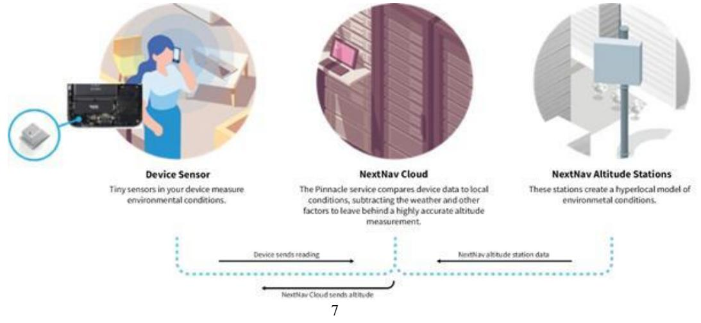

{0}------------------------------------------------

# **UNITED STATES SECURITIES AND EXCHANGE COMMISSION Washington, D.C. 20549**

# **FORM 10-K**

☒ ANNUAL REPORT PURSUANT TO SECTION 13 OR 15(d) OF THE SECURITIES EXCHANGE ACT OF 1934

For the fiscal year ended December 31, 2022

OR

☐ TRANSITION REPORT PURSUANT TO SECTION 13 OR 15(d) OF THE SECURITIES EXCHANGE ACT OF 1934

For the transition period from _____ to _____

Commission File Number: **001-40985**

# **NextNav Inc.**

(Exact name of registrant as specified in its charter)

| Delaware                                 | 87-0854654          |  |  |  |
|------------------------------------------|---------------------|--|--|--|
| (State or other jurisdiction of          | (I.R.S. Employer    |  |  |  |
| incorporation or organization)           | Identification No.) |  |  |  |
| th Floor 1775 Tysons Blvd., 5         |                     |  |  |  |
| McLean, VA                               | 22102               |  |  |  |
| (Address of principal executive offices) | (Zip Code)          |  |  |  |

Registrant's telephone number, including area code **(800)775-0982**

Securities registered pursuant to Section 12(b) of the Act:

| Title of each class                            | Trading Symbol(s) | Name of each exchange on which registered |
|------------------------------------------------|-------------------|-------------------------------------------|
| Common Stock, \$0.0001 par value               | NN                | The Nasdaq Capital Market                 |
| Warrants, each to purchase one share of Common |                   |                                           |
| Stock                                          | NNAVW             | The Nasdaq Capital Market                 |

Securities registered pursuant to Section 12(g) of the Act: **None**

Indicate by check mark if the registrant is a well-known seasoned issuer, as defined in Rule 405 of the Securities Act. Yes ☐No ☒

Indicate by check mark if the registrant is not required to file reports pursuant to Section 13 or 15(d) of the Act. Yes ☐No ☒

Indicate by check mark whether the registrant (1) has filed all reports required to be filed by Section 13 or 15(d) of the Securities Exchange Act of 1934 during the preceding 12 months (or for such shorter period that the registrant was required to file such reports), and (2) has been subject to such filing requirements for the past 90 days. Yes☒ No ☐

Indicate by check mark whether the registrant has submitted electronically every Interactive Data File required to be submitted pursuant to Rule 405 of Regulation S-T during the preceding 12 months (or for such shorter period that the registrant was required to submit such files). Yes☒ No ☐

{1}------------------------------------------------

Indicate by check mark whether the registrant is a large accelerated filer, an accelerated filer, a non-accelerated filer, a smaller reporting company, or an emerging growth company. See the definitions of "large accelerated filer," "accelerated filer," "smaller reporting company," and "emerging growth company" in Rule 12b-2 of the Exchange Act.

| Large accelerated filer | ☐ | Smaller reporting company | ☒ |
|-------------------------|---|---------------------------|---|
| Accelerated filer       | ☐ | Emerging growth company   | ☒ |
| Non-accelerated filer   | ☒ |                           |   |

If an emerging growth company, indicate by check mark if the registrant has elected not to use the extended transition period for complying with any new or revised financial accounting standards provided pursuant to Section 13(a) of the Exchange Act. ☐

Indicate by check mark whether the registrant has filed a report on and attestation to its management's assessment of the effectiveness of its internal control over financial reporting under Section 404(b) of the Sarbanes-Oxley Act (15 U.S.C. 7262(b)) by the registered public accounting firm that prepared or issued its audit report. ☐

If securities are registered pursuant to Section 12(b) of the Act, indicate by check mark whether the financial statements of the registrant included in the filing reflect the correction of an error to previously issued financial statements. ☐

Indicate by check mark whether any of those error corrections are restatements that required a recovery analysis of incentive-based compensation received by any of the registrant's executive officers during the relevant recovery period pursuant to Section 240.10D-1(b). ☐

Indicate by check mark whether the registrant is a shell company (as defined in Rule 12b-2 of the Exchange Act). Yes ☐ No ☒

As of June 30, 2022, the last business day of the registrant's most recently completed second fiscal quarter, the aggregate market value of common stock held by non-affiliates of the registrant was \$115,823,524 (based on the closing price of \$2.27 per share as reported on the Nasdaq Capital Market as of that date).

There were 107,116,114 shares of the registrant's common stock outstanding as of March 27, 2023.

#### **Documents Incorporated by Reference**

Portions of the registrant's Definitive Proxy Statement relating to the 2023 Annual Meeting of Stockholders, which will be filed with the Securities and Exchange Commission within 120 days after the end of the registrant's fiscal year ended December 31, 2022, are incorporated by reference into Part III of this Annual Report on Form 10-K**.**

{2}------------------------------------------------

# **NEXTNAV INC.**

### **Annual Report on Form 10-K for the Fiscal Year ended December 31, 2022**

# **Table of Contents**

|          |                                                                                                               | Page |
|----------|---------------------------------------------------------------------------------------------------------------|------|
|          | Cautionary Note Regarding Forward-looking Statements                                                          | ii   |
|          | Risk Factors Summary                                                                                          | iii  |
|          | PART I                                                                                                        |      |
| Item 1.  | Business.                                                                                                     | 1    |
| Item 1A. | Risk Factors.                                                                                                 | 16   |
| Item 1B. | Unresolved Staff Comments.                                                                                    | 33   |
| Item 2.  | Properties.                                                                                                   | 33   |
| Item 3.  | Legal Proceedings.                                                                                            | 33   |
| Item 4.  | Mine Safety Disclosures.                                                                                      | 33   |
|          | PART II                                                                                                       |      |
| Item 5.  | Market for Registrant's Common Equity, Related Stockholder Matters and Issuer Purchases of Equity Securities. | 34   |
| Item 6.  | Reserved.                                                                                                     | 35   |
| Item 7.  | Management's Discussion and Analysis of Financial Condition and Results of Operations.                        | 35   |
| Item 7A. | Quantitative and Qualitative Disclosures About Market Risk.                                                   | 44   |
| Item 8.  | Financial Statements and Supplementary Data.                                                                  | 45   |
| Item 9.  | Changes in and Disagreements with Accountants on Accounting and Financial Disclosure.                         | 45   |
| Item 9A. | Controls and Procedures.                                                                                      | 45   |
| Item 9B. | Other Information.                                                                                            | 46   |
| Item 9C. | Disclosure Regarding Foreign Jurisdictions that Prevent Inspections.                                          | 46   |
|          | PART III                                                                                                      |      |
| Item 10. | Directors, Executive Officers and Corporate Governance.                                                       | 47   |
| Item 11. | Executive Compensation.                                                                                       | 47   |
| Item 12. | Security Ownership of Certain Beneficial Owners and Management and Related Stockholder Matters.               | 47   |
| Item 13. | Certain Relationships and Related Transactions, and Director Independence.                                    | 47   |
| Item 14. | Principal Accountant Fees and Services.                                                                       | 47   |
|          | PART IV                                                                                                       |      |
| Item 15. | Exhibits and Financial Statement Schedules.                                                                   | 48   |
| Item 16. | Form 10-K Summary.                                                                                            | 49   |
|          | SIGNATURES                                                                                                    |      |

Unless the context otherwise requires, all references in this Annual Report on Form 10-K to "NextNav," the "Company," "we," "us," and "our" include NextNav Inc. and its subsidiaries.

# i

{3}------------------------------------------------

### **CAUTIONARY NOTE REGARDING FORWARD-LOOKING STATEMENTS**

This Annual Report on Form 10-K contains "forward-looking statements" within the meaning of the Private Securities Litigation Reform Act of 1995 and Section 21E of the Securities Exchange Act of 1934, as amended (the "Exchange Act"). Forward-looking statements include, but are not limited to, statements regarding our management team's expectations, hopes, beliefs, intentions or strategies regarding the future, projections, forecasts or other characterizations of future events or circumstances, including any underlying assumptions, and are not guarantees of future performance. The words "may," "will," "anticipate," "believe," "expect," "continue," "could," "estimate," "future," "expect," "intends," "might," "plan," "possible," "potential," "aim," "strive," "predict," "project," "should," "would" and similar expressions may identify forward-looking statements, but the absence of these words does not mean that a statement is not forward-looking.

The forward-looking statements in this Annual Report on Form 10-K include, among other things, statements about:

- 1. expectations regarding our strategies and future financial performance, including our future business plans or objectives, expected functionality of our geolocation services, anticipated timing and level of deployment of our services, anticipated demand and acceptance of our services, prospective performance and commercial opportunities and competitors, the timing of obtaining regulatory approvals, ability to finance our research and development activities, commercial partnership acquisition and retention, products and services, pricing, marketing plans, operating expenses, market trends, revenue, liquidity, cash flows and uses of cash, capital expenditures, and our ability to invest in growth initiatives;
- 2. our ability to recognize the anticipated benefits of the Business Combination (as defined below), our ability to realize the anticipated technical and business benefits associated with the acquisition of Nestwave (as defined below), and any subsequent mergers, acquisitions, or other similar transactions, which may be affected by, among other things, competition, and the ability of the combined business to grow and manage growth profitably;
- 3. factors relating to our future operations, projected capital resources and financial position, estimated revenue and losses, projected costs and capital expenditures, prospects and plans, including the potential increase in customers on our Pinnacle network, the expansion of our services in Japan through MetCom, and expectations about other international markets;
- 4. projections of market growth and size, including the level of market acceptance for our services;
- 5. our ability to adequately protect key intellectual property rights or proprietary technology;
- 6. our ability to maintain our Location and Monitoring Service ("LMS") licenses and obtain additional LMS licenses as necessary;
- 7. our ability to maintain adequate operational financial resources or raise additional capital or generate sufficient cash flows, including the adequacy of our financial resources to meet our operational and working capital requirements for the 12-month period following the issuance of this report;
- 8. our ability to develop and maintain effective internal controls;
- 9. our success in recruiting and/or retaining officers, key employees or directors;
- 10. expansion plans and opportunities;
- 11. costs related to being a public company;
- 12. our ability to maintain the listing of our securities on Nasdaq; and
- 13. the outcome of any known and unknown litigation and regulatory proceedings.

We have included important factors in the cautionary statements included in this Annual Report on Form 10-K, particularly in "Item 1A. Risk Factors", that could cause actual results or events to differ materially from the forward-looking statements that we make. You should read this Annual Report on Form 10- K and the documents that we have filed as exhibits to this Annual Report on Form 10-K completely and with the understanding that our actual future results may be materially different from what we expect. These forward-looking statements are based on information available as of the date of this annual report on Form 10-K, and current expectations, forecasts and assumptions, and involve a number of judgments, risks and uncertainties. Accordingly, forward-looking statements should not be relied upon as representing our views as of any subsequent date, and we do not undertake any obligation to update or revise any forward-looking statements to reflect events or circumstances after the date they were made, whether as a result of new information, future events or otherwise, except as may be required under applicable securities laws.

{4}------------------------------------------------

# **Risk Factors Summary**

*The following summarizes the principal factors that make an investment in us speculative or risky, all of which are more fully described in "Item 1A. Risk Factors" below. This summary should be read in conjunction with "Item 1A. Risk Factors" and should not be relied upon as an exhaustive summary of the material risks facing our business.*

### **Risks Related to the Business and the Industry**

- We have incurred significant losses since inception. We expect to incur losses in the future and may not be able to achieve or maintain profitability, and may need to raise additional capital to maintain our operations in the future.
- Unsettled conditions in the financial and capital markets may restrict our access to funds or cause our associated borrowing costs increase, which might adversely affect our operations.
- Our limited operating history makes it difficult to evaluate our future prospects and the risks and challenges we may encounter.
- Pinnacle z-axis is a new capability, and adoption may be delayed by our potential customers' unfamiliarity with 3D position, a lack of ecosystem support (e.g., specific device sensors, 3D routing) and/or other factors.
- Our business plan and, in turn, our ability to generate revenue, depends in large part on end users accessing our services through our customers' platforms.
- We face intense competition in our market, especially from competitors that offer their location services for free, which could make it difficult for us to acquire and retain customers and end users.
- We are heavily reliant on third parties, including AT&T, Verizon and Amazon Web Services for a variety of our products and business operations, as well as on a limited number of key vendors for timely supply of components necessary for our offerings.
- Our Pinnacle service in smartphones relies on the availability of barometric pressure measurements and 2D location being made available to us or our customers.
- We may not be successful in the evolution of our TerraPoiNT technology to utilize LTE/5G signals, which will increase our costs and may increase the challenge of adopting our services.
- Our hybrid architecture, which depends on the use of our transmitters and our ability to calibrate signals transmitted by third parties, is unproven, may not perform well and may cost significantly more than our initial estimates.
- Our services' full potential is contingent on our distribution partners' and customers' access to a variety of third-party platforms, which creates a number of uncertainties and potential risks.
- Our services are available within defined network footprints, and if we are not able to deploy new infrastructure, we will not be able to expand our service area.
- There is no guarantee that TerraPoiNT service will be sold to commercial or additional government users or achieve broad commercial support in the United States or internationally.
- There is no guarantee that Federal and state government resilient PNT programs will result in procurements that result in the adoption of our services or revenue to us, and the process that may result in such adoption or revenue may be delayed.
- Our solutions depend on the use of location by a wide range of applications. Related privacy concerns could damage our reputation and deter current and potential users from using our products and applications.
- Natural or man-made disasters, including cyber security attacks or terrorist attacks could have an adverse effect on our business.
- Actual or perceived disruptions of our information technology systems or data security incidents could have an adverse effect on our business.

iii

{5}------------------------------------------------

- We may become subject to litigation arising out of any security breaches, which may adversely affect our business. Our insurance policies' limits may not be sufficient to cover any related liabilities we may face.
- We depend on the availability of personnel with the requisite level of technical expertise in the telecommunications industry, as well as on key members of our senior management team, and our performance could be adversely impacted if we fail to retain such key members and/or fair to find suitable replacements.
- The failure to successfully obtain, maintain and enforce intellectual property rights and defend against challenges to our intellectual property rights could adversely affect us.
- Strategic transactions involve significant risks and uncertainties that could adversely affect our business.
- Our results could be adversely impacted as a result of increased inflation and supply chain pressures.
- The effects of the COVID-19 pandemic could continue to have material adverse impacts on our business.
- Military action in Ukraine, including the resulting geopolitical effects beyond Ukraine, may directly or indirectly increase our risks from supply chain, cybersecurity, foreign currency fluctuations, or other factors.

# **Risks Related to Legal and Regulatory Matters**

- Our business depends on access to radio spectrum to provide certain of our location services and access to such spectrum on a nationwide basis is not a certainty.
- Our ability to fully utilize our hybrid TerraPoiNT system by leveraging LTE/5G signals to provide voice and data services unrelated to position location will require spectrum license modifications, which will require FCC approvals that are not a certainty.
- Our FCC licenses authorize the use of radio frequencies that are shared with other radio services, which could result in harmful interference and impairment to our use of our licensed spectrum.
- Our LMS licenses are subject to renewal and end-of-term build-out requirements maintained by the FCC and no certainty exists that we will be able to secure ongoing renewals or comply with such build-out requirements.
- Our retention and use of our LMS licenses has been the subject of ongoing objections by third parties that could result in the revocation or non-renewal of our LMS licenses, and may impact our ability to modify our licenses.
- A portion of our business plan targets government customers, which subjects us to risks, including early termination, audits, investigations, sanctions and penalties.
- We and our service providers handle personal information, which creates legal obligations and may give rise to additional costs and liability.
- We are subject to stringent U.S. export control and economic sanctions laws and regulations.
- We are exposed to risks related to geopolitical and economic factors, laws and regulations and our international business subjects us to numerous risks associated with doing business globally.

# **Risks Related to our Common Stock**

- If we issue and sell additional shares of our Common Stock in the future, our existing stockholders will be diluted and our stock price could fall. Further, certain of our Warrants are exercisable, which could increase the number of shares eligible for future resale in the public market and result in dilution to our stockholders.
- Our principal stockholders and management own a significant percentage of our stock and will be able to exert significant control over matters subject to stockholder approval.
- We have never paid dividends on our capital stock, and we do not anticipate paying any cash dividends in the foreseeable future.

{6}------------------------------------------------

#### **PART I**

#### **Item 1. Business.**

#### **Overview**

We are the market leader in delivering next generation positioning, navigation and timing ("PNT") solutions that overcome the limitations of existing space-based global positioning system ("GPS"). The impact of GPS on the U.S. economy is approaching \$1 trillion annually, according to a NextNav extrapolation of our data from a National Institute of Standards and Technology ("NIST") sponsored study conducted by RTI International ("RTI"), and the European Commission has estimated a similar impact on the economy of the European Union in its 2018 budget process. Based on the increasing reliance on PNT across many facets of the global economy, the world increasingly requires more accurate and resilient PNT capabilities. PNT resiliency has recently emerged as a priority of the U.S. Federal Government, including as a key cyber security vulnerability. Higher performance will continue to expand the reach and value of PNT solutions, while resilience is essential to protect the vast economic activity that is reliant on GPS. We are targeting a global addressable market that is greater than \$100 billion.

We currently deliver differentiated PNT solutions through our network-based Pinnacle and TerraPoiNT solutions. Our Pinnacle system provides "floorlevel" altitude service to any device with a barometric pressure sensor, including most off-the-shelf Android and iOS smartphones. This service enables full 3D location at national scale for the first time. Public safety, autonomous vehicles, electric vertical takeoff and landing vehicles ("eVTOLs"), unmanned aerial vehicles ("UAVs"), and the app economy all require precise 3D location solutions. Paramedics need to know which apartment a 911 call originated from, ride hailing and delivery apps need to know precisely where a customer is standing and game developers need precise 3D location data to deliver next generation augmented reality experiences.

In early 2021, we launched the first element of our next generation GPS service through initial commercial launch of our nationwide Pinnacle network that was deployed in partnership with AT&T Services, Inc. ("AT&T"). The Pinnacle network provides "floor-level" altitude data to over 90% of commercial structures over three stories in the U.S. Pinnacle is being utilized by FirstNet® for public safety. We are currently providing service to Verizon Communications, Inc. ("Verizon") as a customer for enhanced 911 ("E911") services, using our Pinnacle 911 solution. Pinnacle has also been adopted by a growing number of public safety apps, commercial apps and app development platforms, including Unity Engine, CRG, GeoComm, Rapid Deploy, Central Square, NGA 911, Qualcomm, and the Unreal Engine. We believe that ramp up of customers using our existing Pinnacle network will support revenue growth over the coming year.

Our TerraPoiNT system is a terrestrial-based, encrypted network designed to overcome the limitations inherent in the space-based nature of GPS. GPS is a faint, unencrypted signal, which is often unavailable indoors, distorted in urban areas and vulnerable to both jamming and spoofing. TerraPoiNT overcomes these limitations through a network of specialized wide area location transmitters that broadcast an encrypted PNT signal on our licensed 900 MHz LMS spectrum with a signal that is 100,000 times stronger than GPS. Unlike GPS, the TerraPoiNT signal can be reliably received indoors and in urban areas and is difficult to jam or spoof. Further, the TerraPoiNT signal embeds Pinnacle information to provide a full 3D solution. In addition, TerraPoiNT provides redundancy for GPS by offering positioning, navigation and NIST-traceable timing services independently. We believe that this backup capability is essential due to the economy's reliance on GPS for location and precision timing. GPS redundancy is increasingly a U.S. national security priority, and is rising in priority in the European Union, non-EU countries in Eastern Europe and in other parts of the world due to both the demonstrated vulnerability and lack of local control of space-based signals and systems, highlighted by recent events in the Ukraine. Critical infrastructure, including communications networks and power grids, require a reliable GPS signal for accurate timing. A failure of GPS could be catastrophic, and there is no comprehensive, terrestrial backup that is widely deployed today. TerraPoiNT received the highest scores in testing by the U.S. Department of Transportation reported in 2021 regarding potential PNT backup solutions, in each category tested, and was the only solution evaluated capable of providing the full set of services provided by GPS.

As of March 2023, TerraPoiNT is deployed and available, with metro-wide service in the San Francisco Bay Area and select services available in 85 total markets nationally. It is also in use by the National Aeronautics and Space Administration ("NASA") at its Langley Research Center in Hampton, VA for drone operations research and at its Ames facility in Mountain View, CA, leveraging our deployed network in the Bay Area.

#### 1

{7}------------------------------------------------

On October 31, 2022, we acquired Nestwave, SAS, a French société par actions simplifiée ("Nestwave"), a privately held global leader in low-power geolocation. Based in Neuilly-sur-Seine, France, Nestwave provides advanced geolocation solutions to Internet of Things ("IoT") modem and digital signal processor vendors and end IoT users. We believe that the combination of our technology with Nestwave's LTE/5G capabilities will allow us to intelligently combine signals from existing terrestrial LTE/5G networks with our own highly synchronized TerraPoiNT system to deliver resilient 3D PNT capabilities with expanded geographic scale at significantly lower deployment costs than a standalone TerraPoiNT system. We also expect the integration of the Nestwave technology to significantly improve the spectral efficiency of our transmissions and may allow downlink data capacity similar to other LTE/5G systems operating over similar spectrum bandwidth. Nestwave is adopting NextNav's name and has been substantially integrated into existing TerraPoiNT engineering and technology efforts.

We acquired Nestwave for an enterprise value of \$18.0 million and gross consideration value of \$19.3 million, consisting of \$4.3 million in cash and \$15.0 million in our common stock. The transaction resulted in the issuance of 4.0 million shares of our common stock upon close, and up to 1.1 million shares of common stock upon exercise of certain Nestwave employee options. All such shares are subject to a lock-up expiring on the first anniversary of transaction close.

Since the inception of NextNav, LLC in 2007, we have secured valuable Federal Communications Commission ("FCC") licenses for a contiguous 8 MHz band of 900 MHz LMS spectrum covering approximately 93% of the U.S. population, been granted more than 150 patents related to our systems and services, and standardized our TerraPoiNT technology in 3GPP, the global telecommunications standards-setting body.

We believe our unique approach to PNT, relying on terrestrial infrastructure deployed at existing wireless tower or antenna locations, provides an unrivaled quality-of-service and would be difficult to replicate.

# **Our Strategy**

Domestically, we operate primarily as a facilities-based service provider. Our target customers include businesses, including applications developers, and adjacent businesses selling PNT products and systems to end users, and Federal, state and local governmental entities. We deploy sensor and broadcast network capabilities, and licenses access to our customers for the data generated by our networks. Internationally, we provide equipment, software and services to our customers to enable them to partner in the operation of our systems in their home markets. The key elements of our strategy include:

- *Establish TerraPoiNT as the leader in resilient PNT.* We anticipate that the expanded availability of our TerraPoiNT system will provide enhanced value to existing customers and open new verticals. We have entered into agreements related to the commercialization of TerraPoiNT in the burgeoning urban air mobility space, and are working with the U.S. Department of Transportation, U.S. Department of Homeland Security and the U.S. Congress to assess the suitability of TerraPoiNT as a national backup capability to GPS. Redundancy to space-based PNT systems is rising in priority in the European Union, non-EU countries in Eastern Europe and in other parts of the world due to both the demonstrated vulnerability and lack of local control of spacebased signals and systems, highlighted by recent events in the Ukraine. We also anticipate enterprise, IOT and critical infrastructure customers for TerraPoiNT, especially those that require either timing or dynamic navigation capabilities, or reliable urban and indoor reception of its signal. This includes industries such as transportation and telecommunications, which rely on position, navigation and timing to provide service and sectors such as the electrical grid which require timing — nearly every segment of the U.S. economy, most of which rely on GPS or GPS-derived services in one form or another.
- *Optimize the Full Value of our Spectrum, including maximizing Spectral Ef iciency and Throughput of Our Spectrum*.We anticipate adopting 4G LTE and 5G technologies as a core element of our TerraPoiNT PNT offering, including through the integration of technologies acquired from Nestwave. We believe that this will improve the data carrying capacity of our spectrum without impacting our core PNT services, which will allow us to expand our service offering and the potential uses for our spectrum.

{8}------------------------------------------------

- *Expand our Global Reach*. In pursuit of our vision for our services to form the standard for global PNT, we have commenced distribution of our services outside of the United States. We are focused on working with partners that can bring local scale as well as access to local authorities responsible for spectrum allocation and national critical infrastructure. Our joint venture in Japan, MetCom, backed by Sony and Kyocera, is emblematic of this approach. MetCom has access to significant local facilities to host our Pinnacle and TerraPoiNT infrastructure and has secured initial access to the required spectrum resources from the Japanese government for TerraPoiNT operations. Pinnacle was launched in November 2022 in Japan and we anticipate expanded geographic coverage in 2023. Following the launch of service in Japan, and our successful operations in the U.S., we anticipate interest from other international markets in the future.
- *Ensure 3D Location is Market Standard.* Our PNT services offer improved accuracy, resiliency and service availability compared to GPS-based services. We have developed our services to be easily integrated into applications, and sold to end users either as part of a standalone application or for intermediate services used as part of a system or application (e.g., software development kits ("SDK") based products for mass-market apps or the NASA drone system used as part of their aircraft systems). Our pricing plans are designed to encourage usage and adoption, and are tailored to the use case and business operations of our customers. Given the increasing importance of geolocation services to society and economy, we believe that our offerings should become the new standard in geolocation.
- *Enable a Suite of Complementary Products.* As the first to market with a scalable 3D location service, we provide or partner with companies to deliver products and services that are adjacent to our basic location service. Our first product supporting 3D location is our altimeter software bundled with our SDK that enables a quick reference to a user's relative height. We anticipate building additional tools and capabilities to improve access and usability to application developers to both accelerate adoption and the use of full 3D location.
- *Enhance Adoption, Distribution and Scale with Strategic Partners.* We launched our services after securing our strategic agreement with AT&T to deploy the Pinnacle altitude network and to begin offering services to public safety customers. This relationship provided us with a platform to offer a nationwide service capability and to deliver a crucial situational awareness capability to public safety customers as part of AT&T's FirstNet® operations. Our public safety presence is supported by our own marketing, awareness built through AT&T's marketing campaigns and its presence on the FirstNet® API Catalog.
- *Expand the use of our service for E911 in the U.S.* In October 2021, we entered into an agreement with Qualcomm to make our Pinnacle software and services available with the Qualcomm Location Suite, which will make it easier for device vendors to integrate vertical location capabilities into existing carrier E911 infrastructure. We are currently providing service to Verizon as a customer for E911 services, using our Pinnacle 911 solution for its customers, and the first device (in partnership with Sonim Technologies Inc.) leveraging this technology became available in December 2022. We believe that our service may be attractive to other wireless carriers based on our high performance, system availability and FCC requirements for wireless carriers to provide accurate vertical location to first responders during E911 calls.

{9}------------------------------------------------

#### **Industry Background**

PNT services are used in nearly every facet of our economy. Cellular and electrical distribution systems depend on GPS-based timing, the mobile app economy relies on location to create innovative services and to drive data and advertising revenue, and public safety and E911 saves lives every day with the use of location services.

GPS has powered the global economy for nearly 40 years. Without high-precision timing from GPS, cellular systems would quickly fail and the distribution of electricity would be impacted, while GPS-based location powers everything from aviation and wireless 911 location to the mobile app economy. Based on research performed for NIST by RTI in 2019, for example, GPS alone is calculated to have provided nearly \$1.4 trillion to the U.S. economy between 1984 and 2017, with nearly a quarter of that value, exceeding \$300 billion, delivered in the last year of their analysis. Applying the average 2015-2017 growth rate from the NIST RTI analysis implies that the 2021 domestic value provided by GPS was approximately \$700 billion and the 2023 value is expected to be approximately \$1.1 trillion. This is consistent with analysis performed by the European Commission, which estimated the contribution of global navigation satellite services ("GNSS") in the European Union was approximately EUR 1.2 trillion in 2018.

GPS and GNSS services have inherent limitations due to their faint signal and the geometry of the orbital satellites especially near the Earth's surface. This results in poor performance, especially in urban environments, indoors, and other locations where precise altitude determination is essential. The increasing demand for location services has resulted in the development of a number of supplements and alternatives to traditional GPS.

#### **NextNav Market Opportunity**

We believe that the market opportunity for our services is significant, with a total addressable market of over \$50 billion in the United States and over \$100 billion globally. Nearly every segment of the global economy relies on geolocation or high-precision timing, directly or indirectly, and in general those services are either: (a) expensive; (b) of limited performance; or (c) are derived only from GPS or global navigation satellite system ("GNSS"), and suffer from the limitations and vulnerabilities of those services.

We have divided the broad application of our services into five major verticals:

- 1) mission critical public safety and E911;
- 2) mass market, mobile apps, and data analytics;
- 3) eVTOLs, UAVs and autonomous vehicles;
- 4) IOT critical infrastructure and resilient PNT; and
- 5) global expansion.

#### *Mission Critical Public Safety and E911*

Our solutions provide valuable services in the public safety market. Our Pinnacle service is currently being used by first responders enabling them to more accurately locate a user with our 3D location services. The launch of our service for E911 callers with Verizon provides more accurate information to first responders about callers' locations during a wireless 911 call. When TerraPoiNT becomes broadly available, it is expected to provide significant additional value to first responders.

Based on information from the Bureau of Labor Statistics and the National Fire Protection Agency, we believe there are approximately 10 million primary first responders, extended primary first responders and non-military federal employees addressable by FirstNet®. We believe that these potential customers represent a total addressable market of approximately \$1.2 billion.

According to the National Emergency Number Association (NENA), E911, which is a FCC required service provided by telecommunications carriers to their subscribers, is dialed approximately 240 million times each year as citizens seek to summon aid for emergencies, including medical emergencies, fires and other incidents. Because FCC rules require E911 services to convey the caller's telephone number and detailed location information to emergency responders, geolocation is an essential element of emergency response. Currently wireless customers pay through their wireless carrier approximately \$0.70 per month, depending on the jurisdiction in which they reside, into state and local E911 pools. A vast majority of those fees collected are directed towards E911 call center equipment. Based on a state-by-state review of E911 and other regulatory fees collected by wireless carriers we estimate a total addressable market for E911 location services in the United States of approximately \$2.3 billion.

The FCC's rules require wireless carriers to provide altitude information along with horizontal location information with E911 calls in urban markets, with this requirement expanding to a nationwide basis in 2025. We have the opportunity to sell our services to wireless carriers to satisfy their regulatory obligations, improve the safety of their customers, and offer certain related services to Public Safety Answering Points to enhance the usability of E911 location services directly and in partnership with other service providers.

### *Mass Market, Mobile Apps, and Data Analytics*

The mobile app economy relies on the availability of location data for direct services to consumers, emerging augmented reality applications and for advertising, marketing and analytics-driven monetization. Mobile advertising in the United States alone is projected by eMarketer to reach nearly \$257 billion by 2026, from approximately \$170 billion in 2022, and according to customer discussions approximately 40% of ad inventory is location-enabled.

{10}------------------------------------------------

# Source: eMarketer, "Mobile Ad Spending, US 2022-2026," October 2022

Beyond mobile advertising, mobile applications use location services to enable a wide range of capabilities. According to Google, one-third, or approximately 1 million out of 3 million, apps on the Google Play Store use location. In 2019, nearly \$1 billion was spent in app stores on approximately 10,000 applications hosting at least one direct location services software development kit ("SDK") (e.g., a mapping SDK and SDKs to enhance user experiences in venues), a small subset of the total apps using location, according to Apptopia data.

Mobile gaming also increasingly relies on location. One example is Niantic's *Pokemon Go™*, the location-based game that captured national attention in 2016 and continues to be the leading mobile game by revenue. *Pokemon Go™* generated over \$3 billion in revenue between 2016 and 2019 according to SensorTower research. According to Statista research, this augmented reality trend is expected to accelerate, from approximately 10% of mobile gaming revenue in 2020 to 75% in 2025, or approximately \$7.5 billion in annual spend on augmented reality titles.

Aggregated data gathered from mass-market applications is also utilized for analytics, including foot-traffic and related analysis. Based on customer interactions and internal analysis, we believe that the total addressable market value of location-enabled analytics data and reports exceeds \$6 billion.

Finally, mCommerce in the U.S. is expected to reach nearly \$700 billion in 2025 according to eMarketer, growing at a compound annual growth rate ("CAGR") of approximately 16% and is expected to result in significant online-to-offline and related opportunities.

Collectively, we believe that the total addressable market for the mass-market segment in the United States is approximately \$24 billion, and is characterized by multiple high-growth sectors.

#### *eVTOLs, UAVs and Autonomous Vehicles*

eVTOLs, UAVs and autonomous vehicles require reliable, accurate location data for navigation and timing services for control system synchronization.

Based on discussions with potential customers, including leading urban air mobility ("UAM") providers, we believe that our Pinnacle service will provide a superior altitude or pressure reference both to airframe, autopilot and autonomous systems providers, and to air traffic control and air data providers. We believe that, when deployed broadly, our TerraPoiNT service will provide a resilient, supplementary signal for urban navigation, landing and takeoff. We anticipate selling our services through a mix of per vehicle, monthly recurring and per-usage access fees.

{11}------------------------------------------------

According to a study by Booz Allen Hamilton in September 2019, the infrastructure-constrained UAM market in the United States could result in 1 million eVTOL trips per day. With this volume, which requires approximately 80,000 eVTOLs to be in operation, We believe that the value of enhanced navigation and air traffic control could result in an addressable market of nearly \$4 billion per year.

For autonomous vehicles, sensor-based approaches that do not incorporate reliable, independent location references are challenged in poor weather, ambiguous conditions, and GPS is vulnerable especially in urban environments.

We have estimated the total addressable market in the United States for autonomous vehicle systems to be over \$6 billion by 2030, based on research published by the Gartner Group and McKinsey, with over 5 million fully autonomous vehicles on the road. We believe that each of these vehicles is a potential user of our services.

### *Enterprise, IOT and Critical Infrastructure*

Enterprise and IOT services enable connectivity and coordination within a business or governmental agency. These systems enable intelligent machines, devices and fixed or mobile assets to communicate information from the machine, device, or fixed or mobile asset to and from back-office information systems of businesses and government agencies, as applicable, that track, monitor, control and communicate with them. Location and timing services are a critical element of these systems, and apply to a wide range of use cases including asset tracking, inventory management, patient monitoring in healthcare, people and pet tracking, smart grid applications, smart parking applications, and health and well-being-oriented wearables, among others.

According to ABI Research's "IOT Market Tracker," as of the first quarter of 2018 there are expected to be nearly 1.3 billion connected devices in this sector by 2024, resulting in over \$10 billion in service value in the United States – excluding equipment and data connectivity, and other enterprise and IOT applications. The number of devices in these areas is expected to grow at a CAGR of nearly 70% between 2020 and 2026, while addressable service revenue is expected to grow at a CAGR of 53% over the same period.

We also believe that there is a significant market for our services on a private network basis, at ex-urban college campuses and industrial facilities. We believe the total addressable market in enterprise and IOT in the United States is over \$10 billion per year and growing rapidly.

GPS plays an outsized role in the U.S. economy and our critical infrastructure, including communications networks and power grids, require a reliable GPS signal for accurate timing. Given its importance, the U.S. Federal Government is actively exploring backup solutions to ensure that interruptions to GPS service do not impair the operation of critical infrastructure across various sectors identified by the U.S. Department of Homeland Security as well as other critical consumer sectors.

In a recent report published by the U.S. Department of Transportation, we offered the highest performance among technologies tested for "alternate PNT." We are actively marketing our TerraPoiNT service to the U.S. Federal Government and other firms as a solution to ensure continuity of service across various industries including power generation and transmission, telecommunications, and aviation amongst others.

#### *Global Expansion*

We have initiated marketing of our Pinnacle and TerraPoiNT services to potential partners and customers in Canada, East Asia, Europe and the Middle East, with a focus on countries with a high reliance on GPS and location services across highly urbanized populations. We are seeing a similar emphasis globally on PNT services in: (i) mission critical public safety and E911; (ii) mass market, mobile apps, and data analytics; (iii) autonomous vehicles, eVTOLs and UAVs; and (iv) enterprise, IOT and critical infrastructure.

Our services have been piloted in multiple countries already, and in Japan, our joint venture partner MetCom has begun the process of securing a license to operate on the spectrum required for a TerraPoiNT system. We have commenced a pilot program for Pinnacle through our MetCom joint venture as well, and anticipate moving forward with a deployment of Pinnacle services in Japan. MetCom's access to facilities through its primary backers, Sony and Kyocera, create a strong opportunity for a nationwide deployment in Japan.

Based on our analysis, we believe that the international market for its services, excluding China, Russia and Africa, is similar in size to that of the United States, and exceeds \$50 billion.

{12}------------------------------------------------

# **Our Solutions**

Our location systems have been engineered and deployed to provide comprehensive solutions to the limitations and vulnerabilities inherent in GPS-based services. Key GPS limitations include:

- Low signal strength resulting in poor building/indoor penetration, limitations in urban areas;
- Vulnerability to jamming;
- Poor vertical accuracy in most devices, which impacts any service where altitude is relevant (e.g., multi-level structures, vertical separation in low-altitude aviation);
- The primary consumer GPS signal is unencrypted, resulting in poor location security and spoofing;
- Inherent physical vulnerability due to few, isolated transmitters; and
- Single point of failure for a wide range of PNT services.

Isolated solutions to various aspects of the limitations to GPS-based positioning have been deployed, but none carry the primary benefit of GPS, which is high performance across a wide area.

Our current service platforms include Pinnacle, our altitude (z-axis) solution, and TerraPoiNT, which is similar to a terrestrial GPS constellation. Both systems offer metro-wide service, are inherently secure and can provide universal service access to all types of appropriately-equipped devices that use location services.

#### *Pinnacle*

Pinnacle is our z-axis service, a dedicated vertical positioning network to cover entire metropolitan areas. Pinnacle provides devices equipped with a barometric pressure sensor with the highest quality wide-area altitude service available in the U.S. market today based on a CTIA/FCC "911 Location Test Bed, LLC Report on Stage Z" from 2018. Our service is now available in the top 105 major U.S. markets, which include over 4,400 cities and over 90% of commercial buildings that exceed three stories. In November 2022, Pinnacle service was launched by MetCom in Japan, and we anticipate MetCom will expand their service area in 2023.

The Pinnacle service is based three primary components:

- 1) An altitude station network, a managed network that consists of equipment designed, manufactured, deployed and operated by us, which measures key environmental variables associated with altitude to enable "floor level" altitude determination;
- 2) Device software, which supports delivery of our z-axis service to mobile apps and other devices, calibration of the pressure sensors on individual devices and receipt of z-axis data from our cloud services platform; and
- 3) A secure cloud services platform, which actively manages our altitude station network, synthesizes data from our network and devices to enable service delivery, and performs access management functions.

The diagram below illustrates the basic process flow of the z-axis service.

{13}------------------------------------------------

Pinnacle works by leveraging the physical principal that barometric pressure declines as altitude increases. By measuring the barometric pressure at a device, and comparing that measurement to the measurements from our network, we can accurately compute the altitude of the sensor. A Pinnacle altitude station is depicted below, and measures approximately 16" x 6" x 4".

Because our Pinnacle technology relies on barometric pressure measurement, it works with the hardware currently used in most mobile phones and tablets. Our Pinnacle service can be delivered to customers in this segment over an applications programming interface ("API") or via an SDK integrated into the relevant applications.

In order to expand access to and use of our Pinnacle services, we work closely with sensor vendors to provide input on key sensor performance factors necessary to produce optimal Pinnacle services. We also recently launched the NextNav Certified™ program. The NextNav Certified™ program allows pressure sensor vendors to perform a set of tests monitored by us. If a vendor meets the criteria for performance while adhering to the test procedures, the vendor can display the NextNav badge on its website and use the endorsement in its marketing to device vendors. Bosch Sensortec, InvenSense Goertek and ST Microelectronics currently offer NextNav Certified™ sensors.

#### *TerraPoiNT*

TerraPoiNT is our full 3D PNT system, standardized in the global telecommunications standards group, 3GPP Release 13 as Metropolitan Beacon System ("MBS"). The current technical specification for the standard MBS signal, or Interface Control Document, can be downloaded from ATIS, the North American affiliate to 3GPP. We are in the process of evolving our transmission and this technical specification, subject to the successful integration of technologies acquired from Nestwave. We license elements of our receiver technology to third-party chipset providers and device vendors, typically with no per device royalty, to enable the reception of our signal on their devices.

Positioning, navigation and timing are the core services provided by GPS, and TerraPoiNT can be thought of as a land-based GPS satellite constellation, but with the broadcast transmitters, which we call "beacons." In the United States, this service operates on 8 MHz of contiguous LMS spectrum licensed to us in the 900 MHz band, and covering approximately 93% of the U.S. population (see "Radio Spectrum" for more information about these licenses). We have deployed a wide area, commercial grade TerraPoiNT network in 2 markets in the San Francisco Bay Area and in smaller networks in 83 additional markets throughout the U.S. We are also conducting a pilot program with our joint venture partner MetCom in Japan to support a possible spectrum allocation.

{14}------------------------------------------------

The key elements of the TerraPoiNT service are:

- TerraPoiNT beacons and signal measurement units, which include high-precision timing and synchronization capabilities, designed, manufactured in the United States, deployed and operated by us;
- Devices equipped to receive the TerraPoiNT signal, which include an appropriately-designed chip and 900 MHz radio elements; and
- Cloud services platform, which in the case of TerraPoiNT services provides high quality positioning, timing calibration of third party signals, network management and service access functions to certain types of devices.

The TerraPoiNT beacons each include a high-precision atomic clocking source, and the ability to synchronize locally with nearby beacons by sharing their timing signals. The beacon network is also synchronized to Coordinated Universal Time, the global time standard broadcast by GPS and other NISTtraceable sources.

This architecture is naturally resilient to service disruption and significantly more resistant to jamming than GPS. If GPS is disrupted, or completely eliminated, a TerraPoiNT transmitter continues to operate and provide similar service within the TerraPoiNT service area. If one TerraPoiNT beacon is disrupted, service continues from other nearby beacons. Thus, there is both local and national resilience embedded in the basic system design. By operating terrestrially in the 900 MHz LMS band, the TerraPoiNT signal is approximately 100,000 times stronger than GPS, and thus is significantly more difficult to disrupt.

{15}------------------------------------------------

TerraPoiNT was initially designed for maximum compatibility with GPS and other GNSS receivers, previously demonstrated by Broadcom on a version of their 4775 platform and GCT's GDM7243i. We expect TerraPoiNT's signal waveform to evolve to be compatible with standard LTE/5G receivers. This evolution will enable the TerraPoiNT signal to be processed by the hardware used to process LTE and 5G signals. Separately, hybrid operation of our system will allow us to rely in part on third party cellular signals that have been calibrated by our network. We anticipate that such a signal evolution would increase our spectral efficiency significantly, allowing us to offer a data capacity equivalent to other LTE/5G signals for the same bandwidth. This increased data transmission capacity could be used, subject to FCC approval, to provide other types of LTE/5G-based two-way voice and data transmission services while maintaining our PNT capabilities.

The expansion of the TerraPoiNT network build-out will require significant investment, however, compared to prior estimates, we believe that the hybrid operation of our network will require significantly less capital than that required by our historical network architecture. Once it is fully built-out, we expect to incur minimal ongoing maintenance capital expenditures to maintain the network. As a result, our business model provides significant operating leverage as the business scales due to low variable costs to adding incremental network traffic.

#### **Privacy and Data Security**

We understand that protection of data and privacy is critically important to the end-users of our services. Our core privacy principles are:

- *1. Transparency:* We are transparent about our data practices, and we comply with our privacy policies and agreements so customers and business partners can make informed decisions.
- *2. Control:* We have implemented appropriate means for our customers and business partners to control relevant personal and business information.
- *3. Security:* We endeavor to protect the data entrusted to us by using strong security protocols.
- *4. Compliance:* We respect and comply with local privacy laws, ensuring that privacy-by-design is a core consideration as we develop our products and services.
- *5. Consent:* We require appropriate opt-in consent for the provision of all of our services, consistent with the requirements of local law.

Based on industry best-practices, we have implemented multilayered administrative, physical, and technical security measures to protect data. Data access is implemented with the rule of "least privilege," and we isolate data by service, business function and customer agreement. Our data is encrypted both at rest (locally on the device and on the server) and in transit.

#### **Manufacturing and Network Operations**

### *Manufacturing*

Our services are provided in part through equipment we design, generally manufactured under contract by domestic vendors in the United States. The Pinnacle altitude stations were designed to provide a very high performance reference for altitude determination at a low cost. The TerraPoiNT beacons are sophisticated broadcast transmitters that incorporate a very accurate timing system to provide a signal that is similar to that provided by GPS in a terrestrial transmitter. These units are designed to be integrated with our cloud services platform, and managed by software that we designed and created for these systems.

#### *Network Operations*

We operate two separate and distinct networks. The Pinnacle network is primarily operated in partnership with AT&T. The Pinnacle altitude stations are co-located at AT&T wireless sites and take advantage of the power systems, including battery backup and generators, at the AT&T sites. We monitor the Pinnacle network health through our network operations center ("NOC") and work with AT&T to resolve any issues that may arise. Connectivity among the Pinnacle altitude stations, our cloud service platform, and our NOC are enabled through wireless connections, currently provided by AT&T.

We are not required to use AT&T wireless sites for network expansion, and may establish new service areas through independently-acquired site leases or with other partners.

Our TerraPoiNT network is deployed, operated, and maintained by us. The equipment is installed at traditional wireless sites with a mix of towers and rooftops. We monitor the network health through the same NOC as the Pinnacle network and directly dispatch our maintenance contractors if needed.

### **AT&T Relationship**

We have entered into a series of agreements with AT&T to provide our Pinnacle services to FirstNet®, built with AT&T, and to enable the co-location of elements of our network at AT&T's wireless sites. By co-locating the Pinnacle equipment at AT&T wireless sites, we were able to accelerate the nationwide deployment of our services and significantly reduce the ongoing operating costs associated with the Pinnacle system.

{16}------------------------------------------------

Our AT&T agreements provide for: (i) AT&T's marketing and resale of Pinnacle services to FirstNet® subscribers and certain pricing requirements for our SDKs based on the quantity of usage, revenue sharing, compliance with data rights and privacy, and support requirements; and (ii) AT&T hosting of Pinnacle equipment for altitude determination at AT&T sites, at no recurring cost to us.

We have provided AT&T with performance assurances and certain intellectual property and transition support rights in the event we are unable to continue providing services to AT&T, have significant service outages, or engage in transactions with certain persons. The parties also entered into escrow arrangements on customary terms for intellectual property storage and verification of the deposited escrow materials in various different escrow "lockers," which could be accessed by AT&T based on different conditions on which the draw down could be made.

In 2019, we entered into an equipment hosting agreement with AT&T that has a seven-year term (subject to earlier termination after three years in certain circumstances), expiring in October 2026. Under the terms of the equipment hosting agreement, AT&T is providing all site related services during AT&T's continued use of the service. However, if AT&T ceases to use our services after the first three years (i.e. October 2022), then we may terminate the equipment hosting agreement or if we are not in breach of the agreement we may continue the agreement for the remainder of the term and we will have to pay for power and, LTE connectivity and incremental lease costs incurred by AT&T to host the equipment, if any. Our services agreement with AT&T for distribution of our services to FirstNet® customers, which was scheduled to expire in October 2022, has been extended to January 7, 2024.

### **Competition and Competitive Advantages**

The geolocation industry is highly competitive and we compete with incumbent geolocation services like GPS, Wi-Fi, and cellular signals, augmented by other sensor inputs, as well as other companies who are new entrants into the market seeking to provide a solution to the same needs as we are.

The increasing demand for location services has resulted in the development of a number of supplements and alternatives to traditional GPS. The primary candidates for GPS backup technologies are based on approaches that are significantly different than the technical approach adopted by us. These competitive technologies include:

- *● eLORAN.* eLORAN is an advanced version of the World War II-era hyperbolic radio navigation system that was developed in response to the perceived vulnerability of the GNSS systems. eLORAN, like its predecessor uses very low frequencies (in the 100 kHz range), but has an advanced receiver design and transmission characteristics, which increase the accuracy and usefulness of traditional LORAN. These enhancements make it a suitable substitute for GPS. Because eLORAN requires larger antennas and form factor for its receivers, it does not have the same reach as our solutions. It is more suitable for more rural and maritime types of environment.
- *LEO Satellite Systems.* Low Earth orbit ("LEO") satellite systems offer primarily timing service based on signals transmitted from low earth orbit satellite constellations, transmitted in the L-Band. Because it is in a lower orbit, the LEO signal is much stronger than GPS, allowing for improved reception in urban areas and limited indoor reception. The primary limitation of LEO-based systems is that they remain a satellite-based signal, so the signal is not as strong as a terrestrial-based system. In addition, as an add-on technology, its design is not as flexible as a dedicated system.
- *Commercial Location Systems.* Commercial location systems generally include cellular systems, crowd-sourced systems and locally managed systems. Cellular systems may use localized millimeter wave transmitters in 5G which provides location performance in the immediate vicinity of such 5G transmitters, but the service area of this capability, if deployed, is expected to be limited. Cellular systems are typically used as a fallback when the GPS signal is not available (e.g., indoors), but do not provide the same accuracy that our solutions provide and are ultimately dependent on GPS. Crowd-sourced systems, such as those provided by Google and Apple through APIs in their mobile operation system platforms, rely on the application of machine learning techniques to location information gathered from mobile devices. These systems are "best-efforts systems" that compare GPS measurements to Wi-Fi access point signal strength, cellular signals and other signals gathered from millions of devices to estimate the location of the access points. Crowd-sourced systems vary considerably in accuracy, offer less accurate vertical positioning information and are subject to degradation if there is an issue with local power and local access points. Locally Managed Systems are systems that rely on the management of lower-power signals, managed WiFi, Bluetooth Low Energy, dedicated beacons with large bandwidth requirements and Ultrawideband to provide location services. These systems are centrally managed by the enterprise or a vendor, and typically offer high accuracy and reliability, but are expensive to deploy and manage, offer only limited coverage, are dependent upon local power sources and are usually only available to the entity that deployed them. Most commercial locations systems do not provide an independent timing source, so are limited in their ability to be a viable backup to GPS.

We believe our 3D solutions offer a superior alternative to each of these services. A summary of a report published in 2021 by the U.S. Department of Transportation characterizes and ranks the different available systems.

{17}------------------------------------------------

|               |                                                |                        |      | TIMING® Performance |      | POSITIONING |      | TIMNG®              |      | PACTICS             |      | TIMINO™   |      | Philips   |  |
|---------------|------------------------------------------------|------------------------|------|------------------------|------|-------------|------|---------------------|------|---------------------|------|-----------|------|-----------|--|
|               |                                                |                        |      |                        |      | Perfarmance |      | Cround broadcost |      | Ground broadcoll |      | Broadcost |      | Broodcast |  |
|               |                                                |                        | Rank | Score                  | Rank | Score       | Ronk | Scote               | Rank | Score               | Rank | Score     | Rank | Score     |  |
| NEXTHAU       | UHF terrestrial RF                             | 1920-928 MHz           |      | 01                     |      | 5           | 4    | 10                  |      | 82                  |      | 82        |      | 82        |  |
| (i            | LEO commercial Soband                          | 0483.5=1500 MHz]       | 189  |                        | 6    | 38          | 0    |                     |      |                     |      |           |      |           |  |
| HOLLEN        | eLORAN terrestrial RF                          | 190-110% Ha            | 88   | 62                     |      | 9           | x    | 65                  |      |                     | 16   | 66        |      |           |  |
| opnt          | liber optic time service                       | bahiba mabbit RTP)     | 2    | 47                     | 4    | 11          | =    | 4                   |      | 4                   | 0    |           |      | 14        |  |
| PHANDRLAD     | 802.Ti terriestrial for                        | 024 HOB                | કરે  | 62                     | 7    |             | 14   | 10                  |      | =                   | 5    | 1         | A    |           |  |
| Satelles      | LEO connecicial Liband                         | Delo-16265 Midri       | 4    | 78                     | 2    | 20          |      | 14                  |      |                     | 2    | 00        |      | 82        |  |
| serco         | R-made benestrial R                            | (283.5-326 1041)       |      |                        |      |             |      |                     |      |                     |      |           |      | ਾ         |  |
| STATIN        | Fiber optic time transfier                     | bahiba nalolait PTPS   | 35   | કિન્દ                  |      |             |      |                     |      |                     |      |           |      |           |  |
| SKYHOOK       | 802:11 terrestrial AP                          | [900 MHz, 2.4 E S GHz] |      |                        | ﻬﺎ   |             | 4    |                     |      |                     |      |           |      |           |  |
| C             | UWB & MU map monching   [3.1-5 GHz]            |                        |      |                        | 1    | ਡਲ          | ਾ    | 0                   |      |                     |      |           |      |           |  |
| -             | eLORAN terrestrial RF                          | 190 - TICKHz           | 2    | ക്ക                    | 14   | 18          | 2    | 10                  | 9    |                     | ਤੇ   | 70        |      | 1         |  |
| Gto2 (262 b21 | MEO government_L-brand [ B575, 1227, 1176 MHz] |                        | 11   | 47                     | 4    |             |      | ਵਾ                  |      |                     | 11   |           | 11   | 11        |  |

- (1) Weighted score based upon accuracy, availability, product readiness, resilience and security.
- (2) Weighted score based upon accuracy, availability, product readiness, resilience and security.
- (3) Market readiness of Timing Performance using terrestrial RF broadcast.
- (4) Mass market readiness for Position AND Timing using terrestrial RF broadcast.
- (5) Mass market readiness of timing using RF broadcast.
- (6) Mass market readiness for Timing AND Positioning using RF broadcast.

As indicated by the aforementioned results, our solutions offer a differentiated quality over our competitors. We offer significantly better indoor and outdoor performance with receivers that, at production scale, have reduced power consumption and no incremental cost or size difference with GPS. Our system is also significantly more resilient due to its distributed, metro-oriented architecture. We offer better performance and a much stronger signal, due to its terrestrial deployment. It is also more resilient, and has greater design flexibility as a dedicated system as opposed to a feature added to a legacy communications satellite network. Our solutions are not impacted by the density of third party access points, building power, or other issues, and are suitable for any device — from an airplane to a phone to an IOT tracking module.

While various competitors may provide individual elements such as altitude, or timing-only capability, we believe that we provide the only solutions addressing full customer requirements around positioning, navigation and timing. Our solutions are consistently accurate in nearly all environments and conditions. We are well-positioned to compete in our industry based on our core competencies and on the following competitive strengths:

- Physical altitude network that covers over 4,400 U.S. cities and towns and 90% of all commercial building in excess of three stories
- Unique nationwide spectrum asset of 8MHz of contiguous, 900MHz LMS spectrum, covering 93% of the U.S. population and representing 2.4 billion MHz-PoPs
- Technological innovation
- Highest performing GPS backup solution provider as determined by Department of Transportation
- Global IP portfolio of more than 150 patents that covers the core technology, network design and services capability
- Visionary and experienced management team

The combination of these elements puts us in a unique position that cannot be easily replicated. We believe that our collective expertise, coupled with the aforementioned strengths, will allow us to build our business and expand our market opportunity and addressable markets.

{18}------------------------------------------------

#### **Intellectual Property**

Our ability to drive innovation in PNT services depends in part upon our ability to protect our core technologies and intellectual property. We rely upon a combination of patent, trademark and trade secret laws in the United States and abroad, as well as license agreements and other contractual protections. In addition, we seek to protect our intellectual property rights through nondisclosure and invention assignment agreements with our employees and consultants and through non-disclosure agreements with business partners and other third parties.

We regularly file applications for patents and have a significant number of patents in the United States and other countries where we do business.

As of December 31, 2022, we had approximately 153 issued patents domestically and internationally, which includes approximately 104 issued patents in the US. In addition, we had approximately 87 pending patent applications, which includes approximately 38 pending patent applications in the U.S.

#### **Sales and Marketing**

We sell our solutions directly to customers or through partners. We plan to scale and accelerate our sales and marketing efforts and leverage our recent customer wins to grow our customer base using a global network of sales professionals and distribution relationships. Additionally, we expect existing customers to expand their contracts with us for the deployment of additional services. New service offerings and product features will be introduced over time to increase market share and grow the total addressable market for our services.

Our marketing strategies are focused on supporting sales growth by (i) driving awareness; (ii) developing comprehensive sales and marketing content; and (iii) scaling our efforts with our partners and customers. We drive awareness for our solutions and our customers'successes through communications efforts and participation to leading industry standards.

In addition, our key customers have held webinars, issued press releases and raised the awareness of our service availability with their customers and in the public safety market. For example, AT&T may make further introductions to app developers and other service providers, and we believe that AT&T's adoption and marketing activities are resulting in the broader adoption of our services in the public safety market.

We also seek partnership to offer service internationally. For example, we have formed a joint venture in Japan with MetCom to operate our TerraPoiNT system and Pinnacle system for commercial services, leveraging Sony and Kyocera network infrastructure.

#### **Research and Development**

We have significant in-house capabilities in the engineering and development of location-based technology. The services that we provide are largely based on designs and technologies developed by us for our use, some of which we subsequently standardized. We invest significant resources into research and development programs because we believe our ability to maintain and extend our market share depends, in part, on our continuous innovations. These innovations offer a unique value proposition for our customers and differentiate us from our competitors. Our research and development team, which consists of 73 employees, is responsible for the development of both the Pinnacle and TerraPoiNT solutions. Our research and development team consists of talented engineers, scientists, and professionals who have been pioneers in location-based services. Our primary areas of focus in research and development include, but are not limited to:

- Radiolocation position and navigation technologies;
- Precision timing and time distribution;
- Hybrid positioning and timing systems;
- Altitude determination, including barometric altitude determination; and
- Location verification techniques, including techniques to mitigate spoofing.

{19}------------------------------------------------

#### **Human Capital**

We pride ourselves on the quality of our world-class team and seek to hire employees dedicated to our strategic mission. Our employees typically have significant experience working with location systems. As of December 31, 2022, we employed 106 full-time employees, the majority in our headquarters in McLean, Virginia and in our facility in Sunnyvale, California. Of our employee base, 45 employees are located outside the U.S. – two in Canada, 25 in India, and 18 in France. Over 73 of our employees are engaged in research and development and related functions, and more than half of these employees hold advanced engineering and scientific degrees, including many from the world's top universities.

To date, we have not experienced any work stoppages and consider our relationship with our employees to be good. None of our employees are either represented by a labor union or subject to a collective bargaining agreement.

#### **Facilities**

We maintain a distributed workforce with facilities in McLean, Virginia, Sunnyvale, California, Neuilly-sur-Seine, France, Noida, India and Bangalore, India. Our principle executive office is in McLean, Virginia. Our corporate offices in Virginia include finance, regulatory and network deployment functions, while our California facility hosts our technology development functions, among other functions. Our French and Indian locations house a mix of employees and contractors focused on software development and research and development functions. We may add additional facilities in other locations in the future.

#### **Regulatory**

There are government regulations pertaining to our operation, use, and export of our vertical location and PNT solutions, some of which are currently applicable to us and others that will become applicable to us as we expand our operations. As we expand service to additional countries and regions, we will become subject to additional governmental approvals and regulations.

#### *Radio Spectrum*

Certain of our services rely on the use of radio communications spectrum, which is regulated in the United States and in most other countries. In the United States, spectrum access is licensed and regulated by the FCC. We hold radio licenses issued by the FCC that authorize the use of 8 MHz of contiguous spectrum in the 900 MHz band covering approximately 93% of the population in the United States. These licenses and the FCC rules impose obligations on us regarding the use of this spectrum, including power and operational limits, spectrum sharing and interference restrictions, build out and usage requirements, and a license renewal obligation. We must comply with these requirements in order to retain access and use of its spectrum resources.

#### *Privacy*

In developing highly accurate location information, we collect, process, transmit and store personal information, such as certain individual geolocation information, and other personal information relating to its business contacts, personnel, end users, and website visitors. A variety of federal and state laws and regulations govern the collection, use, retention, sharing and security of this information. The U.S. privacy and data protection legal landscape continues to evolve, with California and Virginia having enacted broad-based data privacy and protection legislation and with states and the federal government continuing to consider additional data privacy and protection legislation. As we expand overseas, our joint venture partners will be subject to foreign data privacy and protection legislation, and we may be as well.

{20}------------------------------------------------

### *Export*

Our business plans are based in part on the distribution of its services worldwide. We are required to comply with U.S. export control laws and regulations, including the Export Administration Regulations ("EAR") administered by the U.S. Department of Commerce's Bureau of Industry and Security and the foreign asset control regulations administered by the U.S. Department of the Treasury's Office of Foreign Assets Control. Pursuant to these foreign trade control laws and regulations, we are required, among other things, to (i) determine the proper licensing jurisdiction and export classification of products, software, and technology, (ii) obtain licenses or other forms of U.S. government authorization, or qualify for exceptions, to export our products, software, and technology outside the United States, and (iii) avoid engaging in unauthorized transactions with certain sanctioned countries, territories, entities, and individuals. Violations of applicable export control and sanctions laws and related regulations, which are enforced on a strict liability basis, could result in criminal and administrative penalties, including fines and possible denial of export privileges. U.S. export licenses or license exceptions are required to transfer or make accessible certain of our software source code and technology to our non-U.S. employees. In addition, U.S. export control laws and related licensing policies continue to change, further regulating the export and re-export of our products, services, and technology from the United States and abroad, and increasing our costs and the time necessary to obtain required authorization.

See the section entitled "*Risk Factors — Risks Related to Legal and Regulatory Matters*" for additional information regarding the regulatory requirements applicable to us.

#### **Business Combination**

On October 28, 2021 (the "Closing Date"), we consummated business combination pursuant to the terms of the Agreement and Plan of Merger, dated as of June 9, 2021, by and among us, Spartacus Acquisition Corporation, a Delaware special purpose acquisition company ("Spartacus"), NextNav Holdings, LLC, a Delaware limited liability company ("Holdings") and the other parties thereto (the "Business Combination"). As a result of the Business Combination, certain blocker entities formed by Holdings equity holders, Holdings and the various operating subsidiaries of Holdings became our wholly owned subsidiaries, with the equity holders of each of such blocker entities and Holdings and Spartacus'stockholders becoming our stockholders. In connection with the Business Combination, we changed our name to NextNav Inc. and the Nasdaq ticker symbols for our Common Stock and warrants to "NN" and "NNAVW," respectively.

#### **Corporate Information and Access to SEC Reports**

We were incorporated under the laws of the State of Delaware in May 2021 under the name "Spartacus Acquisition Shelf Corp." by Spartacus Acquisition Corporation, a Delaware special purpose acquisition company, for the purpose of effecting a merger, capital stock exchange, asset acquisition, stock purchase, reorganization or other similar business combination with one or more businesses or assets. On October 28, 2021, in connection with the closing of the Business Combination, we changed our name to "NextNav Inc."

Our principal executive office is located at 1775 Tysons Blvd., 5 th Floor, McLean, VA 22102. Our telephone number is (800) 775-0982, and our website address is www.nextnav.com. Information contained on, or accessible through, our website is provided for textual reference only and does not constitute part of, and is not incorporated by reference into, this Annual Report on Form 10-K.

Our operating subsidiary, NextNav, LLC (a wholly owned subsidiary of NextNav Holdings, LLC), was formed in October 2007 under the laws of the State of Delaware. In connection with the Business Combination, the various operating subsidiaries of NextNav Holdings, LLC became our wholly owned subsidiaries.

We make our Annual Reports on Form 10-K, Quarterly Reports on Form 10-Q, Current Reports on Form 8-K, and amendments to those reports, available free of charge in the "Investors" section of our website as soon as reasonably practicable after we file these reports with the SEC. We routinely post these reports, recent news and announcements, financial results and other important information about our business on our website at www.nextnav.com. Information contained on our website is not a part of this Annual Report on Form 10-K.

In addition, the United States Securities and Exchange Commission ("SEC") maintains an Internet website at www.sec.gov that contains reports, proxy and information statements, and other information regarding issuers that file electronically with the SEC.

{21}------------------------------------------------

#### **Item 1A. Risk Factors.**

*An investment in our securities involves a high degree of risk. You should carefully consider the following risk factors, together with all of the other information included in this Annual Report on Form 10-K, before you decide whether to invest in our securities. We may face additional risks and uncertainties that are not presently known to us, or that we currently deem immaterial, which may also impair our business. The following discussion should be read in connection with the financial statements and notes to the financial statements contained elsewhere in this Annual Report on Form 10-K. You should consult your own financial and legal advisors as to the risks entailed by an investment in our securities and the suitability of investing in our securities in light of your particular circumstances. Some statements in this Annual Report on Form 10-K, including such statements in the following risk factors, constitute forwardlooking statements. See the section entitled "Cautionary Note Regarding Forward-Looking Statements."*

#### **Risks Related to the Business and the Industry**

# *We have incurred significant losses since inception. We expect to incur losses in the future, may not be able to achieve or maintain profitability, and may need to raise additional capital to maintain our operations in the future.*

We have incurred significant losses since inception and until the second quarter of 2021 had not widely commercially sold our solutions. For the years ended December 31, 2022, 2021 and 2020, we incurred net losses of \$40.1 million, \$144.7 million and \$137.3 million, respectively. Furthermore, any expansion of our TerraPoiNT services will result in increased operating costs. As a result, our losses are expected to continue and we may not achieve profitability when expected, or at all. Even if we do, we may not be able to maintain or increase profitability.

Since becoming a public company, our operating expenses have increased, and we expect our operating expenses to continue to increase over the next several years as we scale our operations, increase research and development efforts relating to new offerings and technologies, hire more employees, and operate as a public company. These efforts may be more costly than we expect and may not result in meaningful revenue or growth in our business. Any failure to initiate and increase our revenue sufficiently to keep pace with our investments and other expenses could prevent us from achieving or maintaining profitability or positive cash flow. If our future growth and operating performance fail to meet investor or analyst expectations, or if we have future negative cash flow or losses resulting from expanding our operations, this could have a material adverse effect on our business, financial condition and results of operations.

We believe that our cash and cash equivalents and marketable securities as of March 30, 2023 will be sufficient to meet our working capital and capital expenditure needs, including all contractual commitments, for the next 12 months. We expect to meet longer term expected future cash requirements and obligations through a combination of cash flows from operations and issuance of equity securities or debt offerings. However, this determination is based upon internal projections of operating cash flows and is subject to changes in market and business conditions. Our ability to obtain debt financing and/or issue equity securities on acceptable terms, or at all, will depend on, among other things, our financial performance and credit ratings, general economic factors, including inflation and then-current interest rates, the condition of the credit and capital markets and other events, some of which may be beyond our control.

#### *Our limited operating history makes it dif icult to evaluate our future prospects and the risks and challenges we may encounter.*

We have been focused on developing the next generation of geolocation services utilizing vertical (z-axis) location services and in order for us to be profitable, our services require substantial adoption across disparate industries. We have only recently begun to commercially market our services, so it is difficult, in consideration of our limited operating history, to evaluate our future prospects and the risks and challenges we may encounter. Risks and challenges we have faced or expect to face include our ability to:

{22}------------------------------------------------

- forecast our revenue and budget for and manage our expenses;
- attract new customers and retain existing customers;
- effectively manage our growth and business operations, including planning for and managing capital expenditures for our current and future infrastructure, and managing our supply chain and supplier relationships related to our services;
- effectively manage our spending on sales and marketing in order to address a disparate set of industries;
- comply with existing and new or modified laws and regulations applicable to our business;
- anticipate and respond to macroeconomic changes and changes in the markets in which we operate;
- maintain and enhance the value of our reputation and brand;
- develop and protect intellectual property; and
- hire, integrate and retain talented people at all levels of its organization.

There is ongoing volatility in the financial and capital markets. If our access to capital is restricted or associated borrowing costs increase as a result of developments in financial markets, our operations and financial condition could be adversely impacted.

If we fail to address the risks and difficulties that we face, including those associated with the challenges listed above as well as those described elsewhere in this "Risk Factors" section, our business, financial condition and results of operations could be adversely affected. Further, because we have limited historical financial data and operate in a rapidly evolving market, any predictions about our future revenue and expenses may not be as accurate as they would be if we had a longer operating history or operated in a more developed market. Forecasting the revenue potential of our services is made more difficult by the fact that legacy location technologies, such as GPS, were developed by the federal government and made available to commercial users without charge. As a result, one of the adoption hurdles that must be overcome is convincing enterprise customers that the additional accuracy and security made available by our services justifies paying for them. We have encountered in the past, and we will encounter in the future, risks and uncertainties frequently experienced by growing companies with limited operating histories in rapidly changing industries. If our assumptions regarding these risks and uncertainties, which we use to plan and operate our business, are incorrect or change, or if we do not address these risks successfully, our results of operations could differ materially from our expectations and our business, financial condition and results of operations could be adversely affected.

# *Pinnacle z-axis is a new capability, and adoption may be delayed by our potential customers' unfamiliarity with 3D position, a lack of ecosystem support (e.g., specific device sensors, 3D routing) and/or other factors.*

We do not sell our Pinnacle z-axis solutions directly to end users. Instead, we provide location technology that integrates with devices and applications that are created or distributed by third parties. Accordingly, our future growth significantly depends on third parties choosing to incorporate our technology into smartphone devices, applications and other new device types and markets, such as the Internet of Things, eVTOLs, UAVs and other markets that utilize location. We also depend on our customers, resellers and licensees to develop products and services with value-added features to drive sales and demand. Because GPS has been viewed in the marketplace as a reliable geolocation service provided for free to end users, our customers may not see a business need to integrate our solutions into our devices and applications. Despite efforts to educate customers about the need for z-axis geolocation services, there can be no assurance that such efforts will be successful and as a result, a market for our solutions may not be created.

# *The majority of our business plan depends on selling services that must be licensed and integrated into our customers' platforms for sales to end users, and we typically only generate revenue from the arrangements when end users access those third-party platforms and utilize our services.*

Our business plans are dependent in part on the sale of location services to our customers, which are third-party developers who use our services to create applications for use in mobile devices, on vehicles and in other platforms. For these types of contracts, we recognize revenue when end users access and use our customers' applications. Contracts of this type do not contain purchase commitments and our limited operating history makes estimating the future variable volume and revenue associated with these contracts difficult. If our customers take longer than expected to integrate our services into their applications or are unable to sell their applications in the volumes or timeframes we expect, then the use of our services by end users and the related recognition of revenue could be delayed or may never occur.

{23}------------------------------------------------

# *We may not be successful in the evolution of our TerraPoiNT technology to utilize LTE/5G signals, which will increase our costs and may increase the challenge of adopting our services.*

We are currently evolving our core technology from one reliant on a transmission that was designed to be technically compatible with GPS and GNSS receivers to one that is designed to be technically compatible with LTE/5G receivers. This carries risks related to the technical performance of this transmission. If the technical performance of the LTE/5G transmission is not similar to the technical performance of our legacy technologies, then the market for our services may be diminished. Finally, while we intend our signal to be compatible with LTE/5G receivers, we may not be successful at integrating our service into commercial LTE/5G receivers, which would significantly reduce the market for our services.

# *Our hybrid architecture, which depends on the use of our transmitters and our ability to calibrate signals transmitted by third parties, is unproven, may not perform well and may cost significantly more than our initial estimates.*

We are currently planning to provide our resilient PNT service through a "hybrid" architecture that relies in part on our signal (whether compatible with GPS/GNSS or LTE/5G), and in part on signals radiated by cellular operators and other third parties that are calibrated by us. If we are not able to calibrate the signals radiated by cellular operators and other third parties, then the performance of our hybrid system may not be sufficient to meet customer requirements, and the market for our services may be diminished. Our hybrid architecture may also not result in the cost savings estimated by us, which would substantially increase our future capital and operating expenditures.

# *We face intense competition in our market, especially from competitors that of er their location services for free, which could make it dif icult for us to acquire and retain customers and end users.*

The market for development, distribution and sale of location services is highly competitive. Many of our competitors have strong name recognition, sizable customer bases and significantly greater financial, technical, marketing, public relations, sales, distribution and other resources than we do. These competitors often offer competing services for free and have the financial capabilities to continue to improve upon their location services offering without charging a fee. Certain of our competitors are already vying for market share in the 3D location space through their participation in a federal regulatory proceeding involving the FCC in which wireless carriers are being required to enter into relationships with 3D location vendors in order to enable accurate 3D location information to be conveyed to E911 emergency dispatchers with each wireless call made to E911 emergency services. In June of 2022, the CTIA, a trade association representing the wireless communications industry in the United States, filed a statement with the FCC that solutions provided by these competitors meet these FCC requirements. If the FCC accepts this statement, then the market for our services for E911 may be reduced. Also, although our services currently offer an improved functionality over the services offered for free, there is no certainty that we will be able to achieve broad market appeal for our 3D location services. In addition, there is no guarantee that our services will be as reliable and with the same geographic coverage as the currently available geolocation services, which may impact our ability to attract customers to utilize our products over the free services offered by our competitors. The performance of our services may vary based on ambient conditions, both physical and environmental which may impact the timing and location accuracy of the system. If our services are not meaningfully superior to those available at lower or no cost, we may have difficulty selling our services, achieving widespread adoption of our services and our business, financial position and results of operations may be harmed.

#### *We face competition from multiple sources.*

Our services compete against: (i) other satellite and terrestrial based location technology offerings, such as GPS, Observed Time Difference of Arrival and terrestrial beacons; (ii) other providers of WiFi and cell-based positioning, such as Google, Apple, Polaris and Skyhook; (iii) venue-based solutions such as Bluetooth Low Energy; and (iv) other in-house developed location solutions. In the smartphone location provider market, because Apple and Google control a large percentage of the market share for smartphone operating systems, already provide their services on a nationwide basis, and both offer location provider services free as part of the iOS and Android markets, we are constrained in the distribution and monetization of our services in that market. As noted above, those vendors that secure access to wireless handsets for their 3D location services may be able to leverage a significant competitive advantage over other location service vendors. There are also a number of new location technologies in development that may further increase competition to support location capabilities in various wireless devices (such as Internet of Things) and which may require us to meet more stringent accuracy standards.

Certain of our competitors are substantially larger than us and have greater financial, technical, marketing and other resources. Thus, many of these large enterprises are in a better position to withstand any significant reduction in spending by customers in its markets, and often have broader product lines and market focus, have greater brand recognition and may not be as susceptible to downturns in a single market. These competitors may also be able to bundle their products together (such as with mapping software) to meet the needs of a particular customer, may be able to respond more rapidly to new or emerging technologies or changes in customer requirements and may be capable of delivering more complete solutions than we are able to provide. If large enterprises that currently do not compete directly with us choose to enter our markets by acquisition or otherwise, competition for both revenue and data would likely intensify. In addition, the growth of new location technologies currently in development may further increase competition to provide these new technologies. If we are not able to compete successfully for customers, our financial position may be materially adversely affected.

{24}------------------------------------------------

#### *Our Pinnacle network infrastructure is dependent on a hosting arrangement with AT&T.*

We entered into an equipment hosting agreement with AT&T, expiring in 2026 (subject to earlier termination after three years in certain circumstances), and there is no assurance that the agreement will be renewed. This AT&T agreement provides for such important capabilities as the hosting of our Pinnacle network at AT&T's wireless sites, the provision of power to the Pinnacle network equipment and AT&T data service to enable the Pinnacle network equipment to communicate with us. We have no contractual right to require AT&T to continue its relationship with us beyond the existing term of the equipment hosting agreement and AT&T may elect not to renew our contracts or we and AT&T may not be able to come to an agreement on renewal or extension terms at or before the end of agreement term. If we cannot secure a renewal or extension of the equipment hosting agreement, we may have to construct a new Pinnacle network prior to expiration of the equipment hosting agreement. Constructing a new network would require significant time and resources that we may not be able to secure. In addition, if there is a delay in our ability to build a new network, our Pinnacle services may experience lengthy disruptions and outages. If we are unable to maintain our relationship with AT&T, our business, financial condition and results of operations would be harmed. Our ability to transmit data is dependent on AT&T's wireless data network and on the associated power supply available within that network. We have experienced temporary and geographically limited service outages due to issues with the AT&T wireless data network.

# *We rely, in part, on AT&T for distribution of our services to FirstNet® customers.*

We entered into a services agreement with AT&T that was to expire in October 2022, with no renewal terms. We amended the agreement by extending it until January 7, 2024. This AT&T agreement, as amended, continues our relationship in which AT&T purchases, markets and sells our services to its FirstNet® subscribers. We have no contractual right to require AT&T to continue its relationship with us, and AT&T may decide not to renew our services contract prior to the end of the extended term. If we are not able to secure a further renewal or extension of our services agreement with AT&T, our ability to sell or market products to FirstNet® and other public safety customers may be impacted, and our business, financial and results of operations may be harmed.

#### *Our services may not be adopted by additional wireless carriers for E911.*

We have expended significant resources developing, testing and licensing software and solutions targeted towards E911 services, the primary customers for which are wireless carriers. Certain of these wireless carriers were the subject of an enforcement action by the FCC regarding their lack of compliance with rules requiring the provision of vertical location services in the top 25 cellular market areas ("CMAs") by April 3, 2021. On June 3, 2021, the FCC adopted consent decrees with each of the named wireless carriers that effectively provided an extension of one year to the April 3, 2021 compliance date in the top 25 CMAs, but also required the carriers to begin delivering any z-axis information that was available to them and to provide interim reports on their ongoing testing and deployment efforts. While we are currently providing service to Verizon as a customer for E911 services, our ability to sell our Pinnacle service to additional wireless carriers for E911, a service we believe to exceed the current FCC accuracy requirement, is dependent upon the willingness of these carriers to use our service to comply with the FCC mandate. This willingness was impacted by the FCC's one year extension and may continue to be impacted by the development and testing of competing solutions to our technology. In June of 2022, the CTIA filed a statement with the FCC that solutions provided by certain competitors meet these FCC requirements. If the FCC accepts this statement, then the market for our services for E911 may be reduced.

Our ability to offer our service for E911 is also influenced by the willingness of wireless device manufacturers to incorporate our software or services into their device platforms. Apple and Google exert significant market power over services on their respective platforms, and there is no assurance that they will approve or adopt our software or services in connection with their respective platforms. If Apple and/or Google do not provide such approval, there could be a material adverse impact to our business, financial condition and results of operations.

# *Our Pinnacle service in smartphones relies on the availability of barometric pressure measurements and 2D location being made available to us or our customers.*

In order for our customers to be able to utilize our Pinnacle service in smartphones, we and our customers must have access to barometric pressure measurements and 2D location information, both of which are made available by Application Programming Interfaces provided by Google and Apple. If either Google or Apple meaningfully change their terms of service related to the use of this measurement and location data, choose not to provide this data to us or our customers, or choose not to incorporate location sensors in their devices, our ability to offer our Pinnacle service to our customers on these platforms will likely be impacted.

### *Mass-market adoption of our TerraPoiNT service will require integration into devices, which may require both hardware and software upgrades.*

Our TerraPoiNT service is currently available with specialized devices. Mass-market adoption of our TerraPoiNT service will require integration into devices, which requires upgrades of both hardware and software. The U.S. market for smartphones, smartphone components, and software is highly concentrated. Our ability to integrate our service into these devices is highly dependent upon: (i) the availability of mass-market TerraPoiNT processors; (ii) the integration of such processors, and associated radio components or designs, into smartphones; and (iii) the integration of our access control and service delivery software. Key manufacturers of devices and chipsets may be unwilling to integrate TerraPoiNT processors and required components into their devices. Further, even if we are able to secure agreements with these leading manufacturers, the terms under which such integrations may occur may not be favorable to us.

{25}------------------------------------------------

# *Distribution and marketing of, and access to, our services in smartphones are contingent on our distribution partners' and customers' access to a variety of third-party platforms, in particular, mobile application stores. If these third parties limit, prohibit, or otherwise interfere with or change their policies in any material way, it could adversely af ect our business, financial condition, and results of operations.*

Our customers market and distribute our products (including related mobile applications) through a variety of third-party distribution channels. Our ability to achieve broad market reach is in part dependent on the ability of our distribution partners and customers to utilize mobile application stores, such as the Apple App Store and Google Play Store. Both Apple and Google have broad discretion to change their policies regarding their mobile operating systems and app stores in ways that may limit, eliminate or otherwise interfere with our customers' ability to distribute or market their applications through such stores. To the extent our customers are unable to maintain a productive relationship with either or both of them, our relationships with these customers may be impacted and our ability to achieve broad market reach will be impacted and our business, financial condition and results of operations could be adversely affected.

# *We rely upon Amazon Web Services to operate our cloud platform and any disruption of or interference with our use of Amazon Web Services or the need for additional cloud support would adversely af ect our business, results of operations and financial condition.*

We outsource our cloud infrastructure to Amazon Web Services ("AWS"). Customers of our products need to be able to access our platform at any time, without interruption or degradation of performance. AWS runs its own platform that we access, and we are, therefore, vulnerable to service interruptions at AWS. We have experienced and we expect that in the future we may experience interruptions, delays and outages in service and availability from time to time due to a variety of factors, including infrastructure changes, human or software errors, website hosting disruptions and capacity constraints. Capacity constraints could be due to a number of potential causes including technical failures, natural disasters, fraud or security attacks. In addition, if our security, or that of AWS, is compromised, our products or platform are unavailable or our users are unable to use our products within a reasonable amount of time or at all, then our business, results of operations and financial condition could be adversely affected. In some instances, we may not be able to identify the cause or causes of these performance problems within a period of time acceptable to our customers. To the extent that we do not effectively address capacity constraints, either through AWS or alternative providers of cloud infrastructure, our business, results of operations and financial condition may be adversely affected. In addition, any changes in service levels from AWS may adversely affect our ability to meet our customers' requirements. Further, our customers may require it to support additional cloud platforms beyond AWS, which would result in additional costs to our business.

Any of the above circumstances or events may harm our reputation, possibly move customers to stop using our products, impair our ability to increase revenue from existing customers, impair our ability to grow our customer base, subject us to financial penalties and liabilities under our service level agreements and otherwise harm our business, results of operations and financial condition.

# *We rely on a limited number of key vendors for timely supply of components or services for our service of erings. If these vendors experience problems, we could fail to obtain the equipment and services we require to operate our business successfully.*

The components required for our Pinnacle altitude stations and our TerraPoiNT beacons are not available in high volume and are produced by a small number of vendors. We also depend on certain third-party services, in addition to those described elsewhere, for the provision of our services. If we are unable to procure these components or services or design or obtain effective alternatives, we may be unable to produce additional Pinnacle altitude stations or TerraPoiNT beacons, or provide services to our customers, each of which will have a significant impact on our ability to achieve mass-market adoption of our services. As a result, we are reliant upon a limited number of suppliers of these components and services. In the event it becomes necessary to seek alternative vendors, we may be unable to obtain satisfactory replacement vendors on economically attractive terms on a timely basis, or at all, which could increase costs and may negatively impact our ability to expand our service offering or cause disruption in service.

If vendors of our equipment or providers of services on which we rely experience financial difficulties, service or billing interruptions, patent litigation or other problems, our growth and operating results could be negatively impacted.

# *Our services are available within defined network footprints, and if we are not able to deploy new infrastructure, we will not be able to expand our service area.*

Our services are available within defined network footprints. Unlike certain of our competitors that do not require the deployment of network infrastructure to provide location services, we are not able to sell our services outside of these footprints where our customers may require services. In order to expand our footprint, we would need to invest significant time and financial resources to build-out additional infrastructure and there is no certainty that even if we were to be able to secure the financial resources to do so, that we would be able to expand our footprint successfully. In addition, as discussed in a subsequent section, certain of our services, such as our TerraPoiNT service, depend on access to radio spectrum. Although we hold FCC spectrum licenses covering the vast majority of the U.S. population, we do not currently have access to licensed radio spectrum in every location in the United States, and we have not yet secured access to radio spectrum in locations outside the United States. If we are not able to deploy new infrastructure, we will not be able to expand our service area, customers that require service outside of our footprints may choose other service providers, or may combine our service with other offerings, which may impact the value of our business.

{26}------------------------------------------------

# *There is no guarantee that TerraPoiNT service will be sold to commercial users, additional government users, or achieve broad commercial support in the United States or internationally.*

Our TerraPoiNT services have not been implemented for broad commercial use and there is no guarantee that TerraPoiNT services will be widely adopted. Further, there is no certainty that one of our competitors will not develop and commercialize a different solution in the meantime supplanting our market. In addition, our ability to sell TerraPoiNT service may be impacted by political or technological preferences. Foreign countries, especially those with significant resources, may prefer solutions that originated in their country or region, which may limit our global growth potential. There is no certainty that our agreements and/or pending discussions with international strategic partners will result in operational systems, from which we derive revenue or other economics, in other countries. If we are unable to sell TerraPoiNT commercially, to additional government users, or to an international market, this will have a negative impact on our business.

# *There is no guarantee that Federal and state government resilient PNT programs will result in procurements that result in the adoption of our services or revenue to us, and the process that may result in such adoption or revenue may be delayed.*

We have expended significant resources to successfully market our resilient PNT services to the U.S. Federal and state governments. While the U.S. Congress has allocated financial resources for the purchase of resilient PNT systems, and Executive Order 13905 requires Federal agencies to consider resiliency requirements when procuring PNT systems, there is no guarantee that our resilient PNT system will be purchased by any Federal or state government entities. Further, government procurement cycles can be extended pending Congressional, regulatory, procurement process or other actions, and any market for our services that emerges in this sector may not generate revenue for an extended period of time, if at all.

# *Our solutions depend on the use of location by a wide range of applications, including mobile marketing applications. Privacy concerns relating to location data, generally, and our technology could damage our reputation and deter current and potential users from using our products and applications.*

Our business depends on the use of location by a wide range of applications, including mobile marketing applications. User perception about the sharing of location data and concerns, more broadly, about the collection of location data, or about our specific practices or the mobile applications that use our location services with regard to the collection, use, disclosure, or security of location information or other privacy related matters, even if unfounded, could damage its reputation and operating results, and could result in default and/or termination of agreements we have with various counterparties.

### *Natural or man-made disasters or terrorist attacks could have an adverse ef ect on our business.*

Our services are built on a terrestrial-based technical infrastructure, which is vulnerable to damage or interruption from technology failures, power surges or outages, natural disasters, fires, human error, terrorism, intentional wrongdoing or similar events. As a geolocation services provider, there is an increased risk that our technological infrastructure may be targeted in connection with terrorism or cyberattacks, either as a primary target, or as a means of facilitating additional attacks on other targets.

We are increasingly dependent on information technology systems and infrastructure to operate our business, so earthquakes, hurricanes, floods, fires, cyber security attacks, terrorist attacks, power losses, telecommunications failures and similar events could materially disrupt our business operations or our provision of service in one or more markets. Costs we incur to restore, repair or replace our network or technical infrastructure, as well as costs associated with detecting, monitoring or reducing the incidence of unauthorized use, may be substantial and increase our cost of providing service. In addition, any of the aforementioned risks may be augmented if our business continuity and disaster recovery plans prove to be inadequate. If any of the above events were to occur, we could experience an adverse impact to our business, financial condition or results of operations. Additionally, our insurance may not be adequate to cover the costs associated with a natural disaster or terrorist attack. We also rely on third-party providers for certain of our infrastructure, any of which could also be subject to natural or man-made disasters, which could have an adverse effect on our business.

# *Significant disruptions of our information technology systems or data security incidents, or the perceived failure to adequately protect personal information or other confidential or proprietary data, could trigger contractual and legal obligations, harm our reputation, subject us to liability, cause us to modify our business practices and otherwise adversely af ect our business, financial condition and results of operations.*

We are dependent on information technology systems and infrastructure to operate our business. We also rely on third parties to operate our business, whether because we have outsourced certain elements of our operations (including elements of our information technology infrastructure) to third parties, or may have incorporated third-party technology into our platform, or rely on third parties to incorporate our products and services into their offerings. As a result, a number of third parties may or could have access to our information technology systems (including our computer networks) or to our confidential information. In addition, many of those third parties in turn subcontract or outsource some of their responsibilities to third parties. As a result, our information technology systems, including the functions of third parties that are involved or have access to those systems, is large and complex. While all information technology operations are inherently vulnerable to inadvertent or intentional security breaches, incidents, attacks and exposures, the size, complexity, accessibility and distributed nature of our information technology systems, and personal or confidential information stored on those systems, make such systems potentially vulnerable to unintentional or malicious internal and external threats on our technology environment.

{27}------------------------------------------------

Vulnerabilities can be exploited from inadvertent or intentional actions of our employees, third-party vendors, business partners, or by malicious third parties. Attacks of this nature are increasing in their frequency, levels of persistence, sophistication and intensity, and are being conducted by sophisticated and organized groups and individuals with a wide range of motives (including, but not limited to, industrial espionage) and expertise, including organized criminal groups, "hacktivists," nation-states and others. For example, despite our efforts to secure our information technology systems and the data contained in those systems, including any efforts to educate or train our employees, we remain vulnerable to phishing attacks.

In addition to the threat of unauthorized access or acquisition of sensitive or personal information, other threats could include the deployment of harmful malware, ransomware attacks, denial-of-service attacks, social engineering and other means to affect service reliability and threaten the confidentiality, integrity and availability of information. Some of these external threats may be amplified by the nature of third-party web hosting or cloud computing services or by the integration of our product into a third party's offerings. Our systems may experience directed attacks intended to interrupt our operations; extract money from it; and/or obtain our data (including without limitation end user or employee personal information or proprietary information).

Although we have implemented certain systems, processes, and safeguards intended to protect our information technology systems and data from such threats and mitigate risks to our systems and data, we cannot be certain that threat actors will not have a material impact on our systems or services in the future. Our safeguards intended to prevent or mitigate certain threats may not be sufficient to protect our information technology systems and data due to the developing sophistication and means of attack in the threat landscape. Recent developments in the threat landscape include an increased number of cyber extortion and ransomware attacks, with increases in the amount of ransom demands and the sophistication and variety of ransomware techniques and methodology. Additionally, our third-party vendors or business partners' information technology systems may be vulnerable to similar threats and our business could be affected by those or similar third-party relationships. The risk of harm to our business caused by security incidents may also increase as we expand our product and service offerings and as we enter into new markets. Implementing, maintaining, and updating security safeguards require substantial resources now and will likely be an increasing and substantial cost in the future.

In the event we or one of our third-party providers were to suffer a security breach involving certain personal information, we would have legal obligations (whether pursuant to law or contractual obligation) to notify certain regulatory authorities, affected individuals, customers and/or other entities. Such statutory and contractual disclosures are costly, could lead to negative publicity, may cause our customers or the public to lose confidence in the effectiveness of our security measures and require us to expend significant capital and other resources to respond to and/or alleviate problems caused by the actual or perceived security breach. Compliance with these obligations could delay or impede the development or distribution of new products and may cause reputational harm.

There is no way of knowing with certainty whether we have experienced any data security incidents that have not been discovered. While we have no reason to believe that we have experienced a data security incident that we have not discovered, attackers have become very sophisticated in the way they conceal their unauthorized access to systems, and many companies that have been attacked are not aware that they have been attacked. Any event that leads to unauthorized access, use or disclosure of personal information could disrupt our business, harm our reputation, compel us to comply with applicable federal and/or state breach notification laws and foreign law equivalents, subject us to time-consuming, distracting and expensive litigation, regulatory investigation and oversight, mandatory corrective action, require us to verify the correctness of database contents, or otherwise subject us to liability under laws, regulations and contractual obligations, including those that protect the privacy and security of personal information. This could result in increased costs to us and result in significant legal and financial exposure and/or reputational harm.

In addition, any actual or perceived failure by us or our vendors or business partners to comply with our privacy, confidentiality or data security-related legal or other obligations to third parties, or any security incidents or other unauthorized access events that result in the unauthorized access, release or transfer of sensitive information, may result in governmental investigations, enforcement actions, regulatory fines, litigation, or public statements against us by advocacy groups or others, and could cause third parties, including current and potential partners, to lose trust in us including existing or potential customers' perceiving our platform, system or networks as less desirable. We could also be subject to claims by third parties that we have breached our privacy- or confidentiality-related obligations, which could harm our reputation and materially and adversely affect our business and prospects. There can be no assurance that the limitations of liability in our contracts would be enforceable or adequate or would otherwise protect us from liabilities or damages.

22

{28}------------------------------------------------

#### *We may become subject to litigation arising out of any security breaches, which may adversely af ect our business.*

Litigation resulting from security breaches may adversely affect our business. Unauthorized access to our systems, networks, or physical facilities could result in litigation with our customers or other relevant stakeholders and may result in liability of or claims for indemnification by us with respect to the same. These proceedings could force us to spend money in defense or settlement, divert management's time and attention, increase our costs of doing business, and/or adversely affect our reputation. We could be required to fundamentally change our business activities and practices or modify our products and/or platform capabilities in response to such litigation, which could have an adverse effect on our business. Any costs incurred as a result of this potential liability could harm our business.

# *We maintain insurance policies to cover certain losses relating to our information technology systems, but there is no certainty that our policy limits will be suf icient to cover all liabilities that we may face as the result of security incident and there is no assurance that we will be able to maintain our current policies or secure new policies in the future.*

We maintain insurance policies to cover certain losses relating to our information technology systems. However, there may be exceptions to our insurance coverage such that its insurance policies may not cover some or all aspects of a security incident. Even where an incident is covered by our insurance, the insurance limits may not cover the costs of complete remediation and redress that we may be faced with in the wake of a security incident and will not provide recovery for reputational harm. The successful assertion of one or more large claims against us that exceeds our available insurance coverage, or results in changes to its insurance policies (including premium increases or the imposition of large deductible or co-insurance requirements), could have an adverse effect on our business. In addition, we cannot be sure that our existing insurance coverage will continue to be available on acceptable terms or that our insurers will not deny coverage as to any future claim.

#### *We depend on the availability of personnel with the requisite level of technical expertise in the telecommunications industry.*

Our ability to develop and maintain our solutions and execute our business plan is dependent on the availability of technical engineering, information technology, service delivery and monitoring, product development, sales, management, finance and other key personnel within our geographic location. The specialized engineers and other personnel required for our growth are in high demand by companies with greater resources, so we may have difficulty hiring and retaining critical personnel to develop and operate our services, which will have a negative impact on our ability to grow and achieve widespread customer and user acceptance.

# *We depend on key members of our senior management team; our performance could be adversely impacted if they depart and we cannot find suitable replacements.*

Our success depends largely on the skills, experience and performance of key members of our senior management team, including key members located in India (and subject to potential change in law), as well as our ability to attract and retain other highly qualified management and technical personnel. There is competition for qualified personnel in our industry, and we may not be able to attract and retain the personnel necessary for the development of our business. The loss of the services of key members of management and the inability or delay in hiring new key employees could adversely affect our ability to manage our business and our future operational and financial results.

# *The failure to successfully obtain, maintain and enforce intellectual property rights and defend against challenges to our intellectual property rights could adversely af ect us.*

Our services, products and processes rely on intellectual property, including patents, copyrights, trademarks and trade secrets. In some cases, that intellectual property is owned by another party and licensed to us. The value of our intellectual property relies in part on our ability to maintain our proprietary rights to such intellectual property.

If we are unable to obtain or maintain the proprietary rights to our intellectual property, if we are unable to prevent attempted infringement against our intellectual property, or if we are unable to defend against claims that we are infringing on another party's intellectual property, we could be adversely affected. These adverse effects could include us having to abandon, alter and/or delay the deployment of products, services or processes that rely on such intellectual property; having to procure and pay for licenses from the holders of intellectual property rights that we seek to use; and having to pay damages, fines, court costs and attorney's fees in connection with intellectual property litigation.

{29}------------------------------------------------

# *Our results could be adversely impacted as a result of increased inflation and supply chain pressure impacting our or our vendors' expenses and availability of resources and components.*

Our business plans currently call for substantial expansion of our employee base. If we can't manage inflationary pressures and any shortages in the labor market, it could increase labor costs or delay our ability to hire appropriate personnel. Further, inflation and supply chain pressure may impact the availability and cost of services and equipment. Due to the competitive nature of our business, we may not be able to pass on to customers increases in our vendors' costs of production which could greatly affect our operating results. Independently or collectively these factors could have a material adverse effect on our consolidated operating results, financial condition, or ability to grow our business.

# *Military action in Ukraine, including the resulting geopolitical ef ects beyond Ukraine, may directly or indirectly increase our risks from supply chain, cybersecurity, foreign currency fluctuations, or other factors.*

The Russian invasion and resulting military action in Ukraine has resulted in worldwide geopolitical and macroeconomic uncertainty. The United States and others have imposed financial and economic sanctions on certain industry sectors and parties in and associated with Russia and Belarus, and additional sanctions continue to be proposed and adopted. The military action in Ukraine and the sanctions against Russia resulting from such conflict may increase the likelihood of supply chain interruptions, cybersecurity incidents, disruptions to our information systems, foreign currency fluctuations, or other risks. While we do not currently expect the conflict to have a direct material impact on our business, it is not possible to predict the broader consequences, which could include additional sanctions, embargoes, regional instability, geopolitical shifts and adverse effects on the global economy or on our business and operations, as well as those of our customers, partners and third-party service providers.

# *The ef ects of the ongoing COVID-19 pandemic have had and could continue to have material adverse impacts on our business, results of operations, cash flows, and financial position.*

In March 2020, the World Health Organization declared COVID-19 a pandemic. For more than three years, the COVID-19 pandemic has negatively impacted the global economy, disrupted global supply chains, and created significant volatility and disruption in the financial and capital markets. Given the continued unpredictability pertaining to the COVID-19 pandemic and the corresponding government restrictions and customer behavior, the impact on our business continues to be uncertain and depends on a number of evolving factors that we may not be able to predict or effectively respond to.

The ongoing COVID-19 pandemic has had, and could continue to have, a delaying effect on our services, our customers and service adoption. We have experienced delays in complying with the build-out requirements imposed by the FCC with respect to our LMS licenses due to distribution delays related to the COVID-19 pandemic. The COVID-19 pandemic could limit the ability of suppliers and business partners to perform, including third-party suppliers' ability to provide components and materials. We may also continue to experience an increase in the cost of raw materials. Further, any resurgence of COVID-19 may slow down our customer adoption and expansion of the TerraPoiNT network.

The full impact of the COVID-19 pandemic continues to evolve as of the date of this Annual Report on Form 10-K. As such, it is not possible to determine the duration and scope of the pandemic, the scale and rate of economic recovery from the pandemic, supply chain disruptions, and labor availability and costs, ongoing volatility in the financial and capital markets that may impact our access to capital or increase borrowing costs, or the impact of other indirect factors that may be attributable to the pandemic, and the extent to which these or other currently unanticipated consequences of the pandemic are reasonably likely to materially affect our results of operations. In addition, these direct and indirect factors can make it difficult to isolate and quantify the portion of our costs that are a direct result of inflation, the pandemic and costs arising from factors that may have been influenced by the pandemic, including increased wage rates and incentives resulting from constrained labor markets and global supply chain constraints. Management continues to actively monitor our financial condition, liquidity, operations, suppliers, industry and workforce. We expect these factors and their effects on our operations to continue through the remainder of 2023.

# *We have and may in the future acquire other businesses, which could require significant management attention, disrupt our business, dilute stockholder value and harm our business, revenue and financial results.*

As part of our business strategy, we have made and intend to make acquisitions. Our previous and future acquisitions may not achieve our goals, and we may not realize benefits from acquisitions we make in the future. Any integration process will require significant time and resources, and we may not be able to manage the process successfully. If we fail to successfully integrate acquisitions, or the personnel or technologies associated with those acquisitions, the business, revenue and financial results of the combined company could be harmed. Our acquisition strategy may change over time and future acquisitions we complete could be viewed negatively by our stockholders or other parties with whom we do business. We may not successfully evaluate or utilize the acquired technology and accurately forecast the financial impact of an acquisition, including accounting charges. We may also incur unanticipated liabilities that we assume as a result of acquiring companies. We may have to pay cash, incur debt or issue equity securities to pay for any such acquisition, each of which could affect our financial condition or the value of our securities. In the future, we may not be able to find suitable acquisition candidates, and we may not be able to complete acquisitions on favorable terms, if at all.

{30}------------------------------------------------

# *Strategic transactions, including mergers, acquisitions and divestitures, involve significant risks and uncertainties that could adversely af ect our business, financial condition, results of operations, cash flows and equity.*

Our acquisition of Nestwave SAS, and any strategic mergers, acquisitions and divestitures we may make in the future present significant risks and uncertainties that could adversely affect our business, financial condition, results of operations, cash flows and equity, which include:

- Difficulty in identifying and evaluating potential mergers and acquisitions, including the risk that our due diligence does not identify or fully assess valuation issues, potential liabilities or other merger or acquisition risks;
- Difficulty, delays and expense in integrating newly merged or acquired businesses and operations, including combining product and service offerings, and in entering into new markets in which we are not experienced, in an efficient and cost-effective manner while maintaining adequate standards, controls and procedures, and the risk that we encounter significant unanticipated costs or other problems associated with integration;
- Differences in business backgrounds, corporate cultures and management philosophies that may delay successful integration;
- Difficulty, delays and expense in consolidating and rationalizing IT infrastructure, which may include multiple legacy systems from various mergers and acquisitions and integrating software code;
- Challenges in achieving strategic objectives, cost savings and other expected benefits;
- Risk that our markets do not evolve as anticipated and that the strategic mergers, acquisitions and divestitures do not prove to be those needed to be successful in those markets;
- Risk that we assume or retain, or that companies we have merged with or acquired have assumed or retained or otherwise become subject to, significant liabilities that exceed the limitations of any applicable indemnification provisions or the financial resources of any indemnifying parties;
- Risk that indemnification related to businesses divested or spun off that we may be required to provide or otherwise bear may be significant and could negatively impact our business;
- Risk that mergers, acquisitions, divestitures, spin offs and other strategic transactions fail to qualify for the intended tax treatment for U.S. Federal income tax purposes and the possibility that the full tax benefits anticipated to result from such transactions may not be realized;
- Risk that we are not able to complete strategic divestitures on satisfactory terms and conditions, including non-competition arrangements applicable to certain of our business lines, or within expected timeframes;
- Potential loss of key employees or customers of the businesses merged with or acquired or to be divested; and
- Risk of diverting the attention of senior management from our existing operations.
	- 25

{31}------------------------------------------------

#### **Risks Related to Legal and Regulatory Matters**

### *Our business depends on access to radio spectrum to provide certain of our location services and access to such spectrum on a nationwide basis is not a certainty.*

Certain of our location services depend on our ability to use portions of the radio spectrum licensed by the FCC. Through our wholly owned affiliate, Progeny LMS, LLC, we hold licenses issued by the FCC to use radio spectrum for location services within the 902-928 MHz band, identified by the FCC as LMS licenses. Our LMS licenses provide coverage of most areas of the U.S. and the vast majority of populated areas within the U.S. Our licenses, however, do not provide nationwide coverage, which we are likely to need to provide certain of our location services on a nationwide basis. Most of the geographic areas where we lack spectrum are generally rural in character, although we do not hold licensed spectrum assets in two well populated locations, Minneapolis and Sacramento. Therefore, we may need to secure additional spectrum licenses from the FCC or other LMS license holders for additional frequencies within the 902-928 MHz band or in other frequencies in order to achieve nationwide coverage or to serve every major city. Radio spectrum is a scarce public resource and no certainty exists that we will be able to obtain additional licenses to provide nationwide coverage or obtain them at a reasonable cost. Very few private entities hold LMS licenses that we could acquire in a private transaction. Although the FCC regularly issues new spectrum licenses, the FCC has not issued new LMS licenses for spectrum within the 902-928 MHz band since 2001 and it could decide to refrain from issuing any additional LMS licenses because the 902-928 MHz frequencies are also used by other services on a shared basis, including by certain unlicensed devices used in homes and for such enterprise services as utility meter reading. If the FCC does issue additional LMS licenses, the FCC is likely to distribute those licenses through an auction process, requiring us to participate and compete with other bidders in such an auction, with no certainty of winning. If we are unable to secure additional LMS licenses or suitable alternative spectrum in a different frequency band, our ability to expand certain of our services nationwide may be negatively impacted, which may have a negative impact on our business, financial condition and results of operations.

We currently do not hold any rights to use licensed spectrum resources outside the U.S. The rules for securing access to spectrum rights vary in each country. Further, different portions of the radio frequency band, including the 902-928 MHz band, are used for different purposes in different countries and regions. Therefore, no certainty exists that suitable spectrum resources can be identified or secured in international locations where we would seek to expand our business. In those countries where suitable spectrum resources may be available, spectrum licenses are often distributed through an auction or tender process, meaning we would have to compete with other applicants for access to spectrum rights, the success of which cannot be assured.

# *Even if we are able to convert our signal transmissions to an LTE/5G wave form, the FCC may not permit us to realize all of the benefits of our hybrid LTE/5G architecture, including the transmission of high-throughput non-PNT-related voice and data.*

One of the significant benefits of converting our spectrum transmissions to an LTE/5G waveform would be a substantial increase in the data transmission capacity of our network, thus facilitating the carriage of non-PNT-related two-way voice and data services. The FCC's rules already permit us to use our 8 MHz of LMS spectrum for the carriage of two-way voice and data services, but these communications must be related to our PNT services and must be transmitted primarily to and from vehicles and the occupants of those vehicles. Further, the voice and data communications are not permitted to be interconnected in real time with the public switched network unless a store and forward technology is used. Therefore, to maximize the benefit of a conversion to an LTE/5G waveform, assuming the conversion is successful, we will need to request flexibility from the FCC permitting us to use our spectrum for additional non-PNTrelated services in addition to our PNT offerings. This approval could include the removal of the restrictions on the types of two-way voice and data transmissions provided using the network, the types of end user devices that primarily send and receive the two-way voice and data communications, and the ability to interconnect in real time with the public switched network. Any such proposal could face substantial opposition from our competitors and other users of the 902-928 MHz band, and there is no certainty that the FCC will provide us this flexibility or the extent of the flexibility that is provided.

# *Our FCC licenses authorize the use of radio frequencies that are shared with other radio services, which could result in harmful interference and impairment to our use of our licensed spectrum.*

Our LMS licenses authorize us to use the upper portion of the 902-928 MHz band. This spectrum is a shared frequency band that is used for a number of purposes both by individuals, businesses and the federal government. Other services that are authorized to use these frequencies include federal radiolocation systems; industrial, scientific and medical devices; licensed amateur radio operations; and certain unlicensed devices. Our use of the spectrum is subject to FCC requirements that our operations must accept harmful interference from other uses of the spectrum that have more senior rights to the spectrum. We have been successful thus far in using our LMS spectrum to operate location services without experiencing material impairment of our location services caused by more senior spectrum uses, but no certainty exists that we will be able to continue to do so. Moreover, for certain specialized uses, including non-PNT-related twoway voice and data uses, the use of our spectrum would be subject to additional regulatory review, approvals and/or limitations. More senior uses of the 902- 928 MHz band could become more numerous or could alter the characteristics of their transmissions in ways that could increase the interference to our location services, resulting in diminished coverage, consistency and accuracy of our location services.

In addition, we are required to refrain from causing unacceptable levels of harmful interference to unlicensed wireless devices. The FCC issued a decision in 2013 that concluded that, based on field tests, we had successfully demonstrated that our location services did not cause unacceptable levels of harmful interference to such unlicensed wireless devices. Third-party challenges to the FCC decision, are still pending. Further, changes in our operations could alter the transmission characteristics of its location services, potentially requiring us to provide further demonstrations that our location services do not cause unacceptable levels of harmful interference to those unlicensed devices. No certainty exists that the FCC would conclude in the future that we remained successful in making such a demonstration a second time. If we are unable to make this demonstration to the satisfaction of the FCC, we may not be able to make changes to our operating characteristics, potentially preventing the future implementation of desirable innovations.

{32}------------------------------------------------

#### *Our LMS licenses are subject to renewal by the FCC and no certainty exists that we will be able to secure ongoing renewals of our licenses.*

Our LMS licenses were issued by the FCC for renewable periods of ten years and the current term of our LMS licenses expired on July 19, 2020. The FCC's rules do not identify a specific threshold that must be demonstrated in order for us to secure renewal of our LMS licenses, which means the applicable threshold is the FCC's statutory obligation to grant a renewal of our licenses if it serves the public interest. Our LMS licenses were initially required to be renewed on July 19, 2010. We timely filed an application for renewal, which the FCC granted on January 17, 2017. The FCC's renewal grant was expressly conditioned on our compliance with build-out requirements, discussed further below. On July 7, 2020, we filed a second request for renewal of our LMS licenses, which is still pending before the FCC. If we secure the renewal of our LMS licenses, our license renewal applications thereafter will be subject to new FCC rules placing additional conditions on license renewal applications. Specifically, in order to secure a third renewal of our LMS licenses in 2030, we will be required to demonstrate compliance with additional requirements, including that we have satisfied its build-out construction requirements, that we use our network to provide service to the public, and that the service provided is at least at the same level of service that was demonstrated at the time of our build-out showing. No certainty exists that we will receive the currently applied for renewal or continue to meet the requirements of such renewal for future applications. If we fail to secure renewals for our LMS licenses, we will not be able to pursue our TerraPoiNT services as previously planned and our business, financial condition and results of operations could be harmed.

# *Our LMS licenses are subject to end-of-term build-out requirements maintained by the FCC and no certainty exists that we will be able to comply with the build out requirements and retain our licenses.*

Our LMS licenses are subject to FCC rules that require licensees to make productive use of their licensed radio spectrum by a specific deadline and continue such use throughout the term of the licenses. If a licensee fails to satisfy one of its build-out deadlines, the FCC will declare its licenses to be null and void. Over the years, the FCC has revoked many of the LMS licenses that the FCC issued to other parties for failing to satisfy their build-out requirements. In nearly all instances in which our licenses have reached a deadline to demonstrate the build-out and use of the licensed spectrum, we have either secured a favorable ruling from the FCC regarding the sufficiency of our build-out showing, or a waiver or extension of our build-out requirements. No certainty exists, however, that we will be able to meet the FCC's requirements in the future or secure waivers or extensions.

We are currently required by the FCC's build-out rules to satisfy build-out demonstrations on October 3, 2020 for our 42 LMS licenses covering the largest 21 Economic Areas ("EAs") in the United States, April 3, 2021 for 40 of our LMS licenses covering the next largest 20 EAs and April 3, 2023 for our remaining LMS licenses. The October 3, 2020 deadline identified above had been set for April 3, 2020, but we filed a request for a six month extension of the deadline as a result of the COVID-19 pandemic, which the FCC granted on July 19, 2020, extending our deadline to October 3, 2020. Based on the ongoing nature of the pandemic, on September 17, 2020, we filed a request for a second six month extension of the build-out deadline, which was granted by the FCC on March 29, 2023, extending our build-out deadline until April 3, 2021. The FCC also further extended our build-out deadline until June 17, 2021 to cover an amended build-out notification that the FCC staff asked us to submit by that date.

To comply with our build-out requirements on each of the deadlines, we must demonstrate for each of our LMS licenses either that the geographic area of our licensed network provides coverage of at least two-thirds of the population in each of the licensed areas or that we are providing substantial service to end users in each of our licensed areas. On February 2, 2021, we filed a waiver request with the FCC seeking approval to use a third option, demonstrating that the geographic area of our licensed network provides coverage of at least two-thirds of relatively tall buildings (those in excess of three stories) rather than twothirds of the population. We employed our proposed tall building coverage approach with respect to the end-of-term build-out showings that we filed with the FCC for our 82 LMS licenses that were subject to an April 3, 2021 end-of-term building out deadline. On March 29, 2023, the FCC issued an order concluding that the use of a network construction approach involving coverage of relative tall buildings, rather than population, is warranted in this situation. The order directed the FCC staff to apply this finding to its review of the construction notifications that we filed for each of our LMS licenses. No certainty exists, however, that, in applying this standard to our build-out showings, the FCC staff will conclude that our network construction efforts were sufficient to satisfy the FCC's requirements. Finally, we remain subject to an April 3, 2023 deadline to demonstrate the build-out for our 144 LMS licenses covering less-populous markets. We are currently completing the construction of LMS networks covering the EAs authorized by many of these 144 LMS licenses and we intend to submit showings to the FCC indicating that we have satisfied our build-out requirements for these LMS licenses by the April 3, 2023 deadline. With respect to those LMS licenses for which network construction has not been completed by the April 3, 2023 deadline, we will file requests for waivers of the build-out deadline seeking extensions of time to complete the construction and satisfy the build-out deadlines for these licenses. We are still working to determine which LMS networks will be completed by the April 3, 2023 deadline. No certainty exists that the FCC will conclude that we have satisfied our build-out requirements in those EAs where we have completed construction of our networks or will grant waivers or extensions of our build-out deadlines for those EAs where network construction has not been completed by the applicable deadline. If the FCC fails to deem our build-out showings as acceptable and/or we are unable to secure extensions to our build-out deadlines or necessary waivers, the FCC could declare the applicable LMS licenses to be null and void, which would have a material adverse impact on our ability to expand our TerraPoiNT services as previously planned, and our business, financial condition and results of operations could be harmed.

{33}------------------------------------------------

# *Our retention and use of our LMS licenses has been the subject of ongoing objections by third parties that could result in the revocation or non-renewal of our LMS licenses.*

The FCC's oversight of radio spectrum is conducted using a largely public process that is generally governed by the Administrative Procedure Act and the FCC's rules on public participation in spectrum allocation and licensing proceedings. As a result, our retention and use of our LMS licenses has been the subject of comments and objections from third parties, including other users of the 902-928 MHz frequencies and other current and former licensees of LMS spectrum. In the past, the FCC has regularly rejected and dismissed these objections to our retention and use of our LMS licenses, but no certainty exists that the FCC will continue to do so in the future. Certain of the previous objections remain pending before the FCC, meaning that the FCC could still act on them in a manner that is adverse to us. The pending objections include pleadings that were filed on July 8, 2013 by a number of businesses that use unlicensed radio spectrum in their operations and were asking the FCC to suspend our authority to use our LMS spectrum for commercial purposes. In addition, several affiliated companies controlled by a former licensee of LMS spectrum have filed numerous objections and adverse pleadings against our LMS licenses. A number of these adverse pleadings remain pending, including a petition, dated February 3, 2021, requesting the FCC to reallocate the 902-928 MHz band for other purposes. Although the FCC has consistently rejected the adverse pleadings that were filed by this individual in the past, no certainty exists that the FCC will continue to do so. If the FCC acts on any current or future objections by third parties, our LMS licenses could be revoked or not renewed, which will have a material adverse impact on our ability to expand TerraPoiNT as previously planned and our business, financial condition and results of operations will be harmed.

# *A portion of our business plan targets government customers, which subjects us to risks, including early termination, audits, investigations, sanctions and penalties.*

One of our business strategies is to develop business relationships with U.S. government agencies for the provision of our products and services. We currently contract directly with U.S. government agencies, including NASA, and perform as a subcontractor to other contractors under U.S. government programs. As a U.S. government contractor, our business is subject to statutes and regulations applicable to companies doing business with the U.S. government, including the Federal Acquisition Regulation, or FAR, and NASA FAR Supplement, or NFS.

The funding of U.S. government programs is subject to annual U.S. Congressional appropriations. Long-term government contracts and related orders are subject to cancellation if appropriations for subsequent performance periods are not made. In addition, the U.S. government may modify, curtail or terminate its contracts and subcontracts without prior notice at its convenience and in that event, the counterparty to the contract may generally recover only its incurred or committed costs and settlement expenses and profit on work completed prior to the termination. If the government terminates a contract for default, the defaulting party may be liable for any extra costs incurred by the government in procuring undelivered items from another source. The termination of funding for a U.S. government program that we support, or any modification or curtailment of our U.S. government prime contracts or subcontracts, would result in a loss of anticipated future revenue attributable to that program, which could have an adverse effect on our operations, financial condition or U.S. government customer demand for our products and services.

In addition, U.S. government contracts normally contain additional requirements that may increase our costs of doing business, reduce our profits, and expose us to liability for failure to comply with these terms and conditions. These compliance costs might further increase in the future, reducing our margins, which could have a negative effect on our financial condition. These requirements include, for example:

- specialized disclosure and accounting requirements unique to U.S. government contracts;
- financial and compliance audits;
- public disclosures of certain contract and company information; and
- mandatory socioeconomic compliance requirements, including labor requirements, non-discrimination and affirmative action programs and environmental compliance requirements.

Failure to comply with these U.S. government contracting regulations and requirements may result in potential price adjustments, recoupment of U.S. government funds after such funds have been spent, civil and criminal penalties, or administrative sanctions such as suspension or debarment from U.S. government contracting or subcontracting for a period of time and could have a material adverse effect on our reputation and ability to secure future U.S. government contracts.

Our government contract activities are subject to audits and investigations by U.S. government agencies, including agency Inspectors General, regarding our compliance with U.S. government contract requirements. If any audit, inquiry or investigation uncovers improper or illegal activities, we may be subject to civil and criminal penalties and administrative sanctions, including termination of contracts, suspension of payments, fines, and suspension or debarment from doing business with the U.S. government.

{34}------------------------------------------------

In addition, if we fail to comply with U.S. government contracting laws, regulations and contract requirements, our contracts may be subject to termination, and we may be subject to financial and/or other liability under our contracts, the Federal Civil False Claims Act (including treble damages and other penalties), or criminal law. In particular, the False Claims Act's "whistleblower" provisions also allow private individuals, including present and former employees, to sue on behalf of the U.S. government. Any penalties, damages, fines, suspension, or damages could adversely affect our ability to operate our business and our financial results.

# *We and our service providers collect, process, transmit, and store personal information, which creates legal obligations and may give rise to additional costs and liability. Failure to comply with federal, state and foreign laws and regulations relating to privacy and data protection could adversely af ect our business and its financial condition.*

We collect, process, transmit and store personal information, such as certain individual geolocation information, and other personal information relating to its business contacts, personnel, end users, and website visitors, and we may rely in part on third parties that are not directly under its control to manage certain of these operations on its behalf. A variety of federal and state laws and regulations, as well as international laws and regulations (including as applicable General Data Protection Regulation) govern the collection, use, retention, sharing and security of this information.

The U.S. privacy and data protection legal landscape continues to evolve, with California and Virginia having enacted broad-based data privacy and protection legislation and with states and the federal government continuing to consider additional data privacy and protection legislation. The potential effects of this legislation are far-reaching and may require us to modify our data processing practices and policies and to incur substantial costs and expenses in an effort to comply. The California Consumer Privacy Act ("CCPA") went into effect in January 2020 and gives California residents certain rights with respect to their personal information such as rights to access and require deletion of their personal information, opt out of the sale of their personal information, and receive detailed information about how their personal information is used. The CCPA also provides for civil penalties for violations, as well as a private right of action for certain data breaches. The CCPA was amended, and the California Office of the Attorney General published final regulations to implement portions of the CCPA. Additionally, in November 2020, California voters passed the California Privacy Rights Act ("CPRA") ballot initiative, which introduces significant amendments to the CCPA and confers enforcement power on a new state regulatory body to supplement the enforcement powers of the California Attorney General. The CPRA went into effect on January 1, 2023 and new CPRA regulations are expected to be introduced. In addition, the Virginia legislature passed the Consumer Data Protection Act ("VCDPA"), which includes new consumer rights, an appeals process for certain aggrieved consumers, and data protection assessments for certain data processing activities. We will need to implement mechanisms and internal processes to fulfill the new obligations under the VCDPA. Although we do not have direct interaction with end users, we may still be subject to these laws with respect to other personal information we process, or by way of acting as a service provider to our customers, which may bear additional obligations under these laws.

We or our customers may also be subject to FCC rules regarding Customer Proprietary Network Information or other restrictions on our ability to use certain data that we collect in connection with 911 or other calls. Further, the FCC's wireless location rules subject us to additional privacy restrictions with respect to our use of any location information resulting from the provision of location services to support 911 emergency services.

Our obligations under applicable data privacy laws, regulations, contracts, industry standards, self-certifications, and other documentation may include maintaining the confidentiality, integrity and availability of personal information or other data in our possession or control, maintaining reasonable and appropriate security safeguards as part of an information security program, and limits on the use and/or cross-border transfer of such personal information or other data. These obligations create potential liability to regulators, our business partners and customers, end users, and other relevant stakeholders and also may impact the attractiveness of our services to existing and potential customers. Data protection laws around the world often require "reasonable", "appropriate" or "adequate" technical and organizational security measures, and the interpretation and application of those laws are often uncertain and evolving, and there can be no assurance that our security measures will be deemed adequate, appropriate or reasonable by a regulator or court.

Given the evolving nature of security threats and evolving safeguards, we cannot be sure that our chosen safeguards will protect against security threats to our business, including the personal data that we process. However, even security measures that are appropriate, reasonable, and/or in accordance with applicable legal requirements may not be able to fully protect our information technology systems and the data contained in those systems, or our data that is contained in third parties'systems. Moreover, certain data protection laws impose on us responsibility for our employees and third parties that assist with aspects of our data processing. Our employees' or third parties' intentional, unintentional, or inadvertent actions may increase our vulnerability or expose us to security threats, such as phishing attacks, and we may remain responsible for successful access, acquisition or other disclosure of our data despite the quality and legal sufficiency of our security measures.

In addition to the risk of data breaches and noncompliance with applicable law, we may be exposed to additional liability for our failure to adhere to the technical or operational security requirements of the Payment Card Industry Data Security Standards ("PCI DSS") if and as applicable, imposed by the Payment Card Industry Security Standards Council to protect cardholder data. Penalties arising from PCI DSS enforcement are inherently uncertain as penalties may be imposed by various entities within the payment card processing chain without regard to any statutory or universally mandated framework. Such enforcement could threaten our relationship with our banks, card brands we do business with, and our third-party payment processors.

{35}------------------------------------------------

We publish privacy policies, notices and other documentation regarding our collection, processing, use and disclosure of personal information. Although we endeavor to comply with our published policies and other published documentation, we may at times fail to do so or may be perceived to have failed to do so. Moreover, despite our efforts, we may not be successful in achieving compliance if our employees or vendors fail to comply with our published policies or other documentation. Such failures can subject us to potential law enforcement or legal action if they are found to be deceptive, unfair, or misrepresentative of our actual practices.

We expect that new industry standards, laws and regulations will continue to be proposed regarding privacy, data protection and information security in many jurisdictions. We cannot yet determine the impact such future laws, regulations and standards may have on our business. We expect that the evolving regulatory interpretation and enforcement of data protection laws, such as the CCPA, CPRA, and VCDPA, as well as other domestic and foreign data protection laws, will lead to increased operational and compliance costs and may require us to make changes to our operations, policies, and procedures.

# *Our business is subject to a wide variety of additional extensive and evolving government laws and regulations. Failure to comply with such laws and regulations could have a material adverse ef ect on our business.*

We are subject to a wide variety of laws and regulations relating to various aspects of our business, including with respect to our wireless location services, employment and labor, health care, tax, privacy and data security, health and safety, customs and government contracting. Laws and regulations at the foreign, federal, state and local levels frequently change, especially in relation to new and emerging industries, and we cannot always reasonably predict the impact from, or the ultimate cost of compliance with, current or future regulatory or administrative changes. We monitor these developments and devote a significant amount of management's time and external resources towards compliance with these laws, regulations and guidelines, and such compliance places a significant burden on management's time and other resources, and it may limit our ability to develop new business channels. Moreover, changes in law, the imposition of new or additional regulations or the enactment of any new or more stringent legislation that impacts our business could require us to change the way we operate and could have a material adverse effect on our sales, profitability, cash flows and financial condition.

Failure to comply with these laws or regulations or failure to satisfy any criteria or other requirement under such laws or regulations, such as with respect to obtaining and maintaining licenses, certificates, authorizations and permits critical for the operation of our business, may result in civil penalties or private lawsuits, or result in a delay or the denial, suspension or revocation of licenses, certificates, authorizations or permits, which would prevent us from operating our business.

Additionally, regulation of our industry is still evolving, and new or different laws or regulations could affect our operations and increase direct compliance costs. Application of these laws to our business may negatively impact our performance in various ways, limiting the collaborations we may pursue and increasing our costs and the time necessary to obtain required authorization. The adoption of a multi-layered regulatory approach to any one of the laws or regulations to which we are or may become subject, particularly where the layers are in conflict, could require alteration of our services or operational parameters, which may adversely impact our business. We may not be in complete compliance with all such requirements at all times and, even when we believe we are in complete compliance, a regulatory agency may determine that we are not.

# *We are subject to stringent U.S. export control and economic sanctions laws and regulations. Unfavorable changes in these laws and regulations or U.S. government licensing policies, our failure to secure timely U.S. government authorizations under these laws and regulations, or our failure to comply with these laws and regulations could have a material adverse ef ect on our business, financial condition and results of operations.*

Our business plans are based in part on the distribution of our equipment, software and services world-wide. We are required to comply with U.S. export control laws and regulations, including the EAR administered by the U.S. Department of Commerce's Bureau of Industry and Security and the foreign asset control regulations administered by the U.S. Department of the Treasury's Office of Foreign Assets Control. Pursuant to these foreign trade control laws and regulations, we are required, among other things, to (i) determine the proper licensing jurisdiction and export classification of products, software, and technology, (ii) obtain licenses or other forms of U.S. government authorization, or qualify for exceptions, to export our products, software, and technology outside the United States, and (iii) avoid engaging in unauthorized transactions with certain sanctioned countries, territories, entities, and individuals. Violations of applicable export control and sanctions laws and related regulations, which are enforced on a strict liability basis, could result in criminal and administrative penalties, including fines and possible denial of export privileges. U.S. export licenses or license exceptions are required to transfer or make accessible certain of our software source code and technology to our non-U.S. employees (deemed exports).

In addition, U.S. export control laws and related licensing policies continue to change, further regulating the export and re-export of our products, services, and technology from the U.S. and abroad, and increasing our costs and the time necessary to obtain required authorization. For example, should exceptions or exemptions under the EAR be changed, our activities otherwise authorized via these mechanisms may become unavailable and could result in the need for additional export authorizations.

{36}------------------------------------------------

Additionally, changes to the administrative implementation of export control laws at the agency level may suddenly change as a result of geopolitical events, which could result in existing or proposed export authorization applications being viewed in unpredictable ways, or potentially rejected, as a result of the changed agency level protocol. Increasing trade tensions with China and Russia, in particular, may affect our supply chain, increase direct and indirect compliance costs, or significantly impact relations with business partners. The extensive and changing nature of these export control laws and related licensing policies may diminish our ability to market our solutions in the certain markets.

# *We are exposed to risks related to geopolitical and economic factors, laws and regulations and our international business subjects us to numerous political and economic factors, legal requirements, cross-cultural considerations and other risks associated with doing business globally.*

Although our international business is still in its early stages, its development is subject to both U.S. and foreign laws and regulations, including, without limitation, laws and regulations relating to export/import controls (described above), sanctions, technology transfer restrictions, government contracts and procurement, data privacy and protection, anti-corruption laws, including the FCPA, the anti-boycott provisions of the U.S. Export Administration Act, security restrictions and intellectual property. Failure by us, our employees, affiliates, partners or others with whom we work to comply with applicable laws and regulations could result in administrative, civil, commercial or criminal liabilities, including suspension or debarment from government contracts or suspension of our export/import privileges. New regulations and requirements, or changes to existing ones in the various countries in which we operate can significantly increase our costs and risks of doing business internationally.

Changes in laws, regulations, political leadership and environment, and/or security risks may dramatically affect our ability to conduct or continue to conduct business in international markets, including sales to customers and purchases from suppliers outside the U.S. We may also be impacted by U.S. and foreign national policies and priorities, political decisions and geopolitical relationships, any of which may be influenced by changes in the threat environment, political leadership, geopolitical uncertainties, world events, bilateral and multi-lateral relationships and economic and political factors, and any of which could impact our operations and/or export authorizations, or delay purchasing decisions or payments and the provision of supplies, goods and services. Global economic conditions and fluctuations in foreign currency exchange rates could further impact our business. For example, the tightening of credit in financial markets outside of the U.S. could adversely affect the ability of our customers and suppliers to obtain financing and could result in a decrease in or cancellation of orders for our products and services or impact the ability of our customers to make payments.

We also are increasingly dependent on in-country suppliers and we face risks related to their failure to perform in accordance with the contracts and applicable laws, particularly where we rely on a sole source supplier. The services we provide internationally are sometimes in countries with unstable governments, economic or fiscal challenges, military or political conflicts and/or developing legal systems. This may increase the risk to our employees, subcontractors or other third parties, and/or increase the risk of a wide range of liabilities, as well as loss of property or damage to our products.

The occurrence and impact of these factors is difficult to predict, but one or more of them could have a material adverse effect on our financial position, results of operations and/or cash flows.

#### **Risks Related to our Common Stock**

#### *If we issue and sell additional shares of our Common Stock in the future, our existing stockholders will be diluted and our stock price could fall.*

Our amended and restated certificate of incorporation authorizes the issuance of up to 500,000,000 shares of Common Stock, of which, as of June 30, 2022, 101,386,800 shares were outstanding, 9,673,217 shares were reserved for issuance under our stock incentive plans or other outstanding options and 18,749,990 shares were issuable upon the exercise of warrants. As a result, we have a large number of shares of Common Stock that are authorized for issuance and are not outstanding or otherwise reserved and could be issued at the discretion of our board of directors (our "Board"). We expect to seek additional financing in the future in order to fund our operations, and if we issue additional shares of Common Stock or securities convertible into Common Stock, our existing stockholders will be diluted. Our Board may also choose to issue shares of our Common Stock or securities convertible into or exercisable for our Common Stock to acquire assets or companies, for compensation to employees, officers, directors, consultants and advisors, to fund capital expenditures and to enter into strategic partnerships. Additionally, shares of Common Stock could be issued for anti-takeover purposes or to delay or prevent changes in control or management of the Company. Our Board may determine to issue shares of our Common Stock on terms that our stockholders do not believe enhance stockholder value, or that may ultimately have an adverse effect on our business or the trading price of our Common Stock. Further, the issuance of any such shares may cause further dilution to the ownership interest of our current stockholders, reduce the book value per share of our Common Stock and may contribute to a reduction in the market price for our Common Stock.

{37}------------------------------------------------

# *Our principal stockholders and management own a significant percentage of our stock and will be able to exert significant control over matters subject to stockholder approval.*

Certain of our executive officers, directors and stockholders own a significant percentage of our outstanding capital stock. As of December 31, 2022, our executive officers, directors, holders of 5% or more of our capital stock and their respective affiliates beneficially owned approximately 71% of our outstanding shares of Common Stock. Accordingly, our directors, executive officers and certain stockholders have significant influence over our affairs due to their substantial stock ownership coupled with their positions on our management team. For example, these stockholders may be able to control or influence elections of directors, amendments of our organizational documents, or approval of any merger, sale of assets, or other major corporate transaction. This concentration of ownership may prevent or discourage unsolicited acquisition proposals or offers for our Common Stock that some of our stockholders may believe is in their best interest.

# *We are subject to the reporting requirements of federal securities laws, compliance with which involves significant time, expense and expertise.*

We are a public reporting company and are subject to the information and reporting requirements of the Exchange Act and other federal securities laws, including the obligations imposed by the Sarbanes-Oxley Act of 2002. The ongoing costs associated with preparing and filing annual, quarterly and current reports, proxy statements and other information with the SEC in the ordinary course, as well as preparing and filing audited financial statements, are significant and may cause unexpected increases in operational expenses. Our present management team is relatively small and may be unable to manage the ongoing costs and compliance effectively. It may be time consuming, difficult and costly for us to hire additional financial reporting, accounting and other finance staff in order to build and retain a management team with adequate expertise and experience in operating a public company. Although our Common Stock trades on The Nasdaq Capital Market, a regular trading market for our Common Stock may not be sustained in the future.

In addition, as a public reporting company we will be required to document and test our internal control over financial reporting pursuant to Section 404 of the Sarbanes-Oxley Act so that our management can certify as to the effectiveness of our internal control over financial reporting by the time our second annual report is filed with the SEC and thereafter, which will require us to document and make significant changes to our internal control over financial reporting. Likewise, our independent registered public accounting firm will be required to provide an attestation report on the effectiveness of our internal control over financial reporting at such time as we cease to be an "emerging growth company," as defined in the Jumpstart our Business Startups Act (the "JOBS Act"), if we are an "accelerated filer" or "large accelerated filer" at such time.

### *We have never paid dividends on our capital stock, and we do not anticipate paying any cash dividends in the foreseeable future.*

The continued operation and expansion of our business will require substantial funding. We have paid no cash dividends on any of our capital stock to date and we currently intend to retain our available cash to fund the development and growth of our business. Any determination to pay dividends in the future will be at the discretion of our Board and will depend upon our results of operations, financial condition, contractual restrictions, restrictions imposed by applicable law and other factors our Board deems relevant. We do not anticipate paying any cash dividends on our Common Stock in the foreseeable future. Any return to stockholders will therefore be limited to the appreciation of their stock, which may never occur.

# *Certain of our Warrants are exercisable, which could increase the number of shares eligible for future resale in the public market and result in dilution to our stockholders.*

Outstanding warrants to purchase an aggregate of 18,750,000 shares of Common Stock became exercisable on November 27, 2021 (the 30 th day following the closing of the Business Combination) in accordance with the terms of the warrant agreement governing those securities. These warrants consisted of 10,000,000 public warrants originally included in Spartacus' initial public offering and 8,750,000 private placement warrants. The 8,750,000 private placement warrants have been registered pursuant to the Registration Statement and are included on this Post-Effective Amendment. Each warrant entitles its holder to purchase one share of Common Stock at an exercise price of \$11.50 per share and will expire at 5:00 p.m., New York time, on October 28, 2026 (five years after the completion of the Business Combination), or earlier upon redemption of our Common Stock or our liquidation. To the extent warrants are exercised, additional shares of Common Stock will be issued, which will result in dilution to our then existing stockholders and increase the number of shares eligible for resale in the public market. Sales of substantial numbers of such shares in the public market could depress the market price of our Common Stock.

# *If securities or industry analysts do not publish research or publish inaccurate or unfavorable research about our business, our stock price and trading volume could decline.*

The trading market for our Common Stock will depend in part on the research and reports that securities or industry analysts publish about us or our business. If one or more of the analysts who cover us downgrade our stock or publish inaccurate or unfavorable research about our business, our stock price would likely decline. If one or more of these analysts cease coverage of our company or fail to publish reports on us regularly, demand for our stock could decrease, which might cause our stock price and trading volume to decline.

{38}------------------------------------------------

# **Item 1B. Unresolved Staff Comments.**

Not applicable.

# **Item 2. Properties.**

We maintain a distributed workforce with facilities in McLean, Virginia, Sunnyvale, California, Neuilly-sur-Seine, France, Noida, India and Bangalore, India. Our principle executive office is in McLean, Virginia. Our corporate offices in Virginia include finance, regulatory and network deployment functions, while our California facility hosts our technology development functions among other functions. Our French and Indian location houses a mix of employees and contractors focused on software development and research and development functions.

### **Item 3. Legal Proceedings.**

In the course of our business, we are involved in litigation and legal matters from time to time. Such matters are subject to many uncertainties and outcomes are not predictable with assurance. We accrue liabilities for such matters when it is probable that future expenditures will be made and such expenditures can be reasonably estimated. We do not believe that any such matters, individually or in the aggregate, will have a material adverse effect on our business, financial condition, results of operations, or cash flows.

#### **Item 4. Mine Safety Disclosures.**

Not applicable.

{39}------------------------------------------------

### **PART II**

#### **Item 5. Market for Registrant's Common Equity, Related Stockholder Matters and Issuer Purchases of Equity Securities.**

### **Market Information**

Our common stock and warrants have been listed on The Nasdaq Capital Market ("Nasdaq") under the symbol "NN" and "NNAVW," respectively.

### **Holders**

As of March 27, 2023, there were approximately 77 and 2 holders of record of our common stock and warrants, respectively. This number does not include beneficial owners whose shares were held in street name.

#### **Dividends**

We have never declared or paid, and for the foreseeable future do not expect to declare or pay, cash dividends on our common stock. We currently intend to retain all of our future earnings, if any, to finance the growth and development of our business.

#### **Securities Authorized for Issuance under Equity Compensation Plans**

The information required by this item regarding our equity compensation plans is incorporated herein by reference to Item 12 of Part III of this Annual Report on Form 10-K.

#### **Stock Performance Graph**

The following stock price performance graph should not be deemed incorporated by reference by any general statement incorporating by reference this Annual Report on Form 10-K into any filing under the Exchange Act or the Securities Act of 1933, as amended (the "Securities Act"), except to the extent that we specifically incorporate this information by reference, and shall not otherwise be deemed filed under such acts.

The graph below compares the cumulative total return of our common stock from October 29, 2021, the date on which our common shares commenced trading on Nasdaq, through December 31, 2022, with the comparable cumulative return of two indices, the S&P 500 Total Return and the S&P Information Technology Total Return. The performance graph and table assume an initial investment of \$100 on December 31, 2021. We have not paid any cash dividends and, therefore, the cumulative total return calculation for us is based solely upon the change in share price. The share price performance shown on the graph is not necessarily indicative of future price performance.

{40}------------------------------------------------

### **Recent Sales of Unregistered Securities; Use of Proceeds from Registered Securities**

On October 31, 2022, the Company issued 4,042,837 unregistered shares of Common Stock pursuant to the Share Transfer Agreement with Nestwave. Further, 1,127,658 unregistered shares of Common Stock were reserved for future issuance pursuant to the Share Transfer Agreement. See NextNav Inc. Notes to the Consolidated Financial Statements — Note 3 for more information on the Nestwave transaction.

#### **Purchases of Equity Securities by the Issuer**

None.

### **Item 6. Reserved.**

#### **Item 7. Management's Discussion and Analysis of Financial Condition and Results of Operations.**

*The following discussion and analysis of our financial condition and results of operations should be read in conjunction with our consolidated financial statements and related notes thereto and other financial information included elsewhere in this Annual Report on Form 10-K. In addition to historical information, some of the information contained in the following discussion and analysis contains forward-looking statements that involve risks, uncertainties and assumptions. Forward-looking statements reflect management's current expectations and are inherently uncertain. Actual results and outcomes could dif er materially for a variety of reasons. You should review "Cautionary Note Regarding Forward-Looking Statements" and "Item 1A. Risk Factors" of this Annual Report on Form 10-K for a discussion of important factors that could cause our actual results to dif er materially from the results described in or implied by the forward-looking statements contained in the following discussion and analysis.*

35

{41}------------------------------------------------

#### **Overview**

We are the market leader in delivering next generation PNT solutions that overcome the limitations of existing space-based GPS. The world increasingly requires more accurate and resilient PNT capabilities. Public safety, autonomous vehicles, eVTOLs, UAVs, and the app economy all require precise 3D location solutions. Paramedics need to know which apartment a 911 call originated from, ride hailing and delivery apps need to know precisely where you are standing and game developers need precise 3D location data to deliver a next generation augmented reality experience.

In early 2021, we launched the first element of our next generation GPS service through initial commercial launch of our nationwide Pinnacle network that was deployed in partnership with AT&T Services, Inc. ("AT&T"). The Pinnacle network provides "floor-level" altitude data to over 90% of commercial structures over three stories in the U.S. Pinnacle is being utilized by FirstNet® for public safety. We are currently providing service to Verizon as a customer for E911 services, using our Pinnacle 911 solution. Pinnacle has also been adopted by a growing number of public safety apps, commercial apps and app development platforms, including Unity Engine, CRG, GeoComm, Rapid Deploy, Central Square, NGA 911, Qualcomm, and the Unreal Engine. We believe that ramp up of customers using our existing Pinnacle network will support revenue growth over the coming year.

We will be extending our capabilities by expanding the deployment our TerraPoiNT system, which is a nationwide network that is designed to overcome the inherent limitations of traditional GPS. TerraPoiNT utilizes a network of specialized wide area location transmitters that broadcast an encrypted PNT signal on our licensed 900 MHz LMS spectrum with a signal that is 100,000 times stronger than GPS. TerraPoiNT is well suited for urban and indoor environments where existing GPS signals are either distorted or blocked all together. In addition, TerraPoiNT provides redundancy for GPS, which is vulnerable to spoofing and jamming. GPS redundancy is increasingly a U.S. national security priority and is a rising priority in the other parts of the world. Critical infrastructure, including communications networks and power grids, require a reliable GPS signal for accurate timing. A failure of GPS would be catastrophic, and there is no back-up today.

Since the inception of NextNav, LLC in 2007, we have secured valuable FCC licenses covering approximately 93% of the U.S. population for a continuous 8 MHz band of 900 MHz spectrum, filed more than 150 patents related to our systems and services, deployed the nationwide Pinnacle network and launched commercial service. In addition, we have deployed our TerraPoiNT solution in 85 markets, and TerraPoiNT received the highest scores in testing by the Department of Transportation of potential PNT back-up solutions.

In October 2022, we acquired Nestwave SAS ("Nestwave"). We expect the integration of the Nestwave technology to significantly reduce the capital and operating expenditures associated with a national deployment of a TerraPoiNT network. In addition, Nestwave's technology could result in a significant improvement in the spectral efficiency of our radio transmissions, which may allow us to offer an expanded suite of PNT and data services.

#### **The Business Combination**

On October 28, 2021 (the "Closing Date"), we consummated a Business Combination pursuant to the terms of the Merger Agreement. As a result of the Business Combination, we changed our name to NextNav Inc., and certain blocker entities formed by Holdings equity holders, Holdings and the various operating subsidiaries of Holdings became the Company's wholly owned subsidiaries, with the equity holders of each of such blocker entities and Holdings and Spartacus'stockholders becoming our stockholders. The Nasdaq ticker symbols for our common stock, par value \$0.0001 per share, and warrants are "NN" and "NNAVW," respectively. See Note 1 to our consolidated financial statements for the year ended December 31, 2022 included elsewhere in this Annual Report on Form 10-K for additional information.

{42}------------------------------------------------

#### **Macroeconomic Factors**

We are aware that network deployment projects are experiencing delays in schedules and potential cost increases due to a tight labor supply in the field services market. While the impact of this supply constraint is not material to the Company's network projects at this time, we continue to carefully manage labor and materials supply matters. Additionally, the full impact of the COVID-19 pandemic continues to evolve as of the date of this Annual Report on Form 10-K. Management continues to actively monitor our financial condition, liquidity, operations, suppliers, industry and workforce. We expect these macroeconomic and COVID-19 factors and their effects on our operations to continue through the remainder of 2023.

#### **Key Components of Results of Operations**

#### *Revenue*

We have generated limited revenue since our inception. We derive our revenue from "floor-level" altitude location data, and related products and services, and PNT products and services. Our revenue includes revenue generated through services contracts with wireless carriers, services with applications developers, technology demonstration, assessment and support contracts with government customers, sales of equipment, and licensing of proprietary technology. We recognize revenue when an arrangement exists, services, equipment or access to licensed technology are delivered, the transaction price is determined, the arrangement has commercial substance, and collection of consideration is probable.

#### *Operating Expense*

#### *Cost of Goods Sold*

Cost of goods sold ("COGS") consist of personnel-related expenses, including salaries, benefits and stock-based compensation, and allocated facility costs for our operations and manufacturing teams. COGS also includes expenses for site leases, cost of equipment, and professional services related to the maintenance of the equipment at each leased site. We expect our operations costs to increase for the foreseeable future as we continue to invest in the expansion of our Pinnacle and TerraPoiNT networks in domestic U.S. and international markets.

#### *Research and Development*

Research and development expenses consist of personnel-related expenses, including salaries, benefits and stock-based compensation, and allocated facility costs for our research and development functions. Research and development costs also include outside professional services for software and hardware development, cloud hosting costs, and software licensing costs. We expect our research and development costs to increase for the foreseeable future as we continue to invest in research and development for our current products and future products.

#### *Selling, General and Administrative*

Selling, general and administrative expenses consist of personnel-related expenses, including salaries, benefits and stock-based compensation, and allocated facility costs for our business development, marketing, corporate, executive, finance legal, human resources, IT and other administrative functions. Selling, general and administrative expenses also include expenses for outside professional services, including legal, auditing and accounting services, recruitment expenses, travel expenses and certain non-income taxes, insurance and other administrative expenses.

We expect our selling, general and administrative expenses to increase for the foreseeable future as we scale headcount with the growth of our business, and as a result of operating as a public company, including compliance with the rules and regulations of the SEC, legal, audit, additional insurance expenses, investor relations activities, and other administrative and professional services. As a result, we expect our selling, general and administrative expenses will increase in absolute dollars but may fluctuate as a percentage of total revenue over time.

37

{43}------------------------------------------------

### *Depreciation and Amortization*

Depreciation and amortization expense results from depreciation and amortization of our property and equipment and intangible assets that is recognized over their estimated useful lives.

### *Interest Income (Expense)*

Interest expense relates to interest on our senior secured loan facility, which was fully repaid in connection with closing of the Business Combination. Interest income consists of interest earned from our cash and cash equivalents balance.

### *Other Income (Expense)*

Other income (expense) consists of miscellaneous non-operating items, such as change in fair value of warrants, equity method income (loss), and foreign currency gains (losses).

### **Results of Operations**

The following table sets forth our statements of operations for the periods indicated:

|                                            |                | Year Ended December 31, |  |  |  |
|--------------------------------------------|----------------|----------------------------|--|--|--|
|                                            | 2022           | 2021                       |  |  |  |
|                                            |                | (in thousands)             |  |  |  |
| Revenue                                    | \$ 3,926    | \$ 763                  |  |  |  |
| Operating Expense:                         |                |                            |  |  |  |
| (1) Cost of goods sold                  | 11,806         | 18,390                     |  |  |  |
| (1) Research and development            | 17,059         | 9,465                      |  |  |  |
| (1) Selling, general and administrative | 36,926         | 13,555                     |  |  |  |
| Depreciation and amortization              | 3,671          | 1,782                      |  |  |  |
| Total operating expenses                   | 69,462         | 43,192                     |  |  |  |
| Operating loss                             | (65,536)       | (42,429)                   |  |  |  |
| Interest expense                           | 901            | (17,842)                   |  |  |  |
| Other income (expense)                     | 24,491         | (84,343)                   |  |  |  |
| Loss before income taxes                   | (40,144)       | (144,614)                  |  |  |  |
| Benefit (Provision) for income taxes       | 28             | (52)                       |  |  |  |
| Net loss                                   | \$ (40,116) | \$ (144,666)            |  |  |  |

(1) Cost of goods sold, research and development, and selling, general and administrative expense for the periods do not include depreciation and amortization, which is presented separately in the Consolidated Statements of Comprehensive Loss, but include stock-based compensation as follows:

{44}------------------------------------------------

|                                        |    | Year Ended December 31, |             |  |  |  |
|----------------------------------------|----|----------------------------|-------------|--|--|--|
|                                        |    |                            |             |  |  |  |
|                                        |    | 2022 2021               |             |  |  |  |
|                                        |    | (in thousands)             |             |  |  |  |
| Cost of goods sold                     | \$ | 2,389                      | \$ 232   |  |  |  |
| Research and development               |    | 6,743                      | 621         |  |  |  |
| Selling, general and administrative    |    | 17,369                     | 822         |  |  |  |
| Total stock-based compensation expense | \$ | 26,501                     | \$ 1,675 |  |  |  |

### **Comparison of the Fiscal Years Ended December 31, 2022 and 2021**

*Revenue*

| Year Ended December 31, |       |    |      |                |       |          |
|----------------------------|-------|----|------|----------------|-------|----------|
|                            | 2022  |    | 2021 | \$ Change      |       | % Change |
|                            |       |    |      | (in thousands) |       |          |
| \$                         | 3,926 | \$ | 763  | \$             | 3,163 | 414.5%   |

Revenue increased by \$3.2 million, or 415%, to \$3.9 million for the year ended December 31, 2022 from \$0.8 million for the year ended December 31, 2021. The increase was driven by increased revenue from technology and services contracts with commercial customers. For the year ended December 31, 2022, two customers accounted for 83% and 10% of total revenue. For the year ended December 31, 2021, three customers accounted for 40%, 31%, and 19% of total revenue. The accounts receivables as of December 31, 2022 was \$2.2 million and \$1.7 million as of December 31, 2021, whereas deferred revenue balance as of December 31, 2022 was \$0.1 million and \$1.6 million as of December 31, 2021.

#### *Operating Expense*

### *Cost of Goods Sold (COGS)*

|      | Year Ended   |                |               |          |
|------|--------------|----------------|---------------|----------|
|      | December 31, |                |               |          |
|      | 2022         | 2021           | \$ Change     | % Change |
|      |              | (in thousands) |               |          |
| COGS | \$ 11,806 | \$ 18,390   | \$ (6,584) | (35.8)%  |

COGS decreased by \$6.6 million, or 36%, to \$11.8 million for the year ended December 31, 2022 from \$18.4 million for the year ended December 31, 2021. The decrease was primarily driven by a \$9.5 million decrease in rent expense related to contingent rent recorded for warrants vested in the year 2021 and a \$0.4 million decrease in outside consulting expenses. The decreases were partially offset by a \$2.2 million increase in stock-based compensation, a \$0.7 million increase in software license expenses, a \$0.3 million increase in payroll-related expenses driven by headcount, and a \$0.1 million increase in maintenance and operational cost.

#### *Research and Development*

|                          |    | Year Ended December 31, |        |    |                |           |       |          |
|--------------------------|----|----------------------------|--------|----|----------------|-----------|-------|----------|
|                          |    |                            | 2022   |    | 2021           | \$ Change |       | % Change |
|                          |    |                            |        |    | (in thousands) |           |       |          |
| Research and development |    | \$                         | 17,059 | \$ | 9,465          | \$        | 7,594 | 80.2%    |
|                          | 39 |                            |        |    |                |           |       |          |

{45}------------------------------------------------

Research and development expenses increased by \$7.6 million, or 80%, to \$17.1 million for the year ended December 31, 2022 from \$9.5 million for the year ended December 31, 2021. The increase was primarily driven by a \$6.1 million increase in stock-based compensation, a \$1.0 million increase in software license expenses, a \$0.4 million increase in maintenance and operational cost, and a \$0.3 million increase in payroll-related expenses driven by headcount. The increases were partially offset by a \$0.3 million decrease in outside consulting expenses.

#### *Selling, General and Administrative*

|                                     | Year Ended     |    |        |           |          |        |
|-------------------------------------|----------------|----|--------|-----------|----------|--------|
|                                     | December 31,   |    |        |           |          |        |
|                                     | 2022           |    | 2021   | \$ Change | % Change |        |
|                                     | (in thousands) |    |        |           |          |        |
| Selling, general and administrative | \$ 36,926   | \$ | 13,555 | \$        | 23,371   | 172.4% |

Selling, general and administrative expenses increased by \$23.4 million, or 172%, to \$36.9 million during the year ended December 31, 2022, from \$13.6 million in the year ended December 31, 2021. The increase was primarily driven by a \$16.5 million increase in stock-based compensation, a \$3.1 million increase in professional services, a \$2.6 million increase in directors' and officers' insurance, a \$1.6 million increase in payroll-related expenses driven by headcount, and a \$0.9 million increase in marketing and recruiting cost. The increases were partially offset by a \$0.9 million decrease in outside consulting expenses and a \$0.6 million decrease in other operational expenses.

#### *Depreciation and Amortization*

|                               | Year Ended   |                |             |          |
|-------------------------------|--------------|----------------|-------------|----------|
|                               | December 31, |                |             |          |
|                               | 2022         | 2021           | \$ Change   | % Change |
|                               |              | (in thousands) |             |          |
| Depreciation and amortization | \$ 3,671  | \$ 1,782    | \$ 1,889 | 106.0%   |

Depreciation and amortization expenses increased by \$1.9 million, or 106%, to \$3.7 million during the year ended December 31, 2022, from \$1.8 million during the year ended December 31, 2021. The increase in depreciation and amortization expense is primarily attributable to placing the Pinnacle and TerraPoiNT network assets in service since the third quarter of 2021.

#### *Interest Income (Expense)*

|                           | Year Ended   |                |              |          |
|---------------------------|--------------|----------------|--------------|----------|
|                           | December 31, |                |              |          |
|                           | 2022         | 2021           | \$ Change    | % Change |
|                           |              | (in thousands) |              |          |
| Interest income (expense) | \$ 901    | \$ (17,842) | \$ 18,743 | (105.0)% |

Interest income was \$0.9 million for the year ended December 31, 2022 compared with interest expense of \$17.8 million for the year ended December 31, 2021.The decrease in interest expense was driven by full repayment of debt as a part of the Business Combination in the fourth quarter of 2021. Interest income consists of interest earned on marketable securities.

### *Other Income (Expense)*

|                        | Year Ended   |    |                |               |          |  |
|------------------------|--------------|----|----------------|---------------|----------|--|
|                        | December 31, |    |                |               |          |  |
|                        | 2022         |    | 2021           | \$ Change     | % Change |  |
|                        |              |    | (in thousands) |               |          |  |
| Other income (expense) | \$ 24,491 | \$ | (84,343)       | \$ 108,834 | (129.0)% |  |

Other income was \$24.5 million for the year ended December 31, 2022 compared with other expenses of \$84.3 million for the year ended December 31, 2021.The change in other expense was primarily driven by change in the fair value of warrants.

{46}------------------------------------------------

#### **Liquidity and Capital Resources**

We have incurred net losses since our inception and to date have generated only limited revenue. We have primarily relied upon debt and equity financings to fund our cash requirements.

During the years ended December 31, 2022 and 2021, we incurred net losses of \$40.1 million and \$144.7 million, respectively. During the year ended December 31, 2022, our net cash used in operating activities and investing activities was \$37.1 million and \$15.7 million, respectively. During the year ended December 31, 2021, our net cash used in operating activities and investing activities was \$47.9 million and \$1.3 million, respectively. As of December 31, 2022, we had cash and cash equivalents and marketable securities of \$55.4 million and an accumulated deficit of \$688.5 million. We expect to incur additional losses and higher operating expenses for the foreseeable future. Our primary uses of cash are to fund our operations as we continue to grow our business. We will require a significant amount of cash for expenditures as we invest in ongoing research and development and the expansion of the TerraPoiNT network. Management has the intent and ability to manage liquidity through the timing and extent of research and development spend, as well as other discretionary operating expenses.

Managing liquidity and our cash position is a priority of the Company. We continually work to optimize our expenses in light of the growth of our business, and adapt to changes in the economic environment. We believe that our cash and cash equivalents and marketable securities as of March 30, 2023 will be sufficient to meet our working capital and capital expenditure needs, including all contractual commitments, for the next 12 months. We expect to meet longer term expected future cash requirements and obligations through a combination of cash flows from operations and issuance of equity securities or debt offerings. However, this determination is based upon internal projections of operating cash flows and is subject to changes in market and business conditions. Our ability to obtain debt financing and/or issue equity securities on acceptable terms, or at all, will depend on, among other things, our financial performance and credit ratings, general economic factors, including inflation and then-current interest rates, the condition of the credit and capital markets and other events, some of which may be beyond our control.

#### **Cash Flows**

The following table summarizes our cash flows for the period indicated:

|                                           | December 31,   | Year Ended |          |
|-------------------------------------------|----------------|------------|----------|
|                                           | 2022           | 2021       |          |
|                                           | (in thousands) |            |          |
| Net cash (used in) operating activities   | \$ (37,095) | \$         | (47,932) |
| Net cash (used in) investing activities   | (15,736)       |            | (1,282)  |
| Net cash provided by financing activities | 43             |            | 135,641  |

#### *Cash Flows from Operating Activities*

Our cash flows used in operating activities are significantly affected by the growth of our business primarily related to research and development, sales and marketing, and selling, general and administrative activities. Our operating cash flows are also affected by our working capital needs to support growth in personnel-related expenditures and fluctuations in accounts payable and other current assets and liabilities.

Net cash used in operating activities during 2022 was \$37.1 million, resulting primarily from a net loss of \$40.1 million adjusted for non-cash charges of \$26.5 million for stock-based compensation, \$3.7 million for depreciation and amortization, \$0.2 million for equity method investment loss and non-cash income of \$24.7 million for change in the fair value of warrant liability. Additionally, there was a net decrease in operating liabilities of \$2.7 million.

Net cash used in operating activities during 2021 was \$47.9 million, resulting from a net loss of \$144.7 million and non-cash charge of \$84.3 million for the change in fair value of warrant liability, adjusted for non-cash charges of \$1.7 million in stock based compensation charges, non-cash charges of \$4.7 million in interest expense that is primarily attributable to the increase in borrowing from the financing arrangement, non-cash charges of \$9.3 million in amortization of debt issuance costs, non-cash charges of \$1.8 million in depreciation, and a decrease of \$14.4 million in accounts payable, prepaid and other current assets.

{47}------------------------------------------------

#### *Cash Flows from Investing Activities*

Net cash used in investing activities during 2022 was \$15.7 million, representing additions to short term investment, acquisition of Nestwave, equity method investments, and property and equipment primarily related to the deployment of the Pinnacle and TerraPoiNT network and internal use software.

Net cash used in investing activities during 2021 was \$1.3 million, representing additions to property, equipment and related installation costs primarily related to the deployment of the Pinnacle Network.

#### *Cash Flows from Financing Activities*

Net cash provided by financing activities during 2022 was \$43 thousand, primarily reflecting cash proceeds from exercise of common stock options.

Net cash provided by financing activities during 2021 was \$135.6 million, primarily reflecting cash proceeds from the Business Combination and PIPE investments of \$230.9 million (net of costs paid directly related to the Business Combination and PIPE investment of \$23.1 million), and borrowing of \$24.6 million from the Financing Agreement. The equity and debt proceeds were partially offset by \$96.9 million of debt repayments in connection with the consummation of the Business Combination.

#### **Critical Accounting Estimates**

Our discussion and analysis of our financial condition and results of operations are based on our Consolidated Financial Statements, which have been prepared in accordance with U.S. GAAP. In doing such preparation, we have to make estimates and assumptions. Our critical accounting estimates are those estimates that involve a significant level of uncertainty at the time the estimate was made, and changes in them have had or are reasonably likely to have a material effect on our financial condition or results of operations. Accordingly, actual results could differ materially from our estimates. We base our estimates on past experience and other assumptions that we believe are reasonable under the circumstances, and we evaluate these estimates on an ongoing basis.

See Note 2 of the Notes to Consolidated Financial Statements included in Item 8 of this Annual Report on Form 10-K for a summary of significant accounting policies and the effect on our financial statements.

#### **Revenue Recognition**

We derive our revenue from indoor and dense-urban positioning technology, products and services including revenue generated through technology demonstration and assessment contracts with customers, support services provided to customers, sales of equipment, and licensing of proprietary technology.

We recognize revenue when an arrangement exists, services, equipment or access to licensed technology are delivered, the transaction price is determined, the arrangement has commercial substance, payment terms are determined and collection of consideration is probable.

We sell software licenses and services through arrangements that may bundle software, equipment, and other services. When we determine that we have separate distinct performance obligations, we allocate the bundled contract price among the various performance obligations based on each deliverable's standalone selling price. If the stand-alone selling price is not directly observable, we estimate the amount to be allocated for each performance obligation based on observable market transactions. When we determine the performance obligations are not distinct, we recognize revenue on a combined basis as the obligation is satisfied. To the extent our contracts include variable consideration, the transaction price includes both fixed and variable consideration. The variable consideration contained within our contracts with customers may include discounts, credits and other similar items. When a contract includes variable consideration, we evaluate the estimate of the variable consideration to determine whether the estimate needs to be constrained; therefore, we include the variable consideration in the transaction price only to the extent that it is probable that a significant reversal of the amount of cumulative revenue recognized will not occur when the uncertainty associated with the variable consideration is subsequently resolved.

{48}------------------------------------------------

We recognize equipment sales and the related costs when control of the equipment passes to the customer, typically upon shipment. Customers do not have rights of return without our prior consent. Revenue pursuant to licensing agreements for our technology represents performance obligations that are satisfied over time. We recognize support services ratably over the periods in which the services are provided; the related costs are expensed as incurred.

The timing of revenue recognition, billings and cash collections results in billed accounts receivable, unbilled receivables, and deferred revenue on the Consolidated Balance Sheets. We bill amounts under our agreed-upon contractual terms at periodic intervals for services, upon shipment for equipment, or upon achievement of contractual milestones or as work progresses. Billing may occur subsequent to revenue recognition, resulting in accounts receivable. We may also receive payments from customers before revenue is recognized, resulting in deferred revenue.

#### **Indefinite-lived Intangible Assets**

We hold wireless Multilateration LMS licenses. Certain general regulatory requirements apply to all licensed wireless spectrum, including, for example, certain build-out or "substantial service" requirements, which generally must be satisfied as a condition to the retention of the license. We are actively engaged in either meeting such requirements currently or seeking an extension of such requirements from the FCC for each of our LMS licenses. Although licenses are issued for only a fixed time, ten years, such licenses are subject to renewal by the FCC, based on the achievement of certain milestones and a finding that such renewal would serve the public interest. Renewal of our licenses has occurred previously and at nominal cost. As a result, we treat our wireless LMS spectrum licenses as an indefinite-lived intangible asset. We reevaluate the useful life determination for wireless licenses each year to determine whether events and circumstances continue to support an indefinite useful life. Costs incurred to maintain the FCC licenses are recorded in operating expenses.

We assess indefinite-lived intangible assets for potential impairment annually as of October 1, or during the year if an event or other circumstance indicates that we may not be able to recover the carrying amount of the asset. In evaluating indefinite-lived intangible assets for impairment, we first assess qualitative factors to determine whether it is more likely than not that the fair value of the asset is less than its carrying amount. If we conclude that it is not more likely than not that the fair value of the asset is less than its carrying value, then no further testing is required. However, if we conclude that it is more likely than not that the fair value of the asset is less than its carrying value, then we perform a two-step impairment test to identify potential impairment and measures the amount of impairment we will recognize, if any.

### **Long-lived Assets**

Our property and equipment, network under construction, intangible assets and equity method investments are reviewed for impairment whenever events or changes in circumstances indicate that the carrying amount may not be recoverable. If circumstances require a long-lived asset or asset group to be tested for possible impairment, impairment is determined by comparing the carrying value of these long-lived assets to management's probability weighted estimate of the future undiscounted cash flows expected to result from the use of the assets or asset group. In the event an impairment exists, a loss is recognized based on the amount by which the carrying value exceeds the fair value of the asset group.

#### **Goodwill**

Goodwill is tested for impairment annually in the fourth quarter or more frequently if events or changes in circumstances indicate that the asset may be impaired. The Company operates as one reporting unit. When testing goodwill for impairment, the Company may first perform an optional qualitative assessment. If the Company determines it is not more likely than not the reporting unit's fair value is less than its carrying value, then no further analysis is necessary. If the Company determines that it is more likely than not that the fair value of its reporting unit is less than its carrying amount, then the quantitative impairment test will be performed. Under the quantitative impairment test, if the carrying amount of the Company's reporting unit exceeds its fair value, the Company will recognize an impairment loss in an amount equal to that excess but limited to the total amount of goodwill.

#### **Warrants**

Private Placement Warrants are classified as non-current liabilities and reported at fair value at each reporting period. The fair value of the Private Placement Warrants is accounted for using the Monte-Carlo simulation analysis. The Monte-Carlo simulation analysis requires us to make certain assumptions, including the expected volatility, the risk-free interest rate, and the dividend yield. The expected dividend rate of zero is based on the fact that we have not historically paid and do not expect to pay a dividend on our common stock. The risk free rate was based on U.S. Treasury yields for securities with similar terms. Volatility was calculated based on the trading prices for a group of comparable public companies.

{49}------------------------------------------------

#### **Stock-Based Compensation**

We estimate the fair value of stock-based awards on the date of grant. The fair value of stock options is determined using the Black-Scholes option pricing model. The fair value of restricted stock awards is based on the closing price of our common stock on the date of grant. We amortize the fair value of awards expected to vest on a straight-line basis over the requisite service periods of the awards, which is generally the period from the grant date to the end of the vesting period. The determination of the fair value of our stock option awards is based on a variety of factors, including, but not limited to, our common stock price, risk-free rate, expected stock price volatility over the expected life of awards, dividend yield and, award's expected term. The assumptions used to determine the fair value of the stock options represent management's best estimates. These estimates involve inherent uncertainties and the application of management's judgment. Additionally, we account for forfeitures for stock-based awards as they occur.

#### **Income Taxes**

Under Accounting Standards Codification ("ASC") 740, "Income Taxes," deferred tax assets and liabilities are recognized for the expected future tax consequences attributable to net operating losses, tax credits, and temporary differences between the financial statement carrying amounts of existing assets and liabilities and their respective tax bases, which will result in taxable or deductible amounts in the future. Our income tax expense/benefit, deferred tax assets and tax receivable liability reflect management's best assessment of estimated current and future taxes. Significant judgments and estimates are required in determining the consolidated income tax expense/benefits, deferred tax assets and tax receivable agreement liability. In evaluating our ability to recover our deferred tax assets, we consider all available positive and negative evidence, including projected future taxable income and results of recent operations. Estimating future taxable income is inherently uncertain, requires judgment and is consistent with estimates we are using to manage our business. If we determine in the future that we will not be able to fully utilize all or part of the deferred tax assets, we would record a valuation allowance through earnings in the period the determination was made.

#### **Recently Issued and Adopted Accounting Standards**

For information regarding new accounting pronouncements, and the impact of these pronouncements on our consolidated financial statements, if any, refer to Note 2 to our consolidated financial statements for the year ended December 31, 2022 included elsewhere in this Annual Report on Form 10-K.

#### **Emerging Growth Company Status**

Section 102(b)(1) of the JOBS Act exempts emerging growth companies from being required to comply with new or revised financial accounting standards until private companies are required to comply with the new or revised financial accounting standards. The JOBS Act provides that a company can choose not to take advantage of the extended transition period and comply with the requirements that apply to non-emerging growth companies, and any such election to not take advantage of the extended transition period is irrevocable. Spartacus previously elected to avail itself of the extended transition period, and following the consummation of the Business Combination, we became an emerging growth company (for the period described in the immediately succeeding paragraph) and will continue to take advantage of the benefits of the extended transition period emerging growth company status permits. During the extended transition period, it may be difficult or impossible to compare our financial results with the financial results of another public company that complies with public company effective dates for accounting standard updates because of the potential differences in accounting standards used.

We will remain an emerging growth company under the JOBS Act until the earliest of (a) December 31, 2025, (b) the last date of our fiscal year in which we have total annual gross revenue of at least \$1.235 billion, (c) the date on which we are deemed to be a "large accelerated filer" under the rules of the SEC or (d) the date on which we have issued more than \$1.0 billion in non-convertible debt securities during the previous three years.

#### **Item 7A. Quantitative and Qualitative Disclosures About Market Risk.**

#### *Interest Rate Risk*

We had cash and cash equivalents and short-term marketable securities of \$55.4 million as of December 31, 2022, which are held for working capital purposes. Our exposure to market risk for changes in interest rates relates primarily to our cash and investments in marketable securities, which consisted of money market funds and U.S. Government Agency Bonds. The fair values of our investments in U.S. Government Agency Bonds will generally fluctuate with movements of interest rates, increasing in periods of declining rates of interest and declining in periods of increasing rates of interest. Due to the short-term nature of these instruments, we believe that we do not have any material exposure to changes in the fair value due to changes in interest rates. The effect of a hypothetical 10% change in interest rates would not have a material impact on our consolidated financial statements.

{50}------------------------------------------------

### *Concentration of Credit Risk*

We deposit our cash with financial institutions, and, at times, such balances may exceed federally insured limits. Management believes the financial institutions that hold our cash and cash equivalents are financially sound and, accordingly, minimal credit risk exists with respect to cash and cash equivalents. In addition, we seek to minimize our exposure to banking risk by limiting the amount of uninsured deposits and investing our excess cash in U.S. government and government agency bonds, and money market funds.

#### *Ef ects of Inflation and Supply Chain*

While inflation and supply chain challenges may impact our revenue and cost of services, we believe the effects of inflation and supply chain challenges on our results of operations and financial condition have not been significant to date. However, there can be no assurance that our results of operations and financial condition will not be materially impacted by inflation or supply chain challenges in the future.

#### **Item 8. Financial Statements and Supplementary Data.**

Our consolidated financial statements, together with the report of our independent registered public accounting firm, appear in the Index to Financial Statements beginning on page F-1 of this Annual Report on Form 10-K.

#### **Item 9. Changes in and Disagreements with Accountants on Accounting and Financial Disclosure.**

There has been no change of accountants nor any disagreements with accountants on any matter of accounting principles or practices or financial disclosure required to be reported under this Item.

### **Item 9A. Controls and Procedures.**

### **Disclosure Controls and Procedures**

Disclosure controls and procedures are controls and other procedures that are designed to ensure that information required to be disclosed in our reports filed or submitted under the Exchange Act is recorded, processed, summarized and reported within the time periods specified in the SEC's rules and forms. Disclosure controls and procedures include, without limitation, controls and procedures designed to ensure that information required to be disclosed in Company reports filed or submitted under the Exchange Act is accumulated and communicated to management, including our Chief Executive Officer and Chief Financial Officer, to allow timely decisions regarding required disclosure.

As required by Rules 13a-15 and 15d-15 under the Exchange Act, our Chief Executive Officer and Chief Financial Officer carried out an evaluation of the effectiveness of the design and operation of our disclosure controls and procedures as of December 31, 2022. Based upon their evaluation, our Chief Executive Officer and Chief Financial Officer concluded that our disclosure controls and procedures (as defined in Rules 13a-15(e) and 15d-15(e) under the Exchange Act) were effective as of December 31, 2022.

#### **Management Report on Internal Control Over Financial Reporting; Attestation Report of Registered Public Accounting Firm**

Management is responsible for establishing and maintaining adequate internal control over financial reporting, as defined in Rule 13a-15(f) and 15d-15(f) of the Exchange Act. Management, under the supervision and with the participation of our Chief Executive Officer and Chief Financial Officer, assessed the effectiveness of our internal control over financial reporting as of December 31, 2022 based on criteria established in Internal Control - Integrated Framework (2013) issued by the Committee of Sponsoring Organizations of the Treadway Commission. As a result of this assessment, management concluded that, as of December 31, 2022, our internal control over financial reporting was effective in providing reasonable assurance regarding the reliability of financial reporting and the preparation of financial statements for external purposes in accordance with generally accepted accounting principles.

This Annual Report on Form 10-K does not include an attestation report of internal controls from the Company's independent registered public accounting firm due to a transition period established by the rules of the SEC as a result of the Company's status as an emerging growth company.

{51}------------------------------------------------

# **Changes in Internal Control over Financial Reporting**

In the first quarter of 2022, we completed our implementation of a new enterprise resource planning ("ERP") system. This implementation resulted in changes to our reporting processes and our internal control over financial reporting, including by automating certain manual procedures and standardizing business processes and reporting across the organization.

As a result of the acquisition of Nestwave in the fiscal quarter ending December 31, 2022, we have incorporated internal controls over significant processes specific to the acquisition that we believe to be appropriate and necessary in consideration of the level of related integration. As the post-closing integration continues, we will continue to review such internal controls and processes and may take further steps to integrate such controls and processes with those of the Company.

There were no changes in our internal control over financial reporting during the fiscal quarter ended December 31, 2022 that have materially affected, or are reasonably likely to materially affect, our internal control over financial reporting.

#### **Item 9B. Other Information.**

None.

#### **Item 9C. Disclosure Regarding Foreign Jurisdictions that Prevent Inspections.**

Not Applicable.

{52}------------------------------------------------

### **PART III**

#### **Item 10. Directors, Executive Officers and Corporate Governance.**

#### **Code of Conduct and Ethics**

Our Board has adopted a written Code of Conduct and Ethics (the "Code of Conduct") applicable to our and our subsidiaries' directors, officers and employees (each, a "Covered Person"). The Code of Conduct covers fundamental ethical and compliance-related principles and practices such as accurate accounting records and financial reporting, avoiding conflicts of interest, the protection and use of our property and information and compliance with legal and regulatory requirements. A current copy of the Code of Conduct is posted on the Governance section of the Investors page of our website, which is located at www.nextnav.com. We intend to satisfy the disclosure requirement under Item 5.05 of Form 8-K regarding any substantive amendment to, or waiver from, a provision of the Code of Conduct by posting such information on the website address and location specified above.

The Code of Conduct addresses (among other things) (i) the general principles and standards of honest and ethical conduct of the Covered Persons, (ii) the avoidance of conflicts of interest and insider trading, (iii) the Covered Persons' obligations with respect to corporate opportunities, (iv) procedures with respect to retention of business records and general recordkeeping, (v) bribes, gifts and gratuities, as well as political contributions, (vi) internal procedures for the reporting of violations of the Code of Conduct, and (vii) requests for waivers of or changes to the Code of Conduct.

The additional information required by this item will be set forth in our 2023 Proxy Statement to be filed with the SEC within 120 days of December 31, 2022 and is incorporated by reference into this Annual Report on Form 10-K.

#### **Item 11. Executive Compensation.**

The information required by this item will be set forth in our 2023 Proxy Statement to be filed with the SEC within 120 days of December 31, 2022 and is incorporated by reference into this Annual Report on Form 10-K.

#### **Item 12. Security Ownership of Certain Beneficial Owners and Management and Related Stockholder Matters.**

The information required by this item will be set forth in our 2023 Proxy Statement to be filed with the SEC within 120 days of December 31, 2022 and is incorporated by reference into this Annual Report on Form 10-K.

#### **Item 13. Certain Relationships and Related Transactions, and Director Independence.**

The information required by this item will be set forth in our 2023 Proxy Statement to be filed with the SEC within 120 days of December 31, 2022 and is incorporated by reference into this Annual Report on Form 10-K.

#### **Item 14. Principal Accountant Fees and Services.**

The information required by this item will be set forth in our 2023 Proxy Statement to be filed with the SEC within 120 days of December 31, 2022 and is incorporated by reference into this Annual Report on Form 10-K.

{53}------------------------------------------------

### **PART IV**

#### **Item 15. Exhibits and Financial Statement Schedules.**

#### **(a)(1) Consolidated Financial Statements**

The consolidated financial statements listed in the Index to Financial Statements beginning on page F-1 are filed as part of this Annual Report on Form 10-K.

#### **(a)(2) Financial Statement Schedules**

All schedules are omitted as they are inapplicable or the required information is furnished in the consolidated financial statements or the notes thereto.

#### **(a)(3) Exhibits**

The exhibits filed as part of this Annual Report on Form 10-K are set forth on the Exhibit Index and are incorporated herein by reference.

#### **Exhibit Index**

| Exhibit Number | Description                                                                                                                                                                                                                                                                                                                                                                                                                                                                                                                                                                                                                                                                                                                                                                                                                                                       |
|-------------------|-------------------------------------------------------------------------------------------------------------------------------------------------------------------------------------------------------------------------------------------------------------------------------------------------------------------------------------------------------------------------------------------------------------------------------------------------------------------------------------------------------------------------------------------------------------------------------------------------------------------------------------------------------------------------------------------------------------------------------------------------------------------------------------------------------------------------------------------------------------------|
| 2.1*†             | Agreement and Plan of Merger, dated June 9, 2021, by and among Spartacus Acquisition Corporation, Spartacus Acquisition Shelf Corp., NextNav, LLC, NextNav Holdings, LLC, NEA 14 NextNav Blocker, LLC, Oak NextNav Blocker, LLC, Columbia Progeny Partners IV, Inc., Global Long Short Partners Aggregating Holdings Del VII LLC, Global Private Opportunities Partners Holdings II Corp., SASC (SPAC) Merger Sub 1 Corporation, SASC (Target) Merger Sub 2 LLC, SASC (NB) Merger Sub 3 LLC, SASC (OB) Merger Sub 4 LLC, SASC (CB) Merger Sub 5 Corporation, SASC (GB1) Merger Sub 6 LLC, a Delaware limited liability company, and SASC (GB2) Merger Sub 7 Corporation, a Delaware corporation (incorporated by reference to Exhibit 2.1 to the Current Report on Form 8-K filed by Spartacus Acquisition Shelf Corporation on June 10, 2021). |
| 3.1*              | Amended and Restated Certificate of Incorporation of NextNav Inc. (incorporated by reference to Exhibit 3.1 to the Registration Statement on Form S-1 filed by NextNav Inc. on November 2, 2021).                                                                                                                                                                                                                                                                                                                                                                                                                                                                                                                                                                                                                                                              |
| 3.2*              | Bylaws of NextNav Inc. (incorporated by reference to Exhibit 3.2 to the Current Report on Form 8-K filed by NextNav Inc. on October 28, 2021).                                                                                                                                                                                                                                                                                                                                                                                                                                                                                                                                                                                                                                                                                                                 |
| 4.1*              | Specimen Common Stock Certificate (incorporated by reference to Exhibit 4.1 to the Registration Statement on Form S-4 filed by NextNav Inc. on August 25, 2021).                                                                                                                                                                                                                                                                                                                                                                                                                                                                                                                                                                                                                                                                                               |
| 4.2*              | Specimen Warrant Certificate (included in Exhibit 4.3).                                                                                                                                                                                                                                                                                                                                                                                                                                                                                                                                                                                                                                                                                                                                                                                                           |
| 4.3*              | Amended and Restated Warrant Agreement, by and among Spartacus Acquisition Corporation, NextNav Inc., and Continental Stock Transfer & Trust Company, as warrant agent (incorporated by reference to Exhibit 10.1 to the Current Report on Form 8-K filed by NextNav Inc. on October 28, 2021).                                                                                                                                                                                                                                                                                                                                                                                                                                                                                                                                                             |
| 4.4*              | Warrant To Purchase Common Stock of NextNav Inc. (incorporated by reference to Exhibit 4.4 to the Registration on Form S-1 filed by NextNav Inc. on November 2, 2021).                                                                                                                                                                                                                                                                                                                                                                                                                                                                                                                                                                                                                                                                                         |
| 4.5*              | Description of NextNav Inc.'s Securities Registered Pursuant to Section 12 of the Securities and Exchange Act of 1934 (incorporated by reference to Exhibit 4.5 to the Annual Report on Form 10-K for the period ended December 31, 2021 filed by NextNav Inc. on March 23, 2022).                                                                                                                                                                                                                                                                                                                                                                                                                                                                                                                                                                          |
| 10.1*             | Registration Rights Agreement, dated October 28, 2021, by and among NextNav Inc. and certain stockholders of NextNav (incorporated by reference to Exhibit 10.1 to the Annual Report on Form 10-K for the period ended December 31, 2021 filed by NextNav Inc. on March 23, 2022) .                                                                                                                                                                                                                                                                                                                                                                                                                                                                                                                                                                         |
| 10.2*+            | Form of Indemnification Agreement (incorporated by reference to Exhibit 10.2 to the Current Report on Form 8-K filed by NextNav Inc. on October 28, 2021).                                                                                                                                                                                                                                                                                                                                                                                                                                                                                                                                                                                                                                                                                                     |
| 10.3*             | Form of PIPE Subscription Agreement (incorporated by reference to Exhibit 10.3 to the Current Report on Form 8-K filed by NextNav Inc. on October 28, 2021).                                                                                                                                                                                                                                                                                                                                                                                                                                                                                                                                                                                                                                                                                                   |
| 10.4*+            | NextNav Inc. 2021 Omnibus Incentive Plan (incorporated by reference to Exhibit 10.4 to the Current Report on Form 8-K filed by NextNav Inc. on October 28, 2021).                                                                                                                                                                                                                                                                                                                                                                                                                                                                                                                                                                                                                                                                                              |

{54}------------------------------------------------

| 10.5*+  | NextNav Inc. 2021 Employee Stock Purchase Plan (incorporated by reference to Exhibit 10.5 to the Current Report on Form 8-K filed by NextNav Inc. on October 28, 2021).                                                                                                            |
|---------|---------------------------------------------------------------------------------------------------------------------------------------------------------------------------------------------------------------------------------------------------------------------------------------|
| 10.6*+  | 2011 Unit Option and Profits Interest Plan (incorporated by reference to Exhibit 4.6 to the Registration Statement on Form S-8 filed by NextNav Inc. on December 27, 2021).                                                                                                        |
| 10.7*!  | Equipment, Network Colocation and Installation Agreement, dated October 7, 2019, by and between NextNav, LLC and AT&T Services, Inc. (incorporated by reference to Exhibit 10.11 to the Registration Statement on Form S-4 filed by NextNav Inc. on August 25, 2021).              |
| 10.8*   | Private Placement Warrant Purchase Agreement, dated October 15, 2020, by and between the Company and the Sponsor (incorporated by reference to Exhibit 10.5 to the Registration Statement on Form S-4 filed by NextNav Inc. on August 25, 2021).                                   |
| 10.9*   | Private Placement Warrant Purchase Agreement, dated October 15, 2020, by and between the Company and B. Riley Principal Investments, LLC (incorporated by reference to Exhibit 10.5 to the Registration Statement on Form S-4 filed by NextNav Inc. on August 25, 2021).           |
| 10.10*+ | Employment Agreement, dated as of November 17, 2021, by and between NextNav Inc. and Ganesh Pattabiraman (incorporated by reference to Exhibit 10.1 to the Current Report on Form 8-K filed by NextNav Inc. on November 17, 2021).                                                 |
| 10.11*+ | Employment Agreement, dated as of November 17, 2021, by and between NextNav Inc. and Christian D. Gates (incorporated by reference to Exhibit 10.2 to the Current Report on Form 8-K filed by NextNav Inc. on November 17, 2021).                                                  |
| 10.12*+ | Employment Agreement, dated as of November 17, 2021, by and between NextNav Inc. and David Knutson (incorporated by reference to Exhibit 10.3 to the Current Report on Form 8-K filed by NextNav Inc. on November 17, 2021).                                                       |
| 10.13*+ | Form of Nonqualified Option Agreement under the NextNav Inc. 2021 Omnibus Incentive Plan (incorporated by reference to Exhibit 10.12 to the Registration Statement on Form S-1 filed by NextNav Inc. on November 17, 2021).                                                        |
| 10.14*+ | Form of Restricted Stock Unit Agreement under the NextNav Inc. 2021 Omnibus Incentive Plan (for grants pursuant to the Business Combination) (incorporated by reference to Exhibit 10.13 to the Registration Statement on Form S-1 filed by NextNav Inc. on November 17, 2021). |
| 10.15*+ | Form of Restricted Stock Unit Agreement under the NextNav Inc. 2021 Omnibus Incentive Plan (Employees) (incorporated by reference to Exhibit 10.14 to the Registration Statement on Form S-1 filed by NextNav Inc. on November 17, 2021).                                          |
| 10.16*+ | Form of Restricted Stock Unit Agreement under the NextNav Inc. 2021 Omnibus Incentive Plan (Directors) (incorporated by reference to Exhibit 10.15 to the Registration Statement on Form S-1 filed by NextNav Inc. on November 17, 2021).                                          |
| 10.17*+ | Form of Restricted Stock Agreement under the NextNav Inc. 2021 Omnibus Incentive Plan (Directors) (incorporated by reference to Exhibit 10.16 to the Registration Statement on Form S-1 filed by NextNav Inc. on November 17, 2021).                                               |
| 10.18*! | Share Transfer Agreement, dated October 28, 2022, by and among NextNav Inc. and the Sellers party thereto (incorporated by reference to Exhibit 10.1 to the Current Report on Form 8-K filed by NextNav Inc. on November 2, 2022).                                                 |
| 21.1    | Subsidiaries of the Registrant.                                                                                                                                                                                                                                                       |
| 23.1    | Consent of Ernst & Young LLP.                                                                                                                                                                                                                                                         |
| 31.1    | Certification of the Chief Executive Officer pursuant to Exchange Act Rule 13a-14(a), as adopted pursuant to Section 302 of the Sarbanes Oxley Act of 2002.                                                                                                                        |
| 31.2    | Certification of the Chief Financial Officer pursuant to Exchange Act Rule 13a-14(a), as adopted pursuant to Section 302 of the Sarbanes-Oxley Act of 2002.                                                                                                                        |
| 32.1**  | Certification of the Chief Executive Officer & Chief Financial Officer pursuant to 18 U.S.C. Section 1350.                                                                                                                                                                            |
| 101.INS | Inline XBRL Instance Document.                                                                                                                                                                                                                                                        |
| 101.SCH | Inline XBRL Taxonomy Extension Schema Document.                                                                                                                                                                                                                                       |
| 101.CAL | Inline XBRL Taxonomy Extension Calculation Linkbase Document.                                                                                                                                                                                                                         |
| 101.DEF | Inline XBRL Taxonomy Extension Definition Linkbase Document.                                                                                                                                                                                                                          |
| 101.LAB | Inline XBRL Taxonomy Extension Label Linkbase Document.                                                                                                                                                                                                                               |
| 101.PRE | Inline XBRL Taxonomy Extension Presentation Linkbase Document.                                                                                                                                                                                                                        |
| 104     | Cover Page Interactive Data File (formatted as Inline XBRL and contained in Exhibit 101).                                                                                                                                                                                             |

{55}------------------------------------------------

# **Item 16. Form 10-K Summary.**

None

* Filed previously.

** Furnished herewith.

† Certain schedules and exhibits have been omitted pursuant to Rule 601(a)(5) of Regulation S-K under the Securities Act. A copy of any omitted schedule or exhibit will be furnished to the SEC upon request.

! Certain confidential portions of the agreement were omitted by means of marking such portions with brackets (due to the registrant customarily and actually treating such information as private or confidential and such omitted information not being material) pursuant to Item 601(b)(10) of Regulation S-K promulgated under the Securities Act. NextNav agrees to supplementally furnish a copy of any confidential portions to the SEC upon request.

+ Indicates a management or compensatory plan.

{56}------------------------------------------------

#### **SIGNATURES**

Pursuant to the requirements of Section 13 or 15(d) of the Securities Exchange Act of 1934, the registrant has duly caused this report to be signed on its behalf by the undersigned, thereunto duly authorized.

#### **NEXTNAV INC.**

Date: March 30, 2023 By: /s/ Ganesh Pattabiraman

Name: Ganesh Pattabiraman Title: President and Chief Executive Officer

Pursuant to the requirements of the Securities and Exchange Act of 1934, this report has been signed below by the following persons on behalf of the registrant and in the capacities and on the dates indicated.

| Signature               | Capacity                                        |                |
|-------------------------|-------------------------------------------------|----------------|
| /s/ Ganesh Pattabiraman | President, Chief Executive Officer and Director | March 30, 2023 |
| Ganesh Pattabiraman     | (Principal Executive Officer)                   |                |
| /s/ Christian D. Gates  | Chief Financial Officer                         | March 30, 2023 |
| Christian D. Gates      | (Principal Financial Officer)                   |                |
| /s/ Sammaad R. Shams    | Corporate Accounting Officer                    | March 30, 2023 |
| Sammaad R. Shams        | (Principal Accounting Officer)                  |                |
| /s/ Gary M. Parsons     | Chairman and Director                           | March 30, 2023 |
| Gary M. Parsons         |                                                 |                |
| /s/ Peter D. Aquino     | Director                                        | March 30, 2023 |
| Peter D. Aquino         |                                                 |                |
| /s/ Neil S. Subin       | Director                                        | March 30, 2023 |
| Neil S. Subin           |                                                 |                |
| /s/ Bandel L. Carano    | Director                                        | March 30, 2023 |
| Bandel L. Carano        |                                                 |                |
| /s/ James B. Fleming    | Director                                        | March 30, 2023 |
| James B. Fleming        |                                                 |                |
| /s/ Alan B. Howe        | Director                                        | March 30, 2023 |
| Alan B. Howe            |                                                 |                |
|                         |                                                 |                |
|                         |                                                 |                |

{57}------------------------------------------------

# **INDEX TO FINANCIAL STATEMENTS**

|                                                                        | Page |
|------------------------------------------------------------------------|------|
| Report of Independent Registered Public Accounting Firm (PCAOB ID: 42) | F-2  |
| Consolidated Balance Sheets                                            | F-3  |
| Consolidated Statements of Comprehensive Loss                          | F-4  |
| Consolidated Statements of Changes in Stockholders' equity             | F-5  |
| Consolidated Statements of Cash Flows                                  | F-6  |
| Notes to Consolidated Financial Statements                             | F-7  |

{58}------------------------------------------------

# **Report of Independent Registered Public Accounting Firm**

To the Stockholders and the Board of Directors of NextNav Inc.

# **Opinion on the Financial Statements**

We have audited the accompanying consolidated balance sheets of NextNav Inc. (the Company) as of December 31, 2022 and 2021, the related consolidated statements of comprehensive loss, changes in equity, and cash flows for each of the two years in the period ended December 31, 2022, and the related notes (collectively referred to as the "consolidated financial statements"). In our opinion, the consolidated financial statements present fairly, in all material respects, the financial position of the Company at December 31, 2022 and 2021, and the results of its operations and its cash flows for each of the two years in the period ended December 31, 2022, in conformity with U.S. generally accepted accounting principles.

# **Adoption of ASU No. 2016-02**

As discussed in Note 2 to the consolidated financial statements, the Company changed its method of accounting for leases in 2022 due to the adoption of Accounting Standards Update (ASU) No. 2016-02, *Leases* (Topic 842), and the related amendments.

# **Basis for Opinion**

These financial statements are the responsibility of the Company's management. Our responsibility is to express an opinion on the Company's financial statements based on our audits. We are a public accounting firm registered with the Public Company Accounting Oversight Board (United States) (PCAOB) and are required to be independent with respect to the Company in accordance with the U.S. federal securities laws and the applicable rules and regulations of the Securities and Exchange Commission and the PCAOB.

We conducted our audits in accordance with the standards of the PCAOB. Those standards require that we plan and perform the audit to obtain reasonable assurance about whether the financial statements are free of material misstatement, whether due to error or fraud. The Company is not required to have, nor were we engaged to perform, an audit of its internal control over financial reporting. As part of our audits we are required to obtain an understanding of internal control over financial reporting but not for the purpose of expressing an opinion on the effectiveness of the Company's internal control over financial reporting. Accordingly, we express no such opinion.

Our audits included performing procedures to assess the risks of material misstatement of the financial statements, whether due to error or fraud, and performing procedures that respond to those risks. Such procedures included examining, on a test basis, evidence regarding the amounts and disclosures in the financial statements. Our audits also included evaluating the accounting principles used and significant estimates made by management, as well as evaluating the overall presentation of the financial statements. We believe that our audits provide a reasonable basis for our opinion.

/s/ Ernst & Young LLP

We have served as the Company's auditor since 2012.

Tysons, Virginia

March 30, 2023

{59}------------------------------------------------

# **NEXTNAV INC. CONSOLIDATED BALANCE SHEETS**

| 2022 2021 (in thousands) Assets Current assets: Cash and cash equivalents \$ 47,230 \$ 100,076 Short Term Investment 8,216 Accounts Receivable 2,168 1,740 3,576 4,516 Other current assets Total current assets \$ 61,190 \$ 106,332 Network under construction 3,574 494 Property and equipment, net of accumulated depreciation of \$5,971 and \$2,714 at December 31, 2022 and 2021, respectively 19,180 21,757 Operating lease right-of-use assets 10,143 Goodwill 17,493 Intangible assets, net 10,397 4,095 1,811 4,145 Other assets \$ 123,788 \$ 136,823 Total assets Liabilities, preferred interests, and stockholders' equity (deficit) Current liabilities: Accounts payable \$ 1,019 \$ 448 Accrued expenses and other current liabilities 5,241 4,600 Short term lease liabilities - operating 2,532 95 1,632 Deferred revenue Total current liabilities \$ 8,887 \$ 6,680 Warrants 4,200 28,875 Long term lease liabilities - Operating 5,290 1,547 1,311 Other long-term liabilities Total liabilities \$ 19,924 \$ 36,866 Stockholders' equity (deficit): Common Stock, authorized 500,000,000 shares; 106,418,442 and 96,546,611 shares issued and 106,417,265 and |
|------------------------------------------------------------------------------------------------------------------------------------------------------------------------------------------------------------------------------------------------------------------------------------------------------------------------------------------------------------------------------------------------------------------------------------------------------------------------------------------------------------------------------------------------------------------------------------------------------------------------------------------------------------------------------------------------------------------------------------------------------------------------------------------------------------------------------------------------------------------------------------------------------------------------------------------------------------------------------------------------------------------------------------------------------------------------------------------------------------------------------------------------------------------------------------------------------------------------------------------------------------------------------------------------------------------------------------------------------------------------------------------------------------------------------------|
|                                                                                                                                                                                                                                                                                                                                                                                                                                                                                                                                                                                                                                                                                                                                                                                                                                                                                                                                                                                                                                                                                                                                                                                                                                                                                                                                                                                                                                    |
| — —                                                                                                                                                                                                                                                                                                                                                                                                                                                                                                                                                                                                                                                                                                                                                                                                                                                                                                                                                                                                                                                                                                                                                                                                                                                                                                                                                                                                                             |
|                                                                                                                                                                                                                                                                                                                                                                                                                                                                                                                                                                                                                                                                                                                                                                                                                                                                                                                                                                                                                                                                                                                                                                                                                                                                                                                                                                                                                                    |
|                                                                                                                                                                                                                                                                                                                                                                                                                                                                                                                                                                                                                                                                                                                                                                                                                                                                                                                                                                                                                                                                                                                                                                                                                                                                                                                                                                                                                                    |
|                                                                                                                                                                                                                                                                                                                                                                                                                                                                                                                                                                                                                                                                                                                                                                                                                                                                                                                                                                                                                                                                                                                                                                                                                                                                                                                                                                                                                                    |
|                                                                                                                                                                                                                                                                                                                                                                                                                                                                                                                                                                                                                                                                                                                                                                                                                                                                                                                                                                                                                                                                                                                                                                                                                                                                                                                                                                                                                                    |
|                                                                                                                                                                                                                                                                                                                                                                                                                                                                                                                                                                                                                                                                                                                                                                                                                                                                                                                                                                                                                                                                                                                                                                                                                                                                                                                                                                                                                                    |
|                                                                                                                                                                                                                                                                                                                                                                                                                                                                                                                                                                                                                                                                                                                                                                                                                                                                                                                                                                                                                                                                                                                                                                                                                                                                                                                                                                                                                                    |
|                                                                                                                                                                                                                                                                                                                                                                                                                                                                                                                                                                                                                                                                                                                                                                                                                                                                                                                                                                                                                                                                                                                                                                                                                                                                                                                                                                                                                                    |
|                                                                                                                                                                                                                                                                                                                                                                                                                                                                                                                                                                                                                                                                                                                                                                                                                                                                                                                                                                                                                                                                                                                                                                                                                                                                                                                                                                                                                                    |
|                                                                                                                                                                                                                                                                                                                                                                                                                                                                                                                                                                                                                                                                                                                                                                                                                                                                                                                                                                                                                                                                                                                                                                                                                                                                                                                                                                                                                                    |
|                                                                                                                                                                                                                                                                                                                                                                                                                                                                                                                                                                                                                                                                                                                                                                                                                                                                                                                                                                                                                                                                                                                                                                                                                                                                                                                                                                                                                                    |
| —                                                                                                                                                                                                                                                                                                                                                                                                                                                                                                                                                                                                                                                                                                                                                                                                                                                                                                                                                                                                                                                                                                                                                                                                                                                                                                                                                                                                                                  |
|                                                                                                                                                                                                                                                                                                                                                                                                                                                                                                                                                                                                                                                                                                                                                                                                                                                                                                                                                                                                                                                                                                                                                                                                                                                                                                                                                                                                                                    |
|                                                                                                                                                                                                                                                                                                                                                                                                                                                                                                                                                                                                                                                                                                                                                                                                                                                                                                                                                                                                                                                                                                                                                                                                                                                                                                                                                                                                                                    |
|                                                                                                                                                                                                                                                                                                                                                                                                                                                                                                                                                                                                                                                                                                                                                                                                                                                                                                                                                                                                                                                                                                                                                                                                                                                                                                                                                                                                                                    |
|                                                                                                                                                                                                                                                                                                                                                                                                                                                                                                                                                                                                                                                                                                                                                                                                                                                                                                                                                                                                                                                                                                                                                                                                                                                                                                                                                                                                                                    |
|                                                                                                                                                                                                                                                                                                                                                                                                                                                                                                                                                                                                                                                                                                                                                                                                                                                                                                                                                                                                                                                                                                                                                                                                                                                                                                                                                                                                                                    |
|                                                                                                                                                                                                                                                                                                                                                                                                                                                                                                                                                                                                                                                                                                                                                                                                                                                                                                                                                                                                                                                                                                                                                                                                                                                                                                                                                                                                                                    |
|                                                                                                                                                                                                                                                                                                                                                                                                                                                                                                                                                                                                                                                                                                                                                                                                                                                                                                                                                                                                                                                                                                                                                                                                                                                                                                                                                                                                                                    |
| — —                                                                                                                                                                                                                                                                                                                                                                                                                                                                                                                                                                                                                                                                                                                                                                                                                                                                                                                                                                                                                                                                                                                                                                                                                                                                                                                                                                                                                             |
|                                                                                                                                                                                                                                                                                                                                                                                                                                                                                                                                                                                                                                                                                                                                                                                                                                                                                                                                                                                                                                                                                                                                                                                                                                                                                                                                                                                                                                    |
|                                                                                                                                                                                                                                                                                                                                                                                                                                                                                                                                                                                                                                                                                                                                                                                                                                                                                                                                                                                                                                                                                                                                                                                                                                                                                                                                                                                                                                    |
|                                                                                                                                                                                                                                                                                                                                                                                                                                                                                                                                                                                                                                                                                                                                                                                                                                                                                                                                                                                                                                                                                                                                                                                                                                                                                                                                                                                                                                    |
|                                                                                                                                                                                                                                                                                                                                                                                                                                                                                                                                                                                                                                                                                                                                                                                                                                                                                                                                                                                                                                                                                                                                                                                                                                                                                                                                                                                                                                    |
|                                                                                                                                                                                                                                                                                                                                                                                                                                                                                                                                                                                                                                                                                                                                                                                                                                                                                                                                                                                                                                                                                                                                                                                                                                                                                                                                                                                                                                    |
|                                                                                                                                                                                                                                                                                                                                                                                                                                                                                                                                                                                                                                                                                                                                                                                                                                                                                                                                                                                                                                                                                                                                                                                                                                                                                                                                                                                                                                    |
|                                                                                                                                                                                                                                                                                                                                                                                                                                                                                                                                                                                                                                                                                                                                                                                                                                                                                                                                                                                                                                                                                                                                                                                                                                                                                                                                                                                                                                    |
|                                                                                                                                                                                                                                                                                                                                                                                                                                                                                                                                                                                                                                                                                                                                                                                                                                                                                                                                                                                                                                                                                                                                                                                                                                                                                                                                                                                                                                    |
|                                                                                                                                                                                                                                                                                                                                                                                                                                                                                                                                                                                                                                                                                                                                                                                                                                                                                                                                                                                                                                                                                                                                                                                                                                                                                                                                                                                                                                    |
|                                                                                                                                                                                                                                                                                                                                                                                                                                                                                                                                                                                                                                                                                                                                                                                                                                                                                                                                                                                                                                                                                                                                                                                                                                                                                                                                                                                                                                    |
|                                                                                                                                                                                                                                                                                                                                                                                                                                                                                                                                                                                                                                                                                                                                                                                                                                                                                                                                                                                                                                                                                                                                                                                                                                                                                                                                                                                                                                    |
|                                                                                                                                                                                                                                                                                                                                                                                                                                                                                                                                                                                                                                                                                                                                                                                                                                                                                                                                                                                                                                                                                                                                                                                                                                                                                                                                                                                                                                    |
| 96,546,611 shares outstanding at December 31, 2022 and 2021, respectively \$ 12 \$ 11                                                                                                                                                                                                                                                                                                                                                                                                                                                                                                                                                                                                                                                                                                                                                                                                                                                                                                                                                                                                                                                                                                                                                                                                                                                                                                                                  |
| Additional paid-in capital 787,130 747,928                                                                                                                                                                                                                                                                                                                                                                                                                                                                                                                                                                                                                                                                                                                                                                                                                                                                                                                                                                                                                                                                                                                                                                                                                                                                                                                                                                                   |
| Accumulated other comprehensive income (loss) 1,371 (121)                                                                                                                                                                                                                                                                                                                                                                                                                                                                                                                                                                                                                                                                                                                                                                                                                                                                                                                                                                                                                                                                                                                                                                                                                                                                                                                                                                    |
| Accumulated deficit (688,492) (647,861)                                                                                                                                                                                                                                                                                                                                                                                                                                                                                                                                                                                                                                                                                                                                                                                                                                                                                                                                                                                                                                                                                                                                                                                                                                                                                                                                                                                      |
| Common stock in treasury, at cost, 1,177 and zero shares at December 31, 2022 and December 31, 2021,                                                                                                                                                                                                                                                                                                                                                                                                                                                                                                                                                                                                                                                                                                                                                                                                                                                                                                                                                                                                                                                                                                                                                                                                                                                                                                                               |
| (4) — respectively                                                                                                                                                                                                                                                                                                                                                                                                                                                                                                                                                                                                                                                                                                                                                                                                                                                                                                                                                                                                                                                                                                                                                                                                                                                                                                                                                                                                           |
| Total stockholders' equity (deficit) \$ 100,017 \$ 99,957                                                                                                                                                                                                                                                                                                                                                                                                                                                                                                                                                                                                                                                                                                                                                                                                                                                                                                                                                                                                                                                                                                                                                                                                                                                                                                                                                              |
| Non-controlling interests 3,847 —                                                                                                                                                                                                                                                                                                                                                                                                                                                                                                                                                                                                                                                                                                                                                                                                                                                                                                                                                                                                                                                                                                                                                                                                                                                                                                                                                                                            |
| Total liabilities, preferred interests, stockholders' equity (deficit) and non-controlling interests \$ 123,788 \$ 136,823                                                                                                                                                                                                                                                                                                                                                                                                                                                                                                                                                                                                                                                                                                                                                                                                                                                                                                                                                                                                                                                                                                                                                                                                                                                                                             |
|                                                                                                                                                                                                                                                                                                                                                                                                                                                                                                                                                                                                                                                                                                                                                                                                                                                                                                                                                                                                                                                                                                                                                                                                                                                                                                                                                                                                                                    |

*See accompanying notes.*

{60}------------------------------------------------

# **NEXTNAV INC. CONSOLIDATED STATEMENTS OF COMPREHENSIVE LOSS**

|                                                                           | Year Ended December 31,         |    |           |
|---------------------------------------------------------------------------|---------------------------------|----|-----------|
|                                                                           | 2022                            |    | 2021      |
|                                                                           | (in thousands, except per share |    |           |
|                                                                           | amounts)                        |    |           |
| Revenue                                                                   | \$ 3,926                     | \$ | 763       |
| Operating expenses:                                                       |                                 |    |           |
| Cost of goods sold (exclusive of depreciation and amortization)           | 11,806                          |    | 18,390    |
| Research and development                                                  | 17,059                          |    | 9,465     |
| Selling, general and administrative                                       | 36,926                          |    | 13,555    |
| Depreciation and amortization                                             | 3,671                           |    | 1,782     |
| Total operating expenses                                                  | \$ 69,462                    | \$ | 43,192    |
| Operating loss                                                            | (65,536)                        |    | (42,429)  |
| Other income (expense):                                                   |                                 |    |           |
| Interest income (expense)                                                 | 901                             |    | (17,842)  |
| Change in fair value of warrants                                          | 24,675                          |    | (84,317)  |
| Other loss, net                                                           | (184)                           |    | (26)      |
| Loss before income taxes                                                  | \$ (40,144)                  | \$ | (144,614) |
| Benefit (Provision) for income taxes                                      | 28                              |    | (52)      |
| Net loss                                                                  | \$ (40,116)                  | \$ | (144,666) |
| Foreign currency translation adjustment                                   | 1,492                           |    | 25        |
| Comprehensive loss                                                        | \$ (38,624)                  | \$ | (144,641) |
| Net loss                                                                  | \$ (40,116)                  | \$ | (144,666) |
| Change in redemption value of preferred interests                         | —                               |    | (13,831)  |
| Net loss attributable to common stockholders                              | \$ (40,116)                  | \$ | (158,497) |
| Weighted average of shares outstanding – basic and diluted                | 101,029                         |    | 23,561    |
| Net loss attributable to common stockholder per share – basic and diluted | \$ (0.40)                    | \$ | (6.73)    |

*See accompanying notes.*

{61}------------------------------------------------

#### **NEXTNAV INC. CONSOLIDATED STATEMENTS OF CHANGES IN EQUITY**

|                                   | Redeemable Class C Convertible |       | Redeemable Class D Convertible                    |        | Total Preferred | Class A               |       | Class A               |       | Additional         |                        | Other                   | Treasury          | Stockholders'       | Non                      |                  |
|-----------------------------------|-----------------------------------|-------|------------------------------------------------------|--------|--------------------|-----------------------|-------|-----------------------|-------|--------------------|------------------------|-------------------------|-------------------|---------------------|--------------------------|------------------|
|                                   | Preferred Units Units          | Value | Preferred Units Units                             | Value  | Interests Value | Common Stock Units | Value | Common Units Units | Value | Paid-In Capital | Accumulated Deficit | Comprehensive (Loss) | stock, at cost | (Deficit) Equity | controlling interests | Total Equity  |
| Balance,                          |                                   |       |                                                      |        |                    |                       |       |                       |       |                    |                        |                         |                   |                     |                          |                  |
| December 31, 2020              | 5,365,566 \$ 11,879               |       | 42,286,068 \$ 357,725 \$ 369,604                     |        |                    | 7,345,733 \$          | 2     | — \$                  | — \$  |                    | — \$ (490,284) \$   | (96) \$                 | — \$              | (490,378 )\$        |                          | — \$ (490,378)   |
| Vesting of                        |                                   |       |                                                      |        |                    |                       |       |                       |       |                    |                        |                         |                   |                     |                          |                  |
| RSUs Issuance                  | —                                 | —     | —                                                    | —      | —                  | 1,459                 | —     | —                     | —     | —                  | —                      | —                       | —                 | —                   | —                        | —                |
| of RSAs                           | —                                 | —     | —                                                    | —      | —                  | 1,069,818             | —     | —                     | —     | 2                  | —                      | —                       | —                 | 2                   | —                        | 2                |
| Issuance of common units       | —                                 | —     | —                                                    | —      | —                  | —                     | —     | 13,229                | —     | 2                  | —                      | —                       | —                 | 2                   | —                        | 2                |
| Stock-based                       |                                   |       |                                                      |        |                    |                       |       |                       |       |                    |                        |                         |                   |                     |                          |                  |
| compensation expense           | —                                 | —     | —                                                    | —      | —                  | —                     | —     | —                     | —     | 1,675              | —                      | —                       | —                 | 1,675               | —                        | 1,675            |
| Issuance of                       |                                   |       |                                                      |        |                    |                       |       |                       |       |                    |                        |                         |                   |                     |                          |                  |
| common warrants                | —                                 | —     | —                                                    | —      | —                  | —                     | —     | —                     | —     | 3,402              | —                      | —                       | —                 | 3,402               | —                        | 3,402            |
| Change in                         |                                   |       |                                                      |        |                    |                       |       |                       |       |                    |                        |                         |                   |                     |                          |                  |
| redemption value               | —                                 | —     | —                                                    | 13,831 | 13,831             | —                     | —     | —                     | —     | (920)              | (12,911)               | —                       | —                 | (13,831)            | —                        | (13,831)         |
| Net loss                          | —                                 | —     | —                                                    | —      | —                  | —                     | —     | —                     | —     | —                  | (144,666)              | —                       | —                 | (144,666)           |                          | — (144,666)      |
| Foreign currency               |                                   |       |                                                      |        |                    |                       |       |                       |       |                    |                        |                         |                   |                     |                          |                  |
| translation                       |                                   |       |                                                      |        |                    |                       |       |                       |       |                    |                        |                         |                   |                     |                          |                  |
| adjustment Recapitalization    | —                                 | —     | —                                                    | —      | —                  | —                     | —     | —                     | —     | —                  | —                      | (25)                    | —                 | (25)                | —                        | (25)             |
| of Holdings'                      |                                   |       |                                                      |        |                    |                       |       |                       |       |                    |                        |                         |                   |                     |                          |                  |
| common units                      |                                   |       |                                                      |        |                    |                       |       |                       |       |                    |                        |                         |                   |                     |                          |                  |
| into Company's common stock    | —                                 | —     | —                                                    | —      | —                  | 13,229                |       | — (13,229)            | —     | —                  | —                      | —                       | —                 | —                   | —                        | —                |
| Reclassification                  |                                   |       |                                                      |        |                    |                       |       |                       |       |                    |                        |                         |                   |                     |                          |                  |
| of Warrant liability to        |                                   |       |                                                      |        |                    |                       |       |                       |       |                    |                        |                         |                   |                     |                          |                  |
| Common Stock                      |                                   |       |                                                      |        |                    |                       |       |                       |       |                    |                        |                         |                   |                     |                          |                  |
| warrants Exercise of           | —                                 | —     | —                                                    | —      | —                  | —                     | —     | —                     | —     | 22,194             | —                      | —                       | —                 | 22,194              | —                        | 22,194           |
| Financing                         |                                   |       |                                                      |        |                    |                       |       |                       |       |                    |                        |                         |                   |                     |                          |                  |
| Warrants Recapitalization      | —                                 | —     | —                                                    | —      |                    | — 12,409,031          | 1     | —                     | —     | 174,327            | —                      | —                       | —                 | 174,328             | —                        | 174,328          |
| of redeemable                     |                                   |       |                                                      |        |                    |                       |       |                       |       |                    |                        |                         |                   |                     |                          |                  |
| convertible preferred units    |                                   |       |                                                      |        |                    |                       |       |                       |       |                    |                        |                         |                   |                     |                          |                  |
| into common                       |                                   |       |                                                      |        |                    |                       |       |                       |       |                    |                        |                         |                   |                     |                          |                  |
| stock Net cash                 | (5,365,566)                       |       | (11,879) (42,286,068) (371,556) (383,435) 47,651,634 |        |                    |                       | 5     | —                     | —     | 383,430            | —                      | —                       | —                 | 383,435             | —                        | 383,435          |
| contribution                      |                                   |       |                                                      |        |                    |                       |       |                       |       |                    |                        |                         |                   |                     |                          |                  |
| from Business                     |                                   |       |                                                      |        |                    |                       |       |                       |       |                    |                        |                         |                   |                     |                          |                  |
| Combination and PIPE           |                                   |       |                                                      |        |                    |                       |       |                       |       |                    |                        |                         |                   |                     |                          |                  |
| Financing                         | —                                 | —     | —                                                    | —      |                    | — 28,055,707          | 3     | —                     | —     | 186,884            | —                      | —                       | —                 | 186,887             | —                        | 186,887          |
| Transaction and Issuance costs | —                                 | —     | —                                                    | —      | —                  | —                     | —     | —                     | —     | (23,068)           | —                      | —                       | —                 | (23,068)            | —                        | (23,068)         |
| Balance,                          |                                   |       |                                                      |        |                    |                       |       |                       |       |                    |                        |                         |                   |                     |                          |                  |
| December 31, 2021              | — \$                              | —     | — \$                                                 | — \$   | —                  | 96,546,611 \$         | 11    | — \$                  |       | — \$ 747,928 \$    | (647,861) \$           | (121) \$                | — \$              | 99,957 \$           |                          | — \$ 99,957      |
| Impact from                       |                                   |       |                                                      |        |                    |                       |       |                       |       |                    |                        |                         |                   |                     |                          |                  |
| adoption of new accounting     |                                   |       |                                                      |        |                    |                       |       |                       |       |                    |                        |                         |                   |                     |                          |                  |
| standards                         | —                                 | —     | —                                                    | —      | —                  | —                     | —     | —                     | —     | —                  | (515)                  | —                       | —                 | (515)               | —                        | (515)            |
| Balance, January 1,            |                                   |       |                                                      |        |                    |                       |       |                       |       |                    |                        |                         |                   |                     |                          |                  |
| 2022                              | — \$                              | —     | — \$                                                 | — \$   | —                  | 96,546,611 \$         | 11    | — \$                  |       | — \$ 747,928 \$    | (648,376) \$           | (121) \$                | —\$               | 99,442 \$           |                          | — \$ 99,442      |
| Vesting of RSUs                | —                                 | —     | —                                                    | —      | —                  | 1,185,152             | —     | —                     | —     | —                  | —                      | —                       | —                 | —                   | —                        | —                |
| Issuance of                       |                                   |       |                                                      |        |                    |                       |       |                       |       |                    |                        |                         |                   |                     |                          |                  |
| RSAs Cancellation of           | —                                 | —     | —                                                    | —      | —                  | 270,164               | —     | —                     | —     | —                  | —                      | —                       | —                 | —                   | —                        | —                |
| RSAs                              | —                                 | —     | —                                                    | —      | —                  | (57,282)              | —     | —                     | —     | —                  | —                      | —                       | —                 | —                   | —                        | —                |
| Exercise of common stock       |                                   |       |                                                      |        |                    |                       |       |                       |       |                    |                        |                         |                   |                     |                          |                  |
| options                           | —                                 | —     | —                                                    | —      | —                  | 116,692               | —     | —                     | —     | —                  | —                      | —                       | —                 | —                   | —                        | —                |
| Exercise of common             |                                   |       |                                                      |        |                    |                       |       |                       |       |                    |                        |                         |                   |                     |                          |                  |
| warrants                          | —                                 | —     | —                                                    | —      | —                  | 4,308,307             | —     | —                     | —     | 56                 | —                      | —                       | —                 | 56                  | —                        | 56               |
| Stock-based                       |                                   |       |                                                      |        |                    |                       |       |                       |       |                    |                        |                         |                   |                     |                          |                  |
| compensation expense           | —                                 | —     | —                                                    | —      | —                  | —                     | —     | —                     | —     | 25,252             | —                      | —                       | —                 | 25,252              | —                        | 25,252           |
| Net loss                          | —                                 | —     | —                                                    | —      | —                  | —                     | —     | —                     | —     | —                  | (40,116)               | —                       | —                 | (40,116)            | —                        | (40,116)         |
| Foreign currency               |                                   |       |                                                      |        |                    |                       |       |                       |       |                    |                        |                         |                   |                     |                          |                  |
| translation                       |                                   |       |                                                      |        |                    |                       |       |                       |       |                    |                        |                         |                   |                     |                          |                  |
| adjustment Common stock        | —                                 | —     | —                                                    | —      | —                  | —                     | —     | —                     | —     | —                  | —                      | 1,492                   | —                 | 1,492               | —                        | 1,492            |
| received for tax                  |                                   |       |                                                      |        |                    |                       |       |                       |       |                    |                        |                         |                   |                     |                          |                  |
| withholding Issuance of        | —                                 | —     | —                                                    | —      | —                  | (1,177)               | —     | —                     | —     | —                  | —                      | —                       | (4)               | (4)                 | —                        | (4)              |
| shares related to                 |                                   |       |                                                      |        |                    |                       |       |                       |       |                    |                        |                         |                   |                     |                          |                  |
| acquisition Redemption of      | —                                 | —     | —                                                    | —      | —                  | 4,042,837             | 1     | —                     | —     | 13,867             | —                      | —                       | —                 | 13,868              | 3,868                    | 17,736           |
| non-controlling                   |                                   |       |                                                      |        |                    |                       |       |                       |       |                    |                        |                         |                   |                     |                          |                  |
| interests                         | —                                 | —     | —                                                    | —      | —                  | 5,961                 | —     | —                     | —     | 27                 | —                      | —                       | —                 | 27                  | (21)                     | 6                |
| Balance, December 31,          |                                   |       |                                                      |        |                    |                       |       |                       |       |                    |                        |                         |                   |                     |                          |                  |
| 2022                              | — \$                              | —     | — \$                                                 | — \$   |                    | — 106,417,265 \$      | 12    | — \$                  |       | — \$ 787,130 \$    | (688,492) \$           | 1,371 \$                | (4) \$            | 100,017 \$          |                          | 3,847 \$ 103,864 |

*See accompanying notes.*

{62}------------------------------------------------

# **NEXTNAV INC. CONSOLIDATED STATEMENTS OF CASH FLOWS**

|                                                                                                           | Year Ended December 31, |    |           |  |
|-----------------------------------------------------------------------------------------------------------|-------------------------|----|-----------|--|
|                                                                                                           | 2022                    |    | 2021      |  |
|                                                                                                           | (in thousands)          |    |           |  |
| Operating activities                                                                                      |                         |    |           |  |
| Net loss                                                                                                  | \$ (40,116)          | \$ | (144,666) |  |
| Adjustments to reconcile net loss to net cash used in operating activities:                               |                         |    |           |  |
| Depreciation and amortization                                                                             | 3,671                   |    | 1,782     |  |
| Equity-based compensation                                                                                 | 26,501                  |    | 1,675     |  |
| Change in fair value of warranty liability                                                                | (24,675)                |    | 84,317    |  |
| Realized and unrealized gain on marketable securities                                                     | (72)                    |    | —         |  |
| Fixed asset write-off                                                                                     | —                       |    | 96        |  |
| Issuance of warrants for rent expense                                                                     | —                       |    | 9,033     |  |
| Equity method investment income (loss)                                                                    | 230                     |    | —         |  |
| Asset retirement obligation accretion                                                                     | 56                      |    | 236       |  |
| Amortization of debt issuance costs and discount                                                          | —                       |    | 9,257     |  |
| Accrued payment in kind ("PIK") interest on debt                                                          | —                       |    | 4,714     |  |
| Changes in operating assets and liabilities:                                                              |                         |    |           |  |
| Accounts receivables                                                                                      | (428)                   |    | (1,663)   |  |
| Other current assets                                                                                      | 593                     |    | (3,634)   |  |
| Other assets                                                                                              | 161                     |    | (879)     |  |
| Accounts payable                                                                                          | 486                     |    | (7,020)   |  |
| Deferred revenue                                                                                          | (1,537)                 |    | 1,632     |  |
| Accrued expenses and other liabilities                                                                    | (2,501)                 |    | (2,812)   |  |
| Operating lease right-of-use assets and liabilities                                                       | 536                     |    | —         |  |
| Net cash used in operating activities                                                                     | \$ (37,095)          | \$ | (47,932)  |  |
| Investing activities                                                                                      |                         |    |           |  |
| Capitalization of costs and purchases of network assets, property, and equipment                          | (2,964)                 |    | (1,022)   |  |
| Purchase of equity method investments                                                                     | (1,125)                 |    | —         |  |
| Purchase of marketable securities                                                                         | (13,644)                |    | —         |  |
| Sale and maturity of marketable securities                                                                | 5,500                   |    | —         |  |
| Purchase of business, net of cash acquired                                                                | (2,890)                 |    | —         |  |
| Purchase of internal use software                                                                         | (613)                   |    | (260)     |  |
| Net cash used in investing activities                                                                     | \$ (15,736)          | \$ | (1,282)   |  |
| Financing activities                                                                                      |                         |    |           |  |
| Proceeds from debt                                                                                        | —                       |    | 24,638    |  |
| Payments towards debt                                                                                     | (17)                    |    | (96,871)  |  |
| Proceeds from exercise of stock option                                                                    | 57                      |    | —         |  |
| Proceeds from issuance of common stock                                                                    | 7                       |    | 2         |  |
| Net cash contribution from Business Combination and PIPE financing, net of transaction and issuance costs | —                       |    | 207,872   |  |
| Purchase of common stocks (withholding taxes)                                                             | (4)                     |    | —         |  |
| Net cash provided by financing activities                                                                 | \$ 43                | \$ | 135,641   |  |
| Effect of exchange rates on cash and cash equivalents                                                     | (58)                    |    | (20)      |  |
|                                                                                                           |                         |    |           |  |
| Net increase (decrease) in cash and cash equivalents                                                      | (52,846)                |    | 86,407    |  |
| Cash and cash equivalents at beginning of period                                                          | 100,076                 |    | 13,669    |  |
| Cash and cash equivalents at end of period                                                                | \$ 47,230            | \$ | 100,076   |  |
| Non-cash investing and financing activities                                                               |                         |    |           |  |
| Common stock issued in acquisition of business                                                            | \$ 13,888            | \$ | —         |  |
| Capital expenditure included in Accounts payables                                                         | \$ 605               | \$ | —         |  |
| Recapitalization of redeemable convertible preferred units into common stock                              | \$ —                 | \$ | 383,430   |  |
| Exercise of warrants                                                                                      | \$ —                 | \$ | 174,327   |  |
| Reclassification of warrant liability to common stock warrants                                            | \$ —                 | \$ | 22,194    |  |
| Issuance of warrants                                                                                      | \$ —                 | \$ | 9,033     |  |
| Interest paid                                                                                             | \$ —                 | \$ | 4,939     |  |
| See accompanying notes.                                                                                   |                         |    |           |  |

{63}------------------------------------------------

#### **1. Organization**

NextNav Inc. and its consolidated subsidiaries, (collectively "NextNav" or the "Company") delivers next generation positioning, navigation and timing ("PNT") solutions through network-based solutions, including the Pinnacle system. The Pinnacle system provides "floor-level" altitude service to any device with a barometric pressure sensor, including most off-the-shelf Android and iOS smartphones. The TerraPoiNT system is a terrestrial-based, encrypted network designed to overcome the limitations inherent in the space-based nature of GPS through a network of specialized wide area location transmitters that broadcasts an encrypted PNT signal on a licensed 900 MHz spectrum.

Since its inception, NextNav has incurred recurring losses and generated negative cash flows from operations and has primarily relied upon debt and equity financings to fund its cash requirements. During the years ended December 31, 2022 and 2021, the Company incurred net losses of \$40.1 million and \$144.7 million, respectively. During the years ended December 31, 2022 and 2021, net cash used in operating activities was \$37.1 million and \$47.9 million, respectively. As of December 31, 2022, cash and cash equivalents and marketable securities was \$55.4 million and no third-party debt was outstanding. The Company's primary use of cash is to fund operations as NextNav continues to grow. The Company expects to incur additional losses and higher operating expenses for the foreseeable future, specifically as NextNav invests in ongoing research and development and the expansion of the TerraPoiNT network. Management has the intent and ability to manage liquidity through the timing and extent of research and development spend, as well as other discretionary operating expenses. The Company believes that its cash and cash equivalents and marketable securities as of March 30, 2023, will be sufficient to meet its working capital and capital expenditure needs, including all contractual commitments, for the next 12 months. The Company expects to meet longer term expected future cash requirements and obligations through a combination of cash flows from operations and issuance of equity securities or debt offerings. However, this determination is based upon internal projections of operating cash flows and is subject to changes in market and business conditions. The Company's ability to obtain debt financing and/or issue equity securities on acceptable terms, or at all, will depend on, among other things, its financial performance and credit ratings, general economic factors, including inflation and then-current interest rates, the condition of the credit and capital markets and other events, some of which may be beyond the Company's control.

On October 28, 2021, the Company consummated a business combination pursuant to the terms of the Agreement and Plan of Merger, dated as of June 9, 2021, by and among the Company, Spartacus Acquisition Corporation, a Delaware corporation ("Spartacus"), NextNav Holdings, LLC, a Delaware limited liability company ("Holdings") and the other parties thereto (the "Business Combination"). As a result of the Business Combination, the Company changed its name from Spartacus Acquisition Shelf Corp. to NextNav Inc., and certain blocker entities formed by Holdings' equity holders, Holdings and the various operating subsidiaries of Holdings became the Company's wholly owned subsidiaries, with the equity holders of each of such blocker entities and Holdings and Spartacus'stockholders becoming stockholders in NextNav.

While the legal acquirer in the Business Combination is Spartacus, for financial accounting and reporting purposes under accounting principles generally accepted in the United States ("U.S. GAAP"), Holdings is deemed to be the accounting acquirer, with the Business Combination being accounted for as a "reverse recapitalization." A reverse recapitalization does not result in a new basis of accounting. Accordingly, the reverse recapitalization was treated as the equivalent of Holdings issuing stock for the net assets of Spartacus, accompanied by a recapitalization. The net assets of Spartacus are stated at historical costs, with no goodwill or other intangible assets recorded.

#### **2. Summary of Significant Accounting Policies**

### *Basis of Presentation*

The accompanying consolidated financial statements have been prepared in accordance with U.S. GAAP. All intercompany transactions have been eliminated in consolidation.

#### *Use of Estimates*

In preparing the consolidated financial statements in conformity with U.S. GAAP, management makes estimates and assumptions that affect the reported amounts of assets and liabilities at the date of the financial statements and the reported amounts of income and expenses during the reporting period and accompanying notes. These estimates include those related to the useful lives and recoverability of long-lived and intangible assets (including goodwill), valuation of common stock warrants, income taxes and equity-based compensation, among others. NextNav bases estimates on historical experience, anticipated results and various other assumptions, including assumptions of future events, it believes are reasonable under the circumstances, the results of which form the basis for making judgments about the carrying value of assets, liabilities, equity, revenue and expenses, that are not readily apparent from other sources. Actual results and outcomes could differ materially from these estimates and assumptions.

{64}------------------------------------------------

#### *Cash and Cash Equivalents and Marketable Securities*

Cash and cash equivalents include all cash in banks and highly liquid investments with an original maturity of three months or less when purchased. The combined account balances held on deposit at each institution typically exceed Federal Deposit Insurance Corporation ("FDIC") insurance coverage and, as a result, there is a concentration of credit risk related to amounts on deposit in excess of FDIC insurance coverage. The Company seeks to reduce this risk by maintaining such deposits with high quality financial institutions that management believes are creditworthy. Further, the Company seeks to minimize its exposure to banking risk by limiting the amount of uninsured deposits and investing its excess cash in U.S. government and government agency bonds, and money market funds.

The Company invests excess cash primarily in U.S. government and government agency bonds, and money market funds. The Company classifies all marketable securities that have stated maturities of three months or less from the date of purchase as cash equivalents, and those that have stated maturities of over three months as short-term investments on the Consolidated Balance Sheets. The Company determines the appropriate classification of investments in marketable securities at the time of purchase and reevaluates such designation at each balance sheet date. The Company's marketable securities are classified as trading and are measured at fair value with the related gains and losses, including unrealized, recognized in interest income (expense).

#### *Equity Method Investment*

The Company reports its investments in unconsolidated entities, over whose operating and financial policies the Company has the ability to exercise significant influence, but not control, under the equity method of accounting. Judgment regarding the level of influence over each equity method investment includes considering key factors such as ownership interest, representation on the board of directors, participation in policy-making decisions and material intercompany transactions.

The initial carrying value of equity method investment is based on the amount paid to purchase the interest in the investee entity. Subsequently, the investment is increased or decreased by the Company's proportionate share in the investee's earnings or losses and decreased by cash distributions from the investee. The Company eliminates from its financial results all significant intercompany transactions to the extent of its ownership interest, including the intercompany portion of transactions with equity method investee. The Company's share of the investee's income or loss is recorded on a one quarter lag.

The Company evaluates its equity method investments for impairment whenever events or changes in circumstances indicate that the carrying value of the investment may not be recoverable. If the Company determines a decline in the fair value of an equity method investment below its carrying value is other-thantemporary, an impairment is recorded. Determining fair value involves significant judgment. The Company's estimates consider alternative evidence including, but not limited to, general economic conditions and other relevant factors. The Company did not recognize any impairment losses for its equity method investments for the year ended December 31, 2022.

#### *Leases*

NextNav leases office space under a non-cancellable lease as well as site leases for towers and shelters under operating leases related to its network under construction. Site leases are entered into throughout the United States under which NextNav receives the rights to install equipment used to transmit its services over its licensed spectrum. The Company, at the inception of the contract, determines whether a contract is or contains a lease based on assessment of the terms and conditions of the contract. The Company classifies leases with contractual terms longer than twelve months as either operating or finance. The Company has elected not to recognize lease assets and liabilities for its short-term leases, which are defined as leases with an initial term of twelve months or less.

The Company's leases may include options to extend or terminate the lease. The option to renew may be automatic, at the option of NextNav or mutually agreed to between the landlord and NextNav. Lease terms include the non-cancellable term and periods under options to extend or terminate the lease when it is reasonably certain that the Company will exercise that option.

{65}------------------------------------------------

The Company's lease agreements generally contain lease and non-lease components. Payments under the lease arrangements are primarily fixed. Non-lease components primarily include payments for utilities and maintenance. The Company combines fixed payments for non-lease components with lease payments and accounts for them together as a single lease component which increases the amount of the Company's lease assets and liabilities. Certain lease agreements contain variable payments, which are expensed as incurred and not included in the lease assets and liabilities. These amounts include payments for common area maintenance.

Lease assets and liabilities are recognized at the present value of the future lease payments at the lease commencement date. The interest rate used to determine the present value of the future lease payments is the Company's incremental borrowing rate, because the interest rate implicit in the Company's leases is not readily determinable. The Company's incremental borrowing rate is estimated to approximate the interest rate on a collateralized basis with similar terms and payments, and in economic environments where the leased asset is located. Lease assets are reduced by landlord incentives, plus any direct costs from executing the leases or lease prepayments reclassified from "Other current assets" upon lease commencement.

Operating lease assets and liabilities are included on the Condensed Consolidated Balance Sheet beginning January 1, 2022. Operating lease expense is recognized on a straight-line basis over the lease term. Monthly rent expense includes any site related utility payments or other fees such as administrative or up-front fees contained in the lease agreements that are determinable upon execution of the lease agreement.

#### *Property and Equipment, Network under Construction and Intangible Assets*

Property and equipment, net of accumulated depreciation and network under construction are recorded at cost. Employee-related costs for construction of network assets are also capitalized during the construction phase. Expenditures for maintenance and repairs that do not materially extend the useful lives of property and equipment are charged to cost of goods sold ("COGS") and selling, general and administrative ("SG&A") as incurred. When property or equipment is retired or otherwise disposed of, the related property accounts are relieved of costs and accumulated depreciation and any resulting gain or loss is included in the Consolidated Statements of Comprehensive Loss.

NextNav records asset retirement obligations associated with the contractually required removal of property and equipment assets from leased properties. When an asset retirement obligation is identified, NextNav records the fair value of the obligation discounted at present value as a liability. The fair value of the obligation is also capitalized as property and equipment, which is amortized over the estimated remaining useful life of the associated asset. Accretion expense on the liability is recognized over the estimated life of the related assets. The carrying value of asset retirement obligations as of December 31, 2022 is classified in other long-term liabilities.

Asset retirement obligations for the years ended December 31, 2022 and 2021 were:

|                      |      | Year Ended December 31, |                |      |  |  |  |
|----------------------|------|----------------------------|----------------|------|--|--|--|
|                      | 2022 |                            |                | 2021 |  |  |  |
|                      |      |                            | (in thousands) |      |  |  |  |
| Beginning Balance    | \$   | 975                        | \$             | 590  |  |  |  |
| Liabilities incurred |      | 6                          |                | 185  |  |  |  |
| Liabilities settled  |      | (18)                       |                | (36) |  |  |  |
| Change in estimates  |      | 128                        |                | —    |  |  |  |
| Accretion            |      | 56                         |                | 236  |  |  |  |
| Ending Balance       | \$   | 1,147                      | \$             | 975  |  |  |  |

Depreciation and Amortization are computed using the straight-line method over the estimated useful lives of the assets as follows:

| Pinnacle and TerraPoiNT network assets                | 5–8 years                                |
|-------------------------------------------------------|------------------------------------------|
| Office equipment, furniture and internal use software | 2–5 years                                |
| Leasehold improvements                                | Shorter of the useful life or lease term |
| Acquired finite-lived intangible assets               | 12 years                                 |

{66}------------------------------------------------

#### *Software Development Costs*

Research and development costs to develop software to be sold, leased or marketed are expensed as incurred up to the point of technological feasibility for the related software product. NextNav has not capitalized development costs for software to be sold, leased or marketed to date, as the software development process is essentially completed concurrent with the establishment of technological feasibility. As such, these costs are expensed as incurred and recognized in research and development costs in the Consolidated Statements of Comprehensive Loss.

Software developed for internal use, with no substantive plans to market such software at the time of development, are capitalized and included in intangible assets in the Consolidated Balance Sheets. Costs incurred during the preliminary planning and evaluation and post implementation stages of the project are expensed as incurred. Costs incurred during the application development stage of the project are capitalized. In 2022 and 2021, the Company capitalized \$0.6 million and \$0.2 million, respectively, of development costs related to internal use software.

Internal use software is amortized over a 3 year useful life. Amortization of internal use software was \$0.4 million and \$0.3 million for the year ended December 31, 2022 and December 31, 2021, respectively.

#### *Acquired finite-lived intangible assets*

Acquired finite-lived intangible assets primarily includes proprietary technology and software. See Note 3 — Acquisition.

### *Goodwill*

Goodwill represents the excess of the purchase price over the fair value of the net tangible and intangible assets acquired in a business combination. Goodwill is not amortized but is tested for impairment annually in the fourth quarter or more frequently if events or changes in circumstances indicate that the asset may be impaired. The Company operates as one reporting unit. When testing goodwill for impairment, the Company may first perform an optional qualitative assessment. If the Company determines it is not more likely than not the reporting unit's fair value is less than its carrying value, then no further analysis is necessary. If the Company determines that it is more likely than not that the fair value of its reporting unit is less than its carrying amount, then the quantitative impairment test will be performed. Under the quantitative impairment test, if the carrying amount of the Company's reporting unit exceeds its fair value, the Company will recognize an impairment loss in an amount equal to that excess but limited to the total amount of goodwill. Nogoodwill impairment was recorded for the year ended December 31, 2022. The following summarizes our goodwill activities (in millions):

| Goodwill - January 1, 2022                 | \$ —      |
|--------------------------------------------|--------------|
| New acquisition (See Note 3 — Acquisition) | 16,317       |
| Changes in foreign exchange rates          | 1,176        |
| Goodwill - December 31, 2022               | \$ 17,493 |

#### *Impairment*

NextNav's long-lived assets, including property and equipment, network under construction, intangible assets and right-of-use lease assets, are reviewed for impairment whenever events or changes in circumstances indicate that the carrying amount may not be recoverable. If circumstances require a long-lived asset or asset group to be tested for possible impairment, impairment is determined by comparing the carrying value of these long-lived assets to management's probability weighted estimate of the future undiscounted cash flows expected to result from the use of the asset or asset group. In the event an impairment exists, a loss is recognized based on the amount by which the carrying value exceeds the fair value of the asset group. For the years ended December 31, 2022, and 2021, the Company determined that no events or changes in circumstances existed that would indicate any impairment of its long-lived assets.

{67}------------------------------------------------

#### *Indefinite-Lived Intangible assets*

NextNav holds wireless Multilateration Location and Monitoring Service ("LMS") licenses. Certain general regulatory requirements apply to all licensed wireless spectrum, including, for example, certain build-out or "substantial service" requirements, which generally must be satisfied as a condition to the license. NextNav is actively engaged in either meeting such requirements currently or seeking an extension of such requirements from the Federal Communications Commission ("FCC") for each of its LMS licenses. Although licenses are issued by the FCC for only a fixed time, ten years, such licenses are subject to renewal by the FCC, based on the achievement of certain milestones and a finding that such renewal would serve the public interest. Upon renewal, the licenses are granted for additional ten-year periods. All of NextNav's licenses are up for renewal at the same time. Renewal of NextNav's licenses has occurred previously and at nominal cost. As a result, NextNav treats its wireless LMS spectrum licenses as an indefinite-lived intangible asset. NextNav reevaluates the useful life determination for wireless licenses each year to determine whether events and circumstances continue to support an indefinite useful life. Costs incurred to maintain the FCC licenses are recorded in operating expenses.

NextNav assesses indefinite-lived intangible assets for potential impairment annually as of October 1 or during the year if an event or other circumstance indicates that NextNav may not be able to recover the carrying amount of the asset. In evaluating indefinite-lived intangible assets for impairment, NextNav first assesses qualitative factors to determine whether it is more likely than not that the fair value of the asset is less than its carrying amount. If NextNav concludes that it is not more likely than not that the fair value of the asset is less than its carrying value, then no further testing is required. However, if NextNav concludes that it is more likely than not that the fair value of the asset is less than its carrying value, then NextNav performs a two-step impairment test to identify potential impairment and measures the amount of impairment it will recognize, if any.

Based on its qualitative assessment performed for the years ended December 31, 2022 and 2021, NextNav concluded that it was not more likely than not that the fair value of its indefinite-lived asset is less than its carrying amount, and as such, no impairment exists.

#### *Acquisitions*

The Company accounts for its acquisitions using the acquisition method of accounting. The purchase price is attributed to the fair value of the assets acquired and liabilities assumed. Transaction costs directly attributable to the acquisition are expensed as incurred. Identifiable assets and liabilities acquired or assumed are measured separately at their fair values as of the acquisition date. The excess of the purchase price of acquisition over the fair value of the identifiable net assets of the acquiree is recorded as goodwill. The results of businesses acquired are included in the Company's consolidated financial statements from the date of acquisition.

When the Company issues stock-based or cash awards to an acquired company's shareholders, the Company evaluates whether the awards are consideration or compensation for post-acquisition services. The evaluation includes, among other things, whether the vesting of the awards is contingent on the continued employment of the acquired company's stockholders beyond the acquisition date. If continued employment is required for vesting, the awards are treated as compensation for post-acquisition services and recognized as expense over the requisite service period.

Determining the fair value of assets acquired and liabilities assumed requires management to use significant judgment and estimates, including the selection of valuation methodologies, estimates of future revenue and cash flows, discount rates, and selection of comparable companies. The estimates and assumptions used to determine the fair values and useful lives of identified intangible assets could change due to numerous factors, including market conditions, technological developments, economic conditions, and competition. During the measurement period, which may be up to one year from the acquisition date, the Company may record adjustments to the fair value of these tangible and intangible assets acquired and liabilities assumed, with the corresponding offset to goodwill. In addition, uncertain tax positions, tax-related valuation allowances and pre-acquisition contingencies are initially recorded as of the acquisition date. The Company continues to collect information and reevaluates these estimates and assumptions quarterly and records any adjustments to the Company's preliminary estimates to goodwill provided that the Company is within the measurement period. Upon the conclusion of the measurement period or final determination of the fair value of assets acquired or liabilities assumed, whichever comes first, any subsequent adjustments are recorded in the Company's consolidated statement of operations. In connection with the determination of fair values, the Company may engage a third-party valuation specialist to assist with the valuation of intangible and certain tangible assets acquired and certain assumed obligations.

{68}------------------------------------------------

#### *Non-controlling Interests*

The non-controlling interest in the Company's consolidated financial statements for year ended December 31, 2022 represents the warrants for Nestwave, SAS ("Nestwave") shares that were owned by the selling shareholders. See Note 3 — Acquisition. Holders of the warrants do not have the right to income or obligation to losses, and the Company did not attribute any net loss to the non-controlling interests for the year ended December 31, 2022.

### *Revenue*

NextNav derives its revenue from indoor and dense-urban positioning technology, products and services including revenue generated through technology demonstration and assessment contracts with customers, support services provided to customers, sales of equipment, and licensing of proprietary technology.

The Company recognizes revenue when an arrangement exists, services, equipment or access to licensed technology are delivered, the transaction price is determined, the arrangement has commercial substance, payment terms are determined and collection of consideration is probable.

The Company sells software licenses and services through arrangements that may bundle software, equipment, and other services. When the Company determines that it has separate distinct performance obligations, the Company allocates the bundled contract price among the various performance obligations based on each deliverable's stand-alone selling price. If the stand-alone selling price is not directly observable, the Company estimates the amount to be allocated for each performance obligation based on observable market transactions. When the Company determines the performance obligations are not distinct, the Company recognizes revenue on a combined basis as the obligation is satisfied. To the extent the Company's contracts include variable consideration, the transaction price includes both fixed and variable consideration. The variable consideration contained within the Company's contracts with customers may include discounts, credits and other similar items. When a contract includes variable consideration, the Company evaluates the estimate of the variable consideration to determine whether the estimate needs to be constrained; therefore, the Company includes the variable consideration in the transaction price only to the extent that it is probable that a significant reversal of the amount of cumulative revenue recognized will not occur when the uncertainty associated with the variable consideration is subsequently resolved.

NextNav recognizes equipment sales and the related costs when control of the equipment passes to the customer, typically upon shipment. The Company has made an accounting policy election to account for shipping activities, consisting of direct costs to ship products performed after the control of a product has been transferred to the customer, in cost of goods sold. Customers do not have rights of return without NextNav's prior consent. Revenue pursuant to licensing agreements for NextNav's technology represents performance obligations that are satisfied over time. NextNav recognizes revenue from initial integration services and ongoing services ratably over the periods in which the services are provided; the related costs are expensed as incurred.

The timing of revenue recognition, billings and cash collections results in billed accounts receivable, unbilled receivables, and deferred revenue on the Consolidated Balance Sheets. The Company bills amounts under its agreed-upon contractual terms at periodic intervals for services, upon shipment for equipment, or upon achievement of contractual milestones or as work progresses. Billing may occur subsequent to revenue recognition, resulting in accounts receivable. The Company may also receive payments from customers before revenue is recognized, resulting in deferred revenue. Additionally, the Company had performance obligations associated with commitments in customer contracts for future services that have not yet been recognized in our financial statements.

The following table presents the Company's revenue disaggregated by category and source:

|                      | Year Ended December 31, |    |      |  |
|----------------------|----------------------------|----|------|--|
|                      | 2022                       |    | 2021 |  |
|                      | (in thousands)             |    |      |  |
| Commercial           | \$ 3,499                | \$ | 400  |  |
| Government contracts | 32                         |    | 303  |  |
| Equipment sales      | 395                        |    | 37   |  |
| Other                | —                          |    | 23   |  |
| Total revenue        | \$ 3,926                | \$ | 763  |  |

{69}------------------------------------------------

#### *Contract Balances*

Accounts receivable are billed and unbilled amounts related to the Company's rights to consideration as performance obligations are satisfied when the rights to payment become unconditional but for the passage of time. As of December 31, 2022 and 2021 the Company's accounts receivable balances were \$2.2 million and \$1.7 million, respectively.

Contract liabilities relate to amounts billed in advance, or advance consideration received from customers, for which transfer of control of the good or service occurs at a later point in time. As of December 31, 2022 and 2021, the Company's contract liabilities balances were \$0.1 million and \$1.6 million, respectively.

#### *Cost of Goods Sold*

COGS consist of personnel-related expenses, including salaries, benefits and stock-based compensation, and allocated facility costs for the Company's operations and manufacturing teams. COGS also includes expenses for site leases, cost of equipment, and professional services related to the installation and maintenance of the equipment at each leased site.

#### *Research and Development Costs*

Research and development expenses consist of personnel-related expenses, including salaries, benefits and stock-based compensation, and allocated facility costs for the Company's research and development functions. Research and development costs also include outside professional services for software and hardware development, cloud hosting costs, and software licensing costs.

#### *Selling, General and Administrative*

SG&A expenses consist of personnel-related expenses, including salaries, benefits and stock-based compensation, and allocated facility costs for the Company's business development, marketing, corporate, executive, finance legal, human resources, IT and other administrative functions. SG&A expenses also include expenses for outside professional services, including legal, auditing and accounting services, recruitment expenses, travel expenses and certain nonincome taxes, insurance and other administrative expenses.

#### *Equity-Based Compensation*

Measurement of equity-based compensation with employees is based on the estimated grant date fair value of the equity instruments issued. The fair value of stock options is determined using the Black-Scholes option pricing model. The fair value of restricted stock awards is based on the closing price of NextNav's common stock on the date of grant. NextNav recognizes equity-based compensation on a straight-line basis over the requisite service period of the grant, which is generally equal to the vesting period. NextNav accounts for forfeitures as they occur.

The following details the amount of stock-based compensation included in cost of goods sold, research and development, and selling, general and administrative expenses:

|                                        | Year Ended December 31, |    |       |  |
|----------------------------------------|----------------------------|----|-------|--|
|                                        | 2022                       |    | 2021  |  |
|                                        | (in thousands)             |    |       |  |
| Cost of goods sold                     | \$ 2,389                | \$ | 232   |  |
| Research and development               | 6,743                      |    | 621   |  |
| Selling, general and administrative    | 17,369                     |    | 822   |  |
| Total stock-based compensation expense | \$ 26,501               | \$ | 1,675 |  |

{70}------------------------------------------------

#### *Basic and Diluted Net Loss per Share*

Basic loss per share ("EPS") excludes dilution for common share equivalents and is computed by dividing net loss available to common stockholders by the weighted-average number of common shares outstanding for the period. Diluted EPS is based on the weighted-average number of shares of common stock outstanding during each period, adjusted for the effect of dilutive common share equivalents.

Restricted shares are included in the computation of basic EPS as they vest and are included in diluted EPS, to the extent they are dilutive, determined using the treasury stock method. Outstanding options and warrants are included in the computation of diluted EPS, to the extent they are dilutive, determined using the treasury stock method.

The determination of the diluted weighted average shares is included in the following calculation of EPS:

|                                                               | Year Ended December 31,      |          |         |
|---------------------------------------------------------------|---------------------------------|----------|---------|
|                                                               | 2022                            | 2021     |         |
|                                                               | (in thousands, except per share |          |         |
|                                                               |                                 | amounts) |         |
| Numerator                                                     |                                 |          |         |
| Net loss                                                      | \$ 40,116                    | \$       | 144,666 |
| Less cumulative change in redemption value of preferred units | —                               |          | 13,831  |
| Net loss attributable to common stockholders                  | \$ 40,116                    | \$       | 158,497 |
| Denominator                                                   |                                 |          |         |
| Weighted average shares – basic and diluted                   | 101,029                         |          | 23,561  |
| Basic and diluted loss per share                              | \$ 0.40                      | \$       | 6.73    |

The following details anti-dilutive unvested restricted stock units, as well as the anti-dilutive effects of the outstanding warrants, stock options and preferred units:

|                                  |        | December 31,   |  |
|----------------------------------|--------|----------------|--|
|                                  | 2022   | 2021           |  |
|                                  |        | (in thousands) |  |
| Antidilutive Shares Excluded     |        |                |  |
| Warrants                         | 18,750 | 18,750         |  |
| Stock Options                    | 2,293  | 1,950          |  |
| Unvested Restricted Stock Units  | 2,380  | 2,896          |  |
| Unvested Restricted Stock Awards | 208    | 1,070          |  |
|                                  |        |                |  |

{71}------------------------------------------------

#### *Income Taxes*

Income taxes are accounted for using the asset and liability method. Deferred income taxes are provided for temporary differences in recognizing certain income, expense and credit items for financial reporting purposes and tax reporting purposes. Such deferred income taxes primarily relate to the difference between the tax bases of assets and liabilities and their financial reporting amounts. Deferred tax assets and liabilities are measured by applying enacted statutory tax rates applicable to the future years in which deferred tax assets or liabilities are expected to be settled or realized. Excess tax benefits and tax deficiencies are recognized in the income tax provision in the period in which they occur.

The Company records a valuation allowance when it determines, based on available positive and negative evidence, that it is more-likely-than-not that some portion or all of its deferred tax assets will not be realized. The Company determines the realizability of its deferred tax assets primarily based on the reversal of existing taxable temporary differences and projections of future taxable income (exclusive of reversing temporary differences and carryforwards). In evaluating such projections, the Company considers its history of profitability, the competitive environment, and general economic conditions. In addition, the Company considers the time frame over which it would take to utilize the deferred tax assets prior to their expiration.

For certain tax positions, the Company uses a more-likely-than-not threshold based on the technical merits of the tax position taken. Tax positions that meet the more-likely-than-not recognition threshold are measured at the largest amount of tax benefits determined on a cumulative probability basis, which are more-likely-than-not to be realized upon ultimate settlement in the financial statements. The Company's policy is to recognize interest and penalties related to income tax matters in income tax expense.

#### *Foreign Currency Translation*

The functional currency of NextNav's foreign subsidiaries is generally the local currency. Assets and liabilities are translated into U.S. dollars at the exchange rate in effect at the Consolidated Balance Sheet date. Operating accounts are translated at an average rate of exchange for the respective accounting periods. Translation adjustments resulting from the process of translating foreign currency financial statements into U.S. dollars are reported as a component of accumulated other comprehensive loss. Transaction gains and losses reflected in the functional currencies are charged to income or expense at the time of the transaction.

Net transaction gains (losses) from foreign currency contracts recorded in the Consolidated Statements of Comprehensive Loss were immaterial for the fiscal years ended December 31, 2022 and 2021. The only component of other comprehensive loss is currency translation adjustments for all periods presented. No income tax expense was allocated to the currency translation adjustments.

#### *Segments*

NextNav operates as one operating segment. NextNav's chief operating decision maker is its Chief Executive Officer, who reviews financial information presented on an entity-wide basis for purposes of making operating decisions, assessing financial performance and allocating resources. Substantially all longlived tangible assets are located in the United States, except for the acquired intangible assets. See Note 3— Acquisition.

For the year ended December 31, 2022, two customers accounted for 83% and 10% of total revenue. For the year ended December 31, 2021, three customers accounted for 40%, 31%, and 19% of total revenue.

{72}------------------------------------------------

#### *Adopted Accounting Pronouncements*

In February 2016, the Financial Accounting Standards Board ("FASB") issued Accounting Standards Update ("ASU") 2016-02, Leases (Topic 842) ("ASU 2016-02"), which requires lessees to recognize lease assets and lease liabilities on the Consolidated Balance Sheet for those leases classified as operating leases under current U.S. GAAP. ASU 2016-02 requires that a lessee should recognize a liability to make lease payments (the lease liability) and a right-of-use asset representing its right to use the underlying asset for the lease term on the Consolidated Balance Sheet. The new guidance also requires qualitative and quantitative disclosures related to the nature, timing and uncertainty of cash flows arising from leases. In July 2018, the FASB amended the new lease standard which, among other changes, allows a company to elect to adopt ASU 2016-02 using a transition option whereby a cumulative effect adjustment is recorded to the opening balance of its retained earnings on the adoption date. The Company has elected to use this modified retrospective transition option and recorded a cumulative effect adjustment to retained earnings of \$0.5 million, net of tax, as of January 1, 2022. The Company also elected certain practical expedients permitted under the transition guidance, including to retain the historical lease classification as well as relief from reviewing expired or existing contracts to determine if they contain leases. The adoption of ASU 2016-02 resulted in the recognition of operating lease right-of-use assets and liabilities of \$13.4 million and \$10.5 million, respectively. The standard did not have a significant effect on the Condensed Consolidated Statements of Comprehensive Loss and Cash Flows. See Note 5 for additional lease disclosures.

In December 2019, the FASB issued ASU 2019-02, Simplifying the Accounting for Income Taxes (Topic 740) ("ASU 2019-12"), which is intended to improve consistency and simplify several areas of existing guidance. ASU 2019-12 removes certain exceptions to the general principles related to the approach for intraperiod tax allocation, the methodology for calculating income taxes in an interim period, and the recognition of deferred tax liabilities for outside basis differences. ASU 2019-12 is effective for the Company's fiscal year beginning January 1, 2022. The Company adopted this ASU as of January 1, 2022. The adoption did not have a material impact on the consolidated financial statements.

In October 2021, the FASB issued ASU 2021-08, Business Combinations (Topic 805): Accounting for Contract Assets and Contract Liabilities from Contracts with Customers ("ASU 2021-08"). The ASU requires an acquiring entity to recognize and measure contract assets and contract liabilities acquired in a business combination in accordance with Topic 606 Revenue from Contracts with Customers, rather than at fair value. The Company early adopted this ASU in the fourth quarter of 2022 and the adoption did not have a material impact on the consolidated financial statements.

### *Recent Accounting Developments Not Yet Adopted*

In June 2016, the FASB issued ASU 2016-13, Financial Instruments — Credit Losses (Topic 326) ("ASU 2016-13"), which requires that an entity measure and recognize expected credit losses for financial assets held at amortized cost and replaces the incurred loss impairment methodology in current U.S. GAAP with a methodology that requires consideration of a broader range of information to estimate credit losses. The guidance also modifies the impairment model for available-for-sale debt securities. ASU 2016-13 is effective for the Company's fiscal year beginning January 1, 2023. The Company is continuing to assess the potential impacts of ASU 2016-13 on its financial statements and expects the impact to be immaterial.

Management does not believe that any other recently issued, but not yet effective, accounting standards, if currently adopted, would have a material effect on the Company's consolidated financial statements.

{73}------------------------------------------------

# **3. Acquisition**

On October 31, 2022 (the "Closing Date"), the Company completed the acquisition of all outstanding equity in Nestwave, a privately held French company that is a global leader in low-power geolocation. The acquisition is expected to significantly accelerate the availability of resilient 3D position, navigation and timing, release the underlying spectrum's capacity for additional data-oriented services and enables broader penetration of NextNav's applications and technology across the handset and device ecosystem for all of its products and target markets. The acquisition is accounted for under the acquisition method of accounting in accordance with ASC 805.

The Company acquired Nestwave for \$21.6 million, net of cash acquired of \$0.4 million. The purchase price for financial reporting purpose includes \$3.2 million cash paid upfront and \$0.8 million payable on or prior to first anniversary of the Closing Date, an aggregate of 5,170,495 shares of the Company's common stock valued at \$17.7 million, and cash contingent consideration of up to \$0.3 million. The fair value of the Company's common stock was determined on the basis of its closing market price on the Closing Date. Contingent consideration was measured based on government grants and tax credits Nestwave expects to receive, and will be settled within one year of Closing Date. During the fourth quarter of 2022, there was no change to the fair value estimate of contingent consideration liability. The Company paid \$0.1 million in cash to settle a portion of the contingent consideration liability. The Company incurred acquisition-related costs of \$0.9 million associated with the acquisition and were included in the selling, general and administrative expenses in the 2022 Consolidated Statements of Comprehensive Loss.

The earnings of Nestwave have been included in the consolidated financial statements of the Company beginning November 1, 2022. The pro forma financial information, assuming the acquisition had taken place on January 1, 2021, as well as the revenue and earnings generated during the period after the acquisition date, were not material for separate disclosure and, accordingly, have not been presented.

The fair value measurements of the identified intangible assets on acquisition date were based primarily on significant unobservable inputs and thus represent a Level 3 measurement as defined in ASC 820 Fair Value Measurements. The fair values of technology and software were determined using the replacement cost method under the cost approach. The excess of the purchase price over the fair value of the tangible net assets and intangible assets acquired was recognized as goodwill and is attributable to a number of business factors, including but not limited to, the acquired workforce and expanded market opportunities when integrating Nestwave's software and technology with the Company's other offerings. Goodwill generated from the acquisition is not deductible for tax purposes.

As of the acquisition date, the purchase price assigned to the acquired assets and assumed liabilities is summarized as follows. The purchase price allocation is preliminary and subject to revision as additional information about deferred taxes becomes available. Although final determination may result in different asset and liability fair values, it is not expected that such differences will be material to understanding the impact of the transaction on the financial results of the Company.

|                         | (in thousands) |
|-------------------------|----------------|
| Cash acquired           | \$ 433      |
| Other current assets    | 436            |
| Property and equipment  | 69             |
| Other noncurrent assets | 50             |
| Intangible assets:      |                |
| Technology              | 541            |
| Software                | 5,128          |
| Goodwill                | 16,317         |
| Total assets acquired   | \$ 22,974   |
| Current liabilities     | 760            |
| Noncurrent liabilities  | 501            |
| Net assets acquired     | \$ 21,713   |

The estimated useful lives of the identified finite-lived intangible assets from the acquisition is 12 years for technology and software.

{74}------------------------------------------------

Certain shareholders of Nestwave hold warrants for Nestwave shares that remained unexercised and outstanding as of the Closing Date. The Company and the holders of unexercised warrants entered into Put & Call Option Agreements whereas upon exercising the warrants, the Company will issue a total of 1.1 million shares of Common Stock in exchange for Nestwave shares to the exercising warrant holders. The Company recognized the warrants at acquisition date fair value of \$3.9 million as non-controlling interests in the Company's Consolidated Balance Sheet as of December 31, 2022. For the year ended December 31, 2022, 6,000 warrants for Nestwave shares were exercised and 5,961 shares of Common Stock were issued.

### **4. Property, Equipment, Network Under Construction, and Intangible Assets**

Property and equipment and network under construction consisted of the following:

|                                                         |    | Year Ended December 31, |    |         |  |
|---------------------------------------------------------|----|----------------------------|----|---------|--|
|                                                         |    |                            |    |         |  |
|                                                         |    | 2022                       |    | 2021    |  |
|                                                         |    | (in thousands)             |    |         |  |
| Network under construction                              | \$ | 3,574                      | \$ | 494     |  |
| TerraPoiNT network                                      |    | 16,961                     |    | 16,620  |  |
| Office equipment, furniture, and leasehold improvements |    | 1,609                      |    | 1,270   |  |
| Pinnacle network                                        |    | 6,581                      |    | 6,581   |  |
| Accumulated depreciation                                |    | (5,971)                    |    | (2,714) |  |
| Property and equipment, net                             | \$ | 22,754                     | \$ | 22,251  |  |

Depreciation expense on property and equipment was \$3.3 million and \$1.5 million for the years ended December 31, 2022 and 2021, respectively.

Network under construction consisted of a tower and rooftop network of beacons with total balances of \$3.6 million and \$0.5 million as of December 31, 2022 and 2021, respectively. There was no depreciation expense on network under construction in 2022 or 2021. No impairment was recorded for the years ended December 31, 2022 or 2021.

Intangible assets as of December 31, 2022 consist of the following (in thousands):

|                                    |              |    | Accumulated  | Net Carrying |        |
|------------------------------------|--------------|----|--------------|--------------|--------|
|                                    | Gross Amount |    | Amortization | Value        |        |
| Indefinite-Lived intangible assets | \$ 3,467  | \$ | —            | \$           | 3,467  |
| Acquired Software                  | 6,999        |    | 1,561        |              | 5,438  |
| Acquired Technology                | 580          |    | 8            |              | 572    |
| Internal Use Software              | 1,560        |    | 640          |              | 920    |
|                                    | \$ 12,606 | \$ | 2,209        | \$           | 10,397 |
|                                    |              |    |              |              |        |

{75}------------------------------------------------

The weighted average remaining useful lives of acquired software and acquired technology were 11.9 years as of December 31, 2022.

Intangible assets as of December 31, 2021 consist of the following (in thousands):

|                                    |              |              | Accumulated |       | Net Carrying |
|------------------------------------|--------------|--------------|-------------|-------|--------------|
|                                    | Gross Amount | Amortization |             | Value |              |
| Indefinite-Lived intangible assets | \$ 3,467  | \$           | —           | \$    | 3,467        |
| Acquired Software                  | 1,484        |              | 1,484       |       | —            |
| Internal Use Software              | 948          |              | 320         |       | 628          |
|                                    | \$ 5,899  | \$           | 1,804       | \$    | 4,095        |

Amortization expense on intangible assets was \$0.4 million and \$0.3 million for the years ended December 31, 2022 and 2021, respectively. Future amortization is expected as follows:

| 2023                | \$ 887   |
|---------------------|-------------|
| 2024                | 887         |
| 2025                | 681         |
| 2026                | 506         |
| 2027 and thereafter | 3,969       |
|                     | \$ 6,930 |

# **5. Leases**

All leases were classified as operating leases as of December 31, 2022 and 2021.

Components of operating lease expense were as follows (in thousands):

|                       |    | Year ended December 31, 2022 |  |
|-----------------------|----|------------------------------------|--|
| Operating lease cost  | \$ | 4,126                              |  |
| Variable lease cost   | \$ | 107                                |  |
| Short-term lease cost | \$ | 232                                |  |

Supplemental information related to operating leases was as follows (in thousands):

|                                                                              |  | Year ended December 31, |       |
|------------------------------------------------------------------------------|--|----------------------------|-------|
|                                                                              |  |                            |       |
|                                                                              |  | 2022                       |       |
| Operating cash flows from operating leases                                   |  | \$                         | 3,899 |
| Right-of-use assets obtained in exchange for new operating lease liabilities |  | \$                         | 9,598 |

As of December 31, 2022, the Company's operating leases had a weighted average remaining lease term of 4.1 years and a weighted average discount rate of 4.7%.

{76}------------------------------------------------

Future lease payments under operating leases as of December 31, 2022 were as follows (in thousands):

| 2023                                     | \$ 2,830 |
|------------------------------------------|-------------|
| 2024                                     | 1,927       |
| 2025                                     | 1,473       |
| 2026                                     | 1,237       |
| 2027                                     | 472         |
| Thereafter                               | 719         |
| Total undiscounted future lease payments | \$ 8,658 |
| Less imputed interest                    | 836         |
| Total lease liability balance            | \$ 7,822 |
|                                          |             |

As of December 31, 2022, the Company has entered into leases that have not yet commenced with future lease payments of \$2.3 million that are not yet recorded on the Condensed Consolidated Balance Sheet. These leases will commence between the first quarter and the third quarter of 2023 with noncancelable lease terms of 3 to 5 years.

# *Supplemental Information for Comparative Periods*

As of December 31, 2021, prior to the adoption of ASU 2016-02, future minimum payments under operating leases were as follows (in thousands):

# **For the Twelve Months Ended December 31,**

| 2022       | \$ 3,335 |
|------------|-------------|
| 2023       | \$ 2,400 |
| 2024       | \$ 1,548 |
| 2025       | \$ 1,109 |
| Thereafter | \$ 1,581 |

During the twelve months ended December 31, 2021, rent expense was \$13.6 million.

In October 2019, the Company entered into a series of agreements with AT&T. The Company's obligations to AT&T include providing certain equipment to AT&T in exchange for two thousand dollars in cash consideration. The equipment provided to AT&T is installed on real estate owned or leased by AT&T. NextNav's exclusive right to access, use and manage the equipment for 7 years (subject to earlier termination after 3 years in certain circumstances) represents continuing involvement in real estate, and the Company recognized the failed sale leaseback under the financing method, with the equipment provided to AT&T remained within property & equipment on the Consolidated Balance Sheets.

# **6. Equity Method Investment**

As of December 31, 2022, the Company's total ownership of MetCom Inc., a privately-owned Japanese joint stock company (kabushiki kaisha) ("MetCom"), consisted of 702,334 shares representing ownership of 14.8%. The Company provides licenses to its technology, infrastructure and subscriber equipment to MetCom to support MetCom's efforts in commercializing terrestrial positioning technology (both TerraPoiNT and Pinnacle) in Japan. Due to the technological dependencies, the Company's equity ownership and representation on MetCom's board of directors, the Company has significant influence, but not controlling interest, over MetCom. The Company's investment in MetCom is accounted for under the equity method. The basis difference in the Company's cost basis and the basis reflected at the investee entity level is allocated to equity method goodwill and is not amortized. The Company recognized a loss of \$0.2 million in the year ended December 31, 2022 in other income (expenses). The carrying value of the Company's investment in MetCom was \$0.9 million as of December 31, 2022 and is classified in other long-term assets. As of December 31, 2022, the Company had \$0.3 million in accounts receivable from MetCom.

The Company holds a warrant (the "Warrant") issued by MetCom which entitles the Company to purchase additional shares at an exercise price of JPY10 per share, such that the Company may obtain an aggregate total of 33% of MetCom common stock on an "as-converted" basis. The Warrant is subject to certain vesting conditions which were not met as of December 31, 2022; therefore, the Warrant was not exercisable.

{77}------------------------------------------------

### **7. Accrued Liabilities**

Accrued liabilities consisted of the following:

|                                               | Year Ended December 31, |      |       |  |
|-----------------------------------------------|----------------------------|------|-------|--|
|                                               | 2022                       | 2021 |       |  |
|                                               | (in thousands)             |      |       |  |
| Accrued salary and other employee liabilities | \$ 2,420                | \$   | 2,423 |  |
| Accrued legal and professional services       | 387                        |      | 1,540 |  |
| Other accrued liabilities                     | 2,434                      |      | 637   |  |
| Total                                         | \$ 5,241                | \$   | 4,600 |  |

### **8. Warrants and Warrant Liability**

As of December 31, 2022, NextNav had 18,749,990 warrants outstanding including: (a) 9,9999,990 public warrants sold in connection with Spartacus' initial public offering (the "Public Warrants") and (b) 8,750,000 warrants issued to Sponsor in a private placement on the initial public offering closing date (the "Private Placement Warrants"). The Private Placement Warrants are classified as a liability on the Company's Consolidated Balance Sheet as of December 31, 2022. As of December 31, 2022, the Company recorded \$24.7 million to the Consolidated Statement of Comprehensive Loss as a fair value adjustment for the Private Placement Warrants.

Holders of the Public Warrants and Private Placement Warrants are entitled to acquire shares of common stock of NextNav. Each whole warrant entitles the registered holder to purchase one share at an exercise price of \$11.50 per share. The Public Warrants and Private Placement Warrants expire five years after the completion of the Business Combination.

NextNav has the right to redeem the outstanding Public Warrants in whole and not in part at a price of \$0.01 per warrant upon a minimum of 30 days' prior written notice of redemption, if and only if the last sales price of the Company's common stock matched or exceeded \$18.00 per share for any 20 trading days within a 30-trading day period ending on the third trading day prior to the date on which NextNav sends the notice of redemption to the warrant holders.

The Private Placement Warrants are identical in all respects to the Public Warrants except that, so long as they are held by the Sponsor or its permitted transferees: (i) they will not be redeemable by NextNav; (ii) they may be exercised by the holders on a cashless basis; and (iii) they are subject to registration rights.

In connection with the closing of the Business Combination, AT&T Services, Inc. and certain of its affiliates ("AT&T") elected to exchange its outstanding warrants in Holdings for a new warrant to purchase an aggregate of 4,320,133 shares of NextNav's common stock, subject to adjustment, at an exercise price of \$0.01 (the "AT&T Warrant"). On May 23, 2022, AT&T exercised the AT&T Warrant using a net settlement method and received 4,308,297 shares of common stock of NextNav.

{78}------------------------------------------------

#### **9. Fair Value**

NextNav uses observable and unobservable inputs to determine the value of its assets and liabilities recorded at fair value. Observable inputs reflect market data obtained from independent sources, while unobservable inputs reflect internal market assumptions. The three-tier hierarchy for inputs used to measure fair value, which prioritizes the inputs used in the methodologies of measuring fair value for assets and liabilities, where applicable, is as follows:

- Level 1 Quoted prices in active markets for identical assets or liabilities
- Level 2 Observable inputs other than quoted prices in active markets for identical assets and liabilities
- Level 3 No observable pricing inputs in the market

Assets and liabilities are classified in their entirety based on the lowest level of input that is significant to the fair value measurements. NextNav's assessment of the significance of a particular input to the fair value measurements requires judgment and may affect the valuation of the assets and liabilities being measured and their placement within the fair value hierarchy. NextNav effectuates transfers between levels of the fair value hierarchy, if any, as of the date of the actual circumstance that caused the transfer.

The following table presents the Company's fair value hierarchy for its financial assets and liabilities measured at fair value on a recurring basis:

|                                                          | Level 1  |                | Level 2 |    | Level 3 |    | Total  |
|----------------------------------------------------------|----------|----------------|---------|----|---------|----|--------|
|                                                          |          | (in thousands) |         |    |         |    |        |
| December 31, 2022                                        |          |                |         |    |         |    |        |
| Cash and Cash Equivalents - Money Market Funds           | \$ 95 | \$             | —       | \$ | —       | \$ | 95     |
| Cash and Cash Equivalents - U.S. Government Agency Bonds | —        |                | 36,509  |    | —       |    | 36,509 |
| Short term investments - U.S. Government Agency Bonds    | —        |                | 8,216   |    | —       |    | 8,216  |
| Warrants                                                 | —        |                | —       |    | 4,200   |    | 4,200  |
|                                                          |          |                |         |    |         |    |        |
| December 31, 2021                                        |          |                |         |    |         |    |        |
| Warrants                                                 | \$ —  | \$             | —       | \$ | 28,875  | \$ | 28,875 |

The carrying values of cash and cash equivalents, accounts payable, accrued expenses, amounts included in other current assets, and current liabilities that meet the definition of a financial instrument, approximate fair value due to their short-term nature.

Assets, liabilities, and equity instruments that are measured at fair value on a nonrecurring basis include fixed assets and intangible assets. The Company recognizes these items at fair value when they are considered to be impaired or upon initial recognition. The fair value of these assets and liabilities are determined with valuation techniques using the best information available and may include quoted market prices, market comparables and discounted cash flow models.

#### **Level 3 Liabilities**

The Company engaged a third-party valuation firm to assist with the fair value analysis of the warrants. The analysis used commonly accepted valuation methodologies and best practices to determine the fair value of the equity, in accordance with fair value standards and U.S. GAAP. For the Private Placement Warrants that were outstanding as of December 31, 2022 and 2021, NextNav used a Monte Carlo simulation model. The following table shows the assumptions used in each respective model:

{79}------------------------------------------------

| December 31, 2022           |        |        | December 31, 2021 |        |  |  |  |
|-----------------------------|--------|--------|-------------------|--------|--|--|--|
|                             | Values |        | Values            |        |  |  |  |
| Stock Price                 | \$     | 2.93   | \$                | 8.76   |  |  |  |
| Strike price                | \$     | 11.50  | \$                | 11.50  |  |  |  |
| Holding Period/Term (years) |        | 3.82   |                   | 4.80   |  |  |  |
| Volatility                  |        | 62.00% |                   | 52.90% |  |  |  |
| Expected dividends          |        | None   |                   | None   |  |  |  |
| Risk-Free Rate              |        | 4.13%  |                   | 1.23%  |  |  |  |
| Fair value of warrants      | \$     | 0.48   | \$                | 3.30   |  |  |  |

The table below provides a reconciliation of the beginning and ending balances for the liabilities measured at fair value using significant unobservable inputs (Level 3).

| Warrants:                                           | (in thousands) |
|-----------------------------------------------------|----------------|
| Balance as of January 1, 2022                       | \$ 28,875   |
| Fair value adjustment of Private Placement Warrants | (24,675)       |
| Balance as of December 31, 2022                     | \$ 4,200    |

# **10. Common Stock and Convertible Preferred Units**

# **Common Stock**

In connection with the Business Combination, NextNav amended and restated its certificate of incorporation. As of December 31, 2022, NextNav had authorized the issuance of 600,000,000 shares of capital stock, par value, \$0.0001 per share, consisting of (a) 500,000,000 shares of common stock and (b) 100,000,000 shares of undesignated preferred stock. As of December 31, 2022, NextNav had 106,418,442 shares of common stock issued and 106,417,265 shares of common stock outstanding.

$$\text{F-24}$$

{80}------------------------------------------------

### **Holdings' Convertible Preferred Units**

Below is historical summary information of Class C Redeemable Preferred Units and Class D Redeemable Preferred Units (collectively, Preferred Units) rights of Holdings.

*Cumulative Preferred Return —* Class C Redeemable Preferred Units and Class D Redeemable Preferred Units were entitled to cumulative preferred return whether or not declared at an annual rate of 8% and 10%, respectively. As of December 31, 2020, the Class C Preferred Units had cumulative undeclared preferred returns of \$6.0 million. As of December 31, 2020, the Class D Redeemable Preferred Units had cumulative undeclared preferred returns of \$146.2 million.

*Conversion —* Preferred Units were convertible to Class A Common Units at any time at the option of the holder based on a stated conversion ratio. The initial conversion ratio was one Preferred Unit for one Class A Common Unit. The conversion ratio was subject to certain adjustments as defined in Holdings' operating agreement. Preferred Units would automatically convert into Class A Common Units upon (i) in the case of the Class D Redeemable Preferred Units, the affirmative election of the holders of 66 2/3% of the outstanding Class D Redeemable Preferred Units or (ii) in the case of the Class C Redeemable Preferred Units, the affirmative election of the holders of 66 2/3% of the outstanding Class C Redeemable Preferred Units or (iii) a Public Offering (as defined in Holdings' operating agreement) where gross proceeds were at least \$75 million.

*Voting —* The holders of Preferred Units were entitled to the number of votes equal to the number of common units into which the shares of Preferred Units held by each holder were then convertible. In addition, certain actions required the affirmative approval of 66 2/3% of Class C Redeemable Preferred Units and Class D Redeemable Preferred Units (each voting as a separate class), including liquidation or dissolution of Holdings, creation of a senior class of units, payment of preferred return, increasing the authorized number of Common or Preferred Units, or amendment of Holdings' operating agreement.

*Redemption* — The Class C Redeemable Preferred Units were redeemable by Holdings, at the request of the majority of the then-outstanding Class C Redeemable Preferred Unit holders, over a three-year period commencing on or after the date upon which no Class D Redeemable Preferred Units were outstanding, at a per unit price of \$0.44, plus any accrued and unpaid preferred return, whether or not declared. The Class D Redeemable Preferred Units were redeemable by Holdings, at the request of the holders of 66 2/3% of the then-outstanding Class D Redeemable Preferred Unit holders, over a three-year period commencing on or after the later of September 1, 2021 and the date that was 91 days after the earlier of December 27, 2026 and the date upon which Holdings' obligations under the Financing Agreement were satisfied in full, provided that in either case neither a qualified offering or a capital transaction had occurred prior to such request, at a per unit price of \$2.13 for units issued in 2012, \$2.56 for units issued in 2014, \$2.89 for units issued in September 2016, and \$5.78 and \$11.56 for units issued in December 2019, plus any accrued and unpaid preferred return, whether or not declared.

In connection with the Business Combination on October 28, 2021, all outstanding units of Holdings' Class C Redeemable Preferred Units and Class D Redeemable Preferred Units converted into 5,365,566 and 42,286,068 shares of common stock of NextNav, respectively.

{81}------------------------------------------------

#### **11. Equity-Based Compensation**

### **Holdings Unit Option and Profit Interest Plan**

Prior to the Business Combination, Holdings maintained an equity-based compensation plan. Holdings adopted the 2011 Unit Option and Profit Interest Plan, amended in 2020 and 2021 ("Incentive Plan") for the purpose of granting options, profit interests and common equity units with 21.4 million common units authorized for issuance.

Holdings issued three types of equity instruments under the plan:

- Unit Options — These Unit Awards are granted with strike prices set at fair value on the date of grant, vesting periods of various lengths, but generally over four years, and contractual lives of 10 years.

- Profit Interests Units ("Profit Interests") — These Unit Awards are granted with profit hurdles set at fair value on the date of grant with vesting periods of various lengths, but generally over four years.

- Series B-4 Units Restricted Units ("B-4s") — These Unit Awards are granted at fair value on the date of grant, the majority of which are fully vested on the grant date.

Each Unit Option from the Incentive Plan that was outstanding prior to the Business Combination, whether vested or unvested, was converted by its terms into an option to acquire a number of shares of common stock of NextNav (each such option, an "Exchanged Option") equal to the product (rounded down to the nearest whole number) of (i) the number of units of Holdings common units subject to such Unit Option immediately prior to the Business Combination and (ii) the Exchange Ratio (as defined in the Incentive Plan), at an exercise price per unit (rounded up to the nearest whole cent) equal to (A) the exercise price per unit of such Holdings option immediately prior to the consummation of the Business Combination, divided by (B) the exchange ratio. Except as specifically provided in the Merger Agreement, following the Business Combination, each Exchanged Option will continue to be governed by the same terms and conditions (including vesting and exercisability terms) as were applicable to the corresponding to the corresponding former Unit Option immediately prior to the consummation of the Business Combination. As of December 31, 2021, there were Exchanged Options to purchase 1,968,861 shares of common stock of NextNav. All stock unit activity was retroactively restated to reflect the Exchanged Options.

Upon consummation of the Business Combination and adoption of the Omnibus Plan (as defined below), the Profit Interests and B-4s converted and were retroactively restated in the same manner as the Exchanged Options except that the Profit Interests and B-4s were exchanged for NextNav restricted stock units. All terms and conditions (including vesting and exercisability terms) under the Incentive Plan remained the same following the Business Combination.

# **NextNav 2021 Omnibus Incentive Plan**

In October 2021, the Company adopted the NextNav 2021 Omnibus Incentive Plan (the "Omnibus Plan"). The Omnibus Plan became effective upon consummation of the Business Combination and succeeds the Incentive Plan. Upon adoption of the Omnibus Plan, a total of 12,818,902 shares were approved to be issued as stock options and restricted stock awards under the Omnibus Plan. In addition, the Omnibus Plan provides for annual increases in the number of shares available for issuance thereunder on the first day of each fiscal year beginning with the 2022 fiscal year, equal to the lesser of: (i) 5,636,259 shares; or (ii) a lesser number of shares as determined by the Company's Board of Directors. The vesting period of awards granted under the Omnibus Plan is determined by the Board of Directors, although, for service-based awards vesting has historically been generally ratably over a four-year period. As of December 31, 2022, a total of 10,481,162 shares were available for future issuance under the Omnibus Plan.

{82}------------------------------------------------

#### **Stock Options Valuation**

The Black-Scholes option pricing model requires NextNav to make certain assumptions, including the fair value of the underlying units, the expected term, the expected volatility, the risk-free interest rate, and the dividend yield. The expected term of option awards is calculated as the midpoint between the vesting date and the end of the contractual term. Historical data is not sufficient to reasonably estimate the expected term of new grants. The expected dividend rate of zero is based on the fact that NextNav has not historically paid and does not expect to pay a dividend on its common stock. The risk-free interest rate was based on U.S. Treasury yields for securities with similar terms. Volatility was calculated based on the trading prices for a group of comparable public companies.

Assumptions used in determining the fair value of Stock Options issued each year are as follows:

|                       |       | Year Ended December 31, |  |  |
|-----------------------|-------|----------------------------|--|--|
|                       | 2022  | 2021                       |  |  |
| Expected volatility   | 52.9% | 51.21%                     |  |  |
| Expected term (years) | 6.25  | 6.25                       |  |  |
| Expected dividends    | None  | None                       |  |  |
| Risk-free rate        | 1.83% | 1.34%                      |  |  |

The following table summarizes stock option activity under the Omnibus Plan:

|                                          | Number of Shares | Weighted Average Exercise Price per Unit | Weighted Average Remaining Contractual Term (in years) (in thousands, except per share data) | Aggregate Intrinsic Value |
|------------------------------------------|---------------------|---------------------------------------------------|----------------------------------------------------------------------------------------------------------------|------------------------------|
| Outstanding at December 31, 2021         | 1,950               | \$ 0.54                                        | \$ 8.15                                                                                                     | \$ 16,519                 |
| Granted                                  | 561                 | 7.52                                              | —                                                                                                              | —                            |
| Cancelled                                | 94                  | 1.00                                              | —                                                                                                              | —                            |
| Expired                                  | 7                   | 6.97                                              | —                                                                                                              | —                            |
| Exercised                                | 117                 | 0.48                                              | —                                                                                                              | —                            |
| Options outstanding at December 31, 2022 | 2,293               | \$ 2.22                                        | \$ 8.04                                                                                                     | \$ 4,464                  |
| Options exercisable at December 31, 2022 | 1,296               | \$ 0.44                                        | \$ 7.64                                                                                                     | \$ 3,357                  |
| Options exercisable at December 31, 2021 | 1,146               | \$ 0.45                                        | \$ 8.36                                                                                                     | \$ 9,526                  |
| Unvested at December 31, 2022            | 997                 | \$ 4.52                                        | \$ 8.56                                                                                                     | \$ 1,107                  |
| Unvested at December 31, 2021            | 804                 | \$ 0.67                                        | \$ 8.73                                                                                                     | \$ 6,503                  |

The weighted average grant date fair value of options granted during the years ended December 31, 2022 and 2021 was \$6.98 and \$4.83, respectively. The intrinsic value of options exercised during the years ended December 31, 2022 and 2021 was \$0.3 million and \$8.5 million, respectively.

As of December 31, 2022, the total compensation cost related to nonvested awards not yet recognized was \$2.97 million and the weighted-average period over which it is expected to be recognized was 2.43 years.

Equity-based compensation expense of \$1.4 million and \$1.2 million related to stock options equity awards was recognized during the years ended December 31, 2022 and 2021, respectively.

{83}------------------------------------------------

### **Restricted Stock Awards and Restricted Stock Units**

The Company's restricted stock awards are comprised of Restricted Stock Awards ("RSAs") and Restricted Stock Units ("RSUs"). The following table summarizes RSA and RSU activity during the year ended December 31, 2022:

|                                      | Restricted Stock Units | Restricted Stock Awards (in thousands, except per share data) | Total Restricted Awards | Weighted Average Grant-Date Fair Value |
|--------------------------------------|---------------------------|---------------------------------------------------------------------|-------------------------------|-------------------------------------------------|
| Units nonvested at January 1, 2022   | 2,896                     | 1,070                                                               | 3,966                         | \$ 9.20                                      |
| Units granted in 2022                | 842                       | 270                                                                 | 1,112                         | 4.78                                            |
| Units cancelled in 2022              | 97                        | 57                                                                  | 154                           | 6.34                                            |
| Units vested in 2022                 | 1,261                     | 1,075                                                               | 2,336                         | 9.25                                            |
| Units nonvested at December 31, 2022 | 2,380                     | 208                                                                 | 2,588                         | \$ 7.61                                      |

The grant date fair value of RSAs and RSUs granted during the year ended December 31, 2022 was \$5.3 million. The total fair value of RSAs and RSUs vested upon grant and vested during the year ended December 31, 2022 was \$21.6 million.

As of December 31, 2022, the total compensation cost related to RSAs and RSUs not yet recognized was \$16.7 million and the weighted-average period over which it is expected to be recognized was 1.00 years.

Equity-based compensation expense of \$25.1 million related to the RSAs and RSUs was recognized during the year ended December 31, 2022.

### **12. Commitments and Contingencies**

### **Litigation and Legal Matters**

From time to time, the Company may be party to litigation and other legal matters incidental to the conduct of its business. Such matters are subject to many uncertainties and outcomes are not predictable with assurance. The Company accrues liabilities for such matters when it is probable that future expenditures will be made and such expenditures can be reasonably estimated. As of December 31, 2022, the Company was not involved in any such matters, individually or in the aggregate, which management believes would have a material adverse effect on the Company's business, financial condition, results of operations, or cash flows.

{84}------------------------------------------------

### **13. Income Taxes**

As disclosed Note 1, on October 28, 2021, the Company became the owner of Holdings and the various operating subsidiaries of Holdings. Holdings is taxed as a partnership, and as such is generally not subject to federal, state, or local income tax directly. Rather, its members are subject to income taxations based on the member's portion of Holdings' income or loss. Accordingly, in addition to the Company's operating activities, the Company will also incur income taxes on its allocable share of any net taxable income of Holdings.

Holdings' non-operating subsidiary, CommLabs, Inc., is taxed as a U.S. corporation. Holdings, through its subsidiaries, also owns an Indian subsidiary, Commlabs Technology Centre Pvt. Ltd. ("Commlabs India"), which is taxed as a corporation in India and, as such, is subject to Indian entity-level income tax. Additionally in October of 2022, the Company acquired Nestwave, which is taxed as a corporation in France and as such is subject to French entity-level income tax.

U.S. and international components of (loss) income before income taxes were comprised of the following for the periods indicated:

|               | Year Ended December 31, |      |           |  |
|---------------|----------------------------|------|-----------|--|
|               | 2022                       | 2021 |           |  |
|               | (in thousands)             |      |           |  |
| United States | \$ (40,012)             | \$   | (144,811) |  |
| Foreign       | (132)                      |      | 197       |  |
| Total         | \$ (40,144)             | \$   | (144,614) |  |

The (benefit from) provision for income taxes consisted of the following for the periods indicated:

|                                       | Year Ended December 31, |                |      |  |
|---------------------------------------|----------------------------|----------------|------|--|
|                                       |                            | 2022           | 2021 |  |
|                                       |                            | (in thousands) |      |  |
| Benefit (Provision) for income taxes: |                            |                |      |  |
| Current:                              |                            |                |      |  |
| Federal                               | \$                         | — \$        | —    |  |
| State                                 |                            | (1)            | —    |  |
| Foreign                               |                            | (90)           | (52) |  |
| Total current                         | \$                         | (91) \$     | (52) |  |
| Deferred:                             |                            |                |      |  |
| Federal                               |                            | —              | —    |  |
| State                                 |                            | —              | —    |  |
| Foreign                               |                            | 119            | —    |  |
| Total deferred                        | \$                         | 119 \$      | —    |  |
| Provision (benefit) for income taxes: | \$                         | 28 \$       | (52) |  |

{85}------------------------------------------------

The benefit from or provision for income taxes differs from the amount computed by applying the federal statutory income tax rate to the Company's loss or income before income taxes as follows for the periods indicated:

|                                              |          | Year Ended December 31, |  |
|----------------------------------------------|----------|----------------------------|--|
|                                              | 2022     | 2021                       |  |
| Income Tax Expense at Federal Statutory Rate | 21.0%    | 21.0%                      |  |
| Permanent items                              | 12.61%   | (1.87)%                    |  |
| State taxes, net of federal tax effect       | 4.38%    | 1.85%                      |  |
| Book income not subject to tax               | -%       | (3.63)%                    |  |
| Change in Valuation Allowance                | (34.93)% | (17.39)%                   |  |
| Other permanent differences                  | (4.77)%  | 0.00%                      |  |
| Rate change                                  | 1.78%    | -%                         |  |
| Effective income tax rate                    | 0.07%    | (0.04)%                    |  |

The change in the Company's effective tax rate in 2022, as compared to the prior year, was primarily due to the change in pre-tax book income earned by Commlabs India and the acquisition of Nestwave. Additionally, the difference in the Company's effective tax rate to the statutory rate is driven by the need for a full valuation allowance in the U.S.

The Tax Cuts and Jobs Act enacted in December of 2017 requires certain Global Intangible Low Income ("GILTI") earned by a controlled foreign corporation ("CFC") to be included in the gross income of the CFC's U.S. shareholder. The Company has elected the "period cost method" and treats taxes due on future U.S. inclusions in taxable income related to GILTI as a current-period expense when incurred.

As of December 31, 2022, the Company has accumulated undistributed earnings generated by Commlabs India of approximately \$0.2 million. The Company has an accumulated deficit with respect to Nestwave. Because all of these earnings generated by Commlabs have previously been subject to the onetime transition tax on foreign earnings required by the Tax Cuts and Jobs Act of 2017, any additional taxes due with respect to such earnings or the excess of the amount for financial reporting over the tax basis of the Company's foreign investments would generally be limited to foreign and state taxes. The Company intends, however, to indefinitely reinvest these earnings and expects future U.S. cash generation to be sufficient to meet future U.S. cash needs.

Deferred income taxes reflect the net tax effects of the temporary differences between the carrying amounts of assets and liabilities for financial reporting purposes and the amounts used for income tax purposes. Significant components of the Company's deferred tax assets and liabilities were as follows for the periods indicated:

|                                                 | Year Ended December 31, |    |          |
|-------------------------------------------------|----------------------------|----|----------|
|                                                 | 2022                       |    | 2021     |
|                                                 | (in thousands)             |    |          |
| Deferred tax assets, net                        |                            |    |          |
| Net operating loss carryforwards                | \$ 19,316               | \$ | 8,656    |
| Stock Compensation                              | 765                        |    | 384      |
| Basis in underlying investments                 | 70,148                     |    | 65,810   |
| Other Deferred Balances                         | 116                        |    | —        |
| Gross deferred tax assets                       | \$ 90,345               | \$ | 74,850   |
| Valuation allowance                             | (88,874)                   |    | (74,850) |
| Deferred tax assets, net of valuation allowance | \$ 1,471                | \$ | —        |
| Deferred tax liabilities                        |                            |    |          |
| Intangibles                                     | (1,497)                    |    | —        |
| Total deferred tax liabilities                  | \$ (1,497)              | \$ | —        |
| Total net deferred tax (liability) asset        | \$ (26)                 | \$ | —        |
|                                                 |                            |    |          |

{86}------------------------------------------------

Management assesses the available positive and negative evidence to estimate whether sufficient future taxable income will be generated to permit use of the existing deferred tax assets ("DTA"). A significant piece of objective negative evidence evaluated was the cumulative loss incurred over the three-year period ended December 31, 2021. Such objective evidence limits the ability to consider other subjective evidence, such as the Company's projections for future growth.

On the basis of this evaluation, as of December 31, 2022, a valuation allowance of \$88.9 million has been recorded because management has concluded that it is more likely than not that such DTA will ultimately not be realized. The amount of the DTA considered realizable, however, could be adjusted in future years if estimates of future taxable income during the carryforward period are reduced or increased or if objective negative evidence in the form of cumulative losses is no longer present and additional weight is given to subjective evidence such as our projections for growth.

As of December 31, 2022 and 2021 the Company did not have any unrecognized income tax benefits.

The Company has U.S. income tax net operating loss ("NOL") carryforwards of \$76.0 million and \$36.4 million as of December 31, 2022, and 2021, respectively. \$5.0 million of the NOL's are expected to expire beginning in 2027 while the remaining \$71.0 million can be carried forward indefinitely. The Company's NOLs in the U.S. may be limited under Section 382 of the Internal Revenue Code ("IRC"). NOLs are limited when there is a significant ownership change as defined by the IRC Section 382. At this time, the Company expects that none of its federal NOLs will expire unutilized as a result of a limitation under Section 382.

The Company had foreign NOLs as of December 31, 2022 of \$5.8 million attributable to Nestwave and an immaterial amount of state NOLs.

The Company is subject to taxation in the United States, various states within the United States, India, and France. Each jurisdiction has its own statute of limitations for making assessment of additional tax liabilities. As of December 31, 2022, due to its net operating losses, all the Company's tax years remained open for U.S. Federal and state income tax purposes. India has a 4-year statute of limitations, so years prior to 2017 are closed. France has a statute of limitation tax expires 3 years following the year that triggered the liability.

### **14. Retirement Plan**

NextNav sponsors a defined contribution benefit plan to provide retirement benefits for its employees. Participants may make voluntary contributions not to exceed maximum allowable contribution amounts. NextNav made discretionary contributions and matching contributions, totaling \$0.3 million for each of the years ended December 31, 2022 and 2021.

### **15. Subsequent Events**

The Company has completed an evaluation of all subsequent events through the date of this Annual Report on Form 10-K to ensure that these financial statements include appropriate disclosure of events both recognized in the financial statements and events which occurred but were not recognized in the financial statements. The Company has concluded that no subsequent event has occurred that require disclosure.

{87}------------------------------------------------

{88}------------------------------------------------

# **NEXTNAV INC. LIST OF SUBSIDIARIES**

|                                            | State or Other Jurisdiction of   |  |
|--------------------------------------------|----------------------------------|--|
| Name of Subsidiary                         | Incorporation or Organization |  |
| Spartacus Acquisition Corporation          | Delaware                         |  |
| NextNav MS 3, LLC                          | Delaware                         |  |
| NextNav MS 4, LLC                          | Delaware                         |  |
| NextNav MS 5, Inc.                         | Delaware                         |  |
| NextNav MS 6, LLC                          | Delaware                         |  |
| NextNav MS 7, Inc.                         | Delaware                         |  |
| NextNav Holdings, LLC                      | Delaware                         |  |
| NextNav Intermediate HoldCo, LLC           | Delaware                         |  |
| NextNav, LLC                               | Delaware                         |  |
| Progeny LMS, LLC                           | Delaware                         |  |
| CommLabs, Inc.                             | Delaware                         |  |
| Commlabs Technology Centre Private Limited | Bangalore, India                 |  |
| NextNav France, SAS                        | Neuilly-sur-Seine, France        |  |
|                                            |                                  |  |

{89}------------------------------------------------

# **Consent of Independent Registered Public Accounting Firm**

We consent to the incorporation by reference in the Registration Statement (Form S-8 No. 333-261902) pertaining to the NextNav Inc. 2021 Omnibus Incentive Plan, the NextNav Inc. 2021 Employee Stock Purchase Plan, and the NextNav Holdings, LLC 2011 Unit Option and Profits Interest Plan, as amended, of NextNav Inc. of our report dated March 30, 2023, with respect to the consolidated financial statements of NextNav Inc. included in this Annual Report (Form 10-K) for the year ended December 31, 2022.

/s/ Ernst and Young LLP

Tysons, Virginia March 30, 2023

{90}------------------------------------------------

# **Certification of Principal Executive Officer Pursuant to Section 302 of the Sarbanes-Oxley Act of 2002**

I, Ganesh Pattabiraman, certify that:

- 1. I have reviewed this annual report on Form 10-K of NextNav Inc.;
- 2. Based on my knowledge, this report does not contain any untrue statement of a material fact or omit to state a material fact necessary to make the statements made, in light of the circumstances under which such statements were made, not misleading with respect to the period covered by this report;
- 3. Based on my knowledge, the financial statements, and other financial information included in this report, fairly present in all material respects the financial condition, results of operations and cash flows of the registrant as of, and for, the periods presented in this report;
- 4. The registrant's other certifying officer and I are responsible for establishing and maintaining disclosure controls and procedures (as defined in Exchange Act Rules 13a-15(e) and 15d-15(e)) and internal control over financial reporting (as defined in Exchange Act Rules 13a-15(f) and 15d-15(f)) for the registrant and have:
	- (a) Designed such disclosure controls and procedures, or caused such disclosure controls and procedures to be designed under our supervision, to ensure that material information relating to the registrant, including its consolidated subsidiaries, is made known to us by others within those entities, particularly during the period in which this report is being prepared;
	- (b) Designed such internal control over financial reporting, or caused such internal control over financial reporting to be designed under our supervision, to provide reasonable assurance regarding the reliability of financial reporting and the preparation of financial statements for external purposes in accordance with generally accepted accounting principles;
	- (c) Evaluated the effectiveness of the registrant's disclosure controls and procedures and presented in this report our conclusions about the effectiveness of the disclosure controls and procedures, as of the end of the period covered by this report based on such evaluation; and
	- (d) Disclosed in this report any change in the registrant's internal control over financial reporting that occurred during the registrant's most recent fiscal quarter (the registrant's fourth fiscal quarter in the case of an annual report) that has materially affected, or is reasonably likely to materially affect, the registrant's internal control over financial reporting; and
- 5. The registrant's other certifying officer and I have disclosed, based on our most recent evaluation of internal control over financial reporting, to the registrant's auditors and the audit committee of the registrant's board of directors (or persons performing the equivalent functions):
	- (a) All significant deficiencies and material weaknesses in the design or operation of internal control over financial reporting which are reasonably likely to adversely affect the registrant's ability to record, process, summarize and report financial information; and
	- (b) Any fraud, whether or not material, that involves management or other employees who have a significant role in the registrant's internal control over financial reporting.

Date: March 30, 2023

/s/ Ganesh Pattabiraman

Name: Ganesh Pattabiraman Title: President and Chief Executive Officer

{91}------------------------------------------------

# **Certification of Principal Executive Officer Pursuant to Section 302 of the Sarbanes-Oxley Act of 2002**

I, Christian D. Gates, certify that:

- 1. I have reviewed this annual report on Form 10-K of NextNav Inc.;
- 2. Based on my knowledge, this report does not contain any untrue statement of a material fact or omit to state a material fact necessary to make the statements made, in light of the circumstances under which such statements were made, not misleading with respect to the period covered by this report;
- 3. Based on my knowledge, the financial statements, and other financial information included in this report, fairly present in all material respects the financial condition, results of operations and cash flows of the registrant as of, and for, the periods presented in this report;
- 4. The registrant's other certifying officer and I are responsible for establishing and maintaining disclosure controls and procedures (as defined in Exchange Act Rules 13a-15(e) and 15d-15(e)) and internal control over financial reporting (as defined in Exchange Act Rules 13a-15(f) and 15d-15(f)) for the registrant and have:
	- (a) Designed such disclosure controls and procedures, or caused such disclosure controls and procedures to be designed under our supervision, to ensure that material information relating to the registrant, including its consolidated subsidiaries, is made known to us by others within those entities, particularly during the period in which this report is being prepared;
	- (b) Designed such internal control over financial reporting, or caused such internal control over financial reporting to be designed under our supervision, to provide reasonable assurance regarding the reliability of financial reporting and the preparation of financial statements for external purposes in accordance with generally accepted accounting principles;
	- (c) Evaluated the effectiveness of the registrant's disclosure controls and procedures and presented in this report our conclusions about the effectiveness of the disclosure controls and procedures, as of the end of the period covered by this report based on such evaluation; and
	- (d) Disclosed in this report any change in the registrant's internal control over financial reporting that occurred during the registrant's most recent fiscal quarter (the registrant's fourth fiscal quarter in the case of an annual report) that has materially affected, or is reasonably likely to materially affect, the registrant's internal control over financial reporting; and
- 5. The registrant's other certifying officer and I have disclosed, based on our most recent evaluation of internal control over financial reporting, to the registrant's auditors and the audit committee of the registrant's board of directors (or persons performing the equivalent functions):
	- (a) All significant deficiencies and material weaknesses in the design or operation of internal control over financial reporting which are reasonably likely to adversely affect the registrant's ability to record, process, summarize and report financial information; and
	- (b) Any fraud, whether or not material, that involves management or other employees who have a significant role in the registrant's internal control over financial reporting.

Date: March 30, 2023

/s/ Christian D. Gates

Name: Christian D. Gates Title: Chief Financial Officer

{92}------------------------------------------------

# **CERTIFICATION PURSUANT TO 18 U.S.C. SECTION 1350, AS ADOPTED PURSUANT TO SECTION 906 OF THE SARBANES-OXLEY ACT OF 2002**

In connection with the Annual Report on Form 10-K of NextNav Inc. (the "Company") for the year ended December 31, 2022, as filed with the Securities and Exchange Commission on the date hereof (the "Report"), the undersigned each hereby certifies pursuant to 18 U.S.C. Section 1350, as adopted pursuant to Section 906 of the Sarbanes-Oxley Act of 2002, that to the best of his knowledge, on the date hereof:

(1) the Report fully complies with the requirements of Section 13(a) or 15(d) of the Securities Exchange Act of 1934, as amended; and

(2) the information contained in the Report fairly presents, in all material respects, the financial condition and results of operations of the Company.

Dated: March 30, 2023

/s/ Ganesh Pattabiraman

Name: Ganesh Pattabiraman Title: President and Chief Executive Officer *(Principal Executive Of icer)*

Dated: March 30, 2023

/s/ Christian D. Gates

Name: Christian D. Gates Title: Chief Financial Officer *(Principal Financial Of icer)*