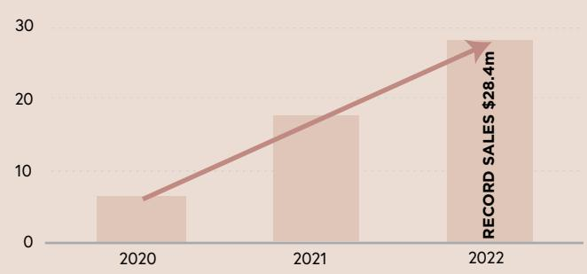
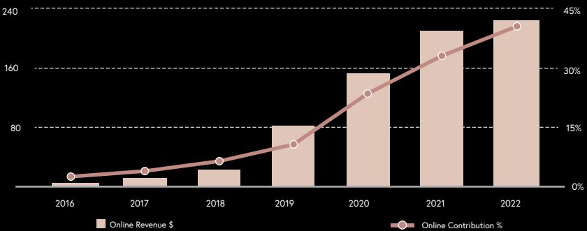
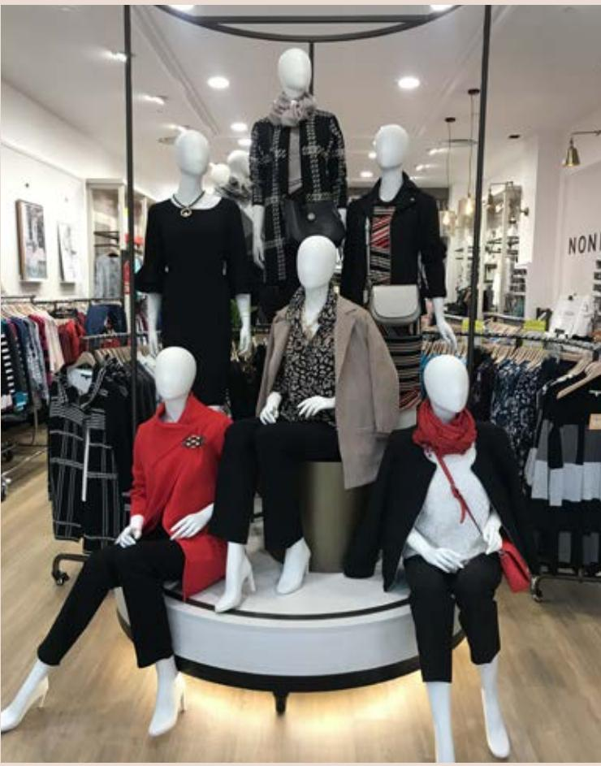

{0}------------------------------------------------

{1}------------------------------------------------

## **" EVERYTHING SHE WANTS. WHERE SHE WANTS IT. WHEN SHE WANTS IT. "** PERFORMANCE HIGHLIGHTS **04**

**C O N T E N T S**

OUR PEOPLE, OUR CULTURE **34**

CORPORATE RESPONSIBILITIES **36**

DIRECTOR'S REPORT **38**

FINANCIAL STATEMENTS **50**

ADDITIONAL INFORMATION **97**

CORPORATE DIRECTORY **99**

ENVIRONMENTAL, SOCIAL &

DIGITAL HIGHLIGHTS **05**

CHAIRMAN'S REPORT **06**

MANAGING DIRECTOR'S REPORT **08**

BOARD OF DIRECTORS **12**

OUR BRANDS **14**

BIG GROWTH **28**

BIG EXPERIENCE **30**

**ABN:** 96 003 321 579

{2}------------------------------------------------

# **C O N T E N T S**

|                | PERFORMANCE HIGHLIGHTS 04     |    | OUR PEOPLE, OUR CULTURE    | 34 |
|----------------|----------------------------------|----|----------------------------|----|
|                | DIGITAL HIGHLIGHTS 05         |    | ENVIRONMENTAL, SOCIAL &    |    |
|                | CHAIRMAN'S REPORT 06          |    | CORPORATE RESPONSIBILITIES | 36 |
|                | MANAGING DIRECTOR'S REPORT 08 |    | DIRECTOR'S REPORT          | 38 |
|                | BOARD OF DIRECTORS               | 12 | FINANCIAL STATEMENTS       | 50 |
| OUR BRANDS     |                                  | 14 |                            |    |
| BIG GROWTH     | 28                               |    | ADDITIONAL INFORMATION     | 97 |
| BIG EXPERIENCE | 30                               |    | CORPORATE DIRECTORY        | 99 |
|                |                                  |    |                            |    |

**ABN:** 96 003 321 579

{3}------------------------------------------------

## **PERFORMANCE** HIGHLIGHTS **DIGITAL** HIGHLIGHTS

## The following charts reflect Mosaic Brand's journey since 2016

## GROUP REVENUE \$M

## GROUP CODB \$M

## GROUP EBITDA* \$M 3RD PARTY PRODUCT SALES \$M 3RD PARTY PRODUCT SKUs ('000)

30

160

80

240

20

10

0

2020 2021 2022

2016 2017 2018

Jun 20 Dec 20 Jun 21 Dec 21 Jun 22

**1.5m**

**3,500,000**

**5,000,000**

30%

15%

**RECORD SALES \$223m**

0%

45%

6,000

Online Revenue \$ Online Contribution %

2019 2020 2021 2022

GROUP ONLINE REVENUE \$M

4,000

2,000

*EBITDA is a non-AASB financial measure, defined for the purposes of this document as earnings before interest, tax, depreciation, amortisation, non-recurring income/expenditure and certain non-cash items such as share based payments and unrealised foreign exchange gains/losses and excludes restructure and acquisition costs and has been adjusted to normalise the impact of AASB16 accounting treatment.

**RECORD SALES \$28.4m**

0

{4}------------------------------------------------

## **PERFORMANCE** HIGHLIGHTS **DIGITAL** HIGHLIGHTS

## GROUP ONLINE REVENUE \$M

GROUP CODB \$M

2016

400

200

CODB \$ JobKeeper benefit CODB %

50%

50

2017 2018 2019 2020 2021 2022

**COVID IMPACTED. LOCKDOWN 22,193 TRADING DAYS LOST.**

**COVID IMPACTED**

 **DAYS LOST IN H1.**

**OMINCRON IMPACT H2.**

 **LOCKDOWN 49,489**

Non-COVID Years COVID years

10

-30

-70

2016 2017 2018 2019 2020 2021 2022

0%

2016 2017 2018 2019 2020 2021 2022

600 100%

\$12m

\$46m

-\$87m

GROUP REVENUE \$M

800

400

The following charts reflect Mosaic Brand's journey since 2016

GROUP EBITDA* \$M 3RD PARTY PRODUCT SALES \$M 3RD PARTY PRODUCT SKUs ('000)

*EBITDA is a non-AASB financial measure, defined for the purposes of this document as earnings before interest, tax, depreciation, amortisation, non-recurring income/expenditure and certain non-cash items such as share based payments and unrealised foreign exchange gains/losses and excludes restructure and acquisition costs and has been adjusted to normalise the impact of AASB16 accounting treatment.

{5}------------------------------------------------

# **REPORT** CHAIRMAN'S

UNPREDICTABILITY HAS BEEN THE ONLY CONSTANT OF THE LAST FINANCIAL YEAR.

After Mosaic Brands returned to its track record of profitability in FY21, the new financial year began with renewed confidence before it was faced with a new wave of COVID related lockdowns and associated store closures across Australia and New Zealand.

Mosaic undertook a capital raise to bolster its balance sheet to address this and despite losing just under 50,000 trading days, ended the first half of FY22 with an \$8 million EBITDA* and new \$49 million credit facility in place with the Commonwealth Bank.

The Group went into the key Christmas trading period well positioned and with the reasonable expectation that the progressive lifting of Government lockdowns would boost future trading.

The emergence of the Omicron variant of the virus unfortunately, changed that. Our customers are resilient but also highly attuned and cautious to adverse news or events.

Almost immediately following the emergence and spread of Omicron over the Christmas / New Year period in-store foot traffic fell dramatically and our concerned customers undertook a self-imposed lockdown.

As Scott will detail in his report, though there was a continued upsurge in online sales, with 952 stores nationally, the fall in store traffic impacted the Group heavily.

The expectation was, as had occurred a year earlier, that as COVID restrictions eased many of our customers would return to store within a few weeks.

Instead in the second half of 2022 that self-imposed lockdown dragged on.

Through my role as Executive Chairman of the retail focused Alquemie Group, it was clear to see the younger consumers, unimpeded by decreed health orders or restrictions, rushed to return to "life as normal."

more cautious approach. Our frontline retail team highlighted many of the shoppers in-store throughout late April and May were there on behalf of parents or grandparents who remained significantly concerned about being exposed to the virus or the very real

The positive is that in the weeks leading into

That sees us cautiously optimistic about the

COVID has impacted Mosaic more than any other retailer in the region, yet we believe we can well weather the new challenges

As is happening in US retail, value is becoming the key consideration for consumers in an inflationary environment,

and we are positioned strongly in

Our management team have in the most testing circumstances built a business that is nimble and can pivot to meet challenges from inflation to supply chain constraints.

Directors and management are acutely conscious that after successive years of pre-COVID profitability the last few years have been challenging for shareholders.

The \$16 million EBITDA* loss the company recorded in FY22 is deeply disappointing.

However, as Chairman I can assure you that the efforts and commitment from your Directors, management and most importantly our 4,000 plus team have

Your company has weathered significant headwinds in recent years, and now faces emerging economic clouds globally.

resolutely on managing the impact of those headwinds and returning to profitability.

The Board and management fully understand

In the short term our focus remains

the medium to longer term strategic

the end of the financial year, we saw day-by-day and week-by-week momentum

risk of a household lockdown.

build in our in-store sales.

financial year ahead.

emerging in the sector.

that space.

been herculean.

Conversely in the absence of any official Government or health advice timeline, Mosaic Brands customers took a far

We saw day-by-day and week-by-week momentum build in our in-store sales.

Our focus

resolutely on managing the

returning to profitability.

impact of those headwinds and

remains

opportunities for your company. We have a strong belief that Mosaic has an exciting future and we were particularly

excited by some key initiatives:

• continued growth in our online business, including international expansion through launching dedicated international online sites;

• the roll-out of our new large-format regional Rivers Megastores, which have received a very positive market reception, coupled with the launch of EziBuy stores following our recent acquisition of that business;

• continued improvement to our core business, including ongoing

Finally, the Board has continued its commitment to implementing leading environmental, social, and corporate

This financial year Oxfam announced Mosaic Brands as one of the national

transparency in ESG-related matters in

While that recognition is pleasing the Board sees ESG as a journey rather than a destination and one where we must

governance (ESG) policies.

retailers leading in regard to

strive to continually improve.

long-term profitability.

CHAIRMAN

*EBITDA is a non-AASB financial measure, defined for the purposes of this document as earnings before interest, tax, depreciation, amortisation, non-recurring income/expenditure and certain non-cash items such as share based payments and unrealised foreign exchange gains/losses and excludes restructure and acquisition costs and has been adjusted to normalise the impact of AASB16 accounting treatment.

After a financial year of volatility and unpredictability Mosaic Brands faces FY23 with cautious optimism that whatever lies ahead in the

short-term, we can navigate a return to

**- RICHARD FACIONI**

the fashion industry.

optimisation of our store portfolio and selectively growing our store network when presented with sensible commercial leasing arrangements.

**6** EVERYTHING SHE WANTS, WHERE SHE WANTS IT, WHEN SHE WANTS IT.

{6}------------------------------------------------

more cautious approach. Our frontline retail team highlighted many of the shoppers in-store throughout late April and May were there on behalf of parents or grandparents who remained significantly concerned about being exposed to the virus or the very real risk of a household lockdown.

The positive is that in the weeks leading into the end of the financial year, we saw day-by-day and week-by-week momentum build in our in-store sales.

That sees us cautiously optimistic about the financial year ahead.

COVID has impacted Mosaic more than any other retailer in the region, yet we believe we can well weather the new challenges emerging in the sector.

As is happening in US retail, value is becoming the key consideration for consumers in an inflationary environment, and we are positioned strongly in that space.

Our management team have in the most testing circumstances built a business that is nimble and can pivot to meet challenges from inflation to supply chain constraints.

**REPORT**

UNPREDICTABILITY HAS BEEN THE ONLY CONSTANT OF THE LAST FINANCIAL YEAR.

Our customers are resilient but also highly attuned and cautious to adverse

Almost immediately following the emergence and spread of Omicron over the Christmas / New Year period in-store foot traffic fell dramatically and our concerned customers undertook a

As Scott will detail in his report, though there was a continued upsurge in online sales, with 952 stores nationally, the fall in store traffic impacted the

The expectation was, as had occurred a year earlier, that as COVID restrictions eased many of our customers would return

Instead in the second half of 2022 that self-imposed lockdown dragged on.

to store within a few weeks.

news or events.

self-imposed lockdown.

Group heavily.

After Mosaic Brands returned to its track record of profitability in FY21, the new financial year began with renewed confidence before it was faced with a new wave of COVID related lockdowns and associated store closures across

Mosaic undertook a capital raise to bolster its balance sheet to address this and despite losing just under 50,000 trading days, ended the first half of FY22 with an \$8 million EBITDA* and new \$49 million credit facility in place

with the Commonwealth Bank.

The Group went into the key Christmas trading period well positioned and with the reasonable expectation that the progressive lifting of Government lockdowns would boost future trading.

The emergence of the Omicron variant of the virus unfortunately, changed that.

Australia and New Zealand.

CHAIRMAN'S

Directors and management are acutely conscious that after successive years of pre-COVID profitability the last few years have been challenging for shareholders.

The \$16 million EBITDA* loss the company recorded in FY22 is deeply disappointing.

However, as Chairman I can assure you that the efforts and commitment from your Directors, management and most importantly our 4,000 plus team have been herculean.

Your company has weathered significant headwinds in recent years, and now faces emerging economic clouds globally.

We saw day-by-day

and week-by-week momentum build in

Through my role as Executive Chairman of the retail focused Alquemie Group, it was clear to see the younger consumers, unimpeded by decreed health orders or restrictions, rushed to

Conversely in the absence of any official Government or health advice timeline, Mosaic Brands customers took a far

return to "life as normal."

our in-store sales.

In the short term our focus remains resolutely on managing the impact of those headwinds and returning to profitability.

The Board and management fully understand the medium to longer term strategic

opportunities for your company. We have a strong belief that Mosaic has an exciting future and we were particularly excited by some key initiatives:

- continued growth in our online business, including international expansion through launching dedicated international online sites;
- the roll-out of our new large-format regional Rivers Megastores, which have received a very positive market reception, coupled with the launch of EziBuy stores following our recent acquisition of that business;
- continued improvement to our core business, including ongoing optimisation of our store portfolio and selectively growing our store network when presented with sensible commercial leasing arrangements.

Finally, the Board has continued its commitment to implementing leading environmental, social, and corporate governance (ESG) policies.

This financial year Oxfam announced Mosaic Brands as one of the national retailers leading in regard to transparency in ESG-related matters in the fashion industry.

While that recognition is pleasing the Board sees ESG as a journey rather than a destination and one where we must strive to continually improve.

After a financial year of volatility and unpredictability Mosaic Brands faces FY23 with cautious optimism that whatever lies ahead in the short-term, we can navigate a return to long-term profitability.

## **- RICHARD FACIONI**

CHAIRMAN

## Our focus remains resolutely on managing the impact of those headwinds and returning to profitability.

*EBITDA is a non-AASB financial measure, defined for the purposes of this document as earnings before interest, tax, depreciation, amortisation, non-recurring income/expenditure and certain non-cash items such as share based payments and unrealised foreign exchange gains/losses and excludes restructure and acquisition costs and has been adjusted to normalise the impact of AASB16 accounting treatment.

{7}------------------------------------------------

# MANAGING DIRECTOR'S **REPORT**

Mosaic Brands has endured the many challenges that have arisen as a result of the COVID-19 pandemic, we have stayed focussed on rapidly implementing a set strategy for the long-term benefit of the Group.

As Mosaic Brands endured the many. challenges that have arisen as a result of this pandemic over the past three financial years, we have stayed focussed on a strategy, reviewed every aspect of our business and made all the decisions needed – regardless of how difficult they may be. This is to ensure that coming out of the pandemic into a new retail world our Group will return to the growing business that it was for the five years prior to the pandemic starting.

FY22 was the most difficult period of the pandemic to date for the Group, with 8 months of the year being severely impacted. Initially due to government mandated lockdowns in the first half, causing 50,000 lost trading days and further impacted with the arrival of the Omicron variant for the first four months of the second half.

Today we have built a very different business to that of 2019. A business that now generates \$223m or 36% of its revenue through its digital channels, offers 5,000,000 SKUS covering

GROUP ONLINE REVENUE \$M **L ore**

30 categories and attracting approx. 8,000 new customers weekly through its digital powerhouse.

It has rightsized its store portfolio to a 952-store network by closing over 400 stores where landlords held pre-pandemic expectations. Our lease expiry profile has also radically shifted and provides the group with great flexibility and negotiation strength.

The Group has also reduced its cost of doing business by a further \$87m against the prior year normalising for

JobKeeper and closing the year with a clean stock inventory level.

**A UNIQUE MARKET**

July - October Government COVID Lockdown

putting safety before financials.

JobKeeper, during this pandemic.

week from July to end October.

EBITDA* profit for the half.

self-imposed lockdown.

and somewhat normalised second half.

this point.

400,000

300,000

200,000

100,000

While Mosaic Brands has undertaken significant structural change across the business, we continued over the past 12 months to ensure the safety of our customers and teams come first. During this pandemic we have stayed firm on

Jul Aug Sep Oct Nov Dec Jan Feb Mar Apr May Jun

RETURNED SHOPPERS TO STORE LTM

December - February Omincron COVID Variant

The arrival of the Omicron variant further tested our resolve on this and I am proud that we again did not waver from

As Richard has highlighted in his report, those customers are the greatest risk segment, the most cautious and had the least access to Government stimulus, most notably

The Group lost just under 50,000 trading days during the first half of the year with up to 650 stores closed every

As we had seen with previous lockdowns, the Group

rebounded swiftly as the customer quickly returned resulting in the Group achieving comparable store growth of +1% for the half. This was the third half in a row to post positive comp store growth seeing the Group deliver an \$8 million

Post the lockdowns ending in October the Group delivered a strong Christmas result and carried positive momentum as it entered 2022 calendar year and looked forward to a solid

However, the onset of the Omicron variant at the end of December was by far the most difficult episode of the pandemic as our customers in particular entered a

The rapid spread of this variant created enhanced concern across our customer segment and impacted January to April heavily. This self-imposed lockdown slowly starting to alleviate as May progressed but not to the level needed to offset the impacts seen in the January to April period. However this positive trend continued to gain momentum with June growing to be the strongest month for the half and delivered a 11% comparable growth for the month.

The above changes whilst still focussed on our unique mature customer segment, ensures we are strongly positioned to take advantage of the deep shifts in consumer behaviour and demographics in the retail sector across both the physical and digital channels. This year will see the return to delivering sustainable profits as we enter FY23 with stores trading unimpeded for the first time in two and a half years.

During the second half, the Group reduced margins to drive sales in order to stimulate conversion and ensure a clean and correct stock position to enter FY23. As a result, the Group delivered -4.5% comparable store growth for the half

**223M**

**UP 7%**

prepare for changes in the way they will shop post

omni-present health orders has ended.

On that point it is important to note that while COVID has not gone away, it is clear that barring any catastrophic sub-variant, the era of Government-imposed lockdowns and The nature of that portfolio though is shifting to larger,

In the last financial year, we opened three of these mega-stores, the latest serving the recently flood-ravaged Northern Rivers

That is not to say every Mosaic Brands outlet will become a mega-store, but these larger format approaches will become increasingly common across our portfolio as the Group plans to

The second strategic arm - Big Digital has seen phenomenal

From under 40,000 SKUs of our own fashion in 2018, today

Mosaic offers over 5,000,000 SKUs covering 30 categories through our digital channels. This growth will not slow as the Group plans to lift the number of SKUs to over 8,000,000

In supporting that, our Big Strategy is well-advanced and while we will always make adjustments to meet what's happening in

That business is one that is very different to that prior to the pandemic but one where the focus remains returning to delivering consistent profitability as I stated previously.

The Group enters FY23 in a strong and clean stock position to

distribution centre to manage growing online sales, continued closure of stores with unrealistic rental expectations, and reset of operations means costs in FY23 can be closely managed.

Trading late in the fourth quarter and into the new financial year has also been favourable as COVID concerns ease among

These factors give confidence to the Board that, barring any major new COVID variant, the trading conditions ahead are the most favourable in recent years and Mosaic Brands will return

I want to acknowledge and thank our Mosaic Brands team who have not only had to manage a multitude of pandemic-related changes on a day-to-day basis but also undertake and implement strategic changes at every level of our operations.

Having been the first national retailer to feel the impact of COVID-19, we are also the last to experience its consequences.

We now look forward to operating in an environment for our customers that is coming something closer to normal.

the market, it is now embedded across the business.

Furthermore, prior investment into a state-of-the-art

maximise the year ahead.

the Group's customer set.

to profitability in FY23.

This rapid acceleration of third-party product delivered growth of 58% over the past 12 months growing from \$18m in

Along with our new state of the art distribution centre as Richard has highlighted, we are committed to ensuring our environmental, social and corporate responsibilities are

In FY20 our online sales was \$151m whilst in FY22 it grew

This growth not only highlights that older consumers are shifting to online but also that the Group is strongly positioned to serve an emerging cohort of customers for whom online shopping is becoming second nature.

Overall, online now contributes 36% percent to Group

A key driver for future revenue growth is both online and

by FY25.

to \$223m.

revenue.

in-store trading unimpeded.

FY21 to now \$28.4m in FY22.

among the best in the industry.

**ONLINE AS EVIDENCE THE BIG STRATEGY IS WORKING**

growth in our online offering in the last three years.

destination driven, mega-stores.

region of New South Wales.

open 75 across the next three years.

In this new environment, our focus has been on the continued implementation of our Big Strategy – notably Big Stores and

While we have trimmed our nationwide portfolio in recent years to 952 stores, especially in response to unrealistic rental demands, in-store shopping will continue to play a

the pandemic.

Big Digital.

critical part in our growth.

GROUP ONLINE SALES

Although our customer sector has been the most impacted by the pandemic, they still remain an influential part of the

Average consumption per Australian household aged 55 years and above has grown nearly twice as fast as the

Households aged 55-64 consumed more on average (\$123,000) than those aged 35-44 (\$111,000).

In the United States people over 50 are now responsible for half of all consumer spending but less than 10% of marketing

Despite this spending power a McKinsey survey in March 2022 highlighted around two-thirds of Australian consumers in our core market still said they were not ready to return to

While understandable, this hibernation and cautious customer behaviour has had a significant impact on our operations and profitability that has gone far beyond other retailers simply facing inflation, supply chain issues or

It has required the Group to not only be fleet of foot in managing immediate changes but also ensuring we shape Mosaic Brands to be strongly positioned to take advantage of the major shifts occurring in the retail landscape.

Having done so, we are confident these changes will not only benefit our existing customers but those who are coming into our demographic sector of the fashion industry.

Mosaic Brands puts our customers at the heart of everything we do and in doing so we've been able to anticipate and

average of other households in recent years.

and -1.7% for the full year.

**\$**

budgets are targeted at them.

**A BIG STRATEGY SHIFT**

retail sector.

SHOP NOW

life as normal.

store closures.

{8}------------------------------------------------

## **A UNIQUE MARKET**

As Mosaic Brands endured the many. challenges that have arisen as a result of this pandemic over the past three financial years, we have stayed focussed on a strategy, reviewed every aspect of our business and made all the decisions needed – regardless of how difficult they may be. This is to ensure that coming out of the pandemic into a new retail world our Group will return to the growing business that it was for the five years prior

to the pandemic starting.

of the second half.

5,000,000 SKUS covering

FY22 was the most difficult period of the pandemic to date for the Group, with 8 months of the year being severely impacted. Initially due to government mandated lockdowns in the first half, causing 50,000 lost trading days and further impacted with the arrival of the Omicron variant for the first four months

30 categories and attracting approx. 8,000 new customers weekly through

2016 2017 2018

MANAGING DIRECTOR'S

**REPORT**

Mosaic Brands has endured the many challenges that have arisen as a result of the COVID-19 pandemic, we have stayed focussed on rapidly implementing a set strategy for the long-term benefit of the Group.

GROUP ONLINE REVENUE \$M **L ore**

Online Revenue \$ Online Contribution %

JobKeeper and closing the year with a

30%

15%

0%

45%

clean stock inventory level.

2019 2020 2021 2022

two and a half years.

The above changes whilst still focussed on our unique mature customer segment, ensures we are strongly positioned to take advantage of the deep shifts in consumer behaviour and demographics in the retail sector across both the physical and digital channels. This year will see the return to delivering sustainable profits as we enter FY23 with stores trading unimpeded for the first time in

It has rightsized its store portfolio to a 952-store network by closing over 400

pre-pandemic expectations. Our lease expiry profile has also radically shifted and provides the group with great flexibility and negotiation strength.

The Group has also reduced its cost of doing business by a further \$87m against the prior year normalising for

its digital powerhouse.

160

80

240

stores where landlords held

Today we have built a very different business to that of 2019. A business that now generates \$223m or 36% of its revenue through its digital channels, offers While Mosaic Brands has undertaken significant structural change across the business, we continued over the past 12 months to ensure the safety of our customers and teams come first. During this pandemic we have stayed firm on this point.

The arrival of the Omicron variant further tested our resolve on this and I am proud that we again did not waver from putting safety before financials.

As Richard has highlighted in his report, those customers are the greatest risk segment, the most cautious and had the least access to Government stimulus, most notably JobKeeper, during this pandemic.

The Group lost just under 50,000 trading days during the first half of the year with up to 650 stores closed every week from July to end October.

As we had seen with previous lockdowns, the Group rebounded swiftly as the customer quickly returned resulting in the Group achieving comparable store growth of +1% for the half. This was the third half in a row to post positive comp store growth seeing the Group deliver an \$8 million EBITDA* profit for the half.

Post the lockdowns ending in October the Group delivered a strong Christmas result and carried positive momentum as it entered 2022 calendar year and looked forward to a solid and somewhat normalised second half.

However, the onset of the Omicron variant at the end of December was by far the most difficult episode of the pandemic as our customers in particular entered a self-imposed lockdown.

The rapid spread of this variant created enhanced concern across our customer segment and impacted January to April heavily. This self-imposed lockdown slowly starting to alleviate as May progressed but not to the level needed to offset the impacts seen in the January to April period. However this positive trend continued to gain momentum with June growing to be the strongest month for the half and delivered a 11% comparable growth for the month.

During the second half, the Group reduced margins to drive sales in order to stimulate conversion and ensure a clean and correct stock position to enter FY23. As a result, the Group delivered -4.5% comparable store growth for the half and -1.7% for the full year.

prepare for changes in the way they will shop post

omni-present health orders has ended.

On that point it is important to note that while COVID has not gone away, it is clear that barring any catastrophic sub-variant, the era of Government-imposed lockdowns and The nature of that portfolio though is shifting to larger,

In the last financial year, we opened three of these mega-stores, the latest serving the recently flood-ravaged Northern Rivers

That is not to say every Mosaic Brands outlet will become a mega-store, but these larger format approaches will become increasingly common across our portfolio as the Group plans to

The second strategic arm - Big Digital has seen phenomenal

From under 40,000 SKUs of our own fashion in 2018, today

Mosaic offers over 5,000,000 SKUs covering 30 categories through our digital channels. This growth will not slow as the Group plans to lift the number of SKUs to over 8,000,000

In supporting that, our Big Strategy is well-advanced and while we will always make adjustments to meet what's happening in

That business is one that is very different to that prior to the pandemic but one where the focus remains returning to delivering consistent profitability as I stated previously.

The Group enters FY23 in a strong and clean stock position to

distribution centre to manage growing online sales, continued closure of stores with unrealistic rental expectations, and reset of operations means costs in FY23 can be closely managed.

Trading late in the fourth quarter and into the new financial year has also been favourable as COVID concerns ease among

These factors give confidence to the Board that, barring any major new COVID variant, the trading conditions ahead are the most favourable in recent years and Mosaic Brands will return

I want to acknowledge and thank our Mosaic Brands team who have not only had to manage a multitude of pandemic-related changes on a day-to-day basis but also undertake and implement strategic changes at every level of our operations.

Having been the first national retailer to feel the impact of COVID-19, we are also the last to experience its consequences.

We now look forward to operating in an environment for our customers that is coming something closer to normal.

the market, it is now embedded across the business.

Furthermore, prior investment into a state-of-the-art

maximise the year ahead.

the Group's customer set.

to profitability in FY23.

This rapid acceleration of third-party product delivered growth of 58% over the past 12 months growing from \$18m in

Along with our new state of the art distribution centre as Richard has highlighted, we are committed to ensuring our environmental, social and corporate responsibilities are

In FY20 our online sales was \$151m whilst in FY22 it grew

This growth not only highlights that older consumers are shifting to online but also that the Group is strongly positioned to serve an emerging cohort of customers for whom online shopping is becoming second nature.

Overall, online now contributes 36% percent to Group

A key driver for future revenue growth is both online and

by FY25.

to \$223m.

revenue.

in-store trading unimpeded.

FY21 to now \$28.4m in FY22.

among the best in the industry.

**ONLINE AS EVIDENCE THE BIG STRATEGY IS WORKING**

growth in our online offering in the last three years.

destination driven, mega-stores.

region of New South Wales.

open 75 across the next three years.

In this new environment, our focus has been on the continued implementation of our Big Strategy – notably Big Stores and

While we have trimmed our nationwide portfolio in recent years to 952 stores, especially in response to unrealistic rental demands, in-store shopping will continue to play a

the pandemic.

Big Digital.

critical part in our growth.

Although our customer sector has been the most impacted by the pandemic, they still remain an influential part of the retail sector.

Average consumption per Australian household aged 55 years and above has grown nearly twice as fast as the average of other households in recent years.

Households aged 55-64 consumed more on average (\$123,000) than those aged 35-44 (\$111,000).

In the United States people over 50 are now responsible for half of all consumer spending but less than 10% of marketing budgets are targeted at them.

Despite this spending power a McKinsey survey in March 2022 highlighted around two-thirds of Australian consumers in our core market still said they were not ready to return to life as normal.

While understandable, this hibernation and cautious customer behaviour has had a significant impact on our operations and profitability that has gone far beyond other retailers simply facing inflation, supply chain issues or store closures.

It has required the Group to not only be fleet of foot in managing immediate changes but also ensuring we shape Mosaic Brands to be strongly positioned to take advantage of the major shifts occurring in the retail landscape.

Having done so, we are confident these changes will not only benefit our existing customers but those who are coming into our demographic sector of the fashion industry.

## **A BIG STRATEGY SHIFT**

Mosaic Brands puts our customers at the heart of everything we do and in doing so we've been able to anticipate and

{9}------------------------------------------------

PRODUCT (SKU'S)

## 3RD PARTY PRODUCT SKUs ('000)

**\$**

maximise the year ahead.

the Group's customer set.

to profitability in FY23.

**- SCOTT EVANS** MANAGING DIRECTOR

*EBITDA is a non-AASB financial measure, defined for the purposes of this document as earnings before interest, tax, depreciation, amortisation, non-recurring income/expenditure and certain non-cash items such as share based payments and unrealised foreign exchange gains/losses and excludes restructure and acquisition costs and has been adjusted to normalise the impact of AASB16 accounting treatment.

Mosaic offers over 5,000,000 SKUs covering 30 categories through our digital channels. This growth will not slow as the Group plans to lift the number of SKUs to over 8,000,000

This rapid acceleration of third-party product delivered growth of 58% over the past 12 months growing from \$18m in

Along with our new state of the art distribution centre as Richard has highlighted, we are committed to ensuring our environmental, social and corporate responsibilities are

In FY20 our online sales was \$151m whilst in FY22 it grew

This growth not only highlights that older consumers are shifting to online but also that the Group is strongly positioned to serve an emerging cohort of customers for whom online shopping is becoming second nature.

Overall, online now contributes 36% percent to Group

A key driver for future revenue growth is both online and

by FY25.

to \$223m.

revenue.

in-store trading unimpeded.

FY21 to now \$28.4m in FY22.

among the best in the industry.

**ONLINE AS EVIDENCE THE BIG STRATEGY IS WORKING** 3RD PARTY

PRODUCT SALES

**28.4M**

In supporting that, our Big Strategy is well-advanced and while we will always make adjustments to meet what's happening in

That business is one that is very different to that prior to the pandemic but one where the focus remains returning to delivering consistent profitability as I stated previously.

The Group enters FY23 in a strong and clean stock position to

distribution centre to manage growing online sales, continued closure of stores with unrealistic rental expectations, and reset of operations means costs in FY23 can be closely managed.

Trading late in the fourth quarter and into the new financial year has also been favourable as COVID concerns ease among

These factors give confidence to the Board that, barring any major new COVID variant, the trading conditions ahead are the most favourable in recent years and Mosaic Brands will return

I want to acknowledge and thank our Mosaic Brands team who have not only had to manage a multitude of pandemic-related changes on a day-to-day basis but also undertake and implement strategic changes at every level of our operations.

Having been the first national retailer to feel the impact of COVID-19, we are also the last to experience its consequences.

We now look forward to operating in an environment for our customers that is coming something closer to normal.

the market, it is now embedded across the business.

Furthermore, prior investment into a state-of-the-art

**UP 58%**

prepare for changes in the way they will shop post the pandemic.

On that point it is important to note that while COVID has not gone away, it is clear that barring any catastrophic sub-variant, the era of Government-imposed lockdowns and omni-present health orders has ended.

In this new environment, our focus has been on the continued implementation of our Big Strategy – notably Big Stores and Big Digital.

While we have trimmed our nationwide portfolio in recent years to 952 stores, especially in response to unrealistic rental demands, in-store shopping will continue to play a critical part in our growth.

As Mosaic Brands endured the many. challenges that have arisen as a result of this pandemic over the past three financial years, we have stayed focussed on a strategy, reviewed every aspect of our business and made all the decisions needed – regardless of how difficult they may be. This is to ensure that coming out of the pandemic into a new retail world our Group will return to the growing business that it was for the five years prior

to the pandemic starting.

of the second half.

5,000,000 SKUS covering

FY22 was the most difficult period of the pandemic to date for the Group, with 8 months of the year being severely impacted. Initially due to government mandated lockdowns in the first half, causing 50,000 lost trading days and further impacted with the arrival of the Omicron variant for the first four months

30 categories and attracting approx. 8,000 new customers weekly through JobKeeper and closing the year with a

**A UNIQUE MARKET**

putting safety before financials.

JobKeeper, during this pandemic.

week from July to end October.

EBITDA* profit for the half.

self-imposed lockdown.

and somewhat normalised second half.

this point.

While Mosaic Brands has undertaken significant structural change across the business, we continued over the past 12 months to ensure the safety of our customers and teams come first. During this pandemic we have stayed firm on

During the second half, the Group reduced margins to drive sales in order to stimulate conversion and ensure a clean and correct stock position to enter FY23. As a result, the Group delivered -4.5% comparable store growth for the half

Although our customer sector has been the most impacted by the pandemic, they still remain an influential part of the

Average consumption per Australian household aged 55 years and above has grown nearly twice as fast as the

Households aged 55-64 consumed more on average (\$123,000) than those aged 35-44 (\$111,000).

In the United States people over 50 are now responsible for half of all consumer spending but less than 10% of marketing

Despite this spending power a McKinsey survey in March 2022 highlighted around two-thirds of Australian consumers in our core market still said they were not ready to return to

While understandable, this hibernation and cautious customer behaviour has had a significant impact on our operations and profitability that has gone far beyond other retailers simply facing inflation, supply chain issues or

It has required the Group to not only be fleet of foot in managing immediate changes but also ensuring we shape Mosaic Brands to be strongly positioned to take advantage of the major shifts occurring in the retail landscape.

Having done so, we are confident these changes will not only benefit our existing customers but those who are coming into our demographic sector of the fashion industry.

Mosaic Brands puts our customers at the heart of everything we do and in doing so we've been able to anticipate and

average of other households in recent years.

and -1.7% for the full year.

budgets are targeted at them.

**A BIG STRATEGY SHIFT**

retail sector.

life as normal.

store closures.

The arrival of the Omicron variant further tested our resolve on this and I am proud that we again did not waver from

As Richard has highlighted in his report, those customers are the greatest risk segment, the most cautious and had the least access to Government stimulus, most notably

The Group lost just under 50,000 trading days during the first half of the year with up to 650 stores closed every

As we had seen with previous lockdowns, the Group

rebounded swiftly as the customer quickly returned resulting in the Group achieving comparable store growth of +1% for the half. This was the third half in a row to post positive comp store growth seeing the Group deliver an \$8 million

Post the lockdowns ending in October the Group delivered a strong Christmas result and carried positive momentum as it entered 2022 calendar year and looked forward to a solid

However, the onset of the Omicron variant at the end of December was by far the most difficult episode of the pandemic as our customers in particular entered a

The rapid spread of this variant created enhanced concern across our customer segment and impacted January to April heavily. This self-imposed lockdown slowly starting to alleviate as May progressed but not to the level needed to offset the impacts seen in the January to April period. However this positive trend continued to gain momentum with June growing to be the strongest month for the half and delivered a 11% comparable growth for the month.

clean stock inventory level.

two and a half years.

The above changes whilst still focussed on our unique mature customer segment, ensures we are strongly positioned to take advantage of the deep shifts in consumer behaviour and demographics in the retail sector across both the physical and digital channels. This year will see the return to delivering sustainable profits as we enter FY23 with stores trading unimpeded for the first time in

It has rightsized its store portfolio to a 952-store network by closing over 400

pre-pandemic expectations. Our lease expiry profile has also radically shifted and provides the group with great flexibility and negotiation strength.

The Group has also reduced its cost of doing business by a further \$87m against the prior year normalising for

its digital powerhouse.

stores where landlords held

Today we have built a very different business to that of 2019. A business that now generates \$223m or 36% of its revenue through its digital channels, offers The nature of that portfolio though is shifting to larger, destination driven, mega-stores.

In the last financial year, we opened three of these mega-stores, the latest serving the recently flood-ravaged Northern Rivers region of New South Wales.

That is not to say every Mosaic Brands outlet will become a mega-store, but these larger format approaches will become increasingly common across our portfolio as the Group plans to open 75 across the next three years.

The second strategic arm - Big Digital has seen phenomenal growth in our online offering in the last three years.

From under 40,000 SKUs of our own fashion in 2018, today

ONLINE SALES CONTRIBUTION

{10}------------------------------------------------

## 3RD PARTY PRODUCT SALES

**\$ 28.4M UP 58%**

3RD PARTY

QUILTS **SOLD**

**30,000**

**5,000,000**

SHEET SETS **SOLD**

**175,000**

omni-present health orders has ended.

the pandemic.

Big Digital.

critical part in our growth.

prepare for changes in the way they will shop post

On that point it is important to note that while COVID has not gone away, it is clear that barring any catastrophic sub-variant, the era of Government-imposed lockdowns and

In this new environment, our focus has been on the continued implementation of our Big Strategy – notably Big Stores and

While we have trimmed our nationwide portfolio in recent years to 952 stores, especially in response to unrealistic rental demands, in-store shopping will continue to play a

**3**

ORDERS DELIVERED

**M**

As Mosaic Brands endured the many. challenges that have arisen as a result of this pandemic over the past three financial years, we have stayed focussed on a strategy, reviewed every aspect of our business and made all the decisions needed – regardless of how difficult they may be. This is to ensure that coming out of the pandemic into a new retail world our Group will return to the growing business that it was for the five years prior

to the pandemic starting.

of the second half.

5,000,000 SKUS covering

FY22 was the most difficult period of the pandemic to date for the Group, with 8 months of the year being severely impacted. Initially due to government mandated lockdowns in the first half, causing 50,000 lost trading days and further impacted with the arrival of the Omicron variant for the first four months

30 categories and attracting approx. 8,000 new customers weekly through JobKeeper and closing the year with a

**A UNIQUE MARKET**

putting safety before financials.

JobKeeper, during this pandemic.

week from July to end October.

EBITDA* profit for the half.

self-imposed lockdown.

and somewhat normalised second half.

this point.

While Mosaic Brands has undertaken significant structural change across the business, we continued over the past 12 months to ensure the safety of our customers and teams come first. During this pandemic we have stayed firm on

During the second half, the Group reduced margins to drive sales in order to stimulate conversion and ensure a clean and correct stock position to enter FY23. As a result, the Group delivered -4.5% comparable store growth for the half

Although our customer sector has been the most impacted by the pandemic, they still remain an influential part of the

Average consumption per Australian household aged 55 years and above has grown nearly twice as fast as the

Households aged 55-64 consumed more on average (\$123,000) than those aged 35-44 (\$111,000).

In the United States people over 50 are now responsible for half of all consumer spending but less than 10% of marketing

Despite this spending power a McKinsey survey in March 2022 highlighted around two-thirds of Australian consumers in our core market still said they were not ready to return to

While understandable, this hibernation and cautious customer behaviour has had a significant impact on our operations and profitability that has gone far beyond other retailers simply facing inflation, supply chain issues or

It has required the Group to not only be fleet of foot in managing immediate changes but also ensuring we shape Mosaic Brands to be strongly positioned to take advantage of the major shifts occurring in the retail landscape.

Having done so, we are confident these changes will not only benefit our existing customers but those who are coming into our demographic sector of the fashion industry.

Mosaic Brands puts our customers at the heart of everything we do and in doing so we've been able to anticipate and

average of other households in recent years.

and -1.7% for the full year.

budgets are targeted at them.

**A BIG STRATEGY SHIFT**

retail sector.

life as normal.

store closures.

The arrival of the Omicron variant further tested our resolve on this and I am proud that we again did not waver from

As Richard has highlighted in his report, those customers are the greatest risk segment, the most cautious and had the least access to Government stimulus, most notably

The Group lost just under 50,000 trading days during the first half of the year with up to 650 stores closed every

As we had seen with previous lockdowns, the Group

rebounded swiftly as the customer quickly returned resulting in the Group achieving comparable store growth of +1% for the half. This was the third half in a row to post positive comp store growth seeing the Group deliver an \$8 million

Post the lockdowns ending in October the Group delivered a strong Christmas result and carried positive momentum as it entered 2022 calendar year and looked forward to a solid

However, the onset of the Omicron variant at the end of December was by far the most difficult episode of the pandemic as our customers in particular entered a

The rapid spread of this variant created enhanced concern across our customer segment and impacted January to April heavily. This self-imposed lockdown slowly starting to alleviate as May progressed but not to the level needed to offset the impacts seen in the January to April period. However this positive trend continued to gain momentum with June growing to be the strongest month for the half and delivered a 11% comparable growth for the month.

clean stock inventory level.

two and a half years.

The above changes whilst still focussed on our unique mature customer segment, ensures we are strongly positioned to take advantage of the deep shifts in consumer behaviour and demographics in the retail sector across both the physical and digital channels. This year will see the return to delivering sustainable profits as we enter FY23 with stores trading unimpeded for the first time in

It has rightsized its store portfolio to a 952-store network by closing over 400

pre-pandemic expectations. Our lease expiry profile has also radically shifted and provides the group with great flexibility and negotiation strength.

The Group has also reduced its cost of doing business by a further \$87m against the prior year normalising for

its digital powerhouse.

stores where landlords held

Today we have built a very different business to that of 2019. A business that now generates \$223m or 36% of its revenue through its digital channels, offers PRODUCT (SKU'S)

ROBOTIC VACUUMS **SOLD**

**10,000**

SHOP NOW

ONLINE SALES CONTRIBUTION

**36%**

The nature of that portfolio though is shifting to larger,

In the last financial year, we opened three of these mega-stores, the latest serving the recently flood-ravaged Northern Rivers

3RD PARTY PRODUCT SKUs ('000)

Jun 20 Dec 20 Jun 21 Dec 21 Jun 22

That is not to say every Mosaic Brands outlet will become a mega-store, but these larger format approaches will become increasingly common across our portfolio as the Group plans to

The second strategic arm - Big Digital has seen phenomenal

From under 40,000 SKUs of our own fashion in 2018, today

growth in our online offering in the last three years.

destination driven, mega-stores.

6,000

4,000

2,000

0

region of New South Wales.

open 75 across the next three years.

Mosaic offers over 5,000,000 SKUs covering 30 categories through our digital channels. This growth will not slow as the Group plans to lift the number of SKUs to over 8,000,000 by FY25.

This rapid acceleration of third-party product delivered growth of 58% over the past 12 months growing from \$18m in FY21 to now \$28.4m in FY22.

Along with our new state of the art distribution centre as Richard has highlighted, we are committed to ensuring our environmental, social and corporate responsibilities are among the best in the industry.

## **ONLINE AS EVIDENCE THE BIG STRATEGY IS WORKING**

In FY20 our online sales was \$151m whilst in FY22 it grew to \$223m.

This growth not only highlights that older consumers are shifting to online but also that the Group is strongly positioned to serve an emerging cohort of customers for whom online shopping is becoming second nature.

Overall, online now contributes 36% percent to Group revenue.

A key driver for future revenue growth is both online and in-store trading unimpeded.

In supporting that, our Big Strategy is well-advanced and while we will always make adjustments to meet what's happening in the market, it is now embedded across the business. That business is one that is very different to that prior to the pandemic but one where the focus remains returning to delivering consistent profitability as I stated previously.

The Group enters FY23 in a strong and clean stock position to maximise the year ahead.

Furthermore, prior investment into a state-of-the-art distribution centre to manage growing online sales, continued closure of stores with unrealistic rental expectations, and reset of operations means costs in FY23 can be closely managed.

Trading late in the fourth quarter and into the new financial year has also been favourable as COVID concerns ease among the Group's customer set.

These factors give confidence to the Board that, barring any major new COVID variant, the trading conditions ahead are the most favourable in recent years and Mosaic Brands will return to profitability in FY23.

I want to acknowledge and thank our Mosaic Brands team who have not only had to manage a multitude of pandemic-related changes on a day-to-day basis but also undertake and implement strategic changes at every level of our operations.

Having been the first national retailer to feel the impact of COVID-19, we are also the last to experience its consequences.

We now look forward to operating in an environment for our customers that is coming something closer to normal.

*EBITDA is a non-AASB financial measure, defined for the purposes of this document as earnings before interest, tax, depreciation, amortisation, non-recurring income/expenditure and certain non-cash items such as share based payments and unrealised foreign exchange gains/losses and excludes restructure and acquisition costs and has been adjusted to normalise the impact of AASB16 accounting treatment.

{11}------------------------------------------------

# BOARD OF **DIRECTORS**

#### Joined the Board in November 2014

## CHAIRMAN, NON-EXECUTIVE DIRECTOR **RICHARD FACIONI**

Richard is an experienced investment professional with over 25 years' experience in private equity, principal investment, mergers and acquisitions and restructurings. Richard is founder & CEO of ACTA Capital, a boutique private equity firm that specialises in retail and consumer investments and growth capital across industries. Richard previously led the private equity practice of Alceon Group and represents Alceon's investment in Mosaic Brands. He is also Executive Chairman of Alquemie Group, a retail and consumer brands investment and growth company. Previous roles include Managing Director of Silverfern Group, a global private equity origination and co-investment firm where he co-led the group's activities in Australasia, Co-founder of Shearwater Capital Group, a private credit opportunities investment firm, and various roles at Macquarie Group over a career spanning 15 years, including Head of Acquisition Finance and Head of Principal Transactions Group.

**QUALIFICATIONS:** Bachelor of Engineering (Honours I) from the University of Sydney; Master of Business Administration from the Wharton School at the University of Pennsylvania; Graduate Member of the Australian Institute of Company Directors; Fellow of the Financial Services Institute of Australasia (FINSIA).

**SPECIAL RESPONSIBILITIES:** Chair of the Remuneration and Nomination Committee and member of the Audit and Risk Committee.

#### Joined the Board in November 2014

Scott has over 25 years' experience in international retailing leading both private and public companies. Scott started in the United Kingdom with Marks & Spencer before transitioning to Managing Director of Greenwoods Menswear (150 store chain) where Scott orchestrated the sale of the business to Chinese brand Bosideng. Scott moved to Australia and joined Specialty Fashion Group leading both Millers (largest ladies' specialty business in the country with a 400 store chain) and Crossroads (150 store chain) at the time. Scott then transitioned to the role of CEO at Bras N Things under the BBRC Group.

In 2014 Scott was appointed Chief Executive Officer of Noni B (220 store chain) who in 2016 led the acquisition of the Pretty Girl Fashion Group (378 store chain) which held brands such as Rockmans, W.Lane and beme. In 2018 Scott then led the acquisition of the Millers, Autograph, Rivers, Crossroads and Katies brands (832 store chain) from the Specialty Fashion Group to create a 9 branded Group now known as Mosaic Brands.

**QUALIFICATIONS:** Scott holds a BTEC National Diploma in Business and Finance.

## Joined the Board in May 2019

**JACQUELINE FRANK** NON-EXECUTIVE DIRECTOR

**"**

**EVERYTHING SHE WANTS.**

Joined the Company in March 2015

Joined the Board in November 2014

**WHERE SHE WANTS IT.**

**WHEN SHE WANTS IT.**

**"**

NON-EXECUTIVE DIRECTOR **DAVID WILSHIRE**

divisions of Goldman Sachs and Macquarie Group.

Chair of the Audit and Risk Committee.

Member of the Australian Institute of Company Directors.

CFO, COMPANY SECRETARY **LUKE SOFTA**

taking on the opportunity at Noni B in March 2015.

capital markets.

Australian markets.

Audit and Risk Committee.

David has over 20 years' experience in principal investment, mergers and acquisitions and

He is co-head of Alceon's Private Equity business and has been a member of the Alceon investment team since the firm was founded in 2010. David sits on the board of Cheap as Chips Discount Stores, one of Alceon's other retail sector portfolio investments. Prior to Alceon, David held roles within the corporate finance group of Babcock & Brown and the investment banking

**QUALIFICATIONS:** David holds a Bachelor of Commerce from Monash University and is a

**SPECIAL RESPONSIBILITIES**: Member of the Remuneration and Nomination Committee and

Luke has over 17 years' experience as a Chief Financial Officer within the Asian, American and

**QUALIFICATIONS:** Luke holds a Bachelor of Commerce, Graduate Member of the Australian

**SPECIAL RESPONSIBILITIES:** Secretary to the Remuneration and Nomination Committee and

Luke has spent 19 years in the service industry and held a number of roles within the Millward Brown Group, including regional Chief Financial Officer for Africa Asia Pacific, before transitioning to Michael Page International as their Asia Pacific Chief Financial Officer. Luke then moved into the retail industry as the Chief Financial Officer at Bras N Things before

Institute of Company Directors and is a Fellow Certified Practising Accountant.

Jackie is one of Australia's most successful and highly regarded media executives with over 30 years' experience in publishing, management and marketing, brand innovation and retail consulting.

From 2014 to 2018, Jackie was General Manager of the health, fashion, beauty and lifestyle group at Pacific Magazines and successfully led the brand's multi-platform transformation, and new online-only brand launches.

In 2018, Jackie started her own company, Be Frank Group, helping brands engage with the female economy and to date has consulted to Hearst US, Bumble Australia, SEED Heritage, SCCI, Westfield, EziBuy, French Connection, Sapphire Group, Brandbank Group and McCann Agency Australia.

**SPECIAL RESPONSIBILITIES:** Member of the Remuneration and Nomination Committee.

{12}------------------------------------------------

Joined the Board in November 2014

Institute of Australasia (FINSIA).

Head of Principal Transactions Group.

member of the Audit and Risk Committee.

Joined the Board in November 2014

BOARD OF **DIRECTORS**

consulting.

Joined the Board in May 2019

Agency Australia.

and new online-only brand launches.

CEO, MANAGING DIRECTOR **SCOTT EVANS**

CHAIRMAN, NON-EXECUTIVE DIRECTOR **RICHARD FACIONI**

**JACQUELINE FRANK**

NON-EXECUTIVE DIRECTOR

Jackie is one of Australia's most successful and highly regarded media executives with over 30 years' experience in publishing, management and marketing, brand innovation and retail

From 2014 to 2018, Jackie was General Manager of the health, fashion, beauty and lifestyle group at Pacific Magazines and successfully led the brand's multi-platform transformation,

In 2018, Jackie started her own company, Be Frank Group, helping brands engage with the female economy and to date has consulted to Hearst US, Bumble Australia, SEED Heritage, SCCI, Westfield, EziBuy, French Connection, Sapphire Group, Brandbank Group and McCann

**SPECIAL RESPONSIBILITIES:** Member of the Remuneration and Nomination Committee.

Scott has over 25 years' experience in international retailing leading both private and public companies. Scott started in the United Kingdom with Marks & Spencer before transitioning to Managing Director of Greenwoods Menswear (150 store chain) where Scott orchestrated the sale of the business to Chinese brand Bosideng. Scott moved to Australia and joined Specialty Fashion Group leading both Millers (largest ladies' specialty business in the country with a 400 store chain) and Crossroads (150 store chain) at the time. Scott then transitioned

**QUALIFICATIONS:** Bachelor of Engineering (Honours I) from the University of Sydney; Master of Business Administration from the Wharton School at the University of Pennsylvania; Graduate Member of the Australian Institute of Company Directors; Fellow of the Financial Services

Richard is an experienced investment professional with over 25 years' experience in private equity, principal investment, mergers and acquisitions and restructurings. Richard is founder & CEO of ACTA Capital, a boutique private equity firm that specialises in retail and consumer investments and growth capital across industries. Richard previously led the private equity practice of Alceon Group and represents Alceon's investment in Mosaic Brands. He is also Executive Chairman of Alquemie Group, a retail and consumer brands investment and growth company. Previous roles include Managing Director of Silverfern Group, a global private equity origination and co-investment firm where he co-led the group's activities in Australasia, Co-founder of Shearwater Capital Group, a private credit opportunities investment firm, and various roles at Macquarie Group over a career spanning 15 years, including Head of Acquisition Finance and

**SPECIAL RESPONSIBILITIES:** Chair of the Remuneration and Nomination Committee and

In 2014 Scott was appointed Chief Executive Officer of Noni B (220 store chain) who in 2016 led the acquisition of the Pretty Girl Fashion Group (378 store chain) which held brands such as Rockmans, W.Lane and beme. In 2018 Scott then led the acquisition of the Millers, Autograph, Rivers, Crossroads and Katies brands (832 store chain) from the Specialty Fashion Group to

**QUALIFICATIONS:** Scott holds a BTEC National Diploma in Business and Finance.

to the role of CEO at Bras N Things under the BBRC Group.

create a 9 branded Group now known as Mosaic Brands.

#### Joined the Board in November 2014

NON-EXECUTIVE DIRECTOR

David has over 20 years' experience in principal investment, mergers and acquisitions and capital markets.

He is co-head of Alceon's Private Equity business and has been a member of the Alceon investment team since the firm was founded in 2010. David sits on the board of Cheap as Chips Discount Stores, one of Alceon's other retail sector portfolio investments. Prior to Alceon, David held roles within the corporate finance group of Babcock & Brown and the investment banking divisions of Goldman Sachs and Macquarie Group.

**QUALIFICATIONS:** David holds a Bachelor of Commerce from Monash University and is a Member of the Australian Institute of Company Directors.

**SPECIAL RESPONSIBILITIES**: Member of the Remuneration and Nomination Committee and Chair of the Audit and Risk Committee.

Luke has over 17 years' experience as a Chief Financial Officer within the Asian, American and Australian markets.

Luke has spent 19 years in the service industry and held a number of roles within the Millward Brown Group, including regional Chief Financial Officer for Africa Asia Pacific, before transitioning to Michael Page International as their Asia Pacific Chief Financial Officer. Luke then moved into the retail industry as the Chief Financial Officer at Bras N Things before taking on the opportunity at Noni B in March 2015.

**QUALIFICATIONS:** Luke holds a Bachelor of Commerce, Graduate Member of the Australian Institute of Company Directors and is a Fellow Certified Practising Accountant.

**SPECIAL RESPONSIBILITIES:** Secretary to the Remuneration and Nomination Committee and Audit and Risk Committee.

## **" EVERYTHING SHE WANTS. WHERE SHE WANTS IT. WHEN SHE WANTS IT. "**

{13}------------------------------------------------

**14** EVERYTHING SHE WANTS, WHERE SHE WANTS IT, WHEN SHE WANTS IT.

**"**

**EVERYTHING SHE WANTS.**

**WHERE SHE WANTS IT.**

**WHEN SHE WANTS IT.**

**"**

OUR BRANDS

{14}------------------------------------------------

# **" EVERYTHING SHE WANTS. WHERE SHE WANTS IT. WHEN SHE WANTS IT. "**

OUR BRANDS

{15}------------------------------------------------

Noni B believes that every day is a special occasion worth feeling fabulous for. Curating classic, timeless styles through beautiful collections, Noni B is the style authority for smart casual and elevated elegance.

**ONLINE** VISITS

**EMAIL 769,000**

**9,200,000**

**STORES 158**

**ONLINE** VISITS

Millers is a destination for value, quality and ageless fashion. Reliable and trusted by many. Creating collections to inspire and make her feel vibrant and help her express her individuality with confidence.

**11,100,000**

**1,900,000**

**5,000,000**

**EMAIL**

**STORES**

**239**

**MEMBERS**

{16}------------------------------------------------

Millers is a destination for value, quality and ageless fashion. Reliable and trusted by many. Creating collections to inspire and make her feel vibrant and help her express her individuality with confidence.

**ONLINE** VISITS

Noni B believes that every day is a special

occasion worth feeling fabulous for. Curating classic, timeless styles through beautiful collections, Noni B is the style authority for smart casual and elevated

elegance.

**9,200,000**

**769,000**

**EMAIL**

**STORES**

**158**

**MEMBERS**

**1,500,000**

**ONLINE** VISITS

**EMAIL 1,900,000**

## **STORES 239**

## **NONIB.COM.AU MILLERS.COM.AU**

{17}------------------------------------------------

W.Lane exudes understated and timeless elegance by keeping styles relaxed, natural and fresh. W.Lane is the home of natural fibres, offering luxury through rich colours and prints that inspire.

**ONLINE** VISITS

**EMAIL 707,000**

**STORES 52**

**WLANE.COM.AU**

Rivers have been providing quality fashion for the everyday Australian since 1979. Now home to the biggest brands at the lowest prices, Rivers is the trusted go-to destination for exceptional value, giving our customers the freedom to live life

> **ONLINE** VISITS

**12,100,000**

**3,000,000**

**4,300,000**

**EMAIL**

**STORES**

**132**

**MEMBERS**

**RIVERS.COM.AU**

confidently.

{18}------------------------------------------------

Rivers have been providing quality fashion for the everyday Australian since 1979. Now home to the biggest brands at the lowest prices, Rivers is the trusted go-to destination for exceptional value, giving our customers the freedom to live life confidently.

**ONLINE** VISITS

W.Lane exudes understated and timeless elegance by keeping styles relaxed, natural and fresh. W.Lane is the home of natural fibres, offering luxury through rich colours

and prints that inspire.

**4,700,000**

**707,000**

**EMAIL**

**STORES**

**52**

**MEMBERS**

**WLANE.COM.AU**

**1,500,000**

**ONLINE** VISITS

**EMAIL 3,000,000**

**12,100,000**

**STORES 132**

**RIVERS.COM.AU**

{19}------------------------------------------------

Katies create unique and versatile fashion with personality and individual style to suit any busy lifestyle. Our range offers a taste of European style and relaxed sophistication for the modern woman.

**ONLINE** VISITS

**EMAIL 1,700,000**

**10,800,000**

**STORES 112**

**ONLINE** VISITS

Bright, happy, fun and free is our motto at Rockmans, with a focus on creating unique prints, shapes and details that help our

customers stand out in a crowd.

**9,100,000**

**1,500,000**

**EMAIL**

**STORES**

**190**

**MEMBERS**

**4,200,000**

{20}------------------------------------------------

Bright, happy, fun and free is our motto at Rockmans, with a focus on creating unique prints, shapes and details that help our customers stand out in a crowd.

Katies create unique and versatile fashion with personality and individual style to suit any busy lifestyle. Our range offers a taste of European style and relaxed sophistication for the modern woman.

> **ONLINE** VISITS

**10,800,000**

**1,700,000**

**EMAIL**

**STORES**

**112**

**MEMBERS**

**3,300,000**

**ONLINE** VISITS

**EMAIL 1,500,000**

**9,100,000**

## **STORES 190**

## **KATIES.COM.AU ROCKMANS.COM.AU**

{21}------------------------------------------------

Embracing curves with a signature style, Autograph covers all occasions from relaxed casual to work. With natural and breathable fabrics that create a true fit and comfortable silhouette.

**ONLINE** VISITS

**EMAIL 717,000**

**STORES 63**

**AUTOGRAPHFASHION.COM.AU**

**BEME.COM.AU**

beme empowers and instils confidence in every 'body', with stylish fashion that fits well and feels great. beme is Australia's go-to for plus on-trend fashion; offering apparel, beauty, lingerie, accessories

> **ONLINE** VISITS

**3,700,000**

**515,000**

**910,000**

**EMAIL**

**MEMBERS**

and much more.

{22}------------------------------------------------

beme empowers and instils confidence in every 'body', with stylish fashion that fits well and feels great. beme is Australia's go-to for plus on-trend fashion; offering apparel, beauty, lingerie, accessories and much more.

**ONLINE**

VISITS **3,700,000**

**EMAIL 515,000**

**AUTOGRAPHFASHION.COM.AU**

Embracing curves with a signature style, Autograph covers all occasions from relaxed casual to work. With natural and breathable fabrics that create a true fit

> **ONLINE** VISITS

**8,100,000**

**717,000**

**EMAIL**

**STORES**

**63**

**MEMBERS**

**1,500,000**

and comfortable silhouette.

**MEMBERS 910,000**

## **BEME.COM.AU**

{23}------------------------------------------------

EziBuy is a leading online department store in the apparel and homeware category, mailing over 15 million catalogues annually and processing more than 1.4 million orders a year to customers in Australia and New Zealand.

**ONLINE** VISITS

**EMAIL 2,000,000**

**STORES 6**

**EZIBUY.COM.AU EZIBUY.COM.NZ**

PURE PLAY DIGITAL BRANDS

{24}------------------------------------------------

# PURE PLAY DIGITAL BRANDS

**EZIBUY.COM.AU EZIBUY.COM.NZ**

**ONLINE** VISITS

a year to customers in Australia and

New Zealand.

EziBuy is a leading online department store in the apparel and homeware category, mailing over 15 million catalogues annually and processing more than 1.4 million orders

**21,300,000**

**2,000,000**

**EMAIL**

**STORES**

**6**

**MEMBERS**

**2,700,000**

{25}------------------------------------------------

Liz Jordan is the home of the latest designer fashion. Liz Jordan's signature is providing structured tailoring and unique luxurious fabrications across evening wear, smart casual and day wear. Timeless designer for the modern woman.

## **ONLINE** VISITS **2,700,000**

**EMAIL** (AS PER NONI B) **769,000**

## **LIZJORDAN.COM.AU**

**CROSSROADS.COM.AU**

**ONLINE** VISITS

Crossroads is the one-stop-shop for fashion and home. We strive to make women look good and feel great by offering her on-trend outfits for all occasions, plus everything she needs for her home, family, and everything

in-between.

**3,500,000**

**1,200,000**

**2,700,000**

**EMAIL**

**MEMBERS**

{26}------------------------------------------------

Crossroads is the one-stop-shop for fashion and home. We strive to make women look good and feel great by offering her on-trend outfits for all occasions, plus everything she needs for her home, family, and everything in-between.

## **ONLINE** VISITS **3,500,000**

**EMAIL 1,200,000**

**LIZJORDAN.COM.AU**

**ONLINE** VISITS

Liz Jordan is the home of the latest designer fashion. Liz Jordan's signature is providing structured tailoring and unique luxurious fabrications across evening wear, smart casual

and day wear. Timeless designer for the

modern woman.

**2,700,000**

**769,000**

**1,500,000**

**EMAIL** (AS PER NONI B)

**MEMBERS** (AS PER NONI B)

## **MEMBERS 2,700,000**

## **CROSSROADS.COM.AU**

{27}------------------------------------------------

# **BIG GROWTH** STRATEGY

{28}------------------------------------------------

**MOSAIC BRANDS LIMITED** ANNUAL REPORT 2022 **29**

**BIG GROWTH** STRATEGY

**BIG**

STORES

LARGER

BIG BOX

BIG

BIG BRANDS

EXPERIENCE

FORMAT STORES

**BIG**

DIGITAL

SKU

EXPANSION

CATEGORY EXPANSION

INTERNATIONAL

**BIG** BRANDS

{29}------------------------------------------------

# **BIG** EXPERIENCE

The shopping experience is just as important as our products. We invite customers to discover; we create surprise; and we deliver great service that's second-to-none.

Customers are at the heart

of everything we do.

{30}------------------------------------------------

**BIG**

EXPERIENCE

The shopping experience is just as important as our

that's second-to-none.

products. We invite customers to discover; we create surprise; and we deliver great service

Customers are at the heart of everything we do.

**MOSAIC BRANDS LIMITED** ANNUAL REPORT 2022 **31**

{31}------------------------------------------------

# **BIG** EXPERIENCE

We continue to invest in our stores and teams to ensure that we always improve our instore experience and service.

We focus on innovation and delivering a more personalised, emotive

experience.

{32}------------------------------------------------

**BIG**

We continue to invest in our stores and teams to ensure

that we always

service.

improve our instore experience and

EXPERIENCE

We focus on innovation and delivering a more personalised, emotive experience.

{33}------------------------------------------------

# OUR PEOPLE & **OUR CULTURE**

## **OUR VALUES**

Our company values are the core of our culture. Since the early days of our Noni B acquisition, these values have led us to success. We remained true to our values, as they guided us through the third financial year impacted by the COVID-19 pandemic.

## **KEEPING OUR TEAM SAFE**

With the unprecedented challenges of the COVID-19 pandemic continuing into FY22, there has never been a more important time for Mosaic Brands to Go Above and Beyond and to put our customers' and teams' safety first.

To this end, we proudly implemented COVID-19 vaccination as an important safety measure required to work in our stores and our support centre. We continue to provide wellbeing support to our team members and their families, including access to our Employee Assistance Program, as we navigated these challenging times.

## **MOSAIC ACADEMY**

The Mosaic Academy is an innovative online traineeship program, launched in April 2021. This Academy offers team members the opportunity to gain a nationally recognised qualification in either Certificate Ill or Certificate IV in Retail. This unique approach, is offered to all team members, regardless of their eligibility for Government subsidies. This means the Group recognises, engages and develops all our exceptional team, as well as attracting great people to our brands.

Currently there are 271 team members enrolled, with 166 completing a Certificate Ill in Retail. During FY22 we are proud of the 105 team members that graduated the Academy in such a challenging year. Well done Team.

**"**

Mosaic Brands is a leader in diversity:

**A DIVERSE EMPLOYER.**

**MOSAIC BRANDS** 

PRIDES ITSELF ON BEING

• Over 95% of Mosaic Brands team members are female.

• 69% of Mosaic's Department Heads are female.

• Our stores & support centres also reflect the communities in which we operate, and the diverse ethnic & cultural backgrounds, ability levels and LGBTQI+ identifications of our team members are a natural part of the way we work.

**We are proud of our diversity.**

**EVERYTHING SHE WANTS.**

**"**

**WHERE SHE WANTS IT.**

**WHEN SHE WANTS IT.**

{34}------------------------------------------------

# **MOSAIC BRANDS**  PRIDES ITSELF ON BEING **A DIVERSE EMPLOYER.**

Mosaic Brands is a leader in diversity:

• Over 95% of Mosaic Brands team members are female.

- 69% of Mosaic's Department Heads are female.
• Our stores & support centres also reflect the communities in which we operate, and the diverse ethnic & cultural backgrounds, ability levels and LGBTQI+ identifications of our team members are a natural part of the way we work.

**We are proud of our diversity.**

**"EVERYTHING SHE WANTS. WHERE SHE WANTS IT. WHEN SHE WANTS IT. "**

**CUSTOMERS ARE AT THE HEART OF EVERYTHING WE DO**

**OUR VALUES**

**KEEPING OUR TEAM SAFE**

**MOSAIC ACADEMY**

pandemic.

Our company values are the core of our culture. Since the early days of our Noni B acquisition, these values have led us to success. We remained true to our values, as

they guided us through the third financial year impacted by the COVID-19

With the unprecedented challenges of the COVID-19 pandemic continuing into FY22, there has never been a more important time for Mosaic Brands to Go Above

To this end, we proudly implemented COVID-19 vaccination as an important safety measure required to work in our stores and our support centre. We continue to provide wellbeing support to our team members and their families, including access to our Employee Assistance Program, as we navigated these challenging times.

The Mosaic Academy is an innovative online traineeship program, launched in April 2021. This Academy offers team members the opportunity to gain a nationally recognised qualification in either Certificate Ill or Certificate IV in Retail. This unique

Government subsidies. This means the Group recognises, engages and develops all

Currently there are 271 team members enrolled, with 166 completing a Certificate Ill in Retail. During FY22 we are proud of the 105 team members that graduated the

approach, is offered to all team members, regardless of their eligibility for

our exceptional team, as well as attracting great people to our brands.

Academy in such a challenging year. Well done Team.

and Beyond and to put our customers' and teams' safety first.

OUR PEOPLE &

**OUR CULTURE**

**OWN WHAT YOU DO**

**GO ABOVE AND BEYOND**

**KNOW AND SHARE AND TALK MORE**

**INSPIRE AND MOTIVATE EACH OTHER**

{35}------------------------------------------------

# ENVIRONMENTAL, SOCIAL & CORPORATE RESPONSIBILITES

**OUR** INITIATIVES & COMMITMENTS

The elimination of Modern Slavery remains a driving force as a part of our purchasing practices by Mosaic Brands. While Modern Slavery continues to be a global risk in all industries, we at Mosaic Brands remain diligent in strengthening

Mosaic Brands maintains the ability to identify and trace where and what product is being produced in which factory by

✓ Launched CAP program (Corrective Action Plan) to support and guide factories after a social audit has been conducted.

Mosaic Brands is proud to be transparent in sharing where our garments are made. This is reflected in our collaboration

Being aware of the social and environmental issues, and to contribute for long term commitments and relationships with

✓ Consolidation in container packing, shipping, and distribution delivery to maximise efficiency and reduce energy wastage.

✓ Established Donation Project with Australian based charities including Thread Together, Salvation Army and Give360 to

A minimum wage can be defined as an employee's base rate of pay for ordinary hours worked per region and country.

Mosaic Brands is committed to improving working conditions for our factory workers. Not just minimum wage required by the local region, we went beyond to roadmap our living wage journey to support factory workers essential needs and

✓ Active participation in varying projects conducted by three key multi stakeholder groups in the apparel industry

✓ Vendor consolidation to ensure sustained order quantity and relationship is meaningful.

✓ 100% factories with open POs meet or above their regional minimum wage requirement.

✓ Updated packaging requirements to reduce plastic and packaging wastage.

✓ Conducted Vendor Webinar to reinforce garment worker entitlements. ✓ Wage data collection and worker interviews verified during social audits.

✓ Launched living wage data benchmarking partnership with QIMA.

✓ Celebrated by Oxfam for our living wage commitments.

✓ Promote, guide and support vendors to utilise waste management and renewable energy in production.

reuse product samples and unsold garments contributing to communities and waste impact reduction.

✓ Mandated Ethical Sourcing Policy that all factories must meet minimum wage requirements in their region.

relationships with all vendors and stakeholders in order to contribute toward industry improvements.

✓ Modern Slavery Remediation Protocol trainings for both vendors and Mosaic Brands team members.

✓ Factory level training and Code of Conduct posters in five native languages.

✓ Second annual submission of Australian Modern Slavery Statement. ✓ Continued commitment to Responsible Sourcing Networks Cotton Pledges.

✓ Launched Factory Worker Voice Hotline partnership with QIMA.

✓ Quarterly factory list registered for each PO by unique factory. ✓ 100% factory auditing for active factories who have open POs.

with multi stakeholder groups and our publicly disclosed information.

✓ Bi-annual Public Factory list update to our company webpage.

✓ Identify our top 3 fabrics and risk strategy for each fabric.

(Baptist World Aid, Oxfam, and ActionAid).

both vendors and multi stakeholder groups.

following diligent internal procedures.

**Achievements:**

**1**

**2**

**3**

**4**

**5**

**6**

**MODERN SLAVERY**

**Achievements:**

**Achievements:**

**Achievements:**

**Achievements:**

**MINIMUM WAGE**

additional wants. **Achievements:**

**LIVING WAGE**

✓ Initiated our Living Wage Road Map.

**TRANSPARENCY**

**SUSTAINABILITY**

**TRACEABILITY**

# **CELEBRATING** OUR JOURNEY

In FY22 Mosaic Brands made big steps in Environmental, Social and Corporate Responsibility.

We prioritise continual engagement, both internally and externally, in order to continually improve performance.

Our focus starts with our six commitments, by reviewing policies, training and collaborating with all stakeholders we help achieve our social responsibilities.

This is a core belief and the foundation of our ESG Strategy.

We celebrate our wins and are grateful for the continued support from all internal teams and external partners.

{36}------------------------------------------------

# **OUR** INITIATIVES & COMMITMENTS

## **MODERN SLAVERY**

The elimination of Modern Slavery remains a driving force as a part of our purchasing practices by Mosaic Brands. While Modern Slavery continues to be a global risk in all industries, we at Mosaic Brands remain diligent in strengthening relationships with all vendors and stakeholders in order to contribute toward industry improvements.

## **Achievements:**

**1**

**2**

**3**

**4**

**5**

**6**

- ✓ Factory level training and Code of Conduct posters in five native languages.
- ✓ Second annual submission of Australian Modern Slavery Statement.
- ✓ Continued commitment to Responsible Sourcing Networks Cotton Pledges.
- ✓ Modern Slavery Remediation Protocol trainings for both vendors and Mosaic Brands team members.
- ✓ Launched Factory Worker Voice Hotline partnership with QIMA.

## **TRACEABILITY**

ENVIRONMENTAL,

SOCIAL & CORPORATE

RESPONSIBILITES

In FY22 Mosaic Brands made big steps in Environmental, Social and Corporate Responsibility.

**CELEBRATING** OUR JOURNEY

We prioritise continual engagement, both internally and externally, in order to continually improve performance.

Our focus starts with our six commitments, by reviewing policies, training and collaborating with all stakeholders we help achieve our social responsibilities.

This is a core belief and the foundation of our ESG Strategy.

We celebrate our wins and are grateful for the continued support from all internal teams and external partners.

Mosaic Brands maintains the ability to identify and trace where and what product is being produced in which factory by following diligent internal procedures.

## **Achievements:**

- ✓ Quarterly factory list registered for each PO by unique factory.
- ✓ 100% factory auditing for active factories who have open POs.
- ✓ Launched CAP program (Corrective Action Plan) to support and guide factories after a social audit has been conducted.

## **TRANSPARENCY**

Mosaic Brands is proud to be transparent in sharing where our garments are made. This is reflected in our collaboration with multi stakeholder groups and our publicly disclosed information.

## **Achievements:**

✓ Bi-annual Public Factory list update to our company webpage.

- ✓ Active participation in varying projects conducted by three key multi stakeholder groups in the apparel industry (Baptist World Aid, Oxfam, and ActionAid).
## **SUSTAINABILITY**

Being aware of the social and environmental issues, and to contribute for long term commitments and relationships with both vendors and multi stakeholder groups.

## **Achievements:**

- ✓ Vendor consolidation to ensure sustained order quantity and relationship is meaningful.
- ✓ Promote, guide and support vendors to utilise waste management and renewable energy in production.
- ✓ Updated packaging requirements to reduce plastic and packaging wastage.
- ✓ Consolidation in container packing, shipping, and distribution delivery to maximise efficiency and reduce energy wastage.
- ✓ Identify our top 3 fabrics and risk strategy for each fabric.
- ✓ Established Donation Project with Australian based charities including Thread Together, Salvation Army and Give360 to reuse product samples and unsold garments contributing to communities and waste impact reduction.

#### **MINIMUM WAGE**

A minimum wage can be defined as an employee's base rate of pay for ordinary hours worked per region and country. **Achievements:**

- ✓ Mandated Ethical Sourcing Policy that all factories must meet minimum wage requirements in their region.
- ✓ Conducted Vendor Webinar to reinforce garment worker entitlements.
- ✓ Wage data collection and worker interviews verified during social audits.
- ✓ 100% factories with open POs meet or above their regional minimum wage requirement.

## **LIVING WAGE**

Mosaic Brands is committed to improving working conditions for our factory workers. Not just minimum wage required by the local region, we went beyond to roadmap our living wage journey to support factory workers essential needs and additional wants.

## **Achievements:**

- ✓ Initiated our Living Wage Road Map.
- ✓ Launched living wage data benchmarking partnership with QIMA.
- ✓ Celebrated by Oxfam for our living wage commitments.

{37}------------------------------------------------

# DIRECTOR'S REPORT

{38}------------------------------------------------

**MOSAIC BRANDS LIMITED** ANNUAL REPORT 2022 **39**

DIRECTOR'S REPORT

{39}------------------------------------------------

## DIRECTORS' REPORT

The Directors present their report, together with the financial statements, on the Consolidated Entity consisting of Mosaic Brands Limited and the entities it controlled at the end of, or during, the year ended 3 July 2022.

## GENERAL INFORMATION

## DIRECTORS

The following persons were Directors of Mosaic Brands Limited during the financial year and up to the date of this report, unless otherwise stated:

| Richard Facioni | Non-Executive Director                        |
|-----------------|-----------------------------------------------|
| Scott Evans     | Chief Executive Officer and Managing Director |
| David Wilshire  | Non-Executive Director                        |
|                 | Jacqueline Frank Non-Executive Director       |

## PRINCIPAL ACTIVITIES

Mosaic Brands Limited owns and operates nine retail clothing brands, predominately within women's apparel and accessories within Australia and New Zealand, sold through its network of approximately 952 stores and its online digital department platforms. Mosaic also owns and operates EziBuy, a New Zealand Online digital apparel brand.

## DIVIDENDS PAID, DECLARED OR RECOMMENDED

Due to the continuing impact and challenges caused by the COVID-19 pandemic on the Group's results, no dividends were declared or paid during the current financial year from the dividend profit reserve.

## SIGNIFICANT CHANGES IN THE STATE OF AFFAIRS

## EziBuy acquisition

On 14 April 2022 the Group gained shareholder approval through an extraordinary general meeting to exercise the option granted by Alceon Retail in the prior year to acquire the remaining 49.9% of shares in EziBuy for the exercise price of \$11,000,000. The completion payment was subsequently made on 20 June 2022. The purchase of EziBuy will see the Group continue its online growth as customers move towards online channels which has seen a significant shift over the past 2 years.

## Convertible notes

During the period the Group completed a capital raising of \$32,017,808 by issuing 32,017,808 secured convertible notes at a value of \$1.00 per note with a cash bearing interest rate of 8% per annum (payable quarterly in arrears). 25,642,668 of the convertible notes were issued on 13 October 2021, and a further 6,375,140 notes were issued on 22 November 2021. Noteholders may convert the notes in whole or in part into ordinary shares at any time from 30 September 2022 until maturity on 30 September 2024. The \$32,018,000 capital raise provides the Group with additional balance sheet and cash flow support following the impact from the 2021 Government imposed lockdowns from the coronavirus pandemic and impacts caused from both the delta and omicron variant. The debt component of the convertible notes is measured at amortised cost. The equity conversion feature of the convertible notes is measured at fair value through profit or loss as set out in note 22 and note 26. The increase in market volatility experienced during the COVID-19 pandemic may cause significant fluctuations in the fair value of the equity conversion feature between measurement dates.

## Credit facility completed

In December 2021 the Group completed its finance facility with the Commonwealth Bank which will see the Group available to \$49,000,000 in funding. The terms of the facility include a 'Trade Finance Facility' of \$25,000,000 (previously this included a seasonal \$10,000,000 step-up which has been removed with a new step-up facility currently being finalised), a 'Working Capital Facility' of \$20,000,000 and a 'Guarantee and credit facility' of \$4,000,000. The facility comes with a term ending August 2024.

There were no other significant changes in the state of affairs of the Group during the financial year.

## MATTERS SUBSEQUENT TO THE END OF THE FINANCIAL YEAR

As noted in the Company's market update dated 8 June 2022, the Group withdrew guidance, due to adverse trading conditions experienced throughout the third quarter and the key Mother's Day trading period, both of which were impacted by ongoing disruptions caused by Omicron. The Group has worked with its bank to ensure that it remains appropriately capitalised and that appropriate covenants are in place whilst earnings continue to be adversely affected. During this review period, the Group's access to a seasonal working capital facility of up of \$10,000,000 has been removed and a new step up facility is currently being finalised. This is not expected to have a material impact on the Group's operations.

Apart from the above, no other matter or circumstances has arisen since 3 July 2022 that has significantly affected, or may significantly affect the Groups operations, the results of those operations, or the state of affairs in future financial years.

## LIKELY FUTURE DEVELOPMENTS AND EXPECTED RESULTS

The likely developments in the operations of the Group and the expected results of those operations in financial years subsequent to the year ended 3 July 2022 is included in the operational and financial highlights section of this report. The Group aims to focus on its 'Big Growth Strategy' which centres on 'Big Digital' with SKU and category expansion with an international presence and increased market acquisition as well as 'Big Stores' strategy which is focused on larger formatted stores which will provide a bigger offering and better experience for the customer.

## ENVIRONMENTAL REGULATION

The Group's operations are not subject to any significant environmental obligations or regulations under Australian Commonwealth or State Law.

{40}------------------------------------------------

# OPERATING AND FINANCIAL REVIEW

## Review of operations

Mosaic Brands Limited operates within the women's fashion and retail sector in Australia and New Zealand through brands such as Noni B, Millers, W.Lane, Rockmans, Katies, Crossroads, Autograph, beme and Rivers. Mosaic Brands uses EziBuy as the online multi-channel business which predominantly operates in New Zealand with a growing presence in Australia.

## Review of financial performance

Group revenue for 2022 financial year ended on \$619,651,000 (2021: \$708,766,000) with total gross margin 6% lower than the prior year ending on 52% (2021: 58%). Loss before income tax ended on \$16,098,000 (2021: profit of \$12,250,000) with loss per share for the year being 11.13 cents (2021: earnings of 2.81 cents).

Non-AASB financial measures are financial measures other than those defined or specified under all relevant accounting standards. The Consolidated Entity uses non-AASB financial measures to monitor and report on the performance of the business on an ongoing basis. In particular, the Consolidated Entity reports on Earnings before Interest, Tax, Depreciation and Amortisation (EBITDA) and Underlying EBITDA, as the Board and management of the Consolidated Entity believe that these are the best measures of the underlying performance of the business. These measures are in common and widespread use across the sectors in which the business operates.

A reconciliation of operating profit before income tax to underlying EBITDA is provided as follows:

|                                                  | 2022 \$'000 | 2021 \$'000 |
|--------------------------------------------------|----------------|----------------|
| Underlying EBITDA                                | (15,692)       | 51,947         |
| Transaction and restructuring costs*             | (2,684)        | (6,756)        |
| Interest (finance costs)                         | (9,693)        | (10,075)       |
| Interest received                                | 30             | 84             |
| Fair value on convertible notes                  | 6,827          | –              |
| Depreciation and amortisation:                   |                |                |
| – Plant and equipment                         | (9,181)        | (14,243)       |
| – Right-of-use assets                         | (63,035)       | (78,868)       |
| – AASB 16 rent amortisation                   | 71,131         | 92,378         |
| – Amortisation (non-AASB 16)                  | (2,352)        | (3,736)        |
| Impairment                                       |                |                |
| – Non-current assets                          | (161)          | 101            |
| – Right-of-use assets and plant and equipment | 16,676         | (11,684)       |
| – Brand names                                 | (5,813)        | (8,419)        |
| – Goodwill                                    | –              | (13,565)       |
| Other items**                                    | (4,030)        | (10,173)       |
| COVID-19 rent concessions from prior period***   | 1,879          | 25,259         |
| (Loss) / Profit before income tax                | (16,098)       | 12,250         |

* Transaction costs of \$979,000 and restructuring costs of \$1,705,000 were recognised throughout the year and are included in the consolidated statement of profit or loss and other comprehensive income.

** Other items include share based payment expense (\$568,000) and unrealised foreign exchange gains and losses (\$3,462,000).

*** These relate to the extinguishment of lease payable liabilities for the prior period which were agreed during the current financial year.

## Review of financial position

The Group ended the year with a cash and cash equivalent balance of \$42,763,000 (2021: \$57,831,000) with net cash position after loans and borrowings of \$9,902,000 (2021: \$26,381,000). Group cash from operating activities resulted in an inflow of \$44,574,000 (2021: \$128,943,000), excluding all Government grants received (JobKeeper) operating inflow ended \$9,830,000 higher on \$43,937,000 (2021: \$34,107,000). Total Trade and other Payables ended \$201,746,000 (2021: \$194,674,000).

{41}------------------------------------------------

## DIRECTORS' REPORT

## Outlook

As noted in the Company's market update dated 8 June 2022, the Group withdrew guidance, due to adverse trading conditions experienced throughout the third quarter and the key Mother's Day trading period, both of which were impacted by ongoing disruptions caused by Omicron.

The Groups focus is on its 'Big Growth Strategy' which centers on 'Big Digital' with SKU and category expansion with an international presence and increased market acquisition as well as 'Big Stores' strategy which is focused on larger formatted stores which will provide a bigger offering and better experience for the customer

## MEETINGS OF DIRECTORS

The number of meetings of the Company's Board of Directors ('the Board') held during the year ended 3 July 2022, and the number of meetings attended by each Director were:

|                  | Board meeting |          | Audit and risk management committee |          | Remuneration and nomination committee |          |
|------------------|---------------|----------|----------------------------------------|----------|------------------------------------------|----------|
|                  | Held          | Attended | Held                                   | Attended | Held                                     | Attended |
| Richard Facioni  | 18            | 17       | 3                                      | 3        | 3                                        | 3        |
| Scott Evans      | 18            | 17       | –                                      | –        | –                                        | –        |
| David Wilshire   | 18            | 17       | 3                                      | 3        | 3                                        | 3        |
| Jacqueline Frank | 18            | 16       | –                                      | –        | 3                                        | 3        |

**Held:** Represents the number of meetings held during the time the Directors held office.

## INDEPENDENT DIRECTORS

The Directors considered by the Board to be independent is Jacqueline Frank.

In determining whether a Non-Executive Director is considered by the Board to be independent, the following relationships affecting independence will be taken into account:

- (1) whether the Director is a substantial shareholder of the Group or an officer of, or otherwise associated directly with a substantial shareholder of the Group (as defined in section 9 of the Corporations Act);
- (2) whether the Director is employed or has been employed in an Executive capacity by the Group or another group member and there has not been a period of at least three years between ceasing such employment and serving on the Board;
- (3) whether the Director is or has been a principal of a material professional adviser or a material consultant to the Group or another group member, or an employee materially associated with the service provided;
- (4) whether the Director is or has been employed by, or a partner in, any firm that has been the Group's external auditors;
- (5) whether the Director is a material supplier or customer of the Group or any other group member, or an officer of or otherwise associated, directly or indirectly, with a material supplier or customer;
- (6) whether the Director has a material contractual relationship with the Group or another group member other than as a Director of the Group; and,
- (7) whether the Director is free from any interest and any business or other relationship which could materially interfere with the Director's ability to act in the best interests of the Group.

## REMUNERATION REPORT [AUDITED]

The remuneration report, which has been audited as required by section 308 (3C) of the Corporations Act 2001, outlines the key management personnel remuneration arrangements for the Group, in accordance with the requirements of the Corporations Act 2001 and its Regulations. The Directors (Executive and Non-Executive) and the Senior Executives received the amounts set out in the table of benefits and payments and explained in this section of the report as compensation for their services as Directors and/or Executives of the Group during the financial year ended 3 July 2022.

Specific matters included in this Report are set out below under separate headings, as follows:

- **1. Details of remuneration**
- **2. Remuneration policy**
- **3. Service Agreements**
- **4. Additional information**

{42}------------------------------------------------

# �. DETAILS OF REMUNERATION

## Key Management Personnel

Key management personnel are those persons having authority and responsibility for planning, directing and controlling the activities of the Group, directly or indirectly, including all Directors.

The key management personnel of the Group consisted of the following Directors of Mosaic Brands Limited and Chief Executive Officer of EziBuy:

| Richard Facioni                      | Chairman                                      |  |
|--------------------------------------|-----------------------------------------------|--|
| Scott Evans                          | Chief Executive Officer and Managing Director |  |
| David Wilshire                       | Non-Executive Director                        |  |
| Jacqueline Frank                     | Non-Executive Director                        |  |
| And the following Senior Executives: |                                               |  |

| Luke Softa | Chief Financial Officer and Company Secretary |
|------------|-----------------------------------------------|
|            |                                               |

Stephen Gosney Former Chief Executive Officer of EziBuy (resigned 1 October 2021)

## Remuneration of Key Management Personnel

Details of the nature and amount of each element of compensation for services for key management personnel of the Group paid in the financial year are as follows:

|                                |             |                     |         |          |           |                 |           | Share    |           |
|--------------------------------|-------------|---------------------|---------|----------|-----------|-----------------|-----------|----------|-----------|
|                                |             |                     |         |          |           | Post employment | Long term | based    |           |
|                                |             | Short term benefits |         |          | benefits  |                 | benefits  | payments |           |
|                                |             | Cash                | Cash    | Non      |           | Termi           | Long      |          |           |
|                                | Cash salary | bonuses             | bonuses | monetary | Super     | nation          | service   | Equity   |           |
|                                | and fees    | STI                 | LTI     | benefits | annuation | benefits        | leave     | settled  | Total     |
| 2022                           | \$          | \$                  | \$      | \$       | \$        | \$              | \$        | \$       | \$        |
| Directors                      |             |                     |         |          |           |                 |           |          |           |
| Executive Directors            |             |                     |         |          |           |                 |           |          |           |
| Scott Evans*                   | 1,121,153   | 712,500             | –       | 14,129   | 27,356    | –               | 18,412    | 260,407  | 2,153,957 |
| Non-executive Directors        |             |                     |         |          |           |                 |           |          |           |
| Richard Facioni                | 185,000     | –                   | –       | –        | –         | –               | –         | 86,594   | 271,594   |
| David Wilshire                 | 100,000     | –                   | –       | –        | –         | –               | –         | –        | 100,000   |
| Jacqueline Frank               | 100,000     | –                   | –       | –        | 10,000    | –               | 321       | –        | 110,321   |
| Other key management personnel |             |                     |         |          |           |                 |           |          |           |
| Luke Softa*                    | 587,637     | 412,500             | –       | –        | 27,356    | –               | 9,445     | 74,366   | 1,111,304 |
| Stephen Gosney**               | 172,107     | –                   | –       | –        | 5,892     | –               | –         | –        | 177,999   |
| Total                          | 2,265,897   | 1,125,000           | –       | 14,129   | 70,604    | –               | 28,178    | 421,367  | 3,925,175 |

* The bonus paid during the financial year related to prior year performance. It is based on the achievement of a predetermined EBITDA target and represents the maximum amount payable.

** Stephen Gosney resigned as Director and Chief Executive Officer of EziBuy on 1 October 2021.

{43}------------------------------------------------

## DIRECTORS' REPORT

|                                |             |                     |         |          |                 |          |           | Share    |                   |
|--------------------------------|-------------|---------------------|---------|----------|-----------------|----------|-----------|----------|-------------------|
|                                |             |                     |         |          | Post employment |          | Long term | based    |                   |
|                                |             | Short term benefits |         |          | benefits        |          | benefits  | payments |                   |
|                                |             | Cash                | Cash    | Non      |                 | Termi    | Long      |          |                   |
|                                | Cash salary | bonuses             | bonuses | monetary | Super           | nation   | service   | Equity   |                   |
|                                | and fees    | STI                 | LTI     | benefits | annuation       | benefits | leave     | settled  | Total             |
| 2021                           | \$          | \$                  | \$      | \$       | \$              | \$       | \$        | \$       | \$                |
| Directors                      |             |                     |         |          |                 |          |           |          |                   |
| Executive Directors            |             |                     |         |          |                 |          |           |          |                   |
| Scott Evans*                   | 1,436,800   | –                   | –       | 8,272    | 24,828          | –        | 18,412    | –        | 1,488,312         |
| Non-executive Directors        |             |                     |         |          |                 |          |           |          |                   |
| Richard Facioni**              | 185,000     | –                   | –       | –        | –               | –        | –         | 153,586  | 338,586           |
| David Wilshire**               | 100,000     | –                   | –       | –        | –               | –        | –         | –        | 100,000           |
| Sue Morphet***                 | 100,000     | –                   | –       | –        | –               | –        | –         | –        | 100,000           |
| Jacqueline Frank               | 100,000     | –                   | –       | –        | 3,167           | –        | –         | –        | 103,167           |
| Other key management personnel |             |                     |         |          |                 |          |           |          |                   |
| Luke Softa*                    | 662,222     | –                   | –       | 2,850    | 24,828          | –        | 10,233    | 23,217   | 723,350           |
| Stephen Gosney****             | 533,654     | –                   | –       | –        | 21,694          | –        | 8,333     | 26,154   | 589,835           |
| Total                          | 3,117,676   | –                   | –       | 11,122   | 74,517          | –        | 36,978    |          | 202,957 3,443,250 |

*Includes one-off annual leave entitlement payout, resulting from COVID workthrough.

**During the 2021 financial year Richard Facioni and David Wilshire were Directors of EziBuy.

***Sue Morphet resigned as Non-Executive Director on 22 June 2021.

****Stephen Gosney key management personnel for EziBuy who held the position of Director and Chief Executive Officer.

## �. REMUNERATION POLICY

## Non-Executive Directors

Non-Executive Director remuneration is set by the Board's Remuneration and Nomination Committee and is subject to shareholder approval as detailed below based on independent external advice with regard to market practice, relativities, and Director duties and accountability. Company policy is designed to attract and retain competent and suitably qualified Non-Executive Directors, to motivate these Non-Executive Directors to achieve Mosaic Brands' long term strategic objectives and to protect the long term interests of shareholders.

#### Fee Pool

Non-Executive Directors' fees are set by resolution of shareholders at the annual general meeting. It is currently set at \$750,000 per annum in aggregate. The remuneration does not include any participation by Independent Directors in Company Share schemes which is separately approved by the Board and ratified by shareholders at the annual general meeting.

#### Fees

The Non-Executive Directors' base fee is set at \$100,000 per annum and the Chairman's fee is set at \$185,000 per annum. During the financial year ended 3 July 2022 the Group held a total of 24 formal meetings, including committee, Board and shareholder meetings.

## Equity participation

Non-Executive Directors may receive rights, options or shares as part of their remuneration, subject only to shareholder approval. As referenced below, no rights, options or shares have been issued to any of the Non-Executive Directors during the financial year.

#### Retiring Allowance

No retiring allowances are paid to Non-Executive Directors.

#### Executive Directors and Senior Executives

Mosaic Brands' overall Group remuneration policy is set by the Board's Remuneration and Nomination Committee. The policy is reviewed on a regular basis to ensure it remains contemporary and competitive.

For the specified Executives, the policy is intended to be consistent with the remuneration recommendations and guidelines set down in Principle 8 of the Australian Security Exchange's "best practice" corporate governance guidelines. Broadly, Mosaic Brands' policy is intended to ensure:

- for each role, that the balance between fixed and variable (performance) components is appropriate having regard to both internal and external factors;

{44}------------------------------------------------

- that individual set objectives will result in sustainable beneficial outcomes;
- that all performance remuneration components are appropriately linked to measurable personal, business unit or Group performance; and
- that total remuneration (that is the sum of fixed plus variable components of the remuneration) for each Executive is fair, reasonable and market competitive.

Mosaic Brands' achievement of these objectives is checked on a regular basis using independent external remuneration consultants.

#### Components of Executive remuneration

Generally, Mosaic Brands' provides selected Senior Executives with three components of remuneration, as follows:

- fixed remuneration is made up of basic salary, benefits, superannuation and other salary sacrifices. This is reflective of their roles, experience and level of responsibility and is reviewed annually against market data for comparable positions. Benefits may include car allowances;
- short term incentives (STI) paid in cash / options, directly earned upon the successful achievement of specific financial and operational targets. A portion of this STI may be provided in Mosaic Brands' shares subject to service and/ or performance conditions. All STI awards are based on performance measures which are set and reviewed by the Remuneration and Nomination Committee annually;

- long term incentives (LTI) provides selected and invited Senior Executives with the right to acquire shares, only where specific future service requirements and future financial and operational targets that improve shareholder returns have been exceeded. Performance measures are set and reviewed by the Remuneration and Nomination Committee annually.
The objective of the reward schemes (STI and LTI) is to both reinforce the key financial goals of the Group and to provide a common interest between management and shareholders.

The fair value at grant date of share plan and performance share rights are independently determined using a Binomial Approximation Option Valuation Model and the Black Scholes Valuation Model that takes into account the exercise price, the term of the rights over shares, the share price at grant date and expected price volatility of the underlying share, the expected dividend yield and the risk free interest rate for the term of the rights over shares.

Details of rights over ordinary shares in the Group provided as remuneration to each of the key management personnel of the Company and the Group are set out below.

## Offer for performance share rights

## Performance Share Rights

These have a variety of market conditions (volume weighted average price) and non-market conditions being qualifying and non-qualifying leaver provisions.

## **Richard Facioni**

|            |             |               |                |                |            |               | Number    |               |
|------------|-------------|---------------|----------------|----------------|------------|---------------|-----------|---------------|
|            |             | Fair value at | Share price at |                |            | Risk free     | of rights | Number of     |
| Grant date | Expiry date | grant date    | grant date     | Exercise price | Volatility | interest rate | available | rights vested |
| 19/08/2016 | 18/08/2021  | \$ 0.47       | \$ 1.33        | \$ 1.25        | 35%        | 1.54%         | 1,200,000 | 1,200,000     |
| 19/08/2016 | 18/08/2021  | \$ 0.39       | \$ 1.33        | \$ 1.50        | 35%        | 1.54%         | 300,000   | 300,000       |
| 19/08/2016 | 18/08/2021  | \$ 0.32       | \$ 1.33        | \$ 1.75        | 35%        | 1.54%         | 300,000   | 300,000       |
| 19/11/2021 | 18/11/2026  | \$ 0.44       | \$ 0.78        | \$ 0.52        | 50%        | 1.73%         | 750,000   | 100,000       |
| 19/11/2021 | 18/11/2026  | \$ 0.16       | \$ 0.78        | \$ 2.00        | 50%        | 1.73%         | 750,000   | 100,000       |
| 19/11/2021 | 18/11/2026  | \$ 0.21       | \$ 0.78        | \$ 1.50        | 50%        | 1.73%         | 500,000   | 66,667        |

{45}------------------------------------------------

## DIRECTORS' REPORT

#### **Scott Evans**

|            |             |               |                |                |            |               | Number    |               |
|------------|-------------|---------------|----------------|----------------|------------|---------------|-----------|---------------|
|            |             | Fair value at | Share price at |                |            | Risk free     | of rights | Number of     |
| Grant date | Expiry date | grant date    | grant date     | Exercise price | Volatility | interest rate | available | rights vested |
| 19/11/2021 | 18/11/2026  | \$ 0.44       | \$ 0.78        | \$ 0.52        | 50%        | 1.73%         | 3,000,000 | 400,000       |
| 19/11/2021 | 18/11/2026  | \$ 0.16       | \$ 0.78        | \$ 2.00        | 50%        | 1.73%         | 2,000,000 | 266,667       |
| 19/11/2021 | 18/11/2026  | \$ 0.21       | \$ 0.78        | \$ 1.50        | 50%        | 1.73%         | 1,500,000 | 200,000       |

#### **Luke Softa**

|            |             |               |                |                |            |               | Number    |               |
|------------|-------------|---------------|----------------|----------------|------------|---------------|-----------|---------------|
|            |             | Fair value at | Share price at |                |            | Risk free     | of rights | Number of     |
| Grant date | Expiry date | grant date    | grant date     | Exercise price | Volatility | interest rate | available | rights vested |
| 19/08/2016 | 18/08/2021  | \$ 0.47       | \$ 1.33        | \$ 1.25        | 35%        | 1.54%         | 250,000   | 250,000       |
| 22/11/2021 | 21/11/2026  | \$ 0.17       | \$ 0.81        | \$ 2.00        | 50%        | 1.73%         | 750,000   | 100,000       |
| 22/11/2021 | 21/11/2026  | \$ 0.47       | \$ 0.81        | \$ 0.52        | 50%        | 1.73%         | 650,000   | 86,667        |
| 22/11/2021 | 21/11/2026  | \$ 0.22       | \$ 0.81        | \$ 1.50        | 50%        | 1.73%         | 500,000   | 66,667        |

The proportion of remuneration linked to performance and the fixed proportion are as follows:

|                                | Fixed remuneration |      |      | Short term incentive | Long term incentive |      |
|--------------------------------|--------------------|------|------|----------------------|---------------------|------|
| Name                           | 2022               | 2021 | 2022 | 2021                 | 2022                | 2021 |
| Non–Executive Directors        |                    |      |      |                      |                     |      |
| Richard Facioni                | 68%                | 55%  | –    | –                    | 32%                 | 45%  |
| David Wilshire                 | 100%               | 100% | –    | –                    | -                   | –    |
| Jacqueline Frank               | 100%               | 100% | –    | –                    | -                   | –    |
| Executive Directors            |                    |      |      |                      |                     |      |
| Scott Evans                    | 55%                | 100% | 33%  | –                    | 12%                 | –    |
| Other key management personnel |                    |      |      |                      |                     |      |
| Luke Softa                     | 56%                | 97%  | 37%  | –                    | 7%                  | 3%   |
| Stephen Gosney                 | 100%               | 96%  | –    | –                    | -                   | 4%   |

1. Stephen Gosney resigned 1 October 2021.

{46}------------------------------------------------

# 3. SERVICE AGREEMENTS

Remuneration and other terms of employment for key management personnel are formalised in service agreements. Details of these agreements are as follows:

| Name:                  | Scott Evans                                                                                                                                                                                                                                                |  |  |
|------------------------|------------------------------------------------------------------------------------------------------------------------------------------------------------------------------------------------------------------------------------------------------------|--|--|
| Title:                 | Chief Executive Officer                                                                                                                                                                                                                                    |  |  |
| Duration of agreement: | Employment agreement for Chief Executive Officer operative until terminated by either party.                                                                                                                                                               |  |  |
| Termination payment:   | Maximum payment to be made to Chief Executive Officer on termination is 3 months'. Total Remuneration (being Total Fixed Remuneration plus Short Term Incentives, Long Term Incentives and benefits). To be paid in the following circumstances:     |  |  |
|                        | 1) Redundancy; or                                                                                                                                                                                                                                       |  |  |
|                        | 2) Fundamental Change.                                                                                                                                                                                                                                  |  |  |
| Notice of termination: | On termination by Mosaic Brands or the Executive – 3 months' notice.                                                                                                                                                                                       |  |  |
|                        | Payment in lieu of notice can be made by Mosaic Brands in all circumstances, if Mosaic Brands so chooses.                                                                                                                                               |  |  |
| Restraint Conditions:  | Restraint period of 6 months                                                                                                                                                                                                                               |  |  |
| Name:                  | Luke Softa                                                                                                                                                                                                                                                 |  |  |
| Title:                 | Chief Financial Officer and Company Secretary                                                                                                                                                                                                              |  |  |
| Duration of agreement: | Employment agreement for Chief Financial Officer operative until terminated by either party.                                                                                                                                                               |  |  |
| Termination payment:   | Maximum payment to be made to the Chief Financial Officer on termination is 3 months'. Total Remuneration (being Total Fixed Remuneration plus Short Term Incentives, Long Term Incentives and benefits). To be paid in the following circumstances: |  |  |
|                        | 1) Redundancy; or                                                                                                                                                                                                                                       |  |  |
|                        | 2) Fundamental Change.                                                                                                                                                                                                                                  |  |  |
| Notice of termination: | On termination by Mosaic Brands or the Executive – 3 months' notice.                                                                                                                                                                                       |  |  |
|                        | Payment in lieu of notice can be made by Mosaic Brands in all circumstances, if Mosaic Brands so chooses.                                                                                                                                               |  |  |
| Restraint Conditions:  | Restraint period of 6 months                                                                                                                                                                                                                               |  |  |

## 4. ADDITIONAL INFORMATION

The earnings of the Group for the five years to 3 July 2022 are summarised below:

|                                  | 2022     | 2021    | 2020      | 2019    | 2018    |
|----------------------------------|----------|---------|-----------|---------|---------|
|                                  | \$'000   | \$'000  | \$'000    | \$'000  | \$'000  |
| Revenue                          | 619,651  | 708,766 | 736,777   | 881,920 | 372,426 |
| Profit / (loss) after income tax | (11,456) | 2,715   | (170,485) | 8,130   | 17,293  |

The factors that are considered to affect total shareholders return ('TSR') are summarised below:

|                                                     | 2022    | 2021   | 2020    | 2019   | 2018   |
|-----------------------------------------------------|---------|--------|---------|--------|--------|
| Share price at financial year end (\$)              | \$0.19  | \$0.63 | \$0.71  | \$2.72 | \$2.94 |
| Basic (loss) / earnings per share (cents per share) | (11.13) | 2.81   | (176.0) | 8.4    | 21.3   |
| Total dividends (cents)                             | –       | –      | 5.5     | 13.0   | 13.0   |

## Options held by Directors and key management personnel

There are options outstanding at end of the financial year ended 3 July 2022.

{47}------------------------------------------------

## DIRECTORS' REPORT

## Relevant interest in shares by Directors and key management personnel

The number of shares and convertible notes in the parent entity held during the financial year by each Director and other members of key management personnel of the consolidated entity, including their personally related parties, is set out below.

## Ordinary shares

|                                        | Shareholding at 28 June 2021 | Shares purchased or (sold) ordinary | Shares acquired under performance rights plan ordinary | Shareholding at 3 July 2022 |
|----------------------------------------|---------------------------------|----------------------------------------|--------------------------------------------------------------|--------------------------------|
| Directors and key management personnel | No.                             | No.                                    | No.                                                          | No.                            |
| Richard Facioni                        | 1,800,000                       | –                                      | 2,000,000                                                    | 3,800,000                      |
| Scott Evans                            | 4,788,869                       | 984,928                                | 6,500,000                                                    | 12,273,797                     |
| David Wilshire                         | –                               | –                                      | –                                                            | –                              |
| Jacqueline Frank                       | –                               | –                                      | –                                                            | –                              |
| Luke Softa                             | 945,029                         | –                                      | 1,900,000                                                    | 2,845,029                      |
| TOTAL                                  | 7,533,898                       | 984,928                                | 10,400,000                                                   | 18,918,826                     |

## Convertible notes

|                                        | Convertible notes at 28 June 2021 | Convertible notes purchased or (sold) | Convertible notes at 3 July 2022 |
|----------------------------------------|--------------------------------------|------------------------------------------|-------------------------------------|
| Directors and key management personnel | No.                                  | No.                                      | No.                                 |
| Richard Facioni                        | –                                    | 35,658                                   | 35,658                              |
| Scott Evans                            | –                                    | 214,000                                  | 214,000                             |
| David Wilshire                         | –                                    | –                                        | –                                   |
| Jacqueline Frank                       | –                                    | –                                        | –                                   |
| Luke Softa                             | –                                    | 75,000                                   | 75,000                              |
| TOTAL                                  | –                                    | 324,658                                  | 324,658                             |

**Note:** Stephen Gosney resigned on 1 October 2021 and therefore is not applicable as no longer key management personnel.

This concludes the remuneration report which has been audited.

## SHARES UNDER OPTION AND ISSUED ON THE EXERCISE OF OPTIONS

Details of the shares issued under the exercise of options and unissued ordinary shares under option at the date of this report can be found in the remuneration report.

## INDEMNITY AND INSURANCE OF DIRECTORS AND OFFICERS

The Company's Constitution requires the Company to indemnify current and former Directors, alternate Directors, executive officers and officers of the Company on a full indemnity basis and to the full extent permitted by the law against all liabilities incurred as an officer of the Group, except to the extent covered by insurance. Further, the Company's Constitution permits the Company to maintain and pay insurance premiums for director and officer liability insurance, to the extent permitted by law. Consistent with (and in addition to) the provisions in the Company's Constitution outlined above, the Company has also entered into deeds of access, indemnity and insurance with all directors of the Company which provide indemnities against losses incurred in their role as directors, subject to certain exclusions, including to the extent that such indemnity is prohibited by the Corporations Act 2001 (Cth) or any other

applicable law. The deeds stipulate that the Company will meet the full amount of any such liabilities, costs and expenses (including legal fees).

## INDEMNITY AND INSURANCE OF AUDITOR

The Group has not, during or since the end of the financial year, indemnified or agreed to indemnify the auditor of the Group or any related entity against a liability incurred by the auditor.

During the financial year, the Group has not paid a premium in respect of a contract to insure the auditor of the Group or any related entity.

## PROCEEDINGS ON BEHALF OF THE COMPANY

No person has applied to the Court under section 237 of the Corporations Act 2001 for leave to bring proceedings on behalf of the Group, or to intervene in any proceedings to which the Group is a party for the purpose of taking responsibility on behalf of the Group for all or part of those proceedings.

## NON-AUDIT SERVICES

The details of amounts paid or payable to the auditor for non-audit services provided during the financial year by the auditor are outlined in note 28 to the financial statements.

{48}------------------------------------------------

The Directors are satisfied that the provision of non-audit services during the financial year by the auditor is compatible with the general standard of independence for auditors imposed by the Corporations Act 2001.

The Directors are of the opinion that the services as disclosed in note 28 to the financial statements do not compromise the external auditor's independence requirements of the Corporations Act 2001for the following reasons:

- all non-audit services have been reviewed and approved to ensure that they do not impact the integrity and objectivity of the auditor, and
- none of the services undermine the general principles relating to auditor independence as set out in APES 110 Code of Ethics for Professional Accountants issued by the Accounting Professional & Ethical Standards Board, including reviewing or auditing the auditors own work, acting in a management or decision-making capacity for the Group, acting as advocate for the Group or jointly sharing economic risks and rewards.

## AUDITOR

BDO Audit Pty Ltd continues in office in accordance with section 327 of the Corporations Act 2001.

## AUDITOR'S INDEPENDENCE DECLARATION

A copy of the auditor's independence declaration as required under section 307C of the Corporations Act 2001 is set out immediately after this Director's report.

## ROUNDING OF AMOUNTS

The Company is of a kind referred to in Corporations Instrument 2016/191, issued by the Australian Securities and Investments Commission, relating to 'rounding-off'. Amounts in this report have been rounded off in accordance with that Corporations Instrument to the nearest thousand dollars, or in certain cases, the nearest dollar.

This report is made in accordance with a resolution of Directors, pursuant to section 298(2) (a) of the Corporations Act 2001.

On behalf of the Directors

**Richard Facioni** Chairman Sydney 31 August 2022

**Scott Evans** Managing Director Sydney 31 August 2022

{49}------------------------------------------------

{50}------------------------------------------------

FINANCIAL REPORT

{51}------------------------------------------------

## AUDITOR'S INDEPENDENCE DECLARATION

Tel: +61 2 9251 4100 Fax: +61 2 9240 9821 **www.bdo.com.au**

Level 11, 1 Margaret Street Sydney NSW 2000 Australia

## **DECLARATION OF INDEPENDENCE BY JOHN BRESOLIN TO THE DIRECTORS OF MOSAIC BRANDS LIMITED**

As lead auditor of Mosaic Brands Limited for the year ended 3 July 2022, I declare that, to the best of my knowledge and belief, there have been:

- 1. No contraventions of the auditor independence requirements of the *Corporations Act 2001* in relation to the audit; and
- 2. No contraventions of any applicable code of professional conduct in relation to the audit.

This declaration is in respect of Mosaic Brands Limited and the entities it controlled during the period.

**John Bresolin Director**

**BDO Audit Pty Ltd**

Sydney

31 August 2022

{52}------------------------------------------------

## CONSOLIDATED STATEMENT OF PROFIT OR LOSS AND OTHER COMPREHENSIVE INCOME FOR THE 53 WEEKS ENDED 3 JULY 2022 (PRIOR YEAR 52 WEEKS

|                                                                             |      | 2022      | 2021      |
|-----------------------------------------------------------------------------|------|-----------|-----------|
|                                                                             | Note | \$'000    | \$'000    |
| Continuing operations                                                       |      |           |           |
| Revenue                                                                     | 3    | 571,362   | 676,759   |
| Other income                                                                | 3    | 48,289    | 32,007    |
| Cost of goods sold                                                          |      | (300,092) | (299,667) |
| Expenses (excluding finance costs)                                          | 4    | (317,467) | (358,034) |
| Transaction and restructuring costs                                         |      | (2,684)   | (6,756)   |
| Finance costs                                                               | 4    | (9,693)   | (10,075)  |
| Impairment of brand names                                                   | 13   | (5,813)   | (8,419)   |
| Impairment of goodwill                                                      | 13   | –         | (13,565)  |
| (Loss) / profit before income tax                                           |      | (16,098)  | 12,250    |
| Income tax benefit / (expense)                                              | 5    | 4,642     | (9,535)   |
| (Loss) / profit attributed to members of the parent entity                  |      | (11,456)  | 2,715     |
| Items that may be reclassified subsequently to profit or loss               |      |           |           |
| Foreign currency translation                                                |      | 302       | 66        |
| Other comprehensive income, net of tax                                      |      | 302       | 66        |
| Total comprehensive income for the year attributed to members of the parent |      |           |           |
| entity, net of tax                                                          |      | (11,154)  | 2,781     |
| (Loss) / earnings per share                                                 |      |           |           |
| Basic (loss) / earnings per share (cents)                                   | 34   | (11.13)   | 2.81      |
| Diluted (loss) / earnings per share (cents)                                 | 34   | (11.13)   | 2.81      |

*The above consolidated statement of profit or loss and other comprehensive income should be read in conjunction with the accompanying notes.* 

{53}------------------------------------------------

## CONSOLIDATED STATEMENT OF FINANCIAL POSITION AS AT 3 JULY 2022

|                                  |      | 2022      | 2021      |
|----------------------------------|------|-----------|-----------|
|                                  | Note | \$'000    | \$'000    |
| ASSETS                           |      |           |           |
| CURRENT ASSETS                   |      |           |           |
| Cash and cash equivalents        | 6    | 42,763    | 57,831    |
| Other receivables                | 7    | 2,483     | 1,747     |
| Inventories                      | 8    | 116,714   | 110,083   |
| Derivative financial instruments | 9    | 947       | 576       |
| Other current assets             | 10   | 3,334     | 3,982     |
| Income tax receivable            | 5    | 117       | 5,100     |
| TOTAL CURRENT ASSETS             |      | 166,358   | 179,319   |
| NON-CURRENT ASSETS               |      |           |           |
| Plant and equipment              | 11   | 10,837    | 15,865    |
| Right-of-use assets              | 12   | 71,974    | 70,855    |
| Intangible assets                | 13   | 13,262    | 19,978    |
| Deferred tax assets              | 5    | 80,035    | 80,003    |
| Other non-current assets         |      | –         | 51        |
| TOTAL NON-CURRENT ASSETS         |      | 176,108   | 186,752   |
| TOTAL ASSETS                     |      | 342,466   | 366,071   |
| LIABILITIES                      |      |           |           |
| CURRENT LIABILITIES              |      |           |           |
| Trade and other payables         | 14   | 201,746   | 194,674   |
| Borrowings                       | 15   | 32,861    | 16,450    |
| Provisions                       | 16   | 23,592    | 33,301    |
| Derivative financial instruments | 17   | 1,970     | 109       |
| Lease liabilities                | 18   | 47,627    | 64,636    |
| Other current liabilities        | 19   | 193       | 43        |
| Deferred consideration           | 20   | –         | 9,620     |
| Contract liabilities             | 21   | 12,015    | 13,408    |
| TOTAL CURRENT LIABILITIES        |      | 320,004   | 332,241   |
| NON-CURRENT LIABILITIES          |      |           |           |
| Borrowings                       | 15   | –         | 15,000    |
| Provisions                       | 16   | 1,821     | 2,042     |
| Lease liabilities                | 18   | 52,170    | 58,643    |
| Other non-current liabilities    | 19   | 560       | 178       |
| Financial liabilities            | 22   | 25,069    | –         |
| Deferred tax liabilities         | 5    | 27,629    | 32,168    |
| TOTAL NON-CURRENT LIABILITIES    |      | 107,249   | 108,031   |
| TOTAL LIABILITIES                |      | 427,253   | 440,272   |
| NET ASSETS                       |      | (84,787)  | (74,201)  |
| EQUITY                           |      |           |           |
| Issued capital                   | 23   | 108,034   | 108,034   |
| Reserves                         | 24   | 46,502    | 31,292    |
| Accumulated losses               |      | (239,323) | (213,527) |
| TOTAL EQUITY                     |      | (84,787)  | (74,201)  |

*The above consolidated statement of financial position should be read in conjunction with the accompanying notes.* 

{54}------------------------------------------------

## CONSOLIDATED STATEMENT OF CHANGES IN EQUITY FOR THE YEAR ENDED 3 JULY 2022

|                              |       |         |         | Foreign     |                |             |          |
|------------------------------|-------|---------|---------|-------------|----------------|-------------|----------|
|                              |       |         |         | currency    |                |             |          |
|                              |       | Issued  | Equity  | translation | Dividend       | Accumulated |          |
|                              |       | capital | reserve | reserve     | profit reserve | losses      | Total    |
|                              | Note  | \$'000  | \$'000  | \$'000      | \$'000         | \$'000      | \$'000   |
| Balance at 28 June 2020      |       | 108,034 | 4,077   | 154         | 13,637         | (203,239)   | (77,337) |
| Profit after income tax for  |       |         |         |             |                |             |          |
| the year                     |       | –       | –       | –           | –              | 2,715       | 2,715    |
| Transfer profit after income |       |         |         |             |                |             |          |
| tax for the half-year        | 24    | –       | –       | –           | 13,003         | (13,003)    | –        |
| Other comprehensive income   |       |         |         |             |                |             |          |
| for the year, net of tax     |       | –       | –       | 66          | –              | –           | 66       |
| Total comprehensive income   |       |         |         |             |                |             |          |
| for the year                 |       | –       | –       | 66          | 13,003         | (10,288)    | 2,781    |
| Transactions with owners in  |       |         |         |             |                |             |          |
| their capacity as owners:    |       |         |         |             |                |             |          |
| Share based payment expense  | 35    | –       | 355     | –           | –              | –           | 355      |
| Balance at 27 June 2021      | 23,24 | 108,034 | 4,432   | 220         | 26,640         | (213,527)   | (74,201) |
| Loss after income tax for    |       |         |         |             |                |             |          |
| the year                     |       | –       | –       | –           | –              | (11,456)    | (11,456) |
| Transfer profit after income |       |         |         |             |                |             |          |
| tax for the half-year*       | 24    | –       | –       | –           | 14,340         | (14,340)    | –        |
| Other comprehensive income   |       |         |         |             |                |             |          |
| for the year, net of tax     |       | –       | –       | 302         | –              | –           | 302      |
| Total comprehensive income   |       |         |         |             |                |             |          |
| for the year                 |       | –       | –       | 302         | 14,340         | (25,796)    | (11,154) |
| Transactions with owners in  |       |         |         |             |                |             |          |
| their capacity as owners:    |       |         |         |             |                |             |          |
| Share based payment expense  | 35    | –       | 568     | –           | –              | –           | 568      |
| Balance at 3 July 2022       | 23,24 | 108,034 | 5,000   | 522         | 40,980         | (239,323)   | (84,787) |
|                              |       |         |         |             |                |             |          |

*The above consolidated statement of changes in equity should be read in conjunction with the accompanying notes.*

**The transfer into the dividend profit reserve was recorded based on the profit recognised for the half-year ended 26 December 2021. No dividend has been declared or paid during the 2022 financial year.*

{55}------------------------------------------------

## CONSOLIDATED STATEMENT OF CASH FLOWS FOR THE YEAR ENDED 3 JULY 2022 (PRIOR YEAR 52 WEEKS)

|                                                                  |      | 2022      | 2021      |
|------------------------------------------------------------------|------|-----------|-----------|
|                                                                  | Note | \$'000    | \$'000    |
| CASH FLOWS FROM OPERATING ACTIVITIES                             |      |           |           |
| Receipts from customers (inclusive of GST)                       |      | 677,064   | 786,743   |
| Payments to suppliers and employees (inclusive of GST)           |      | (633,720) | (743,378) |
| Receipts from Government grants                                  |      | 637       | 94,836    |
| Transaction and restructuring costs paid                         |      | (2,684)   | (6,756)   |
| Interest received                                                |      | 28        | 84        |
| Interest and other finance costs paid                            |      | (1,631)   | (2,164)   |
| Income taxes received                                            |      | 4,880     | (422)     |
| Net cash provided by operating activities                        | 33   | 44,574    | 128,943   |
| CASH FLOWS FROM INVESTING ACTIVITIES                             |      |           |           |
| Payment for the purchase of business, net of cash acquired       | 20   | (11,000)  | –         |
| Payment for plant and equipment                                  |      | (4,101)   | (1,812)   |
| Payment for software assets                                      |      | (1,312)   | (61)      |
| Proceeds from the sale of plant and equipment                    |      | 5         | 48        |
| Net cash used in investing activities                            |      | (16,408)  | (1,825)   |
| CASH FLOWS FROM FINANCING ACTIVITIES                             |      |           |           |
| Proceeds from borrowings                                         |      | 135,387   | 48,671    |
| Repayment of borrowings                                          |      | (132,251) | (103,762) |
| Proceeds from issue of convertible notes                         |      | 32,018    | –         |
| Payment for cost of fund raising                                 |      | (1,071)   | –         |
| Payment for borrowing costs                                      |      | (541)     | –         |
| Payment of lease liabilities                                     |      | (76,776)  | (101,124) |
| Net cash used in financing activities                            |      | (43,234)  | (156,215) |
| Net (decrease) in cash and cash equivalents                      |      | (15,068)  | (29,097)  |
| Cash and cash equivalents at the beginning of the financial year |      | 57,831    | 86,928    |
| Cash and cash equivalents at the end of the financial year       | 6    | 42,763    | 57,831    |

*The above consolidated statement of cash flows should be read in conjunction with the accompanying notes.* 

{56}------------------------------------------------

## NOTES TO THE FINANCIAL STATEMENTS

## NOTE �. SIGNIFICANT ACCOUNTING POLICIES

The financial report of Mosaic Brands Limited for the 53 weeks ended 3 July 2022 was authorised for issue in accordance with a resolution of the Directors on 31 August 2022.

Mosaic Brands is a for-profit company limited by shares incorporated and domiciled in Australia whose shares are publicly traded on the Australian Securities Exchange (ASX: MOZ). The Consolidated Entity owns and operates nine retail clothing brands predominantly within the women's apparel and accessories within Australia and New Zealand sold through its store network and online digital department platforms.

## (a) Basis of preparation

These general purpose financial statements have been prepared in accordance with the Corporations Act 2001, Australian Accounting Standards and Interpretations of the Australian Accounting Standards Board and International Financial Reporting Standards as issued by the International Accounting Standards Board. Material accounting policies adopted in the preparation of these financial statements are presented below and have been consistently applied unless stated otherwise.

Except for cash flow information, the financial statements have been prepared on an accruals basis and are based on historical costs, modified, where applicable, by the measurement at fair value of selected non-current assets, financial assets and financial liabilities.

## Going concern evaluation

During the 2022 financial year the Group continued to manage the operations effectively in order to weather the global impacts and Government mandated shutdowns caused by the COVID-19 pandemic including its subsequent Delta and Omicron variants. There continues to remain risk of new variants which could impact the Group's customer which could impact trade in the future and can cause further disruptions. The management process and actions in the current period resulted in the Group ending with a net current liability position of \$153,646,000 as at 3 July 2022 (June 2021: \$152,922,000). Whilst the Group ended the year with cash on hand of \$42,763,000 the Group posted a net loss after tax of \$11,154,000 for the year ended 3 July 2022.

The Directors believe it is appropriate to prepare the financial report on a going concern basis after considering the following factors:

- During the period the Group completed the capital raising process by raising \$32,018,000 from issuing 32,018,000 in secured convertible notes at a value of \$1.00 per note 22. Each note has a cash bearing interest rate of 8% per annum and may be converted in whole or in part into ordinary shares at any time from 30 September 2022 until the earlier of the maturity date 30 September 2024. The \$32,018,000 capital raise provides the Group with additional balance sheet and cash flow support following the impact from the Government
imposed lockdowns as restrictions begin to ease and stores re-open for trade. This sets the Group with a positive step forward post the coronavirus virus pandemic and impacts caused from both the delta and omicron variant.

- Despite recording a net current liability position of \$153,646,000, current liabilities include \$47,627,000 in current lease liabilities (June 2021: \$64,636,000), contract liabilities of \$12,015,000 (June 2021: \$13,408,000), derivative financial instruments of \$1,970,000 (June 2021: \$109,000), borrowings of \$32,861,000 (2021: \$16,450,000) and employee benefit provisions which may not be settled in cash over the next twelve months of \$6,402,000 (June 2021: \$6,792,000).
- The Group completed during the year its new finance facility with the Commonwealth Bank which sees the Group having access to \$49,000,000 in funding (previously \$25,000,000 with the ANZ Bank). The terms of the facility include a 'Trade Finance Facility' of \$25,000,000, a 'Working Capital Facility' of \$20,000,000 and a 'Guarantee and credit facility' of \$4,000,000. The facility is classified as a current liability and comes with a term ending August 2024 which provides the Group with additional funding should it need as restrictions ease and stores begin to re-open.
- Following a successful renegotiation of its covenants with the Commonwealth Bank, the Group is confident of complying with its reset covenants and that the facilities mentioned above will continue to be available for at least the next 12 months from the date of signing this report.
- The Group's cash flow forecast for the next 12 months suggests there is sufficient cash available for it to be able to pays its debts as and when they become payable.
- Management were able to successfully manage working capital during COVID-19 pandemic across the 2020 and 2021 financial years which has continued into the 2022 financial year. These periods included Government imposed lockdowns across the states which involved management following the below strategies:
	- cancelling or delaying inventory orders
	- continuing to pursue operating efficiencies including store wages and operating hours
	- re-negotiating and extending payment terms with key suppliers
	- negotiating rental concessions and modified rental agreements with landlords

Should the cash flow forecast not proceed as planned, the Group in all events, retains the ability to take alternative measures, which may include capital raisings, renegotiation of financing covenants and facilities, additional debt financing or further cost curtailment, which the Group has a history of achieving.

The Directors have concluded that there are reasonable grounds to believe that the Group will be able to pay its debts as and when they fall due. On this basis the financial report has been prepared on a going concern basis.

{57}------------------------------------------------

## NOTES TO THE FINANCIAL STATEMENTS

## NOTE �. SIGNIFICANT ACCOUNTING POLICIES (CONTINUED)

## (b) New or amended Accounting Standards and Interpretations adopted

The consolidated entity has adopted all of the new or amended Accounting Standards and Interpretations issued by the Australian Accounting Standards Board ('AASB') that are mandatory for the current reporting period.

Any new or amended Accounting Standards or Interpretations that are not yet mandatory have not been early adopted.

#### Principles of Consolidation

The consolidated financial statements incorporate the assets and liabilities of all subsidiaries of Mosaic Brands Limited as at 3 July 2022. Mosaic Brands Limited and its subsidiaries together are referred to in these financial statements as the 'Consolidated Entity'.

Subsidiaries are all those entities over which the consolidated entity has control. The consolidated entity controls an entity when the consolidated entity is exposed to, or has rights to, variable returns from its involvement with the entity and has the ability to affect those returns through its power to direct the activities of the entity. Subsidiaries are fully consolidated from the date on which control is transferred to the consolidated entity. They are de-consolidated from the date that control ceases.

Intercompany transactions, balances and unrealised gains on transactions between entities in the consolidated entity are eliminated. Unrealised losses are also eliminated unless the transaction provides evidence of the impairment of the asset transferred. Accounting policies of subsidiaries have been changed where necessary to ensure consistency with the policies adopted by the consolidated entity

## (c) Fair value measurement

The Group measures some of its assets and liabilities at fair value on either a recurring or non-recurring basis, depending on the requirements of the applicable Accounting Standard.

Fair value is the price the Group would receive to sell an asset or would have to pay to transfer a liability in an orderly (i.e. unforced) transaction between independent, knowledgeable and willing market participants at the measurement date.

As fair value is a market-based measure, the closest equivalent observable market pricing information is used to determine fair value. Adjustments to market values may be made having regard to the characteristics of the specific asset or liability. The fair values of assets and liabilities that are not traded in an active market are determined using one or more valuation techniques. These valuation techniques maximise, to the extent possible, the use of observable market data.

To the extent possible, market information is extracted from either the principal market for the asset or liability (i.e. the market with the greatest volume and level of activity for the asset or liability) or, in the absence of such a market, the most advantageous market available to the entity at the end of the reporting period

(i.e. the market that maximises the receipts from the sale of the asset or minimises the payments made to transfer the liability, after taking into account transaction costs and transport costs).

For non-financial assets, the fair value measurement also takes into account a market participant's ability to use the asset in its highest and best use or to sell it to another market participant that would use the asset in its highest and best use.

The fair value of liabilities and the entity's own equity instruments (excluding those related to share-based payment arrangements) may be valued, where there is no observable market price in relation to the transfer of such financial instruments, by reference to observable market information where such instruments are held as assets. Where this information is not available, other valuation techniques are adopted and, where significant, are detailed in the respective note to the financial statements.

## (d) Financial instruments

Financial assets and financial liabilities are initially measured at fair value. Transaction costs are included as part of the initial measurement, except for financial instruments at fair value through profit or loss.

Financial assets are subsequently measured at either amortised cost or fair value depending on their classification. Classification is determined based on both the business model within which such assets are held and the contractual cash flow characteristics of the financial asset. The consolidated entity's cash and cash equivalents and other receivables are classified as at amortised cost.

Certain investments qualify to be recognised and measured subsequently at fair value through other comprehensive income ('OCI') on exercise of an irrevocable election at the time of initial recognition, otherwise they are recognised at fair value through profit or loss.

Financial liabilities are subsequently measured at amortised cost. Derivatives are recognised at fair value through profit or loss.

Amortised cost is calculated as the amount at which the financial asset or financial liability is measured at initial recognition less principal repayments and any reduction for impairment, and adjusted for any cumulative amortisation of the difference between that initial amount and the maturity amount calculated using the effective interest method.

The consolidated entity recognises a loss allowance for expected credit losses on debt instruments which are either measured at amortised cost or fair value through other comprehensive income. The measurement of the loss allowance depends upon the consolidated entity's assessment at the end of each reporting period as to whether the financial instrument's credit risk has increased significantly since initial recognition, based on reasonable and supportable information that is available, without undue cost or effort to obtain. For financial assets measured at fair value through other comprehensive income, the loss allowance is recognised within other comprehensive income. In all other cases, the loss allowance is recognised in profit or loss.

{58}------------------------------------------------

When there is no reasonable expectation of recovering part or all of a financial asset, its carrying value is written off.

As described in note 22 and note 26, the Group issued convertible notes during the period which were subject to independent expert valuation.

The Group has classified the convertible notes as financial liabilities. At the date of issue, the equity conversion feature of the convertible notes was classified as an embedded derivative measured at fair value through profit or loss (refer to note 26). The debt component was classified as a financial liability measured at amortised cost using the effective interest method until extinguished upon conversion or at the instrument's maturity date.

Transaction costs that relate to the issue of the convertible notes are allocated to the debt and embedded derivative (equity conversion option) components in proportion to the allocation of the gross proceeds. Transaction costs relating to equity conversion option are recognised directly in profit or loss. Transaction costs relating to the debt component are included in the carrying amount of the debt component and are amortised over the life of the convertible notes using the effective interest method.

## (e) Foreign currency translation

The financial statements are presented in Australian dollars, which is the functional and presentation currency for Mosaic Brands Limited.

## Foreign currency transactions

Foreign currency transactions are translated into Australian dollars using the exchange rates prevailing at the dates of the transactions. Foreign exchange gains and losses resulting from the settlement of such transactions and from the translation at financial year-end exchange rates of monetary assets and liabilities denominated in foreign currencies are recognised in profit or loss.

## Foreign operations

The assets and liabilities of foreign operations are translated into Australian dollars using the exchange rates at the reporting date. The revenues and expenses of foreign operations are translated into Australian dollars using the average exchange rates, which approximate the rates at the dates of the transactions, for the period. All resulting foreign exchange differences are recognised in other comprehensive income through the foreign currency reserve in equity.

The foreign currency reserve is recognised in profit or loss when the foreign operation or net investment is disposed of.

## (f) Employee benefits

Employees of the Group receive defined contribution superannuation entitlements for which the Group pays the fixed superannuation guarantee contribution (2022: 10% of the employee's average ordinary salary, 10.5% from 1st July 2022) to the employee's superannuation fund of choice. All contributions in respect of employees' defined contribution entitlements

are recognised as an expense when they become payable. The Group's obligation with respect to employees' defined contribution entitlements is limited to its obligation for any unpaid superannuation guarantee contributions at the end of the reporting period. All obligations for unpaid superannuation guarantee contributions are measured at the (undiscounted) amounts expected to be paid when the obligation is settled and are presented as current liabilities in the Group's statement of financial position.

## (g) Goods and Services Tax (GST)

Revenues, expenses and assets are recognised net of the amount of goods and services tax (GST) except where the amount of GST incurred is not recoverable from the Australian Taxation Office (ATO) and New Zealand Inland Revenue Department (IRD).

Receivables and payables are stated inclusive of the amount of GST receivable or payable. The net amount of GST recoverable from, or payable to, the tax authority is included in Trade and other receivables or payables in the statement of financial position.

Cash flows are presented on a gross basis. The GST components of cash flows arising from investing or financing activities which are recoverable from, or payable to, the tax authority are presented as operating cash flows included in receipts from customers or payments to suppliers.

Commitments and contingencies are disclosed net of the amount of GST recoverable from, or payable to, the taxation authority.

## (h) Period

When required by Accounting Standards, comparative figures have been adjusted to conform to changes in presentation for the current financial year. The current reporting period, 28 June 2021 to 3 July 2022, represents 53 weeks and the comparative reporting period is from 29 June 2020 to 27 June 2021 which represents 52 weeks.

## (i) Rounding of amounts

The company is of a kind referred to in Corporations Instrument 2016/191, issued by the Australian Securities and Investments Commission, relating to 'rounding-off'. Amounts in this report have been rounded off in accordance with that Corporations Instrument to the nearest thousand dollars, or in certain cases, the nearest dollar.

## (j) Critical accounting estimates and judgments

The Directors evaluate estimates and judgements incorporated into the financial statements based on historical knowledge and best available current information. Estimates assume a reasonable expectation of future events and are based on current trends and economic data, obtained both externally and within the Group. The key estimates and judgements have been included within the notes to the financial report including going concern in note 1(a).

## Coronavirus (COVID-19) pandemic

Judgement has been exercised in considering the impacts that the Coronavirus (COVID-19) pandemic has had, or may have,

{59}------------------------------------------------

## NOTES TO THE FINANCIAL STATEMENTS

## NOTE �. SIGNIFICANT ACCOUNTING POLICIES (CONTINUED)

on the consolidated entity based on known information. This consideration extends to the nature of the products offered, customers, supply chain, staffing and geographic regions in which the consolidated entity operates, and the resulting financial impacts and disclosures. The estimates and judgments made in the financial statements following the impacts from the Coronavirus (COVID-19) is in Inventories (note 8) and Right-of-use assets (note 12).

## (k) Parent entity information

In accordance with the Corporations Act 2001, these financial statements present the results of the consolidated entity only. Supplementary information about the parent entity is disclosed in note 30.

## (l) New Accounting Standards and Interpretations not yet mandatory or early adopted

Australian Accounting Standards and Interpretations that have recently been issued or amended but are not yet mandatory, have not been early adopted by the consolidated entity for the annual reporting period ended 30 June 2022. The consolidated entity has not yet assessed the impact of these new or amended Accounting Standards and Interpretations.

## (m) Leases

## Right-of-use assets

A right-of-use asset is recognised at the commencement date of a lease. The right-of-use asset is measured at cost, which comprises the initial amount of the lease liability, adjusted for, as applicable, any lease payments made at or before the commencement date net of any lease incentives received, any initial direct costs incurred, and, except where included in the cost of inventories, an estimate of costs expected to be incurred for dismantling and removing the underlying asset, and restoring the site or asset.

Right-of-use assets are depreciated on a straight-line basis over the unexpired period of the lease or the estimated useful life of the asset, whichever is the shorter. Where the consolidated entity expects to obtain ownership of the leased asset at the end of the lease term, the depreciation is over its estimated useful life. Right-of-use assets are subject to impairment or adjusted for any re-measurements of lease liabilities.

## Lease liabilities

A lease liability is recognised at the commencement date of a lease. The lease liability is initially recognised at the present value of the lease payments to be made over the term of the lease, discounted using the interest rate implicit in the lease or, if that rate cannot be readily determined, and the consolidated entity's incremental borrowing rate. Lease payments comprise of fixed payments less any lease incentives receivable, variable lease payments that depend on an index or a rate, amounts expected to be paid under residual value guarantees, exercise price of a purchase option when the exercise of the option is reasonably

certain to occur, and any anticipated termination penalties. The variable lease payments that do not depend on an index or a rate are expensed in the period in which they are incurred. Lease liabilities are measured at amortised cost using the effective interest method. The carrying amounts are remeasured if there is a change in the following: future lease payments arising from a change in an index or a rate used; residual guarantee; lease term; certainty of a purchase option and termination penalties. When a lease liability is remeasured, an adjustment is made to the corresponding right-of-use asset, or to profit or loss if the carrying amount of the right-of-use asset is fully written down.

During the year, certain lease agreements were varied or lease obligations relieved due to COVID-19. Where a lease agreement is amended prospectively, the consolidated entity recognises the amendment as a modification and remeasures the lease liability and right-of-use asset accordingly. Where the consolidated entity enters into an agreement which relieves the consolidated entity from existing lease payable obligations, this is recognised as an extinguishment of the rent payable liability and recognised immediately in profit or loss.

## (n) Current and non-current classification

Assets and liabilities are presented in the statement of financial position based on current and non-current classification.

An asset is classified as current when: it is either expected to be realised or intended to be sold or consumed in the consolidated entity's normal operating cycle; it is held primarily for the purpose of trading; it is expected to be realised within 12 months after the reporting period; or the asset is cash or cash equivalent unless restricted from being exchanged or used to settle a liability for at least 12 months after the reporting period. All other assets are classified as non-current.

A liability is classified as current when: it is either expected to be settled in the consolidated entity's normal operating cycle; it is held primarily for the purpose of trading; it is due to be settled within 12 months after the reporting period; or there is no unconditional right to defer the settlement of the liability for at least 12 months after the reporting period. All other liabilities are classified as non-current.

Deferred tax assets and liabilities are always classified as non-current.

## (o) Government grants

Government Grants are recognised on the Consolidated Statement of Profit or Loss and Other Comprehensive Income when there is reasonable assurance that the entity will comply with the conditions attaching to them, and the grant will be received. Such grants are presented on a net basis on the Statement of Profit or Loss and Other Comprehensive Income within employee benefits expense.

## (p) Reclassification

Certain amounts in the financial report have been reclassified to conform to current year presentation.

{60}------------------------------------------------

# NOTE �. OPERATING SEGMENT

Management has determined the operating segments based on internal reports reviewed and used by the Chief Executive Officer (CEO) in assessing performance and in determining the allocation of resources.

## Fashion retail (Australia and New Zealand)

The fashion retail segment in Australia shares similarities in its offering (fashion clothing) with the same customer demographic across different brands and are supported by one integrated support function.

The fashion retail segment in New Zealand predominantly consists of EziBuy which is based in New Zealand and services customers across both Australia and New Zealand. The New Zealand retail segment sells various products targeting a variety of customers.

The integrated support functions for the fashion retail segment include finance, information technology, marketing (both in the processes and the target customer) as well as the production and distribution processes.

The information reported to the CEO is on at least a monthly basis, including weekly reporting on key revenue metrics. The accounting policies adopted for internal reporting to the CEO are consistent with those adopted in the financial statements.

At the end of the reporting period the Groups geographic areas of operation consisted of Australia and New Zealand:

## GEOGRAPHIC SEGMENTS

|                                                                                                   | Fashion retail |         |             |         |          |         |
|---------------------------------------------------------------------------------------------------|----------------|---------|-------------|---------|----------|---------|
|                                                                                                   | Australia      |         | New Zealand |         | Total    |         |
|                                                                                                   | 2022           | 2021    | 2022        | 2021    | 2022     | 2021    |
|                                                                                                   | \$'000         | \$'000  | \$'000      | \$'000  | \$'000   | \$'000  |
| Revenue and other income:                                                                         |                |         |             |         |          |         |
| Revenue                                                                                           | 459,880        | 555,844 | 111,482*    | 120,915 | 571,362  | 676,759 |
| Other income                                                                                      | 39,409         | 23,480  | 8,880       | 8,527   | 48,289   | 32,007  |
| Total revenue and other income                                                                    | 499,289        | 579,324 | 120,362     | 129,442 | 619,651  | 708,766 |
|                                                                                                   |                |         |             |         | 619,651  | 708,766 |
| Total revenue and other income per the statement of profit or loss and other comprehensive income |                |         |             |         |          |         |
| Results:                                                                                          |                |         |             |         |          |         |
| Cost of sales                                                                                     | 234,765        | 234,784 | 65,327      | 64,883  | 300,092  | 299,667 |
| Employee benefits expense                                                                         | 113,596        | 97,249  | 15,200      | 21,379  | 128,796  | 118,628 |
| Depreciation                                                                                      | 67,164         | 88,721  | 5,052       | 4,390   | 72,216   | 93,111  |
| Amortisation                                                                                      | 1,192          | 2,030   | 1,160       | 1,706   | 2,352    | 3,736   |
| Impairment of brand names                                                                         | 5,813          | 8,419   | –           | –       | 5,813    | 8,419   |
| Impairment of goodwill                                                                            | –              | 13,565  | –           | –       | –        | 13,565  |
| Impairment expense/(reversal of) right-of-use                                                     |                |         |             |         |          |         |
| assets and PPE                                                                                    | (16,036)       | 8,166   | (640)       | 3,518   | (16,676) | 11,684  |
| Interest                                                                                          | 8,015          | 7,577   | 1,678       | 2,498   | 9,693    | 10,075  |
| (Loss) / profit before tax expense                                                                | (11,512)       | 17,075  | (4,586)     | (4,825) | (16,098) | 12,250  |

* Revenue includes \$57,000,000 (2021: \$61,000,000) which was derived in Australia. Revenue is the only indicator that is measured by management at a geographical segment level.

|                         | Fashion retail |                |                |                |                |                |
|-------------------------|----------------|----------------|----------------|----------------|----------------|----------------|
|                         | Australia      |                | New Zealand    |                | Total          |                |
|                         | 2022 \$'000 | 2021 \$'000 | 2022 \$'000 | 2021 \$'000 | 2022 \$'000 | 2021 \$'000 |
| Assets and liabilities: |                |                |                |                |                |                |
| Segment assets          | 298,171        | 300,429        | 44,295         | 65,642         | 342,466        | 366,071        |
| Segment liabilities     | 372,806        | 367,894        | 54,447         | 72,378         | 427,253        | 440,272        |

Tax (benefit) / expense (3,783) 10,357 (859) (822) (4,642) 9,535

{61}------------------------------------------------

## NOTES TO THE FINANCIAL STATEMENTS

## NOTE 3. REVENUE AND OTHER INCOME

|                                                               | Consolidated Group |         |
|---------------------------------------------------------------|--------------------|---------|
|                                                               | 2022               | 2021    |
|                                                               | \$'000             | \$'000  |
| Revenue:                                                      |                    |         |
| Sale of goods                                                 | 571,362            | 676,759 |
| Other income:                                                 |                    |         |
| Interest                                                      | 30                 | 84      |
| Jewellery commission                                          | 9,421              | 14,243  |
| Fair value changes through profit or loss – convertible notes | 6,827              | –       |
| Postage                                                       | 17,700             | 12,743  |
| Drop ship commission                                          | 5,617              | 1,875   |
| Other                                                         | 8,694              | 3,062   |
| Total other income                                            | 48,289             | 32,007  |

#### Recognition and measurement

Revenue arising from sales of goods is recognised at the point in time when the customer has obtained control of the goods which is considered to be fulfilment of the performance obligation. Revenue is measured with consideration to any trade discounts and volume rebates.

- i. Retail sales revenue is recognised at the point of sale, which is where the customer has obtained control of the goods.
Refund liabilities are recognised where the Group receives consideration from a customer and expects to refund some, or all, of that consideration to the customer. A refund liability is measured at the amount of consideration received or receivable for which the Group does not expect to be entitled and is updated at the end of each reporting period for changes in circumstances. Historical data is used to estimate such returns at the time of sale based on an expected value methodology.

- ii. Jewellery commission revenue is recognised at the point of sale when the customer has obtained control of the goods.
- iii. Fair value changes on the convertible note is recognised through the Monte Carlo modelling refer to note 26.
- iv. Other income is mainly comprised of dropship and postage income which is in the ordinary course of our online business.
- v. Revenue from the sale of gift cards is recognised upon redemption of the gift card. The amount of gift cards which expire unredeemed is not significant.
- vi. The Group operates a customer loyalty scheme which provides rebate vouchers to be issued to customers twice yearly, based on customer's purchases during the loyalty period. The vouchers have expiry dates six weeks after issue. The Group defers this revenue until such point at which the sale of goods is made. The deferred portion is included in sundry payables as a contract liability and is recognised as revenue only after all the rebate obligations have been fulfilled.
- vii. Interest revenue is recognised when it is earned.

# NOTE 4. (LOSS) / PROFIT FOR THE YEAR

|                                          | Consolidated Group |         |
|------------------------------------------|--------------------|---------|
|                                          | 2022               | 2021    |
|                                          | \$'000             | \$'000  |
| a) Expenses (excluding finance costs) |                    |         |
| Marketing and selling expenses           | 171,046            | 157,861 |
| Occupancy expenses                       | 33,600             | 59,958  |
| Administrative expenses                  | 112,145            | 138,543 |
| Other expenses                           | 676                | 1,672   |
| Total expenses (excluding finance costs) | 317,467            | 358,034 |

{62}------------------------------------------------

|                                                          |                                                                                     | Consolidated Group |         |
|----------------------------------------------------------|-------------------------------------------------------------------------------------|--------------------|---------|
|                                                          |                                                                                     | 2022               | 2021    |
|                                                          |                                                                                     | \$'000             | \$'000  |
| b)                                                       | (Loss) / profit before income tax from continuing operations includes the following |                    |         |
|                                                          | specific expenses:                                                                  |                    |         |
|                                                          | Expenses                                                                            |                    |         |
|                                                          | Finance costs comprising interest attributed to:                                    |                    |         |
| –                                                        | interest and borrowing expense                                                      | 4,720              | 2,051   |
| –                                                        | interest expense on lease liabilities                                               | 4,973              | 8,024   |
|                                                          | Total finance costs                                                                 | 9,693              | 10,075  |
|                                                          | All finance costs are expensed in the period in which they are incurred.            |                    |         |
|                                                          | Depreciation – plant and equipment                                                  | 9,181              | 14,243  |
|                                                          | Depreciation – right-of-use assets                                                  | 63,035             | 78,868  |
|                                                          | Amortisation                                                                        | 2,352              | 3,736   |
|                                                          | Impairment and write-off of non-current assets                                      | 161                | (101)   |
|                                                          | Impairment / (reversal) – right-of-use assets (refer note 12)                       | (16,676)           | 11,684  |
|                                                          | Impairment of Brand Names and Goodwill                                              | 5,813              | 21,984  |
| Write-off and write down of obsolete stock and inventory |                                                                                     | 7,827              | 6,004   |
|                                                          | Rental expenses attributed to:                                                      |                    |         |
| –                                                        | low value assets                                                                    | 29                 | 61      |
| –                                                        | variable lease payments – outgoings                                                 | 15,648             | 17,695  |
| –                                                        | short term lease payments – other property costs                                    | 19,970             | 43,558  |
|                                                          | Total rental expenses                                                               | 35,647             | 61,314  |
|                                                          | Employee benefits expense*                                                          | 128,796            | 118,628 |
|                                                          | Superannuation expense                                                              | 10,835             | 12,383  |
|                                                          | Share based payment expense                                                         | 568                | 355     |
|                                                          | Unrealised foreign exchange loss                                                    | 3,462              | 6,996   |

* In the 2021 financial year the employee benefit expenses was net of \$75,847,000 in Government grants which was provided as a result of the COVID-19 pandemic.

{63}------------------------------------------------

## NOTES TO THE FINANCIAL STATEMENTS

## NOTE 5. INCOME TAX

|                                                                                                | Consolidated Group |         |
|------------------------------------------------------------------------------------------------|--------------------|---------|
|                                                                                                | 2022               | 2021    |
|                                                                                                | \$'000             | \$'000  |
| Major components of income tax (benefit) / expense                                             |                    |         |
| Current tax                                                                                    | (12,572)           | 14,509  |
| Deferred tax                                                                                   | 7,930              | (4,974) |
| Income tax (benefit) / expense                                                                 | (4,642)            | 9,535   |
| Reconciliation between income tax (benefit) / expense and prima facie tax on accounting profit |                    |         |
| Accounting (loss) / profit                                                                     | (16,098)           | 12,250  |
| Tax at 30% (2021-30%)                                                                          | (4,829)            | 3,675   |
| Tax effect on non-deductible expenses / (non-assessable items):                                |                    |         |
| Share based payment expense                                                                    | 170                | 107     |
| Impairment of goodwill                                                                         | –                  | 4,070   |
| Permanent differences                                                                          | 279                | 256     |
| Impact of AASB 16                                                                              | (1)                | 768     |
| Tax rate difference                                                                            | 96                 | 63      |
| Tax losses not booked                                                                          | 138                | 1,234   |
| Under / over from prior year                                                                   | (140)              | (126)   |
| Forfeiture of withholding tax                                                                  | 17                 | (87)    |
| Other                                                                                          | (372)              | (425)   |
| Income tax (benefit) / expense                                                                 | (4,642)            | 9,535   |
| Income tax                                                                                     |                    |         |
| Income tax receivable                                                                          | 117                | 5,100   |
| Applicable tax rate                                                                            |                    |         |
| The applicable tax rate is the national corporate tax rate in Australia of 30%                 |                    |         |
| Analysis of deferred tax assets:                                                               |                    |         |
| Employee entitlements                                                                          | 5,552              | 6,257   |
| Lessors fit out contribution                                                                   | 226                | 38      |
| Accruals                                                                                       | 2,936              | 5,048   |
| Inventory temporary differences                                                                | 11,606             | 11,366  |
| Depreciation temporary differences                                                             | 6,033              | 7,119   |
| Provision for customer loyalty                                                                 | 313                | 313     |
| Contract liabilities                                                                           | 1,215              | 1,154   |
| Future tax benefit of tax losses                                                               | 17,979             | 4,863   |
| Business capital expenditure                                                                   | 9                  | 92      |
| Other provisions                                                                               | 2,000              | 5,144   |
| Right-of-use asset impairment (business combination)                                           | 5,457              | –       |
| Lease liabilities                                                                              | 25,367             | 37,868  |
| Other temporary differences                                                                    | 1,342              | 741     |
| Total deferred tax assets                                                                      | 80,035             | 80,003  |

{64}------------------------------------------------

|                                                     | Consolidated Group |                |
|-----------------------------------------------------|--------------------|----------------|
|                                                     | 2022 \$'000     | 2021 \$'000 |
| Analysis of deferred tax liabilities:               |                    |                |
| Depreciation and amortisation temporary differences | 262                | 662            |
| Brand names                                         | 3,149              | 4,892          |
| Trademarks                                          | 18                 | 14             |
| Foreign currency balances                           | 1,103              | 3,568          |
| Right-of-use assets                                 | 22,499             | 22,317         |
| Lease incentive                                     | 569                | 702            |
| Other temporary differences                         | 29                 | 13             |
| Total deferred tax liabilities                      | 27,629             | 32,168         |

## Recognition and measurement

The income tax expense or benefit for the period is the tax payable on that period's taxable income based on the income tax rate, adjusted by changes in deferred tax assets and liabilities attributable to temporary differences, unused tax losses and the adjustment recognised for prior periods, where applicable.

Deferred tax assets and liabilities are recognised for temporary differences at the tax rate expected to be applied when the assets are recovered or liabilities are settled, based on those tax rates that are enacted or substantively enacted, except for:

- When the deferred income tax asset or liability arises from the initial recognition of goodwill or an asset or liability in a transaction that is not a business combination and that, at the time of the transaction, affects neither the accounting profit nor taxable profit or loss; and
- When the taxable temporary difference is associated with interests in subsidiaries, associates or joint ventures, and the timing of the reversal of the temporary differences can be controlled and it is probable that the temporary differences will not reverse in the foreseeable future.

The carrying amount of recognised deferred tax assets are reviewed at each reporting date. Deferred tax assets recognised are reduced to the extent that it is no longer probable that future taxable profits will be available for the carrying amount to be recovered. Previously unrecognised deferred tax assets are recognised to the extent that it is probable that there are future taxable profits available to recover the asset.

Deferred tax assets and liabilities are offset only where there is a legally enforceable right to offset current tax assets against current tax liabilities and deferred tax assets against deferred tax liabilities; and they relate to the same taxable authority on either the same taxable entity or different taxable entities which intend to settle simultaneously.

Deferred tax assets are recognised for deductible temporary differences and losses only if the Group considers it is probable that future taxable amounts will be available to utilise those temporary differences and losses.

#### Recoverability of deferred tax assets

The Group has recorded a deferred tax asset relating to the future benefit of tax losses of \$17,979,000 (2021: \$4,863,000). The Group assesses the impairment of deferred tax assets by taking into account its projected profitability over the foreseeable future and hence its ability to recover the value of the deferred tax asset by reducing future liabilities for income tax. Management's forecasts project that the deferred tax asset is fully recoverable based on the below:

- Growth in sales and margin in the 2023 and future financial years
- Continuation of the tight cost management and inventory intake strategies which has proven to be successful over the past 8 years
- Continued availability of the Group's financing facilities

Where actual results are lower than expectations as described above a proportion of the deferred tax asset may not be used, and a write-off of the deferred tax asset may be required.

#### Tax consolidation

Mosaic Brands Limited (the 'head entity') and its wholly-owned Australian controlled entities formed an income tax consolidated group under the tax consolidation regime as of 1 July 2005. The head entity and the controlled entities in the tax consolidated group continue to account for their own current and deferred tax amounts. In addition to its own current and deferred amount, the head entity also recognises the current tax assets/liabilities of each subsidiary in the tax consolidated group.

The entities have also entered into a tax funding agreement under which the wholly-owned entities fully compensate Mosaic Brands Limited for any current tax payable and are compensated by Mosaic Brands Limited for any current tax receivable and deferred tax assets relating to unused tax losses or unused tax credits that are determined by reference to the amounts recognised in the wholly-owned entities' financial statements.

{65}------------------------------------------------

## NOTES TO THE FINANCIAL STATEMENTS

## NOTE 6. CASH AND CASH EQUIVALENTS

|                          | Consolidated Group |        |
|--------------------------|--------------------|--------|
|                          | 2022               | 2021   |
|                          | \$'000             | \$'000 |
| Cash at bank and on hand | 42,763             | 57,831 |

## Recognition and measurement

Cash and cash equivalents include cash on hand, deposits held at call with financial institutions, other short-term highly liquid investments with original maturities and bank overdrafts. Bank overdrafts are reported within borrowings in current liabilities on the statement of financial position.

## NOTE �. OTHER RECEIVABLES

|                | Consolidated Group |        |
|----------------|--------------------|--------|
|                | 2022               | 2021   |
|                | \$'000             | \$'000 |
| Sundry debtors | 2,483              | 1,747  |
|                | 2,483              | 1,747  |

## Recognition and measurement

Sundry debtors are non-interest bearing and are generally on 30 to 60 day terms which include amounts from repeat customers, suppliers and landlord contributions. An allowance for credit losses is recognised based on the expected credit loss from the time the financial asset is initially recognised. Receivables expected to be collected within 12 months of the end of the reporting period are classified as current assets. All other receivables are classified as non-current assets and are subsequently measured at amortised cost which have not been discounted.

## NOTE 8. INVENTORIES

|                                                           | Consolidated Group |         |
|-----------------------------------------------------------|--------------------|---------|
|                                                           | 2022               | 2021    |
|                                                           | \$'000             | \$'000  |
| Finished goods at cost, net of obsolescence and shrinkage | 116,714            | 110,083 |

## Recognition and measurement

Inventories are measured at the lower of cost and net realisable value. Costs are assigned on a weighted average cost basis. Cost comprises all costs of purchase and conversion and an appropriate proportion of fixed and variable overheads, net of settlement discounts. Net realisable value is the estimated selling price in the ordinary course of business less the estimated costs of completion and the estimated costs necessary to make the sale.

Stock in transit is stated at the lower of cost and net realisable value. Costs comprise of purchase and delivery costs, net of rebates and discounts received or receivable.

## Key estimate and judgement

The provision for obsolescence and shrinkage of inventories assessment requires a significant degree of estimation and judgement. The level of the provision is assessed by taking into account the sales experience, the classification and ageing of inventories and other factors that affect inventory obsolescence. Management's provision for obsolescence is based on three key assessments: (i) the assessment of the aged inventory, (ii) the sell-through test for the seasonal inventory, (iii) management's assessment on the judgment of sales which includes the ongoing impact of the COVID-19 pandemic.

{66}------------------------------------------------

## NOTE �. DERIVATIVE FINANCIAL INSTRUMENTS

|                            |        | Consolidated Group |  |
|----------------------------|--------|--------------------|--|
|                            | 2022   | 2021               |  |
|                            | \$'000 | \$'000             |  |
| Forward exchange contracts | 947    | 576                |  |

Refer to note 26 for further information on financial instruments.

## NOTE ��. OTHER CURRENT ASSETS

|                        | Consolidated Group |        |
|------------------------|--------------------|--------|
|                        | 2022               | 2021   |
|                        | \$'000             | \$'000 |
| Prepayments            | 883                | 1,332  |
| Right of return assets | 2,451              | 2,650  |
|                        | 3,334              | 3,982  |

#### Recognition and measurement

Right of return assets represents the right to recover inventory sold to customers and is based on an estimate of customers who may exercise their right to return the goods and claim a refund. Such rights are measured at the value at which the inventory was previously carried prior to sale, less expected recovery costs and any impairment.

# NOTE ��. PLANT AND EQUIPMENT

|                                         |           | Consolidated Group |  |
|-----------------------------------------|-----------|--------------------|--|
|                                         | 2022      | 2021               |  |
|                                         | \$'000    | \$'000             |  |
| a) Plant and Equipment               |           |                    |  |
| Plant and equipment:                    |           |                    |  |
| At cost                                 | 121,966   | 129,186            |  |
| Accumulated depreciation and impairment | (111,129) | (113,321)          |  |
|                                         | 10,837    | 15,865             |  |
|                                         |           |                    |  |
| b) Movements in carrying amounts     | Plant and | Total              |  |
|                                         | equipment |                    |  |
|                                         | \$'000    | \$'000             |  |
| Consolidated Group:                     |           |                    |  |
| Balance at 28 June 2020                 | 31,045    | 31,045             |  |
| Additions                               | 1,695     | 1,695              |  |
| Additions through business combination  | (2,373)   | (2,373)            |  |
| Disposals                               | (1,778)   | (1,778)            |  |
| Depreciation and impairment expense     | (12,724)  | (12,724)           |  |
| Balance at 27 June 2021                 | 15,865    | 15,865             |  |
| Additions                               | 4,409     | 4,409              |  |
| Disposals                               | (457)     | (457)              |  |
| Depreciation and impairment expense     | (8,980)   | (8,980)            |  |
| Balance at 3 July 2022                  | 10,837    | 10,837             |  |

{67}------------------------------------------------

## NOTES TO THE FINANCIAL STATEMENTS

## NOTE ��. PLANT AND EQUIPMENT (CONTINUED)

## Recognition and measurement

Plant and equipment is stated at historical cost less accumulated depreciation and any accumulated impairment losses. Depreciation is calculated on a straight-line basis over the estimated useful lives covering a period of three to six years. The residual values, useful lives and depreciation methods are reviewed, and adjusted if appropriate, at each reporting date.

#### Key estimate and judgement

The carrying values of store assets include plant and equipment and right-of-use assets are reviewed for impairment annually for events or changes in circumstances that may indicate the carrying value may not be recoverable. If an indication of impairment exists, and where the carrying values exceeds the estimated recoverable amount, the assets are written down to their recoverable amount. Impairment indicators are assessed at the store level.

The Group determines the estimated useful lives and related depreciation and amortisation charges for its plant and equipment and finite life intangible assets. The useful lives could change significantly as a result of technical innovations or some other event. The depreciation and amortisation charge will increase where the useful lives are less than previously estimated lives, or technically obsolete or non-strategic assets that have been abandoned, sold, written off or written down.

## NOTE ��. RIGHT-OF-USE ASSETS

|                                               | Consolidated Group |           |
|-----------------------------------------------|--------------------|-----------|
|                                               | 2022               | 2021      |
|                                               | \$'000             | \$'000    |
| Lease rights – property                       | 333,385            | 286,659   |
| Less: Accumulated depreciation and impairment | (261,411)          | (215,804) |
| Total right-of-use assets                     | 71,974             | 70,855    |

The Group leases buildings for its offices and retail outlets under agreements of between 1 to 10 years with, in some cases, options to extend. The leases have various escalation clauses. On renewal, the terms of the leases are renegotiated. During the year the Group had an additional \$22,539,000 of new leases.

## Key estimate and judgement

The carrying values of store assets include plant and equipment and right-of-use assets are reviewed for impairment annually for events or changes in circumstances that may indicate the carrying value may not be recoverable. If an indication of impairment exists, and where the carrying values exceeds the estimated recoverable amount, the assets are written down to their recoverable amount. An impairment loss recognised in prior periods shall be reversed if, and only if, there has been a change in the estimates used to determine the asset's recoverable amount since the last impairment loss was recognised. If this is the case, the carrying amount of the asset shall be increased to its recoverable amount as measured by AASB 16. That increase is a reversal of an impairment loss. The increased carrying amount of an asset attributable to a reversal of an impairment loss shall not exceed the carrying amount that would have been determined (net of depreciation) had no impairment loss been recognised for the asset in prior years. Impairment indicators are assessed at the store level, which includes a review of a store's performance over the past 3 years and management's estimate on the likelihood of the stores closure. For the period ended 3 July 2022 the right-of-use assessment, after considering the market outlook with Government imposed lockdowns removed and foot traffic returning to centres and the effect this had on management's estimate for stores previously earmarked for closure, resulted in a Group impairment loss reversal of \$16,676,000 (2021: impairment loss of \$11,684,000). This reflects a positive outlook for the Groups assets than what was assessed in the prior year during the pandemic.

{68}------------------------------------------------

## NOTE ��. INTANGIBLE ASSETS

|                                     | Consolidated Group |                |
|-------------------------------------|--------------------|----------------|
|                                     | 2022 \$'000     | 2021 \$'000 |
| Brand names – at cost               | 58,090             | 58,090         |
| Less: accumulated impairment losses | (47,596)           | (41,783)       |
| Net carrying value                  | 10,494             | 16,307         |
| Other intangible assets – at cost   | 42,956             | 42,582         |
| Less: accumulated amortisation      | (40,188)           | (38,911)       |
| Net carrying value                  | 2,768              | 3,671          |
| Total intangibles                   | 13,262             | 19,978         |

Reconciliations of the written down values at the beginning and end of the current and previous financial year are set out below:

| Consolidated Group         |         |         |          |
|----------------------------|---------|---------|----------|
| Goodwill Brand names |         | Other*  | Total    |
|                            |         |         |          |
| \$'000                     | \$'000  | \$'000  | \$'000   |
|                            |         |         |          |
| 10,764                     | 24,726  | 7,453   | 42,943   |
| –                          | –       | 480     | 480      |
| 2,801                      | –       | (526)   | 2,275    |
| –                          | –       | (3,736) | (3,736)  |
| (13,565)                   | (8,419) | –       | (21,984) |
| –                          | 16,307  | 3,671   | 19,978   |
| –                          | –       | 1,314   | 1,314    |
| –                          | –       | (2,217) | (2,217)  |
| –                          | (5,813) | –       | (5,813)  |
| –                          | 10,494  | 2,768   | 13,262   |
|                            |         |         |          |

* Includes software, development costs and trademarks.

## Goodwill and Brand names

#### Recognition and measurement

Brand names and goodwill acquired in a business combination are initially measured at cost. Goodwill is the excess of the cost of the business combination over the Group's interest in the net fair value of the acquiree's identifiable assets, liabilities and contingent liabilities. Goodwill on acquisition is included in intangible assets along with Brand names and is allocated to cash generating units (CGUs) for the purposes of impairment testing. Goodwill and Brand names are assessed as having an indefinite useful life and are tested annually for impairment or more frequently if events or changes in circumstances indicate that it might be impaired. Goodwill and Brand names are carried at cost less accumulated impairment losses. Impairment losses are taken to the profit or loss and are, for Goodwill, not subsequently reversed.

Impairment of brand names is determined comparing the recoverable amount of brand calculated using the relief from royalty method to the carrying value of the brand. The relief from royalty method is a calculation of the amount of the hypothetical royalty that would be paid if the brands were licensed from an independent third party. When the recoverable amount of the brand is less than the carrying amount, an impairment loss is recognised.

Impairment of goodwill is determined by assessing the recoverable amount of the CGUs, which is done at the brand level. Each brand is a fashion and retail brand selling both in stores and online. When the recoverable amount of the CGU is less than the carrying amount of the CGU (after any impairment of individual assets is recognised), an impairment loss is recognised. The recoverable amount of the CGU has been determined based upon the value in use approach.

Trademarks were acquired through the acquisition of the Millers, Autograph, Katies, Crossroads and Rivers brands. These trademarks are amortised on a straight-line basis over the period of their expected benefit, being their finite life of 3 years, and are tested annually for impairment.

{69}------------------------------------------------

## NOTES TO THE FINANCIAL STATEMENTS

## NOTE ��. INTANGIBLE ASSETS (CONTINUED)

Costs associated with software and development cost are amortised on a straight-line basis over the period of their expected benefit being their finite life of 2-5 years and is tested annually for impairment.

## Key estimates and judgements to account for business combinations

On 5 September 2016, the Group acquired 100% of the shares of the Pretty Girl Fashion Group (PGFG). The brands within the Pretty Girl Fashion Group include Rockmans, W. Lane and beme. An independent valuation of the brand names acquired as part of the transaction resulted in a total brand valuation of \$36,300,000.

On 2 July 2018, the Group acquired the Millers, Autograph, Rivers, Crossroads and Katies brands from the Specialty Fashion Group through a business combination (collectively known as MARCK). An independent valuation of the brand names acquired as part of the transaction resulted in a total brand valuation of \$20,900,000 with value attributable to all brands except Crossroads.

The fair value of the acquired Brands was determined based upon the relief from royalty method at acquisition date. The royalty rates used in the valuation were based on rates observed in the market. Brand names are assessed as having an indefinite useful life. The indefinite useful life reflects management's intention to continue to operate these brands to generate net cash inflows into the foreseeable future.

## Impairment indicators

During the 2022 financial year, the global Coronavirus (COVID-19) pandemic continued to have economic consequences through both the delta and omicron variants creating market uncertainty within the retail industry. The impacts included Government imposed lockdowns, store closures for the non-performing stores and delays in the logistic supply-chain for the sourcing and delivery for new and seasonally core products. During the second half of the 2022 financial year, the east coast of Australia experienced flood events impacting regions and certain stores held by the Group. This had a further impact on the Group which in addition to the coronavirus pandemic contributed downward trends in revenue, gross margin and financial performance, which have had an impact on the royalty rates and discount rates used in management's impairment assessment. On the basis of these factors management determined that impairment losses should be recognised totalling \$5,813,000 for brand names (2021: \$8,419,000). More detail on the calculation of these impairment losses is included below.

## Determination of key assumptions and inputs

#### Forecasts

Management has prepared forecasts for a four-year period derived from the approved budget for FY2023. These forecasts include assumptions around sales prices and volumes, operating costs and working capital movements. Management assesses

the reasonableness of its forecasting by reviewing historical projections as well as future growth objectives.

#### Risk adjusted discount rates

The discount rates are derived from the Group's weighted average cost of capital as adjusted for the specific risks related to each brand.

#### Long-term growth rate

To forecast into perpetuity beyond the discrete forecast period, a long-term growth rate is used. To establish an appropriate rate, management considers long-term inflation and GDP forecasts and adjusts for industry specific impacts.

#### Royalty rate

Royalty rates have been reviewed by management with reference to the rates which were determined on initial recognition of the brands. Where considered necessary these rates have been revised to factor in subsequent changes in the economic environment that impact the ability of a market participant to derive the same level of royalties.

#### Sensitivity analysis

The results of the Group's impairment tests are dependent upon estimates and judgements made by management, particularly in relation to the key assumptions described above. A reasonably possible change in key assumptions could lead to a change of the amount of impairment recognised by the Group. The Group has therefore conducted an analysis of the sensitivity of the impairment conclusions to changes in the key assumptions used to determine the recoverable amount for each brand name. This is included below.

## Impairment of brand names

The relief from royalty calculation is based on the discrete cash flow projections as at June 2022 for a period of four years, and a terminal value. The key assumptions utilised within the model are:

- Projections based on the FY2023 budget approved by the board and projected for a further three years based on a growth rate estimated by management of 5.5% to 10.6% in FY2024 (2021: 3.5%), 3.8% to 10.2% in FY2025 (2021: 2.3%) and 3.8% to 10.2% in FY2026 (2021: 1.0%).
- A terminal growth rate of 1.0% (2021: 1.0%)
- A tax rate applied of 30% is based on the corporate tax rate in Australia (2021: 30%)

{70}------------------------------------------------

Royalty rates and post-tax discount rates are included within the table below:

|           | Royalty rate |      | Post-tax discount rate |       |
|-----------|--------------|------|------------------------|-------|
|           | 2022         | 2021 | 2022                   | 2021  |
| Rockmans  | 0.75%        | 1.0% | 16.5%                  | 15.5% |
| Millers   | 0.25%        | 0.5% | 17%                    | 16%   |
| Autograph | 0.75%        | 1.0% | 17%                    | 16%   |
| Rivers    | 0.25%        | 0.5% | 18%                    | 16%   |
| Katies    | 0.25%        | 0.5% | 17%                    | 16%   |

The reconciliation of the carrying values of the brands at the beginning and end of the current and previous financial year is set out below:

|                                                                       |                                                        | Rockmans \$'000 | Millers \$'000 | Autograph \$'000 | Rivers \$'000 | Katies \$'000 | Total \$'000 |
|-----------------------------------------------------------------------|--------------------------------------------------------|--------------------|-------------------|---------------------|------------------|------------------|-----------------|
|                                                                       | Balance at 28 June 2020                                | 7,411              | 3,882             | 2,464               | 3,336            | 1,933            | 19,026          |
|                                                                       | Impairment expense                                     | (1,463)            | (423)             | (514)               | –                | (319)            | (2,719)         |
|                                                                       | Balance at 27 June 2021                                | 5,948              | 3,459             | 1,950               | 3,336            | 1,614            | 16,307          |
|                                                                       | Impairment expense                                     | (1,506)            | (1,720)           | (385)               | (1,424)          | (778)            | (5,813)         |
|                                                                       | Balance at 3 July 2022                                 | 4,442              | 1,739             | 1,565               | 1,912            | 836              | 10,494          |
| Impact on recoverable amount of the following changes in assumptions: |                                                        |                    |                   |                     |                  |                  |                 |
| –                                                                     | 1% increase in discount rate                           | (256)              | (97)              | (87)                | (104)            | (47)             |                 |
| –                                                                     | 1% decrease in discount rate                           | 291                | 110               | 99                  | 117              | 53               |                 |
| –                                                                     | 0.5% (PGFG)/ 0.25% (MARCK) increase in royalty rate | 2,962              | 1,739             | 522                 | 1,912            | 836              |                 |
| –                                                                     | 0.5% (PGFG)/ 0.25% (MARCK) decrease in royalty rate | (2,962)            | (1,739)           | (522)               | (1,912)          | (836)            |                 |

## NOTE ��.TRADE AND OTHER PAYABLES

|                  | Consolidated Group |                |
|------------------|--------------------|----------------|
|                  | 2022 \$'000     | 2021 \$'000 |
| Trade payable    | 123,686            | 95,818         |
| Accruals         | 22,198             | 38,053         |
| Stock in transit | 12,672             | 18,770         |
| Sundry payables  | 43,190             | 42,033         |
|                  | 201,746            | 194,674        |

## Recognition and measurement

Trade and other payables represent the liabilities for goods and services received by the Group that remain unpaid at the end of the reporting period. The balance is recognised as a current liability with the amounts normally paid within 30 – 90 days of recognition of the liability. Due to the short-term nature they are measured at amortised cost and are not discounted.

{71}------------------------------------------------

## NOTES TO THE FINANCIAL STATEMENTS

## NOTE ��. BORROWINGS

|                                      | Consolidated Group |        |
|--------------------------------------|--------------------|--------|
|                                      | 2022               | 2021   |
|                                      | \$'000             | \$'000 |
| CURRENT                              |                    |        |
| Secured liabilities:                 |                    |        |
| Commercial hire purchase liabilities | 8                  | 12     |
| Bank loans                           | 32,853             | 10,000 |
| Loans from related parties           | –                  | 6,438  |
| Total current borrowings             | 32,861             | 16,450 |
| NON-CURRENT                          |                    |        |
| Secured liabilities:                 |                    |        |
| Bank loans                           | –                  | 15,000 |
| Total non-current borrowings         | –                  | 15,000 |

Bank loans are recognised at the fair value of the consideration less directly attributable transaction costs. Fees paid on establishment of loan facilities are amortised over the term of the facility. In December 2021, the Group completed its finance facility with the Commonwealth Bank. At the reporting date, loans and borrowings of \$32,861,000 (June 2021: \$31,450,000) included \$20,780,000 from the bank 'Trade Finance Facility' and \$12,500,000 from the bank 'Working Capital Facility' (June 2021: \$25,000,000) with \$541,000 paid in establishment fees being amortised for the new facility. Bank loans have been classified as current liabilities due to repayment conditions over the facility term ending August 2024.

The total bank loan facilities available to the Group was \$45,000,000 (June 2021: \$25,000,000) which includes a 'Trade Finance Facility' of \$25,000,000 (previously this included a seasonal \$10,000,000 step-up which has been removed with a new step-up facility currently being finalised) and a 'Working Capital Facility' of \$20,000,000. Of these facilities \$11,720,000 was unused at the period ended 3 July 2022. Bank loans are secured by both the warehouse and store inventory and a general security deed which is a fixed and floating charge over the business. Interest of 3.04% is charged on the loans. The carrying amount of bank loans approximates their fair value.

## Recognition and measurement

Borrowing costs are directly attributable to the loan. They are subsequently measured at amortised costs using the effective interest method.

## Finance facilities

The following lines of credit were available at reporting date:

|                                       | Consolidated Group |        |
|---------------------------------------|--------------------|--------|
|                                       | 2022               | 2021   |
|                                       | \$'000             | \$'000 |
| Amount of credit facilities available |                    |        |
| Bank card                             | 350                | 507    |
| Market rate facility                  | 45,000             | 25,000 |
| Related party finance facilities      | –                  | 6,500  |
| Bank guarantees and lines of credit   | 3,650              | 6,585  |
| Total                                 | 49,000             | 38,592 |
| Amount of credit facilities unused    |                    |        |
| Bank card                             | 350                | 317    |
| Market rate facility                  | 11,720             | –      |
| Bank guarantees and lines of credit   | 1,594              | –      |
| Total                                 | 13,664             | 317    |

{72}------------------------------------------------

The bank loans and finance facilities available contain specific financial covenants which the Group is required to meet. Due to the impact of the COVID-19 pandemic and subsequently the Omicron variant, the Group was able to seek amendments with a non-test of its covenant compliance for the quarter ended 30 June 2022.

# NOTE ��. PROVISIONS

|                              | Consolidated Group |                |
|------------------------------|--------------------|----------------|
|                              | 2022 \$'000     | 2021 \$'000 |
| CURRENT                      |                    |                |
| Employee benefits            | 16,806             | 18,453         |
| Other provisions             | 6,786              | 14,848         |
| Total current provisions     | 23,592             | 33,301         |
| NON-CURRENT                  |                    |                |
| Employee benefits            | 1,821              | 2,042          |
| Total non-current provisions | 1,821              | 2,042          |

Movements in provisions during the current financial year, other than employee benefits, are set out below:

|                                        | Lease make | Bonus   | Total    |
|----------------------------------------|------------|---------|----------|
|                                        | good       |         |          |
| Consolidated Group:                    | \$'000     | \$'000  | \$'000   |
| Carrying amount at 27 June 2021        | 8,348      | 6,500   | 14,848   |
| Amounts utilised                       | (5,179)    | (6,500) | (11,679) |
| Additional provisions recognised       | 3,507      | 110     | 3,617    |
| Carrying amount at the end of the year | 6,676      | 110     | 6,786    |

## Other long-term employee benefits

## Recognition and measurement

Provision for employee benefits represents amounts accrued for annual leave and long service leave.

The current portion for this provision includes the total amount accrued for annual leave entitlements and the amounts accrued for long service leave entitlements that have vested due to employees having completed the required period of service. Based on past experience, the Group does not expect the full amount of annual leave or long service leave balances classified as current liabilities to be settled within the next 12 months. However, these amounts must be classified as current liabilities since the Group does not have an unconditional right to defer the settlement of these amounts in the event employees wish to use their leave entitlement. The amount that is not expected to be taken within the next twelve months including on costs is \$6,402,000 (2021: \$6,792,000).

Long-term benefits are benefits (other than termination benefits) that are not expected to be settled wholly within 12 months after the end of the annual reporting period in which the employees render the related service. Other long-term employee benefits are measured at the present value of the expected future payments to be made to employees. Expected future payments incorporate anticipated future wage and salary levels, durations of service and employee departures and are discounted at rates determined by reference to market yields at the end of the reporting period on

government bonds that have maturity dates that approximate the terms of the obligations. Any remeasurements for changes in assumptions of obligations for other long-term employee benefits are recognised in profit or loss in the periods in which the changes occur. The non-current portion for this provision includes amounts accrued for long service leave entitlements that have not yet vested in relation to those employees who have not yet completed the required period of service.

## Key estimate and judgement

The liability for long service leave is recognised and measured at the present value of the estimated future cash flows to be made in respect of all employees at the reporting date. In determining the present value of the liability, estimates of attrition rates and pay increases through promotion and inflation have been taken into account.

#### Provisions

Provisions are recognised when the Group has a legal or constructive obligation, as a result of past events, for which it is probable that an outflow of economic benefits will result and that outflow can be reliably measured.

Provisions are measured using the best estimate of the consideration required to settle the present obligation at the end of the reporting period, taking into account the risks and

{73}------------------------------------------------

## NOTES TO THE FINANCIAL STATEMENTS

## NOTE �6. PROVISIONS (CONTINUED)

uncertainties surrounding the obligation. If the time value of money is material, provisions are discounted using the current pre-tax rate specific to the liability.

## Other provisions include:

## Lease make good

At the end of the reporting period management reviews the exposure for store closures after assessing factors such as customer demographic, landlord portfolio, lease status tenure and its commercial terms, internal rebranding opportunities and store performance (profit or loss-making). Based on this information, the Group then assess the closure risk rating of every store such as 'low', 'medium', 'high', 'definite closure' or 'rebranding'. An assessment is then made of the make good liability in accordance with the requirements of AASB 137. This assessment includes the existence of a present obligation, the probability that an outflow will be required and reliable estimation of the make good obligation.

# NOTE ��. DERIVATIVE FINANCIAL INSTRUMENTS

|                                                                      | Consolidated Group |                |
|----------------------------------------------------------------------|--------------------|----------------|
|                                                                      | 2022 \$'000     | 2021 \$'000 |
| Financial liabilities – convertible note (equity conversion feature) | 1,970              | –              |
| Interest rate swaps                                                  | –                  | 109            |
|                                                                      | 1,970              | 109            |

Refer to note 26 for further information on financial instruments.

## NOTE ��. LEASE LIABILITIES

|                         | Consolidated Group |         |
|-------------------------|--------------------|---------|
|                         | 2022               | 2021    |
|                         | \$'000             | \$'000  |
| CURRENT                 |                    |         |
| Lease liability         | 47,627             | 64,636  |
| NON-CURRENT             |                    |         |
| Lease liability         | 52,170             | 58,643  |
| Total lease liabilities | 99,797             | 123,279 |

The following table reflects the Group's lease liabilities into relevant maturity groupings based on the remaining period at the reporting date to the contractual maturity date.

|                        | Consolidated Group |         |
|------------------------|--------------------|---------|
|                        | 2022               | 2021    |
|                        | \$'000             | \$'000  |
| Maturity < 1 month     | 5,479              | 6,981   |
| Maturity 1 – 3 months  | 9,861              | 12,999  |
| Maturity 3 – 12 months | 32,287             | 44,656  |
| Maturity > 1 year      | 52,170             | 58,643  |
|                        | 99,797             | 123,279 |

{74}------------------------------------------------

#### Key estimates and judgements

#### Lease term

#### Determining the lease term of contracts with renewal options

The Consolidated Entity determines the lease term as the non-cancellable term of the lease, together with any periods covered by an option to extend the lease or the ability of staying on past lease expiry date (in holdover) if it is reasonably certain to be exercised. The Consolidated Entity has historically always had several lease contracts in holdover. The Consolidated Entity applies judgment in evaluating whether it is reasonably certain whether leases will be extended beyond the contracted period.

#### Holdover leases

The Consolidated Entity has historically always had several lease contracts in holdover. The Consolidated Entity applies judgment in evaluating whether it is reasonably certain whether leases will be extended beyond the contracted period. Given the current economic environment the Consolidated Entity does not consider the extension of the lease term beyond 12 months to be reasonably certain and therefore recognises these leases as short term. A range of one to ten years' extension is estimated based on average lease terms.

#### Incremental borrowing rate

Where the interest rate implicit in a lease cannot be readily determined, an incremental borrowing rate is estimated to discount future lease payments to measure the present value of the lease liability at the lease commencement date. Such a rate is based on what the consolidated entity estimates it would have to pay a third party to borrow the funds necessary to obtain an asset of a similar value to the right-of-use asset, with similar terms, security and economic environment.

## NOTE ��. OTHER LIABILITIES

|                                           | Consolidated Group |        |
|-------------------------------------------|--------------------|--------|
|                                           | 2022               | 2021   |
|                                           | \$'000             | \$'000 |
| CURRENT                                   |                    |        |
| Fitout contributions and lease incentives | 193                | 43     |
| NON-CURRENT                               |                    |        |
| Fitout contributions and lease incentives | 560                | 178    |

## Deferred lease incentives

The liability represents lease incentives received relating to variable leases. The incentives are allocated to the profit and loss on a straight-line basis over the lease term.

## NOTE ��. DEFERRED CONSIDERATION

|                        | Consolidated Group |        |
|------------------------|--------------------|--------|
|                        | 2022               | 2021   |
|                        | \$'000             | \$'000 |
| Deferred consideration | –                  | 9,620  |

As part of the purchase of EziBuy from Alceon Retail during the year ended 28 June 2020, it was agreed that as part of the nominal consideration of \$1.00 for a 50.1% economic interest, the buyer will be entitled to exercise an option over the remaining 49.9% equity interest (considered by the Group as a present ownership interest) on or prior to 30 September 2021 for an exercise price of \$11,000,000. On 14 April 2022 the Group gained shareholder approval through an extraordinary general meeting to exercise the option granted by Alceon Retail to acquire the remaining 49.9% of shares in EziBuy for the exercise price of \$11,000,000. The completion payment was subsequently made on 20 June 2022.

{75}------------------------------------------------

## NOTES TO THE FINANCIAL STATEMENTS

## NOTE ��. CONTRACT LIABILITIES

|                                   | Consolidated Group |        |
|-----------------------------------|--------------------|--------|
|                                   | 2022               | 2021   |
|                                   | \$'000             | \$'000 |
| Contract and customer liabilities | 12,015             | 13,408 |

#### Recognition and measurement

Contract liabilities represent managements' best estimate of the future outflow of economic benefits in respect of products sold. The refund liability is estimated based on historical sales claim information, sales levels and any recent trends that may suggest future claims could differ from historical amounts.

#### Key estimate and judgement

Contract liabilities are calculated based on historical sales claim information, sales levels and any trends that may suggest future liabilities could differ from historical amounts.

The Group operates a loyalty program. This is recognised as a customer loyalty provision within sundry payables and is based on (i) loyalty events and (ii) an estimate of the loyalty redemption by the loyalty customers. The estimate considers historical experience and other factors relevant to customer spending.

## NOTE ��. FINANCIAL LIABILITES

|                                            | Consolidated   |
|--------------------------------------------|----------------|
|                                            | Group          |
|                                            | 2022 \$'000 |
| Opening Balance                            |                |
| Proceeds of the convertible notes          | 32,018         |
| Equity conversion feature on issuance date | (8,797)        |
| Transaction costs*                         | (1,071)        |
| Debt component on issuance date            | 22,150         |
| Interest paid                              | (640)          |
| Interest expense accrued                   | 3,559          |
| Financial liabilities (non-current)        | 25,069         |

* Total transaction costs of the convertible note were \$1,524,000 with the debt component being \$1,071,000.

#### Convertible Notes

On 13 October 2021, Mosaic Brands Limited issued 25,642,668 in secured convertible notes, and a further 6,375,140 notes on 22 November 2021. The convertible notes are subject to the below terms:

- Each convertible note has an initial face value of \$1.00.
- The convertible notes will be secured by second-ranking security behind the security granted in respect of the Senior Debt Obligations.
- The convertible notes are convertible by the Noteholders in whole or in part into ordinary Mosaic shares at any time from 30 September 2022 until maturity on 30 September 2024 (refer to Note 26 for conversion feature).
- The convertible notes bear a cash interest rate of 8% per annum payable quarterly in arrears.
- If on any interest payment date the Group is not permitted to make a payment under the terms of the intercreditor deed, any part of the cash interest amount not paid will be capitalised on the relevant interest payment date and added as principal to the convertible note principal amount.
- The conversion price of the convertible notes is subject to a minimum price of AUD 0.25, and is determined as the lower of:
	- AUD 0.515
	- A 15% discount to the 30-day VWAP or Mosaic shares prior to the date of conversion
	- A 15% discount to the price of any equity capital raising by the Group that occurred in the 30-day period prior to conversion

{76}------------------------------------------------

As described above, on any interest payment date, the Group can elect to either pay the interest amount in cash or capitalise part or all of the interest amount and add this amount to the principal of the convertible notes. It is the Group's intention to pay interest payments in cash, subject to future business and market conditions.

Three interest payments dates occurred during the period:

| Interest payment date | Interest payment |
|-----------------------|------------------|
| 31 December 2021      | Capitalised      |
| 31 March 2022         | Paid             |
| 30 June 2022          | Capitalised      |

#### Key estimate and judgement

The debt component of the convertible notes is measured at amortised cost. The equity conversion feature of the convertible notes is measured at fair value through profit or loss (refer to Note 17 and Note 26 for the equity conversion feature). The exercise condition of the conversion option embedded in the convertible notes is contingent on the future path of Mosaic's share price. A Monte Carlo model was used to project a number of different scenarios of the Mosaic share price and therefore the conversion price of the convertible notes. This methodology incorporates the probability of exercising the conversion option after the restriction period has finished on 30 September 2022 and key inputs into the valuation include Mosaic's share price, price volatility and discount factors.

## NOTE �3. ISSUED CAPITAL

|                                                  | Consolidated Group |            |
|--------------------------------------------------|--------------------|------------|
|                                                  | 2022               | 2021       |
|                                                  | \$'000             | \$'000     |
| Fully paid ordinary shares                       |                    |            |
| Balance at the beginning of the financial year   | 108,034            | 108,034    |
| Ordinary shares                                  | 108,034            | 108,034    |
|                                                  | NO.                | NO.        |
| Balance at the beginning of the financial period | 96,662,930         | 96,812,930 |
| Issue of shares during the period (i)            | 10,900,000         | –          |
| Share buy-back                                   | –                  | (150,000)  |
| Balance at the end of the financial period       | 107,562,930        | 96,662,930 |

(i) a total of 10,900,000 shares were issued in relation to performance shares under limited recourse loans to Directors and Senior Management.

#### Ordinary shares

Ordinary shares are classified as equity and entitle the holder to participate in dividends and the proceeds on the winding up of the Group in proportion to the number of and amounts paid on the shares held. The fully paid ordinary shares have no par value and the Group does not have a limited amount of authorised capital.

On a show of hands every member present at a meeting in person or by proxy shall have one vote and upon a poll each share shall have one vote. Incremental costs directly attributable to the issue of new shares are shown in equity as a deduction, net of tax, from proceeds.

## NOTE ��. RESERVES

|                                      | Consolidated Group |                |
|--------------------------------------|--------------------|----------------|
|                                      | 2022 \$'000     | 2021 \$'000 |
| Reserves comprise:                   |                    |                |
| Equity reserve                       | 5,000              | 4,432          |
| Foreign currency translation reserve | 522                | 220            |
| Dividend profit reserve              | 40,980             | 26,640         |
| Total reserves                       | 46,502             | 31,292         |

{77}------------------------------------------------

## NOTES TO THE FINANCIAL STATEMENTS

## NOTE ��. RESERVES (CONTINUED)

## Equity reserve

The equity reserve is used to record the value of the share based payments provided to employees. In accordance to the Rules of the Director and Senior Management Share Plan, dividends paid on the Plan Shares will be applied to the value of shares. As no dividends were paid during the 2022 financial year no dividends were applied to the Plan Shares (2021: nil).

#### Foreign currency translation reserve

The foreign currency translation reserve is used to record the exchange differences arising from translation of the financial statements of foreign operations to Australian dollars.

## Dividend profit reserve

To the extent that any current year profits are not distributed as dividends, the Group may set aside some or all of the undistributed profits to a separate dividend profit reserve to facilitate the payment of future dividends, rather than maintaining these profits within accumulated losses. During the year the Directors decided to transfer the profit for the period ended 26 December 2021 of \$14,340,000 (2021: \$13,003,000) to the dividend profit reserve which will enable the declaration of a future dividend. The transfer into the dividend profit reserve was recorded based on the profit recognised for the period ended 26 December 2021. No dividends were declared or paid during the 2022 financial year. The Directors consider the requirements of s254T of the Corporations Act in the declaration of dividends.

## NOTE ��. DIVIDENDS PAID

## Dividends

Due to the continuing impact and challenges caused by the COVID-19 pandemic, the Board of Directors have decided to take a prudent approach and not declare a final dividend to be paid from the dividend profit reserve.

## Franking credits

|                                                                                      | Consolidated Group |        |
|--------------------------------------------------------------------------------------|--------------------|--------|
|                                                                                      | 2022               | 2021   |
|                                                                                      | \$'000             | \$'000 |
| Franking credits available for future financial years (tax paid basis, 30% tax rate) | 7,267              | 12,307 |

The above amount represents the balance of the franking account as at the end of the financial year, adjusted for:

- Franking credits that will arise from the payment of the amount of the provision for income tax at the reporting date
- Franking debits that will arise from the payment of dividends recognised as a liability at the reporting date
- Franking credits that will arise from the receipt of dividends recognised as receivables at the reporting date

## NOTE ��. FINANCIAL RISK MANAGEMENT

The Group's activities expose it to a variety of financial risks. The Group's overall risk management program focuses on the unpredictability of financial markets and seeks to minimise potential adverse effects on the financial performance of the Group. The Group uses different methods to measure the different types of risk to which it is exposed. These methods include monitoring interest rates, foreign exchange rates and ageing analysis for credit risk. Risk management is carried out by senior finance executives under policies approved by the Board which includes identification and analysis of the risk exposure.

## Capital Risk Management

Management controls the capital of the Group in order to maintain a sustainable debt to equity ratio, generate long-term shareholder value and ensure that the Group can fund its operations and continue as a going concern.

The Group's debt and capital include ordinary share capital and financial liabilities, supported by financial assets. The Group is not subject to any externally imposed capital requirements.

{78}------------------------------------------------

Management effectively manages the Group's capital by assessing the Group's financial risks and adjusting its capital structure in response to changes in these risks and in the market. These responses include the management of debt levels, distributions to shareholders and share issues.

There have been no changes in the strategy adopted by management to control the capital of the Group since the prior year. The gearing ratios for the years ended 3 July 2022 and 27 June 2021 are as follows:

|               |      | Consolidated Group |          |
|---------------|------|--------------------|----------|
|               |      | 2022               | 2021     |
|               | Note | \$'000             | \$'000   |
| Total debt    | 15   | 32,861             | 31,450   |
| Total equity  |      | (84,787)           | (74,201) |
| Total capital |      | (51,926)           | (42,751) |
| Gearing ratio |      | (63.3%)            | (73.6%)  |

Total debt of \$32,861,000 (2021: \$31,450,000) predominately consists of the trade financial facility of \$20,780,000, the working capital facility of \$12,500,000 (2021: \$25,000,000), and commercial hire liabilities of \$8,000 (2021: \$12,000) (refer to note 15).

#### Financial Risk Management Policies

The Board monitors the Group's financial risk management policies and exposures and approves financial transactions within the scope of its authority. It also reviews the effectiveness of internal controls relating to commodity price risk, counterparty credit risk, currency risk, liquidity risk, and interest rate risk.

The Boards overall risk management strategy seeks to assist the Group in meeting its financial targets, while minimising potential adverse effects on financial performance. Its functions include the review of the use of hedging derivative instruments, credit risk policies and future cash flow requirements.

#### Specific Financial Risk Exposures and Management

The main risks the Group is exposed to through its financial instruments are credit risk, liquidity risk, and market risk consisting of interest rate risk, foreign currency risk and other price risk (commodity and equity price risk). There have been no substantive changes in the types of risks the Group is exposed to, how these risks arise, or the Board's objectives, policies and processes for managing or measuring the risks from the previous period.

#### Credit Risk

Credit risk refers to the risk that a counterparty will default on its contractual obligations resulting in financial loss to the Group. Credit risk arises from cash and cash equivalents, derivatives and deposits with banks. As sales to retail customers are settled in cash or using major credit cards within 24 hours, the Group is mitigated from any material credit risk exposure to any single debtor or group of debtors. Current trade account receivables are non-interest bearing loans and are generally on 45 day terms.

#### Market Risk

#### Foreign currency risk

The Group undertakes certain transactions denominated in foreign currency and is exposed to foreign currency risk through foreign exchange rate fluctuations.

Foreign exchange risk arises from future commercial transactions and recognised financial assets and financial liabilities denominated in a currency that is not the entity's functional currency. The risk is measured using sensitivity analysis and cash flow forecasting.

In order to protect against exchange rate movements, the Group has entered into forward foreign exchange contracts. These contracts are hedging highly probable forecasted cash flows for the ensuing financial year.

The contracts are timed to mature when payments for certain shipments of inventory are scheduled to be made. The fair value of forward exchange contracts is determined using forward exchange market rates at reporting date.

The maturity, settlement amounts and the average contractual exchange rates of the Group's outstanding forward foreign exchange contracts at the reporting date was as follows:

|                  | Sell AUD dollars |        | Average exchange rate |        |
|------------------|------------------|--------|-----------------------|--------|
|                  | 2022             | 2021   | 2022                  | 2021   |
| Buy US dollars   | \$'000           | \$'000 | \$                    | \$     |
| Maturity:        |                  |        |                       |        |
| Less than 1 year | 47,444           | 42,391 | 0.7020                | 0.7623 |

The derivatives are measured at fair value through profit or loss.

{79}------------------------------------------------

## NOTES TO THE FINANCIAL STATEMENTS

## NOTE �6. FINANCIAL RISK MANAGEMENT (CONTINUED)

#### Price risk

Fair value changes relating to equity risk associated with the equity conversion feature of the convertible notes are recognised in profit or loss. In addition, the agreed classification of the equity conversion feature is a Level 2 financial instrument (and therefore no sensitivity analysis is required to be disclosed on unobservable inputs used in the fair value measurement).

#### Interest Rate Risk

The Group's main interest rate risk arises from loans and borrowings. Borrowings with variable rates expose the Group to interest rate risk with borrowings issued at fixed rates exposing the Group to fair value interest risk.

As at the reporting date, the Group had the following interest rate borrowings outstanding:

|                                        | Loan balance |        | Average interest rate |       |  |
|----------------------------------------|--------------|--------|-----------------------|-------|--|
|                                        | 2022         | 2021   | 2022                  |       |  |
|                                        | \$'000       | \$'000 | %                     | %     |  |
| Commercial hire purchase               | 8            | 12     | 6.21%                 | 6.21% |  |
| Bank loans                             | 33,280       | 25,000 | 3.04%                 | 2.06% |  |
| Financial liability – convertible note | 25,069       | –      | 8.00%                 | –     |  |
| Loans from related parties             | –            | 6,438  | –                     | 3.74% |  |

#### Liquidity risk

Liquidity risk arises from the possibility that the Group might encounter difficulty in settling its debts or otherwise meeting its obligations related to financial liabilities.

The Group manages liquidity risk by maintaining adequate cash reserves and available borrowing facilities by continuously monitoring actual and forecast cash flows. At reporting date, bank loan facilities of \$45,000,000 were available to the Group (2021: \$25,000,000). Of this facility, \$33,280,000 was used (2021: \$25,000,000).

The following table reflects the Groups financial liabilities, net and gross settled derivative financial instruments into relevant maturity groupings based on the remaining period at the reporting date to the contractual maturity date. The amounts disclosed in the table are the contractual undiscounted cash flows. The tables include both principal and interest cash flows disclosed as remaining contractual maturities and therefore the totals may differ from their carrying amount in the statement of financial position.

|                        | Consolidated Group |         |
|------------------------|--------------------|---------|
|                        | 2022               | 2021    |
|                        | \$'000             | \$'000  |
| Maturity < 1 month     | 119,183            | 116,880 |
| Maturity 1 – 3 months  | 59,769             | 64,813  |
| Maturity 3 – 12 months | 107,742            | 96,475  |
| Maturity > 1 year      | 86,859             | 71,235  |
|                        | 373,553            | 349,403 |

Financial liabilities above include undiscounted lease liabilities payable by the Group.

## Fair Value of financial instruments

AASB 13: Fair Value Measurement requires the disclosure of fair value of financial instruments according to the fair value hierarchy, which categorises fair value measurements into one of three possible levels based on the lowest level input that is significant to the entire measurement. The fair value hierarchy is as follows:

- Level 1 the fair value is calculated using quoted prices in active markets for identical assets or liabilities.
- Level 2 the fair value is estimated using inputs other than quoted prices included in Level 1 that are observable for

the asset or liability, either directly (as prices) or indirectly (derived from prices).

- Level 3 the fair value is estimated using inputs for the asset or liability that are not based on observable market data.
The fair values of assets and liabilities that are not traded in an active market are determined using one or more valuation techniques. These valuation techniques maximise, to the extent possible, the use of observable market data. If all significant inputs required to measure fair value are observable, the asset or liability is included in Level 2. If one or more significant inputs are not based on observable market data, the asset or liability is included in Level 3.

{80}------------------------------------------------

#### Valuation techniques

The Group selects a valuation technique that is appropriate for the circumstances. The fair value of the equity conversion feature of the convertible notes is performed by an independent expert using a Monte Carlo model. The exercise condition of the conversion option embedded in the convertible notes is contingent on the future path of Mosaic's share price. A Monte Carlo model was used to project a number of different scenarios of the Mosaic share price and therefore the conversion price of the convertible notes. This methodology incorporates the probability of exercising the conversion option after the restriction period has finished on 30 September 2022.

The instruments are not quoted in an active market. The significant inputs used to determine the fair value of the equity conversion feature are derived from market observable prices, and therefore the instruments are classified as Level 2.

The following table provides the fair values of the Group's assets and liabilities measured and recognised on a recurring basis after initial recognition and their categorisation within the fair value hierarchy:

|                                                       | Level 1        |                | Level 2        |                | Level 3        |                | Total          |                |
|-------------------------------------------------------|----------------|----------------|----------------|----------------|----------------|----------------|----------------|----------------|
|                                                       | 2022 \$'000 | 2021 \$'000 | 2022 \$'000 | 2021 \$'000 | 2022 \$'000 | 2021 \$'000 | 2022 \$'000 | 2021 \$'000 |
| Recurring fair value measurements                     |                |                |                |                |                |                |                |                |
| Derivatives Asset / (Liability) held for hedging:  |                |                |                |                |                |                |                |                |
| – Forward exchange forward contracts            | –              | –              | 947            | 576            | –              | –              | 947            | 576            |
| – Interest swaps                                   | –              | –              | –              | (109)          | –              | –              | –              | (109)          |
| – Equity conversion feature of convertible note | –              | –              | (1,970)        | –              | –              | –              | (1,970)        | –              |
| – Deferred consideration                           | –              | –              | –              | –              | –              | (9,620)        | –              | (9,620)        |
| Total liabilities recognised at fair value         | –              | –              | (1,023)        | 467            | –              | (9,620)        | (1,023)        | (9,153)        |
|                                                       |                |                |                |                |                |                |                |                |

A fair value gain of \$6,827,000 has been recognized during the reporting period for the convertible notes, attributable to the decrease in the Group's share price over this period. The transaction costs associated with entering the funding agreement has been recognised in the statement of profit or loss, being \$1,524,000 of which \$1,071,000 is attributable to the debt component of the convertible notes.

The movement in fair value of the equity conversion feature of the convertible notes during the period is set out below:

|                                                            | 2022 \$'000 |
|------------------------------------------------------------|----------------|
| Opening balance                                            | –              |
| Derivative financial liability (Equity conversion feature) | 8,797          |
| Fair value gain through profit or loss                     | (6,827)        |
| Closing balance (liability)                                | 1,970          |

## NOTE ��. KEY MANAGEMENT PERSONNEL

Information regarding individual key management personnel (KMP), shareholdings of key management personnel, as well as other transactions and balances with key management personnel and their related parties, as required by Regulation 2M.3.03 of the Corporations Regulations 2001is provided in the Remuneration Report section of the Directors' Report.

#### Directors

The following persons were Directors of Mosaic Brands Limited during the financial year

- Richard Facioni Chairman
- Scott Evans Chief Executive Officer
- David Wilshire Non-Executive Director
- Jacqueline Frank Non-Executive Director

{81}------------------------------------------------

## NOTES TO THE FINANCIAL STATEMENTS

## NOTE ��. KEY MANAGEMENT PERSONNEL (CONTINUED)

#### Other key management personnel

The following persons also had the authority and responsibility for planning, directing and controlling the major activities of the Group directly or indirectly, during the financial year:

- Luke Softa Chief Financial Officer
- Stephen Gosney Former Chief Executive Officer of EziBuy (resigned 1 October 2021)

#### Compensation

The aggregate remuneration of the Directors and other key management personnel of the Group are as follows:

|                              | Consolidated Group |            |
|------------------------------|--------------------|------------|
|                              | 2022 \$         | 2021 \$ |
| Short-term employee benefits | 3,405,026          | 3,128,798  |
| Post-employment benefits     | 70,604             | 74,517     |
| Other long-term benefits     | 28,178             | 36,978     |
| Share based payments         | 421,367            | 202,957    |
| Total benefits               | 3,925,175          | 3,443,250  |

## Short-term employee benefits

These amounts include fees and benefits paid as well all salary, paid leave benefits, fringe benefits and cash bonuses.

#### Post-employment benefits

These amounts are the current-year's estimated costs of providing for the Group's defined benefits scheme post-retirement, superannuation contributions made during the year and post-employment life insurance benefits.

#### Other long-term benefits

These amounts represent long service leave benefits accruing during the year, long-term disability benefits and deferred bonus payments.

#### Share-based payments

These amounts represent the expense related to the participation of the key management personnel in equity-settled benefit schemes as measured by the fair value of the options, rights and shares granted on grant date.

## NOTE ��. AUDITORS' REMUNERATION

During the financial year the following fees were paid or payable for services provided by BDO, the auditor of the Group and its network firms.

|                                                   | Consolidated Group |            |
|---------------------------------------------------|--------------------|------------|
|                                                   | 2022 \$         | 2021 \$ |
| Audit services – BDO                              |                    |            |
| – Audit and review of the financial statements | 629,500            | 555,000    |
| Other services – BDO                              |                    |            |
| – Other assurance services                     | –                  | 22,410     |
|                                                   | 629,500            | 577,410    |

{82}------------------------------------------------

## NOTE ��. RELATED PARTY TRANSACTIONS

## Parent entity

Mosaic Brands Limited is the parent entity.

## Subsidiaries

Interests in subsidiaries are set out in note 31.

## Key management personnel

Disclosures relating to key management personnel are set out in note 27 and the Remuneration report is included in the Directors' report.

## Transactions with related parties

The Group paid rent to four Alceon-owned property trusts amounting to \$290,000 (2021: \$280,000) in relation to stores in Caboolture, Orange, Sale and Gladstone. The rental paid was at normal commercial terms and conditions.

A total of \$120,000 was paid in management fees to a related party of the Non-Executive Directors during the financial period (2021: \$120,000).

Relatives of key management personnel were employed throughout the year with a total salary and wages being paid of \$91,000 (2021: \$63,240). These were paid in line with the union based awards.

EziBuy paid a total of \$212,000 to SurfStitch (2021: \$2,183,000) which relates to the use of the Coomera distribution centre.

#### Receivables from and payable to related parties

There were no trade receivables from or trade payables to related parties at the current and previous reporting date.

## Loans to/from related parties

There were no loans from or loans to related parties at the current reporting date (2021: \$6,500,000). The interest paid during the year on loans which were previously owed through EziBuy was a total of \$151,000 (2021: \$246,000).

# NOTE ��. PARENT ENTITY INFORMATION

The following information has been extracted from the books and records of the parent and has been prepared in accordance with Australian Accounting Standards.

|                                                            | Consolidated Group |           |
|------------------------------------------------------------|--------------------|-----------|
|                                                            | 2022               | 2021      |
|                                                            | \$'000             | \$'000    |
| Statement of profit or loss and other comprehensive income |                    |           |
| Net (Loss) / profit after income tax expense               | (24,017)           | 40,205    |
| Total comprehensive (loss) / income for the year           | (24,017)           | 40,205    |
| Statement of financial position                            |                    |           |
| ASSETS                                                     |                    |           |
| Current assets                                             | 48,224             | 55,462    |
| Non-current assets                                         | 56,596             | 61,158    |
| TOTAL ASSETS                                               | 104,820            | 116,620   |
| LIABILITIES                                                |                    |           |
| Current liabilities                                        | 134,229            | 135,760   |
| Non-current liabilities                                    | 53,780             | 45,991    |
| TOTAL LIABILITIES                                          | 188,009            | 181,751   |
| EQUITY                                                     |                    |           |
| Issued capital                                             | 108,035            | 108,035   |
| Reserves                                                   | 23,865             | 17,906    |
| Accumulated losses                                         | (215,089)          | (191,072) |
| TOTAL EQUITY                                               | (83,189)           | (65,131)  |

As at 3 July 2022, the parent entity had an excess of current liabilities over current assets of \$86,005,000 (2021: net current liability position of \$80,298,000).

Contingent liabilities

There were no contingent liabilities for the period ended 3 July 2022.

{83}------------------------------------------------

## NOTES TO THE FINANCIAL STATEMENTS

## NOTE ��. PARENT ENTITY INFORMATION (CONTINUED)

Significant accounting policies 

The accounting policies of the parent entity are consistent with those of the Group, except for the following:

● Investments in subsidiaries are accounted for at cost, less any impairment, in the parent entity.

Contractual commitments

As at 3 July 2022, the parent entity had no contractual commitments apart from lease liabilities (note 18).

## NOTE ��. INTERESTS IN SUBSIDIARIES

## Information about the Principal Subsidiaries

The subsidiaries listed below have share capital consisting solely of ordinary shares which are held directly by the Group. The proportion of ownership interests held equals the voting rights held by the Group. Each subsidiary's principal place of business is also its country of incorporation.

|                                            | Country of    | Ownership Interest |      |
|--------------------------------------------|---------------|--------------------|------|
| Name of Subsidiary                         | Incorporation | 2022               | 2021 |
| Noni B Holdings Pty Limited                | Australia     | 100%               | 100% |
| Pretty Girl Fashion Group Holdings Pty Ltd | Australia     | 100%               | 100% |
| Pretty Girl Fashion Group Pty Ltd          | Australia     | 100%               | 100% |
| W.Lane Pty Ltd                             | Australia     | 100%               | 100% |
| Noni B Holdings 2 Pty Ltd                  | Australia     | 100%               | 100% |
| Millers Retail Pty Ltd                     | Australia     | 100%               | 100% |
| Autograph Retail Pty Ltd                   | Australia     | 100%               | 100% |
| Rivers Retail Holdings Pty Ltd             | Australia     | 100%               | 100% |
| Crossroads Retail Pty Ltd                  | Australia     | 100%               | 100% |
| Katies Retail Pty Ltd                      | Australia     | 100%               | 100% |
| Noni B Holdco Pty Ltd                      | Australia     | 100%               | 100% |
| EziBuy Pty Ltd                             | Australia     | 100%               | 100% |
| Noni B NZ Limited                          | New Zealand   | 100%               | 100% |
| Noni B Holdings NZ Limited                 | New Zealand   | 100%               | 100% |
| New EziBuy Ltd                             | New Zealand   | 100%               | 100% |
| EziBuy Holdings Ltd                        | New Zealand   | 100%               | 100% |
| EziBuy Ltd                                 | New Zealand   | 100%               | 100% |
| EziBuy Operations Ltd                      | New Zealand   | 100%               | 100% |
| Sara Apparel Ltd                           | New Zealand   | 100%               | 100% |
| Last Stop Shop Ltd                         | New Zealand   | 100%               | 100% |
| EziBuy Custodian Ltd                       | New Zealand   | 100%               | 100% |

{84}------------------------------------------------

## NOTE ��. DEED OF CROSS GUARANTEE

The following entities are party to a deed of cross guarantee under which each party guarantees the debts of the others:

- Mosaic Brands Limited Pretty Girl Fashion Group Holdings Pty Ltd
- Noni B Holdings Pty Limited Pretty Girl Fashion Group Pty Ltd
- Noni B Holdings 2 Pty Ltd Crossroads Retail Pty Ltd
- Noni B Holdings NZ Limited Katies Retail Pty Ltd
- 
- Autograph Retail Pty Ltd ● W.Lane Pty Ltd
- 
- 
- 
- Millers Retail Pty Ltd Rivers Retail Holdings Pty Ltd
	-

By entering into the deed, the wholly-owned entities have been relieved from the requirement to prepare financial statements and Directors' report under ASIC Legislative Instrument 2016/785.

The above companies (including Mosaic Brands Limited as parent entity) represent a 'Closed Group' for the purposes of the legislative instrument. The financial information pertaining to the Closed Group is the consolidated financial information in the report less the information of the parent entity as disclosed in note 30.

## Consolidated statement of profit or loss and other comprehensive income

|                                                               | Closed Group |           |
|---------------------------------------------------------------|--------------|-----------|
|                                                               | 2022         | 2021      |
|                                                               | \$'000       | \$'000    |
| Continuing operations                                         |              |           |
| Revenue                                                       | 466,588      | 564,350   |
| Other income                                                  | 39,545       | 23,672    |
| Cost of goods sold                                            | (237,990)    | (238,748) |
| Expenses (excluding finance costs)                            | (264,976)    | (296,037) |
| Transaction and restructuring costs                           | (960)        | (5,941)   |
| Finance costs                                                 | (8,040)      | (7,613)   |
| Impairment of brand names                                     | (5,813)      | (8,419)   |
| Impairment of goodwill                                        | –            | (13,565)  |
| (Loss) / profit before income tax                             | (11,646)     | 17,699    |
| Income tax benefit / (expense)                                | 3,714        | (10,535)  |
| (Loss) / profit                                               | (7,932)      | 7,164     |
| Items that may be reclassified subsequently to profit or loss |              |           |
| Foreign currency translation                                  | (147)        | 128       |
| Other comprehensive income, net of tax                        | (147)        | 128       |
| Total comprehensive income for the year                       | (8,079)      | 7,292     |

{85}------------------------------------------------

## NOTES TO THE FINANCIAL STATEMENTS

## NOTE ��. DEED OF CROSS GUARANTEE (CONTINUED)

#### Consolidated statement of financial position

|                                  | Closed Group |          |
|----------------------------------|--------------|----------|
|                                  | 2022         | 2021     |
|                                  | \$'000       | \$'000   |
| CURRENT ASSETS                   |              |          |
| Cash and cash equivalents        | 34,632       | 50,136   |
| Other receivables                | 2,483        | 1,653    |
| Inventories                      | 100,795      | 88,874   |
| Derivative financial instruments | 947          | 576      |
| Other current assets             | 2,112        | 2,493    |
| Income tax receivable            | 116          | 5,096    |
| Intercompany receivable          | 3,636        | –        |
| TOTAL CURRENT ASSETS             | 144,721      | 148,828  |
| NON-CURRENT ASSETS               |              |          |
| Plant and equipment              | 10,461       | 15,085   |
| Right-of-use assets              | 62,662       | 58,677   |
| Intangible assets                | 12,702       | 18,393   |
| Deferred tax assets              | 69,398       | 68,628   |
| Other non-current assets         | –            | 51       |
| TOTAL NON-CURRENT ASSETS         | 155,223      | 160,834  |
| TOTAL ASSETS                     | 299,944      | 309,662  |
| CURRENT LIABILITIES              |              |          |
| Trade and other payables         | 171,746      | 160,196  |
| Borrowings                       | 32,854       | 10,000   |
| Provisions                       | 22,305       | 32,053   |
| Derivative financial instruments | 1,970        | 109      |
| Lease liabilities                | 43,769       | 60,768   |
| Other current liabilities        | 193          | 43       |
| Deferred consideration           | –            | 9,620    |
| Contract liabilities             | 9,979        | 10,106   |
| Intercompany payables            | –            | 6,628    |
| TOTAL CURRENT LIABILITIES        | 282,816      | 289,523  |
| NON-CURRENT LIABILITIES          |              |          |
| Borrowings                       | –            | 15,000   |
| Lease liabilities                | 40,919       | 43,789   |
| Provisions                       | 1,819        | 2,042    |
| Financial liabilities            | 25,069       | –        |
| Deferred tax liabilities         | 23,096       | 26,078   |
| Other non-current liabilities    | 560          | 182      |
| TOTAL NON-CURRENT LIABILITIES    | 91,463       | 87,091   |
| TOTAL LIABILITIES                | 374.279      | 376,614  |
| NET ASSETS                       | (74,335)     | (66,952) |

{86}------------------------------------------------

|                    | Closed Group   |                |
|--------------------|----------------|----------------|
|                    | 2022 \$'000 | 2021 \$'000 |
| EQUITY             |                |                |
| Issued capital     | 108,035        | 108,034        |
| Reserves           | 49,266         | 26,212         |
| Accumulated losses | (231,636)      | (201,198)      |
| TOTAL EQUITY       | (74,335)       | (66,952)       |

## NOTE 3�. CASH FLOW INFORMATION

|                                                                                     | Consolidated Group |          |
|-------------------------------------------------------------------------------------|--------------------|----------|
|                                                                                     | 2022               | 2021     |
|                                                                                     | \$'000             | \$'000   |
| Reconciliation of Cash Flows from Operating Activities with Profit after income tax |                    |          |
| (Loss) / profit after income tax                                                    | (11,456)           | 2,715    |
| Non-cash flows in (loss) / profit:                                                  |                    |          |
| – depreciation                                                                   | 72,216             | 93,111   |
| – amortisation                                                                   | 2,350              | 3,736    |
| – Reversal of impairment of right-of-use asset                                   | (16,676)           | –        |
| – write-off and write down of obsolete stock                                     | 7,025              | 6,004    |
| – impairment and write-off of non-current assets                                 | 161                | (101)    |
| – sales return provision                                                         | (3,567)            | 3,051    |
| – impairment of Brand Names and Goodwill                                         | 5,813              | 21,984   |
| – net gain on disposal of plant and equipment                                    | (5)                | (23)     |
| – unrealised foreign exchange loss                                               | 3,462              | 6,996    |
| – share based payment expense                                                    | 568                | 355      |
| – fair value gain on convertible notes                                           | (6,827)            | –        |
| Change in assets and liabilities:                                                   |                    |          |
| – (increase) / decrease in trade and other receivables                           | (37)               | 22,646   |
| – increase in inventories                                                        | (6,631)            | (7,754)  |
| – (increase) / decrease in deferred tax assets                                   | (31)               | 37,863   |
| – decrease in deferred tax liabilities                                           | (4,539)            | (24,488) |
| – increase / (decrease) in trade and other payables                              | 6,204              | (35,461) |
| – increase in financial instruments                                              | 1,491              | 151      |
| – increase / (decrease) in tax receivable / liability                            | 4,983              | (5,245)  |
| – (decrease) / increase in provisions                                            | (9,930)            | 3,403    |
| Net cash flow from operating activities                                             | 44,574             | 128,943  |

{87}------------------------------------------------

## NOTES TO THE FINANCIAL STATEMENTS

# NOTE 3�. (LOSS) / EARNINGS PER SHARE

|                                                                                      | Consolidated Group |                  |
|--------------------------------------------------------------------------------------|--------------------|------------------|
|                                                                                      | 2022               | 2021             |
|                                                                                      | \$'000             | \$'000           |
| (LOSS) / EARNINGS PER SHARE                                                          |                    |                  |
| (Loss) / Profit after income tax                                                     | (11,456)           | 2,715            |
| (Loss) / Profit after income tax attributable to the owners of Mosaic Brands Limited | (11,456)           | 2,715            |
|                                                                                      | Number \$'000   | Number \$'000 |
| Weighted average number of ordinary shares used in calculating:                      |                    |                  |
| – basic earnings per share                                                        | 102,921            | 96,690           |
| – diluted earnings per share                                                      | 102,921            | 96,690           |
| Basic (loss) / earnings per share (cents)                                            | (11.13)            | 2.81             |
| Diluted (loss) / earnings per share (cents)                                          | (11.13)            | 2.81             |

## Basic earnings per share

Basic earnings per share is calculated by dividing the profit attributable to the owners of Mosaic Brands Limited, excluding any costs of servicing equity other than ordinary shares, by the weighted average number of ordinary shares outstanding during the financial year, adjusted for bonus elements in ordinary shares issued during the financial year.

#### Diluted earnings per share

Diluted earnings per share adjusts the figures used in the determination of basic earnings per share to take into account the after income tax effect of interest and other financing costs associated with dilutive potential ordinary shares and the weighted average number of shares assumed to have been issued for no consideration in relation to dilutive potential ordinary shares.

{88}------------------------------------------------

# NOTE 35. SHARE BASED PAYMENTS

The fair value at grant date is independently determined using a Binomial Approximation Option Valuation Model and the Black Scholes Valuation model that takes into account the exercise price, the term of the rights over shares, the share price at grant date and expected price volatility of the underlying share, the expected dividend yield and the risk free interest rate for the term of the rights over shares. The volatility calculation is based on historical share prices. These have a variety of market and non-market conditions based on the volume weighted average price (VWAP). The accounting estimates and assumptions relating to equity-settled share-based payments would have no impact on the carrying amounts of assets and liabilities within the next annual reporting period but may impact profit or loss and equity.

A summary of the movement of all rights over share grants during the year ended 3 July 2022 include:

## Performance Share Rights

Performance share rights which were outstanding as at 3 July 2022 were as follows:

|            | Share price |               |          | Number   |            |               |           |
|------------|-------------|---------------|----------|----------|------------|---------------|-----------|
|            |             | Fair value at | at grant | Exercise |            |               | of rights |
| Grant date | Expiry date | grant date    | date     | price    | Volatility | Interest rate | available |
| 08/08/2016 | 07/08/2021  | \$ 0.44       | \$ 1.33  | \$ 1.33  | 35%        | 1.54%         | 100,000   |
| 19/08/2016 | 18/08/2021  | \$ 0.47       | \$ 1.33  | \$ 1.25  | 35%        | 1.54%         | 1,450,000 |
| 19/08/2016 | 18/08/2021  | \$ 0.39       | \$ 1.33  | \$ 1.50  | 35%        | 1.54%         | 300,000   |
| 19/08/2016 | 18/08/2021  | \$ 0.32       | \$ 1.33  | \$ 1.75  | 35%        | 1.54%         | 300,000   |
| 17/02/2017 | 16/02/2022  | \$ 0.48       | \$ 1.46  | \$ 1.47  | 35%        | 1.54%         | 100,000   |
| 24/05/2017 | 23/05/2022  | \$ 0.54       | \$ 1.63  | \$ 1.64  | 35%        | 1.54%         | 100,000   |
| 12/01/2018 | 11/01/2023  | \$ 0.45       | \$ 2.09  | \$ 1.93  | 24%        | 1.55%         | 25,000    |
| 24/09/2018 | 23/09/2023  | \$ 1.31       | \$ 3.58  | \$ 3.42  | 54%        | 1.55%         | 550,000   |
| 21/12/2018 | 20/12/2023  | \$ 0.63       | \$ 2.68  | \$ 3.42  | 49%        | 1.55%         | 20,000    |
| 19/11/2021 | 18/11/2026  | \$0.44        | \$0.78   | \$0.52   | 50%        | 1.73%         | 3,750,000 |
| 19/11/2021 | 18/11/2026  | \$0.21        | \$0.78   | \$1.50   | 50%        | 1.73%         | 2,000,000 |
| 19/11/2021 | 18/11/2026  | \$0.16        | \$0.78   | \$2.00   | 50%        | 1.73%         | 2,750,000 |
| 22/11/2021 | 21/11/2026  | \$0.47        | \$0.81   | \$0.52   | 50%        | 1.73%         | 650,000   |
| 22/11/2021 | 21/11/2026  | \$0.22        | \$0.81   | \$1.50   | 50%        | 1.73%         | 500,000   |
| 22/11/2021 | 21/11/2026  | \$0.17        | \$0.81   | \$2.00   | 50%        | 1.73%         | 750,000   |
| 23/11/2021 | 01/07/2026  | \$0.29        | \$0.78   | \$1.00   | 50%        | 1.73%         | 400,000   |
| 23/11/2021 | 01/07/2024  | \$0.21        | \$0.78   | \$1.00   | 50%        | 1.73%         | 100,000   |

The weighted average price for the above performance share rights was \$1.35.

During the financial period the number of share rights that were exercised was 2,200,000 (2021: nil), the number of performance share rights which were forfeited was nil (2021: nil).

The total charge arising from share based payment transactions during the year as part of employee benefit expense was \$568,000 (2021: \$355,000).

## Recognition and measurement

Share-based payments to employees are measured at the fair value of the instruments issued and amortised over the vesting periods. Share-based payments to non-employees are measured at the fair value of goods or services received or the fair value of the equity instruments issued, if it is determined the fair value of the goods or services cannot be reliably measured, and are recorded at the date the goods or services are received. The corresponding amount is recorded to the equity reserve. The fair value is determined using the Black-Scholes pricing model. The number of shares expected to vest is reviewed and adjusted at the end of each reporting period such that the amount recognised for services received as consideration for the equity instruments granted is based on the number of equity instruments that eventually vest.

{89}------------------------------------------------

## NOTES TO THE FINANCIAL STATEMENTS

## NOTE 3�. COMMITMENTS AND CONTINGENT LIABILITIES

## Contractual commitments

As at 3 July 2022, the Group had no contractual commitments apart from lease liabilities (note 18).

#### Contingent liabilities

At the end of the reporting period the Group had total bank guarantees of \$2,056,000 (2021: \$2,000,000).

Apart from the above, there were no other contingent liabilities for the period ended 3 July 2022.

## NOTE 3�. EVENTS AFTER THE REPORTING DATE

As noted in the Company's market update dated 8 June 2022, the Group withdrew guidance, due to adverse trading conditions experienced throughout the third quarter and the key Mother's Day trading period, both of which were impacted by ongoing disruptions caused by Omicron. The Group has worked with its bank to ensure that it remains appropriately capitalised and that appropriate covenants are in place whilst earnings continue to be adversely affected. During this review period, the Group's access to a seasonal working capital facility of up of \$10,000,000 has been removed and a new step up facility is currently being finalised. This is not expected to have a material impact on the Group's operations.

{90}------------------------------------------------

## DIRECTORS' DECLARATION

In the Directors' opinion:

- the attached financial statements and notes comply with the Corporations Act 2001, Australian Accounting Standards, the Corporations Regulations 2001 and other mandatory professional reporting requirements;
- the attached financial statements and notes comply with International Financial Reporting Standards as issued by the International Accounting Standards Board as described in note 1 to the financial statements;
- the attached financial statements and notes give a true and fair view of the Consolidated Entity's financial position as at 3 July 2022 and of its performance for the financial year ended on that date;
- there are reasonable grounds to believe that the Company will be able to pay its debts as and when they become due and payable; and
- at the date of this declaration, there are reasonable grounds to believe that the members of the Extended Closed Group will be able to meet any obligations or liabilities to which they are, or may become, subject by virtue of the deed of cross guarantee described in note 32 to the financial statements.

The Directors have been given the declarations required by section 295A of the Corporations Act 2001.

Signed in accordance with a resolution of Directors made pursuant to section 295(5)(a) of the Corporations Act 2001.

On behalf of the Directors

**Richard Facioni** Chairman 31 August 2022

**Scott Evans** Managing Director 31 August 2022

{91}------------------------------------------------

## INDEPENDENT AUDITOR'S REPORT TO THE MEMBERS OF MOSAIC BRANDS LIMITED

Tel: +61 2 9251 4100 Fax: +61 2 9240 9821 **www.bdo.com.au**

Level 11, 1 Margaret St Sydney NSW 2000 Australia

**INDEPENDENT AUDITOR'S REPORT**

To the members of Mosaic Brands Limited

## **Report on the Audit of the Financial Report**

#### **Opinion**

We have audited the financial report of Mosaic Brands Limited (the Company) and its subsidiaries (the Group), which comprises the consolidated statement of financial position as at 3 July 2022, the consolidated statement of profit or loss and other comprehensive income, the consolidated statement of changes in equity and the consolidated statement of cash flows for the year then ended, and notes to the financial report, including a summary of significant accounting policies and the directors' declaration.

In our opinion the accompanying financial report of the Group, is in accordance with the *Corporations Act 2001*, including:

- (i) Giving a true and fair view of the Group's financial position as at 3 July 2022 and of its financial performance for the year ended on that date; and
- (ii) Complying with Australian Accounting Standards and the *Corporations Regulations 2001*.

#### **Basis for opinion**

We conducted our audit in accordance with Australian Auditing Standards. Our responsibilities under those standards are further described in the *Auditor's responsibilities for the audit of the Financial Report* section of our report. We are independent of the Group in accordance with the *Corporations Act 2001* and the ethical requirements of the Accounting Professional and Ethical Standards Board's APES 110 *Code of Ethics for Professional Accountants (including Independence Standards)* (the Code) that are relevant to our audit of the financial report in Australia. We have also fulfilled our other ethical responsibilities in accordance with the Code.

We confirm that the independence declaration required by the *Corporations Act 2001*, which has been given to the directors of the Company, would be in the same terms if given to the directors as at the time of this auditor's report.

We believe that the audit evidence we have obtained is sufficient and appropriate to provide a basis for our opinion.

BDO Audit Pty Ltd ABN 33 134 022 870 is a member of a national association of independent entities which are all members of BDO Australia Ltd ABN 77 050 110 275, an Australian company limited by guarantee. BDO Audit Pty Ltd and BDO Australia Ltd are members of BDO International Ltd, a UK company limited by guarantee, and form part of the international BDO network of independent member firms. Liability limited by a scheme approved under Professional Standards Legislation.

{92}------------------------------------------------

#### **Key audit matters**

Key audit matters are those matters that, in our professional judgement, were of most significance in our audit of the financial report of the current period. These matters were addressed in the context of our audit of the financial report as a whole, and in forming our opinion thereon, and we do not provide a separate opinion on these matters.

#### **Going concern**

| Key audit matter                                                                                                                                                                                                                                                                                                                                                                                                                                                                                                             | How the matter was addressed in our audit                                                                                                                                                                                                                                                                                                                                                                                                                                                                                                                                                                                                                                                                                                                                                                                                                                                                                                                                                                                                                                                                                                                                                                                                                                                                                                                                                                |
|------------------------------------------------------------------------------------------------------------------------------------------------------------------------------------------------------------------------------------------------------------------------------------------------------------------------------------------------------------------------------------------------------------------------------------------------------------------------------------------------------------------------------|----------------------------------------------------------------------------------------------------------------------------------------------------------------------------------------------------------------------------------------------------------------------------------------------------------------------------------------------------------------------------------------------------------------------------------------------------------------------------------------------------------------------------------------------------------------------------------------------------------------------------------------------------------------------------------------------------------------------------------------------------------------------------------------------------------------------------------------------------------------------------------------------------------------------------------------------------------------------------------------------------------------------------------------------------------------------------------------------------------------------------------------------------------------------------------------------------------------------------------------------------------------------------------------------------------------------------------------------------------------------------------------------------------|
| At year end the total liabilities of the Group exceeds its total assets by \$84.8m (2021: \$74.2m) and the current liabilities exceeded current assets by \$153.6m (2021: \$152.9m). In Note 1(a) to the financial report, management have disclosed their considerations regarding their conclusion that the going concern basis of accounting is appropriate. Our assessment of going concern was considered a key audit matter due to the judgements and assumptions made by management. | Our audit procedures included, amongst others: • Evaluating the Group's assumptions and estimates used in their cash flow forecasting by assessing the historical accuracy of the prior year cash flow forecast as compared to current year actual cash flows and testing the accuracy of the cash flow forecast for July and August 2022 as compared to the actual results for the month per the reported management accounts. • Evaluating and challenging management's assessment of future cash flows up to and beyond 12 months from the date of this report including review of management's strategy and ability to manage its working capital during the low trading periods. Inspecting current financing facilities available to the • Group by reviewing agreements in place with finance providers and inspecting the cash flow forecast to ensure that the Group will maintain compliance with all relevant loan covenants in place. This includes review of any correspondence provided by the Group's bank in relation to the reset of the Group's covenants and the continuing availability of their financing facilities. Evaluating the adequacy and accuracy of disclosures made • by management related to the use of the going concern basis of accounting in preparation of the financial report. |
|                                                                                                                                                                                                                                                                                                                                                                                                                                                                                                                              |                                                                                                                                                                                                                                                                                                                                                                                                                                                                                                                                                                                                                                                                                                                                                                                                                                                                                                                                                                                                                                                                                                                                                                                                                                                                                                                                                                                                          |

{93}------------------------------------------------

## INDEPENDENT AUDITOR'S REPORT TO THE MEMBERS OF MOSAIC BRANDS LIMITED

#### **Valuation of inventory**

| Key audit matter                                                                                                                                                                                                                                                                                                                                                                                                                                                                                                                                                                                                                                                                                                                                                                                                                                                                                                            |                       | How the matter was addressed in our audit                                                                                                                                                                                                                                                                                                                                                                                                                                                                                                                                                                                                                                                                                                                                                                                                                                                                                                                      |
|-----------------------------------------------------------------------------------------------------------------------------------------------------------------------------------------------------------------------------------------------------------------------------------------------------------------------------------------------------------------------------------------------------------------------------------------------------------------------------------------------------------------------------------------------------------------------------------------------------------------------------------------------------------------------------------------------------------------------------------------------------------------------------------------------------------------------------------------------------------------------------------------------------------------------------|-----------------------|----------------------------------------------------------------------------------------------------------------------------------------------------------------------------------------------------------------------------------------------------------------------------------------------------------------------------------------------------------------------------------------------------------------------------------------------------------------------------------------------------------------------------------------------------------------------------------------------------------------------------------------------------------------------------------------------------------------------------------------------------------------------------------------------------------------------------------------------------------------------------------------------------------------------------------------------------------------|
| The carrying value of inventory as at 3 July 2022 is \$116.7m (2021: \$110.1m) as disclosed in Note 8 of the financial report. Due to the industry in which the Group operates, the items held in inventory have an inherent risk of obsolescence. The carrying value of inventories was reduced by obsolescence and shrinkage factors, which are judgemental in nature. Significant management judgements include categorisation of inventories, fragmentation and sell through rates and shrinkage, which form the basis of management's calculation to determine the net realisable value of inventory. The valuation of inventory is a key audit matter due to the judgements and estimates required in calculating the provision for obsolescence and shrinkage, the deterioration of trading due to COVID-19, and the material nature of the inventory balance. | • • • • • | Our audit procedures included, amongst others: Considering and testing the design and operating effectiveness of key inventory controls; Discussing with management the Group's current performance and future strategies to assist in evaluating the underlying assumptions applied in the calculation of the inventory obsolescence and shrinkage provision; Recalculating the arithmetical accuracy of the provision for inventory obsolescence and shrinkage calculation; Challenging management's assumptions by testing the classifications of the underlying data used within the calculation, performing inventory turnover analysis and analysing the accuracy of historical obsolescence provisions; Agreeing a sample of inventory items on hand at year-end to initial purchase invoices and subsequent sales invoices and comparing the carrying amount to the net realisable value; and |
|                                                                                                                                                                                                                                                                                                                                                                                                                                                                                                                                                                                                                                                                                                                                                                                                                                                                                                                             |                       |                                                                                                                                                                                                                                                                                                                                                                                                                                                                                                                                                                                                                                                                                                                                                                                                                                                                                                                                                                |

- Assessing the adequacy of the disclosures in the financial report around the key judgements and estimates in relation to inventory.
#### **Reversal of impairment loss for right-of-use assets**

#### *Key audit matter How the matter was addressed in our audit*

The Group has recognised a reversal of impairment loss of \$16.7m (2021: impairment loss of \$11.7m) in relation to right-of-use assets as disclosed in Notes 4 and 12 of the financial report.

The assessment for impairment of the Group's right-of-use assets incorporates significant judgements and estimates, specifically concerning factors such as loss-making stores and the market outlook with Government imposed lockdowns removed and foot traffic returning to centres.

This was considered to be a key audit matter due to the significance of the reversal of impairment loss recognised and the judgements and estimates exercised in the impairment testing.

Our audit procedures included, amongst others:

- Evaluating the Group's assumptions and estimates used in their impairment calculation and assessing the loss-making stores as well as the management's estimate of the stores earmarked for closure as compared to the prior year;
- Testing the completeness and accuracy of the data used by management in assessing loss-making stores;
- Testing the mathematical accuracy of the impairment model used; and
- Assessing the adequacy of the disclosures in light of the requirements of Australian Accounting Standards.

{94}------------------------------------------------

#### **Other information**

The directors are responsible for the other information. The other information comprises the information in the Group's annual report for the year ended 3 July 2022, but does not include the financial report and the auditor's report thereon.

Our opinion on the financial report does not cover the other information and we do not express any form of assurance conclusion thereon.

In connection with our audit of the financial report, our responsibility is to read the other information and, in doing so, consider whether the other information is materially inconsistent with the financial report or our knowledge obtained in the audit or otherwise appears to be materially misstated.

If, based on the work we have performed, we conclude that there is a material misstatement of this other information, we are required to report that fact. We have nothing to report in this regard.

#### **Responsibilities of the directors for the Financial Report**

The directors of the Company are responsible for the preparation of the financial report that gives a true and fair view in accordance with Australian Accounting Standards and the *Corporations Act 2001* and for such internal control as the directors determine is necessary to enable the preparation of the financial report that gives a true and fair view and is free from material misstatement, whether due to fraud or error.

In preparing the financial report, the directors are responsible for assessing the ability of the group to continue as a going concern, disclosing, as applicable, matters related to going concern and using the going concern basis of accounting unless the directors either intend to liquidate the Group or to cease operations, or has no realistic alternative but to do so.

#### **Auditor's responsibilities for the audit of the Financial Report**

Our objectives are to obtain reasonable assurance about whether the financial report as a whole is free from material misstatement, whether due to fraud or error, and to issue an auditor's report that includes our opinion. Reasonable assurance is a high level of assurance, but is not a guarantee that an audit conducted in accordance with the Australian Auditing Standards will always detect a material misstatement when it exists. Misstatements can arise from fraud or error and are considered material if, individually or in the aggregate, they could reasonably be expected to influence the economic decisions of users taken on the basis of this financial report.

A further description of our responsibilities for the audit of the financial report is located at the Auditing and Assurance Standards Board website (http://www.auasb.gov.au/Home.aspx) at:

https://www.auasb.gov.au/admin/file/content102/c3/ar1_2020.pdf

This description forms part of our auditor's report.

{95}------------------------------------------------

## INDEPENDENT AUDITOR'S REPORT TO THE MEMBERS OF MOSAIC BRANDS LIMITED

## **Report on the Remuneration Report**

#### **Opinion on the Remuneration Report**

We have audited the Remuneration Report included in the directors' report for the year ended 3 July 2022.

In our opinion, the Remuneration Report of Mosaic Brands Limited, for the year ended 3 July 2022, complies with section 300A of the *Corporations Act 2001*.

#### **Responsibilities**

The directors of the Company are responsible for the preparation and presentation of the Remuneration Report in accordance with section 300A of the *Corporations Act 2001*. Our responsibility is to express an opinion on the Remuneration Report, based on our audit conducted in accordance with Australian Auditing Standards.

**BDO Audit Pty Ltd**

John Bresolin Director Sydney, 31 August 2022

{96}------------------------------------------------

## ADDITIONAL INFORMATION

In accordance with ASX Listing Rule 4.10, the Company provides the following information to shareholders not elsewhere disclosed in this Annual Report. The information provided is current as at 1 August 2022 (Reporting date).

## CORPORATE GOVERNANCE STATEMENT

The Company's Directors and management are committed to conducting the business of the Group's business in an ethical manner and in accordance with the highest standards of corporate governance. The Company has adopted and substantially complies with the ASX Corporate Governance Principles and Recommendations (Fourth Edition) (Recommendations) to the extent appropriate to the size and nature of the Group's operations.

The Company has prepared a statement which sets out the corporate governance practices that were in operation throughout the financial year for the Company, identifies any Recommendations that have not been followed, and provides reasons for not following such Recommendations (Corporate Governance Statement).

In accordance with ASX Listing Rules 4.10.3 and 4.7.4, the Corporate Governance Statement will be available for review on the Company's website (https://mosaicbrandslimited.com.au), and will be lodged together with an Appendix 4G with ASX at the same time that this Annual Report is lodged with ASX.

The Appendix 4G will particularise each Recommendation that needs to be reported against by the Company and will provide shareholders with information as to where relevant governance disclosures can be found.

The Company's corporate governance policies and charters are all available on its website https://mosaicbrandslimited.com.au.

## NUMBER OF HOLDERS

As at the Reporting Date, the number of holders in each class of equity securities:

|                            | Number of | Number of       |
|----------------------------|-----------|-----------------|
| Class of equity securities | holders   | shares on issue |
| Fully paid ordinary shares | 1,889     | 107,562,930     |

## VOTING RIGHTS OR EQUITY SECURITIES

The only class of equity securities on issue in the Company are ordinary shares.

At a general meeting of the Company, every holder of ordinary shares present in person or by proxy, attorney or representative has one vote on a show of hands and, on a poll, one vote for each ordinary share held. On a poll, every member (or his or her proxy, attorney or representative) is entitled to vote for each fully paid share held and, in respect of each partly paid share, is entitled to a fraction of a vote equivalent to the proportion which the amount paid up (not credited) on that partly paid share bears to the total amounts paid and payable (excluding amounts credited) on that share. Amounts paid in advance of a call are ignored when calculating the proportion.

## DISTRIBUTION OF HOLDERS OF EQUITY SECURITIES

The distribution of holders of equity securities on issue in the Company as at the Reporting date is as follows:

| Distribution of ordinary shareholdings | Holders | Total units | %      |
|----------------------------------------|---------|-------------|--------|
| Size of Holding                        |         |             |        |
| 1 – 1,000                              | 376     | 190,231     | 0.18   |
| 1,001 – 5,000                          | 623     | 1,778,810   | 1.65   |
| 5,001 – 10,000                         | 299     | 2,384,947   | 2.22   |
| 10,001 – 100,000                       | 489     | 16,785,469  | 15.61  |
| 100,001 and over                       | 102     | 86,423,473  | 80.34  |
| Total Number of Shares                 | 1,889   | 107,562,930 | 100.00 |

## LESS THAN MARKETABLE PARCELS OF ORDINARY SHARES (UMP SHARES)

The number of holders of less than a marketable parcel of ordinary shares based on the closing market price at the Reporting date is as follows:

|              |            |             | % of issued shares |
|--------------|------------|-------------|--------------------|
|              |            |             | held by UMP        |
| Total shares | UMP shares | UMP holders | holders            |
| 107,562,930  | 642,718    | 641         | 0.59752742         |

{97}------------------------------------------------

## ADDITIONAL INFORMATION

## SUBSTANTIAL HOLDERS

As at the Reporting Date, the names of the substantial holders of the Company and the number of equity securities in which those substantial holders and their associates have a relevant interest, as disclosed in substantial holding notices given to the Company, are as follows:

|                             | Number of equity | % of total issued |
|-----------------------------|------------------|-------------------|
| Holder of equity securities | securities held  | securities        |
| Alceon Group Pty Limited    | 34,674,472       | 32.24             |

## TWENTY LARGEST SHAREHOLDERS

The Company only has one class of quoted securities, being ordinary shares. The names of the 20 largest holders of ordinary shares, and the number of ordinary shares and percentage of capital held by each holder is as follows:

|                                                                              | Ordinary shares |               |
|------------------------------------------------------------------------------|-----------------|---------------|
|                                                                              |                 | % of total    |
| Holder name                                                                  | Number held     | shares issued |
| ALCEON GROUP PTY LTD <nb 1="" a="" c="" no=""></nb>                          | 12,353,308      | 11.48         |
| ALCEON GROUP PTY LIMITED <nb a="" c="" no.3=""></nb>                         | 11,571,543      | 10.76         |
| ALCEON GROUP PTY LTD <nb 2="" a="" c="" no=""></nb>                          | 8,262,366       | 7.68          |
| SIMONE ROBYN EVANS                                                           | 7,684,313       | 7.14          |
| HSBC CUSTODY NOMINEES (AUSTRALIA) LIMITED                                    | 5,797,793       | 5.39          |
| VACUNA NOMINEES PTY LTD <the a="" c="" vacuna=""></the>                      | 3,800,000       | 3.53          |
| SCOTT GRAHAM EVANS                                                           | 3,418,862       | 3.18          |
| ALCEON GROUP PTY LTD <nb 4="" a="" c="" no=""></nb>                          | 2,487,255       | 2.31          |
| MS ELLEN OI WAH SO                                                           | 2,194,259       | 2.04          |
| J P MORGAN NOMINEES AUSTRALIA PTY LIMITED                                    | 1,844,922       | 1.72          |
| VALAMOON PTY LIMITED <valamoon a="" c="" f="" ltd="" pty="" s=""></valamoon> | 1,830,565       | 1.70          |
| MORPHET INVESTMENTS PTY LTD <morphet a="" c="" investment=""></morphet>      | 1,448,392       | 1.35          |
| BNP PARIBAS NOMINEES PTY LTD <ib au="" drp="" noms="" retailclient=""></ib>  | 1,126,542       | 1.05          |
| FITZROY SUPER PTY LTD <fitzroy a="" c="" fund="" super=""></fitzroy>         | 1,012,392       | 0.94          |
| BODYELECTRIC PTY LTD <the 2="" a="" c="" family="" myers="" no=""></the>     | 1,000,000       | 0.93          |
| MR SCOTT GRAHAM EVANS                                                        | 884,928         | 0.82          |
| MR PETER JOHN STIRLING + MRS ROSALIND VERENA STIRLING                        | 880,000         | 0.82          |
| MR BABAK GOODARZI                                                            | 859,061         | 0.80          |
| BN INTERNATIONAL PTY LTD                                                     | 820,918         | 0.76          |
| MS ZHIJUN ZHAO                                                               | 546,951         | 0.51          |
| Total                                                                        | 69,824,370      | 64.91         |

## OTHER INFORMATION

There are no issues of securities approved for the purposes of item 7 of section 611 of the Corporations Act which have not yet been completed.

{98}------------------------------------------------

## CORPORATE DIRECTORY

## DIRECTORS

Richard Facioni Scott Evans David Wilshire Jacqueline Frank

## COMPANY SECRETARY

Luke Softa

## NOTICE OF ANNUAL GENERAL MEETING

Details of the Annual General Meeting of Mosaic Brands: **Virtual Annual General Meeting** Details: To be advised on the ASX

Time: 11:00am Date: 10th November 2022

## REGISTERED OFFICE

#### Mosaic Brands Limited

Ground Floor, 61 Dunning Avenue Rosebery NSW 2018

| Telephone: | (02) 8577 7777 |
|------------|----------------|
| Facsimile: | (02) 8577 7887 |
|            |                |

ABN: 96 003 321 579

## SHARE REGISTER

## **Computershare Registry Services Pty Limited**

Level 5, 115 Grenfell Street Adelaide SA 5000

Telephone: 1300 556 161

## AUDITOR

**BDO Audit Pty Ltd** 1 Margaret Street Sydney NSW 2000

## BANKERS

**Commonwealth Bank of Australia** Level 1, Commonwealth Bank Place,

North Tower, 1 Harbour Street, Sydney NSW 2000

## STOCK EXCHANGE LISTING

Mosaic Brands Limited shares are listed on the Australian Securities Exchange ASX Code: MOZ

## WEBSITE

www.mosaicbrandslimited.com.au

## CORPORATE GOVERNANCE STATEMENT

www.mosaicbrandslimited.com.au

{99}------------------------------------------------

