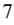

{0}------------------------------------------------

# **UNITED STATES SECURITIES AND EXCHANGE COMMISSION Washington, D.C. 20549**

# **FORM 10-K**

#### **(Mark One)**

**ANNUAL REPORT PURSUANT TO SECTION 13 OR 15(d) OF THE SECURITIES EXCHANGE ACT OF 1934**

**For the fiscal year ended December 31, 2022**

**OR**

o **TRANSITION REPORT PURSUANT TO SECTION 13 OR 15(d) OF THE SECURITIES EXCHANGE ACT OF 1934**

**For the transition period from ________ to ________**

**Commission file number 001-40216**

# **Aurora Innovation, Inc.**

(Exact name of registrant as specified in its charter)

| Delaware                                                        | 98-1562265                              |
|-----------------------------------------------------------------|-----------------------------------------|
| State or other jurisdiction of incorporation or organization | (I.R.S. Employer Identification No.) |
| 1654 Smallman St., Pittsburgh, Pennsylvania                     | 15222                                   |
| (Address of principal executive offices)                        | (Zip Code)                              |

(888) 583-9506

Registrant's telephone number, including area code

Securities registered pursuant to Section 12(b) of the Act:

| Title of each class                                                                                                          | Trading Symbol(s) | Name of each exchange on which registered |
|------------------------------------------------------------------------------------------------------------------------------|-------------------|-------------------------------------------|
| Class A common stock, par value \$0.00001 per share                                                                          | AUR               | The Nasdaq Stock Market LLC               |
| Redeemable warrants, each whole warrant exercisable for one share of Class A common stock at an exercise price of \$11.50 | AUROW             | The Nasdaq Stock Market LLC               |

Securities registered pursuant to Section 12(g) of the Act: None

Indicate by check mark if the registrant is a well-known seasoned issuer, as defined in Rule 405 of the Securities Act. Yeso No x

Indicate by check mark if the registrant is not required to file reports pursuant to Section 13 or Section 15(d) of the Act. Yeso No x

Indicate by check mark whether the registrant: (1) has filed all reports required to be filed by Section 13 or 15(d) of the Securities Exchange Act of 1934 during the preceding 12 months (or for such shorter period that the registrant was required to file such reports); and (2) has been subject to such filing requirements for the past 90 days. Yes x No o

Indicate by check mark whether the registrant has submitted electronically and posted on its corporate web site, if any, every Interactive Data File required to be submitted and posted pursuant to Rule 405 of Regulation S-T (§232.405 of this chapter) during the preceding 12 months (or for such shorter period that the registrant was required to submit and post such files). Yes x No o

Indicate by check mark whether the registrant is a large accelerated filer, an accelerated filer, a non-accelerated filer, or a smaller reporting company. See the definitions of "large accelerated filer," "accelerated filer" and "smaller reporting company" in Rule 12b-2 of the Exchange Act. (Check one):

| Large accelerated filer | o | Accelerated filer         | x |
|-------------------------|---|---------------------------|---|
| Non-accelerated filer   | o | Smaller reporting company | o |
|                         |   | Emerging growth company   | x |

If an emerging growth company, indicate by check mark if the registrant has elected not to use the extended transition period for complying with any new or revised financial accounting standards provided pursuant to Section 13(a) of the Exchange Act.

Indicate by check mark whether the registrant has filed a report on and attestation to its management's assessment of the effectiveness of its internal control over financial reporting under Section 404(b) of the Sarbanes-Oxley Act (15 U.S.C. 7262(b)) by the registered public accounting firm that prepared or issued its audit report.

If securities are registered pursuant to Section 12(b) of the Act, indicate by check mark whether the financial statements of the registrant included in the filing reflect the correction of an error to previously issued financial statements.

Indicate by check mark whether any of those error corrections are restatements that required a recovery analysis of incentive-based compensation received by any of the registrant's executive officers during the relevant recovery period pursuant to §240.10D-1(b).

Indicate by check mark whether the registrant is a shell company (as defined in Rule 12b-2 of the Act). Yeso No x

As of June 30, 2022, the last day of the registrant's most recently completed second fiscal quarter, the aggregate market value of the voting and non-voting common equity held by non-affiliates of the registrant was approximately \$635,552,000.

The registrant had outstanding 763,107,381 shares of Class A common stock and409,326,834 shares of Class B common stock as of February 10, 2023.

#### DOCUMENTS INCORPORATED BY REFERENCE

Portions of the Registrant's definitive proxy statement relating to its 2023 annual meeting of stockholders are incorporated by reference into Part III of this Annual Report on Form 10-K where indicated. The Registrant's definitive proxy statement will be filed with the U.S. Securities and Exchange Commission within 120 days after the end of the

{1}------------------------------------------------

fiscal year to which this report relates.

{2}------------------------------------------------

# **TABLE OF CONTENTS**

|            |                                                                                                               | Page |
|------------|---------------------------------------------------------------------------------------------------------------|------|
|            | PART I                                                                                                        |      |
| Item 1.    | Business.                                                                                                     | 1    |
| Item 1A.   | Risk Factors.                                                                                                 | 14   |
| Item 1B.   | Unresolved Staff Comments.                                                                                    | 46   |
| Item 2.    | Properties.                                                                                                   | 46   |
| Item 3.    | Legal Proceedings.                                                                                            | 46   |
| Item 4.    | Mine Safety Disclosures.                                                                                      | 46   |
|            |                                                                                                               |      |
|            | PART II                                                                                                       |      |
| Item 5.    | Market for Registrant's Common Equity, Related Stockholder Matters and Issuer Purchases of Equity Securities. | 47   |
| Item 6.    | [Reserved]                                                                                                    | 48   |
| Item 7.    | Management's Discussion and Analysis of Financial Condition and Results of Operations.                        | 49   |
| Item 7A.   | Quantitative and Qualitative Disclosures About Market Risk.                                                   | 55   |
| Item 8.    | Financial Statements and Supplementary Data.                                                                  | 56   |
| Item 9.    | Changes in and Disagreements With Accountants on Accounting and Financial Disclosure.                         | 79   |
| Item 9A.   | Controls and Procedures.                                                                                      | 79   |
| Item 9B.   | Other Information.                                                                                            | 79   |
| Item 9C.   | Disclosure Regarding Foreign Jurisdictions that Prevent Inspections.                                          | 79   |
|            |                                                                                                               |      |
|            | PART III                                                                                                      |      |
| Item 10.   | Directors, Executive Officers and Corporate Governance.                                                       | 80   |
| Item 11.   | Executive Compensation.                                                                                       | 80   |
| Item 12.   | Security Ownership of Certain Beneficial Owners.                                                              | 80   |
| Item 13.   | Certain Relationships and Related Transactions, and Director Independence.                                    | 80   |
| Item 14.   | Principal Accountant Fees and Services.                                                                       | 80   |
|            |                                                                                                               |      |
|            | PART IV                                                                                                       |      |
| Item 15.   | Exhibit and Financial Statement Schedules.                                                                    | 81   |
| Item 16.   | Form 10-K Summary.                                                                                            | 83   |
|            |                                                                                                               |      |
| Signatures |                                                                                                               | 84   |
|            |                                                                                                               |      |

i

{3}------------------------------------------------

# **CAUTIONARY NOTE REGARDING FORWARD-LOOKING STATEMENTS**

This Annual Report on Form 10-K (this "Annual Report") contains forward-looking statements within the meaning of the federal securities laws, which statements involve substantial risks and uncertainties. Forward-looking statements generally relate to future events or our future financial or operating performance. In some cases, you can identify forward-looking statements because they contain words such as "may," "might," "possible," "will," "should," "expect," "plan," "anticipate," "could," "intend," "target," "project," "contemplate," "believe," "estimate," "predict," "potential" or "continue" or the negative of these words or other similar terms or expressions that concern our expectations, strategy, plans or intentions. Forward-looking statements contained in this Annual Report include statements about:

- our ability to commercialize the Aurora Driver safely, quickly, and broadly on the timeline we expect;
- the market for autonomous vehicles and our market position;
- our ability to compete effectively with existing and new competitors;
- the ability to maintain the listing of our Class A Common Stock and warrants on Nasdaq;
- our ability to raise financing in the future;
- anticipated trends, growth rates, and challenges in our business and in the markets in which we operate;
- our ability to effectively manage our growth and future expenses;
- the sufficiency of our cash and cash equivalents to meet our operating requirements;
- our success in retaining or recruiting, or changes required in, our officers, key employees or directors;
- the impact of the regulatory environment and complexities with compliance related to such environment;
- our ability to successfully collaborate with business partners;
- our ability to obtain, maintain, protect and enforce our intellectual property;
- economic and industry trends or trend analysis;
- the impact of infectious diseases, health epidemics and pandemics (including the ongoing COVID-19 pandemic), natural disasters, war (including Russia's actions in Ukraine), acts of terrorism or responses to these events; and
- other factors detailed under the section entitled "Risk Factors."

We caution you that the foregoing list does not contain all of the forward-looking statements made in this Annual Report.

You should not rely upon forward-looking statements as predictions of future events. We have based the forward-looking statements contained in this Annual Report primarily on our current expectations and projections about future events and trends that we believe may affect our business, operating results, financial condition and prospects. The outcome of the events described in these forward-looking statements is subject to risks, uncertainties and other factors, including those described in the section titled "Risk Factors" and elsewhere in this Annual Report. Moreover, we operate in a very competitive and rapidly changing environment. New risks and uncertainties emerge from time to time and it is not possible for us to predict all risks and uncertainties that could have an impact on the forward-looking statements contained in this Annual Report. We cannot assure you that the results, events and circumstances reflected in the forward-looking statements will be achieved or occur, and actual results, events or circumstances could differ materially from those described in the forward-looking statements.

Neither we nor any other person assumes responsibility for the accuracy and completeness of any of these forward-looking statements. Moreover, the forward-looking statements made in this Annual Report relate only to events as of the date on which the statements are made. We undertake no obligation to update any forward-looking statements made in this Annual Report to reflect events or circumstances after the date of this Annual Report or to reflect new information or the occurrence of unanticipated events, except as required by law. You should not place undue reliance on our forward-looking statements. Our forward-looking statements do not reflect the potential impact of any future acquisitions, mergers, dispositions, joint ventures or investments we may make.

{4}------------------------------------------------

# **PART I**

#### **Item 1. Business.**

# **INFORMATION ABOUT AURORA**

*Unless the context otherwise requires, all references in this section to the "Company," "Aurora," "we," "us," or "our" refer to the business of Aurora Innovation Holdings, Inc. and its subsidiaries prior to the consummation of the Merger (defined below), and to Aurora Innovation, Inc. and its subsidiaries after the completion of the Merger.*

#### **Corporate History and Background**

On November 3, 2021 (the "Closing Date"), Aurora Innovation, Inc. (f/k/a Reinvent Technology Partners Y and referred to herein as the "Company"), consummated a business combination with Aurora Innovation Holdings, Inc., a Delaware corporation (f/k/a Aurora Innovation, Inc. and f/k/a Avian U Merger Holdco Corp. and referred to herein as "Legacy Aurora"), and RTPY Merger Sub Inc., a Delaware corporation and a direct wholly owned subsidiary of the Company ("Merger Sub"), pursuant to an Agreement and Plan of Merger dated July 14, 2021 (the "Merger Agreement" and the transactions contemplated thereby, the "Merger"), by and among the Company, Legacy Aurora and Merger Sub. Our Class A common stock and public warrants are listed on Nasdaq under the symbols "AUR" and "AUROW," respectively. Our Class B common stock is neither listed nor publicly traded.

Pursuant to the terms of the Merger Agreement, a business combination between the Company and Legacy Aurora was effected through the merger of Merger Sub with and into Legacy Aurora, with Legacy Aurora surviving as the surviving company and as a wholly-owned subsidiary of the Company. On the Closing Date, the Company changed its name from Reinvent Technology Partners Y to Aurora Innovation, Inc.

#### **Company Overview**

Our mission is to deliver the benefits of self-driving technology safely, quickly, and broadly.

Aurora was founded in 2017 by Chris Urmson, Sterling Anderson, and Drew Bagnell, three of the most prominent leaders in the self-driving space. Led by a team with deep experience, we are developing the Aurora Driver based on what we believe to be the most advanced and scalable suite of self-driving hardware, software, and data services in the world to fundamentally transform the global transportation market. The Aurora Driver is designed as a platform to adapt and interoperate amongst a multitude of vehicle types and applications. To date, we have successfully integrated the Aurora Driver into numerous different vehicle platforms designed to meet its requirements: from passenger vehicles to light commercial vehicles to Class 8 trucks. By creating a common driver platform for multiple vehicle types and use cases, the capabilities we develop in one market reinforce and strengthen our competitive advantages in other areas. For example, highway driving capabilities developed for trucking will carry over to highway segments driven by passenger vehicles in ride hailing applications. We believe this is the right approach to bring self-driving to market and will enable us to target and transform multiple massive markets, including trucking, passenger mobility, and local goods delivery.

Beyond the economic opportunity, we believe we have a unique opportunity to have a material positive impact on the lives of millions of people, while also improving business productivity. First and foremost, we are focused on the opportunity to greatly improve road safety. In trucking, we can enable logistics networks to move goods more efficiently, and also help fill the shortage of truck drivers by providing a self-driving option. We will expand access to transportation, improving the lives of the millions of people with a disability in the U.S. who have difficulty traveling outside of the home. And we will give people back their time that can be made more productive and enjoyable.

We intend to launch trucking as our first driverless product, as we believe its massive scale, significant structural need, attractive unit economics, and self-similar operating environment will allow us to rapidly deploy and profitably scale on high-volume, highway-focused routes. Drafting on the revenue and technical capability we expect this trucking product to generate, we plan to leverage the extensibility of the Aurora Driver to deploy and scale into the passenger mobility and local goods delivery markets. Today, we operate our self-driving test vehicle fleet in diverse weather and operating environments, across the Bay Area, Pittsburgh and Texas, allowing us to create a more robust self-driving system. We also autonomously haul (under the supervision of vehicle operators) truck freight on behalf of our pilot customers in preparation for driverless commercialization.

{5}------------------------------------------------

Our first-principles approach, which we define as "Self-Driving 2.0," underpins our technology development strategy for the Aurora Driver. We made foundational investments early on, based on our prior experience in the self-driving industry, that allow us to accelerate development and position our platform for long-term scalability. Some of these foundational investments include developing the Aurora Driver with what we believe to be the optimal combination of machine-learned and rule-based approaches. We have also built a proprietary Virtual Testing Suite, which makes our development more efficient and faster than traditional approaches that rely heavily on onroad vehicle fleets. While many companies in the self-driving industry tout miles driven as a metric, our Virtual Testing Suite allows us to iterate faster and more efficiently, while reducing our reliance on on-road testing.

We have also invested in our next-generation sensing suite, which combines the best of camera, radar, and lidar. This includes developing our Aurora FirstLight Lidar, which uses proprietary frequency modulated continuous wave ("FMCW") technology that enables long-range sensing, and simultaneous detection of both the position and velocity of objects. We believe that when combined with our industry-leading sensor suite and perception system, this technology uniquely enables safe operation at highway speeds and is unmatched by our competitors' alternative solutions. We believe this unlocks the global trucking market, as trucks must be capable of operating at up to 65 miles per hour and 80,000 pounds gross vehicle weight, necessitating redundant long-range sensing in order to plan and take action appropriately. High-speed operation is also key to unlocking the full opportunity set across passenger mobility and local goods delivery, where a significant percentage of trips require operation on highways and other highspeed roads.

To bring our product to market at scale, we focus on what we do best – building self-driving technology – and through strategic partnerships work with best-in-class companies to deliver the benefits of our technology broadly. We have strategic partnerships with:

- PACCAR & Volvo, who together represent a significant share of US Class 8 truck sales.
- Toyota, a leading vehicle manufacturer globally.
- Uber, a leading ride hailing company globally.

With these strategic partnerships, each party is making significant investments towards integrating the Aurora Driver into their vehicles and logistics and mobility networks. We believe that partnering with other industry leaders enables us to scale more efficiently, as it allows us to focus on what we do best – developing the Aurora Driver—while our partners handle activities such as vehicle manufacturing, fleet ownership, and operation. We are proud that these industry leaders have selected Aurora as their self-driving partner. During 2022, we operated commercial trucking pilots with FedEx, Werner, Schneider, and Uber Freight in which we regularly and autonomously haul loads under the supervision of vehicle operators, and also explore integrating access to Uber Freight's digital freight network within our autonomous trucking subscription service. We also announced a strategic collaboration with Ryder Systems to pilot on-site fleet maintenance to support current autonomous freight pilot operations and prepare for commercial operation at scale.

We expect to ultimately commercialize the Aurora Driver in a Driver as a Service ("DaaS") business model, in which we will supply self-driving technology and earn revenue on a fee per mile basis. We do not intend to own nor operate large vehicle fleets ourselves. We will partner with automotive companies, fleet operators, and other third parties to commercialize and support Aurora-powered vehicles. We expect that these strategic partners will support activities such as vehicle manufacturing, financing and leasing, service and maintenance, parts replacement, facility ownership and operation, and other commercial and operational services as needed. We expect the DaaS model to enable an asset-light and high-margin revenue stream for Aurora, while allowing us to scale more rapidly through partnerships.

As of December 31, 2022, we have assembled an approximately 1,700-person team, consisting of leading experts in robotics, machine learning, hardware design, software engineering, systems engineering, and safety. We believe that our combined experience and expertise allow us to move faster and more efficiently than our competitors as we make purposeful, foundational technological investments in safe and scalable self-driving technology.

{6}------------------------------------------------

# **Commercialization & Growth Strategy**

We plan to commercialize the Aurora Driver safely, quickly, and broadly. We believe our self-driving technology has a strong value proposition with benefits including:

- improved safety,
- **•** faster, more efficient goods movement,
- more reliable freight supply,
- reduced insurance expenses,
- enhanced energy efficiency,
- increased access to passenger mobility, and
- greater individual productivity.

# *Trucking*

We plan to launch Aurora Horizon, our driverless trucking subscription service, as our first commercial product. We have prioritized this segment as we believe it is an optimal first product for both commercial and technical reasons:

- **Commercial**. As a critical part of the United States economy, responsible for moving a significant portion of goods, the trucking industry is a large market opportunity. The trucking industry also faces a number of ongoing challenges that the Aurora Driver can help solve. The industry has experienced a persistent driver shortage, resulting in high driver turnover. Growth in e-commerce increases customer expectations for same- or next-day delivery, while service restrictions on driver operating hours create inherent limitations to optimally fast and responsive supply chains. These constraints increase the cost to transport goods and create supply chain inefficiencies. By enabling greater efficiency, autonomous trucks can have a significant positive impact. For these reasons, the US Department of Transportation has stated that autonomous trucking has the potential to be meaningfully additive to US GDP over time. We believe our technology can help solve key pain points of fleet owners by providing a consistent driver supply, the ability to offer fast and efficient transport, and fuel efficiency. In turn, we believe this creates significant demand and willingness to pay for our product. Additionally, the design and road construction of highways is more standardized and defined across the United States interstate highway system than are local roads, and a very significant amount of freight volume is concentrated on major highway corridors. We believe these factors will enable rapid and broad scaling.
- **Technical**. The United States interstate highway system is a more structured environment than urban streets given limited access to pedestrians, bicyclists, and crossing intersections. Moreover, moving goods avoids the complexity of solving for passenger ride comfort, as the system can be optimized to drive cautiously and, for instance, pull over on the highway shoulder safely if the system encounters something that it has not learned to handle autonomously. One element of highway autonomous trucking that must be considered is the increased requirements on the system's perception capabilities, particularly as it relates to seeing at far range, given that the vehicle may weigh up to 80,000 pounds and operate at up to 65 miles per hour. Aurora's investment in long-range perception, including Aurora's proprietary FirstLight Lidar, enables us to solve this, while benefiting from the other elements that make deploying trucks on highways an advantageous initial market entry point.

During 2022, we operated commercial trucking pilots with FedEx, Werner, Schneider, and Uber Freight in which we regularly and autonomously hauled loads under the supervision of vehicle operators, and also explored integrating access to Uber Freight's digital freight network within our autonomous trucking subscription service. We also announced a strategic collaboration with Ryder Systems to pilot on-site fleet maintenance to support current autonomous freight pilot operations and prepare for commercial operation at scale.

We plan to initially launch Aurora Horizon in Texas, which has the largest freight market in the US, a favorable business and regulatory environment, and moderate weather. These characteristics make it an attractive market for our initial driverless launch. From there, we plan to expand to other key freight corridors, which we will prioritize based on commercial, technical, and regulatory considerations.

# *Passenger Mobility*

Our second core market focuses on passenger mobility, initially targeting the ride hailing space with Aurora Connect, our driverless ride hailing subscription service.

{7}------------------------------------------------

As it exists today, however, passenger mobility is subject to inefficiencies and responsible for notable negative impacts – roadway deaths, lost productivity, and greenhouse gas emissions. These are all challenges that self-driving technology has the potential to help alleviate. We believe that the Aurora Driver can provide a safer alternative to manually-driven transport, return numerous hours that would otherwise have been spent driving, and expedite the transition to electric vehicles.

We believe technological advancements in ride-hailing and lower structural costs, enabled by self-driving technology, will expand ride-hailing into more passenger mobility use cases and drive mass adoption, further democratizing access to mobility and increasing the passenger mobility market opportunity for our self-driving technology. We aim to improve the rider experience through the quality, cleanliness, and consistency of the Aurora Driver-powered fleet while also offering more rider control over the invehicle experience (e.g. music, climate). Future vehicle platforms may be designed to support specific transportation use cases (e.g. airport trips, commutes, social rides) that further improve the experience offered today.

We plan to launch Aurora Connect following the launch and initial expansion of Aurora Horizon, leveraging our strategic relationships with Toyota and Uber. As we use the same Aurora Driver hardware and software as for trucking, we will leverage capabilities already in use by our trucking product. Our ability to drive safely at high speed will allow us to serve the significant fraction of ride-hailing trips that require high speed on interstates and highways. We expect our growth will consist of commercial expansion within and across cities.

# *Local Goods Delivery*

Our third core market is local goods delivery, which spans several sub-segments, including last-mile parcel and post, prepared food, grocery, and business-to-business ("B2B") delivery.

The COVID-19 pandemic has highlighted the importance of local goods delivery, as well as the supply chain disruptions that can be experienced when consumer behavior changes abruptly. We expect consumer demand for online shopping and on-demand ordering will largely remain in place following the COVID-19 pandemic and that retailers, restaurants, and other local businesses will seek to address these preferences through expanded delivery channels. Self-driving technology can provide meaningful value in making e-commerce and on-demand purchases more affordable for consumers and more accessible to businesses.

Relative to trucking and passenger mobility, we believe local goods delivery has more advanced technical complexity given active problem-solving related to identifying appropriate drop-off locations and completion of the "last 50 feet" of goods delivery from vehicle to door. We expect that the Aurora Driver will be uniquely positioned to serve this market based on reinforcing competitive advantages and technical gains from trucking and ride hailing. We expect the operating domain for local goods delivery to overlap closely with personal mobility and commercial operations of local goods delivery to commence following personal mobility launch.

#### *Expand global footprint*

We intend for the Aurora Driver to serve people and communities around the world. Our commercial operations will start in the United States, but we expect to broaden our footprint to include international markets where the value proposition of our technology is compelling, regulations are conducive, and roadways are comparable. This includes, but is not limited to, Canada, Europe, Japan, and Australia and New Zealand.

#### *Self-reinforcing ef ects of our business model*

We believe that our operation across these three large markets leads to multiple beneficial self-reinforcing effects for our business model:

- 1. **Higher return on development investment**. By being able to recoup the significant majority of our development costs across multiple end markets, we increase the return on our overall investment, as well as each capability we develop.
- 2. **Economies of scale and cost reduction**. The scale we generate in one market will serve to drive down our hardware cost. Because we use the same hardware stack across vehicle types, this reduces our cost to serve each end-market in which we operate.
- 3. **Learning and data**. By having an ever-increasing Aurora-Driver powered vehicle fleet, we collect more data and driving experience to hone our system; the benefit accrues across all markets in which we operate.
- 4. **Reputation**. Trust in our company and technology is paramount, and we expect that the trust we earn with governments, the public, and partners builds across the markets in which we operate.

{8}------------------------------------------------

# **Aurora's Competitive Advantages**

#### *Industry leading team*

Aurora was founded in 2017 by Chris Urmson, Sterling Anderson, and Drew Bagnell, three leaders in the self-driving space. Chris led the Google self-driving car team and was technology director for Carnegie Mellon when it won the 2007 DARPA Urban Challenge; Sterling developed MIT's Intelligent CoPilot, then launched Tesla's Model X and Autopilot; Drew worked for two decades at the intersection of machine learning and robotics across industry and academia at Carnegie Mellon. As of December 31, 2022, Aurora has assembled an approximately 1,700-person team, of whom approximately 1,500 focus on engineering and product. Our company consists of world-leaders in robotics, machine learning, hardware design, software engineering, systems engineering, and safety. Aurora has over 1,300 awarded and pending patents worldwide. In 2021, Aurora acquired and integrated Uber's self-driving unit, strengthening our team, our technology, and our intellectual property. The acquisition added to the breadth and depth of talent we have to deliver on our mission. We foster a high-performance and mission-driven culture which drives successful execution, and we believe this makes us an employer of choice in our industry.

# *Next-generation technology*

Unencumbered by legacy technology and methods, we have taken a clean sheet approach to creating a safe and scalable self-driving system. We have invested in key areas of differentiation that we believe provide a long-term advantage, including:

- Careful integration of machine learning and engineering approaches throughout our perception and motion planning systems
- Virtual Testing Suite that allows for accelerated and efficient development
- Differentiated long-range, high-resolution, multi-modal sensor suite that includes FirstLight Lidar technology, which allows numerous advantages over traditional lidar, including the ability to unlock safe operation at highway speeds
- Scalable maps that are maximally relevant to the challenges of self-driving

### *Common driver platform technology, scalable across vehicle types and use cases*

The Aurora Driver is built on a common architecture that is designed to adapt readily to the vehicle platform it controls. This allows the Aurora Driver to learn from and leverage its experience and capabilities across a wide range of vehicle makes and models. We invested early in our hardware suite to minimize reliance on any one vehicle platform, allowing greater optionality in both the types of vehicles we use as well as their commercial applications.

# *Dif erentiated go-to-market strategy*

Our technology enables us to first target trucking, which we believe is the optimal way to enter the market and scale self-driving technology. Because of the extensibility of the Aurora Driver across vehicle types and use cases, we are able to take advantage of capability overlap across use cases, increased learning with scale, and cost reductions in our self-driving system. Therefore, the capabilities and scale we develop in trucking accelerate our expansion into passenger mobility and local goods delivery, and vice versa.

#### *Deep strategic partnerships which support commercialization at scale*

We have developed strategic partnerships with industry leaders like PACCAR, Volvo, Toyota and Uber and will work together to develop and scale Aurora Driverpowered trucks and self-driving passenger vehicles. Our partners are industry leaders in their respective fields and we are able to leverage each of our respective strengths as we commercialize. This allows us to scale faster and more efficiently.

#### *Ef iciency of development and operation*

We believe that our approach to technological development, coupled with our Driver as a Service business model, enables us to develop and scale our technology efficiently. This is further enhanced by our collaboration with Uber, which allows us access to proprietary anonymized data related to trip demand and economics. This data allows us to optimize our development roadmap to invest in the highest value markets and capabilities.

{9}------------------------------------------------

#### *Mission-driven corporate culture.*

From the beginning, we have invested in building a mission-driven company based on a set of values that drive who we are and how we operate. A strong, inclusive, and effective culture is fundamental for the long-term success of a business, and even more so when delivering a technology as complex and transformative as self-driving. We are building an enduring company and our culture and values represent an advantage in delivering and scaling our product.

# **Our Product**

# *The Aurora Driver*

We are building the Aurora Driver – the hardware, software, and services to enable safe, cost-efficient, and high-uptime autonomous driving service. The Aurora Driver is based on a common driver platform design that can integrate with vehicles of various makes, models, and classes to serve multiple commercial applications. To date, we have successfully integrated the Aurora Driver across numerous different vehicle platforms.

The Aurora Driver is designed to deliver fully autonomous driving without the need for a human in the vehicle. This is classified as Level 4 – High Automation, with the vehicle capable of performing all driving functions under certain conditions, such as specific road types and weather. This set of conditions is referred to as the system's "operating domain." We believe that, because a driver is no longer required inside the vehicle, this level of automation allows for step-change benefits in both safety and efficiency and opens massive commercial opportunities.

Aurora's custom-designed hardware suite includes full sensor coverage on three sensing modalities: lidar, radar, and camera, as well as high-performance computing to enable rapid response time. The computer powers Aurora's self-driving software, which plans a safe path of motion for the vehicle in order to reach its destination.

The commercial self-driving vehicles that integrate with the Aurora Driver will include redundant steering, braking, and power to promote safe vehicle operation in the event of a component failure. We work closely with our OEM partners to develop a safe, reliable, and scalable integrated solution.

# *Driver as a Service Business Model*

The Aurora Driver will be delivered as a service via Aurora Horizon, our driverless trucking subscription service, and Aurora Connect, our driverless ride hailing subscription service. We intend to partner with our ecosystem of OEMs, fleet operators, and mobility and logistics services, as well as other third parties, to commercialize and support Aurora-powered vehicles. With our business model, fleet owners will purchase Aurora Driver-powered vehicles from our OEM partners, subscribe to the Aurora Driver, and utilize Aurora-certified fleet service partners to operate autonomous mobility and logistics services. In many instances, the same party may play multiple roles: for example, our OEM partners will in certain cases also provide maintenance services and act as a fleet operator.

{10}------------------------------------------------

By subscribing to the Aurora Driver, our customers will be able to receive access to the following:

- 1. Aurora Driver hardware and software to enable safe and efficient autonomous operation of the self-driving fleet;
- 2. Updates to the Aurora Driver, including map and software updates;
- 3. Access to Aurora Beacon, which will interface with their systems and enable efficient dispatch, deployment, and fleet monitoring;
- 4. Aurora Beacon support, where trained specialists monitor Aurora Driver-powered vehicles and provide high level input when needed; and
- 5. Access to Aurora-certified third party services, including maintenance of the Aurora Driver, roadside assistance for the Aurora Driver, and insurance.

Components of the offering such as maintenance, hardware financing, and insurance, will be delivered in partnership with our third-party partner network. We believe that this business model uniquely allows us to scale in a high margin way, and succeed as our customers succeed.

# **Technology**

#### *Our Technological Advantages*

Since our inception, we have taken a clean sheet approach to the way we build our technology, leveraging our team's past experience and learnings. We have made purposeful, foundational technological investments that we believe will enable us to move towards meaningful commercialization more safely, quickly, and broadly. Examples of this 'self-driving 2.0' approach, across both hardware & software, include:

- 1. Proprietary lidar technology to unlock highway speeds;
- 2. Next-generation approach to Perception and Planning that leverages the distinct strengths of both machine learning and engineered approaches;
- 3. Common driver platform approach which allows our system to scale onto different vehicle types, such as cars and Class 8 trucks;
- 4. Aurora's Virtual Testing Suite, which increases engineering velocity; and
- 5. Scalable approach to high-definition maps

#### *Proprietary Lidar technology*

Aurora's long-range, multi-modal sensing suite consists of high-resolution, high dynamic range and long-range cameras, next-generation imaging radar, and our industry-leading proprietary FirstLight Lidar.

FirstLight alone provides a number of meaningful performance advantages over traditional lidar sensors. Traditional pulsed lidar is amplitude-modulated ("AM"), which works by emitting brief light pulses at a fixed frequency. The locations of objects are determined based on how long it takes for those laser pulses to bounce off surfaces and return to the sensor. The challenge with AM lidar is that it has limited range, requires multiple measurements to estimate speed, and is susceptible to lidar-to-lidar and solar interference. Aurora's FirstLight uses frequency-modulated continuous-wave ("FMCW") lidar technology. This has a number of key advantages, which we believe are critical to unlocking safe operation at highway speeds:

- 1. **Greater Range**. Our lidar can see nearly twice as far as a typical automotive AM lidar, because our coherent measurement enables single-photon sensitivity. The enhanced range of our FMCW lidar enables the detection and tracking of objects and actors at the very long ranges essential for high-speed driving.
- 2. **Simultaneous Range and Velocity**. FirstLight instantaneously measures the radial velocity of the targets as well as distance. This allows quicker reaction times and better tracking of other objects on or near the road.
- 3. **Interference Immunity**. Each FirstLight sensor is primarily sensitive to only the signals it creates. Therefore, it benefits from immunity to interference from ambient sunlight and to lidar-to-lidar interference, which will be important as self-driving fleets scale.

{11}------------------------------------------------

# *Leveraging the Best of Machine Learning and Engineered Approaches*

Aurora's approach to designing the Aurora Driver software leverages our team's expertise in both machine learning and fundamental engineering. Use of either approach for solving a problem has advantages and disadvantages, and therefore the thoughtful fusion of both is critical to creating a safe and scalable system. The key distinctions between machine learning and engineering are that:

- Engineered systems are built by humans and tend to be simpler and more introspectable (i.e. can understand 'why' an action is taken).
- Machine-learned systems are tuned and developed by algorithms and trained on data. This can allow for greater nuance and complexity, and have the additional advantage that new data can improve overall performance. However, machine-learned systems are less introspectable than engineered systems.

Aurora's software teams are selective in their application of each, and frequently bring both to bear on a single task in ways that utilize the independent strengths of each to create a higher-performance system.

An example of this is the Planning system. As the Aurora Driver operates, it uses an engineered approach to maintain appropriate safety buffers—an example is maintaining sufficiently safe following distance, such that the Aurora Driver can stop safely even if the car in front of it brakes aggressively. Using this engineered approach permits strong safety guarantees. However, a system built around such guarantees alone would not drive in a human-like fashion, and may act in such a way that other road users would find it unpredictable. Therefore, we also employ a machine-learned approach where the system learns from exemplary human drivers how to naturally behave during many commonplace interactions, such as merging onto a highway—subject to the buffers defined by the engineered system. Interleaving these two methods allows for the creation of verifiably safe, and natural, driving behavior.

#### *Common Driver Platform Approach*

The Aurora Driver has been designed from the ground up to support multiple automakers and commercial applications with the same core hardware and software. We invested early in a hardware suite that is consistent across vehicle platforms, and software that adapts to the unique behaviors, constraints, and dynamics of whatever vehicle it controls—whether that be a Class 8 tractor or light passenger vehicle.

The Aurora Driver uses the same hardware suite across trucks and passenger vehicles. Because all Aurora-Driver powered vehicles carry a common set of self-driving hardware and software, Aurora and its partners benefit from the collective scale of all participants on the platform.

#### *Significant Investments in Virtual Development*

Our Virtual Testing Suite is a major engineering accelerator. Virtual testing refers to any time that our system is being tested in response to synthetic or historical data as opposed to operating in real-time on the road. Aurora incorporates frequent and extensive use of virtual testing.

There are numerous benefits to virtual testing:

- **Efficiency**. Aurora's motion planning simulation is 2,500 times less expensive than on-road testing.
- **Speed**. Aurora's Virtual Testing Suite can scale to continuously simulate the equivalent of over 50,000 trucks on the road. This figure will grow both as a result of increased technological innovation inside Aurora, as well as from expanding scale available from leading cloud computing providers.
- **Safety**. Aurora's Virtual Testing Suite dramatically reduces the number of on-road miles of driving needed to develop the Aurora Driver, which reduces exposure to risk associated with on-road testing.
- **Variation**. Aurora's Virtual Testing Suite can automatically alter details to create myriad permutations from a single scenario encountered on the road, and even simulate scenarios we have not previously encountered on the road. We can adjust factors like weather, traffic density, or pedestrian behavior. We can quickly test against many thousands of likely variations to understand how the system would have responded.
- **Repeatability**. As our sensor stack evolves, our Virtual Testing Suite remains relevant, whereas past real-world data collected on an out-of-date sensor stack becomes obsolete. We believe this is unique to Aurora due to our industry-leading expertise in sensor data simulation and systemically generating new scenarios.

Aurora has invested significantly in virtual testing at a time when much of the self-driving industry was focused on real world mileage accumulation. We believe that as the industry reaches the long tail of development, these investments will increasingly accelerate our path to market and scale relative to competitors.

{12}------------------------------------------------

# *Scalable Approach to High-definition Mapping*

Aurora's approach to mapping aims to optimize for two factors: first, a map that is maximally relevant to the challenges of self-driving; and second, a map that can be maintained at scale.

The Aurora Atlas is a map purpose-designed for these goals. It is broken into smaller maps that cover sub-areas, which are referred to as shards. Many classic maps have not been built for self-driving and thus prioritize global positioning accuracy at a substantial detriment to local accuracy. Aurora's map shards, however, prioritize being locally accurate, as it is far more important that the Aurora Driver knows the location of nearby actors and objects as accurately as possible rather than where it is in some global sense. We do this without sacrificing any meaningful amount of the Aurora Driver's broader context about where it is in the world or along a route.

The sharded, locally consistent approach to the Aurora Atlas enables scalability. Rebuilding the content of a shard takes minutes, whereas for classic maps, these areas can be the size of an entire city and take far longer to adjust. Swapping out a shard in a live deployed map is possible to do rapidly over-the-air, whereas deploying an entirely new map for a city requires a lengthy process. Finally, as the Aurora Driver begins to operate in new areas, the increase in mapped content will not alter existing content or require any editing/re-release of past maps, which a non-sharded approach would require; this keeps existing operational support much simpler even under a rapid expansion plan.

#### **Our Culture**

Aurora's values guide our work and culture and support our ability to deliver our mission. They set the tone for the way we operate, they define who we are and how we do things, and they guide us when we face difficult situations. Our values are:

- 1. **Focus for Impact.** We create space to solve problems that matter. We don't have time for distractions, so we work with urgency and focus on the work that will accelerate our progress towards our mission and strengthen our company;
- 2. **Operate with Integrity**. We do the right thing. We are thoughtful and use good judgment. And, we always keep the best interest of our people and our mission at the forefront of how we work;
- 3. **Celebrate our Diversity.** Inviting and including diverse perspectives and experiences make us stronger as a team, and help us better represent the world we live in. We are building a technology and a company to serve all people and all communities;
- 4. **Rise to the Occasion.** We're charting a path that is challenging yet filled with an incredible opportunity to impact generations to come. This is not an easy task, it takes resilience, hard work and dedication. Embracing the hard stuff energizes and inspires us to continue. We rally to deliver on our commitments to our partners and each other;
- 5. **Win together**. We are a stronger team when we elevate our unique strengths in service of our common goals. We thrive on open and honest communication to create an environment of mutual accountability, understanding, achievement, and respect;
- 6. **No jerks**. We work from the assumption that people are good, fair, and honest and that the intention behind their actions is positive. We are intentional in how we communicate and interact, and we hold each other accountable.

# **Competition**

Our main sources of competition fall into two categories:

- Technology-focused companies building end-to-end technical capabilities for self-driving applications
- Automotive players building internal self-driving development programs

The principal competitive success factors in our market, in no particular order, include, but are not limited to:

- Technology quality, reliability, and safety
- Engineering capabilities
- Business model and go-to-market approach
- Commercial partnerships
- Cost and efficiency
- Patents and intellectual property portfolio

{13}------------------------------------------------

Because of the depth and breadth of our talent, fully integrated self-driving stack, differentiated go-to-market approach, and unique partnerships that drive commercialization at scale, we believe that we are able to compete favorably across these factors.

#### **Intellectual Property**

Our success and competitive advantage depend in part upon our ability to develop and protect our core technology and intellectual property. We own a portfolio of intellectual property, including patents and registered trademarks, confidential technical information, and expertise in the development of software and hardware for autonomous vehicles and lidar technology.

We have filed patent and trademark applications in order to further secure these rights and strengthen our ability to defend against third parties who may infringe on our rights. We also rely on trade secrets, design and manufacturing know-how, continuing technological innovations, and licensing and exclusivity opportunities to maintain and improve our competitive position. Additionally, we protect our proprietary rights through agreements with our commercial partners, supply-chain vendors, employees, and consultants, as well as close monitoring of the developments and products in the industry.

As of December 31, 2022, we owned over 1,300 patents and pending applications, including U.S. and foreign. In addition, we have 6 registered U.S. trademarks, 32 registered foreign trademarks and 11 pending trademark applications. Our patents and patent applications cover a broad range of technology relevant to self-driving vehicles.

# **Material Agreements**

#### *PACCAR Strategic Partnership*

In January 2021, we entered into a global strategic partnership with PACCAR in preparation for the launch of the Aurora Driver's first application in trucking. This partnership combines PACCAR's considerable expertise in heavy-duty truck development, manufacturing, and sales with our deep understanding of autonomous vehicle technology to bring a safe, efficient self-driving product to market quickly and deploy it broadly. This partnership brings PACCAR and Aurora engineering teams together around an accelerated development program to create truly driverless-capable trucks, starting with the Peterbilt 579 and Kenworth T680. PACCAR and Aurora plan to develop a suite of self-driving fleet services, including servicing and maintenance options for the deployment and operation of these trucks at scale over the next several years.

#### *Uber Strategic Partnership*

In January 2021, we acquired Uber's self-driving unit. This acquisition expanded our talent base significantly, and we gained valuable research and technical assets that strengthened and accelerated the first Aurora Driver application for heavy-duty trucks while allowing us to continue and accelerate our work on light-vehicle products.

In addition to acquiring Uber's self-driving unit, we announced a strategic partnership with Uber that connects our technology to the world's leading ride-hailing platform and strengthens our position to deliver the Aurora Driver broadly. In support of our partnership with Uber, and concurrent with the acquisition of Uber's self-driving unit, Uber invested \$400 million in Aurora and Uber Chief Executive Officer Dara Khosrowshahi is a member of our board of directors.

As part of our partnership with Uber, we receive access to Uber data. This allows more efficient development and operation, as we are able to refine our market selection and prioritize our capability roadmap based on real-world data.

#### *Toyota Strategic Collaboration*

In February 2021, we announced a long-term, global, and strategic collaboration with Toyota and DENSO, one of the largest global automotive manufacturers and tierone automotive suppliers, respectively, to build and globally deploy self-driving cars at scale.

As part of this collaboration, our engineering teams are jointly developing and testing driverless-capable vehicles equipped with the Aurora Driver, starting with the Toyota Sienna. As part of this long-term effort, we will be exploring mass production of key autonomous driving components with DENSO and a comprehensive services solution with Toyota for when these vehicles are deployed at scale, including financing, insurance, maintenance, and more. These efforts will lay the foundation for the massproduction, launch, and support of these vehicles with Toyota on ride-hailing networks, including Uber's.

{14}------------------------------------------------

#### *Volvo Group Strategic Partnership*

In March 2021, Volvo selected us as its technology provider to develop and commercialize Level 4 Class 8 trucks in North America. Our first commercial truck with Volvo will be adapted to the requirements of the Aurora Driver. These trucks will combine the best of Volvo's technology with the Aurora Driver into a compelling and scalable logistics platform.

As Volvo's official technology partner for US hub-to-hub solutions, the parties will develop an unprecedented autonomous offering with one of the most trusted commercial truck manufacturers in the world. This partnership will be the center of the integration of the Aurora Driver into Volvo's on-highway trucks and development of industry-leading Transportation as a Service solutions.

#### **Government Regulation**

At both the federal and state level, the U.S. provides a positive regulatory environment to permit safe testing and development of autonomous vehicle functionality. Aurora's Government Relations team regularly engages with our partners in government to further develop the relationships and regulations necessary to successfully deploy our technology.

Aurora has developed bipartisan support of self-driving technology in both chambers of the U.S. Congress as well as the U.S. Department of Transportation and its agencies. At Aurora, we work with the federal government to ensure it maintains its regulatory authority over the design, construction, and performance of vehicles and applies that same authority to the regulation of highly automated vehicles.

As vehicles equipped with our sensors are deployed on public roads, we will be subject to legal and regulatory authorities such as the National Highway Traffic Safety Administration (NHTSA), the Federal Motor Carrier Safety Administration (FMCSA), state agencies like Departments of Transportation or Departments of Motor Vehicles, and local transportation departments. As the development of federal and state legal frameworks around autonomous vehicles continue to evolve, we may be subject to additional regulatory schemes. We do not anticipate any near-term federal standards that would impede the foreseeable deployments of our technology. U.S. federal regulations are largely permissive of deployments of higher levels of safe and responsible autonomous functionality.

States, such as Arizona, Florida, Nevada, Pennsylvania, and Texas, continue to attract self-driving companies with a welcoming regulatory climate that provides the predictability necessary to deploy our technology in those communities. Some states, particularly California, institute operational requirements or restrictions for certain autonomous functions. We believe such hurdles will be removed as we work with our government partners to highlight the benefits of self-driving technology. We work closely with state and local elected officials and regulatory bodies to ensure they continue to welcome the testing and deployment of self-driving vehicles on their roads. By working with these officials to develop technology neutral policies that promote a diverse set of highly automated vehicle use cases and create a level playing field for the industry, we believe that Aurora will be able deliver the benefits of self-driving technology safely, quickly, and broadly.

Similar such reporting and regulatory requirements exist or are being developed in foreign markets. For example, markets such as the EU also continue to develop their respective standards to define deployment requirements for higher levels of autonomy. Germany, a leader in the automotive industry, recently approved legislation that would allow for the deployment of self-driving technology without a human driver. Given the intense work in these areas, we expect a workable path forward in the near-term.

We are subject to the Electronic Product Radiation Control Provisions of the Federal Food, Drug, and Cosmetic Act. These requirements are enforced by the U.S. Food and Drug Administration ("FDA"). Electronic product radiation includes laser technology. Regulations governing these products are intended to protect the public from hazardous or unnecessary exposure. Manufacturers are required to certify in product labeling and in reports to the FDA that their products comply with applicable performance standards as well as maintain manufacturing, testing, and distribution records for their products.

Similarly, as a company deploying cutting-edge technology with international partners, we are also subject to trade, customs product classification and sourcing regulations. Finally, our operations are subject to various federal, state and local laws and regulations governing the occupational health and safety of our employees and wage regulations. We are subject to the requirements of the federal Occupational Safety and Health Act, as amended, and comparable state laws that protect and regulate employee health and safety.

{15}------------------------------------------------

Like all companies operating in similar industries, we are subject to environmental regulation, including water use; air emissions; use of recycled materials; energy sources; the storage, handling, treatment, transportation and disposal of hazardous materials; and the remediation of environmental contamination. Compliance with these rules may include permits, licenses and inspections of our facilities and products.

#### **Corporate Social Responsibility and Sustainability**

Achieving our mission—delivering the benefits of self-driving technology safely, quickly, and broadly—is how we aim to make a positive impact in communities. We strive to revolutionize transportation by making roads safer, helping goods to more efficiently reach those who need them, reducing greenhouse gas emissions, providing better services for people who currently have difficulty accessing transportation, and freeing up time during commutes.

Aurora remains deeply committed to the communities in which we have a presence - partnering with educational institutions and community based organizations to educate on the benefits of self-driving technology - investing in programs that address community workforce needs while strengthening the pipeline of diverse talent to fuel key business needs. A key example of these efforts is the novel, widely acknowledged partnership Aurora has facilitated with Pittsburgh Technical College, which now offers an industry-aligned program to prepare technicians for key jobs.

#### *Diversity and Inclusion*

We are committed to diversity and inclusion. One of our core values — Celebrate our Diversity — is based on bringing together diverse backgrounds and perspectives. We celebrate the diversity of the people, experiences, and backgrounds that make up Aurora, and we encourage each other to speak up and share perspectives, respectfully and thoughtfully. We are building technology that will benefit all people and all communities, so we strive to foster and embrace diversity throughout our business and our teams to bring us closer to those we serve.

#### *Sustainability*

Fostering a sustainable environment is also important to us. Starting in 2019, we offset our estimated annual carbon emissions from our facilities, vehicles and air travel by purchasing carbon credits, and we expect to continue to do this in the future. Longer-term, we believe commercialization of our self-driving technology will contribute to a more sustainable future given the potential to materially reduce fuel consumption and greenhouse gas emissions. We believe that autonomous trucks have the potential to materially reduce fuel consumption and greenhouse gas emissions meaningfully through eco-driving, off-peak deployment, and capping peak speeds.

#### **Employees**

As of December 31, 2022, we have approximately 1,700 employees. None of our employees are represented by a labor union, and we consider our employee relations to be in good standing. To date, we have not experienced any work stoppages.

We have built a company culture which is anchored in our values: operating with integrity, focusing for impact, no jerks, celebrating our diversity, rising to the occasion, and winning together. We reinforce our values by aligning our work to company objectives and key results and by providing meaningful and challenging growth opportunities for our employees. We offer a variety of people-focused initiatives, including learning and development, transparent career paths, and a focus on diversity, equity, and inclusion. We offer opportunities for meaningful and fun connections through company events and team-building activities. We celebrate our employees' achievements through companywide recognition programs. Alongside these programs, we offer a competitive total rewards package including industry-benchmarked base salaries and a performance-based bonus plan, equity ownership, generous time off, paid parental leave, a 401(k) to help our employees plan for the future, and a wide selection of health and wellness benefits plans for employees and their dependents. We also proactively gather employee feedback through various channels, including surveys and focus groups to ensure changes to our employee experience are meaningful and relevant.

{16}------------------------------------------------

# **Corporate Information**

Our principal executive offices are located at 1654 Smallman St, Pittsburgh, Pennsylvania 15222.

The transfer agent and registrar for our common stock and the warrant agent for our warrants is American Stock Transfer & Trust Company. The transfer agent's address is 6201 15th Avenue, Brooklyn, New York 11219, and its telephone number is (800) 937-5449.

#### **Available Information**

Our website address is www.aurora.tech. Information contained on, or that can be accessed through, our website is not incorporated by reference into this Annual Report on Form 10-K, and you should not consider information on our website to be part of this Annual Report on Form 10-K. Our Annual Report on Form 10-K, Quarterly Reports on Form 10-Q, Current Reports on Form 8-K, and amendments to reports filed pursuant to Sections 13(a) and 15(d) of the Securities Exchange Act of 1934, as amended, or the Exchange Act, are filed with the SEC. Such reports and other information filed by us with the SEC are available free of charge on our website at ir.aurora.tech when such reports are available on the SEC's website. The SEC maintains an internet site that contains reports, proxy and information statements and other information regarding issuers that file electronically with the SEC at www.sec.gov. The information contained on the websites referenced in this Annual Report on Form 10-K is not incorporated by reference into this filing. Further, our references to website URLs are intended to be inactive textual references only.

We announce material information to the public through filings with the SEC, the investor relations page on our website, press releases, public conference calls, and webcasts in order to achieve broad, non-exclusionary distribution of information to the public and for complying with our disclosure obligations under Regulation FD. We encourage investors, the media, and others to follow the channels listed above and to review the information disclosed through such channels. Any updates to the list of disclosure channels through which we will announce information will be posted on the investor relations page on our website.

{17}------------------------------------------------

# **Item 1A. Risk Factors.**

*Investing in our securities involves a high degree of risk. You should carefully consider the following risks, together with all of the other information contained in this Annual Report on Form 10-K, before making an investment decision. Our business, financial condition, results of operations or prospects could be materially and adversely af ected by any of these risks or uncertainties, as well as by risks or uncertainties not currently known to us, or that we do not currently believe are material. In that case, the trading price of our common stock could decline, and you may lose all or part of your investment.*

The following summary risk factors and other information included in this Annual Report should be carefully considered. The summary risks and uncertainties described below are not the only ones we face. Additional risks and uncertainties not currently known to us or that we currently deem less significant may also affect our business operations or financial results. If any of the following risks actually occur, our stock price, business, operating results and financial condition could be materially adversely affected. For more information, see below for more detailed descriptions of each risk factor.

- Self-driving technology is an emerging technology, and we face significant technical challenges to commercialize our technology.
- We are an early stage company with a history of losses, and we expect to incur significant expenses and continuing losses for the foreseeable future.
- Our limited operating history makes it difficult to evaluate our future prospects and the risks and challenges we may encounter.
- Our progress and performance metrics are subject to inherent challenges in measurement, and real or perceived inaccuracies in such metrics and metrics and values that are below expectations could materially and adversely affect our business, prospects, financial condition and results.
- We operate in a highly competitive market and some market participants have substantially greater resources. If one or more of our competitors broadly commercialize their self-driving technology before we do, develop superior technology, or are perceived to have better technology, our business prospects and financial performance would be adversely affected.
- Our services and technology may not be accepted and adopted by the market at the pace we expect or at all.
- We may require significantly more additional capital investment to run our business than previously expected.
- It is possible that Aurora's self-driving unit economics do not materialize as expected.
- We are highly dependent on the services of our senior management team, without which we may not be able to successfully implement our business strategy.
- Our future capital needs may require us to sell additional equity or debt securities that may dilute our stockholders.
- We may experience difficulties in managing our growth and expanding our operations.
- Our operating and financial results projections that were previously provided rely in large part upon assumptions and analyses developed by us. If these assumptions or analyses prove to be incorrect, our actual results of operations may be materially different from our projections and our estimates of certain financial metrics may prove inaccurate.
- We could fail to successfully select, execute or integrate past and future acquisitions.
- Interruption or failure of Amazon Web Services or other information technology and communications systems that we rely upon could materially and adversely affect our business, financial condition and results of operations.
- We are subject to cybersecurity risks to operational systems, security systems, infrastructure, integrated software and partners and end-customers data processed by us or third-party vendors or suppliers.
- Unauthorized control or manipulation of systems in autonomous vehicles may cause them to operate improperly or not at all, or compromise their safety and data security.
- Failures, or perceived failures, to comply with privacy, data protection, and information security requirements in the variety of jurisdictions in which we operate, or may operate, may adversely impact our business.

{18}------------------------------------------------

- Our future insurance coverage may not be adequate to protect us from all business risks or may be prohibitively expensive.
- Our warrants are accounted for as liabilities and the changes in value of our warrants could have a material effect on our financial results.
- If we are unable to develop and maintain an effective system of internal control over financial reporting, we may not be able to accurately report our financial results in a timely manner, which may adversely affect investor confidence in us and materially and adversely affect our business and operating results.
- Unanticipated changes in effective tax rates, adverse outcomes resulting from examination of our income, changes in tax laws or regulations, changes in our ability to utilize our net operating loss, or other tax-related changes could materially and adversely affect our business, prospects, financial condition and results of operations.
- Our success is contingent on our ability to successfully maintain, manage, execute and expand on our existing partnerships and obtain new partnerships.
- We are dependent on our suppliers, some of which are single or limited source suppliers, and these suppliers may not produce and deliver necessary and industrialized components at prices and volumes and on terms acceptable to us.
- Burdensome regulations, inconsistent regulations, or a failure to receive regulatory approvals of our technology could have a material adverse effect on our business, financial condition and results of operation.
- We may become involved in legal and regulatory proceedings and commercial or contractual disputes.
- We may be subject to product liability that could result in significant direct or indirect costs.
- We may not be able to adequately protect or enforce our intellectual property rights, in which case our business and competitive position could be harmed.
- We may need to defend ourselves against intellectual property rights infringement claims, which may be time-consuming and could cause us to incur substantial costs.
- We could lose the ability to use certain intellectual property rights and technology or materials that we rely upon if the underlying license agreements are terminated or not renewed.
- Our software contains third-party open-source software components, and failure to comply with the terms of the underlying open-source software licenses could restrict our ability to sell our products or give rise to disclosure obligations of proprietary software.
- The market price of our common stock may be volatile and could decline significantly.
- Our dual class structure has the effect of concentrating voting power with our founders, which limits an investor's ability to influence the outcome of important transactions, including a change in control.

{19}------------------------------------------------

# **Risks Related to Our Technology, Business Model and Industry**

# *Self-driving technology is an emerging technology, and we face significant technical challenges to commercialize our technology. If we cannot successfully overcome those challenges or do so on a timely basis, our ability to grow our business will be negatively impacted.*

Solving self-driving is one of the most difficult engineering challenges of our generation. The industry can be characterized by a significant number of technical and commercial challenges, including an expectation for better-than-a-human driving performance, large funding requirements, long vehicle development lead times, specialized skills and expertise requirements of personnel, inconsistent and evolving regulatory frameworks, a need to build public trust and brand image, and real world operation of an entirely new technology. If we are not able to overcome these challenges, our business, prospects, financial condition, and results of operations will be negatively impacted and our ability to create a viable business may not materialize at all.

Although we believe that our self-driving systems and supporting technology are promising, we cannot assure you that our technology will succeed commercially. The successful development of our self-driving systems and related technology involves many challenges and uncertainties, including:

- achieving sufficiently safe self-driving system performance as determined by us, government & regulatory agencies, our partners, customers, and the general public;
- finalizing self-driving system design, specification, and vehicle integration;
- successfully completing system testing, validation, and safety approvals;
- obtaining additional approvals, licenses or certifications from regulatory agencies, if required, and maintaining current approvals, licenses or certifications;
- receiving performance by third parties that supports our R&D and commercial activities;
- preserving core intellectual property rights, while obtaining intellectual property rights, technology or materials from third parties that may be critical to our R&D activities; and
- continuing to fund and maintain our current technology development activities.

#### *We are an early stage company with a history of losses, and we expect to incur significant expenses and continuing losses for the foreseeable future.*

We have incurred net losses on an annual basis since our inception. During thetwelve months ended December 31, 2022, 2021, and 2020, we incurred net losses of \$1,723 million, \$755 million, and \$214 million, respectively. We believe that we will continue to incur operating and net losses each quarter until at least the time we begin commercial operation of our self-driving technology, which may take longer than we currently expect or may never occur. Even if we successfully develop and sell our selfdriving solutions, there can be no assurance that they will be commercially successful. We expect the rate at which we will incur losses to be substantially higher in future periods (excluding the non-cash goodwill impairment of \$1,114 million recognized in the twelve months ended December 31, 2022) as we continue to scale our development and commercialize products. Because we will incur the costs and expenses from these efforts before we receive incremental revenues with respect thereto, our losses in future periods will be significant. In addition, we may find that these efforts are more expensive than we currently anticipate or that these efforts may not result in revenues, which would further increase our losses.

{20}------------------------------------------------

# *Our limited operating history makes it dif icult to evaluate our future prospects and the risks and challenges we may encounter.*

We began operations in 2017 and have been focused on developing self-driving technology ever since. This relatively limited operating history makes it difficult to evaluate our future prospects and the risks and challenges we may encounter. Risks and challenges we have faced or expect to face include our ability to:

- design, develop, test, and validate our self-driving technology for commercial applications;
- produce and deliver our technology at an acceptable level of safety and performance;
- properly price our products and services;
- plan for and manage capital expenditures for our current and future products;
- hire, integrate and retain talented people at all levels of our organization;
- forecast our revenue, budget for and manage our expenses;
- attract new partners and retain existing partners;
- navigate an evolving and complex regulatory environment;
- manage our supply chain and supplier relationships related to our current and future products;
- anticipate and respond to macroeconomic changes and changes in the markets in which we operate;
- maintain and enhance the value of our reputation and brand;
- effectively manage our growth and business operations, including the impacts of unforeseen market changes on our business;
- develop and protect intellectual property rights; and
- successfully develop new solutions, features, and applications to enhance the experience of partners and end-customers.

If we fail to address the risks and difficulties that we face, including those associated with the challenges listed above, as well as those described elsewhere in this "Risk Factors" section, our business, financial condition and results of operations could be adversely affected. Further, because we have limited historical financial data and operate in a rapidly evolving market, any predictions about our future revenue and expenses may not be as accurate as they would be if we had a longer operating history or operated in a more predictable market. We have encountered in the past, and will encounter in the future, risks and uncertainties frequently experienced by growing companies with limited operating histories in rapidly changing industries. If our assumptions regarding these risks and uncertainties, which we use to plan and operate our business, are incorrect or change, or if we do not address these risks successfully, our results of operations could differ materially from our expectations and our business, financial condition and results of operations could be adversely affected.

# *It is possible that our technology will have more limited performance or may take us longer to complete than is currently projected. This would adversely impact our addressable markets, commercial competitiveness, and business prospects.*

Our products and self-driving system are technical and complex, and commercial application requires that we meet very high standards for technology performance and system safety. We may be unable to timely release new products that meet our intended commercial use cases, and we may therefore experience more limited monetization of our technology. These risks are particularly relevant for factors such as our self-driving system's operational domain (i.e., the conditions under which our system is designed to operate), which includes variables such as traversable road networks, speeds, and weather patterns. It is possible that there may be additional limitations in our operating capabilities depending upon a number of factors, including, for example, vehicle type (e.g. car, truck) and actor density (e.g. pedestrians, cyclists). If that is the case, we may be more restricted in our addressable market opportunities.

Commercial deployment has taken longer in the self-driving industry than anticipated, and it may take us more time to complete our own technology development and commercialization than is currently projected. The achievement of broadly applicable self-driving technology will require further technology improvements including, for example, handling non-compliant or unexpected actor behavior and inclement weather conditions. These improvements may take us longer than expected which would increase our capital requirements for technology development, delay our timeline to commercialization, and reduce the potential financial returns that may be expected from the business.

{21}------------------------------------------------

# *We plan to publicly disclose certain progress and performance metrics, including the Autonomy Readiness Measure and the Autonomy Performance Indicator. These metrics are subject to inherent challenges in measurement; real or perceived inaccuracies in such metrics and metrics values that are below expectations could materially and adversely af ect our business, prospects, financial condition and results of operations.*

We plan to publicly disclose a measure of our progress toward the commercial launch of Aurora Horizon (the "Autonomy Readiness Measure"). The Autonomy Readiness Measure is the weighted function of completeness of our Safety Case (which is an internally-derived, claims-based approach that provides a generalized structured argument to addressing safety items implicated by developing and operating self-driving technology on public roads). There are inherent challenges in calculating the Autonomy Readiness Measure, including the fact that management judgment is used when applying weighting to individual pieces of evidence that support the claims that we are making in our Safety Case (e.g., based on complexity, effort required to complete, scope of the Company's commercial launch route, etc.) as well as when evaluating the percentage complete of a particular piece of evidence. If individual pieces of evidence supporting the claims of our Safety Case turn out to be more complex, more challenging to complete, insufficiently comprehensive or conclusive, or more time or capital intensive than we originally anticipated, adjustments will be required to be made to our calculations of the Autonomy Readiness Measure. If our Autonomy Readiness Measure is not an accurate representation of our progress toward commercial launch, or if investors perceive this measure not to be accurate, or if we discover material inaccuracies in the Safety Case or our calculations of the Autonomy Readiness Measure, our reputation may be significantly harmed, the timing of commercial launch of Aurora Horizon could be delayed, and our stock price could decline, any of which could materially and adversely affect our business, prospects, financial condition and results of operations.

We also plan to publicly disclose supplemental information regarding the on-road performance of the Aurora Driver (the "Autonomy Performance Indicator"). There are inherent challenges in calculating this metric. For example, one of the components of this indicator is commercially representative miles driven where the vehicle received human assistance via a vehicle operator intervention or other on-site support, but where it is determined, through internal analysis including simulation, that the support received was not required by the Aurora Driver. There is management judgment involved in using internal analysis to determine whether or not such human assistance was necessary, and third parties may reasonably disagree with positions taken by the Company on such determinations. Further, it is possible that we could conclude that human assistance was not necessary even where the Aurora Driver did not perform correctly and/or in a way that we intended. Additionally, we do not expect the Autonomy Performance Indicator to increase linearly as we approach commercial launch, nor do we anticipate that this indicator will be 100% even at launch, because certain situations (e.g., flat tires) will always require on-site support. If the Autonomy Performance Indicator is not a sufficient or accurate representation of the Aurora Driver's on-road performance, if investors do not perceive it to be accurate, or it does not convey the level of performance anticipated, our reputation may be significantly harmed, our stock price could decline, and it could materially and adversely affect our business, prospects, financial condition and results of operations.

In addition, our internal systems and tools have a number of limitations, and our methodologies for tracking the Autonomy Readiness Measure and the Autonomy Performance Indicator may change over time, which could result in unanticipated changes to the metrics or estimates that we publicly disclose. If the internal systems and tools we use to track these metrics are not an accurate indicator of our performance or contain other technical errors, the data we report may not be accurate. While these numbers are based on what we believe to be reasonable estimates of our metrics for the applicable period of measurement, there are inherent challenges in measuring our progress toward commercial launch.

# *We operate in a highly competitive market and some market participants have substantially greater resources. If one or more of our competitors broadly commercialize their self-driving technology before we do, develop superior technology, or are perceived to have better technology, our business prospects and financial performance would be adversely af ected.*

The market for self-driving technology is highly competitive and can be characterized by rapid technological change. Our future success will depend on our ability to develop and commercialize in a sufficiently timely manner in order to maintain competitiveness. Several companies, including, but not limited to, Waymo, GM Cruise, TuSimple, Tesla, Zoox/Amazon, Apple, Motional, Pony.ai, Intel Mobileye, and Embark are investing heavily in building this technology. These companies compete with us directly by offering self-driving technology for the same or similar use cases. If our competitors, including those previously mentioned, broadly commercialize their technology before we do, develop superior technology, or are perceived to have better technology, they may capture market opportunities and establish relationships with customers and partners that might otherwise have been available to us.

{22}------------------------------------------------

Material commercialization of self-driving technology first involves pilot deployments, which we and other competitors are currently performing. Competitors may initiate similar deployments in various different use cases and/or geographies earlier than we will. Several of these competitors have substantially greater financial, marketing, R&D, and other resources. In the event that one or many of these competitors broadly commercializes their technology before we do, our business prospects and financial performance would be adversely impacted.

#### *Our services and technology may not be accepted and adopted by the market at the pace we expect or at all.*

Self-driving technology is still nascent and is neither generally understood nor universally accepted. We are at risk of adverse publicity that stems from any public incident involving self-driving vehicles (whether involving Aurora or a competitor), which could result in decreased end-customer demand for our technology. Part of our commercialization plan includes public awareness and education campaigns, but this guarantees neither public nor customer acceptance of our services. If we cannot gain sufficient trust in our technology, we will be unable to commercialize as intended. We may also experience adverse publicity that argues self-driving technology is replacing human jobs and disrupting the economy. Such media attention could cause current and future partners to terminate their business with us, which would significantly impact our ability to make future sales.

Further, as the market for self-driving cars develops, the differences in the approaches of Aurora and others will become more widely known to suppliers, insurers, regulators and others. Until these distinctions are known and appreciated, the actions of a single market participant may be imputed to the self-driving industry as a whole. As such, as a result of an action or inaction by a third-party, it is possible that suppliers, insurers, regulators and others may refuse or cease to interact with or conduct business with the self-driving industry as a whole, including Aurora.

If the market does not accept and adopt our services and technology at the pace we expect or at all, it could materially and adversely affect our business, prospects, financial condition and results of operations.

# *We expect that our business model will become less capital intensive as we transition our business to our Driver as a Service model and if that transition is delayed or does not occur, we will require significant additional capital investment to run our business.*

Our business plan envisions a two-phase process for ownership and operation of Aurora-powered self-driving vehicles. Early in our commercialization, we intend to own or lease and operate a limited fleet and will invest in self-driving system hardware, base vehicles, and commercial facilities (such as freight terminals). We believe this firsthand experience will help us to harden our operational processes, service level agreements, and enable a more effective transition to working with external partners on operational activities. After this initial period of Aurora ownership and operation, we expect to transition to a Driver as a Service business model. Under this model, one or more third-party partners would own and operate Aurora-powered vehicles and would also manage activities such as financing, maintenance, cleaning, and fleet facilities.

Since it is more capital-intensive for us to own or lease and operate our own fleet of vehicles, any delay in the transition to the Driver as a Service model will require additional investments of capital and could mean we may not be able to reach scale as quickly as projected in prior filings. In addition, it is possible that we may be required to fund and operate commercial facilities as part of our product offering, as opposed to partnering with third parties. Although we believe, based on partner discussions, that such a transition will be possible in our intended timeframes, there is no guarantee that third parties will be able or willing to own and operate Aurora-powered vehicles as soon or ramp as quickly as expected at desirable commercial terms. Similarly, we expect to partner with other third parties who will own and operate terminal facilities, but we may determine that we will need to own or operate more of these facilities ourselves. Such difficulties could have adverse impacts on our business, prospects, financial condition, and growth potential. As such, this model may present unpredictable challenges associated with third-party dependency which could materially and adversely affect our business, financial condition and results of operations.

{23}------------------------------------------------

# *It is possible that Aurora's self-driving unit economics do not materialize as expected, in particular as we transition to our Driver as a Service model. This could significantly hinder our ability to generate a commercially viable product and adversely af ect our business prospects.*

Our business model is premised on our future expectations and assumptions regarding unit economics of the Aurora Driver and our transition, including the timing thereof, to our Driver as a Service model. There are uncertainties in these assumptions and we may not be able to achieve the unit economics we expect for many reasons, including but not limited to:

- costs of the self-driving system hardware;
	- other fixed and variable costs associated with self-driving vehicle operation;
	- useful life;
	- vehicle utilization; and
	- product pricing.

To manage self-driving hardware costs, we must engineer cost-effective designs for our sensors, computers, and vehicles, achieve adequate scale, and freeze hardware specifications while enabling continued software improvements. In addition, we must continuously push initiatives to optimize supporting cost components such as vehicle and self-driving system maintenance, cloud storage, telecom data feed, facilities, cleaning, operations personnel costs, and useful life. This will require significant coordination with our third-party fleet partners and adequate cost management may not materialize as expected or at all, which would have material adverse effects on our business prospects.

Self-driving technology is a new product and the appropriate price points are still being determined. Additionally, increased competition may result in pricing pressure and reduced margins and may impede our ability to increase the revenue of our technology or cause us to lose market share, any of which could materially and adversely affect our business, financial condition and results of operations. Unfavorable changes in any of these or other unit economics-related factors, many of which are beyond our control, could materially and adversely affect our business, prospects, financial condition and results of operations.

# *We are highly dependent on the services of our senior management team and, specifically, our Chief Executive Of icer, and if we are not successful in retaining our senior management team and, in particular, our Chief Executive Of icer, and in attracting or retaining other highly qualified personnel, we may not be able to successfully implement our business strategy.*

Our success depends, in significant part, on the continued services of our senior management team, which has extensive experience in the self-driving industry. The loss of any one or more members of our senior management team, for any reason, including resignation or retirement, could impair our ability to execute our business strategy and could materially and adversely affect our business, financial condition and results of operations. In particular, we are highly dependent on Chris Urmson, our Founder and Chief Executive Officer, who remains deeply involved in all aspects of our business, including product development. If Mr. Urmson ceased to be involved with Aurora, this would adversely affect our business because his loss could make it more difficult to, among other things, compete with other market participants, manage our R&D activities and retain existing partners or cultivate new ones. Negative public perception of, or negative news related to, Mr. Urmson may adversely affect our brand, relationship with partners or standing in the industry.

Our success similarly hinges on the ability to attract, motivate, develop and retain a sufficient number of other highly skilled personnel, including software, hardware, systems engineering, automotive, safety, operations, design, finance, marketing, and support personnel. Competition for qualified highly skilled personnel can be strong, and we can provide no assurance that we will be successful in attracting or retaining such personnel now or in the future. Employees may be more likely to leave us if the shares of our capital stock they own or the shares of our capital stock underlying their equity incentive awards have significantly reduced in value or the vested shares of our capital stock they own or vested shares of our capital stock underlying their equity incentive awards have significantly appreciated. The significant reduction in the value of our common stock may require us to grant additional or larger individual equity incentive awards in order to prevent employee departures and to attract new personnel. The issuance of additional shares upon settlement or exercise of those awards would result in dilution to the holders of our common stock and increase the number of shares eligible for resale in the public market, and may have a negative impact on our stock price.

{24}------------------------------------------------

Many of our employees may receive significant proceeds from sales of our equity in the public markets once their applicable vesting restrictions are satisfied, which may reduce their motivation to continue to work for us. Further, any inability to recruit, develop and retain qualified employees may result in high employee turnover and may force us to pay significantly higher wages, which may harm our profitability.

Additionally, we do not carry key man insurance for any of our management executives, and the loss of any key employee or our inability to recruit, develop and retain these individuals as needed, could materially and adversely affect our business, financial condition and results of operations.

# **Risks Related to Our Business Operations**

# *Our business plans require a significant amount of capital. In addition, our future capital needs may require us to sell additional equity or debt securities that may dilute our stockholders.*

The fact that we have a limited operating history means we have limited historical data on the demand for our products and services. As a result, our future capital requirements are uncertain and actual capital requirements may be different from those we currently anticipate. We expect to continue investing in research and development to improve our self-driving technology. We expect we will need to seek equity or debt financing to fund a portion of our future expenditures. Such financing might not be available to us in a timely manner, on terms that are acceptable, or at all.

Our ability to obtain the necessary financing to carry out our business plan is subject to a number of factors, including general market conditions and investor acceptance of our business model. Additional funding may be more difficult to obtain, or may be more expensive, as a result of increases in inflation and interest rates in the U.S. economy generally. These factors may make the timing, amount, terms and conditions of such financing unattractive or unavailable to us. If we are unable to raise sufficient funds, we will have to significantly reduce our spending, delay or cancel our planned activities, or substantially change our corporate structure, which could have an adverse impact on our business and financial prospects.

#### *We may experience dif iculties in managing our growth and expanding our operations.*

We expect to experience significant growth in the scope and nature of our operations. Our ability to manage our operations and future growth will require us to continue to improve our operational, financial and management controls, compliance programs and systems automation. We are currently in the process of strengthening our compliance programs, including in relation to export controls, privacy and cybersecurity and anti-corruption. We will also need to reduce our reliance on manual operations in the areas of billing and reporting and make certain other improvements to support our complex arrangements and the rules governing revenue and expense recognition for our future operations. We may not be able to implement improvements in an efficient or timely manner and may discover deficiencies in existing controls, programs, systems and procedures, which could have an adverse effect on the accuracy of our reporting, business relationships, reputation and financial results.

# *Our operating and financial results projections that were previously provided rely in large part upon assumptions and analyses developed by us. If these assumptions or analyses prove to be incorrect, our actual results of operations may be materially dif erent from projections that we previously filed and our estimates of certain financial metrics may prove inaccurate.*

We use various estimates in formulating our business plans. We base our estimates upon a number of assumptions that are inherently subject to significant business and economic uncertainties and contingencies, many of which are beyond our control. Our estimates therefore may prove inaccurate, causing the actual amount to differ from our estimates. These factors include, without limitation:

- assumptions around vehicle miles traveled ("VMT");
- the degree of utilization achieved by our self-driving technology;
- the price our customers are willing to pay;
- the timing and breadth of our technology's operating domain and product models;
- operational costs of our self-driving technology and their useful life;
- growth in core development and operating expenses;

{25}------------------------------------------------

- which elements of service are delivered by Aurora versus our partners, and associated impact on expenses and capital requirements;
- the extent to which our technology is successfully and efficiently operationalized by our fleet partners, and our market penetration more broadly;
- the timing of when our partners and end-customers adopt our technology on a commercial basis which could be delayed for regulatory, safety or reliability issues unrelated to our technology;
- the timing of future self-driving system hardware generations and vehicle platforms;
- competitive pricing pressures, including from established and future competitors;
- whether we can obtain sufficient capital to continue investing in core technology development and sustain and grow our business;
- the overall strength and stability of domestic and international markets, including, but not limited to trucking, passenger mobility, and local goods delivery; and
- other risk factors set forth in this Annual Report.

In particular, our total addressable market and opportunity estimates, growth forecasts, pricing, cost, and customer demand that have previously been provided are subject to significant uncertainty and are based on assumptions and estimates that may prove inaccurate. Previously announced projections, forecasts and estimates relating to the expected size and growth of the markets for self-driving technology may prove similarly imprecise. We are pursuing prospects in multiple markets that are undergoing rapid changes, including in technological and regulatory areas, and it is difficult to predict the timing and size of the opportunities.

Unfavorable changes in any of the above or other factors, including around the total addressable market and market opportunity, most of which are beyond our control, could materially and adversely affect our business, prospects, financial condition and results of operations.

# *As part of growing our business, we have in the past and may in the future make acquisitions. If we fail to successfully select, execute or integrate our acquisitions, it could materially and adversely af ect our business, financial condition and results of operations, and our stock price could decline.*

From time to time, we may undertake acquisitions to add new products and technologies, acquire talent, form new strategic partnerships, or enter into new markets or geographies. In addition to possible stockholder approval, we may need approvals and licenses from relevant government authorities for such future acquisitions and to comply with any applicable laws and regulations, which could result in increased delay and costs, and may disrupt our business strategy if such approvals are ultimately denied. Furthermore, acquisitions and the subsequent integration of new assets, businesses, key personnel, partners and end-customers, vendors and suppliers require significant attention from our management and could result in a diversion of resources from our existing business, which in turn could have an adverse effect on our operations. Additionally, acquired assets or businesses may not generate the financial results we expect. Key personnel or large numbers of employees who join Aurora through acquisitions may decide to leave Aurora to work for other businesses or competitors of Aurora, thereby diminishing the value of our acquisitions. Acquisitions could result in the use of substantial amounts of cash, potentially dilutive issuances of equity securities, the occurrence of significant goodwill impairments, amortization expenses for other intangible assets and exposure to potential unknown liabilities of the acquired business. Additionally, the acquisition and integration processes create a risk that management and employees of Aurora become distracted. Finally, the costs of identifying and consummating acquisitions may be significant. Failure to successfully identify, complete, manage and integrate acquisitions could materially and adversely affect our business, prospects, financial condition and results of operations, and could cause our stock price to decline.

{26}------------------------------------------------

# *Our business is subject to the risks of earthquakes, fire, floods and other natural catastrophic events, global pandemics, and interruptions by man-made problems, such as terrorism. Material disruptions of our business or information systems resulting from these events could materially and adversely af ect our business, financial condition and results of operations.*

A significant natural disaster, such as an earthquake, fire, flood, hurricane or significant power outage or other similar events, such as infectious disease outbreaks or pandemic events, including the COVID-19 pandemic and its aftermath, could materially and adversely affect our business, financial condition and results of operations. The COVID-19 pandemic and its aftermath may have the effect of heightening many of the other risks described in this "Risk Factors" section, such as the demand for our products, our ability to achieve or maintain profitability and our ability to raise additional capital in the future. We further note we have several offices located in the San Francisco Bay Area, a region known for seismic activity. In addition, natural disasters, acts of terrorism or war, including the ongoing geopolitical tensions related to Russia's actions in Ukraine, could cause disruptions in our remaining operations, our or our partners' businesses, our suppliers' or the economy as a whole. We also rely on information technology systems to communicate among our workforce and with third parties. Any disruption to our communications, whether caused by a natural disaster or by man-made problems, such as power disruptions, could adversely affect our business. We do not have a formal disaster recovery plan or policy in place and do not currently require that our partners have such plans or policies in place. To the extent that any such disruptions result in development or commercialization delays or impede our partners' and suppliers' ability to timely deliver product components, or the deployment of our products, this could materially and adversely affect our business, financial condition and results of operations.

The spread of COVID-19 caused us to modify our business practices (including reducing employee travel, recommending that all non-essential personnel work from home and cancellation or reduction of physical participation in activities, meetings, events and conferences), and, though we now permit employee travel and have adopted a flexible return to office policy, we may take further actions as may be required by government authorities or that we determine are in the best interests of our employees, partners and end-customers, suppliers, and business partners. The COVID-19 pandemic could limit the ability of our partners, suppliers, and business partners to perform, including our ability to conduct on-road and track operations for development testing.

Any recovery from the COVID-19 pandemic and related economic impact may be slowed or reversed by a variety of factors, such as, new variants to the virus that may cause an increase in the number or severity of COVID-19 infections. In addition, even after the COVID-19 pandemic has subsided, we may continue to experience adverse impacts to our business as a result of its global economic impact. Further, many of the factors discussed under Risk Factors in this Annual Report are, and we anticipate will continue to be further, heightened or exacerbated by the impact of the COVID-19 pandemic.

Aurora has implemented a voluntary return to office policy for its employees. However, even after the COVID-19 pandemic has subsided, we may continue to experience an adverse impact to our business as a result of its global economic impact, including any recession that has occurred or may occur in the future. We do not yet know the full extent of COVID-19's impact on our business, our operations, or the global economy as a whole. However, the effects could materially and adversely affect our business, financial condition and results of operations, and we will continue to monitor the situation closely.

# *Interruption or failure of Amazon Web Services or other information technology and communications systems that we rely upon could materially and adversely af ect our business, financial condition and results of operations.*

We currently rely on Amazon Web Services ("AWS") to host our technology and support our technology development. The availability and effectiveness of our services depend on the continued operation of AWS, information technology, and communications systems. Our systems will be vulnerable to damage, interruption or any other compromise as the result of, among others, physical theft, fire, terrorist attacks, natural disasters, power loss, war, telecommunications failures, viruses, ransomware, and other malicious code, denial or degradation of service attacks, social engineering schemes, insider theft or misuse or other attempts to harm our systems. We utilize reputable thirdparty service providers or vendors for a substantial portion of our data and source code, and these providers could also be vulnerable to harms similar to those that could damage our systems, including sabotage and intentional acts of vandalism causing potential disruptions. It may become increasingly difficult to maintain and improve our performance, especially during peak usage times, as we expand the usage of our platform. Some of our systems will not be fully redundant, and our disaster recovery planning cannot account for all eventualities. Any problems with our third-party cloud hosting providers could result in lengthy interruptions in our business.

{27}------------------------------------------------

# *We are subject to cybersecurity risks to operational systems, security systems, infrastructure, integrated software and partners and end-customers data processed by us or third-party vendors or suppliers and any material failure, weakness, interruption, cyber event, incident or breach of security could prevent us from ef ectively operating our business.*

We are at risk for interruptions, outages and breaches of, and cyber events and other incidents impacting: operational systems, including business, financial, accounting, product development, data processing or production processes, owned by us or our third-party vendors or suppliers; facility security systems, owned by us or our third-party vendors or suppliers; in-product technology owned by us or our third-party vendors or suppliers; our integrated software; or confidential, proprietary, and other data, including partners' or end-customers' or driver data, that we process or our third-party vendors or suppliers process on our behalf. Such cyber incidents could materially disrupt operational systems; result in loss of trade secrets or other proprietary or competitively sensitive information, technology or materials; compromise certain information of partners, end-customers, employees, suppliers, drivers or others, and lead to the loss or unavailability of, unauthorized access or damage to, or inappropriate access to, or use, disclosure or otherwise processing of, confidential information and other data we maintain or otherwise process or that is maintained or otherwise processed on our behalf; jeopardize the security of our facilities; or affect the performance of in-product technology. A cyber incident could be caused by disasters, insiders (through inadvertence or with malicious intent) or malicious third parties (including nation-states or nation-state supported actors) using sophisticated, targeted methods to circumvent firewalls, encryption and other security defenses, including hacking, distributed denial of service attacks, fraud, trickery or other forms of deception. The techniques used by cyber attackers change frequently and may be difficult to detect for long periods of time, and we may face difficulties and delays in identifying, responding to, and otherwise addressing security breaches and incidents. Since the COVID-19 pandemic, more of our and our service providers' personnel are working remotely, which increases the risks of security breaches and cyberattacks. Although we maintain and continue to develop information technology measures designed to protect us against intellectual property, technology, and materials theft, data breaches and other cyber incidents, including a formal incident response plan, such measures will require updates and improvements, and we cannot guarantee that such measures will be adequate to detect, prevent or mitigate cyber incidents. The implementation, maintenance, segregation and improvement of these systems requires significant management time, support and cost. Moreover, there are inherent risks associated with developing, improving, expanding and updating current systems, including the disruption of our data management, procurement, production execution, finance, supply chain and sales and service processes. These risks may affect our ability to manage our data and inventory, procure parts or supplies or produce, sell, deliver and service our solutions, adequately protect our intellectual property rights and proprietary or competitively sensitive information, technology or materials, or achieve and maintain compliance with, or realize available benefits under, applicable laws, regulations and contracts. Further, we utilize reputable third-party service providers or vendors for a substantial portion of our data and source code. We cannot be sure that the systems upon which we rely, including those of our third-party vendors or suppliers, will be effectively implemented, maintained or expanded as planned. If we do not successfully implement, maintain or expand these systems as planned, our operations may be disrupted, our ability to accurately and timely report our financial results could be impaired, and deficiencies may arise in our internal control over financial reporting, which may impact our ability to certify our financial results. Moreover, our intellectual property rights and proprietary or competitively sensitive information, technology or materials could be compromised or misappropriated, and our reputation may be adversely affected. If these systems do not operate as we expect them to, we may be required to expend significant resources to make corrections or find alternative sources for performing these functions.

A significant cyber incident could impact production capability, harm our reputation, cause us to breach our contracts with other parties or subject us to regulatory inquiries, investigations, and other proceedings, or claims, demands, or other litigation, and otherwise create material costs and liabilities, any of which could materially and adversely affect our business, financial condition and results of operations. In addition, our insurance coverage for cyber-attacks may not be sufficient to cover all the losses we may experience as a result of a cyber incident, and any cyber incident may result in an increase in our costs for insurance or insurance not being available to us on economically feasible terms, or at all. Insurers may also deny us coverage as to any future claim. Any of these results could materially and adversely affect our business, financial condition and results of operations.

{28}------------------------------------------------

# *Unauthorized control or manipulation of systems in autonomous vehicles may cause them to operate improperly or not at all, or compromise their safety and data security, which could result in loss of confidence in us and our products and harm our business.*

There have been reports of traditional, non-autonomous vehicles being "hacked" to grant access to and operation of those vehicles to unauthorized persons. Aurorapowered vehicles contain complex IT systems and are designed with built-in data connectivity. We are implementing security measures intended to prevent unauthorized access to the information technology networks and systems installed in our vehicles. However, hackers or unauthorized third parties may attempt to gain unauthorized access to modify, alter, and use such networks and systems to gain control of, or to change, our vehicles' functionality, user interface and performance characteristics, or to access data stored in or generated by our products. As techniques used to obtain unauthorized access to or sabotage systems change frequently and may not be known until launched against us or our third-party service providers, there can be no assurance that we will be able to anticipate, or implement adequate measures to protect against, these attacks. Any such security incidents could result in unexpected control of or changes to the vehicles' functionality and safe operation and any such incidents, or the reporting or perception that they have occurred, could result in legal claims or proceedings, regulatory inquiries, investigations, and other proceedings, and negative publicity and harm to our reputation, which would negatively affect our brand and harm our business, prospects, financial condition, and operating results. Additionally, any similar incidents suffered by our competitors or other companies in the self-driving vehicle ecosystem, or the reporting or perception of them having occurred, may also result in negative publicity and concerns about the security of self-driving technology, which could negatively affect our brand and harm our business, prospects, financial condition, and operating results.

# *Failures, or perceived failures, to comply with privacy, data protection, and information security requirements in the variety of jurisdictions in which we operate, or may operate, may adversely impact our business, and such legal requirements are evolving, uncertain and may require improvements in, or changes to, our policies and operations.*

Our current and potential future operations and sales subject us to laws and regulations addressing privacy and the collection, use, storage, disclosure, transfer and protection of a variety of types of data. For example, the European Commission has adopted the General Data Protection Regulation and California enacted the California Consumer Privacy Act of 2018, as amended by the California Privacy Rights Act of 2020, which went into effect January 1, 2023, both of which provide for potentially material penalties for non-compliance. Numerous other jurisdictions have proposed or enacted legislation addressing these matters, including state laws similar to the California Consumer Privacy Act that have taken, or will take, effect in 2023. These regimes may, among other things, impose data security requirements, disclosure requirements, and restrictions on data collection, uses, and sharing that may impact our operations and the development of our business. These laws and regulations are evolving rapidly, with new laws and regulations proposed and enacted frequently in various jurisdictions. While, generally, we do not have access to, collect, store, process, or share information collected by our solutions unless our partners choose to proactively provide such information to us, our products may evolve both to address potential partner requirements or to add new features and functionality that may change our obligations under existing or future laws, regulations, contractual obligations or other actual or asserted obligations to which we are or may become subject, including industry standards. Therefore, the full impact of these regimes on our business is rapidly evolving across jurisdictions and remains uncertain at this time.

We may also be affected by cyber-attacks and other means of gaining unauthorized access to our technology, systems, and data. For instance, cyber criminals, insiders or unauthorized third parties may target us or third parties with which we have business relationships to obtain data, or in a manner that disrupts our operations or compromises our products or the systems into which our products are integrated.

{29}------------------------------------------------

We are assessing the continually evolving privacy and data security regimes and measures we believe are appropriate in response. Since these regimes are evolving, uncertain and complex, especially for a global business like ours, we may need to update or enhance our compliance measures as our products, markets and end-customer demands further develop, and these updates or enhancements may require implementation costs, including costs to modify our practices with respect to data storage, data use, and other aspects of data processing, and we may face allegations that laws, regulations, or other actual or asserted obligations are consistent with our practices or the features of our solutions. In addition, we may not be able to monitor and react to all developments in a timely manner. The compliance measures we do adopt may prove ineffective. Any failure, or perceived failure, by us to comply with current and future regulatory, partner or end-customer-driven privacy, data protection, and information security obligations that apply, or are argued to apply, to us, or to prevent or mitigate security breaches or incidents, cyber-attacks, or improper access to, use of, or disclosure of data, or any security issues or cyber-attacks affecting us, could result in significant liability, costs (including the costs of mitigation and recovery), and a material loss of revenue resulting from the adverse impact on our reputation and brand, loss or unavailability of or an inability to use or process proprietary information and data, disruption to our business and relationships, and diminished ability to retain or attract partners and end-customers. Such events may result in governmental enforcement inquiries, investigations, and other proceedings and actions, private claims, demands, and litigation, fines and penalties or adverse publicity, and could cause partners and end-customers to lose trust in us, which could have an adverse effect on our reputation and business.

#### *Our future insurance coverage may not be adequate to protect us from all business risks or may be prohibitively expensive.*

We may be subject, in the ordinary course of business, to losses resulting from product liability, accidents, acts of God, and other claims against us, for which we may have no insurance coverage. Further, because we operate in a new and thus inherently risky industry, insurance policies may not be available to us on terms and rates that are acceptable to us or at all. In addition, as a general matter, the policies that we do have may include significant deductibles or self-insured retentions, and we cannot be certain that our future insurance coverage will be sufficient to cover all future losses or claims against us. A loss that is uninsured or which exceeds policy limits may require us to pay substantial amounts, which could materially and adversely affect our business, financial condition and results of operations. Further, actions or inactions of others in our industry, through no fault of our own, may materially increase the cost of insurance and/or materially decrease the coverages available to us on commercially reasonable terms.

# *Any financial or economic crisis, or perceived threat of such a crisis, including a significant decrease in consumer confidence, could materially and adversely af ect our business, financial condition and results of operations.*

In recent years, the United States and global economies suffered dramatic downturns as the result of the COVID-19 pandemic, a deterioration in the credit markets and related financial crisis as well as a variety of other factors including, among other things, extreme volatility in security prices, severely diminished liquidity and credit availability, ratings downgrades of certain investments and declining valuations of others. The United States and certain foreign governments have taken unprecedented actions in an attempt to address and rectify these extreme market and economic conditions by providing liquidity and stability to the financial markets. If the actions taken by these governments are not successful, the return of adverse economic conditions may negatively impact the demand for our technology and may negatively impact our ability to raise capital, if needed, on a timely basis and on acceptable terms or at all.

#### *Our financial instruments, including warrants, are accounted for as liabilities and the changes in fair value could have a material ef ect on our financial results.*

Included on our balance sheet as of December 31, 2022 contained elsewhere in this Annual Report are derivative liabilities related to embedded features contained within our public and private placement warrants as well as shares issued to Reinvent Sponsor Y LLC, a Cayman Islands limited liability company (the "Sponsor") with price-based vesting criteria.

Accounting Standards Codification 815, Derivatives and Hedging ("ASC 815"), provides for the remeasurement of the fair value of such derivatives at each balance sheet date, with a resulting non-cash gain or loss related to the change in the fair value being recognized in earnings in the statement of operations. As a result of the recurring fair value measurement, our financial statements and results of operations may fluctuate quarterly, based on factors which are outside of our control. Due to the recurring fair value measurement, we expect that we will recognize non-cash gains or losses on these financial instruments each reporting period and that the amount of such gains or losses could be material. The impact of changes in fair value on earnings may have an adverse effect on the market price of our securities.

{30}------------------------------------------------

# *If we are unable to develop and maintain an ef ective system of internal control over financial reporting, we may not be able to accurately report our financial results in a timely manner, which may adversely af ect investor confidence in us and materially and adversely af ect our business and operating results.*

Our management is responsible for establishing and maintaining adequate internal control over financial reporting designed to provide reasonable assurance regarding the reliability of financial reporting and the preparation of financial statements for external purposes in accordance with GAAP. Our management is likewise required, on a quarterly basis, to evaluate the effectiveness of our internal controls and to disclose any changes and material weaknesses identified through such evaluation in those internal controls.

A material weakness is a deficiency, or a combination of deficiencies, in internal control over financial reporting such that there is a reasonable possibility that a material misstatement of our annual or interim financial statements will not be prevented, or detected and corrected on a timely basis.

Effective internal controls are necessary for us to provide reliable financial reports and prevent fraud, and a material weaknesses could result in us being unable to maintain compliance with securities law requirements regarding timely filing of periodic reports in addition to applicable stock exchange listing requirements, investors losing confidence in our financial reporting, our securities price declining or us facing litigation as a result of the foregoing.

If we identify any material weaknesses in the future, any such identified material weakness could limit our ability to prevent or detect a misstatement of our accounts or disclosures that could result in a material misstatement of our annual or interim financial statements. In such case, we may be unable to maintain compliance with securities law requirements regarding timely filing of periodic reports in addition to applicable stock exchange listing requirements, investors may lose confidence in our financial reporting and our stock price may decline as a result. We cannot assure you that the measures we have taken to date, or any measures we may take in the future, will be sufficient to avoid potential future material weaknesses.

# *Unanticipated changes in ef ective tax rates, adverse outcomes resulting from examination of our income, changes in tax laws or regulations, changes in our ability to utilize our net operating losses, or other tax-related changes could materially and adversely af ect our business, prospects, financial condition and results of operations.*

We will be subject to income taxes in the United States and other jurisdictions, and our tax liabilities will be subject to the allocation of expenses in differing jurisdictions. Our future effective tax rates could be subject to volatility or adversely affected by a number of factors, including changes in the valuation of our deferred tax assets and liabilities; expected timing and amount of the release of any tax valuation allowances; tax effects of stock-based compensation; changes in tax laws, regulations or interpretations thereof; or lower than anticipated future earnings in jurisdictions where we have lower statutory tax rates and higher than anticipated future earnings in jurisdictions where we have higher statutory tax rates.

In addition, we may be subject to audits of our income, sales and other transaction taxes by taxing authorities. Outcomes from these audits could materially and adversely affect our business, prospects, financial condition and results of operations.

Our future effective tax rates could be affected by changes in the mix of earnings in countries with differing statutory tax rates, changes in the valuation of deferred tax assets and liabilities and changes in tax laws or their interpretation. In addition, we may be subject to income tax audits by various tax jurisdictions. Although we believe our income tax liabilities are reasonably estimated and accounted for in accordance with applicable laws and principles, an adverse resolution by one or more taxing authorities could have a material impact on the results of our operations.

# *Our ability to utilize our net operating loss carryforwards may be limited.*

As of December 31, 2022, we had estimated U.S. federal and state net operating loss carryforwards of \$1,166 million and \$1,116 million, respectively. Our U.S. federal and state net operating loss carryforwards subject to expiration will begin to expire in 2036 and 2029, respectively. In general, we may potentially use these net operating losses to offset taxable income for U.S. federal and state income tax purposes. Furthermore, U.S. federal net operating losses arising in tax years beginning after December 31, 2017 may only be used to offset 80% of our taxable income. This may require us to pay U.S. federal income taxes in future years despite generating a loss for U.S. federal income tax purposes in prior years. Limitations under state law may differ. We have established a valuation allowance against the carrying value of these deferred tax assets.

{31}------------------------------------------------

In addition to the potential net operating loss carryforward limitations previously note above, under Section 382 of the Internal Revenue Code, a corporation that undergoes an "ownership change" is subject to limitations on its ability to use its pre-change net operating loss carryforwards to offset future taxable income. The limitations apply if a corporation undergoes an "ownership change," which is generally defined as a greater than 50 percentage point change (by value) in its equity ownership by one or more stockholders or groups of stockholders who own at least 5% of a company's stock over a three-year period. If we have experienced an ownership change at any time since our incorporation, we may already be subject to limitations on our ability to utilize our existing net operating loss carryforwards and other tax attributes to offset taxable income or tax liability. In addition, future changes in our stock ownership, which may be outside of our control, may trigger an ownership change. Similar provisions of state tax law may also apply to limit our use of accumulated state tax attributes. As a result, even if we earn net taxable income in the future, our ability to use these or our pre-change net operating loss carryforwards and other tax attributes to offset such taxable income or tax liability may be subject to limitations, which could potentially result in increased future income tax liability to us.

#### *Recent changes and currently proposed changes in tax laws could have a material adverse ef ect on our business, cash flow, results of operations or financial conditions.*

As previously noted above, we are and will be generally subject to tax laws, regulations, and policies of several taxing jurisdictions. In addition, potential changes in tax laws, as well as other factors, could cause us to experience fluctuations in our future tax obligations and effective tax rates and otherwise adversely affect our future tax positions and/or our future tax liabilities. For example, in August of 2022 the United States enacted a 1% excise tax on stock buybacks and a 15% alternative minimum tax on adjusted financial statement income as part of the Inflation Reduction Act of 2022. Further, many countries, and organizations such as the Organization for Economic Cooperation and Development have proposed implementing changes to existing tax laws, including a proposed 15% global minimum tax. Any of these developments or changes in U.S. federal, state, or international tax laws or tax rulings could adversely affect our future effective tax rate and our operating results. There can be no assurance that our future effective tax rates or tax payments will not be adversely affected by these or other developments or changes in law.

# **Risks Related to Our Dependence on Third Parties**

# *Our success is contingent on our ability to successfully maintain, manage, execute and expand on our existing partnerships and obtain new partnerships.*

Our self-driving technology is integrated into the vehicles of our OEM partners, while logistics services partners, ride-sharing partners and fleet service partners can act as both a customer and an operator of Aurora-powered vehicles. While we are providing our self-driving technology to these partners, they are simultaneously providing their vehicles, fleet operational activities, and, in some cases, access to end-customers.

In order for this business model to be successful, we will need to enter into definitive long-term contracts and commercial arrangements with partners such as PACCAR, Uber, Toyota and Volvo, which expand upon the current agreements and historic working relationships we have in place. In the event such contracts do not materialize, we may not be able to implement our business strategy in the timeframe anticipated, or at all. If we are unable to enter into definitive agreements or are only able to do so on terms that are unfavorable to us, we may not be able to timely identify adequate strategic relationship opportunities, or form strategic relationships, and consequently, we may not be able to fully carry out our business plans. Accordingly, investors should not place undue reliance on our statements about our development plans and partnerships or their feasibility in the timeframe anticipated, or at all.

Partners and end-customers may be less likely to purchase our products if they are not convinced that our business will succeed or that our service, technology, and other operations will continue in the long term. Similarly, suppliers and other third parties will be less likely to invest time and resources in developing business relationships with us if they are not convinced that our business will succeed. Accordingly, in order to build and maintain our business, we must maintain confidence among partners, end-customers, suppliers, analysts, ratings agencies and other parties in our products, long-term financial viability and business prospects. Maintaining such confidence may be particularly complicated by certain factors including those that are largely outside of our control, such as our limited operating history, end-customer unfamiliarity with our technology, any delays in scaling production, delivery and service operations to meet demand, competition and uncertainty regarding the future of self-driving vehicles or our other services compared with market expectations.

{32}------------------------------------------------

# *We are dependent on our suppliers, some of which are single or limited source suppliers, and the inability of these suppliers to produce and deliver necessary and industrialized components at prices and volumes and on terms acceptable to us could materially and adversely af ect our business, prospects, financial condition and results of operations.*

While we plan to obtain components from multiple sources whenever desirable, some of the components used in our hardware and technology will be purchased from a single supplier. We refer to these component suppliers as our single source suppliers. These components are susceptible to supply shortages, long lead times for components, and supply changes, any of which could disrupt our supply chain and could delay commercialization of our products to users. For example, the Aurora Driver relies on single source suppliers for several components including GPU microchips which we use for machine learning inference, vehicle gateway electronic control units, and automotive radar sensors. Supply of these components world-wide may be adversely affected by the COVID-19 pandemic as well as industry consolidation and geopolitical conditions such as international trade wars like the U.S. trade war with China, Russia's actions in Ukraine and increased political tensions in Russia, Europe or Asia. Such shortages, increased component lead times, reduced allocations of components and decommitments of orders have resulted in and may continue to result in increased component prices, fewer sourcing options, unpredictability of supply, prolonged manufacturing disruptions and increased product lead times.

We are reliant on third-party suppliers to design, develop, industrialize and manufacture components for us. In order for these suppliers to undertake the investment needed to produce these components, they may require us to commit to terms, pricing or purchase volumes that are not acceptable to us.

While we believe that we may be able to establish alternate supply relationships and can obtain or engineer replacement components for our single source and other components, we may be unable to do so in the short term (or at all) at prices or quality levels and/or on terms that are favorable to us and we may experience significant delays while re-engineering our system to accept any replacement parts.

# *Manufacturing in collaboration with partners is subject to risks.*

Our business model relies on outsourced manufacturing of vehicles and will include outsourced manufacturing of our self-driving system hardware and vehicle integration. The cost of tooling a manufacturing facility with a collaboration partner is high, but the exact dollar value will not be known until we enter into specific manufacturing agreements. Collaboration with third parties to manufacture vehicles and self-driving system hardware is subject to risks that are outside of our control. We have in the past, and could in the future, experience delays in development and production when and if our partners do not meet agreed upon timelines or experience capacity constraints. There is a risk of potential disputes with partners, which could stop or slow vehicle production, and we could be affected by adverse publicity related to our partners, whether or not such publicity is related to such third parties' collaboration with us. In addition, we cannot guarantee that our suppliers will not deviate from agreedupon quality standards.

We may be unable to enter into agreements with manufacturers on terms and conditions acceptable to us and therefore we may need to contract with other third parties or significantly add to our own production capacity. We may not be able to engage other third parties or establish or expand our own production capacity to meet our needs on acceptable terms, or at all. The expense and time required to adequately complete any transition may be greater than anticipated. Any of the foregoing could materially and adversely affect our business, financial condition and results of operations.

# **Risks Related to Our Legal and Regulatory Environment**

# *Burdensome regulations, inconsistent regulations, or a failure to receive regulatory approvals of our technology could have a material adverse ef ect on our business, financial condition and results of operation.*

There has been relatively little mandatory federal government regulation of the self-driving industry to date. Currently, there are no Federal Motor Vehicle Safety Standards that relate to the performance of self-driving technology. While our team includes nationally recognized safety experts and we have built organizational, operational, and safety processes to ensure that the performance of our technology meets rigorous standards, there can be no assurance that these measures will meet future regulatory requirements enacted by government bodies nor that future regulatory requirements will not inherently limit the operation and commercialization of self-driving technology. In some jurisdictions, we could be required to present our own safety justification and evidence base, and in other areas it is possible that we may be required to pass specific selfdriving safety tests. We have not yet tested our technology to the full extent possible, in all conditions under which we anticipate operations to occur. The failure to pass these safety tests or receive appropriate regulatory approvals for commercialization would adversely impact our ability to generate revenue at the rate we anticipate.

{33}------------------------------------------------

It is also possible that future self-driving regulations are not standardized, and our technology becomes subject to differing regulations across jurisdictions (e.g. federal, state, local, and international). For example, in Europe, certain vehicle safety regulations apply to automated braking and steering systems, and certain treaties also restrict the legality of certain higher levels of automation, while certain U.S. states have legal restrictions on automation, and many other states are considering them. Such a regulatory patchwork could hinder the commercial deployment of our technology and have adverse effects on our business prospects and financial condition.

We are also subject to laws and regulations that commonly apply to e-commerce businesses, such as those related to privacy and personal information, tax and consumer protection. These laws and regulations vary from one jurisdiction to another and future legislative and regulatory action, court decisions or other governmental action, which may be affected by, among other things, political pressures, attitudes and climates, as well as personal biases, may have a material impact on our operations and financial results.

# *We are subject to governmental export and import control laws and regulations and trade and economic sanctions. Our failure to comply with these laws and regulations could materially and adversely af ect our business, prospects, financial condition and results of operations.*

Our products and solutions are subject to export control and import laws and regulations, including the U.S. Export Administration Regulations, U.S. Customs regulations and various economic and trade sanctions regulations administered by the U.S. Treasury Department's Office of Foreign Assets Controls as well as similar controls established in the countries in which we do business. Export control laws and regulations and economic sanctions prohibit the shipment of certain products and services to embargoed or sanctioned countries, governments and persons. In addition, complying with export control and sanctions regulations for a particular geography may be timeconsuming and result in the delay or loss of revenue opportunities. Exports of our products and technology must be made in compliance with these laws and regulations. If we fail to comply with these laws and regulations, we and certain of our employees could be subject to substantial civil or criminal penalties, including the possible loss of export or import privileges, fines, which may be imposed on us and responsible employees or managers and, in extreme cases, the incarceration of responsible employees or managers. Additionally, any allegations of non-compliance with sanctions laws could subject us to whistleblower complaints, adverse media coverage, investigations, prosecution, enforcement actions, fines, damages, severe administrative, civil and criminal sanctions, loss of export privileges, collateral consequences, remedial measures, suspension or debarment from government contracts and legal expenses, all of which could materially and adversely affect our business, prospects, financial condition and results of operations and also our reputation.

For example, the U.S. government recently announced new controls restricting the ability to send certain products and technology related to semiconductors, semiconductor manufacturing, and supercomputing to China without an export license. These new controls also apply to certain hardware containing these specified integrated circuits. It is possible that the Chinese government will retaliate in ways that could impact our business. Additionally, these restrictions could disrupt the ability of China to produce semiconductors and other electronics and impact our ability to source components from China.

In addition, various countries regulate the import of certain encryption technology, including through import permit and license requirements, and have enacted laws that could limit our ability to distribute our products or could limit our end customers' ability to implement our products in those countries. Any change in export or import regulations, economic sanctions or related legislation, shift in the enforcement or scope of existing regulations or change in the countries, governments, persons or technologies targeted by such regulations could result in decreased use of our products by, or in our decreased ability to export or sell our products and solutions to, existing or potential end customers with international operations or create delays in the introduction of our products and solutions into international markets. Any decreased use of our products and solutions or limitation on our ability to export or sell our products and solutions could adversely affect our business, financial condition, results of operations and prospects.

{34}------------------------------------------------

# *We may become involved in legal and regulatory proceedings and commercial or contractual disputes, which could have an adverse ef ect on our profitability and consolidated financial position.*

We may be, from time to time, involved in litigation, regulatory proceedings and commercial or contractual disputes that may be significant. These matters may include, without limitation, disputes with our suppliers and partners, intellectual property rights infringement or misappropriation claims, stockholder litigation, government investigations, class action lawsuits, personal injury claims, environmental issues, customs and value-added tax disputes and employment and tax issues. In addition, we have in the past and could face in the future a variety of labor and employment claims against us, which could include but is not limited to general discrimination, wage and hour, privacy, ERISA or disability claims. In such matters, government agencies or private parties may seek to recover from us very large, indeterminate amounts in penalties or monetary damages (including, in some cases, treble or punitive damages) or seek to limit our operations in some way. These types of disputes could require significant management time and attention or could involve substantial legal liability, adverse regulatory outcomes, and/or substantial expenses to defend. Often these proceedings raise complex factual and legal issues and create risks and uncertainties. No assurances can be given that any proceedings and claims will not have a material and adverse impact on our business, financial condition or results of operations or that our established reserves or our available insurance will mitigate this impact.

# *Changes to global political, regulatory and economic conditions or foreign laws and policies, or interpretation of existing foreign laws and policies, could materially and adversely af ect our business, prospects, financial condition and results of operations.*

Changes in global political, regulatory and economic conditions or in laws and policies governing foreign trade, research, manufacturing, development, technology, and investment in the territories or countries where we currently purchase our components, sell our products or conduct our business could adversely affect our business. The U.S. has recently instituted or proposed changes in trade policies that include the negotiation or termination of trade agreements, the imposition of higher tariffs on imports into the U.S., economic sanctions on individuals, corporations or countries, and other government regulations affecting trade between the U.S. and other countries where we conduct our business. A number of other nations have proposed or instituted similar measures directed at trade with the United States in response. As a result of these developments, there may be greater restrictions and economic disincentives on international trade that could adversely affect our business. Additionally, certain existing and future foreign political, regulatory and economic conditions, such as ongoing geopolitical tensions related to Russia's actions in Ukraine, resulting sanctions imposed by the U.S. and other countries, and retaliatory actions taken by Russia in response to such sanctions, may make it impractical or impossible to launch in certain markets, may delay our launch in certain markets, or may impose onerous conditions to launch in such markets (e.g., requiring a local partner and/or the disclosure of proprietary or competitively sensitive information, technology or materials). It may be time-consuming and expensive for us to alter our business operations to adapt to or comply with any such changes, and any failure to do so could materially and adversely affect our business, financial condition and results of operations.

# *We are subject to, and must remain in compliance with, numerous laws and governmental regulations concerning the manufacturing, use, distribution and sale of our products. Some of our partners also require that we comply with their own unique requirements relating to these matters.*

We develop and plan to sell technology that contains electronic components, and such components may be subject to or may contain materials that are subject to government regulation in both the locations where manufacture and assembly of our products takes place, as well as the locations where we sell our products. This is a complex process which requires continual monitoring of regulations to ensure that we and our suppliers are in compliance with existing regulations in each market where we operate and where we intend to operate. If there is an unanticipated new regulation that significantly impacts our use and sourcing of various components or requires more expensive components, that regulation could materially and adversely affect our business, prospects, financial condition and results of operations. If we fail to adhere to new regulations or fail to continually monitor the updates, we may be subject to litigation, loss of partners or negative publicity and could materially and adversely affect our business, financial condition and results of operations.

{35}------------------------------------------------

# *We are subject to environmental regulation and may incur substantial costs.*

We are subject to federal, state, local and foreign laws, regulations and ordinances relating to the protection of the environment, including those relating to emissions to the air, discharges to surface and subsurface waters, safe drinking water, greenhouse gases and the management of hazardous substances, oils and waste materials. Federal, state and local laws and regulations relating to the protection of the environment may require the current or previous owner or operator of real estate to investigate and remediate hazardous or toxic substances or petroleum product releases at or from the property. Under federal law, generators of waste materials, and current and former owners or operators of facilities, can be subject to liability for investigation and remediation costs at locations that have been identified as requiring response actions. Compliance with environmental laws and regulations can require significant expenditures. In addition, we could incur costs to comply with such current or future laws and regulations, the violation of which could lead to substantial fines and penalties.

We may have to pay governmental entities or third parties for property damage and for investigation and remediation costs that they incurred in connection with any contamination at our current and former properties without regard to whether we knew of or caused the presence of the contaminants. Liability under these laws may be strict, joint and several, meaning that we could be liable for the costs of cleaning up environmental contamination regardless of fault or the amount of waste directly attributable to us. Even if more than one person may have been responsible for the contamination, each person covered by these environmental laws may be held responsible for all of the cleanup costs incurred. Environmental liabilities could arise and have a material adverse effect on our financial condition and performance. We do not believe, however, that pending environmental regulatory developments in this area will have a material effect on our capital expenditures or otherwise materially adversely affect its operations, operating costs, or competitive position.

# *We are subject to anti-corruption, anti-bribery, anti-money laundering, and similar laws, and non-compliance with such laws can subject us to administrative, civil and criminal fines and penalties, collateral consequences, remedial measures and legal expenses, all of which could materially and adversely af ect our business, prospects, financial condition and results of operations and also our reputation.*

We are subject to anti-corruption and anti-bribery laws and anti-money laundering and similar laws and regulations in various jurisdictions in which we conduct or in the future may conduct activities, including the U.S. Foreign Corrupt Practices Act (the "FCPA"), the U.K. Bribery Act 2010, and other anti-corruption laws and regulations. The FCPA and the U.K. Bribery Act 2010 prohibit us and our officers, directors, employees and business partners acting on our behalf, including agents, from corruptly offering, promising, authorizing or providing anything of value to a "foreign official" for the purposes of influencing official decisions or obtaining or retaining business or otherwise obtaining favorable treatment. The FCPA also requires publicly listed companies to make and keep books, records and accounts that accurately reflect transactions and dispositions of assets and to maintain a system of adequate internal accounting controls. The U.K. Bribery Act 2010 and other anti-corruption laws also prohibit nongovernmental "commercial" bribery and soliciting or accepting bribes. We sometimes leverage third parties to conduct our business abroad. We, our employees, agents, representatives, business partners and third-party intermediaries may have direct or indirect interactions with officials and employees of government agencies or state-owned or affiliated entities and we may be held liable for the corrupt or other illegal activities of these employees, agents, representatives, business partners or third-party intermediaries even if we do not explicitly authorize such activities. Our policies and procedures that are designed to ensure compliance with these laws and regulations may not be sufficient and our directors, officers, employees, representatives, consultants, agents, and business partners could engage in improper conduct for which we may be held responsible. As we increase our international conduct of business, our risks under these laws may increase.

Any allegations or non-compliance with anti-corruption and anti-bribery laws or anti-money laundering laws could subject us to whistleblower complaints, adverse media coverage, investigations, prosecution, enforcement actions, fines, damages, severe administrative, civil and criminal sanctions, loss of export privileges, collateral consequences, remedial measures, and legal expenses, all of which could materially and adversely affect our business, prospects, financial condition and results of operations and also our reputation. Responding to any investigation or action will likely result in a materially significant diversion of management's attention and resources and significant defense costs and other professional fees.

{36}------------------------------------------------

# *Our business may be adversely af ected if our lidar technology fails to comply with the regulatory requirements under the Federal Food, Drug, and Cosmetic ACT or otherwise by the FDA.*

Our lidar technology is subject to the Electronic Product Radiation Control Provisions of the Federal Food, Drug, and Cosmetic Act, as electronic product radiation includes laser technology. Regulations governing these products are intended to protect the public from hazardous or unnecessary exposure and are enforced by the FDA. Manufacturers are required to certify in product labeling and reports to the FDA that their products comply with applicable performance standards as well as maintain manufacturing, testing, and distribution records for their products. Failure to comply with these requirements could result in enforcement action by the FDA, which could require us to cease distribution of our products, recall or remediate products already distributed to partners or end-customers, or subject us to FDA enforcement.

# *We may be subject to product liability that could result in significant direct or indirect costs, which could materially and adversely af ect our business, financial condition and results of operations.*

Our self-driving technology presents the risk of significant injury, including fatalities. We may be subject to claims if our technology is involved in an accident and persons are injured or purport to be injured. The occurrence of any errors or defects in our products could make us liable for damages and legal claims. In addition, we could incur significant costs to correct such issues, potentially including product recalls. Any negative publicity related to the perceived quality of our technology could affect our brand image, partner and end-customer demand, and could materially and adversely affect our business, financial condition and results of operations. Also, liability claims may result in litigation, including class actions, the occurrence of which could be costly, lengthy and distracting and could materially and adversely affect our business, financial condition and results of operations.

Any product recall of ours or our partners in the future may result in adverse publicity, damage our brand and could materially and adversely affect our business, financial condition and results of operations. In the future, we may voluntarily or involuntarily initiate a recall if any vehicles powered by our self-driving technology prove to be defective or non-compliant with applicable federal motor vehicle safety standards. Such recalls involve significant expense and diversion of management attention and other resources, which could materially and adversely affect our brand image in our target markets, as well as our business, prospects, financial condition and results of operations.

Once we commercialize our technology, we may be required to obtain specialized insurance, which may not be available to the capacity or on the terms that we require to achieve the economics we expect. Further, any insurance that we carry may not be sufficient or it may not apply to all situations. Similarly, our partners could be subjected to claims as a result of such accidents and bring legal claims against us to attempt to hold us liable. Any of these events could materially and adversely affect our brand, relationships with partners, business, financial condition or results of operations.

# **Risks Related to Our Intellectual Property Rights**

*Despite the actions we are taking to defend and protect our intellectual property rights and other proprietary interests, we may not be able to adequately protect or enforce our intellectual property rights or prevent unauthorized parties from copying or reverse engineering our solutions. Our ef orts to protect and enforce our intellectual property rights and prevent third parties from violating our rights may be costly.*

The success of our products and our business depends in part on our ability to obtain patents and other intellectual property rights and maintain adequate legal protection for our products in the United States and other international jurisdictions. We rely on a combination of copyright, patent, service mark, trademark and trade secret laws, as well as confidentiality procedures and contractual restrictions, to establish and protect our proprietary rights, all of which provide only limited protection.

We cannot assure you that any patents will be issued with respect to our currently pending patent applications or that any trademarks will be registered with respect to our currently pending applications in a manner that gives us adequate defensive protection or competitive advantages, if at all, or that any patents issued to us or any trademarks registered by us will not be challenged, invalidated or circumvented. We have filed for patents and trademarks in the United States and in certain international jurisdictions, but such protections may not be available in all countries in which we operate or in which we seek to enforce our intellectual property rights, or may be difficult to enforce in practice. Our currently-issued and applied-for patent and trademark registrations and applications, and any future patents and trademarks that may be issued, registered or applied for, as applicable, may not provide sufficiently broad protection or may not prove to be enforceable in actions against alleged infringers. We also cannot be certain that the steps we have taken will prevent unauthorized use of our technology or the reverse engineering of our technology. Moreover, others may independently develop technologies that are competitive to us or infringe our intellectual property rights.

{37}------------------------------------------------

The protection against unauthorized use of our intellectual property rights, products and other proprietary rights is expensive and difficult, particularly internationally. We believe that our patents are foundational in the area of self-driving technology. Unauthorized parties may attempt to copy or reverse engineer our technology or certain aspects of our solutions that we consider proprietary. Litigation may be necessary in the future to enforce or defend our intellectual property rights, to prevent unauthorized parties from copying or reverse engineering our solutions, to determine the validity and scope of the proprietary rights of others or to block the importation of infringing products into the United States.

Any such litigation, whether initiated by us or a third party, could result in substantial costs and diversion of management resources, either of which could materially and adversely affect our business, financial condition and results of operations. Even if we obtain favorable outcomes in litigation, we may not be able to obtain adequate remedies, especially in the context of unauthorized parties copying or reverse engineering our solutions.

Further, many of our current and potential competitors have the ability to dedicate substantially greater resources to defending intellectual property rights infringement claims and to enforcing their intellectual property rights than we have. Attempts to enforce our rights against third parties could also provoke these third parties to assert their own intellectual property rights or other proprietary rights or claims against us or result in a holding that invalidates or narrows the scope of our rights, in whole or in part. Effective patent, trademark, service mark, copyright and trade secret protection may not be available in every country in which our products are available, and competitors based in other countries may sell infringing products in one or more markets where our intellectual property rights are difficult to enforce or afforded less protection. Failure to adequately protect our intellectual property rights could result in our competitors offering similar products, potentially resulting in the loss of some of our competitive advantage and a decrease in our revenue, which could materially and adversely affect our business, prospects, financial condition and results of operations.

# *Third-party claims that we are infringing intellectual property rights, whether successful or not, could subject us to costly and time-consuming litigation or expensive licenses, and our business could be adversely af ected.*

Although we hold key patents related to our products, a number of companies, both within and outside of the self-driving vehicle industry, hold other patents covering aspects of self-driving technology. In addition to these patents, participants in this industry typically also protect their technology, especially embedded software, through copyrights and trade secrets. In recent years, there has been significant litigation globally involving patents and other intellectual property rights. We have received, and in the future may receive, inquiries from other intellectual property rights holders and may become subject to claims that we infringe their intellectual property rights, particularly as we expand our presence in the market, expand to new use cases and face increasing competition. We are also party to certain agreements that may limit our trademark rights in certain jurisdictions; while we believe these agreements are unlikely to have a significant impact on our business as currently conducted, our ability to use our existing trademarks in new business lines in the future may be limited. In addition, parties may claim that the names and branding of our products infringe their trademark rights in certain countries or territories. Although we intend to vigorously defend our intellectual property rights, if such a claim were to prevail, we may have to change the names and branding of our products in the affected territories and we could incur other costs.

We currently have a number of agreements in effect pursuant to which we have agreed to defend, indemnify and hold harmless our partners, suppliers, and channel partners and other partners from damages and costs which may arise from the infringement by our products of third-party patents or other intellectual property rights. The scope of these indemnity obligations varies, but may, in some instances, include indemnification for damages and expenses, including attorneys' fees. We do not carry insurance to cover intellectual property rights infringement claims. A claim that our products infringe a third party's intellectual property rights, even if untrue, could adversely affect our relationships with our partners, may deter future partners from purchasing our products and could expose us to costly litigation and settlement expenses. Even if we are not a party to any litigation between a partner and a third party relating to infringement by our products, an adverse outcome in any such litigation could make it more difficult for us to defend our products against intellectual property rights infringement claims in any subsequent litigation in which we are a named party. Any of these results could materially and adversely affect our business, financial condition and results of operations.

{38}------------------------------------------------

Our defense of intellectual property rights claims brought against us or our partners, suppliers and channel partners, with or without merit, could be time-consuming, expensive to litigate or settle, divert management resources and attention and force us to acquire intellectual property rights and licenses, which may involve substantial royalty or other payments and may not be available on acceptable terms or at all. Further, a party making such a claim, if successful, could secure a judgment that requires us to pay substantial damages or obtain an injunction. An adverse determination also could invalidate our intellectual property rights and adversely affect our ability to offer our products to our partners and may require that we procure or develop substitute products that do not infringe, which could require significant effort and expense. Any of these events could materially and adversely affect our business, financial condition and results of operations.

#### *We may need to defend ourselves against intellectual property rights infringement claims, which may be time-consuming and could cause us to incur substantial costs.*

Companies, organizations or individuals, including our current and future competitors, may hold or obtain patents, trademarks or other proprietary rights that would prevent, limit or interfere with our ability to make, use, develop or sell our products, which could make it more difficult for us to operate our business. From time to time, we may receive inquiries from holders of patents or trademarks inquiring whether we are infringing their proprietary rights and/or seek court declarations that they do not infringe upon our intellectual property rights. Companies holding patents or other intellectual property rights relating to self-driving technology (including sensors, hardware and software for self-driving vehicles) or other related technology may bring suits alleging infringement of such rights or otherwise asserting their rights and seeking licenses. In addition, if we are determined to have infringed upon a third party's intellectual property rights, we may be required to do one or more of the following:

- cease selling, incorporating or using products that incorporate or use the challenged intellectual property rights;
- pay substantial damages;
- obtain a license from the holder of the infringed intellectual property right, which license may not be available on reasonable terms or at all; or
- redesign our technology.

A successful claim of infringement against us and our failure or inability to obtain a license to the infringed technology could materially and adversely affect our business, financial condition and results of operations. In addition, any litigation or claims, whether or not valid, could result in substantial costs and diversion of resources and management's attention.

We also hold licenses to intellectual property rights from third parties, including inbound licenses provided in connection with commercial and other arrangements, and we may face claims that our exercises of these intellectual property rights infringe the rights of others. In such cases, we may seek indemnification from our licensors under our license contracts with them. However, our rights to indemnification may be unavailable or insufficient to cover our costs and losses, depending on our use of the technology, whether we choose to retain control over conduct of the litigation, and other factors.

# *We rely on licenses from third parties for intellectual property rights that are critical to our business, and we would lose the rights to such intellectual property rights if those agreements were terminated or not renewed.*

We expect that the long-term contracts and commercial arrangements that we have and intend to enter into with partners may include licenses. We rely on these licenses from our partners for certain intellectual property rights that are or may become critical to our business. Termination of our current or future partner agreements could cause us to have to negotiate new or amended agreements with less favorable terms or cause us to lose our rights under the original agreements.

In the case of a loss of intellectual property rights relating to technology used in our systems, we may not be able to continue to manufacture certain components for our product or for our operations or may experience disruption to our manufacturing processes as we test and re-qualify any potential replacement technology. Even if we retain the licenses, the licenses may not be exclusive with respect to such component design or technologies, which could aid our competitors and have a negative impact on our business.

{39}------------------------------------------------

# *Our intellectual property rights applications for registration may not issue or be registered, which may have a material adverse ef ect on our ability to prevent others from commercially exploiting products similar to ours.*

We cannot be certain that we are the first inventor of the subject matter to which we have filed a particular patent application, or if we are the first party to file such a patent application. If another party has filed a patent application to the same subject matter as we have, we may not be entitled to the protection sought by the patent application. We also cannot be certain whether the claims included in a patent application will ultimately be allowed in the applicable issued patent. Further, the scope of protection of issued patent claims is often difficult to determine. As a result, we cannot be certain that the patent applications that we file will issue, or that our issued patents will afford protection against competitors with similar technology. In addition, our competitors may design around our issued patents, which could materially and adversely affect our business, financial condition and results of operations.

# *As our patents may expire and may not be extended, our patent applications may not be granted and our patent rights may be contested, circumvented, invalidated or limited in scope. In particular, we may not be able to prevent others from developing or exploiting competing technologies, which could materially and adversely af ect our business, prospects, financial condition and results of operations.*

We cannot assure you that we will be granted patents pursuant to our pending applications. Even if our patent applications succeed and we are issued patents in accordance with them, these patents may still be contested, circumvented or invalidated in the future. In addition, the rights granted under any issued patents may not provide us with meaningful protection or competitive advantages. The claims under any patents that issue from our patent applications may not be broad enough to prevent others from developing technologies that are similar or that achieve results similar to ours. The intellectual property rights of others could also bar us from licensing and exploiting any patents that issue from our pending applications. Numerous patents and pending patent applications owned by others exist in the fields in which we have developed and are developing our technology. These patents and patent applications might have priority over our patent applications and could subject our patent applications to invalidation. Finally, in addition to those who may claim priority, any of our existing or pending patents may also be challenged by others on the basis that they are otherwise invalid or unenforceable.

#### *In addition to patented technology, we rely on our unpatented proprietary technology, trade secrets, processes and know-how.*

We rely on technical measures and contractual measures to protect proprietary or competitively sensitive information, technology or materials (such as trade secrets, know-how and confidential information) that may not be patentable or subject to copyright, trademark, trade dress or service mark protection, or that we believe is best protected by means that do not require public disclosure. We generally seek to protect this proprietary information by limiting its disclosure and, when disclosed, by entering into confidentiality agreements, or consulting services or employment agreements that contain non-disclosure and non-use provisions with our employees, consultants, contractors and third parties. However, we may fail to enter into the necessary agreements, and even if entered into, these agreements may be breached or may otherwise fail to prevent disclosure, third-party infringement or misappropriation of our proprietary information, may be limited as to their term and may not provide an adequate remedy in the event of unauthorized disclosure or use of proprietary information. Trade secrets or confidential information may also be willfully or unintentionally disclosed, including by employees, who may leave our company and join our competitors. We have limited control over the protection of trade secrets used by our current or future manufacturing partners and suppliers and could lose future trade secret protection if any unauthorized disclosure of such information occurs. In addition, our proprietary information may otherwise become known or be independently developed by our competitors or other third parties. To the extent that our employees, consultants, contractors, advisors and other third parties use intellectual property rights or other technology or materials owned by others in their work for us, disputes may arise as to the rights in related or resulting know-how and inventions. Costly and time-consuming litigation could be necessary to enforce and determine the scope of our proprietary rights, and failure to obtain or maintain protection for our proprietary information could adversely affect our competitive business position. Furthermore, laws regarding trade secret rights in certain markets where we operate may afford little or no protection to our trade secrets.

We also rely on physical and electronic security measures to protect our proprietary information, but we cannot provide assurance that these security measures will not be breached or provide adequate protection for our property or any proprietary information that we hold. There is a risk that third parties may obtain and improperly utilize our proprietary information to our competitive disadvantage. We may not be able to detect or prevent the unauthorized use of such information or take appropriate and timely steps to enforce our intellectual property rights.

{40}------------------------------------------------

# *We may be subject to damages resulting from claims that we or our employees have wrongfully used or disclosed alleged trade secrets of our employees' former employers.*

We may be subject to claims that we or our employees have inadvertently or otherwise used or disclosed trade secrets or other proprietary information of an employee's former employers. Litigation may be necessary to defend against these claims. If we fail in defending such claims, in addition to paying monetary damages, we may lose valuable intellectual property rights or personnel. A loss of key personnel or their work product could hamper or prevent our ability to commercialize our products, which could severely harm our business. Even if we are successful in defending against these claims, litigation could result in substantial costs and demands on management resources.

# *Our software contains third-party open-source software components, and failure to comply with the terms of the underlying open-source software licenses could restrict our ability to sell our products or give rise to disclosure obligations of proprietary software.*

Our software contains components that are licensed under so-called "open source," "free" or other similar licenses. Open source software is made available to the general public on an "as-is" basis under the terms of a non-negotiable license. Certain open source licenses may give rise to obligations to disclose or license our source code or other intellectual property rights if such open source software is integrated with our proprietary software or distributed in certain ways. We currently combine our proprietary software with open source software, but not in a manner that we believe requires the release of the source code of our proprietary software to the public. If we combine or distribute our proprietary software with open source software in a certain manner in the future, we could be required to release the source code to our proprietary software as open source software, or could be required to cease using the relevant open source software which might be costly to replace. Open source licensors also generally do not provide warranties or other contractual protections regarding infringement claims or the quality of the code. In addition, if the license terms for the open source software that we use change, we may be forced to re-engineer our software, incur additional costs or discontinue the use of certain offerings if re-engineering could not be accomplished in a timely manner. Although we monitor our use of open source software to avoid subjecting our offerings to unintended conditions, there is a risk that these licenses could be construed in a way that could impose unanticipated conditions or restrictions on our ability to commercialize our offerings. We cannot guarantee that we have incorporated open source software in our software in a manner that will not subject us to liability or in a manner that is consistent with our current policies and procedures.

# **Risks Related to Ownership of Our Securities**

# *We have and will continue to incur significant increased expenses and administrative burdens as a public company, which could materially and adversely af ect our business, prospects, financial condition and results of operations.*

We have incurred and will continue to incur increased legal, accounting, administrative and other costs and expenses as a public company than we did as a private company. The Securities Exchange Act of 1934, as amended (the "Exchange Act"), Sarbanes-Oxley Act, including the requirements of Section 404, as well as rules and regulations subsequently implemented by the SEC, the Dodd-Frank Wall Street Reform and Consumer Protection Act of 2010 and the rules and regulations promulgated and to be promulgated thereunder, the Public Company Accounting Oversight Board and the securities exchanges, impose additional reporting and other obligations on public companies. Compliance with public company requirements will increase costs and make certain activities more time-consuming. A number of those requirements require us to carry out activities Aurora has not done previously. For example, we created new board committees and have adopted new internal controls and disclosure controls and procedures. In addition, expenses associated with SEC reporting requirements will be incurred. Furthermore, if any issues in complying with those requirements are identified (for example, if the auditors identify a material weakness or significant deficiency in the internal control over financial reporting), we could incur additional costs rectifying those issues, and the existence of those issues could adversely affect our reputation or investor perceptions of it. In addition, we have obtained director and officer liability insurance. Risks associated with our status as a public company may make it more difficult to attract and retain qualified persons to serve on our Board or as executive officers. The additional reporting and other obligations imposed by these rules and regulations increase legal and financial compliance costs and the costs of related legal, accounting and administrative activities. These increased costs will require us to divert a significant amount of money that could otherwise be used to expand the business and achieve strategic objectives. Advocacy efforts by stockholders and third parties may also prompt additional changes in governance and reporting requirements, which could further increase costs.

{41}------------------------------------------------

# *Our management team has limited experience in operating a public company.*

Our executive officers have limited experience in the management of a publicly traded company. Our management team may not successfully or effectively manage our continuing transition to a public company that will be subject to significant regulatory oversight and reporting obligations under federal securities laws. Their limited experience in dealing with the increasingly complex laws pertaining to public companies could be a significant disadvantage in that it is likely that an increasing amount of their time may be devoted to these activities which will result in less time being devoted to the management and growth of the Company. We may not have adequate personnel with the appropriate level of knowledge, experience, and training in the accounting policies, practices or internal controls over financial reporting required of public companies in the United States. The development and implementation of the standards and controls necessary for the Company to achieve the level of accounting standards required of a public company in the United States may require costs greater than expected. It is possible that we will be required to expand our employee base and hire additional employees to support our operations as a public company which will increase our operating costs in future periods.

# *The terms of our public warrants may be amended in a manner adverse to a holder if holders of at least 50% of the then outstanding public warrants approve of such amendment.*

We issued warrants to acquire shares of our common stock in connection with our initial public offering in March 2021. The warrants were issued in registered form under the Warrant Agreement, between us and Continental Stock Transfer & Trust Company, as warrant agent, which was subsequently amended in connection with the appointment of American Stock Transfer & Trust Company as warrant agent. The Warrant Agreement provides that the terms of the warrants may be amended without the consent of any holder to cure any ambiguity or correct any defective provision, but requires the approval by the holders of at least 50% of the then outstanding public warrants to make any change that adversely affects the interests of the registered holders of public warrants. Accordingly, we may amend the terms of the public warrants in a manner adverse to a holder if holders of at least 50% of the then outstanding public warrants approve of such amendment. Although our ability to amend the terms of the public warrants with the consent of at least 50% of the then outstanding public warrants is unlimited, examples of such amendments could be amendments to, among other things, increase the exercise price of the warrants, shorten the exercise period or decrease the number of shares of our Class A common stock purchasable upon exercise of a warrant.

# *Failure to timely and ef ectively build our accounting systems to ef ectively implement controls and procedures required by Section 404(a) of the Sarbanes-Oxley Act could have a material adverse ef ect on our business.*

As a public company, we are required to provide management's attestation on internal controls. The standards required for a public company under Section 404(a) of the Sarbanes-Oxley Act are significantly more stringent than those required of a private company. Management may not be able to effectively and timely implement controls and procedures that adequately respond to the increased regulatory compliance and reporting requirements that now apply to us. If we are not able to implement the additional requirements of Section 404(a) in a timely manner or with adequate compliance, we may not be able to assess whether our internal controls over financial reporting are effective, which may subject us to adverse regulatory consequences and could harm investor confidence and the market price of our securities.

To manage the expected growth of our operations and increasing complexity, we will need to improve our operational and financial systems, procedures, and controls and continue to increase systems automation to reduce reliance on manual operations. Any inability to do so will affect our reporting. Our current and planned systems, procedures and controls may not be adequate to support our complex arrangements and the rules governing revenue and expense recognition for our future operations and expected growth. Delays or problems associated with any improvement or expansion of our operational and financial systems and controls could adversely affect our relationships with our partners, cause harm to our reputation and brand and could also result in errors in our financial and other reporting.

{42}------------------------------------------------

# *We are an emerging growth company within the meaning of the Securities Act of 1933, as amended (the "Securities Act"), and if we take advantage of certain exemptions from disclosure requirements available to emerging growth companies, this could make our securities less attractive to investors and may make it more dif icult to compare our performance with other public companies.*

We are an "emerging growth company" within the meaning of the Securities Act, as modified by the JOBS Act, and may take advantage of certain exemptions from various reporting requirements that are applicable to other public companies that are not emerging growth companies for as long as we continue to be an emerging growth company, including, but not limited to, not being required to comply with the auditor attestation requirements of Section 404(b) of the Sarbanes-Oxley Act, reduced disclosure obligations regarding executive compensation in our periodic reports and proxy statements, and exemptions from the requirements of holding a nonbinding advisory vote on executive compensation and shareholder approval of any golden parachute payments not previously approved. As a result, our shareholders may not have access to certain information they may deem important. We will remain an emerging growth company until the earliest of (i) the day we are deemed to be a large accelerated filer, which, in addition to certain other criteria, means the market value of our common equity that is held by non-affiliates exceeds \$700 million as of the end of the prior fiscal year's second fiscal quarter, (ii) the last day of the fiscal year in which we have total annual gross revenue of \$1.235 billion or more during such fiscal year, (iii) the date on which we have issued more than \$1 billion in non-convertible debt in the prior three-year period and (iv) December 31, 2026. Investors may find our securities less attractive because we will rely on these exemptions. If some investors find our securities less attractive as a result of our reliance on these exemptions, the trading prices of our securities may be lower than they otherwise would be, there may be a less active trading market for our securities and the trading prices of our securities may be more volatile.

In addition, Section 107 of the JOBS Act also provides that an emerging growth company can take advantage of the exemption from complying with new or revised accounting standards provided in Section 7(a)(2)(B) of the Securities Act as long as we are an emerging growth company. An emerging growth company can therefore delay the adoption of certain accounting standards until those standards would otherwise apply to private companies. We have elected not to opt out of such an extended transition period and, therefore, we may not be subject to the same new or revised accounting standards as other public companies that are not emerging growth companies. This may make comparison of our financial statements with another public company which is neither an emerging growth company nor an emerging growth company which has opted out of using the extended transition period difficult or impossible because of the potential differences in accounting standards used.

# *Our bylaws (the "Bylaws") designate a state or federal court located within the State of Delaware and the federal district courts of the United States as the exclusive forum for substantially all disputes between us and our stockholders, which could limit our stockholders' ability to choose the judicial forum for disputes with us or our directors, of icers or employees.*

Our Bylaws provide that, unless we consent in writing to the selection of an alternative forum, to the fullest extent permitted by law, the sole and exclusive forum for (i) any derivative action or proceeding brought on our behalf, (ii) any action asserting a claim of breach of a fiduciary duty owed by any of our directors, officers or other employees to us or our stockholders, (iii) any action arising pursuant to any provision of the Delaware General Corporation Law, our certificate of incorporation (the "Certificate of Incorporation") or our Bylaws, or (iv) any other action asserting a claim that is governed by the internal affairs doctrine shall be the Court of Chancery of the State of Delaware (or, if the Court of Chancery does not have jurisdiction, the federal district court for the District of Delaware), in all cases subject to the court having jurisdiction over indispensable parties named as defendants. Our Bylaws further provide that the federal district courts of the United States will be the exclusive forum for resolving any complaints asserting a cause of action arising under the Securities Act.

{43}------------------------------------------------

Any person or entity purchasing or otherwise acquiring any interest in any of our securities shall be deemed to have notice of and consented to this provision. This exclusive forum provision may limit a stockholder's ability to bring a claim in a judicial forum of its choosing for disputes with us or our directors, officers or other employees, which may discourage lawsuits against us and our directors, officers and other employees. This exclusive forum provision will not apply to any causes of action arising under the Securities Act or the Exchange Act or any other claim for which the federal courts have exclusive jurisdiction. Further, the enforceability of similar choice of forum provisions in other companies' charter documents has been challenged in legal proceedings, and it is possible that a court could find these types of provisions to be inapplicable or unenforceable. For example, the Court of Chancery of the State of Delaware recently determined that a provision stating that U.S. federal district courts are the exclusive forum for resolving any complaint asserting a cause of action arising under the Securities Act is not enforceable. However, this decision may be reviewed and ultimately overturned by the Delaware Supreme Court. If a court were to find either exclusive forum provision in our Bylaws to be inapplicable or unenforceable in an action, we may incur additional costs associated with resolving the dispute in other jurisdictions, which could harm our results of operations.

#### *Charter documents and Delaware law could prevent a takeover that stockholders consider favorable and could also reduce the market price of our stock.*

Our Certificate of Incorporation and Bylaws contain provisions that could delay or prevent a change in control of the Company. These provisions could also make it more difficult for stockholders to elect directors and take other corporate actions. These provisions include:

- authorizing our Board of Directors to issue preferred stock with voting or other rights or preferences that could discourage a takeover attempt or delay changes in control;
- certain of our shareholders, including our founders, hold sufficient voting power to control voting for election of directors and amend our Certificate of Incorporation;
- prohibiting cumulative voting in the election of directors;
- providing that vacancies on our Board of Directors may be filled only by a majority of directors then in office, even though less than a quorum;
- limiting the liability of, and the indemnification of, our directors and officers;
- prohibiting the adoption, amendment or repeal of our Bylaws or the repeal of the provisions of our Certificate of Incorporation regarding the election and removal of directors without the required approval of at least two-thirds of the shares entitled to vote at an election of directors;
- enabling our Board of Directors to amend the Bylaws, which may allow our Board of Directors to take additional actions to prevent an unsolicited takeover and inhibit the ability of an acquirer to amend the Bylaws to facilitate an unsolicited takeover attempt; and
- prohibiting stockholder action by written consent;
- limiting the persons who may call special meetings of stockholders; and
- requiring advance notification of stockholder nominations and proposals, which could preclude Stockholders from bringing matters before annual or special meetings of stockholders and delay changes in our Board of Directors and also may discourage or deter a potential acquirer from conducting a solicitation of proxies to elect its own slate of directors or otherwise attempting to obtain control of us.

These provisions may frustrate or prevent any attempts by our stockholders to replace or remove our current management by making it more difficult for stockholders to replace members of our Board of Directors, which is responsible for appointing the members of our management. In addition, the provisions of Section 203 of the DGCL govern Aurora. These provisions may prohibit large stockholders, in particular those owning 15% or more of our outstanding voting stock, from merging or combining with Aurora for a certain period of time without the consent of its Board of Directors.

These and other provisions in our Certificate of Incorporation and Bylaws and under Delaware law could discourage potential takeover attempts, reduce the price investors might be willing to pay in the future for shares of our common stock and result in the market price of our common stock being lower than it would be without these provisions.

{44}------------------------------------------------

# *Claims for indemnification by our directors and of icers may reduce our available funds to satisfy successful third-party claims against us and may reduce the amount of money available to us.*

Our Certificate of Incorporation and Bylaws provide that we will indemnify our directors and officers, in each case to the fullest extent permitted by Delaware law.

In addition, as permitted by Section 145 of the DGCL, our Bylaws and our indemnification agreements that we entered into with our directors and officers provide that:

- We will indemnify our directors and officers for serving the Company in those capacities or for serving other business enterprises at our request, to the fullest extent permitted by Delaware law. Delaware law provides that a corporation may indemnify such person if such person acted in good faith and in a manner such person reasonably believed to be in or not opposed to the best interests of the registrant and, with respect to any criminal proceeding, had no reasonable cause to believe such person's conduct was unlawful;
- We may, in our discretion, indemnify employees and agents in those circumstances where indemnification is permitted by applicable law;
- We will be required to advance expenses, as incurred, to our directors and officers in connection with defending a proceeding, except that such directors or officers shall undertake to repay such advances if it is ultimately determined that such person is not entitled to indemnification;
- We will not be obligated pursuant to our Bylaws to indemnify a person with respect to proceedings initiated by that person against the Company or our other indemnitees, except with respect to proceedings authorized by our Board of Directors or brought to enforce a right to indemnification;
- the rights conferred in our Bylaws are not exclusive, and we are authorized to enter into indemnification agreements with our directors, officers, employees and agents and to obtain insurance to indemnify such persons; and
- We may not retroactively amend our Bylaws provisions to reduce our indemnification obligations to directors, officers, employees and agents.

# *We do not intend to pay dividends for the foreseeable future.*

We have never declared or paid any cash dividends on our capital stock and do not intend to pay any cash dividends in the foreseeable future. We expect to retain future earnings, if any, to fund the development and growth of our business. Any future determination to pay dividends on our capital stock will be at the discretion of our Board. Accordingly, investors must rely on sales of our common stock after price appreciation, which may never occur, as the only way to realize any future gains on their investments.

#### *We may be subject to securities litigation, which is expensive and could divert management attention.*

The market price of our common stock may be volatile and, in the past, companies that have experienced volatility in the market price of their stock have been subject to securities class action litigation. We may be the target of this type of litigation in the future. Securities litigation against the Company could result in substantial costs and divert management's attention from other business concerns, which could seriously harm its business.

{45}------------------------------------------------

# *Future resales of common stock may cause the market price of our securities to drop significantly, even if our business is doing well.*

Subject to certain exceptions, the Sponsor and certain parties who held stock and/or equity awards in Legacy Aurora prior to the Merger (the "Lock-Up Parties") are contractually restricted from selling or transferring any of their shares of Aurora common stock (the "Lock-up Shares") for certain periods of time. Under the Lockup Agreements we entered into in connection with the Merger (the "Lockup Agreements"), such lock-up restrictions began at the closing of the Merger (the "Closing") and end in tranches of 25% of the Lock-Up Parties' Lock-up Shares at each of (i) November 3, 2022, (ii) November 3, 2023, (iii) November 3, 2024 and (iv) November 3, 2025. Notwithstanding the foregoing, (i) each of Mr. Urmson, Mr. Anderson and Mr. Bagnell (collectively, the "Aurora Founders") may sell Registrable Securities (as defined in the Amended and Restated Registration Rights Agreement entered into in connection with the Merger) up to an amount of \$25 million each and (ii) if, after Closing, Aurora completes a transaction that results in a change of control, the Lock-Up Parties' Lock-up Shares are released from restriction immediately prior to such change of control. Under the Sponsor Agreement dated July 14, 2021, the Sponsor's Lock-up Shares are subject to the same releases as the Lock-Up Parties' Lock-up Shares, except the Sponsor's Lockup Shares do not contain the right to sell Registrable Securities held by the Aurora Founders, as described in the previous sentence.

Once such securities are released from lock-up restrictions, the applicable stockholders will not be restricted from selling shares of our common stock held by them, other than by applicable securities laws. Sales of a substantial number of shares of our common stock in the public market could occur at any time. These sales, or the perception in the market that the holders of a large number of shares intend to sell shares, could reduce the market price of our common stock.

As restrictions on resale end, the sale or possibility of sale of these shares could have the effect of increasing the volatility in our share price or the market price of our common stock could decline if the holders of currently restricted shares sell them or are perceived by the market as intending to sell them.

#### *The market price and trading volume of our common stock may be volatile and could decline significantly.*

The stock markets, including Nasdaq on which we list our shares of Class A common stock, have from time to time experienced significant price and volume fluctuations. The market price of our Class A common stock may be volatile and could decline significantly. In addition, the trading volume in our Class A common stock may fluctuate and cause significant price variations to occur. If the market price of our Class A common stock declines significantly, you may be unable to resell your shares at an attractive price (or at all). The market price of our Class A common stock could fluctuate widely or decline significantly in the future in response to a number of factors. In such circumstances, the trading price of our securities may not recover and may experience a further decline.

Factors affecting the trading price of our securities may include:

- the realization of any of the risk factors presented in this Annual Report;
- our ability to bring our products to market on a timely basis, or at all;
- any major change in our management or Board;
- our ability to adhere to the anticipated timelines on our roadmap to commercial launch of Aurora Horizon and/or progress in the Autonomy Readiness Measure that does not meet the expectations of the market;
- poor performance or fluctuations of the Autonomy Performance Indicator;
- changes in the industries in which we and our customers operate;
- developments involving, or successes of, our competitors;
- changes in laws and regulations affecting our business;
- actual or anticipated differences in our estimates, the estimates of analysts, or changes in the market's expectations for our revenues, results of operations, level of indebtedness, liquidity or financial condition;
- additions and departures of key personnel;
- failure to comply with the requirements of Nasdaq;
- failure to comply with the Sarbanes-Oxley Act or other laws or regulations;
- future issuances, sales, resales or repurchases or anticipated issuances, sales, resales or repurchases, of our securities;
- the volume of shares of our Class A common stock available for public sale;

{46}------------------------------------------------

- publication of research reports, financial estimates and recommendations by securities analysts about us or our competitors or our industry;
- the public's reaction to our press releases, its other public announcements and its filings with the SEC;
- actions by stockholders, including the sale by our directors, executive officers or significant investors of any of their shares of our common stock or the perception that such sales could occur;
- the performance, financial results and market valuations of other companies that are, or are perceived to be, similar to us;
- commencement of, or involvement in, litigation involving us;
- broad disruptions in the financial markets, including sudden disruptions in the credit markets;
- speculation in the press or investment community;
- actual, potential or perceived control, accounting or reporting problems;
- changes in accounting principles, policies and guidelines;
- general economic and political conditions such as recessions, interest rates, fuel prices, and international currency fluctuations; and
- other events or factors, including those resulting from infectious diseases, health epidemics and pandemics (including the ongoing COVID-19 pandemic), natural disasters, war (including Russia's actions in Ukraine), acts of terrorism or responses to these events.

Broad market and industry factors may materially harm the market price of our securities irrespective of our operating performance. The stock market in general experienced price and volume fluctuations that have often been unrelated or disproportionate to the operating performance of the particular companies affected. The trading prices and valuations of these stocks, and of our securities, may not be predictable. A loss of investor confidence in the market for stocks of other companies which investors perceive to be similar to ours could materially and adversely affect our business, prospects, financial condition and results of operations. A decline in the market price of our securities also could adversely affect our ability to issue additional securities and our ability to obtain additional financing in the future.

In the past, securities class-action litigation has often been instituted against companies following periods of volatility in the market price of their shares. This type of litigation could result in substantial costs and divert our management's attention and resources, which could have a material adverse effect on us.

# *The dual class structure of our common stock has the ef ect of concentrating voting control with the Aurora Founders. This will limit or preclude your ability to influence corporate matters, including the outcome of important transactions, including a change in control.*

Our Class B common stock has 10 votes per share, and our Class A common stock has one vote per share. Shares held by the Aurora Founders represent 49.1% of the voting control of the Company as of December 31, 2022. Therefore, the Aurora Founders, individually or together, will be able to significantly influence matters submitted to our stockholders for approval, including the election of directors, amendments of our organizational documents and any merger, consolidation, sale of all or substantially all of our assets or other major corporate transactions. The Aurora Founders, individually or together, may have interests that differ from yours and may vote in a way with which you disagree and which may be adverse to your interests. This concentrated control may have the effect of delaying, preventing or deterring a change in control of our company, could deprive our stockholders of an opportunity to receive a premium for their capital stock as part of a sale of our company and might ultimately affect the market price of our Class A common stock.

Future transfers by the holders of our Class B common stock will generally result in those shares converting into shares of our Class A common stock, subject to limited exceptions, such as certain transfers effected for estate planning or charitable purposes. In addition, each share of our Class B common stock will convert automatically into one share of our Class A common stock upon (i) the date specified by affirmative written election of the holders of two-thirds of the then-outstanding shares of our Class B common stock, (ii) the date set by our board of directors that is no less than 61 days and no more than 180 days following the date on which the shares of our Class B common stock held by the Aurora Founders and their permitted entities and permitted transferees represent less than 20% of our Class B common stock held by the Aurora Founders and their permitted entities as of immediately following the closing of the Merger or (iii) nine months after the death or total disability of the last to die or become disabled of the Aurora Founders, or such later date not to exceed a total period of 18 months after such death or disability as may be approved by a majority of our independent directors.

{47}------------------------------------------------

# *We cannot predict the impact our dual class structure may have on our stock price.*

We cannot predict whether our dual class structure will result in a lower or more volatile market price of our Class A common stock or in adverse publicity or other adverse consequences. For example, certain index providers have announced restrictions on including companies with multiple-class share structures in certain of their indexes. In July 2017, FTSE Russell and S&P Dow Jones announced that they would cease to allow most newly public companies utilizing dual or multi-class capital structures to be included in their indices. Affected indices include the Russell 2000 and the S&P 500, S&P MidCap 400 and S&P SmallCap 600, which together make up the S&P Composite 1500. Beginning in 2017, MSCI, a leading stock index provider, opened public consultations on their treatment of no-vote and multi-class structures and temporarily barred new multi-class listings from certain of its indices; however, in October 2018, MSCI announced its decision to include equity securities "with unequal voting structures" in its indices and to launch a new index that specifically includes voting rights in its eligibility criteria. Under the announced policies, our dual class capital structure would make us ineligible for inclusion in certain indices, and as a result, mutual funds, exchange-traded funds and other investment vehicles that attempt to passively track those indices will not be investing in our stock. These policies are still fairly new and it is as of yet unclear what effect, if any, they will have on the valuations of publicly traded companies excluded from the indices, but it is possible that they may depress these valuations compared to those of other similar companies that are included. Because of our dual class structure, we will likely be excluded from certain of these indexes and we cannot assure you that other stock indexes will not take similar actions. Given the sustained flow of investment funds into passive strategies that seek to track certain indexes, exclusion from stock indexes would likely preclude investment by many of these funds and could make our Class A common stock less attractive to other investors. As a result, the market price of our Class A common stock could be adversely affected.

# *The exercise of warrants for our Class A common stock would increase the number of shares eligible for future resale in the public market and result in dilution to our stockholders.*

As of December 31, 2022, we had warrants to purchase an aggregate of 21 million shares of our Class A common stock outstanding, comprising 12 million public warrants and 9 million private placement warrants. These warrants became exercisable 30 days after the completion of the Merger. The likelihood that those warrants will be exercised increases if the trading price of shares of our Class A common stock exceeds the exercise price of the warrants. The exercise price of these warrants is \$11.50 per share.

There is no guarantee that the warrants will become in the money prior to their expiration on November 3, 2026, and as such, the warrants may expire worthless.

To the extent the warrants are exercised, additional shares of our Class A common stock will be issued, which will result in dilution to the holders of our common stock and increase the number of shares eligible for resale in the public market. Sales of substantial numbers of shares issued upon the exercise of warrants in the public market or the potential that such warrants may be exercised could also adversely affect the market price of our Class A common stock.

#### *We may redeem unexpired public warrants prior to their exercise at a time that is disadvantageous to their holders, thereby making public warrants worthless.*

We have the ability to redeem the outstanding public warrants at any time prior to their expiration at a price of \$0.01 per warrant, if and only if, the last reported sales price of our Class A common stock equals or exceeds \$18.00 per share (as adjusted for adjustments to the number of shares issuable upon exercise or the exercise price of a warrant) for any 20 trading days within a 30 trading-day period ending on the third trading day prior to the date we send the notice of redemption to the warrant holders (the "Reference Value"). If and when the warrants become redeemable by us, we may exercise our redemption right even if we are unable to register or qualify the underlying securities for sale under all applicable state securities laws. Redemption of the outstanding warrants as described above could force you to: (1) exercise your warrants and pay the exercise price therefor at a time when it may be disadvantageous for you to do so; (2) sell your warrants at the then-current market price when you might otherwise wish to hold your warrants; or (3) accept the nominal redemption price which, at the time the outstanding warrants are called for redemption, we expect would be substantially less than the market value of your warrants. None of the private placement warrants will be redeemable by us in such a case so long as they are held by the Sponsor or its permitted transferees, but the Sponsor has agreed to exercise all of its private placement warrants for cash or on a "cashless basis" on or prior to the redemption date, in the event that the Reference Value exceeds \$18.00 per share (as adjusted for adjustments to the number of shares issuable upon exercise or the exercise price of a warrant) and we elect to redeem the public warrants pursuant to the Warrant Agreement and notify the Sponsor of such election and the redemption date on or prior to the date we mail a notice of redemption to the holders of the public warrants.

{48}------------------------------------------------

In addition, we will have the ability to redeem the outstanding warrants (including the private placement warrants if the Reference Value is less than \$18.00 per share) for shares of our common stock at any time prior to their expiration, at a price of \$0.10 per warrant if, among other things, the Reference Value equals or exceeds \$10.00 per share (as adjusted for adjustments to the number of shares issuable upon exercise or the exercise price of a warrant). In such a case, the holders will be able to exercise their warrants prior to redemption for a number of shares of our common stock determined based on the redemption date and the fair market value of our common stock. The value received upon exercise of the warrants (1) may be less than the value the holders would have received if they had exercised their warrants at a later time where the underlying share price is higher and (2) may not compensate the holders for the value of the warrants, including because the number of shares received is capped at 0.361 shares of our Class A common stock per warrant (subject to adjustment) irrespective of the remaining life of the warrants.

In the event we elect to redeem the warrants that are subject to redemption, we will mail the notice of redemption by first class mail, postage prepaid, not less than thirty days prior to the redemption date to the registered holders of the warrants to be redeemed at their last addresses as they appear on the registration books. Any notice mailed in such manner will be conclusively presumed to have been duly given whether or not the registered holder received such notice and we are not required to provide any notice to the beneficial owners of such warrants. Additionally, while we are required to provide such notice of redemption, we are not separately required to, and do not currently intend to, notify any holders of when the warrants become eligible for redemption. If you do not exercise your warrants in connection with a redemption, including because you are unaware that such warrants are being redeemed, you would only receive the nominal redemption price for your warrants.

# *If securities or industry analysts do not continue to publish or cease publishing research or reports about us, our business, or the market in which we operate, or if they change their recommendations regarding our securities adversely, the price and trading volume of our securities could decline.*

The trading market for our securities will be influenced by the research and reports that industry or securities analysts may publish about us, our business, market or competitors. If any of the analysts who cover us change their recommendation regarding our shares of common stock adversely, or provide more favorable relative recommendations about our competitors, the price of our Class A common stock would likely decline. If any analyst who covers us were to cease our coverage of us or fail to regularly publish reports on it, we could lose visibility in the financial markets, which in turn could cause our share price or trading volume to decline.

# *Future issuances of debt securities and equity securities may adversely af ect us, including the market price of our Class A common stock and may be dilutive to existing stockholders.*

In the future, we may incur debt or issue equity ranking senior to our Class A common stock. Those securities will generally have priority upon liquidation. Such securities also may be governed by an indenture or other instrument containing covenants restricting its operating flexibility. Additionally, any convertible or exchangeable securities that we issue in the future may have rights, preferences and privileges more favorable than those of our Class A common stock. Because our decision to issue debt or equity in the future will depend on market conditions and other factors beyond our control, we cannot predict or estimate the amount, timing, nature or success of our future capital raising efforts. As a result, future capital raising efforts may reduce the market price of our Class A common stock and be dilutive to existing stockholders.

#### *Our failure to meet the continued listing requirements of Nasdaq could result in a delisting of our securities.*

If we fail to satisfy the continued listing requirements of Nasdaq such as the corporate governance requirements or the minimum closing bid price requirement, Nasdaq may take steps to delist our securities. Such a delisting would likely have a negative effect on the price of the securities and would impair your ability to sell or purchase the securities when you wish to do so. In the event of a delisting, we can provide no assurance that any action taken by us to restore compliance with listing requirements would allow our securities to become listed again, stabilize the market price or improve the liquidity of our securities, prevent our securities from dropping below the Nasdaq minimum bid price requirement or prevent future non-compliance with Nasdaq's listing requirements. Additionally, if our securities are not listed on, or become delisted from, Nasdaq for any reason, and are quoted on the OTC Bulletin Board, an inter-dealer automated quotation system for equity securities that is not a national securities exchange, the liquidity and price of our securities may be more limited than if we were quoted or listed on Nasdaq or another national securities exchange. You may be unable to sell your securities unless a market can be established or sustained.

{49}------------------------------------------------

#### **Item 1B. Unresolved Staff Comments.**

None.

#### **Item 2. Properties.**

Our corporate headquarters is located in Pittsburgh, Pennsylvania, where we lease approximately 590,000 square feet of office and industrial space pursuant to leases that expire between 2023 and 2035. Our Pittsburgh facilities contain research and development and general and administrative functions. We lease a test track facility in Pittsburgh of approximately 42 acres pursuant to a lease that expires in 2024. We lease approximately 111,000 square feet of office and industrial space in Mountain View, California. We lease other office and industrial facilities in San Francisco, California; Bozeman, Montana; Dallas/Fort Worth, Texas; El Paso, Texas; Houston, Texas; Seattle, Washington; Livonia, Michigan and Louisville, Colorado.

We believe our facilities are adequate and suitable for our current needs and that, should it be needed, suitable additional or alternative space will be available to accommodate our operations.

#### **Item 3. Legal Proceedings.**

We are from time to time subject to various claims, lawsuits and other legal and administrative proceedings arising in the ordinary course of business. However, we do not consider any such claims, lawsuits or proceedings that are currently pending, individually or in the aggregate, to be material to our business or likely or result in a material adverse effect on our future operating results, financial condition or cash flows.

# **Item 4. Mine Safety Disclosures.**

Not applicable.

{50}------------------------------------------------

# **PART II**

#### **Item 5. Market for Registrant's Common Equity, Related Stockholder Matters and Issuer Purchases of Equity Securities.**

#### **Market Information**

Our Class A common stock is listed on Nasdaq under the symbol "AUR" and our warrants to purchase shares of Class A common stock are listed on Nasdaq under the symbol "AUROW". Our Class B common stock is neither listed nor traded.

#### **Dividend Policy**

We have not paid any cash dividends on our Class A common stock to date. We may retain future earnings, if any, for future operations, expansion and debt repayment and have no current plans to pay cash dividends for the foreseeable future. Any decision to declare and pay dividends in the future will be made at the discretion of our board of directors and will depend on, among other things, our results of operations, financial condition, cash requirements, contractual restrictions and other factors that the board of directors may deem relevant. In addition, our ability to pay dividends may be limited by covenants of any future outstanding indebtedness that we or our subsidiaries incur. We do not anticipate declaring any cash dividends to holders of the Class A common stock in the foreseeable future.

#### **Holders**

As of February 10, 2023 there were 101 holders of record of our Class A common stock and 25 holders of record of our Class B common stock. The number of Class A common stock beneficial owners is substantially greater than the number of holders of record due to holders who are beneficial owners but whose shares are held in "street name" by banks, brokers and other nominees. There is currently no established public trading market for our Class B common stock.

As of February 10, 2023, there were 2 holders of record of warrants exercisable for shares of Class A common stock at a price of \$11.50 per share.

#### **Recent Sales of Unregistered Equity Securities; Use of Proceeds from Registered Offerings**

None.

#### **Issuer Purchases of Equity Securities**

None.

{51}------------------------------------------------

# **Stock Performance Graph**

This performance graph shall not be deemed "soliciting material" or to be "filed" with the Securities and Exchange Commission, or the SEC, for purposes of Section 18 of the Securities Exchange Act of 1934, as amended, or the Exchange Act, or otherwise subject to the liabilities under that Section, and shall not be deemed to be incorporated by reference into any of our filings under the Securities Act of 1933, as amended, or the Securities Act.

The following graph compares (i) the cumulative total stockholder return on our Class A common stock from May 10, 2021, the day on which our Class A common stock commenced trading on Nasdaq (which, prior to our domestication to a Delaware corporation in connection with the Merger, were referred to Class A ordinary shares), through December 31, 2022 with (ii) the cumulative total return of the S&P 500 Index and the Nasdaq Composite Index over the same period, assuming the investment of \$100 in our common stock and in both of the other indices on May 10, 2021 and the reinvestment of dividends. The graph uses the closing market price on May 10, 2021 of \$100 per share as the initial value of our Class A common stock. As discussed above, we have never declared or paid a cash dividend on our Class A common stock and do not anticipate declaring or paying a cash dividend in the foreseeable future.

**Item 6. [Reserved]**

{52}------------------------------------------------

#### **Item 7. Management's Discussion and Analysis of Financial Condition and Results of Operations.**

*The following discussion and analysis of the financial condition and results of operations of Aurora should be read together with Aurora's Consolidated Financial Statements, included elsewhere in this Annual Report. The following discussion contains forward-looking statements that reflect future plans, estimates, beliefs and expected performance. The forward-looking statements are dependent upon events, risks and uncertainties that may be outside of Aurora's control and actual results may dif er significantly from those projected in the forward-looking statements. Factors that might cause future results to dif er materially from those projected in the forward-looking statements include, but are not limited to, those discussed in "Part I, Item 1A. Risk Factors" of this Annual Report and under the heading "Cautionary Note Regarding Forward-Looking Statements" included elsewhere in this Annual Report.*

*Percentage amounts included in this Annual Report have not in all cases been calculated on the basis of such rounded figures, but on the basis of such amounts prior to rounding. For this reason, percentage amounts in this Annual Report may vary from those obtained by performing the same calculations using the figures in our consolidated financial statements included elsewhere in this Annual Report. Certain other amounts that appear in this Annual Report may not sum due to rounding.*

*Unless otherwise indicated or the context otherwise requires, references in this Management's Discussion and Analysis of Financial Condition and Results of Operations section to "Aurora," "we," "us," "our" and other similar terms refer to Legacy Aurora prior to the Merger and to Aurora and its consolidated subsidiaries after giving ef ect to the Merger.*

#### **Aurora's Business**

Aurora is developing the Aurora Driver based on what it believes to be the most advanced and scalable suite of self-driving hardware, software, and data services in the world to fundamentally transform the global transportation market. The Aurora Driver is designed as a platform to adapt and interoperate amongst vehicle types and applications. To date, it has been successfully integrated into numerous different vehicle platforms: from passenger vehicles to light commercial vehicles to Class 8 trucks. By creating one driver system for multiple vehicle types and use cases, Aurora's capabilities in one market reinforce and strengthen its competitive advantages in others. For example, highway driving capabilities developed for trucking will carry to highway segments driven by passenger vehicles in ride hailing applications. We believe this approach will enable us to target and transform multiple massive markets, including trucking, passenger mobility, and local goods delivery market.

We expect that the Aurora Driver will ultimately be commercialized in a Driver as a Service ("DaaS") business model, in which we will supply self-driving technology. We do not intend to own nor operate a large number of vehicles ourselves. Throughout commercialization, we expect to earn revenue on a fee per mile basis. We intend to partner with OEMs, fleet operators, and other third parties to commercialize and support Aurora-powered vehicles. We expect that these strategic partners will support activities such as vehicle manufacturing, financing and leasing, service and maintenance, parts replacement, facility ownership and operation, and other commercial and operational services as needed. We expect this DaaS model to enable an asset-light and high margin revenue stream for Aurora, while allowing us to scale more rapidly through partnerships. During the start of commercialization, though, we expect to briefly operate our own logistics and mobility services, where we own and operate a small fleet of vehicles equipped with our Aurora Driver. This level of control is useful during early commercialization as we will define operational processes and playbooks for our partners.

We plan to first launch Aurora Horizon, our driverless trucking subscription service, as we believe that is where we can make the largest impact the fastest, given the massive industry demand, attractive unit economics, and the ability to deploy on high volume highway-focused routes. Future success will be dependent on our ability to execute against our product roadmap to launch Aurora Horizon. From there, we plan to leverage the extensibility of the Aurora Driver to deploy and scale into the passenger mobility market with Aurora Connect, our driverless ride hailing subscription service, and in the longer-term the local goods delivery market.

{53}------------------------------------------------

# **Significant Events and Transactions**

#### *The Merger*

On November 3, 2021, the Company consummated a business combination with Legacy Aurora pursuant to the terms of the Merger Agreement.

The Merger was accounted for as a reverse recapitalization. Under this method of accounting, Legacy Aurora was treated as the acquirer while the Company was treated as the acquired company for financial statement reporting purposes. The Merger provided an increase in cash and cash equivalents of \$1,134 million including \$1,000 million in proceeds from the private investment in public equity ("PIPE") transaction that was consummated with the Merger. Transaction costs incurred by both parties to the Merger totaled \$88 million.

As a result of the Merger, we became the successor to a SEC-registered and Nasdaq-listed company which required us to hire additional personnel and implement procedures and processes to address public company regulatory requirements and customary practices. We expect to incur additional annual expenses as a public company for, among other things, directors' and officers' liability insurance, director fees and additional internal and external accounting and legal and administrative resources, including increased audit and legal fees.

#### *ATG Business Combination*

On January 19, 2021, Aurora acquired 100% of the voting interests of ATG, the self-driving technology division of Uber. The acquisition date fair value of the consideration transferred was \$1,916 million, which consisted of both preferred and common stock issued to the shareholders of ATG. Aurora accounted for the acquisition as a business combination and recognized the assets acquired and liabilities assumed at fair value on the date of acquisition. The excess of purchase consideration over the fair value of the assets acquired was recorded as goodwill.

#### **Global Economic Conditions**

The COVID-19 pandemic that began in late 2019 introduced significant volatility to the global economy, disrupted supply chains and had a widespread adverse effect on the financial markets. Additionally, changes in economic conditions, supply chain constraints, logistics challenges, labor shortages, the conflict in Ukraine, and steps taken by governments and central banks, particularly in response to the COVID-19 pandemic as well as other stimulus and spending programs, have led to higher inflation, which has led to an increase in costs and has caused changes in fiscal and monetary policy, including increased interest rates. Our operating results could be materially impacted by these changes and other changes in the overall macroeconomic environment and other economic factors.

Worldwide economic conditions remain uncertain, particularly due to the effects of the COVID-19 pandemic and increased inflation. The general economic and capital market conditions both in the U.S. and worldwide, have been volatile in the past. The capital and credit markets may not be available to support future capital raising activity on favorable terms. If economic conditions decline, our future cost of equity or debt capital and access to the capital markets could be adversely affected.

{54}------------------------------------------------

# **Results of Operations**

*Comparison of the Twelve Months Ended December 31, 2022 to the Twelve Months Ended December 31, 2021*

|                                                | Twelve Months Ended December 31, |            |          |               |            |
|------------------------------------------------|-------------------------------------|------------|----------|---------------|------------|
| (in millions, except for percentages)          |                                     | 2022       | 2021     | \$ Change     | % Change   |
| Collaboration revenue                          | \$                                  | 68 \$      |          | 82 \$ (14) | (17) %     |
| Operating expenses:                            |                                     |            |          |               |            |
| Research and development                       |                                     | 677        | 697      | (20)          | (3) %      |
| Selling, general and administrative            |                                     | 129        | 116      | 13            | 11 %       |
| Goodwill impairment                            |                                     | 1,114      | —        | 1,114         | (1) n/m |
| Total operating expenses                       |                                     | 1,920      | 813      | 1,107         | 136 %      |
| Loss from operations                           |                                     | (1,852)    | (731)    | (1,121)       | 153 %      |
| Other income (expense):                        |                                     |            |          |               |            |
| Change in fair value of derivative liabilities |                                     | 114        | (20)     | 134           | (670) %    |
| Other income (expense), net                    |                                     | 15         | (9)      | 24            | (267) %    |
| Loss before income taxes                       |                                     | (1,723)    | (760)    | (963)         | 127 %      |
| Income tax benefit                             |                                     | —          | (5)      | 5             | (1) n/m |
| Net loss                                       | \$                                  | (1,723) \$ | (755) \$ | (968)         | 128 %      |

#### Not meaningful. (1)

#### *Collaboration revenue*

Collaboration revenue decreased by \$14 million, or 17%, to \$68 million in the twelve months ended December 31, 2022 from \$82 million in the twelve months ended December 31, 2021 due to lower hours incurred under the collaboration project plan with Toyota Motor Corporation. Through December 31, 2022, the Company has recognized all \$150 million of collaboration revenue provided under the collaboration project plan.

#### *Operating expenses*

Research and development decreased by \$20 million, or 3%, to \$677 million in the twelve months ended December 31, 2022 from \$697 million in the twelve months ended December 31, 2021, primarily driven by a decrease in stock-based compensation and severance expense, partially offset by an increase in payroll costs and hardware developments costs.

Selling, general and administrative increased by \$13 million, or 11%, to \$129 million in the twelve months ended December 31, 2022 from \$116 million in the twelve months ended December 31, 2021, primarily driven by an increase in payroll, stock-based compensation and insurance costs, partially offset by a decrease in professional services costs.

The Company recognized a goodwill impairment of \$1,114 million during the twelve months ended December 31, 2022 as a result of goodwill impairment assessments performed due to significant declines in the market price of the Company's Class A common stock and its market capitalization during the second and fourth quarters.

#### *Other income (expense)*

The change in fair value of derivative liabilities resulted in a gain of \$114 million in the twelve months ended December 31, 2022 from a loss of \$20 million in the twelve months ended December 31, 2021 primarily due to the change in the market price for the underlying instrument.

Other income, net was \$15 million in the twelve months ended December 31, 2022, primarily due to interest income earned on short-term investments. Other expense, net was \$9 million in the twelve months ended December 31, 2021, primarily due to transaction costs and losses on the disposal of IT equipment.

#### *Income tax benefit*

An income tax benefit was recognized in the twelve months ended December 31, 2021 due to the release of a deferred tax asset valuation allowance as a result of deferred tax liabilities incurred from the acquisition of OURS Technology, Inc.

{55}------------------------------------------------

# *Comparison of the Twelve Months Ended December 31, 2021 to the Twelve Months Ended December 31, 2020*

|                                                | Twelve Months Ended December 31, |          |          |           |            |
|------------------------------------------------|-------------------------------------|----------|----------|-----------|------------|
| (in millions, except for percentages)          |                                     | 2021     | 2020     | \$ Change | % Change   |
| Collaboration revenue                          | \$                                  | 82 \$    | — \$     | 82        | (1) n/m |
| Operating expenses:                            |                                     |          |          |           |            |
| Research and development                       |                                     | 697      | 179      | 518       | 289 %      |
| Selling, general and administrative            |                                     | 116      | 39       | 77        | 197 %      |
| Goodwill impairment                            |                                     | —        | —        | —         | (1) n/m |
| Total operating expenses                       |                                     | 813      | 218      | 595       | 273 %      |
| Loss from operations                           |                                     | (731)    | (218)    | (513)     | 235 %      |
| Other income (expense):                        |                                     |          |          |           |            |
| Change in fair value of derivative liabilities |                                     | (20)     | —        | (20)      | (1) n/m |
| Other income (expense), net                    |                                     | (9)      | 4        | (13)      | (1) n/m |
| Loss before income taxes                       |                                     | (760)    | (214)    | (546)     | 255 %      |
| Income tax benefit                             |                                     | (5)      | —        | (5)       | (1) n/m |
| Net loss                                       | \$                                  | (755) \$ | (214) \$ | (541)     | 253 %      |

Not meaningful. (1)

# *Collaboration revenue*

Collaboration revenue increased by \$82 million in the twelve months ended December 31, 2021 due to hours incurred under the collaboration project plan with Toyota Motor Corporation.

#### *Operating expenses*

Research and development increased by \$518 million, or 289%, to \$697 million in the twelve months ended December 31, 2021 from \$179 million in the twelve months ended December 31, 2020, primarily driven by an increase in payroll costs, stock-based compensation and other software and hardware developments costs.

Selling, general and administrative increased by \$77 million, or 197%, to \$116 million in the twelve months ended December 31, 2021 from \$39 million in the twelve months ended December 31, 2020, primarily driven by an increase in payroll and professional services costs.

#### *Other income (expense), net*

The change in fair value of derivative liabilities resulted in a loss of \$20 million in the twelve months ended December 31, 2021 primarily due to the change in the market price for the underlying instrument.

Other expense, net was \$9 million in the twelve months ended December 31, 2021, primarily due to transaction costs and losses on the disposal of IT equipment. Other income, net was \$4 million in the twelve months ended December 31, 2020, primarily related to interest income earned on short-term investments.

# *Income tax benefit*

An income tax benefit was recognized in the twelve months ended December 31, 2021 due to the release of a deferred tax asset valuation allowance as a result of deferred tax liabilities incurred from the acquisition of OURS Technology, Inc.

{56}------------------------------------------------

# **Liquidity and Capital Resources**

As of December 31, 2022, our principal sources of liquidity were \$262 million of cash and cash equivalents and \$839 million of short-term investments, exclusive of restricted cash of \$15 million. Cash and cash equivalents primarily consist of money market funds and U.S. Treasury securities. Short-term investments consist of U.S. Treasury securities.

We have incurred negative cash flows from operating activities and significant losses from operations in the past. We expect to continue to incur operating losses and that we will need to opportunistically raise additional capital to support the continued development and commercialization of the Aurora Driver. We believe our cash on hand and short-term investments will be sufficient to meet our working capital and capital expenditure requirements for a period of at least twelve months from the date of this Annual Report.

#### *Cash Flows*

Cash flows for the periods were as follows (in millions):

|                                                                        | Twelve Months Ended December 31, |  |          |  |       |
|------------------------------------------------------------------------|-------------------------------------|--|----------|--|-------|
|                                                                        | 2022                                |  | 2021     |  | 2020  |
| Net cash used in operating activities                                  | \$ (508) \$                      |  | (564) \$ |  | (192) |
| Net cash (used in) provided by investing activities                    | (852)                               |  | 250      |  | 343   |
| Net cash provided by financing activities                              | 11                                  |  | 1,540    |  | 2     |
| Net (decrease) increase                                                | (1,349)                             |  | 1,226    |  | 153   |
| Cash, cash equivalents, and restricted cash at beginning of the period | 1,626                               |  | 400      |  | 247   |
| Cash, cash equivalents, and restricted cash at end of the period       | \$ 277 \$                        |  | 1,626 \$ |  | 400   |

#### *Cash Flows Used in Operating Activities*

Net cash used in operating activities was \$508 million for the twelve months ended December 31, 2022, a decrease of \$56 million from \$564 million for the twelve months ended December 31, 2021. The change in operating cash flows was primarily due to an increase of cash received under the collaboration project plan with Toyota Motor Corporation and a decrease of professional expenses and other expenses paid in connection with the acquisition of ATG which did not recur during the most recent period partially offset by increased incentive compensation payments.

Net cash used in operating activities for the twelve months ended December 31, 2021 increased \$372 million from \$192 million for the twelve months ended December 31, 2020 primarily due to increased payroll costs due to an increased headcount resulting from acquisitions.

#### *Cash Flows (Used in) Provided by Investing Activities*

Net cash used in investing activities increased by \$1,102 million in the twelve months ended December 31, 2022 from the twelve months ended December 31, 2021, primarily due to the net purchases of short-term investments of \$837 million, and the comparative period including \$294 million in net cash acquired through the acquisitions of businesses.

Net cash provided by investing activities for the twelve months ended December 31, 2021 decreased by \$93 million from \$343 million for the twelve months ended December 31, 2020 primarily due net maturities of short-term investments in the comparative period, partially offset by net cash acquired through the acquisitions of businesses.

Cash used for purchases of property and equipment were \$15 million, \$48 million and \$7 million in the twelve months ended December 31, 2022, 2021 and 2020, respectively.

#### *Cash Flows Provided by Financing Activities*

Net cash provided by financing activities in the twelve months ended December 31, 2021 included net proceeds from the Merger of \$1,134 million and net proceeds from the issuance of Series U-2 preferred stock of \$398 million.

{57}------------------------------------------------

# **Contractual Obligations, Commitments and Contingencies**

Aurora may be party to various claims within the normal course of business. Legal fees and other costs associated with such actions are expensed as incurred. We assess the need to record a liability for litigation and other loss contingencies, with reserve estimates recorded if we determine that a loss related to the matter is both probable and reasonably estimable. No material losses were recorded in the twelve months ended December 31, 2022, 2021 and 2020.

The Company has entered into a contract for cloud hosting services under which non-cancelable future minimum payments as of December 31, 2022 are: \$61 million for 2023, \$61 million for 2024, \$64 million for 2025, and \$38 million for 2026. Commitments under operating lease contracts are detailed within Note 10 – Leases to our consolidated financial statements included elsewhere in this Annual Report.

#### **Critical Accounting Estimates**

Our consolidated financial statements have been prepared in accordance with U.S. generally accepted accounting principles, or U.S. GAAP. Preparation of the financial statements requires our management to make judgments, estimates and assumptions that impact the reported amount of revenue and operating and other expenses, assets and liabilities and the disclosure of contingent assets and liabilities. We consider an accounting judgment, estimate or assumption to be critical when (1) the estimate or assumption is complex in nature or requires a high degree of judgment and (2) the use of different judgments, estimates and assumptions could have a material impact on our consolidated financial statements. Our significant accounting policies are described in Note 2 – Summary of Significant Accounting Policies to our consolidated financial statements included elsewhere in this Annual Report.

#### *Business Combinations*

We allocate the fair value of the purchase consideration to the assets acquired and liabilities assumed based on their estimated fair values. The excess of the fair value of purchase consideration over the net assets acquired is recorded as goodwill. Such fair values require significant estimates and assumptions, especially with respect to the valuation of acquired intangible assets. Significant estimates and assumptions utilized in the valuation of certain intangible assets include, but are not limited to, estimated replacement cost, profit margin, opportunity cost, useful lives, and discount rates. Our estimates of fair value are based upon assumptions believed to be reasonable, but which are inherently uncertain and unpredictable and, as a result, actual results may differ from estimates. Measurement period adjustments are reflected at the time identified, up through the conclusion of the measurement period, which is the time at which all necessary information is received, and is not to exceed one year from the acquisition date.

#### *Valuation of Goodwill*

Goodwill represents the excess purchase consideration of acquired businesses over the estimated fair value of the net assets acquired. Goodwill is not amortized but is evaluated for impairment annually on December 31, or whenever events or circumstances indicate that the carrying amount may not be recoverable. If the carrying amount of goodwill exceeds its fair value, an impairment loss is recognized for any excess of the carrying amount of goodwill over its implied fair value.

During the second and fourth quarters of 2022, the market price of the Company's Class A common stock and its market capitalization declined significantly. As a result, the Company determined that triggering events had occurred and goodwill impairment assessments were performed.

The Company utilized a market approach valuation method utilizing the observable market price of the Company's Class A common stock as it represented the best evidence of the fair value of its reporting unit. Based on the results of the goodwill impairment assessment, the Company recognized a \$1,114 million goodwill impairment during the twelve months ended December 31, 2022.

#### *Valuation of Derivative Liabilities*

The Company accounts for shares held by Reinvent Sponsor Y LLC (the "Sponsor") not forfeited under the terms of the Merger Agreement and subject to price based vesting terms (the "Earnout Shares") as a derivative liabilities. The liability is measured at fair value on a recurring basis utilizing a Monte Carlo simulation analysis with any changes in fair value reflected in the statement of operations until the vesting conditions are met or the shares expire.

The Monte Carlo simulation analysis is dependent upon management estimates and assumptions, primarily related to expected volatility and risk-free interest rates. The expected volatility is determined based on the historical equity volatility of comparable companies over a period that matches the expected term of the instrument. The risk-free interest rate is based on relevant U.S. treasury rates for a period that matches the expected term of the instrument.

{58}------------------------------------------------

# **Recently Adopted and Issued Accounting Pronouncements**

See Note 2 – Summary of Significant Accounting Policies to the consolidated financial statements included elsewhere in this Annual Report for recently adopted accounting pronouncements.

#### **Emerging Growth Company Status**

Section 102(b)(1) of the JOBS Act exempts emerging growth companies from being required to comply with new or revised financial accounting standards until private companies are required to comply with the new or revised financial accounting standards. The JOBS Act provides that a company can elect not to take advantage of the extended transition period and comply with the requirements that apply to non-emerging growth companies, and any such election to not take advantage of the extended transition period is irrevocable. We are an "emerging growth company" as defined in Section 2(a) of the Securities Act of 1933, as amended, and have elected to take advantage of the benefits of this extended transition period. This may make it difficult to compare our financial results with the financial results of other public companies that are either not emerging growth companies or emerging growth companies that have chosen not to take advantage of the extended transition period.

#### **Item 7A. Quantitative and Qualitative Disclosures About Market Risk.**

We are exposed to a variety of market and other risks, including the effects of changes in interest rates, and inflation, as well as risks to the availability of funding sources, hazard events, and specific asset risks.

#### *Interest Rate Risk*

Our results of operations are directly exposed to changes in interest rates, among other macroeconomic conditions. Interest rate risk is highly sensitive to many factors, including governmental monetary and tax policies, domestic and international economic and political considerations, and other factors beyond our control.

We do not believe that an increase or decrease in interest rates of 100-basis points would have a material effect on our business, financial condition or results of operations.

#### *Inflation Risk*

We do not believe that inflation has had a material effect on our business, financial condition or results of operations, other than its impact on the general economy. Nonetheless, if our costs were to become subject to inflationary pressures, we may not be able to fully offset such higher costs through price increases. Our inability or failure to do so could harm our business, financial condition and results of operations.

{59}------------------------------------------------

# **Item 8. Financial Statements and Supplementary Data.**

| Index to Consolidated Financial Statements                                                 | Page |
|--------------------------------------------------------------------------------------------|------|
| Report of Independent Registered Public Accounting Firm(PCAOB ID: 185)                     | 57   |
| Consolidated Balance Sheets                                                                | 58   |
| Consolidated Statements of Operations                                                      | 59   |
| Consolidated Statements of Comprehensive Loss                                              | 60   |
| Consolidated Statements of Redeemable Convertible Preferred Stock and Stockholders' Equity | 61   |
| Consolidated Statements of Cash Flows                                                      | 62   |
| Notes to Consolidated Financial Statements                                                 | 63   |

{60}------------------------------------------------

# **Report of Independent Registered Public Accounting Firm**

To the Stockholders and Board of Directors Aurora Innovation, Inc.:

#### *Opinion on the Consolidated Financial Statements*

We have audited the accompanying consolidated balance sheets of Aurora Innovation, Inc. and subsidiaries (the Company) as of December 31, 2022 and 2021, the related consolidated statements of operations, comprehensive loss, redeemable convertible preferred stock and stockholders' equity, and cash flows for each of the years in the threeyear period ended December 31, 2022, and the related notes (collectively, the consolidated financial statements). In our opinion, the consolidated financial statements present fairly, in all material respects, the financial position of the Company as of December 31, 2022 and 2021, and the results of its operations and its cash flows for each of the years in the three-year period ended December 31, 2022, in conformity with U.S. generally accepted accounting principles.

*Basis for Opinion*

These consolidated financial statements are the responsibility of the Company's management. Our responsibility is to express an opinion on these consolidated financial statements based on our audits. We are a public accounting firm registered with the Public Company Accounting Oversight Board (United States) (PCAOB) and are required to be independent with respect to the Company in accordance with the U.S. federal securities laws and the applicable rules and regulations of the Securities and Exchange Commission and the PCAOB.

We conducted our audits in accordance with the standards of the PCAOB. Those standards require that we plan and perform the audit to obtain reasonable assurance about whether the consolidated financial statements are free of material misstatement, whether due to error or fraud. The Company is not required to have, nor were we engaged to perform, an audit of its internal control over financial reporting. As part of our audits, we are required to obtain an understanding of internal control over financial reporting but not for the purpose of expressing an opinion on the effectiveness of the Company's internal control over financial reporting. Accordingly, we express no such opinion.

Our audits included performing procedures to assess the risks of material misstatement of the consolidated financial statements, whether due to error or fraud, and performing procedures that respond to those risks. Such procedures included examining, on a test basis, evidence regarding the amounts and disclosures in the consolidated financial statements. Our audits also included evaluating the accounting principles used and significant estimates made by management, as well as evaluating the overall presentation of the consolidated financial statements. We believe that our audits provide a reasonable basis for our opinion.

/s/ KPMG LLP

We have served as the Company's auditor since 2018.

Santa Clara, California February 21, 2023

{61}------------------------------------------------

# **Aurora Innovation, Inc.** Consolidated Balance Sheets (in millions)

|                                                                                                                              | December 31, 2022 |    | December 31, 2021 |  |
|------------------------------------------------------------------------------------------------------------------------------|----------------------|----|----------------------|--|
| Assets                                                                                                                       |                      |    |                      |  |
| Current assets:                                                                                                              |                      |    |                      |  |
| Cash and cash equivalents                                                                                                    | \$ 262            | \$ | 1,610                |  |
| Short-term investments                                                                                                       | 839                  |    | —                    |  |
| Other current assets                                                                                                         | 17                   |    | 67                   |  |
| Total current assets                                                                                                         | 1,118                |    | 1,677                |  |
| Property and equipment, net                                                                                                  | 91                   |    | 94                   |  |
| Operating lease right-of-use assets                                                                                          | 138                  |    | 151                  |  |
| Acquisition related intangible assets                                                                                        | 618                  |    | 617                  |  |
| Goodwill                                                                                                                     | —                    |    | 1,114                |  |
| Other assets                                                                                                                 | 36                   |    | 37                   |  |
| Total assets                                                                                                                 | \$ 2,001 \$       |    | 3,690                |  |
| Liabilities and Stockholders' Equity                                                                                         |                      |    |                      |  |
| Current liabilities:                                                                                                         |                      |    |                      |  |
| Operating lease liabilities, current                                                                                         | \$ 13 \$          |    | 12                   |  |
| Other current liabilities                                                                                                    | 70                   |    | 79                   |  |
| Total current liabilities                                                                                                    | 83                   |    | 91                   |  |
| Operating lease liabilities, long-term                                                                                       | 123                  |    | 135                  |  |
| Derivative liabilities                                                                                                       | 4                    | \$ | 118                  |  |
| Other liabilities                                                                                                            | 7                    |    | 4                    |  |
| Total liabilities                                                                                                            | 217                  |    | 348                  |  |
| Commitments and contingencies                                                                                                |                      |    |                      |  |
| Stockholders' equity:                                                                                                        |                      |    |                      |  |
| Common stock - \$0.00001 par value, 51,000 shares authorized, 1,166 and 1,123 shares issued and outstanding, respectively | —                    |    | —                    |  |
| Additional paid-in capital                                                                                                   | 4,600                |    | 4,433                |  |
| Accumulated other comprehensive loss                                                                                         | (2)                  |    | —                    |  |
| Accumulated deficit                                                                                                          | (2,814)              |    | (1,091)              |  |
| Total stockholders' equity                                                                                                   | 1,784                |    | 3,342                |  |
| Total liabilities and stockholders' equity                                                                                   | \$ 2,001 \$       |    | 3,690                |  |

*See accompanying notes to the consolidated financial statements*

{62}------------------------------------------------

# **Aurora Innovation, Inc.** Consolidated Statements of Operations

(in millions, except per share data)

|                                                       | Twelve Months Ended December 31, |           |  |        |  |
|-------------------------------------------------------|-------------------------------------|-----------|--|--------|--|
|                                                       | 2022                                | 2021      |  | 2020   |  |
| Collaboration revenue                                 | \$ 68 \$                         | 82 \$     |  | —      |  |
| Operating expenses:                                   |                                     |           |  |        |  |
| Research and development                              | 677                                 | 697       |  | 179    |  |
| Selling, general and administrative                   | 129                                 | 116       |  | 39     |  |
| Goodwill impairment                                   | 1,114                               | —         |  | —      |  |
| Total operating expenses                              | 1,920                               | 813       |  | 218    |  |
| Loss from operations                                  | (1,852)                             | (731)     |  | (218)  |  |
| Other income (expense):                               |                                     |           |  |        |  |
| Change in fair value of derivative liabilities        | 114                                 | (20)      |  | —      |  |
| Other income (expense), net                           | 15                                  | (9)       |  | 4      |  |
| Loss before income taxes                              | (1,723)                             | (760)     |  | (214)  |  |
| Income tax benefit                                    | —                                   | (5)       |  | —      |  |
| Net loss                                              | \$ (1,723) \$                    | (755) \$  |  | (214)  |  |
|                                                       |                                     |           |  |        |  |
| Basic and diluted net loss per share                  | \$ (1.51) \$                     | (1.22) \$ |  | (0.79) |  |
| Basic and diluted weighted-average shares outstanding | 1,143                               | 621       |  | 271    |  |

*See accompanying notes to the consolidated financial statements*

{63}------------------------------------------------

# **Aurora Innovation, Inc.** Consolidated Statements of Comprehensive Loss (in millions)

|                                | Twelve Months Ended December 31, |            |  |          |  |       |  |
|--------------------------------|-------------------------------------|------------|--|----------|--|-------|--|
|                                | 2022                                |            |  | 2021     |  | 2020  |  |
| Net loss                       | \$                                  | (1,723) \$ |  | (755) \$ |  | (214) |  |
| Other comprehensive loss:      |                                     |            |  |          |  |       |  |
| Unrealized loss on investments |                                     | (2)        |  | —        |  | —     |  |
| Other comprehensive loss       |                                     | (2)        |  | —        |  | —     |  |
| Comprehensive loss             | \$                                  | (1,725) \$ |  | (755) \$ |  | (214) |  |

*See accompanying notes to the consolidated financial statements*

{64}------------------------------------------------

# **Aurora Innovation, Inc.**

Consolidated Statements of Redeemable Convertible Preferred Stock and Stockholders' Equity

(in millions, except per share data)

|                                                                                                                       |        | Redeemable convertible preferred stock | Common stock |        | Accumulated other Additional comprehensive |      | Accumulated      | Total stockholders' |  |
|-----------------------------------------------------------------------------------------------------------------------|--------|-------------------------------------------|--------------|--------|-----------------------------------------------------|------|------------------|------------------------|--|
|                                                                                                                       | Shares | Amount                                    | Shares       | Amount | paid-in capital                                     | loss | deficit          | equity (deficit)       |  |
| Balance as of December 31, 2019                                                                                       | 290    | \$ 764                                 | 264 \$       |        | — \$ 39 \$                                       |      | — \$ (122) \$ | (83)                   |  |
| Repurchase of Series B redeemable convertible preferred stock at \$4.26 per share                               | —      | (1)                                       | —            | —      | —                                                   | —    | —                | —                      |  |
| Equity issued under incentive compensation plans                                                                   | —      | —                                         | 15           | —      | 3                                                   | —    | —                | 3                      |  |
| Stock-based compensation                                                                                              | —      | —                                         | —            | —      | 17                                                  | —    | —                | 17                     |  |
| Comprehensive loss                                                                                                    | —      | —                                         | —            | —      | —                                                   | —    | (214)            | (214)                  |  |
| Balance as of December 31, 2020                                                                                       | 290    | 763                                       | 279          | —      | 59                                                  | —    | (336)            | (277)                  |  |
| Issuance of Series U-1 redeemable convertible preferred stock at \$9.06 per share for acquisitions              | 110    | 1,000                                     | —            | —      | —                                                   | —    | —                | —                      |  |
| Issuance of Series U-2 redeemable convertible preferred stock at \$9.06 per share, net of issuance costs of \$2 | 45     | 398                                       | —            | —      | —                                                   | —    | —                | —                      |  |
| Equity issued for acquisitions                                                                                        | —      | —                                         | 258          | —      | 946                                                 | —    | —                | 946                    |  |
| Conversion of redeemable convertible preferred stock into common stock with the Merger                          | (445)  | (2,161)                                   | 445          | —      | 2,161                                               | —    | —                | 2,161                  |  |
| Issuance of common stock upon the Merger, net of issuance costs                                                    | —      | —                                         | 129          | —      | 1,041                                               | —    | —                | 1,041                  |  |
| Equity issued under incentive compensation plans                                                                   | —      | —                                         | 12           | —      | 4                                                   | —    | —                | 4                      |  |
| Stock-based compensation                                                                                              | —      | —                                         | —            | —      | 222                                                 | —    | —                | 222                    |  |
| Comprehensive loss                                                                                                    | —      | —                                         | —            | —      | —                                                   | —    | (755)            | (755)                  |  |
| Balance as of December 31, 2021                                                                                       | —      | —                                         | 1,123        | —      | 4,433                                               | —    | (1,091)          | 3,342                  |  |
| Equity issued under incentive compensation plans                                                                   | —      | —                                         | 43           | —      | 11                                                  | —    | —                | 11                     |  |
| Stock-based compensation                                                                                              | —      | —                                         | —            | —      | 156                                                 | —    | —                | 156                    |  |
| Comprehensive loss                                                                                                    | —      | —                                         | —            | —      | —                                                   | (2)  | (1,723)          | (1,725)                |  |
| Balance as of December 31, 2022                                                                                       | — \$   | —                                         | 1,166 \$     |        | — \$ 4,600 \$                                    | (2)  | \$ (2,814) \$ | 1,784                  |  |

*See accompanying notes to the consolidated financial statements*

{65}------------------------------------------------

# **Aurora Innovation, Inc.** Consolidated Statements of Cash Flows (in millions)

|                                                                             | Twelve Months Ended December 31, |            |          |       |
|-----------------------------------------------------------------------------|-------------------------------------|------------|----------|-------|
|                                                                             |                                     | 2022       | 2021     | 2020  |
| Cash flows from operating activities                                        |                                     |            |          |       |
| Net loss                                                                    | \$                                  | (1,723) \$ | (755) \$ | (214) |
| Adjustments to reconcile net loss to net cash used in operating activities: |                                     |            |          |       |
| Depreciation and amortization                                               |                                     | 22         | 16       | 3     |
| Reduction in the carrying amount of right-of-use assets                     |                                     | 28         | 25       | 14    |
| Stock-based compensation                                                    |                                     | 156        | 220      | 17    |
| Goodwill impairment                                                         |                                     | 1,114      | —        | —     |
| Change in fair value of derivative liabilities                              |                                     | (114)      | 20       | —     |
| Non-cash severance                                                          |                                     | —          | 8        | —     |
| Change in deferred tax asset valuation allowance                            |                                     | —          | (5)      | —     |
| Other operating activities                                                  |                                     | (3)        | 12       | —     |
| Changes in operating assets and liabilities:                                |                                     |            |          |       |
| Other current and non-current assets                                        |                                     | 47         | (48)     | (26)  |
| Operating lease liabilities                                                 |                                     | (25)       | (21)     | (2)   |
| Other current and non-current liabilities                                   |                                     | (10)       | (36)     | 16    |
| Net cash used in operating activities                                       |                                     | (508)      | (564)    | (192) |
| Cash flows from investing activities                                        |                                     |            |          |       |
| Purchases of property and equipment                                         |                                     | (15)       | (48)     | (7)   |
| Net cash acquired in acquisitions                                           |                                     | —          | 294      | —     |
| Purchases of short-term investments                                         |                                     | (1,610)    | —        | (120) |
| Maturities of short-term investments                                        |                                     | 773        | —        | 470   |
| Other investing activities                                                  |                                     | —          | 4        | —     |
| Net cash (used in) provided by investing activities                         |                                     | (852)      | 250      | 343   |
| Cash flows from financing activities                                        |                                     |            |          |       |
| Proceeds from issuance of common stock                                      |                                     | 13         | 8        | 3     |
| Proceeds from issuance of Series U-2 preferred stock, net                   |                                     | —          | 398      | —     |
| Proceeds from the Merger, net of transaction costs                          |                                     | —          | 1,134    | —     |
| Other financing activities                                                  |                                     | (2)        | —        | (1)   |
| Net cash provided by financing activities                                   |                                     | 11         | 1,540    | 2     |
| Net (decrease) increase in cash, cash equivalents, and restricted cash      |                                     | (1,349)    | 1,226    | 153   |
| Cash, cash equivalents, and restricted cash at beginning of the period      |                                     | 1,626      | 400      | 247   |
| Cash, cash equivalents, and restricted cash at end of the period            | \$                                  | 277 \$     | 1,626 \$ | 400   |

*See accompanying notes to the consolidated financial statements*

{66}------------------------------------------------

# **Aurora Innovation, Inc.**

Notes to the Consolidated Financial Statements

#### **Note 1. Overview of the Organization**

Aurora Innovation, Inc. (the "Company" or "Aurora") is headquartered in Pittsburgh, Pennsylvania and its mission is to deliver the benefits of self-driving technology safely, quickly, and broadly. The Company is developing the Aurora Driver, an advanced and scalable suite of self-driving hardware, software and data services designed as a platform to adapt and interoperate amongst vehicle types and applications.

The Company was initially incorporated as a Cayman Islands exempted company on October 2, 2020 and was formerly known as Reinvent Technology Partners Y ("RTPY").

On November 3, 2021 (the "Closing Date"), the Company filed a notice of deregistration with the Cayman Islands Registrar of Companies, domesticated as a Delaware corporation, and changed its name to Aurora Innovation, Inc. As contemplated by the Agreement and Plan of Merger dated July 14, 2021 (the "Merger Agreement"), Aurora consummated a business combination (the "Merger") whereby RTPY Merger Sub, Inc., a direct subsidiary of the Company, merged with and into Aurora Innovation Holdings, Inc., a Delaware corporation (f/k/a Aurora Innovation, Inc. and referred to herein as "Legacy Aurora"). Refer to Note 3 – Acquisitions for additional details regarding the Merger.

# **Note 2. Summary of Significant Accounting Policies**

# *Basis of Presentation*

The consolidated financial statements include the accounts of the Company and its controlled subsidiaries. Intercompany balances and transactions between the Company and its controlled subsidiaries have been eliminated.

The preparation of these consolidated financial statements in conformity with U.S. generally accepted accounting principles ("GAAP") requires management to make estimates and assumptions that affect the amounts reported. Actual results could differ from those estimates.

The Merger was accounted for as a reverse recapitalization and operations and cash flows presented prior to the Closing Date represent those of Legacy Aurora and its consolidated subsidiaries (see Note 3 – Acquisitions).

#### *Collaboration Revenue*

In January 2021, the Company entered into a collaboration framework agreement with Toyota Motor Corporation ("Toyota") with the intention of deploying the Aurora Driver into a fleet of Toyota Sienna vehicles, subject to further agreement of a collaboration project plan that was signed in August 2021.

Collaboration revenue is recognized using the input measure of hours expended as a percentage of total estimated hours to complete the collaboration project plan. Differences between collaboration revenue recognized and payments collected under the agreement are recognized as a contract asset or contract liability at the end of each reporting period.

#### *Cash, Cash Equivalents and Restricted Cash*

Cash and cash equivalents are deposits and highly liquid investments that are readily convertible to known amounts of cash and are subject to insignificant risk of change include due to interest rate, quoted price, or penalty of withdrawal. U.S. Treasury securities with a maturity, when purchased, of 90 days or less are considered to be cash equivalents.

Restricted cash consists of funds that are contractually restricted as to usage or withdrawal, typically due to the Company's operating lease agreements. Due to these restrictions, the Company has presented restricted cash separately from cash and cash equivalents on the balance sheet.

#### *Short-term Investments*

The Company's short-term investments in U.S. Treasury securities have been classified and accounted for as available-for-sale. The Company measures short-term investments at fair value on a recurring basis based on quoted market prices, and unrealized gains and losses, net of taxes, are included in other comprehensive loss. Upon sale, realized gains and losses are recognized in other income (expense), net on the statements of operations. No impairment losses have been recognized on short-term investments in the periods presented.

The Company's short-term investments in U.S. Treasury securities with a maturity, when purchased, of 90 days or less are considered highly liquid investments and are reported as cash equivalents.

{67}------------------------------------------------

# *Fair Value Measurements*

Fair value is defined as the price that would be received to sell an asset or paid to transfer a liability in an orderly transaction between market participants at the measurement date. In determining fair value, management uses a fair value hierarchy, which prioritizes the inputs used to measure fair value. The three levels of the fair value hierarchy are set forth below:

Level 1: Observable inputs such as quoted prices in active markets for identical assets or liabilities.

- Level 2: Observable inputs other than Level 1 prices such as quoted prices for similar assets or liabilities in active markets, quoted prices in markets that are not active or inputs other than the quoted prices that are observable either directly or indirectly for the full term of the assets or liabilities.
Level 3: Unobservable inputs in which there is little or no market data and that are significant to the fair value of the assets or liabilities.

Our primary financial instruments include cash, cash equivalents, restricted cash, short-term investments, accounts payable, accrued liabilities, and derivative liabilities. For the financial instruments not measured at fair value on a recurring basis, their estimated fair value approximates their carrying value due to the short-term maturities of these instruments.

# *Property and Equipment, Net*

Property and equipment are recorded at cost and depreciated using the straight-line method over the estimated useful lives, which istwenty yearsfor buildings; the shorter of the lease term and the estimated useful life (up to seven years) for leasehold improvements; and overthree to five yearsfor all other asset categories.

# *Leases*

The Company determines whether a contract contains a lease at inception. The Company leases real estate and equipment which have been recognized as operating leases, except for those leases with a lease term of 12 months or less which are recognized as short-term leases and expensed on a straight-line basis.

Variable lease payments that do not depend on an index or rate are not included in the initial measurement of operating lease liabilities. Certain lease contracts include non-lease components, such as operations and maintenance. The Company combines and accounts for lease and these non-lease components as a single lease component. Certain real estate leases include one or more options to renew; the exercise of lease renewal options is at the Company's discretion and is included in the lease term when it is determined that the options are reasonably certain to be exercised. The discount rates utilized to measure operating lease liabilities are generally based on estimates of the Company's incremental borrowing rate, as the discount rates implicit in lease agreements cannot be readily determined.

#### *Business Combinations*

The Company allocates the fair value of purchase consideration to the assets acquired and liabilities assumed based on their estimated fair values. The excess of the fair value of purchase consideration over the net assets acquired is recorded as goodwill. Measurement period adjustments are reflected at the time identified, up through the conclusion of the measurement period, which is the time at which all necessary information is received, and is not to exceed one year from the acquisition date.

#### *Impairment of Goodwill, Acquired Intangible Assets and Long-Lived Assets*

Goodwill is evaluated for impairment annually on December 31, or whenever events or circumstances indicate that the carrying amount may not be recoverable. If the carrying amount of goodwill exceeds its fair value, an impairment loss is recognized for any excess of the carrying amount of goodwill over its implied fair value.

Acquired intangible assets primarily consist of in-process research and development ("IPR&D") from the Company's historical acquisitions. IPR&D assets that have not been completed are subject to impairment considerations annually on December 31, or whenever events or circumstances indicate that the carrying amounts may not be recoverable. No impairment losses were recognized on acquired intangible assets during the periods presented.

{68}------------------------------------------------

Long-lived assets, such as property and equipment and operating lease right-of-use assets, are reviewed for impairment whenever events or changes in circumstances indicate that the carrying amounts may not be recoverable. The Company performs impairment testing at the level that represents the lowest level for which identifiable cash flows are largely independent of the cash flows of other assets and liabilities. Recoverability is measured by comparing the carrying amounts to the expected future undiscounted cash flows attributable to the assets. If it is determined that an asset may not be recoverable, an impairment is recognized to the extent that the carrying amount exceeds its fair value. No material impairment losses were recognized on long-lived assets during the periods presented.

# *Research and Development*

Research and development costs are expensed as incurred, and consist primarily of personnel costs, hardware and electrical engineering prototyping, cloud computing, data labeling, and third-party development services. To date, the Company has not capitalized software development costs related to the development of the Aurora Driver due to the remaining planning, designing, coding and testing activities necessary for technology validation and safe autonomous operation.

#### *Stock-based Compensation*

The Company measures stock-based compensation using the fair value based method on the grant date. Restricted stock units ("RSUs") are measured based on fair value of the Company's publicly traded common stock, while stock options are measured using a Black-Scholes option pricing model with assumptions including expected term, risk-free interest rate, and expected volatility. Due to the Company's limited historical stock option exercise experience as a public company, the expected term of stock options is determined utilizing the simplified method based on vesting and contractual terms. The expected volatility is determined based on the historical volatility of comparable public companies over the expected term of the stock option. The risk-free interest rate is based on the U.S. Treasury yield curve in effect at the time of grant.

Stock-based compensation for awards with only service conditions is recognized on a straight-line basis over the requisite service period, which is generally the vesting period, while awards with service and performance conditions is recognized on a graded-vesting basis over the requisite service period. The Company recognizes the effect of forfeitures in the period they occur.

# *Derivative Liabilities*

The Company accounts for the public and private placement stock purchase warrants (collectively "the warrants") as derivative liabilities*.* The liabilities are measured at fair value on a recurring basis with any changes in fair value reflected in the statement of operations until the warrants are exercised, redeemed, or expire.

The Company accounts for shares held by Reinvent Sponsor Y LLC (the "Sponsor") not forfeited under the terms of the Merger Agreement and subject to price based vesting terms (the "Earnout Shares") as derivative liabilities*.* The liability is measured at fair value on a recurring basis with any changes in fair value reflected in the statement of operations until the vesting conditions are met or the shares expire.

# *Income Taxes*

The Company accounts for income taxes using the asset-and-liability method. Deferred tax assets and liabilities are recognized based upon the temporary differences between the financial reporting and tax basis of assets and liabilities using enacted rates in effect for the years in which the differences are expected to reverse. Valuation allowances are established when necessary to reduce the deferred tax assets when it is more likely than not that a portion or all of the deferred tax assets will not be realized.

The Company records uncertain tax positions on the basis of a two-step process in which: (1) the Company determines whether it is more likely than not that the tax positions will be sustained on the basis of technical merits of the position, and (2) for those tax positions that meet the more likely than not recognition threshold, the Company recognizes the tax benefit as the largest amount that is cumulatively more likely than not to be realized upon ultimate settlement with the related tax authority.

#### *Commitments and Contingencies*

Liabilities for loss contingencies arising from claims, assessments, litigation, fines, and penalties and other sources are recorded when it is probable that a liability has been incurred and the amount can be reasonably estimated. Legal costs incurred in connection with loss contingencies are expensed as incurred.

{69}------------------------------------------------

# *Certain Risks and Uncertainties*

The Company's operations are principally funded by available liquidity from cash, cash equivalents and short-term investments. Management expects to continue to incur operating losses and that the Company will need to opportunistically raise additional capital to support the continued development and commercialization of the Aurora Driver. Management believes that cash on hand and short-term investments will be sufficient to meet its working capital and capital expenditure requirements for a period of at least twelve months from the date of these financial statements.

Financial instruments that potentially subject the Company to concentration of credit risk consist primarily of cash, cash equivalents and short-term investments. The Company primarily maintains its cash and cash equivalents at U.S. commercial banks, while its short-term investments primarily consist of U.S. Treasury securities. Cash and cash equivalents deposited with domestic commercial banks generally exceed the Federal Deposit Insurance Corporation insurable limit, though the Company has not experienced any credit losses on its deposits.

# *Recently Adopted Accounting Standards*

In December 2020, the Financial Accounting Standards Board ("FASB") issued Accounting Standards Update ("ASU") 2019-12,*Simplifying the Accounting for Income Taxes*, which simplifies accounting for income taxes by revising or clarifying existing guidance in ASC 740, Income Taxes, as well as removing certain exceptions within ASC 740. The Company adopted the standard effective January 1, 2022 and there was not a material impact.

In June 2016, the FASB issued ASU 2016-13,*Financial Instruments—Credit Losses (Topic 326): Measurement of Credit Losses on Financial Instruments*, that replaces the incurred loss impairment methodology in current GAAP. The new impairment model requires immediate recognition of estimated credit losses expected to occur for most financial assets and certain other instruments. Entities will apply the standard's provisions as a cumulative-effect adjustment to retained earnings as of the beginning of the first effective reporting period. The Company adopted the standard effective January 1, 2022 and there was not a material impact.

# **Note 3. Acquisitions**

# *The Merger*

On November 3, 2021, Aurora consummated the Merger with Legacy Aurora.

In connection with the Merger, issued and outstanding shares of Legacy Aurora common stock converted into shares of Aurora common stock and outstanding Legacy Aurora equity awards converted into Aurora equity awards based on the exchange ratio of approximately 2.1708 (the "Exchange Ratio"), based on the following events contemplated by the Merger Agreement:

- the cancellation and conversion of all 205 million issued and outstanding shares of Legacy Aurora redeemable convertible preferred stock into205 million shares of Legacy Aurora common stock;
- the surrender and exchange of all 458 million shares of Legacy Aurora common stock, including shares of Legacy Aurora common stock resulting from the conversion of Legacy Aurora redeemable convertible preferred stock, were converted to 995 million shares of Aurora common stock, as adjusted by the Exchange Ratio;
- the cancellation and surrender of all 38 million granted and outstanding vested and unvested Legacy Aurora stock options, which were converted into82 million Aurora stock options to purchase shares of Aurora common stock with the same terms and vesting conditions, as adjusted by the Exchange Ratio; and
- the cancellation and exchange of all 16 million granted and outstanding vested and unvested Legacy Aurora RSUs, which were converted into35 million Aurora RSUs for shares of Aurora common stock with the same terms and vesting conditions, as adjusted by the Exchange Ratio.

The other related events that occurred concurrent with the Merger are summarized below:

- the Company sold 100 million shares of Aurora common stock for aggregate proceeds of \$1,000 million to certain institutional and accredited investors (the "PIPE Investment");
- the 7 million issued and outstanding shares of Aurora common stock beneficially held by the Sponsor became subject to transfer restrictions and contingent forfeiture provisions upon the Merger (the "Earnout Shares"), of which 2 million of the Earnout Shares became subject to time-based provisions and 5 million of the Earnout Shares became subject to time- and market-based provisions; see Note 8 – Equity Incentive Plans for more information; and
- the public holders of 76 million shares of Aurora common stock exercised their redemption feature resulting in an aggregate payment of \$755 million (the "Redemption").

{70}------------------------------------------------

After giving effect to the Merger and other related events described above, the number of shares of Aurora common stock issued and outstanding subsequent to the Merger was as follows (in millions):

|                                                               | Shares |
|---------------------------------------------------------------|--------|
| Aurora common stock, prior to redemptions                     | 98     |
| Less: Redemption of Aurora common stock                       | (76)   |
| Aurora common stock, net of redemptions                       | 22     |
| Sponsor shares including Earnout Shares                       | 7      |
| PIPE Investment                                               | 100    |
| Total shares of Aurora common stock, prior to the Merger      | 129    |
| Shares issued in exchange in the Merger                       | 995    |
| Total shares of Aurora common stock, subsequent to the Merger | 1,124  |

In connection with the Merger, the Company raised net proceeds of \$1,223 million including \$1,000 million from the PIPE Investment, and \$223 million of cash held in the trust account from its initial public offering. The proceeds were net of \$755 million paid in relation with the Redemption and \$49 million of costs incurred prior to the Merger. In connection with the Merger, Legacy Aurora incurred \$41 million in transaction costs consisting of banking, legal, and other professional fees, of which \$36 million was recorded as a reduction to additional paid-in capital and \$5 million was expensed in the consolidated statements of operations. Total net cash proceeds to the Company were \$1,134 million.

#### *Reverse Recapitalization*

The Merger was accounted for as a reverse recapitalization in accordance with GAAP. Under this method of accounting, the Company is treated as the acquired company and the Merger is treated as the equivalent of Legacy Aurora issuing shares for the net assets of the Company, accompanied by a recapitalization. The accounting acquirer was primarily determined based on Legacy Aurora shareholders having the largest voting interest in the post-combination company and the ability to appoint the majority of the members of the Board of Directors as well as Legacy Aurora management holding executive management roles in the post-combination company and are responsible for the day-to-day operations which are comprised of Legacy Aurora activities.

The net assets of the Company were recognized at historical cost as of the Closing Date, with no goodwill or other intangible assets recorded. Operations and cash flows presented prior to the Closing Date represent are those of Legacy Aurora and the accumulated deficit of Legacy Aurora has been carried forward after the Closing Date. All share and per share information presented have been adjusted to reflect the recapitalization on a retrospective basis for all periods presented.

#### *Apparate USA LLC*

On January 19, 2021, the Company acquired 100% of the voting interests of Apparate USA LLC ("ATG") which was a company developing self-driving technology.

The fair value of the consideration transferred for ATG was \$1,916 million which consisted of non-cash equity consideration, including110 million shares of redeemable convertible preferred stock and 252 million shares of common stock. The redeemable convertible preferred stock was valued based on a concurrent purchase of the Company's redeemable convertible preferred stock. The common stock was valued based on its fair value as the acquisition date, as determined using an option pricing method model.

In January 2021, the Company paid \$10 million relating to financial advisory fees with a former related party of which \$8 million was recognized as transaction costs associated with the acquisition and \$2 million was recorded as a reduction to redeemable convertible preferred stock as issuance costs in the twelve months ended December 31, 2021. Including the financial advisory fees with a former related party, the total transaction costs associated with the acquisition were \$15 million in the twelve months ended December 31, 2021 and were recorded in selling, general and administrative.

{71}------------------------------------------------

The following table summarizes the fair value of assets acquired and liabilities assumed as of the date of the ATG acquisition (in millions):

|                                       | Fair Value  |
|---------------------------------------|-------------|
| Cash and cash equivalents             | \$ 311   |
| Property and equipment, net           | 63          |
| Operating lease right-of-use assets   | 42          |
| Acquisition related intangible assets | 546         |
| Goodwill                              | 1,060       |
| Related party payable                 | (47)        |
| Operating lease liabilities           | (40)        |
| Other assets and (liabilities), net   | (19)        |
| Total                                 | \$ 1,916 |

The acquisition related intangible asset identified was IPR&D, which has an indefinite useful life as of the date of the acquisition. The fair value of the IPR&D intangible asset was determined through a replacement cost approach, which identifies the costs that would be necessary to recreate the asset if the Company were to internally develop the acquired technology. Significant unobservable inputs include overhead costs, profit margin, opportunity cost, and obsolescence.

The excess of purchase consideration over the fair value of net tangible and identifiable intangible assets acquired was recorded as goodwill, which is primarily attributed to the assembled workforce, and is not deductible for tax purposes.

During the twelve months ended December 31, 2021, the Company recognized \$8 million in non-cash severance paid by the former parent of ATG. This amount was allocated from total equity consideration transferred. Subsequent to the acquisition, the Company entered into a transition services agreement which expired during the first quarter of 2022. Expenses incurred under the transition services agreement were not significant to the reporting periods.

# *OURS Technology, Inc.*

On March 5, 2021, the Company acquired 100% of the voting interests in OURS Technology, Inc. ("OURS"), a silicon photonics company. The Company has included the financial results of OURS in the condensed consolidated financial statements prospectively from the date of acquisition. The fair value of the consideration transferred for OURS was \$41 million, which consisted of the following (in millions):

|                                                     | Fair Value |  |
|-----------------------------------------------------|------------|--|
| Cash                                                | \$ 16   |  |
| Stock consideration                                 | 24         |  |
| Assumed liabilities related to third-party expenses | 1          |  |
| Total fair value of consideration transferred       | \$ 41   |  |

The non-cash stock consideration transferred comprised6 million shares of common stock and was valued using an option pricing model as of the acquisition date. As part of the OURS acquisition, the Company assumed certain OURS compensation agreements, including the conversion of certain shares of OURS restricted stock into rights to receive the Company's restricted stock, and assuming certain stock options with an estimated fair value of \$4 million. For the stock options assumed, based on the service period related to the period prior to the OURS acquisition date, \$2 million was allocated to the purchase price, and \$2 million relating to post-acquisition services which will be recorded as operating expenses over the remaining requisite service periods.

The following table summarizes the fair value of assets acquired and liabilities assumed as of the date of the OURS acquisition (in millions):

|                                       | Fair Value |     |
|---------------------------------------|------------|-----|
| Acquisition related intangible assets | \$         | 19  |
| Goodwill                              |            | 24  |
| Deferred tax liability                |            | (2) |
| Total                                 | \$         | 41  |

{72}------------------------------------------------

The acquisition related intangible asset identified was IPR&D, which has an indefinite useful life as of the date of the acquisition. The fair value of the IPR&D intangible asset was determined through a replacement cost approach, which identifies the costs that would be necessary to recreate the asset if the Company were to internally develop the acquired technology. Significant unobservable inputs include profit margin and opportunity cost.

The excess of purchase consideration over the fair value of net tangible and identifiable intangible assets acquired was recorded as goodwill, which is primarily attributed to the assembled workforce, and is not deductible for tax purposes.

# **Note 4. Goodwill**

The changes in the carrying amount of goodwill were as follows (in millions):

|                             | As of                |                     | As of                |
|-----------------------------|----------------------|---------------------|----------------------|
|                             | December 31, 2021 | Goodwill impairment | December 31, 2022 |
| Goodwill                    | \$ 1,114 \$       | — \$                | 1,114                |
| Accumulated impairment loss | —                    | (1,114)             | (1,114)              |
| Carrying amount of goodwill | \$ 1,114 \$       | (1,114) \$          | —                    |

During the second quarter and fourth quarter of 2022, the market price of the Company's Class A common stock and its market capitalization declined significantly. As a result, the Company determined that a triggering event had occurred and goodwill impairment assessments were performed.

For each goodwill impairment assessment, the Company utilized a market approach valuation method utilizing the observable market price of the Company's Class A common stock as it represented the best evidence of the fair value of its reporting unit. Based on the results, the Company recognized a \$1,114 million goodwill impairment during the twelve months ended December 31, 2022.

# **Note 5. Cash, Cash Equivalents and Short-Term Investments**

Cash, cash equivalents and restricted cash were as follows (in millions):

|                                                  | As of |                      |    |                      |  |
|--------------------------------------------------|-------|----------------------|----|----------------------|--|
|                                                  |       | December 31, 2022 |    | December 31, 2021 |  |
| Cash and cash equivalents                        | \$    | 262                  | \$ | 1,610                |  |
| (a) Restricted cash, long-term                |       | 15                   |    | 16                   |  |
| Total cash, cash equivalents and restricted cash | \$    | 277                  | \$ | 1,626                |  |

Included in Other assets on the consolidated balance sheets (a)

The components of cash equivalents and short-term investments measured at fair value on a recurring basis were as follows (in millions):

|                              |                  |                      |     | As of                |       |
|------------------------------|------------------|----------------------|-----|----------------------|-------|
|                              | Fair value level | December 31, 2022 |     | December 31, 2021 |       |
| Cash equivalents:            |                  |                      |     |                      |       |
| Money market funds           | Level 1          | \$                   | 204 | \$                   | 1,610 |
| U.S. Treasury securities     | Level 2          |                      | 57  |                      | —     |
| Total cash equivalents       |                  | \$                   | 261 | \$                   | 1,610 |
| Short-term investments:      |                  |                      |     |                      |       |
| U.S. Treasury securities     | Level 2          | \$                   | 839 | \$                   | —     |
| Total short-term investments |                  | \$                   | 839 | \$                   | —     |
|                              |                  |                      |     |                      |       |

{73}------------------------------------------------

The amortized cost, unrealized gains and losses, and fair value of available-for-sale debt securities were as follows (in millions):

|                          | As of December 31, 2022 |              |     |  |
|--------------------------|-------------------------|--------------|-----|--|
|                          | Amortized cost          | Fair value   |     |  |
| U.S. Treasury securities | \$ 841               | \$ (2) \$ | 839 |  |
|                          |                         |              |     |  |

# **Note 6. Collaboration Revenue**

In the twelve months ended December 31, 2022, 2021 and 2020, the Company received payments of \$100 million, \$50 million and \$—, respectively, under the collaboration project plan with Toyota. As of December 31, 2022, the Company has received all cash payments provided under the collaboration project plan.

In the twelve months ended December 31, 2022, 2021 and 2020, the Company recognized collaboration revenue of \$68 million, \$82 million and \$—, respectively. To date, the Company has recognized cumulative revenue under the agreement of \$150 million through December 31, 2022.

# **Note 7. Stockholders' Equity**

#### *Preferred Stock*

The Company is authorized to issue 1,000 million shares of preferred stock with a par value of \$0.00001 per share. There were no shares of preferred stock issued and outstanding at December 31, 2022 and December 31, 2021.

### *Common Stock*

The Company is authorized to issue 51,000 million shares of common stock with a par value of \$0.00001 per share; of which 50,000 million shares are designated Class A common stock and 1,000 million shares are designated Class B common stock. Class A common stock holders are entitled toone vote for each share and Class B common stock holders are entitled to ten votes for each share. Class A and Class B have identical liquidation and dividend rights. Class B shares are convertible into Class A upon election by the holder or upon transfer (except for certain permitted transfers).

The Company had 754 million and 642 million shares of Class A common stock issued and outstanding at December 31, 2022 and December 31, 2021, respectively. The Company had 412 million and 481 million shares of Class B common stock issued and outstanding at December 31, 2022 and December 31, 2021, respectively.

#### **Note 8. Equity Incentive Plans**

The Company has outstanding awards granted under four equity compensation plans: the 2021 Equity Incentive Plan (the "Plan"), the Legacy Aurora 2017 Equity Incentive Plan (the "2017 Plan"), the Blackmore Sensors & Analytics, Inc. 2016 Equity Incentive Plan (the "Blackmore Plan"), and the OURS Technology Inc 2016 Stock Incentive Plan (the "OURS Plan"). The Company assumed awards under the 2017 Plan, the Blackmore Plan and the OURS Plan to the extent such employees continued as employees of the Company.

On November 2, 2021, the Company adopted the Plan. The Plan makes available for issuance Class A common shares equal to121 million shares plus any shares subject to awards assumed in the Merger that are forfeited or otherwise expire after the Closing Date. Additionally, the Plan includes an annual increase on the first day of each fiscal year beginning in fiscal 2022 and ending in fiscal 2031 equal to the lesser of (i) 121 million, (ii) 5% of total shares outstanding on the last day of the preceding fiscal year, and (iii) a lesser number of shares determined by the Plans' administrator. Any stock options, RSUs or other awards from the 2017 Plan, the Blackmore Plan, or the OURS Plan that, on or after the Closing Date, expire or otherwise terminate without having been exercised or issued in full are added to the Plan up to a maximum of 121 million shares. As of December 31, 2022, there were 78 million shares available for grant under the Plan.

Under the Plan, equity-based compensation in the form of RSUs, restricted stock awards, incentive stock options, nonqualified stock options, stock appreciation rights, and performance units may be granted to employees, officers, directors, consultants, and others.

{74}------------------------------------------------

# *Restricted Stock Units*

RSUs granted under the 2017 Plan generally are subject totwo vesting requirements: (1) a time-based vesting requirement, and (2) a liquidity event. Generally, the time-based vesting requirement is quarterly over four years starting on the vesting commencement date, with a one-year cliff. The liquidity event vesting requirement was satisfied with the Merger.

RSUs granted under the Plan generally are subject to a time-based vesting requirement. Generally, the time-based vesting requirement is quarterly overone to four years starting on the vesting commencement date, with a one-year cliff vesting for new hire awards.

RSUs granted under the Plan and the 2017 Plan were as follows:

|                                        | Twelve Months Ended December 31, |         |      |  |
|----------------------------------------|-------------------------------------|---------|------|--|
|                                        | 2022                                | 2021    | 2020 |  |
| RSUs granted (in millions)             | 113                                 | 45      | —    |  |
| Weighted average grant date fair value | \$ 3.62 \$                       | 4.56 \$ | —    |  |

RSU activity under the Plan and the 2017 Plan was as follows (in millions, except per share amounts):

|                               | Number of shares | Weighted average grant date fair value |      |
|-------------------------------|---------------------|----------------------------------------------|------|
| Unvested at December 31, 2021 | 34                  | \$                                           | 4.72 |
| Granted                       | 113                 |                                              | 3.62 |
| Vested                        | (27)                |                                              | 4.31 |
| Forfeited                     | (17)                |                                              | 4.23 |
| Unvested at December 31, 2022 | 103                 | \$                                           | 3.70 |

The unrecognized stock-based compensation related to unvested RSUs was \$310 million at December 31, 2022 and will be recognized over a weighted average period of2.7 years. The fair value of RSUs as of their respective vesting dates was \$90 million, \$10 million, and \$— million for the twelve months ended December 31, 2022, 2021, and 2020, respectively.

# *Stock Options*

The exercise price of stock options granted under the Plan and the 2017 Plan may not be less than100% of the fair value of the Company's common stock on the date of the grant. Stock options generally vest over one to four years starting on the vesting commencement date and expire, if not exercised, 10 years from the date of grant or, if earlier, three months after the option holder ceases to be a service provider of the Company. Stock options outstanding under the Blackmore Plan and the OURS Plan are not material.

Stock options granted under the Plan and the 2017 Plan were as follows:

|                                                     | Twelve Months Ended December 31, |           |    |            |      |           |
|-----------------------------------------------------|-------------------------------------|-----------|----|------------|------|-----------|
|                                                     |                                     | 2022      |    | 2021       | 2020 |           |
| Stock options granted (in millions)                 |                                     | 9         |    | 19         |      | 14        |
| Weighted average grant date fair value              | \$                                  | 1.35      | \$ | 1.90 \$ |      | 1.13      |
| Weighted average grant date fair value assumptions: |                                     |           |    |            |      |           |
| Expected term                                       |                                     | 5.6 years |    | 5.9 years  |      | 5.9 years |
| Risk-free interest rates                            |                                     | 3.6 %     |    | 0.6 %      |      | 0.9 %     |
| Expected volatility                                 |                                     | 55.0 %    |    | 55.0 %     |      | 55.0 %    |

{75}------------------------------------------------

Stock option activity under the Plan and the 2017 Plan was as follows (in millions, except per share amounts):

|                                  | Number of shares | Weighted average exercise price | Weighted average remaining contractual term (in years) | Aggregate intrinsic value |
|----------------------------------|---------------------|---------------------------------------|--------------------------------------------------------------|------------------------------|
| Outstanding at December 31, 2021 | 80                  | \$ 1.44                            |                                                              |                              |
| Granted                          | 9                   | 2.46                                  |                                                              |                              |
| Exercised                        | (21)                | 0.62                                  |                                                              |                              |
| Forfeited                        | (4)                 | 2.60                                  |                                                              |                              |
| Expired                          | (1)                 | 3.42                                  |                                                              |                              |
| Outstanding at December 31, 2022 | 63                  | \$ 1.76                            | 6.9 \$                                                       | 15                           |
| Exercisable at December 31, 2022 | 43                  | \$ 1.38                            | 6.3 \$                                                       | 15                           |

The unrecognized stock-based compensation related to unvested stock options was \$25 million as of December 31, 2022 and will be recognized over a weighted average period of 1.4 years. The intrinsic value of stock options exercised was \$62 million, \$53 million and \$5 million for the twelve months ended December 31, 2022, 2021, and 2020, respectively.

# *Related Party RSUs*

Prior to the ATG acquisition, employees of ATG received grants of RSUs in the former ultimate parent company of ATG, which became a related party of the Company after the closing of the transaction. These awards were modified after the transaction to allow the awards to continue to vest for the first year subsequent to the closing of the acquisition as long as personnel remain employees of the Company. These awards are compensation for services provided to the Company and accounted for as stock-based compensation.

Awards representing 3 million shares were modified on the acquisition date and1 million shares were forfeited before the final vesting in January 2022. The fair value of these awards was equal to the market value of the related party's common stock on the date of modification.

Stock-based compensation recognized for related party RSUs was \$6 million, \$128 million and \$— for the twelve months ended December 31, 2022, 2021 and 2020, respectively. No unrecognized stock-based compensation remains for the related party RSUs as of December 31, 2022.

In December 2021 and January 2022, the Company made withholding tax payments associated with the related party RSUs and received a \$13 million reimbursement during the twelve months ended December 31, 2022.

# *Stock-based Compensation Expense*

Stock-based compensation is allocated on a departmental basis, based on the classification of the option holder or grant recipient. No income tax benefits have been recognized in the statement of operations for stock-based compensation arrangements and no stock-based compensation has been capitalized as of December 31, 2022.

Total stock-based compensation expense by function was as follows (in millions):

|                                      | Twelve Months Ended December 31, |        |  |        |  |      |
|--------------------------------------|-------------------------------------|--------|--|--------|--|------|
|                                      |                                     | 2022   |  | 2021   |  | 2020 |
| Research and development             | \$                                  | 137 \$ |  | 207 \$ |  | 14   |
| Selling, general, and administrative |                                     | 19     |  | 13     |  | 3    |
| Total                                | \$                                  | 156 \$ |  | 220 \$ |  | 17   |

{76}------------------------------------------------

# **Note 9. Derivative Liabilities**

The components of derivative liabilities measured at fair value on a recurring basis were as follows (in millions):

|                              |                  | As of                |                      |  |  |  |
|------------------------------|------------------|----------------------|----------------------|--|--|--|
|                              | Fair value level | December 31, 2022 | December 31, 2021 |  |  |  |
| Public warrants              | Level 1          | \$ 2              | \$ 38             |  |  |  |
| Private placement warrants   | Level 2          | 1                    | 28                   |  |  |  |
| Common stock warrants        |                  | 3                    | 66                   |  |  |  |
| Earnout share liabilities    | Level 3          | 1                    | 52                   |  |  |  |
| Total derivative liabilities |                  | \$ 4              | \$ 118            |  |  |  |
|                              |                  |                      |                      |  |  |  |

The public and private placement warrants are measured at fair value on a recurring basis. The public warrants were valued based on the closing price of the publicly traded instrument. The private placement warrants were valued using observable inputs for similar publicly traded instruments.

The earnout share liabilities are measured at fair value on a recurring basis utilizing a Monte Carlo simulation analysis. The expected volatility is determined based on the historical equity volatility of comparable companies over a period that matches the expected term of the instrument. The risk-free interest rate is based on relevant U.S. treasury rates for a period that matches the expected term of the instrument.

The valuation inputs utilized in determining the earnout share liability were as follows:

|                          |                      | As of                |  |  |
|--------------------------|----------------------|----------------------|--|--|
|                          | December 31, 2022 | December 31, 2021 |  |  |
| Risk-free interest rates | 3.9 %                | 1.5 %                |  |  |
| Expected term (in years) | 8.8                  | 9.8                  |  |  |
| Expected volatility      | 50.0 %               | 50.0 %               |  |  |

The following table summarizes the changes in Level 3 derivative liabilities measured at fair value on a recurring basis (in millions):

|                                    | Earnout share liabilities |      |
|------------------------------------|---------------------------|------|
| Fair value as of December 31, 2021 | \$                        | 52   |
| Change in fair value               |                           | (51) |
| Fair value as of December 31, 2022 | \$                        | 1    |

The components of change in fair value of derivative liabilities were as follows (in millions):

|                                                      | Twelve Months Ended December 31, |         |      |  |  |
|------------------------------------------------------|-------------------------------------|---------|------|--|--|
|                                                      | 2022                                | 2021    | 2020 |  |  |
| Change in fair value of derivative liabilities:      |                                     |         |      |  |  |
| Common stock warrants                                | \$ 63 \$                         | (12) \$ | —    |  |  |
| Earnout share liabilities                            | 51                                  | (8)     | —    |  |  |
| Total change in fair value of derivative liabilities | \$ 114 \$                        | (20) \$ | —    |  |  |

# *Common Stock Warrants*

On the consummation of the Merger, 12 million public warrants for Class A common stock at an exercise price per share of \$11.50 and 9 million private placement warrants held by the Sponsor with an exercise price per share of \$11.50 converted into warrants of Aurora common stock. The public and private placement warrants that remain unexercised will expire on November 3, 2026.

{77}------------------------------------------------

# *Public Warrants*

Public warrants outstanding were 12 million as of December 31, 2022 and 2021.

Public warrants may be redeemed, in whole and not in part, when the last reported sales price of Class A common stock exceeds 1\$0.00 or \$18.00 per share for any 20 trading days within a 30 trading day period ending on the third trading day prior to the date on which the Company sends the notice of redemption to the public warrant holders (the "Reference Value").

If the Reference Value exceeds \$18.00 per share, public warrants are redeemable at \$0.01 per warrant upon not less than 30 days' prior written notice of redemption to each warrant holder.

If the Reference Value exceeds \$10.00 per share, public warrants are redeemable at \$0.10 per warrant upon a minimum of 30 days' prior written notice provided that the holders will be able to exercise their public warrants on a cashless basis prior to redemption and receive that number of shares determined by reference to an agreed table based on the redemption date and the fair market value of Class A ordinary shares, which is defined as the volume-weighted average price of Class A ordinary shares for the 10 trading days following the date on which the notice of redemption is sent to the holders of public warrants. In no event will the public warrants be exercisable in connection with this redemption feature for more than 0.361 Class A ordinary shares per warrant.

# *Private Placement Warrants*

Private placement warrants outstanding were 9 million as of December 31, 2022 and 2021.

Private placement warrants are not redeemable by the Company as long as they are held by a Sponsor or its permitted transferees. If the public warrants are redeemed by the Company when the Reference Value exceeds \$18.00 per share, the Sponsor has agreed to exercise the private placement warrants for cash or on a cashless basis. If the public warrants are redeemed by the Company when the Reference Value equals or exceeds \$10.00 per share, the private placement warrants are also concurrently called for redemption on the same terms as of the public warrants.

# *Earnout Share Liabilities*

In connection with the Merger, the Sponsor was issued earnout shares which were recorded as derivative liabilities due to lock-up and price-based vesting conditions as follows:

- 2 million shares vest when it has been at least2 years since the Merger and the volume weighted average price ("VWAP") of the Company's class A common stock equals or exceeds \$15.00 for 20 trading days of any consecutive 30 trading day period
- 2 million shares vest when it has been at least3 years since the Merger and the VWAP equals or exceeds \$17.50 for 20 trading days of any consecutive 30 trading day period; and,
- 2 million shares vest when it has been at least4 years since the Merger and the VWAP equals or exceeds \$20.00 for 20 trading days of any consecutive 30 trading day period.

The estimated fair value of the earnout shares liability was \$1 million and \$52 million at December 31, 2022 and 2021, respectively.No earnout shares subject to lock-up and price-based vesting have vested as of December 31, 2022. Earnout shares that remain unvested at November 3, 2031 are subject to forfeiture.

# **Note 10. Leases**

The Company leases its office facilities, data center, and warehouses under non-cancelable operating lease agreements that expire through 2042, including renewal options that are reasonably certain to be exercised.

Rent expense under operating leases was \$28 million, \$25 million, and \$14 million in twelve months ended December 31, 2022, 2021 and 2020, respectively. As of December 31, 2022, the Company's operating leases had a weighted average remaining lease term of 8.7 years and a weighted average discount rate of6.5%.

Future lease payments for leases that have not yet commenced were \$32 million as of December 31, 2022. Lease commencement will occur once the lessor substantially completes construction to make the underlying asset available for use.

{78}------------------------------------------------

As of December 31, 2022, future maturities of lease liabilities were as follows (in millions):

|                                   | Operating leases |
|-----------------------------------|---------------------|
| Year ending December 31,          |                     |
| 2023                              | \$ 23            |
| 2024                              | 24                  |
| 2025                              | 24                  |
| 2026                              | 21                  |
| 2027                              | 18                  |
| Thereafter                        | 74                  |
| Total lease payments              | 184                 |
| Less: imputed interest            | (48)                |
| Total operating lease liabilities | \$ 136           |

# **Note 11. Balance Sheet Details**

# *Property and Equipment, Net*

The components of property and equipment, net were as follows (in millions):

|                                                | As of                |                      |  |
|------------------------------------------------|----------------------|----------------------|--|
|                                                | December 31, 2022 | December 31, 2021 |  |
| Land                                           | \$ 14             | \$ 14             |  |
| Buildings and Leasehold improvements           | 70                   | 62                   |  |
| Equipment                                      | 24                   | 20                   |  |
| Vehicles                                       | 7                    | 3                    |  |
| Other                                          | 15                   | 15                   |  |
|                                                | 130                  | 114                  |  |
| Less accumulated depreciation and amortization | (39)                 | (20)                 |  |
| Total property and equipment, net              | \$ 91             | \$ 94             |  |

# *Other Current Liabilities*

The components of other current liabilities were as follows (in millions):

|                                                      | As of                |    |                      |
|------------------------------------------------------|----------------------|----|----------------------|
|                                                      | December 31, 2022 |    | December 31, 2021 |
| Accrued compensation                                 | \$ 52             | \$ | 51                   |
| Other accrued expenses                               | 18                   |    | 28                   |
| Total accrued expenses and other current liabilities | \$ 70             | \$ | 79                   |

# **Note 12. Earnings Per Share**

The Company computes earnings per share of common stock using the two-class method required for participating securities. The participating securities did not impact the computation of earnings per share in the periods presented as no dividends were declared and the participating securities are not contractually obligated to share in losses.

Subsequent to the Merger, the Company has two classes of common stock with identical liquidation and dividend rights, Class A and Class B. The net loss is allocated in a proportionate basis to each class of common stock and results in the same net loss per share.

Share amounts and net loss per share have been recast for the twelve months ended December 31, 2021 to reflect the Exchange Ratio from the Merger.

{79}------------------------------------------------

The following table presents the potential common stock outstanding excluded from the computation of diluted loss per share because including them would have had an antidilutive effect (in millions):

|                                        | As of             |                   |                   |
|----------------------------------------|-------------------|-------------------|-------------------|
|                                        | December 31, 2022 | December 31, 2021 | December 31, 2020 |
| Redeemable convertible preferred stock | —                 | —                 | 290               |
| Stock options                          | 65                | 82                | 77                |
| RSUs                                   | 103               | 35                | 3                 |
| Public warrants                        | 12                | 12                | —                 |
| Private placement warrants             | 9                 | 9                 | —                 |
| Earnout shares liability               | 5                 | 5                 | —                 |
| Total                                  | 194               | 143               | 370               |

# **Note 13. Income Taxes**

The components of income tax benefit were as follows (in millions):

|                                   | Twelve Months Ended December 31, |        |      |
|-----------------------------------|-------------------------------------|--------|------|
|                                   | 2022                                | 2021   | 2020 |
| Deferred income benefit:          |                                     |        |      |
| Federal                           | \$ — \$                          | (4) \$ | —    |
| State                             | —                                   | (1)    | —    |
| Total deferred income tax benefit | —                                   | (5)    | —    |
| Income tax benefit                | \$ — \$                          | (5) \$ | —    |

The reconciliations of the effective tax rate from the federal statutory rate were as follows:

|                                              | Twelve Months Ended December 31, |        |        |
|----------------------------------------------|-------------------------------------|--------|--------|
|                                              | 2022                                | 2021   | 2020   |
| Federal statutory tax rate                   | 21.0 %                              | 21.0 % | 21.0 % |
| State income tax, net of federal tax benefit | —                                   | 0.1    | —      |
| Stock-based compensation                     | (0.2)                               | (0.4)  | (1.5)  |
| Research and development credits             | 1.5                                 | 2.5    | 3.5    |
| Liability classified financial instruments   | 1.4                                 | (0.7)  | —      |
| Goodwill impairment                          | (13.6)                              | —      | —      |
| Other                                        | (0.1)                               | (0.1)  | 0.2    |
| Change in valuation allowance                | (10.0)                              | (21.8) | (23.2) |
| Effective tax rate                           | — %                                 | 0.6 %  | — %    |

{80}------------------------------------------------

The components of deferred tax assets and liabilities were as follows (in millions):

|                                                 | As of |                   |                   |
|-------------------------------------------------|-------|-------------------|-------------------|
|                                                 |       | December 31, 2022 | December 31, 2021 |
| Deferred tax assets:                            |       |                   |                   |
| Net operating losses                            | \$    | 324               | \$ 244         |
| Tax credits                                     |       | 83                | 45                |
| Stock-based compensation                        |       | 17                | 41                |
| Capitalized R&D                                 |       | 130               | —                 |
| Lease liability                                 |       | 29                | 31                |
| Other                                           |       | 14                | 12                |
| Deferred tax assets, gross                      |       | 597               | 373               |
| Valuation allowance                             |       | (542)             | (331)             |
| Deferred tax assets, net of valuation allowance |       | 55                | 42                |
| Deferred tax liabilities:                       |       |                   |                   |
| Depreciation and amortization                   |       | (27)              | (7)               |
| Right of use asset                              |       | (29)              | (32)              |
| Other                                           |       | (3)               | (7)               |
| Deferred tax liabilities                        |       | (59)              | (46)              |
| Deferred tax liabilities, net                   | \$    | (4) \$            | (4)               |

As of December 31, 2022, federal and state net operating losses were \$1,166 million and \$1,116 million, respectively. If not utilized, the federal and state net operating loss carryforwards will begin to expire starting in 2036 and 2029, respectively. Federal and similar state provisions limit the use of net operating losses and tax credit carryforwards in certain situations where changes occur in the stock ownership of a company. Certain acquired net operating losses and tax credits are subject to limitations.

As of December 31, 2022, federal research and development credits were \$76 million, which will begin to expire in 2037 and state research and development credits were \$29 million, which will begin to expire in 2032.

Assessing the realizability of deferred tax assets is dependent upon several factors, including the likelihood and amount, if any, of future taxable income in relevant jurisdictions during the periods in which those temporary differences become deductible. The Company has evaluated the criteria for realization of deferred tax assets and, as a result, has determined that certain deferred tax assets are not realizable.

The components of changes in the valuation allowance were as follows (in millions):

|                                            | Twelve Months Ended December 31, |        |  |        |      |
|--------------------------------------------|-------------------------------------|--------|--|--------|------|
|                                            |                                     | 2022   |  | 2021   | 2020 |
| Valuation allowance at beginning of period | \$                                  | 331 \$ |  | 87 \$  | 31   |
| Change in deferred tax asset positions     |                                     | 211    |  | 244    | 56   |
| Valuation allowance at end of period       | \$                                  | 542 \$ |  | 331 \$ | 87   |

The components of changes in unrecognized tax benefits were as follows (in millions):

|                                                                  | Twelve Months Ended December 31, |       |           |  |
|------------------------------------------------------------------|-------------------------------------|-------|-----------|--|
|                                                                  | 2022                                | 2021  | 2020      |  |
| Unrecognized tax benefits at beginning of period                 | \$ 18 \$                         |       | 5 \$ 2 |  |
| Increases related to tax positions taken during a prior year     | 1                                   | 1     | —         |  |
| Increases related to tax positions taken during the current year | 8                                   | 12    | 3         |  |
| Decreases related to tax positions taken during a prior year     | (6)                                 | —     | —         |  |
| Unrecognized tax benefits at end of period                       | \$ 21 \$                         | 18 \$ | 5         |  |

{81}------------------------------------------------

The Company's policy is to recognize interest and penalties related to unrecognized tax benefits within the provision for income taxes. Amounts accrued for interest and penalties were not significant during the twelve months ended December 31, 2022, 2021, and 2020.

The Company does not anticipate that the amount of existing unrecognized tax benefits will significantly increase or decrease within the next 12 months. None of the unrecognized tax benefits, if recognized, would have a material effect on the effective tax rate.

The Company files U.S. federal and state income tax returns. The Company is not currently under examination by income tax authorities in any jurisdiction. All tax returns will remain open for examination by the federal and state authorities for three and four years, respectively, from the date of utilization of any net operating losses or credits.

# **Note 14. Commitments and Contingencies**

#### *Purchase Commitments*

The Company has entered into a contract for cloud hosting services under which non-cancelable future minimum payments as of December 31, 2022 were as follows (in millions):

|                          | Purchase obligation |
|--------------------------|------------------------|
| Year ending December 31, |                        |
| 2023                     | \$ 61               |
| 2024                     | 61                     |
| 2025                     | 64                     |
| 2026                     | 38                     |
| Thereafter               | —                      |
| Total                    | \$ 224              |
|                          |                        |

# *Contingencies*

From time to time the Company may be party to various claims in the normal course of business. Legal fees and other costs associated with such actions are expensed as incurred. The Company assesses the need to record a liability for litigation and loss contingencies. Reserve estimates are recorded when and if it is determined that a loss related to certain matters is both probable and reasonably estimable. No material loss contingencies were recorded in the twelve months ended December 31, 2022, 2021, and 2020.

{82}------------------------------------------------

#### **Item 9. Changes in and Disagreements With Accountants on Accounting and Financial Disclosures.**

None.

#### **Item 9A. Controls and Procedures.**

#### *Evaluation of Disclosure Controls and Procedures*

Disclosure controls and procedures are controls and other procedures that are designed to ensure that information required to be disclosed in our reports filed or submitted under the Exchange Act is recorded, processed, summarized and reported within the time periods specified in the SEC's rules and forms. Disclosure controls and procedures include, without limitation, controls and procedures designed to ensure that information required to be disclosed in company reports filed or submitted under the Exchange Act is accumulated and communicated to management, including our chief executive officer and chief financial officer, to allow timely decisions regarding required disclosure.

Our management evaluated, with the participation of our chief executive officer and chief financial officer (our "Certifying Officers"), the effectiveness of our disclosure controls and procedures as of December 31, 2022, pursuant to Rule 13a-15(b) under the Exchange Act. Based upon that evaluation, our Certifying Officers concluded that our disclosure controls and procedures were effective as of December 31, 2022.

#### *Management's Report on Internal Control over Financial Reporting*

The Company's management is responsible for establishing and maintaining adequate internal control over financial reporting (as defined in Rule 13a-15(f) under the Exchange Act). Management conducted an assessment of the effectiveness of the Company's internal control over financial reporting based on the criteria set forth in Internal Control – Integrated Framework (2013) issued by the Committee of Sponsoring Organizations of the Treadway Commission. Based on the Company's assessment, management has determined that its internal controls over financial reporting were effective to provide reasonable assurance regarding the reliability of financial reporting and the preparation of financial statements for external purposes in accordance with generally accepted accounting principles.

#### *Changes in Internal Control over Financial Reporting*

There was no change in our internal control over financial reporting that occurred during the fiscal quarter ended December 31, 2022 covered by this Annual Report on Form 10-K that has materially affected, or is reasonably likely to materially affect, our internal control over financial reporting.

#### *Limitations on the Ef ectiveness of Controls*

Control systems, no matter how well conceived and operated, are designed to provide a reasonable, but not an absolute, level of assurance that the objectives of the control system are met. Further, the design of a control system must reflect the fact that there are resource constraints, and the benefits of controls must be considered relative to their costs. Because of the inherent limitations in all control systems, no evaluation of controls can provide absolute assurance that all control issues and instances of fraud, if any, have been detected. Because of the inherent limitations in any control system, misstatements due to error or fraud may occur and not be detected.

#### **Item 9B. Other Information.**

None.

#### **Item 9C. Disclosure Regarding Foreign Jurisdictions that Prevent Inspections.**

Not applicable.

{83}------------------------------------------------

# **PART III**

#### **Item 10. Directors, Executive Officers and Corporate Governance.**

The information required by this item will be provided in the definitive proxy statement for our 2023 Annual Meeting of Stockholders (the "Proxy Statement") no later than 120 days after December 31, 2022. The information set forth in the Proxy Statement is incorporated herein by reference.

#### **Item 11. Executive Compensation.**

The information required by this item will be provided in the Proxy Statement no later than 120 days after December 31, 2022. The information set forth in the Proxy Statement is incorporated herein by reference.

#### **Item 12. Security Ownership of Certain Beneficial Owner and Management and Related Stockholder Matters.**

The information required by this item will be provided in the Proxy Statement no later than 120 days after December 31, 2022. The information set forth in the Proxy Statement is incorporated herein by reference.

#### **Item 13. Certain Relationships and Related Transactions, and Director Independence.**

The information required by this item will be provided in the Proxy Statement no later than 120 days after December 31, 2022. The information set forth in the Proxy Statement is incorporated herein by reference.

# **Item 14. Principal Accounting Fees and Services.**

The information required by this item will be provided in the Proxy Statement no later than 120 days after December 31, 2022. The information set forth in the Proxy Statement is incorporated herein by reference.

{84}------------------------------------------------

# **PART IV**

# **Item 15. Exhibit and Financial Statement Schedules.**

(a) Documents filed as part of this report are as follows:

- (1) All Financial Statements: Refer to the "Index to Consolidated Financial Statements" included under Part II, Item 8 of this Form 10-K.
- (2) Financial Statement Schedules: All financial statement schedules have been omitted, since the required information is not applicable or is not present in amounts sufficient to require submission of the schedule, or because the information required is included in the consolidated financial statements and accompanying notes included under Part II, Item 8 of this Form 10-K.
- (3) Exhibits: The documents listed below are incorporated by reference or are filed with this report, in each case as indicated therein.

|             |                                                                                                                                                                                                                                                                                                                           | Incorporated by reference |            |             |                    |                                |
|-------------|---------------------------------------------------------------------------------------------------------------------------------------------------------------------------------------------------------------------------------------------------------------------------------------------------------------------------|---------------------------|------------|-------------|--------------------|--------------------------------|
| Exhibit No. | Description                                                                                                                                                                                                                                                                                                               | Form                      | File No.   | Exhibit No. | Filing Date        | Filed or Furnished Herewith |
| 2.1†        | Agreement and Plan of Merger, dated as of July 14, 2021, by and among Reinvent Technology Partners Y, RTPY Merger Sub Inc., and Aurora Innovation, Inc.                                                                                                                                                             | 8-K                       | 001-40216  | 2.1         | July 15, 2021      |                                |
| 2.2†        | Plan of Domestication, dated as of September 28, 2021                                                                                                                                                                                                                                                                     | S-4/A                     | 333-257912 | 2.2         | September 29, 2021 |                                |
| 2.3†        | Stock Purchase and Agreement and Plan of Merger, dated as of January 19, 2021, by and between Aurora Innovation, Inc., Avian U Merger Holdco Corp., Avian U Merger Sub Corp., Avian U Merger Sub LLC, Blocker U Merger Sub LLC, SVF Yellow (USA) Corporation, Apparate USA LLC and Uber Technologies, Inc. | S-4/A                     | 333-257912 | 2.3         | September 29, 2021 |                                |
| 3.1         | Certificate of Incorporation of the Company                                                                                                                                                                                                                                                                               | 8-K                       | 001-40216  | 3.1         | November 4, 2021   |                                |
| 3.2         | Bylaws of the Company                                                                                                                                                                                                                                                                                                     | 8-K                       | 001-40216  | 3.2         | November 4, 2021   |                                |
| 4.1         | Specimen Class A Common Stock Certificate                                                                                                                                                                                                                                                                                 | 8-K                       | 001-40216  | 4.1         | November 4, 2021   |                                |
| 4.2         | Specimen Warrant Certificate (included in Exhibit 4.3)                                                                                                                                                                                                                                                                    | 8-K                       | 001-40216  | 4.1         | March 18, 2021     |                                |
| 4.3         | Warrant Agreement, dated as of March 15, 2021, by and between Reinvent Technology Partners Y and Continental Stock Transfer & Trust Company, as warrant agent                                                                                                                                                       | 8-K                       | 001-40216  | 4.1         | March 18, 2021     |                                |
| 4.4         | Amendment of Warrant Agreement, dated as of February 28, 2022, by and among Aurora Innovation, Inc., Continental Stock Transfer & Trust Company and American Stock Transfer & Trust Company                                                                                                                      | 10-K                      | 001-40216  | 4.4         | March 11, 2022     |                                |
| 4.5         | Description of Capital Stock                                                                                                                                                                                                                                                                                              |                           |            |             |                    | X                              |
| 10.1        | Sponsor Support Agreement, dated as of July 14, 2021, by and among the Sponsor Holdco, the Sponsor Parties, the Sponsor Independent Directors, Reinvent Technology Partners Y, and Aurora Innovation, Inc.                                                                                                       | 8‑K                       | 001-40216  | 10.2        | July 15, 2021      |                                |
| 10.2        | Sponsor Agreement, dated as of July 14, 2021, between Sponsor, Reinvent Technology Partners Y, and Aurora Innovation, Inc.                                                                                                                                                                                          | 8‑K                       | 001-40216  | 10.3        | July 15, 2021      |                                |

{85}------------------------------------------------

|             | Incorporated by reference                                                                                                                                  |      |            |             |                    |                                |
|-------------|------------------------------------------------------------------------------------------------------------------------------------------------------------|------|------------|-------------|--------------------|--------------------------------|
| Exhibit No. | Description                                                                                                                                                | Form | File No.   | Exhibit No. | Filing Date        | Filed or Furnished Herewith |
| 10.3        | Form of Company Holders Support Agreement (Voting and Support Agreement)                                                                                | 8‑K  | 001-40216  | 10.4        | July 15, 2021      |                                |
| 10.4        | Form of PIPE Subscription Agreement (Subscription Agreement)                                                                                            | 8‑K  | 001-40216  | 10.1        | July 15, 2021      |                                |
| 10.5        | Form of Lock-Up Agreement                                                                                                                                  | S-4  | 333-257912 | 10.5        | July 15, 2021      |                                |
| 10.6        | Amended and Restated Registration Rights Agreement, dated as of November 3, 2021, by and among Aurora Innovation, Inc. and the other parties thereto | 8‑K  | 001-40216  | 10.4        | November 4, 2021   |                                |
| 10.7        | Letter Agreement, dated as of March 15, 2021, by and among Reinvent Technology Partners Y, Reinvent Sponsor Y LLC and the other parties thereto      | S-4  | 333-257912 | 10.6        | July 15, 2021      |                                |
| 10.8#       | Employee Incentive Compensation Plan                                                                                                                       | S‑4  | 333-257912 | 10.22       | September 29, 2021 |                                |
| 10.9#       | OURS Technology, Inc. 2017 Stock Incentive Plan                                                                                                            | S‑4  | 333-257912 | 10.23       | September 29, 2021 |                                |
| 10.10#      | Aurora Innovation, Inc. 2021 Equity Incentive Plan                                                                                                         | 8-K  | 001-40216  | 10.12       | November 4, 2021   |                                |
| 10.11#      | Aurora Innovation, Inc. 2017 Equity Incentive Plan                                                                                                         | S-4  | 333-257912 | 10.21       | September 29, 2021 |                                |
| 10.12#      | Blackmore Sensors & Analytics, Inc. 2016 Equity Incentive Plan                                                                                          | S-4  | 333-257912 | 10.24       | September 29, 2021 |                                |
| 10.13#      | Aurora Innovation, Inc. form of Indemnification Agreement                                                                                                  | S-4  | 333-257912 | 10.19       | September 29, 2021 |                                |
| 10.14#      | Outside Director Compensation Policy                                                                                                                       | 10-K | 001-40216  | 10.15       | March 11, 2022     |                                |
| 10.15#      | Amendment to Stock Option Agreement                                                                                                                        | 8-K  | 001-40216  | 10.1        | June 17, 2022      |                                |
| 10.16#      | Confirmatory Employment Letter between the Registrant and Chris Urmson, dated March 15, 2022                                                            | 8-K  | 001-40216  | 10.1        | March 17, 2022     |                                |
| 10.17#      | Confirmatory Employment Letter between the Registrant and Richard Tame, dated March 15, 2022                                                            | 8-K  | 001-40216  | 10.2        | March 17, 2022     |                                |
| 10.18#      | Confirmatory Employment Letter between the Registrant and Nolan Shenai, dated December 13, 2022                                                         |      |            |             |                    | X                              |
| 10.19#      | Employment Letter between the Registrant and Ossa F. Fisher, dated December 29, 2022                                                                    | 8-K  | 001-40216  | 10.1        | January 30, 2023   |                                |
| 21.1        | List of Subsidiaries                                                                                                                                       |      |            |             |                    | X                              |
| 23.1        | Consent of Independent Registered Public Accounting Firm                                                                                                   |      |            |             |                    | X                              |
| 24.1        | Power of Attorney (included in the signature page to this Annual Report on Form 10-K)                                                                   |      |            |             |                    | X                              |
| 31.1        | Rule 13a-14(a) / 15d-14(a) Certification of Principal Executive Officer                                                                                 |      |            |             |                    | X                              |
| 31.2        | Rule 13a-14(a) / 15d-14(a) Certification of Principal Financial Officer                                                                                 |      |            |             |                    | X                              |
| 32.1*       | Section 1350 Certification of Principal Executive Officer                                                                                                  |      |            |             |                    | X                              |
| 32.2*       | Section 1350 Certification of Principal Financial Officer                                                                                                  |      |            |             |                    | X                              |
| 101.INS     | Inline XBRL Instance Document                                                                                                                              |      |            |             |                    | X                              |

{86}------------------------------------------------

| Exhibit No. | Description                                                                                 |      |          |             |             |                                |
|-------------|---------------------------------------------------------------------------------------------|------|----------|-------------|-------------|--------------------------------|
|             |                                                                                             | Form | File No. | Exhibit No. | Filing Date | Filed or Furnished Herewith |
| 101.SCH     | Inline XBRL Taxonomy Extension Schema Document                                              |      |          |             |             | X                              |
| 101.CAL     | Inline XBRL Taxonomy Extension Calculation Linkbase Document                             |      |          |             |             | X                              |
| 101.DEF     | Inline XBRL Taxonomy Extension Definition Linkbase Document                              |      |          |             |             | X                              |
| 101.LAB     | Inline XBRL Taxonomy Extension Label Linkbase Document                                      |      |          |             |             | X                              |
| 101.PRE     | Inline XBRL Taxonomy Extension Presentation Linkbase Document                            |      |          |             |             | X                              |
| 104         | Cover Page Interactive Data File (formatted as Inline XBRL and contained in Exhibit 101) |      |          |             |             | X                              |

- † Schedules and exhibits to this agreement have been omitted pursuant to Item 601(b)(2) of Regulation S‑K. A copy of any omitted schedule and/or exhibit will be furnished to the SEC upon request.
- # Indicates management contract or compensatory plan or arrangement.
- * The certifications attached as Exhibit 32.1 and 32.2 that accompany this Annual Report on Form 10-K are deemed furnished and not filed with the Securities and Exchange Commission and are not to be incorporated by reference into any filing of Aurora Innovation, Inc. under the Securities Act of 1933, as amended, or the Securities Exchange Act of 1934, as amended, whether made before or after the date of this Annual Report on Form 10-K, irrespective of any general incorporation language contained in such filing.

#### **Item 16. Form 10-K Summary.**

None.

{87}------------------------------------------------

#### **SIGNATURES**

Pursuant to the requirements of Section 13 or 15(d) of the Securities Exchange Act of 1934, the registrant has duly caused this report to be signed on its behalf by the undersigned, thereunto duly authorized.

| Date: | February 21, 2023 |     | Aurora Innovation, Inc. |
|-------|-------------------|-----|-------------------------|
|       |                   | By: | /s/ Chris Urmson        |

Title: Chairman and Chief Executive Officer

# **POWER OF ATTORNEY**

Name: Chris Urmson

KNOW ALL PERSONS BY THESE PRESENTS, that each person whose signature appears below constitutes and appoints Chris Urmson, Richard Tame and Nolan Shenai, and each of them, as his or her true and lawful attorney-in-fact and agent with full power of substitution and resubstitution, for such individual in any and all capacities, to sign any and all amendments to this Annual Report on Form 10-K, and to file the same, with all exhibits thereto and other documents in connection therewith, with the Securities and Exchange Commission, granting unto said attorneys-in-fact and agents, and each of them, full power and authority to do and perform each and every act and thing requisite and necessary to be done in connection therewith, as fully for all intents and purposes as he or she might or could do in person, hereby ratifying and confirming all that said attorneys-in-fact and agents, or any of them, or the individual's substitute, may lawfully do or cause to be done by virtue hereof.

Pursuant to the requirements of the Securities Exchange Act of 1934, as amended, this Annual Report on Form 10-K has been signed by the following persons in the capacities and on the dates indicated:

| Name                      | Title                                        | Date              |
|---------------------------|----------------------------------------------|-------------------|
| /s/ Chris Urmson          | Chairman and Chief Executive Officer         | February 21, 2023 |
| Chris Urmson              | (Principal Executive Of icer)                |                   |
| /s/ Richard Tame          | Chief Financial Officer                      | February 21, 2023 |
| Richard Tame              | (Principal Financial and Accounting Of icer) |                   |
| /s/ Sterling Anderson     | Director                                     | February 21, 2023 |
| Sterling Anderson         |                                              |                   |
| /s/ Brittany Bagley       | Director                                     | February 21, 2023 |
| Brittany Bagley           |                                              |                   |
| /s/ Carl Eschenbach       | Director                                     | February 21, 2023 |
| Carl Eschenbach           |                                              |                   |
| /s/ Reid Hoffman          | Director                                     | February 21, 2023 |
| Reid Hoffman              |                                              |                   |
| /s/ Claire Hughes Johnson | Director                                     | February 21, 2023 |
| Claire Hughes Johnson     |                                              |                   |
| /s/ Dara Khosrowshahi     | Director                                     | February 21, 2023 |
| Dara Khosrowshahi         |                                              |                   |
| /s/ Michelangelo Volpi    | Director                                     | February 21, 2023 |
| Michelangelo Volpi        |                                              |                   |

{88}------------------------------------------------

# **DESCRIPTION OF CAPITAL STOCK**

The following description summarizes certain important terms of the capital stock of Aurora Innovation, Inc. ("us," "our," "we, "Aurora" or the "Company") as specified in our certificate of incorporation (the "Certificate of Incorporation") and bylaws (the "Bylaws"). Because the following description is only a summary, it does not contain all the information that may be important to you. For a complete description of the matters set forth in this summary, you should refer to the Certificate of Incorporation, the Bylaws, the Warrant Agreement, dated as of dated as of March 15, 2021, by and between our legal predecessor Reinvent Technology Partners Y ("RTPY") and Continental Stock Transfer & Trust Company, as warrant agent, as amended by the Amendment of Warrant Agreement, dated as of February 28, 2022, by and among Aurora Innovation, Inc., Continental Stock Transfer & Trust Company and American Stock Transfer & Trust Company (as amended, the "Warrant Agreement"), and the Amended and Restated Registration Rights Agreement, dated as of November 3, 2021, by and among Aurora Innovation, Inc. and the other parties thereto (the "Registration Rights Agreement"), which are included as exhibits to the Annual Report on Form 10-K of which this Exhibit 4.5 is a part, and to the applicable provisions of Delaware law.

# **General**

The authorized capital stock of Aurora consists of 52,000,000,000 shares of capital stock, \$0.00001 par value per share, of which:

- 50,000,000,000 shares are designated as Class A common stock (the "Class A Common Stock");
- 1,000,000,000 shares are designated as Class B common stock (the "Class B Common Stock"); and
- 1,000,000,000 shares are designated as preferred stock.

As of December 31, 2022, there were 759,864,240 shares of Class A Common Stock outstanding, 411,510,876 shares of Class B Common Stock outstanding and no shares of preferred stock outstanding. Pursuant to the Certificate of Incorporation, our board of directors (the "Board") has the authority, without stockholder approval except as required by the listing standards of the Nasdaq Global Select Market ("Nasdaq"), to issue additional shares of Class A Common Stock. Until the final conversion of all outstanding shares of Class B Common Stock pursuant to the terms of the Certificate of Incorporation (the "Final Conversion Date"), any issuance of additional shares of Class B Common Stock requires the approval of the holders of at least two-thirds of the outstanding shares of Class B Common Stock voting as a separate class.

# **Common Stock**

We have two series of authorized common stock, Class A Common Stock and Class B Common Stock. The rights of the holders of Class A Common Stock and Class B Common Stock are generally identical, except with respect to voting and conversion.

# *Dividend Rights*

Subject to preferences that may apply to any shares of preferred stock outstanding at the time, the holders of common stock are entitled to receive dividends out of funds legally available if our board of directors (the "Board"), in its discretion, determines to issue dividends and then only at the times and in the amounts that the Board may determine.

{89}------------------------------------------------

# *Voting Rights*

Holders of Class A Common Stock are entitled to one vote for each share held as of the applicable record date on all matters submitted to a vote of stockholders and holders of Class B Common Stock are entitled to 10 votes for each share held as of the applicable record date on all matters submitted to a vote of stockholders. The holders of Class A Common Stock and Class B Common Stock will generally vote together as a single class, unless otherwise required by law. Under the Certificate of Incorporation, approval of the holders of a majority of the outstanding shares of Class B Common Stock voting as a separate class is required to increase or decrease the number of authorized shares of Class B Common Stock. In addition, Delaware law could require either holders of Class A Common Stock or Class B Common Stock to vote separately as a single class if we were to seek to amend our Certificate of Incorporation in a manner that alters or changes the powers, preferences or special rights of the Class A Common Stock or the Class B Common Stock in a manner that affected its holders adversely but does not so affect the shares of the other series of common stock, then that series would be required to vote separately to approve the proposed amendment.

Until the Final Conversion Date, approval of at least two-thirds of the outstanding shares of Class B Common Stock voting as a separate class is required to:

- amend or modify any provision of the Certificate of Incorporation inconsistent with, or otherwise alter, any provision of the Certificate of Incorporation to modify the voting, conversion or other rights, powers, preferences, privileges or restrictions of the Class B Common Stock;
- reclassify any outstanding shares of Class A Common Stock into shares having rights as to dividends or liquidation that are senior to the Class B Common Stock or the right to have more than one vote for each share thereof;
- issue any shares of Class B Common Stock, including by dividend, distribution or otherwise; or
- authorize, or issue any shares of, any class or series of our capital stock having the right to more than one vote for each share thereof.

Our Certificate of Incorporation provides for a classified board of directors consisting of three classes of approximately equal size, each serving staggered three-year terms. Only the directors in one class will be subject to election by a plurality of the votes cast at each annual meeting of stockholders, with the directors in the other classes continuing for the remainder of their respective three-year terms. Stockholders do not have the ability to cumulate votes for the election of directors.

#### *No Preemptive or Similar Rights*

Our common stock is not entitled to preemptive rights, is not subject to conversion, redemption or sinking fund provisions.

#### *Right to Receive Liquidation Distributions*

If we become subject to a liquidation, dissolution or winding-up in connection with which the Board has determined to effect a distribution of assets to any holders of common stock, the assets legally available for distribution to our stockholders would be distributable ratably among the holders of common stock and any participating Aurora preferred stock outstanding at that time, subject to prior satisfaction of all outstanding debt and liabilities and the preferential rights of and the payment of liquidation preferences, if any, on any outstanding shares of preferred stock.

{90}------------------------------------------------

#### *Conversion of Class B Common Stock*

Each share of Class B Common Stock is convertible at any time at the option of the holder into one share of Class A Common Stock. Shares of Class B Common Stock will automatically convert into shares of Class A Common Stock upon sale or transfer except for certain transfers described in the Certificate of Incorporation, including estate planning or charitable transfers where sole dispositive power and exclusive voting control with respect to the shares of Class B Common Stock are retained by the transferring holder or such transferring holder's spouse. In addition, each outstanding share of Class B Common Stock held by a stockholder who is a natural person, or held by the permitted entities and permitted transferees of such natural person (as described in the Certificate of Incorporation), will convert automatically into one share of Class A Common Stock upon the death of such natural person. In the event of the death or permanent and total disability of Chris Urmson, Sterling Anderson or James Andrew Bagnell (collectively, the "Aurora Founders"), shares of Class B Common Stock held by such Aurora Founder, his permitted entities or permitted transferees will convert to Class A Common Stock, provided that the conversion will be deferred for nine months, or up to 18 months if approved by a majority of our independent directors, following his death or permanent and total disability and provided further, that to the extent any other Aurora Founder has or shares voting control over such shares, the shares of Class B Common Stock will be treated as held of record by the Aurora Founder that has or shares voting control. Transfers between the Aurora Founders are permitted transfers and will not result in conversion of the shares of Class B Common Stock that are transferred and such shares of Class B Common Stock will be treated as held of record by the transferee Aurora Founder. With respect to any shares of Class B Common Stock over which the spouse of an Aurora Founder has voting control, such shares of Class B Common Stock will convert to shares of Class A Common Stock upon divorce if the spouse retains voting control.

Each share of Class B Common Stock will convert automatically into one share of Class A Common Stock upon (i) the date specified by affirmative written election of the holders of two-thirds of the then-outstanding shares of Class B Common Stock, (ii) the date fixed by the Board that is no less than 61 days and no more than 180 days following the date on which the shares of Class B Common Stock held by the Aurora Founders and their permitted entities and permitted transferees represent less than 20% of the Class B Common Stock held by the Aurora Founders and their permitted entities as of immediately following the consummation of our business combination with RTPY (the "Business Combination") or (iii) nine months after the death or total disability of the last to die or become disabled of the Aurora Founders, or such later date not to exceed a total period of 18 months after such death or disability as may be approved by a majority of our independent directors.

#### **Preferred stock**

The Board has the authority, subject to limitations prescribed by Delaware law and the terms of the Certificate of Incorporation, to issue preferred stock in one or more series, to establish from time to time the number of shares to be included in each series and to fix the designation, powers, preferences and rights of the shares of each series and any of its qualifications, limitations or restrictions, in each case without further vote or action by our stockholders. The Board can also increase or decrease the number of shares of any series of preferred stock, but not below the number of shares of that series then outstanding, without any further vote or action by our stockholders. The Board may authorize the issuance of preferred stock with voting or conversion rights that could adversely affect the voting power or other rights of the holders of common stock. The issuance of preferred stock, while providing flexibility in connection with possible acquisitions and other corporate purposes, could, among other things, have the effect of delaying, deferring or preventing a change in control of our company and might adversely affect the market price of common stock and the voting and other rights of the holders of common stock. We have no current plan to issue any shares of preferred stock.

#### **Registration Rights**

Under the Registration Rights Agreement, certain holders of Aurora common stock or their permitted transferees have the right to require us to register the offer and sale of their shares, or to include their shares in any registration statement that we file, in each case as described below.

{91}------------------------------------------------

# *Shelf Registration Rights*

The holders of at least \$50.0 million of shares having registration rights then outstanding can request that we effect an underwritten public offering pursuant to such resale shelf registration statement. We are not obligated to effect more than eight (8) such registrations within any 12-month period. These shelf registration rights are subject to specified conditions and limitations, including the right of the managing underwriter or underwriters to limit the number of shares included in any such registration under certain circumstances.

#### *Piggyback Registration Rights*

If we propose to register the offer and sale of our common stock under the Securities Act, all holders of these shares then outstanding can request that we include their shares in such registration, subject to certain marketing and other limitations, including the right of the underwriters to limit the number of shares included in any such registration statement under certain circumstances. As a result, whenever we propose to file a registration statement under the Securities Act, other than with respect to a registration (i) relating to any employee stock option or other benefit plan, (ii) on Form S-4 (or similar form that relates to a transaction subject to Rule 145 under the Securities Act or any successor rule thereto), (iii) relating to an offering of debt that is convertible into equity securities of Aurora, (iv) for a dividend reinvestment plan, (v) a "block trade," or an underwritten registered offering not involving a roadshow or (vi) an "at the market" or similar registered offering through a broker, sales agent or distribution agent, whether as agent or principal, the holders of these shares are entitled to notice of the registration and have the right, subject to certain limitations, to include their shares in the registration.

#### **Warrants**

#### *Public Warrants*

Each warrant entitles the registered holder to purchase one share of Class A Common Stock at a price of \$11.50 per share, subject to adjustment as discussed below, at any time. The warrants will expire five years after the completion of the Business Combination, at 5:00 p.m., New York City time, or earlier upon redemption or liquidation.

We are not obligated to deliver any shares of Class A Common Stock pursuant to the exercise of a warrant and will have no obligation to settle such warrant exercise unless a registration statement under the Securities Act covering the issuance of the Class A Common Stock issuable upon exercise of the warrants is then effective and a current prospectus relating thereto is current, subject to our satisfying our obligations described below with respect to registration, or a valid exemption from registration is available, including as a result of a notice of redemption described below under "*Redemption of Warrants when the price per share of Class A Common Stock equals or exceeds \$10.00*". No warrant will be exercisable for cash or on a cashless basis, and we will not be obligated to issue any shares to holders seeking to exercise their warrants, unless the issuance of the shares upon such exercise is registered or qualified under the securities laws of the state of the exercising holder, or an exemption is available. In the event that the conditions in the two immediately preceding sentences are not satisfied with respect to a warrant, the holder of such warrant will not be entitled to exercise such warrant and such warrant may have no value and expire worthless.

A registration statement covering the issuance, under the Securities Act, of the shares of Class A Common Stock issuable upon exercise of the warrant has been declared effective on November 12, 2021, and we have agreed to maintain the effectiveness of such registration statement, and a current prospectus relating thereto, until the expiration of the warrant in accordance with the provisions of the Warrant Agreement. Notwithstanding the above, if our shares of Class A Common Stock are, at the time of any exercise of a warrant, not listed on a national securities exchange such that they satisfy the definition of a "covered security" under Section 18(b)(1) of the Securities Act, we may, at our option, require holders of warrants (the "Public Warrants") issued in connection with RTPY's initial public offering on March 18, 2021 (the "RTPY IPO") who exercise their Public Warrants to do so on a "cashless basis" in accordance with Section 3(a)(9) of the Securities Act and, in the event we so elect, we will not be required to file or maintain in effect a registration statement, but will use our commercially reasonable efforts to register or qualify the shares under applicable blue sky laws to the extent an exemption is not available. In such event, each holder would pay the exercise price by surrendering the warrants for that number of shares of Class A Common Stock equal to the lesser of (A) the quotient obtained by dividing (x) the product of the number of shares of Class A Common Stock underlying the warrants, multiplied by the excess of the "fair market value" (defined below) less the exercise price of the warrants by (y) the fair market value and (B) 0.361. The "fair market value" shall mean the volume weighted average price of the shares of Class A Common Stock for the 10 trading days ending on the trading day prior to the date on which the notice of exercise is received by the warrant agent.

{92}------------------------------------------------

# *Redemption of warrants when the price per share of Class A Common Stock equals or exceeds \$18.00*

We may redeem the outstanding warrants (except as described herein with respect to the warrants issued to Reinvent Sponsor Y LLC (the "Sponsor") in a private placement (the "Private Placement Warrants"):

- in whole and not in part;
- at a price of \$0.01 per warrant;
- upon not less than 30 days' written notice of redemption to each warrant holder; and
- if and only if, the last reported sale price of the shares of Class A Common Stock for any 20 trading days within a 30-trading day period ending on the third trading day prior to the date on which we send the notice of redemption to the warrant holders (which we refer to as the "Reference Value") equals or exceeds \$18.00 per share (as adjusted for share splits, share dividends, rights issuances, subdivisions, reorganizations, recapitalizations and the like)

We will not redeem the warrants as described above unless a registration statement under the Securities Act covering the issuance of the shares of Class A Common Stock issuable upon exercise of the warrants is then effective and a current prospectus relating to those shares of Class A Common Stock is available throughout the 30 day redemption period. If and when the warrants become redeemable by us, we may exercise our redemption right even if we are unable to register or qualify the underlying securities for sale under all applicable state securities laws.

We have established the last of the redemption criterion discussed above to prevent a redemption call unless there is at the time of the call a significant premium to the warrant exercise price. If the foregoing conditions are satisfied and we issue a notice of redemption of the warrants, each warrant holder will be entitled to exercise his, her or its warrant prior to the scheduled redemption date. However, the price of the shares of Class A Common Stock may fall below the \$18.00 redemption trigger price (as adjusted for share splits, share dividends, rights issuances, subdivisions, reorganizations, recapitalizations and the like) as well as the \$11.50 (for whole shares) warrant exercise price after the redemption notice is issued.

# *Redemption of warrants when the price per share of Class A Common Stock equals or exceeds \$10.00*

We may redeem the outstanding warrants:

- in whole and not in part;
- at \$0.10 per warrant upon a minimum of 30 days' prior written notice of redemption provided that holders will be able to exercise their warrants on a cashless basis prior to redemption and receive that number of shares determined by reference to the table below, based on the redemption date and the "fair market value" (as defined below) of our shares of Class A Common Stock except as otherwise described below;
- if, and only if, the Reference Value (as defined above under "*Redemption of warrants when the price per share of Class A Common Stock equals or exceeds \$18.00*") equals or exceeds \$10.00 per share (as adjusted for share splits, share dividends, rights issuances, subdivisions, reorganizations, recapitalizations and the like); and
- if the Reference Value is less than \$18.00 per share (as adjusted for share splits, share dividends, rights issuances, subdivisions, reorganizations, recapitalizations and the like), the Private Placement Warrants must also be concurrently called for redemption on the same terms as the outstanding Public Warrants, as described above.

The numbers in the table below represent the number of shares of Class A Common Stock that a warrant holder will receive upon exercise in connection with a redemption by us pursuant to this redemption feature, based on the "fair market value" of our shares of Class A Common Stock on the corresponding redemption date (assuming holders elect to exercise their warrants and such warrants are not redeemed for \$0.10 per warrant), determined based on volume weighted average price of our shares of Class A Common Stock during the 10 trading days immediately following the date on which the notice of redemption is sent to the holders of warrants, and the number of months that the corresponding redemption date precedes the expiration date of the warrants, each as set forth in the table below. We will provide our warrant holders with the final fair market value no later than one business day after the 10-trading day period described above ends.

{93}------------------------------------------------

The share prices set forth in the column headings of the table below will be adjusted as of any date on which the number of shares issuable upon exercise of a warrant is adjusted as set forth in the first three paragraphs under the heading "—*Anti-*dilution *Adjustments*" below. The adjusted share prices in the column headings will equal the share prices immediately prior to such adjustment, multiplied by a fraction, the numerator of which is the number of shares deliverable upon exercise of a warrant immediately prior to such adjustment and the denominator of which is the number of shares deliverable upon exercise of a warrant as so adjusted. The number of shares in the table below shall be adjusted in the same manner and at the same time as the number of shares issuable upon exercise of a warrant.

| Redemption Date                    |        | Fair Market Value of Class A Common Stock |       |       |       |       |       |       |        |  |
|------------------------------------|--------|-------------------------------------------|-------|-------|-------|-------|-------|-------|--------|--|
| (period to expiration of warrants) | ³10.00 | 11.00                                     | 12.00 | 13.00 | 14.00 | 15.00 | 16.00 | 17.00 | ³18.00 |  |
| 60 months                          | 0.261  | 0.281                                     | 0.297 | 0.311 | 0.324 | 0.337 | 0.348 | 0.358 | 0.361  |  |
| 57 months                          | 0.257  | 0.277                                     | 0.294 | 0.310 | 0.324 | 0.337 | 0.348 | 0.358 | 0.361  |  |
| 54 months                          | 0.252  | 0.272                                     | 0.291 | 0.307 | 0.322 | 0.335 | 0.347 | 0.357 | 0.361  |  |
| 51 months                          | 0.246  | 0.268                                     | 0.287 | 0.304 | 0.320 | 0.333 | 0.346 | 0.357 | 0.361  |  |
| 48 months                          | 0.241  | 0.263                                     | 0.283 | 0.301 | 0.317 | 0.332 | 0.344 | 0.356 | 0.361  |  |
| 45 months                          | 0.235  | 0.258                                     | 0.279 | 0.298 | 0.315 | 0.330 | 0.343 | 0.356 | 0.361  |  |
| 42 months                          | 0.228  | 0.252                                     | 0.274 | 0.294 | 0.312 | 0.328 | 0.342 | 0.355 | 0.361  |  |
| 39 months                          | 0.221  | 0.246                                     | 0.269 | 0.290 | 0.309 | 0.325 | 0.340 | 0.354 | 0.361  |  |
| 36 months                          | 0.213  | 0.239                                     | 0.263 | 0.285 | 0.305 | 0.323 | 0.339 | 0.353 | 0.361  |  |
| 33 months                          | 0.205  | 0.232                                     | 0.257 | 0.280 | 0.301 | 0.320 | 0.337 | 0.352 | 0.361  |  |
| 30 months                          | 0.196  | 0.224                                     | 0.250 | 0.274 | 0.297 | 0.316 | 0.335 | 0.351 | 0.361  |  |
| 27 months                          | 0.185  | 0.214                                     | 0.242 | 0.268 | 0.291 | 0.313 | 0.332 | 0.350 | 0.361  |  |
| 24 months                          | 0.173  | 0.204                                     | 0.233 | 0.260 | 0.285 | 0.308 | 0.329 | 0.348 | 0.361  |  |
| 21 months                          | 0.161  | 0.193                                     | 0.223 | 0.252 | 0.279 | 0.304 | 0.326 | 0.347 | 0.361  |  |
| 18 months                          | 0.146  | 0.179                                     | 0.211 | 0.242 | 0.271 | 0.298 | 0.322 | 0.345 | 0.361  |  |
| 15 months                          | 0.130  | 0.164                                     | 0.197 | 0.230 | 0.262 | 0.291 | 0.317 | 0.342 | 0.361  |  |
| 12 months                          | 0.111  | 0.146                                     | 0.181 | 0.216 | 0.250 | 0.282 | 0.312 | 0.339 | 0.361  |  |
| 9 months                           | 0.090  | 0.125                                     | 0.162 | 0.199 | 0.237 | 0.272 | 0.305 | 0.336 | 0.361  |  |
| 6 months                           | 0.065  | 0.099                                     | 0.137 | 0.178 | 0.219 | 0.259 | 0.296 | 0.331 | 0.361  |  |
| 3 months                           | 0.034  | 0.065                                     | 0.104 | 0.150 | 0.197 | 0.243 | 0.286 | 0.326 | 0.361  |  |
| 0 months                           | —      | —                                         | 0.042 | 0.115 | 0.179 | 0.233 | 0.281 | 0.323 | 0.361  |  |

The exact fair market value and redemption date may not be set forth in the table above, in which case, if the fair market value is between two values in the table or the redemption date is between two redemption dates in the table, the number of shares of Class A Common Stock to be issued for each warrant exercised will be determined by a straight-line interpolation between the number of shares set forth for the higher and lower fair market values and the earlier and later redemption dates, as applicable, based on a 365 or 366-day year, as applicable. For example, if the volume weighted average price of our shares of Class A Common Stock during the 10 trading days immediately following the date on which the notice of redemption is sent to the holders of the warrants is \$11.00 per share, and at such time there are 57 months until the expiration of the warrants, holders may choose to, in connection with this redemption feature, exercise their warrants for 0.277 shares of Class A Common Stock for each whole warrant. For an example where the exact fair market value and redemption date are not as set forth in the table above, if the volume weighted average price of our shares of Class A Common Stock during the 10 trading days immediately following the date on which the notice of redemption is sent to the holders of the warrants is \$13.50 per share, and at such time there are 38 months until the expiration of the warrants, holders may choose to, in connection with this redemption feature, exercise their warrants for 0.298 shares of Class A Common Stock for each whole warrant. In no event will the warrants be exercisable in connection with this redemption feature for more than 0.361 shares of Class A Common Stock per warrant (subject to adjustment). Finally, as reflected in the table above, if the warrants are out of the money and about to expire, they cannot be exercised on a cashless basis in connection with a redemption by us pursuant to this redemption feature, since they will not be exercisable for any shares of Class A Common Stock.

{94}------------------------------------------------

This redemption feature differs from the typical warrant redemption features used in many other blank check offerings, which typically only provide for a redemption of warrants for cash (other than the Private Placement Warrants) when the trading price for the shares of Class A Common Stock exceeds \$18.00 per share for a specified period of time. This redemption feature is structured to allow for all of the outstanding warrants to be redeemed when the shares of Class A Common Stock are trading at or above \$10.00 per share, which may be at a time when the trading price of our shares of Class A Common Stock is below the exercise price of the warrants. We have established this redemption feature to provide us with the flexibility to redeem the warrants without the warrants having to reach the \$18.00 per share threshold set forth above under "—*Warrants—Public Warrants*—*Redemption of Warrants when the price per share of Class A Common Stock equals or exceeds \$18.00*." Holders choosing to exercise their warrants in connection with a redemption pursuant to this feature will, in effect, receive a number of shares for their warrants based on an option pricing model with a fixed volatility input as of the date of the RTPY IPO. This redemption right provides us with an additional mechanism by which to redeem all of the outstanding warrants, and therefore have certainty as to our capital structure as the warrants would no longer be outstanding and would have been exercised or redeemed. We will be required to pay the applicable redemption price to warrant holders if we choose to exercise this redemption right and it will allow us to quickly proceed with a redemption of the warrants if we determine it is in our best interest to do so. As such, we would redeem the warrants in this manner when we believe it is in our best interest to update our capital structure to remove the warrants and pay the redemption price to the warrant holders.

As stated above, we can redeem the warrants when the shares of Class A Common Stock are trading at a price starting at \$10.00, which is below the exercise price of \$11.50, because it will provide certainty with respect to our capital structure and cash position while providing warrant holders with the opportunity to exercise their warrants on a cashless basis for the applicable number of shares. If we choose to redeem the warrants when the shares of Class A Common Stock are trading at a price below the exercise price of the warrants, this could result in the warrant holders receiving fewer shares of Class A Common Stock than they would have received if they had chosen to wait to exercise their warrants for shares of Class A Common Stock if and when such shares of Class A Common Stock were trading at a price higher than the exercise price of \$11.50.

No fractional shares of Class A Common Stock will be issued upon exercise. If, upon exercise, a holder would be entitled to receive a fractional interest in a share, we will round down to the nearest whole number of the number of shares of Class A Common Stock to be issued to the holder. If, at the time of redemption, the warrants are exercisable for a security other than the shares of Class A Common Stock pursuant to the Warrant Agreement, the warrants may be exercised for such security. At such time as the warrants become exercisable for a security other than the shares of Class A Common Stock, the Company will use its commercially reasonable efforts to register under the Securities Act the security issuable upon the exercise of the warrants.

#### *Redemption procedures*

A holder of a warrant may notify us in writing in the event it elects to be subject to a requirement that such holder will not have the right to exercise such warrant, to the extent that after giving effect to such exercise, such person (together with such person's affiliates), to the warrant agent's actual knowledge, would beneficially own in excess of 9.8% (or such other amount as a holder may specify) of the shares of Class A Common Stock issued and outstanding immediately after giving effect to such exercise.

{95}------------------------------------------------

#### *Anti-dilution Adjustments*

If the number of issued and outstanding shares of Class A Common Stock is increased by a capitalization or share dividend payable in shares of Class A Common Stock, or by a split-up of shares of Class A Common Stock or other similar event, then, on the effective date of such capitalization or share dividend, split-up or similar event, the number of shares of Class A Common Stock issuable on exercise of each warrant will be increased in proportion to such increase in the issued and outstanding shares of Class A Common Stock. A rights offering to holders of shares of Class A Common Stock entitling holders to purchase shares of Class A Common Stock at a price less than the "historical fair market value" (as defined below) will be deemed a share dividend of a number of shares of Class A Common Stock equal to the product of (1) the number of shares of Class A Common Stock actually sold in such rights offering (or issuable under any other equity securities sold in such rights offering that are convertible into or exercisable for shares of Class A Common Stock) and (2) one minus the quotient of (x) the price per share of Class A Common Stock paid in such rights offering and (y) the historical fair market value. For these purposes, (1) if the rights offering is for securities convertible into or exercisable for shares of Class A Common Stock, in determining the price payable for shares of Class A Common Stock, there will be taken into account any consideration received for such rights, as well as any additional amount payable upon exercise or conversion and (2) "historical fair market value" means the volume weighted average price of shares of Class A Common Stock during the 10 trading day period ending on the trading day prior to the first date on which the shares of Class A Common Stock trade on the applicable exchange or in the applicable market, regular way, without the right to receive such rights.

In addition, if we, at any time while the warrants are outstanding and unexpired, pay a dividend or make a distribution in cash, securities or other assets to the holders of shares of Class A Common Stock on account of such shares of Class A Common Stock (or other securities into which the warrants are convertible), other than (a) as described above, (b) any cash dividends or cash distributions which, when combined on a per share basis with all other cash dividends and cash distributions paid on the shares of Class A Common Stock during the 365-day period ending on the date of declaration of such dividend or distribution does not exceed \$0.50 (as adjusted for share splits, share dividends, rights issuances, subdivisions, reorganizations, recapitalizations and the like) but only with respect to the amount of the aggregate cash dividends or cash distributions equal to or less than \$0.50 per share, then the warrant exercise price will be decreased, effective immediately after the effective date of such event, by the amount of cash and/or the fair market value of any securities or other assets paid on each share of Class A Common Stock in respect of such event.

If the number of issued and outstanding shares of Class A Common Stock is decreased by a consolidation, combination, reverse share split or reclassification of shares of Class A Common Stock or other similar event, then, on the effective date of such consolidation, combination, reverse share split, reclassification or similar event, the number of shares of Class A Common Stock issuable on exercise of each warrant will be decreased in proportion to such decrease in issued and outstanding shares of Class A Common Stock.

Whenever the number of shares of Class A Common Stock purchasable upon the exercise of the warrants is adjusted, as described above, the warrant exercise price will be adjusted by multiplying the warrant exercise price immediately prior to such adjustment by a fraction (x) the numerator of which will be the number of shares of Class A Common Stock purchasable upon the exercise of the warrants immediately prior to such adjustment and (y) the denominator of which will be the number of shares of Class A Common Stock so purchasable immediately thereafter.

{96}------------------------------------------------

In case of any reclassification or reorganization of the issued and outstanding shares of Class A Common Stock (other than those described above or that solely affects the par value of such shares of Class A Common Stock), or in the case of any merger or consolidation of us with or into another corporation (other than a consolidation or merger in which we are the continuing corporation and that does not result in any reclassification or reorganization of our issued and outstanding shares of Class A Common Stock), or in the case of any sale or conveyance to another corporation or entity of the assets or other property of us as an entirety or substantially as an entirety in connection with which we are dissolved, the holders of the warrants will thereafter have the right to purchase and receive, upon the basis and upon the terms and conditions specified in the warrants and in lieu of our shares of Class A Common Stock immediately theretofore purchasable and receivable upon the exercise of the rights represented thereby, the kind and amount of shares of stock or other securities or property (including cash) receivable upon such reclassification, reorganization, merger or consolidation, or upon a dissolution following any such sale or transfer, that the holder of the warrants would have received if such holder had exercised their warrants immediately prior to such event. However, if such holders were entitled to exercise a right of election as to the kind or amount of securities, cash or other assets receivable upon such consolidation or merger, then the kind and amount of securities, cash or other assets for which each warrant will become exercisable will be deemed to be the weighted average of the kind and amount received per share by such holders in such consolidation or merger that affirmatively make such election, and if a tender, exchange or redemption offer has been made to and accepted by such holders (other than a tender, exchange or redemption offer made by the Company in connection with redemption rights held by stockholders of the Company as provided for in our Certificate of Incorporation and Bylaws) under circumstances in which, upon completion of such tender or exchange offer, the maker thereof, together with members of any group (within the meaning of Rule 13d-5(b)(1) under the Exchange Act) of which such maker is a part, and together with any affiliate or associate of such maker (within the meaning of Rule 12b-2 under the Exchange Act) and any members of any such group of which any such affiliate or associate is a part, own beneficially (within the meaning of Rule 13d-3 under the Exchange Act) more than 50% of the issued and outstanding shares of Class A Common Stock, the holder of a warrant will be entitled to receive the highest amount of cash, securities or other property to which such holder would actually have been entitled as a shareholder if such warrant holder had exercised the warrant prior to the expiration of such tender or exchange offer, accepted such offer and all of the shares of Class A Common Stock held by such holder had been purchased pursuant to such tender or exchange offer, subject to adjustment (from and after the consummation of such tender or exchange offer) as nearly equivalent as possible to the adjustments provided for in the Warrant Agreement. Additionally, if less than 70% of the consideration receivable by the holders of shares of Class A Common Stock in such a transaction is payable in the form of Class A Common Stock in the successor entity that is listed for trading on a national securities exchange or is quoted in an established over-the-counter market, or is to be so listed for trading or quoted immediately following such event, and if the registered holder of the warrant properly exercises the warrant within 30 days following public disclosure of such transaction, the warrant exercise price will be reduced as specified in the Warrant Agreement based on the per share consideration minus Black-Scholes Warrant Value (as defined in the Warrant Agreement) of the warrant.

The warrants have been issued in registered form under the Warrant Agreement. The Warrant Agreement provides that the terms of the warrants may be amended without the consent of any holder to cure any ambiguity or correct any defective provision, but requires the approval by the holders of at least 50% of the then issued and outstanding Public Warrants to make any change that adversely affects the interests of the registered holders of Public Warrants.

The warrant holders do not have the rights or privileges of holders of ordinary shares and any voting rights until they exercise their warrants and receive shares of Class A Common Stock. After the issuance of shares of Class A Common Stock upon exercise of the warrants, each holder will be entitled to one vote for each share held of record on all matters to be voted on by shareholders.

# *Private Placement Warrants*

The Private Placement Warrants will not be redeemable by us (except as described under "—*Warrants—Public Warrants*—*Redemption of Warrants when the price per share of Class A Common Stock equals or exceeds \$10.00*") so long as they are held by the Sponsor or its permitted transferees. The Sponsor, or its permitted transferees, has the option to exercise the Private Placement Warrants on a cashless basis and have certain registration rights described herein. Otherwise, the Private Placement Warrants have terms and provisions that are identical to those of the Public Warrants. If the Private Placement Warrants are held by holders other than the Sponsor or its permitted transferees, the Private Placement Warrants will be redeemable by us in all redemption scenarios and exercisable by the holders on the same basis as the Public Warrants.

{97}------------------------------------------------

Except as described under "—*Warrants—Public Warrants*—*Redemption of Warrants when the price per share of Class A Common Stock equals or exceeds \$10.00*," if holders of the Private Placement Warrants elect to exercise them on a cashless basis, they would pay the exercise price by surrendering his, her or its warrants for that number of shares of Class A Common Stock equal to the quotient obtained by dividing (x) the product of the number of shares of Class A Common Stock underlying the warrants, multiplied by the excess of the "historical fair market value" (as defined below) less the exercise price of the warrants by (y) the historical fair market value. For these purposes, the "historical fair market value" shall mean the average last reported sale price of the shares of Class A Common Stock for the 10 trading days ending on the third trading day prior to the date on which the notice of warrant exercise is sent to the warrant agent.

# **Form S-8 Registration Statement**

We have filed, and in the future may file, one or more registration statements on Form S-8 under the Securities Act to register the shares of Class A Common Stock issued or issuable under our 2021 Equity Incentive Plan (the "2021 Plan"). Any such Form S-8 registration statement will become effective automatically upon filing. The shares registered on such Form S-8 registration statements can be sold in the public market upon issuance, subject to Rule 144 limitations applicable to affiliates and vesting restrictions.

#### **Anti-Takeover Provisions**

Certain provisions of Delaware law, and of the Certificate of Incorporation and the Bylaws, which are summarized below, may have the effect of delaying, deferring or discouraging another person from acquiring control of us. They are also designed, in part, to encourage persons seeking to acquire control of us to negotiate first with the Board. We believe that the benefits of increased protection of our potential ability to negotiate with an unfriendly or unsolicited acquirer outweigh the disadvantages of discouraging a proposal to acquire us because negotiation of these proposals could result in an improvement of their terms.

#### *Delaware Law*

We are governed by the provisions of Section 203 of the Delaware General Corporation Law. In general, Section 203 prohibits a public Delaware corporation from engaging in a "business combination" with an "interested stockholder" for a period of three years after the date of the transaction in which the person became an interested stockholder, unless:

- the business combination or transaction which resulted in the stockholder becoming an interested stockholder was approved by the Board prior to the time that the stockholder became an interested stockholder;
- upon consummation of the transaction which resulted in the stockholder becoming an interested stockholder, the interested stockholder owned at least 85% of the voting stock of the corporation outstanding at the time the transaction commenced, excluding shares owned by directors who are also officers of the corporation and shares owned by employee stock plans in which employee participants do not have the right to determine confidentially whether shares held subject to the plan will be tendered in a tender or exchange offer; or
- at or subsequent to the time the stockholder became an interested stockholder, the business combination was approved by the Board and authorized at an annual or special meeting of the stockholders, and not by written consent, by the affirmative vote of at least two-thirds of the outstanding voting stock which is not owned by the interested stockholder.

In general, Section 203 defines a "business combination" to include mergers, asset sales and other transactions resulting in financial benefit to a stockholder and an "interested stockholder" as a person who, together with affiliates and associates, owns, or is an affiliate or associate of the corporation and within three years did own, 15% or more of the corporation's outstanding voting stock. These provisions may have the effect of delaying, deferring or preventing changes in control of our company.

#### *Certificate of Incorporation and Bylaw Provisions*

Our Certificate of Incorporation and Bylaws include a number of provisions that could deter hostile takeovers or delay or prevent changes in control of the Board or management team, including the following:

{98}------------------------------------------------

#### *Dual Class Stock*

As described above in "*—General*," the Certificate of Incorporation provides for a dual class common stock structure, which provides the Aurora Founders and certain other stockholders who hold Class B Common Stock, individually or together, with significant influence over matters requiring stockholder approval, including the election of directors and significant corporate transactions, such as a merger or other sale of our company or its assets.

#### *Classified Board*

The Certificate of Incorporation provides that the Board is classified into three classes of directors, each of which will hold office for a three-year term after the initial classification. In addition, directors may only be removed from the Board for cause. The existence of a classified board could delay a potential acquirer from obtaining majority control of our board of directors, and the prospect of that delay might deter a potential acquirer.

#### *Board of Directors Vacancies*

Our Certificate of Incorporation and Bylaws authorize only the board of directors to fill vacant directorships, including newly created seats. In addition, the number of directors constituting the Board is permitted to be set only by a resolution adopted by a majority vote of our entire board of directors. These provisions prevent a stockholder from increasing the size of the Board and then gaining control of our board of directors by filling the resulting vacancies with its own nominees. This makes it more difficult to change the composition of the Board and promotes continuity of management.

#### *Stockholder Action; Special Meeting of Stockholders*

The Certificate of Incorporation provides that our stockholders may not take action by written consent but may only take action at annual or special meetings of our stockholders. As a result, a holder controlling a majority of our capital stock would not be able to amend our Bylaws or remove directors without holding a meeting of our stockholders called in accordance with the Bylaws. The Bylaws further provide that special meetings of our stockholders may be called only by a majority of the Board, the chairperson of the Board, our Chief Executive Officer or our President, thus prohibiting a stockholder from calling a special meeting. These provisions might delay the ability of our stockholders to force consideration of a proposal or for stockholders controlling a majority of our capital stock to take any action, including the removal of directors.

#### *Advance Notice Requirements for Stockholder Proposals and Director Nominations*

Our Bylaws provide advance notice procedures for stockholders seeking to bring business before our annual meeting of stockholders or to nominate candidates for election as directors at our annual meeting of stockholders or a special meeting of stockholders at which the election of directors is included as business to be brought before the special meeting. Our Bylaws also specify certain requirements regarding the form and content of a stockholder's notice. These provisions might preclude our stockholders from bringing matters before our annual meeting of stockholders or from making nominations for directors at our annual meeting of stockholders or a special meeting of stockholders if the proper procedures are not followed. We expect that these provisions may also discourage or deter a potential acquirer from conducting a solicitation of proxies to elect the acquirer's own slate of directors or otherwise attempting to obtain control of our company.

# *No Cumulative Voting*

The Delaware General Corporation Law provides that stockholders are not entitled to cumulate votes in the election of directors unless a corporation's certificate of incorporation provides otherwise. The Certificate of Incorporation does not provide for cumulative voting.

{99}------------------------------------------------

# *Amendment of Certificate of Incorporation and Bylaws Provisions*

Amendments to certain provisions of our Certificate of Incorporation will require the approval of at least two-thirds of the outstanding voting power of common stock. The Bylaws provide that approval of stockholders holding at least two-thirds of our outstanding voting power voting as a single class is required for stockholders to amend or adopt any provision of our Bylaws.

# *Issuance of Undesignated Preferred Stock*

The Board generally has the authority, without further action by our stockholders, to issue up to 1,000,000,000 shares of undesignated preferred stock with rights and preferences, including voting rights, designated from time to time by the Board. The existence of authorized but unissued shares of preferred stock would enable the Board to render more difficult or to discourage an attempt to obtain control of us by means of a merger, tender offer, proxy contest or other means.

#### *Exclusive Forum*

Our Bylaws provide that, unless we consent in writing to the selection of an alternative forum, to the fullest extent permitted by law, the sole and exclusive forum for (i) any derivative action or proceeding brought on our behalf, (ii) any action asserting a claim of breach of a fiduciary duty owed by any of our directors, officers or other employees to us or our stockholders, (iii) any action arising pursuant to any provision of the Delaware General Corporation Law or our Certificate of Incorporation or Bylaws or (iv) any other action asserting a claim that is governed by the internal affairs doctrine shall be the Court of Chancery of the State of Delaware (or, if the Court of Chancery does not have jurisdiction, the federal district court for the District of Delaware), in all cases subject to the court having jurisdiction over indispensable parties named as defendants. Unless we consent in writing to the selection of an alternative forum, the federal district courts of the United States of America will be the sole and exclusive forum for the resolution of any complaint asserting a cause of action arising under the Securities Act against any person in connection with any offering of Aurora securities. Any person or entity purchasing or otherwise acquiring any interest in our securities shall be deemed to have notice of and consented to this provision. Although we believe these provisions benefit us by providing increased consistency in the application of applicable law for the specified types of actions and proceedings, the provisions may have the effect of discouraging lawsuits against us or our directors and officers.

#### **Limitations of Liability and Indemnification**

Our Certificate of Incorporation contains provisions that limit the liability of our directors for monetary damages to the fullest extent permitted by the Delaware General Corporation Law. Consequently, our directors are not personally liable to us or our stockholders for monetary damages for any breach of fiduciary duties as directors, except liability for the following:

- any breach of their duty of loyalty to our company or our stockholders;
- any act or omission not in good faith or that involves intentional misconduct or a knowing violation of law;
- unlawful payments of dividends or unlawful stock repurchases or redemptions as provided in Section 174 of the Delaware General Corporation Law; or
- any transaction from which they derived an improper personal benefit.

Any amendment to, or repeal or elimination of, these provisions will not eliminate or reduce the effect of these provisions in respect of any act, omission or claim that occurred or arose prior to that amendment, repeal or elimination. If the Delaware General Corporation Law is amended to provide for further limitations on the personal liability of directors of corporations, then the personal liability of our directors will be further limited to the greatest extent permitted by the Delaware General Corporation Law.

{100}------------------------------------------------

In addition, our Bylaws provide that we will indemnify, to the fullest extent permitted by law, any person who is or was a party or is threatened to be made a party to any action, suit or proceeding by reason of the fact that such person is or was one of our directors or officers or is or was a director or officer of ours serving at our request as a director or officer of another corporation, partnership, joint venture, trust or other enterprise. Our Bylaws provide that we may indemnify to the fullest extent permitted by law any person who is or was a party or is threatened to be made a party to any action, suit or proceeding by reason of the fact that such person is or was one of our employees or agents or is or was serving at our request as an employee or agent of another corporation, partnership, joint venture, trust or other enterprise, or any other person, to the extent not prohibited by applicable law. Our Bylaws also provide that we must advance expenses incurred by or on behalf of a director or officer in advance of the final disposition of any action or proceeding, subject to limited exceptions.

Further, have entered into indemnification agreements with each of our directors and executive officers, which contain provisions broader than the specific indemnification provisions contained in the Delaware General Corporation Law. These indemnification agreements require us, among other things, to indemnify our directors and executive officers against liabilities that may arise by reason of their status or service. These indemnification agreements also generally require us to advance all expenses incurred by the directors and executive officers in investigating or defending any such action, suit or proceeding. We believe that these agreements are necessary to attract and retain qualified individuals to serve as directors and executive officers.

The limitation of liability and indemnification provisions included in our Certificate of Incorporation, in our Bylaws and in indemnification agreements that we have entered into with our directors and executive officers may discourage stockholders from bringing a lawsuit against our directors and executive officers for breach of their fiduciary duties. They may also reduce the likelihood of derivative litigation against our directors and executive officers, even though an action, if successful, might benefit us and other stockholders. Further, a stockholder's investment may be adversely affected to the extent that we pay the costs of settlement and damage awards against directors and executive officers as required by these indemnification provisions. At present, we are not aware of any pending litigation or proceeding involving any person who is, was, or is expected be, one of our directors, officers, employees or other agents or is or was serving at our request as a director, officer, employee or agent of another corporation, partnership, joint venture, trust or other enterprise, for which indemnification is sought, and we are not aware of any threatened litigation that may result in claims for indemnification.

We have obtained insurance policies under which, subject to the limitations of the policies, coverage is provided to our directors and executive officers against loss arising from claims made by reason of breach of fiduciary duty or other wrongful acts as a director or executive officer, including claims relating to public securities matters, and to us with respect to payments that may be made by us to these directors and executive officers pursuant to our indemnification obligations or otherwise as a matter of law.

Certain of our non-employee directors may, through their relationships with their employers, be insured or indemnified against certain liabilities incurred in their capacity as members of our board of directors.

Insofar as indemnification for liabilities arising under the Securities Act may be permitted to directors, officers or persons controlling our company pursuant to the foregoing provisions, we have been informed that, in the opinion of the SEC, such indemnification is against public policy as expressed in the Securities Act and is therefore unenforceable.

#### **Transfer Agent and Registrar and Warrant Agent**

The transfer agent and registrar for our Class A Common Stock and our Class B Common Stock and the warrant agent for our warrants is American Stock Transfer & Trust Company. The transfer agent's address is 6201 15th Avenue, Brooklyn, New York 11219, and its telephone number is (800) 937-5449.

#### **Listing**

Our Class A Common Stock and warrants are listed under the Nasdaq symbols "AUR" and "AUROW," respectively.

{101}------------------------------------------------

# **December 13, 2022**

Nolan Shenai

# *via Aurora Operations, Inc.*

Dear Nolan,

This letter agreement (the "**Agreement**") is entered into between Nolan Shenai (" **you**") and Aurora Operations, Inc. ("**Aurora**" or "**we**"), effective as of the date signed below (the "**Effective Date**"), to confirm the terms and conditions of your employment with Aurora.

1. *Title/Position*. You will continue to serve as Aurora's General Counsel and Secretary. You also will continue to report to Aurora's Chief Executive Officer and will perform the duties and responsibilities customary for such position and such other related duties as are lawfully assigned. By signing this Agreement, you confirm that you continue to have no contractual commitments or other legal obligations that would prohibit you from performing your duties for Aurora.

2. *Base Salary*. Your annual base salary will be \$400,000, effective as of October 31, 2022, which will be payable, less any applicable withholdings, in accordance with Aurora's normal payroll practices. Your annual base salary will be subject to review and adjustment from time to time by the Compensation Committee (the "**Committee**") of the Board of Directors of Aurora Innovation, Inc., Aurora's parent ("**Parent**"), as applicable, in its sole discretion.

3. *Annual Bonus*. Effective for the annual bonus paid in 2023, you will be eligible to receive a target annual bonus equal to 40% of the base salary you were paid by Aurora during the preceding calendar year. This bonus is payable in the sole discretion of the Committee, and will be determined based on your individual and Aurora's overall performance. It will be subject to all applicable deductions and withholdings, and to the extent permitted by applicable law, you must be employed by Aurora at the time the bonus is paid in order to be eligible to receive it. Your annual bonus opportunity and the applicable terms and conditions may be adjusted from time to time by the Committee, in its sole discretion.

4. *Equity Awards*. Your equity awards outstanding as of the Effective Date will continue in effect on their existing terms. You will continue to be eligible to receive additional equity awards pursuant to any plans or arrangements Parent may have in effect from time to time. The Committee will determine in its sole discretion whether you will be granted any such equity awards and the terms of any such award in accordance with the terms of any applicable plan or arrangement that may be in effect from time to time.

5. *Employee Benefits*. You will continue to be eligible to participate in the benefit plans and programs established by Aurora for its employees from time to time, subject to their applicable terms and conditions, including without limitation any eligibility requirements. Aurora reserves the right to modify, amend, suspend or terminate the benefit plans and programs it offers to its employees at any time.

6. *Proprietary Agreement*. Your acceptance of this Agreement confirms that the terms of the Property Information and Inventions Agreement you previously signed with Aurora dated July 10, 2020 (the "**PIIA**") still apply.

7. *Indemnification Agreement*. Your acceptance of this Agreement confirms that the terms of the Indemnification Agreement you previously signed with Aurora dated October 27, 2022 (the "**Indemnification Agreement**") still apply.

{102}------------------------------------------------

8. *At-Will Employment*. Aurora is an "at-will" employer. Your employment with Aurora will be for no specific period of time. Your employment with Aurora will be "at will," meaning that either you or Aurora may terminate your employment at any time and for any reason, or no reason. Any contrary representations that may have been made to you are hereby superseded. This is the full and complete agreement between you and Aurora on this term. Aurora may modify your job duties, title, compensation and benefits, as well as its personnel policies and procedures from time to time as necessary and in its sole discretion. However, the "at will" nature of your employment may only be changed in an express written agreement signed by you and a duly authorized officer of Aurora (other than you).

9. *Miscellaneous*. This Agreement, together with the PIIA, the Indemnification Agreement, and any outstanding equity awards granted to you by Aurora and the applicable award agreements thereunder, constitute the entire agreement between you and Aurora regarding the material terms and conditions of your employment, and they supersede and replace all prior negotiations, representations or agreements between you and Aurora.

* * * * *

We're thrilled for you to continue on the team!

Very truly yours,

AURORA OPERATIONS, INC.

/s/ Chris Urmson By: Chris Urmson Title: Chief Executive Officer

I have read and accept this confirmatory employment letter

Signature of Employee:

/s/ Nolan Shenai Dated: 12/13/2022

{103}------------------------------------------------

# **Subsidiaries of Aurora Innovation, Inc. as of December 31, 2022**

| Organization                     | Jurisdiction |
|----------------------------------|--------------|
| Aurora Innovation Holdings, Inc. | Delaware     |
| Aurora Operations, Inc.          | Delaware     |
| Other subsidiaries*              | Various      |

* Other subsidiaries are not shown by name in the above list because, considered in aggregate, they would not constitute a significant subsidiary.

_____________

{104}------------------------------------------------

# **Consent of Independent Registered Public Accounting Firm**

We consent to the incorporation by reference in the registration statement (No. 333-263498) on Form S-8 of our report dated February 21, 2023, with respect to the consolidated financial statements of Aurora Innovation, Inc.

/s/ KPMG LLP

Santa Clara, California February 21, 2023

{105}------------------------------------------------

# **CERTIFICATION**

I, Chris Urmson, certify that:

1. I have reviewed this Annual Report on Form 10-K of Aurora Innovation, Inc.;

2. Based on my knowledge, this report does not contain any untrue statement of a material fact or omit to state a material fact necessary to make the statements made, in light of the circumstances under which such statements were made, not misleading with respect to the period covered by this report;

3. Based on my knowledge, the financial statements, and other financial information included in this report, fairly present in all material respects the financial condition, results of operations and cash flows of the registrant as of, and for, the periods presented in this report;

4. The registrant's other certifying officer(s) and I are responsible for establishing and maintaining disclosure controls and procedures (as defined in Exchange Act Rules 13a-15(e) and 15d-15(e)) and internal control over financial reporting (as defined in Exchange Act Rules 13a-15(f) and 15d-15(f)) for the registrant and have:

- (a) Designed such disclosure controls and procedures, or caused such disclosure controls and procedures to be designed under our supervision, to ensure that material information relating to the registrant, including its consolidated subsidiaries, is made known to us by others within those entities, particularly during the period in which this report is being prepared;
- (b) Designed such internal control over financial reporting, or caused such internal control over financial reporting to be designed under our supervision, to provide reasonable assurance regarding the reliability of financial reporting and the preparation of financial statements for external purposes in accordance with generally accepted accounting principles;
- (c) Evaluated the effectiveness of the registrant's disclosure controls and procedures and presented in this report our conclusions about the effectiveness of the disclosure controls and procedures, as of the end of the period covered by this report based on such evaluation; and
- (d) Disclosed in this report any change in the registrant's internal control over financial reporting that occurred during the registrant's most recent fiscal quarter (the registrant's fourth fiscal quarter in the case of an annual report) that has materially affected, or is reasonably likely to materially affect, the registrant's internal control over financial reporting; and

5. The registrant's other certifying officer(s) and I have disclosed, based on our most recent evaluation of internal control over financial reporting, to the registrant's auditors and the audit committee of the registrant's board of directors (or persons performing the equivalent functions):

- (a) All significant deficiencies and material weaknesses in the design or operation of internal control over financial reporting which are reasonably likely to adversely affect the registrant's ability to record, process, summarize and report financial information; and
- (b) Any fraud, whether or not material, that involves management or other employees who have a significant role in the registrant's internal control over financial reporting.

Date: February 21, 2023 By: /s/ Chris Urmson

Name: Chris Urmson Title: Chairman and Chief Executive Officer *(Principal Executive Of icer)*

{106}------------------------------------------------

# **CERTIFICATION**

I, Richard Tame, certify that:

1. I have reviewed this Annual Report on Form 10-K of Aurora Innovation, Inc.;

2. Based on my knowledge, this report does not contain any untrue statement of a material fact or omit to state a material fact necessary to make the statements made, in light of the circumstances under which such statements were made, not misleading with respect to the period covered by this report;

3. Based on my knowledge, the financial statements, and other financial information included in this report, fairly present in all material respects the financial condition, results of operations and cash flows of the registrant as of, and for, the periods presented in this report;

4. The registrant's other certifying officer(s) and I are responsible for establishing and maintaining disclosure controls and procedures (as defined in Exchange Act Rules 13a-15(e) and 15d-15(e)) and internal control over financial reporting (as defined in Exchange Act Rules 13a-15(f) and 15d-15(f)) for the registrant and have:

- (a) Designed such disclosure controls and procedures, or caused such disclosure controls and procedures to be designed under our supervision, to ensure that material information relating to the registrant, including its consolidated subsidiaries, is made known to us by others within those entities, particularly during the period in which this report is being prepared;
- (b) Designed such internal control over financial reporting, or caused such internal control over financial reporting to be designed under our supervision, to provide reasonable assurance regarding the reliability of financial reporting and the preparation of financial statements for external purposes in accordance with generally accepted accounting principles;
- (c) Evaluated the effectiveness of the registrant's disclosure controls and procedures and presented in this report our conclusions about the effectiveness of the disclosure controls and procedures, as of the end of the period covered by this report based on such evaluation; and
- (d) Disclosed in this report any change in the registrant's internal control over financial reporting that occurred during the registrant's most recent fiscal quarter (the registrant's fourth fiscal quarter in the case of an annual report) that has materially affected, or is reasonably likely to materially affect, the registrant's internal control over financial reporting; and

5. The registrant's other certifying officer(s) and I have disclosed, based on our most recent evaluation of internal control over financial reporting, to the registrant's auditors and the audit committee of the registrant's board of directors (or persons performing the equivalent functions):

- (a) All significant deficiencies and material weaknesses in the design or operation of internal control over financial reporting which are reasonably likely to adversely affect the registrant's ability to record, process, summarize and report financial information; and
- (b) Any fraud, whether or not material, that involves management or other employees who have a significant role in the registrant's internal control over financial reporting.

Date: February 21, 2023 By: /s/ Richard Tame

Name: Richard Tame Title: Chief Financial Officer *(Principal Financial Of icer)*

{107}------------------------------------------------

#### **CERTIFICATION PURSUANT TO 18 U.S.C. SECTION 1350, AS ADOPTED PURSUANT TO SECTION 906 OF THE SARBANES-OXLEY ACT OF 2002**

In connection with the Annual Report of Aurora Innovation, Inc. (the "Company") on Form 10-K for the period ended December 31, 2022 as filed with the Securities and Exchange Commission on the date hereof (the "Report"), I certify, pursuant to 18 U.S.C. Section 1350, as adopted pursuant to Section 906 of the Sarbanes-Oxley Act of 2002, that:

(1) The Report fully complies with the requirements of section 13(a) or 15(d) of the Securities Exchange Act of 1934; and

(2) The information contained in the Report fairly presents, in all material respects, the financial condition and results of operations of the Company.

Date: February 21, 2023 By: /s/ Chris Urmson

Name: Chris Urmson Title: Chairman and Chief Executive Officer *(Principal Executive Of icer)*

{108}------------------------------------------------

#### **CERTIFICATION PURSUANT TO 18 U.S.C. SECTION 1350, AS ADOPTED PURSUANT TO SECTION 906 OF THE SARBANES-OXLEY ACT OF 2002**

In connection with the Annual Report of Aurora Innovation, Inc. (the "Company") on Form 10-K for the period ended December 31, 2022 as filed with the Securities and Exchange Commission on the date hereof (the "Report"), I certify, pursuant to 18 U.S.C. Section 1350, as adopted pursuant to Section 906 of the Sarbanes-Oxley Act of 2002, that:

(1) The Report fully complies with the requirements of section 13(a) or 15(d) of the Securities Exchange Act of 1934; and

(2) The information contained in the Report fairly presents, in all material respects, the financial condition and results of operations of the Company.

Date: February 21, 2023 By: /s/ Richard Tame

Name: Richard Tame Title: Chief Financial Officer *(Principal Financial Of icer)*