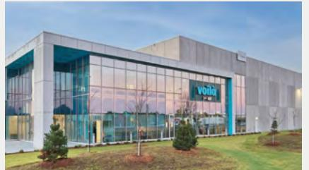

{0}------------------------------------------------

# **Growth-focused. Resilient. Sustainable.**

{1}------------------------------------------------

# **Inside this report**

- 1 About Crombie
- 2 Message from the Chair
- 4 Letters from the CEO
- 6 Our Guiding Values
- 7 Our Purpose

#### **Crombie's Priorities**

- 8 Resilient and Growing Portfolio
- 10 Strategic Partnership with Empire
- 12 Strong Development Pipeline
- 14 Spotlight on The Village at Bronte Harbour
- 15 Spotlight on Voilà CFC 3
- 16 Strong Financial Condition
- 18 Highly Skilled Team and Caring Culture
- 20 Our ESG Priorities

#### **Financial Review**

- 24 Table of Contents
- 25 Management's Discussion and Analysis
- 87 Management's Statement of Responsibility for Financial Reporting
- 88 Independent Auditor's Report
- 92 Consolidated Financial Statements
- 96 Notes to the Consolidated Financial Statements
- 128 Property Portfolio
- 130 Unitholders' Information
- IBC Tenant Profile

# **About the Cover**

Le Duke is nestled between the blossoming Griffintown neighbourhood and the charming Old Port of Montreal. Le Duke, owned in partnership with Prince Developments, is anchored by an IGA grocery store and contains 387 residential rental units. Key elements of our strategy are represented in this image including the work we do facilitating the build-out of the Voilà network with our strategic partner, Empire, the competitiveness of their grocery stores, and our investment in major mixed-used residential developments.

#### **Forward-Looking Statements**

This document includes statements about our objectives, plans, goals, strategies, future growth, financial condition, results of operations, cash flows, performance, business prospects and opportunities. These statements are forward-looking because they are based on management's expectations about the future – they are not historical facts. Forward-looking statements include statements regarding our development pipeline size, timing and costs, and statements containing words like anticipates, expects, believes, estimates, could, intends, may, plans, predicts, projects, will, would, foresees and other similar expressions, or the negative of these words. For more information and a caution about using forward-looking information, see the Forward-Looking Information section in the MD&A on page 85.

#### **Non-GAAP Measures**

Certain financial measures in this document, including FFO, AFFO, SANOI, debt to trailing 12 months adjusted EBITDA, and D/GFV, are not defined terms under GAAP; therefore, they are not a reliable way to compare us to other companies. See the Non-GAAP Financial Measures section in the MD&A on page 82.

{2}------------------------------------------------

# **About Crombie**

Crombie invests in real estate that enriches local communities and enables long-term sustainable growth. As one of the country's leading owners, operators, and developers of quality real estate, Crombie's portfolio primarily includes grocery-anchored retail, retail-related industrial, and mixed-use residential properties in Canada's top urban and suburban markets.

* Metrics noted above are inclusive of joint ventures at Crombie's share.

1 Vancouver, Edmonton, Calgary, Toronto, Ottawa, Montreal

# **Crombie at a Glance**

**Retailer-Related REIT**

Empire owns 41.5%

**\$5.6b**  fair value including properties

held in joint ventures

**301**

properties including properties under development and 5 properties owned in joint ventures

**96.9%** committed occupancy

**\$5.0b–\$6.8b**

development pipeline future investment potential

{3}------------------------------------------------

# **Message from the Chair**

The past twelve months has been a challenging time globally. We all breathed a collective sigh of relief as COVID-19 subsided, only to be met with economic headwinds in 2022. In this environment, management focused on operations, leasing, completing and integrating the recent development projects into the portfolio, while also focusing on improving the balance sheet, all of which resulted in historic high occupancy levels, value creation from developments and greatly improved debt metrics. Management's focused approach to improving the balance sheet over the past twelve months positions Crombie favourably to meet current and future macro-economic challenges.

Over the past few years Crombie has focused on expanding its portfolio by adding residential and industrial properties, further strengthening its asset base. Crombie's asset quality continues to improve steadily through prudent and thoughtful curation, development, and entitlement processes. In 2022, Crombie also worked diligently to define and understand the impact of the portfolio on the environment, with management committing to set strategic sustainability and ESG metrics and work towards achieving those targets.

Management nurtures a culture at Crombie that enables the organization to thrive, by focusing on people and strengthening the guiding values on which that culture is built. In 2022, these values showed up in the everyday actions of employees, as they came together to support their communities and each other, and it has had a noticeable impact on Crombie's success. The impact of culture on strategic results is well-documented, and the strength of Crombie's culture resulted in Don Clow being named one of Canada's Most Admired CEOs in 2022.

One of the most important functions of the Board is to ensure that Crombie has a CEO in place to lead for the future growth of the business. With this in mind, the Board began an extensive review of senior management roles,

structure and succession planning in 2021, engaging a leading talent advisory firm to assist in identifying and evaluating CEO succession candidates with extensive real estate experience. Mark Holly was identified, and when Don Clow retired, effective the end of February 2023, Mark was named his successor.

Under Don's leadership over the past 13.5 years, Crombie has achieved outstanding results and significant growth. He leaves the REIT in a far stronger position than when he arrived. On behalf of the entire Board of Trustees, we would like to thank Don for his many contributions to Crombie and we wish him well in his retirement. After the extensive CEO succession process, the Board hired Mark Holly as Crombie's new President & CEO, and we are looking forward to working together. Mark joins Crombie from Empire, and has a successful track record of over 20 years of leadership in the real estate industry, including extensive experience in development, and his knowledge of both Crombie and Empire is a valuable asset. He values communication, collaboration, and relationships, and aligns well with Crombie's guiding values, paving the way to continue delivering on the successful strategy that has made Crombie one of Canada's top-performing REITs.

The role of the Board is to oversee Crombie's longterm strategy with white-glove governance, and we are fortunate to have an extraordinary group of dedicated Trustees committed to this work. In last year's report, we welcomed Michael Vels to our board. Later in 2022, we welcomed two additions to the Board, Michael Waters, Chief Executive Officer of the Minto Group, and Heidi Jamieson-Mills, Senior Vice President of Finance, Reporting and Treasury at Empire. Michael brings over 25 years of experience in real estate finance, investment and development, and financial advisory services, while Empire-appointed Heidi contributes a wealth of financial knowledge and a deep understanding of Empire to the Board. I look forward to working with and learning from both Michael and Heidi and welcome their contributions.

{4}------------------------------------------------

# **Board of Trustees**

#### **J. Michael Knowlton**

Independent Trustee & Chair

**Barbara Palk** Independent Trustee

## **Paul Beesley** Independent Trustee

# **Jason Shannon** Independent

Trustee

Independent Trustee*

# **James Dickson** Independent Trustee*

**Michael Vels** Trustee*

# **Mark Holly**

**Michael Waters** Independent Trustee

**Heidi Jamieson-Mills** Trustee*

# **Karen Weaver**

Independent Trustee

*Empire-appointed Trustee

At our annual general meeting in May, Barbara Palk will be retiring. In her time as a Trustee, Barbara has at different times been Chair of our Human Resources Committee and Governance and Nominating Committee, and a strong contributor at all levels and aspects of the work we do. On behalf of all Trustees, I wanted to take this opportunity to thank Barbara for her important contributions to Crombie and wish her all the best.

I thank our Unitholders for their trust in Crombie, and our Trustees for their commitment and dedication in 2022. The Board commends the management team for another successful year of enriching neighbourhoods through long-term sustainable growth.

Sincerely,

**J. Michael Knowlton** Chair

**Paul Sobey**

**Jane Craighead** Independent Trustee*

Trustee

{5}------------------------------------------------

# **Letter from Don Clow, retired CEO**

**On March 1, 2023 Mark Holly became Crombie's President and CEO after Don Clow's retirement. As CEO for 2022, Don reflects here on the year's results, followed by an introduction from Mark.** 

**Growth-Focused:** Crombie achieved solid growth in 2022, while also significantly improving our financial condition through a strengthened balance sheet, lowered debt levels, ample liquidity, and increased unencumbered asset pool. These accomplishments were achieved by delivering our strategy of outstanding operations, including record occupancy, responsible investment in grocery-anchored retail in partnership with Empire, and sustainable development, with an award-winning engaged workforce. Our team and culture were recognized as one of Atlantic Canada's Top Employers for the seventh time. Crombie has remained focused on long-term sustainable growth despite capital market volatility and ongoing macro-economic and geopolitical pressures.

Development has been a key component of our long-term strategy over the last several years. In the fourth quarter of 2022, we reached substantial completion at our retail-related industrial development, Voilà CFC 3, in Calgary. Always seeking ways to optimize the value of our development pipeline while balancing capital allocation priorities, we are particularly proud of the sale of our King George site in Surrey, British Columbia. This transaction was a great example of the many opportunities available to Crombie and the underlying land value held in our portfolio.

**Resilient:** Crombie's ability to be agile is underpinned by our intentionally curated portfolio. Our relationship with our strategic partner, Empire, continues to be an important driver of our success, providing many attractive risk-adjusted opportunities and allowing for stable growth and value creation for our Unitholders. Our tenants, primarily serving the everyday needs of Canadians, have proven their resilience over the difficult last few years as well. In 2022, multiple tenants moved into our top 20, of which 60% are

now investment grade, demonstrating the attractiveness of our portfolio and the quality of our cash flow.

**Sustainable:** Throughout 2022, we formalized our ESG policies and strategy while continuing to advance several important initiatives. We updated our Sustainable Development Policy, introduced portfolio-wide ESG risk assessments, set internal ESG targets to advance our impact, gathered an inventory of greenhouse gas ("GHG") emissions, and identified reduction pathways. We continue to uphold white-glove governance and all board committees have mandates that include ESG oversight. On the social aspect of ESG, our Diversity, Equity, and Inclusion Committee works on creating a more welcoming workplace where people feel a strong sense of belonging, and we continue to encourage our teams to volunteer for community organizations across Canada. In 2022, our employees dedicated over 6,000 hours to volunteer organizations of their choosing. We are truly committed to doing our part to build a Canada where everyone can thrive. Measuring and tracking our progress in how we impact our environment and society takes time and energy – but it is absolutely worth it, and I'm proud of our team for their dedication to this work.

**New Leadership:** For 13.5 years, I've had the privilege of serving as Crombie's President and CEO. I feel immense pride in the organization from which I'm retiring. We've achieved incredible success with top-quartile total Unitholder return. We evolved from a regional landlord into a national owner, operator, and developer of great properties across Canada. Our strategic relationship with Empire has become a more impactful driver of growth over the last five years and has empowered many mutually beneficial opportunities. Our balance sheet is

{6}------------------------------------------------

# **Senior Leadership Team**

**Mark Holly** President & Chief Executive Officer

**John Barnoski** Executive Vice President, Corporate Development

**Clinton Keay** Chief Financial Officer & Secretary

Executive Vice President, Leasing &

Operations

#### **Cheryl Fraser**

Chief Talent Officer & Vice President, Communications

Executive Vice President, Development & Construction

strong, as are our fundamentals, and we are well positioned to weather any economic storms we may face over the next few years or accelerate growth initiatives. The Crombie team is guided by a strong set of values, and I know this team will continue to enhance neighbourhoods across Canada through long-term sustainable growth.

Crombie's new President & CEO, Mark Holly, will lead this team to ongoing growth and success. Mark joins Crombie from Empire, where he led the firm's real estate business and had the opportunity to collaborate closely with the Crombie executive leadership team on a range of successful initiatives that have generated substantial value for both companies. I have no doubt in the future of this fantastic team in Mark's very capable hands.

Lastly, I would like to thank our Unitholders for your support over the last 13.5 years. Your confidence in our team and the evolution of our strategy is meaningful and appreciated.

Sincerely,

**Don Clow** FCPA, FCA Former President & Chief Executive Officer

# **Letter from the CEO**

# **Moving Forward Together**

Over the years Crombie has curated a best-in-class portfolio, consisting of the three most desirable asset classes in real estate: grocery-anchored commercial centres, industrial, and residential. Crombie's asset quality and mix continue to evolve and grow through our expansive development pipeline, which offers significant value-creation opportunities. This wellcurated portfolio provides the balance of a resilient and sustainable growth focused program.

Crombie's commitment to sustainability and climate action ensures we do our part to make a positive impact on the communities in which we operate. I am encouraged by Crombie's dedication to Environmental, Social, and Governance advancements, and am committed to evolving our position in the sustainability space. I believe businesses have a critical role to play in addressing global climate challenges and know that the Crombie team will follow through on our commitments to this important work.

This team's strong culture and solid relationship with Empire give Crombie a competitive advantage in the real estate

industry. The results of the business in 2022 are a testament to the amazing team that has been delivering Crombie's strong Total Unitholder Returns over the past 5, 10, and 15 years. I am inspired by this resilient team's many successes and am excited to work together to continue to evolve and drive the business forward.

Leading this organization is an incredible privilege, and I'm honoured to take on this role. Don and I have been great partners over the years, and he guided Crombie's people and results with a steady hand. I'd like to congratulate him on his successful leadership and wish him all the best on a well-deserved retirement.

To our Unitholders, I thank you for your ongoing belief in Crombie and look forward to the opportunity to meet you at our Annual General Meeting in May.

Sincerely,

**Mark Holly** President & Chief Executive Officer

{7}------------------------------------------------

# **Growth-focused. Resilient. Sustainable.**

# **Our Guiding Values**

# **Embody Integrity**

Doing what's right is at the foundation of everything we do. Being responsible, accountable, transparent, and honest is part of who we are and what we accomplish.

# **Care Passionately**

We pride ourselves on our commitment to create positive and sustainable impact for our clients, partners, team members, and the environment. Our team stays true to our roots and leads by example through active community engagement.

# **Deliver Excellence Together**

We lead with empathy and strive to truly understand each other in a way that maximizes collaboration, quality, and high performance. We are at our best when we value each other's strengths and use our one-team approach to have fun while pursuing our common goals.

# **Empower One Another**

Everyone is encouraged to bring their unique and authentic self to work. We are dedicated to achieving success through building a space where everyone is accepted, respected, and celebrated.

# **Outperform Expectations**

We are proud of the results we achieve, honour our learnings, and continually raise the bar. Our team members are reliable, knowledgeable, and can quickly switch gears to face challenges head on.

# **Who We Are**

- **We build and operate spaces of which people want to be part**
- **We think long term**
- **We make communities even better**
- **We live our values**

# **Who We Deliver For**

- **Our Tenants and Customers**
- **Our Partners**
- **Our Unitholders**
- **Our People**
- **Our Communities**

{8}------------------------------------------------

# **Our Purpose**

We own and operate high-quality, sustainable real estate where people live, work, shop and play.

footprint, including a sustainability strategy centered on creating value by developing our properties in a way that enhances local communities and protects our environment

| WHAT WE HAVE                          | WHAT WE DO                                                                                                                                                                                                                                                             | VALUE WE CREATE                                                                                                                                                                                                                           |
|---------------------------------------|------------------------------------------------------------------------------------------------------------------------------------------------------------------------------------------------------------------------------------------------------------------------|-------------------------------------------------------------------------------------------------------------------------------------------------------------------------------------------------------------------------------------------|
| Resilient and growing portfolio | • Effective and efficient property management • Strategic acquisitions/dispositions                                                                                                                                                                                 | • Resilient grocery-anchored, needs-based properties that meet the needs of our tenants, their customers and communities • Stable and growing cash flow                                                                          |
| Strategic partnership              | • Strategically engage with Empire to complete accretive investments such as conversions, modernizations, expansions, and e-commerce customer fulfillment centres and spoke facilities, as well as unlocking major developments                            | • Intentionally curated portfolio designed to meet Empire and Crombie's current and future needs, including unlocking development opportunities                                                                                     |
| Development pipeline               | • Planning and zoning of land • Design and delivery of projects                                                                                                                                                                                                     | • High-quality real estate that enhances communities and provides sustainable long-term growth                                                                                                                                         |
| UNDERPINNED BY                        |                                                                                                                                                                                                                                                                        |                                                                                                                                                                                                                                           |
| Strong financial condition      | • Reasonable and balanced debt ladder • Multiple sources of capital and ample liquidity • Disciplined and innovative capital funding and management • Strong balance sheet                                                                                 | • Optimized cost of capital • Available capital sources • Minimized financial risk                                                                                                                                                  |
| A highly skilled team           | • Attract, develop, and retain a talented team that is committed to advancing our purpose, values, and overall business strategy • Prioritize employee engagement, development, and community outreach • Focus on environmental, social, and governance | • Diverse and inclusive team of skilled real estate professionals • Experienced and focused leadership • Address the needs of our employees and care for our communities • Minimized environmental impact of our buildings |

- Minimized environmental impact of our buildings and operations
- Strong governance
- Strong risk management and risk appetite framework
- Supported communities

7

{9}------------------------------------------------

# **Resilient and Growing Portfolio**

{10}------------------------------------------------

**Crombie remains focused on a long-term strategy that is resilient in nature and has the ability to drive consistent growth. Our portfolio, through intentional curation, forms the foundation of our strategy, which includes grocery-anchored retail, industrial, and residential properties, the three most desirable asset classes in Canada. The strength of grocery-anchored retail assets was highlighted throughout the pandemic, and continues to display its stability by guiding the retail recovery.**

When the world is facing substantial headwinds on many fronts – geopolitics, the economy, inflation, rising interest rates and climate change issues – Crombie's fundamentals remain strong. Our portfolio of 289 active investment properties demonstrated record committed occupancy of 96.9%, healthy NOI growth, and steady new leasing and renewal activity, driven by the hard work of our highly skilled and experienced team.

We have recognized the strength that comes from owning a defensive portfolio with significant opportunities for future growth. Crombie will continue to optimize our portfolio through the acquisition of grocery-anchored assets, modernizations, conversions, dispositions of low-growth and/or non-core properties, as well as advancements on our development pipeline.

Metrics noted above are inclusive of joint ventures at Crombie's share.

1 Other includes properties under development ("PUD") and land.

*

2 Non-GAAP measure; for additional information, please reference the Non-GAAP Financial Measures section in the MD&A.

# **\$282m**

net property income

**+1.6%**  SANOI2

**\$1.16**  FFO/unit2

**\$1.01** AFFO/unit2

**80%**

of AMR from grocery-anchored properties, inclusive of retail-related industrial

**9.0 years**

weighted average lease term

**1,056,000** sq. ft. leases renewed

**+7.0%** renewal leasing spread

{11}------------------------------------------------

# **Strategic Partnership with Empire**

{12}------------------------------------------------

**The retail landscape continues to change, and as the needs of the communities that Empire serves evolve, together we ensure that the footprints of grocery-anchored properties resonate well with consumer demands.**

Our relationship with Empire and our strategic alignment offer us a continuing opportunity to create value and drive growth for our Unitholders, communities, and tenants. Through in-depth market intelligence sharing, we consistently communicate and collaborate with the team at Empire. This supports the achievement of several strategic objectives for both companies, including sustainability goals, as we move forward together.

Crombie is committed to an annual investment of \$100 million to \$200 million on Empire-related initiatives with attractive risk-adjusted returns and varying project durations.

Strategic and accretive transactions include:

- Acquisition, modernization, and expansion of grocery stores;
- Store conversions;
- Land-use intensifications;
- Facilitating Empire's build-out of their Voilà online grocery home delivery service through investments in their network; and
- Major developments.

**Voilà CFC 2** Montreal, Quebec Voilà hub and spoke network

**Montgomery Safeway** Calgary, Alberta Modernization

**Marketway Lane** Timberlea (Halifax), Nova Scotia Acquisition and land-use intensification

**Davie Street** Vancouver, British Columbia Major development

# **Empire represents**

**11.1m sq. ft.** of occupied portfolio GLA

**58.0%**  of annual minimum rent

**11.6 years** 

weighted average remaining Empire lease term

**\$191m**

spent in 2022 to support Empire-related initiatives

{13}------------------------------------------------

# **Strong Development Pipeline**

{14}------------------------------------------------

**Development of all sizes remains a foundational pillar of our long-term strategy, as demonstrated over the last few years. Once income stabilization is achieved, these projects will ultimately drive NAV and AFFO growth, while importantly expanding our presence in the country's top markets, particularly VECTOM.**

Our development pipeline contains 27 projects across the country. The Village at Bronte Harbour reached substantial completion in the first quarter of 2022. The Village is currently moving through the lease-up phase with 50.5% leased as of December 31, 2022.

Voilà CFC 3, located in Calgary, Alberta, achieved substantial completion in the fourth quarter of 2022, with economic occupancy and rent commencement expected in mid 2023.

We are committed to investing \$100 million to \$250 million annually in our development program, including non-major developments, and are steadfastly focused on unlocking the value embedded within our portfolio. Our dedicated team continues the hard work of advancing major development projects through the entitlement process, which creates value and provides optionality of project size and timing of commencement in some of the most desirable locations in Canada. Currently, Crombie has four projects with zoning approvals in place, and two projects with rezoning applications submitted, with the potential to add approximately 3.3 million square feet of GLA, including 3,700 residential units.

**27** development projects

**3** near-term projects

112,000 sq. ft. commercial GLA

905,000 sq. ft. residential GLA

1,380 residential units

**24** medium-/long-term projects

1,059,000 sq. ft. commercial GLA

8,870,000 sq. ft. residential GLA

10,070 residential units

**7** completed projects

459,000 commercial GLA

614,000 retail-related industrial GLA

947,000 residential GLA

1,198 residential units

{15}------------------------------------------------

# **Spotlight on The Village at Bronte Harbour**

**Oakville (Toronto), Ontario Substantial Completion: Q1 2022**

The Village at Bronte Harbour is comprised of two residential rental towers with 481 units, a Farm Boy grocery store, and complementary retail on site. The Village showcases the beauty of the lakefront and marina, while in close proximity to walking trails, everyday conveniences, and public transit.

{16}------------------------------------------------

# **Spotlight on Voilà CFC 3**

**Calgary, Alberta Substantial completion: Q4 2022**

Voilà CFC 3 is the third Empire grocery e-commerce fulfillment hub in Canada, and the second in Crombie's portfolio. This approximately 304,000 square foot CFC will service the majority of Alberta, and is powered by industry-leading technology provided by Ocado. Robots assemble orders efficiently and safely, resulting in minimal product handling, while Voilà teammates deliver orders directly to customers' homes.

{17}------------------------------------------------

# **Strong Financial Condition**

{18}------------------------------------------------

**Crombie continues to manage risk and maintain financial strength by improving our balance sheet and overall financial condition to allow for future growth activities. Crombie will continue to prudently manage our balance sheet and responsibly allocate capital, as these actions have led to notable deleveraging, well-laddered debt maturities with balanced near-term expiries, and a healthy weighted average term to maturity, all of which are extremely important, especially in challenging macro-economic environments.**

Access to multiple sources of capital remains a key component of Crombie's financial flexibility and ability to pursue accretive investments with our strategic partner, Empire, and capitalize on opportunities within our robust development pipeline. Examples of these sources of capital are:

- Equity issuance
	- \$200 million issuance in January 2022 at \$17.45, the highest issue price to date
- Unsecured notes
- Dispositions full or partial interests
	- Disposed of eight investment properties and one property under development into a joint venture for total gross proceeds of \$176 million throughout 2022. Included in these dispositions was the sale of our King George development property in Surrey, British Columbia, which represents one of the many value creation options for Crombie.
- Mortgages commercial & residential
- Bank credit facilities

**debt/GFV1**

- Distribution reinvestment plan ("DRIP")
**Decrease in debt/GBV &** 

- Free cash flow

**Improvement in fair value of unencumbered assets**

**\$1.8B**

**\$2.2B**

# **\$583m**

- available liquidity
**8.02x** debt to adjusted EBITDA (TTM)1

**3.28x** interest coverage ratio1

**4.7 years**  weighted average term to debt maturity

# **BBB(low) with a stable trend**

DBRS rating

1 Non-GAAP measure; for additional information, please reference the Non-GAAP Financial Measures section in the MD&A.

{19}------------------------------------------------

# **Highly Skilled Team and Caring Culture**

**People are at the core of our success. We continue to grow our team with the very best in the industry, attracting people who share in our values, embrace our culture, and deliver on Crombie's promise of enriching the communities in which we operate. These are just a few of the many people who strengthen Crombie's sustainable foundation through their fine work every day.**

"Despite the challenges that come our way, our team can always rely on each other to rise above them. I'm privileged to work with a group of compassionate, supportive, hard-working people who are driven to succeed, lead with integrity, and are prepared for a sustainable future."

**Karen Charlton**, Manager, External Reporting

"Crombie's commitment to collaboration and inclusive decision-making empowers me to think carefully about our future, bring my best ideas forward, and deliver to my greatest ability. We are a highly experienced and supportive team, dedicated to delivering excellence together through shared objectives that support Crombie's long-term vision."

**Kevin Clark**, Director, Construction

"Crombie has made significant strides to formalize a sustainability program that is built on trustworthy data and ethical science. In my role, I have the privilege of working with teammates of varying functions across the business and I'm proud to be a part of an organization where sustainable practices are prioritized in all levels of decisionmaking to deliver on Crombie's purpose."

**Adam Cochrane**, Environmental Manager

"Crombie is focused on a sustainable, long-term strategy, that values an entrepreneurial spirit and provides employees with the skills and resources they need to grow and develop in their career. I'm driven to succeed with an authentic and ambitious team that supports and encourages one another to continually raise the bar, overcome challenges, and inclusively achieve our goals."

**Devis Deliallisi**, Maintenance Supervisor

"My role allows me to work alongside all areas of the business, with the goal to help others improve in their processes and efficiencies. This requires a high level of collaboration and a collective commitment to Crombie's guiding values. Our team takes pride in understanding and supporting each other to ensure all voices are heard and success is achieved together."

**Campbell DeMont**, Business Analyst, Applications & Analytics

"Working collaboratively across the organization allows me to achieve my focus of providing the highest level of service to our tenants. I know that my ideas are heard and respected, and I'm valued for the work that I do. I'm proud to be a part of an organization that thrives on a progressive culture nurtured by integrity, compassion and respect, and alongside a team that is committed to enriching local communities for the long term."

**Monika Heric**, Property Administrator

{20}------------------------------------------------

"Since joining Crombie 11 years ago, one thing that has never changed is the priority placed on caring for our team, tenants, and the communities in which we operate. Crombie has always instilled a compassionate and nurturing culture in their roots that lays the foundation to pursue new opportunities and challenges together with empathy and integrity."

**Michael Lightfoot**, Senior Property Manager

"I believe a successful organization is underpinned by integrity, strong relationships, and a people-oriented culture. It is very rewarding to work with a company that shares this outlook to ensure we deliver on our purpose while staying true to our core values. At Crombie, we leverage our strengths through a one-team approach to pursue and achieve common objectives while empowering one another."

**Ali Lobsiger**, Senior Financial Analyst

"Crombie promotes an inclusive, collaborative culture where our diversity of talents and experiences are valued and respected. We have an exceptional team whose members empower one another to outperform expectations by maximizing the impact of our wide-ranging strengths. We are driven by our guiding values to achieve common goals and results."

**Chris Millican**, Director, Operations

"More than ever, the communities we develop must embrace sustainable resiliency to meet the ongoing challenges of climate change, fluctuating regulatory environments, supply chain and labour shortages, among other disruptions. To provide a positive and lasting impact, innovative thinking, collaboration, and a clear vision for the future are essential. This impact is my driver, and Crombie supports me in my passion to make a difference in our communities of today and tomorrow."

**Eva Parada**, Senior Director, Design & Construction

# **Providing Foundational Support**

Crombie's Executive Assistants provide the foundational support for leaders across our organization. This foundation is built upon the guiding values that are core to our business and success. In many situations, Marie, Tham, and Cathy are the first people our partners meet at Crombie, and all three embody our guiding values in who they are and how they treat others. They set the tone of Crombie's caring culture, and lead by example as they work to deliver excellence in everything they do.

"I believe excellent leadership is about empowering the people around you through trust, collaboration, and effective communication so that the team is greater than the sum of its parts. Crombie's leadership team provides meaning, integrity, and accountability in all that they do, with a common understanding that an engaged, united team is at the core of our organization's success and growth."

**Tham Chau**, Executive Assistant

"I witness Crombie's guiding values being demonstrated in our business each day. Our team is committed to actively engaging with the communities in which we build and operate to make a positive, lasting impact. Our leaders foster a culture of trust, purpose, and respect that promotes diversity and belonging, and permeates throughout the organization."

**Cathy Legaspi**, Executive Assistant

"Crombie leads with a uniquely caring culture and a promise to enrich neighbourhoods through long-term sustainable growth. We stay true to who we are and ensure that doing what's right is at the heart of every decision. This has been especially evident throughout the challenges faced across the world in the last three years. We live by strong values that continue to guide the way in our path forward."

**Marie MacKay**, Executive Assistant

{21}------------------------------------------------

# **Our ESG Priorities**

**Crombie has always been guided by the value we place on community, which has helped shape and strengthen our sustainability commitments. We continue to develop and operate our properties in a way that enhances urban and rural communities and protects the environment.**

We know that taking a sustainable approach to our business is vital to the short-, medium-, and long-term health of our company. We have embedded sustainability principles into the way we operate since inception.

> **View from The Village at Bronte Harbour** Oakville (Toronto), Ontario

{22}------------------------------------------------

# **Environmental, Social & Governance ("ESG") Priorities**

**In 2022, we continued to advance our environmental, social and governance priorities.**

# **Environmental & Climate Action**

The Board and senior leadership team believe climate change is a real issue that must be addressed and that Crombie has a part to play. Beginning in late 2022, Crombie leveraged an ESG software platform, implemented in 2019, to conduct an inventory of GHG emissions for our portfolio of properties to better understand our scope 1, 2, and 3 emissions, and their impact on climate change. We have analyzed the resulting inventory of emissions and conducted scenario analysis of GHG emission reduction scopes and timelines. As scope 3 emissions, and specifically emissions from our tenant controlled spaces, make up the majority of our total emissions, Crombie is proactively working with its strategic partner and largest tenant, Empire, and has started engaging with our tenants to educate and support GHG emission reductions across our portfolio. Additionally, we have started a review of our properties' current resilience to physical climate risks and, in 2023, will generate an action plan to strengthen the resilience of our properties with respect to future physical climate events.

**BOMA BEST:** We continued to earn and upgrade BOMA BEST® green certifications for our properties, initially focusing on our owned and managed sites in a phased approach that in 2022, targeted a group of open-air grocery-anchored centres in Nova Scotia.

Avalon Mall, in St. John's, Newfoundland and Labrador, achieved BOMA BEST® Gold certification, and the 2022 BOMA NL Earth Award and Certificate of Excellence – Retail. Additionally, Avalon Mall won BOMA Canada's 2022 Outstanding Building of the Year, "TOBY", award in the retail category. The TOBY award is the most prestigious and comprehensive program of its kind in the commercial real estate industry, in Canada. Judging for this award is based upon building standards, community impact, tenant relations, energy conservation, environmental and sustainability management, emergency preparedness and building personnel training.

**Environmental Partnerships:** We continued to engage with our tenants, suppliers and other stakeholders on opportunities to reduce our collective environmental footprint. Avalon Mall was recently named *Champion for a Greener Future* by the Multi-Materials Stewardship Board ("MMSB") of Newfoundland, which is dedicated to promoting sustainable waste management through public education and waste diversion programs.

We are exploring opportunities to gain alignment with our strategic partner, Empire, incorporating their data into our calculations and sharing best practices across our property portfolio.

# **\$15.2m Operating Highlights**

invested in LED upgrades at 155 properties in the last three years

**~2m sq. ft.**

of BOMA BEST® certifications

# **31.3 metric tonnes**

of organic matter diverted from the landfill in 2022 through use of our on-site composter at Avalon Mall, in St. John's, Newfoundland and Labrador

{23}------------------------------------------------

# **Social Impact**

Our people enable our pathway to enrich sustainability at Crombie. Together, we have built a values-driven, progressive, inclusive and caring culture that is key to Crombie's success and continued growth. Our highest priority is to ensure we have the right people and platforms in place to successfully deliver Crombie's business strategy and achieve our sustainability goals.

**Great Place to Work:** Crombie was selected as one of Atlantic Canada's Top Employers and Nova Scotia's Top Employers for 2022. These designations recognize Canadian employers who lead their industries in offering exceptional places to work. In recognizing our team, the judges highlighted Crombie's generous benefits plan and mental health coverage, as well as our well-being framework focused on employee physical, psychological, professional and personal wellness.

**Employee & Community Engagement:** Our goal is to enrich neighbourhoods through long-term sustainable growth, which includes supporting organizations that are making a difference in the lives of people in the communities we serve. In 2022, we continued to support organizations that are committed to community health and wellness initiatives, including support for local and diverse businesses. We also advanced our commitment to direct 25% of our philanthropic contributions between now and 2025 to causes related to ending social injustice in the communities where we operate.

We give time and money each year to support the causes our employees believe in. Many of our employees volunteer their time with non-profit organizations, and in 2022 we began tracking employee volunteer hours to celebrate our community investments.

# **Corporate Governance**

Our Board of Trustees bears overall responsibility for ESG oversight, providing valuable guidance to the executive leadership team as we enhance the transparency of our ESG and climate-related financial disclosures.

Under the Board's stewardship, we are committed to supporting the Task Force on Climate-related Financial Disclosures ("TCFD"). We are conducting a deep dive into our climate-related risks – both physical and transitional – to understand our portfolio exposure and to align our reporting with the recommendations of TCFD, as well as with the Sustainability Standards Accounting Board ("SASB")/International Sustainability Standards Board ("ISSB").

In 2022, we continued to enhance the competency of our Board, welcoming Michael Vels who has a robust financial background, leadership experience, and valuable knowledge of our strategic partner, Empire. Additionally, we appointed Michael Waters, Chief Executive Officer of the Minto Group, and Heidi Jamieson-Mills, Senior Vice President of Finance, Reporting and Treasury at Empire, to our Board. Michael brings valuable residential development expertise to our ESG stewardship responsibilities. Heidi contributes a strong understanding of Empire, and significant financial knowledge.

# **6,000+ People & Community**

hours volunteered by employees

**42** community initiatives supported

**30%**

of hires in the year were diverse candidates

**66%** 

of leadership development program participants are women

# **Board Diversity**

**33%**

female trustees

**100%** independent Board chair and committee chairs

{24}------------------------------------------------

# **In the Spotlight**

# **Crombie's Operations team**

Aberdeen Business Centre Maintenance Team New Glasgow, Nova Scotia

**Unwavering Commitment:** Our Operations teams are dedicated to keeping our properties safe, and our tenants supported. Hurricane Fiona changed the definition of what hurricane preparedness looks like across Atlantic Canada, and our Operations teams demonstrated remarkable diligence in preparing and protecting our properties. Nova Scotia was hit especially hard, and through their outstanding efforts, our Maintenance team in New Glasgow, Nova Scotia, kept our properties from experiencing what could have been devastating and costly damage.

"At a time that was personally difficult for everyone, we witnessed team members voluntarily put their personal lives on hold to be there for Crombie and the communities in which we operate, to make sure our properties stayed safe, protected, and operational."

**Brian Dobson**, Regional Property Manager

# **Vibrant Community Living**

The Village at Bronte Harbour, which Crombie owns in a joint venture with Prince Developments, understands the importance of building community among residents and with the broader village of Bronte Harbour. The Village's amenity spaces include a pool, spa, and fitness rooms, as well as a large dining room where residents gather to celebrate seasonal holidays together with potluck or catered meals. Pets are part of the Bronte family, too, and in addition to providing them with a "pet spa", the Village also includes them in special activities, such as a Halloween dog costume contest.

The Village also supported the creation of Bronte Market Square, which is a community space for local residents to rest, gather and connect – featuring infrastructure that includes seating areas, a water feature and access to electrical power. The Square was built to host a variety of special events like outdoor markets, fitness classes, holiday-themed activities, and live music. To celebrate the 2022 opening of Market Square, The Village operations team sponsored a community tree lighting and hosted a hot chocolate and cookies gathering on-site.

Sustainability is important to the residents and staff of The Village, as they are surrounded by the beauty of the natural lakeside environment. The building's rooftop spaces include plants and flowers, and also boast urban beehives managed by Alvéole. These busy "Crombees" contributed honey to all residents in the fall, while pollinating their way around the community. We hope they made their way to the section of Oakville Blooms, a neighbourhood beautification project, that was sponsored by The Village!

# **Crombie's Caring & Inclusive Culture**

Crombie is a vibrant community of professionals who are respected for what they do. Our commitment to our workforce includes providing an inclusive culture where everyone is accepted and feels welcome. In 2022, several teams participated in an inclusive communications training program, with the goal of creating a space where everyone feels like they belong through the ways in which we communicate.

"At Crombie, our differences are celebrated, unique perspectives are supported, and opportunities to learn more about our teammates are provided. Each February, I'm proud to contribute to the team's learning and understanding of African Heritage Month through sharing information and resources on our organization's intranet and, in turn, a space of belonging."

**Holly Boudreau** Customer Service Associate

"Crombie's communications continue to proactively evolve as the diversity of our team grows and prospers. Part of my role is telling Crombie's story, both strategically, and in how our organization communicates inclusively to all audiences. Our commitment to inclusive language reflects not only our increasingly diverse workforce, but also the breadth of our properties located across the country."

**Meredith Hynes** Coordinator, Communications

{25}------------------------------------------------

# **Financial Review**

- **MANAGEMENT'S DISCUSSION AND ANALYSIS**
- Key Highlights
- Glossary of Terms

### **Portfolio Review**

- **Total Portfolio Review Inclusive of Joint Ventures**
- Market Class
- Asset Type
- **Portfolio Review Excluding Joint Ventures**
- Market Class
- Asset Type
- Tenant Profile
- Same-Asset Properties
- Strategic Acquisitions and Dispositions
- Non-Major Development
- **Operational Performance Review**
- Occupancy and Leasing Activity
- New Leasing Activity
- Renewal Activity
- Lease Maturities
- **Financial Performance Review**
- Operating Income Attributable to Unitholders
- Same-Asset Property Cash NOI
- Funds from Operations (FFO)
- Adjusted Funds from Operations (AFFO)
- Distributions to Unitholders
- Amortization of Tenant Incentives
- General and Administrative Expenses
- Finance Costs Operations
- Depreciation, Amortization, and Impairment
- Selected Balance Sheet Information

#### **Development**

- Substantially Completed Developments
- Development Pipeline

#### **Capital Management**

- Capital Management Framework
- Investment Grade Credit Rating
- Strong Capital Structure
- Debt Metrics
- Debt Profile
- Debt Maturities
- Outstanding Unit Data
- Cash Flows
- Available Credit Line Liquidity
- Off-Balance Sheet Commitments and Guarantees
- Financial Instruments

#### **Risk Management**

- Risk Management Framework
- Risk Factors Related to the Business of Crombie
- Financial Risk Management
- Risk Factors Related to the Units
- Ownership of Senior Unsecured Notes

### **Joint Ventures**

- Joint Venture Summary
- Occupancy Metrics
- Financial Performance
- Fair Value
- Debt to Gross Fair Value
- Debt Profile

#### **Other Disclosures**

- Related Party Transactions
- Use of Estimates and Judgments
- Controls and Procedures
- Quarterly Information
- **Non-GAAP Financial Measures**
- **Forward-looking Information**
- **Management's Statement of Responsibility for Financial Reporting**
- **Independent Auditor's Report**
- **Consolidated Financial Statements**
- **Notes to the Consolidated Financial Statements**
- **Property Portfolio**
- **Unitholders' Information**
- **IBC Tenant Profile**

#### *** Non-GAAP Financial Measures**

Some of the financial measures we provide in this document are non-GAAP financial measures that have no standardized meaning under International Financial Reporting Standards ("IFRS") and therefore may not be comparable to similar measures presented by other companies. See "Non-GAAP Financial Measures", starting on page 82, for more information on Crombie's non-GAAP financial measures and reconciliations thereof.

#### **Forward-Looking Statements**

Some of the information we provide in this document is forward-looking and therefore could change over time to reflect changes in the environment in which we operate and compete. See "Forward-looking Information", starting on page 85, for more information.

The following Management's Discussion and Analysis ("MD&A") of the consolidated financial condition and financial performance of Crombie Real Estate Investment Trust ("Crombie") should be read in conjunction with Crombie's audited consolidated financial statements as at and for the years ended December 31, 2022 and 2021.

Except for per unit, gross leasable area ("GLA") and square footage ("sq. ft.") amounts and where otherwise noted, all amounts in this MD&A are reported in thousands of Canadian dollars.

The information contained in the MD&A, including forward-looking statements, is based on information available to management as of February 22, 2023, except as otherwise noted.

Additional information relating to Crombie, including its latest Annual Information Form, can be found on the SEDAR website for Canadian regulatory filings at www.sedar.com.

For definitions of certain acronyms and specialized terms we use in this document, refer to the "Glossary of Terms" on page 29.

{26}------------------------------------------------

# KEY HIGHLIGHTS

We use financial and operational metrics to measure our performance. These key metrics are highlighted below:

# **FINANCIAL METRICS**

(in thousands except GLA and per Unit amounts)

#### **Property revenue**

**\$107,939** Q4 2021 **\$103,832 +4.0% Q4 2022 Year 2022 \$419,591** Year 2021 **\$408,892 +2.6%** The increase in property revenue in both the quarter and on an annual basis is due primarily to increased rental revenue from acquisitions and higher income from modernization investments. This increase is offset in part by reduced rental revenue due to dispositions, lower lease termination income, and higher tenant incentive amortization from leasing activity.

#### **Operating income attributable to Unitholders**

**\$87,718** Q4 2021 **\$78,730 +11.4% Q4 2022 Year 2022**

**\$167,800** Year 2021 **\$155,401 +8.0%**

The increase in operating income attributable to Unitholders for the quarter and on an annual basis is driven primarily by gains on disposal of investment properties and lower mortgage interest expense from dispositions and mortgage repayments compared to the same period in 2021. The increase is offset in part by a gain on distribution from equity-accounted investments in the fourth quarter of 2021 resulting from cash distributions received from a joint venture in excess of our investment. The annual increase in operating income was also offset by increased impairments on investment properties in 2022 compared to the prior year.

#### **Net property income**

**\$70,816** Q4 2021 **\$71,402 -0.8% Q4 2022 Year 2022**

**\$281,818** Year 2021 **\$283,031 -0.4%**

Dispositions since December 31, 2021, increased property tax and operating expenses, higher lease termination income in 2021 due to tenant surrenders, and new leasing initiatives which increased tenant incentive amortization are the drivers of the decrease in net property income for both the quarter and year. The reduction is offset in part by income from acquisitions, higher recoveries of property taxes and operating costs, and income from modernization investments. The annual decrease in net property income was also offset by increased parking revenue, renewals, and new leasing.

#### **Same-asset property cash NOI***

**\$67,704** Q4 2021 **\$67,103 +0.9% Q4 2022 Year 2022**

**\$270,045**

Year 2021 **\$265,900 +1.6%**

Strong occupancy, an increase in rent from modernizations and capital improvements, and increased parking revenue improved same-asset property cash NOI for the quarter and the year compared to the same periods in 2021. This was offset in part by a decrease in lease termination income.

Same-asset property cash NOI*, adjusted for the removal of lease termination income, increased by 2.4% in Q4 2022 compared to Q4 2021 and increased by 2.6% on an annual basis compared to 2021.

{27}------------------------------------------------

# **FFO* per Unit**

| Q4 2022             | Year 2022              |  |
|---------------------|------------------------|--|
| \$0.29              | \$1.16                 |  |
| Q4 2021 \$0.29 0.0% | Year 2021 \$1.14 +1.8% |  |
|                     |                        |  |

FFO on a dollar basis improved in the quarter primarily due to lower finance costs from operations arising from lower debt levels, higher recoveries of property taxes and operating costs, income from acquisitions, higher rent from modernizations and capital improvements, and decreased general and administrative expenses. The growth was partially offset by higher property taxes and operating expenses, reduced rental revenue due to dispositions, and a reduction in lease termination income. Additionally, on an annual basis, new leasing, renewals, and increased parking revenue contributed to an increase in FFO.

An increase in the number of Units outstanding from the issuance of Units in the first quarter of 2022 contributed to offsetting the growth in FFO per Unit.

### **FFO* payout ratio**

**76.2%** Q4 2021 **78.0% -1.8% Q4 2022 Year 2022**

**77.5%** Year 2021 **78.1% -0.6%** Items affecting FFO, as stated above, drove the reduction in FFO payout ratio compared to 2021 in both the quarter and full year. This was offset in part by an increase in Units outstanding, resulting in higher total distributions.

# **AFFO* per Unit**

**\$0.25** Q4 2021 **\$0.25 0.0% Q4 2022 Year 2022**

AFFO on a dollar basis increased in both the quarter and the year primarily as a result of reduced finance costs from operations arising from lower debt levels, higher recoveries of property taxes and operating costs, income from acquisitions, higher rent from modernizations and capital improvements, and decreased general and administrative expenses. This was offset in part by higher property taxes and operating expenses, reduced rental revenue due to dispositions, a reduction in lease termination income, and an increase in the maintenance capital expenditure charge in the first quarter of 2022. Additionally, on an annual basis, new leasing, renewals, and increased parking revenue helped increase AFFO.

An increase in the number of Units outstanding from the issuance of Units in the first quarter of 2022 contributed to offsetting the growth in FFO per Unit.

## **AFFO* payout ratio**

**88.1% Q4 2022 Year 2022**

Q4 2021 **90.5% -2.4%**

**89.0%** Year 2021 **91.8% -2.8%** AFFO payout ratio improved as a result of the improved AFFO due to the factors stated above. This is partially offset by an increase in Units outstanding, resulting in higher total distributions.

{28}------------------------------------------------

# **OPERATIONAL METRICS**

#### **Renewals (GLA sq. ft.)**

**374,000**

Q4 2021 **97,000 +285.6%**

**Q4 2022 Year 2022 1,056,000** Year 2021 **905,000 +16.7%**

Renewal activity in the quarter consisted of 78,000 square feet in Rest of Canada, 269,000 square feet in Major Markets, and 27,000 square feet in VECTOM. Full year renewal activity consisted of 452,000 square feet in Rest of Canada, 449,000 square feet in Major Markets, and 155,000 square feet in VECTOM. For the year ended December 31, 2022, 306,000 square feet of Empire Company Limited ("Empire") renewals were completed.

#### **Renewal spreads**

| Q4 2022            | Year 2022            |
|--------------------|----------------------|
| 12.9%              | 7.0%                 |
| Q4 2021 5.0% +7.9% | Year 2021 3.4% +3.6% |

Renewal activity in the quarter and 2022 includes a large office renewal at a significant increase over expiring rental rates. Excluding this lease, renewal spreads for the quarter and 2022 would be 3.3% and 4.2%, respectively. The primary driver of renewal growth in the quarter and 2022 was office renewals at an increase of 41.0% and 27.1% over expiring rental rates, respectively. Also driving renewal growth in the quarter and year were retail plaza renewals at increases of 5.6% and 5.8% over expiring rental rates, respectively.

#### **Committed occupancy**

**Year 2022**

**96.9%**

Year 2021 **96.2% +0.7%**

#### **Economic occupancy**

**Year 2022**

**94.8%** Year 2021 **95.6% -0.8%** Record committed occupancy of 96.9% included 394,000 square feet of space committed in the quarter. Approximately 373,000 square feet of committed space is in VECTOM and Major Markets, including Empire leased space of 304,000 square feet in Calgary, Alberta and 31,000 square feet in Burlington, Ontario.

Economic occupancy was negatively impacted by the addition of approximately 304,000 square feet of development GLA at the Voilà CFC 3 in Calgary, Alberta, with economic occupancy expected in mid 2023. Excluding the impact of Voilà CFC 3, economic occupancy would be 96.4%. New leases of 349,000 square feet outpaced lease expiries and other changes by 152,000 square feet. Notable new leases include Empire's Voilà spoke facilities in Ottawa, Ontario and Quebec City, Quebec, six new Dollarama leases totalling 56,000 square feet and a 42,000 square foot office lease in Halifax, Nova Scotia.

{29}------------------------------------------------

# **FINANCIAL CONDITION METRICS**

## **Interest coverage ratio***

**3.26x Q4 2022 Year 2022**

**3.28x** Year 2021 **3.01x +0.27x**

Q4 2021 **3.06x +0.20x**

The improvement in interest coverage ratio for both the quarter and the year compared to the same periods in the prior year is due to reduced total leverage since the fourth quarter of 2021, including lower mortgage interest expense and increased property revenue resulting primarily from acquisitions and increased rent from modernization investments.

The improvement in D/GFV since the fourth quarter of 2021 is the result of lower outstanding debt due to mortgage repayments funded by an equity raise in

January 2022 and dispositions throughout the year.

## **Debt to gross fair value* (D/GFV)**

**Q4 2022**

**41.8%**

Q4 2021 **45.3% -3.5%**

### **Q4 2021**

**45.3%**

Q4 2020 **50.7% -5.4%**

## **Debt to trailing 12 months adjusted EBITDA* (D/EBITDA)**

**Q4 2022**

**8.02x** Q4 2021 **8.99x -0.97x** The improvement in D/EBITDA ratio compared to the same period in 2021 is due to lower outstanding debt at the fourth quarter of 2022 resulting from mortgage repayments and dispositions. Increased operating income also contributed to the improvement in EBITDA.

#### **Available liquidity – unutilized credit facilities**

**\$583,003** Q4 2021 **\$507,777 +14.8% Q4 2022**

Crombie entered into a credit agreement in the fourth quarter of 2022 for an unsecured non-revolving credit facility resulting in an increase in available liquidity compared to the fourth quarter of 2021. Also contributing to this increase was the repayment of outstanding credit facilities.

{30}------------------------------------------------

# GLOSSARY OF TERMS

| Adjusted debt*                   | Represents debt, including Crombie's share of debt held in equity-accounted joint ventures, excluding transaction costs, which Crombie believes is a more relevant presentation of indebtedness. Adjusted debt is a non-GAAP measure that is used in the calculation of our debt to gross fair value and debt to trailing 12 months adjusted EBITDA.                                                                                                                                                                                          |  |
|----------------------------------|-----------------------------------------------------------------------------------------------------------------------------------------------------------------------------------------------------------------------------------------------------------------------------------------------------------------------------------------------------------------------------------------------------------------------------------------------------------------------------------------------------------------------------------------------------|--|
| Adjusted EBITDA*                 | Represents earnings before interest, taxes, depreciation, and amortization, excluding certain items such as amortization of tenant incentives, impairment of investment properties, gain (loss) on disposal of investment properties, and gain on distribution from equity-accounted investments. It includes Crombie's share of revenue, operating expenses, and general and administrative expenses from equity-accounted joint ventures. Adjusted EBITDA is a non-GAAP measure that is used as an input in several of our debt metrics. |  |
| Adjusted interest expense*    | Represents finance costs from operations, including Crombie's share of interest from equity-accounted joint ventures, excluding amortization of deferred financing costs. Adjusted interest expense is a non-GAAP measure that is used in the calculation of our interest service coverage and debt service coverage ratios.                                                                                                                                                                                                                  |  |
| AFFO*                            | Adjusted funds from operations. Crombie follows the recommendations of REALPAC's January 2022 guidance in determining AFFO.                                                                                                                                                                                                                                                                                                                                                                                                                         |  |
| AMR                              | Annual minimum rent. This represents annualized fixed minimum rent payable by the tenant pursuant to the terms of the lease.                                                                                                                                                                                                                                                                                                                                                                                                                        |  |
| CFC                              | Customer fulfillment centre.                                                                                                                                                                                                                                                                                                                                                                                                                                                                                                                        |  |
| CMA                              | Census metropolitan area.                                                                                                                                                                                                                                                                                                                                                                                                                                                                                                                           |  |
| Committed occupancy              | Represents current economic occupancy plus future occupancy of currently vacant space for which lease contracts are currently in place.                                                                                                                                                                                                                                                                                                                                                                                                             |  |
| D/GFV*                           | Debt to gross fair value.                                                                                                                                                                                                                                                                                                                                                                                                                                                                                                                           |  |
| Economic occupancy               | Represents space currently occupied (excluding space held in equity-accounted joint ventures).                                                                                                                                                                                                                                                                                                                                                                                                                                                      |  |
| ESG                              | Environmental, social, and governance.                                                                                                                                                                                                                                                                                                                                                                                                                                                                                                              |  |
| Fair value                       | The amount at which an asset or liability could be exchanged between two knowledgeable, willing and unconnected parties in an arm's length transaction.                                                                                                                                                                                                                                                                                                                                                                                          |  |
| FFO*                             | Funds from operations. Crombie follows the recommendations of REALPAC's January 2022 guidance in determining FFO.                                                                                                                                                                                                                                                                                                                                                                                                                                   |  |
| GLA                              | Gross leasable area (excluding residential unless noted as proportionately consolidated).                                                                                                                                                                                                                                                                                                                                                                                                                                                           |  |
| IFRS                             | International Financial Reporting Standards.                                                                                                                                                                                                                                                                                                                                                                                                                                                                                                        |  |
| Joint operations                 | Properties in which Crombie owns partial interests. These co-owned properties are subject to proportionate consolidation, the results of which are reflected in Crombie's operating and financial results, based on the proportionate interest in such joint operations.                                                                                                                                                                                                                                                                         |  |
| Lease termination income         | Revenue derived from the early termination of a lease. Lease termination occurs when a tenant desires to end occupancy prior to the lease end date.                                                                                                                                                                                                                                                                                                                                                                                              |  |
| LUI                              | Land use intensification. Development of vacant or previously unused land resulting in increased GLA.                                                                                                                                                                                                                                                                                                                                                                                                                                               |  |
| Major Markets                    | A Crombie-specific definition that includes Abbotsford-Mission, Barrie, Chilliwack, Halifax, Hamilton, Kitchener-Cambridge-Waterloo, Oshawa, Quebec City, Regina, Saskatoon, Victoria, and Winnipeg, as defined by Statistics Canada 2021 CMA/CA boundaries.                                                                                                                                                                                                                                                                                     |  |
| Modernization                    | A capital investment to modernize/renovate Crombie-owned grocery store properties in exchange for a defined return and potential extended lease term.                                                                                                                                                                                                                                                                                                                                                                                            |  |
| NAV*                             | Net asset value.                                                                                                                                                                                                                                                                                                                                                                                                                                                                                                                                    |  |
| Net property income              | Property revenue less property operating expenses, which exclude certain expenses such as interest expense and indirect operating expenses.                                                                                                                                                                                                                                                                                                                                                                                                      |  |
| Property cash NOI*               | Property NOI on a cash basis, excluding non-cash straight-line rent recognition and non-cash tenant incentive amortization.                                                                                                                                                                                                                                                                                                                                                                                                                         |  |
| Proportionate ownership          | Represents Crombie's proportionate interest in the financial position and results of operations of its entire portfolio, taking into account the difference in accounting for joint ventures using proportionate consolidation versus equity accounting as required under IFRS.                                                                                                                                                                                                                                                                  |  |
| REALPAC                          | Real Property Association of Canada.                                                                                                                                                                                                                                                                                                                                                                                                                                                                                                                |  |
| Rest of Canada (RoC)             | A Crombie-specific definition that includes all remaining geographies outside of VECTOM and Major Markets.                                                                                                                                                                                                                                                                                                                                                                                                                                          |  |
| Retail                           | Includes our substantial retail portfolio, with commercial reflecting a certain few additional properties that comprise both retail and office space. These properties have been consistently included in our retail category.                                                                                                                                                                                                                                                                                                                   |  |
| Retail-related industrial        | Retail-related industrial includes retail distribution centres, customer fulfillment centres ("CFC"), and spokes.                                                                                                                                                                                                                                                                                                                                                                                                                                   |  |
| Same-asset properties*           | Properties owned and operated throughout the current and comparative reporting periods, excluding any property that was designated for redevelopment, or was subject to disposition of a portion of its GLA during either the current or comparative period.                                                                                                                                                                                                                                                                                     |  |
| Spokes                           | Spokes are cross dock facilities developed to support CFCs, the hubs of Empire's hub and spoke network.                                                                                                                                                                                                                                                                                                                                                                                                                                             |  |
| Sq. ft.                          | Square footage.                                                                                                                                                                                                                                                                                                                                                                                                                                                                                                                                     |  |
| Unencumbered assets              | Represents assets that have not been pledged as security or collateral under a secured credit agreement or mortgage.                                                                                                                                                                                                                                                                                                                                                                                                                                |  |
| VECTOM                           | Vancouver, Edmonton, Calgary, Toronto, Ottawa-Gatineau, Montreal, as defined by Statistics Canada 2021 boundaries for census metropolitan areas and census agglomeration.                                                                                                                                                                                                                                                                                                                                                                        |  |
| WATM                             | Weighted average term to maturity.                                                                                                                                                                                                                                                                                                                                                                                                                                                                                                                  |  |
| Zoning applications submitted | A formal municipal rezoning application has been submitted for the purpose of achieving a new land use (i.e. residential, mixed-use) and generally to obtain higher levels of density and building height.                                                                                                                                                                                                                                                                                                                                       |  |

* See "Non-GAAP Financial Measures", starting on page 82, for more information on Crombie's non-GAAP financial measures and reconciliations thereof.

{31}------------------------------------------------

# PORTFOLIO REVIEW

# TOTAL PORTFOLIO REVIEW INCLUSIVE OF JOINT VENTURES

Crombie holds partial ownership interests in six joint ventures, five of which currently hold properties. These joint ventures are all subject to equity accounting. The results of these equity-accounted investments are not included in certain financial metrics, such as net property

income, property cash NOI*, or same-asset property NOI*, unless it is specifically indicated that such metrics are presented on a proportionate consolidation basis. Below are select operating metrics presented on a proportionate consolidation basis.

# **MARKET CLASS**

Crombie's portfolio of GLA and fair value, inclusive of joint ventures at Crombie's share, consisted of the following as at December 31, 2022:

The table below provides details of the average capitalization rate (weighted by stabilized trailing NOI including joint ventures) by market class:

|                                                | December 31, 2022 | December 31, 2021 |
|------------------------------------------------|-------------------|-------------------|
| VECTOM                                         | 4.75%             | 4.58%             |
| Major Markets                                  | 6.18%             | 5.91%             |
| Rest of Canada                                 | 6.94%             | 6.55%             |
| Weighted average portfolio capitalization rate | 5.74%             | 5.54%             |

The recent expansion in Crombie's weighted average capitalization rates has been partially offset by development completions, and strong demand for grocery-anchored assets.

For an explanation of the determination of capitalization rates, see the "Other Disclosures" section of this MD&A, under "Investment Property Valuation" in the "Use of Estimates and Judgments" section, and the "Risk Management" section of this MD&A, under "Capitalization Rate Risk" in the "Risk Factors Related to the Business of Crombie" section.

{32}------------------------------------------------

|                | GLA (sq. ft.)                          |            |  |
|----------------|----------------------------------------|------------|--|
|                | December 31, 2022 December 31, 2021 |            |  |
| VECTOM         | 6,470,000                              | 5,693,000  |  |
| Major Markets  | 4,810,000                              | 4,739,000  |  |
| Rest of Canada | 7,695,000                              | 7,720,000  |  |
| Total          | 18,975,000                             | 18,152,000 |  |

When compared to December 31, 2021, VECTOM GLA increased by 777,000 square feet primarily due to the substantial completion of Bronte Village, in Oakville, during the first quarter of 2022 and of Voilà CFC 3, in Calgary, during the fourth quarter of 2022. Major Markets increased by 71,000 square feet and Rest of Canada decreased by 25,000 largely due

to three investment properties changing from Rest of Canada to Major Markets as a result of changes to census metropolitan area/census agglomeration boundaries defined by Statistics Canada, partially offset by acquisition and disposition activity.

# **ASSET TYPE**

Crombie's portfolio of GLA and fair value, inclusive of joint ventures at Crombie's share, consisted of the following as at December 31, 2022.

Retail-related industrial Retail Oce Other Mixed-use 1

residential

(1) Other includes properties under development (PUD) and land.

Retail properties represent 79.6% of Crombie's GLA and 77.2% of fair value at December 31, 2022, compared to 83.0% of Crombie's GLA and 81.1% of fair value at December 31, 2021.

|                           | GLA (sq. ft.) December 31, 2022 December 31, 2021 |            |  |
|---------------------------|---------------------------------------------------------|------------|--|
|                           |                                                         |            |  |
| Retail                    | 15,093,000                                              | 15,068,000 |  |
| Office                    | 954,000                                                 | 954,000    |  |
| Retail-related industrial | 2,414,000                                               | 1,855,000  |  |
| Mixed-use residential     | 514,000                                                 | 275,000    |  |
| Total                     | 18,975,000                                              | 18,152,000 |  |

When compared to December 31, 2021, mixed-use residential increased by 239,000 square feet due to Bronte Village, in Oakville, reaching substantial completion. Retail-related industrial increased 559,000 square feet due to the acquisition of the remaining 50%

interest in a distribution centre, in Terrebonne, Quebec, the substantial completion of Voilà CFC 3, in Calgary, Alberta in the fourth quarter of 2022, and the development of two Voilà spoke facilities, located in Ottawa, Ontario and Quebec City, Quebec.

{33}------------------------------------------------

# PORTFOLIO REVIEW – EXCLUDING JOINT VENTURES

As at December 31, 2022, Crombie's property portfolio consisted of full ownership interests in 228 investment properties, and partial ownership interests in 61 investment properties held in joint operations. In addition to investment properties, Crombie also has full ownership interests in five properties under development ("PUD"), and a partial ownership in two properties under development held in joint operations. Together, Crombie's share of these 289 investment properties contains approximately 18.4 million square feet of GLA in all 10 provinces.

Partial ownership interests are reflected in our consolidated balance sheet and income statement, based on our proportionate ownership in such joint operations.

Crombie's partial ownership interests in six joint ventures, five of which currently hold investment properties, are not included in the following sections.

# **MARKET CLASS**

Crombie's presence in high-growth VECTOM and Major Markets has been increasing through acquisitions and large-scale developments to strategically elevate portfolio quality and strength.

The table below provides details of the average capitalization rate (weighted by stabilized trailing NOI) by market class:

|                                                | December 31, 2022 | December 31, 2021 |
|------------------------------------------------|-------------------|-------------------|
| VECTOM                                         | 5.03%             | 4.73%             |
| Major Markets                                  | 6.18%             | 5.91%             |
| Rest of Canada                                 | 6.94%             | 6.55%             |
| Weighted average portfolio capitalization rate | 5.94%             | 5.65%             |

The recent expansion in Crombie's weighted average capitalization rates has been partially offset by development completions, and strong demand for grocery-anchored assets.

For an explanation of the determination of capitalization rates, see the "Other Disclosures" section of this MD&A, under "Investment Property Valuation" in the "Use of Estimates and Judgments" section, and the "Risk Management" section of this MD&A, under "Capitalization Rate Risk" in the "Risk Factors Related to the Business of Crombie" section.

{34}------------------------------------------------

Crombie's portfolio diversification by market class of its investment properties as at December 31, 2022 and 2021 is as follows:

|                | GLA (sq. ft.)      |                                       |           |                      |                                       |          |        |                       |                        |
|----------------|--------------------|---------------------------------------|-----------|----------------------|---------------------------------------|----------|--------|-----------------------|------------------------|
|                | January 1, 2022 | Net Acquisitions (Dispositions) | Other1    | December 31, 2022 | Number of Investment Properties | % of AMR | % NOI2 | Economic Occupancy | Committed Occupancy |
| VECTOM         | 5,418,000          | 267,000                               | 271,000   | 5,956,000            | 88                                    | 34.0%    | 33.5%  | 94.2%                 | 99.3%                  |
| Major Markets  | 4,723,000          | (157,000)                             | 228,000   | 4,794,000            | 63                                    | 27.2%    | 28.1%  | 96.1%                 | 97.5%                  |
| Rest of Canada | 7,720,000          | 140,000                               | (165,000) | 7,695,000            | 138                                   | 38.8%    | 38.4%  | 94.4%                 | 94.7%                  |
| Total          | 17,861,000         | 250,000                               | 334,000   | 18,445,000           | 289                                   | 100.0%   | 100.0% | 94.8%                 | 96.9%                  |

|                | GLA (sq. ft.)      |                                       |         |                      |                                       |          |        |                       |                        |
|----------------|--------------------|---------------------------------------|---------|----------------------|---------------------------------------|----------|--------|-----------------------|------------------------|
|                | January 1, 2021 | Net Acquisitions (Dispositions) | Other1  | December 31, 2021 | Number of Investment Properties | % of AMR | % NOI2 | Economic Occupancy | Committed Occupancy |
| VECTOM         | 5,588,000          | (176,000)                             | 6,000   | 5,418,000            | 87                                    | 33.9%    | 33.9%  | 99.7%                 | 99.7%                  |
| Major Markets  | 4,619,000          | 112,000                               | (8,000) | 4,723,000            | 62                                    | 26.6%    | 26.4%  | 94.2%                 | 96.1%                  |
| Rest of Canada | 7,793,000          | (138,000)                             | 65,000  | 7,720,000            | 135                                   | 39.5%    | 39.7%  | 93.5%                 | 93.8%                  |
| Total          | 18,000,000         | (202,000)                             | 63,000  | 17,861,000           | 284                                   | 100.0%   | 100.0% | 95.6%                 | 96.2%                  |

(1) Changes in GLA include increases for completed developments and additions/expansions to GLA on existing properties, decreases primarily related to GLA removal in preparation for property redevelopment, and reclassifications within market classes.

(2) Property cash NOI for the year ended December 31.

For the year ended December 31, 2022, three investment properties at full interest and one investment property at partial interest were acquired in VECTOM and Major Markets, partially offset by the dispositions of five investment properties, resulting in a net increase of 110,000 square feet. Crombie also disposed of one 62,000 square foot investment property at full interest, which had its GLA removed in the second quarter of 2022 in "Other" changes as the lease was terminated in anticipation of its disposition. Eight investment properties at full interest were acquired in the Rest of Canada, partially offset by the dispositions of two investment properties, resulting in a net increase in GLA of 140,000 square feet. Crombie also completed the groceryanchored retail development of approximately 44,000 square feet at Cobblestone in Grande Prairie, Alberta, included in "Other" changes.

Additionally, Crombie substantially completed the development of Voilà CFC 3, totalling 304,000 square feet, and two retail-related industrial spokes, totalling 20,000 square feet, in VECTOM and Major Markets. Retail development expansions occurred at four groceryanchored properties, adding 3,000 square feet of GLA to VECTOM, 19,000 square feet of GLA to Major Markets, and 17,000 square feet of GLA to Rest of Canada. These additions to GLA are included in "Other" changes.

In the first quarter of 2022, three investment properties had a change in market class as a result of changes to census metropolitan area/census agglomeration boundaries defined by Statistics Canada. Approximately 210,000 square feet was reclassified as Major Markets from Rest of Canada, and is captured under "Other" changes.

When compared to December 31, 2021, the percentage of total AMR generated from VECTOM increased by 10 basis points, while Major Markets' total AMR increased by 60 basis points and Rest of Canada decreased by 70 basis points. The increase in Major Markets is primarily due to new leasing activity over the last twelve months, and, as noted above, the reclassification of three investment properties to Major Markets from Rest of Canada in the first quarter of 2022.

As at December 31, 2022, committed and economic occupancy stand at 96.9% and 94.8%, respectively. Committed occupancy increased by 70 basis points compared to December 31, 2021. Economic occupancy decreased by 80 basis points compared to December 31, 2021. Economic occupancy was negatively impacted by the addition of approximately 304,000 square feet of development GLA at the Voilà CFC 3 in Calgary, Alberta, with economic occupancy expected in mid 2023. Excluding the impact of Voilà CFC 3, economic occupancy would be 96.4%.

Over the last twelve months, 584,000 net square feet of GLA was added to the portfolio. The net increase in GLA is due to 589,000 square feet of acquisitions, and 334,000 square feet of other changes throughout the portfolio, primarily from development activity. This is partially offset by the disposition of 339,000 square feet.

{35}------------------------------------------------

# **ASSET TYPE**

Retail properties represent 81.7% of Crombie's GLA and 84.0% of fair value at December 31, 2022, compared to 84.3% of GLA and 87.4% of fair value at December 31, 2021.

(1) Other includes properties under development ("PUD") and land.

Crombie's portfolio diversification by asset type as at December 31, 2022 and 2021 of its investment properties is as follows:

|                              | GLA (sq. ft.)      |                                       |         |                      |                                       |          |           |                       |                        |
|------------------------------|--------------------|---------------------------------------|---------|----------------------|---------------------------------------|----------|-----------|-----------------------|------------------------|
|                              | January 1, 2022 | Net Acquisitions (Dispositions) | Other1  | December 31, 2022 | Number of Investment Properties | % of AMR | % of NOI2 | Economic Occupancy | Committed Occupancy |
| Retail                       | 15,052,000         | 15,000                                | 10,000  | 15,077,000           | 278                                   | 89.5%    | 89.5%     | 96.1%                 | 96.7%                  |
| Office                       | 954,000            | —                                     | —       | 954,000              | 5                                     | 3.9%     | 3.9%      | 92.1%                 | 92.5%                  |
| Retail-related industrial | 1,855,000          | 235,000                               | 324,000 | 2,414,000            | 6                                     | 6.6%     | 6.6%      | 87.4%                 | 100.0%                 |
| Total                        | 17,861,000         | 250,000                               | 334,000 | 18,445,000           | 289                                   | 100.0%   | 100.0%    | 94.8%                 | 96.9%                  |

|                              | GLA (sq. ft.)      |                                       |        |                      |                                       |          |           |                       |                        |
|------------------------------|--------------------|---------------------------------------|--------|----------------------|---------------------------------------|----------|-----------|-----------------------|------------------------|
|                              | January 1, 2021 | Net Acquisitions (Dispositions) | Other1 | December 31, 2021 | Number of Investment Properties | % of AMR | % of NOI2 | Economic Occupancy | Committed Occupancy |
| Retail                       | 15,064,000         | (47,000)                              | 35,000 | 15,052,000           | 275                                   | 90.4%    | 89.6%     | 95.6%                 | 96.0%                  |
| Office                       | 953,000            | —                                     | 1,000  | 954,000              | 5                                     | 3.9%     | 3.8%      | 87.4%                 | 91.8%                  |
| Retail-related industrial | 1,983,000          | (155,000)                             | 27,000 | 1,855,000            | 4                                     | 5.7%     | 6.6%      | 100.0%                | 100.0%                 |
| Total                        | 18,000,000         | (202,000)                             | 63,000 | 17,861,000           | 284                                   | 100.0%   | 100.0%    | 95.6%                 | 96.2%                  |

(1) Changes in GLA include increases for completed developments and additions/expansions to GLA on existing properties, decreases primarily related to GLA removal in preparation for property redevelopment, and reclassifications within asset types.

(2) Property cash NOI for the year ended December 31.

For the year ended December 31, 2022, retail GLA had a net increase of 15,000 square feet due to the acquisition of ten investment properties at full interest, partially offset by the disposition of seven investment properties at full interest. Crombie also disposed of one 62,000 square foot investment property at full interest, which had its GLA removed in the second quarter of 2022 in "Other" changes, as the lease was terminated in anticipation of its disposition. Additionally, Crombie completed a grocery-anchored retail development of approximately 44,000 square feet included in "Other" changes at an investment property acquired in Grande Prairie, Alberta in the first quarter of 2022. Retail-related industrial GLA increased by 235,000 square feet due to the acquisition of the remaining partial interest in an investment property from Empire.

During 2022, Crombie completed retail development expansions at grocery-anchored plazas in Halifax (Timberlea), Nova Scotia, Charlottetown (Stratford), Prince Edward Island, East St. Paul, Manitoba, and Leduc, Alberta totalling 39,000 square feet. Additionally, development of Voilà CFC 3 in Calgary, Alberta and two retail-related industrial spokes in Ottawa, Ontario and Quebec City, Quebec, totalling 324,000 square feet, were added to GLA. These additions to GLA are included in "Other" changes.

Economic occupancy decreased by 80 basis points compared to December 31, 2021 and committed occupancy increased by 70 basis points. A significant amount of activity occurred over the last twelve months, resulting in an increase of portfolio GLA due to net acquisition

{36}------------------------------------------------

activity and development activity. Economic occupancy was negatively impacted by the addition of approximately 304,000 square feet of development GLA at the Voilà CFC 3 in Calgary, Alberta, with economic occupancy expected in mid 2023. Excluding the impact of Voilà CFC 3, economic occupancy would be 96.4%. Committed occupancy in our office portfolio is at 92.5%, an increase from 91.8% at December 31, 2021, primarily due to new tenants.

Through our development strategy, Crombie continues to evolve from defensive grocery-anchored retail to a balance of grocery-anchored retail and retail-related industrial, as well as large-scale mixed-use residential properties, creating long-term value for local communities and Unitholders. Grocery-anchored retail will continue to grow; however, as a result of our development strategy, we expect our residential and retail-related industrial asset types to make up a greater percentage of our total portfolio in the future.

As equity-accounted joint ventures are not reflected in this information, the applicable residential square footage, occupancy, and asset mix details of these joint ventures are reflected in the "Total Portfolio Review Inclusive of Joint Ventures" section of this MD&A on page 30.

## **TENANT PROFILE**

We build and own a high-quality, resilient, and diversified portfolio, backed primarily by grocery tenants, that delivers consistent long-term earnings and cash flow stability. As at December 31, 2022, 80% of our AMR was generated from grocery-anchored properties, inclusive of retail-related industrial, compared to 78% at December 31, 2021. The increase is primarily due to the acquisition of grocery-anchored assets, contractual rent step-ups, and new leasing. These necessity-based tenants have stable underlying income and cash flows, are more resilient to changes in economic cycles and evolving retail trends, and form a solid foundation for organic same-asset property cash NOI* and AFFO* growth.

**TENANTS BY INDUSTRY (% OF AMR)**

(1) Necessity-based retailers include tenants that provide essential products and services, and predominantly fall into the following categories: grocery, pharmacy, liquor, cannabis, convenience store, gasoline, and pet supplies.

{37}------------------------------------------------

The following table illustrates the 20 largest tenants in Crombie's portfolio of investment properties, as measured by their percentage contribution to total AMR, as at December 31, 2022.

|                                    |          |               | Weighted Average Remaining |                    |
|------------------------------------|----------|---------------|-------------------------------|--------------------|
| Tenant                             | % of AMR | GLA (sq. ft.) | Lease Term                    | DBRS Credit Rating |
| Empire Company Limited1            | 58.0%    | 10,784,000    | 11.6 years                    | BBB                |
| Shoppers Drug Mart                 | 2.5%     | 228,000       | 5.7 years                     | BBB (high)         |
| Dollarama                          | 1.8%     | 366,000       | 5.2 years                     | BBB                |
| Province of Nova Scotia            | 1.6%     | 355,000       | 6.4 years                     | A (high)           |
| Bank of Nova Scotia                | 1.1%     | 173,000       | 3.2 years                     | AA                 |
| Cineplex                           | 1.0%     | 207,000       | 8.2 years                     | —                  |
| Goodlife Fitness                   | 1.0%     | 190,000       | 5.7 years                     | —                  |
| Canadian Tire Corporation          | 1.0%     | 158,000       | 4.1 years                     | BBB                |
| Canadian Imperial Bank of Commerce | 1.0%     | 132,000       | 14.1 years                    | AA                 |
| Government of Canada               | 0.9%     | 130,000       | 3.1 years                     | AAA                |
| Restaurant Brands International    | 0.7%     | 68,000        | 5.3 years                     | —                  |
| Royal Bank of Canada               | 0.6%     | 49,000        | 4.3 years                     | AA (high)          |
| SAQ/Province of Quebec             | 0.6%     | 65,000        | 6.7 years                     | AA (low)           |
| Halifax Regional Municipality      | 0.5%     | 127,000       | 7.3 years                     | —                  |
| Metro                              | 0.5%     | 88,000        | 6.4 years                     | BBB                |
| TJX Companies                      | 0.5%     | 120,000       | 5.6 years                     | —                  |
| Pet Valu                           | 0.5%     | 65,000        | 4.8 years                     | —                  |
| Toronto Dominion Bank              | 0.5%     | 45,000        | 2.5 years                     | AA (high)          |
| Giant Tiger                        | 0.4%     | 188,000       | 3.9 years                     | —                  |
| Staples                            | 0.4%     | 86,000        | 4.7 years                     | —                  |
| Total                              | 75.1%    | 13,624,000    | 10.4 years                    |                    |

(1) Includes Sobeys and all other subsidiaries of Empire Company Limited.

Other than Empire, which accounts for 58.0% of AMR and Shoppers Drug Mart, which accounts for 2.5% of AMR, no other tenant accounts for more than 1.8% of Crombie's AMR. Empire's percent of AMR increased by 130 basis points compared to December 31, 2021 as a result of the acquisition of Empire properties over the last twelve months, two new Voilà spoke locations taking occupancy, modernizations, and contractual rent step-ups.

For the year ended December 31, 2022, Empire also represents 53.0% of total property revenue. Total property revenue includes minimum rent, as well as operating and realty tax cost recovery income and percentage rent. These additional amounts can vary by property type, specific tenant leases, and where tenants may directly incur and pay operating and realty tax costs.

The weighted average remaining term of all Crombie leases is approximately 9.0 years, which decreased 0.3 years as compared to December 31, 2021. This remaining lease term is influenced by the weighted average Empire remaining lease term of 11.6 years, which decreased 0.6 years from December 31, 2021.

Crombie continues to work in partnership with Empire, aligning our strategies to maximize value creation through property acquisitions, modernizations, store conversions, participation in the build-out of Empire's Voilà online grocery home delivery hub and spoke network, land-use intensification, and the unlocking of major developments.

# **SAME-ASSET PROPERTIES**

Crombie measures certain performance and operating metrics on a same-asset basis to evaluate the period-over-period performance of those properties owned and operated by Crombie. "Same-asset" refers to those properties that were owned and operated by Crombie for the current and comparative reporting periods. Properties that will be undergoing a redevelopment in a future period and those for which planning activities are underway are also in this category until such development activities commence and/or tenant leasing/renewal activity is suspended. Same-asset property cash NOI* reflects Crombie's proportionate ownership of jointly operated properties (and excludes any properties held in joint ventures).

{38}------------------------------------------------

|                                          |                                 | Crombie-owned Properties                |           |                                                   |        |
|------------------------------------------|---------------------------------|-----------------------------------------|-----------|---------------------------------------------------|--------|
|                                          | Investment Properties ("IP") | Properties Under Development ("PUD") | Sub-total | Additional Properties in Joint Ventures ("JV") | Total1 |
| Same-asset properties                    | 274                             | —                                       | 274       | 1                                                 | 275    |
| Non same-asset properties:               |                                 |                                         |           |                                                   |        |
| Acquisitions – 2022                      | 11                              | 1                                       | 12        | —                                                 | 12     |
| Other2                                   | 2                               | 6                                       | 8         | 2                                                 | 10     |
| Active and completed major developments3 | 2                               | —                                       | 2         | 2                                                 | 4      |
|                                          | 15                              | 7                                       | 22        | 4                                                 | 26     |
| Total Properties                         | 289                             | 7                                       | 296       | 5                                                 | 301    |

(1) Same-asset metrics throughout the MD&A do not include properties held in joint ventures.

(2) Other includes investment properties that have been designated for repositioning, land parcels included in PUD, or non-active major developments within a JV.

(3) Active and completed major development includes:

Avalon Mall retail (IP) Voilà CFC 3 (IP)

Le Duke (JV) Bronte Village (JV)

Davie Street was developed as both a retail (Crombie-owned) and residential (joint venture-owned) development. Davie Street is treated as two properties, one being Crombie-owned investment property (retail), and the other a separate completed major development (residential

rental property) within the 1600 Davie Limited Partnership Joint Venture (additional properties in joint ventures – same-asset properties).

The following table illustrates the movement in Crombie's same-asset properties as at December 31, 2022.

|                                                           | Investment Properties ("IP") | Additional Properties in Joint Ventures ("JV") | Total1 |
|-----------------------------------------------------------|---------------------------------|---------------------------------------------------|--------|
| Same-asset properties December 31, 2021                   | 267                             | —                                                 | 267    |
| Transfers from acquisitions2                              | 10                              | —                                                 | 10     |
| Transfers to dispositions                                 | (8)                             | —                                                 | (8)    |
| Transfers to/from other non same-asset properties         | 2                               | —                                                 | 2      |
| Transfers to/from active and completed major developments | 3                               | 1                                                 | 4      |
| Total same-asset properties December 31, 2022             | 274                             | 1                                                 | 275    |

(1) Same-asset metrics throughout the MD&A do not include properties held in joint ventures.

(2) Acquisitions transferred to same-asset were acquired in 2020 and 2021, and have a full 12 months of comparative results.

# **STRATEGIC ACQUISITIONS AND DISPOSITIONS**

As at December 31, 2022, GLA at Crombie's interest in its investment properties was 18.4 million square feet compared to 17.9 million square feet as at December 31, 2021. The net increase in GLA was driven by 589,000 square feet of acquisitions and the addition of 406,000 square feet of development square footage entering GLA, partially offset by 339,000 square feet of dispositions and 74,000 square feet of reduction adjustments to GLA related to property repositioning.

**DISPOSED GLA BY MARKET CLASS (SQ. FT.)**

{39}------------------------------------------------

#### Strategic Acquisitions

Through strategic and selective acquisitions of high-quality, primarily grocery-anchored assets, Crombie intends to continue to enhance overall portfolio quality in urban and other top tier markets. Crombie's acquisitions are intended to add strategic value to the portfolio, while leading to strong AFFO* accretion and NAV* growth. During the year ended December 31, 2022, Crombie completed acquisitions of 10 income-producing properties, the remaining 50% interest of an existing income-producing retail-related industrial asset, one land parcel (that has since been redeveloped by Crombie), and one development property, for a total aggregate purchase price

of \$107,761 excluding transaction and closing costs. Of the 13 acquisitions, 10 were acquired from Empire, our strategic partner. The remaining three acquisitions are or will be anchored by Empire. These acquisitions added 589,000 square feet and potential for future density to be added to Crombie's GLA.

Of the 13 acquisitions, eight are located in Rest of Canada markets, of which the majority are grocery-anchored assets. The remaining acquisitions, located in VECTOM and Major Markets, are also groceryanchored assets, inclusive of retail-related industrial, and a parcel of development land.

|                                                         |                  |                                 |               |                  | Ownership                             |          |         |            |        |
|---------------------------------------------------------|------------------|---------------------------------|---------------|------------------|---------------------------------------|----------|---------|------------|--------|
| Date                                                    | Property         | Location                        | Vendor        | Strategy         | Number of Investment Properties | Interest | Sq. ft. |            | Price1 |
| 2022 First Quarter                                      |                  |                                 |               |                  |                                       |          |         |            |        |
| January 6, 2022                                         | Division Street  | Cobourg, ON                     | Related Party | Income-producing | 1                                     | 100%     | 31,000  | \$         | 3,300  |
| January 7, 2022                                         | Cobblestone2     | Grande Prairie, AB              | Related Party | Income-producing | 1                                     | 100%     | —       |            | 2,567  |
| January 25, 2022                                        | Terrebonne DC3   | Terrebonne, QC                  | Related Party | Income-producing | —                                     | 50%      | 235,000 |            | 38,050 |
| January 27, 2022                                        | Princess Street  | Kingston, ON                    | Related Party | Income-producing | 1                                     | 100%     | 35,000  |            | 8,035  |
| January 27, 2022                                        | Court Street     | Thunder Bay, ON                 | Related Party | Income-producing | 1                                     | 100%     | 39,000  |            | 5,900  |
| January 27, 2022                                        | 33rd Street West | Saskatoon, SK                   | Related Party | Income-producing | 1                                     | 100%     | 16,000  |            | 3,800  |
| January 27, 2022                                        | Anderson Street  | Nelson, BC                      | Related Party | Income-producing | 1                                     | 100%     | 39,000  |            | 8,100  |
| January 27, 2022                                        | Dawson Road      | Thunder Bay, ON                 | Related Party | Income-producing | 1                                     | 100%     | 54,000  |            | 8,200  |
| January 28, 2022                                        | Rue Principale   | Tracadie-Sheila, NB Third Party |               | Income-producing | 1                                     | 100%     | 31,000  |            | 2,000  |
| March 24, 2022                                          | Lewis Estates    | Edmonton, AB                    | Related Party | Income-producing | 1                                     | 100%     | 38,000  |            | 10,520 |
|                                                         |                  |                                 |               |                  | 9                                     |          | 518,000 |            | 90,472 |
| 2022 Second Quarter                                     |                  |                                 |               |                  |                                       |          |         |            |        |
| May 3, 2022                                             | Highland Road    | Kitchener, ON                   | Related Party | Income-producing | 1                                     | 100%     | 67,000  |            | 11,000 |
| May 30, 2022                                            | Centennial Drive | Martensville, SK                | Third Party   | Development      | —                                     | 100%     | —       |            | 4,939  |
|                                                         |                  |                                 |               |                  | 1                                     |          | 67,000  |            | 15,939 |
| 2022 Third Quarter                                      |                  |                                 |               |                  |                                       |          |         |            |        |
| July 7, 2022                                            | Plummer Avenue   | New Waterford, NS               | Third Party   | Income-producing | 1                                     | 100%     | 4,000   |            | 1,350  |
| Total acquisitions for the year ended December 31, 2022 |                  |                                 |               | 11               |                                       | 589,000  |         | \$ 107,761 |        |
| Total acquisitions for the year ended December 31, 2021 |                  |                                 |               |                  | 7                                     |          | 228,000 | \$         | 62,887 |

(1) Prices are stated before transaction and closing costs.

(2) Acquisition of a parcel of retail land developed by Crombie.

(3) Relates to an acquisition of the remaining 50% interest in a pre-existing retail-related industrial property.

#### Strategic Dispositions

Over the years, Crombie has worked to optimize its portfolio through traditional dispositions and innovative partnerships. In line with our strategy of recycling capital through dispositions at or above IFRS fair values, Crombie uses the proceeds for debt reduction, to fund development projects, to increase Crombie's concentration in VECTOM and Major Markets, and to seize other higher-value opportunities. Some of these opportunities include supporting Empire's growth into

urban markets and acceleration of e-commerce, and completion of major mixed-use developments. This disposition strategy has resulted in a reduction of our in-place mortgage debt, which enabled growth in our unencumbered asset pool throughout 2022. Four Major Markets investment properties were disposed of and one property under development was disposed to a joint venture. Additionally, two investment properties was disposed of in VECTOM and two investment properties were disposed of in Rest of Canada markets.

{40}------------------------------------------------

|                                                         |                       | Ownership      |                                       |          |             |                           |    |         |  |
|---------------------------------------------------------|-----------------------|----------------|---------------------------------------|----------|-------------|---------------------------|----|---------|--|
| Date                                                    | Property              | Location       | Number of Investment Properties | Interest | Sq. ft.     | Net Property Income |    | Price   |  |
| 2022 Second Quarter                                     |                       |                |                                       |          |             |                           |    |         |  |
| June 14, 2022                                           | Bernard Avenue        | Kelowna, BC    | 1                                     | 100%     | 19,000      | \$ 394                 | \$ | 10,250  |  |
| 2022 Third Quarter                                      |                       |                |                                       |          |             |                           |    |         |  |
| August 8, 2022                                          | Gaetz Plaza           | Red Deer, AB   | 1                                     | 100%     | 74,000      | 1,593                     |    | 26,500  |  |
| August 10, 2022                                         | Rue de Verdun         | Montreal, QC   | 1                                     | 100%     | 6,000       | 52                        |    | 1,125   |  |
| August 22, 2022                                         | King Street           | Cambridge, ON  | 1                                     | 100%     | 9,000       | 102                       |    | 1,900   |  |
| August 26, 2022                                         | Opal Ridge (Penhorn)1 | Halifax, NS    | —                                     | 100%     | —           | —                         |    | 7,701   |  |
| September 8, 2022                                       | Milltowne Plaza       | Burlington, ON | 1                                     | 100%     | 11,000      | 326                       |    | 7,600   |  |
| September 15, 2022                                      | Grimbsy Centre        | Grimsby, ON    | 1                                     | 100%     | 29,000      | 458                       |    | 7,300   |  |
|                                                         |                       |                | 5                                     |          | 129,000     | 2,531                     |    | 52,126  |  |
| 2022 Fourth Quarter                                     |                       |                |                                       |          |             |                           |    |         |  |
| November 1, 2022                                        | King George Boulevard | Surrey, BC     | 1                                     | 100%     | —2          | 1,519                     |    | 87,087  |  |
| November 16, 2022                                       | Barrington Place      | Halifax, NS    | 1                                     | 100%     | 191,000     | 1,732                     |    | 26,331  |  |
|                                                         |                       |                | 2                                     |          | 191,000     | 3,251                     |    | 113,418 |  |
| Total dispositions for the year ended December 31, 2022 |                       |                | 8                                     |          | 339,000     | \$ 6,1763 \$           |    | 175,794 |  |
| Total dispositions for the year ended December 31, 2021 |                       |                | 7                                     |          | 430,0004 \$ | 4,5245 \$                 |    | 209,188 |  |

(1) A parcel of land adjacent to existing retail properties was disposed to a joint venture.

(2) Square footage totalling 62,000 for this property was removed from GLA in the second quarter of 2022 as the lease was terminated at that time in anticipation of its disposition.

(3) Reflects actual net property income earned on 2022 dispositions for the full year ended December 31, 2021. Total actual net property income for the year ended December 31, 2022 for the disposed properties prior to disposition was \$4,470, as reflected in our consolidated results.

(4) Square footage totalling 33,000 for one of the 2021 disposition properties was removed from GLA in the second quarter of 2020 as the property was slated for redevelopment.

(5) Reflects actual net property income earned on 2021 dispositions for the full year ended December 31, 2020. Total actual net property income for the year ended December 31, 2021 for all disposed properties prior to disposition was \$7,268, as reflected in our consolidated results.

## **NON-MAJOR DEVELOPMENT**

Property development is a strategic priority for Crombie, and included in that is non-major development. Non-major developments are accretive with shorter project durations and less overall risk than our major development projects. For the year ended December 31, 2022, Crombie added 102,000 square feet of GLA, at Empire-anchored sites, enhancing overall portfolio quality.

|                              |                |                   |                  | Three months ended    |                      |           |                                                                                            |
|------------------------------|----------------|-------------------|------------------|-----------------------|----------------------|-----------|--------------------------------------------------------------------------------------------|
| Property Name                | Market Class   | March 31, 2022 | June 30, 2022 | September 30, 2022 | December 31, 2022 | Total GLA | Tenants                                                                                    |
| Cobblestone                  | Rest of Canada | 44,000            | —                | —                     | —                    | 44,000    | FreshCo, Buster's Pizza & Donair, Mucho Burrito, Plant Life, Edo Japan, and Pet Valu |
| Bird's Hill Road             | Major Markets  | 3,000             | —                | —                     | —                    | 3,000     | Dairy Queen                                                                                |
| Don Reid Drive               | VECTOM         | 19,000            | —                | —                     | —                    | 19,000    | Voilà Spoke                                                                                |
| Marketway Lane Major Markets |                | 16,000            | —                | —                     | —                    | 16,000    | Dollarama, Sobeys Fast Fuel, and NSLC                                                      |
| Kinlock Plaza                | Rest of Canada | 17,000            | —                | —                     | —                    | 17,000    | Mezza Lebanese Kitchen, Pizza Hut Express, Starbucks, and SPIN/CO                       |
| Leduc Centre                 | VECTOM         | —                 | 3,000            | —                     | —                    | 3,000     | Church's Texas Chicken                                                                     |
| Total                        |                | 99,000            | 3,000            | —                     | —                    | 102,000   |                                                                                            |

{41}------------------------------------------------

# OPERATIONAL PERFORMANCE REVIEW

# **OCCUPANCY AND LEASING ACTIVITY**

The portfolio occupancy and committed space activity by market class and asset type for the year ended December 31, 2022 was as follows:

|                | Occupied Space (sq. ft.) |                                       |                |                   |                   |                      |                       |                                  | Total                           |                        |
|----------------|--------------------------|---------------------------------------|----------------|-------------------|-------------------|----------------------|-----------------------|----------------------------------|---------------------------------|------------------------|
|                | January 1, 2022       | Net Acquisitions (Dispositions) | New Leases1 | Lease Expiries | Other Changes2 | December 31, 2022 | Economic Occupancy | Committed Space (sq. ft.)3 | Committed Space (sq. ft.) | Committed Occupancy |
| VECTOM         | 5,402,000                | 267,000                               | 60,000         | (37,000)          | (81,000)          | 5,611,000            | 94.2%                 | 305,000                          | 5,916,000                       | 99.3%                  |
| Major Markets  | 4,451,000                | (149,000)                             | 178,000        | (47,000)          | 173,000           | 4,606,000            | 96.1%                 | 68,000                           | 4,674,000                       | 97.5%                  |
| Rest of Canada | 7,219,000                | 142,000                               | 111,000        | (30,000)          | (175,000)         | 7,267,000            | 94.4%                 | 21,000                           | 7,288,000                       | 94.7%                  |
| Total          | 17,072,000               | 260,000                               | 349,000        | (114,000)         | (83,000)          | 17,484,000           | 94.8%                 | 394,000                          | 17,878,000                      | 96.9%                  |

|                              | Occupied Space (sq. ft.) |                                       |                |                   |                   |                      |                       |                                  | Total                           |                        |
|------------------------------|--------------------------|---------------------------------------|----------------|-------------------|-------------------|----------------------|-----------------------|----------------------------------|---------------------------------|------------------------|
|                              | January 1, 2022       | Net Acquisitions (Dispositions) | New Leases1 | Lease Expiries | Other Changes2 | December 31, 2022 | Economic Occupancy | Committed Space (sq. ft.)3 | Committed Space (sq. ft.) | Committed Occupancy |
| Retail                       | 14,383,000               | 25,000                                | 279,000        | (113,000)         | (79,000)          | 14,495,000           | 96.1%                 | 86,000                           | 14,581,000                      | 96.7%                  |
| Office                       | 834,000                  | —                                     | 50,000         | (1,000)           | (4,000)           | 879,000              | 92.1%                 | 4,000                            | 883,000                         | 92.5%                  |
| Retail-related industrial | 1,855,000                | 235,000                               | 20,000         | —                 | —                 | 2,110,000            | 87.4%                 | 304,000                          | 2,414,000                       | 100.0%                 |
| Total                        | 17,072,000               | 260,000                               | 349,000        | (114,000)         | (83,000)          | 17,484,000           | 94.8%                 | 394,000                          | 17,878,000                      | 96.9%                  |

(1) New leases include new lease and expansions to existing properties.

(2) Other changes include amendments to existing leases; lease terminations and surrenders; bankruptcies; space certifications; and reclassifications within market classes or asset types.

(3) Committed space represents lease contracts for future occupancy of currently vacant space. Management believes such reporting, along with reported lease maturities, provides more balanced reporting of overall vacant space.

Committed occupancy has increased from 96.2% at December 31, 2021 to 96.9% at December 31, 2022. During 2022, Crombie had an increase from net acquisition activity of 260,000 square feet and had new leases outpace lease expiries by 235,000 square feet.

In the first quarter of 2022, three investment properties had a change in market class as a result of changes to census metropolitan area/census agglomeration boundaries defined by Statistics Canada. Approximately 209,000 square feet of occupied GLA was reclassified as Major Markets from Rest of Canada, and is captured under "Other Changes".

Committed space in our retail properties portfolio was 96.7% at December 31, 2022, an increase from 96.0% at December 31, 2021, primarily due to strong new leasing activity across the portfolio. Committed space in office properties was 92.5% at December 31, 2022, which increased from 91.8% at December 31, 2021. This was primarily due to new tenants at certain office properties. Committed space in retail-related industrial properties of 100.0 % at December 31, 2022

remained constant from 100.0 % at December 31, 2021. Economic occupancy was negatively impacted by the addition of approximately 304,000 square feet of development GLA at the Voilà CFC 3 in Calgary, Alberta, with economic occupancy expected in mid 2023. Excluding the impact of Voilà CFC 3, economic occupancy would be 96.4%. Retail-related industrial provides stability, with solid NOI growth and long lease terms, and also provides growth opportunities through an increased presence in e-commerce. During 2022, Crombie acquired the remaining 50% interest in a distribution centre, in Terrebonne, Quebec, from Empire. Additionally, two Voilà spoke facilities developed by Crombie, located in Ottawa, Ontario, and Quebec City, Quebec moved into economic occupancy.

The portfolio average AMR per occupied square foot for our incomeproducing properties was \$17.07 as at December 31, 2022, an increase of 0.8%, compared to \$16.94 as at December 31, 2021.

{42}------------------------------------------------

# **NEW LEASING ACTIVITY**

New leases increased occupancy by 349,000 square feet at December 31, 2022, at an average first year rate of \$21.59 per square foot.

Crombie is focused on increasing its presence in VECTOM and Major Markets. For the year ended December 31, 2022, 68.2% of new leases, equivalent to 238,000 square feet, were completed in these markets. New leases of 111,000 square feet occurred in Rest of Canada markets during the year ended December 31, 2022. The vast majority of the portfolio's vacancy is within this market, as few Rest of Canada properties have material vacancy.

**RENEWAL BY MARKET CLASS (SQ. FT.)**

At December 31, 2022, 394,000 square feet of GLA at an average first year rate of \$20.50 per square foot was committed, with tenants expected to take possession throughout 2023. VECTOM and Major Markets represent 373,000 square feet of committed space, including 304,000 square feet in Calgary, Alberta, and 31,000 square feet in Burlington, Ontario.

# **RENEWAL ACTIVITY**

#### **RENEWAL BY ASSET TYPE (SQ. FT.)**

as at December 31, 2022

2022 renewals Early renewals completed

For the three months and year ended December 31, 2022, renewal activity for our portfolio was as follows:

|                      |             | Three months ended December 31, 2022 |          | Year ended December 31, 2022 |          |          |
|----------------------|-------------|--------------------------------------|----------|------------------------------|----------|----------|
|                      | Square Feet | Rate PSF                             | Growth % | Square Feet                  | Rate PSF | Growth % |
| 2022 Renewals        | 197,000     | \$14.71                              | 1.6%     | 648,000                      | \$18.04  | 3.4%     |
| Future Year Renewals | 177,000     | \$18.87                              | 24.9%    | 408,000                      | \$20.63  | 12.4%    |
| Total                | 374,000     | \$16.68                              | 12.9%    | 1,056,000                    | \$19.04  | 7.0%     |

{43}------------------------------------------------

Crombie's renewal activity for the three months ended December 31, 2022 included retail renewals of 268,000 square feet with an increase of 4.4% over expiring rental rates. Driving this growth was 188,000 square feet of renewals at retail plazas, with an increase of 5.6% over expiring rental rates. Renewal spreads are based on the first year rate and do not factor in any additional rent step-ups that may take place throughout the lease term. When comparing the expiring rental rates to the weighted average rental rate for the renewal term, Crombie achieved an increase of 15.0% for the three months ended December 31, 2022.

For the year ended December 31, 2022, Crombie renewed 897,000 square feet of retail renewals with an increase of 4.6% over expiring rental rates. Driving this growth was 531,000 square feet of renewals at retail plazas, with an increase of 5.8% over expiring rental rates. When comparing the expiring rental rates to the weighted average rental rate for the renewal term, Crombie achieved an increase of 8.5% for the year ended December 31, 2022.

Crombie continues to demonstrate portfolio stability with approximately 57.2% of total renewals occurring in VECTOM and Major Markets. Total

renewal growth was positively impacted by the 155,000 square feet of renewals in VECTOM at an average first year rate of \$26.24 per square foot, an increase of 5.4% over expiring rental rates. Major Markets saw renewals of 449,000 square feet, with an increase of 12.6% over expiring rental rates or an average first year rate of \$17.12 per square foot. The remaining 452,000 square feet of renewals was in Rest of Canada at an average first year rate of \$18.47, with an increase of 3.0% over expiring rental rates.

Crombie proactively manages its lease maturities, taking advantage of opportunities to renew tenants prior to expiration. During the year ended December 31, 2022, approximately 408,000 square feet of renewals related to future year expiries were completed.

# **LEASE MATURITIES**

The following table sets out, as at December 31, 2022, the number of leases maturing during the periods indicated, the renewal area, the percentage of the total GLA of the properties represented by such maturities and the estimated average AMR per square foot at the time of expiry.

| Year       | Number of Leases1 | Renewal Area (sq. ft.) % of Total GLA |       | Average AMR per sq. ft. at Expiry |
|------------|-------------------|------------------------------------------|-------|--------------------------------------|
| 2023       | 283               | 1,155,000                                | 6.3%  | \$ 16.03                          |
| 2024       | 186               | 841,000                                  | 4.6%  | 18.38                                |
| 2025       | 156               | 1,001,000                                | 5.4%  | 16.92                                |
| 2026       | 163               | 985,000                                  | 5.3%  | 17.93                                |
| 2027       | 162               | 1,163,000                                | 6.3%  | 17.82                                |
| 2028       | 85                | 778,000                                  | 4.2%  | 18.00                                |
| 2029       | 91                | 1,061,000                                | 5.8%  | 19.00                                |
| 2030       | 46                | 614,000                                  | 3.3%  | 16.59                                |
| 2031       | 88                | 1,090,000                                | 5.9%  | 19.75                                |
| 2032       | 81                | 549,000                                  | 3.0%  | 21.29                                |
| Thereafter | 262               | 8,641,000                                | 46.8% | 20.39                                |
| Total      | 1,603             | 17,878,000                               | 96.9% | \$ 19.19                          |

(1) Assuming tenants do not holdover on a month-to-month basis or exercise renewal options or termination rights.

The following table sets out, as at December 31, 2022, the number of Empire leases maturing during the periods indicated, the renewal area, the percentage of the total GLA of the properties represented by such maturities, and the estimated average AMR per square foot at the time of expiry.

|            |                   |                        |                | Average AMR           |
|------------|-------------------|------------------------|----------------|-----------------------|
| Year       | Number of Leases1 | Renewal Area (sq. ft.) | % of Total GLA | per sq. ft. at Expiry |
| 2023       | 17                | 172,000                | 0.9%           | \$ 10.21           |
| 2024       | 2                 | 68,000                 | 0.3%           | 13.60                 |
| 2025       | 7                 | 255,000                | 1.4%           | 13.34                 |
| 2026       | 15                | 305,000                | 1.7%           | 14.00                 |
| 2027       | 14                | 416,000                | 2.3%           | 12.13                 |
| 2028       | 9                 | 307,000                | 1.7%           | 15.68                 |
| 2029       | 16                | 543,000                | 2.9%           | 16.02                 |
| 2030       | 8                 | 294,000                | 1.6%           | 13.62                 |
| 2031       | 14                | 513,000                | 2.8%           | 16.80                 |
| 2032       | 4                 | 145,000                | 0.8%           | 18.91                 |
| Thereafter | 208               | 8,101,000              | 43.9%          | 20.37                 |
| Total2     | 314               | 11,119,000             | 60.3%          | \$ 18.80           |

(1) Assuming tenants do not holdover on a month-to-month basis or exercise renewal options or termination rights.

(2) Two Empire leases, totalling approximately 335,000 square feet, included in committed occupancy.

{44}------------------------------------------------

# FINANCIAL PERFORMANCE REVIEW

|                                                        |              |            | Three months ended December 31, |             |          | Year ended December 31, |            |           |            |          |          |      |            |  |  |  |
|--------------------------------------------------------|--------------|------------|---------------------------------|-------------|----------|-------------------------|------------|-----------|------------|----------|----------|------|------------|--|--|--|
|                                                        | 2022         | 2021       |                                 | Variance    | 2022     |                         |            | 2021      |            | Variance |          | 2020 |            |  |  |  |
| Property revenue                                       | \$ 107,939   | \$ 103,832 |                                 | \$ 4,107 |          |                         | \$ 419,591 |           | \$ 408,892 |          | 10,699   |      | \$ 388,733 |  |  |  |
| Property operating expenses                            | 37,123       |            | 32,430                          |             | (4,693)  |                         | 137,773    |           | 125,861    |          | (11,912) |      | 129,872    |  |  |  |
| Net property income                                    | 70,816       | 71,402     |                                 |             | (586)    |                         | 281,818    |           | 283,031    |          | (1,213)  |      | 258,861    |  |  |  |
| Net property income margin percentage                  | 65.6%        |            | 68.8%                           |             | (3.2)%   |                         | 67.2%      |           | 69.2%      | (2.0)%   |          |      | 66.6%      |  |  |  |
| Other items:                                           |              |            |                                 |             |          |                         |            |           |            |          |          |      |            |  |  |  |
| Gain on disposal of investment properties              | 62,584       |            | 42,762                          |             | 19,822   |                         | 80,804     |           | 56,525     |          | 24,279   |      | 3,335      |  |  |  |
| Impairment of investment properties                    | —            |            | (1,300)                         |             | 1,300    |                         | (10,400)   |           | (2,539)    |          | (7,861)  |      | (6,600)    |  |  |  |
| Depreciation and amortization                          | (18,991)     |            | (18,805)                        |             | (186)    |                         | (79,836)   |           | (75,763)   |          | (4,073)  |      | (75,567)   |  |  |  |
| General and administrative expenses                    | (6,063)      |            | (7,367)                         |             | 1,304    |                         | (19,547)   |           | (25,484)   |          | 5,937    |      | (20,534)   |  |  |  |
| Finance costs – operations                             | (20,623)     |            | (22,639)                        |             | 2,016    |                         | (83,014)   |           | (92,788)   |          | 9,774    |      | (91,808)   |  |  |  |
| Gain on distribution from equity-accounted             |              |            |                                 |             |          |                         |            |           |            |          |          |      |            |  |  |  |
| investments                                            | —            |            | 15,525                          |             | (15,525) |                         | 2,933      |           | 15,525     |          | (12,592) |      | —          |  |  |  |
| Loss from equity-accounted investments                 | (1)          |            | (685)                           |             | 684      |                         | (4,954)    |           | (2,941)    |          | (2,013)  |      | (72)       |  |  |  |
| Operating income before taxes                          | 87,722       |            | 78,893                          | 8,829       |          | 167,804                 |            |           | 155,566    |          | 12,238   |      | 67,615     |  |  |  |
| Taxes – current                                        | (4)          |            | (163)                           |             | 159      |                         | (4)        |           | (165)      |          | 161      |      | (7)        |  |  |  |
| Operating income attributable to Unitholders           | 87,718       |            | 78,730                          | 8,988       |          | 167,800                 |            | 155,401   |            | 12,399   |          |      | 67,608     |  |  |  |
| Distributions to Unitholders                           | (39,697)     |            | (36,637)                        | (3,060)     |          | (157,840)               |            | (144,559) |            | (13,281) |          |      | (140,302)  |  |  |  |
| Change in fair value of financial instruments          | (1,704)      |            | (1,018)                         | (686)       |          | 2,323                   |            | (2,972)   |            | 5,295    |          |      | 805        |  |  |  |
| Increase (decrease) in net assets                      |              |            |                                 |             |          |                         |            |           |            |          |          |      |            |  |  |  |
| attributable to Unitholders                            | \$ 46,317 | \$         | 41,075                          | \$          | 5,242    | \$                      | 12,283     | \$        | 7,870      | \$       | 4,413    | \$   | (71,889)   |  |  |  |
| Operating income attributable to                       |              |            |                                 |             |          |                         |            |           |            |          |          |      |            |  |  |  |
| Unitholders per Unit, basic                            | \$ 0.49   | \$         | 0.48                            | \$          | 0.01     | \$                      | 0.95       | \$        | 0.96       | \$       | (0.01)   | \$   | 0.43       |  |  |  |
| Basic weighted average Units outstanding (in 000's) | 178,095      |            | 164,592                         |             | 13,503   |                         | 176,325    |           | 162,130    |          | 14,195   |      | 157,448    |  |  |  |
| Distributions per Unit to Unitholders                  | \$ 0.22   | \$         | 0.22                            | \$          | —        | \$                      | 0.89       | \$        | 0.89       | \$       | —        | \$   | 0.89       |  |  |  |
|                                                        |              |            |                                 |             |          |                         |            |           |            |          |          |      |            |  |  |  |
| Other Non-GAAP Performance Metrics                     |              |            |                                 |             |          |                         |            |           |            |          |          |      |            |  |  |  |
| Same-asset property cash NOI*                          | \$ 67,704 | \$         | 67,103                          | \$          | 601      |                         | \$ 270,045 |           | \$ 265,900 | \$       | 4,145    |      | \$ 244,853 |  |  |  |
| FFO*                                                   | \$ 52,104 | \$         | 46,948                          | \$          | 5,156    |                         | \$ 203,737 |           | \$ 185,032 | \$       | 18,705   |      | \$ 165,850 |  |  |  |
| FFO* per Unit – basic                                  | \$ 0.29   | \$         | 0.29                            | \$          | —        | \$                      | 1.16       | \$        | 1.14       | \$       | 0.02     | \$   | 1.05       |  |  |  |
| FFO* payout ratio (%)                                  | 76.2%        |            | 78.0%                           |             | (1.8)%   |                         | 77.5%      |           | 78.1%      |          | (0.6)%   |      | 84.6%      |  |  |  |
| AFFO*                                                  | \$ 45,061 | \$         | 40,468                          | \$          | 4,593    |                         | \$ 177,297 | \$        | 157,532    | \$       | 19,765   |      | \$ 138,963 |  |  |  |
| AFFO* per Unit – basic                                 | \$ 0.25   | \$         | 0.25                            | \$          | —        | \$                      | 1.01       | \$        | 0.97       | \$       | 0.04     | \$   | 0.88       |  |  |  |
| AFFO payout ratio (%)                                  | 88.1%        |            | 90.5%                           |             | (2.4)%   |                         | 89.0%      |           | 91.8%      |          | (2.8)%   |      | 101.0%     |  |  |  |

{45}------------------------------------------------

# **OPERATING INCOME ATTRIBUTABLE TO UNITHOLDERS**

#### For the three months ended:

Operating income attributable to Unitholders increased by \$8,988, or 11.4%, compared to the fourth quarter of 2021 primarily due to higher gain on disposal of investment properties of \$19,822 in the fourth quarter of 2022 and lower finance costs from operations of \$2,016 resulting primarily from reduced mortgage interest expense due to mortgage repayments and dispositions, and the redemption of Series D senior unsecured notes in the fourth quarter of 2022. The growth in operating income was partially offset by a lower gain on distribution from equityaccounted investments of \$15,525 compared to the fourth quarter of 2021 resulting from cash distributions received from 1600 Davie Limited Partnership in excess of our investment in the joint venture.

A decrease in net property income of \$586 was primarily due to an increase of \$3,423 in recoverable property tax expense resulting primarily from development, lease conversions, acquisitions, and higher assessments. Rental revenue decreased by \$2,616 due to properties that were disposed, recoverable operating expenses increased \$965 as a result of higher repair costs, lease termination income was reduced by \$926, and tenant incentive amortization increased \$691 primarily from new leasing. The reduction in net property income is partially offset by increased property tax recoveries of \$3,155, income of \$2,013 from acquisitions, increased operating cost recoveries of \$1,588, and \$885 in supplemental rent from modernization investments compared to the fourth quarter of 2021.

#### For the year ended:

Operating income attributable to Unitholders increased by \$12,399, or 8.0%, on an annual basis primarily driven by higher gain on disposal of investment properties of \$24,279 compared to 2021. Finance costs from operations decreased \$9,774 due primarily to lower mortgage interest expense resulting from mortgage repayments and dispositions. The growth in operating income was offset in part by reduced gain on distribution from equity-accounted investments of \$12,592 resulting from cash distributions received from 1600 Davie Limited Partnership in excess of our investment in the joint venture in the fourth quarter of 2021. An additional \$7,861 in impairments was recognized in 2022 compared to 2021. The impairments on three properties in the third quarter of 2022 were the result of continuing high vacancy at one property, the demolition of a vacant building, and a recent redevelopment that included a partial demolition.

A decrease in net property income of \$1,213 compared to 2021 is primarily due to a decrease of \$10,900 in rental revenue from properties that were disposed, and increased recoverable property tax expense of \$6,263 resulting primarily from development, lease conversions, acquisitions, and higher assessments. Recoverable operating expenses increased \$5,285 due to higher repair costs, lease termination income decreased by \$3,473, and tenant incentive amortization increased by \$3,178 as a result of new leasing. This is partially offset by income of \$7,831 from acquisitions, increased property tax recoveries of \$6,281, increased operating cost recoveries of \$5,836, \$2,273 in supplemental rent from modernization investments, increased parking revenue of \$1,634, and \$1,500 from renewals and new leasing.

# **SAME-ASSET PROPERTY CASH NOI***

Management uses net property income on a cash basis (property cash NOI*) as a measure of performance as it reflects the cash generated by properties period-over-period. Refer to the "Non-GAAP Financial Measures" section of this MD&A, starting on page 82, for a more detailed discussion on property cash NOI*.

Net property income on a cash basis*, which excludes non-cash straight-line rent recognition and amortization of tenant incentive amounts, is as follows:

|                                                                   |              |    | Three months ended December 31, | Year ended December 31, |          |            |            |    |          |  |  |
|-------------------------------------------------------------------|--------------|----|---------------------------------|-------------------------|----------|------------|------------|----|----------|--|--|
|                                                                   | 2022         |    | 2021                            |                         | Variance | 2022       | 2021       |    | Variance |  |  |
| Net property income                                               | \$ 70,816 | \$ | 71,402                          | \$                      | (586)    | \$ 281,818 | \$ 283,031 | \$ | (1,213)  |  |  |
| Non-cash straight-line rent                                       | (1,648)      |    | (1,998)                         |                         | 350      | (5,432)    | (9,486)    |    | 4,054    |  |  |
| Non-cash tenant incentive amortization1                           | 5,940        |    | 5,249                           |                         | 691      | 22,989     | 19,811     |    | 3,178    |  |  |
| Property cash NOI*                                                | 75,108       |    | 74,653                          |                         | 455      | 299,375    | 293,356    |    | 6,019    |  |  |
| Acquisitions and dispositions property cash NOI*                  | 2,116        |    | 2,649                           |                         | (533)    | 7,640      | 9,206      |    | (1,566)  |  |  |
| Development property cash NOI*                                    | 5,288        |    | 4,901                           |                         | 387      | 21,690     | 18,250     |    | 3,440    |  |  |
| Acquisitions, dispositions, and development property cash NOI* | 7,404        |    | 7,550                           |                         | (146)    | 29,330     | 27,456     |    | 1,874    |  |  |
| Same-asset property cash NOI*                                     | \$ 67,704 | \$ | 67,103                          | \$                      | 601      | \$ 270,045 | \$ 265,900 | \$ | 4,145    |  |  |

(1) Refer to "Amortization of Tenant Incentives" on page 48 for a breakdown of tenant incentive amortization.

{46}------------------------------------------------

Development properties include properties earning cash NOI that are currently being developed and/or have recently completed development. Change in cash NOI from development properties period-over-period is impacted by the timing of commencement and completion of each development project. The nature and extent of development projects result in operations being impacted minimally in some instances, and more significantly in others. Consequently, comparison of period-over-period development operating results may not be meaningful.

Same-asset property cash NOI* by asset type and market class is as follows:

|                               |      | Three months ended December 31, |      |        |          |       |        |    |            | Year ended December 31, |            |    |          |        |  |  |  |  |
|-------------------------------|------|---------------------------------|------|--------|----------|-------|--------|----|------------|-------------------------|------------|----|----------|--------|--|--|--|--|
|                               | 2022 |                                 | 2021 |        | Variance |       | %      |    | 2022       |                         | 2021       |    | Variance | %      |  |  |  |  |
| VECTOM                        | \$   | 24,125                          | \$   | 24,560 | \$       | (435) | (1.8)% | \$ | 95,950     | \$                      | 94,209     | \$ | 1,741    | 1.8%   |  |  |  |  |
| Major Markets                 |      | 20,650                          |      | 19,234 |          | 1,416 | 7.4%   |    | 82,236     |                         | 79,082     |    | 3,154    | 4.0%   |  |  |  |  |
| Rest of Canada                |      | 22,929                          |      | 23,309 |          | (380) | (1.6)% |    | 91,859     |                         | 92,609     |    | (750)    | (0.8)% |  |  |  |  |
| Same-asset property cash NOI* | \$   | 67,704                          | \$   | 67,103 | \$       | 601   | 0.9%   |    | \$ 270,045 |                         | \$ 265,900 | \$ | 4,145    | 1.6%   |  |  |  |  |

|                               |              |      | Three months ended December 31, |          |     | Year ended December 31, |            |            |    |          |      |  |  |  |
|-------------------------------|--------------|------|---------------------------------|----------|-----|-------------------------|------------|------------|----|----------|------|--|--|--|
|                               | 2022         | 2021 |                                 | Variance |     | %                       | 2022       | 2021       |    | Variance | %    |  |  |  |
| Retail1                       | \$ 60,528 | \$   | 60,140                          | \$       | 388 | 0.6%                    | \$ 242,053 | \$ 238,700 | \$ | 3,353    | 1.4% |  |  |  |
| Office                        | 2,968        |      | 2,815                           |          | 153 | 5.4%                    | 11,890     | 11,583     |    | 307      | 2.7% |  |  |  |
| Retail-related industrial2    | 4,208        |      | 4,148                           |          | 60  | 1.4%                    | 16,102     | 15,617     |    | 485      | 3.1% |  |  |  |
| Same-asset property cash NOI* | \$ 67,704 | \$   | 67,103                          | \$       | 601 | 0.9%                    | \$ 270,045 | \$ 265,900 | \$ | 4,145    | 1.6% |  |  |  |

(1) Retail includes our substantial retail portfolio and reflects certain additional properties which comprise both retail and office space. These properties have been consistently included in our retail category. (2) Retail-related industrial same-asset properties include retail distribution centres owned in Toronto (100%), Calgary (50%), Montreal (50%), and Montreal (100% owned with 50% in same-asset and the remaining 50% having been acquired in the first quarter of 2022).

#### For the three months ended:

Same-asset property cash NOI increased by \$601, or 0.9%, compared to the fourth quarter of 2021 primarily due to strong occupancy, higher supplemental rent of \$813 from modernizations and capital improvements, as well as increased parking revenue of \$429. This is offset in part by a decrease in lease termination income of \$1,006 resulting from tenant surrenders in 2021. Same-asset property cash NOI adjusted for the removal of lease termination income increased by 2.4% compared to the same period in 2021.

#### For the year ended:

On an annual basis, same-asset property cash NOI increased by \$4,145, or 1.6%, compared to 2021 primarily due to strong occupancy, an increase in supplemental rent of \$1,859 from modernizations and capital improvements, and increased parking revenue of \$1,634. This is offset in part by a decrease in lease termination income of \$2,765 resulting from tenant surrenders in 2021. Same-asset property cash NOI adjusted for the removal of lease termination income increased by 2.6% compared to 2021.

{47}------------------------------------------------

# **FUNDS FROM OPERATIONS (FFO)***

Crombie follows the recommendations of the January 2022 guidance of the Real Property Association of Canada ("REALPAC") in calculating FFO*. Refer to the "Non-GAAP Financial Measures" section of this MD&A, starting on page 82, for a more detailed discussion on FFO*.

The reconciliation of FFO* for the three months and year ended December 31, 2022 and 2021 is as follows:

|                                                            |              |      | Three months ended December 31, |          |          | Year ended December 31, |            |      |            |    |          |  |  |
|------------------------------------------------------------|--------------|------|---------------------------------|----------|----------|-------------------------|------------|------|------------|----|----------|--|--|
|                                                            | 2022         | 2021 |                                 | Variance |          | 2022                    |            | 2021 |            |    | Variance |  |  |
| Increase in net assets attributable to Unitholders         | \$ 46,317 | \$   | 41,075                          | \$       | 5,242    | \$                      | 12,283     | \$   | 7,870      | \$ | 4,413    |  |  |
| Add (deduct):                                              |              |      |                                 |          |          |                         |            |      |            |    |          |  |  |
| Amortization of tenant incentives                          | 5,940        |      | 5,249                           |          | 691      |                         | 22,989     |      | 19,811     |    | 3,178    |  |  |
| Gain on disposal of investment properties                  | (62,584)     |      | (42,762)                        |          | (19,822) |                         | (80,804)   |      | (56,525)   |    | (24,279) |  |  |
| Gain on distribution from equity-accounted investments     | —            |      | (15,525)                        |          | 15,525   |                         | (2,933)    |      | (15,525)   |    | 12,592   |  |  |
| Impairment of investment properties                        | —            |      | 1,300                           |          | (1,300)  |                         | 10,400     |      | 2,539      |    | 7,861    |  |  |
| Depreciation and amortization of investment properties     | 18,630       |      | 18,437                          |          | 193      |                         | 78,383     |      | 74,359     |    | 4,024    |  |  |
| Adjustments for equity-accounted investments               | 1,426        |      | 841                             |          | 585      |                         | 4,697      |      | 2,267      |    | 2,430    |  |  |
| Principal payments on right-of-use assets                  | 59           |      | 58                              |          | 1        |                         | 230        |      | 225        |    | 5        |  |  |
| Internal leasing costs                                     | 915          |      | 620                             |          | 295      |                         | 2,975      |      | 2,480      |    | 495      |  |  |
| Finance costs – distributions to Unitholders               | 39,697       |      | 36,637                          |          | 3,060    |                         | 157,840    |      | 144,559    |    | 13,281   |  |  |
| Finance costs (income) – change in fair value of financial |              |      |                                 |          |          |                         |            |      |            |    |          |  |  |
| instruments                                                | 1,704        |      | 1,018                           |          | 686      |                         | (2,323)    |      | 2,972      |    | (5,295)  |  |  |
| FFO* as calculated based on REALPAC recommendations        | \$ 52,104 | \$   | 46,948                          | \$       | 5,156    |                         | \$ 203,737 |      | \$ 185,032 | \$ | 18,705   |  |  |
| Basic weighted average Units (in 000's)                    | 178,095      |      | 164,592                         |          | 13,503   |                         | 176,325    |      | 162,130    |    | 14,195   |  |  |
| FFO* per Unit – basic                                      | \$ 0.29   | \$   | 0.29                            | \$       | —        | \$                      | 1.16       | \$   | 1.14       | \$ | 0.02     |  |  |
| FFO* payout ratio (%)                                      | 76.2%        |      | 78.0%                           |          | (1.8)%   |                         | 77.5%      |      | 78.1%      |    | (0.6)%   |  |  |

#### For the three months ended:

The increase in FFO of \$5,156 is primarily due to lower finance costs from operations driven by reduced mortgage interest expense of \$2,436 as a result of mortgage repayments and dispositions since the fourth quarter of 2021. Additional increases in income are due to increased property tax recoveries of \$3,155, \$2,013 from acquisitions since January 1, 2022, increased operating cost recoveries of \$1,588, and \$885 in supplemental rent from modernization investments compared to the same quarter in 2021. A decrease in general and administrative expenses of \$1,304 is due primarily to a \$1,129 reduction in Unit-based compensation costs resulting from a decrease in Crombie's Unit price from the same period in 2021. A reduction in loss from equity-accounted investments of \$684, with increased FFO adjustments for equity-accounted investments of \$585, also contributed to the increase in FFO in the quarter. FFO growth is offset in part by an increase of \$3,423 in recoverable property tax expense resulting primarily from development, lease conversions, acquisitions, and higher assessments. Rental revenue decreased by \$2,616 due to dispositions and interest on floating rate debt increased by \$1,521 due to higher interest rates and higher average loan balances compared to the same period in 2021. Additionally, recoverable operating expenses increased \$965 as a result of higher repair costs and lease termination income decreased by \$926.

#### For the year ended:

On an annual basis, FFO increased \$18,705 primarily driven by lower finance costs from operations due to reduced mortgage interest expense of \$9,986 resulting from mortgage repayments and dispositions since January 1, 2021 and higher capitalized interest of \$1,671 as a result of development activity in the current year. Income increased \$7,831 from acquisitions, \$6,281 from increased property tax recoveries, \$5,836 from increased operating cost recoveries, \$2,273 from supplemental rent from modernization investments, \$1,634 in parking revenue, and \$1,500 from renewals and new leasing. A reduction in general and administrative expenses of \$5,937 resulted primarily from a decrease in Unit price and its impact on Unit-based compensation plans of \$5,649. The improvement in FFO is offset in part by a decrease of \$10,900 in rental revenue from dispositions, an increase of \$6,263 in recoverable property tax expense resulting primarily from development, lease conversions, acquisitions, and higher assessments. Recoverable operating expenses increased \$5,285 due to higher repair costs, lease termination income decreased by \$3,473, and interest expense on floating rate debt increased by \$2,379 as a result of higher interest rates and higher average loan balances during the year.

{48}------------------------------------------------

# **ADJUSTED FUNDS FROM OPERATIONS (AFFO)***

Crombie follows the recommendations of REALPAC's January 2022 guidance in calculating AFFO* and has applied these recommendations to the AFFO* amounts included in this MD&A. Refer to the "Non-GAAP Financial Measures" section of this MD&A, starting on page 82, for a more detailed discussion.

The reconciliation of AFFO* for the three months and year ended December 31, 2022 and 2021 is as follows:

|                                                      | Three months ended December 31, |         |    |         |    |          |    | Year ended December 31, |    |            |    |          |  |  |
|------------------------------------------------------|---------------------------------|---------|----|---------|----|----------|----|-------------------------|----|------------|----|----------|--|--|
|                                                      |                                 | 2022    |    | 2021    |    | Variance |    | 2022                    |    | 2021       |    | Variance |  |  |
| FFO* as calculated based on REALPAC recommendations  | \$                              | 52,104  | \$ | 46,948  | \$ | 5,156    |    | \$ 203,737              |    | \$ 185,032 | \$ | 18,705   |  |  |
| Add (deduct):                                        |                                 |         |    |         |    |          |    |                         |    |            |    |          |  |  |
| Straight-line rent adjustment                        |                                 | (1,648) |    | (1,998) |    | 350      |    | (5,432)                 |    | (9,486)    |    | 4,054    |  |  |
| Straight-line rent adjustment included in loss       |                                 |         |    |         |    |          |    |                         |    |            |    |          |  |  |
| from equity-accounted investments                    |                                 | 140     |    | 144     |    | (4)      |    | 493                     |    | 509        |    | (16)     |  |  |
| Internal leasing costs                               |                                 | (915)   |    | (620)   |    | (295)    |    | (2,975)                 |    | (2,480)    |    | (495)    |  |  |
| Maintenance expenditures on a square footage basis   |                                 | (4,620) |    | (4,006) |    | (614)    |    | (18,526)                |    | (16,043)   |    | (2,483)  |  |  |
| AFFO* as calculated based on REALPAC recommendations | \$                              | 45,061  | \$ | 40,468  | \$ | 4,593    |    | \$ 177,297              | \$ | 157,532    | \$ | 19,765   |  |  |
| Basic weighted average Units (in 000's)              |                                 | 178,095 |    | 164,592 |    | 13,503   |    | 176,325                 |    | 162,130    |    | 14,195   |  |  |
| AFFO* per Unit – basic                               | \$                              | 0.25    | \$ | 0.25    | \$ | —        | \$ | 1.01                    | \$ | 0.97       | \$ | 0.04     |  |  |
| AFFO* payout ratio (%)                               |                                 | 88.1%   |    | 90.5%   |    | (2.4)%   |    | 89.0%                   |    | 91.8%      |    | (2.8)%   |  |  |

For further details on Crombie's maintenance expenditures, refer to the "Non-GAAP Financial Measures" section of this MD&A.

#### For the three months and year ended:

The improvement in AFFO is primarily due to the same factors impacting FFO as described above. This is offset in part by the impact of the increase in the maintenance capital expenditure charge in the first quarter of 2022 from \$0.90 to \$1.00 per square foot of weighted average GLA.

## **DISTRIBUTIONS TO UNITHOLDERS**

A trust that satisfies the criteria of a REIT throughout its taxation year will not be subject to income tax in respect of distributions to its Unitholders that would otherwise apply to trusts classified as specified investment flow-through entities ("SIFTs").

Crombie has organized its assets and operations to satisfy the criteria contained in the Income Tax Act (Canada) in regard to the definition of a REIT. Crombie's management and its advisors have completed an extensive review of Crombie's organizational structure and operations to support Crombie's assertion that it met the REIT criteria throughout 2022

and continues to do so. The relevant tests apply throughout the taxation year and, as such, the actual status of Crombie for any particular taxation year can only be ascertained at the end of the year.

Pursuant to Crombie's Declaration of Trust, cash distributions are to be determined by the trustees at their discretion. Subject to approval of the Board of Trustees, Crombie intends to make distributions to Unitholders of not less than the amount equal to the net income and net realized capital gains of Crombie, to ensure that we will not be liable for income taxes.

Details of distributions to Unitholders are as follows:

|                                             | Three months ended December 31, |        |    |        |    |          | Year ended December 31, |            |    |            |    |          |  |
|---------------------------------------------|---------------------------------|--------|----|--------|----|----------|-------------------------|------------|----|------------|----|----------|--|
|                                             |                                 | 2022   |    | 2021   |    | Variance |                         | 2022       |    | 2021       |    | Variance |  |
| Distributions to Unitholders                | \$                              | 23,459 | \$ | 21,645 | \$ | 1,814    | \$                      | 93,190     | \$ | 85,416     | \$ | 7,774    |  |
| Distributions to Class B Voting Unitholder1 |                                 | 16,238 |    | 14,992 |    | 1,246    |                         | 64,650     |    | 59,143     |    | 5,507    |  |
| Total distributions                         | \$                              | 39,697 | \$ | 36,637 | \$ | 3,060    |                         | \$ 157,840 |    | \$ 144,559 | \$ | 13,281   |  |
| FFO* payout ratio                           |                                 | 76.2%  |    | 78.0%  |    | (1.8)%   |                         | 77.5%      |    | 78.1%      |    | (0.6)%   |  |
| AFFO* payout ratio                          |                                 | 88.1%  |    | 90.5%  |    | (2.4)%   |                         | 89.0%      |    | 91.8%      |    | (2.8)%   |  |

(1) Crombie Limited Partnership, a subsidiary of Crombie, has also issued Class B LP Units. These Class B LP Units accompany the Special Voting Units, are the economic equivalent of a Unit, and are exchangeable for Units on a one-for-one basis.

{49}------------------------------------------------

Pursuant to the requirement of National Policy 41-201, Income Trusts and Other Indirect Offerings, the tables below outline the differences between cash provided by operating activities and cash distributions, and operating income attributable to Unitholders and cash distributions, respectively, in accordance with the policy guidelines.

|                                                                                      |                          | Three months ended December 31, |                           | Year ended December 31, |                         |                         |  |  |  |  |
|--------------------------------------------------------------------------------------|--------------------------|---------------------------------|---------------------------|-------------------------|-------------------------|-------------------------|--|--|--|--|
|                                                                                      | 2022                     | 2021                            | Variance                  | 2022                    | 2021                    | Variance                |  |  |  |  |
| Cash provided by operating activities Monthly distributions paid and payable      | \$ 67,606 (39,697) | \$ 85,189 (36,637)        | \$ (17,583) (3,060) | \$ 233,545 (157,840) | \$ 226,365 (144,559) | \$ 7,180 (13,281) |  |  |  |  |
| Cash provided by operating activities in excess of distributions paid and payable | \$ 27,909             | \$ 48,552                    | \$ (20,643)            | \$ 75,705            | \$ 81,806            | \$ (6,101)           |  |  |  |  |

|                                                                                             | Three months ended December 31, |          |    |          |    |          | Year ended December 31, |            |              |    |          |  |
|---------------------------------------------------------------------------------------------|---------------------------------|----------|----|----------|----|----------|-------------------------|------------|--------------|----|----------|--|
|                                                                                             |                                 | 2022     |    | 2021     |    | Variance |                         | 2022       | 2021         |    | Variance |  |
| Operating income attributable to Unitholders                                                | \$                              | 87,718   | \$ | 78,730   | \$ | 8,988    |                         | \$ 167,800 | \$ 155,401   | \$ | 12,399   |  |
| Monthly distributions paid and payable                                                      |                                 | (39,697) |    | (36,637) |    | (3,060)  |                         | (157,840)  | (144,559)    |    | (13,281) |  |
| Operating income attributable to Unitholders in excess of distributions paid and payable | \$                              | 48,021   | \$ | 42,093   | \$ | 5,928    | \$                      | 9,960      | \$ 10,842 | \$ | (882)    |  |

Monthly distributions paid for three months and year ended December 31, 2022 and 2021 were funded with cash flows from operating activities and borrowing on the bank credit facilities.

In the first quarter of 2022, Crombie issued 11,461,446 additional Units which resulted in increased distributions for the remainder of the year. On January 13, 2023, Crombie declared distributions of 7.417 cents per Unit for the period from January 1, 2023 up to and including January 31, 2023. The distributions will be paid on February 15, 2023, to Unitholders of record as at January 31, 2023.

On February 15, 2023, Crombie declared distributions of 7.417 cents per Unit for the period from February 1, 2023 up to and including February 28, 2023. The distributions will be paid on March 15, 2023, to Unitholders of record as at February 28, 2023.

# **AMORTIZATION OF TENANT INCENTIVES**

Tenant incentives are amortized on a straight-line basis over the term of existing leases and the amortization is shown as a reduction in property revenue. From time to time, Crombie invests in value-enhancing property modernizations that result in lease amendments. These investments are amortized over the lease term and reduce the associated increase in property revenue.

|                                             |             | Three months ended December 31, |       | Year ended December 31, |          |    |        |    |        |    |          |
|---------------------------------------------|-------------|---------------------------------|-------|-------------------------|----------|----|--------|----|--------|----|----------|
|                                             | 2022        |                                 | 2021  |                         | Variance |    | 2022   |    | 2021   |    | Variance |
| Regular tenant incentive amortization       | \$ 3,196 | \$                              | 2,890 | \$                      | 306      | \$ | 12,524 | \$ | 11,021 | \$ | 1,503    |
| Modernization tenant incentive amortization | 2,744       |                                 | 2,359 |                         | 385      |    | 10,465 |    | 8,790  |    | 1,675    |
| Total amortization of tenant incentives     | \$ 5,940 | \$                              | 5,249 | \$                      | 691      | \$ | 22,989 | \$ | 19,811 | \$ | 3,178    |

{50}------------------------------------------------

# **GENERAL AND ADMINISTRATIVE EXPENSES**

The following table outlines the major categories of general and administrative expenses:

|                                     | Three months ended December 31, |       |    |       |    |          |    | Year ended December 31, |    |        |    |          |  |  |  |
|-------------------------------------|---------------------------------|-------|----|-------|----|----------|----|-------------------------|----|--------|----|----------|--|--|--|
|                                     |                                 | 2022  |    | 2021  |    | Variance |    | 2022                    |    | 2021   |    | Variance |  |  |  |
| Salaries and benefits               | \$                              | 2,656 | \$ | 3,555 | \$ | 899      | \$ | 10,387                  | \$ | 11,287 | \$ | 900      |  |  |  |
| Unit-based compensation1            |                                 | 1,447 |    | 2,576 |    | 1,129    |    | 2,888                   |    | 8,537  |    | 5,649    |  |  |  |
| Professional fees                   |                                 | 365   |    | 323   |    | (42)     |    | 1,494                   |    | 1,782  |    | 288      |  |  |  |
| Public company costs                |                                 | 303   |    | 198   |    | (105)    |    | 1,461                   |    | 1,154  |    | (307)    |  |  |  |
| Rent and occupancy                  |                                 | 173   |    | 146   |    | (27)     |    | 619                     |    | 565    |    | (54)     |  |  |  |
| Other                               |                                 | 1,119 |    | 569   |    | (550)    |    | 2,698                   |    | 2,159  |    | (539)    |  |  |  |
| General and administrative expenses | \$                              | 6,063 | \$ | 7,367 | \$ | 1,304    | \$ | 19,547                  | \$ | 25,484 | \$ | 5,937    |  |  |  |
| As a percentage of property revenue |                                 | 5.6%  |    | 7.1%  |    | 1.5%     |    | 4.7%                    |    | 6.2%   |    | 1.5%     |  |  |  |

(1) Unit-based compensation includes both employees and trustees.

#### For the three months ended:

The lower general and administrative expenses in the quarter are primarily due to a decrease in Crombie's Unit price, resulting in decreased Unit-based compensation costs of \$1,129 compared to the same period in 2021. A decrease of \$899 in salaries and benefits resulted from lower annual incentive plan amounts. General and administrative expenses excluding Unit-based compensation of \$1,447 is 4.3% of property revenue (December 31, 2021 – 4.6%).

#### For the year ended:

On an annual basis, the reduction in general and administrative expenses is driven primarily by a decrease in Unit-based compensation costs of \$5,649 resulting from a decrease in the Unit price compared to the same period in 2021. General and administrative expenses excluding Unit-based compensation of \$2,888 and payment in respect of an executive retirement arrangement of \$1,211 is 3.7% of property revenue (December 31, 2021 – 4.1%).

# **FINANCE COSTS – OPERATIONS**

|                                                      | Three months ended December 31, |         |    |         |    |          |    | Year ended December 31, |    |         |    |          |  |  |
|------------------------------------------------------|---------------------------------|---------|----|---------|----|----------|----|-------------------------|----|---------|----|----------|--|--|
|                                                      |                                 | 2022    |    | 2021    |    | Variance |    | 2022                    |    | 2021    |    | Variance |  |  |
| Fixed rate mortgages                                 | \$                              | 9,397   | \$ | 11,833  | \$ | 2,436    | \$ | 39,183                  | \$ | 49,169  | \$ | 9,986    |  |  |
| Floating rate term, revolving, and demand facilities |                                 | 1,879   |    | 358     |    | (1,521)  |    | 4,275                   |    | 1,896   |    | (2,379)  |  |  |
| Capitalized interest                                 |                                 | (1,389) |    | (1,037) |    | 352      |    | (5,264)                 |    | (3,593) |    | 1,671    |  |  |
| Senior unsecured notes                               |                                 | 9,695   |    | 10,364  |    | 669      |    | 40,605                  |    | 40,741  |    | 136      |  |  |
| Interest income on finance lease receivable          |                                 | (139)   |    | (144)   |    | (5)      |    | (562)                   |    | (548)   |    | 14       |  |  |
| Interest on lease liability                          |                                 | 526     |    | 523     |    | (3)      |    | 2,092                   |    | 2,056   |    | (36)     |  |  |
| Finance costs                                        |                                 | 19,969  |    | 21,897  |    | 1,928    |    | 80,329                  |    | 89,721  |    | 9,392    |  |  |
| Amortization of deferred financing charges           |                                 | 654     |    | 742     |    | 88       |    | 2,685                   |    | 3,067   |    | 382      |  |  |
| Finance costs – operations                           | \$                              | 20,623  | \$ | 22,639  | \$ | 2,016    | \$ | 83,014                  | \$ | 92,788  | \$ | 9,774    |  |  |

#### For the three months ended:

Finance costs decreased by \$1,928 primarily due to reduced mortgage interest expense of \$2,436 resulting from the deleveraging impact of mortgage repayments and dispositions, and from decreased interest on senior unsecured notes of \$669 due to the redemption of Series D notes in the fourth quarter of 2022. This is partially offset by an increase of \$1,521 on floating rate debt resulting from higher interest rates and higher average loan balances compared to the same period in 2021.

#### For the year ended:

On an annual basis, finance costs decreased by \$9,392 primarily due to reduced mortgage interest expense of \$9,986 from the deleveraging impact of dispositions and mortgage repayments realized in part from proceeds from the Unit issuance in the first quarter of 2022. Capitalized interest increased \$1,671 as a result of development activity in the current year. The reduction in operating costs was offset in part by higher interest rates and higher average loan balances during the year, increasing interest on floating rate debt by \$2,379.

{51}------------------------------------------------

# **DEPRECIATION, AMORTIZATION, AND IMPAIRMENT**

Crombie's total fair value of investment properties exceeds carrying value by \$1,113,573 at December 31, 2022 (December 31, 2021 – \$1,150,558). Crombie uses the cost method of accounting for investment properties, and increases in fair value over carrying value are not recognized until realized through disposition or derecognition of properties, while impairment, if any, is recognized on a property-by-property basis when circumstances indicate that the carrying value may not be recoverable.

|                                                                         | Three months ended December 31, |        |    |        |    |          | Year ended December 31, |    |        |    |          |  |
|-------------------------------------------------------------------------|---------------------------------|--------|----|--------|----|----------|-------------------------|----|--------|----|----------|--|
|                                                                         |                                 | 2022   |    | 2021   |    | Variance | 2022                    |    | 2021   |    | Variance |  |
| Same-asset* depreciation and amortization                               | \$                              | 16,780 | \$ | 16,936 | \$ | 156      | \$ 67,550            | \$ | 68,251 | \$ | 701      |  |
| Acquisitions, dispositions and development depreciation/amortization |                                 | 2,211  |    | 1,869  |    | (342)    | 12,286                  |    | 7,512  |    | (4,774)  |  |
| Depreciation and amortization                                           | \$                              | 18,991 | \$ | 18,805 | \$ | (186)    | \$ 79,836            | \$ | 75,763 | \$ | (4,073)  |  |
| Impairment                                                              | \$                              | —      | \$ | 1,300  | \$ | 1,300    | \$ 10,400            | \$ | 2,539  | \$ | (7,861)  |  |

#### For the three months ended:

The increase in depreciation and amortization of \$186 is due to acquisitions and completed developments, offset in part by dispositions.

#### For the year ended:

The \$4,073 increase in depreciation and amortization on an annual basis is primarily due to accelerated depreciation recorded on a property that was demolished and acquisitions during the year. This is partially offset by dispositions.

During the year ended December 31, 2022, Crombie recorded impairments totalling \$10,400 on three properties in the third quarter. These impairments were the result of continuing high vacancy at one property, the demolition of a vacant building, and a recent redevelopment that included a partial demolition. All three properties are in secondary markets. Impairment was measured on a per property basis and was determined as the amount by which the carrying value, using the cost method, exceeded the recoverable amount for each

property. The recoverable amount is the higher of the economic benefit of the continued use of the asset and the selling price less costs to sell. In all three cases, the recoverable amount was determined to be the economic benefit of the continued use of the asset. To calculate the benefit of the continued use of the asset, Crombie utilizes the present value of the estimated future cash flows, discounted using a discount rate based on the risk associated with the property.

# **SELECTED BALANCE SHEET INFORMATION**

|                                                              | As at December 31, |           |    |           |    |           |    |           |  |  |  |
|--------------------------------------------------------------|--------------------|-----------|----|-----------|----|-----------|----|-----------|--|--|--|
|                                                              |                    | 2022      |    | 2021      |    | Variance  |    | 2020      |  |  |  |
| Total Assets                                                 | \$                 | 4,078,398 | \$ | 4,023,041 | \$ | 55,357    | \$ | 4,105,438 |  |  |  |
| Investment properties, carrying value                        | \$                 | 3,936,427 | \$ | 3,875,442 | \$ | 60,985    | \$ | 3,893,026 |  |  |  |
| Investment properties, fair value                            | \$                 | 5,050,000 | \$ | 5,026,000 | \$ | 24,000    | \$ | 4,815,000 |  |  |  |
| Investment properties held in joint ventures, carrying value | \$                 | 286,077   | \$ | 288,1531  | \$ | (2,076)   | \$ | 225,127   |  |  |  |
| Investment properties held in joint ventures, fair value     | \$                 | 454,000   | \$ | 387,000   | \$ | 67,000    | \$ | 225,6281  |  |  |  |
| Total Debt2                                                  | \$                 | 2,227,858 | \$ | 2,425,549 | \$ | (197,691) | \$ | 2,627,132 |  |  |  |
| Total non-current financial liabilities                      | \$                 | 1,861,702 | \$ | 1,960,143 | \$ | (98,441)  | \$ | 2,192,047 |  |  |  |
| Number of Units outstanding (in 000's)                       |                    | 178,377   |    | 164,803   |    | 13,574    |    | 158,258   |  |  |  |

(1) Updated from the previously reported figures.

(2) Total debt consists of total liabilities in Crombie's financial statements excluding the financial liabilities to REIT Unitholders and to holders of Class B LP Units, shown on the balance sheet as net assets attributable to Unitholders.

The higher total assets balance (a difference of \$55,357 compared to the prior year) is driven primarily by acquisitions of investment properties of \$112,730 and additions to tenant incentives of \$38,183, offset in part by dispositions of investment properties of \$92,969. The increase of \$24,000 in fair value of investment properties resulted from acquisitions and completed developments. Investment properties held in joint ventures increased in fair value (\$67,000 compared to the prior year) due to

the substantial completion of development at Bronte Village in the first quarter of 2022. The decrease in total debt of \$197,691 is driven by the repayment of mortgages during the year of \$162,232 and the \$150,000 redemption of Series D senior unsecured notes in the fourth quarter of 2022, offset in part by net amounts drawn on credit facilities during the year of \$130,780.

{52}------------------------------------------------

# DEVELOPMENT

Property development is a strategic priority for Crombie to improve NAV*, cash flow growth and Unitholder value. With urban intensification an important reality across the country, Crombie is focused on evaluating and undertaking major developments at certain properties, where incremental costs to develop are greater than \$50,000 and where development may include residential, commercial, and/or retailrelated industrial ("Major Developments"). This discussion of Crombie's development activities contains forward-looking information. Refer to the "Forward-looking Information" section of this MD&A starting on page 85 for additional information regarding such statements and the related risks and uncertainties.

Crombie has the potential to unlock significant value within its current pipeline of 27 major development properties over the next 15 years or longer. Crombie benefits from having solid income (NOI, FFO* and AFFO*) generated by most of these properties while working through the various approvals, entitlements, and advance preparations required before each major development can commence.

Crombie has a strategic relationship with Empire. The majority of our development properties currently have Empire as an anchor tenant. Our strategic relationship enables us to unlock value and transition from existing operating properties to construction/development of these sites on mutually agreeable terms.

Our major development plans include the development of mixed-use properties with a focus on grocery-anchored retail and, wherever practical, primarily purpose-built residential rental accommodations that provide revenue, diversification, and growth to Crombie. We view this approach as the optimal way to drive both NAV* and AFFO* growth. From time to time, Crombie may enter into partnerships to complete developments to share knowledge, risk, and expertise. In certain cases, residential condominium uses may also be considered, as will certain other uses (e.g. retail-related industrial), to satisfy municipal requirements and/or market opportunities.

# **SUBSTANTIALLY COMPLETED DEVELOPMENTS**

Crombie recognizes substantial completion when key project milestones are met and/or project spending has reached over 90% of total project costs. During the year ended December 31, 2022, Crombie reached substantial completion on two of its major development projects. Bronte Village, Crombie's mixed-use development in partnership with Prince Developments, reached substantial completion in the first quarter ended March 31, 2022. Commercial GLA of 54,000 is 83.5% leased as at December 31, 2022 and lease up continues for the 466,000 square feet of residential area with 50.5% of all units available being leased as at year end. Project costs at Bronte totalled \$278,000, \$139,000 at Crombie's share, with yields still expected to be in the 5.4%–6.0% range.

During the quarter ended December 31, 2022, Crombie achieved substantial completion at its retail-related industrial development, Voilà CFC 3, in Calgary, Alberta. Voilà CFC 3 is Crombie's wholly owned state-of-the-art Empire grocery fulfillment hub powered by Ocado's industry leading technology. The 304,000 square foot industrial building is fully leased as at December 31, 2022, with rent expected to commence in mid 2023.

These projects have reached substantial completion, thereby reducing the construction risk remaining in the developments. The remaining risk at Bronte Village is primarily related to achieving successful lease-up stabilization of vacant units at market rents, and potential changes in prevailing market rents. Any failure to achieve successful lease-up stabilization at current prevailing market rents could negatively impact expected yields for this development.

Completed GLA is based on applicable standards of area measurement determined through internal site plans and drawings, and using external massing studies, where applicable. GLA in the above paragraphs is discussed at full project density.

Total estimated costs include the current carrying costs of development lands, where applicable, net of any reductions from dispositions. Total estimated project costs include land costs on existing incomeproducing properties upon transfer to the development, soft and hard construction costs, tenant inducements, external leasing costs, finance costs, capitalized interest and other carrying costs, such as capitalized construction and development wages and property taxes. These costs are determined by using internal knowledge and external professional resources, where applicable.

The expected yield for each project is then derived by dividing the estimated annual NOI by the total estimated cost for the project. Estimated annual NOI is calculated using estimated first year stabilized annual rent for each tenant, assuming 100% occupancy. These estimates are established using market rents, Crombie's market knowledge, and/or externally generated market studies.

# **DEVELOPMENT PIPELINE**

Crombie has identified 27 major development projects as at December 31, 2022 (December 31, 2021 – 31). Management uses current project assumptions to calculate the pipeline cost range, factoring in a degree of uncertainty that comes with a diverse pipeline that spans 15 years or longer. Uncertainty can come in the form of changing project scopes, moving certain properties in or out of the pipeline, variations in the entitlement process, the potential of engaging joint venture partners, dispositions of pipeline properties, and a variety of external factors that may affect project costing. Costs presented in Crombie's pipeline are reflective of current construction cost estimates on a market-by-market basis. Crombie monitors inflationary pressures impacting construction costs and adjusts pipeline assumptions when necessary. Given that some of these projects may not reach the full potential of the original scope, management discloses a low and high range to reasonably estimate the pipeline costs. As at December 31, 2022, total project costs to develop the pipeline range from \$5,000,000 to \$6,800,000 (December 31, 2021 – \$5,300,000 to \$7,500,000). Year over year changes in the pipeline can be attributed to changing project scopes, changing project costs, the ongoing refinement of development assumptions, completions and removals of properties from the pipeline, and evolving opportunities in our pipeline. Crombie may enter joint ventures or other partnership arrangements for these properties to share cost, revenue, risk, and development expertise, depending upon the nature of each

{53}------------------------------------------------

project. Each selected project remains subject to normal development approvals, achieving required economic hurdles, and Board of Trustees' approval. In conjunction with our strategic partner Empire, Crombie management continuously reviews and prioritizes development opportunities that drive NAV* and AFFO* growth, including high-density urban redevelopment, new grocery-anchored retail, retail-related industrial e-commerce facilities, and land-use intensification.

### Near-term Projects

Crombie divides its development pipeline into three timing based segments. Near-term projects are financially committed or expected to be committed within the next two years. Medium-term projects have a timeline to commitment of two years to five years, and long-term projects are expected to be committed within five to fifteen years. Crombie has three projects in the near-term category.

## **NEAR-TERM GLA BY ASSET TYPE (SQ. FT.)**

The table below provides additional detail into Crombie's near-term developments.

| Property                                     | City      | % Ownership | Commercial GLA | Residential GLA | Residential Units |
|----------------------------------------------|-----------|-------------|----------------|-----------------|-------------------|
| Westhill on Duke                             | Halifax   | 100%        | —              | 188,000         | 290               |
| 1780 East Broadway (Broadway and Commercial) | Vancouver | 50%1        | 112,000        | 572,000         | 890               |
| Belmont Market – Phase II                    | Victoria  | 100%        | —              | 145,000         | 200               |
| Total Near-term Developments                 |           |             | 112,000        | 905,000         | 1,380             |

(1) Crombie will own 100% of the commercial portion of this development.

Full project density reflects estimated GLA upon completion. Estimated GLA on completion is based on applicable standards of area measurement determined through internal site plans and drawings, and using external massing studies, where applicable.

Crombie actively seeks ways to optimize the value of its development pipeline while balancing its capital allocation priorities and portfolio balance. In consideration of current opportunities and trends, Crombie has elected to monetize the remaining residential development parcels at Opal Ridge – Penhorn rather than proceed with the residential development option. Given this direction, Opal Ridge – Penhorn has been removed from the development pipeline.

## Near-term Project Update

#### WESTHILL ON DUKE, HALIFAX, NOVA SCOTIA

#### **Type:** Residential

#### **Ownership:** 100%

**Project status:** Westhill on Duke is a planned 290-unit residential rental project in the heart of downtown Halifax, located within the Scotia Square mixed-use retail, office, and hotel complex. The site is entitled and a development application has been submitted. The project is expected to be ready for commencement in early to mid 2023.

### 1780 EAST BROADWAY (BROADWAY & COMMERCIAL), VANCOUVER, BRITISH COLUMBIA

#### **Type:** Retail/Residential

**Ownership:** 100% retail, 50% residential and office

**Project status:** East Broadway is a proposed major mixed-use redevelopment on 2.43 acres of land located at the busiest transit node in Western Canada. A rezoning application is in process with the City of Vancouver that comprises a mix of grocery-anchored retail, rental residential, and office. Crombie anticipates completion of rezoning in 2024 and construction commencement in late 2024 or early 2025.

#### BELMONT MARKET – PHASE II, VICTORIA, BRITISH COLUMBIA

**Type:** Residential

**Ownership:** 100%

**Project status:** Belmont Market – Phase II envisions the development of approximately 200 residential units on the remaining 1.70 acres of land within the Belmont Market development area. The lands are fully entitled and could be ready for construction commencement in 2024.

{54}------------------------------------------------

#### Total Development Pipeline

In addition to near-term projects, Crombie is actively working on its pipeline to ensure a consistent inventory of projects. A number of potential major developments in Crombie's pipeline are large, multi-phased projects spanning over a decade in total duration. For the charts and tables outlined throughout this section, Crombie has summarized total project costs and GLA data at the date of its financial commitment to Phase 1. The following chart and table details total project cost estimates by category at December 31, 2022:

# **CROMBIE DEVELOPMENT SPENDING BY PROJECT TIMELINE** as at December 31, 2022 Near-term Medium-term Long-term 8.8% 47.1% 44.1%

|                  |                    | At Crombie's Share (\$ in millions) |                        |    |                      |    |                               |  |
|------------------|--------------------|-------------------------------------|------------------------|----|----------------------|----|-------------------------------|--|
| Project Timeline | Number of Projects |                                     | Total Estimated Costs1 |    | Total Spend to Date2 |    | Estimated Cost to Complete |  |
| Near-term        | 3                  | \$                                  | 500-600                | \$ | 40                   | \$ | 460-560                       |  |
| Medium-term      | 8                  |                                     | 2,300-3,000            |    | 70                   |    | 2,230-2,930                   |  |
| Long-term        | 16                 |                                     | 2,200-3,200            |    | 160                  |    | 2,040-3,040                   |  |
| Total Pipeline   | 27                 | \$                                  | 5,000-6,800            | \$ | 270                  | \$ | 4,730-6,530                   |  |

(1) Many projects in the pipeline are multi-phased. Project costs are shown to align with the first phase of project commencement. Project timelines are subject to change. (2) Total spend to date include Crombie's total investment in land at these properties.

Crombie continuously monitors and evaluates the potential pipeline to optimize value creation. With a strong commitment to portfolio growth, Crombie actively analyzes costs and market opportunities within the potential pipeline in order to maximize NOI and NAV* creation.

Total estimated costs include land cost on the existing incomeproducing properties upon transfer to the development, soft and hard construction costs, tenant inducements, external leasing costs, finance costs, and capitalized interest and other carrying costs, such as capitalized construction and development wages, and property taxes. These costs are determined by using internal knowledge and external professional resources, where applicable. Project capital cost uncertainty exists, and project cost estimates contain a contingency for capital cost exceedances in the ordinary course. Historically, capital cost exceedances in the 5%–10% range are reflective of such contingencies.

For joint venture projects, our partners may provide estimates, which Crombie reviews and analyzes to determine final estimates.

These estimates and assumptions are reviewed and updated regularly and are subject to changes that could be material. Estimated total costs are based on assumptions that are updated regularly, based on revised site plans, cost tendering processes, market studies and continuing tenant negotiations. These assumptions are based on access to job sites, supplies and labour availability, ability to attract tenants, estimated GLA, tenant rents, building sizes, and availability and cost of construction financing. Within specific projects, scheduling and/or completion timing uncertainty exists, and project economics can handle reasonable delays in the range of 10%. Estimations included in the chart are believed to be reasonable, but there can be no assurance that actual results will be consistent with these projections.

Crombie's current pipeline has the potential to add up to 1,171,000 square feet of commercial GLA, and up to 9,775,000 square feet (up to 11,450 units) of residential GLA (which may include a combination of rental or condominium units).

{55}------------------------------------------------

#### **TOTAL PIPELINE GLA BY CITY** as at December 31, 2022

Total Pipeline Density by Project Timeline Project Timeline1 Commercial GLA Residential GLA Residential Units Near-term 112,000 905,000 1,380 Medium-term 277,000 4,692,000 5,300 Long-term 782,000 4,178,000 4,770 **Total Pipeline 1,171,000 9,775,000 11,450**

(1) Many projects in the pipeline are multi-phased. GLA is shown to align with the first phase. Project timelines are subject to change.

An important part of creating a sustainable development program is a systematic approach to proactively moving potential development lands through the entitlement process to obtain zoning approvals. Crombie currently has six of these 27 potential major projects either already zoned or identified for rezoning and is currently in various stages of entitlement pursuit as noted in the following chart:

|                       | Crombie's Entitled Projects |                                     |                                   |                             |                       |  |  |  |  |  |
|-----------------------|-----------------------------|-------------------------------------|-----------------------------------|-----------------------------|-----------------------|--|--|--|--|--|
|                       | Number of Projects       | Estimated Commercial Sq. ft.1 | Estimated Residential Sq. ft.1 | Estimated Total Sq. ft.1 | Residential Units1 |  |  |  |  |  |
| Zoned                 | 4                           | 55,000                              | 1,466,000                         | 1,521,000                   | 1,820                 |  |  |  |  |  |
| Application Submitted | 2                           | 153,000                             | 1,591,000                         | 1,744,000                   | 1,880                 |  |  |  |  |  |
| Future                | 21                          | 963,000                             | 6,718,000                         | 7,681,000                   | 7,750                 |  |  |  |  |  |
| Total                 | 27                          | 1,171,000                           | 9,775,000                         | 10,946,000                  | 11,450                |  |  |  |  |  |

(1) Square footage and unit information presented in the table are estimates only and are subject to change. Design, municipal approvals and market conditions may influence estimates provided.

Zoning is in place for the following development sites: Westhill on Duke (Halifax), Belmont Market – Phase II (Victoria), Barrington Residential, formerly Triangle Lands, (Halifax), and Brunswick Place (Halifax). Rezoning applications have been submitted and are in process for Broadway and Commercial (Vancouver), and McCowan and Ellesmere (Toronto).

During the quarter, two projects were removed from the Zoned status in the above table, dropping the count from six projects to four projects. Calgary Voilà CFC 3 was removed as substantial completion was reached while Opal Ridge – Penhorn was removed from the development pipeline in the fourth quarter.

During the fiscal year 2022, Crombie's application submission efforts have added 1,191,000 square feet of GLA to advance its development pipeline. Year over year changes to Zoned projects resulted in a decrease of 870,000 square feet of GLA, which can be attributed directly to substantial completions at Bronte Village and Calgary Voilà CFC 3.

{56}------------------------------------------------

The following table lists the 27 identified Potential Major Development locations and certain key features of each property. Potential developments in the following table are organized in order of potential construction commencement:

| Major Development Pipeline |                                                 |                       |                |                |     |                          |             |  |  |  |  |  |
|----------------------------|-------------------------------------------------|-----------------------|----------------|----------------|-----|--------------------------|-------------|--|--|--|--|--|
|                            | Existing Property1                              | Entitlement Status | Project Timing |                |     |                          |             |  |  |  |  |  |
| 1                          | Westhill on Duke2                               | Halifax               | 0.463          | N/A            | Yes | Zoned                    | Near-term   |  |  |  |  |  |
| 2                          | Belmont Market – Phase II                       | Victoria              | 1.70           | Land           | No  | Zoned                    | Near-term   |  |  |  |  |  |
| 3                          | 1780 East Broadway (Broadway and Commercial) | Vancouver             | 2.43           | Safeway        | Yes | Application Submitted | Near-term   |  |  |  |  |  |
| 4                          | Brunswick Place                                 | Halifax               | 0.754          | Office/Parkade | Yes | Zoned                    | Medium-term |  |  |  |  |  |
| 5                          | McCowan & Ellesmere                             | Toronto               | 4.48           | FreshCo/Other  | Yes | Application Submitted | Medium-term |  |  |  |  |  |
| 6                          | 1170 East 27 Street (Lynn Valley)               | Vancouver             | 2.82           | Safeway        | Yes | Future                   | Medium-term |  |  |  |  |  |
| 7                          | Park West                                       | Halifax               | 19.66          | Sobeys         | Yes | Future                   | Medium-term |  |  |  |  |  |
| 8                          | Toronto East                                    | Toronto               | 0.14           | Land           | Yes | Future                   | Medium-term |  |  |  |  |  |
| 9                          | Broadview                                       | Toronto               | 1.43           | Dollarama      | Yes | Future                   | Medium-term |  |  |  |  |  |
| 10                         | Barrington Residential5                         | Halifax               | 0.68           | Land           | Yes | Zoned                    | Medium-term |  |  |  |  |  |
| 11                         | Fleetwood                                       | Vancouver             | 4.45           | Safeway        | Yes | Future                   | Medium-term |  |  |  |  |  |
| 12                         | 1818 Centre Street                              | Calgary               | 2.18           | Safeway        | Yes | Future                   | Long-term   |  |  |  |  |  |
| 13                         | Port Coquitlam                                  | Vancouver             | 5.31           | Safeway        | Yes | Future                   | Long-term   |  |  |  |  |  |
| 14                         | 3130 Danforth                                   | Toronto               | 0.79           | The Beer Store | Yes | Future                   | Long-term   |  |  |  |  |  |
| 15                         | 2733 West Broadway                              | Vancouver             | 1.95           | Safeway        | Yes | Future                   | Long-term   |  |  |  |  |  |
| 16                         | Centennial Parkway                              | Hamilton              | 2.75           | Retail         | Yes | Future                   | Long-term   |  |  |  |  |  |
| 17                         | 990 West 25 Avenue (King Edward)                | Vancouver             | 1.80           | Safeway        | Yes | Future                   | Long-term   |  |  |  |  |  |
| 18                         | 524 Elbow Drive SW (Mission)                    | Calgary               | 1.60           | Safeway        | Yes | Future                   | Long-term   |  |  |  |  |  |
| 19                         | Robson Street                                   | Vancouver             | 1.15           | Safeway        | Yes | Future                   | Long-term   |  |  |  |  |  |
| 20                         | 410 10 Street NW (Kensington)                   | Calgary               | 1.73           | Safeway        | Yes | Future                   | Long-term   |  |  |  |  |  |
| 21                         | 813 11 Avenue SW (Beltline)                     | Calgary               | 2.59           | Safeway        | Yes | Future                   | Long-term   |  |  |  |  |  |
| 22                         | 3410 Kingsway (Kingsway and Tyne)               | Vancouver             | 3.74           | Safeway/Other  | Yes | Future                   | Long-term   |  |  |  |  |  |
| 23                         | East Hastings                                   | Vancouver             | 3.30           | Safeway/Other  | Yes | Future                   | Long-term   |  |  |  |  |  |
| 24                         | Bernard Ave                                     | Kelowna               | 1.83           | Safeway        | Yes | Future                   | Long-term   |  |  |  |  |  |
| 25                         | 10930 82 Avenue (Whyte Ave)                     | Edmonton              | 2.44           | Safeway/Other  | Yes | Future                   | Long-term   |  |  |  |  |  |
| 26                         | New Westminster                                 | Vancouver             | 2.82           | Safeway        | Yes | Future                   | Long-term   |  |  |  |  |  |
| 27                         | Brampton Mall                                   | Toronto               | 8.74           | Office/Retail  | Yes | Future                   | Long-term   |  |  |  |  |  |

(1) All projects in the pipeline are transit-oriented and have the potential for residential expansion.

(2) Westhill on Duke was formerly referred to as Westhill and Scotia Square residential.

(3) Westhill on Duke can be developed through densification on 0.46 acres of the existing 9.05-acre Scotia Square site.

(4) Brunswick Place can be developed through densification on the existing 0.75-acre Brunswick Place Parkade.

(5) Barrington Residential was formerly referred to as Triangle Lands.

{57}------------------------------------------------

# CAPITAL MANAGEMENT

We continue to reduce risk and build financial strength by strategically managing our capital structure and optimizing capital allocation to generate long-term value for our stakeholders. Our continued success is underpinned by a strong balance sheet and more than adequate liquidity, and an investment-grade credit rating profile providing the company with a solid financial foundation and great financial flexibility.

# **CAPITAL MANAGEMENT FRAMEWORK**

The real estate industry is highly capital intensive.

Crombie's strategic capital management objectives consist of four main priorities:

- 1. to maintain multiple sources of both debt and equity financing;
- 2. to reduce risk by prefunding capital commitments;
- 3. to source capital with the lowest cost on a long-term basis and to maintain overall indebtedness at reasonable levels, utilize staggered debt maturities, minimize long-term exposure to excessive levels of floating rate debt; and
- 4. maintain conservative payout ratios.

At a minimum, Crombie's capital structure is managed to ensure that it complies with the limitations pursuant to its Declaration of Trust, the criteria contained in the Income Tax Act (Canada) in regard to the definition of a REIT, and existing debt covenants.

Crombie's Declaration of Trust sets out the investment guidelines for Crombie's capital deployment. The Declaration of Trust outlines the minimum due diligence that must be completed prior to a project being approved by the Investment Committee and/or Board. Crombie's Board ensures continued compliance with the Declaration of Trust through the review and approval of the annual operating and capital budgets, annual confirmation of Crombie's strategic plan, and approval of individual projects. The annual budget will detail the level of projected capital spend for a given year and how the required capital will be funded, as well as various key performance indicators and impacts on debt covenants. The Board monitors performance quarterly, or on a more frequent basis if needed. In addition, the Board and management regularly review unspent committed capital (i.e. unfunded capital requirements of partially completed projects), with a lens towards Crombie's available liquidity, leverage metrics, and sources of financing.

Crombie expects to be able to satisfy all of its financing requirements through the use of some or all of the following:

- cash on hand;
- cash flow generated from operating the property portfolio;
- cash distributions from our joint ventures;
- bank credit facilities;
- proceeds from partial or full disposition of select non-core investment properties;
- traditional construction financing;
- CMHC insured mortgages on residential properties;
- secured mortgages and term debt on unencumbered properties;
- issuance of senior unsecured notes;
- the issuance of new Units; and
- the issuance of Units under its distribution reinvestment plan ("DRIP").

Our guiding principles for managing capital are as follows:

| Guiding Principles                                                                                            | Current Status                                                                                                                                   |
|---------------------------------------------------------------------------------------------------------------|--------------------------------------------------------------------------------------------------------------------------------------------------|
| Reduce total leverage over the medium/long-term                                                               | D/GFV* is 41.8% at December 31, 2022 compared to 45.3% at December 31, 2021.                                                                     |
| Maintain minimum of \$250 million liquidity                                                                   | Increased liquidity to \$583.0M, up \$75.2M from 2021.                                                                                           |
| Improve weighted average term to maturity                                                                     | Decrease to 4.7 years at December 31, 2022 versus 5.1 years at December 31, 2021.                                                                |
| Lower cost of capital through equity raises and/or innovative funding solutions, such as capital recycling | During 2022, Crombie raised \$200M of equity at a record price of \$17.45 per Unit, and completed dispositions for cash proceeds of \$173.8M. |
| Maintain balance sheet strength during current period of rising interest rates                             | Reduce mortgage debt outstanding by \$154M from December 31, 2021.                                                                               |
| Increase unencumbered asset pool                                                                              | Expanded unencumbered asset pool by approximately 23% to \$2.2B since December 31, 2021.                                                      |

# **INVESTMENT GRADE CREDIT RATING**

Crombie's ability to raise debt financing and the cost associated with that debt financing depends on its ability to access the public debt capital markets, which are reliant on assigned credit ratings, as well as the bank credit market. A credit rating generally indicates the rating agency's assessment of the relative risk that the borrower will not fulfill its obligations in a timely manner with respect to both interest and principal commitments. In 2013, Crombie successfully applied to DBRS for a credit rating in order to access the unsecured note markets. In the second quarter of 2022, Crombie received notice of an upgrade in its credit rating from "BBB (low)" with a "Negative" trend to "BBB (low)" with a "Stable" trend.1

(1) The credit ratings are not recommendations to buy, sell, or hold any of the securities referred to, and they may be revised or withdrawn at any time by the assigning rating agency. Ratings are determined by the rating agencies based on criteria established from time to time by them, and they do not comment on market price or suitability for a particular investor. Each credit rating should be evaluated independently of any other credit rating.

{58}------------------------------------------------

# **STRONG CAPITAL STRUCTURE**

Crombie's capital structure consists of the following carrying values, inclusive of deferred financing costs where applicable:

|                                                                                             | December 31, 2022 |           |        |    | December 31, 2021 |        |  |  |
|---------------------------------------------------------------------------------------------|-------------------|-----------|--------|----|-------------------|--------|--|--|
| Fixed rate mortgages1                                                                       | \$                | 913,706   | 23.2%  | \$ | 1,067,859         | 27.7%  |  |  |
| Drawn credit facilities                                                                     |                   | 160,264   | 4.1%   |    | 29,124            | 0.8%   |  |  |
| Senior unsecured notes1                                                                     |                   | 972,003   | 24.7%  |    | 1,121,267         | 29.1%  |  |  |
| Lease liabilities                                                                           |                   | 35,000    | 0.9%   |    | 35,352            | 0.9%   |  |  |
| Net assets attributable to Crombie REIT Unitholders                                         |                   | 1,097,070 | 27.9%  |    | 950,271           | 24.7%  |  |  |
| Net assets attributable to Special Voting Units and Class B Limited Partnership Unitholders |                   | 753,470   | 19.2%  |    | 647,221           | 16.8%  |  |  |
| Total capital structure                                                                     | \$                | 3,931,513 | 100.0% | \$ | 3,851,094         | 100.0% |  |  |

(1) Net of deferred financing charges.

## **DEBT METRICS**

We monitor our debt by utilizing a number of key metrics, including the following:

|                                                               | December 31, 2022 |           |    | December 31, 2021 |
|---------------------------------------------------------------|-------------------|-----------|----|-------------------|
| Unencumbered investment properties1                           | \$                | 2,154,468 | \$ | 1,752,927         |
| Unencumbered investment properties1 as a % of unsecured debt* |                   | 191.5%    |    | 128.8%            |
| Debt to gross fair value*2                                    |                   | 41.8%     |    | 45.3%             |
| Weighted average interest rate3                               |                   | 3.8%      |    | 3.8%              |
| Debt to trailing 12 months adjusted EBITDA*2,4                |                   | 8.02x     |    | 8.99x             |
| Interest coverage ratio*4                                     |                   | 3.26x     |    | 3.06x             |

(1) Represents fair value of unencumbered properties.

(2) The prior year calculations have been restated to include Crombie's share of debt and assets held in joint ventures.

(3) Weighted average interest rate is calculated based on interest rates for all outstanding fixed rate debt.

(4) The prior year calculations have been restated to include Crombie's share of revenue and expenses in joint ventures.

Crombie has continued to grow its unencumbered asset pool, increasing its fair value from \$1,752,927 as at December 31, 2021 to \$2,154,468 as at December 31, 2022. This increase is primarily due to acquisitions, mortgage maturities, and development completions, partially offset by dispositions.

{59}------------------------------------------------

### Debt to Gross Fair Value*

When calculating debt to gross fair value*, debt is defined under the terms of the Declaration of Trust as obligations for borrowed money, including obligations incurred in connection with acquisitions, excluding trade payables and accruals in the ordinary course of business, and distributions payable. Debt includes Crombie's share of debt held in equity-accounted joint ventures.

Gross fair value includes investment properties measured at fair value, including Crombie's share of those held within joint ventures. All other components of gross fair value are measured at the carrying value included in Crombie's financial statements. Crombie's methodology for determining the fair value of investment properties includes capitalization of trailing 12 months net property income using biannual capitalization rates from external property valuators. The majority of investment properties are also subject to external, independent appraisals on a rotational basis over a period of not more than four years. Valuation techniques are more fully described in Crombie's yearend audited financial statements.

The fair value included in this calculation reflects the fair value of the properties as at December 31, 2022 and December 31, 2021 respectively, based on each property's current use as a revenue-generating investment property. As at December 31, 2022, Crombie's weighted average capitalization rate used in the determination of the fair value

of its investment properties was 5.94%, an increase of 29 basis points from December 31, 2021. Crombie's weighted average capitalization rate used in the determination of the fair value of its share of investment properties held in equity-accounted joint ventures was 3.47% as at December 31, 2022, an increase of 17 basis points from December 31, 2021. For an explanation of how Crombie determines capitalization rates, see the "Other Disclosures" section of this MD&A, under "Investment Property Valuation" in the "Use of Estimates and Judgments" section, and the "Risk Management" section of this MD&A, under "Capitalization Rate Risk" in the "Risk Factors Related to the Business of Crombie" section.

Debt to gross fair value* was 41.8% at December 31, 2022 compared to 45.3% at December 31, 2021.

The improvement in this leverage ratio during the year ended December 31, 2022 was reduction of outstanding debt of \$157,934 from December 31, 2021, resulting primarily from mortgage repayments. Also contributing to the improvement in the ratio was an increase of \$67,000 in total gross fair value of investment properties held in joint ventures, primarily due to the substantial completion of Bronte Village in the first quarter of 2022. In addition, the fair value of investment properties increased by \$24,000 primarily as a result of acquisitions and completed developments, partially offset by dispositions.

|                                                                               | December 31, 2022 | December 31, 20211 |
|-------------------------------------------------------------------------------|-------------------|--------------------|
| Fixed rate mortgages                                                          | \$ 918,552     | \$ 1,073,895    |
| Senior unsecured notes                                                        | 975,000           | 1,125,000          |
| Non-revolving credit facility                                                 | 150,000           | —                  |
| Revolving credit facility                                                     | —                 | 9,220              |
| Joint operation credit facility                                               | 10,264            | 9,904              |
| Bilateral credit facility                                                     | —                 | 10,000             |
| Debt held in joint ventures, at Crombie's share2,3                            | 270,642           | 254,074            |
| Lease liabilities                                                             | 35,000            | 35,352             |
| Total debt outstanding                                                        | 2,359,458         | 2,517,445          |
| Less: Applicable fair value debt adjustment                                   | —                 | (53)               |
| Adjusted debt*                                                                | \$ 2,359,458   | \$ 2,517,392    |
| Investment properties, fair value                                             | \$ 5,050,000   | \$ 5,026,000    |
| Investment properties held in joint ventures, fair value, at Crombie's share3 | 454,000           | 387,000            |
| Other assets, cost4                                                           | 99,728            | 102,683            |
| Other assets, cost, held in joint ventures, at Crombie's share3,4,5           | 26,974            | 18,370             |
| Cash and cash equivalents                                                     | 6,117             | 3,915              |
| Cash and cash equivalents held in joint ventures, at Crombie's share3         | 2,487             | 4,453              |
| Deferred financing charges                                                    | 7,843             | 9,769              |
| Interest rate subsidy                                                         | —                 | (53)               |
| Gross fair value                                                              | \$ 5,647,149   | \$ 5,552,137    |
| Debt to gross fair value*                                                     | 41.8%             | 45.3%              |

(1) The prior year calculation has been restated to include Crombie's share of debt and assets held in joint ventures.

(2) Includes Crombie's share of fixed and floating rate mortgages, construction loans, revolving credit facility, and lease liabilities held in joint ventures.

(3) See the "Joint Ventures" section of this MD&A.

(4) Other assets exclude tenant incentives and related accumulated amortization, and accrued straight-line rent receivable.

(5) Other assets held in joint ventures include deferred financing charges.

### Debt to Adjusted EBITDA* and Interest Coverage* Ratios

The following table presents a reconciliation of property revenue to adjusted EBITDA*. Adjusted EBITDA* is a non-GAAP measure and should not be considered an alternative to operating income attributable to Unitholders, and may not be comparable to that used by other entities. Refer to the "Non-GAAP Financial Measures" section of this MD&A, starting on page 82, for more information.

As at December 31, 2022, Crombie has completed a number of developments in joint ventures and, as a result, in 2022, Crombie changed its methodology in calculating adjusted EBITDA* to include Crombie's share of revenue, operating expenses, and general and administrative expenses in joint ventures. Interest service coverage* and debt service coverage* calculations now include Crombie's share of finance costs – operations and debt repayments in joint

{60}------------------------------------------------

ventures. This is consistent with the treatment under the unsecured notes bond indenture. Prior quarters have been restated to reflect this new methodology.

Crombie's debt to adjusted EBITDA* improved to 8.02x for the trailing 12 months ended December 31, 2022 from 8.99x for the trailing 12 months ended December 31, 2021. The improvement was to decreased outstanding debt of \$157,934 resulting primarily from mortgage repayments and higher adjusted EBITDA. The \$14,202 increase in adjusted EBITDA over the trailing 12 months ended December 31, 2022 when compared to the trailing 12 months ended December 31, 2021 resulted from increased operating income and higher net property income from joint ventures resulting from completed developments.

The interest coverage* ratio for the quarter ended December 31, 2022 improved to 3.26x compared to 3.06x for the quarter ended December 31, 2021 due to reduced finance costs from operations and increased adjusted EBITDA as described above. Finance costs decreased by \$1,928 compared to the fourth quarter of 2021 primarily due to reduced mortgage interest from repayments and dispositions, and decreased interest on unsecured notes resulting from the redemption of Series D senior unsecured notes in the fourth quarter of 2022.

Crombie's debt service coverage* increased to 2.31x for the quarter ended December 31, 2022 from 2.05x for the quarter ended December 31, 2021 due primarily to reduced debt principal repayments and improved adjusted EBITDA as described above.

|                                                              | Three months ended |               |    |               |    |               |    |               |               |               |               |              |               |              |
|--------------------------------------------------------------|--------------------|---------------|----|---------------|----|---------------|----|---------------|---------------|---------------|---------------|--------------|---------------|--------------|
|                                                              |                    | Dec. 31, 2022 |    | Sep. 30, 2022 |    | Jun. 30, 2022 |    | Mar. 31, 2022 | Dec. 31, 2021 | Sep. 30, 2021 | Jun. 30, 2021 |              | Mar. 31, 2021 |              |
| Operating income attributable                                |                    |               |    |               |    |               |    |               |               |               |               |              |               |              |
| to Unitholders                                               | \$                 | 87,718        | \$ | 26,410        | \$ | 28,424        | \$ | 25,248        | \$ 78,730  | \$ 23,851  | \$            | 19,605       | \$            | 33,215       |
| Amortization of tenant incentives                         |                    | 5,940         |    | 5,795         |    | 5,690         |    | 5,564         | 5,249         | 5,187         |               | 4,840        |               | 4,535        |
| Gain on disposal of investment properties                 |                    | (62,584)      |    | (13,357)      |    | (4,863)       |    | —             | (42,762)      | (2,619)       |               | —            |               | (11,144)     |
| Gain on distribution from equity-accounted investments |                    | —             |    | (1,000)       |    | —             |    | (1,933)       | (15,525)      | —             |               | —            |               | —            |
| Impairment of investment properties                       |                    | —             |    | 10,400        |    | —             |    | —             | 1,300         | 1,239         |               | —            |               | —            |
| Depreciation and amortization                                |                    | 18,991        |    | 22,744        |    | 19,222        |    | 18,879        | 18,805        | 19,109        |               | 19,054       |               | 18,795       |
| Finance costs – operations                                   |                    | 20,623        |    | 20,884        |    | 20,762        |    | 20,745        | 22,639        | 23,070        |               | 23,618       |               | 23,461       |
| Loss from equity-accounted                                   |                    |               |    |               |    |               |    |               |               |               |               |              |               |              |
| investments                                                  |                    | 1             |    | 1,787         |    | 1,627         |    | 1,539         | 685           | 923           |               | 562          |               | 771          |
| Property revenue in joint ventures, at Crombie's share    |                    | 7,271         |    | 3,258         |    | 2,616         |    | 2,356         | 2,100         | 1,578         |               | 968          |               | 442          |
| Property operating expenses in joint ventures, at         |                    |               |    |               |    |               |    |               |               |               |               |              |               |              |
| Crombie's share                                              |                    | (3,022)       |    | (1,296)       |    | (1,002)       |    | (903)         | (724)         | (695)         |               | (483)        |               | (203)        |
| General and administrative expenses in joint ventures,    |                    |               |    |               |    |               |    |               |               |               |               |              |               |              |
| at Crombie's share                                           |                    | (77)          |    | (31)          |    | (21)          |    | (150)         | (32)          | (47)          |               | (110)        |               | (96)         |
| Taxes – current                                              |                    | 4             |    | —             |    | —             |    | —             | 163           | —             |               | 2            |               | —            |
| Adjusted EBITDA* (1)                                         | \$                 | 74,865        | \$ | 75,594        | \$ | 72,455        | \$ | 71,345        | \$ 70,628  | \$ 71,596  | \$            | 68,056       | \$            | 69,776       |
| Trailing 12 months adjusted EBITDA* (4)                   | \$                 | 294,259       | \$ | 290,022       | \$ | 286,024       | \$ | 281,626       | \$ 280,057 | \$ 276,643 | \$            | 270,324      | \$            | 258,498      |
| Finance costs – operations                                   | \$                 | 20,623        | \$ | 20,884        | \$ | 20,762        | \$ | 20,745        | \$ 22,639  | \$ 23,070  | \$            | 23,618       | \$            | 23,461       |
| Finance costs – operations in joint ventures, at          |                    |               |    |               |    |               |    |               |               |               |               |              |               |              |
| Crombie's share                                              |                    | 2,961         |    | 2,564         |    | 2,157         |    | 1,776         | 1,157         | 1,031         |               | 568          |               | 546          |
| Amortization of deferred financing charges                |                    | (654)         |    | (675)         |    | (668)         |    | (688)         | (742)         | (759)         |               | (764)        |               | (802)        |
| Adjusted interest expense* (2)                               | \$                 | 22,930        | \$ | 22,773        | \$ | 22,251        | \$ | 21,833        | \$ 23,054  | \$ 23,342  | \$            | 23,422       | \$            | 23,205       |
| Debt principal repayments                                    | \$                 | 9,172         | \$ | 9,349         | \$ | 9,599         | \$ | 9,979         | \$ 11,304  | \$ 11,343  | \$            | 11,229       | \$            | 10,548       |
| Debt principal repayments in joint ventures,              |                    |               |    |               |    |               |    |               |               |               |               |              |               |              |
| at Crombie's share                                           |                    | 307           |    | 305           |    | 306           |    | 2,864         | 12            | 15            |               | 15           |               | 15           |
| Debt principal repayments (3)                                | \$                 | 9,479         | \$ | 9,654         | \$ | 9,905         | \$ | 12,843        | \$ 11,316  | \$ 11,358  | \$            | 11,244       | \$            | 10,563       |
| Debt outstanding (see Debt to Gross Fair Value*) (5)1     |                    | \$ 2,359,458  |    | \$ 2,463,882  |    | \$2,502,845   |    | \$2,456,686   | \$ 2,517,392  | \$ 2,659,702  |               | \$ 2,629,569 |               | \$ 2,693,601 |
| Interest service coverage* ratio {(1)/(2)}                |                    | 3.26x         |    | 3.32x         |    | 3.26x         |    | 3.27x         | 3.06x         | 3.07x         |               | 2.91x        |               | 3.01x        |
| Debt service coverage* ratio {(1)/((2)+(3))}              |                    | 2.31x         |    | 2.33x         |    | 2.25x         |    | 2.06x         | 2.05x         | 2.06x         |               | 1.96x        |               | 2.07x        |
| Debt to trailing 12 months adjusted EBITDA* {(5)/(4)}     |                    | 8.02x         |    | 8.50x         |    | 8.75x         |    | 8.72x         | 8.99x         | 9.61x         |               | 9.73x        |               | 10.42x       |
|                                                              |                    |               |    |               |    |               |    |               |               |               |               |              |               |              |

(1) Includes debt held in joint ventures, at Crombie's share.

{61}------------------------------------------------

# **DEBT PROFILE**

A continuity of Crombie's fixed rate mortgages, senior unsecured notes, and credit facilities for the year ended December 31, 2022 is as follows:

|                                    | Year ended December 31, 2022 |           |    |                              | Year ended December 31, 2021 |                |           |    |                              |    |                   |  |
|------------------------------------|------------------------------|-----------|----|------------------------------|------------------------------|----------------|-----------|----|------------------------------|----|-------------------|--|
|                                    |                              | Mortgages |    | Senior Unsecured Notes | Credit Facilities         |                | Mortgages |    | Senior Unsecured Notes |    | Credit Facilities |  |
| Opening balance, beginning of year | \$                           | 1,073,553 | \$ | 1,125,000                    | \$ 29,124                 | \$             | 1,273,674 | \$ | 1,125,000                    | \$ | 62,256            |  |
| Additions to existing mortgages    |                              | —         |    | —                            | —                            |                | 25,000    |    | —                            |    | —                 |  |
| New borrowings or issuances        |                              | 7,000     |    | —                            | 150,000                      | 550 150,000 |           |    | —                            |    |                   |  |
| Principal repayments               |                              | (38,099)  |    | —                            | —                            |                | (44,424)  |    | —                            |    | —                 |  |
| Repayments on maturity             |                              | (124,133) |    | —                            | —                            |                | (119,755) |    | —                            |    | —                 |  |
| Vendor assumptions on disposition  |                              | —         |    | —                            | —                            | (61,492) —  |           |    | —                            |    |                   |  |
| Redemption                         |                              | —         |    | (150,000)                    | —                            | — (150,000) |           |    |                              |    |                   |  |
| Net (repayments) advances          |                              | —         |    | —                            | (18,860)                     |                | —         |    | —                            |    | (33,132)          |  |
| Closing balance, end of year       | \$                           | 918,3211  | \$ | 975,000                      | \$ 160,264                | \$             | 1,073,553 | \$ | 1,125,000                    | \$ | 29,124            |  |

(1) Excludes unamortized fair value debt adjustment of \$231 (December 31, 2021 – \$342).

## Mortgages

Crombie had outstanding fixed rate mortgages consisting of:

|                                                                  | December 31, 2022 | December 31, 2021 |
|------------------------------------------------------------------|-------------------|-------------------|
| Fixed rate mortgages                                             | \$ 918,321     | \$ 1,073,553   |
| Unamortized fair value debt adjustment and interest rate subsidy | 231               | 342               |
|                                                                  | 918,552           | 1,073,895         |
| Deferred financing charges on fixed rate mortgages               | (4,846)           | (6,036)           |
| Total mortgage debt                                              | \$ 913,706     | \$ 1,067,859   |
| Long-term portion                                                | \$ 666,748     | \$ 893,364     |
| Current portion                                                  | \$ 246,958     | \$ 174,495     |
| Weighted average interest rate                                   | 4.07%             | 4.00%             |
| Weighted average term to maturity                                | 4.6 years         | 4.9 years         |

From time to time, Crombie has entered into interest rate swap agreements to manage the interest rate profile of its current or future debts without an exchange of the underlying principal amount (see "Interest Rate Risk"). Crombie currently has interest rate swap agreements in place on \$106,435 of floating rate debt.

# Senior Unsecured Notes ("Notes")

The following series of senior unsecured notes were outstanding as at December 31, 2022 and December 31, 2021:

|                                   | Maturity Date     | Effective Interest Rate | December 31, 2022 | December 31, 2021 |
|-----------------------------------|-------------------|-------------------------|-------------------|-------------------|
| Series D                          | November 21, 2022 | 4.066%                  | \$ —           | \$ 150,000     |
| Series E                          | January 31, 2025  | 4.802%                  | 175,000           | 175,000           |
| Series F                          | August 26, 2026   | 3.677%                  | 200,000           | 200,000           |
| Series G                          | June 21, 2027     | 3.917%                  | 150,000           | 150,000           |
| Series H                          | March 31, 2028    | 2.686%                  | 150,000           | 150,000           |
| Series I                          | October 9, 2030   | 3.211%                  | 150,000           | 150,000           |
| Series J                          | August 12, 2031   | 3.133%                  | 150,000           | 150,000           |
| Deferred financing charges        |                   |                         | (2,997)           | (3,733)           |
| Total senior unsecured notes      |                   |                         | \$ 972,003     | \$ 1,121,267   |
| Long-term portion                 |                   |                         | \$ 972,003     | \$ 971,267     |
| Current portion                   |                   |                         | \$ —           | \$ 150,000     |
| Weighted average interest rate    |                   |                         | 3.61%             | 3.67%             |
| Weighted average term to maturity |                   |                         | 5.1 years         | 5.4 years         |

There are no required periodic principal payments, with the full face value of the notes due on their respective maturity dates.

{62}------------------------------------------------

#### Credit Facilities

The following floating rate credit facilities had balances drawn as at December 31, 2022 and December 31, 2021:

|                                     | Total Available Facility | Weighted Average Term to Maturity | December 31, 2022 | December 31, 2021 |
|-------------------------------------|--------------------------|--------------------------------------|-------------------|-------------------|
| Revolving credit facility           | \$ 400,000            | 3.5 years                            | \$ —           | \$ 9,220       |
| Non-revolving credit facility       | 200,000                  | 2.9 years                            | 150,000           | —                 |
| Unsecured bilateral credit facility | 130,000                  | 1.5 years                            | —                 | 10,000            |
| Joint operation credit facility I1  | 7,167                    | 1.3 years                            | 7,167             | 7,167             |
| Joint operation credit facility II1 | 3,520                    | 1.8 years                            | 3,097             | 2,737             |
| Total credit facilities             | \$ 740,687            | 2.8 years                            | \$ 160,264     | \$ 29,124      |
| Weighted average interest rate      |                          |                                      | 6.06%             | 2.53%             |

(1) Availability is limited by mortgages held in the joint operations.

#### REVOLVING CREDIT FACILITY

Crombie has in place an authorized floating rate revolving credit facility of up to \$400,000 (the "revolving credit facility"). It has been amended to extend the maturity date to June 30, 2026. No balance was drawn at December 31, 2022 (\$2,883 including outstanding letters of credit). The revolving credit facility is secured by a pool of first mortgages on certain properties. Borrowings under the revolving credit facility can be by way of Bankers' Acceptance or prime rate advance, and the floating interest rate is contingent on the type of advance plus the applicable spread or margin. The respective spread or margin may change depending on Crombie's unsecured bond rating with DBRS and whether the facility remains secured or migrates to an unsecured status.

#### NON-REVOLVING CREDIT FACILITY

In the fourth quarter of 2022, Crombie entered into a credit agreement with a Canadian chartered bank for an unsecured non-revolving credit facility. The credit facility has a maximum principal amount of up to \$200,000 with a maturity date of November 18, 2025, of which \$150,000 was drawn at December 31, 2022. The facility was used to fund the redemption of Series D senior unsecured notes and may be used for working capital purposes. Borrowings under the unsecured non-revolving credit facility can be by way of Bankers' Acceptance or prime rate advance, and the floating interest rate is contingent on the type of advance plus the applicable spread or margin. The respective spread or margin may change depending on Crombie's unsecured bond rating with DBRS.

#### UNSECURED BILATERAL CREDIT FACILITY

The unsecured bilateral credit facility has a maximum principal amount of \$130,000 and has been amended to extend the maturity date to June 28, 2024. No balance was drawn as at December 31, 2022. The facility is used by Crombie for working capital purposes and to provide temporary financing for acquisitions and development activity. Borrowings under the bilateral credit facility can be by way of Bankers' Acceptance or prime rate advance, and the floating interest rate is contingent on the type of advance plus the applicable spread or margin. The respective spread or margin may change depending on Crombie's unsecured bond rating with DBRS.

#### JOINT OPERATION CREDIT FACILITIES

In conjunction with the 89% sale of a portfolio of assets in the second quarter of 2019, Crombie and its co-ownership partner entered into a credit agreement with a Canadian chartered bank for a \$62,250 term loan facility and a \$5,800 revolving credit facility. In the second quarter of 2021, our co-ownership partner sold its share of the portfolio to a third party. The revolving credit facility was amended in the second quarter of 2021 to reduce the maximum principal amount to \$2,908. Both facilities are secured by first mortgages on select properties and have a term of five years maturing on April 25, 2024. Borrowings under both facilities can be by way of Bankers' Acceptance or prime rate advance, and the floating interest rate is contingent on the type of advance plus the applicable spread or margin. Concurrent with entering into these facilities, Crombie and its co-ownership partner entered into a fixed for floating interest rate swap, effectively fixing the interest rate on both facilities at 3.58%. At December 31, 2022, Crombie's portion of the term and revolving credit facilities was \$6,847 and \$320, respectively.

In conjunction with the 89% sale of a portfolio of assets in the fourth quarter of 2019, Crombie and its co-ownership partner entered into a credit agreement with a Canadian chartered bank for a \$16,500 term loan facility and a \$15,500 revolving credit facility. Both facilities are secured by first and second mortgages on select properties and have a term of five years maturing on October 7, 2024. Borrowings under both facilities can be by way of Bankers' Acceptance or prime rate advance, and the floating interest rate is contingent on the type of advance plus the applicable spread or margin. Concurrent with entering into the facility, Crombie and its co-ownership partner entered into a fixed for floating interest rate swap, effectively fixing the interest rate on both facilities at 3.27%. At December 31, 2022, Crombie's portion of the term and revolving credit facilities was \$1,815 and \$1,282, respectively.

{63}------------------------------------------------

# **DEBT MATURITIES**

Principal repayments of the fixed rate mortgages, unsecured notes, and credit facilities are scheduled as follows:

|                   |               |                              | Maturing Debt Balances |               |            |                          |                            |            |
|-------------------|---------------|------------------------------|------------------------|---------------|------------|--------------------------|----------------------------|------------|
| 12 Months Ending  | Mortgages     | Senior Unsecured Notes | Credit Facilities   | Total         | % of Total | Payments of Principal | Total Required Payments | % of Total |
| December 31, 2023 | \$ 214,315 | \$ —                      | \$ —                | \$ 214,315 | 11.3%      | \$ 32,643             | \$ 246,958              | 12.0%      |
| December 31, 2024 | 251,209       | —                            | 10,264                 | 261,473       | 13.8%      | 21,309                   | 282,782                    | 13.8%      |
| December 31, 2025 | 30,596        | 175,000                      | 150,000                | 355,596       | 18.8%      | 16,146                   | 371,742                    | 18.1%      |
| December 31, 2026 | 12,401        | 200,000                      | —                      | 212,401       | 11.2%      | 14,126                   | 226,527                    | 11.0%      |
| December 31, 2027 | 111,854       | 150,000                      | —                      | 261,854       | 13.8%      | 10,420                   | 272,274                    | 13.3%      |
| Thereafter        | 139,973       | 450,000                      | —                      | 589,973       | 31.1%      | 63,329                   | 653,302                    | 31.8%      |
| Total1            | \$ 760,348 | \$ 975,000                | \$ 160,264          | \$1,895,612   | 100.0%     | \$ 157,973            | \$2,053,585                | 100.0%     |

(1) Excludes fair value debt adjustment of \$231 and deferred financing charges of \$(4,846) (December 31, 2021 – \$342 and \$(6,036), respectively).

# **OUTSTANDING UNIT DATA**

# REIT Units and Class B LP Units and the Attached Special Voting Units

On January 31, 2022, Crombie closed a public offering, on a bought deal basis, of 6,705,000 Units, at a price of \$17.45 per Unit for proceeds of \$111,872 net of issue costs. On the same date, concurrent with the issue of the REIT Units, in satisfaction of its pre-emptive right, ECL Developments ("ECLD"), a wholly owned subsidiary of Empire, purchased 4,756,446 Class B LP Units and the attached Special Voting Units at a price of \$17.45 per Class B LP Unit, for proceeds of \$82,869 net of issue costs, on a private placement basis. After the closing of the public offering and the private placement, Empire continues to hold a 41.5% economic and voting interest in Crombie.

For the year ended December 31, 2022, Crombie issued 1,215,032 REIT Units and 860,958 Class B LP Units under its DRIP. Units issued under the DRIP are issued at a price equal to 97% of the volume-weighted average trading price of the REIT Units on the Toronto Stock Exchange for the five trading days immediately preceding the relevant distribution payment date.

Throughout the year ended December 31, 2022, Crombie issued 36,487 REIT Units under its Unit-based compensation plans.

Total Units outstanding at January 31, 2023, were as follows:

| Units                 | 105,418,576 |
|-----------------------|-------------|
| Special Voting Units1 | 73,125,018  |

(1) Crombie Limited Partnership, a subsidiary of Crombie, has issued 73,125,018 Class B LP Units. These Class B LP Units accompany the Special Voting Units, are the economic equivalent of a Unit, and are exchangeable for Units on a one-for-one basis.

# **CASH FLOWS**

The following shows the major sources and uses of cash for the year ended December 31, 2022:

# **MAJOR SOURCES AND USES OF CASH**

{64}------------------------------------------------

|                              |              | Three months ended December 31, |                | Year ended December 31, |                |              |  |  |
|------------------------------|--------------|---------------------------------|----------------|-------------------------|----------------|--------------|--|--|
|                              | 2022         | 2021                            | Variance       | 2022                    | 2021           | Variance     |  |  |
| Cash provided by (used in):  |              |                                 |                |                         |                |              |  |  |
| Operating activities         | \$ 67,606 | \$ 85,189                    | \$ (17,583) | \$ 233,545              | \$ 226,365     | \$ 7,180  |  |  |
| Financing activities         | (153,988)    | (169,305)                       | 15,317         | (184,059)               | (302,712)      | 118,653      |  |  |
| Investing activities         | 90,977       | 79,135                          | 11,842         | (47,284)                | 16,969         | (64,253)     |  |  |
| Net change during the period | \$ 4,595  | \$ (4,981)                   | \$ 9,576    | \$ 2,202             | \$ (59,378) | \$ 61,580 |  |  |

(1) Cash provided by operating and investing activities for the periods ended December 31, 2021 updated from previously reported figures.

## Operating Activities

#### For the three months ended:

The decrease in cash provided by operating activities in the quarter is primarily due to a decrease in the net change in non-cash working capital items of \$21,833. This is offset in part by lower additions to tenant incentives (\$7,432 compared to \$9,833 in the fourth quarter of 2021) and \$5,242 growth in increase in net assets attributable to Unitholders.

#### Financing Activities

#### For the three months ended:

The decrease in cash used in financing activities is due primarily to mortgage repayments of \$22,314 in the fourth quarter of 2022 compared to \$120,447 for the same period in 2021 and an increase in the amount drawn on floating rate credit facilities of \$69,011 compared to \$3,021 in the fourth quarter of 2021. This is offset in part by the \$150,000 redemption of Series D unsecured notes in the fourth quarter of 2022.

#### Investing Activities

#### For the three months ended:

The increase in cash provided by investing activities results from increased proceeds from disposition of \$23,253 compared to the fourth quarter of 2021 and increase in collection of notes receivable from related parties of \$10,516. This is partially offset by the reduction of distributions from equity-accounted investments of \$25,001 compared to the fourth quarter of 2021.

#### For the year ended:

The increase in cash provided by operating activities on an annual basis is primarily due to lower additions to tenant incentives (\$42,135 compared to \$72,542 in 2021), growth in increase in net assets attributable to Unitholders and non-cash items of \$4,413 and \$4,674, respectively. This is partially offset by a decrease in the net change in non-cash working capital items of \$35,982.

#### For the year ended:

The decrease in cash used in financing activities on an annual basis is primarily driven by the net amount drawn on floating rate credit facilities of \$131,140 compared to net repayments of \$33,132 in 2021. Additionally, the Unit issuance was \$194,741 net of costs in 2022 compared to the Unit issuance of \$97,225 in 2021 and finance costs decreased by \$9,392 from the prior year primarily due to reduced mortgage interest expense. This is offset in part by the \$150,000 issue of Series J unsecured notes in 2021 and the \$25,550 issuance of mortgages in 2021 compared to \$7,000 in 2022.

#### For the year ended:

The annual increase in cash used in investing activities is primarily due to the increase in acquisitions of investment properties of \$51,023 in 2022 compared to 2021, additions to investment properties \$27,608 higher than in 2021, and decreased distributions from equity-accounted investments of \$19,677. This is partially offset by increased proceeds from disposition of \$27,688, and higher collection of notes receivable from related parties of \$7,832 compared to 2021.

{65}------------------------------------------------

# **AVAILABLE CREDIT LINE LIQUIDITY**

Available liquidity is the net amount available on Crombie's credit facilities, excluding joint facilities with joint operation partners, calculated as follows:

|                                               | December 31, 2022 | September 30, 2022 | June 30, 2022 | March 31, 2022 | December 31, 2021 |
|-----------------------------------------------|-------------------|--------------------|---------------|----------------|-------------------|
| Revolving credit facility                     | \$ 400,000     | \$ 400,000      | \$ 400,000 | \$ 400,000  | \$ 400,000     |
| Amount drawn                                  | —                 | (5,989)            | (2,525)       | (3,783)        | (9,220)           |
| Outstanding letters of credit                 | (2,883)           | (3,639)            | (3,213)       | (3,058)        | (3,003)           |
| Available liquidity                           | 397,117           | 390,372            | 394,262       | 393,159        | 387,777           |
| Unsecured revolving bilateral credit facility | 130,000           | 130,000            | 130,000       | 130,000        | 130,000           |
| Amount drawn                                  | —                 | (75,000)           | (80,000)      | —              | (10,000)          |
| Available liquidity                           | 130,000           | 55,000             | 50,000        | 130,000        | 120,000           |
| Unsecured non-revolving credit facility       | 200,000           | —                  | —             | —              | —                 |
| Amount drawn                                  | (150,000)         | —                  | —             | —              | —                 |
| Available liquidity                           | 50,000            | —                  | —             | —              | —                 |
| Unrestricted cash                             | 5,886             | —                  | —             | —              | —                 |
| Total available liquidity1                    | \$ 583,003     | \$ 445,372      | \$ 444,262 | \$ 523,159  | \$ 507,777     |

(1) Joint facilities with joint operation partners are excluded from the calculation of available liquidity since they can only be drawn upon as payments are made on the mortgages pertaining to the related properties.

Cash and cash equivalents on the balance sheet of \$6,117 includes \$231 of restricted cash related to a mortgage on a retail-related industrial property which is therefore not included in available liquidity.

Under the amended terms governing the revolving credit facility, Crombie is entitled to borrow a maximum of 70% of the fair market value of assets, subject to a first security position, and 60% of the excess of fair market value over first mortgage financing of assets, subject to a second security position or a negative pledge (the "borrowing base"). The revolving credit facility provides Crombie with flexibility to add or remove properties from the borrowing base, subject to compliance with certain conditions. The terms of the revolving credit facility also require that Crombie must maintain certain covenants:

- annualized NOI for the prescribed properties must be a minimum of 1.3 times the coverage of the related annualized debt service requirements;
- annualized NOI on all properties must be a minimum of 1.4 times the coverage of all annualized debt service requirements; and
- cash distributions to Unitholders are limited to 100% of funds from operations.

The revolving credit facility also contains a covenant limiting the amount which may be utilized under the revolving credit facility at any time. This covenant provides that the aggregate of amounts drawn under the revolving credit facility, plus any outstanding letters of credit, may not exceed the "aggregate borrowing base", which is based on a modified calculation of the borrowing base, as defined in the revolving credit facility.

As at December 31, 2022, the remaining amount available under the revolving credit facility was approximately \$400,000 (prior to reduction for standby letters of credit outstanding of \$2,883) and was not limited by the aggregate borrowing base. Crombie has remained in compliance with all debt covenants.

The terms of the unsecured bilateral revolving credit facility and the unsecured non-revolving credit facility also require annualized NOI on all properties to be a minimum of 1.4 times the coverage of all annualized debt service requirements and cash distributions to Unitholders to be limited to 100% of funds from operations as defined in the credit facilities.

Our liquidity is impacted by contractual debt commitments. Our contractual debt commitments for the next five years are as follows:

|                                               |                            | Twelve months ending December 31, |              |              |              |              |            |  |  |
|-----------------------------------------------|----------------------------|-----------------------------------|--------------|--------------|--------------|--------------|------------|--|--|
|                                               | Contractual Cash Flows1 | 2023                              | 2024         | 2025         | 2026         | 2027         | Thereafter |  |  |
| Fixed rate mortgages – principal and interest | \$ 295,140                 | \$ 65,764                      | \$ 42,125 | \$ 30,659 | 26,847 \$ | \$ 19,830 | \$ 109,915 |  |  |
| Fixed rate mortgages – maturities             | 760,348                    | 214,315                           | 251,209      | 30,596       | 12,401       | 111,854      | 139,973    |  |  |
| Senior unsecured notes                        | 1,144,759                  | 35,176                            | 35,176       | 202,476      | 224,220      | 166,322      | 481,389    |  |  |
| Trade and other payables                      | 119,194                    | 97,383                            | 4,425        | 3,351        | 2,469        | 2,469        | 9,097      |  |  |
| Lease liabilities                             | 151,921                    | 3,028                             | 2,948        | 2,907        | 2,792        | 2,526        | 137,720    |  |  |
|                                               | 2,471,362                  | 415,666                           | 335,883      | 269,989      | 268,729      | 303,001      | 878,094    |  |  |
| Credit facilities                             | 187,681                    | 9,715                             | 19,779       | 158,187      | —            | —            | —          |  |  |
| Other                                         | 1,143                      | 1,143                             | —            | —            | —            | —            | —          |  |  |
| Total estimated payments                      | \$2,660,186                | \$ 426,524                        | \$ 355,662   | \$ 428,176   | \$ 268,729   | \$ 303,001   | \$ 878,094 |  |  |

(1) Contractual cash flows include principal and interest and exclude extension options.

{66}------------------------------------------------

Crombie's contractual debt obligations and projected development expenditures can be funded from the following financing sources:

- secured and unsecured short-term financing subject to available borrowing base;
- recycling capital through the disposition of select investment properties;

# **OFF-BALANCE SHEET COMMITMENTS AND GUARANTEES**

There are claims and litigation in which Crombie is involved, arising out of the ordinary course of business operations. In the opinion of management, any liability that would arise from such contingencies would not have a significant adverse effect on these operating results.

Crombie has agreed to indemnify its trustees and officers, and particular employees, in accordance with Crombie's policies. Crombie maintains insurance policies that may provide coverage against certain claims.

Crombie obtains standby letters of credit to support its obligations with respect to construction work on its investment properties and satisfying mortgage financing requirements. As at December 31, 2022, Crombie has a total of \$2,883 (December 31, 2021 – \$3,003) in outstanding letters of credit related to construction work being performed on investment properties.

Crombie does not believe that any of these standby letters of credit are likely to be drawn upon.

- secured mortgage and term debt on unencumbered properties;
- the issuance of additional senior unsecured notes;
- the issuance of new Units; and
- entering into new joint arrangements.

As at December 31, 2022, Crombie had signed construction contracts totalling \$187,111, of which \$159,830 has been paid. This includes contracts signed within joint ventures at Crombie's ownership percentage.

Crombie has provided 100% guarantees on mortgages related to properties in which it has less than a 100% interest. The mortgages payable related to these guarantees are secured by specific charges against the properties. As at December 31, 2022, Crombie has provided guarantees of approximately \$111,022 (December 31, 2021 – \$128,973) on mortgages in excess of their ownership interest in the properties. Responsibility for ongoing payments of principal and interest on these mortgages remains with the joint owners of the properties. The mortgages have a weighted average term to maturity of 2.3 years.

Under the terms of head leases with certain of Crombie's joint operation partners, Crombie guarantees its joint operation partners their portion of any uncollected rent receivable from the sub-tenant.

As at December 31, 2022, Crombie has committed to contributing \$1,143 to 1700 East Broadway Limited Partnership as part of the ongoing predevelopment work in the joint venture.

# **FINANCIAL INSTRUMENTS**

The fair value of a financial instrument is the estimated amount that Crombie would receive to sell a financial asset or pay to transfer a financial liability in an orderly transaction between market participants at the measurement date.

Fair value determination is classified within a three-level hierarchy, based on observability of significant inputs, as follows:

Level 1 – quoted prices (unadjusted) in active markets for identical assets or liabilities.

Level 2 – inputs other than quoted prices included within Level 1 that are observable for the asset or liability, either directly or indirectly.

Level 3 – unobservable inputs for the asset or liability.

There were no transfers between levels of the fair value during the year ended December 31, 2022.

Due to their short-term nature, the carrying value of the following financial instruments approximates their fair value at the balance sheet date:

- Cash and cash equivalents
- Trade receivables
- Trade and other payables.

The fair value of other financial instruments is based on discounted cash flows using discount rates that reflect current market conditions for instruments with similar terms and risks. The following table summarizes the estimated fair value of other financial instruments that have a fair value different from their carrying value:

|                             | December 31, 2022 |                              |    |            |    | December 31, 2021 |                |           |  |
|-----------------------------|-------------------|------------------------------|----|------------|----|-------------------|----------------|-----------|--|
|                             |                   | Fair Value Carrying Value |    | Fair Value |    |                   | Carrying Value |           |  |
| Financial assets            |                   |                              |    |            |    |                   |                |           |  |
| Accounts receivable1        | \$                | 22,619                       | \$ | 22,619     | \$ | 27,737            | \$             | 27,751    |  |
| Financial liabilities       |                   |                              |    |            |    |                   |                |           |  |
| Investment property debt    | \$                | 1,035,216                    | \$ | 1,078,816  | \$ | 1,177,814         | \$             | 1,103,019 |  |
| Senior unsecured notes      |                   | 877,058                      |    | 975,000    |    | 1,157,820         |                | 1,125,000 |  |
| Total financial liabilities | \$                | 1,912,274                    | \$ | 2,053,816  | \$ | 2,335,634         | \$             | 2,228,019 |  |

(1) Accounts receivable include amounts in other assets for the capital expenditure program, interest rate subsidy, and receivable from related parties.

Financial assets are derecognized when the contractual rights to benefits from the financial asset expire.

The fair values of long-term receivables, investment property debt, and senior unsecured notes are Level 2 measurements.

{67}------------------------------------------------

# RISK MANAGEMENT

# **RISK MANAGEMENT FRAMEWORK**

Management of the REIT is vested in the Board of Trustees, subject to the provisions of applicable statutes and the Declaration of Trust. The Board of Trustees of the REIT shall have explicit responsibility for the stewardship of the REIT including the strategic planning process, approval of the strategic plan, the identification of principal risks and implementation of systems to manage these risks, succession planning, operations, communications and reporting, and the integrity of the REIT's internal control and management information systems. The Board discharges certain of its responsibilities through delegation to its committees as more particularly set out in the committee mandates.

# **RISK FACTORS RELATED TO THE BUSINESS OF CROMBIE**

In the normal course of business, Crombie is exposed to a number of financial risks that can affect its operating performance. The more significant risks, and the action taken to manage them, are as follows (please see the "Risks" section of Crombie's 2021 Annual Information Form available at www.sedar.com for additional information on risks related to Crombie):

# Enterprise Risk Management

The impact on markets of the global pandemic, recent inflation, and rising interest rates, and the resulting effect on the available income of retail customers, may adversely impact our operations and development activities. Risks include, but are not limited to, increasing the credit risk associated with our receivables, limiting our ability to quickly respond to changes in credit risk, and extending the time to completion and occupancy of our major developments. There is also increased risk as to the extent of the impact of a possible economic recession on leasing, occupancy, tenant inducements, land use intensification, market rents, and capital expenditures. The potential impact of this moderate economic uncertainty on Crombie's future financial results and valuation of assets is difficult to reliably measure.

# Real Property Ownership and Tenant Risks

All real property investments are subject to elements of risk. The value of real property and any improvements thereto depend on the credit and financial stability of tenants and upon the vacancy rates of the properties. In addition, certain significant expenditures, including property taxes, ground rent, mortgage payments, insurance costs, and related charges must be made throughout the period of ownership of real property regardless of whether a property is producing any income. Cash available for distribution will be adversely affected if a significant number of tenants are unable to meet their obligations under their lease or if a significant amount of available space in the properties becomes vacant and cannot be leased on economically favourable lease terms.

Upon the expiry of any lease, there can be no assurance that the lease will be renewed, or the tenant replaced. The terms of any subsequent lease may be less favourable to Crombie than those of an existing lease. The ability to rent unleased space in the properties in which Crombie has an interest will be affected by many factors, including general economic conditions, local real estate markets, changing demographics, supply and demand for leased premises, competition from other available premises, and various other factors. Management utilizes staggered lease maturities so that Crombie is not required to lease unusually large amounts of space in any given year. In addition, the diversification of our property portfolio by geographic location, tenant mix, and asset type also helps to mitigate this risk.

As technology and e-commerce continue to evolve and proliferate the daily business activities of certain of our tenants and resulting shopping options for their customers, tenants may need to alter the way they do business to remain relevant and successful. This could include reducing store footprints, rationalizing the number of properties they operate from and/or investing in a larger e-commerce presence to remain competitive in light of continued technology and e-commerce innovation. Any such changes could adversely affect tenant demand for our properties.

# Competition

The real estate business is competitive. Numerous other developers, managers, and owners of properties compete with Crombie in seeking tenants. Some of the properties located in the same markets as Crombie's properties may be newer, better located, less levered, or have stronger anchor tenants than Crombie's properties. Some property owners with properties located in the same markets as Crombie's properties may be better capitalized and may be stronger financially and hence better able to withstand an economic downturn. Competitive pressures in such markets could have a negative effect on Crombie's ability to lease space in its properties and on the rents charged or concessions granted, which could have an adverse effect on Crombie's financial condition and results of operation and decrease the amount of cash available for distribution. Competition for acquisitions of real properties can be intense and some competitors may have the ability or inclination to acquire properties at a higher price or on terms less favourable than those that Crombie may be prepared to accept. An increase in the availability of investment funds, an increase in interest in real property investments or a decrease in interest rates may tend to increase competition for real property investments thereby increasing purchase prices and reducing the yield on them.

{68}------------------------------------------------

#### Development Risk

Crombie owns a number of investment properties at varying stages of development as well as a significant pipeline of potential future development properties.

Development risk associated with development projects underway include construction delays and their impact on financing and related costs as well as commitments from tenants for occupancy; cost overruns that could impact the profitability and/or financial viability of a project; and the inability to meet revenue projections upon completion, which could be impacted by unmet leasing assumptions on timing of tenant occupancy or rent per square foot. Management strives to mitigate these risks by undertaking certain projects with partners (see "Joint Arrangement Risk"); entering into fixed cost construction contracts with reputable contractors; entering into long-term financing at the most appropriate stage possible; and entering into long-term leases with reputable commercial tenants prior to construction wherever possible.

Development risks associated with potential future development properties include all of the above as well as the risks associated with the ability to develop the property at all. This may include waiting for all current leases to expire or negotiating favourable terms with current tenants which could include costs associated with lease interruptions to permit development, and inability to receive various required municipal/provincial approvals for site plan, development, zoning, construction, etc.

### Joint Arrangement Risk

Crombie has entered into joint arrangements or partnerships with other third party entities, including our mixed-use developments at Davie Street, Le Duke, Bronte Village, Opal Ridge, and Broadway and Commercial, where Crombie holds a 50% ownership. For more information on these developments, please see the "Development" section of this MD&A. As a result of these joint arrangements, Crombie may not have the same level of control over the operation or development of such properties that it ordinarily has, which may impact its ability to respond to conditions affecting such properties. Risks associated with these arrangements include risk of default by a partner on financing obligations or non-performance of a partner's obligations on a project, which may include development, construction, management, or leasing. Crombie attempts to mitigate these risks by entering into arrangements with financially stable, reputable partners with a proven track record and by negotiating contractual rights in the event of a default.

### Capitalization Rate Risk

Crombie values its investment properties using the capitalized net operating income method. Under this method, capitalization rates are applied to trailing stabilized net operating income (property revenue less property operating expenses). The key assumptions are the capitalization rates for each specific property and stabilized net income. Crombie is responsible for the reasonableness of the assumptions and for the accuracy of inputs that are used to determine our valuation disclosures. Crombie receives biannual capitalization rate reports (June and December) from external knowledgeable property valuators. The capitalization rate reports provide a range of rates for various geographic regions and for various types and qualities of properties within each region. Management selects the rate for each property from the range provided that management believes is most appropriate in its judgment. In addition to this, Crombie uses the market information obtained in external appraisals each quarter and makes relevant adjustments to our input assumptions. If these input assumptions are not correct, our valuation disclosures may not accurately describe the fair value of our properties.

There has been upward pressure on capitalization rates since the beginning of the year, largely in response to the dramatic increase in interest rates and bond yields, and the weakening Canadian economy. This, along with the lower level of comparable transactions in the market, has resulted in less reliable data for valuators, which may result in increased subjectivity in their capitalization rates provided to Crombie.

#### Significant Relationship

As at December 31, 2022, Empire, through its wholly owned subsidiary ECLD, holds a 41.5% indirect interest in Crombie. Crombie's anchor tenants are concentrated in a relatively small number of retail operators. Specifically, for the year ended December 31, 2022, 58.0% of the AMR and 53.0% of total property revenue generated from Crombie's properties is derived from anchor tenants that are owned and/or operated by Empire (including Sobeys and all other subsidiaries of Empire). Therefore, Crombie is reliant on the sustainable operation by Empire in these locations.

#### Potential Conflicts of Interest

The trustees will, from time to time, in their individual capacities, deal with parties with whom Crombie may be dealing, or may be seeking investments similar to those desired by Crombie. The interests of these persons could conflict with those of Crombie. The Declaration of Trust and Code of Conduct contain conflict of interest provisions requiring the trustees to disclose their interests in certain contracts and transactions and to refrain from voting on those matters. In addition, certain decisions regarding matters that may give rise to a conflict of interest must be made by a majority of independent elected trustees only.

Conflicts may exist due to the fact that certain trustees, senior officers, and employees of Crombie are directors and/or senior officers of Empire and/or its affiliates or will provide management or other services to Empire and its affiliates. Empire and its affiliates are engaged in a wide variety of real estate and other business activities. Crombie may become involved in transactions that conflict with the interests of the foregoing. The interests of these persons could conflict with those of Crombie. To mitigate these potential conflicts, Crombie and Empire have entered into a number of agreements to outline how potential conflicts of interest will be dealt with, including a Non-Competition Agreement, Management Agreement, and Development Agreement. As well, the Declaration of Trust contains a number of provisions to manage potential conflicts of interest including setting limits to the number of Empire appointees to the Board, "conflict of interest" guidelines, as well as outlining which matters require the approval of a majority of the independent elected trustees, such as any property acquisitions or dispositions between Crombie and Empire or another related party.

#### Reliance on Key Personnel

The management of Crombie depends on the services of certain key personnel. The loss of the services of any key personnel could have an adverse effect on Crombie and adversely impact Crombie's financial condition. Crombie does not have key person insurance on any of its key employees.

{69}------------------------------------------------

#### Retail and Geographic Concentration

Crombie's portfolio of properties is heavily weighted in retail properties. Consequently, changes in the retail environment and general consumer spending, including the growing trend in e-commerce, could adversely impact Crombie's financial condition. Crombie's portfolio of properties was historically heavily concentrated in Atlantic Canada. Through property acquisitions and dispositions over the last 10 years, Crombie has reduced its geographic concentration in Atlantic Canada, and thereby reduced the adverse impact an economic downturn in any one specific geographic region in Canada could have on Crombie's financial condition.

## Cyber Security Risk

A cyber security incident includes any material adverse event that threatens the confidentiality, integrity and/or availability of Crombie's information resources. Such events, intentional or unintentional, could include malicious software attacks, unauthorized access to confidential data or information systems, or security breaches and could lead to a disruption of operations or unauthorized access to, and release of, confidential information. The organizational impact could include reputational damage with tenants and suppliers, financial costs, or a disruption to Crombie's business. Cyber incidents are becoming more frequent and more sophisticated. Crombie has implemented processes, technologies, procedures, and controls to help mitigate these risks, and has made it a priority to better educate and train all Crombie team members on cyber security awareness. These measures, however, as well as Crombie's enhanced awareness of risk of a cyber incident, do not guarantee that its financial results will not be negatively impacted by the occurrence of any such event.

## Environmental Matters

Environmental issues can cover a broad range of topics, including energy usage, water conservation, pollution, waste management, or climate change, among many others. Each of these topics comes with their own specific risks including increased energy costs, the price of carbon, and pollution liability. To effectively manage environmental risk, it is critical to operate the business in a sustainable manner. This includes measuring, managing, and reporting on our sustainability performance through the lens of ESG deliverables. In 2022, Crombie completed updates to its Sustainable Development Policy, including a community engagement program that includes ESG specific issues, introduced portfolio-wide ESG risk assessments, and finalized ESG specific language in standard lease contracts. Crombie continues to improve its energy, water, and waste data coverage, having set internal targets in 2022, and is in the process of finalizing an inventory of its GHG emissions. In the second quarter of 2022, Crombie published its second annual Sustainability Report.

Crombie is not aware of any material non-compliance with environmental laws at any of its properties and is not aware of any material pending or threatened investigations or actions by environmental regulatory authorities in connection with any of its properties. Crombie has implemented policies and procedures to assess, manage, and monitor environmental conditions at its properties and developments to manage exposure to liability.

## Climate Change Risk

Crombie has properties located in areas that are subject to natural disasters and severe weather conditions such as hurricanes, ice storms, floods, earthquakes, and fires, and the frequency of these natural disasters and severe weather conditions may increase due to climate change. The occurrence of natural disasters, severe weather conditions, and the effects of climate change can delay new development or redevelopment projects, increase investment costs to repair or replace damaged properties, increase operation costs, including the cost of energy at our properties, increase costs for future property insurance, impact the tenant demand for space, and cause substantial damages or losses to our properties which could exceed any applicable insurance coverage. The incurrence of any of these losses, costs, or business interruptions may adversely affect our financial condition, results of operations, and cash flows. In addition, changes in government legislation and regulation on climate change could result in increased capital expenditures to improve the energy efficiency of our existing properties and could also require us to spend more on our development or redevelopment projects without a corresponding increase in revenues, which may adversely affect our financial condition, results of operations, and cash flows. Crombie is currently evaluating the Task Force on Climate-Related Financial Disclosures recommendations to help us identify, manage, and report on these risks and opportunities in alignment with industry best practices.

## Reliance on Empire, Sobeys, and Other Empire Affiliates

Crombie's ability to acquire new properties is dependent in part upon Empire and Sobeys Developments Limited Partnership ("SDLP") and the successful operation of the right of first offer agreement as described in the "Material Contracts" section of Crombie's 2021 Annual Information Form. Also, a significant portion of Crombie's rental income is received from tenants that are affiliates of Empire. In addition, Empire has obligations to indemnify Crombie in respect to the cost of environmental remediation of certain properties acquired by Crombie from Empire to a maximum permitted amount in relation to some properties and unlimited in relation to other properties. There is no certainty that Empire and SDLP will be able to perform its obligations to Crombie in connection with these agreements. Empire and specific subsidiaries have not provided any security to guarantee these obligations. If Empire, Sobeys, or such affiliates are unable or otherwise fail to fulfill their obligations to Crombie, such failure could adversely impact Crombie's financial condition.

{70}------------------------------------------------

# **FINANCIAL RISK MANAGEMENT**

The following table outlines our financial risks, how we manage these risks, and whether there was a change in risk exposure compared to the prior year.

| Credit Risk      |                                                                                                                                                                                                                                                                                                                                                                                                                                                                                                                                                                                                                                                                                                                 |
|------------------|-----------------------------------------------------------------------------------------------------------------------------------------------------------------------------------------------------------------------------------------------------------------------------------------------------------------------------------------------------------------------------------------------------------------------------------------------------------------------------------------------------------------------------------------------------------------------------------------------------------------------------------------------------------------------------------------------------------------|
| Risk Description | Credit risk arises from the possibility that tenants may experience financial difficulty and be unable to fulfill their lease commitments. A provision for doubtful accounts and other adjustments to net property income are taken for all anticipated collectability risks.                                                                                                                                                                                                                                                                                                                                                                                                                             |
| Risk Management  | Crombie mitigates credit risk by geographical diversification, diversifying both its tenant mix and asset mix, and conducting credit assessments for new and renewing tenants. The residential component of Crombie's investment in joint ventures further diversifies our portfolio.                                                                                                                                                                                                                                                                                                                                                                                                                     |
|                  | In measuring tenant concentration, Crombie considers both the AMR and total property revenue of major tenants.                                                                                                                                                                                                                                                                                                                                                                                                                                                                                                                                                                                                  |
|                  | • Crombie's largest tenant, Empire (including Sobeys and all other subsidiaries of Empire), represents 58.0% of AMR. No other tenant accounts for more than 2.5% of Crombie's AMR;                                                                                                                                                                                                                                                                                                                                                                                                                                                                                                                           |
|                  | • total property revenue includes base rent as well as operating and realty tax cost recovery income, and percentage rent. These amounts can vary by property type, specific tenant leases, and where tenants may directly incur and pay operating and realty tax costs. Crombie earned total property revenue of \$222,264 for the year ended December 31, 2022 (December 31, 2021 – \$209,684) from Sobeys and other subsidiaries of Empire; and                                                                                                                                                                                                                                                     |
|                  | • over the next five years, leases on no more than 6.3% of the gross leasable area of Crombie will expire in any one year.                                                                                                                                                                                                                                                                                                                                                                                                                                                                                                                                                                                      |
|                  | Receivables are substantially comprised of current balances due from tenants and past due receivables. The balance of accounts receivable past due is usually not significant. Historically low receivable balances increased significantly over the past few years as a result of the impacts of the COVID-19 pandemic, but have since returned to their pre-pandemic collection rates. Generally, rents are due the first of each month and other tenant billings are due 30 days after invoicing, and balances over 30 days are considered past due.                                                                                                                                             |
|                  | Crombie determines the expected credit loss in accordance with IFRS 9's simplified approach for amounts receivable where its loss allowance is measured at initial recognition and throughout the life of the receivable. Trade receivables are written off when there is no reasonable expectation of recovery. Crombie assesses, on a forward-looking basis, the expected credit losses associated with its rent receivables. In determining the expected credit losses, Crombie takes into account, on a tenant-by tenant basis, the payment history, future expectations, and knowledge gathered through discussions for rental concessions and ongoing discussions with tenants.            |
|                  | During the year ended December 31, 2022, Crombie recorded bad debt recovery of \$(136) (December 31, 2021 – expense of \$811).                                                                                                                                                                                                                                                                                                                                                                                                                                                                                                                                                                                  |
|                  | Our trade receivables and allowance for doubtful accounts balances at December 31, 2022 were \$21,645 and \$(2,328), respectively (December 31, 2021 – \$27,472 and \$(3,031), respectively).                                                                                                                                                                                                                                                                                                                                                                                                                                                                                                                |
|                  | Crombie manages its residual risk in its investment properties through an active capital expenditure program and actively leasing any vacant spaces. The residual risk throughout Crombie's portfolio is not considered significant, although a prolonged state of economic shutdown can impact Crombie's ability to execute on its capital expenditure program and leasing activity.                                                                                                                                                                                                                                                                                                                     |
| Liquidity Risk   |                                                                                                                                                                                                                                                                                                                                                                                                                                                                                                                                                                                                                                                                                                                 |
| Risk Description | Liquidity risk is the risk that Crombie may not have access to sufficient debt and equity capital to fund its growth program, refinance debt obligations as they mature, or meet its ongoing obligations as they arise.                                                                                                                                                                                                                                                                                                                                                                                                                                                                                      |
| Risk Management  | Cash flow generated from operating the property portfolio represents the primary source of liquidity used to service the interest on debt, fund general and administrative expenses, reinvest in the portfolio through capital expenditures, as well as fund tenant incentive costs and make distributions to Unitholders. Debt repayment requirements are primarily funded from refinancing Crombie's maturing debt obligations. Property acquisition funding requirements are funded through a combination of accessing the debt and equity capital markets and recycling capital from property dispositions.                                                                                     |
|                  | There is a risk that the debt capital markets may not refinance maturing fixed rate and floating rate debt on terms and conditions acceptable to Crombie, or at any terms at all. Crombie seeks to mitigate this risk by staggering its debt maturity dates. There is also a risk that the equity capital markets may not be receptive to a REIT Unit offering issuance from Crombie with financial terms acceptable to Crombie. Access to debt and equity capital markets may also be affected by national and international events, and economic conditions beyond Crombie's control. Crombie mitigates its exposure to liquidity risk utilizing a disciplined approach to capital management. |
|                  | There is a risk that credit ratings may change. No ratings agency has issued a credit rating with respect to the Units, and no credit rating of the Units will be sought or obtained by Crombie. At December 31, 2022, Crombie has improved its credit rating on outstanding senior unsecured notes to "BBB (low)" with a "Stable" trend from DBRS.                                                                                                                                                                                                                                                                                                                                                       |

{71}------------------------------------------------

# Liquidity Risk **Risk Management**

(continued)

Credit ratings may not reflect all risks associated with an investment in Crombie's securities. Any credit ratings applied to the notes are an assessment of Crombie's ability to pay its obligations generally. Consequently, real or anticipated changes in the credit ratings will generally affect the market value of the notes. The credit ratings, however, may not reflect the potential impact on the value of the notes of risks related to structure, market, or other factors discussed under the heading "Risk Factors" in Crombie's 2021 Annual Information Form dated March 29, 2022. Crombie is under no obligation to maintain any specified level of credit rating with credit rating agencies, and there is no assurance that any credit rating assigned to the notes will remain in effect for any given period of time or that any rating will not be lowered or withdrawn entirely by the relevant rating agency. A lowering, withdrawal, or failure to maintain any credit ratings applied to the notes may have an adverse effect on the market price or value and the liquidity of the notes. Credit ratings are not recommendations to purchase, hold, or sell the notes or other securities of Crombie. Any future lowering of Crombie's ratings is likely to make it more difficult or more expensive for Crombie to obtain additional debt financing.

Access to the \$400,000 revolving credit facility is limited by the amount utilized under the facility and the amount of any outstanding letters of credit, and it cannot exceed the borrowing base security provided by Crombie.

Refer to the "Debt Maturities" section of this MD&A for a maturity analysis of our recognized financial liabilities and purchase obligations.

#### Interest Rate Risk

**Risk Description** Interest rate risk is the potential for financial loss arising from increases in interest rates.

**Risk Management** Canadian prime interest rates have increased significantly from 2.45% at December 31, 2021 to 6.70% effective January 25, 2023. Crombie mitigates this risk of rising interest rates by utilizing staggered debt maturities and limiting the use of permanent floating rate debt and, on occasion, utilizing interest rate swap agreements. The interest swap rates would be based on Canadian bond yields, plus a premium, called the swap spread, which reflects the risk of trading with a private counterparty as opposed to the Canadian government. Under interest rate swap arrangements, Crombie would agree to pay the counterparty an amount if market interest rates decline, in return for the counterparty's agreement to pay Crombie an amount if market interest rates increase. As a result, the combined effect of variable interest rates on certain debt arrangements coupled with the payment obligations under interest rate swap agreements is to stabilize Crombie's net interest expense, as increased interest payments are partially offset by the right to receive payments under the interest rate swap agreements, while decreased interest payments are partially offset by the obligation to make payments under the interest rate swap agreements. In the event that interest rates change by more than was anticipated in the interest rate swap agreements, payment obligations under interest rate swap agreements could adversely impact Crombie's financial condition and results of operations and decrease the amount of cash available for distribution. Crombie does not enter into these interest rate swaps on a speculative basis. Crombie is prohibited by its Declaration of Trust in purchasing, selling, or trading in interest rate future contracts other than for hedging purposes.

As at December 31, 2022:

- Crombie's weighted average term to maturity of its fixed rate mortgages is 4.6 years;
- Crombie's weighted average term to maturity of its unsecured notes is 5.1 years;
- Crombie has a floating rate revolving credit facility available to a maximum of \$400,000, subject to available borrowing base, with no balance outstanding/drawn;
- Crombie has an unsecured non-revolving credit facility available to a maximum of \$200,000 with a balance of \$150,000 outstanding;
- Crombie has a floating rate bilateral credit facility available to a maximum of \$130,000 with no balance outstanding;
- Crombie has joint operation credit facilities available to a maximum of \$10,687 at Crombie's share with a balance of \$10,264 outstanding;
- Crombie has interest rate swap agreements in place on \$106,435 of floating rate debt and an interest rate swap agreement in place held in equity-accounted investments on \$52,000 of floating rate debt, at Crombie's share; and
- Crombie has floating rate credit facilities, included in debt held in equity-accounted investments, available to a maximum of \$130,250 with a balance of \$116,820 outstanding, at Crombie's share.

{72}------------------------------------------------

Interest Rate Risk **Risk Management** (continued)

A fluctuation in interest rates would have an impact on Crombie's operating and other comprehensive income related to the use of floating rate debt. The following tables look at the impacts of selected interest rate moves on operating and other comprehensive income:

|                                                                                                                     |                     | Three months ended December 31, 2022 |                     |                         | Year ended December 31, 2022 |       |                     |     |
|---------------------------------------------------------------------------------------------------------------------|---------------------|-----------------------------------------|---------------------|-------------------------|---------------------------------|-------|---------------------|-----|
| Impact on operating income attributable to Unitholders of interest rate changes on the revolving credit facility | Increase in Rate |                                         | Decrease in Rate |                         | Increase in Rate             |       | Decrease in Rate |     |
| Impact of a 0.5% interest rate change                                                                               | \$                  | (113)                                   | \$                  | 113                     | \$                              | (315) | \$                  | 315 |
| Impact of a 1.0% interest rate change                                                                               | \$                  | (227)                                   | \$                  | 227                     | \$                              | (631) | \$                  | 631 |
| Impact of a 1.5% interest rate change                                                                               | \$                  | (340)                                   | \$                  | 340                     | \$                              | (946) | \$                  | 946 |
|                                                                                                                     |                     |                                         |                     |                         |                                 |       |                     |     |
|                                                                                                                     |                     |                                         |                     | As at December 31, 2022 |                                 |       |                     |     |

| Impact on other comprehensive income of interest rate changes on interest rate swap agreements at Crombie's share | Increase in Rate | Decrease in Rate |
|----------------------------------------------------------------------------------------------------------------------|---------------------|---------------------|
| Impact of a 0.5% interest rate change                                                                                | \$ 2,200         | \$ (2,200)       |
| Impact of a 1.0% interest rate change                                                                                | \$ 4,800         | \$ (4,800)       |
| Impact of a 1.5% interest rate change                                                                                | \$ 7,000         | \$ (7,000)       |

# **RISK FACTORS RELATED TO THE UNITS**

#### CASH DISTRIBUTIONS ARE NOT GUARANTEED

There can be no assurance regarding the amount of income to be generated by Crombie's properties. The ability of Crombie to make cash distributions and the actual amount distributed are entirely dependent on the operations and assets of Crombie and its subsidiaries, and are subject to various factors including financial performance, obligations under applicable credit facilities, the sustainability of income derived from anchor tenants, and capital expenditure requirements. Cash available to Crombie to fund distributions may be limited from time to time because of items such as principal repayments, tenant allowances, leasing commissions, capital expenditures, and redemptions of Units, if any. Crombie may be required to use part of its debt capacity or to reduce distributions in order to accommodate such items. The market value of the Units will deteriorate if Crombie is unable to maintain its distribution in the future, and that deterioration may be significant. In addition, the composition of cash distributions for tax purposes may change over time and may affect the after-tax return for investors.

#### RESTRICTIONS ON REDEMPTIONS

It is anticipated that the redemption of Units will not be the primary mechanism for holders of Units to liquidate their investments. The entitlement of Unitholders to receive cash upon the redemption of their Units is subject to the following limitations: (i) the total amount payable by Crombie in respect of such Units and all other Units tendered for redemption in the same calendar month must not exceed \$50 (provided that such limitation may be waived at the discretion of the trustees); (ii) at the time such Units are tendered for redemption, the outstanding Units must be listed for trading on a stock exchange or traded or quoted on another market which the trustees consider, in their sole discretion, provides fair market value prices for the Units; and (iii) the trading of Units is not suspended or halted on any stock exchange on which the Units are listed (or, if not listed on a stock exchange, on any market on which the Units are quoted for trading) on the redemption date for more than five trading days during the 10-day trading period commencing immediately after the redemption date.

### POTENTIAL VOLATILITY OF UNIT PRICES

One of the factors that may influence the market price of the Units is the annual yield on the Units. An increase in market interest rates may lead purchasers of Units to demand a higher annual yield, which accordingly could adversely affect the market price of the Units. In addition, the market price of the Units may be affected by changes in general market conditions, fluctuations in the markets for equity securities, and numerous other factors beyond the control of Crombie.

#### TAX-RELATED RISK FACTORS

Crombie intends to make distributions not less than the amount necessary to eliminate Crombie's liability for tax under Part I of the Income Tax Act (Canada). Where the amount of net income and net realized capital gains of Crombie in a taxation year exceeds the cash distributions in the year, such excess net income and net realized capital gains will be distributed to Unitholders and such additional distributions may be in the form of cash and/or additional Units. Unitholders will generally be required to include an amount equal to the fair market value of any additional Units in their taxable income, notwithstanding that they do not directly receive a cash distribution.

Certain properties have been acquired by Crombie on a tax deferred basis, whereby the tax cost of these properties is less than their fair market value. Accordingly, if one or more of such properties is disposed of, the gain for tax purposes recognized by Crombie will be in excess of that which it would have been if it had acquired the properties at a tax cost equal to their fair market values.

Publicly traded income trusts, or specified investment flow-through entities ("SIFTs"), are subject to income taxation at corporate tax rates, subject to an exemption for real estate investment trusts ("REITs"). The exemption for REITs was provided to "recognize the unique history and role of collective real estate investment vehicles," which are wellestablished structures throughout the world. A trust that satisfies the criteria of a REIT throughout its taxation year will not be subject to income tax in respect of distributions to its Unitholders or be subject to the restrictions on its growth that would apply to SIFTs.

{73}------------------------------------------------

While REITs were exempted from the SIFT taxation, a number of technical tests apply to determine which entities would qualify as a REIT. These technical tests did not fully accommodate the business structures used by many Canadian REITs.

Crombie and its advisors underwent an extensive review of Crombie's organizational structure and operations to support Crombie's assertion that it meets the REIT technical tests contained in the Act through the 2022 fiscal year. The relevant tests apply throughout the taxation year of Crombie and, as such, the actual status of Crombie for any particular taxation year can only be ascertained at the end of the year.

Notwithstanding that Crombie may meet the criteria for a REIT and thus be exempt from the distribution tax, there can be no assurance that the Department of Finance (Canada) or other governmental authority will not undertake initiatives which have an adverse impact on Crombie or its Unitholders.

# INDIRECT OWNERSHIP OF UNITS BY EMPIRE

Empire holds a 41.5% economic interest in Crombie through the ownership of REIT and Class B LP Units. Pursuant to the Exchange Agreement, each Class B LP Unit will be exchangeable at the option of the holder for one Unit of Crombie and will be attached to a Special Voting Unit of Crombie, providing for voting rights in Crombie. Furthermore, pursuant to the Declaration of Trust, Empire is entitled to appoint a certain number of trustees based on the percentage of Units held by it. Thus, Empire is in a position to exercise a certain influence with respect to the affairs of Crombie. If Empire sells substantial amounts of its Class B LP Units or exchanges such Units for Units and sells these Units in the public market, the market price of the Units could fall. The perception among the public that these sales will occur could also produce such effect.

# **OWNERSHIP OF SENIOR UNSECURED NOTES**

There is no public market through which the notes may be sold. Crombie does not intend to list the notes on any securities exchange or include the notes in any automated quotation system.

Therefore, an active market for the notes may not develop or be maintained, which would adversely affect the market price and liquidity of the notes. In such case, the holders of the notes may not be able to sell their notes at a particular time or at a favourable price. If a public trading market were to develop, future trading prices of the notes may be volatile and will depend on many factors, including:

- the number of holders of notes;
- prevailing interest rates;
- Crombie's operating performance and financial condition;
- Crombie's credit rating;
- the interest of securities dealers in making a market for them; and
- the market for similar securities.

Even if an active trading market for the notes does develop, there is no guarantee that it will continue. The notes may trade at a discount from their initial offering price, depending upon prevailing interest rates, the market for similar notes, Crombie's performance, and other factors.

{74}------------------------------------------------

# JOINT VENTURES

As at December 31, 2022, Crombie holds partial ownership interests in six joint ventures, five of which currently hold properties. These joint ventures are all subject to equity accounting. As such, the results of these equity-accounted investments are not included in certain financial metrics, such as net property income, property cash NOI*,

same-asset property NOI*, or in operational metrics such as occupancy and GLA, unless specifically indicated that such metrics are presented on a proportionate consolidation basis. The figures presented below represent only the results of these joint ventures, at 100%, with the exception of FFO*.

# **JOINT VENTURE SUMMARY**

The following represents Crombie's interest in joint venture investments:

|                                                  | December 31, 2022 | December 31, 2021 |
|--------------------------------------------------|-------------------|-------------------|
| 1600 Davie Limited Partnership                   | 50.0%             | 50.0%             |
| Bronte Village Limited Partnership               | 50.0%             | 50.0%             |
| The Duke Limited Partnership                     | 50.0%             | 50.0%             |
| Penhorn Residential Holdings Limited Partnership | 50.0%             | 50.0%             |
| 140 CPN Limited                                  | 50.0%             | 50.0%             |
| 1700 East Broadway Limited Partnership           | 50.0%             | 50.0%             |
| King George Development (I) Limited Partnership  | —%                | 50.0%             |

#### 1600 Davie Limited Partnership

Davie Street is a retail/residential mixed-used property consisting of 330 residential units and 54,000 square feet of retail GLA in Vancouver, British Columbia. Crombie retains 100% ownership of the retail GLA, which is anchored by a 44,500 square foot Safeway. Stabilization of NOI was reached in September 2021 and the residential property is 96.4% leased at December 31, 2022. The joint venture retains ownership of the 330 residential units.

#### Bronte Village Limited Partnership

Bronte Village is a retail/residential mixed-used property located in Oakville, Ontario. It is comprised of two residential towers incorporating 481 residential rental units and 54,000 square feet of grocery-anchored retail GLA that is owned by the joint venture. Substantial completion was reached on tower one in the third quarter of 2021, with the remaining residential tower completed during the first quarter of 2022. The residential portion of the property is 50.5% leased at December 31, 2022. Tower one is expected to be fully leased by December 2023, with full occupancy of tower two, and stabilization of NOI for the property, expected in May 2024.

## The Duke Limited Partnership

Le Duke is a retail/residential mixed-use property with an existing heritage building integrated into the ground floor of the property. The property incorporates 387 residential units, a 25,000 square foot IGA on the ground floor, and an additional 1,000 square feet of retail space that is all owned by the joint venture. Stabilization of NOI was reached in December 2022 and the residential tower is 92.2% leased at December 31, 2022.

### Penhorn Residential Holdings Limited Partnership

Opal Ridge (Penhorn), formerly referred to as Penhorn Lands, is a 26-acre parcel in Halifax, Nova Scotia with zoning proposed for the development of multi-family parceled building lots. Entitlement and development agreements were approved in June 2022 and marketing of select land parcels has commenced, with the sale of a 3 acre parcel occurring in the fourth quarter of 2022. Certain development will be completed by third parties and the Penhorn joint venture may develop select land parcels.

#### 140 CPN Limited

Centennial Parkway is a retail plaza consisting of 33,000 square feet of retail GLA, which is fully leased and owned by the joint venture.

#### 1700 East Broadway Limited Partnership

1700 East Broadway (Broadway and Commercial) is a proposed major mixed-use redevelopment located at the busiest transit node in Western Canada. It will include grocery-anchored retail, office, residential rental, and condominiums. The project is currently being rezoned with construction expected to commence in 2024. The joint venture will own the residential and office components, with Crombie retaining 100% ownership of the retail.

#### King George Development (I) Limited Partnership

10355 King George Boulevard was a multi-phased mixed-use redevelopment in Vancouver, British Columbia. In 2022, Crombie determined that it did not intend to pursue the development of this property, either by itself or through a joint venture. The property was sold in the fourth quarter of 2022 and the joint venture was dissolved and wound up.

{75}------------------------------------------------

# **OCCUPANCY METRICS**

|                        | Retail GLA | Retail Occupancy % as at December 31, 2022 | Residential GLA | Residential Occupancy % as at December 31, 2022 | Total GLA | Number of Residential Units | Number of Committed Units |
|------------------------|------------|-----------------------------------------------------|-----------------|----------------------------------------------------------|-----------|--------------------------------|------------------------------|
| Stabilized properties1 | 59,000     | 100.0%                                              | 481,000         | 94.1%                                                    | 540,000   | 717                            | 675                          |
| Lease-up in progress:  |            |                                                     |                 |                                                          |           |                                |                              |
| Bronte Village         | 54,000     | 83.5%                                               | 466,000         | 50.5%                                                    | 520,000   | 481                            | 243                          |
| Total                  | 113,000    | 92.4%                                               | 947,000         | 76.6%                                                    | 1,060,000 | 1,198                          | 918                          |

(1) Comprised of Davie Street Residential, Le Duke, and Centennial Parkway.

Total average residential rent is \$3.81 per square foot.

# **FINANCIAL PERFORMANCE**

|                                           | Three months ended |                   |    |            |    |         |    |         |  |    |                   |          |         |           |         |    |       |       |      |       |         |
|-------------------------------------------|--------------------|-------------------|----|------------|----|---------|----|---------|--|----|-------------------|----------|---------|-----------|---------|----|-------|-------|------|-------|---------|
|                                           |                    | December 31, 2022 |    |            |    |         |    |         |  |    | December 31, 2021 |          |         |           |         |    |       |       |      |       |         |
|                                           |                    | Davie LP          |    | Bronte LP  |    | Duke LP |    | Other   |  |    | Total             | Davie LP |         | Bronte LP | Duke LP |    |       | Other |      | Total |         |
| Property revenue                          | \$                 | 2,774             | \$ | 2,321      | \$ | 1,739   | \$ | 7,708   |  |    | \$ 14,542         | \$       | 2,578   | \$        | 873     | \$ | 597   | \$    | 151  | \$    | 4,199   |
| Property operating expenses            |                    | (685)             |    | (814)      |    | (495)   |    | (4,051) |  |    | (6,045)           |          | (595)   |           | (481)   |    | (328) |       | (44) |       | (1,448) |
| Net property income                       |                    | 2,089             |    | 1,507      |    | 1,244   |    | 3,657   |  |    | 8,497             |          | 1,983   |           | 392     |    | 269   |       | 107  |       | 2,751   |
| General and administrative expenses |                    | (83)              |    | (1)        |    | (34)    |    | (35)    |  |    | (153)             |          | (58)    |           | (1)     |    | (3)   |       | (1)  |       | (63)    |
| Depreciation and amortization          |                    | (874)             |    | (1,342)    |    | (490)   |    | (18)    |  |    | (2,724)           |          | (705)   |           | (542)   |    | (477) |       | (21) |       | (1,745) |
| Finance costs – operations             |                    | (1,430)           |    | (3,572)    |    | (816)   |    | (105)   |  |    | (5,923)           |          | (1,086) |           | (618)   |    | (586) |       | (24) |       | (2,314) |
| Net income (loss)                         | \$                 | (298)             |    | \$ (3,408) | \$ | (96)    | \$ | 3,499   |  | \$ | (303)             | \$       | 134     | \$        | (769)   | \$ | (797) | \$    | 61   | \$    | (1,371) |
| Contribution to Crombie's FFO*1        | \$                 | 356               | \$ | (899)      | \$ | 210     | \$ | 1,758   |  | \$ | 1,425             | \$       | 120     | \$        | (32)    | \$ | (75)  | \$    | 21   | \$    | 34      |

(1) FFO line above is included in Crombie's total FFO numbers.

|                                           |            |              |                   |             |             | Year ended               |             |               |           |               |  |  |  |  |  |  |
|-------------------------------------------|------------|--------------|-------------------|-------------|-------------|--------------------------|-------------|---------------|-----------|---------------|--|--|--|--|--|--|
|                                           |            |              | December 31, 2022 |             |             | December 31, 2021        |             |               |           |               |  |  |  |  |  |  |
|                                           | Davie LP   | Bronte LP | Duke LP           | Other       | Total       | Bronte Davie LP LP |             | Duke LP       | Other     | Total         |  |  |  |  |  |  |
| Property revenue                          | \$ 10,826  | \$ 6,514  | \$ 5,466       | \$ 8,196 | \$ 31,002   | \$ 6,624              | \$ 1,781 | \$ 1,100   | \$ 668 | \$ 10,173     |  |  |  |  |  |  |
| Property operating expenses            | (2,705)    | (3,699)      | (1,822)           | (4,219)     | (12,445)    | (1,939)                  | (1,312)     | (746)         | (210)     | (4,207)       |  |  |  |  |  |  |
| Net property income                       | 8,121      | 2,815        | 3,644             | 3,977       | 18,557      | 4,685                    | 469         | 354           | 458       | 5,966         |  |  |  |  |  |  |
| General and administrative expenses | (115)      | (54)         | (69)              | (319)       | (557)       | (511)                    | (29)        | (27)          | (1)       | (568)         |  |  |  |  |  |  |
| Depreciation and amortization          | (3,493)    | (4,720)      | (1,957)           | (60)        | (10,230)    | (2,801)                  | (1,078)     | (737)         | (62)      | (4,678)       |  |  |  |  |  |  |
| Finance costs – operations             | (5,750)    | (9,812)      | (3,137)           | (218)       | (18,917)    | (4,275)                  | (1,242)     | (986)         | (99)      | (6,602)       |  |  |  |  |  |  |
| Net income (loss)                         | \$ (1,237) | \$ (11,771)  | \$ (1,519)        | \$ 3,380 | \$ (11,147) | \$ (2,902)               | \$ (1,880)  | \$ (1,396) | \$ 296 | \$ (5,882) |  |  |  |  |  |  |
| Contribution to Crombie's FFO*1        | \$ 997  | \$ (3,243)   | \$ 268         | \$ 1,721 | \$ (257) | \$ (208)              | \$ (70)  | \$ (149)   | \$ 90  | \$ (337)   |  |  |  |  |  |  |

(1) FFO line above is included in Crombie's total FFO numbers.

{76}------------------------------------------------

|                                        | Three months ended             |       |    |                   |    |                       |                   |      |    |       |    |       |  |  |
|----------------------------------------|--------------------------------|-------|----|-------------------|----|-----------------------|-------------------|------|----|-------|----|-------|--|--|
|                                        |                                |       |    | December 31, 2022 |    |                       | December 31, 2021 |      |    |       |    |       |  |  |
|                                        | Retail Residential Total |       |    |                   |    | Retail Residential |                   |      |    |       |    |       |  |  |
| Net property income                    | \$                             | 3,826 | \$ | 4,671             | \$ | 8,497                 | \$                | 449  | \$ | 2,302 | \$ | 2,751 |  |  |
| Non-cash straight-line rent            |                                | (18)  |    | 297               |    | 279                   |                   | (27) |    | 317   |    | 290   |  |  |
| Non-cash tenant incentive amortization |                                | 290   |    | —                 |    | 290                   |                   | 124  |    | —     |    | 124   |  |  |
| Property cash NOI*                     | \$                             | 4,098 | \$ | 4,968             | \$ | 9,066                 | \$                | 546  | \$ | 2,619 | \$ | 3,165 |  |  |

|                                        | Year ended        |        |    |             |                   |        |    |        |    |             |    |       |
|----------------------------------------|-------------------|--------|----|-------------|-------------------|--------|----|--------|----|-------------|----|-------|
|                                        | December 31, 2022 |        |    |             | December 31, 2021 |        |    |        |    |             |    |       |
|                                        |                   | Retail |    | Residential |                   | Total  |    | Retail |    | Residential |    | Total |
| Net property income                    | \$                | 5,358  | \$ | 13,199      | \$                | 18,557 | \$ | 1,608  | \$ | 4,358       | \$ | 5,966 |
| Non-cash straight-line rent            |                   | (116)  |    | 1,102       |                   | 986    |    | (93)   |    | 1,112       |    | 1,019 |
| Non-cash tenant incentive amortization |                   | 662    |    | —           |                   | 662    |    | 585    |    | —           |    | 585   |
| Property cash NOI*                     | \$                | 5,904  | \$ | 14,301      | \$                | 20,205 | \$ | 2,100  | \$ | 5,470       | \$ | 7,570 |

# **FAIR VALUE**

The estimated fair value of the investment properties in Crombie's equity-accounted joint ventures at 100% is as follows:

|                   | Fair Value | Carrying Value |
|-------------------|------------|----------------|
| December 31, 2022 | \$ 908,000 | \$ 572,153     |
| December 31, 2021 | \$ 774,000 | \$ 576,3061    |

(1) Carrying value as at December 31, 2021 was updated from the previously reported figure.

The fair value included in this summary reflects the fair value of the properties as at December 31, 2022 and December 31, 2021, respectively, based on each property's current use as a revenue-generating property or property under development. The fair value of properties under development is assumed to equal cost until the property is substantially

completed. As at December 31, 2022, properties held within 1600 Davie Limited Partnership, Bronte Village Limited Partnership, The Duke Limited Partnership, and 140 CPN Limited are revenue-generating properties.

Crombie has utilized the following weighted average capitalization rates for its joint venture properties:

|                                      | December 31, 2022 | December 31, 2021 |
|--------------------------------------|-------------------|-------------------|
| Weighted average capitalization rate | 3.47%             | 3.30%             |

#### Capitalization rate sensitivity

Crombie has determined that a change in this applied capitalization rate at December 31, 2022 would result in an (increase) decrease in the fair value of the properties as follows:

| Capitalization rate change | Increase in Rate | Decrease in Rate |
|----------------------------|---------------------|---------------------|
| 0.25%                      | \$ (63,000)      | \$ 65,000        |
| 0.50%                      | \$ (115,000)        | \$ 146,000          |
| 0.75%                      | \$ (160,000)        | \$ 243,000          |

{77}------------------------------------------------

# **DEBT TO GROSS FAIR VALUE***

|                                                          | December 31, 2022 | December 31, 2021 |
|----------------------------------------------------------|-------------------|-------------------|
| Fixed and floating rate mortgages and construction loans | \$ 506,143     | \$ 465,027     |
| Revolving credit facilities                              | 17,256            | 1,200             |
| Partnership loans                                        | 10,364            | 15,533            |
| Lease liabilities                                        | 7,521             | 26,388            |
| Total debt outstanding1                                  | \$ 541,284     | \$ 508,148     |
| Investment properties, fair value                        | \$ 908,000     | \$ 774,000     |
| Other assets, cost2                                      | 53,948            | 36,740            |
| Cash and cash equivalents                                | 4,974             | 8,906             |
| Gross fair value                                         | \$ 966,922     | \$ 819,646     |
| Debt to gross fair value*                                | 56.0%             | 62.0%             |

(1) December 31, 2021 total debt has been updated from the previously reported figure to include partnership loans.

(2) Other assets include deferred financing costs, and exclude tenant incentives and related accumulated amortization, and accrued straight-line rent receivable.

# **DEBT PROFILE**

|                                          |            |                                    | December 31, 2022    |                     | December 31, 2021 |                                    |                      |                     |  |  |
|------------------------------------------|------------|------------------------------------|----------------------|---------------------|-------------------|------------------------------------|----------------------|---------------------|--|--|
|                                          | Mortgages1 | Revolving Credit Facilities2 | Partnership Loans | Total Borrowings | Mortgages1        | Revolving Credit Facilities2 | Partnership Loans | Total Borrowings |  |  |
| Opening balance, beginning of period3 | \$ 465,027 | \$ 1,200                        | \$ 15,533         | \$ 481,760          | \$ 299,431        | \$ —                            | \$ 15,533         | \$ 314,964          |  |  |
| Additions to existing mortgages          | 43,511     | —                                  | —                    | 43,511              | 115,710           | —                                  | —                    | 115,710             |  |  |
| Net (repayments) advances                | —          | 16,056                             | —                    | 16,056              | 50,000            | 1,200                              | —                    | 51,200              |  |  |
| Principal repayments                     | (2,395)    | —                                  | (5,169)              | (7,564)             | (114)             | —                                  | —                    | (114)               |  |  |
| Closing balance, end of period           | \$ 506,143 | \$ 17,256                       | \$ 10,364         | \$ 533,763          | \$ 465,027        | \$ 1,200                        | \$ 15,533         | \$ 481,760          |  |  |

(1) Includes construction financing.

(2) The unsecured revolving term credit facility is used by the joint venture to finance development activity of the partnership during rezoning.

(3) Opening balances were updated from the previously reported figures to include partnership loans.

|                                                          | December 31, 2022 | December 31, 2021 |
|----------------------------------------------------------|-------------------|-------------------|
| Total borrowings1                                        | \$ 533,763     | \$ 481,760     |
| Long-term portion1                                       | \$ 314,875     | \$ 194,803     |
| Current portion                                          | \$ 218,888     | \$ 286,957     |
| Weighted average fixed interest rate1                    | 3.17%             | 3.15%             |
| Weighted average floating interest rate2                 | 7.00%             | 2.66%             |
| Weighted average term to maturity of fixed rate debt     | 5.4 years         | 5.8 years         |
| Weighted average term to maturity of floating rate debt2 | 0.3 years         | 0.2 years         |

(1) Previously reported figures for December 31, 2021 have been restated to include partnership loans.

(2) Includes construction financing and credit facilities of \$233,640 at December 31, 2022 (December 31, 2021- \$282,492).

From time to time, our joint ventures have entered into interest rate swap agreements to manage the interest rate profile of their current or future debts without an exchange of the underlying principal amount. Our joint ventures currently have an interest rate swap agreement in place on \$104,000 of floating rate debt.

{78}------------------------------------------------

# OTHER DISCLOSURES

## **RELATED PARTY TRANSACTIONS**

As at December 31, 2022, Empire, through its wholly owned subsidiary ECLD, holds a 41.5% indirect interest in Crombie. Related party transactions primarily include transactions with entities associated with Crombie through Empire's indirect interest. Related party transactions also include transactions with joint venture entities in which Crombie has a 50% interest, as well as transactions with key management personnel and trustees, and post-employment benefit plans.

Related party transactions are measured at the amount of consideration established and agreed to by the related parties.

Crombie's transactions with related parties are as follows:

|                                              | Three months ended December 31, |                | Year ended December 31, |      |          |      |          |  |  |
|----------------------------------------------|---------------------------------|----------------|-------------------------|------|----------|------|----------|--|--|
|                                              | 2022                            | 2021           |                         | 2022 |          | 2021 |          |  |  |
| Property revenue                             |                                 |                |                         |      |          |      |          |  |  |
| Property revenue                             | (a)                             | \$ 56,114   | \$ 53,759            | \$   | 222,264  | \$   | 209,684  |  |  |
| Head lease income                            |                                 | \$ 246      | \$ 206               | \$   | 956      | \$   | 1,001    |  |  |
| Lease termination income                     |                                 | \$ 23       | \$ 34                | \$   | 125      | \$   | 136      |  |  |
| Property operating expenses                  | (b)                             | \$ (34)     | \$ (34)              | \$   | (135)    | \$   | (96)     |  |  |
| General and administrative expenses          |                                 |                |                         |      |          |      |          |  |  |
| Property management services recovered       | (c)                             | \$ 152      | \$ 193               | \$   | 398      | \$   | 483      |  |  |
| Other general and administrative expenses    |                                 | \$ (155)    | \$ (65)              | \$   | (331)    | \$   | (265)    |  |  |
| Finance costs – operations                   |                                 |                |                         |      |          |      |          |  |  |
| Interest rate subsidy                        |                                 | \$ —        | \$ 55                | \$   | 53       | \$   | 230      |  |  |
| Finance costs – distributions to Unitholders |                                 | \$ (16,440) | \$ (15,194)          | \$   | (65,459) | \$   | (59,952) |  |  |

(a) Crombie earned property revenue from Empire (including Sobeys and all other subsidiaries of Empire).

(b) Certain executive management individuals and other employees of Crombie provide general management, financial, leasing, administrative, and other administration support services to certain subsidiaries of Empire on a cost sharing basis pursuant to a Management Agreement effective January 1, 2016.

(c) Crombie provides property management, project management, leasing services, and environmental management to specific properties owned by certain subsidiaries of Empire on a fee-for-service basis pursuant to a Management Agreement. Revenue generated from the Management Agreement is being recognized as a reduction of general and administrative expenses.

Included in the above, during the year ended December 31, 2022, Crombie issued 860,958 (December 31, 2021 – 213,577) Class B LP Units to ECLD under the DRIP.

On January 31, 2022, ECLD purchased 4,756,446 Class B LP Units and the attached Special Voting Units at a price of \$17.45 per Class B LP Unit for proceeds of \$82,869 net of issue costs, on a private placement basis.

During the year ended December 31, 2022, Crombie purchased nine retail properties and the remaining 50% interest in one retail-related industrial property from a subsidiary of Empire for a total purchase price of \$99,472 before transaction costs.

During the year ended December 31, 2022, Crombie invested \$14,932 (December 31, 2021 – \$34,119) in properties anchored by subsidiaries of Empire, which resulted in amended lease terms. These amounts have been included in tenant incentive additions or income property additions, depending on the nature of the work completed. The costs are being amortized over the amended lease terms or the useful life of the projects, as applicable.

Crombie has a mortgage payable of \$25,207 (December 31, 2021 – \$25,526) due to 1600 Davie Limited Partnership. This mortgage relates to the commercial component of the Davie Street development, 100% of which is included in Crombie's financial statements.

Amounts due from related parties include \$10,364 (December 31, 2021 – \$15,533) in a 6% subordinated note receivable due from Bronte Village Limited Partnership.

{79}------------------------------------------------

# **USE OF ESTIMATES AND JUDGMENTS**

The preparation of consolidated financial information requires management to make judgments, estimates, and assumptions that affect the application of policies and reported amounts of assets and liabilities, income, and expenses. Significant judgment, estimate, and assumption items include impairment, employee future benefits, investment properties, purchase price allocations, and fair value of financial instruments. These estimates are based on historical experience and management's best knowledge of current events and actions that Crombie may undertake in the future.

The estimates and underlying assumptions are reviewed on an ongoing basis. Revisions to accounting estimates are recognized in the period in which the estimate is revised if the revisions affect only that period, or in the period of the revision and future periods if the revision affects both current and future periods.

### Critical Accounting Estimates and Assumptions

### FAIR VALUE MEASUREMENT

A number of assets and liabilities included in Crombie's consolidated financial statements require measurement at, and/or disclosure of, fair value. In estimating the fair value of an asset or a liability, Crombie uses market-observable data to the extent it is available. Where marketobservable data is not available, Crombie estimates the fair value based on discounted future cash flows using discount rates that reflect current market conditions for instruments with similar terms and risks.

#### INVESTMENT PROPERTY ACQUISITIONS

Upon acquisition, Crombie performs an assessment of the investment properties being acquired to determine whether the acquisition is to be accounted for as an asset acquisition or a business combination. A transaction is considered to be a business combination if the acquired property meets the definition of a business under IFRS 3 – "Business Combinations": being an integrated set of activities and assets that are capable of being managed for the purpose of providing a return to the Unitholders. Crombie performs an assessment of the fair value of the properties' related tangible and intangible assets and liabilities and allocates the purchase price to the acquired assets and liabilities. Crombie assesses and considers fair value based on cash flow projections that take into account relevant discount and capitalization rates and any other relevant sources of market information available. Estimates of future cash flow are based on factors that include historical operating results, if available, and anticipated trends, local markets and underlying economic conditions.

Crombie allocates the purchase price based on the following:

- Land The amount allocated to land is based on an appraisal estimate of its fair value.
- Buildings Buildings are recorded at the estimated fair value of the building and its components and significant parts.
- Intangible Assets Intangible assets are recorded for tenant relationships, based on estimated costs avoided should the respective tenants renew their leases at the end of the initial lease term, adjusted for the estimated probability of renewal.
- Fair value of debt Values ascribed to fair value of debt are determined based on the differential between contractual and market interest rates on long-term liabilities assumed at acquisition.

#### INVESTMENT PROPERTIES

Investment properties are properties which are held to earn rental income. Investment properties include land, buildings and intangible assets. Investment properties are carried at cost less accumulated depreciation and are reviewed periodically for impairment.

Depreciation of buildings is calculated using the straight-line method with reference to each property's cost, the estimated useful life of the building (not exceeding 40 years) and its components, significant parts and residual value.

Repairs and maintenance improvements are expensed as incurred or, in the case of major items that constitute a capital asset, are capitalized to the building and amortized on a straight-line basis over the expected useful life of the improvement.

### INVESTMENT PROPERTY VALUATION

External, independent valuation companies, having appropriate, recognized professional qualifications and recent experience in the location and category of properties being valued, value substantially all of Crombie's investment property portfolio on a rotating basis over a maximum period of four years. On a periodic basis, Crombie obtains independent appraisals such that approximately 85% of our properties, by value, will be externally appraised over a four-year period. The fair values, based on the measurement date, represent the price that would be received to sell an asset or paid to transfer a liability in an orderly transaction between market participants at the measurement date. Internal quarterly valuations are performed using internally generated valuation models prepared by considering the aggregate trailing annual net property income recognized from leasing the property, that is stabilized for any major tenant movement. Biannual capitalization rates are obtained from an independent valuation company, which reflect the specific risks inherent in the net property income, to arrive at property valuations. (For further explanation of the determination of capitalization rates, see the "Risk Management" section of this MD&A, under "Capitalization Rate Risk" in the "Risk Factors Related to the Business of Crombie" section.) As at December 31, 2022, management's determination of fair value was updated for current market assumptions, including net property income, market capitalization rates, and recent appraisals provided by independent appraisal professionals.

#### CHANGE IN USEFUL LIFE OF INVESTMENT PROPERTIES

The estimated useful lives of significant investment properties are reviewed whenever events or circumstances indicate a change in useful life. Estimated useful lives of significant investment properties are based on management's best estimate and the actual useful lives may be different. Revisions to the estimated useful lives of investment properties constitute a change in accounting estimate and are accounted for prospectively by amortizing the cumulative changes over the remaining estimated useful life of the related assets.

{80}------------------------------------------------

#### REVENUE RECOGNITION

Property revenue includes rents earned from tenants under lease agreements, percentage rent, realty tax and operating cost recoveries, and other incidental income. Certain leases have rental payments that change over their term due to changes in rates. Crombie records the rental revenue from leases on a straight-line basis over the term of the lease. Accordingly, an accrued rent receivable is recorded for the difference between the straight-line rent recorded as property revenue and the rent that is contractually due from the tenants. In addition, tenant incentives are amortized on a straight-line basis over the term of existing leases or the useful lives of the projects, as applicable, and the amortization is shown as a reduction in property revenue. Percentage rents are recognized when tenants are obligated to pay such rent under the terms of the related lease agreements. Realty tax and operating cost recoveries, and other incidental income, are recognized on an accrual basis.

#### EXPECTED CREDIT LOSS

Crombie assesses, on a tenant-by-tenant basis, losses expected with its rent receivables. In determining the provision for doubtful accounts, Crombie takes into account the payment history and future expectations of likely default events (tenants asking for rental concessions/abatements or stating they will not be making rental payments on the due date), based on actual or expected insolvency filings or company voluntary arrangements and likely deferrals of payments due, and potential abatements to be granted by the landlord through tenant negotiations.

### Critical Judgments

Judgments made by management in the preparation of the consolidated financial statements that have significant effect and estimates with a significant risk of material adjustment to the carrying amount of assets and liabilities are as follows:

#### IMPAIRMENT OF LONG-LIVED TANGIBLE AND DEFINITE LIFE INTANGIBLE ASSETS

Long-lived tangible and definite life intangible assets are reviewed for impairment at each reporting period for events or changes in circumstances that indicate that the carrying value of the assets may not be recoverable. If such an indication exists, the recoverable amount of the asset is estimated in order to determine the extent of impairment loss (if any). The recoverable amount is the higher of fair value less costs to sell and value in use. Where the asset does not generate cash flows that are independent from other assets, Crombie estimates the recoverable amount of the cash generating unit(s) to which the asset belongs. When the recoverable amount of an asset (or cash generating unit) is estimated to be less than its carrying amount, the carrying amount of the asset (or cash generating unit) is reduced to the recoverable amount. An impairment loss is recognized as an expense immediately in operating income.

Where an impairment loss subsequently reverses, the carrying amount of the asset (or cash generating unit) is increased to the revised estimate, but is limited to the carrying amount that would have been determined if no impairment loss had been recognized in prior periods. A reversal of impairment loss is recognized immediately in operating income.

#### DEFINED BENEFIT LIABILITY

Management estimates the defined benefit liability annually with the assistance of independent actuaries; however, the actual outcome may vary due to estimation uncertainties. The estimate of Crombie's defined benefit liability is based on standard rates of inflation, medical cost trends, and mortality assumptions. It also takes into account Crombie's specific anticipation of future salary increases. Discount factors are determined each reporting period by reference to high quality corporate bonds that are denominated in the currency in which the benefits will be paid and that have terms to maturity approximating the terms of the related pension liability. Estimation uncertainties exist particularly with regard to medical cost trends, which may vary significantly in future appraisals of Crombie's defined benefit obligations.

#### FAIR VALUE OF FINANCIAL INSTRUMENTS

The fair value of marketable financial instruments is the estimated amount for which an instrument could be exchanged, or a liability settled, by Crombie and a knowledgeable, willing party in an arm's length transaction.

The fair value of other financial instruments is based upon discounted future cash flows using discount rates that reflect current market conditions for instruments with similar terms and risks.

# **CONTROLS AND PROCEDURES**

Crombie maintains a set of disclosure controls and procedures designed to ensure that information required to be disclosed by Crombie in its annual filings, interim filings, or other reports filed or submitted by it under securities legislation is recorded, processed, summarized, and reported within the time periods specified in the securities legislation. Controls and procedures are designed to ensure that information required to be disclosed by Crombie is accumulated and communicated to Crombie's management, including its President and Chief Executive Officer ("CEO") and Chief Financial Officer and Secretary ("CFO"), as appropriate, to allow timely decisions regarding disclosure. Our CEO and CFO have evaluated the design and effectiveness of our disclosure controls and procedures as at December 31, 2022. They have concluded that our current disclosure controls and procedures are effective.

In addition, our CEO and CFO have designed, or caused to be designed under their supervision, internal controls over financial reporting ("ICFR") to provide reasonable assurance regarding the reliability of financial reporting and the preparation of financial statements for external purposes as defined in National Instrument 52-109. The control framework management used to design and assess the effectiveness of ICFR is *Internal Control-Integrated Framework (2013)* issued by The Committee of Sponsoring Organizations of the Treadway Commission ("COSO"). Further, our CEO and CFO have evaluated, or caused to be evaluated under their supervision, the effectiveness of the design and operation of ICFR as at December 31, 2022, and have concluded that our current ICFR are effective based on that evaluation. There have been no material changes to Crombie's internal controls during the year.

{81}------------------------------------------------

# **QUARTERLY INFORMATION**

|                                                                           | Three months ended |              |               |              |            |               |            |               |            |               |            |               |            |               |            |               |  |
|---------------------------------------------------------------------------|--------------------|--------------|---------------|--------------|------------|---------------|------------|---------------|------------|---------------|------------|---------------|------------|---------------|------------|---------------|--|
|                                                                           | Dec. 31, 2022      |              | Sep. 30, 2022 |              |            | Jun. 30, 2022 |            | Mar. 31, 2022 |            | Dec. 31, 2021 |            | Sep. 30, 2021 |            | Jun. 30, 2021 |            | Mar. 31, 2021 |  |
| Property revenue                                                          | \$                 | 107,939      | \$            | 103,642      | \$         | 103,064       | \$         | 104,946       | \$         | 103,832       | \$         | 101,517       | \$         | 100,006       | \$         | 103,537       |  |
| Property operating expenses                                               |                    | 37,123       |               | 32,068       |            | 32,967        |            | 35,615        |            | 32,430        |            | 30,216        |            | 29,814        |            | 33,401        |  |
| Net property income                                                       |                    | 70,816       |               | 71,574       |            | 70,097        |            | 69,331        |            | 71,402        |            | 71,301        |            | 70,192        |            | 70,136        |  |
| Operating income                                                          |                    | 87,718       |               | 26,410       |            | 28,424        |            | 25,248        |            | 78,730        |            | 23,851        |            | 19,605        |            | 33,215        |  |
| Finance costs – distributions to Unitholders                           |                    | (39,697)     |               | (39,513)     |            | (39,394)      |            | (39,236)      |            | (36,637)      |            | (36,578)      |            | (36,124)      |            | (35,220)      |  |
| Finance income (costs) – change in fair value of financial instruments |                    | (1,704)      |               | 1,782        |            | 2,034         |            | 211           |            | (1,018)       |            | 291           |            | (1,219)       |            | (1,026)       |  |
| Increase (decrease) in net assets attributable to Unitholders          | \$                 | 46,317       | \$            | (11,321)     | \$         | (8,936)       | \$         | (13,777)      | \$         | 41,075        | \$         | (12,436)      | \$         | (17,738)      | \$         | (3,031)       |  |
| Operating income per Unit – basic                                         | \$                 | 0.49         | \$            | 0.15         | \$         | 0.16          | \$         | 0.15          | \$         | 0.48          | \$         | 0.15          | \$         | 0.12          | \$         | 0.21          |  |
| Distributions                                                             |                    |              |               |              |            |               |            |               |            |               |            |               |            |               |            |               |  |
| Distributions                                                             | \$                 | 39,697       | \$            | 39,513       | \$         | 39,394        | \$         | 39,236        | \$         | 36,637        | \$         | 36,578        | \$         | 36,124        | \$         | 35,220        |  |
| Per Unit                                                                  | \$                 | 0.22         | \$            | 0.22         | \$         | 0.22          | \$         | 0.22          | \$         | 0.22          | \$         | 0.22          | \$         | 0.22          | \$         | 0.22          |  |
| FFO*                                                                      |                    |              |               |              |            |               |            |               |            |               |            |               |            |               |            |               |  |
| Basic                                                                     | \$                 | 52,104       | \$            | 52,665       | \$         | 49,877        | \$         | 49,091        | \$         | 46,948        | \$         | 47,830        | \$         | 44,201        | \$         | 46,103        |  |
| Per Unit – basic                                                          | \$                 | 0.29         | \$            | 0.30         | \$         | 0.28          | \$         | 0.28          | \$         | 0.29          | \$         | 0.29          | \$         | 0.27          | \$         | 0.29          |  |
| Payout ratio                                                              |                    | 76.2%        |               | 75.0%        |            | 79.0%         |            | 79.9%         |            | 78.0%         |            | 76.5%         |            | 81.7%         |            | 76.4%         |  |
| AFFO*                                                                     |                    |              |               |              |            |               |            |               |            |               |            |               |            |               |            |               |  |
| Basic                                                                     | \$                 | 45,061       | \$            | 46,788       | \$         | 43,551        | \$         | 41,898        | \$         | 40,468        | \$         | 41,052        | \$         | 37,109        | \$         | 38,779        |  |
| Per Unit – basic                                                          | \$                 | 0.25         | \$            | 0.26         | \$         | 0.25          | \$         | 0.24          | \$         | 0.25          | \$         | 0.25          | \$         | 0.23          | \$         | 0.25          |  |
| Payout ratio                                                              |                    | 88.1%        |               | 84.5%        |            | 90.5%         |            | 93.6%         |            | 90.5%         |            | 89.1%         |            | 97.3%         |            | 90.8%         |  |
| Operating information                                                     |                    |              |               |              |            |               |            |               |            |               |            |               |            |               |            |               |  |
| Number of investment properties                                           |                    | 289          |               | 290          | 294        |               | 294        |               | 284        |               |            | 287           |            | 287           |            | 287           |  |
| Gross leasable area                                                       |                    | 18,445,000   |               | 18,331,000   | 18,500,000 |               | 18,488,000 |               | 17,861,000 |               | 18,232,000 |               | 18,235,000 |               | 18,229,000 |               |  |
| Economic occupancy                                                        |                    | 94.8%        |               | 96.2%        |            | 95.9%         | 95.5%      |               | 95.6%      |               |            | 95.8%         | 95.6%      |               |            | 95.5%         |  |
| Committed occupancy                                                       |                    | 96.9%        |               | 96.8%        |            | 96.3%         |            | 96.4%         |            | 96.2%         |            | 96.5%         |            | 96.2%         |            | 96.3%         |  |
| Debt metrics                                                              |                    |              |               |              |            |               |            |               |            |               |            |               |            |               |            |               |  |
| Unencumbered investment properties1                                    |                    | \$ 2,154,468 |               | \$ 2,200,890 |            | \$ 2,155,326  |            | \$ 2,009,252  |            | \$ 1,752,927  |            | \$ 1,461,775  |            | \$ 1,445,423  |            | \$ 1,388,141  |  |
| Available liquidity                                                       | \$                 | 583,003      | \$            | 445,372      | \$         | 444,262       | \$         | 523,159       | \$         | 507,777       | \$         | 512,168       | \$         | 368,483       | \$         | 469,548       |  |
| Debt to gross fair value*2                                                |                    | 41.8%        |               | 42.0%        |            | 42.7%         |            | 42.5%         |            | 45.3%         |            | 47.3%         |            | 47.5%         |            | 50.2%         |  |
| Weighted average interest rate3                                           |                    | 3.8%         |               | 3.8%         |            | 3.8%          |            | 3.8%          |            | 3.8%          |            | 3.8%          |            | 3.9%          |            | 3.9%          |  |
| Debt to trailing 12 months adjusted EBITDA*2,4                         |                    | 8.02x        |               | 8.50x        |            | 8.75x         |            | 8.72x         |            | 8.99x         |            | 9.61x         |            | 9.73x         |            | 10.42x        |  |
| Interest coverage ratio*4                                                 |                    | 3.26x        |               | 3.32x        |            | 3.26x         |            | 3.27x         |            | 3.06x         |            | 3.07x         |            | 2.91x         |            | 3.01x         |  |

(1) Represents fair value of unencumbered properties.

(2) Calculations for comparative quarters have been restated to include Crombie's share of debt and assets held in joint ventures.

(3) Weighted average interest rate is calculated based on interest rates for all outstanding fixed rate debt.

(4) The prior year calculations have been restated to include Crombie's share of revenue and expenses in joint ventures.

{82}------------------------------------------------

Variations in quarterly results over the past eight quarters have been influenced by the following specific transactions and ongoing events:

- Property acquisitions and dispositions (gross proceeds excluding closing and transaction costs) for each of the above three-month periods were:
	- December 31, 2022 disposition of two retail properties for proceeds of \$113,418;
	- September 30, 2022 acquisition of one retail property for a total purchase price of \$1,350 and disposition of five retail properties and a parcel of land adjacent to existing retail properties for proceeds of \$52,126;
	- June 30, 2022 acquisition of one retail property and one development property for a total purchase price of \$15,939 and disposition of one retail property for proceeds of \$10,250;
	- March 31, 2022 acquisition of nine retail properties, including a parcel of land subsequently developed by Crombie in the quarter, and acquisition of the remaining 50% interest in one retail-related industrial property for a total purchase price of \$90,472;
	- December 31, 2021 disposition of three retail properties, disposition of portions of two retail properties, and disposition of a 50% interest in one retail-related industrial property for proceeds of \$152,218;
- September 30, 2021 acquisition of one retail property for a total purchase price of \$4,710 and disposition of one retail property for proceeds of \$15,000;
- June 30, 2021 acquisition of one development property for a total purchase price of \$11,885; and
- March 31, 2021 acquisition of six retail properties and one development property for a total purchase price of \$46,292 and disposition of three retail properties for proceeds of \$41,970.
- Property revenue and property operating expenses Crombie's business is subject to seasonal fluctuations. Property operating expenses during winter months include particular expenses such as snow removal, which is a recoverable expense, thus increasing property revenue during these same periods. Property operating expenses during the summer and fall periods include particular expenses such as paving and roof repairs.
- Per Unit amounts for FFO* and AFFO* are influenced by operating results as detailed above and by the timing of the issuance of REIT Units and Class B LP Units.

{83}------------------------------------------------

# NON-GAAP FINANCIAL MEASURES

There are financial measures included in this MD&A that do not have a standardized meaning under IFRS. Management includes these measures as they represent key performance indicators to management, and it believes certain investors use these measures as a means of assessing relative financial performance. These measures, as computed by Crombie, may differ from similar computations as reported by other entities and, accordingly, may not be comparable to other such entities. These measures are defined below and are cross-referenced, as applicable, to a reconciliation elsewhere in this MD&A to the most comparable IFRS measure.

| Non-GAAP Measure                 | Description and Purpose                                                                                                                                                                                                                                                                                                                                                                                                                                                                                                                                                                                                                                                                                                                                                                       | Reconciliation                                           |
|----------------------------------|-----------------------------------------------------------------------------------------------------------------------------------------------------------------------------------------------------------------------------------------------------------------------------------------------------------------------------------------------------------------------------------------------------------------------------------------------------------------------------------------------------------------------------------------------------------------------------------------------------------------------------------------------------------------------------------------------------------------------------------------------------------------------------------------------|----------------------------------------------------------|
| Property NOI on a cash basis  | • Property NOI on a cash basis, which excludes non-cash straight-line rent recognition and non-cash tenant incentive amortization.                                                                                                                                                                                                                                                                                                                                                                                                                                                                                                                                                                                                                                                         | "Same-asset Property Cash NOI" starting on            |
|                                  | • Management believes that Property NOI on a cash basis is an important measure of operating performance as it reflects the cash generated by the properties period-over-period.                                                                                                                                                                                                                                                                                                                                                                                                                                                                                                                                                                                                           | page 44                                                  |
| Same-asset property cash NOI  | • Same-asset properties are properties owned and operated by Crombie throughout the current and comparative reporting periods, excluding any property that was designated for redevelopment, or was subject to disposition, during either the current or comparative period. Same-asset property cash NOI includes Crombie's proportionate ownership of jointly operated properties but currently excludes properties owned in joint ventures. • Management believes this is a useful measure in understanding period-over-period changes in property cash NOI before considering the changes in NOI that can be attributed to the certain transactions such as acquisitions and dispositions. • The number of same-asset properties was 274 as at December 31, 2022. | "Same-asset Property Cash NOI" starting on page 44 |
| Funds from operations ("FFO") | • Crombie follows the recommendations of REALPAC's January 2022 guidance in calculating FFO, and defines FFO as increase (decrease) in net assets attributable to Unitholders (computed in accordance with IFRS), adjusted for the following applicable amounts:                                                                                                                                                                                                                                                                                                                                                                                                                                                                                                                        | "Funds from Operations (FFO)*" starting on page 46 |
|                                  | - gain or loss on disposal of investment properties and related income tax;                                                                                                                                                                                                                                                                                                                                                                                                                                                                                                                                                                                                                                                                                                                   |                                                          |
|                                  | - gain on distribution from equity-accounted investments;                                                                                                                                                                                                                                                                                                                                                                                                                                                                                                                                                                                                                                                                                                                                     |                                                          |
|                                  | - impairment charges and recoveries;                                                                                                                                                                                                                                                                                                                                                                                                                                                                                                                                                                                                                                                                                                                                                          |                                                          |
|                                  | - depreciation and amortization expense of investment properties, including amortization of tenant incentives charged against property revenue;                                                                                                                                                                                                                                                                                                                                                                                                                                                                                                                                                                                                                                            |                                                          |
|                                  | - adjustments for equity-accounted entities;                                                                                                                                                                                                                                                                                                                                                                                                                                                                                                                                                                                                                                                                                                                                                  |                                                          |
|                                  | - operational expenses from right-of-use assets;                                                                                                                                                                                                                                                                                                                                                                                                                                                                                                                                                                                                                                                                                                                                              |                                                          |
|                                  | - incremental internal leasing expenses;                                                                                                                                                                                                                                                                                                                                                                                                                                                                                                                                                                                                                                                                                                                                                      |                                                          |
|                                  | - finance costs – distributions on Crombie's REIT and Class B LP Units classified as financial liabilities; and                                                                                                                                                                                                                                                                                                                                                                                                                                                                                                                                                                                                                                                                            |                                                          |
|                                  | - change in fair value of financial instruments.                                                                                                                                                                                                                                                                                                                                                                                                                                                                                                                                                                                                                                                                                                                                              |                                                          |
|                                  | • REALPAC provides for other adjustments in determining FFO which are currently not applicable to Crombie and therefore not included in the above list. Crombie's expenditures on tenant incentives are capital in nature and Crombie considers these costs comparable to other capital costs incurred to earn property revenue. As a result, where depreciation and amortization of other capital costs is added back in the calculation of FFO as recommended by REALPAC, Crombie also adds back the amortization of tenant incentives.                                                                                                                                                                                                                                      |                                                          |
|                                  | • Crombie calculates FFO per Unit using the basic weighted average Units outstanding for the period. Management believes this is a useful measure in comparing period-over-period operating results.                                                                                                                                                                                                                                                                                                                                                                                                                                                                                                                                                                                    |                                                          |
| FFO payout ratio                 | • FFO payout ratio shows the proportion of FFO paid to Unitholders in the form of distributions for the period, expressed as a percentage of FFO.                                                                                                                                                                                                                                                                                                                                                                                                                                                                                                                                                                                                                                          | "Funds from Operations (FFO)*"                        |
|                                  | • FFO payout ratio is calculated by dividing finance costs – distributions to Unitholders by FFO for the period.                                                                                                                                                                                                                                                                                                                                                                                                                                                                                                                                                                                                                                                                           | starting on page 46                                      |
|                                  | • Management uses this key metric in evaluating the sustainability of Crombie's distribution payments to Unitholders.                                                                                                                                                                                                                                                                                                                                                                                                                                                                                                                                                                                                                                                                      |                                                          |

{84}------------------------------------------------

| Non-GAAP Measure                                                                            | Description and Purpose                                                                                                                                                                                                                                                                                                                                                                                                                                     | Reconciliation                                                     |
|---------------------------------------------------------------------------------------------|-------------------------------------------------------------------------------------------------------------------------------------------------------------------------------------------------------------------------------------------------------------------------------------------------------------------------------------------------------------------------------------------------------------------------------------------------------------|--------------------------------------------------------------------|
| Adjusted funds from operations ("AFFO")                                                  | • Crombie considers AFFO to be a useful measure in evaluating the recurring economic performance of its operating results which will be used to support future distribution payments.                                                                                                                                                                                                                                                                 | "Adjusted Funds from Operations (AFFO)*" starting on page 47 |
|                                                                                             | • Crombie follows the recommendations of REALPAC's January 2022 guidance in calculating AFFO.                                                                                                                                                                                                                                                                                                                                                            |                                                                    |
|                                                                                             | • AFFO reflects earnings after the adjustments in arriving at FFO (excluding internal leasing costs) and the provision for non-cash straight-line rent included in revenue, amortization of effective swap agreements, maintenance capital expenditures, maintenance tenant incentives and leasing costs, and any settlement of effective interest rate swap agreements.                                                                           |                                                                    |
|                                                                                             | • Crombie calculates AFFO per Unit using the basic weighted average Units outstanding for the period. Management believes this is a useful measure in comparing period-over-period operating results.                                                                                                                                                                                                                                                 |                                                                    |
| AFFO payout ratio                                                                           | • AFFO payout ratio shows the proportion of AFFO paid to Unitholders in the form of distributions for the period, expressed as a percentage of AFFO.                                                                                                                                                                                                                                                                                                     | "Adjusted Funds from Operations (AFFO)*"                        |
|                                                                                             | • AFFO payout ratio is calculated by dividing finance costs – distributions to Unitholders by AFFO for the period.                                                                                                                                                                                                                                                                                                                                       | starting on page 47                                                |
|                                                                                             | • Management uses this key metric in evaluating the sustainability of Crombie's distribution payments to Unitholders.                                                                                                                                                                                                                                                                                                                                    |                                                                    |
| Net asset value ("NAV")                                                                     | • NAV represents total assets less total liabilities excluding net assets attributable to Unitholders.                                                                                                                                                                                                                                                                                                                                                      | "Development" starting on page 51                               |
| Unencumbered investment properties as                                                    | • Unencumbered investment properties represents the fair value of investment properties that have not been pledged as security for any debt obligations.                                                                                                                                                                                                                                                                                                 | "Debt Metrics" starting on page 57                              |
| a % of unsecured debt                                                                       | • Unsecured debt currently consists of Crombie's senior unsecured notes and its bilateral and non-revolving credit facilities.                                                                                                                                                                                                                                                                                                                           |                                                                    |
|                                                                                             | • This ratio is used to assess the aggregate unencumbered investment properties currently available for secured financing to satisfy all outstanding unsecured debt obligations.                                                                                                                                                                                                                                                                         |                                                                    |
| Debt to gross fair value                                                                    | • Used to evaluate Crombie's flexibility to incur additional financial leverage.                                                                                                                                                                                                                                                                                                                                                                            | "Debt Metrics" starting on page 57                              |
| Adjusted debt                                                                               | • Represents debt excluding transaction costs, which Crombie feels is a more relevant presentation of indebtedness. It includes Crombie's share of debt held in equity-accounted joint ventures.                                                                                                                                                                                                                                                      | "Debt Metrics" starting on page 57                              |
|                                                                                             | • Adjusted debt is used in the calculation of our debt to gross fair value and debt to trailing 12 months adjusted EBITDA.                                                                                                                                                                                                                                                                                                                               |                                                                    |
| Earnings before interest, taxes, depreciation and amortization ("adjusted EBITDA") | • Represents earnings before interest, taxes, depreciation, and amortization adjusted for certain items such as amortization of tenant incentives, impairment of investment properties, gain (loss) on disposal of investment properties, and gain on distribution from equity-accounted investments. It includes Crombie's share of revenue, operating expenses, and general and administrative expenses from equity-accounted joint ventures. | "Debt Metrics" starting on page 57                              |
|                                                                                             | • Adjusted EBITDA is used as an input in several of our debt metrics, providing information with respect to certain financial ratios that we use in measuring our debt profile and assessing our ability to satisfy obligations, including servicing our debt.                                                                                                                                                                                        |                                                                    |
|                                                                                             | • Crombie believes adjusted EBITDA is an indicative measure of its ability to service debt requirements, fund capital projects and acquire properties.                                                                                                                                                                                                                                                                                                   |                                                                    |
| Debt to adjusted EBITDA                                                                     | • Used to assess Crombie's financial leverage, to measure its ability to meet financial obligations and measure its balance sheet strength.                                                                                                                                                                                                                                                                                                              | "Debt Metrics" starting on page 57                              |
| Adjusted interest expense                                                                | • Represents finance costs from operations, excluding amortization of deferred financing costs. It includes Crombie's share of interest from equity-accounted joint ventures. • Adjusted interest expense is used in the calculation of our interest service coverage and debt service coverage ratios.                                                                                                                                            | "Debt Metrics" starting on page 57                              |
| Interest service coverage Debt service coverage                                          | • These ratios are useful in determining Crombie's ability to service the interest requirements of its outstanding debt.                                                                                                                                                                                                                                                                                                                                 | "Debt Metrics" starting on page 57                              |

{85}------------------------------------------------

# Maintenance Capital Expenditures, Maintenance Tenant Incentives and Leasing Costs ("Maintenance Expenditures")

Maintenance expenditures represent costs incurred in sustaining and maintaining existing space and exclude expenditures that are revenueenhancing. Crombie considers revenue-enhancing expenditures to be costs that expand the GLA of a property, increase the net property income by a minimum threshold, or otherwise enhance the property's overall value.

Crombie's policy is to charge AFFO* with a reserve amount for maintenance expenditures based on a normalized rate per square foot applied to the weighted average GLA, as these expenditures are not generally incurred on a consistent basis during the year, or from year to year. Crombie excludes newly constructed and developed properties from its maintenance charge for the first year until a baseline of actual expenditures is obtained as little to no maintenance expense

Maintenance Expenditures – Actual

is incurred in the first year of operation. Crombie also discloses actual maintenance expenditures for comparative purposes. The rate per square foot is a proxy for actual historical costs, anticipated future costs, and any significant changes in the nature and age of the properties in the portfolio as it evolves over time. For 2022, Crombie has increased the normalized rate from \$0.90 to \$1.00 per square foot of weighted average GLA, based on the actual spend for the previous three years and for 2022. Additionally, Crombie combines maintenance capital expenditures with maintenance tenant incentive ("TI") and deferred leasing costs in arriving at the normalized per square foot charge to AFFO*, based on the fact that in years where TI and leasing expenditures are reduced, spending on maintenance capital expenditures may be accelerated and vice versa.

|                                                     | Year ended Three months ended |                  |    |                  |    |                  |    |                  |    |                  |                  | Year ended | Three months ended |          |                  |          |                  |          |    |                  |  |  |
|-----------------------------------------------------|----------------------------------|------------------|----|------------------|----|------------------|----|------------------|----|------------------|------------------|------------|--------------------|----------|------------------|----------|------------------|----------|----|------------------|--|--|
|                                                     |                                  | Dec. 31, 2022 |    | Dec. 31, 2022 |    | Sep. 30, 2022 |    | Jun. 30, 2022 |    | Mar. 31, 2022 | Dec. 31, 2021 |            | Dec. 31, 2021   |          | Sep. 30, 2021 |          | Jun. 30, 2021 |          |    | Mar. 31, 2021 |  |  |
| Total additions to investment properties         | \$ 104,379                       |                  | \$ | 29,182           | \$ | 21,129           | \$ | 18,435           | \$ | 35,633           | \$               | 76,771     | \$                 | 31,735   | \$               | 29,919   | \$               | 6,736    | \$ | 8,381            |  |  |
| Less: revenue-enhancing expenditures             |                                  | (95,032)         |    | (25,543)         |    | (19,726)         |    | (17,086)         |    | (32,677)         |                  | (69,051)   |                    | (29,005) |                  | (26,173) |                  | (6,641)  |    | (7,232)          |  |  |
| Maintenance capital expenditures                 |                                  | 9,347            |    | 3,639            |    | 1,403            |    | 1,349            |    | 2,956            |                  | 7,720      |                    | 2,730    |                  | 3,746    |                  | 95       |    | 1,149            |  |  |
| Total additions to TI and deferred leasing costs |                                  | 43,408           |    | 7,561            |    | 6,521            |    | 11,064           |    | 18,262           |                  | 73,514     |                    | 10,058   |                  | 7,283    |                  | 26,122   |    | 30,051           |  |  |
| Less: revenue-enhancing expenditures             |                                  | (32,721)         |    | (6,738)          |    | (3,634)          |    | (8,018)          |    | (14,331)         |                  | (65,086)   |                    | (6,778)  |                  | (7,168)  |                  | (23,875) |    | (27,265)         |  |  |
| Maintenance TI and deferred leasing costs        |                                  | 10,687           |    | 823              |    | 2,887            |    | 3,046            |    | 3,931            |                  | 8,428      |                    | 3,280    |                  | 115      |                  | 2,247    |    | 2,786            |  |  |
| Total maintenance expenditures – actual          | \$                               | 20,034           | \$ | 4,462            | \$ | 4,290            | \$ | 4,395            | \$ | 6,887            | \$               | 16,148     | \$                 | 6,010    | \$               | 3,861    | \$               | 2,342    | \$ | 3,935            |  |  |
| Reserve amount charged against AFFO*             | \$                               | 18,526           | \$ | 4,620            | \$ | 4,662            | \$ | 4,659            | \$ | 4,585            | \$               | 16,043     | \$                 | 4,006    | \$               | 4,023    | \$               | 4,024    | \$ | 3,990            |  |  |

Obligations for expenditures for TIs occur when renewing existing tenant leases or for new tenants occupying a space. Typically, leasing costs for existing tenants are lower on a per square foot basis than for new tenants. However, new tenants may provide more overall cash flow to Crombie through higher rents or improved traffic to a property. The timing of such expenditures fluctuates depending on the satisfaction of contractual terms contained in the leases.

Maintenance TI and deferred leasing costs are the result of both lease renewals and new leases and are reflective of the leasing activity during 2022 and 2021.

Revenue-enhancing expenditures are capitalized and depreciated or charged against revenue over their useful lives. Revenue-enhancing expenditures during the year ended December 31, 2022 consisted primarily of development work and modernization investments.

{86}------------------------------------------------

# FORWARD-LOOKING INFORMATION

This MD&A contains forward-looking statements about expected future events and the financial and operating performance of Crombie. These statements, and the related estimates and assumptions used by management, can be found in several sections of the MD&A, including, but not limited to, "Portfolio Review – Strategic Acquisitions", "Portfolio Review – Strategic Dispositions", "Development", "Capital Management", and "Other Disclosures." Forward-looking statements include, but are not limited to, statements concerning management's beliefs, plans, estimates, intentions, and similar statements concerning anticipated future events, results, circumstances, performance, or expectations that are not historical fact. Forward-looking statements generally can be identified by the use of forward-looking terminology such as "may", "will", "estimate", "anticipate", "believe", "expect", "intend", or similar expressions suggesting future outcomes or events. Such forward-looking statements reflect management's current beliefs and are based on information currently available to management. All forward-looking information in this MD&A is qualified by the cautionary statements under "Risk Factors Related to the Business of Crombie", as well as the additional statements in the "Risks" section of Crombie's Annual Information Form available at www.sedar.com. Forward-looking statements in this MD&A and the principal related risks include statements regarding:

- (i) annual expenditures with Empire on investments in the modernization, acquisition, expansion, and conversion of their grocery stores, which may be impacted by the development of Empire's business and the resulting availability of suitable investment opportunities for Crombie;
- (ii) AFFO* accretion and NAV* growth from strategic acquisitions, which may be affected by future occupancy and rental performance, and/or redevelopment activity of acquired properties;
- (iii) disposition of properties and the anticipated reinvestment of net proceeds ("recycling capital"), which could be impacted by the availability of purchasers, the availability of accretive property acquisitions, the timing of property development activities or other accretive uses for net proceeds and real estate market conditions;
- (iv) anticipated growth in grocery-anchored retail, residential, and retail-related industrial asset types as a percentage of our total portfolio, which depends on successful execution of our current development strategy, our relationship with Empire, availability of suitable properties and development opportunities, and general economic conditions;
- (v) statements under the heading "Development" including the locations identified, timing, cost, development size and nature, and anticipated impact on portfolio quality and diversification, cash flow growth, Unitholder value, or other financial measures, all of which may be impacted by real estate market cycles, future capitalization rates, the availability of financing opportunities and labour, actual development costs, ability to achieve lease-up stabilization at current market rents, and general economic conditions and factors described under the "Development" section, and which assume obtaining required municipal zoning and development approvals and successful agreements with existing tenants and, where applicable, successful execution of development activities undertaken by related parties not under the direct control of Crombie;
- (vi) fair value of investment properties, which is based on assumptions such as cash flow projections, and estimates of future cash flows and anticipated trends and economic conditions;
- (vii) overall indebtedness levels and terms, and expectations relating to refinancing, which could be impacted by the level of acquisition and disposition activity that Crombie is able to achieve, levels of indebtedness, Crombie's ability to maintain and strengthen its investment grade credit rating, future financing opportunities, future interest rates, creditworthiness of major tenants and joint arrangement partners, and market conditions;
- (viii) estimated GLA, estimated completion dates, and estimated total costs, which are subject to changes in site plans, cost tendering processes, and continuing tenant negotiations, as well as access to job sites, supplies and labour availability, ability to attract tenants, tenant mix, building sizes, and availability and cost of construction financing;
- (ix) asset growth and reinvesting to develop or otherwise make improvements to existing properties, which could be impacted by the availability of labour, capital resource availability and allocation decisions, as well as actual development costs;
- (x) generating improved rental income and occupancy levels, including anticipated replacement of expiring tenancies, which could be impacted by changes in demand for Crombie's properties, tenant bankruptcies, the effects of general economic conditions, e-commerce, and supply of competitive locations in proximity to Crombie locations;
- (xi) estimated payments on derivative and non-derivative financial liabilities, which could be impacted by interest rates on floating rate debt and fluctuations in the settlement value and settlement timing of any derivative financial liabilities;
- (xii) investment in joint ventures and the income contributed by those investments, which could be impacted by the risk and uncertainty from dependence on partners that are not under Crombie's control, including risk of default by a partner on financing obligations or non-performance of a partner's obligations on a project, which may include development, construction, management, or leasing;
- (xiii) tax exempt status, which can be impacted by regulatory changes enacted by governmental authorities;
- (xiv) anticipated distributions and payout ratios, which could be impacted by results of operations and capital resource allocation decisions; and
- (xv) the effect that any contingencies or guarantees would have on Crombie's financial statements, which could be impacted by their eventual outcome.

{87}------------------------------------------------

These forward-looking statements are presented for the purpose of assisting Crombie's Unitholders and financial analysts in understanding Crombie's operating environment and may or may not be appropriate for other purposes. These forward-looking statements are not guarantees of future events or performance and, by their nature, are based on Crombie's current estimates and assumptions. Crombie can give no assurance that actual results will be consistent with these forward-looking statements. A number of factors, including those discussed under "Risk Management", could cause actual results,

performance, achievements, prospects, or opportunities to differ materially from the results discussed or implied in the forward-looking statements. These factors should be considered carefully, and a reader should not place undue reliance on the forward-looking statements.

These forward-looking statements are made as at the date of the MD&A and Crombie assumes no obligation to update or revise them to reflect new or current events or circumstances unless otherwise required by applicable securities legislation.

{88}------------------------------------------------

# MANAGEMENT'S STATEMENT OF RESPONSIBILITY FOR FINANCIAL REPORTING

The management of Crombie Real Estate Investment Trust ("Crombie") is responsible for the preparation and fair presentation of the accompanying annual consolidated financial statements and Management's Discussion and Analysis ("MD&A"). The annual consolidated financial statements have been prepared in accordance with International Accounting Standards as issued by the International Accounting Standards Board ("IFRS"). The annual consolidated financial statements and information in the MD&A include amounts based on best estimates and judgments by management of the expected effects of current events and transactions. In preparing this financial information, we make determinations about the relevancy of information to be included, and estimates and assumptions that affect the reported information. The MD&A also includes information regarding the impact of current transactions and events, sources of liquidity and capital resources, operating trends, risks and uncertainties. Actual results in the future may vary materially from our present assessment of this information as future events and circumstances may not occur as expected.

In meeting our responsibility for the fair presentation of the annual consolidated financial statements and MD&A and for the accounting systems from which they are derived, management has established internal controls designed to ensure that our financial records are reliable for preparing consolidated financial statements and other financial information, transactions are properly authorized and recorded, and assets are safeguarded against unauthorized use or disposition.

As at December 31, 2022, our Chief Executive Officer and Chief Financial Officer evaluated, or caused an evaluation under their direct supervision, the design and operation of our internal controls over financial reporting and, based on that assessment, determined that our internal controls over financial reporting were appropriately designed and operating effectively.

The Board of Trustees oversees management's responsibility for financial reporting through an Audit Committee. This committee reviews Crombie's annual consolidated financial statements and MD&A with both management and the independent auditor before such statements are approved by the Board of Trustees. The Audit Committee also recommends the appointment of independent external auditors to the Unitholders. The Audit Committee meets regularly with senior management and the independent auditor to discuss internal controls, audit activities and financial reporting results. The independent auditor has full and free access to, and meets regularly with, the Audit Committee to discuss their audits and related matters.

**DONALD E. CLOW, FCPA, FCA** President and Chief Executive Officer February 22, 2023

**CLINTON D. KEAY, CPA, CA** Chief Financial Officer and Secretary February 22, 2023

{89}------------------------------------------------

# INDEPENDENT AUDITOR'S REPORT

# **TO THE BOARD OF TRUSTEES OF CROMBIE REAL ESTATE INVESTMENT TRUST**

## OUR OPINION

In our opinion, the accompanying consolidated financial statements present fairly, in all material respects, the financial position of Crombie Real Estate Investment Trust and its subsidiaries (together, the Trust) as at December 31, 2022 and 2021, and its financial performance and its cash flows for the years then ended in accordance with International Financial Reporting Standards as issued by the International Accounting Standards Board (IFRS).

#### What we have audited

The Trust's consolidated financial statements comprise:

- the consolidated balance sheets as at December 31, 2022 and 2021;
- the consolidated statements of comprehensive income for the years then ended;
- the consolidated statements of changes in net assets attributable to unitholders for the years then ended;
- the consolidated statements of cash flows for the years then ended; and
- the notes to the consolidated financial statements, which include significant accounting policies and other explanatory information.

# BASIS FOR OPINION

We conducted our audit in accordance with Canadian generally accepted auditing standards. Our responsibilities under those standards are further described in the *Auditor's responsibilities for the audit of the consolidated financial statements* section of our report.

We believe that the audit evidence we have obtained is sufficient and appropriate to provide a basis for our opinion.

#### Independence

We are independent of the Trust in accordance with the ethical requirements that are relevant to our audit of the consolidated financial statements in Canada. We have fulfilled our other ethical responsibilities in accordance with these requirements.

{90}------------------------------------------------

#### KEY AUDIT MATTERS

Key audit matters are those matters that, in our professional judgment, were of most significance in our audit of the consolidated financial statements for the year ended December 31, 2022. These matters were addressed in the context of our audit of the consolidated financial statements as a whole, and in forming our opinion thereon, and we do not provide a separate opinion on these matters.

#### Fair value of investment properties

*Refer to note 2 – Summary of significant accounting policies and note 3 – Investment properties to the consolidated financial statements.*

The REIT's total investment properties as at December 31, 2022 were \$3.936 billion. The investment properties are carried at cost less accumulated depreciation, with their fair value disclosed at each reporting period. The REIT disclosed a total fair value of \$5.050 billion on December 31, 2022.

In determining the fair value of investment properties to be disclosed, management used an internally generated capitalized net operating income method (the method) by applying capitalization rates to trailing stabilized net operating income (NOI) of each investment property. To determine the capitalization rate, management receives bi-annual capitalization rate reports from external, knowledgeable property valuators that provide a range of rates for various geographic regions and for various types and qualities of properties within each region. Management selected the appropriate capitalization rate for each property from the range provided.

The method requires certain key assumptions and estimates, which include the capitalization rates for each specific property and stabilized NOI. Significant judgments were made by management in respect of these key assumptions and estimates.

We considered this a key audit matter due to the significant judgments made by management when determining the fair values of the investment properties for disclosure purposes and the high degree of complexity in assessing audit evidence related to the key assumptions and estimates made by management. In addition, the audit effort involved the use of professionals with specialized skill and knowledge in the field of real estate valuations.

### Key audit matter How our audit addressed the key audit matter

Our approach to addressing the matter included the following procedures, among others:

- For a sample of investment properties, tested how management determined the fair value, which included the following:
	- Evaluated the appropriateness of the method.
	- Tested the underlying data used in the method.
	- Professionals with specialized skill and knowledge in the field of real estate valuations assisted us in assessing the capitalization rates by (i) comparing them to externally available market data and (ii) evaluating whether the allocation of capitalization rates to investment properties is reasonable based on location, current leases in place and the type of investment property.
	- Agreed NOI used in the method to accounting records and evaluated as applicable whether stabilization is reasonable considering (i) the current and past leasing activity of the investment properties; (ii) the comparability with external market and industry data; and (iii) whether these assumptions were aligned with evidence obtained in other areas of the audit.

{91}------------------------------------------------

# OTHER INFORMATION

Management is responsible for the other information. The other information comprises the Management's Discussion and Analysis, which we obtained prior to the date of this auditor's report and the information, other than the consolidated financial statements and our auditor's report thereon, included in the annual report, which is expected to be made available to us after that date.

Our opinion on the consolidated financial statements does not cover the other information and we do not and will not express an opinion or any form of assurance conclusion thereon.

In connection with our audit of the consolidated financial statements, our responsibility is to read the other information identified above and, in doing so, consider whether the other information is materially inconsistent with the consolidated financial statements or our knowledge obtained in the audit, or otherwise appears to be materially misstated.

If, based on the work we have performed on the other information that we obtained prior to the date of this auditor's report, we conclude that there is a material misstatement of this other information, we are required to report that fact. We have nothing to report in this regard. When we read the information, other than the consolidated financial statements and our auditor's report thereon, included in the annual report, if we conclude that there is a material misstatement therein, we are required to communicate the matter to those charged with governance.

# RESPONSIBILITIES OF MANAGEMENT AND THOSE CHARGED WITH GOVERNANCE FOR THE CONSOLIDATED FINANCIAL STATEMENTS

Management is responsible for the preparation and fair presentation of the consolidated financial statements in accordance with IFRS, and for such internal control as management determines is necessary to enable the preparation of consolidated financial statements that are free from material misstatement, whether due to fraud or error.

In preparing the consolidated financial statements, management is responsible for assessing the Trust's ability to continue as a going concern, disclosing, as applicable, matters related to going concern and using the going concern basis of accounting unless management either intends to liquidate the Trust or to cease operations, or has no realistic alternative but to do so.

Those charged with governance are responsible for overseeing the Trust's financial reporting process.

# AUDITOR'S RESPONSIBILITIES FOR THE AUDIT OF THE CONSOLIDATED FINANCIAL STATEMENTS

Our objectives are to obtain reasonable assurance about whether the consolidated financial statements as a whole are free from material misstatement, whether due to fraud or error, and to issue an auditor's report that includes our opinion. Reasonable assurance is a high level of assurance, but is not a guarantee that an audit conducted in accordance with Canadian generally accepted auditing standards will always detect a material misstatement when it exists. Misstatements can arise from fraud or error and are considered material if, individually or in the aggregate, they could reasonably be expected to influence the economic decisions of users taken on the basis of these consolidated financial statements.

As part of an audit in accordance with Canadian generally accepted auditing standards, we exercise professional judgment and maintain professional skepticism throughout the audit. We also:

- Identify and assess the risks of material misstatement of the consolidated financial statements, whether due to fraud or error, design and perform audit procedures responsive to those risks, and obtain audit evidence that is sufficient and appropriate to provide a basis for our opinion. The risk of not detecting a material misstatement resulting from fraud is higher than for one resulting from error, as fraud may involve collusion, forgery, intentional omissions, misrepresentations, or the override of internal control.
- Obtain an understanding of internal control relevant to the audit in order to design audit procedures that are appropriate in the circumstances, but not for the purpose of expressing an opinion on the effectiveness of the Trust's internal control.
- Evaluate the appropriateness of accounting policies used and the reasonableness of accounting estimates and related disclosures made by management.
- Conclude on the appropriateness of management's use of the going concern basis of accounting and, based on the audit evidence obtained, whether a material uncertainty exists related to events or conditions that may cast significant doubt on the Trust's ability to continue as a going concern. If we conclude that a material uncertainty exists, we are required to draw attention in our auditor's report to the related disclosures in the consolidated financial statements or, if such disclosures are inadequate, to modify our opinion. Our conclusions are based on the audit evidence obtained up to the date of our auditor's report. However, future events or conditions may cause the Trust to cease to continue as a going concern.

{92}------------------------------------------------

- Evaluate the overall presentation, structure and content of the consolidated financial statements, including the disclosures, and whether the consolidated financial statements represent the underlying transactions and events in a manner that achieves fair presentation.
- Obtain sufficient appropriate audit evidence regarding the financial information of the entities or business activities within the Trust to express an opinion on the consolidated financial statements. We are responsible for the direction, supervision and performance of the group audit. We remain solely responsible for our audit opinion.

We communicate with those charged with governance regarding, among other matters, the planned scope and timing of the audit and significant audit findings, including any significant deficiencies in internal control that we identify during our audit.

We also provide those charged with governance with a statement that we have complied with relevant ethical requirements regarding independence, and to communicate with them all relationships and other matters that may reasonably be thought to bear on our independence, and where applicable, related safeguards.

From the matters communicated with those charged with governance, we determine those matters that were of most significance in the audit of the consolidated financial statements of the current period and are therefore the key audit matters. We describe these matters in our auditor's report unless law or regulation precludes public disclosure about the matter or when, in extremely rare circumstances, we determine that a matter should not be communicated in our report because the adverse consequences of doing so would reasonably be expected to outweigh the public interest benefits of such communication.

The engagement partner on the audit resulting in this independent auditor's report is Donald M. Flinn.

#### **Chartered Professional Accountants**

Halifax, Nova Scotia February 22, 2023

{93}------------------------------------------------

# CONSOLIDATED BALANCE SHEETS

| (in thousands of Canadian dollars)                                 | Note | December 31, 2022 | December 31, 2021 |
|--------------------------------------------------------------------|------|-------------------|-------------------|
| Assets                                                             |      |                   |                   |
| Non-current assets                                                 |      |                   |                   |
| Investment properties                                              | 3    | \$ 3,590,211   | \$ 3,546,752   |
| Investment in joint ventures                                       | 4    | 40,397            | 44,210            |
| Other assets                                                       | 5    | 394,148           | 362,801           |
|                                                                    |      | 4,024,756         | 3,953,763         |
| Current assets                                                     |      |                   |                   |
| Cash and cash equivalents                                          | 17   | 6,117             | 3,915             |
| Other assets                                                       | 5    | 47,525            | 65,363            |
|                                                                    |      | 53,642            | 69,278            |
| Total Assets                                                       |      | 4,078,398         | 4,023,041         |
| Liabilities                                                        |      |                   |                   |
| Non-current liabilities                                            |      |                   |                   |
| Fixed rate mortgages                                               | 7    | 666,748           | 893,364           |
| Credit facilities                                                  | 7    | 160,264           | 29,124            |
| Senior unsecured notes                                             | 8    | 972,003           | 971,267           |
| Employee future benefits obligation                                | 9    | 6,819             | 8,130             |
| Trade and other payables                                           | 10   | 21,811            | 23,838            |
| Lease liabilities                                                  | 21   | 34,057            | 34,420            |
|                                                                    |      | 1,861,702         | 1,960,143         |
| Current liabilities                                                |      |                   |                   |
| Fixed rate mortgages                                               | 7    | 246,958           | 174,495           |
| Senior unsecured notes                                             | 8    | —                 | 150,000           |
| Employee future benefits obligation                                | 9    | 271               | 284               |
| Trade and other payables                                           | 10   | 117,984           | 139,695           |
| Lease liabilities                                                  | 21   | 943               | 932               |
|                                                                    |      | 366,156           | 465,406           |
| Total liabilities excluding net assets attributable to Unitholders |      | 2,227,858         | 2,425,549         |
| Net assets attributable to Unitholders                             |      | \$ 1,850,540   | \$ 1,597,492   |
|                                                                    |      |                   |                   |
| Net assets attributable to Unitholders represented by:             |      |                   |                   |
| Crombie REIT Unitholders                                           |      | \$ 1,097,070   | \$ 950,271     |
| Special Voting Units and Class B Limited Partnership Unitholders   |      | 753,470           | 647,221           |
|                                                                    |      | \$ 1,850,540   | \$ 1,597,492   |
| Commitments, contingencies and guarantees                          | 22   |                   |                   |
| Subsequent events                                                  | 23   |                   |                   |

See accompanying notes to the consolidated financial statements.

Approved on behalf of the Board of Trustees

signed (Michael Knowlton)

**Michael Knowlton**

Chair

signed (Paul Beesley)

**Paul Beesley** Audit Committee Chair

{94}------------------------------------------------

# CONSOLIDATED STATEMENTS OF COMPREHENSIVE INCOME

| (in thousands of Canadian dollars)                                                                                                                                                                     |      | Year ended December 31, |               |
|--------------------------------------------------------------------------------------------------------------------------------------------------------------------------------------------------------|------|-------------------------|---------------|
|                                                                                                                                                                                                        | Note | 2022                    | 2021          |
| Property revenue                                                                                                                                                                                       | 11   | \$ 419,591           | \$ 408,892 |
| Property operating expenses                                                                                                                                                                            | 12   | 137,773                 | 125,861       |
| Net property income                                                                                                                                                                                    |      | 281,818                 | 283,031       |
| Gain on disposal of investment properties                                                                                                                                                              | 3    | 80,804                  | 56,525        |
| Impairment of investment properties                                                                                                                                                                    | 3    | (10,400)                | (2,539)       |
| Depreciation and amortization                                                                                                                                                                          | 3,5  | (79,836)                | (75,763)      |
| General and administrative expenses                                                                                                                                                                    | 14   | (19,547)                | (25,484)      |
| Finance costs – operations                                                                                                                                                                             | 15   | (83,014)                | (92,788)      |
| Gain on distribution from equity-accounted investments                                                                                                                                                 | 4    | 2,933                   | 15,525        |
| Loss from equity-accounted investments                                                                                                                                                                 | 4    | (4,954)                 | (2,941)       |
| Operating income before taxes                                                                                                                                                                          |      | 167,804                 | 155,566       |
| Taxes – current                                                                                                                                                                                        |      | (4)                     | (165)         |
| Operating income attributable to Unitholders                                                                                                                                                           |      | 167,800                 | 155,401       |
| Distributions to Unitholders                                                                                                                                                                           |      | (157,840)               | (144,559)     |
| Change in fair value of financial instruments                                                                                                                                                          | 14   | 2,323                   | (2,972)       |
|                                                                                                                                                                                                        |      | (155,517)               | (147,531)     |
| Increase in net assets attributable to Unitholders                                                                                                                                                     |      | 12,283                  | 7,870         |
| Other comprehensive income Items that will be subsequently reclassified to increase net assets attributable to Unitholders: Share of net change in derivatives designated as cash flow hedges of |      |                         |               |
| equity-accounted investments                                                                                                                                                                           | 4    | 3,992                   | —             |
| Net change in derivatives designated as cash flow hedges                                                                                                                                               |      | 5,571                   | 4,628         |
| Unamortized actuarial gains in employee future benefits obligation                                                                                                                                     |      | 1,643                   | 444           |
| Other comprehensive income                                                                                                                                                                             |      | 11,206                  | 5,072         |
| Comprehensive income                                                                                                                                                                                   |      | \$ 23,489            | \$ 12,942  |

See accompanying notes to the consolidated financial statements.

{95}------------------------------------------------

# CONSOLIDATED STATEMENTS OF CHANGES IN NET ASSETS ATTRIBUTABLE TO UNITHOLDERS

|                                                                | REIT Units, Special                               |                                              | Accumulated                             |                 |    | Attributable to |    |                     |  |  |
|----------------------------------------------------------------|---------------------------------------------------|----------------------------------------------|-----------------------------------------|-----------------|----|-----------------|----|---------------------|--|--|
| (in thousands of Canadian dollars)                             | Voting Units and Class B LP Units (Note 16) | Net Assets Attributable to Unitholders | Other Comprehensive Income (Loss) | Total           |    | REIT Units      |    | Class B LP Units |  |  |
| Balance, January 1, 2022                                       | \$ 1,966,481                                   | \$ (368,431)                              | \$ (558)                             | \$ 1,597,492 | \$ | 950,271         | \$ | 647,221             |  |  |
| Adjustments related to Employee Unit Purchase Plan ("EUPP") | 1,172                                             | —                                            | —                                       | 1,172           |    | 1,172           |    | —                   |  |  |
| Comprehensive income                                           | —                                                 | 12,283                                       | 11,206                                  | 23,489          |    | 13,844          |    | 9,645               |  |  |
| Units issued under Distribution Reinvestment Plan ("DRIP")  | 33,120                                            | —                                            | —                                       | 33,120          |    | 19,385          |    | 13,735              |  |  |
| Units issued under Unit-based compensation plan             | 526                                               | —                                            | —                                       | 526             |    | 526             |    | —                   |  |  |
| Unit issue proceeds, net of costs                              | 194,741                                           | —                                            | —                                       | 194,741         |    | 111,872         |    | 82,869              |  |  |
| Balance, December 31, 2022                                     | \$ 2,196,040                                   | \$ (356,148)                              | \$ 10,648                            | \$ 1,850,540 | \$ | 1,097,070       | \$ | 753,470             |  |  |

|                                                    | REIT Units, Special                               |                                              | Accumulated                             |    |           | Attributable to |            |    |                     |  |
|----------------------------------------------------|---------------------------------------------------|----------------------------------------------|-----------------------------------------|----|-----------|-----------------|------------|----|---------------------|--|
| (in thousands of Canadian dollars)                 | Voting Units and Class B LP Units (Note 16) | Net Assets Attributable to Unitholders | Other Comprehensive Income (Loss) |    | Total     |                 | REIT Units |    | Class B LP Units |  |
| Balance, January 1, 2021                           | \$ 1,860,237                                   | \$ (376,301)                              | \$ (5,630)                           | \$ | 1,478,306 | \$              | 881,511    | \$ | 596,795             |  |
| Adjustments related to EUPP                        | 35                                                | —                                            | —                                       |    | 35        |                 | 35         |    | —                   |  |
| Comprehensive income                               | —                                                 | 7,870                                        | 5,072                                   |    | 12,942    |                 | 7,637      |    | 5,305               |  |
| Units issued under DRIP                            | 8,914                                             | —                                            | —                                       |    | 8,914     |                 | 5,217      |    | 3,697               |  |
| Units issued under Unit-based compensation plan | 70                                                | —                                            | —                                       |    | 70        |                 | 70         |    | —                   |  |
| Unit issue proceeds, net of costs                  | 97,225                                            | —                                            | —                                       |    | 97,225    |                 | 55,801     |    | 41,424              |  |
| Balance, December 31, 2021                         | \$ 1,966,481                                   | \$ (368,431)                              | \$ (558)                             | \$ | 1,597,492 | \$              | 950,271    | \$ | 647,221             |  |

See accompanying notes to the consolidated financial statements.

{96}------------------------------------------------

# CONSOLIDATED STATEMENTS OF CASH FLOWS

|                                                            |      | Year ended December 31, |             |  |
|------------------------------------------------------------|------|-------------------------|-------------|--|
| (in thousands of Canadian dollars)                         | Note | 2022                    | 20211       |  |
| Cash flows provided by (used in)                           |      |                         |             |  |
|                                                            |      |                         |             |  |
| Operating Activities                                       |      |                         |             |  |
| Increase in net assets attributable to Unitholders         |      | \$ 12,283            | \$ 7,870 |  |
| Additions to tenant incentives                             |      | (42,135)                | (72,542)    |  |
| Items not affecting operating cash                         | 17   | 26,566                  | 21,892      |  |
| Change in other non-cash operating items                   | 17   | (4,019)                 | 31,963      |  |
| Income taxes paid                                          |      | (4)                     | (165)       |  |
| Finance costs – operations                                 | 15   | 83,014                  | 92,788      |  |
| Distributions to Unitholders                               |      | 157,840                 | 144,559     |  |
| Cash provided by operating activities                      |      | 233,545                 | 226,365     |  |
| Financing Activities                                       |      |                         |             |  |
| Issuance of mortgages                                      | 7    | 7,000                   | 25,550      |  |
| Financing – other                                          |      | 270                     | (2,731)     |  |
| Repayment of mortgages – principal                         |      | (38,099)                | (44,424)    |  |
| Repayment of mortgages – maturity                          | 7    | (124,133)               | (118,990)   |  |
| Finance costs – operations                                 | 15   | (83,014)                | (92,788)    |  |
| Advance (repayment) of floating rate credit facilities     |      | 130,780                 | (33,493)    |  |
| Advance of joint operation credit facilities               | 7    | 360                     | 361         |  |
| Issuance of senior unsecured notes                         | 8    | —                       | 150,000     |  |
| Redemption of senior unsecured notes                       | 8    | (150,000)               | (150,000)   |  |
| Cash distributions to Unitholders                          |      | (123,713)               | (135,645)   |  |
| REIT Units and Class B LP Units issued                     | 16   | 200,002                 | 100,015     |  |
| REIT Units and Class B LP Units issue costs                | 16   | (5,261)                 | (2,790)     |  |
| Payments of lease liabilities                              |      | (936)                   | (844)       |  |
| Items not affecting financing cash                         | 17   | 2,685                   | 3,067       |  |
| Cash used in financing activities                          |      | (184,059)               | (302,712)   |  |
| Investing Activities                                       |      |                         |             |  |
| Acquisition of investment properties and intangible assets | 3    | (115,327)               | (64,304)    |  |
| Additions to investment properties                         | 3    | (104,379)               | (76,771)    |  |
| Additions of predevelopment costs                          |      | (6,199)                 | (1,521)     |  |
| Proceeds on disposal of investment properties              | 3    | 171,702                 | 144,014     |  |
| Contributions to joint ventures                            | 4    | (2,077)                 | (5,653)     |  |
| Distributions from joint ventures                          | 4    | 5,393                   | 25,070      |  |
| Additions to fixtures and computer equipment               |      | (256)                   | (194)       |  |
| Additions to deferred leasing costs                        |      | (1,273)                 | (972)       |  |
| Collections (advances) on long-term receivables            | 5    | 5,132                   | (2,700)     |  |
| Cash (used in) provided by investing activities            |      | (47,284)                | 16,969      |  |
|                                                            |      |                         |             |  |
| Net change in cash and cash equivalents                    |      | 2,202                   | (59,378)    |  |
| Cash and cash equivalents, beginning of period             |      | 3,915                   | 63,293      |  |
| Cash and cash equivalents, end of period                   |      | \$ 6,117             | \$ 3,915 |  |

(1) Cash provided by operating and investing activities for the year ended December 31, 2021 was updated from the previously reported figure.

See accompanying notes to the consolidated financial statements.

{97}------------------------------------------------

(In thousands of Canadian dollars)

# **1) GENERAL INFORMATION AND NATURE OF OPERATIONS**

Crombie Real Estate Investment Trust ("Crombie") is an unincorporated "open-ended" real estate investment trust created pursuant to the Declaration of Trust dated January 1, 2006, as amended. The principal business of Crombie is investing in income-producing retail, retail-related industrial, mixed-use, and office properties in Canada. Crombie is registered in Canada and the address of its registered office is 610 East River Road, Suite 200, New Glasgow, Nova Scotia, Canada, B2H 3S2. The consolidated financial statements for the years ended December 31, 2022 and December 31, 2021 include the accounts of Crombie and all of its subsidiary entities. The Units of Crombie are traded on the Toronto Stock Exchange ("TSX") under the symbol "CRR.UN".

The consolidated financial statements were authorized for issue by the Board of Trustees on February 22, 2023.

# **2) SUMMARY OF SIGNIFICANT ACCOUNTING POLICIES**

## (a) Statement of compliance

These consolidated financial statements have been prepared in accordance with International Accounting Standards as issued by the International Accounting Standards Board ("IFRS").

# (b) Basis of presentation

These consolidated financial statements are presented in Canadian dollars ("CAD"); Crombie's functional and reporting currency, rounded to the nearest thousand. The consolidated financial statements are prepared on a historical cost basis except for any financial assets and liabilities classified as fair value, with changes in fair value either recognized as an increase (decrease) in net assets attributable to Unitholders ("FVTPL" classification) or fair value through other comprehensive income ("FVOCI" classification).

# (c) Presentation of financial statements

When Crombie: (i) applies an accounting policy retrospectively; (ii) makes a retrospective restatement of items in its financial statements; or (iii) reclassifies items on the consolidated balance sheets, it will present additional consolidated balance sheets as at the beginning of the earliest comparative period.

# (d) Basis of consolidation

#### (i) Subsidiaries

Crombie's financial statements consolidate those of Crombie and all of its subsidiary entities at December 31, 2022. Subsidiaries are all entities over which Crombie has control. All subsidiaries have a reporting date of December 31, 2022.

All intercompany transactions, balances, income, and expenses are eliminated in preparing the consolidated financial statements. Where unrealized losses on intercompany asset sales are reversed on consolidation, the underlying asset is also tested for impairment from an entity perspective.

Operating income (loss) and other comprehensive income (loss) of subsidiaries acquired or disposed of during the period are recognized from the effective date of acquisition, or up to the effective date of disposal, as applicable.

#### (ii) Joint arrangements

Joint arrangements are business arrangements whereby two or more parties have joint control. Joint control is based on the contractual sharing of control over the decisions related to the relevant activities. Joint arrangements are classified as either joint operations or joint ventures depending on the contractual arrangements related to the rights and obligations of the parties to the arrangement.

#### *Joint operations*

A joint operation is an arrangement wherein the parties to the arrangement have rights to the assets and obligations for the liabilities related to the arrangement. For joint operations, Crombie recognizes its share of the assets, liabilities, revenues, and expenses of the joint operation in the relevant categories of Crombie's financial statements.

{98}------------------------------------------------

#### *Joint ventures*

A joint venture is an entity over which Crombie shares joint control with other parties and where the joint venture parties have rights to the net assets of the joint venture. Joint control exists where there is a contractual agreement for shared control and wherein decisions about the significant relevant activities of the arrangement require unanimous consent of the parties sharing control.

Investment in joint ventures is accounted for using the equity method. Under the equity method, the investment is initially recorded at cost with subsequent adjustments for Crombie's share of the results of operations and any change in net assets. Crombie's joint venture entities have the same reporting period as Crombie and adjustments, if any, are made to bring the accounting policies of joint venture entities in line with the policies of Crombie.

#### (e) Investment properties

Investment properties are properties which are held to earn rental income. Investment properties include land, buildings, and intangible assets. Investment properties are carried at cost less accumulated depreciation and are reviewed for impairment as described in Note 2(u).

Depreciation of buildings is calculated using the straight-line method with reference to each property's cost, the estimated useful life of the building (not exceeding 40 years) and its components, significant parts, and residual value.

Amortization of intangible assets is calculated using the straight-line method over the term of the tenant lease.

Repairs and maintenance items are expensed as incurred or, in the case of major items that constitute a capital asset, are capitalized to the building and amortized on a straight-line basis over the estimated useful life of the improvement.

Upon acquisition, Crombie performs an assessment of investment properties being acquired to determine whether the acquisition is to be accounted for as an asset acquisition or a business combination. A transaction is considered to be a business combination if the acquired property meets the definition of a business under IFRS 3 "Business Combinations": being an integrated set of activities and assets that are capable of being managed for the purpose of providing a return to the Unitholders.

For asset acquisitions, the total cost is allocated to the identifiable assets and liabilities on the basis of their relative fair values on the acquisition date. Asset acquisitions do not give rise to goodwill. Fair value of such assets and liabilities is determined based on the following:

**Land** – the amount allocated to land is based on an appraisal estimate of its fair value.

**Buildings** – are recorded at the estimated fair value of the building and its components and significant parts.

**Intangible assets** – are recorded for tenant relationships, based on estimated costs avoided should the respective tenants renew their leases at the end of the initial lease term, adjusted for the estimated probability of renewal.

**Fair value of debt** – values ascribed are determined based on the differential between contractual and market interest rates on long-term liabilities assumed at acquisition.

For business combinations, the acquisition method is used wherein the components of the business combination (assets acquired, liabilities assumed, consideration transferred and any goodwill or bargain purchase) are recognized and measured. The assets acquired and liabilities assumed from the acquiree are measured at their fair value on the acquisition date.

#### Change in useful life of investment properties

The estimated useful lives of significant investment properties are reviewed whenever events or circumstances indicate a change in useful life. Estimated useful lives of significant investment properties are based on management's best estimate and the actual useful lives may be different. Revisions to the estimated useful lives of investment properties constitute a change in accounting estimate and are accounted for prospectively by amortizing the cumulative changes over the remaining estimated useful life of the related assets.

#### (f) Cash and cash equivalents

Cash and cash equivalents are defined as cash on hand, restricted cash, and cash in bank.

#### (g) Assets held for sale and discontinued operations

A non-current asset is classified as held for sale if its carrying amount will be recovered principally through a sale transaction rather than continuing use. A property is classified as held for sale at the point in time when it is available for immediate sale, management has committed to a plan to sell the property and is actively locating a purchaser for the property at a sales price that is reasonable in relation to the current estimated fair value of the property, and the sale is expected to be completed within a one year period. Properties held for sale are carried at the lower of their carrying values and estimated fair value less costs to sell. In addition, assets classified as held for sale are not depreciated and amortized. A property that is subsequently reclassified as held and in use is measured at the lower of its carrying value amount before it was classified as held for sale, adjusted for any depreciation and amortization expense that would have been recognized had it been continuously classified as held and in use, and its estimated fair value at the date of the subsequent decision not to sell.

Assets that are classified as held for sale and that constitute a component of Crombie are presented as discontinued operations and their operating results are presented separately in the consolidated statements of comprehensive income (loss). A component of Crombie includes a property type or geographic area of operations.

{99}------------------------------------------------

#### (h) Employee future benefits obligation

The cost of Crombie's pension benefits for defined contribution plans is expensed for employees in respect of the period in which they render services. The cost of defined benefit pension plans and other benefit plans is accrued based on estimates, using actuarial techniques, of the amount of benefits employees have earned in return for their services in the current and prior periods. The present value of the defined benefit obligation and current service cost is determined by discounting the estimated benefits using the projected unit credit method to determine the fair value of the plan assets and total actuarial gains and losses and the proportion thereof which will be recognized. Other factors considered for other benefit plans include assumptions regarding salary escalation, retirement ages and expected growth rate of health care costs. The fair value of any plan assets is based on current market values. The present value of the defined benefit obligation is based on the discount rate determined by reference to the yield of high quality corporate bonds of similar currency, having terms of maturity which align closely with the period of maturity of the obligation. The defined benefit plan and post-employment benefit plan are unfunded.

The impact of changes in plan provisions will be recognized in benefit costs on a straight-line basis over a period not exceeding the average period until the benefit becomes vested. To the extent that the benefits are already vested the past service cost will be recognized immediately.

In measuring its defined benefit liability, Crombie recognizes actuarial gains and losses directly to other comprehensive income (loss).

#### (i) Unit based compensation plans

#### (i) Deferred Unit Plan ("DU Plan")

Crombie provides a voluntary DU Plan whereby eligible trustees, officers, and employees (the "Participants") may elect to receive all or a portion of their eligible compensation in deferred units ("DUs"). The Board (or its designated Committee) may determine that special compensation will be provided in the form of DUs. Unless otherwise determined by the Board (or its designated Committee), DUs are fully vested at the time they are allocated, with the value of the award recorded as a liability and expensed as general and administrative expenses. DUs are not Crombie REIT Units and do not entitle a Participant to any Unitholder rights, including voting rights, distribution entitlements (other than those noted below) or rights on liquidation. During the time that a Participant has outstanding DUs, whenever cash distributions are paid on REIT Units, additional DUs will be credited to the Participant's DU account, determined by multiplying the number of DUs in the Participant's DU account on the REIT distribution record date by the distribution paid per REIT Unit, and dividing the result by the market value of a Unit as determined in accordance with the DU Plan. Additional DUs issued as a result of distributions vest on the same basis as noted above and the value of the additional DUs credited is expensed to general and administrative expenses on allocation. A redemption will occur as the result of specific events such as the retirement of a Participant. Upon redemption, a Participant will receive the net value of the vested DUs being redeemed, with the net value determined by multiplying the number of DUs redeemed by the REIT Unit's market price on redemption date, less applicable withholding taxes. The Participant may elect to receive this net amount as a cash payment or instead receive Crombie REIT Units for redeemed DU's after deducting applicable withholding taxes. For fair value measurement purposes, each DU is measured based on the market value of a REIT Unit with changes in fair value reflected as a decrease (increase) in fair value of financial instruments.

#### (ii) Restricted Unit Plan ("RU Plan")

Crombie has a RU Plan for certain eligible executives and employees ("RU Participants"), whereby the RU Participants will receive all or a portion of their annual long-term incentive plan awards in restricted units ("RUs"). The RUs are accounted for under IAS 19 "Employee benefits" and the liability and expense are recognized over the service period which ends on the vesting date. The RUs are subject to vesting conditions including being actively employed. The number of RUs which fully vest is determined by: (a) the dollar amount of the award divided by the market value of a REIT Unit on the award grant date, plus (b) deemed distributions on RUs during the vesting period at a rate equivalent to the number of REIT Units that would have been issued had the vested RUs been treated as a REIT Unit. The value of these additional RUs from deemed distributions are expensed to general and administrative expenses at the time of allocation. On the vesting date, each participant shall be entitled to receive a cash amount (net of any applicable withholding taxes) equal to the number of vested RUs held by the RU Participant multiplied by the market value on the vesting date, as determined by the market value of a REIT Unit. Alternatively, a RU Participant who is an eligible employee on the vesting date may elect to convert their vested RUs to DUs under Crombie's DU Plan. No REIT Units or other securities of Crombie will be issued from treasury as settlement of any obligation under the RU Plan.

#### (iii) Performance Unit Plan ("PU Plan")

Crombie has a PU Plan for certain eligible executives and employees ("PU Participants"), whereby the PU Participants may elect each year to participate in the PU Plan and receive all or a portion of their eligible remuneration in the form of an allocation of performance units ("PUs"). The PUs are accounted for under IAS 19 "Employee benefits" and the liability and expense are recognized over the service period which ends on the vesting date. The PUs are subject to vesting conditions including being actively employed. The number of PUs which vest for each participant shall be determined by: (a) multiplying the number of PUs granted under the award by an adjustment factor applicable to the performance level achieved, and (b) adding the number of PUs or fractions thereof that would be credited to such participant upon the payment of distributions by Crombie on the REIT Units, based on the number of additional REIT Units a participant would have received had the vested PUs been treated as REIT Units under a distribution reinvestment plan during the PU term. Alternatively, a PU Participant who is an eligible employee on the vesting date may elect to convert their vested PUs to DUs under Crombie's DU Plan. A PU is not considered to be a REIT Unit or entitle any participant to exercise voting rights or any other rights or entitlements associated with a REIT Unit. No REIT Units or other securities of Crombie will be issued from treasury as settlement of any obligation under the PU Plan.

{100}------------------------------------------------

#### (j) Distribution reinvestment plan ("DRIP")

Crombie has a DRIP which is described in Note 16.

#### (k) Revenue recognition

#### (i) Lease revenue

Revenue earned from tenants under lease agreements includes base rent, realty tax recoveries, percentage rent, and other incidental income. Certain leases have rental payments that change over their term due to changes in rates. Crombie records the rental revenue from leases on a straight-line basis over the term of the lease. Accordingly, an accrued rent receivable is recorded for the difference between the straight-line rent recorded as property revenue and the rent that is contractually due from the tenants. In addition, tenant incentives are amortized on a straight-line basis over the term of existing leases and the amortization is shown as a reduction in property revenue. Percentage rents are recognized when tenants are obligated to pay such rent under the terms of the related lease agreements. Realty tax recoveries, and other incidental income, are recognized on an accrual basis as they become due.

#### (ii) Revenue from contracts with customers

Crombie recognizes revenue in accordance with IFRS 15 "Revenue from Contracts with Customers". Crombie recognizes revenue from customers that reflects the consideration to which it expects to be exchanged for. This involves identifying the contract with its customers, identifying the performance obligations in the contract, determining the transaction price, allocating the transaction price to the performance obligations in the contract and recognizing revenue when the entity satisfies its performance obligations.

Where a contract contains elements of variable consideration, Crombie estimates the amount of variable consideration to which it will be entitled under the contract. Variable consideration can arise from discounts, refunds, credits, and price concessions. This consideration is allocated to all performance obligations in a contract based on their relative standalone selling prices.

#### (l) Leases

#### Crombie as lessor

Leases are classified as finance leases whenever the terms of the lease transfer substantially all the risks and rewards of ownership to the lessee. All other leases are classified as operating leases.

Crombie has determined that most of its leases with its tenants are operating leases of which revenue is recorded in accordance with Crombie's revenue recognition policy. In some instances Crombie may classify a lease as a finance lease if it transfers substantially all of the risks and rewards of the underlying asset. For these leases a finance lease receivable is established and interest income is recognized over the term of the lease.

#### Crombie as lessee

Crombie leases include land, office, equipment, and vehicles. Crombie assesses whether a contract is or contains a lease at the inception of the contract.

Leases are recognized as a right of use asset with a corresponding liability at the date at which the leased asset is available for use by Crombie, except for short-term leases of 12 months or less or low value leases which are expensed in the consolidated statements of comprehensive income (loss) on a straight-line basis over the lease term.

The lease liability is initially measured at the present value of the lease payments that are not paid at the commencement date, discounted using the interest rate implicit in the lease; or if not determinable, the lessee's incremental borrowing rate, specific to the term of the lease. Lease payments can include fixed payments; variable payments based on an index or a rate known at the commencement date; and extension option payments or purchase options, if Crombie is reasonably certain to exercise. The lease liability is subsequently measured at amortized cost using the effective interest rate method and remeasured (with a corresponding adjustment to the related right of use asset) when there is a change in future lease payments in case of renegotiation, changes of an index or rate or in case of reassessment of options.

At inception of the lease, the right of use asset is measured at cost, comprising initial lease liability, initial direct costs, and any future restoration or refurbishment costs, less any incentives granted by the lessors. The right of use asset is depreciated over the shorter of the asset's useful life and the lease term of the underlying asset on a straight-line basis. The right of use asset is subject to testing for impairment if there is an indicator for impairment.

Right of use assets are included in investment property and other assets and the lease liabilities are presented separately.

#### (m) Finance costs – operations

Finance costs – operations primarily comprise interest on Crombie's borrowings. Finance costs directly attributable to the acquisition, redevelopment, construction, or production of a qualifying asset are capitalized as a component of the cost of the asset to which it is related. All other finance costs – operations are expensed in the period in which they are incurred using the effective interest rate method.

{101}------------------------------------------------

## (n) Finance costs – distributions to Unitholders

The determination to declare and make payable distributions from Crombie is at the discretion of the Board of Trustees and, until declared payable by the trustees, Crombie has no contractual obligation to pay cash distributions to Unitholders.

## (o) Income taxes

Crombie is taxed as a "mutual fund trust" for income tax purposes. It is the intention of Crombie, subject to approval of the trustees, to make distributions not less than the amount necessary to ensure that Crombie will not be liable to pay income tax, except for the amounts incurred in its incorporated subsidiaries.

# (p) Hedges

Crombie may use cash flow hedges to manage exposures to increases in variable interest rates. Cash flow hedges are recognized on the consolidated balance sheets at fair value with the effective portion of the hedging relationship recognized in other comprehensive income (loss). Any ineffective portion of the cash flow hedge is recognized in operating income. Amounts recognized in accumulated other comprehensive income (loss) are reclassified to operating income in the same periods in which the hedged item is recognized in operating income. Fair value hedges and the related hedged items are recognized on the consolidated balance sheets at fair value with any changes in fair value recognized in operating income. To the extent the fair value hedge is effective, the changes in the fair value of the hedge and the hedged item will offset each other.

Crombie assesses on an ongoing basis whether any existing derivative financial instrument continues to be effective in offsetting changes in interest rates on the hedged items. Crombie currently hedges six variable mortgages, both joint credit facilities, and a variable mortgage in a joint venture.

# (q) Comprehensive income (loss)

Comprehensive income (loss) is the change in net assets attributable to Unitholders during a period from transactions and other events and circumstances from non-Unitholder sources. Crombie reports a consolidated statement of comprehensive income, comprising changes in net assets attributable to Unitholders and other comprehensive income (loss) for the year. Accumulated other comprehensive income (loss), has been included in the consolidated statements of changes in net assets attributable to Unitholders.

# (r) Provisions

Provisions are recognized when: Crombie has a present obligation (legal or constructive) as a result of a past event; it is probable that Crombie will be required to settle the obligation; and a reliable estimate can be made of the amount of the obligation.

The amount recognized as a provision is the best estimate of the consideration required to settle the present obligation at the balance sheet date, taking into account the risks and uncertainties surrounding the obligation. Where a provision is measured using the cash flows estimated to settle the present obligation, its carrying amount is the present value of those cash flows, where the time value of money is material. When some or all of the economic benefits required to settle a provision are expected to be recovered from a third party, the receivable is recognized as an asset if it is virtually certain that reimbursement will be received and the amount of the receivable can be measured reliably. Provisions reflect Crombie's best estimate at the reporting date.

Environmental liabilities are recognized when Crombie has an obligation relating to site closure or rehabilitation. The extent of the work required and the associated costs are dependent on the requirements of the relevant authorities and Crombie's environmental policies. Provisions for the cost of each closure and rehabilitation program are recognized at the time of occurrence and when Crombie has a reliable estimate of the obligation. Changes in the provision are recognized in the period of the change.

# (s) Financial instruments

Crombie classifies financial assets and liabilities according to their characteristics and management's choices and intentions related thereto for the purpose of ongoing measurement. Classification choices for financial assets include: a) Amortized cost – recorded at amortized cost with gains and losses recognized in increase (decrease) in net assets attributable to Unitholders in the period that the asset is derecognized or impaired; b) Fair value, with two options; (i) FVTOCI – measured at fair value with changes in fair value recognized in other comprehensive income (loss) for the current period until realized through disposal or impairment; and (ii) FVTPL – measured at fair value with changes in fair value recognized in increase (decrease) in net assets attributable to Unitholders for the period. Classification choices for financial liabilities include: a) Amortized cost – recorded at amortized cost with gains and losses recognized in increase (decrease) in net assets attributable to Unitholders in the period that the asset is derecognized or impaired; and b) FVTPL – measured at fair value with changes in fair value recognized in increase (decrease) in net assets attributable to Unitholders for the period. Subsequent measurement for these assets and liabilities is based on either fair value or amortized cost using the effective interest method, depending upon their classification.

{102}------------------------------------------------

Crombie's financial assets and liabilities are generally classified and measured as follows:

| Financial Asset/Liability                                              | Category                                | Measurement    |
|------------------------------------------------------------------------|-----------------------------------------|----------------|
| Cash and cash equivalents                                              | Assets at amortized cost                | Amortized cost |
| Trade receivables                                                      | Assets at amortized cost                | Amortized cost |
| Restricted cash                                                        | Assets at amortized cost                | Amortized cost |
| Long-term receivables                                                  | Assets at amortized cost                | Amortized cost |
| Marketable securities                                                  | FVTPL                                   | Fair value     |
| Derivative financial assets and liabilities                            | FVTPL                                   | Fair value     |
| Derivatives designated in a hedging relationship                       | FVTOCI                                  | Fair value     |
| Accounts payable and other liabilities (excluding interest rate swaps) | Financial liabilities at amortized cost | Amortized cost |
| Investment property debt                                               | Financial liabilities at amortized cost | Amortized cost |
| Senior unsecured notes                                                 | Financial liabilities at amortized cost | Amortized cost |

Other balance sheet accounts, including, but not limited to, prepaid expenses, accrued straight-line rent receivable, tenant incentives, investment properties, and employee future benefits obligation are not financial instruments.

Transaction costs, other than those related to financial instruments classified as FVTPL that are expensed as incurred, are added to the fair value of the financial asset or financial liability on initial recognition and amortized using the effective interest method. Financing costs incurred to establish revolving credit facilities are deferred and amortized on a straight-line basis over the term of the facilities. In the event any debt is extinguished, the associated unamortized financing costs are expensed immediately.

Financial assets are derecognized when the contractual rights to benefits from the financial asset expires. The difference between the asset's carrying value and the consideration received or receivable is recognized as a charge to the statement of comprehensive income. On a continual basis, Crombie assesses whether any of its financial assets that are measured at amortized costs are impaired under an expected credit loss model. For trade and long-term receivables, Crombie utilizes a provision matrix that uses aging categories as well as tenant specific history, and the current economic environment to determine expected credit losses. Crombie's financial assets are reported net of any expected credit loss on the consolidated balance sheets.

Crombie determines the expected credit loss in accordance with IFRS 9's simplified approach for amounts receivable where its loss allowance is measured at initial recognition and throughout the life of the receivable. Trade and lease receivables are written off when there is no reasonable expectation of recovery.

#### (t) Fair value measurement

The fair value of financial instruments is the estimated amount that Crombie would receive to sell a financial asset or pay to transfer a financial liability in an orderly transaction between market participants at the measurement date. The fair value measurement is based on the presumption that the transaction to sell the asset or transfer the liability takes place either in the principal market for the asset or liability or, in the absence of a principal market, in the most advantageous market for the asset or liability. The principal or the most advantageous market must be accessible by Crombie.

The fair value of an asset or a liability is measured using the assumptions that market participants would use when pricing the asset or liability, assuming that market participants act in their economic best interest.

Crombie uses valuation techniques that are appropriate in the circumstances and for which sufficient data are available to measure fair value, maximizing the use of relevant observable inputs and minimizing the use of unobservable inputs. The fair value of any interest rate swap is estimated by discounting net cash flows of the swaps using forward interest rates for swaps of the same remaining maturities.

A fair value measurement of a non-financial asset takes into account a market participant's ability to generate economic benefits by using the asset in its highest and best use or by selling it to another market participant that would use the asset in its highest and best use.

When determining the highest and best use of non-financial assets Crombie takes into account the following:

- use of the asset that is physically possible Crombie assesses the physical characteristics of the asset that market participants would take into account when pricing the asset;
- use that is legally permissible Crombie assesses any legal restrictions on the use of the asset that market participants would take into account when pricing the asset; and
- use that is financially feasible Crombie assesses whether a use of the asset that is physically possible and legally permissible generates adequate income or cash flows to produce an investment return that market participants would require from an investment in that asset put to that use.

{103}------------------------------------------------

# (u) Impairment of long-lived tangible and definite life intangible assets

Long-lived tangible and definite life intangible assets are reviewed for impairment when events or changes in circumstances indicate that the carrying value of the assets may not be recoverable. When such an indication exists, the recoverable amount of the asset is estimated in order to determine the extent of impairment loss (if any). The recoverable amount is the higher of fair value less costs to sell and value in use. Where the asset does not generate cash flows that are independent from other assets, Crombie estimates the recoverable amount of the cash generating unit(s) to which the asset belongs. When the recoverable amount of an asset (or cash generating unit) is estimated to be less than its carrying amount, the carrying amount of the asset (or cash generating unit) is reduced to the recoverable amount. An impairment loss is recognized as an expense immediately in operating income.

Where an impairment loss subsequently reverses, the carrying amount of the asset (or cash generating units) is increased to the revised estimate, but is limited to the carrying amount that would have been determined if no impairment loss had been recognized in prior periods. A reversal of impairment loss is recognized immediately in operating income.

# (v) Net assets attributable to Unitholders

# (i) Balance sheet presentation

In accordance with International Accounting Standard ("IAS") 32 Financial Instruments: Presentation, puttable instruments are generally classified as financial liabilities. Crombie's REIT Units and Class B LP Units with attached Special Voting Units ("SVU") are both puttable instruments, meeting the definition of financial liabilities in IAS 32. There are exception tests within IAS 32 which could result in classification as equity; however, Crombie's units do not meet the exception requirements. Therefore, Crombie has no instrument qualifying for equity classification on the consolidated balance sheets pursuant to IFRS. The classification of all units as financial liabilities with presentation as net assets attributable to Unitholders does not alter the underlying economic interest of the Unitholders in the net assets and net operating results attributable to Unitholders.

# (ii) Balance sheet measurement

REIT Units and Class B LP Units with attached SVUs are carried on the consolidated balance sheets at net asset value. Although puttable instruments classified as financial liabilities are generally required to be remeasured to fair value at each reporting period, the alternative presentation as net assets attributable to Unitholders reflects that, in total, the interests of the Unitholders is limited to the net assets of Crombie.

# (iii) Statement of comprehensive income presentation

As a result of the classification of all units as financial liabilities, the statement of comprehensive income recognizes distributions to Unitholders as a finance cost. In addition, terminology such as net income has been replaced by Increase (decrease) in net assets attributable to Unitholders to reflect the absence of an equity component on the consolidated balance sheets.

# (iv) Presentation of per unit measures

As a result of the classification of all units as financial liabilities, Crombie has no equity instrument; therefore, in accordance with IAS 33 "Earnings per Share", there is no denominator for purposes of calculation of per unit measures.

# (v) Allocation of comprehensive income (loss)

The components of comprehensive income (loss) are allocated between REIT Units and Class B LP Units as follows:

- Operating income based on the weighted average number of units outstanding during the reporting period.
- Distributions to Unitholders based on the actual distributions paid to each separate unit class.
- Accumulated other comprehensive income (loss) increases are allocated based on the weighted average number of units outstanding during the reporting period, decreases in previously accumulated amounts are drawn down based on the average accumulation allocation rate.

# (w) Critical judgments in applying accounting policies

The following are the critical judgments that have been made in applying Crombie's accounting policies and that have the most significant effect on the consolidated financial statements:

# (i) Investment properties

Crombie's accounting policies relating to investment properties are described in Note 2(e). In applying these policies, judgment is applied in determining whether certain costs are additions to the carrying amount of an investment property and whether properties acquired are considered to be asset acquisitions or business combinations. Crombie has determined that all properties acquired to date are asset acquisitions.

# (ii) Investment in joint ventures

Crombie makes judgments in determining the appropriate accounting for investments in other entities. Such judgments include: determining the significant relevant activities and assessing the level of influence Crombie has over such activities through agreements and contractual arrangements.

# (iii) Classifications of Units as liabilities

Crombie's accounting policies relating to the classification of Units as liabilities are described in Note 2(v). The critical judgments inherent in this policy relate to applying the criteria set out in IAS 32, "Financial Instruments: Presentation", relating to the puttable instrument exception.

{104}------------------------------------------------

#### (iv) Investment in joint arrangements

Crombie makes judgments in determining the appropriate accounting for investments in other entities. Such judgments include: determining the significant relevant activities and assessing the level of control or influence Crombie has over such activities through agreements and contractual arrangements; and determining whether Crombie's rights and obligations are directly related to the assets and liabilities of the arrangement or to the net assets of the joint arrangement.

#### (x) Critical accounting estimates and assumptions

The preparation of the consolidated financial statements requires management to make estimates and assumptions that affect the reported amounts of assets and liabilities and the disclosure of contingent assets and liabilities at the date of the consolidated financial statements and the reported amounts of revenues and expenses during the reporting period. The estimates and assumptions that are critical to the determination of the amounts reported in the consolidated financial statements relate to the following:

#### (i) Fair value measurement

A number of assets and liabilities included in Crombie's consolidated financial statements require measurement at, and/or disclosure of, fair value. In estimating the fair value of an asset or a liability, Crombie uses market-observable data to the extent it is available. Where market-observable data is not available, Crombie estimates the fair value based on discounted future cash flows using discount rates that reflect current market conditions for instruments with similar terms and risks.

#### (ii) Investment properties

Investment properties are carried at cost less accumulated depreciation. Crombie estimates the residual value and useful lives of investment properties and the significant components thereof to calculate depreciation and amortization.

#### (iii) Investment property valuation

External, independent valuation companies, having appropriate recognized professional qualifications and recent experience in the location and category of properties being valued, value substantially all of Crombie's investment property portfolio on a rotating basis over a maximum period of four years. The fair values, based on the measurement date, represent the price that would be received to sell an asset or paid to transfer a liability in an orderly transaction between market participants at the measurement date. Internal quarterly valuations are performed using internally generated valuation models prepared by considering the aggregate trailing annual net property income recognized from leasing the property, that is stabilized for any major tenant movement. Biannual capitalization rates/yields are obtained from an independent valuation company, which reflects the specific risks inherent in the net property income, to arrive at property valuations. As at December 31, 2022, management's determination of fair value was updated for current market assumptions, informed by property income, market capitalization rates, and recent appraisals provided by independent appraisal professionals.

#### (iv) Defined benefit liability

Management estimates the defined benefit liability annually with the assistance of independent actuaries; however, the actual outcome may vary due to estimation uncertainties. The estimate of Crombie's defined benefit liability is based on standard rates of inflation, medical cost trends, and mortality assumptions. It also takes into account Crombie's specific anticipation of future salary increases. Discount factors are determined each reporting period by reference to high quality corporate bonds that are denominated in the currency in which the benefits will be paid and that have terms to maturity approximating the terms of the related pension liability. Estimation uncertainties exist particularly with regard to medical cost trends, which may vary significantly in future appraisals of Crombie's defined benefit obligations.

#### (v) Purchase price allocation

Investment properties are properties which are held to earn rental income. Investment properties include land, buildings, and intangible assets. Upon acquisition, management allocates the purchase price of the acquisition as described in Note 2(e). This allocation contains a number of estimates and underlying assumptions including, but not limited to, highest and best use and fair value of the properties, estimated cash flows, discount rates, lease-up rates, inflation rates, renewal rates, tenant incentive allowances, cost recoveries, and leasing costs and termination costs.

#### (y) Future changes in accounting standards

The International Accounting Standards Board ("IASB") has issued a number of standards and interpretations with an effective date after the date of these consolidated financial statements. Set out below are only those standards that may have a material impact on the consolidated financial statements in future periods. Management is currently evaluating the impact of these future policies on the consolidated financial statements.

#### (i) IAS 1 – Presentation of financial statements

The IASB has issued amendments to IAS 1, "Presentation of Financial Statements" ("IAS 1"). The amendments clarify how to classify debt and other liabilities as current or non-current. The amendments to IAS 1 apply to annual reporting periods beginning on or after January 1, 2024.

#### (ii) IFRS 16 – Leases

The IASB has issued amendments to IFRS 16 "Leases" ("IFRS 16"). The amendments clarify how a seller-leasee subsequently measures sale and lease-back transactions. The amendments to IFRS 16 apply to annual reporting periods beginning on or after January 1, 2024.

{105}------------------------------------------------

# **3) INVESTMENT PROPERTIES**

|                              | December 31, 2022 | December 31, 2021 |           |  |
|------------------------------|-------------------|-------------------|-----------|--|
| Income properties            | \$ 3,523,067   | \$                | 3,436,965 |  |
| Properties under development | 67,144            |                   | 109,787   |  |
| Total investment properties  | \$ 3,590,211   | \$                | 3,546,752 |  |

## Income properties

|                                                           | Land            | Buildings       | Intangibles  | Deferred Leasing Costs | Total           |
|-----------------------------------------------------------|-----------------|-----------------|--------------|---------------------------|-----------------|
| Cost                                                      |                 |                 |              |                           |                 |
| Opening balance, January 1, 2022                          | \$ 1,129,645 | \$ 2,912,068 | \$ 71,758 | \$ 10,329              | \$ 4,123,800 |
| Acquisitions                                              | 30,021          | 75,573          | 7,136        | —                         | 112,730         |
| Additions                                                 | 1,902           | 33,325          | —            | 1,170                     | 36,397          |
| Dispositions                                              | (9,241)         | (32,851)        | (821)        | —                         | (42,913)        |
| Write-off of fully depreciated assets                     | —               | (4,247)         | (1,322)      | (736)                     | (6,305)         |
| Transfer to investment properties held for sale (Note 6)  | (19,536)        | (27,652)        | (806)        | (60)                      | (48,054)        |
| Reclassification from properties under development        | 16,038          | 86,880          | —            | —                         | 102,918         |
| Balance, December 31, 2022                                | 1,148,829       | 3,043,096       | 75,945       | 10,703                    | 4,278,573       |
| Accumulated depreciation, amortization, and impairment |                 |                 |              |                           |                 |
| Opening balance, January 1, 2022                          | 7,906           | 642,311         | 32,307       | 4,311                     | 686,835         |
| Depreciation and amortization                             | 316             | 72,158          | 4,870        | 1,039                     | 78,383          |
| Dispositions                                              | —               | (7,815)         | (551)        | —                         | (8,366)         |
| Impairment                                                | 2,200           | 8,200           | —            | —                         | 10,400          |
| Write-off of fully depreciated assets                     | —               | (4,247)         | (1,322)      | (736)                     | (6,305)         |
| Transfer to investment properties held for sale (Note 6)  | —               | (5,187)         | (228)        | (26)                      | (5,441)         |
| Balance, December 31, 2022                                | 10,422          | 705,420         | 35,076       | 4,588                     | 755,506         |
| Net carrying value, December 31, 2022                     | \$ 1,138,407 | \$ 2,337,676 | \$ 40,869 | \$ 6,115               | \$ 3,523,067 |

Included in land are right-of-use assets of \$15,456 net of accumulated depreciation of \$1,266 for land held under lease.

During the year ended December 31, 2022, Crombie recorded impairments totalling \$10,400 on three properties. These impairments were the result of continuing high vacancy at one property, the upcoming scheduled demolition of a vacant building, and a recent redevelopment that included a partial demolition. Impairment was measured on a per property basis and was determined as the amount by which the carrying value, using the cost method, exceeded the recoverable amount for each property. The recoverable amount is the higher of the economic benefit of the continued use of the asset and the selling price less costs to sell. In all three cases, the recoverable amount was determined to be the economic benefit of the continued use of the asset. To calculate the benefit of the continued use of the asset, Crombie utilizes the present value of the estimated future cash flows, discounted using a discount rate based on the risk associated with the property.

{106}------------------------------------------------

|                                                          | Land            | Buildings       | Intangibles  | Deferred Leasing Costs |        | Total |           |
|----------------------------------------------------------|-----------------|-----------------|--------------|---------------------------|--------|-------|-----------|
| Cost                                                     |                 |                 |              |                           |        |       |           |
| Opening balance, January 1, 2021                         | \$ 1,147,608 | \$ 2,921,305 | \$ 73,318 | \$                        | 10,078 | \$    | 4,152,309 |
| Acquisitions                                             | 12,364          | 30,831          | 2,621        |                           | —      |       | 45,816    |
| Additions                                                | 1,089           | 39,729          | —            |                           | 978    |       | 41,796    |
| Disposals                                                | (21,127)        | (38,786)        | (377)        |                           | (13)   |       | (60,303)  |
| Write-off of fully depreciated assets                    | —               | (5,646)         | (2,992)      |                           | (695)  |       | (9,333)   |
| Transfer to investment properties held for sale (Note 6) | (10,289)        | (37,737)        | (812)        |                           | (19)   |       | (48,857)  |
| Reclassification from properties under development       | —               | 2,372           | —            |                           | —      |       | 2,372     |
| Balance, December 31, 2021                               | 1,129,645       | 2,912,068       | 71,758       |                           | 10,329 |       | 4,123,800 |
| Accumulated depreciation, amortization, and impairment   |                 |                 |              |                           |        |       |           |
| Opening balance, January 1, 2021                         | 6,290           | 590,366         | 31,211       |                           | 3,880  |       | 631,747   |
| Depreciation and amortization                            | 316             | 68,128          | 4,774        |                           | 1,141  |       | 74,359    |
| Dispositions                                             | —               | (3,134)         | (171)        |                           | (9)    |       | (3,314)   |
| Impairment                                               | 1,599           | 940             | —            |                           | —      |       | 2,539     |
| Write-off of fully depreciated assets                    | —               | (5,646)         | (2,992)      |                           | (695)  |       | (9,333)   |
| Transfer to investment properties held for sale (Note 6) | (299)           | (8,343)         | (515)        |                           | (6)    |       | (9,163)   |
| Balance, December 31, 2021                               | 7,906           | 642,311         | 32,307       |                           | 4,311  |       | 686,835   |
| Net carrying value, December 31, 2021                    | \$ 1,121,739 | \$ 2,269,757 | \$ 39,451 | \$                        | 6,018  | \$    | 3,436,965 |

Included in land are right of use assets of \$15,772 net of accumulated depreciation of \$949 for land held under lease.

During the year ended December 31, 2021, Crombie recorded impairments totalling \$2,539 on two properties, one for \$1,239 in the third quarter as a result of a partial disposition which closed on December 14, 2021. The fourth quarter impairment of \$1,300 was due to continuing high vacancy rates and the departure of a major tenant during the year. Impairment was measured on a per property basis and was determined as the amount by which the carrying value, using the cost method, exceeded the recoverable amount for that property. The recoverable amount is the higher of the economic benefit of the continued use of the asset and the selling price less costs to sell. In all three cases, the recoverable amount was determined to be the economic benefit of the continued use of the asset. To calculate the benefit of the continued use of the asset, Crombie utilized the present value of the estimated future cash flows, discounted using a discount rate based on the risk associated with the property.

## Properties under development

|                                                 | Land         | Buildings    | Total         |
|-------------------------------------------------|--------------|--------------|---------------|
| Opening balance, January 1, 2022                | \$ 67,063 | \$ 42,724 | \$ 109,787 |
| Acquisitions                                    | 5,007        | —            | 5,007         |
| Additions                                       | 2,889        | 58,448       | 61,337        |
| Dispositions                                    | (6,069)      | —            | (6,069)       |
| Reclassification to income-producing properties | (16,038)     | (86,880)     | (102,918)     |
| Balance, December 31, 2022                      | \$ 52,852 | \$ 14,292 | \$ 67,144  |
|                                                 |              |              |               |
|                                                 | Land         | Buildings    | Total         |
| Opening balance, January 1, 2021                | \$ 46,225 | \$ 17,152 | \$ 63,377  |
| Acquisitions                                    | 18,622       | —            | 18,622        |
| Additions                                       | 2,216        | 39,325       | 41,541        |
| Reclassification to income-producing properties | —            | (13,753)     | (13,753)      |
| Balance, December 31, 2021                      | \$ 67,063 | \$ 42,724 | \$ 109,787 |

(1) During the year ended December 31, 2021, \$11,381 was moved out of properties under development and into tenant incentives. Refer to Note 5 of the consolidated financial statements.

#### Fair value

Crombie's total fair value of investment properties exceeds carrying value by \$1,113,573 at December 31, 2022 (December 31, 2021 – \$1,150,558). Crombie uses the cost method of accounting for investment properties, and increases in fair value over carrying value are not recognized until realized through disposition or derecognition of properties, while impairment, if any, is recognized on a property-by-property basis when circumstances indicate that the carrying value may not be recoverable.

{107}------------------------------------------------

The estimated fair values of Crombie's investment properties are as follows:

|                   | Fair Value      | Carrying Value  |
|-------------------|-----------------|-----------------|
| December 31, 2022 | \$ 5,050,000 | \$ 3,936,427 |
| December 31, 2021 | \$ 5,026,000 | \$ 3,875,442 |

Carrying value consists of the net carrying value of:

|                                       | Note | December 31, 2022 | December 31, 2021 |           |  |  |
|---------------------------------------|------|-------------------|-------------------|-----------|--|--|
| Income properties                     | 3    | \$ 3,523,067   | \$                | 3,436,965 |  |  |
| Properties under development          | 3    | 67,144            |                   | 109,787   |  |  |
| Accrued straight-line rent receivable | 5    | 98,338            |                   | 94,896    |  |  |
| Tenant incentives                     | 5    | 247,878           |                   | 233,794   |  |  |
| Total carrying value                  |      | \$ 3,936,427   | \$                | 3,875,442 |  |  |

The fair value of investment properties is a Level 3 fair value measurement. The fair value represents the estimated price that would be received to sell an asset or paid to transfer a liability in an orderly transaction between market participants at the measurement date.

The fair value included in this summary reflects the fair value of the properties as at December 31, 2022 and 2021, respectively, based on each property's current use as a revenue generating investment property.

The fair value of properties under development is assumed to equal cost until the property is substantially completed, and at that point in time, the property is moved to income producing and valued according to Crombie's policies described below.

The valuation techniques and significant unobservable inputs used in determining the fair value of investment properties are set out below:

- (i) The capitalized net operating income method Under this method, capitalization rates are applied to trailing stabilized net operating income (property revenue less property operating expenses). The key assumption are the capitalization rates for each specific property and stabilized net income. Crombie receives biannual capitalization rate reports from external, knowledgeable property valuators. The capitalization rate reports provide a range of rates for various geographic regions and for various types and qualities of properties within each region. Management selects the appropriate rate for each property from the range provided. Crombie employs this method to determine fair value.
- (ii) The discounted cash flow method Under this method, discount rates are applied to the forecasted cash flows reflecting the initial terms of the lease or leases for that specific property and assumptions as to renewal and new leasing activity. The key assumptions are the discount rate applied over the initial term of the lease, as well as lease renewals and new leasing activity. Crombie employs this method when the capitalized net operating income method indicates a risk of impairment or when a property is, or will be, undergoing redevelopment.
- (iii) External appraisals Crombie has external, independent appraisals performed on all significant properties on a rotational basis over a maximum period of four years.

On a periodic bases, Crombie obtains independent appraisals such that approximately 85% of its properties, by value, will be externally appraised over a four year period.

Crombie has utilized the following weighted average capitalization rate on its income properties. Related to the growth in properties under development, Crombie reports the weighted average capitalization rate excluding the value of properties under development with comparative rates adjusted to reflect this change.

|                                      | December 31, 2022 | December 31, 2021 |
|--------------------------------------|-------------------|-------------------|
| Weighted average capitalization rate | 5.94%             | 5.65%             |

## Capitalization rate sensitivity

Crombie has determined that a change in this applied capitalization rate at December 31, 2022 would result in an (increase) decrease in the fair value of the investment properties as follows:

| Capitalization rate change | Increase in Rate | Decrease in Rate |
|----------------------------|------------------|------------------|
| 0.25%                      | \$ (203,000)  | \$ 222,000    |
| 0.50%                      | \$ (389,000)  | \$ 466,000    |
| 0.75%                      | \$ (560,000)  | \$ 735,000    |

{108}------------------------------------------------

#### Property acquisitions and dispositions

The operating results of acquired properties are included from the respective date of acquisition and for disposed properties up to the date of disposition.

#### 2022

| Transaction Date   | Vendor/Purchaser | Properties Acquired (Disposed) | Approximate Square Footage | Initial Acquisition (Disposition) Price1 |
|--------------------|------------------|-----------------------------------|-------------------------------|---------------------------------------------|
| January 6, 2022    | Related Party    | 1                                 | 31,000                        | \$ 3,300                                 |
| January 7, 20222   | Related Party    | 1                                 | —                             | \$ 2,567                                 |
| January 25, 20223  | Related Party    | —                                 | 235,000                       | \$ 38,050                                |
| January 27, 2022   | Related Party    | 5                                 | 183,000                       | \$ 34,035                                |
| January 28, 2022   | Third Party      | 1                                 | 31,000                        | \$ 2,000                                 |
| March 24, 2022     | Related Party    | 1                                 | 38,000                        | \$ 10,520                                |
| May 3, 2022        | Related Party    | 1                                 | 67,000                        | \$ 11,000                                |
| May 30, 2022       | Third Party      | —                                 | —                             | \$ 4,939                                 |
| June 14, 2022      | Third Party      | (1)                               | (19,000)                      | \$ (10,250)                              |
| July 7, 2022       | Third Party      | 1                                 | 4,000                         | \$ 1,350                                 |
| August 8, 2022     | Third Party      | (1)                               | (74,000)                      | \$ (26,500)                              |
| August 10, 2022    | Third Party      | (1)                               | (6,000)                       | \$ (1,125)                               |
| August 22, 2022    | Third Party      | (1)                               | (9,000)                       | \$ (1,900)                               |
| August 26, 2022    | Joint Venture    | —                                 | —                             | \$ (7,701)                               |
| September 8, 2022  | Third Party      | (1)                               | (11,000)                      | \$ (7,600)                               |
| September 15, 2022 | Third Party      | (1)                               | (29,000)                      | \$ (7,300)                               |
| November 1, 2022   | Third Party      | (1)                               | (62,000)                      | \$ (87,087)                              |
| November 16, 2022  | Third Party      | (1)                               | (191,000)                     | \$ (26,331)                              |

(1) The initial acquisition (disposition) prices exclude closing and transaction costs.

(2) Acquisition of a parcel of retail land developed by Crombie.

(3) Acquisition of the remaining 50% interest in one retail-related industrial property from a related party.

#### 2021

| Transaction Date   | Vendor/Purchaser | Properties Acquired (Disposed) | Approximate Square Footage | Initial Acquisition (Disposition) Price1 |
|--------------------|------------------|-----------------------------------|-------------------------------|---------------------------------------------|
| January 29, 2021   | Third Party      | (2)                               | (30,000)                      | \$ (17,570)                              |
| February 10, 2021  | Related Party    | 1                                 | (26,000)                      | \$ 3,242                                 |
| February 26, 2021  | Third Party      | —                                 | —                             | \$ 6,400                                 |
| March 18, 2021     | Related Party    | 2                                 | 57,000                        | \$ 14,100                                |
| March 25, 2021     | Related Party    | 1                                 | 50,000                        | \$ 5,260                                 |
| March 26, 2021     | Related Party    | 1                                 | 55,000                        | \$ 15,600                                |
| March 29, 2021     | Third Party      | 1                                 | 16,000                        | \$ 1,690                                 |
| March 31, 2021     | Third Party      | (1)                               | (33,000)                      | \$ (24,400)                              |
| June 10, 2021      | Third Party      | —                                 | —                             | \$ 11,885                                |
| July 6, 2021       | Related Party    | 1                                 | 24,000                        | \$ 4,710                                 |
| July 9, 2021       | Third Party      | (1)                               | (28,000)                      | \$ (15,000)                              |
| October 15, 2021   | Third Party      | (1)                               | (29,000)                      | \$ (16,910)                              |
| November 19, 20212 | Third Party      | —                                 | (33,000)                      | \$ (5,750)                               |
| December 9, 2021   | Third Party      | (1)                               | (60,000)                      | \$ (22,500)                              |
| December 9, 20213  | Third Party      | —                                 | (155,000)                     | \$ (98,183)                              |
| December 14, 20212 | Third Party      | —                                 | (73,000)                      | \$ (575)                                 |
| December 15, 2021  | Third Party      | (1)                               | (22,000)                      | \$ (8,300)                               |

(1) The initial acquisition (disposition) prices exclude closing and transaction costs.

(2) Disposal of a partial interest in one retail property to a third party.

(3) Disposal of a 50% interest in one retail-related industrial property to a third party.

{109}------------------------------------------------

# Investment property disposals

|                               | Year ended December 31, |          |    |          |
|-------------------------------|-------------------------|----------|----|----------|
|                               |                         | 2022     |    | 2021     |
| Gross proceeds                | \$                      | 175,794  | \$ | 209,188  |
| Selling costs                 |                         | (2,021)  |    | (3,682)  |
|                               |                         | 173,773  |    | 205,506  |
| Carrying values derecognized: |                         |          |    |          |
| Land                          |                         | (34,846) |    | (46,264) |
| Buildings                     |                         | (53,265) |    | (79,585) |
| Intangibles                   |                         | (848)    |    | (716)    |
| Deferred leasing costs        |                         | (34)     |    | (17)     |
| Tenant incentives             |                         | (1,110)  |    | (18,369) |
| Accrued straight-line rent    |                         | (1,982)  |    | (2,889)  |
| Development costs             |                         | (284)    |    | —        |
| Provisions                    |                         | (600)    |    | (1,141)  |
| Total gain on disposal        | \$                      | 80,804   | \$ | 56,525   |

|                            | Year ending December 31, |         |    |          |
|----------------------------|--------------------------|---------|----|----------|
|                            |                          | 2022    |    | 2021     |
| Proceeds                   | \$                       | 173,773 | \$ | 205,506  |
| Mortgages assumed by buyer |                          | —       |    | (61,492) |
| Cash proceeds              | \$                       | 173,773 | \$ | 144,014  |

# Co-owned properties

Crombie owns partial interests in a number of properties. These co-owned properties are subject to proportionate consolidation, the results of which are reflected in Crombie's consolidated financial statements, based on the proportionate interest in such joint operations.

|                           | Year ended                       |           |                                  |                   |  |  |  |  |
|---------------------------|----------------------------------|-----------|----------------------------------|-------------------|--|--|--|--|
|                           | December 31, 2022                |           |                                  | December 31, 2021 |  |  |  |  |
|                           | Number of co-owned properties | Ownership | Number of co-owned properties | Ownership         |  |  |  |  |
| Retail                    | 61                               | 11%–50%   | 60                               | 11%–50%           |  |  |  |  |
| Retail-related industrial | 2                                | 50%       | 3                                | 50%               |  |  |  |  |
| Total co-owned properties | 63                               |           | 63                               |                   |  |  |  |  |

# **4) INVESTMENT IN JOINT VENTURES**

The following represents Crombie's interest in equity-accounted investments:

|                                                  | December 31, 2022 | December 31, 2021 |
|--------------------------------------------------|-------------------|-------------------|
| 1600 Davie Limited Partnership                   | 50.0%             | 50.0%             |
| Bronte Village Limited Partnership               | 50.0%             | 50.0%             |
| The Duke Limited Partnership                     | 50.0%             | 50.0%             |
| Penhorn Residential Holdings Limited Partnership | 50.0%             | 50.0%             |
| 140 CPN Limited                                  | 50.0%             | 50.0%             |
| 1700 East Broadway Limited Partnership           | 50.0%             | 50.0%             |
| King George Development (I) Limited Partnership  | —%                | 50.0%             |

King George Development (I) Limited Partnership was a multi-phased mixed-use redevelopment in Vancouver, British Columbia. In 2022, Crombie determined that it did not intend to pursue the development of this property, either by itself or through a joint venture. The property was sold in the fourth quarter of 2022 and the joint venture was dissolved and wound up.

{110}------------------------------------------------

The following tables represent 100% of the financial position and financial results of the equity-accounted entities:

|                                           |            |              | December 31, 2022 |              | December 31, 2021 |            |               |              |    |              |               |  |  |  |
|-------------------------------------------|------------|--------------|-------------------|--------------|-------------------|------------|---------------|--------------|----|--------------|---------------|--|--|--|
|                                           | Davie LP   | Bronte LP    | Duke LP           | Other        | Total             | Davie LP   | Bronte LP     | Duke LP      |    | Other        | Total         |  |  |  |
| Non-current assets                        | \$ 181,820 | \$ 257,765   | \$ 114,288        | \$ 35,223 | \$ 589,096        | \$ 185,530 | \$ 257,025 | \$ 115,000   |    | \$ 44,519 | \$ 602,074 |  |  |  |
| Current assets                            | 15,707     | 2,032        | 11,369            | 10,306       | 39,414            | 18,720     | 981           |              | 28 | 1,446        | 21,175        |  |  |  |
| Non-current liabilities                   | (204,313)  |              | — (104,000)    | (25,183)     | (333,496)         | (206,141)  | —             |              | —  | (30,077)     | (236,218)     |  |  |  |
| Current liabilities                       | (4,484)    | (230,157)    | (560)             | (3,492)      | (238,693)         | (5,142)    | (216,595)     | (95,745)     |    | (1,709)      | (319,191)     |  |  |  |
| Net assets                                | (11,270)   | 29,640       | 21,097            | 16,854       | 56,321            | (7,033)    | 41,411        | 19,283       |    | 14,179       | 67,840        |  |  |  |
| Crombie's share at 50%                    | (5,635)    | 14,820       | 10,549            | 8,427        | 28,161            | (3,516)    | 20,705        | 9,642        |    | 7,089        | 33,920        |  |  |  |
| Reconciling items:                        |            |              |                   |              |                   |            |               |              |    |              |               |  |  |  |
| Deferred gain                             | (7,441)    |              | — —            | (595)        | (8,036)           | (7,441)    | —             |              | —  | —            | (7,441)       |  |  |  |
| Partnership loans                         | (6,000)    | 5,182        | 2,585             | (571)        | 1,196             | (4,500)    | 5,182         | 2,585        |    | (1,061)      | 2,206         |  |  |  |
| Gain                                      | 18,458     |              | — —            | —            | 18,458            | 15,525     | —             |              | —  | —            | 15,525        |  |  |  |
| Unrecognized losses                       | 618        |              | — —            | —            | 618               | —          | —             |              | —  | —            | —             |  |  |  |
| Crombie's investment in joint ventures | \$ —    | \$ 20,002 | \$ 13,134      | \$ 7,261  | \$ 40,397      | \$ 68   | \$ 25,887  | \$ 12,227 |    | \$ 6,028  | \$ 44,210  |  |  |  |

|                                                                 | Year ended |                   |    |           |    |         |    |         |    |                   |    |          |    |           |         |         |    |       |    |         |
|-----------------------------------------------------------------|------------|-------------------|----|-----------|----|---------|----|---------|----|-------------------|----|----------|----|-----------|---------|---------|----|-------|----|---------|
|                                                                 |            | December 31, 2022 |    |           |    |         |    |         |    | December 31, 2021 |    |          |    |           |         |         |    |       |    |         |
|                                                                 |            | Davie LP          |    | Bronte LP |    | Duke LP |    | Other   |    | Total             |    | Davie LP |    | Bronte LP | Duke LP |         |    | Other |    | Total   |
| Revenue                                                         | \$         | 10,826            | \$ | 6,514     | \$ | 5,466   | \$ | 8,196   | \$ | 31,002            | \$ | 6,624    | \$ | 1,781     | \$      | 1,100   | \$ | 668   | \$ | 10,173  |
| Property operating expenses                                     |            | (2,705)           |    | (3,699)   |    | (1,822) |    | (4,219) |    | (12,445)          |    | (1,939)  |    | (1,312)   |         | (746)   |    | (210) |    | (4,207) |
| General and administrative expenses                          |            | (115)             |    | (54)      |    | (69)    |    | (319)   |    | (557)             |    | (511)    |    | (29)      |         | (27)    |    | (1)   |    | (568)   |
| Depreciation and amortization                                |            | (3,493)           |    | (4,720)   |    | (1,957) |    | (60)    |    | (10,230)          |    | (2,801)  |    | (1,078)   |         | (737)   |    | (62)  |    | (4,678) |
| Finance costs – operations                                      |            | (5,750)           |    | (9,812)   |    | (3,137) |    | (218)   |    | (18,917)          |    | (4,275)  |    | (1,242)   |         | (986)   |    | (99)  |    | (6,602) |
| Net income (loss)                                               | \$         | (1,237)           | \$ | (11,771)  | \$ | (1,519) | \$ | 3,380   | \$ | (11,147)          | \$ | (2,902)  | \$ | (1,880)   | \$      | (1,396) | \$ | 296   | \$ | (5,882) |
| Crombie's income (loss) from equity-accounted investments | \$         | —                 | \$ | (5,885)   | \$ | (759)   | \$ | 1,690   | \$ | (4,954)           | \$ | (1,451)  | \$ | (940)     | \$      | (698)   | \$ | 148   | \$ | (2,941) |

The following table shows the changes in the total carrying value of Crombie's investment in joint ventures for the year ended:

|                                                        | December 31, 2022 | December 31, 2021 |
|--------------------------------------------------------|-------------------|-------------------|
| Opening balance                                        | \$ 44,210      | \$ 51,043      |
| Contributions                                          | 2,077             | 5,653             |
| Distributions                                          | (5,393)           | (25,070)          |
| Dispositions                                           | (1,873)           | —                 |
| Deferred gain                                          | (595)             | —                 |
| Gain on distribution from equity-accounted investments | 2,933             | 15,525            |
| Share of loss                                          | (4,954)           | (2,941)           |
| Share of other comprehensive income                    | 3,992             | —                 |
| Closing balance                                        | \$ 40,397      | \$ 44,210      |

#### Fair Value

The estimated fair value of the investment properties in Crombie's equity-accounted joint ventures at 100% is as follows:

|                   | Fair Value    | Carrying Value1 |
|-------------------|---------------|-----------------|
| December 31, 2022 | \$ 908,000 | \$ 572,153   |
| December 31, 2021 | \$ 774,000 | \$ 576,306   |

(1) Carrying value as at December 31, 2021 was updated from the previously reported figure.

{111}------------------------------------------------

Carrying value consists of the net carrying value at 100% of:

|                                       | December 31, 2022 |         | December 31, 2021 |         |
|---------------------------------------|-------------------|---------|-------------------|---------|
| Income properties                     | \$                | 529,520 | \$                | 532,597 |
| Properties under development          |                   | 37,330  |                   | 38,535  |
| Accrued straight-line rent receivable |                   | 690     |                   | 398     |
| Tenant incentives                     |                   | 4,613   |                   | 4,776   |
| Total carrying value                  | \$                | 572,153 | \$                | 576,306 |

The fair value of joint venture properties is a Level 3 fair value measurement. The fair value represents the estimated price that would be received to sell an asset or paid to transfer a liability in an orderly transaction between market participants at the measurement date.

The fair value included in this summary reflects the fair value of the properties as at December 31, 2022 and December 31, 2021, respectively, based on each property's current use as a revenue-generating property or property under development. The fair value of properties under development is assumed to equal cost until the property is substantially completed. As at December 31, 2022, 1600 Davie Limited Partnership, Bronte Village Limited Partnership, The Duke Limited Partnership, and 140 CPN Limited are revenue-generating properties.

Crombie has utilized the following weighted average capitalization rates for its joint venture properties.

|                                      | December 31, 2022 | December 31, 2021 |
|--------------------------------------|-------------------|-------------------|
| Weighted average capitalization rate | 3.47%             | 3.30%             |

# Capitalization rate sensitivity

Crombie has determined that a change in this applied capitalization rate at December 31, 2022 would result in an (increase) decrease in the fair value of the properties as follows:

| Capitalization rate change | Increase in Rate | Decrease in Rate |
|----------------------------|------------------|------------------|
| 0.25%                      | \$ (63,000)   | \$ 65,000     |
| 0.50%                      | \$ (115,000)  | \$ 146,000    |
| 0.75%                      | \$ (160,000)  | \$ 243,000    |

# **5) OTHER ASSETS**

|                                             | December 31, 2022 |             |              |   | December 31, 2021 |             |              |  |
|---------------------------------------------|-------------------|-------------|--------------|---|-------------------|-------------|--------------|--|
|                                             | Current           | Non-current | Total        |   | Current           | Non-current | Total        |  |
| Trade receivables                           | \$ 21,645      | \$ —     | \$ 21,645 |   | \$ 27,472      | \$ —     | \$ 27,472 |  |
| Provision for doubtful accounts             | (2,328)           | —           | (2,328)      |   | (3,031)           | —           | (3,031)      |  |
| Net trade receivables                       | 19,317            | —           | 19,317       |   | 24,441            | —           | 24,441       |  |
| Prepaid expenses and deposits               | 10,346            | 15,329      | 25,675       |   | 23,827            | —           | 23,827       |  |
| Fair value of interest rate swap agreements | 4,936             | —           | 4,936        |   | (635)             | —           | (635)        |  |
| Other fixed assets1,2                       | —                 | 10,365      | 10,365       |   | —                 | 10,974      | 10,974       |  |
| Finance lease receivable                    | 605               | 11,940      | 12,545       |   | 571               | 12,545      | 13,116       |  |
| Accrued straight-line rent receivable       | —                 | 98,338      | 98,338       |   | —                 | 94,896      | 94,896       |  |
| Tenant incentives                           | —                 | 247,878     | 247,878      |   | —                 | 233,794     | 233,794      |  |
| Other                                       | —                 | —           |              | — | 21                | 105         | 126          |  |
| Amounts receivable from related parties     | 12,321            | 10,298      | 22,619       |   | 17,138            | 10,487      | 27,625       |  |
| Total other assets                          | \$ 47,525      | \$ 394,148  | \$ 441,673   |   | \$ 65,363      | \$ 362,801  | \$ 428,164   |  |

(1) For the year ended December 31, 2022, depreciation of other fixed assets was \$1,453 (December 31, 2021 – \$1,404).

(2) Other fixed assets include right-of-use assets of \$2,306 (December 31, 2021 – \$2,334) net of accumulated depreciation of \$1,331 (December 31, 2021 – \$1,106) relating to office and vehicle leases.

{112}------------------------------------------------

| Tenant Incentives                               | Cost       | Accumulated Amortization | Net Carrying Value |
|-------------------------------------------------|------------|-----------------------------|-----------------------|
| Balance, January 1, 2022                        | \$ 326,056 | \$ 92,262                | \$ 233,794            |
| Additions                                       | 38,183     | —                           | 38,183                |
| Amortization                                    | —          | 22,989                      | (22,989)              |
| Disposition                                     | (44)       | (37)                        | (7)                   |
| Write-off of fully depreciated assets           | (19,216)   | (19,216)                    | —                     |
| Transfer to investment properties held for sale | (2,674)    | (1,571)                     | (1,103)               |
| Balance, December 31, 2022                      | \$ 342,305 | \$ 94,427                | \$ 247,878            |

| Tenant incentives                               | Cost       | Accumulated Amortization | Net Carrying Value |
|-------------------------------------------------|------------|-----------------------------|-----------------------|
| Balance, January 1, 2021                        | \$ 275,194 | \$ 84,305                | \$ 190,889            |
| Additions                                       | 69,704     | —                           | 69,704                |
| Amortization                                    | —          | 19,811                      | (19,811)              |
| Disposition                                     | (17,752)   | (659)                       | (17,093)              |
| Write-off of fully depreciated assets           | (10,178)   | (10,178)                    | —                     |
| Transfer to investment properties held for sale | (2,293)    | (1,017)                     | (1,276)               |
| Transfer from properties under development      | 11,381     | —                           | 11,381                |
| Balance, December 31, 2021                      | \$ 326,056 | \$ 92,262                | \$ 233,794            |

# **6) INVESTMENT PROPERTIES HELD FOR SALE**

|                                       | Land     | Buildings |   | Intangibles | Deferred Leasing Costs | Tenant Incentives | Total    |
|---------------------------------------|----------|-----------|---|-------------|---------------------------|----------------------|----------|
| Balance, January 1, 2022              | \$ —  | \$        | — | \$ —     | \$ —                   | \$ —              | \$ —  |
| Assets transferred to held for sale   | 19,536   | 22,465    |   | 578         | 34                        | 1,103                | 43,716   |
| Additions                             | —        | 5,764     |   | —           | —                         | —                    | 5,764    |
| Derecognition through disposition     | (19,536) | (28,229)  |   | (578)       | (34)                      | (1,103)              | (49,480) |
| Net carrying value, December 31, 2022 | \$ —  | \$        | — | \$ —     | \$ —                   | \$ —              | \$ —  |
|                                       |          |           |   |             |                           |                      |          |

|                                       | Land         | Buildings    | Intangibles | Deferred Leasing Costs | Tenant Incentives | Total        |
|---------------------------------------|--------------|--------------|-------------|---------------------------|----------------------|--------------|
| Balance, January 1, 2021              | \$ 15,147 | \$ 14,539 | \$ 213   | \$ —                   | \$ —              | \$ 29,899 |
| Assets transferred to held for sale   | 9,990        | 29,394       | 297         | 13                        | 1,276                | 40,970       |
| Derecognition through disposition     | (25,137)     | (43,933)     | (510)       | (13)                      | (1,276)              | (70,869)     |
| Net carrying value, December 31, 2021 | \$ —      | \$ —      | \$ —     | \$ —                   | \$ —              | \$ —      |

{113}------------------------------------------------

# **7) INVESTMENT PROPERTY DEBT**

|                                                      | Range      | Weighted Average Interest Rate | Weighted Average Term to Maturity | December 31, 2022 | December 31, 2021 |
|------------------------------------------------------|------------|-----------------------------------|--------------------------------------|-------------------|-------------------|
| Fixed rate mortgages                                 | 2.70–6.44% | 4.07%                             | 4.6 years                            | \$ 918,552     | \$ 1,073,895   |
| Non-revolving credit facility                        |            |                                   | 2.9 years                            | 150,000           | —                 |
| Revolving credit facility                            |            |                                   | 3.5 years                            | —                 | 9,220             |
| Joint operation credit facility I                    |            |                                   | 1.3 years                            | 7,167             | 7,167             |
| Joint operation credit facility II                   |            |                                   | 1.8 years                            | 3,097             | 2,737             |
| Unsecured bilateral credit facility                  |            |                                   | 1.5 years                            | —                 | 10,000            |
| Deferred financing charges on fixed rate mortgages   |            |                                   |                                      | (4,846)           | (6,036)           |
| Total investment property debt                       |            |                                   |                                      | \$ 1,073,970   | \$ 1,096,983   |
| Mortgages                                            |            |                                   |                                      |                   |                   |
| Non-current                                          |            |                                   |                                      | \$ 666,748     | \$ 893,364     |
| Current                                              |            |                                   |                                      | 246,958           | 174,495           |
| Credit facilities                                    |            |                                   |                                      |                   |                   |
| Non-current                                          |            |                                   |                                      | 160,264           | 29,124            |
|                                                      |            |                                   |                                      | \$ 1,073,970   | \$ 1,096,983   |
| Weighted average interest rate for credit facilities |            |                                   |                                      | 6.06%             | 2.53%             |

Specific investment properties with a carrying value of \$2,255,470 as at December 31, 2022 (December 31, 2021 – \$2,459,912) are currently pledged as security for mortgages or provided as security for the revolving credit facility. Carrying value includes investment properties, as well as accrued straight-line rent receivable and tenant incentives, which are included in other assets.

# Mortgage activity

| For the year ended: | Type   | Number of Mortgages | Rate  | Terms in Years | Amortization Period in Years | Proceeds (Repayments) |
|---------------------|--------|------------------------|-------|----------------|---------------------------------|--------------------------|
| December 31, 2022   | New    | 1                      | 4.79% | 10.0           | 30.0                            | \$ 7,000              |
|                     | Repaid | 16                     | 3.78% |                |                                 | \$ (124,133)          |

| For the year ended: | Type        | Number of Mortgages | Rate  | Terms in Years | Amortization Period in Years | Proceeds (Repayments) |
|---------------------|-------------|------------------------|-------|----------------|---------------------------------|--------------------------|
| December 31, 2021   | Addition    | —                      | 2.87% |                |                                 | \$ 25,000             |
|                     | New         | 1                      | 2.70% | 5.0            | 25.0                            | \$ 550                |
|                     | Repaid      | 14                     | 4.02% |                |                                 | \$ (119,755)          |
|                     | Disposition | 1                      | 2.87% |                |                                 | \$ (61,492)           |

# Joint Operation Credit Facilities

In conjunction with the 89% sale of a portfolio of assets in the second quarter of 2019, Crombie and its co-ownership partner entered into a credit agreement with a Canadian chartered bank for a \$62,250 term loan facility and a \$5,800 revolving credit facility. In the second quarter of 2021, Crombie's co-ownership partner sold its share of the portfolio to a third party. The revolving credit facility was amended in the second quarter of 2021. The amendment reduced the maximum principal amount of \$5,800 to \$2,908 and maturity remains unchanged at April 25, 2024. Borrowings under the joint operation credit facility can be by way of Bankers' Acceptance or prime rate advance, and the floating interest rate is contingent on the type of advance plus the applicable spread or margin. Concurrent with entering into the facility, Crombie and its co-ownership partner entered into a fixed for floating interest rate swap, effectively fixing the interest rate at 3.58%. At December 31, 2022, Crombie's portion of the term and revolving credit facilities was \$6,847 and \$320 respectively.

In conjunction with the 89% sale of a portfolio of assets in the fourth quarter of 2019, Crombie and its co-ownership partner entered into a credit agreement with a Canadian chartered bank for a \$16,500 term loan facility and a \$15,500 revolving credit facility. Both facilities are secured by first and second mortgages on select properties and have a term of five years of maturing on October 7, 2024. Borrowings under both facilities can be by way of Bankers' Acceptance or prime rate advance, and the floating interest rate is contingent on the type of advance plus the applicable spread or margin. Concurrent with entering into the facility, Crombie and its co-ownership partner entered into a fixed for floating interest rate swap, effectively fixing the interest rate on both facilities at 3.27%. At December 31, 2022, Crombie's portion of the term and revolving credit facilities was \$1,815 and \$1,282 respectively.

{114}------------------------------------------------

#### Non-revolving Credit Facility

In the fourth quarter of 2022, Crombie entered into a credit agreement with a Canadian chartered bank for an unsecured non-revolving credit facility. The credit facility has a maximum principal amount of \$200,000 and matures November 18, 2025. The facility was used to fund the redemption of Series D senior unsecured notes and may be used for working capital purposes. Borrowings under the unsecured non-revolving credit facility can be by way of Bankers' Acceptance or prime rate advance, and the floating interest rate is contingent on the type of advance plus the applicable spread or margin.

### Revolving Credit Facility

The revolving credit facility was extended in the third quarter of 2022. The revolving credit facility has a maximum principal amount of \$400,000 and matures June 30, 2026. The facility is used by Crombie for working capital purposes and to provide temporary financing for acquisitions and development activity. It is secured by a pool of first mortgages on certain properties and the maximum principal amount is subject to an available borrowing base (December 31, 2022 – borrowing base of \$400,000). Borrowings under the revolving credit facility can be by way of Bankers' Acceptance or prime rate advance, and the floating interest rate is contingent on the type of advance plus the applicable spread or margin. The respective spread or margin may change depending on Crombie's unsecured bond rating with DBRS Morningstar and whether the facility remains secured or migrates to an unsecured status.

#### Unsecured Bilateral Credit Facility

The unsecured bilateral credit facility agreement was extended in the second quarter of 2022. The unsecured bilateral credit facility has a maximum principal amount of \$130,000 and matures June 28, 2024. The facility is used by Crombie for working capital purposes and to provide temporary financing for acquisitions and development activity. Borrowings under the unsecured bilateral credit facility can be by way of Bankers' Acceptance or prime rate advance and the floating interest rate is contingent on the type of advance, plus the applicable spread or margin. The respective spread or margin may change depending on Crombie's unsecured bond rating with DBRS Morningstar.

# **8) SENIOR UNSECURED NOTES**

|                                | Maturity Date1    | Contractual Interest Rate | December 31, 2022 | December 31, 2021 |
|--------------------------------|-------------------|------------------------------|-------------------|-------------------|
| Series D                       | November 21, 2022 | 4.066%                       | \$ —           | \$ 150,000     |
| Series E                       | January 31, 2025  | 4.800%                       | 175,000           | 175,000           |
| Series F                       | August 26, 2026   | 3.677%                       | 200,000           | 200,000           |
| Series G                       | June 21, 2027     | 3.917%                       | 150,000           | 150,000           |
| Series H                       | March 31, 2028    | 2.686%                       | 150,000           | 150,000           |
| Series I                       | October 9, 2030   | 3.211%                       | 150,000           | 150,000           |
| Series J                       | August 12, 2031   | 3.133%                       | 150,000           | 150,000           |
| Deferred financing charges     |                   |                              | (2,997)           | (3,733)           |
| Total senior unsecured notes   |                   |                              | \$ 972,003     | \$ 1,121,267   |
|                                |                   |                              |                   |                   |
| Non-current                    |                   |                              | \$ 972,003     | \$ 971,267     |
| Current                        |                   |                              | —                 | 150,000           |
|                                |                   |                              | \$ 972,003     | \$ 1,121,267   |
| Weighted average interest rate |                   |                              | 3.61%             | 3.67%             |

(1) The weighted average term to maturity as at December 31, 2022 was 5.1 years (December 31, 2021 – 5.4).

#### A continuity of Crombie's senior unsecured notes is as follows:

|                                  | Senior Unsecured Notes |           |  |
|----------------------------------|------------------------|-----------|--|
| Opening balance, January 1, 2022 | \$                     | 1,125,000 |  |
| Redemption                       |                        | (150,000) |  |
| Balance, December 31, 2022       | \$                     | 975,000   |  |
|                                  |                        |           |  |
|                                  | Senior Unsecured Notes |           |  |
| Opening balance, January 1, 2021 | \$                     | 1,125,000 |  |
| Net borrowing or issuances       |                        | 150,000   |  |
| Redemption                       |                        | (150,000) |  |
| Balance, December 31, 2021       | \$                     | 1,125,000 |  |

On August 12, 2021, Crombie issued on a private placement basis, \$150,000 of Series J notes (senior unsecured) maturing August 12, 2031. The net proceeds of the offering were used to repay existing debt. The notes were priced with a contractual interest rate of 3.133% and sold at a price of \$1,000.00 per \$1,000.00 principal amount. Interest is payable in equal semi-annual installments on February 12 and August 12.

{115}------------------------------------------------

# **9) EMPLOYEE FUTURE BENEFITS**

Crombie has a number of defined benefit and defined contribution plans providing pension and other retirement benefits to most of its employees.

## Defined contribution pension plans

The contributions required by the employee and the employer are specified. The employee's pension depends on what level of retirement income (for example, annuity purchase) can be achieved with the combined total of employee and employer contributions and investment returns over the period of plan membership, and the annuity purchase rates at the time of the employee's retirement.

# Defined benefit plans

The Senior Management Pension Plan provides pension benefits to members designated in writing by the Board of Trustees based on a formula recognizing length of service and final average earnings. The annual pension payable at age 65 is equal to 2% of the final average base earnings multiplied by years of credited service (to a maximum of 30 years), offset by the deemed retirement income provided under the defined contribution pension plan and deferred profit sharing plan. For the purpose of calculating the deemed retirement income provided under the defined contribution pension plan and deferred profit sharing plan, the assumptions stipulated in the Supplementary Executive Retirement Plan text are used, including an assumed annuity conversion discount rate of 7.0%. The final average earnings are 12 times the average of the 60 highest months of eligible earnings. Employee contributions, if required, pay for part of the cost of the benefit, and the employer contributions fund the balance. The employer contributions are not specified or defined within the plan text; they are based on the result of actuarial valuations which determine the level of funding required to meet the total obligation as estimated at the time of the valuation. Crombie's defined benefit plans are unfunded.

Once participants attain age 55 and 5 years of continuous service, they can retire. The total pension payable is reduced by 5/12% for each month by which the early retirement precedes age 60 (62 for a member who was designated as a member on or after June 25, 2009). The normal form of pension payment is a 60% joint and survivor pension.

The post-employment benefits program offered to Crombie employees and retirees in Canada is an open plan that provides life and medical benefits for grandfathered employees and employees retired prior to May 1, 2011 as well as critical illness coverage for other employees. Full-time employees must be over age 55 to be eligible for the post-employment benefits program.

The total defined benefit cost related to pension plans and post-employment benefit plans for the year ended December 31, 2022 was \$602 (year ended December 31, 2021 – \$480).

The plan typically exposes Crombie to actuarial risks such as: interest rate risk, mortality risk, and salary risk.

- (i) Interest rate risk The present value of the defined benefit liability is calculated using discount rates that reflect the average yield, as at the measurement date, on high quality corporate bonds of similar duration to the plans' liabilities. A decrease in the market yield on high quality corporate bonds will increase Crombie's defined benefit liability.
- (ii) Mortality risk The present value of the defined benefit plan is calculated by reference to the best estimate of the mortality of plan participants both during and after their employment. An increase in the life expectancy of the plan participants will increase the plan's liability.
- (iii) Salary risk The present value of the defined benefit plan liability is calculated by reference to the anticipated future salary of the plan participants. As such, an increase in the salary of plan participants over that anticipated will increase the plan's liability.

|                                | Most recent valuation date | Next required valuation date |
|--------------------------------|----------------------------|------------------------------|
| Senior Management Pension Plan | December 31, 2022          | December 31, 2023            |
| Post-Employment Benefit Plans  | January 1, 2022            | January 1, 2025              |

The significant actuarial assumptions adopted in measuring the Company's accrued benefit obligations and pension costs are as follows:

|                                            | December 31, 2022                 |                                                                       | December 31, 2021 |       |  |  |
|--------------------------------------------|-----------------------------------|-----------------------------------------------------------------------|-------------------|-------|--|--|
|                                            | Senior Management Pension Plan | Post-Employment Senior Management Benefit Plans Pension Plan |                   |       |  |  |
| Discount rate – accrued benefit obligation | 5.10%                             | 5.10%                                                                 | 2.90%             | 2.90% |  |  |
| Rate of compensation increase              | 3.00%                             | N/A                                                                   | 3.00%             | N/A   |  |  |

For measurement purposes, a 4.50% (2021 – 4.50%) annual rate increase in the per capita cost of covered health care benefits was assumed.

These assumptions were developed by management with the assistance of independent actuaries. Discount factors are determined close to year end by reference to market yields of high quality corporate bonds that have a maturity approximating the terms of the related pension obligation. Other assumptions are based on current actuarial benchmarks and management's historical experience.

The projected Unit credit method is used to determine the present value of the defined benefit obligation and the related current service cost for all active members.

Crombie uses December 31 as a measurement date for accounting purposes for its defined benefit pension plans.

{116}------------------------------------------------

Information about Crombie's defined benefit plans are as follows:

|                                                       | December 31, 2022 |                                      |    |                                  | December 31, 2021 |    |                                      |    |                                  |    |       |
|-------------------------------------------------------|-------------------|--------------------------------------|----|----------------------------------|-------------------|----|--------------------------------------|----|----------------------------------|----|-------|
|                                                       |                   | Senior Management Pension Plan |    | Post-Employment Benefit Plans | Total             |    | Senior Management Pension Plan |    | Post-Employment Benefit Plans |    | Total |
| Accrued benefit obligation                            |                   |                                      |    |                                  |                   |    |                                      |    |                                  |    |       |
| Balance, beginning of year                            | \$                | 6,021                                | \$ | 2,393                            | \$ 8,414       | \$ | 6,097                                | \$ | 2,560                            | \$ | 8,657 |
| Current service cost                                  |                   | 193                                  |    | 14                               | 207               |    | 244                                  |    | 19                               |    | 263   |
| Interest cost                                         |                   | 177                                  |    | 69                               | 246               |    | 156                                  |    | 61                               |    | 217   |
| Actuarial losses (gains)                              |                   | (912)                                |    | (730)                            | (1,642)           |    | (276)                                |    | (168)                            |    | (444) |
| Benefits paid                                         |                   | (200)                                |    | (84)                             | (284)             |    | (200)                                |    | (79)                             |    | (279) |
| Termination benefits                                  |                   | 149                                  |    | —                                | 149               |    | —                                    |    | —                                |    | —     |
| Balance, end of year                                  |                   | 5,428                                |    | 1,662                            | 7,090             |    | 6,021                                |    | 2,393                            |    | 8,414 |
| Plan assets                                           |                   |                                      |    |                                  |                   |    |                                      |    |                                  |    |       |
| Fair value, beginning of year                         |                   | —                                    |    | —                                | —                 |    | —                                    |    | —                                |    | —     |
| Employer contributions                                |                   | 200                                  |    | 84                               | 284               |    | 200                                  |    | 79                               |    | 279   |
| Benefits paid                                         |                   | (200)                                |    | (84)                             | (284)             |    | (200)                                |    | (79)                             |    | (279) |
| Fair value, end of year                               |                   | —                                    |    | —                                | —                 |    | —                                    |    | —                                |    | —     |
| Funded status – deficit                               |                   | 5,428                                |    | 1,662                            | 7,090             |    | 6,021                                |    | 2,393                            |    | 8,414 |
| Current portion                                       |                   | 200                                  |    | 71                               | 271               |    | 200                                  |    | 84                               |    | 284   |
| Non-current portion                                   |                   | 5,228                                |    | 1,591                            | 6,819             |    | 5,821                                |    | 2,309                            |    | 8,130 |
| Accrued benefit obligation recorded as a liability | \$                | 5,428                                | \$ | 1,662                            | \$ 7,090       | \$ | 6,021                                | \$ | 2,393                            | \$ | 8,414 |
| Net expense                                           |                   |                                      |    |                                  |                   |    |                                      |    |                                  |    |       |
| Current service cost                                  | \$                | 193                                  | \$ | 14                               | \$ 207         | \$ | 244                                  | \$ | 19                               | \$ | 263   |
| Termination benefits                                  |                   | 149                                  |    | —                                | 149               |    | —                                    |    | —                                |    | —     |
| Interest cost                                         |                   | 177                                  |    | 69                               | 246               |    | 156                                  |    | 61                               |    | 217   |
| Net expense                                           | \$                | 519                                  | \$ | 83                               | \$ 602         | \$ | 400                                  | \$ | 80                               | \$ | 480   |

The table below outlines the sensitivity of the fiscal 2022 key economic assumptions used in measuring the accrued benefit plan obligations and related expenses of Crombie's pension and other benefit plans. The sensitivity of each key assumption has been calculated independently. Changes to more than one assumption simultaneously may amplify or reduce the impact on the accrued benefit obligation or benefit plan expenses. There was no change to the method and assumptions used in preparing the sensitivity analysis from prior years.

|                             |             | Senior Management Pension Plan |               | Post-Employment Benefit Plans |               |  |  |
|-----------------------------|-------------|--------------------------------|---------------|-------------------------------|---------------|--|--|
|                             |             | Benefit Obligations            | Benefit Cost1 | Benefit Obligations           | Benefit Cost1 |  |  |
| Discount Rate               |             | 5.10%                          | 5.10%         | 5.10%                         | 5.10%         |  |  |
| Impact of:                  | 1% increase | (529)                          | 6             | (187)                         | 2             |  |  |
|                             | 1% decrease | 628                            | (9)           | 211                           | (4)           |  |  |
| Growth rate of health costs |             |                                |               | 4.50%                         | 4.50%         |  |  |
| Impact of:                  | 1% increase |                                |               | 67                            | 3             |  |  |
|                             | 1% decrease |                                |               | (61)                          | (3)           |  |  |

(1) Reflects the impact of the current service costs, the interest cost, and the expected return on assets.

For the year ended December 31, 2022, the net defined contribution pension plans expense was \$1,127 (year ended December 31, 2021 – \$1,067).

{117}------------------------------------------------

# **10) TRADE AND OTHER PAYABLES**

|                                                     |              | December 31, 2022 |              |              | December 31, 2021 |              |  |  |
|-----------------------------------------------------|--------------|-------------------|--------------|--------------|-------------------|--------------|--|--|
|                                                     | Current      | Non-current       | Total        | Current      | Non-current       | Total        |  |  |
| Tenant incentives and capital expenditures          | \$ 42,723 | \$ —           | \$ 42,723 | \$ 57,161 | \$ —           | \$ 57,161 |  |  |
| Property operating costs                            | 30,031       | —                 | 30,031       | 34,160       | —                 | 34,160       |  |  |
| Prepaid rents                                       | 15,448       | —                 | 15,448       | 16,983       | —                 | 16,983       |  |  |
| Finance costs on investment property debt and notes | 13,021       | —                 | 13,021       | 14,251       | —                 | 14,251       |  |  |
| Amounts payable to related party                    | 156          | —                 | 156          | 71           | —                 | 71           |  |  |
| Distributions payable                               | 13,230       | —                 | 13,230       | 12,223       | —                 | 12,223       |  |  |
| Unit-based compensation plans                       | 3,257        | 17,672            | 20,929       | 4,588        | 19,631            | 24,219       |  |  |
| Deferred revenue                                    | 118          | 4,139             | 4,257        | 258          | 4,207             | 4,465        |  |  |
| Total trade and other payables                      | \$ 117,984   | \$ 21,811      | \$ 139,795   | \$ 139,695   | \$ 23,838      | \$ 163,533   |  |  |

## Deferred Revenue

During 2014, Crombie completed a sale-leaseback of the land component of an investment property. The proceeds received in excess of fair value of the land have been deferred and is being recognized as a reduction in property operating expenses over the term of the land lease. In addition, Crombie received a prepayment, from a related party, of their future obligation under a land sub-lease. This prepayment has also been deferred and is being recognized as a reduction in property operating expenses over the term of the land lease.

# **11) PROPERTY REVENUE**

|                                                | Year ended        |          |    |                   |  |
|------------------------------------------------|-------------------|----------|----|-------------------|--|
|                                                | December 31, 2022 |          |    | December 31, 2021 |  |
| Operating lease revenue                        |                   |          |    |                   |  |
| Rental revenue contractually due from tenants1 | \$                | 371,671  | \$ | 359,322           |  |
| Contingent rental revenue                      |                   | 3,917    |    | 2,332             |  |
| Straight-line rent recognition                 |                   | 5,432    |    | 9,486             |  |
| Tenant incentive amortization                  |                   | (22,989) |    | (19,811)          |  |
| Lease termination income                       |                   | 278      |    | 3,751             |  |
| Revenue from contracts with customers          |                   |          |    |                   |  |
| Common area cost recoveries                    |                   | 56,778   |    | 50,942            |  |
| Parking revenue                                |                   | 4,504    |    | 2,870             |  |
| Total property revenue                         | \$                | 419,591  | \$ | 408,892           |  |

(1) Includes reimbursement of Crombie's property tax expense.

The following table sets out tenants that contributed in excess of 10% of total property revenue:

|                                                    | Year ended                             |         |       |    |         |       |  |
|----------------------------------------------------|----------------------------------------|---------|-------|----|---------|-------|--|
|                                                    | December 31, 2022 December 31, 2021 |         |       |    |         |       |  |
| Sobeys Inc. (including all subsidiaries of Empire) | \$                                     | 222,264 | 53.0% | \$ | 209,684 | 51.3% |  |

{118}------------------------------------------------

# **12) PROPERTY OPERATING EXPENSES**

|                                   | Year ended        |         |    |                   |  |
|-----------------------------------|-------------------|---------|----|-------------------|--|
|                                   | December 31, 2022 |         |    | December 31, 2021 |  |
| Recoverable property taxes        | \$                | 74,048  | \$ | 67,785            |  |
| Recoverable operating expenses    |                   | 58,061  |    | 52,776            |  |
| Other operating costs             |                   | 5,664   |    | 5,300             |  |
| Total property operating expenses | \$                | 137,773 | \$ | 125,861           |  |

# **13) OPERATING LEASES**

## Crombie as a lessor

Crombie's operations include leasing commercial real estate. Future minimum rental income under non-cancellable tenant leases as at December 31, 2022, is as follows:

|                              | 2023       | 2024       | 2025       | 2026       | 2027       | Thereafter  | Total       |
|------------------------------|------------|------------|------------|------------|------------|-------------|-------------|
| Future minimum rental income | \$ 282,433 | \$ 271,498 | \$ 256,279 | \$ 242,672 | \$ 226,141 | \$1,492,678 | \$2,771,701 |

Crombie manages its residual risk in its investment properties through an active capital expenditure program and actively leasing any vacant spaces. The residual risk throughout Crombie's portfolio is not considered significant.

# **14) GENERAL AND ADMINISTRATION EXPENSES AND CHANGE IN FAIR VALUE OF FINANCIAL INSTRUMENTS**

## (a) General and administrative expenses

|                                           | Year ended        |        |    |                   |
|-------------------------------------------|-------------------|--------|----|-------------------|
|                                           | December 31, 2022 |        |    | December 31, 2021 |
| Salaries and benefits                     | \$                | 12,590 | \$ | 19,178            |
| Professional and public company costs     |                   | 3,640  |    | 3,582             |
| Occupancy and other                       |                   | 3,317  |    | 2,724             |
| Total general and administrative expenses | \$                | 19,547 | \$ | 25,484            |

# (b) Decrease (increase) in fair value of financial instruments

|                           | Year ended        |       |    |                   |
|---------------------------|-------------------|-------|----|-------------------|
|                           | December 31, 2022 |       |    | December 31, 2021 |
| Deferred Unit ("DU") Plan | \$                | 2,323 | \$ | (2,972)           |

{119}------------------------------------------------

# **15) FINANCE COSTS – OPERATIONS**

|                                                                 | Year ended        |         |    |                   |  |  |
|-----------------------------------------------------------------|-------------------|---------|----|-------------------|--|--|
|                                                                 | December 31, 2022 |         |    | December 31, 2021 |  |  |
| Fixed rate mortgages                                            | \$                | 40,546  | \$ | 50,969            |  |  |
| Floating rate term, revolving, and demand facilities            |                   | 4,804   |    | 2,347             |  |  |
| Capitalized interest                                            |                   | (5,264) |    | (3,593)           |  |  |
| Senior unsecured notes                                          |                   | 41,398  |    | 41,557            |  |  |
| Interest income on finance lease receivable                     |                   | (562)   |    | (548)             |  |  |
| Interest on lease liability                                     |                   | 2,092   |    | 2,056             |  |  |
| Finance costs – operations, expense                             |                   | 83,014  |    | 92,788            |  |  |
| Amortization of fair value debt adjustment and accretion income |                   | 111     |    | 294               |  |  |
| Change in accrued finance costs                                 |                   | 1,230   |    | (1,241)           |  |  |
| Capitalized interest1                                           |                   | 5,264   |    | 3,593             |  |  |
| Amortization of issue premium on senior unsecured notes         |                   | —       |    | 110               |  |  |
| Amortization of deferred financing charges                      |                   | (2,685) |    | (3,067)           |  |  |
| Finance costs – operations, paid                                | \$                | 86,934  | \$ | 92,477            |  |  |

(1) For the year ended December 31, 2022, interest was capitalized for qualifying development projects based on a weighted average interest rate of 3.71% (December 31, 2021 – 3.36%).

# **16) UNITS OUTSTANDING**

|                                                 | Crombie REIT Units |    |           | Class B LP Units and attached Special Voting Units |    | Total   |                    |    |           |
|-------------------------------------------------|--------------------|----|-----------|-------------------------------------------------------|----|---------|--------------------|----|-----------|
|                                                 | Number of Units |    | Amount    | Number of Units                                    |    | Amount  | Number of Units |    | Amount    |
| Balance, January 1, 2022                        | 97,364,481         | \$ | 1,162,122 | 67,438,492                                            | \$ | 804,359 | 164,802,973        | \$ | 1,966,481 |
| Net change in EUPP loans receivable             | —                  |    | 1,172     | —                                                     |    | —       | —                  |    | 1,172     |
| Units issued under DRIP                         | 1,215,032          |    | 19,385    | 860,958                                               |    | 13,735  | 2,075,990          |    | 33,120    |
| Units issued under Unit-based compensation plan | 36,487             |    | 526       | —                                                     |    | —       | 36,487             |    | 526       |
| Units issued (proceeds are net of issue costs)  | 6,705,000          |    | 111,872   | 4,756,446                                             |    | 82,869  | 11,461,446         |    | 194,741   |
| Balance, December 31, 2022                      | 105,321,000        | \$ | 1,295,077 | 73,055,896                                            | \$ | 900,963 | 178,376,896        | \$ | 2,196,040 |

|                                                 | Crombie REIT Units |    |           | Class B LP Units and attached Special Voting Units |    | Total   |                    |    |           |
|-------------------------------------------------|--------------------|----|-----------|-------------------------------------------------------|----|---------|--------------------|----|-----------|
|                                                 | Number of Units |    | Amount    | Number of Units                                    |    | Amount  | Number of Units |    | Amount    |
| Balance, January 1, 2021                        | 93,533,246         | \$ | 1,100,999 | 64,724,915                                            | \$ | 759,238 | 158,258,161        | \$ | 1,860,237 |
| Net change in EUPP loans receivable             | —                  |    | 35        | —                                                     |    | —       | —                  |    | 35        |
| Units issued under DRIP                         | 301,418            |    | 5,217     | 213,577                                               |    | 3,697   | 514,995            |    | 8,914     |
| Units issued under Unit-based compensation plan | 4,817              |    | 70        | —                                                     |    | —       | 4,817              |    | 70        |
| Units issued (proceeds are net of issue costs)  | 3,525,000          |    | 55,801    | 2,500,000                                             |    | 41,424  | 6,025,000          |    | 97,225    |
| Balance, December 31, 2021                      | 97,364,481         | \$ | 1,162,122 | 67,438,492                                            | \$ | 804,359 | 164,802,973        | \$ | 1,966,481 |

{120}------------------------------------------------

# Crombie REIT Units

Crombie is authorized to issue an unlimited number of REIT Units and an unlimited number of SVU and Class B LP Units. Issued and outstanding REIT Units may be subdivided or consolidated from time to time by the trustees without the approval of the Unitholders. REIT Units are redeemable at any time on demand by the holders at a price per REIT Unit equal to the lesser of: (i) 90% of the weighted average price per Crombie REIT Unit during the period of the last ten days during which Crombie's REIT Units traded; and (ii) an amount equal to the price of Crombie's REIT Units on the date of redemption, as defined in the Declaration of Trust.

The aggregate redemption price payable by Crombie in respect of any REIT Units surrendered for redemption during any calendar month will be satisfied by way of a cash payment in Canadian dollars within 30 days after the end of the calendar month in which the REIT Units were tendered for redemption, provided that the entitlement of Unitholders to receive cash upon the redemption of their REIT Units is subject to the limitation that:

- (i) the total amount payable by Crombie in respect of such REIT Units and all other REIT Units tendered for redemption, in the same calendar month must not exceed \$50 (provided that such limitation may be waived at the discretion of the trustees);
- (ii) at the time such REIT Units are tendered for redemption, the outstanding REIT Units must be listed for trading on the TSX or traded or quoted on any other stock exchange or market which the trustees consider, in their sole discretion, provides representative fair market value prices for the REIT Units; and
- (iii) the normal trading of REIT Units is not suspended or halted on any stock exchange on which the REIT Units are listed (or if not listed on a stock exchange, in any market where the REIT Units are quoted for trading) on the redemption date or for more than five trading days during the 10 day trading period commencing immediately after the redemption date.

On January 31, 2022, Crombie closed a public offering, on a bought deal basis, of 6,705,000 Units, at a price of \$17.45 per Unit for proceeds of \$111,872 net of issue costs.

On May 19, 2021, Crombie closed a public offering, on a bought deal basis, of 3,525,000 Units, at a price of \$16.60 per Unit for proceeds of \$55,801 net of issue costs.

## Crombie REIT Special Voting Units ("SVU") and Class B LP Units

The Declaration of Trust and the Exchange Agreement provide for the issuance of SVUs to the holders of Class B LP Units used solely for providing voting rights proportionate to the votes of Crombie's REIT Units. The SVUs are not transferable separately from the Class B LP Units to which they are attached and will be automatically transferred upon the transfer of such Class B LP Unit. If the Class B LP Units are exchanged in accordance with the Exchange Agreement, a like number of SVUs will be redeemed and cancelled for no consideration by Crombie.

The Class B LP Units issued by a subsidiary of Crombie to ECL Developments Limited ("ECLD") are indirectly exchangeable on a one-for-one basis for Crombie's REIT Units at the option of the holder, under the terms of the Exchange Agreement.

Each Class B LP Unit entitles the holder to receive distributions from Crombie, pro rata with distributions made by Crombie on REIT Units.

On January 31, 2022, concurrent with the issue of the REIT Units, in satisfaction of its pre-emptive right, ECLD purchased 4,756,446 Class B LP Units and the attached SVUs at a price of \$17.45 per Unit, for proceeds of \$82,869 net of issue costs, on a private placement basis.

On May 19, 2021, concurrent with the issue of the REIT Units, in satisfaction of its pre-emptive right, ECLD purchased 2,500,000 Class B LP Units and their attached SVUs at a price of \$16.60 per Class B LP for proceeds of \$41,424 net of issue costs, on a private placement basis.

## Employee Unit Purchase Plan ("EUPP")

Crombie previously provided for REIT Unit purchase entitlements under the EUPP for certain senior executives. As at December 31, 2014, the EUPP was replaced with an RU Plan with a specific vesting period and no employee loans.

As at December 31, 2022, there are no loans receivable (December 31, 2021 – \$1,172) from executives under Crombie's EUPP. All loans were repaid which resulted in an increase in net assets attributable to Unitholders.

## Distribution Reinvestment Plan ("DRIP")

Crombie has a DRIP whereby Canadian resident REIT Unitholders may elect to automatically have their distributions reinvested in additional REIT units. Units issued under the DRIP will be issued directly from the treasury of Crombie REIT at a price equal to 97% of the volume-weighted average trading price of the REIT units on the TSX for the five trading days immediately preceding the relevant distribution payment date, which is typically on or about the 15th day of the month following the declaration. Crombie recognizes the net proceeds in Net assets attributable to Unitholders.

{121}------------------------------------------------

# **17) SUPPLEMENTARY CASH FLOW INFORMATION**

## (a) Items not affecting operating cash

|                                                             | Year ended |                   |    |                   |  |
|-------------------------------------------------------------|------------|-------------------|----|-------------------|--|
|                                                             |            | December 31, 2022 |    | December 31, 2021 |  |
| Items not affecting operating cash:                         |            |                   |    |                   |  |
| Straight-line rent recognition                              | \$         | (5,432)           | \$ | (9,486)           |  |
| Amortization of tenant incentives                           |            | 22,989            |    | 19,811            |  |
| Gain on disposal of investment properties                   |            | (80,804)          |    | (56,525)          |  |
| Gain on distribution from equity-accounted investments      |            | (2,933)           |    | (15,525)          |  |
| Impairment of investment properties                         |            | 10,400            |    | 2,539             |  |
| Depreciation and amortization                               |            | 79,836            |    | 75,763            |  |
| Amortization of effective swap agreements and issue premium |            | —                 |    | (110)             |  |
| Loss from equity-accounted investments                      |            | 4,954             |    | 2,941             |  |
| Income tax expense                                          |            | 4                 |    | 165               |  |
| Non-cash lease termination income                           |            | (125)             |    | (653)             |  |
| Change in fair value of financial instruments               |            | (2,323)           |    | 2,972             |  |
|                                                             | \$         | 26,566            | \$ | 21,892            |  |

# (b) Change in other non-cash operating items

|                                                | Year ended        |          |    |                    |  |
|------------------------------------------------|-------------------|----------|----|--------------------|--|
|                                                | December 31, 2022 |          |    | December 31, 20211 |  |
| Cash provided by (used in):                    |                   |          |    |                    |  |
| Trade receivables                              | \$                | 5,124    | \$ | 9,815              |  |
| Prepaid expenses and deposits and other assets |                   | 3,018    |    | (1,542)            |  |
| Payables and other liabilities                 |                   | (12,161) |    | 23,690             |  |
|                                                | \$                | (4,019)  | \$ | 31,963             |  |

(1) Prepaid expenses and deposits and other assets for the year ended December 31, 2021 was updated from the previously reported figure.

# (c) Items not affecting financing cash

|                                            | Year ended |                   |    |                   |  |
|--------------------------------------------|------------|-------------------|----|-------------------|--|
|                                            |            | December 31, 2022 |    | December 31, 2021 |  |
| Amortization of deferred financing charges | \$         | 2,685             | \$ | 3,067             |  |

# (d) Cash and cash equivalents

|                                 | December 31, 2022 | December 31, 2021 |
|---------------------------------|-------------------|-------------------|
| Restricted cash1                | \$ 231         | \$ 3,915       |
| Cash                            | 5,886             | —                 |
| Total cash and cash equivalents | \$ 6,117       | \$ 3,915       |

(1) In 2020, Crombie closed on a construction mortgage in which the proceeds were placed in escrow and drawn down as conditions are satisfied.

{122}------------------------------------------------

# **18) RELATED PARTY TRANSACTIONS**

As at December 31, 2022, Empire, through its wholly owned subsidiary ECLD, holds a 41.5% indirect interest in Crombie. Related party transactions primarily include transactions with entities associated with Crombie through Empire's indirect interest. Related party transactions also include transactions with joint venture entities in which Crombie has a 50% interest, as well as transactions with key management personnel and post-employment benefit plans.

Related party transactions are measured at the amount of consideration established and agreed by the related parties.

Crombie's revenue (expense) transactions with related parties are as follows:

|                                                     | Year ended |                   |                   |          |
|-----------------------------------------------------|------------|-------------------|-------------------|----------|
|                                                     |            | December 31, 2022 | December 31, 2021 |          |
| Property revenue                                    |            |                   |                   |          |
| Property revenue                                    | \$         | 222,264           | \$                | 209,684  |
| Head lease income                                   | \$         | 956               | \$                | 1,001    |
| Lease termination income                            | \$         | 125               | \$                | 136      |
| Property operating expenses                         | \$         | (135)             | \$                | (96)     |
| General and administrative expenses                 |            |                   |                   |          |
| Property management services recovered              | \$         | 398               | \$                | 483      |
| Other general and administrative expenses           | \$         | (331)             | \$                | (265)    |
| Finance costs – operations Interest rate subsidy | \$         | 53                | \$                | 230      |
|                                                     |            |                   |                   |          |
| Finance costs – distributions to Unitholders        | \$         | (65,459)          | \$                | (59,952) |

Crombie pr1ovides property management, project management, leasing services and environmental management to specific properties owned by certain subsidiaries of Empire on a fee-for-service basis pursuant to a Management Agreement. Revenue generated from the Management Agreement is being recognized as a reduction of general and administrative expenses.

During the year ended December 31, 2022, Crombie issued 860,958 (December 31, 2021 – 213,577) Class B LP Units to ECLD under the DRIP (Note 16).

During the year ended December 31, 2022, Crombie acquired nine retail properties and the remaining 50% interest in one retail-related industrial property from a subsidiary of Empire for a total purchase price of \$99,472 before transaction costs.

During the year ended December 31, 2022, Crombie invested \$14,932 (December 31, 2021 – \$34,119) in properties anchored by subsidiaries of Empire, which resulted in amended lease terms. These amounts have been included in tenant incentive additions or income property additions depending on the nature of the work completed. The costs are being amortized over the amended lease terms or the useful life of the projects, as applicable.

Amounts due from related parties include \$10,364 (December 31, 2021 – \$15,533) in a 6% subordinated note receivable due from Bronte Village Limited Partnership.

Crombie has a mortgage payable due to 1600 Davie Limited Partnership of \$25,207 (December 31, 2021 – \$25,526). This mortgage relates to the commercial component of the Davie Street development, 100% of which is included in Crombie's consolidated financial statements.

#### Key management personnel and trustees compensation

Key management personnel are those persons having authority and responsibility for planning, directing and controlling the activities of Crombie. The following are considered to be Crombie's key management personnel: the Chief Executive Officer, Chief Financial Officer, Chief Operating Officer and the two other highest compensated executives.

The remuneration of members of key management and trustees during the year was approximately as follows:

|                                                      | Year ended        |       |     |                   |
|------------------------------------------------------|-------------------|-------|-----|-------------------|
|                                                      | December 31, 2022 |       |     | December 31, 2021 |
| Salary, bonus and other short-term employee benefits | \$                | 7,284 | \$  | 7,494             |
| Total compensation paid to trustees                  |                   | 1,026 |     | 963               |
| Other long-term benefits                             | 136               |       | 129 |                   |
|                                                      | \$                | 8,446 | \$  | 8,586             |

{123}------------------------------------------------

# **19) FINANCIAL INSTRUMENTS**

### (a) Fair value of financial instruments

The fair value of a financial instrument is the estimated amount that Crombie would receive to sell a financial asset or pay to transfer a financial liability in an orderly transaction between market participants at the measurement date.

Fair value determination is classified within a three-level hierarchy, based on observability of significant inputs, as follows:

- Level 1 quoted prices (unadjusted) in active markets for identical assets or liabilities.
- Level 2 inputs other than quoted prices included within Level 1 that are observable for the asset or liability, either directly or indirectly.
- Level 3 unobservable inputs for the asset or liability.

There were no transfers between levels of the fair value hierarchy during the period ended December 31, 2022.

The fair value of other financial instruments is based on discounted cash flows using discount rates that reflect current market conditions for instruments with similar terms and risks. The following table summarizes the estimated fair value of other financial instruments that have a fair value different from their carrying value:

|                             | December 31, 2022 |            |    | December 31, 2021 |    |            |    |                |
|-----------------------------|-------------------|------------|----|-------------------|----|------------|----|----------------|
|                             |                   | Fair Value |    | Carrying Value    |    | Fair Value |    | Carrying Value |
| Financial assets            |                   |            |    |                   |    |            |    |                |
| Accounts receivable1        | \$                | 22,619     | \$ | 22,619            | \$ | 27,737     | \$ | 27,751         |
| Financial liabilities       |                   |            |    |                   |    |            |    |                |
| Investment property debt    | \$                | 1,035,216  | \$ | 1,078,816         | \$ | 1,177,814  | \$ | 1,103,019      |
| Senior unsecured notes      |                   | 877,058    |    | 975,000           |    | 1,157,820  |    | 1,125,000      |
| Total financial liabilities | \$                | 1,912,274  | \$ | 2,053,816         | \$ | 2,335,634  | \$ | 2,228,019      |

(1) Accounts receivable include amounts in other assets for the capital expenditure program, interest rate subsidy, and receivable from related parties.

The fair values of long-term receivables, investment property debt, and senior unsecured notes are Level 2.

Due to their short-term nature, the carrying value of the following financial instruments approximates their fair value at the balance sheet date:

- Cash and cash equivalents
- Trade receivables
- Trade and other payables.

## (b) Risk management

In the normal course of business, Crombie is exposed to a number of financial risks that can affect its operating performance. The significant risks, and the actions taken to manage them, are as follows:

#### Credit risk

Credit risk arises from the possibility that tenants may experience financial difficulty and be unable to fulfill their lease commitments. A provision for doubtful accounts and other NOI adjustments are taken for all anticipated collectability risks.

Crombie mitigates credit risk by geographical diversification, diversifying both its tenant mix and asset mix, and conducting credit assessments for new and renewing tenants.

In measuring tenant concentration, Crombie considers both the annual minimum rent and total property revenue of major tenants:

- Crombie's largest tenant, Empire (including Sobeys and all other subsidiaries of Empire), represents 58.0% of annual minimum rent; no other tenant accounts for more than 2.5% of Crombie's minimum rent.
- Total property revenue includes operating and realty tax cost recovery income and percentage rent. These amounts can vary by property type, specific tenant leases and where tenants may directly incur and pay operating and realty tax costs. For the year ended December 31, 2022, Empire (including Sobeys and all other subsidiaries of Empire) represents 53.0% of total property revenue. Excluding these tenants, no other tenant accounts for more than 2.4% of Crombie's total property revenue.
- Over the next five years, leases on no more than 6.3% of the gross leasable area of Crombie will expire in any one year.

Receivables are substantially comprised of current balances due from tenants and past due receivables. The balance of accounts receivable past due is usually not significant. Historically low receivable balances increased significantly over the past few years as a result of the impacts of the COVID-19 pandemic, but have since returned to their pre-pandemic collection rates. Generally, rents are due the first of each month and other tenant billings are due 30 days after invoiced, and balances over 30 days are considered past due. The total provision for doubtful accounts is reviewed at each balance sheet date and current and long-term accounts receivable are reviewed on a regular basis.

{124}------------------------------------------------

|                                                    | Year ended        |         |    |                   |  |
|----------------------------------------------------|-------------------|---------|----|-------------------|--|
|                                                    | December 31, 2022 |         |    | December 31, 2021 |  |
| Provision for doubtful accounts, beginning of year | \$                | 3,031   | \$ | 7,955             |  |
| Additional provision                               |                   | 1,635   |    | 3,622             |  |
| Recoveries                                         |                   | (1,382) |    | (3,498)           |  |
| Write-offs                                         |                   | (956)   |    | (5,048)           |  |
| Provision for doubtful accounts, end of year       | \$                | 2,328   | \$ | 3,031             |  |

Crombie assesses, on a forward-looking basis, the expected credit losses associated with its rent receivables. In determining the expected credit losses, Crombie takes into account, on a tenant-by-tenant basis, the payment history, future expectations, and knowledge gathered through discussions for rental concessions and ongoing discussions with tenants.

Crombie has entered into joint arrangements or partnerships with other third party entities. As at December 31, 2022, Crombie has \$22,619 due from related parties (December 31, 2021 – \$27,625). Risks associated with these arrangements include risk of default by a partner on financing obligations. Crombie attempts to mitigate these risks by entering into arrangements with financially stable, reputable partners with a proven track record and by negotiating contractual rights in the event of a default.

#### Interest rate risk

Interest rate risk is the potential for financial loss arising from increasing interest rates. Canadian prime interest rates have increased significantly from 2.45% at December 31, 2021 to 6.45% effective December 8, 2022. Crombie mitigates this risk by utilizing staggered debt maturities and limiting the use of permanent floating rate debt and, on occasion, utilizing interest rate swap agreements. Crombie does not enter into interest rate swaps on a speculative basis.

#### As at December 31, 2022

- Crombie's weighted average term to maturity of its fixed rate mortgages is 4.6 years;
- Crombie's weighted average term to maturity of its unsecured notes is 5.1 years;
- Crombie has an unsecured non-revolving credit facility available to a maximum of \$200,000 with a balance of \$150,000 outstanding;
- Crombie has a floating rate revolving credit facility available to a maximum of \$400,000 subject to available borrowing base, with no balance outstanding/drawn;
- Crombie has an unsecured bilateral credit facility available to a maximum of \$130,000 with no balance outstanding;
- Crombie has joint operation credit facilities available to a maximum of \$10,687 at Crombie's share with a balance of \$10,264 outstanding;
- Crombie has interest rate swap agreements in place on \$106,435 of floating rate debt and an interest rate swap agreement in place held in equity-accounting investments on \$52,000 of floating rate debt, at Crombie's share; and
- Crombie has floating rate credit facilities, included in debt held in equity-accounted investments, available to a maximum of \$130,250 with a balance of \$116,820 outstanding, at Crombie's share.

A fluctuation in interest rates would have an impact on Crombie's operating and other comprehensive income related to the use of floating rate debt. The following tables look at the impacts of selected interest rate moves on operating and other comprehensive income:

|                                                                                                                     | Year ended December 31, 2022 |                  |    |                  |
|---------------------------------------------------------------------------------------------------------------------|------------------------------|------------------|----|------------------|
| Impact on operating income attributable to Unitholders of interest rate changes on the revolving credit facility |                              | Increase in Rate |    | Decrease in Rate |
| Impact of a 0.5% interest rate change                                                                               | \$                           | (315)            | \$ | 315              |
| Impact of a 1.0% interest rate change                                                                               | \$                           | (631)            | \$ | 631              |
| Impact of a 1.5% interest rate change                                                                               | \$                           | (946)            | \$ | 946              |

|                                                                                                                      | As at December 31, 2022 |                  |    |                  |  |
|----------------------------------------------------------------------------------------------------------------------|-------------------------|------------------|----|------------------|--|
| Impact on other comprehensive income of interest rate changes on interest rate swap agreements at Crombie's share |                         | Increase in Rate |    | Decrease in Rate |  |
| Impact of a 0.5% interest rate change                                                                                | \$                      | 2,200            | \$ | (2,200)          |  |
| Impact of a 1.0% interest rate change                                                                                | \$                      | 4,800            | \$ | (4,800)          |  |
| Impact of a 1.5% interest rate change                                                                                | \$                      | 7,000            | \$ | (7,000)          |  |

{125}------------------------------------------------

#### Liquidity risk

The real estate industry is highly capital intensive. Liquidity risk is the risk that Crombie may not have access to sufficient debt and equity capital to fund its growth program, refinance debt obligations as they mature, or meet its ongoing obligations as they arise. Cash flow generated from operating the property portfolio represents the primary source of liquidity used to service the interest on debt, fund general and administrative expenses, reinvest in the portfolio through capital expenditures, as well as fund tenant incentive costs and make distributions to Unitholders. Debt repayment requirements are primarily funded from refinancing Crombie's maturing debt obligations. Property acquisition funding requirements are funded through a combination of accessing the debt and equity capital markets and recycling capital from property dispositions.

There is a risk that the debt capital markets may not refinance maturing fixed rate and floating rate debt on terms and conditions acceptable to Crombie or at any terms at all. Crombie seeks to mitigate this risk by staggering its debt maturity dates. There is also a risk that the equity capital markets may not be receptive to a REIT Unit offering issuance from Crombie with financial terms acceptable to Crombie. Access to the \$400,000 revolving credit facility is limited by the amount utilized under the facility and the amount of any outstanding letters of credit, and it cannot exceed the borrowing base security provided by Crombie. As at December 31, 2022, \$397,117 was available on this facility.

The estimated payments, including principal and interest, on financial liabilities to maturity date are as follows:

|                          |                            | Twelve months ending December 31, |         |    |         |    |         |    |         |    |         |    |            |
|--------------------------|----------------------------|-----------------------------------|---------|----|---------|----|---------|----|---------|----|---------|----|------------|
|                          | Contractual Cash Flows1 |                                   | 2023    |    | 2024    |    | 2025    |    | 2026    |    | 2027    |    | Thereafter |
| Fixed rate mortgages     | \$ 1,055,488               | \$                                | 280,079 | \$ | 293,334 | \$ | 61,255  | \$ | 39,248  | \$ | 131,684 | \$ | 249,888    |
| Senior unsecured notes   | 1,144,759                  |                                   | 35,176  |    | 35,176  |    | 202,476 |    | 224,220 |    | 166,322 |    | 481,389    |
| Trade and other payables | 119,194                    |                                   | 97,383  |    | 4,425   |    | 3,351   |    | 2,469   |    | 2,469   |    | 9,097      |
| Lease liabilities        | 151,921                    |                                   | 3,028   |    | 2,948   |    | 2,907   |    | 2,792   |    | 2,526   |    | 137,720    |
|                          | 2,471,362                  |                                   | 415,666 |    | 335,883 |    | 269,989 |    | 268,729 |    | 303,001 |    | 878,094    |
| Credit facilities        | 187,681                    |                                   | 9,715   |    | 19,779  |    | 158,187 |    | —       |    | —       |    | —          |
| Total estimated payments | \$ 2,659,043               | \$                                | 425,381 | \$ | 355,662 | \$ | 428,176 | \$ | 268,729 | \$ | 303,001 | \$ | 878,094    |

(1) Contractual cash flows include principal and interest and exclude extension options.

# **20) CAPITAL MANAGEMENT**

Crombie's objective when managing capital on a long-term basis is to maintain overall indebtedness, at reasonable levels, utilize staggered debt maturities, minimize long-term exposure to excessive levels of floating rate debt and maintain conservative payout ratios.

Crombie's capital structure consists of the following:

|                                 | December 31, 2022 | December 31, 2021 |  |  |
|---------------------------------|-------------------|-------------------|--|--|
| Fixed rate mortgages1           | \$ 913,706     | \$ 1,067,859   |  |  |
| Credit facilities               | 160,264           | 29,124            |  |  |
| Senior unsecured notes1         | 972,003           | 1,121,267         |  |  |
| Crombie REIT Unitholders        | 1,097,070         | 950,271           |  |  |
| SVU and Class B LP Unitholders2 | 753,470           | 647,221           |  |  |
| Lease liabilities               | 35,000            | 35,352            |  |  |
|                                 | \$ 3,931,513   | \$ 3,851,094   |  |  |

(1) Net of deferred financing charges.

(2) Crombie REIT Special Voting Units ("SVU") and Class B LP Units.

At a minimum, Crombie's capital structure is managed to ensure that it complies with the limitations pursuant to Crombie's Declaration of Trust, the criteria contained in the Income Tax Act (Canada) in regard to the definition of a REIT and existing debt covenants. One of the restrictions pursuant to Crombie's Declaration of Trust would include, among other items, a restriction that Crombie shall not incur total indebtedness of more than 60% of gross book value.

For the debt to gross book value calculation, Crombie does not include in total debt the financial liabilities to REIT Unitholders and to holders of Class B LP Units, as shown on the consolidated balance sheets as net assets attributable to Unitholders. Crombie's debt to gross book value is defined as the total obligation for borrowed funds and lease liabilities, including the proportionate share of any borrowings held within joint ventures, divided by the gross book value of Crombie's assets which includes its proportionate share of gross assets held within joint ventures.

{126}------------------------------------------------

|                                                                         | December 31, 2022 | December 31, 20211 |
|-------------------------------------------------------------------------|-------------------|--------------------|
| Fixed rate mortgages                                                    | \$ 918,552     | \$ 1,073,895    |
| Senior unsecured notes                                                  | 975,000           | 1,125,000          |
| Non-revolving credit facility                                           | 150,000           | —                  |
| Revolving credit facility                                               | —                 | 9,220              |
| Joint operation credit facilities                                       | 10,264            | 9,904              |
| Bilateral credit facility                                               | —                 | 10,000             |
| Debt held in joint ventures, at Crombie's share2                        | 270,642           | 254,074            |
| Lease liabilities                                                       | 35,000            | 35,352             |
| Total debt outstanding                                                  | 2,359,458         | 2,517,445          |
| Less: Applicable fair value debt adjustment                             | —                 | (53)               |
| Total debt                                                              | \$ 2,359,458   | \$ 2,517,392    |
|                                                                         |                   |                    |
| Income properties, cost3                                                | \$ 4,269,416   | \$ 4,116,843    |
| Properties under development, cost                                      | 67,144            | 109,787            |
| Investment properties, held in joint ventures, cost, at Crombie's share | 291,915           | 289,010            |
| Below-market lease component, cost4                                     | 70,192            | 63,753             |
| Other assets, cost5                                                     | 540,371           | 523,635            |
| Other assets, cost, held in joint ventures, at Crombie's share          | 30,714            | 21,907             |
| Cash and cash equivalents                                               | 6,117             | 3,915              |
| Cash and cash equivalents held in joint ventures, at Crombie's share    | 2,487             | 4,453              |
| Deferred financing charges                                              | 7,843             | 9,769              |
| Interest rate subsidy                                                   | —                 | (53)               |
| Gross book value                                                        | \$ 5,286,199   | \$ 5,143,019    |
| Debt to gross book value – cost basis                                   | 44.6%             | 48.9%              |

(1) The prior year calculation has been restated to include Crombie's share of debt and assets held in joint ventures.

(2) Includes Crombie's share of fixed and floating rate mortgages, construction loans, revolving credit facility, and lease liabilities held in joint ventures.

(3) Includes cumulative impairments on land of \$9,157 (December 31, 2021 – \$6,957).

(4) Below-market lease component is included in the carrying value of investment properties. (5) Excludes accumulated amortization of tenant incentives and other fixed assets.

Under the amended terms governing the revolving credit facility, Crombie is entitled to borrow a maximum of 70% of the fair market value of assets subject to a first security position and 60% of the excess fair market value over first mortgage financing of assets subject to a second security position or a negative pledge. The terms of the revolving credit facility also require that Crombie must maintain certain covenants:

- annualized net operating income for the prescribed properties must be a minimum of 1.3 times the coverage of the related annualized debt service requirements;
- annualized net operating income on all properties must be a minimum of 1.4 times the coverage of all annualized debt service requirements;
- access to the revolving credit facility is limited by the amount utilized under the facility and the amount of any outstanding letters of credit not to exceed the borrowing base security provided by Crombie; and
- annual cash distributions to Unitholders are limited to 100% of funds from operations.

As at December 31, 2022, Crombie is in compliance with all externally imposed capital requirements and all covenants relating to its debt facilities.

{127}------------------------------------------------

# **21) LEASE LIABILITIES**

Crombie's future minimum lease payments as a lessee are as follows:

|                                 |              | Twelve months ending December 31, |         |    |         |    |         |    |         |    |         |    |            |
|---------------------------------|--------------|-----------------------------------|---------|----|---------|----|---------|----|---------|----|---------|----|------------|
|                                 | Total        |                                   | 2023    |    | 2024    |    | 2025    |    | 2026    |    | 2027    |    | Thereafter |
| Future minimum lease payments   | \$ 151,921   | \$                                | 3,028   | \$ | 2,948   | \$ | 2,907   | \$ | 2,792   | \$ | 2,526   | \$ | 137,720    |
| Finance charges                 | (116,921)    |                                   | (2,085) |    | (2,056) |    | (2,028) |    | (2,003) |    | (1,983) |    | (106,766)  |
| Present value of lease payments | \$ 35,000 | \$                                | 943     | \$ | 892     | \$ | 879     | \$ | 789     | \$ | 543     | \$ | 30,954     |

Lease liabilities are presented on the consolidated balance sheets as follows:

|                         | December 31, 2022 | December 31, 2021 |
|-------------------------|-------------------|-------------------|
| Non-current             | \$ 34,057      | \$ 34,420      |
| Current                 | 943               | 932               |
| Total lease liabilities | \$ 35,000      | \$ 35,352      |

Some of Crombie's lease agreements contain contingent rent clauses. Contingent rental payments are recognized in the consolidated statements of comprehensive income (loss) as required when contingent criteria are met. The lease agreements contain renewal options and purchase options, none of which are reflected in the minimum lease payments in the above table. For the year ended December 31, 2022, minimum lease payments of \$3,028 were paid by Crombie.

# **22) COMMITMENTS, CONTINGENCIES, AND GUARANTEES**

There are various claims and litigation in which Crombie is involved, arising out of the ordinary course of business operations. In the opinion of management, any liability that would arise from such contingencies in excess of existing accruals would not have a significant adverse effect on these financial statements.

Crombie obtains standby letters of credit to support its obligations with respect to construction work on its investment properties and satisfying mortgage financing requirements. As at December 31, 2022, Crombie has \$2,883 (December 31, 2021 – \$3,003) in outstanding letters of credit related to construction work being performed on investment properties.

As at December 31, 2022, Crombie had signed construction contracts totalling \$187,111, of which \$159,830 has been paid. This includes contracts signed within joint ventures at Crombie's ownership percentage.

Crombie has 100% guarantees on mortgages related to properties in which it has less than a 100% interest. The mortgages payable related to these guarantees are secured by specific charges against the properties. As at December 31, 2022, Crombie has provided guarantees of approximately \$111,022 (December 31, 2021 – \$128,973) on mortgages in excess of their ownership interest in the properties. Responsibility for ongoing payments of principal and interest on these mortgages remains with the joint owners of the properties. The mortgages have a weighted average term to maturity of 2.3 years.

Under the terms of head leases with certain of Crombie's joint operation partners, Crombie guarantees its joint operation partners their portion of any uncollected rent receivable from the sub-tenant.

As at December 31, 2022, Crombie has committed to contributing \$1,143 to 1700 East Broadway Limited Partnership as part of the ongoing predevelopment work in the joint venture.

# **23) SUBSEQUENT EVENTS**

- (a) On January 13, 2023, Crombie declared distributions of 7.417 cents per Unit for the period from January 1, 2023 up to and including January 31, 2023. The distributions will be paid on February 15, 2023, to Unitholders of record as at January 31, 2023.
- (b) On January 19, 2023, Crombie acquired a 100% interest in a retail property from a subsidiary of Empire totalling 21,000 square feet for \$2,122, excluding closing and transaction costs.
- (c) On February 15, 2023, Crombie declared distributions of 7.417 cents per Unit for the period from February 1, 2023 up to and including February 28, 2023. The distributions will be paid on March 15, 2023, to Unitholders of record as at February 28, 2023.

{128}------------------------------------------------

# **24) SEGMENT DISCLOSURE**

Crombie owns and operates primarily retail, retail-related industrial, office, and mixed-use real estate assets located in Canada. Management, in measuring Crombie's performance or making operating decisions, does not distinguish or group its operations on a geographical or other basis. Accordingly, Crombie has a single reportable segment.

# **25) INDEMNITIES**

Crombie has agreed to indemnify its trustees and officers, and particular employees, in accordance with Crombie's policies. Crombie maintains insurance policies that may provide coverage against certain claims.

{129}------------------------------------------------

# PROPERTY PORTFOLIO

| Property Name                                         | Location                    | Type                                           | % of Ownership | Actual GLA (rounded) | Occupancy % Committed |
|-------------------------------------------------------|-----------------------------|------------------------------------------------|-------------------|-------------------------|--------------------------|
| NEWFOUNDLAND & LABRADOR                               |                             |                                                |                   |                         |                          |
| Random Square                                         | Clarenville                 | Retail – Enclosed                              | 100.0             | 107,000                 | 95.4                     |
| Conception Bay Plaza                                  | Conception Bay              | Retail – Plaza                                 | 100.0             | 65,000                  | 100.0                    |
| 2A Commerce Street 71 Grandview Boulevard          | Deer Lake Grand Bank     | Retail – Plaza Retail – Freestanding        | 100.0 100.0    | 29,000 19,000        | 100.0 100.0           |
| 21 Cromer Avenue                                      | Grand Falls                 | Retail – Freestanding                          | 11.0              | 3,000                   | 100.0                    |
| 69 Blockhouse Road                                    | Placentia                   | Retail – Freestanding                          | 11.0              | 2,000                   | 100.0                    |
| 10 Elizabeth Avenue                                   | St. John's                  | Retail – Freestanding                          | 100.0             | 80,000                  | 100.0                    |
| 45 Ropewalk Lane                                      | St. John's                  | Retail – Freestanding                          | 11.0              | 6,000                   | 100.0                    |
| Avalon Mall                                           | St. John's                  | Retail – Enclosed                              | 100.0             | 594,000                 | 96.3                     |
| Hamlyn Road Plaza                                     | St. John's                  | Retail – Plaza                                 | 100.0             | 38,000                  | 89.6                     |
| Topsail Road Plaza                                    | St. John's                  | Retail – Plaza                                 | 100.0             | 158,000                 | 97.5                     |
| Torbay Road Plaza                                     | St. John's                  | Retail – Plaza                                 | 100.0             | 102,000                 | 83.3                     |
| Woodgate Plaza                                        | St. John's                  | Retail – Plaza                                 | 100.0             | 80,000                  | 100.0                    |
| PRINCE EDWARD ISLAND                                  |                             |                                                |                   | 1,283,000               | 96.0                     |
| 400 University Avenue                                 | Charlottetown               | Retail – Freestanding                          | 11.0              | 6,000                   | 100.0                    |
| Kinlock Plaza                                         | Stratford                   | Retail – Plaza                                 | 100.0             | 102,000                 | 91.3                     |
|                                                       |                             |                                                |                   | 108,000                 | 91.7                     |
| NOVA SCOTIA                                           |                             |                                                |                   |                         |                          |
| Amherst Centre                                        | Amherst                     | Retail – Enclosed                              | 100.0             | 228,000                 | 84.9                     |
| Amherst Plaza                                         | Amherst                     | Retail – Plaza                                 | 100.0             | 25,000                  | 100.0                    |
| 151 Church Street                                     | Antigonish                  | Retail – Freestanding                          | 11.0              | 6,000                   | 100.0                    |
| Hemlock Square                                        | Bedford                     | Retail – Plaza                                 | 100.0             | 184,000                 | 100.0                    |
| Mill Cove Plaza                                       | Bedford                     | Retail – Plaza                                 | 100.0             | 150,000                 | 100.0                    |
| 2 Forest Hills Parkway Dartmouth Crossing Cineplex | Cole Harbour Dartmouth   | Retail – Freestanding Retail – Freestanding | 50.0 100.0     | 22,000 45,000        | 100.0 100.0           |
| Panavista Drive                                       | Dartmouth                   | Retail – Freestanding                          | 11.0              | 5,000                   | 100.0                    |
| Penhorn Plaza                                         | Dartmouth                   | Commercial                                     | 100.0             | 145,000                 | 100.0                    |
| Russell Lake                                          | Dartmouth                   | Retail – Plaza                                 | 50.0              | 34,000                  | 100.0                    |
| Elmsdale Shopping Centre                              | Elmsdale                    | Retail – Plaza                                 | 100.0             | 147,000                 | 98.6                     |
| Fall River Plaza                                      | Fall River                  | Retail – Plaza                                 | 100.0             | 101,000                 | 100.0                    |
| North & Windsor Street                                | Halifax                     | Retail – Freestanding                          | 100.0             | 50,000                  | 100.0                    |
| Park West Centre                                      | Halifax                     | Retail – Plaza                                 | 100.0             | 143,000                 | 94.7                     |
| Queen Street Plaza                                    | Halifax                     | Retail – Freestanding                          | 100.0             | 55,000                  | 100.0                    |
| Downsview Mall                                        | Lower Sackville             | Retail – Plaza                                 | 100.0             | 79,000                  | 98.5                     |
| Downsview Plaza                                       | Lower Sackville             | Retail – Plaza                                 | 100.0             | 226,000                 | 97.5                     |
| Aberdeen Business Centre                              | New Glasgow                 | Commercial                                     | 100.0             | 321,000                 | 100.0                    |
| Highland Square Mall                                  | New Glasgow                 | Retail – Enclosed                              | 100.0             | 200,000                 | 100.0                    |
| West Side Plaza                                       | New Glasgow                 | Retail – Plaza                                 | 100.0             | 71,000                  | 92.6                     |
| County Fair Mall                                      | New Minas                   | Retail – Enclosed                              | 100.0             | 271,000                 | 63.2                     |
| 75 Emerald Street                                     | New Waterford               | Retail – Freestanding                          | 11.0              | 3,000                   | 100.0                    |
| 3415 Plummer Avenue Blink Bonnie Plaza             | New Waterford Pictou     | Retail – Freestanding Retail – Plaza        | 100.0 100.0    | 4,000 51,000         | 100.0 100.0           |
| 622 Reeves Street                                     |                             | Port Hawkesbury Retail – Freestanding          | 100.0             | 34,000                  | 100.0                    |
| 22579 Highway 7                                       | Sheet Harbour               | Retail – Freestanding                          | 11.0              | 1,000                   | 100.0                    |
| 279, 289 & 303                                        | Spryfield                   | Retail – Freestanding                          | 100.0             | 73,000                  | 100.0                    |
| Herring Cove Road                                     |                             |                                                |                   |                         |                          |
| 293 Foord Street                                      | Stellarton                  | Retail – Freestanding                          | 100.0             | 24,000                  | 100.0                    |
| Prince Street Plaza                                   | Sydney                      | Retail – Plaza                                 | 100.0             | 71,000                  | 100.0                    |
| Sydney Shopping Centre                                | Sydney                      | Retail – Plaza                                 | 100.0             | 190,000                 | 98.7                     |
| 39 Pitt Street                                        | Sydney Mines                | Retail – Freestanding                          | 100.0             | 18,000                  | 100.0                    |
| North Shore Centre                                    | Tatamagouche                | Retail – Plaza                                 | 100.0             | 17,000                  | 100.0                    |
| 70 Marketway Lane                                     | Timberlea                   | Retail – Plaza                                 | 100.0             | 57,000                  | 100.0                    |
| Fundy Trail Centre Tantallon Plaza                 | Truro Upper Tantallon    | Retail – Plaza Retail – Plaza               | 100.0 100.0    | 126,000 157,000      | 97.9 98.6             |
|                                                       |                             |                                                |                   |                         |                          |
| Scotia Square Properties                              |                             |                                                |                   |                         |                          |
| Barrington Tower                                      | Halifax                     | Office                                         | 100.0             | 186,000                 | 99.7                     |
| Brunswick Place                                       | Halifax                     | Commercial                                     | 100.0             | 251,000                 | 99.2                     |
| CIBC Building                                         | Halifax                     | Office                                         | 100.0             | 207,000                 | 88.5                     |
| Cogswell Tower                                        | Halifax                     | Office                                         | 100.0             | 204,000                 | 92.4                     |
| Duke Tower                                            | Halifax                     | Office                                         | 100.0             | 217,000                 | 92.2                     |
| Scotia Square                                         | Halifax                     | Commercial                                     | 100.0             | 196,000                 | 88.2                     |
| Scotia Square Parkade                                 | Halifax                     | Commercial                                     | 100.0             | -                       | 0.0                      |
| NEW BRUNSWICK                                         |                             |                                                |                   | 4,595,000               | 94.7                     |
| 850 Saint Peters Avenue                               | Bathurst                    | Retail – Freestanding                          | 100.0             | 18,000                  | 100.0                    |
| 477 Paul Street                                       | Dieppe                      | Retail – Freestanding                          | 100.0             | 52,000                  | 100.0                    |
| 501 Regis Street                                      | Dieppe                      | Retail – Freestanding                          | 100.0             | 25,000                  | 100.0                    |
| 580 Victoria Street                                   | Edmundston                  | Retail – Freestanding                          | 100.0             | 42,000                  | 100.0                    |
| Brookside Mall                                        | Fredericton                 | Retail – Freestanding                          | 100.0             | 43,000                  | 100.0                    |
| Uptown Centre                                         | Fredericton                 | Retail – Plaza                                 | 100.0             | 263,000                 | 92.1                     |
| Grand Bay Plaza                                       | Grand Bay                   | Retail – Plaza                                 | 100.0             | 26,000                  | 100.0                    |
| 1234 Main Street                                      | Moncton                     | Office                                         | 100.0             | 140,000                 | 89.7                     |
| Elmwood Drive                                         | Moncton                     | Retail – Plaza                                 | 100.0             | 95,000                  | 100.0                    |
| Mountain Road Plaza                                   | Moncton                     | Retail – Plaza                                 | 100.0             | 17,000                  | 100.0                    |
| Northwest Centre                                      | Moncton                     | Retail – Freestanding                          | 100.0             | 52,000                  | 100.0                    |
| Vaughan Harvey Plaza                                  | Moncton                     | Retail – Plaza                                 | 100.0             | 103,000                 | 100.0                    |
| 273 Pleasant Street                                   | Newcastle                   | Retail – Freestanding                          | 100.0             | 20,000                  | 100.0                    |
| Riverview – Findlay Boulevard                         | Riverview                   | Retail – Plaza                                 | 100.0             | 66,000                  | 100.0                    |
| Riverview Place                                       | Riverview                   | Commercial                                     | 100.0             | 149,000                 | 82.1                     |
| Fairvale Plaza                                        | Rothesay                    | Retail – Freestanding                          | 100.0             | 52,000                  | 100.0                    |
| 107 Catherwood Street                                 | Saint John                  | Retail – Freestanding                          | 11.0              | 5,000                   | 100.0                    |
| Loch Lomond Place                                     | Saint John                  | Commercial                                     | 100.0             | 188,000                 | 50.0                     |
| Charlotte Mall                                        | St. Stephen                 | Retail – Plaza                                 | 100.0             | 116,000                 | 97.8                     |
| Tracadie 3430 rue Principale                       | Tracadie Tracadie-Sheila | Retail – Plaza Retail – Freestanding        | 100.0 100.0    | 40,000 31,000        | 95.7 100.0            |
|                                                       |                             |                                                |                   |                         |                          |

 **1,543,000 89.6**

| Property Name                                   | Location                                         | Type                                           | % of Ownership | Actual GLA (rounded) | Occupancy % Committed |
|-------------------------------------------------|--------------------------------------------------|------------------------------------------------|-------------------|-------------------------|--------------------------|
| QUÉBEC                                          |                                                  |                                                |                   |                         |                          |
| 1500 rue de Bretagne                            | Baie Comeau                                      | Retail – Freestanding                          | 100.0             | 50,000                  | 100.0                    |
| 1020 boulevard Monseigneur-de-Laval          | Baie Saint Paul                                  | Retail – Plaza                                 | 100.0             | 65,000                  | 96.3                     |
| Beauport Plaza                                  | Beauport                                         | Retail – Plaza                                 | 100.0             | 78,000                  | 98.4                     |
| 50 rue Bourgeoys                                | Bromptonville                                    | Retail – Plaza                                 | 11.0              | 3,000                   | 100.0                    |
| 50 rue Bourgeoys                                | Bromptonville                                    | Retail – Plaza                                 | 100.0             | 4,000                   | 0.0                      |
| 3260 boulevard Lapiniere &                      | Brossard                                         | Retail – Plaza                                 | 100.0             | 48,000                  | 96.2                     |
| 3305 Broadway 645 boulevard Thibeau          | Cap-de-la                                        | Retail – Freestanding                          | 100.0             | 49,000                  | 100.0                    |
|                                                 | Madeleine                                        |                                                |                   |                         |                          |
| 80-90 boulevard d'Anjou                         | Chateauguay                                      | Retail – Plaza                                 | 100.0             | 58,000                  | 100.0                    |
| Marché St-Charles-de Drummond                | Drummondville                                    | Retail – Plaza                                 | 100.0             | 48,000                  | 100.0                    |
| 1205 rue de Neuville                            | Gatineau                                         | Retail – Plaza                                 | 100.0             | 31,000                  | 100.0                    |
| 1248 boulevard de la                            | Gatineau                                         | Retail – Plaza                                 | 100.0             | 71,000                  | 96.2                     |
| Verendrye Est                                   |                                                  |                                                |                   |                         |                          |
| 1298 rue de la Digue                            |                                                  | Havre-Saint-Pierre Retail – Freestanding       | 100.0             | 26,000                  | 100.0                    |
| 2195 chemin Ridge                               | Huntingdon                                       | Retail – Freestanding                          | 100.0             | 19,000                  | 100.0                    |
| Centre Lavaltrie                                | Lavaltrie                                        | Retail – Plaza                                 | 100.0             | 43,000                  | 77.2                     |
| Marché Lavaltrie 5555 boulevard des Grandins | Lavaltrie Lebourgneuf                         | Retail – Plaza Retail – Plaza               | 100.0 11.0     | 52,000 5,000         | 97.8 100.0            |
| 5555 boulevard des Grandins                     | Lebourgneuf                                      | Retail-Related Industrial                      | 11.0              | 1,000                   | 100.0                    |
| 5005 boulevard de l'Ormiere                     | Les Saules                                       | Retail – Plaza                                 | 100.0             | 70,000                  | 100.0                    |
| 714 boulevard                                   | Louiseville                                      | Retail – Freestanding                          | 11.0              | 3,000                   | 100.0                    |
| Saint-Laurent Ouest                             |                                                  |                                                |                   |                         |                          |
| 1450 & 1454 rue Royale                          | Malartic                                         | Retail – Plaza                                 | 100.0             | 29,000                  | 100.0                    |
| 551 avenue du Phare Est                         | Matane                                           | Retail – Freestanding                          | 11.0              | 3,000                   | 100.0                    |
| 20-70 boulevard Sir Wilfrid Laurier          | McMasterville                                    | Retail – Plaza                                 | 100.0             | 55,000                  | 100.0                    |
| 631-665 boulevard                               | Mercier                                          | Retail – Plaza                                 | 100.0             | 58,000                  | 100.0                    |
| Saint Jean-Baptiste                             |                                                  |                                                |                   |                         |                          |
| Marché St-Augustin                              | Mirabel                                          | Retail – Plaza                                 | 100.0             | 38,000                  | 100.0                    |
| 1 avenue Westminster Nord                       | Montreal                                         | Retail – Freestanding                          | 50.0              | 10,000                  | 100.0                    |
| 3964 rue Notre-Dame Ouest                       | Montreal                                         | Retail – Freestanding                          | 100.0             | 41,000                  | 100.0                    |
| Pointe-Claire Paspebiac Plaza                | Montreal Paspebiac                            | Retail-Related Industrial Retail – Plaza    | 50.0 100.0     | 155,000 73,000       | 100.0 91.7            |
| 395 avenue Sirois                               | Rimouski                                         | Retail – Freestanding                          | 11.0              | 5,000                   | 100.0                    |
| 395 avenue Sirois                               | Rimouski                                         | Retail – Freestanding                          | 100.0             | 6,000                   | 0.0                      |
| 375 boulevard Jessop                            | Rimouski                                         | Retail – Freestanding                          | 100.0             | 41,000                  | 100.0                    |
| 254 boulevard de                                | Rivière-du-Loup                                  | Retail – Plaza                                 | 100.0             | 72,000                  | 100.0                    |
| l'Hotel de Ville                                |                                                  |                                                |                   |                         |                          |
| 680 avenue Chausse                              | Rouyn-Noranda                                    | Retail – Freestanding                          | 11.0              | 5,000                   | 100.0                    |
| Carrefour Bourgeois Saint-Apollinaire Plaza  | Saint-Amable Saint-Apollinaire Retail – Plaza | Retail – Plaza                                 | 100.0 100.0    | 64,000 62,000        | 97.5 100.0            |
| 867-871 rue Principale                          | Saint-Donat                                      | Retail – Freestanding                          | 100.0             | 34,000                  | 100.0                    |
| 8980 boulevard Lacroix                          | Saint-Georges                                    | Retail – Freestanding                          | 11.0              | 5,000                   | 100.0                    |
|                                                 | de-Beauce                                        |                                                |                   |                         |                          |
| 131-A avenue Sainte-Cecile                      | Saint-Pie                                        | Retail – Freestanding                          | 100.0             | 14,000                  | 100.0                    |
| Saint-Romuald Plaza                             | Saint-Romuald                                    | Retail – Plaza                                 | 100.0             | 76,000                  | 100.0                    |
| 10505 boulevard Sainte-Anne                     | Sainte-Anne de-Beaupré                        | Retail – Freestanding                          | 11.0              | 4,000                   | 100.0                    |
| 1440-1510 rue Trudel                            | Shawinigan                                       | Retail – Plaza                                 | 100.0             | 67,000                  | 100.0                    |
| 2959 rue King Ouest                             | Sherbrooke                                       | Retail – Freestanding                          | 100.0             | 13,000                  | 100.0                    |
| 3950 rue King Ouest                             | Sherbrooke                                       | Retail – Freestanding                          | 11.0              | 6,000                   | 100.0                    |
| 411 boulevard Poliquin                          | Sorel-Tracy                                      | Retail – Freestanding                          | 100.0             | 40,000                  | 100.0                    |
| 1101 boulevard de la Piniere Ouest           | Terrebonne                                       | Retail-Related Industrial                      | 100.0             | 470,000                 | 100.0                    |
|                                                 |                                                  |                                                |                   | 2,170,000               | 98.6                     |
| ONTARIO                                         |                                                  |                                                |                   |                         |                          |
| 977 Golf Links Road                             | Ancaster                                         | Retail – Freestanding                          | 50.0              | 32,000                  | 100.0                    |
| 409 Bayfield Street                             | Barrie                                           | Retail – Freestanding                          | 50.0              | 24,000                  | 100.0                    |
| 680 Longworth Avenue                            | Bowmanville                                      | Retail – Plaza                                 | 100.0             | 42,000                  | 100.0                    |
| 20 Melbourne Drive                              | Bradford                                         | Retail – Freestanding                          | 11.0              | 4,000                   | 100.0                    |
| Brampton Mall Brampton Plaza                 | Brampton Brampton                             | Retail – Plaza Retail – Plaza               | 100.0 50.0     | 103,000 38,000       | 86.4 100.0            |
| Burlington Plaza                                | Burlington                                       | Retail – Plaza                                 | 100.0             | 70,000                  | 87.1                     |
| 142 Dundas Street                               | Cambridge                                        | Retail – Freestanding                          | 100.0             | 4,000                   | 100.0                    |
| 215 Park Avenue West                            | Chatham                                          | Retail – Freestanding                          | 11.0              | 5,000                   | 100.0                    |
| 990 Division Street                             | Cobourg                                          | Retail – Freestanding                          | 100.0             | 31,000                  | 100.0                    |
| 77 Coldwater Road                               | Coldwater                                        | Retail – Freestanding                          | 100.0             | 15,000                  | 100.0                    |
| Village Centre                                  | Dorchester                                       | Retail – Plaza                                 | 100.0             | 32,000                  | 100.0                    |
| 15 Lindsay Street                               | Fenelon Falls                                    | Retail – Freestanding                          | 11.0              | 4,000                   | 100.0                    |
| 417 Scott Street                                | Fort Frances                                     | Retail – Freestanding                          | 100.0             | 43,000                  | 100.0                    |
| 44 Livingston Avenue                            | Grimbsy                                          | Retail – Freestanding                          | 100.0             | 36,000                  | 100.0                    |
| 188 Highland Street Havelock Centre          | Haliburton Havelock                           | Retail – Freestanding Retail – Freestanding | 100.0 11.0     | 24,000 2,000         | 100.0 100.0           |
| 400 First Avenue South                          | Kenora                                           | Retail – Freestanding                          | 11.0              | 4,000                   | 100.0                    |
| 2327 Princess Street                            | Kingston                                         | Retail – Freestanding                          | 100.0             | 35,000                  | 100.0                    |
| 274 Highland Road West                          | Kitchener                                        | Retail – Plaza                                 | 100.0             | 67,000                  | 99.3                     |
| London Pine Valley                              | London                                           | Retail – Plaza                                 | 100.0             | 39,000                  | 100.0                    |
| 5931 Kalar Road                                 | Niagara Falls                                    | Retail – Freestanding                          | 11.0              | 4,000                   | 100.0                    |
| 5931 Kalar Road                                 | Niagara Falls                                    | Retail – Freestanding                          | 100.0             | 2,000                   | 100.0                    |
| Niagara Falls Plaza                             | Niagara Falls                                    | Retail – Plaza                                 | 100.0             | 64,000                  | 100.0                    |
| Village Square Mall                             | Nepean                                           | Retail – Plaza                                 | 100.0             | 92,000                  | 100.0                    |
| Algonquin Avenue Mall                           | North Bay                                        | Retail – Plaza                                 | 100.0             | 163,000                 | 97.4                     |
| 500 Riddell Road 5150 Innes Road             | Orangeville Orleans                           | Retail – Freestanding Retail – Plaza        | 11.0 100.0     | 5,000 65,000         | 100.0 100.0           |
| Taunton and Wilson Plaza                        | Oshawa                                           | Retail – Plaza                                 | 100.0             | 107,000                 | 100.0                    |
| Don Reid Drive                                  | Ottawa                                           | Retail-Related Industrial                      | 100.0             | 19,000                  | 100.0                    |
| 25 Pine Drive                                   | Parry Sound                                      | Retail – Plaza                                 | 100.0             | 46,000                  | 100.0                    |
| 3130 Danforth Avenue                            | Scarborough                                      | Retail – Freestanding                          | 50.0              | 3,000                   | 100.0                    |

{130}------------------------------------------------

|                                                    |                             |                                                | % of           | Actual GLA        | Occupancy %    |
|----------------------------------------------------|-----------------------------|------------------------------------------------|----------------|-------------------|----------------|
| Property Name                                      | Location                    | Type                                           | Ownership      | (rounded)         | Committed      |
| McCowan Square                                     | Scarborough                 | Retail – Plaza                                 | 100.0          | 61,000            | 100.0          |
| Mountain Locks Plaza                               | St. Catharines              | Retail – Plaza                                 | 100.0          | 85,000            | 97.2           |
| Stittsville Corner Stoney Creek Plaza           | Stittsville Stoney Creek | Retail – Plaza Retail – Plaza               | 100.0 100.0 | 111,000 12,000 | 100.0 100.0 |
| 105 Arthur Street West                             | Thornbury                   | Retail – Plaza                                 | 100.0          | 40,000            | 100.0          |
| 70 Court Street North                              | Thunder Bay                 | Retail – Plaza                                 | 100.0          | 40,000            | 100.0          |
| 1015 Dawson Road                                   | Thunder Bay                 | Retail – Freestanding                          | 100.0          | 54,000            | 100.0          |
| 1099 Broadview Avenue                              | Toronto                     | Retail – Freestanding                          | 50.0           | 15,000            | 100.0          |
| 3362-3370 Yonge Street                             | Toronto                     | Retail – Freestanding                          | 100.0          | 29,000            | 100.0          |
| The Queensway Commons                              | Toronto                     | Retail – Plaza                                 | 100.0          | 36,000            | 100.0          |
| The Queensway Commons                              | Toronto                     | Retail-Related Industrial                      | 100.0          | 17,000            | 100.0          |
| 8265 Huntington Road                               | Vaughan                     | Retail-Related Industrial                      | 100.0          | 793,000           | 100.0          |
| 385 Springbank Avenue North                        | Woodstock                   | Retail – Plaza                                 | 100.0          | 55,000            | 100.0          |
|                                                    |                             |                                                |                | 2,572,000         | 98.8           |
| MANITOBA 3156 Bird's Hill Road East             | East St. Paul               | Retail – Freestanding                          | 11.0           | 4,000             | 100.0          |
| 3156 Bird's Hill Road East                         | East St. Paul               | Retail – Freestanding                          | 100.0          | 3,000             | 100.0          |
| 498 Mountain Avenue                                | Neepawa                     | Retail – Freestanding                          | 11.0           | 2,000             | 100.0          |
| 318 Manitoba Avenue                                | Selkirk                     | Retail – Freestanding                          | 11.0           | 5,000             | 100.0          |
| 2 Alpine Avenue                                    | Winnipeg                    | Retail – Plaza                                 | 100.0          | 57,000            | 100.0          |
| 285 Marion Street                                  | Winnipeg                    | Retail – Freestanding                          | 100.0          | 37,000            | 100.0          |
| 731 Henderson Highway                              | Winnipeg                    | Retail – Freestanding                          | 100.0          | 24,000            | 100.0          |
| 469-499 River Avenue                               | Winnipeg                    | Retail – Plaza                                 | 100.0          | 59,000            | 96.6           |
| 594 Mountain Avenue                                | Winnipeg                    | Retail – Freestanding                          | 100.0          | 18,000            | 100.0          |
| 600 Sargent Avenue                                 | Winnipeg                    | Retail – Freestanding                          | 100.0          | 33,000            | 100.0          |
| 654 Kildare Avenue                                 | Winnipeg                    | Retail – Freestanding                          | 100.0          | 43,000            | 100.0          |
| 655 Osborne Street                                 | Winnipeg                    | Retail – Freestanding                          | 100.0          | 20,000            | 100.0          |
| 920 Jefferson Avenue                               | Winnipeg                    | Retail – Plaza                                 | 100.0          | 56,000            | 100.0          |
| 1305-1321 Pembina Highway                          | Winnipeg                    | Retail – Plaza                                 | 100.0          | 38,000            | 100.0          |
| 2155 Pembina Highway 3381 & 3393 Portage Avenue | Winnipeg Winnipeg        | Retail – Freestanding Retail – Freestanding | 100.0 100.0 | 46,000 55,000  | 100.0 100.0 |
| Kildonan Green                                     | Winnipeg                    | Retail – Plaza                                 | 100.0          | 74,000            | 100.0          |
| River East Plaza                                   | Winnipeg                    | Retail – Plaza                                 | 100.0          | 84,000            | 96.6           |
|                                                    |                             |                                                |                | 658,000           | 99.3           |
| SASKATCHEWAN                                       |                             |                                                |                |                   |                |
| 200 1st Avenue NW                                  | Moose Jaw                   | Retail – Freestanding                          | 100.0          | 39,000            | 100.0          |
| 9801 Territorial Drive                             | North Battleford            | Retail – Freestanding                          | 100.0          | 30,000            | 100.0          |
| 2895 2nd Avenue West                               | Prince Albert               | Retail – Freestanding                          | 100.0          | 56,000            | 100.0          |
| 2231 East Quance Street                            | Regina                      | Retail – Freestanding                          | 50.0           | 19,000            | 100.0          |
| 2915 13th Avenue                                   | Regina                      | Retail – Freestanding                          | 50.0           | 20,000            | 100.0          |
| 4250 Albert Street                                 | Regina                      | Retail – Plaza                                 | 100.0          | 41,000            | 100.0          |
| 302 33rd Street                                    | Saskatoon                   | Retail – Freestanding                          | 100.0          | 16,000            | 100.0          |
| 1860 McOrmond Drive                                | Saskatoon                   | Retail – Freestanding                          | 100.0          | 58,000            | 100.0          |
|                                                    |                             |                                                |                |                   |                |
| River City Centre                                  | Saskatoon                   | Retail – Plaza                                 | 100.0          | 160,000           | 100.0          |
|                                                    |                             |                                                |                | 439,000           | 100.0          |
| ALBERTA 318 Marten Street                       | Banff                       | Retail – Freestanding                          | 100.0          | 19,000            | 100.0          |
| 5700 50th Street                                   | Beaumont                    | Retail – Plaza                                 | 100.0          | 21,000            | 100.0          |
| Beaumont Shopping Centre                           | Beaumont                    | Retail – Plaza                                 | 100.0          | 58,000            | 100.0          |
| 550 Cassils Road &                                 | Brooks                      | Retail – Plaza                                 | 100.0          | 61,000            | 100.0          |
| 654 4th Street West                                |                             |                                                |                |                   |                |
| 55 Castleridge Boulevard NE                        | Calgary                     | Retail – Freestanding                          | 11.0           | 6,000             | 100.0          |
| 99 Crowfoot Crescent NW                            | Calgary                     | Retail – Plaza                                 | 100.0          | 75,000            | 100.0          |
| 110-620 McKenzie Towne                             | Calgary                     | Retail – Freestanding                          | 50.0           | 9,000             | 100.0          |
| Gate SE 260199 High Plains Boulevard            | Calgary                     | Retail-Related Industrial                      | 50.0           | 655,000           | 100.0          |
| 410 10 Street NW                                   | Calgary                     | Retail – Freestanding                          | 100.0          | 38,000            | 100.0          |
| 511 17 Avenue SE                                   | Calgary                     | Retail – Freestanding                          | 100.0          | 42,000            | 100.0          |
| 504 & 524 Elbow Drive SW                           | Calgary                     | Retail – Plaza                                 | 100.0          | 29,000            | 100.0          |
| 813 11 Avenue SW                                   | Calgary                     | Retail – Freestanding                          | 100.0          | 40,000            | 100.0          |
| 850 Saddletowne Circle NE                          | Calgary                     | Retail – Freestanding                          | 11.0           | 6,000             | 100.0          |
| 1818 Centre Street NE &                            | Calgary                     | Retail – Freestanding                          | 100.0          | 36,000            | 100.0          |
| 134 17 Avenue NE                                   |                             |                                                |                |                   |                |
| 2425 34 Street SW                                  | Calgary                     | Retail – Plaza                                 | 100.0          | 48,000            | 100.0          |
| 3550 32 Avenue NE                                  | Calgary                     | Retail – Freestanding                          | 100.0          | 69,000            | 100.0          |
| 5048 16 Avenue NW 5607 4 Street NW              | Calgary Calgary          | Retail – Freestanding Retail – Plaza        | 50.0 100.0  | 21,000 50,000  | 100.0 100.0 |
| South Trail Plaza                                  | Calgary                     | Retail – Plaza                                 | 100.0          | 79,000            | 100.0          |
| Strathcona Square                                  | Calgary                     | Retail – Plaza                                 | 100.0          | 81,000            | 91.9           |
| Voilà CFC 3                                        | Calgary                     | Retail-Related Industrial                      | 100.0          | 304,000           | 100.0          |
| 1200 Railway Avenue                                | Canmore                     | Retail – Freestanding                          | 100.0          | 53,000            | 100.0          |
| 135 Chestermere Station Way                        | Chestermere                 | Retail – Freestanding                          | 100.0          | 43,000            | 100.0          |
| 304 5 Avenue West                                  | Cochrane                    | Retail – Freestanding                          | 100.0          | 53,000            | 100.0          |
| 17th Street & 23rd Avenue                          | Edmonton                    | Retail – Freestanding                          | 100.0          | 52,000            | 100.0          |
| 400 & 500 Manning                                  | Edmonton                    | Retail – Freestanding                          | 100.0          | 49,000            | 100.0          |
| Crossing North                                     |                             |                                                |                |                   |                |
| 2304 109 Street NW 2534 Guardian Road NW        | Edmonton Edmonton        | Retail – Freestanding Retail – Freestanding | 100.0 100.0 | 48,000 49,000  | 100.0 100.0 |
| 5119 167 Avenue NW                                 | Edmonton                    | Retail – Freestanding                          | 100.0          | 39,000            | 100.0          |
| 5309 Ellerslie Road                                | Edmonton                    | Retail – Freestanding                          | 100.0          | 50,000            | 100.0          |
| 8118 118 Avenue NW                                 | Edmonton                    | Retail – Freestanding                          | 50.0           | 22,000            | 100.0          |
| 8204 109 Street NW                                 | Edmonton                    | Retail – Plaza                                 | 100.0          | 34,000            | 100.0          |
| 9611 167 Avenue NW                                 | Edmonton                    | Retail – Freestanding                          | 100.0          | 37,000            | 100.0          |
| 10907 82 Avenue NW                                 | Edmonton                    | Retail – Freestanding                          | 100.0          | 21,000            | 100.0          |
| 12950 137 Avenue NW                                | Edmonton                    | Retail – Freestanding                          | 100.0          | 55,000            | 100.0          |
| 13550 Victoria Trail                               | Edmonton                    | Retail – Freestanding                          | 100.0          | 37,000            | 100.0          |
| Lewis Estates                                      | Edmonton                    | Retail – Freestanding                          | 100.0          | 38,000            | 100.0          |
| Millwood Commons Namao Centre                   | Edmonton Edmonton        | Retail – Plaza Retail – Plaza               | 50.0 100.0  | 29,000 34,000  | 100.0 93.8  |

| Property Name                                                                       | Location            | Type                                           | % of Ownership | Actual GLA (rounded) | Occupancy % Committed |
|-------------------------------------------------------------------------------------|---------------------|------------------------------------------------|-------------------|-------------------------|--------------------------|
| 9601 Franklin Avenue                                                                | Fort McMurray       | Retail – Freestanding                          | 11.0              | 4,000                   | 100.0                    |
| Clearwater Landing                                                                  | Fort McMurray       | Retail – Plaza                                 | 100.0             | 143,000                 | 91.4                     |
| 8100-8300 100 Street                                                                | Grand Prairie       | Retail – Plaza                                 | 100.0             | 67,000                  | 95.1                     |
| 9844 92 Street                                                                      | Grand Prairie       | Retail – Plaza                                 | 100.0             | 44,000                  | 100.0                    |
| 9925 114 Avenue                                                                     | Grand Prairie       | Retail – Plaza                                 | 100.0             | 69,000                  | 100.0                    |
| Leduc Centre                                                                        | Leduc               | Retail – Plaza                                 | 100.0             | 140,000                 | 100.0                    |
| 1760 23 Street                                                                      | Lethbridge          | Retail – Freestanding                          | 100.0             | 45,000                  | 100.0                    |
| 2750 Fairway Plaza Road South Lethbridge West Lethbridge Towne Centre Lethbridge |                     | Retail – Plaza Retail – Plaza               | 11.0 100.0     | 7,000 104,000        | 100.0 100.0           |
| 615 Division Avenue South                                                           | Medicine Hat        | Retail – Freestanding                          | 100.0             | 43,000                  | 100.0                    |
| 410 & 610 Big Rock Lane                                                             | Okotoks             | Retail – Freestanding                          | 11.0              | 5,000                   | 100.0                    |
| 688 Wye Road                                                                        | Sherwood Park       | Retail – Freestanding                          | 50.0              | 23,000                  | 100.0                    |
| 1109 James Mowatt Trail SW                                                          | Southbrook          | Retail – Freestanding                          | 50.0              | 23,000                  | 100.0                    |
| 94 McLeod Avenue                                                                    | Spruce Grove        | Retail – Freestanding                          | 11.0              | 6,000                   | 100.0                    |
| 395 St. Albert Trail                                                                | St. Albert          | Retail – Freestanding                          | 100.0             | 53,000                  | 100.0                    |
| 4607 50 Street                                                                      | Stettler            | Retail – Freestanding                          | 100.0             | 31,000                  | 100.0                    |
| 100 Ranch Market                                                                    | Strathmore          | Retail – Freestanding                          | 100.0             | 35,000                  | 100.0                    |
| 4202 South Park Drive                                                               | Stony Plain         | Retail – Freestanding                          | 11.0              | 5,000                   | 100.0                    |
| BRITISH COLUMBIA                                                                    |                     |                                                |                   | 3,370,000               | 99.3                     |
| 575 Alder Avenue                                                                    | 100 Mile House      | Retail – Plaza                                 | 11.0              | 2,000                   | 100.0                    |
| 575 Alder Avenue                                                                    | 100 Mile House      | Retail – Plaza                                 | 100.0             | 7,000                   | 0.0                      |
| 4454 East Hastings Street                                                           | Burnaby             | Retail – Freestanding                          | 100.0             | 4,000                   | 100.0                    |
| Burnaby Heights                                                                     | Burnaby             | Retail – Plaza                                 | 100.0             | 61,000                  | 100.0                    |
| 1721 Columbia Avenue                                                                | Castlegar           | Retail – Freestanding                          | 11.0              | 3,000                   | 100.0                    |
| 45850 Yale Road                                                                     | Chilliwack          | Retail – Plaza                                 | 11.0              | 6,000                   | 100.0                    |
| 1551 Cliffe Avenue                                                                  | Courtenay           | Retail – Plaza                                 | 100.0             | 54,000                  | 100.0                    |
| Crown Isle Shopping Centre                                                          | Courtenay           | Retail – Plaza                                 | 100.0             | 109,000                 | 99.0                     |
| 934 Baker Street                                                                    | Cranbrook           | Retail – Freestanding                          | 100.0             | 9,000                   | 100.0                    |
| 1200 Baker Street                                                                   | Cranbrook           | Retail – Freestanding                          | 100.0             | 48,000                  | 100.0                    |
| 11200 8 Street                                                                      | Dawson Creek        | Retail – Freestanding                          | 11.0              | 5,000                   | 100.0                    |
| 9123 100 Street                                                                     | Fort St. John       | Retail – Plaza                                 | 100.0             | 67,000                  | 100.0                    |
| 750 Fortune Drive                                                                   | Kamloops            | Retail – Freestanding                          | 100.0             | 56,000                  | 100.0                    |
| 945 Columbia Street West                                                            | Kamloops            | Retail – Plaza                                 | 11.0              | 5,000                   | 100.0                    |
| 697 Bernard Avenue                                                                  | Kelowna             | Retail – Freestanding                          | 100.0             | 30,000                  | 100.0                    |
| Belmont Market                                                                      | Langford            | Retail – Plaza                                 | 100.0             | 143,000                 | 97.3                     |
| 20871 Fraser Highway                                                                | Langley             | Retail – Freestanding                          | 100.0             | 48,000                  | 100.0                    |
| 27566 Fraser Highway                                                                | Langley             | Retail – Plaza                                 | 100.0             | 45,000                  | 100.0                    |
| 32520 Lougheed Highway                                                              | Mission             | Retail – Plaza                                 | 100.0             | 55,000                  | 100.0                    |
| 211 Anderson Street                                                                 | Nelson              | Retail – Plaza                                 | 100.0             | 39,000                  | 100.0                    |
| 800 McBride Boulevard                                                               |                     | New Westminster Retail – Freestanding          | 100.0             | 43,000                  | 100.0                    |
| 1170 27 Street East                                                                 |                     | North Vancouver Retail – Freestanding          | 100.0             | 37,000                  | 100.0                    |
| 1175 Mount Seymour Road                                                             | North Vancouver     | Retail – Freestanding                          | 100.0             | 36,000                  | 100.0                    |
| 801-1301 Main Street                                                                | Penticton           | Retail – Plaza                                 | 100.0             | 59,000                  | 100.0                    |
| 2850 Shaughnessy Street                                                             | Port Coquitlam      | Retail – Freestanding                          | 100.0             | 49,000                  | 100.0                    |
| 200 2 Avenue West                                                                   | Prince Rupert       | Retail – Plaza                                 | 100.0             | 50,000                  | 100.0                    |
| 445 Reid Street 6140 Blundell Road                                               | Quesnel Richmond | Retail – Freestanding Retail – Freestanding | 11.0 100.0     | 3,000 28,000         | 100.0 100.0           |
| 3664 Yellowhead Highway                                                             | Smithers            | Retail – Freestanding                          | 11.0              | 5,000                   | 100.0                    |
| 7450 120 Street                                                                     | Surrey              | Retail – Plaza                                 | 100.0             | 60,000                  | 100.0                    |
| 8860 152 Street                                                                     | Surrey              | Retail – Freestanding                          | 100.0             | 56,000                  | 100.0                    |
| 4655 Lakelse Avenue                                                                 | Terrace             | Retail – Freestanding                          | 100.0             | 43,000                  | 100.0                    |
| 1599 2nd Avenue                                                                     | Trail               | Retail – Plaza                                 | 100.0             | 32,000                  | 100.0                    |
| 990 King Edward Avenue West Vancouver                                               |                     | Retail – Freestanding                          | 100.0             | 28,000                  | 100.0                    |
| 1641 & 1653 Davie Street                                                            | Vancouver           | Retail – Plaza                                 | 100.0             | 54,000                  | 100.0                    |
| 1766 Robson Street                                                                  | Vancouver           | Retail – Freestanding                          | 100.0             | 42,000                  | 100.0                    |
| 1780 East Broadway                                                                  | Vancouver           | Retail – Freestanding                          | 100.0             | 42,000                  | 100.0                    |
| 2733 West Broadway                                                                  | Vancouver           | Retail – Plaza                                 | 100.0             | 55,000                  | 100.0                    |
| 3410 Kingsway                                                                       | Vancouver           | Retail – Plaza                                 | 100.0             | 51,000                  | 100.0                    |
| 8475 Granville Street                                                               | Vancouver           | Retail – Freestanding                          | 50.0              | 24,000                  | 100.0                    |
| 3417 30 Avenue                                                                      | Vernon              | Retail – Freestanding                          | 100.0             | 29,000                  | 100.0                    |
| 4300 32 Street                                                                      | Vernon              | Retail – Freestanding                          | 100.0             | 56,000                  | 100.0                    |
| 451 Oliver Street                                                                   | Williams Lake       | Retail – Freestanding                          | 100.0             | 29,000                  | 100.0                    |
|                                                                                     |                     |                                                |                   | 1,707,000               | 99.3                     |
| Total Portfolio - Excluding Joint Ventures                                          |                     |                                                |                   | 18,445,000              | 96.9                     |
|                                                                                     |                     |                                                |                   |                         |                          |
| Joint Ventures 140 Centennial Parkway North                                      | Hamilton            | Retail – Plaza                                 | 50.0%             | 16,000                  |                          |
| Le Duke                                                                             | Montreal            | Mixed-Use Residential                          | 50.0%             | 133,000                 |                          |
| Bronte Village                                                                      | Oakville            | Mixed-Use Residential                          | 50.0%             | 260,000                 |                          |

Davie Street Residential Vancouver Mixed-Use Residential 50.0% 121,000

**Total Portfolio - Inclusive of Joint Ventures 18,975,000**

 **530,000**

{131}------------------------------------------------

# UNITHOLDERS' INFORMATION

# BOARD OF TRUSTEES

**J. Michael Knowlton** Independent Trustee and Chair

**Paul V. Beesley** Independent Trustee

**Jane Craighead** Independent Trustee

**James M. Dickson** Independent Trustee

**Mark Holly** Trustee, President and Chief Executive Officer

**Heidi Jamieson-Mills** Trustee

**Barbara Palk** Independent Trustee

**Jason P. Shannon** Independent Trustee

**Paul D. Sobey** Independent Trustee

**Michael Vels** Trustee

**Michael Waters** Independent Trustee

**Karen Weaver** Independent Trustee

# OFFICERS

**J. Michael Knowlton** Chair

**Mark Holly** President and Chief Executive Officer

**Clinton D. Keay** Chief Financial Officer and Secretary

**Cheryl Fraser** Chief Talent Officer and Vice President Communications

**John Barnoski** Executive Vice President Corporate Development

**Trevor Lee** Executive Vice President Development and Construction

**Arie Bitton** Executive Vice President Leasing and Operations

**Fred Santini** General Counsel

# CROMBIE REIT

**Head Office:** 610 East River Road, Suite 200 New Glasgow, Nova Scotia, B2H 3S2

Telephone: (902) 755-8100 Fax: (902) 755-6477 Website: www.crombie.ca

## INVESTOR RELATIONS AND INQUIRIES

Unitholders, analysts, and investors should direct their financial inquiries or requests to:

**Clinton D. Keay, CPA, CA** Chief Financial Officer and Secretary

Email: investing@crombie.ca

Communication regarding investor records, including changes of address or ownership, lost certificates, or tax forms, should be directed to the Company's transfer agent and registrar, TSX Trust Company.

# UNIT SYMBOL

REIT Trust Units – CRR.UN

# STOCK EXCHANGE LISTING

Toronto Stock Exchange

# TRANSFER AGENT

TSX Trust Company Investor Correspondence P.O. Box 700 Montreal, Quebec, H3B 3K3

Telephone: (800) 387-0825 Email: inquiries@astfinancial.com Website: www.astfinancial.com/ca

# COUNSEL

**Stewart McKelvey** Halifax, Nova Scotia

# AUDITORS

**PricewaterhouseCoopers, LLP** Halifax, Nova Scotia

# MULTIPLE MAILINGS

If you have more than one account, you may receive a separate mailing for each.

If this occurs, please contact TSX Trust Company at (800) 387-0825 or (416) 682-3860 to eliminate multiple mailings.

{132}------------------------------------------------

Oakville (Toronto), Ontario

Crombie develops and owns a high-quality, resilient, and diversified portfolio backed by a solid group of national and regional tenants that deliver consistent long-term earnings and cash flow stability.

- **59.4%** Necessity-Based Retailers1
- **6.6%** Retail-Related Industrial Tenants
- **5.7%** Office & Hotel Tenants
- **4.5%** Medical, Professional & Personal Services
- **4.4%** Restaurants Quick Service & Cafe
- **3.6%** Bank and Financial Services
- **3.6%** Apparel & Accessories
- **3.4%** Value-Focused Retailers
- **2.8%** Entertainment, Sporting Goods & Stationery Retailers
- **1.8%** Restaurants Full Service
- **1.5%** Fitness Facilities & Supplements
- **1.4%** Other
- **1.3%** Home Improvement, Furniture & Auto Supplies

1 Necessity-based retailers include tenants that provide essential products and services, and predominantly fall into the following categories: grocery, pharmacy, liquor, cannabis, convenience store, gasoline, and pet supplies.

{133}------------------------------------------------

**Crombie REIT**