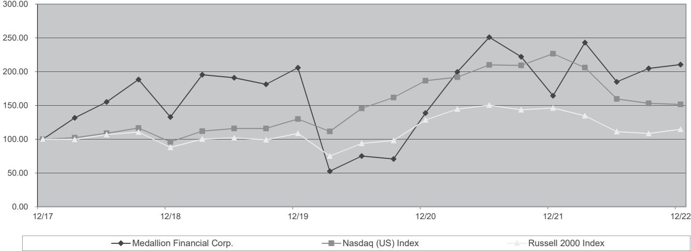

{0}------------------------------------------------

# **UNITED STATES SECURITIES AND EXCHANGE COMMISSION WASHINGTON, D.C. 20549**

# **FORM 10-K**

#### **(Mark One)**

☒ **ANNUAL REPORT PURSUANT TO SECTION 13 OR 15(d) OF THE SECURITIES EXCHANGE ACT OF 1934**

**For the Fiscal Year Ended December 31, 2022**

**OR**

☐ **TRANSITION REPORT PURSUANT TO SECTION 13 OR 15(d) OF THE SECURITIES EXCHANGE ACT OF 1934**

> **For the transition period from to Commission file number 001-37747**

# **MEDALLION FINANCIAL CORP.**

**(Exact name of registrant as specified in its charter)**

**DELAWARE 04-3291176**

**(State of Incorporation)**

**(IRS Employer Identification No.)**

**437 MADISON AVENUE, 38th Floor, NEW YORK, NEW YORK 10022**

**(Address of principal executive offices) (Zip Code)**

**(212) 328-2100**

**(Registrant's telephone number, including area code)**

**Securities registered pursuant to Section 12(b) of the Act:**

| Title of each class                      | Trading symbols | Name of each exchange on which registered |
|------------------------------------------|-----------------|-------------------------------------------|
| Common Stock, par value \$0.01 per share | MFIN            | NASDAQ Global Select Market               |

**Securities registered pursuant to Section 12(g) of the Act: None**

Indicate by check mark if the registrant is a well-known seasoned issuer, as defined in Rule 405 of the Securities Act. YES ☐ NO ☒

Indicated by check mark if the registrant is not required to file reports pursuant to Section 13 or Section 15(d) of the Act. YES ☐ NO ☒

Indicate by check mark whether the registrant (1) has filed all reports required to be filed by Section 13 or 15(d) of the Securities Exchange Act of 1934 during the preceding 12 months (or for such shorter period that the registrant was required to file such reports), and (2) has been subject to such filing requirements for the past 90 days. YES ☒ NO ☐

Indicate by check mark whether the registrant has submitted electronically every Interactive Data File required to be submitted pursuant to Rule 405 of Regulation S-T (§232.405 of this chapter) during the preceding 12 months (or for such shorter period that the registrant was required to submit such files). YES ☒ NO ☐

Indicate by check mark whether the registrant is a large accelerated filer, an accelerated filer, a non-accelerated filer, a smaller reporting company, or an emerging growth company. See the definitions of "large accelerated filer," "accelerated filer," "smaller reporting company," and "emerging growth company" in Rule 12b-2 of the Exchange Act.

| Emerging growth company | ☐ |
|-------------------------|---|

Large accelerated filer ☐ Accelerated filer ☒ Non-accelerated filer ☐ Smaller reporting company ☒

If an emerging growth company, indicate by checkmark if the registrant has elected not to use the extended transition period for complying with any new or revised financial accounting standards provided pursuant to Section 13(a) of the Exchange Act. ☐

Indicate by check mark whether the registrant has filed a report on and attestation to its management's assessment of the effectiveness of its internal control over financial reporting under Section 404(b) of the Sarbanes-Oxley Act (15 U.S.C. 7262(b)) by the registered public accounting firm that prepared or issued its audit report. ☒

If securities are registered pursuant to Section 12(b) of the Act, indicate by check mark whether the financial statements of the registrant included in the filing reflect the correction of an error to previously issued financial statements. ☐

Indicate by check mark whether any of those error corrections are restatements that required a recovery analysis of incentive-based compensation received by any of the registrant's executive officers during the relevant recovery period pursuant to §240.10D-1(b). ☐

Indicate by check mark whether the registrant is a shell company (as defined in Rule 12b-2 of the Act). YES ☐ NO ☒

The aggregate market value of the voting common equity held by non-affiliates of the registrant, computed by reference to the last reported price at which the stock was sold on June 30, 2022, as reported on NASDAQ, was \$124,245,741.

The number of outstanding shares of registrant's common stock, par value \$0.01, as of March 9, 2023 was 23,319,836.

**DOCUMENTS INCORPORATED BY REFERENCE**

**Portions of the registrant's Definitive Proxy Statement for its 2023 Annual Meeting of Shareholders, for which a Definitive Proxy Statement will be filed with the Securities and Exchange Commission not later than 120 days after the registrant's fiscal year-end of December 31, 2022, are incorporated by reference into Part III of this Form 10-K.**

{1}------------------------------------------------

{2}------------------------------------------------

|            |                                                                 | Page |
|------------|-----------------------------------------------------------------|------|
| PART I     |                                                                 | 4    |
| ITEM 1.    | OUR BUSINESS                                                 | 4    |
| ITEM 1A.   | RISK FACTORS                                                 | 19   |
| ITEM 1B.   | UNRESOLVED STAFF COMMENTS                                       | 32   |
| ITEM 2.    | PROPERTIES                                                      | 32   |
| ITEM 3.    | LEGAL PROCEEDINGS                                               | 32   |
| ITEM 4.    | MINE SAFETY DISCLOSURES                                      | 32   |
| PART II    |                                                                 | 33   |
| ITEM 5.    | MARKET FOR REGISTRANT'S COMMON EQUITY, RELATED STOCKHOLDER      |      |
|            | MATTERS AND ISSUER PURCHASES OF EQUITY SECURITIES               | 33   |
| ITEM 6.    | [RESERVED]                                                      | 34   |
| ITEM 7.    | MANAGEMENT'S DISCUSSION AND ANALYSIS OF FINANCIAL CONDITION AND |      |
|            | RESULTS OF OPERATIONS                                        | 35   |
| ITEM 7A.   | QUANTITATIVE AND QUALITATIVE DISCLOSURES ABOUT MARKET RISK      | 53   |
| ITEM 8.    | FINANCIAL STATEMENTS AND SUPPLEMENTARY DATA                  | 53   |
| ITEM 9.    | CHANGES IN AND DISAGREEMENTS WITH ACCOUNTANTS ON ACCOUNTING AND |      |
|            | FINANCIAL DISCLOSURE                                         | 53   |
| ITEM 9A.   | CONTROLS AND PROCEDURES                                         | 53   |
| ITEM 9B.   | OTHER INFORMATION                                            | 56   |
| ITEM 9C.   | DISCLOSURE REGARDING FOREIGN JURISDICTIONS THAT PREVENT         |      |
|            | INSPECTIONS                                                  | 56   |
| PART III   |                                                                 | 56   |
| ITEM 10.   | DIRECTORS, EXECUTIVE OFFICERS AND CORPORATE GOVERNANCE       | 56   |
| ITEM 11.   | EXECUTIVE COMPENSATION                                       | 56   |
| ITEM 12.   | SECURITY OWNERSHIP OF CERTAIN BENEFICIAL OWNERS AND MANAGEMENT  |      |
|            | AND RELATED STOCKHOLDER MATTERS                              | 56   |
| ITEM 13.   | CERTAIN RELATIONSHIPS AND RELATED TRANSACTIONS, AND DIRECTOR    |      |
|            | INDEPENDENCE                                                 | 56   |
| ITEM 14.   | PRINCIPAL ACCOUNTANT FEES AND SERVICES                          | 56   |
| PART IV    |                                                                 | 57   |
| ITEM 15.   | EXHIBITS AND FINANCIAL STATEMENT SCHEDULES                   | 57   |
| ITEM 16.   | FORM 10-K SUMMARY                                            | 62   |
| SIGNATURES |                                                                 | 63   |

{3}------------------------------------------------

{4}------------------------------------------------

The following discussion should be read in conjunction with our financial statements and the notes to those statements and other financial information appearing elsewhere in this report.

This report contains forward-looking statements relating to future events and future performance applicable to us within the meaning of Section 27A of the Securities Act of 1933 and Section 21E of the Securities Exchange Act of 1934, or the Exchange Act, including, without limitation, statements regarding our expectations, beliefs, intentions, or future strategies that are signified by the words expects, anticipates, intends, believes, or similar language. In connection with certain forward-looking statements contained in this Form 10-K and those that may be made in the future by or on behalf of the Company, the Company notes that there are various factors that could cause actual results to differ materially from those set forth in any such forward-looking statements. The forwardlooking statements contained in this Form 10-K were prepared by management and are qualified by, and subject to, significant business, economic, competitive, regulatory, and other uncertainties and contingencies, all of which are difficult or impossible to predict, and many of which are beyond control of the Company. In particular, any forward-looking statements are subject to the risks and great uncertainties associated with the pending litigation with the Securities and Exchange Commission as well as the current inflationary environment and the risk of recession.

All forward-looking statements included in this document are based on information available to us on the date hereof, and we assume no obligation to update any forward-looking statements. The statements have not been audited by, examined by, compiled by, or subjected to agreed-upon procedures by independent accountants, and no third-party has independently verified or reviewed such statements. Readers of this Form 10-K should consider these facts in evaluating the information contained herein. In addition, the business and operations of the Company are subject to substantial risks which increase the uncertainty inherent in the forward-looking statements contained in this Form 10-K. The inclusion of the forward-looking statements contained in this Form 10-K should not be regarded as a representation by the Company or any other person that the forward-looking statements contained in this Form 10-K will be achieved.

In light of the foregoing, readers of this Form 10-K are cautioned not to place undue reliance on the forward-looking statements contained herein. You should consider these risks and those described under Risk Factors in this Form 10-K and others that are detailed in the other reports that the Company files from time to time with the Securities and Exchange Commission.

{5}------------------------------------------------

# **PART I**

# **ITEM 1. OUR BUSINESS**

We, Medallion Financial Corp., or the Company, are a specialty finance company organized as a Delaware corporation. Our strategic focus is growing our consumer finance and commercial lending businesses. Our total assets were \$2.3 billion as of December 31, 2022 and \$1.9 billion as of December 31, 2021.

We conduct our business through various wholly-owned subsidiaries, including:

- Medallion Bank, or the Bank, a Federal Deposit Insurance Corporation, or FDIC, insured industrial bank that originates consumer loans, raises deposits and conducts other banking activities and has a separate board of directors with a majority of independent directors;
- Medallion Capital, Inc., or Medallion Capital, a Small Business Investment Company, or SBIC, which conducts a mezzanine financing business;
- Medallion Funding LLC, or Medallion Funding, an SBIC, historically our primary taxi medallion lending company; and
- Freshstart Venture Capital Corp., or Freshstart, an SBIC which historically originated and serviced taxi medallion and commercial loans.

## **Our Market**

We provide loans to individuals and small to mid-size businesses, through our subsidiaries, under four operating segments:

- loans that finance consumer purchases of recreational vehicles, boats, and other consumer recreational equipment;
- loans that finance consumer home improvements;
- loans that finance commercial businesses; and
- historically, loans that finance taxi medallions.

The following table shows the details of our loans receivable as of December 31, 2022.

|                        |                 | Allowance for | Net Loans       |
|------------------------|-----------------|---------------|-----------------|
| (Dollars in thousands) | Loans           | Loan Loss     | Receivable      |
| Recreation             | \$ 1,183,512 | \$ 41,966  | \$ 1,141,546 |
| Home improvement       | 626,399         | 11,340        | 615,059         |
| Commercial             | 92,899          | 1,049         | 91,850          |
| Medallion              | 13,571          | 9,490         | 4,081           |
| Strategic partnership  | 572             | —             | 572             |
| Total                  | \$ 1,916,953 | \$ 63,845  | \$ 1,853,108 |

{6}------------------------------------------------

#### *Recreation Lending*

Recreation lending is a high-growth business focused on originating prime and non-prime recreation loans. The segment is a significant source of income, accounting for 71% of our interest income for the year ended December 31, 2022. All of our recreation loans are serviced by a third-party loan servicer that we have used since the business's inception.

We maintain relationships with approximately 3,100 dealers and financial service providers, or FSPs, not all of which are active at any one time. FSPs are entities that provide finance and insurance, or F&I, services to small dealers that do not have the desire or ability to provide F&I services themselves. The ability of FSPs to aggregate the financing and relationship management for many small dealers makes them valuable to us. We receive approximately half of our loan volume from dealers and the other half from FSPs. Our top ten dealer and FSP relationships were responsible for 48% of recreation lending's new loan originations for the year ended December 31, 2022. The percentage of new loan originations by the top ten dealer and FSP relationships is a measure of concentration, which management uses to determine whether to undertake diversification efforts, and which provides investors with information about origination concentration.

The recreation loan portfolio consists of thousands of geographically distributed loans with an average loan size of approximately \$18,000 as of December 31, 2022. The loans are fixed rate with an average term at origination of 11.3 years. The weighted average maturity of our loans outstanding is 9.6 years. The size, geographic dispersion, source and collateral variety of the loans reduces risk to the Company. As of December 31, 2022, recreation loans were primarily secured by recreational vehicles, or RVs, which make up 58% of the portfolio, and boat loans, which make up 19% of the portfolio. Recreation loans are made to borrowers residing nationwide, with the highest concentrations in Texas and Florida, at 16% and 11% of loans outstanding as of December 31, 2022 with no other states over 10%. As of December 31, 2022, 2021, and 2020, the weighted average FICO scores of our recreation loans outstanding were 671, 668, and 658. The weighted average FICO scores at the time of origination for the loans funded in the years ended December 31, 2022, 2021, and 2020 were 676, 684, and 680.

#### *Home Improvement Lending*

Working directly with contractors and FSPs, we offer flexible customer financing for window, siding, and roof replacement, swimming pool installations, and other home improvement projects. Our core product is a standard installment loan, which features affordable monthly payments and competitive interest rates for prime credit customers at no cost to the contractor. We also offer a variety of promotional loan options to help contractors close a challenging sale. Promotional loan options include same-as-cash, no interest, and deferred payment features, which allow borrowers to reduce the total cost of financing or start repayments when it is most convenient.

Home improvement lending operates in a manner similar to recreation lending, with a few key differences. We currently maintain a smaller number of relationships, with approximately 1,000 contractors and FSPs. Management monitors the number of contractors and FSPs and their relative contributions as a means of assessing market share and segment growth. Most of our home improvementfinanced sales take place in the borrower's home instead of a store, with the contractor presenting the borrower with a bid that includes a financing option.

A large proportion of our home improvement-financed sales are facilitated by contractor salespeople with limited financing backgrounds rather than by contractor employees who provide F&I services. The result is contractor demand for financing services that facilitate an in-home transaction (e.g., digital tools, including mobile applications for phone or tablet, support for E-SIGN compliant electronic signatures, and extended operating hours), and additional resources for the salesperson throughout the financing process. Our top ten contractors and FSP relationships were responsible for 62% of home improvement lending's new loan originations for the year ended December 31, 2022. The percentage of new loan originations by the top ten contractor and FSP relationships is a measure of concentration, which management uses to determine whether to undertake diversification efforts, and which provides investors with information about origination concentration.

We offer home improvement loans with only fixed rates, with an average term at origination of 13.8 years. The weighted average maturity of our loans outstanding is 12.4 years as of December 31, 2022. The average size of the loans in our home improvement portfolio at December 31, 2022 is approximately \$20,000. The geographic dispersion of the home improvement loan portfolio supplements credit quality in reducing risk to the Company. As of December 31, 2022, home improvement loans were concentrated in roofs, swimming pools, and windows at 37%, 23%, and 12%. Home improvement loans are made to borrowers residing nationwide, with the highest concentrations in Texas, Florida, and Ohio at 10%, 10%, and 8% of loans outstanding as of December 31, 2022 and with no other states over 6%. As of December 31, 2022, 2021, and 2020, the weighted average FICO scores of our home improvement loans outstanding were 753, 754, and 758. The weighted average FICO scores at the time of origination for the loans funded in the years ended December 31, 2022, 2021, and 2020 were 758, 759, and 759.

{7}------------------------------------------------

#### *Commercial Lending*

We originate both senior and subordinated loans nationwide to businesses to finance either the purchase of the equipment and related assets necessary to open a new business or the purchase or improvement of an existing business. From the inception of the commercial loan business, we have originated more than \$1.0 billion in commercial loans. Commercial loans of \$92.9 million comprised 5% of our loans receivable as of December 31, 2022.

We have worked to increase our commercial loan activity, primarily because of the attractive higher yielding nature of most of this business. We focus our marketing efforts on the manufacturing, professional, scientific, and technical services, more than 47% of which are located in the Midwest region, with the rest scattered across the country. These commercial loans are primarily secured by a second position on all assets of the businesses and generally range in amount from \$2.0 million to \$5.0 million at origination. As a component of most of the transactions, a portion of the investment is an equity or partnership stake, and occasionally, we also receive warrants to purchase an equity interest in the borrowers or some other form of success fee or profit participation. We plan to continue expanding our commercial loan activities by developing a more diverse borrower base with a wider geographic area of coverage, and by expanding the targeted industries.

Commercial loans are generally secured by equipment, accounts receivable, real estate, or other assets, and have interest rates averaging 473 basis points over the prevailing prime rate at the end of 2022, compared to 912 basis points over the prime rate at the end of 2021.

#### *Medallion Lending*

Medallion loans of \$13.6 million comprised less than 1% of our loans receivable as of December 31, 2022. Including loans serviced for third parties, the total amount of medallion loans under our management was \$33.1 million as of December 31, 2022.

Medallion loans collateralized by New York City taxi medallions and related assets comprised 93% of the medallion loan portfolio as of December 31, 2022.

Our medallion loans are secured by the taxi medallion and enhanced with personal guarantees of the owners, shareholders or equity members. When a borrower defaults on a loan, we have the ability to restructure the underlying loan or repossess the taxi medallion collateralizing that loan and sell it in the market or through a foreclosure auction and pursue the personal guarantees, all of which we have done. We have recorded an allowance for loan losses against the loans to mitigate potential future losses, and since 2020, the entire portfolio has remained on nonaccrual. Consistent with our established policy, once loans become 120 days past due, they are charged off down to collateral value and transferred to loan collateral in process of foreclosure. Medallion loan collateral in process of foreclosure was \$20.4 million as of December 31, 2022, with 82% located in the New York City Market.

*New York City Market*. A New York City taxi medallion is the only permitted license to operate a taxi and accept street hails in New York City. As reported by the TLC, taxi medallions sold for a wide variety of prices during 2022 supporting our estimated value of \$79,500, net of liquidation costs, as of December 31, 2022.

A prospective taxi medallion owner must qualify under the taxi medallion ownership standards set and enforced by the TLC. These standards prohibit individuals with criminal records from owning taxi medallions, require that the funds used to purchase taxi medallions be derived from legitimate sources, and mandate that taxi vehicles and meters meet TLC specifications. In addition, before the TLC will approve a taxi medallion transfer, the TLC requires a letter from the seller's insurer stating that there are no outstanding claims for personal injuries in excess of insurance coverage. After the transfer is approved, the owner's taxi is subject to quarterly TLC inspections.

Most New York City taxi medallion transfers are handled through approximately 18 taxi medallion brokers licensed by the TLC. In addition to brokering taxi medallions, these brokers also arrange for TLC documentation insurance, vehicles, meters, and financing. We have excellent relations with many of the most active brokers, and previously had received referrals from them regularly.

{8}------------------------------------------------

#### *Strategic Partnerships*

In 2019, the Bank launched a strategic partnership program to provide lending and other services to financial technology, or fintech, companies to offer loans and other financial services to customers. The Bank entered into an initial partnership in 2020 and began issuing its first loans. The associated activities are currently limited to originating loans or other receivables facilitated by our strategic partners and selling those loans or receivables to our strategic partners or other third parties without recourse within a specified time after origination, such as three business days. Revenues are currently derived primarily from contracted program fees paid to us by our strategic partners and interest income earned while the loans or receivables remain on our books, offset by any transaction fees paid by us to our strategic partners for their role in processing loan applications. We originated \$49.5 million and \$11.0 million of strategic partnership loans for the years ended December 31, 2022 and 2021. We held \$0.6 million and \$0.1 million of strategic partnership loans as of December 31, 2022 and 2021.

#### **Our Strategy**

Our core philosophy has been to identify markets that are profitable and where we can obtain defensible market positions. The key elements of our strategy to grow our consumer lending (recreation and home improvement) and commercial lending businesses and increase their profitability include:

*Capitalize on relationships with brokers and dealers.* We are committed to establishing, building, and maintaining relationships with our brokers and dealers. Our marketing efforts are focused on building relationships in the consumer markets as we work directly with dealerships, contractors and FSPs to offer quality financing for their customers, including those with past credit challenges. We believe that relationships with dealers and brokers provide us with, in addition to loan origination opportunities, significant benefits, including an additional layer of due diligence and additional monitoring capabilities. We have assembled a management team that has developed an extensive network of dealer and broker relationships in our target markets over the last 50 years. We believe that our management team's relationships with these dealers and brokers have provided and will continue to provide us with loan origination opportunities. In 2022, all of our consumer loans were generated by brokers, dealers, contractors, and FSPs.

*Focus on niche industries and our expertise in these niche fields.* We specialize in providing consumer loans for the purchase of RVs, boats, and other consumer recreational equipment, and to finance home improvements through contractors and suppliers in the home improvement sector. We believe our focus on these niche areas provides us with an opportunity to realize favorable returns.

*Employ disciplined underwriting policies and maintain rigorous portfolio monitoring*. We have an extensive loan underwriting and monitoring process. We conduct a thorough analysis of each potential loan and its prospects, competitive position, financial performance, and industry dynamics. We stress the importance of credit and risk analysis in our underwriting process. We believe that our continued adherence to this disciplined process will permit us to continue to generate a stable, diversified and increasing revenue stream of current income from our earning assets to enable us to make distributions to our stockholders.

*Leverage the skills of our experienced management team*. The members of our management team have broad investment backgrounds, with prior experience in banking and non-bank consumer and commercial lending, at specialty finance companies, middle market commercial banks, and other financial services companies. We believe that the experience and contacts of our management team will continue to allow us to effectively implement the key aspects of our business strategy.

*Seek strategic acquisitions.* In addition to increasing market share in existing lending markets and identifying new niches, we seek to acquire other financing businesses and related portfolios, and specialty finance companies that make secured loans to small businesses and consumers which have experienced historically low loan losses similar to our own. Since our initial public offering in May 1996, we have acquired eight specialty finance companies, five loan portfolios, and three taxi rooftop advertising companies.

*Expand our strategic partnership program*. We launched an initial fintech partnership during 2020. These activities include originating loans or other receivables marketed by our partners, and selling those loans or receivables to our partners or others, within a specified time after origination, such as three business days. Revenues are derived primarily from contracted program fees paid to us by our partners, and interest income earned while the loans or receivables are on our books, offset by transaction fees paid to our partners for processing loan applications. Our partners are non-banks offering loans and other financial services to their customers. We continue to evaluate and launch additional partnerships.

{9}------------------------------------------------

#### **Loan Characteristics**

*Consumer Loans.* Consumer loans generally require equal monthly payments covering accrued interest and amortization of principal over a negotiated term, generally around eleven to fourteen years. Interest rates offered are fixed. Borrowers may prepay consumer loans without any prepayment penalty. In general, the Bank has established relationships with dealers, FSPs, and contractors, which are the sources for consumer loan volumes. The loans are made up of recreation loans and home improvement loans which were 65% and 35% of total consumer loans at December 31, 2022.

Our recreation loans are secured primarily by RVs, boats and other consumer recreational equipment with a small proportion of loans secured by other collateral such as autos, motorcycles and boat motors. These loans, which together make up our largest and most profitable loan portfolio, have a weighted average yield of 13.28% at December 31, 2022. Our home improvement loans are secured by the personal property installed on real property, and the security interest for some of these loans is perfected with a UCC fixture filing. As of December 31, 2022, these loans had a weighted average yield of 8.64%.

*Commercial Loans.* We have typically originated commercial loans in principal amounts generally ranging from \$2.0 million to \$5.0 million, and occasionally have originated loans under or in excess of those amounts. These loans are generally retained and typically have maturities ranging from three to ten years and require monthly payments ranging from full amortization over the loan term to fully deferred interest and principal at maturity, with multiple payment options in between. Substantially all loans may be prepaid, and in the first five years, a prepayment fee may be owed to us. The term of, and interest rate charged on, certain of our outstanding loans are subject to the regulations of the Small Business Administration, or the SBA. Under SBA regulations, the maximum rate of interest permitted on loans originated by us is 19%; however, terms and interest rates are subject to market competition for all loans.

*Medallion Loans.* Our medallion loan portfolio consists of mostly fixed-rate loans, collateralized by first security interests in taxi medallions and related assets. We estimate that the weighted average loan-to-value ratio of all of the medallion loans was 339% as of December 31, 2022, compared to 295% as of December 31, 2021. These ratios do not factor in the reserve on these loans of \$9.5 million and \$9.2 million as of December 31, 2022 and 2021 and also do not include loan collateral in process of foreclosure, held at the lower of amortized cost or collateral value. In addition, we have recourse against the vast majority of the owners of the taxi medallions and related assets through personal guarantees. Other than in connection with dispositions of existing medallion assets, Medallion Financial Corp. has not originated a new medallion loan since 2015, and the Bank has not originated a new medallion loan since 2014.

#### **Marketing, Origination, and Loan Approval Process**

Each loan application is individually reviewed through analysis of several factors, including loan-to-value ratios, the borrower's credit history, public records, personal interviews, trade references, personal inspection of the premises, and approval from the TLC, SBA, or other regulatory body, if applicable. Each commercial and medallion loan applicant is required to provide personal or corporate tax returns, premises leases, and/or property deeds.

The Company's senior management establishes loan origination criteria. Loans that conform to such criteria may be processed by a loan officer with the proper credit authority, and non-conforming loans (other than those by the Bank) must be approved by the Company's Chief Executive Officer, President, and/or the Chief Credit Officer and the Investment Oversight Committee of the Company's board of directors. Loan criteria for loans originated with the Bank is established by the Bank's board of directors and senior management. The Bank's policies identify specific approval authorities for its recreation and home improvement loans. Policy exceptions are reported to the Bank's board of directors. Consumer loans are primarily sourced through relationships with RV and boat dealers, and home improvement contractors throughout our market area. Commercial loans are generally sourced through a network of private equity sponsors who we have long-standing relationships with, and are also referred by contacts with banks, attorneys, and accounting firms.

#### **Sources of Funds**

Management determines our funding sources, based upon an analysis of the respective financial and other costs and burdens associated with funding sources. We also fund our lending operations through debt offerings and private placements, fixed-rate, senior secured notes, long-term subordinated debentures issued to the SBA, as well as preferred equity securities at our subsidiaries. In the past, we have utilized credit facilities with banks, as well as equity and debt offerings, to fund our lending operations. Our funding strategy and interest rate risk management strategy is to have the proper structuring of debt to minimize both rate and maturity risk, while maximizing returns with the lowest cost of funding over an intermediate period of time. Since the inception of the Bank, substantially all of the Bank's borrowings have been provided by FDIC insured brokered certificates of deposit.

{10}------------------------------------------------

The table below summarizes our sources of available funds and amounts outstanding under credit facilities, exclusive of deferred financing costs of \$7.0 million, and their respective end of period weighted average interest rates at December 31, 2022. See Note 5 to the consolidated financial statements for additional information.

| (Dollars in thousands)                                  | Total           |
|---------------------------------------------------------|-----------------|
| Cash, cash equivalents, and federal funds sold          | \$ 105,598   |
| Brokered certificates of deposit & other funds borrowed | 1,610,922       |
| Average interest rate                                   | 1.91%           |
| Retail and privately placed notes                       | 121,000         |
| Average interest rate                                   | 7.66%           |
| Maturity                                                | 3/24 - 12/27    |
| SBA debentures and borrowings                           |                 |
| Amounts undisbursed                                     | 4,750           |
| Amounts outstanding                                     | 68,512          |
| Average interest rate                                   | 3.08%           |
| Maturity                                                | 3/23 - 3/33     |
| Preferred securities                                    | 33,000          |
| Average interest rate                                   | 6.86%           |
| Maturity                                                | 9/37            |
| Total cash(1)                                           | \$ 105,598   |
| Total debt outstanding                                  | \$ 1,833,434 |

(1) Includes \$74.1 million at the Bank and \$10.7 million at SBIC subsidiaries.

We fund our fixed-rate loans with fixed rate brokered or listing service certificates of deposit, fixed rate private notes, fixed-rate SBA debentures and borrowings, and to a lesser extent variable rate borrowings. The mismatch between maturities and interest-rate sensitivities of these balance sheet items results in interest rate risk. We seek to manage our exposure to increases in market rates of interest to an acceptable level by incurring fixed-rate debt.

Nevertheless, we accept varying degrees of interest rate risk depending on market conditions. For additional discussion of our funding sources and asset liability management strategy, see Asset/Liability Management on page 48.

#### **Competition**

Banks, credit unions, and finance companies, some of which are SBICs, compete with us in originating consumer and commercial loans. Many of these competitors have greater resources than we have, and certain competitors are subject to less restrictive regulations than we are. As a result, we cannot assure you that we will be able to identify and complete the financing transactions that will permit us to compete successfully.

# **Human Capital Resources**

As of December 31, 2022 we employed 158 persons: 119 at Medallion Bank, 33 at our parent company, and 6 at Medallion Capital. This compares to 136 persons at the end of 2021: 95 at Medallion Bank, 34 at our parent company, and 7 at Medallion Capital.

We are committed to hiring inclusively, fostering an inclusive culture, and ensuring equitable pay for employees. We value diversity among all of our employees. Equal employment opportunity is a fundamental principle at the Company, where employment is based upon personal capabilities and qualifications. We prohibit and do not tolerate any discrimination against employees, applicants, interns or any other covered persons, and we ensure equal employment opportunity without discrimination on the basis of race, color, creed, religion, national origin, ancestry, ethnicity, citizenship status, physical or mental disability, age, sex (including pregnancy), gender, gender identity or gender expression (including transgender status), marital status, familial status, veteran status, genetic information or any other protected characteristic as established by applicable federal, state or local law.

We incentivize our employees through a combination of competitive salary, equity compensation and other benefits. We provide most employees with incentive bonuses in the form of cash and equity. Employee equity ownership helps us attract, retain, motivate and reward employees, while aligning employee compensation with our stockholders' interests by linking realizable pay with stock performance.

Our Compensation Committee reviews management's recommendations and advises management and the Board of Directors on broad compensation policies such as salary ranges, annual incentive bonuses, long-term incentive plans, including equity-based compensation programs, and other benefit and perquisite programs.

We have a 401(k) Investment Plan and other generally available benefit programs like health insurance, paid and unpaid leaves, life insurance, disability coverage, accident insurance and critical illness insurance; we believe that the availability of these benefit programs generally enhance employee productivity and loyalty to the Company. We believe it is important for our employees at the Bank to provide service to the communities in which they live and encourage them to take time, including prearranged work time, to participate in activities of local civic organizations, charitable or nonprofit organizations or educational institutions. We value employee development and training and are committed to identifying and developing the talents of our next-generation leaders. Our employee benefits also help protect the health, well-being and financial security of our employees.

{11}------------------------------------------------

### **SUPERVISION AND REGULATION**

#### **Exemption from the 1940 Act**

In order to maintain our status as a non-investment company, we operate so as to fall outside the definition of an "investment company" or within an applicable exception. We expect to continue to fall within the exception from the definition of an "investment company" provided under Section 3(c)(6) of the 1940 Act as a company primarily engaged, directly or through majority-owned subsidiaries, in the business of, among other things, (i) banking, (ii) purchasing and otherwise acquiring notes, drafts, acceptances, open accounts receivable, and other obligations representing part or all of the sales price of merchandise, insurance and services, and (iii) making loans to manufacturers, wholesalers, and retailers of, and to prospective purchasers of, specified merchandise, insurance, and services. We monitor our continued compliance with this exception, and were compliant with as of December 31, 2022.

# **Regulation of Medallion Bank as an Industrial Bank**

In May 2002, we formed the Bank, which received approval from the FDIC for federal deposit insurance in October 2003. The Bank is subject to extensive federal and state banking laws, regulations, and policies that are intended primarily for the protection of depositors, the Deposit Insurance Fund, and the banking system as a whole; not for the protection of our other creditors and stockholders.

Under the banking charter, the Bank is authorized to make consumer and commercial loans, and may accept all FDIC-insured deposits other than demand deposits (checking accounts). As a state-charted non-member bank with FDIC-insured deposits, the Bank is examined, supervised and regulated by the FDIC and the Utah Department of Financial Institutions, or the Utah DFI. The statutes enforced by, and regulations and policies of, these agencies affect almost all aspects of its business, including by prescribing permissible types of loans and investments, the amount of required capital, the permissible scope of its activities and various other requirements. If the Bank's regulators were to determine that we have violated banking laws and regulations, including by engaging in unsafe and unsound practices, the Bank could be subject to enforcement and other regulatory actions, which could have an adverse effect on its business, results of operations and financial condition.

## **Capital Standards**

The Bank is subject to risk-based and leverage-based capital ratio requirements under the US Basel III capital rules adopted by the federal banking regulators.

Under the risk-based capital standards, the Bank's assets, exposures and certain off-balance sheet items are assigned to broad risk categories, each with designated weights, and the resulting capital ratios represent capital as a percentage of total risk-weighted assets. The minimum capital ratios applicable to us are as follows:

- **CET1 Risk-Based Capital Ratio**, equal to the ratio of Common Equity Tier 1 (CET1), capital to risk-weighted assets. CET1 capital primarily includes common shareholders' equity subject to certain regulatory adjustments and deductions, including with respect to goodwill, intangible assets, certain deferred tax assets and accumulated other comprehensive income. The minimum CET1 risk-based capital ratio requirement is 4.5%.
- **Tier 1 Risk-Based Capital Ratio**, equal to the ratio of Tier 1 capital to risk-weighted assets. Tier 1 capital primarily consists of CET1 capital and perpetual preferred stock. The minimum Tier 1 risk-based capital ratio requirement is 6%.
- **Total Risk-Based Capital Ratio**, equal to the ratio of total capital, including CET1 capital, additional Tier 1 capital and Tier 2 capital, to risk-weighted assets. The Bank's Tier 2 capital primarily includes allowance for loan and lease losses up to 1.25% of the Bank's risk-weighted assets. The minimum total risk-based capital ratio requirement is 8%.
- **Tier 1 Leverage Ratio**, equal to the ratio of Tier 1 capital to quarterly average assets (net of goodwill, certain other intangible assets and certain other deductions). The minimum Tier 1 leverage ratio requirement is 4%.

The prompt corrective action framework, which generally applies to FDIC-insured depository institutions, including the Bank, also includes capital requirements the Bank must satisfy in order to, among other things, be able to accept brokered deposits without limitations. See "Prompt Corrective Action" and "Brokered Deposits" below.

In addition to meeting the minimum capital requirements, under the U.S. Basel III capital rules, the Bank must also maintain the required capital conservation buffer of 2.5% to avoid becoming subject to restrictions on capital distributions (including dividends on the Bank's preferred stock) and certain discretionary bonus payments to management. The capital conservation buffer is calculated as a ratio of CET1 capital to risk-weighted assets, and it effectively increases the required minimum risk-based capital ratios.

{12}------------------------------------------------

The table below shows the capital requirements the Bank is required to maintain:

# **Minimum U.S. Basel III Regulatory Capital**

|                                 | Ratio Plus Capital Conservation Buffer |
|---------------------------------|----------------------------------------|
| CET1 risk-based capital ratio   | 7.0%                                   |
| Tier 1 risk-based capital ratio | 8.5%                                   |
| Total risk-based capital ratio  | 10.5%                                  |
|                                 |                                        |

For purposes of calculating the denominator of the three risk-based capital ratios, the assets of covered banking organizations are given risk weights that, under the US Basel III capital rules, range from 0% to 1,250%, depending on the nature of the asset. Most of the Bank's loans are assigned a 100% risk weight, with loans that are 90 days or more past due or on nonaccrual assigned a 150% risk weight. In addition, direct obligations of the U.S. Department of the Treasury (U.S. Treasury), or obligations unconditionally guaranteed by the U.S. government have a 0% risk weight, while general obligation claims on states or other political subdivisions of the United States are assigned a 20% risk weight, except for municipal or state revenue bonds, which have a 50% risk weight.

The U.S. Basel III capital rules provide for limited recognition in CET1 capital, and deduction from CET1 capital above certain thresholds, of three categories of assets: (i) deferred tax assets arising from temporary differences that cannot be realized through net operating loss carrybacks (net of related valuation allowances and of deferred tax liabilities), (ii) mortgage servicing assets (net of associated deferred tax liabilities) and (iii) investments in more than 10% of the issued and outstanding common stock of unconsolidated financial institutions (net of associated deferred tax liabilities). The federal banking regulators have adopted a rule that is designed to simplify the capital treatment of those categories of assets for banking organizations, such as the Bank, that are not subject to the advanced approaches in the U.S. Basel III capital rules.

In December 2017, the Basel Committee published standards that it described as the finalization of the Basel III post-crisis regulatory reforms. Among other things, these standards revise the Basel Committee's standardized approach for credit risk and provide a new standardized approach for operational risk capital. The Basel Committee's standards will generally be effective on January 1, 2023. As with all standards proposed by the Basel Committee, the December 2017 standards are not effective in any jurisdiction until rules implementing such standards have been implemented by the relevant regulators in such jurisdiction. The U.S. federal bank regulatory agencies have not yet proposed rules implementing these standards for the purposes of risk-based capital ratios.

Federal banking regulators published a final rule, effective in April 2019, permitting banking organizations to phase in any adverse day-one regulatory capital effects of the adoption of ASU 2016-13 (referred to as the current expected credit loss model, or CECL), over a period of three years. The Bank formally adopted CECL on January 1, 2023. For additional information on ASU 2016-13, see "Note 1. Organization and summary of significant accounting policies" in the annual audited financial statements included elsewhere in this Form 10-K.

The Economic Growth, Regulatory Relief, and Consumer Protection Act of 2018, or EGRRCPA, required the federal banking regulators to adopt regulations to implement an exemption from the U.S. Basel III capital rules for smaller banking organizations, including the Bank, that maintain a "Community Bank Leverage Ratio" of at least 8% to 10%. Specifically, the EGRRCPA provides that if any depository institution or depository institution holding company with less than \$10 billion in total consolidated assets maintains tangible equity in excess of this leverage ratio, as implemented by the federal banking regulators, it would be deemed to be in compliance with (i) the leverage and risk-based capital requirements promulgated by the federal banking agencies; (ii) in the case of a depository institution, the capital ratio requirements to be considered "well-capitalized" under the federal banking agencies' "prompt corrective action" regime; and (iii) "any other capital or leverage requirements" to which the depository institution or holding company is subject, unless the appropriate federal banking agency determines otherwise based on the particular institution's risk profile.

The FDIC has adopted a rule, implementing the Community Bank Leverage Ratio. Under the rule, the Community Bank Leverage Ratio is the same as the Tier 1 Leverage Ratio under the Basel III capital rules and a qualifying small banking organization, such as the Bank, that has less than \$10 billion in total consolidated assets and meets certain risk-based criteria can choose to apply the Community Bank Leverage Ratio framework if its Community Bank Leverage Ratio is greater than 9%. The Bank has not elected and currently does not expect to elect to apply the Community Bank Leverage Ratio framework, but will continue to assess the framework and may choose to apply it in the future.

As a condition to receipt of FDIC insurance, the Bank entered into the 2003 capital maintenance agreement with the FDIC requiring it to maintain a 15% leverage ratio (Tier 1 capital to average assets) and an adequate allowance for loan and lease losses and restricting the amount of medallion loans that the Bank may finance to three times the Bank's Tier 1 capital.

{13}------------------------------------------------

#### **Prompt Corrective Action**

The Bank is subject to FDIC regulations which apply to every FDIC-insured depository institution, setting out a system of mandatory and discretionary supervisory actions that generally become more severe as the capital levels of an individual institution decline. Pursuant to provisions of the Federal Deposit Insurance Act, or FDIA, and related regulations with respect to prompt corrective action, the federal banking regulators must take "prompt corrective action" with respect to FDIC-insured depository institutions that do not meet minimum capital requirements. The FDIA sets forth the following five capital categories: "well-capitalized," "adequately capitalized," "undercapitalized," "significantly undercapitalized" and "critically undercapitalized." An insured depository institution's capital category depends upon how its capital levels compare with various relevant capital measures and certain other factors that are established by regulation.

|                                 | "Well-capitalized" | "Adequately capitalized" |
|---------------------------------|--------------------|--------------------------|
| CET1 risk-based capital ratio   | 6.5%               | 4.5%                     |
| Tier 1 risk-based capital ratio | 8.0%               | 6.0%                     |
| Total risk-based capital ratio  | 10.0%              | 8.0%                     |
| Tier 1 leverage ratio           | 5.0%               | 4.0%                     |

If a bank meets the quantitative thresholds for well-capitalized status provided above and is not subject to any written agreement, order or directive from the appropriate regulatory agency to meet and maintain a specific capital level, it will qualify as well-capitalized. Failure to be well-capitalized or to meet minimum capital requirements could result in certain mandatory and possible additional discretionary actions by regulators that, if undertaken, could have a material adverse effect on the Bank's operations or financial condition. See "Brokered Deposits" below for additional information. Failure to be well-capitalized or to meet minimum capital requirements could also result in restrictions on the Bank's ability to pay dividends or otherwise distribute capital or to receive regulatory approval of applications. Pursuant to the 2003 capital maintenance agreement, the Bank has agreed that the Bank's capital levels will at all times meet or exceed the levels required for the Bank to be considered well-capitalized under FDIC rules.

#### **Brokered Deposits**

The Bank uses "brokered deposits" to fund a substantial portion of the Bank's activities. Under the FDIA and related regulations, FDIC-insured institutions such as the Bank may only accept brokered deposits without FDIC permission if they meet specified capital standards and are not subject to any written agreement, order or directive to meet and maintain a specific capital level, and are subject to restrictions with respect to the interest they may pay on deposits unless they are well-capitalized. In particular, the FDIA and the FDIC's regulations prohibit an insured depository institution from accepting brokered deposits unless it is well-capitalized or is adequately capitalized and receives a waiver from the FDIC.

Under FDIC regulations governing brokered deposit and interest rate restrictions. A bank that is "adequately capitalized" and accepts brokered deposits under a waiver from the FDIC may not pay an interest rate, at the time any such deposit is accepted, in excess of (i) 75 basis points over certain national rates described in the FDIC's regulations or (ii) 90% of the highest interest rate paid on a particular deposit product in the bank's local market area, if the bank provides notice to the FDIC and evidence of such local rate. There are no such restrictions under the FDIC on a bank that is well-capitalized.

Pursuant to the 2003 capital maintenance agreement, the Bank has agreed that our capital levels will at all times meet or exceed the level required for the Bank to be considered well-capitalized under FDIC rules. If the Bank was no longer able to accept or renew brokered deposits as a result of failing to meet the requisite capital standards or as a result of being subject to a written agreement, order or directive to meet and maintain a specific capital level, there would be a material adverse effect on the Bank's business, financial condition, liquidity and results of operations.

#### **Deposit Insurance**

The Bank's deposits have the benefit of FDIC insurance up to the applicable limits. The FDIC's Deposit Insurance Fund, or DIF, is funded by assessments on insured depository institutions, such as us. The Bank's assessment (subject to adjustment by the FDIC) is currently based on the Bank's average total consolidated assets less the Bank's average tangible equity during the assessment period, the Bank's supervisory ratings, and specified forward-looking financial measures used to calculate the assessment rate.

In October 2022, the FDIC adopted a rule applicable to all FDIC-insured banks that will increase initial base deposit insurance assessment rates by 2 basis points, beginning with the first quarterly assessment period of 2023. The FDIC, as required under the FDIA, established a plan in September 2020 to restore the DIF reserve ratio to meet or exceed the statutory minimum of 1.35 percent within eight years. The increased assessment is intended to improve the likelihood that the DIF reserve ratio would reach the required minimum by the statutory deadline of September 30, 2028.

{14}------------------------------------------------

#### **Payment of Dividends**

The power of the board of directors of an insured depository institution to declare a cash dividend or other distribution with respect to capital is subject to statutory and regulatory restrictions that limit the amount available for such distribution, depending upon earnings, financial condition and cash needs of the institution, as well as general business conditions. Insured depository institutions are also prohibited from paying management fees to any controlling persons or, with certain limited exceptions, making capital distributions, including dividends, if after such transaction the institution would be less than adequately capitalized.

Under Utah law, the Bank may only declare dividends to the Bank's shareholders out of the Bank's net profits, after providing for all expenses, losses, interest and taxes accrued or due. Further, the Bank is required to transfer to a surplus fund at least 10% of the Bank's net profits before dividends for the period covered by the dividend until the surplus fund reaches 100% of the Bank's capital stock. Any amount paid from the Bank's net earnings into a fund for the retirement of outstanding debt capital instruments or preferred stock for the period covered by the dividend will be considered an addition to the Bank's surplus fund if, upon the retirement of such instruments, the amount paid into the retirement fund for the period may be properly carried to the Bank's surplus fund.

The federal banking agencies also have authority to prohibit depository institutions from engaging in business practices that are considered unsafe or unsound, possibly including payment of dividends or other payments under certain circumstances even if such payments are not expressly prohibited by statute.

In addition, as discussed under "Capital Standards," if the Bank's risk-based capital ratios do not satisfy the minimum risk-based requirements plus the capital conservation buffer, the Bank will face graduated constraints on, among other things, capital distributions (including dividends on the Bank's preferred stock) based on the amount of the shortfall and the amount of the Bank's eligible retained income. For these purposes, eligible retained income is defined as the greater of (i) net income for the four preceding quarters, net of distributions and associated tax effects not reflected in net income; and (ii) the average net income over the preceding four quarters.

#### **Safety and Soundness**

The FDIA also implemented certain specific restrictions on transactions and required federal banking regulators to adopt overall safety and soundness standards for depository institutions related to internal controls, information systems and internal audit systems, loan documentation, credit underwriting, interest rate risk exposure, asset growth, asset quality, earnings, stock valuation and compensation, fees and benefits, and such other operational and managerial standards as the agencies deem appropriate. Guidelines adopted by the federal banking regulators establish general standards relating to internal controls and information systems, internal audit systems, loan documentation, credit underwriting, interest rate exposure, asset growth and compensation, fees and benefits. In general, these guidelines require, among other things, appropriate systems and practices to identify and manage the risk and exposures specified in the guidelines. These guidelines also prohibit excessive compensation as an unsafe and unsound practice and describe compensation as excessive when the amounts paid are unreasonable or disproportionate to the services performed by an executive officer, employee, director or principal shareholder. The federal banking agencies may require an institution to submit to an acceptable compliance plan as well as have the flexibility to pursue other more appropriate or effective courses of action given the specific circumstances and severity of an institution's noncompliance with one or more standards. The FDIC may also terminate deposit insurance upon a finding that the institution has engaged in unsafe and unsound practices, is in an unsafe or unsound condition to continue operations, or has violated any applicable law, regulation, rule, order or condition imposed by the FDIC.

Among other things, in addition to the restrictions on brokered deposits discussed above, the FDIA limits the interest rates paid on deposits by undercapitalized institutions and limits the aggregate extensions of credit by a depository institution to an executive officer, director, principal shareholder or related interest.

#### **Consumer Financial Protection**

The Bank is subject to a number of federal and state consumer protection laws that extensively govern the Bank's consumer lending businesses. These laws include, but are not limited to, the Equal Credit Opportunity Act, the Fair Credit Reporting Act, the Truth in Lending Act, the Electronic Fund Transfer Act and these laws' respective state-law counterparts, as well as laws regarding unfair and deceptive acts and practices. These federal and state laws, among other things, require disclosures of the cost of credit and terms of deposit accounts, provide substantive consumer rights, prohibit discrimination in credit transactions, regulate the use of credit report information, provide financial privacy protections, prohibit unfair, deceptive and abusive practices and subject the Bank to substantial regulatory oversight. Violations of applicable consumer protection laws can result in significant potential liability from litigation brought by customers, including actual damages, restitution and attorneys' fees. Federal banking regulators, state attorneys general and state and local consumer protection agencies may also seek to enforce consumer protection requirements and obtain these and other remedies, including regulatory sanctions, customer rescission rights, and civil money penalties. Failure to comply with consumer protection requirements may also result in substantial reputational harm that could adversely affect our business.

{15}------------------------------------------------

#### **Community Reinvestment Act of 1977**

The Bank is subject to certain requirements and reporting obligations under the Community Reinvestment Act, or CRA. Under the CRA, the Bank has an obligation, consistent with safe and sound operations, to help meet the credit needs of our assessment area including low- and moderate-income individuals and communities in that assessment area. In connection with its examination of the Bank, the FDIC is required to assess our CRA performance in the areas of lending, investments and services. The FDIC may take compliance with the CRA into account when regulating and supervising our other activities. The CRA also requires the agencies to take into account banks' records of meeting community credit needs when evaluating applications for, among other things, new branches or mergers. We have elected to be evaluated for our compliance with CRA requirements based on a strategic plan we adopted with public involvement and regulatory approval. That strategic plan includes measurable goals for helping to meet the credit needs of our assessment area, and is available on our website. The CRA provides that CRA examination ratings be made public. The Bank received a rating of "Outstanding" in its most recently completed CRA examination.

In May 2022, the FDIC, the Office of the Comptroller of the Currency, or OCC, and the Board of Governors of the Federal Reserve System, or Federal Reserve, requested comment on a joint notice of proposed rulemaking intended to strengthen and modernize the CRA by: (i) expanding access to credit, investment, and basic banking services in low- and moderate-income communities; (ii) adapting to technological changes in the banking industry; (iii) standardizing metrics used for CRA evaluation for greater clarity, consistency and transparency in the application of the regulations; (iv) clarifying which activities qualify for CRA credit; and (v) tailoring CRA rules and data collection to bank size and business model. Comments were due by August 5, 2022. The Bank will continue to evaluate any changes to the CRA regulations and their impact to the Bank's financial condition, results of operations or liquidity.

#### **Transactions with Affiliates and Insiders**

The Bank is subject to certain federal laws that restrict and control our ability to extend credit and provide to or receive services from its affiliates under Sections 23A and 23B of the Federal Reserve Act and Regulation W promulgated thereunder. An affiliate of a bank is any company or entity that controls, is controlled by or is under common control with the bank. These restrictions include quantitative and qualitative limits on the amounts and types of transactions that may take place, including the transfer of funds by the Bank to certain of its affiliates in the form of loans, extensions of credit, investments, or purchases of assets. These restrictions also require that credit transactions with affiliates be collateralized and that its transactions with affiliates be on terms no less favorable to the Bank than comparable transactions with unrelated third parties. Generally, the Bank's covered transactions with any affiliate are limited to 10% of our capital stock and surplus, and covered transactions with all affiliates are limited to 20% of our capital stock and surplus.

The Bank is also subject to limits under federal law on its ability to extend credit to its directors, executive officers and principal shareholders (persons that beneficially own or control more than 10% of any class of our voting stock), as well as to entities owned or controlled by such persons. Among other things, extensions of credit to such insiders are required to be made on terms that follow credit underwriting procedures that are not less stringent than those prevailing for comparable transactions with non-insiders. Also, the terms of such extensions of credit may not involve more than the normal risk of non-repayment or present other unfavorable features and may not exceed certain limitations on the amount of credit extended to such persons individually and in the aggregate. Certain extensions of credit also require the approval of the Bank's board of directors.

#### **Financial Privacy and Cybersecurity**

Federal and state law contains extensive consumer privacy protection provisions. The Gramm-Leach-Bliley Act requires financial institutions to periodically disclose their privacy policies and practices relating to sharing such information and enables retail customers to opt out of institutions' ability to share information with unaffiliated third parties under certain circumstances. Other federal and state laws and regulations impact our ability to share certain information with affiliates and non-affiliates for marketing and/or non-marketing purposes, or to contact customers with marketing offers. The Gramm-Leach-Bliley Act also requires financial institutions to implement a comprehensive information security program that includes administrative, technical and physical safeguards to ensure the security and confidentiality of customer records and information. Federal law also makes it a criminal offense, except in limited circumstances, to obtain or attempt to obtain customer information of a financial nature by fraudulent or deceptive means.

State regulators have been increasingly active in implementing privacy and cybersecurity standards and regulations. In recent years, several states adopted regulations requiring certain financial institutions to implement cybersecurity programs and providing detailed requirements with respect to these programs, including data encryption requirements. Many states have also implemented or modified their data breach notification and data privacy requirements.

In addition, pursuant to requirements applicable to FDIC-supervised banking organizations, such as us, we are required to notify the FDIC within 36 hours of incidents that have materially disrupted, or degraded, or are reasonably likely to materially disrupt or degrade the banking organization's ability to deliver services to a material portion of its customer base, jeopardize the viability of key operations of the banking organization, or pose a threat to the financial stability of the United States.

{16}------------------------------------------------

#### **Anti-Money Laundering and the USA PATRIOT Act**

The Bank is subject to the anti-money laundering (AML) provisions of the Bank Secrecy Act, or the BSA, as amended by the USA PATRIOT Act, or the PATRIOT Act, and implementing regulations issued by the FDIC and the U.S. Treasury. The PATRIOT Act, which includes the International Money Laundering Abatement and Anti-Terrorist Financing Act of 2001, is intended to facilitate the detection and prosecution of terrorism and international money laundering. The PATRIOT Act establishes standards for verifying customer identification incidental to the opening of new accounts. Other provisions of the PATRIOT Act provide for special information sharing procedures governing communications with the government and other financial institutions with respect to suspected terrorists and money laundering activity, and enhancements to suspicious activity reporting, including electronic filing of suspicious activity reports over a secure filing network. The BSA requires all financial institutions, including banks, to, among other things, establish a risk-based system of internal controls reasonably designed to prevent money laundering and the financing of terrorism. The BSA includes a variety of record-keeping and reporting requirements (such as cash and suspicious activity reporting), as well as due diligence/know-your-customer documentation requirements. The U.S. Treasury's Office of the Financial Crimes Enforcement Network, or FinCEN, issued a final rule, applicable as of May 2018, to clarify and enhance customer due diligence requirements for financial institutions. The rule (among other things) imposes certain obligations on covered financial institutions with respect to their "legal entity customers," including corporations, limited liability companies and other similar entities. For each such customer that opens an account (including an existing customer opening a new account), the covered financial institution must identify and verify the customer's "beneficial owners," who are specifically defined in the rule. Bank regulators routinely examine institutions for compliance with customer due diligence obligations. The Anti-Money Laundering Act of 2020, or AMLA, which amends the BSA, is intended to comprehensively reform and modernize US anti-money laundering laws. Among other things, the AMLA codifies a risk-based approach to AML compliance for financial institutions; requires the US Department of the Treasury to promulgate priorities for anti-money laundering and countering the financing of terrorism policy; requires the development of standards by the Treasury Department for testing technology and internal processes for BSA compliance; expands enforcement- and investigations - related authority, including a significant expansion in the available sanctions for certain BSA violations and expands BSA whistleblower incentives and protections. Many of the statutory provisions in the AMLA will require additional rulemakings, reports and other measures, and the impact of the AMLA, including on our compliance costs and compliance risk relating to the BSA, will depend on, among other things, rulemaking and implementation guidance.

In June 2021, FinCEN issued the priorities for anti-money laundering and countering the financing of terrorism policy required under the AMLA. The priorities include: corruption, cybercrime, terrorist financing, fraud, transnational crime, drug trafficking, human trafficking and proliferation financing.

#### **Regulation by the SBA**

Medallion Funding, Medallion Capital, and Freshstart are each licensed by the SBA to operate as SBICs, under the Small Business Investment Act of 1958, as amended, or the SBIA. The SBIA authorizes the licensing of privately-held investment vehicles as SBICs in order to provide long term financing to small business concerns. Under the SBIA and the regulations promulgated by the SBA thereunder, a "small business concern" is a business that is independently owned and operated, which is not dominant in its field of operation, and which (i) has a tangible net worth, together with any affiliates, of \$19.5 million or less and average annual net income after US federal income taxes for the preceding two fiscal years of \$6.5 million or less (average annual net income is computed without the benefit of any carryover loss), or (ii) satisfies alternative criteria under the Federal government's North American Industry Classification System, or the NAICS, that assigns codes to the industry in which a small business is engaged and provides a small business size standard based either on the number of persons employed by the business or its gross revenues. In addition, at the end of each fiscal year, at least 25% of the total amount of investments must be made in "smaller enterprises" that have a net worth of \$6.0 million or less, and average net income after federal income taxes for the preceding two years of \$2.0 million or less. A business that meets the NAICS size standards also qualifies as a "smaller enterprise" for purposes of meeting SBA's size standard regulations.

Investments by SBICs must generally be in active, primarily domestic businesses. SBIC regulations preclude investment in the following types of businesses: (1) business whose primary business activity is as a relender or reinvestor (that is, directly or indirectly, providing funds to others, purchasing debt obligations, factoring, or long term leasing of equipment with no provision for maintenance or repair); (2) many kinds of real estate projects; (3) single purpose projects that are not continuing businesses; (4) companies located outside the US intending to use the proceeds of the investment outside of the US or companies that are located in the US that have more than 49% of their employees or tangible assets located outside of the US; (5) businesses that are passive and do not carry on an active trade or business; (6) businesses that use 50% or more of the funds to buy goods or services from an associated supplier; and (7) certain "sin businesses" such as gambling and the like.

{17}------------------------------------------------

Under current SBA regulations, the maximum rate of interest that Medallion Funding, Medallion Capital and Freshstart may charge may not exceed the higher of (i) 19% or (ii) the sum of (a) the higher of (i) that company's weighted average cost of qualified borrowings, as determined under SBA regulations, or (ii) the current SBA debenture rate, plus (b) 11%, rounded to the next lower eighth of one percent. As of December 31, 2022, the maximum rate of interest permitted on loans originated by Medallion Funding, Medallion Capital, and Freshstart was 19%. As of December 31, 2022, our outstanding medallion loans had a weighted average rate of interest of 2.09%, and our outstanding commercial loans had a weighted average rate of interest of 12.23%. Current SBA regulations also require that each loan originated by an SBIC has a term between one and 20 years.

In addition, SBICs are subject to periodic examination by the SBA, for which the SBA charges examination fees. SBICs must maintain certain records and make them available for SBA examination. SBICs also are required to prepare valuations of their portfolio investments in accordance with prescribed valuation guidelines, maintain certain minimum levels of capital, file annual reports containing financial, management and other information and file notices of certain material changes in their ownership and operations. We are typically examined by the SBA for compliance with applicable SBA regulations.

SBICs are precluded from making investments in a small business if it would give rise to certain conflicts of interest. Generally, a conflict of interest may arise if an associate of the SBIC has or makes an investment in the small business that the SBIC is financing or serves as one of its officers or would otherwise benefit from the financing. A conflict of interest would also occur if an SBIC were to lend money to any of its officers, directors, and employees, or invest in any affiliates thereof. Joint investing with an associate (such as another fund controlled by affiliates of the general partner of the fund) may be made on identical terms or on terms that are fair to the SBIC. The SBA also prohibits, without prior SBA approval, a "change of control" or transfers which would result in any person (or group of persons acting in concert) owning 10% or more of any class of capital stock of an SBIC. A "change of control" is any event which would result in the transfer of the power, direct or indirect, to direct the management and policies of an SBIC, whether through ownership, contractual arrangements, or otherwise.

Under SBA regulations, without prior SBA approval, loans and other investments by licensees with outstanding SBA leverage to any single small business concern may not exceed 30% of an SBIC's "regulatory capital."

SBICs may invest idle funds that are not being used to make loans or other long-term investments in certain short-term investments permitted under SBA regulations. These permitted investments include direct obligations of, or obligations guaranteed as to principal and interest by, the government of the US with a term of 15 months or less and deposits maturing in one year or less issued by an institution insured by the FDIC. These permitted investments must be maintained in (i) direct obligations of, or obligations guaranteed as to principal and interest by, the US, which mature within 15 months from the date of the investment; (ii) repurchase agreements with federally insured institutions with a maturity of seven days or less if the securities underlying the repurchase agreements are direct obligations of, or obligations guaranteed as to principal and interest by the US, and such securities must be maintained in a custodial account in a federally insured institution; (iii) mutual funds, securities, or other instruments that exclusively consist of, or represent pooled assets of, investments described in (i) or (ii) above; (iv) certificates of deposit with a maturity of one year or less, issued by a federally insured institution; (v) a deposit account in a federally insured institution, subject to withdrawal restriction of one year or less; (vi) a checking account in a federally insured institution; or (vii) a reasonable petty cash fund.

SBICs may purchase voting securities of small business concerns in accordance with SBA regulations. Although prior regulations prohibited an SBIC from controlling a small business concern except in limited circumstances, SBA regulations allow an SBIC to exercise control over a small business for a period of seven years from the date on which the SBIC initially acquires its control position. This control period may be extended for an additional period of time with the SBA's prior written approval.

If an SBIC defaults in its payment obligations to SBA under its outstanding debentures, fails to comply with any terms of its securities, or violates any law or certain regulations applicable to it, the SBA has the right to accelerate the maturity of all amounts due under its debentures. Additionally, the SBA may appoint a receiver for the SBIC and for its liquidation in the event of a default on payment of a SBIC's debentures or for serious regulatory violations.

{18}------------------------------------------------

#### **Other**

#### **Change in Control**

Because the Bank is an "insured depository institution" within the meaning of the FDIA and the Change in Bank Control Act as well as Medallion Financial Corp. being a "financial institution holding company" within the meaning of the Utah Financial Institutions Act, federal and Utah law and regulations prohibit any person or company from acquiring control of the Bank or Medallion Financial Corp., without, in most cases, prior written approval of the FDIC or the Commission of the Utah DFI, as applicable. Under the Change in Bank Control Act, control is conclusively presumed if, among other things, a person or company acquires 25% or more of any class of the Bank's voting stock. A rebuttable presumption of control arises if a person or company acquires 10% or more of any class of voting stock and is subject to several specified "control factors" as set forth in the applicable regulations. **Although the Bank is an "insured depository institution" within the meaning of the Federal Deposit Insurance Act and the Change in Bank Control Act, your investment in the Company is not insured or guaranteed by the FDIC, or any other agency, and is subject to loss.** Under the Utah Financial Institutions Act, control is defined as the power, directly or indirectly, or through or in concert with one or more persons to: (a) direct or exercise a controlling influence over (i) the management or policies of a financial institution or (ii) the election of a majority of the directors or trustees of an institution; or (b) to vote 25% or more of any class of voting securities of a financial institution. In addition, under Utah law, there is a rebuttable presumption that a person has control of a Utah financial institution if the person has the power, directly or indirectly, or through or in concert with one or more persons, to vote more than 10% but not less than 25% of any class of voting securities of a financial institution. If any holder of any series of the Bank's preferred stock is or becomes entitled to vote for the election of the Bank's directors, such series will be deemed a class of voting stock, and any other person will be required to obtain the non-objection of the FDIC under the Change in Bank Control Act to acquire or maintain 10% or more of that series. Investors are responsible for ensuring that they do not, directly or indirectly, acquire shares of our common stock in excess of the amount which can be acquired without regulatory approval.

#### **Examination and Supervision**

Federal and state banking agencies require the Bank to prepare annual reports on financial condition and to conduct an annual audit of financial affairs in compliance with minimum standards and procedures. We must undergo regular on-site examinations by the FDIC and the Utah DFI, which examine for adherence to a range of legal and regulatory compliance responsibilities. A bank regulator conducting an examination has complete access to the books and records of the examined institution. The results of the examination are confidential, with the exception of the CRA examination discussed above. The cost of examinations may be assessed against the examined institution as the agency deems necessary or appropriate.

#### **Incentive Compensation**

The FDIC has issued comprehensive guidance on incentive compensation policies intended to ensure that the incentive compensation policies of banking organizations do not undermine the safety and soundness of such organizations by encouraging excessive risk taking. The guidance, which covers all employees that have the ability to materially affect the risk profile of an organization, either individually or as part of a group, is based upon the key principles that a banking organization's incentive compensation arrangements should (i) provide incentives that appropriately balance risk and financial results in a manner that does not encourage employees to expose their organizations to imprudent risk, (ii) be compatible with effective internal controls and risk management and (iii) be supported by strong corporate governance, including active and effective oversight by the organization's board of directors.

The Dodd-Frank Act requires the federal banking regulators and the Securities and Exchange Commission, or the SEC, to establish joint regulations or guidelines at specified regulated entities having at least \$1 billion in total assets, such as us, prohibiting incentivebased payment arrangements that encourage inappropriate risk-taking by providing an executive officer, employee, director or principal shareholder with excessive compensation, fees, or benefits or that could lead to material financial loss to the entity. The federal banking regulators and the SEC proposed revised rules in 2016, which have not been finalized.

{19}------------------------------------------------

#### **Valid When Made and True Lender**

The FDIC has adopted a rule clarifying that a loan made by a state-chartered bank is considered "valid when made" pursuant to the preemptive authority in Section 27 of the FDIA, and therefore the loan's original terms, including, among others, its interest rate, are valid and enforceable by any subsequent assignee, transferee, or buyer, regardless of the usury laws of other states, or the "Valid-When-Made Rule". Under the Valid-When-Made Rule, the interest rate on a bank-made loan remains valid and enforceable even after the bank sells or transfers it to a party that could not have originated the loan on the same terms as the bank. The Valid-When-Made Rule does not address when a state-chartered bank is the "true lender" of a loan, and the ultimate effect of the FDIC rule remains uncertain in light of the overturning of the OCC's analogous rule pursuant to a Congressional Review Act resolution signed by President Biden, and other pending legal challenges to bank-fintech partnerships on the ground that the bank is not the "true lender." On August 20, 2020, the state attorneys general of seven states and the District of Columbia filed suit against the FDIC, alleging that the Valid-When-Made Rule conflicts with the FDIA, exceeds the FDIC's statutory authority, and violates the Administrative Procedure Act. On February 8, 2022, the United States District Court for the Northern District of California granted the FDIC's motion for summary judgement, holding that the FDIC had the power to issue the Valid-When-Made Rule and that its interpretation of the federal banking laws is entitled to judicial deference. The consortium of states may choose to appeal the ruling; however, we believe the impact to the Bank, regardless of outcome, would be minimal.

## **Future Legislation**

Congress may enact legislation from time to time that affects the regulation of the financial services industry, and state legislatures may enact legislation from time to time affecting the regulation of financial institutions chartered by or operating in those states. Federal and state regulatory agencies also periodically propose and adopt changes to their regulations or change the manner in which existing regulations are applied. The substance or impact of pending or future legislation or regulation, or the application thereof, cannot be predicted, although enactment of the proposed legislation could impact the regulatory structure under which we operate and may significantly increase our costs, impede the efficiency of our internal business processes, require us to increase our regulatory capital and modify our business strategy, and limit our ability to pursue business opportunities in an efficient manner.

# **AVAILABLE INFORMATION**

Our corporate website is located at www.medallion.com. We make copies of our Annual Reports on Form 10-K, Quarterly Reports on Form 10-Q, Current Reports on Form 8-K, and any amendments to those reports filed with or furnished to the SEC pursuant to Section 13(a) or 15(d) of the Exchange Act available on or through our website free of charge as soon as reasonably practicable after we electronically file them with or furnish them to the SEC. Our SEC filings can be found in the Investors Relations section of our website, the address of which is www.medallion.com/investors.html, or on the SEC website at www.sec.gov. Our Code of Ethical Conduct and Insider Trading Policy can be located in the Corporate Governance section of our website at www.medallion.com/investors_corporate_governance.html. These documents, as well as our SEC filings, are available in print free of charge to any stockholder who requests a copy from our Secretary.

{20}------------------------------------------------

## **ITEM 1A. RISK FACTORS**

#### **Risks Related to Our Loan Portfolios and Business**

**Our business is heavily concentrated in consumer lending, which carries a high risk of loss that is different from and typically higher than the risk of loss associated with commercial lending and which could be adversely affected by an economic downturn and inflation.**

Our business is heavily concentrated in consumer lending. As a result, we are more susceptible to fluctuations and risks particular to consumer credit than a more diversified company would be. Our business is particularly sensitive to macroeconomic conditions that affect the US economy, consumer spending and consumer credit, including for example, the impacts of inflation, which has had and could continue to have an adverse effect on consumer spending, a rising interest rate environment and the ongoing effects of the COVID-19 pandemic, as well as the impact that geopolitical responses to Russia's invasion of Ukraine have had on gasoline prices in the United States. We are also more susceptible to the risks of increased regulations and legal and other regulatory actions that are targeted at consumer credit or the specific consumer credit products that we offer (including promotional financing). Our business concentration could have a material adverse effect on our results of operations.

By its nature, lending to consumers carries with it different risks and typically a higher risk of loss than commercial lending. Although the net interest margins are intended to be higher to compensate us for this increased risk, an economic downturn could result in higher loss rates and lower returns than expected, and could affect the profitability of our consumer loan portfolios. During periods of economic slowdown, delinquencies, defaults, repossessions, and losses generally increase, and consumers may reduce their discretionary spending in areas such as recreation and home improvement, which constitute a significant majority of our business. These periods have been, and may continue to be, accompanied by increasing unemployment rates and declining values of consumer products securing outstanding accounts, which weaken collateral coverage and increase the amount of a loss in the event of default.

For example, the spread of COVID-19 in early 2020 created a global public-health crisis that resulted in widespread volatility and deterioration in employment levels as well as business, economic and market conditions. In March 2020, we adjusted our payment policies and procedures and created a program to support our borrowers during the pandemic, including by allowing borrowers to defer payments for up to 180 days. For 2020, the impact of this program was material to our operating results and financial position. The lingering effects of COVID-19 on New York City, where economic activity generally and taxi ridership in particular decreased dramatically during the pandemic and have not yet returned to pre-pandemic levels, and on all our other major medallion loan markets, largely prevented our payment deferral program from being effective for our medallion loans. During the third quarter of 2020, we placed all medallion loans on nonaccrual and adjusted them down to the collateral value, net of liquidation cost. We are continuing to evaluate options for our medallion loans, and actions that we may take to manage our medallion loan portfolio may result in additional write-downs, charge-offs or impairments, the impact of which could be material to our results of operations and financial condition. Although we believe that our deferral programs were effective in mitigating the effect of COVID-19 on our recreation and home improvement loan portfolios, the ultimate effects of COVID-19 on these loan portfolios and consumer businesses are uncertain, and we could suffer substantial losses in our recreation and home improvement loan portfolios as a result of the effects of the pandemic on the ability of our borrowers to repay their loans.

Additionally, higher gasoline prices, inflation, volatile real estate values and market conditions, reset of adjustable rate mortgages to higher interest rates, general availability of consumer credit, or other factors that impact consumer confidence or disposable income could increase loss frequency and decrease consumer demand for RVs, boats, consumer recreational equipment and other consumer products (including in connection with home improvement projects), as well as weaken collateral values on certain types of consumer products. Any decrease in consumer demand for those products could have a material adverse effect on our ability to originate new loans and, accordingly, on our business, financial condition, and results of operations.

Although declines in commodity prices, and more particularly gasoline prices, generally are financially beneficial to the individual consumer, these declines may also have a negative impact on unemployment rates in geographic areas that are highly dependent upon the oil and natural gas industry, which could adversely affect the credit quality of consumers in those areas.

Our balance sheet consists of a significant percentage of non-prime consumer loans, which are associated with higher than average delinquency rates. The actual rates of delinquencies, defaults, repossessions, and losses on these loans could be more dramatically affected by a general economic downturn. In addition, during an economic slowdown or recession, our servicing costs may increase without a corresponding increase in our net interest income.

{21}------------------------------------------------

Furthermore, our business is significantly affected by monetary and regulatory policies of the US Federal Government and its agencies. Changes in any of these policies are influenced by macroeconomic conditions and other factors that are beyond our control and could have a material adverse effect on us, including current higher interest rates, costs of compliance with increased regulation, and other factors. For example, the Federal Reserve raised the Federal Funds Rate several times in 2022 and early 2023 and is expected to continue doing so while inflation remains above historical levels in the United States. If inflationary pressures persist, our interest expense could increase faster than our interest income, reducing our net interest income and net interest margin, and continuing adverse impacts on consumer spending could reduce demand for our consumer loan products. These developments, along with United States government credit, debt ceiling and deficit concerns, global economic uncertainties and market volatility and the ongoing impacts of COVID-19, have caused and could continue to cause interest rates to be volatile.

The process we use to estimate losses inherent in our credit exposure requires complex judgments, including forecasts of economic conditions and how those economic conditions might impair the ability of our borrowers to repay their loans. The degree of uncertainty concerning economic conditions may adversely affect the accuracy of our estimates, which may, in turn, impact the reliability of the process and the quality of our assets.

#### **Our financial condition, liquidity and results of operations depend on the credit performance of our loans.**

As of December 31, 2022, 44% of our recreation loans were non-prime receivables with obligors who do not qualify for conventional consumer finance products as a result of, among other things, adverse credit history. While our underwriting guidelines are designed to confirm that, notwithstanding such factors, the obligor would be a reasonable credit risk, the receivables nonetheless are expected to experience higher default rates than a portfolio of obligations of prime obligors. The weakening of our underwriting guidelines for any reason, such as in response to the competitive environment, in an effort to originate higher yielding loans, a lack of discipline or diligence by our employees in underwriting and monitoring loans or our inability to adequately adapt policies and procedures to changes in economic or other conditions, may result in loan defaults and charge-offs that may necessitate increases to our allowance for loan losses, each of which could adversely affect our net income and financial condition. In the event of a default on a recreation loan, generally the most practical recovery method is repossession of the financed vehicle, although the collateral value of the vehicle usually does not fully cover the outstanding account balance and costs of recovery. Repossession sales that do not yield sufficient proceeds to repay the receivables in full typically result in losses on those receivables.

In addition, our prime portfolio has grown in proportion to our overall portfolio over the past several years. While prime portfolios typically have lower default rates than non-prime portfolios, we have less ability to make risk adjustments to the pricing of prime loans compared to non-prime loans. As a result, to the extent our prime portfolio continues to grow, a larger proportion of our business will consist of loans with respect to which we will have less flexibility to adjust pricing to absorb losses. As a result of these factors, we may sustain higher losses than anticipated in our prime portfolio. Additionally, if our prime loan losses are higher than expected then we may also be at risk with regard to our forecasted losses, which could impact our loss reserves and results of operations.

#### **Our allowance for loan losses may prove to be insufficient to cover losses on our loans.**

We maintain an allowance for loan losses (a reserve established through a provision for losses that decreases our earnings and that, accordingly, affects our financial condition) that we believe is appropriate to provide for incurred losses in our loan portfolio.

The process for establishing an allowance for loan losses is critical to our results of operations and financial condition, and requires complex models and judgments, including forecasts of economic conditions. Changes in economic conditions affecting borrowers, such as inflation and the risk of recession, growth in our loan portfolio, changes in the credit characteristics of our loan portfolio, new information regarding our loans and other factors, both within and outside of our control, may require an increase in the allowance for loan losses. In cases where we modify loans, if the modified loans do not perform as anticipated, we may be required to establish additional allowances on these loans. As of December 31, 2022, the overall allowance for loan losses increased from December 31, 2021, due in part to a higher allowance coverage ratio related to our recreation and home improvement loan portfolios, a result of the increased net charge-offs in 2022, compared to 2021.

We periodically review and update our methodology, models and the underlying assumptions, estimates and assessments we use to establish our allowance for loan losses to reflect our view of current conditions. Moreover, our regulators, as part of their supervisory function, periodically review the methodology, models and the underlying assumptions, estimates and assessments we use for calculating, and the adequacy of, our allowance for loan losses. Our regulators, based on their judgment, may conclude that we should modify our methodology, models or the underlying assumptions, estimates and assessments, increase our allowance for loan losses, and/or recognize further losses. We continue to review and evaluate our methodology, models and the underlying assumptions, estimates, and assessments we use and we will implement further enhancements or changes to them, as needed. We cannot provide assurance that our loan loss reserves will be sufficient to cover actual losses. Future increases in the allowance for loan losses or recognized losses (as a result of any review, update, regulatory guidance, changes in accounting standards or otherwise) will result in a decrease in net earnings and capital and could have a material adverse effect on our business, results of operations, and financial condition.

{22}------------------------------------------------

#### **Our business, financial condition and results of operations could be negatively impacted if we are unsuccessful in developing and maintaining relationships with dealerships, contractors, and FSPs.**

We originate loans by working with third-party sellers of consumer products and not by working directly with consumers. As a result, our ability to originate consumer loans depends on relationships with a limited number of dealerships, contractors, and FSPs. Although we have relationships with various dealerships, contractors, and FSPs, none of relationships are exclusive and each may be terminated at any time. In addition, a large proportion of our new loan originations are concentrated in our top ten relationships (62% in our home improvement portfolio and 48% in our recreation portfolio), the loss of a significant relationship could have a negative effect on demand for our products and our new loan originations. There is also significant competition for the contractor and FSP relationships we depend on in connection with our home improvement lending segment. The loss of any of these relationships, our failure to develop additional relationships, and circumstances in which our existing dealership, contractor, and FSP relationships generate decreased sales and loan volume all may have a material adverse effect on a substantial part of our business, financial condition and results of operations.

# **A reduction in demand for our products and failure by us to adapt to such reduction could adversely affect our business, financial condition and results of operations.**

The demand for the products we offer may be reduced due to a variety of factors, such as demographic patterns, changes in customer preferences or financial conditions, macroeconomic conditions, regulatory restrictions that decrease customer access to particular products or the availability of competing products. If we fail to adapt to significant changes in our customers' demand for, or access to, our products, our revenues could decrease and our operations could be adversely affected. Even if we do make changes to our product offerings to fulfill customer demand, customers may resist such changes or may reject such products. Moreover, the effect of any product change on the results of our business may not be fully ascertainable until the change has been in effect for some time, and, by that time, it may be too late to make further modifications to such product without causing further adverse effects to our business, results of operations, and financial condition.

# **Decreases or increases in prevailing interest rates could adversely affect our business, our cost of capital and our net interest income.**

Our commercial borrowers have the right to prepay their loans in full or in part at any time. Commercial borrowers are subject to a prepayment penalty of up to 5% during the first year, declining by one percentage point through the fifth year. A borrower is likely to exercise prepayment rights at a time when the interest rate payable on the borrower's loan is high relative to prevailing interest rates. In a lower interest rate environment, we will have difficulty re-lending prepaid funds at comparable rates, which may reduce the net interest income that we receive. When this occurs, we will generally reinvest these proceeds in temporary investments, pending their future investment in new portfolio companies. These temporary investments will typically have substantially lower yields than the debt being prepaid, and we could experience significant delays in reinvesting these amounts. Any future investment in a new portfolio company may also be at lower yields than the debt that was repaid. As a result, our results of operations could be materially adversely affected if a substantial number of our portfolio companies elect to prepay amounts owed to us and we are not able to reinvest the proceeds for comparable yields in a timely fashion. Additionally, prepayments could negatively impact our return on equity, which could result in a decline in the market price of our common stock.

Our profitability may be directly affected by interest rate levels and fluctuations in interest rates. As interest rates change, our gross interest rate spread on originations either increases or decreases because the rates charged on the loans originated are limited by market and competitive conditions, restricting our ability to pass on increased interest costs to the consumer. Additionally, although a significant percentage of our borrowers are non-prime and are not highly sensitive to interest rate movement, increases in interest rates may reduce the volume of loans we originate. While we monitor the interest rate environment and seek to mitigate the impact of increased interest rates, we cannot provide assurance that the impact of changes in interest rates can be successfully mitigated.

In addition, the majority of our loan portfolio is comprised of fixed-rate loans. To the extent our funding costs increase in response to an increase in market rates of interest, an abrupt increase in market rates of interest may have an adverse impact on our earnings until we are able to originate new loans at higher prevailing interest rates. During 2022, we saw an increase in the cost of certificates of deposit and we expect this increase to continue in 2023.

Additionally, because we borrow to fund our loans and investments, a portion of our income is dependent upon the difference between the interest rate at which we borrow funds and the interest rate at which we invest these funds. A portion of our investments, such as medallion loans, will have fixed interest rates, while a portion of our borrowings may have floating interest rates. As a result, a significant change in market interest rates could have a material adverse effect on our net investment income. In periods of rising interest rates, our cost of funds could increase, which would reduce our net investment income. We may hedge against interest rate fluctuations by using standard hedging instruments, subject to applicable legal requirements. These activities may limit our ability to participate in the benefits of lower interest rates with respect to the hedged portfolio. Adverse developments resulting from changes in interest rates or hedging transactions could have a material adverse effect on our business, financial condition, and results of operations. Also, we will have to rely on our counterparties to perform their obligations under such hedges.

{23}------------------------------------------------

## **Decreases in the value of our medallion loan collateral, including the impact on loans in process of foreclosure, had and may continue to have, a material adverse effect on our business.**

Other than in connection with dispositions of existing medallion assets, we stopped originating new medallion loans in July 2015, and the Bank has not originated new medallion loans since 2014. Our net medallion loans and related assets represent less than 1% of our total assets at December 31, 2022. In recent years, increased competition has reduced the overall market for taxi services, income generated from operating medallions, and the value of taxi medallions. If these trends continue, there will be further negative impacts to our medallion loans and related assets. We continue to utilize a market value for a New York City taxi medallion of \$85,000, \$79,500 net of liquidation costs, as of December 31, 2022.

Government entities may take other actions in the future, which could have adverse effects on the market for taxi medallions and which could affect our financial condition and results of operations. Every city in which we have originated medallion loans, and most other major cities in the United States, limits the supply of taxi medallions, which results in supply restrictions that support the value of taxi medallions. Loosening restrictions that result in the issuance of additional taxi medallions could decrease the value of taxi medallions in that market and in turn, adversely affect the value of the collateral securing our then outstanding medallion loans in that market.

We estimate that the weighted average loan-to-value ratio of our medallion loans was approximately 339% as of December 31, 2022. If taxi medallion values continue to decline, there is likely to be an increase in medallion loan delinquencies, foreclosures and borrower bankruptcies. Our ability to recover on defaulted medallion loans by foreclosing on and selling the taxi medallion collateral would be diminished, which would result in future losses on defaulted medallion loans that could have an effect on our business. If we are required to liquidate all or a portion of our medallion loans quickly, we would realize less than the value at which we had previously recorded such medallions.

#### **Uncertainty relating to the reporting of collateral values for our loans may adversely affect the value of our portfolio.**

Medallion loans are primarily collateral-based lending, whereby the collateral value generally exceeds the amount of the loan at the time of origination, providing sufficient excess collateral to protect us against losses. Collateral values for medallion loans reflect recent sales prices and are typically obtained from the regulatory agency in a particular local market. We rely on the integrity of the collateral value benchmarks obtained by the applicable regulatory agencies and other third parties. Any changes or volatility in these benchmarks could cause us to suffer losses. We have experienced a significant downward movement in medallion collateral values which has caused and may continue to cause a negative impact on our valuation analysis and could further significantly lower the fair market value measurements of our portfolio.

We require an objective benchmark in determining the value of our portfolio. If the benchmarks that we currently use are deemed to be unreliable, we will need to use other intrinsic factors in determining the collateral values for our loans.

#### **Financing and Related Risks**

# **Failure to raise additional capital in the future could have a material adverse effect on our results of operations and financial position.**

Our privately placed notes contain certain provisions that require us to meet certain tests in order to raise additional debt. We cannot guarantee that we will continue to meet such tests in the future. Additionally, our ability to obtain additional sources of funds including through credit facilities or other alternative sources of financing may be difficult, and we cannot guarantee that we will be able to do so on terms favorable to us or at all. The availability of credit facilities depends, in part, on factors outside of our control, including regulatory capital treatment for unfunded bank lines of credit, the financial strength and strategic objectives of the banks that participate in credit facilities and the availability of bank liquidity in general.

In addition, we may need to raise additional capital in the future to have sufficient capital resources and liquidity to meet our commitments, including the terms of the 2003 capital maintenance agreement, and fund our business needs and future growth, particularly if the quality of our assets or earnings were to deteriorate significantly. Our ability to raise additional capital, if needed, will depend on, among other things, conditions in the capital markets at that time, which are outside of our control, and our financial condition. We may not be able to obtain capital on acceptable terms or at all. Any occurrence that may limit our access to the capital markets, such as a decline in the confidence of capital markets investors or other disruptions in capital markets, may adversely affect our capital costs and our ability to raise capital and, in turn, our liquidity. Further, if we need to raise capital in the future, we may have to do so when other financial institutions are seeking to raise capital and would then have to compete with those institutions for investors. An inability to raise additional capital on acceptable terms when needed could have a material adverse effect on our business, financial condition, or results of operations.

{24}------------------------------------------------

## **Medallion Bank's use of brokered deposits for its deposit-gathering activities may not be available when needed. The inability to accept and renew brokered deposits would have a material adverse effect on our business, financial condition, liquidity, and results of operations.**

Medallion Bank relies on the established brokered deposit market to originate deposits to fund its operations. Additionally, Medallion Bank's business, strategy and prospects are dependent on its ability to accept and renew brokered deposits without limitation and, therefore, dependent on its ability to be "well-capitalized" under the FDIC's regulatory framework.

Medallion Bank's brokered deposits consist of deposits raised through the brokered deposit market rather than through retail branches. Although Medallion Bank has developed contractual relationships with a diversified group of investment brokers, and the brokered deposit market is well developed and utilized by many banking institutions, conditions could change that might affect the availability of brokered deposits. In addition, Medallion Bank's ability to rely on brokered deposits as a source of funding is subject to capitalization requirements set forth in the FDIC's prompt corrective action framework. Medallion Bank may not accept or renew brokered deposits unless it is "well-capitalized" or it is "adequately capitalized" and it receives a waiver from the FDIC. A bank that is "adequately capitalized" and that accepts or renews brokered deposits under a waiver from the FDIC is subject to additional restrictions on the interest rates it may offer. See "Our Business - Supervision and Regulation" for additional information.

If the capital levels at Medallion Bank fall below the "well-capitalized" level as defined by the FDIC, or we otherwise fail to maintain "well capitalized" status, Medallion Bank's ability to raise brokered deposits would be materially impaired. If Medallion Bank's capital levels fall below the "adequately-capitalized" level as defined by the FDIC, it would be unable to raise brokered deposits. Any impairment or inability to raise brokered deposits would have a material adverse effect on our business, financial condition, liquidity and results of operations. Brokered deposits may also not be as stable as other types of deposits, and if Medallion Bank experiences a period of sustained operating losses, the cost of attracting deposits from the brokered deposit market could increase significantly. Medallion Bank's ability to manage its growth to stay within the "well-capitalized" level is critical to our ability to retain open access to this funding source.

Investors in our securities, may be adversely affected and may face significant losses (including the possibility of losing their entire investment) if Medallion Bank is unable to accept or renew brokered deposits or if its access to the brokered deposit market were impaired.

#### **We depend on cash flow from our subsidiaries to make payments on our indebtedness and fund operations.**

We are primarily a holding company, and we derive most of our operating income and cash flow from our subsidiaries. As a result, we rely heavily upon distributions from our subsidiaries to generate the funds necessary to make payments on our indebtedness and fund operations. Funds are provided to us by our subsidiaries through dividends and payments on intercompany indebtedness, but we cannot assure you that our subsidiaries will be in a position to continue to make these dividend or debt payments. The Utah Department of Financial Institutions and FDIC have the authority to prohibit or to limit the payment of dividends by Medallion Bank. In addition, as a condition to receipt of FDIC insurance, Medallion Bank entered into a capital maintenance agreement with the FDIC requiring it to maintain a 15% Tier 1 leverage ratio (Tier 1 capital to average assets). As of December 31, 2022, Medallion Bank's Tier 1 leverage ratio was 16.2%. We received dividends from Medallion Bank of \$20.0 million and \$19.0 million for the years ended December 31, 2022 and 2021.

### **Legal and Regulatory Risks**

## **We are subject to pending litigation with the SEC for certain violations of the federal securities laws, which could result in material fines and/or other sanctions and accordingly have a material adverse effect on our business, reputation, financial condition, results of operations and/or stock price, as well as a bar against our President and Chief Operating Officer.**

As described in Note 10 "Commitments and Contingencies" to the consolidated financial statements included in this Annual Report on Form 10-K, on December 29, 2021, the SEC filed a civil complaint in the U.S. District Court for the Southern District of New York against the Company and its President and Chief Operating Officer alleging certain violations of the antifraud, books and records, internal controls and anti-touting provisions of the federal securities laws. The litigation relates to certain issues that occurred during the period 2015 to 2017, including (i) the Company's retention of third parties in 2015 and 2016 concerning posting information about the Company on certain financial websites and (ii) the Company's financial reporting and disclosures concerning certain assets, including Medallion Bank, in 2016 and 2017, a period when the Company had previously reported as a business development company (BDC) under the Investment Company Act of 1940. Since April 2018, the Company does not report as a BDC, and has not worked with such third parties since 2016. The Company does not expect to change previously reported financial results. The Company filed a motion to dismiss the complaint on March 22, 2022, the SEC filed an amended complaint on April 26, 2022 and the Company filed a motion to dismiss the amended complaint on August 5, 2022.

{25}------------------------------------------------

The SEC is seeking injunctive relief, disgorgement plus pre-judgment interest and civil penalties in amounts unspecified, as well as an officer and director bar against the Company's President and Chief Operating Officer. The Company and its President and Chief Operating Officer intend to defend themselves vigorously and believe that the SEC will not prevail on its claims. Nevertheless, depending on the outcome of the litigation, the Company could incur a loss and other penalties that could be material to the Company, its results of operations and/or financial condition, as well as a bar against its President and Chief Operating Officer. In addition, the Company has and expects to further incur significant legal fees and expenses in defending such charges by the SEC and the Company may be subject to shareholder litigation relating to these SEC matters.

# **We operate in a highly regulated environment, and if we are found to be in violation of any of the federal, state, or local laws or regulations applicable to us, our business could suffer.**

The Dodd-Frank Wall Street Reform and Consumer Protection Act, or the Dodd-Frank Act, was enacted in 2010. The Dodd-Frank Act significantly changed federal financial services regulation and affects, among other things, the lending, deposit, investment, trading, and operating activities of financial institutions and their holding companies. In addition to the statutory requirements under the Dodd-Frank Act, the legislation also delegated authority to US banking, securities, and derivatives regulators to impose additional restrictions through required rulemaking. The Dodd-Frank Act requires a company that owns an industrial bank to serve as a "source of strength" to the institution and is also subject to the "Volcker Rule." Although these requirements have not materially impacted us, we cannot assure you that they will not in the future.

Other changes in the laws or regulations applicable to us more generally, may negatively impact the profitability of our business activities, require us to change certain of our business practices, materially affect our business model, limit the activities in which we may engage, affect retention of key personnel, require us to raise additional regulatory capital, increase the amount of liquid assets that we hold, or otherwise affect our funding profile or expose us to additional costs (including increased compliance costs). Any such changes may also require us to invest significant management attention and resources to make any necessary changes and may adversely affect our ability to conduct our business as previously conducted or our results of operations or financial condition.

We are also subject to a wide range of federal, state, and local laws and regulations, such as local licensing requirements, and retail financing, debt collection, consumer protection, environmental, health and safety, creditor, wage-hour, anti-discrimination, whistleblower and other employment practices laws and regulations and we expect these costs to increase going forward. The violation of these or future requirements or laws and regulations could result in administrative, civil, or criminal sanctions against us, which may include fines, a cease and desist order against the subject operations or even revocation or suspension of our license to operate the subject business. As a result, we have incurred and will continue to incur capital and operating expenditures and other costs to comply with these requirements and laws and regulations.

# **The banking industry is highly regulated, and the regulatory framework, together with any future legislative or regulatory changes, may have a significant adverse effect on our operations.**

The banking industry is extensively regulated and supervised under both federal and state laws and regulations that are intended primarily for the protection of depositors, customers, federal deposit insurance funds, and the banking system as a whole, not for the protection of security holders. We are subject to regulation and supervision by the FDIC and the Utah DFI. The laws and regulations applicable to us govern a variety of matters, including permissible types, amounts, and terms of loans and investments we may make, the maximum interest rate that may be charged, the amount of reserves we must hold against deposits we take, the types of deposits we may accept, maintenance of adequate capital and liquidity, changes in the control of Medallion Bank and us, restrictions on dividends, and establishment of new offices. We must obtain approval from our regulators before engaging in certain activities or acquisitions, and there is the risk that such approvals may not be obtained, either in a timely manner or at all. Our regulators also have the ability to compel us to take, or restrict us from taking, certain actions entirely, such as actions that our regulators deem to constitute an unsafe or unsound banking practice. Our failure to comply with any applicable laws or regulations, or regulatory policies and interpretations of such laws and regulations, could result in sanctions by regulatory agencies, civil money penalties, or damage to our reputation, all of which could have a material adverse effect our business, financial condition or results of operations.

Federal and state banking laws and regulations, as well as interpretations and implementations of these laws and regulations, are continually undergoing substantial review and change. Financial institutions generally have also been subjected to increased scrutiny from regulatory authorities. Changes in the Presidential Administration or control of Congress also increases the likelihood of further changes to laws, regulations and supervisory practices affecting financial institutions, which could include more stringent requirements and greater scrutiny from regulatory authorities. These changes and increased scrutiny have resulted and may continue to result in increased costs of doing business and may in the future result in decreased revenues and net income, reduce our ability to effectively compete to attract and retain customers, or make it less attractive for us to continue providing certain products and services. Any future changes in federal and state law and regulations, as well as the interpretations and implementations, or modifications or repeals, of such laws and regulations, could affect us in substantial and unpredictable ways, including those listed above or other ways that could have a material adverse effect on our business, financial condition or results of operations.

{26}------------------------------------------------

Our inability to remain in compliance with regulatory requirements could have a material adverse effect on our operations in that market and on our reputation generally. No assurance can be given that applicable laws or regulations will not be amended or construed differently or that new laws and regulations will not be adopted, either of which could materially adversely affect our business, financial condition, or results of operations.

The USA PATRIOT Act of 2001 and the Bank Secrecy Act, or the BSA, require financial institutions to design and implement programs to prevent financial institutions from being used for money laundering and terrorist activities. If such activities are detected, financial institutions are obligated to file suspicious activity reports with FinCEN. These rules require financial institutions to establish procedures for identifying and verifying the identity of customers and beneficial owners of certain legal entity customers seeking to open new financial accounts. Federal and state bank regulators also have focused on compliance with Bank Secrecy Act and anti-money laundering regulations. Failure to comply with these regulations could result in fines or sanctions, including restrictions on conducting acquisitions or expanding activities. Although we have policies and procedures designed to assist in compliance with the BSA and other anti-money laundering laws and regulations, there can be no assurance that such policies or procedures will work effectively all of the time or protect us against liability for actions taken by our employees, agents, and intermediaries with respect to our business or any businesses that we may acquire. Failure to maintain and implement adequate programs to combat money laundering and terrorist financing could also have serious reputational consequences for us, which could have a material adverse effect on our business, financial condition or results of operations.

#### **Regulations relating to privacy, information security and data protection could increase our costs, affect or limit how we collect and use personal information and adversely affect our business opportunities.**

We are subject to various privacy, information security, and data protection laws, including requirements concerning security breach notification, and we could be negatively affected by these laws. For example, our business is subject to the Gramm-Leach-Bliley Act which, among other things: (i) imposes certain limitations on our ability to share nonpublic personal information about our customers with nonaffiliated third parties; (ii) requires that we provide certain disclosures to customers about our information collection, sharing and security practices and afford customers the right to "opt out" of any information sharing by us with nonaffiliated third parties (with certain exceptions); and (iii) requires that we develop, implement and maintain a written comprehensive information security program containing safeguards appropriate based on our size and complexity, the nature and scope of our activities, and the sensitivity of customer information we process, as well as plans for responding to data security breaches. Various state and federal banking regulators and states have also enacted data security breach notification requirements with varying levels of individual, consumer, regulatory or law enforcement notification in certain circumstances in the event of a security breach. Moreover, legislators and regulators are increasingly adopting or revising privacy, information security, and data protection laws that potentially could have a significant impact on our current and planned privacy, data protection, and information security-related practices, our collection, use, sharing, retention and safeguarding of consumer or employee information, and some of our current or planned business activities. This could also increase our costs of compliance and business operations and could reduce income from certain business initiatives. This includes increased privacyrelated enforcement activity at the federal level, by the Federal Trade Commission, as well as at the state level.

Compliance with current or future privacy, data protection, and information security laws (including those regarding security breach notification) could result in higher compliance and technology costs and could restrict our ability to provide certain products and services, which could have a material adverse effect on our business, financial conditions or results of operations. Our failure to comply with privacy, data protection, and information security laws could result in potentially significant regulatory or governmental investigations or actions, litigation, fines, sanctions, and damage to our reputation, which could have a material adverse effect on our business, financial condition, or results of operations.

## **Our use of third-party vendors and our other ongoing third-party business relationships are subject to regulatory requirements and scrutiny.**

We regularly use third-party vendors as part of our business. We also have substantial ongoing business relationships with other third parties. These types of third-party relationships are subject to demanding regulatory requirements and attention by our federal and state bank regulators. Regulation requires us to adopt enhanced due diligence, ongoing monitoring and control over our third-party vendors and other ongoing third-party business relationships. In certain cases, we may in the future be required to renegotiate our agreements with these vendors to meet these enhanced requirements, which could increase our costs and potentially limit our competitiveness. We expect that our regulators will hold us responsible for deficiencies in our oversight and control of our third-party relationships and in the performance of the parties with which we have these relationships. As a result, if our regulators conclude that we have not exercised adequate oversight and control over our third-party vendors or other ongoing third-party business relationships or that such third parties have not performed appropriately, we could be subject to enforcement actions, including civil money penalties or other administrative or judicial penalties or fines as well as requirements for customer remediation, any of which could have a material adverse effect our business, financial condition or results of operations.

{27}------------------------------------------------

If any of the various dealerships, contractors or FSPs through which we originate loans fails to fulfill their obligations to consumers or comply with applicable law, we may incur remediation costs. Although the dealerships, contractors and FSPs that we contract with are required to fulfill their contractual commitments to consumers and to comply with applicable law, from time to time they might not, or a consumer might allege that they did not. This, in turn, can result in claims against us or in loans being uncollectible. In those cases, we may decide that it is beneficial to remediate the situation, either by assisting the consumers to get a refund, working with the dealerships, contractors or FSPs to modify the terms of the loans or reducing the amount due by making a concession to the consumer or otherwise. Historically, the cost of remediation has not been material to our business, but it could be in the future.

#### **Our SBIC subsidiaries are licensed by the SBA and are therefore subject to SBA regulations.**

Our SBIC subsidiaries are licensed to operate as SBICs and are regulated by the SBA. The SBA also places certain limitations on the financing terms of investments by SBICs in portfolio companies and prohibits SBICs from providing funds for certain purposes or to businesses in a few prohibited industries. Compliance with SBA requirements may cause the SBIC subsidiaries to forego attractive investment opportunities that are not permitted under SBA regulations.

Further, SBA regulations require that a licensed SBIC be periodically examined and audited by the SBA to determine its compliance with the relevant SBA regulations. The SBA prohibits, without prior SBA approval, a "change of control" of an SBIC or transfers that would result in any person (or a group of persons acting in concert) owning 10% or more of a class of capital stock of an SBIC. If the SBIC subsidiaries fail to comply with applicable SBIC regulations, the SBA could, depending on the severity of the violation, limit or prohibit their use of debentures, declare outstanding debentures immediately due and payable, and/or limit them from making new investments. In addition, the SBA could revoke or suspend an SBIC license or may appoint a receiver for the SBIC and for its liquidation for willful or repeated violation of, or willful or repeated failure to observe, any provision of the SBIA or any rule or regulation promulgated thereunder. Such actions by the SBA would, in turn, negatively affect us.

# **Our ability to enter into transactions with our affiliates is restricted.**

The SBA restricts the ability of SBICs to lend money to any of their officers, directors, and employees, or invest in any affiliates thereof.

Medallion Bank is subject to certain federal laws that restrict and control its ability to engage in transactions with its affiliates. Sections 23A and 23B of the Federal Reserve Act and applicable regulations restrict the transfer of funds by Medallion Bank to certain of its affiliates, including us, in the form of loans, extensions of credit, investments, or purchases of assets and restrict its ability to provide services to, or receive services from, its affiliates. Sections 23A and 23B also require generally that Medallion Bank's transactions with its affiliates be on terms no less favorable to Medallion Bank than comparable transactions with unrelated third parties.

# **Federal and state law may discourage certain acquisitions of our common stock which could have a material adverse effect on our stockholders.**

Because Medallion Bank is an "insured depository institution" within the meaning of the Federal Deposit Insurance Act and the Change in Bank Control Act and Medallion Financial Corp. is a "financial institution holding company" within the meaning of the Utah Financial Institutions Act, federal and Utah law and regulations prohibit any person or company from acquiring control Medallion Bank or Medallion Financial Corp., without, in most cases, prior written approval of the FDIC or the Commissioner of the Utah Department of Financial Institutions, as applicable. Under the Change in Bank Control Act, control is conclusively presumed if, among other things, a person or company acquires 25% or more of any class of the Bank's voting stock. A rebuttable presumption of control arises if a person or company acquires 10% or more of any class of voting stock and is subject to several specified "control factors" as set forth in the applicable regulations. **Although Medallion Bank is an "insured depository institution" within the meaning of the Federal Deposit Insurance Act and the Change in Bank Control Act, your investment in the Company is not insured or guaranteed by the FDIC, or any other agency, and is subject to loss.** Under the Utah Financial Institutions Act, control is defined as the power, directly or indirectly, or through or in concert with one or more persons to: (a) direct or exercise a controlling influence over (i) management or policies of a financial institution or (ii) the election of a majority of the directors or trustees of an institution or (b) vote 25% or more of any class of voting securities of a financial institution. In addition, under Utah law, there is a rebuttable presumption that a person has control of a Utah financial institution if the person has the power, directly or indirectly, or through concern with one or more persons, to vote more than 10% but not less than 25% of any class of voting securities of a financial institution. Investors are responsible for ensuring that they do not, directly or indirectly, acquire shares of our common stock in excess of the amount which can be acquired without regulatory approval. These provisions could delay or prevent a third party from acquiring us, despite the possible benefit to our stockholders, or otherwise adversely affect the market price of our common stock.

{28}------------------------------------------------

#### **Risk Relating to Our Growth and Operations**

#### **Competition with other lenders could adversely affect us.**

The consumer lending market is very competitive and is served by a variety of entities, including banks, savings and loan associations, credit unions, independent finance companies, and financial technology companies. The recreation lending and home improvement lending markets are also highly fragmented, with a small number of lenders capturing large shares of each market and many smaller lenders competing for the remaining market share. Our competitors often seek to provide financing on terms more favorable to consumers or dealers, contractors, and FSPs than we offer. Many of these competitors also have long-standing relationships with dealers, contractors, and FSPs and may offer other forms of financing that we do not offer, e.g., credit card lending. We anticipate that we will encounter greater competition as we expand our operations, and competition may also increase in more stable or favorable economic conditions. Certain of our competitors are not subject to the same regulatory requirements that we are and, as a result, these competitors may have advantages in conducting certain business and providing certain services and may be more aggressive in their loan origination activities. Increasing competition could also require us to lower the rates we charge on loans in order to maintain our desired loan origination volume, which could also have a material adverse effect on our business, financial condition and results of operations.

# **We have in the past and may in the future pursue new strategies and lines of business, and we may face enhanced risks as a result of these changes in strategy, including from transacting with a broader array of customers and exposure to new assets, activities and markets***.*

In July 2019, we launched our strategic partnership program, through which we partner with third parties to offer consumer loans and other financial services. Potential legal and regulatory risks associated with this line of business remain uncertain and may develop in ways that could affect us adversely, including as a result of legal proceedings brought against us on the basis that we are the "true lender" of the loans facilitated, held and serviced by our Strategic Partners, or on the basis of a determination by the FDIC or other financial regulators that our Strategic Partnership Program represents an unsafe and unsound practice.

We may continue to change our strategy and enter new lines of business, including through the acquisition of another company, acquisitions of new types of loan portfolios or other asset classes, or otherwise, in the future. Any new business initiatives, including our Strategic Partnership Program, have in the past and may in the future expose us to new and enhanced risks, including new creditrelated, compliance, fraud, market and operational risks, increased compliance and operating costs, different and potentially greater regulatory scrutiny of such new activities and assets, and may expose us to new types of customers as well as asset classes, activities and markets.

Any new business initiatives and strategies we may pursue in the future may be less successful than anticipated and may not advance our intended business strategy. We may not realize a satisfactory return on investments or acquisitions, we may experience difficulty in managing new portfolios or integrating operations, and management's attention from our other businesses could be diverted. Any of these results could ultimately have an adverse effect on our business, financial condition or results of operations.

# **Our financial condition and results of operations will depend on our ability to manage growth effectively.**

Our ability to achieve our loan and investment objective will depend on our ability to grow, which will depend, in turn, on our management team's ability to identify, evaluate, and monitor, and our ability to finance and invest in, companies that meet our investment criteria.

Accomplishing this result on a cost-effective basis will be largely a function of our management team's handling of the investment process, its ability to provide competent, attentive, and efficient services, and our access to financing on acceptable terms. In addition to monitoring the performance of our existing investments, members of our management team and our investment professionals may also be called upon to provide managerial assistance to our portfolio companies. These demands on their time may distract them or slow the rate of investment. In order to grow, we will need to hire, train, supervise, and manage new employees. However, we cannot assure you that any such employees will contribute to the success of our business. Any failure to manage our future growth effectively could have a material adverse effect on our business, financial condition, and results of operations.

{29}------------------------------------------------

#### **Our business depends on our ability to adapt to rapid technological change.**

The financial services industry is continually undergoing rapid technological change with frequent introductions of new, technology-driven products and services. The effective use of technology increases efficiency and enables financial institutions to serve customers better. Our future success depends, in part, upon our ability to address the needs of customers by using technology to provide products and services that will satisfy customer demands, as well as to create additional efficiencies in our operations. Many of our competitors have substantially greater resources to invest in technological improvements than we do. We may not be able to effectively implement new, technology-driven products and services or be successful in marketing these products and services to our customers. In addition, the implementation of technological changes and upgrades to maintain current systems and integrate new ones may also cause service interruptions, transaction processing errors and system conversion delays and may cause us to fail to comply with applicable laws. Failure to successfully keep pace with technological change affecting the financial services industry and failure to avoid interruptions, errors and delays could have a material adverse effect on our business, financial condition or results of operations.

We expect that new technologies and business processes applicable to the banking industry will continue to emerge, and these new technologies and business processes may be better than those we currently use. Because the pace of technological change is high and our industry is intensely competitive, we may not be able to sustain our investment in new technology as critical systems and applications become obsolete or as better ones become available. A failure to maintain current technology and business processes could cause disruptions in our operations or cause our products and services to be less competitive, all of which could have a material adverse effect on our business, financial condition or results of operations.

## **Security breaches and other disruptions could compromise our information and expose us to liability, which would cause our business and reputation to suffer.**

In the ordinary course of our business, we collect and store sensitive data, including our proprietary business information and that of our customers and personally identifiable information of our customers and employees, in third-party data centers, and on our networks. The secure processing, maintenance, and transmission of this information is critical to our operations. Despite our security and business continuity measures, our information technology and infrastructure may be vulnerable to attacks by hackers or breached due to employee error, malfeasance, or other disruptions or vulnerable to other disruptions as a result of systems failures, operational events, employee error, or incidents affecting our third-party service providers (or providers to those third-party service providers). Any such breach or disruption could compromise our networks and the information stored there could be accessed, publicly disclosed, destroyed, lost, or stolen. Any such access, disclosure, destruction or other loss of information could result in legal claims or proceedings, liability under laws that protect the privacy of personal information and regulatory penalties, disrupt our operations and damage our reputation, which could adversely affect our business. In addition, we may also be required to incur significant costs in connection with any regulatory investigation or civil litigation resulting from a security breach or other information technology disruption that affects us.

We have been, and likely will continue to be, the target of attempted cyber-attacks, computer viruses, malicious code, phishing attacks, denial of service attacks and other information security threats. To date, cyber-attacks have not had a material impact on our financial condition, results or business; however, we could suffer material financial or other losses in the future and we are not able to predict the severity of these attacks. Our risk and exposure to these matters remains heightened because of, among other things, the evolving nature of these threats, the current global economic and political environment, our work-from home arrangements, the outsourcing of some of our business operations, the ongoing shortage of qualified cybersecurity professionals, and the interconnectivity and interdependence of third parties to our systems. In addition, our increasing interconnectivity with service providers, dealerships, contractors and FSPs, including through application programming interfaces, increases the risk that a security breach or other disruption affecting a third party materially affects our ability to conduct business.

#### **We are dependent upon our key investment personnel for our future success.**

We depend on the diligence, skill, and network of business contacts of the investment professionals we employ for sourcing, evaluating, negotiating, structuring, and monitoring our investments. Our future success also depends on our senior management team and its coordination with the senior management team at Medallion Bank. These members of senior management include Alvin Murstein, our Chairman and Chief Executive Officer, Andrew M. Murstein, our President and Chief Operating Officer, Anthony N. Cutrone, our Executive Vice President and Chief Financial Officer, Donald S. Poulton, President and Chief Executive Officer, Medallion Bank, D. Justin Haley, Executive Vice President and Chief Financial Officer, Medallion Bank, and Steven M. Hannay, Executive Vice President and Chief Lending Officer, Medallion Bank. The departure of any member of our senior management or the senior management team at Medallion Bank could have a material adverse effect on our business and financial results.

{30}------------------------------------------------

## **Terrorist attacks, other acts of violence or war, and natural disasters may affect any market for our securities, impact the businesses in which we invest, and harm our operations and profitability.**

Terrorist attacks and natural disasters may harm our results of operations and your investment. We cannot assure you that there will not be further terrorist attacks against the US or US businesses or major natural disasters hitting the United States. Such attacks or natural disasters in the US or elsewhere may impact the businesses in which we directly or indirectly invest by undermining economic conditions in the United States. In addition, a portion of our business is focused on the New York City metropolitan area, which suffered a terrorist attack in 2001 and has faced continued threats. Another terrorist attack in New York City or elsewhere could severely impact our results of operations. Losses resulting from terrorist attacks are generally uninsurable.

# **Our operations could be interrupted if certain external vendors on which we rely experience difficulty, terminate their services or fail to comply with banking laws and regulations.**

We depend to a significant extent on relationships with third parties that provide services, primarily information technology services critical to our operations. Currently, we obtain services from third parties that include information technology infrastructure and support, plus loan origination, loan servicing, and accounting systems and support. If any of our third-party service providers experience difficulties or terminate their services and we are unable to replace our service providers with other service providers, our operations could be interrupted. It may be difficult for us to replace some of our third-party vendors, particularly vendors providing our loan origination, loan servicing and accounting services, in a timely manner if they are unwilling or unable to provide us with these services in the future for any reason. If an interruption were to continue for a significant period of time, it could have a material adverse effect on our business, financial condition or results of operations. Even if we are able to replace these third parties, it may be at higher cost to us, which could have a material adverse effect on our business, financial condition, or results of operations. In addition, if a thirdparty provider fails to provide the services we require, fails to meet contractual requirements, such as compliance with applicable laws and regulations, or suffers a cyber-attack or other security breach, our business could suffer economic and reputational harm that could have a material adverse effect on our business, financial condition or results of operations.

## **Misconduct by current or former employees could expose us to significant legal liability and reputational harm.**

We are vulnerable to reputational harm because we operate in an industry in which integrity and the confidence of the dealerships, contractors, and FSPs that sell our consumer products are of critical importance. Our current and former directors, and employees could engage or could have engaged in misconduct that adversely affects our business. For example, if such a person were to engage, or previously engaged, in fraudulent, illegal or suspicious activities, we could be subject to regulatory sanctions and suffer serious harm to our reputation (as a consequence of the negative perception resulting from such activities), financial position, third-party relationships and ability to forge new relationships with third-party dealers, contractors or FSPs. Our business often requires that we deal with confidential information. If our current and former directors, and employees were to improperly use or disclose this information or previously improperly used or disclosed this information, even if inadvertently, we could suffer serious harm to our reputation, financial position and current and future business relationships. It is not always possible to deter employee misconduct, and the precautions we take to detect and prevent this activity may not always be effective. Misconduct by our current and former employees or directors, or even unsubstantiated allegations of misconduct, could result in a material adverse effect on our business, financial condition or results of operations.

# **We borrow money, which magnifies the potential for gain or loss on amounts invested, and increases the risk of investing in us.**

Borrowings, also known as leverage, magnify the potential for gain or loss on amounts invested, and therefore increase the risk associated with investing in us. We borrow from the brokered CD market, private and public note placements and issue senior debt securities to banks and other lenders, and through long-term subordinated SBA debentures. These creditors have fixed dollar claims on our assets that are superior to the claims of our stockholders. If the value of our assets increases, then leveraging would cause stockholders' equity to increase more sharply than it would have had we not leveraged. Conversely, if the value of our assets decreases, leveraging would cause stockholders' equity to decline more sharply than it otherwise would have had we not leveraged. Similarly, any increase in our income in excess of interest payable on the borrowed funds would cause our net income to increase more than it would without the leverage, while any decrease in our income would cause net income to decline more sharply than it would have had we not borrowed. Such a decline could reduce the amount available for distribution payments.

As of December 31, 2022, we had \$1.8 billion of outstanding indebtedness with a weighted average borrowing cost of 2.43%.

Approximately \$513.2 million of our borrowing relationships have maturity dates during 2023, a vast majority of which are brokered certificates of deposit. Additionally, with the cessation of LIBOR in 2023, there could be rate adjustments that may have an impact to our cost of borrowings. We currently have \$33.0 million of indebtedness of which the interest rate is LIBOR-based. See Note 6 of our consolidated financial statements for a discussion of the current and new lending arrangements to date.

{31}------------------------------------------------

#### **Additional Risks Relating to Our Loan Portfolios and Investments**

## **Lending to small businesses involves a high degree of risk and is highly speculative.**

Lending to small businesses involves a high degree of business and financial risk, which can result in substantial losses and should be considered speculative. Historically, our borrower base consists primarily of small business owners that may have limited resources and that are generally unable to obtain financing from traditional sources. There is generally no publicly available information about these small business owners, and we must rely on the diligence of our employees and agents to obtain information in connection with our credit decisions. In addition, these small businesses often do not have audited financial statements. Some smaller businesses have narrower product lines and market shares than their competition. Therefore, they may be more vulnerable to customer preferences, market conditions, or economic downturns, which may adversely affect the return on, or the recovery of, our investment in these businesses.

# **Our portfolio is and may continue to be concentrated in a limited number of portfolio companies, industries and sectors, which will subject us to a risk of significant loss if any of these companies default on its obligations to us or by a downturn in the particular industry or sector.**

Our portfolio is and may continue to be concentrated in a limited number of portfolio companies, industries and sectors. In addition, taxi companies that constitute separate issuers may have related management or guarantors and constitute larger business relationships to us. We do not have fixed guidelines for diversification, and while we are not targeting any specific industries, our investments are, and could continue to be, concentrated in relatively few industries. As a result, the aggregate returns we realize may be adversely affected if a small number of loans perform poorly or if we need to write down the value of any one loan. If our larger borrowers were to significantly reduce their relationships with us and seek financing elsewhere, the size of our loan portfolio and operating results could decrease. In addition, larger business relationships may also impede our ability to immediately foreclose on a particular defaulted portfolio company as we may not want to impair an overall business relationship with either the portfolio company management or any related funding source. Additionally, a downturn in any particular industry or sector in which we are invested could also negatively impact the aggregate returns we realize.

## **The lack of liquidity in our investments may adversely affect our business.**

We generally make investments in private companies. Substantially all of these securities are subject to legal and other restrictions on resale or are otherwise less liquid than publicly traded securities. The illiquidity of our investments may make it difficult for us to sell such investments if the need arises. In addition, if we are required to liquidate all or a portion of our portfolio quickly, we may realize significantly less than the value at which we had previously recorded our investments. We may also face other restrictions on our ability to liquidate an investment in a portfolio company to the extent that we have material non-public information regarding such portfolio company.

In addition, the illiquidity of our loan portfolio and investments may adversely affect our ability to dispose of loans at times when it may be advantageous for us to liquidate such portfolio or investments. In addition, if we were required to liquidate some or all of the investments in the portfolio, the proceeds of such liquidation may be significantly less than the current value of such investments. Because we borrow money to make loans and investments, our net operating income is dependent upon the difference between the rate at which we borrow funds and the rate at which we invest these funds. As a result, there can be no assurance that a significant change in market interest rates will not have a material adverse effect on our interest income. In periods of rising interest rates, our cost of funds would increase, which would reduce our net operating income before net realized and unrealized gains. We use a combination of longterm and short-term borrowings and equity capital to finance our investing activities. Our long-term fixed-rate investments are financed primarily with short-term floating-rate debt, and to a lesser extent by term fixed-rate debt. We may use interest rate risk management techniques in an effort to limit our exposure to interest rate fluctuations. Such techniques may include various interest rate hedging activities.

We have analyzed the potential impact of changes in interest rates on net interest income. Assuming that the balance sheet were to remain constant and no actions were taken to alter the existing interest rate sensitivity a hypothetical immediate 1% increase in interest rates would result in an increase to net income as of December 31, 2022 by \$1.2 million on an annualized basis, and the impact of such an immediate increase of 1% over a one year period would have been a reduction in net income by \$1.4 million at December 31, 2022. Although management believes that this measure is indicative of our sensitivity to interest rate changes, it does not adjust for potential changes in credit quality, size, and composition of the assets on the balance sheet, and other business developments that could affect net increase in net assets resulting from operations in a particular quarter or for the year taken as a whole. Accordingly, no assurances can be given that actual results would not differ materially from the potential outcome simulated by these estimates.

{32}------------------------------------------------

#### **Sales of loans could have an adverse effect on the credit or other characteristics of the loans and portfolios we retain.**

From time to time, we have sold portfolios of loans, and those transactions have generally included loans with stronger credit characteristics than the overall composition of our loan portfolio. Accordingly, following those transactions, the overall credit characteristics of our loan portfolio declined due to the transfer of the loans with stronger credit characteristics. In the future, the credit characteristics of our loan portfolio could change as a result of loan sales, and other characteristics could change as well. For example, if we sell loans with less favorable credit characteristics, the net interest income and net interest margin for our loan portfolio could be adversely affected because loans with less favorable credit characteristics typically generate more net interest income and higher net interest margin.

#### **We depend on the accuracy and completeness of information about customers.**

In deciding whether to extend credit or enter into other transactions, and in evaluating and monitoring our loan portfolio on an ongoing basis, we may rely on information furnished by or on behalf of customers, including financial statements, credit reports and other financial information. We may also rely on representations of those customers or of other third parties, such as independent auditors, as to the accuracy and completeness of that information. The failure to receive financial statements, credit reports or other financial or business information related to our customers on a timely basis, or the inadvertent reliance by us on inaccurate, incomplete, fraudulent or misleading forms of any of the foregoing information, could result in loan losses, reputational damage or other effects that could have a material adverse effect on our business, financial condition or results of operations.

## **Laws and regulations implemented in response to climate change could result in increased operating costs for our portfolio companies.**

Congress and other governmental authorities have either considered or implemented various laws and regulations in response to climate change and the reduction of greenhouse gases. Existing environmental regulations could be revised or reinterpreted, new laws and regulations could be adopted, and future changes in environmental laws and regulations could occur, which could impose additional costs on the operation of our portfolio companies. For example, regulations to cut gasoline use and control greenhouse gas emissions from new cars could adversely affect our medallion portfolio companies. Our portfolio companies may have to make significant capital and other expenditures to comply with these laws and regulations. Changes in, or new, environmental restrictions may force our portfolio companies to incur significant expenses or expenses that may exceed their estimates. There can be no assurance that such companies would be able to recover all or any increased environmental costs from their customers or that their business, financial condition or results of operations would not be materially and adversely affected by such expenditures or any changes in environmental laws and regulations, in which case the value of these companies could be adversely affected.

#### **Our portfolio companies may incur debt that ranks equally with, or senior to, our investments in such companies.**

We invest in our portfolio companies primarily through senior secured loans, junior secured loans, and subordinated debt issued by small-to mid-sized companies. Our portfolio companies may have, or may be permitted to incur, other debt that ranks equally with, or senior to, the debt in which we invest. By their terms, such debt instruments may entitle the holders to receive payment of interest or principal on or before the dates on which we are entitled to receive payments with respect to the debt instruments in which we invest. Also, in the event of insolvency, liquidation, dissolution, reorganization, or bankruptcy of a portfolio company, holders of debt instruments ranking senior to our investment in that portfolio company would typically be entitled to receive payment in full before we receive any distribution. After repaying such senior creditors, such portfolio company may not have any remaining assets to use for repaying its obligation to us. In the case of debt ranking equally with debt instruments in which we invest, we would have to share on an equal basis any distributions with other creditors holding such debt in the event of an insolvency, liquidation, dissolution, reorganization, or bankruptcy of the relevant portfolio company.

## **There may be circumstances where our debt investments could be subordinated to claims of other creditors or we could be subject to lender liability claims.**

Even though we may have structured most of our investments as senior loans, if one of our portfolio companies were to go bankrupt, depending on the facts and circumstances, including the extent to which we actually provided managerial assistance to that portfolio company, a bankruptcy court might recharacterize our debt investment and subordinate all or a portion of our claim to that of other creditors. We may also be subject to lender liability claims for actions taken by us with respect to a borrower's business or instances where we exercise control over the borrower. It is possible that we could become subject to a lender's liability claim, including as a result of actions taken in rendering significant managerial assistance.

#### **We may not control many of Medallion Capital's portfolio companies.**

We may not control many of Medallion Capital's portfolio companies, even though we may have board representation or board observation rights. As a result, we are subject to the risk that a Medallion Capital portfolio company in which we invest may make business decisions with which we disagree, and the management of such company may take risks or otherwise act in ways that do not serve our interests as debt investors.

{33}------------------------------------------------

#### **We may not realize gains from our equity investments.**

Certain investments that we have made in the past and may make in the future include warrants or other equity securities. In addition, we may from time to time make non-control, equity co-investments in companies in conjunction with private equity sponsors. Our goal is ultimately to realize gains upon our disposition of such equity interests. However, the equity interests we receive may not appreciate in value and, in fact, may decline in value. Accordingly, we may not be able to realize gains from our equity interests, and any gains that we do realize on the disposition of any equity interests may not be sufficient to offset any other losses we experience. We also may be unable to realize any value if a portfolio company does not have a liquidity event, such as a sale of the business, recapitalization, or public offering, which would allow us to sell the underlying equity interests.

#### **ITEM 1B. UNRESOLVED STAFF COMMENTS**

None.

#### **ITEM 2. PROPERTIES**

We lease office space in New York City for our corporate headquarters under a lease expiring in April 2027. We also lease office space for loan origination offices and subsidiary operations in Newark, New Jersey, which, along with our New York City office, handles our medallion loan segment, and in Excelsior, Minnesota, which handles our commercial lending segment. Medallion Bank leases office space in Salt Lake City, Utah under a lease expiring in November 2030, which handles the recreation and home improvement lending segments. We do not own any real property, other than foreclosed properties obtained as a result of lending relationships. We believe that our leased properties, taken as a whole, are in good operating condition and are suitable for our current business operations.

#### **ITEM 3. LEGAL PROCEEDINGS**

See Note 10 "Commitments and Contingencies" subsections (c) and (d) to the consolidated financial statements included in Item 15 of this Annual Report on Form 10-K for details of the Company's legal proceedings, including the pending SEC litigation.

### **ITEM 4. MINE SAFETY DISCLOSURES**

Not applicable.

{34}------------------------------------------------

# **PART II**

# **ITEM 5. MARKET FOR REGISTRANT'S COMMON EQUITY, RELATED STOCKHOLDER MATTERS AND ISSUER PURCHASES OF EQUITY SECURITIES**

#### **STOCK PERFORMANCE GRAPH**

The following graph commences as of December 31, 2017 and compares the Company's common stock with the cumulative total return for the NASDAQ Composite Index and the Russell 2000 Index. Furthermore, the following graph assumes the investment of \$100 on December 31, 2017 in each of the Company's common stock, the stocks comprising the NASDAQ Composite Index and the Russell 2000 Index and assumes dividends are reinvested.

#### **Cumulative Total Return**

# **Based on Initial Investment of \$100 on December 31, 2017 with dividends reinvested**

r common stock is quoted on NASDAQ under the symbol "MFIN." Our common stock commenced trading on May 23, 1996. As of March 9, 2023, there were approximately 180 holders of record of our common stock. On March 9, 2023, f our common stock. On March 9, the last reported sale price of our common stock was \$8.29 per share.

We are subject to federal and applicable state corporate income taxes on our taxable ordinary income and capital gains. Beginning in March 2022, the Board of Directors reinstated our quarterly dividend, with dividends of \$0.08 per share paid in March 2022, May 2022, August 2022, and November 2022. We may, however, re-evaluate the new dividend policy in the future depending on market conditions. There can be no assurance that we will continue to pay any cash distributions, as we may retain our earnings to facilitate the growth of our business, to finance our investments, to provide liquidity, or for other corporate purposes

We have adopted a dividend reinvestment plan pursuant to which stockholders may elect to have distributions reinvested in additional shares of common stock. When we declare a distribution, all participants will have credited to their plan accounts the number of full and fractional shares (computed to three decimal places) that could be obtained with the cash, net of any applicable withholding taxes that would have been paid to them if they were not participants. The number of full and fractional shares is computed at the weighted average price of all shares of common stock purchased for plan participants within the 30 days after the distribution is declared plus brokerage commissions. The automatic reinvestment of distributions will not release plan participants of any income tax that may be payable on the distribution. Stockholders may terminate their participation in the dividend reinvestment plan by providing written notice to the Plan Agent at least 10 days before any given distribution payment date. Upon termination, we will issue to a stockholder both a certificate for the number of full shares of common stock owned and a check for any fractional shares, valued at the then current market price, less any applicable brokerage commissions and any other costs of sale. There are no additional fees or expenses for participation in the dividend reinvestment plan. Stockholders may obtain additional information about the dividend reinvestment plan by contacting the American Stock Transfer & Trust Company, LLC at 6201 15th Avenue, Brooklyn, NY, 11219.

{35}------------------------------------------------

# **PURCHASES OF EQUITY SECURITIES BY THE ISSUER AND AFFILIATED PURCHASERS**

On April 29, 2022, our board of directors authorized a new stock repurchase program, pursuant to which we were authorized to repurchase up to \$35 million of our shares, which was increased to \$40 million on August 10, 2022. Such new repurchase program replaced the previous one, which was terminated. During the year ended December 31, 2022 we repurchased 2,650,911 shares of our common stock at an aggregate cost of \$20,618,843. Accordingly, as of December 31, 2022, up to \$19,998,012 of shares remain authorized for repurchase under our stock repurchase program. There were no purchases during the years ended December 31, 2021 and 2020.

The following table presents our purchases for the year ended December 31, 2022.

|                            | Total Shares of Common Stock Repurchased | Average Price Paid per Share | Total Amount Paid | Maximum Value of Shares Yet to Be Purchased |
|----------------------------|------------------------------------------------|---------------------------------|----------------------|---------------------------------------------------|
| January 1 - January 31     | —                                              | \$ —                         | \$ —              | \$ 22,874,509                                  |
| February 1 - February 28   | —                                              | —                               | —                    | 22,874,509                                        |
| March 1 - March 31         | 67,660                                         | 9.12                            | 616,855              | 22,257,654                                        |
| April 1 - April 30         | —                                              | —                               | —                    | 22,257,654                                        |
| May 1 - May 31             | 1,056,933                                      | 7.87                            | 8,316,012            | 26,683,988                                        |
| June 1 - June 30           | 215,217                                        | 7.71                            | 1,658,542            | 25,025,447                                        |
| July 1 - July 31           | —                                              | —                               | —                    | 25,025,447                                        |
| August 1 - August 31       | 734,547                                        | 7.93                            | 5,822,227            | 24,203,219                                        |
| September 1 - September 30 | 319,323                                        | 7.54                            | 2,408,673            | 21,794,546                                        |
| October 1 - October 31     | 257,231                                        | 6.98                            | 1,796,534            | 19,998,012                                        |
| November 1 - November 30   | —                                              | —                               | —                    | 19,998,012                                        |
| December 1 - December 31   | —                                              | —                               | —                    | 19,998,012                                        |
| Total                      | 2,650,911                                      | \$ 7.78                      | 20,618,843           | \$ 19,998,012                                  |

**ITEM 6. [Reserved]**

{36}------------------------------------------------

# **ITEM 7. MANAGEMENT'S DISCUSSION AND ANALYSIS OF FINANCIAL CONDITION AND RESULTS OF OPERATIONS**

#### **OBJECTIVE**

The information contained in this section should be read in conjunction with the consolidated financial statements and the accompanying notes thereto for the years ended December 31, 2022, 2021, and 2020. This section is intended to provide management's perspective of our financial condition and results of operations. In addition, this section contains forward-looking statements. These forward-looking statements are subject to the inherent uncertainties in predicting future results and conditions. Certain factors that could cause actual results and conditions to differ materially from those projected in these forward-looking statements are described in the Risk Factors section on page 19. Additionally, more information about our business activities can be found in "Business."

#### **GENERAL**

We are a specialty finance company whose focus and growth has been our consumer finance and commercial lending businesses operated by Medallion Bank, or the Bank, and Medallion Capital, Inc., or Medallion Capital. The Bank is a wholly-owned subsidiary that originates consumer loans for the purchase of recreational vehicles, boats, and home improvements, and provides loan origination and other services to fintech partners. Medallion Capital is a wholly-owned subsidiary that originates commercial loans through its mezzanine financing business. As of December 31, 2022, our consumer loans represented 94% of our gross loan portfolio and commercial loans represented 5%. Total assets were \$2.3 billion as of December 31, 2022 and \$1.9 billion as of December 31, 2021.

Our loan-related earnings depend primarily on our level of net interest income. Net interest income is the difference between the total yield on our loan portfolio and the average cost of borrowed funds. We fund our operations through a wide variety of interestbearing sources, including bank certificates of deposit issued to customers, debentures issued to and guaranteed by the SBA, privately placed notes, and preferred securities. Net interest income fluctuates with changes in the yield on our loan portfolios and changes in the cost of borrowed funds, as well as changes in the amount of interest-earning assets and interest-bearing liabilities held by us. Net interest income is also affected by economic, regulatory, and competitive factors that influence interest rates, loan demand, and the availability of funding to finance our lending activities. We, like other financial institutions, are subject to interest rate risk to the degree that our interest-earning assets reprice, either due to inflation or other factors, on a different basis than our interest-bearing liabilities. We continue to monitor global supply chain disruptions, gas prices, labor shortages, unemployment, and other factors contributing to U.S. inflation.

We also provide debt, mezzanine, and equity investment capital to companies in a variety of commercial industries. These investments may be venture capital style investments which may not be fully collateralized. Our investments are typically in the form of secured debt instruments with fixed interest rates accompanied by an equity stake or warrants to purchase an equity interest for a nominal exercise price (such warrants are included in equity investments on the consolidated balance sheets). Interest income is earned on the debt instruments.

The Bank is an industrial bank regulated by the FDIC and the Utah Department of Financial Institutions that originates consumer loans, raises deposits, and conducts other banking activities. The Bank generally provides us with our lowest cost of funds which it raises through bank certificates of deposit. To take advantage of this low cost of funds, historically we referred a portion of our medallion and commercial loans to the Bank, which originated these loans, and have since been serviced by Medallion Servicing Corp., or MSC. However, other than in connection with dispositions of existing medallion assets, the Bank has not originated any new medallion loans since 2014 (and Medallion Financial Corp. has not originated any new medallion loans since 2015) and is working with MSC to service its remaining portfolio, as it winds down. MSC earns referral and servicing fees for these activities.

In 2019, the Bank launched a strategic partnership program to provide lending and other services to financial technology, or fintech, companies. The Bank entered into an initial partnership in 2020 and began issuing its first loans. The Bank continues to evaluate and launch additional partnership programs with fintech companies.

We continue to consider various alternatives for the Bank, which may include an initial public offering of its common stock, the sale of all or part of the Bank, a spin-off or other potential transaction. We do not have a deadline for its consideration of these alternatives, and there can be no assurance that this process will result in any transaction being announced or consummated.

#### **COVID-19**

In March 2020, in response to the COVID-19 pandemic, we adjusted the payment policies and procedures with our consumer and medallion businesses, and allowed borrowers to defer payments up to 180 days. As of December 31, 2022, no consumer or medallion loans remained on deferral related to COVID-19. For our medallion portfolio, we determined that anticipated payment activity on our medallion portfolio was impossible to quantify upon the end of the deferral moratorium, and therefore all medallion loans were deemed impaired, placed on nonaccrual status, and written down to each market's net collateral value in 2020, with additional write-offs taken during 2021. There were no additional write-offs in 2022. We will continue to monitor our medallion portfolio and related assets, which may result in additional write-downs, charge-offs or impairments.

{37}------------------------------------------------

In addition to modifying payment policies, we took steps to accommodate remote work, some of which is still in place today, and implemented several cost-cutting measures, such as reducing employee headcount at our parent company, Medallion Financial Corp., and closing satellite offices in Long Island City, New York; Chicago, Illinois; and Boston, Massachusetts.

The potential future effects of COVID-19, or any new potential variants, on our loan portfolios and businesses remain uncertain, and we could suffer losses on our loan portfolios as a result of the effects on the ability of our borrowers to repay their loans as well as the demand for our loans.

# **CRITICAL ACCOUNTING POLICIES AND ESTIMATES**

We follow financial accounting and reporting policies that are in accordance with GAAP. Some of these significant accounting policies require management to make difficult, subjective or complex judgments. The policies noted below, however, are deemed to be our "critical accounting policies" under the definition given to this term by the SEC. According to the SEC, "critical accounting policies" mean those policies that are most important to the presentation of a company's financial condition and results of operations, and require management's most difficult, subjective, or complex judgments, often as a result of the need to make estimates about the effect of matters that are inherently uncertain.

The judgments used by management in applying the critical accounting policies may be affected by deterioration in the economic environment, which may result in changes to future financial results. Specifically, subsequent evaluations of the loan portfolio, in light of the factors then prevailing, may result in significant changes to the allowance for loan losses in future periods, and the inability to collect on outstanding loans could result in increased loan losses.

### **Allowance for Loan Losses**

The allowance for loan losses is evaluated on a regular basis by management and is based upon management's periodic review of the collectability of the loans in light of historical experience, the nature and volume of the loan portfolio, adverse situations that may affect the borrower's ability to repay, estimated value of any underlying collateral, prevailing economic conditions, and excess concentration risks. In analyzing the adequacy of the allowance for loan losses, the Company uses historical delinquency and actual loss rates with a three-year look-back period for medallion loans and a one-year look-back period for recreation and home improvement loans and uses historical loss experience and other projections for commercial loans. The allowance is evaluated on a regular basis by management and is based upon management's periodic review of the collectability of the loans in light of historical experience, the nature and size of the loan portfolio, adverse situations that may affect the borrower's ability to repay, estimated value of any underlying collateral, prevailing economic conditions, and excess concentration risks. This evaluation is inherently subjective, as it requires estimates that are susceptible to significant revision as more information becomes available.

Our methodology to calculate the general reserve portion of the allowance includes the use of quantitative and qualitative factors. We initially determine an allowance based on quantitative loss factors for loans evaluated collectively for impairment. The quantitative loss factors are based primarily on historical loss rates, after considering loan type, historical loss and delinquency experience. The quantitative loss factors applied in the methodology are periodically re-evaluated and adjusted to reflect changes in historical loss levels or other risks. Qualitative loss factors are used to modify the reserve determined by the quantitative factors and are designed to account for losses that may not be included in the quantitative calculation according to management's best judgment. If our qualitative loss factor rates were to increase 50 basis points, our recreation and home improvement general reserve would increase by \$5.9 million and \$3.1 million, respectively. Likewise, if our qualitative loss factor rates were to decrease 50 basis points, our recreation and home improvement general reserve would decrease by \$5.9 million and \$3.1 million, respectively. Performing loans are recorded at par and the general reserve maintained to absorb expected losses consistent with GAAP.

All medallion loans are deemed impaired and have a specific allowance for each loan, such that the underlying net loan has a value no greater than collateral value. The determination of taxi medallion collateral fair value is derived quarterly for each jurisdiction. For medallion loans, delinquent nonperforming loans are valued at collateral value for the most recent quarter. Collateral value for the medallion loans is generally determined utilizing factors deemed relevant under the circumstances of the market including but not limited to: actual transfers, pending transfers, median and average sales prices, discounted cash flows, market direction and sentiment, and general economic trends for the industry and economy. This evaluation is inherently subjective, as it requires estimates that are susceptible to significant revision as more information becomes available. We deem a loan impaired when, based on current information and events, it is probable that we will be unable to collect the amounts due in accordance with the original contractual terms of the loan agreement, including scheduled principal and interest payments. We charge-off loans in the period that such loans are deemed uncollectible or when they reach 120 days delinquent regardless of whether the loan is a recreation, home improvement, or medallion loan.

The methodology used in the periodic review of reserve adequacy, which is performed at least quarterly, is designed to be responsive to changes in portfolio credit quality and inherent credit losses. The changes are reflected in both the pooled formula reserve and in specific reserves as the collectability of larger classified loans is regularly recalculated with new information as it becomes available. Management is primarily responsible for the overall adequacy of the allowance.

{38}------------------------------------------------

We adopted the Current Expected Credit Loss accounting standard (Topic 326), otherwise known as CECL, effective January 1, 2023. We anticipate the adoption will increase our allowance for loan losses (allowance for credit losses under CECL) by \$11.6 million for consumer loans and a \$2.2 million increase with respect to our commercial loans. With the adoption of CECL, we expect that there will be earlier recognition of credit losses, including a near-term effect of larger loan loss provisions, compared to the previous incurred losses accounting standard.

#### **Goodwill and Intangible Assets**

Goodwill and intangible assets arose as a result of the excess of the fair value that was determined by an independent third party expert over the book value of several of our previously unconsolidated portfolio investment companies as of April 2, 2018. Goodwill is not amortized, but is subject to quarterly review by management to determine whether additional impairment testing is needed, and such testing is performed at least on an annual basis. The annual goodwill assessment is focused on the Bank goodwill of \$150.8 million and intangible assets of \$22.0 million, both of which utilized a step zero qualitative impairment analysis based on historical and projected financial data. The Bank-related intangible assets are amortized over their approximate useful life.

#### **Deferred Taxes**

Deferred taxes reflect the impact of temporary differences between the carrying amount of assets and liabilities and their tax basis and are stated at tax rates expected to be in effect when taxes are actually paid or recovered. Deferred tax assets are recognized subject to management's judgment that it is more like than not that it will be recognized. In addition, a valuation allowance is recorded when it is deemed that some or all of the deferred tax assets will not be realized due to the temporary differences.

#### **Average Balances and Rates**

The following table shows our consolidated average balance sheets, interest income and expense, and the average interest earning/bearing assets and liabilities, and which reflect the average yield on assets and average costs on liabilities as of and for the years ended December 31, 2022, 2021, and 2020.

|                                              |                    |              |                       |                    | Year Ended December 31, |                       |                    |              |                       |  |  |  |  |
|----------------------------------------------|--------------------|--------------|-----------------------|--------------------|-------------------------|-----------------------|--------------------|--------------|-----------------------|--|--|--|--|
|                                              |                    | 2022         |                       |                    | 2021                    |                       | 2020               |              |                       |  |  |  |  |
| (Dollars in thousands)                       | Average Balance | Interest     | Average Yield/Cost | Average Balance | Interest                | Average Yield/Cost | Average Balance | Interest     | Average Yield/Cost |  |  |  |  |
| Interest-earning assets                      |                    |              |                       |                    |                         |                       |                    |              |                       |  |  |  |  |
| Interest earning cash equivalents            | \$ 4,288        | \$ 172    | 4.01% \$              | 3,149              | \$ 56                | 1.78% \$              | 1,528              | \$ 37     | 2.42%                 |  |  |  |  |
| Federal funds sold                           | 71,847             | 304          | 0.42                  | 45,096             | 23                      | 0.05                  | 65,783             | 129          | 0.20                  |  |  |  |  |
| Investment securities                        | 46,832             | 1,176        | 2.51                  | 45,195             | 769                     | 1.70                  | 46,691             | 997          | 2.14                  |  |  |  |  |
| Loans                                        |                    |              |                       |                    |                         |                       |                    |              |                       |  |  |  |  |
| Recreation                                   | 1,048,068          | 139,145      | 13.28                 | 848,956            | 118,305                 | 13.94                 | 743,118            | 110,706      | 14.90                 |  |  |  |  |
| Home improvement                             | 517,192            | 44,703       | 8.64                  | 367,808            | 34,204                  | 9.30                  | 282,202            | 27,273       | 9.66                  |  |  |  |  |
| Commercial                                   | 86,702             | 10,270       | 11.85                 | 66,589             | 7,070                   | 10.62                 | 69,293             | 7,334        | 10.58                 |  |  |  |  |
| Medallion                                    | 4,499              | 695          | 15.45                 | 7,903              | (1,483)                 | (18.77)               | 71,821             | (1,518)      | (2.11)                |  |  |  |  |
| Strategic partnerships                       | 537                | 156          | 29.05                 | 70                 | 22                      | 31.43                 | 9                  | 4            | 44.44                 |  |  |  |  |
| Total loans                                  | 1,656,998          | 194,969      | 11.77                 | 1,291,326          | 158,118                 | 12.24                 | 1,166,443          | 143,799      | 12.33                 |  |  |  |  |
| Total interest-earning assets                | 1,779,965          | 196,621      | 11.06                 | 1,384,766          | 158,966                 | 11.51                 | 1,280,445          | 144,962      | 11.32                 |  |  |  |  |
| Non-interest-earning assets                  |                    |              |                       |                    |                         |                       |                    |              |                       |  |  |  |  |
| Cash                                         | 39,535             |              |                       | 47,050             |                         |                       | 19,312             |              |                       |  |  |  |  |
| Equity investments                           | 10,570             |              |                       | 9,830              |                         |                       | 10,385             |              |                       |  |  |  |  |
| Loan collateral in process of foreclosure(1) | 28,823             |              |                       | 47,764             |                         |                       | 50,893             |              |                       |  |  |  |  |
| Goodwill and intangible assets               | 173,563            |              |                       | 199,160            |                         |                       | 202,618            |              |                       |  |  |  |  |
| Other assets                                 | 46,794             |              |                       | 44,129             |                         |                       | 48,190             |              |                       |  |  |  |  |
| Total non-interest-earning assets            | 299,285            |              |                       | 347,933            |                         |                       | 331,398            |              |                       |  |  |  |  |
| Total assets                                 | \$ 2,079,250       |              |                       | \$ 1,732,699       |                         |                       | \$ 1,611,843       |              |                       |  |  |  |  |
| Interest-bearing liabilities                 |                    |              |                       |                    |                         |                       |                    |              |                       |  |  |  |  |
| Deposits                                     | \$ 1,440,328       | \$ 22,666 |                       | 1.57% \$ 1,134,531 | \$ 17,543            |                       | 1.55% \$ 1,043,096 | \$ 22,330 | 2.14%                 |  |  |  |  |
| Retail and privately placed notes            | 121,000            | 10,008       | 8.27                  | 120,704            | 10,226                  | 8.47                  | 70,384             | 6,813        | 9.68                  |  |  |  |  |
| SBA debentures and borrowings                | 69,188             | 2,228        | 3.22                  | 64,733             | 2,116                   | 3.27                  | 71,490             | 2,633        | 3.68                  |  |  |  |  |
| Preferred securities                         | 33,000             | 1,283        | 3.89                  | 33,000             | 981                     | 2.97                  | 33,000             | 966          | 2.97                  |  |  |  |  |
| Notes payable to banks                       | —                  | —            | —                     | 10,960             | 134                     | 1.22                  | 32,246             | 1,246        | 3.86                  |  |  |  |  |
| Other borrowings                             | —                  | —            | —                     | 6,782              | 140                     | 2.06                  | 8,270              | 163          | 1.97                  |  |  |  |  |
| Total interest-bearing liabilities           | 1,663,516          | 36,185       | 2.17                  | 1,370,710          | 31,140                  | 2.28                  | 1,258,486          | 34,151       | 2.71                  |  |  |  |  |
| Non-interest-bearing liabilities             |                    |              |                       |                    |                         |                       |                    |              |                       |  |  |  |  |
| Deferred tax liability                       | 22,187             |              |                       | 7,444              |                         |                       | 4,959              |              |                       |  |  |  |  |
| Other liabilities (2)                        | 30,574             |              |                       | 27,634             |                         |                       | 29,174             |              |                       |  |  |  |  |
| Total non-interest-bearing liabilities       | 52,761             |              |                       | 35,078             |                         |                       | 34,133             |              |                       |  |  |  |  |
| Total liabilities                            | 1,716,277          |              |                       | 1,405,788          |                         |                       | 1,292,619          |              |                       |  |  |  |  |
| Non-controlling interest                     | 69,253             |              |                       | 72,162             |                         |                       | 71,904             |              |                       |  |  |  |  |
| Total stockholders' equity                   | 293,720            |              |                       | 254,749            |                         |                       | 247,320            |              |                       |  |  |  |  |
| Total liabilities and stockholders' equity   | \$ 2,079,250       |              |                       | \$ 1,732,699       |                         |                       | \$ 1,611,843       |              |                       |  |  |  |  |
| Net interest income                          |                    | \$ 160,436   |                       |                    | \$ 127,826              |                       |                    | \$ 110,811   |                       |  |  |  |  |
| Net interest margin                          |                    |              | 9.05%                 |                    |                         | 9.25%                 |                    |              | 8.65%                 |  |  |  |  |

(1) Includes financed sales of this collateral to third parties reported separately from the loan portfolio, and that are conducted by the Bank of \$7.5 million, \$7.4 million, and \$3.5 million as of December 31, 2022, 2021, and 2020.

(2) Excludes deferred financing costs of \$7.0 million and \$7.1 million as of December 31, 2022 and 2021.

{39}------------------------------------------------

For the year ended December 31, 2022, our net loans receivable yielded 11.77% (compared to 12.24% for the year ended December 31, 2021). The 47 basis point decrease from the prior year is attributable to the changing mix of our loans, mainly driven by the growth in the home improvement loans, which have a lower coupon than our recreation and commercial loans, as well as competitive pressures in the home improvement segment. Our debt, a significant component being certificates of deposit, funds our growing lending business. Our average interest cost during the year decreased 11 basis points from the prior year, primarily the result of the changing composition, with certificates of deposit comprising a larger percentage of our debt at the end of 2022 as compared to the prior year. Despite the rising costs associated with our certificates of deposit issued during 2022, these borrowings carry a much lower cost of funds than our other funding sources.

#### **Rate/Volume Analysis**

The following table presents the change in interest income and expense due to changes in the average balances (volume) and average rates, calculated for the years ended December 31, 2022, 2021, and 2020.

|                                    | Year Ended December 31, |                                        |    |                                   |    |               |      |                                        |    |                                   |    |               |    |                                        |    |                                   |    |               |
|------------------------------------|-------------------------|----------------------------------------|----|-----------------------------------|----|---------------|------|----------------------------------------|----|-----------------------------------|----|---------------|----|----------------------------------------|----|-----------------------------------|----|---------------|
|                                    |                         |                                        |    | 2022                              |    |               | 2021 |                                        |    |                                   |    |               |    | 2020                                   |    |                                   |    |               |
| (Dollars in thousands)             |                         | Increase (Decrease) In Volume |    | Increase (Decrease) In Rate |    | Net Change |      | Increase (Decrease) In Volume |    | Increase (Decrease) In Rate |    | Net Change |    | Increase (Decrease) In Volume |    | Increase (Decrease) In Rate |    | Net Change |
| Interest-earning assets            |                         |                                        |    |                                   |    |               |      |                                        |    |                                   |    |               |    |                                        |    |                                   |    |               |
| Interest earning cash and cash     |                         |                                        |    |                                   |    |               |      |                                        |    |                                   |    |               |    |                                        |    |                                   |    |               |
| equivalents                        | \$                      | 174                                    | \$ | 223                               | \$ | 397           | \$   | (31)                                   | \$ | (55)                              | \$ | (86)          | \$ | 501                                    | \$ | (910)                             | \$ | (409)         |
| Investment securities              |                         | 41                                     |    | 366                               |    | 407           |      | (24)                                   |    | (205)                             |    | (229)         |    | 46                                     |    | (332)                             |    | (286)         |
| Loans                              |                         |                                        |    |                                   |    |               |      |                                        |    |                                   |    |               |    |                                        |    |                                   |    |               |
| Recreation                         |                         | 26,435                                 |    | (5,595)                           |    | 20,840        |      | 14,749                                 |    | (7,150)                           |    | 7,599         |    | 15,078                                 |    | (3,832)                           |    | 11,246        |
| Home improvement                   |                         | 12,912                                 |    | (2,413)                           |    | 10,499        |      | 7,961                                  |    | (1,030)                           |    | 6,931         |    | 6,933                                  |    | 396                               |    | 7,329         |
| Commercial                         |                         | 2,382                                  |    | 818                               |    | 3,200         |      | (287)                                  |    | 23                                |    | (264)         |    | 803                                    |    | (1,101)                           |    | (298)         |
| Medallion                          |                         | (526)                                  |    | 2,704                             |    | 2,178         |      | 11,994                                 |    | (11,959)                          |    | 35            |    | (1,734)                                |    | (3,448)                           |    | (5,182)       |
| Strategic partnerships             |                         | 136                                    |    | (2)                               |    | 134           |      | 19                                     |    | (1)                               |    | 18            |    | —                                      |    | —                                 |    | —             |
| Total loans                        | \$                      | 41,339                                 | \$ | (4,488)                           | \$ | 36,851        | \$   | 34,436                                 | \$ | (20,117)                          | \$ | 14,319        | \$ | 21,080                                 | \$ | (7,985)                           | \$ | 13,095        |
| Total interest-earning assets      | \$                      | 41,554                                 | \$ | (3,899)                           | \$ | 37,655        | \$   | 34,381                                 | \$ | (20,377)                          | \$ | 14,004        | \$ | 21,627                                 | \$ | (9,227)                           | \$ | 12,400        |
| Interest-bearing liabilities       |                         |                                        |    |                                   |    |               |      |                                        |    |                                   |    |               |    |                                        |    |                                   |    |               |
| Retail and privately placed notes  | \$                      | 24                                     | \$ | (242)                             | \$ | (218)         | \$   | 4,263                                  | \$ | (850)                             | \$ | 3,413         | \$ | 1,093                                  | \$ | (69)                              | \$ | 1,024         |
| Deposits                           |                         | 4,812                                  |    | 311                               |    | 5,123         |      | 1,302                                  |    | (6,089)                           |    | (4,787)       |    | 3,213                                  |    | (3,402)                           |    | (189)         |
| Notes payable to banks             |                         | (134)                                  |    | —                                 |    | (134)         |      | (261)                                  |    | (850)                             |    | (1,111)       |    | (515)                                  |    | (308)                             |    | (823)         |
| SBA debentures and borrowings      |                         | 143                                    |    | (31)                              |    | 112           |      | (223)                                  |    | (294)                             |    | (517)         |    | (190)                                  |    | (162)                             |    | (352)         |
| Preferred securities               |                         | —                                      |    | 302                               |    | 302           |      | —                                      |    | 14                                |    | 14            |    | —                                      |    | (557)                             |    | (557)         |
| Other borrowings                   |                         | (140)                                  |    | —                                 |    | (140)         |      | (31)                                   |    | 8                                 |    | (23)          |    | 1                                      |    | 2                                 |    | 3             |
| Total interest-bearing liabilities | \$                      | 4,705                                  | \$ | 340                               | \$ | 5,045         | \$   | 5,050                                  | \$ | (8,061)                           | \$ | (3,011)       | \$ | 3,602                                  | \$ | (4,496)                           | \$ | (894)         |
| Net                                | \$                      | 36,849                                 | \$ | (4,239)                           | \$ | 32,610        | \$   | 29,331                                 | \$ | (12,316)                          | \$ | 17,015        | \$ | 18,025                                 | \$ | (4,731)                           | \$ | 13,294        |

For the year ended December 31, 2022, interest income increased primarily due to the increased volume of our recreation and home improvement loan portfolios, even as the average yield decreased on these portfolios. In 2022, we increased rates on newly issued recreation and home improvement loans; however, the effects of these increases have been mitigated as maturing and pre-paid loans had interest rates comparable to or exceeding these increased rates. Despite a decrease in our average borrowing cost, interest expense increased for 2022 driven by the overall increase in our borrowings. The portion of our borrowings represented by deposits, our lowest cost of funds, accounted for a greater percentage of our total borrowings in 2022 compared to 2021 and caused a decrease in our average cost of borrowings, despite a slight increase in costs of those deposits.

Our interest expense is driven by the interest rates payable on our bank certificates of deposit, fixed-rate, long-term private notes, fixed-rate, long-term debentures issued to the SBA, preferred securities, and have historically included short-term credit facilities with banks and other short-term notes payable. The Bank issues brokered bank certificates of deposit, which are our lowest borrowing costs. The Bank is able to bid on these deposits at a wide variety of maturity levels which allows for improved interest rate management strategies.

Our cost of funds is primarily driven by the rates paid on our various debt instruments and their relative mix, and changes in the levels of average borrowings outstanding. See Note 5 to the consolidated financial statements for details on the terms of our outstanding debt. Our debentures issued to the SBA typically have terms of ten years.

We continue to seek SBA funding through Medallion Capital to the extent it offers attractive rates. SBA financing subjects its recipients to limits on the amount of secured bank debt they may incur. We use SBA funding to fund loans that qualify under the Small Business Investment Act of 1985, as amended, or the SBIA, and SBA regulations. In July 2020, we obtained a \$25.0 million commitment from the SBA. As of December 31, 2022 and 2021, adjustable rate debt constituted 2% of total debt.

{40}------------------------------------------------

#### **Loans**

Loans are reported at the principal amount outstanding, inclusive of deferred loan acquisition costs, which primarily includes deferred fees paid to loan originators, which are amortized to interest income over the life of the loan. For the years ended December 31, 2022 and 2021, there was continued growth in the recreation and home improvement segments, as well as, and to a lesser extent, in the commercial segment.

| Year Ended December 31, 2022                               | Home |            |    |             |    |            |    | Strategic |    |             |       |           |  |  |  |  |
|------------------------------------------------------------|------|------------|----|-------------|----|------------|----|-----------|----|-------------|-------|-----------|--|--|--|--|
| (Dollars in thousands)                                     |      | Recreation |    | Improvement |    | Commercial |    | Medallion |    | Partnership | Total |           |  |  |  |  |
| Gross loans – December 31, 2021                            | \$   | 961,320    | \$ | 436,772     | \$ | 76,696     | \$ | 14,046    | \$ | 90          | \$    | 1,488,924 |  |  |  |  |
| Loan originations                                          |      | 513,062    |    | 392,543     |    | 28,172     |    | 605       |    | 49,526      |       | 983,908   |  |  |  |  |
| Principal payments, sales, and maturities                  |      | (259,326)  |    | (196,203)   |    | (6,610)    |    | (419)     |    | (49,044)    |       | (511,602) |  |  |  |  |
| Charge-offs                                                |      | (27,055)   |    | (6,393)     |    | (6,083)    |    | (314)     |    | —           |       | (39,845)  |  |  |  |  |
| Transfer to loan collateral in process of foreclosure, net |      | (12,444)   |    | —           |    | —          |    | (347)     |    | —           |       | (12,791)  |  |  |  |  |
| Amortization of origination costs                          |      | (10,470)   |    | 1,763       |    | —          |    | —         |    | —           |       | (8,707)   |  |  |  |  |
| Amortization of loan premium                               |      | (213)      |    | (322)       |    | —          |    | —         |    | —           |       | (535)     |  |  |  |  |
| FASB origination costs, net                                |      | 18,638     |    | (1,761)     |    | —          |    | —         |    | —           |       | 16,877    |  |  |  |  |
| Paid-in-kind interest                                      |      | —          |    | —           |    | 724        |    | —         |    | —           |       | 724       |  |  |  |  |
| Gross loans – December 31, 2022                            | \$   | 1,183,512  | \$ | 626,399     | \$ | 92,899     | \$ | 13,571    | \$ | 572         | \$    | 1,916,953 |  |  |  |  |

| Year Ended December 31, 2021                               |            |           |    | Home        |            |          | Strategic |           |             |          |    |           |  |
|------------------------------------------------------------|------------|-----------|----|-------------|------------|----------|-----------|-----------|-------------|----------|----|-----------|--|
| (Dollars in thousands)                                     | Recreation |           |    | Improvement | Commercial |          |           | Medallion | Partnership |          |    | Total     |  |
| Gross loans – December 31, 2020                            | \$         | 792,686   | \$ | 334,033     | \$         | 65,327   | \$        | 37,768    | \$          | 24       | \$ | 1,229,838 |  |
| Loan originations                                          |            | 441,921   |    | 258,038     |            | 36,415   |           | —         |             | 10,997   |    | 747,371   |  |
| Principal payments, sales, maturities, and recoveries      |            | (252,293) |    | (153,044)   |            | (25,873) |           | (1,363)   |             | (10,931) |    | (443,504) |  |
| Charge-offs                                                |            | (14,712)  |    | (2,949)     |            | —        |           | (15,287)  |             | —        |    | (32,948)  |  |
| Transfer to loan collateral in process of foreclosure, net |            | (10,431)  |    | —           |            | —        |           | (5,457)   |             | —        |    | (15,888)  |  |
| Amortization of origination costs                          |            | (9,678)   |    | 1,671       |            | 13       |           | (2)       |             | —        |    | (7,996)   |  |
| Amortization of loan premium                               |            | (221)     |    | (346)       |            | —        |           | (1,615)   |             | —        |    | (2,182)   |  |
| FASB origination costs, net                                |            | 14,048    |    | (631)       |            | —        |           | 2         |             | —        |    | 13,419    |  |
| Paid-in-kind interest                                      |            | —         |    | —           |            | 814      |           | —         |             | —        |    | 814       |  |
| Gross loans – December 31, 2021                            | \$         | 961,320   | \$ | 436,772     | \$         | 76,696   | \$        | 14,046    | \$          | 90       | \$ | 1,488,924 |  |

The following table presents the approximate maturities and sensitivity to change in interest rates for our loans as of December 31, 2022.

|                                              | Loan Maturity |        |       |              |       |               |                |         |    |           |  |
|----------------------------------------------|---------------|--------|-------|--------------|-------|---------------|----------------|---------|----|-----------|--|
|                                              |               |        |       | After 1 to 5 |       | After 5 to 15 |                |         |    |           |  |
| (Dollars in thousands)                       | Within 1 year |        | years |              | years |               | After 15 years |         |    | Total     |  |
| Fixed-rate                                   | \$            | 25,911 | \$    | 239,351      | \$    | 1,471,607     | \$             | 141,867 | \$ | 1,878,736 |  |
| Recreation                                   |               | 2,039  |       | 117,198      |       | 1,008,226     |                | 15,355  |    | 1,142,818 |  |
| Home improvement                             |               | 11,511 |       | 31,985       |       | 458,869       |                | 126,512 |    | 628,877   |  |
| Commercial                                   |               | 2,381  |       | 86,577       |       | 4,512         |                | —       |    | 93,470    |  |
| Medallion                                    |               | 9,980  |       | 3,591        |       | —             |                | —       |    | 13,571    |  |
| Adjustable-rate                              | \$            | 2,666  | \$    | 611          | \$    | —             | \$             | —       | \$ | 3,277     |  |
| Recreation                                   |               | 2,666  |       | 611          |       | —             |                | —       |    | 3,277     |  |
| Commercial                                   |               | —      |       | —            |       | —             |                | —       |    | —         |  |
| Medallion                                    |               | —      |       | —            |       | —             |                | —       |    | —         |  |
| Total loans(1)(2)(3)                         | \$            | 28,577 | \$    | 239,962      | \$    | 1,471,607     | \$             | 141,867 | \$ | 1,882,013 |  |
| (1) Excludes strategic partnership loans. |               |        |       |              |       |               |                |         |    |           |  |

(2) Excludes deferred costs.

(3) As of December 31, 2022, there were no floating-rate loans.

{41}------------------------------------------------

#### **Provision and Allowance for Loan Loss**

Our methodology to calculate the general reserve portion of the allowance includes the use of quantitative and qualitative factors. We initially determine an allowance based on quantitative loss factors for loans evaluated collectively for impairment. The quantitative loss factors are based primarily on historical loss rates, after considering loan type, historical loss and delinquency experience. The quantitative loss factors applied in the methodology are periodically reevaluated and adjusted to reflect changes in historical loss levels or other risks. Qualitative loss factors are used to modify the reserve determined by the quantitative factors and are designed to account for losses that may not be included in the quantitative calculation according to management's best judgment. If our qualitative loss factor rates were to increase 50 basis points, our recreation and home improvement general reserve would increase by \$5.9 million and \$3.1 million, respectively. Likewise, if our qualitative loss factor rates were to decrease 50 basis points, our recreation and home improvement general reserve would decrease by \$5.9 million and \$3.1 million, respectively. Performing loans are recorded at book value and the general reserve is maintained to absorb expected losses consistent with GAAP.

We continued to utilize a value of \$79,500 for New York City taxi medallions in determining loan loss allowances for medallion loans, during the year ended December 31, 2022, despite reported transfer prices exceeding that level at various points during the year, as we continue to deem the entire medallion portfolio as impaired.

The following table sets forth the activity in the allowance for loan losses for December 31, 2022 and 2021.

|                                                | December 31, |    |          |  |  |  |  |
|------------------------------------------------|--------------|----|----------|--|--|--|--|
| (Dollars in thousands)                         | 2022         |    | 2021     |  |  |  |  |
| Allowance for loan losses – beginning balance  | \$ 50,166 | \$ | 57,548   |  |  |  |  |
| Charge-offs                                    |              |    |          |  |  |  |  |
| Recreation                                     | (27,055)     |    | (14,712) |  |  |  |  |
| Home improvement                               | (6,393)      |    | (2,949)  |  |  |  |  |
| Commercial                                     | (6,083)      |    | —        |  |  |  |  |
| Medallion                                      | (314)        |    | (15,287) |  |  |  |  |
| Total charge-offs                              | (39,845)     |    | (32,948) |  |  |  |  |
| Recoveries                                     |              |    |          |  |  |  |  |
| Recreation                                     | 13,785       |    | 12,131   |  |  |  |  |
| Home improvement                               | 2,761        |    | 2,398    |  |  |  |  |
| Commercial                                     |              | 47 | —        |  |  |  |  |
| Medallion                                      | 6,872        |    | 6,415    |  |  |  |  |
| Total recoveries                               | 23,465       |    | 20,944   |  |  |  |  |
| Net charge-offs (1)                            | (16,380)     |    | (12,004) |  |  |  |  |
| Provision for loan losses                      | 30,059       |    | 4,622    |  |  |  |  |
| Allowance for loan losses – ending balance (2) | \$ 63,845 | \$ | 50,166   |  |  |  |  |

(1) As of December 31, 2022, cumulative net charge-offs of loans and loan collateral in process of foreclosure in the medallion portfolio were \$244.2 million, some of which may represent collection opportunities for us.

(2) As of December 31, 2022, there was no allowance for loan loss and net charge-offs related to the strategic partnership loans.

Allowance for loan losses by type as of December 31, 2022 and 2021 follows:

|                        |              |              | Allowance as  | Allowance as a |
|------------------------|--------------|--------------|---------------|----------------|
| December 31, 2022      |              | Percentage   | a Percent of  | Percent of     |
| (Dollars in thousands) | Amount       | of Allowance | Loan Category | Nonaccrual     |
| Recreation             | \$ 41,966 | 66%          | 3.55%         | 130.60%        |
| Home improvement       | 11,340       | 18           | 1.81          | 35.29          |
| Commercial             | 1,049        | 1            | 1.13          | 3.26           |
| Medallion              | 9,490        | 15           | 69.93         | 29.53          |
| Total                  | \$ 63,845 | 100%         | 3.33%         | 198.69%        |

| December 31, 2021 (Dollars in thousands) | Amount       |       | Percentage of Allowance | Allowance as a Percent of Loan Category | Allowance as a Percent of Nonaccrual |
|---------------------------------------------|--------------|-------|----------------------------|-----------------------------------------------|--------------------------------------------|
| Recreation                                  | \$ 32,435 |       | 64%                        | 3.37%                                         | 91.18%                                     |
| Home improvement                            |              | 7,356 | 15                         | 1.68                                          | 20.68                                      |
| Commercial                                  |              | 1,141 | 2                          | 1.49                                          | 3.21                                       |
| Medallion                                   |              | 9,234 | 19                         | 65.74                                         | 25.96                                      |
| Total                                       | \$ 50,166 |       | 100%                       | 3.37%                                         | 141.03%                                    |

As of December 31, 2022, the overall allowance for loan losses increased from December 31, 2021, mainly due to the growth of the loan portfolio, specifically the recreation and home improvement loans, as well as a higher allowance coverage ratio related to both recreation and home improvement loans, a result of the increased net charge-offs in 2022, compared to 2021. For recreation and home improvement loans, as of December 31, 2021 the presented allowances exclude \$4.2 million and \$0.5 million of loan loss allowances which had been netted within loans as a result of the consolidation of Medallion Bank, which was fully amortized in 2022.

{42}------------------------------------------------

The following table shows the trend in loans 90 days or more past due as of the dates indicated.

|                                      | Year Ended December 31, |         |        |         |        |       |  |  |  |  |
|--------------------------------------|-------------------------|---------|--------|---------|--------|-------|--|--|--|--|
| (Dollars in thousands)               | 2022                    |         |        | 2021    | 2020   |       |  |  |  |  |
|                                      | Amount                  | % (1)   | Amount | % (1)   | Amount | % (1) |  |  |  |  |
| Recreation                           | \$ 7,365             | 0.4% \$ | 3,818  | 0.3% \$ | 5,343  | 0.5%  |  |  |  |  |
| Home improvement                     | 579                     | *       | 132    | *       | 170    | *     |  |  |  |  |
| Commercial                           | 74                      | *       | 74     | *       | 75     | *     |  |  |  |  |
| Medallion                            | 885                     | *       | —      | —       | 1,290  | 0.1   |  |  |  |  |
| Total loans 90 days or more past due | \$ 8,903             | 0.5% \$ | 4,024  | 0.3% \$ | 6,878  | 0.6%  |  |  |  |  |

(1) Percentages are calculated against the total or managed loan portfolio, as appropriate.

(*) Less than 0.1%.

For the recreation loan portfolio, the process to repossess the collateral is started at 60 days past due. If the collateral is not located and the account reaches 120 days delinquent, the account is charged-off to realized losses. If the collateral is repossessed, a realized loss is recorded to write the collateral down to its net realizable value, and the collateral is sent to auction. When the collateral is sold, the net auction proceeds are applied to the account, and any remaining balance is written off as a realized loss, and any excess proceeds are recorded as a recovery. Proceeds collected on charged-off accounts are recorded as recoveries. All collection, repossession, and recovery efforts are handled on behalf of the Bank by the servicer. We estimate that the weighted average loan-to-value ratio of our medallion loans was approximately 339%, 295%, and 327%, for the years ended December 31, 2022, 2021, and 2020.

Medallion loans that reach 120 days past due are charged down to collateral value and reclassified to loan collateral in process of foreclosure. The following table shows the activity of loan collateral in process of foreclosure for the twelve months ended December 31, 2022 and 2021.

#### **Year Ended December 31, 2022**

| (Dollars in thousands)                                        | Recreation Medallion |    |          | Total |          |
|---------------------------------------------------------------|-------------------------|----|----------|-------|----------|
| Loan collateral in process of foreclosure – December 31, 2021 | \$ 1,720             | \$ | 35,710   | \$    | 37,430   |
| Transfer from loans, net                                      | 12,444                  |    | 347      |       | 12,791   |
| Sales                                                         | (7,707)                 |    | (2,668)  |       | (10,375) |
| Cash payments received                                        | —                       |    | (12,289) |       | (12,289) |
| Collateral valuation adjustments                              | (5,081)                 |    | (657)    |       | (5,738)  |
| Loan collateral in process of foreclosure – December 31, 2022 | \$ 1,376             | \$ | 20,443   | \$    | 21,819   |

#### **Year Ended December 31, 2021**

| (Dollars in thousands)                                        | Recreation  |    | Medallion | Total |          |  |
|---------------------------------------------------------------|-------------|----|-----------|-------|----------|--|
| Loan collateral in process of foreclosure – December 31, 2020 | \$ 1,432 | \$ | 53,128    | \$    | 54,560   |  |
| Transfer from loans, net                                      | 10,431      |    | 5,457     |       | 15,888   |  |
| Sales                                                         | (6,951)     |    | (2,928)   |       | (9,879)  |  |
| Cash payments received                                        | —           |    | (14,173)  |       | (14,173) |  |
| Collateral valuation adjustments                              | (3,192)     |    | (5,774)   |       | (8,966)  |  |
| Loan collateral in process of foreclosure – December 31, 2021 | \$ 1,720 | \$ | 35,710    | \$    | 37,430   |  |

{43}------------------------------------------------

#### **SEGMENT RESULTS**

We manage our financial results under four operating segments; recreation lending, home improvement lending, commercial lending, and medallion lending. We also show results for a non-operating segment, corporate and other investments.

#### **Recreation Lending**

Recreation lending is a high-growth business focused on originating prime and non-prime recreation loans which is a significant source of income for us, accounting for 71%, 74%, and 76% of our interest income for the years ended December 31, 2022, 2021, and 2020.

We maintain relationships with approximately 3,100 dealers and financial service providers, or FSPs, not all of which are active at any one time. FSPs are entities that provide finance and insurance, or F&I, services to small dealers that do not have the desire or ability to provide F&I services themselves. The ability of FSPs to aggregate the financing and relationship management for many small dealers makes them valuable. We receive approximately half of our loan volume from dealers and the other half from FSPs. Our top ten dealer and FSP relationships were responsible for 48% of recreation lending's new loan originations for the year ended December 31, 2022. The percentage of new loan originations by the top ten dealer and FSP relationships is a measure of concentration, which management uses to determine whether to undertake diversification efforts, and which provides investors with information about origination concentration.

The recreation loan portfolio consists of thousands of geographically distributed loans with an average loan size of approximately \$18,000 as of December 31, 2022. The loans are fixed rate with an average term at origination of 11.3 years. The weighted average maturity of our loans outstanding as of December 31, 2022 is 9.6 years.

The loans are secured primarily by RVs, boats, and trailers, with RV loans making up 58% of the portfolio, boat loans making up 19% of the portfolio, and trailer loans 14% as of December 31, 2022, compared to 60%, 19% and 9% as of December 31, 2021. Recreation loans are made to borrowers residing nationwide, with the highest concentrations in Texas and Florida, at 16% and 11% of loans outstanding with no other states over 10%. As of December 31, 2022, 2021, and 2020, the weighted average FICO scores of our recreation loans outstanding were 671, 668, and 658. The weighted average FICO scores at the time of origination for the loans funded in the years ended December 31, 2022, 2021, and 2020 were 676, 684, and 680.

The following table presents selected financial data and ratios as of and for the years ended December 31, 2022, 2021, and 2020.

|                                          |    | Year Ended December 31, |    |          |    |          |  |  |
|------------------------------------------|----|-------------------------|----|----------|----|----------|--|--|
| (Dollars in thousands)                   |    | 2022                    |    | 2021     |    | 2020     |  |  |
| Selected Earnings Data                   |    |                         |    |          |    |          |  |  |
| Total interest income                    | \$ | 139,145                 | \$ | 118,305  | \$ | 110,706  |  |  |
| Total interest expense                   |    | 17,932                  |    | 9,993    |    | 13,013   |  |  |
| Net interest income                      |    | 121,213                 |    | 108,312  |    | 97,693   |  |  |
| Provision for loan losses                |    | 22,802                  |    | 7,671    |    | 23,736   |  |  |
| Net interest income after loss provision |    | 98,411                  |    | 100,641  |    | 73,957   |  |  |
| Other expense, net                       |    | (30,463)                |    | (30,156) |    | (27,341) |  |  |
| Net income before taxes                  |    | 67,948                  |    | 70,485   |    | 46,616   |  |  |
| Income tax provision                     |    | (17,989)                |    | (18,699) |    | (12,004) |  |  |
| Net income after taxes                   | \$ | 49,959                  | \$ | 51,786   | \$ | 34,612   |  |  |
| Balance Sheet Data                       |    |                         |    |          |    |          |  |  |
| Total loans, gross                       | \$ | 1,183,512               | \$ | 961,320  | \$ | 792,686  |  |  |
| Total loan allowance                     |    | 41,966                  |    | 32,435   |    | 27,348   |  |  |
| Total loans, net                         |    | 1,141,546               |    | 928,885  |    | 765,338  |  |  |
| Total assets                             |    | 1,154,680               |    | 896,223  |    | 777,605  |  |  |
| Total borrowings                         |    | 936,789                 |    | 710,616  |    | 621,735  |  |  |
| Selected Financial Ratios                |    |                         |    |          |    |          |  |  |
| Return on average assets                 |    | 4.71%                   |    | 6.00%    |    | 4.59%    |  |  |
| Return on average equity                 |    | 26.83                   |    | 30.01    |    | 22.93    |  |  |
| Interest yield                           |    | 13.28                   |    | 13.94    |    | 14.90    |  |  |
| Net interest margin                      |    | 11.57                   |    | 12.76    |    | 13.15    |  |  |
| Reserve coverage                         |    | 3.55                    |    | 3.37     |    | 3.45     |  |  |
| Delinquency status (1)                   |    | 0.64                    |    | 0.41     |    | 0.70     |  |  |
| Charge-off%                              |    | 1.27                    |    | 0.30     |    | 1.95     |  |  |

(1) Loans 90 days or more past due.

{44}------------------------------------------------

#### **Home Improvement Lending**

The home improvement lending segment works with contractors and financial service providers to finance home improvements and is concentrated in roofs, swimming pools, and windows at 37%, 23%, and 12% of total loans outstanding as of December 31, 2022, as compared to 30%, 26%, and 13% as of December 31, 2021, with no other collateral types over 10%. Home improvement loans are made to borrowers residing nationwide, with the highest concentrations in Texas and Florida at 10% and 10% of loans outstanding December 31, 2022, with no other states over 10%. As of December 31, 2022, 2021, and 2020, the weighted average FICO scores of our home improvement loans outstanding were 753, 754, and 758. The weighted average FICO scores at the time of origination for the loans funded in the years ended December 31, 2022, 2021, and 2020 were 758, 759, and 759.

A large proportion of our home improvement-financed sales are facilitated by contractor salespeople with limited financing backgrounds rather than by contractor employees who provide F&I services. The result is contractor demand for financing services that facilitate an in-home transaction (e.g., digital tools, including mobile applications for phone or tablet, support for E-SIGN compliant electronic signatures, and extended operating hours), and additional resources for the salesperson throughout the financing process. Our top ten contractors and FSP relationships were responsible for 62% of home improvement lending's new loan originations for the year ended December 31, 2022. The percentage of new loan originations by the top ten contractor and FSP relationships is a measure of concentration, which management uses to determine whether to undertake diversification efforts, and which provides investors with information about origination concentration.

During the year ended December 31, 2022, the home improvement lending segment continued to grow with the net portfolio increasing 43% from the prior year. Reserve coverage rates increased 14 basis points from a year ago. The interest yield decreased from the prior year period, as did the net interest margin, which also reflected higher rates on borrowings and certificates of deposit issued in the current year as compared to the prior year.

The following table presents selected financial data and ratios as of and for the years ended December 31, 2022, 2021, and 2020.

|                                          | Year Ended December 31, |    |          |    |         |  |  |
|------------------------------------------|-------------------------|----|----------|----|---------|--|--|
| (Dollars in thousands)                   | 2022                    |    | 2021     |    | 2020    |  |  |
| Selected Earnings Data                   |                         |    |          |    |         |  |  |
| Total interest income                    | \$ 44,703            | \$ | 34,204   | \$ | 27,273  |  |  |
| Total interest expense                   | 7,697                   |    | 4,153    |    | 5,699   |  |  |
| Net interest income                      | 37,006                  |    | 30,051   |    | 21,574  |  |  |
| Provision for loan losses                | 7,616                   |    | 2,750    |    | 3,778   |  |  |
| Net interest income after loss provision | 29,390                  |    | 27,301   |    | 17,796  |  |  |
| Other expense, net                       | (13,500)                |    | (11,640) |    | (9,611) |  |  |
| Net income before taxes                  | 15,890                  |    | 15,661   |    | 8,185   |  |  |
| Income tax provision                     | (4,207)                 |    | (4,155)  |    | (2,108) |  |  |
| Net income after taxes                   | \$ 11,683            | \$ | 11,506   | \$ | 6,077   |  |  |
| Balance Sheet Data                       |                         |    |          |    |         |  |  |
| Total loans, gross                       | \$ 626,399           | \$ | 436,772  | \$ | 334,033 |  |  |
| Total loan allowance                     | 11,340                  |    | 7,356    |    | 5,157   |  |  |
| Total loans, net                         | 615,059                 |    | 429,416  |    | 328,876 |  |  |
| Total assets                             | 618,923                 |    | 371,781  |    | 340,494 |  |  |
| Total borrowings                         | 502,131                 |    | 294,786  |    | 272,284 |  |  |
| Selected Financial Ratios                |                         |    |          |    |         |  |  |
| Return on average assets                 | 2.23%                   |    | 3.01%    |    | 2.07%   |  |  |
| Return on average equity                 | 12.72                   |    | 15.04    |    | 10.35   |  |  |
| Interest yield                           | 8.64                    |    | 9.30     |    | 9.66    |  |  |
| Net interest margin                      | 7.16                    |    | 8.17     |    | 7.62    |  |  |
| Reserve coverage                         | 1.81                    |    | 1.68     |    | 1.54    |  |  |
| Delinquency status (1)                   | 0.09                    |    | 0.03     |    | 0.05    |  |  |
| Charge-off%                              | 0.70                    |    | 0.15     |    | 0.44    |  |  |

(1) Loans 90 days or more past due.

{45}------------------------------------------------

#### **Commercial Lending**

We originate both senior and subordinated loans nationwide to businesses in a variety of industries, more than 44% of which are located in the Midwest region, with the rest scattered across the country. These mezzanine loans are primarily secured by a second position on all assets of the businesses and generally range in amount from \$2.0 million to \$5.0 million at origination, and typically include an equity component as part of the financing. The commercial lending business has concentrations in manufacturing and wholesale trade, making up 52% and 15% of the outstanding loans as of December 31, 2022.

During the year ended December 31, 2022, the commercial portfolio grew to \$92.9 million, representing \$28.2 million of new loan originations, offset by payoffs and charge-offs. Additionally, reserve rates increased, reflecting specific reserves on aged investments.

The following table presents selected financial data and ratios as of and for the years ended December 31, 2022, 2021, and 2020. The commercial segment encompasses the mezzanine lending business, and the other legacy commercial loans (immaterial to total) have been allocated to corporate and other investments.

|                                          | Year Ended December 31, |    |         |    |         |  |  |
|------------------------------------------|-------------------------|----|---------|----|---------|--|--|
| (Dollars in thousands)                   | 2022                    |    | 2021    |    | 2020    |  |  |
| Selected Earnings Data                   |                         |    |         |    |         |  |  |
| Total interest income                    | \$ 9,348             | \$ | 6,592   | \$ | 6,926   |  |  |
| Total interest expense                   | 3,040                   |    | 2,720   |    | 2,538   |  |  |
| Net interest income                      | 6,308                   |    | 3,872   |    | 4,388   |  |  |
| Provision for loan losses                | 5,963                   |    | —       |    | —       |  |  |
| Net interest income after loss provision | 345                     |    | 3,872   |    | 4,388   |  |  |
| Other income (expense), net              | (1,604)                 |    | 3,101   |    | (3,196) |  |  |
| Net income (loss) before taxes           | (1,259)                 |    | 6,973   |    | 1,192   |  |  |
| Income tax benefit (provision)           | 333                     |    | (1,850) |    | (299)   |  |  |
| Net income (loss) after taxes            | \$ (926)             | \$ | 5,123   | \$ | 893     |  |  |
| Balance Sheet Data                       |                         |    |         |    |         |  |  |
| Total loans, gross                       | \$ 92,899            | \$ | 74,854  | \$ | 62,037  |  |  |
| Total loan allowance                     | 1,049                   |    | 1,141   |    | —       |  |  |
| Total loans, net                         | 91,850                  |    | 73,713  |    | 62,037  |  |  |
| Total assets                             | 101,447                 |    | 103,631 |    | 80,622  |  |  |
| Total borrowings                         | 82,304                  |    | 82,169  |    | 65,924  |  |  |
| Selected Financial Ratios                |                         |    |         |    |         |  |  |
| Return on average assets                 | (0.90)%                 |    | 5.85%   |    | 1.07%   |  |  |
| Return on average equity                 | (5.28)                  |    | 29.23   |    | 5.17    |  |  |
| Interest yield                           | 10.78                   |    | 10.41   |    | 10.51   |  |  |
| Net interest margin                      | 7.28                    |    | 6.12    |    | 6.66    |  |  |
| Reserve coverage(1)                      | 1.13                    |    | 1.49    |    | 0.00    |  |  |
| Delinquency status (1) (2)               | 0.08                    |    | 0.10    |    | 0.11    |  |  |
| Charge-off% (3)                          | 6.96                    |    | —       |    | 0.04    |  |  |

(1) Ratio is based off of total commercial balances and relates solely to the legacy commercial loans balances.

(2) Loans 90 days or more past due.

(3) Ratio is based on total commercial lending business and relates to the total loan business.

|                           | As of December 31, |        |              |        |  |  |  |  |
|---------------------------|--------------------|--------|--------------|--------|--|--|--|--|
|                           | 2022               |        | 2021         |        |  |  |  |  |
|                           | Total Gross        | % of   | Total Gross  | % of   |  |  |  |  |
| Geographic Concentrations | Loans              | Market | Loans        | Market |  |  |  |  |
| California                | \$ 21,585       | 23%    | \$ 10,034 | 13%    |  |  |  |  |
| Illinois                  | 12,873             | 14     | 11,667       | 16     |  |  |  |  |
| Minnesota                 | 12,048             | 13     | 9,916        | 13     |  |  |  |  |
| Texas                     | 9,853              | 11     | 5,570        | 7      |  |  |  |  |
| North Carolina            | 5,850              | 6      | 7,264        | 10     |  |  |  |  |
| Other (1)                 | 30,690             | 33     | 30,403       | 41     |  |  |  |  |
| Total                     | \$ 92,899       | 100%   | \$ 74,854 | 100%   |  |  |  |  |

(1) Includes nine other states, which were all under 10% as of December 31, 2022 and 10 other states, which were all under 10% as of December 31, 2021.

{46}------------------------------------------------

#### **Medallion Lending**

The medallion lending segment operates mainly in the New York City, Newark, and Chicago markets. We have a long history of owning, managing, and financing taxi fleets, taxi medallions, and corporate car services. We continue to not recognize interest income with all loans being placed on nonaccrual as of the third quarter 2020, and transferring underperforming loans from the portfolio to loan collateral in process of foreclosure with charge-offs to collateral value once loans become more than 120 days past due. All the loans are secured by taxi medallions and enhanced by personal guarantees of the shareholders and owners.

The following table presents selected financial data and ratios as of and for the years ended December 31, 2022, 2021, and 2020.

|                                                 | Year Ended December 31, |          |    |         |    |          |  |
|-------------------------------------------------|-------------------------|----------|----|---------|----|----------|--|
| (Dollars in thousands)                          |                         | 2022     |    | 2021    |    | 2020     |  |
| Selected Earnings Data                          |                         |          |    |         |    |          |  |
| Total interest income (loss)                    | \$                      | 632      | \$ | (1,483) | \$ | (1,518)  |  |
| Total interest expense                          |                         | 508      |    | 5,914   |    | 3,610    |  |
| Net interest income (loss)                      |                         | 124      |    | (7,397) |    | (5,128)  |  |
| (Benefit) provision for loan losses             |                         | (6,474)  |    | (7,752) |    | 42,276   |  |
| Net interest income (loss) after loss provision |                         | 6,598    |    | 355     |    | (47,404) |  |
| Other expense, net                              |                         | (6,179)  |    | (1,991) |    | (30,366) |  |
| Net income (loss) before taxes                  |                         | 419      |    | (1,636) |    | (77,770) |  |
| Income tax benefit (provision)                  |                         | (111)    |    | 433     |    | 19,520   |  |
| Net income (loss) after taxes                   | \$                      | 308      | \$ | (1,203) | \$ | (58,250) |  |
| Balance Sheet Data                              |                         |          |    |         |    |          |  |
| Total loans, gross                              | \$                      | 13,571   | \$ | 14,046  | \$ | 37,768   |  |
| Total loan allowance                            |                         | 9,490    |    | 9,234   |    | 25,043   |  |
| Total loans, net                                |                         | 4,081    |    | 4,812   |    | 12,725   |  |
| Total assets                                    |                         | 24,648   |    | 42,011  |    | 124,554  |  |
| Total borrowings                                |                         | 19,997   |    | 69,221  |    | 98,636   |  |
| Selected Financial Ratios                       |                         |          |    |         |    |          |  |
| Return on average assets                        |                         | 0.74%    |    | (1.15)% |    | (33.21)% |  |
| Return on average equity                        |                         | 4.03     |    | (5.75)  |    | (165.21) |  |
| Interest yield                                  |                         | 14.05    |    | (18.77) |    | (2.11)   |  |
| Net interest margin                             |                         | 2.76     |    | (93.60) |    | (7.14)   |  |
| Reserve coverage                                |                         | 69.93    |    | 65.74   |    | 66.31    |  |
| Delinquency status (1)                          |                         | 6.52     |    | —       |    | 3.57     |  |
| Charge-off%                                     |                         | (145.76) |    | 95.40   |    | 59.38    |  |

(1) Loans 90 days or more past due.

|                          | As of December 31, |        |              |        |  |  |  |  |  |
|--------------------------|--------------------|--------|--------------|--------|--|--|--|--|--|
|                          | 2022               | 2021   |              |        |  |  |  |  |  |
|                          | Total Gross        | % of   | Total Gross  | % of   |  |  |  |  |  |
| Geographic Concentration | Loans              | Market | Loans        | Market |  |  |  |  |  |
| New York City            | \$ 12,626       | 93%    | \$ 12,514 | 89%    |  |  |  |  |  |
| Newark                   | 916                | 7      | 1,486        | 11     |  |  |  |  |  |
| All Other                | 29                 | *      | 46           | *      |  |  |  |  |  |
| Total                    | \$ 13,571       | 100%   | \$ 14,046 | 100%   |  |  |  |  |  |

(*) Less than 1%.

|                          | As of December 31, |                             |        |                             |            |        |  |  |
|--------------------------|--------------------|-----------------------------|--------|-----------------------------|------------|--------|--|--|
|                          | 2022               |                             |        |                             |            |        |  |  |
|                          |                    | Total Loan Collateral in |        | Total Loan Collateral in |            |        |  |  |
| Geographic Concentration |                    | Process of                  | % of   |                             | Process of | % of   |  |  |
|                          |                    | Foreclosure                 | Market | Foreclosure                 |            | Market |  |  |
| New York City            | \$                 | 16,720                      | 82%    | \$                          | 29,303     | 82%    |  |  |
| Newark                   |                    | 2,965                       | 14     |                             | 4,247      | 12     |  |  |
| Chicago                  |                    | 732                         | 4      |                             | 1,952      | 6      |  |  |
| All Other                |                    | 26                          | *      |                             | 208        | *      |  |  |
| Total                    | \$                 | 20,443                      | 100%   | \$                          | 35,710     | 100%   |  |  |

(*) Less than 1%.

{47}------------------------------------------------

#### **Corporate and Other Investments**

This non-operating segment relates to our equity and investment securities as well as our legacy commercial business, and other assets, liabilities, revenues, and expenses not allocated to the operating segments. Commencing with the 2020 second quarter, the Bank began issuing loans related to the new strategic partnership business, which is currently included within this segment. Strategic partnership loans were \$0.6 million in net loans as of December 31, 2022, compared to \$0.1 million as of December 31, 2021. This segment also reflects the gains (losses) on the dispositions of certain non-core assets.

The following table presents selected financial data and ratios as of and for the years ended December 31, 2022, 2021, and 2020.

| (Dollars in thousands)      | Year Ended December 31, |      |         |    |          |  |  |
|-----------------------------|-------------------------|------|---------|----|----------|--|--|
|                             | 2022                    | 2021 |         |    | 2020     |  |  |
| Selected Earnings Data      |                         |      |         |    |          |  |  |
| Total interest income       | \$ 2,793             | \$   | 1,348   | \$ | 1,575    |  |  |
| Total interest expense      | 7,008                   |      | 7,814   |    | 9,128    |  |  |
| Net interest loss           | (4,215)                 |      | (6,466) |    | (7,553)  |  |  |
| Total interest expense      | 152                     |      | 1,953   |    | 27       |  |  |
| Net interest loss           | (4,367)                 |      | (8,419) |    | (7,580)  |  |  |
| Other income (expense), net | (10,781)                |      | 1,453   |    | (11,164) |  |  |
| Net loss before taxes       | (15,148)                |      | (6,966) |    | (18,744) |  |  |
| Income tax benefit          | 4,011                   |      | 1,552   |    | 5,854    |  |  |
| Net loss after taxes        | \$ (11,137)          | \$   | (5,414) | \$ | (12,890) |  |  |
| Balance Sheet Data          |                         |      |         |    |          |  |  |
| Total loans, gross          | \$ 572               | \$   | 1,932   | \$ | 3,314    |  |  |
| Total loan allowance        | —                       |      | —       |    | —        |  |  |
| Total loans, net            | 572                     |      | 1,932   |    | 3,314    |  |  |
| Total assets                | 360,181                 |      | 459,411 |    | 285,425  |  |  |
| Total borrowings            | 292,214                 |      | 328,358 |    | 244,987  |  |  |
| Selected Financial Ratios   |                         |      |         |    |          |  |  |
| Return on average assets    | (3.12)%                 |      | (1.89)% |    | (5.06)%  |  |  |
| Return on average equity    | (18.62)                 |      | (13.62) |    | (23.29)  |  |  |

#### **Summary Consolidated Financial Ratios**

The following table presents selected financial data and ratios as of and for the years ended December 31, 2022, 2021, and 2020.

|                                                                 | Year Ended December 31, |        |         |  |  |
|-----------------------------------------------------------------|-------------------------|--------|---------|--|--|
| (Dollars in thousands, Except per share data)                   | 2022                    | 2021   | 2020    |  |  |
| Return on average assets                                        | 2.40%                   | 3.33%  | (1.67)% |  |  |
| Return on average equity                                        | 13.74                   | 17.64  | 8.43    |  |  |
| Return on average stockholder's equity                          | 14.92                   | 21.24  | (14.06) |  |  |
| Net interest margin                                             | 9.05                    | 9.26   | 8.65    |  |  |
| Other income ratio (1)                                          | 0.54                    | 2.28   | (0.46)  |  |  |
| Total expense ratio (2)                                         | 5.07                    | 9.26   | 7.51    |  |  |
| Equity to assets (3)                                            | 16.40                   | 19.00  | 18.54   |  |  |
| Debt to equity (4)                                              | 4.9x                    | 4.2x   | 4.3x    |  |  |
| Loans receivable to assets                                      | 82%                     | 77%    | 71%     |  |  |
| Net charge-offs                                                 | 16,380                  | 12,004 | 58,362  |  |  |
| Net charge-offs (recoveries) as a % of average loans receivable | 0.99%                   | 0.93%  | 5.00%   |  |  |
| Allowance coverage ratio                                        | 3.33                    | 3.37   | 4.68    |  |  |

(1) Other income ratio represents other income divided by average interest earning assets.

(2) Total expense ratio represents total expenses (interest expense, operating expenses, and income taxes) divided by average interest earning assets.

(3) Includes \$68.8 million, \$68.8 million, and \$73.2 million related to non-controlling interests in consolidated subsidiaries as of December 31, 2022, 2021, and 2020. (4) Excludes deferred financing costs of \$7.0 million, \$7.1 million, and \$5.8 million as of December 31, 2022, 2021, and 2020.

{48}------------------------------------------------

#### **Consolidated Results of Operations**

#### **For the Year Ended December 31, 2022 Compared to the Year Ended December 31, 2021**

Net income attributable to shareholders was \$43.8 million, or \$1.83 per share, for the year ended December 31, 2022, compared to \$54.1 million, or \$2.17 per share, for the year ended December 31, 2021.

Total interest income was \$196.6 million for the year ended December 31, 2022, compared to \$159.0 million for the year ended December 31, 2021. The increase in interest income reflects continued growth in the recreation and home improvement lending segments, and to a lesser extent, growth in our commercial lending segment. The yield on interest earning assets was 11.06% for the year ended December 31, 2022, compared to 11.51% for the year ended December 31, 2021, reflecting the growth of our home improvement lending segment, the loans of which have a lower coupon associated with the higher credit quality, as compared to our other lending segments which carry a higher coupon. Average interest earning assets were \$1.8 billion for the year ended December 31, 2022, an increase from \$1.4 billion for the year ended December 31, 2021, due to continued demand for both recreation and home improvement loans in 2022. In 2022, loan originations were \$983.9 million, up from \$747.4 million in 2021, with \$513.1 million and \$392.5 million of the 2022 originations attributable to the recreation and home improvement loans.

Loans before allowance for loan losses were \$1.9 billion as of December 31, 2022, comprised of recreation (\$1.2 billion), home improvement (\$0.6 billion), commercial (\$92.9 million), medallion (\$13.6 million), and strategic partnership (less than \$0.6 million) loans. We had an allowance for loan losses as of December 31, 2022 of \$63.8 million, which was attributable to the recreation (66%), home improvement (18%), medallion (15%), and commercial (1%) loan portfolios. As of December 31, 2021, loans before allowance for loan losses were \$1.5 billion, comprised of recreation (\$1.0 billion), home improvement (\$0.4 billion), commercial (\$76.7 million), medallion (\$14.0 million), and strategic partnership (\$0.1 million) loans. We had an allowance for loan losses as of December 31, 2021 of \$50.2 million, which was attributable to recreation (64%), medallion (19%), and home improvement (15%) loans. The loan loss allowance increased during the year, primarily due to the growth in the loan portfolio, as well as due to increases in the rate at which we provision for loans, specifically our recreation and home improvement loans, with the allowance rate for these portfolios increasing 18 basis points and 13 basis points, respectively. These increases represent the increased charge-off exposure incurred in 2022 as compared to the prior year.

Loans increased \$0.4 billion, or 29%, from \$1.5 billion as of December 31, 2021 to \$1.9 billion as of December 31, 2022 as a result of \$1.0 billion of loan originations, offset primarily by principal payments, and to a lesser extent charge-offs and transfers to loan collateral in process of foreclosure. The provision for loan losses was \$30.1 million for the year ended December 31, 2022, compared to \$4.6 million for the year ended December 31, 2021. The increase from the prior year is attributable to the growth in the loan portfolio, with new loans requiring an initial allowance be recorded upon issuance, an increase in net charge-offs during the year, as well as an increase in our allowance rate for our loans, particularly recreation and home improvement loans where our allowance coverage rates increased 18 basis point and 13 basis points, respectively. See Note 4 of the accompanying consolidated financial statements for additional information on loans and allowance for loan losses.

Interest expense was \$36.2 million for the year ended December 31, 2022, compared to \$31.1 million for the year ended December 31, 2021. The increase from the prior year is attributable to the increase in our borrowings, primarily the increase in our certificates of deposit, despite our average cost of borrowing for the year decreasing 11 basis points from the prior year. The average cost of borrowed funds was 2.17% for the year ended December 31, 2022, compared to 2.28% for the year ended December 31, 2021, the decrease mainly driven by the changing mix of our borrowings, with certificates of deposit, our lowest cost of funding, continuing to be a larger portion of our borrowings when compared to prior years. The average cost of the certificates of deposit was 1.57% during the year ended December 31, 2022, compared to 1.55% for the year ended December 31, 2022, with the increase reflecting the increased costs associated with newly issued deposits in the current year when compared to the maturing deposits. We expect our average cost of funds to increase from these levels in this current inflationary environment as we continue to rely upon the issuance of new certificates of deposit to fund our growing lending business. Average debt outstanding was \$1.7 billion for the year ended December 31, 2022, up from \$1.4 billion for the year ended December 31, 2021, as we issued additional certificates of deposit fund our loan growth. See page 37 for tables that show average balances and cost of funds for our funding sources.

Net interest income was \$160.4 million for the year ended December 31, 2022, compared to \$127.8 million for the year ended December 31, 2021. Net interest margin was 9.05% for the year ended December 31, 2022, compared to 9.25%, for the year ended December 31, 2021, reflecting the above. With the rates we charge on loans and our cost of funds both increasing due to inflation, we expect our net interest margin to continue to tighten in 2023.

Net other income, which is comprised primarily of gains on the sale of loans and medallion, gains (losses) on equity investments, prepayment fees, servicing fee income, late charges, write-downs of loan collateral, and sponsorship and race winnings in the previous year, was \$9.5 million for the year ended December 31, 2022, compared to \$31.6 million for the year ended December 31, 2021. The decrease was mainly due to the absence of non-recurring gains such as disposal of equity investments and the extinguishment of debt, as well as the absence of sponsorship and race winnings in the current year resulting from the disposition of our ownership in RPAC in December 2021.

{49}------------------------------------------------

Operating expenses were \$72.1 million for year ended December 31, 2022, down from \$72.9 million for year ended December 31, 2021. Salaries and benefits were \$31.1 million for the year ended December 31, 2022, down from \$31.6 million for the year ended December 31, 2021, with the change mainly attributable to the absence of RPAC related salaries, offset by the increased number of employees at the Bank tied to the overall growth in our assets. Professional fees were \$13.1 million for the year ended December 31, 2022, compared to \$5.3 million for the year ended December 31, 2021, primarily reflective of higher legal and professional costs for a variety of corporate matters inclusive of the SEC litigation.

Total income tax expense was \$18.0 million for the year ended December 31, 2022, compared to \$24.2 million for the year ended December 31, 2021, for which \$1.8 million of tax expense was recorded in 2021 related to a valuation allowance with respect to certain tax assets which we believe will not be realized.

Loan collateral in process of foreclosure was \$21.8 million at December 31, 2022, a decline from \$37.4 million at December 31, 2021. The decrease primarily reflects cash payments received and structured settlements during the year.

## **For the Year Ended December 31, 2021 Compared to the Year Ended December 31, 2020**

For a comparison of the Company's results of operations for the year ended December 31, 2021 to the year ended December 31, 2020, see Item 7, Management's Discussion and Analysis of Financial Condition and Results of Operations in the Company's Annual Report on Form 10-K for the year ended December 31, 2021, which was filed with the Securities and Exchange Commission on March 14, 2022.

#### **ASSET/LIABILITY MANAGEMENT**

#### **Interest Rate Sensitivity**

We, like other financial institutions, are subject to interest rate risk to the extent that our interest-earning assets (consisting of consumer, commercial, and medallion loans, and investment securities) reprice on a different basis over time in comparison to our interest-bearing liabilities (consisting primarily of bank certificates of deposit, privately placed notes, SBA debentures and borrowings, and preferred securities).

Having interest-bearing liabilities that mature or reprice more frequently on average than assets may be beneficial in times of declining interest rates, although such an asset/liability structure may result in declining net earnings during periods of rising interest rates. Abrupt increases in market rates of interest may have an adverse impact on our earnings until we are able to originate new loans at the higher prevailing interest rates. Conversely, having interest-earning assets that mature or reprice more frequently on average than liabilities may be beneficial in times of rising interest rates, although this asset/liability structure may result in declining net earnings during periods of falling interest rates. This mismatch between maturities and interest rate sensitivities of our interest-earning assets and interest-bearing liabilities results in interest rate risk.

The effect of changes in interest rates is mitigated by regular turnover of the portfolios. We believe that the average life of our loan portfolios varies to some extent as a function of changes in interest rates. Borrowers are more likely to exercise prepayment rights in a decreasing interest rate environment because the interest rate payable on the borrower's loan is high relative to prevailing interest rates. Conversely, borrowers are less likely to prepay in a rising interest rate environment. However, borrowers may prepay for a variety of other reasons, such as to monetize increases in the underlying collateral values. In addition, we manage our exposure to increases in market rates of interest by incurring fixed-rate indebtedness, such as ten year subordinated SBA debentures, and by setting repricing intervals on certificates of deposit, for terms of up to five years.

A relative measure of interest rate risk can be derived from our interest rate sensitivity gap. The interest rate sensitivity gap represents the difference between interest-earning assets and interest-bearing liabilities, which mature and/or reprice within specified intervals of time. The gap is considered to be positive when repriceable assets exceed repriceable liabilities, and negative when repriceable liabilities exceed repriceable assets. A relative measure of interest rate sensitivity is provided by the cumulative difference between interest sensitive assets and interest sensitive liabilities for a given time interval expressed as a percentage of total assets.

{50}------------------------------------------------

The following table presents our interest rate sensitivity gap at December 31, 2022. The principal amounts of interest earning assets are assigned to the time frames in which such principal amounts are contractually obligated to be repriced. We have not reflected an assumed annual prepayment rate for such assets in this table.

|                                   |              |              | December 31, 2022 Cumulative Rate Gap (1) |                 |                 |                 |               |               |
|-----------------------------------|--------------|--------------|-------------------------------------------|-----------------|-----------------|-----------------|---------------|---------------|
|                                   |              | More         |                                           |                 |                 |                 |               |               |
|                                   |              | Than         | More                                      | More            | More            | More            |               |               |
|                                   |              | 1 and        | Than 2                                    | Than 3          | Than 4          | Than            |               |               |
|                                   | Less         | Less         | and Less                                  | and Less        | and Less        | 5 and Less      |               |               |
|                                   | Than         | Than 2       | Than 3                                    | Than 4          | Than 5          | Than 6          |               |               |
| (Dollars in thousands)            | 1 Year       | Years        | Years                                     | Years           | Years           | Years           | Thereafter    | Total         |
| Earning assets                    |              |              |                                           |                 |                 |                 |               |               |
| Fixed-rate                        | \$ 25,914 | \$ 18,728 | \$ 44,885                              | \$ 64,852    | \$ 110,886   | \$ 55,506    | \$ 1,557,967  | \$1,878,738   |
| Adjustable rate                   | 2,666        | 611          | —                                         | —               | —               | —               | —             | 3,277         |
| Investment securities             | 12,487       | 4,099        | 2,316                                     | 4,029           | 4,258           | 1,995           | 37,923        | 67,107        |
| Cash                              | 104,348      | —            | 500                                       | 750             | —               | —               | —             | 105,598       |
| Total earning assets              | \$ 145,415   | \$ 23,438 | \$ 47,701                              | \$ 69,631    | \$ 115,144   | \$ 57,501    | \$ 1,595,890  | \$2,054,720   |
| Interest bearing liabilities      |              |              |                                           |                 |                 |                 |               |               |
| Deposits                          | \$ 508,218   | \$ 419,560   | \$ 384,720                             | \$ 149,329   | \$ 147,845   | \$ —         | \$ —       | \$1,609,672   |
| Retail and privately placed notes | —            | 36,000       | —                                         | 31,250          | 53,750          | —               | —             | 121,000       |
| SBA debentures and borrowings     | 5,000        | 7,762        | 14,000                                    | 14,000          | 2,000           | —               | 25,750        | 68,512        |
| Preferred securities              | —            | —            | —                                         | —               | —               | —               | 33,000        | 33,000        |
| Total liabilities                 | \$ 513,218   | \$ 463,322   | \$ 398,720                             | \$ 194,579   | \$ 203,595   | \$ —         | \$ 58,750  | \$1,832,184   |
| Interest rate gap                 | \$ (367,803) | \$ (439,884) | \$ (351,019)                           | \$ (124,948) | \$ (88,451)  | \$ 57,501    | \$ 1,537,140  | \$ 222,536 |
| Cumulative interest rate gap      | \$ (367,803) | \$ (807,687) | \$(1,158,706)                             | \$(1,283,654)   | \$(1,372,105)   | \$(1,314,604)   | \$ 222,536 | \$ —       |
| December 31, 2021 (2)             | \$ (230,601) | \$ (455,807) | \$ (770,239)                           | \$ (891,489) | \$(1,007,810)   | \$ (940,350) | \$ 153,539 | \$ —       |
| December 31, 2020 (2)             | \$ (366,801) | \$ (570,449) | \$ (719,385)                           | \$ (827,236) | \$ (907,295) | \$ (860,941) | \$ 52,347  | \$ —       |

(1) The ratio of the cumulative one-year gap to total interest rate sensitive assets was (18%), (14%), and (27%) as of December 31, 2022, 2021, and 2020.

(2) Excludes federal funds sold and investment securities.

Our interest rate sensitive assets were \$2.1 billion and interest rate sensitive liabilities were \$1.8 billion at December 31, 2022. The one-year cumulative interest rate gap was a negative \$367.8 million or 18% of interest rate sensitive assets. We actively monitor the level of exposure with the goal that movements in interest rates not adversely and unexpectedly negatively affect future earnings. We use net interest income sensitivity analysis as our primary metric to measure and manage the interest rate sensitivities of our loan and investment securities portfolios.

LIBOR is set to terminate on June 30, 2023. We do not have lendings tied to LIBOR and do not expect an impact on our loans. We have borrowings, our trust preferred securities that bear a variable rate of interest of 90 day LIBOR (4.77% at December 31, 2022) plus 2.13%. For these borrowings, the Secured Overnight Financing Rate (SOFR) adjusted by a relevant spread adjustment of approximately 43 basis points will replace LIBOR upon its termination. We do not expect this change to have a material impact on our borrowings.

### **Liquidity and Capital Resources**

Our sources of liquidity include brokered certificates of deposit, unfunded commitments to sell debentures to the SBA, loan amortization and prepayments, private issuances of debt securities, participations or sales of loans to third parties, issuances of preferred securities at our subsidiaries, and the disposition of our other assets. Additionally, the Bank has up to \$75.0 million available under Fed Funds lines with several commercial banks, and as of December 31, 2022, we had unfunded commitments from the SBA of \$4.8 million.

In February 2021, we completed a private placement to certain institutional investors of \$25.0 million aggregate principal amount of 7.25% unsecured senior notes due February 2026, with interest payable semiannually. Follow-on offerings of these notes in March and April 2021 raised an additional \$3.3 million and \$3.0 million.

In December 2020, we completed a private placement to certain institutional investors of \$33.6 million aggregate principal amount of 7.50% unsecured senior notes due December 2027, with interest payable semiannually. Follow-on offerings of these notes in February and March 2021 raised an additional \$8.5 million. In April 2021, we raised an additional \$11.7 million in a follow-on offering, and repaid substantially all of our remaining bank borrowings.

The net proceeds from the December 2020, February 2021, March 2021 and April 2021 private placements were used for general corporate purposes, including repayment of outstanding debts, including repayment of our 9.00% retail notes at maturity in April 2021 and to pay down other borrowings, including some borrowings at a discount.

In December 2019, the Bank closed an initial public offering of 1,840,000 shares of its Fixed-to-Floating Rate Non-Cumulative Perpetual Preferred Stock, Series F, with a \$46.0 million aggregate liquidation amount, yielding net proceeds of \$42.5 million, which were recorded in the Bank's shareholders' equity. Dividends are payable quarterly from the date of issuance to, but excluding April 1, 2025, at a rate of 8% per annum, and from and including April 1, 2025, at a floating rate equal to a benchmark rate (which is expected to be three-month Secured Overnight Financing Rate, or SOFR) plus a spread of 6.46% per annum.

{51}------------------------------------------------

In March 2019, we completed a private placement to certain institutional investors of \$30.0 million aggregate principal amount of 8.25% unsecured notes due 2024, with interest payable semiannually. A follow-on offering of these notes in the 2019 third quarter raised an additional \$6.0 million.

The table below presents the components of our debt were as of December 31, 2022, exclusive of deferred financing costs of \$7.0 million. See Note 4 to the consolidated financial statements for details of the contractual terms of our borrowings.

| (Dollars in thousands)            | Balance |           | Percentage | Rate (1) |  |
|-----------------------------------|---------|-----------|------------|----------|--|
| Deposits (2)                      | \$      | 1,609,673 | 88%        | 1.91%    |  |
| Retail and privately placed notes |         | 121,000   | 7          | 7.66     |  |
| SBA debentures and borrowings     |         | 68,512    | 3          | 3.08     |  |
| Preferred securities              |         | 33,000    | 2          | 6.86     |  |
| Total outstanding debt            | \$      | 1,832,185 | 100%       | 2.43%    |  |

(1) Weighted average contractual rate as of December 31, 2022.

(2) Balance includes \$1.3 million of strategic partner reserve deposits as of December 31, 2022.

Our contractual obligations expire on or mature at various dates through September 2037. The following table shows all contractual obligations at December 31, 2022.

|                                   | Payments due by period |           |       |         |       |         |       |         |       |         |         |           |           |              |
|-----------------------------------|------------------------|-----------|-------|---------|-------|---------|-------|---------|-------|---------|---------|-----------|-----------|--------------|
|                                   |                        | Less than |       | 1–2     |       | 2–3     |       | 3–4     |       | 4–5     |         | More than |           |              |
| (Dollars in thousands)            | 1 year                 |           | years |         | years |         | years |         | years |         | 5 years |           | Total (1) |              |
| Borrowings                        |                        |           |       |         |       |         |       |         |       |         |         |           |           |              |
| Deposits (2)                      | \$                     | 508,218   | \$    | 419,560 | \$    | 384,720 | \$    | 149,329 | \$    | 147,845 | \$      | —         |           | \$ 1,609,672 |
| Retail and privately placed notes |                        | —         |       | 36,000  |       | —       |       | 31,250  |       | 53,750  |         | —         |           | 121,000      |
| SBA debentures and borrowings     |                        | 5,000     |       | 7,762   |       | 14,000  |       | 14,000  |       | 2,000   |         | 25,750    |           | 68,512       |
| Preferred securities              |                        | —         |       | —       |       | —       |       | —       |       | —       |         | 33,000    |           | 33,000       |
| Total outstanding borrowings      |                        | 513,218   |       | 463,322 |       | 398,720 |       | 194,579 |       | 203,595 |         | 58,750    |           | 1,832,184    |
| Operating lease obligations       |                        | 2,518     |       | 2,526   |       | 2,505   |       | 2,440   |       | 1,212   |         | 1,290     |           | 12,491       |
| Total contractual obligations     | \$                     | 515,736   | \$    | 465,848 | \$    | 401,225 | \$    | 197,019 | \$    | 204,807 | \$      | 60,040    |           | \$ 1,844,675 |

(1) Total debt is exclusive of deferred financing costs of \$7.0 million.

(2) Balance excludes \$1.3 million of strategic partner reserve deposits as of December 31, 2022.

Approximately \$977 million of our borrowings have maturity dates during the next two years, a vast majority of which are brokered certificates of deposit.

In addition, the illiquidity of portions of our loan portfolio and investments may adversely affect our ability to dispose of them at times when it may be advantageous for us to liquidate such portfolio or investments. In addition, if we were required to liquidate some or all of our portfolio, the proceeds of such liquidation may be significantly less than the current value of such investments. Because we borrow money to make loans and investments, our net operating income is dependent upon the difference between the rate at which we borrow funds and the rate at which we invest these funds. As a result, there can be no assurance that a significant change in market interest rates will not have a material adverse effect on our interest income. In periods of sharply rising interest rates, our cost of funds would increase, which would reduce our net interest income.

We use a combination of long-term and short-term borrowings and equity capital to finance our lending and investing activities. Our long-term fixed-rate loans and investments are financed primarily with fixed-rate debt. We may use interest rate risk management techniques in an effort to limit our exposure to interest rate fluctuations. We have analyzed the potential impact of changes in interest rates on net interest income. Assuming that the balance sheet were to remain constant and no actions were taken to alter the existing interest rate sensitivity a hypothetical immediate 1% increase in interest rates would result in an increase to net income as of December 31, 2022 by \$1.2 million on an annualized basis, and the impact of such an immediate increase of 1% over a one year period would have been a reduction in net income by \$1.4 million at December 31, 2022. Although management believes that this measure is indicative of our sensitivity to interest rate changes, it does not adjust for potential changes in credit quality, size, and composition of the assets on the balance sheet, and other business developments that could affect net income from operations in a particular quarter or for the year taken as a whole. Accordingly, no assurances can be given that actual results would not differ materially from the potential outcome simulated by these estimates.

From time to time, we work with investment banking firms and other financial intermediaries to investigate the viability of several other financing options which include, among others, the sale or spinoff of certain assets or divisions, the development of a securitization conduit program, and other independent financing for certain subsidiaries or asset classes. These financing options would also provide additional sources of funds for both external expansion and continuation of internal growth.

{52}------------------------------------------------

The following table illustrates sources of available funds for us and each of our subsidiaries, and amounts outstanding under credit facilities and their respective end of period weighted average interest rates at December 31, 2022. See Note 5 to the consolidated financial statements for additional information about each credit facility.

| (Dollars in thousands)                   | Medallion Financial Corp. | MFC       | MCI          |     | FSVC  |     | MB           |     | December 31, 2022 | December 31, 2021 |
|------------------------------------------|---------------------------------|-----------|--------------|-----|-------|-----|--------------|-----|----------------------|----------------------|
| Cash, cash equivalents and federal funds |                                 |           |              | (2) |       | (2) |              |     |                      |                      |
| sold                                     | \$ 20,679                    | \$ 208 | \$ 10,559 | \$  | 176   | \$  | 73,976       | \$  | 105,598              | \$ 124,484        |
| Preferred securities                     | 33,000                          |           |              |     |       |     |              |     | 33,000               | 33,000               |
| Average interest rate                    | 6.86%                           |           |              |     |       |     |              |     | 6.86%                | 2.31%                |
| Maturity                                 | 9/37                            |           |              |     |       |     |              |     | 9/37                 | 9/37                 |
| Retailed notes and privately placed      |                                 |           |              |     |       |     |              |     |                      |                      |
| borrowings                               | 121,000                         |           |              |     |       |     |              |     | 121,000              | 121,000              |
| Average interest rate                    | 7.66%                           |           |              |     |       |     |              |     | 7.66%                | 7.66%                |
| Maturity                                 | 3/24 - 12/27                    |           |              |     |       |     |              |     | 3/24 - 12/27         | 3/24-12/27           |
| SBA debentures & borrowings              |                                 |           |              |     |       |     |              |     |                      |                      |
| Amounts available                        |                                 |           | 4,750        |     |       |     |              |     | 4,750                | 9,500                |
| Amounts outstanding                      |                                 |           | 65,750       |     | 2,762 |     |              |     | 68,512               | 69,963               |
| Average interest rate                    |                                 |           | 3.07%        |     | 3.25% |     |              |     | 3.08%                | 2.72%                |
| Maturity                                 |                                 |           | 3/23 - 3/33  |     | 4/24  |     |              |     | 3/23 - 3/33          | 3/23- 3/32           |
| Brokered CD's & other funds borrowed     |                                 |           |              |     |       |     | 1,610,922    | (3) | 1,610,922            | 1,254,038            |
| Average interest rate                    |                                 |           |              |     |       |     | 1.91%        |     | 1.91%                | 1.20%                |
| Maturity                                 |                                 |           |              |     |       |     | 1/23 - 12/27 |     | 1/23 - 12/27         | 1/22-12/26           |
| Total Cash                               | \$ 20,679                    | \$ 208 | \$ 10,559 | \$  | 176   | \$  | 73,976       | \$  | 105,598              | \$ 124,484        |
| Total debt outstanding(1)                | \$ 154,000                   | \$ -   | \$ 65,750 | \$  | 2,762 | \$  | 1,610,922    | \$  | 1,833,434            | \$ 1,478,001      |

(1) Excludes deferred financing costs of \$7.0 million and \$7.1 million as of December 31, 2022 and 2021.

(2) Cash resides in the applicable SBIC and is generally not available for corporate use.

(3) Balance includes \$1.3 million of strategic partner reserve deposits and \$8.7 million related to listing services.

Loan amortization, prepayments, and sales also provide a source of funding for us. Prepayments on loans are influenced significantly by general interest rates, medallion loan market values, economic conditions, and competition.

We also generate liquidity through deposits generated at the Bank, through the issuance of SBA debentures, the issuance of privately placed notes, and historically through borrowing arrangements with other banks, preferred equity securities at our subsidiaries, as well as from cash flow from operations. In addition, we may choose to participate a greater portion of our loan portfolio to third parties. We actively seek additional sources of liquidity; however, given market conditions, there can be no assurance that we will be able to secure additional liquidity on terms favorable to us or at all. If that occurs, we may decline to underwrite lower yielding loans in order to conserve capital until credit conditions in the market become more favorable; or we may be required to dispose of assets when we would not otherwise do so, and at prices which may be below the net book value of such assets in order for us to repay indebtedness on a timely basis.

#### **Recently Issued Accounting Standards**

In June 2016, the FASB issued ASU 2016-13, Financial Instruments – Credit Losses, or Topic 326: Measurement of Credit Losses on Financial Instruments, or ASU 2016-13. The main objective of this new standard is to provide financial statement users with more decision-useful information about the expected credit losses on financial assets and other commitments to extend credit held by a reporting entity at each reporting date. Under the FASB's new standard, the concepts used by entities to account for credit losses on financial instruments will fundamentally change. The existing "probable" and "incurred" loss recognition threshold is removed. Loss estimates are based upon lifetime "expected" credit losses. The use of past and current events must now be supplemented with "reasonable and supportable" expectations about the future to determine the amount of credit loss. The collective changes to the recognition and measurement accounting standards for financial instruments and their anticipated impact on the allowance for credit losses modeling have been universally referred to as the CECL (current expected credit loss) model. ASU 2016-13 applies to all entities and is effective for fiscal years beginning after December 15, 2019 for public entities, with early adoption permitted. In November 2019, the FASB issued ASU 2019-10 to defer implementation of the standard for smaller reporting companies to fiscal years beginning after December 15, 2022. We adopted Topic 326 on January 1, 2023. We anticipate the adoption will increase our allowance for loan losses (allowance for credit losses under CECL) by \$11.6 million for consumer loans and a \$2.2 million increase with respect to our commercial loans. The medallion loan allowance will not be affected. With the adoption of CECL, we expect that there will be earlier recognition of credit losses, including a near-term effect of larger loan loss provisions, compared to the incurred losses accounting standard.

{53}------------------------------------------------

In August 2021, the FASB issued ASU 2021-06, Presentation of Financial Statements, or Topic 205: Depository and Lending, or Topic 942: and Financial Services – Investment Companies, or Topic 946: Measurement of Credit Losses on Financial Instruments, or ASU 2016-13. This new standard amends certain Securities and Exchange Commission, or the SEC, paragraphs from the Codification in response to the issuance of SEC Final Rule No. 33-10786, Amendments to Financial Disclosures About Acquired and Disposed Businesses and SEC Rule No. 33-10835, Update of Statistical Disclosures for Bank and Savings and Loan Registrants. We have assessed the impact of the update and determined it does not have a material impact on the accompanying financial statements.

In March 2022, the FASB issued ASU 2022-02, Financial Instruments – Credit Losses, or Topic 326: Troubled Debt Restructurings and Vintage Disclosures, or ASU 2022-02. The main objective of this new standard is to amend ASU 2016-13 in response to feedback received from the post-implementation review process. The amendments update ASU 2016-13 to require that an entity measure and record the lifetime expected credit losses on an asset upon origination or acquisition, and, as a result, credit losses from loans modified as troubled debt restructurings (TDRs) have been incorporated into the allowance for credit losses. The amendments also require the disclosure of current period gross write-offs, by year of origination, for financing receivables. ASU 2022-02 was effective upon the adoption of ASU 2016-13.

In June 2022, the FASB issued ASU 2022-03, Fair Value Measurement, or Topic 820: Fair Value Measurement of Equity Securities Subject to Contractual Sale Restrictions, or ASU 2016-13. This new standard is effective for the fiscal years beginning after December 31, 2023 and clarifies the guidance in Topic 820 when measuring the fair value of an equity security subject to contractual restrictions that prohibit the sale of an equity security and introduces new disclosure requirements for equity securities subject to contractual sale restrictions that are measured at fair value in accordance with Topic 820. We have assessed the impact of the update and determined it does not have a material impact on the accompanying financial statements.

{54}------------------------------------------------

# **ITEM 7A. QUANTITATIVE AND QUALITATIVE DISCLOSURES ABOUT MARKET RISK**

Our business activities contain elements of risk. We consider the principal types of risk to be fluctuations in interest rates and portfolio valuations. We consider the management of risk essential to conducting our businesses. Accordingly, our risk management systems and procedures are designed to identify and analyze our risks, to set appropriate policies and limits, and to continually monitor these risks and limits by means of reliable administrative and information systems and other policies and programs.

In addition, the illiquidity of portions of our loan portfolio and investments may adversely affect our ability to dispose of them at times when it may be advantageous for us to liquidate such portfolio or investments. In addition, if we were required to liquidate some or all of our portfolio, the proceeds of such liquidation may be significantly less than the current value of such investments. Because we borrow money to make loans and investments, our net operating income is dependent upon the difference between the rate at which we borrow funds and the rate at which we invest these funds. As a result, there can be no assurance that a significant change in market interest rates will not have a material adverse effect on our interest income. In periods of sharply rising interest rates, our cost of funds would increase, which would reduce our net interest income. We use a combination of long-term and short-term borrowings and equity capital to finance our investing activities. Our long-term fixed-rate investments are financed primarily with long-term fixed-rate debt, and to a lesser extent by floating-rate debt. We may use interest rate risk management techniques in an effort to limit our exposure to interest rate fluctuations. We have analyzed the potential impact of changes in interest rates on net interest income. Assuming that the balance sheet were to remain constant and no actions were taken to alter the existing interest rate sensitivity a hypothetical immediate 1% increase in interest rates would result in an increase to net income as of December 31, 2022 by \$1.2 million on an annualized basis, and the impact of such an immediate increase of 1% over a one year period would have been a reduction in net income of \$1.4 million at December 31, 2022. Although management believes that this measure is indicative of our sensitivity to interest rate changes, it does not adjust for potential changes in credit quality, size, and composition of the assets on the balance sheet, and other business developments that could affect net income from operations in a particular quarter or for the year taken as a whole. Accordingly, no assurances can be given that actual results would not differ materially from the potential outcome simulated by these estimates.

# **ITEM 8. FINANCIAL STATEMENTS AND SUPPLEMENTARY DATA**

Reference is made to the financial statements set forth under Item 15 (A) (1) in this Annual Report on Form 10-K, which financial statements are incorporated herein by reference in response to this Item 8.

# **ITEM 9. CHANGES IN AND DISAGREEMENTS WITH ACCOUNTANTS ON ACCOUNTING AND FINANCIAL DISCLOSURE**

None.

# **ITEM 9A. CONTROLS AND PROCEDURES**

# **Evaluation of Disclosure Controls and Procedures**

Our Chief Executive Officer and Chief Financial Officer have evaluated the effectiveness of our disclosure controls and procedures pursuant to Rules 13a—15(e) and 15d – 15(e) under the Securities Exchange Act of 1934, and have concluded that they are effective as of December 31, 2022 to provide reasonable assurance that information required to be disclosed by the Company in reports that it files or submits under the Exchange Act is (i) recorded, processed, summarized, and reported within the time periods specified in the SEC rules and forms and (ii) accumulated and communicated to the Company's management, including its Chief Executive Officer and Chief Financial Officer, as appropriate, to allow timely decisions regarding required disclosures.

{55}------------------------------------------------

# **Management's Annual Report on Internal Control over Financial Reporting**

Our management is responsible for establishing and maintaining adequate internal control over financial reporting. Internal control over financial reporting is defined in Rule 13a-15(f) and 15d-15(f) promulgated under the Exchange Act as a process designed by, or under the supervision of, our principal executive and principal financial officers and effected by our Board of Directors, management, and other personnel, to provide reasonable assurance regarding the reliability of financial reporting and the preparation of financial statements for external purposes in accordance with generally accepted accounting principles, and includes those policies and procedures that:

- Pertain to the maintenance of records that in reasonable detail accurately and fairly reflect the transactions and dispositions of our assets;
- Provide reasonable assurance that transactions are recorded as necessary to permit preparation of financial statements in accordance with generally accepted accounting principles, and that our receipts and expenditures are being made only in accordance with authorizations of our management and directors; and
- Provide reasonable assurance regarding prevention or timely detection of unauthorized acquisition, use, or disposition of our assets that could have a material effect on the financial statements.

Because of its inherent limitations, internal control over financial reporting may not prevent or detect misstatements. Projections of any evaluation of effectiveness to future periods are subject to the risk that controls may become inadequate because of changes in conditions, or that the degree of compliance with the policies or procedures may deteriorate.

Our management assessed the effectiveness of our internal control over financial reporting as of December 31, 2022. In making this assessment, management used the criteria set forth by the Committee of Sponsoring Organizations of the Treadway Commission, or COSO, in Internal Control-Integrated Framework (2013). Based on its assessment and those criteria, management believes that we maintained effective internal control over financial reporting as of December 31, 2022.

We believe that the consolidated financial statements included in this report fairly represent our consolidated financial position and consolidated results of operations for all periods presented.

Our Independent Registered Public Accounting Firm, Mazars USA LLP, has audited and issued a report on management's assessment of our internal control over financial reporting. The report of Mazars USA LLP appears below.

# **Changes in Internal Control over Financial Reporting**

As required by Rule 13a-15(d) under the Exchange Act, our management, including our Chief Executive Officer and Chief Financial Officer, have evaluated our internal control over financial reporting to determine whether any changes occurred during the 2022 fourth quarter that have materially affected, or are reasonably likely to materially affect, our internal control over financial reporting, and have concluded that there have been no changes that occurred during the 2022 fourth quarter that have materially affected, or are reasonably likely to materially affect, our internal control over financial reporting.

{56}------------------------------------------------

# **Report of Independent Registered Public Accounting Firm**

To the Stockholders and Board of Directors of Medallion Financial Corp.

#### **Opinion on Internal Control over Financial Reporting**

We have audited Medallion Financial Corp. and subsidiaries' (the "Company's") internal control over financial reporting as of December 31, 2022, based on criteria established in Internal Control – Integrated Framework: (2013) issued by the Committee of Sponsoring Organizations of the Treadway Commission ("COSO"). In our opinion, the Company maintained, in all material respects, effective internal control over financial reporting as of December 31, 2022, based on criteria established in Internal Control – Integrated Framework: (2013) issued by COSO.

We also have audited, in accordance with the standards of the Public Company Accounting Oversight Board (United States) ("PCAOB"), the consolidated balance sheets of Medallion Financial Corp. and subsidiaries (the "Company") as of December 31, 2022 and 2021 and the related consolidated statements of operations, other comprehensive income (loss), changes in stockholders' equity, and cash flows for each of the three years in the three-year period ended December 31, 2022, and our report dated March 10, 2023 expressed an unqualified opinion.

#### **Basis for Opinion**

The Company's management is responsible for maintaining effective internal control over financial reporting and for its assessment of the effectiveness of internal control over financial reporting, included in the accompanying Management's Annual Report on Internal Control over Financial Reporting. Our responsibility is to express an opinion on the Company's internal control over financial reporting based on our audit. We are a public accounting firm registered with the PCAOB and are required to be independent with respect to the Company in accordance with the U.S. federal securities laws and the applicable rules and regulations of the Securities and Exchange Commission and the PCAOB.

We conducted our audit in accordance with the standards of the PCAOB. Those standards require that we plan and perform the audit to obtain reasonable assurance about whether effective internal control over financial reporting was maintained in all material respects. Our audit of internal control over financial reporting included obtaining an understanding of internal control over financial reporting, assessing the risk that a material weakness exists, and testing and evaluating the design and operating effectiveness of internal control based on the assessed risk. Our audit also included performing such other procedures as we considered necessary in the circumstances. We believe that our audit provides a reasonable basis for our opinion.

#### **Definition and Limitations of Internal Control over Financial Reporting**

A company's internal control over financial reporting is a process designed to provide reasonable assurance regarding the reliability of financial reporting and the preparation of financial statements for external purposes in accordance with generally accepted accounting principles. A company's internal control over financial reporting includes those policies and procedures that (1) pertain to the maintenance of records that, in reasonable detail, accurately and fairly reflect the transactions and dispositions of the assets of the company; (2) provide reasonable assurance that transactions are recorded as necessary to permit preparation of financial statements in accordance with generally accepted accounting principles, and that receipts and expenditures of the company are being made only in accordance with authorizations of management and directors of the company; and (3) provide reasonable assurance regarding prevention or timely detection of unauthorized acquisition, use, or disposition of the company's assets that could have a material effect on the financial statements.

Because of its inherent limitations, internal control over financial reporting may not prevent or detect misstatements. Also, projections of any evaluation of effectiveness to future periods are subject to the risk that controls may become inadequate because of changes in conditions, or that the degree of compliance with the policies and procedures may deteriorate.

/s/ Mazars USA LLP

New York, New York

March 10, 2023

{57}------------------------------------------------

# **ITEM 9B. OTHER INFORMATION**

None.

# **ITEM 9C. DISCLOSURE REGARDING FOREIGN JURISDICTIONS THAT PREVENT INSPECTIONS**

Not applicable.

## **PART III**

# **ITEM 10. DIRECTORS, EXECUTIVE OFFICERS AND CORPORATE GOVERNANCE**

Incorporated by reference from our Definitive Proxy Statement expected to be filed by May 1, 2023 for our 2023 Annual Meeting of Shareholders under the captions "Proposal No. 1 Election of Class III Directors", "Our Directors and Executive Officers", and "Corporate Governance."

# **ITEM 11. EXECUTIVE COMPENSATION**

Incorporated by reference from our Definitive Proxy Statement expected to be filed by May 1, 2023 for our 2023 Annual Meeting of Shareholders under the captions "Corporate Governance", "Executive Compensation" and "Compensation Committee Interlocks and Insider Participation."

# **ITEM 12. SECURITY OWNERSHIP OF CERTAIN BENEFICIAL OWNERS AND MANAGEMENT AND RELATED STOCKHOLDER MATTERS**

Incorporated by reference from our Definitive Proxy Statement expected to be filed by May 1, 2023 for our 2023 Annual Meeting of Shareholders under the captions "Stock Ownership of Certain Beneficial Owners and Management" and "Equity Compensation Plan Information."

# **ITEM 13. CERTAIN RELATIONSHIPS AND RELATED TRANSACTIONS, AND DIRECTOR INDEPENDENCE**

Incorporated by reference from our Definitive Proxy Statement expected to be filed by May 1, 2023 for our 2023 Annual Meeting of Shareholders under the captions "Certain Relationships and Related Party Transactions", "Our Directors and Executive Officers," and "Corporate Governance."

# **ITEM 14. PRINCIPAL ACCOUNTANT FEES AND SERVICES**

Incorporated by reference from our Definitive Proxy Statement expected to be filed by May 1, 2023 for our 2023 Annual Meeting of Shareholders under the caption "Principal Accountant Fees and Services."

{58}------------------------------------------------

# **PART IV**

# **ITEM 15. EXHIBITS AND FINANCIAL STATEMENT SCHEDULES**

# (A) 1. FINANCIAL STATEMENTS

The consolidated financial statements of Medallion Financial Corp. and the Report of Independent Public Accountants thereon are included as set forth on the Index to Financial Statements on F-1.

2. FINANCIAL STATEMENT SCHEDULES

See Index to Financial Statements on F-1.

3. EXHIBITS

- 3.1(a) Restated Medallion Financial Corp. Certificate of Incorporation. Filed as Exhibit 3.1 to the Annual Report on Form 10-K for the fiscal year ended December 31, 1996 (File No. 000-27812) and incorporated by reference herein.
- 3.1(b) Amendment to Restated Certificate of Incorporation. Filed as Exhibit 3.1.1 to the Quarterly Report on Form 10-Q for the quarterly period ended June 30, 1998 (File No. 000-27812) and incorporated by reference herein.
- 3.2 Second Amended and Restated By-Laws of Medallion Financial Corp., as amended and restated as of May 1, 2022. Filed as Exhibit 3.1 to the Current Report on Form 8-K filed on May 2, 2022 (File No. 001-37747) and incorporated by reference herein.
- 4.1 Description of Registered Securities of Medallion Financial Corp. Filed herewith.
- 4.2 Fixed/Floating Rate Junior Subordinated Note, dated June 7, 2007, by Medallion Financial Corp., in favor of Medallion Financing Trust I. Filed as Exhibit 4.1 to the Current Report on Form 8-K filed on June 11, 2007 (File No. 814-00188) and incorporated by reference herein.
- 4.3 Note, effective March 1, 2017, by Freshstart Venture Capital Corp., in favor of Small Business Administration. Filed as Exhibit 4.1 to the Current Report on Form 8-K filed on January 31, 2017 (File No. 814-00188) and incorporated by reference herein.
- 4.4 Amendment No. 1 to Note, dated and effective as of January 31, 2018, by and between U.S. Small Business Administration and Freshstart Venture Capital Corp. Filed as Exhibit 4.1 to the Current Report on Form 8-K filed on February 5, 2018 (File No. 814-00188) and incorporated by reference herein.
- 4.5 Amendment No. 2 to Note, dated and effective as of January 31, 2019, by and between U.S. Small Business Administration and Freshstart Venture Capital Corp. Filed as Exhibit 4.1 to the Current Report on Form 8-K filed on February 1, 2019 (File No. 001-33747) and incorporated by reference herein.
- 4.6 Amendment No. 3 to Note, dated and effective as of February 15, 2019, by and between U.S. Small Business Administration and Freshstart Venture Capital Corp. Filed as Exhibit 4.1 to the Current Report on Form 8-K filed on February 21, 2019 (File No. 001-37747) and incorporated by reference herein.
- 4.7 Amendment No. 4 to Note, dated and effective as of March 14, 2019, by and between U.S. Small Business Administration and Freshstart Venture Capital Corp. Filed as Exhibit 4.1 to the Current Report on Form 8-K filed on March 15, 2019 (File No. 001-37747) and incorporated by reference herein.
- 4.8 Amendment No. 5 to Note, dated and effective as of March 27, 2019, by and between U.S. Small Business Administration and Freshstart Venture Capital Corp. Filed as Exhibit 4.1 to the Current Report on Form 8-K filed on March 29, 2019 (File No. 001-37747) and incorporated by reference herein.
- 4.9 Amendment No. 6 to Note, dated and effective as of January 30, 2020, by and between U.S. Small Business Administration and Freshstart Venture Capital Corp. Filed as Exhibit 4.1 to the Current Report on Form 8-K filed on February 3, 2020 (File No. 001-37747) and incorporated by reference herein.

{59}------------------------------------------------

- 4.10 Amendment No. 7 to Note, dated and effective as of March 27, 2020, by and between U.S. Small Business Administration and Freshstart Venture Capital Corp. Filed as Exhibit 4.11 to the Annual Report on Form 10-K for fiscal year ended December 31, 2019 (File No. 001-37747) and incorporated by reference herein.
- 4.11 Amendment No. 8 to Note, dated and effective as of June 1, 2020, by and between U.S. Small Business Administration and Freshstart Venture Capital Corp. Filed as Exhibit 4.1 to the Current Report on Form 8-K filed on June 4, 2020 (File No. 001- 37747) and incorporated by reference herein.
- 4.12 Amendment No. 9 to Note, dated and effective as of September 1, 2020, by and between U.S. Small Business Administration and Freshstart Venture Capital Corp. Filed as Exhibit 4.1 to the Current Report on Form 8-K filed on September 3, 2020 (File No. 001-37747) and incorporated by reference herein.
- 4.13 Amendment No. 10 to Note, dated and effective as of September 14, 2020, by and between U.S. Small Business Administration and Freshstart Venture Capital Corp. Filed as Exhibit 4.1 to the Current Report on Form 8-K filed on September 15, 2020 (File No. 001-37747) and incorporated by reference herein.
- 4.14 Amendment No. 11 to Note, dated and effective as of September 23, 2020, by and between U.S. Small Business Administration and Freshstart Venture Capital Corp. Filed as Exhibit 4.1 to the Current Report on Form 8-K filed on September 24, 2020 (File No. 001-37747) and incorporated by reference herein.
- 4.15 Form of Note Purchase Agreement, including the form of Note attached thereto. Filed as Exhibit 4.1 to the Current Report on Form 8-K filed on March 26, 2019 (File No. 001-37747) and incorporated by reference herein.
- 4.16 Form of Note Purchase Agreement, including the form of Note attached thereto. Filed as Exhibit 4.1 to the Current Report on Form 8-K filed on December 23, 2020 (File No. 001-37747) and incorporated by reference herein.
- 4.17 Form of Note Purchase Agreement, including the form of Note attached thereto. Filed as Exhibit 4.1 to the Current Report on Form 8-K filed on March 1, 2021 (File No. 001-37747) and incorporated by reference herein.
- 10.1 First Amended and Restated Employment Agreement, between Medallion Financial Corp. and Alvin Murstein dated May 29, 1998. Filed as Exhibit 10.19 to the Annual Report on Form 10-K for the fiscal year ended December 31, 1998 (File No. 814-00188) and incorporated by reference herein.*
- 10.2 Amendment No. 1 to First Amended and Restated Employment Agreement, dated and effective as of April 27, 2017, by and between Medallion Financial Corp. and Alvin Murstein. Filed as Exhibit 10.1 to the Current Report on Form 8-K filed on May 3, 2017 (File No. 814-00188) and incorporated by reference herein.*
- 10.3 Amendment No. 2 to First Amended and Restated Employment Agreement, dated and effective as of December 22, 2017, by and between Medallion Financial Corp. and Alvin Murstein. Filed as Exhibit 10.3 to the Annual Report on Form 10-K for the fiscal year ended December 31, 2017 (File No. 814-00188) and incorporated by reference herein.*
- 10.4 First Amended and Restated Employment Agreement, between Medallion Financial Corp. and Andrew Murstein dated May 29, 1998. Filed as Exhibit 10.20 to the Annual Report on Form 10-K for the fiscal year ended December 31, 1998 (File No. 814-00188) and incorporated by reference herein.*
- 10.5 Amendment No. 1 to First Amended and Restated Employment Agreement, dated and effective as of April 27, 2017, by and between Medallion Financial Corp. and Andrew Murstein. Filed as Exhibit 10.2 to the Current Report on Form 8-K filed on May 3, 2017 (File No. 814-00188) and incorporated by reference herein.*
- 10.6 Amendment No. 2 to First Amended and Restated Employment Agreement, dated and effective as of December 22, 2017, by and between Medallion Financial Corp. and Andrew Murstein. Filed as Exhibit 10.6 to the Annual Report on Form 10-K for the fiscal year ended December 31, 2017 (File No. 814-00188) and incorporated by reference herein.*
- 10.7 Employment Agreement, dated June 27, 2016, between Donald Poulton, Medallion Financial Corp. and Medallion Bank. Filed as Exhibit 10.2 to the Current Report on Form 8-K filed on June 30, 2016 (File No. 814-00188) and incorporated by reference herein.*

{60}------------------------------------------------

- 10.8 Amended and Restated Employment Agreement, dated June 13, 2022, by and between Anthony N. Cutrone and Medallion Financial Corp. Filed as Exhibit 10.1 to the Current Report on Form 8-K filed on June 15, 2022 (File No. 001-37747) and incorporated by reference herein.* 10.9 Amended and Restated Employment Agreement, dated August 10, 2021, by and between David Justin Haley and Medallion Financial Corp. and Medallion Bank. Filed herewith.* 10.10 2006 Employee Stock Option Plan. Filed as Exhibit II to our definitive proxy statement for our 2006 Annual Meeting of Shareholders filed on April 28, 2006 (File No. 814-00188) and incorporated by reference herein.* 10.11 First Amended and Restated 2006 Non-Employee Director Stock Option Plan. Filed as Exhibit B to Amendment No. 3 to Form 40-APP filed on June 18, 2012 (File No. 812-13666) and incorporated by reference herein.* 10.12 2015 Non-Employee Director Stock Option Plan. Filed as Exhibit B to Amendment No. 2 to Form 40-APP filed on January 14, 2016 (File No. 812-14458) and incorporated by reference herein.* 10.13 2018 Equity Incentive Plan. Filed as Annex A to our definitive proxy statement for our 2018 Annual Meeting of Shareholders filed on April 30, 2018 (File No. 001-37747) and incorporated by reference herein.* 10.14 Amendment to Medallion Financial Corp. 2018 Equity Incentive Plan. Filed as Annex A to our definitive proxy statement for our 2020 Annual Meeting of Shareholders filed on April 28, 2020 (File No. 001-37747) and incorporated by reference herein.* 10.15 Amendment No. 2 to Medallion Financial Corp. 2018 Equity Incentive Plan. Filed as Annex A to our definitive proxy statement for our 2022 Annual Meeting of Shareholders filed on May 2, 2022 (File No. 001-37747) and incorporated by reference herein.* 10.16 Medallion Financial Corp. Annual Short Term Incentive Plan, adopted by the Board of Directors on June 1, 2022. Filed as Exhibit 10.1 to the Current Report on Form 8-K filed on June 7, 2022 (File No. 001-37747) and incorporated by reference herein.*
	- 10.17 Form of Performance Stock Unit Notice and Agreement. Filed as Exhibit 10.2 to the Quarterly Report on Form 10-Q for the quarterly period ended September 30, 2022 (File No. 001-37747) and incorporated by reference herein.*
	- 10.18 Indenture of Lease, dated October 31, 1997, by and between Sage Realty Corporation, as Agent and Landlord, and Medallion Financial Corp., as Tenant. Filed as Exhibit 10.64 to the Annual Report on Form 10-K for the fiscal year ended December 31, 1997 (File No. 812-09744) and incorporated by reference herein.
	- 10.19 First Amendment of Lease, dated September 6, 2005, by and between Medallion Financial Corp. and Sage Realty Corporation. Filed as Exhibit 10.1 to the Current Report on Form 8-K filed on September 12, 2005 (File No. 814-00188) and incorporated by reference herein.
	- 10.20 Second Amendment of Lease, dated August 5, 2015, by and between Sage Realty Corporation and Medallion Financial Corp. Filed as Exhibit 10.1 to the Current Report on Form 8-K filed on August 7, 2015 (File No. 814-00188) and incorporated by reference herein.
	- 10.21 Agreement of Lease, dated July 3, 2002, by and between B-LINE Holdings, L.C. and Medallion Bank. Filed as Exhibit 10.17 to the Annual Report on Form 10-K for the fiscal year ended December 31, 2018 (File No. 001-37747) and incorporated by reference herein.
	- 10.22 Amendment of Lease Agreement, dated October 29, 2004, by and between B-LINE Holdings, L.C. and Medallion Bank. Filed as Exhibit 10.18 to the Annual Report on Form 10-K for the fiscal year ended December 31, 2018 (File No. 001-37747) and incorporated by reference herein.
	- 10.23 Assignment of Lease, dated July 6, 2006, by and between Medallion Bank and Zerop Medical, LLC, and consented and agreed to by B-LINE Holdings, L.C. Filed as Exhibit 10.19 to the Annual Report on Form 10-K for the fiscal year ended December 31, 2018 (File No. 001-37747) and incorporated by reference herein.

{61}------------------------------------------------

- 10.24 Second Amendment of Lease Agreement, dated January 9, 2007, by and between B-LINE Holdings, L.C. and Medallion Bank. Filed as Exhibit 10.20 to the Annual Report on Form 10-K for the fiscal year ended December 31, 2018 (File No. 001- 37747) and incorporated by reference herein.
- 10.25 Third Amendment of Lease Agreement, dated October 31, 2007, by and between B-LINE Holdings, L.C. and Medallion Bank. Filed as Exhibit 10.21 to the Annual Report on Form 10-K for the fiscal year ended December 31, 2018 (File No. 001- 37747) and incorporated by reference herein.
- 10.26 Third Amendment of Lease Agreement, dated November 15, 2011, by and between B-LINE Holdings, L.C. and Medallion Bank. Filed as Exhibit 10.22 to the Annual Report on Form 10-K for the fiscal year ended December 31, 2018 (File No. 001- 37747) and incorporated by reference herein.
- 10.27 Fourth Amendment of Lease Agreement, dated November 21, 2011, by and between B-LINE Holdings, L.C. and Medallion Bank. Filed as Exhibit 10.23 to the Annual Report on Form 10-K for the fiscal year ended December 31, 2018 (File No. 001- 37747) and incorporated by reference herein.
- 10.28 Fifth Amendment of Lease Agreement, dated November 26, 2012, by and between B-LINE Holdings, L.C. and Medallion Bank. Filed as Exhibit 10.24 to the Annual Report on Form 10-K for the fiscal year ended December 31, 2018 (File No. 001- 37747) and incorporated by reference herein.
- 10.29 Sixth Amendment of Lease Agreement, dated January 26, 2017, by and between Investment Property Group, LLC, as successor-in-interest to B-LINE Holdings, L.C., and Medallion Bank. Filed as Exhibit 10.25 to the Annual Report on Form 10-K for the fiscal year ended December 31, 2018 (File No. 001-37747) and incorporated by reference herein.
- 10.30 Seventh Amendment of Lease Agreement, dated May 10, 2017, by and between Investment Property Group, LLC and Medallion Bank. Filed as Exhibit 10.26 to the Annual Report on Form 10-K for the fiscal year ended December 31, 2018 (File No. 001-37747) and incorporated by reference herein.
- 10.31 Eighth Amendment of Lease Agreement, dated March 28, 2018, by and between Investment Property Group, LLC and Medallion Bank. Filed as Exhibit 10.27 to the Annual Report on Form 10-K for the fiscal year ended December 31, 2018 (File No. 001-37747) and incorporated by reference herein.
- 10.32 Letter from Mountain High Real Estate Advisors, Inc. to Medallion Bank, dated July 23, 2018, regarding 8th Amendment Lease Commencement. Filed as Exhibit 10.28 to the Annual Report on Form 10-K for the fiscal year ended December 31, 2018 (File No. 001-37747) and incorporated by reference herein.
- 10.33 Ninth Amendment to Agreement of Lease, dated August 19, 2019, by and between Investment Property Group, LLC and Medallion Bank. Filed as Exhibit 10.1 to the Current Report on Form 8-K filed on August 21, 2019 (File No. 001-37747) and incorporated by reference herein.
- 10.34 Tenth Amendment to Agreement of Lease, dated April 5, 2022, by and between Investment Property Group, LLC and Medallion Bank. Filed herewith.
- 10.35 Commitment Letter, dated July 31, 2020, by the Small Business Administration to Medallion Capital, Inc., accepted and agreed to by Medallion Capital, Inc. on August 3, 2020. Filed as Exhibit 10.1 to the Current Report on Form 8-K filed on August 3, 2020 (filed No. 001-33747) and incorporated by reference herein.
- 10.36 Junior Subordinated Indenture, dated as of June 7, 2007, between Medallion Financing Trust I and Wilmington Trust Company as trustee. Filed as Exhibit 10.1 to the Current Report on Form 8-K filed on June 11, 2007 (File No. 814-00188) and incorporated by reference herein.
- 10.37 Purchase Agreement, dated as of June 7, 2007, among Medallion Financial Corp., Medallion Financing Trust I, and Merrill Lynch International. Filed as Exhibit 10.3 to the Current Report on Form 8-K filed on June 11, 2007 (File No. 814-00188) and incorporated by reference herein.

{62}------------------------------------------------

- 10.38 Custodian Agreement, effective July 23, 2003, among Wells Fargo Bank Minnesota, National Association, as custodian, and Medallion Financial Corp., Medallion Funding Corp. and Freshstart Venture Capital Corp. Filed as Exhibit j.1 to the Registration Statement on Form N-2 filed on December 20, 2011 (File No. 333-178644) and incorporated by reference herein.
- 10.39 Loan Agreement, effective as of January 25, 2017, by and among U.S. Small Business Administration, Freshstart Venture Capital Corp. and Medallion Financial Corp. Filed as Exhibit 10.1 to the Current Report on Form 8-K filed on January 31, 2017 (File No. 814-00188) and incorporated by reference herein.
- 10.40 Amendment No. 1 to Loan Agreement, dated as of October 20, 2017, by and between U.S. Small Business Administration and Freshstart Venture Capital Corp. Filed as Exhibit 10.1 to the Current Report on Form 8-K filed on October 26, 2017 (File No. 814-00188) and incorporated by reference herein.
- 10.41 Amendment No. 2 to Loan Agreement, dated and effective as of January 31, 2018, by and between U.S. Small Business Administration and Freshstart Venture Capital Corp. Filed as Exhibit 10.1 to the Current Report on Form 8-K filed on February 5, 2018 (File No. 814-00188) and incorporated by reference herein.
- 10.42 Amendment No. 3 to Loan Agreement, dated and effective as of January 31, 2019, by and between U.S. Small Business Administration and Freshstart Venture Capital Corp. Filed as Exhibit 10.1 to the Current Report on Form 8-K filed on February 1, 2019 (File No. 001-37747) and incorporated by reference herein.
- 10.43 Amendment No. 4 to Loan Agreement, dated and effective as of February 15, 2019, by and between U.S. Small Business Administration and Freshstart Venture Capital Corp. Filed as Exhibit 10.1 to the Current Report on Form 8-K filed on February 21, 2019 (File No. 001-37747) and incorporated by reference herein.
- 10.44 Amendment No. 5 to Loan Agreement, dated and effective as of March 14, 2019, by and between U.S. Small Business Administration and Freshstart Venture Capital Corp. Filed as Exhibit 10.1 to the Current Report on Form 8-K filed on March 15, 2019 (File No. 001-37747) and incorporated by reference herein.
- 10.45 Amendment No. 6 to Loan Agreement, dated and effective as of March 27, 2019, by and between U.S. Small Business Administration and Freshstart Venture Capital Corp. Filed as Exhibit 10.1 to the Current Report on Form 8-K filed on March 29, 2019 (File No. 001-37747) and incorporated by reference herein.
- 10.46 Amendment No. 7 to Loan Agreement, dated and effective as of January 30, 2020, by and between U.S. Small Business Administration and Freshstart Venture Capital Corp. Filed as Exhibit 10.1 to the Current Report on Form 8-K filed on February 3, 2020 (File No. 001-37747) and incorporated by reference herein.
- 10.47 Amendment No. 8 to Loan Agreement, dated and effective as of March 27, 2020, by and between U.S. Small Business Administration and Freshstart Venture Capital Corp. Filed as Exhibit 10.42 to the Annual Report on Form 10-K filed for the Fiscal Year ended December 31, 2019 (File No. 001-37747) and incorporated by reference herein.
- 10.48 Amendment No. 9 to Loan Agreement, dated and effective as of June 1, 2020, by and between U.S. Small Business Administration and Freshstart Venture Capital Corp. Filed as Exhibit 10.1 to the Current Report on Form 8-K filed on June 4, 2020 (File No. 001-37747) and incorporated by reference herein.
- 10.49 Amendment No. 10 to Loan Agreement, dated and effective as of September 1, 2020, by and between U.S. Small Business Administration and Freshstart Venture Capital Corp. Filed as Exhibit 10.1 to the Current Report on Form 8-K filed on September 3, 2020 (File No. 001-37747) and incorporated by reference herein.
- 10.50 Amendment No. 11 to Loan Agreement, dated and effective as of September 14, 2020, by and between U.S. Small Business Administration and Freshstart Venture Capital Corp. Filed as Exhibit 10.1 to the Current Report on Form 8-K filed on September 15, 2020 (File No. 001-37747) and incorporated by reference herein.
- 10.51 Amendment No. 12 to Loan Agreement, dated and effective as of September 23, 2020, by and between U.S. Small Business Administration and Freshstart Venture Capital Corp. Filed as Exhibit 10.1 to the Current Report on Form 8-K filed on September 24, 2020 (File No. 001-37747) and incorporated by reference herein.

{63}------------------------------------------------

- 10.52 Cooperation Agreement, dated as of May 1, 2022, by and among Medallion Financial Corp., KORR Value L.P., KORR Acquisitions Group, Inc., Kenneth Orr, David Orr, and Jonathan Orr. Filed as Exhibit 10.1 to the Current Report on Form 8-K filed on May 2, 2022 (File No. 001-37747) and incorporated by reference herein.
- 10.53 Amendment to Cooperation Agreement, dated as of August 10, 2022, by and among Medallion Financial Corp., KORR Value L.P., KORR Acquisitions Group, Inc., Kenneth Orr, David Orr, and Jonathan Orr. Filed as Exhibit 10.2 to the Current Report on Form 8-K/A filed on August 11, 2022 (File No. 001-37747) and incorporated by reference herein.
- 21.1 List of Subsidiaries of Medallion Financial Corp. Filed herewith.
- 23.1 Consent of Mazars USA LLP, independent registered public accounting firm, related to reports on financial statements of Medallion Financial Corp. Filed herewith.
- 31.1 Certification of Alvin Murstein pursuant to Rule 13a-14(a) and 15d-14(a) as adopted pursuant to section 302 of the Sarbanes-Oxley Act of 2002. Filed herewith.
- 31.2 Certification of Anthony N. Cutrone pursuant to Rule 13a-14(a) and 15d-14(a) as adopted pursuant to section 302 of the Sarbanes-Oxley Act of 2002. Filed herewith.
- 32.1 Certification of Alvin Murstein pursuant to 18 USC. Section 1350, as adopted, pursuant to Section 906 of the Sarbanes-Oxley Act of 2002. Filed herewith.
- 32.2 Certification of Anthony N. Cutrone pursuant to 18 USC. Section 1350, as adopted, pursuant to Section 906 of the Sarbanes-Oxley Act of 2002. Filed herewith.
- 101.INS XBRL Instance Document the instance document does not appear in the Interactive Data File because its XBRL tags are embedded within the Inline XBRL document
- 101.SCH Inline XBRL Taxonomy Extension Schema Document
- 101.CAL Inline XBRL Taxonomy Extension Calculation Linkbase Document
- 101.DEF Inline XBRL Taxonomy Extension Definition Linkbase Document
- 101.LAB Inline XBRL Taxonomy Extension Labels Linkbase Document
- 101.PRE Inline XBRL Taxonomy Extension Presentation Linkbase Document
- 104 Cover Page Interactive Data File (embedded within the Inline XBRL document)
- * Compensatory plan or arrangement required to be identified pursuant to Item 15(a)(3) of this Annual Report on Form 10-K.

#### **ITEM 16. FORM 10-K SUMMARY**

Not applicable.

{64}------------------------------------------------

#### **SIGNATURES**

Pursuant to the requirements of Section 13 or 15(d) of the Securities Exchange of Act of 1934, registrant has duly caused this report to be signed on its behalf by the undersigned, thereunto duly authorized.

## **MEDALLION FINANCIAL CORP.**

Date: March 10, 2023

- By: /s/ Alvin Murstein
Alvin Murstein

Chairman and Chief Executive Officer

Pursuant to the requirements of the Securities Exchange Act of 1934, this report has been signed below by the following persons on behalf of the Registrant and in the capacities and on the dates indicated.

| Signatures                                   | Title                                                                                                | Date           |
|----------------------------------------------|------------------------------------------------------------------------------------------------------|----------------|
| /s/ Alvin Murstein Alvin Murstein         | Chairman of the Board of Directors and Chief Executive Officer (Principal Executive Officer)   | March 10, 2023 |
| /s/ Anthony N. Cutrone Anthony N. Cutrone | Executive Vice President and Chief Financial Officer (Principal Financial and Accounting Officer) | March 10, 2023 |
| /s/ Andrew M. Murstein Andrew M. Murstein | President and Director                                                                               | March 10, 2023 |
| /s/ John Everets John Everets             | Director                                                                                             | March 10, 2023 |
| /s/ Cynthia Hallenbeck Cynthia Hallenbeck | Director                                                                                             | March 10, 2023 |
| /s/ Brent O. Hatch Brent O. Hatch         | Director                                                                                             | March 10, 2023 |
| /s/ Robert M. Meyer Robert M. Meyer       | Director                                                                                             | March 10, 2023 |
| /s/ David L. Rudnick David L. Rudnick     | Director                                                                                             | March 10, 2023 |
| /s/ Allan J. Tanenbaum Allan J. Tanenbaum | Director                                                                                             | March 10, 2023 |

{65}------------------------------------------------

{66}------------------------------------------------

# **MEDALLION FINANCIAL CORP.**

# **INDEX TO FINANCIAL STATEMENTS**

|                                                                                                                        | Page |
|------------------------------------------------------------------------------------------------------------------------|------|
| Report of Independent Registered Public Accounting Firm (Mazars USA LLP, New York, NY, PCAOB ID 339)                | F-2  |
| Consolidated Balance Sheets as of December 31, 2022 and 2021                                                           | F-4  |
| Consolidated Statements of Operations for the Years Ended December 31, 2022, 2021, and 2020                         | F-5  |
| Consolidated Statements of Other Comprehensive Income (Loss) for the Years Ended December 31, 2022, 2021, and 2020  | F-6  |
| Consolidated Statements of Changes in Stockholders' Equity for the Years Ended December 31, 2022, 2021, and 2020       | F-7  |
| Consolidated Statements of Cash Flows for the Years Ended December 31, 2022, 2021, and 2020                            | F-8  |
| Notes to Consolidated Financial Statements                                                                             | F-9  |

{67}------------------------------------------------

# *Report of Independent Registered Public Accounting Firm*

To the Stockholders and Board of Directors of Medallion Financial Corp.

# **Opinion on the Consolidated Financial Statements**

We have audited the accompanying consolidated balance sheets of Medallion Financial Corp. and subsidiaries (the "Company") as of December 31, 2022 and 2021, and the related consolidated statements of operations, other comprehensive income (loss), changes in stockholders' equity, and cash flows for each of the three years in the three-year period ended December 31, 2022 and the related notes to the financial statements (collectively referred to as the "consolidated financial statements"). In our opinion, the consolidated financial statements present fairly, in all material respects, the financial position of the Company as of December 31, 2022 and 2021, and the results of its operations, changes in stockholders' equity, and cash flows for each of the three years in the three-year period ended December 31, 2022, in conformity with accounting principles generally accepted in the United States of America.

We have also audited, in accordance with the standards of the Public Company Accounting Oversight Board (United States) ("PCAOB"), the Company's internal control over financial reporting as of December 31, 2022, based on the criteria established in Internal Control-Integrated Framework (2013) issued by the Committee of Sponsoring Organizations of the Treadway Commission, and our report dated March 10, 2023 expressed an unqualified opinion on the effectiveness of the Company's internal control over financial reporting.

# **Basis for Opinion**

These consolidated financial statements are the responsibility of the Company's management. Our responsibility is to express an opinion on the Company's consolidated financial statements based on our audits. We are a public accounting firm registered with the PCAOB and are required to be independent with respect to the Company in accordance with the U.S. federal securities laws and the applicable rules and regulations of the Securities and Exchange Commission and the PCAOB.

We conducted our audits in accordance with the standards of the PCAOB. Those standards require that we plan and perform the audit to obtain reasonable assurance about whether the consolidated financial statements are free of material misstatement, whether due to error or fraud. Our audits included performing procedures to assess the risks of material misstatement of the consolidated financial statements, whether due to error or fraud, and performing procedures that respond to those risks. Such procedures included examining, on a test basis, evidence regarding the amounts and disclosures in the consolidated financial statements. Our audits also included evaluating the accounting principles used and significant estimates made by management, as well as evaluating the overall presentation of the consolidated financial statements. We believe that our audits provide a reasonable basis for our opinion.

# **Critical Audit Matters**

The critical audit matters communicated below are matters arising from the current period audit of the consolidated financial statements that were communicated or required to be communicated to the audit committee and that: (1) relate to accounts or disclosures that are material to the consolidated financial statements and (2) involved our especially challenging, subjective, or complex judgments. The communication of critical audit matters does not alter in any way our opinion on the consolidated financial statements, taken as a whole, and we are not, by communicating the critical audit matters below, providing separate opinions on the critical audit matters or on the accounts or disclosures to which they relate.

# *Allowance for Loan Losses*

# *Critical Audit Matter Description*

As discussed in Notes 2 and 4 to the consolidated financial statements, the allowance for loans losses is assessed on a regular basis on loans segregated into homogenous pools based on similarities. Through the evaluation, general allowances for loan losses are assessed based on historical delinquency and actual loss rates. General allowances are evaluated on a regular basis by management and is based upon management's periodic review of the collectability of the loans in light of historical experience, the nature and size of the loan portfolio, adverse situations that may affect the borrower's ability to repay, estimated value of any underlying collateral, prevailing economic conditions, and excess concentration risks. Management also analyzes and considers several other relevant internal and external factors. Considering the estimation and judgment required by management in determining adjustments for loan losses, our audit of the allowance for loan losses and the related disclosures required a high degree of auditor judgment regarding the qualitative adjustments.

{68}------------------------------------------------

# *How the Critical Matter Was Addressed in the Audit*

Our audit procedures related to the allowance for loan loss included the following, among others:

- We tested the effectiveness of controls over the Company's allowance for loan loss analysis inclusive of the controls over loan charge-off activity and including additional considerations with respect to current economic conditions and management's review of the adequacy of the allowance for loan loss.
- We evaluated management's judgement and assumptions used in the development of the qualitative adjustments for reasonableness, and the reliability of the underlying data on which the adjustments are based.
- We tested the mathematical accuracy of (i) the historical charge-off activity, (ii) the quantitative measure of the qualitative loss factors, and (iii) the formula analysis model calculations.
- We tested the accuracy of the underlying data and key inputs used within the allowance for loan losses.
- We evaluated analytics and trends of the overall allowance loan loss analysis to assess for reasonableness.

/s/ Mazars USA LLP

We have served as the Company's auditor since 2005.

New York, New York March 10, 2023

{69}------------------------------------------------

# **MEDALLION FINANCIAL CORP. CONSOLIDATED BALANCE SHEETS**

|                                                                                          | December 31, |            |    |            |  |  |  |  |
|------------------------------------------------------------------------------------------|--------------|------------|----|------------|--|--|--|--|
| (Dollars in thousands, except share and per share data)                                  |              | 2022       |    | 2021       |  |  |  |  |
| Assets                                                                                   |              |            |    |            |  |  |  |  |
| Cash and cash equivalents (1)                                                            | \$           | 33,172     | \$ | 64,482     |  |  |  |  |
| Federal funds sold                                                                       |              | 72,426     |    | 60,002     |  |  |  |  |
| Investment securities                                                                    |              | 48,492     |    | 44,772     |  |  |  |  |
| Equity investments                                                                       |              | 10,293     |    | 9,726      |  |  |  |  |
| Loans                                                                                    |              | 1,916,953  |    | 1,488,924  |  |  |  |  |
| Allowance for loan losses                                                                |              | (63,845)   |    | (50,166)   |  |  |  |  |
| Net loans receivable                                                                     |              | 1,853,108  |    | 1,438,758  |  |  |  |  |
| Goodwill                                                                                 |              | 150,803    |    | 150,803    |  |  |  |  |
| Loan collateral in process of foreclosure (2)                                            |              | 21,819     |    | 37,430     |  |  |  |  |
| Intangible assets, net                                                                   |              | 22,035     |    | 23,480     |  |  |  |  |
| Property, equipment, and right-of-use lease asset, net                                   |              | 13,168     |    | 11,762     |  |  |  |  |
| Accrued interest receivable                                                              |              | 12,613     |    | 10,621     |  |  |  |  |
| Income tax receivable                                                                    |              | 2,095      |    | 833        |  |  |  |  |
| Other assets                                                                             |              | 19,855     |    | 20,388     |  |  |  |  |
| Total assets                                                                             | \$           | 2,259,879  | \$ | 1,873,057  |  |  |  |  |
| Liabilities                                                                              |              |            |    |            |  |  |  |  |
| Deposits (3)                                                                             | \$           | 1,607,110  | \$ | 1,250,880  |  |  |  |  |
| Long-term debt (4)                                                                       |              | 214,320    |    | 219,973    |  |  |  |  |
| Deferred tax liabilities, net                                                            |              | 26,753     |    | 18,210     |  |  |  |  |
| Operating lease liabilities                                                              |              | 8,408      |    | 9,053      |  |  |  |  |
| Short-term debt                                                                          |              | 5,000      |    | —          |  |  |  |  |
| Accrued interest payable                                                                 |              | 4,790      |    | 3,395      |  |  |  |  |
| Accounts payable and accrued expenses (5)                                                |              | 22,974     |    | 15,718     |  |  |  |  |
| Total liabilities                                                                        |              | 1,889,355  |    | 1,517,229  |  |  |  |  |
| Commitments and contingencies (6)                                                        |              |            |    |            |  |  |  |  |
| Stockholders' equity                                                                     |              |            |    |            |  |  |  |  |
| Preferred stock (1,000,000 shares of \$0.01 par value stock authorized-none outstanding) |              | —          |    | —          |  |  |  |  |
| Common stock (50,000,000 shares of \$0.01 par value stock authorized - 28,663,827        |              |            |    |            |  |  |  |  |
| shares at December 31, 2022 and 28,124,629 shares at December 31, 2021 issued)           |              | 287        |    | 281        |  |  |  |  |
| Additional paid in capital                                                               |              | 283,663    |    | 280,038    |  |  |  |  |
| Treasury stock (5,602,154 shares at December 31, 2022 and 2,951,243 December 31, 2021)   |              | (45,538)   |    | (24,919)   |  |  |  |  |
| Accumulated other comprehensive income (loss)                                            |              | (3,349)    |    | 1,034      |  |  |  |  |
| Retained earnings                                                                        |              | 66,673     |    | 30,606     |  |  |  |  |
| Total stockholders' equity                                                               |              | 301,736    |    | 287,040    |  |  |  |  |
| Non-controlling interest in consolidated subsidiaries                                    |              | 68,788     |    | 68,788     |  |  |  |  |
| Total equity                                                                             |              | 370,524    |    | 355,828    |  |  |  |  |
| Total liabilities and equity                                                             | \$           | 2,259,879  | \$ | 1,873,057  |  |  |  |  |
| Number of shares outstanding                                                             |              | 23,061,673 |    | 25,173,386 |  |  |  |  |
| Book value per share                                                                     | \$           | 13.08      | \$ | 11.40      |  |  |  |  |
|                                                                                          |              |            |    |            |  |  |  |  |

(1) Includes no restricted cash requirement as of December 31, 2022 and restricted cash of \$3.0 million as of December 31, 2021.

(2) Includes financed sales of this collateral to third parties that are reported separately from the loan portfolio, and that are conducted by the Bank of \$7.5 million and \$7.4 million as of December 31, 2022 and 2021.

(3) Includes \$3.8 million and \$3.2 million of deferred financing costs as of December 31, 2022 and 2021. Refer to Note 5 for more details.

(4) Includes \$3.2 million and \$4.0 million of deferred financing costs as of December 31, 2022 and 2021. Refer to Note 5 for more details.

(5) Includes the short-term portion of lease liabilities of \$2.2 million and \$2.2 million as of December 31, 2022 and 2021. Refer to Note 6 for more details.

(6) Refer to Note 10 for details.

{70}------------------------------------------------

#### **MEDALLION FINANCIAL CORP. CONSOLIDATED STATEMENTS OF OPERATIONS**

|                                                                   | Year Ended December 31, |            |      |            |    |            |  |  |  |
|-------------------------------------------------------------------|-------------------------|------------|------|------------|----|------------|--|--|--|
| (Dollars in thousands, except share and per share data)           |                         | 2022       | 2021 |            |    | 2020       |  |  |  |
| Interest and fees on loans                                        | \$                      | 195,074    | \$   | 157,990    | \$ | 143,701    |  |  |  |
| Interest and dividends on investment securities                   |                         | 1,547      |      | 976        |    | 1,208      |  |  |  |
| Medallion lease income                                            |                         | —          |      | —          |    | 53         |  |  |  |
| Total interest income(1)                                          |                         | 196,621    |      | 158,966    |    | 144,962    |  |  |  |
| Interest on deposits                                              |                         | 22,666     |      | 17,543     |    | 22,330     |  |  |  |
| Interest on long-term debt                                        |                         | 13,387     |      | 12,907     |    | 9,815      |  |  |  |
| Interest on short-term borrowings                                 |                         | 132        |      | 690        |    | 2,006      |  |  |  |
| Total interest expense(2)                                         |                         | 36,185     |      | 31,140     |    | 34,151     |  |  |  |
| Net interest income                                               |                         | 160,436    |      | 127,826    |    | 110,811    |  |  |  |
| Provision for loan losses                                         |                         | 30,059     |      | 4,622      |    | 69,817     |  |  |  |
| Net interest income after provision for loan losses               |                         | 130,377    |      | 123,204    |    | 40,994     |  |  |  |
| Other income (loss)                                               |                         |            |      |            |    |            |  |  |  |
| Gain on sale of loans and medallion                               |                         | 5,448      |      | 1,788      |    | 1,019      |  |  |  |
| Gain (loss) on equity investments                                 |                         | 2,779      |      | 17,379     |    | (2,985)    |  |  |  |
| Write-down of loan collateral in process of foreclosure           |                         | (657)      |      | (5,592)    |    | (24,523)   |  |  |  |
| Gain on extinguishment of debt                                    |                         | —          |      | 4,626      |    | —          |  |  |  |
| Sponsorship and race winnings, net                                |                         | —          |      | 12,567     |    | 20,042     |  |  |  |
| Other income                                                      |                         | 1,956      |      | 798        |    | 511        |  |  |  |
| Total other income (loss), net                                    |                         | 9,526      |      | 31,566     |    | (5,936)    |  |  |  |
| Other expenses                                                    |                         |            |      |            |    |            |  |  |  |
| Salaries and employee benefits                                    |                         | 31,130     |      | 31,591     |    | 28,172     |  |  |  |
| Professional fees                                                 |                         | 13,054     |      | 5,311      |    | 8,047      |  |  |  |
| Loan servicing fees                                               |                         | 8,371      |      | 7,013      |    | 6,737      |  |  |  |
| Collection costs                                                  |                         | 5,314      |      | 5,279      |    | 5,454      |  |  |  |
| Rent expense                                                      |                         | 2,378      |      | 2,454      |    | 2,833      |  |  |  |
| Regulatory fees                                                   |                         | 2,418      |      | 1,872      |    | 1,822      |  |  |  |
| Amortization of intangible assets                                 |                         | 1,445      |      | 1,445      |    | 1,445      |  |  |  |
| Race team related expenses                                        |                         | —          |      | 9,559      |    | 8,366      |  |  |  |
| Other expenses                                                    |                         | 7,943      |      | 8,375      |    | 9,163      |  |  |  |
| Total other expenses                                              |                         | 72,053     |      | 72,899     |    | 72,039     |  |  |  |
| Income (loss) before income taxes                                 |                         | 67,850     |      | 81,871     |    | (36,981)   |  |  |  |
| Income tax (provision) benefit                                    |                         | (17,963)   |      | (24,217)   |    | 10,074     |  |  |  |
| Net income (loss) after taxes                                     |                         | 49,887     |      | 57,654     |    | (26,907)   |  |  |  |
| Less: income attributable to the non-controlling interest         |                         | 6,047      |      | 3,546      |    | 7,876      |  |  |  |
| Total net income (loss) attributable to Medallion Financial Corp. | \$                      | 43,840     | \$   | 54,108     | \$ | (34,783)   |  |  |  |
| Basic net income (loss) per share                                 | \$                      | 1.86       | \$   | 2.20       | \$ | (1.42)     |  |  |  |
| Diluted net income (loss) per share                               | \$                      | 1.83       | \$   | 2.17       | \$ | (1.42)     |  |  |  |
| Weighted average common shares outstanding                        |                         |            |      |            |    |            |  |  |  |
| Basic                                                             |                         | 23,583,049 |      | 24,599,804 |    | 24,445,452 |  |  |  |
| Diluted                                                           |                         | 23,927,342 |      | 24,943,169 |    | 24,445,452 |  |  |  |
|                                                                   |                         |            |      |            |    |            |  |  |  |

(1) Included in interest and investment income is \$0.7 million, \$0.8 million, and \$1.2 million of paid-in-kind interest for the years ended December 31, 2022, 2021, and 2020.

(2) Average borrowings outstanding were \$1.7 billion, \$1.4 billion and \$1.3 billion as of December 31, 2022, 2021, and 2020 and the related average borrowing costs were 2.17%, 2.28%, and 2.71% for the years ended December 31, 2022, 2021, and 2020.

{71}------------------------------------------------

# **MEDALLION FINANCIAL CORP. CONSOLIDATED STATEMENTS OF OTHER COMPREHENSIVE INCOME (LOSS)**

|                                                                             | Year Ended December 31, |         |    |        |    |          |
|-----------------------------------------------------------------------------|-------------------------|---------|----|--------|----|----------|
| (Dollars in thousands)                                                      |                         | 2022    |    | 2021   |    | 2020     |
| Net income (loss) after taxes                                               | \$                      | 49,887  | \$ | 57,654 | \$ | (26,907) |
| Other comprehensive income (loss), net of tax                               |                         | (4,383) |    | (978)  |    | 1,013    |
| Total comprehensive income (loss)                                           |                         | 45,504  |    | 56,676 |    | (25,894) |
| Less comprehensive income attributable to the non-controlling interest      |                         | 6,047   |    | 3,546  |    | 7,876    |
| Total comprehensive income (loss) attributable to Medallion Financial Corp. | \$                      | 39,457  | \$ | 53,130 | \$ | (33,770) |

{72}------------------------------------------------

|                                                              | C               | OLIDATED ONS | STATE               | C OF MENT  | IN GES HAN  | STOC | KHOLDERS'                | QUITY E                        |                         |                         |                 |
|--------------------------------------------------------------|-----------------|-----------------|---------------------|------------------|-------------------|------|--------------------------|-----------------------------------|-------------------------|-------------------------|-----------------|
|                                                              |                 |                 |                     |                  |                   |      | Retained                 | Accumulated                       |                         |                         |                 |
|                                                              | Common          |                 | in Capital       | Treasury         |                   |      | Earnings                 | Other                             | Total                   | Non                     |                 |
| thousands) in (Dollars                                 | Shares Stock | Common Stock | of Excess Par | Shares Stock  | Treasury Stock |      | (Accumulated Deficit) | Comprehensive (Loss) Income | Stockholders' Equity | controlling Interest | Equity Total |
| 2019 31, December at Balance                     | 27,597,802      | 276 \$       | 275,511 \$       | (2,951,243)      | (24,919) \$    | \$   | 11,281                   | 999 \$                         | 263,148 \$           | 71,320 \$            | 334,468 \$   |
| (loss) income Net                                      | —               | —               |                     | — —           | —                 |      | (34,783)                 | —                                 | (34,783)                | 7,876                   | (26,907)        |
| interest non-controlling to Distributions           | —               | —               |                     | — —           | —                 |      | —                        | —                                 | —                       | (6,043)                 | (6,043)         |
| compensation Stock-based                                  | —               | 2               | 2,028               | —                | —                 |      | —                        | —                                 | 2,030                   | —                       | 2,030           |
| net stock, restricted of Issuance                | 229,408         | —               |                     | — —           | —                 |      | —                        | —                                 | —                       | —                       | —               |
| net stock, restricted of Forfeiture              | (8,755)         | —               |                     | — —           | —                 |      | —                        | —                                 | —                       | —                       | —               |
| net units, stock restricted of Issuance       | 10,416          | —               |                     | — —           | —                 |      | —                        | —                                 | —                       | —                       | —               |
| on gains unrealized in change Net             |                 |                 |                     |                  |                   |      |                          |                                   |                         |                         |                 |
| tax of net investments,                             | —               | —               |                     | — —           | —                 |      | —                        | 1,013                             | 1,013                   | —                       | 1,013           |
| 2020 31, December at Balance                     | 27,828,871      | 278 \$       | 277,539 \$       | (2,951,243)      | (24,919) \$    | \$   | (23,502)                 | 2,012 \$                       | 231,408 \$           | 73,153 \$            | 304,561 \$   |
| income Net                                                | —               | —               |                     | — —           | —                 |      | 54,108                   | —                                 | 54,108                  | 3,546                   | 57,654          |
| interest non-controlling to Distributions           | —               | —               |                     | — —           | —                 |      | —                        | —                                 | —                       | (6,516)                 | (6,516)         |
| RPAC of Disposition                                    | —               | —               |                     | — —           | —                 |      | —                        | —                                 | —                       | (1,395)                 | (1,395)         |
| compensation Stock-based                                  | —               | 3               | 2,258               | —                | —                 |      | —                        | —                                 | 2,261                   | —                       | 2,261           |
| net stock, restricted of Issuance                | 258,120         | —               |                     | — —           | —                 |      | —                        | —                                 | —                       | —                       | —               |
| net stock, restricted of Forfeiture              | (21,940)        | —               |                     | — —           | —                 |      | —                        | —                                 | —                       | —                       | —               |
| net units, stock restricted of Issuance       | 15,508          | —               |                     | — —           | —                 |      | —                        | —                                 | —                       | —                       | —               |
| options stock of Exercise                           | 44,070          | —               |                     | — 241         | —                 |      | —                        | —                                 | 241                     | —                       | 241             |
| on gains unrealized in change Net             |                 |                 |                     |                  |                   |      |                          |                                   |                         |                         |                 |
| tax of net investments,                             | —               | —               |                     | — —           | —                 |      | —                        | (978)                             | (978)                   | —                       | (978)           |
| 2021 31, December at Balance                     | 28,124,629      | 281 \$       | 280,038 \$       | (2,951,243)      | (24,919) \$    | \$   | 30,606                   | 1,034 \$                       | 287,040 \$           | 68,788 \$            | 355,828 \$   |
| income Net                                                | —               | —               |                     | — —           | —                 |      | 43,840                   | —                                 | 43,840                  | 6,047                   | 49,887          |
| interest non-controlling to Distributions           | —               | —               |                     | — —           | —                 |      | —                        | —                                 | —                       | (6,047)                 | (6,047)         |
| compensation Stock-based                                  | —               | 6               | 3,470               | —                | —                 |      | —                        | —                                 | 3,476                   | —                       | 3,476           |
| net stock, restricted of Issuance                | 522,475         | —               |                     | — —           | —                 |      | —                        | —                                 | —                       | —                       | —               |
| net stock, restricted of Forfeiture              | (29,359)        | —               |                     | — —           | —                 |      | —                        | —                                 | —                       | —                       | —               |
| net units, stock restricted of Issuance       | 22,337          | —               |                     | — —           | —                 |      | —                        | —                                 | —                       | —                       | —               |
| options stock of Exercise                           | 23,745          | —               |                     | — 155         | —                 |      | —                        | —                                 | 155                     | —                       | 155             |
| stock common of Purchase                            | —               | —               |                     | (2,650,911) — | (20,619)          |      | —                        | —                                 | (20,619)                | —                       | (20,619)        |
| per (\$0.08 stock common on paid Dividends |                 |                 |                     |                  |                   |      |                          |                                   |                         |                         |                 |
| share)                                                       | —               | —               |                     | — —           | —                 |      | (7,773)                  | —                                 | (7,773)                 | —                       | (7,773)         |

**MEDALLION**

**FINANCIAL**

**CORP.**

The accompanying notes should be read in conjunction with these consolidated financial statements.

Net change in unrealized gains on

investments, net of tax

**Balance at December 31, 2022**

**—**

**—**

**28,663,827**

**\$**

**287**

**\$**

**283,663**

**—**

**—**

**—**

**(5,602,154) \$**

**—**

**(45,538) \$**

**—**

**66,673**

**\$**

**(3,349) \$**

**(4,383)**

**(4,383)**

**301,736**

**\$**

**68,788**

**\$**

**370,524**

**—**

**(4,383)**

**—**

**—**

**—**

**—**

**—**

**—**

{73}------------------------------------------------

# **MEDALLION FINANCIAL CORP. CONSOLIDATED STATEMENTS OF CASH FLOWS**

|                                                                                                 |               | Year Ended December 31, |                |
|-------------------------------------------------------------------------------------------------|---------------|-------------------------|----------------|
| (Dollars in thousands)                                                                          | 2022          | 2021                    | 2020           |
| CASH FLOWS FROM OPERATING ACTIVITIES                                                            |               |                         |                |
| Net income (loss)/net decrease in net assets resulting from operations                          | \$ 49,887  | \$ 57,654            | \$ (26,907) |
| Adjustments to reconcile net income (loss)/net decrease in net assets resulting from operations |               |                         |                |
| to net cash provided by operating activities:                                                   |               |                         |                |
| Provision for loan losses                                                                       | 30,059        | 4,622                   | 69,817         |
| Paid-in-kind interest income                                                                    | (724)         | (814)                   | (1,188)        |
| Depreciation and amortization                                                                   | 5,229         | 6,519                   | 7,714          |
| Amortization of origination fees, net                                                           | 8,707         | 7,996                   | 6,022          |
| (Decrease) increase in deferred and other tax liabilities, net                                  | 7,281         | 18,327                  | (8,776)        |
| Net change in value of loan collateral in process of foreclosure                                | 5,738         | 8,966                   | 31,926         |
| Net realized (gains) losses on sale of investments                                              | (2,779)       | (17,380)                | 4,305          |
| Stock-based compensation expense                                                                | 3,476         | 2,261                   | 2,030          |
| Gain on extinguishment of debt                                                                  | —             | (4,626)                 | —              |
| Increase in accrued interest receivable                                                         | (1,992)       | (283)                   | (1,676)        |
| Gain on disposition of RPAC                                                                     | —             | (715)                   | —              |
| Decrease (increase) in other assets                                                             | (3,919)       | (5,354)                 | 2,223          |
| Decrease (increase) in accounts payable and accrued expenses                                    | 6,382         | 2,694                   | (7,206)        |
| (Decrease) increase in accrued interest payable                                                 | 1,395         | (1,141)                 | 422            |
| Net cash provided by operating activities                                                       | 108,740       | 78,726                  | 78,706         |
| CASH FLOWS FROM INVESTING ACTIVITIES                                                            |               |                         |                |
| Loans originated                                                                                | (1,000,785)   | (760,790)               | (506,106)      |
| Proceeds from principal receipts, sales, and maturities of loans                                | 535,067       | 464,448                 | 321,831        |
| Purchases of investments                                                                        | (20,713)      | (19,354)                | (15,580)       |
| Proceeds from disposition of RPAC, net                                                          | —             | 17,676                  | —              |
| Proceeds from principal receipts, sales, and maturities of investments                          | 14,762        | 35,647                  | 15,399         |
| Proceeds from the sale and principal payments on loan collateral in process of foreclosure      | 22,664        | 24,052                  | 13,499         |
| Net cash used for investing activities                                                          | (449,005)     | (238,321)               | (170,957)      |
| CASH FLOWS FROM FINANCING ACTIVITIES                                                            |               |                         |                |
| Proceeds from time deposits and funds borrowed                                                  | 839,104       | 805,577                 | 668,577        |
| Repayments of time deposits and funds borrowed                                                  | (483,671)     | (627,263)               | (526,064)      |
| Treasury stock repurchased                                                                      | (20,619)      | —                       | —              |
| Distributions to non-controlling interests                                                      | (6,047)       | (6,516)                 | (6,043)        |
| Cash dividend paid on common stock                                                              | (7,543)       | —                       | —              |
| Proceeds from the exercise of stock options                                                     | 155           | 241                     | —              |
| Net cash provided by financing activities                                                       | 321,379       | 172,039                 | 136,470        |
| NET (DECREASE) INCREASE IN CASH AND CASH EQUIVALENTS                                            | (18,886)      | 12,444                  | 44,219         |
| Cash and cash equivalents, beginning of period                                                  | 124,484       | 112,040                 | 67,821         |
| Cash and cash equivalents, end of period (1)                                                    | \$ 105,598 | \$ 124,484           | \$ 112,040  |
| SUPPLEMENTAL INFORMATION                                                                        |               |                         |                |
| Cash paid during the period for interest                                                        | \$ 31,976  | \$ 29,867            | \$ 31,204   |
| Cash paid during the period for income taxes                                                    | 8,848         | 5,479                   | 104            |
| NON-CASH INVESTING                                                                              |               |                         |                |
| Loans transferred to loan collateral in process of foreclosure, net                             | \$ 12,791  | \$ 15,888            | \$ 47,254   |
| Loans transferred to other foreclosed property                                                  | —             | —                       | 1,800          |
|                                                                                                 |               |                         |                |

(1) Includes federal funds sold.

{74}------------------------------------------------

## **MEDALLION FINANCIAL CORP. NOTES TO CONSOLIDATED FINANCIAL STATEMENTS DECEMBER 31, 2022**

# **(1) ORGANIZATION OF MEDALLION FINANCIAL CORP. AND ITS SUBSIDIARIES**

Medallion Financial Corp., or the Company, is a specialty finance company organized as a Delaware corporation that reports as a bank holding company, but is not a bank holding company for regulatory purposes. The Company conducts its business through various wholly-owned subsidiaries including its primary operating company, Medallion Bank, or the Bank, a Federal Deposit Insurance Corporation, or FDIC, insured industrial bank that originates consumer loans, raises deposits, and conducts other banking activities. The Bank is subject to competition from other financial institutions and to the regulations of certain federal and state agencies, and undergoes examinations by those agencies. The Bank was formed in May 2002 for the purpose of obtaining an industrial bank charter pursuant to the laws of the State of Utah. The Bank originates consumer loans on a national basis for the purchase of recreational vehicles, or "RVs", boats and other consumer recreational equipment and to finance home improvements such as replacement windows and roofs. Prior to 2014, the Bank originated commercial loans to finance the purchase of taxi medallions, all of which are serviced by the Company. The loans are financed primarily with time certificates of deposit which are originated nationally through a variety of brokered deposit relationships. In 2019, the Bank began building a strategic partnership program that targets relationships with financial technology, or fintech, companies to offer loans and other financial services to customers. The Bank entered into an initial partnership in 2020 and continues to evaluate and launch additional partnerships.

The Company also conducts business through its subsidiaries Medallion Capital, Inc., or MCI, a Small Business Investment Company, or SBIC, which conducts a mezzanine financing business; Medallion Funding LLC, or MFC, an SBIC, which historically was the Company's primary taxi medallion lending company; and Freshstart Venture Capital Corp., or FSVC, an SBIC that originated and services medallion and commercial loans. MCI, MFC, and FSVC, as SBICs, are regulated by the Small Business Administration, or SBA. MCI and FSVC are financed in part by the SBA.

The Company established a wholly-owned subsidiary, Medallion Financing Trust I, or Fin Trust, for the purpose of issuing unsecured preferred securities to investors. Fin Trust is a separate legal and corporate entity with its own creditors who, in any liquidation of Fin Trust, will be entitled to be satisfied out of Fin Trust's assets prior to any value in Fin Trust becoming available to Fin Trust's equity holders. The assets of Fin Trust, aggregating \$34.0 million at December 31, 2022, are not available to pay obligations of its affiliates or any other party, and the assets of affiliates or any other party are not available to pay obligations of Fin Trust.

# **(2) SUMMARY OF SIGNIFICANT ACCOUNTING POLICIES**

#### **Use of Estimates**

The preparation of the consolidated financial statements in conformity with accounting principles generally accepted in the US, or GAAP, requires management to make estimates that affect the amounts reported in the consolidated financial statements and the accompanying notes. Accounting estimates and assumptions are those that management considers to be the most critical to an understanding of the consolidated financial statements because they inherently involve significant judgments and uncertainties. All of these estimates reflect management's best judgment about current economic and market conditions and their effects based on information available as of the date of these consolidated financial statements. If such conditions change, it is reasonably possible that the judgments and estimates could change, which may result in future impairments of loans and loan collateral in process of foreclosure, goodwill and intangible assets, and investments, among other effects.

#### **Principles of Consolidation**

The consolidated financial statements include the accounts of the Company and all of its wholly-owned and controlled subsidiaries. All significant intercompany transactions, balances, and profits (losses) have been eliminated in consolidation.

The consolidated financial statements have been prepared in accordance with GAAP. The Company consolidates all entities it controls through a majority voting interest, a controlling interest through other contractual rights, or as being identified as the primary beneficiary of VIEs. The primary beneficiary is the party who has both (1) the power to direct the activities of a VIE that most significantly impact the entity's economic performance, and (2) an obligation to absorb losses of the entity or a right to receive benefits from the entity that could potentially be significant to the entity. For consolidated entities that are less than wholly owned, the thirdparty's holding is recorded as non-controlling interest.

{75}------------------------------------------------

## **Cash and Cash Equivalents**

The Company considers all highly liquid instruments with an original purchased maturity of three months or less to be cash equivalents. Cash balances are generally held in accounts at large national or regional banking organizations in amounts that exceed the federally insured limits. As of December 31, 2022, cash also includes \$1.3 million of interest-bearing funds deposited in other banks, that are mainly callable, with original terms of 3 to 5 years.

#### **Fair Value of Assets and Liabilities**

The Company follows the Financial Accounting Standards Board, or FASB, FASB Accounting Standards Codification Topic 820, Fair Value Measurements and Disclosures, or FASB ASC 820, which defines fair value, establishes a framework for measuring fair value, and expands disclosures about fair value measurements. FASB ASC 820 defines fair value as an exit price (i.e. a price that would be received to sell, as opposed to acquire, an asset or transfer a liability), and emphasizes that fair value is a market-based measurement. It establishes a fair value hierarchy that distinguishes between assumptions developed based on market data obtained from independent external sources and the reporting entity's own assumptions. Further, it specifies that fair value measurement should consider adjustment for risk, such as the risk inherent in the valuation technique or its inputs. See also Notes 14 and 15 to the consolidated financial statements.

#### **Equity Investments**

The Company follows FASB ASC Topic 321, Investments – Equity Securities, or ASC 321, which requires all applicable investments in equity securities with a readily determinable fair value to be valued as such, and those without a readily determinable fair value, are measured at cost, less any impairment plus or minus any observable price changes. Equity investments of \$10.3 million and \$9.7 million as of December 31, 2022 and 2021, comprised mainly of nonmarketable stock and stock warrants, are recorded at cost less any impairment plus or minus observable price changes. As of December 31, 2022, cumulative impairment of \$2.4 million had been recorded with respect to these investments.

During 2021, the Company purchased \$2.0 million of equity securities with a readily determinable fair value. As a result, all unrealized gains and losses are included in gain (loss) on equity investments. As of December 31, 2022 and 2021, the fair value of these securities were \$1.7 million and \$2.0 million and are included in other assets on the consolidated balance sheet.

The following table presents the unrealized portion related to the equity securities held as of December 31, 2022.

|                                                                                                                   | Year Ended December 31, |       |    |      |  |
|-------------------------------------------------------------------------------------------------------------------|-------------------------|-------|----|------|--|
| (Dollars in thousands)                                                                                            |                         | 2022  |    | 2021 |  |
| Net losses recognized during the period on equity securities                                                      | \$                      | (226) | \$ | (50) |  |
| Less: Net gains (losses) recognized during the period on equity securities sold during the period              |                         | —     |    | —    |  |
| Unrealized losses recognized during the reporting period on equity securities still held at the reporting date | \$                      | (226) | \$ | (50) |  |

#### **Investment Securities**

The Company follows FASB ASC Topic 320, Investments – Debt Securities, or ASC 320, which requires that all applicable investments in debt securities be classified as trading securities, available-for-sale securities, or held-to-maturity securities. Investment securities are purchased from time-to-time in the open market at prices that are greater or lesser than the par value of the investment. The resulting premium or discount is deferred and recognized on a level yield basis as an adjustment to the yield of the related investment. The net premium on investment securities totaled \$0.1 million and \$0.3 million as of December 31, 2022 and 2021, and \$0.1 million, \$0.1 million, and \$0.3 million was amortized to interest income for the years ended December 31, 2022, 2021, and 2020. ASC 320 further requires that held-to-maturity securities be reported at amortized cost and available-for-sale securities be reported at fair value, with unrealized gains and losses excluded from earnings at the date of the consolidated financial statements, and reported in accumulated other comprehensive income (loss) as a separate component of stockholders' equity, net of the effect of income taxes, until they are sold. At the time of sale, any gains or losses, calculated by the specific identification method, will be recognized as a component of operating results and any amounts previously included in stockholders' equity, which were recorded net of the income tax effect, will be reversed.

{76}------------------------------------------------

#### **Loans**

The Company's loans are currently reported at the principal amount outstanding, inclusive of deferred loan acquisition costs, which primarily includes deferred fees paid to loan originators, and which is amortized to interest income over the life of the loan.

Loan origination fees and certain direct origination costs are deferred and recognized as an adjustment to the yield of the related loans. As of December 31, 2022 and 2021, net loan origination costs were \$34.9 million and \$26.1 million. Net amortization to income for the years ended December 31, 2022, 2021, and 2020 were \$8.7 million, \$8.0 million, and \$6.0 million.

Interest income is recorded on the accrual basis. Medallion and commercial loans are placed on nonaccrual status, and all uncollected accrued interest is reversed, when there is doubt as to the collectability of interest or principal, or if loans are 90 days or more past due, unless management has determined that they are both well-secured and in the process of collection. Interest income on nonaccrual loans is generally recognized when cash is received, unless a determination has been made to apply all cash receipts to principal. The consumer loan portfolio has different characteristics, typified by a larger number of smaller dollar loans that have similar characteristics. A loan is considered to be impaired, or nonperforming, when based on current information and events, it is unlikely the Company will be able to collect all amounts due according to the contractual terms of the original loan agreement. Management considers loans that are in bankruptcy status, but have not been charged-off, to be impaired. Consumer loans are placed on nonaccrual when they become 90 days past due, or earlier if they enter bankruptcy, and are charged-off in their entirety when deemed uncollectible, or when they become 120 days past due, whichever occurs first, at which time appropriate recovery efforts against both the borrower and the underlying collateral are initiated. For the recreation loan portfolio, the process to repossess the collateral is started at 60 days past due. If the collateral is not located and the account reaches 120 days delinquent, the account is charged-off. If the collateral is repossessed, a loss is recorded by writing the collateral down to its fair value less selling costs, and the collateral is sent to auction. When the collateral is sold, the net auction proceeds are applied to the account, and any remaining balance is written off. Proceeds collected on charged-off accounts are recorded as recoveries. Total loans 90 days or more past due were \$8.9 million or 0.47% of the total loan portfolio as of December 31, 2022, as compared to \$4.0 million, or 0.28% as of December 31, 2021.

In situations where, for economic or legal reasons related to a borrower's financial difficulties, the Company grants concessions to the borrower for other than an insignificant period of time that the Company would not otherwise consider, the related loan is classified as a troubled debt restructuring, or TDR. The Company strives to identify borrowers in financial difficulty early and work with them to modify their loans to more affordable terms before they reach nonaccrual status. These modified terms may include rate reductions, principal forgiveness, term extensions, payment forbearance and other actions intended to minimize the economic loss to the Company and to avoid foreclosure or repossession of the collateral. For modifications where the Company forgives principal, the entire amount of such principal forgiveness is immediately charged off. Loans classified as TDRs are considered impaired loans. Recreation loans which are party to a Chapter 13 bankruptcy are immediately classified as TDRs. The Company's policy with regard to bankrupt recreation loans is to take an immediate 40% write down of the loan balance.

Loan collateral in process of foreclosure primarily includes medallion loans that have reached 120 days past due and have been charged-down to their net realizable value, in addition to consumer repossessed collateral in the process of being sold. For New York City medallion loans in the process of foreclosure, the Company continued to utilize a net value of \$79,500 when assessing net realizable value for these medallion loans, despite fluctuating current transfer prices which may exceed that level from time to time. The "loan collateral in the process of foreclosure" designation reflects that the collection activities on these loans have transitioned from working with the borrower, to the liquidation of the collateral securing the loans. The Company accounts for its sales of loans in accordance with FASB Accounting Standards Codification Topic 860, Transfers and Servicing, or FASB ASC 860, which provides accounting and reporting standards for transfers and servicing of financial assets and extinguishments of liabilities. In accordance with FASB ASC 860, the Company had elected the fair value measurement method for its servicing assets and liabilities. The principal portion of loans serviced for others by the Company and its affiliates was \$19.5 million and \$20.5 million at December 31, 2022 and 2021. The Company has evaluated the servicing aspect of its business in accordance with FASB ASC 860 and determined that no material servicing asset or liability existed as of December 31, 2022 and 2021.

{77}------------------------------------------------

#### **Allowance for Loan Losses**

The allowance for loan losses is evaluated on a regular basis by management and is based upon management's periodic review of the collectability of the loans in light of historical experience, the nature and volume of the loan portfolio, adverse situations that may affect the borrower's ability to repay, estimated value of any underlying collateral, prevailing economic conditions, and excess concentration risks. In analyzing the adequacy of the allowance for loan losses, the Company uses historical delinquency and actual loss rates with a one-year lookback period for consumer loans. For commercial loans deemed nonperforming, the historical loss experience and other projections are looked at. For medallion loans, delinquent nonperforming loans are valued at collateral value for the most recent quarter. Collateral value for the medallion loans is generally determined utilizing factors deemed relevant under the circumstances of the market including but not limited to: actual transfers, pending transfers, median and average sales prices, discounted cash flows, market direction and sentiment, and general economic trends for the industry and economy. This evaluation is inherently subjective, as it requires estimates that are susceptible to significant revision as more information becomes available. As a result of COVID-19, the Company determined that anticipated payment activity on the medallion portfolio was impossible to quantify upon exit of the six-month deferral period with borrowers, and therefore deemed all such loans as impaired in the third quarter of 2020. As a result, all medallion loans were placed on nonaccrual and reserved down to collateral value, net of liquidation costs, which was \$79,500 for New York City medallions. The Company continued to use \$79,500 as its internally determined value for assessing net realizable value for these medallion loans, despite fluctuating current transfer prices which may exceed that level from time to time. The Company continues to monitor the impact of COVID-19 on the consumer, commercial, and medallion loans. Credit losses are deducted from the allowance and subsequent recoveries are added back to the allowance.

#### **Goodwill and Intangible Assets**

The Company's goodwill and intangible assets arose as a result of the excess of fair value over book value for several of the Company's previously unconsolidated portfolio investment companies as of April 2, 2018. This fair value was brought forward under the Company's new reporting, and was subject to a purchase price accounting allocation process conducted by an independent thirdparty expert to arrive at the current categories and amounts. Goodwill is not amortized, but is subject to quarterly review by management to determine whether additional impairment testing is needed, and such testing is performed at least on an annual basis. Intangible assets are amortized over their useful life of approximately 20 years. As of December 31, 2022 and 2021, the Company had intangible assets of \$22.0 million and \$23.5 million. During 2021, the Company disposed of its investment in RPAC Racing LLC, or RPAC, resulting in the removal of \$26.2 million of intangible assets. The Company recognized \$1.4 million of amortization expense on the intangible assets for each of the years ended December 31, 2022 and 2021. Additionally, loan portfolio premiums of \$12.4 million were determined as of April 2, 2018, of which \$0 and \$0.5 million were outstanding as of December 31, 2022 and 2021, and of which \$0.5 million, \$2.2 million, and \$3.0 million was amortized to interest income for the years ended December 31, 2022, 2021, and 2020. Management performed a step 0 analysis in assessing the goodwill and intangibles for impairment at December 31, 2022 and 2021, concluding that there was no impairment of these assets.

The following table details of the intangible assets as of December 31, 2022 and 2021:

|                                           | December 31, |        |    |        |
|-------------------------------------------|--------------|--------|----|--------|
| (Dollars in thousands)                    |              | 2022   |    | 2021   |
| Brand-related intellectual property       | \$           | 16,775 | \$ | 17,874 |
| Home improvement contractor relationships |              | 5,260  |    | 5,606  |
| Total intangible assets                   | \$           | 22,035 | \$ | 23,480 |

#### **Fixed Assets**

Fixed assets are carried at cost less accumulated depreciation and amortization, and are depreciated on a straight-line basis over their estimated useful lives of 3 to 10 years. Leasehold improvements are amortized on a straight-line basis over the shorter of the lease term or the estimated economic useful life of the improvement. Depreciation and amortization expense was \$0.4 million, \$0.3 million, and \$0.4 million for the years ended December 31, 2022, 2021, and 2020.

#### **Deferred Costs**

Deferred financing costs represent costs associated with obtaining the Company's borrowing facilities, and are amortized on a straight line basis over the lives of the related financing agreements and life of the respective pool. Amortization expense was \$2.6 million, \$2.4 million, and \$2.6 million for the years ended December 31, 2022, 2021, and 2020. In addition, the Company capitalizes certain costs for transactions in the process of completion (other than business combinations), including those for potential investments, and the sourcing of other financing alternatives. Upon completion or termination of the transaction, any accumulated amounts will be amortized against income over an appropriate period, or written off. The amount on the Company's balance sheet for all of these purposes were \$7.0 million and \$7.1 million as of December 31, 2022 and 2021.

{78}------------------------------------------------

#### **Income Taxes**

Income taxes are accounted for using the asset and liability approach in accordance with FASB ASC Topic 740, Income Taxes, or ASC 740. Deferred tax assets and liabilities reflect the impact of temporary differences between the carrying amount of assets and liabilities and their tax basis and are stated at tax rates expected to be in effect when taxes are actually paid or recovered. Deferred tax assets are also recorded for net operating losses, capital losses and any tax credit carryforwards. A valuation allowance is provided against a deferred tax asset when it is more likely than not that some or all of the deferred tax assets will not be realized. All available evidence, both positive and negative, is considered to determine whether a valuation allowance for deferred tax assets is needed. Items considered in determining the Company's valuation allowance include expectations of future earnings of the appropriate tax character, recent historical financial results, tax planning strategies, the length of statutory carryforward periods and the expected timing of the reversal of temporary differences. The Company recognizes tax benefits of uncertain tax positions only when the position is more likely than not to be sustained assuming examination by tax authorities. The Company records income tax related interest and penalties, if applicable, within current income tax expense.

# **Earnings (Loss) Per Share (EPS)**

Basic earnings (loss) per share are computed by dividing net income (loss) resulting from operations available to common stockholders by the weighted average number of common shares outstanding for the period. Diluted earnings per share reflect the potential dilution that could occur if option contracts to issue common stock were exercised, or if restricted stock vests, and has been computed after giving consideration to the weighted average dilutive effect of the Company's stock options and restricted stock. The Company uses the treasury stock method to calculate diluted EPS, which is a method of recognizing the use of proceeds that could be obtained upon exercise of options and warrants, including unvested compensation expense related to the shares, in computing diluted EPS. It assumes that any proceeds would be used to purchase common stock at the average market price during the period. The table below shows the calculation of basic and diluted EPS.

|                                                                               | Year Ended December 31, |            |    |            |    |            |
|-------------------------------------------------------------------------------|-------------------------|------------|----|------------|----|------------|
| (Dollars in thousands, except share and per share data)                       |                         | 2022       |    | 2021       |    | 2020       |
| Net income (loss) available to common stockholders                            | \$                      | 43,840     | \$ | 54,108     | \$ | (34,783)   |
| Weighted average common shares outstanding applicable                         |                         |            |    |            |    |            |
| to basic EPS                                                                  |                         | 23,583,049 |    | 24,599,804 |    | 24,445,452 |
| Effect of dilutive stock options                                              |                         | 67,825     |    | 92,602     |    | —          |
| Effect of restricted stock grants                                             |                         | 276,469    |    | 250,763    |    | —          |
| Adjusted weighted average common shares outstanding applicable to diluted EPS |                         | 23,927,342 |    | 24,943,169 |    | 24,445,452 |
| Basic income (loss) per share                                                 | \$                      | 1.86       | \$ | 2.20       | \$ | (1.42)     |
| Diluted income (loss) per share                                               |                         | 1.83       |    | 2.17       |    | (1.42)     |

Potentially dilutive common shares excluded from the above calculations aggregated 347,963 shares, 421,190, and 934,003 shares as of December 31, 2022, 2021, and 2020.

#### **Stock Compensation**

The Company follows FASB ASC Topic 718, or ASC 718, Compensation – Stock Compensation, for its equity incentive, stock option, and restricted stock plans, and accordingly, the Company recognizes the expense of these grants as required. Stock-based employee compensation costs pertaining to stock options are reflected in net income resulting from operations for any new grants using the fair values established by usage of the Black-Scholes option pricing model, expensed over the vesting period of the underlying option. Stock-based employee compensation costs pertaining to restricted stock are reflected in net income resulting from operations for any new grants using the grant date fair value of the shares granted, expensed over the vesting period of the underlying stock.

During the years ended December 31, 2022, 2021, and 2020, the Company issued 522,475, 258,120, and 229,408 restricted shares of stock-based compensation awards, issued 0, 317,398, and 444,557 shares of other stock-based compensation awards, and issued 129,638, 16,803, and 47,156 restricted stock units; and recognized \$3.5 million, \$2.3 million, and \$2.0 million, or \$0.15, \$0.09, and \$0.08 per diluted common share for each respective year, of non-cash stock-based compensation expense related to the grants. As of December 31, 2022, the total remaining unrecognized compensation cost related to unvested stock options and restricted stock was \$3.9 million, which is expected to be recognized over the next 9 quarters.

{79}------------------------------------------------

# **Regulatory Capital**

The Bank is subject to various regulatory capital requirements administered by the FDIC and the Utah Department of Financial Institutions. Failure to meet minimum capital requirements can initiate certain mandatory and possible additional discretionary actions by regulators that, if undertaken, could have a direct material effect on the Bank's financial statements. Under capital adequacy guidelines and the regulatory framework for prompt corrective action, the Bank must meet specific capital guidelines that involve quantitative measures of the Bank's assets, liabilities, and certain off-balance sheet items as calculated under regulatory accounting practices. The Bank's capital amounts and classifications are also subject to qualitative judgments by the bank regulators about components, risk weightings, and other factors.

FDIC-insured banks, including the Bank, are subject to certain federal laws, which impose various legal limitations on the extent to which banks may finance or otherwise supply funds to certain of their affiliates. In particular, the Bank is subject to certain restrictions on any extensions of credit to, or other covered transactions with, such as certain purchases of assets, the Company or its affiliates.

Quantitative measures established by regulation to ensure capital adequacy require the Bank to maintain minimum amounts and ratios as defined in the regulations (set forth in the table below). Additionally, as conditions of granting the Bank's application for federal deposit insurance, the FDIC ordered that the Tier 1 leverage capital to total assets ratio, as defined, be not less than 15%, a level which could preclude its ability to pay dividends to the Company, and that an adequate allowance for loan losses be maintained. As of December 31, 2022, the Bank's Tier 1 leverage ratio was 16.2%. The Bank's actual capital amounts and ratios, and the regulatory minimum ratios are presented in the following table.

|                                        |         | Regulatory  |      |           | December 31, |           |  |  |
|----------------------------------------|---------|-------------|------|-----------|--------------|-----------|--|--|
|                                        |         | Well        |      |           |              |           |  |  |
| (Dollars in thousands)                 | Minimum | Capitalized | 2022 |           | 2021         |           |  |  |
| Common equity tier 1 capital           |         |             | \$   | 242,049   | \$           | 193,459   |  |  |
| Tier 1 capital                         |         |             |      | 310,837   |              | 262,247   |  |  |
| Total capital                          |         |             |      | 334,913   |              | 281,211   |  |  |
| Average assets                         |         |             |      | 1,917,904 |              | 1,495,726 |  |  |
| Risk-weighted assets                   |         |             |      | 1,888,530 |              | 1,482,678 |  |  |
| Leverage ratio (1)                     | 4.0%    | 5.0%        |      | 16.2%     |              | 17.5%     |  |  |
| Common equity tier 1 capital ratio (2) | 7.0     | 6.5         |      | 12.8      |              | 13.1      |  |  |
| Tier 1 capital ratio (3)               | 8.5     | 8.0         |      | 16.5      |              | 17.7      |  |  |
| Total capital ratio (3)                | 10.5    | 10.0        |      | 17.7      |              | 19.0      |  |  |

(1) Calculated by dividing Tier 1 capital by average assets.

(2) Calculated by subtracting preferred stock or non-controlling interest from Tier 1 capital and dividing by risk-weighted assets.

(3) Calculated by dividing Tier 1 or total capital by risk-weighted assets.

In the table above, the minimum risk-based ratios as of December 31, 2022 and 2021 reflect the capital conservation buffer of 2.5%. The minimum regulatory requirements, inclusive of the capital conservation buffer, were the binding requirements for the riskbased requirements, and the "well-capitalized" requirements were the binding requirements for Tier 1 leverage capital as of both December 31, 2022 and 2021.

#### **Recently Issued Accounting Standards**

In June 2016, the FASB issued ASU 2016-13, Financial Instruments – Credit Losses, or Topic 326: Measurement of Credit Losses on Financial Instruments, or ASU 2016-13. The main objective of this new standard is to provide financial statement users with more decision-useful information about the expected credit losses on financial assets and other commitments to extend credit held by a reporting entity at each reporting date. Under the FASB's new standard, the concepts used by entities to account for credit losses on financial instruments will fundamentally change. The existing "probable" and "incurred" loss recognition threshold is removed. Loss estimates are based upon lifetime "expected" credit losses. The use of past and current events must now be supplemented with "reasonable and supportable" expectations about the future to determine the amount of credit loss. The collective changes to the recognition and measurement accounting standards for financial instruments and their anticipated impact on the allowance for credit losses modeling have been universally referred to as the CECL (current expected credit loss) model. ASU 2016-13 applies to all entities and is effective for fiscal years beginning after December 15, 2019 for public entities, with early adoption permitted. In November 2019, the FASB issued ASU 2019-10 to defer implementation of the standard for smaller reporting companies, such as the Company, to fiscal years beginning after December 15, 2022. The Company adopted Topic 326 on January 1, 2023. The Company anticipates the adoption will increase in the Company's allowance for loan losses (allowance for credit losses under CECL) by \$11.6 million for consumer loans and a \$2.2 million increase with respect to the Company's commercial loans. The medallion loan allowance will not be affected. With the adoption of CECL, the Company expects that there will be earlier recognition of credit losses, including a near-term effect of larger loan loss provisions, compared to the incurred losses accounting standard.

{80}------------------------------------------------

In August 2021, the FASB issued ASU 2021-06, Presentation of Financial Statements, or Topic 205: Depository and Lending, or Topic 942: and Financial Services – Investment Companies, or Topic 946: Measurement of Credit Losses on Financial Instruments, or ASU 2016-13. This new standard amends certain Securities and Exchange Commission, or the SEC, paragraphs from the Codification in response to the issuance of SEC Final Rule No. 33-10786, Amendments to Financial Disclosures About Acquired and Disposed Businesses and SEC Rule No. 33-10835, Update of Statistical Disclosures for Bank and Savings and Loan Registrants. The Company has assessed the impact of the update and determined it does not have a material impact on the accompanying financial statements.

In March 2022, the FASB issued ASU 2022-02, Financial Instruments – Credit Losses, or Topic 326: Troubled Debt Restructurings and Vintage Disclosures, or ASU 2022-02. The main objective of this new standard is to amend ASU 2016-13 in response to feedback received from the post-implementation review process. The amendments update ASU 2016-13 to require that an entity measure and record the lifetime expected credit losses on an asset upon origination or acquisition, and, as a result, credit losses from loans modified as troubled debt restructurings (TDRs) have been incorporated into the allowance for credit losses. The amendments also require the disclosure of current period gross write-offs, by year of origination, for financing receivables. ASU 2022-02 was effective upon the adoption of ASU 2016-13.

In June 2022, the FASB issued ASU 2022-03, Fair Value Measurement, or Topic 820: Fair Value Measurement of Equity Securities Subject to Contractual Sale Restrictions, or ASU 2016-13. This new standard is effective for the fiscal years beginning after December 31, 2023 and clarifies the guidance in Topic 820 when measuring the fair value of an equity security subject to contractual restrictions that prohibit the sale of an equity security and introduces new disclosure requirements for equity securities subject to contractual sale restrictions that are measured at fair value in accordance with Topic 820. The Company has assessed the impact of the update and determined it does not have a material impact on the accompanying financial statements.

# **Reclassifications**

Certain reclassifications have been made to prior year balances to conform with the current year presentation. These reclassifications have no effect on the previously reported results of operations.

## **(3) INVESTMENT SECURITIES**

The following tables present details of fixed maturity securities available for sale as of December 31, 2022 and 2021.

|                                                                            |              | Gross      | Gross         |              |
|----------------------------------------------------------------------------|--------------|------------|---------------|--------------|
| December 31, 2022                                                          | Amortized    | Unrealized | Unrealized    | Fair         |
| (Dollars in thousands)                                                     | Cost         | Gains      | Losses        | Value        |
| Mortgage-backed securities, principally obligations of US federal agencies | \$ 43,286 | \$ —    | \$ (4,933) | \$ 38,353 |
| State and municipalities                                                   | 11,015       | 13         | (889)         | 10,139       |
| Total                                                                      | \$ 54,301 | \$ 13   | \$ (5,822) | \$ 48,492 |
|                                                                            |              |            |               |              |

| December 31, 2021 (Dollars in thousands)                                | Amortized Cost | Gross Unrealized Gains | Gross Unrealized Losses | Fair Value |
|----------------------------------------------------------------------------|-------------------|------------------------------|-------------------------------|---------------|
| Mortgage-backed securities, principally obligations of US federal agencies | \$ 35,469      | \$ 672                    | \$ (403)                   | \$ 35,738  |
| State and municipalities                                                   | 9,025             | 60                           | (51)                          | 9,034         |
| Total                                                                      | \$ 44,494      | \$ 732                    | \$ (454)                   | \$ 44,772  |

The amortized cost and estimated market value of investment securities as of December 31, 2022 by contractual maturity are shown below. Actual maturities will differ from contractual maturities because borrowers may have the right to call or prepay obligations with or without call or prepayment penalties.

| December 31, 2022 (Dollars in thousands) | Amortized Cost |        |    | Fair Value |  |  |
|---------------------------------------------|-------------------|--------|----|---------------|--|--|
| Due in one year or less                     | \$ —           |        |    | —             |  |  |
| Due after one year through five years       |                   | 9,625  | \$ | 9,222         |  |  |
| Due after five years through ten years      |                   | 9,303  |    | 8,170         |  |  |
| Due after ten years                         |                   | 35,373 |    | 31,100        |  |  |
| Total                                       | \$                | 54,301 | \$ | 48,492        |  |  |

{81}------------------------------------------------

The following tables show information pertaining to securities with gross unrealized losses as of December 31, 2022 and 2021, aggregated by investment category and length of time that individual securities have been in a continuous loss position follows.

|                                                                                  | Less than Twelve Months |              | Twelve Months and Over |              |  |  |
|----------------------------------------------------------------------------------|-------------------------|--------------|------------------------|--------------|--|--|
|                                                                                  | Gross                   |              | Gross                  |              |  |  |
| December 31, 2022                                                                | Unrealized              | Fair         | Unrealized             | Fair         |  |  |
| (Dollars in thousands)                                                           | Losses                  | Value        | Losses                 | Value        |  |  |
| Mortgage-backed securities, principally obligations of US federal agencies \$ | (731)                   | \$ 12,321 | \$ (4,202)          | \$ 26,023 |  |  |
| State and municipalities                                                         | (286)                   | 4,628        | (603)                  | 3,502        |  |  |
| Total \$                                                                      | (1,017)                 | \$ 16,949 | \$ (4,805)          | \$ 29,525 |  |  |
|                                                                                  |                         |              |                        |              |  |  |
|                                                                                  |                         |              |                        |              |  |  |
|                                                                                  | Less than Twelve Months |              | Twelve Months and Over |              |  |  |
|                                                                                  |                         |              |                        |              |  |  |
| December 31, 2021                                                                | Gross Unrealized     | Fair         | Gross Unrealized    | Fair         |  |  |
| (Dollars in thousands)                                                           | Losses                  | Value        | Losses                 | Value        |  |  |
| Mortgage-backed securities, principally obligations of US federal agencies \$ | (403)                   | \$ 16,330 | \$ —                | \$ —      |  |  |
| State and municipalities                                                         | (9)                     | 2,124        | (42)                   | 1,956        |  |  |

As of December 31, 2022 and 2021, the Company had 57 and 15 securities with unrealized losses that have not been recognized in income because the issuers' bonds are of high credit quality, and the Company has the intent and ability to hold the securities for the foreseeable future. The fair value is expected to recover as the bonds approach the maturity date.

#### **(4) LOANS AND ALLOWANCE FOR LOAN LOSSES**

The following table shows the major classification of loans, inclusive of capitalized loan origination costs, at December 31, 2022 and 2021.

|                           | As of December 31, |             |                 |             |  |  |  |  |  |
|---------------------------|--------------------|-------------|-----------------|-------------|--|--|--|--|--|
|                           |                    |             | 2021            |             |  |  |  |  |  |
|                           | As a Percent of |             |                 |             |  |  |  |  |  |
| (Dollars in thousands)    | Amount             | Gross Loans | Amount          | Gross Loans |  |  |  |  |  |
| Recreation \$          | 1,183,512          | 62% \$      | 961,320         | 65%         |  |  |  |  |  |
| Home improvement          | 626,399            | 33          | 436,772         | 29          |  |  |  |  |  |
| Commercial                | 92,899             | 5           | 76,696          | 5           |  |  |  |  |  |
| Medallion                 | 13,571             | 1           | 14,046          | 1           |  |  |  |  |  |
| Strategic partnership     | 572                | *           | 90              | *           |  |  |  |  |  |
| Total gross loans         | 1,916,953          | 100%        | 1,488,924       | 100%        |  |  |  |  |  |
| Allowance for loan losses | (63,845)           |             | (50,166)        |             |  |  |  |  |  |
| Total net loans \$     | 1,853,108          |             | \$ 1,438,758 |             |  |  |  |  |  |

(*) Less than 1%.

The following tables show the activity of the gross loans for the years ended December 31, 2022 and 2021.

|                                                            | Home |            |    |             |    | Strategic  |    |           |    |             |    |           |
|------------------------------------------------------------|------|------------|----|-------------|----|------------|----|-----------|----|-------------|----|-----------|
| (Dollars in thousands)                                     |      | Recreation |    | Improvement |    | Commercial |    | Medallion |    | Partnership |    | Total     |
| Gross loans – December 31, 2021                            | \$   | 961,320    | \$ | 436,772     | \$ | 76,696     | \$ | 14,046    | \$ | 90          | \$ | 1,488,924 |
| Loan originations                                          |      | 513,062    |    | 392,543     |    | 28,172     |    | 605       |    | 49,526      |    | 983,908   |
| Principal payments, sales, maturities, and recoveries      |      | (259,326)  |    | (196,203)   |    | (6,610)    |    | (419)     |    | (49,044)    |    | (511,602) |
| Charge-offs                                                |      | (27,055)   |    | (6,393)     |    | (6,083)    |    | (314)     |    | —           |    | (39,845)  |
| Transfer to loan collateral in process of foreclosure, net |      | (12,444)   |    | —           |    | —          |    | (347)     |    | —           |    | (12,791)  |
| Amortization of origination costs                          |      | (10,470)   |    | 1,763       |    | —          |    | —         |    | —           |    | (8,707)   |
| Amortization of loan premium                               |      | (213)      |    | (322)       |    | —          |    | —         |    | —           |    | (535)     |
| FASB origination costs, net                                |      | 18,638     |    | (1,761)     |    | —          |    | —         |    | —           |    | 16,877    |
| Paid-in-kind interest                                      |      | —          |    | —           |    | 724        |    | —         |    | —           |    | 724       |
| Gross loans – December 31, 2022                            | \$   | 1,183,512  | \$ | 626,399     | \$ | 92,899     | \$ | 13,571    | \$ | 572         | \$ | 1,916,953 |

|                                                            | Home |            |    |             |    | Strategic  |    |           |    |             |    |           |
|------------------------------------------------------------|------|------------|----|-------------|----|------------|----|-----------|----|-------------|----|-----------|
| (Dollars in thousands)                                     |      | Recreation |    | Improvement |    | Commercial |    | Medallion |    | Partnership |    | Total     |
| Gross loans – December 31, 2020                            | \$   | 792,686    | \$ | 334,033     | \$ | 65,327     | \$ | 37,768    | \$ | 24          | \$ | 1,229,838 |
| Loan originations                                          |      | 441,921    |    | 258,038     |    | 36,415     |    | —         |    | 10,997      |    | 747,371   |
| Principal payments, sales, maturities, and recoveries      |      | (252,293)  |    | (153,044)   |    | (25,873)   |    | (1,363)   |    | (10,931)    |    | (443,504) |
| Charge-offs                                                |      | (14,712)   |    | (2,949)     |    | —          |    | (15,287)  |    | —           |    | (32,948)  |
| Transfer to loan collateral in process of foreclosure, net |      | (10,431)   |    | —           |    | —          |    | (5,457)   |    | —           |    | (15,888)  |
| Amortization of origination costs                          |      | (9,678)    |    | 1,671       |    | 13         |    | (2)       |    | —           |    | (7,996)   |
| Amortization of loan premium                               |      | (221)      |    | (346)       |    | —          |    | (1,615)   |    | —           |    | (2,182)   |
| FASB origination costs, net                                |      | 14,048     |    | (631)       |    | —          |    | 2         |    | —           |    | 13,419    |
| Paid-in-kind interest                                      |      | —          |    | —           |    | 814        |    | —         |    | —           |    | 814       |
| Gross loans – December 31, 2021                            | \$   | 961,320    | \$ | 436,772     | \$ | 76,696     | \$ | 14,046    | \$ | 90          | \$ | 1,488,924 |

{82}------------------------------------------------

The following table sets forth the activity in the allowance for loan losses for the years ended December 31, 2022 and 2021.

|                                                |      | December 31, |          |  |  |  |  |  |  |  |
|------------------------------------------------|------|--------------|----------|--|--|--|--|--|--|--|
| (Dollars in thousands)                         | 2022 |              | 2021     |  |  |  |  |  |  |  |
| Allowance for loan losses – beginning balance  | \$   | 50,166 \$ | 57,548   |  |  |  |  |  |  |  |
| Charge-offs                                    |      |              |          |  |  |  |  |  |  |  |
| Recreation                                     |      | (27,055)     | (14,712) |  |  |  |  |  |  |  |
| Home improvement                               |      | (6,393)      | (2,949)  |  |  |  |  |  |  |  |
| Commercial                                     |      | (6,083)      | —        |  |  |  |  |  |  |  |
| Medallion                                      |      | (314)        | (15,287) |  |  |  |  |  |  |  |
| Total charge-offs                              |      | (39,845)     | (32,948) |  |  |  |  |  |  |  |
| Recoveries                                     |      |              |          |  |  |  |  |  |  |  |
| Recreation                                     |      | 13,785       | 12,131   |  |  |  |  |  |  |  |
| Home improvement                               |      | 2,761        | 2,398    |  |  |  |  |  |  |  |
| Commercial                                     |      | 47           | —        |  |  |  |  |  |  |  |
| Medallion                                      |      | 6,872        | 6,415    |  |  |  |  |  |  |  |
| Total recoveries                               |      | 23,465       | 20,944   |  |  |  |  |  |  |  |
| Net charge-offs(1)                             |      | (16,380)     | (12,004) |  |  |  |  |  |  |  |
| Provision for loan losses                      |      | 30,059       | 4,622    |  |  |  |  |  |  |  |
| Allowance for loan losses – ending balance (2) | \$   | 63,845 \$ | 50,166   |  |  |  |  |  |  |  |

(1) As of December 31, 2022, cumulative charge-offs of loans and loan collateral in process of foreclosure in the medallion loan portfolio were \$244.2 million, some of which represent collection opportunities for the Company.

(2) As of December 31, 2022 and 2021, there was no allowance for loan losses and net charge-offs related to the strategic partnership loans.

The following tables set forth the allowance for loan losses by type as of December 31, 2022 and 2021.

|                        |              |              | Allowance as  | Allowance as |
|------------------------|--------------|--------------|---------------|--------------|
| December 31, 2022      |              | Percentage   | a Percent of  | a Percent of |
| (Dollars in thousands) | Amount       | of Allowance | Loan Category | Nonaccrual   |
| Recreation             | \$ 41,966 | 66%          | 3.55%         | 130.60%      |
| Home improvement       | 11,340       | 18           | 1.81          | 35.29        |
| Commercial             | 1,049        | 1            | 1.13          | 3.26         |
| Medallion              | 9,490        | 15           | 69.93         | 29.53        |
| Total                  | \$ 63,845 | 100%         | 3.33%         | 198.69%      |

| December 31, 2021      |              | Percentage   | Allowance as a Percent of | Allowance as a Percent of |
|------------------------|--------------|--------------|------------------------------|------------------------------|
| (Dollars in thousands) | Amount       | of Allowance | Loan Category                | Nonaccrual                   |
| Recreation             | \$ 32,435 | 64%          | 3.37%                        | 91.18%                       |
| Home improvement       | 7,356        | 15           | 1.68                         | 20.68                        |
| Commercial             | 1,141        | 2            | 1.49                         | 3.21                         |
| Medallion              | 9,234        | 19           | 65.74                        | 25.96                        |
| Total                  | \$ 50,166 | 100%         | 3.37%                        | 141.03%                      |

The following table presents total nonaccrual loans and foregone interest, substantially all of which is in the medallion portfolio. The fluctuation in nonaccrual interest foregone is due to past due loans and market conditions.

|                                                               | Year Ended December 31, |        |    |        |    |        |  |  |  |  |  |
|---------------------------------------------------------------|-------------------------|--------|----|--------|----|--------|--|--|--|--|--|
| (Dollars in thousands)                                        | 2022                    |        |    | 2021   |    | 2020   |  |  |  |  |  |
| Total nonaccrual loans                                        | \$                      | 32,133 | \$ | 35,571 | \$ | 61,767 |  |  |  |  |  |
| Interest foregone for the year                                |                         | 1,267  |    | 1,620  |    | 3,311  |  |  |  |  |  |
| Amount of foregone interest applied to principal for the year |                         | 375    |    | 432    |    | 602    |  |  |  |  |  |
| Interest foregone life-to-date                                |                         | 2,419  |    | 3,623  |    | 5,252  |  |  |  |  |  |
| Amount of foregone interest applied to principal life-to-date |                         | 1,204  |    | 942    |    | 792    |  |  |  |  |  |
| Percentage of nonaccrual loans to gross loan portfolio        |                         | 1.7%   |    | 2.4%   |    | 5.0%   |  |  |  |  |  |
| Percentage of allowance for loan losses to nonaccrual loans   |                         | 198.7% |    | 141.0% |    | 93.0%  |  |  |  |  |  |

{83}------------------------------------------------

The following tables present the performance status of loans as of December 31, 2022 and 2021.

| December 31, 2022      |                 |               |                 | Percentage of Nonperforming |
|------------------------|-----------------|---------------|-----------------|--------------------------------|
| (Dollars in thousands) | Performing      | Nonperforming | Total           | to Total                       |
| Recreation             | \$ 1,173,846 | \$ 9,666   | \$ 1,183,512 | 0.82%                          |
| Home improvement       | 625,820         | 579           | 626,399         | 0.09                           |
| Commercial             | 84,165          | 8,734         | 92,899          | 9.40                           |
| Medallion              | —               | 13,571        | 13,571          | 100.00                         |
| Strategic partnership  | 572             | —             | 572             | —                              |
| Total                  | \$ 1,884,403 | \$ 32,550  | \$ 1,916,953 | 1.70%                          |
| December 31, 2021      |                 |               |                 | Percentage of Nonperforming |
| (Dollars in thousands) | Performing      | Nonperforming | Total           | to Total                       |
| Recreation             | \$ 955,763   | \$ 5,557   | \$ 961,320   | 0.58%                          |
| Home improvement       | 436,640         | 132           | 436,772         | 0.03                           |
| Commercial             | 60,366          | 16,330        | 76,696          | 21.29                          |
| Medallion              | —               | 14,046        | 14,046          | 100.00                         |
| Strategic partnership  | 90              | —             | 90              | —                              |
| Total                  | \$ 1,452,859 | \$ 36,065  | \$ 1,488,924 | 2.42%                          |

For those loans aged under 90 days past due, there is a possibility that their delinquency status will continue to deteriorate and they will subsequently be placed on nonaccrual status and be reserved for, and as such, deemed nonperforming.

The following tables provide additional information on attributes of the nonperforming loan portfolio as of December 31, 2022 and 2021, all of which had an allowance recorded against the principal balance.

|                                             | December 31,          |         |        |           |         |            |          |         |           |           |        |  |  |
|---------------------------------------------|-----------------------|---------|--------|-----------|---------|------------|----------|---------|-----------|-----------|--------|--|--|
|                                             |                       |         | 2022   |           |         | 2021       |          |         |           |           |        |  |  |
|                                             |                       | Unpaid  |        | Unpaid    |         |            |          |         |           |           |        |  |  |
|                                             | Recorded Principal |         |        |           | Related |            | Recorded |         | Principal | Related   |        |  |  |
| (Dollars in thousands)                      | Investment            | Balance |        | Allowance |         | Investment |          | Balance |           | Allowance |        |  |  |
| With an allowance recorded                  |                       |         |        |           |         |            |          |         |           |           |        |  |  |
| Recreation                                  | \$ 9,666           | \$      | 9,666  | \$        | 343     | \$         | 5,557    | \$      | 5,557     | \$        | 188    |  |  |
| Home improvement                            | 579                   |         | 579    |           | 10      |            | 132      |         | 132       |           | 2      |  |  |
| Commercial                                  | 8,734                 |         | 8,823  |           | 963     |            | 16,330   |         | 16,360    |           | 1,141  |  |  |
| Medallion                                   | 13,571                |         | 14,686 |           | 9,490   |            | 14,046   |         | 14,958    |           | 8,837  |  |  |
| Total nonperforming loans with an allowance | \$ 32,550          | \$      | 33,754 | \$        | 10,806  | \$         | 36,065   | \$      | 37,007    | \$        | 10,168 |  |  |

| Year Ended December 31, |         |                        |            |                 |            |                 |            |  |  |  |  |
|-------------------------|---------|------------------------|------------|-----------------|------------|-----------------|------------|--|--|--|--|
|                         |         |                        |            |                 |            |                 |            |  |  |  |  |
|                         | Average |                        |            |                 | Average    |                 |            |  |  |  |  |
|                         |         |                        |            |                 | Investment | Interest Income |            |  |  |  |  |
|                         |         |                        | Recognized |                 | Recorded   |                 | Recognized |  |  |  |  |
|                         |         |                        |            |                 |            |                 |            |  |  |  |  |
| \$                      | 9,093   | \$                     | 401        | \$              | 5,618      | \$              | 515        |  |  |  |  |
|                         | 514     |                        | 4          |                 | 108        |                 | —          |  |  |  |  |
|                         | 13,381  |                        | —          |                 | 16,816     |                 | 93         |  |  |  |  |
|                         | 16,019  |                        | —          |                 | 17,538     |                 | —          |  |  |  |  |
| \$                      | 39,007  | \$                     | 405        | \$              | 40,080     | \$              | 608        |  |  |  |  |
|                         |         | Investment Recorded | 2022       | Interest Income |            |                 | 2021       |  |  |  |  |

{84}------------------------------------------------

The following tables show the aging of all loans as of December 31, 2022 and 2021.

|                        |              |               |             |              |         |           |                 | Recorded    |
|------------------------|--------------|---------------|-------------|--------------|---------|-----------|-----------------|-------------|
|                        |              |               |             |              |         |           |                 | Investment  |
| December 31, 2022      |              | Days Past Due |             |              |         |           |                 | 90 Days and |
| (Dollars in thousands) | 30-59        | 60-89         | 90 +        | Total        | Current |           | Total (1)       | Accruing    |
| Recreation             | \$ 31,781 | \$ 11,877  | \$ 7,365 | \$ 51,023 | \$      | 1,095,072 | \$ 1,146,095 | \$ —     |
| Home improvement       | 3,266        | 1,256         | 579         | 5,101        |         | 623,776   | 628,877         | —           |
| Commercial             | —            | —             | 74          | 74           |         | 93,396    | 93,470          | —           |
| Medallion              | 142          | 393           | 885         | 1,420        |         | 12,151    | 13,571          | —           |
| Strategic partnership  | —            | —             | —           | —            |         | 572       | 572             | —           |
| Total                  | \$ 35,189 | \$ 13,526  | \$ 8,903 | \$ 57,618 | \$      | 1,824,967 | \$ 1,882,585 | \$ —     |

(1) Excludes \$34.9 million of capitalized loan origination costs.

|                        |              |               |      |       |       |        |         |           |           |           | Recorded Investment |
|------------------------|--------------|---------------|------|-------|-------|--------|---------|-----------|-----------|-----------|------------------------|
| December 31, 2021      |              | Days Past Due |      |       |       |        |         |           |           |           | 90 Days and            |
| (Dollars in thousands) | 30-59        | 60-89         | 90 + |       | Total |        | Current |           | Total (1) |           | Accruing               |
| Recreation             | \$ 20,037 | \$ 6,569   | \$   | 3,818 | \$    | 30,424 | \$      | 901,435   | \$        | 931,859   | \$ —                |
| Home improvement       | 1,517        | 479           |      | 132   |       | 2,128  |         | 436,803   |           | 438,931   | —                      |
| Commercial             | 1,795        | —             |      | 74    |       | 1,869  |         | 74,827    |           | 76,696    | —                      |
| Medallion              | 215          | 7,125         |      | —     |       | 7,340  |         | 6,706     |           | 14,046    | —                      |
| Strategic partnership  | —            | —             |      | —     |       | —      |         | 90        |           | 90        | —                      |
| Total                  | \$ 23,564 | \$ 14,173  | \$   | 4,024 | \$    | 41,761 | \$      | 1,419,861 | \$        | 1,461,622 | \$ —                |

(1) Excludes loan premiums of \$0.5 million and \$26.8 million of capitalized loan origination costs.

The Company estimates that the weighted average loan-to-value ratio of the medallion loans was approximately 339% and 295% as of December 31, 2022 and 2021.

The following table shows the TDRs which the Company entered into during the year ended December 31, 2022.

|                                           | Pre          | Post         |
|-------------------------------------------|--------------|--------------|
|                                           | Modification | Modification |
| (Dollars in thousands) Number of Loans | Investment   | Investment   |
| Recreation loans 80                    | 1,203        | 1,203        |
| Medallion loans 2                      | 252          | 252          |

As of December 31, 2022, no medallion loans and two commercial loans were modified as TDRs in the previous 12 months. Modified medallion loans and commercial loans had a respective investment value of \$0.9 million and \$5.3 million. As of December 31, 2022, 63 recreation loans modified as TDRs were in default and had an investment value of \$0.9 million.

The following table shows the TDRs which the Company entered into during the year ended December 31, 2021.

|                        |                 | Pre Modification | Post Modification |
|------------------------|-----------------|---------------------|----------------------|
| (Dollars in thousands) | Number of Loans | Investment          | Investment           |
| Recreation loans       | 56              | 668                 | 585                  |
| Medallion loans        | 11              | 3,071               | 3,071                |

As of December 31, 2021, one medallion loan modified as TDRs in the previous 12 months were in default and had an investment value of \$0.2 million. As of December 31, 2021, 31 recreation loans modified as TDRs were in default and had an investment value of \$0.3 million.

{85}------------------------------------------------

The following tables show the activity of the loan collateral in process of foreclosure, which relates only to the recreation and medallion loans, for the years ended December 31, 2022 and 2021.

| Year Ended December 31, 2022 |
|------------------------------|
|------------------------------|

| (Dollars in thousands)                                        | Recreation |         |    | Medallion(1) |    | Total    |  |
|---------------------------------------------------------------|------------|---------|----|--------------|----|----------|--|
| Loan collateral in process of foreclosure – December 31, 2021 | \$         | 1,720   | \$ | 35,710       | \$ | 37,430   |  |
| Transfer from loans, net                                      |            | 12,444  |    | 347          |    | 12,791   |  |
| Sales                                                         |            | (7,707) |    | (2,668)      |    | (10,375) |  |
| Cash payments received                                        |            | —       |    | (12,289)     |    | (12,289) |  |
| Collateral valuation adjustments                              |            | (5,081) |    | (657)        |    | (5,738)  |  |
| Loan collateral in process of foreclosure – December 31, 2022 | \$         | 1,376   | \$ | 20,443       | \$ | 21,819   |  |

(1) As of December 31, 2022, medallion loans in the process of foreclosure included 452 medallions in the New York market, 335 medallions in the Chicago market, 54 medallions in the Newark market, and 39 medallions in various other markets.

|  |  | Year Ended December 31, 2021 |  |  |
|--|--|------------------------------|--|--|
|--|--|------------------------------|--|--|

| (Dollars in thousands)                                        | Recreation |         |    | Medallion(1) | Total |          |  |
|---------------------------------------------------------------|------------|---------|----|--------------|-------|----------|--|
| Loan collateral in process of foreclosure – December 31, 2020 | \$         | 1,432   | \$ | 53,128       |       | 54,560   |  |
| Transfer from loans, net                                      |            | 10,431  |    | 5,457        |       | 15,888   |  |
| Sales                                                         |            | (6,951) |    | (2,928)      |       | (9,879)  |  |
| Cash payments received                                        |            | —       |    | (14,173)     |       | (14,173) |  |
| Collateral valuation adjustments                              |            | (3,192) |    | (5,774)      |       | (8,966)  |  |
| Loan collateral in process of foreclosure – December 31, 2021 | \$         | 1,720   | \$ | 35,710       | \$    | 37,430   |  |

(1) As of December 31, 2021, medallion loans in the process of foreclosure included 516 medallions in the New York market, 335 medallions in the Chicago market, 62 medallions in the Newark market, and 48 medallions in various other markets.

#### **(5) FUNDS BORROWED**

The following table presents outstanding balances of funds borrowed.

|                      |               | Payments Due for the Year Ending December 31, |               |               |               |              |                 |              |          |
|----------------------|---------------|-----------------------------------------------|---------------|---------------|---------------|--------------|-----------------|--------------|----------|
| (Dollars in          |               |                                               |               |               |               |              | December        | December     | Interest |
| thousands)           | 2023          | 2024                                          | 2025          | 2026          | 2027          | Thereafter   | 31, 2022(1)     | 31, 2021(1)  | Rate (2) |
| Deposits (3)         | \$ 508,218 | \$ 419,560                                 | \$ 384,720 | \$ 149,329 | \$ 147,845 | \$ —      | \$ 1,609,672 | \$ 1,253,288 | 1.91%    |
| Retail and privately |               |                                               |               |               |               |              |                 |              |          |
| placed notes         | —             | 36,000                                        | —             | 31,250        | 53,750        | —            | 121,000         | 121,000      | 7.66     |
| SBA debentures and   |               |                                               |               |               |               |              |                 |              |          |
| borrowings           | 5,000         | 7,762                                         | 14,000        | 14,000        | 2,000         | 25,750       | 68,512          | 69,963       | 3.08     |
| Preferred securities | —             | —                                             | —             | —             | —             | 33,000       | 33,000          | 33,000       | 6.86     |
| Total                | \$ 513,218 | \$ 463,322                                 | \$ 398,720 | \$ 194,579 | \$ 203,595 | \$ 58,750 | \$ 1,832,184 | \$ 1,477,251 | 2.43%    |

(1) Excludes deferred financing costs of \$7.0 million and \$7.1 million as of December 31, 2022 and 2021.

(2) Weighted average contractual rate as of December 31, 2022.

(3) Balance excludes \$1.3 million and \$0.8 million of strategic partner reserve deposits as of December 31, 2022 and 2021.

#### *(A) DEPOSITS*

Substantially all deposits are raised through the use of investment brokerage firms that package time deposits in denominations of less than \$250,000 qualifying for FDIC insurance into larger pools that are sold to the Bank. The rates paid on the deposits are highly competitive with market rates paid by other financial institutions. Additionally, a brokerage fee is paid, depending on the maturity of the deposits, which averages less than 0.15%. Interest on the deposits is accrued daily and paid monthly, quarterly, semiannually, or at maturity. The Bank did not have any uninsured deposits as of December 31, 2022 and 2021. In October 2020, the Bank began to originate time deposits through an internet listing service. These deposits are from other financial institutions and, as of December 31, 2022 and 2021, the Bank had \$12.4 million and \$8.7 million in listing service deposit balances. The following table presents the maturity of the deposit pools, which excludes strategic partner reserve deposits, as of December 31, 2022.

| (Dollars in thousands)               | December 31, 2022 |
|--------------------------------------|-------------------|
| Three months or less                 | \$ 152,517     |
| Over three months through six months | 117,179           |
| Over six months through one year     | 238,522           |
| Over one year                        | 1,101,454         |
| Total deposits                       | \$ 1,609,672   |

{86}------------------------------------------------

# *(B) PRIVATELY PLACED NOTES*

In February 2021, the Company completed a private placement to certain institutional investors of \$25.0 million aggregate principal amount of 7.25% unsecured senior notes due February 2026, with interest payable semiannually. In March 2021, an additional \$3.3 million principal amount of such notes was issued to certain institutional investors. Subsequently in April 2021, an additional \$3.0 million principal amount of such notes was issued to certain institutional investors. The Company used the net proceeds from the offering for general corporate purposes, including repayment of outstanding debt.

In December 2020, the Company completed a private placement to certain institutional investors of \$33.6 million aggregate principal amount of 7.50% unsecured senior notes due December 2027, with interest payable semiannually. In February and March 2021, an additional \$8.5 million principal amount of such notes was issued to certain institutional investors. Subsequently in April 2021, an additional \$11.7 million principal amount of such notes was issued to certain institutional investors. The Company used the net proceeds from the offering for general corporate purposes, including repayment of outstanding debt.

In March 2019, the Company completed a private placement to certain institutional investors of \$30.0 million aggregate principal amount of 8.25% unsecured senior notes due 2024, with interest payable semiannually. The Company used the net proceeds from the offering for general corporate purposes, including repaying certain borrowings under its notes payable to banks at a discount which led to a gain of \$4.1 million in 2019. In August 2019, an additional \$6.0 million principal amount of such notes was issued to certain institutional investors.

# *(C) SBA DEBENTURES AND BORROWINGS*

Over the years, the SBA has approved commitments for MCI and FSVC, typically for a four and half year term and a 1% fee, of which the fee was paid. During 2017, the SBA restructured FSVC's debentures with SBA totaling \$33.5 million in principal into a new loan by the SBA to FSVC in the principal amount of \$34.0 million, or the SBA Loan. In connection with the SBA Loan, FSVC executed a Note, or the SBA Note, with an effective date of March 1, 2017, in favor of SBA, in the principal amount of \$34.0 million. The SBA Loan bears interest at a rate of 3.25% and all remaining unpaid principal and interest are due on April 30, 2024, the maturity date. As of December 31, 2022, there were \$4.8 million commitments available, and \$68.5 million was outstanding, including \$2.8 million under the SBA Note.

On July 31, 2020, MCI accepted a commitment from the SBA for \$25.0 million in debenture financing. As part of the acceptance, MCI paid the SBA a 1% commitment fee. The commitment expires September 24, 2024. As of December 31, 2022, \$20.2 million of the commitment had been drawn, including \$8.5 million to replace debentures which matured in 2021.

# *(D) PREFERRED SECURITIES*

In June 2007, the Company issued and sold \$36.1 million aggregate principal amount of unsecured junior subordinated notes to Fin Trust which, in turn, sold \$35.0 million of preferred securities to Merrill Lynch International and issued 1,083 shares of common stock to the Company. The notes bear a variable rate of interest of 90 day LIBOR (4.77% at December 31, 2022) plus 2.13%. With the cessation of LIBOR in 2023, interest will be calculated using the Secured Overnight Financing Rate (SOFR) adjusted by a relevant spread adjustment of approximately 43 basis points, plus 2.13%. The notes mature in September 2037 and are prepayable at par. Interest is payable quarterly in arrears. The terms of the preferred securities and the notes are substantially identical. In December 2007, \$2.0 million of the preferred securities were repurchased from a third-party investor. As of December 31, 2022, \$33.0 million was outstanding on the preferred securities.

# *(E) COVENANT COMPLIANCE*

From time to time, the Company may enter into debt agreements which may contain restrictions that require the Company and its subsidiaries to maintain certain financial ratios and minimum net worth. As of December 31, 2022, the Company did not have any borrowing agreements that contained any such restrictions.

{87}------------------------------------------------

# **(6) LEASES**

The Company has leased premises that expire at various dates through November 30, 2030 subject to various operating leases. The Company has implemented ASC Topic 842 under a modified retrospective approach, in which no adjustments have been made to the prior year balances.

The following table presents the operating lease costs and additional information for the years ended December 31, 2022, 2021, and 2020.

|                                                                        | December 31, |       |    |       |             |
|------------------------------------------------------------------------|--------------|-------|----|-------|-------------|
| (Dollars in thousands)                                                 |              | 2022  |    | 2021  | 2020        |
| Operating lease costs                                                  | \$           | 2,216 | \$ | 2,287 | \$ 2,384 |
| Cash paid for amounts included in the measurement of lease liabilities |              |       |    |       |             |
| Operating cash flows from operating leases                             |              | 2,378 |    | 2,454 | 2,821       |
| Right-of-use asset obtained in exchange for lease liability            |              | (187) |    | (118) | 251         |

The following table presents the breakout of the operating leases as of December 31, 2022 and 2021.

|                                       |             | December 31, |           |  |  |  |  |
|---------------------------------------|-------------|--------------|-----------|--|--|--|--|
| (Dollars in thousands)                | 2022        |              | 2021      |  |  |  |  |
| Operating lease right-of-use assets   | \$ 9,723 | \$           | 10,045    |  |  |  |  |
| Other current liabilities             | 2,239       |              | 2,159     |  |  |  |  |
| Operating lease liabilities           | 8,408       |              | 9,053     |  |  |  |  |
| Total operating lease liabilities     | 10,647      |              | 11,212    |  |  |  |  |
| Weighted average remaining lease term | 5.5 years   |              | 5.4 years |  |  |  |  |
| Weighted average discount rate        | 5.66%       |              | 5.54%     |  |  |  |  |

The following table presents maturities of the lease liabilities as of December 31, 2022.

| (Dollars in thousands)            |              |
|-----------------------------------|--------------|
| 2023                              | \$ 2,518  |
| 2024                              | 2,526        |
| 2025                              | 2,505        |
| 2026                              | 2,440        |
| 2027                              | 1,212        |
| Thereafter                        | 1,290        |
| Total lease payments              | 12,491       |
| Less imputed interest             | 1,844        |
| Total operating lease liabilities | \$ 10,647 |

#### **(7) INCOME TAXES**

The Company is subject to federal and applicable state corporate income taxes on its taxable ordinary income and capital gains. As a corporation taxed under Subchapter C of the Internal Revenue Code, the Company is able, and intends, to file a consolidated federal income tax return with corporate subsidiaries in which it holds 80% or more of the outstanding equity interest measured by both vote and fair value.

The following table sets forth the significant components of the Company's deferred and other tax assets and liabilities as of December 31, 2022 and 2021.

|                                                  | December 31, |          |    |          |  |  |
|--------------------------------------------------|--------------|----------|----|----------|--|--|
| (Dollars in thousands)                           | 2022         |          |    | 2021     |  |  |
| Goodwill and other intangibles                   | \$           | (43,397) | \$ | (43,894) |  |  |
| Provision for loan losses                        |              | 9,945    |    | 11,057   |  |  |
| Net operating loss carryforwards(1)              |              | 3,730    |    | 12,167   |  |  |
| Accrued expenses, compensation, and other assets |              | 3,819    |    | 2,579    |  |  |
| Unrealized gains on other investments            |              | 1,445    |    | 2,176    |  |  |
| Total deferred tax liability                     |              | (24,458) |    | (15,915) |  |  |
| Valuation allowance                              |              | (2,295)  |    | (2,295)  |  |  |
| Deferred tax liability, net                      | \$           | (26,753) | \$ | (18,210) |  |  |

(1) As of December 31, 2022, the Company had an estimated \$11.1 million of net operating loss carryforwards, \$1.7 million of which expires at various dates between December 31, 2026 and December 31, 2035, which had a net carrying value of \$1.4 million of December 31, 2022.

{88}------------------------------------------------

The following table shows the components of the Company's tax (provision) benefit for the years ended December 31, 2022, 2021, and 2020.

|                                          | Year Ended December 31, |          |    |          |    |        |  |
|------------------------------------------|-------------------------|----------|----|----------|----|--------|--|
| (Dollars in thousands)                   |                         | 2022     |    | 2021     |    | 2020   |  |
| Current                                  |                         |          |    |          |    |        |  |
| Federal                                  | \$                      | (5,213)  | \$ | (3,550)  | \$ | —      |  |
| State                                    |                         | (560)    |    | (1,563)  |    | (260)  |  |
| Deferred                                 |                         |          |    |          |    |        |  |
| Federal                                  |                         | (8,090)  |    | (13,686) |    | 7,702  |  |
| State                                    |                         | (4,100)  |    | (5,418)  |    | 2,632  |  |
| Net (provision) benefit for income taxes | \$                      | (17,963) | \$ | (24,217) | \$ | 10,074 |  |

The following table presents a reconciliation of statutory federal income tax (provision) benefit to consolidated actual income tax (provision) benefit reported for the years ended December 31, 2022, 2021, and 2020.

|                                                                 |    | Year Ended December 31, |      |          |    |        |  |
|-----------------------------------------------------------------|----|-------------------------|------|----------|----|--------|--|
| (Dollars in thousands)                                          |    | 2022                    | 2021 |          |    | 2020   |  |
| Statutory Federal income tax (provision) benefit at 21%         | \$ | (14,249)                | \$   | (17,193) | \$ | 7,766  |  |
| State and local income taxes, net of federal income tax benefit |    | (2,787)                 |      | (3,363)  |    | 1,518  |  |
| Valuation allowance against net operating losses                |    | —                       |      | (1,833)  |    | 1,228  |  |
| Change in effective state income tax rates and accrual          |    | 811                     |      | (1,691)  |    | (405)  |  |
| Income attributable to non-controlling interest                 |    | —                       |      | 628      |    | 460    |  |
| Non-deductible expenses                                         |    | (1,987)                 |      | (178)    |    | (453)  |  |
| Other                                                           |    | 249                     |      | (587)    |    | (40)   |  |
| Total income tax (provision) benefit                            | \$ | (17,963)                | \$   | (24,217) | \$ | 10,074 |  |

In assessing the realizability of deferred tax assets, management considers whether it is more likely than not that some portion or all of the deferred tax assets will not be realized. The realization of deferred tax assets is dependent upon the generation of future taxable income during the periods in which temporary differences become deductible pursuant to ASC 740. The Company considers the reversal of deferred tax liabilities, projected future taxable income, and tax planning strategies in making this assessment. The Company's evaluation of the realizability of deferred tax assets must consider both positive and negative evidence. The weight given to the potential effects of positive and negative evidence is based on the extent to which it can be objectively verified. Based upon these considerations, the Company determined the necessary valuation allowance as of December 31, 2022.

The Company has filed tax returns in many states. Federal, New York State, New York City, and Utah state tax filings of the Company for the tax years 2019 through the present are the more significant filings that are open for examination.

# **(8) STOCK OPTIONS AND RESTRICTED STOCK**

The Company's Board of Directors approved the 2018 Equity Incentive Plan, or the 2018 Plan, which was approved by the Company's stockholders on June 15, 2018. The terms of 2018 Plan provide for grants of a variety of different type of stock awards to the Company's employees and non-employee directors, including options, restricted stock, restricted stock units, and stock appreciation rights, etc. On April 22, 2020, the Company's Board of Directors approved an amendment to the 2018 Plan to increase the number of shares of the Company's common stock authorized for issuance thereunder, which was approved by the Company's stockholders on June 19, 2020, and subsequently on April 26, 2022, the Company's Board of Directors approved an additional amendment to the 2018 Plan to further increase the number of shares of the Company's common stock authorized for issuance thereunder, which was approved by the Company's stockholders on June 14, 2022. A total of 5,710,968 shares of the Company's common stock are issuable under the 2018 Plan, and 3,295,129 remained issuable as of December 31, 2022. Awards under the 2018 Plan are subject to certain limitations as set forth in the 2018 Plan, which will terminate when all shares of common stock authorized for delivery have been delivered and the forfeiture restrictions on all awards have lapsed, or by action of the Board of Directors pursuant to the 2018 Plan, whichever occurs first.

The Company had a stock option plan, or the 2006 Stock Option Plan, available to grant both incentive and nonqualified stock options to employees. The 2006 Stock Option Plan, which was approved by the Board of Directors on February 15, 2006 and shareholders on June 16, 2006, provided for the issuance of a maximum of 800,000 shares of common stock of the Company. No additional shares are available for issuance under the 2006 Stock Option Plan. The 2006 Stock Option Plan was administered by the Compensation Committee of the Board of Directors. The option price per share could not be less than the current market value of the Company's common stock on the date the option was granted. The term and vesting periods of the options were determined by the Compensation Committee, provided that the maximum term of an option could not exceed a period of ten years.

{89}------------------------------------------------

The Company's Board of Directors approved the 2015 Non-Employee Director Stock Option Plan, or the 2015 Director Plan, on March 12, 2015, which was approved by the Company's shareholders on June 5, 2015, and on which exemptive relief to implement the 2015 Director Plan was received from the SEC on February 29, 2016. A total of 300,000 shares of the Company's common stock were issuable under the 2015 Director Plan, and 258,334 remained issuable as of June 15, 2018. Effective June 15, 2018, the 2018 Plan was approved, and these remaining shares were rolled into the 2018 Plan. Under the 2015 Director Plan, unless otherwise determined by a committee of the Board of Directors comprised of directors who are not eligible for grants under the 2015 Director Plan, the Company granted options to purchase 12,000 shares of the Company's common stock to a non-employee director upon election to the Board of Directors, with an adjustment for directors who were elected to serve less than a full term. The option price per share could not be less than the current market value of the Company's common stock on the date the option was granted. Options granted under the 2015 Director Plan are exercisable annually, as defined in the 2015 Director Plan. The term of the options could not exceed ten years.

The Company's Board of Directors approved the First Amended and Restated 2006 Director Plan, or the Amended Director Plan, on April 16, 2009, which was approved by the Company's shareholders on June 5, 2009, and on which exemptive relief to implement the Amended Director Plan was received from the SEC on July 17, 2012. A total of 200,000 shares of the Company's common stock were issuable under the Amended Director Plan. No additional shares are available for issuance under the Amended Director Plan. Under the Amended Director Plan, unless otherwise determined by a committee of the Board of Directors comprised of directors who are not eligible for grants under the Amended Director Plan, the Company would grant options to purchase 9,000 shares of the Company's common stock to an Eligible Director upon election to the Board of Directors, with an adjustment for directors who were elected to serve less than a full term. The option price per share could not be less than the current market value of the Company's common stock on the date the option was granted. Options granted under the Amended Director Plan are exercisable annually, as defined in the Amended Director Plan. The term of the options could not exceed ten years.

Additional shares are only available for future issuance under the 2018 Plan. At December 31, 2022, 1,061,849 options on the Company's common stock were outstanding under the Company's plans, of which 548,426 options were exercisable. Additionally, there were 857,288 unvested shares under the Company's restricted common stock plan, 114,946 unvested restricted stock units and 61,642 vested restricted stock units under the Company's restricted stock plans.

The fair value of each restricted stock grant is determined on the date of grant by the closing market price of the Company's common stock on the grant date. The fair value of each option grant is estimated on the date of grant using the Black-Scholes optionpricing model. The weighted average fair value of options granted were \$3.50, and \$3.09 per share for the years ended December 31, 2021 and 2020. There were no options granted during the year ended December 31, 2022. The following assumption categories are used to determine the value of any option grants.

|                                      |      | Year Ended December 31, |        |  |  |  |  |
|--------------------------------------|------|-------------------------|--------|--|--|--|--|
|                                      | 2022 | 2021                    | 2020   |  |  |  |  |
| Risk free interest rate              | —    | 0.97%                   | 1.23%  |  |  |  |  |
| Expected dividend yield              | —    | —                       | —      |  |  |  |  |
| Expected life of option in years (1) | —    | 6.25                    | 6.25   |  |  |  |  |
| Expected volatility (2)              | —    | 53.98%                  | 51.03% |  |  |  |  |

(1) Expected life is calculated using the simplified method.

(2) The Company determines its expected volatility based on the Company's historical volatility.

{90}------------------------------------------------

The following table presents the activity for the stock option programs for the years ended December 31, 2022, 2021, and 2020.

|                                      |           | Exercise  |              | Weighted       |      |  |
|--------------------------------------|-----------|-----------|--------------|----------------|------|--|
|                                      | Number of | Price Per |              | Average        |      |  |
|                                      | Options   |           | Share        | Exercise Price |      |  |
| Outstanding at December 31, 2019     | 550,040   | \$        | 2.14 - 13.53 | \$             | 6.58 |  |
| Granted                              | 444,557   |           | 4.89 - 6.68  |                | 6.24 |  |
| Cancelled                            | (42,928)  |           | 2.22 - 13.53 |                | 6.91 |  |
| Exercised (1)                        | —         |           | —            |                | —    |  |
| Outstanding at December 31, 2020 (2) | 951,669   |           | 2.14 - 12.55 |                | 6.41 |  |
| Granted                              | 317,398   |           | 6.79         |                | 6.79 |  |
| Cancelled                            | (113,310) |           | 4.89 - 11.53 |                | 6.64 |  |
| Exercised (1)                        | (44,070)  |           | 5.21 - 7.25  |                | 5.58 |  |
| Outstanding at December 31, 2021 (2) | 1,111,687 |           | 2.14-12.55   |                | 6.41 |  |
| Granted                              | —         |           | —            |                | —    |  |
| Cancelled                            | (26,093)  |           | 4.89 - 12.55 |                | 7.08 |  |
| Exercised (1)                        | (23,745)  |           | 4.89 - 7.25  |                | 6.51 |  |
| Outstanding at December 31, 2022 (2) | 1,061,849 | \$        | 2.14 - 9.38  | \$             | 6.51 |  |
| Options exercisable at               |           |           |              |                |      |  |
| December 31, 2020                    | 178,307   | \$        | 2.14-12.55   | \$             | 6.33 |  |
| December 31, 2021                    | 320,922   |           | 2.14-12.55   |                | 6.53 |  |
| December 31, 2022                    | 548,426   |           | 2.14 - 9.38  |                | 6.51 |  |

(1) The aggregate intrinsic value, which represents the difference between the price of the Company's common stock at the exercise date and the related exercise price of the underlying options, was \$0.1 million, \$0.2 million, and \$0 for the years ended December 31, 2022, 2021, and 2020.

(2) The aggregate intrinsic value, which represents the difference between the price of the Company's common stock at December 31, 2022 and the related exercise price of the underlying options, was \$0.7 million for outstanding options and \$0.4 million for exercisable options as of December 31, 2022. The remaining contractual life was 7.05 years for outstanding options and 6.61 years for exercisable options at December 31, 2022.

The following table presents the activity for the restricted stock programs for the years ended December 31, 2022, 2021, and 2020.

|           |                                                    |             |                                                                            | Weighted    |  |
|-----------|----------------------------------------------------|-------------|----------------------------------------------------------------------------|-------------|--|
| Number of |                                                    | Price Per   |                                                                            | Average     |  |
|           |                                                    |             |                                                                            | Grant Price |  |
|           |                                                    |             |                                                                            | 6.01        |  |
| 229,408   |                                                    | 4.89 - 6.68 |                                                                            | 6.21        |  |
|           |                                                    |             |                                                                            | 6.93        |  |
| (89,392)  |                                                    | 3.95 - 6.55 |                                                                            | 5.37        |  |
|           |                                                    |             |                                                                            | 6.24        |  |
| 258,120   |                                                    | 6.79 - 8.40 |                                                                            | 7.38        |  |
| (21,940)  |                                                    | 4.89 - 7.25 |                                                                            | 5.98        |  |
| (158,994) |                                                    | 4.39 - 7.25 |                                                                            | 6.16        |  |
|           |                                                    |             |                                                                            | 6.87        |  |
| 522,475   |                                                    | 6.86 -7.68  |                                                                            | 7.46        |  |
| (29,373)  |                                                    | 4.89 - 8.40 |                                                                            | 7.32        |  |
| (129,140) |                                                    | 4.89 - 7.25 |                                                                            | 6.53        |  |
| 857,288   | \$                                                 | 4.89 - 7.25 | \$                                                                         | 7.27        |  |
|           | Shares 284,879 (8,755) 416,140 493,326 | \$          | Grant Share 3.95 - 7.25 3.95 - 7.25 4.39 - 7.25 4.89 - 7.25 | \$          |  |

(1) The aggregate fair value of the restricted stock vested was \$1.0 million, \$1.1 million, and \$0.6 million for the years ended December 31, 2022, 2021, and 2020.

(2) The aggregate fair value of the restricted stock was \$6.1 million as of December 31, 2022. The remaining vesting period was 2.17 years at December 31, 2022.

During the year ended December 31, 2022, the Company granted 129,638 restricted stock units (RSUs) with a vesting date of June 14, 2023 at a grant price of \$6.75 and during the year ended December 31, 2021 granted 16,803 RSUs with a vesting date of June 17, 2022 with a grant price of \$8.87. For the RSUs granted in 2022 and 2021, unitholders had the option of deferring settlement until a future date if the recipient makes a formal election under the guidelines of IRC Section 409A. As of December 31, 2022, there were 176,588 RSUs outstanding, including 61,642 which had previously vested.

The following table presents the activity for the unvested options outstanding under the plans for the year ended December 31, 2022.

|                                  | Number of | Exercise Price    | Weighted Average |
|----------------------------------|-----------|-------------------|---------------------|
|                                  | Options   | Per Share         | Exercise Price      |
| Outstanding at December 31, 2021 | 790,765   | \$ 4.89 - 7.25 | \$ 6.52          |
| Granted                          | —         | —                 | —                   |
| Cancelled                        | (20,370)  | 4.89 - 7.25       | 6.34                |
| Vested                           | (256,972) | 4.89 - 7.25       | 6.55                |
| Outstanding at December 31, 2022 | 513,423   | \$ 4.89 - 7.25 | \$ 6.52          |

The intrinsic value of the options vested was \$0.3 million for the year ended December 31, 2022 and less than \$0.1 million for the years ended December 31, 2021 and 2020.

{91}------------------------------------------------

#### **(9) SEGMENT REPORTING**

The Company has five business segments, which include four lending and one non-operating segments, which are reflective of how Company management makes decisions about its business and operations.

The four lending segments reflect the main types of lending performed at the Company, which are recreation, home improvement, commercial, and medallion. The recreation and home improvement lending segments are conducted by the Bank and loans are made to borrowers residing nationwide. The highest concentrations of recreation loans are in Texas and Florida at 16% and 11% of loans outstanding and with no other states over 10% as of December 31, 2022. The recreation lending segment is a consumer finance business that works with third-party dealers and financial service providers for the purpose of financing RVs, boats, and other consumer recreational equipment, of which RVs, boats, and trailers make up 58%, 19%, and 14% of the segment portfolio with no other product lines exceeding 10% as of December 31, 2022. The home improvement lending segment works with contractors and financial service providers to finance residential home improvement with the largest product lines being roofs, swimming pools, and windows at 37%, 23%, and 12%, with no other product lines exceeding 10%. The highest concentrations of home improvement loans are in Texas and Florida at 10% and 10%, of loans outstanding and with no other states over 10% as of December 31, 2022. The commercial lending segment focuses on enterprise wide industries, including manufacturing and various other industries, in which 44% of these loans are made in the Midwest. The medallion lending segment arose in connection with the financing of taxi medallions, taxis, and related assets, substantially all of which are located in the New York City metropolitan area as of December 31, 2022.

The Company's corporate and other investments segment is a non-operating segment that includes items not allocated to the Company's operating segments such as investment securities, equity investments, intercompany eliminations, and other corporate elements. Additionally, through December 1, 2021, the date of disposition, the Company had another non-operating segment, RPAC, a race car team.

As part of segment reporting, capital ratios for all operating segments have been normalized as a percentage of consolidated total equity divided by total assets, with the net adjustment applied to corporate and other investments. In addition, the commercial segment primarily represents the mezzanine lending business, with certain legacy commercial loans (immaterial to total) allocated to corporate and other investments.

The following table presents segment data as of and for the year ended December 31, 2022.

| Year Ended December 31, 2022                                  | Consumer Lending |            |    |                     |                       |                      |                                       |                 |
|---------------------------------------------------------------|------------------|------------|----|---------------------|-----------------------|----------------------|---------------------------------------|-----------------|
| (Dollars in thousands)                                        |                  | Recreation |    | Home Improvement | Commercial Lending | Medallion Lending | Corporate and Other Investments | Consolidated    |
| Total interest income                                         | \$               | 139,145    | \$ | 44,703              | \$ 9,348           | \$ 632            | \$ 2,793                           | \$ 196,621   |
| Total interest expense                                        |                  | 17,932     |    | 7,697               | 3,040                 | 508                  | 7,008                                 | 36,185          |
| Net interest income (loss)                                    |                  | 121,213    |    | 37,006              | 6,308                 | 124                  | (4,215)                               | 160,436         |
| Provision (benefit) for loan losses                           |                  | 22,802     |    | 7,616               | 5,963                 | (6,474)              | 152                                   | 30,059          |
| Net interest income (loss) after loss provision               |                  | 98,411     |    | 29,390              | 345                   | 6,598                | (4,367)                               | 130,377         |
| Other expense, net                                            |                  | (30,463)   |    | (13,500)            | (1,604)               | (6,179)              | (10,781)                              | (62,527)        |
| Net income (loss) before taxes                                |                  | 67,948     |    | 15,890              | (1,259)               | 419                  | (15,148)                              | 67,850          |
| Income tax (provision) benefit                                |                  | (17,989)   |    | (4,207)             | 333                   | (111)                | 4,011                                 | (17,963)        |
| Net income (loss) after taxes                                 |                  | 49,959     |    | 11,683              | (926)                 | 308                  | (11,137)                              | 49,887          |
| Income attributable to the non-controlling interest        |                  |            |    |                     |                       |                      |                                       | 6,047           |
| Total net income attributable to Medallion Financial Corp. |                  |            |    |                     |                       |                      |                                       | \$ 43,840    |
| Balance Sheet Data                                            |                  |            |    |                     |                       |                      |                                       |                 |
| Total loans net                                               | \$               | 1,141,546  | \$ | 615,059             | \$ 91,850          | \$ 4,081          | \$ 572                             | \$ 1,853,108 |
| Total assets                                                  |                  | 1,154,680  |    | 618,923             | 101,447               | 24,648               | 360,181                               | 2,259,879       |
| Total funds borrowed                                          |                  | 936,789    |    | 502,131             | 82,304                | 19,997               | 292,214                               | 1,833,435       |
| Selected Financial Ratios                                     |                  |            |    |                     |                       |                      |                                       |                 |
| Return on average assets                                      |                  | 4.71%      |    | 2.23%               | (0.90)%               | 0.74%                | (3.12)%                               | 2.40%           |
| Return on average equity                                      |                  | 26.83      |    | 12.72               | (5.28)                | 4.03                 | (18.62)                               | 13.74           |
| Return on average stockholders' equity                        |                  | *          |    | *                   | *                     | *                    | *                                     | 14.92           |
| Interest yield                                                |                  | 13.28      |    | 8.64                | 10.78                 | 14.05                | N/A                                   | 11.06           |
| Net interest margin                                           |                  | 11.57      |    | 7.16                | 7.28                  | 2.76                 | N/A                                   | 9.05            |
| Reserve coverage                                              |                  | 3.55       |    | 1.81                | 1.13                  | 69.93                | N/A                                   | 3.33            |
| Delinquency status(1)                                         |                  | 0.64       |    | 0.09                | 0.08                  | 6.52                 | N/A                                   | 0.47            |
| Charge-off ratio(2)                                           |                  | 1.27       |    | 0.70                | 6.96                  | (145.76)             | N/A                                   | 0.99            |

(1) Loans 90 days or more past due.

(2) Negative balances indicate recoveries for the period

(*) Line item is not applicable to segments.

{92}------------------------------------------------

The following table presents segment data as of and for the year ended December 31, 2021.

| Year Ended December 31, 2021                                  |    | Consumer Lending |    |                     |                       |                      |          |                                       |                 |
|---------------------------------------------------------------|----|------------------|----|---------------------|-----------------------|----------------------|----------|---------------------------------------|-----------------|
| (Dollars in thousands)                                        |    | Recreation       |    | Home Improvement | Commercial Lending | Medallion Lending | RPAC (2) | Corporate and Other Investments | Consolidated    |
| Total interest income (loss)                                  | \$ | 118,305          | \$ | 34,204              | \$ 6,592           | \$ (1,483)        | \$ —  | \$ 1,348                           | \$ 158,966   |
| Total interest expense                                        |    | 9,993            |    | 4,153               | 2,720                 | 5,914                | 546      | 7,814                                 | 31,140          |
| Net interest income (loss)                                    |    | 108,312          |    | 30,051              | 3,872                 | (7,397)              | (546)    | (6,466)                               | 127,826         |
| Provision (benefit) for loan losses                           |    | 7,671            |    | 2,750               | —                     | (7,752)              | —        | 1,953                                 | 4,622           |
| Net interest income (loss) after loss                         |    |                  |    |                     |                       |                      |          |                                       |                 |
| provision                                                     |    | 100,641          |    | 27,301              | 3,872                 | 355                  | (546)    | (8,419)                               | 123,204         |
| Sponsorship and race winnings                                 |    | —                |    | —                   | —                     | —                    | 12,567   | —                                     | 12,567          |
| Race team related expenses                                    |    | —                |    | —                   | —                     | —                    | (9,559)  | —                                     | (9,559)         |
| Other income (expense), net                                   |    | (30,156)         |    | (11,640)            | 3,101                 | (1,991)              | (5,108)  | 1,453                                 | (44,341)        |
| Net income (loss) before taxes                                |    | 70,485           |    | 15,661              | 6,973                 | (1,636)              | (2,646)  | (6,966)                               | 81,871          |
| Income tax (provision) benefit                                |    | (18,699)         |    | (4,155)             | (1,850)               | 433                  | (1,498)  | 1,552                                 | (24,217)        |
|                                                               |    |                  |    |                     |                       |                      |          |                                       |                 |
| Net income (loss) after taxes                                 |    | 51,786           |    | 11,506              | 5,123                 | (1,203)              | (4,144)  | (5,414)                               | 57,654          |
| Income attributable to the non-controlling interest        |    |                  |    |                     |                       |                      |          |                                       | 3,546           |
| Total net income attributable to Medallion Financial Corp. |    |                  |    |                     |                       |                      |          |                                       | \$ 54,108    |
| Balance Sheet Data                                            |    |                  |    |                     |                       |                      |          |                                       |                 |
| Total loans net                                               | \$ | 928,885          | \$ | 429,416             | \$ 73,713          | \$ 4,812          | \$ —  | \$ 1,932                           | \$ 1,438,758 |
| Total assets                                                  |    | 896,223          |    | 371,781             | 103,631               | 42,011               | —        | 459,411                               | 1,873,057       |
| Total funds borrowed                                          |    | 710,616          |    | 294,786             | 82,169                | 69,221               | —        | 328,358                               | 1,485,150       |
| Selected Financial Ratios                                     |    |                  |    |                     |                       |                      |          |                                       |                 |
| Return on average assets                                      |    | 6.00%            |    | 3.01%               | 5.85%                 | (1.15)%              | 20.35%   | (1.89)%                               | 3.33%           |
| Return on average equity                                      |    | 30.01            |    | 15.04               | 29.23                 | (5.75)               | 885.29   | (13.62)                               | 17.64           |
| Return on average stockholders' equity                        |    | *                |    | *                   | *                     | *                    | *        | *                                     | 21.24           |
| Interest yield                                                |    | 13.94            |    | 9.30                | 10.41                 | (18.77)              | N/A      | N/A                                   | 11.48           |
| Net interest margin                                           |    | 12.76            |    | 8.17                | 6.12                  | (93.60)              | N/A      | N/A                                   | 9.26            |
| Reserve coverage                                              |    | 3.37             |    | 1.68                | 1.49                  | 65.74                | N/A      | N/A                                   | 3.37            |
| Delinquency status(1)                                         |    | 0.41             |    | 0.03                | 0.10                  | —                    | N/A      | N/A                                   | 0.28            |
| Charge-off ratio                                              |    | 0.30             |    | 0.15                | —                     | 95.40                | N/A      | N/A                                   | 0.85            |

(1) Loans 90 days or more past due.

(2) The Company sold its interest in RPAC in December 2021. Selected earnings data are applicable through the date of sale.

(*) Line item is not applicable to segments.

{93}------------------------------------------------

The following table presents segment data as of and for the year ended December 31, 2020.

| Year Ended December 31, 2020                                | Consumer Lending |            |    |                     |                       |                      |          |                                       |                 |
|-------------------------------------------------------------|------------------|------------|----|---------------------|-----------------------|----------------------|----------|---------------------------------------|-----------------|
| (Dollars in thousands)                                      |                  | Recreation |    | Home Improvement | Commercial Lending | Medallion Lending | RPAC     | Corporate and Other Investments | Consolidated    |
| Total interest income (loss)                                | \$               | 110,706    | \$ | 27,273              | \$ 6,926           | \$ (1,518)        | \$ —  | \$ 1,575                           | \$ 144,962   |
| Total interest expense                                      |                  | 13,013     |    | 5,699               | 2,538                 | 3,610                | 163      | 9,128                                 | 34,151          |
| Net interest income (loss)                                  |                  | 97,693     |    | 21,574              | 4,388                 | (5,128)              | (163)    | (7,553)                               | 110,811         |
| Provision for loan losses                                   |                  | 23,736     |    | 3,778               | —                     | 42,276               | —        | 27                                    | 69,817          |
| Net interest income (loss) after loss                       |                  |            |    |                     |                       |                      |          |                                       |                 |
| provision                                                   |                  | 73,957     |    | 17,796              | 4,388                 | (47,404)             | (163)    | (7,580)                               | 40,994          |
| Sponsorship and race winnings                               |                  | —          |    | —                   | —                     | —                    | 20,042   | —                                     | 20,042          |
| Race team related expenses                                  |                  | —          |    | —                   | —                     | —                    | (8,366)  | —                                     | (8,366)         |
| Other expense, net                                          |                  | (27,341)   |    | (9,611)             | (3,196)               | (30,366)             | (7,973)  | (11,164)                              | (89,651)        |
| Net income (loss) before taxes                              |                  | 46,616     |    | 8,185               | 1,192                 | (77,770)             | 3,540    | (18,744)                              | (36,981)        |
| Income tax (provision) benefit                              |                  | (12,004)   |    | (2,108)             | (299)                 | 19,520               | (889)    | 5,854                                 | 10,074          |
| Net income (loss) after taxes                               |                  | 34,612     |    | 6,077               | 893                   | (58,250)             | 2,651    | (12,890)                              | (26,907)        |
| Income attributable to the non-controlling interest      |                  |            |    |                     |                       |                      |          |                                       | 7,876           |
| Total net loss attributable to Medallion Financial Corp. |                  |            |    |                     |                       |                      |          |                                       | \$ (34,783)  |
| Balance Sheet Data                                          |                  |            |    |                     |                       |                      |          |                                       |                 |
| Total loans net                                             | \$               | 765,338    | \$ | 328,876             | \$ 62,037          | \$ 12,725         | \$ —  | \$ 3,314                           | \$ 1,172,290 |
| Total assets                                                |                  | 777,605    |    | 340,494             | 80,622                | 124,554              | 33,711   | 285,425                               | 1,642,411       |
| Total funds borrowed                                        |                  | 621,735    |    | 272,284             | 65,924                | 98,636               | 8,689    | 244,987                               | 1,312,255       |
| Selected Financial Ratios                                   |                  |            |    |                     |                       |                      |          |                                       |                 |
| Return on average assets                                    |                  | 4.59%      |    | 2.07%               | 1.07%                 | (33.21)%             | 7.98%    | (5.06)%                               | (1.67)%         |
| Return on average equity                                    |                  | 22.93      |    | 10.35               | 5.17                  | (165.21)             | (363.66) | (23.29)                               | 8.43            |
| Return on average stockholders' equity                      |                  | *          |    | *                   | *                     | *                    | *        | *                                     | (14.06)         |
| Interest yield                                              |                  | 14.90      |    | 9.66                | 10.51                 | (2.11)               | N/A      | N/A                                   | 11.32           |
| Net interest margin                                         |                  | 13.15      |    | 7.62                | 6.66                  | (7.14)               | N/A      | N/A                                   | 8.65            |
| Reserve coverage                                            |                  | 3.45       |    | 1.54                | 0.00                  | 66.31                | N/A      | N/A                                   | 4.68            |
| Delinquency status(1)                                       |                  | 0.70       |    | 0.05                | 0.11                  | 3.57                 | N/A      | N/A                                   | 0.57            |
| Charge-off ratio                                            |                  | 1.95       |    | 0.44                | 0.04                  | 59.38                | N/A      | N/A                                   | 5.00            |

(1) Loans 90 days or more past due.

(*) Line item is not applicable to segments.

# **(10) COMMITMENTS AND CONTINGENCIES**

#### *(A) EMPLOYMENT AGREEMENTS*

The Company has employment agreements with certain key officers for either a one-, two-, three- or five-year term. Annually, the contracts with a five-year term will renew for new five-year terms unless prior to the end of the first year of each five-year term, either the Company or the executive provides notice to the other party of its intention not to extend the employment period beyond the current five-year term. Typically, the contracts with a one- or two-year term will renew for new one- or two-year terms unless prior to the term either the Company or the executive provides notice to the other party of its intention not to extend the employment period beyond the current one or two-year term (as applicable); however, there is currently one agreement that renews after two years for additional one- year terms. In the event of a change in control, as defined, during the employment period, the agreements provide for severance compensation to the executive in an amount equal to the balance of the salary, bonus, and value of fringe benefits which the executive would be entitled to receive for the remainder of the employment period. Employment agreements expire at various dates through 2027, with future minimum payments under these agreements of approximately \$11.8 million as follows:

| (Dollars in thousands) |              |
|------------------------|--------------|
| 2023                   | \$ 4,128  |
| 2024                   | 2,493        |
| 2025                   | 2,131        |
| 2026                   | 2,131        |
| 2027                   | 888          |
| Thereafter             | —            |
| Total                  | \$ 11,771 |

#### *(B) OTHER COMMITMENTS*

As of December 31, 2022 the Company had no other commitments. Generally, any commitments would be on the same terms as loans to or investments in existing borrowers or investees, and generally have fixed expiration dates. Since some commitments would be expected to expire without being drawn upon, the total commitment amounts do not necessarily represent future cash requirements.

{94}------------------------------------------------

# *(C) SEC LITIGATION*

On December 29, 2021, the SEC filed a civil complaint in the U.S. District Court for the Southern District of New York against the Company and its President and Chief Operating Officer alleging certain violations of the antifraud, books and records, internal controls and anti-touting provisions of the federal securities laws. The litigation relates to certain issues that occurred during the period 2015 to 2017, including (i) the Company's retention of third parties in 2015 and 2016 concerning posting information about the Company on certain financial websites and (ii) the Company's financial reporting and disclosures concerning certain assets, including Medallion Bank, in 2016 and 2017, a period when the Company had previously reported as a business development company (BDC) under the Investment Company Act of 1940. Since April 2018, the Company does not report as a BDC, and has not worked with such third parties since 2016. The Company does not expect to change previously reported financial results. The Company filed a motion to dismiss the complaint on March 22, 2022, the SEC filed an amended complaint on April 26, 2022 and the Company filed a motion to dismiss the amended complaint on August 5, 2022.

The SEC is seeking injunctive relief, disgorgement plus pre-judgment interest and civil penalties in amounts unspecified, as well as an officer and director bar against the Company's President and Chief Operating Officer. The Company and its President and Chief Operating Officer intend to defend themselves vigorously and believe that the SEC will not prevail on its claims. Nevertheless, depending on the outcome of the litigation, the Company could incur a loss and other penalties that could be material to the Company, its results of operations and/or financial condition, as well as a bar against its President and Chief Operating Officer. In addition, the Company has and expects to further incur significant legal fees and expenses in defending such charges by the SEC and the Company may be subject to shareholder litigation relating to these SEC matters.

# *(D) OTHER LITIGATION AND REGULATORY MATTERS*

The Company and its subsidiaries are subject to inquiries from certain regulators and are currently involved in various legal proceedings incident to the normal course of business, including collection matters with respect to certain loans. The Company intends to vigorously defend any outstanding claims and pursue its legal rights. In the opinion of management, based on the advice of legal counsel, except for the pending SEC litigation, as described above, there is no proceeding pending, or to the knowledge of management threatened, which in the event of an adverse decision could result in a material adverse impact on the financial condition or results of operations of the Company.

# **(11) RELATED PARTY TRANSACTIONS**

Certain directors, officers, and stockholders of the Company are also directors and officers of its main consolidated subsidiaries, MFC, MCI, FSVC, and the Bank, as well as other subsidiaries. Officer salaries are set by the Board of Directors of the Company.

Jeffrey Rudnick, the son of one of the Company's directors, served as the Company's Senior Vice President at a salary of \$239,000 and 195,000 per year during 2022 and 2021, which was increased to \$250,950 effective January 1, 2023. Mr. Rudnick received an annual cash bonus of \$85,000, \$75,000, and \$32,500 as well as an equity bonus in the amount of \$50,000, \$45,019, and \$30,000 for the years ended December 31, 2022, 2021, and 2020.

# **(12) STOCKHOLDERS'/SHAREHOLDERS' EQUITY**

On April 29, 2022, the Company's board of directors authorized a new stock repurchase program, pursuant to which the Company was authorized to repurchase up to \$35 million of its shares, which was increased to \$40 million on August 10, 2022. Such new repurchase program replaced the previous one, which was terminated. During the year ended December 31, 2022 the Company repurchased 2,650,911 shares of its common stock at an aggregate cost of \$20,618,843. Accordingly, as of December 31, 2022, up to \$19,998,012 of shares remain authorized for repurchase under the Company's stock repurchase program. There were no purchases during the years ended December 31, 2021 and 2020.

The following table presents the Company's purchases for the year ended December 31, 2022.

|                            | Total Shares of |                |             | Maximum Value    |
|----------------------------|-----------------|----------------|-------------|------------------|
|                            | Common Stock    | Average Price  | Total       | of Shares Yet to |
|                            | Repurchased     | Paid per Share | Amount Paid | Be Purchased     |
| January 1 - January 31     | —               | \$ —        | \$ —     | \$ 22,874,509 |
| February 1 - February 28   | —               | —              | —           | 22,874,509       |
| March 1 - March 31         | 67,660          | 9.12           | 616,855     | 22,257,654       |
| April 1 - April 30         | —               | —              | —           | 22,257,654       |
| May 1 - May 31             | 1,056,933       | 7.87           | 8,316,012   | 26,683,988       |
| June 1 - June 30           | 215,217         | 7.71           | 1,658,542   | 25,025,447       |
| July 1 - July 31           | —               | —              | —           | 25,025,447       |
| August 1 - August 31       | 734,547         | 7.93           | 5,822,227   | 24,203,219       |
| September 1 - September 30 | 319,323         | 7.54           | 2,408,673   | 21,794,546       |
| October 1 - October 31     | 257,231         | 6.98           | 1,796,534   | 19,998,012       |
| November 1 - November 30   | —               | —              | —           | 19,998,012       |
| December 1 - December 31   | —               | —              | —           | 19,998,012       |
| Total                      | 2,650,911       | \$ 7.78     | 20,618,843  | \$ 19,998,012 |

{95}------------------------------------------------

# **(13) EMPLOYEE BENEFIT PLANS**

The Company has a 401(k) Investment Plan, or the 401(k) Plan, which, effective June 1, 2022, covers all full-time and part-time employees of the Company who have attained the age of 18 and have a minimum of thirty (30) days of service. Under the 401(k) Plan, an employee may elect to defer not less than 1% of total annual compensation, up to the applicable limits set forth in the Internal Revenue Code. Employee contributions are invested in various mutual funds according to the directions of the employee. Once eligible full-time employees have completed a minimum of ninety (90) days of service, and part time employees have worked at least 1,000 hours, the Company matches employee contributions to the 401(k) Plan in an amount per employee equal to fifty percent of the first 8% of the employee's annual contributions, subject to legal limits. Prior to June 1, 2022, the 401(k) Plan covered full- and part-time employees of the Company aged 21 and older that had completed a minimum of thirty (30) days of service, with the Company matching one-third of the first 6% of the contributions of eligible employees that had completed at least one (1) year of service (in the case of full-time employees) or 1,000 hours (in the case of part-time employees). The Company's 401(k) plan expense was approximately \$0.3 million, \$0.3 million, and \$0.2 million for the years ended December 31, 2022, 2021, and 2020.

# **(14) FAIR VALUE OF FINANCIAL INSTRUMENTS**

FASB ASC Topic 825, "Financial Instruments," requires disclosure of fair value information about certain financial instruments, whether assets, liabilities, or off-balance-sheet commitments, if practicable. The following methods and assumptions were used to estimate the fair value of each class of financial instrument. Fair value estimates that were derived from broker quotes cannot be substantiated by comparison to independent markets and, in many cases, could not be realized in immediate settlement of the instrument.

- **(a) Cash and cash equivalents –** Book value equals fair value.
- **(b) Equity securities –** The Company's equity securities are recorded at cost less impairment plus or minus observable price changes.
- **(c) Investment securities –** The Company's investments are recorded at the estimated fair value of such investments.
- **(d) Loans receivable –** The Company's loans are recorded at book value which approximated fair value.
- **(e) Floating rate borrowings –** Due to the short-term nature of these instruments, the carrying amount approximates fair value.
- **(f) Commitments to extend credit –** The fair value of commitments to extend credit is estimated using the fees currently charged to enter into similar agreements, taking into account the remaining terms of the agreements and present creditworthiness of the counter parties. For fixed rate loan commitments, fair value also includes a consideration of the difference between the current levels of interest rates and the committed rates. At December 31, 2022 and 2021, the estimated fair value of these off-balance-sheet instruments was not material.
- **(g) Fixed rate borrowings** The fair value of the debentures payable to the SBA is estimated based on current market interest rates for similar debt.

|                                                    |          | December 31,    |      |           |      |           |    |           |  |  |  |  |
|----------------------------------------------------|----------|-----------------|------|-----------|------|-----------|----|-----------|--|--|--|--|
|                                                    |          |                 | 2022 |           | 2021 |           |    |           |  |  |  |  |
|                                                    | Carrying |                 |      | Fair      |      | Carrying  |    | Fair      |  |  |  |  |
| (Dollars in thousands)                             |          | Amount Value |      |           |      | Amount    |    | Value     |  |  |  |  |
| Financial assets                                   |          |                 |      |           |      |           |    |           |  |  |  |  |
| Cash, cash equivalents, and federal funds sold (1) | \$       | 105,598         | \$   | 105,598   | \$   | 124,484   | \$ | 124,484   |  |  |  |  |
| Equity investments                                 |          | 10,293          |      | 10,293    |      | 9,726     |    | 9,726     |  |  |  |  |
| Investment securities                              |          | 48,492          |      | 48,492    |      | 44,772    |    | 44,772    |  |  |  |  |
| Loans receivable                                   |          | 1,853,108       |      | 1,853,108 |      | 1,438,758 |    | 1,438,758 |  |  |  |  |
| Accrued interest receivable (2)                    |          | 12,613          |      | 12,613    |      | 10,621    |    | 10,621    |  |  |  |  |
| Equity securities(3)                               |          | 1,724           |      | 1,724     |      | 1,950     |    | 1,950     |  |  |  |  |
| Financial liabilities                              |          |                 |      |           |      |           |    |           |  |  |  |  |
| Funds borrowed                                     |          | 1,833,434       |      | 1,833,434 |      | 1,478,001 |    | 1,478,001 |  |  |  |  |
| Accrued interest payable (2)                       |          | 4,790           |      | 4,790     |      | 3,395     |    | 3,395     |  |  |  |  |

(1) Categorized as level 1 within the fair value hierarchy, excluding \$1.3 million as of December 31, 2022 and \$1.3 million as of December 31, 2021 of interest-bearing deposits categorized as level 2. See Note 15.

(2) Categorized as level 3 within the fair value hierarchy. See Note 15.

(3) Included within other assets on the balance sheet.

{96}------------------------------------------------

# **(15) FAIR VALUE OF ASSETS AND LIABILITIES**

The Company follows the provisions of FASB ASC 820, which defines fair value, establishes a framework for measuring fair value, establishes a fair value hierarchy based on the quality of inputs used to measure fair value, and enhances disclosure requirements for fair value measurements.

In accordance with FASB ASC 820, the Company has categorized its assets and liabilities measured at fair value, based on the priority of the inputs to the valuation technique, into a three-level fair value hierarchy. The fair value hierarchy gives the highest priority to quoted prices in active markets for identical assets or liabilities (level 1) and the lowest priority to unobservable inputs (level 3). The Company's assessment and classification of an investment within a level can change over time based upon maturity or liquidity of the investment and would be reflected at the beginning of the quarter in which the change occurred.

As required by FASB ASC 820, when the inputs used to measure fair value fall within different levels of the hierarchy, the level within which the fair value measurement is categorized is based on the lowest level input that is significant to the fair value measurement in its entirety. For example, a level 3 fair value measurement may include inputs that are observable (levels 1 and 2) and unobservable (level 3). Therefore, gains and losses for such assets and liabilities categorized within the level 3 table below may include changes in fair value that are attributable to both observable inputs (levels 1 and 2) and unobservable inputs (level 3).

Assets and liabilities measured at fair value, recorded on the consolidated balance sheets, are categorized based on the inputs to the valuation techniques as follows:

**Level 1.** Assets and liabilities whose values are based on unadjusted quoted prices for identical assets or liabilities in an active market that the Company has the ability to access (examples include active exchange-traded equity securities, exchange-traded derivatives, most US Government and agency securities, and certain other sovereign government obligations).

**Level 2.** Assets and liabilities whose values are based on quoted prices in markets that are not active or model inputs that are observable either directly or indirectly for substantially the full term of the asset or liability. Level 2 inputs include the following:

- a) Quoted prices for similar assets or liabilities in active markets (for example, restricted stock);
- b) Quoted price for identical or similar assets or liabilities in non-active markets (for example, corporate and municipal bonds, which trade infrequently);
- c) Pricing models whose inputs are observable for substantially the full term of the asset or liability (examples include most over-the-counter derivatives, including interest rate and currency swaps); and
- d) Pricing models whose inputs are derived principally from or corroborated by observable market data through correlation or other means for substantially the full term of the asset or liability (examples include certain residential and commercial mortgage-related assets, including loans, securities, and derivatives).

**Level 3.** Assets and liabilities whose values are based on prices or valuation techniques that require inputs that are both unobservable and significant to the overall fair value measurement. These inputs reflect management's own assumptions about the assumptions a market participant would use in pricing the assets or liability (examples include certain private equity investments, and certain residential and commercial mortgage-related assets, including loans, securities, and derivatives).

A review of fair value hierarchy classification is conducted on a quarterly basis. Changes in the observability of valuation inputs may result in a reclassification for certain assets or liabilities. Reclassifications impacting level 3 of the fair value hierarchy are reported as transfers in/out of the level 3 category as of the beginning of the quarter in which the reclassifications occur.

Equity investments were recorded at cost less impairment plus or minus observable price changes. Commencing in 2020, the Company elected to measure equity investments at fair value on a non-recurring basis, which have been adjusted for all periods presented.

{97}------------------------------------------------

The following tables present the Company's fair value hierarchy for those assets and liabilities measured at fair value on a recurring basis as of December 31, 2022 and 2021.

#### **December 31, 2022**

| (Dollars in thousands)                   | Level 1 |       | Level 2      | Level 3 | Total        |
|------------------------------------------|---------|-------|--------------|---------|--------------|
| Assets                                   |         |       |              |         |              |
| Interest-bearing deposits                | \$      | —     | \$ 1,250  | \$ — | \$ 1,250  |
| Available for sale investment securities |         | —     | 48,492       | —       | 48,492       |
| Equity securities                        |         | 1,724 | —            | —       | 1,724        |
| Total(1)                                 | \$      | 1,724 | \$ 49,742 | \$ — | \$ 51,466 |

(1) Total unrealized losses of \$4.4 million, net of tax, was included in accumulated other comprehensive income (loss) for the year ended December 31, 2022 related to these assets.

#### **December 31, 2021**

| (Dollars in thousands)                   | Level 1 Level 2 |    | Level 3 |    | Total |    |        |
|------------------------------------------|--------------------|----|---------|----|-------|----|--------|
| Assets                                   |                    |    |         |    |       |    |        |
| Interest-bearing deposits                | \$ —            | \$ | 1,250   | \$ | —     | \$ | 1,250  |
| Available for sale investment securities | —                  |    | 44,772  |    | —     |    | 44,772 |
| Equity securities                        | 1,950              |    | —       |    | —     |    | 1,950  |
| Total(1)                                 | \$ 1,950        | \$ | 46,022  | \$ | —     | \$ | 47,972 |
|                                          |                    |    |         |    |       |    |        |

(1) Total unrealized losses of \$1.0 million, net of tax, was included in accumulated other comprehensive income (loss) for the year ended December 31, 2021 related to these assets.

The following tables present the Company's fair value hierarchy for those assets and liabilities measured at fair value on a nonrecurring basis as of December 31, 2022 and 2021.

| December 31, 2022                         |         |         |              |              |
|-------------------------------------------|---------|---------|--------------|--------------|
| (Dollars in thousands)                    | Level 1 | Level 2 | Level 3      | Total        |
| Assets                                    |         |         |              |              |
| Equity investments                        | \$ — | \$ — | \$ 10,293 | \$ 10,293 |
| Impaired loans                            | —       | —       | 32,133       | 32,133       |
| Loan collateral in process of foreclosure | —       | —       | 21,819       | 21,819       |
| Total                                     | \$ — | \$ — | \$ 64,245 | \$ 64,245 |
| December 31, 2021                         |         |         |              |              |
| (Dollars in thousands)                    | Level 1 | Level 2 | Level 3      | Total        |
| Assets                                    |         |         |              |              |
| Equity investments                        | \$ — | \$ — | \$ 9,726  | \$ 9,726  |
| Impaired loans                            | —       | —       | 35,571       | 35,571       |
| Loan collateral in process of foreclosure | —       | —       | 37,430       | 37,430       |
| Total                                     | \$ — | \$ — | \$ 82,727 | \$ 82,727 |

{98}------------------------------------------------

# **Significant Unobservable Inputs**

ASC Topic 820 requires disclosure of quantitative information about the significant unobservable inputs used in the valuation of assets and liabilities classified as level 3 within the fair value hierarchy. The tables below are not intended to be all-inclusive, but rather to provide information on significant unobservable inputs and valuation techniques used by the Company.

The valuation techniques and significant unobservable inputs used in non-recurring level 3 fair value measurements of assets and liabilities as of December 31, 2022 and 2021.

|                                           | Fair Value at December 31, |                              |                                                         | Range              |
|-------------------------------------------|-------------------------------|------------------------------|---------------------------------------------------------|--------------------|
| (Dollars in thousands)                    | 2022                          | Valuation Techniques         | Unobservable Inputs                                     | (Weighted Average) |
| Equity investments                        |                               |                              | Financial condition and                                 |                    |
|                                           |                               |                              | operating performance of the                            |                    |
|                                           | \$ 10,020                  | Investee financial analysis  | borrower (1)                                            | N/A                |
|                                           |                               |                              | Collateral support                                      | N/A                |
|                                           | 273                           | Precedent market transaction | Offering price                                          | \$8.73 / share     |
| Impaired loans                            |                               |                              | Historical and actual loss                              |                    |
|                                           | 32,133                        | Market approach              | experience                                              | 0.00% - 6.55%      |
|                                           |                               |                              |                                                         | 60% of balance     |
|                                           |                               |                              | Transfer prices (2)                                     | \$0.0 - 79.5       |
|                                           |                               |                              | Collateral value                                        | N/A                |
| Loan collateral in process of foreclosure | 21,819                        | Market approach              | Transfer prices (2)                                     | \$0.0 - 79.5       |
|                                           |                               |                              | Collateral value (3)                                    | \$2.5 - 54.1       |
|                                           | Fair Value at December 31, |                              |                                                         | Range              |
| (Dollars in thousands)                    | 2021                          | Valuation Techniques         | Unobservable Inputs                                     | (Weighted Average) |
| Equity investments                        |                               |                              | Financial condition and operating performance of the |                    |
|                                           | \$ 9,453                   | Investee financial analysis  | borrower (1)                                            | N/A                |
|                                           |                               |                              | Collateral support                                      | N/A                |
|                                           | 273                           | Precedent market transaction | Offering price                                          | \$8.73 / share     |
| Impaired loans                            |                               |                              | Historical and actual loss                              |                    |
|                                           | 35,571                        | Market approach              | experience                                              | 1.50% - 6.00%      |
|                                           |                               |                              |                                                         | 60% of balance     |
|                                           |                               |                              | Transfer prices (2)                                     | \$0.0 - 79.5       |
|                                           |                               |                              | Collateral value                                        | N/A                |
| Loan collateral in process of foreclosure | 37,430                        | Market approach              | Transfer prices (2)                                     | \$0.0 - 79.5       |
|                                           |                               |                              | Collateral value (3)                                    | \$3.6 - 49.8       |

(1) Includes projections based on revenue, EBITDA, leverage and liquidation amounts. These assumptions are based on a variety of factors, including economic conditions, industry and market developments, market valuations of comparable companies, and company-specific developments, including exit strategies and realization opportunities.

(2) Represents amount net of liquidation costs.

(3) Relates to the recreation portfolio.

#### **(16) MEDALLION BANK PREFERRED STOCK (Non-controlling interest)**

On December 17, 2019, the Bank closed an initial public offering of 1,840,000 shares of its Fixed-to-Floating Rate Non-Cumulative Perpetual Preferred Stock, Series F, with a \$46.0 million aggregate liquidation amount, yielding net proceeds of \$42.5 million, which were recorded in the Bank's shareholders' equity. Dividends are payable quarterly from the date of issuance to, but excluding April 1, 2025, at a rate of 8% per annum, and from and including April 1, 2025, at a floating rate equal to a benchmark rate (which is expected to be three-month Secured Overnight Financing Rate, or SOFR) plus a spread of 6.46% per annum.

On July 21, 2011, the Bank issued, and the U.S. Treasury purchased, 26,303 shares of Senior Non-Cumulative Perpetual Preferred Stock, Series E for an aggregate purchase price of \$26.3 million under the Small Business Lending Fund Program, or SBLF, with a liquidation amount of \$1,000 per share. The SBLF is a voluntary program intended to encourage small business lending by providing capital to qualified smaller banks at favorable rates. The Bank pays a dividend rate of 9% on the Series E.

{99}------------------------------------------------

# **(17) PARENT COMPANY ONLY CONDENSED FINANCIAL STATEMENTS**

The following shows the condensed financial information of Medallion Financial Corp. (parent company only).

# **Condensed Balance Sheets**

|                                           | December 31, |         |    |         |  |  |  |  |
|-------------------------------------------|--------------|---------|----|---------|--|--|--|--|
| (Dollars in thousands)                    | 2022         |         |    | 2021    |  |  |  |  |
| Assets                                    |              |         |    |         |  |  |  |  |
| Cash                                      | \$           | 20,669  | \$ | 40,540  |  |  |  |  |
| Investment in bank subsidiary(1)          |              | 479,496 |    | 367,945 |  |  |  |  |
| Investment in non-bank subsidiaries       |              | 83,727  |    | 88,018  |  |  |  |  |
| Income tax receivable                     |              | 22,835  |    | 18,763  |  |  |  |  |
| Loan collateral in process of foreclosure |              | 2,001   |    | 5,811   |  |  |  |  |
| Net loans receivable                      |              | 2,538   |    | 3,302   |  |  |  |  |
| Other assets                              |              | 7,603   |    | 8,674   |  |  |  |  |
| Total assets                              | \$           | 618,869 | \$ | 533,053 |  |  |  |  |
| Liabilities                               |              |         |    |         |  |  |  |  |
| Long-term borrowings(2)                   | \$           | 151,808 | \$ | 151,103 |  |  |  |  |
| Deferred tax liabilities                  |              | 38,091  |    | 35,799  |  |  |  |  |
| Intercompany payables                     |              | 33,378  |    | 39,703  |  |  |  |  |
| Other liabilities                         |              | 25,068  |    | 19,408  |  |  |  |  |
| Total liabilities                         |              | 248,345 |    | 246,013 |  |  |  |  |
| Total stockholders' equity                |              | 370,524 |    | 287,040 |  |  |  |  |
| Total liabilities and equity              | \$           | 618,869 | \$ | 533,053 |  |  |  |  |

(1) Includes \$172.8 million and \$174.3 million of goodwill and intangible assets of the Company which relate specifically to the Bank.

(2) Includes \$2.1 million and \$2.9 million of deferred financing costs as of December 31, 2022 and 2021.

#### **Condensed Statements of Operations**

| Year Ended December 31,                                                      |    |          |    |         |      |          |
|------------------------------------------------------------------------------|----|----------|----|---------|------|----------|
| (Dollars in thousands)                                                       |    | 2022     |    | 2021    | 2020 |          |
| Interest and dividend income                                                 | \$ | 24,631   | \$ | 16,446  | \$   | 4,773    |
| Interest expense                                                             |    | 11,289   |    | 11,209  |      | 8,602    |
| Net interest income (loss)                                                   |    | 13,342   |    | 5,237   |      | (3,829)  |
| Provision (benefit) for loan losses                                          |    | (353)    |    | (4,718) |      | 5,127    |
| Net interest income (loss) after provision for loan losses                   |    | 13,695   |    | 9,955   |      | (8,956)  |
| Other expense, net                                                           |    | (18,423) |    | (6,224) |      | (22,062) |
| Income (loss) before income taxes and undistributed earnings of subsidiaries |    | (4,728)  |    | 3,731   |      | (31,018) |
| Income tax benefit                                                           |    | 7,940    |    | 4,452   |      | 10,454   |
| Income (loss) before undistributed earnings of subsidiaries                  |    | 3,212    |    | 8,183   |      | (20,564) |
| Undistributed earnings (losses) of subsidiaries                              |    | 40,628   |    | 45,925  |      | (14,219) |
| Net income (loss) attributable to parent company                             | \$ | 43,840   | \$ | 54,108  | \$   | (34,783) |

#### **Condensed Statements of Other Comprehensive Income (Loss)**

|                                                             | Year Ended December 31, |         |    |        |      |          |  |  |  |
|-------------------------------------------------------------|-------------------------|---------|----|--------|------|----------|--|--|--|
| (Dollars in thousands)                                      |                         | 2022    |    | 2021   | 2020 |          |  |  |  |
| Net (income) loss                                           | \$                      | 43,840  | \$ | 54,108 | \$   | (34,783) |  |  |  |
| Other comprehensive income (loss)                           |                         | (4,383) |    | (978)  |      | 1,013    |  |  |  |
| Total comprehensive income (loss) attributable to Medallion |                         |         |    |        |      |          |  |  |  |
| Financial Corp.                                             | \$                      | 39,457  | \$ | 53,130 | \$   | (33,770) |  |  |  |

{100}------------------------------------------------

# **Condensed Statements of Cash Flow**

| (Dollars in thousands)                                                                          | Year Ended December 31, |          |    |          |    |          |
|-------------------------------------------------------------------------------------------------|-------------------------|----------|----|----------|----|----------|
|                                                                                                 |                         | 2022     |    | 2021     |    | 2020     |
| CASH FLOWS FROM OPERATING ACTIVITIES                                                            |                         |          |    |          |    |          |
| Net income (loss)/net decrease in net assets resulting from operations                          | \$                      | 43,840   | \$ | 54,108   | \$ | (34,783) |
| Adjustments to reconcile net income (loss)/net decrease in net assets resulting from operations |                         |          |    |          |    |          |
| to net cash provided by operating activities:                                                   |                         |          |    |          |    |          |
| Equity in undistributed (earnings) losses of subsidiaries                                       |                         | (64,300) |    | (60,304) |    | 6,622    |
| (Benefit) provision for loan losses                                                             |                         | (353)    |    | (4,718)  |    | 5,127    |
| Depreciation and amortization                                                                   |                         | 2,740    |    | 4,485    |    | 5,357    |
| Change in deferred and other tax assets/liabilities, net                                        |                         | (1,780)  |    | (5,666)  |    | (3,317)  |
| Net change in loan collateral in process of foreclosure                                         |                         | 64       |    | 1,619    |    | 4,940    |
| Net change in unrealized depreciation on investments                                            |                         | —        |    | —        |    | 3,493    |
| Gain on extinguishment of debt                                                                  |                         | —        |    | (2,204)  |    | —        |
| Net realized gains on sale of investments                                                       |                         | —        |    | (11,701) |    | —        |
| Stock-based compensation expense                                                                |                         | 3,476    |    | 2,261    |    | 2,031    |
| Decrease (increase) in other assets                                                             |                         | 1,055    |    | (1,150)  |    | 2,299    |
| Increase in deferred financing costs                                                            |                         | (39)     |    | (1,504)  |    | (1,233)  |
| Decrease in intercompany payables                                                               |                         | (6,325)  |    | (11,649) |    | (3,552)  |
| (Decrease) increase in other liabilities                                                        |                         | 5,430    |    | (1,894)  |    | 2,336    |
| Net cash used for operating activities                                                          |                         | (16,192) |    | (38,317) |    | (10,680) |
| CASH FLOWS FROM INVESTING ACTIVITIES                                                            |                         |          |    |          |    |          |
| Loans originated                                                                                |                         | (92)     |    | —        |    | (14)     |
| Proceeds from principal receipts, sales, and maturities of loans and investments                |                         | 723      |    | 28,552   |    | 1,193    |
| Purchases of investments                                                                        |                         | —        |    | (90)     |    | (2,304)  |
| Proceeds from sale and principal payments of loan collateral in process of foreclosure          |                         | 3,697    |    | 666      |    | 1,276    |
| Investment in subsidiaries                                                                      |                         | (4,750)  |    | (3,500)  |    |          |
| Dividends from subsidiaries                                                                     |                         | 24,750   |    | 19,000   |    | 7,597    |
| Net cash provided by investing activities                                                       |                         | 24,328   |    | 44,628   |    | 7,748    |
| CASH FLOWS FROM FINANCING ACTIVITIES                                                            |                         |          |    |          |    |          |
| Proceeds from funds borrowed                                                                    |                         | —        |    | 51,400   |    | 33,600   |
| Repayments of funds borrowed                                                                    |                         | —        |    | (51,155) |    | (1,402)  |
| Treasury stock repurchased                                                                      |                         | (20,619) |    | —        |    | —        |
| Dividends paid to shareholders                                                                  |                         | (7,543)  |    | —        |    | —        |
| Proceeds from the exercise of stock options                                                     |                         | 155      |    | 241      |    | —        |
| Net cash (used for) provided by financing activities                                            |                         | (28,007) |    | 486      |    | 32,198   |
| NET (DECREASE) INCREASE IN CASH AND CASH EQUIVALENTS                                            |                         | (19,871) |    | 6,797    |    | 29,266   |
| Cash and cash equivalents, beginning of period                                                  |                         | 40,540   |    | 33,743   |    | 4,477    |
| Cash and cash equivalents, end of period                                                        | \$                      | 20,669   | \$ | 40,540   | \$ | 33,743   |

# **(18) VARIABLE INTEREST ENTITIES**

During the 2018 third quarter, the Company determined that Trust III was a VIE. Trust III had historically been consolidated as a subsidiary of MFC, although it should have been consolidated under the variable interest model, since MFC was its primary beneficiary until October 31, 2018. Trust III was a VIE since the key decision-making authority rested in the servicing agreement (where MFC was the servicer for Trust III) rather than in the voting rights of the equity interests and as a result the decision-making rights were considered a variable interest. This conclusion was supported by a qualitative assessment that Trust III did not have sufficient equity at risk. Since the inception of Trust III, MFC had also been party to a limited guaranty which was considered a variable interest because, pursuant to the guaranty, MFC absorbed variability as a result of the on-going performance of the loans in Trust III. As of October 31, 2018, the Company determined that MFC was no longer the primary beneficiary of Trust III and accordingly deconsolidated the VIE, leading to a net gain of \$25.3 million recorded as well as a new promissory note payable by MFC of \$1.4 million issued in settlement of the limited guaranty. Subsequent to deconsolidation, the Company's interest in Trust III was accounted for as an equity investment and had a value of \$0 through its transfer to a third party in the 2021 third quarter. In addition, the Company remained the servicer of the assets of Trust III for a fee, until its disposition.

# **(19) SUBSEQUENT EVENTS**

The Company has evaluated the effects of events that have occurred subsequent to December 31, 2022, through the date of financial statement issuance. As of such date, there were no subsequent events that required disclosure.

{101}------------------------------------------------

[THIS PAGE INTENTIONALLY LEFT BLANK]

{102}------------------------------------------------

{103}------------------------------------------------