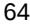
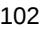
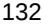

{0}------------------------------------------------

#### **UNITED STATES**

**SECURITIES AND EXCHANGE COMMISSION**

#### **Washington, D.C. 20549**

#### **FORM 10-K**

☒ **ANNUAL REPORT PURSUANT TO SECTION 13 OR 15(d) OF THE SECURITIES EXCHANGE ACT OF 1934 For the fiscal year ended December 31, 2022**

**or**

☐ **TRANSITION REPORT PURSUANT TO SECTION 13 OR 15(d) OF THE SECURITIES EXCHANGE ACT OF 1934**

**For the transition period from __________ to __________**

**Commission file number 001-40399**

# **Enact Holdings, Inc.**

**(Exact name of registrant as specified in its charter)**

**Delaware 46-1579166**

**(State or other jurisdiction of incorporation or organization)**

> **8325 Six Forks Road Raleigh, North Carolina 27615 (Address of principal executive offices) (919) 846-4100 Registrant's telephone number, including area code**

**Securities registered pursuant to Section 12(b) of the Act:**

**Title of each class Trading Symbol(s) Name of each exchange on which registered** Common Stock, par value \$0.01 per share ACT The Nasdaq Stock Market

**Securities registered pursuant to Section 12(g) of the Act:**

Indicate by check mark if the registrant is a well-known seasoned issuer, as defined in Rule 405 of the Securities Act. Yes ☐ No ☒

Indicate by check mark if the registrant is not required to file reports pursuant to Section 13 or Section 15(d) of the Act. Yes ☐ No ☒

Indicate by check mark whether the registrant (1) has filed all reports required to be filed by Section 13 or 15(d) of the Securities Exchange Act of 1934 during the preceding 12 months (or for such shorter period that the registrant was required to file such reports), and (2) has been subject to such filing requirements for the past 90 days. Yes ☒ No ☐

Indicate by check mark whether the registrant has submitted electronically every Interactive Data File required to be submitted pursuant to Rule 405 of Regulation S-T (§ 232.405 of this chapter) during the preceding 12 months (or for such shorter period that the registrant was required to submit such files). Yes ☒ No ☐

Indicate by check mark whether the registrant is a large accelerated filer, an accelerated filer, a non-accelerated filer, a smaller reporting company, or an emerging growth company. See the definitions of "large accelerated filer," "accelerated filer," "smaller reporting company," and "emerging growth company" in Rule 12b-2 of the Exchange Act.

Large accelerated filer ☐ Accelerated filer ☒

Non-accelerated filer

☐ (Do not check if a smaller reporting company)

Smaller reporting company ☐

Emerging growth company ☐

If an emerging growth company, indicate by check mark if the registrant has elected not to use the extended transition period for complying with any new or revised financial accounting standards provided to Section 7(a)(2)(B) of the Securities Act. ☐

Indicate by check mark whether the registrant has filed a report on and attestation to its management's assessment of the effectiveness of its internal control over financial reporting under Section 404(b) of the Sarbanes-Oxley Act (15 U.S.C. 7262(b)) by the registered public accounting firm that prepared or issued its audit report. ☒

If securities are registered pursuant to Section 12(b) of the Act, indicate by check mark whether the financial statements of the registrant included in the filing reflect the correction of an error to previously issued financial statements. ☐

Indicate by check mark whether any of those error corrections are restatements that required a recovery analysis of incentive-based compensation received by any of the registrant's executive officers during the relevant recovery period pursuant to §240.10D-1(b). ☐

Indicate by check mark whether the registrant is a shell company (as defined in Rule 12b-2 of the Act). Yes ☐ No ☒

The aggregate market value of the common equity (based on the closing price of the Common Stock on the Nasdaq Stock Market) held by non-affiliates of the registrant on June 30, 2022, was approximately \$640 million. All executive officers and directors of the registrant have been deemed, solely for the purpose of the foregoing calculation, to be "affiliates" of the registrant.

As of February 24, 2023, there were 162,535,019 shares of Common Stock, par value \$0.01 per share, outstanding.

#### **DOCUMENTS INCORPORATED BY REFERENCE**

Certain portions of the registrant's definitive proxy statement pursuant to Regulation 14A of the Securities Exchange Act of 1934 in connection with the 2022 annual meeting of the registrant's stockholders are incorporated by reference into Part III of this Annual Report on Form 10-K.

**(I.R.S. Employer Identification Number)**

{1}------------------------------------------------

### **TABLE OF CONTENTS**

|          |                                                                                                              | Page |
|----------|--------------------------------------------------------------------------------------------------------------|------|
|          | Part I                                                                                                       |      |
| Item 1.  | Business                                                                                                     | 4    |
| Item 1A. | Risk Factors                                                                                                 | 34   |
| Item 1B. | Unresolved Staff Comments                                                                                    | 72   |
| Item 2.  | Properties                                                                                                   | 72   |
| Item 3.  | Legal Proceedings                                                                                            | 72   |
| Item 4.  | Mine Safety Disclosures                                                                                      | 72   |
|          | Part II                                                                                                      |      |
| Item 5.  | Market for Registrant's Common Equity, Related Stockholder Matters and Issuer Purchases of Equity Securities | 73   |
| Item 6.  | [Reserved]                                                                                                   | 74   |
| Item 7.  | Management's Discussion and Analysis of Financial Condition and Results of Operations                        | 74   |
| Item 7A. | Quantitative and Qualitative Disclosures About Market Risk                                                   | 112  |
| Item 8.  | Financial Statements and Supplementary Data                                                                  | 114  |
| Item 9.  | Changes in and Disagreements With Accountants on Accounting and Financial Disclosure                         | 168  |
| Item 9A. | Controls and Procedures                                                                                      | 168  |
| Item 9B. | Other Information                                                                                            | 171  |
| Item 9C. | Disclosure Regarding Foreign Jurisdictions that Prevent Inspections                                          | 171  |
|          | Part III                                                                                                     |      |
| Item 10. | Directors, Executive Officers and Corporate Governance                                                       | 172  |
| Item 11. | Executive Compensation                                                                                       | 172  |
| Item 12. | Security Ownership of Certain Beneficial Owners and Management and Related Stockholder Matters               | 172  |
| Item 13. | Certain Relationships and Related Transactions, and Director Independence                                    | 172  |
| Item 14. | Principal Accounting Fees and Services                                                                       | 172  |
|          | Part IV                                                                                                      |      |
| Item 15. | Exhibits, Financial Statement Schedules                                                                      | 173  |
| Item 16. | Form 10–K Summary                                                                                            | 175  |
|          | Signatures                                                                                                   | 176  |
|          |                                                                                                              |      |
|          |                                                                                                              |      |

{2}------------------------------------------------

#### **Cautionary Note Regarding Forward-Looking Statements**

This Annual Report on Form 10-K, including Management's Discussion and Analysis of Financial Condition and Results of Operations, contains "forward-looking statements" within the meaning of the Private Securities Litigation Reform Act. These forward-looking statements may address, among other things, our expected financial and operational results, the related assumptions underlying our expected results and the quotations of management. These forward-looking statements are distinguished by use of words such as "will," "would," "anticipate," "expect," "believe," "designed," "plan," or "intend," the negative of these terms and similar references to future periods. These views involve risks and uncertainties that are difficult to predict and, accordingly, our actual results may differ materially from the results discussed in our forward-looking statements. Our forward-looking statements contained herein speak only as of the date of this annual report. "Item 1A. Risk Factors" in this Annual Report and contained in our other filings with the Securities and Exchange Commission, may cause our actual results to differ from those expressed in forward-looking statements. Although Enact believes the expectations reflected in such forward-looking statements are based on reasonable assumptions, the Company can give no assurance that its expectations will be achieved and it undertakes no obligation to update publicly any forward-looking statements as a result of new information, future events, or otherwise, except as required by applicable law.

3

{3}------------------------------------------------

#### **Item 1. Business**

#### **Overview**

We are a leading private mortgage insurance company serving the United States housing finance market since 1981 with a mission to help people buy a house and keep it their home. We operate in all 50 states and the District of Columbia. Our principal mortgage insurance customers are originators of residential mortgage loans who typically determine which mortgage insurer or insurers they will use for the placement of mortgage insurance written on loans they originate.

As a private mortgage insurer, we play a critical role in the United States housing finance system. We are engaged in the business of writing and assuming residential mortgage guaranty insurance. The insurance covers a portion of the unpaid principal balance of Low Down Payment Loans and protects lenders and investors against certain losses resulting from nonpayment of loans secured by mortgages, deeds of trust, or other instruments constituting a first lien on residential real estate. We facilitate the sale of mortgages to the secondary market, including to private investors as well as the Federal National Mortgage Association ("Fannie Mae") and the Federal Home Loan Mortgage Corporation ("Freddie Mac"). Fannie Mae and Freddie Mac are government-sponsored enterprises and are collectively referred to as the "GSEs." Credit protection and liquidity through secondary market sales allow mortgage lenders to increase their lending capacity, manage risk and expand financing access to prospective homeowners, many of whom are first time home buyers ("FTHBs").

We have a large and diverse customer base maintaining enduring relationships across the mortgage origination market, including with national banks, non-bank mortgage lenders, local mortgage bankers, community banks and credit unions. In both 2022 and 2021, we provided new insurance coverage to approximately 1,800 customers. For the full years ended December 31, 2022, 2021 and 2020 we generated new insurance written ("NIW") of \$66.5 billion, \$97.0 billion and \$99.9 billion, respectively. Net income was \$704 million, \$547 million and \$370 million in 2022, 2021 and 2020, respectively. Adjusted operating income was \$709 million, \$551 million and \$373 million for 2022, 2021 and 2020, respectively.

We have a rigorous approach to writing new insurance risk based on decades of loan-level data and experience in the mortgage insurance industry. We believe our balance sheet is well capitalized to manage through macroeconomic uncertainty and maintain compliance with private mortgage insurer eligibility requirements ("PMIERs") and state regulatory standards of compliance. We utilize our credit risk transfer ("CRT") program to mitigate future loss volatility and drive efficient capital management. Our CRT program is a material component of our strategy, and we believe it helps to protect future business performance and stockholder capital under stress scenarios by transferring risk from our balance sheet to highly rated counterparties or to investors through collateralized transactions. As of December 31, 2022, we had a published PMIERs sufficiency ratio of 165%, representing \$2,050 million of available assets above the published PMIERs requirement and approximately 89% of our insured portfolio was covered by our CRT program. Our PMIERs sufficiency ratio, which is based on the published requirements applicable to private mortgage insurers, was above the requirement imposed by the GSE Restrictions of 120% in 2022.

#### **Our Corporate Information**

Enact Holdings, Inc. ("EHI," together with its subsidiaries, the "Company," "we," "us," or "our") (formerly known as Genworth Mortgage Holdings, Inc.) was a wholly owned subsidiary of Genworth Financial, Inc. ("Genworth" or "Parent") since EHI's incorporation in Delaware in 2012 until our initial public offering on September 20, 2021.

On May 3, 2021, EHI amended its certificate of incorporation to change its name from Genworth Mortgage Holdings, Inc. This amendment also authorized EHI to issue 600,000,000 shares of common stock, each having a par value of \$0.01 per share. Concurrently, we entered into a share exchange

{4}------------------------------------------------

agreement with Genworth Holdings, Inc. ("Genworth Holdings"), pursuant to which Genworth Holdings exchanged the 100 shares of our common stock owned by it, representing all of our issued and outstanding capital stock, for 162,840,000 newly issued shares of common stock, par value \$0.01, of EHI.

On September 15, 2021, we priced our initial public offering ("IPO") of common stock, which resulted in the issuance and sale of 13,310,400 shares of common stock at the IPO price of \$19.00 per common share. All shares were offered by the selling stockholder, our parent company, Genworth Holdings. In addition to the shares sold in the IPO, 14,655,600 common shares were sold in a concurrent private sale ("Private Sale") at a price per share of \$17.86, which is equal to the IPO price less the underwriting discount share. Genworth Holdings also granted the underwriters a 30-day option to purchase up to an additional 1,996,560 common shares ("Over-Allotment Option") at the IPO price less the underwriting discount. On September 16, 2021, the underwriters exercised their option to purchase all 1,996,560 common shares permitted under the terms of the underwriting agreement. The IPO, Private Sale, and Over-Allotment Option (collectively the "Offering") closed on September 20, 2021, and Genworth Holdings retained all net proceeds from the Offering.

We operate a majority of our business through our primary insurance subsidiary, Enact Mortgage Insurance Corporation ("EMICO"). EMICO is an approved insurer by the GSEs. EMICO was renamed from Genworth Mortgage Insurance Corporation effective February 7, 2022. Our operations are all domestic with the exception of a run-off insurance block with reference properties in Mexico ("run-off business"), which is immaterial to our results.

### **Our Strategy**

Our objective is to support our mission to help people buy a house and keep it their home, while leveraging our competitive strengths to maximize value for our stockholders. This strategy is based on the following priorities:

#### *Differentiate Enact from competitors*

- Strive to deliver best-in-class underwriting to a well-established, deep and diversified customer base.
- Invest to increase differentiation, drive efficiencies, and enhance decision-making.
- Seek to outpace industry average insurance-in-force growth.

### *Maintain strong capital levels and earnings profile*

- Seek to maintain a strong capital position supported by robust underwriting standards, comprehensive stress testing, a conservative leverage ratio, and a diversified CRT program.
- Aim to optimize cost of capital and forward capacity across CRT channels to manage volatility, protect the balance sheet and enhance return on equity.

#### *Deliver attractive risk-adjusted returns*

- Write profitable new business and leverage proprietary risk assessment and pricing tools to target growth and drive increased returns.
- Strive to maximize stockholder value through a disciplined capital allocation policy that supports existing policyholders, grows the business, and returns excess capital to stockholders.

{5}------------------------------------------------

### **Our Industry**

#### *United States Mortgage Market*

The United States residential mortgage market is one of the largest in the world and includes a range of private and government sponsored participants. Private industry participants include mortgage banks, mortgage brokers, commercial, regional and investment banks, savings institutions, credit unions, real estate investment trusts, mortgage insurers and the GSEs. The overall United States residential mortgage market encompasses both primary and secondary markets. The primary market consists of lenders originating home loans to borrowers to support home purchases, which are referred to as purchase originations, and loans made to refinance existing mortgages, which are referred to as refinancing originations. The secondary market includes institutions buying and selling mortgages in the form of whole loans or securitized assets, such as mortgage-backed securities ("MBS").

### *GSEs*

The GSEs are the largest participants in the secondary mortgage market, buying residential mortgages from banks and other primary lenders as part of their government mandate to provide liquidity and stability in the United States housing finance system. According to the companies' earnings reports, the GSEs held or guaranteed approximately \$6.7 trillion as of September 30, 2022, or around 51%, of total United States 1-4 family residential mortgage debt according to most recent data from the Federal Reserve. The GSE charters generally require credit enhancement for Low Down Payment Loans to be eligible for purchase by the GSEs. Such credit enhancement can be satisfied if a loan is insured by a GSE-qualified insurer, the mortgage seller retains at least a 10% participation in the loan, or the seller agrees to repurchase or replace the loan in the event of a default. Private mortgage insurance satisfies the GSEs' credit enhancement requirement and, historically, has been the preferred method lenders have utilized to meet this GSE charter requirement. As a result, the nature of the private mortgage insurance industry in the United States is driven in large part by the business practices and mortgage insurance requirements of the GSEs. In furtherance of their respective charter requirements, each GSE maintains private mortgage insurer eligibility criteria, known as PMIERs, to establish when a mortgage insurer is qualified to issue coverage that will be acceptable to the GSEs for their portfolio. For more information about the financial and other requirements of the GSEs, see "Item 1A. Risk Factors—Risks Relating to Our Business—If we are unable to continue to meet the requirements mandated by PMIERs, the GSE Restrictions and any additional restrictions imposed on us by the GSEs, we may not be eligible to write new insurance on loans acquired by the GSEs, which would have a material adverse effect on our business, results of operations and financial condition."

#### *Private Mortgage Insurance*

Private mortgage insurance plays a critical role in the United States residential mortgage market by facilitating secondary market sales, particularly for Low Down Payment Loans. This credit protection and the resulting liquidity it provides through secondary market sales allows mortgage lenders to increase their lending capacity, manage risk and expand prospective homeowners' access to financing, many of whom are FTHBs. Mortgage insurance also provides lenders and investors a means to diversify their exposures, mitigate mortgage credit risk and may offer credit against regulatory capital requirements to certain financial institutions that portfolio Low Down Payment Loans. Today, mortgage insurance products are primarily geared towards GSE secondary market sales. The increase in penetration of private mortgage insurance in the mortgage market can be attributed to both the introduction of new GSE products designed to serve Low Down Payment Loan borrowers and more competitive pricing by private mortgage insurers relative to the Federal Housing Administration ("FHA"). In addition, there are potential opportunities for the demand for and use of mortgage insurance to the extent that the private label securitization market expands in the future.

The overall new business opportunity in the private mortgage insurance market is also reflective of the mix between purchase and refinancing originations. Historically, due to the higher prevalence of Low-

{6}------------------------------------------------

Down Payment Loans in purchase originations, mortgage insurance utilization has been meaningfully higher for purchase originations than for refinances.

### **Competition**

Our principal sources of competition are government (federal, state and local) agencies, such as the FHA and the United States Department of Veterans Affairs ("VA") and other private mortgage insurers. We also compete with mortgage lenders and other investors, the GSEs, portfolio lenders who self-insure, reinsurers and other capital markets participants who may utilize financial instruments designed to mitigate risk.

### *Federal, State and Local Government Agencies*

Private mortgage insurers, including us, compete for mortgage insurance business directly with federal government agencies, principally the FHA and the VA, and, to a lesser extent, state and local housing finance agencies. According to *Inside Mortgage Finance*, for the first three quarters of 2022, the FHA had a 26% share, and the VA a 25% share, of the mortgage insurance market. Our competition with government agencies is principally on the basis of price and underwriting guidelines. In contrast to private mortgage insurers, government agencies generally have less restrictive guidelines and apply a flat pricing structure regardless of an individual borrower's credit profile. As a result, we believe borrowers with lower Fair Isaac Company ("FICO") scores are more likely to secure mortgage loans with coverage by public agencies and borrowers with higher FICO scores are more likely to secure mortgage loans with coverage by private mortgage insurers. Mortgage insurance policies from government agencies are also generally non-cancellable, meaning that borrowers are obligated to pay for coverage through the life of their loan, whereas policies from private mortgage insurers are cancellable in certain circumstances as provided by the Homeowners Protection Act ("HOPA"), and under GSE guidelines when the loan-to-value ("LTV") ratio of an underlying mortgage falls below 80%. Private mortgage insurers also face limited competition from certain local and state housing finance agencies.

### *Private Mortgage Insurers*

The United States private mortgage insurance industry is highly competitive. We compete on pricing, underwriting guidelines, customer relationships, service levels, policy terms, loss mitigation practices, perceived financial strength (including comparative credit ratings), reputation, strength of management, product features and effective use and ease of technology. There are currently six active mortgage insurers, including us. Private mortgage insurance competitors include Arch Capital Group Ltd., Essent Group Ltd., MGIC Investment Corporation, NMI Holdings, Inc. and Radian Group Inc. (public holding companies of competitors listed). Since 2012, we have maintained between a 12.0% and 19.2% per quarter share of the private mortgage insurance market by per annum NIW, based on data from *Inside Mortgage Finance*.

### *GSEs, Portfolio Lenders, Reinsurers and Other Capital Markets Participants*

We have also experienced competition in recent years from various participants in the mortgage finance industry including the GSEs, portfolio lenders, reinsurers and other participants in the capital markets. We compete with these participants primarily based on pricing, policy terms and perceived financial strength. The GSEs enter into risk sharing transactions with financial institutions designed to reduce the risk of their mortgage portfolios. Competition also comes from portfolio lenders that are willing to hold credit risk on their balance sheets without credit enhancement. In addition, investors can make use of risk-sharing structures designed to mitigate the impact of mortgage defaults in place of private mortgage insurance. Finally, although their presence is a fraction of what it was in the past, there are products designed to eliminate the need for private mortgage insurance, such as "simultaneous seconds," which combine a first lien loan with a second lien loan in order to meet the 80% LTV threshold required for sale to the GSEs without certain credit protections.

{7}------------------------------------------------

### **Our Products and Services**

In general, there are two types of private mortgage insurance: primary and pool.

#### *Primary Mortgage Insurance*

Substantially all of our policies are primary mortgage insurance, which provides protection on individual loans at specified coverage percentages. Primary mortgage insurance is placed on individual loans at the time of origination and are typically delivered to us on a loanby-loan basis. Primary mortgage insurance can also be delivered to us on an aggregated basis, whereby each mortgage in a given loan portfolio is insured in a single transaction after the point of origination.

Customers who purchase our primary mortgage insurance select a specific coverage level for each insured loan. To be eligible for purchase by a GSE, a Low Down Payment Loan must comply with the coverage percentages established by that particular GSE. For loans not sold to the GSEs, the customer determines its desired coverage percentage. Generally, our risk across all policies written is approximately 25% of the underlying primary insurance in-force ("IIF"), but may vary from policy to policy, typically between 6% and 35% coverage.

We file our premium rates, as required, with insurance departments of U.S. States and the District of Columbia. Premium rates cannot be changed after the issuance of coverage. Premium payments for primary mortgage insurance coverage are typically made by the borrower and are referred to as borrower-paid mortgage insurance. Loans for which premiums are paid by the lender are referred to as lender-paid mortgage insurance. In either case, the payment of premium to us is generally the responsibility of the insured.

Premiums are generally calculated as a percentage of the original principal balance and may be paid as follows:

- Monthly, where premiums are paid on a monthly basis over the life of the policy;
- Single, where the entire premium is paid upfront at the time the mortgage loan is originated;
- Annually, where premiums are paid annually in advance for the subsequent 12 months; or
- Split, where an initial lump sum premium is paid upfront at the time the mortgage is originated along with subsequent monthly payments.

In general, we may not terminate mortgage insurance coverage except in the event of non-payment of premiums or certain material violations of our mortgage insurance policies. The insured may cancel mortgage insurance coverage at any time at their option or upon mortgage repayment, which is accelerated in the event of a refinancing. However, in the case of loans sold to the GSEs, lender cancellation of a policy not eligible for cancellation under GSE guidelines may be in violation of the GSEs' respective charters. GSE guidelines generally provide that a borrower meeting certain conditions may require the mortgage servicer to cancel mortgage insurance coverage upon the borrower's request when the principal balance of the loan is 80% or less of the property's current value. In addition to the GSE guidelines, HOPA provides an obligation for lenders to automatically terminate a borrower's obligation to pay for mortgage insurance coverage once the LTV ratio reaches 78% of the original value, and also provides that a borrower may request cancellation of their obligation to pay for mortgage insurance when the LTV ratio, based on the current value of the property, reaches 80%. In addition, some states impose their own mortgage insurance notice and cancellation requirements on mortgage loan servicers.

#### *Pool Mortgage Insurance*

Pool mortgage insurance transactions provide coverage on a finite set of individual loans identified by the pool policy. Pool policies contain coverage percentages and provisions limiting the insurer's obligation to pay claims until a threshold amount is reached (known as a "deductible") or capping the insurer's

{8}------------------------------------------------

potential aggregate liability for claims payments (known as a "stop loss") or a combination of both provisions. Pool mortgage insurance is typically used to provide additional credit enhancement for certain secondary market mortgage transactions. Pool insurance generally covers the excess of the loss on a defaulted mortgage loan that exceeds the claim payment under the primary coverage, if such loan has primary coverage, as well as the total loss on a defaulted mortgage loan that did not have primary coverage. In another variation, generally referred to as modified pool insurance, policies are structured to include both an exposure limit for each individual loan, as well as an aggregate loss limit or a deductible for the entire pool. Currently, we have an insignificant amount of pool IIF.

#### *Contract Underwriting Services*

We also perform fee-based contract underwriting services for our customers. Contract underwriting provides our customers outsourced scalable capacity to underwrite mortgage loans. Our underwriters can underwrite the loan on behalf of our customers for both investor compliance and mortgage insurance, thus reducing duplicative activities and increasing our ability to write mortgage insurance for these loans. Under the terms of our contract underwriting agreements, we indemnify our customer against losses incurred in the event we make material errors in determining whether loans underwritten by our contract underwriters meet specified underwriting or purchase criteria, subject to contractual limitations on liability.

#### **Our Mortgage Insurance Portfolio**

We believe that our portfolio is of significant scale and aligns with our appetite for risk and return. The majority of our in-force exposures and all of our NIW is considered primary insurance, meaning we insure the loss on each loan up to the coverage amount without any stop loss or deductible for that loss. Our remaining pool exposures are significantly seasoned and represent less than 0.2% of total risk in-force ("RIF").

Our primary insurance portfolio is diversified through time. The distribution of our exposure by book year is influenced by market size opportunities, our commercial strategies and the persistency of our in-force policies. In 2021 and 2020, our portfolio was impacted by low persistency, a large origination market and commercial success in the market, leading to a concentration in recent years as the 2022, 2021 and 2020 book years represent 25%, 33% and 22%, respectively, of our primary IIF. Our primary exposures from legacy books originated prior to 2009 continue to resolve in an orderly fashion and represented 3% of both our primary IIF and primary RIF as of December 31, 2022. These books continue to represent a larger portion of our delinquencies and reserves driven by the continued aging of those delinquencies.

We measure the credit characteristics of our portfolio as represented in the original commitment for insurance. We support a growing FTHB segment that generally has little down payment saved for their first home and therefore higher LTV ratios. Generally, a higher LTV ratio has a higher likelihood of claim than a lower LTV loan, absent other mitigating loan characteristics, which we consider in our underwriting and pricing. The weighted average LTV of our IIF as of December 31, 2022 was 93% and the weighted average LTV of our NIW was 92% in 2022 and 2021.

The credit profile of our portfolio as represented by FICO score remains strong. Generally, a borrower with a higher FICO score has a lower likelihood of claim than one with a lower FICO score. The weighted average FICO score of our IIF as of December 31, 2022 was 743 and the weighted average FICO score of our NIW was 748 in 2022 and 746 in 2021.

Our portfolio is diverse and representative of the United States origination market. We actively monitor our portfolio for concentrations at the state, metropolitan statistical area and metropolitan division level in addition to economic and performance trends in these markets. As of December 31, 2022, our largest state concentration was in California, which represented 12% of primary RIF. Our largest MSA/MD is the Chicago-Naperville, IL Metropolitan Division, which represents 3% of primary RIF.

{9}------------------------------------------------

#### **Customers**

Our long-standing industry presence has enabled us to build active customer relationships with approximately 1,800 mortgage lenders across the United States. Our customers are broadly diversified by size, type and geography and include large money center banks, nonbank lenders, national and local mortgage bankers, community banks and credit unions. Our largest customer accounted for 18% of our total NIW in 2022 and our top five customers generated 30% of our NIW in 2022. One customer accounted for 14% of our total NIW during 2021 and 12% of our NIW during 2020. Additionally, no customer had earned premiums that accounted for more than 10% of our total revenues for the years ended December 31, 2022, 2021 and 2020.

We believe that our success in establishing strong, sustained relationships and our ability to capture new customers is attributable to our comprehensive value proposition. We offer customers a competitive price along with differentiated offerings and services. Additionally, by maintaining an ongoing dialogue with our customers, we are able to develop an understanding of their needs, offer customized solutions for their challenges, advise them on portfolio composition and trends, share market perspectives and industry best practices and provide product development support and training as necessary.

#### **Sales and Marketing**

Our sales and marketing efforts are designed to help us establish and maintain in-depth, quality customer relationships. We distribute our mortgage insurance products through a dedicated sales force located throughout the United States, our home-based in-house sales representatives and a digital marketing program designed to expand our reach beyond our sales force. Our sales force strives to build strong relationships across all areas of our customers' operations to include loan origination, loan processing, underwriting, product development, secondary marketing, risk management, compliance, information technology and C-suite executives. With a vast database of established individual contacts, the breadth and depth of relationships not only serves as a differentiator for our mortgage insurance platform but also enables us to form strategic partnerships with other mortgage service providers seeking to expand their distribution reach.

We support our sales force and improve their effectiveness in acquiring new customers by raising our brand awareness through advertising and marketing campaigns, website enhancements, digital communication strategies and sponsorship of industry and educational events. Our digital marketing capabilities position us to serve our decentralized market with targeted, personalized messages that help drive a preference for our offering. Additionally, our marketing efforts include differentiators targeted to the needs of customers, in order to increase our brand affinity. Finally, our consulting services provide customers with strategy and process consulting to help improve quality, reduce costs and grow their business.

In 2019, we launched a separate mortgage insurance policy underwritten by our wholly owned subsidiary, Enact Mortgage Insurance Corporation of North Carolina ("EMIC-NC"), to insure primary individually underwritten residential mortgage loans as well as portfolios of residential mortgage loans at or after origination that are not intended for sale to the GSEs. Given that EMIC-NC is not a GSE approved insurer, it is not subject to the requirements mandated by PMIERs. Accordingly, we are able to utilize EMIC-NC in a manner that provides us with greater flexibility with our master policies and in our ability to efficiently use the capital of our subsidiaries, each with customers who retain loans in their own portfolio. We also believe utilizing EMIC-NC in this manner provides us strategic optionality if the private label MBS market increases.

Technology that supports connectivity with our customers is critical. As an established private mortgage insurance provider, we have long-standing relationships with our customers' technology organizations, as well as with the key pricing and loan origination/servicing platform providers. In addition, we have an experienced technology integration team that allows us to quickly customize loan delivery solutions for our customers. By providing customers an easy way to quote and order our mortgage

{10}------------------------------------------------

insurance products, either through our award-winning ordering and rate quote website or directly within customers' systems, we believe we make the transaction easy, allowing us to drive repeat volume.

### **Risk Management and Oversight**

Strong risk management is a critical part of our business. The Risk Committee of our Board of Directors is responsible for oversight and review of our enterprise risk management policies and related risk profile. We believe our risk management framework is appropriately designed to manage volatility in our business performance and protect our balance sheet. We believe this framework encompasses all major risks to which we are exposed, including credit risk, market risk, insurance risk, housing risk, operational risk, model risk, IT risk and any other risk that poses a material threat to the viability of the Company.

Our risk management philosophy is designed to ensure all relevant risks are routinely identified, assessed, managed, monitored and addressed. We rely upon a strong organizational risk culture and governance process, ensuring that the risks we take are transparent and quantifiable, and that we can monitor the changing nature of those risks over time. We proactively work towards mitigating exposures outside of the risk appetite, limits and tolerances that we set and review annually. Our risk profile, top risks and any emerging risks are regularly reviewed in our senior management risk committee, chaired by our Chief Risk Officer who has direct reporting obligations to the Risk Committee of our Board.

We believe our risk management and oversight structure is appropriate for our business, but we cannot be assured that it will be adequate in mitigating all our risks. See "Item 1A. Risk Factors—Risks Relating to Our Business—Our risk management programs may not be effective in identifying or adequate in controlling or mitigating the risks we face."

#### *Modeling and Analytics*

We use our proprietary risk modeling platform to evaluate returns and volatility through both an external regulatory lens and an economic capital framework that is sensitive to the economic cycle and current housing market conditions. This risk model utilizes numerous predictive variables and leverages our unique data set, which contains experience of over two decades of mortgage performance across all market conditions, to develop quantitative assessments of default probability, severity of loss, prepayment and expected volatility on each insured loan. Our model is used to assess the performance of new business and our in-force portfolio under expected and stress scenarios. The results of these analyses inform our risk appetite, credit policy, pricing and targeted risk selection strategies. In addition, the results of these stress tests and our desire to reduce loss volatility inform our CRT strategy.

#### *Customer Qualification*

Customers applying for a new master policy undergo a process that reviews their business and financial profile, licensing, management experience and track record of originating quality mortgages. Customers applying for delegated underwriting authority receive training and are reviewed on initial and ongoing submissions for compliance to our guidelines.

#### *Policy Acquisition*

Loans delivered to us for insurance must meet our underwriting and eligibility guidelines. Our underwriting principles require borrowers to have a verified capacity and willingness to support the obligation and a well-supported valuation of the collateral. Loans are underwritten on either a delegated or non-delegated basis, but all loans pass through our eligibility rules engine to screen out those outside of our guidelines. We regularly monitor national and local market conditions, the performance of our products and the performance of our customers against our expectations for mix and profitability. We adjust our underwriting, pricing and risk selection strategies on a regular basis to ensure that our products remain competitive and consistent with our risk and profitability objectives.

{11}------------------------------------------------

#### *Quality Assurance*

We have an independent quality assurance function that conducts pre- and post-closing underwriting reviews. We review statistically significant samples of loan files from individual customers and across our delegated and non-delegated underwriting channels to identify adverse trends and provide our underwriters and customers with timely feedback and training that fosters high quality loan production. Within our delegated channel, the frequency of our lender specific reviews is directly related to an account's activity, that is larger accounts will receive more frequent reviews. The results of these reviews also allow for adjustments to underwriting processes and credit policy. Finally, our quality assurance team conducts independent reviews on key operational processes and critically important vendor activities.

#### *Portfolio Management*

We regularly monitor the characteristics and performance of our overall mortgage insurance portfolio. We monitor concentrations across a range of metrics including lender, geography and policy year. Through stress testing, we evaluate the performance of the portfolio and identify risks to our strategic plan caused by its makeup in adverse economic scenarios. We also monitor performance against expected loss development from time of origination. Variations identified by product, performance, geography or otherwise inform adjustments to our guidelines and pricing strategies.

#### *Business Continuity*

We have a robust business continuity program to prepare for and manage through business interruptions. Maintenance and execution of our plan is led by a crisis management leader reporting to our Chief Risk Officer. We update our plan no less than annually to accommodate changes in business processes and third-party providers and test the plan regularly through tabletop exercises. While we instituted a hybrid return to office staffing model in March 2022, we previously implemented a business continuity plan in response to COVID-19 and operated successfully with a remote workforce from March 2020 through March 2022. We have used a decentralized team of underwriters and other key functional employees for many years and all employees are capable and equipped to work remotely so that we can continue providing service to our customers through prolonged absences from the office.

#### **Underwriting**

We establish and maintain underwriting guidelines based on our risk appetite. Our guidelines require borrowers to have a verified capacity and willingness to support their obligation and a well-supported valuation of the collateral. Our underwriting guidelines incorporate credit eligibility requirements that, among other things, limit our coverage to mortgages that meet our thresholds with respect to borrower FICO scores, maximum LTVs, documentation requirements and maximum Debt-to-Income ("DTI") Ratio. All loans must pass through our eligibility rules engine to screen out those outside of our guidelines.

At present, our underwriting guidelines are largely consistent with those of the GSEs. Many of our customers use the GSEs' automated loan underwriting systems, Desktop Underwriter and Loan Product Advisor, for making credit determinations. We generally accept the underwriting decisions and documentation requirements made by the GSEs' underwriting systems, subject to our review as well as certain limitations and requirements.

Over the past few years, more customers have requested expedited underwriting services. To meet customer demand, we invested in technologies, automation, data science and analytics to develop our proprietary mortgage insurance underwriting system. Our mortgage insurance underwriting system enables the capability to meet customer demand in a timely manner without sacrificing the accuracy of our underwriting decisions. Specifically, it has contributed to a substantial increase in our underwriters' productivity, more than doubling the number of loans our underwriters have processed on a daily basis since 2015, while remaining within our quality control tolerances. We believe our mortgage insurance underwriting system also differentiates us from the competition by allowing us to efficiently provide

{12}------------------------------------------------

customized turn times from submission of a loan package to an underwriting decision for our customers and perform fee-based contract underwriting services.

Our policies are issued through one of two underwriting programs:

#### *Non-Delegated Underwriting*

For non-delegated underwriting, customers submit loan files to us, and we individually underwrite each application to determine whether we will insure the loan. We use our mortgage insurance underwriting system to perform our non-delegated underwriting evaluations. Our underwriting staff is dispersed throughout the United States and we believe this allows us to make prompt, geographically based underwriting determinations across different time zones in a timely manner to best serve our diverse customer base. In addition to our employees, we use domestically based, contract underwriters, as needed, to assist with underwriting capacity and drive efficiency.

#### *Delegated Underwriting*

We delegate to eligible lender customers the ability to underwrite mortgage insurance based on our delegated underwriting guidelines. To perform delegated underwriting, customers must be approved by our risk management team. Some customers prefer to assume underwriting responsibility because it is more efficient within their loan origination process, and they are comfortable attesting that the data submitted is true and correct when making our insurance decision. We regularly perform quality assurance reviews on a statistically significant sample of delegated loans to assess compliance with our guidelines.

We also offer a post-closing underwriting review when requested by customers for both non-delegated and delegated loans. Upon satisfactory completion of this review, we agree to waive our right to rescind coverage under certain circumstances. For the years ended December 31, 2022 and 2021, approximately 71% and 65%, respectively, of our NIW by loan count went through our delegated underwriting services.

#### **Pricing**

Pricing is highly competitive in the mortgage insurance industry, with industry participants competing for market share, customer relationships and overall value. Recent pricing trends have introduced an increasing number of loan, borrower, lender and property attributes, resulting in expanded granularity in pricing regimes and a shift from traditional published rate cards to dynamic pricing engines that better align price and risk. Our risk-based pricing engine was developed to evaluate returns and volatility under both the PMIERs capital framework and our internal economic capital framework, which is sensitive to economic cycles and current housing market conditions. The model assesses the performance of new business under expected and stress scenarios on an individualized loan basis, which is used to determine pricing and inform our risk selection strategy that optimizes economic value by balancing return and volatility.

Our policy has been to set and charge premium rates commensurate with the underlying risk of each loan we insure. Our proprietary pricing platform, however, provides us with a more flexible, granular and analytical approach to selecting and pricing risk. Using our platform, we can quickly change price to modify our risk selection levels in response to changing economic conditions, new analytical insights or industry pricing trends.

#### **Credit Risk Transfer**

Our risk management framework and analytics inform our CRT strategy, which is designed to reduce the loss volatility of our in-force portfolio during stress scenarios by transferring risk from our balance sheet to highly rated counterparties or to investors through collateralized transactions. Our CRT program also provides capital relief under PMIERs and state insurance capital requirements. In normal market

{13}------------------------------------------------

conditions, we believe our CRT program also enhances our return profile. Given the volatility protection and capital relief at attractive terms, CRT enables us to employ an "acquire, manage and distribute" strategy. We believe our CRT program is a material component of our strategy and helps to protect future business performance and stockholder capital under stress scenarios.

Our CRT program distributes risk to both highly rated counterparties through our traditional reinsurance program, as well as to insurancelinked note ("ILN") investors via fully collateralized special purpose reinsurance vehicles. Our reinsurance transactions generally cover a subset of loans in a given book year and have been structured as excess of loss ("XOL") coverage where typically both the attachment and detachment points of the ceded risk tier are within the PMIERs capital requirements at inception, providing both loss volatility protection and PMIERs capital credit. Each reinsurance treaty has a term of ten years or more and provides a unilateral right to commute prior to the full term, subject to certain performance triggers. We select the type and structure of our CRT transactions based on a variety of factors including, but not limited to, capacity, cost, flexibility, sustainability and diversification. Since 2015, we have executed \$4.6 billion of CRT transactions across both traditional reinsurance arrangements and ILN transactions through December 31, 2022, with approximately 89% of our RIF insurance covered under our current CRT program. We expect to begin transferring losses at an approximate 30 to 35% lifetime book year loss ratio and extend up to an approximate 60 to 70% lifetime book year loss ratio at current pricing assumptions and depending on our co-participation level within the reinsurance tier.

Through our traditional reinsurance transactions, we have executed \$2.8 billion of XOL reinsurance coverage with highly rated reinsurers covering the 2009 to 2022 book years.

The Company's traditional reinsurance coverage is provided by a panel of reinsurance partners each currently rated "A-" or better by Standard & Poor's ("S&P") or A.M. Best Company, Inc. These reinsurers are contractually required to collateralize a portion (typically 20 to 30%) of the reinsurance exposures consistent with PMIERs.

Through our ILN transactions, we have executed \$1.8 billion of XOL reinsurance coverage supported by capital markets investors via fully collateralized special purpose reinsurance vehicles covering a portion of the 2014 to 2021 book years. The notes are non-recourse to us and our affiliates.

Our CRT program provided an estimated aggregate of \$1.6 billion of PMIERs capital credit and \$1.8 billion of loss coverage as of December 31, 2022.

#### **Delinquencies, Loss Management and Claims**

The delinquency and claim cycle generally begins with our receipt of a delinquency notice on an insured loan from the related servicer. We consider a loan to be delinquent when it is two or more mortgage payments past due. The incidence of delinquency is affected by a variety of factors, including housing price appreciation or depreciation, unemployment, the level of borrower income, divorce, illness, interest rate levels, general borrower creditworthiness and macroeconomic conditions. See "1A. Risk Factors—Risks Relating to Our Business—A deterioration in economic conditions, a severe recession or a decline in home prices, all of which could be driven by many potential factors, including inflation, may adversely affect our loss experience." Delinquencies that are not cured result in a claim.

Our loss mitigation and claims area is led by seasoned personnel who are supported by default tracking and claims processing capabilities within our integrated platform. Our loss mitigation staff is also actively engaged with the GSEs and servicers regarding appropriate servicing and loss mitigation practices. We have granted loss mitigation delegation to the GSEs and servicers, whereby they perform certain loss mitigation efforts on our behalf. Moreover, the CFPB servicing rule obligates servicers to engage in early intervention and loss mitigation efforts with a borrower prior to foreclosure. These efforts have traditionally involved loan modifications intended to enable qualified borrowers to make restructured loan payments or efforts to sell the property, thereby potentially reducing claim amounts. With the COVID-19 pandemic, we have experienced unprecedented use of forbearance plans nationwide to assist

{14}------------------------------------------------

borrowers including the ability to extend forbearance beyond 12 months. Historically, the use of forbearance plans was limited to 12 months and used for a natural disaster that impacted a region of the country. At the conclusion of the forbearance term, a borrower may either bring the borrower's loan current, defer any missed payments until the end of their loan, or the loan can be modified through a repayment plan or extension of the mortgage term.

Our goal is to keep borrowers in their homes. If a loan becomes delinquent, we work closely with customers, investors and servicers to attempt to cure the delinquency and allow the homeowner to retain ownership of their property.

Claims result from delinquencies that are not cured, or from losses on short sales, other third-party sales or deeds-in-lieu of foreclosure that we approve. Various factors affect the frequency and severity of claims, including LTV at the time of foreclosure, size and coverage percentage of a loan, property values, employment levels and interest rates. Any delays in foreclosure, including foreclosure moratoriums imposed by state and local governments and the GSEs, such as those due to COVID-19, could cause our losses to increase as expenses accrue for longer periods or if the value of foreclosed homes further decline during such foreclosure delays. For loans insured on or after October 1, 2014, our mortgage insurance policies limit the number of months of unpaid interest and associated expenses that are included in the mortgage insurance claim amount to a maximum of 36 months.

Under the terms of our primary insurance master policy, customers are required to file claims within 60 days of the earliest of (i) the date they have acquired title to the underlying property (typically through foreclosure), (ii) the date of an approved short sale or other third-party sale of the underlying property or (iii) the date a request is made by us to file a claim.

Upon review and determination that a filed claim is valid, we generally have the following three settlement options:

- Percentage option—determined by multiplying the claim amount by the applicable coverage percentage, with the customer retaining title to the property. The claim amount generally consists of the unpaid loan principal as of the date of default, plus delinquent interest and certain expenses associated with the default;
- Third-party sale option—pay the amount of the claim required to make the customer whole, commonly referred to as the "actual loss amount," following an approved sale; or
- Acquisition option—pay the full claim amount and acquire title to the property.

In 2022 and 2021, we settled over half of our claims through the third-party sale or acquisition options due largely to embedded home price appreciation.

Claim activity is not evenly spread across the coverage period of loans we insure. The number of delinquencies may not correlate directly with the number of claims received because the rate at which delinquencies are cured is influenced by borrowers' financial resources and circumstances, as well as regional economic differences. For those loans that fail to cure, whether delinquency leads to a claim principally depends upon the borrower's equity at the time of delinquency and the borrower's or the insured's ability to sell the home for an amount sufficient to satisfy all amounts due under the mortgage loan.

When claim notices are received, we review loan and servicing files to determine the appropriateness of a claim amount. Failure to deliver required documentation or our review of such documentation may result in rescission, cancellation or claims denial. Our insurance policies provide that we can reduce or deny claims if the servicer does not materially comply with its obligations under our policies, including the requirement to pursue reasonable loss mitigation actions. We also periodically receive claim notices that request coverage for costs and expenses associated with items not covered under our policies, such as losses resulting from property damage to a covered home. We actively review claim notices to ensure we

{15}------------------------------------------------

pay only for covered expenses. We deem a reduction in the claim amount paid relative to the amount requested in the claim notice to be a curtailment.

When reviewing loan and servicing files in connection with the delinquency or claims process, we may also decide to rescind coverage of the underlying mortgages or deny payment of claims. Our ability to rescind coverage is limited by the terms of our master policies. We may rescind coverage in situations where, among other things, (i) fraudulent misrepresentations were made or materially inaccurate information was provided regarding a borrower's income, debts, intention to occupy a property or property value or (ii) a loan was originated in material violation of our underwriting guidelines.

We will consider an insured's appeal of our decision and, if we agree with the appeal, we take the necessary steps to reinstate our insurance coverage and reactivate the loan certificate or otherwise address the issues raised in the appeal. If the parties are unable to agree on the outcome of the appeal, the insured may choose to pursue arbitration or litigation under the terms of the applicable master policy and challenge the results. Subject to applicable limitations in our policies and State law, legal challenges to our actions may be brought several years after we dispose of a claim.

From time to time, we enter into agreements with policyholders to accelerate claims and negotiate an agreed-upon payment amount for claims on an identified group of delinquent loans. In exchange for our accelerated claim payment, mortgage insurance is canceled, and we are discharged from any further liability on the identified loans.

### **Information Technology**

We develop and invest in technology in order to drive operational excellence, ensure a superior customer experience and support our overall business objectives. Our business heavily relies upon information technology and a number of critical aspects are highly automated. We accept insurance applications, issue approvals, process claims and reconcile premium remittance through electronic submission. In order to facilitate these processes, we have established direct connections to many industry leading origination and servicing systems so that our customers and servicers can select our mortgage insurance products and communicate with us directly from within their own technology platform. We also provide our customers secure access to our web-based portals to facilitate transactions and provide customers with access to their account information.

We have made a number of strategic investments in our technology infrastructure, including our:

- Proprietary underwriting platform;
- Lender and servicer integration capabilities;
- Proprietary risk modeling platform;
- Business rules engine that automatically enforces our eligibility guidelines and pricing rules;
- Management and portfolio reporting capabilities; and
- Award-winning rate quote and ordering website.

We are regularly upgrading and enhancing our systems and technology, with an eye towards expanding our capabilities, improving productivity and enhancing our customer experience, including:

- Policy administration, billing, delinquency and claims processes and systems;
- Enhancing the speed and efficiency of our pricing and auto-decisioning capabilities;
- Ensuring optimal integration capabilities to our customers' loan origination and mortgage insurance ordering and rate quoting processes; and

{16}------------------------------------------------

- Artificial intelligence and machine learning in the areas of risk and portfolio management.
We have also implemented an overarching technology strategy that utilizes Cloud, Software as a Service, commercial software and in some cases proprietary technology to provide scalability, flexibility and an enhanced security posture. Technology costs are managed by the continued automation of key business processes, reducing our application portfolio and using contract employees to scale resource capacity as needed. In addition, we have a dedicated "AI, Innovation & Automation" team to ensure that we focus on using the latest technologies to further automate our business and differentiate our products and services.

#### **Cybersecurity**

We employ a multi-layered approach to data security and data privacy. This approach begins with our information security program, which is based on National Institute of Standards and Technology, 800-53. Our program includes policies and standards that delineate requirements for the implementation and on-going maintenance of our information systems as well as security responsibilities for all personnel. We review these policies and standards periodically and update as needed. We take steps to ensure that all information security policies are maintained and enforced and that all personnel are educated on their responsibilities. We maintain a "defense-in-depth" model, which employs multiple layers of protection for the entire company. Among other things, we perform external and internal risk assessments, penetration testing, vulnerability scanning, secure code development and monthly security awareness training (including phishing awareness tests) for all personnel. The chief information officer and chief information security officer, together with our compliance organization, among others, ensure the requirements of our information security program satisfy applicable legal and regulatory requirements. Our chief information security officer also provides regular updates and reports to our senior leaders, including an annual cybersecurity report to the board that covers, among other topics, the information security organization, material risks, technical threats, information technology security infrastructure, patching and vulnerability management, cyber incidents, an annual cyber tabletop exercise and incident preparedness, supplier management, security awareness training, cybersecurity personnel/staffing and a cyber threat assessment. The board also reviews the chief compliance officer's quarterly report, which includes information regarding data security incidents that meet the risk criteria for inclusion in the report. Through this reporting process, our board oversees our information security program and risks related thereto. As discussed above, strong risk management is a critical part of our business.

Our Risk Committee of the Board of Directors, in coordination with our management risk committee, has primary responsibility for overseeing cybersecurity, information technology and information security systems, processes, policies and risk management and the effectiveness of security controls.

#### **Ratings**

Ratings with respect to the financial strength of operating subsidiaries are an important factor in establishing the competitive position of insurance companies. Ratings are important to maintaining public confidence in us and our ability to market our products. Rating organizations review the financial performance and condition of most insurers and provide opinions regarding financial strength, operating performance and ability to meet obligations to policyholders.

As of February 28, 2023, EMICO, our principal U.S. mortgage insurance subsidiary, was rated "BBB+" by S&P, "Baa1" by Moody's and "BBB+" by Fitch Ratings, Inc. ("Fitch") in terms of financial strength.

#### **Investment Portfolio**

The investment portfolios of our insurance subsidiaries are directed by the Enact Investment Committee, a management-level committee, with Genworth serving as the investment manager. Under the terms of our investment management agreement, the Company is charged an investment management fee by our Parent. The total investment expenses paid to our Parent were \$5.5 million and

{17}------------------------------------------------

\$5.2 million for the years ended December 31, 2022 and 2021, respectively. See Note 11 to our audited consolidated financial statements for further information.

The investment portfolio of EHI is directed by a separate newly formed management-level EHI Investment Committee with a third-party investment manager. In addition, for certain asset classes, we utilize external asset management. In the future, we may choose to more broadly engage external asset managers. Our senior management team, along with our board of directors, reviews investment performance and strategy on a periodic basis. As of December 31, 2022, the fair value of our investment portfolio was \$4.9 billion of fixed maturity assets, of which 98% was rated as investment grade. We also had an additional \$514 million of cash and cash equivalents as of December 31, 2022. The primary objectives of managing the investment portfolio are to preserve capital, generate investment income and maintain sufficient liquidity to cover our operating expenses and pay future insurance claims. Investment strategies are implemented emphasizing fixed income, low volatility, highly liquid assets to meet expected and unexpected financial obligations while enhancing risk adjusted, after-tax yields. See "Item 7. Management's Discussion and Analysis of Financial Condition and Results of Operations—Investment Portfolio."

Our board-approved investment policy utilizes defined investment guidelines such as, but not limited to, asset sector, single issuer concentration and credit ratings to ensure compliance with risk management limits, regulatory requirements and applicable laws. Further, the policy seeks to restrict assets correlated with the residential mortgage market. Asset class mix and risks are regularly evaluated in the context of current and future capital market conditions, liability profiles and return objectives. The investment portfolio is regularly stress tested to evaluate its ability to meet unexpected liquidity needs due to elevated liabilities. Our investment policies and strategies are subject to change depending on regulatory, economic and market conditions, as well as our prevailing operating objectives.

For more information regarding our investment portfolio, see "Item 7. Management's Discussion and Analysis of Financial Condition and Results of Operations—Results of Operations and Key Metrics—Investment Portfolio."

#### **Human Capital Management and Employees**

We take a holistic approach to human capital management, including attracting and retaining talent with comprehensive benefits and compensation packages, providing professional development and learning opportunities, facilitating access to dedicated resources that foster an equitable and inclusive environment and encouraging a sincere commitment to community service and involvement. As of December 31, 2022, we had 496 full-time employees, all of whom work in the United States. Our employee population is made up of 58% women and 25% people of color. Of our employees, 46% work in our Raleigh, North Carolina office and the remaining 54% are in the field, predominantly working in sales and underwriting. We supplement our workforce, as needed, with independent contractors. Our employees and contractors are all equipped to work on a remote basis. None of our employees are represented by a union or subject to a collective servicing agreement and management believes that our relationship with our employees is good.

Some of our key areas of focus include:

• Our compensation package, including salary, incentive bonus and long-term incentives, aligns employee and stockholder interests, as well as rewards our employees for serving all of our current and future customers.

• In addition to a competitive compensation program, we offer our employees benefits such as life and health insurance, paid time off, paid parental leave, childcare subsidies, retirement savings plans, financial planning services, an Employee Assistance Program and a broad fitness reimbursement program to support physical and mental health.

{18}------------------------------------------------

• We offer a multitude of professional development and career enrichment courses, including in the areas of leadership, professional skills, and industry-specific matters, as well as a mentor program and an extensive training program for future senior leaders. We also offer tuition reimbursement benefits and student loan repayment options to aid career progression. We routinely assess talent, engage in deep succession planning at all levels of the organization and provide feedback to our employees through a performance review process.

• Our employee-led Diversity & Inclusion Council helps to build an inclusive culture through company-wide events, participation in our recruitment efforts and by educating our employees on the experiences and perspectives of others. We continue to focus on building a pipeline of talent to create more opportunities for workplace diversity and to support greater representation within our Company. In addition to our internally focused efforts, we have a number of employee-led externally focused diversity, equity and inclusion initiatives.

• We champion civic engagement through paid volunteer time for employees, event sponsorship programs, employee-directed charitable gifts with a 100% company match, and through our commitment to environmental sustainability.

• We empower employees to share their unique perspectives by promoting initiatives that increase access to our Senior Leadership Team and encouraging open-door policies. We value the voice of our employees and use a best-in-class third party approach to gather employee feedback.

• We celebrate our talent by showcasing employee achievements and expertise in industry publications, at events and conferences, and on social media. By amplifying their reach and ours, in 2022, 10 employees were recognized as award winners by external organizations, and we were recognized as an organization on three occasions.

As the severity of COVID-19 started to unfold at the beginning of 2020, our response included the implementation of policies to protect our employees. In early March 2020, we closed our offices and implemented a complete work from home policy through March 2022, as well as providing additional financial, health and wellness resources. We instituted a return to office plan in March 2022 which operates as a hybrid working model for a majority of our Raleigh-based employees.

### **Regulation**

#### *General*

Our insurance operations are generally subject to extensive oversight and a wide variety of laws and regulations. State insurance laws and regulations govern most aspects of our insurance business and are enforced by the insurance departments of each jurisdiction in which our insurers are licensed, with the North Carolina Department of Insurance ("NCDOI") being the lead regulator for our North Carolina domiciled insurers. Our insurance products and business also are affected by federal, state and local laws, including tax laws.

The primary purpose of the state insurance laws and regulations regulating our insurance business is to protect our insureds, not our stockholders. These laws and regulations are regularly re-examined by state regulators and any changes to these laws or new laws may be more restrictive or otherwise adversely affect our operations.

Insurance and other regulatory authorities (including state law enforcement agencies and attorneys general) may make inquiries regarding compliance with insurance, securities and other laws and regulations, and we cooperate with such inquiries and take corrective action when warranted.

{19}------------------------------------------------

#### *United States Insurance Regulation*

Our insurance subsidiaries are licensed and regulated in all jurisdictions in which they conduct insurance business. The extent of this regulation varies, but state insurance laws and regulations generally grant both broad and specific regulatory powers to agencies or officials to examine the affairs of our insurance subsidiaries and to enforce statutes and administrative rules or exercise discretion affecting almost every aspect of their businesses. For example, state insurance laws and regulations typically govern the financial condition of insurers, including standards for solvency, types and concentrations of permissible investments, establishment and maintenance of reserves, credit for reinsurance, requirements for capital adequacy, and the business conduct of insurers, including marketing, sales practices and claims handling. State insurance laws and regulations also usually require the licensing of insurers and agents, and the approval of policy forms and rates. In addition, states may require actuarial justification of rates on the basis of the insurer's loss experience, expenses and future projections.

Mortgage guaranty insurance premium rates and policy forms are subject to regulation in every jurisdiction in which our insurance subsidiaries are licensed to transact business in order to protect policyholders against the adverse effects of excessive, inadequate or unfairly discriminatory rates. In most jurisdictions, premium rates and policy forms must be filed prior to their use. In some states, such rates and forms must also be approved prior to use. Changes in premium rates are often subject to justification, generally on the basis of loss experience, expenses and future trend analysis. In addition, jurisdictions may consider general default experience in the mortgage insurance industry in assessing the premium rates charged by mortgage guaranty insurers. The state insurance laws and regulations of general applicability, along with certain additional state insurance laws and regulations that are applicable specifically to mortgage guaranty insurers, are described below.

#### *Insurance Holding Company Regulation*

Certain of our insurance subsidiaries are subject to the Insurance Holding Company Act in North Carolina and are required to furnish various types of information concerning the operations of, and the interrelationships and transactions among, companies within our holding company system that may affect the operations, management or financial condition of the insurers within such holding company system. Under state insurance laws and regulations, our insurance subsidiaries must file reports, including detailed annual and quarterly financial statements, with the insurance regulator in North Carolina and the National Association of Insurance Commissioners ("NAIC"), and our operations and accounts are subject to periodic or target examination by any insurance regulator of a jurisdiction in which we conduct business. Mortgage guaranty insurers generally are limited by state insurance laws and regulations to directly writing only mortgage guaranty insurance business to the exclusion of other types of insurance.

State insurance laws and regulations also regulate transactions between insurers and their affiliates, sometimes mandating prior notice to the regulator and/or regulatory approval. Generally, state insurance laws and regulations require that all transactions between an insurer and an affiliate be fair and reasonable, and that the insurer's statutory surplus following such transaction be reasonable in relation to its outstanding liabilities and adequate to its financial needs. Certain transactions may not be entered into unless the applicable regulator is given 30 days' prior notification and does not disapprove the transaction during such 30-day period.

State insurance laws and regulations also require that an insurance holding company system's ultimate controlling person submit annually to its lead state insurance regulator an "enterprise risk report" that identifies activities, circumstances or events involving one or more affiliates of an insurer that, if not remedied properly, are likely to have a material adverse effect upon the financial condition or liquidity of the insurer or its insurance holding company system as a whole. Finally, most jurisdictions have adopted insurance laws or regulations setting forth detailed requirements for cost sharing and management agreements between an insurer and its affiliates.

{20}------------------------------------------------

State insurance laws and regulations require that a person obtain the approval of the insurance commissioner of an insurer's domiciliary jurisdiction prior to acquiring control of such insurer. Control of an insurer is generally presumed to exist if any person, directly or indirectly, owns, controls, holds with the power to vote, or holds proxies representing, 10% or more of the voting securities of the insurer or any parent entity; although such presumption may be rebutted. In considering an application to acquire control of an insurer, the insurance commissioner generally considers factors such as the experience, competence and financial strength of the applicant, the integrity of the applicant's board of directors and executive officers, the acquirer's plans for the management and operation of the insurer, and any anti-competitive results that may arise from the acquisition. Most jurisdictions also now require a person seeking to acquire control of an insurer licensed but not domiciled in that jurisdiction to make a filing prior to completing an acquisition if the acquirer and its affiliates and the target insurer and its affiliates have specified market shares in the same lines of insurance in that jurisdiction. These provisions may not require acquisition approval but can lead to imposition of conditions on an acquisition that could delay or prevent its consummation. In certain situations, state insurance laws and regulations also require that a controlling person of an insurer submit prior notice to the insurer's domiciliary insurance regulator of a divestiture of control. Similarly, with respect to our contract underwriting entity, Enact Financial Services, Inc., prior approval from state banking commissioners is required in some jurisdictions prior to acquiring control of our contract underwriting entity, which is licensed or has an approved license exemption in most states.

Our insurance subsidiaries' payment of dividends or other distributions to our holding company is regulated by the state insurance laws and regulations of their respective domiciliary states. Our insurance subsidiaries must deliver notice to the Commissioner of any dividend or distribution within 5 business days after declaration of the dividend or distribution, and at least 30 days before payment thereof. Any distribution, regardless of amount, requires that same 30-day notice to the Commissioner, but also requires the Commissioner's affirmative approval before being paid.

Under the insurance laws of the State of North Carolina, an "extraordinary" dividend or distribution is defined as a dividend or distribution that, together with other dividends and distributions made within the preceding 12 months, exceeds the greater of: (i) 10% of the insurer's statutory surplus as of the immediately prior year end; or (ii) the statutory net income (loss) during the prior calendar year.

In addition, insurance regulators may prohibit the payment of ordinary dividends and distributions or other payments by our insurers (such as a payment under a tax sharing agreement, for employment or other services) if they determine that such payment could be adverse to our policyholders or would not be fair and reasonable to the insurer.

#### *National Association of Insurance Commissioners*

The NAIC is an organization, the mandate of which is to benefit state insurance regulatory authorities and consumers by promulgating model insurance laws and regulations for adoption by the states. The NAIC also provides standardized insurance industry accounting and reporting guidance through the NAIC Accounting Manual. However, model insurance laws and regulations are only effective when adopted by the states, and Statutory Accounting Principles ("SAP") continue to be established by individual state laws, regulations and permitted practices. Changes to the NAIC Accounting Manual or modifications by the various state insurance departments may affect the statutory capital and surplus of our insurance subsidiaries.

The NAIC adopted the Risk Management and Own Risk and Solvency Assessment Model Act (the "ORSA Model Act"). The ORSA Model Act requires an insurance holding company to, regularly, no less than annually, assess the adequacy of our insurance subsidiaries' risk management framework, and current and estimated projected future solvency position; internally document the process and results of the assessment; and provide a confidential high-level report annually to the lead state commissioner.

{21}------------------------------------------------

### *Examinations*

State insurance laws and regulations govern the marketplace for insurers, affecting the form and content of disclosure to insureds, advertising, sales and underwriting practices and complaint and claims handling, and these provisions are generally enforced through periodic or target market conduct examinations. State insurance departments may conduct periodic or target detailed examinations of the books, records, accounts and business practices of insurers licensed in their states. These examinations are sometimes conducted in cooperation with insurance departments of multiple other states or jurisdictions representing each of the NAIC zones, under guidelines promulgated by the NAIC.

#### *Accounting Principles*

State insurance regulators developed SAP as a basis of accounting used to monitor and regulate the solvency of insurers. Since insurance regulators are primarily concerned with ensuring an insurer's ability to pay its current and future obligations to policyholders, statutory accounting conservatively values the assets and liabilities of insurers, generally in accordance with standards specified by such insurer's domiciliary jurisdiction. Uniform statutory accounting practices are established by the NAIC and are generally adopted by regulators in the various state jurisdictions. Due to differences in methodology between SAP and United States generally accepted accounting principles ("U.S. GAAP"), the values for assets, liabilities and equity reflected in financial statements prepared in accordance with U.S. GAAP are often materially different from those reflected in financial statements prepared under SAP.

#### *Market Conduct*

State insurance laws and regulations govern the marketplace activities of insurers, affecting the form and content of disclosure to consumers, advertising, product replacement, sales and underwriting practices and complaint and claims handling, and these provisions are generally enforced through periodic market conduct examinations. Our insurance subsidiaries are not currently undergoing market conduct reviews in any states.

#### *Investments*

State insurance laws and regulations require diversification of our insurance subsidiaries' investment portfolio and limit the proportion of, or in some cases totally prohibit, investments our insurance subsidiaries may hold in different asset categories. Assets invested contrary to such regulatory limitations must be treated as non-admitted assets for assessing an insurer's solvency unless a waiver is given by the insurer's domestic insurance regulator, and, in some instances, regulations require divestiture of such non-complying investments. We believe our insurance subsidiaries' investments are in compliance with these state insurance laws and regulations or are subject to any applicable waivers.

#### *Capital and Surplus Requirements*

Insurance regulators have the discretionary authority, in connection with maintaining the licensing of our insurance subsidiaries, to limit or restrict insurers from issuing new policies, or to take other actions, if, in the regulators' judgment, the insurer is not maintaining a sufficient amount of surplus or reserves, or is in a hazardous financial condition. We seek to maintain new business and capital management strategies to support meeting related regulatory requirements.

*Mortgage Guaranty Insurance Capital and Surplus Requirements*. Mortgage guaranty insurers are not subject to the NAIC's risk-based capital ("RBC") requirements, but certain states impose other forms of capital requirements on mortgage guaranty insurers, requiring maintenance of a RTC ratio not to exceed 25:1. Policyholder position is defined as surplus as regards policyholders plus contingency reserves, less ceded reinsurance. In this Annual Report, we show policyholder position as statutory capital.

{22}------------------------------------------------

The NAIC is in the process of considering changes to the Mortgage Guaranty Insurance Model Act (the "MGI Model") and revisions to Statement of Statutory Accounting Principles No. 58—Mortgage Guaranty Insurance. In 2020 the NAIC developed a mortgage guaranty supplemental filing. In September 2022, the Mortgage Guaranty Insurance Working Group (the "MGIWG") released its most recent exposure drafts of the revised MGI Model. The process for developing this framework is ongoing, and the outcome of this process remains uncertain. At this time, we cannot predict (i) the outcome of this process; (ii) which states, if any, may adopt the MGI Model; (iii) the effect changes, if any, will have on the mortgage guaranty insurance market generally, or on our business specifically; (iv) the additional costs associated with compliance with any such changes; or (v) any changes to our operations that may be necessary to comply, any of which could have a material adverse effect on our business, results of operations and financial condition. We also cannot predict whether other regulatory initiatives will be adopted and what impact, if any, such initiatives, if adopted as laws, may have on our business, results of operations and financial condition.

*Group Capital Requirements*. The NAIC has developed a group capital calculation ("GCC") tool using an RBC aggregation methodology for all entities within the insurance holding company system, including non-U.S. entities. The GCC provides regulators with an additional tool for conducting group-wide supervision and enhances transparency into how capital is allocated. In December 2020, the NAIC adopted amendments to the Holding Company System Model Act and Regulation. The amendments adopt a Group Capital Calculation Template and Instructions ("GCC Template and Instructions") as well as an annual filing requirement for the GCC. The amendments were adopted by Virginia, Genworth's insurance holding company group's lead state, in 2022.

During 2021, certain insurance groups agreed to voluntarily submit data to lead states using the newly adopted template as part of a trial implementation phase. Based on the trial results and feedback from these insurance groups, the NAIC implemented changes to the GCC Template and Instructions.

In May 2022, the Group Capital Calculation Working Group of the NAIC adopted the 2022 GCC Instructions and Template, which will be used by a number of states, including Delaware and Virginia, for year end 2022 filings. The GCC also adopted guidance for insurance regulators to use in reviewing GCC submissions in the form of changes to the NAIC Financial Analysis Handbook. It is unclear how the development of group capital measures by the NAIC will interact with existing capital requirements for U.S. insurance companies.

#### *Reserves*

State insurance laws and regulations require our insurance subsidiaries to establish a special statutory contingency reserve reflected in their statutory financial statements to provide for payable claims and other expenses and purposes in the event of significant economic declines. Annual additions to the statutory contingency reserve must be at least 50% of net earned premiums as defined by state insurance laws and regulations. These contingency reserves generally are held until the earlier of (i) 10 years after which such amounts can be released into surplus or (ii) when loss ratios exceed 35% in which case, the amount above 35% can be released under certain circumstances, although regulators have granted discretionary releases from time to time. However, approval by the NCDOI is required for contingency reserve releases when loss ratios exceed 35%. The establishment of the statutory contingency reserve is funded by premiums that would otherwise generate net earnings that would be reflected in policyholder surplus. This deferral of premiums into the contingency reserve limits our insurance subsidiaries' ability to pay dividends to stockholders until those contingency reserves are released back into surplus. Our insurance subsidiaries' statutory contingency reserve was approximately \$3,551 million and \$3,042 million as of December 31, 2022 and 2021, respectively.

#### *Dodd-Frank Act*

Although the federal government generally does not directly regulate the insurance business, federal initiatives often have an impact on our business in a variety of ways. From time to time, federal measures

{23}------------------------------------------------

are proposed that may significantly affect the insurance business. These areas include financial services regulation, securities regulation, derivatives regulation, money laundering, privacy regulation and taxation. In addition, various forms of direct federal regulation of insurance have been proposed in recent years.

The Dodd-Frank Act made extensive changes to the laws regulating financial services firms and required various federal agencies to adopt a broad range of new implementing rules and regulations.

The Dodd-Frank Act prohibits a creditor from making a residential mortgage loan unless the creditor makes a reasonable and good faith determination that, at the time the loan is consummated, the consumer has a reasonable ability to repay the loan. In addition, the Dodd-Frank Act created the Consumer Financial Protection Bureau ("CFPB"), which regulates certain aspects of the offering and provision of consumer financial products or services but not the business of insurance. Certain rules and regulations established by the CFPB require mortgage lenders to demonstrate that they have effectively considered the consumer's ability to repay a mortgage loan, establish when a mortgage may be classified as a Qualified Mortgage ("QM") and determine when a lender is eligible for a safe harbor as a presumption that the lender has complied with the ability-to-repay requirements. The regulations include the QM Patch for mortgages that comply with certain prohibitions and limitations and meet the GSE underwriting and product guidelines. Mortgages that meet these requirements are deemed to be QMs. The QM Patch permits loans that exceed a DTI ratio of 43% to be eligible for QM status. Many of the loans that qualify under the QM Patch require credit enhancement, of which private mortgage insurance is the predominate form of coverage. On December 29, 2020, the CFPB promulgated two final rules amending the QM Rule: (i) the Amended QM Rule and (ii) the Seasoned QM Final Rule. The effective date of both rules was March 1, 2021, with a mandatory compliance date for the Amended QM Rule of July 1, 2021. However, April 27, 2021, the CFPB promulgated a final rule delaying the mandatory compliance date of the Amended QM Rule until October 1, 2022 and noting that the Amended QM Rule and Seasoned QM Final Rule would be reconsidered at a later time. As provided under the final rule, the prior 43% DTIbased QM Rule definition, the new price-based Average Prime Offer Rate ("APOR") definition and the QM Patch all remained available to lenders for loan applications received prior to October 1, 2022. However, on April 8, 2021, Fannie Mae issued Lender Letter 2021-09 and Freddie Mac issued Bulletin 2021-13 stating that due to the requirements of the Preferred Stock Purchase Agreements ("PSPAs") between the Treasury Department and each of the GSEs they would only acquire loans that meet the new price-based (APOR) definition set forth under the Amended QM Rule for applications received on or after July 1, 2021. We believe that loans which previously qualified under the 43% DTI-based QM Rule definition and the QM Patch will continue to qualify under the new price-based (APOR) definition and therefore we expect little impact from this change.

In October 2022, the SEC adopted final rules requiring the recovery of erroneously awarded compensation as mandated by the Dodd-Frank Act. The rules will, among other things, require national securities exchanges to establish listing standards that would require listed companies to adopt and comply with a compensation recovery policy, often known as a clawback policy, and require listed companies to provide disclosure about such policies and how they are being implemented. In the event a company is required to prepare an accounting restatement, including to correct an error that would result in a material misstatement if the error were corrected in the current period or left uncorrected in the current period, the company must recover from any current or former executive officers incentive-based compensation that was erroneously awarded during the three years preceding the date such a restatement was required. The recoverable amount would be the amount of incentive-based compensation received in excess of the amount that otherwise would have been received had it been determined based on the restated financial measure. The updated listing standards related to clawback policies will become effective no later than November 28, 2023. Listed companies will be required to adopt a clawback policy no later than 60 days following the applicable listing standards effective date and make the required disclosure in proxy and information statements, as well as annual reports filed after the adoption of their clawback policy. We are currently awaiting the finalization of the relevant listing standards and are evaluating our existing clawback policy to determine if any updates are required.

{24}------------------------------------------------

On August 25, 2022, the SEC adopted final rules implementing the pay versus performance requirement as mandated by the Dodd-Frank Act. The rules require public companies to disclose the relationship between their executive compensation and financial performance in proxy or information statements in which executive compensation disclosures are required. Under the new rules, companies will be required to provide a table disclosing specified executive compensation and financial performance measures for the five most recently completed fiscal years after an initial phase-in period. Companies are also required to describe the relationship between the actual executive compensation paid, as defined by the new rules, and each of the financial performance measures in the table, as well as the company's total shareholder return ("TSR") and the TSR of its selected peer group. In addition, companies are required to disclose three to seven financial performance measures they determine to be the most important performance measures for linking executive compensation actually paid to company performance. These final rules are effective in proxy and information statements for fiscal years ending on or after December 16, 2022 and will be reflected in our proxy statement for the year ended December 31, 2022.

#### *Agency Qualification Requirements*

As the largest purchasers of conventional mortgage loans, and therefore, the main beneficiaries of private mortgage insurance, the GSEs impose eligibility requirements that private mortgage insurers must satisfy in order to be approved to insure loans purchased by the GSEs. Effective December 31, 2015, each GSE adopted the original PMIERs, which set forth operational and financial requirements that mortgage insurers must meet in order to remain eligible. On September 27, 2018, the GSEs issued revisions to the PMIERs, which became effective March 31, 2019. The PMIERs aim to ensure that approved insurers possess the financial and operational capacity to serve as strong counterparties to the GSEs throughout various market conditions. The PMIERs are comprehensive, covering virtually all aspects of the business and operations of a private mortgage insurer of GSE loans, including internal risk management and quality controls, underwriting, claim processing and loss mitigation among others. In addition, the PMIERs require private mortgage insurers to obtain the prior consent of the GSEs before taking certain actions, which may include entering into various intercompany agreements and commuting or reinsuring risk, among others. As of December 31, 2022, we met the PMIERs financial and operational requirements and currently hold a reasonable amount in excess of the financial requirements.

The PMIERs include financial requirements for mortgage insurers under which a mortgage insurer's "Available Assets" (generally only the most liquid assets of an insurer) must meet or exceed "Minimum Required Assets" (which are based on an insurer's RIF and are calculated from tables of factors with several risk dimensions and are subject to a floor amount) and otherwise generally establish when a mortgage insurer is qualified to issue coverage that will be acceptable to the respective GSE for acquisition of high LTV mortgages. The GSEs may amend or waive PMIERs at their discretion, impose additional conditions or restrictions on us and also have broad discretion to interpret PMIERs, which could impact the calculation of our "Available Assets" and/or "Minimum Required Assets".

The operational PMIERs requirements include standards that govern the relationship between the GSEs and approved insurers and are designed to ensure that approved insurers operate under uniform guidelines, such as claim processing timelines. They include quality control requirements that are designed to ensure that approved insurers have a strong internal risk management infrastructure and senior management oversight.

During 2020 and 2021, the GSEs issued several amendments to PMIERS. Many of the provisions are no longer applicable but for loans that became non-performing due to a COVID-19 hardship, PMIERs was temporarily amended with respect to each non-performing loan that (i) had an initial missed monthly payment occurring on or after March 1, 2020 and prior to April 1, 2021 or (ii) is subject to a forbearance plan granted in response to a financial hardship related to COVID-19, the terms of which are materially consistent with terms of forbearance plans offered by the GSEs. The risk-based required asset amount factor for the non-performing loan is the greater of (a) the applicable risk-based required asset amount factor for a performing loan were it not delinquent, and (b) the product of a 0.30 multiplier and the

{25}------------------------------------------------

applicable risk-based required asset amount factor for a non-performing loan. In the case of (i) above, absent the loan being subject to a forbearance plan described in (ii) above, the 0.30 multiplier is applicable for no longer than three calendar months beginning with the month in which the loan became a non-performing loan due to having missed two monthly payments. Loans subject to a forbearance plan described in (ii) above include those that are either in a repayment plan or loan modification trial period following the forbearance plan unless reported to the approved insurer that the loan is no longer in such forbearance plan, repayment plan, or loan modification trial period. In addition, the PMIERs Amendment made permanent revisions to the risk-based required asset amount factor for non-performing loans for properties located in future FEMA-Declared Major Disaster Areas eligible for individual assistance.

Under PMIERs, we are subject to these operational and financial requirements. Each approved mortgage insurer is required to provide the GSEs with an annual certification and a quarterly report as to its compliance with PMIERs. As of December 31, 2022, we had estimated available assets of \$5,206 million against \$3,156 million net required assets under PMIERs compared to available assets of \$5,077 million against \$3,074 million net required assets as of December 31, 2021. The sufficiency ratio as of December 31, 2022 was 165% or \$2,050 million above the published PMIERs requirements, compared to 165% or \$2,003 million above the published PMIERs requirements as of December 31, 2021. Sufficiency was above the requirements imposed by the GSE Restrictions that require us to maintain a PMIERs sufficiency ratio of 120% in 2022 and 115% in 2021. For information with respect to higher PMIERs sufficiency ratios in future periods as a result of the GSE Restrictions, see "Item 1A. Risk Factors —Risks Relating to Our Business— If we are unable to continue to meet the requirements mandated by PMIERs, the GSE Restrictions and any additional restrictions imposed on us by the GSEs, we may not be eligible to write new insurance on loans acquired by the GSEs, which would have a material adverse effect on our business, results of operations and financial condition."

In addition, our PMIERs required assets as of December 31, 2022 benefited from the application of a 0.30 multiplier applied to the riskbased required asset amount factor for certain non-performing loans.

In their respective letters approving credit for reinsurance against PMIERs financial requirements, the GSEs require our mortgage insurance subsidiary not to exceed a maximum statutory RTC ratio of 18:1 or they reserve the right to reevaluate the amount of PMIERs credit for reinsurance and other CRT transactions available under PMIERs indicated in their approval letters. Freddie Mac has also imposed additional requirements on our option to commute these reinsurance agreements. Both GSEs reserved the right to periodically review the reinsurance transactions for treatment under PMIERs.

In September 2020, subsequent to the issuance of our 2025 Senior Notes, the GSEs imposed the GSE Restrictions with respect to capital on our business. In May 2021, in connection with their conditional approval of the consummation of our IPO, the GSEs confirmed the GSE Restrictions will remain in effect until the following collective GSE Conditions are met: (i) EMICO obtains a "BBB+"/"Baa1" (or higher) rating from Standard & Poor's, Moody's or Fitch for two consecutive quarters and (ii) our Parent achieves a debt leverage ratio (excluding U.S. life business equity) that is less than 25% and a cash coverage ratio that is at least 2.5 for two consecutive quarters. Prior to the satisfaction of the GSE Conditions, the GSE Restrictions require (a) EMICO to maintain 115% of PMIERs Minimum Required Assets through 2021, 120% during 2022 and 125% thereafter, (b) the Company to retain available liquidity the greater of either 13.5% of outstanding EHI debt or \$300 million of its holding company cash that can be drawn down exclusively for Company debt service or to contribute to EMICO to meet its regulatory capital needs including PMIERs and (c) prior written approval must be received from the GSEs before any additional debt issuance by either EMICO or the Company. In addition, EMICO is not permitted to make any dividends or distributions that would cause the PMIERs Available Assets to fall below the PMIERs Minimum Required Assets percentages set forth in clause (a) above. In addition, in calculating PMIERs Available Assets relative to any dividend or distribution, PMIERs Available Assets shall be calculated consistent with the capital preservation provisions of the PMIERs Amendment, and any amendments thereto. Our Parent expects to continue own at least 80% of EHI common stock. However, if our Parent no longer owns directly or indirectly 50% or more of our common stock, Fannie Mae agreed to reconsider the GSE Restrictions. In addition, in the event that the Parent were to hold less than 80% of our common

{26}------------------------------------------------

stock by either voting power or value, we would cease to be a member of the Genworth Consolidated Group and may be required to make a payment to the Parent in respect of tax benefits for which we received credit under the Tax Allocation Agreement, but which had not been utilized by the Genworth Consolidated Group at such time. These tax benefits would be available to reduce our tax liabilities in periods after we leave the Genworth Consolidated Group, subject to any applicable limitation that may apply with respect to such period or tax benefit.

EHI maintained the requisite ratings for two consecutive quarters prior to the end of 2022. As of December 31, 2022, Genworth believes that they achieved their financial metrics for the quarters ended September 30, 2022 and December 31, 2022. Once confirmed by the GSEs, EHI will no longer be subject to GSE Restrictions and Conditions.

Although we expect we will continue to retain our eligibility status with the GSEs, there can be no assurance these conditions will continue. See "Item 1A. Risk Factors—Risks Relating to Our Business—If we are unable to continue to meet the requirements mandated by PMIERs, the GSE Restrictions and any additional restrictions imposed on us by the GSEs, we may not be eligible to write new insurance on loans acquired by the GSEs, which would have a material adverse effect on our business, results of operations and financial condition" and "Management's Discussion and Analysis of Financial Condition and Results of Operations—Trends and Conditions."

#### *Other Federal Regulation*

We and other private mortgage insurers are impacted by federal regulation of residential mortgage transactions with respect to mortgage originators and lenders, purchasers of mortgage loans such as Fannie Mae and Freddie Mac and governmental insurers such as the FHA and the VA. Mortgage origination and servicing transactions are subject to compliance with various state and federal laws, including RESPA, HOPA, Fair Credit Reporting Act ("FCRA"), the Fair Housing Act, the Truth In Lending Act, the Gramm-Leach-Bliley Act of 1999 (the "GLB Act"), the Dodd-Frank Act and others, including those discussed in this section. Among other things, these laws and their implementing regulations prohibit payments for referrals of settlement service business, require fairness and non-discrimination in granting or facilitating the granting of insurance, govern the circumstances under which companies may obtain and use consumer credit information, and provide for other consumer protections. Additionally, changes in federal housing legislation and other laws and regulations that affect the demand for private mortgage insurance may have a material effect on private mortgage insurers. For example, in December 2020, the Federal Housing Finance Agency ("FHFA") promulgated the Enterprise Capital Framework that imposes a new capital framework on the GSEs, including riskbased and leverage capital requirements and buffers in excess of regulatory minimums that can be drawn down in periods of financial stress. This rule is part of the process to potentially end the conservatorships of the GSEs. The final rule could cause the GSEs to increase their guarantee pricing in order to meet the new capital requirements.

On December 14, 2022, the SEC adopted amendments to Rule 10b5-1 under the Securities Exchange Act of 1934 and added new disclosure requirements to enhance investor protections against insider trading. The amendments add new conditions to the availability of the affirmative defense to insider trading provided by Rule 10b5-1(c), including cooling-off periods for directors, officers and persons other than issuers. The amendments create new disclosure requirements regarding a company's insider trading policies and procedures and the adoption and termination (including modification) of Rule 10b5-1 and certain other trading arrangements by directors and officers. The amendments also create new disclosure requirements for executive and director compensation regarding certain equity compensation awards granted in close proximity to a company's disclosure of material nonpublic information. Companies must also identify transactions made pursuant to a plan that is intended to satisfy the affirmative defense conditions of Rule 10b5-1(c). Beneficial ownership reports filed on or after April 1, 2023 will be required to comply with the amendments and public companies will be required to comply with the new disclosure requirements in periodic reports and any proxy or information statements for full fiscal periods beginning on or after April 1, 2023.

{27}------------------------------------------------

#### *Federal Laws*

The Real Estate Settlement Procedures Act of 1974 ("RESPA") applies to most residential mortgages insured by private mortgage insurers. Mortgage insurance is considered a "settlement service" for purposes of loans subject to RESPA. Subject to limited exceptions, RESPA precludes us from providing services to mortgage lenders or other settlement service providers free of charge, charging fees for services that are lower than their reasonable or fair market value and paying fees for services that others provide that are higher than their reasonable or fair market value. In addition, RESPA prohibits persons from giving or accepting any portion or percentage of a charge for a real estate settlement service, other than for services actually performed. Although many states prohibit mortgage insurers from giving rebates, RESPA has been interpreted to cover many non-fee services as well. Mortgage insurers and their customers are subject to the possible sanctions of this law, which may be enforced by the CFPB, state insurance departments, state attorneys general and other enforcement authorities.

HOPA provides for the automatic termination, or cancellation upon a borrower's request, of the borrower's obligation to pay for private mortgage insurance upon satisfaction of certain conditions. HOPA applies to owner-occupied residential mortgage loans regardless of lien priority and to borrower-paid mortgage insurance closed after July 29, 1999. HOPA requires lenders to automatically terminate a borrower's obligation to pay for mortgage insurance coverage once the LTV ratio reaches 78% of the original value. A borrower generally may also request cancellation of mortgage insurance from their lender once the actual payments reduce the loan balance to 80% of the home's original value. For borrower-initiated cancellation of mortgage insurance, the borrower must have a "good payment history" as defined by HOPA.

FCRA imposes restrictions on the permissible use of credit report information and requires mortgage insurance companies to provide "adverse action" notices to consumers in the event an application for mortgage insurance is declined or offered at less than the best available rate for the loan program applied for due to information contained in a consumer's credit report. There has been past class action litigation over these FCRA adverse action notices involving the mortgage insurance industry, including court-approved settlements.

The Fair Housing Act generally prohibits discrimination in the terms, conditions or privileges in residential real estate-related transactions on the basis of race, color, religion, sex, familial status, or national origin. Numerous courts have held that the Fair Housing Act prohibits discriminatory insurance practices. In addition, both the Department of Justice (the "DOJ") and the CFPB have pursued claims under the Fair Housing Act on a disparate impact theory as well. There has been litigation over the Fair Housing Act involving other mortgage insurers, resulting in some cases in court-approved settlements.

#### *Mortgage Servicing Rules*

The CFPB Servicing Rule established servicer requirements for handling loans that are in default, handling escrow accounts, responding to borrower assertions of error and loss mitigation in the event that a borrower defaults. A provision of the required loss mitigation procedures prohibits a loan holder or servicers from commencing foreclosure until 120 days after the borrower's delinquency. Since 2014, the CFPB has clarified those rules through subsequent rule makings and provided guidance on how servicers must apply them in certain circumstances, including recent clarifications as a result of COVID-19.

On March 27, 2020, the CARES Act was signed into law. On April 3, 2020, the CFPB, the National Credit Union Administration, the Federal Banking Agencies and the Conference of State Bank Supervisors issued a joint statement to clarify existing flexibility in the mortgage servicing rules that services can use to help consumers during the COVID-19 emergency, including those applicable to mortgage forbearance options under the CARES Act. The joint statement addressed flexibility around required notices from servicers and the existing requirements related to continuity of contact and reasonable diligence steps required when the forbearance ends. This guidance could reduce claims and

{28}------------------------------------------------

mitigate losses but may also contribute to delays in foreclosure and have an adverse impact on resolution of claims with respect to the servicing of mortgage loans covered by our insurance policies.

The CARES Act provides financial assistance for businesses and individuals and targeted regulatory relief for financial institutions. Among many other things, for up to 120 days after the termination date of the national emergency concerning COVID-19 declared by the Trump Administration on March 13, 2020 under the National Emergencies Act, the CARES Act required mortgage servicers to provide up to 180 days of forbearance for borrowers with a federally backed mortgage loan who asserted they had experienced a financial hardship related to COVID-19. The forbearance could be extended for an additional 180 days, up to a year in total, or shortened at the request of the borrower. In addition, on February 25, 2021, the FHFA announced that borrowers with a mortgage backed by the GSEs who are in an active COVID-19 forbearance plan as of February 28, 2021 may request up to two additional forbearance extensions for a maximum of 18 months of total forbearance relief. In addition, the CARES Act provides that furnishers of credit reporting information, including servicers, should continue to report a loan as current to credit reporting agencies if the loan is subject to a payment accommodation, such as forbearance, so long as the borrower abides by the terms of the accommodation. Many servicers have updated and improved their reporting to private mortgage insurers for when a loan is covered by forbearance.

The foreclosure moratorium for mortgages that are purchased by the GSEs expired on July 31, 2021. However, on June 28, 2021 the CFPB issued a final rule to amend Regulation X of the Real Estate Settlement Procedures Act effective August 31, 2021 to assist mortgage borrowers affected by the COVID-19 emergency. The final rule established temporary procedural changes that require a loss mitigation review prior to a servicer's first notice or foreclosure filing on certain mortgages. On June 29, 2021, the FHFA announced that servicers were immediately prohibited from making a first notice or foreclosure filing for mortgages backed by the GSEs that would be prohibited by the CFPB Regulation X Final Rule before it took effect on August 31, 2021. These announcements generally prohibited servicers from starting foreclosures on mortgages purchased by the GSEs until after December 31, 2021.

### *Regulation of Mortgage Origination*

Private mortgage insurers are also indirectly impacted by federal law and regulation affecting mortgage originators and lenders, purchasers of mortgage loans and governmental insurers. Among the most significant of these laws and regulations are the Dodd-Frank Act QM and the ability-to-repay ("ATR") Requirement and the qualified residential mortgage ("QRM") securitization risk retention provisions.

#### **ATR and QM Rules**

The Dodd-Frank Act ATR Requirement prohibits a creditor from making a residential mortgage loan unless the creditor makes a reasonable and good faith determination that, at the time the loan is consummated, the consumer has a reasonable ability to repay the loan. In addition, the Dodd-Frank Act created the CFPB, which regulates certain aspects of the offering and provision of consumer financial products or services but not the business of insurance. Certain rules and regulations established by the CFPB require mortgage lenders to demonstrate that they have effectively considered the consumer's ability to repay a mortgage loan, establish when a mortgage may be classified as a QM and determine when a lender is eligible for a safe harbor as a presumption that the lender has complied with the ability-torepay requirements. The regulations include the QM Patch for mortgages that comply with certain prohibitions and limitations and meet the GSE underwriting and product guidelines. Mortgages that meet these requirements are deemed to be QMs. The QM Patch permits loans that exceed a DTI ratio of 43% to be eligible for QM status. Many of the loans that qualify under the QM Patch require credit enhancement, of which private mortgage insurance is the predominate form of coverage. In addition, on December 29, 2020, the CFPB promulgated two final rules amending the QM Rule: (i) the Amended QM Rule and (ii) the Seasoned QM Final Rule. The effective date of both rules was March 1, 2021, with a mandatory compliance date for the Amended QM Rule of July 1, 2021. On April 27, 2021, the CFPB promulgated a final rule delaying the mandatory compliance date of the Amended QM Rule until October

{29}------------------------------------------------

1, 2022 and noting that the Amended QM Rule and Seasoned QM Final Rule would be reconsidered at a later time. As provided under the final rule, the prior 43% DTI-based QM Rule definition, the new price-based (APOR) definition and the QM Patch will all remain available to lenders for loan applications received prior to October 1, 2022. However, on April 8, 2021, Fannie Mae issued Lender Letter 2021-09 and Freddie Mac issued Bulletin 2021-13 stating that due to the requirements of the PSPAs they would only acquire loans that meet the new price-based (APOR) definition set forth under the Amended QM Rule for applications received on or after July 1, 2021. We believe that loans which previously qualified under the 43% DTI-based QM Rule definition and the QM Patch will continue to qualify under the new price-based (APOR) definition and therefore we expect little impact from this change.

The Dodd-Frank Act separately granted statutory authority to the United States Department of Housing and Urban Development ("HUD") (for FHA-insured loans), the VA (for VA-guaranteed loans), the United States Department of Agriculture ("USDA") and Rural Housing Service ("RHS") to develop their own definitions of a QM in consultation with the CFPB. In December 2013, HUD adopted a separate definition of a QM for loans insured by the FHA. HUD's QM definition is less restrictive than the CFPB QM Rule in certain respects. To the extent that other government agencies guaranteeing residential mortgage loans may adopt definitions of a QM that are more favorable to lenders and mortgage holders than the CFPB QM Rule, our mortgage insurance business could also be negatively impacted.

The Dodd-Frank Act requires an originator or issuer to retain a specified percentage of the credit risk exposure on securitized mortgages that do not meet the definition of a QRM. As required by the Dodd-Frank Act, in 2015 the Federal Banking Agencies, the FHFA, the U.S. Securities and Exchange Commission ("SEC") and HUD adopted a joint final rule implementing the QRM rules that aligns the definition of a QRM with that of a QM. In December 2019, the Federal Banking Agencies initiated a review of certain provisions of the risk retention rule, including the QRM definition. Among other things, the review allows the Federal Banking Agencies to consider the QRM definition in light of any changes to the QM definition under the QM Rule adopted by the CFPB, which would include the final rule promulgated by the CFPB on December 29, 2020. If the QRM definition is changed in a manner that is unfavorable to us, such as to require a large down payment for a loan to qualify as a QRM, without giving consideration to mortgage insurance in computing LTV ratios, the attractiveness of originating and securitizing loans with lower down payments may be reduced, which may adversely affect the future demand for mortgage insurance.

#### *Basel III*

In 1988, the Basel Committee developed Basel I which set out international benchmarks for assessing banks' capital adequacy requirements. In 2005, the Basel Committee issued Basel II, which, among other things, sets forth capital treatment of mortgage insurance purchased and held on balance sheet by banks in respect of their origination and securitization activities. Following the financial crisis of 2008, the Basel Committee issued Basel III that established RBC and leverage capital requirements for most United States banking organizations (although banking organizations with less than \$10 billion in total assets may now choose to comply with an alternative community bank leverage ratio framework established by the Federal Banking Agencies in 2019).

In December 2017, the Basel Committee published the 2017 Basel III Revisions that were generally targeted for implementation by each participating country by January 1, 2023. Under these revisions to the international framework, banks using the standardized approach to determine their credit risk may consider mortgage insurance in calculating the exposure amount for real estate but will determine the riskweight for residential mortgages based on the LTV ratio at loan origination, without consideration of mortgage insurance. Under the standardized approach, after the appropriate risk-weight is determined, the existence of mortgage insurance could be considered, but only if the company issuing the insurance has a lower risk-weight than the underlying exposure. Mortgage insurance issued by private companies would not meet this test. Therefore, under the 2017 Basel III Revisions, mortgage insurance could not mitigate credit and lower the capital charge under the standardized approach. It is possible that the Federal Banking Agencies could determine that their current capital rules are at least as stringent as the

{30}------------------------------------------------

2017 Basel III Revisions, in which case no change would be mandated. However, if the Federal Banking Agencies decide to implement the 2017 Basel III Revisions as specifically drafted by the Basel Committee, mortgage insurance would not lower the LTV ratio of residential loans for capital purposes, and therefore may decrease the demand for mortgage insurance. It remains unclear whether new guidelines will be proposed or finalized in the United States in response to the most recent 2017 Basel III Revisions.

#### *Privacy of Consumer Information and Cybersecurity*

Federal and state laws and regulations require financial institutions, including insurance companies, to protect, among other things, the security and confidentiality of consumer financial information and to notify consumers about policies and practices relating to the collection and disclosure of consumer information and policies relating to protecting the security and confidentiality of that information and to notify regulators and consumers in the event of certain data breaches affecting personal information.

Federal and state lawmakers and regulatory bodies may consider additional or more detailed regulations regarding these subjects and the privacy and security of nonpublic personal information, confidential business information, information security systems, and vendors and other third parties that may have access to sensitive data or systems. Furthermore, the issues surrounding data security and the safeguarding of consumers' protected information are under increasing regulatory scrutiny by state and federal regulators, particularly in light of the number and severity of recent United States companies' data breaches. The Federal Trade Commission, the DOJ, the New York State Department of Financial Services ("NYDFS"), the SEC and the NAIC have undertaken various studies, reports and actions regarding privacy and data security for entities under their respective supervision. Some states have recently enacted new privacy and information security requirements and new insurance laws that require certain regulated entities to implement and maintain comprehensive information security programs to safeguard the personal information of insureds and enrollees.

The GLB Act and the FCRA impose privacy and information security requirements on financial institutions, including obligations to protect and safeguard consumers' nonpublic personal information and creditworthiness information, respectively, and limitations on the use and sharing of such information. The GLB Act requires administrative, technical and physical safeguards to ensure the security, confidentiality, integrity and the proper disposal of nonpublic personal information, and the FCRA imposes similar information security requirements regarding the protection of creditworthiness information. The FCRA limits an entity's ability to disclose creditworthiness information to affiliates and nonaffiliates unless certain notice requirements are met and the consumer does not elect to prevent or "opt out" of the disclosure, and it limits an entity's ability to use creditworthiness information except for certain authorized purposes. The GLB Act limits a financial institution's disclosure of nonpublic personal information to unaffiliated third parties unless certain notice requirements are met, and the consumer does not elect to prevent or "opt out" of the disclosure. The GLB Act requires that financial institutions provide privacy notices to their customers. With respect to our business, the GLB Act is enforced by the CFPB and state insurance regulators, and the FCRA is enforced by the CFPB. CFPB regulations implement certain sections of the GLB Act regarding privacy and information security, and state insurance regulations also implement certain sections of the GLB Act regarding privacy and information security, including requirements to notify individuals regarding certain data security incidents that affect their nonpublic personal information. Certain states have implemented certain requirements of the GLB Act, including North Carolina through the Consumer and Customer Information Privacy Act.

Many states have enacted privacy and data security laws that impose compliance obligations beyond those imposed by the GLB Act, including obligations to protect sensitive personal information. On July 25, 2019, New York enacted the Stop Hacks and Improve Electronic Data Security Act to increase information security requirements regarding New York residents' personal information. This law became effective March 21, 2020. All fifty states also require entities to provide notification to affected state residents and, in certain instances, state regulators, such as state attorneys general or state insurance

{31}------------------------------------------------

commissions, in the event of certain security breaches affecting personal information, though some of these laws include exemptions for entities regulated by the GLB Act.

The NYDFS published initial cybersecurity regulation effective on March 1, 2017, which, along with subsequent guidance, requires all banks, insurance companies, and other financial services institutions and licensees regulated by the NYDFS, including several of our subsidiaries, to establish a cybersecurity program. The NYDFS cybersecurity regulation includes specific technical safeguards as well as requirements regarding governance, incident planning, training, data management, system testing and regulator notification in the event of certain cybersecurity events. In addition, on March 2, 2021, Virginia enacted the Virginia Consumer Data Protection Act ("VCDPA") which became effective on January 1, 2023. The VCDPA borrows heavily from the California Consumer Privacy Act of 2018 (the "CCPA") and the European Union General Data Protection Regulation ("EU GDPR") and includes exemptions that may be broader than the CCPA in certain respects, including an exemption for any data or financial institution subject to the GLB Act. Other states are also working on legislation related to consumer data privacy similar to the CCPA.

In October 2017, the NAIC adopted a new Insurance Data Security Model Law, which establishes model standards for states to adopt regarding data security and notification of data breaches applicable to insurance licensees in states adopting such law, with provisions that are generally consistent with the NYDFS cybersecurity regulation discussed above. As with all NAIC model laws, this Insurance Data Security Model Law must be adopted by a state before becoming law in such state. The Insurance Data Security Model Law has not been adopted by a majority of the states. North Carolina has not adopted a version of the Insurance Data Security Model Law. We anticipate that more states will begin adopting the Insurance Data Security Model Law, sometimes with state-specific modifications, in the near term, although it is not yet an accreditation standard. The NAIC has also adopted a guidance document that sets forth twelve principles for effective insurance regulation of cybersecurity risks based on similar regulatory guidance adopted by the Securities Industry and Financial Markets Association and the "Roadmap for Cybersecurity Consumer Protections," which describes the protections to which the NAIC believes consumers should be entitled from their insurance companies, agents and other businesses concerning the collection and maintenance of consumers' personal information, as well as what consumers should expect when such information has been involved in a data breach. We expect cybersecurity risk management, prioritization and reporting to continue to be an area of significant regulatory focus by such regulatory bodies and self-regulatory organizations.

The CCPA, effective as of January 1, 2020, affords California residents expanded privacy protections and control over the collection, use and sharing of their personal information. The CCPA has been amended, and it is possible it will be amended again by other pending legislative initiatives or by popular referendum. The CCPA requires certain companies doing business in California to disclose to California consumers information regarding the companies' privacy practices and the privacy rights that businesses must offer to California residents to access and delete their personal information.

As noted above, state governments, Congress and agencies may consider and enact additional legislation or promulgate regulations governing privacy, cybersecurity and data breach reporting requirements. We cannot predict whether such legislation will be enacted, or what impact, if any, such legislation may have on our business practices, results of operations or financial condition.

#### **Available Information**

Our Annual Report on Form 10-K, Quarterly Reports on Form 10-Q, Current Reports on Form 8-K and amendments to those reports filed or furnished pursuant to Section 13(a) or 15(d) of the Exchange Act are available, without charge, on our website, www.enactmi.com, as soon as reasonably practicable after we file or furnish such reports with the SEC. The public may read and copy any electronic materials we file or furnish with the SEC at the SEC's website, www.sec.gov. Copies of our SEC filed or furnished reports are also available, without charge, from Enact Investor Relations, 8325 Six Forks Road, Raleigh, North Carolina, 27615.

{32}------------------------------------------------

Our website also includes the charters of our Audit Committee, Nominating and Corporate Governance Committee, Risk Committee, Independent Capital Committee and Compensation Committee, our Governance Principles and our company's code of ethics. Copies of these materials also are available, without charge, from Enact Investor Relations at the address above.

| 33 |
|----|

{33}------------------------------------------------

*You should carefully consider the following risks. These risks could materially affect our business, results of operations or financial condition, cause the trading price of our common stock to decline materially or cause our actual results to differ materially from those expected or those expressed in any forward-looking statements made by us or on our behalf. These risks are not exclusive, and additional risks to which we are subject include, but are not limited to, the factors mentioned under "Cautionary Note Regarding Forward-Looking Statements" and the risks of our businesses described elsewhere in this Annual Report on Form 10-K for the year ended December 31, 2022.*

#### **Summary of Risk Factors**

#### **Risks Relating to Our Business**

- If we are unable to continue to meet the requirements mandated by PMIERs, the GSE Restrictions and any additional restrictions imposed on us by the GSEs, we may not be eligible to write new insurance on loans acquired by the GSEs, which would have a material adverse effect on our business, results of operations and financial condition.
- A deterioration in economic conditions, a severe recession or a decline in home prices, all of which could be driven by many potential factors, including inflation, may adversely affect our loss experience.
- COVID-19 has and could continue to adversely impact our business, results of operations and financial condition.
- When we are notified that an insured loan is in default, we establish loss reserves based on management's estimate of claim rates and claim sizes, which are subject to uncertainties and are based on assumptions about certain estimation parameters that may be volatile. As a result, the actual claim payments we make may materially differ from the amount of our corresponding loss reserves.
- If the models used in our business are inaccurate or there are differences and/or variability in loss development compared to our model estimates and actuarial assumptions, it could have a material adverse effect on our business, results of operations and financial condition.
- Competition within the mortgage insurance industry could result in the loss of market share, loss of customers, lower premiums, wider credit guidelines and other changes that could have a material adverse effect on our business, results of operations and financial condition.
- Changes to the charters or practices of the GSEs, including actions or decisions to decrease or discontinue the use of mortgage insurance, could adversely affect our business, results of operations and financial condition.
- The amount of mortgage insurance we write could decline significantly if alternatives to private mortgage insurance are used or lower coverage levels of mortgage insurance are selected.
- Changes in the composition of our business or undue concentration by customer or geographic region may adversely affect us by increasing our exposure to loss of business or adverse performance of a small segment of our portfolio.
- Our risk management programs may not be effective in identifying or adequate in controlling or mitigating the risks we face.
- The extent of the benefits we realize from loss mitigation actions or programs in the future may be limited compared to years past.
- Interest rates and changes in rates, including changes in monetary policy to combat inflation, could materially adversely affect our business, results of operations and financial condition.
- We may be unable to maintain or increase the capital needed in our business in a timely manner, on anticipated terms or at all, including through improved business performance, CRT transactions, securities offerings or otherwise, in each case as and when required.
- CRT transactions may not be available, affordable or adequate to protect us against losses.
- Adverse rating agency actions may result in a loss of business and adversely affect our business, results of operations and financial condition.
- We compete with government-owned enterprises and GSEs, and this may put us at a competitive disadvantage on pricing and other terms and conditions.
- Our valuation of fixed maturity securities uses methodologies, estimations and assumptions that are subject to change and differing interpretations that could result in changes to investment valuations that may materially adversely affect our business, results of operations and financial condition.
- If servicers fail to adhere to appropriate servicing standards or experience disruptions to their businesses, our losses could increase.
- Our delegated underwriting program may subject our mortgage insurance business to unanticipated claims.
- Potential liabilities in connection with our contract underwriting services could have a material adverse effect on our business, results of operations and financial condition.
- The premiums we agree to charge for our mortgage insurance coverage may not adequately compensate us for the risks and costs associated with the coverage we provide.

{34}------------------------------------------------

- A decrease in the volume of Low Down Payment Loan originations or an increase in the volume of mortgage insurance cancellations could result in a decline in our revenue.
- We collect, process, store, share, disclose and use consumer information and other data, and an actual or perceived failure to protect such information and data or respect users' privacy could damage our reputation and brand and adversely affect our business, results of operations and financial condition.

### **Risks Relating to Regulatory Matters**

- Our business is extensively regulated and changes in regulation may reduce our profitability and limit our growth.
- Inability to maintain sufficient regulatory capital could result in restrictions or prohibitions on our doing business or impact our financial strength ratings which could have a material adverse impact on our business, results of operations and financial condition.
- Changes in regulations that adversely affect the mortgage insurance markets in which we operate could affect our operations significantly and could reduce the demand for mortgage insurance.

### **Risks Relating to Our Continuing Relationship with Our Parent**

- Our Parent has the ability to exert significant influence over us and our corporate decisions.
- The terms of our arrangements with our Parent may be more favorable than we will be able to obtain from an unaffiliated third party.
- We could be affected by issues affecting our Parent in a way that could materially and adversely affect our business, financial condition, liquidity and prospects.

#### **Risks Relating to Taxation**

- Changes in tax laws could have a material adverse effect on our business, cash flows, results of operations or financial condition.
- We are jointly and severally liable for any U.S. federal income taxes owed by the Genworth Consolidated Group for taxable periods in which we are a member of the group.
- Our Parent's continued ownership of at least 80% of our common stock may limit our ability to raise additional capital by issuing common stock to third parties.
- If we leave the Genworth Consolidated Group, we may be required to make payments under the Tax Allocation Agreement and potentially pay more income tax in the future.

#### **General Risk Factors**

- We are a holding company, and our only material assets are our equity interests in our subsidiaries. As a consequence, we depend on the ability of our subsidiaries to pay dividends and make other payments and distributions to us in order to meet our obligations.
- Our business could be adversely impacted from deficiencies in our disclosure controls and procedures or internal control over financial reporting.
- We may suffer losses in connection with litigation, regulatory proceedings or other actions.
- Changes in accounting and reporting standards issued by the Financial Accounting Standards Board or other standard-setting bodies and insurance regulators could materially adversely affect our business, results of operations and financial condition.
- If we are unable to attract, on-board, retain and motivate qualified employees or senior management, our business, results of operations and financial condition may be adversely impacted.
- We rely upon third-party vendors who may be unable or unwilling to meet their obligations to us.
- Our computer systems may fail or be compromised, and unanticipated problems could materially adversely impact our disaster recovery systems and business continuity plans, which could damage our reputation, impair our ability to conduct business effectively and materially adversely affect our business, results of operations and financial condition.
- The occurrence of natural or man-made disasters or public health emergencies, including pandemics and disasters caused or exacerbated by climate change, could materially adversely affect our business, results of operations and financial condition.
- Provisions of state corporate and state insurance laws, of PMIERs and of our amended and restated certificate of incorporation and our amended and restated bylaws may prevent or delay an acquisition of us, which could decrease the trading price of our common stock.
- Our amended and restated certificate of incorporation contains exclusive forum provisions, which could limit our stockholders' ability to choose the judicial forum for disputes with us or our directors, officers or employees.
- No assurance can be given that we will be able to return capital to our shareholders via dividends or share repurchases in the future at current levels or at all.

{35}------------------------------------------------

#### **Risks Relating to Our Business**

*If we are unable to continue to meet the requirements mandated by PMIERs, the GSE Restrictions and any additional restrictions imposed on us by the GSEs, we may not be eligible to write new insurance on loans acquired by the GSEs, which would have a material adverse effect on our business, results of operations and financial condition.*

In furtherance of Fannie Mae and Freddie Mac's respective charter requirements, each GSE adopted PMIERs effective December 31, 2015. PMIERs has since been amended on several occasions, including as a result of COVID-19 (as amended, the "PMIERs Amendment").

The PMIERs include financial requirements for mortgage insurers under which a mortgage insurer's "Available Assets" (generally only the most liquid assets of an insurer) must meet or exceed "Minimum Required Assets" (which are based on an insurer's RIF and are calculated from tables of factors with several risk dimensions and are subject to a floor amount) and otherwise generally establish when a mortgage insurer is qualified to issue coverage that will be acceptable to the respective GSE for acquisition of high LTV mortgages. The GSEs may amend or waive PMIERs at their discretion, impose additional conditions or restrictions on us and also have broad discretion to interpret PMIERs, which could impact the calculation of our "Available Assets" and/or "Minimum Required Assets." The amount of capital that EMICO may be required in the future to maintain the "Minimum Required Assets" as defined in PMIERs, and operate our business is dependent upon, among other things: (i) the way PMIERs are applied and interpreted by the GSEs and the FHFA; (ii) the future performance of the housing market; (iii) our generation of earnings in our business, "Available Assets" and "Minimum Required Assets," reducing RIF and reducing delinquencies as anticipated, and writing anticipated amounts and types of new mortgage insurance business; and (iv) our overall financial performance, capital and liquidity levels. Depending on our actual experience, the amount of capital required under PMIERs may be higher than currently anticipated. In the absence of a premium increase for new business, if we hold more capital relative to insured loans, our returns will be lower. We may be unable to increase premium rates for various reasons, principally due to competition. Our inability to increase the capital as required in the anticipated timeframes and on the anticipated terms, and to realize the anticipated benefits, could have a material adverse impact on our business, results of operations and financial condition. More particularly, our ability to continue to meet the PMIERs financial requirements and maintain a prudent amount of capital in excess of those requirements, given the dynamic nature of asset valuations and requirement changes over time, is dependent upon, among other things: (i) our ability to complete CRT transactions on our anticipated terms and timetable, which, as applicable, are subject to market conditions, third-party approvals and other actions (including approval by the GSEs), and other factors that are outside of our control and (ii) our ability to contribute holding company cash or other sources of capital to satisfy the portion of the financial requirements that are not satisfied through these transactions. See "—CRT transactions may not be available, affordable or adequate to protect us against losses." The GSEs may amend or waive PMIERs at their discretion, and also have broad discretion to interpret PMIERs, which could impact the calculation of our "Available Assets" and/or "Minimum Required Assets."

The PMIERs Amendment implemented both permanent and temporary revisions to PMIERs. For loans that became non-performing due to a COVID-19 hardship, PMIERs was amended with respect to each non-performing loan that (i) had an initial missed monthly payment occurring on or after March 1, 2020 and prior to April 1, 2021 or (ii) is subject to a forbearance plan granted in response to a financial hardship related to COVID-19, the terms of which are materially consistent with terms of forbearance plans offered by the GSEs. The riskbased required asset amount factor for a non-performing loan is the greater of (a) the applicable risk-based required asset amount factor for a performing loan were it not delinquent, and (b) the product of a 0.30 multiplier and the applicable risk-based required asset amount factor for a non-performing loan. In the case of (i) above, absent the loan being subject to a forbearance plan described in (ii) above, the 0.30 multiplier will be applicable for no longer than three calendar months beginning with the month in which the loan became a non-performing loan due to having missed two monthly payments. Loans subject to a forbearance plan described in (ii) above include those that are either in a repayment plan or loan modification trial period following the forbearance plan unless reported

{36}------------------------------------------------

to the approved insurer that the loan is no longer in such forbearance plan, repayment plan, or loan modification trial period. In addition, the PMIERs Amendment made permanent revisions to the risk-based required asset amount factor for non-performing loans for properties located in future Federal Emergency Management Agency ("FEMA") Declared Major Disaster Areas eligible for individual assistance.

Our assessment of PMIERs compliance is based on a number of factors, including our understanding of the GSEs' interpretation of the PMIERs financial requirements. Although we believe we have sufficient capital as required under PMIERs and we remain an approved insurer, there can be no assurance these conditions will continue. The GSEs require EMICO not to exceed a maximum ratio of RIF to statutory capital ("RTC ratio") of 18:1 or they reserve the right to reevaluate the amount of PMIERs credit for reinsurance and other CRT transactions available under PMIERs indicated in their approval letters. There can be no assurance we will continue to meet the conditions contained in the GSE letters approving credit for reinsurance and other CRT transactions against PMIERs financial requirements. Freddie Mac has also imposed additional requirements on our option to commute these reinsurance agreements. Both GSEs reserved the right to periodically review the reinsurance transactions for treatment under PMIERs. If we are unable to continue to meet the requirements mandated by PMIERs, the GSE Restrictions and any additional restrictions imposed on us by the GSEs, whether because the GSEs amend them or the GSEs' interpretation of the financial requirements requires us to hold amounts of capital that are higher than we have planned or otherwise, we may not be eligible to write new insurance on loans acquired by the GSEs, which would have a material adverse effect on our business, results of operations and financial condition.

Additionally, compliance with PMIERs requires us to seek the GSEs' prior approval before taking many actions, including implementing certain new products or services, entering into inter-company agreements among others. PMIERs' prior approval requirements could prohibit, materially modify or delay us in our intended course of action. The GSEs may modify or change their interpretation of terms they require us to include in our mortgage insurance coverage for loans purchased by them, requiring us to modify our terms of coverage or operational procedures to remain an approved insurer, and such changes could have a material adverse impact on our business, results of operations and financial condition. It is possible the GSEs could, in their own discretion, require additional limitations and/or conditions on our activities and practices that are not currently in PMIERs for us to remain an approved insurer.

In September 2020, subsequent to the issuance of our \$750 million aggregate principal amount of Senior Notes due 2025, the GSEs imposed certain additional restrictions with respect to capital on our business. In May 2021, in connection with their conditional approval of the consummation of our IPO, the GSEs confirmed the GSE Restrictions will remain in effect until the following collective conditions (the "GSE Conditions") are met: (i) EMICO obtains a "BBB+"/"Baa1" (or higher) rating from Standard & Poor's Financial Services, LLC ("Standard & Poor's"), Moody's Investor Service, Inc. ("Moody's") or Fitch Ratings, Inc. ("Fitch") for two consecutive quarters and (ii) our Parent achieves a debt leverage ratio (excluding U.S. life business equity) that is less than 25% and a cash coverage ratio that is at least 2.5 for two consecutive quarters. Prior to the satisfaction of the GSE Conditions, the GSE Restrictions require (a) EMICO to maintain 120% of PMIERs Minimum Required Assets through 2022 and 125% thereafter, (b) the Company to retain available liquidity the greater of either 13.5% of outstanding EHI debt or \$300 million of its holding company cash that can be drawn down exclusively for Company debt service or to contribute to EMICO to meet its regulatory capital needs including PMIERs, and (c) prior written approval must be received from the GSEs before any additional debt issuance by either EMICO or the Company. In addition, EMICO is not permitted to make any dividends or distributions that would cause the PMIERs Available Assets to fall below the PMIERs Minimum Required Assets percentages set forth in clause (a) above. In addition, in calculating PMIERs Available Assets relative to any dividend or distribution, PMIERs Available Assets shall be calculated consistent with the capital preservation provisions of the PMIERs Amendment, and any amendments thereto.

EHI maintained the requisite ratings for two consecutive quarters prior to the end of 2022. In addition, Genworth believes that they achieved their financial metrics for the quarters ended September 30, 2022

{37}------------------------------------------------

and December 31, 2022. Once confirmed by the GSEs, EHI will no longer be subject to GSE Restrictions and Conditions.

Additional requirements or conditions imposed by the GSEs could limit our operating flexibility and the areas in which we may write new business and may adversely impact our competitive position and our business, the ability of our subsidiaries to pay dividends and our ability to pay down debts. "Management's Discussion and Analysis of Financial Condition and Results of Operations—Trends and Conditions."

### *A deterioration in economic conditions, a severe recession or a decline in home prices, all of which could be driven by many potential factors, including inflation, may adversely affect our loss experience.*

Losses in our mortgage insurance business generally result from events, such as a borrower's reduction of income, unemployment, underemployment, divorce, illness, inability to manage credit or a change in interest rate levels or home values, that reduce a borrower's willingness or ability to continue to make mortgage payments. Rising unemployment rates and deterioration in economic conditions across the United States or in specific regional economies, generally increase the likelihood of borrower defaults and can also adversely affect housing values, which increases our risk of loss.

An imbalance in supply and demand, supply-chain disruptions and a tightening labor market have led to 40-year high inflation in the United States. To combat persistent high inflation, the U.S. Federal Reserve tightened monetary policy throughout 2022, which led to the highest interest rates in over a decade and could be a contributing factor on whether the United States goes into a recession in 2023. It is unclear what the ultimate impact will be from the tightening monetary policy implemented by the U.S. Federal Reserve, but it is possible interest rate hikes could result in a slowdown in economic growth or a U.S. recession. Unemployment claims generally have returned to pre-COVID-19 levels, but the labor participation rate continues to be suppressed. Variability in consumer confidence due in part to high inflation and elevated interest rates, along with developments related to the U.S. federal debt ceiling, continue to create a backdrop of uncertainty in the overall macroeconomic environment. Economic conditions, including unemployment rates and housing values, may also be adversely affected by the current or anticipated impact of climate change, including any regulations intended to address it. These circumstances could lead to an increase in defaults and losses within our portfolio.

Unfavorable economic conditions, such as those described above, could also impact home prices. A decline in home values typically makes it more difficult for borrowers to sell or refinance their homes, increasing the likelihood of a default followed by a claim if borrowers experience a job loss or other life events that reduce their incomes or increase their expenses. In addition, declines in home values may also decrease the willingness of borrowers with sufficient resources to make mortgage payments when their mortgage balances exceed the values of their homes. Declines in home values typically increase the severity of any claims we may pay. The seasonally adjusted Purchase-Only U.S. Home Price Index of the FHFA, which is based on single-family properties whose mortgages have been purchased or securitized by Fannie Mae or Freddie Mac, indicates that home prices increased by 8.2% in November 2022, after increasing by 17.5%, and 11.6% in 2021 and 2020, respectively. Recent home price appreciation coupled with high interest rates, has placed pressure on affordability. We have seen home prices begin to decline in latter half of 2022. Given this steady rise in such home prices from 2016 through 2019 and steep rise in home prices in 2020 and 2021, we could experience a higher frequency and severity of defaults on more recent vintages should home values continue to decline in 2023 or subsequent years. Any of these events may have a material adverse effect on our business, results of operations and financial condition.

Housing values could also decline due to specific trends that would affect the housing and mortgage markets, such as changes in supply or demand for homes, changes in homebuyers' expectations for potential future home value appreciation, increased restrictions or costs for obtaining mortgage credit due to tightened underwriting standards, tax policy, regulatory developments, higher interest rates and customers' liquidity issues. Declining housing values may impact the effectiveness of our loss

{38}------------------------------------------------

management programs, eroding the value of mortgage collateral and reducing the likelihood that properties with defaulted mortgages can be sold for an amount sufficient to offset unpaid principal and interest losses.

The amount of the loss we could suffer depends in part on whether the home of a borrower who defaults on a mortgage can be sold for an amount that will cover the unpaid principal balance, interest and the expenses of the sale. In previous economic slowdowns in the United States, we experienced a pronounced weakness in the housing market, as well as declines in home prices. These economic slowdowns and the resulting impact on the housing market drove high levels of delinquencies. Mortgage forbearance programs and any delays in foreclosure processes could cause our losses to increase as expenses accrue for longer periods or if the value of foreclosed homes further decline during such delays; however, for new loans originated and insured on or after October 1, 2014, our mortgage insurance policies limit the number of months of unpaid interest and associated expenses that are included in the mortgage insurance claim amount to a maximum of 36 months. If we experience an increase in the number or the cost of delinquencies or losses that are higher than expected, including as a result of borrowers' exit from forbearance programs upon such borrowers reaching the maximum term of forbearance, our business, results of operations and financial condition could be adversely affected.

#### *COVID-19 has and could continue to adversely impact our business, results of operations and financial condition.*

The financial markets, both globally and within the United States continue to feel the aftereffects of COVID-19. While most pandemicrelated safety measures (stay at home orders, travel restrictions, business closures, etc.) have ended, the markets are still feeling the impact of inflation and home price appreciation. FEMA has not rescinded the state of emergency status associated with COVID-19 in any of the domestic states or jurisdictions.

During 2020 and 2021, the federal government offered forbearance options for borrowers impacted by COVID-19. Many of these programs are still in effect, which could serve to delay emergence of foreclosures on current delinquencies. Any delays in foreclosure, could cause our losses to increase as interest and expenses accrue for longer periods or if the value of foreclosed homes decline during such foreclosure delays. If we experience an increase in claim severity resulting in claim amounts that are higher than expected, our business, results of operations and financial condition could be adversely affected. In addition, the expiration or discontinuation of any governmental or GSE forbearance or foreclosure relief program could further exacerbate the financial condition of borrowers on loans we insure or economic conditions generally, which could have an adverse effect on our business, results of operations and financial condition. While we have seen cure experience on COVID-19-related delinquencies that is above our expectations, uncertainty still remains as to the timing and ultimate severity of COVID-19-related delinquencies as a result of the continued availability of forbearance and lack of foreclosure experience and the impact it will have on our business, results of operations and financial condition.

COVID-19 could continue to impact our business, subjecting us to the following risks:

- The pandemic initially resulted in a material increase in new defaults as borrowers failed to make timely payments on their mortgages, primarily as a result of unemployment and mortgage forbearance programs that allow borrowers to defer mortgage payments. While many of these delinquencies have cured, our delinquencies in our most aged buckets remain elevated compared to pre-pandemic levels.
- As a result of COVID-19-related relief programs, many loans in our delinquency inventory have entered forbearance plans and we anticipate that defaults related to the pandemic, if not cured or otherwise substantially mitigated, could remain in our defaulted loan inventory for a protracted period of time, potentially resulting in higher levels of claim severity for loans that ultimately result in a claim. Historically, forbearance plans such as those put in place as a result of COVID-19

{39}------------------------------------------------

have reduced the incidence of our losses on affected loans. However, given the uncertainty around the long-term impact of COVID-19, it is difficult to predict whether a loan's delinquency will result in a cure or claim when its forbearance plan ends. The severity of losses associated with loans whose delinquencies do not cure will depend on the duration of the forbearance and economic conditions at that time and our current estimates about the number of delinquencies for which we will receive claims, and the amount, or severity, of each claim, could increase or decrease. For new loans originated and insured on or after October 1, 2014, our mortgage insurance policies limit the number of months of unpaid interest and associated expenses that are included in the mortgage insurance claim amount to a maximum of 36 months.

### *When we are notified that an insured loan is in default, we establish loss reserves based on management's estimate of claim rates and claim sizes, which are subject to uncertainties and are based on assumptions about certain estimation parameters that may be volatile. As a result, the actual claim payments we make may materially differ from the amount of our corresponding loss reserves.*

Our practice, consistent with industry practice and SAP applicable to insurance companies, is to establish loss reserves in our consolidated U.S. GAAP financial statements based on claim rates and severity for loans that servicers have reported to us as being in default, which is typically after the second missed payment. We also establish incurred but not reported ("IBNR") reserves for estimated losses incurred on loans in default that have not yet been reported to us by servicers.

The establishment of loss reserves is subject to inherent uncertainty and requires significant judgment and numerous assumptions by management. Changes in assumptions or deviations of actual experience for assumptions can have material impacts on our loss reserves and net income (loss). Thus, our loss estimates may vary widely from quarter to quarter. We establish loss reserves using our best estimates of claim rates and severity to estimate the ultimate losses on loans reported to us as being in default as of the end of each reporting period. The sources of uncertainty affecting the estimates are numerous and include both internal and external factors. Internal factors include, but are not limited to, changes in the mix of exposures, loss mitigation activities and claim settlement practices. Significant external factors include changes in general economic conditions, including home prices, unemployment/underemployment, interest rates, tax policy, credit availability, government housing policies, government and GSE loss mitigation and mortgage forbearance programs, state foreclosure timelines, GSE and state foreclosure moratoriums and types of mortgage products. For example, during recessionary periods in the past, accompanied by increased unemployment and declining home prices, we have experienced higher delinquencies and increased losses. Because our assumptions relate to these factors that are not known in advance, change over time, are difficult to accurately predict and are inherently uncertain, we cannot determine with precision the ultimate amounts we will pay for actual claims or the timing of those payments. Even in a stable economic environment, the actual claim payments we make may be substantially different and even materially exceed the amount of our corresponding loss reserves for such claims. Small changes in assumptions or small deviations of actual experience from assumptions can have, and in the past have had, material impacts on our reserves, results of operations and financial condition.

In addition, sudden and/or unexpected deterioration of economic conditions, may cause our estimates of loss reserves to be materially understated. Our results of operations, financial condition and liquidity could be adversely impacted if, and to the extent, our actual losses are greater than our loss and IBNR reserves.

We saw a significant increase in new delinquencies from borrower forbearance since the onset of COVID-19. While a large portion of these delinquencies have cured at higher levels than our expectations, reserves recorded related to borrower forbearance rely on a high degree of estimation and assumptions that lack comparable historic data. Therefore, it is possible we could have higher contractual obligations related to these loss reserves if these delinquencies do not perform as we expect. The impact of COVID-19 on the number of delinquencies, our losses incurred and loss reserves will be influenced by

{40}------------------------------------------------

various factors, including those discussed in our risk factor titled "—COVID-19 has and could continue to adversely impact our business, results of operations and financial condition."

Further, consistent with industry practice, our reserving method does not take account of losses that could occur from insured loans that are not in default. Thus, future potential losses that may develop from loans not currently in default are not reflected in our financial statements, except in the case where we are required to establish a premium deficiency reserve. As a result, future losses on loans that are not currently in default may have a material impact on our results of operations, financial condition and liquidity if, and when, such losses emerge.

We regularly review our reserves and associated assumptions as part of our ongoing assessment of our business performance and risks. If we conclude that our reserves are insufficient to cover actual or expected claim payments as a result of changes in experience, assumptions or otherwise, we would be required to increase our reserves and incur charges in the period in which we make the determination, which could materially adversely affect our results of operations, financial condition and liquidity.

For additional information on reserves, including the financial impact of some of these risks, see "Management's Discussion and Analysis of Financial Condition and Results of Operations—Critical Accounting Estimates."

### *If the models used in our business are inaccurate or there are differences and/or variability in loss development compared to our model estimates and actuarial assumptions, it could have a material adverse effect on our business, results of operations and financial condition.*

We employ models to, among other uses, price our mortgage insurance products, calculate reserves, value assets and generate projections used to estimate future pre-tax income, as well as to evaluate risk, determine internal capital requirements and perform stress testing. These models rely on estimates and projections that are inherently uncertain, may use data and/or assumptions that do not adequately reflect recent experience and relevant industry data, and may not operate as intended. The models require accurate data, including financial statements, credit reports or other financial information, and reliance on such data could result in unexpected losses, reputational damage or other effects that could have a material adverse effect on our business, results of operations and financial condition. In addition, if any of our models contain programming or other errors, are ineffective, use data provided by third parties that is incorrect, or if we are unable to obtain relevant data from third parties, our processes could be negatively affected. The models may prove to be less predictive than we expect for a variety of reasons, including economic conditions that develop differently than we forecast, unique conditions for which we do not have good historical comparators, unexpected economic and unemployment conditions that arise, changes in the law or in the PMIERs, issues arising in the construction, implementation, interpretation or use of the models or other programs, the use of inaccurate assumptions or use of short-term financial metrics that do not reveal long-term trends. The limitations of our models may be material and could lead us to make wrong or sub-optimal decisions in aspects of our business, which could have a material adverse effect on our business, results of operations and financial condition.

In addition, from time to time we seek to improve our actuarial and financial models, and the conversion process may result in material changes to assumptions and financial results. The models we employ are complex, which increases our risk of error in their design, implementation or use. The associated input data, assumptions and calculations, and the controls we have in place to mitigate these risks may not be effective in all cases. The risks related to our models often increase when we change assumptions and/or methodologies, add or change modeling platforms, or implement model changes under time constraints. These risks are exacerbated when the process for assumption changes strains our overall governance and timing around our financial reporting. We intend to continue developing our modeling capabilities. During or after the implementation of these enhancements, we may discover errors or other deficiencies in existing models, assumptions and/or methodologies. For example, in the future we may either use additional, more granular information we expect to receive through enhancements in our reserving model or we may employ more simplified reserving approaches, and either approach may

{41}------------------------------------------------

cause us to refine or otherwise change existing assumptions and/or methodologies and thus associated product pricing and reserve levels, which in turn could have a material adverse effect on our business, results of operations and financial condition.

### *Competition within the mortgage insurance industry could result in the loss of market share, loss of customers, lower premiums, wider credit guidelines and other changes that could have a material adverse effect on our business, results of operations and financial condition.*

The United States private mortgage insurance industry is highly competitive. We believe the principal competitive factors in the sale of our products are price, reputation, customer relationships, financial strength ratings and service.

There are currently six active mortgage insurers in the United States, including us. Competition on price remains highly competitive. We monitor various competitive, risk and economic factors while seeking to balance both profitability and market share considerations in developing our pricing strategies. We have and may again in the future reduce certain of our rates, which may reduce our premium yield (net premiums earned divided by the average IIF) over time as older mortgage insurance coverage with higher premium rates run off and new mortgage insurance coverage with lower premium rates are written. In addition, as a result of the current macroeconomic environment, we have implemented pricing changes that we believe align our risk and return profile.

By mid-2019, the use of opaque, proprietary risk-based pricing models became widespread in the mortgage insurance industry. As opposed to traditional rate card pricing, mortgage insurance premium rates in these risk-based plans are visible only to customers and cannot be seen by competitors. In addition, our customers use of technology solutions to deliver rate quotes from mortgage insurers has placed an additional emphasis on price, including emerging tools that provide the ability to automate the selection of a mortgage insurance provider based on price alone. These factors may result in mortgage insurance companies responding aggressively resulting in further lowering of premiums. However, risk-based plans are designed to also allow mortgage insurers to price risk more effectively and provide the ability to manage the credit risk and geographic makeup of their NIW.

In addition, not all of our mortgage insurance products have the same return on capital profile. To the extent that some of our competitors are willing to set lower pricing and accept lower returns than we find acceptable, we may lose business opportunities, and this may affect our overall business relationship with certain customers. If we, in response to competitor actions, lower pricing on these products, we will experience a similar reduction in returns on capital. Depending upon the degree to which we undertake or match such pricing practices or otherwise reduce our rates due to competition, there may be a material adverse impact on our business, results of operations and financial condition.

One or more of our competitors may seek to capture increased market share by reducing pricing, offering alternative coverage and product options, loosening their underwriting guidelines or relaxing risk management policies, any of which could improve their competitive positions in the industry and negatively impact our ability to achieve our business goals. Specifically, such competitive moves could result in a loss of customers, require us to lower premiums or adopt riskier credit guidelines in order to remain competitive, or implement other changes that could lower our revenues, increase the risk of the loans we insure or increase our expenses. If we are unable to compete effectively against our competitors and attract and retain our target customers, our revenue may be adversely impacted, which could adversely impact our financial condition, results of operations and ability to grow our business.

### *Changes to the charters or practices of the GSEs, including actions or decisions to decrease or discontinue the use of mortgage insurance, could adversely affect our business, results of operations and financial condition.*

The requirements and practices of the GSEs impact the operating results and financial performance of GSE-approved mortgage insurers, including us*.* Changes in the charters or business practices of either Fannie Mae or Freddie Mac could materially reduce the number of mortgages they purchase that are

{42}------------------------------------------------

insured by us and consequently diminish our business valuation. The GSEs could be directed to make such changes by the FHFA, which was appointed as their conservator in September 2008 and has the authority to control and direct the operations of the GSEs.

With the GSEs in a prolonged conservatorship, there has been ongoing debate over the future role and purpose of the GSEs in the United States housing market. Congress may legislate, or the administration may implement through administrative reform, structural and other changes to the GSEs and the functioning of the secondary mortgage market. Since 2011, there have been numerous legislative proposals intended to incrementally scale back the GSEs (such as a statutory mandate for the GSEs to transfer mortgage credit risk to the private sector) or to completely reform the United States housing finance system. Congress, however, has not enacted any legislation to date. The proposals vary as to the government's role in the housing market, and more specifically, with regard to the existence of an explicit or implicit government guarantee.

In the absence of legislation, the FHFA continues to move forward on administrative reform efforts to prepare the GSEs for the end of conservatorship, once fully and adequately capitalized. Between FHFA and the United States Treasury Department (the "Treasury Department"), they possess significant capacity to effect administrative GSE reforms.

Today, the FHFA and the GSEs are focused on increasing the accessibility and affordability of homeownership, in particular for low- and moderate-income borrowers and underserved minority communities. Among other things, FHFA (i) directed the GSEs to submit Equitable Housing Plans to identify and address barriers to sustainable housing opportunities, including the GSEs' goals and action plans to advance equity in housing finance for the next three years; (ii) lifted the 50 bps adverse market fee applicable to most refinance loans; (iii) directed the GSEs to expand their streamlined refinance programs; and (iv) directed the GSEs to make permanent desktop appraisals by incorporating the practice into their Selling Guides, which originally was a temporary practice implemented in light of COVID-19. The FHFA announced the release of Fannie Mae's and Freddie Mac's respective Equitable Housing Finance Plans in 2022. The proposals included many initiatives, including language discussing potential changes that could impact the mortgage insurance industry. These initiatives remain preliminary, and we will continue to work with the FHFA, the GSEs, and the broader housing finance industry as these proposals develop and to the extent they are implemented. We cannot predict whether or when any new practices or programs will be implemented under the GSEs' Equitable Housing Finance Plans or other affordability initiatives, and if so in what form, nor can we predict what effect, if any, such practices or programs may have on our business, results of operations or financial condition.

As part of the process to potentially end the conservatorships of the GSEs, on December 17, 2020, the FHFA promulgated a final rule imposing a new capital framework on the GSEs, including risk-based and leverage capital requirements and capital buffers in excess of regulatory minimums that can be drawn down in periods of financial stress (the "Enterprise Capital Framework"). The Enterprise Capital Framework became effective on February 16, 2021. However, the GSEs will not be subject to any requirement under the Enterprise Capital Framework until the applicable compliance date. Compliance with the Enterprise Capital Framework, other than the requirements to maintain a prescribed capital conservation buffer amount ("PCCBA") and a prescribed leverage buffer amount ("PLBA"), is required on the later of (i) the date of termination of the conservatorship of a GSE and (ii) any later compliance date provided in a consent order or other transition order applicable to such GSE. FHFA contemplates that the compliance dates for the PCCBA and the PLBA will be the date of termination of the conservatorship of a GSE. The Enterprise Capital Framework's advanced approaches requirements will be delayed until the later of (i) January 1, 2025 and (ii) any later compliance date provided by a transition order applicable to such GSE. The Enterprise Capital Framework significantly increases capital requirements and reduces capital credit on CRT transactions as compared to the previous framework. This final rule could accelerate the recent diversification of the GSE's risk transfer programs to encompass a broader array of instruments beyond private mortgage insurance, which could adversely impact our business. Also, in preparation for the end of the FHFA's conservatorship of the GSEs, the FHFA promulgated a final rule on May 4, 2021, effective July 6, 2021, that requires the GSEs to develop plans that would facilitate their

{43}------------------------------------------------

rapid and orderly resolution in the event FHFA is appointed as their receiver. In 2021, Mark Calabria, the former director of the FHFA, resigned and Sandra Thompson was subsequently appointed. The FHFA's new leadership may result in a delay of the GSEs' exit from conservatorship and in changes to the FHFA's policies, including, but not limited to, (a) possible delays in the implementation of or the reworking of the Enterprise Capital Framework, (b) adjustments to the GSEs' loan-level pricing adjustments that could make private mortgage insurance less competitive or (c) revisions to the PSPAs, which could have a material adverse impact on our business, results of operations and financial condition.

On January 14, 2021, the FHFA and the Treasury Department agreed to amend the PSPAs between the Treasury Department and each of the GSEs to increase the amount of capital each GSE may retain. Among other things, the amendments to the PSPAs limit the number of certain mortgages the GSEs may acquire with two or more prescribed risk factors, including certain mortgages with combined loan-to-value LTV ratios above 90%. However, on September 14, 2021, the FHFA and Treasury Department suspended certain provisions of the amendments to the PSPAs, including the limit on the number of mortgages with two or more risk factors that the GSEs may acquire. Such suspensions end six months after the Treasury Department notifies the GSEs of termination. The limit on the number of mortgages with two or more risk factors was based on the market size at the time. While we do not expect any material impact to the private mortgage market, changes in the provisions or enforcement of this rule could impact our results.

The adoption of any GSE reform, whether through legislation or administrative action, could impact the current role of private mortgage insurance as credit enhancement, including its reduction or elimination, which would have an adverse effect on our business, revenue, results of operations and financial condition. At present, it is uncertain what role private capital, including mortgage insurance, will play in the United States residential housing finance system in the future or the impact any changes to that system could have on our business. Any changes to the charters or statutory authorities of the GSEs would require congressional action to implement. Passage and timing of any comprehensive GSE reform or incremental change (legislative or administrative) is uncertain, making the actual impact on us and our industry difficult to predict. Any such changes that come to pass could have a material adverse impact on our business, results of operations and financial condition.

In recent years, the FHFA has set goals for the GSEs to transfer significant portions of the GSEs' mortgage credit risk to the private sector; however, under the FHFA's new leadership, the timing of these goals could change. This mandate builds upon the goals set in each of the last five years for the GSEs to increase the role of private capital by experimenting with different forms of transactions and structures. We have participated in these CRT programs developed by Fannie Mae and Freddie Mac on a limited basis. The GSEs have in the past piloted and may in the future attempt to launch alternative products or transactions that compete with private mortgage insurance. To the extent these credit risk products evolve in a manner that displaces primary mortgage insurance coverage, the amount of insurance we write may be reduced. It is difficult to predict the impact of alternative CRT products that are developed to meet the goals established by the FHFA. In addition, the Enterprise Capital Framework that was promulgated on December 17, 2020 may impact the CRT programs developed by Fannie Mae and Freddie Mac and/or the role of private mortgage insurance as credit enhancement by potentially accelerating the recent diversification of the GSE's risk transfer programs to encompass a broader array of instruments, beyond private mortgage insurance.

Fannie Mae and Freddie Mac also possess substantial market power, which enables them to influence our business and the mortgage insurance industry in general. Although we actively monitor and develop our relationships with Fannie Mae and Freddie Mac, a deterioration in any of these relationships, or the loss of business or opportunities for new business, could have a material adverse effect on our business, results of operations and financial condition.

{44}------------------------------------------------

## *The amount of mortgage insurance we write could decline significantly if alternatives to private mortgage insurance are used or lower coverage levels of mortgage insurance are selected.*

There are a variety of alternatives to private mortgage insurance that may reduce the amount of mortgage insurance we write. These alternatives include:

- originating mortgages that consist of two simultaneous loans, known as "simultaneous seconds" comprising a first mortgage with an LTV ratio of 80% and a simultaneous second mortgage for the excess portion of the loan, instead of a single mortgage with an LTV ratio of more than 80%;
- using government mortgage insurance programs;
- holding mortgages in the lenders' own loan portfolios and self-insuring;
- using programs, such as those offered by Fannie Mae and Freddie Mac, requiring lower mortgage insurance coverage levels;
- originating and securitizing loans in MBS whose underlying mortgages are not insured with private mortgage insurance or which are structured so that the risk of default lies with the investor, rather than a private mortgage insurer; and
- using risk-sharing insurance programs, credit default swaps or similar instruments, instead of private mortgage insurance, to transfer credit risk on mortgages.

The degree to which lenders or borrowers may select these alternatives now, or in the future, is difficult to predict. The performance and resiliency of the private mortgage insurance industry could impact the perception of the industry and private mortgage insurance execution as the primary choice of first-loss credit protection, which could influence the popularity of alternative forms of mortgage insurance in the future. As one or more of the alternatives described above, or new alternatives that enter the market, are chosen over private mortgage insurance, our revenues could be adversely impacted. The loss of business in general or the specific loss of more profitable business could have a material adverse effect on our business, results of operations and financial condition.

### *Changes in the composition of our business or undue concentration by customer or geographic region may adversely affect us by increasing our exposure to loss of business or adverse performance of a small segment of our portfolio.*

Our largest customer accounted for approximately 18% of our total NIW in 2022 and our top five customers generated approximately 30% of our NIW in 2022. Additionally, no customer had earned premiums that accounted for more than 10% of our total revenues for 2022. Changes in our ability to attract and retain a diverse customer base and avoid undue concentration by geographic region or customer may adversely affect our business, results of operations and financial condition.

In the past, regional housing markets have experienced changes in home prices and unemployment at different rates and to different extents. In addition, certain geographic regions have experienced local recessions, falling home prices and rising unemployment based on economic conditions that did not impact, or impacted to a lesser degree, other geographic regions or the overall United States economy. See "—A deterioration in economic conditions, a severe recession or a decline in home prices, all of which could be driven by many potential factors, including inflation, may adversely affect our loss experience*.*" Geographic concentration in our mortgage portfolio therefore increases our exposure to losses due to localized economic conditions. We seek to diversify our insured loan portfolio geographically; however, customer concentration might lead to concentrations in specific regions in the United States. If we do not adequately maintain the geographic diversity of our portfolio, we could be exposed to greater losses.

Also, customer concentration may adversely affect our financial condition if a significant customer chooses to increase its use of other mortgage insurers, merges with a competitor or exits the mortgage

{45}------------------------------------------------

finance business, chooses alternatives to mortgage insurance, or experiences a decrease in their business. Our customers place insurance with us directly on loans they originate and indirectly through purchases of loans that already have our mortgage insurance coverage. Our relationships with our customers may influence both the amount of business they do with us directly and their willingness to continue to approve us as a mortgage insurance provider for loans that they purchase. Maintaining our business relationships and business volumes with our largest lending customers remains critical to the success of our business.

We cannot be certain that any loss of business from significant customers, or any single customer, would be replaced by business from other customers, existing or new. As a result of market conditions or changed regulatory requirements, our lending customers may decide to write business only with a limited number of mortgage insurers or only with certain mortgage insurers, based on their views with respect to an insurer's pricing, service levels, underwriting guidelines, loss mitigation practices, financial strength, ratings, mechanisms of credit enhancements or other factors, including our customers' perceptions of the strength of our Parent and its other subsidiaries. See "—We could be affected by issues affecting our Parent in a way that could materially and adversely affect our business, financial condition, liquidity and prospects."

#### *Our risk management programs may not be effective in identifying or adequate in controlling or mitigating the risks we face.*

We have developed risk management programs that include risk appetite, limits, identification, quantification, governance, policies and procedures and seek to appropriately identify, monitor, measure, control, mitigate and report the types of risks to which we are subject. We regularly review our risk management programs and work to update them on an ongoing basis to be consistent with then current best market practices. However, our risk management programs may not fully control or mitigate all the risks we face or anticipate all potential material negative events.

Many of our methods for managing certain financial risks (e.g., credit, market and insurance risks) are based on observed historical market behaviors and/or historical, statistically based models. Historical measures may not accurately predict future exposures, which could be significantly greater than historical measures have indicated. We have also established internal risk limits based upon these historical, statistically based models and we monitor compliance with these limits. Our internal risk limits may be insufficient, and our monitoring may not detect all violations (inadvertent or otherwise) of these limits. Other risk management methods are based on our evaluation of information regarding markets, customers and customer behavior, macroeconomic and environmental conditions, catastrophic occurrences and potential changing paradigms that are publicly available or otherwise accessible to us. See "Business—Risk Management." This collective information may not always be accurate, complete, up to date or properly considered, interpreted or evaluated in our analyses. Moreover, the models and other parts of our risk management programs we rely on in managing various aspects of our business may prove to be less predictive than we expect. See "—If the models used in our business are inaccurate or there are differences and/or variability in loss development compared to our model estimates and actuarial assumptions, it could have a material adverse effect on our business, results of operations and financial condition." The limitations of our models and other parts of our risk management programs may be material and could lead us to make wrong or sub-optimal decisions in managing our risk and other aspects of our business, either of which could have a material adverse effect on our business, results of operations and financial condition.

Management of operational, legal, franchise and regulatory risks requires, among other things, methods to appropriately identify all such key risks, systems to record incidents and policies and procedures designed to mitigate, detect, record and address all such risks and occurrences. Management of technology risks requires methods to ensure our systems, processes and people are maintaining the confidentiality, availability and integrity of our information, ensuring technology is enabling our overall strategy and our ability to comply with applicable laws and regulations. If our risk management framework does not effectively identify, measure and control our risks, we could suffer unexpected losses or be

{46}------------------------------------------------

adversely affected, which could have a material adverse effect on our business, results of operations and financial condition.

We employ various strategies, including CRT transactions, which include traditional reinsurance and the issuance of ILNs, to mitigate financial risks inherent in our business and operations. Such transactions may not always be available to us, but when they are, they subject us to counterparty credit risk. The execution of these strategies also introduces operational risks and considerations. Developing effective strategies for dealing with these risks is a complex process, and no strategy can fully insulate us from those financial risks. See "—CRT transactions may not be available, affordable or adequate to protect us against losses."

We may choose to retain certain levels of financial and/or non-financial risk, even when it is possible to mitigate these risks. The decision to retain certain levels of financial risk is predicated on our belief that the expected future returns that we will realize from retaining the risk, in relation to the level of risk retained, is favorable, but our expectations may be incorrect, and we may incur material losses or suffer other adverse consequences that arise from the retained risk.

Our performance is highly dependent on our ability to manage risks that arise from day-to-day business activities, including underwriting, claims processing, administration and servicing, execution of our investment strategy, actuarial estimates and calculations, financial and tax reporting and other activities, many of which are very complex. We seek to monitor and control our exposure to risks arising out of or related to these activities through a variety of internal controls, management review processes and other mechanisms. However, the occurrence of unforeseen events, such as COVID-19, or the occurrence of events of a greater magnitude than expected, including those arising from inadequate or ineffective controls, a failure in processes, procedures or systems implemented by us or a failure on the part of employees upon which we rely, may have a material adverse effect on our business, results of operations and financial condition. In addition, a failure from a third-party vendor providing agreed upon products or services to the specifications required, may pose a risk to our business.

Past or future misconduct by our employees or employees of our vendors or suppliers could result in violations of laws by us, regulatory sanctions against us and/or serious reputational, legal or financial harm to our business, and the precautions we employ to prevent and detect this activity may not be effective in all cases. Although we employ controls and procedures designed to monitor the business decisions and activities of these individuals to prevent us from engaging in inappropriate activities, excessive risk taking, fraud or security breaches, these individuals may undertake these activities or risks regardless of our controls and procedures and such controls and procedures may fail to detect all such decisions and activities. Our compensation policies and procedures are reviewed by us as part of our overall risk management program, but it is possible that such compensation policies and practices could inadvertently incentivize excessive or inappropriate risk taking. If these individuals take excessive or inappropriate risks, those risks could harm our reputation and have a material adverse effect on our business, results of operations and financial condition.

#### *The extent of the benefits we realize from loss mitigation actions or programs in the future may be limited compared to years past.*

As part of our loss mitigation efforts, we periodically investigate insured loans and evaluate the related servicing to ensure compliance with applicable guidelines and to detect possible fraud or misrepresentation. As a result, we have rescinded, and may in the future rescind, coverage on loans that do not meet our guidelines. In the past, we recognized significant benefits from taking action on these investigations and evaluations under our master policies. However, the PMIERs rescission relief principles, which have been incorporated into our mortgage insurance policies since 2014, limit our rescission rights for underwriting defects, misrepresentation, and in other circumstances, such as in cases where the borrower makes a certain number of timely mortgage payments. Therefore, we may not recognize the same level of future benefits from rescission actions as we have in years prior to 2014, potentially resulting in higher losses than under our older master policies. In addition, our rescission rights

{47}------------------------------------------------

and certain other rights have temporarily become more limited due to accommodations we have made in connection with COVID-19. The mortgage finance industry (with government support) has adopted various programs to modify delinquent loans to make them more affordable to borrowers with the goal of reducing the number of foreclosures. Our master policies contain covenants that require cooperation and loss mitigation by the insured. The effect on us of a loan modification depends on re-default rates, which can be affected by factors such as changes in home values and unemployment. Our estimates of the number of loans qualifying for modification programs is based on management's judgment as informed by past experience and current market conditions but are inherently uncertain. We cannot predict what the actual volume of loan modifications will be or the ultimate re-default rate, and therefore, we cannot be certain whether these efforts will provide material benefits to us.

### *Interest rates and changes in rates, including changes in monetary policy to combat inflation, could materially adversely affect our business, results of operations and financial condition.*

Rising interest rates generally reduce the volume of new mortgage originations and refinances. A decline in the volume of new or refinance mortgage originations would have an adverse effect on our NIW, which may in turn decrease our earned premiums. While the terms of recent vintages of adjustable-rate mortgages ("ARMs") have changed to limit the frequency and severity of payment shocks, rising interest rates also can increase the monthly mortgage payments for homeowners with insured loans that have ARMs that could have the effect of increasing default rates on ARM loans. Higher interest rates can lead to an increase in defaults as borrowers at risk of default will find it harder to qualify for a replacement loan. The significant increases in mortgage rates during 2022, driven by monetary and fiscal policies designed at combating continued inflationary pressures, caused a decline in the mortgage insurance market, which reduced our NIW for the year. This has effectively eliminated the refinance market and affordability pressures from both higher rates and recent home price appreciation have strained the purchase market as well. This impact is offset by higher persistency on our existing insured loans since the prevailing market interest rate is above the loan interest rate of substantially all of our portfolio. We expect this trend to continue into 2023 as rates remain elevated, but the ultimate impact on our premium and future NIW is difficult to predict.

Declining interest rates historically increase the rate at which borrowers refinance their existing mortgages, thereby resulting in cancellations of the mortgage insurance covering existing loans. Declining interest rates can contribute to home price appreciation, which may provide borrowers with the option of cancelling mortgage insurance coverage earlier than we anticipate when we price that coverage. In addition, during 2020 and 2021, as a result of the low interest rate environment, our business experienced a decline in primary persistency rates. Lower primary persistency rates result in reduced IIF and earned premiums, which could have a significant adverse impact on our results of operations.

In addition, interest rate fluctuations could also have an adverse effect on the results of our investment portfolio. In the current period of rising market interest rates, the market value of our lower yielding instruments has declined, driving substantial unrealized losses in our portfolio. While we intend to hold these securities until maturity so as to realize their book value, pressure to sell securities in an unrealized loss position could drive realized losses and impact future earnings. This impact is partially offset by higher yields on new securities purchased. During periods of declining market interest rates, the interest we receive on variable interest rate investments decreases. In addition, during those periods, we reinvest the cash we receive as interest or return of principal on our investments in lower-yielding highgrade instruments or in lower-credit investment grade instruments to maintain comparable returns. Issuers of fixed-income securities may also decide to prepay their obligations in order to borrow at lower market rates, which exacerbates the risk that we have to invest the cash proceeds of these securities in lower-yielding or lower-credit investment grade instruments. See "Item 7A. Quantitative and Qualitative Disclosures About Market Risk" for additional information about interest rate risk.

{48}------------------------------------------------

### *We may be unable to maintain or increase the capital needed in our business in a timely manner, on anticipated terms or at all, including through improved business performance, CRT transactions, securities offerings or otherwise, in each case as and when required.*

We may require incremental capital to support our growth and to meet regulatory or GSE capital requirements, to comply with rating agency criteria to maintain ratings, to repay our debt and to operate and meet unexpected cash flow obligations. If we need additional capital in the future, we may not be able to fund or raise the required capital as and when required and the amount of capital required may be higher than anticipated. Our inability to fund or raise the capital required in the anticipated timeframes and on the anticipated terms, could have a material adverse impact on our business, results of operations and financial condition, including causing us to reduce our business levels or be subject to a variety of regulatory actions.

As of December 31, 2022, we met the PMIERs financial and operational requirements. As of December 31, 2022, we had estimated available assets of \$5,206 million against \$3,156 million net required assets under PMIERs compared to available assets of \$5,077 million against \$3,074 million net required assets as of December 31, 2021. The sufficiency ratio as of December 31, 2022 was 165% or \$2,050 million above the published PMIERs requirements, compared to 165% or \$2,003 million above the published PMIERs requirements as of December 31, 2021. For information with respect to higher PMIERs sufficiency ratios in future periods as a result of the GSE Restrictions, see "— If we are unable to continue to meet the requirements mandated by PMIERs, the GSE Restrictions and any additional restrictions imposed on us by the GSEs, we may not be eligible to write new insurance on loans acquired by the GSEs, which would have a material adverse effect on our business, results of operations and financial condition." During 2020 and 2021, the GSEs issued several amendments to PMIERs including extension of reduced capital factors for COVID-19 non-performing loans. In order to continue to provide a prudent level of financial flexibility in connection with the current PMIERs capital requirements, and given the dynamic nature of asset and liability valuations, requirement changes over time and recent conditions and restrictions imposed on us by the GSEs, we may be required to execute future capital transactions, including additional CRT transactions and other transactions with third parties to provide additional capital.

However, the implementation of any further CRT transactions or other transactions with third parties to provide additional capital depends on a number of factors, including but not limited to: market conditions, necessary third-party approvals (including approval by regulators and the GSEs) and other factors that are outside of our control. Therefore, we cannot be sure we will be able to successfully implement these actions on the timetable and terms acceptable to us or at all or achieve the anticipated benefits. We also cannot be sure we will be able to meet any additional capital requirements imposed by regulators or the GSEs. See "—CRT transactions may not be available, affordable or adequate to protect us against losses" and "—If we are unable to continue to meet the requirements mandated by PMIERs, the GSE Restrictions and any additional restrictions imposed on us by the GSEs, we may not be eligible to write new insurance on loans acquired by the GSEs, which would have a material adverse effect on our business, results of operations and financial condition."

In order to preserve certain tax benefits it obtains from consolidation, our Parent is expected to hold at least 80% of our common stock. Thus, our ability to raise additional capital by issuing stock to third parties will be limited. See "—Our Parent's continued ownership of at least 80% of our common stock may limit our ability to raise additional capital by issuing common stock to third parties."

#### *CRT transactions may not be available, affordable or adequate to protect us against losses.*

As part of our overall risk and capital management strategy, we use CRT transactions. These transactions enable our mortgage insurance business to transfer risks in exchange for some of the associated economic benefits and, as a result, improve our PMIERs and other regulatory RTC measurements and manage risk to within our anticipated tolerance level. See "Business—Credit Risk Transfer."

{49}------------------------------------------------

The availability and cost of CRT transactions may be impacted by conditions beyond our control, such as general market conditions, changes in regulation, higher rates of unemployment or a significant negative impact on the United States housing market. For example, CRT transactions were more costly to obtain following the economic downturn caused by COVID-19 and ILN pricing remains elevated. In the future, we may be unable to obtain new transactions on acceptable terms or at all. Absent the availability and affordability to enter into new CRT transactions, our ability to obtain PMIERs or statutory credit for new transactions could be adversely impacted or could require us to make capital contributions to maintain regulatory capital requirements. See "—If we are unable to continue to meet the requirements mandated by PMIERs, the GSE Restrictions and any additional restrictions imposed on us by the GSEs, we may not be eligible to write new insurance on loans acquired by the GSEs, which would have a material adverse effect on our business, results of operations and financial condition."

Additionally, many of the CRT transactions we execute expose us to credit risk in the event of default of our counterparties or a change in collateral value. For instance, traditional reinsurance does not relieve us of our direct liability to our policyholders, even when the reinsurer is liable to us. Accordingly, we bear credit risk with respect to our reinsurers. We cannot be sure that our reinsurers will pay amounts owed to us now or in the future or that they will pay these amounts on a timely basis. A reinsurer's insolvency, inability or unwillingness to make payments under the terms of its reinsurance agreement with us could have a material adverse effect on our financial condition or results of operations. Collateral is often posted by the counterparty to offset this risk; however, we bear the risk that the collateral declines in value or otherwise is inadequate to fully compensate us in the event of a default.

### *Adverse rating agency actions may result in a loss of business and adversely affect our business, results of operations and financial condition.*

Financial strength ratings, which various rating agencies publish as measures of an insurance company's ability to meet obligations, are important to maintaining public confidence in our mortgage insurance coverage and our competitive position. In assigning financial strength ratings, we believe the rating agencies consider several factors, including but not limited to, the adequacy of the mortgage insurer's capital to withstand high claim scenarios, a mortgage insurer's historical and projected operating performance, a mortgage insurer's enterprise risk management framework, parent company financial strength, business outlook, competitive position, management and corporate strategy. The rating agency issuing the financial strength rating can withdraw or change its rating at any time.

Under PMIERs, the GSEs require maintenance of at least one rating with a rating agency acceptable to the respective GSEs. The current PMIERs do not include a specific ratings requirement with respect to eligibility, but if this were to change in the future, we may become subject to a ratings requirement in order to retain our eligibility status under PMIERs. Ratings downgrades that result in our inability to insure new mortgage loans sold to the GSEs, or the transfer by the GSEs of our existing policies to an alternative mortgage insurer, would have a material adverse effect on our business, results of operations and financial condition.

Our financial strength ratings are relatively consistent with our competitors. However, any assigned financial strength rating that is below our peers, a downgrade in our financial strength ratings, or the announcement of a potential downgrade could hinder our competitiveness in the marketplace and could have a material adverse impact on our business, results of operations and financial condition in many ways, including: (i) increasing scrutiny of us and our financial condition by the GSEs and/or our customers, potentially resulting in a decrease in the amount of our NIW or, in the most severe case, the cessation of writing new business altogether, or limiting the business opportunities we are presented with and (ii) requiring us to reduce the premiums that we charge for mortgage insurance or introduce new products and services in order to remain competitive. Further, our relationships with our customers may be adversely affected by the ratings assigned to our Parent or its other operating subsidiaries, which may be impacted by factors such as any risk or perceived risk regarding our Parent's liquidity and its (or its affiliates) ability to meet obligations as they become due, and which could have a material adverse effect on our business, results of operations and financial condition. See "—We could be affected by issues

{50}------------------------------------------------

affecting our Parent in a way that could materially and adversely affect our business, financial condition, liquidity and prospects."

Further, a rating is based on information furnished by us or obtained by the relevant rating agency from its own sources and is subject to revision, suspension or withdrawal by the rating agency at any time. Rating agencies may review the ratings assigned to us due to developments that are beyond our control and any anticipated positive changes in ratings, may never develop or be realized.

### *We compete with government-owned enterprises and GSEs, and this may put us at a competitive disadvantage on pricing and other terms and conditions.*

We compete with the FHA and the VA, as well as certain local-and state-level housing finance agencies. Separately, the GSEs compete with us through certain of their risk-sharing insurance programs. Those competitors may establish pricing terms and business practices that may be influenced by motives such as advancing social housing policy or stabilizing the mortgage lending industry. Those motives may not be consistent with maximizing return on capital or other profitability measures. In addition, those governmental enterprises typically do not have the same capital requirements or costs of capital that we and other mortgage insurance companies have and therefore may have financial flexibility in their pricing and capacity that could put us at a competitive disadvantage. In the event that a government-owned enterprise or GSE in one of our markets determines to change prices significantly or alter the terms and conditions of its mortgage insurance or other credit enhancement products in furtherance of social or other goals rather than a profit or risk management motive, we may be unable to compete in that market effectively, which could have a material adverse effect on our business, results of operations and financial condition. See "—Changes to the charters or practices of the GSEs, including actions or decisions to decrease or discontinue the use of mortgage insurance, could adversely affect our business, results of operations and financial condition."

### *Our valuation of fixed maturity securities uses methodologies, estimations and assumptions that are subject to change and differing interpretations that could result in changes to investment valuations that may materially adversely affect our business, results of operations and financial condition.*

Income from our investment portfolio is a source of cash to support our operations and make claims payments. If we or our investment managers improperly structure our investments to meet those future liabilities or we have unexpected losses, including losses resulting from the forced liquidation of investments before their maturity, we may be unable to meet those obligations. Our investments and investment policies are subject to state insurance laws, which results in our portfolio being predominantly limited to highly rated fixed income securities. As interest rates have risen, this has led to a significant increase in unrealized losses in our investment portfolio. While we have the intent and ability to hold those securities until maturity, changing conditions requiring the sale of these investments could adversely affect our business, results of operations, financial condition and liquidity. See "—Interest rates and changes in rates, including changes in monetary policy to combat inflation, could materially adversely affect our business, results of operations and financial condition."

We report fixed maturity securities at fair value on our consolidated balance sheets. These securities represent the majority of our total cash, cash equivalents, restricted cash and invested assets. Our portfolio of fixed maturity securities consists primarily of investment grade securities. Estimates of fair values for fixed maturity securities are obtained primarily from industry-standard pricing methodologies utilizing market observable inputs. For our less liquid securities, such as our privately placed securities, we utilize independent market data to employ alternative valuation methods commonly used in the financial services industry to estimate fair value. Based on the market observability of the inputs used in estimating the fair value, the pricing level is assigned. Valuations use inputs and assumptions that are not always observable or may require estimation; valuation methods may be complex and may also require estimation, thereby resulting in values that are less certain and may vary significantly from the value at which the investments may be ultimately sold. The methodologies, estimates and assumptions we use in

{51}------------------------------------------------

valuing our investment securities evolve over time and are subject to different interpretation (including based on developments in relevant accounting literature), all of which can lead to changes in the value of our investment securities. Rapidly changing and unanticipated interest rate movements, as well as external macroeconomic, credit and equity market conditions could materially impact the valuation of investment securities as reported within our consolidated financial statements, and the period-to-period changes in value could vary significantly. Decreases in value may have a material adverse effect on our business, results of operations and financial condition.

We may be forced to change our investments or investment policies depending upon regulatory, economic and market conditions and our existing or anticipated financial condition and operating requirements, including the tax position, of our business. As a result, our investment objectives may not be achieved, which could have a material adverse effect on our business, results of operations and financial condition.

### *If servicers fail to adhere to appropriate servicing standards or experience disruptions to their businesses, our losses could increase.*

We depend on reliable, consistent third-party servicing of the loans that we insure. Among other things, our mortgage insurance policies require insureds and their servicers to timely submit premium and monthly IIF and delinquency reports and to use commercially reasonable efforts to limit and mitigate loss when a loan is delinquent. If a servicer was to experience adverse effects to its business, such servicer could experience delays in its reporting and premium payment requirements. Without reliable, consistent third-party servicing, we may be unable to receive and process payments on insured loans and/or properly recognize and establish reserves on loans when a delinquency exists or occurs but is not reported to us. In addition, if these servicers fail to limit and mitigate losses when appropriate, our losses may unexpectedly increase. The current economic environment may significantly impair the financial condition and liquidity of mortgage servicers who are required to advance principal, interest and tax payments to mortgage investors during borrower mortgage forbearance periods.

In recent years, the number of non-bank mortgage loan servicers has increased as the mortgage lending and mortgage loan servicing industries have come under increasing regulation and scrutiny. Significant, sustained failures by large servicers or other disruptions in the servicing of mortgage loans may damage our reputation, result in a loss of customer business, subject us to additional regulatory scrutiny and could have a material adverse effect on our business, results of operations and financial condition.

Inadequate staffing levels could lead to disruptions in the servicing of mortgage loans, which in turn may contribute to a rise in delinquencies and could have a material adverse effect on our business, results of operations and financial condition. High delinquency rates could also strain the resources of servicers, reducing their ability to undertake mitigation efforts that would help limit losses.

Furthermore, we have delegated to the GSEs, which have in turn delegated to most of their servicers, the authority to accept modifications, short sales and deeds-in-lieu of foreclosure on loans we insure. Servicers are required to operate under protocols established by the GSEs in accepting these loss mitigation alternatives. We depend on servicers in making these decisions and mitigating our exposure to losses. In some cases, loss mitigation decisions favorable to the GSEs may not be favorable to us and may increase the incidence of paid claims. Inappropriate delegation protocols or failure of servicers to service in accordance with the protocols may increase the magnitude of our losses and have an adverse effect on our business, results of operations and financial condition. Our delegation of loss mitigation decisions to the GSEs is subject to cancellation, but exercise of our cancellation rights may have an adverse effect on our relationship with the GSEs and customers.

{52}------------------------------------------------

### *Our delegated underwriting program may subject our mortgage insurance business to unanticipated claims.*

We enter into agreements with our customers that commit us to insure loans made by them using our pre-established guidelines for delegated underwriting. Delegated underwriting represented 71% and 65% of our total NIW by loan count for the years ended December 31, 2022 and 2021, respectively. Once we accept a customer into our delegated underwriting program, we generally insure a loan originated by that customer without validating the accuracy of the data submitted by the customer, investigating the loan file for fraud, or confirming that the customer followed our pre-established guidelines for delegated underwriting. See "Business—Underwriting." Under this program, a customer could commit us to insure a material number of loans that would fail our pre-established guidelines for delegated underwriting but pass our model and certain gating criteria before we discover the problem and terminate that customer's delegated underwriting authority. Although coverage on such loans may be rescindable or otherwise limited under the terms of our master policies, the burden of establishing the right to rescind or deny coverage lies with the insurer. To the extent that our customers exceed their delegated underwriting authorities, our business, results of operations and financial condition could be materially adversely affected.

### *Potential liabilities in connection with our contract underwriting services could have a material adverse effect on our business, results of operations and financial condition.*

We offer contract underwriting services to certain of our customers, pursuant to which our employees and contractors work directly with the customer to determine whether the data relating to a borrower and a proposed loan contained in a mortgage loan application file complies with the customer's loan underwriting guidelines or the investor's loan purchase requirements. In connection with that service, we also compile the application data and submit it to the automated underwriting systems of Fannie Mae and Freddie Mac, which independently analyze the data to determine if the proposed loan complies with their investor requirements.

Under the terms of our contract underwriting agreements, we agree to indemnify the customer against losses incurred if we make material errors in determining whether loans processed by our contract underwriters meet specified underwriting or purchase criteria, subject to contractual limitations on liability. As a result, we assume credit and processing risk in connection with our contract underwriting services. If our reserves for potential claims in connection with our contract underwriting services are inadequate as a result of differences from our estimates and assumptions or other reasons, we may be required to increase our underlying reserves, which could materially adversely affect our business, results of operations and financial condition.

### *The premiums we agree to charge for our mortgage insurance coverage may not adequately compensate us for the risks and costs associated with the coverage we provide.*

We establish premium rates for the duration of a mortgage insurance certificate upon issuance, and we cannot adjust the premiums after a certificate is issued. As a result, we cannot offset the impact of unanticipated claims with premium increases on coverage in-force. Our premium rates vary with the perceived risk of a claim and prepayment on the insured loan and are developed using models based on our long-term historical experience, which takes into account a number of factors including, but not limited to, the LTV ratio, whether the mortgage provides for fixed payments or variable payments, the term of the mortgage, the borrower's credit history, the borrower's income and assets, and home price appreciation. See "—If the models used in our business are inaccurate or there are differences and/or variability in loss development compared to our model estimates and actuarial assumptions, it could have a material adverse effect on our business, results of operations and financial condition." In the event the premiums we charge for our mortgage insurance coverage may not adequately compensate us for the risks and costs associated with the coverage, it may have a material adverse effect on our business, results of operation and financial condition.

{53}------------------------------------------------

## *A decrease in the volume of Low Down Payment Loan originations or an increase in the volume of mortgage insurance cancellations could result in a decline in our revenue.*

We provide mortgage insurance primarily for Low Down Payment Loans. Factors that could lead to a decrease in the volume of Low Down Payment Loan originations include, but are not limited to:

- an increase in home mortgage interest rates
- limitations on the tax benefits of home ownership and mortgage interest;
- implementation of more rigorous mortgage lending regulation, such as under the Dodd-Frank Act;
- a decline in economic conditions generally, or in conditions in regional and local economies;
- events outside of our control, including natural and man-made disasters and pandemics adversely affecting housing markets and home buying;
- the level of consumer confidence, which may be adversely affected by economic instability, war or terrorist events;
- an increase in the price of homes relative to income levels;
- a lack of housing supply at lower home prices;
- adverse population trends, including lower homeownership rates;
- high rates of home price appreciation, which for refinancings affect whether refinanced loans have LTV ratios that require mortgage insurance; and
- changes in government housing policy encouraging loans to FTHBs.

A decline in the volume of Low Down Payment Loan originations would reduce the demand for mortgage insurance and, therefore, could have a material adverse effect on our business, results of operations and financial condition. See "—A deterioration in economic conditions, a severe recession or a decline in home prices, all of which could be driven by many potential factors, including inflation, may adversely affect our loss experience."

In addition, a significant percentage of the premiums we earn each year are renewal premiums from mortgage insurance coverage written in previous years. We estimate that approximately 90% of our gross premiums earned for the year ended December 31, 2022 were renewal premiums compared to approximately 84% and 85% for the years ended December 31, 2021 and 2020, respectively. As a result, the length of time insurance remains in-force is an important determinant of our mortgage insurance revenues. Fannie Mae, Freddie Mac and many other mortgage investors generally permit a borrower to ask the loan servicer to cancel the borrower's obligation to pay for mortgage insurance when the principal amount of the mortgage falls below 80% of the home's value. Furthermore, HOPA provides a right for a borrower, so long as the borrower meets other criteria, to request cancellation of private mortgage insurance from their lender either on the date the LTV ratio of the mortgage is first scheduled to reach 80% of its original value or the date on which the LTV ratio of the mortgage reaches 80% of the original value based on actual payments. Likewise, under HOPA, there is an obligation for lenders to automatically terminate a borrower's obligation to pay for mortgage insurance coverage once the LTV ratio reaches 78% of the original value. Factors that tend to reduce the length of time our mortgage insurance remains in-force include:

- declining interest rates, which may result in the refinancing of the mortgages underlying our mortgage insurance coverage with new mortgage loans that may not require mortgage insurance or that we do not insure;

{54}------------------------------------------------

- customer concentration levels with certain customers that actively market refinancing opportunities to their existing borrowers;
- significant appreciation in the value of homes, which causes the unpaid balance of the mortgage to decrease below 80% of the value of the home and enables the borrower to request cancellation of the mortgage insurance; and
- changes in mortgage insurance cancellation requirements or procedures of the GSEs or under applicable law.

Changes in the methodology by which servicers determine the cancellation dates of mortgage insurance under the Homeowners Protection Act, GSE requirements or otherwise, including as a result of changes in law or regulation, GSE rules or guidance, including changes in response to the COVID-19 pandemic or homeowner affordability initiatives, or for any other reason, could have a material adverse effect on our business, results of operations and financial condition.

Our persistency rates on primary mortgage insurance were 80%, 62% and 59% for the years ended December 31, 2022, 2021 and 2020, respectively. The low persistency rate in 2020 and 2021 has been largely as a result of the low interest rate environment precipitated by the economic impacts of the COVID-19 pandemic. The increase in 2022 was primarily a result of the rising rate environment in response to inflationary pressures. A decrease in persistency generally would reduce the amount of our IIF and could have a material adverse effect on our business, results of operations and financial condition. However, higher persistency on certain higher risk products could have a material adverse effect if claims generated by such products remain elevated or increase.

### *We collect, process, store, share, disclose and use consumer information and other data, and an actual or perceived failure to protect such information and data or respect users' privacy could damage our reputation and brand and adversely affect our business, results of operations and financial condition.*

We retain confidential customer information in our computer systems, and we rely on commercial technologies to maintain the security of those systems, including computers or mobile devices. Anyone who can circumvent our security measures and penetrate our computer systems or misuse authorized access could access, view, misappropriate, alter, or delete any information in the systems, including personally identifiable information and proprietary business information. Our employees and vendors use portable computers or mobile devices that may contain similar information to that in our computer systems, and these devices have been and can be lost, stolen or damaged, and therefore subject to the same risks as our other computer systems. In addition, an increasing number of states require that affected parties be notified or other actions be taken (which could involve significant costs to us) if a security breach results in the inappropriate disclosure of personally identifiable information. We have experienced occasional, actual or attempted breaches of our cybersecurity, although to date none of these breaches has had a material effect on our business, operations or reputation. Any compromise of the security of our computer systems or those of our customers and third-party service providers that results in inappropriate disclosure of personally identifiable customer information could damage our reputation in the marketplace, deter lenders from purchasing our mortgage insurance, subject us to significant civil and criminal liability and require us to incur significant technical, legal and other expenses.

Any failure or perceived failure by us to comply with our privacy policies, our privacy-related obligations to consumers or other third parties, or our privacy-related legal obligations, or any compromise of security that results in the unauthorized release or transfer of sensitive information, which could include personally identifiable information or other user data, may result in governmental investigations, enforcement actions, regulatory fines, litigation and public statements against us by consumer advocacy groups or others, and could cause our customers to lose trust in us, all of which could be costly and have an adverse effect on our business, results of operations and financial condition. Regulatory agencies or business partners may institute more stringent data protection requirements or certifications than those

{55}------------------------------------------------

that we are currently subject to and, if we cannot comply with those standards in a timely manner, we may lose the ability to sell our products or process transactions containing payment information. Moreover, if third parties that we work with violate applicable laws or our policies, such violations also may put consumer information at risk and could in turn harm our reputation, our business, results of operations and financial condition.

### **Risks Relating to Regulatory Matters**

#### *Our business is extensively regulated and changes in regulation may reduce our profitability and limit our growth.*

Our insurance operations are subject to a wide variety of laws and regulations and are extensively regulated. State insurance laws regulate most aspects of our business, and our insurance subsidiaries are regulated by the insurance departments of the states in which they are domiciled and licensed. Failure to comply with applicable regulations or to obtain or maintain appropriate authorizations or exemptions under any applicable laws could result in restrictions on our ability to conduct business or engage in activities regulated in one or more jurisdictions in which we operate and could subject us to fines, injunctions and other sanctions that could have a material adverse effect on our business, results of operations and financial condition. In addition, the nature and extent of regulation could materially change, which may result in additional costs associated with compliance with any such changes, or changes to our operations that may be necessary to comply, any of which may have a material adverse effect on our business. See "—Inability to maintain sufficient regulatory capital could result in restrictions or prohibitions on our doing business or impact our financial strength ratings which could have a material adverse impact on our business, results of operations and financial condition." and "—Risks Relating to Our Business—If we are unable to continue to meet the requirements mandated by PMIERs, the GSE Restrictions and any additional restrictions imposed on us by the GSEs, we may not be eligible to write new insurance on loans acquired by the GSEs, which would have a material adverse effect on our business, results of operations and financial condition."

State insurance regulatory authorities have broad administrative powers, which at times are coordinated and communicated across regulatory bodies. These administrative powers include, but are not limited to:

- licensing companies and agents to transact business;
- regulating certain premium rates;
- reviewing and approving policy forms;
- regulating discrimination in pricing, coverage terms and unfair trade and claims practices, including payment of inducements;
- establishing and revising statutory capital and reserve requirements and solvency standards;
- evaluating enterprise risk to an insurance company;
- approving changes in control of insurance companies;
- restricting the payment of dividends and other transactions between affiliates;
- regulating the types, amounts and valuation of investments; and
- restricting, pursuant to state monoline restrictions, the types of insurance products that may be offered.

State insurance regulators and the NAIC regularly re-examine existing laws and regulations, which may lead to modifications to SAP, interpretations of existing laws and the development of new laws and

{56}------------------------------------------------

regulations applicable to insurance companies and their products. Further, we could become subject to future legislation or regulatory requirements related to climate change.

We face the risk of litigation and regulatory investigations or other actions in the ordinary course of operating our business, which may result in financial losses, injunctions, or harm to our reputation.

Mortgage insurers have been involved in litigation alleging violations of Section 8 of RESPA or related state anti-inducement laws and the notice provisions of the FCRA. Among other things, Section 8 of RESPA generally precludes mortgage insurers from paying referral fees to mortgage lenders for the referral of mortgage insurance business. This limitation also can prohibit providing services or products to mortgage lenders free of charge, charging fees for services that are lower than their reasonable or fair market value, and paying fees for services that mortgage lenders provide that are higher than their reasonable or fair market value, in exchange for the referral of mortgage insurance business. Various regulators, including the CFPB, state insurance commissioners and state attorneys general may bring actions seeking various forms of relief in connection with alleged violations of the referral fee limitations of RESPA, as well as by private litigants in class actions. The insurance law provisions of many states also prohibit or restrict paying for the referral of insurance business and provide various mechanisms to enforce this prohibition.

In addition, the use by the private mortgage insurance industry of risk-based pricing systems that establish premium rates based on more attributes than previously considered may result in increased state and/or federal scrutiny of premium rates. The increased use of algorithms, artificial intelligence and data and analytics in the mortgage insurance industry may also lead to additional regulatory scrutiny related to other matters such as discrimination in pricing and underwriting, data privacy and access to insurance.

A substantial legal liability or a significant regulatory action against us could have a material adverse effect on our business, results of operations and financial condition. It is possible that we could become subject to future investigations, regulatory actions, lawsuits, or enforcement actions, which could cause us to incur legal costs and, if we were found to have violated any laws or regulations, require us to pay fines and damages, result in injunctions and incur other sanctions, perhaps in material amounts. Increased regulatory scrutiny and any resulting investigations or legal proceedings could result in new legal precedents and industry-wide regulations or practices that could have a material adverse effect on our business, results of operations and financial condition. Moreover, even if we ultimately prevail in the litigation, regulatory action or investigation, we could suffer significant reputational harm and incur significant legal expenses, which could have a material adverse effect on our business, results of operations and financial condition. We cannot predict the ultimate outcomes of any future investigations, regulatory actions or legal proceedings.

### *Inability to maintain sufficient regulatory capital could result in restrictions or prohibitions on our doing business or impact our financial strength ratings which could have a material adverse impact on our business, results of operations and financial condition.*

We are required by certain states and other regulators to maintain certain RTC ratios. In addition, PMIERs include financial requirements for mortgage insurers to do business with the GSEs under which a mortgage insurer's "Available Assets" (generally only the most liquid assets of an insurer) must meet or exceed "Minimum Required Assets" (which are based on an insurer's RIF and are calculated from tables of factors with several risk dimensions and are subject to a floor amount). The failure of our insurance subsidiaries to meet their regulatory requirements, and additionally the current PMIERs financial requirements on our principal operating subsidiary, could limit our ability to write new business.

If we fail to maintain the required minimum capital level in a state where we write business, we would generally be required to immediately stop writing new business in the state until we re-establish the required level of capital or receive a waiver of the requirement from the state's insurance regulator, or until we have established an alternative source of underwriting capacity acceptable to the regulator. As of

{57}------------------------------------------------

December 31, 2022 and December 31, 2021, our combined RTC ratio was approximately 12.8:1 and 12.2:1, respectively. Should we exceed required RTC levels in the future, we would seek required regulatory and GSE forbearance and approvals or seek approval for the utilization of alternative insurance vehicles. However, there can be no assurance if, and on what terms, such forbearance and approvals may be obtained.

The NAIC established the MGIWG to determine and make recommendations to the NAIC's Financial Condition Committee as to what, if any, changes to make to the solvency and other regulations relating to mortgage guaranty insurers. The MGIWG continues to work on revisions to the MGI Model and revisions to Statement of Statutory Accounting Principles No. 58—Mortgage Guaranty Insurance. It also implemented a mortgage guaranty supplemental filing in 2021. In September 2022, the MGIWG released a revised exposure draft of the revised MGI Model. The proposed amendments of the MGI Model are expected to be finalized by the MGIWC in the Spring of 2023. The MGIWC has also worked towards developing a mortgage guaranty capital model. We cannot predict the outcome of this work, whether any state will adopt the amended MGI Model or any of its specific provisions, the effect changes, if any, will have on the mortgage guaranty insurance market generally, or on our business specifically, the additional costs associated with compliance with any such changes, or any changes to our operations that may be necessary to comply, any of which could have a material adverse effect on our business, results of operations and financial condition. We also cannot predict whether other regulatory initiatives will be adopted or what impact, if any, such initiatives, if adopted as laws, may have on our business, results of operations and financial condition.

Further, the financial strength ratings of our insurance subsidiaries are significantly influenced by their statutory surplus amounts, statutory contingency reserve amounts and capital adequacy ratios. The statutory capital adequacy ratio is known as the RTC ratio, of which the numerator consists of RIF and the denominator consists of the sum of (i) statutory surplus and (ii) the statutory contingency reserve. In any particular year, statutory surplus amounts, statutory contingency reserve amounts, and the RTC ratio may increase or decrease depending on a variety of factors, most of which are outside of our control, including, but not limited to, the following:

- the amount of statutory income or losses generated by our insurance subsidiaries (which itself is sensitive to equity market and credit market conditions);
- the amount of insurance we onboard;
- the amount of additional capital our insurance subsidiaries must hold to support business growth;
- changes in statutory accounting or reserve requirements applicable to our insurance subsidiaries;
- our ability to access capital markets to provide reserve and surplus relief;
- changes in equity market levels;
- the value of certain fixed-income and equity securities in our investment portfolio;
- changes in the credit ratings of investments held in our portfolio;
- the value of certain derivative instruments;
- changes in interest rates;
- credit market volatility; and
- changes to the maximum permissible RTC ratio.

An adverse change in our RTC ratio or our ability to meet other minimum regulatory requirements could cause rating agencies to downgrade our financial strength ratings, which could have an adverse

{58}------------------------------------------------

impact on our ability to write and retain business and could cause regulators to take regulatory or supervisory actions with respect to our business, all of which could have a material adverse effect on our results of operations, financial condition and business. For further discussion on the importance of ratings, see "—Adverse rating agency actions may result in a loss of business and adversely affect our business, results of operations and financial condition."

These regulations are principally designed for the protection of policyholders rather than for the benefit of investors. Any proposed or future legislation or NAIC initiatives, if adopted, may be more restrictive on our ability to conduct business than current regulatory requirements or may result in higher costs or increased statutory capital and reserve requirements. Further, because laws and regulations can be complex and sometimes inexact, there is also a risk that any particular regulator's or enforcement authority's interpretation of a legal, accounting or reserving issue may change over time to our detriment or expose us to different or additional regulatory risks. The application of these regulations and guidelines by insurers involves interpretations and judgments that may differ from those of state insurance departments. We cannot provide assurance that such differences of opinion will not result in regulatory, tax or other challenges to the actions we have taken to date. The result of those potential challenges could require us to increase levels of statutory capital and reserves or incur higher operating costs and/or have implications on certain tax positions.

### *Changes in regulations that adversely affect the mortgage insurance markets in which we operate could affect our operations significantly and could reduce the demand for mortgage insurance.*

In addition to the general regulatory risks that are described under "—Our business is extensively regulated and changes in regulation may reduce our profitability and limit our growth," we are also affected by various additional regulations relating particularly to our mortgage insurance operations.

Federal and state regulations affect the scope of our competitors' operations, which influences the size of the mortgage insurance market and the intensity of the competition. This competition includes not only other private mortgage insurers, but also federal and state governmental and quasi-governmental agencies, principally the FHA and the VA, which are governed by federal regulations. Increases in the maximum loan amount that the FHA can insure, and reductions in the mortgage insurance premiums the FHA charges, including a potential 25 basis point reduction, can reduce the demand for private mortgage insurance. Decreases in the maximum loan amounts the GSEs will purchase or guarantee, increases in GSE fees or decreases in the maximum LTV ratio for loans the GSEs will purchase can also reduce demand for private mortgage insurance. See "—Changes to the charters or practices of the GSEs, including actions or decisions to decrease or discontinue the use of mortgage insurance, could adversely affect our business, results of operations and financial condition." Legislative, regulatory and administrative changes could cause demand for private mortgage insurance to decrease.

Additionally, on December 17, 2020, the FHFA promulgated the Enterprise Capital Framework, which imposes a new capital framework on the GSEs, including risk-based and leverage capital requirement and capital buffers in excess of regulatory minimums that can be drawn down in periods of financial distress. The Enterprise Capital Framework became effective on February 16, 2021. However, the GSEs will not be subject to any requirement under the Enterprise Capital Framework until the applicable compliance date. Compliance with the Enterprise Capital Framework, other than the requirements to maintain a PCCBA and a PLBA, is required on the later of (i) the date of termination of the conservatorship of a GSE and (ii) any later compliance date provided in a consent order or other transition order applicable to such GSE. FHFA contemplates that the compliance dates for the PCCBA and the PLBA will be the date of termination of the conservatorship of a GSE. The Enterprise Capital Framework's advanced approaches requirements will be delayed until the later of (i) January 1, 2025 and (ii) any later compliance date provided by a transition order applicable to such GSE. The Enterprise Capital Framework significantly increases capital requirements and reduces capital credit on CRT transactions as compared to the previous framework. The final rule could cause the GSEs to increase their guarantee pricing in order to meet the new capital requirements. If the GSEs increase their guarantee pricing in order to meet the higher capital requirements, that increase could have a negative

{59}------------------------------------------------

impact on the private mortgage insurance market and our business. Furthermore, higher GSE capital requirements could ultimately lead to increased costs to borrowers for GSE loans, which in turn could shift the market away from the GSEs to the FHA or lender portfolios. Such a shift could result in a smaller market size for private mortgage insurance. This rule could also accelerate the recent diversification of the GSE's risk transfer programs to encompass a broader array of instruments beyond private for mortgage insurance, which could adversely impact our business. Also, in preparation for the end of the FHFA's conservatorship of the GSEs, the FHFA promulgated a final rule on May 4, 2021, effective July 6, 2021, that requires the GSEs to develop plans that would facilitate their rapid and orderly resolution in the event FHFA is appointed as their receiver.

As a credit enhancement provider in the residential mortgage lending industry, we are also subject to compliance with or otherwise impacted by various federal and state consumer protection and insurance laws, including RESPA, the Fair Housing Act of 1968 (the "Fair Housing Act"), HOPA, the FCRA and others. Among other things, these laws: (i) prohibit payments for referrals of settlement service business, providing services to lenders for no or reduced fees or payments for services not actually performed; (ii) require cancellation of insurance and refund of unearned premiums under certain circumstances; and (iii) govern the circumstances under which companies may obtain and use consumer credit information. Changes in these laws or regulations, changes in the appropriate regulator's interpretation of these laws or regulations or heightened enforcement activity could materially adversely affect our business, results of operations and financial condition.

#### *Dodd-Frank Act Risk Retention*

The Dodd-Frank Act also requires an originator or issuer to retain a specified percentage of the credit risk exposure on securitized mortgages that do not meet the definition of a QRM.

As required by the Dodd-Frank Act, in 2015 the Federal Banking Agencies, the FHFA, the SEC and HUD adopted a joint final rule implementing the QRM rules that aligns the definition of a QRM with that of a QM. In December 2019, the Federal Banking Agencies initiated a review of certain provisions of the risk retention rule, including the QRM definition. Among other things, the review allows the Federal Banking Agencies to consider the QRM definition in light of any changes to the QM definition under the QM Rule adopted by the CFPB, which would include the final rule promulgated by the CFPB on December 29, 2020. If the QRM definition is changed in a manner that is unfavorable to us, such as to require a large down payment for a loan to qualify as a QRM, without giving consideration to mortgage insurance in computing LTV ratios, the attractiveness of originating and securitizing loans with lower down payments may be reduced, which may adversely affect the future demand for mortgage insurance.

In addition, if international banking standards set forth by the Basel Committee are implemented in the United States, without modification by the Federal Banking Agencies (as defined below), the rules could discourage the use of mortgage insurance in the United States.

#### *Basel III*

In 1988, the Basel Committee on Banking Supervision (the "Basel Committee"), developed the Basel Capital Accord ("Basel I"), which sets out international benchmarks for assessing banks' capital adequacy requirements. In 2005, the Basel Committee issued an update to Basel I ("Basel II"), which, among other things, sets forth capital treatment of mortgage insurance purchased and held on balance sheet by banks in respect of their origination and securitization activities. Following the financial crisis of 2008, the Basel Committee made further revisions to improve the quality and quantity of capital banking organizations hold through Basel III. The Federal Reserve, the Office of the Comptroller of the Currency and the Federal Deposit Insurance Corporation ("FDIC") (collectively, the "Federal Banking Agencies") implemented Basel III through the adoption of revisions to their regulatory capital rules (the "Basel III Rules"), which establish minimum RBC and leverage capital requirements for most United States banking organizations (although banking organizations with less than \$10 billion in total assets may now choose

{60}------------------------------------------------

to comply with an alternative community bank leverage ratio framework established by the Federal Banking Agencies in 2019).

If further revisions to the Basel III Rules increase the capital requirements of banking organizations with respect to the residential mortgages we insure or do not provide sufficiently favorable treatment for the use of mortgage insurance purchased in respect of a bank's origination and securitization activities, it could adversely affect the demand for mortgage insurance. In December 2017, the Basel Committee published final revisions to the Basel III capital framework (the "2017 Basel III Revisions") that were generally targeted for implementation by each participating country by January 1, 2023. Under these revisions to the international framework, banks using the standardized approach to determine their credit risk may consider mortgage insurance in calculating the exposure amount for real estate but will determine the risk-weight for residential mortgages based on the LTV ratio at loan origination, without consideration of mortgage insurance. Under the standardized approach, after the appropriate risk-weight is determined, the existence of mortgage insurance could be considered, but only if the company issuing the insurance has a lower risk-weight than the underlying exposure. Mortgage insurance issued by private companies would not meet this test. Therefore, under the 2017 Basel III Revisions, mortgage insurance could not mitigate credit and lower the capital charge under the standardized approach. It is possible that the Federal Banking Agencies could determine that their current capital rules are at least as stringent as the 2017 Basel III Revisions, in which case no change would be mandated. However, if the Federal Banking Agencies decide to implement the 2017 Basel III Revisions as specifically drafted by the Basel Committee, mortgage insurance would not lower the LTV ratio of residential loans for capital purposes, and therefore may decrease the demand for mortgage insurance.

Further, it is possible (but not mandated by the 2017 Basel III Revisions) that the Federal Banking Agencies and the GSEs might likewise discontinue taking mortgage insurance into account when determining a mortgage's LTV ratio for prudential (non-capital) purposes.

#### **Risks Relating to Our Continuing Relationship with Our Parent**

#### *Our Parent has the ability to exert significant influence over us and our corporate decisions.*

Our Parent continues to beneficially own at least 80% of our common stock. As a result, our Parent controls all matters requiring a stockholder vote, including: the election of directors; mergers, consolidations and acquisitions; the sale of all or substantially all of our assets and other decisions affecting our capital structure; the amendment of our amended and restated certificate of incorporation and our amended and restated bylaws; and our winding up and dissolution. This concentration of ownership may delay, deter or prevent acts that would be favored by our other stockholders. The interests of our Parent may not always coincide with our interests or the interests of our other stockholders. This concentration of ownership may also have the effect of delaying, preventing or deterring a change in control of us. Our Parent's high ownership percentage risk may also impact our stock price as price volatility may be greater if the public float and trading volume of shares of our common stock are low.

Also, our Parent may seek to cause us to take courses of action that, in its judgment, could enhance its investment in us, but which might involve risks to our other stockholders or adversely affect us or our other stockholders. However, any dividends or other capital transactions must be approved by our Independent Capital Committee, which is composed entirely of independent directors. We also have entered into a registration rights agreement with our Parent, which will give our Parent a right, subject to certain conditions, to require us to register the sale of our common stock beneficially owned by our Parent.

So long as our Parent continues to beneficially own more than 50% of our outstanding common stock, our Parent will have certain rights, including the right to nominate the majority of our directors. Certain of these directors may also be officers or employees of our Parent or certain of our Parent's other subsidiaries. Because of their current or former positions with our Parent or certain of our Parent's other subsidiaries, these directors, as well as a number of our officers, own substantial amounts of our Parent's

{61}------------------------------------------------

common stock and options to purchase our Parent's common stock. Ownership interests of our directors or officers in our Parent's common stock, or service of certain of our directors as officers of our Parent or certain of our Parent's other subsidiaries, may create, or may create the appearance of, conflicts of interest when such director or officer is faced with a decision that could have different implications for the two companies. For example, potential conflicts could arise regarding the desirability of acquisition opportunities, business plans, employee retention or recruiting, capital management or our dividend policy.

In addition, we have entered into agreements with our Parent and its subsidiaries that provide a framework for our ongoing relationship, including a Master Agreement, a registration rights agreement, a Shared Services Agreement, an intellectual property cross license agreement and a transitional trademark license agreement. Disagreements regarding the rights and obligations of our Parent or certain of our Parent's other subsidiaries or us under each of these agreements or any renegotiation of their terms could create conflicts of interest for certain of these directors and officers, as well as actual disputes that may be resolved in a manner unfavorable to us and our other stockholders. Interruptions to or problems with services provided under the Shared Services Agreement could result in conflicts between us and our Parent or certain of our Parent's other subsidiaries that increase our costs both for the processing of business and the potential remediation of disputes. Although we believe these agreements contain commercially reasonable terms, the terms of these agreements may later prove not to be in the best interests of our future stockholders or may contain terms less favorable than those we could obtain from third parties. In addition, certain of our officers negotiating these agreements may appear to have conflicts of interest as a result of their ownership of our Parent's common stock and holdings of our Parent's equity awards.

### *The terms of our arrangements with our Parent may be more favorable than we will be able to obtain from an unaffiliated third party.*

Our Parent or certain of our Parent's other subsidiaries currently perform or support many important corporate functions for our operation, including but not limited to, investment management, information technology services and certain administrative services (such as finance, human resources and employee benefit administration). Our Shared Services Agreement with our Parent provides us continued access to certain of these services. We negotiated these arrangements with our Parent or certain of our Parent's other subsidiaries in the context of a parent-subsidiary relationship. We cannot assure you that these services will be sustained at the same levels or that we would be able to replace such services in a timely manner or on comparable terms.

Specific services provided under the Shared Services Agreement may be terminated by either party for convenience with at least one hundred eighty (180) days' prior written notice to the other party. If our Parent or certain of our Parent's other subsidiaries cease to provide services pursuant to the terms of our existing agreements, our costs of procuring services from third parties may increase. As a standalone company, we may be unable to obtain such goods and services at comparable prices or on terms as favorable as those provided by our Parent, either of which could adversely affect our business, results of operations or financial condition. Other agreements with our Parent or certain of our Parent's other subsidiaries also govern the relationship between us and our Parent or certain of our Parent's other subsidiaries and provide for the allocation of certain expenses. They also contain terms and provisions that may be more favorable than terms and provisions we might have obtained in arm's length negotiations with unaffiliated third parties. These operational risks could have a material adverse effect on our business, results of operations and financial condition.

### *We could be affected by issues affecting our Parent in a way that could materially and adversely affect our business, financial condition, liquidity and prospects.*

We remain a part of our Parent's family of businesses. Therefore, our customers, third-party service providers, credit providers and other persons may continue to associate us with our Parent's reputation

{62}------------------------------------------------

and services, as well as its capital base and financial strength. Our Parent has historically had substantial leverage and depends on us as a source of liquidity.

Our Parent continues to pursue its overall strategy with a focus on improving business performance and increasing financial and strategic flexibility across the organization. Our Parent's strategy includes maximizing its opportunities in its mortgage insurance businesses and stabilizing its United States life insurance businesses. While our Parent has been successful in reducing its financial leverage, it cannot be sure it will be able to successfully execute on its strategic plans to effectively address its current business challenges, including as a result of:

- an inability to attract buyers for any businesses or other assets our Parent may seek to sell, or securities it may seek to issue, in each case, in a timely manner and on anticipated terms;
- an inability to increase the capital needed in our Parent's businesses in a timely manner and on anticipated terms, including through improved business performance, reinsurance or similar transactions, asset sales, debt issuances, securities offerings or otherwise, in each case as and when required;
- a failure to obtain any required regulatory, stockholder, noteholder approvals and/or other third-party approvals or consents for such alternative strategic plans;
- our Parent's challenges changing or being more costly or difficult to successfully address than currently anticipated or the benefits achieved being less than anticipated;
- an inability to achieve anticipated cost-savings in a timely manner; and
- adverse tax or accounting charges.

We also rely on our Parent and/or certain of our Parent's subsidiaries to provide certain investment management, information technology services and certain administrative services (such as finance, human resources and employee benefit administration). If our Parent is unable or unwilling to provide such services in the future, we may be unable to provide such services ourselves or we may have to incur additional expenditures to obtain such services from another provider. Additionally, we may be subject to reputational harm if our Parent or any of its affiliates, previously, or in the future, among other things, becomes subject to litigation or otherwise damages its reputation or business prospects. Any of these events could adversely affect our business, results of operations and financial condition.

Our Parent's challenges in its long-term care insurance business, or other financial or operational difficulties, may also be attributed to us by investors and may have an adverse effect on the perception of our common stock as an investment. Additionally, any downgrade or negative outlook of our Parent's ratings may negatively impact our ratings by certain ratings agencies whose rating protocols and group rating methodologies require adverse ratings actions in cases of parent or sister company rating downgrades or adverse rating actions. A downgrade in our ratings may adversely affect our relationship with current and potential customers as well as our ability to write new business and access capital on favorable terms. See "—Adverse rating agency actions may result in a loss of business and adversely affect our business, results of operations and financial condition."

Our Parent as of December 31, 2022 had \$868 million of long-term borrowings outstanding, excluding the amount held by EHI. Because we are not responsible for our Parent's indebtedness and we are currently predominately capitalized and funded independently of our Parent, if our Parent is unable to raise sufficient proceeds to satisfy its obligations as they become due, or our Parent were to default on its outstanding indebtedness, or our Parent were to become subject to insolvency or other similar proceedings, we would not expect such events to result directly in an event of default or an insolvency event for us. However, any such event or the risk (or perceived risk) that any such proceedings could involve us, could negatively affect our ratings, our reputation, our business, our liquidity and results of operations, and could therefore have a negative effect on our ability to repay our own indebtedness,

{63}------------------------------------------------

including the 2025 Senior Notes, or otherwise could have a material adverse effect on our business, results of operations, financial condition, liquidity and prospects.

### **Risks Relating to Taxation**

#### *Changes in tax laws could have a material adverse effect on our business, cash flows, results of operations or financial condition.*

Various tax regulations require the preparation of complex computations, significant judgments and estimates in interpreting their respective provisions. These aspects are inherently difficult to interpret and apply, and the Treasury Department, the Internal Revenue Service (the "IRS") and other standard-setting bodies could interpret these aspects differently than us. In addition, these departments could issue guidance on how provisions of tax regulations should be applied or administered that could be different from our interpretation. Therefore, even though we believe we have applied tax laws and regulations appropriately in our financial statements it is possible that we have interpreted the rules differently and therefore applied the impacts to our financial results in a way that differs from those of these authoritative bodies. Likewise, changes in tax laws or regulations may be proposed or enacted that could adversely affect our overall tax liability and results of operations or financial condition. Changes in tax laws and regulations that impact our customers and counterparties or the economy may also impact our results of operations and financial condition. There can be no assurance that changes in tax laws or regulations will not materially and/or adversely affect our effective tax rate, tax payments, results of operations and financial condition.

We are subject to regular review and audit by tax authorities as well as subject to the prospective and retrospective effects of changing tax regulations and legislation. The ultimate tax outcome may materially differ from the tax amounts recorded in our consolidated financial statements and may materially affect our income tax provision, net income (loss), cash flows or operations.

On August 16, 2022, the U.S. federal government enacted the Inflation Reduction Act ("IRA") which, among other things, implements a 15% corporate alternative minimum tax ("CAMT") based on adjusted financial statement income and imposes a 1% excise tax on corporate stock repurchases. The effective date of these provisions is January 1, 2023. We do not expect the enactment of the CAMT to have a material impact on our financial statements as we do not expect to be an applicable corporation in 2023. The US Treasury Department is expected to issue guidance throughout 2023 that may differ from our interpretations and assumptions and that could alter our determination. Any excise tax incurred on our share repurchases will generally be recognized as part of the cost basis of the treasury stock acquired and will not be reported as part of income tax expense. There was no U.S. federal income tax-related legislation or administrative guidance issued in 2021 that had a significant impact on our results of operations or financial condition.

### *We are jointly and severally liable for any U.S. federal income taxes owed by the Genworth Consolidated Group for taxable periods in which we are a member of the group.*

We currently join in the filing of a United States consolidated income tax return of which our Parent is the common parent (the "Genworth Consolidated Group") with our other insurance and non-insurance affiliates. As a result, we are jointly and severally liable for the U.S. federal income taxes owed by the group for periods in which we are a member of the group. Accordingly, for any taxable periods for which we are included in the Genworth Consolidated Group for U.S. federal income tax purposes, we could be liable in the event that any income tax liability was incurred but was not discharged by the Parent or any other member of the group. Our Parent, however, will be responsible for any taxes for which we are jointly and severally liable solely by reason of filing a combined, consolidated or unitary return with our Parent under the Tax Allocation Agreement.

{64}------------------------------------------------

### *Our Parent's continued ownership of at least 80% of our common stock may limit our ability to raise additional capital by issuing common stock to third parties.*

We are currently a member of the Genworth Consolidated Group. As a consequence, we will pay our Parent our share of the consolidated income tax liability when we have taxable income or receive benefit for losses we contribute and which are utilized to the Genworth Consolidated Group.

Our Parent and certain of its non-insurance subsidiaries expect to incur material federal income tax deductions in the future, primarily related to interest expense on third-party debt and expenses in respect of stewardship with respect to the enterprise and subsidiary operations. If we were to cease to be a member of the Genworth Consolidated Group, our income could no longer offset tax losses of other members of the Genworth Consolidated Group, and the Genworth Consolidated Group may not have sufficient taxable income from other operations to fully absorb the anticipated tax deductions of our Parent and its non-insurance subsidiaries, reducing the value of such tax deductions to our Parent. Given that our Parent expects to incur federal income tax deductions for the foreseeable future, our Parent may find it beneficial to retain at least 80% ownership of our common stock for the foreseeable future.

As a condition to us remaining a member of the Genworth Consolidated Group, our Parent generally must continue to own an amount of our stock which possesses at least 80% of the total voting power of our stock and has a value equal to at least 80% of the total value of our stock. For these purposes, the term "stock" does not include any stock that (i) is not entitled to vote; (ii) is limited and preferred as to dividends and does not participate in corporate growth to any significant extent; (iii) has redemption and liquidation rights which do not exceed the issue price of such stock (except for a reasonable redemption or liquidation premium) and (iv) is not convertible into another class of stock. Accordingly, while we will have the ability to raise additional capital through certain preferred stock or other means, we will be limited in our ability to raise additional capital by issuing common stock to third parties without leaving our Parent's consolidated group, which our Parent may not permit. We may also be limited pursuant to restrictions imposed by insurance regulators, GSEs and any limitations under intercompany agreements. This limitation on our ability to raise additional capital through the issuance of common stock could have a material adverse impact on our business, results of operations and financial condition.

### *If we leave the Genworth Consolidated Group, we may be required to make payments under the Tax Allocation Agreement and potentially to pay more income tax in the future.*

We are currently a member of the Genworth Consolidated Group, and we expect to continue to be a member as long as our Parent continues to own an amount of our stock which possesses at least 80% of the total voting power of our stock, and it has a value equal to at least 80% of the total value of our stock. See "—Our Parent's continued ownership of at least 80% of our common stock may limit our ability to raise additional capital by issuing common stock to third parties". Our Parent may cease to own such amount of stock in the future and in that event, we would cease to be a member of the Genworth Consolidated Group.

In the event we were to cease being a member of the Genworth Consolidated Group, we may be required to make a payment to our Parent of \$24.3 million for tax benefits related to foreign tax credits for which we received credit under the Tax Allocation Agreement, but which had not been utilized by the Genworth Consolidated Group at such time. These tax benefits would be available to reduce our tax liabilities in periods after we leave the Genworth Consolidated Group, subject to any applicable limitation that may apply with respect to such period or tax benefit. In addition, the tax consequences of any transaction between us and other members of the Genworth Consolidated Group which were deferred under the consolidated return rules would likely be triggered, which could require us to make additional payments under the Tax Allocation Agreement.

In addition, in the event we were to cease being a member of the Genworth Consolidated Group, we and our Parent would be subject to the application of the "unified loss rules," which may require us to pay more income tax in the future. Subject to certain exceptions, if our Parent has higher tax basis in our

{65}------------------------------------------------

shares than the fair market value of our shares at the time we left the Genworth Consolidated Group, these rules could require us to reduce certain of our tax attributes, including the tax basis in our assets. If such reduction occurred, we could be required to pay more income tax in the future. Our Parent could, at such time, elect to reduce its tax basis in our shares at such time to prevent such attribute reduction, although our Parent has not committed to do so.

At this time, we do not expect that the unified loss rules would cause a material reduction in the tax basis of our assets if we were to depart the Genworth Consolidated Group. The application of the unified loss rules is complex, however, and will depend upon a number of factual determinations that must be made at the time of such departure. Accordingly, no guarantee can be given that we would not be required to pay more income tax as a result of the application of the unified loss rules upon a deconsolidation. Such increased tax obligations could have a material adverse impact on our business, results of operations and financial condition.

#### **General Risk Factors**

### *We are a holding company, and our only material assets are our equity interests in our subsidiaries. As a consequence, we depend on the ability of our subsidiaries to pay dividends and make other payments and distributions to us in order to meet our obligations.*

We are a holding company with limited direct business operations. Our primary subsidiaries are insurance companies that own a large majority of our assets and conduct substantially all of our operations. Dividends from our subsidiaries and permitted payments to us under arrangements with our subsidiaries are our principal sources of cash to meet our obligations. These obligations include operating expenses and interest and principal on current and any future borrowings. Our subsidiaries may not be able to, or may not be permitted by regulators to, pay dividends or make distributions to enable us to meet our obligations. Each subsidiary is a distinct legal entity and legal and contractual restrictions may also limit our ability to obtain cash from our subsidiaries. If the cash we receive from our subsidiaries pursuant to dividends and other arrangements is insufficient to fund any of these obligations, or if a subsidiary is unable or unwilling to pay future dividends or distributions to us to meet our obligations, we may be required to raise cash through, among other things, incurring debt (including convertible or exchangeable debt), selling assets or issuing equity.

The payment of dividends and other distributions by our insurance subsidiaries is dependent on, among other things, their financial condition and operating performance, corporate law restrictions, insurance laws and regulations and maintaining adequate capital to meet the requirements mandated by PMIERs, including the GSE Restrictions. In general, dividends and distributions are required to be submitted to an insurer's domiciliary department of insurance for review. In addition, insurance regulators may prohibit the payment of dividends and distributions, or other payments by the insurance subsidiaries (such as a payment under an agreement or for employee or other services, including expense reimbursements) if they determine that such payment could be adverse to policyholders. Courts typically grant regulators significant deference when considering challenges of an insurance company to a determination by insurance regulators to grant or withhold approvals with respect to dividends and other distributions. Accordingly, there can be no assurances that insurance regulators will approve payment of a dividend or distribution or other transfers of assets to us by our insurance subsidiaries.

Our liquidity and capital position are highly dependent on the performance of our subsidiaries and their ability to pay future dividends and distributions to us as anticipated. The evaluation of future dividend sources and our overall liquidity plans are subject to current and future market conditions, the regulatory landscape and business performance.

### *Our business could be adversely impacted from deficiencies in our disclosure controls and procedures or internal control over financial reporting.*

The design and effectiveness of our disclosure controls and procedures and internal control over financial reporting may not prevent all errors, misstatements or misrepresentations. While management

{66}------------------------------------------------

continually reviews the effectiveness of our disclosure controls and procedures and internal control over financial reporting, there can be no guarantee that our internal control over financial reporting will be effective in accomplishing all control objectives all of the time. Any material weaknesses in internal control over financial reporting or any other failure to maintain effective disclosure controls and procedures could result in material errors or restatements in our historical financial statements or untimely filings, which could cause investors to lose confidence in our reported financial information, and a decline in our share price.

#### *We may suffer losses in connection with litigation, regulatory proceedings or other actions.*

From time to time, we may become subject to various legal and regulatory proceedings related to our business. Litigation and regulatory proceedings may result in financial losses and harm our reputation. We face the risk of litigation and regulatory proceedings or other actions in the ordinary course of operating our business, including class action lawsuits. We are also subject to litigation arising out of our general business activities such as our contractual and employment relationships. Due to the inherent uncertainties of litigation and regulatory proceedings, we cannot determine with certainty the ultimate outcome of any such litigation or proceedings. A substantial legal liability or injunction or a significant regulatory action against us could have a material adverse effect on our financial condition and results of operations. Moreover, even if we ultimately prevail in the litigation, regulatory proceeding or other action, we could suffer significant reputational harm and incur significant legal expenses and such litigation may divert management's attention and resources, which could have a material adverse effect on our business, financial condition or results of operations.

### *Changes in accounting and reporting standards issued by the Financial Accounting Standards Board or other standard-setting bodies and insurance regulators could materially adversely affect our business, results of operations and financial condition.*

Our financial statements are subject to the application of U.S. GAAP, which is periodically revised. Accordingly, from time to time, we are required to adopt new or revised accounting standards issued by recognized authoritative bodies, including the Financial Accounting Standards Board (the "FASB"). We are also subject to reporting requirements from the SEC. It is possible that future accounting and reporting standards we are required to adopt could change the current accounting treatment that we apply to our financial statements, including impacting the calculation of net earnings, stockholders' equity and other relevant financial statement line items. The impact of changes in accounting and reporting standards, particularly those that apply to insurance companies, cannot be predicted, but such changes could have a material adverse effect on our business, results of operations and financial condition. Such changes may also cause additional volatility in reported earnings, decrease the understandability of our financial results and affect the comparability of our reported results with the results of others. In addition, we may be unable to implement new accounting guidance or other proposals by the adoption date which would materially adversely impact our business. Furthermore, the required adoption of future accounting and reporting standards could require us to make significant changes to systems and use additional resources, which may result in significant costs.

### *If we are unable to attract, on-board, retain and motivate qualified employees or senior management, our business, results of operations and financial condition may be adversely impacted.*

Our success is largely dependent on our ability to attract, on-board, retain and motivate qualified employees and senior management. We face intense competition in our industry and local job market for key employees with demonstrated ability, including actuarial, finance, legal, investment, risk, compliance, information technology and other professionals. We also face natural or man-made disasters or pandemics that could at times impact our ability to on-board new hires. See "—The occurrence of natural or man-made disasters or public health emergencies, including pandemics and disasters caused or exacerbated by climate change, could materially adversely affect our business, results of operations and financial condition." Furthermore, as the future of work evolves and work arrangements such as a remote

{67}------------------------------------------------

work environment become more flexible and commonplace, our ability to compete for qualified employees could be further challenged. A remote work environment could expand competition among employers and may put us at a disadvantage if we are unable or unwilling to implement certain of these policies. We cannot be sure we will be able to on-board, attract, retain and motivate the desired workforce, and our failure to do so could have a material adverse effect on business, results of operations and financial condition. In addition, we may not be able to meet regulatory requirements relating to required expertise in various professional positions.

Managing key employee succession and retention is also critical to our success. We would be adversely affected if we fail to plan adequately for the succession of our senior management and other key employees. While we have succession plans and long-term compensation plans, including retention programs, designed to retain our employees, our succession plans may not operate effectively, and our compensation plans cannot guarantee that the services of these employees will continue to be available to us.

#### *We rely upon third-party vendors who may be unable or unwilling to meet their obligations to us.*

We rely on third-party vendors to efficiently execute in-house processes as well as to provide unique or cost-efficient products or services. We rely on the controls and risk management processes of these third parties. While we have certain contractual protections and perform third-party vendor due diligence procedures, there is no assurance that third-party vendors will provide accurate and complete information to us, meet their obligations on a timely basis and adhere to the provisions of our agreements. Additionally, if a third-party vendor is unable to source and maintain a capable work force or supply Enact with contractors during times of peak volume, then we may be unable to satisfy our customer requirements. In addition, some third-party vendors may provide unique services and the loss of those services may be difficult to replace. Any of the above scenarios could lead to reputational damage and a financial impact.

### *Our computer systems may fail or be compromised, and unanticipated problems could materially adversely impact our disaster recovery systems and business continuity plans, which could damage our reputation, impair our ability to conduct business effectively and materially adversely affect our business, results of operations and financial condition.*

Our business is highly dependent upon the effective operation of our computer systems. We also have arrangements in place with our partners and other third-party service providers through which we share and receive information, including the submission of new mortgage insurance applications. We also rely on these systems throughout our business for a variety of functions, including processing claims, providing information to customers, performing actuarial analyses and maintaining financial records. Despite the implementation of security controls and back-up measures, our computer systems and those of our partners and third-party service providers have been and may be in the future vulnerable to system failures, physical or electronic intrusions, computer malware or other attacks, programming errors and similar disruptive problems. The failure of these systems for any reason could cause significant interruptions to our operations, which could result in a material adverse effect on our business, results of operations and financial condition.

Technology continues to expand and plays an ever-increasing role in our business. While it is our goal to safeguard information assets from physical theft and cybersecurity threats, there can be no assurance that our information security will detect and protect information assets from these ever-increasing risks. Information assets include both information itself in the form of computer data, written materials, knowledge and supporting processes, and the information technology systems, networks, other electronic devices and storage media used to store, process, retrieve and transmit that information. As more information is used and shared by our employees, customers and suppliers, both within and outside our company, cybersecurity threats become expansive in nature. Confidentiality, integrity and availability of information are essential to maintaining our reputation, legal position and ability to conduct our operations. Although we have implemented controls and continue to train our employees, a cybersecurity

{68}------------------------------------------------

event could still occur that would cause damage to our reputation with our customers and other stakeholders and could have a material adverse effect on our business, results of operations and financial condition. See "—We collect, process, store, share, disclose and use consumer information and other data, and an actual or perceived failure to protect such information and data or respect users' privacy could damage our reputation and brand and adversely affect our business, results of operations and financial condition."

We rely on technologies to provide services to our customers. Customers require us to provide and service our mortgage insurance products in a secure manner, either electronically through our internet website or through direct electronic data transmissions. Accordingly, we invest resources in establishing and maintaining electronic connectivity with customers and, more generally, in technological advancements. In addition, if our information technology systems are inferior to our competitors', existing and potential customers may choose our competitors' products over ours. Our business would be negatively impacted if we are unable to enhance our platform when necessary to support our primary business functions, including to match or exceed the technological capabilities of our competitors. We cannot predict with certainty the cost of maintaining and improving our platform, but failure to make necessary improvements and any significant shortfall in any technology enhancements or negative variance in the timeline in which system enhancements are delivered could have an adverse effect on our business, results of operations and financial condition.

In addition, a natural or man-made disaster or a pandemic could disrupt public and private infrastructure, including our information technology systems. See "—The occurrence of natural or man-made disasters or public health emergencies, including pandemics and disasters caused or exacerbated by climate change, could materially adversely affect our business, results of operations and financial condition." Unanticipated problems with, or failures of, our disaster recovery systems and business continuity plans could have a material adverse impact on our ability to conduct business and on our results of operations and financial condition. Furthermore, if a significant number of our employees were unavailable in the event of a disaster or a pandemic, our ability to effectively conduct business could be severely compromised. The failure of our disaster recovery systems and business continuity plans could adversely impact our profitability and our business.

### *The occurrence of natural or man-made disasters or public health emergencies, including pandemics and disasters caused or exacerbated by climate change, could materially adversely affect our business, results of operations and financial condition.*

We are exposed to various risks arising out of natural and man-made disasters and public health emergencies, including earthquakes, hurricanes, floods, wildfires, tornadoes, other extreme weather events, acts of terrorism, military actions (including international activity that impacts the United States' economy, such as the current geopolitical unrest in Ukraine) and pandemics, similar to COVID-19. The frequency and severity of extreme weather events and natural disasters may be increased by the effects of climate change, which is resulting in an increase in average global temperatures and rising sea levels. While mortgage insurance does not cover property damage, a natural or manmade disaster or public health emergency, such as a pandemic, could disrupt our computer systems and our ability to conduct or process business (including as a result of widespread absences of our employees) as well as lead to higher delinquency rates as borrowers who are affected by the disaster may be unable to meet their contractual obligations, such as mortgage payments on loans insured under our mortgage insurance coverage. A natural or man-made disaster or a public health emergency could trigger an economic downturn in the areas directly or indirectly affected by the disaster. While it is uncertain the extent to which such events may impact our business, the consequences of these events and actions taken by governmental authorities, the GSEs, our customers or others in connection therewith could lead to disruption of the economy, which may erode consumer and investor confidence levels or lead to increased volatility in the financial markets. These consequences could, among other things, result in an adverse effect on home prices in those areas or higher unemployment, which could result in increased loss experience. See "—COVID-19 has and could continue to adversely impact our business, results of operations and financial condition." and "—A deterioration in economic conditions, a severe recession or

{69}------------------------------------------------

a decline in home prices, all of which could be driven by many potential factors, including inflation, may adversely affect our loss experience." A natural or man-made disaster or a pandemic/ public health emergency could also disrupt public and private infrastructure, including communications and financial services, any of which could disrupt our normal business operations, and could adversely affect the value of the assets in our investment portfolio if it affects companies' ability to pay principal or interest on their securities or the value of the underlying collateral of structured securities.

Natural or man-made disasters or pandemics or public health emergencies could also disrupt the operations of our counterparties and third-party suppliers or result in increased prices for the products and services they provide to us, which could lead to increased reinsurance rates, less favorable terms and conditions and reduced availability of reinsurance. This may cause us to retain more risk than we otherwise would retain and could negatively affect our compliance with the financial requirements of the PMIERs. The PMIERs require us to maintain significantly more "Minimum Required Assets" for delinquent loans than for performing loans; however, the increase in Minimum Required Assets is not as great for certain delinquent loans in areas that FEMA has declared major disaster areas. For example, in response to COVID-19, the GSEs made temporary revisions to PMIERs in the PMIERs Amendment, providing relief on the risk-based required asset amount factor for certain non-performing loans impacted by a COVID-19 hardship. See "—If we are unable to continue to meet the requirements mandated by PMIERs, the GSE Restrictions and any additional restrictions imposed on us by the GSEs, we may not be eligible to write new insurance on loans acquired by the GSEs, which would have a material adverse effect on our business, results of operations and financial condition." An increase in delinquency notices resulting from a natural or man-made disaster or a pandemic/public health emergency may result in an increase in "Minimum Required Assets" and a decrease in the level of our excess "Available Assets" that is discussed in our risk factor titled "—Risks Relating to Regulatory Matters—Inability to maintain sufficient regulatory capital could result in restrictions or prohibitions on our doing business or impact our financial strength ratings which could have a material adverse impact on our business, results of operations and financial condition."

### *Provisions of state corporate and state insurance laws, of PMIERs and of our amended and restated certificate of incorporation and our amended and restated bylaws may prevent or delay an acquisition of us, which could decrease the trading price of our common stock.*

State laws, PMIERs and provisions of our amended and restated certificate of incorporation and our amended and restated bylaws may delay, deter, prevent, or render more difficult a takeover attempt that our stockholders might consider in their best interests. For example, such laws or provisions may prevent our stockholders from receiving the benefit from any premium to the market price of our common stock offered by a bidder in a takeover context. Even in the absence of a takeover attempt, the existence of these provisions may adversely affect the prevailing market price of our common stock if they are viewed as discouraging takeover attempts in the future.

The insurance laws and regulations of the various states in which our insurance subsidiaries are organized may delay or impede a business combination involving our company. State insurance laws prohibit an entity from acquiring control of an insurance company without the prior approval of the domestic insurance regulator. Under most states' statutes, an entity is presumed to have control of an insurance company if it owns, directly or indirectly, 10% or more of the voting stock of that insurance company or its parent company. In addition, PMIERs may delay or impede a business combination or change of control involving our company. PMIERs requires us to obtain the prior written approval of the GSEs before we permit a material change in, or acquisition of, control or beneficial ownership of our company or make changes to our corporate or legal structure. These restrictions may delay, deter, or prevent a potential merger or sale of our company, even if our board of directors decides that it is in the best interests of stockholders for us to merge or be sold. These restrictions also may delay sales by us or acquisitions by third parties of our insurance subsidiaries.

Our amended and restated certificate of incorporation and bylaws include provisions that may have anti-takeover effects, such as prohibiting stockholders from calling special meetings of our stockholders

{70}------------------------------------------------

and, from and after such time as our Parent ceases to beneficially own more than 50% of our outstanding common stock, from acting by written consent.

### *Our amended and restated certificate of incorporation contains exclusive forum provisions, which could limit our stockholders' ability to choose the judicial forum for disputes with us or our directors, officers or employees.*

Our amended and restated certificate of incorporation provides that, unless we consent in writing to the selection of an alternative forum, the Court of Chancery of the State of Delaware shall be the sole and exclusive forum for (i) any derivative action or proceeding brought on our behalf, (ii) any action asserting a claim of breach of a duty (including any fiduciary duty) owed by any of our current or former directors, officers, stockholders, employees or agents to us or our stockholders, (iii) any action asserting a claim against us or any of our current or former directors, officers, stockholders, employees or agents arising out of or relating to any provision of the Delaware General Corporation Law ("DGCL") or our amended and restated certificate of incorporation or our amended and restated bylaws (each, as in effect from time to time), or (iv) any action asserting a claim against us or any of our current or former directors, officers, stockholders, employees or agents governed by the internal affairs doctrine of the State of Delaware; provided, however, that, in the event that the Court of Chancery of the State of Delaware lacks subject matter jurisdiction over any such action or proceeding, the sole and exclusive forum for such action or proceeding shall be another state or federal court located within the State of Delaware, in each such case, unless the Court of Chancery (or such other state or federal court located within the State of Delaware, as applicable) has dismissed a prior action by the same plaintiff asserting the same claims because such court lacked personal jurisdiction over an indispensable party named as a defendant therein. Unless we consent in writing to the selection of an alternative forum, the federal district courts of the United States of America shall, to the fullest extent permitted by law, be the sole and exclusive forum for the resolution of any complaint asserting a cause of action arising under the Securities Act of 1933, as amended (the "Securities Act"). This exclusive forum provision does not preclude or contract the scope of exclusive federal or concurrent jurisdiction for any actions brought under the Securities Act. This exclusive forum provision does not apply to actions arising under the Exchange Act of 1934 (the "Exchange Act"). Our exclusive forum provision does not relieve us of our duties to comply with the federal securities laws and the rules and regulations thereunder, and our stockholders are not deemed to have waived our compliance with these laws, rules and regulations.

Any person or entity purchasing or otherwise acquiring or holding any interest in any of our securities shall be deemed to have notice of and consented to this provision. This exclusive-forum provision may limit a stockholder's ability to bring a claim in a judicial forum of its choosing for disputes with us or our directors, officers or other employees, which may discourage lawsuits against us and our directors, officers and other employees. If a court were to find the exclusive-forum provision in our amended and restated certificate of incorporation to be inapplicable or unenforceable in an action, we may incur additional costs associated with resolving the dispute in other jurisdictions, which could harm our results of operations.

### *No assurance can be given that we will be able to return capital to our shareholders via dividends or share repurchases in the future at current levels or at all.*

In 2022, we announced the initiation of a quarterly dividend for our common shareholders as well as a Stock Repurchase Plan that allows for repurchases of our common stock. Our ability to return capital to our shareholders is dependent on our business results and the macroeconomic environment and may be materially and adversely affected by the risk factors discussed herein. Although we anticipate continuing to pay quarterly dividends to our shareholders, future dividend payments and share repurchase authorizations are subject to review and approval by our Board of Directors after considering, among other factors, economic and regulatory constraints, current risks to the Company, and subsidiary performance. In addition, future dividend payments or other means of returning capital to our shareholders are also subject to approval by the Parent, compliance with the terms of our debt agreements and applicable laws and regulations. Our ability to repurchase stock may also be restricted

{71}------------------------------------------------

by our limited public float and relationship with our Parent. See "— Our Parent's continued ownership of at least 80% of our common stock may limit our ability to raise additional capital by issuing common stock to third parties."

As a result, no assurance can be given that we will be able to continue to pay dividends to our shareholders, repurchase our common stock, or return capital through other means, in the future or that the level of any future dividends or other return of capital will achieve a market yield or increase or even be maintained over time, any of which could materially and adversely affect the market price of our common stock.

#### **Item 1B. Unresolved Staff Comments**

None.

#### **Item 2. Properties**

We are currently leasing our headquarters in Raleigh, North Carolina, which consists of approximately 130,000 square feet. The lease is set to expire on December 31, 2027. Additionally, we lease a second office in Washington, D.C. consisting of approximately 2,022 square feet. That lease is set to expire in April 2026. We believe our current facilities are adequate for our current needs and that suitable additional or alternative space will be available as and when needed.

### **Item 3. Legal Proceedings**

We are not subject to any pending material legal proceedings.

#### **Item 4. Mine Safety Disclosures**

Not applicable.

{72}------------------------------------------------

## **PART II**

### **Item 5. Market for Registrant's Common Equity, Related Stockholder Matters and Issuer Purchases of Equity Securities**

### *Market for Common Stock*

Our common stock is listed on the Nasdaq Stock Market under the symbol "ACT." As of February 24, 2023, we had 7 registered holders of record of our common stock.

### *Issuer Purchases of Equity Securities*

The table below sets forth information regarding repurchases of our common shares during the three months ended December 31, 2022:

| Period (Dollar amounts in thousands except per share amounts) | Total Number of Shares Purchased | Average Price Paid per Share |       | Total Number of Shares Purchased as Part of Publicly Announced Plans or Programs |      | Approximate Dollar Value of Shares that May Yet be Purchased under Plans or Programs (1) |  |
|---------------------------------------------------------------------|-------------------------------------|---------------------------------|-------|-------------------------------------------------------------------------------------------|------|------------------------------------------------------------------------------------------------------|--|
| October 1 - October 31, 2022                                        |                                     | 0 \$                            | —     |                                                                                           | 0 \$ | —                                                                                                    |  |
| November 1 - November 30, 2022                                      | 40,073 \$                           |                                 | 24.20 | 40,073 \$                                                                                 |      | 74,030                                                                                               |  |
| December 1 - December 31, 2022                                      | 23,498 \$                           |                                 | 23.94 | 23,498 \$                                                                                 |      | 73,468                                                                                               |  |
| Total                                                               | 63,571 \$                           |                                 | 24.10 | 63,571 \$                                                                                 |      | 73,468                                                                                               |  |

On November 1, 2022 the Company announced authorization to repurchase up to \$75 million of its common shares. The authorization has no expiration date. (1)

Subsequent to year end, the Company purchased 253,689 shares at an average price of \$24.13 through January 31, 2023.

#### *Stock Performance Graph*

The graph below compares the cumulative total stockholder return of an investment in (i) our common shares, (ii) the Russell 2000 Index, (iii) the S&P 500 and (iv) a composite peer group consisting of Essent Group Ltd., MGIC Investment Corporation, NMI Holdings, Inc., and Radian Group Inc, for the period from September 16, 2021 (the date our common shares commenced trading on the Nasdaq Stock Market) through December 31, 2022. We selected the members of this peer group because each is a competitor of ours in the private mortgage insurance industry. For the December 2022 Annual Report, we removed Arch Capital Group Ltd. from our peer listing due to the more differentiated nature of their business and outsized market capitalization in relation to the remainder of the peer list.

{73}------------------------------------------------

|                      | September 16, 2021 | December 31, 2021 | December 31, 2022 |
|----------------------|--------------------|-------------------|-------------------|
| Enact Holdings, Inc. | \$100.00           | \$106.61          | \$132.49          |
| Russell 2000         | \$100.00           | \$100.56          | \$78.88           |
| S&P 500              | \$100.00           | \$106.54          | \$85.82           |
| Peer Group (Old)     | \$100.00           | \$106.12          | \$127.29          |
| Peer Group (New)     | \$100.00           | \$98.97           | \$90.52           |

### *Dividends*

During the first quarter of 2022, we announced that our Board of Directors has approved the initiation of a dividend program under which the Company intends to pay a quarterly cash dividend. The inaugural quarterly dividend of \$0.14 per share was paid in the second quarter of 2022, followed by payments of regular dividends of \$0.14 per share in the third and fourth quarters of 2022 as well. In the fourth quarter of 2022, we also paid a special cash dividend of \$1.12 per share. See "Item 7—Management's Discussion and Analysis of Financial Condition and Results of Operations" for additional information on dividends.

### **Item 6. [Reserved]**

### **Item 7. Management's Discussion and Analysis of Financial Condition and Results of Operations**

The following discussion and analysis of our consolidated financial condition and results of operations should be read in conjunction with our audited consolidated financial statements and related notes for the years ended December 31, 2022, 2021 and 2020 included in Item 8 of this Annual Report. This discussion includes forward-looking statements and involves numerous risks, uncertainties and assumptions that could cause actual results to differ materially from management's expectations. For factors that could cause such differences refer to the sections entitled "Cautionary Note Regarding Forward-Looking Statements" and "Item 1A. Risk Factors." We are not undertaking any obligation to update any forward-looking statements or other statements we may make in the following discussion or elsewhere in this document even though these statements may be affected by events or circumstances

{74}------------------------------------------------

occurring after the forward-looking statements or other statements were made. Future results could differ significantly from the historical results presented in this section. References to EHI, the "Company," "we" or "our" herein are, unless the context otherwise requires, to EHI on a consolidated basis.

#### **Overview of Business**

We are a leading private mortgage insurance company, having served the United States housing finance market since 1981, and operate in all 50 states and the District of Columbia. Our mortgage insurance products provide credit protection to mortgage lenders, covering a portion of the unpaid principal balance of Low Down Payment Loans in the event of a default. We believe we have built a leading platform based on long-tenured customer relationships, underwriting excellence and prudent risk and capital management practices. Our business objective is to leverage our competitive strengths to drive market share, maintain our strong capitalization and strong earnings profile and deliver attractive risk-adjusted returns to our stockholders.

We generate revenues by providing mortgage credit protection to our customers in exchange for premiums, which we set based on our evaluation of the underlying risk we insure. Once the premium rate is established and coverage is activated, the premium rate remains unchanged for the first ten years of the policy; thereafter the premium rate resets to a lower rate used for the remaining life of the policy. In general, we can only cancel coverage for a failure to pay premiums or at servicer direction when the borrowers achieve the required amount of home equity. Our premium rate is applied predominantly to the original loan balance to determine either a monthly payment that the lender adds to the borrower's monthly loan payment or a single upfront payment made by either the borrower or lender at loan closing. The amount of premiums earned from our insurance portfolio and the timing of premium recognition are also affected by persistency rate, which we measure as the percentage of loans that remain on our books based on the annualized cancellations for the period.

We also employ a CRT program to transfer a portion of our risk through both traditional XOL reinsurance arrangements and the issuance of ILNs. In exchange, we cede a negotiated amount of our premiums to the reinsurers and ILN investors that participate in our CRT transactions. Our net premiums earned (i.e., materially, the gross premiums charged less premiums ceded as part of our CRT program) represent the largest source of our revenues. Importantly, our CRT program helps to de-risk our operating model and spread the risk of loss across our counterparties while also providing capital relief.

We also invest our premiums in high quality, predominantly fixed income assets with the primary business objectives of preserving capital, generating investment income and maintaining sufficient liquidity to cover our operating expenses and pay future claims. The investment income generated through our investment portfolio is another significant source of our revenues.

We generate profits through collection of premiums and investment income less losses, operating expenses, interest expense and taxes. Our mortgage insurance coverage protects lenders against loss in the event of a borrower default by covering a portion of the outstanding principal balance of a loan. In the event of a borrower default, our coverage reduces and, in certain instances eliminates, losses to the insured by transferring the covered portion of the economic loss to us. Borrower defaults are first reported to us as new delinquencies when the borrower fails to make two consecutive monthly mortgage payments. Incurred losses are our estimate of future claims on these new delinquencies as well as any change in the prior estimates for previously existing delinquencies. In addition, incurred losses include estimates of future claims on IBNR delinquencies. Our incurred losses are based on estimates of both the rate at which delinquencies will go to claim (i.e., claim rate) and the ultimate claim amount (i.e., claim severity). Claim frequency and severity estimates are established based on historical experience focusing on certain delinquency and loan attributes that influence the probability and amount of ultimate claim. Our estimates of ultimate claim amounts for each delinquency include loss adjustment expense ("LAE") that are costs incurred in the settlement of the claim process such as legal fees and costs to record, process and adjust claims. Incurred losses are generally affected by macroeconomic conditions, borrower credit

{75}------------------------------------------------

quality, certain loan attributes, underwriting quality and our loss mitigation efforts among other factors detailed below.

#### **Key Factors Affecting Our Results**

Our financial position and results of operations depend to a significant extent on the following factors, as noted below in "—Trends and Conditions."

#### *Mortgage Origination Volume*

The level of mortgage origination volume is a key driver of our future revenues. The overall mortgage origination market is influenced by macroeconomic factors such as the rate of economic growth, the unemployment rate, interest rates, home affordability, household savings rates, the inventory of unsold homes, demographics of potential homebuyers and credit availability. The mortgage origination market is also influenced by various legislative and regulatory actions and GSE programs and policies that impact the housing and mortgage finance industries.

#### *Penetration*

The penetration rate of private mortgage insurance is mainly influenced by the competitiveness of private mortgage insurance compared to alternative products for Low Down Payment Loans provided by government agencies (principally the FHA and the VA), portfolio lenders that self-insure, reinsurers and capital market transactions designed to mitigate risk. In addition, the private mortgage insurance industry's penetration rate is driven by the relative percentage of purchase mortgage originations versus refinances. Private mortgage insurance penetration tends to be significantly higher on new mortgages for purchased homes than on the refinance of existing mortgages, because average LTV ratios are typically higher on home purchases and therefore are more likely to require mortgage insurance. Lastly, we believe the penetration rate of private mortgage insurance is influenced by other factors, including lender preference, FHA competitiveness and risk appetite, loan limits, contractual terms including cancellability and loss mitigation practices.

#### *Credit and Regulatory Environment*

The level of private mortgage insurance market penetration ("market penetration") and eventual market size is affected in part by actions taken by the GSEs and the United States government, including the FHA, the FHFA and Congress, that impact housing or housing finance policy. In the past, these actions have included announced changes, or potential changes, to underwriting standards, FHA pricing, GSE guaranty fees and loan limits, as well as low down payment programs available through the FHA or GSEs.

#### *Competition and Market Share*

Competitors include other private mortgage insurers that are eligible to write business for the GSEs. We compete with other private mortgage insurers based on pricing, underwriting guidelines, customer relationships, service levels, policy terms, loss mitigation practices, perceived financial strength (including comparative credit ratings), reputation, strength of management, product features and technology ease-of-use. We also compete with governmental agencies (principally the FHA and the VA) primarily based on price and underwriting guidelines.

Pricing is highly competitive in the mortgage insurance industry, with industry participants competing for market share, customer relationships and overall value. Recent pricing trends have introduced an increasing number of loan, borrower, lender and property attributes, resulting in expanded granularity in pricing regimes and a shift from traditional published rate cards to dynamic pricing engines that better align price and risk. Our proprietary risk-based pricing engine evaluates returns and volatility under both the PMIERs capital framework and our internal economic capital framework, which is sensitive to economic cycles and current housing market conditions. The model assesses the performance of new

{76}------------------------------------------------

business under expected and stress scenarios on an individualized loan basis, which is used to determine pricing and inform our risk selection strategy that optimizes economic value by balancing return and volatility.

### *Seasonality*

Consistent with the seasonality of home sales, purchase mortgage origination volumes typically increase in late spring and peak during summer months, leading to a rise in NIW volume during the second and third quarters of a given year. Refinancing volume, however, does not follow a similar seasonal trend and instead is primarily influenced by interest rates, which can overwhelm typical seasonal trends. Delinquency performance (new delinquency formation and cure behavior) is generally favorable in the first and second quarters of the year. Therefore, we typically experience lower levels of losses resulting from favorable delinquency activity in the first and second quarters, as typically compared to the third and fourth quarters. As a result of delinquencies from COVID-19 and subsequent cure activity, trends from the last two years may not follow traditional seasonality.

The following table presents our NIW, number of cures and new delinquencies for primary policies, excluding our run-off insurance block with reference properties in Mexico, for the periods indicated:

| Seasonality                  |                 |                 |                 |                 | Three months ended |                 |                 |                 |
|------------------------------|-----------------|-----------------|-----------------|-----------------|--------------------|-----------------|-----------------|-----------------|
| (Dollar amounts in millions) | Mar 31, 2021 | Jun 30, 2021 | Sep 30, 2021 | Dec 31, 2021 | Mar 31, 2022    | Jun 30, 2022 | Sep 30, 2022 | Dec 31, 2022 |
| NIW                          | \$24,934        | \$26,657        | \$23,972        | \$21,441        | \$18,823           | \$17,448        | \$15,069        | \$15,145        |
| % Change                     | (7.7)%          | 6.9%            | (10.1)%         | (10.6)%         | (12.2)%            | (7.3)%          | (13.6)%         | 0.5%            |
| Cure Counts                  | 13,478          | 14,473          | 11,746          | 11,929          | 10,860             | 10,806          | 9,588           | 9,024           |
| % Change                     | (18.6)%         | 7.4%            | (18.8)%         | 1.6%            | (9.0)%             | (0.5)%          | (11.3)%         | (5.9)%          |
| New Delinquency Count        | 10,053          | 6,862           | 7,427           | 8,282           | 8,724              | 7,847           | 9,121           | 10,304          |
| % Change                     | (15.7)%         | (31.7)%         | 8.2%            | 11.5%           | 5.3%               | (10.1)%         | 16.2%           | 13.0%           |

#### *NIW*

NIW occurs when a lender activates mortgage insurance coverage on a closed mortgage loan. NIW increases our IIF, premiums written and premiums earned. NIW is affected by the overall size of the mortgage origination market, the penetration rate of private mortgage insurance into the overall mortgage origination market and our market share of the private mortgage insurance market.

#### *Pricing*

Our pricing strategy is designed to charge premium rates commensurate with the underlying risk of each loan we insure. Our proprietary platform provides us with a more flexible, granular and analytical approach to selecting and pricing risk. Using our platform, we can quickly change price to modify our risk selection levels, respond to industry pricing trends or adjust to changing economic conditions. We believe that our platform, powered by our proprietary risk model and our understanding of mortgage risk volatility, provides us with a highly sophisticated pricing regime that improves our risk selection and is designed to yield attractive risk adjusted returns through credit cycles.

#### *IIF*

IIF at the time of origination is used to determine premiums as the premium rate is expressed as a percentage of IIF. IIF is one of the primary drivers of our future earned premium. Based on the composition of our insurance portfolio, with monthly premium policies comprising a larger proportion of our total portfolio than single premium policies, an increase or decrease in IIF generally has a corresponding impact on premiums earned. Cancellations of our insurance policies as a result of prepayments and other reductions of IIF, such as rescissions of coverage and claims paid, generally have a negative effect on premiums earned.

{77}------------------------------------------------

#### *Persistency Rate and Business Mix*

The percentage of our IIF that remains insured after taking into account annualized cancellations for the period presented is defined as our persistency rate. Because our insurance premiums are earned over the life of a policy, higher or lower persistency rates can have a significant impact on our profitability. The rise of interest rates throughout 2022 has significantly increased persistency in the portfolio, but this impact is partially offset by lower NIW.

Loan prepayment speeds and the relative mix of business between single premium policies and monthly premium policies also impact our profitability. Assuming all other factors remain constant over the life of the policies, prepayment speeds have an inverse impact on IIF and the expected premium from our monthly policies. Slower prepayment speeds, demonstrated by a higher persistency rate, result in IIF remaining in place, providing increased premium from monthly policies over time as premium payments continue. Earlier than anticipated prepayments, demonstrated by a lower persistency rate, reduce IIF and the premium from our monthly policies.

The following table presents the weighted average mortgage interest rate on outstanding primary IIF as of December 31, 2022, excluding our run-off business. Prepayment speeds may be affected by changes in interest rates, among other factors. An increasing interest rate environment generally will reduce refinancing activity and result in lower prepayments. A declining interest rate environment generally will increase refinancing activity and increase prepayments.

|                 | Weighted               |
|-----------------|------------------------|
| Policy Year     | average rate (1) |
| 2008 and prior  | 5.70 %                 |
| 2009 to 2014    | 4.45 %                 |
| 2015            | 4.20 %                 |
| 2016            | 3.91 %                 |
| 2017            | 4.28 %                 |
| 2018            | 4.81 %                 |
| 2019            | 4.24 %                 |
| 2020            | 3.26 %                 |
| 2021            | 3.10 %                 |
| 2022            | 4.88 %                 |
| Total portfolio | 3.84 %                 |

(1) Average Annual Mortgage Interest Rate weighted by IIF.

In contrast to monthly premium policies, when single premium policies are cancelled by the insured because the loan has been paid off or otherwise, any remaining unearned premiums are earned at cancellation. Although these cancellations reduce IIF, assuming all other factors remain constant, the profitability of our single premium business increases when persistency rates are lower. As of December 31, 2022 and 2021, single premium policies comprised 12% and 13% of primary IIF, respectively.

#### *Credit Quality*

______________

Improved analytics, stronger loan origination quality controls and the regulatory implementation of the QM Rule have resulted in a significant improvement in the credit quality for loans originated in the private mortgage insurance market over time. Additionally, private mortgage insurers and the GSEs have maintained strong credit standards over the past decade, with average FICO scores for NIW persisting at levels significantly above historical averages. As a result, the industry is insuring loans from borrowers who should be better positioned to meet their mortgage obligations. More recently, in response to FTHB

{78}------------------------------------------------

demand, there has been modest credit expansion that accommodates LTV over 95% and higher DTI ratios. Even after this expansion, private mortgage insurers and the GSEs have maintained strong credit standards well above historical norms.

### *Net Investment Income*

Net investment income is determined primarily by the invested assets held and the average yield on our overall investment portfolio.

#### *Net Investment Gains (Losses)*

The recognition of realized investment gains or losses can vary significantly across periods as the activity is highly discretionary based on such factors as market opportunities, our capital profile and overall market cycles that impact the timing of selling securities.

### *Losses Incurred*

Losses incurred represent current payments and changes in the estimated future payments on claims that result from delinquent loans. We estimate an expense only for delinquent loans as explained in Note 2 to our consolidated financial statements. Incurred losses depend to a significant extent on the following factors:

- deterioration of regional or national economic conditions leading to a reduction in borrowers' income and thus their ability to make mortgage payments;
- legislative, regulatory, FHFA or GSE action, or executive orders permitting or mandating forbearance or a moratorium on foreclosures or evictions due to events such as natural disasters or COVID-19;
- a drop in housing values that could expose us to greater loss on resale of properties obtained through foreclosure proceedings and an adverse change in the effectiveness of loss mitigation actions that could result in an increase in the frequency of expected claim rates;
- a drop in housing values that negatively impacts a borrower's willingness to continue mortgage payments, potentially leading to higher delinquencies and ultimately claims;
- if the foreclosure occurs in a state that imposes judicial process, which generally increases the amount of time it takes for a foreclosure to be completed, which impacts severity of the claim;
- the credit characteristics in our in-force portfolio, as loans with higher risk characteristics generally result in more delinquencies and claims;
- the size of loans we insure, as loans with relatively higher average loan amounts generally result in higher incurred losses;
- the coverage percentage on insured loans, as loans with higher percentages of insurance coverage generally correlate with higher incurred losses;
- the level and amount of reinsurance coverage maintained with third parties; and
- the distribution of claims over the life of a book. Historically, the first few years after origination have relatively low claims, with claims increasing for several years subsequently and then declining. However, persistency, the condition of the economy, including unemployment and housing prices and other factors can affect this pattern.

{79}------------------------------------------------

#### *Credit Risk Transfer*

We use CRT transactions to transfer a portion of our risk to third parties, through both traditional XOL reinsurance and the issuance of ILNs. Our CRT program reduces the volatility of our in-force portfolio and provides capital relief under PMIERs. When we enter into a CRT transaction, the reinsurer receives a premium and, in exchange, insures an agreed upon portion of incurred losses. These arrangements have the impact of reducing our earned premiums but also provide capital relief under PMIERs in exchange for a negotiated ceded premium rate. Under certain stress scenarios, our incurred losses are also reduced by any incurred losses ceded in accordance with our reinsurance agreements.

#### *Operating Expenses*

Our operating expenses include costs related to the acquisition and ongoing maintenance of our insurance contracts, including sales, underwriting and general operating costs. Acquisition expenses are influenced by the amount of our NIW. Acquisition costs that are related directly to the successful acquisition of new insurance policies, such as underwriting expenses, are deferred and amortized over the life of the underlying insurance policies. These deferred acquisition costs are referred to as "DAC." The ongoing maintenance expenses of our insurance contracts are generally fixed in nature and include costs such as information technology, finance and legal, among others, including costs allocated from our Parent for certain activities on our behalf. See Note 11 to our consolidated financial statements regarding our related party transactions.

#### **Critical Accounting Estimates**

The accounting estimates (including sensitivities) discussed in this section are those that we consider to be particularly critical to an understanding of our consolidated financial statements because their application places the most significant demands on our ability to judge the effect of inherently uncertain matters on our financial results. The sensitivities included in this section involve matters that are also inherently uncertain and involve the exercise of significant judgment in selecting the factors and amounts used in the sensitivities. Small changes in the amounts used in the sensitivities or the use of different factors could result in materially different outcomes from those reflected in the sensitivities. For all of these accounting estimates, we caution that future events seldom develop as estimated and management's best estimates often require adjustment.

#### *Loss Reserves*

Loss reserves represents the amount needed to provide for the estimated ultimate cost of settling claims relating to insured events that have occurred on or before the end of the respective reporting period. The estimated liability includes requirements for future payments of: (a) losses that have been reported to the insurer; (b) losses related to insured events that have occurred but that have not been reported to the insurer as of the date the liability is estimated; and (c) LAE. Loss adjustment expenses include costs incurred in the claim settlement process such as legal fees and costs to record, process and adjust claims. Consistent with U.S. GAAP and industry accounting practices, we do not establish loss reserves for future claims on insured loans that are not in default or believed to be in default.

Estimates and actuarial assumptions used for establishing loss reserves involve the exercise of significant judgment, and changes in assumptions or deviations of actual experience from assumptions can have material impacts on our loss reserves and net income (loss). Because these assumptions relate to factors that are not known in advance, change over time, are difficult to accurately predict and are inherently uncertain, we cannot determine with precision the ultimate amounts we will pay for actual claims or the timing of those payments. The sources of uncertainty affecting the estimates are numerous and include factors internal and external to us. Internal factors include, but are not limited to, changes in the mix of exposures, loss mitigation activities and claim settlement practices. Significant external influences include changes in home prices, unemployment, government housing policies, state foreclosure timeline, general economic conditions, interest rates, tax policy, credit availability and mortgage products. Small changes in assumptions or small deviations of actual experience from

{80}------------------------------------------------

assumptions can have, and in the past have had, material impacts on our reserves, results of operations and financial condition.

We establish reserves to recognize the estimated liability for losses and LAE related to defaults on insured mortgage loans. Loss reserves are established by estimating the number of loans in our inventory of delinquent loans that will result in a claim payment, which is referred to as the claim rate, and further estimating the amount of the claim payment, which is referred to as claim severity. The estimates are determined using a factor-based approach, in which assumptions of claim rates for loans in default and the average amount paid for loans that result in a claim are calculated using traditional actuarial techniques. Over time, as the status of the underlying delinquent loans moves toward foreclosure and the likelihood of the associated claim loss increases, the amount of the loss reserves associated with the potential claims may also increase.

Management monitors actual experience, and where circumstances warrant, will revise its assumptions. Our liability for loss reserves is reviewed regularly, with changes in our estimates of future claims recorded through net income. Estimation of losses is based on historical claim and cure experience and covered exposures and is inherently judgmental. Future developments may result in losses greater or less than the liability for loss reserves provided.

Loss reserves as of December 31, 2022, were \$519 million, a decrease of \$122 million since December 31, 2021. In considering the potential sensitivity of the factors underlying management's best estimate of our loss reserve, it is possible that even a relatively small change in the estimated claim and severity rates could have a significant impact on loss reserves and, correspondingly, on results of operations. For example, based on our actual experience during the three-year period immediately preceding December 31, 2022, a change of 6 percentage points, or 15%, in the average claim rate would change the gross loss reserve amount for such quarter by approximately \$80 million. Likewise, a change of 6 percentage points, or a change of 5%, in the average severity rate would change the gross loss reserve amount for such quarter by approximately \$26 million.

#### *Investments*

#### *Valuation of Fixed Maturity Securities*

Our portfolio of fixed maturity securities was valued at \$4,885 million as of December 31, 2022, a decrease of \$382 million from December 31, 2021.

The methodologies, estimates and assumptions used in valuing our fixed maturity securities evolve over time and are subject to different interpretations, all of which can lead to materially different estimates of fair value. Additionally, because the valuation is based on market conditions at a specific point in time, the period-to-period changes in fair value may vary significantly due to changing interest rates, external macroeconomic and credit market conditions. For example, widening credit spreads will generally result in a decrease, while tightening of credit spreads will generally result in an increase, in the fair value of our fixed maturity securities. As well, during periods of increasing interest rates, the market values of lower-yielding assets will decline. See "Item 7A—Quantitative and Qualitative Disclosures About Market Risk—Sensitivity Analysis—Interest Rate Risk" for the impact of hypothetical changes in interest rates on our investments portfolio.

Our portfolio of fixed maturity securities comprises primarily investment grade securities, which are carried at fair value. Estimates of fair values for fixed maturity securities are obtained primarily from industry-standard pricing methodologies utilizing market observable inputs. For our less liquid securities, such as our privately placed securities, we utilize independent market data to employ alternative valuation methods commonly used in the financial services industry to estimate fair value. Based on the market observability of the inputs used in estimating the fair value, the pricing level is assigned.

{81}------------------------------------------------

See Notes 2, 3 and 4 to our consolidated financial statements for additional information related to the valuation of fixed maturity securities and a description of the fair value measurement estimates and level assignments.

#### *Allowance for Credit Losses on Available-For-Sale Securities*

As of each balance sheet date, we evaluate fixed maturity securities in an unrealized loss position for changes to the allowance for credit losses. Determining the value of the unrealized losses is dependent on the same methodologies and assumptions used in our valuation of fixed maturity securities. We also consider all available information relevant to the collectability of the security, including information about past events, current conditions and reasonable and supportable forecasts, when developing the estimate of cash flows expected to be collected. There is no recorded allowance for credit losses on available-for-sale securities as of December 31, 2022.

See Note 2 and 3 to our consolidated financial statements for additional information related to the allowance for credit losses on fixed maturity securities.

#### *Revenue Recognition*

The majority of our insurance contracts have recurring monthly premiums. We recognize recurring premiums over the terms of the related insurance policy on a pro-rata basis. Premiums written on single premium policies and annual premium policies are initially deferred as unearned premium reserve and earned over the policy life. A portion of the revenue from single premium policies is recognized in premiums earned in the current period, and the remaining portion is deferred as unearned premiums and earned over the estimated expiration of risk of the policy. If single premium policies are cancelled and the premium is non-refundable, then the remaining unearned premium related to each cancelled policy is recognized to earned premiums upon notification of the cancellation. For borrower-paid mortgage insurance, coverage ceases at the earlier of prepayment, or when the original principal is amortized to a 78% loan-to-value ratio in accordance with the Homeowners Protection Act of 1998. Variation in cancellation rates and projected losses are inputs into our premium recognition models, causing uncertainty within our estimates.

We periodically review our premium earnings recognition models with any adjustments to the estimates reflected as a cumulative adjustment on a retrospective basis in current period net income. These reviews include the consideration of recent and projected loss and policy cancellation experience, and adjustments to the estimated earnings patterns are made, if warranted.

Unearned premium was \$203 million as of December 31, 2022, a decrease of \$44 million compared to December 31, 2021. Changes in market conditions could cause a decline in mortgage originations, mortgage insurance penetration rates, persistency and our market share, all of which could impact new insurance written. For example, a decline in primary new insurance written of \$1.0 billion would result in a reduction in earned premiums of approximately \$3 million in the first full year. Likewise, if primary persistency rates declined on our existing insurance in-force by 10%, earned premiums would decline by approximately \$94 million during the first full year, partially offset by higher policy cancellations in our single premium products. These reductions in earned premiums could be potentially offset by lower reserves due to policies no longer being in-force.

{82}------------------------------------------------

#### **Trends and Conditions**

During 2022, the United States and global economies experienced continued volatility due to high inflation, geopolitical uncertainty and supply chain disruption. Inflationary pressures lessened in the latter half of 2022 but remain elevated, with the Bureau of Labor Statistics reporting in December that the Consumer Price Index was 6.5% year-over-year. As a result, the Federal Reserve has continued its aggressive approach towards addressing inflation through interest rate increases and a reduction of its balance sheet. The Federal Reserve approved an interest rate increase of 0.25% in February 2023, following increases of 0.50% in December 2022, 0.75% in November, September, July and June 2022, 0.50% in May 2022 and 0.25% in March 2022. Financial markets have reacted with increased volatility and rates have increased across the Treasury yield curve. The Federal Reserve has signaled that it may make additional interest rate increases to address persistent inflationary pressure.

Mortgage origination activity declined during 2022 in response to rising mortgage rates. If interest rates remain high, the refinance market is likely to remain depressed. Housing affordability was challenged in 2022 compared to recent years due to sharply increasing interest rates and elevated home prices, modestly offset by rising median family income according to the National Association of Realtors Housing Affordability Index. Year-over-year home price appreciation slowed through early 2022, and home prices declined during the second half of the year, according to the FHFA Monthly Purchase-Only House Price Index.

The unemployment rate declined to 3.5% in December 2022 compared to 3.9% in December 2021, following a decline from its peak of 14.8% in April 2020, bringing unemployment in line with the pre-COVID-19 level of 3.5% in February 2020. As of December 31, 2022, the number of unemployed Americans stands at approximately 5.7 million and the number of long term unemployed over 26 weeks was approximately 1.1 million. Both metrics remain relatively in line with February 2020 levels.

For mortgages insured by the federal government, including those purchased by Fannie Mae and Freddie Mac, forbearance allows borrowers impacted by COVID-19 to temporarily suspend mortgage payments up to 18 months subject to certain limits. Currently, the GSEs do not have a deadline for requesting aninitial forbearance. Federal laws and regulations continue to require servicers to discuss loss mitigation options with borrowers before proceeding with foreclosures. These requirements could further extend the foreclosure timeline, which could negatively impact the severity of loss on loans that go to claim.

Although it is difficult to predict the future level of reported forbearance and how many of the policies in a forbearance plan that remain current on their monthly mortgage payment will go delinquent, servicer-reported forbearances have generally declined. As of December 31, 2022, approximately 1.5%, or 14,270, of our active primary policies were reported in a forbearance plan. Of these policies in forbearance plans, approximately 36% were reported as delinquent at year end. Natural disasters, such as hurricanes, often lead to temporary increases in delinquencies in forbearance. We experienced a small increase in delinquencies in the fourth quarter of 2022 related to the recent hurricane affecting the southeastern United States, but these did not have a material impact on reserves as of December 31, 2022. We will continue to monitor the affected areas and support the measures enacted by the GSEs allowing forbearance, restricting foreclosure actions and providing other forms of mortgage relief for those dealing with damage.

Total delinquencies decreased during 2022 as a result of cures outpacing new delinquencies. The annual new delinquency rate for 2022 was 3.8%, up slightly from 2021 but in line with historical pre-COVID-19 levels.

The full impact of COVID-19 and its ancillary economic effects on our future business results are difficult to predict. Given the maximum length of forbearance plans, the resolution of a delinquency in a plan still may not be known for several quarters or longer. We continue to monitor regulatory and government actions and the resolution of forbearance delinquencies. While the associated risks have

{83}------------------------------------------------

moderated and delinquencies have declined, it is possible that COVID-19 could have an adverse impact on our future results of operations and financial condition.

The FHFA and the GSEs are focused on increasing the accessibility and affordability of homeownership, in particular for low- and moderate-income borrowers and underserved minority communities. In June 2022, the FHFA announced the release of Fannie Mae's and Freddie Mac's respective Equitable Housing Finance Plans. The plans included many initiatives, including language discussing potential changes that could impact the mortgage insurance industry. The plans are in their early stages, and we will continue to work with the FHFA, the GSEs, and the broader housing finance industry as these proposals develop and to the extent they are implemented. We cannot predict whether or when any new practices or programs will be implemented under the GSEs' Equitable Housing Finance Plans or other affordability initiatives, and if so in what form, nor can we predict what effect, if any, such practices or programs may have on our business, results of operations or financial condition.

Private mortgage insurance market penetration and eventual market size are affected in part by actions that impact housing or housing finance policy taken by the GSEs and the U.S. government, including but not limited to, the FHA and the FHFA. In the past, these actions have included announced changes, or potential changes, to underwriting standards, including changes to the GSEs' automated underwriting systems, FHA pricing, GSE guaranty fees, loan limits and alternative products. On February 25, 2022, the FHFA finalized the rule for the Enterprise Capital Framework, which included technical corrections to its December 17, 2020 rule. Higher GSE capital requirements could lead to increased costs to borrowers of GSE loans, which in turn could shift the market away from the GSEs to the FHA or lender portfolios. Such a shift could potentially result in a smaller market for private mortgage insurance.

In January 2022, the FHFA introduced new upfront fees for some high-balance and second-home loans sold to Fannie Mae and Freddie Mac. Upfront fees for high balance loans increased between 0.25% and 0.75%, tiered by loan-to-value ratio. For second home loans, the upfront fees increased between 1.125% and 3.875%, also tiered by loan-to-value ratio. The new pricing framework became effective April 1, 2022. To date, we have not experienced a significant impact to the mortgage insurance market or our projections based on this initiative.

On October 24, 2022, the FHFA announced two initiatives: 1) targeted changes to the GSEs' guarantee fee pricing by eliminating upfront fees for certain borrowers and affordable mortgage products, while implementing targeted increases to the upfront fees for most cash-out refinance loans; and 2) the validation and approval of both the FICO 10T credit score model and the VantageScore 4.0 credit score model for use by the GSEs as well as changing the requirement that lenders provide credit reports from all three nationwide consumer reporting agencies and instead only require credit reports from two of the three nationwide credit reporting agencies.

The upfront fees are eliminated for certain first-time home buyers with income at or below area median income and certain other GSE affordable housing products. The fee reductions went into effect in the fourth quarter of 2022 while the new fees on cash-out refinance loans began February 1, 2023. We expect these price changes to be a net positive to the mortgage insurance market. The validation of the new credit scores requires lenders to deliver both credit scores for each loan sold to the GSEs. There is currently no implementation deadline, but this is expected to be a multiple year process that will require system and process updates along with coordination across stakeholders of the industry.

In January 2023, the FHFA announced additional updates to its up-front fee structure and a recalibration and reformatting of their entire pricing matrix. The changes marked the third iteration of FHFA's ongoing pricing review since early last year and impact purchase and rateterm refinance loans. Pricing grids are now broken out by loan purpose and are recalibrated to new credit score and loan-to-value ratio categories along with associated loan attributes. The new pricing matrix also includes new up-front fees for loans with DTI ratios greater than 40%. The changes are effective May 1, 2023. The effects of these changes will ultimately be dependent on any changes made by the FHA, but we do not expect a significant impact to the private mortgage insurance market.

{84}------------------------------------------------

On February 22, 2023, the Department of Housing and Urban Development announced a 30-basis point reduction of the annual insurance premium charged to borrowers with FHA-insured mortgages. This action is designed to reduce the cost of borrowing for lower- and middle-class homebuyers who are eligible for the federal program The price reduction is expected to have a negative impact on the private mortgage insurance market, but will be partially offset by the effects of the recent FHFA pricing changes referenced above. We do not believe this net impact will be material.

The U.S. private mortgage insurance industry is highly competitive. Our market share is influenced by the execution of our go to market strategy, including but not limited to, pricing competitiveness relative to our peers and our selective participation in forward commitment transactions. We continue to manage the quality of new business through pricing and our underwriting guidelines, which are modified from time to time when circumstances warrant. We see the market and underwriting conditions, including the pricing environment, as being within our risk-adjusted return appetite enabling us to write new business at attractive returns. Ultimately, we expect our new insurance written with its strong credit profile and attractive pricing to positively contribute to our future profitability and return on equity.

New insurance written of \$66.5 billion in 2022 decreased 31% compared to 2021 primarily due to a smaller estimated private mortgage insurance market in the current year as refinance and purchase originations were impacted by rising interest rates.

Our largest customer accounted for 18% and 14% of our total NIW during the years ended December 31, 2022 and 2021, respectively. No customer had earned premiums that accounted for more than 10% of our total revenues for the years ended December 31, 2022 or 2021.

Our primary persistency rate increased to 80% during 2022 compared to 62% during 2021. The persistency rate increased throughout 2022, with a rate in the fourth quarter of 86%. The increase in persistency was primarily driven by a decline in the percentage of our in-force policies with mortgage rates above current mortgage rates as a result of the rising rate environment during 2022. Higher persistency impacted business performance trends in several ways including, but not limited to, slowing the recognition of earned premiums due to single premium policy cancellations, slowing the amortization of our existing reinsurance transactions and reduction of their associated PMIERs capital credit and shifting the concentration of our primary IIF by policy year. As of December 31, 2022, primary IIF had approximately 58% concentration in 2022 and 2021 compared to 71% concentration in 2021 and 2020 as of December 31, 2021. Despite slower NIW production, our IIF grew \$21.6 billion, or 10% in 2022, compared to \$18.3 billion or 9% in 2021, driven by increased persistency.

Net earned premiums declined in 2022 compared to 2021 primarily as a result of the lapse of older, higher priced policies and a decrease in single premium cancellations. This was partially offset by IIF growth. The total number of delinquent loans has declined from the COVID-19 peak in the second quarter of 2020 as forbearance exits continue and new forbearances declined. During this time and consistent with prior years, servicers continued the practice of remitting premiums during the early stages of default, and we refund the post-delinquent premiums to the insured party if the delinquent loan goes to claim. We record a liability and a reduction to net earned premiums for the post-delinquent premiums we expect to refund. The post-delinquent premium liability recorded since the beginning of COVID-19 in the second quarter of 2020 through the fourth quarter of 2022 was not significant to the change in earned premiums for those periods as a result of the high concentration of new delinquencies being subject to a servicer reported forbearance plan and the lower estimated rate at which delinquencies go to claim for these loans.

Our loss ratio for the year ended December 31, 2022, was (10%) as compared to 13% for the year ended December 31, 2021. The decrease was largely from favorable reserve adjustments in 2022. We released \$314 million of reserves on delinquencies from prior years, primarily related to favorable cure performance on COVID-19 delinquencies from 2020 and 2021. During the peak of COVID-19, we experienced elevated new delinquencies subject to forbearance plans. Those delinquencies have continued to cure at levels above our reserve expectations, which led to the release of reserves in 2022.

{85}------------------------------------------------

Due to uncertainty in the current economic environment, we increased the expected claim rate on new delinquencies throughout 2022. This contributed to reserve strengthening of \$46 million on previous quarter delinquencies in 2022 and increased the amount of reserves on new delinquencies in the fourth quarter of 2022. These 2022 reserve adjustments compare to reserve releases of \$22 million in 2021 related primarily to pre-COVID-19 delinquencies.

Our loss reserves continue to be impacted by COVID-19 and remain subject to uncertainty. Borrowers who have experienced a financial hardship including, but not limited to, the loss of income due to the closing of a business or the loss of a job, continue to take advantage of available loss mitigation options including forbearance programs, payment deferral options and other modifications. Loss reserves recorded on these delinquencies have a high degree of estimation due to the level of uncertainty regarding whether delinquencies in forbearance will ultimately cure or result in claim payments as well as the timing and severity of those payments.

The severity of loss on loans that do go to claim may be negatively impacted by the extended forbearance and foreclosure timelines, the associated elevated expenses and the higher loan amount of the recent new delinquencies. These negative influences on loss severity could be mitigated, in part, by embedded home price appreciation. For loans insured on or after October 1, 2014, our mortgage insurance policies limit the number of months of unpaid interest and associated expenses that are included in the mortgage insurance claim amount to a maximum of 36 months.

New delinquencies in 2022 increased compared to 2021. Current period primary delinquencies of 35,996 contributed \$171 million of loss expense in 2022. We incurred \$144 million of losses from 32,624 current period delinquencies in 2021. In determining the loss expense estimate, considerations were given to forbearance and non-forbearance delinquencies, recent cure and claim experience, and the prevailing and prospective economic conditions. Approximately 21% of our primary new delinquencies in 2022 were subject to a forbearance plan as compared to 42% in 2021.

EMICO's risk-to-capital ratio under the current regulatory framework as established under North Carolina law and enforced by the NCDOI, EMICO's domestic insurance regulator, was approximately 12.9:1 as of December 31, 2022 and 12.3:1 as of December 31, 2021. EMICO's risk-to-capital ratio remains below the NCDOI's maximum risk-to-capital ratio of 25:1. North Carolina's calculation of risk-to-capital excludes the risk-in-force for delinquent loans given the established loss reserves against all delinquencies. EMICO's ongoing risk-to-capital ratio will depend principally on the magnitude of future losses incurred by EMICO, the effectiveness of ongoing loss mitigation activities, new business volume and profitability, the amount of policy lapses and the amount of additional capital that is generated or distributed by the business.

Under PMIERs, we are subject to operational and financial requirements that private mortgage insurers must meet in order to remain eligible to insure loans that are purchased by the GSEs. Since 2020, the GSEs have issued several amendments to PMIERs, which implemented both permanent and temporary revisions.

For loans that became non-performing due to a COVID-19 hardship, PMIERs was temporarily amended with respect to each nonperforming loan that (i) had an initial missed monthly payment occurring on or after March 1, 2020, and prior to April 1, 2021, or (ii) is subject to a forbearance plan granted in response to a financial hardship related to COVID-19, the terms of which are materially consistent with terms of forbearance plans offered by the GSEs. The risk-based required asset amount factor for the non-performing loan is the greater of (a) the applicable risk-based required asset amount factor for a performing loan were it not delinquent, and (b) the product of a 0.30 multiplier and the applicable risk-based required asset amount factor for a non-performing loan. In the case of (i) above, absent the loan being subject to a forbearance plan described in (ii) above, the 0.30 multiplier was applicable for no longer than three calendar months beginning with the month in which the loan became a non-performing loan due to having missed two monthly payments. Loans subject to a forbearance plan described in (ii) above include those that are either in a repayment plan or loan modification trial period

{86}------------------------------------------------

following the forbearance plan unless reported to the approved insurer that the loan is no longer in such forbearance plan, repayment plan, or loan modification trial period. The PMIERs amendment dated June 30, 2021, further allows loans that enter a forbearance plan due to a COVID-19 hardship on or after April 1, 2021, to remain eligible for extended application of the reduced PMIERs capital factor for as long as the loan remains in forbearance. In addition, the PMIERs amendment made permanent revisions to the risk-based required asset amount factor for non-performing loans for properties located in future Federal Emergency Management Agency Declared Major Disaster Areas eligible for individual assistance.

In September 2020, subsequent to the issuance of our senior notes due in 2025, the GSEs imposed certain restrictions (the "GSE Restrictions") with respect to capital on our business. In May 2021, in connection with their conditional approval of the then potential partial sale of EHI, the GSEs confirmed the GSE Restrictions will remain in effect until the following collective conditions ("GSE Conditions") are met for two consecutive quarters: (a) EMICO obtains "BBB+"/"Baa1" (or higher) rating from S&P, Moody's or Fitch Ratings, Inc. and (b) Genworth achieves certain financial metrics. EHI maintained the requisite ratings for two consecutive quarters prior to the end of 2022. As of December 31, 2022, Genworth believes that they achieved their financial metrics for the quarters ended September 30, 2022 and December 31, 2022. Once confirmed by the GSEs, EHI will no longer be subject to GSE Restrictions and Conditions.

Prior to the satisfaction of the GSE Conditions, the GSE Restrictions require:

- EMICO to maintain 120% of PMIERs minimum required assets through 2022 and 125% thereafter;
• EHI to retain \$300 million of net proceeds from the 2025 Senior Notes offering that can be drawn down exclusively for debt service of those notes or to contribute to EMICO to meet its regulatory capital needs including PMIERs; and

- written approval must be received from the GSEs prior to any additional debt issuance by either EMICO or EHI.
Until the GSE Conditions imposed in connection with the GSE Restrictions are met, our liquidity must not fall below 13.5% of its outstanding debt. In addition, Fannie Mae agreed to reconsider the GSE Restrictions if Genworth were to own 50% or less of EHI at any point prior to their expiration. We understand that Genworth's current plans do not include a potential sale in which Genworth owns less than 80% of EHI. As of December 31, 2022, the balance of the 2025 Senior Notes proceeds required to be held by our holding company was approximately \$203 million compared to \$453 million of cash and invested assets held at EHI.

As of December 31, 2022, we had estimated available assets of \$5,206 million against \$3,156 million net required assets under PMIERs compared to available assets of \$5,077 million against \$3,074 million net required assets as of December 31, 2021. The sufficiency ratio as of December 31, 2022, was 165% or \$2,050 million above the published PMIERs requirements, compared to 165% or \$2,003 million above the published PMIERs requirements as of December 31, 2021. PMIERs sufficiency is based on the published requirements applicable to private mortgage insurers and does not give effect to the GSE Restrictions imposed on our business. Credit risk transfer transactions provided an aggregate of approximately \$1,578 million of PMIERs capital credit as of December 31, 2022, compared to \$1,404 million as of December 31, 2021. Our PMIERs required assets as of December 31, 2022, benefited from the application of a 0.30 multiplier applied to the risk-based required asset amount factor for certain non-performing loans. The application of the 0.30 multiplier to all eligible delinquencies provided \$132 million of benefit to our December 31, 2022, PMIERs required assets. This amount is gross of any incremental reinsurance benefit from the elimination of the 0.30 multiplier.

On July 21, 2022, Moody's Investors Service upgraded the insurance financial strength rating of EMICO to Baa1 from Baa2. The increase was driven by improvement in our overall credit profile, including market position, profitability, capital adequacy and financial flexibility. Our continued

{87}------------------------------------------------

performance also led S&P Global Ratings to upgrade the financial rating of EMICO from BBB to BBB+ as of February 16, 2023.

On January 27, 2022, we executed an excess of loss reinsurance transaction with a panel of reinsurers, on a portion of current and expected new insurance written for the 2022 book year, effective January 1, 2022. Based on actual 2022 NIW, this agreement provided up to \$221 million of reinsurance coverage.

On March 24, 2022, we executed an excess of loss reinsurance transaction with a panel of reinsurers, which provides up to \$325 million of reinsurance coverage on a portfolio of existing mortgage insurance policies written from July 1, 2021, through December 31, 2021, effective March 1, 2022.

On September 15, 2022, we executed an excess of loss reinsurance transaction with a panel of reinsurers, which provides up to \$201 million of reinsurance coverage on a portfolio of existing mortgage insurance policies written from January 1, 2022, through June 30, 2022, effective September 1, 2022.

On June 30, 2022, we entered into a five-year, unsecured revolving credit facility (the "Facility") with a syndicate of lenders in the initial aggregate principal amount of \$200 million. The Facility may be used for working capital needs and general corporate purposes, including the execution of dividends to our shareholders and capital contributions to our insurance subsidiaries. The Facility remains undrawn as of December 31, 2022.

On April 26, 2022, our Board of Directors approved the initiation of a dividend program under which the Company intends to pay a quarterly cash dividend. We paid quarterly dividends of \$0.14 per share in May, September and December of 2022. Future dividend payments are subject to quarterly review and approval by our Board of Directors and Genworth and will be targeted to be paid in the third month of each subsequent quarter. In April and October of 2022, our primary mortgage insurance operating company, EMICO, completed distributions to EHI supporting our ability to pay cash dividends. Future EMICO distributions will be used to fund the quarterly dividend as well as to bolster our financial flexibility and potentially return additional capital to shareholders.

Returning capital to shareholders, balanced with our growth and risk management priorities, remains a key commitment as we look to drive shareholder value through time. We believe the initiation of a quarterly dividend in 2022 reflects meaningful progress towards that goal. Further, we announced a special cash dividend of \$183 million, or \$1.12 per share, that was paid during the fourth quarter of 2022. We also announced the initiation of a share repurchase program which authorized the repurchase of up to \$75 million of the Company's common stock. Under the program, share repurchases may be made at the Company's discretion from time to time in open market transactions, privately negotiated transactions, or by other means, including through Rule 10b5-1 trading plans. In support, we have entered into an agreement with Genworth Holdings, Inc. to repurchase its EHI shares on a pro rata basis as part of the program. The share repurchase program is not expected to change Genworth's ownership interest in EHI post-completion. We began repurchases in the fourth quarter of 2022 which were immaterial. We expect the timing and amount of any future share repurchases will be opportunistic and will depend on a variety of factors, including EHI's share price, capital availability, business and market conditions, regulatory requirements, and debt covenant restrictions. The program does not obligate EHI to acquire any amount of common stock, it may be suspended or terminated at any time at the Company's discretion without prior notice, and it does not have a specified expiration date.

Future return of capital will be shaped by our capital prioritization framework: supporting our existing policyholders, growing our mortgage insurance business, funding attractive new business opportunities and returning capital to shareholders. Our total return of capital will also be based on our view of the prevailing and prospective macroeconomic conditions, regulatory landscape and business performance.

{88}------------------------------------------------

### **Results of Operations and Key Metrics**

### *Results of Operations*

The following table sets forth our consolidated results for the periods indicated:

|                                                            |               |    | Increase (decrease) and percentage change |    |           |    | Increase (decrease) and percentage change |         |               |           |       |
|------------------------------------------------------------|---------------|----|-------------------------------------------------|----|-----------|----|-------------------------------------------------|---------|---------------|-----------|-------|
| (Amounts in thousands)                                     | 2022          |    | 2021                                            |    | 2020      |    | 2022 vs. 2021                                   |         | 2021 vs. 2020 |           |       |
| Revenues:                                                  |               |    |                                                 |    |           |    |                                                 |         |               |           |       |
| Premiums                                                   | \$ 939,462 | \$ | 974,949                                         | \$ | 971,365   | \$ | (35,487)                                        | (4)% \$ |               | 3,584     | — %   |
| Net investment income                                      | 155,311       |    | 141,189                                         |    | 132,843   |    | 14,122                                          | 10 %    |               | 8,346     | 6 %   |
| Net investment gains (losses)                              | (2,036)       |    | (2,124)                                         |    | (3,324)   |    | 88                                              | (4)%    |               | 1,200     | (36)% |
| Other income                                               | 2,309         |    | 3,841                                           |    | 5,575     |    | (1,532)                                         | (40)%   |               | (1,734)   | (31)% |
| Total revenues                                             | 1,095,046     |    | 1,117,855                                       |    | 1,106,459 |    | (22,809)                                        | (2)%    |               | 11,396    | 1 %   |
| Losses and expenses:                                       |               |    |                                                 |    |           |    |                                                 |         |               |           |       |
| Losses incurred                                            | (94,221)      |    | 125,473                                         |    | 379,834   |    | (219,694)                                       | (175)%  |               | (254,361) | (67)% |
| Acquisition and operating expenses, net of deferrals       | 226,941       |    | 231,453                                         |    | 215,024   |    | (4,512)                                         | (2)%    |               | 16,429    | 8 %   |
| Amortization of deferred acquisition costs and intangibles | 12,405        |    | 14,704                                          |    | 20,939    |    | (2,299)                                         | (16)%   |               | (6,235)   | (30)% |
| Interest expense                                           | 51,699        |    | 51,009                                          |    | 18,244    |    | 690                                             | 1 %     |               | 32,765    | 180 % |
| Total losses and expenses                                  | 196,824       |    | 422,639                                         |    | 634,041   |    | (225,815)                                       | (53)%   |               | (211,402) | (33)% |
| Income before income taxes                                 | 898,222       |    | 695,216                                         |    | 472,418   |    | 203,006                                         | 29 %    |               | 222,798   | 47 %  |
| Provision for income taxes                                 | 194,065       |    | 148,531                                         |    | 101,997   |    | 45,534                                          | 31 %    |               | 46,534    | 46 %  |
| Net income                                                 | \$ 704,157 | \$ | 546,685                                         | \$ | 370,421   | \$ | 157,472                                         | 29 % \$ |               | 176,264   | 48 %  |
| Loss ratio (1)                                          | (10)%         |    | 13 %                                            |    | 39 %      |    |                                                 |         |               |           |       |
| (2) Expense ratio                                       | 25 %          |    | 25 %                                            |    | 24 %      |    |                                                 |         |               |           |       |

_______________ Loss ratio is calculated by dividing losses incurred by net earned premiums. (1)

Expense ratio is calculated by dividing acquisition and operating expenses, net of deferrals, plus amortization of DAC and intangibles by net earned premiums. (2)

*Detailed discussions of our consolidated results of operations for the year ended December 31, 2020, including the year-over-year comparisons between 2021 and 2020, that are not included in this Annual Report on Form 10-K can be found in Item 7 in our Annual Report on Form 10-K for the year ended December 31, 2021, filed with the SEC on February 28, 2022.*

### *Year Ended December 31, 2022 Compared to Year Ended December 31, 2021*

*Revenues*

Premiums decreased mainly attributable to lapse of our in-force portfolio as older, higher priced policies lapsed combined with lower single premium cancellations and partially offset by higher IIF.

Net investment income increased primarily due to higher investment yields due to interest rate increases during 2022 coupled with higher average invested assets. This was partially offset by lower income from bond calls.

Net investment losses in the current year were primarily driven by realized losses from the sale of fixed maturity securities. Net investment losses in the prior year were largely from impairments and net realized losses from the sale of fixed maturity securities.

Other income decreased primarily due to lower contract underwriting revenue. Other income includes underwriting fee revenue charged on a per-unit or per-diem basis, as defined in the underwriting agreement. Underwriting volume was down due to a smaller mortgage insurance market.

{89}------------------------------------------------

### *Losses and expenses*

Losses incurred decreased largely from favorable development related to cures exceeding expectations predominantly related to COVID-19 related delinquencies from 2020 and 2021. New primary delinquencies were 35,996 in 2022 compared to 32,624 in 2021, resulting in \$171 million and \$144 million of losses, respectively. During 2022, we recorded a \$314 million reserve release primarily related to COVID-19 delinquencies from 2020 and 2021. Due to uncertainty in the current economic environment, we increased the expected claim rate on new delinquencies throughout 2022. This contributed to reserve strengthening of \$46 million on previous quarter delinquencies in 2022 and increased the amount of reserves on new delinquencies in the fourth quarter of 2022. In 2021 we recorded a \$22 million reserve release related to pre-COVID-19 claim years.

The following table shows incurred losses related to current and prior accident years for the years ended December 31:

| (Amounts in thousands)                                   | 2022              | 2021 |          |    | 2020    |  |  |
|----------------------------------------------------------|-------------------|------|----------|----|---------|--|--|
| Losses and LAE incurred related to current accident year | \$ 219,461     | \$   | 141,225  | \$ | 364,548 |  |  |
| Losses and LAE incurred related to prior accident years  | (313,652)         |      | (15,822) |    | 16,202  |  |  |
| (1) Total incurred                                    | \$ (94,191) \$ |      | 125,403  | \$ | 380,750 |  |  |

#### _______________ Excludes run-off business. (1)

Acquisition and operating expenses, net of deferrals, decreased primarily attributable to lower corporate overhead.

Amortization of DAC and intangibles declined due to lower DAC amortization as a result of higher persistency, driven by rising mortgage rates.

The expense ratio remained flat due to similar percentage declines in premiums and expenses.

Interest expense was relatively flat in the current year and related primarily to our 2025 Senior Notes issued in August 2020. For additional details see Note 7 to our consolidated financial statements.

#### *Provision for income taxes*

The effective tax rate was 21.6% and 21.4% for the years ended December 31, 2022 and 2021, respectively, consistent with the United States corporate federal income tax rate.

#### *Use of Non-GAAP Financial Measures*

We use a non-U.S. GAAP ("non-GAAP") financial measure entitled "adjusted operating income." This non-GAAP financial measure aligns with the way our business performance is evaluated by both management and our Board of Directors. This measure has been established in order to increase transparency for the purposes of evaluating our core operating trends and enabling more meaningful comparisons with our peers. Although "adjusted operating income" is a non-GAAP financial measure, for the reasons discussed above we believe this measure aids in understanding the underlying performance of our operations. Our senior management, including our chief operating decision maker (who is our Chief Executive Officer), use "adjusted operating income" as the primary measure to evaluate the fundamental financial performance of our business and to allocate resources.

"Adjusted operating income" is defined as U.S. GAAP net income excluding the effects of (i) net investment gains (losses) and (ii) restructuring costs and infrequent or unusual non-operating items.

- (i) Net investment gains (losses)—The recognition of realized investment gains or losses can vary significantly across periods as the activity is highly discretionary based on the timing of individual securities sales due to such factors as market opportunities or exposure management. Trends in

{90}------------------------------------------------

the profitability of our fundamental operating activities can be more clearly identified without the fluctuations of these realized gains and losses. We do not view them to be indicative of our fundamental operating activities. Therefore, these items are excluded from our calculation of adjusted operating income.

- (ii) Restructuring costs and infrequent or unusual non-operating items are also excluded from adjusted operating income if, in our opinion, they are not indicative of overall operating trends.
In reporting non-GAAP measures in the future, we may make other adjustments for expenses and gains we do not consider reflective of core operating performance in a particular period. We may disclose other non-GAAP operating measures if we believe that such a presentation would be helpful for investors to evaluate our operating condition by including additional information.

Adjusted operating income is not a measure of total profitability, and therefore should not be considered in isolation or viewed as a substitute for U.S. GAAP net income. Our definition of adjusted operating income may not be comparable to similarly named measures reported by other companies, including our peers.

Adjustments to reconcile net income to adjusted operating income assume a 21% tax rate (unless otherwise indicated).

The following table includes a reconciliation of net income to adjusted operating income for the years ended December 31:

| (Amounts in thousands)               | 2022          | 2021          |    | 2020    |
|--------------------------------------|---------------|---------------|----|---------|
| Net income                           | \$ 704,157 | \$ 546,685 | \$ | 370,421 |
| Adjustments to net income:           |               |               |    |         |
| Net investment (gains) losses        | 2,036         | 2,124         |    | 3,324   |
| Costs associated with reorganization | 3,461         | 2,744         |    | —       |
| Taxes on adjustments                 | (1,155)       | (1,022)       |    | (698)   |
| Adjusted operating income            | \$ 708,499 | \$ 550,531 | \$ | 373,047 |

We recorded a pre-tax expense of \$3.5 million for the year ended December 31, 2022, related to restructuring costs as we evaluate and appropriately size our organizational needs and expenses.

Adjusted operating income increased in 2022 compared to 2021 due to larger favorable reserve adjustments in 2022 related to cure activity exceeding expectations predominantly from COVID-19 related delinquencies from 2020 and 2021. This was partially offset by lower premiums in 2022.

{91}------------------------------------------------

### *Key Metrics*

Management reviews the key metrics included within this section when analyzing the performance of our business. The metrics provided in this section exclude activity related to our run-off business, which is immaterial to our consolidated results of operations.

The following table sets forth selected operating performance measures on a primary basis as of or for the years ended December 31:

| (Dollar amounts in millions)      | 2022          | 2021          | 2020          |
|-----------------------------------|---------------|---------------|---------------|
| New insurance written             | \$ 66,485  | \$ 97,004  | \$ 99,871  |
| (1) Primary insurance in-force | \$ 248,262 | \$ 226,514 | \$ 207,947 |
| Primary risk in-force             | \$ 62,791  | \$ 56,881  | \$ 52,475  |
| Persistency rate                  | 80 %          | 62 %          | 59 %          |
| Policies in-force (count)         | 960,306       | 937,350       | 924,624       |
| Delinquent loans (count)          | 19,943        | 24,820        | 44,904        |
| Delinquency rate                  | 2.08 %        | 2.65 %        | 4.86 %        |

_______________ Represents the aggregate unpaid principal balance for loans we insure. (1)

#### *New insurance written*

NIW for the year ended December 31, 2022 decreased 31% compared to 2021 primarily due to a smaller estimated private mortgage insurance market as both refinancing and purchase originations were impacted by increasing mortgage rates. We manage the quality of new business through pricing and our underwriting guidelines, which we modify from time to time as circumstances warrant.

The following table presents NIW by product for the years ended December 31:

| (Amounts in millions) | 2022 |        |          |        | 2021     | 2020 |        |       |  |
|-----------------------|------|--------|----------|--------|----------|------|--------|-------|--|
| Primary               | \$   | 66,485 | 100 % \$ | 97,004 | 100 % \$ |      | 99,871 | 100 % |  |
| Pool                  |      | —      | —        | —      | —        |      | —      | —     |  |
| Total                 | \$   | 66,485 | 100 % \$ | 97,004 | 100 % \$ |      | 99,871 | 100 % |  |

The following table presents primary NIW by underlying type of mortgage for the years ended December 31:

| (Amounts in millions) | 2022 |        |          |        | 2021     | 2020 |        |       |  |
|-----------------------|------|--------|----------|--------|----------|------|--------|-------|--|
| Purchases             | \$   | 63,506 | 96 % \$  | 76,915 | 79 % \$  |      | 67,183 | 67 %  |  |
| Refinances            |      | 2,979  | 4        | 20,089 | 21       |      | 32,688 | 33    |  |
| Total                 | \$   | 66,485 | 100 % \$ | 97,004 | 100 % \$ |      | 99,871 | 100 % |  |

The following table presents primary NIW by policy payment type for the years ended December 31:

| (Amounts in millions) | 2022 |        |          |        | 2021     | 2020 |        |       |
|-----------------------|------|--------|----------|--------|----------|------|--------|-------|
| Monthly               | \$   | 61,123 | 92 % \$  | 89,115 | 92 % \$  |      | 90,147 | 90 %  |
| Single                |      | 5,166  | 8        | 7,554  | 8        |      | 9,251  | 9     |
| Other                 |      | 196    | —        | 335    | —        |      | 473    | 1     |
| Total                 | \$   | 66,485 | 100 % \$ | 97,004 | 100 % \$ |      | 99,871 | 100 % |

{92}------------------------------------------------

| (Amounts in millions) |              | 2022     |        | 2021     |        | 2020  |
|-----------------------|--------------|----------|--------|----------|--------|-------|
| Over 760              | \$ 30,239 | 45 % \$  | 42,391 | 44 % \$  | 41,584 | 42 %  |
| 740-759               | 11,264       | 17       | 15,067 | 16       | 16,378 | 16    |
| 720-739               | 9,377        | 14       | 12,911 | 13       | 14,305 | 14    |
| 700-719               | 6,889        | 10       | 11,069 | 11       | 12,193 | 12    |
| 680-699               | 4,535        | 7        | 8,457  | 9        | 8,813  | 9     |
| (1) 660-679        | 2,534        | 4        | 4,167  | 4        | 3,846  | 4     |
| 640-659               | 1,206        | 2        | 2,173  | 2        | 1,955  | 2     |
| 620-639               | 424          | 1        | 765    | 1        | 796    | 1     |
| <620                  | 17           | —        | 4      | —        | 1      | —     |
| Total                 | \$ 66,485 | 100 % \$ | 97,004 | 100 % \$ | 99,871 | 100 % |

The following table presents primary NIW by FICO score for the years ended December 31:

______________ Loans with unknown FICO scores are included in the 660-679 category. (1)

LTV ratio is calculated by dividing the original loan amount, excluding financed premium, by the property's acquisition value or fair market value at the time of origination. The following table presents primary NIW by LTV ratio for the years ended December 31:

| (Amounts in millions) | 2022 |        |          |        | 2021     | 2020 |        |       |  |
|-----------------------|------|--------|----------|--------|----------|------|--------|-------|--|
| 95.01% and above      | \$   | 9,487  | 14 % \$  | 12,064 | 12 % \$  |      | 11,625 | 11 %  |  |
| 90.01% to 95.00%      |      | 26,008 | 39       | 36,597 | 38       |      | 42,753 | 43    |  |
| 85.01% to 90.00%      |      | 20,892 | 32       | 30,717 | 32       |      | 28,750 | 29    |  |
| 85.00% and below      |      | 10,098 | 15       | 17,626 | 18       |      | 16,743 | 17    |  |
| Total                 | \$   | 66,485 | 100 % \$ | 97,004 | 100 % \$ |      | 99,871 | 100 % |  |

The following table presents primary NIW by DTI ratio for the years ended December 31:

| (Amounts in millions) |              | 2022     |        | 2021     |        | 2020  |
|-----------------------|--------------|----------|--------|----------|--------|-------|
| 45.01% and above      | \$ 16,541 | 25 % \$  | 14,979 | 15 % \$  | 13,672 | 14 %  |
| 38.01% to 45.00%      | 23,996       | 36       | 32,946 | 34       | 35,729 | 36    |
| 38.00% and below      | 25,948       | 39       | 49,079 | 51       | 50,470 | 50    |
| Total                 | \$ 66,485 | 100 % \$ | 97,004 | 100 % \$ | 99,871 | 100 % |

We have seen a higher concentration of loans with a DTI ratio of greater than 45% during 2022. This is in line with market trends as rising mortgage rates and recent home price appreciation have put pressure on affordability. We believe the levels are in line with our current risk appetite as we consider layered risk across multiple risk attributes, pricing and our portfolio credit mix.

### *Insurance in-force and Risk in-force*

IIF increased largely from NIW and increased persistency in the current year, partially offset by lapses and cancellations. Primary persistency rate was 80% and 62% for the years ended December 31, 2022 and 2021, respectively. RIF increased primarily as a result of higher IIF.

{93}------------------------------------------------

The following table sets forth IIF and RIF as of the dates indicated:

| (Amounts in millions) | December 31, 2022 |         |          |  |         | December 31, 2021 | December 31, 2020 |         |       |  |
|-----------------------|-------------------|---------|----------|--|---------|-------------------|-------------------|---------|-------|--|
| Primary IIF           | \$                | 248,262 | 100 % \$ |  | 226,514 | 100 % \$          |                   | 207,947 | 100 % |  |
| Pool IIF              |                   | 505     | —        |  | 641     | —                 |                   | 883     | —     |  |
| Total IIF             | \$                | 248,767 | 100 % \$ |  | 227,155 | 100 % \$          |                   | 208,830 | 100 % |  |
| Primary RIF           | \$                | 62,791  | 100 % \$ |  | 56,881  | 100 % \$          |                   | 52,475  | 100 % |  |
| Pool RIF              |                   | 79      | —        |  | 105     | —                 |                   | 146     | —     |  |
| Total RIF             | \$                | 62,870  | 100 % \$ |  | 56,986  | 100 % \$          |                   | 52,621  | 100 % |  |

The following table sets forth primary IIF and primary RIF by origination as of the dates indicated:

| (Amounts in millions) | December 31, 2022 |         |          |  |         | December 31, 2021 | December 31, 2020 |         |       |
|-----------------------|-------------------|---------|----------|--|---------|-------------------|-------------------|---------|-------|
| Purchases IIF         | \$                | 207,827 | 84 % \$  |  | 176,550 | 78 % \$           |                   | 157,805 | 76 %  |
| Refinances IIF        |                   | 40,435  | 16       |  | 49,964  | 22                |                   | 50,142  | 24    |
| Total IIF             | \$                | 248,262 | 100 % \$ |  | 226,514 | 100 % \$          |                   | 207,947 | 100 % |
| Purchases RIF         | \$                | 54,165  | 86 % \$  |  | 46,470  | 82 % \$           |                   | 41,710  | 79 %  |
| Refinances RIF        |                   | 8,626   | 14       |  | 10,411  | 18                |                   | 10,765  | 21    |
| Total RIF             | \$                | 62,791  | 100 % \$ |  | 56,881  | 100 % \$          |                   | 52,475  | 100 % |

The following table sets forth primary IIF and primary RIF by product as of the dates indicated:

| (Amounts in millions) | December 31, 2022 |         |          |         | December 31, 2021 | December 31, 2020 |       |  |  |
|-----------------------|-------------------|---------|----------|---------|-------------------|-------------------|-------|--|--|
| Monthly IIF           | \$                | 216,831 | 87 % \$  | 194,826 | 86 % \$           | 172,558           | 83 %  |  |  |
| Single IIF            |                   | 29,275  | 12       | 29,205  | 13                | 31,628            | 15    |  |  |
| Other IIF             |                   | 2,156   | 1        | 2,483   | 1                 | 3,761             | 2     |  |  |
| Total IIF             | \$                | 248,262 | 100 % \$ | 226,514 | 100 % \$          | 207,947           | 100 % |  |  |
| Monthly RIF           | \$                | 55,879  | 89 % \$  | 49,614  | 87 % \$           | 44,005            | 84 %  |  |  |
| Single RIF            |                   | 6,370   | 10       | 6,658   | 12                | 7,576             | 14    |  |  |
| Other RIF             |                   | 542     | 1        | 609     | 1                 | 894               | 2     |  |  |
| Total RIF             | \$                | 62,791  | 100 % \$ | 56,881  | 100 % \$          | 52,475            | 100 % |  |  |

{94}------------------------------------------------

The following table sets forth primary IIF by policy year as of the dates indicated:

| (Amounts in millions) | December 31, 2022 |          |         | December 31, 2021 |         | December 31, 2020 |
|-----------------------|-------------------|----------|---------|-------------------|---------|-------------------|
| 2008 and prior        | \$ 6,596       | 3 % \$   | 8,196   | 3 % \$            | 11,322  | 5 %               |
| 2009 to 2014          | 2,113             | 1        | 3,369   | 2                 | 6,729   | 4                 |
| 2015                  | 2,912             | 1        | 4,488   | 2                 | 7,887   | 4                 |
| 2016                  | 6,296             | 2        | 8,997   | 4                 | 15,385  | 7                 |
| 2017                  | 6,495             | 3        | 8,962   | 4                 | 16,289  | 8                 |
| 2018                  | 6,839             | 3        | 9,263   | 4                 | 17,235  | 8                 |
| 2019                  | 16,352            | 7        | 21,730  | 10                | 39,463  | 19                |
| 2020                  | 55,358            | 22       | 69,963  | 31                | 93,637  | 45                |
| 2021                  | 81,724            | 33       | 91,546  | 40                | —       | —                 |
| 2022                  | 63,577            | 25       | —       | —                 | —       | —                 |
| Total                 | \$ 248,262     | 100 % \$ | 226,514 | 100 % \$          | 207,947 | 100 %             |

The following table sets forth primary RIF by policy year as of the dates indicated:

| (Amounts in millions) | December 31, 2022 |          | December 31, 2021 |          |        | December 31, 2020 |
|-----------------------|-------------------|----------|-------------------|----------|--------|-------------------|
| 2008 and prior        | \$ 1,699       | 3 % \$   | 2,112             | 3 % \$   | 2,918  | 5 %               |
| 2009 to 2014          | 560               | 1        | 904               | 2        | 1,831  | 4                 |
| 2015                  | 781               | 1        | 1,197             | 2        | 2,104  | 4                 |
| 2016                  | 1,681             | 3        | 2,388             | 4        | 4,063  | 8                 |
| 2017                  | 1,708             | 3        | 2,324             | 4        | 4,180  | 8                 |
| 2018                  | 1,736             | 3        | 2,330             | 4        | 4,322  | 8                 |
| 2019                  | 4,143             | 7        | 5,454             | 10       | 9,840  | 19                |
| 2020                  | 14,158            | 22       | 17,574            | 31       | 23,217 | 44                |
| 2021                  | 20,418            | 32       | 22,598            | 40       | —      | —                 |
| 2022                  | 15,907            | 25       | —                 | —        | —      | —                 |
| Total                 | \$ 62,791      | 100 % \$ | 56,881            | 100 % \$ | 52,475 | 100 %             |

The following table presents the development of primary IIF for the years ended December 31:

| (Amounts in millions)                                           | 2022          | 2021          | 2020          |
|-----------------------------------------------------------------|---------------|---------------|---------------|
| Beginning balance                                               | \$ 226,514 | \$ 207,947 | \$ 181,785 |
| NIW                                                             | 66,485        | 97,004        | 99,871        |
| Cancellations, principal repayments and other reductions (1) | (44,737)      | (78,437)      | (73,709)      |
| Ending balance                                                  | \$ 248,262 | \$ 226,514 | \$ 207,947 |

Includes the estimated amortization of unpaid principal balance of covered loans. (1)

_____________

{95}------------------------------------------------

The following table sets forth primary IIF by LTV ratio at origination as of the dates indicated:

| (Amounts in millions) | December 31, 2022 |         |          |         | December 31, 2021 | December 31, 2020 |         |       |  |
|-----------------------|-------------------|---------|----------|---------|-------------------|-------------------|---------|-------|--|
| 95.01% and above      | \$                | 39,509  | 16 % \$  | 35,455  | 16 % \$           |                   | 34,520  | 17 %  |  |
| 90.01% to 95.00%      |                   | 103,618 | 42       | 95,149  | 42                |                   | 92,689  | 45    |  |
| 85.01% to 90.00%      |                   | 72,132  | 29       | 64,549  | 28                |                   | 56,341  | 27    |  |
| 85.00% and below      |                   | 33,003  | 13       | 31,361  | 14                |                   | 24,397  | 11    |  |
| Total                 | \$                | 248,262 | 100 % \$ | 226,514 | 100 % \$          |                   | 207,947 | 100 % |  |

The following table sets forth primary RIF by LTV ratio at origination as of the dates indicated:

| (Amounts in millions) | December 31, 2022 |          |        | December 31, 2021 |        | December 31, 2020 |
|-----------------------|-------------------|----------|--------|-------------------|--------|-------------------|
| 95.01% and above      | \$ 11,136      | 18 % \$  | 9,907  | 17 % \$           | 9,279  | 18 %              |
| 90.01% to 95.00%      | 30,079            | 48       | 27,608 | 49                | 26,774 | 51                |
| 85.01% to 90.00%      | 17,621            | 28       | 15,644 | 27                | 13,562 | 26                |
| 85.00% and below      | 3,955             | 6        | 3,722  | 7                 | 2,860  | 5                 |
| Total                 | \$ 62,791      | 100 % \$ | 56,881 | 100 % \$          | 52,475 | 100 %             |

The following table sets forth primary IIF by FICO score at origination as of the dates indicated:

| (Amounts in millions) |               | December 31, 2022 | December 31, 2021 |          |         | December 31, 2020 |
|-----------------------|---------------|-------------------|-------------------|----------|---------|-------------------|
| Over 760              | \$ 102,467 | 41 % \$           | 89,982            | 40 % \$  | 78,488  | 38 %              |
| 740-759               | 40,097        | 16                | 35,874            | 16       | 33,635  | 16                |
| 720-739               | 34,916        | 14                | 31,730            | 14       | 30,058  | 14                |
| 700-719               | 28,867        | 12                | 27,359            | 12       | 25,870  | 12                |
| 680-699               | 21,554        | 9                 | 21,270            | 9        | 20,140  | 10                |
| (1) 660-679        | 10,926        | 4                 | 10,549            | 5        | 9,819   | 5                 |
| 640-659               | 6,095         | 3                 | 6,124             | 3        | 5,935   | 3                 |
| 620-639               | 2,630         | 1                 | 2,783             | 1        | 2,902   | 1                 |
| <620                  | 710           | —                 | 843               | —        | 1,100   | 1                 |
| Total                 | \$ 248,262 | 100 % \$          | 226,514           | 100 % \$ | 207,947 | 100 %             |

Loans with unknown FICO scores are included in the 660-679 category. (1)

______________

{96}------------------------------------------------

| (Amounts in millions) | December 31, 2022 |          |        | December 31, 2021 |        | December 31, 2020 |
|-----------------------|-------------------|----------|--------|-------------------|--------|-------------------|
| Over 760              | \$ 25,807      | 41 % \$  | 22,489 | 40 % \$           | 19,691 | 37 %              |
| 740-759               | 10,154            | 16       | 9,009  | 16                | 8,497  | 16                |
| 720-739               | 8,931             | 14       | 8,055  | 14                | 7,673  | 15                |
| 700-719               | 7,317             | 12       | 6,907  | 12                | 6,579  | 12                |
| 680-699               | 5,428             | 9        | 5,334  | 9                 | 5,100  | 10                |
| (1) 660-679        | 2,767             | 5        | 2,638  | 5                 | 2,442  | 5                 |
| 640-659               | 1,540             | 2        | 1,530  | 3                 | 1,472  | 3                 |
| 620-639               | 665               | 1        | 702    | 1                 | 737    | 1                 |
| <620                  | 182               | —        | 217    | —                 | 284    | 1                 |
| Total                 | \$ 62,791      | 100 % \$ | 56,881 | 100 % \$          | 52,475 | 100 %             |

The following table sets forth primary RIF by FICO score at origination as of the dates indicated:

______________ Loans with unknown FICO scores are included in the 660-679 category. (1)

The following table sets forth primary IIF by DTI score at origination as of the dates indicated:

| (Amounts in millions) | December 31, 2022 |          |         | December 31, 2021 |         | December 31, 2020 |
|-----------------------|-------------------|----------|---------|-------------------|---------|-------------------|
| 45.01% and above      | \$ 43,831      | 18 % \$  | 34,076  | 15 % \$           | 31,047  | 15 %              |
| 38.01% to 45.00%      | 87,816            | 35       | 79,147  | 35                | 73,555  | 35                |
| 38.00% and below      | 116,615           | 47       | 113,291 | 50                | 103,345 | 50                |
| Total                 | \$ 248,262     | 100 % \$ | 226,514 | 100 % \$          | 207,947 | 100 %             |

The following table sets forth primary RIF by DTI score at origination as of the dates indicated:

| (Amounts in millions) | December 31, 2022 |          |        | December 31, 2021 |        | December 31, 2020 |
|-----------------------|-------------------|----------|--------|-------------------|--------|-------------------|
| 45.01% and above      | \$ 11,176      | 18 % \$  | 8,631  | 15 % \$           | 7,855  | 15 %              |
| 38.01% to 45.00%      | 22,268            | 35       | 19,974 | 35                | 18,647 | 36                |
| 38.00% and below      | 29,347            | 47       | 28,276 | 50                | 25,973 | 49                |
| Total                 | \$ 62,791      | 100 % \$ | 56,881 | 100 % \$          | 52,475 | 100 %             |

### *Delinquent loans and claims*

Our delinquency management process begins with notification by the loan servicer of a delinquency on an insured loan. "Delinquency" is defined in our master policies as the borrower's failure to pay when due an amount equal to the scheduled monthly mortgage payment under the terms of the mortgage. Generally, our master policies require an insured to notify us of a delinquency if the borrower fails to make two consecutive monthly mortgage payments prior to the due date of the next mortgage payment. We generally consider a loan to be delinquent and establish required reserves after the insured notifies us that the borrower has failed to make two scheduled mortgage payments. Borrowers default for a variety of reasons, including a reduction of income, unemployment, divorce, illness/death, inability to manage credit, falling home prices and interest rate levels. Borrowers may cure delinquencies by making all of the delinquent loan payments, agreeing to a loan modification, or by selling the property in full satisfaction of all amounts due under the mortgage. In most cases, delinquencies that are not cured result in a claim under our policy.

{97}------------------------------------------------

The following table shows a roll forward of the number of primary loans in default for the years ended December 31:

| (Loan count)                                 | 2022     | 2021     | 2020     |
|----------------------------------------------|----------|----------|----------|
| Number of delinquencies, beginning of period | 24,820   | 44,904   | 16,392   |
| New defaults                                 | 35,996   | 32,624   | 85,074   |
| Cures                                        | (40,278) | (51,626) | (55,396) |
| Claims paid                                  | (574)    | (1,050)  | (1,148)  |
| Rescissions and claim denials                | (21)     | (32)     | (18)     |
| Number of delinquencies, end of period       | 19,943   | 24,820   | 44,904   |

The following table sets forth changes in our direct primary case loss reserves for the years ended December 31:

| (1) (Amounts in thousands)      | 2022 |          | 2021          |    | 2020     |  |
|------------------------------------|------|----------|---------------|----|----------|--|
| Loss reserves, beginning of period | \$   | 606,102  | \$ 516,863 | \$ | 204,749  |  |
| Claims paid                        |      | (28,123) | (32,816)      |    | (52,389) |  |
| Increase in reserves               |      | (98,636) | 122,055       |    | 364,503  |  |
| Loss reserves, end of period       | \$   | 479,343  | \$ 606,102 | \$ | 516,863  |  |

Direct primary case reserves exclude LAE, pool, IBNR and reinsurance reserves. (1)

______________

______________

The following tables set forth primary delinquencies, direct case reserves and RIF by aged missed payment status as of the dates indicated:

|                              | December 31, 2022 |    |                                |    |                  |                                   |
|------------------------------|-------------------|----|--------------------------------|----|------------------|-----------------------------------|
| (Dollar amounts in millions) | Delinquencies     |    | Direct case (1) reserves |    | Risk in-force | Reserves as % of risk in-force |
| Payments in default:         |                   |    |                                |    |                  |                                   |
| 3 payments or less           | 8,920             | \$ | 69                             | \$ | 509              | 14 %                              |
| 4 - 11 payments              | 6,466             |    | 166                            |    | 390              | 43 %                              |
| 12 payments or more          | 4,557             |    | 244                            |    | 248              | 98 %                              |
| Total                        | 19,943            | \$ | 479                            | \$ | 1,147            | 42 %                              |

|                              | December 31, 2021 |    |                                |    |                  |                                   |
|------------------------------|-------------------|----|--------------------------------|----|------------------|-----------------------------------|
| (Dollar amounts in millions) | Delinquencies     |    | Direct case reserves (1) |    | Risk in-force | Reserves as % of risk in-force |
| Payments in default:         |                   |    |                                |    |                  |                                   |
| 3 payments or less           | 6,586             | \$ | 35                             | \$ | 340              | 10 %                              |
| 4 - 11 payments              | 7,360             |    | 111                            |    | 426              | 26 %                              |
| 12 payments or more          | 10,874            |    | 460                            |    | 643              | 72 %                              |
| Total                        | 24,820            | \$ | 606                            | \$ | 1,409            | 43 %                              |

Direct primary case reserves exclude LAE, pool, IBNR and reinsurance reserves. (1)

{98}------------------------------------------------

|                              |               | December 31, 2020              |                  |                                   |  |  |  |
|------------------------------|---------------|--------------------------------|------------------|-----------------------------------|--|--|--|
| (Dollar amounts in millions) | Delinquencies | Direct case (1) reserves | Risk in-force | Reserves as % of risk in-force |  |  |  |
| Payments in default:         |               |                                |                  |                                   |  |  |  |
| 3 payments or less           | 10,484        | \$ 43                       | \$ 549        | 8 %                               |  |  |  |
| 4 - 11 payments              | 30,324        | 331                            | 1,853            | 18 %                              |  |  |  |
| 12 payments or more          | 4,096         | 143                            | 204              | 70 %                              |  |  |  |
| Total                        | 44,904        | \$ 517                      | \$ 2,606      | 20 %                              |  |  |  |

______________ Direct primary case reserves exclude LAE, pool, IBNR and reinsurance reserves. (1)

The total reserves as a percentage of RIF as of December 31, 2022, compared to December 31, 2021, remained relatively flat in 2022. Delinquent RIF decreased mainly from lower total delinquencies as cures outpaced new delinquencies in 2022, while reserves decreased in the current year primarily from favorable reserve adjustments related to COVID-19 delinquencies from 2021 and 2020.

As of December 31, 2022, we have experienced a decrease in loans that are delinquent for 12 months or more. This number was elevated in 2021 in large part to borrowers entering a forbearance plan driven by COVID-19 and we saw cure activity within these delinquencies during 2022. Our current reserve estimate assumes that remaining COVID-19 delinquencies will have a higher likelihood of going to claim given the uncertainty around the lack of progression through the foreclosure process. While we have seen significant cure activity in aged delinquencies, continued forbearance options exist, so we could continue to experience elevated delinquencies in this aged category. Resolution of a delinquency in a forbearance plan, whether it ultimately results in a cure or a claim, is difficult to estimate and may not be known for several quarters, if not longer.

The ratio of the claim paid to the current risk in-force for a loan is referred to as "claim severity." The current risk in-force is equal to the unpaid principal amount multiplied by the coverage percentage. The main determinants of claim severity are the age of the mortgage loan, the value of the underlying property, accrued interest on the loan, expenses advanced by the insured and foreclosure expenses. These amounts depend partly upon the time required to complete foreclosure, which varies depending upon state laws. Pre-foreclosure sales, acquisitions and other early workout and claim administration actions help to reduce overall claim severity. Our average primary mortgage insurance claim severity was 94%, 103% and 106% for the years ended December 31, 2022, 2021 and 2020, respectively. The 2022 average claim severity was impacted by low claim volumes and lifetime home price appreciation. These figures do not include the effects of agreements on non-performing loans.

Primary insurance delinquency rates differ from region to region in the United States at any one time depending upon economic conditions and cyclical growth patterns. Delinquency rates are shown by region based upon the location of the underlying property, rather than the location of the lender. The table

{99}------------------------------------------------

below sets forth our primary delinquency rates for the ten largest states by our primary RIF as of December 31, 2022:

|                         |                | Percent of direct primary case | Delinquency |
|-------------------------|----------------|-----------------------------------|-------------|
|                         | Percent of RIF | reserves                          | rate        |
| By state:               |                |                                   |             |
| California              | 12 %           | 10 %                              | 2.09 %      |
| Texas                   | 8              | 7                                 | 2.12 %      |
| (1) Florida          | 8              | 8                                 | 2.54 %      |
| (1) New York         | 5              | 13                                | 2.95 %      |
| (1) Illinois         | 5              | 6                                 | 2.54 %      |
| Arizona                 | 4              | 2                                 | 1.78 %      |
| Michigan                | 4              | 3                                 | 1.79 %      |
| North Carolina          | 3              | 3                                 | 1.59 %      |
| Georgia                 | 3              | 3                                 | 2.23 %      |
| Washington              | 3              | 3                                 | 1.92 %      |
| (2) All other states | 45             | 42                                | 1.94 %      |
| Total                   | 100 %          | 100 %                             | 2.08 %      |

Jurisdiction predominantly uses a judicial foreclosure process, which generally increases the amount of time it takes for a foreclosure to be completed. (1)

Includes the District of Columbia. (2)

______________

{100}------------------------------------------------

The table below sets forth our primary delinquency rates for the ten largest states by our primary RIF as of December 31, 2021:

|                         | Percent of RIF | Percent of direct primary case reserves | Delinquency rate |
|-------------------------|----------------|-----------------------------------------------|---------------------|
| By state:               |                |                                               |                     |
| California              | 11 %           | 12 %                                          | 3.17 %              |
| Texas                   | 8              | 8                                             | 2.89 %              |
| (1) Florida          | 7              | 9                                             | 2.97 %              |
| (1) New York         | 5              | 12                                            | 3.80 %              |
| (1) Illinois         | 5              | 6                                             | 3.09 %              |
| Michigan                | 4              | 2                                             | 1.87 %              |
| Arizona                 | 4              | 2                                             | 2.31 %              |
| North Carolina          | 3              | 2                                             | 2.18 %              |
| (1) Pennsylvania     | 3              | 3                                             | 2.38 %              |
| Washington              | 3              | 3                                             | 2.98 %              |
| (2) All other states | 47             | 41                                            | 2.46 %              |
| Total                   | 100 %          | 100 %                                         | 2.65 %              |

______________ Jurisdiction predominantly uses a judicial foreclosure process, which generally increases the amount of time it takes for a foreclosure to be completed. (1)

Includes the District of Columbia. (2)

The table below sets forth our primary delinquency rates for the ten largest states by our primary RIF as of December 31, 2020:

|                         | Percent of RIF | Percent of direct primary case reserves | Delinquency rate |
|-------------------------|----------------|-----------------------------------------------|---------------------|
| By state:               |                |                                               |                     |
| California              | 11 %           | 11 %                                          | 6.20 %              |
| Texas                   | 8              | 8                                             | 5.82 %              |
| (1) Florida          | 7              | 10                                            | 6.92 %              |
| Illinois (1)         | 5              | 6                                             | 5.21 %              |
| (1) New York         | 5              | 11                                            | 6.92 %              |
| Michigan                | 4              | 2                                             | 2.93 %              |
| Washington              | 4              | 3                                             | 5.37 %              |
| Pennsylvania (1)     | 4              | 3                                             | 4.11 %              |
| North Carolina          | 4              | 2                                             | 3.84 %              |
| Arizona                 | 3              | 2                                             | 4.54 %              |
| All other states (2) | 45             | 42                                            | 4.32 %              |
| Total                   | 100 %          | 100 %                                         | 4.86 %              |

Jurisdiction predominantly uses a judicial foreclosure process, which generally increases the amount of time it takes for a foreclosure to be completed. (1)

Includes the District of Columbia. (2)

______________

{101}------------------------------------------------

The table below sets forth our primary delinquency rates for the ten largest Metropolitan Statistical Areas ("MSA") or Metro Divisions ("MD") by our primary RIF as of December 31, 2022:

|                                 | Percent of RIF | Percent of direct primary case reserves | Delinquency rate |
|---------------------------------|----------------|--------------------------------------------|---------------------|
| By MSA or MD:                   |                |                                            |                     |
| Chicago-Naperville, IL MD       | 3 %            | 5 %                                        | 2.84 %              |
| Phoenix, AZ MSA                 | 3              | 2                                          | 1.83 %              |
| New York, NY MD                 | 3              | 8                                          | 3.75 %              |
| Atlanta, GA MSA                 | 2              | 3                                          | 2.42 %              |
| Washington-Arlington, DC MD     | 2              | 2                                          | 1.85 %              |
| Houston, TX MSA                 | 2              | 3                                          | 2.60 %              |
| Riverside-San Bernardino CA MSA | 2              | 2                                          | 2.89 %              |
| Los Angeles-Long Beach, CA MD   | 2              | 2                                          | 2.18 %              |
| Dallas, TX MD                   | 2              | 1                                          | 1.86 %              |
| Denver-Aurora-Lakewood, CO MSA  | 2              | 1                                          | 1.12 %              |
| All other MSAs/MDs              | 77             | 71                                         | 2.00 %              |
| Total                           | 100 %          | 100 %                                      | 2.08 %              |

The table below sets forth our primary delinquency rates for the ten largest MSAs or MDs by our primary RIF as of December 31, 2021:

|                                  | Percent of RIF | Percent of direct primary case reserves | Delinquency rate |
|----------------------------------|----------------|--------------------------------------------|---------------------|
| By MSA or MD:                    |                |                                            |                     |
| Chicago-Naperville, IL MD        | 3 %            | 4 %                                        | 3.68 %              |
| Phoenix, AZ MSA                  | 3              | 2                                          | 2.36 %              |
| New York, NY MD                  | 3              | 8                                          | 5.32 %              |
| Atlanta, GA MSA                  | 2              | 3                                          | 3.28 %              |
| Washington-Arlington, DC MD      | 2              | 2                                          | 2.96 %              |
| Houston, TX MSA                  | 2              | 3                                          | 3.61 %              |
| Riverside-San Bernardino, CA MSA | 2              | 2                                          | 3.42 %              |
| Los Angeles-Long Beach, CA MD    | 2              | 3                                          | 3.95 %              |
| Dallas, TX MD                    | 2              | 2                                          | 2.31 %              |
| Nassau County, NY MD             | 2              | 4                                          | 5.55 %              |
| All other MSAs/MDs               | 77             | 67                                         | 2.44 %              |
| Total                            | 100 %          | 100 %                                      | 2.65 %              |

{102}------------------------------------------------

The table below sets forth our primary delinquency rates for the ten largest MSAs or MDs by our primary RIF as of December 31, 2020:

|                                  | Percent of RIF | Percent of direct primary case reserves | Delinquency rate |
|----------------------------------|----------------|--------------------------------------------|---------------------|
| By MSA or MD:                    |                |                                            |                     |
| Chicago-Naperville, IL MD        | 3 %            | 4 %                                        | 6.36 %              |
| Phoenix, AZ MSA                  | 3              | 2                                          | 4.63 %              |
| New York, NY MD                  | 3              | 8                                          | 10.25 %             |
| Atlanta, GA MSA                  | 2              | 3                                          | 6.68 %              |
| Washington-Arlington, DC MD      | 2              | 2                                          | 6.09 %              |
| Houston, TX MSA                  | 2              | 3                                          | 7.59 %              |
| Riverside-San Bernardino, CA MSA | 2              | 2                                          | 7.08 %              |
| Los Angeles-Long Beach, CA MD    | 2              | 2                                          | 7.57 %              |
| Dallas, TX MD                    | 2              | 2                                          | 5.10 %              |
| Seattle-Bellevue, WA MD          | 2              | 2                                          | 6.33 %              |
| All other MSAs/MDs               | 77             | 70                                         | 4.43 %              |
| Total                            | 100 %          | 100 %                                      | 4.86 %              |

The number of delinquencies often does not correlate directly with the number of claims received because delinquencies may cure. The rate at which delinquencies cure is influenced by borrowers' financial resources and circumstances and regional economic differences. Whether a delinquency leads to a claim correlates highly with the borrower's equity at the time of delinquency, as it influences the borrower's willingness to continue to make payments, the borrower's or the insured's ability to sell the home for an amount sufficient to satisfy all amounts due under the mortgage loan, and the borrower's financial ability to continue making payments. When we receive notice of a delinquency, we use our proprietary model to determine whether a delinquent loan is a candidate for a modification. When our model identifies such a candidate, our loan workout specialists prioritize cases for loss mitigation based upon the likelihood that the loan will result in a claim. Loss mitigation actions include loan modification, extension of credit to bring a loan current, foreclosure forbearance, preforeclosure sale and deed-in-lieu. These loss mitigation efforts often are an effective way to reduce our claim exposure and ultimate payouts.

{103}------------------------------------------------

The following table sets forth the dispersion of primary RIF and loss reserves by policy year and delinquency rates as of December 31, 2022:

|                 | Percent of RIF | Percent of direct primary case reserves | Delinquency rate | Cumulative delinquency rate (1) |
|-----------------|-------------------|-----------------------------------------------|---------------------|------------------------------------------|
| Policy year:    |                   |                                               |                     |                                          |
| 2008 and prior  | 3 %               | 26 %                                          | 9.61 %              | 5.57 %                                   |
| 2009 to 2014    | 1                 | 4                                             | 5.01 %              | 0.69 %                                   |
| 2015            | 1                 | 3                                             | 3.61 %              | 0.71 %                                   |
| 2016            | 3                 | 6                                             | 3.17 %              | 0.81 %                                   |
| 2017            | 3                 | 7                                             | 3.78 %              | 1.01 %                                   |
| 2018            | 3                 | 9                                             | 4.63 %              | 1.18 %                                   |
| 2019            | 7                 | 11                                            | 2.71 %              | 0.93 %                                   |
| 2020            | 22                | 17                                            | 1.47 %              | 0.92 %                                   |
| 2021            | 32                | 14                                            | 1.20 %              | 1.06 %                                   |
| 2022            | 25                | 3                                             | 0.54 %              | 0.52 %                                   |
| Total portfolio | 100 %             | 100 %                                         | 2.08 %              | 4.26 %                                   |

______________ Calculated as the sum of the number of policies where claims were ever paid to date and number of policies for loans currently in default divided by policies ever in-force. (1)

The following table sets forth the dispersion of primary RIF and loss reserves by policy year and delinquency rates as of December 31, 2021:

|                 | Percent of RIF | Percent of direct primary case reserves | Delinquency rate | Cumulative delinquency (1) rate |
|-----------------|-------------------|-----------------------------------------------|---------------------|------------------------------------------|
| Policy year:    |                   |                                               |                     |                                          |
| 2008 and prior  | 3 %               | 24 %                                          | 10.54 %             | 5.59 %                                   |
| 2009 to 2013    | 1                 | 2                                             | 5.54 %              | 0.74 %                                   |
| 2014            | 1                 | 3                                             | 5.51 %              | 0.99 %                                   |
| 2015            | 2                 | 5                                             | 4.24 %              | 1.04 %                                   |
| 2016            | 4                 | 8                                             | 3.69 %              | 1.16 %                                   |
| 2017            | 4                 | 10                                            | 4.78 %              | 1.56 %                                   |
| 2018            | 4                 | 13                                            | 5.93 %              | 1.88 %                                   |
| 2019            | 10                | 19                                            | 3.89 %              | 1.68 %                                   |
| 2020            | 31                | 14                                            | 1.50 %              | 1.14 %                                   |
| 2021            | 40                | 2                                             | 0.37 %              | 0.36 %                                   |
| Total portfolio | 100 %             | 100 %                                         | 2.65 %              | 4.42 %                                   |

Calculated as the sum of the number of policies where claims were ever paid to date and number of policies for loans currently in default divided by policies ever in-force. (1)

______________

{104}------------------------------------------------

The following table sets forth the dispersion of primary RIF and loss reserves by policy year and delinquency rates as of December 31, 2020:

|                 | Percent of RIF | Percent of direct primary case reserves | Delinquency rate | Cumulative delinquency rate (1) |
|-----------------|-------------------|-----------------------------------------------|---------------------|------------------------------------------|
| Policy year:    |                   |                                               |                     |                                          |
| 2008 and prior  | 5 %               | 28 %                                          | 13.68 %             | 5.66 %                                   |
| 2009 to 2013    | 2                 | 2                                             | 5.44 %              | 0.91 %                                   |
| 2014            | 2                 | 3                                             | 6.06 %              | 1.57 %                                   |
| 2015            | 4                 | 5                                             | 5.66 %              | 1.97 %                                   |
| 2016            | 8                 | 9                                             | 5.46 %              | 2.49 %                                   |
| 2017            | 8                 | 12                                            | 6.51 %              | 3.34 %                                   |
| 2018            | 8                 | 14                                            | 7.70 %              | 4.01 %                                   |
| 2019            | 19                | 19                                            | 5.60 %              | 3.93 %                                   |
| 2020            | 44                | 8                                             | 1.09 %              | 1.04 %                                   |
| Total portfolio | 100 %             | 100 %                                         | 4.86 %              | 4.86 %                                   |

______________ Calculated as the sum of the number of policies where claims were ever paid to date and number of policies for loans currently in default divided by policies ever in-force. (1)

Loss reserves in policy years 2008 and prior are outsized compared to their representation of RIF. The size of these policy years at origination, particularly 2005 through 2008, combined with the significant decline in home prices led to significant losses in policy years prior to 2009. Although uncertainty remains with respect to the ultimate losses we will experience on these policy years, they have become a smaller percentage of our total mortgage insurance portfolio. The largest portion of loss reserves has shifted to newer book years in line with changes in RIF. As of December 31, 2022, our 2015 and newer policy years represented approximately 96% of our primary RIF and 70% of our total direct primary case reserves.

### **Investment Portfolio**

Our investment portfolio is affected by factors described below, each of which in turn may be affected by current macroeconomic conditions as noted above in "—Trends and Conditions." The investment portfolios of our insurance subsidiaries are directed by the Enact Investment Committee, a management-level committee, with Genworth serving as the investment manager. The investment portfolio of EHI is directed by a separate management-level EHI Investment Committee with a third-party investment manager. These parties, with oversight from our Board of Directors and our senior management team, are responsible for the execution of our investment strategy. Our investment portfolio is an important component of our consolidated financial results and represents our primary source of claims paying resources. Our investment portfolio primarily consists of a diverse mix of highly rated fixed income securities and is designed to achieve the following objectives:

- Meet policyholder obligations through maintenance of sufficient liquidity;
- Preserve capital;
- Generate investment income;
- Maximize statutory capital; and
- Increase value to our Parent and its stockholders, among other objectives.

{105}------------------------------------------------

To achieve our portfolio objectives, our investment strategy focuses primarily on:

- Our business outlook, current and expected future investment conditions;
- Investments selection based on fundamental, research-driven strategies;
- Diversification across a mix of fixed income, low-volatility investments while actively pursuing strategies to enhance yield;
- Regular evaluation and optimization of our asset class mix;
- Continuous monitoring of investment quality, duration and liquidity;
- Regulatory capital requirements; and
- Restriction of investments correlated to the residential mortgage market.

#### *Fixed Maturity Securities Available-for-Sale*

The following table presents the fair value of our fixed maturity securities available-for-sale as of the dates indicated:

| (Amounts in thousands)                                |    | December 31, 2022 |  |               |  | December 31, 2021 |  |               |  | December 31, 2020 |               |         |  |
|-------------------------------------------------------|----|-------------------|--|---------------|--|-------------------|--|---------------|--|-------------------|---------------|---------|--|
|                                                       |    | Fair value        |  | % of total |  | Fair value        |  | % of total |  | Fair value        | % of total |         |  |
| U.S. government, agencies and GSEs                 | \$ | 44,769            |  | 0.9 % \$      |  | 58,408            |  | 1.1 % \$      |  | 138,224           |               | 2.7 %   |  |
| State and political subdivisions                      |    | 419,856           |  | 8.6           |  | 538,453           |  | 10.2          |  | 187,377           |               | 3.7     |  |
| Non-U.S. government                                   |    | 9,349             |  | 0.2           |  | 22,416            |  | 0.4           |  | 31,031            |               | 0.6     |  |
| U.S. corporate                                        |    | 2,646,863         |  | 54.2          |  | 2,945,303         |  | 55.9          |  | 2,888,625         |               | 57.3    |  |
| Non-U.S. corporate                                    |    | 652,844           |  | 13.4          |  | 666,594           |  | 12.7          |  | 607,669           |               | 12.0    |  |
| Residential mortgage-backed                           |    | 11,043            |  | 0.2           |  | —                 |  | —             |  | —                 |               | —       |  |
| Other asset-backed                                    |    | 1,100,036         |  | 22.5          |  | 1,035,165         |  | 19.7          |  | 1,193,670         |               | 23.7    |  |
| Total available-for-sale fixed maturity securities | \$ | 4,884,760         |  | 100.0 % \$    |  | 5,266,339         |  | 100.0 % \$    |  | 5,046,596         |               | 100.0 % |  |

Our investment portfolio did not include any direct residential real estate or whole mortgage loans as of December 31, 2022 or December 31, 2021 and December 31, 2020. We have no derivative financial instruments in our investment portfolio.

As of December 31, 2022, December 31, 2021 and December 31, 2020, 98%, 97% and 98% of our investment portfolio was rated investment grade, respectively. The following table presents the security ratings of our fixed maturity securities as of the dates indicated:

| December 31, 2022 | December 31, 2021 | December 31, 2020 |
|-------------------|-------------------|-------------------|
| 10 %              | 9 %               | 11 %              |
| 16                | 17                | 13                |
| 34                | 34                | 36                |
| 38                | 37                | 38                |
| 2                 | 3                 | 2                 |
| 100 %             | 100 %             | 100 %             |
|                   |                   |                   |

{106}------------------------------------------------

The table below presents the effective duration and investment yield on our investments available-for-sale, excluding cash and cash equivalents:

|                                                          | December 31, 2022 | December 31, 2021 | December 31, 2020 |
|----------------------------------------------------------|-------------------|-------------------|-------------------|
| Duration (in years)                                      | 3.6               | 3.9               | 3.4               |
| Pre-tax yield (% of average investment portfolio assets) | 3.1 %             | 2.7 %             | 2.8 %             |

We manage credit risk by analyzing issuers, transaction structures and any associated collateral. We also manage credit risk through country, industry, sector and issuer diversification and prudent asset allocation practices.

We primarily mitigate interest rate risk by employing a buy and hold investment philosophy that seeks to match fixed income maturities with expected liability cash flows in modestly adverse economic scenarios.

### **Liquidity and Capital Resources**

#### *Cash Flows*

The following table summarizes our consolidated cash flows for the years ended December 31:

| (Amounts in thousands)                               | 2022      |               | 2021        | 2020 |             |
|------------------------------------------------------|-----------|---------------|-------------|------|-------------|
| Net cash provided by (used in):                      |           |               |             |      |             |
| Operating activities                                 | \$        | 560,510 \$ | 572,110     | \$   | 704,350     |
| Investing activities                                 | (220,255) |               | (398,782)   |      | (1,136,912) |
| Financing activities                                 | (252,308) |               | (200,294)   |      | 300,298     |
| Net increase (decrease) in cash and cash equivalents | \$        | 87,947 \$  | (26,966) \$ |      | (132,264)   |

Our most significant source of operating cash flows is from premiums received from our insurance policies, while our most significant uses of operating cash flows are generally for claims paid on our insured policies and our operating expenses. Net cash from operating activities decreased largely due to lower premiums. Cash flows from operations were also impacted by changes in reserves, changes in unearned premium, stock-based compensation expense and amortization of discounts and premiums on fixed maturity securities.

Investing activities are primarily related to purchases, sales and maturities of our investment portfolio. We had cash outflows from investing activities in 2022 and 2021 as a result of continued fixed maturity security purchases driven by premium growth and lower losses paid. Outflows of cash in 2020 were primarily as a result of purchases of fixed maturity securities using the net proceeds from the December 2019 sale of our investment in Genworth Canada and our operating cash flows, partially offset by higher maturities and sales of our fixed maturity securities.

Financing activities in 2022 reflect dividends paid for the year including a regular quarterly dividend initiated in the second quarter of 2022 along with an additional special dividend paid in the fourth quarter of 2022. We also began our share repurchase program in the fourth quarter of 2022. Financing activities in 2021 included a \$200 million dividend paid in the fourth quarter while 2020 includes \$738 million net proceeds from the issuance of our 2025 Senior Notes, discussed below, partially offset by a \$437 million dividend paid to our Parent from the net proceeds of the offering. The amount and timing of future dividends will depend on the prevailing economic and business conditions, among other factors as described below.

{107}------------------------------------------------

#### *Capital Resources and Financing Activities*

We issued our 2025 Senior Notes in 2020 with interest payable semi-annually in arrears on February 15 and August 15 of each year. The 2025 Senior Notes mature on August 15, 2025. We may redeem the 2025 Senior Notes, in whole or in part, at any time prior to February 15, 2025 at our option, by paying a make-whole premium, plus accrued and unpaid interest, if any. At any time on or after February 15, 2025, we may redeem the 2025 Senior Notes, in whole or in part, at our option, at 100% of the principal amount, plus accrued and unpaid interest. The 2025 Senior Notes contain customary events of default, which subject to certain notice and cure conditions, can result in the acceleration of the principal and accrued interest on the outstanding 2025 Senior Notes if we breach the terms of the indenture.

Pursuant to the GSE Restrictions, we are required to retain \$300 million of our holding company cash that can be drawn down exclusively for our debt service or to contribute to EMICO to meet its regulatory capital needs including PMIERs. As of December 31, 2022, the balance of the 2025 Senior Notes proceeds required to be held by our holding company was approximately \$203 million. See "—Trends and Conditions" for additional information regarding the GSE Restrictions.

On June 30, 2022, we entered into a credit agreement with a syndicate of lenders that provides for a five-year, unsecured revolving credit facility (the "Facility") in the initial aggregate principal amount of \$200 million. We may use borrowings under the Facility for working capital needs and general corporate purposes, including the execution of dividends to our shareholders and capital contributions to our insurance subsidiaries. The Facility contains several covenants, including financial covenants relating to minimum net worth, capital and liquidity levels, maximum debt to capitalization level and PMIERS compliance. We are in compliance with all covenants of the Facility and the Facility remained undrawn as of December 31, 2022.

#### *Restrictions on the Payment of Dividends*

The ability of our regulated insurance operating subsidiaries to pay dividends and distributions to us is restricted by certain provisions of North Carolina insurance laws. Our insurance subsidiaries may pay dividends only from unassigned surplus; payments made from sources other than unassigned surplus, such as paid-in and contributed surplus, are categorized as distributions. Notice of all dividends must be submitted to the Commissioner of the NCDOI (the "Commissioner") within 5 business days after declaration of the dividend or distribution, and at least 30 days before payment thereof. No dividend may be paid until 30 days after the Commissioner has received notice of the declaration thereof and (i) has not within that period disapproved the payment or (ii) has approved the payment within the 30-day period. Any distribution, regardless of amount, requires that same 30-day notice to the Commissioner, but also requires the Commissioner's affirmative approval before being paid. Based on our estimated statutory results and in accordance with applicable dividend restrictions, our insurance subsidiaries have the capacity to pay dividends of \$292 million from unassigned surplus as of December 31, 2022, with 30-day advance notice to the Commissioner of the intent to pay. In addition to dividends and distributions, alternative mechanisms, such as share repurchases, subject to any requisite regulatory approvals, may be utilized from time to time to upstream surplus.

Another consideration in the development of the dividend strategies for our regulated insurance operating subsidiaries is our expected level of compliance with PMIERs. Prior to the satisfaction of the GSE Conditions, the GSE Restrictions also required EMICO to maintain 120% of PMIERs Minimum Required Assets through 2022, and 125% thereafter. In addition, under PMIERs, EMICO is subject to other operational and financial requirements that approved insurers must meet in order to remain eligible to insure loans purchased by the GSEs. Refer to "—Trends and Conditions" for recent updates related to these requirements.

In addition, we review multiple other considerations in parallel to determine a prospective dividend strategy for our regulated insurance operating subsidiaries. Given the regulatory focus on the

{108}------------------------------------------------

reasonableness of an insurer's surplus in relation to its outstanding liabilities and the adequacy of its surplus relative to its financial needs for any dividend, our insurance subsidiaries consider the minimum amount of policyholder surplus after giving effect to any contemplated future dividends. Regulatory minimum policyholder surplus is not codified in North Carolina law and limitations may vary based on prevailing business conditions including, but not limited to, the prevailing and future macroeconomic conditions. We estimate regulators would require a minimum policyholder surplus of approximately \$300 million to meet their threshold standard. Given (i) we are subject to statutory accounting requirements that establish a contingency reserve of at least 50% of net earned premiums annually for ten years, after which time it is released into policyholder surplus and (ii) that no material 10-year contingency reserve releases are scheduled before 2024, we expect modest growth in policyholder surplus through 2024. As a result, minimum policyholder surplus could be a limitation on the future dividends of our regulated operating subsidiaries.

As mentioned above, another consideration in the development of the dividend strategies for our regulated insurance operating subsidiaries is our expected level of compliance with PMIERs. Under PMIERs, EMICO is subject to operational and financial requirements that approved insurers must meet in order to remain eligible to insure loans purchased by the GSEs.

Our regulated insurance operating subsidiaries are also subject to statutory RTC requirements that affect the dividend strategies of our regulated operating subsidiaries. EMICO's domiciliary regulator, the NCDOI, requires the maintenance of a statutory RTC ratio not to exceed 25:1. See "—Risk-to-Capital Ratio" for additional RTC trend analysis.

We consider potential future dividends compared to the prior year statutory net income in the evaluation of dividend strategies for our regulated operating subsidiaries. We also consider the dividend payout ratio, or the ratio of potential future dividends compared to the estimated U.S. GAAP net income, in the evaluation of our dividend strategies. In either case, we do not have prescribed target or maximum thresholds, but we do evaluate the reasonableness of a potential dividend relative to the actual or estimated income generated in the proceeding or preceding calendar year after giving consideration to prevailing business conditions including, but not limited to the prevailing and future macroeconomic conditions. In addition, the dividend strategies of our regulated operating subsidiaries are made in consultation with our Parent.

EMICO completed distributions of approximately \$242 million to EHI in both April and October of 2022 that supported our ability to pay cash dividends. We intend to use future EMICO distributions to fund the quarterly dividend as well as to bolster our financial flexibility at EHI and return additional capital to shareholders.

The credit agreement entered into in connection with the Facility contains customary restrictions on EHI's ability to pay cash dividends. Under the credit agreement, EHI is permitted to make cash distributions (1) so long as no Default or Event of Default (as each are defined in the credit agreement) has occurred and is continuing and EHI is in pro forma compliance with its financial covenants as described below at the time of and after giving effect to such payment, (2) within 60 days of declaration of any cash dividend so long as the payment was permitted under the credit agreement at the time of such declaration and (3) other customary exceptions as more fully set forth in the credit agreement.

The credit agreement requires EHI to maintain the following financial covenants: a minimum consolidated net worth equal to the sum of (i) 72.5% of EHI's consolidated net worth as of June 30, 2022 ("the Closing Date"), (ii) 50% of EHI's positive consolidated net income for each fiscal quarter after the Closing Date and (iii) 50% of any increase in EHI's consolidated net worth after the Closing Date resulting from equity issuances or capital contributions; in respect of EMICO, a minimum total adjusted capital amount equal to 72.5% of EMICO's total adjusted capital as of the Closing Date; a maximum debt-to-total capitalization ratio of 0.35 to 1.00; a minimum liquidity level of \$25,000,000; and compliance with all applicable financial requirements under the Private Mortgage Insurer Eligibility Requirements published by the Federal Home Loan Mortgage Corporation and the Federal National Mortgage Association. For

{109}------------------------------------------------

purposes of determining EHI's compliance with the foregoing financial covenants, the consolidated net worth metric, total adjusted capital metric, debt-to-capitalization ratio and liquidity metric (including, in each case, any component thereof) are each calculated as set forth in the credit agreement.

In addition to the restrictions described above, all dividends from EHI are subject to Parent consent and EHI Board of Directors approval.

### *Risk-to-Capital Ratio*

We compute our RTC ratio on a separate company statutory basis, as well as for our combined insurance operations. The RTC ratio is net RIF divided by policyholders' surplus plus statutory contingency reserve. Our net RIF represents RIF, net of reinsurance ceded, and excludes risk on policies that are currently delinquent and for which loss reserves have been established. Statutory capital consists primarily of statutory policyholders' surplus (which increases as a result of statutory net income and decreases as a result of statutory net loss and dividends paid), plus the statutory contingency reserve. The statutory contingency reserve is reported as a liability on the statutory balance sheet.

Certain states have insurance laws or regulations that require a mortgage insurer to maintain a minimum amount of statutory capital (including the statutory contingency reserve) relative to its level of RIF in order for the mortgage insurer to continue to write new business. While formulations of minimum capital vary in certain states, the most common measure applied allows for a maximum permitted RTC ratio of 25:1.

The following table presents the calculation of our RTC ratio for our combined insurance subsidiaries as of the dates indicated:

| (Dollar amounts in millions) December 31, 2022 |    |        | December 31, 2021 |        |    | December 31, 2020 |  |
|---------------------------------------------------|----|--------|-------------------|--------|----|-------------------|--|
| Statutory policyholders' surplus                  | \$ | 1,136  | \$                | 1,397  | \$ | 1,555             |  |
| Contingency reserves                              |    | 3,551  |                   | 3,042  |    | 2,518             |  |
| Combined statutory capital                        | \$ | 4,687  | \$                | 4,439  | \$ | 4,073             |  |
| (1) Adjusted RIF                               | \$ | 60,061 | \$                | 54,201 | \$ | 49,104            |  |
| Combined risk-to-capital ratio                    |    | 12.8   |                   | 12.2   |    | 12.1              |  |

______________ Adjusted RIF for purposes of calculating combined statutory RTC differs from RIF presented elsewhere herein. In accordance with NCDOI requirements, adjusted RIF excludes delinquent policies. (1)

The following table presents the calculation of our RTC ratio for our principal insurance company, EMICO, as of the dates indicated:

| (Dollar amounts in millions)     | December 31, 2022 |    | December 31, 2021 |    | December 31, 2020 |  |
|----------------------------------|-------------------|----|-------------------|----|-------------------|--|
| Statutory policyholders' surplus | \$ 1,084       | \$ | 1,346             | \$ | 1,475             |  |
| Contingency reserves             | 3,548             |    | 3,041             |    | 2,518             |  |
| Combined statutory capital       | \$ 4,632       | \$ | 4,387             | \$ | 3,993             |  |
| (1) Adjusted RIF              | \$ 59,663      | \$ | 54,033            | \$ | 49,021            |  |
| EMICO risk-to-capital ratio      | 12.9              |    | 12.3              |    | 12.3              |  |

______________ Adjusted RIF for purposes of calculating EMICO statutory RTC differs from RIF presented elsewhere herein. In accordance with NCDOI requirements, adjusted RIF excludes delinquent policies. (1)

### *Liquidity*

As of December 31, 2022, we maintained liquidity in the form of cash and cash equivalents of \$514 million compared to \$426 million as of December 31, 2021, and we also held significant levels of

{110}------------------------------------------------

investment-grade fixed maturity securities that can be monetized should our cash and cash equivalents be insufficient to meet our obligations. On August 21, 2020, we issued the 2025 Senior Notes. The GSE Restrictions require us to retain \$300 million of the net proceeds in our holding company cash that can be drawn down exclusively for our debt service or to contribute to EMICO to meet its regulatory capital needs including PMIERs, until the GSE Conditions are satisfied. We distributed \$437 million of the net proceeds to Genworth Holdings at the closing of the offering of our 2025 Senior Notes. The 2025 Senior Notes were issued to persons reasonably believed to be qualified institutional buyers in a private offering exempt from registration pursuant to Rule 144A under the Securities Act and to non-U.S. persons outside of the United States in compliance with Regulation S under the Securities Act. As of December 31, 2022, the balance of the 2025 Senior Notes proceeds required to be held by our holding company was approximately \$203 million.

Additionally, on June 30, 2022, we entered into a five-year, unsecured revolving credit facility with a syndicate of lenders in the initial aggregate principal amount of \$200 million. The Facility may be used for working capital needs and general corporate purposes, including the execution of dividends to our shareholders and capital contributions to our insurance subsidiaries. The Facility remains undrawn as of December 31, 2022.

The principal sources of liquidity in our business currently include insurance premiums, net investment income and cash flows from investment sales and maturities. We believe that the operating cash flows generated by our mortgage insurance subsidiary will provide the funds necessary to satisfy our claim payments, operating expenses and taxes in both the short-term and long-term. However, our subsidiaries are subject to regulatory and other capital restrictions with respect to the payment of dividends. The net proceeds of the 2025 Senior Notes offering retained by EHI comprise substantially all of the cash and cash equivalents held directly by EHI and initially available to pay interest on the 2025 Senior Notes. To the extent the net proceeds retained from the offering is used to provide capital support to EMICO, the GSEs and the NCDOI may seek to prevent EMICO from returning that capital to EHI in the form of a dividend, distribution or an intercompany loan. We currently have no material financing commitments, such as drawn lines of credit or guarantees, that are expected to affect our liquidity over the next five years, other than the 2025 Senior Notes.

#### *Financial Strength Ratings*

Ratings with respect to the financial strength of operating subsidiaries are an important factor in establishing the competitive position of insurance companies. Ratings are important to maintaining public confidence in us and our ability to market our products. Rating organizations review the financial performance and condition of most insurers and provide opinions regarding financial strength, operating performance and ability to meet obligations to policyholders.

The financial strength ratings of our operating companies are not designed to be, and do not serve as, measures of protection or valuation offered to our stockholders. We cannot predict with any certainty the impact to us from any future disruptions in the credit markets or downgrades by one or more of the rating agencies of the financial strength ratings of our insurance company subsidiaries and/or the credit ratings of our holding company as a result of the impact of the COVID-19 pandemic, the ensuing economic uncertainty or otherwise. We also cannot predict the impact on our ratings or future ratings of actions taken with respect to our Parent.

The following EMICO financial strength ratings have been independently assigned by third-party rating organizations and represent our current ratings, which are subject to change.

| Name of Agency                 | Rating | Outlook | Change   | Date of Rating    |  |  |  |  |
|--------------------------------|--------|---------|----------|-------------------|--|--|--|--|
| Moody's Investor Service, Inc. | Baa1   | Stable  | Upgrade  | July 21, 2022     |  |  |  |  |
| Fitch Ratings, Inc.            | BBB+   | Stable  | Affirmed | April 27, 2022    |  |  |  |  |
| S&P Global Ratings             | BBB+   | Stable  | Upgrade  | February 16, 2023 |  |  |  |  |

{111}------------------------------------------------

### *Contractual Obligations and Commitments*

We enter into agreements and other relationships with third parties in the ordinary course of our operations. However, we do not believe that our cash flow requirements can be assessed based upon this analysis of these obligations, as the funding of these future cash obligations will be from future cash flows from premiums and investment income. Future cash outflows, whether they are contractual obligations or not, also will vary based upon our future needs. Although some outflows are fixed, others depend on future events. An example of obligations that are fixed include future lease payments. An example of obligations that will vary include insurance liabilities that depend on losses incurred. Refer to Note 7 and Note 12 of our audited consolidated financial statements for discussion of borrowings and commitments in contingencies, respectively.

We continue to hold reserves as of December 31, 2022, related to delinquencies from borrower forbearance programs due to COVID-19. We have seen COVID-19-related delinquencies cure above expectations, but reserves recorded related to borrower forbearance have a high degree of estimation. Therefore, it is possible we could have higher contractual obligations related to these loss reserves if they do not perform as we expect. Refer to Note 5 in our audited consolidated financial statements for discussion of our loss reserves.

Refer to Note 2 in our audited consolidated financial statements for the years ended December 31, 2022, 2021 and 2020, for a discussion of recently adopted and not yet adopted accounting standards.

#### **Item 7A. Quantitative and Qualitative Disclosures About Market Risk**

We own and manage a large investment portfolio of various holdings, types and maturities. Investment income is one of our material sources of revenue and the investment portfolio represents the primary resource supporting operational and claim payments. The assets within the investment portfolio are exposed to the same factors that affect overall financial market performance. While our investment portfolio is exposed to factors affecting markets worldwide, it is most sensitive to fluctuations in the drivers of United States markets.

We manage market risk via our defined investment policy guidelines implemented by our investment managers with oversight from our Board of Directors and our senior management. Important drivers of our market risk exposure that we monitor and manage include but are not limited to:

• *Changes to the level of interest rates*. Increasing interest rates may reduce the value of certain fixed-rate bonds held in the investment portfolio. Higher rates may cause variable-rate assets to generate additional income. Decreasing rates will have the reverse impact. Significant changes in interest rates can also affect persistency and claim rates that may require that the investment portfolio be restructured to better align it with future liabilities and claim payments. Such restructuring may cause investments to be liquidated when market conditions are adverse.

• *Changes to the term structure of interest rates*. Rising or falling rates typically change by different amounts along the yield curve. These changes may have unforeseen impacts on the value of certain assets.

• *Market volatility/changes in the real or perceived credit quality of investments*. Deterioration in the quality of investments, identified through changes to our own or third-party (e.g., rating agency) assessments, will reduce the value and potentially the liquidity of investments.

• *Concentration risk*. If the investment portfolio is highly concentrated in one asset, or in multiple assets whose values are highly correlated, the value of the total portfolio may be greatly affected by the change in value of just one asset or a group of highly correlated assets.

{112}------------------------------------------------

• *Prepayment risk*. Bonds may have call provisions that permit debtors to repay prior to maturity when it is to their advantage. This typically occurs when rates fall below the interest rate of the debt.

Market risk is measured for all investment assets at the individual security level. Market risks that are not fully captured by the quantitative analysis and material market risk changes that occur from the last reporting period to the current are discussed in "—Trends and conditions" and "—Investment Portfolio" in "Item 7—Management's Discussion and Analysis of Financial Condition and Results of Operations".

At December 31, 2022, the effective duration of our investments available-for-sale was 3.6 years, which means that an instantaneous parallel shift (movement up or down) in the yield curve of 100 basis points would result in a change of 3.6% in fair value of our investments available-for-sale.

{113}------------------------------------------------

## **Item 8. Financial Statements and Supplementary Data**

## **INDEX OF CONSOLIDATED FINANCIAL STATEMENTS**

|                                                                                                                   | Page |
|-------------------------------------------------------------------------------------------------------------------|------|
| Audited Financial Statements                                                                                      |      |
| Report of Independent Registered Public Accounting Firm (KPMG LLP, Raleigh, North Carolina, Auditor Firm ID: 185) | 115  |
| Consolidated Balance Sheets as of December 31, 2022 and 2021                                                      | 117  |
| Consolidated Statements of Income for the years ended December 31, 2022, 2021 and 2020                            | 118  |
| Consolidated Statements of Comprehensive Income for the years ended December 31, 2022, 2021 and 2020              | 119  |
| Consolidated Statements of Changes in Equity for the years ended December 31, 2022, 2021 and 2020                 | 120  |
| Consolidated Statements of Cash Flows for the years ended December 31, 2022, 2021 and 2020                        | 121  |
| Notes to the Consolidated Financial Statements                                                                    | 122  |
|                                                                                                                   |      |
| Supplemental Schedules:                                                                                           |      |
| Supplemental Schedule I, Summary of Investments- Other than Investments in Related Parties                        | 161  |
| Supplemental Schedule II, Financial Statements of Enact Holdings, Inc. (Parent Company Only)                      | 162  |
|                                                                                                                   |      |

{114}------------------------------------------------

## **REPORT OF INDEPENDENT REGISTERED PUBLIC ACCOUNTING FIRM**

To the Stockholders and Board of Directors

Enact Holdings, Inc.:

### *Opinion on the Consolidated Financial Statements*

We have audited the accompanying consolidated balance sheets of Enact Holdings, Inc. and subsidiaries (the Company) as of December 31, 2022 and 2021, the related consolidated statements of income, comprehensive income, changes in equity, and cash flows for each of the years in the three-year period ended December 31, 2022, and the related notes and financial statement schedules I to II (collectively, the consolidated financial statements). In our opinion, the consolidated financial statements present fairly, in all material respects, the financial position of the Company as of December 31, 2022 and 2021, and the results of its operations and its cash flows for each of the years in the three-year period ended December 31, 2022, in conformity with U.S. generally accepted accounting principles.

We also have audited, in accordance with the standards of the Public Company Accounting Oversight Board (United States) (PCAOB), the Company's internal control over financial reporting as of December 31, 2022, based on criteria established in Internal Control – Integrated Framework (2013) issued by the Committee of Sponsoring Organizations of the Treadway Commission, and our report dated February 28, 2023 expressed an unqualified opinion on the effectiveness of the Company's internal control over financial reporting.

### *Basis for Opinion*

These consolidated financial statements are the responsibility of the Company's management. Our responsibility is to express an opinion on these consolidated financial statements based on our audits. We are a public accounting firm registered with the PCAOB and are required to be independent with respect to the Company in accordance with the U.S. federal securities laws and the applicable rules and regulations of the Securities and Exchange Commission and the PCAOB.

We conducted our audits in accordance with the standards of the PCAOB. Those standards require that we plan and perform the audit to obtain reasonable assurance about whether the consolidated financial statements are free of material misstatement, whether due to error or fraud. Our audits included performing procedures to assess the risks of material misstatement of the consolidated financial statements, whether due to error or fraud, and performing procedures that respond to those risks. Such procedures included examining, on a test basis, evidence regarding the amounts and disclosures in the consolidated financial statements. Our audits also included evaluating the accounting principles used and significant estimates made by management, as well as evaluating the overall presentation of the consolidated financial statements. We believe that our audits provide a reasonable basis for our opinion.

### *Critical Audit Matter*

The critical audit matter communicated below is a matter arising from the current period audit of the consolidated financial statements that was communicated or required to be communicated to the audit committee and that: (1) relates to accounts or disclosures that are material to the consolidated financial statements and (2) involved our especially challenging, subjective, or complex judgments. The communication of a critical audit matter does not alter in any way our opinion on the consolidated financial statements, taken as a whole, and we are not, by communicating the critical audit matter below, providing a separate opinion on the critical audit matter or on the accounts or disclosures to which it relates.

### *Loss reserves*

As described in Notes 2 and 5 to the consolidated financial statements, the Company estimates the liabilities for losses on insured mortgage loans (loss reserves) by estimating the number of loans in their inventory of delinquent loans that will result in a claim payment, which is referred to as the claim

{115}------------------------------------------------

rate, and further estimating the amount of the claim payment, which is referred to as claim severity. The estimates are determined using a factor-based approach, in which assumptions of claim rates for loans in default and the average amount paid for loans that result in a claim are calculated using traditional actuarial techniques. The Company's loss reserves were \$519 million as of December 31, 2022.

We identified the assessment of the valuation of loss reserves to be a critical audit matter. The claim severity and claim rate assumptions used to develop reserves were inherently uncertain and involved significant management judgment, which required especially subjective auditor judgment. Additionally, the audit effort to assess the valuation of loss reserves required the involvement of professionals with specialized knowledge and experience.

The following are the primary procedures we performed to address the critical audit matter. We evaluated, with the assistance of actuarial professionals, the design and tested the operating effectiveness of certain internal controls related to the valuation of loss reserves. This included controls related to the review and approval of the claim severity and claim rate reserve factors used in the estimate for loss reserves. We involved actuarial professionals with specialized knowledge and experience, who assisted in:

- Assessing the Company's reserving methodology by comparing to accepted actuarial methodologies; and
- Developing an independent estimate and range for a portion of the loss reserves, using the Company's underlying historical claims and delinquency data and independently developed models and assumptions and assessing the position in the range and the yearover-year movements of the Company's recorded loss reserves within the developed independent range.

/s/ KPMG LLP

We have served as the Company's auditor since 1989.

Raleigh, North Carolina

February 28, 2023

{116}------------------------------------------------

### **CONSOLIDATED BALANCE SHEETS**

|                                                                                                                                                                |    |           |    | December 31, |  |  |
|----------------------------------------------------------------------------------------------------------------------------------------------------------------|----|-----------|----|--------------|--|--|
| (Amounts in thousands, except par value per share amount)                                                                                                      |    | 2022      |    | 2021         |  |  |
| Assets                                                                                                                                                         |    |           |    |              |  |  |
| Fixed maturity securities available-for-sale, at fair value (amortized cost \$5,371,673 and \$5,160,174 as of December 31, 2022 and 2021, respectively)     | \$ | 4,884,760 | \$ | 5,266,339    |  |  |
| Short term investments                                                                                                                                         |    | 3,047     |    | —            |  |  |
| Total investments                                                                                                                                              |    | 4,887,807 |    | 5,266,339    |  |  |
| Cash and cash equivalents                                                                                                                                      |    | 513,775   |    | 425,828      |  |  |
| Accrued investment income                                                                                                                                      |    | 35,844    |    | 31,061       |  |  |
| Deferred acquisition costs                                                                                                                                     |    | 26,121    |    | 27,220       |  |  |
| Premiums receivable (net of allowance for credit losses of \$873 and \$893 as of December 31, 2022 and 2021, respectively)                                  |    | 41,738    |    | 42,266       |  |  |
| Other assets                                                                                                                                                   |    | 76,391    |    | 73,059       |  |  |
| Deferred tax asset                                                                                                                                             |    | 127,473   |    | —            |  |  |
| Total assets                                                                                                                                                   | \$ | 5,709,149 | \$ | 5,865,773    |  |  |
| Liabilities and equity                                                                                                                                         |    |           |    |              |  |  |
| Liabilities:                                                                                                                                                   |    |           |    |              |  |  |
| Loss reserves                                                                                                                                                  | \$ | 519,008   | \$ | 641,325      |  |  |
| Unearned premiums                                                                                                                                              |    | 202,717   |    | 246,319      |  |  |
| Other liabilities                                                                                                                                              |    | 143,686   |    | 130,604      |  |  |
| Long-term borrowings                                                                                                                                           |    | 742,830   |    | 740,416      |  |  |
| Deferred tax liability                                                                                                                                         |    | —         |    | 1,586        |  |  |
| Total liabilities                                                                                                                                              | \$ | 1,608,241 | \$ | 1,760,250    |  |  |
| Equity:                                                                                                                                                        |    |           |    |              |  |  |
| Common stock, \$0.01 par value; 600,000 shares authorized; 162,779 and 162,840 shares issued and outstanding as of December 31, 2022 and 2021, respectively | \$ | 1,628     | \$ | 1,628        |  |  |
| Additional paid-in capital                                                                                                                                     |    | 2,382,068 |    | 2,371,861    |  |  |
| Accumulated other comprehensive income                                                                                                                         |    | (382,744) |    | 83,581       |  |  |
| Retained earnings                                                                                                                                              |    | 2,099,956 |    | 1,648,453    |  |  |
| Total equity                                                                                                                                                   | \$ | 4,100,908 | \$ | 4,105,523    |  |  |
| Total liabilities and equity                                                                                                                                   | \$ | 5,709,149 | \$ | 5,865,773    |  |  |
|                                                                                                                                                                |    |           |    |              |  |  |

See Notes to Consolidated Financial Statements

{117}------------------------------------------------

### **CONSOLIDATED STATEMENTS OF INCOME**

|                                                            | Years ended December 31, |           |    |           |      |           |
|------------------------------------------------------------|-----------------------------|-----------|----|-----------|------|-----------|
| (Amounts in thousands, except per share amounts)           | 2022                        |           |    | 2021      | 2020 |           |
| Revenues:                                                  |                             |           |    |           |      |           |
| Premiums                                                   | \$                          | 939,462   | \$ | 974,949   | \$   | 971,365   |
| Net investment income                                      |                             | 155,311   |    | 141,189   |      | 132,843   |
| Net investment gains (losses)                              |                             | (2,036)   |    | (2,124)   |      | (3,324)   |
| Other income                                               |                             | 2,309     |    | 3,841     |      | 5,575     |
| Total revenues                                             |                             | 1,095,046 |    | 1,117,855 |      | 1,106,459 |
| Losses and expenses:                                       |                             |           |    |           |      |           |
| Losses incurred                                            |                             | (94,221)  |    | 125,473   |      | 379,834   |
| Acquisition and operating expenses, net of deferrals       |                             | 226,941   |    | 231,453   |      | 215,024   |
| Amortization of deferred acquisition costs and intangibles |                             | 12,405    |    | 14,704    |      | 20,939    |
| Interest expense                                           |                             | 51,699    |    | 51,009    |      | 18,244    |
| Total losses and expenses                                  |                             | 196,824   |    | 422,639   |      | 634,041   |
| Income before income taxes                                 |                             | 898,222   |    | 695,216   |      | 472,418   |
| Provision for income taxes                                 |                             | 194,065   |    | 148,531   |      | 101,997   |
| Net income                                                 | \$                          | 704,157   | \$ | 546,685   | \$   | 370,421   |
| Net income per common share:                               |                             |           |    |           |      |           |
| Basic                                                      | \$                          | 4.32      | \$ | 3.36      | \$   | 2.27      |
| Diluted                                                    | \$                          | 4.31      | \$ | 3.36      | \$   | 2.27      |
| Weighted average common shares outstanding:                |                             |           |    |           |      |           |
| Basic                                                      |                             | 162,838   |    | 162,840   |      | 162,840   |
| Diluted                                                    |                             | 163,294   |    | 162,879   |      | 162,840   |

See Notes to Consolidated Financial Statements

{118}------------------------------------------------

### **CONSOLIDATED STATEMENTS OF COMPREHENSIVE INCOME**

|                                                  | Years ended December 31, |           |      |           |    |         |  |  |
|--------------------------------------------------|-----------------------------|-----------|------|-----------|----|---------|--|--|
| (Amounts in thousands)                           |                             | 2022      | 2021 |           |    | 2020    |  |  |
| Net income                                       | \$                          | 704,157   | \$   | 546,685   | \$ | 370,421 |  |  |
| Other comprehensive income (loss), net of taxes: |                             |           |      |           |    |         |  |  |
| Net unrealized gains (losses) on securities      |                             | (466,484) |      | (125,071) |    | 114,947 |  |  |
| Foreign currency translation                     |                             | 159       |      | (7)       |    | —       |  |  |
| Other comprehensive income (loss)                |                             | (466,325) |      | (125,078) |    | 114,947 |  |  |
| Total comprehensive income (loss)                | \$                          | 237,832   | \$   | 421,607   | \$ | 485,368 |  |  |

See Notes to Consolidated Financial Statements

{119}------------------------------------------------

### **CONSOLIDATED STATEMENTS OF CHANGES IN EQUITY**

| (Amounts in thousands)                                         | Common stock | Additional paid-in capital | Accumulated other comprehensive income (loss) | Retained earnings | Total equity |
|----------------------------------------------------------------|-----------------|----------------------------------|--------------------------------------------------------|----------------------|-----------------|
| Balance December 31, 2019                                      | \$ 1,628     | \$ 2,361,978                  | \$ 93,431                                           | \$ 1,370,038      | \$ 3,827,075 |
| Comprehensive income:                                          |                 |                                  |                                                        |                      |                 |
| Net income                                                     | —               | —                                | —                                                      | 370,421              | 370,421         |
| Other comprehensive income, net of taxes                    | —               | —                                | 114,947                                                | —                    | 114,947         |
| Dividends to Genworth                                          | —               | —                                | —                                                      | (437,353)            | (437,353)       |
| Capital contributions from Genworth                         | —               | 6,721                            | —                                                      | —                    | 6,721           |
| Balance December 31, 2020                                      | \$ 1,628     | \$ 2,368,699                  | \$ 208,378                                          | \$ 1,303,106      | \$ 3,881,811 |
| Cumulative effect of change in accounting, net of taxes     | —               | —                                | 281                                                    | (281)                | —               |
| Comprehensive income:                                          |                 |                                  |                                                        |                      |                 |
| Net income                                                     | —               | —                                | —                                                      | 546,685              | 546,685         |
| Other comprehensive income, net of taxes                    | —               | —                                | (125,078)                                              | —                    | (125,078)       |
| Stock-based compensation expense and exercises and other | —               | 2,259                            | —                                                      | (763)                | 1,496           |
| Dividends to Genworth                                          | —               | —                                | —                                                      | (200,294)            | (200,294)       |
| Capital contributions from Genworth                         | —               | 903                              | —                                                      | —                    | 903             |
| Balance December 31, 2021                                      | \$ 1,628     | \$ 2,371,861                  | \$ 83,581                                           | \$ 1,648,453      | \$ 4,105,523 |
| Comprehensive income:                                          |                 |                                  |                                                        |                      |                 |
| Net income                                                     | —               | —                                | —                                                      | 704,157              | 704,157         |
| Other comprehensive income, net of taxes                    | —               | —                                | (466,325)                                              | —                    | (466,325)       |
| Repurchase of common stock                                     | —               | (1,532)                          | —                                                      | —                    | (1,532)         |
| Stock-based compensation expense and exercises and          |                 |                                  |                                                        |                      |                 |
| other                                                          | —               | 11,739                           | —                                                      | (1,878)              | 9,861           |
| Dividends                                                      | —               | —                                | —                                                      | (250,776)            | (250,776)       |
| Balance December 31, 2022                                      | \$ 1,628     | \$ 2,382,068                  | \$ (382,744) \$                                     | 2,099,956            | \$ 4,100,908 |

See Notes to Consolidated Financial Statements

{120}------------------------------------------------

### **CONSOLIDATED STATEMENTS OF CASH FLOWS**

|                                                                                   | Years ended December 31, |             |      |             |    |             |  |  |
|-----------------------------------------------------------------------------------|--------------------------|-------------|------|-------------|----|-------------|--|--|
| (Amounts in thousands)                                                            |                          | 2022        | 2021 |             |    | 2020        |  |  |
| Cash flows from operating activities:                                             |                          |             |      |             |    |             |  |  |
| Net income                                                                        | \$                       | 704,157     | \$   | 546,685     | \$ | 370,421     |  |  |
| Adjustments to reconcile net income to net cash provided by operating activities: |                          |             |      |             |    |             |  |  |
| Net (gains) losses on investments                                                 |                          | 2,036       |      | 2,124       |    | 3,324       |  |  |
| Amortization of fixed maturity securities discounts and premiums                  |                          | (3,163)     |      | (8,490)     |    | (5,354)     |  |  |
| Amortization of deferred acquisition costs and intangibles                        |                          | 12,405      |      | 14,704      |    | 20,939      |  |  |
| Acquisition costs deferred                                                        |                          | (6,678)     |      | (7,266)     |    | (12,722)    |  |  |
| Deferred income taxes                                                             |                          | (2,298)     |      | (1,424)     |    | 11,133      |  |  |
| Stock-based compensation expense                                                  |                          | 9,883       |      | 1,496       |    | —           |  |  |
| Amortization of debt issuance costs                                               |                          | 2,414       |      | 2,254       |    | —           |  |  |
| Other                                                                             |                          | (21)        |      | 907         |    | 6,720       |  |  |
| Change in certain assets and liabilities:                                         |                          |             |      |             |    |             |  |  |
| Accrued investment income                                                         |                          | (4,783)     |      | (1,851)     |    | (5,051)     |  |  |
| Premiums receivable                                                               |                          | 528         |      | 4,198       |    | (5,303)     |  |  |
| Other assets                                                                      |                          | (2,297)     |      | (7,319)     |    | 5,031       |  |  |
| Loss reserves                                                                     |                          | (122,317)   |      | 85,646      |    | 320,617     |  |  |
| Unearned premiums                                                                 |                          | (43,602)    |      | (60,626)    |    | (76,513)    |  |  |
| Other liabilities                                                                 |                          | 14,246      |      | 1,072       |    | 71,108      |  |  |
| Net cash provided by operating activities                                         |                          | 560,510     |      | 572,110     |    | 704,350     |  |  |
| Cash flows from investing activities:                                             |                          |             |      |             |    |             |  |  |
| Purchases of fixed maturity securities available-for-sale                         |                          | (1,216,234) |      | (1,583,244) |    | (1,942,464) |  |  |
| Purchase of equity interest                                                       |                          | (6,516)     |      | (27,304)    |    | —           |  |  |
| Proceeds from sales of fixed maturity securities available-for-sale               |                          | 534,730     |      | 498,811     |    | 278,482     |  |  |
| Maturities of fixed maturity securities available-for-sale                        |                          | 470,842     |      | 712,955     |    | 527,070     |  |  |
| Change in short-term investments                                                  |                          | (3,077)     |      | —           |    | —           |  |  |
| Net cash used in investing activities                                             |                          | (220,255)   |      | (398,782)   |    | (1,136,912) |  |  |
| Cash flows from financing activities:                                             |                          |             |      |             |    |             |  |  |
| Proceeds from the issuance of long-term debt                                      |                          | —           |      | —           |    | 737,651     |  |  |
| Repurchase of common stock                                                        |                          | (1,532)     |      | —           |    | —           |  |  |
| Dividends paid                                                                    |                          | (250,776)   |      | (200,294)   |    | (437,353)   |  |  |
| Net cash provided by (used in) financing activities                               |                          | (252,308)   |      | (200,294)   |    | 300,298     |  |  |
| Net (decrease) increase in cash and cash equivalents                              |                          | 87,947      |      | (26,966)    |    | (132,264)   |  |  |
| Cash and cash equivalents at beginning of year                                    |                          | 425,828     |      | 452,794     |    | 585,058     |  |  |
| Cash and cash equivalents at end of year                                          | \$                       | 513,775     | \$   | 425,828     | \$ | 452,794     |  |  |
| Supplementary disclosure of cash flow information:                                |                          |             |      |             |    |             |  |  |
| Non-cash contributions of capital from Genworth                                   | \$                       | — \$        |      | — \$        |    | 6,721       |  |  |
| Income taxes paid                                                                 | \$                       | 186,152     | \$   | 145,951     | \$ | 56,994      |  |  |
| Interest paid                                                                     | \$                       | 49,090      | \$   | 47,938      | \$ | —           |  |  |

See Notes to Consolidated Financial Statements

{121}------------------------------------------------

### **NOTES TO CONSOLIDATED FINANCIAL STATEMENTS Years Ended December 31, 2022, 2021 and 2020**

#### **(1) Nature of business and organization structure**

#### *Nature of Business*

Enact Holdings, Inc. ("EHI," together with its subsidiaries, the "Company," "we," "us," or "our") (formerly known as Genworth Mortgage Holdings, Inc.) was a wholly owned subsidiary of Genworth Financial, Inc. ("Genworth" or "Parent") since EHI's incorporation in Delaware in 2012. On May 3, 2021, EHI amended its certificate of incorporation to change its name from Genworth Mortgage Holdings, Inc. This amendment also authorized EHI to issue 600,000,000 shares of common stock, each having a par value of \$0.01 per share. Concurrently, we entered into a share exchange agreement with Genworth Holdings, Inc. ("Genworth Holdings"), pursuant to which Genworth Holdings exchanged the 100 shares of our common stock owned by it, representing all of our issued and outstanding capital stock, for 162,840,000 newly issued shares of common stock, par value \$0.01, of EHI. All of the share and per share information presented in the consolidated financial statements, notes to the consolidated financial statements and supplemental schedules to the financial statements has been adjusted to reflect the share exchange on a retroactive basis for all periods and as of all dates presented.

We are engaged in the business of writing and assuming residential mortgage guaranty insurance. The insurance protects lenders and investors against certain losses resulting from nonpayment of loans secured by mortgages, deeds of trust, or other instruments constituting a lien on residential real estate.

On September 15, 2021, we priced our initial public offering ("IPO") of common stock, which resulted in the issuance and sale of 13,310,400 shares of common stock at the IPO price of \$19.00 per common share. All shares were offered by the selling stockholder, our parent company, Genworth Holdings. In addition to the shares sold in the IPO, 14,655,600 common shares were sold in a concurrent private sale ("Private Sale") at a price per share of \$17.86, which is equal to the IPO price less the underwriting discount share. Genworth Holdings also granted the underwriters a 30-day option to purchase up to an additional 1,996,560 common shares ("Over-Allotment Option") at the IPO price less the underwriting discount. On September 16, 2021, the underwriters exercised their option to purchase all 1,996,560 common shares permitted under the terms of the underwriting agreement. The IPO, Private Sale and Over-Allotment Option (collectively the "Offering") closed on September 20, 2021, and Genworth Holdings retained all net proceeds from the Offering. The gross proceeds of the Offering, before payment of underwriter fees and other expenses, were approximately \$553 million. Costs directly related to the Offering, including underwriting fees and other expenses, were approximately \$24 million.

We offer private mortgage insurance products predominantly insuring prime-based, individually underwritten residential mortgage loans ("primary mortgage insurance"). Our primary mortgage insurance enables borrowers to buy homes with a down payment of less than 20% of the home's value. Primary mortgage insurance also facilitates the sale of these low down payment mortgage loans in the secondary mortgage market, most of which are sold to government sponsored enterprises. We also selectively enter into insurance transactions with lenders and investors, under which we insure a portfolio of loans at or after origination.

We operate our business through our primary insurance subsidiary, Enact Mortgage Insurance Corporation, ("EMICO"), formerly known as Genworth Mortgage Insurance Corporation, with operations in all 50 states and the District of Columbia. We completed name changes to some of our subsidiary legal entities, including EMICO, during the first quarter of 2022. EMICO is an approved insurer by the Federal National Mortgage Association ("Fannie Mae") and the Federal Home Loan Mortgage Corporation ("Freddie Mac"). Fannie Mae and Freddie Mac are government-sponsored enterprises, and we refer to them collectively as the "GSEs."

We also perform fee-based contract underwriting services for mortgage lenders. The provision of underwriting services by mortgage insurers eliminates the duplicative lender and mortgage insurer underwriting activities and expedites the approval process.

{122}------------------------------------------------

### **NOTES TO CONSOLIDATED FINANCIAL STATEMENTS Years Ended December 31, 2022, 2021 and 2020**

We operate our business in a single segment, which is how our chief operating decision maker (who is our Chief Executive Officer) reviews our financial performance and allocates resources. Our segment includes a run-off insurance block with reference properties in Mexico ("run-off business"), which is immaterial to our consolidated financial statements.

On July 20, 2020, Genworth reached a settlement agreement with AXA S.A. ("AXA") regarding a dispute over payment protection insurance mis-selling claims sold by Genworth's former lifestyle protection insurance business that was acquired by AXA in 2015. As part of the settlement agreement, Genworth issued a secured promissory note agreeing to pay AXA in two installments in 2023. Under the terms of the secured promissory note, as amended, Genworth pledged as collateral to AXA a 19.9% security interest in our outstanding common stock. On March 3, 2021, Genworth repaid the first installment payment originally due to AXA in June 2022 and a portion of the second installment payment due to AXA in September 2022 from cash proceeds received from the sale of Genworth Mortgage Insurance Australia Limited. On September 21, 2021, Genworth used a portion of the net proceeds from our IPO to repay the remaining outstanding balance of the secured promissory note of approximately £215 million (\$296 million), excluding future claims still being processed. Following the full repayment of the secured promissory note, AXA released its 19.9% security interest in our outstanding common shares.

#### **(2) Summary of significant accounting policies**

#### *Basis of Presentation*

Our consolidated financial statements have been prepared on the basis of United States generally accepted accounting principles ("U.S. GAAP"). Preparing financial statements in conformity with U.S. GAAP requires us to make estimates and assumptions that affect reported amounts and related disclosures. Actual results could differ from those estimates. Certain prior year amounts have been reclassified to conform to the current year presentation.

Our consolidated financial statements have been prepared on a standalone basis. The consolidated financial statements include the accounts of EHI, its subsidiaries and those entities required to be consolidated under the applicable accounting standards. All intercompany transactions and balances have been eliminated.

The consolidated financial statements include allocations of certain Genworth expenses. The allocated expenses relate to various services that have historically been provided to us by Genworth, including investment management, information technology services and administrative services (such as finance, human resources and employee benefit administration). These allocations were made on a direct usage basis when identifiable, with the remainder allocated on the basis of equity, proportional effort or other relevant measures. Expenses allocated to us are not necessarily representative of the amounts that would have been incurred had we operated independently of Genworth. See Note 11 for further information regarding the allocation of Genworth expenses.

#### *Premiums*

For monthly insurance contracts, we report premiums as revenue over the period that coverage is provided. For single premium mortgage insurance contracts, we report premiums over the estimated policy life in accordance with the expected pattern of risk emergence as further described in our accounting policy for unearned premiums. In addition, we refund post-delinquent premiums received to the insured party if the delinquent loan goes to claim. We record a liability for premiums received on the delinquent loans consistent with our expectations of ultimate claim rates.

#### *Net Investment Income and Net Investment Gains and Losses*

Investment income is recognized when earned. Income or loss upon call or prepayment of available-for-sale fixed maturity securities is recognized in net investment income, except for hybrid securities

{123}------------------------------------------------

### **NOTES TO CONSOLIDATED FINANCIAL STATEMENTS Years Ended December 31, 2022, 2021 and 2020**

where the income or loss upon call is recognized in net investment gains and losses. Investment gains and losses are calculated on the basis of specific identification on the trade date.

Investment income on asset-backed securities is initially based upon yield, cash flow and prepayment assumptions at the date of purchase. Subsequent revisions in those assumptions are recorded using the retrospective or prospective method. Under the retrospective method used for asset-backed securities of high credit quality (ratings equal to or greater than "AA" or that are backed by a U.S. agency) which cannot be contractually prepaid in such a manner that we would not recover a substantial portion of the initial investment, amortized cost of the security is adjusted to the amount that would have existed had the revised assumptions been in place at the date of purchase. The adjustments to amortized cost are recorded as a charge or credit to net investment income. Under the prospective method, which is used for all other asset-backed securities, future cash flows are estimated, and interest income is recognized going forward using the new internal rate of return.

#### *Other Income*

Other income primarily includes underwriting fee revenue and other revenue. Underwriting fee revenue is earned for underwriting services provided on a per-unit or per-diem basis, as defined in the underwriting agreements. Underwriting fee revenue is recognized at the point in time when the service obligation is satisfied.

#### *Investments*

The investment portfolios of our subsidiaries are managed by Genworth. We conduct the purchases, sales and related investment management decisions with the advice of Genworth. As part of these services, we are charged an investment management fee, as agreed between both parties. These fees are charged to investment expense and are included in net investment income in the consolidated statements of income. Refer to Note 11 for further details. Investments held at EHI are managed by a third party.

Fixed maturity securities classified as available-for-sale are reported in our consolidated balance sheets at fair value. Our portfolio of fixed maturity securities comprises primarily investment grade securities. Changes in the fair value of available-for-sale fixed maturity securities, net of deferred income taxes, are reflected as unrealized investment gains or losses in a separate component of accumulated other comprehensive income ("OCI").

#### *Allowance for Credit Losses and Impairments on Available-For-Sale Securities*

On January 1, 2021, we adopted new accounting guidance related to accounting for credit losses on financial instruments. The guidance requires entities to recognize an allowance equal to its estimate of lifetime expected credit losses and applies to most debt instruments not measured at fair value.

The guidance retained most of the existing impairment guidance for available-for-sale fixed maturity securities but amends the presentation of credit losses to be presented as an allowance as opposed to a write-down and permits the reversal of credit losses when reassessing changes in the credit losses each reporting period. Available-for-sale fixed maturity securities in an unrealized loss position are evaluated to determine whether the decline in fair value is related to credit losses or other factors. In making this assessment, we consider the extent to which fair value is less than amortized cost, any changes to the rating of the security by a rating agency/agencies and adverse conditions specifically related to the security, among other factors. If a credit loss exists, the present value of cash flows expected to be collected from the security are compared to the amortized cost basis of the security. If the present value of cash flows expected to be collected is less than the amortized cost basis, an allowance for credit losses is recorded, limited by the amount that the fair value is less than the amortized cost basis. Estimating the cash flows expected to be collected is a quantitative and qualitative process that incorporates information received from third-party sources along with internal assumptions and judgments. When developing the estimate of cash flows expected to be collected, we utilize an analytical

{124}------------------------------------------------

### **NOTES TO CONSOLIDATED FINANCIAL STATEMENTS Years Ended December 31, 2022, 2021 and 2020**

model that provides for various loss scenarios and consider the industry sector, current levels of subordination, geographic location and other relevant characteristics of the security or underlying assets, as well as reasonable and supportable forecasts. Losses are written off against the allowance when deemed uncollectible or when we intend to sell or expect we will be required to sell a security prior to recovering our amortized cost. We exclude accrued interest related to available-for-sale fixed maturity securities from the estimate of allowance for credit losses. Accrued interest is included in accrued investment income in our condensed consolidated balance sheet. We do not measure an allowance for credit losses related to accrued interest as uncollectible accrued interest related to our available-for-sale fixed maturity securities is written off after 90 days and once collectability is determined to be uncertain and not probable. Amounts written off related to accrued interest are recorded as a credit loss expense included in net investment gains (losses). We adopted the guidance related to our available-for-sale fixed maturity securities using the modified retrospective method, which did not have a significant impact on our consolidated financial statements.

Prior to the adoption of new accounting guidance related to credit losses on financial instruments on January 1, 2021, we evaluated securities in an unrealized loss position for other-than-temporary impairment as of each balance sheet date. For debt securities, we considered all available information relevant to the collectability of the security, including information about past events, current conditions, and reasonable and supportable forecasts, when developing the estimate of cash flows expected to be collected. More specifically for assetbacked securities, we also utilized performance indicators of the underlying assets including default or delinquency rates, loan to collateral value ratios, third-party credit enhancements, current levels of subordination, vintage and other relevant characteristics of the security or underlying assets to develop our estimate of cash flows. Estimating the cash flows expected to be collected was a quantitative and qualitative process that incorporates information received from third-party sources along with certain internal assumptions and judgments regarding the future performance of the underlying collateral. Where possible, this data is benchmarked against third-party sources.

We recognized other-than-temporary impairments on debt securities in an unrealized loss position when one of the following circumstances existed:

- we did not expect full recovery of our amortized cost basis when due,
- the present value of cash flows expected to be collected was less than our amortized cost basis,
- we intended to sell a security, or
- it was more likely than not that we would be required to sell a security prior to recovery.

Total other-than-temporary impairments that emerged in the period were calculated as the difference between the amortized cost and fair value. For other-than-temporarily impaired securities where we did not intend to sell the security and it was not more likely than not that we would be required to sell the security prior to recovery, total other-than-temporary impairments were adjusted by the portion of other-thantemporary impairments recognized in OCI ("non-credit"). Net other-than-temporary impairments recorded in net income (loss) represented the credit loss on the other-than-temporarily impaired securities with the offset recognized as an adjustment to the amortized cost to determine the new amortized cost basis of the securities.

For securities that were deemed to be other-than-temporarily impaired and a non-credit loss was recorded in OCI, the amount recorded as an unrealized gain (loss) represented the difference between the current fair value and the new amortized cost for each period presented. The unrealized gain (loss) on an other-than-temporarily impaired security was recorded as a separate component in OCI until the security was sold or until we recorded an other-than-temporary impairment where we intended to sell the security or were required to sell the security prior to recovery.

To estimate the amount of other-than-temporary impairment attributed to credit losses on debt securities where we did not intend to sell the security and it was not more likely than not that we would be

{125}------------------------------------------------

### **NOTES TO CONSOLIDATED FINANCIAL STATEMENTS Years Ended December 31, 2022, 2021 and 2020**

required to sell the security prior to recovery, we determined our best estimate of the present value of the cash flows expected to be collected from a security using the effective yield on the security prior to recording any other-than-temporary impairment. If the present value of the discounted cash flows was lower than the amortized cost of the security, the difference between the present value and amortized cost represented the credit loss associated with the security with the remaining difference between fair value and amortized cost recorded as a non-credit other-than-temporary impairment in OCI.

While the other-than-temporary impairment model for debt securities generally included fixed maturity securities, there were certain hybrid securities that are classified as fixed maturity securities where the application of a debt impairment model depended on whether there has been any evidence of deterioration in credit of the issuer, such as a downgrade to below investment grade. Under certain circumstances, evidence of deterioration in credit of the issuer may have resulted in the application of the equity securities impairment model where we recognized an impairment charge in the period in which we determined that the security would not recover to book value within a reasonable period of time. We determined what constitutes a reasonable period on a security-by-security basis based upon consideration of all the evidence available to us, including the magnitude of an unrealized loss and its duration. In any event, this period did not exceed 15 months. We measured other-than-temporary impairments based upon the difference between the amortized cost of a security and its fair value.

#### *Equity Method Investments*

Investments in which we are deemed to exert significant influence, but not control, are accounted for using the equity method of accounting except in cases where the fair value option has been elected. Equity method investments not carried at fair value, which are not material as of December 31, 2022, are recorded in other assets on the consolidated balance sheets with their related income recorded within other income in the consolidated statements of income. See Note 3 for details.

#### *Fair Value Measurements*

Fair value is defined as the price that would be received to sell an asset or paid to transfer a liability in an orderly transaction between market participants at the measurement date. We have fixed maturity securities, which are carried at fair value, and previously had an investment in an unconsolidated affiliate for which the fair value option had been elected.

Fair value measurements are based upon observable and unobservable inputs. Observable inputs reflect market data obtained from independent sources, while unobservable inputs reflect our view of market assumptions in the absence of observable market information. We utilize valuation techniques that maximize the use of observable inputs and minimize the use of unobservable inputs.

All assets and liabilities carried at fair value are classified and disclosed in one of the following three categories:

- Level 1—Quoted prices for identical instruments in active markets.
- Level 2—Quoted prices for similar instruments in active markets; quoted prices for identical or similar instruments in markets that are not active; and model-derived valuations for which inputs are observable or where those significant value drivers are observable.
- Level 3—Instruments for which significant value drivers are unobservable.

Level 1 primarily consists of financial instruments whose value is based on quoted market prices such as equity securities and actively traded mutual fund investments.

Level 2 includes those financial instruments that are valued using industry-standard pricing methodologies, models or other valuation methodologies. These models are primarily industry-standard models that consider various inputs, such as interest rate, credit spread and foreign exchange rates for the underlying financial instruments. All significant inputs are observable, or derived from observable,

{126}------------------------------------------------

### **NOTES TO CONSOLIDATED FINANCIAL STATEMENTS Years Ended December 31, 2022, 2021 and 2020**

information in the marketplace or are supported by observable levels at which transactions are executed in the marketplace. Financial instruments in this category primarily include: certain public and private corporate fixed maturity securities; government or agency securities; and certain asset-backed securities.

Level 3 comprises financial instruments whose fair value is estimated based on industry-standard pricing methodologies and internally developed models utilizing significant inputs not based on, nor corroborated by, readily available market information. In certain instances, this category may also utilize non-binding broker quotes. This category primarily consists of certain less liquid fixed maturity securities where we cannot corroborate the significant valuation inputs with market observable data.

As of each reporting period, all assets and liabilities recorded at fair value are classified in their entirety based on the lowest level of input that is significant to the fair value measurement. Our assessment of the significance of a particular input to the fair value measurement in its entirety requires judgment, and considers factors specific to the asset or liability, such as the relative impact on the fair value as a result of including a particular input. We review the fair value hierarchy classifications each reporting period. Changes in the observability of the valuation attributes may result in a reclassification of certain financial assets or liabilities. Such reclassifications are reported as transfers in and out of Level 3 at the beginning fair value for the reporting period in which the changes occur. See Note 4 for additional information related to fair value measurements.

#### *Cash and Cash Equivalents*

Certificates of deposit, money market funds and other highly liquid investments with original maturities of three months or less are considered cash equivalents in the consolidated balance sheets and consolidated statements of cash flows. Items with maturities greater than three months but less than one year at the time of acquisition are generally considered short-term investments.

#### *Accrued Investment Income*

Accrued investment income consists primarily of interest earned on available-for-sale securities. Interest is recognized on an accrual basis, and dividends are recorded as earned on the ex-dividend date. Interest income is not recorded on fixed maturity securities in default and fixed maturity securities delinquent more than 90 days or where collection of interest is improbable.

#### *Deferred Acquisition Costs ("DAC")*

Acquisition costs include costs that are directly related to the successful acquisition of new insurance contracts. Acquisition costs are deferred and amortized to the extent they are recoverable from future profits. Acquisition costs primarily consist of underwriting costs and are amortized in proportion to estimated gross profit. Judgment is used in evaluating these estimates and the assumptions upon which they are based. The use of different assumptions may have a significant effect on the amortization of deferred acquisition costs.

Deferred acquisition costs were \$26.1 million and \$27.2 million as of December 31, 2022 and 2021, respectively. Amortization of DAC was \$7.8 million, \$14.7 million and \$14.2 million for the years ended December 31, 2022, 2021 and 2020, respectively, and was included within amortization of deferred acquisition costs and intangibles in the consolidated statements of income.

#### *Premium Deficiency Reserves ("PDR")*

Premium deficiency reserves are established, if necessary, when the present value of expected future losses and expenses exceeds the present value of expected future premium and already established reserves. The discount rate used in the calculation is based upon our pretax investment yield. We do not utilize anticipated investment income on our assets when evaluating the need for a PDR. The calculation of premium deficiency reserves requires the use of significant judgments and estimates to determine the present value of future premium and present value of expected losses and expenses in our business. The

{127}------------------------------------------------

### **NOTES TO CONSOLIDATED FINANCIAL STATEMENTS Years Ended December 31, 2022, 2021 and 2020**

differences between the actual results and our estimates could vary materially. We completed a PDR analysis as of December 31, 2022 and 2021 and determined that no PDR was required.

#### *Reinsurance*

Premium revenue, benefits and acquisition and operating expenses, net of deferrals, are reported net of the amounts relating to reinsurance ceded to other companies. The cost of reinsurance is accounted for over the terms of the related treaties using assumptions consistent with those used to account for the underlying reinsured policies. See Note 6 for details.

#### *Loss Reserves*

Loss reserves represent the amount needed to provide for the estimated ultimate cost of settling claims relating to insured events that have occurred on or before the end of the respective reporting period. The estimated liability includes requirements for future payments of: (a) losses that have been reported to the insurer; (b) losses related to insured events that have occurred but that have not been reported to the insurer as of the date the liability is estimated; and (c) loss adjustment expenses ("LAE"). Loss adjustment expenses include costs incurred in the claim settlement process such as legal fees and costs to record, process and adjust claims. Consistent with U.S. GAAP and industry accounting practices, we do not establish loss reserves for future claims on insured loans that are not in default or believed to be in default.

Estimates and actuarial assumptions used for establishing loss reserves involve the exercise of significant judgment, and changes in assumptions or deviations of actual experience from assumptions can have material impacts on our loss reserves and net income (loss). Because these assumptions relate to factors that are not known in advance, change over time, are difficult to accurately predict and are inherently uncertain, we cannot determine with precision the ultimate amounts we will pay for actual claims or the timing of those payments. The sources of uncertainty affecting the estimates are numerous and include factors internal and external to us. Internal factors include, but are not limited to, changes in the mix of exposures, loss mitigation activities and claim settlement practices. Significant external influences include changes in home prices, unemployment, government housing policies, state foreclosure timeline, general economic conditions, interest rates, tax policy, credit availability and mortgage products. Small changes in assumptions or small deviations of actual experience from assumptions can have, and in the past have had, material impacts on our reserves, results of operations and financial condition.

We establish reserves to recognize the estimated liability for losses and LAE related to defaults on insured mortgage loans. Loss reserves are established by estimating the number of loans in our inventory of delinquent loans that will result in a claim payment, which is referred to as the claim rate, and further estimating the amount of the claim payment, which is referred to as claim severity. The estimates are determined using a factor-based approach, in which assumptions of claim rates for loans in default and the average amount paid for loans that result in a claim are calculated using traditional actuarial techniques. Over time, as the status of the underlying delinquent loans moves toward foreclosure and the likelihood of the associated claim loss increases, the amount of the loss reserves associated with the potential claims may also increase.

Management monitors actual experience, and where circumstances warrant, will revise its assumptions. Our liability for loss reserves is reviewed regularly, with changes in our estimates of future claims recorded through net income. Estimation of losses are based on historical claim and cure experience and covered exposures and is inherently judgmental. Future developments may result in losses greater or less than the liability for loss reserves provided.

#### *Unearned Premiums*

Premiums written on single premium policies and annual premium policies are initially deferred as unearned premium reserve and earned over the policy life. A portion of the revenue from single premium

{128}------------------------------------------------

### **NOTES TO CONSOLIDATED FINANCIAL STATEMENTS Years Ended December 31, 2022, 2021 and 2020**

policies is recognized in premiums earned in the current period, and the remaining portion is deferred as unearned premiums and earned over the estimated expiration of risk of the policy. If single premium policies are cancelled and the premium is non-refundable, then the remaining unearned premium related to each cancelled policy is recognized to earned premiums upon notification of the cancellation. For borrower-paid mortgage insurance, coverage ceases at the earlier of prepayment, or when the original principal is amortized to a 78% loanto-value ratio in accordance with the Homeowners Protection Act of 1998.

We periodically review our premium earnings recognition models with any adjustments to the estimates reflected as a cumulative adjustment on a retrospective basis in current period net income. These reviews include the consideration of recent and projected loss and policy cancellation experience, and adjustments to the estimated earnings patterns are made, if warranted.

#### *Share-Based Compensation*

Prior to our IPO, certain of our employees participated in Genworth's incentive plans, under which our employees were granted sharebased awards, including stock options. In 2021, we approved an incentive compensation plan that allows EHI to grant share-based awards to its employees and directors.

For grants from both of these plans, compensation expense is recognized based on a grant date fair value, adjusted for expected forfeitures, through the income statement over the respective vesting period of the awards. See Note 10 for additional information related to share-based compensation.

#### *Employee Benefit Plans*

Our employees are provided a number of Genworth employee benefits. Genworth, as sponsor of these employee benefit plans, is ultimately responsible for maintenance of these plans in compliance with applicable laws. The plans are accounted for by Genworth in accordance with relevant accounting guidance. We account for these employee benefit plans as multiemployer benefit plans. Accordingly, we do not record an asset or liability to recognize the funded status of the employee benefit plans. Expenses related to employee benefits are included within acquisition and operating expenses, net of deferrals in the consolidated statements of income. See Note 9 for additional information related to employee benefits.

#### *Income Taxes*

We determine deferred tax assets and/or liabilities by multiplying the differences between the financial reporting and tax reporting bases for assets and liabilities by the enacted tax rates expected to be in effect when such differences are recovered or settled if there is no change in law. The effect on deferred taxes of a change in tax rates is recognized in net income (loss) in the period that includes the enactment date. Valuation allowances on deferred tax assets are estimated based on our assessment of the realizability of such amounts.

We have elected to participate in a single U.S. consolidated income tax return filing (the "Genworth consolidated return"). All Genworth companies domesticated in the United States are included in the Genworth consolidated return as allowed by the tax law and regulations. We have a tax sharing agreement in place and all intercompany balances related to this agreement are settled at least annually. Refer to Note 8 for further details.

### *Variable Interest Entities*

We are involved in certain entities that are considered variable interest entities ("VIEs") as defined under U.S. GAAP, and, accordingly, we evaluate the VIE to determine whether we are the primary beneficiary and are required to consolidate the assets and liabilities of the entity. The primary beneficiary of a VIE is the enterprise that has the power to direct the activities of a VIE that most significantly impacts the VIE's economic performance and has the obligation to absorb losses or receive benefits that could

{129}------------------------------------------------

### **NOTES TO CONSOLIDATED FINANCIAL STATEMENTS Years Ended December 31, 2022, 2021 and 2020**

potentially be significant to the VIE. The determination of the primary beneficiary for a VIE can be complex and requires management judgment regarding the expected results of the entity and how those results are absorbed by variable interest holders, as well as which party has the power to direct activities that most significantly impact the performance of the VIEs.

Our involvement with VIEs consists of excess of loss reinsurance agreements with special purpose insurers domiciled in Bermuda. These entities finance the reinsurance coverage by issuing mortgage insurance-linked notes to unaffiliated investors. The assets of the VIEs are deposited in reinsurance trusts for our benefit that will be the source of reinsurance claim payments. Our involvement with these VIEs does not result in the unilateral power to direct the activities that most significantly affect the VIEs' economic performance or result in the obligation to absorb losses or the right to receive benefits. Accordingly, consolidation of the VIEs is not required. See Note 6 for details.

#### *Leases*

Our leased assets are classified as operating leases and consist of office space in two locations in the United States. Lease payments included in the calculation of our lease liability include fixed amounts contained within each rental agreement and variable lease payments that are based upon an index or rate. We have elected to combine lease and non-lease components, as permitted under the accounting guidance, and as a result, non-lease components are included in the calculation of our lease liability as opposed to being separated and accounted for as consideration under revenue recognition accounting. The right-of-use asset and the lease liability are included in other assets and other liabilities, respectively.

#### *Accounting Pronouncements Adopted*

#### *Credit Losses*

On January 1, 2021, we early adopted new accounting guidance related to accounting for credit losses on financial instruments. The guidance requires entities to recognize an allowance equal to its estimate of lifetime expected credit losses and applies to most debt instruments not measured at fair value.

Discussion of adoption of this guidance in relation to our portfolio of fixed maturity securities is included in the discussion of the allowance for credit losses and impairments of available-for-sale securities, above.

The new guidance further requires that expected credit losses on premiums receivable are measured in accordance with the credit loss requirements for financial instruments measured at amortized cost. Due to the short-term nature of our premiums receivable, we consider lifetime expected credit losses on premiums receivable to be consistent with our current allowance and as a result the new accounting guidance did not have an impact on premiums receivable upon adoption. The allowance for credit losses on premiums receivable is not material.

The new guidance also requires the recognition of an allowance for expected credit losses as a liability in our consolidated balance sheet for off-balance sheet credit exposures, including private placement investments. We adopted the guidance related to our off-balance sheet credit exposures using the modified retrospective method, which did not have an impact on our consolidated financial statements.

#### *Fair Value Disclosures*

On January 1, 2020, we adopted new accounting guidance related to fair value disclosure requirements as part of the Financial Accounting Standards Board's (the "FASB") disclosure framework project. The guidance adds, eliminates and modifies certain disclosure requirements for fair value measurements. The guidance includes new disclosure requirements related to changes in unrealized gains and losses included in other comprehensive income (loss) for recurring Level 3 fair value

{130}------------------------------------------------

### **NOTES TO CONSOLIDATED FINANCIAL STATEMENTS Years Ended December 31, 2022, 2021 and 2020**

measurements held at the end of the reporting period and the range and weighted-average of significant unobservable inputs used to develop Level 3 fair value measurements. We adopted this new accounting guidance using the prospective method for disclosures related to changes in unrealized gains and losses included in other comprehensive income (loss) for recurring Level 3 fair value measurements held at the end of the reporting period, the range and weighted-average of significant unobservable inputs used to develop Level 3 fair value measurements and the narrative description of measurement uncertainty and the retrospective method for all other disclosures. This accounting guidance did not impact our consolidated financial statements but impacted our fair value disclosures.

#### *Reference Rate Reform*

In March 2020 and January 2021, the FASB issued new accounting guidance related to reference rate reform, which was effective for us on January 1, 2020. The guidance provides temporary guidance to ease the potential burden in accounting for, or recognizing the effects of, reference rate reform, which includes the transition away from the London Interbank Offered Rate ("LIBOR") and other interbank offered rates to alternative reference rates, such as the Secured Overnight Financing Rate. This new guidance provides optional practical expedients and exceptions for applying generally accepted accounting principles to investments, derivatives or other transactions affected by reference rate reform. In addition to the optional practical expedients, the guidance includes a general principle that permits an entity to consider contract modifications due to reference rate reform to be an event that does not require contract remeasurement at the modification date or reassessment of a previous accounting determination. We adopted this guidance prospectively and it did not have a significant impact on our consolidated financial statements or disclosures. However, the amendments in this guidance may be elected over time, as reference rate reform activities occur and therefore, this guidance may impact our procedures as we implement measures to transition away from LIBOR.

#### *Income Taxes*

In December 2019, the FASB issued new accounting guidance related to simplifying the accounting for income taxes. The guidance eliminates certain exceptions related to the approach for intraperiod tax allocation, the methodology for calculating income taxes in an interim period and the recognition of deferred tax liabilities for outside basis differences. We early adopted this new accounting guidance on January 1, 2021, using the retrospective method or modified retrospective method for certain changes and prospective method for all other changes, which did not have a significant impact on our consolidated financial statements and disclosures.

#### *Accounting Pronouncements Not Yet Adopted*

No significant new pronouncements.

#### **(3) Investments**

#### *Net Investment Income*

Sources of net investment income were as follows for the year ended December 31:

| (Amounts in thousands)                            | 2022          | 2021          | 2020          |
|---------------------------------------------------|---------------|---------------|---------------|
| Fixed maturity securities available-for-sale      | \$ 153,649 | \$ 146,587 | \$ 136,143 |
| Cash, cash equivalents and short-term investments | 7,167         | 74            | 2,180         |
| Gross investment income before expenses and fees  | 160,816       | 146,661       | 138,323       |
| Investment expenses and fees                      | (5,505)       | (5,472)       | (5,480)       |
| Net investment income                             | \$ 155,311 | \$ 141,189 | \$ 132,843 |

{131}------------------------------------------------

### **NOTES TO CONSOLIDATED FINANCIAL STATEMENTS Years Ended December 31, 2022, 2021 and 2020**

#### *Net Investment Gains (Losses)*

The following table sets forth net investment gains (losses) for the years ended December 31:

| (Amounts in thousands)                                             | 2022 |            | 2021 |            | 2020        |
|--------------------------------------------------------------------|------|------------|------|------------|-------------|
| Fixed maturity securities available-for-sale:                      |      |            |      |            |             |
| Gross realized gains                                               | \$   | 1,997      | \$   | 2,077      | \$ 1,884 |
| Gross realized (losses)                                            |      | (4,206)    |      | (1,871)    | (3,478)     |
| Net realized gains (losses)                                        |      | (2,209)    |      | 206        | (1,594)     |
| Other-than-temporary impairments                                   |      | —          |      | —          | (1,730)     |
| Change in allowance for credit losses on fixed maturity securities |      | 173        |      | (2,330)    | —           |
| Net investment gains (losses)                                      | \$   | (2,036) \$ |      | (2,124) \$ | (3,324)     |

#### *Unrealized Investment Gains (Losses)*

Net unrealized gains and losses on available-for-sale securities reflected as a separate component of accumulated other comprehensive income ("AOCI") were as follows as of December 31:

| (Amounts in thousands)                                  | 2022 |              | 2021 |          | 2020          |
|---------------------------------------------------------|------|--------------|------|----------|---------------|
| Net unrealized gains (losses) on investment securities: |      |              |      |          |               |
| Fixed maturity securities                               | \$   | (486,913) \$ |      | 106,165  | \$ 264,680 |
| Short-term investments                                  |      | (30)         |      | —        | —             |
| Unrealized gains (losses) on investment securities      |      | (486,943)    |      | 106,165  | 264,680       |
| Income taxes                                            |      | 104,047      |      | (22,577) | (56,302)      |
| Net unrealized investment gains (losses)                | \$   | (382,896) \$ |      | 83,588   | \$ 208,378 |

The change in net unrealized gains (losses) on available-for-sale securities reported in accumulated other comprehensive income was as follows as of and for the years ended December 31:

| (Amounts in thousands)                                                                                                    | 2022               | 2021          | 2020          |
|---------------------------------------------------------------------------------------------------------------------------|--------------------|---------------|---------------|
| Beginning balance                                                                                                         | \$ 83,588       | \$ 208,378 | \$ 93,431  |
| Cumulative effect of change in accounting, net of taxes                                                                   | —                  | 281           | —             |
| Unrealized gains (losses) arising during the period:                                                                      |                    |               |               |
| Unrealized gains (losses) on investment securities                                                                        | (595,317)          | (158,665)     | 140,253       |
| Provision for income taxes                                                                                                | 127,088            | 33,757        | (27,946)      |
| Change in unrealized gains (losses) on investment securities                                                              | (468,229)          | (124,908)     | 112,307       |
| Reclassification adjustments to net investment (gains) losses, net of taxes of \$(464), \$43 and \$(702), respectively | 1,745              | (163)         | 2,640         |
| Change in net unrealized investment gains (losses)                                                                        | (466,484)          | (125,071)     | 114,947       |
| Ending balance                                                                                                            | \$ (382,896) \$ | 83,588        | \$ 208,378 |

Amounts reclassified out of accumulated other comprehensive income to net investment gains (losses) include realized gains (losses) on sales of securities, which are determined on a specific identification basis.

{132}------------------------------------------------

### **NOTES TO CONSOLIDATED FINANCIAL STATEMENTS Years Ended December 31, 2022, 2021 and 2020**

#### *Fixed Maturity Securities Available-For-Sale*

As of December 31, 2022, the amortized cost, gross unrealized gains (losses) and fair value of our investment securities were as follows:

| (Amounts in thousands)                             | Amortized cost | Gross unrealized gains |       |      | Gross unrealized losses | Fair value |
|----------------------------------------------------|-------------------|---------------------------|-------|------|----------------------------|------------|
| U.S. government, agencies and GSEs                 | \$ 46,319      | \$                        | 59    | \$   | (1,609) \$                 | 44,769     |
| State and political subdivisions                   | 515,935           |                           | 1,815 |      | (97,894)                   | 419,856    |
| Non-U.S. government                                | 10,607            |                           | —     |      | (1,258)                    | 9,349      |
| U.S. corporate                                     | 2,886,269         |                           | 1,355 |      | (240,761)                  | 2,646,863  |
| Non-U.S. corporate                                 | 716,333           |                           | 158   |      | (63,647)                   | 652,844    |
| Residential mortgage-backed                        | 11,162            |                           | —     |      | (119)                      | 11,043     |
| Other asset-backed                                 | 1,185,048         |                           | 462   |      | (85,474)                   | 1,100,036  |
| Total fixed maturity securities available-for-sale | \$ 5,371,673   | \$                        | 3,849 | \$   | (490,762) \$               | 4,884,760  |
| Short-term investments                             | \$ 3,077       | \$                        |       | — \$ | (30) \$                    | 3,047      |
| Total investments                                  | \$ 5,374,750   | \$                        | 3,849 | \$   | (490,792) \$               | 4,887,807  |

As of December 31, 2021, the amortized cost, gross unrealized gains (losses) and fair value of our investment securities were as follows:

| (Amounts in thousands)                             | Amortized cost |           |    | Gross unrealized Gains | Gross unrealized losses | Fair value |           |  |
|----------------------------------------------------|-------------------|-----------|----|---------------------------|----------------------------|------------|-----------|--|
| U.S. government, agencies and GSEs                 | \$                | 56,547    | \$ | 1,863                     | \$ (2) \$               |            | 58,408    |  |
| State and political subdivisions                   |                   | 531,927   |    | 10,982                    | (4,456)                    |            | 538,453   |  |
| Non-U.S. government                                |                   | 22,358    |    | 248                       | (190)                      |            | 22,416    |  |
| U.S. corporate                                     |                   | 2,863,100 |    | 98,293                    | (16,090)                   |            | 2,945,303 |  |
| Non-U.S. corporate                                 |                   | 652,503   |    | 17,556                    | (3,465)                    |            | 666,594   |  |
| Other asset-backed                                 |                   | 1,033,739 |    | 6,989                     | (5,563)                    |            | 1,035,165 |  |
| Total fixed maturity securities available-for-sale | \$                | 5,160,174 | \$ | 135,931                   | \$ (29,766) \$          |            | 5,266,339 |  |

There was no allowance for credit losses recorded on fixed maturity securities classified as available-for-sale as of December 31, 2022 or December 31, 2021.

#### *Gross Unrealized Losses and Fair Values of Fixed Maturity Securities Available-For-Sale*

The following table presents the gross unrealized losses and fair values of our fixed maturity securities for which an allowance for credit losses has not been recorded, aggregated by investment type and length of time that individual fixed maturity securities have been in a continuous unrealized loss position, as of December 31, 2022:

{133}------------------------------------------------

### **NOTES TO CONSOLIDATED FINANCIAL STATEMENTS Years Ended December 31, 2022, 2021 and 2020**

|                                                                          | Less than 12 months |    |                                                          |  |               |    |                               | 12 months or more |                         | Total         |    |                               |    |                         |       |
|--------------------------------------------------------------------------|---------------------|----|----------------------------------------------------------|--|---------------|----|-------------------------------|-------------------|-------------------------|---------------|----|-------------------------------|----|-------------------------|-------|
| (Amounts in thousands)                                                   | Fair value       |    | Gross unrealized Number of losses securities |  | Fair value |    | Gross unrealized losses |                   | Number of securities | Fair value |    | Gross unrealized losses |    | Number of securities |       |
| Fixed maturity securities:                                               |                     |    |                                                          |  |               |    |                               |                   |                         |               |    |                               |    |                         |       |
| U.S. government, agencies and GSEs                                    | \$ 43,873        | \$ | (1,600)                                                  |  | 18            | \$ | 96                            | \$                | (9)                     | 1             | \$ | 43,969                        | \$ | (1,609)                 | 19    |
| State and political subdivisions                                         | 203,752             |    | (40,988)                                                 |  | 43            |    | 196,235                       |                   | (56,906)                | 46            |    | 399,987                       |    | (97,894)                | 89    |
| Non-U.S. government                                                      | —                   |    | —                                                        |  | —             |    | 9,349                         |                   | (1,258)                 | 1             |    | 9,349                         |    | (1,258)                 | 1     |
| U.S. corporate                                                           | 2,033,713           |    | (131,150)                                                |  | 468           |    | 568,171                       |                   | (109,611)               | 92            |    | 2,601,884                     |    | (240,761)               | 560   |
| Non-U.S. corporate                                                       | 486,117             |    | (35,515)                                                 |  | 125           |    | 155,345                       |                   | (28,132)                | 27            |    | 641,462                       |    | (63,647)                | 152   |
| Residential mortgage-backed                                              | 11,043              |    | (119)                                                    |  | 6             |    | —                             |                   | —                       | —             |    | 11,043                        |    | (119)                   | 6     |
| Other asset-backed                                                       | 655,525             |    | (31,684)                                                 |  | 217           |    | 375,810                       |                   | (53,790)                | 71            |    | 1,031,335                     |    | (85,474)                | 288   |
| Total for fixed maturity securities in an unrealized loss position \$ | 3,434,023           | \$ | (241,056)                                                |  | 877 \$        |    | 1,305,006                     | \$                | (249,706)               | 238           | \$ | 4,739,029                     | \$ | (490,762)               | 1,115 |

We did not recognize an allowance for credit losses on securities in an unrealized loss position included in the table above. Based on a qualitative and quantitative review of the issuers of the securities, we believe the decline in fair value is largely due to rising interest rates and recent market volatility and is not indicative of credit losses. The issuers continue to make timely principal and interest payments.

For all securities in an unrealized loss position without an allowance for credit losses, we expect to recover the amortized cost based on our estimate of the amount and timing of cash flows to be collected. We do not intend to sell, nor do we expect that we will be required to sell, these securities prior to recovering our amortized cost.

The following table presents the gross unrealized losses and fair values of our fixed maturity securities, aggregated by investment type and length of time that individual fixed maturity securities have been in a continuous unrealized loss position, as of December 31, 2021:

| Less than 12 months                          |           |               |          |                               |     | 12 months or more       |        |    |               |  |                               | Total                              |    |               |     |                               |                         |
|----------------------------------------------|-----------|---------------|----------|-------------------------------|-----|-------------------------|--------|----|---------------|--|-------------------------------|------------------------------------|----|---------------|-----|-------------------------------|-------------------------|
| (Amounts in thousands)                       |           | Fair value |          | Gross unrealized losses |     | Number of securities |        |    | Fair value |  | Gross unrealized losses | Number of securities            |    | Fair value |     | Gross unrealized losses | Number of securities |
|                                              |           |               |          |                               |     |                         |        |    |               |  |                               |                                    |    |               |     |                               |                         |
| \$                                           | 103       | \$            | (2)      |                               | 1   | \$                      |        |    | —             |  |                               | 103                                | \$ | (2)           | 1   |                               |                         |
|                                              | 255,202   |               | (4,456)  |                               | 47  |                         | —      |    | —             |  |                               | 255,202                            |    | (4,456)       | 47  |                               |                         |
|                                              | 10,560    |               | (190)    |                               | 1   |                         | —      |    | —             |  |                               | 10,560                             |    | (190)         | 1   |                               |                         |
|                                              | 649,927   |               | (14,300) |                               | 94  |                         | 26,181 |    | (1,790)       |  |                               | 676,108                            |    | (16,090)      | 98  |                               |                         |
|                                              | 183,485   |               | (3,465)  |                               | 28  |                         | —      |    | —             |  |                               | 183,485                            |    | (3,465)       | 28  |                               |                         |
|                                              | 456,565   |               | (5,549)  |                               | 76  |                         | 3,736  |    | (14)          |  |                               | 460,301                            |    | (5,563)       | 77  |                               |                         |
| Total for fixed maturity securities in \$ | 1,555,842 | \$            | (27,962) |                               | 247 | \$                      | 29,917 | \$ | (1,804)       |  | \$                            | 1,585,759                          | \$ | (29,766)      | 252 |                               |                         |
|                                              |           |               |          |                               |     |                         |        |    | — \$          |  |                               | — \$ — — 4 — 1 5 |    |               |     |                               |                         |

{134}------------------------------------------------

### **NOTES TO CONSOLIDATED FINANCIAL STATEMENTS Years Ended December 31, 2022, 2021 and 2020**

#### *Contractual Maturities of Fixed Maturity Securities Available-For-Sale*

The scheduled maturity distribution of fixed maturity securities as of December 31, 2022, is set forth below. Actual maturities may differ from contractual maturities because issuers of securities may have the right to call or prepay obligations with or without call or prepayment penalties.

| (Amounts in thousands)                             | Amortized cost | Fair value |           |  |
|----------------------------------------------------|-------------------|------------|-----------|--|
| Due one year or less                               | \$ 184,483     | \$         | 183,091   |  |
| Due after one year through five years              | 2,241,657         |            | 2,104,796 |  |
| Due after five years through ten years             | 1,519,920         |            | 1,294,391 |  |
| Due after ten years                                | 229,403           |            | 191,403   |  |
| Subtotal                                           | 4,175,463         |            | 3,773,681 |  |
| Residential mortgage-backed                        | 11,162            |            | 11,043    |  |
| Other asset-backed                                 | 1,185,048         |            | 1,100,036 |  |
| Total fixed maturity securities available-for-sale | \$ 5,371,673   | \$         | 4,884,760 |  |

As of December 31, 2022, securities issued by the finance and insurance, technology and communications, consumer-non-cyclical and utilities industry groups represented approximately 32%, 14%, 11% and 10% respectively, of our domestic and foreign corporate fixed maturity securities portfolio. No other industry group comprised more than 9% of our investment portfolio.

As of December 31, 2022 and 2021, we did not hold any fixed maturity securities in any single issuer, other than securities issued or guaranteed by the U.S. government, which exceeded 10% of equity.

As of December 31, 2022 and 2021, \$25.1 million and \$22.9 million, respectively, of securities in our portfolio were on deposit with various state insurance commissioners in order to comply with relevant insurance regulations.

#### *Equity Method Investments*

In November 2021, we completed the acquisition of Genworth Financial Mauritius Holdings Limited from Genworth Financial International Holdings, a subsidiary of Genworth, for \$27 million, its estimated fair value. The primary asset of the entity is a minority ownership interest in a mortgage guarantee business in India. We invested an additional \$6.5 million during 2022. Based on our ownership percentage, we have concluded that we have significant influence over the entity and have classified our interest as an equity method investment which is recorded within other assets.

### **(4) Fair Value**

#### *Recurring Fair Value Measurements*

We hold fixed maturity securities and short-term investments, which are carried at fair value. The fair value of fixed maturity securities and short-term investments are estimated primarily based on information derived from third-party pricing services ("pricing services"), internal models and/or broker quotes, which use a market approach, income approach or a combination of the market and income approach depending on the type of instrument and availability of information. In general, a market approach is utilized if there is readily available and relevant market activity for an individual security. In certain cases where market information is not available for a specific security but is available for similar securities, that security is valued using market information for similar securities, which is also a market approach. When market information is not available for a specific security (or similar securities) or is available but such information is less relevant or reliable, an income approach or a combination of a market and income approach is utilized. For securities with optionality, such as call or prepayment features (including asset-backed securities), an income or combination approach may be used. These valuation techniques may change from period to period, based on the relevance and availability of market data.

{135}------------------------------------------------

### **NOTES TO CONSOLIDATED FINANCIAL STATEMENTS Years Ended December 31, 2022, 2021 and 2020**

Further, while we consider the valuations provided by pricing services and broker quotes to be of high quality, management determines the fair value of our investment securities after considering all relevant and available information.

In general, we first obtain valuations from pricing services. If prices are unavailable for public securities, we obtain broker quotes. For all securities, excluding certain private fixed maturity securities, if neither a pricing service nor broker quotes valuation is available, we determine fair value using internal models. For certain private fixed maturity securities where we do not obtain valuations from pricing services, we utilize an internal model to determine fair value since transactions for similar securities are not readily observable and these securities are not typically valued by pricing services.

Given our understanding of the pricing methodologies and procedures of pricing services, the securities valued by pricing services are typically classified as Level 2 unless we determine the valuation process for a security or group of securities utilizes significant unobservable inputs, which would result in the valuation being classified as Level 3.

Broker quotes are typically based on an income approach given the lack of available market data. As the valuation typically includes significant unobservable inputs, we classify the securities where fair value is based on our consideration of broker quotes as Level 3 measurements.

For private fixed maturity securities, we utilize an income approach where we obtain public bond spreads and utilize those in an internal model to determine fair value. Other inputs to the model include rating and weighted-average life, as well as sector which is used to assign the spread. We then add an additional premium, which represents an unobservable input, to the public bond spread to adjust for the liquidity and other features of our private placements. We utilize the estimated market yield to discount the expected cash flows of the security to determine fair value. We utilize price caps for securities where the estimated market yield results in a valuation that may exceed the amount that would be received in a market transaction. When a security does not have an external rating, we assign the security an internal rating to determine the appropriate public bond spread that should be utilized in the valuation. While we generally consider the public bond spreads by sector and maturity to be observable inputs, we evaluate the similarities of our private placement with the public bonds, any price caps utilized, liquidity premiums applied, and whether external ratings are available for our private placements to determine whether the spreads utilized would be considered observable inputs. We classify private securities without an external rating or public bond spread as Level 3. In general, a significant increase (decrease) in credit spreads would have resulted in a significant decrease (increase) in the fair value for our fixed maturity securities as of December 31, 2022.

For remaining securities priced using internal models, we determine fair value using an income approach. We maximize the use of observable inputs but typically utilize significant unobservable inputs to determine fair value. Accordingly, the valuations are typically classified as Level 3.

Our assessment of whether or not there were significant unobservable inputs related to fixed maturity securities was based on our observations obtained through the course of managing our investment portfolio, including interaction with other market participants, observations related to the availability and consistency of pricing and/or rating, and understanding of general market activity such as new issuance and the level of secondary market trading for a class of securities. Additionally, we considered data obtained from pricing services to determine whether our estimated values incorporate significant unobservable inputs that would result in the valuation being classified as Level 3.

A summary of the inputs used for our fixed maturity securities and short-term investments based on the level in which instruments are classified is included below. We have combined certain classes of instruments together as the nature of the inputs is similar.

### **Level 1 measurements**

There were no fixed maturity securities classified as Level 1 as of December 31, 2022 and 2021.

{136}------------------------------------------------

### **NOTES TO CONSOLIDATED FINANCIAL STATEMENTS Years Ended December 31, 2022, 2021 and 2020**

#### **Level 2 measurements**

#### **Fixed maturity securities:**

#### *Third-party pricing services*

In estimating the fair value of fixed maturity securities, approximately 88% of our portfolio was priced using third-party pricing services as of December 31, 2022. These pricing services utilize industry-standard valuation techniques that include market-based approaches, incomebased approaches, a combination of market-based and income-based approaches or other proprietary, internally generated models as part of the valuation processes. These third-party pricing vendors maximize the use of publicly available data inputs to generate valuations for each asset class. Priority and type of inputs used may change frequently as certain inputs may be more direct drivers of valuation at the time of pricing. Examples of significant inputs incorporated by pricing services may include sector and issuer spreads, seasoning, capital structure, security optionality, collateral data, prepayment assumptions, default assumptions, delinquencies, debt covenants, benchmark yields, trade data, dealer quotes, credit ratings, maturity and weighted-average life. We conduct regular meetings with our pricing services for the purpose of understanding the methodologies, techniques and inputs used by the third-party pricing providers. The following table presents a summary of the significant inputs used by our pricing services for certain fair value measurements of fixed maturity securities that are classified as Level 2 as of December 31, 2022:

| 2022 (Amounts in thousands)     | Fair value      | Primary methodologies                                                                                                                          | Significant inputs                                                                                                                                                                                                                                  |
|---------------------------------------|-----------------|------------------------------------------------------------------------------------------------------------------------------------------------|-----------------------------------------------------------------------------------------------------------------------------------------------------------------------------------------------------------------------------------------------------|
| U.S. government, agencies and GSEs | \$ 44,769    | Price quotes from trading desk, broker feeds                                                                                                | Bid side prices, trade prices, Option Adjusted Spread ("OAS") to swap curve, Bond Market Association OAS, Treasury Curve, Agency Bullet Curve, maturity to issuer spread                                                                   |
| State and political subdivisions   | \$ 419,856   | Multi-dimensional attribute-based modeling systems, third-party pricing vendors                                                          | Trade prices, material event notices, Municipal Market Data benchmark yields, broker quotes                                                                                                                                                      |
| Non-U.S. government                   | \$ 9,349     | Matrix pricing, spread priced to benchmark curves, price quotes from market makers                                                       | Benchmark yields, trade prices, broker quotes, comparative transactions, issuer spreads, bid-offer spread, market research publications, third-party pricing sources                                                                       |
| U.S. corporate                        | \$ 2,246,336 | Multi-dimensional attribute-based modeling systems, broker quotes, price quotes from market makers, internal models, OAS-based models | Bid side prices to Treasury Curve, Issuer Curve, which includes sector, quality, duration, OAS percentage and change for spread matrix, trade prices, comparative transactions, Trade Reporting and Compliance Engine ("TRACE") reports |
| Non-U.S. corporate                    | \$ 481,706   | Multi-dimensional attribute-based modeling systems, OAS-based models, price quotes from market makers                                 | Benchmark yields, trade prices, broker quotes, comparative transactions, issuer spreads, bid-offer spread, market research publications, third-party pricing sources                                                                       |
|                                       |                 |                                                                                                                                                |                                                                                                                                                                                                                                                     |

{137}------------------------------------------------

### **NOTES TO CONSOLIDATED FINANCIAL STATEMENTS Years Ended December 31, 2022, 2021 and 2020**

| Residential mortgage backed | \$ 11,043    | OAS-based models, single factor binomial models, internally priced                                                             | Prepayment and default assumptions, aggregation of bonds with similar characteristics, including collateral type, vintage, tranche type, weighted-average life, weighted-average loan age, issuer program and delinquency ratio, pay up and pay down factors, TRACE reports                       |
|--------------------------------|-----------------|-----------------------------------------------------------------------------------------------------------------------------------|------------------------------------------------------------------------------------------------------------------------------------------------------------------------------------------------------------------------------------------------------------------------------------------------------------------|
| Other asset-backed             | \$ 1,096,555 | Multi-dimensional attribute-based modeling systems, spread matrix priced to swap curves, price quotes from market makers | Spreads to daily updated swap curves, spreads derived from trade prices and broker quotes, bid side prices, new issue data, collateral performance, analysis of prepayment speeds, cash flows, collateral loss analytics, historical issue analysis, trade data from market makers, TRACE reports |

#### *Internal models*

A portion of our Level 2 U.S. corporate and non-U.S. corporate securities are valued using internal models. The fair value of these fixed maturity securities was \$179.9 million and \$76.0 million, respectively, as of December 31, 2022. Internally modeled securities are primarily private fixed maturity securities where we use market observable inputs such as an interest rate yield curve, published credit spreads for similar securities based on the external ratings of the instrument and related industry sector of the issuer. Additionally, we may apply certain price caps and liquidity premiums in the valuation of private fixed maturity securities. Price caps and liquidity premiums are established using inputs from market participants.

#### **Short-term investments:**

The fair value of short-term investments classified as Level 2 is determined after considering prices obtained by pricing services.

#### **Level 3 measurements**

#### *Broker quotes*

A portion of our U.S. corporate and other asset-backed securities are valued using broker quotes. Broker quotes are obtained from thirdparty providers that have current market knowledge to provide a reasonable price for securities not routinely priced by pricing services. Brokers utilized for valuation of assets are reviewed annually. The fair value of our Level 3 fixed maturity securities priced by broker quotes was \$6.7 million as of December 31, 2022.

#### *Internal models*

A portion of our U.S. corporate and non-U.S. corporate securities are valued using internal models. The primary inputs to the valuation of the bond population include quoted prices for identical assets, or similar assets in markets that are not active, contractual cash flows, duration, call provisions, issuer rating, benchmark yields and credit spreads. Certain private fixed maturity securities are valued using an internal model using market observable inputs such as the interest rate yield curve, as well as published credit spreads for similar securities, which includes significant unobservable inputs. Additionally, we may apply certain price caps and liquidity premiums in the valuation of private fixed maturity securities. Price caps are established using inputs from market participants. For structured securities, the primary inputs to the valuation include quoted prices for identical assets, or similar assets in markets that are not active, contractual cash flows, weightedaverage coupon, weighted-average maturity, issuer rating, structure of the security, expected prepayment speeds and volumes, collateral type, current and forecasted loss severity, average delinquency rates, vintage of the loans, geographic region, debt service coverage

{138}------------------------------------------------

### **NOTES TO CONSOLIDATED FINANCIAL STATEMENTS Years Ended December 31, 2022, 2021 and 2020**

ratios, payment priority with the tranche, benchmark yields and credit spreads. The fair value of our Level 3 fixed maturity securities priced using internal models was \$312.6 million as of December 31, 2022.

The following tables set forth our assets by class of instrument that are measured at fair value on a recurring basis as of December 31:

|                                    |                 |            | 2022 |           |               |
|------------------------------------|-----------------|------------|------|-----------|---------------|
| (Amounts in thousands)             | Total           | Level 1    |      | Level 2   | Level 3       |
| Fixed maturity securities:         |                 |            |      |           |               |
| U.S. government, agencies and GSEs | \$ 44,769    | \$ — \$ |      | 44,769    | \$ —       |
| State and political subdivisions   | 419,856         | —          |      | 419,856   | —             |
| Non-U.S. government                | 9,349           | —          |      | 9,349     | —             |
| U.S. corporate                     | 2,646,863       | —          |      | 2,426,237 | 220,626       |
| Non-U.S. corporate                 | 652,844         | —          |      | 557,690   | 95,154        |
| Residential mortgage-backed        | 11,043          | —          |      | 11,043    | —             |
| Other asset-backed                 | 1,100,036       | —          |      | 1,096,555 | 3,481         |
| Total fixed maturity securities    | 4,884,760       | —          |      | 4,565,499 | 319,261       |
| Short-term investments             | 3,047           | —          |      | 3,047     | —             |
| Total                              | \$ 4,887,807 | \$ — \$ |      | 4,568,546 | \$ 319,261 |

| (Amounts in thousands)             | Total           | Level 1    | Level 2   | Level 3       |
|------------------------------------|-----------------|------------|-----------|---------------|
| Fixed maturity securities:         |                 |            |           |               |
| U.S. government, agencies and GSEs | \$ 58,408    | \$ — \$ | 58,408    | \$ —       |
| State and political subdivisions   | 538,453         | —          | 538,453   | —             |
| Non-U.S. government                | 22,416          | —          | 22,416    | —             |
| U.S. corporate                     | 2,945,303       | —          | 2,724,570 | 220,733       |
| Non-U.S. corporate                 | 666,594         | —          | 582,930   | 83,664        |
| Other asset-backed                 | 1,035,165       | —          | 1,010,942 | 24,223        |
| Total                              | \$ 5,266,339 | \$ — \$ | 4,937,719 | \$ 328,620 |

**2021**

We had no liabilities recorded at fair value as of December 31, 2022 and 2021.

{139}------------------------------------------------

### **NOTES TO CONSOLIDATED FINANCIAL STATEMENTS Years Ended December 31, 2022, 2021 and 2020**

The following tables present additional information about assets measured at fair value on a recurring basis and for which we have utilized significant unobservable (Level 3) inputs to determine fair value as of or for the dates indicated:

|                            |                                                               |         |                                          | gains (losses) |                    | Total realized and unrealized |               |             |         |    |                                    |    |                                      |                                                 |          |                           |         |                    | Total gains (losses) attributable to assets still held |                |
|----------------------------|---------------------------------------------------------------|---------|------------------------------------------|----------------|--------------------|-------------------------------|---------------|-------------|---------|----|------------------------------------|----|--------------------------------------|-------------------------------------------------|----------|---------------------------|---------|--------------------|--------------------------------------------------------------|----------------|
| (Amounts in thousands)     | Beginning balance as of January 1, in net 2022 |         | Included Included income in OCI |                | Purchases Sales |                               |               | Settlements |         |    | Transfer into (1) Level 3 |    | Transfer out of (1) Level 3 | Ending balance as of December 31, 2022 |          | Included in net income |         | Included in OCI |                                                              |                |
| Fixed maturity securities: |                                                               |         |                                          |                |                    |                               |               |             |         |    |                                    |    |                                      |                                                 |          |                           |         |                    |                                                              |                |
| U.S. corporate             | \$                                                            | 220,733 | \$                                       | (54)           | \$                 | (35,762)                      | \$ 54,969  | \$          | (5,000) | \$ | (850)                              | \$ | — \$                                 |                                                 | (13,410) | \$                        | 220,626 | \$                 | (54)                                                         | \$ (35,390) |
| Non-U.S. corporate         |                                                               | 83,664  |                                          | (330)          |                    | (10,341)                      | 24,687        |             | —       |    | (10,422)                           |    | 11,615                               |                                                 | (3,719)  |                           | 95,154  |                    | (329)                                                        | (10,049)       |
| Other asset-backed         |                                                               | 24,223  |                                          | 3              |                    | (1,996)                       | 26,295        |             | —       |    | —                                  |    | —                                    |                                                 | (45,044) |                           | 3,481   |                    | 2                                                            | (119)          |
| Total                      | \$                                                            | 328,620 | \$                                       | (381)          | \$                 | (48,099)                      | \$ 105,951 | \$          | (5,000) | \$ | (11,272)                           | \$ | 11,615                               | \$                                              | (62,173) | \$                        | 319,261 | \$                 | (381)                                                        | \$ (45,558) |

_______________ The transfers into and out of Level 3 for fixed maturity securities were related to changes in the primary pricing source and changes in the observability of external information used in determining the fair value, such as external ratings or credit spreads. (1)

|                            |                                                     | gains (losses)               | Total realized and unrealized |               |            |             |                                    |                                      |                                                 | Total gains (losses) attributable to assets still held |                    |
|----------------------------|-----------------------------------------------------|------------------------------|-------------------------------|---------------|------------|-------------|------------------------------------|--------------------------------------|-------------------------------------------------|--------------------------------------------------------------|--------------------|
| (Amounts in thousands)     | Beginning balance as of January 1, 2021 | Included in net income | Included in OCI            | Purchases     | Sales      | Settlements | Transfer into (1) Level 3 | Transfer out of (1) Level 3 | Ending balance as of December 31, 2021 | Included in net income                                    | Included in OCI |
| Fixed maturity securities: |                                                     |                              |                               |               |            |             |                                    |                                      |                                                 |                                                              |                    |
| U.S. corporate             | \$ 119,373                                       | \$ (121)                  | \$ (6,374)                 | \$ 126,858 | \$ — \$ | (8,914)     | \$ 7,397                        | \$ (17,486)                       | \$ 220,733                                   | \$ (121)                                                  | \$ (6,537)      |
| Non-U.S. corporate         | 95,751                                              | 786                          | 2,695                         | 46,786        | —          | (25,149)    | 3,010                              | (40,215)                             | 83,664                                          | (251)                                                        | (1,148)            |
| Other asset-backed         | 13,781                                              | —                            | (484)                         | 34,493        | —          | (11,248)    | —                                  | (12,319)                             | 24,223                                          | —                                                            | (401)              |
| Total                      | \$ 228,905                                       | \$ 665                    | \$ (4,163)                 | \$ 208,137 | \$ — \$ | (45,311)    | \$ 10,407                       | \$ (70,020)                       | \$ 328,620                                   | \$ (372)                                                  | \$ (8,086)      |

The transfers into and out of Level 3 for fixed maturity securities were related to changes in the primary pricing source and changes in the observability of external information used in determining the fair value, such as external ratings or credit spreads. (1)

_______________

_______________

|                            |                                        |                              |                    |               |       |      |             |          |                                    |        |                                      |           | Total gains (losses) attributable to assets still held |         |                           |       |                    |
|----------------------------|----------------------------------------|------------------------------|--------------------|---------------|-------|------|-------------|----------|------------------------------------|--------|--------------------------------------|-----------|--------------------------------------------------------------|---------|---------------------------|-------|--------------------|
| (Amounts in thousands)     | Balance as of January 1, 2020 | Included in net income | Included in OCI | Purchases     | Sales |      | Settlements |          | Transfer into (1) Level 3 |        | Transfer out of (1) Level 3 |           | Balance as of December 31, 2020                     |         | Included in net income |       | Included in OCI |
| Fixed maturity securities: |                                        |                              |                    |               |       |      |             |          |                                    |        |                                      |           |                                                              |         |                           |       |                    |
| U.S. corporate             | \$ 99,862                           | \$ 162                    | \$ 2,663        | \$ 70,552  | \$    | — \$ |             | (13,332) | \$                                 | 18,216 | \$                                   | (58,750)  | \$                                                           | 119,373 | \$                        | (103) | \$ 4,694        |
| Non-U.S. corporate         | 77,189                                 | 1,683                        | (889)              | 32,000        |       | —    |             | (16,471) |                                    | 27,641 |                                      | (25,402)  |                                                              | 95,751  |                           | (18)  | (1,219)            |
| Other asset-backed         | 4,038                                  | —                            | 304                | 40,868        |       | —    |             | (1,946)  |                                    | —      |                                      | (29,483)  |                                                              | 13,781  |                           | —     | (122)              |
| Total                      | \$ 181,089                          | \$ 1,845                  | \$ 2,078        | \$ 143,420 | \$    | — \$ |             | (31,749) | \$                                 | 45,857 | \$                                   | (113,635) | \$                                                           | 228,905 | \$                        | (121) | \$ 3,353        |

The transfers into and out of Level 3 for fixed maturity securities were related to changes in the primary pricing source and changes in the observability of external information used in determining the fair value, such as external ratings or credit spreads. (1)

Purchases, sales and settlements represent the activity that occurred during the period that results in a change of the asset but does not represent changes in fair value for the instruments held at the beginning of the period.

The amount presented for realized and unrealized gains (losses) included in net income for fixed maturity securities primarily represents amortization and accretion of premiums and discounts on certain fixed maturity securities recorded within net investment income.

{140}------------------------------------------------

### **NOTES TO CONSOLIDATED FINANCIAL STATEMENTS Years Ended December 31, 2022, 2021 and 2020**

The following table presents a summary of the significant unobservable inputs used for certain asset fair value measurements that are based on internal models and classified as Level 3 as of December 31, 2022:

| (Amounts in thousands)     | Valuation technique | (1) Fair value | Unobservable input | Range (bps) | (2) Weighted-average (bps) |
|----------------------------|---------------------|-------------------|--------------------|-------------|----------------------------------|
| Fixed maturity securities: |                     |                   |                    |             |                                  |
| U.S. corporate             | Internal models     | \$217,399         | Credit spreads     | 55 - 205    | 140                              |
| Non-U.S. corporate         | Internal models     | \$95,154          | Credit spreads     | 83 - 211    | 129                              |

Certain classes of instruments classified as Level 3 are excluded as a result of not being material or due to limitations in being able to obtain the underlying inputs used by certain third-party sources, such as broker quotes, used as an input in determining fair value. (1)

Unobservable inputs weighted by the relative fair value of the associated instrument. (2)

#### *Liabilities not required to be carried at fair value*

We have certain financial instruments that are not recorded at fair value, including cash and cash equivalents and accrued investment income, the carrying value of which approximate fair value due to the short-term nature of these instruments and are not included in this disclosure.

The following represents our estimated fair value of financial liabilities that are not required to be carried at fair value, classified as Level 2, as of the dates indicated:

| December 31,  |                 |               |  |  |  |  |  |  |  |  |  |
|---------------|-----------------|---------------|--|--|--|--|--|--|--|--|--|
| 2022          |                 | 2021          |  |  |  |  |  |  |  |  |  |
| Fair value    | Carrying amount | Fair value    |  |  |  |  |  |  |  |  |  |
| \$ 739,020 | \$ 740,416   | \$ 821,033 |  |  |  |  |  |  |  |  |  |
|               |                 |               |  |  |  |  |  |  |  |  |  |

#### **(5) Loss reserves**

_______________

_______________

Activity for the liability for loss reserves is summarized as follows:

| (Amounts in thousands)                           | 2022          | 2021          | 2020 |          |  |
|--------------------------------------------------|---------------|---------------|------|----------|--|
| Loss reserves, beginning of year                 | \$ 641,325 | \$ 555,679 | \$   | 235,062  |  |
| Run-off reserves                                 | (681)         | (654)         |      | (1,597)  |  |
| Net loss reserves, beginning of year             | 640,644       | 555,025       |      | 233,465  |  |
|                                                  |               |               |      |          |  |
| Losses incurred related to current accident year | 219,461       | 141,225       |      | 364,548  |  |
| Losses incurred related to prior accident years  | (313,652)     | (15,822)      |      | 16,202   |  |
| (1) Total incurred                            | (94,191)      | 125,403       |      | 380,750  |  |
|                                                  |               |               |      |          |  |
| Losses paid related to current accident year     | (352)         | (237)         |      | (1,103)  |  |
| Losses paid related to prior accident years      | (27,771)      | (39,547)      |      | (58,087) |  |
| (1) Total paid                                | (28,123)      | (39,784)      |      | (59,190) |  |
|                                                  |               |               |      |          |  |
| Net loss reserves, end of year                   | 518,330       | 640,644       |      | 555,025  |  |
| Run-off reserves                                 | 678           | 681           |      | 654      |  |
| Loss reserves, end of year                       | \$ 519,008 | \$ 641,325 | \$   | 555,679  |  |
|                                                  |               |               |      |          |  |

Losses and LAE incurred and paid exclude losses related to our run-off business. (1)

{141}------------------------------------------------

### **NOTES TO CONSOLIDATED FINANCIAL STATEMENTS Years Ended December 31, 2022, 2021 and 2020**

Losses incurred related to insured events of the current accident year relate to defaults that occurred in that year and represent the estimated ultimate amount of losses to be paid on such defaults. Losses incurred related to insured events of prior accident years represent the (favorable) or unfavorable development of reserves as a result of actual claim rates and claim amounts being different than those we estimated when originally establishing the reserves. Such estimates are based on our historical experience which we believe is representative of expected future losses at the time of estimation. As a result of the extended period of time that may exist between the reporting of a delinquency and the claim payment, as well as changes in economic conditions and the real estate market, significant uncertainty and variability exist on amounts ultimately paid.

The liability for loss reserves represents our current best estimate; however, there may be future adjustments to this estimate and related assumptions. Such adjustments, reflecting any variety of new and adverse trends, could possibly be significant and result in future increases to reserves by amounts that could be material to our results of operations, financial condition and liquidity.

In 2022, losses and LAE incurred of \$219.5 million related to insured events of the current accident year was primarily attributable to new delinquencies coupled with \$46 million of reserve strengthening on current year delinquencies. Due to uncertainty in the current economic environment, we increased the expected claim rate on new delinquencies in 2022, which contributed to these amounts. A portion of new delinquencies in the periods presented were from borrowers participating in deferred or reduced payments ("forbearance") as a result of COVID-19. Through the third quarter of 2022, when establishing loss reserves for borrowers in forbearance, we assumed a lower rate of delinquencies becoming active claims, which has the effect of producing a lower reserve compared to delinquencies that are not in forbearance. Historical experience with localized natural disasters, such as hurricanes, indicates a higher cure rate for borrowers in forbearance. Unlike a hurricane where the natural disaster occurs at a point in time and the rebuild starts soon after, COVID-19 brought ongoing displacement to the mortgage insurance market, making it more difficult to determine the effectiveness of forbearance and the resulting claim rates for new delinquencies in forbearance plans. Given this difference, we initially leveraged our prior hurricane experience and have recently layered in cure activity from COVID-19 related delinquencies as considerations in the establishment of an appropriate claim rate estimate for new delinquencies in forbearance plans that have emerged as a result of COVID-19. Loss reserves recorded on these new delinquencies have a high degree of estimation due to the level of uncertainty regarding whether delinquencies in forbearance will ultimately cure or result in claim payments as well as the timing and severity of those payments.

During 2022, we experienced favorable reserve development of \$313.7 million in incurred losses attributable to prior years, primarily from better-than-expected cure performance on COVID-19 delinquencies from 2020 and 2021. The change was almost exclusively attributable to \$314 million in favorable reserves adjustments.

During 2021, we experienced favorable reserve development of \$15.8 million in incurred losses attributable to prior years, primarily from lower expected claim rates on pre-COVID-19 delinquencies. Included within this decrease to incurred losses attributable to prior years, we recorded \$22.0 million in favorable reserve adjustments.

In 2020, losses and LAE incurred of \$364.5 million related to insured events of the current accident year was primarily attributable to a significant increase in the number of new delinquencies driven mostly by borrower forbearance as a result of COVID-19.

During 2020, we experienced unfavorable reserve development of \$16.2 million in incurred losses attributable to prior years, primarily from higher expected claim rates due to economic conditions occurring in the COVID-19 environment. Included within this increase to incurred losses attributable to prior years, we recorded \$28.4 million in unfavorable reserves adjustments, primarily associated with higher expected, future claim rates, partially offset by a \$12.2 million decrease, primarily due to higher-than-expected delinquency cures.

{142}------------------------------------------------

### **NOTES TO CONSOLIDATED FINANCIAL STATEMENTS Years Ended December 31, 2022, 2021 and 2020**

The following table sets forth information about incurred claims, as well as cumulative number of reported delinquencies and the total of incurred-but-not-reported ("IBNR") liabilities plus expected development on reported claims included within the net incurred claims as of December 31, 2022. The information about the incurred claims development for the years ended December 31, 2012 to 2022, is presented as supplementary information.

| (Dollar amounts in (2) thousands) Incurred claims and allocated loss adjustment expenses, net of reinsurance |                                  |            |                                                                      |            |            |            |            |                                               |                                               | Total IBNR liabilities including expected |           |                |        |
|-----------------------------------------------------------------------------------------------------------------------|----------------------------------|------------|----------------------------------------------------------------------|------------|------------|------------|------------|-----------------------------------------------|-----------------------------------------------|-------------------------------------------------|-----------|----------------|--------|
|                                                                                                                       | For the years ended December 31, |            |                                                                      |            |            |            |            |                                               |                                               |                                                 |           | development on |        |
| Accident (1) year                                                                                               |                                  | 2013       | 2014 2015 2016 2017 2018 2019 2020 2021 2022 |            |            |            |            | reported claims as of December 31, 2022 | Number of reported delinquencies (3) |                                                 |           |                |        |
|                                                                                                                       |                                  |            |                                                                      |            |            | Unaudited  |            |                                               |                                               |                                                 |           |                |        |
| 2013                                                                                                                  | \$                               | 475,120 \$ | 407,106 \$                                                           | 391,523 \$ | 386,794 \$ | 383,366 \$ | 382,231 \$ | 380,949 \$                                    | 381,546 \$                                    | 381,064 \$                                      | 380,444   | \$ 74       | 22,502 |
| 2014                                                                                                                  |                                  | —          | 327,857                                                              | 287,865    | 268,980    | 260,752    | 258,872    | 258,172                                       | 259,006                                       | 258,807                                         | 258,272   | 105            | 17,809 |
| 2015                                                                                                                  |                                  | —          | —                                                                    | 235,251    | 208,149    | 186,077    | 180,923    | 179,650                                       | 179,599                                       | 179,258                                         | 178,664   | 120            | 15,400 |
| 2016                                                                                                                  |                                  | —          | —                                                                    | —          | 198,121    | 161,041    | 138,784    | 136,381                                       | 136,754                                       | 136,258                                         | 135,199   | 155            | 13,970 |
| 2017                                                                                                                  |                                  | —          | —                                                                    | —          | —          | 170,713    | 120,568    | 101,755                                       | 105,079                                       | 103,565                                         | 101,419   | 147            | 15,097 |
| 2018                                                                                                                  |                                  | —          | —                                                                    | —          | —          | —          | 116,842    | 83,959                                        | 84,138                                        | 78,367                                          | 73,164    | 235            | 11,269 |
| 2019                                                                                                                  |                                  | —          | —                                                                    | —          | —          | —          | —          | 105,734                                       | 111,089                                       | 97,490                                          | 71,053    | 468            | 11,883 |
| 2020                                                                                                                  |                                  | —          | —                                                                    | —          | —          | —          | —          | —                                             | 364,547                                       | 362,347                                         | 107,337   | 402            | 38,863 |
| 2021                                                                                                                  |                                  | —          | —                                                                    | —          | —          | —          | —          | —                                             | —                                             | 141,225                                         | 119,364   | 513            | 12,585 |
| 2022                                                                                                                  |                                  | —          | —                                                                    | —          | —          | —          | —          | —                                             | —                                             | —                                               | 219,461   | 24,266         | 14,329 |
| Total incurred                                                                                                        |                                  |            |                                                                      |            |            |            |            |                                               |                                               | \$                                              | 1,644,377 | \$ 26,485   |        |

Represents the year in which first monthly mortgage payments have been missed by the borrower. (1)

Excludes incurred claims and allocated LAE related to run-off business. (2)

_______________

_______________

Represents reported and outstanding delinquencies less actual cures as of December 31 for each respective accident year. (3)

The following table sets forth paid claims development, net of reinsurance, for the year ended December 31, 2022, and a reconciliation to our total loss reserves as of December 31, 2022. The information about paid claims development for the years ended December 31, 2012 to 2022, is presented as supplementary information.

| (Amounts in thousands)                                   |                                  |    |         |      |         |    | Cumulative paid claims and allocated claim adjustment expenses, net of reinsurance |    |           |    |         |    |         |    | (2)     |    |         |    |           |
|-------------------------------------------------------------|----------------------------------|----|---------|------|---------|----|------------------------------------------------------------------------------------|----|-----------|----|---------|----|---------|----|---------|----|---------|----|-----------|
|                                                             | For the years ended December 31, |    |         |      |         |    |                                                                                    |    |           |    |         |    |         |    |         |    |         |    |           |
| (1) Accident year                                        | 2013 2014                     |    |         | 2015 |         |    | 2016                                                                               |    | 2017      |    | 2018    |    | 2019    |    | 2020    |    | 2021    |    | 2022      |
|                                                             |                                  |    |         |      |         |    |                                                                                    |    | Unaudited |    |         |    |         |    |         |    |         |    |           |
| 2013                                                        | \$ 44,334                     | \$ | 202,095 | \$   | 297,029 | \$ | 340,031                                                                            | \$ | 361,973   | \$ | 372,374 | \$ | 375,243 | \$ | 376,138 | \$ | 377,111 | \$ | 377,462   |
| 2014                                                        | —                                |    | 21,494  |      | 126,404 |    | 195,461                                                                            |    | 232,502   |    | 246,963 |    | 252,549 |    | 254,218 |    | 254,835 |    | 255,273   |
| 2015                                                        | —                                |    | —       |      | 12,688  |    | 84,706                                                                             |    | 145,362   |    | 167,458 |    | 172,825 |    | 174,561 |    | 175,513 |    | 176,433   |
| 2016                                                        | —                                |    | —       |      | —       |    | 9,593                                                                              |    | 63,585    |    | 109,793 |    | 123,800 |    | 126,893 |    | 128,160 |    | 129,267   |
| 2017                                                        | —                                |    | —       |      | —       |    | —                                                                                  |    | 5,733     |    | 45,879  |    | 77,297  |    | 87,272  |    | 89,896  |    | 92,079    |
| 2018                                                        | —                                |    | —       |      | —       |    | —                                                                                  |    | —         |    | 3,134   |    | 31,625  |    | 48,183  |    | 55,267  |    | 59,046    |
| 2019                                                        | —                                |    | —       |      | —       |    | —                                                                                  |    | —         |    | —       |    | 1,871   |    | 17,595  |    | 30,728  |    | 38,283    |
| 2020                                                        | —                                |    | —       |      | —       |    | —                                                                                  |    | —         |    | —       |    | —       |    | 1,104   |    | 8,268   |    | 12,854    |
| 2021                                                        | —                                |    | —       |      | —       |    | —                                                                                  |    | —         |    | —       |    | —       |    | —       |    | 237     |    | 2,192     |
| 2022                                                        | —                                |    | —       |      | —       |    | —                                                                                  |    | —         |    | —       |    | —       |    | —       |    | —       |    | 352       |
| Total paid                                                  |                                  |    |         |      |         |    |                                                                                    |    |           |    |         |    |         |    |         |    |         | \$ | 1,143,241 |
| Total incurred                                              |                                  |    |         |      |         |    |                                                                                    |    |           |    |         |    |         |    |         |    |         | \$ | 1,644,377 |
| Total paid                                                  |                                  |    |         |      |         |    |                                                                                    |    |           |    |         |    |         |    |         |    |         |    | 1,143,241 |
| All outstanding liabilities before 2013, net of reinsurance |                                  |    |         |      |         |    |                                                                                    |    |           |    |         |    |         |    |         |    |         |    | 17,194    |
| Run-off reserves                                            |                                  |    |         |      |         |    |                                                                                    |    |           |    |         |    |         |    |         |    |         |    | 678       |
| Total loss reserves                                         |                                  |    |         |      |         |    |                                                                                    |    |           |    |         |    |         |    |         |    |         | \$ | 519,008   |

Represents the year in which first monthly mortgage payments have been missed by the borrower. (1)

Excludes cumulative paid claims and allocated claim adjustment expenses related to run-off business. (2)

{143}------------------------------------------------

### **NOTES TO CONSOLIDATED FINANCIAL STATEMENTS Years Ended December 31, 2022, 2021 and 2020**

The following table sets forth our average payout of incurred claims by age as of December 31, 2022:

| (1) Average annual percentage payout of incurred claims, net of reinsurance, by age (unaudited) |       |        |        |        |       |       |       |       |       |       |  |  |
|----------------------------------------------------------------------------------------------------|-------|--------|--------|--------|-------|-------|-------|-------|-------|-------|--|--|
| Years                                                                                              | 1     | 2      | 3      | 4      | 5     | 6     | 7     | 8     | 9     | 10    |  |  |
| Percentage of payout                                                                               | 4.8 % | 30.1 % | 24.5 % | 11.2 % | 4.1 % | 1.8 % | 0.7 % | 0.3 % | 0.2 % | 0.1 % |  |  |

_______________ Excludes run-off business. (1)

#### **(6) Reinsurance**

We reinsure a portion of our policy risks to other companies in order to reduce our ultimate losses, diversify our exposures and comply with regulatory requirements. We also assume certain policy risks written by other companies.

Reinsurance does not relieve us from our obligations to policyholders. In the event that the reinsurers are unable to meet their obligations, we remain liable for the reinsured claims. We monitor both the financial condition of individual reinsurers and risk concentrations arising from similar geographic regions, activities and economic characteristics of reinsurers to lessen the risk of default by such reinsurers.

The following table sets forth the effects of reinsurance on premiums written and earned for the years ended December 31:

| 2022      | 2021 |     | 2020                                                               |           |
|-----------|------|-----|--------------------------------------------------------------------|-----------|
|           |      |     |                                                                    |           |
| 975,351   | \$   |     | \$                                                                 | 943,504   |
| 259       |      | 319 |                                                                    | 432       |
| (79,750)  |      |     |                                                                    | (49,083)  |
| 895,860   | \$   |     | \$                                                                 | 894,853   |
|           |      |     |                                                                    |           |
| 1,018,953 | \$   |     | \$                                                                 | 1,020,016 |
| 259       |      | 319 |                                                                    | 432       |
| (79,750)  |      |     |                                                                    | (49,083)  |
| 939,462   | \$   |     | \$                                                                 | 971,365   |
|           |      |     | 985,826 (71,822) 914,323 1,046,452 (71,822) 974,949 |           |

The difference of \$43.6 million between written premiums of \$895.9 million and earned premiums of \$939.5 million represents the decrease in unearned premiums for the year ended December 31, 2022. The decrease in unearned premiums was mainly the result of policy cancellations in our single premium mortgage insurance product. Assumed premium as a percentage of net premium earned is 0.0% for the years ended December 31, 2022, 2021 and 2020.

#### *Excess-of-loss reinsurance*

We engage in excess-of-loss ("XOL") insurance transactions either through a panel of traditional reinsurance providers or through collateralized reinsurance with unaffiliated special purpose insurers ("Triangle Re Entities"). During the respective coverage periods of these agreements, EMICO retains the first layer of aggregate loss exposure on covered policies while the reinsurer provides the second layer of coverage, up to the defined reinsurance coverage amount. EMICO retains losses in excess of the respective reinsurance coverage amount.

The Triangle Re Entities fully collateralize their coverage by issuing insurance-linked notes ("ILNs") to eligible capital market investors in unregistered private offerings. Traditional reinsurance providers collateralize a portion of their coverage by holding funds in trust. We believe that the risk transfer

{144}------------------------------------------------

### **NOTES TO CONSOLIDATED FINANCIAL STATEMENTS Years Ended December 31, 2022, 2021 and 2020**

requirements for reinsurance accounting were met as these excess of loss insurance transactions assume significant insurance risk and a reasonable possibility of significant loss.

EMICO has rights to terminate the ILNs or traditional XOL reinsurance agreements upon the occurrence of certain events.

The following table presents the issue date, policy dates, initial and current first layer retained aggregate loss and initial and current reinsurance coverage amount under each reinsurance transaction. Current amounts are presented as of December 31, 2022:

#### *Mortgage insurance-linked notes*

| (Amounts in millions)   | Issue date | Policy dates                                       | Initial first layer retained loss | Current first layer retained loss | Initial reinsurance coverage | Current reinsurance coverage |
|-------------------------|------------|----------------------------------------------------|--------------------------------------|--------------------------------------|---------------------------------|---------------------------------|
| Triangle Re 2020-1 Ltd. | 10/22/2020 | 1/01/2020 - 8/31/2020                              | \$522                                | \$522                                | \$350                           | \$65                            |
| Triangle Re 2021-1 Ltd. | 3/02/2021  | 1/01/2014 - 12/31/2018, 10/01/2019 - 12/31/2019 | \$212                                | \$212                                | \$495                           | \$147                           |
| Triangle Re 2021-2 Ltd. | 4/16/2021  | 9/01/2020 - 12/31/2020                             | \$189                                | \$189                                | \$303                           | \$248                           |
| Triangle Re 2021-3 Ltd. | 9/02/2021  | 1/01/2021 - 6/30/2021                              | \$304                                | \$303                                | \$372                           | \$346                           |
| Total                   |            |                                                    |                                      |                                      |                                 | \$806                           |

#### *Traditional excess-of-loss reinsurance*

| (Amounts in millions) | Issue date | Policy dates           | Initial first layer retained loss | Current first layer retained loss | Initial reinsurance coverage | Current reinsurance coverage |
|-----------------------|------------|------------------------|--------------------------------------|--------------------------------------|---------------------------------|---------------------------------|
| 2020 XOL              | 1/01/2020  | 1/01/2020 - 12/31/2020 | \$691                                | \$691                                | \$168                           | \$54                            |
| 2021 XOL              | 2/04/2021  | 1/01/2021 - 12/31/2021 | \$671                                | \$671                                | \$206                           | \$192                           |
| 2022-1 XOL            | 1/27/2022  | 1/01/2022 - 12/31/2022 | \$462                                | \$462                                | \$196                           | \$196                           |
| 2022-2 XOL            | 1/27/2022  | 1/01/2022 - 12/31/2022 | \$385                                | \$385                                | \$25                            | \$25                            |
| 2022-3 XOL            | 3/24/2022  | 7/01/2021 - 12/31/2021 | \$317                                | \$317                                | \$289                           | \$282                           |
| 2022-4 XOL            | 3/24/2022  | 7/01/2021 - 12/31/2021 | \$264                                | \$264                                | \$36                            | \$36                            |
| 2022-5 XOL            | 9/15/2022  | 1/01/2022 - 6/30/2022  | \$256                                | \$256                                | \$201                           | \$193                           |
| Total                 |            |                        |                                      |                                      |                                 | \$978                           |

#### **(7) Borrowings**

The following table sets forth long-term borrowings as of December 31:

| (Amounts in thousands)      | 2022          | 2021          |
|-----------------------------|---------------|---------------|
| 6.5% Senior Notes, due 2025 | \$ 750,000 | \$ 750,000 |
| Deferred borrowing charges  | (7,170)       | (9,584)       |
| Total                       | \$ 742,830 | \$ 740,416 |

On August 21, 2020, we issued \$750 million in aggregate principal amount of 6.5% senior notes due in 2025. The notes mature on August 15, 2025, but at any time on or after February 15, 2025, we may redeem the notes in whole or in part at our option at 100% of the principal amount plus accrued and unpaid interest. The notes contain customary events of default which, subject to certain notice and cure conditions, can result in the acceleration of the principal and accrued interest on the outstanding notes if we breach the terms of the indenture.

We committed to retain \$300 million of the net proceeds from the issuance of these notes that can be drawn down exclusively for our debt service or to contribute to EMICO to meet its regulatory capital needs. As of December 31, 2022, the balance of the 2025 Senior Notes proceeds required to be held by the holding company was approximately \$203 million.

{145}------------------------------------------------

### **NOTES TO CONSOLIDATED FINANCIAL STATEMENTS Years Ended December 31, 2022, 2021 and 2020**

#### *Revolving Credit Agreement*

On June 30, 2022, we entered into a credit agreement with a syndicate of lenders that provides for a five-year, unsecured revolving credit facility (the "Facility") in the initial aggregate principal amount of \$200 million, including the ability for EHI to increase the commitments under the Facility, on an uncommitted basis, by an additional aggregate principal amount of up to \$100 million. Borrowings under the Facility will accrue interest at a floating rate tied to a standard short-term borrowing index, selected at EHI's option, plus an applicable margin. The applicable margins are based on the ratings established by certain debt rating agencies for EHI's senior unsecured debt.

We may use borrowings under the Facility for working capital needs and general corporate purposes, including the execution of dividends to our shareholders and capital contributions to our insurance subsidiaries. The Facility contains several covenants, including financial covenants relating to minimum net worth, capital and liquidity levels, maximum debt to capitalization level and PMIERs compliance. We are in compliance of all covenants of the Facility and the Facility remained undrawn as of December 31, 2022.

#### **(8) Income taxes**

_______________

Income before income taxes of \$898.2 million, \$695.1 million and \$472.4 million in 2022, 2021 and 2020, respectively, was domestic.

The total provision for income taxes was as follows for the years ended December 31:

| (Amounts in thousands)           | 2022          | 2021          | 2020          |
|----------------------------------|---------------|---------------|---------------|
| Current federal income taxes     | \$ 192,191 | \$ 147,213 | \$ 89,940  |
| Deferred federal income taxes    | (1,971)       | (1,454)       | 9,619         |
| Total federal income taxes       | 190,220       | 145,759       | 99,559        |
| Current state income taxes       | 4,171         | 2,742         | 924           |
| Deferred state income taxes      | (326)         | 30            | 1,514         |
| Total state income taxes         | 3,845         | 2,772         | 2,438         |
| Total provision for income taxes | \$ 194,065 | \$ 148,531 | \$ 101,997 |

We had current income taxes payable of \$9.1 million as of December 31, 2022 which was recorded in other liabilities. We had current income taxes receivable of \$1.1 million as of December 31, 2021 which was recorded in other assets.

We paid federal taxes of \$182.2 million and state taxes of \$4.0 million for the year ended December 31, 2022; federal taxes of \$143.5 million and state taxes of \$2.4 million for the year ended December 31, 2021; and federal taxes of \$55.4 million and state taxes of \$1.6 million for the year ended December 31, 2020.

The reconciliation of the federal statutory tax rate to the effective income tax rate was as follows for the years ended December 31:

|                                                    | 2022   | 2021   | 2020   |
|----------------------------------------------------|--------|--------|--------|
| Statutory U.S. federal income tax rate             | 21.0 % | 21.0 % | 21.0 % |
| Increase (reduction) in rate resulting from:       |        |        |        |
| State income tax, net of federal income tax effect | 0.3    | 0.3    | 0.4    |
| (1) Other, net                                  | 0.3    | 0.1    | 0.2    |
| Effective rate                                     | 21.6 % | 21.4 % | 21.6 % |

"Other, net" is comprised primarily of nondeductible expenses, prior year true-ups and tax-exempt income. (1)

{146}------------------------------------------------

### **NOTES TO CONSOLIDATED FINANCIAL STATEMENTS Years Ended December 31, 2022, 2021 and 2020**

The components of the deferred income taxes were as follows as of December 31:

| (Amounts in thousands)                         | 2022          | 2021          |  |
|------------------------------------------------|---------------|---------------|--|
| Assets:                                        |               |               |  |
| Accrued commissions and general expenses       | \$ 12,162  | \$ 8,670   |  |
| Net unrealized losses on investment securities | 104,047       | —             |  |
| Unearned premium and loss reserves             | 33,576        | 35,331        |  |
| State income taxes                             | 8,297         | 6,961         |  |
| Other                                          | 3,330         | 3,696         |  |
| Gross deferred income tax assets               | 161,412       | 54,658        |  |
| Valuation allowance                            | (7,284)       | (6,268)       |  |
| Total deferred income tax assets               | 154,128       | 48,390        |  |
| Liabilities:                                   |               |               |  |
| Deferred acquisition costs                     | 5,460         | 5,697         |  |
| Net unrealized gains on investment securities  | —             | 22,577        |  |
| Investments                                    | 17,512        | 16,923        |  |
| Other                                          | 3,683         | 4,779         |  |
| Total deferred income tax liabilities          | 26,655        | 49,976        |  |
| Net deferred income tax asset (liability)      | \$ 127,473 | \$ (1,586) |  |

The above valuation allowances of \$7.3 million and \$6.3 million as of December 31, 2022 and 2021, respectively, related to state deferred tax assets. The state deferred tax assets related primarily to the future deductions associated with non-insurance and insurance net operating loss ("NOL") carryforwards.

As of December 31, 2022, there were no U.S. federal NOL carryforwards.

Except as discussed above with regard to our state deferred tax assets, we have not established a valuation allowance with respect to any other deferred tax assets as of December 31, 2022, based primarily upon projections of future taxable income. With respect to deferred tax assets associated with unrealized losses on investment securities, management has the ability and intent to execute tax planning strategies, including to hold those investment assets to recovery or maturity. We have determined that such strategies are prudent and feasible, and would be implemented, if necessary, to ensure recognition of the deferred tax asset. After consideration of all available evidence, we concluded that it is more likely than not that these deferred tax assets will be realized. If our actual results do not validate the current projections of pre-tax income, we may be required to record an additional valuation allowance which could have a material impact on our consolidated financial statements in future periods.

There were no unrecognized tax benefits as of December 31, 2022 and 2021.

We recognize accrued interest and penalties related to unrecognized tax benefits as components of the provision for income taxes. We have recorded \$0 of benefits related to interest and penalties for 2022, 2021 and 2020.

As previously discussed, we have elected to participate in the Genworth consolidated return. All Genworth companies domesticated in the United States are included in the Genworth consolidated return as allowed by the tax law and regulations. We have a tax sharing agreement in place and all intercompany balances related to this agreement are settled at least annually. We are not currently subject to any significant examinations by federal or state income tax authorities. Generally, we are no longer subject to federal or state income tax examinations for years prior to 2019.

We are part of the 2021 Amended and Restated Tax Allocation Agreement ("TAA") between Genworth and certain of our subsidiaries. The TAA was approved by state insurance regulators and our

{147}------------------------------------------------

### **NOTES TO CONSOLIDATED FINANCIAL STATEMENTS Years Ended December 31, 2022, 2021 and 2020**

Board of Directors. The tax allocation methodology is based on the separate return liabilities with offsets for losses and credits utilized to reduce the current consolidated tax liability as allowed by applicable law and regulation. Our policy is to settle intercompany tax balances quarterly, with a final settlement after filing of Genworth's federal consolidated U.S. corporate income tax return.

Additionally, Enact Mortgage Insurance Corporation, Enact Mortgage Reinsurance Corporation, Enact Mortgage Insurance Corporation of North Carolina and Enact Financial Assurance Corporation (collectively, the "MI Group"), were parties to a supplemental tax sharing agreement that allowed them to accelerate the utilization of benefits as if they filed a stand-alone MI Group federal income tax return, even if those benefits had not been utilized in the consolidated federal return ("deemed used losses"). If any deemed used losses are subsequently actually used in a consolidated return, the members of the MI Group which received the benefit for such deemed used losses would not receive a second benefit for such losses. Also, if any member of the MI Group received benefit for any deemed used losses and leaves the consolidated group before such deemed used losses are actually used in a consolidated return, such member will repay such benefit received. Any benefits generated by the MI Group after January 1, 2021 will follow the TAA mentioned above, which does not allow for an acceleration when utilizing benefits.

The TAA prevents any allocation of tax to a separate company that is greater than the tax incurred on a separate company basis, subject to consolidated loss carry-forward adjustments. The total tax refund allocated to the MI Group, therefore, may exceed the consolidated tax refund received.

### *Separate Return Method*

If during the year ended December 31, 2022, we had computed taxes using the separate return method, the unaudited pro forma provision for income taxes would remain unchanged.

#### **(9) Employee benefits**

As a consolidated company within Genworth, our employees are generally provided a number of Genworth employee benefits. Genworth, as sponsor of the plans described below (collectively, "Shared Plans"), is ultimately responsible for maintenance of these plans in compliance with applicable laws. Our obligation results from an allocation of our share of expenses from Genworth's plans based on benefits eligible earnings. Benefits eligible earnings includes base pay, overtime, annual incentives and sales commissions.

We account for such Shared Plans as multiemployer benefit plans. Accordingly, we do not record an asset or liability to recognize the funded status of the Shared Plans. We recognize a liability only for any required contributions to the Shared Plans that are accrued and unpaid at the balance sheet date, which is included within other liabilities in the consolidated balance sheets.

#### *Pension and Retiree Health and Life Insurance Benefit Plans*

Most of our employees are enrolled in a qualified defined contribution pension plan sponsored by Genworth. The plan is 100% funded by Genworth. Genworth makes annual contributions to each employee's pension plan account based on the employee's age, service and eligible pay. Employees are vested in the plan after three years of service. Expenses associated with the qualified defined contribution pension plan were \$2.1 million, \$2.1 million, and \$2.7 million in 2022, 2021 and 2020, respectively.

In addition, certain employees also participate in non-qualified defined contribution plans and qualified and non-qualified defined benefit pension plans sponsored by Genworth. Expenses associated with non-qualified defined contribution plans were \$1.2 million, \$1.0 million and \$0.8 million for 2022, 2021 and 2020, respectively. Expenses allocated to us for qualified and non-qualified defined benefit pension plans were \$0.3 million, \$0.4 million, and \$0.3 million in 2022, 2021 and 2020, respectively.

{148}------------------------------------------------

### **NOTES TO CONSOLIDATED FINANCIAL STATEMENTS Years Ended December 31, 2022, 2021 and 2020**

Genworth provides retiree health benefits to our employees hired prior to January 1, 2005, who meet certain service requirements. Under this plan, retirees over 65 years of age receive a subsidy towards the purchase of a Medigap policy, and retirees under 65 years of age receive medical benefits similar to our employees' medical benefits. In December 2009, Genworth announced that eligibility for retiree medical benefits will be limited to associates who were within 10 years of retirement eligibility as of January 1, 2010. Genworth also provides retiree life and long-term care insurance benefits. Expenses allocated to us for retiree health and life insurance benefits plans were \$0.5 million, \$0.5 million and \$0.5 million for the years ended 2022, 2021 and 2020, respectively.

#### *Savings Plans*

Our employees participate in qualified and non-qualified defined contribution savings plans that allow employees to contribute a portion of their pay to the plan on a pre-tax basis. Genworth makes matching contributions equal to 100% of the first 4% of pay deferred by an employee and 50% of the next 2% of pay deferred by an employee so that our matching contribution does not exceed 5% of an employee's pay. Employees do not vest immediately in Genworth matching contributions but fully vest in the matching contributions after two complete years of service. One option available to employees in the defined contribution savings plan is the ClearCourse variable annuity option offered by certain of Genworth's life insurance subsidiaries. ®

Prior to January 2021, employees also had the option of purchasing a fund which invests primarily in Genworth stock as part of the defined contribution savings plan. Several years ago, Genworth had contracted with Newport Trust Company ("Newport") to act as an independent fiduciary and investment manager with respect to Genworth stock in the defined contribution savings plan. The independent fiduciary's role is to act on behalf of a plan to protect the interests of participants and beneficiaries. As part of its on-going process, on January 8, 2021, Newport froze the fund and accordingly, future investments or transfers into the fund are no longer permitted.

Our cost associated with these plans was \$3.2 million, \$3.4 million and \$3.2 million for the years ended December 31, 2022, 2021 and 2020, respectively.

#### *Health and Welfare Benefits for Active Employees*

We provide health and welfare benefits to our employees, including health, life, disability dental and long-term care insurance, among others. Our long-term care insurance is provided through Genworth's long-term care insurance products.

#### **(10) Share-based compensation**

#### *EHI share-based compensation*

Beginning with our initial public offering in 2021, we offer share-based awards to employees and directors including restricted stock units ("RSUs") and performance stock units ("PSUs") for employees and deferred stock units ("DSUs") to directors. In 2021, the Enact Holdings, Inc. 2021 Omnibus Incentive Plan (the "2021 Omnibus Plan") was adopted and approved by EHI's stockholders. Under the 2021 Omnibus incentive Plan, EHI was authorized to grant a maximum number of shares of Common Stock for issuance not to exceed 4 million shares.

Share-based compensation expense under the 2021 Omnibus Plan was \$9.9 million and \$1.5 million, for the years ended December 31, 2022 and 2021, respectively, and is recorded with acquisition and operating expenses, net of deferrals in the consolidated statement of income. Stock-based compensation expense was recognized evenly on a straight-line attribution method over the awards' respective vesting period.

{149}------------------------------------------------

### **NOTES TO CONSOLIDATED FINANCIAL STATEMENTS Years Ended December 31, 2022, 2021 and 2020**

During 2022 and 2021, the Company issued RSUs to our employees with average restriction periods of three years and a weighted average fair value of \$22.18 and \$19.02, respectively. Each grant was measured at the fair value of a share of the Company's Class A Common Stock on the grant date.

The PSUs granted in 2022 have a three-year measurement period starting on January 1, 2022, going through December 31, 2024. The performance metrics are based on Enact's consolidated book value per share growth at the end of the performance period, calculated as the increase in book value divided by the number of shares outstanding from January 1, 2022 to December 31, 2024. The PSUs were granted at fair value as of the approval date by Enact Holdings' Board of Directors.

In connection with cash dividends paid in 2022 and the fourth quarter of 2021, dividend equivalent shares were issued to RSU, PSU and DSU holders as of the dividend date. The declaration and payment of future dividends to holders of our common stock will be at the discretion of our board of directors.

The following table summarizes the status of the equity-based awards as of December 31, 2022:

|                                 | RSUs                   |                                                 |       | PSUs                   | DSUs                                            |       |                        |                                                 |       |
|---------------------------------|------------------------|-------------------------------------------------|-------|------------------------|-------------------------------------------------|-------|------------------------|-------------------------------------------------|-------|
| Awards in thousands             | Number of awards | Weighted average grant date fair value |       | Number of awards | Weighted average grant date fair value |       | Number of awards | Weighted average grant date fair value |       |
| Balance as of December 31, 2020 | — \$                   |                                                 | —     | — \$                   |                                                 | —     | — \$                   |                                                 | —     |
| Granted                         | 628                    | \$                                              | 19.02 | — \$                   |                                                 | —     | 17                     | \$                                              | 20.87 |
| Dividend equivalents            | 36                     | \$                                              | 21.25 | — \$                   |                                                 | —     | — \$                   |                                                 | —     |
| Terminated                      | (10) \$                |                                                 | 19.00 | — \$                   |                                                 | —     | — \$                   |                                                 | —     |
| Balance as of December 31, 2021 | 654                    | \$                                              | 19.02 | — \$                   |                                                 | —     | 17                     | \$                                              | 20.87 |
| Granted                         | 322                    | \$                                              | 22.18 | 156                    | \$                                              | 22.15 | 78                     | \$                                              | 22.02 |
| Dividend equivalents            | 62                     | \$                                              | 24.00 | 10                     | \$                                              | 24.00 | 5                      | \$                                              | 23.98 |
| Exercised                       | (3) \$                 |                                                 | 19.00 | — \$                   |                                                 | —     | — \$                   |                                                 | —     |
| Terminated                      | (26) \$                |                                                 | 19.73 | — \$                   |                                                 | —     | — \$                   |                                                 | —     |
| Balance as of December 31, 2022 | 1,009                  | \$                                              | 20.07 | 166                    | \$                                              | 22.15 | 100                    | \$                                              | 21.81 |

As of December 31, 2022 and December 31, 2021, total unrecognized share-based compensation expense related to non-vested awards not yet recognized was \$12.6 million and \$11.0 million, respectively. This expense is expected to be recognized over a weightedaverage period of approximately two years.

#### *Genworth share-based compensation*

Prior to May 2012, share-based awards were granted to employees and directors, including stock options, stock appreciation rights ("SARs") and RSUs under the 2004 Genworth Financial, Inc. Omnibus Incentive Plan (the "2004 Omnibus Incentive Plan"). In May 2012, the 2012 Genworth Financial, Inc. Omnibus Incentive Plan (the "2012 Omnibus Incentive Plan") was approved by Genworth's stockholders. Under the 2012 Omnibus Incentive Plan, Genworth was authorized to grant 16 million equity awards, plus a number of additional shares not to exceed 25 million underlying awards outstanding under the 2004 Omnibus Incentive Plan. In December 2018, the 2018 Genworth Financial, Inc. Omnibus Incentive Plan (the "2018 Omnibus Incentive Plan") was approved by Genworth's stockholders. Under the 2018 Omnibus Incentive Plan, Genworth is authorized to grant 25 million equity awards, plus a number of additional shares not to exceed 20 million underlying awards outstanding under the prior Plans. The 2004 Omnibus Incentive Plan together with the 2012 Omnibus Incentive Plan and the 2018 Omnibus Incentive Plan are referred to collectively as the "Omnibus Incentive Plans."

Share-based compensation expense under the Omnibus Incentive Plans was \$3.9 million, \$5.5 million and \$4.4 million for the years ended December 31, 2022, 2021 and 2020, respectively, and was

{150}------------------------------------------------

### **NOTES TO CONSOLIDATED FINANCIAL STATEMENTS Years Ended December 31, 2022, 2021 and 2020**

included within acquisition and operating expenses, net of deferrals in the consolidated statements of income. For awards issued prior to January 1, 2006, share-based compensation expense was recognized on a graded vesting attribution method over the awards' respective vesting schedule. For awards issued after January 1, 2006, share-based compensation expense was recognized evenly on a straight-line attribution method over the awards' respective vesting period.

For purposes of determining the fair value of share-based payment awards on the date of grant, Genworth has historically used the Black-Scholes Model. However, no SARs or stock options were granted during 2022, 2021 or 2020 and therefore the Black-Scholes Model was not used in those respective years. The Black-Scholes Model requires the input of certain assumptions that involve judgment. Circumstances may change, and additional data may become available over time, which could result in changes to these assumptions and methodologies.

During 2021 and 2020, Genworth issued RSUs to our employees with average restriction periods of three years, with a fair value of \$3.31 and \$3.53, respectively, which were measured at the market price of a share of Genworth's Class A Common Stock on the grant date.

During 2021 and 2020, we granted PSUs with a weighted-average fair value of \$3.45 and \$3.03, respectively. The PSUs were granted at market price as of the approval date by Genworth's Board of Directors. PSUs may be earned over a three-year period based upon the achievement of certain performance goals.

The PSUs granted in 2021 have a three-year measurement period starting on January 1, 2021, going through December 31, 2023. The performance metrics are based on Genworth's consolidated adjusted operating income and its stockholder return relative to certain of its peer companies as of the grant date.

The PSUs granted in 2020 have a three-year measurement period starting on January 1, 2020, going through December 31, 2022. The performance metrics are based on adjusted operating income of Genworth's U.S. Mortgage Insurance and Australia Mortgage Insurance segments and gross incremental annual premiums in Genworth's long-term care insurance business, defined as approved weighted-average premium rate increases multiplied by the annualized in-force premiums.

For all PSU awards granted, the compensation committee of Genworth's Board of Directors determines and approves no later than March 15, following the end of the three-year performance period for each applicable performance period, the number of units earned and vested for each distinct performance period.

Expense associated with our PSUs was less than \$1.0 million in 2022, \$1.3 million in 2021 and less than \$1.0 million in 2020.

In 2021 and 2020, Genworth granted cash awards with a fair value of \$1.00. Genworth has performance-based cash awards, which vested and paid out in 2021. Genworth also has time-based cash awards, which vest over three years, with a third of the payout occurring per year as determined by the

{151}------------------------------------------------

### **NOTES TO CONSOLIDATED FINANCIAL STATEMENTS Years Ended December 31, 2022, 2021 and 2020**

vesting period, beginning on the first anniversary of the grant date. The following table summarizes cash award activity as of December 31, 2022, 2021 and 2020:

| (Number of awards in thousands) | Performance-based cash awards | Time-based cash awards |
|---------------------------------|----------------------------------|---------------------------|
| Balance as of January 1, 2020   | 1,453                            | 5,536                     |
| Granted                         | —                                | 3,569                     |
| Performance adjustment          | 261                              | —                         |
| Vested                          | (1,178)                          | (2,324)                   |
| Forfeited                       | (6)                              | (214)                     |
| Balance as of January 1, 2021   | 530                              | 6,567                     |
| Granted                         | —                                | 4,330                     |
| Performance adjustment          | 449                              | 83                        |
| Vested                          | (979)                            | (3,348)                   |
| Forfeited                       | —                                | (685)                     |
| Balance as of December 31, 2021 | —                                | 6,947                     |
| Granted                         | —                                | —                         |
| Employee transfer               | —                                | 556                       |
| Vested                          | —                                | (3,600)                   |
| Forfeited                       | —                                | (115)                     |
| Balance as of December 31, 2022 | —                                | 3,788                     |

The following table summarizes stock option activity as of December 31, 2020:

| (Shares in thousands)           | Shares subject to option | Weighted-average exercise price |
|---------------------------------|-----------------------------|------------------------------------|
| Balance as of January 1, 2020   | 78                          | \$ 14.18                        |
| Granted                         | — \$                        | —                                  |
| Exercised                       | — \$                        | —                                  |
| Expired and forfeited           | (78) \$                     | 14.18                              |
| Balance as of December 31, 2020 | — \$                        | —                                  |

There was no stock option activity for the periods ended December 31, 2022 and 2021 and no stock options outstanding as of December 31, 2022.

{152}------------------------------------------------

### **NOTES TO CONSOLIDATED FINANCIAL STATEMENTS Years Ended December 31, 2022, 2021 and 2020**

The following table summarizes the status of other equity-based awards as of December 31, 2022, 2021 and 2020:

|                                 |                        | RSUs                                            |      |                        | PSUs |                                                 |                        |                                                 | SARs |  |  |  |
|---------------------------------|------------------------|-------------------------------------------------|------|------------------------|------|-------------------------------------------------|------------------------|-------------------------------------------------|------|--|--|--|
| Awards in thousands             | Number of awards | Weighted average grant date fair value |      | Number of awards |      | Weighted average grant date fair value | Number of awards | Weighted average grant date fair value |      |  |  |  |
| Balance as of January 1, 2020   | 135                    | \$                                              | 3.36 | 135                    | \$   | 4.61                                            | 642                    | \$                                              | 2.76 |  |  |  |
| Granted                         | 134                    | \$                                              | 3.53 | 134                    | \$   | 3.03                                            | — \$                   |                                                 | —    |  |  |  |
| Exercised                       | (45) \$                |                                                 | 3.36 | — \$                   |      | —                                               | — \$                   |                                                 | —    |  |  |  |
| Terminated                      | — \$                   |                                                 | —    | — \$                   |      | —                                               | (97) \$                |                                                 | 2.77 |  |  |  |
| Balance as of January 1, 2021   | 224                    | \$                                              | 3.46 | 269                    | \$   | 3.82                                            | 545                    | \$                                              | 2.76 |  |  |  |
| Granted                         | 316                    | \$                                              | 3.31 | 303                    | \$   | 3.45                                            | — \$                   |                                                 | —    |  |  |  |
| Employee transfer               | — \$                   |                                                 | —    | — \$                   |      | —                                               | 18                     | \$                                              | 2.77 |  |  |  |
| Exercised                       | (90) \$                |                                                 | 3.44 | — \$                   |      | —                                               | — \$                   |                                                 | —    |  |  |  |
| Terminated                      | — \$                   |                                                 | —    | — \$                   |      | —                                               | (87) \$                |                                                 | 3.12 |  |  |  |
| Balance as of December 31, 2021 | 450                    | \$                                              | 3.36 | 572                    | \$   | 3.63                                            | 476                    | \$                                              | 2.70 |  |  |  |
| Granted                         | — \$                   |                                                 | —    | — \$                   |      | —                                               | — \$                   |                                                 | —    |  |  |  |
| Performance adjustment          | — \$                   |                                                 | —    | 135                    | \$   | 4.61                                            | — \$                   |                                                 | —    |  |  |  |
| Employee transfer               | 32                     | \$                                              | 5.13 | — \$                   |      | —                                               | 49                     | \$                                              | 2.71 |  |  |  |
| Exercised                       | (195) \$               |                                                 | 3.37 | (270) \$               |      | 4.61                                            | — \$                   |                                                 | —    |  |  |  |
| Terminated                      | — \$                   |                                                 | —    | — \$                   |      | —                                               | (160) \$               |                                                 | 2.54 |  |  |  |
| Balance as of December 31, 2022 | 287                    | \$                                              | 3.55 | 437                    | \$   | 3.32                                            | 365                    | \$                                              | 2.77 |  |  |  |

As of December 31, 2022, and 2021, total unrecognized share-based compensation expense related to non-vested awards not yet recognized was \$1.1 million and \$2.5 million, respectively. This expense is expected to be recognized over a weighted-average period of approximately one year and less than one year, respectively.

In 2022 and 2021, there was no cash received from stock options exercised in each year. New shares were issued to settle all exercised awards. The actual tax benefit realized for the tax deductions from the exercise of share-based awards was \$0.7 million and \$0.7 million as of December 31, 2022 and 2021, respectively.

#### **(11) Related party transactions**

## *Related Party Transactions*

We have various agreements with Genworth that provide for reimbursement to and from Genworth of certain administrative and operating expenses that include, but are not limited to, information technology services and administrative services (such as finance, human resources and employee benefit administration). These agreements provide for an allocation of corporate expenses to all Genworth businesses or subsidiaries. We incurred costs for these services of \$30.4 million, \$44.5 million and \$50.3 million in 2022, 2021 and 2020, respectively.

The investment portfolios of our insurance subsidiaries are managed by Genworth. Under the terms of the investment management agreement, we are charged a fee by Genworth. All fees paid to Genworth are charged to investment expense and are included in net investment income in the consolidated statements of income. The total investment expenses paid to Genworth were \$5.5 million, \$5.2 million and \$5.2 million for the years ended December 31, 2022, 2021 and 2020, respectively.

{153}------------------------------------------------

### **NOTES TO CONSOLIDATED FINANCIAL STATEMENTS Years Ended December 31, 2022, 2021 and 2020**

Our employees participate in certain benefit plans sponsored by Genworth and certain share-based compensation plans that utilize shares of Genworth common stock and other incentive plans. See Note 9 and Note 10 for further information.

We provide certain information technology and administrative services (such as facilities and maintenance) to Genworth. We charged Genworth \$0.7 million, \$0.3 million and \$1.3 million for these services in 2022, 2021 and 2020, respectively.

In November 2021, we completed the acquisition of Genworth Financial Mauritius Holdings Limited from Genworth Financial International Holdings. Refer to Note 3 for further details.

We paid cash dividends of \$204.6 million, \$163.4 million and \$437.4 million to Genworth in 2022, 2021 and 2020, respectively. The amount and timing of future dividends will be based upon the prevailing and prospective macro-economic conditions, regulatory landscape and business performance and remain subject to required approvals. Refer to Note 15 for further details on dividend restrictions.

We have a tax sharing agreement in place with Genworth, such that we participate in a single U.S. consolidated income tax return filing. All intercompany balances related to this agreement are settled at least annually. Refer to Note 8 for further details.

The consolidated financial statements include the following amounts due to and from Genworth relating to recurring service and expense agreements as of December 31:

| (Amounts in thousands)           |    | 2022  | 2021 |       |  |
|----------------------------------|----|-------|------|-------|--|
| Amounts payable to Genworth      | \$ | 9,291 | \$   | 8,316 |  |
| Amounts receivable from Genworth | \$ | 167   | \$   | 133   |  |

### **(12) Commitments and contingencies**

### *Leases*

Our operating leases consist predominantly of office space. Operating lease right-of-use assets of \$13.6 million and \$15.5 million as of December 31, 2022 and 2021, respectively, were recorded in other assets on the consolidated balance sheets. Operating lease liabilities of \$15.9 million and \$17.7 million as of December 31, 2022 and 2021, respectively, were recorded in other liabilities on the consolidated balance sheets. Operating lease expenses were approximately \$3.4 million, \$3.9 million and \$4.0 million for the years ended December 31, 2022, 2021 and 2020, respectively.

Our remaining lease terms ranged from less than 4 years to 5 years and had a weighted-average remaining lease term of 5 years and 6 years as of December 31, 2022, and 2021, respectively. The implicit rate of our lease agreements was not readily determinable; therefore, we utilized our incremental borrowing rate to discount future lease payments. The weighted-average discount rate was 7.1% as of

{154}------------------------------------------------

### **NOTES TO CONSOLIDATED FINANCIAL STATEMENTS Years Ended December 31, 2022, 2021 and 2020**

December 31, 2022 and 2021. The following table presents future minimum rent payments under operating leases as of December 31, 2022:

| (Amounts in thousands)      | Future minimum payments under operating leases |
|-----------------------------|------------------------------------------------------|
| 2023                        | \$ 3,443                                          |
| 2024                        | 3,800                                                |
| 2025                        | 3,885                                                |
| 2026                        | 3,890                                                |
| 2027                        | 3,936                                                |
| 2028 and thereafter         | —                                                    |
| Total lease payments        | 18,954                                               |
| Imputed interest            | (3,019)                                              |
| Operating lease liabilities | \$ 15,935                                         |

#### *Litigation and Regulatory Matters*

We face the risk of litigation and regulatory investigations and actions in the ordinary course of operating our business and are also subject to litigation arising out of our general business activities, such as our contractual and employment relationships. Past legal and regulatory actions include proceedings specific to us and others generally applicable to business practices in the mortgage insurance industry in which we operate. We have been, or may become, subject to lawsuits or regulatory investigations alleging, among other things, issues relating to violations of the Real Estate Settlement and Procedures Act of 1974 ("RESPA") or related state anti-inducement laws, mortgage insurance policy rescissions and curtailments, pricing structures and general business practices, and breaching duties related to the privacy and information security of customer information. Plaintiffs in lawsuits against us may seek very large or indeterminate amounts which may remain unknown for substantial periods of time. In addition, we are also subject to various regulatory inquiries, such as information requests, subpoenas, books and record examinations and market conduct and financial examinations from state and federal regulators and other authorities. A substantial legal liability or a significant regulatory action against us could have an adverse effect on our business, financial condition and results of operations. Moreover, even if we ultimately prevail in the litigation, regulatory action or investigation, we could suffer significant reputational harm, which could have an adverse effect on our business, financial condition or results of operations.

#### **(13) Stockholders' Equity**

#### *Share Repurchase Program*

On November 1, 2022, our board of directors approved a share repurchase program authorizing the Company to spend up to \$75 million, excluding commissions, to repurchase EHI common stock in the open market or in privately negotiated transactions, based on market and business conditions, stock price and other factors. EHI generally operates its share repurchase programs pursuant to a trading plan under Rule 10b5-1 of the Exchange Act, which permits the Company to purchase shares, at predetermined price targets, when it may otherwise be precluded from doing so. During the year ended December 31, 2022, the Company purchased 63,571 shares at an average price of \$24.10 per share, including commissions. As of December 31, 2022, \$73.5 million remained available under this program. All treasury stock has been constructively retired as of December 31, 2022.

Subsequent to year end, the Company purchased 253,689 shares at an average price of \$24.13 through January 31, 2023.

{155}------------------------------------------------

### **NOTES TO CONSOLIDATED FINANCIAL STATEMENTS Years Ended December 31, 2022, 2021 and 2020**

### *Cash Dividends*

In the second, third, and fourth quarters of 2022, we paid quarterly cash dividends of \$0.14 per share. On December 6, 2022, we paid a special cash dividend of \$1.12 per share, totaling approximately \$183 million.

### **(14) Accumulated other comprehensive income (loss)**

The following table presents a roll-forward of accumulated other comprehensive income (loss), net of taxes:

| (Amounts in thousands)                                        | Net unrealized gains (losses) on investments | Foreign currency translation | Total           |
|---------------------------------------------------------------|----------------------------------------------------|---------------------------------|-----------------|
| Balance January 1, 2020, net of tax                           | \$ 93,431                                       | \$                              | — \$ 93,431  |
| Other comprehensive income (loss) before reclassifications    | 112,307                                            | —                               | 112,307         |
| Amounts reclassified from other comprehensive income (loss)   | 2,640                                              | —                               | 2,640           |
| Total other comprehensive income (loss)                       | 114,947                                            | —                               | 114,947         |
| Balance January 1, 2021, net of tax                           | 208,378                                            | —                               | 208,378         |
| Cumulative effect of changes in accounting                    | 281                                                | —                               | 281             |
| Other comprehensive income (loss) before reclassifications    | (124,908)                                          | (7)                             | (124,915)       |
| Amounts reclassified from other comprehensive income (loss)   | (163)                                              | —                               | (163)           |
| Total other comprehensive income (loss) and other adjustments | (124,790)                                          | (7)                             | (124,797)       |
| Balance December 31, 2021, net of tax                         | 83,588                                             | (7)                             | 83,581          |
| Other comprehensive income (loss) before reclassifications    | (468,229)                                          | 159                             | (468,070)       |
| Amounts reclassified from other comprehensive income (loss)   | 1,745                                              | —                               | 1,745           |
| Total other comprehensive income (loss)                       | (466,484)                                          | 159                             | (466,325)       |
| Balance December 31, 2022, net of tax                         | \$ (382,896) \$                                 | 152                             | \$ (382,744) |

The following table presents the effect of the reclassification of significant items out of accumulated other comprehensive income (loss) on the respective line items of the consolidated statements of income:

|                                                 |                  | Amounts reclassified from accumulated other comprehensive income (loss) |    | Affected line item in consolidated |                                       |  |  |
|-------------------------------------------------|------------------|----------------------------------------------------------------------------|----|------------------------------------|---------------------------------------|--|--|
| (Amounts in thousands)                          | 2022             | 2021                                                                       |    | 2020                               | statement of income                   |  |  |
| Net unrealized gains (losses) on investments | \$ (2,209) \$ | 206                                                                        | \$ |                                    | (3,342) Net investment gains (losses) |  |  |
| Benefit (expense) for income taxes              | 464              | (43)                                                                       |    | 702                                | Provision for income taxes            |  |  |

{156}------------------------------------------------

### **NOTES TO CONSOLIDATED FINANCIAL STATEMENTS Years Ended December 31, 2022, 2021 and 2020**

#### **(15) Statutory information**

#### *Statutory Accounting Principles*

We prepare our statutory financial statements in accordance with the accounting practices required or permitted, if applicable, by the insurance departments of the respective states of domicile of our insurance subsidiaries. These statements of statutory accounting principles ("SSAP") are established by a variety of National Association of Insurance Commissioners ("NAIC") publications, as well as state laws, regulations and general administrative rules. In addition, insurance departments have the right to permit other specific practices that may deviate from prescribed practices. As of December 31, 2022, we did not have any prescribed or permitted statutory accounting practices that resulted in reported statutory surplus or risk-to-capital ratios being different from what would have been reported had NAIC statutory accounting practices been followed.

The key areas where SSAP financial statements differ from financial statements presented on a U.S. GAAP basis include:

- (a) Under SSAP, mortgage insurance companies are required each year to establish a special contingency reserve in their statutory financial statements to provide for losses in the event of significant economic declines. Annual additions to the statutory contingency reserve must be at least 50% of net earned premiums earned in such year. Such amount must be maintained in the contingency reserve for 10 years, after which time it is released to unassigned surplus. Prior to 10 years, the contingency reserve may be reduced with regulatory approval to the extent that losses in any calendar year exceed 35% of earned premiums for such year.
- (b) Under SSAP, insurance policy acquisition costs are charged against operations in the year incurred. Under U.S. GAAP, such costs are deferred and amortized.
- (c) Under SSAP, income tax expense is calculated on the basis of amounts currently payable. Generally, deferred tax assets are recognized under both SSAP and U.S. GAAP when it is more likely than not that the deferred tax asset will be realized. However, SSAP standards impose additional admissibility requirements whereby deferred tax assets are only recognized to the extent they are expected to be recovered within a one- to three-year period subject to a capital and surplus limitation. Changes in deferred tax assets and liabilities are recognized as a direct benefit or charge to unassigned surplus, whereas under U.S. GAAP changes in deferred tax assets and liabilities, except for changes in unrealized gains and losses on available-for-sale securities, are recorded as a component of income tax expense.
- (d) Under SSAP, most of our fixed maturity investments are recorded at amortized cost while securities with certain NAIC designations are carried at the lower of amortized cost or market value. Under U.S. GAAP, our fixed maturity securities are classified as availablefor-sale and are recorded at fair value, with the unrealized gain or loss recognized, net of tax, as an increase or decrease to accumulated other comprehensive income.
- (e) Under SSAP, certain assets, designated as non-admitted assets, are charged directly against statutory surplus. Such assets are reflected in our U.S. GAAP financial statements.

The table below presents statutory net income, statutory policyholders' surplus and contingency reserve for the combined insurance subsidiaries as of and for the years ended December 31:

| (Amounts in thousands)           | 2022            | 2021            | 2020            |
|----------------------------------|-----------------|-----------------|-----------------|
| Statutory net income             | \$ 747,150   | \$ 593,093   | \$ 404,315   |
| Statutory policyholders' surplus | \$ 1,135,797 | \$ 1,397,229 | \$ 1,555,035 |
| Contingency reserve              | \$ 3,551,022 | \$ 3,042,117 | \$ 2,518,194 |

{157}------------------------------------------------

### **NOTES TO CONSOLIDATED FINANCIAL STATEMENTS Years Ended December 31, 2022, 2021 and 2020**

#### *Statutory Capital Requirements*

Mortgage insurers are not subject to the NAIC's risk-based capital ("RBC") requirements, but certain states and other regulators impose another form of capital requirement on mortgage insurers requiring maintenance of a risk-to-capital ratio not to exceed 25:1. Our insurance subsidiaries are domiciled in North Carolina. Fifteen other states maintain similar risk-to-capital requirements. As of December 31, 2022 and 2021, the risk-to-capital ratio for our combined insurance subsidiaries under the current regulatory framework as established under North Carolina law and enforced by the North Carolina Department of Insurance ("NCDOI") was approximately 12.8:1 and 12.2:1, respectively. Each of our insurance subsidiaries met its respective capital requirement as of 2022 and 2021.

#### *PMIERs Regulatory Requirements*

Mortgage insurers must meet the private mortgage insurer eligibility requirements ("PMIERs") as set forth by each GSE in order to remain eligible to insure loans that are purchased by the GSEs. Each approved mortgage insurer is required to provide the GSEs with an annual certification and a quarterly report as to its compliance with PMIERs.

Since its adoption in 2015, PMIERs has been amended on several occasions, including as a result of COVID-19 (as amended, the "PMIERs Amendment").

The PMIERs include financial requirements for mortgage insurers under which a mortgage insurer's "Available Assets" (generally only the most liquid assets of an insurer) must meet or exceed "Minimum Required Assets" (which are based on an insurer's risk-in-force ("RIF") and are calculated from tables of factors with several risk dimensions and are subject to a floor amount) and otherwise generally establish when a mortgage insurer is qualified to issue coverage that will be acceptable to the respective GSE for acquisition of high loan-to-value ("LTV") mortgages. The GSEs may amend or waive PMIERs at their discretion, impose additional conditions or restrictions on us and also have broad discretion to interpret PMIERs, which could impact the calculation of our "Available Assets" and/or "Minimum Required Assets." The amount of capital that EMICO may be required in the future to maintain the "Minimum Required Assets" as defined in PMIERs, and operate our business is dependent upon, among other things: (i) the way PMIERs are applied and interpreted by the GSEs and the Federal Housing Finance Agency ("FHFA"); (ii) the future performance of the housing market; (iii) our generation of earnings in our business, "Available Assets" and "Minimum Required Assets," reducing RIF and reducing delinquencies as anticipated, and writing anticipated amounts and types of new mortgage insurance business; and (iv) our overall financial performance, capital and liquidity levels. Depending on our actual experience, the amount of capital required under PMIERs may be higher than currently anticipated. In the absence of a premium increase for new business, if we hold more capital relative to insured loans, our returns will be lower. We may be unable to increase premium rates for various reasons, principally due to competition. Our inability, to increase the capital as required in the anticipated timeframes and on the anticipated terms, and to realize the anticipated benefits, could have a material adverse impact on our business, results of operations and financial condition. More particularly, our ability to continue to meet the PMIERs financial requirements and maintain a prudent amount of capital in excess of those requirements, given the dynamic nature of asset valuations and requirement changes over time, is dependent upon, among other things: (i) our ability to complete credit risk transfer ("CRT") transactions on our anticipated terms and timetable, which, as applicable, are subject to market conditions, third-party approvals and other actions (including approval by the GSEs), and other factors that are outside of our control and (ii) our ability to contribute holding company cash or other sources of capital to satisfy the portion of the financial requirements that are not satisfied through these transactions.

The PMIERs Amendment implemented both permanent and temporary revisions to PMIERs. For loans that became non-performing due to a COVID-19 hardship, PMIERs was amended with respect to each non-performing loan that (i) had an initial missed monthly payment occurring on or after March 1, 2020 and prior to April 1, 2021 or (ii) is subject to a forbearance plan granted in response to a financial hardship related to COVID-19, the terms of which are materially consistent with terms of forbearance

{158}------------------------------------------------

### **NOTES TO CONSOLIDATED FINANCIAL STATEMENTS Years Ended December 31, 2022, 2021 and 2020**

plans offered by the GSEs. The risk-based required asset amount factor for a non-performing loan is the greater of (a) the applicable riskbased required asset amount factor for a performing loan were it not delinquent, and (b) the product of a 0.30 multiplier and the applicable risk-based required asset amount factor for a non-performing loan. In the case of (i) above, absent the loan being subject to a forbearance plan described in (ii) above, the 0.30 multiplier will be applicable for no longer than three calendar months beginning with the month in which the loan became a non-performing loan due to having missed two monthly payments. Loans subject to a forbearance plan described in (ii) above include those that are either in a repayment plan or loan modification trial period following the forbearance plan unless reported to the approved insurer that the loan is no longer in such forbearance plan, repayment plan, or loan modification trial period.

The PMIERs Amendment additionally made permanent revisions to the risk-based required asset amount factor for non-performing loans for properties located in future Federal Emergency Management Agency ("FEMA")-Declared Major Disaster Areas eligible for individual assistance.

Our assessment of PMIERs compliance is based on a number of factors, including our understanding of the GSEs' interpretation of the PMIERs financial requirements. The GSEs require our mortgage insurance subsidiaries not to exceed a maximum statutory RTC ratio of 18:1 or they reserve the right to reevaluate the amount of PMIERs credit for reinsurance and other CRT transactions available under PMIERs indicated in their approval letters. Freddie Mac has also imposed additional requirements on our option to commute these reinsurance agreements. Both GSEs reserved the right to periodically review the reinsurance transactions for treatment under PMIERs. If we are unable to continue to meet the requirements mandated by PMIERs, the GSE Restrictions (as defined herein) and any additional restrictions imposed on us by the GSEs, we may not be eligible to write new insurance on loans acquired by the GSEs, which would have a material adverse effect on our business, results of operations and financial condition.

We have met all PMIERs reporting requirements as required by the GSEs. As of December 31, 2022, we had available assets of \$5,206 million against \$3,156 million net required assets under PMIERs, compared to available assets of \$5,077 million against \$3,074 million net required assets as of December 31, 2021. The sufficiency above the published PMIERs financial requirements as of December 31, 2022, was \$2,050 million, compared to \$2,003 million above the published PMIERs requirements as of December 31, 2021, resulting in a PMIERs sufficiency ratio of 165% as of both December 31, 2022 and 2021, which in each case, was above the requirement imposed by the GSE Restrictions that required us to maintain a PMIERs sufficiency ratio of 120% in 2022 and 115% in 2021. In addition, our PMIERs required assets as of December 31, 2022 and December 31, 2021, benefited from the application of a 0.30 multiplier applied to the risk-based required asset amount factor for certain non-performing loans. The application of the 0.30 multiplier to all eligible delinquencies provided \$132 million of benefit to our December 31, 2022 PMIERs required assets and \$390 million to our December 31, 2021 required assets. Our CRT transactions provided an estimated aggregate of \$1,578 million of PMIERs capital credit as of December 31, 2022 compared to \$1,404 million on as of December 31, 2021.

### *Dividend Restrictions*

The majority of our investments are held by our regulated U.S. mortgage insurance subsidiaries which may be limited in their ability to make dividends or distributions to a holding company in the future due to restrictions related to their capital levels. Our U.S. mortgage insurance subsidiaries are required to maintain minimum capital on a statutory basis, as well as pursuant to the PMIERs promulgated by the GSEs. Moreover, even where such dividends or distributions would not cause capital to fall below the minimum levels required by state insurance regulators and the GSEs, all proposed dividends or distributions, regardless of amount and source, by our U.S. mortgage insurance subsidiaries are subject to review and potential disapproval by the North Carolina Commissioner of Insurance (the "Commissioner"). Within that general regulatory right of review process, there are three (3) minor procedural variances depending on (i) the amount of the dividend or distribution as well as (ii) the source

{159}------------------------------------------------

### **NOTES TO CONSOLIDATED FINANCIAL STATEMENTS Years Ended December 31, 2022, 2021 and 2020**

thereof. As regards amount, dividends and distributions may be classified as either "ordinary" or "extraordinary." (1) The review standard for an "ordinary" dividend or distribution is that notice must be given to the Commissioner 30 days in advance of the proposed payment date, during which period the Commissioner may disapprove the proposed dividend or distribution. An "extraordinary dividend or distribution" is defined by statute as one, which combined with all others made in the preceding 12 months, exceeds the greater of (i) 10% of the insurer's surplus as regards policyholders as of the preceding December 31, or (ii) net income, excluding realized capital gains, for the 12-month period ending the preceding December 31. (2) The review standard for an "extraordinary" dividend or distribution is effectively the same as that for an "ordinary" dividend or distribution that the insurer must give 30 days' notice and the Commissioner has not disapproved the proposal in that 30-day period. For both "ordinary" and "extraordinary" dividends, the Commissioner has the option to affirmatively grant approval prior to the expiration of the 30-day notice period. (3) Finally, as regards source of funds, the payment of any dividend or distribution from any source other than unassigned surplus, regardless of the amount, requires prior written approval of the Commissioner. In each of the three (3) instances, approval or non-disapproval of any dividend or distribution is based upon the reasonableness of the insurer's surplus in relation to its outstanding liabilities and the adequacy of its surplus relative to its financial needs. Based on estimated statutory results as of December 31, 2022, in accordance with applicable dividend restrictions, our insurance subsidiaries could pay dividends of approximately \$292 million from unassigned surplus in 2023 without obtaining prior regulatory approval, although notice of the intent to pay must be provided to the Commissioner 30 days in advance thereof during which period the Commissioner may review the dividend pursuant to statutory standards.

#### **(16) Earnings per share**

The basic earnings per share computation is based on the weighted average number of shares of common stock outstanding. For the years ended December 31, 2022 and December 31, 2021, the calculation of dilutive weighted average shares considers the impact of restricted stock units and performance stock units issued to employees as well deferred stock units issued to our directors. For the year ended December 31, 2020, we had no instruments outstanding that would be dilutive to earnings per share.

The following table presents the computation of earnings per share for the years ended December 31:

| (Amounts in thousands, except per share amounts) | 2022          | 2021          | 2020          |
|--------------------------------------------------|---------------|---------------|---------------|
| Net income available to EHI common stockholders  | \$ 704,157 | \$ 546,685 | \$ 370,421 |
| Net income per common share:                     |               |               |               |
| Basic                                            | \$ 4.32    | \$ 3.36    | \$ 2.27    |
| Diluted                                          | \$ 4.31    | \$ 3.36    | \$ 2.27    |
| Weighted average common shares outstanding:      |               |               |               |
| Basic                                            | 162,838       | 162,840       | 162,840       |
| Diluted                                          | 163,294       | 162,879       | 162,840       |
|                                                  |               |               |               |

{160}------------------------------------------------

### **ENACT HOLDINGS, INC.**

#### **Summary of Investments—Other Than Investments in Related Parties**

As of December 31, 2022, the amortized cost, fair value and carrying value of our invested assets were as follows:

| (Amounts in thousands)             | Amortized cost  |    | Fair value |    | Carrying value |  |
|------------------------------------|-----------------|----|------------|----|----------------|--|
| Fixed maturity securities:         |                 |    |            |    |                |  |
| U.S. government, agencies and GSEs | \$ 46,319    | \$ | 44,769     | \$ | 44,769         |  |
| State and political subdivisions   | 515,935         |    | 419,856    |    | 419,856        |  |
| Non-U.S. government                | 10,607          |    | 9,349      |    | 9,349          |  |
| U.S. corporate                     | 2,886,269       |    | 2,646,863  |    | 2,646,863      |  |
| Non-U.S. corporate                 | 716,333         |    | 652,844    |    | 652,844        |  |
| Residential mortgage-backed        | 11,162          |    | 11,043     |    | 11,043         |  |
| Other asset-backed                 | 1,185,048       |    | 1,100,036  |    | 1,100,036      |  |
| Total fixed maturity securities    | \$ 5,371,673 | \$ | 4,884,760  | \$ | 4,884,760      |  |
| Short-term investments             | \$ 3,077     | \$ | 3,047      | \$ | 3,047          |  |
| Total investments                  | \$ 5,374,750 | \$ | 4,887,807  | \$ | 4,887,807      |  |

See Report of Independent Registered Public Accounting Firm

{161}------------------------------------------------

### **ENACT HOLDINGS, INC. (PARENT COMPANY ONLY)**

#### **BALANCE SHEETS**

|                                                                                                                   | December 31, |           |    |           |
|-------------------------------------------------------------------------------------------------------------------|--------------|-----------|----|-----------|
| (Amounts in thousands)                                                                                            |              | 2022      |    | 2021      |
| Assets                                                                                                            |              |           |    |           |
| Investments in subsidiaries                                                                                       | \$           | 4,402,529 | \$ | 4,597,088 |
| Fixed maturity securities available-for-sale, at fair value (amortized cost \$246,680 as of December 31, 2022) |              | 243,568   |    | —         |
| Short-term investments                                                                                            |              | 3,047     |    | —         |
| Total investments                                                                                                 |              | 4,649,144 |    | 4,597,088 |
| Cash and cash equivalents                                                                                         |              | 206,428   |    | 264,207   |
| Accrued investment income                                                                                         |              | 1,683     |    | —         |
| Other assets                                                                                                      |              | 5,233     |    | 3,731     |
| Total assets                                                                                                      | \$           | 4,862,488 | \$ | 4,865,026 |
| Liabilities and equity                                                                                            |              |           |    |           |
| Liabilities:                                                                                                      |              |           |    |           |
| Other liabilities                                                                                                 | \$           | 18,750    | \$ | 19,087    |
| Long-term borrowings                                                                                              |              | 742,830   |    | 740,416   |
| Total liabilities                                                                                                 | \$           | 761,580   | \$ | 759,503   |
| Equity:                                                                                                           |              |           |    |           |
| Common stock                                                                                                      | \$           | 1,628     | \$ | 1,628     |
| Additional paid-in capital                                                                                        |              | 2,382,068 |    | 2,371,861 |
| Accumulated other comprehensive income                                                                            |              | (382,744) |    | 83,581    |
| Retained earnings                                                                                                 |              | 2,099,956 |    | 1,648,453 |
| Total equity                                                                                                      | \$           | 4,100,908 | \$ | 4,105,523 |
| Total liabilities and equity                                                                                      | \$           | 4,862,488 | \$ | 4,865,026 |

See Notes to Schedule II See Report of Independent Registered Public Accounting Firm

{162}------------------------------------------------

### **ENACT HOLDINGS, INC. (PARENT COMPANY ONLY)**

#### **STATEMENTS OF INCOME**

|                                                               | Years ended December 31, |          |      |          |      |          |
|---------------------------------------------------------------|-----------------------------|----------|------|----------|------|----------|
| (Amounts in thousands)                                        | 2022                        |          | 2021 |          | 2020 |          |
| Revenues:                                                     |                             |          |      |          |      |          |
| Net investment income                                         | \$                          | 8,412    | \$   | 43       | \$   | 23       |
| Total revenues                                                |                             | 8,412    |      | 43       |      | 23       |
| Expenses:                                                     |                             |          |      |          |      |          |
| Acquisition and operating expenses, net of deferrals          |                             | 10,532   |      | 4,500    |      | 1        |
| Interest expense                                              |                             | 51,699   |      | 51,009   |      | 18,244   |
| Total expenses                                                |                             | 62,231   |      | 55,509   |      | 18,245   |
| Loss before income taxes and equity in income of subsidiaries |                             | (53,819) |      | (55,466) |      | (18,222) |
| Benefit for income taxes                                      |                             | (11,343) |      | (11,683) |      | (3,831)  |
| Loss before equity in income of subsidiaries                  |                             | (42,476) |      | (43,783) |      | (14,391) |
| Equity in income of subsidiaries                              |                             | 746,633  |      | 590,468  |      | 384,812  |
| Net income                                                    | \$                          | 704,157  | \$   | 546,685  | \$   | 370,421  |

See Notes to Schedule II See Report of Independent Registered Public Accounting Firm

{163}------------------------------------------------

### **ENACT HOLDINGS, INC. (PARENT COMPANY ONLY)**

### **STATEMENTS OF COMPREHENSIVE INCOME**

|                                                  | Years ended December 31, |           |      |           |      |         |
|--------------------------------------------------|-----------------------------|-----------|------|-----------|------|---------|
| (Amounts in thousands)                           | 2022                        |           | 2021 |           | 2020 |         |
| Net income                                       | \$                          | 704,157   | \$   | 546,685   | \$   | 370,421 |
| Other comprehensive income (loss), net of taxes: |                             |           |      |           |      |         |
| Net unrealized gains (losses) on securities      |                             | (466,484) |      | (125,071) |      | 114,947 |
| Foreign currency translation                     |                             | 159       |      | (7)       |      | —       |
| Other comprehensive income (loss)                |                             | (466,325) |      | (125,078) |      | 114,947 |
| Total comprehensive income (loss)                | \$                          | 237,832   | \$   | 421,607   | \$   | 485,368 |

See Notes to Schedule II See Report of Independent Registered Public Accounting Firm

{164}------------------------------------------------

### **ENACT HOLDINGS, INC. (PARENT COMPANY ONLY)**

### **STATEMENTS OF CASH FLOWS**

|                                                                                      | Years ended December 31, |           |      |           |    |           |
|--------------------------------------------------------------------------------------|-----------------------------|-----------|------|-----------|----|-----------|
| (Amounts in thousands)                                                               | 2022 2021                |           | 2020 |           |    |           |
| Cash flows from operating activities:                                                |                             |           |      |           |    |           |
| Net income                                                                           | \$                          | 704,157   | \$   | 546,685   | \$ | 370,421   |
| Adjustments to reconcile net income to net cash provided by operating activities: |                             |           |      |           |    |           |
| Equity in income from subsidiaries                                                   |                             | (746,633) |      | (590,468) |    | (384,812) |
| Dividends from subsidiaries                                                          |                             | 484,500   |      | 230,000   |    | —         |
| Amortization of fixed maturity securities discounts and premiums                     |                             | (1,191)   |      | —         |    | —         |
| Stock-based compensation expense                                                     |                             | 9,883     |      | 1,496     |    | —         |
| Amortization of debt issuance costs                                                  |                             | 2,414     |      | 2,254     |    | —         |
| Other                                                                                |                             | (22)      |      | 67        |    | —         |
| Change in certain assets and liabilities:                                            |                             |           |      |           |    |           |
| Accrued investment income                                                            |                             | (1,683)   |      | —         |    | —         |
| Other assets                                                                         |                             | (803)     |      | 94        |    | (3,832)   |
| Other liabilities                                                                    |                             | (337)     |      | 1,359     |    | 18,240    |
| Net cash provided by operating activities                                            |                             | 450,285   |      | 191,487   |    | 17        |
| Cash flows from investing activities:                                                |                             |           |      |           |    |           |
| Purchases of fixed maturity securities available-for-sale                            |                             | (249,141) |      | —         |    | —         |
| Purchase of equity interest                                                          |                             | —         |      | (27,304)  |    | —         |
| Proceeds from maturities of fixed maturity securities                                |                             | 3,612     |      | —         |    | —         |
| Change in short-term investments                                                     |                             | (3,077)   |      | —         |    | —         |
| Contributions to subsidiaries                                                        |                             | (7,150)   |      | —         |    | —         |
| Net cash used in investing activities                                                |                             | (255,756) |      | (27,304)  |    | —         |
| Cash flows from financing activities:                                                |                             |           |      |           |    |           |
| Proceeds from the issuance of long-term debt                                         |                             | —         |      | —         |    | 737,651   |
| Repurchase of common stock                                                           |                             | (1,532)   |      | —         |    | —         |
| Dividends paid                                                                       |                             | (250,776) |      | (200,294) |    | (437,353) |
| Net cash provided by (used in) financing activities                                  |                             | (252,308) |      | (200,294) |    | 300,298   |
| Net increase (decrease) in cash and cash equivalents                                 |                             | (57,779)  |      | (36,111)  |    | 300,315   |
| Cash and cash equivalents at beginning of year                                       |                             | 264,207   |      | 300,318   |    | 3         |
| Cash and cash equivalents at end of year                                             | \$                          | 206,428   | \$   | 264,207   | \$ | 300,318   |
| Supplementary disclosure of cash flow information:                                   |                             |           |      |           |    |           |
| Non-cash capital contributions from Genworth                                         | \$                          | — \$      |      | 903       | \$ | 6,721     |
| Non-cash capital contributions to subsidiaries                                       | \$                          | — \$      |      | (903) \$  |    | (6,721)   |

See Notes to Schedule II

See Report of Independent Registered Public Accounting Firm

{165}------------------------------------------------

### **ENACT HOLDINGS, INC. (PARENT COMPANY ONLY)**

### **NOTES TO SCHEDULE II Years Ended December 31, 2022, 2021 and 2020**

## **(1) Organization and purpose**

Enact Holdings, Inc. ("EHI," "we," or "our") has been a subsidiary of Genworth since EHI's incorporation in Delaware in 2012. On May 3, 2021, EHI amended its certificate of incorporation to change its name from Genworth Mortgage Holdings, Inc. Concurrently, we entered into a share exchange agreement with Genworth Holdings, Inc. ("Genworth Holdings"), pursuant to which Genworth Holdings exchanged the 100 shares of our common stock owned by it, representing all of our issued and outstanding capital stock, for 162,840,000 newly issued shares of common stock, par value \$0.01, of EHI. All of the share and per share information presented in the consolidated financial statements, notes to the consolidated financial statements and supplemental schedules to the financial statements has been adjusted to reflect the share exchange on a retroactive basis for all periods and as of all dates presented.

In November 2021, we completed the acquisition of Genworth Financial Mauritius Holdings Limited from Genworth Financial International Holdings. Refer to Note 3 in our audited consolidated financial statements for further details.

### **(2) Summary of significant accounting policies**

The accompanying EHI financial statements have been prepared on the same basis and using the same accounting policies as described in the consolidated financial statements included herein. These financial statements should be read in conjunction with our consolidated financial statements and the accompanying notes thereto.

EHI includes equity in the income of subsidiaries in its statements of income, which represents the net income of each of its consolidated subsidiaries.

#### **(3) Borrowings**

The following table sets forth long-term borrowings as of December 31:

| (Amounts in thousands)      | 2022          | 2021          |
|-----------------------------|---------------|---------------|
| 6.5% Senior Notes, due 2025 | \$ 750,000 | \$ 750,000 |
| Deferred borrowing charges  | (7,170)       | (9,584)       |
| Total                       | \$ 742,830 | \$ 740,416 |

On August 21, 2020, EHI issued \$750.0 million in aggregate principal amount of 6.5% senior notes due in 2025. These notes mature on August 15, 2025, but EHI may redeem the notes in whole or in part at any time prior to February 15, 2025, at EHI's option by paying a makewhole premium plus accrued and unpaid interest, if any. At any time on or after February 15, 2025, EHI may redeem the notes in whole or in part at its option at 100% of the principal amount plus accrued and unpaid interest. The notes contain customary events of default which, subject to certain notice and cure conditions, can result in the acceleration of the principal and accrued interest on the outstanding notes if EHI breaches the terms of the indenture.

Per the GSE Restrictions, EHI committed to retain \$300 million of the net proceeds from the issuance of these notes that can be drawn down exclusively for its debt service or to contribute to EMICO to meet its regulatory capital needs. As of December 31, 2022, the balance of the 2025 Senior Notes proceeds required to be held by the holding company was approximately \$203 million.

{166}------------------------------------------------

### **ENACT HOLDINGS, INC. (PARENT COMPANY ONLY)**

#### *Revolving Credit Agreement*

On June 30, 2022, we entered into a credit agreement with a syndicate of lenders that provides for a five-year, unsecured revolving credit facility (the "Facility") in the initial aggregate principal amount of \$200 million, including the ability for EHI to increase the commitments under the Facility, on an uncommitted basis, by an additional aggregate principal amount of up to \$100 million. Borrowings under the Facility will accrue interest at a floating rate tied to a standard short-term borrowing index, selected at EHI's option, plus an applicable margin. The applicable margins are based on the ratings established by certain debt rating agencies for EHI's senior unsecured debt.

We may use borrowings under the Facility for working capital needs and general corporate purposes, including the execution of dividends to our shareholders and capital contributions to our insurance subsidiaries. The Facility contains several covenants, including financial covenants relating to minimum net worth, capital and liquidity levels, maximum debt to capitalization level and PMIERS compliance. We are in compliance of all covenants of the Facility and the Facility remained undrawn as of December 31, 2022.

{167}------------------------------------------------

### **Item 9. Changes in and Disagreements With Accountants on Accounting and Financial Disclosure**

None.

### **Item 9A. Controls and Procedures**

### **Evaluation of Disclosure Controls and Procedures**

As of December 31, 2022, an evaluation was conducted under the supervision and with the participation of our management, including our Chief Executive Officer and Chief Financial Officer, of the effectiveness of our disclosure controls and procedures (as defined in Rules 13a-15(e) and 15d-15(e) under the Securities Exchange Act of 1934). Based on this evaluation, the Chief Executive Officer and the Chief Financial Officer concluded that our disclosure controls and procedures were effective as of December 31, 2022.

### **Management's Annual Report on Internal Control Over Financial Reporting**

Our management is responsible for establishing and maintaining adequate internal control over financial reporting (as defined in Exchange Act Rule 13a-15(f) and 15d-15(f)). Our internal control over financial reporting is designed to provide reasonable assurance regarding the reliability of financial reporting and the preparation of financial statements for external purposes in accordance with generally accepted accounting principles.

Because of its inherent limitations, internal control over financial reporting may not prevent or detect misstatements. Also, projections of any evaluation of effectiveness to future periods are subject to the risk that controls may become inadequate because of changes in conditions, or that the degree of compliance with the policies or procedures may deteriorate.

With the participation of the Chief Executive Officer and the Chief Financial Officer, our management conducted an evaluation of the effectiveness of our internal control over financial reporting based on the framework and criteria established in Internal Control—Integrated Framework (2013), issued by the Committee of Sponsoring Organizations of the Treadway Commission. Based on this evaluation, our management has concluded that our internal control over financial reporting was effective as of December 31, 2022.

Our independent auditor, KPMG LLP, a registered public accounting firm, has issued an attestation report on the effectiveness of our internal control over financial reporting which appears below.

#### **Changes in Internal Control**

There were no changes in our internal control over financial reporting identified in management's evaluation pursuant to Rules 13a-15(d) or 15d-15(d) of the Exchange Act during the fiscal quarter ended December 31, 2022 that materially affected, or are reasonably likely to materially affect, our internal control over financial reporting.

{168}------------------------------------------------

## **REPORT OF INDEPENDENT REGISTERED PUBLIC ACCOUNTING FIRM**

To the Stockholders and Board of Directors

Enact Holdings, Inc.:

### *Opinion on Internal Control Over Financial Reporting*

We have audited Enact Holdings, Inc. and subsidiaries' (the Company) internal control over financial reporting as of December 31, 2022, based on criteria established in Internal Control – Integrated Framework (2013) issued by the Committee of Sponsoring Organizations of the Treadway Commission. In our opinion, the Company maintained, in all material respects, effective internal control over financial reporting as of December 31, 2022, based on criteria established in Internal Control – Integrated Framework (2013) issued by the Committee of Sponsoring Organizations of the Treadway Commission.

We also have audited, in accordance with the standards of the Public Company Accounting Oversight Board (United States) (PCAOB), the consolidated balance sheets of the Company as of December 31, 2022 and 2021, the related consolidated statements of income, comprehensive income, changes in equity, and cash flows for each of the years in the three-year period ended December 31, 2022, and the related notes and financial statement schedules I to II (collectively, the consolidated financial statements), and our report dated February 28, 2023 expressed an unqualified opinion on those consolidated financial statements.

### *Basis for Opinion*

The Company's management is responsible for maintaining effective internal control over financial reporting and for its assessment of the effectiveness of internal control over financial reporting, included in the accompanying Management's Annual Report on Internal Control Over Financial Reporting. Our responsibility is to express an opinion on the Company's internal control over financial reporting based on our audit. We are a public accounting firm registered with the PCAOB and are required to be independent with respect to the Company in accordance with the U.S. federal securities laws and the applicable rules and regulations of the Securities and Exchange Commission and the PCAOB.

We conducted our audit in accordance with the standards of the PCAOB. Those standards require that we plan and perform the audit to obtain reasonable assurance about whether effective internal control over financial reporting was maintained in all material respects. Our audit of internal control over financial reporting included obtaining an understanding of internal control over financial reporting, assessing the risk that a material weakness exists, and testing and evaluating the design and operating effectiveness of internal control based on the assessed risk. Our audit also included performing such other procedures as we considered necessary in the circumstances. We believe that our audit provides a reasonable basis for our opinion.

### *Definition and Limitations of Internal Control Over Financial Reporting*

A company's internal control over financial reporting is a process designed to provide reasonable assurance regarding the reliability of financial reporting and the preparation of financial statements for external purposes in accordance with generally accepted accounting principles. A company's internal control over financial reporting includes those policies and procedures that (1) pertain to the maintenance of records that, in reasonable detail, accurately and fairly reflect the transactions and dispositions of the assets of the company; (2) provide reasonable assurance that transactions are recorded as necessary to permit preparation of financial statements in accordance with generally accepted accounting principles, and that receipts and expenditures of the company are being made only in accordance with authorizations of management and directors of the company; and (3) provide reasonable assurance regarding prevention or timely detection of unauthorized acquisition, use, or disposition of the company's assets that could have a material effect on the financial statements.

{169}------------------------------------------------

Because of its inherent limitations, internal control over financial reporting may not prevent or detect misstatements. Also, projections of any evaluation of effectiveness to future periods are subject to the risk that controls may become inadequate because of changes in conditions, or that the degree of compliance with the policies or procedures may deteriorate.

/s/ KPMG LLP

Raleigh, North Carolina

February 28, 2023

{170}------------------------------------------------

#### **Item 9B. Other Information**

The Master Agreement dated September 15, 2021 between Genworth Financial, Inc. and Enact Holdings, Inc. was amended on February 23, 2023 to delete clause 8.1(a)(xiii) in its entirety, which required the Company to obtain Genworth's consent to "elect, appoint, hire, dismiss or remove the Company's Chief Executive Officer;".

#### **Item 9C. Disclosure Regarding Foreign Jurisdictions that Prevent Inspections**

Not applicable.

{171}------------------------------------------------

### **PART III**

#### **Item 10. Directors, Executive Officers and Corporate Governance**

The information required by this Item will be contained in our definitive proxy statement or in an amendment to this Annual Report, which will be filed no later than 120 days after the end of the fiscal year covered by this Annual Report. That information is incorporated herein by reference.

#### **Item 11. Executive Compensation**

The information required by this Item will be contained in our definitive proxy statement or in an amendment to this Annual Report, which will be filed no later than 120 days after the end of the fiscal year covered by this Annual Report. That information is incorporated herein by reference.

#### **Item 12. Security Ownership of Certain Beneficial Owners and Management and Related Stockholder Matters**

The information required by this Item will be contained in our definitive proxy statement or in an amendment to this Annual Report, which will be filed no later than 120 days after the end of the fiscal year covered by this Annual Report. That information is incorporated herein by reference.

#### **Item 13. Certain Relationships and Related Transactions, and Director Independence**

The information required by this Item will be contained in our definitive proxy statement or in an amendment to this Annual Report, which will be filed no later than 120 days after the end of the fiscal year covered by this Annual Report. That information is incorporated herein by reference.

#### **Item 14. Principal Accounting Fees and Services**

The information required by this Item will be contained in our definitive proxy statement or in an amendment to this Annual Report, which will be filed no later than 120 days after the end of the fiscal year covered by this Annual Report. That information is incorporated herein by reference.

{172}------------------------------------------------

#### **PART IV**

#### **Item 15. Exhibits, Financial Statement Schedules**

1, Financial Statements — See the "Index to Financial Statements" included in Item 8 of this report for a list of the financial statements filed as part of this report.

2. Financial Statement Schedules - See the "Index to Financial Statements" included in Item 8 of this report for a list of the financial statement schedules filed as part of this report.

3. Exhibits.

| Exhibit Number | Description of Exhibit                                                                                                                                                                                                                                                                            |
|-------------------|---------------------------------------------------------------------------------------------------------------------------------------------------------------------------------------------------------------------------------------------------------------------------------------------------|
| 3.1               | Amended and Restated Certificate of Incorporation of Enact Holdings, Inc. (incorporated by reference to Exhibit 3.1 to the Company's Annual Report on Form 10-K filed with the Securities and Exchange Commission on February 28, 2022).                                                       |
| 3.2               | Amended and Restated Bylaws of Enact Holdings, Inc. (incorporated by reference to Exhibit 3.1 to the Company's Current Report on Form 8-K filed with the Securities and Exchange Commission on August 15, 2022).                                                                               |
| 4.1               | Indenture, dated August 21, 2020, between Genworth Mortgage Holdings, Inc. and The Bank of New York Mellon Trust Company, N.A., as trustee (incorporated by reference to Exhibit 4.1 to the Current Report on Form 8-K of Genworth Financial, Inc. on August 25, 2020).                     |
| 4.2               | First Supplemental Indenture, dated August 21, 2020, between Genworth Mortgage Holdings, Inc. and The Bank of New York Mellon Trust Company, N.A., as trustee (incorporated by reference to Exhibit 4.2 to the Current Report on Form 8-K of Genworth Financial, Inc. on August 25, 2020).  |
| 4.3*              | Description of Registrant's Capital Stock.                                                                                                                                                                                                                                                        |
| 10.1*             | Amended and Restated Master Agreement, dated February 23, 2023, between Genworth Financial and Enact Holdings, Inc.                                                                                                                                                                               |
| 10.2              | Amended and Restated Tax Allocation Agreement (incorporated by reference to Exhibit 10.2 to the Company's Registration Statement on Form S-1/A filed with the Securities and Exchange Commission on September 13, 2021).                                                                       |
| 10.3              | Registration Rights Agreement, dated as of September 15, 2021, between Enact Holdings, Inc. and Genworth Financial, Inc. (incorporated by reference to Exhibit 10.2 to the Company's Quarterly Report on Form 10-Q filed with the Securities and Exchange Commission on November 4, 2021).  |
| 10.4              | Shared Services Agreement, dated August 4, 2021, between Enact Holdings, Inc. and Genworth Financial, Inc. (incorporated by reference to Exhibit 10.4 to the Company's Registration Statement on Form S-1/A filed with the Securities and Exchange Commission on September 13, 2021).       |
| 10.5+             | Enact Holdings, Inc. 2021 Omnibus Incentive Plan (incorporated by reference to Exhibit 10.5 to the Company's Annual Report on Form 10-K filed with the Securities and Exchange Commission on February 28, 2022).                                                                               |
| 10.6+             | Amendment No. 1 to Special Severance Payment Agreement between Genworth Financial, Inc. and Hardin Dean Mitchell (incorporated by reference to Exhibit 10.8 to the Company's Registration Statement on Form S-1/A filed with the Securities and Exchange Commission on September 13, 2021). |
| 10.7+             | Amendment No. 1 to Special Severance Payment Agreement between Genworth Financial, Inc. and Evan Stolove (incorporated by reference to Exhibit 10.10 to the Company's Registration Statement on Form S-1/A filed with the Securities and Exchange Commission on September 13, 2021).        |

{173}------------------------------------------------

- 10.8+ Special Severance Payment [Agreement](https://www.sec.gov/Archives/edgar/data/1823529/000162828021007627/exhibit107-gmhisx1exhibits.htm) between [Genworth](https://www.sec.gov/Archives/edgar/data/1823529/000162828021007627/exhibit107-gmhisx1exhibits.htm) Financial, Inc. and Hardin Dean [Mitchell](https://www.sec.gov/Archives/edgar/data/1823529/000162828021007627/exhibit107-gmhisx1exhibits.htm) [(incorporated](https://www.sec.gov/Archives/edgar/data/1823529/000162828021007627/exhibit107-gmhisx1exhibits.htm) by reference to Exhibit [10.7](https://www.sec.gov/Archives/edgar/data/1823529/000162828021007627/exhibit107-gmhisx1exhibits.htm) to [the](https://www.sec.gov/Archives/edgar/data/1823529/000162828021007627/exhibit107-gmhisx1exhibits.htm) Company's [Registration](https://www.sec.gov/Archives/edgar/data/1823529/000162828021007627/exhibit107-gmhisx1exhibits.htm) Statement on [Form](https://www.sec.gov/Archives/edgar/data/1823529/000162828021007627/exhibit107-gmhisx1exhibits.htm) S-1/A filed with the Securities and Exchange [Commission](https://www.sec.gov/Archives/edgar/data/1823529/000162828021007627/exhibit107-gmhisx1exhibits.htm) on September 13, 2021)
- 10.9+ Special Severance Payment [Agreement](https://www.sec.gov/Archives/edgar/data/1823529/000162828021007627/exhibit109-gmhisx1exhibits.htm) between [Genworth](https://www.sec.gov/Archives/edgar/data/1823529/000162828021007627/exhibit109-gmhisx1exhibits.htm) Financial, Inc. and Evan [Stolove](https://www.sec.gov/Archives/edgar/data/1823529/000162828021007627/exhibit109-gmhisx1exhibits.htm) [(incorporated](https://www.sec.gov/Archives/edgar/data/1823529/000162828021007627/exhibit109-gmhisx1exhibits.htm) by reference to Exhibit [10.9](https://www.sec.gov/Archives/edgar/data/1823529/000162828021007627/exhibit109-gmhisx1exhibits.htm) to [the](https://www.sec.gov/Archives/edgar/data/1823529/000162828021007627/exhibit109-gmhisx1exhibits.htm) Company's [Registration](https://www.sec.gov/Archives/edgar/data/1823529/000162828021007627/exhibit109-gmhisx1exhibits.htm) Statement on [Form](https://www.sec.gov/Archives/edgar/data/1823529/000162828021007627/exhibit109-gmhisx1exhibits.htm) S-1/A filed with the Securities and Exchange [Commission](https://www.sec.gov/Archives/edgar/data/1823529/000162828021007627/exhibit109-gmhisx1exhibits.htm) on September 13, 2021).
- 10.10+ Amended and Restated Genworth Financial, Inc. Retirement and Savings Restoration Plan [(incorporated](https://www.sec.gov/Archives/edgar/data/1276520/000119312516482185/d52855dex1048.htm) by reference to Exhibit 10.48 to the Annual Report on Form 10-K of Genworth Financial, Inc. for the fiscal year ended December 31, 2015).
- 10.11+ Amended and Restated Genworth Financial, Inc. [Supplemental](https://www.sec.gov/Archives/edgar/data/1276520/000119312516482185/d52855dex1047.htm) Executive Retirement Plan (incorporated by reference to Exhibit 10.47 to the Annual Report on Form 10-K of Genworth Financial, Inc. for the fiscal year ended December 31, 2015).
- 10.12+ Form of [Indemnification](https://www.sec.gov/Archives/edgar/data/1823529/000162828021018423/exhibit1020-sx1a4.htm) Agreement between Enact Holdings, Inc. and its directors and officers (incorporated by reference to Exhibit 10.20 to the Company's Registration Statement on Form S-1/A filed with the Securities and Exchange Commission on September 13, 2021).
- 10.13 Registration Rights Agreement dated as of September 20, 2021 between Enact Holdings, Inc. and the Bayview entities listed therein [(incorporated](https://www.sec.gov/Archives/edgar/data/1823529/000182352922000038/exhibit1021bayviewregistra.htm) by reference to Exhibit 10.21 to the Compan[y'](https://www.sec.gov/Archives/edgar/data/1823529/000182352922000038/exhibit1021bayviewregistra.htm)s Annual Report on Form 10-K filed with the Securities and Exchange [Commission](https://www.sec.gov/Archives/edgar/data/1823529/000182352922000038/exhibit1021bayviewregistra.htm) on February 28, 2022[).](https://www.sec.gov/Archives/edgar/data/1823529/000182352922000038/exhibit1021bayviewregistra.htm)
- 10.14+ Enact Holdings, Inc. Senior Executive [Severance](https://www.sec.gov/Archives/edgar/data/1823529/000182352922000033/severanceplan.htm) Plan [(incorporated](https://www.sec.gov/Archives/edgar/data/1823529/000182352922000033/severanceplan.htm) by reference to Exhibit 10.1 to the Company's Current Report on Form 8-K filed with the Securities and Exchange Com[mission](https://www.sec.gov/Archives/edgar/data/1823529/000182352922000033/severanceplan.htm) on [February](https://www.sec.gov/Archives/edgar/data/1823529/000182352922000033/severanceplan.htm) 1[7,](https://www.sec.gov/Archives/edgar/data/1823529/000182352922000033/severanceplan.htm) [2022).](https://www.sec.gov/Archives/edgar/data/1823529/000182352922000033/severanceplan.htm)
- 10.15 Performance Stock Unit and Restricted Stock Unit Agreements [(incorporated](https://www.sec.gov/Archives/edgar/data/1823529/000182352922000088/rsuandpsuagreements.htm) by reference to Exhibit 10.3 to the Company['s](https://www.sec.gov/Archives/edgar/data/1823529/000182352922000088/rsuandpsuagreements.htm) Quarterly Report on Form 10-Q filed with the Securities and Exchange [Commission](https://www.sec.gov/Archives/edgar/data/1823529/000182352922000088/rsuandpsuagreements.htm) on May 5, 2022).
- 10.16 Investment [Management](https://www.sec.gov/Archives/edgar/data/1823529/000182352922000088/imaemicogna2022.htm) and Services Agreement between Enact Mortgage Insurance Corporation and Genworth North America Corporation [(incorporated](https://www.sec.gov/Archives/edgar/data/1823529/000182352922000088/imaemicogna2022.htm) by reference to Exhibit 10[.4](https://www.sec.gov/Archives/edgar/data/1823529/000182352922000088/imaemicogna2022.htm) to the [Company's](https://www.sec.gov/Archives/edgar/data/1823529/000182352922000088/imaemicogna2022.htm) Quarterly Report on Form 10-Q filed with the Securities and Exchange Commission on May 5, 2022).
- 10.17 Credit Agreement, dated June 30, 2022, among Enact Holdings, Inc., JPMorgan Chase Bank, N.A., as [administrative](https://www.sec.gov/Archives/edgar/data/0001823529/000182352922000158/enact-creditagreement.htm) agent, and the other lenders and agents party thereto (incorporated by reference to Exhibit 10.1 to the Company's Current Report on Form 8-K filed with the Securities and Exchange Commission on July 7, 2022).
- 10.18+ Enact Holdings, Inc. Change of Control [Severance](https://www.sec.gov/Archives/edgar/data/1823529/000182352922000164/a8cenactchangeofcontrolpla.htm) Plan [(incorporated](https://www.sec.gov/Archives/edgar/data/1823529/000182352922000164/a8cenactchangeofcontrolpla.htm) by reference to Exhibit 10[.2](https://www.sec.gov/Archives/edgar/data/1823529/000182352922000164/a8cenactchangeofcontrolpla.htm) to the [Company's](https://www.sec.gov/Archives/edgar/data/1823529/000182352922000164/a8cenactchangeofcontrolpla.htm) Quarterly Report on Form 10-Q filed with the Securities [a](https://www.sec.gov/Archives/edgar/data/1823529/000182352922000164/a8cenactchangeofcontrolpla.htm)nd Exchange [Commission](https://www.sec.gov/Archives/edgar/data/1823529/000182352922000164/a8cenactchangeofcontrolpla.htm) on [August](https://www.sec.gov/Archives/edgar/data/1823529/000182352922000164/a8cenactchangeofcontrolpla.htm) 4, [2022).](https://www.sec.gov/Archives/edgar/data/1823529/000182352922000164/a8cenactchangeofcontrolpla.htm)
- 10.19 Deferred Stock Unit Agreement [(incorporated](https://www.sec.gov/Archives/edgar/data/1823529/000182352922000164/directordsuagreement5-12x2.htm) by reference to Exhibit 10.3 to the Company['s](https://www.sec.gov/Archives/edgar/data/1823529/000182352922000164/directordsuagreement5-12x2.htm) Quarterly Report on Form 10-Q filed with the Securities and Exchange Commission on August 4, 2022).
- 10.20 Share [Repurchase](https://www.sec.gov/Archives/edgar/data/1823529/000182352922000206/enact-genworthrepurchaseag.htm) Agreement, dated November 1, 2022, by and between Enact Holdings, Inc. and Genworth Holdings, Inc. [(incorporated](https://www.sec.gov/Archives/edgar/data/1823529/000182352922000206/enact-genworthrepurchaseag.htm) by reference to Exhibit 10[.1](https://www.sec.gov/Archives/edgar/data/1823529/000182352922000206/enact-genworthrepurchaseag.htm) to the [Company's](https://www.sec.gov/Archives/edgar/data/1823529/000182352922000206/enact-genworthrepurchaseag.htm) Quarterly Report on Form 10-Q filed with the Securities and Exchange Commission on [November](https://www.sec.gov/Archives/edgar/data/1823529/000182352922000206/enact-genworthrepurchaseag.htm) 3, [2022).](https://www.sec.gov/Archives/edgar/data/1823529/000182352922000206/enact-genworthrepurchaseag.htm)
- 10.21+ Amended and Restated Genworth Financial, Inc. 2015 Key Employee Severance Plan [(incorporated](https://www.sec.gov/Archives/edgar/data/0001276520/000119312519208987/d752135dex106.htm) by reference to Exhibit 10.6 to the Quarterly Report on Form 10-Q of Genworth Financial, Inc. for the period ended June 30, 2019).
- 10.22+ Amended and Restated Genworth Financial, Inc. 2014 Change of Control Plan [(incorporated](https://www.sec.gov/Archives/edgar/data/0001276520/000119312519208987/d752135dex105.htm) by reference to Exhibit 10.5 to the Quarterly Report on Form 10-Q of Genworth Financial, Inc. for the period ended June 30, 2019).
- 10.23* First [Amendment](#page-246-0) [to](#page-246-0) [the](#page-246-0) Enact [Holdings,](#page-246-0) Inc. 2021 Omnibus Incentive Plan.

{174}------------------------------------------------

| 10.24*   | First Amendment to the Shared Services Agreement, dated February 24, 2023, between Enact Holdings, Inc. and Genworth Financial, Inc.          |
|----------|--------------------------------------------------------------------------------------------------------------------------------------------------|
| 10.25*   | Form of 2023-2025 Performance Stock Unit Agreement under the Enact Holdings, Inc. 2021 Omnibus Incentive Plan.                                   |
| 10.26*   | Form of 2023-2025 Restricted Stock Unit Agreements under the Enact Holdings, Inc. 2021 Omnibus Incentive Plan.                                   |
| 21*      | List of subsidiaries of Enact Holdings, Inc.                                                                                                     |
| 23*      | Consent of KPMG LLP, independent registered accounting firm                                                                                      |
| 24*      | Power of attorney                                                                                                                                |
| 31.1*    | Certification of Principal Executive Officer Pursuant to Section 302 of the Sarbanes-Oxley Act of 2002                                           |
| 31.2*    | Certification of Principal Financial Officer Pursuant to Section 302 of the Sarbanes-Oxley Act of 2002                                           |
| 32.1**   | Certification of Principal Executive Officer Pursuant to 18 U.S.C. 1350, as adopted pursuant to Section 906 of the Sarbanes Oxley Act of 2002 |
| 32.2**   | Certification of Principal Financial Officer Pursuant to 18 U.S.C. 1350, as adopted pursuant to Section 906 of the Sarbanes Oxley Act of 2002 |
| 101.INS* | Inline XBRL Instance Document                                                                                                                    |
| 101.SCH* | Inline XBRL Taxonomy Extension Schema Document                                                                                                   |
| 101.CAL* | Inline XBRL Taxonomy Extension Calculation Linkbase Document                                                                                     |
| 101.DEF* | Inline XBRL Taxonomy Extension Definition Linkbase Document                                                                                      |
| 101.LAB* | Inline XBRL Taxonomy Extension Label Linkbase Document                                                                                           |
| 101.PRE* | Inline XBRL Taxonomy Extension Presentation Linkbase Document                                                                                    |
| 104      | The cover page for the Company's Annual Report on Form 10-K for the year ended December 31, 2022, has been formatted in Inline XBRL           |

+ Indicates management contract and compensatory plan

* Filed herewith

** Furnished herewith

### **Item 16. Form 10–K Summary**

None

{175}------------------------------------------------

#### **SIGNATURES**

Pursuant to the requirements of Section 13 or 15(d) of the Securities Exchange Act of 1934, the registrant has duly caused this report to be signed on its behalf by the undersigned, thereunto duly authorized, on February 28, 2023.

> By: /s/ Rohit Gupta Name: Rohit Gupta Title: President and Chief Executive Officer

Pursuant to the requirements of the Securities Exchange Act of 1934, this report has been signed by the following persons in the capacities and on the dates indicated:

| Signature                | Title                                                           | Date              |  |
|--------------------------|-----------------------------------------------------------------|-------------------|--|
| /s/ Rohit Gupta          | President, Chief Executive Officer and Director                 | February 28, 2023 |  |
| Rohit Gupta              | (principal executive officer)                                   |                   |  |
| /s/ Hardin Dean Mitchell | Executive Vice President, Chief Financial Officer and Treasurer | February 28, 2023 |  |
| Hardin Dean Mitchell     | (principal financial officer)                                   |                   |  |
| /s/ James McMullen       | Vice President, Controller and Principal Accounting Officer     | February 28, 2023 |  |
| James McMullen           |                                                                 |                   |  |
| *                        |                                                                 |                   |  |
| Thomas J. McInerney      | Director                                                        | February 28, 2023 |  |
| *                        | Director                                                        | February 28, 2023 |  |
| Daniel J. Sheehan IV     |                                                                 |                   |  |
| *                        | Director                                                        | February 28, 2023 |  |
| Dominic Addesso          |                                                                 |                   |  |
| *                        | Director                                                        | February 28, 2023 |  |
| Michael A. Bless         |                                                                 |                   |  |
| *                        | Director                                                        | February 28, 2023 |  |
| John D. Fisk             |                                                                 |                   |  |
| *                        | Director                                                        | February 28, 2023 |  |
| Sheila Hooda             |                                                                 |                   |  |
| *                        | Director                                                        |                   |  |
| Robert P. Restrepo Jr.   |                                                                 | February 28, 2023 |  |
| *                        | Director                                                        |                   |  |
| Debra W. Still           |                                                                 | February 28, 2023 |  |
| *                        | Director                                                        |                   |  |
| Westley V. Thompson      |                                                                 | February 28, 2023 |  |
| *                        | Director                                                        | February 28, 2023 |  |
| Anne G. Waleski          |                                                                 |                   |  |

*By: /s/ Rohit Gupta

Rohit Gupta Attorney-in-Fact

{176}------------------------------------------------

## **DESCRIPTION OF CAPITAL STOCK**

The following is a general description of the securities of Enact Holdings, Inc. (the "Company," "we," "us" or "our") registered pursuant to Section 12 of the Securities Exchange Act of 1934, as amended (the "Exchange Act"). The description of the relevant provisions of our amended and restated certificate of incorporation ("Certificate of Incorporation"), amended and restated bylaws ("Bylaws") and the General Corporation Law of the State of Delaware (the "DGCL") does not purport to be complete and is qualified in its entirety by reference to the full text of the documents. Our Certificate of Incorporation and Bylaws are filed as exhibits to this Annual Report and are incorporated by reference herein

We have one class of securities registered pursuant to Section 12 of the Exchange Act: Common stock, par value \$0.01 per share ("common stock").

### **General**

Our Certificate of Incorporation authorizes 600,000,000 shares of common stock \$0.01 par value per share, and 50,000,000 shares of undesignated preferred stock, \$0.01 par value per share, ("preferred stock") the rights, preferences and privileges of which may be designated from time to time by our board of directors. We currently do not have any preferred stock outstanding.

### **Common Stock**

### *Dividend Rights*

Subject to preferences that may apply to shares of our preferred stock outstanding at the time, the holders of outstanding shares of our common stock are entitled to receive dividends out of funds legally available if our board of directors, in its discretion, determines to issue dividends and only then at the times and in the amounts that our board of directors may determine, subject to any statutory, regulatory or contractual restrictions on the payment of dividends.

### *Voting Rights*

The holders of our common stock are entitled to one vote per share with respect to each matter presented to our stockholders on which the holders of our common stock are entitled to vote; provided, however, that, except as otherwise required by law, holders of common stock, are not entitled to vote on any amendment to the Certificate of Incorporation, including any certificate of designations relating to any series of preferred stock, that relates solely to the terms of one or more outstanding series of preferred stock if the holders of such affected series are entitled, either separately or together with the holders of one or more other such series, to vote thereon pursuant to the Certificate of Incorporation (including any certificate of designations relating to any series of preferred stock) or the DGCL. Holders of our common stock will not have cumulative voting rights in the election of directors.

### *No Preemptive or Similar Rights*

Our common stock is not entitled to preemptive rights and is not subject to redemption or sinking fund provisions.

### *Right to Receive Liquidation Distributions*

Upon our liquidation, dissolution or winding-up, the assets legally available for distribution to our stockholders would be distributable ratably among the holders of our common stock and any participating preferred stock outstanding at that time, subject to prior satisfaction of all outstanding debt and liabilities

{177}------------------------------------------------

and the preferential rights and the payment of liquidation preferences, if any, on any outstanding shares of our preferred stock.

### **Preferred Stock**

Pursuant to our Certificate of Incorporation, our board of directors is authorized, subject to limitations prescribed by the DGCL, to issue preferred stock in one or more series, to establish from time to time the number of shares to be included in each series and to fix the designation, powers, preferences and rights of the shares of each series and any of its qualifications, limitations or restrictions, in each case without further vote or action by our stockholders. Our board of directors can also increase or decrease the number of shares of any series of preferred stock, but not below the number of shares of that series then outstanding, without any further vote or action by our stockholders. Our board of directors may authorize the issuance of preferred stock with voting or conversion rights that could adversely affect the voting power or other rights of the holders of our common stock. The issuance of preferred stock, while providing flexibility in connection with possible acquisitions and other corporate purposes, could, among other things, have the effect of delaying, deferring or preventing a change in our control and might adversely affect the market price of our common stock and the voting and other rights of the holders of our common stock.

### **Registration Rights**

We entered into a registration rights agreement (the "Registration Rights Agreement") with Genworth Financial, Inc. (the "Parent"), pursuant to which our Parent is able to require us, beginning after the 180-day lock-up period, to file one or more registration statements with the SEC covering the public resale of registrable securities beneficially owned by our Parent or to effect a shelf takedown offering. We are required to bear the registration expenses, other than the underwriting discount and transfer taxes, associated with any registration of stock pursuant to the Registration Rights Agreement. The Registration Rights Agreement includes customary indemnification provisions in favor of our Parent, any person who is or might be deemed a control person (within the meaning of the Securities Act of 1933, as amended (the "Securities Act") and the Exchange Act) and related parties against certain losses and liabilities (including reasonable costs of investigation and legal expenses) arising out of or based upon any filing or other disclosure made by us under the securities laws relating to any such registration. Our Parent additionally has "piggyback" rights, pursuant to which our Parent is entitled to participate in certain registrations or offerings we may undertake, subject to cutback in certain cases.

### **Master Agreement**

Under the terms of the master agreement that we entered into with our Parent in connection with our initial public offering (the "Master Agreement"), our Parent is entitled to designate a certain number of persons to our board of directors and certain committees thereof depending on the beneficial ownership by our Parent of our outstanding common stock. In addition, for so long as our Parent beneficially owns more than 50% of our outstanding common stock, we are required to seek the prior written consent of our Parent to take various significant corporation actions (subject to certain exceptions).

### **Anti-Takeover Provisions**

The provisions of the DGCL, our Certificate of Incorporation and our Bylaws could have the effect of delaying, deferring or discouraging another person from acquiring control of our company. These provisions, which are summarized below, are expected to discourage certain types of coercive takeover practices and inadequate takeover bids and encourage persons seeking to acquire control of our company to first negotiate with our board of directors. We believe that the benefits of increased protection of our potential ability to negotiate with an unfriendly or unsolicited acquirer outweigh the disadvantages of discouraging a proposal to acquire us because negotiation of these proposals could result in an improvement of their terms.

{178}------------------------------------------------

### *Certain Certificate of Incorporation and Bylaws Provisions*

Our Certificate of Incorporation and our Bylaws include a number of provisions that may have the effect of deterring hostile takeovers, or delaying or preventing changes in control of our management team or changes in our board of directors or our governance or policy, including as summarized below.

### *No Cumulative Voting*

The DGCL provides that stockholders are not entitled to the right to cumulative voting in the election of directors unless a corporation's certificate of incorporation provides otherwise. Our Certificate of Incorporation does not provide for cumulative voting.

### *Issuance of Undesignated Preferred Stock*

As discussed above, our board of directors has the authority, without further action by the stockholders, to issue up to 50,000,000 shares of undesignated preferred stock with rights and preferences, including voting rights, designated from time to time by our board of directors. The existence of authorized but unissued shares of our preferred stock enables our board of directors to render more difficult or to discourage an attempt to obtain control of us by means of a merger, tender offer, proxy contest or otherwise.

### *Ability to Fill Vacancies*

Subject to the terms and conditions of the Master Agreement and the rights of one or more series of preferred stock then outstanding, (i) any newly created directorship or any vacancy on the Board of Directors for any cause, shall be filled solely by a majority of the directors then in office, even if less than a quorum remains, or by the sole remaining director, and (ii) the right of stockholders to fill vacancies on the Board of Directors is hereby specifically denied.

### *Stockholder Action by Written Consent; Special Meetings of Stockholders*

Subject to the terms of any series of preferred stock, (i) for so long as Parent beneficially owns (directly or indirectly) at least a majority of the voting power of the then outstanding shares of stock of the Company entitled to vote generally in the election of directors (the "Voting Stock"), any action that is required or permitted to be taken by our stockholders may be effected by consent in lieu of a meeting and (ii) if Parent no longer beneficially owns (directly or indirectly) at least a majority of the Voting Stock, any action required or permitted to be taken by our stockholders must be effected at a duly called annual or special meeting of our stockholders and may not be effected by any consent in lieu of a meeting. In addition, except as otherwise required by law, special meetings of our stockholders, for any purpose or purposes, may be called at any time only (i) by the Chairperson of the Board of Directors, (ii) by our Chief Executive Officer (or, in the absence of a Chief Executive Officer, the President), (iii) pursuant to a resolution duly adopted by a majority of the Board of Directors or (iv) so long as Parent beneficially owns (directly or indirectly) at least 50% or more of the Voting Stock, by the Secretary of the Company at the request of the holders of shares representing at least 50% of the Voting Stock. Other than as set forth in clause (iv) of the preceding sentence, stockholders cannot otherwise call a special meeting of stockholders.

### *Requirements for Advance Notification of Stockholder Nominations and Proposals*

Our Bylaws establish advance notice procedures with respect to stockholder proposals and stockholder nomination of candidates for election as directors. For any matter to be "properly brought" before a meeting, a stockholder will have to comply with advance notice requirements and provide us, as applicable, among other things, with certain information related to the stockholder giving the notice, the beneficial owner (if any) on whose behalf the nomination is made, and information about the proposal or nominee for election to the Board of Directors.

{179}------------------------------------------------

#### *Corporate Opportunities Waiver*

To the fullest extent permitted by applicable law (including, without limitation, Section 122(17) of the DGCL (or any successor provision)), we, on behalf of us and our subsidiaries, renounced in the Certificate of Incorporation any interest or expectancy of us and our subsidiaries in, or in being offered an opportunity to participate in, business opportunities that are from time to time presented to Parent or any of its officers, directors, employees, agents, shareholders and affiliates (other than us and our subsidiaries) (each, a "Specified Party"), even if the opportunity is one that we or any of our subsidiaries might reasonably be deemed to have pursued or had the ability or desire to pursue if presented the opportunity to do so. Each such Specified Party shall have no duty to communicate or offer such business opportunity to us or any of our subsidiaries and, to the fullest extent permitted by applicable law, shall not be liable to us or any of our subsidiaries for breach of any fiduciary or other duty, as a director or officer or controlling stockholder or otherwise, by reason of the fact that such Specified Party pursues or acquires such business opportunity, directs such business opportunity to another person or fails to present such business opportunity, or information regarding such business opportunity, to us or any of our subsidiaries. Notwithstanding the foregoing, a Specified Party who is our director or officer and who is expressly offered a business opportunity solely in his or her capacity as our director or officer (a "Directed Opportunity") shall be obligated to communicate such Directed Opportunity to us. The Specified Parties shall, to the fullest extent permitted by applicable law, have no duty to refrain from (i) engaging directly or indirectly in the same or similar business activities or lines of business as us or any of our subsidiaries or (ii) otherwise competing with us or any of our subsidiaries. Any person or entity purchasing or otherwise acquiring or holding any interest in the shares of our stock of shall be deemed to have notice of and consented to these corporate opportunity waive provisions.

#### *Delaware Takeover Statute*

In general, Section 203 of the DGCL, an anti-takeover provision, prohibits a publicly held Delaware corporation from engaging in a business combination, such as a merger, with an interested stockholder, or person or group owning 15% or more of the corporation's voting stock, for a period of three years following the date the person became an interested stockholder, unless (with certain exceptions) the business combination or the transaction in which the person became an interested stockholder is approved in the manner prescribed by the DGCL and Delaware Court of Chancery.

We elected in Certificate of Incorporation not to be subject to Section 203. However, the Certificate of Incorporation contains provisions that have generally the same effect as Section 203, except that the Parent and any current and future affiliates of the Parent (so long as such affiliate remains an affiliate but excluding the Company), as well as their direct and indirect transferees and any "group" of which any such person is part under Rule 13d-5 under the Exchange Act, will not be deemed to be "interested stockholders," regardless of the percentage of our voting stock owned by them, and accordingly will not be subject to such restrictions.

#### *Exclusive Forum*

Our Certificate of Incorporation provides that, unless we consent in writing to the selection of an alternative forum, the Court of Chancery of the State of Delaware shall be the sole and exclusive forum for (i) any derivative action or proceeding brought on our behalf, (ii) any action asserting a claim of breach of a duty (including any fiduciary duty) owed by any of our current or former directors, officers, stockholders, employees or agents to us or our stockholders, (iii) any action asserting a claim against us or any of our current or former directors, officers, stockholders, employees or agents arising out of or relating to any provision of the DGCL or our Certificate of Incorporation or our Bylaws (each, as in effect from time to time), or (iv) any action asserting a claim against us or any of our current or former directors, officers, stockholders, employees or agents governed by the internal affairs doctrine of the State of Delaware; provided, however, that, in the event that the Court of Chancery of the State of Delaware lacks subject matter jurisdiction over any such action or proceeding, the sole and exclusive forum for such action or proceeding shall be another state or federal court located within the State of Delaware, in each such case, unless the Court of Chancery (or such other state or federal court located within the State of

{180}------------------------------------------------

Delaware, as applicable) has dismissed a prior action by the same plaintiff asserting the same claims because such court lacked personal jurisdiction over an indispensable party named as a defendant therein. Unless we consent in writing to the selection of an alternative forum, the federal district courts of the United States of America shall, to the fullest extent permitted by law, be the sole and exclusive forum for the resolution of any complaint asserting a cause of action arising under the Securities Act. This exclusive forum provision does not apply to actions arising under the Exchange Act. Our exclusive forum provision does not relieve us of our duties to comply with the federal securities laws and the rules and regulations thereunder, and our stockholders are not deemed to have waived our compliance with these laws, rules and regulations.

### **Market Listing**

Our common stock is listed on Nasdaq under the symbol "ACT."

#### **Transfer Agent and Registrar**

The transfer agent and registrar for our common stock is Computershare Trust Company, N.A. The transfer agent's address is 150 Royall Street, Canton, MA 02021.

{181}------------------------------------------------

## **FIRST AMENDED AND RESTATED MASTER**

## **AGREEMENT BETWEEN**

# **GENWORTH FINANCIAL, INC. AND ENACT HOLDINGS, INC.**

**Dated February 23, 2023**

{182}------------------------------------------------

## **TABLE OF CONTENTS**

Page

## [ARTICLE I](#page-185-0)

## [DEFINITIONS](#page-185-0)

| 1.1. | Certain Definitions | 2 |
|------|---------------------|---|
| 1.2. | Other Terms 10   |   |

## [ARTICLE II](#page-194-0)

## [THE IPO TRANSACTIONS](#page-194-0)

| 2.1. | DISCLAIMER OF REPRESENTATIONS AND WARRANTIES | 11 |
|------|----------------------------------------------|----|
| 2.2. | Governmental Approvals and Consents 12    |    |

## [ARTICLE III](#page-197-0)

## [THE INITIAL PUBLIC OFFERING](#page-197-0)

| 3.1 |  | The Initial Public Offering | 13 |
|-----|--|-----------------------------|----|
|     |  |                             |    |

## [ARTICLE IV](#page-197-0)

## [INTERCOMPANY TRANSACTIONS AS OF THE CLOSING DATE](#page-197-0)

| 4.1. | Time and Place of Closing 13             |    |
|------|---------------------------------------------|----|
| 4.2. | Assumption of Company Employee Liabilities  | 13 |
| 4.3. | Assumption of Genworth Employee Liabilities | 15 |
|      |                                             |    |

- 4.4. [Tax Matters](#page-200-0) [16](#page-200-0)
## [ARTICLE V](#page-201-0)

## [FINANCIAL AND OTHER INFORMATION](#page-201-0)

| 5.1. 5.2. | Annual Financial Information 17 Quarterly Financial Information 18 |
|--------------|-----------------------------------------------------------------------------|
| 5.3.         | General Financial Statement Requirements 20                              |
| 5.4.         | Twenty-Percent Threshold 20                                              |
| 5.5.         | Public Filings 22                                                        |
| 5.6.         | Genworth Annual Statements 23                                            |
| 5.7.         | Fifty-Percent Threshold 24                                               |
| 5.8.         | Accountants' Reports 25                                                  |
| 5.9.         | Financing, Securities and Strategic Transactions 26                      |
| 5.10.        | Agreement for Exchange of Information 26                                 |

{183}------------------------------------------------

| 5.11. | Ownership of Information 27                               |
|-------|--------------------------------------------------------------|
| 5.12. | Compensation for Providing Information 27                 |
| 5.13. | Record Retention 27                                       |
| 5.14. | Liability 27                                              |
| 5.15. | Other Agreements Providing for Exchange of Information 27 |
| 5.16. | Genworth Policies, Procedures and Practices 28            |
| 5.17. | Production of Witnesses; Records; Cooperation 28          |
| 5.18. | Privilege 29                                              |
| 5.19. | Reasonable 29                                             |
|       |                                                              |

## [ARTICLE VI](#page-212-0)

## [RELEASE; INDEMNIFICATION](#page-212-0)

| 6.1.  | Release of Pre-Closing Claims 29                             |
|-------|-----------------------------------------------------------------|
| 6.2.  | General Indemnification by the Company 31                    |
| 6.3.  | General Indemnification by Genworth 32                       |
| 6.4.  | Registration Statement Indemnification 33                    |
| 6.5.  | Contribution 33                                              |
| 6.6.  | Indemnification Obligations Net of Insurance Proceeds and Other |
|       | Amounts, On an After-Tax Basis 34                            |
| 6.7.  | Procedures for Indemnification of Third-Party Claims 35      |
| 6.8.  | Additional Matters 36                                        |
| 6.9.  | Remedies Cumulative; Limitations of Liability 37             |
| 6.10. | Survival of Indemnities 38                                   |

## [ARTICLE VII](#page-221-0) [OTHER AGREEMENTS](#page-221-0)

| 7.1.  | Further Assurances 38                                                    |
|-------|-----------------------------------------------------------------------------|
| 7.2.  | Confidentiality 39                                                       |
| 7.3.  | Information Sharing 41                                                   |
| 7.4.  | Ownership of Certain Subsidiaries 41                                     |
| 7.5.  | Insurance Matters 41                                                     |
| 7.6.  | Allocation of Costs and Expenses 44                                      |
| 7.7.  | Covenants Against Taking Certain Actions Affecting the Genworth Group 44 |
| 7.8.  | Anti-Dilution 44                                                         |
| 7.9.  | No Violations 44                                                         |
| 7.10. | Litigation and Settlement Cooperation 45                                 |
| 7.11. | Non-Compete 45                                                           |
| 7.12. | Non-Solicit 47                                                           |
|       |                                                                             |

## ii

{184}------------------------------------------------

## [ARTICLE VIII](#page-230-0) [CORPORATE GOVERNANCE MATTERS](#page-230-0)

| 8.1. | Approval Rights 47            |
|------|----------------------------------|
| 8.2. | Director Nomination Rights 50 |

- 8.3. [Committees of the Company Board](#page-237-0) [54](#page-237-0)
- 8.4. [Meetings of the Company Board](#page-237-0) [54](#page-237-0)
- 8.5. [Compliance with Organizational Documents](#page-237-0) [54](#page-237-0)

## [ARTICLE IX](#page-238-0) [DISPUTE RESOLUTION](#page-238-0)

| 9.1. | General Provisions 55                 |
|------|------------------------------------------|
| 9.2. | Consideration by Senior Executives 55 |
| 9.3. | Mediation 56                          |
| 9.4. | Arbitration 56                        |

## [ARTICLE X](#page-240-0) [MISCELLANEOUS](#page-240-0)

| 10.1.  | Corporate Power; Fiduciary Duty 57          |
|--------|------------------------------------------------|
| 10.2.  | Governing Law 58                            |
| 10.3.  | Survival of Covenants 58                    |
| 10.4.  | Force Majeure 58                            |
| 10.5.  | Notices 58                                  |
| 10.6.  | Severability 58                             |
| 10.7.  | Entire Agreement 59                         |
| 10.8.  | Assignment; No Third-Party Beneficiaries 59 |
| 10.9.  | Public Announcements 59                     |
| 10.10. | Amendment 59                                |
| 10.11. | Rules of Construction 59                    |
| 10.12. | Counterparts 60                             |

iii

{185}------------------------------------------------

## **FIRST AMENDED AND RESTATED MASTER AGREEMENT**

FIRST AMENDED AND RESTATED MASTER AGREEMENT, dated February 23, 2023 (this "Agreement"), between Genworth Financial, Inc., a Delaware corporation ("Genworth") and Enact Holdings, Inc., a Delaware corporation (the "Company"). Certain terms used in this Agreement are defined in Section 1.1.

## W I T N E S S E T H:

WHEREAS, the Company was previously a direct, wholly owned Subsidiary of Genworth Holdings, Inc., a Delaware corporation, which is a direct, wholly owned Subsidiary of Genworth;

WHEREAS, the boards of directors of Genworth and Genworth Holdings, Inc. determined it was appropriate and advisable for Genworth Holdings, Inc. to offer and sell a portion of the shares of the Company's common stock it owns in an initial public offering of common stock of the Company (the "Initial Public Offering");

WHEREAS, in connection with the Initial Public Offering, the Company filed an Amended and Restated Certificate of Incorporation (the "Charter") with the Secretary of State of the State of Delaware and adopted Amended and Restated Bylaws (the "Amended and Restated Bylaws");

WHEREAS, Genworth and the Company have entered into or caused their respective Subsidiaries to enter into the following agreements that govern certain matters relating to the continuing relationships and arrangements between Genworth, the Company and their respective Subsidiaries:

- (a) the Shared Services Agreement; and
- (b) the Amended and Restated Tax Allocation Agreement;

WHEREAS, on the date hereof, Genworth and the Company have entered into or caused their respective Subsidiaries to enter into the following agreements (collectively with the Shared Services Agreement, the Amended and Restated Tax Allocation Agreement and this Agreement, the "Transaction Documents") that govern certain matters relating to the continuing relationships and arrangements between Genworth, the Company and their respective Subsidiaries (the "IPO Transactions") following the completion of the Initial Public Offering:

- (c) the Registration Rights Agreement;
- (d) the Transitional Trademark License Agreement; and
- (e) the Intellectual Property Cross License Agreement;

{186}------------------------------------------------

WHEREAS, on the date hereof, Genworth and the Company have entered into this Agreement that governs the relationships and arrangements between Genworth, the Company and their respective Subsidiaries that are not covered by the other Transaction Documents; and

WHEREAS, Genworth remains a beneficial owner of at least eighty percent (80%) of the Company's outstanding common stock and Genworth and the Company expect their relationship to be governed in the same manner as their pre-Initial Public Offering relationship.

NOW, THEREFORE, in consideration of the premises and the covenants and agreements contained herein, and for other good and valuable consideration, the receipt and sufficiency of which are hereby acknowledged, and intending to be legally bound hereby, the Parties hereby agree as follows:

## ARTICLE I DEFINITIONS

1.1. Certain Definitions. For purposes of this Agreement, the following terms shall have the meanings specified in this Section 1.1:

"Action" means any demand, action, claim, dispute, suit, countersuit, arbitration, inquiry, proceeding or investigation by or before any federal, state, local, foreign or international Governmental Authority or any arbitration or mediation tribunal.

"Affiliate" (and, with a correlative meaning, "affiliated") means, with respect to any Person, any direct or indirect subsidiary of such Person, and any other Person that directly, or indirectly through one or more intermediaries, controls or is controlled by or is under common control with such first Person; provided, however, that, solely for purposes of this Agreement, from and after the Closing Date, no member of the Company Group shall be deemed an Affiliate of any member of the Genworth Group and no member of the Genworth Group shall be deemed an Affiliate of any member of the Company Group. As used in this definition, "control" (including with correlative meanings, "controlled by" and "under common control with") means possession, directly or indirectly, of power to direct or cause the direction of management or policies or the power to appoint and remove a majority of directors (whether through ownership of securities or partnership or other ownership interests, by contract or otherwise). The definitions of "affiliate" and "affiliated" contained in the Tax Allocation Agreement and any other Transaction Document shall have the meanings ascribed thereto.

"Assets" means, with respect to any Person, the assets, properties and rights (including goodwill) of such Person, wherever located (including in the possession of vendors or other third parties or elsewhere), whether real, personal or mixed, tangible, intangible or contingent, in each case whether or not recorded or reflected or required to be recorded or reflected on the books and records or financial statements of such Person, including the following:

(a) all accounting and other books, records and files whether in paper, microfilm, microfiche, computer tape or disc, magnetic tape or any other form;

{187}------------------------------------------------

(b) all apparatus, computers and other electronic data processing equipment, fixtures, machinery, equipment, furniture, office equipment, automobiles, trucks, vessels, motor vehicles and other transportation equipment and other tangible personal property;

(c) all interests in real property of whatever nature, including easements, whether as owner, mortgagee or holder of a Security Interest in real property, lessor, sublessor, lessee, sublessee or otherwise;

(d) all interests in any capital stock or other equity interests of any Subsidiary or any other Person, all bonds, notes, debentures or other securities issued by any Subsidiary or any other Person, all loans, advances or other extensions of credit or capital contributions to any Subsidiary or any other Person and all other investments in securities of any Person;

(e) all license agreements, leases of personal property, open purchase orders for supplies, parts or services and other contracts, agreements or commitments;

(f) all deposits, letters of credit and performance and surety bonds;

(g) all written technical information, data, specifications, research and development information, engineering drawings, operating and maintenance manuals, and materials and analyses prepared by consultants and other third parties;

(h) all domestic and foreign intangible personal property, patents, copyrights, trade names, trademarks, service marks and registrations and applications for any of the foregoing, mask works, trade secrets, inventions, designs, ideas, improvements, works of authorship, recordings, other proprietary and confidential information and licenses from third Persons granting the right to use any of the foregoing;

(i) all computer applications, programs and other Software, including operating Software, network Software firmware, middleware, design Software, design tools, systems documentation and instructions;

(j) all cost information, sales and pricing data, customer prospect lists, supplier records, customer and supplier lists, customer and vendor data, correspondence and lists, product literature, artwork, design, formulations and specifications, quality records and reports and other books, records, studies, surveys, reports, plans and documents;

(k) all prepaid expenses, trade accounts and other accounts and notes receivables;

(l) all rights under contracts or agreements, all claims or rights against any Person arising from the ownership of any Asset, all rights in connection with any bids or offers and all claims, choses in action or similar rights, whether accrued or contingent;

(m) all licenses, permits, approvals and authorizations which have been issued by any Governmental Authority;

{188}------------------------------------------------

(n) cash or cash equivalents, bank accounts, lock boxes and other deposit arrangements; and

(o) interest rate, currency, commodity or other swap, collar, cap or other hedging or similar agreements or arrangements.

"Benefit Arrangement" means, with respect to an entity, each compensation or employee benefit plan, program, policy, agreement or other arrangement, whether or not an employee benefit plan" within the meaning of Section 3(3) of ERISA (whether or not subject to ERISA), including any benefit plan, program, policy, agreement or arrangement providing cash- or equity-based compensation or incentives, health, medical, dental, vision, disability, accident or life insurance benefits or vacation, paid or unpaid leave, severance, retention, change in control, termination, deferred compensation, individual employment or consulting, retirement, supplemental retirement, pension or savings benefits, supplemental income, retiree benefit or other fringe benefit (whether or not taxable), or employee restrictive covenant agreement or loans, that are sponsored or maintained by such entity (or to which such entity contributes or is required to contribute or in which it participates or is otherwise a party), and including workers' compensation plans, policies, programs and arrangements.

"Business Day" means Monday to Friday, except for any day on which banking institutions in New York, New York, Richmond, Virginia or Raleigh, North Carolina are authorized or required by applicable Law or executive order to close.

"Code" means the Internal Revenue Code of 1986, as amended.

"Company Balance Sheet" means the Company's Consolidated Balance Sheet as of December 31, 2020 included in the IPO Registration Statement.

"Company Business" means (a) the current businesses of the members of the Company Group; and (b) those terminated, divested or discontinued businesses within the last two (2) years which are or should be included as historical operations of the Company Group.

"Company Common Stock" means the common stock, \$0.01 par value per share, of the Company.

"Company Employee" means each individual service provider who is currently exclusively or primarily engaged in the business of the Company, regardless of whether any such individual is actively at work or is not actively at work as a result of disability or illness, an approved leave of absence (including military leave with reemployment rights under federal Law and leave under the Family and Medical Leave Act of 1993), vacation, personal day or similar short- or long-term absence.

"Company Employee Liabilities" means (i) except as provided in Section 4.2 or 4.3, all Liabilities under any Benefit Arrangement sponsored or maintained by any member of the Company Group, whenever incurred; (ii) all Liabilities with respect to the employment, service, termination of employment or termination of service of any Company Employee or Former Company Employee, whenever incurred; and (iii) all other Liabilities or obligations expressly assigned to or assumed by any member of the Company Group pursuant to this Agreement.

{189}------------------------------------------------

"Company Group" means the Company, each Subsidiary of the Company immediately after the Closing (in each case so long as such Subsidiary remains a Subsidiary of the Company) and each other Person that is controlled either directly or indirectly by the Company immediately after the Closing in each case so long as such Person continues to be controlled either directly or indirectly by the Company).

"Company Insurance Arrangements" means all policies of or agreements for insurance and interests in insurance pools and programs, including the Company's directors' and officers' liability insurance, acquired by and exclusively for the benefit of any member of the Company Group.

"Company Liabilities" means (without duplication):

(a) all Liabilities, including Company Employee Liabilities but excluding the Genworth Employee Liabilities, to the extent relating to, arising out of or resulting from: (i) the operation of the Company Business, as conducted at any time before, on or after the Closing Date (including any Liability relating to, arising out of or resulting from any act or failure to act by any director, officer, employee, agent or representative (whether or not such act or failure to act is or was within such Person's authority)); (ii) the operation of any business conducted by any member of the Company Group at any time after the Closing Date (including any Liability relating to, arising out of or resulting from any act or failure to act by any director, officer, employee, agent or representative (whether or not such act or failure to act is or was within such Person's authority)); or (iii) any assets of the Company (including any real property and leasehold interests); in any such case whether arising before, on or after the Closing Date;

(b) all Liabilities reflected as liabilities or obligations of the Company or its Subsidiaries in the Company Balance Sheet, subject to any discharge of such Liabilities subsequent to the date of the Company Balance Sheet; and subject to Section 6.1(b), all Liabilities arising out of claims made by Genworth's or the Company's respective directors, officers, employees, agents, Subsidiaries or Affiliates against any member of the Genworth Group or the Company Group with respect to the Company Business.

"Consents" means any consent, waiver or approval from, or notification requirement to, any third parties.

"Consolidation Threshold" means the members of the Genworth Group's beneficial ownership in the aggregate on any date during a fiscal year of at least fifty percent (50%) of the then outstanding Company Common Stock, or, notwithstanding such percentage, if any member of the Genworth Group is required during any fiscal year, in accordance with GAAP, to consolidate the Company's financial statements with its financial statements, then in respect of such fiscal year.

"Continuing Arrangement End Date" means the date on which Genworth ceases to beneficially own at least eighty percent (80%) of the outstanding Company Common Stock.

"Corporate Reporting Data" means the financial data and other information, data requirements and all statistical information necessary or appropriate for inclusion in any Genworth earnings press release, investor presentations or any financial statements,

{190}------------------------------------------------

Management's Discussion and Analysis of Financial Condition and Results of Operations (MD&A), Annual Report (A/R) submissions or other public filing required to be made by Genworth, along with appropriate supporting documentation.

"De Minimis Business" means (i) any minority equity investment by a member of a Party's Group in any Person (a) in which such Group collectively holds not more than twenty- five percent (25)% of the outstanding voting securities or similar equity interests, to the extent such equity interests do not give such Group the right to designate a majority, or such higher amount constituting a controlling number, of the members of the board of directors (or similar governing body) of such entity, or (b) in which the amount invested by such Group collectively is less than \$100 million, in each case with respect to the Genworth Group, excluding any ownership of Company Common Stock, or (ii) any business activity that would otherwise violate Section 7.11(a) or Section 7.11(b) that is carried on by an After-Acquired Business or an After- Acquired Company, but only if, at the time of such acquisition, the revenues derived from the Company Covered Business or the Genworth Covered Business, as applicable, by such After- Acquired Business or After-Acquired Company constitute less than ten percent (10)% of the gross revenues of such After-Acquired Business or After-Acquired Company for the most recently completed fiscal year preceding such acquisition.

"Effective Time" means the time the SEC declares the IPO Registration Statement effective.

"ERISA" means the Employee Retirement Income Security Act of 1974, as amended. "Exchange Act" shall mean the

## Securities Exchange Act of 1934, as amended, and the

rules and regulations of the SEC thereunder, all as the same shall be in effect at the time that reference is made thereto.

"Existing Business Activities" means any existing business conducted or investment held by a Party and its Group (other than, in any applicable jurisdiction, the business currently solely conducted through the members of the other Party's Group) in such jurisdiction, or contemplated by any existing third party contractual arrangements applicable to any member of the such Party's Group in such jurisdiction (other than the business currently solely conducted through the members of the other party's Group), on the date of this Agreement.

"Force Majeure" means, with respect to a Party, an event beyond the control of such Party (or any Person acting on its behalf), which by its nature could not have been foreseen by such Party (or such Person), or, if it could have been foreseen, was unavoidable, and includes, acts of God, earthquakes, hurricanes, tsunamis, tornados, floods, mudslides, wild fires or other natural disasters, riots, sabotage, civil commotion or civil unrest, interference by civil or military authorities, acts of war (declared or undeclared) or armed hostilities or other national or international calamities, or one or more acts of terrorism or failure of energy sources.

"Former Company Employee" means any individual who is a former employee of Genworth or any of its Subsidiaries as of the Effective Time and who, during the final twelve

(12) months of his or her employment, was primarily in the service of Company Business (regardless of whether any such individual was actively at work or was not actively at work at

{191}------------------------------------------------

such time as a result of disability, illness, an approved leave of absence (including military leave with reemployment rights under federal Law and leave under the Family and Medical Leave Act of 1993), vacation, personal day or similar short- or long-term absence); provided that such shall not include any individual who primarily performed services for the Global Mortgage Insurance team at the time of their separation.

"Former Genworth Employee" means any individual who is a former employee of Genworth or any of its Subsidiaries as of the Effective Time and who is not a Former Company Employee.

"GAAP" means United States generally accepted accounting principles.

"Genworth Employee" means each individual service provider who is currently exclusively or primarily engaged in the business of Genworth, regardless of whether any such individual is actively at work or is not actively at work as a result of disability or illness, an approved leave of absence (including military leave with reemployment rights under federal Law and leave under the Family and Medical Leave Act of 1993), vacation, personal day or similar short- or long-term absence.

"Genworth Employee Liabilities" means (i) except as provided in Section 4.2 or 4.3, all Liabilities under any Benefit Arrangement sponsored or maintained by any member of the Genworth Group, whenever incurred; (ii) all Liabilities with respect to the employment, service, termination of employment or termination of service of any Genworth Employee or Former Genworth Employee, whenever incurred; and (iii) all other Liabilities or obligations expressly assigned to or assumed by any member of the Genworth Group under this Agreement.

"Genworth Group" means Genworth and each Person (other than any member of the Company Group) that is an Affiliate of Genworth immediately after the Closing.

"Genworth Insurance Arrangements" means all policies of or agreements for insurance and interests in insurance pools and programs held in the name of Genworth or any of its Affiliates and any rights thereunder, in each case other than any directors' and officers' liability insurance and any Company Insurance Arrangements.

"Genworth Stock Plan" means, as applicable, the (i) 2018 Genworth Financial, Inc. Omnibus Incentive Plan, (ii) the 2012 Genworth Financial, Inc. Omnibus Incentive Plan, as amended and/or (iii) the 2004 Genworth Financial, Inc. Omnibus Incentive Plan, as amended.

"Governmental Approvals" means any notice, report or other filing to be made with, or any consent, registration, approval, permit or authorization to be obtained from, any Governmental Authority.

"Governmental Authority" means any entity exercising executive, legislative, judicial, regulatory or administrative functions of or pertaining to the government, including any governmental authority, agency, department, board, commission or instrumentality whether federal, state, local or foreign (or any political subdivision thereof), any tribunal, court or arbitrator(s) of competent jurisdiction, and any financial services entity established by any of the foregoing Governmental Authorities and engaged in the purchase of mortgage loans, including

{192}------------------------------------------------

the Federal National Mortgage Association, the Federal Home Loan Mortgage Corporation and any successors thereto.

"Group" means the Genworth Group or the Company Group, as the context requires. "Indebtedness" means, with

respect to any Person, any Liability of such Person in respect

of borrowed money or evidenced by bonds, notes, debentures or similar instruments and shall also include (a) any Liability of such Person under any agreement related to the fixing of interest rates on any Indebtedness and (b) any capitalized lease obligations of such Person (if and to the extent the same would appear on a balance sheet of such Person prepared in accordance with GAAP).

"Information" means information, whether or not patentable or copyrightable, in written, oral, electronic or other tangible or intangible forms, stored in any medium, including studies, reports, records, books, contracts, instruments, surveys, discoveries, ideas, concepts, know-how, techniques, designs, specifications, drawings, blueprints, diagrams, models, prototypes, samples, flow charts, data, computer data, disks, diskettes, tapes, computer programs or other Software, marketing plans, customer names, communications by or to attorneys (including attorney-client privileged communications), memoranda and other materials prepared by attorneys or under their direction (including attorney work product), and other technical, financial, employee or business information or data.

"Insurance" means any product or service determined to constitute insurance, assurance or reinsurance by the Laws in effect in any jurisdiction in which the restriction set forth in Section 7.11(a) applies.

"Insurance Proceeds" means those monies: (a) received by an insured from an insurance carrier, (b) paid by an insurance carrier on behalf of the insured or (c) received (including by way of set off) from any third party in the nature of insurance, contribution or indemnification in respect of any Liability; in any such case net of any applicable premium adjustments (including reserves and retrospectively rated premium adjustments) and net of any costs or expenses incurred in the collection thereof.

"Intellectual Property Cross License Agreement" means the Intellectual Property Cross License Agreement as defined in the Preamble.

"IPO Registration Statement" means the registration statement on Form S-1 filed under the Securities Act (No. 333- 255345) pursuant to which the offering of Company Common Stock to be sold by the Company or Genworth and its Affiliates in the Initial Public Offering will be registered.

"Law" means any federal, state, local or foreign law (including common law), statute, code, ordinance, rule, regulation, order or other requirement enacted, promulgated, issued, communicated or entered by a Governmental Authority.

"Liabilities" means any debt, loss, damage, adverse claim, liability or obligation of any Person (whether direct or indirect, known or unknown, asserted or unasserted, absolute or contingent, accrued or unaccrued, liquidated or unliquidated, or due or to become due, and

{193}------------------------------------------------

whether in contract, tort, strict liability or otherwise), and including all costs and expenses relating thereto.

"Parties" means Genworth and the Company.

"Person" means any individual, corporation, partnership, firm, joint venture, association, joint-stock company, trust, unincorporated organization, Governmental Authority or other entity.

"Prospectus" means the prospectus or prospectuses included in any of the Registration Statements, as amended or supplemented by any prospectus supplement and by all other amendments and supplements to any such prospectus, including post-effective amendments and all material incorporated by reference in such prospectus or prospectuses.

"Registration Rights Agreement" means the Registration Rights Agreement as defined in the Preamble.

"Registration Statements" means the IPO Registration Statement and any other registration statement, including in each case the Prospectus related thereto, amendments and supplements to any such Registration Statement and/or Prospectus, including post-effective amendments, all exhibits thereto and all materials incorporated by reference in any such Registration Statement or Prospectus.

"SEC" means the Securities and Exchange Commission. "Securities Act" means the

Securities Act of 1933, as amended.

"Security Interest" means any mortgage, security interest, pledge, lien, charge, claim, option, right to acquire, voting or other restriction, right-of-way, covenant, condition, easement, encroachment, restriction on transfer, or other encumbrance of any nature whatsoever.

"Shared Services Agreement" means the Shared Services Agreement as defined in the Preamble.

"Software" means the object and source code versions of computer programs and associated documentation, training materials and configurations to use and modify such programs, including programmer, administrator, end user and other documentation.

"Stock" means shares of capital stock (whether denominated as common stock or preferred stock), beneficial, partnership or membership interests, participations or other equivalents (regardless of how designated) of or in a corporation, partnership, limited liability company or business trust, whether voting or non-voting.

"Stock Equivalents" means all securities convertible into or exchangeable for Stock and all warrants, options or other rights to purchase or subscribe for any Stock, whether or not presently convertible, exchangeable or exercisable, and all voting debt.

"Subsidiary" or "subsidiary" means, with respect to any Person, any corporation, limited liability company, joint venture or partnership of which such Person (a) beneficially owns, either

{194}------------------------------------------------

directly or indirectly, more than fifty percent (50%) of (i) the total combined voting power of all classes of voting securities of such entity, (ii) the total combined equity interests, or (iii) the capital or profit interests, in the case of a partnership; or (b) otherwise has the power to vote, either directly or indirectly, sufficient securities to elect a majority of the board of directors or similar governing body.

"Tax" shall have the meaning set forth in the Tax Allocation Agreement.

"Tax Allocation Agreement" means the Amended and Restated Tax Allocation Agreement as defined in the Preamble.

"Tax Return" shall have the meaning set forth in the Tax Allocation Agreement. "Transactions" means, collectively, (i)

the IPO Transactions, (ii) the Initial Public

Offering and (iii) all other transactions contemplated by this Agreement or any Transaction Document.

"Transitional Trademark License Agreement" means the Transitional Trademark License Agreement as defined in the Preamble.

"Trigger Date" means the first date on which Genworth ceases to beneficially own more than fifty percent (50%) of the outstanding Company Common Stock.

"Underwriters" means the managing underwriters for the Initial Public Offering. "Underwriting Agreement" means the

Underwriting Agreement entered into on the date

hereof by and among the Company and the Underwriters in connection with the offering of the Company Common Stock by the Company in the Initial Public Offering.

"Wholly Owned Subsidiary" means each Subsidiary in which the Company owns (directly or indirectly) all of the outstanding voting Stock, voting power, partnership interests or similar ownership interests, except for director's qualifying shares in nominal amount.

1.2. Other Terms. For purposes of this Agreement, the following terms have the meanings set forth in the sections indicated.

## **Term Section**

After-Acquired Business 7.11(d) After-Acquired Company 7.11(d) After-Tax Basis 6.6(c) Agreement Preamble Amended and Restated Bylaws Preamble Board Observer 8.2(f) Charter Preamble Closing 4.1 Closing Date 4.1 Company Preamble Company Auditors 5.6(a)

{195}------------------------------------------------

| Company Board                     | 5.7(d)   |
|-----------------------------------|----------|
| Company Confidential Information  | 7.2(b)   |
| Company Covered Business          | 7.11(a)  |
| Company Indemnified Parties       | 6.3      |
| Company Information               | 5.4(f)   |
| Company Public Documents          | 5.4(d)   |
| Company's Knowledge               | 7.9(a)   |
| CPR                               | 9.3      |
| CPR Arbitration Rules             | 9.4(a)   |
| Dispute                           | 9.1(a)   |
| Genworth                          | Preamble |
| Genworth Board                    | 5.7(d)   |
| Genworth Annual Statements        | 5.6      |
| Genworth Auditors                 | 5.6(a)   |
| Genworth Confidential Information | 7.2(c)   |
| Genworth Covered Business         | 7.11(b)  |
| Genworth Designee                 | 8.2(e)   |
| Genworth Indemnified Parties      | 6.2      |
| Genworth's Knowledge              | 7.9(b)   |
| Genworth Public Filings           | 5.5      |
| Indemnified Party                 | 6.6(a)   |
| Indemnifying Party                | 6.6(a)   |
| Indemnity Payment                 | 6.6(a)   |
| Initial Notice                    | 9.2      |
| Initial Public Offering           | Preamble |
| IPO Transactions                  | Preamble |
| Joint Claims                      | 7.10     |
| Non-Settling Party                | 7.10     |
| Organizational Documents          | 8.5      |
| Pre-Trigger Date Event            | 7.5(c)   |
| Privilege                         | 5.18     |
| Registration Indemnified Parties  | 6.4(a)   |
| Representatives                   | 7.2(b)   |
| Response                          | 9.2      |
| Restricted Period                 | 7.11     |
| Settling Party                    | 7.10     |
| Third-Party Claim                 | 6.7(a)   |
| Transaction Documents             | Preamble |

{196}------------------------------------------------

## ARTICLE II

## THE IPO TRANSACTIONS

2.1. DISCLAIMER OF REPRESENTATIONS AND WARRANTIES. GENWORTH (ON BEHALF OF ITSELF AND EACH MEMBER OF THE GENWORTH GROUP) AND THE COMPANY (ON BEHALF OF ITSELF AND EACH MEMBER OF THE COMPANY

GROUP) EACH UNDERSTAND AND AGREE THAT, EXCEPT AS EXPRESSLY SET FORTH HEREIN, IN ANY TRANSACTION DOCUMENT, NO PARTY TO THIS AGREEMENT, ANY TRANSACTION DOCUMENT OR ANY OTHER AGREEMENT OR DOCUMENT CONTEMPLATED BY THIS AGREEMENT, ANY TRANSACTION DOCUMENT OR OTHERWISE, IS REPRESENTING OR WARRANTING OR HAS MADE ANY REPRESENTATION OR WARRANTY IN ANY WAY AS TO THE ASSETS, BUSINESSES OR LIABILITIES TRANSFERRED OR ASSUMED AS CONTEMPLATED HEREBY OR THEREBY, AS TO ANY CONSENTS OR APPROVALS REQUIRED IN CONNECTION HEREWITH OR THEREWITH, AS TO THE VALUE OF OR FREEDOM FROM ANY SECURITY INTERESTS OF, OR ANY OTHER MATTER CONCERNING, ANY ASSETS, BUSINESSES OR LIABILITIES OF SUCH PARTY, OR AS TO THE ABSENCE OF ANY DEFENSES OR RIGHT OF SETOFF OR FREEDOM FROM COUNTERCLAIM WITH RESPECT TO ANY CLAIM OR OTHER ASSET, INCLUDING ANY ACCOUNTS RECEIVABLE, OF ANY PARTY, OR AS TO THE LEGAL SUFFICIENCY OF ANY ASSIGNMENT, DOCUMENT OR INSTRUMENT DELIVERED HEREUNDER OR THEREUNDER TO CONVEY TITLE TO ANY ASSET OR THING OF VALUE UPON THE EXECUTION, DELIVERY AND FILING HEREOF OR THEREOF. EXCEPT AS MAY EXPRESSLY BE SET FORTH HEREIN, IN ANY TRANSACTION DOCUMENT, ALL SUCH ASSETS ARE BEING OR HAVE BEEN TRANSFERRED ON AN "AS IS," "WHERE IS" BASIS (AND, IN THE CASE OF ANY REAL PROPERTY, BY MEANS OF A QUITCLAIM OR SIMILAR FORM DEED OR CONVEYANCE) AND THE RESPECTIVE TRANSFEREES SHALL BEAR THE ECONOMIC AND LEGAL RISKS THAT (I) ANY CONVEYANCE SHALL PROVE TO BE INSUFFICIENT TO VEST IN THE TRANSFEREE GOOD TITLE, FREE AND CLEAR OF ANY SECURITY INTEREST, AND (II) ANY NECESSARY CONSENTS OR GOVERNMENTAL APPROVALS ARE NOT OBTAINED OR THAT ANY REQUIREMENTS OF LAWS OR JUDGMENTS ARE NOT COMPLIED WITH.

2.2. Governmental Approvals and Consents. To the extent that the IPO Transactions requires any Governmental Approvals or Consents, the Parties will use their reasonable best efforts to obtain such Governmental Approvals and Consents, including by preparing all documentation and making all filings necessary to obtain such Governmental Approvals and Consents. Each Party shall promptly furnish to the others copies of any notices or written communications received by it or any of its Affiliates from any Governmental Authority with respect to the transactions contemplated by this Agreement or any Transaction Document, and subject to applicable Laws, each Party, as applicable, shall, to the extent practicable, permit counsel to the others an opportunity to review in advance, and shall consider in good faith the views of such counsel in connection with, any proposed written communications by it or its Affiliates to any Governmental Authority concerning the transactions contemplated by this Agreement or any Transaction Document. Subject to applicable Laws, each Party agrees to

{197}------------------------------------------------

reasonably cooperate with the others in connection with any communications with any Governmental Authorities concerning or in connection with the transactions contemplated by this Agreement or any Transaction Document and, to the extent it deems appropriate under the circumstances in its sole discretion, each Party shall provide the other Parties and their respective counsel the opportunity, with reasonable advance notice, to participate in substantive meetings or discussions, either in person or by telephone, between such Party or any of its Affiliates, agents or advisors, on the one hand, and any Governmental Authority, on the other hand, concerning or

in connection with the transactions contemplated by this Agreement or any Transaction Document, and each Party further agrees that, to the extent consistent with applicable Laws, it will use its reasonable best efforts to share with the other Parties information received from Governmental Authorities, in substantive meetings or discussions in which such other Parties did not participate, that would reasonably be expected to be of interest to the other Parties.

## ARTICLE III

## THE INITIAL PUBLIC OFFERING

3.1. The Initial Public Offering. The Company shall (i) consult with, and cooperate in all respects with and take all actions reasonably requested by, Genworth in connection with the Initial Public Offering and (ii) at the direction of Genworth, promptly take any and all actions necessary or desirable to consummate the Initial Public Offering as contemplated by the IPO Registration Statement and the Underwriting Agreement.

## ARTICLE IV

## INTERCOMPANY TRANSACTIONS AS OF THE CLOSING DATE

4.1. Time and Place of Closing. Subject to the terms and conditions of this Agreement, all transactions contemplated by this Agreement shall be consummated at a closing (the "Closing") to be held at the offices of Skadden, Arps, Slate, Meagher & Flom LLP, One Manhattan West, New York, New York 10001, at 10:00 a.m. EDT, on the date on which the Initial Public Offering closes or at such other place or at such other time or on such other date as Genworth and the Company may mutually agree upon in writing (the day on which the Closing takes place being the "Closing Date").

## 4.2. Assumption of Company Employee Liabilities.

(a) From and after the Effective Time, the Company shall, or shall cause one or more members of the Company Group to, accept, assume (or, as applicable, retain) and perform, discharge and fulfill all Company Employee Liabilities. Effective as of the Effective Time, Genworth hereby assigns to the Company and the applicable members of the Company Group each employment contract, including any individual employment or offer letter, severance agreement, retention agreement or restrictive covenant agreement between a member of the Genworth Group and any Company Employee or Former Company Employee signed or otherwise effective under applicable Law (but, for the avoidance of doubt, excluding any individual award agreement under the Genworth Stock Plan).

{198}------------------------------------------------

(b) Except as provided in this Section 4.2 or otherwise mutually agreed upon by the Parties (including, without limitation, as agreed with respect to any Benefit Arrangement providing for change of control benefits, key employee severance benefits or executive life insurance benefits), (i) the Company and each member of the Company Group may elect to remain as participating companies in the Benefit Arrangements sponsored or maintained by any member of the Genworth Group (the "Continuing Arrangements") through the Continuing Arrangement End Date and (ii) if so elected by the Company and the applicable member of the

Company Group, each Company Employee shall remain eligible to continue to participate in and be covered by such Continuing Arrangements through the Continuing Arrangement End Date; provided that the Company shall continue to reimburse Genworth for the cost of providing such participation. At all times following the date hereof, the Parties will cooperate in good faith as necessary to coordinate Benefit Arrangement services, reimbursements and payments pursuant to the Shared Services Agreement, as long as it is in effect and applicable to such services, and otherwise facilitate the administration of employee benefits and the resolution of related employee benefit claims under the Continuing Arrangements sponsored or maintained by the applicable member of the Genworth Group with respect to the Company Employees, including with respect to the provision of employee level information necessary for the applicable member of the Genworth Group to manage, administer, finance and file required reports with respect to such administration.

(c) Effective as of the Continuing Arrangement End Date, the Company and each member of the Company Group shall cease to be participating companies in the Genworth Financial, Inc. Retirement and Savings Plan (the "Genworth 401(k) Plan"). Effective as of the date, if any, following the Continuing Arrangement End Date, that the Company has in effect a defined contribution savings plan and related trust that satisfies the requirements of Sections 401(a) and 401(k) of the Code (the "Company 401(k) Plan"), the Company shall cause the Company 401(k) Plan to accept from the Genworth 401(k) Plan the "direct rollover" of the account balance (including the in-kind rollover of promissory notes evidencing all outstanding loans) of each Company Employee who participated in the Genworth 401(k) Plan as of the Continuing Arrangement End Date and who elects such direct rollover in accordance with the terms of the Genworth 401(k) Plan, the Company 401(k) Plan and applicable law. Except as provided in the preceding sentence, Genworth shall retain all accounts and all Assets and Liabilities relating to the Genworth 401(k) Plan.

(d) Effective as of the first practicable date following the Continuing Arrangement End Date or as otherwise mutually agreed by the Parties, but in any event no later than the last day of the calendar year that includes the Continuing Arrangement End Date, (i) the Company and each member of the Company Group shall cease to be participating companies in any Continuing Arrangement that is a health and welfare arrangement, (ii) each Company Employee shall cease to participate in, be covered by, accrue benefits under, be eligible to contribute to or have any rights under any such types of Continuing Arrangements (except to the extent of any previously accrued obligation that remains a Genworth Employee Liability pursuant to this Agreement) and (iii) the Company shall, or shall cause a member of the Company Group to, have in effect similar types of Benefit Arrangements in which each Company Employee who previously participated in such types of Continuing Arrangements shall be eligible to participate.

{199}------------------------------------------------

(e) Effective as of the date mutually agreed by the Parties but in no event as of a date later than the Trigger Date, (i) the Company and each member of the Company Group shall cease to be participating companies in any other types of Continuing Arrangements not addressed in Sections 4.2(c) and 4.2(d), (ii) each Company Employee shall cease to participate in, be covered by, accrue benefits under, be eligible to contribute to or have any rights under any such types of Continuing Arrangements (except to the extent of any previously accrued obligation that remains a Genworth Employee Liability pursuant to this Agreement) and (iii) the

Company shall, or shall cause a member of the Company Group to, have in effect such types of Benefit Arrangements in which each Company Employee who previously participated in such type of Continuing Arrangement shall be eligible to participate.

(f) For any Former Company Employee who is, as of the Closing Date, receiving payments as part of any long-term disability program that is part of a Benefit Arrangement sponsored or maintained by a member of the Genworth Group, to the extent such Former Company Employee may have any "return to work" rights under the terms of such longterm disability program, such Former Company Employee's eligibility for re-employment shall be with the Company or a member of the Company Group.

(g) The Company shall retain all Liabilities and obligations related to Company Employees and Former Company Employees in respect of any annual or quarterly bonus or sales commission performance period that has not concluded as of the Closing Date (the "Open Incentive Obligations") and shall pay the full amount of such Liabilities and obligations when due in the normal course. Genworth shall not be obligated to transfer assets to the Company or reimburse the Company in any other way in respect of the Open Incentive Obligations.

(h) The Company shall retain all Liabilities and obligations related to Company Employees and Former Company Employees in respect of any (i) deferred cash awards that have not been paid out as of the Closing Date (the "Deferred Cash Awards") and (ii) cash-based retention awards that have not been paid out as of the Closing Date (the "Cash-Based Retention Awards"), and in each case shall pay the full amount of such Liabilities and obligations when due in the normal course. Genworth shall not be obligated to transfer assets to the Company or reimburse the Company in any other way in respect of the Deferred Cash Awards or the Cash-Based Retention Awards.

(i) The Company shall assume all Liabilities and obligations related to Former Company Employees in respect of any severance payments and benefits that have not been paid out as of the Closing Date (the "Earned Severance Payments"), and in each case shall pay the full amount of such Liabilities and obligations when due in the normal course. Genworth shall not be obligated to transfer assets to the Company or reimburse the Company in any other way in respect of the Earned Severance Payments.

(j) Nothing in this Agreement shall be deemed to be an amendment to any Benefit Arrangement sponsored or maintained by any member of the Company Group or, subject to Sections 4.2(b), (c), (d) and (e), to prohibit any member of the Company Group from amending, modifying or terminating any Benefit Arrangement sponsored or maintained by any member of the Company Group at any time within its sole discretion.

{200}------------------------------------------------

## 4.3. Assumption of Genworth Employee Liabilities.

(a) Effective as of the Closing Date, the Company hereby assigns to Genworth and the applicable members of the Genworth Group each individual employment contract, including any employment or offer letter, severance agreement, retention agreement or

restrictive covenant agreement between a member of the Company Group and any Genworth Employee or Former Genworth Employee signed or otherwise effective under applicable Law.

(b) Genworth shall continue to be responsible for all Liabilities under the Genworth Financial, Inc. Deferred Compensation Plan (the "Genworth DCP"), with costs associated with any Company Employee or Former Company Employee to be reimbursed by the Company. Except as otherwise provided by Section 409A of the Code, a Company Employee shall not be considered to have undergone a "separation from service" for purposes of Section 409A of the Code and the Genworth DCP solely by reason of the Initial Public Offering, and, following the Closing Date, the determination of whether a Company Employee has incurred a separation from service with respect to his or her benefit in the Genworth DCP shall be based solely upon his or her performance of services for the Company Group. The Company shall promptly notify Genworth of the "separation from service" (as determined pursuant to Section 409A of the Code) of any Company Employee. At that time, the Company shall also notify Genworth whether the Company Employee is a "specified employee" as determined pursuant to Section 409A of the Code.

(c) Genworth shall continue to be responsible for and maintain all Liabilities under any post-employment welfare benefit plans and retirement plans (including, but not limited to, Restoration and Supplemental Executive Retirement Plans) with costs associated with any Company Employee or Former Company Employee to be reimbursed by the Company.

(d) Nothing in this Agreement shall be deemed to be an amendment to any Benefit Arrangement sponsored or maintained by any member of the Genworth Group or to prohibit any member of the Genworth Group from adopting, amending, modifying or terminating any Benefit Arrangement sponsored or maintained by any member of the Genworth Group at any time within its sole discretion.

## 4.4. Tax Matters.

(a) Following the Closing and for so long as permitted by applicable Law, Genworth and the Company shall continue to join in filing a consolidated U.S. federal income Tax Return and shall continue to be subject to the Tax Allocation Agreement. Following the Closing, without Genworth's prior written consent (which consent shall be in Genworth's sole discretion), the Company shall not, and shall not permit any of its Affiliates to, take any action that would reasonably be expected to cause (or fail to take any action the failure of which would reasonably be expected to cause) the Company or any of its Subsidiaries to no longer be a member of the "affiliated group" (as defined in Section 1504(a) of the Code) of which Genworth is the common parent and that files a consolidated U.S. federal income Tax Return, or to no longer be subject to the Tax Allocation Agreement. To the extent that any representations, warranties, covenants and agreements between the parties with respect to Tax matters are set forth in the Tax Allocation Agreement, such Tax matters shall be governed exclusively by the Tax Allocation Agreement and not by this Agreement.

{201}------------------------------------------------

(b) The parties hereto acknowledge and agree that the transfer of Shares pursuant to the Initial Public Offering will be a "transfer" subject to the rules of Treasury Regulation Section 1.1502-36 (the "UL Rules"). Within ninety (90) days following the filing of

the Genworth consolidated federal income Tax Return for the taxable year in which the Initial Public Offering occurs, Genworth shall provide notice to the Company of any attribute reduction, within the meaning of Treasury Regulation Section 1.1502-36(d)(3) with respect to the assets or stock of Subsidiaries of the Company arising out of the Initial Public Offering by reason of the UL Rules. Following delivery of such notice, the parties shall cooperate to determine whether and to what extent the Company will be required to recognize a deferred Tax liability or reduce a deferred Tax asset in its GAAP financial statements as a result of the application of the UL Rules to the Initial Public Offering (such amount, the "Deferred Tax Writedown"). For purposes of determining the Deferred Tax Writedown, the parties acknowledge and agree that a reduction solely in the basis of stock of Subsidiaries of the Company shall not be create any Deferred Tax Writedown.

(c) Within thirty (30) days of determining the Deferred Tax Writedown pursuant to Section 4.4(b), Genworth shall pay to the Company an amount, if any, of cash equal to the Deferred Tax Writedown. The parties acknowledge and agree that such payment relates back to the Initial Public Offering, and shall therefore be treated as a capital contribution by Genworth Holdings Inc. to the Company immediately prior to the Initial Public Offering for federal and state income Tax purposes.

## ARTICLE V

## FINANCIAL AND OTHER INFORMATION

## 5.1. Annual Financial Information.

(a) The Company agrees that, so long as members of the Genworth Group beneficially own in the aggregate on any date during a fiscal year more than twenty percent (20%) of the then outstanding Company Common Stock, or, notwithstanding such percentage, if any member of the Genworth Group is required during any fiscal year, in accordance with GAAP, to account for its investment in the Company on a consolidated basis or under the equity method of accounting, then the Company shall deliver to Genworth the Corporate Reporting Data for such year. The Company shall deliver the financial data and schedules comprising such Corporate Reporting Data no later than (i) fifteen (15) days after the end of the fiscal year for financial data and (ii) consistent with the timelines established in the detailed task calendar for reporting for other Corporate Reporting Data unless Genworth notifies the Company otherwise. All annual consolidated financial statements of the Company and its Subsidiaries delivered to Genworth shall set forth in each case in comparative form the consolidated figures for the previous fiscal year prepared in accordance with Regulation S-X and consistent with the level of detail provided in comparable financial statements furnished by the Company Business to Genworth prior to the Closing Date. The Corporate Reporting Data shall include all statistical information reasonably necessary for inclusion in any Genworth Group member's annual earnings press release, along with reasonably appropriate supporting documentation. The Corporate Reporting Data shall include (i) a discussion and analysis by management of the Company's and its Subsidiaries' consolidated financial condition and results of operations for the

{202}------------------------------------------------

requisite years, including, an explanation of any material changes, all in reasonable detail and prepared in accordance with Item 303 of Regulation S-K and (ii) a discussion and analysis of the Company's and its Subsidiaries' consolidated financial condition and results of operations for the

requisite years, including, an explanation of any material changes, all in reasonable detail and prepared in accordance with Item 303 of Regulation S-K, prepared for inclusion in the annual report to stockholders of any member of the Genworth Group.

(b) The Company agrees that, if members of the Genworth Group beneficially own in the aggregate on any date during a fiscal year at least five percent (5%) of the then outstanding Company Common Stock, the Company shall deliver to Genworth the unaudited consolidated balance sheet of the Company and its Subsidiaries as of the end of each fiscal year and the unaudited consolidated statements of earnings of the Company and its Subsidiaries for each fiscal year no later than fifteen (15) days after the end of the fiscal year unless Genworth notifies the Company otherwise. All annual consolidated financial statements of the Company and its Subsidiaries delivered to Genworth shall set forth in each case in comparative form the consolidated figures for the previous fiscal year prepared in accordance with Article 10 of Regulation S-X and consistent with the level of detail provided in comparable financial statements furnished by the Company Business to Genworth prior to the Closing Date.

(c) The Company agrees that, so long as members of the Genworth Group beneficially own in the aggregate on any date during a fiscal year more than twenty percent (20%) of the then outstanding Company Common Stock, or, notwithstanding such percentage, if any member of the Genworth Group is required during any fiscal year, in accordance with GAAP, to account for its investment in the Company on a consolidated basis or under the equity method of accounting, (i) on or before the third day, to the extent reasonably practicable, but in no event later than one (1) day prior to the day the Company publicly files its Annual Report on Form 10-K with the SEC or otherwise, the Company shall deliver to Genworth the final form of its Annual Report on Form 10-K, together with all certifications required by applicable Law by each of the Chief Executive Officer and Chief Financial Officer of the Company and the form of opinion the Company's independent certified public accountants expect to provide thereon, and

(ii) the Company shall, if requested by Genworth, also deliver to Genworth all of the information required to be delivered with respect to each Subsidiary of the Company which is itself required to file Annual Reports on Form 10-K with the SEC, with such information to be provided in the same manner and detail and on the same time schedule as the information with respect to the Company required to be delivered to Genworth.

## 5.2. Quarterly Financial Information.

(a) The Company agrees that, so long as members of the Genworth Group beneficially own in the aggregate on any date during a fiscal year more than twenty percent (20%) of the then outstanding Company Common Stock, or, notwithstanding such percentage, if any member of the Genworth Group is required during any fiscal year, in accordance with GAAP, to account for its investment in the Company on a consolidated basis or under the equity method of accounting, the Company shall deliver to Genworth the Corporate Reporting Data for the first, second and third quarter of each year and shall continue the existing practice of delivering to Genworth monthly financial performance metrics and drivers of operating results for those months that do not end a quarter. The Company shall deliver the financial data and schedules comprising such Corporate Reporting Data no later than (i) fifteen (15) days after the

{203}------------------------------------------------

end of the fiscal quarter for financial data and (ii) consistent with the timelines established in the detailed task calendar for reporting for other Corporate Reporting Data unless Genworth notifies

the Company otherwise. All quarterly consolidated financial statements of the Company and its Subsidiaries delivered to Genworth shall include financial statements for such quarterly periods and for the period from the beginning of the current fiscal year to the end of such quarter, setting forth in each case in comparative form for each such fiscal quarter of the Company the consolidated figures for the corresponding quarter and period of the previous fiscal year prepared in accordance with Article 10 of Regulation S-X and consistent with the level of detail provided in comparable financial statements furnished by the Company Business to Genworth prior to the Closing Date. The Corporate Reporting Data shall include all statistical information reasonably necessary for inclusion in any Genworth Group member's quarterly earnings press release, along with reasonably appropriate supporting documentation. The Corporate Reporting Data shall include a discussion and analysis by management of the Company's and its Subsidiaries' consolidated financial condition and results of operations for the requisite quarterly periods, including, an explanation of any material adverse change, all in reasonable detail and prepared in accordance with Item 303(c) of Regulation S-K.

(b) The Company agrees that, if members of the Genworth Group beneficially own, in the aggregate on any date during a fiscal year at least five percent (5%) of the then outstanding Company Common Stock, the Company shall deliver to Genworth the unaudited consolidated balance sheet of the Company and its Subsidiaries as of the end of each fiscal quarter and the unaudited consolidated statements of earnings of the Company and its Subsidiaries for each fiscal quarter within the reasonable time periods specified by Genworth, no later than fifteen (15) days after the end of the fiscal quarter unless Genworth notifies the Company otherwise. All quarterly consolidated financial statements of the Company and its Subsidiaries delivered to Genworth shall include financial statements for such quarterly periods and for the period from the beginning of the current fiscal year to the end of such quarter, setting forth in each case in comparative form for each such fiscal quarter of the Company the consolidated figures for the corresponding quarter and period of the previous fiscal year prepared in accordance with Article 10 of Regulation S-X and consistent with the level of detail provided in comparable financial statements furnished by the Company Business to Genworth prior to the Closing Date.

(c) The Company agrees that, so long as members of the Genworth Group beneficially own in the aggregate on any date during a fiscal year more than twenty percent (20%) of the then outstanding Company Common Stock, or, notwithstanding such percentage, if any member of the Genworth Group is required during any fiscal year, in accordance with GAAP, to account for its investment in the Company on a consolidated basis or under the equity method of accounting, (i) on or before the third day, to the extent reasonably practicable, but in no event later than one (1) day prior to the day the Company publicly files a Quarterly Report on Form 10-Q with the SEC or otherwise, the Company shall deliver to Genworth the final form of its Quarterly Report on Form 10-Q, together with all certifications required by applicable Law by each of the Chief Executive Officer and Chief Financial Officer of the Company, and (ii) the Company shall, if requested by Genworth, also deliver to Genworth all of the information required to be delivered with respect to each Subsidiary of the Company which is itself required to file Quarterly Reports on Form 10-Q with the SEC, with such information to be provided in

{204}------------------------------------------------

the same manner and detail and on the same time schedule as the information with respect to the Company required to be delivered to Genworth.

5.3. General Financial Statement Requirements. All information provided by the Company or any of its Subsidiaries to any member of the Genworth Group pursuant to this Article V shall be consistent in terms of format and detail and otherwise with the procedures and practices in effect prior to the Closing Date with respect to the provision of such financial and other information by the Company to any member of the Genworth Group (and where appropriate, as presently presented in financial and other reports delivered to the board of directors of Genworth), with such changes therein as may be reasonably requested by Genworth from time to time, and any changes in such procedures or practices that are required in order to comply with the rules and regulations of the SEC or GAAP, as applicable.

5.4. Twenty-Percent Threshold. The Company agrees that, if members of the Genworth Group beneficially own in the aggregate on any date during a fiscal year more than twenty percent (20%) of the then outstanding Company Common Stock, or, notwithstanding such percentage, if any member of the Genworth Group is required during any fiscal year, in accordance with GAAP, to account for its investment in the Company on a consolidated basis or under the equity method of accounting, then in respect of such fiscal year:

(a) Maintenance of Books and Records. The Company shall, and shall cause each of its consolidated Subsidiaries to, (i) make and keep books, records and accounts, which, in reasonable detail, accurately and fairly reflect the transactions and dispositions of the assets of the Company and such Subsidiaries, (ii) devise and maintain a system of internal accounting controls sufficient to provide reasonable assurances that: (A) transactions are executed in accordance with management's general or specific authorization, (B) transactions are recorded as necessary (x) to permit preparation of financial statements in conformity with GAAP or any other criteria applicable to such statements and (y) to maintain accountability for assets and (C) access to assets is permitted only in accordance with management's general or specific authorization and (z) comply with the provisions of Section 404 of the Sarbanes-Oxley Act of 2002, so long as in effect.

(b) Fiscal Year. The Company shall, and shall cause each of its consolidated Subsidiaries to, maintain a fiscal year which commences on January 1 and ends on December 31 of each calendar year; provided that, if on the Closing Date any consolidated Subsidiary of the Company has a fiscal year which ends on a date other than December 31, the Company shall use its reasonable best efforts to cause such Subsidiary to change its fiscal year to one which ends on December 31 if such change is reasonably practicable.

(c) Other Financial Information. The Company shall provide to Genworth upon reasonable request of Genworth such other financial information and analyses of the Company and its Subsidiaries that may be necessary for any member of the Genworth Group to

(i) comply with applicable financial reporting requirements or its customary financial reporting practices or (ii) respond in a timely manner to any reasonable requests for information regarding the Company and its Subsidiaries received by Genworth from investors or financial analysts or

(iii) respond in a timely manner to any reasonable requests for information regarding the Company and its Subsidiaries in connection with Genworth Group's financing, securities and strategic transactions, including prospective transactions, restructuring transactions and sell-

{205}------------------------------------------------

downs of Company Common Stock. In connection therewith, the Company shall also permit Genworth, the Genworth Auditors and other Representatives of Genworth to discuss the affairs,

finances and accounts of any member of the Company Group with the officers of the Company and the Company Auditors, all at such times and as often as Genworth may reasonably request upon reasonable notice during normal business hours.

(d) Public Information and SEC Reports. The Company and each of its Subsidiaries that files information with the SEC shall cooperate with Genworth in preparing reports, notices and proxy and information statements to be sent or made available by the Company or such Subsidiaries to their security holders, all regular, periodic and other reports filed under Sections 13, 14 and 15 of the Exchange Act by the Company or such Subsidiaries and all registration statements and prospectuses to be filed by the Company or such Subsidiaries with the SEC or any securities exchange pursuant to the listed company manual (or similar requirements) of such exchange (collectively, "Company Public Documents") and deliver to Genworth (to the attention of its Corporate Secretary), no later than the date the same are printed for distribution to its shareholders, sent to its shareholders or filed with the SEC, whichever is earliest, final copies of all Company Public Documents. Upon reasonable advance notice from Genworth of its planned filing date for any given period (including reasonable notice of any changes to such date), the Company shall file (i) its Quarterly Report on Form 10-Q with the SEC no later than ten (10) days after Genworth's planned filing date with the SEC for its quarterly reports for the corresponding period, and (ii) its Annual Report on Form 10-K with the SEC no later than fifteen (15) days after Genworth's planned filing date with the SEC for its annual reports for the corresponding period; provided, that in no event shall the Company file such report for any given period prior to Genworth's filing of its own such report for the corresponding period and this Section 5.4(i) and (ii) shall not apply to the Company's first Quarterly Report on Form 10-Q and Annual Report on Form 10-K, which the Company shall timely file in accordance with SEC rules. Notwithstanding the foregoing, upon reasonable advance notice from the Company to Genworth, the Company may file any reports in advance of Genworth's filing if necessary for the Company to comply with any applicable SEC or other legal deadlines. The Parties shall cooperate in preparing all press releases and other statements to be made available by the Company or any of its Subsidiaries to the public, including, information concerning material developments in the business, properties, results of operations, financial condition or prospects of the Company or any of its Subsidiaries. Genworth shall have the right to review, reasonably in advance of public release or release to financial analysts or investors and in a manner consistent with the procedures and practices in effect prior to the Closing Date with respect to press releases issued by the Company (A) all press releases and other statements to be made available by the Company or any of its Subsidiaries to the public and (B) all reports and other information prepared by the Company or any of its Subsidiaries for release to financial analysts or investors; provided, however, that neither Genworth nor any member of the Genworth Group shall publicly disclose any material, non-public information of the Company except pursuant to policies and procedures mutually agreed upon by Genworth and the Company for the disclosure of such information and except as required by applicable Law; provided, further, that at any time when members of the Genworth Group beneficially own, in the aggregate less than fifty percent (50%) of the then outstanding Company Common Stock, Genworth shall only have the right to review such press releases, public statements, reports and other information in advance if necessary for any member of the Genworth Group to (x) comply with applicable financial reporting requirements or its customary financial reporting practices or

{206}------------------------------------------------

(y) respond to any reasonable requests for information regarding the Company and its Subsidiaries received by Genworth from investors or financial analysts. No press release, report,

registration, information or proxy statement, prospectus or other document which refers, or contains information with respect, to any member of the Genworth Group shall be filed with the SEC or otherwise made public or released to any financial analyst or investor by the Company or any of its Subsidiaries without the prior written consent of Genworth (which consent shall not be unreasonably withheld, conditioned or delayed) with respect to those portions of such document that contain information with respect to any member of the Genworth Group, except as may be required by Law (in such cases the Company shall use its reasonable best efforts to notify the relevant member of the Genworth Group and to obtain such member's consent before making such a filing with the SEC or otherwise making any such information public).

(e) Meetings with Financial Analysts. The Company shall notify Genworth reasonably in advance of the date of any conferences to be attended by management of the Company with members of the investment community, and shall consult with Genworth as to the appropriate timing for all such conferences. With respect to any such conference to be held at a time when members of the Genworth Group beneficially own, in the aggregate more than fifty percent (50%) of the then outstanding Company Common Stock, the Company shall not attend such conference on any date to which Genworth reasonably objects. For the avoidance of doubt, the foregoing shall not require the Company to notify Genworth of one-on-one discussions between management of the Company and members of the investment community (including any financial analysts).

(f) Earnings Releases. Genworth agrees that, unless required by Law or unless the Company shall have consented thereto, no member of the Genworth Group will publicly release any quarterly, annual or other financial information of the Company or any of its Subsidiaries ("Company Information") delivered to Genworth pursuant to this Article V prior to the time that Genworth publicly releases financial information of Genworth, for the relevant period. Genworth will consult with the Company on the timing of their annual and quarterly earnings releases and Genworth and the Company will give each other an opportunity to review the information therein relating to the Company and its Subsidiaries and to comment thereon; provided, that Genworth shall have the sole right to determine the timing of all such releases if Genworth and the Company disagree. Upon reasonable advance notice from Genworth, the Company shall publicly release its financial results for each annual and quarterly period on the day of Genworth's earnings release within a reasonable time following Genworth's release. If any member of the Genworth Group is required by Law to publicly release such Company Information prior to the public release of Genworth's financial information, Genworth will give the Company notice of such release of Company Information as soon as practicable but no later than two (2) days prior to such release of Company Information.

5.5. Public Filings. The Company agrees that, until the date that the members of the Genworth Group beneficially own, in the aggregate on any date during a fiscal year, less than twenty percent (20%), or, notwithstanding such percentage, if any member of the Genworth Group is required during any fiscal year, in accordance with GAAP, to account for its investment in the Company on a consolidated basis or under the equity method of accounting, of the then- outstanding Company Common Stock, the Company shall cooperate, and cause its accountants to cooperate, with Genworth to the extent reasonably requested by Genworth in the preparation

{207}------------------------------------------------

of Genworth's press releases, public earnings releases, Quarterly Reports on Form 10-Q, Annual Reports to Shareholders, Annual Reports on Form 10-K, any Current Reports on Form 8-K and

any amendments thereto and any other proxy, information and registration statements, reports, notices, prospectuses and any other filings made by Genworth or any of its Subsidiaries with the SEC, any national securities exchange or otherwise made publicly available (collectively, "Genworth Public Filings"). The Company agrees to provide to Genworth all information that Genworth reasonably requests in connection with any such Genworth Public Filings or that, in the judgment of Genworth's legal department, is required to be disclosed therein under any Law. The Company agrees to use reasonable best efforts to provide such information in a timely manner to enable Genworth to prepare, print and release such Genworth Public Filings on such date as Genworth shall determine. If and to the extent reasonably requested by Genworth, the Company shall diligently and promptly review all drafts of such Genworth Public Filings and prepare in a diligent and timely fashion any portion of such Genworth Public Filing pertaining to the Company or its Subsidiaries. Prior to any printing or public release of any Genworth Public Filing, an appropriate executive officer of the Company, shall, if requested by Genworth, continue the existing practice of certifying and representing that the information provided by the Company relating to the Company, in such Genworth Public Filing is accurate, true and correct in all material respects. Unless required by Law, without the prior consent of Genworth, the Company shall not publicly release any financial or other information that conflicts with the information with respect to the Company, any Affiliate of the Company or the Company Group that is provided by the Company for any Genworth Public Filing.

5.6. Genworth Annual Statements. In connection with any Genworth Group member's preparation of its audited annual financial statements and its Annual Reports to Shareholders (collectively the "Genworth Annual Statements"), during any fiscal year in which the members of the Genworth Group own, in the aggregate more than twenty percent (20%) of the then outstanding Company Common Stock, (or such lesser percentage during any fiscal year that any member of the Genworth Group is required, in accordance with GAAP, to account for its investment in the Company on a consolidated basis or under the equity method of accounting), the Company agrees as follows:

(a) Coordination of Auditors' Opinions. The Company will use its reasonable best efforts to enable its independent certified public accountants (the "Company Auditors") to complete their audit such that they will date their opinion on the Company's audited annual financial statements on the same date that Genworth independent certified public accountants (the "Genworth Auditors") date their opinion on the Genworth Annual Statements, and to enable Genworth to meet its timetable for the printing, filing and public dissemination of the Genworth Annual Statements.

(b) Access to Personnel and Working Papers. The Company will request the Company Auditors to make available to the Genworth Auditors both the personnel who performed or are performing the annual audit of the Company and, consistent with customary professional practice and courtesy of such auditors with respect to the furnishing of work papers, work papers related to the annual audit of the Company, in all cases within a reasonable time after the Company Auditors' opinion date, so that the Genworth Auditors are able to perform the procedures they consider necessary to take responsibility for the work of the Company Auditors as it relates to the Genworth Auditors' report on the Genworth Annual Statements, all within

{208}------------------------------------------------

sufficient time to enable Genworth to meet its timetable for the printing, filing and public dissemination of the Genworth Annual Statements. If for any reason the Genworth Auditors are

unable to use or rely on the Company Auditors, the Company agrees to provide any and all information requested and to fully cooperate with the Genworth Auditors, all within sufficient time to enable Genworth to meet its timetable for the printing, filing and public dissemination of the Genworth Annual Statements. Until the Trigger Date, if the Genworth Auditors identify, in any management letter or other correspondence in connection with the annual audit of Genworth, any issue with the accounting principles, any proposed adjustment or any similar area of concern with respect to the Company Group, Genworth shall promptly inform the Company and provide the Company with an excerpt of the applicable portions of such management letter or correspondence.

(c) Auditors' Independence. The Company will use its reasonable best efforts, including following Genworth policies on engagement of public accounting firms, to ensure Genworth Auditors maintain independence under SEC and other professional rules and regulations.

5.7. Fifty-Percent Threshold. The Company agrees that, if members of the Genworth Group beneficially own in the aggregate on any date during a fiscal year fifty percent (50%) or more of the then outstanding Company Common Stock, or, notwithstanding such percentage, if any member of the Genworth Group is required during any fiscal year, in accordance with GAAP, to consolidate the Company's financial statements with its financial statements, then in respect of such fiscal year:

(a) Auditors. The Company shall provide Genworth, the Genworth Auditors or other Representatives of Genworth reasonable access upon reasonable notice during normal business hours to the Company's and its Subsidiaries' books and records so that Genworth may conduct reasonable audits relating to the financial statements provided by the Company pursuant to this Article V, as well as to the internal accounting controls and operations of the Company and its Subsidiaries; provided, however, that any such audits will be conducted in the same manner and using the same procedures as conducted on the date hereof for audits of the Company including, but not limited to, reporting audit findings to management of the business or unit subject to the audit.

(b) Accounting Estimates and Principles. The Company will give Genworth reasonable notice of any proposed material change in accounting estimates or material changes in accounting principles from those in effect with respect to the Company, its Subsidiaries and the Affiliates of Genworth that comprise the Company Group immediately prior to the Closing Date, and will give Genworth notice immediately following adoption of any such changes that are mandated or required by the SEC, the Financial Accounting Standards Board or the Public Company Accounting Oversight Board. In connection therewith, the Company will consult with Genworth, and, if requested by Genworth, the Company will consult with the Genworth Auditors with respect thereto. As to material changes in accounting principles that could affect any member of the Genworth Group, the Company will not make any such changes without Genworth's prior written consent (which consent will not be unreasonably withheld, conditioned or delayed), excluding changes that are mandated or required by the SEC, the Financial Accounting Standards Board or the Public Company Accounting Oversight Board, if such a

{209}------------------------------------------------

change would be sufficiently material to be required to be disclosed in the Company's financial statements as filed with the SEC or otherwise publicly disclosed therein. If Genworth so

requests, the Company will be required to obtain the concurrence of the Company Auditors as to such material change prior to its implementation. Genworth will use its reasonable best efforts to promptly respond to any request by the Company to make a change in accounting principles and, in any event, in sufficient time to enable the Company to comply with its obligations under Sections 5.1 and 5.2.

(c) Management Certification. The Company's Chief Executive Officer, the Company's Chief Financial or Accounting Officer, and other appropriate Company management shall submit quarterly representations in a form consistent with past practice (with such changes thereto prescribed by Genworth consistent with representations furnished to Genworth by other Subsidiaries of Genworth or as otherwise required by changes to applicable Law or stock exchange requirements) attesting to the accuracy and completeness of the financial and accounting records referred to therein in all material respects.

(d) Budget and Operating Review Process. Until the Trigger Date, Genworth shall have the right to approve the annual budget and annual business plan of the Company and its Subsidiaries on a consolidated basis (the "Operational Plan") and any material amendments to, or any material departure from, such annual budget and Operational Plan. The Company shall also review with Genworth its strategic and multi-year plans (collectively, with the Operational Plan, the "Business Plans"). The Company shall conduct its Business Plans review process on a schedule that is consistent with that of Genworth and shall provide the Company's proposed Business Plans in advance to Genworth for review and, with respect to the Operational Plan, approval by Genworth's board of directors (the "Genworth Board"). Genworth acknowledges that the Company shall conduct its Business Plans review process through participation in meetings of the Genworth Board and related activities in preparation of such meetings. The Company shall hold all of its regularly scheduled board meetings at which its Business Plans are discussed within a time frame consistent with Genworth's review process. The Company shall use best efforts to conduct all other reviews of the Company's operations, affairs, finances or results (other than those required to comply with applicable financial reporting requirements or its customary financial reporting practices) as requested by Genworth. In connection with the Business Plans reviews, relevant Genworth personnel in addition to the members of the Company's board of directors (the "Company Board") designated for nomination by Genworth may participate at Genworth's invitation. As requested by Genworth, the Company's Chief Executive Officer and Company management will be participants at the meetings of the Genworth Board. The chairperson of the Company Board and the chairpersons of the committees of the Company Board shall also make themselves available to discuss matters with their respective counterparts of the Genworth Board and the committees thereof.

(e) Board Materials and Reports The Company shall provide to Genworth copies of all materials and reports provided to the Company Board (or a committee thereof) at the same time as such materials and reports are provided to the Company Board (or committee thereof). The Company shall satisfy its obligations under this Section 5.7(e) by delivering such materials and reports to Genworth's Corporate Secretary in such form and in such manner as requested by Genworth's Corporate Secretary.

## 5.8. Accountants' Reports.

{210}------------------------------------------------

(a) The Company agrees that if members of the Genworth Group beneficially own in the aggregate on any date during a fiscal year at least ten percent (10%) of the then- outstanding Company Common Stock, the Company will promptly upon receipt of written notice from Genworth, but in no event later than five (5) Business Days following the receipt thereof, deliver to Genworth copies of all reports submitted to the Company or any of its Subsidiaries by their independent certified public accountants, including, each report submitted to the Company or any of its subsidiaries concerning its accounting practices and systems and any comment letter submitted to management in connection with their annual audit and all responses by management to such reports and letters.

(b) The Company agrees that if members of the Genworth Group beneficially own in the aggregate on any date during a fiscal year at least ten percent (10%) of the then- outstanding Company Common Stock, the Company shall allow Genworth or any of its Subsidiaries, on reasonable notice and in a reasonable manner, to conduct audits of the Company, including (but not limited to) with respect to the Company's activities, operations and compliance with applicable Law.

5.9. Financing, Securities and Strategic Transactions. The Company shall cooperate with and shall provide to Genworth and the relevant parties, including potential financing sources, as reasonably requested by Genworth, the Company's management, directors, officers, employees or other personnel and agents of the Company Group as participants in meetings and all information, books, records, data or other documents within its control or which it otherwise has the ability to make available, to the extent that any such person (giving consideration to business demands of such management, directors, officers, employees or other personnel and agents) or information, books, records, data or other documents that Genworth or potential financing sources may reasonably request in connection with any financing, securities or strategic transactions, including prospective transactions, restructuring transactions and sell- downs of Company Common Stock, or that, in the judgment of Genworth's legal department, is required to be disclosed therein under any Law. In connection therewith, the Company agrees to use reasonable best efforts to provide such persons and information, books, records, data or other documents in a timely manner to enable Genworth and the relevant parties to explore, plan, finance, prepare or execute such financing, securities or strategic transactions, including prospective transactions, restructuring transactions and sell-downs of Company Common Stock, on such date as Genworth shall determine.

## 5.10. Agreement for Exchange of Information.

(a) Each of Genworth and the Company, on behalf of itself and its respective Group, agrees to provide, or cause to be provided, to the other Group, at any time before or after the Closing Date, as soon as reasonably practicable after written request therefor, any Information in the possession or under the control of such respective Group which the requesting Party reasonably needs (i) to comply with reporting, disclosure, filing or other requirements imposed on the requesting Party or a member of its Group (including under applicable securities, insurance or Tax Laws) by a Governmental Authority having jurisdiction over the requesting Party or such member of its Group, (ii) for use in any other judicial, regulatory, administrative, tax or other proceeding or in order to satisfy audit, accounting, claims, regulatory, litigation, tax or other similar requirements, in each case other than claims or allegations that one Party to this

{211}------------------------------------------------

Agreement has against the other, or (iii) subject to the foregoing clause (ii), to comply with its obligations under this Agreement or any Transaction Document; provided, however, that in the event that any Party determines that any such provision of Information could be commercially detrimental, violate any Law or agreement, or waive attorney work product protection or any attorney-client or similar privilege, the Parties shall take all reasonable measures to permit the compliance with such obligations in a manner that avoids any such harm or consequence.

(b) Each of Genworth and the Company, on behalf of itself and its respective Group, agrees to provide, or cause to be provided, to the other Group, at any time before the Trigger Date, as soon as reasonably practicable after written request therefor, any Information in the possession or under the control of such respective Group which the requesting Party reasonably determines to be relevant to its relationship, communications or interaction with a (i) Governmental Authority having jurisdiction over the requesting Party or such member of its Group, and (ii) nationally recognized statistical rating organization.

5.11. Ownership of Information. Any Information owned by one Group that is provided to a requesting Party pursuant to Section 5.10 shall be deemed to remain the property of the providing Group. Unless specifically set forth herein, nothing contained in this Agreement shall be construed as granting or conferring rights of license or otherwise in any such Information.

5.12. Compensation for Providing Information. In connection with information exchanged pursuant to Section 5.10, the Party requesting Information agrees to reimburse the other Party for the reasonable out-of-pocket costs, if any, of creating, gathering and copying such Information, to the extent that such costs are incurred for the benefit of the requesting Party. Except as may be otherwise specifically provided elsewhere in this Agreement or in any other agreement between the Parties, such costs shall be computed in accordance with the providing Party's standard methodology and procedures.

5.13. Record Retention. To facilitate the possible exchange of Information pursuant to this Article V and other provisions of this Agreement after the Closing Date, Genworth and the Company agree to use their reasonable best efforts to retain all Information in their respective possession or control in accordance with the policies of Genworth as in effect on the Closing Date or such other policies as may be reasonably adopted by the appropriate party after the Closing Date. No Party will destroy, or permit any of its Subsidiaries to destroy, any Information required to be retained by applicable Law.

5.14. Liability. To the fullest extent permitted by law, no Party shall have any liability to any other Party in the event that any Information exchanged or provided pursuant to this Agreement which is an estimate or forecast, or which is based on an estimate or forecast, is found to be inaccurate in the absence of willful misconduct by the Party providing such Information. To the fullest extent permitted by law, no Party shall have any liability to any other Party if any Information is destroyed after reasonable best efforts by such Party to comply with the provisions of Section 5.13.

## 5.15. Other Agreements Providing for Exchange of Information.

{212}------------------------------------------------

(a) The rights and obligations granted under this Article V are subject to any specific limitations, qualifications or additional provisions on the sharing, exchange, retention or confidential treatment of Information set forth in any Transaction Document.

(b) When any Information provided by one Group to the other (other than Information provided pursuant to Section 5.13) is no longer needed for the purposes contemplated by this Agreement or any other Transaction Document or is no longer required to be retained by applicable Law, the receiving Party will promptly after request of the other Party either return to the other Party all Information in a tangible form (including all copies thereof and all notes, extracts or summaries based thereon) or certify to the other Party that it has destroyed such Information (and such copies thereof and such notes, extracts or summaries based thereon).

5.16. Genworth Policies, Procedures and Practices. Notwithstanding anything else in this Agreement, except as required by applicable Law (including, but not limited to, the rules and regulations of the Nasdaq Global Select Market (the "Nasdaq")), prior to the Trigger Date, the Company will comply with all:

(a) written policies and procedures of Genworth (as amended, replaced or supplemented from time to time), including, but not limited to, all information, financial, operating, actuarial, human resources, risk, data security and compliance policies and procedures; and

(b) otherwise established practices of Genworth that apply to Genworth and its Subsidiaries from time to time as communicated to the Company, including, but not limited to, all information, financial, operating, actuarial, human resources, risk, data security and compliance practices that apply to the Company.

## 5.17. Production of Witnesses; Records; Cooperation.

(a) After the Closing Date, except in the case of an adversarial Action by one Party against another Party, each of Genworth and the Company shall use its reasonable best efforts to make available to each other Party, upon written request, the former, current and future directors, officers, employees, other personnel and agents of the members of its respective Group as witnesses and any books, records or other documents within its control or which it otherwise has the ability to make available, to the extent that any such person (giving consideration to business demands of such directors, officers, employees, other personnel and agents) or books, records or other documents may reasonably be required in connection with any Action in which the requesting Party may from time to time be involved, regardless of whether such Action is a matter with respect to which indemnification may be sought hereunder. The requesting Party shall bear all costs and expenses in connection therewith.

(b) If an Indemnifying Party chooses to defend or to seek to compromise or settle any Third-Party Claim, the other parties shall make available to such Indemnifying Party, upon written request, the former, current and future directors, officers, employees, other personnel and agents of the members of its respective Group as witnesses and any books, records or other documents within its control or which it otherwise has the ability to make available, to the extent that any such person (giving consideration to business demands of such directors,

{213}------------------------------------------------

officers, employees, other personnel and agents) or books, records or other documents may reasonably be required in connection with such defense, settlement or compromise, or the prosecution, evaluation or pursuit thereof, as the case may be, and shall otherwise cooperate in such defense, settlement or compromise, or such prosecution, evaluation or pursuit, as the case may be.

(c) Without limiting the foregoing, Genworth and the Company shall cooperate and consult to the extent reasonably necessary with respect to any Actions.

(d) The obligation of Genworth and the Company to provide witnesses pursuant to this Section 5.17 is intended to be interpreted in a manner so as to facilitate cooperation and shall include the obligation to provide as witnesses and other officers without regard to whether the witness or the employer of the witness could assert a possible business conflict (subject to the exception set forth in the first sentence of Section 5.17(a)).

(e) In connection with any matter contemplated by this Section 5.17, Genworth and the Company will enter into a mutually acceptable joint defense agreement memorializing the applicability of any applicable attorney-client privilege, work product immunity or other applicable privileges or immunities of any member of any Group.

5.18. Privilege. To the fullest extent permitted by law, the provision of any information pursuant to this Agreement shall not be deemed a waiver of any privilege or similar protection, including privileges arising under or related to the attorneyclient privilege, work product or any other applicable privilege and protections with respect to attorney work product (each, a "Privilege"). Following the Closing Date, neither the Company or any member of the Company Group nor Genworth or any member of the Genworth Group will be required to provide any information pursuant to this Agreement if the provision of such information would serve as a waiver of any Privilege afforded such information.

5.19. Reasonable. For the purposes of this Article V, any request for information shall be deemed reasonable in content or timing if such request is consistent with past practices.

## ARTICLE VI

## RELEASE; INDEMNIFICATION

## 6.1. Release of Pre-Closing Claims.

(a) Except as provided in (i) Section 6.1(c), (ii) any exceptions to the indemnification provisions of Sections 6.2, 6.3 and 6.4 set forth in those Sections and (iii) any Transaction Document and this Agreement, effective as of the Closing Date, to the fullest extent permitted by law, the Company does hereby for itself and all Persons who at any time prior to the Closing Date have been directors, officers, agents or employees of the Company (in each case, in their respective capacities as such), voluntarily, knowingly unconditionally remise, release and forever discharge Genworth and the other members of the Genworth Group, their respective Affiliates, successors and assigns, and all Persons who at any time prior to the Closing Date have been stockholders, directors, officers, agents or employees of any member of the Genworth Group (in each case, in their respective capacities as such), and their respective heirs,

{214}------------------------------------------------

executors, administrators, successors and assigns, from any and all Liabilities whatsoever, whether at Law or in equity (including any right of contribution), whether arising under any contract, tort or agreement, by operation of Law or otherwise, existing or arising from any acts or events occurring or failing to occur or alleged to have occurred or to have failed to occur or any conditions existing or alleged to have existed from the beginning of time up to the Closing Date, including without limitation in connection with the transactions and all other activities to implement the IPO Transactions, the Initial Public Offering and any of the other transactions contemplated hereunder and under the Transaction Documents.

(b) Except as provided in (i) Section 6.1(c), (ii) any exceptions to the indemnification provisions of Sections 6.2, 6.3 and 6.4 set forth in those Sections and (iii) any Transaction Document and this Agreement, effective as of the Closing Date, Genworth does hereby for itself and all Persons who at any time prior to the Closing Date have been stockholders, directors, officers, agents or employees of Genworth (in each case, in their respective capacities as such), remise, release and forever discharge the Company, the respective members of the Company Group, their respective Affiliates, successors and assigns, and all Persons who at any time prior to the Closing Date have been stockholders, directors, officers, agents or employees of any member of the Company Group (in each case, in their respective capacities as such), and their respective heirs, executors, administrators, successors and assigns, from any and all Liabilities whatsoever, whether at Law or in equity (including any right of contribution), whether arising under any contract, tort or agreement, by operation of Law or otherwise, existing or arising from any acts or events occurring or failing to occur or alleged to have occurred or to have failed to occur or any conditions existing or alleged to have existed from the beginning of time up to the Closing Date, including without limitation in connection with the transactions and all other activities to implement the IPO Transactions, the Initial Public Offering and any of the other transactions contemplated hereunder and under the Transaction Documents.

(c) Nothing contained in Section 6.1(a) or Section 6.1(b) shall impair any right of any Person to enforce this Agreement or any Transaction Document, in each case in accordance with its terms. Nothing contained in Section 6.1(a) or Section 6.1(b) shall release any Person from:

> (i) any Liability, contingent or otherwise, assumed, transferred, assigned or allocated to the Group of which such Person is a member in accordance with, or any other Liability of any member of any Group under, this Agreement or any Transaction Document;

> (ii) any Liability for the sale, lease, construction or receipt of property or services purchased, obtained or used in the ordinary course of business by a member of one Group from a member of the other Group prior to the Closing Date;

> (iii) any Liability for unpaid amounts for services or refunds owing on services due on a valuereceived basis for work done by a member of one Group at the request or on behalf of a member of the other Group; or

{215}------------------------------------------------

(iv) any Liability that Genworth and the Company may have with respect to indemnification or contribution pursuant to this Agreement or otherwise, including for claims brought against Genworth and the Company by third Persons (which third person claims shall be governed by the provisions of this Article VI and, if applicable, the appropriate provisions of the Transaction Documents).

(d) The Company shall not make, and shall not permit any member of the Company Group to make, any claim or demand, or commence any Action asserting any claim or demand, including any claim of contribution or any indemnification, against Genworth or any member of the Genworth Group, or any other Person released pursuant to Section 6.1(a), with respect to any Liabilities released pursuant to Section 6.1(a). Genworth shall not, and shall not permit any member of the Genworth Group, to make any claim or demand, or commence any Action asserting any claim or demand, including any claim of contribution or any indemnification against the Company or any member of the Company Group, or any other Person released pursuant to Section 6.1(b), with respect to any Liabilities released pursuant to Section 6.1(b).

(e) It is the intent of each of Genworth and the Company, by virtue of the provisions of this Section 6.1, to the fullest extent permitted by law and in furtherance of and without limitation of the releases in Section 6.1(a)-(b), to provide for a full and complete release and discharge of all Liabilities existing or arising from all acts and events occurring or failing to occur or alleged to have occurred or to have failed to occur and all conditions existing or alleged to have existed on or before the Closing Date, between or among the Company or any member of the Company Group, on the one hand, and Genworth or any member of the Genworth Group, on the other hand (including any contractual agreements or arrangements existing or alleged to exist between or among any such members on or before the Closing Date), except as expressly set forth in Sections 6.1(a), (b) and (c). At any time, at the request of any other Party, each Party shall cause each member of its respective Group to execute and deliver releases reflecting the provisions hereof.

6.2. General Indemnification by the Company. Except (i) as provided in Section 6.5 or (ii) as required by applicable Law, the Company shall indemnify, defend and hold harmless on an After-Tax Basis each member of the Genworth Group and each of their respective directors, officers and employees, and each of the heirs, executors, successors and assigns of any of the foregoing (collectively, the "Genworth Indemnified Parties"), from and against any and all Liabilities of the Genworth Indemnified Parties relating to, arising out of or resulting from any of the following items (without duplication):

(a) the failure of the Company or any other member of the Company Group or any other Person to pay, perform or otherwise promptly discharge any Company Liabilities in accordance with its respective terms, whether prior to or after the Closing Date;

(b) any Company Liability;

{216}------------------------------------------------

(c) any guarantee, indemnification obligation, surety bond or other credit support agreement, arrangement, commitment or understanding by any member of the Genworth Group for the benefit of any member of the Company Group that survives the Closing;

(d) any breach by any member of the Company Group of this Agreement or any of the Transaction Documents or any action by the Company in contravention of its Charter or Amended and Restated Bylaws; and

(e) any untrue statement or alleged untrue statement of a material fact contained in any Genworth Public Filing or any other document filed with the SEC by any member of the Genworth Group pursuant to the Securities Act or the Exchange Act, or any omission or alleged omission to state therein a material fact required to be stated therein or necessary to make the statements therein, in light of the circumstances under which they were made, not misleading, in each case to the extent, but only to the extent, that those Liabilities are caused by any such untrue statement or omission or alleged untrue statement or omission based upon information that is either furnished to any of the Genworth Indemnified Parties by any member of the Company Group or incorporated by reference by any Genworth Indemnified Party from any filings made by any member of the Company Group with the SEC pursuant to the Securities Act or the Exchange Act, and then only if that statement or omission was made or occurred after the Closing Date.

6.3. General Indemnification by Genworth. Except (i) as provided in Section 6.5 or

(ii) as required by applicable Law, Genworth shall indemnify, defend and hold harmless on an After-Tax Basis each member of the Company Group and each of their respective directors, officers and employees, and each of the heirs, executors, successors and assigns of any of the foregoing (collectively, the "Company Indemnified Parties"), from and against any and all Liabilities of the Company Indemnified Parties relating to, arising out of or resulting from any of the following items (without duplication):

(a) the failure of any member of the Genworth Group or any other Person to pay, perform or otherwise promptly discharge any Liabilities of the Genworth Group (including any Genworth Employee Liabilities) other than the Company Liabilities, whether prior to or after the Closing Date or the date hereof;

(b) any Liability or Contract of a member of the Genworth Group (including any Genworth Employee Liabilities) other than the Company Liabilities;

(c) any breach by any member of the Genworth Group of this Agreement or any of the Transaction Documents; and

(d) any untrue statement or alleged untrue statement of a material fact contained in any document filed with the SEC by any member of the Company Group pursuant to the Securities Act or the Exchange Act other than the Registration Statements, or any omission or alleged omission to state therein a material fact required to be stated therein or necessary to make the statements therein, in light of the circumstances under which they were made, not misleading, in each case to the extent, but only to the extent, that those Liabilities are caused by any such untrue statement or omission or alleged untrue statement or omission based upon

{217}------------------------------------------------

information that is either furnished to any member of the Company Indemnified Parties by any member of the Genworth Group or incorporated by reference by any Company Indemnified Party from any Genworth Public Filings or any other document filed with the SEC by any member of the Genworth Group pursuant to the Securities Act or the Exchange Act.

## 6.4. Registration Statement Indemnification.

(a) The Company agrees to indemnify and hold harmless on an After-Tax Basis the Genworth Indemnified Parties and each Person, if any, who controls any member of the Genworth Group within the meaning of Section 15 of the Securities Act or Section 20 of the Exchange Act (collectively, the "Registration Indemnified Parties") from and against any and all Liabilities arising out of or based upon any untrue statement or alleged untrue statement of a material fact contained in any Registration Statement or Prospectus, or arising out of or based upon any omission or alleged omission to state therein a material fact required to be stated therein or necessary to make the statements therein not misleading, except insofar as such Liabilities arise out of or are based upon any untrue statement or omission or alleged untrue statement or omission which has been made therein or omitted therefrom in reliance upon and in conformity with (i) the information set forth in the IPO Registration Statement, that Genworth agrees in writing was furnished by a member of the Genworth Group, (ii) the information set forth in any other Registration Statement that Genworth agrees in writing was furnished by a member of the Genworth Group and (iii) information relating to any underwriter furnished in writing to the Company by or on behalf of such underwriter expressly for use in the Registration Statement or Prospectus.

(b) Each Registration Indemnified Party agrees, severally and not jointly, to indemnify and hold harmless on an After-Tax Basis the Company and its Subsidiaries and any of their respective directors or officers who sign any Registration Statement, and any person who controls the Company within the meaning of Section 15 of the Securities Act or Section 20 of the Exchange Act, to the same extent as the foregoing indemnity from the Company to each Registration Indemnified Party, but only with respect to the information set forth in a Registration Statement, that Genworth agrees in writing was furnished by a member of the Genworth Group, or as agreed in writing by Genworth as provided by Section 6.4(a)(ii). For purposes of this Section 6.4(b), any information relating to any underwriter that is contained in a Registration Statement or Prospectus shall not be deemed to be information relating to a Registration Indemnified Party. If any Action shall be brought against the Company or its Subsidiaries, any of their respective directors or officers, or any such controlling person based on any Registration Statement or Prospectus and in respect of which indemnity may be sought against a Registration Indemnified Party pursuant to this paragraph (b), such Registration Indemnified Party shall have the rights and duties given to the Company by Section 6.5 hereof (except that if the Company shall have assumed the defense thereof, such Registration Indemnified Party shall not be required to, but may, employ separate counsel therein and participate in the defense thereof, but the fees and expenses of such counsel shall be at such Registration Indemnified Party's expense), and the Company, its directors or officers and any such controlling person shall have the rights and duties given to such Registration Indemnified Party by Section 6.5 hereof.

## 6.5. Contribution.

{218}------------------------------------------------

(a) If the indemnification provided for in this Article VI is unavailable to, or insufficient to hold harmless on an After-Tax Basis, an Indemnified Party under Section 6.2(e), Section 6.3(d) or Section 6.4 hereof in respect of any Liabilities referred to therein, then each Indemnifying Party (as defined below) shall contribute to the amount paid or payable by such indemnified Party as a result of such Liabilities (or actions in respect thereof) in such proportion as is appropriate to reflect the relative fault of the Indemnifying Party and the indemnified Party in connection with the actions which resulted in Liabilities as well as any other relevant equitable considerations. The relative fault of such Indemnifying Party and Indemnified Party shall be determined by reference to, among other things, whether the untrue or alleged untrue statement of a material fact or omission or alleged omission to state a material fact relates to information supplied by such Indemnifying Party or indemnified Party, and the parties' relative intent, knowledge, access to information and opportunity to correct or prevent such statement or omission. For the purposes of this Section 6.5(a), the information set forth in the IPO Registration Statement or any other Registration Statement that is described by Genworth in writing pursuant to Section 6.4(a)(i) or as agreed in writing as provided by Section 6.4(a)(ii), as applicable, shall be the only "information supplied by" such Registration Indemnified Parties.

(b) Genworth and the Company agree that it would not be just and equitable if contribution pursuant to this Section 6.5 were determined by a pro rata allocation or by any other method of allocation that does not take account of the equitable considerations referred to in paragraph (a) above. The amount paid or payable by an Indemnified Party as a result of the Liabilities referred to in paragraph (a) above shall be deemed to include, subject to the limitations set forth above, any legal or other fees or expenses reasonably incurred by such Indemnified Party in connection with investigating any claim or defending any Action. Notwithstanding the provisions of this Section 6.5, a Registration Indemnified Party shall not be required to contribute any amount in excess of the amount by which the proceeds to such Registration Indemnified Party exceeds the amount of any damages which such Registration Indemnified Party has otherwise been required to pay by reason of such untrue or alleged untrue statement or omission or alleged omission. No person guilty of fraudulent misrepresentation (within the meaning of Section 11(f) of the Securities Act) shall be entitled to contribution from any person who was not guilty of such fraudulent misrepresentation.

## 6.6. Indemnification Obligations Net of Insurance Proceeds and Other Amounts, On an After-Tax Basis.

(a) Any Liability subject to indemnification or contribution pursuant to this Article VI will be net of Insurance Proceeds that actually reduce the amount of the Liability and will be determined on an After-Tax Basis. Accordingly, the amount which any party (an "Indemnifying Party") is required to pay to any Person entitled to indemnification hereunder (an "Indemnified Party") will be reduced by any Insurance Proceeds theretofore actually recovered by or on behalf of the Indemnified Party in respect of the related Liability. If an Indemnified Party receives a payment (an "Indemnity Payment") required by this Agreement from an Indemnifying Party in respect of any Liability and subsequently receives Insurance Proceeds, then the Indemnified Party will pay to the Indemnifying Party an amount equal to the excess of the Indemnity Payment received over the amount of the Indemnity Payment that would have been due if the Insurance Proceeds had been received, realized or recovered before the Indemnity Payment was made.

{219}------------------------------------------------

(b) An insurer who would otherwise be obligated to pay any claim shall not be relieved of the responsibility with respect thereto or, solely by virtue of the indemnification provisions hereof, have any subrogation rights with respect thereto. The Indemnified Party shall use its commercially reasonable best efforts to seek to collect or recover any third-party Insurance Proceeds to which the Indemnified Party is entitled in connection with any Liability for which the Indemnified Party seeks indemnification pursuant to this Article VI; provided, that the Indemnified Party's inability to collect or recover any such Insurance Proceeds shall not limit the Indemnifying Party's obligations hereunder.

(c) The term "After-Tax Basis" as used in this Article VI shall mean, with respect to any indemnification payment to be actually or constructively received by any Person, the amount of the payment (i) increased to take account of any net Tax cost incurred by the Indemnified Party arising from the receipt or accrual of an indemnification payment hereunder (grossed up for such increase) and (ii) reduced to take account of any net Tax benefit realized by the Indemnified Party arising from incurring or paying such Liability. In computing the amount of any such Tax cost or Tax benefit, the Indemnified Party shall be deemed to recognize all other items of income, gain, loss, deduction or credit before recognizing any item arising from the receipt or accrual of any indemnification payment hereunder or incurring or paying any indemnified Liability. Any indemnification payment hereunder shall initially be made without regard to this Section 6.6(c) and shall be increased or reduced to reflect any such net Tax cost (including gross-up) or net Tax benefit only after the Indemnified Party has actually realized such cost or benefit. For purposes of this Agreement, an Indemnified Party shall be deemed to have "actually realized" a net Tax cost or a net Tax benefit to the extent that, and at such time as, the amount of Taxes payable by such Indemnified Party is increased above or reduced below, as the case may be, the amount of Taxes that such Indemnified Party would be required to pay but for the receipt or accrual of the indemnification payment or the incurrence or payment of such Liability, as the case may be. The amount of any increase or reduction hereunder shall be adjusted to reflect any "determination" (within the meaning of Section 1313 of the Code) with respect to the Indemnified Party's liability for Taxes, and payments between such indemnified parties to reflect such adjustment shall be made if necessary. Notwithstanding any other provision of this Agreement, to the extent permitted by applicable Law, the parties hereto agree that any indemnity payment made hereunder shall be treated as a capital contribution or dividend distribution, as the case may be, immediately prior to the date of the Initial Public Offering and, accordingly, not includible in the taxable income of the recipient or deductible by the payor.

## 6.7. Procedures for Indemnification of Third-Party Claims.

(a) If an Indemnified Party shall receive notice or otherwise learn of the assertion by a Person (including any Governmental Authority) who is not a member of the Genworth Group or the Company Group of any claim or of the commencement by any such Person of any Action (collectively, a "Third-Party Claim") with respect to which an Indemnifying Party may be obligated to provide indemnification to such Indemnified Party pursuant to Section 6.2, Section 6.3 or Section 6.4, or any other Section of this Agreement or any Transaction Document, such Indemnified Party shall give such Indemnifying Party written notice thereof within twenty (20) days after becoming aware of such Third-Party Claim. Any such notice shall describe the Third-Party Claim in reasonable detail. Notwithstanding the foregoing, the failure of any Indemnified Party or other Person to give notice as provided in this Section

{220}------------------------------------------------

6.7(a) shall not relieve the Indemnifying Party of its obligations under this Article VI, except to the extent that such Indemnifying Party is actually and materially prejudiced by such failure to give notice.

(b) An Indemnifying Party may elect to defend (and to seek to settle or compromise), at such Indemnifying Party's own expense and by such Indemnifying Party's own counsel, any Third-Party Claim. Within thirty (30) days after the receipt of notice from an Indemnified Party in accordance with Section 6.7(a) (or sooner, if the nature of such Third-Party Claim so requires), the Indemnifying Party shall notify the Indemnified Party of its election whether the Indemnifying Party will assume responsibility for defending such Third-Party Claim, which election shall specify any reservations or exceptions. After notice from an Indemnifying Party to an Indemnified Party of its election to assume the defense of a Third-Party Claim, such Indemnified Party shall have the right to employ separate counsel and to participate in (but not control) the defense, compromise, or settlement thereof, but the fees and expenses of such counsel shall be the expense of such Indemnified Party except as set forth in the next sentence. If the Indemnifying Party has elected to assume the defense of the Third-Party Claim but has specified, and continues to assert, any reservations or exceptions in such notice, then, in any such case, the reasonable fees and expenses of one separate counsel for all Indemnified Parties shall be borne by the Indemnifying Party, but the Indemnifying Party shall be entitled to reimbursement by the Indemnified Party for payment of any such fees and expenses to the extent that it establishes that such reservations and exceptions were proper.

(c) If an Indemnifying Party elects not to assume responsibility for defending a Third-Party Claim, or fails to notify an Indemnified Party of its election as provided in Section 6.7(b), such Indemnified Party may defend such Third-Party Claim at the cost and expense of the Indemnifying Party.

(d) Unless the Indemnifying Party has failed to assume the defense of the Third-Party Claim in accordance with the terms of this Agreement, no Indemnified Party may settle or compromise any Third-Party Claim without the consent of the Indemnifying Party. No Indemnifying Party shall consent to entry of any judgment or enter into any settlement of any pending or threatened Third-Party Claim in respect of which any Indemnified Party is or could have been a party and indemnity could have been sought hereunder by such Indemnified Party without the consent of the Indemnified Party if (i) the effect thereof is to permit any injunction, declaratory judgment, other order or other nonmonetary relief to be entered, directly or indirectly against such Indemnified Party and (ii) such settlement does not include an unconditional release of such Indemnified Party from all liability on claims that are the subject matter of such Third- Party Claim.

(e) The provisions of this Section 6.7 shall not apply to Taxes (which are covered by the Tax Allocation Agreement).

## 6.8. Additional Matters.

(a) Indemnification or contribution payments in respect of any Liabilities for which an Indemnified Party is entitled to indemnification or contribution under this Article VI shall be paid by the Indemnifying Party to the Indemnified Party as such Liabilities are incurred

{221}------------------------------------------------

upon demand by the Indemnified Party, including an obligation to provide reasonably satisfactory documentation setting forth the basis for the amount of such indemnification or contribution payment, including documentation with respect to calculations made on an After- Tax Basis and consideration of any Insurance Proceeds that actually reduce the amount of such Liabilities. The indemnity and contribution agreements contained in this Article VI shall remain operative and in full force and effect, regardless of (i) any investigation made by or on behalf of any Indemnified Party; (ii) the knowledge by the Indemnified Party of Liabilities for which it might be entitled to indemnification or contribution hereunder; and (iii) any termination of this Agreement.

(b) Any claim on account of a Liability which does not result from a Third- Party Claim shall be asserted by written notice given by the Indemnified Party to the applicable Indemnifying Party. Such Indemnifying Party shall have a period of thirty (30) days after the receipt of such notice within which to respond thereto. If such Indemnifying Party does not respond within such thirty (30)-day period, such Indemnifying Party shall be deemed to have refused to accept responsibility to make payment. If such Indemnifying Party does not respond within such thirty (30)-day period or rejects such claim in whole or in part, such Indemnified Party shall be free to pursue such remedies as may be available to such party as contemplated by this Agreement and the Transaction Documents without prejudice to its continuing rights to pursue indemnification or contribution hereunder.

(c) If payment is made by or on behalf of any Indemnifying Party to any Indemnified Party in connection with any Third-Party Claim, such Indemnifying Party shall be subrogated to and shall stand in the place of such Indemnified Party as to any events or circumstances in respect of which such Indemnified Party may have any right, defense or claim relating to such Third-Party Claim against any claimant or plaintiff asserting such Third-Party Claim or against any other Person. Such Indemnified Party shall cooperate with such Indemnifying Party in a reasonable manner, and at the cost and expense of such Indemnifying Party, in prosecuting any subrogated right, defense or claim.

(d) In an Action in which the Indemnifying Party is not a named defendant, if either the Indemnified Party or Indemnifying Party shall so request, the parties shall endeavor to substitute the Indemnifying Party for the named defendant if they conclude that substitution is desirable and practical. If such substitution or addition cannot be achieved for any reason or is not requested, the named defendant shall allow the Indemnifying Party to manage the Action as set forth in this section, and the Indemnifying Party shall fully indemnify the named defendant against all costs of defending the Action (including court costs, sanctions imposed by a court, attorneys' fees, experts fees and all other external expenses), the costs of any judgment or settlement, and the cost of any interest or penalties relating to any judgment or settlement.

(e) The provisions of this Section 6.8 shall not apply to Taxes and related matters covered under the Tax Allocation Agreement.

6.9. Remedies Cumulative; Limitations of Liability. The rights provided in this Article VI shall be cumulative and, subject to the provisions of Article IX, shall not preclude assertion by any Indemnified Party of any other rights or the seeking of any and all other remedies against any Indemnifying Party. Notwithstanding the foregoing, neither the Company

{222}------------------------------------------------

or its Affiliates, on the one hand, nor Genworth or its Affiliates, on the other hand, shall be liable to the other for any special, indirect, incidental, punitive, consequential, exemplary, statutorily- enhanced or similar damages in excess of compensatory damages (provided that any such liability with respect to a Third-Party Claim shall be considered direct damages) of the other arising in connection with the Transactions or any of the other Transaction Documents.

6.10. Survival of Indemnities. The rights and obligations of each of Genworth and the Company and their respective Indemnified Parties under this Article VI shall survive the sale or other transfer by any party of any Assets or businesses or the assignment by it of any Liabilities.

## ARTICLE VII

## OTHER AGREEMENTS

## 7.1. Further Assurances.

(a) In addition to the actions specifically provided for elsewhere in this Agreement and the Transaction Documents, each of Genworth and the Company will cooperate with each other and use (and will cause their respective Subsidiaries and Affiliates to use) reasonable best efforts, prior to, on and after the Closing Date, to take, or to cause to be taken, all actions, and to do, or to cause to be done, all things reasonably necessary on its part under applicable Law or contractual obligations to consummate and make effective the transactions contemplated by this Agreement and the Transaction Documents.

(b) Without limiting the foregoing, prior to, on and after the Closing Date, each of Genworth and the Company shall cooperate with the other Party, and without any further consideration, but at the expense of the requesting Party from and after the Closing Date, to execute and deliver, or use its reasonable best efforts to cause to be executed and delivered, all instruments, including instruments of conveyance, assignment and transfer, and to make all filings with, and to obtain all consents, approvals or authorizations of, any Governmental Authority or any other Person under any permit, license, agreement or other instrument (including any Consents or Governmental Approvals), and to take all such other actions as such Party may reasonably be requested to take by any other Party hereto from time to time, consistent with the terms of this Agreement and the Transaction Documents, in order to effectuate the provisions and purposes of this Agreement and the Transaction Documents and the assignment and assumption of the Company Liabilities and the other transactions contemplated hereby and thereby. Without limiting the foregoing, each Party will, at the reasonable request, cost and expense of any other Party, take such other actions as may be reasonably necessary to vest in such other Party good and marketable title to the Assets allocated to such Party under this Agreement or any of the Transaction Documents, free and clear of any Security Interest, if and to the extent it is practicable to do so.

(c) On or prior to the Closing Date, Genworth and the Company in their respective capacities as direct and indirect stockholders of their respective Subsidiaries, shall each ratify any actions that are reasonably necessary or desirable to be taken by Genworth, the Company or any other Subsidiary of Genworth or the Company, as the case may be, to effectuate the transactions contemplated by this Agreement. On or prior to the Closing Date, the Company

{223}------------------------------------------------

shall take all actions as may be necessary to approve the stock-based employee benefit plans of the Company in order to satisfy the requirements of Rule 16b-3 under the Exchange Act and the applicable rules and regulations of the Nasdaq.

## 7.2. Confidentiality.

(a) Prior to the Trigger Date, Genworth and the Company may disclose confidential information of the other Party (a) to any person who has a contractual, legal or fiduciary obligation of confidentiality with respect to such information; provided that Genworth or the Company discloses such confidential information in good faith and has a bona fide business purpose for disclosing such confidential information and (b) to the public as required to be in compliance with applicable Law or stock exchange rules.

(b) From and after the Trigger Date, subject to Section 7.2(d) and except as contemplated by this Agreement or any Transaction Document, Genworth shall not, and shall cause its respective Affiliates and their respective officers, directors, employees, and other agents and representatives, including attorneys, agents, customers, suppliers, contractors, consultants and other representatives of any Person providing financing (collectively, "Representatives"), not to, directly or indirectly, disclose, reveal, divulge or communicate to any Person other than Representatives of such Party or of its Affiliates who reasonably need to know such information in providing services or in connection with any financing, securities or strategic transactions, including any prospective transactions, restructuring transactions and sell-downs of Company Common Stock, to any member of the Genworth Group or use or otherwise exploit for its own benefit or for the benefit of any third party, any Company Confidential Information. If any uses or disclosures are made in connection with providing services to any member of the Genworth Group under this Agreement or any Transaction Document, then the Company Confidential Information so used or disclosed shall be used only as required to perform the services. The Genworth Group shall use the same degree of care to prevent and restrain the unauthorized use or disclosure of the Company Confidential Information by any of their Representatives as they currently use for their own confidential information of a like nature, but in no event less than a reasonable standard of care. For purposes of this Section 7.2, any Information, material or documents relating to the Company Business currently or formerly conducted, or proposed to be conducted, by any member of the Company Group furnished to or in possession of any member of the Genworth Group, irrespective of the form of communication, and all notes, analyses, compilations, forecasts, data, translations, studies, memoranda or other documents prepared by any member of the Genworth Group or their respective officers, directors and Affiliates, that contain or otherwise reflect such information, material or documents is hereinafter referred to as "Company Confidential Information." "Company Confidential Information" does not include, and there shall be no obligation hereunder with respect to, information that (i) is or becomes generally available to the public, other than as a result of a use or disclosure by any member of the Genworth Group not otherwise permissible hereunder, (ii) Genworth can demonstrate was or became available to such Party or such member of the Genworth Group from a source other than the Company or its Affiliates, (iii) is developed independently by such member of the Genworth Group without reference to the Company Confidential Information or (iv) may be reasonably determined by Genworth to be necessary in connection with Genworth's enforcement of its rights in connection with this Agreement or in connection with financing, securities or strategic transactions, including any prospective transactions, restructuring transactions and sell-downs of

{224}------------------------------------------------

Company Common Stock ; provided, however, that, in the case of clause (ii), the source of such information was not known by such member of the Genworth Group to be bound by a confidentiality agreement with, or other contractual, legal or fiduciary obligation of confidentiality to, the Company or any member of the Company Group with respect to such information.

(c) From and after the Trigger Date, subject to Section 7.2(d) and except as contemplated by this Agreement or any Transaction Document, the Company shall not, and shall cause its Affiliates and their respective Representatives, not to, directly or indirectly, disclose, reveal, divulge or communicate to any Person other than Representatives of such Party or of its Affiliates who reasonably need to know such information in providing services to the Company or any member of the Company Group or use or otherwise exploit for its own benefit or for the benefit of any third party, any Genworth Confidential Information. If any uses or disclosures are made in connection with providing services to any member of the Company Group under this Agreement or any Transaction Document, then the Genworth Confidential Information so used or disclosed shall be used only as required to perform the services. The Company Group shall use the same degree of care to prevent and restrain the unauthorized use or disclosure of the Genworth Confidential Information by any of their Representatives as they currently use for their own confidential information of a like nature, but in no event less than a reasonable standard of care. For purposes of this Section 7.2, any Information, material or documents relating to the businesses currently or formerly conducted, or proposed to be conducted, by Genworth or any of its Affiliates (other than any member of the Company Group) furnished to or in possession of any member of the Company Group, irrespective of the form of communication, and all notes, analyses, compilations, forecasts, data, translations, studies, memoranda or other documents prepared by the Company, any member of the Company Group or their respective officers, directors and Affiliates, that contain or otherwise reflect such information, material or documents is hereinafter referred to as "Genworth Confidential Information." "Genworth Confidential Information" does not include, and there shall be no obligation hereunder with respect to, information that (i) is or becomes generally available to the public, other than as a result of a use or disclosure by any member of the Company Group not otherwise permissible hereunder, (ii) the Company can demonstrate was or became available to the Company from a source other than Genworth and its Affiliates or (iii) is developed independently by such member of the Company Group without reference to the Genworth Confidential Information; provided, however, that, in the case of clause (ii), the source of such information was not known by such member of the Company Group to be bound by a confidentiality agreement with, or other contractual, legal or fiduciary obligation of confidentiality to, any such member of the Genworth Group or their respective Affiliates with respect to such information.

(d) From and after the Trigger Date, if Genworth or its Affiliates, on the one hand, or the Company or its Affiliates, on the other hand, are requested or required (by oral question, interrogatories, requests for information or documents, subpoena, civil investigative demand or similar process) by any Governmental Authority or pursuant to applicable Law to disclose or provide any Company Confidential Information or Genworth Confidential Information (other than with respect to any such information furnished pursuant to the provisions of Article V of this Agreement), as applicable, the entity or person receiving such request or demand shall use all reasonable best efforts to provide the other Party with written notice of such request or demand as promptly as practicable under the circumstances so that such other Party

{225}------------------------------------------------

shall have an opportunity to seek an appropriate protective order. The Party receiving such request or demand agrees to take, and cause its representatives to take, at the requesting Party's expense, all other reasonable steps necessary to obtain confidential treatment by the recipient. Subject to the foregoing, the Party that received such request or demand may thereafter disclose or provide any Company Confidential Information or Genworth Confidential Information, as the case may be, to the extent required by such Law (as so advised by counsel) or by lawful process or such Governmental Authority.

7.3. Information Sharing. Each party hereto acknowledges and agrees that Genworth Designees may share any information, including any confidential, non-public information, about the Company and its Subsidiaries received by them (whether in their capacity as a member of the Company Board (or committee thereof) or otherwise) from or on behalf of the Company or its designated representatives with Genworth.

7.4. Ownership of Certain Subsidiaries. So long as Genworth Seguros de Credito a la Vivienda, S.A. de C.V., a Mexico-domiciled subsidiary of Genworth, or Genworth Servicios, S. de R. L. de C. V., a Mexico-domiciled subsidiary of Genworth (together, the "Mexican Subsidiaries"), is a subsidiary of Genworth, the Company will not sell, transfer, or otherwise dispose of or cause its Subsidiaries to sell, transfer, or otherwise dispose of its ownership in the Mexican Subsidiaries; provided, that if requested by Genworth, the Company shall transfer to Genworth or its designee the Mexican Subsidiaries (i) for a purchase price equal to the fair market value of such Mexican Subsidiaries as mutually agreed by Genworth and the Company in good faith or as otherwise determined by an independent valuation firm mutually designated by Genworth and the Company and (ii) on such date as is mutually agreed by the Parties.

## 7.5. Insurance Matters.

(a) The Company and its subsidiaries, as a whole, (i) as of the Effective Time, shall have its own directors' and officers' liability insurance with sufficient coverage (including, without limitation, in amounts) that is consistent with customary market practices in its business and (ii) at and after the Effective Time to the Trigger Date, shall continuously maintain such liability insurance. For the avoidance of doubt, at and after the Effective Time, the Company shall not submit any claims under Genworth's directors' and officers' liability insurance.

(b) Prior to the Trigger Date, members of the Company Group shall be insured by, have direct access or availability to, be entitled to make direct claims on or be entitled to claim benefits directly from or under Genworth Insurance Arrangements, in each case solely to the extent provided by the terms of the Genworth Insurance Arrangements, as the same may be modified, terminated or otherwise changed from time to time in accordance with Section 7.5(f) below. Members of the Company Group will pay premiums and other costs under each such Genworth Insurance Arrangement in accordance with Genworth's allocation methodologies (consistently applied) for its other Subsidiaries, as the same may be in effect from time to time.

(c) From and after the Trigger Date, members of the Company Group shall cease to be insured by, have access or availability to, be entitled to make claims on, be entitled to claim benefits from or seek coverage under any Genworth Insurance Arrangement, other than with respect to any claim, act, omission, event, circumstance, occurrence or loss that occurred or

{226}------------------------------------------------

existed prior to the Trigger Date (and then only to the extent that such claim, act, omission, event, circumstance, occurrence or loss occurred or existed on or prior to the Trigger Date) (a "Pre-Trigger Date Event") and was reported to the applicable insurer in accordance with the provisions of the applicable Genworth Insurance Arrangement, subject in each case to the terms and conditions of the applicable Genworth Insurance Arrangement and the requirements of subparagraph (f) below. Upon receipt of a written request from the Company, Genworth shall use its commercially reasonable efforts to reduce or cancel the Company Group's coverage under any Genworth Insurance Arrangement, effective no earlier than sixty (60) days after Genworth's receipt of such request, provided, however that (i) any costs associated with or incurred in connection with such reduction or cancellation shall be borne exclusively by the Company Group, (ii) the Company Group understands that there may be no premium refund or credit provided by the relevant insurers as a result of such reduction or cancellation and (iii) if and to the extent that Genworth actually receives a premium refund or credit from the relevant insurers for the term of the coverage so reduced or cancelled as a direct result of such reduction or cancellation, Genworth shall only be obligated to credit or pay over to the Company Group the lesser of (A) the amount of any such credit or refund or (B) the amount last charged to the Company Group by Genworth for such coverage during such term.

(d) Notwithstanding subparagraph (b) above, with respect to any Pre-Trigger Date Event relating to Company Liabilities or the members of the Company Group that would be covered by Genworth's occurrence-based insurance policies, the members of the Company Group may directly access, make direct claims on, claim benefits directly from or under such policies, subject in each case to the terms and conditions of such occurrence-based policies and the requirements of subparagraph (f) below.

(e) Notwithstanding subparagraph (b) above, with respect to any Pre-Trigger Date Event relating to Company Liabilities or the members of the Company Group that would be covered by Genworth's claims made-based insurance policies, the members of the Company Group may directly access, make direct claims on, claim benefits directly from or under such policies, subject to the terms and conditions of such claims made-based insurance policies and the requirements of subparagraph (f) below.

(f) In connection with any pursuit by or on behalf of any member of the Company Group of insurance benefits or coverage permitted by this Section 7.5:

> (i) the Company shall as promptly as reasonably practicable notify Genworth's Treasurer of all such claims and/or efforts to seek benefits or coverage and Genworth and the Company shall reasonably cooperate with one another in pursuing all such claims; provided, that the Company shall be solely responsible for notifying the relevant insurance companies of such claims and complying with all conditions for such claims. In addition, the applicable member of the Company Group shall (A) pursue or (B) to the extent assignable and permitted under the applicable Genworth Insurance Arrangement, assign to Genworth or the applicable insurer, any rights of recovery against third parties with respect to Pre-Trigger Date Events for which a claim is made and shall cooperate with Genworth with respect to pursuit of such rights. The order of priority of any such recoveries shall inure first to Genworth to reimburse any and

{227}------------------------------------------------

all costs incurred by Genworth directly or indirectly as a result of such claims or losses, second to pay or satisfy any applicable deductibles and retentions under the relevant Genworth Insurance Arrangements and third to the relevant member of the Company Group;

(ii) Genworth shall have the right but not the duty to monitor and/or provide input with respect to coverage claims or requests for benefits asserted by the members of the Company Group under the relevant Genworth Insurance Arrangements, including the coverage positions and arguments asserted therein, provided that the Company (A) shall be liable for any fees, costs and expenses incurred by Genworth relating to any unsuccessful coverage claim, (B) shall provide the notice contemplated in Section 7.5(f)(i), (C) shall not, without the written consent of Genworth, erode, settle, release, commute or otherwise resolve disputes with respect to the relevant Genworth Insurance Arrangements nor amend, modify or waive any rights thereunder, and (D) shall not assign any Genworth Insurance Arrangements or any rights or claims thereunder; and

(iii) the Company shall exclusively bear and be liable (and Genworth shall have no obligation to repay or reimburse the applicable member of the Company Group) for all deductibles and retentions and uninsured, uncovered, unavailable or uncollectible amounts relating to or associated with such claims, whether made by any member of the Company Group, its employees or third parties.

(g) Notwithstanding anything contained herein, Genworth shall retain exclusive right to control all of its insurance policies and programs, including the Genworth Insurance Arrangements referenced in subparagraphs (b) through (e) above, and the benefits and amounts payable thereunder, including the right to exhaust, settle, release, commute, buy-back or otherwise resolve disputes with respect to any of its insurance policies and programs and to amend, modify or waive any rights under any such insurance policies and programs, notwithstanding whether any such policies or programs apply to any Liabilities and/or claims that any member of the Company Group has made or could make in the future, including coverage claims with respect to Pre-Trigger Date Events. The Company Group shall cooperate with Genworth and share such information as is reasonably necessary in order to permit Genworth to manage and conduct its insurance matters as Genworth deems appropriate and that the Company, on behalf of itself and each member of the Company Group, hereby gives consent for Genworth to, on or after the date of this Agreement, inform any affected insurer of this Agreement and to provide such insurer with a copy hereof.

(h) With respect to all open, closed and re-opened claims covered under Genworth's workers' compensation, international employers' liability insurance policies and/or comparable workers' compensation self-insurance, state or country programs relating to employees (whether present or former, active or inactive) of any member of the Company Group arising from occurrences prior to the Trigger Date, the Company shall promptly reimburse Genworth for all claim payments, costs and expenses relating to such claims, as well as any, catastrophic coverage charges, overhead, claim handling and administrative costs, taxes,

{228}------------------------------------------------

surcharges, state assessments, other related costs, whether such claims are made by any member of the Company Group, its employees or third parties.

(i) This Agreement shall not be considered as an attempted assignment of any policy of insurance or as a contract of insurance, and nothing in this Agreement is intended to waive or abrogate in any way Genworth's or the Company's own rights to insurance coverage for any liability, whether relating to Genworth or any of its Affiliates or the Company Group or otherwise.

in effect.

(j) Sections 7.5(b), (c), (d), (e) and (f) shall only be in effect for so long as the Shared Services Agreement is

7.6. Allocation of Costs and Expenses. Genworth shall pay the underwriting fees, discounts and commissions, and certain costs and expenses attributable to or associated with the Initial Public Offering, including Genworth's legal and financial advisors. Except for the foregoing or as otherwise expressly provided in this Agreement or any Transaction Document, costs and expenses associated with the Initial Public Offering directly incurred by the Company, including the Company's legal advisors, shall be paid by the Company.

7.7. Covenants Against Taking Certain Actions Affecting the Genworth Group. Except to the extent otherwise contemplated by this Agreement or any Transaction Document, the Company hereby covenants and agrees that it shall not, without the prior written consent of Genworth (which Genworth may withhold in its sole and absolute discretion) take, or cause to be taken, directly or indirectly, any action, including making or failing to make any election under the Law of any state, which has the effect, directly or indirectly, of restricting or limiting the ability of Genworth or any of its Affiliates to freely sell, transfer, assign, pledge or otherwise dispose of shares of Company Common Stock. Without limiting the generality of the foregoing, the Company shall not, without the prior written consent of Genworth (which it may withhold in its sole and absolute discretion), take any action, or recommend to its stockholders any action, which would among other things, limit the legal rights of, or deny any benefit to, Genworth or its Affiliates as a Company stockholder in a manner not applicable to Company stockholders generally.

7.8. Anti-Dilution. The Company hereby covenants and agrees that it shall not, without the prior written consent of Genworth (which Genworth may withhold in its sole and absolute discretion) take, or cause to be taken, directly or indirectly, any action, which has the effect, directly or indirectly, of causing Genworth's beneficial ownership in the Company to fall below (a) 80.1% or, subsequently, (b) 50.1% of the Company Common Stock, as applicable.

## 7.9. No Violations.

(a) The Company covenants and agrees that it shall not, and shall cause its Subsidiaries not to, take any action or enter into any commitment or agreement which, to the Company's Knowledge, may reasonably be anticipated to result, with or without notice and with or without lapse of time or otherwise, in a contravention or event of default by any member of the Genworth Group of: (i) any provisions of applicable Law; (ii) any provision of the organizational documents of any member of the Genworth Group; or (iii) any judgment, order or

{229}------------------------------------------------

decree of any Governmental Authority having jurisdiction over any member of the Genworth Group or any of its respective assets. For purposes of this Section 7.9(a), the "Company's Knowledge" means the actual knowledge, without inquiry, of the executive officers of the Company (as identified in the IPO Registration Statement); provided, that the Company shall be deemed to have knowledge of the provisions of the organizational documents of Genworth.

(b) Genworth covenants and agrees that it shall not, and shall cause its Subsidiaries not to take any action or enter into any commitment or agreement which, to Genworth's Knowledge, may reasonably be anticipated to result, with or without notice and with or without lapse of time or otherwise, in a contravention or event of default by any member of the Company Group of: (i) any provisions of applicable Law; (ii) any provision of the organizational documents of the Company; or (iii) any judgment, order or decree of any Governmental Authority having jurisdiction over the Company or any of its Assets. For purposes of this Section 7.9(b), "Genworth's Knowledge" means the actual knowledge, without inquiry, of the executive officers of Genworth.

(c) Genworth and the Company agree to provide to the other any information and documentation reasonably requested by the other for the purpose of evaluating and ensuring compliance with Sections 7.9(a) and Section 7.9(b) hereof.

(d) Notwithstanding Section 7.9(b), nothing in this Agreement is intended to limit or restrict in any way any of Genworth's rights as a stockholder of the Company.

7.10. Litigation and Settlement Cooperation. Genworth or the Company, as applicable (the "Settling Party") will, respectively, use its commercially reasonable efforts to include the Company and its Subsidiaries or Genworth and its Subsidiaries, as applicable (the "Non-Settling Party"), in the settlement of any Third-Party Claim arising prior to the Trigger Date which jointly involves a member of the Genworth Group and a member of the Company Group, but for which no member of the Genworth Group or the Company Group is an Indemnified Party (the "Joint Claims"); provided, however, that the Non-Settling Party shall be responsible for its share of any such settlement obligation and any incremental cost (as reasonably determined by Settling Party) to the Settling Party of including the Non-Settling Party in such settlement; provided, further, that the Non-Settling Party shall be permitted in good faith to opt out of any settlement if the Non-Settling Party agrees to be responsible for defending its share of such Joint Claim. After the date hereof, the Party that is primarily affected by a Joint Claim shall have the primary responsibility for defending such Joint Claim. The Parties agree to cooperate in the defense and settlement of any Joint Claim that primarily relates to matters, actions, events or occurrences taking place prior to the Trigger Date. In addition, both Genworth and the Company will use their reasonable best efforts to make the necessary filings to permit each Party to defend its own interests in any Joint Claim as of the Trigger Date, or as soon as practicable thereafter.

## 7.11. Non-Compete.

(a) Except as permitted by this Section 7.11 for a period of one (1) year from the Trigger Date (the "Restricted Period"), none of Genworth or its Subsidiaries shall, directly or indirectly, engage in any business that directly or indirectly competes with the Company Business in the United States of America and its Territories (the "Company Covered Business").

{230}------------------------------------------------

This Section 7.11 shall cease to be applicable to any Person at such time as it is no longer a Subsidiary of Genworth and shall not apply to any Person that purchases assets, operations or a business from a member of the Genworth Group, if such Person is not a Subsidiary of Genworth after such transaction is consummated. This Section 7.11 does not apply to any Subsidiary of Genworth in which a Person who is not an Affiliate of Genworth holds equity interests and with respect to whom a member of the Genworth Group has existing contractual or legal obligations (including fiduciary duties of representatives on the board of directors or similar body of such Subsidiary) limiting Genworth's ability to impose on the subject Subsidiary a non-competition obligation such as that in this Section 7.11.

(b) Except as permitted by this Section 7.11, the Company Group shall not, at any time during the Restricted Period, directly or indirectly, engage in any business that directly or indirectly competes with the businesses of Genworth (other than the Company Business) in the United States of America and its Territories (the "Genworth Covered Business"). This Section 7.11 shall cease to be applicable to any Person at such time as it is no longer a Subsidiary of the Company and shall not apply to any Person that purchases assets, operations or a business from a member of the Company Group, if such Person is not a Subsidiary of the Company after such transaction is consummated. This Section 7.11 does not apply to any Subsidiary of the Company in which a Person who is not an Affiliate of the Company holds equity interests and with respect to whom a member of the Company Group has existing contractual or legal obligations (including fiduciary duties of representatives on the board of directors or similar body of such Subsidiary) limiting the Company's ability to impose on the subject Subsidiary a non-competition obligation such as that in this Section 7.11.

(c) Notwithstanding any other provisions of this Agreement, during the Restricted Period, if Genworth, the Company or its respective Group desires to enter into a strategic alliance, joint venture relationship or any other transaction with a third party where such strategic alliance, joint venture relationship or any other transaction with a third party conducts or is proposed to conduct a Company Covered Business or a Genworth Covered Business, as applicable, and in which such Group contributes \$50 million or more of assets, Genworth or the Company, as applicable, may only proceed with such strategic alliance, joint venture or any other transaction with respect to the Company Covered Business or the Genworth Covered Business, as applicable, if such opportunity has been offered to the other Party and the other Party has (i) declined to accept such opportunity or (ii) the terms on which the other Party desires to participate are less favorable in the aggregate to the other Party or its Group, as applicable, than those offered by a third party.

(d) Notwithstanding the provisions of Section 7.11(a), (b) or (c), and without implicitly agreeing that the following activities would be subject to the provisions of Section 7.11(a), (b) or (c), nothing in this Agreement shall preclude, prohibit or restrict any member of the Genworth Group or the Company Group from engaging in any manner in any (i) Existing Business Activities, (ii) De Minimis Business or (iii) business activity that would otherwise violate Section 7.11(a) or (b) that is acquired from any Person (an "After-Acquired Business") or is carried on by any Person that is acquired by or combined with a member of the Genworth Group or the Company Group in each case after the date of the Initial Public Offering (an "After- Acquired Company"); provided, that with respect to clause (iii), so long as within twenty-four (24) months after the purchase or other acquisition of the Acquired Business or the Acquired

{231}------------------------------------------------

Company, such member of the Genworth Group or Company Group, as applicable, signs a definitive agreement to dispose, and subsequently disposes of the relevant portion of the business or securities of the Acquired Business or the Acquired Company or at the expiration of such twenty-four (24) month period the business of the After-Acquired Business or the After- Acquired Company complies with this Section 7.11.

## 7.12. Non-Solicit.

(a) Without the prior written consent of Genworth, the Company shall not at any time during the Restricted Period, directly or indirectly, either for itself or another Person, solicit to hire, employ, retain or contract for service, as a director, officer, employee, partner, consultant, independent contractor or otherwise, any individual who to the Company's Knowledge is then employed by Genworth at the level of salary band L-1, P-5 or M-3 or encourage any such individual to terminate his or her employment with Genworth, other than in publications of a general nature and not specifically directed at any employee or employees of Genworth, unless (i) Genworth has terminated the employment of such individual or (ii) at least six (6) months have elapsed since such individual has voluntarily terminated his or her employment with Genworth.

(b) Without the prior written consent of the Company, Genworth shall not, at any time during the Restricted Period, directly or indirectly, either for itself or another Person, solicit to hire, employ, retain or contract for service, as a director, officer, employee, partner, consultant, independent contractor or otherwise, any individual who to Genworth's Knowledge is then an executive officer of the Company or encourage any such individual to terminate his or her employment with the Company, other than in publications of a general nature and not specifically directed at any employee or employees of the Company, unless (i) the Company has terminated the employment of such individual or (ii) at least six (6) months have elapsed since such individual has voluntarily terminated his or her employment with the Company.

## ARTICLE VIII CORPORATE GOVERNANCE MATTERS

## 8.1. Approval Rights.

(a) Until the Trigger Date (or such other period as specified in clauses (iii) and (xv) below), the Company shall not (either directly or indirectly through a Subsidiary), take any of the following actions (including by merger, consolidation or otherwise) without the prior written approval of Genworth, except if and to the extent that such action is required by applicable Law:

> (i) adopt any plan or proposal or take any action for a complete or partial liquidation, dissolution or winding up of the Company or any of its Subsidiaries or commence any case, proceeding or action seeking relief under any existing or future laws relating to bankruptcy, insolvency, conservatorship or relief of debtors;

{232}------------------------------------------------

(ii) buy back any of the Company Common Stock or reduce or reorganize the Company's capital or the capital of any of the Company's Subsidiaries;

(iii) effect (whether in a single transaction or series of related transactions) any acquisition of, or any interests or assets of, any company or business (whether by merger, consolidation, amalgamation, scheme of arrangement, purchase of assets, purchase of securities, or otherwise) involving consideration of \$50 million or more (or book value of \$100 million or more with respect to acquisitions effected through reinsurance that permanently transfers the economic risk on the reinsured business to the assuming reinsurer, but excluding reinsurance entered into in the ordinary course of the Company Group's business, such as excess of loss, quota share and insurance linked note transactions); provided, however, that the foregoing shall not apply to (A) any acquisition of a Wholly Owned Subsidiary by the Company or another Wholly Owned Subsidiary and (B) any acquisition in the ordinary course of the Company Group's business involving assets invested in the Company's consolidated general account and approved in accordance with the Company's established policies and procedures to monitor invested assets;

(iv) directly or indirectly sell, convey, transfer, lease, pledge, grant a Security Interest in, or otherwise dispose of any of their respective assets (including Stock and Stock Equivalents) or any interest therein to any Person, or permit or suffer any other Person to acquire any interest in any of their respective assets, in each case in a single transaction or series of related transactions involving consideration (whether in cash, securities, assets or otherwise, and including Indebtedness assumed by any other Person and Indebtedness of any entity acquired by such other Person) of \$50 million or more (or book value of

\$100 million or more with respect to dispositions effected through reinsurance that permanently transfers the economic risk on the reinsured business to the assuming reinsurer, but excluding reinsurance entered into in the ordinary course of the Company Group's business, such as excess of loss, quota share and insurance linked note transactions) paid to or received by the Company and/or its Subsidiaries; provided, however, that the foregoing shall not apply to (A) any disposition of a Wholly Owned Subsidiary to the Company or another Wholly Owned Subsidiary, (B) any disposition in the ordinary course of the Company Group's business involving assets invested in the Company's consolidated general account and approved in accordance with the Company's established policies and procedures to monitor invested assets, and (C) dispositions of receivables in the ordinary course of the Company Group's business not to exceed \$50 million (at the time of such disposition);

(v) issue new debt or incur or enter into new borrowings or Indebtedness or guarantees in respect of any borrowings or Indebtedness, other than trade or similar debt incurred in the ordinary course of business;

{233}------------------------------------------------

(vi) increase or decrease the authorized capital stock of the Company, or the creation of any new class or series of capital stock of the Company;

(vii) issue, grant, acquire or settle (or establish the method of settlement for, whether in the form of shares of Company Common Stock, cash or other property or a combination thereof, and whether any shares of Company Common Stock issued in respect of such settlement shall be in the form of authorized but unissued shares or shares that shall have been or may be reacquired by the Company in the open market, in private transactions or otherwise) any Stock or any Stock Equivalents of the Company or any of its Subsidiaries, including any issuances or grants by the Company pursuant to any Genworth Stock Plan or any stock plan of the Company, including authorized stock plans and equity awards;

(viii) unless otherwise required to comply with applicable Law, alter, amend, terminate or repeal, or adopt any provision inconsistent with, in each case whether directly or indirectly, or by merger, consolidation or otherwise, the Company's Charter or the Company's Amended and Restated Bylaws;

(ix) adopt or implement any stockholder rights plan or similar takeover defense measure;

(x) declare or pay any dividend or other distribution in respect of Company Common Stock (whether payable in cash, shares of Company Common Stock or other property);

(xi) purchase, redeem or otherwise acquire or retire for value any shares of Company Common Stock or any warrants, options or other rights to acquire Company Common Stock other than (A) the repurchase of Company Common Stock deemed to occur upon exercise of stock options or stock appreciation rights to the extent that shares of Company Common Stock represent a portion of the exercise price of the stock options or stock appreciation rights or are withheld by the Company to pay applicable withholding taxes and

(B) the repurchase of Company Common Stock deemed to occur to the extent shares of Company Common Stock are withheld by the Company to pay applicable withholding taxes in connection with any grant or vesting of restricted stock, restricted stock units or similar equity-based awards;

(xii) until such time when Genworth beneficially owns less than twenty percent (20%) of the outstanding shares of Company Common Stock, change the size of the Company Board from eleven (11) directors;

(xiii) establish an executive committee of the Company Board (or a committee having the powers customarily delegated to an executive committee);

(xiv) establish any Operational Plan in accordance with Section 5.7(d);

{234}------------------------------------------------

(xv) dismiss or effect a change in the current independent registered public accounting firm of the Company or engage an independent registered public accounting firm for the Company that is different from the independent public accounting firm for Genworth;

(xvi) so long as Genworth remains on its current ledger solution and system, change the general ledger solution and system for the Company;

(xvii) so long as Genworth remains on its current business performance management software solution, change the business performance management software solution for the Company; and

(xviii) authorize or enter into any agreement to do any of the foregoing.

(b) For the avoidance of doubt, (i) nothing in this Section 8.1 shall be construed in a manner inconsistent with Section 5.8(b)(ii) and (ii) Genworth shall have the right, in its sole discretion, to waive any and all of the rights granted to it under this Section 8.1, by delivery of written notice to the Company in accordance with Section 10.5.

(c) For so long as Genworth beneficially owns at least twenty percent (20%) of the Company's common stock, the Company will be required to consult with Genworth with respect to the foregoing matters; however, Genworth will no longer have consent rights with respect to such matters other than as described this Section 8.1.

## 8.2. Director Nomination Rights.

(a) Until the Trigger Date, Genworth shall have the right (but not the obligation) pursuant to this Agreement to designate for nomination to the Company Board six (6) individuals and the Company shall obtain any necessary approvals from the Company Board, the Nominating and Corporate Governance Committee of the Company Board or other duly authorized committee of the Company Board and shall include in the slate of nominees recommended to stockholders of the Company (the "Stockholders") for election as a director at any annual or special meeting of the Stockholders (or, if permitted, by any action by written consent of the Stockholders) at which directors of the Company are to be elected, the up to six individuals identified in advance by Genworth.

(b) After the Trigger Date and at any time when Genworth shall beneficially own at least forty percent (40%) of the outstanding shares of Company Common Stock, Genworth shall have the right (but not the obligation) pursuant to this Agreement to designate for nomination to the Company Board five (5) individuals and the Company shall obtain any necessary approvals from the Company Board, the Nominating and Corporate Governance Committee of the Company Board or other duly authorized committee of the Company Board and shall include in the slate of nominees recommended to the Stockholders for election as a director at any annual or special meeting of the Stockholders (or, if permitted, by any action by written consent of the Stockholders) at which directors of the Company are to be elected, the up to five individuals identified in advance by Genworth.

{235}------------------------------------------------

(c) After the Trigger Date and at any time when Genworth shall beneficially own at least thirty percent (30%) but less than forty percent (40%) of the outstanding shares of Company Common Stock, Genworth shall have the right (but not the obligation) pursuant to this Agreement to designate for nomination to the Company Board four (4) individuals and the Company shall obtain any necessary approvals from the Company Board, the Nominating and Corporate Governance Committee of the Company Board or other duly authorized committee of the Company Board and shall include in the slate of nominees recommended to the Stockholders for election as a director at any annual or special meeting of the Stockholders (or, if permitted, by any action by written consent of the Stockholders) at which directors of the Company are to be elected, the up to four individuals identified in advance by Genworth.

(d) After the Trigger Date and at any time when Genworth shall beneficially own at least twenty percent (20%) but less than thirty percent (30%) of the outstanding shares of Company Common Stock, Genworth shall have the right (but not the obligation) pursuant to this Agreement to designate for nomination to the Company Board three (3) individuals and the Company shall obtain any necessary approvals from the Company Board, the Nominating and Corporate Governance Committee of the Company Board or other duly authorized committee of the Company Board and shall include in the slate of nominees recommended to the Stockholders for election as a director at any annual or special meeting of the Stockholders (or, if permitted, by any action by written consent of the Stockholders) at which directors of the Company are to be elected, the up to three individuals identified in advance by Genworth.

(e) After the Trigger Date and at any time when Genworth shall beneficially own at least ten percent (10%) but less than twenty percent (20%) of the outstanding shares of Company Common Stock, Genworth shall have the right (but not the obligation) pursuant to this Agreement to designate for nomination to the Company Board two (2) individuals and the Company shall obtain any necessary approvals from the Company Board, the Nominating and Corporate Governance Committee of the Company Board or other duly authorized committee of the Company Board and shall include in the slate of nominees recommended to the Stockholders for election as a director at any annual or special meeting of the Stockholders (or, if permitted, by any action by written consent of the Stockholders) at which directors of the Company are to be elected, the two individuals identified in advance by Genworth (any such individuals identified pursuant to Sections 8.2(a), 8.2(b), 8.2(c), 8.2(d), 8.2(e), 8.2(f) or 8.2(g) hereof, the "Genworth Designees").

(f) At any time when Genworth shall beneficially own at least ten percent (10%) of the outstanding shares of Company Common Stock, Genworth shall have the right (but not the obligation) pursuant to this Agreement to designate one non-voting observer (the "Board Observer") to attend any meetings of the Company Board. The Board Observer shall be permitted to attend, strictly as an observer, meetings of the Company Board and all materials and reports to be provided to the Company Board shall be delivered to the Board Observer at the same time as such materials are provided to the Company Board. The Board Observer shall not have any voting rights with respect to any matters considered or determined by the Company Board or any committee thereof. Any action taken by the Company Board at any meeting will not be invalidated by the absence of the Board Observer at such a meeting.

{236}------------------------------------------------

(g) The Parties agree that it is in the best interests of the Company for the Company's Chief Executive Officer to be a director serving on the Company Board. For so long as this Agreement is in effect, the Parties agree to take all reasonable action and use its reasonable best efforts to obtain any necessary approvals from the Company Board, the Nominating and Corporate Governance Committee (or any other applicable duly authorized committee) of the Company Board to include in the slate of nominees recommended to the Stockholders for election as a director at any annual or special meeting of the Stockholders at which directors of the Company are to be elected (or, as applicable and if permitted, by any action by written consent of the Stockholders), the Company's Chief Executive Officer.

(h) If the size of the Company Board shall, with Genworth's prior written approval, be changed, Genworth shall have the right to designate a proportional number of additional persons for nomination to the Company Board (rounded up to the nearest whole number) and the Company shall obtain any necessary approvals from the Company Board, the Nominating and Corporate Governance Committee of the Company Board or other duly authorized committee of the Company Board and shall include in the slate of nominees recommended to the Stockholders for election as a director at any annual or special meeting of the Stockholders (or, if permitted, by any action by written consent of the Stockholders) at which directors of the Company are to be elected, the individuals identified in advance by Genworth.

(i) In the event that Genworth has nominated less than the total number of individuals that Genworth shall be entitled to nominate pursuant to these Sections 8.2(a), 8.2(b), 8.2(c), 8.2(d), 8.2(e) or 8.2(f), then Genworth shall have the right, at any time, to designate such additional individual(s) to which Genworth is entitled, in which case, the Company shall cause the Company Board to take all necessary corporate action to (1) increase the size of the Company Board as required to enable Genworth to so designate such additional individuals and

(2) nominate such additional individuals identified by Genworth to fill such newly created vacancies.

(j) Vacancies arising through the death, resignation or removal of any Genworth Designee who was nominated to the Company Board pursuant to this Section 8.2, may be filled by the Company Board only with a Genworth Designee, and the director so chosen shall hold office until the next election and until his or her successor is duly elected and qualified, or until his or her earlier death, resignation or removal.

(k) Notwithstanding the provisions of this Section 8.2, Genworth shall not be entitled to designate a Person as a nominee to the Company Board upon a written determination by the Nominating and Corporate Governance Committee of the Company Board or equivalent duly authorized committee of the Company Board with nominating responsibility (which determination shall set forth in writing reasonable grounds for such determination) that such Person would not be qualified under any applicable Law, rule or regulation to serve as a director of the Company. In such an event, Genworth shall be entitled to select a Person as a replacement designee and the Company shall cause such Person to be nominated as the Genworth Designee at the same meeting (or, if permitted, pursuant to the same action by written consent of the Stockholders) as such initial Person was to be nominated. Other than with respect to the issue set forth in the first sentence of this Section 8.2(k), neither the Company nor any other party to this Agreement shall have the right to object to any Genworth Designee. Notwithstanding anything in

{237}------------------------------------------------

this Agreement to the contrary, no Genworth Designee shall be required to qualify as an independent director under applicable rules or regulations of the SEC or the Nasdaq unless such rules require them to be independent for purposes of being able to serve on the Company Board or the applicable committees in accordance with the designation rights under this Agreement following the loss of "controlled company" status and expiration of the applicable transition periods.

(l) At any time when Genworth shall beneficially own at least ten percent (10%) of the outstanding shares of Company Common Stock, the Company shall notify Genworth in writing of the date on which proxy materials are expected to be mailed by the Company in connection with an election of directors at an annual or special meeting of the Stockholders (and the Company shall deliver such notice at least 60 days (or such shorter period to which Genworth consents, which consent need not be in writing) prior to such expected mailing date or such earlier date as may be specified by the Company reasonably in advance of such earlier delivery date on the basis that such earlier delivery is necessary so as to ensure that any Genworth Designee may be included in such proxy materials at the time such proxy materials are mailed). The Company shall provide Genworth with a reasonable opportunity to review and provide comments on any portion of the proxy materials relating to the Genworth Designees or the rights and obligations provided under this Agreement and to discuss any such comments with the Company. The Company will incorporate any such comments from Genworth. The Company shall notify Genworth of any opposition to a Genworth Designee in accordance with Section 8.2(k) sufficiently in advance of the date on which such proxy materials are to be mailed by the Company in connection with such election of directors so as to enable Genworth to propose a replacement Genworth Designee, if necessary, in accordance with the terms of this Agreement, and Genworth shall have 10 business days after such notification to identify such replacement Genworth Designee.

(m) In the event that Genworth ceases to have the requisite nomination rights pursuant to Section 8.2, Genworth shall use its reasonable best efforts to cause the applicable Genworth Designees to resign as promptly as practicable thereafter.

(n) Except as required by applicable Law or the corporate governance listing standards of the Nasdaq and subject to Section 8.2(h), the Company shall not, without the prior written consent of Genworth, take any action to increase the number of directors on the Company Board.

(o) Until the Trigger Date, the Company shall avail itself of certain "controlled company" exceptions to the corporate governance listing standards of the Nasdaq in connection with the independent directors on the Nominating and Corporate Governance Committee and the Compensation Committee.

(p) So long as this Agreement shall remain in effect, subject to applicable legal requirements, the Company's Charter and the Company's Amended and Restated Bylaws shall accommodate and be subject to and not in any respect conflict with the rights and obligations set forth herein.

{238}------------------------------------------------

(q) For the avoidance of doubt, Genworth shall have the right, in its sole discretion, to waive any and all of the rights granted to it under this Section 8.2, by delivery of written notice to the Company in accordance with Section 10.5.

## 8.3. Committees of the Company Board.

(a) Until the Trigger Date, Genworth shall have the right (but not the obligation) pursuant to this Agreement to designate at least two (2) Genworth Designees who are directors on the Company Board to serve on the Compensation Committee.

(b) Until the first date on which Genworth ceases to beneficially own more than thirty percent (30%) of the outstanding Company Common Stock, (i) the Company shall cause the Audit Committee, Compensation Committee, Independent Capital Committee, Nominating and Corporate Governance Committee and Risk Committee to each consist of three

(3) directors and (ii) Genworth shall have the right (but not the obligation) pursuant to this Agreement to designate at least one (1) Genworth Designee who is a director on the Company Board to serve on each committee of the Company Board, other than the Independent Capital Committee.

(c) The Genworth Designee on the Audit Committee must be an independent director who meets all Nasdaq and SEC requirements to serve on the Audit Committee. If the Company is no longer a "controlled company" under the rules and regulations of the Nasdaq, the Genworth Designee on the Compensation Committee and the Nominating and Corporate Governance Committee must be an independent director who meets all Nasdaq requirements to serve on the Compensation Committee and the Nominating and Corporate Governance Committee.

(d) If the size of any committee of the Company Board shall, with Genworth's prior written approval, be changed, Genworth shall have the right to designate a proportional number of additional Genworth Designees to serve on such committee (rounded up to the nearest whole number) and the Company shall obtain any necessary approvals from the Company Board or other duly authorized committee of the Company Board.

8.4. Meetings of the Company Board. Regular and special meetings of the Board of Directors shall be held in accordance with the provisions of the Amended and Restated Bylaws.

8.5. Compliance with Organizational Documents. The Company shall, and shall cause each of its Subsidiaries to, take any and all actions necessary to ensure continued compliance by the Company and its Subsidiaries with the provisions of its respective certificate or articles of incorporation and Bylaws (collectively, "organizational documents"). The Company shall notify Genworth in writing promptly after becoming aware of any act or activity taken or proposed to be taken by the Company or any of its Subsidiaries which resulted or would result in non- compliance with any such organizational documents, and so long as Genworth or any member of the Group owns any shares of Company Common Stock, the Company shall take or refrain from taking all such actions as Genworth shall in its sole discretion determine necessary or desirable to prevent or remedy any such non-compliance.

{239}------------------------------------------------

## ARTICLE IX

## DISPUTE RESOLUTION

## 9.1. General Provisions.

(a) Except with respect to the fair market value of the Mexican Subsidiaries, which shall be determined solely in accordance with Section 7.4, any dispute, controversy or claim arising out of or relating to this Agreement or the Transaction Documents (except to the extent explicitly excluded therein) or the validity, interpretation, breach or termination thereof and any question of the arbitral tribunal's jurisdiction or the existence, scope or validity of this arbitration agreement or the arbitrability of any claim (a "Dispute"), shall be resolved in accordance with the procedures set forth in this Article IX, which shall be the sole and exclusive procedures for the resolution of any such Dispute.

(b) Commencing with a request contemplated by Section 9.2 set forth below, all communications between the Parties or their representatives in connection with the Parties' negotiations under Section 9.2 or Section 9.3 (including any communications with or statements by the mediator pursuant to Section 9.3 below), shall be deemed to have been delivered in furtherance of settlement negotiations (without regard for any labelling or lack of labelling of such communications), shall be exempt from discovery and production, and shall not be admissible in evidence for any reason (whether as an admission or otherwise), in any arbitral or other proceeding for the resolution of the Dispute, provided that evidence that is otherwise admissible or discoverable shall not be rendered inadmissible or non-discoverable as a result of its use in the negotiation.

(c) The Parties expressly waive and forego any right to (i) special, indirect, incidental, punitive, consequential, exemplary, statutorily-enhanced or similar damages in excess of compensatory damages (provided that liability for any such damages with respect to a Third- Party Claim shall be considered direct damages) and (ii) trial by jury.

(d) The specific procedures set forth below, including but not limited to the time limits referenced therein, may be modified by agreement of the Parties in writing.

(e) To the fullest extent permitted by law, all applicable statutes of limitations and defenses based upon the passage of time with respect to any Dispute shall be tolled while the procedures specified in this Article IX are pending with respect to such Dispute. The Parties will take such action, if any, required to effectuate such tolling.

9.2. Consideration by Senior Executives. If a Dispute is not resolved in the normal course of business at the operational level, the Parties shall attempt in good faith to resolve such Dispute by negotiation between the senior-most executives of each Party or their respective senior-level designees. Either Party may initiate the executive negotiation process by providing a written notice of such Dispute to the other (the "Initial Notice"). Within fifteen (15) days after delivery of the Initial Notice, the receiving Party shall submit to the other a written response (the "Response"). The Initial Notice and the Response shall include (i) a statement of the Dispute and of each Party's position, and (ii) the name and title of the executive who will represent that Party

{240}------------------------------------------------

and of any other person who will accompany the executive. Such executives shall meet in person, by telephone or by videoconference within ten (10) Business Days of the date of the Response to seek a resolution of the Dispute.

9.3. Mediation. If a Dispute is not resolved in writing by negotiation as provided in Section 9.2 within thirty (30) days from the date of the Response, such Dispute shall be submitted, at the written request of either Party, to mediation pursuant to the Mediation Procedures of the International Institute for Conflict Prevention and Resolution ("CPR") then in effect, except as modified herein. The Parties shall jointly select a mediator from the CPR Panels of Distinguished Neutrals. If the Parties are unable to select a mutually agreeable mediator within twenty (20) days following the submission of the Dispute to the CPR, the CPR shall select the mediator from the CPR Panels of Distinguished Neutrals.

## 9.4. Arbitration.

(a) If a Dispute is not resolved in writing by mediation as provided in Section

9.3 within thirty (30) days of the selection of a mediator, such Dispute shall be submitted, at the request of either Party, to final and binding arbitration pursuant to the CPR Rules for Administered Arbitration then in effect, except as modified herein (the "CPR Arbitration Rules"). The Parties consent to a single, consolidated arbitration for all known Disputes existing at the time of the arbitration and for which arbitration is permitted.

(b) The arbitral tribunal shall be composed of three (3) arbitrators. In accordance with the CPR Arbitration Rules, the Party commencing the arbitration shall designate an arbitrator in the notice of arbitration and the other Party shall designate an arbitrator in its notice of defense. The two arbitrators so designated shall nominate a third arbitrator, who shall serve as chair of the arbitral tribunal, within thirty (30) days of the confirmation by the CPR of the appointment of the second arbitrator. On the request of any Party, any arbitrator not timely nominated shall be appointed by the CPR in accordance with the CPR Arbitration Rules. Unless the Parties agree otherwise, the chair of the arbitral tribunal shall be either (i) a former chancellor or vice chancellor of the Delaware Court of Chancery or (ii) a member of the Delaware bar with at least 10 years of experience in Court of Chancery matters. The seat of the arbitration shall be New York, New York. The arbitration and this arbitration agreement shall be governed by the Federal Arbitration Act, 9 U.S.C. §§ 1 et seq.

(c) The Parties agree that judgment on any award or order resulting from an arbitration conducted under this Section 9.4 may be entered and enforced in any court having jurisdiction over any Party or any of its assets.

(d) Except as expressly permitted by this Agreement, no Party will commence or voluntarily participate in any court action or proceeding concerning a Dispute, except (i) for enforcement as contemplated by Section 9.4(c) above; (ii) to challenge or vacate an award issued by the arbitral tribunal; or (iii) for interim relief as provided in Section 9.4(f) below.

(e) Each Party acknowledges that in the event of any actual or threatened breach of the provisions of (i) Section 7.2, Section 7.11, or Article VIII, (ii) the Intellectual Property Cross License Agreement, (iii) the Trademark License Agreement or (iv) the

{241}------------------------------------------------

Registration Rights Agreement, the remedy at law would not be adequate, and therefore injunctive or other interim relief may be sought immediately to restrain such breach.

(f) Until the arbitral tribunal has been constituted, either Party may seek interim relief in aid of arbitration, to preserve the *status quo*, or for the purposes set out in Section 9.4(d), above, from any court having jurisdiction over any Party or any of its assets. Without prejudice to such interim remedies that may be granted by a court, the arbitral tribunal shall have full authority to grant interim remedies, to order a Party to request that a court modify or vacate any temporary or preliminary relief issued by such court, and to award damages for the failure of any Party to respect the arbitral tribunal's orders to that effect.

(g) The Parties consent and submit to the non-exclusive jurisdiction of any federal court located in the State of New York or, where such court does not have jurisdiction, any New York state court, in either case located in New York County, New York ("New York Court") for the enforcement of any arbitral award rendered hereunder, to compel arbitration or for interim relief. In any such action: each Party irrevocably waives, to the fullest extent it may effectively do so, any objection, including any objection to the laying of venue or based on the grounds of *forum non conveniens* or any right of objection to jurisdiction on account of its place of incorporation or domicile, which it may now or hereafter have to the bringing of any such action or proceeding in any New York Court.

(h) Each Party will bear its own attorneys' fees and costs incurred in connection with the resolution of any Dispute in accordance with this Article IX.

## ARTICLE X MISCELLANEOUS

- 10.1. Corporate Power; Fiduciary Duty.
	- (a) Genworth represents on behalf of itself, and the Company represents on behalf of itself, as follows:

(i) each such Person has the requisite corporate or other power and authority and has taken all corporate or other action necessary in order to execute, deliver and perform this Agreement and each other Transaction Document to which it is a party and to consummate the transactions contemplated hereby and thereby; and

(ii) this Agreement and each Transaction Document to which it is a party has been duly executed and delivered by it and constitutes a valid and binding agreement of it enforceable in accordance with the terms thereof.

(b) Notwithstanding any provision of this Agreement or any Transaction Document, neither Genworth nor the Company shall be required to take or omit to take any act that would violate its fiduciary duties to any minority stockholders of the Company or any non- wholly owned Subsidiary of Genworth or the Company, as the case may be (it being understood

{242}------------------------------------------------

that directors' qualifying shares or similar interests will be disregarded for purposes of determining whether a Subsidiary is wholly owned).

10.2. Governing Law. This Agreement shall be governed by and construed in accordance with the Laws of the State of Delaware (without giving effect to any provision thereof relating to conflicts of laws principles that would apply the laws of another jurisdiction).

10.3. Survival of Covenants. Except as expressly set forth in any Transaction Document, the covenants and other agreements contained in this Agreement and each Transaction Document, and liability for the breach of any obligations contained herein or therein, shall survive each of the IPO Transactions and the Initial Public Offering and shall remain in full force and effect.

10.4. Force Majeure. No Party hereto (or any Person acting on its behalf) shall have any liability or responsibility for failure to fulfill any obligation (other than a payment obligation) under this Agreement or, unless otherwise expressly provided therein, any Transaction Document, so long as and to the extent to which the fulfillment of such obligation is prevented, frustrated, hindered or delayed as a consequence of circumstances of Force Majeure. A Party claiming the benefit of this provision shall, as soon as reasonably practicable after the occurrence of any such event: (i) notify the other Parties of the nature and extent of any such Force Majeure condition and (ii) use due diligence to remove any such causes and resume performance under this Agreement as soon as feasible.

10.5. Notices. All notices, requests, claims, demands and other communications under this Agreement and, to the extent applicable and unless otherwise provided therein, under each of the Transaction Documents shall be in writing and shall be given or made (and shall be deemed to have been duly given or made upon receipt) by delivery in person, by overnight courier service, by email with receipt confirmed or by registered or certified mail (postage prepaid, return receipt requested) to the respective Parties at the following addresses (or at such other address for a Party as shall be specified in a notice given in accordance with this Section 10.5):

| If to Genworth, to:    | Genworth Financial, Inc. 6620 West Broad Street Richmond, Virginia 23230 Attention: General Counsel Email: GNWGeneralCounsel@genworth.com |
|------------------------|----------------------------------------------------------------------------------------------------------------------------------------------------|
| If to the Company, to: | Enact Holdings, Inc. 8325 Six Forks Road Raleigh, North Carolina 27615 Attention: General Counsel Email: USMIGeneralCounsel@genworth.com  |

10.6. Severability. If any term or other provision (or part thereof) of this Agreement is invalid, illegal or incapable of being enforced under any Law or as a matter of public policy, all other conditions and provisions (or part thereof) of this Agreement shall nevertheless remain in full force and effect. Upon such determination that any term or other provision (or part thereof)

{243}------------------------------------------------

is invalid, illegal or incapable of being enforced, the Parties to this Agreement shall negotiate in good faith to modify this Agreement so as to effect the original intent of the Parties as closely as possible in a mutually acceptable manner in order that the transactions contemplated by this Agreement be consummated as originally contemplated to the greatest extent possible.

10.7. Entire Agreement. Except as otherwise expressly provided in this Agreement, this Agreement constitutes the entire agreement of the Parties hereto with respect to the subject matter of this Agreement and supersedes all prior agreements and undertakings, both written and oral, between or on behalf of the Parties hereto with respect to the subject matter of this Agreement.

10.8. Assignment; No Third-Party Beneficiaries. This Agreement shall not be assigned by any Party hereto without the prior written consent of the other Party hereto. Except as provided in Article VI with respect to Indemnified Parties, this Agreement is for the sole benefit of the Parties to this Agreement and the members of their respective Group and their permitted successors and assigns and nothing in this Agreement, express or implied, is intended to or shall confer upon any other Person or entity any legal or equitable right, benefit or remedy of any nature whatsoever under or by reason of this Agreement.

10.9. Public Announcements. Genworth and the Company shall consult with each other before issuing, and give each other the opportunity to review and comment upon, any press release or other public statements with respect to the transactions contemplated by this Agreement and the Transaction Documents, and shall not issue any such press release or make any such public statement prior to such consultation, except as may be required by applicable Law, court process or by obligations pursuant to any listing agreement with any national securities exchange or national securities quotation system.

10.10.Amendment. No provision of this Agreement may be amended or modified except by a written instrument signed by all the Parties to such agreement. Either Party may, in its sole discretion, waive any and all rights granted to it in this Agreement; provided, that no waiver by any Party of any provision hereof shall be effective unless explicitly set forth in writing and executed by the Party so waiving. The waiver by any Party hereto of a breach of any provision of this Agreement shall not operate or be construed as a waiver of any other subsequent breach.

10.11.Rules of Construction. Interpretation of this Agreement shall be governed by the following rules of construction: (a) words in the singular shall be held to include the plural and vice versa and words of one gender shall be held to include the other gender as the context requires, (b) references to the terms Article, Section, and paragraph are references to the Articles, Sections, and paragraphs to this Agreement unless otherwise specified, (c) the word "including" and words of similar import shall mean "including, without limitation," (d) provisions shall apply, when appropriate, to successive events and transactions, (e) the table of contents and headings contained herein are for reference purposes only and shall not affect in any way the meaning or interpretation of this Agreement, (f) any reference to any Law, rule or regulation herein shall, unless otherwise specified, refer to such Law, rule or regulation as amended, modified or supplemented from time to time, (g) any reference to any contract, agreement or organizational document is to the contract, agreement or organizational document as amended,

{244}------------------------------------------------

modified, supplemented or replaced from time to time, unless otherwise stated, (h) this Agreement shall be construed without regard to any presumption or rule requiring construction or interpretation against the Party drafting or causing any instrument to be drafted and (i) for purposes of this Agreement, the rights of Genworth or any member of the Genworth Group that are subject to Genworth's ownership of a certain percentage of outstanding Company Common Stock or the Consolidation Threshold shall terminate on the first date that the Genworth Group ceases to satisfy the applicable threshold unless such cessation results from the Company's breach of a covenant under this Agreement, in which case the rights of Genworth and any member of the Genworth Group shall remain in full force and effect to the extent permissible under applicable Law and if not permissible the Company shall immediately take the required action, including through an increase in Genworth's ownership percentage of outstanding Company Common Stock at no cost to Genworth or any member of the Genworth Group, to restore such rights.

10.12.Counterparts. This Agreement may be executed in one or more counterparts, and by the different Parties to each such agreement in separate counterparts, each of which when executed shall be deemed to be an original but all of which taken together shall constitute one and the same agreement. Delivery of an executed counterpart of a signature page to this Agreement by electronic mail shall be as effective as delivery of a manually executed counterpart of any such Agreement.

[The remainder of this page is intentionally left blank.]

{245}------------------------------------------------

IN WITNESS WHEREOF, the Parties hereto have caused this Agreement to be executed on the date first written above by their respective duly authorized officers.

## GENWORTH FINANCIAL, INC.

- By: /s/ Thomas J. McInerney Name: Thomas J. McInerney Title: President and Chief Executive Officer
ENACT HOLDINGS , INC.

- By: /s/ Rohit Gupta Name: Rohit Gupta Title: President and Chief Executive Officer
*[Signature Page to First Amended and Restated Master Agreement]*

{246}------------------------------------------------

### FIRST AMENDMENT TO THE ENACT HOLDINGS, INC.

### 2021 OMNIBUS INCENTIVE PLAN

This amendment (this "Amendment"), dated as of February 9, 2023, is being made to the Enact Holdings, Inc. 2021 Omnibus Incentive Plan (the "Plan") by the Board of Directors of Enact Holdings, Inc. (the "Company"). Capitalized terms used but not defined herein have the meanings given to such terms in the Plan.

WHEREAS, the Company and the Administrator desire to amend the Plan to revise the definition of "Change in Control" under Section 2(m) of the Plan.

NOW, THEREFORE, BE IT RESOLVED, that the Administrator, hereby amends the Plan pursuant to its authority under Section 15 of the Plan as follows:

- 1. Amendment to Section 2(m) of the Plan. Section 2(m) of the Plan is amended and restated in its entirety to read as follows:
- (m) "Change in Control" means an event set forth in any one of the following paragraphs shall have occurred:
	- 1. any Person (or any group of Persons acting together which would constitute a "group" for purposes of Section 13(d) of the Exchange Act) is or becomes the Beneficial Owner, directly or indirectly, of securities of the Company (not including in the securities Beneficially Owned by such Person any securities acquired directly from the Company or its Affiliates) representing thirty percent (30%) or more of the combined voting power of the Company's then outstanding securities, excluding any Person who becomes such a Beneficial Owner in connection with a transaction described in clause (I) of paragraph (3) below;
	- 2. the following individuals cease for any reason to constitute a majority of the number of directors then serving on the Board: individuals who, on the Effective Date, constitute the Board and any new director (other than a director whose initial assumption of office is in connection with an actual or threatened election contest, including, but not limited to, a consent solicitation, relating to the election of directors of the Company) whose appointment or election by the Board or nomination for election by the Company's shareholders was approved or recommended by a vote of at least two-thirds (2/3) of the directors then still in office who either were directors on the Effective Date or whose appointment, election or nomination for election was previously so approved or recommended;
	- 3. there is consummated a merger or consolidation of the Company or any direct or indirect Subsidiary with any other corporation or other entity, other than (I) a merger or consolidation (A) which results in the voting securities of the Company outstanding immediately prior to such merger or consolidation continuing to represent (either by remaining outstanding or by being converted into voting securities of the surviving entity or any parent thereof), in combination with the ownership of any trustee or other fiduciary holding securities under an employee benefit plan of the Company or any Subsidiary, more than fifty percent (50%) of the combined voting power of the securities of the Company or such surviving entity or any parent thereof outstanding immediately after such merger or consolidation and (B) immediately following which the individuals who comprise the Board immediately prior thereto constitute at least a majority of the board of directors of the Company, the entity surviving such merger or consolidation or, if the Company or the entity surviving such merger or consolidation is then a subsidiary, the ultimate parent thereof, or (II) a merger or consolidation effected to implement a recapitalization of the Company (or similar transaction) in which no Person is or becomes the Beneficial Owner, directly or indirectly, of securities of the Company (not including in the securities Beneficially Owned by such Person any securities acquired directly from

{247}------------------------------------------------

the Company or its Affiliates) representing fifty percent (50%) or more of the combined voting power of the Company's then outstanding securities; or

- 4. the shareholders of the Company approve a plan of complete liquidation or dissolution of the Company or there is consummated an agreement for the sale or disposition by the Company of all or substantially all of the Company's assets, other than (A) a sale or disposition by the Company of all or substantially all of the Company's assets to an entity, at least fifty percent (50%) of the combined voting power of the voting securities of which are owned by shareholders of the Company following the completion of such transaction in substantially the same proportions as their ownership of the Company immediately prior to such sale or (B) a sale or disposition of all or substantially all of the Company's assets immediately following which the individuals who comprise the Board immediately prior thereto constitute at least a majority of the board of directors of the entity to which such assets are sold or disposed or, if such entity is a subsidiary, the ultimate parent thereof.
Notwithstanding the foregoing, for each Award that constitutes deferred compensation under Section 409A of the Code, and to the extent required to avoid accelerated taxation and/or tax penalties under Section 409A of the Code, a Change in Control shall be deemed to have occurred under the Plan with respect to such Award only if a change in the ownership or effective control of the Company or a change in ownership of a substantial portion of the assets of the Company shall also be deemed to have occurred under Section 409A of the Code.

2. Effective Date. The amendment set forth herein shall be effective as of and apply to any change in control event occurring on or after February 9, 2023.

3. Entire Agreement. This Amendment supersedes all prior agreements and undertakings, both written and oral, with respect to the subject matter hereof. Except as amended by this Amendment, the Plan shall continue in full force and effect.

IN WITNESS WHEREOF, the Administrator has caused this Amendment to be executed on the date first written above by the respective duly authorized individual.

ENACT HOLDINGS, INC.

By: __/s/ Dominic Addesso________

Name: Dominic Addesso Title: Chairperson

{248}------------------------------------------------

## FIRST AMENDMENT TO THE SHARED SERVICES AGREEMENT

## Between

## GENWORTH FINANCIAL, INC. AND ENACT HOLDINGS, INC.

This amendment (the "Amendment"), dated as of February 24, 2023, is made by Genworth Financial, Inc. ("Genworth") and Enact Holdings, Inc. (the "Company") (collectively the "Parties") to the Shared Services Agreement dated August 4, 2021 (the "Agreement").

WHEREAS, the Parties desire to amend the Agreement to revise the "Genworth Charges Cap" of the Overhead Allocation Service Charges under Section 5.01(d) of the Agreement.

NOW, THEREFORE, in consideration of the premises and covenants and agreements contained herein, and for other good and valuable consideration, the adequacy and sufficiency of which are hereby acknowledged, the Parties hereby amend the Agreement as follows:

1. Amendment to Section 5.01(d) of the Agreement. Section 5.01(d) is amended and restated in its entirety to read as follows:

Notwithstanding Section 5.01(a) and the Service Charges set forth in Schedule A, in no event will the portion of the Service Charge attributable to Overhead Allocation Service Charges payable by Company to Genworth exceed the amounts set forth in the following table (the, "Genworth Charges Cap") for the applicable calendar year:

| Year             | Genworth Charges Cap |
|------------------|----------------------|
| 2021 (full year) | \$36 million         |
| 2022             | \$25 million         |
| 2023             | \$15 million         |
| 2024             | \$12.5 million       |
| 2025             | \$10 million         |

2. Effective Date. The amendments set forth herein shall be effective beginning January 1, 2023.

3. Entire Agreement. This Amendment constitutes the entire agreement of the parties hereto with respect to the subject matter hereof and supersedes all prior agreements and undertakings, both written and oral, among the parties with respect to the subject matter hereof. Except as amended by this Amendment, the Agreement shall continue in full force and effect.

4. Counterparts. This Amendment may be executed and delivered (including by facsimile transmission) in one or more counterparts, and by the different parties hereto in

{249}------------------------------------------------

separate counterparts, each of which when executed shall be deemed to be an original but all of which taken together shall constitute one and the same agreement.

IN WITNESS WHEREOF, the Parties have caused this Amendment to be executed on the date first written above by their respective duly authorized officers.

GENWORTH FINANCIAL, INC. ENACT HOLDINGS, INC.

By: _/s/ Thomas J. McInerney______ By:___/s/ Rohit Gupta________

Name: Thomas J. McInerney Name: Rohit Gupta Title: President and CEO Title: President and CEO

{250}------------------------------------------------

# **Enact Holdings, Inc. 2021 Omnibus Incentive Plan 2023-2025 Performance Stock Unit Award Agreement**

### Dear #ParticipantName#:

This Award Agreement and the Enact Holdings, Inc. 2021 Omnibus Incentive Plan (as the same may be amended, the "Plan") together govern your rights under this Award Agreement and set forth all of the conditions and limitations affecting such rights. Unless the context otherwise requires, capitalized terms used in this Award Agreement shall have the meanings ascribed to them in the Plan. If there is any inconsistency between the terms of this Award Agreement and the terms of the Plan, the Plan's terms shall supersede and replace the conflicting terms of this Award Agreement.

- **1. Grant.** You are hereby granted Performance Stock Units ("PSUs"), which vest (become non-forfeitable) based on your continued employment or service with the Company and/or certain other events, as set forth in Section 3 below. Each vested PSU entitles you to receive from Enact Holdings, Inc. (together with its Affiliates, the "Company") one Share of the Company's common stock, \$0.01 par value per share ("Share"), or an equivalent value in cash as determined in the sole discretion of the Compensation Committee (the "Committee") of the Board of Directors of the Company, as set forth in Section 4 below, all in accordance with the terms and conditions of this Award Agreement, the Plan, and any rules and procedures adopted by the Committee. The PSUs represent the right to earn from 0% to 200% of the Target Award, based on (i) your continued service with the Company, and (ii) the Company's level of achievement of the Performance Goals during the Performance Period, in accordance with the terms of this Award Agreement.
	- **a. Grant Date: #GrantDate#** (the "Grant Date")
	- **b. Target Award**. The "Target Award" of PSUs subject to this Award is #QuantityGranted#.
	- **c. Performance Goals:** The "Performance Goals" are as set forth on Exhibit A.
	- **d. Performance Period**. The "Performance Period" is set forth in Exhibit A with respect to each Performance Goal.
- **2. Agreement to Participate.** By accepting this Award, you acknowledge that you have reviewed the Plan and this Award Agreement, and you fully understand all of your rights under the Plan and this Award Agreement, the restrictions contained herein, the Company's remedies if you violate the terms of this Award Agreement, and all of the terms and conditions which may limit your eligibility to retain and receive the PSUs and/or Shares or cash payments issued pursuant to the Plan and this Award Agreement. The Plan and the accompanying prospectus are available for your reference on the stock plan administrator's website. You may also request a copy of the Plan or the prospectus at any time by contacting Human Resources at the address or telephone number set forth below in Section 14(a).

If you do not wish to accept the PSUs and participate in the Plan and be subject to the provisions of the Plan and this Award Agreement, please contact the Human Resources Department, Enact Holdings, Inc., 8325 Six Forks Road, Raleigh, North Carolina 27615, or at (919) 846-4100, within thirty (30) days of receipt of this Award Agreement. You may accept this Award Agreement by accessing and following the procedures set forth on the stock plan administrator's website. If you choose to participate in the Plan, you agree to abide by all of the governing terms and provisions of the Plan and this Award Agreement.

- **3. Earning and Vesting of PSUs.** The PSUs shall not provide you with any rights or interests until the PSUs have been earned and vested. Not later than March 15 following the end of the Performance Period (such certification date, the "Vesting Date"), the Committee shall determine and certify the level of achievement of the Performance Goals and determine the number of PSUs earned and vested ("Confirmed Units"). Any PSUs that fail to vest in accordance with the terms of this Award Agreement will be forfeited and reconveyed to the Company without further consideration or any act or action by you.
- **4. Settlement of PSUs.** Subject to Section 6 below and this Section 4, the Confirmed Units shall automatically convert to Shares as soon as practicable following and in all events within 60 days

{251}------------------------------------------------

following the Vesting Date (the "Conversion Date"). These Shares will be registered on the books of the Company in your name as of the Conversion Date and delivered to you as soon as practical thereafter, in certificated or uncertificated form, as determined by the Committee. Notwithstanding the foregoing, the Committee may, in its sole discretion, direct that payment be made to you in the form of cash (in lieu of Shares) for each vested PSU with the value of such cash payment based on the Fair Market Value of the Shares otherwise subject to such PSU on the Conversion Date. In such event, the cash payment will be made to you within 30 days following the Conversion Date.

If for any reason the Committee is unable to certify the level of achievement of the Performance Goals by March 15 following the end of the Performance Period, then the Vesting Date shall be March 15 following the end of the Performance Period, but the determination of the number of Confirmed Units and the Conversion Date shall be delayed, in the discretion of the Committee, for such period as may be required for the Committee to certify the level of achievement of the Performance Goals, but in no event shall the Conversion Date extend beyond December 31 following the end of the Performance Period.

- **5. Dividend Equivalents**. Until such time as the PSUs are settled, or the PSUs are cancelled, whichever occurs first, the Company will credit "Dividend Equivalents" with respect to the PSUs equal to the number of outstanding PSUs under this Award Agreement times the per share dividend payments made to shareholders of the Company's Common Stock for which the record date occurs while such PSUs are outstanding. Such Dividend Equivalents will be reinvested in additional PSUs, rounded up to the nearest whole PSU, based on the Fair Market Value of the Shares as of the date the dividend payment and will be settled as set forth in Section 4 above based on and the same extent to which the underlying PSUs are earned.
### **6. Treatment of PSUs Upon Termination of Employment.**

- **a.** Subject to Section 7 below, the PSUs shall be immediately and automatically cancelled upon termination of your service with the Company prior to the Vesting Date, for any reason other than (i) a "Layoff," as such term is defined or described in the Genworth Layoff Payment Plan or any successor plan or program adopted by the Company and applicable to you (a "Layoff"), (ii) your death or Disability, or (iii) your Retirement.
	- **(i)** If your service with the Company terminates prior to the Vesting Date as a result of (i) a Layoff, or (ii) your Retirement, then a pro rata portion of the Award shall remain outstanding as of your termination date, and you shall receive such pro rata payout on the regular Conversion Date following completion of the Performance Period. Such pro-rata portion shall be calculated based on the number of days elapsed from the start of the Performance Period through the date of such termination of service.
	- **(ii)** If your service with the Company terminates prior to the Vesting Date as a result of your death or Disability, then a pro rata portion of the Award shall vest as of your termination date based on the target level of performance and shall be settled in cash in accordance with the first paragraph of Section 4 with such date of termination deemed the "Vesting Date" hereunder. Such pro-rata portion shall be calculated based on the number of days elapsed from the start of the Performance Period through the date of such termination of service.
- **b.** For purposes of this Award Agreement, the following terms shall have the following meanings:
	- **(i)** "Retirement" shall mean your resignation other than for Cause on or after the date on which you have attained age sixty (60) and accumulated five (5) or more years of "Continuous Service" as defined under the Company's or Genworth Financial, Inc.'s applicable service policy.
	- **(ii)** "Disability" shall mean a permanent disability that would make you eligible for benefits under the long-term disability program maintained by Genworth Financial, Inc. or the Company, as applicable, (without regard to any time period during which the disabling condition must exist) or in the absence of any such program, such meaning as the Committee shall determine.
- **7. Change in Control**. In the event of a Change in Control, the PSUs shall be treated as follows:
	- **a. Change in Control and Awards are Not Assumed.** Upon the occurrence of a Change in Control in which the successor entity fails to assume and maintain this Award or substitute a substantially similar award for this Award, (i) the target number of PSUs granted hereunder shall immediately vest in full as of the effective date of such Change of Control (without regard to actual performance), and ; (ii) such PSUs shall be distributed or paid to you within thirty (30)

{252}------------------------------------------------

days following the date of the Change of Control in cash, Shares (based on the value of the Shares as of the effective date of the Change of Control), other securities, or any combination, as determined by the Committee; and (iii) this Award shall thereafter terminate.

- **b. Employment Termination without Cause or for Good Reason within 12 Months of a Change in Control**. If a Change in Control occurs and the successor entity assumes and maintains this Award or substitutes a substantially similar award for this Award, and if your service with the successor entity and its Affiliates is terminated by the successor entity or one of its Affiliates without Cause (other than such termination resulting from your death or Disability) or by you for Good Reason, in either case within twelve (12) months following the effective date of the Change in Control, then (i) a pro rata portion of the PSUs shall immediately vest as of the date of termination of your service with the successor entity and its Affiliates based on the number of days elapsed from the start of the Performance Period through the date of such termination of service; (ii) such pro-rata portion of the PSUs shall be deemed earned based on actual performance as of the date of termination of your service with the Company, to the extent such performance can be reasonably established in the sole discretion of the Committee, or otherwise based on an assumed achievement of all relevant Performance Goals at "target" levels, if actual pro rata performance cannot be reasonably established in the sole discretion of the Committee; (iii) such PSUs shall be distributed or paid to you, subject to Section 7(c), within thirty (30) days following the date of termination of your service with the Successor Entity and its Affiliates; and (iv) this Award shall thereafter terminate.
- **c. Delay in Payment in Certain Circumstances.** If the PSUs become vested upon your separation from service pursuant to Section 7(b) during a period in which you are a "Specified Employee" (as defined below), then, to the extent delivery of Shares would constitute non-exempt "deferred compensation" under Section 409A of the Code, your right to receive the Shares will be delayed until the earlier of your death or the first day of the seventh month following your separation from service.
- **d.** For purposes of this Award Agreement:
	- (i) "Cause" shall mean (i) your willful and continued failure to substantially perform your duties with the Company (other than any such failure resulting from your Disability); (ii) your commission, conviction or pleading guilty or nolo contendere (or any similar plea or admission) to any felony or any act of fraud, misappropriation or embezzlement; (iii) your willful engagement in conduct (other than conduct covered under clause (i) above) which, in the good faith judgment of the Committee, is injurious to the Company, monetarily or otherwise; or (iv) your material violation or breach of any Company policy, or any noncompetition, confidentiality, or other restrictive covenant with respect to the Company, that applies to you; *provided*, *however*, that for purposes of clauses (i) and (ii) of this definition, no act, or failure to act, on your part shall be deemed "willful" unless done, or omitted to be done, by you not in good faith and without reasonable belief that the act, or failure to act, was in the best interests of the Company.
	- (ii) "Good Reason" shall mean any material reduction in the aggregate value of your cash compensation (i.e., base salary and target cash bonus), or a substantial reduction in the aggregate value of other benefits provided to you; *provided*, *however*, that Company-initiated across-the-board reductions in compensation or benefits affecting all similarly situated service providers shall alone not be considered Good Reason.
	- (iii) "Specified Employee" has the meaning given such term in Internal Revenue Code Section 409A and the final regulations thereunder ("Final 409A Regulations"), provided, however, that, as permitted in the Final 409A Regulations, the Company's Specified Employees and its application of the six-month delay rule of Section 409A(a) (2)(B)(i) shall be determined in accordance with rules adopted by the Board or a committee thereof, which shall be applied consistently with respect to all nonqualified deferred compensation arrangements of the Company, including this Award Agreement.
- **8. Restrictive Covenants.** As a condition to and in consideration of the grant of this Award, you agree to the following:

{253}------------------------------------------------

- **a. Non-Compete.** Unless waived in writing by the most senior Human Resources officer of Enact Holdings, Inc (or his or her successor), you hereby covenant and agree that for a period commencing on the Grant Date and ending 12 months following the cessation of your service with the Company for any reason, you shall not, directly or indirectly, personally, or as an employee, officer, director, partner, member, owner, material shareholder, or principal of, or consultant or independent contractor with, another entity, engage in business with, be employed by, or render any consultation or business advice or other services with respect to, any business which provides or offers products or services which compete with the Company, in any geographic areas in which the Company and/or any of its affiliates is then currently doing business. Your obligations under this this paragraph shall remain in full force and effect, whether due to voluntary resignation or being discharged for or without Cause, prior to or subsequent to the vesting of the PSUs granted hereunder.
- **b. Non-Disparagement.** Subject to any obligations you may have under applicable law, you will not make or cause to be made any statements that disparage, are inimical to, or damage the reputation of the Company or any of its agents, officers, directors or employees. Nothing in this section shall limit your ability to provide truthful testimony or information in response to a subpoena, court order, or investigation by a government agency or from engaging in "whistle-blowing" or similar activities expressly protected by applicable law, to the extent so protected.
- **c. Non-Solicitation of Customers or Clients.** Unless waived in writing by the most senior Human Resources officer of Enact Holdings, Inc. (or his or her successor), you will not, during and for a period of 12 months following the cessation of your service with the Company for any reason, directly or through another person, solicit or contact any of the customers or clients of the Company with whom you had material contact during your employment, regardless of the location of such customers or clients, for the purpose of engaging in, providing, marketing, or selling any services or products that are competitive with the services and products being offered by the Company or discouraging or diverting such customer's or client's business away from the Company.
- **d. Non-Solicitation of Company Employees.** Unless waived in writing by the most senior Human Resources officer of Enact Holdings, Inc. (or his or her successor), you will not, during and for a period of 12 months following the cessation of your employment with the Company, directly or through another person, solicit or encourage any director, agent, contractor or employee of the Company to terminate his or her employment or other engagement with the Company.
- **e. Acknowledgements; Relief**. You acknowledge and agree that the restrictions contained herein are reasonable, do not impose a greater restraint than is necessary to protect the confidential information, goodwill, and other legitimate business interests of the Company, and are not unduly burdensome. You and the Company also acknowledge that money damages would not be a sufficient remedy for any breach of your obligations under this Section 8, and the Company will be entitled to enforce the provisions of this Section 8 through immediate forfeiture of all right, title and interest in and to all outstanding PSUs (whether then vested or unvested), recoupment of all or any portion of Shares or cash payments previously issued in settlement of this Award, and/or through specific performance and injunctive relief as remedies for such breach or any threatened breach of your obligations under this Section 8. Such remedies shall not be deemed the exclusive remedies for a breach of this Section 8 but will be in addition to all remedies available at law or in equity, including the recovery of damages from you.
- **9. Tax Withholding.** The Company shall have the power and the right to deduct or withhold, or require you or your beneficiary to remit to the Company, an amount in cash or Shares sufficient to satisfy federal, state, and local taxes, domestic or foreign, required by law or regulation to be withheld with respect to any taxable event arising as a result of this Award Agreement (including "sell to cover" arrangements whereby the Company has the right to sell shares on your behalf to cover the taxes). With respect to such withholding, the Company may satisfy the tax withholding requirement by withholding Shares (or cash in the event the Award is cash settled) having a Fair Market Value as of the date that the amount of tax to be withheld is to be determined equal to the amount required to be withheld in accordance with applicable tax requirements, all in accordance with such procedures as the Committee establishes. The obligations of the Company under this Award Agreement will be conditional on such payment or arrangements, and the Company will, to the extent permitted by law, have the right to deduct in cash or Shares any such taxes from any payment of any kind otherwise due to you.
- **10. Nontransferability.** The PSUs awarded pursuant to this Award Agreement may not be sold, transferred, pledged, assigned, or otherwise alienated or hypothecated ("Transfer"), other than by will or by the laws

{254}------------------------------------------------

of descent and distribution, except as provided in the Plan. If any prohibited Transfer, whether voluntary or involuntary, of the PSUs is attempted to be made, or if any attachment, execution, garnishment, or lien shall be attempted to be issued against or placed upon the PSUs, your right to such PSUs shall be immediately forfeited to the Company, and this Award Agreement shall be null and void.

- **11. Requirements of Law.** This Award Agreement shall be governed by and construed in accordance with the laws of the State of Delaware, without giving effect to the principles of conflicts of law of such state. Notwithstanding the foregoing, the granting of the PSUs and the settlement of this Award shall be subject to all applicable laws, rules and regulations, and to such approvals by any governmental agencies or national securities exchanges as may be required. The PSUs shall be null and void to the extent the grant, vesting or conversion of PSUs is prohibited under the laws of the country of your residence.
- **12. Administration.** This Award Agreement and your rights hereunder are subject to all the terms and conditions of the Plan, as the same may be amended from time to time, as well as to such rules and regulations as the Committee may adopt for administration of the Plan. It is expressly understood that the Committee is authorized to administer, construe, and make all determinations necessary or appropriate to the administration of the Plan and this Award Agreement, all of which shall be binding upon you, the Participant. The Committee's interpretation of the Plan and this Award Agreement, and all decisions and determinations by the Committee with respect to the Plan and this Award Agreement, shall be final, binding, and conclusive on all parties.
- **13. Limitation of Rights.** The PSUs do not confer to you or your beneficiary, executors or administrators any rights of a stockholder of the Company unless and until Shares are in fact issued to such person in connection with the PSUs. This Award Agreement shall not confer upon you any right to continuation of employment or engagement by the Company, nor shall this Award Agreement interfere in any way with the Company's right to terminate your employment or engagement at any time, for any lawful reason.

### **14. Plan; Prospectus and Related Documents; Electronic Delivery.**

- **a.** A copy of the Plan is available for your reference on the stock plan administrator's website, and will be furnished upon written or oral request made to the Human Resources Department, Enact Holdings, Inc., 8325 Six Forks Road, Raleigh, North Carolina 27615, or by telephone to (919) 846-4100.
- **b.** As required by applicable securities laws, the Company is delivering to you a prospectus in connection with this Award, which delivery is being made electronically. A paper copy of the prospectus may also be obtained without charge by contacting the Human Resources Department at the address or telephone number listed above. By accepting this Award Agreement, you shall be deemed to have consented to receive the prospectus electronically.
- **c.** The Company will deliver to you electronically a copy of the Company's Annual Report to Stockholders for each fiscal year, as well as copies of all other reports, proxy statements and other communications distributed to the Company's stockholders. You will be provided notice regarding the availability of each of these documents, and such documents may be accessed by going to the Company's website at www.IR.enactmi.com (or, if the Company changes its web site, by accessing such other web site address(es) containing investor information to which the Company may direct you in the future) and will be deemed delivered to you upon posting or filing by the Company. Upon written or oral request, paper copies of these documents (other than certain exhibits) may also be obtained by contacting the Company's Human Resources Department at the address or telephone number listed above or by contacting the Investor Relations Department, Enact Holdings, Inc., 8325 Six Forks Road, Raleigh, North Carolina 27615, or by telephone at (919) 846- 4100.
- **d.** By accepting this Award, you agree and consent, to the fullest extent permitted by law, in lieu of receiving documents in paper format to accept electronic delivery of any documents that the Company may be required to deliver in connection with this Award and any other Awards granted to you under the Plan. Electronic delivery of a document may be via a Company e-mail or by reference to a location on a Company intranet or another third-party internet site to which you have access.
- **15. Amendment, Modification, Suspension, and Termination.** The Administrator shall have the right at any time in its sole discretion, subject to certain restrictions, to alter, amend, modify, suspend, or terminate the Plan in whole or in part, and the Committee shall have the right at any time in its sole discretion to alter, amend, modify, suspend or terminate the terms and conditions of any Award; *provided*, *however*, that no such action shall impair your rights under this Award without your consent.

{255}------------------------------------------------

- **16. Entire Agreement.** Except as set forth in Section 17 below, this Award Agreement, the Plan, and the rules and procedures adopted by the Committee contain all of the provisions applicable to the PSUs and no other statements, documents or practices may modify, waive or alter such provisions unless expressly set forth in writing, signed by an authorized officer of the Company and delivered to you.
- **17. Compensation Recoupment Policy.** Notwithstanding Section 16 above, this Award shall be subject to Section 28 of the Plan and any compensation recoupment policy adopted by the Company that is applicable by its terms to you and to Awards of this type.
- **18. Severability.** The provisions of this Award Agreement are severable and if any one or more provisions are determined to be illegal or otherwise unenforceable, in whole or in part, the remaining provisions shall nevertheless be binding and enforceable.

Please refer any questions you may have regarding your Performance Stock Unit Award to the most senior Human Resources officer of the Company.

Acceptance Date: #AcceptanceDate# [add acceptance signature block for employee]

{256}------------------------------------------------

## **Exhibit A**

### **2023-2025 Performance Stock Unit Award Performance Goals**

- Payout for performance between points is interpolated on a straight-line basis.
- No payout shall be earned for performance below threshold level for the Performance Period.
- Notwithstanding the level of achievement of the Performance Goals set forth below, the Committee may exercise negative discretion to pay out a lesser amount, or no amount at all, under the Performance Stock Unit Award, based on such considerations as the Committee deems appropriate.

| (\$ in Millions)                    | Book Value per Share Growth (1)(2) |                         |                          |
|-------------------------------------|------------------------------------|-------------------------|--------------------------|
| Performance Period                  | Threshold (50% Payout)          | Target (100% Payout) | Maximum (200% Payout) |
| January 1, 2023 – December 31, 2025 | %                                  | %                       | %                        |

- Subject to adjustment as set forth in note (2) below, to be calculated as (A) the increase in Book Value/divided by the number of Shares outstanding from the first date of the Performance Period to the last day of the Performance Period. (1)
- In evaluating performance, the Committee shall exclude the impact, if any, on reported financial results of any of the following events or items that occur during the Performance Period: a) accumulated other comprehensive income (loss), b) any dividends declared on Shares, c) repurchases of Shares, d) repurchases of convertible debt, e) certain litigation settlements and judgements, f) changes in foreign exchange rates, g) changes in accounting principles or other laws or provisions. (2)

Acceptance Date: #AcceptanceDate#

{257}------------------------------------------------

# **Enact Holdings, Inc. 2021 Omnibus Incentive Plan 2023-2025 Restricted Stock Unit Award Agreement**

### Dear #ParticipantName#:

This Award Agreement and the Enact Holdings, Inc. 2021 Omnibus Incentive Plan (as the same may be amended, the "Plan") together govern your rights under this Award Agreement and set forth all of the conditions and limitations affecting such rights. Unless the context otherwise requires, capitalized terms used in this Award Agreement shall have the meanings ascribed to them in the Plan. If there is any inconsistency between the terms of this Award Agreement and the terms of the Plan, the Plan's terms shall supersede and replace the conflicting terms of this Award Agreement.

- **1. Grant.** You are hereby granted Restricted Stock Units ("RSUs"), which vest (become non-forfeitable) based on your continued employment or service with the Company and/or certain other events, as set forth in Section 3 below. Each vested RSU entitles you to receive from Enact Holdings, Inc. (together with its Affiliates, the "Company") one Share of the Company's common stock, \$0.01 par value per share ("Share"), or an equivalent value in cash as determined in the sole discretion of the Compensation Committee (the "Committee") of the Board of Directors of the Company, as set forth in Section 5 below, all in accordance with the terms and conditions of this Award Agreement, the Plan, and any rules and procedures adopted by the Committee.
#### **a. Grant Date: #GrantDate#** (the "Grant Date")

#### **b. Number of RSUs: #QuantityGranted#**

- **c. Vesting:** The RSUs shall not provide you with any rights or interests until the RSUs vest. Unless vesting is accelerated as provided in Section 3 or otherwise in the discretion of the Committee as permitted under the Plan, one-third of the RSUs (rounded down to the nearest whole Share) shall vest on each of the first and second anniversaries of the Grant Date and the remaining RSUs shall vest on the third anniversary of the Grant Date (each such date, a "Designated Vesting Date"), provided that you have been continuously in the service of the Company through such dates.
- **2. Agreement to Participate.** By accepting this Award, you acknowledge that you have reviewed the Plan and this Award Agreement, and you fully understand all of your rights under the Plan and this Award Agreement, the restrictions contained herein, the Company's remedies if you violate the terms of this Award Agreement, and all of the terms and conditions which may limit your eligibility to retain and receive the RSUs and/or Shares or cash payments issued pursuant to the Plan and this Award Agreement. The Plan and the accompanying prospectus are available for your reference on the stock plan administrator's website. You may also request a copy of the Plan or the prospectus at any time by contacting Human Resources at the address or telephone number set forth below in Section 13(a).

If you do not wish to accept the RSUs and participate in the Plan and be subject to the provisions of the Plan and this Award Agreement, please contact the Human Resources Department, Enact Holdings, Inc., 8325 Six Forks Road, Raleigh, North Carolina 27615, or at (919) 846-4100, within thirty (30) days of receipt of this Award Agreement. You may accept this Award Agreement by accessing and following the procedures set forth on the stock plan administrator's website. If you choose to participate in the Plan, you agree to abide by all of the governing terms and provisions of the Plan and this Award Agreement.

- **3. Vesting of RSUs.** The RSUs have been credited to a bookkeeping account on your behalf. The RSUs will vest and become nonforfeitable as follows:
	- **a. Designated Vesting Dates.** The RSUs will vest on the Designated Vesting Dates provided in Section 1(c), provided that you have been continuously in the service of the Company through such dates. Unvested RSUs shall be immediately cancelled upon termination of your service with the Company, except as provided in Sections 3(b), (c), (d), (e) and (f) below.
	- **b. Employment Termination Due to Death or Disability.** If your service with the Company terminates as a result of your death or Disability, then all of your unvested RSUs shall immediately vest on the date of such termination of service, and such RSUs shall be payable in

{258}------------------------------------------------

cash based upon the Fair Market Value of the Shares subject to the RSUs on the date of your termination of service. For purposes of this Award Agreement, "Disability" shall mean a permanent disability that would make you eligible for benefits under the long-term disability program maintained by Genworth Financial, Inc. or the Company, as applicable, (without regard to any time period during which the disabling condition must exist) or in the absence of any such program, such meaning as the Committee shall determine.

- **c. Employment Termination for Retirement**. If your service with the Company terminates for any reason other than Cause on or after you have attained age sixty (60) and accumulated five (5) or more years of "Continuous Service," as such term is defined under the Company's or Genworth Financial, Inc.'s applicable service policy, then all of your unvested RSUs shall immediately vest as of the date of such termination of service.
- **d. Employment Termination Due to Layoff.** If your service with the Company terminates as a result of a "Layoff," as such term is defined or described in the Genworth Layoff Payment Plan or any successor plan or program adopted by the Company and applicable to you (a "Layoff"), you shall continue to vest in any RSUs that are scheduled to vest after the Notice Date but before the Layoff Date ("Notice Date" and "Layoff Date," each as defined in the Genworth Layoff Payment Plan). Additionally, the RSUs, if any, that are scheduled to vest on the next Designated Vesting Date after the Layoff Date shall immediately vest on the Layoff Date; all remaining unvested RSUs, if any, shall be forfeited as provided in Section 4 on the Layoff Date.
- **e. Change in Control and Awards are Not Assumed.** Upon the occurrence of a Change in Control in which the successor entity fails to assume and maintain this Award or substitute a substantially similar award for this Award, all of your unvested RSUs shall immediately vest as of the effective date of the Change in Control.
- **f. Employment Termination without Cause or for Good Reason within 12 Months of a Change in Control**. If a Change in Control occurs and the successor entity assumes and maintains this Award or substitutes a substantially similar award for this Award, and if your service with the successor entity and its Affiliates is terminated by the successor entity or one of its Affiliates without Cause (other than such termination resulting from your death or Disability) or by you for Good Reason, in either case within twelve (12) months following the effective date of the Change in Control, then all of your unvested RSUs shall immediately vest as of the date of such termination of service.
- **4. Forfeiture of RSUs Upon Termination of Employment.** If your service with the Company terminates prior to a Designated Vesting Date provided in Section 1(c) for any reason other than as described in Section 3 above or, notwithstanding the foregoing, in the event of your termination of service by the Company for Cause at any time prior to the settlement of this Award, you shall forfeit all right, title and interest in and to the unvested RSUs (or in the case of a termination for Cause, all outstanding RSUs whether then vested or unvested) as of the date of such termination and the RSUs will be reconveyed to the Company without further consideration or any act or action by you.

For purposes of this Award Agreement:

- **a.** "Cause" shall mean (i) your willful and continued failure to substantially perform your duties with the Company (other than any such failure resulting from your Disability); (ii) your commission, conviction or pleading guilty or nolo contendere (or any similar plea or admission) to any felony or any act of fraud, misappropriation or embezzlement; (iii) your willful engagement in conduct (other than conduct covered under clause (i) above) which, in the good faith judgment of the Committee, is injurious to the Company, monetarily or otherwise; or (iv) your material violation or breach of any Company policy, or any noncompetition, confidentiality, or other restrictive covenant with respect to the Company, that applies to you; *provided*, *however*, that for purposes of clauses (i) and (ii) of this definition, no act, or failure to act, on your part shall be deemed "willful" unless done, or omitted to be done, by you not in good faith and without reasonable belief that the act, or failure to act, was in the best interests of the Company.
- **b.** "Good Reason" shall mean any material reduction in the aggregate value of your cash compensation (i.e., base salary and target cash bonus), or a substantial reduction in the aggregate value of other benefits provided to you; *provided*, *however*, that Company-initiated across-the-board reductions in compensation or benefits affecting all similarly situated service providers shall alone not be considered Good Reason.
- **5. Settlement of RSUs**. Unless the RSUs are forfeited as provided in Section 4 above and subject to this Section 5, vested RSUs will be converted to Shares on or as soon as practicable following (and in all
	- 2

{259}------------------------------------------------

events within 30 days following) each Designated Vesting Date provided in Section 1(c), or earlier upon the occurrence of any of the events provided in Sections 3(b) – 3(f); provided, however, that if the RSUs become vested upon your separation from service during a period in which you are a "Specified Employee" (as defined below), then, to the extent delivery of Shares would constitute non-exempt "deferred compensation" under Section 409A of the Code, your right to receive the Shares will be delayed until the earlier of your death or the first day of the seventh month following your separation from service (as applicable, the "Conversion Date"). Shares will be registered on the books of the Company in your name as of the Conversion Date and delivered to you as soon as practical thereafter, in certificated or uncertificated form, as determined by the Committee. Notwithstanding the foregoing, the Committee may, in its sole discretion, direct that payment be made to you in the form of cash (in lieu of Shares) for each vested RSU, with the value of such cash payment based on the Fair Market Value of the Shares otherwise subject to such RSU on the Conversion Date. In such event, the cash payment will be made to you within 30 days following the Conversion Date.

For purposes of this Award Agreement, the term "Specified Employee" has the meaning given such term in Internal Revenue Code Section 409A and the final regulations thereunder ("Final 409A Regulations"), provided, however, that, as permitted in the Final 409A Regulations, the Company's Specified Employees and its application of the six-month delay rule of Section 409A(a)(2) (B)(i) shall be determined in accordance with rules adopted by the Board or a committee thereof, which shall be applied consistently with respect to all nonqualified deferred compensation arrangements of the Company.

- **6. Dividend Equivalents.** Until such time as the RSUs are settled, or the RSUs are cancelled, whichever occurs first, the Company will credit "Dividend Equivalents" with respect to the RSUs equal to the number of outstanding RSUs under this Award Agreement times the per share dividend payments made to shareholders of the Company's Common Stock for which the record date occurs while such RSUs are outstanding. Such Dividend Equivalents will be reinvested in additional RSUs, rounded up to the nearest whole RSU, based on the Fair Market Value of the Shares as of the date the dividend payment and will be settled as set forth in Section 5 above.
- **7. Restrictive Covenants.** As a condition to and in consideration of the grant of this Award, you agree to the following:
	- **a. Non-Compete.** Unless waived in writing by the most senior Human Resources officer of Enact Holdings, Inc (or his or her successor), you hereby covenant and agree that for a period commencing on the Grant Date and ending 12 months following the cessation of your service with the Company for any reason, you shall not, directly or indirectly, personally, or as an employee, officer, director, partner, member, owner, material shareholder, or principal of, or consultant or independent contractor with, another entity, engage in business with, be employed by, or render any consultation or business advice or other services with respect to, any business which provides or offers products or services which compete with the Company, in any geographic areas in which the Company and/or any of its affiliates is then currently doing business. Your obligations under this this paragraph shall remain in full force and effect, whether due to voluntary resignation or being discharged for or without Cause, prior to or subsequent to the vesting of the RSUs granted hereunder.
	- **b. Non-Disparagement.** Subject to any obligations you may have under applicable law, you will not make or cause to be made any statements that disparage, are inimical to, or damage the reputation of the Company or any of its agents, officers, directors or employees. Nothing in this section shall limit your ability to provide truthful testimony or information in response to a subpoena, court order, or investigation by a government agency or from engaging in "whistle-blowing" or similar activities expressly protected by applicable law, to the extent so protected.
	- **c. Non-Solicitation of Customers or Clients.** Unless waived in writing by the most senior Human Resources officer of Enact Holdings, Inc. (or his or her successor), you will not, during and for a period of 12 months following the cessation of your service with the Company for any reason, directly or through another person, solicit or contact any of the customers or clients of the Company with whom you had material contact during your employment, regardless of the location of such customers or clients, for the purpose of engaging in, providing, marketing, or selling any services or products that are competitive with the services and products being offered by the Company or discouraging or diverting such customer's or client's business away from the Company.
	- **d. Non-Solicitation of Company Employees.** Unless waived in writing by the most senior Human Resources officer of Enact Holdings, Inc. (or his or her successor), you will not, during and for a period of 12 months following the cessation of your employment with the Company, directly or

{260}------------------------------------------------

through another person, solicit or encourage any director, agent, contractor or employee of the Company to terminate his or her employment or other engagement with the Company.

- **e. Acknowledgements; Relief**. You acknowledge and agree that the restrictions contained herein are reasonable, do not impose a greater restraint than is necessary to protect the confidential information, goodwill, and other legitimate business interests of the Company, and are not unduly burdensome. You and the Company also acknowledge that money damages would not be a sufficient remedy for any breach of your obligations under this Section 7, and the Company will be entitled to enforce the provisions of this Section 7 through immediate forfeiture of all right, title and interest in and to all outstanding RSUs (whether then vested or unvested), recoupment of all or any portion of Shares or cash payments previously issued in settlement of this Award, and/or through specific performance and injunctive relief as remedies for such breach or any threatened breach of your obligations under this Section 7. Such remedies shall not be deemed the exclusive remedies for a breach of this Section 7 but will be in addition to all remedies available at law or in equity, including the recovery of damages from you.
- **8. Tax Withholding.** The Company shall have the power and the right to deduct or withhold, or require you or your beneficiary to remit to the Company, an amount in cash or Shares sufficient to satisfy federal, state, and local taxes, domestic or foreign, required by law or regulation to be withheld with respect to any taxable event arising as a result of this Award Agreement (including "sell to cover" arrangements whereby the Company has the right to sell shares on your behalf to cover the taxes). With respect to such withholding, the Company may satisfy the tax withholding requirement by withholding Shares (or cash in the event the Award is cash settled) having a Fair Market Value as of the date that the amount of tax to be withheld is to be determined equal to the amount required to be withheld in accordance with applicable tax requirements, all in accordance with such procedures as the Committee establishes. The obligations of the Company under this Award Agreement will be conditional on such payment or arrangements, and the Company will, to the extent permitted by law, have the right to deduct in cash or Shares any such taxes from any payment of any kind otherwise due to you.
- **9. Nontransferability.** The RSUs awarded pursuant to this Award Agreement may not be sold, transferred, pledged, assigned, or otherwise alienated or hypothecated ("Transfer"), other than by will or by the laws of descent and distribution, except as provided in the Plan. If any prohibited Transfer, whether voluntary or involuntary, of the RSUs is attempted to be made, or if any attachment, execution, garnishment, or lien shall be attempted to be issued against or placed upon the RSUs, your right to such RSUs shall be immediately forfeited to the Company, and this Award Agreement shall be null and void.
- **10. Requirements of Law.** This Award Agreement shall be governed by and construed in accordance with the laws of the State of Delaware, without giving effect to the principles of conflicts of law of such state. Notwithstanding the foregoing, the granting of the RSUs and the settlement of this Award shall be subject to all applicable laws, rules and regulations, and to such approvals by any governmental agencies or national securities exchanges as may be required. The RSUs shall be null and void to the extent the grant, vesting or conversion of RSUs is prohibited under the laws of the country of your residence.
- **11. Administration.** This Award Agreement and your rights hereunder are subject to all the terms and conditions of the Plan, as the same may be amended from time to time, as well as to such rules and regulations as the Committee may adopt for administration of the Plan. It is expressly understood that the Committee is authorized to administer, construe, and make all determinations necessary or appropriate to the administration of the Plan and this Award Agreement, all of which shall be binding upon you, the Participant. The Committee's interpretation of the Plan and this Award Agreement, and all decisions and determinations by the Committee with respect to the Plan and this Award Agreement, shall be final, binding, and conclusive on all parties.
- **12. Limitation of Rights.** The RSUs do not confer to you or your beneficiary, executors or administrators any rights of a stockholder of the Company unless and until Shares are in fact issued to such person in connection with the RSUs. This Award Agreement shall not confer upon you any right to continuation of employment or engagement by the Company, nor shall this Award Agreement interfere in any way with the Company's right to terminate your employment or engagement at any time, for any lawful reason.

### **13. Plan; Prospectus and Related Documents; Electronic Delivery.**

- **a.** A copy of the Plan is available for your reference on the stock plan administrator's website, and will be furnished upon written or oral request made to the Human Resources Department, Enact Holdings, Inc., 8325 Six Forks Road, Raleigh, North Carolina 27615, or by telephone to (919) 846-4100.
	- 4

{261}------------------------------------------------

- **b.** As required by applicable securities laws, the Company is delivering to you a prospectus in connection with this Award, which delivery is being made electronically. A paper copy of the prospectus may also be obtained without charge by contacting the Human Resources Department at the address or telephone number listed above. By accepting this Award Agreement, you shall be deemed to have consented to receive the prospectus electronically.
- **c.** The Company will deliver to you electronically a copy of the Company's Annual Report to Stockholders for each fiscal year, as well as copies of all other reports, proxy statements and other communications distributed to the Company's stockholders. You will be provided notice regarding the availability of each of these documents, and such documents may be accessed by going to the Company's website at www.IR.enactmi.com (or, if the Company changes its web site, by accessing such other web site address(es) containing investor information to which the Company may direct you in the future) and will be deemed delivered to you upon posting or filing by the Company. Upon written or oral request, paper copies of these documents (other than certain exhibits) may also be obtained by contacting the Company's Human Resources Department at the address or telephone number listed above or by contacting the Investor Relations Department, Enact Holdings, Inc., 8325 Six Forks Road, Raleigh, North Carolina 27615, or by telephone at (919) 846- 4100.
- **d.** By accepting this Award, you agree and consent, to the fullest extent permitted by law, in lieu of receiving documents in paper format to accept electronic delivery of any documents that the Company may be required to deliver in connection with this Award and any other Awards granted to you under the Plan. Electronic delivery of a document may be via a Company e-mail or by reference to a location on a Company intranet or another third-party internet site to which you have access.
- **14. Amendment, Modification, Suspension, and Termination.** The Administrator shall have the right at any time in its sole discretion, subject to certain restrictions, to alter, amend, modify, suspend, or terminate the Plan in whole or in part, and the Committee shall have the right at any time in its sole discretion to alter, amend, modify, suspend or terminate the terms and conditions of any Award; *provided*, *however*, that no such action shall impair your rights under this Award without your consent.
- **15. Entire Agreement.** Except as set forth in Section 16 below, this Award Agreement, the Plan, and the rules and procedures adopted by the Committee contain all of the provisions applicable to the RSUs and no other statements, documents or practices may modify, waive or alter such provisions unless expressly set forth in writing, signed by an authorized officer of the Company and delivered to you.
- **16. Compensation Recoupment Policy.** Notwithstanding Section 15 above, this Award shall be subject to Section 28 of the Plan and any compensation recoupment policy adopted by the Company that is applicable by its terms to you and to Awards of this type.
- **17. Severability.** The provisions of this Award Agreement are severable and if any one or more provisions are determined to be illegal or otherwise unenforceable, in whole or in part, the remaining provisions shall nevertheless be binding and enforceable.

Please refer any questions you may have regarding your Restricted Stock Unit Award to the most senior Human Resources officer of the Company.

Acceptance Date: #AcceptanceDate#

[add acceptance signature block for employees]

{262}------------------------------------------------

# **Enact Holdings, Inc. 2021 Omnibus Incentive Plan 2023-2025 Restricted Stock Unit Award Agreement**

### Dear #ParticipantName#:

This Award Agreement and the Enact Holdings, Inc. 2021 Omnibus Incentive Plan (as the same may be amended, the "Plan") together govern your rights under this Award Agreement and set forth all of the conditions and limitations affecting such rights. Unless the context otherwise requires, capitalized terms used in this Award Agreement shall have the meanings ascribed to them in the Plan. If there is any inconsistency between the terms of this Award Agreement and the terms of the Plan, the Plan's terms shall supersede and replace the conflicting terms of this Award Agreement.

- **1. Grant.** You are hereby granted Restricted Stock Units ("RSUs"), which vest (become non-forfeitable) based on your continued employment or service with the Company and/or certain other events, as set forth in Section 3 below. Each vested RSU entitles you to receive from Enact Holdings, Inc. (together with its Affiliates, the "Company") one Share of the Company's common stock, \$0.01 par value per share ("Share"), or an equivalent value in cash as determined in the sole discretion of the Compensation Committee (the "Committee") of the Board of Directors of the Company, as set forth in Section 5 below, all in accordance with the terms and conditions of this Award Agreement, the Plan, and any rules and procedures adopted by the Committee.
### **a. Grant Date: #GrantDate#** (the "Grant Date")

### **b. Number of RSUs: #QuantityGranted#**

- **c. Vesting:** The RSUs shall not provide you with any rights or interests until the RSUs vest. Unless vesting is accelerated as provided in Section 3 or otherwise in the discretion of the Committee as permitted under the Plan, one-third of the RSUs (rounded down to the nearest whole Share) shall vest on each of the first and second anniversaries of the Grant Date and the remaining RSUs shall vest on the third anniversary of the Grant Date (each such date, a "Designated Vesting Date"), provided that you have been continuously in the service of the Company through such dates.
- **2. Agreement to Participate.** By accepting this Award, you acknowledge that you have reviewed the Plan and this Award Agreement, and you fully understand all of your rights under the Plan and this Award Agreement, the restrictions contained herein, the Company's remedies if you violate the terms of this Award Agreement, and all of the terms and conditions which may limit your eligibility to retain and receive the RSUs and/or Shares or cash payments issued pursuant to the Plan and this Award Agreement. The Plan and the accompanying prospectus are available for your reference on the stock plan administrator's website. You may also request a copy of the Plan or the prospectus at any time by contacting Human Resources at the address or telephone number set forth below in Section 13(a).

If you do not wish to accept the RSUs and participate in the Plan and be subject to the provisions of the Plan and this Award Agreement, please contact the Human Resources Department, Enact Holdings, Inc., 8325 Six Forks Road, Raleigh, North Carolina 27615, or at (919) 846-4100, within thirty (30) days of receipt of this Award Agreement. You may accept this Award Agreement by accessing and following the procedures set forth on the stock plan administrator's website. If you choose to participate in the Plan, you agree to abide by all of the governing terms and provisions of the Plan and this Award Agreement.

- **3. Vesting of RSUs.** The RSUs have been credited to a bookkeeping account on your behalf. The RSUs will vest and become nonforfeitable as follows:
	- **a. Designated Vesting Dates.** The RSUs will vest on the Designated Vesting Dates provided in Section 1(c), provided that you have been continuously in the service of the Company through such dates. Unvested RSUs shall be immediately cancelled upon termination of your service with the Company, except as provided in Sections 3(b), (c), (d), (e) and (f) below.
	- **b. Employment Termination Due to Death or Disability.** If your service with the Company terminates as a result of your death or Disability, then all of your unvested RSUs shall immediately vest on the date of such termination of service, and such RSUs shall be payable in

{263}------------------------------------------------

cash based upon the Fair Market Value of the Shares subject to the RSUs on the date of your termination of service. For purposes of this Award Agreement, "Disability" shall mean a permanent disability that would make you eligible for benefits under the long-term disability program maintained by Genworth Financial, Inc. or the Company, as applicable, (without regard to any time period during which the disabling condition must exist) or in the absence of any such program, such meaning as the Committee shall determine.

- **c. Employment Termination for Retirement**. If your service with the Company terminates for any reason other than Cause on or after you have attained age sixty (60) and accumulated five (5) or more years of "Continuous Service," as such term is defined under the Company's or Genworth Financial, Inc.'s applicable service policy, then all of your unvested RSUs shall immediately vest as of the date of such termination of service.
- **d. Employment Termination Due to Layoff.** If your service with the Company terminates as a result of a "Layoff," as such term is defined or described in the Genworth Layoff Payment Plan or any successor plan or program adopted by the Company and applicable to you (a "Layoff"), you shall continue to vest in any RSUs that are scheduled to vest after the Notice Date but before the Layoff Date ("Notice Date" and "Layoff Date," each as defined in the Genworth Layoff Payment Plan). Additionally, the RSUs, if any, that are scheduled to vest on the next Designated Vesting Date after the Layoff Date shall immediately vest on the Layoff Date; all remaining unvested RSUs, if any, shall be forfeited as provided in Section 4 on the Layoff Date.
- **e. Change in Control and Awards are Not Assumed.** Upon the occurrence of a Change in Control in which the successor entity fails to assume and maintain this Award or substitute a substantially similar award for this Award, all of your unvested RSUs shall immediately vest as of the effective date of the Change in Control.
- **f. Employment Termination without Cause or for Good Reason within 12 Months of a Change in Control**. If a Change in Control occurs and the successor entity assumes and maintains this Award or substitutes a substantially similar award for this Award, and if your service with the successor entity and its Affiliates is terminated by the successor entity or one of its Affiliates without Cause (other than such termination resulting from your death or Disability) or by you for Good Reason, in either case within twelve (12) months following the effective date of the Change in Control, then all of your unvested RSUs shall immediately vest as of the date of such termination of service.
- **4. Forfeiture of RSUs Upon Termination of Employment.** If your service with the Company terminates prior to a Designated Vesting Date provided in Section 1(c) for any reason other than as described in Section 3 above or, notwithstanding the foregoing, in the event of your termination of service by the Company for Cause at any time prior to the settlement of this Award, you shall forfeit all right, title and interest in and to the unvested RSUs (or in the case of a termination for Cause, all outstanding RSUs whether then vested or unvested) as of the date of such termination and the RSUs will be reconveyed to the Company without further consideration or any act or action by you.

For purposes of this Award Agreement:

- **a.** "Cause" shall mean (i) your willful and continued failure to substantially perform your duties with the Company (other than any such failure resulting from your Disability); (ii) your commission, conviction or pleading guilty or nolo contendere (or any similar plea or admission) to any felony or any act of fraud, misappropriation or embezzlement; (iii) your willful engagement in conduct (other than conduct covered under clause (i) above) which, in the good faith judgment of the Committee, is injurious to the Company, monetarily or otherwise; or (iv) your material violation or breach of any Company policy, or any noncompetition, confidentiality, or other restrictive covenant with respect to the Company, that applies to you; *provided*, *however*, that for purposes of clauses (i) and (ii) of this definition, no act, or failure to act, on your part shall be deemed "willful" unless done, or omitted to be done, by you not in good faith and without reasonable belief that the act, or failure to act, was in the best interests of the Company.
- **b.** "Good Reason" shall mean any material reduction in the aggregate value of your cash compensation (i.e., base salary and target cash bonus), or a substantial reduction in the aggregate value of other benefits provided to you; *provided*, *however*, that Company-initiated across-the-board reductions in compensation or benefits affecting all similarly situated service providers shall alone not be considered Good Reason.
- **5. Settlement of RSUs**. Unless the RSUs are forfeited as provided in Section 4 above and subject to this Section 5, vested RSUs will be converted to Shares on or as soon as practicable following (and in all

{264}------------------------------------------------

events within 30 days following) each Designated Vesting Date provided in Section 1(c), or earlier upon the occurrence of any of the events provided in Sections 3(b) – 3(f); provided, however, that if the RSUs become vested upon your separation from service during a period in which you are a "Specified Employee" (as defined below), then, to the extent delivery of Shares would constitute non-exempt "deferred compensation" under Section 409A of the Code, your right to receive the Shares will be delayed until the earlier of your death or the first day of the seventh month following your separation from service (as applicable, the "Conversion Date"). Shares will be registered on the books of the Company in your name as of the Conversion Date and delivered to you as soon as practical thereafter, in certificated or uncertificated form, as determined by the Committee. Notwithstanding the foregoing, the Committee may, in its sole discretion, direct that payment be made to you in the form of cash (in lieu of Shares) for each vested RSU, with the value of such cash payment based on the Fair Market Value of the Shares otherwise subject to such RSU on the Conversion Date. In such event, the cash payment will be made to you within 30 days following the Conversion Date.

For purposes of this Award Agreement, the term "Specified Employee" has the meaning given such term in Internal Revenue Code Section 409A and the final regulations thereunder ("Final 409A Regulations"), provided, however, that, as permitted in the Final 409A Regulations, the Company's Specified Employees and its application of the six-month delay rule of Section 409A(a)(2) (B)(i) shall be determined in accordance with rules adopted by the Board or a committee thereof, which shall be applied consistently with respect to all nonqualified deferred compensation arrangements of the Company.

- **6. Dividend Equivalents.** Until such time as the RSUs are settled, or the RSUs are cancelled, whichever occurs first, the Company will credit "Dividend Equivalents" with respect to the RSUs equal to the number of outstanding RSUs under this Award Agreement times the per share dividend payments made to shareholders of the Company's Common Stock for which the record date occurs while such RSUs are outstanding. Such Dividend Equivalents will be reinvested in additional RSUs, rounded up to the nearest whole RSU, based on the Fair Market Value of the Shares as of the date the dividend payment and will be settled as set forth in Section 5 above.
- **7. Restrictive Covenants.** As a condition to and in consideration of the grant of this Award, you agree to the following:
	- **a. Non-Disparagement.** Subject to any obligations you may have under applicable law, you will not make or cause to be made any statements that disparage, are inimical to, or damage the reputation of the Company or any of its agents, officers, directors or employees. Nothing in this section shall limit your ability to provide truthful testimony or information in response to a subpoena, court order, or investigation by a government agency or from engaging in "whistle-blowing" or similar activities expressly protected by applicable law, to the extent so protected.
	- **b. Non-Solicitation of Customers or Clients.** Unless waived in writing by the most senior Human Resources officer of Enact Holdings, Inc. (or his or her successor), you will not, during and for a period of 12 months following the cessation of your service with the Company for any reason, directly or through another person, solicit or contact any of the customers or clients of the Company with whom you had material contact during your employment, regardless of the location of such customers or clients, for the purpose of engaging in, providing, marketing, or selling any services or products that are competitive with the services and products being offered by the Company or discouraging or diverting such customer's or client's business away from the Company.
	- **c. Non-Solicitation of Company Employees.** Unless waived in writing by the most senior Human Resources officer of Enact Holdings, Inc. (or his or her successor), you will not, during and for a period of 12 months following the cessation of your employment with the Company, directly or through another person, solicit or encourage any director, agent, contractor or employee of the Company to terminate his or her employment or other engagement with the Company.
	- **d. Acknowledgements; Relief**. You acknowledge and agree that the restrictions contained herein are reasonable, do not impose a greater restraint than is necessary to protect the confidential information, goodwill, and other legitimate business interests of the Company, and are not unduly burdensome. You and the Company also acknowledge that money damages would not be a sufficient remedy for any breach of your obligations under this Section 7, and the Company will be entitled to enforce the provisions of this Section 7 through immediate forfeiture of all right, title and interest in and to all outstanding RSUs (whether then vested or unvested), recoupment of all or any portion of Shares or cash payments previously issued in settlement of this Award, and/or through specific performance and injunctive relief as remedies for such
		- 8

{265}------------------------------------------------

breach or any threatened breach of your obligations under this Section 7. Such remedies shall not be deemed the exclusive remedies for a breach of this Section 7 but will be in addition to all remedies available at law or in equity, including the recovery of damages from you.

- **8. Tax Withholding.** The Company shall have the power and the right to deduct or withhold, or require you or your beneficiary to remit to the Company, an amount in cash or Shares sufficient to satisfy federal, state, and local taxes, domestic or foreign, required by law or regulation to be withheld with respect to any taxable event arising as a result of this Award Agreement (including "sell to cover" arrangements whereby the Company has the right to sell shares on your behalf to cover the taxes). With respect to such withholding, the Company may satisfy the tax withholding requirement by withholding Shares (or cash in the event the Award is cash settled) having a Fair Market Value as of the date that the amount of tax to be withheld is to be determined equal to the amount required to be withheld in accordance with applicable tax requirements, all in accordance with such procedures as the Committee establishes. The obligations of the Company under this Award Agreement will be conditional on such payment or arrangements, and the Company will, to the extent permitted by law, have the right to deduct in cash or Shares any such taxes from any payment of any kind otherwise due to you.
- **9. Nontransferability.** The RSUs awarded pursuant to this Award Agreement may not be sold, transferred, pledged, assigned, or otherwise alienated or hypothecated ("Transfer"), other than by will or by the laws of descent and distribution, except as provided in the Plan. If any prohibited Transfer, whether voluntary or involuntary, of the RSUs is attempted to be made, or if any attachment, execution, garnishment, or lien shall be attempted to be issued against or placed upon the RSUs, your right to such RSUs shall be immediately forfeited to the Company, and this Award Agreement shall be null and void.
- **10. Requirements of Law.** This Award Agreement shall be governed by and construed in accordance with the laws of the State of Delaware, without giving effect to the principles of conflicts of law of such state. Notwithstanding the foregoing, the granting of the RSUs and the settlement of this Award shall be subject to all applicable laws, rules and regulations, and to such approvals by any governmental agencies or national securities exchanges as may be required. The RSUs shall be null and void to the extent the grant, vesting or conversion of RSUs is prohibited under the laws of the country of your residence.
- **11. Administration.** This Award Agreement and your rights hereunder are subject to all the terms and conditions of the Plan, as the same may be amended from time to time, as well as to such rules and regulations as the Committee may adopt for administration of the Plan. It is expressly understood that the Committee is authorized to administer, construe, and make all determinations necessary or appropriate to the administration of the Plan and this Award Agreement, all of which shall be binding upon you, the Participant. The Committee's interpretation of the Plan and this Award Agreement, and all decisions and determinations by the Committee with respect to the Plan and this Award Agreement, shall be final, binding, and conclusive on all parties.
- **12. Limitation of Rights.** The RSUs do not confer to you or your beneficiary, executors or administrators any rights of a stockholder of the Company unless and until Shares are in fact issued to such person in connection with the RSUs. This Award Agreement shall not confer upon you any right to continuation of employment or engagement by the Company, nor shall this Award Agreement interfere in any way with the Company's right to terminate your employment or engagement at any time, for any lawful reason.

### **13. Plan; Prospectus and Related Documents; Electronic Delivery.**

- **a.** A copy of the Plan is available for your reference on the stock plan administrator's website, and will be furnished upon written or oral request made to the Human Resources Department, Enact Holdings, Inc., 8325 Six Forks Road, Raleigh, North Carolina 27615, or by telephone to (919) 846-4100.
- **b.** As required by applicable securities laws, the Company is delivering to you a prospectus in connection with this Award, which delivery is being made electronically. A paper copy of the prospectus may also be obtained without charge by contacting the Human Resources Department at the address or telephone number listed above. By accepting this Award Agreement, you shall be deemed to have consented to receive the prospectus electronically.
- **c.** The Company will deliver to you electronically a copy of the Company's Annual Report to Stockholders for each fiscal year, as well as copies of all other reports, proxy statements and other communications distributed to the Company's stockholders. You will be provided notice regarding the availability of each of these documents, and such documents may be accessed by going to the Company's website at www.IR.enactmi.com (or, if the Company changes its web
	- 9

{266}------------------------------------------------

site, by accessing such other web site address(es) containing investor information to which the Company may direct you in the future) and will be deemed delivered to you upon posting or filing by the Company. Upon written or oral request, paper copies of these documents (other than certain exhibits) may also be obtained by contacting the Company's Human Resources Department at the address or telephone number listed above or by contacting the Investor Relations Department, Enact Holdings, Inc., 8325 Six Forks Road, Raleigh, North Carolina 27615, or by telephone at (919) 846- 4100.

- **d.** By accepting this Award, you agree and consent, to the fullest extent permitted by law, in lieu of receiving documents in paper format to accept electronic delivery of any documents that the Company may be required to deliver in connection with this Award and any other Awards granted to you under the Plan. Electronic delivery of a document may be via a Company e-mail or by reference to a location on a Company intranet or another third-party internet site to which you have access.
- **14. Amendment, Modification, Suspension, and Termination.** The Administrator shall have the right at any time in its sole discretion, subject to certain restrictions, to alter, amend, modify, suspend, or terminate the Plan in whole or in part, and the Committee shall have the right at any time in its sole discretion to alter, amend, modify, suspend or terminate the terms and conditions of any Award; *provided*, *however*, that no such action shall impair your rights under this Award without your consent.
- **15. Entire Agreement.** Except as set forth in Section 16 below, this Award Agreement, the Plan, and the rules and procedures adopted by the Committee contain all of the provisions applicable to the RSUs and no other statements, documents or practices may modify, waive or alter such provisions unless expressly set forth in writing, signed by an authorized officer of the Company and delivered to you.
- **16. Compensation Recoupment Policy.** Notwithstanding Section 15 above, this Award shall be subject to Section 28 of the Plan and any compensation recoupment policy adopted by the Company that is applicable by its terms to you and to Awards of this type.
- **17. Severability.** The provisions of this Award Agreement are severable and if any one or more provisions are determined to be illegal or otherwise unenforceable, in whole or in part, the remaining provisions shall nevertheless be binding and enforceable.

Please refer any questions you may have regarding your Restricted Stock Unit Award to the most senior Human Resources officer of the Company.

Acceptance Date: #AcceptanceDate#

[add acceptance signature block for employees]

{267}------------------------------------------------

### **Exhibit 21**

### **Listing of Subsidiaries of Enact Holdings, Inc**

#### **Name Domicile**

Enact Financial Assurance Corporation North Carolina Enact Financial Services, Inc. Delaware Enact Mortgage Holdings, LLC North Carolina Enact Mortgage Insurance Corporation North Carolina Enact Mortgage Insurance Corporation of North Carolina North Carolina Enact Mortgage Reinsurance Corporation North Carolina Enact Mortgage Services, LLC North Carolina Monument Lane PCC, Inc. Washington, D.C. Monument Lane IC 1, Inc. Washington, D.C. Monument Lane IC 2, Inc. Washington, D.C. Sponsored Captive Re, Inc. North Carolina Genworth Financial Mauritius Holdings Limited Mauritius Enact Re Ltd. Bermuda

{268}------------------------------------------------

## **Consent of Independent Registered Public Accounting Firm**

We consent to the incorporation by reference in the registration statement (No. 333-259568) on Form S-8 of our reports dated February 28, 2023, with respect to the consolidated financial statements of Enact Holdings, Inc. and the effectiveness of internal control over financial reporting.

/s/ KPMG LLP Raleigh, North Carolina February 28, 2023

{269}------------------------------------------------

## **POWER OF ATTORNEY**

KNOW ALL PERSONS BY THESE PRESENTS, that each of the undersigned, being a director of Enact Holdings, Inc. (the "Company"), hereby severally constitutes and appoints Rohit Gupta, Dean Mitchell and Evan Stolove, and each of them, individually, as his or her true and lawful attorneys-in-fact and agents, with full power of substitution and resubstitution, for him or her and in his or her name, place and stead, in any and all capacities, to sign the Company's Annual Report on Form 10-K for the fiscal year ended December 31, 2022, or on such other form as such attorneys-in-fact, or any of them, may deem necessary or desirable and any amendments thereto, in such form as they or any one of them may approve, and to file the same with all exhibits thereto and other documents in connection therewith with the Securities and Exchange Commission, granting unto said attorneys-in-fact and agents, and each of them individually, full power and authority to do and perform each and every act and thing requisite and necessary to be done so that such Annual Report and any such amendments shall comply with the Securities Exchange Act of 1934, as amended, and the applicable Rules and Regulations adopted or issued pursuant thereto, as fully and to all intents and purposes as he might or could do in person, hereby ratifying and confirming all that said attorneys-in-fact and agents, or any of them or their substitute or resubstitute, may lawfully do or cause to be done by virtue hereof.

IN WITNESS WHEREOF, each of the undersigned has hereunto set his or her hand on the date indicated below.

| /s/ DOMINIC ADDESSO                                    | February 23, 2023 |
|--------------------------------------------------------|-------------------|
| Dominic Addesso Non-Executive Chairman of the Board |                   |
| /s/ MICHAEL A. BLESS                                   | February 23, 2023 |
| Michael A. Bless Director                           |                   |
| /s/ DEBRA W. STILL                                     | February 23, 2023 |
| Debra W. Still Director                             |                   |
| /s/ JOHN D. FISK                                       | February 23, 2023 |
| John D. Fisk Director                               |                   |
| /s/ SHEILA HOODA                                       | February 23, 2023 |
| Sheila Hooda Director                               |                   |
| /s/ ROBERT P. RESTREPO JR.                             | February 23, 2023 |
| Robert P. Restrepo Jr. Director                     |                   |
| /s/ WESTLEY V. THOMPSON                                | February 23, 2023 |
| Westley V. Thompson Director                        |                   |
| /s/ ANNE G. WALESKI                                    | February 23, 2023 |
| Anne G. Waleski Director                            |                   |
| /s/ THOMAS J. MCINERNEY                                | February 23, 2023 |
| Thomas J. McInerney Director                        |                   |
| /s/ DANIEL J. SHEEHAN IV                               | February 23, 2023 |
| Daniel J. Sheehan IV Director                       |                   |

{270}------------------------------------------------

### **CERTIFICATION OF PRINCIPAL EXECUTIVE OFFICER PURSUANT TO SECTION 302 OF THE SARBANES-OXLEY ACT OF 2002**

I, Rohit Gupta, certify that:

- 1. I have reviewed this annual report on Form 10-K of Enact Holdings, Inc.;
- 2. Based on my knowledge, this report does not contain any untrue statement of a material fact or omit to state a material fact necessary to make the statements made, in light of the circumstances under which such statements were made, not misleading with respect to the period covered by this report;
- 3. Based on my knowledge, the financial statements, and other financial information included in this report, fairly present in all material respects the financial condition, results of operations and cash flows of the registrant as of, and for, the periods presented in this report;
- 4. The registrant's other certifying officer and I are responsible for establishing and maintaining disclosure controls and procedures (as defined in Exchange Act Rules 13a-15(e) and 15d-15(e)) and internal control over financial reporting (as defined in Exchange Act Rules 13a-15(f) and 15d-15(f)) for the registrant and have:
	- a. Designed such disclosure controls and procedures, or caused such disclosure controls and procedures to be designed under our supervision, to ensure that material information relating to the registrant, including its consolidated subsidiaries, is made known to us by others within those entities, particularly during the period in which this report is being prepared;
	- b. Designed such internal control over financial reporting, or caused such internal control over financial reporting to be designed under our supervision, to provide reasonable assurance regarding the reliability of financial reporting and the preparation of financial statements for external purposes in accordance with generally accepted accounting principles;
	- c. Evaluated the effectiveness of the registrant's disclosure controls and procedures and presented in this report our conclusions about the effectiveness of the disclosure controls and procedures, as of the end of the period covered by this report based on such evaluation; and
	- d. Disclosed in this report any change in the registrant's internal control over financial reporting that occurred during the registrant's most recent fiscal quarter (the registrant's fourth fiscal quarter in the case of an annual report) that has materially affected, or is reasonably likely to materially affect, the registrant's internal control over financial reporting; and
- 5. The registrant's other certifying officer and I have disclosed, based on our most recent evaluation of internal control over financial reporting, to the registrant's auditors and the audit committee of the registrant's board of directors (or persons performing the equivalent functions):
	- a. All significant deficiencies and material weaknesses in the design or operation of internal control over financial reporting which are reasonably likely to adversely affect the registrant's ability to record, process, summarize and report financial information; and
	- b. Any fraud, whether or not material, that involves management or other employees who have a significant role in the registrant's internal control over financial reporting.

Dated: February 28, 2023

By: /s/ Rohit Gupta

**Rohit Gupta President and Chief Executive Officer (Principal Executive Officer)**

{271}------------------------------------------------

### **CERTIFICATION OF PRINCIPAL FINANCIAL OFFICER PURSUANT TO SECTION 302 OF THE SARBANES-OXLEY ACT OF 2002**

I, Hardin Dean Mitchell, certify that:

- 1. I have reviewed this annual report on Form 10-K of Enact Holdings, Inc.;
- 2. Based on my knowledge, this report does not contain any untrue statement of a material fact or omit to state a material fact necessary to make the statements made, in light of the circumstances under which such statements were made, not misleading with respect to the period covered by this report;
- 3. Based on my knowledge, the financial statements, and other financial information included in this report, fairly present in all material respects the financial condition, results of operations and cash flows of the registrant as of, and for, the periods presented in this report;
- 4. The registrant's other certifying officer and I are responsible for establishing and maintaining disclosure controls and procedures (as defined in Exchange Act Rules 13a-15(e) and 15d-15(e)) and internal control over financial reporting (as defined in Exchange Act Rules 13a-15(f) and 15d-15(f)) for the registrant and have:
	- a. Designed such disclosure controls and procedures, or caused such disclosure controls and procedures to be designed under our supervision, to ensure that material information relating to the registrant, including its consolidated subsidiaries, is made known to us by others within those entities, particularly during the period in which this report is being prepared;
	- b. Designed such internal control over financial reporting, or caused such internal control over financial reporting to be designed under our supervision, to provide reasonable assurance regarding the reliability of financial reporting and the preparation of financial statements for external purposes in accordance with generally accepted accounting principles;
	- c. Evaluated the effectiveness of the registrant's disclosure controls and procedures and presented in this report our conclusions about the effectiveness of the disclosure controls and procedures, as of the end of the period covered by this report based on such evaluation; and
	- d. Disclosed in this report any change in the registrant's internal control over financial reporting that occurred during the registrant's most recent fiscal quarter (the registrant's fourth fiscal quarter in the case of an annual report) that has materially affected, or is reasonably likely to materially affect, the registrant's internal control over financial reporting; and
- 5. The registrant's other certifying officer and I have disclosed, based on our most recent evaluation of internal control over financial reporting, to the registrant's auditors and the audit committee of the registrant's board of directors (or persons performing the equivalent functions):
	- a. All significant deficiencies and material weaknesses in the design or operation of internal control over financial reporting which are reasonably likely to adversely affect the registrant's ability to record, process, summarize and report financial information; and
	- b. Any fraud, whether or not material, that involves management or other employees who have a significant role in the registrant's internal control over financial reporting.

Dated: February 28, 2023

By: /s/ Hardin Dean Mitchell **Hardin Dean Mitchell Executive Vice President, Chief Financial Officer and Treasurer (Principal Financial Officer)**

{272}------------------------------------------------

### **CERTIFICATION OF PRINCIPAL EXECUTIVE OFFICER PURSUANT TO 18 U.S.C. 1350, AS ADOPTED PURSUANT TO SECTION 906 OF THE SARBANES-OXLEY ACT OF 2002**

I, Rohit Gupta, as President and Chief Executive Officer of Enact Holdings, Inc. (the "Company"), certify, pursuant to 18 U.S.C. Section 1350 (as adopted pursuant to Section 906 of the Sarbanes-Oxley Act of 2002), that to my knowledge:

- 1. The accompanying Annual Report on Form 10-K of the Company for the year ended December 31, 2022 (the "Report"), filed with the U.S. Securities and Exchange Commission, fully complies with the requirements of Section 13(a) or 15(d) of the Securities Exchange Act of 1934, as amended; and
- 2. The information contained in the Report fairly presents, in all material respects, the financial condition and results of operations of the Company.

Dated: February 28, 2023

By: /s/ Rohit Gupta **Rohit Gupta President and Chief Executive Officer (Principal Executive Officer)**

{273}------------------------------------------------

### **CERTIFICATION OF PRINCIPAL FINANCIAL OFFICER PURSUANT TO 18 U.S.C. 1350, AS ADOPTED PURSUANT TO SECTION 906 OF THE SARBANES-OXLEY ACT OF 2002**

I, Hardin Dean Mitchell, as Executive Vice President, Chief Financial Officer and Treasurer of Enact Holdings, Inc. (the "Company"), certify, pursuant to 18 U.S.C. Section 1350 (as adopted pursuant to Section 906 of the Sarbanes-Oxley Act of 2002), that to my knowledge:

- 1. The accompanying Annual Report on Form 10-K of the Company for the year ended December 31, 2022 (the "Report"), filed with the U.S. Securities and Exchange Commission, fully complies with the requirements of Section 13(a) or 15(d) of the Securities Exchange Act of 1934, as amended; and
- 2. The information contained in the Report fairly presents, in all material respects, the financial condition and results of operations of the Company.

Dated: February 28, 2023

By:

/s/ Hardin Dean Mitchell

**Hardin Dean Mitchell Executive Vice President, Chief Financial Officer and Treasurer (Principal Financial Officer)**