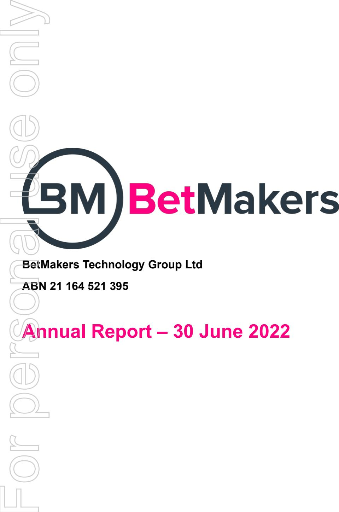
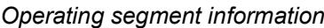

{0}------------------------------------------------

#### **1. Company details**

| Name of entity:   | BetMakers Technology Group Ltd  |
|-------------------|---------------------------------|
| ABN:              | 21 164 521 395                  |
| Reporting period: | For the year ended 30 June 2022 |
| Previous period:  | For the year ended 30 June 2021 |
|                   |                                 |

## **2. Results for announcement to the market \$'000** Revenues from ordinary activities up 371.1% to 91,682 Loss from ordinary activities after tax attributable to the owners of BetMakers Technology Group Ltd up 411.1% to (89,234) Loss for the year attributable to the owners of BetMakers Technology Group Ltd up 411.1% to (89,234)

#### *Dividends*

#### *Comments*

#### **3. Net tangible assets**

| 2. Results for announcement to the market n \$'000 Revenues from ordinary activities up 371.1% to 91,682 o Loss from ordinary activities after tax attributable to the owners of BetMakers Technology Group Ltd up 411.1% to (89,234) e Loss for the year attributable to the owners of BetMakers Technology Group Ltd up 411.1% to (89,234) s Dividends There were no dividends paid, recommended or declared during the current financial period. u Comments The loss for the group after providing for income tax amounted to \$89,234,000 (30 June 2021: \$17,459,000). This includes share based payments expense of \$71,029,000 (2021: \$12,358,000). Further information on the 'Review of operations' is detailed in the Directors' report and Chief Executive Officer's report which a is part of the Annual Report. n 3. Net tangible assets o Consolidated 2022 2021 \$'000 \$'000 s Net assets 189,286 195,402 r Less: Intangibles (65,762) (67,973) Less: Right-of-use (ROU) assets (4,873) (2,455) e Add: Lease liabilities - current 590 364 Add: Lease liabilities - non-current 4,630 2,130 p Net tangible assets 123,871 127,468 Consolidated r 2022 2021 o Number of ordinary shares on issue 904,456,198 812,819,535 Reporting Previous period period Cents Cents Net tangible assets per ordinary security 13.70 15.68 | y Previous period: | For the year ended 30 June 2021 |  |  |
|-------------------------------------------------------------------------------------------------------------------------------------------------------------------------------------------------------------------------------------------------------------------------------------------------------------------------------------------------------------------------------------------------------------------------------------------------------------------------------------------------------------------------------------------------------------------------------------------------------------------------------------------------------------------------------------------------------------------------------------------------------------------------------------------------------------------------------------------------------------------------------------------------------------------------------------------------------------------------------------------------------------------------------------------------------------------------------------------------------------------------------------------------------------------------------------------------------------------------------------------------------------------------------------------------------------------------------------------------------------------------------------------------------------------------------------------------------------------------------------------------------------------------------------------------------------------------------|-----------------------|---------------------------------|--|--|
|                                                                                                                                                                                                                                                                                                                                                                                                                                                                                                                                                                                                                                                                                                                                                                                                                                                                                                                                                                                                                                                                                                                                                                                                                                                                                                                                                                                                                                                                                                                                                                               | l                     |                                 |  |  |
|                                                                                                                                                                                                                                                                                                                                                                                                                                                                                                                                                                                                                                                                                                                                                                                                                                                                                                                                                                                                                                                                                                                                                                                                                                                                                                                                                                                                                                                                                                                                                                               |                       |                                 |  |  |
|                                                                                                                                                                                                                                                                                                                                                                                                                                                                                                                                                                                                                                                                                                                                                                                                                                                                                                                                                                                                                                                                                                                                                                                                                                                                                                                                                                                                                                                                                                                                                                               |                       |                                 |  |  |
|                                                                                                                                                                                                                                                                                                                                                                                                                                                                                                                                                                                                                                                                                                                                                                                                                                                                                                                                                                                                                                                                                                                                                                                                                                                                                                                                                                                                                                                                                                                                                                               |                       |                                 |  |  |
|                                                                                                                                                                                                                                                                                                                                                                                                                                                                                                                                                                                                                                                                                                                                                                                                                                                                                                                                                                                                                                                                                                                                                                                                                                                                                                                                                                                                                                                                                                                                                                               |                       |                                 |  |  |
|                                                                                                                                                                                                                                                                                                                                                                                                                                                                                                                                                                                                                                                                                                                                                                                                                                                                                                                                                                                                                                                                                                                                                                                                                                                                                                                                                                                                                                                                                                                                                                               |                       |                                 |  |  |
|                                                                                                                                                                                                                                                                                                                                                                                                                                                                                                                                                                                                                                                                                                                                                                                                                                                                                                                                                                                                                                                                                                                                                                                                                                                                                                                                                                                                                                                                                                                                                                               | l                     |                                 |  |  |
|                                                                                                                                                                                                                                                                                                                                                                                                                                                                                                                                                                                                                                                                                                                                                                                                                                                                                                                                                                                                                                                                                                                                                                                                                                                                                                                                                                                                                                                                                                                                                                               |                       |                                 |  |  |
|                                                                                                                                                                                                                                                                                                                                                                                                                                                                                                                                                                                                                                                                                                                                                                                                                                                                                                                                                                                                                                                                                                                                                                                                                                                                                                                                                                                                                                                                                                                                                                               |                       |                                 |  |  |
|                                                                                                                                                                                                                                                                                                                                                                                                                                                                                                                                                                                                                                                                                                                                                                                                                                                                                                                                                                                                                                                                                                                                                                                                                                                                                                                                                                                                                                                                                                                                                                               |                       |                                 |  |  |
|                                                                                                                                                                                                                                                                                                                                                                                                                                                                                                                                                                                                                                                                                                                                                                                                                                                                                                                                                                                                                                                                                                                                                                                                                                                                                                                                                                                                                                                                                                                                                                               |                       |                                 |  |  |
|                                                                                                                                                                                                                                                                                                                                                                                                                                                                                                                                                                                                                                                                                                                                                                                                                                                                                                                                                                                                                                                                                                                                                                                                                                                                                                                                                                                                                                                                                                                                                                               |                       |                                 |  |  |
|                                                                                                                                                                                                                                                                                                                                                                                                                                                                                                                                                                                                                                                                                                                                                                                                                                                                                                                                                                                                                                                                                                                                                                                                                                                                                                                                                                                                                                                                                                                                                                               |                       |                                 |  |  |
|                                                                                                                                                                                                                                                                                                                                                                                                                                                                                                                                                                                                                                                                                                                                                                                                                                                                                                                                                                                                                                                                                                                                                                                                                                                                                                                                                                                                                                                                                                                                                                               |                       |                                 |  |  |
|                                                                                                                                                                                                                                                                                                                                                                                                                                                                                                                                                                                                                                                                                                                                                                                                                                                                                                                                                                                                                                                                                                                                                                                                                                                                                                                                                                                                                                                                                                                                                                               |                       |                                 |  |  |
|                                                                                                                                                                                                                                                                                                                                                                                                                                                                                                                                                                                                                                                                                                                                                                                                                                                                                                                                                                                                                                                                                                                                                                                                                                                                                                                                                                                                                                                                                                                                                                               |                       |                                 |  |  |
|                                                                                                                                                                                                                                                                                                                                                                                                                                                                                                                                                                                                                                                                                                                                                                                                                                                                                                                                                                                                                                                                                                                                                                                                                                                                                                                                                                                                                                                                                                                                                                               |                       |                                 |  |  |
|                                                                                                                                                                                                                                                                                                                                                                                                                                                                                                                                                                                                                                                                                                                                                                                                                                                                                                                                                                                                                                                                                                                                                                                                                                                                                                                                                                                                                                                                                                                                                                               |                       |                                 |  |  |
|                                                                                                                                                                                                                                                                                                                                                                                                                                                                                                                                                                                                                                                                                                                                                                                                                                                                                                                                                                                                                                                                                                                                                                                                                                                                                                                                                                                                                                                                                                                                                                               |                       |                                 |  |  |
|                                                                                                                                                                                                                                                                                                                                                                                                                                                                                                                                                                                                                                                                                                                                                                                                                                                                                                                                                                                                                                                                                                                                                                                                                                                                                                                                                                                                                                                                                                                                                                               |                       |                                 |  |  |
|                                                                                                                                                                                                                                                                                                                                                                                                                                                                                                                                                                                                                                                                                                                                                                                                                                                                                                                                                                                                                                                                                                                                                                                                                                                                                                                                                                                                                                                                                                                                                                               |                       |                                 |  |  |
|                                                                                                                                                                                                                                                                                                                                                                                                                                                                                                                                                                                                                                                                                                                                                                                                                                                                                                                                                                                                                                                                                                                                                                                                                                                                                                                                                                                                                                                                                                                                                                               | F                     |                                 |  |  |
|                                                                                                                                                                                                                                                                                                                                                                                                                                                                                                                                                                                                                                                                                                                                                                                                                                                                                                                                                                                                                                                                                                                                                                                                                                                                                                                                                                                                                                                                                                                                                                               |                       |                                 |  |  |

#### **4. Control gained over entities**

Not applicable.

{1}------------------------------------------------

#### **5. Loss of control over entities**

Not applicable.

#### **6. Details of associates and joint venture entities**

Not applicable.

### **7. Foreign entities**

*Details of origin of accounting standards used in compiling the report:*

Currently all accounting policies of the group are consistent with those adopted by its ultimate holding company, BetMakers Technology Group Ltd.

**8. Audit qualification or review**

*Details of audit/review dispute or qualification (if any):*

The financial statements have been audited and an unmodified opinion has been issued.

#### **9. Attachments**

*Details of attachments (if any):*

The Annual Report of BetMakers Technology Group Ltd for the year ended 30 June 2022 is attached.

## **10. Signed**

As authorised by the Board of Directors

Signed ___________________________ Date: 26 August 2022

- Todd Buckingham Director Newcastle For personal use only

{2}------------------------------------------------

**BetMakers Technology Group Ltd**

**ABN 21 164 521 395**

# **Annual Report – 30 June 2022**

{3}------------------------------------------------

#### **BetMakers Technology Group Ltd Contents 30 June 2022**

| Corporate directory                                                           | 2  |
|-------------------------------------------------------------------------------|----|
| Chief Executive Officer's report                                              | 3  |
| Directors' report                                                             | 5  |
| Auditor's independence declaration                                            | 25 |
| Statement of profit or loss and other comprehensive income                    | 26 |
| Statement of financial position                                               | 27 |
| Statement of changes in equity                                                | 28 |
| Statement of cash flows                                                       | 29 |
| Notes to the financial statements                                             | 30 |
| Directors' declaration                                                        | 73 |
| Independent auditor's report to the members of BetMakers Technology Group Ltd | 74 |
| Shareholder information                                                       | 80 |
|                                                                               |    |

1

{4}------------------------------------------------

#### **BetMakers Technology Group Ltd Corporate directory 30 June 2022**

| Directors                                     | Nicholas Chan - Chairman Todd Buckingham Simon Dulhunty Rebekah Giles Anna Massion                                                                                                                                                                                                                                                                                                                                                                                             |
|-----------------------------------------------|--------------------------------------------------------------------------------------------------------------------------------------------------------------------------------------------------------------------------------------------------------------------------------------------------------------------------------------------------------------------------------------------------------------------------------------------------------------------------------------------|
| y Company secretary                        | Charly Duffy                                                                                                                                                                                                                                                                                                                                                                                                                                                                               |
| l Notice of annual general meeting n    | The 2022 Annual General Meeting will be held on 22 November 2022, at Suite 19, Level 2 50 Glebe Road, The Junction NSW 2291, unless otherwise notified.                                                                                                                                                                                                                                                                                                                                 |
| Registered office o                        | Suite 19, Level 2, 50 Glebe Road, The Junction, NSW 2291 Head office telephone: (02) 4957 4704                                                                                                                                                                                                                                                                                                                                                                                       |
| Share register e                           | Computershare Investor Services Pty Limited Level 4, 60 Carrington Street Sydney, NSW 2000 Share registry telephone: 1300 787 272                                                                                                                                                                                                                                                                                                                                                 |
| s Auditor u                             | PKF(NS) Audit & Assurance Limited Partnership 755 Hunter Street Newcastle West, NSW 2303                                                                                                                                                                                                                                                                                                                                                                                             |
| Solicitors l a                          | Coghlan Duffy & Co Level 42, Rialto South Tower, 525 Collins Street Melbourne, VIC 3000                                                                                                                                                                                                                                                                                                                                                                                              |
| Stock exchange listing n                   | BetMakers Technology Group Ltd shares are listed on the Australian Securities Exchange (ASX code: BET)                                                                                                                                                                                                                                                                                                                                                                                  |
| Website                                       | http://betmakers.com                                                                                                                                                                                                                                                                                                                                                                                                                                                                       |
| o Corporate Governance Statement s r | The directors and management are committed to conducting the business of BetMakers Technology Group Ltd in an ethical manner and in accordance with the highest standards of corporate governance. BetMakers Technology Group Ltd has adopted and has substantially complied with the ASX Corporate Governance Principles and Recommendations (Fourth Edition) ('Recommendations') to the extent appropriate to the size and nature of its operations.                      |
| e p r                                   | The group's Corporate Governance Statement, which sets out the corporate governance practices that were in operation during the financial year and identifies and explains any Recommendations that have not been followed, and ASX Appendix 4G are released to the ASX on the same day the Annual Report is released. The Corporate Governance Statement and Corporate Governance Compliance Manual can be found on the group's website at http://betmakers.com/corporate. |
| o F                                        |                                                                                                                                                                                                                                                                                                                                                                                                                                                                                            |

{5}------------------------------------------------

#### **Dear Shareholders,**

I am pleased to provide you with the annual report for FY22 and detail the Company's performance across what is now a global enterprise with 11 offices in 8 countries.

BetMakers achieved key milestones as it focussed on maximising revenue growth and executing on transformative deals in line with Australian and international strategic plans.

The Company delivered more than \$90mil in revenue and a positive adjusted EBITDA.

The performance across its three divisions – Global Betting Services, Global Tote and Global Racing Network – showed strong overall growth and re-enforced the position of BetMakers as a leading B2B wagering technology company within the global landscape.

The further development of proprietary technologies to service the global racing industry – including wagering operators and racing bodies – has been supported by a targeted recruitment of key personnel for management and the Board.

We now have almost 500 staff worldwide and hold 45 regulatory licences to operate in more than 30 countries with over 60 wagering operators and 225 racing partner clients.

In establishing this world-class team across a wide international footprint, and together with the deals signed in FY22, I am especially pleased with the position it now places BetMakers to accelerate growth opportunities in each of its revenue divisions in FY23 and beyond.

### **FINANCIAL PERFORMANCE**

The Company reported revenues of \$91.6mil for FY2022, representing revenue growth of 371% compared with the previous year. The Company has also reported adjusted EBITDA of +\$2.2mil.

The growth was largely driven by the expansion of the Company's Platform and Managed Trading Services offering under the Global Betting Services division; the expansion of content distribution rights and delivery to licensed wagering operators under its Global Racing Network division; and the full year recognition of revenues associated with the acquisition of the racing and digital assets acquired from Sportech PLC on 17 June 2021 as a part of the Global Tote division. For personal use only

Finishing the year with an annualised run-rate revenue in excess of \$100 million1 places the Company in a strong position for future growth.

## **PEOPLE**

In FY22, BetMakers invested in the development and growth of its team and will start the new year with almost 500 employees.

The culmination of this growth in talented people across geographies has given the Company the ability to successfully execute on the foundations that have been built – and the deals that have been executed – over the past number of years.

Key appointments for FY22 included the addition of two new Board members, Rebekah Giles and Anna Massion. These appointments were made in line with BetMakers' intentions to ensure highest levels of governance with a board composition that is diverse in its skillset and is aligned with the Company's global strategy.

During the year, the Company appointed former Caesars senior executive Christian Stuart to the key role of Chief Executive Officer of North America to help drive opportunities throughout this important market.

In addition, BetMakers also added to its Key Executive team across Legal and Technology with the appointments of former Racing Queensland Acting CEO Sam Adams (Chief Legal Officer) and highly experienced wagering executive Dan McDonald (Chief Digital Officer).

1 Annualised run-rate revenue based on Q4 revenue.

{6}------------------------------------------------

#### **BetMakers Technology Group Ltd Chief Executive Officer's report 30 June 2022**

## **KEY DEALS**

Throughout FY22 we have focused on executing and delivering key strategic deals that we believe will set the company up for success next year.

Some of those key deals include:

- Executed agreement to be the exclusive technology provider to the NTD consortium, with potential revenues in excess of \$300m over 10 years;
- Launched 12 additional platforms in the Australian market;
- Executed a further 8 platform agreements across Australia, US, and Canada which are due to launch this year;
- Executed an amended agreement with the New Jersey Thoroughbred Horsemen Association extending the term for BetMakers to exclusively manage fixed odds betting on thoroughbred horse racing in New Jersey.
- Expanded our North American content to more than 12,000 races annually to distribute into international jurisdictions and throughout the BetMakers network of clients;
- Executed a binding Heads of Agreement to become the exclusive provider of pari-mutuel betting racing services to Caesars Entertainment Inc. brick-and-mortar retail sportsbook locations in Nevada;
- Selected as the new tote and technology and services provider for the country of Norway under a 10-year agreement relating to the provision of wager processing services with Norsk Rikstoto;
- Extended Parimutuel services agreement with Monmouth Park for a further 5 years.

In the United States, the Company has successfully launched Fixed Odds betting in the state of New Jersey, with the first bets being placed on track in May 2022.

### **FY 23 GROWTH / EXPECTATION**

The outlook for FY23 and beyond is exciting as we focus on executing the Company strategy and realising the multiple growth opportunities our unique set of assets provide.

While a number of these deals have been signed in FY22, we anticipate the benefits will only start to flow throughout FY23 and beyond as these deals materialise.

We believe the business transformation is now unquestionably robust and independent of any single contract or strategy.

This financial year closes with confidence, enthusiasm, and a substantial pipeline of opportunities.

We would not be in this position without the valued support of our shareholders, our dedicated board, and every individual staff member globally, and for that we are truly thankful.

We look forward to continuing to work with each of you to make a positive and significant impact over the next 12 months.

4

Regards

For personal use only

Todd Buckingham

CEO

{7}------------------------------------------------

The Directors present their report, together with the financial statements, of the consolidated entity (referred to hereafter as the 'Group') consisting of BetMakers Technology Group Ltd and the entities it controlled at the end of, or during, the year ended 30 June 2022.

#### **Principal Activities**

The Group's principal activities during the financial year were the development and provision of software, data and analytic products for the B2B wagering market and the production and distribution of racing content.

#### **Review of Operations**

The information presented in this Review of Operations has not been audited in accordance with the Australian Auditing Standards. All figures are in Australian dollars unless otherwise stated.

| n                                                                                                                             |                                                                                                                                                                                                                                                             |                   |                                |                |        |                                             |
|-------------------------------------------------------------------------------------------------------------------------------|-------------------------------------------------------------------------------------------------------------------------------------------------------------------------------------------------------------------------------------------------------------|-------------------|--------------------------------|----------------|--------|---------------------------------------------|
| o                                                                                                                             | The information presented in this Review of Operations has not been audited in accordance with the Australian Auditing Standards. All figures are in Australian dollars unless otherwise stated.                                                         |                   |                                |                |        |                                             |
|                                                                                                                               |                                                                                                                                                                                                                                                             |                   | Consolidated                   |                |        | Variance                                    |
|                                                                                                                               |                                                                                                                                                                                                                                                             |                   | 2022 \$'000                 | 2021 \$'000 | %      |                                             |
| e Revenue                                                                                                                  |                                                                                                                                                                                                                                                             |                   | 91,682                         | 19,458         |        | 371%                                        |
| s Gross margin                                                                                                             |                                                                                                                                                                                                                                                             |                   | 66,298                         | 10,203         |        | 550%                                        |
| Gross margin %                                                                                                                |                                                                                                                                                                                                                                                             |                   | 72%                            | 52%            |        |                                             |
| u Loss before income tax                                                                                                   |                                                                                                                                                                                                                                                             |                   | (96,288)                       | (20,940)       |        | 360%                                        |
| Add back: l Depreciation and amortisation                                                                               |                                                                                                                                                                                                                                                             |                   | 9,682                          | 2,698          |        |                                             |
| Finance costs                                                                                                                 |                                                                                                                                                                                                                                                             |                   | 541                            | 101            |        |                                             |
| a Share-based payments expense                                                                                             |                                                                                                                                                                                                                                                             |                   | 71,029                         | 12,358         |        |                                             |
| Deal costs                                                                                                                    |                                                                                                                                                                                                                                                             |                   | 16,461                         | 2,805          |        |                                             |
| n Impairment of receivables                                                                                                |                                                                                                                                                                                                                                                             |                   | 772                            | 99             |        |                                             |
| Adjusted EBITDA                                                                                                               |                                                                                                                                                                                                                                                             |                   | 2,197                          | (2,879)        |        |                                             |
| o Share-based payments expense                                                                                             |                                                                                                                                                                                                                                                             |                   |                                |                |        |                                             |
| The group measures the cost of equity-settled transactions with employees and third parties by reference to the fair value of | the equity instruments at the date at which they are granted. The relating expense is then recognised over the period in which the relating services are expected to be rendered. A summary of the FY2022 share-based payment expense is detailed below: |                   |                                |                |        |                                             |
| Relevant party                                                                                                                | Instrument Type                                                                                                                                                                                                                                             | Number granted | Fair value of at grant date |                |        |                                             |
| Mr Matt Tripp 1                                                                                                               | Performance rights                                                                                                                                                                                                                                          | 35,000,000        | \$1.2475                       | \$43,662,500   |        |                                             |
| s r e p Waterhouse VC 2                                                                                           | Performance rights                                                                                                                                                                                                                                          | 94,741,686        | \$0.2070                       | \$19,611,529   |        |                                             |
| Mr Todd Buckingham 3                                                                                                          | Performance rights                                                                                                                                                                                                                                          | 25,000,000        | \$0.4300 to                    |                |        |                                             |
| r Staff & Other o                                                                                                       | Options, performance rights and service rights                                                                                                                                                                                                        | varied            | \$1.020 varied              |                | varied | \$40,674,761 \$12,456,590 \$8,754,052 |

#### *Share-based payments expense*

The group measures the cost of equity-settled transactions with employees and third parties by reference to the fair value of the equity instruments at the date at which they are granted. The relating expense is then recognised over the period in which the relating services are expected to be rendered. A summary of the FY2022 share-based payment expense is detailed below:

| Relevant party                                             | Instrument Type                                                | Number granted                      | Fair value of at grant date                 | Total expense                                | Total expense recognised in FY2022    |
|------------------------------------------------------------|----------------------------------------------------------------|----------------------------------------|------------------------------------------------|----------------------------------------------|---------------------------------------------|
| Mr Matt Tripp 1 Waterhouse VC 2 Mr Todd Buckingham 3 | Performance rights Performance rights Performance rights | 35,000,000 94,741,686 25,000,000 | \$1.2475 \$0.2070 \$0.4300 to \$1.020 | \$43,662,500 \$19,611,529 \$18,500,000 | \$40,674,761 \$12,456,590 \$9,143,937 |
| Staff & Other                                              | Options, performance rights and service rights           | varied                                 | varied                                         | varied                                       | \$8,754,052                                 |

#### \$71,029,340

1 On 17 February 2021, the Group announced that it had entered into an exclusive agreement with Mr Matt Tripp to become a strategic advisor. As part of the agreement, Mr Tripp was awarded performance rights that vest upon the Group entering 'Strategic' and/or 'Transformational' transactions as defined under the agreement. The conditions of a 'Strategic' transaction were met as part of the company entering into the NTD consortium technology deal, and therefore 35,000,000 performance rights vested. The associated share-based payments expense was accelerated and recognised in FY2022. There is no further share-based payments expense in relation to the 'Strategic' deal to be recognised in future periods.

2 On 28 January 2020, the Group announced that it had signed conditional commercial agreements with the Waterhouse Group to build and operate new wagering products. As part of the commercial agreements, the Group agreed to issue performance rights (convertible into options) to Waterhouse VC. Based on the terms of the agreement, the company expects

{8}------------------------------------------------

to issue 60,176,765 shares in relation to FY2022 and has therefore recognised an expense of \$12,456,590 for the period. No further expense in relation to the Waterhouse VC commercial agreements is expected in future periods.

3 As approved at the 26 April 2021 General Meeting, Mr Todd Buckingham was awarded 25,000,000 performance rights that vest based on performance and term of service conditions. The share-based payment expense in relation to these performance rights is recognised over the expected life of the performance rights.

## *FY2022 Operational Highlights*

BetMakers is a leading B2B technology company servicing the global racing and online sports betting industries. The Group is defined through four divisions; Corporate, Global Betting Services, Global Racing Network and Global Tote. The company achieved revenues for the year of \$91,682,000, an increase of 371% compared to the prior year (2021: \$19,458,000). This growth was driven by:

- The expansion of the company's platform and managed trading services offering in the Australian market;
- The acquisition of the racing and digital assets acquired from Sportech PLC. The acquisition completed on 16 June 2021, and therefore FY2022 recognised a full year of results from these assets; and

| y FY2022 Operational Highlights                                                                                                                                                                                                                     |              |        |          |
|--------------------------------------------------------------------------------------------------------------------------------------------------------------------------------------------------------------------------------------------------------|--------------|--------|----------|
| l                                                                                                                                                                                                                                                      |              |        |          |
| BetMakers is a leading B2B technology company servicing the global racing and online sports betting industries. The Group is defined through four divisions; Corporate, Global Betting Services, Global Racing Network and Global Tote. The company |              |        |          |
| n achieved revenues for the year of \$91,682,000, an increase of 371% compared to the prior year (2021: \$19,458,000). This                                                                                                                         |              |        |          |
| growth was driven by: • The expansion of the company's platform and managed trading services offering in the Australian market;                                                                                                                  |              |        |          |
| o • The acquisition of the racing and digital assets acquired from Sportech PLC. The acquisition completed on 16 June                                                                                                                            |              |        |          |
| 2021, and therefore FY2022 recognised a full year of results from these assets; and                                                                                                                                                                    |              |        |          |
| • The expansion of content distribution rights and delivery to licensed wagering operators.                                                                                                                                                         |              |        |          |
| e                                                                                                                                                                                                                                                      | Consolidated |        | Variance |
|                                                                                                                                                                                                                                                        | 2022         | 2021   |          |
| s                                                                                                                                                                                                                                                      | \$'000       | \$'000 | %        |
| u Revenue                                                                                                                                                                                                                                           | 91,682       | 19,458 | 371%     |
| Global Betting Services                                                                                                                                                                                                                                | 40,607       | 14,562 | 179%     |
| Global Tote                                                                                                                                                                                                                                            | 46,939       | 1,665  | 2,719%   |
| Global Racing Network l                                                                                                                                                                                                                             | 4,136        | 3,231  | 28%      |
| n Corporate o • Integrated the racing and digital assets acquired from Sportech PLC                                                                                                                                                        |              |        |          |
| • Completed a rebranding of Sportech tote assets to Global Tote • Appointed Rebekah Giles as an independent non-executive director                                                                                                            |              |        |          |
| s • Appointed Anna Massion as an independent non-executive director                                                                                                                                                                              |              |        |          |
| r • Appointed Christian Stuart in the key role of Chief Executive Officer of North America                                                                                                                                                       |              |        |          |
| • Implemented a revised global short-term incentive framework, aligning staff with group operational targets                                                                                                                                        |              |        |          |
| e • Commenced a review of a global long-term incentive scheme to be implemented in H1 FY2023 • Completed a global ESG benchmark review and gap analysis to assist in the implementation of an internal ESG                                 |              |        |          |
| framework                                                                                                                                                                                                                                              |              |        |          |
| p • Announced the undertaking of an on-market share buy-back (commenced 12 July 2022)                                                                                                                                                            |              |        |          |
|                                                                                                                                                                                                                                                        |              |        |          |
| r                                                                                                                                                                                                                                                      |              |        |          |
| o                                                                                                                                                                                                                                                      |              |        |          |
| • Executed agreement to be the exclusive technology provider to the NTD consortium, with potential revenues in                                                                                                                                      |              |        |          |
| F excess of \$300m over 10 years.                                                                                                                                                                                                                   |              |        |          |
| • A total of 18 active Australian platform clients as of 30 June 2022 (up from 8 at 30 June 2021).                                                                                                                                                  |              |        |          |

To support the revenue growth during the year as well as the expected growth in future periods, the company increased its staff headcount and related employee benefits expense (FY2022: \$46,781,000, compared to FY2021: \$9,110,000).

- Integrated the racing and digital assets acquired from Sportech PLC
- Completed a rebranding of Sportech tote assets to Global Tote
- Appointed Rebekah Giles as an independent non-executive director
- Appointed Anna Massion as an independent non-executive director
- Appointed Christian Stuart in the key role of Chief Executive Officer of North America
- Implemented a revised global short-term incentive framework, aligning staff with group operational targets
- Commenced a review of a global long-term incentive scheme to be implemented in H1 FY2023
- Completed a global ESG benchmark review and gap analysis to assist in the implementation of an internal ESG framework
	- Announced the undertaking of an on-market share buy-back (commenced 12 July 2022)

- Executed agreement to be the exclusive technology provider to the NTD consortium, with potential revenues in excess of \$300m over 10 years.
- A total of 18 active Australian platform clients as of 30 June 2022 (up from 8 at 30 June 2021).

{9}------------------------------------------------

- A landmark Bill to "authorise fixed odds wagering on horse races through fixed odds wagering system" was passed unanimously in both the Senate and general Assembly in New Jersey, and was signed into law by the Governor of New Jersey.
- Signed an amended and restated Fixed Odds & Data Distribution Agreement with Darby Development LLC, the operator of Monmouth Park racetrack, and then New Jersey Thoroughbred Horseman Association. The parties agreed to extend the term for BetMakers to be the exclusive provider to deliver and manage fixed odds betting on thoroughbred horse racing into New Jersey from the initial period of 10 years to a new contracted term of 15 years.
- Launched fixed odds betting on thoroughbred racing in New Jersey on 6 May 2022 at Monmouth Park.
- Awarded the rights to offer Penn National Gaming's racing content internationally for fixed odds, booked bets and exchange wagering where applicable, outside of the US and Canadian markets. These rights include 946 race meetings a year for distribution from 1 July 2022 to global licensed wagering operators (term to 31 December 2025).

- Signed a binding Heads of Agreement to become exclusive provider of pari-mutuel betting racing services to Caesars Entertainment Inc brick-and-mortar retail sportsbook locations in Nevada.
- Selected as the new tote and technology and services provider for the country of Norway under a 10-year agreement relating to the provision of wager processing services with Norsk Rikstoto.
- Extended parimutuel services agreement with Monmouth Park for a further 10 years.

## *Strategic Focus and Outlook*

The company is focused on continuing to grow as a B2B supplier to the racing and wagering industries. The FY2023 strategy and outlook of the group's operating divisions is outlined below:

- Delivery and launch of NTD Platform for Australian market.
- Continue to support racing bodies through the delivery of automated technology solutions. Including delivery of updated deduction process on behalf of Racing Victoria, Automated race day.
- Next generation ADW / tote wagering platform roll out for North America.
- Upgrades to core racing services products such as Price Manager, BetMakers ratings engine, Race Streaming platform and bespoke content creation platform.
- Grow MTS platform into new markets i.e., Monmouth Bets, CrossBet Canada.

- Progress regulation of fixed odds horse race wagering in the US.
- Expand domestic and international fixed odds thoroughbred content globally.
- Contract additional rights holders to facilitate distribution of racing content globally.
- Progress contracting and integration within US wagering operators for the delivery of horse racing for fixed odds content.
- Roll out the GRN reporting tool within New Jersey to provide racetracks, rights holders and operators with oversight and transparency.

{10}------------------------------------------------

- Focus on enhancing global integrations for operators globally to improve liquidity across racing content from all jurisdictions.
- Roll-out of BetLine terminals to improve customer experience, terminal functionality and data driven decision making.
- Launch Global Tote Hub by connecting existing and new customers to enhance liquidity across network of clients
- Integration of Quantum tote engine into BetMakers' front end platform technology (for both tote only "ADW" offering and dual fixed odds / tote offering).

## **Principle Risks**

Identifying and mitigating business risks that may affect the Group's strategy and financial performance is an essential part of the governance framework. This section outlines some of the key risks identified by the Group. They are not listed in order or importance or likelihood to materialise.

Risk Area Description *Licensing and Regulatory*

*Software*

The Group operates in heavily regulated industries and jurisdictions. Accordingly, there is an exposure to a range of risks relating to compliance with, changes to, or uncertainty in, the relevant legal and regulatory regimes in those jurisdictions. Changes to laws and regulations or failure to comply may have a material adverse effect on the Group's business, financial position and prospects, or lead to license suspension or cancellation.

The Group's contracts with customers may require approval or consent of one or more Australian or foreign governments, gambling regulators or other regulators. There is a risk that such approval or consent may not be granted and, in such circumstances, the Group or the customer may become unable to comply with contractual obligations, potentially having a material adverse impact on financial performance.

*Technology and*  The Group's business is based largely on the software, source code, technology and computer programs which comprise of its online wagering platforms. There is a risk that this technology and/or software may be superseded or displaced in the market by new technology offerings or software which customers perceive have advantages over the Group's offerings. Furthermore, the Group's systems can be affected by numerous factors including but not limited to data losses, computer system faults, failure of or suspension from key data feeds, data network failures, and catastrophic event such as natural disaster, computer viruses of power failure.

*Intellectual Property and Obligations* There is a risk that failure or inability to protect intellectual property rights may have a significant adverse effect on operations, financial performance and competitive advantage. Further, there is a risk that operations, products, services or platforms may infringe the intellectual property rights of third parties. If any claim or litigation is brought against the Group which alleges an infringement on another party's intellectual property rights, this could result in the Group being subject to significant liability for damages or losing the right to use the intellectual property. For personal use only

*Security Software, Technology Breaches and Improper Access to Personal Data*

*Reliance on Agreements with Sports and Racing Controlling Bodies*

By their nature, information technology systems are susceptible to cyber-attacks with third parties seeking unauthorised access to data, networks, systems and databases. Further, third party suppliers may receive and store information from the Group or its customers and although this information is limited and subject to confidentiality obligations, if third party suppliers fail to adopt or adhere to robust security practices, any such information may be improperly accessed, used or disclosed.

The Group has in place various approvals and authorities granted by racing controlling bodies which permits the publishing and/or use of relevant race field information associated with those racing controlling bodies. There is a requirement to comply with certain terms and conditions, provisions, rules and regulations provided under the relevant State/Territory laws. Under such legislation, rules and regulations, the racing controlling bodies have the discretion to determine the types of bets the Group is permitted to take. A removal of one or more of these bet types may materially adversely affect business operations and financial position.

{11}------------------------------------------------

*Racing and Sports Products* The Group is reliant on various state and international racing and sporting controlling bodies providing a regular program of events for the purposes of wagering. A significant reduction in the number of race meetings or sporting fixtures, or the occurrence of an event which impacts adversely on the Australian Racing or Sport industries, or which otherwise disrupts the scheduled racing or sporting program, may have an adverse effect on operational and financial performance.

*Anti-Money Laundering (AML) and Counter Terrorism Financing (CTF)* Under the Group's licenses, there is a requirement to comply with several obligations under the AML/CTF Act including, for example, requirements to develop and implement an AML/CTF program, conduct customer due diligence and report suspect matters and transactions to the Australian regulator, AUSTRAC. Failure to adequately monitor and mitigate against money laundering and other fraudulent activities, or failure to comply with obligations under the AML/CTF Act may result in civil or criminal liability for the Group.

## **Dividends**

There were no dividends paid, recommended or declared during the current or previous financial year.

## **Significant Changes in the State of Affairs**

On 16 July 2021, the Group issued 34,564,921 shares to Waterhouse VC Pty Ltd. For the period 22 May 2020 through to 30 June 2021, the Group recorded relevant revenues of \$6,221,685.70 under the conditional commercial agreements with the Waterhouse Group. As a result, the Class A Performance Rights issued to Waterhouse VC Pty Ltd vested and was converted into 34,564,921 options exercisable into ordinary shares in the Group with an exercise price of \$0.18. Waterhouse VC elected to exercise all options.

Further, on 31 January 2022, the Group issued an additional 45,862,414 shares to Waterhouse VC Pty Ltd. Under the conditional commercial agreements with Waterhouse Group, for the period 1 July 2021 to 31 December 2021, the Group recorded relevant revenues of \$8,255,234.50. Consequently, the Class A Performance Rights issued to Waterhouse VC Pty Ltd vested and was converted into 45,862,414 options exercisable into ordinary shares in the Group. The exercise price was \$0.18, and Waterhouse VC elected to exercise all options.

Under the conditional commercial agreements with Waterhouse Group, for the period 1 January 2022 to 30 June 2022, sufficient revenues were generated, and it is expected that the Waterhouse VC Class C Performance Right will convert into 14,314,351 options, which are exercisable into shares. There will be no further options available to the Waterhouse Group under the commercial agreements after the final tranche of 14,314,351 options are issued. On 20 May 2022 the company announced that it had signed a deed of termination in respect of the managed trading services agreement with Tarpin Finance Pty Ltd (in association with the Waterhouse Group commercial agreements). As the relationship with Tarpin exceeded expectations and hit key milestones earlier than expected, the parties agreed to conclude the existing managed trading services agreements with the Waterhouse Group on 30 June 2022. For personal use only

There were no other significant changes in the state of affairs of the Group during the financial year.

## **Matters Subsequent to the End of the Financial Year**

The group announced the intention to undertake an on-market share buy-back on 24 June 2022. The buy-back commenced on 12 July 2022. At the time of this report, the company had purchased 1,572,022 ordinary shares at an average price of \$0.385 per share.

On 12 August 2022 the company announced that it had entered into a deed of variation to amend the contract with NTD Pty Limited to provide technology and services to the new NTD wagering venture. In addition, NTD has agreed to purchase certain assets pertaining to the wagering business owned and operated by O'Shea Bookmaking Pty Ltd (trading as "TexBet") with BetMakers' support. Under the amended terms, the company will increase the Annual Fee payable by NTD to OM Apps by \$2 million per annum, BetMakers will contribute a total of \$2.5 million over two tranches towards the purchase of TexBet by NTD.

No other matter or circumstance has arisen since 30 June 2022 that has significantly affected, or may significantly affect the Group's operations, the results of those operations, or the Group's state of affairs in future financial years.

{12}------------------------------------------------

#### **Covid-19**

The consequences of the Coronavirus (COVID-19) pandemic are ongoing, and its impact on the Group, if any, has been reflected in its published results to date. It is not possible at this time to state that the pandemic will not subsequently impact the Group's operations going forward. The Group now has experience in the swift implementation of business continuation processes, and these processes continue to evolve to minimise any operational disruption. Management continues to monitor the situation both locally and internationally.

#### **Directors**

The following persons were directors of BetMakers Technology Group Ltd during the whole of the financial year and up to the date of this report, unless otherwise stated:

#### **Nicholas Chan**

*Chairman and Non-Executive Director*

#### *Experience and Expertise*

Nicholas (Nick) Chan has more than 30 years' experience in media and has held senior leadership and operational roles with leading Australian media companies.

Most recently Group Chief Operating Officer at Seven West Media, prior to that, Nick was CEO of Pacific Magazines, a subsidiary of Seven West Media, for 9 years. Nick joined Pacific Magazines from Text Media, where he was CEO and held a range of senior positions at ACP Publishing including Group Publisher and Chief Operating Officer.

Nick is a former Chairman of The Magazines Publishers of Australia and is currently consulting to several businesses in the digital, technology and marketing sectors.

#### **Todd Buckingham**

*Managing Director and Chief Executive Officer*

#### *Experience and Expertise*

Todd Buckingham has more than 20 years' experience working in the Sports and Wagering industry in Australia.

After completing a double bachelor's degree in teaching and health and physical education in 2000, Todd taught secondary education for 5 years at Hunter Sports High School whilst simultaneously working as a sports manager at a successful sports management company, NSRT.

During his time at NSRT, Todd negotiated more than \$20m worth of sporting contracts, culminating in his appointment as Managing Director. As Managing Director of NSRT, his responsibilities included managing the affairs of Rugby League athletes, negotiating contracts, sourcing sponsorships, managing accounting and budgeting affairs, crisis management and media relations. In 2009, Todd founded 12Follow OpCo and in 2010 founded TopBetta OpCo.

*Other Current Directorships* None

*Former Directorships (Last 3 years)* Non-Executive Director, Future First Technologies Limited (ASX: FFT)

*Special Responsibilities* Member, Audit & Risk Committee

*Other Current Directorships* None

*Former Directorships (Last 3 years)* None

*Special Responsibilities* None

For personal use only

{13}------------------------------------------------

**Simon Dulhunty** *Non-Executive Director*

#### *Experience and Expertise*

Simon Dulhunty has more than 25 years of media experience. He is a former Fairfax Media executive where he has held senior roles including roles as Editor of The Sun-Herald and General Manager of Fairfax mobile development for SMH, The Age and AFR apps. Simon now operates a private consultancy where he serves as corporate affairs, issues management and business development advisor to a range of clients from multi-national companies, sporting organisations, technology start-ups and highprofile individuals.

*Other Current Directorships* None

*Former Directorships (Last 3 years)* None

*Special Responsibilities*

Member, Audit & Risk Committee Member, Nomination & Remuneration Committee

#### **Rebekah Giles**

*Non-Executive Director – appointed 8 February 2022*

#### *Experience and Expertise*

Rebekah Giles has more than 20 years' experience as a legal practitioner working in private practice and specialising in contentious matters, specifically complex commercial and sensitive legal disputes, regulatory investigations, reputational risk, prosecution, and inquiries.

Rebekah is the principal director of boutique legal firm Company (Giles) and has a diverse portfolio of non-executive directorships in government, sport and private enterprise.

Some of her current and past appointments include Chair of the Board of Governors for the Centennial Parklands Foundation (Sydney), Western Sydney Football Club (AFL GWS Giants), FrontRunners, SOBA (Sydney Olympic Park Business Association), Greyhound Racing NW and the Association for Women in Insurance. Rebekah also has a long-standing interest in racing, with close connections to 2021 Melbourne Cup winner Very Elleegant, 2021 Caulfield Cup winner Incentivise and 2019 The Everest winner Yes Yes Yes.

#### **Anna Massion**

*Non-Executive Director – appointed 3 March 2022*

#### *Experience and Expertise*

Anna Massion currently serves as an Independent Non-Executive Director on several boards including Playtech, PLC, PlayAGS, and Artemis Strategic Investment Corp. Previously, Anna was a Senior Analyst for PAR Capital Management from February 2014 through June 2019. Anna has also served as a Director of Gaming, Lodging and Leisure Research at Hedgeye Risk Management, LLC from November 2008 through February 2014, Vice President/Senior Research Analyst at Marathon Asset Management from April 2008 through October 2008 and at JP Morgan from September 2001 through March 2008 as a Vice President on the Proprietary Trading Desk from 2004.

Anna holds a Bachelor of Science in Economics, Concentration in Finance, Minor in Russian and a Master of Business Administration in Finance, Major in Finance from The Wharton School at the University of Pennsylvania.

#### *Other Current Directorships* None

*Former Directorships (Last 3 years)* None

*Special Responsibilities*

Chair, Nomination & Remuneration Committee Member, Audit & Risk Committee

#### *Other Current Directorships*

Non-Executive Director, Playtech PLC (LSE: PTEC) Non-Executive Director, AGS LLC (NYSE: AGS) Non-Executive Director, Artemis Strategic Investment Corp (NASDAQ: ARTE)

*Former Directorships (Last 3 years)* None

#### *Special Responsibilities*

Chair, Audit & Risk Committee Member, Nomination & Remuneration Committee

{14}------------------------------------------------

#### **Matt Davey**

*Non-Executive Director (Non-independent) – Resigned on 21 April 2022*

#### *Experience and Expertise*

*Other Current Directorships* Executive Director, Tekkorp Digital Acquisition Corp (NASDAQ: TEKK)

## *Board Composition and Skills Matrix*

- Information technology;
- Business acquisition and integration skills;
- Financial literacy and legal and regulatory knowledge;
- Diversity;
- Policy and regulatory development and reform;
- Health, safety and environment and social responsibility; and
- Organisational development and human resources.

#### *Meetings of Directors*

| y l n o                                                                                                                                                                                                                                                                                                                                                                                        | technology.    |      | Matt Davey has a deep knowledge of the US gaming and wagering market. Matt was previously CEO of NYX Gaming Group, which was sold to Scientific Games {NASDAQ: SGMS). As CEO of NYX Gaming Group, Matt developed a successful corporate strategy that generated significant revenue growth, and acquired ten companies, including OpenBet, which powers one of largest aggregate volume of the world's online sports bets, and became one of the leading suppliers of digital gaming content and |      | Executive Director, Tekkorp Digital Acquisition Corp (NASDAQ: TEKK) Former Directorships (Last 3 years) None                                                                                                                                            |      |
|---------------------------------------------------------------------------------------------------------------------------------------------------------------------------------------------------------------------------------------------------------------------------------------------------------------------------------------------------------------------------------------------------------|----------------|------|-----------------------------------------------------------------------------------------------------------------------------------------------------------------------------------------------------------------------------------------------------------------------------------------------------------------------------------------------------------------------------------------------------------------------------------------------------------------------------------------------------------------------|------|------------------------------------------------------------------------------------------------------------------------------------------------------------------------------------------------------------------------------------------------------------------------|------|
| e other types of entities, unless otherwise stated. s directorships of all other types of entities, unless otherwise stated.                                                                                                                                                                                                                                                                   |                |      |                                                                                                                                                                                                                                                                                                                                                                                                                                                                                                                       |      | 'Other current directorships' quoted above are current directorships for listed entities only and excludes directorships of all 'Former directorships (last 3 years)' quoted above are directorships held in the last 3 years for listed entities only and excludes |      |
| Board Composition and Skills Matrix                                                                                                                                                                                                                                                                                                                                                                     |                |      |                                                                                                                                                                                                                                                                                                                                                                                                                                                                                                                       |      |                                                                                                                                                                                                                                                                        |      |
| u                                                                                                                                                                                                                                                                                                                                                                                                       |                |      |                                                                                                                                                                                                                                                                                                                                                                                                                                                                                                                       |      | As at 30 June 2022, the Board is comprised of four (4) Independent Non-Executive Directors, and one (1) Executive Director.                                                                                                                                            |      |
|                                                                                                                                                                                                                                                                                                                                                                                                         |                |      |                                                                                                                                                                                                                                                                                                                                                                                                                                                                                                                       |      |                                                                                                                                                                                                                                                                        |      |
| l a of are as follows:                                                                                                                                                                                                                                                                                                                                                                            |                |      |                                                                                                                                                                                                                                                                                                                                                                                                                                                                                                                       |      | Members of the Board have been appointed to encompass a varying range of qualifications, skills and experience that are considered essential to the successful management of the group. Key skills and experience that the Board should comprise                    |      |
| ▪ Bookmaking and betting industry experience; n ▪ Information technology; ▪ Business acquisition and integration skills; o ▪ Financial literacy and legal and regulatory knowledge; ▪ Diversity; ▪ Policy and regulatory development and reform; s ▪ Health, safety and environment and social responsibility; and ▪ Organisational development and human resources. r |                |      |                                                                                                                                                                                                                                                                                                                                                                                                                                                                                                                       |      |                                                                                                                                                                                                                                                                        |      |
| e and governance issues relevant to the Group. Meetings of Directors                                                                                                                                                                                                                                                                                                                              |                |      |                                                                                                                                                                                                                                                                                                                                                                                                                                                                                                                       |      | The Board regularly reviews the skills matrix to ensure it covers the skills needed to address existing and emerging business                                                                                                                                          |      |
| p                                                                                                                                                                                                                                                                                                                                                                                                       |                |      |                                                                                                                                                                                                                                                                                                                                                                                                                                                                                                                       |      | Member attendance of the Group's Board and Committees meetings during the year ended 30 June 2022 are as follows:                                                                                                                                                      |      |
|                                                                                                                                                                                                                                                                                                                                                                                                         | Board Meetings |      | Audit & Risk Committee                                                                                                                                                                                                                                                                                                                                                                                                                                                                                                |      | Nomination & Remuneration Committee                                                                                                                                                                                                                                    |      |
| r                                                                                                                                                                                                                                                                                                                                                                                                       | Attended       | Held | Attended                                                                                                                                                                                                                                                                                                                                                                                                                                                                                                              | Held | Attended                                                                                                                                                                                                                                                               | Held |
| Nicholas Chan                                                                                                                                                                                                                                                                                                                                                                                           | 13             | 13   | 5                                                                                                                                                                                                                                                                                                                                                                                                                                                                                                                     | 5    | 2                                                                                                                                                                                                                                                                      | 2    |
| o Todd Buckingham                                                                                                                                                                                                                                                                                                                                                                                    | 13             | 13   | -                                                                                                                                                                                                                                                                                                                                                                                                                                                                                                                     | -    | -                                                                                                                                                                                                                                                                      | -    |
| Simon Dulhunty                                                                                                                                                                                                                                                                                                                                                                                          | 13             | 13   | 5                                                                                                                                                                                                                                                                                                                                                                                                                                                                                                                     | 5    | 2                                                                                                                                                                                                                                                                      | 2    |
| F Rebekah Giles                                                                                                                                                                                                                                                                                                                                                                                      | 6              | 6    | -                                                                                                                                                                                                                                                                                                                                                                                                                                                                                                                     | -    | -                                                                                                                                                                                                                                                                      | -    |
| Anna Massion                                                                                                                                                                                                                                                                                                                                                                                            | 4              | 4    | 1                                                                                                                                                                                                                                                                                                                                                                                                                                                                                                                     | 1    | 1                                                                                                                                                                                                                                                                      | 1    |
| Matt Davey                                                                                                                                                                                                                                                                                                                                                                                              | 10             | 10   | 4                                                                                                                                                                                                                                                                                                                                                                                                                                                                                                                     | 4    | 1                                                                                                                                                                                                                                                                      | 1    |

Held: represents the number of meetings held during the time the director held office.

Rebekah Giles was appointed Chair of the Nomination & Remuneration Committee on 29 July 2022.

Anna Massion was appointed Chair of the Audit & Risk Committee on 29 July 2022.

{15}------------------------------------------------

#### **Company Secretary**

Ms Charly Duffy is a qualified and practising corporate and commercial lawyer with extensive experience in private practice and is the director and principal of cdPlus Corporate Services, a company secretarial and legal services business. Charly brings extensive legal experience to BET, with a particular focus on equity capital markets, mergers and acquisitions, corporate governance, initial public offerings, secondary capital raisings, business and share sale transactions, takeovers, Takeovers Panel proceedings, financing, ASIC and ASX compliance and all aspects of general corporate and commercial law.

#### **Remuneration Report (Audited)**

The remuneration report, which has been audited, outlines remuneration arrangements for Key Management Personnel ('KMP') of the Group, in accordance with the requirements of the Corporations Act 2001 and its regulations. KMP are defined as those persons having authority and responsibility for planning, directing and controlling the major activities of the Group, directly or indirectly.

### *Use of Remuneration Consultants*

The Nomination & Remuneration Committee may, from time to time, receive advice from external advisors to guide the Committee and provide relevant market information on the remuneration of Non-Executive Directors, Executive Directors and KMP. Any advice received will form part of the Committee's review but will not be used to provide quantum of remuneration packages and/or structure.

During the financial year ended 30 June 2022, the Committee did not receive any remuneration recommendations from a remuneration consultant, as defined by the Corporations Act 2001.

The Group did engage a third-party advisor to perform a review of its existing remuneration policies, including short-term and long-term incentives, as well as remuneration benchmarking for directors and select executive staff. No remuneration recommendations were provided as defined by the Corporations Act 2001.

### *Principles used to Determine the Nature and Amount of Remuneration*

#### *Key Objectives of the Group's Executive Reward Framework*

- Align executive reward with the
	- achievement of strategic objectives and value creation for shareholders'
- Attract, motivate and retain high performance and high-quality executive personnel
	- Deliver transparency and clear structure for executive reward and alignment to shareholders' interest

The Board is responsible for determining and reviewing remuneration arrangements for directors and executives and regularly reviews remuneration arrangements, framework and structure. The framework is considered to conform to market best practice for the delivery of reward; and in accordance with best practice corporate governance, the structure of Non-Executive and Executive Director remuneration is separate. For personal use only

#### *Non-Executive Directors' Remuneration*

Remuneration to Non-Executive Directors reflects the demands and responsibilities of their role. Non-Executive Directors' remuneration is reviewed annually by the Board. The Chairman's fees are determined independently to the fees of other Non-Executive Directors based on comparative roles in the external market. The Chairman is not present at any discussions relating to the determination of their own remuneration.

ASX listing rules require the aggregate Non-Executive Directors' remuneration be determined periodically by shareholders. The most recent determination was at the AGM held on 22 November 2021, where the shareholders approved that the aggregate remuneration must not exceed \$850,000 per annum.

{16}------------------------------------------------

### *Executive Remuneration*

The Group aims to reward executives based on their position and responsibility, with a level and mix of remuneration which has both fixed and variable components. The executive remuneration and reward framework has three components:

| y                                                 | 1. Base Pay and Non-Monetary Benefits                                                                        | 2. Short-Term Performance Incentives                                                                                                                                                                                                                       | 3. Share-Based Payments (Long Term Incentives)                                                                                                                                                                                                                                                                                                                                                                           |
|---------------------------------------------------|-----------------------------------------------------------------------------------------------------------------|---------------------------------------------------------------------------------------------------------------------------------------------------------------------------------------------------------------------------------------------------------------|-----------------------------------------------------------------------------------------------------------------------------------------------------------------------------------------------------------------------------------------------------------------------------------------------------------------------------------------------------------------------------------------------------------------------------|
| Component Inclusions: l                     | Base salary, superannuation and other benefits                                                               | Cash incentives                                                                                                                                                                                                                                               | Options, and/or performance rights                                                                                                                                                                                                                                                                                                                                                                                          |
| n Purpose:                                     | Compensation for day-to-day operational responsibilities                                                     | Provide a tangible incentive to improve company and personal performance                                                                                                                                                                                | Assist in the reward, retention and motivation of executives                                                                                                                                                                                                                                                                                                                                                             |
| o Payment Dependant on:                     | Individual and business unit performance, overall group performance and comparable market remuneration | Period of employment / retention, and achievement of approved business and personal Key Performance Indicators (KPIs)                                                                                                                                | Employment continuation for the entire vesting period and achievement of performance based vesting conditions                                                                                                                                                                                                                                                                                                      |
| e Timeframe:                                   | Immediate                                                                                                       | Bi-annually                                                                                                                                                                                                                                                   | Varied tranches – 1 to 4 years                                                                                                                                                                                                                                                                                                                                                                                              |
| s                                                 | The combination of the above comprises the executive's total remuneration.                                      |                                                                                                                                                                                                                                                               |                                                                                                                                                                                                                                                                                                                                                                                                                             |
| u l business/industry knowledge. a 2. | Short-Term Performance Incentives                                                                               |                                                                                                                                                                                                                                                               | Executive remuneration consisting of base salary and compulsory superannuation is based on the principles of motivating senior executives to pursue the Group's long-term growth and success, demonstrate a clear relationship between the Group's overall performance and individual performance, and providing competitive remuneration to retain key staff and                                                     |
| Overview: n                                    |                                                                                                                 | personal performance measures that represent the key priorities for the participant                                                                                                                                                                           | The Group provides bi-annual short-term performance incentives (STI) in the form of variable at risk remuneration, with the intention to reward executive performance against group performance measures and                                                                                                                                                                                                             |
| o Performance Period: s                  | ▪ 1 July to 31 December ▪ 1 January to 30 June                                                               | STI runs on the Group's financial year, with two assessment periods as follows:                                                                                                                                                                               |                                                                                                                                                                                                                                                                                                                                                                                                                             |
| Performance r Criteria: e p           | set and assessed for each assessment period.                                                                    | The key factors that are used to determine STI eligibility and payment are as follows: Board will assess the Group's performance against the established targets. ▪ Commencement and retention of employment for the entirety of the assessment period. | ▪ Business performance KPIs based on achievement of revenue targets for the financial year and achievement of EBIDTA targets outlined for the financial period. At the end of the assessment period the ▪ Personal performance KPIs based on achievement of an approved personal performance agreement with personal business goals aligned to departmental and company strategies. Personal performance goals are |
| r Discretion: o                             | the STI plan.                                                                                                   |                                                                                                                                                                                                                                                               | Recommended STI award is presented to the Board and Nomination & Remuneration Committee for approval. Overall Board discretion includes but is not limited to, the Board's authority to veto awards under                                                                                                                                                                                                                |
| 3.                                                | Share-Based Payments (Long-Term Incentives)                                                                     |                                                                                                                                                                                                                                                               |                                                                                                                                                                                                                                                                                                                                                                                                                             |
| F Overview:                                    |                                                                                                                 |                                                                                                                                                                                                                                                               | Subject to the ASX listing rules and under the terms of the long-term incentives plan (LTIP), the Board may grant options and/or performance rights (options with a nil exercise price) to eligible participants (awards).                                                                                                                                                                                               |

#### *1. Base Pay and Non-Monetary Benefits*

- 1 July to 31 December
	- 1 January to 30 June

- Business performance KPIs based on achievement of revenue targets for the financial year and achievement of EBIDTA targets outlined for the financial period. At the end of the assessment period the Board will assess the Group's performance against the established targets.
- Personal performance KPIs based on achievement of an approved personal performance agreement with personal business goals aligned to departmental and company strategies. Personal performance goals are set and assessed for each assessment period.
- Commencement and retention of employment for the entirety of the assessment period.

#### *3. Share-Based Payments (Long-Term Incentives)*

*Overview:* Subject to the ASX listing rules and under the terms of the long-term incentives plan (LTIP), the Board may grant options and/or performance rights (options with a nil exercise price) to eligible participants (awards). Each award granted represents a right to receive one share once the award vests and is exercised by the relevant participant

*Performance Period:* Options or performance rights awarded under the LTIP will be subject to vesting periods and conditions as stipulated in the terms of the plan as determined by the Board

{17}------------------------------------------------

*Performance Criteria:* The Board will determine the terms and conditions of awards under the LTIP including but not limited to the following: ▪ which individuals will be invited to participate; ▪ the number of awards to be granted to each participant; ▪ the fee payable, if any, by participants; ▪ the terms on which the awards will vest and become exercisable; ▪ the exercise price, if any, of each award; ▪ the period during which a vested award can be exercised; and ▪ any forfeiture conditions or disposal restrictions applying to the awards and shares received upon exercise of awards. *Discretion:* The Board has sole and absolute discretion to determine the terms and conditions of awards which are granted under the LTIP During the year ending 30 June 2022, the Group engaged a third-party advisor to benchmark select executive remuneration against comparative companies and market peers. The company did not receive any remuneration recommendations as part of this work, as defined by the Corporations Act 2001. A review of the LTIP is currently in progress to ensure the Group's LTI policy is aligned to shareholder interests, whilst acting as an effective tool in the attraction, retention and motivation of executives and other KMP. The Group intends to establish the new LTIP framework during H1 FY2023, providing improved structure and transparency on the timing and quantum of equity instrument grants, as well as the vesting conditions that align with shareholder values. *Group performance and link to remuneration* Remuneration for certain individuals is directly linked to the performance of the Group. A cash bonus and incentive payments are dependent on KPIs being met. Refer to the section 'Additional information' below for details of the earnings and total shareholders return for the last five years. The Committee is of the opinion that the continued improved results can be attributed in part to the adoption of performancebased compensation and is satisfied that this improvement will continue to increase shareholder wealth if maintained over the coming years. *Voting and comments made at the company's 2021 Annual General Meeting ('AGM')* At the 2021 AGM, 78.11% of the votes received supported the adoption of the remuneration report for the year ended 30 June 2021. The company did not receive any specific feedback at the AGM regarding its remuneration practices. *Key Management Personnel* The KMP of the Group consisted of the following persons: Name Position Changes during FY22 *Non-Executive Directors* Nicholas Chan Non-Executive Chairman Simon Dulhunty Non-Executive Director Rebekah Giles Non-Executive Director Appointed 8 February 2022 Anna Massion Non-Executive Director Appointed 3 March 2022 Matt Davey Non-Executive Director Resigned 21 April 2022 *Executive KMP* Todd Buckingham Managing Director and Chief Executive Officer Jake Henson Chief Operating Officer Anthony Pullin For personal use only Chief Financial Officer

{18}------------------------------------------------

#### *Details of Remuneration*

|                                                                                                                                                                                                                                                                                                                                                                                                                                                                                                                                                                                                                                     |                            | Short-Term Benefits |                 | Post Employment Benefits | Long-Term Benefits |                              | Share-Based Payments **              |            |
|-------------------------------------------------------------------------------------------------------------------------------------------------------------------------------------------------------------------------------------------------------------------------------------------------------------------------------------------------------------------------------------------------------------------------------------------------------------------------------------------------------------------------------------------------------------------------------------------------------------------------------------|----------------------------|------------------------|-----------------|--------------------------------|-----------------------|------------------------------|-----------------------------------------|------------|
| y                                                                                                                                                                                                                                                                                                                                                                                                                                                                                                                                                                                                                                   | Cash Salary and Fees    | Cash Bonus *        | Non Monetary | Superannuation                 | Leave Benefits     | Equity Settled Options | Equity-Settled Performance Rights | Total      |
| l 2022                                                                                                                                                                                                                                                                                                                                                                                                                                                                                                                                                                                                                           | \$                         | \$                     | \$              | \$                             | \$                    | \$                           | \$                                      | \$         |
| n Non-Executive                                                                                                                                                                                                                                                                                                                                                                                                                                                                                                                                                                                                                  |                            |                        |                 |                                |                       |                              |                                         |            |
| Directors                                                                                                                                                                                                                                                                                                                                                                                                                                                                                                                                                                                                                           |                            |                        |                 |                                |                       |                              |                                         |            |
| Nicholas Chan                                                                                                                                                                                                                                                                                                                                                                                                                                                                                                                                                                                                                       | 178,977                    | -                      | 16,995          | 17,898                         | -                     | -                            | -                                       | 213,870    |
| o Simon Dulhunty                                                                                                                                                                                                                                                                                                                                                                                                                                                                                                                                                                                                                 | 103,327                    | -                      | -               | 10,333                         | -                     | -                            | -                                       | 113,660    |
| Rebekah Giles                                                                                                                                                                                                                                                                                                                                                                                                                                                                                                                                                                                                                       | -                          | -                      | -               | -                              | -                     | -                            | 17,953                                  | 17,953     |
| Anna Massion                                                                                                                                                                                                                                                                                                                                                                                                                                                                                                                                                                                                                        | -                          | -                      | -               | -                              | -                     | -                            | 59,793                                  | 59,793     |
| e Matt Davey                                                                                                                                                                                                                                                                                                                                                                                                                                                                                                                                                                                                                     | 84,000                     | -                      | -               | 8,400                          | -                     | -                            | -                                       | 92,400     |
| Executive KMP                                                                                                                                                                                                                                                                                                                                                                                                                                                                                                                                                                                                                       |                            |                        |                 |                                |                       |                              |                                         |            |
| s Todd Buckingham                                                                                                                                                                                                                                                                                                                                                                                                                                                                                                                                                                                                                | 325,524                    | 291,274                | -               | 28,514                         | -                     | -                            | 9,143,937                               | 9,789,249  |
| Jake Henson                                                                                                                                                                                                                                                                                                                                                                                                                                                                                                                                                                                                                         | 261,538                    | 118,125                | 14,475          | 27,500                         | -                     | 11,500                       | 582,033                                 | 1,015,171  |
| u Anthony Pullin                                                                                                                                                                                                                                                                                                                                                                                                                                                                                                                                                                                                                 | 244,615                    | 112,300                | -               | 27,500                         | -                     | 7,667                        | 378,651                                 | 770,733    |
|                                                                                                                                                                                                                                                                                                                                                                                                                                                                                                                                                                                                                                     | 1,197,981                  | 521,699                | 31,470          | 120,145                        | -                     | 19,167                       | 10,182,367                              | 12,072,829 |
| n STIP framework, staff receive a STI based on personal and Group performance. Based on the board's assessment of performance during this period, a Group Performance rating of 80% was awarded. Todd Buckingham did not receive a STI in o February 2022 and is assessed annually by the board as outlined in his Service Agreement. s ** Amounts disclosed within Share-Based Payments relate to the expense recognised by the Group during the period, in relation to the KMPs options and performance rights held. Refer to Note 3 for details on how the Group accounts for Share Based Payments. r |                            |                        |                 |                                |                       |                              |                                         |            |
| e                                                                                                                                                                                                                                                                                                                                                                                                                                                                                                                                                                                                                                   |                            | Short-Term Benefits |                 | Post Employment Benefits | Long-Term Benefits |                              | Share-Based Payments                 |            |
| p                                                                                                                                                                                                                                                                                                                                                                                                                                                                                                                                                                                                                                   | Cash Salary and Fees | Cash Bonus *        | Non Monetary | Superannuation                 | Leave Benefits     | Equity Settled Options | Equity-Settled Performance Rights | Total      |
| 2021                                                                                                                                                                                                                                                                                                                                                                                                                                                                                                                                                                                                                                | \$                         | \$                     | \$              | \$                             | \$                    | \$                           | \$                                      | \$         |
| r Non-Executive Directors o Nicholas Chan                                                                                                                                                                                                                                                                                                                                                                                                                                                                                                                                                                               | 83,126                     | -                      | 8,198           | 8,676                          | -                     | -                            | -                                       | 100,000    |
| Simon Dulhunty                                                                                                                                                                                                                                                                                                                                                                                                                                                                                                                                                                                                                      | 45,661                     | -                      | -               | 4,338                          | -                     | -                            | -                                       | 49,999     |
| F Matt Davey                                                                                                                                                                                                                                                                                                                                                                                                                                                                                                                                                                                                                     | 26,250                     | -                      | -               | -                              | -                     | -                            | -                                       | 26,250     |

|                   |                            | Short-Term Benefits |                 | Post Employment Benefits | Long-Term Share-Based Benefits Payments |                              |                                         |           |  |  |
|-------------------|----------------------------|------------------------|-----------------|--------------------------------|--------------------------------------------------|------------------------------|-----------------------------------------|-----------|--|--|
|                   | Cash Salary and Fees | Cash Bonus *        | Non Monetary | Superannuation                 | Leave Benefits                                | Equity Settled Options | Equity-Settled Performance Rights | Total     |  |  |
| 2021              | \$                         | \$                     | \$              | \$                             | \$                                               | \$                           | \$                                      | \$        |  |  |
| Non-Executive     |                            |                        |                 |                                |                                                  |                              |                                         |           |  |  |
| Directors         |                            |                        |                 |                                |                                                  |                              |                                         |           |  |  |
| Nicholas Chan     | 83,126                     | -                      | 8,198           | 8,676                          | -                                                | -                            | -                                       | 100,000   |  |  |
| Simon Dulhunty    | 45,661                     | -                      | -               | 4,338                          | -                                                | -                            | -                                       | 49,999    |  |  |
| Matt Davey        | 26,250                     | -                      | -               | -                              | -                                                | -                            | -                                       | 26,250    |  |  |
|                   |                            |                        |                 |                                |                                                  |                              |                                         |           |  |  |
| Executive KMP     |                            |                        |                 |                                |                                                  |                              |                                         |           |  |  |
| Todd Buckingham   | 317,211                    | 175,171                | -               | 46,776                         | -                                                | -                            | 1,553,217                               | 2,092,375 |  |  |
| Jake Henson       | 200,404                    | 27,397                 | 13,057          | 22,882                         | -                                                | 26,708                       | 11,162                                  | 301,610   |  |  |
| Anthony Pullin    | 196,153                    | 24,658                 | -               | 20,977                         | -                                                | 22,875                       | 7,262                                   | 271,925   |  |  |
| Oliver Shanahan** | 190,768                    | 24,658                 | -               | 20,466                         | -                                                | 26,708                       | 7,262                                   | 269,862   |  |  |
|                   | 1,059,573                  | 251,884                | 21,255          | 124,115                        | -                                                | 76,291                       | 1,578,903                               | 3,112,021 |  |  |

{19}------------------------------------------------

* A cash short term incentive (STI) was paid to staff in January 2021. The Board agreed several strategic operational targets by which the execution of these targets would give rise to a short-term incentive, payable at the Board's discretion. All Board set operational targets were met, and 100% of the agreed incentive was paid.

** Oliver Shanahan was no longer considered to be a KMP for the reporting period up to 30 June 2022.

| y The proportion of remuneration linked to performance and the fixed proportion are as follows:              |                                                                                                                                                                                                                                                                         |                    |                                               |               |                      |               |  |  |
|-----------------------------------------------------------------------------------------------------------------|-------------------------------------------------------------------------------------------------------------------------------------------------------------------------------------------------------------------------------------------------------------------------|--------------------|-----------------------------------------------|---------------|----------------------|---------------|--|--|
| l                                                                                                               |                                                                                                                                                                                                                                                                         | Fixed Remuneration |                                               | At Risk - STI |                      | At Risk - LTI |  |  |
| Name                                                                                                            | 2022                                                                                                                                                                                                                                                                    | 2021               | 2022                                          | 2021          | 2022                 | 2021          |  |  |
| n Non-Executive Directors                                                                                 |                                                                                                                                                                                                                                                                         |                    |                                               |               |                      |               |  |  |
| o Nicholas Chan                                                                                              | 100%                                                                                                                                                                                                                                                                    | 100%               | -                                             | -             | -                    | -             |  |  |
| Simon Dulhunty                                                                                                  | 100%                                                                                                                                                                                                                                                                    | 100%               | -                                             | -             | -                    | -             |  |  |
| Rebekah Giles                                                                                                   | -                                                                                                                                                                                                                                                                       | -                  | -                                             | -             | -                    | -             |  |  |
| Anna Massion                                                                                                    | -                                                                                                                                                                                                                                                                       | -                  | -                                             | -             | -                    | -             |  |  |
| e Matt Davey                                                                                                 | 100%                                                                                                                                                                                                                                                                    | 100%               | -                                             | -             | -                    | -             |  |  |
| s Executive KMP                                                                                              |                                                                                                                                                                                                                                                                         |                    |                                               |               |                      |               |  |  |
| Todd Buckingham                                                                                                 | 4%                                                                                                                                                                                                                                                                      | 18%                | 3%                                            | 8%            | 93%                  | 74%           |  |  |
| u Jake Henson                                                                                                | 30%                                                                                                                                                                                                                                                                     | 78%                | 12%                                           | 9%            | 58%                  | 13%           |  |  |
| Anthony Pullin                                                                                                  | 35%                                                                                                                                                                                                                                                                     | 80%                | 15%                                           | 9%            | 50%                  | 11%           |  |  |
| Oliver Shanahan l                                                                                            | n/a**                                                                                                                                                                                                                                                                   | 78%                | n/a**                                         | 9%            | n/a**                | 13%           |  |  |
| a The proportion of the cash bonus paid/payable or forfeited is as follows:                                  |                                                                                                                                                                                                                                                                         | Cash Bonus Paid    |                                               |               | Cash Bonus Forfeited |               |  |  |
| n Name                                                                                                       | 2022                                                                                                                                                                                                                                                                    |                    | 2021                                          | 2022          |                      | 2021          |  |  |
| Todd Buckingham                                                                                                 | 100.0%*                                                                                                                                                                                                                                                                 |                    | 100.0%                                        | -             |                      | -             |  |  |
| o Jake Henson                                                                                                | 96.5%                                                                                                                                                                                                                                                                   |                    | 100.0%                                        | 3.5%          |                      | -             |  |  |
| Anthony Pullin                                                                                                  | 96.5%                                                                                                                                                                                                                                                                   |                    | 100.0%                                        | 3.5%          |                      | -             |  |  |
| s Oliver Shanahan                                                                                            | n/a**                                                                                                                                                                                                                                                                   |                    | 100.0%                                        | n/a**         |                      | -             |  |  |
| r * Relates to STI paid in August 2021 in relation to FY2021 performance.                                    |                                                                                                                                                                                                                                                                         |                    |                                               |               |                      |               |  |  |
| e ** Oliver Shanahan was no longer considered to be a KMP for the reporting period up to 30 June 2022.       |                                                                                                                                                                                                                                                                         |                    |                                               |               |                      |               |  |  |
| Service Agreements                                                                                              |                                                                                                                                                                                                                                                                         |                    |                                               |               |                      |               |  |  |
| p Remuneration and other terms of employment for KMP are formalised in service agreements as detailed below: |                                                                                                                                                                                                                                                                         |                    |                                               |               |                      |               |  |  |
| Name:                                                                                                           | Todd Buckingham                                                                                                                                                                                                                                                         |                    |                                               |               |                      |               |  |  |
| r Title:                                                                                                     |                                                                                                                                                                                                                                                                         |                    | Managing Director and Chief Executive Officer |               |                      |               |  |  |
| Agreement commenced: 16 February 2021                                                                           |                                                                                                                                                                                                                                                                         |                    |                                               |               |                      |               |  |  |
| o Term of agreement:                                                                                         |                                                                                                                                                                                                                                                                         |                    | From the commencement date to 30 June 2024    |               |                      |               |  |  |
| Details: F                                                                                                   | With effect from 16 February 2021, Todd Buckingham receives a total fixed remuneration of \$350,000 per annum (including superannuation) which includes all non-cash benefits he may be entitled to receive plus a motor vehicle allowance of \$20,000 per annum. |                    |                                               |               |                      |               |  |  |

|                 |         | Cash Bonus Paid | Cash Bonus Forfeited |      |  |
|-----------------|---------|-----------------|----------------------|------|--|
| Name            | 2022    | 2021            | 2022                 | 2021 |  |
| Todd Buckingham | 100.0%* | 100.0%          | -                    | -    |  |
| Jake Henson     | 96.5%   | 100.0%          | 3.5%                 | -    |  |
| Anthony Pullin  | 96.5%   | 100.0%          | 3.5%                 | -    |  |
| Oliver Shanahan | n/a**   | 100.0%          | n/a**                | -    |  |

## *Service Agreements*

| Name:                                 | Todd Buckingham                                                                                                                                                                                                                                                                                                                                                                      |
|---------------------------------------|--------------------------------------------------------------------------------------------------------------------------------------------------------------------------------------------------------------------------------------------------------------------------------------------------------------------------------------------------------------------------------------|
| Title:                                | Managing Director and Chief Executive Officer                                                                                                                                                                                                                                                                                                                                        |
| Agreement commenced: 16 February 2021 |                                                                                                                                                                                                                                                                                                                                                                                      |
| Term of agreement:                    | From the commencement date to 30 June 2024                                                                                                                                                                                                                                                                                                                                           |
| Details:                              | With effect from 16 February 2021, Todd Buckingham receives a total fixed remuneration of \$350,000 per annum (including superannuation) which includes all non-cash benefits he may be entitled to receive plus a motor vehicle allowance of \$20,000 per annum.                                                                                                              |
|                                       | Todd is eligible for annual STI up to 150% of total fixed remuneration. This is subject to achieving KPIs as agreed with the Board and is payable in cash or shares at the Board's discretion.                                                                                                                                                                                    |
|                                       | Additionally, under a revised agreement, the Group issued Todd 25,000,000 performance rights for nil consideration, convertible into shares on a 1:1 basis. The performance rights vest over the course of the agreement, based on the Group achieving predetermined performance milestones. The performance rights were issued under the Group's long term incentive plan. |

Todd may not terminate the agreement before the end of the term. He may only terminate the

{20}------------------------------------------------

agreement by giving at least six months' notice on or after 1 January 2024. Todd will be subject to a restraint on solicitation of clients, suppliers and employees for a period of 12 months following the termination of his employment.

| Name:                                                                                                                   | Jake Henson             |                                     |                                                                                       |             |          |                                                                                                                                                                                                         |
|-------------------------------------------------------------------------------------------------------------------------|-------------------------|-------------------------------------|---------------------------------------------------------------------------------------|-------------|----------|---------------------------------------------------------------------------------------------------------------------------------------------------------------------------------------------------------|
| y Title:                                                                                                             | Chief Operating Officer |                                     |                                                                                       |             |          |                                                                                                                                                                                                         |
| Agreement commenced: 16 May 2022                                                                                        |                         |                                     |                                                                                       |             |          |                                                                                                                                                                                                         |
| Term of agreement: l                                                                                                 | Ongoing basis           |                                     |                                                                                       |             |          |                                                                                                                                                                                                         |
| n Details:                                                                                                           |                         |                                     |                                                                                       |             |          | With effect from 16 May 2022, Jake Henson receives an annual salary of \$350,000 (excluding                                                                                                             |
|                                                                                                                         |                         |                                     | superannuation) and is also eligible for: ▪ mandatory superannuation contributions |             |          |                                                                                                                                                                                                         |
| o                                                                                                                       |                         | ▪ Short-term performance incentives |                                                                                       |             |          |                                                                                                                                                                                                         |
|                                                                                                                         |                         | ▪ Long-term performance incentives  |                                                                                       |             |          |                                                                                                                                                                                                         |
|                                                                                                                         |                         |                                     |                                                                                       |             |          | The Group or Jake may terminate his employment agreement by giving three months' notice in                                                                                                              |
| e                                                                                                                       |                         |                                     |                                                                                       |             |          | writing, or by the Group making a payment in lieu of part or all of the notice period, in addition to                                                                                                   |
|                                                                                                                         |                         |                                     |                                                                                       |             |          | the usual summary dismissal grounds. Other than in relation to the protection of confidential information and intellectual property, Jake will be subject to a restraint on solicitation of clients, |
| s                                                                                                                       |                         |                                     |                                                                                       |             |          | suppliers and employees for a period of 12 months following the termination of his employment.                                                                                                          |
| Name:                                                                                                                   | Anthony Pullin          |                                     |                                                                                       |             |          |                                                                                                                                                                                                         |
| u Title:                                                                                                             | Chief Financial Officer |                                     |                                                                                       |             |          |                                                                                                                                                                                                         |
| Agreement commenced: 16 May 2022                                                                                        |                         |                                     |                                                                                       |             |          |                                                                                                                                                                                                         |
| Term of agreement: l                                                                                                 | Ongoing basis           |                                     |                                                                                       |             |          |                                                                                                                                                                                                         |
| Details:                                                                                                                |                         |                                     |                                                                                       |             |          | With effect from 16 May 2022, Anthony Pullin receives an annual salary of \$280,000 (excluding                                                                                                          |
| a                                                                                                                       |                         |                                     | superannuation) and is also eligible for: ▪ mandatory superannuation contributions |             |          |                                                                                                                                                                                                         |
|                                                                                                                         |                         | ▪ Short-term performance incentives |                                                                                       |             |          |                                                                                                                                                                                                         |
| n                                                                                                                       |                         | ▪ Long-term performance incentives  |                                                                                       |             |          |                                                                                                                                                                                                         |
|                                                                                                                         |                         |                                     |                                                                                       |             |          | The Group or Anthony may terminate his employment agreement by giving three months' notice in                                                                                                           |
| o                                                                                                                       |                         |                                     |                                                                                       |             |          | writing, or by the Group making a payment in lieu of part or all of the notice period, in addition to                                                                                                   |
|                                                                                                                         |                         |                                     |                                                                                       |             |          | the usual summary dismissal grounds. Other than in relation to the protection of confidential                                                                                                           |
| s                                                                                                                       |                         |                                     |                                                                                       |             |          | information and intellectual property, Anthony will be subject to a restraint on solicitation of clients,                                                                                               |
| r                                                                                                                       |                         |                                     |                                                                                       |             |          | suppliers and employees for a period of 12 months following the termination of his employment.                                                                                                          |
| KMP have no entitlement to termination payments in the event of removal for misconduct.                                 |                         |                                     |                                                                                       |             |          |                                                                                                                                                                                                         |
| e                                                                                                                       |                         |                                     |                                                                                       |             |          |                                                                                                                                                                                                         |
| Share-Based Compensation                                                                                                |                         |                                     |                                                                                       |             |          |                                                                                                                                                                                                         |
| p Issue of Shares                                                                                                    |                         |                                     |                                                                                       |             |          |                                                                                                                                                                                                         |
| No shares were issued to directors and other KMP as part of compensation during the year ended 30 June 2022.            |                         |                                     |                                                                                       |             |          |                                                                                                                                                                                                         |
| r Options                                                                                                            |                         |                                     |                                                                                       |             |          |                                                                                                                                                                                                         |
| The terms and conditions of each grant of options issued by 30 June 2022 over ordinary shares affecting remuneration of |                         |                                     |                                                                                       |             |          |                                                                                                                                                                                                         |
| o directors and other KMP in this financial year or future reporting years are as follows:                           |                         |                                     |                                                                                       |             |          |                                                                                                                                                                                                         |
| Name                                                                                                                    | Number of Options       | Grant Date                          | Vesting Date &                                                                        | Expiry Date | Exercise | Fair Value per Option                                                                                                                                                                                   |
| F                                                                                                                       | Granted                 |                                     | Exercisable Date                                                                      |             | Price    | at Grant Date                                                                                                                                                                                           |
| Jake Henson *                                                                                                           | 3,000,000               | 29/08/2019                          | 31/12/2022                                                                            | 31/12/2022  | \$0.060  | \$0.0281                                                                                                                                                                                                |

## *Share-Based Compensation*

## *Issue of Shares*

#### *Options*

| Name             | Number of Options Granted | Grant Date | Vesting Date & Exercisable Date | Expiry Date | Exercise Price | Fair Value per Option at Grant Date |
|------------------|------------------------------|------------|------------------------------------|-------------|-------------------|----------------------------------------|
| Jake Henson *    | 3,000,000                    | 29/08/2019 | 31/12/2022                         | 31/12/2022  | \$0.060           | \$0.0281                               |
| Anthony Pullin * | 2,500,000                    | 29/08/2019 | 31/12/2022                         | 31/12/2022  | \$0.060           | \$0.0281                               |

* Options vested as at 30 June 2022, but have not been exercised.

All options granted are subject to performance related vesting conditions. Options granted carry no dividend or voting rights.

{21}------------------------------------------------

### *Movement in Options*

Options over ordinary shares in the Group held during the financial year by each Director and other KMP is set out below:

|                | Balance at Start of the Year | Granted | Exercised | Expired/Forfeited/Other | Balance at End of the Year |
|----------------|------------------------------|---------|-----------|-------------------------|----------------------------|
| Jake Henson    | 3,000,000                    | -       | -         | -                       | 3,000,000*                 |
| Anthony Pullin | 2,500,000                    | -       | -         | -                       | 2,500,000*                 |
| Total          | 5,500,000                    | -       | -         | -                       | 5,500,000                  |

## *Performance Rights*

| y Total l                                                                                               |                              | 5,500,000  | - -               |                         | -        | 5,500,000                                                                                                                     |
|---------------------------------------------------------------------------------------------------------------|------------------------------|------------|----------------------|-------------------------|----------|-------------------------------------------------------------------------------------------------------------------------------|
| * Options vested as at 30 June 2022, but have not been exercised.                                             |                              |            |                      |                         |          |                                                                                                                               |
| n                                                                                                             |                              |            |                      |                         |          |                                                                                                                               |
| Performance Rights                                                                                            |                              |            |                      |                         |          |                                                                                                                               |
| o remuneration of directors and other KMP in this financial year or future reporting years are as follows: |                              |            |                      |                         |          | The terms and conditions of each grant of performance rights issued by 30 June 2022 over ordinary shares affecting            |
|                                                                                                               |                              |            |                      |                         |          |                                                                                                                               |
|                                                                                                               | Number of                    |            | Vesting Date and     |                         | Exercise | Fair Value per Right                                                                                                          |
| e Name                                                                                                     | Rights Granted               | Grant Date | Exercisable Date     | Expiry Date             | Price    | at Grant Date                                                                                                                 |
| Todd Buckingham                                                                                               | 5,000,000 *                  | 29/04/2021 | 30/06/2022           | 30/06/2023              | \$0.000  | \$1.0200                                                                                                                      |
| s                                                                                                             | 5,000,000                    | 29/04/2021 | 30/06/2023           | 30/06/2024              | \$0.000  | \$0.7700                                                                                                                      |
|                                                                                                               | 5,000,000                    | 29/04/2021 | 30/06/2024           | 30/06/2025              | \$0.000  | \$0.5800                                                                                                                      |
| u                                                                                                             | 5,000,000                    | 29/04/2021 | 30/06/2024           | 30/06/2025              | \$0.000  | \$0.4300                                                                                                                      |
|                                                                                                               | 5,000,000                    | 29/04/2021 | 30/06/2024           | 30/06/2025              | \$0.000  | \$0.9000                                                                                                                      |
| Jake Henson                                                                                                   | 375,000                      | 23/06/2021 | 30/06/2022           | 30/06/2025              | \$0.000  | \$0.8800                                                                                                                      |
| l                                                                                                             | 375,000                      | 23/06/2021 | 30/06/2023           | 30/06/2025              | \$0.000  | \$0.6600                                                                                                                      |
|                                                                                                               | 500,000                      | 23/06/2021 | 30/06/2024           | 30/06/2025              | \$0.000  | \$0.4900                                                                                                                      |
| a                                                                                                             | 250,000                      | 23/06/2021 | 30/06/2024           | 30/06/2025              | \$0.000  | \$0.7700                                                                                                                      |
| Anthony Pullin                                                                                                | 250,000                      | 23/06/2021 | 30/06/2022           | 30/06/2025              | \$0.000  | \$0.8800                                                                                                                      |
| n                                                                                                             | 250,000                      | 23/06/2021 | 30/06/2023           | 30/06/2025              | \$0.000  | \$0.6600                                                                                                                      |
|                                                                                                               | 500,000                      | 23/06/2021 | 30/06/2024           | 30/06/2025              | \$0.000  | \$0.4900                                                                                                                      |
| o                                                                                                             |                              |            |                      |                         |          |                                                                                                                               |
| * Performance rights vested as at 30 June 2022, but have not been exercised.                                  |                              |            |                      |                         |          |                                                                                                                               |
| s                                                                                                             |                              |            |                      |                         |          | All performance rights are subject to performance and term-of-service related vesting conditions. Performance rights granted  |
| carry no dividend or voting rights.                                                                           |                              |            |                      |                         |          |                                                                                                                               |
| r                                                                                                             |                              |            |                      |                         |          |                                                                                                                               |
| Movement in Performance Rights                                                                                |                              |            |                      |                         |          |                                                                                                                               |
| e below:                                                                                                   |                              |            |                      |                         |          | Performance rights over ordinary shares in the Group held during the financial year by each director and other KMP is set out |
|                                                                                                               | Balance at Start of the Year |            | Granted Exercised | Expired/Forfeited/Other |          | Balance at End of the Year                                                                                                    |
| p Todd Buckingham                                                                                          |                              | 25,000,000 | - -               |                         | -        | 25,000,000                                                                                                                    |
| Jake Henson                                                                                                   |                              | 1,500,000  | - -               |                         | -        | 1,500,000                                                                                                                     |
|                                                                                                               |                              | 1,000,000  | - -               |                         | -        | 1,000,000                                                                                                                     |
|                                                                                                               |                              |            |                      |                         |          |                                                                                                                               |
| Anthony Pullin r Total                                                                                  |                              | 27,500,000 | - -               |                         | -        | 27,500,000*                                                                                                                   |

#### *Movement in Performance Rights*

| Total           | 27,500,000                   | -       | -         | -                       | 27,500,000*                |
|-----------------|------------------------------|---------|-----------|-------------------------|----------------------------|
| Anthony Pullin  | 1,000,000                    | -       | -         | -                       | 1,000,000                  |
| Jake Henson     | 1,500,000                    | -       | -         | -                       | 1,500,000                  |
| Todd Buckingham | 25,000,000                   | -       | -         | -                       | 25,000,000                 |
|                 | Balance at Start of the Year | Granted | Exercised | Expired/Forfeited/Other | Balance at End of the Year |

{22}------------------------------------------------

### *Service Rights*

The terms and conditions of each grant of service rights issued by 30 June 2022 over ordinary shares affecting remuneration of directors and other KMP in this financial year or future reporting years are as follows:

| Name           | Number of Rights Granted | Grant Date | Vesting Date and Exercisable Date | Expiry Date | Exercise Price | Fair Value per Right at Grant Date |
|----------------|-----------------------------|------------|--------------------------------------|-------------|-------------------|---------------------------------------|
| Rebekah Giles* | 37,537                      | 7/02/2022  | 7/02/2023                            | 7/02/2037   | \$0.000           | \$0.750                               |
|                | 37,537                      | 7/02/2022  | 7/02/2024                            | 7/02/2037   | \$0.000           | \$0.750                               |
|                | 37,538                      | 7/02/2022  | 7/02/2025                            | 7/02/2037   | \$0.000           | \$0.750                               |
| Anna Massion*  | 166,113                     | 3/03/2022  | 3/03/2023                            | 3/03/2023   | \$0.000           | \$0.610                               |
|                | 166,113                     | 3/03/2022  | 3/03/2024                            | 3/03/2024   | \$0.000           | \$0.610                               |
|                | 166,113                     | 3/03/2022  | 3/03/2025                            | 3/03/2025   | \$0.000           | \$0.610                               |

### *Movement in Service Rights*

|               | Balance at Start of the Year | Granted | Exercised | Expired/Forfeited/Other | Balance at End of the Year |
|---------------|------------------------------|---------|-----------|-------------------------|----------------------------|
| Rebekah Giles | -                            | 112,612 | -         | -                       | 112,612                    |
| Anna Massion  | -                            | 498,339 | -         | -                       | 498,339                    |
| Total         | -                            | 610,951 | -         | -                       | 610,951                    |
|               |                              |         |           |                         |                            |

### *Additional Disclosures Relating to KMP*

## *Shareholding*

|                                                      | Rights Granted                                                                                                                                                                                                                                                                                                                                    | Grant Date | Exercisable Date             |           | Expiry Date             | Price          | at Grant Date                                                                      |
|------------------------------------------------------|---------------------------------------------------------------------------------------------------------------------------------------------------------------------------------------------------------------------------------------------------------------------------------------------------------------------------------------------------|------------|------------------------------|-----------|-------------------------|----------------|------------------------------------------------------------------------------------|
| y Rebekah Giles*                                  | 37,537                                                                                                                                                                                                                                                                                                                                            | 7/02/2022  | 7/02/2023                    |           | 7/02/2037               | \$0.000        | \$0.750                                                                            |
| l                                                    | 37,537                                                                                                                                                                                                                                                                                                                                            | 7/02/2022  | 7/02/2024                    |           | 7/02/2037               | \$0.000        | \$0.750                                                                            |
|                                                      | 37,538                                                                                                                                                                                                                                                                                                                                            | 7/02/2022  | 7/02/2025                    |           | 7/02/2037               | \$0.000        | \$0.750                                                                            |
| n Anna Massion*                                   | 166,113                                                                                                                                                                                                                                                                                                                                           | 3/03/2022  | 3/03/2023                    |           | 3/03/2023               | \$0.000        | \$0.610                                                                            |
|                                                      | 166,113                                                                                                                                                                                                                                                                                                                                           | 3/03/2022  | 3/03/2024                    |           | 3/03/2024               | \$0.000        | \$0.610                                                                            |
| o                                                    | 166,113                                                                                                                                                                                                                                                                                                                                           | 3/03/2022  | 3/03/2025                    |           | 3/03/2025               | \$0.000        | \$0.610                                                                            |
| e Movement in Service Rights                      | * Relates to 'Service Rights' issued as compensation for performing directors duties, vesting upon satisfaction of nominated service-based milestones. Service rights granted carry no dividend or voting rights. Service rights over ordinary shares in the Group held during the financial year by each director and other KMP is set out |            |                              |           |                         |                |                                                                                    |
| s below:                                          | Balance at Start of the Year                                                                                                                                                                                                                                                                                                                      |            | Granted Exercised         |           | Expired/Forfeited/Other |                | Balance at End of the Year                                                         |
|                                                      | -                                                                                                                                                                                                                                                                                                                                                 |            | 112,612 -                 |           | -                       |                | 112,612                                                                            |
|                                                      |                                                                                                                                                                                                                                                                                                                                                   |            |                              |           | -                       |                | 498,339                                                                            |
| u Rebekah Giles                                   |                                                                                                                                                                                                                                                                                                                                                   |            |                              |           |                         |                |                                                                                    |
| Anna Massion Total l a Shareholding n | - - Additional Disclosures Relating to KMP The number of shares in the Group held during the financial year by each director and other members of KMP of the Group, including their personally related parties, is set out below:                                                                                                     |            | 498,339 - 610,951 - |           | -                       |                | 610,951                                                                            |
|                                                      | Balance at Start of the                                                                                                                                                                                                                                                                                                                           |            | Received as Part             | Additions | Other                   |                |                                                                                    |
| o                                                    | Year                                                                                                                                                                                                                                                                                                                                              |            | of Remuneration              |           |                         |                | Year                                                                               |
| Ordinary shares                                      |                                                                                                                                                                                                                                                                                                                                                   |            |                              |           |                         |                |                                                                                    |
| Nicholas Chan                                        | 4,439,821                                                                                                                                                                                                                                                                                                                                         |            | -                            | -         |                         | -              |                                                                                    |
| Simon Dulhunty                                       | 3,973,620 115,000,000                                                                                                                                                                                                                                                                                                                          |            | - -                       | - -    | (115,000,000)**         | -              |                                                                                    |
| Matt Davey **                                        |                                                                                                                                                                                                                                                                                                                                                   | -          | -                            | 130,522   |                         | -              |                                                                                    |
| Rebekah Giles                                        | 14,686,834                                                                                                                                                                                                                                                                                                                                        |            | -                            | 320,000   |                         | -              |                                                                                    |
| Todd Buckingham Oliver Shanahan ***               | 1,372,945                                                                                                                                                                                                                                                                                                                                         |            | -                            | -         |                         | (1,372,945)*** |                                                                                    |
| s r e Jake Henson                           | 31,981                                                                                                                                                                                                                                                                                                                                            |            | -                            | -         |                         | -              | Balance at End of the 4,439,821 3,973,620 130,522 15,006,834 31,981 |
| p Anthony Pullin                                  | 126,263                                                                                                                                                                                                                                                                                                                                           |            | -                            | -         |                         | -              | 126,263                                                                            |

#### *Loans to KMP and their Related Parties*

The loans to KMP and their related parties during the financial year by each director and other members of KMP of the Group, including their personal related parties, is set out below:

| Total           | 215,848                         | -         | (215,848)            | -                             |
|-----------------|---------------------------------|-----------|----------------------|-------------------------------|
| Jake Henson     | 20,000                          | -         | (20,000)             | -                             |
| Todd Buckingham | 195,848                         | -         | (195,848)            | -                             |
|                 | Balance at Start of the Year | Additions | Impairment Provision | Balance at End of the Year |

{23}------------------------------------------------

There was no interest charged on these loans during the period. Refer to note 8 for further detail. There were no other transactions with KMP and their related parties.

#### *Additional Information*

The earnings of the Group for the five years to 30 June 2022 are summarised below:

|                                                                                                   | 2022         | 2021         | 2020        | 2019        | 2018        |
|---------------------------------------------------------------------------------------------------|--------------|--------------|-------------|-------------|-------------|
|                                                                                                   | \$           | \$           | \$          | \$          | \$          |
| Sales Revenue                                                                                     | 91,681,939   | 19,458,430   | 8,581,606   | 6,158,978   | 12,738,356  |
| Loss After Income Tax                                                                             | (89,234,269) | (17,459,039) | (2,140,551) | (3,604,757) | (5,976,540) |
| The factors that are considered to affect total shareholders return ('TSR') are summarised below: |              |              |             |             |             |
|                                                                                                   | 2022         | 2021         | 2020        | 2019        | 2018        |
| Share Price at Financial Year End (\$)                                                            | 0.34         | 1.07         | 0.43        | 0.05        | 0.08        |
| Basic Earnings per Share (cents per share)                                                        | (10.21)      | (2.59)       | (0.47)      | (1.55)      | (3.68)      |

### **Shares Under Option**

|                                                                                                                                                   | y                                                                                                                                                                                                                                             |                                                                                                                                           | 2022                             | 2021                             | 2020                           | 2019                           | 2018                            |  |
|---------------------------------------------------------------------------------------------------------------------------------------------------|-----------------------------------------------------------------------------------------------------------------------------------------------------------------------------------------------------------------------------------------------|-------------------------------------------------------------------------------------------------------------------------------------------|----------------------------------|----------------------------------|--------------------------------|--------------------------------|---------------------------------|--|
|                                                                                                                                                   | Sales Revenue l Loss After Income Tax                                                                                                                                                                                                   |                                                                                                                                           | \$ 91,681,939 (89,234,269) | \$ 19,458,430 (17,459,039) | \$ 8,581,606 (2,140,551) | \$ 6,158,978 (3,604,757) | \$ 12,738,356 (5,976,540) |  |
|                                                                                                                                                   | n o                                                                                                                                                                                                                                        | The factors that are considered to affect total shareholders return ('TSR') are summarised below: 2022 2021 2020 2019 2018 |                                  |                                  |                                |                                |                                 |  |
|                                                                                                                                                   | Share Price at Financial Year End (\$) Basic Earnings per Share (cents per share)                                                                                                                                                          |                                                                                                                                           | 0.34 (10.21)                  | 1.07 (2.59)                   | 0.43 (0.47)                 | 0.05 (1.55)                 | 0.08 (3.68)                  |  |
|                                                                                                                                                   | e This concludes the remuneration report, which has been audited.                                                                                                                                                                          |                                                                                                                                           |                                  |                                  |                                |                                |                                 |  |
|                                                                                                                                                   | s Shares Under Option                                                                                                                                                                                                                      |                                                                                                                                           |                                  |                                  |                                |                                |                                 |  |
|                                                                                                                                                   | Unissued ordinary shares of the Group under option at the date of this report are as follows:                                                                                                                                                 |                                                                                                                                           |                                  |                                  |                                |                                |                                 |  |
|                                                                                                                                                   | u                                                                                                                                                                                                                                             | Grant Date                                                                                                                                | Expiry Date                      |                                  | Exercise Price                 |                                | Number Under Option             |  |
|                                                                                                                                                   | KMP                                                                                                                                                                                                                                           | 29 August 2019                                                                                                                            |                                  | 31 December 2022 *               | \$0.060                        |                                | 5,500,000                       |  |
|                                                                                                                                                   | Non-KMP Employees l                                                                                                                                                                                                                        | 29 August 2019                                                                                                                            |                                  | 31 December 2022 *               | \$0.060                        |                                | 5,650,000                       |  |
|                                                                                                                                                   |                                                                                                                                                                                                                                               | 2 November 2020                                                                                                                           |                                  | 30 September 2023 **             | \$0.450                        |                                | 1,000,000                       |  |
|                                                                                                                                                   | a                                                                                                                                                                                                                                             | 2 November 2020                                                                                                                           |                                  | 30 September 2023 **             | \$0.500                        |                                | 800,000                         |  |
|                                                                                                                                                   |                                                                                                                                                                                                                                               | 8 December 2020                                                                                                                           |                                  | 31 October 2023 **               | \$0.500                        |                                | 250,000                         |  |
|                                                                                                                                                   | n External Parties ***                                                                                                                                                                                                                     | 29 April 2021                                                                                                                             |                                  | 1 February 2023                  | \$0.700                        |                                | 32,000,000                      |  |
|                                                                                                                                                   |                                                                                                                                                                                                                                               |                                                                                                                                           |                                  |                                  |                                | 45,200,000                     |                                 |  |
| o * vested but not exercised as at 30 June 2022                                                                                             |                                                                                                                                                                                                                                               |                                                                                                                                           |                                  |                                  |                                |                                |                                 |  |
|                                                                                                                                                   | ** 50% vested but not exercised as at 30 June 2022 s                                                                                                                                                                                    |                                                                                                                                           |                                  |                                  |                                |                                |                                 |  |
|                                                                                                                                                   | *** On 17 February 2021, the Group announced that it had entered into an exclusive agreement with Mr Matt Tripp to become a strategic advisor. As part of the agreement, Mr Tripp was awarded options that vest upon the Group entering |                                                                                                                                           |                                  |                                  |                                |                                |                                 |  |
|                                                                                                                                                   | r 'Transformational' transactions as defined under the agreement. These options had not vested as at 30 June 2022.                                                                                                                         |                                                                                                                                           |                                  |                                  |                                |                                |                                 |  |
|                                                                                                                                                   |                                                                                                                                                                                                                                               |                                                                                                                                           |                                  |                                  |                                |                                |                                 |  |
|                                                                                                                                                   | e No person entitled to exercise the options had or has any right by virtue of the option to participate in any share issue of the Group or of any other body corporate.                                                                |                                                                                                                                           |                                  |                                  |                                |                                |                                 |  |
|                                                                                                                                                   |                                                                                                                                                                                                                                               |                                                                                                                                           |                                  |                                  |                                |                                |                                 |  |
|                                                                                                                                                   | p Shares Issued on the Exercise of Options                                                                                                                                                                                                 |                                                                                                                                           |                                  |                                  |                                |                                |                                 |  |
| The following ordinary shares of the Group were issued during the year ended 30 June 2022 and up to the date of this                              |                                                                                                                                                                                                                                               |                                                                                                                                           |                                  |                                  |                                |                                |                                 |  |
| r report on the exercise of options granted (shares granted are less than options exercised where a cashless exercise has been undertaken): |                                                                                                                                                                                                                                               |                                                                                                                                           |                                  |                                  |                                |                                |                                 |  |
|                                                                                                                                                   | o Date options granted                                                                                                                                                                                                                     |                                                                                                                                           |                                  |                                  | Exercise Price                 |                                | Number of shares issued         |  |
|                                                                                                                                                   | 09/12/2019                                                                                                                                                                                                                                    |                                                                                                                                           |                                  |                                  | \$0.060                        |                                | 9,000,000                       |  |
|                                                                                                                                                   | F 29/08/2019                                                                                                                                                                                                                               |                                                                                                                                           |                                  |                                  | \$0.300                        |                                | 2,059,218                       |  |
|                                                                                                                                                   |                                                                                                                                                                                                                                               |                                                                                                                                           |                                  |                                  |                                |                                |                                 |  |

#### **Shares Issued on the Exercise of Options**

| Date options granted | Exercise Price | Number of shares issued |
|----------------------|----------------|-------------------------|
| 09/12/2019           | \$0.060        | 9,000,000               |
| 29/08/2019           | \$0.300        | 2,059,218               |
| 10/10/2019           | \$0.300        | 59,322                  |
| 14/01/2020           | \$0.125        | 90,789                  |
|                      |                | 11,209,329              |

{24}------------------------------------------------

#### **Shares Under Performance Rights**

Unissued ordinary shares of the Group under performance rights at the date of this report are as follows:

|                                                                                                                                                                                                                                                       | Grant Date                                     | Expiry Date                                                                                                                 | Exercise Price | Number Under Rights     |
|-------------------------------------------------------------------------------------------------------------------------------------------------------------------------------------------------------------------------------------------------------|------------------------------------------------|-----------------------------------------------------------------------------------------------------------------------------|----------------|-------------------------|
|                                                                                                                                                                                                                                                       | 27 May 2020 *                                  | 25 July 2022                                                                                                                | \$0.180        | 1                       |
|                                                                                                                                                                                                                                                       | y 27 May 2020 *                             | 25 January 2023                                                                                                             | \$0.180        | 1                       |
|                                                                                                                                                                                                                                                       | 29 April 2021 **                               | 30 June 2023                                                                                                                | \$0.000        | 5,000,000               |
|                                                                                                                                                                                                                                                       | l 29 April 2021                             | 30 June 2024                                                                                                                | \$0.000        | 5,000,000               |
|                                                                                                                                                                                                                                                       | 29 April 2021                                  | 30 June 2025                                                                                                                | \$0.000        | 5,000,000               |
|                                                                                                                                                                                                                                                       | n 29 April 2021                             | 30 June 2025                                                                                                                | \$0.000        | 5,000,000               |
|                                                                                                                                                                                                                                                       | 29 April 2021                                  | 30 June 2025                                                                                                                | \$0.000        | 5,000,000               |
|                                                                                                                                                                                                                                                       | o 29 April 2021 ***                         | 1 February 2023                                                                                                             | \$0.000        | 35,000,000              |
|                                                                                                                                                                                                                                                       | 29 April 2021 ***                              | 1 February 2023                                                                                                             | \$0.000        | 32,000,000              |
|                                                                                                                                                                                                                                                       | 23 June 2021                                   | 30 June 2025                                                                                                                | \$0.000        | 14,250,000              |
|                                                                                                                                                                                                                                                       | 21 January 2022                                | 31 January 2024                                                                                                             | \$0.000        | 2,000,000               |
|                                                                                                                                                                                                                                                       | 28 January 2022                                | 30 June 2025                                                                                                                | \$0.000        | 9,900,000               |
|                                                                                                                                                                                                                                                       | e 24 June 2022                              | 30 June 2025                                                                                                                | \$0.000        | 500,000                 |
|                                                                                                                                                                                                                                                       | Total                                          |                                                                                                                             |                | 118,650,002             |
|                                                                                                                                                                                                                                                       | s                                              |                                                                                                                             |                |                         |
|                                                                                                                                                                                                                                                       |                                                | * On 28 January 2020, the Group announced that it had signed conditional commercial agreements with the Waterhouse          |                |                         |
|                                                                                                                                                                                                                                                       |                                                | Group to build and operate new wagering products. As part of the commercial agreements, the Group agreed to issue           |                |                         |
|                                                                                                                                                                                                                                                       | u                                              | performance rights (convertible into options) to Waterhouse VC. On 27 May 2020, upon receiving shareholder approval, the    |                |                         |
|                                                                                                                                                                                                                                                       |                                                | Group issued Waterhouse VC 4 performance rights. Upon achieving revenue hurdles during the vesting period, the              |                |                         |
|                                                                                                                                                                                                                                                       |                                                | performance rights will convert to options. The maximum number of options which may be issued, in aggregate, on conversion  |                |                         |
|                                                                                                                                                                                                                                                       | l                                              | of all performance rights is 94,741,686 options, which are exercisable into shares at \$0.18 each.                          |                |                         |
|                                                                                                                                                                                                                                                       |                                                | It is expected that the Waterhouse VC Class C Performance Right will convert into 14,314,351 options, which are exercisable |                |                         |
|                                                                                                                                                                                                                                                       | a                                              | into shares. The Class D Performance Right will therefore be cancelled as the maximum number of options will be met.        |                |                         |
|                                                                                                                                                                                                                                                       |                                                |                                                                                                                             |                |                         |
|                                                                                                                                                                                                                                                       | ** vested but not exercised as at 30 June 2022 |                                                                                                                             |                |                         |
|                                                                                                                                                                                                                                                       | n                                              |                                                                                                                             |                |                         |
|                                                                                                                                                                                                                                                       |                                                | *** On 17 February 2021, the Group announced that it had entered into an exclusive agreement with Mr Matt Tripp to become   |                |                         |
|                                                                                                                                                                                                                                                       |                                                |                                                                                                                             |                |                         |
| o a strategic advisor. As part of the agreement, Mr Tripp was awarded performance rights that vest upon the Group entering 'Strategic' and/or 'Transformational' transactions as defined under the agreement. As at 30 June 2022, 35,000,000 |                                                |                                                                                                                             |                |                         |
| performance rights had vested but had not been exercised.                                                                                                                                                                                             |                                                |                                                                                                                             |                |                         |
|                                                                                                                                                                                                                                                       |                                                |                                                                                                                             |                |                         |
| s No person entitled to exercise the performance rights had or has any right by virtue of the performance right to participate in                                                                                                                  |                                                |                                                                                                                             |                |                         |
| r any share issue of the Group or of any other body corporate.                                                                                                                                                                                     |                                                |                                                                                                                             |                |                         |
|                                                                                                                                                                                                                                                       |                                                |                                                                                                                             |                |                         |
|                                                                                                                                                                                                                                                       |                                                | Shares Issued on the Exercise of Performance Rights                                                                         |                |                         |
|                                                                                                                                                                                                                                                       | e                                              |                                                                                                                             |                |                         |
|                                                                                                                                                                                                                                                       |                                                | The following ordinary shares of the Group were issued during the year ended 30 June 2022 and up to the date of this report |                |                         |
|                                                                                                                                                                                                                                                       | on the exercise of performance rights granted: |                                                                                                                             |                |                         |
|                                                                                                                                                                                                                                                       | p                                              |                                                                                                                             |                |                         |
|                                                                                                                                                                                                                                                       | Date performance                               |                                                                                                                             |                |                         |
|                                                                                                                                                                                                                                                       | rights granted                                 |                                                                                                                             | Exercise Price | Number of shares issued |
|                                                                                                                                                                                                                                                       | r 27/05/2020*                               |                                                                                                                             | \$0.180        | 34,564,921              |
|                                                                                                                                                                                                                                                       |                                                |                                                                                                                             |                |                         |
|                                                                                                                                                                                                                                                       | o 27/05/2020*                               |                                                                                                                             | \$0.180        | 45,862,414              |
|                                                                                                                                                                                                                                                       |                                                |                                                                                                                             |                | 80,427,335              |
|                                                                                                                                                                                                                                                       |                                                |                                                                                                                             |                |                         |
|                                                                                                                                                                                                                                                       | F                                              |                                                                                                                             |                |                         |
|                                                                                                                                                                                                                                                       |                                                |                                                                                                                             |                |                         |

#### **Shares Issued on the Exercise of Performance Rights**

| Date performance rights granted | Exercise Price | Number of shares issued |
|------------------------------------|----------------|-------------------------|
| 27/05/2020*                        | \$0.180        | 34,564,921              |
| 27/05/2020*                        | \$0.180        | 45,862,414              |
|                                    |                | 80,427,335              |

* These performance rights are the Class A and Class B performance rights issued to Waterhouse VC, as described above.

{25}------------------------------------------------

#### **Shares Under Service Rights**

Unissued ordinary shares of the Group under service rights at the date of this report are as follows:

|                                                                                                                                                                                                          | Grant Date 7/02/2022                                                                                                                                                                                                                                                                                                                 | Expiry Date 7/02/2023                                                                                                       | Exercise Price \$0.000                                                                                                                                                                                                                                 | Number Under Rights 37,537 |  |
|----------------------------------------------------------------------------------------------------------------------------------------------------------------------------------------------------------|-----------------------------------------------------------------------------------------------------------------------------------------------------------------------------------------------------------------------------------------------------------------------------------------------------------------------------------------|--------------------------------------------------------------------------------------------------------------------------------|-----------------------------------------------------------------------------------------------------------------------------------------------------------------------------------------------------------------------------------------------------------|-------------------------------|--|
|                                                                                                                                                                                                          | y 7/02/2022                                                                                                                                                                                                                                                                                                                          | 7/02/2024                                                                                                                      | \$0.000                                                                                                                                                                                                                                                   | 37,537                        |  |
|                                                                                                                                                                                                          | 7/02/2022 l                                                                                                                                                                                                                                                                                                                          | 7/02/2025                                                                                                                      | \$0.000                                                                                                                                                                                                                                                   | 37,538                        |  |
|                                                                                                                                                                                                          | 3/03/2022                                                                                                                                                                                                                                                                                                                               | 3/03/2023                                                                                                                      | \$0.000                                                                                                                                                                                                                                                   | 166,113                       |  |
|                                                                                                                                                                                                          | 3/03/2022 n                                                                                                                                                                                                                                                                                                                          | 3/03/2024                                                                                                                      | \$0.000                                                                                                                                                                                                                                                   | 166,113                       |  |
|                                                                                                                                                                                                          | 3/03/2022                                                                                                                                                                                                                                                                                                                               | 3/03/2025                                                                                                                      | \$0.000                                                                                                                                                                                                                                                   | 166,113 610,951            |  |
|                                                                                                                                                                                                          | o                                                                                                                                                                                                                                                                                                                                       | issue of the Group or of any other body corporate.                                                                             | No person entitled to exercise the service rights had or has any right by virtue of the service rights to participate in any share                                                                                                                        |                               |  |
|                                                                                                                                                                                                          | e                                                                                                                                                                                                                                                                                                                                       | Shares Issued on the Exercise of Service Rights                                                                                |                                                                                                                                                                                                                                                           |                               |  |
|                                                                                                                                                                                                          | s up to the date of this report.                                                                                                                                                                                                                                                                                                     |                                                                                                                                | There were no ordinary shares of the Group issued on the exercise of service rights during the year ended 30 June 2022 and                                                                                                                                |                               |  |
|                                                                                                                                                                                                          | Indemnity and Insurance of Officers u                                                                                                                                                                                                                                                                                                |                                                                                                                                |                                                                                                                                                                                                                                                           |                               |  |
|                                                                                                                                                                                                          |                                                                                                                                                                                                                                                                                                                                         |                                                                                                                                | The Group has indemnified the Directors and executives of the Group for costs incurred, in their capacity as a director or executive, for which they may be held personally liable, except where there is a lack of good faith.                        |                               |  |
|                                                                                                                                                                                                          | l During the financial year, the Group paid a premium in respect of a contract to insure the Directors and executives of the a Group against a liability to the extent permitted by the Corporations Act 2001. The contract of insurance prohibits disclosure of the nature of the liability and the amount of the premium. |                                                                                                                                |                                                                                                                                                                                                                                                           |                               |  |
| n Indemnity and Insurance of Auditor                                                                                                                                                                  |                                                                                                                                                                                                                                                                                                                                         |                                                                                                                                |                                                                                                                                                                                                                                                           |                               |  |
| The Group has not, during or since the end of the financial year, indemnified or agreed to indemnify the auditor of the Group o or any related entity against a liability incurred by the auditor. |                                                                                                                                                                                                                                                                                                                                         |                                                                                                                                |                                                                                                                                                                                                                                                           |                               |  |
|                                                                                                                                                                                                          | s related entity.                                                                                                                                                                                                                                                                                                                    | During the financial year, the Group has not paid a premium in respect of a contract to insure the auditor of the Group or any |                                                                                                                                                                                                                                                           |                               |  |
|                                                                                                                                                                                                          | r                                                                                                                                                                                                                                                                                                                                       | Environmental Regulation and Sustainability                                                                                    |                                                                                                                                                                                                                                                           |                               |  |
|                                                                                                                                                                                                          | e The Group is conscious of its responsibilities to conduct its operations in a way that provides positive social, environmental and economic outcomes.                                                                                                                                                                           |                                                                                                                                |                                                                                                                                                                                                                                                           |                               |  |
|                                                                                                                                                                                                          | p                                                                                                                                                                                                                                                                                                                                       | setting and measuring performance against targets.                                                                             | During the year the company engaged with external advisors to better understand its corporate responsibilities and to commence establishing a framework to ensure a structured approach to all environmental and social initiatives, including         |                               |  |
|                                                                                                                                                                                                          | r o                                                                                                                                                                                                                                                                                                                                  | through travel and energy consumption internal policies.                                                                       | The Group is not subject to any significant environmental regulation under Australian Commonwealth or State law. Whilst the group believes it has a small environmental footprint, it has the opportunity to further decrease its environmental impact |                               |  |
|                                                                                                                                                                                                          | F Proceedings on Behalf of the Group                                                                                                                                                                                                                                                                                                 |                                                                                                                                |                                                                                                                                                                                                                                                           |                               |  |
|                                                                                                                                                                                                          |                                                                                                                                                                                                                                                                                                                                         |                                                                                                                                |                                                                                                                                                                                                                                                           |                               |  |

#### **Shares Issued on the Exercise of Service Rights**

#### **Indemnity and Insurance of Officers**

- The Group has indemnified the Directors and executives of the Group for costs incurred, in their capacity as a director or executive, for which they may be held personally liable, except where there is a lack of good faith.
#### **Indemnity and Insurance of Auditor**

#### **Environmental Regulation and Sustainability**

#### **Proceedings on Behalf of the Group**

No person has applied to the Court under section 237 of the Corporations Act 2001 for leave to bring proceedings on behalf of the Group, or to intervene in any proceedings to which the Group is a party for the purpose of taking responsibility on behalf of the Group for all or part of those proceedings.

#### **Non-Audit Services**

Details of the amounts paid or payable to the auditor for non-audit services provided during the financial year by the auditor are outlined in note 23 to the financial statements.

{26}------------------------------------------------

The Directors are satisfied that the provision of non-audit services during the financial year, by the auditor (or by another person or firm on the auditor's behalf), is compatible with the general standard of independence for auditors imposed by the Corporations Act 2001.

The Directors are of the opinion that the services as disclosed in note 23 to the financial statements do not compromise the external auditor's independence requirements of the Corporations Act 2001 for the following reasons:

- all non-audit services have been reviewed and approved to ensure that they do not impact the integrity and objectivity of the auditor; and
▪ none of the services undermine the general principles relating to auditor independence as set out in APES 110 Code of Ethics for Professional Accountants (including Independence Standards) issued by the Accounting Professional and Ethical Standards Board, including reviewing or auditing the auditor's own work, acting in a management or decision-making capacity for the Group, acting as advocate for the Group or jointly sharing economic risks and rewards.

#### **Officers of the Group who are Former Partners of PKF(NS) Audit & Assurance Limited Partnership**

There are no officers of the Group who are former partners of PKF(NS) Audit & Assurance Limited Partnership.

#### **Auditor's Independence Declaration**

A copy of the auditor's independence declaration as required under section 307C of the Corporations Act 2001 is set out immediately after this directors' report.

This report is made in accordance with a resolution of directors, pursuant to section 298(2)(a) of the Corporations Act 2001.

On behalf of the Directors

Chairman Director 26 August 2022 SydneyFor personal use only

___________________________ ___________________________

**Nicholas Chan Todd Buckingham**

{27}------------------------------------------------

## BetMakers Technology Group Limited ACN: 164 521 395

## Auditor's Independence Declaration under section 307C of the Corporations Act 2001

In accordance with the requirements of section 307C of the *Corporations Act 2001*, as lead auditor for the audit of BetMakers Technology Group Limited for the year ended 30 June 2022, I declare that, to the best of my knowledge and belief, there have been:

- (i) No contraventions of the auditor independence requirements of the *Corporations Act 2001* in relation to the audit; and
- (ii) No contraventions of any applicable code of professional conduct in relation to the audit.

PKF

For personal use only

PAUL PEARMAN PARTNER

26 AUGUST 2022 SYDNEY, NSW

Liability limited by a scheme approved under Professional Standards Legislation

#### Sydney

Level 8, 1 O'Connell Street Sydney NSW 2000 Australia GPO Box 5446 Sydney NSW 2001 p +61 2 8346 6000 f +61 2 8346 6099

Newcastle

755 Hunter Street Newcastle West NSW 2302 Australia PO Box 2368 Dangar NSW 2309 p +61 2 4962 2688 f +61 2 4962 3245

PKF (NS) Audit & Assurance Limited Partnership is a member firm of the PKF International Limited family of separately owned firms and does not accept any responsibility or liability for the actions or inactions of any individual member or correspondent firm or firms.

For our office locations visit www.pkf.com.au

{28}------------------------------------------------

#### **BetMakers Technology Group Ltd Statement of profit or loss and other comprehensive income For the year ended 30 June 2022**

|                                                                                                                      | Consolidated |          |          |
|----------------------------------------------------------------------------------------------------------------------|--------------|----------|----------|
|                                                                                                                      | Note         | 2022     | 2021     |
|                                                                                                                      |              | \$'000   | \$'000   |
| Revenue                                                                                                              | 5            | 91,682   | 19,458   |
| Cost of goods sold                                                                                                   |              | (25,384) | (9,255)  |
| y Gross margin l                                                                                               |              | 66,298   | 10,203   |
| n Interest revenue calculated using the effective interest method                                                 |              | -        | 2        |
| Expenses                                                                                                             |              |          |          |
| o Employee benefits expense                                                                                       | 6            | (46,781) | (9,110)  |
| Professional fees                                                                                                    |              | (7,624)  | (1,801)  |
| Administration expenses                                                                                              |              | (4,607)  | (974)    |
| IT expenses                                                                                                          |              | (3,262)  | (693)    |
| e Occupancy expenses                                                                                              |              | (1,467)  | (205)    |
| Depreciation and amortisation expense                                                                                | 6            | (9,682)  | (2,698)  |
| Impairment of receivables                                                                                            | 9            | (772)    | (99)     |
| s Share-based payments expense                                                                                    | 34           | (71,029) | (12,358) |
| Other expenses                                                                                                       | 6            | (16,821) | (3,106)  |
| u Finance costs                                                                                                   | 6            | (541)    | (101)    |
| Loss before income tax benefit                                                                                       |              | (96,288) | (20,940) |
| Income tax benefit l                                                                                              | 7            | 7,054    | 3,481    |
| a Loss after income tax benefit for the year attributable to the owners of BetMakers Technology Group Ltd n |              | (89,234) | (17,459) |
| Other comprehensive income                                                                                           |              |          |          |
| o Items that may be reclassified subsequently to profit or loss                                                   |              |          |          |
| Foreign currency translation                                                                                         |              | 3,226    | -        |
| s Other comprehensive income for the year, net of tax                                                             |              | 3,226    | -        |
| r Total comprehensive loss for the year attributable to the owners of BetMakers                                   |              |          |          |
| Technology Group Ltd e                                                                                            |              | (86,008) | (17,459) |
|                                                                                                                      |              | Cents    | Cents    |
| p Basic earnings per share                                                                                        | 33           | (10.21)  | (2.59)   |
| Diluted earnings per share                                                                                           | 33           | (10.21)  | (2.59)   |
| r                                                                                                                    |              |          |          |
| o                                                                                                                    |              |          |          |
| F                                                                                                                    |              |          |          |

*The above statement of profit or loss and other comprehensive income should be read in conjunction with the accompanying notes* 26

{29}------------------------------------------------

#### **BetMakers Technology Group Ltd Statement of financial position As at 30 June 2022**

|                                                           |      | Consolidated   |                |
|-----------------------------------------------------------|------|----------------|----------------|
|                                                           | Note | 2022 \$'000 | 2021 \$'000 |
| Assets                                                    |      |                |                |
| y Current assets                                       |      |                |                |
| Cash and cash equivalents                                 | 8    | 87,550         | 120,608        |
| l Trade and other receivables                          | 9    | 15,441         | 9,024          |
| Finished goods                                            |      | 4,014          | 4,394          |
| n Prepayments                                          |      | 2,094          | 575            |
| Total current assets                                      |      | 109,099        | 134,601        |
| o                                                         |      |                |                |
| Non-current assets                                        |      |                |                |
| Trade and other receivables                               | 9    | -              | 1,569          |
| Property, plant and equipment                             | 10   | 24,825         | 11,403         |
| e Right-of-use assets                                  | 11   | 4,873          | 2,455          |
| Intangibles                                               | 12   | 65,762         | 67,973         |
| Deferred tax                                              | 7    | 18,454         | 12,295         |
| s Retirement benefit asset Total non-current assets | 18   | 47 113,961  | - 95,695    |
|                                                           |      |                |                |
| u Total assets                                         |      | 223,060        | 230,296        |
| Liabilities l                                          |      |                |                |
| Current liabilities                                       |      |                |                |
| a Trade and other payables                             | 13   | 15,704         | 17,554         |
| Contract liabilities                                      | 14   | 1,029          | 865            |
| n Lease liabilities                                    | 15   | 590            | 364            |
| Income tax                                                |      | 328            | 109            |
| Employee benefits                                         | 16   | 2,844          | 2,913          |
| o Other financial liabilities                          | 17   | 776            | 291            |
| Total current liabilities                                 |      | 21,271         | 22,096         |
| s Non-current liabilities                              |      |                |                |
| Lease liabilities                                         | 15   | 4,630          | 2,130          |
| r Employee benefits                                    | 16   | 258            | 232            |
| Other financial liabilities                               | 17   | 7,615          | 8,826          |
| e Retirement benefit obligations                       | 18   | -              | 1,610          |
| Total non-current liabilities                             |      | 12,503         | 12,798         |
| p Total liabilities                                    |      | 33,774         | 34,894         |
|                                                           |      |                |                |
| Net assets r                                           |      | 189,286        | 195,402        |
| Equity                                                    |      |                |                |
| o Issued capital                                       | 19   | 252,486        | 226,023        |
| Reserves                                                  | 20   | 69,521         | 12,910         |
| Accumulated losses                                        |      | (132,721)      | (43,531)       |
| F Total equity                                      |      | 189,286        | 195,402        |
|                                                           |      |                |                |

{30}------------------------------------------------

#### **BetMakers Technology Group Ltd Statement of changes in equity For the year ended 30 June 2022**

| Consolidated                                                                                                                                                                                                                        | Issued capital \$'000 | Reserves \$'000           | Accumulated losses \$'000 | Total equity \$'000      |
|-------------------------------------------------------------------------------------------------------------------------------------------------------------------------------------------------------------------------------------|-----------------------------|------------------------------|---------------------------------|-----------------------------|
| Balance at 1 July 2020                                                                                                                                                                                                              | 84,943                      | 1,574                        | (26,116)                        | 60,401                      |
| y Loss after income tax benefit for the year Other comprehensive income for the year, net of tax l                                                                                                                         | - -                      | - -                       | (17,459) -                   | (17,459) -               |
| n Total comprehensive loss for the year                                                                                                                                                                                          | -                           | -                            | (17,459)                        | (17,459)                    |
| Transactions with owners in their capacity as owners: o Contributions of equity, net of transaction costs (note 19) Share-based payments (note 34) Exercise of options Share-based payments - cancelled options e | 140,102 - 978 -    | - 12,358 (978) (44) | - - - 44               | 140,102 12,358 - - |
| Balance at 30 June 2021                                                                                                                                                                                                             | 226,023                     | 12,910                       | (43,531)                        | 195,402                     |
| s u Consolidated                                                                                                                                                                                                              | Issued capital \$'000 | Reserves \$'000           | Accumulated losses \$'000 | Total equity \$'000      |
| Balance at 1 July 2021                                                                                                                                                                                                              | 226,023                     | 12,910                       | (43,531)                        | 195,402                     |
| l Loss after income tax benefit for the year a Other comprehensive income for the year, net of tax                                                                                                                         | - -                      | - 3,226                   | (89,234) -                   | (89,234) 3,226           |
| Total comprehensive loss for the year                                                                                                                                                                                               | -                           | 3,226                        | (89,234)                        | (86,008)                    |
| n Transactions with owners in their capacity as owners: Share-based payments (note 34) o Exercise of options Share-based payments - cancelled options                                                                | - 26,463 -            | 71,029 (17,600) (44)   | - - 44                    | 71,029 8,863 -        |
| s Balance at 30 June 2022                                                                                                                                                                                                        | 252,486                     | 69,521                       | (132,721)                       | 189,286                     |
| r e p r o F                                                                                                                                                                                                          |                             |                              |                                 |                             |

{31}------------------------------------------------

#### **BetMakers Technology Group Ltd Statement of cash flows For the year ended 30 June 2022**

|                                                                  | Consolidated |          |          |
|------------------------------------------------------------------|--------------|----------|----------|
|                                                                  | Note         | 2022     | 2021     |
|                                                                  |              | \$'000   | \$'000   |
| Cash flows from operating activities                             |              |          |          |
| Receipts from customers                                          |              | 93,953   | 21,970   |
| y Payments to suppliers and employees                         |              | (95,961) | (24,461) |
| Payments for deal advisory services                              | 6            | (16,461) | -        |
| l Research and development tax received                       |              | -        | 584      |
| Interest received                                                |              | -        | 2        |
| n Other revenue                                               |              | 895      | -        |
| Interest and other finance costs paid                            |              | (541)    | (17)     |
| Income taxes paid                                                |              | (109)    | (101)    |
| o                                                                |              |          |          |
| Net cash used in operating activities                            | 31           | (18,224) | (2,023)  |
| e Cash flows from investing activities                        |              |          |          |
| Payments for purchase of business, net of cash acquired          | 29           | (6,016)  | (44,103) |
| Payments for property, plant and equipment                       | 10           | (15,582) | (1,938)  |
| s Payments for intangibles                                    | 12           | (578)    | (698)    |
| Movement in customer operational funds held                      |              | (599)    | -        |
|                                                                  |              |          |          |
| u Net cash used in investing activities                       |              | (22,775) | (46,739) |
| Cash flows from financing activities                             |              |          |          |
| l Proceeds from issue of shares                               | 19           | 8,831    | 136,618  |
| Proceeds from shares to be issued                                |              | -        | 6,191    |
| a Share issue transaction costs                               |              | -        | (4,582)  |
| Repayment of lease liabilities                                   |              | (890)    | (482)    |
| n                                                                |              |          |          |
| Net cash from financing activities                               |              | 7,941    | 137,745  |
| o Net increase/(decrease) in cash and cash equivalents        |              | (33,058) | 88,983   |
| Cash and cash equivalents at the beginning of the financial year |              | 120,608  | 31,625   |
|                                                                  |              |          |          |
| s Cash and cash equivalents at the end of the financial year  | 8            | 87,550   | 120,608  |
| r                                                                |              |          |          |
|                                                                  |              |          |          |
| e                                                                |              |          |          |
|                                                                  |              |          |          |
| p                                                                |              |          |          |
|                                                                  |              |          |          |
| r                                                                |              |          |          |
|                                                                  |              |          |          |
| o                                                                |              |          |          |
|                                                                  |              |          |          |
|                                                                  |              |          |          |
| F                                                                |              |          |          |

{32}------------------------------------------------

#### **Note 1. General information**

The financial statements cover BetMakers Technology Group Ltd as a group consisting of BetMakers Technology Group Ltd (the 'company' or 'parent entity') and the entities it controlled at the end of, or during, the year (referred to in these financial statements as the 'group'). The financial statements are presented in Australian dollars, which is BetMakers Technology Group Ltd's functional and presentation currency.

BetMakers Technology Group Ltd is a listed public company limited by shares, incorporated and domiciled in Australia. Its registered office and principal place of business is:

Suite 19, Level 2 50 Glebe Road

The Junction, NSW 2291

A description of the nature of the group's operations and its principal activities are included in the directors' report, which is not part of the financial statements.

The financial statements were authorised for issue, in accordance with a resolution of directors, on 26 August 2022.

### **Note 2. Significant accounting policies**

The principal accounting policies adopted in the preparation of the financial statements are set out either in the respective notes or below. These policies have been consistently applied to all the years presented, unless otherwise stated.

#### **New or amended Accounting Standards and Interpretations adopted**

The group has adopted all of the new or amended Accounting Standards and Interpretations issued by the Australian Accounting Standards Board ('AASB') that are mandatory for the current reporting period. The adoption of these Accounting Standards and Interpretations did not have any significant impact on the financial performance or position of the group during the financial year.

Any new or amended Accounting Standards or Interpretations that are not yet mandatory have not been early adopted.

#### **Basis of preparation**

These general purpose financial statements have been prepared in accordance with Australian Accounting Standards and Interpretations issued by the Australian Accounting Standards Board ('AASB') and the Corporations Act 2001, as appropriate for for-profit oriented entities. These financial statements also comply with International Financial Reporting Standards as issued by the International Accounting Standards Board ('IASB'). For personal use only

#### *Historical cost convention*

The financial statements have been prepared under the historical cost convention, except for, where applicable, deferred consideration liability.

#### *Critical accounting estimates*

The preparation of the financial statements requires the use of certain critical accounting estimates. It also requires management to exercise its judgement in the process of applying the group's accounting policies. The areas involving a higher degree of judgement or complexity, or areas where assumptions and estimates are significant to the financial statements, are disclosed in note 3.

#### **Parent entity information**

In accordance with the Corporations Act 2001, these financial statements present the results of the group only. Supplementary information about the parent entity is disclosed in note 28.

#### **Principles of consolidation**

The consolidated financial statements incorporate the assets and liabilities of all subsidiaries of BetMakers Technology Group Ltd as at 30 June 2022 and the results of all subsidiaries for the year then ended.

Subsidiaries are all those entities over which the group has control. The group controls an entity when the group is exposed to, or has rights to, variable returns from its involvement with the entity and has the ability to affect those returns through its power to direct the activities of the entity. Subsidiaries are fully consolidated from the date on which control is transferred to the group. They are de-consolidated from the date that control ceases.

{33}------------------------------------------------

### **Note 2. Significant accounting policies (continued)**

Intercompany transactions, balances and unrealised gains on transactions between entities in the group are eliminated. Unrealised losses are also eliminated unless the transaction provides evidence of the impairment of the asset transferred. Accounting policies of subsidiaries have been changed where necessary to ensure consistency with the policies adopted by the group.

The acquisition of subsidiaries is accounted for using the acquisition method of accounting. A change in ownership interest, without the loss of control, is accounted for as an equity transaction, where the difference between the consideration transferred and the book value of the share of the non-controlling interest acquired is recognised directly in equity attributable to the parent.

Where the group loses control over a subsidiary, it derecognises the assets including goodwill, liabilities and non-controlling interest in the subsidiary together with any cumulative translation differences recognised in equity. The group recognises the fair value of the consideration received and the fair value of any investment retained together with any gain or reduction in profit or loss.

### **Foreign currency translation**

The financial statements are presented in Australian dollars, which is BetMakers Technology Group Ltd's functional and presentation currency.

#### *Foreign currency transactions*

Foreign currency transactions are translated into the company's functional currency using the exchange rates prevailing at the dates of the transactions. Foreign exchange gains and losses resulting from the settlement of such transactions and from the translation at financial year-end exchange rates of monetary assets and liabilities denominated in foreign currencies are recognised in profit or loss.

### *Foreign operations*

The assets and liabilities of foreign operations are translated into Australian dollars using the exchange rates at the reporting date. The revenues and expenses of foreign operations are translated into Australian dollars using the average exchange rates, which approximate the rates at the dates of the transactions, for the period. All resulting foreign exchange differences are recognised in other comprehensive income through the foreign currency reserve in equity.

The foreign currency reserve is recognised in profit or loss when the foreign operation or net investment is disposed of.

## **Revenue recognition**

#### *Revenue from contracts with customers*

Revenue is recognised at an amount that reflects the consideration to which the group is expected to be entitled in exchange for transferring goods or services to a customer. For each contract with a customer, the group: identifies the contract with a customer; identifies the performance obligations in the contract; determines the transaction price which takes into account estimates of variable consideration and the time value of money; allocates the transaction price to the separate performance obligations on the basis of the relative stand-alone selling price of each distinct good or service to be delivered; and recognises revenue when or as each performance obligation is satisfied in a manner that depicts the transfer to the customer of the goods or services promised. For personal use only

Variable consideration within the transaction price, if any, reflects concessions provided to the customer such as discounts, rebates and refunds, any potential bonuses receivable from the customer and any other contingent events. Such estimates are determined using either the 'expected value' or 'most likely amount' method. The measurement of variable consideration is subject to a constraining principle whereby revenue will only be recognised to the extent that it is highly probable that a significant reversal in the amount of cumulative revenue recognised will not occur. The measurement constraint continues until the uncertainty associated with the variable consideration is subsequently resolved. Amounts received that are subject to the constraining principle are recognised as a refund liability.

#### *Global Racing Network*

Global Racing Network ('GRN') revenue is recognised in the profit or loss once the service has been rendered. The provision of GRN services includes working with racing bodies and rights holders to produce and distribute racing content. Revenue is derived as a percentage of turnover derived from the racing content. Revenue is therefore recognised in-line with the delivery of services, based on the contracted fee or reported turnover.

{34}------------------------------------------------

#### **Note 2. Significant accounting policies (continued)**

#### *Global Betting Services*

Global Betting Services ('GBS') revenue is recognised in the profit or loss once the service has been rendered. The provision of GBS includes the provision of racing data to customers, the provision of analytical tools to assist in consuming racing data and wagering products to bookmakers such as platforms and managed trading services. Revenue is derived as a fixed fee or a percentage of turnover / profit derived from the services provided. Revenue is therefore recognised in-line with the delivery of services, based on the contracted fee or reported turnover / profit.

#### *Global Tote*

Global tote revenue is recognised in the profit or loss once the service has been rendered. The provision of Global tote services includes the provision of tote software and integrations to facilitate tote liquidity and resulting. Revenue is derived as a fixed fee or a percentage of turnover derived from the services provided. Revenue is therefore recognised in-line with the delivery of services, based on the contracted fee or reported turnover.

#### *Interest*

Interest revenue is recognised as interest accrues using the effective interest method. This is a method of calculating the amortised cost of a financial asset and allocating the interest income over the relevant period using the effective interest rate, which is the rate that exactly discounts estimated future cash receipts through the expected life of the financial asset to the net carrying amount of the financial asset.

#### **Current and non-current classification**

Assets and liabilities are presented in the statement of financial position based on current and non-current classification.

An asset is classified as current when: it is either expected to be realised or intended to be sold or consumed in the group's normal operating cycle; it is held primarily for the purpose of trading; it is expected to be realised within 12 months after the reporting period; or the asset is cash or cash equivalent unless restricted from being exchanged or used to settle a liability for at least 12 months after the reporting period. All other assets are classified as non-current.

A liability is classified as current when: it is either expected to be settled in the group's normal operating cycle; it is held primarily for the purpose of trading; it is due to be settled within 12 months after the reporting period; or there is no unconditional right to defer the settlement of the liability for at least 12 months after the reporting period. All other liabilities are classified as non-current.

Deferred tax assets and liabilities are always classified as non-current.

#### **Lease make good provision**

A provision has been made for the present value of anticipated costs for future restoration of leased premises. The provision includes future cost estimates associated with closure of the premises. The calculation of this provision requires assumptions such as application of closure dates and cost estimates. The provision recognised for each site is periodically reviewed and updated based on the facts and circumstances available at the time. Changes to the estimated future costs for sites are recognised in the statement of financial position by adjusting the asset and the provision. Reductions in the provision that exceed the carrying amount of the asset will be recognised in profit or loss. For personal use only

#### **Goods and Services Tax ('GST') and other similar taxes**

Revenues, expenses and assets are recognised net of the amount of associated GST, unless the GST incurred is not recoverable from the tax authority. In this case it is recognised as part of the cost of the acquisition of the asset or as part of the expense.

Receivables and payables are stated inclusive of the amount of GST receivable or payable. The net amount of GST recoverable from, or payable to, the tax authority is included in other receivables or other payables in the statement of financial position.

Cash flows are presented on a gross basis. The GST components of cash flows arising from investing or financing activities which are recoverable from, or payable to the tax authority, are presented as operating cash flows.

Commitments and contingencies are disclosed net of the amount of GST recoverable from, or payable to, the tax authority.

{35}------------------------------------------------

#### **Note 2. Significant accounting policies (continued)**

#### **Rounding of amounts**

The company is of a kind referred to in Corporations Instrument 2016/191, issued by the Australian Securities and Investments Commission, relating to 'rounding-off'. Amounts in this report have been rounded off in accordance with that Corporations Instrument to the nearest thousand dollars, or in certain cases, the nearest dollar.

#### **New Accounting Standards and Interpretations not yet mandatory or early adopted**

Australian Accounting Standards and Interpretations that have recently been issued or amended but are not yet mandatory, have not been early adopted by the group for the annual reporting period ended 30 June 2022. The group's assessment of the impact of these new or amended Accounting Standards and Interpretations, most relevant to the group, are set out below.

Amending accounting standards issued are not considered to have a significant impact on the financial statements of the group as their amendments provide either clarification of existing accounting treatment or editorial amendments.

#### *AASB 2020-1 Classification of liabilities as current or non-current*

AASB 2020-1 was issued in March 2020 and is applicable to annual periods beginning on or after 1 January 2023, as extended by AASB 2020-6. Early adoption is permitted. This standard amends AASB 101 'Presentation of Financial Statements' to clarify requirements for the presentation of liabilities in the statement of financial position as current or noncurrent. The amendments clarify that a liability is classified as non-current if an entity has the right at the end of the reporting period to defer settlement of the liability for at least 12 months after the reporting period. If the deferral right is conditional, the right only exists if, at the end of the reporting period, those conditions have been complied with. Classification of a liability as non-current is unaffected by the likelihood that the entity will exercise its right to defer settlement of the liability for at least 12 months after the reporting date or even if the entity settles the liability prior to issue of the financial statements. The meaning of settlement of a liability is also clarified. For personal use only

#### **Note 3. Critical accounting judgements, estimates and assumptions**

The preparation of the financial statements requires management to make judgements, estimates and assumptions that affect the reported amounts in the financial statements. Management continually evaluates its judgements and estimates in relation to assets, liabilities, contingent liabilities, revenue and expenses. Management bases its judgements, estimates and assumptions on historical experience and on other various factors, including expectations of future events, management believes to be reasonable under the circumstances. The resulting accounting judgements and estimates will seldom equal the related actual results. The judgements, estimates and assumptions that have a significant risk of causing a material adjustment to the carrying amounts of assets and liabilities (refer to the respective notes) within the next financial year are discussed below.

#### *COVID-19*

Judgement has been exercised in considering the impacts that COVID-19 has had, or may have, on the group based on known information. This consideration extends to the nature of the products and services offered, customers, supply chain, staffing and geographic regions in which the group operates. Other than as addressed in specific notes, there does not currently appear to be either any significant impact upon the financial statements or any significant uncertainties with respect to events or conditions which may impact the group unfavourably as at the reporting date or subsequently as a result of COVID-19.

#### *Share-based payment transactions*

The group measures the cost of equity-settled transactions with employees and third parties by reference to the fair value of the equity instruments at the date at which they are granted. The fair value is determined by using either the Binomial or Black-Scholes model, depending on the equity-settled transaction, and takes into account the terms and conditions upon which the instruments were granted. The accounting estimates and assumptions relating to equity-settled share-based payments would have no impact on the carrying amounts of assets and liabilities within the next annual reporting period but may impact profit or loss and equity.

#### *Allowance for expected credit losses*

The allowance for expected credit losses assessment requires a degree of estimation and judgement. It is based on the lifetime expected credit loss, grouped based on days overdue, and makes assumptions to allocate an overall expected credit loss rate for each group. These assumptions include recent sales experience, historical collection rates, the impact of COVID-19 and forward-looking information that is available. The allowance for expected credit losses, as disclosed in note 9, is calculated based on the information available at the time of preparation. The actual credit losses in future years may be higher or lower.

{36}------------------------------------------------

#### **Note 3. Critical accounting judgements, estimates and assumptions (continued)**

### *Goodwill*

The group tests annually, or more frequently if events or changes in circumstances indicate impairment, whether goodwill has suffered any impairment, in accordance with the stated accounting policy. The recoverable amounts of cash-generating units have been determined based on value-in-use calculations. These calculations require the use of assumptions, including estimated discount rates based on the current cost of capital and growth rates of the estimated future cash flows.

#### *Income tax*

The group is subject to income taxes in the jurisdictions in which it operates. Significant judgement is required in determining the provision for income tax. There are many transactions and calculations undertaken during the ordinary course of business for which the ultimate tax determination is uncertain. The group recognises liabilities for anticipated tax audit issues based on the group's current understanding of the tax law. Where the final tax outcome of these matters is different from the carrying amounts, such differences will impact the current and deferred tax provisions in the period in which such determination is made. Refer to note 7 for further details.

#### *Recovery of deferred tax assets*

Deferred tax assets are recognised for tax losses and deductible temporary differences only if the group considers it is probable that future taxable amounts will be available to utilise those temporary differences and losses, and that the company continues to meet the Same Business Test and Similar Business Test rules as applicable. With changes to corporate tax rates in Australia in future financial years, there is judgement regarding the tax rate expected to apply when assets are recovered.

During the year, the group incurred a net loss after tax of \$89,234,000 (2021: \$17,459,000) and net operating cash outflows of \$18,224,000 (2021: outflows of \$2,023,000). The company has prepared cash flow forecasts as at 30 June 2022 to determine the recoverability of the group's intangibles and deferred tax assets.

The key assumptions underlying these forecasts are as follows:

- Launch of fixed odds wagering in the USA;
- Continuation of existing domestic operations and expansion of associated revenues (including the NTD platform); and
- The successful expansion of the global racing network.

#### *Deferred consideration*

The deferred consideration liability is the difference between the total purchase consideration, usually on an acquisition of a business combination or assets, and the amounts paid or settled up to the reporting date, discounted to net present value. The group applies provisional accounting for any business combination. Any reassessment of the liability during the earlier of the finalisation of the provisional accounting or 12 months from acquisition-date is adjusted for retrospectively as part of the provisional accounting rules in accordance with AASB 3 'Business Combinations'. Thereafter, at each reporting date, the deferred consideration liability is reassessed against revised estimates and any increase or decrease in the net present value of the liability will result in a corresponding gain or loss to profit or loss. The increase in the liability resulting from the passage of time is recognised as a finance cost. For personal use only

#### *Performance payments*

Management makes estimates and judgements as part of calculating the performance payment liabilities accounted for at reporting date. Any reassessment of the liability during the earlier of the finalisation of the provisional accounting or 12 months from acquisition-date is adjusted for retrospectively as part of the provisional accounting rules in accordance with AASB 3 'Business Combinations'. Thereafter, at each reporting date, the performance payment liability is reassessed against revised estimates and any increase or decrease in the net present value of the liability will result in a corresponding gain or loss to profit or loss. Refer to note 28 for performance payment liabilities accounted for at reporting date.

#### *Retirement benefit obligation*

The group operates a defined benefits pension scheme. A liability or asset in respect of defined benefit superannuation plans is recognised in the statement of financial position, and is measured at the present value of the defined benefit obligation at the reporting date less the fair value of the superannuation fund's assets at that date and any unrecognised past service cost. The present value of the defined benefit obligation is based on expected future payments which arise from membership of the fund to the reporting date, calculated annually by independent actuaries using the projected unit credit method. Consideration is given to expected future wage and salary levels, experience of employee departures and periods of service.

{37}------------------------------------------------

#### **Note 3. Critical accounting judgements, estimates and assumptions (continued)**

The independent actuaries utilise a number of data points to determine the present value of the schemes liability at each reporting date. Any change in the value of the net liability is accounted for in the statement of profit or loss during the period in which it arises. Refer to note 18.

### **Note 4. Operating segments**

#### *Identification of reportable operating segments*

The group operates in four segments being Global Racing Network, Global Betting Services, Global Tote and corporate. This is based on the internal reports that are reviewed and used by the Board of Directors (who are identified as the Chief Operating Decision Makers ('CODM')) in assessing performance and in determining the allocation of resources. There is no aggregation of operating segments.

The information reported to the CODM is on at least a monthly basis. The financial information presented in these financial statements are the same as that presented to the CODM.

*Types of products and services*

The principal products and services of each of these operating segments are as follows:

| Global Racing Network   | The group assists racing bodies and rights holders in producing and distributing race content. This includes services such as barrier technology, official price calculation, vision and pricing distribution.                                                                        |
|-------------------------|---------------------------------------------------------------------------------------------------------------------------------------------------------------------------------------------------------------------------------------------------------------------------------------------|
| Global Betting Services | The group provides customers with a variety of racing software, data and analytical tools. This includes basic race data such as pricing, runners, and form, analytical tools to consume and leverage the data, and wagering tools such as platforms and managed trading services. |
| Global Tote             | This includes the provision of tote software and integrations to facilitate tote liquidity and resulting.                                                                                                                                                                                |

There are no intersegment transactions.

#### *Major customers*

There were no customers that represented more than 10% of revenue at the year ended 30 June 2022 (for the year ended 30 June 2021, the largest customer represented 24% of revenue).

{38}------------------------------------------------

#### **Note 4. Operating segments (continued)**

|                                                                   | Global racing | Global betting |             |                   |
|-------------------------------------------------------------------|---------------|----------------|-------------|-------------------|
|                                                                   | network       | services       | Global tote | Total             |
| y Consolidated - 2022                                          | \$'000        | \$'000         | \$'000      | \$'000            |
| l Revenue                                                      |               |                |             |                   |
| Sales to external customers                                       | 4,136         | 40,607         | 46,939      | 91,682            |
| n Total revenue                                                | 4,136         | 40,607         | 46,939      | 91,682            |
|                                                                   |               |                |             |                   |
| o Segment result                                               | (949)         | 9,981          | 610         | 9,642             |
| Depreciation and amortisation                                     | -             | (4,328)        | (5,121)     | (9,449)           |
| (Loss)/profit before income tax                                   | (949)         | 5,653          | (4,511)     | 193               |
|                                                                   |               |                |             |                   |
| e Unallocated segment results Depreciation and amortisation |               |                |             | (25,022) (233) |
| Finance costs                                                     |               |                |             | (173)             |
| s Share options expenses                                       |               |                |             | (71,029)          |
| Foreign exchange                                                  |               |                |             | (24)              |
| u Loss before income tax benefit                               |               |                |             | (96,288)          |
| Income tax benefit                                                |               |                |             | 7,054             |
| Loss after income tax benefit                                     |               |                |             | (89,234)          |
| l                                                                 |               |                |             |                   |
| Assets Segment assets                                          | 656           | 52,426         | 62,215      | 115,297           |
| a Unallocated assets                                           |               |                |             | 107,763           |
| Total assets                                                      |               |                |             | 223,060           |
| n                                                                 |               |                |             |                   |
| Liabilities                                                       |               |                |             |                   |
| Segment liabilities                                               | 623           | 3,945          | 14,570      | 19,138            |
| o Unallocated liabilities                                      |               |                |             | 14,636            |
| Total liabilities                                                 |               |                |             | 33,774            |
| s                                                                 |               |                |             |                   |
|                                                                   |               |                |             |                   |
| r                                                                 |               |                |             |                   |
|                                                                   |               |                |             |                   |
| e                                                                 |               |                |             |                   |
|                                                                   |               |                |             |                   |
| p                                                                 |               |                |             |                   |
|                                                                   |               |                |             |                   |
|                                                                   |               |                |             |                   |
| r                                                                 |               |                |             |                   |
|                                                                   |               |                |             |                   |
| o                                                                 |               |                |             |                   |
|                                                                   |               |                |             |                   |
| F                                                                 |               |                |             |                   |
|                                                                   |               |                |             |                   |

{39}------------------------------------------------

#### **BetMakers Technology Group Ltd Notes to the financial statements 30 June 2022**

#### **Note 4. Operating segments (continued)**

|                                                                                                                             | Global racing | Global betting |              |          |
|-----------------------------------------------------------------------------------------------------------------------------|---------------|----------------|--------------|----------|
|                                                                                                                             | network       | services       | Global tote  | Total    |
| Consolidated - 2021                                                                                                         | \$'000        | \$'000         | \$'000       | \$'000   |
| y                                                                                                                           |               |                |              |          |
| Revenue                                                                                                                     |               |                |              |          |
| Sales to external customers l                                                                                            | 3,231         | 14,562         | 1,665        | 19,458   |
| Total revenue                                                                                                               | 3,231         | 14,562         | 1,665        | 19,458   |
| n                                                                                                                           |               |                |              |          |
| Segment result                                                                                                              | (1,721)       | 4,999          | 327          | 3,605    |
| Depreciation and amortisation                                                                                               | (255)         | (1,796)        | (233)        | (2,284)  |
| o (Loss)/profit before income tax                                                                                        | (1,976)       | 3,203          | 94           | 1,321    |
|                                                                                                                             |               |                |              |          |
| Unallocated segment results                                                                                                 |               |                |              | (9,361)  |
| Depreciation and amortisation                                                                                               |               |                |              | (414)    |
| e Finance costs                                                                                                          |               |                |              | (29)     |
| Share options expenses                                                                                                      |               |                |              | (12,358) |
| Provision expense                                                                                                           |               |                |              | (99)     |
| s Loss before income tax benefit                                                                                         |               |                |              | (20,940) |
| Income tax benefit                                                                                                          |               |                |              | 3,481    |
| u Loss after income tax benefit                                                                                          |               |                |              | (17,459) |
|                                                                                                                             |               |                |              |          |
| Assets                                                                                                                      |               |                |              |          |
| Segment assets                                                                                                              | 1,690         | 40,891         | 51,859       | 94,440   |
| l Unallocated assets                                                                                                     |               |                |              | 135,856  |
| a Total assets                                                                                                           |               |                |              | 230,296  |
|                                                                                                                             |               |                |              |          |
| Liabilities                                                                                                                 |               |                |              |          |
| n Segment liabilities                                                                                                    | 1,225         | 15,606         | 7,670        | 24,501   |
| Unallocated liabilities                                                                                                     |               |                |              | 10,393   |
| Total liabilities                                                                                                           |               |                |              | 34,894   |
| o                                                                                                                           |               |                |              |          |
| Accounting policy for operating segments                                                                                    |               |                |              |          |
| Operating segments are presented using the 'management approach', where the information presented is on the same basis s |               |                |              |          |
| as the internal reports provided to the CODM. The CODM is responsible for the allocation of resources to operating segments |               |                |              |          |
| and assessing their performance. r                                                                                       |               |                |              |          |
|                                                                                                                             |               |                |              |          |
| Note 5. Revenue e                                                                                                        |               |                |              |          |
|                                                                                                                             |               |                |              |          |
|                                                                                                                             |               |                | Consolidated |          |
| p                                                                                                                           |               |                | 2022         | 2021     |
|                                                                                                                             |               |                | \$'000       | \$'000   |
|                                                                                                                             |               |                |              |          |
| Revenue from contracts with customers                                                                                       |               |                | 89,167       | 19,458   |
| r Other revenue                                                                                                          |               |                | 2,515        | -        |
|                                                                                                                             |               |                |              |          |
| o Total revenue                                                                                                          |               |                | 91,682       | 19,458   |
|                                                                                                                             |               |                |              |          |
|                                                                                                                             |               |                |              |          |
| F                                                                                                                           |               |                |              |          |
|                                                                                                                             |               |                |              |          |

#### **Note 5. Revenue**

|                                                        |                 | Consolidated   |  |
|--------------------------------------------------------|-----------------|----------------|--|
|                                                        | 2022 \$'000  | 2021 \$'000 |  |
| Revenue from contracts with customers Other revenue | 89,167 2,515 | 19,458 -    |  |
| Total revenue                                          | 91,682          | 19,458         |  |

{40}------------------------------------------------

#### **Note 5. Revenue (continued)**

#### *Disaggregation of revenue*

The disaggregation of revenue from contracts with customers is as follows:

|                                | Consolidated   |                |
|--------------------------------|----------------|----------------|
|                                | 2022 \$'000 | 2021 \$'000 |
| Major product/services lines   |                |                |
| Global racing network          | 4,136          | 3,231          |
| Global betting services        | 40,607         | 14,562         |
| Global tote                    | 46,939         | 1,665          |
|                                | 91,682         | 19,458         |
| Geographical regions           |                |                |
| Australia and New Zealand      | 30,261         | 13,589         |
| United States of America       | 35,834         | 2,474          |
| United Kingdom and Europe      | 17,718         | 2,397          |
| Rest of the world              | 7,869          | 998            |
|                                | 91,682         | 19,458         |
|                                |                |                |
| Timing of revenue recognition  |                |                |
| Transferred at a point in time | 88,182         | 19,458         |
| Transferred over time          | 3,500          | -              |
|                                | 91,682         | 19,458         |

{41}------------------------------------------------

**BetMakers Technology Group Ltd Notes to the financial statements 30 June 2022**

#### **Note 6. Expenses**

|                                                                                                                                                                                                                                                                                                         | Consolidated    |                |
|---------------------------------------------------------------------------------------------------------------------------------------------------------------------------------------------------------------------------------------------------------------------------------------------------------|-----------------|----------------|
|                                                                                                                                                                                                                                                                                                         | 2022 \$'000  | 2021 \$'000 |
|                                                                                                                                                                                                                                                                                                         |                 |                |
| y Loss before income tax includes the following specific expenses:                                                                                                                                                                                                                                   |                 |                |
| l Depreciation                                                                                                                                                                                                                                                                                       |                 |                |
| n Leasehold improvements                                                                                                                                                                                                                                                                             | 59              | 33             |
| Plant and equipment                                                                                                                                                                                                                                                                                     | 1,765           | 97             |
| Computer equipment Furniture and fittings                                                                                                                                                                                                                                                            | 282 87       | 138 53      |
| o Buildings right-of-use assets                                                                                                                                                                                                                                                                      | 1,198           | 213            |
| Total depreciation                                                                                                                                                                                                                                                                                      | 3,391           | 534            |
| e                                                                                                                                                                                                                                                                                                       |                 |                |
| Amortisation                                                                                                                                                                                                                                                                                            |                 |                |
| Software                                                                                                                                                                                                                                                                                                | 5,008           | 1,821          |
| s Intellectual property                                                                                                                                                                                                                                                                              | 616             | 343            |
| Customer contracts                                                                                                                                                                                                                                                                                      | 667             | -              |
| u Total amortisation                                                                                                                                                                                                                                                                                 | 6,291           | 2,164          |
| Total depreciation and amortisation                                                                                                                                                                                                                                                                     | 9,682           | 2,698          |
| l                                                                                                                                                                                                                                                                                                       |                 |                |
| a Employee benefits                                                                                                                                                                                                                                                                                  |                 |                |
| Employee benefits expense excluding superannuation Defined contribution superannuation expense                                                                                                                                                                                                       | 44,616 2,165 | 8,565 545   |
|                                                                                                                                                                                                                                                                                                         |                 |                |
| n Total employee benefits                                                                                                                                                                                                                                                                            | 46,781          | 9,110          |
|                                                                                                                                                                                                                                                                                                         |                 |                |
| o Finance costs Interest and finance charges paid/payable on borrowings to external parties                                                                                                                                                                                                       | -               | 40             |
| Interest and finance charges paid/payable on lease liabilities to external parties                                                                                                                                                                                                                      | 218             | 61             |
| s Other finance costs                                                                                                                                                                                                                                                                                | 323             | -              |
| r Finance costs expensed                                                                                                                                                                                                                                                                             | 541             | 101            |
|                                                                                                                                                                                                                                                                                                         |                 |                |
| e Other expenses                                                                                                                                                                                                                                                                                     |                 |                |
| Deal costs *                                                                                                                                                                                                                                                                                            | 16,461          | 2,805          |
| Others                                                                                                                                                                                                                                                                                                  | 360             | 301            |
| p                                                                                                                                                                                                                                                                                                       | 16,821          | 3,106          |
|                                                                                                                                                                                                                                                                                                         |                 |                |
| r * Deal costs are expenses incurred in relation to executing or assessing contract or investment opportunities (including the \$15,000,000 payment made in relation to executing the NTD consortium deal). All such costs are expensed within the period incurred and are not capitalised. |                 |                |
| o                                                                                                                                                                                                                                                                                                       |                 |                |
| Accounting for finance costs F Finance costs are expensed in the period in which they are incurred.                                                                                                                                                                                               |                 |                |
|                                                                                                                                                                                                                                                                                                         |                 |                |

#### *Accounting for finance costs*

#### *Accounting for defined contribution superannuation payments*

Contributions to defined contribution superannuation plans are expensed to profit or loss in the period in which they are incurred.

{42}------------------------------------------------

#### **BetMakers Technology Group Ltd Notes to the financial statements 30 June 2022**

#### **Note 7. Income tax**

|                                                                                           | Consolidated |               |
|-------------------------------------------------------------------------------------------|--------------|---------------|
|                                                                                           | 2022         | 2021          |
|                                                                                           | \$'000       | \$'000        |
| y Income tax benefit                                                                   |              |               |
| Current tax                                                                               | 2,231        | -             |
| l Deferred tax - origination and reversal of temporary differences                     | (9,394)      | (3,577)       |
| n Foreign tax paid                                                                     | 109          | 96            |
|                                                                                           |              |               |
| Aggregate income tax benefit                                                              | (7,054)      | (3,481)       |
| o                                                                                         |              |               |
| Deferred tax included in income tax benefit comprises:                                    |              |               |
| Increase in deferred tax assets                                                           | (9,394)      | (3,577)       |
| e Numerical reconciliation of income tax benefit and tax at the statutory rate         |              |               |
| Loss before income tax benefit                                                            | (96,288)     | (20,940)      |
|                                                                                           |              |               |
| s Tax at the statutory tax rate of 30%                                                 | (28,886)     | (6,282)       |
|                                                                                           |              |               |
| u Tax effect amounts which are not deductible/(taxable) in calculating taxable income: |              |               |
| Share-based payments Sundry items                                                      | 21,484 80 | 3,450 (82) |
|                                                                                           |              |               |
| l                                                                                         | (7,322)      | (2,914)       |
| Difference in overseas tax rates                                                          | 268          | 96            |
| a Change in tax rate to nil (2021: 30%)                                                | -            | (663)         |
|                                                                                           |              |               |
| n Income tax benefit                                                                   | (7,054)      | (3,481)       |
|                                                                                           | Consolidated |               |
| o                                                                                         | 2022         | 2021          |
|                                                                                           | \$'000       | \$'000        |
| s                                                                                         |              |               |
| Amounts credited directly to equity                                                       |              |               |
| r Deferred tax assets                                                                  | -            | (1,375)       |
|                                                                                           |              |               |
| e                                                                                         |              |               |
|                                                                                           |              |               |
| p                                                                                         |              |               |
|                                                                                           |              |               |
|                                                                                           |              |               |
| r                                                                                         |              |               |
|                                                                                           |              |               |
|                                                                                           |              |               |
| o                                                                                         |              |               |
|                                                                                           |              |               |
| F                                                                                         |              |               |
|                                                                                           |              |               |

{43}------------------------------------------------

#### **Note 7. Income tax (continued)**

|                                                                                                                                                                                                                | Consolidated |        |
|----------------------------------------------------------------------------------------------------------------------------------------------------------------------------------------------------------------|--------------|--------|
|                                                                                                                                                                                                                | 2022         | 2021   |
|                                                                                                                                                                                                                | \$'000       | \$'000 |
| y Deferred tax asset                                                                                                                                                                                        |              |        |
| Deferred tax asset comprises temporary differences attributable to: l                                                                                                                                       |              |        |
| Amounts recognised in profit or loss:                                                                                                                                                                          |              |        |
| n Tax losses                                                                                                                                                                                                | 20,031       | 10,597 |
| Property, plant and equipment                                                                                                                                                                                  | (3,123)      | (75)   |
| o Accrued expenses                                                                                                                                                                                          | 84           | 239    |
| Superannuation                                                                                                                                                                                                 | 375          | 51     |
| Other items                                                                                                                                                                                                    | 34           | -      |
| e                                                                                                                                                                                                              | 17,401       | 10,812 |
| Amounts recognised in equity:                                                                                                                                                                                  |              |        |
| s Transaction costs on share issue                                                                                                                                                                          | 1,053        | 1,483  |
|                                                                                                                                                                                                                |              |        |
| u Deferred tax asset                                                                                                                                                                                        | 18,454       | 12,295 |
| Movements:                                                                                                                                                                                                     |              |        |
| Opening balance                                                                                                                                                                                                | 12,295       | 7,295  |
| l Credited to profit or loss                                                                                                                                                                                | 9,394        | 3,577  |
| a Credited to equity                                                                                                                                                                                        | -            | 1,375  |
| Additions through business combinations (note 29)                                                                                                                                                              | -            | 48     |
| Adjustment recognised for prior periods                                                                                                                                                                        | (3,229)      | -      |
| n Foreign currency                                                                                                                                                                                          | (6)          | -      |
| Closing balance                                                                                                                                                                                                | 18,454       | 12,295 |
| o                                                                                                                                                                                                              |              |        |
| Accounting policy for income tax                                                                                                                                                                               |              |        |
| s Income tax for the period is the tax payable on that period's taxable income based on the applicable income tax rate for each                                                                             |              |        |
| jurisdiction, adjusted by changes in deferred tax attributable to temporary differences, unused tax losses and the adjustment recognised for prior periods, where applicable.                               |              |        |
| r                                                                                                                                                                                                              |              |        |
| Accounting policy for deferred tax                                                                                                                                                                             |              |        |
| e Deferred tax assets and liabilities are recognised for tax losses and temporary differences at the tax rates expected to apply                                                                            |              |        |
| when the assets are recovered or liabilities are settled, except for (i) when the deferred tax asset or liability arises from the                                                                              |              |        |
| p initial recognition of goodwill or an asset or liability in a transaction that is not a business combination and that, at the time of                                                                     |              |        |
| the transaction, affects neither the accounting nor taxable profits; or (ii) when the taxable temporary difference is associated                                                                               |              |        |
| with interests in subsidiaries, associates or joint ventures, and the timing of the reversal can be controlled and it is probable that the temporary difference will not reverse in the foreseeable future. |              |        |
| r                                                                                                                                                                                                              |              |        |
| Deferred tax assets are recognised for deductible temporary differences and unused tax losses only if it is probable that                                                                                      |              |        |
| o future taxable amounts will be available to utilise those temporary differences and losses. The carrying amount of recognised                                                                             |              |        |
| and unrecognised deferred tax assets are reviewed each reporting date. Deferred tax assets recognised are reduced to the                                                                                       |              |        |
| extent that it is no longer probable that future taxable profits will be available for the carrying amount to be recovered.                                                                                    |              |        |
| F Previously unrecognised deferred tax assets are recognised to the extent that it is probable that there are future taxable                                                                                |              |        |

#### *Accounting policy for income tax*

#### *Accounting policy for deferred tax*

Deferred tax assets are recognised for deductible temporary differences and unused tax losses only if it is probable that future taxable amounts will be available to utilise those temporary differences and losses. The carrying amount of recognised and unrecognised deferred tax assets are reviewed each reporting date. Deferred tax assets recognised are reduced to the extent that it is no longer probable that future taxable profits will be available for the carrying amount to be recovered. Previously unrecognised deferred tax assets are recognised to the extent that it is probable that there are future taxable profits available to recover the asset.

Deferred tax assets and liabilities are offset only where there is a legally enforceable right to offset and they relate to the same taxable authority on either the same taxable entity or different taxable entities which intend to settle simultaneously.

{44}------------------------------------------------

#### **Note 7. Income tax (continued)**

#### *Tax consolidated group*

BetMakers Technology Group Ltd (the 'head entity') and its wholly-owned Australian subsidiaries have formed an income tax consolidated group ('tax group') under the tax consolidation regime. Each entity in the tax group continues to account for their own current and deferred tax amounts. The tax group has applied the 'group allocation' approach in determining the appropriate amount of taxes to allocate to group members. In addition to its own tax amounts, the head entity also recognises the tax arising from unused tax losses and tax credits assumed from each subsidiary in the tax group.

#### **Note 8. Cash and cash equivalents**

|                |        | Consolidated |  |
|----------------|--------|--------------|--|
|                | 2022   | 2021         |  |
|                | \$'000 | \$'000       |  |
| Current assets |        |              |  |
| Cash at bank   | 87,550 | 120,608      |  |

#### *Accounting policy for cash and cash equivalents*

#### **Note 9. Trade and other receivables**

| n Assets or liabilities arising under tax funding agreements are recognised as amounts receivable from or payable to other entities in the tax group. The tax funding arrangement ensures that the intercompany charge equals the current tax liability or benefit of each tax group member, resulting in neither a contribution by the head entity to the subsidiaries nor a distribution o by the subsidiaries to the head entity. |              |            |
|-----------------------------------------------------------------------------------------------------------------------------------------------------------------------------------------------------------------------------------------------------------------------------------------------------------------------------------------------------------------------------------------------------------------------------------------------------|--------------|------------|
| Note 8. Cash and cash equivalents                                                                                                                                                                                                                                                                                                                                                                                                                   |              |            |
|                                                                                                                                                                                                                                                                                                                                                                                                                                                     | Consolidated |            |
| e                                                                                                                                                                                                                                                                                                                                                                                                                                                   | 2022         | 2021       |
|                                                                                                                                                                                                                                                                                                                                                                                                                                                     | \$'000       | \$'000     |
| s                                                                                                                                                                                                                                                                                                                                                                                                                                                   |              |            |
| Current assets                                                                                                                                                                                                                                                                                                                                                                                                                                      |              |            |
| u Cash at bank                                                                                                                                                                                                                                                                                                                                                                                                                                   | 87,550       | 120,608    |
|                                                                                                                                                                                                                                                                                                                                                                                                                                                     |              |            |
| Accounting policy for cash and cash equivalents Cash and cash equivalents includes cash on hand, deposits held at call with financial institutions, other short-term, highly l liquid investments with original maturities of three months or less that are readily convertible to known amounts of cash and a which are subject to an insignificant risk of changes in value. Note 9. Trade and other receivables                |              |            |
| n                                                                                                                                                                                                                                                                                                                                                                                                                                                   |              |            |
|                                                                                                                                                                                                                                                                                                                                                                                                                                                     | Consolidated |            |
|                                                                                                                                                                                                                                                                                                                                                                                                                                                     | 2022         | 2021       |
| o                                                                                                                                                                                                                                                                                                                                                                                                                                                   | \$'000       | \$'000     |
| Current assets                                                                                                                                                                                                                                                                                                                                                                                                                                      |              |            |
| s Trade receivables                                                                                                                                                                                                                                                                                                                                                                                                                              | 11,717       | 8,422      |
| Less: Allowance for expected credit losses r                                                                                                                                                                                                                                                                                                                                                                                                     | (1,618)      | -          |
|                                                                                                                                                                                                                                                                                                                                                                                                                                                     | 10,099       | 8,422      |
| e                                                                                                                                                                                                                                                                                                                                                                                                                                                   |              |            |
| Other receivables                                                                                                                                                                                                                                                                                                                                                                                                                                   | 4,522        | 204        |
| Rental bonds Goods and services tax ('GST') receivable                                                                                                                                                                                                                                                                                                                                                                                           | 557 263   | 204 194 |
| p                                                                                                                                                                                                                                                                                                                                                                                                                                                   | 5,342        | 602        |
|                                                                                                                                                                                                                                                                                                                                                                                                                                                     |              |            |
|                                                                                                                                                                                                                                                                                                                                                                                                                                                     | 15,441       | 9,024      |
| r                                                                                                                                                                                                                                                                                                                                                                                                                                                   |              |            |
| Non-current assets                                                                                                                                                                                                                                                                                                                                                                                                                                  |              |            |
| o Trade receivables                                                                                                                                                                                                                                                                                                                                                                                                                              | -            | 797        |
| Employee Share Loan receivable                                                                                                                                                                                                                                                                                                                                                                                                                      | 772          | 772        |
| F Less: Allowance for expected credit losses                                                                                                                                                                                                                                                                                                                                                                                                     | (772)        | -          |
|                                                                                                                                                                                                                                                                                                                                                                                                                                                     | -            | 772        |
|                                                                                                                                                                                                                                                                                                                                                                                                                                                     |              |            |
|                                                                                                                                                                                                                                                                                                                                                                                                                                                     | -            | 1,569      |
|                                                                                                                                                                                                                                                                                                                                                                                                                                                     | 15,441       | 10,593     |

{45}------------------------------------------------

#### **Note 9. Trade and other receivables (continued)**

Employee Share Loans were extended to select employees in March 2015 for the purpose of purchasing shares in OM Group Holdings (the parent entity prior to IPO). The loans are repayable upon receipt of dividends or sale of shares. There was no interest charged on these loans during the period. The loans have been fully recognised as not receivables at 30 June 2022. The loans have not been 'forgiven' and the company is exploring settlement options.

#### *Allowance for expected credit losses*

| The ageing of the receivables and allowance for expected credit losses provided for above are as follows: o                                                                                                                                                                                                                   |                                              |                                              |                                      |                                      |                                                              |                                                                                                                         |
|----------------------------------------------------------------------------------------------------------------------------------------------------------------------------------------------------------------------------------------------------------------------------------------------------------------------------------|----------------------------------------------|----------------------------------------------|--------------------------------------|--------------------------------------|--------------------------------------------------------------|-------------------------------------------------------------------------------------------------------------------------|
| e                                                                                                                                                                                                                                                                                                                                | Expected credit loss rate 2022 % | Expected credit loss rate 2021 % | Carrying amount 2022 \$'000 | Carrying amount 2021 \$'000 | Allowance for expected credit losses 2022 \$'000 | Allowance for expected credit losses 2021 \$'000                                                            |
| s Not overdue                                                                                                                                                                                                                                                                                                                 | -                                            | -                                            | 8,227                                | 6,568                                | -                                                            | -                                                                                                                       |
| 0 to 3 months overdue u 3 to 6 months overdue Over 2 years overdue                                                                                                                                                                                                                                                      | - 77.63% 100.00%                       | - - -                                  | 1,406 2,084 772                | 1,054 1,560 -                  | - 1,618 772                                            | - - -                                                                                                             |
|                                                                                                                                                                                                                                                                                                                                  |                                              |                                              | 12,489                               | 9,182                                | 2,390                                                        | -                                                                                                                       |
| to see any material increase in delayed payments or customers inability to make payment. n Movements in the allowance for expected credit losses are as follows:                                                                                                                                                           |                                              |                                              |                                      |                                      |                                                              | changes in significant global economic conditions. The group has maintained communication with all customers and is yet |
|                                                                                                                                                                                                                                                                                                                                  |                                              |                                              |                                      |                                      |                                                              | Consolidated                                                                                                            |
| o                                                                                                                                                                                                                                                                                                                                |                                              |                                              |                                      |                                      | 2022 \$'000                                               | 2021 \$'000                                                                                                          |
| s Opening balance r Additional provisions recognised Additions through business combinations Other                                                                                                                                                                                                                |                                              |                                              |                                      |                                      | - 772 759 859                                       | - - - -                                                                                                        |
| e Closing balance                                                                                                                                                                                                                                                                                                             |                                              |                                              |                                      |                                      | 2,390                                                        | -                                                                                                                       |
| p Accounting policy for trade and other receivables Trade receivables are initially recognised at fair value and subsequently measured at amortised cost using the effective r interest method, less any allowance for expected credit losses. Trade receivables are generally due for settlement within 30 days. |                                              |                                              |                                      |                                      |                                                              |                                                                                                                         |
| o The group has applied the simplified approach to measuring expected credit losses, which uses a lifetime expected loss allowance. To measure the expected credit losses, trade receivables have been grouped based on days overdue. F                                                                                 |                                              |                                              |                                      |                                      |                                                              |                                                                                                                         |

|                                                                             | Consolidated   |                |  |
|-----------------------------------------------------------------------------|----------------|----------------|--|
|                                                                             | 2022 \$'000 | 2021 \$'000 |  |
| Opening balance                                                             | -              | -              |  |
| Additional provisions recognised Additions through business combinations | 772 759     | - -         |  |
| Other                                                                       | 859            | -              |  |
| Closing balance                                                             | 2,390          | -              |  |

#### *Accounting policy for trade and other receivables*

Other receivables are recogni sed at amortised cost, less any allowance for expected credit losses.

{46}------------------------------------------------

#### **Note 10. Property, plant and equipment**

|                                                                                                                                                                                                                                                                                                                                                                                                                                                     |                           |                        |                       | Consolidated              |                |
|-----------------------------------------------------------------------------------------------------------------------------------------------------------------------------------------------------------------------------------------------------------------------------------------------------------------------------------------------------------------------------------------------------------------------------------------------------|---------------------------|------------------------|-----------------------|---------------------------|----------------|
|                                                                                                                                                                                                                                                                                                                                                                                                                                                     |                           |                        |                       | 2022 \$'000            | 2021 \$'000 |
|                                                                                                                                                                                                                                                                                                                                                                                                                                                     |                           |                        |                       |                           |                |
| y Non-current assets                                                                                                                                                                                                                                                                                                                                                                                                                             |                           |                        |                       |                           |                |
| Leasehold improvements - at cost l                                                                                                                                                                                                                                                                                                                                                                                                               |                           |                        |                       | 665                       | 209            |
| Less: Accumulated depreciation                                                                                                                                                                                                                                                                                                                                                                                                                      |                           |                        |                       | (247)                     | (151)          |
| n                                                                                                                                                                                                                                                                                                                                                                                                                                                   |                           |                        |                       | 418                       | 58             |
| Plant and equipment - at cost                                                                                                                                                                                                                                                                                                                                                                                                                       |                           |                        |                       | 25,554                    | 10,966         |
| Less: Accumulated depreciation                                                                                                                                                                                                                                                                                                                                                                                                                      |                           |                        |                       | (1,825)                   | (100)          |
| o                                                                                                                                                                                                                                                                                                                                                                                                                                                   |                           |                        |                       | 23,729                    | 10,866         |
|                                                                                                                                                                                                                                                                                                                                                                                                                                                     |                           |                        |                       |                           |                |
| Computer equipment - at cost                                                                                                                                                                                                                                                                                                                                                                                                                        |                           |                        |                       | 1,289                     | 865            |
| e Less: Accumulated depreciation                                                                                                                                                                                                                                                                                                                                                                                                                 |                           |                        |                       | (786)                     | (504)          |
|                                                                                                                                                                                                                                                                                                                                                                                                                                                     |                           |                        |                       | 503                       | 361            |
|                                                                                                                                                                                                                                                                                                                                                                                                                                                     |                           |                        |                       |                           |                |
| s Furniture and fittings - at cost                                                                                                                                                                                                                                                                                                                                                                                                               |                           |                        |                       | 429                       | 290            |
| Less: Accumulated depreciation                                                                                                                                                                                                                                                                                                                                                                                                                      |                           |                        |                       | (254)                     | (172)          |
| u                                                                                                                                                                                                                                                                                                                                                                                                                                                   |                           |                        |                       | 175                       | 118            |
|                                                                                                                                                                                                                                                                                                                                                                                                                                                     |                           |                        |                       | 24,825                    | 11,403         |
|                                                                                                                                                                                                                                                                                                                                                                                                                                                     |                           |                        |                       |                           |                |
| a n                                                                                                                                                                                                                                                                                                                                                                                                                                              | Leasehold improvements | Plant and equipment | Computer equipment | Furniture and fittings | Total          |
| Consolidated o                                                                                                                                                                                                                                                                                                                                                                                                                                   | \$'000                    | \$'000                 | \$'000                | \$'000                    | \$'000         |
| Balance at 1 July 2020                                                                                                                                                                                                                                                                                                                                                                                                                              | 48                        | 2                      | 145                   | 40                        | 235            |
| s Additions                                                                                                                                                                                                                                                                                                                                                                                                                                      | 43                        | 2,854                  | 354                   | 107                       | 3,358          |
| Additions through business combinations (note                                                                                                                                                                                                                                                                                                                                                                                                       |                           |                        |                       |                           |                |
| 29) r                                                                                                                                                                                                                                                                                                                                                                                                                                            | -                         | 8,107                  | -                     | 18                        | 8,125          |
| Exchange differences                                                                                                                                                                                                                                                                                                                                                                                                                                | -                         | -                      | -                     | 6                         | 6              |
| Depreciation expense e                                                                                                                                                                                                                                                                                                                                                                                                                           | (33)                      | (97)                   | (138)                 | (53)                      | (321)          |
| Balance at 30 June 2021                                                                                                                                                                                                                                                                                                                                                                                                                             | 58                        | 10,866                 | 361                   | 118                       | 11,403         |
| Additions                                                                                                                                                                                                                                                                                                                                                                                                                                           | 455                       | 14,566                 | 424                   | 137                       | 15,582         |
| p Exchange differences                                                                                                                                                                                                                                                                                                                                                                                                                           | (36)                      | 62                     | -                     | 7                         | 33             |
| Depreciation expense                                                                                                                                                                                                                                                                                                                                                                                                                                | (59)                      | (1,765)                | (282)                 | (87)                      | (2,193)        |
|                                                                                                                                                                                                                                                                                                                                                                                                                                                     |                           |                        |                       |                           |                |
| r Balance at 30 June 2022                                                                                                                                                                                                                                                                                                                                                                                                                        | 418                       | 23,729                 | 503                   | 175                       | 24,825         |
| o The company has invested in on-track and in-venue racing hardware, primarily for use in the US market. During the year the company recognised assets additions of \$13,989,000 in relation to hardware acquired primarily for use in the US market. As at 30 June 2022, the company had outstanding work-in-progress payments due of \$2,811,000. These payments are due F upon suppliers meeting contractual progress milestones. |                           |                        |                       |                           |                |

#### *Reconciliations*

| Consolidated                                  | Leasehold improvements \$'000 | Plant and equipment \$'000 | Computer equipment \$'000 | Furniture and fittings \$'000 | Total \$'000 |
|-----------------------------------------------|-------------------------------------|----------------------------------|---------------------------------|-------------------------------------|-----------------|
| Balance at 1 July 2020                        | 48                                  | 2                                | 145                             | 40                                  | 235             |
| Additions                                     | 43                                  | 2,854                            | 354                             | 107                                 | 3,358           |
| Additions through business combinations (note |                                     |                                  |                                 |                                     |                 |
| 29)                                           | -                                   | 8,107                            | -                               | 18                                  | 8,125           |
| Exchange differences                          | -                                   | -                                | -                               | 6                                   | 6               |
| Depreciation expense                          | (33)                                | (97)                             | (138)                           | (53)                                | (321)           |
| Balance at 30 June 2021                       | 58                                  | 10,866                           | 361                             | 118                                 | 11,403          |
| Additions                                     | 455                                 | 14,566                           | 424                             | 137                                 | 15,582          |
| Exchange differences                          | (36)                                | 62                               | -                               | 7                                   | 33              |
| Depreciation expense                          | (59)                                | (1,765)                          | (282)                           | (87)                                | (2,193)         |
| Balance at 30 June 2022                       | 418                                 | 23,729                           | 503                             | 175                                 | 24,825          |

#### *Accounting policy for property, plant and equipment*

Plant and equipment is stated at historical cost less accumulated depreciation and impairment. Historical cost includes expenditure that is directly attributable to the acquisition of the items.

{47}------------------------------------------------

#### **Note 10. Property, plant and equipment (continued)**

Depreciation is calculated on a straight-line basis to write off the net cost of each item of property, plant and equipment over their expected useful lives as follows:

| Leasehold improvements | under the lease term |
|------------------------|----------------------|
| Plant and equipment    | 5 years              |
| Computer equipment     | 2.5 years            |
| Furniture and fittings | 5 years              |

#### **Note 11. Right-of-use assets**

| y Leasehold improvements Plant and equipment Computer equipment l Furniture and fittings                                                                                                                                      | under the lease term 5 years 2.5 years 5 years                                                                   |                |                  |  |  |
|----------------------------------------------------------------------------------------------------------------------------------------------------------------------------------------------------------------------------------------------|---------------------------------------------------------------------------------------------------------------------------|----------------|------------------|--|--|
| n The residual values, useful lives and depreciation methods are reviewed, and adjusted if appropriate, at each reporting date.                                                                                                           |                                                                                                                           |                |                  |  |  |
| o whichever is shorter.                                                                                                                                                                                                                   | Leasehold improvements are depreciated over the unexpired period of the lease or the estimated useful life of the assets, |                |                  |  |  |
| The group leases photocopier office equipment. These leases are low-value, so have been expensed as incurred and not e capitalised as right-of-use assets.                                                                             |                                                                                                                           |                |                  |  |  |
| An item of property, plant and equipment is derecognised upon disposal or when there is no future economic benefit to the s group. Gains and losses between the carrying amount and the disposal proceeds are taken to profit or loss. |                                                                                                                           |                |                  |  |  |
| u Note 11. Right-of-use assets                                                                                                                                                                                                            |                                                                                                                           |                |                  |  |  |
|                                                                                                                                                                                                                                              |                                                                                                                           | Consolidated   |                  |  |  |
| l                                                                                                                                                                                                                                            |                                                                                                                           | 2022 \$'000 | 2021 \$'000   |  |  |
| a                                                                                                                                                                                                                                            |                                                                                                                           |                |                  |  |  |
| Non-current assets Land and buildings - right-of-use                                                                                                                                                                                      |                                                                                                                           | 6,232          | 2,488            |  |  |
| n Property, plant and equipment – right-of-use                                                                                                                                                                                            |                                                                                                                           | 171            | 290              |  |  |
| Less: Accumulated depreciation                                                                                                                                                                                                               |                                                                                                                           | (1,530)        | (323)            |  |  |
| o                                                                                                                                                                                                                                            |                                                                                                                           | 4,873          | 2,455            |  |  |
| s The group leases land and buildings for its offices of between 2 to 5 years. The leases have various escalation clauses. On renewal, the terms of the leases are renegotiated.                                                       |                                                                                                                           |                |                  |  |  |
| r Reconciliations Reconciliations of the written down values at the beginning and end of the current and previous financial year are set out e below:                                                                            |                                                                                                                           |                |                  |  |  |
| p                                                                                                                                                                                                                                            |                                                                                                                           |                | Right-of-use     |  |  |
| Consolidated                                                                                                                                                                                                                                 |                                                                                                                           |                | assets \$'000 |  |  |
| r Balance at 1 July 2020                                                                                                                                                                                                                  |                                                                                                                           |                | 465              |  |  |
| Additions                                                                                                                                                                                                                                    |                                                                                                                           |                | 854              |  |  |
| o Additions through business combinations (note 29) Depreciation expense                                                                                                                                                               |                                                                                                                           |                | 1,349 (213)   |  |  |
| F Balance at 30 June 2021                                                                                                                                                                                                                 |                                                                                                                           |                | 2,455            |  |  |
| Additions                                                                                                                                                                                                                                    |                                                                                                                           |                | 4,247            |  |  |

#### *Reconciliations*

| Consolidated                                      | Right-of-use assets \$'000 |
|---------------------------------------------------|----------------------------------|
| Balance at 1 July 2020                            | 465                              |
| Additions                                         | 854                              |
| Additions through business combinations (note 29) | 1,349                            |
| Depreciation expense                              | (213)                            |
| Balance at 30 June 2021                           | 2,455                            |
| Additions                                         | 4,247                            |
| Lease modifications *                             | (631)                            |
| Depreciation expense                              | (1,198)                          |
| Balance at 30 June 2022                           | 4,873                            |

* Includes the termination of certain operating leases during the year.

{48}------------------------------------------------

#### **Note 11. Right-of-use assets (continued)**

For other lease related disclosures refer to:

- note 6 for details of interest on lease liabilities;
- note 15 for lease liabilities at the end of the reporting period;
- note 22 for undiscounted future lease commitments; and
- consolidated statement of cash flows for repayment of lease liabilities

#### *Accounting policy for right-of-use assets*

#### **Note 12. Intangibles**

| y ● note 22 for undiscounted future lease commitments; and ● consolidated statement of cash flows for repayment of lease liabilities                                                                                                                                                                                                                                                                                                                                                                                                                                                                |                   |                   |  |  |
|-----------------------------------------------------------------------------------------------------------------------------------------------------------------------------------------------------------------------------------------------------------------------------------------------------------------------------------------------------------------------------------------------------------------------------------------------------------------------------------------------------------------------------------------------------------------------------------------------------------------|-------------------|-------------------|--|--|
| l Accounting policy for right-of-use assets n A right-of-use asset is recognised at the commencement date of a lease. The right-of-use asset is measured at cost, which comprises the initial amount of the lease liability, adjusted for, as applicable, any lease payments made at or before the commencement date net of any lease incentives received, any initial direct costs incurred, and, except where included in the o cost of inventories, an estimate of costs expected to be incurred for dismantling and removing the underlying asset, and restoring the site or asset. |                   |                   |  |  |
| Right-of-use assets are depreciated on a straight-line basis over the unexpired period of the lease or the estimated useful e life of the asset, whichever is the shorter. Where the group expects to obtain ownership of the leased asset at the end of the lease term, the asset is depreciated over its estimated useful life. Right-of use assets are subject to impairment or adjusted for any remeasurement of lease liabilities. s                                                                                                                                                        |                   |                   |  |  |
| The group has elected not to recognise a right-of-use asset and corresponding lease liability for short-term leases with terms u of 12 months or less and leases of low-value assets. Lease payments on these assets are expensed to profit or loss as incurred.                                                                                                                                                                                                                                                                                                                                       |                   |                   |  |  |
| Note 12. Intangibles l                                                                                                                                                                                                                                                                                                                                                                                                                                                                                                                                                                                       |                   |                   |  |  |
|                                                                                                                                                                                                                                                                                                                                                                                                                                                                                                                                                                                                                 | Consolidated      |                   |  |  |
| a                                                                                                                                                                                                                                                                                                                                                                                                                                                                                                                                                                                                               | 2022 \$'000    | 2021 \$'000    |  |  |
| n                                                                                                                                                                                                                                                                                                                                                                                                                                                                                                                                                                                                               |                   |                   |  |  |
| Non-current assets Goodwill - at cost                                                                                                                                                                                                                                                                                                                                                                                                                                                                                                                                                                        | 32,350            | 46,107            |  |  |
| Less: Impairment                                                                                                                                                                                                                                                                                                                                                                                                                                                                                                                                                                                                | (1,802)           | (1,802)           |  |  |
| o                                                                                                                                                                                                                                                                                                                                                                                                                                                                                                                                                                                                               | 30,548            | 44,305            |  |  |
|                                                                                                                                                                                                                                                                                                                                                                                                                                                                                                                                                                                                                 |                   |                   |  |  |
| s Intellectual property - at cost                                                                                                                                                                                                                                                                                                                                                                                                                                                                                                                                                                            | 12,281            | 11,645            |  |  |
| Less: Accumulated amortisation r                                                                                                                                                                                                                                                                                                                                                                                                                                                                                                                                                                             | (1,893) 10,388 | (1,258) 10,387 |  |  |
|                                                                                                                                                                                                                                                                                                                                                                                                                                                                                                                                                                                                                 |                   |                   |  |  |
| e Customer contracts - at cost                                                                                                                                                                                                                                                                                                                                                                                                                                                                                                                                                                               | 10,000            | -                 |  |  |
| Less: Accumulated amortisation                                                                                                                                                                                                                                                                                                                                                                                                                                                                                                                                                                                  | (667)             | -                 |  |  |
|                                                                                                                                                                                                                                                                                                                                                                                                                                                                                                                                                                                                                 | 9,333             | -                 |  |  |
| p                                                                                                                                                                                                                                                                                                                                                                                                                                                                                                                                                                                                               |                   |                   |  |  |
| Software - at cost Less: Accumulated amortisation                                                                                                                                                                                                                                                                                                                                                                                                                                                                                                                                                            | 24,955 (9,462) | 17,941 (4,660) |  |  |
|                                                                                                                                                                                                                                                                                                                                                                                                                                                                                                                                                                                                                 | 15,493            | 13,281            |  |  |
| r                                                                                                                                                                                                                                                                                                                                                                                                                                                                                                                                                                                                               |                   |                   |  |  |
| o                                                                                                                                                                                                                                                                                                                                                                                                                                                                                                                                                                                                               | 65,762            | 67,973            |  |  |
|                                                                                                                                                                                                                                                                                                                                                                                                                                                                                                                                                                                                                 |                   |                   |  |  |
| F                                                                                                                                                                                                                                                                                                                                                                                                                                                                                                                                                                                                               |                   |                   |  |  |

{49}------------------------------------------------

#### **Note 12. Intangibles (continued)**

#### *Reconciliations*

Reconciliations of the written down values at the beginning and end of the current and previous financial year are set out below:

| y l Consolidated                                                                                                                                                                                                                                                                                                                                                                                                                                                                                                                                                     | Goodwill \$'000 | Intellectual property \$'000 | Customer contracts \$'000 | Software \$'000                                          | Total \$'000                             |
|----------------------------------------------------------------------------------------------------------------------------------------------------------------------------------------------------------------------------------------------------------------------------------------------------------------------------------------------------------------------------------------------------------------------------------------------------------------------------------------------------------------------------------------------------------------------------|--------------------|------------------------------------|---------------------------------|-------------------------------------------------------------|---------------------------------------------|
| n Balance at 1 July 2020 Additions                                                                                                                                                                                                                                                                                                                                                                                                                                                                                                                                   | 14,456 -        | 595 -                           | - -                          | 5,021 140                                                | 20,072 140                               |
| o Additions through business combinations (note 29) Amortisation expense                                                                                                                                                                                                                                                                                                                                                                                                                                                                                          | 29,849 -        | 10,135 (343)                    | - -                          | 9,941 (1,821)                                            | 49,925 (2,164)                           |
| e Balance at 30 June 2021 Additions                                                                                                                                                                                                                                                                                                                                                                                                                                                                                                                                  | 44,305 -        | 10,387 617                      | - -                          | 13,281 295                                               | 67,973 912                               |
| Additions through business combinations (note s 29) Reclassification (note 29)                                                                                                                                                                                                                                                                                                                                                                                                                                                                                    | 3,102 (16,859)  | - -                             | - 10,000                     | - 6,859                                                  | 3,102 -                                  |
| u Exchange differences Amortisation expense                                                                                                                                                                                                                                                                                                                                                                                                                                                                                                                          | - -             | - (616)                         | - (667)                      | 66 (5,008)                                               | 66 (6,291)                               |
| Balance at 30 June 2022                                                                                                                                                                                                                                                                                                                                                                                                                                                                                                                                                    | 30,548             | 10,388                             | 9,333                           | 15,493                                                      | 65,762                                      |
| a Impairment testing Goodwill acquired through business combinations has been allocated to the following cash-generating units:                                                                                                                                                                                                                                                                                                                                                                                                                                      |                    |                                    |                                 |                                                             |                                             |
| n o Global racing network Global betting services s Global tote                                                                                                                                                                                                                                                                                                                                                                                                                                                                                             |                    |                                    |                                 | Consolidated 2022 \$'000 1,367 15,015 14,166 | 2021 \$'000 1,367 16,662 26,276 |
| r                                                                                                                                                                                                                                                                                                                                                                                                                                                                                                                                                                          |                    |                                    |                                 | 30,548                                                      | 44,305                                      |
| e The recoverable amount of the group's goodwill has been determined by value-in-use calculations using discounted cash flow models, based on a one year projection period approved by management and extrapolated for a further four years using p a steady growth rate, together with a terminal value. Key assumptions are those to which the recoverable amount of an asset or cash-generating units is most sensitive. r The following key assumptions were used in the discounted cash flow model for the global racing network, global betting |                    |                                    |                                 |                                                             |                                             |

#### *Impairment testing*

|                         |        | Consolidated |  |
|-------------------------|--------|--------------|--|
|                         | 2022   | 2021         |  |
|                         | \$'000 | \$'000       |  |
| Global racing network   | 1,367  | 1,367        |  |
| Global betting services | 15,015 | 16,662       |  |
| Global tote             | 14,166 | 26,276       |  |
|                         | 30,548 | 44,305       |  |

The discount rate of 12.5% pre-tax reflects management's conservative estimate of the time value of money and the group's weighted average cost of capital adjusted for the risk free rate and the volatility of the share price relative to market movements.

The Board believes the projected revenue growth rate is prudent and justified, based on the combination of current growth rates and planned product introductions.

{50}------------------------------------------------

#### **Note 12. Intangibles (continued)**

#### *Sensitivity analysis*

As disclosed in note 3, the directors have made judgements and estimates about the future in respect of impairment testing of goodwill. Should these judgements and estimates not occur as approximated, the resulting goodwill carrying amount may decrease. The sensitivities of the carrying value of goodwill to such judgements and estimates are as follows:

- Expected revenues from the three operating segments would need to decrease in excess of 15% in the cash flow modelling before goodwill and the intangible assets noted above would become impaired, with all other assumptions remaining constant.
#### *Accounting policy for goodwill*

#### *Intellectual property*

#### *Customer contracts*

#### *Software*

#### *Accounting policy for impairment of other non-financial assets*

#### **Note 13. Trade and other payables**

| decrease. The sensitivities of the carrying value of goodwill to such judgements and estimates are as follows:                                                                                                                                                          |              |        |  |
|-------------------------------------------------------------------------------------------------------------------------------------------------------------------------------------------------------------------------------------------------------------------------|--------------|--------|--|
| y ● Expected revenues from the three operating segments would need to decrease in excess of 15% in the cash flow modelling before goodwill and the intangible assets noted above would become impaired, with all other assumptions l remaining constant. |              |        |  |
| n                                                                                                                                                                                                                                                                       |              |        |  |
| The Board believes that other reasonable changes in the key assumptions on which the recoverable amount of goodwill is                                                                                                                                                  |              |        |  |
| based would not cause the recoverable amount to fall below the carrying amount.                                                                                                                                                                                         |              |        |  |
| o Accounting policy for goodwill                                                                                                                                                                                                                                     |              |        |  |
| Goodwill arises on the acquisition of a business. Goodwill is not amortised. Instead, goodwill is tested annually for impairment,                                                                                                                                       |              |        |  |
| or more frequently if events or changes in circumstances indicate that it might be impaired, and is carried at cost less                                                                                                                                                |              |        |  |
| e accumulated impairment losses. Impairment losses on goodwill are taken to profit or loss and are not subsequently reversed.                                                                                                                                        |              |        |  |
|                                                                                                                                                                                                                                                                         |              |        |  |
| Intellectual property s Intellectual property primarily consists of the cost of acquiring the software code for the wholesale wagering business.                                                                                                                  |              |        |  |
| Significant costs associated with the acquisition of additional intellectual property are deferred and amortised on a straight                                                                                                                                          |              |        |  |
| line basis over the period of their expected benefit, being their finite life of five years.                                                                                                                                                                            |              |        |  |
| u                                                                                                                                                                                                                                                                       |              |        |  |
| Customer contracts                                                                                                                                                                                                                                                      |              |        |  |
| Customer contracts acquired in a business combination are amortised on a straight-line basis over the period of their expected benefit, being their finite life of fifteen years. l                                                                               |              |        |  |
|                                                                                                                                                                                                                                                                         |              |        |  |
| a Software                                                                                                                                                                                                                                                           |              |        |  |
| Significant costs associated with software purchases are deferred and amortised on a straight-line basis over the period of                                                                                                                                             |              |        |  |
| n their expected benefit, being their finite life of five years.                                                                                                                                                                                                     |              |        |  |
| Accounting policy for impairment of other non-financial assets                                                                                                                                                                                                          |              |        |  |
| o Other non-financial assets are reviewed for impairment whenever events or changes in circumstances indicate that the                                                                                                                                               |              |        |  |
| carrying amount may not be recoverable. An impairment loss is recognised for the amount by which the asset's carrying                                                                                                                                                   |              |        |  |
| amount exceeds its recoverable amount.                                                                                                                                                                                                                                  |              |        |  |
| s                                                                                                                                                                                                                                                                       |              |        |  |
| Recoverable amount is the higher of an asset's fair value less costs of disposal and value-in-use. The value-in-use is the r present value of the estimated future cash flows relating to the asset using a pre-tax discount rate specific to the asset or        |              |        |  |
| cash-generating unit to which the asset belongs. Assets that do not have independent cash flows are grouped together to                                                                                                                                                 |              |        |  |
| e form a cash-generating unit.                                                                                                                                                                                                                                       |              |        |  |
|                                                                                                                                                                                                                                                                         |              |        |  |
| Note 13. Trade and other payables p                                                                                                                                                                                                                                  |              |        |  |
|                                                                                                                                                                                                                                                                         | Consolidated |        |  |
|                                                                                                                                                                                                                                                                         | 2022         | 2021   |  |
| r                                                                                                                                                                                                                                                                       | \$'000       | \$'000 |  |
| Current liabilities                                                                                                                                                                                                                                                     |              |        |  |
| o Trade payables                                                                                                                                                                                                                                                     | 2,958        | 9,574  |  |
| Accrued expenses                                                                                                                                                                                                                                                        | 5,046        | 1,257  |  |
| F Other payables *                                                                                                                                                                                                                                                   | 7,700        | 6,723  |  |
|                                                                                                                                                                                                                                                                         |              |        |  |
|                                                                                                                                                                                                                                                                         | 15,704       | 17,554 |  |

Refer to note 22 for further information on financial instruments.

* Other payables include a net payment of \$6,480,126 due to the acquisition of Sportech as at 30 June 2021. Refer to note 25 and note 29 for further details.

{51}------------------------------------------------

#### **Note 13. Trade and other payables (continued)**

#### *Accounting policy for trade and other payables*

Trade and other payables represent liabilities for goods and services provided to the group prior to the end of the financial year and which are unpaid. Due to their short-term nature they are measured at amortised cost and are not discounted. The amounts are unsecured and are usually paid within 30 days of recognition.

#### **Note 14. Contract liabilities**

| amounts are unsecured and are usually paid within 30 days of recognition.                                                                                                                                                                                                                                                                                        |              |        |
|------------------------------------------------------------------------------------------------------------------------------------------------------------------------------------------------------------------------------------------------------------------------------------------------------------------------------------------------------------------|--------------|--------|
| y                                                                                                                                                                                                                                                                                                                                                                |              |        |
| Note 14. Contract liabilities l                                                                                                                                                                                                                                                                                                                               |              |        |
|                                                                                                                                                                                                                                                                                                                                                                  | Consolidated |        |
| n                                                                                                                                                                                                                                                                                                                                                                | 2022         | 2021   |
|                                                                                                                                                                                                                                                                                                                                                                  | \$'000       | \$'000 |
| o                                                                                                                                                                                                                                                                                                                                                                |              |        |
| Current liabilities                                                                                                                                                                                                                                                                                                                                              |              |        |
| Contract liabilities                                                                                                                                                                                                                                                                                                                                             | 1,029        | 865    |
|                                                                                                                                                                                                                                                                                                                                                                  |              |        |
| e Reconciliation                                                                                                                                                                                                                                                                                                                                              |              |        |
| Reconciliation of the written down values at the beginning and end of the current and                                                                                                                                                                                                                                                                            |              |        |
| previous financial year are set out below: s                                                                                                                                                                                                                                                                                                                  |              |        |
|                                                                                                                                                                                                                                                                                                                                                                  |              |        |
| Opening balance Revenue recognised                                                                                                                                                                                                                                                                                                                            | 865 (672) | - - |
| u Payments received in advance                                                                                                                                                                                                                                                                                                                                | 836          | 498    |
| Additions through business combinations (note 29)                                                                                                                                                                                                                                                                                                                | -            | 367    |
|                                                                                                                                                                                                                                                                                                                                                                  |              |        |
| l Closing balance                                                                                                                                                                                                                                                                                                                                             | 1,029        | 865    |
|                                                                                                                                                                                                                                                                                                                                                                  |              |        |
|                                                                                                                                                                                                                                                                                                                                                                  |              |        |
| a Unsatisfied performance obligations The aggregate amount of the transaction price allocated to the performance obligations that are unsatisfied at the end of the n reporting period was \$1,029,000 as at 30 June 2022 (\$865,000 as at 30 June 2021) and is expected to be recognised as revenue in future periods as follows:                |              |        |
|                                                                                                                                                                                                                                                                                                                                                                  | Consolidated |        |
| o                                                                                                                                                                                                                                                                                                                                                                | 2022         | 2021   |
|                                                                                                                                                                                                                                                                                                                                                                  | \$'000       | \$'000 |
| s                                                                                                                                                                                                                                                                                                                                                                |              |        |
| r Within 6 months                                                                                                                                                                                                                                                                                                                                             | 735          | 617    |
| 6 to 12 months                                                                                                                                                                                                                                                                                                                                                   | 196          | 165    |
| 12 to 18 months                                                                                                                                                                                                                                                                                                                                                  | 98           | 83     |
| e                                                                                                                                                                                                                                                                                                                                                                | 1,029        | 865    |
|                                                                                                                                                                                                                                                                                                                                                                  |              |        |
| p Accounting policy for contract liabilities                                                                                                                                                                                                                                                                                                                  |              |        |
| Contract liabilities represent the group's obligation to transfer goods or services to a customer and are recognised when a customer pays consideration, or when the group recognises a receivable to reflect its unconditional right to consideration r (whichever is earlier) before the group has transferred the goods or services to the customer. |              |        |
|                                                                                                                                                                                                                                                                                                                                                                  |              |        |
|                                                                                                                                                                                                                                                                                                                                                                  |              |        |
| o                                                                                                                                                                                                                                                                                                                                                                |              |        |
| F                                                                                                                                                                                                                                                                                                                                                                |              |        |

#### *Unsatisfied performance obligations*

|                                   |                | Consolidated   |  |
|-----------------------------------|----------------|----------------|--|
|                                   | 2022 \$'000 | 2021 \$'000 |  |
| Within 6 months                   | 735            | 617            |  |
| 6 to 12 months 12 to 18 months | 196 98      | 165 83      |  |
|                                   | 1,029          | 865            |  |
|                                   |                |                |  |

{52}------------------------------------------------

#### **Note 15. Lease liabilities**

|                                            |                | Consolidated   |  |
|--------------------------------------------|----------------|----------------|--|
|                                            | 2022 \$'000 | 2021 \$'000 |  |
| Current liabilities Lease liability     | 590            | 364            |  |
| Non-current liabilities Lease liability | 4,630          | 2,130          |  |
|                                            | 5,220          | 2,494          |  |
|                                            |                |                |  |

#### *Accounting policy for lease liabilities*

#### **Note 16. Employee benefits**

| y Current liabilities                                                                                                                                                                                                                                                                                                                                                                                                                                                                                                                                                                                                                                                                                                                                                           |              |        |
|------------------------------------------------------------------------------------------------------------------------------------------------------------------------------------------------------------------------------------------------------------------------------------------------------------------------------------------------------------------------------------------------------------------------------------------------------------------------------------------------------------------------------------------------------------------------------------------------------------------------------------------------------------------------------------------------------------------------------------------------------------------------------------|--------------|--------|
| Lease liability l                                                                                                                                                                                                                                                                                                                                                                                                                                                                                                                                                                                                                                                                                                                                                               | 590          | 364    |
| Non-current liabilities                                                                                                                                                                                                                                                                                                                                                                                                                                                                                                                                                                                                                                                                                                                                                            |              |        |
| n Lease liability                                                                                                                                                                                                                                                                                                                                                                                                                                                                                                                                                                                                                                                                                                                                                               | 4,630        | 2,130  |
| o                                                                                                                                                                                                                                                                                                                                                                                                                                                                                                                                                                                                                                                                                                                                                                                  | 5,220        | 2,494  |
| Refer to note 22 for information on the maturity analysis of lease liabilities.                                                                                                                                                                                                                                                                                                                                                                                                                                                                                                                                                                                                                                                                                                    |              |        |
| e Accounting policy for lease liabilities A lease liability is recognised at the commencement date of a lease. The lease liability is initially recognised at the present value of the lease payments to be made over the term of the lease, discounted using the interest rate implicit in the lease or, s if that rate cannot be readily determined, the group's incremental borrowing rate. Lease payments comprise of fixed payments less any lease incentives receivable, variable lease payments that depend on an index or a rate, amounts expected to be u paid under residual value guarantees, exercise price of a purchase option when the exercise of the option is reasonably certain to occur, and any anticipated termination penalties. |              |        |
| Lease liabilities are measured at amortised cost using the effective interest method. The carrying amounts are remeasured l if there is a change in the following: future lease payments arising from a change in an index or a rate used; residual a guarantee; lease term; certainty of a purchase option and termination penalties. When a lease liability is remeasured, an adjustment is made to the corresponding right-of use asset, or to profit or loss if the carrying amount of the right-of-use asset is fully written down. n                                                                                                                                                                                                                    |              |        |
| Note 16. Employee benefits                                                                                                                                                                                                                                                                                                                                                                                                                                                                                                                                                                                                                                                                                                                                                         |              |        |
| o                                                                                                                                                                                                                                                                                                                                                                                                                                                                                                                                                                                                                                                                                                                                                                                  | Consolidated |        |
|                                                                                                                                                                                                                                                                                                                                                                                                                                                                                                                                                                                                                                                                                                                                                                                    | 2022         | 2021   |
| s                                                                                                                                                                                                                                                                                                                                                                                                                                                                                                                                                                                                                                                                                                                                                                                  | \$'000       | \$'000 |
| Current liabilities                                                                                                                                                                                                                                                                                                                                                                                                                                                                                                                                                                                                                                                                                                                                                                |              |        |
| r Annual leave                                                                                                                                                                                                                                                                                                                                                                                                                                                                                                                                                                                                                                                                                                                                                                  | 1,248        | 828    |
| Remuneration e                                                                                                                                                                                                                                                                                                                                                                                                                                                                                                                                                                                                                                                                                                                                                                  | 887          | 1,808  |
| Other                                                                                                                                                                                                                                                                                                                                                                                                                                                                                                                                                                                                                                                                                                                                                                              | 709          | 277    |
|                                                                                                                                                                                                                                                                                                                                                                                                                                                                                                                                                                                                                                                                                                                                                                                    | 2,844        | 2,913  |
|                                                                                                                                                                                                                                                                                                                                                                                                                                                                                                                                                                                                                                                                                                                                                                                    |              |        |
| p                                                                                                                                                                                                                                                                                                                                                                                                                                                                                                                                                                                                                                                                                                                                                                                  |              |        |
| Non-current liabilities                                                                                                                                                                                                                                                                                                                                                                                                                                                                                                                                                                                                                                                                                                                                                            |              |        |
| Long service leave                                                                                                                                                                                                                                                                                                                                                                                                                                                                                                                                                                                                                                                                                                                                                                 | 258          | 232    |
| r                                                                                                                                                                                                                                                                                                                                                                                                                                                                                                                                                                                                                                                                                                                                                                                  | 3,102        | 3,145  |
|                                                                                                                                                                                                                                                                                                                                                                                                                                                                                                                                                                                                                                                                                                                                                                                    |              |        |
| o Amounts not expected to be settled within the next 12 months The current provision for employee benefits includes all unconditional entitlements where employees have completed the F                                                                                                                                                                                                                                                                                                                                                                                                                                                                                                                                                                                   |              |        |

#### *Amounts not expected to be settled within the next 12 months*

The current provision for employee benefits includes all unconditional entitlements where employees have completed the required period of service and also those where employees are entitled to pro-rata payments in certain circumstances. The entire amount is presented as current, since the group does not have an unconditional right to defer settlement. However, based on past experience, the group does not expect all employees to take the full amount of accrued leave or require payment within the next 12 months.

{53}------------------------------------------------

#### **Note 16. Employee benefits (continued)**

The following amounts reflect leave that is not expected to be taken within the next 12 months:

|                                                                     |                | Consolidated   |  |
|---------------------------------------------------------------------|----------------|----------------|--|
|                                                                     | 2022 \$'000 | 2021 \$'000 |  |
| Employee benefits obligation expected to be settled after 12 months | 1,208          | 774            |  |

#### *Short-term employee benefits*

#### *Other long-term employee benefits*

#### **Note 17. Other financial liabilities**

| y                                                                                                                                                                                                                                                                                                                                                                                                                                                                                                                                                                                                                                                                                                 | 2022 \$'000 | 2021 \$'000 |
|---------------------------------------------------------------------------------------------------------------------------------------------------------------------------------------------------------------------------------------------------------------------------------------------------------------------------------------------------------------------------------------------------------------------------------------------------------------------------------------------------------------------------------------------------------------------------------------------------------------------------------------------------------------------------------------------------|----------------|----------------|
| l Employee benefits obligation expected to be settled after 12 months                                                                                                                                                                                                                                                                                                                                                                                                                                                                                                                                                                                                                          | 1,208          | 774            |
| n Short-term employee benefits Liabilities for wages and salaries, including non-monetary benefits, annual leave, long service leave and accumulating sick o leave expected to be settled wholly within 12 months of the reporting date are measured at the amounts expected to be paid when the liabilities are settled. Non-accumulating sick leave is expensed to profit or loss when incurred.                                                                                                                                                                                                                                                                                 |                |                |
| Other long-term employee benefits e The liability for annual leave and long service leave not expected to be settled within 12 months of the reporting date are measured as the present value of expected future payments to be made in respect of services provided by employees up to the reporting date. Consideration is given to expected future wage and salary levels, experience of employee departures and s periods of service. Expected future payments are discounted using market yields at the reporting date on high quality corporate bonds with terms to maturity and currency that match, as closely as possible, the estimated future cash outflows. u |                |                |
| Note 17. Other financial liabilities                                                                                                                                                                                                                                                                                                                                                                                                                                                                                                                                                                                                                                                              | Consolidated   |                |
| l a                                                                                                                                                                                                                                                                                                                                                                                                                                                                                                                                                                                                                                                                                            | 2022 \$'000 | 2021 \$'000 |
| Current liabilities n Deferred consideration Lease make good                                                                                                                                                                                                                                                                                                                                                                                                                                                                                                                                                                                                                             | 750 26      | 250 41      |
| o                                                                                                                                                                                                                                                                                                                                                                                                                                                                                                                                                                                                                                                                                                 | 776            | 291            |
| s Non-current liabilities Deferred consideration Lease make good r                                                                                                                                                                                                                                                                                                                                                                                                                                                                                                                                                                                                                    | 7,500 115   | 8,750 76    |
| e                                                                                                                                                                                                                                                                                                                                                                                                                                                                                                                                                                                                                                                                                                 | 7,615          | 8,826          |
|                                                                                                                                                                                                                                                                                                                                                                                                                                                                                                                                                                                                                                                                                                   | 8,391          | 9,117          |
| p Deferred consideration The provision represents the obligation to pay contingent consideration following the acquisition of a business or assets. It is measured at the present value of the estimated liability. This balance represents the deferred settlement payable for the r assets (intellectual property) from Form Cruncher and Swopstakes acquisition. Refer to note 12 for further details. o Lease make good The provision represents the present value of the estimated costs to make good the premises leased by the group at the end                                                                                                                    |                |                |
| of the respective lease terms. F                                                                                                                                                                                                                                                                                                                                                                                                                                                                                                                                                                                                                                                               |                |                |

#### *Deferred consideration*

#### *Lease make good*

{54}------------------------------------------------

### **Note 17. Other financial liabilities (continued)**

#### *Movements in provisions*

Movements in each class of provision during the current financial year, other than employee benefits, are set out below:

| y Consolidated - 2022 l                                                                                                                                                                                                                                                                                                                                                                                                                                                                                                                                                                                                                                                                                                                                                             | Deferred consideration \$'000 | Lease make good \$'000 |
|-------------------------------------------------------------------------------------------------------------------------------------------------------------------------------------------------------------------------------------------------------------------------------------------------------------------------------------------------------------------------------------------------------------------------------------------------------------------------------------------------------------------------------------------------------------------------------------------------------------------------------------------------------------------------------------------------------------------------------------------------------------------------------------------|-------------------------------------|------------------------------|
| n Carrying amount at the start of the year Additional provisions recognised Payments                                                                                                                                                                                                                                                                                                                                                                                                                                                                                                                                                                                                                                                                                             | 9,000 - (250)                 | 117 24 -               |
| o Remeasurements                                                                                                                                                                                                                                                                                                                                                                                                                                                                                                                                                                                                                                                                                                                                                                       | (500)                               | -                            |
| Carrying amount at the end of the year                                                                                                                                                                                                                                                                                                                                                                                                                                                                                                                                                                                                                                                                                                                                                    | 8,250                               | 141                          |
| e Accounting policy for provisions Provisions are recognised when the group has a present (legal or constructive) obligation as a result of a past event, it is probable the group will be required to settle the obligation, and a reliable estimate can be made of the amount of the s obligation. The amount recognised as a provision is the best estimate of the consideration required to settle the present obligation at the reporting date, taking into account the risks and uncertainties surrounding the obligation. If the time value of u money is material, provisions are discounted using a current pre-tax rate specific to the liability. The increase in the provision resulting from the passage of time is recognised as a finance cost. |                                     |                              |
| Note 18. Retirement benefit obligations l                                                                                                                                                                                                                                                                                                                                                                                                                                                                                                                                                                                                                                                                                                                                              |                                     |                              |
| a The group operates a funded defined benefit scheme in the US and two defined contribution schemes in the US and a defined contribution scheme in Ireland. Datatote employees also contribute to a defined contribution scheme.                                                                                                                                                                                                                                                                                                                                                                                                                                                                                                                                                    |                                     |                              |
| n Defined contribution scheme In the UK, employer contributions for Sportech are set at a maximum of 8% of pensionable salaries. A defined contribution scheme for non-unionised employees, including eBet, is operated in the US, into which the group contributes 37.5% of the o first 6% of participants contributions. A further defined contribution scheme is available for unionised employees; the group does not make contributions into this scheme.                                                                                                                                                                                                                                                                                                          |                                     |                              |
| s A Registered Retirement Savings Plan ('RRSP') exists for employees in Canada. The group makes contributions to a limit of 50% of the first 6% of participants contributions. r                                                                                                                                                                                                                                                                                                                                                                                                                                                                                                                                                                                                 |                                     |                              |
| For employees in Ireland (of which there are 4), the group contributes between 5.0% and 12.5% of salary into a defined e contribution scheme.                                                                                                                                                                                                                                                                                                                                                                                                                                                                                                                                                                                                                                       |                                     |                              |
| p Defined benefit scheme In acquiring the Sportech business, the group acquired the US defined benefit scheme. This scheme is administered by an insurance company in the US and provides retirement benefits to employees who are members of a collective bargaining unit represented by the International Brotherhood of Electrical Workers. Benefits are based on value times credited service. r                                                                                                                                                                                                                                                                                                                                                                       |                                     |                              |
| The following sets out details in respect of the defined benefit section only. o F                                                                                                                                                                                                                                                                                                                                                                                                                                                                                                                                                                                                                                                                                                  |                                     |                              |

#### *Accounting policy for provisions*

#### **Note 18. Retirement benefit obligations**

#### *Defined contribution scheme*

#### *Defined benefit scheme*

{55}------------------------------------------------

#### **Note 18. Retirement benefit obligations (continued)**

#### *Statement of financial position amounts*

The amounts recognised in the statement of financial position are determined as follows:

|                                                                                                                                                       | Consolidated   |                |
|-------------------------------------------------------------------------------------------------------------------------------------------------------|----------------|----------------|
| y l                                                                                                                                                | 2022 \$'000 | 2021 \$'000 |
| Non-current liabilities                                                                                                                               |                |                |
| n Present value of the defined benefit obligation                                                                                                  | (7,822)        | (8,461)        |
| Fair value of defined benefit plan assets                                                                                                             | 7,869          | 6,851          |
| o Net asset/(liability) in the statement of financial position                                                                                     | 47             | (1,610)        |
| Reconciliations                                                                                                                                       |                |                |
| e                                                                                                                                                     | Consolidated   |                |
|                                                                                                                                                       | 2022           | 2021           |
| s                                                                                                                                                     | \$'000         | \$'000         |
| Reconciliation of the present value of the defined benefit obligation, which is partly funded:                                                        |                |                |
| u Balance at the beginning of the year                                                                                                             | (8,461)        | -              |
| Foreign exchange on opening balance                                                                                                                   | (780)          | -              |
| Current service cost                                                                                                                                  | (167)          | -              |
| l Interest cost                                                                                                                                    | (247)          | -              |
| a Remeasurements                                                                                                                                   | 1,336          | -              |
| Benefits paid                                                                                                                                         | 497            | -              |
| Additions through business combinations (note 29)                                                                                                     | -              | (8,461)        |
| n Balance at the end of the year                                                                                                                   | (7,822)        | (8,461)        |
|                                                                                                                                                       |                |                |
| o Reconciliation of the fair value of plan assets:                                                                                                 |                |                |
| Balance at the beginning of the year                                                                                                                  | 6,851          | -              |
| Foreign exchange on opening balance                                                                                                                   | 632            | -              |
| s Interest income                                                                                                                                  | 211            | -              |
| Employer contributions                                                                                                                                | 836            | -              |
| r Remeasurements                                                                                                                                   | 36             | -              |
| Administrative expense                                                                                                                                | (200)          | -              |
| e Benefits paid                                                                                                                                    | (497)          | -              |
| Additions through business combinations (note 29)                                                                                                     | -              | 6,851          |
|                                                                                                                                                       |                |                |
| p Balance at the end of the year                                                                                                                   | 7,869          | 6,851          |
| The above reconciling movements are translated from the functional currency of USD to AUD at the 30 June 2022 rate of r 1.455.                  |                |                |
| o Significant actuarial assumptions The figures have been determined by qualified actuaries as at 30 June 2022 using the following assumptions: |                |                |
| F                                                                                                                                                     | Consolidated   | Consolidated   |

#### *Significant actuarial assumptions*

|                                  | Consolidated Consolidated 2022 2021             |
|----------------------------------|----------------------------------------------------------|
| Discount rate Mortality table | 4.75% 2.75% Pri-2012 Total Pri-2012 Total       |
|                                  | Dataset Dataset (Employee/Retir (Employee/Retir |
|                                  | ee) with Scale ee) with Scale MP-2021 MP-2020   |

{56}------------------------------------------------

#### **Note 18. Retirement benefit obligations (continued)**

Under the adopted mortality tables, if the future life expectancy were to be decreased by one year the liabilities would decrease by US\$11,851 (2021: US\$11,645).

If the discount rate were to be increased to 5.25% (2021: 3.25%) the liabilities would decrease by US\$195,988 (2021: US\$283,787).

The qualified actuaries that valued the scheme are The Prudential Insurance Company.

#### *Risk exposure*

Through the defined benefits plan, the group is exposed to a number of risks. The significant risks are detailed below:

### Asset volatility

The plan liabilities are calculated using a discount rate set with reference to the Pru Above Mean Curve; If plan assets underperform this yield, this will create a deficit. The US pension scheme assets are invested in a guaranteed return fund. The plan purchases annuities under the GR-03607 contract at retirement. Under this contract, annuities are purchased based on a table of fixed factors that are not subject to the rate environment at retirement, which removes volatility and risk on asset values.

#### Changes in the Pru Above Mean Curve

A decrease in the Above Mean Curve will increase plan liabilities.

#### Life Expectancy

The plan's obligations are to provide benefits for the life of the member, so increases in life expectancy will result in an increase in the plans' liabilities.

### *Accounting policy for retirement benefit obligations*

The group operates various pension schemes.

The group has a defined benefit section and a defined contribution section within its plan. A defined contribution plan is a pension plan under which the group pays fixed contributions into a separate entity. The group pays contributions to privately administered pension insurance plans on a mandatory, contractual or voluntary basis. The contributions are recognised as an employee benefit expense when they are due. Prepaid contributions are recognised as an asset to the extent that a cash refund or a reduction in future payments is available.

The defined benefit section provides defined lump sum benefits based on years of service and final average salary.

A liability or asset in respect of defined benefit superannuation plans is recognised in the statement of financial position, and is measured at the present value of the defined benefit obligation at the reporting date less the fair value of the superannuation fund's assets at that date and any unrecognised past service cost. The present value of the defined benefit obligation is based on expected future payments which arise from membership of the fund to the reporting date, calculated annually by independent actuaries using the projected unit credit method. Consideration is given to expected future wage and salary levels, experience of employee departures and periods of service. For personal use only

Expected future payments are discounted using market yields at the reporting date on high quality corporate bonds with terms to maturity and currency that match, as closely as possible, the estimated future cash outflows.

Actuarial gains and losses arising from experience adjustments and changes in actuarial assumptions are recognised, in the period in which they occur, in other comprehensive income.

Past service costs are recognised immediately in profit or loss, unless the changes to the superannuation fund are conditional on the employees remaining in service for a specified period of time ('the vesting period'). In this case, the past service costs are amortised on a straight -line basis over the vesting period.

{57}------------------------------------------------

**BetMakers Technology Group Ltd Notes to the financial statements 30 June 2022**

#### **Note 19. Issued capital**

| Consolidated   |                  |                |                             |
|----------------|------------------|----------------|-----------------------------|
| 2022 Shares | 2021 Shares   | 2022 \$'000 | 2021 \$'000              |
| 904,456,198    | 812,819,535      | 252,486        | 219,832                     |
|                |                  |                | 6,191 226,023            |
|                | - 904,456,198 | -              | - 812,819,535 252,486 |

| y Ordinary shares - fully paid Unissued equity l |                   | 904,456,198 - | 812,819,535 - | 252,486 - | 219,832 6,191 |
|-----------------------------------------------------------|-------------------|------------------|------------------|--------------|------------------|
| n                                                         |                   | 904,456,198      | 812,819,535      | 252,486      | 226,023          |
| Movements in ordinary share capital                       |                   |                  |                  |              |                  |
| o Details                                              | Date              |                  | Shares           | Issue price  | \$'000           |
| Balance                                                   | 30 June 2020      |                  | 568,539,998      | \$0.000      | 84,943           |
| e Shares issued                                        | 17 July 2020      |                  | 1,000,000        | \$0.060      | 60               |
| Exercise of options                                       | 17 July 2020      |                  | -                | \$0.000      | 27               |
| Shares issued                                             | 31 August 2020    |                  | 4,000,000        | \$0.122      | 488              |
| s Exercise of options                                  | 31 August 2020    |                  | -                | \$0.000      | 29               |
| Shares issued                                             | 4 September 2020  |                  | 16,667,000       | \$0.060      | 1,000            |
| u Exercise of options                                  | 4 September 2020  |                  | -                | \$0.000      | 603              |
| Shares issued                                             | 4 September 2020  |                  | 854,224          | \$0.000      | -                |
| Exercise of options                                       | 4 September 2020  |                  | -                | \$0.000      | 32               |
| Shares issued                                             | 9 September 2020  |                  | 8,828,124        | \$0.000      | -                |
| l Exercise of options                                  | 9 September 2020  |                  | -                | \$0.000      | 49               |
| a Shares issued                                        | 25 September 2020 |                  | 362,500          | \$0.060      | 22               |
| Exercise of options                                       | 25 September 2020 |                  | -                | \$0.000      | 17               |
| Shares issued                                             | 2 November 2020   |                  | 250,000          | \$0.060      | 15               |
| n Exercise of options                                  | 2 November 2020   |                  | -                | \$0.000      | 9                |
| Shares issued                                             | 8 December 2020   |                  | 1,000,000        | \$0.060      | 60               |
| Exercise of options                                       | 8 December 2020   |                  | -                | \$0.000      | 97               |
| o Shares issued                                        | 4 January         |                  | 83,333,334       | \$0.600      | 50,000           |
| Shares issued                                             | 27 January 2021   |                  | 16,667,584       | \$0.600      | 10,001           |
| Shares issued                                             | 27 January 2021   |                  | 503,846          | \$0.000      | -                |
| s Shares issued                                        | 27 January 2021   |                  | 125,000          | \$0.130      | 16               |
| Exercise of options r                                  | 27 January 2021   |                  | -                | \$0.000      | 25               |
| Shares issued                                             | 24 February 2021  |                  | 71,366,234       | \$0.700      | 49,956           |
| Shares issued                                             | 4 March 2021      |                  | 2,097,629        | \$0.000      | -                |
| e Exercise of options                                  | 4 March 2021      |                  | -                | \$0.000      | 63               |
| Shares issued                                             | 29 April 2021     |                  | 35,714,285       | \$0.700      | 25,000           |
| Shares issued                                             | 29 April 2021     |                  | 947,643          | \$0.000      | -                |
| p Exercise of options                                  | 29 April 2021     |                  | -                | \$0.000      | 23               |
| Shares issued                                             | 23 June 2021      |                  | 443,262          | \$1.128      | 500              |
| Shares issued                                             | 23 June 2021      |                  | 118,872          | \$0.000      | -                |
| r Exercise of options                                  | 23 June 2021      |                  | -                | \$0.000      | 4                |
| Transaction costs                                         |                   |                  | -                | \$0.000      | (3,207)          |
| o                                                         |                   |                  |                  |              |                  |
| Balance 30 June 2021                                      |                   |                  | 812,819,535      |              | 219,832          |
| F                                                         |                   |                  |                  |              |                  |

{58}------------------------------------------------

#### **Note 19. Issued capital (continued)**

| Details                                                                                                                                                                                                                                                                                                                                                                                                                                                                                                                                                                                                                                                                                                                                                                                                                         | Date                | Shares      | Issue price | \$'000  |
|---------------------------------------------------------------------------------------------------------------------------------------------------------------------------------------------------------------------------------------------------------------------------------------------------------------------------------------------------------------------------------------------------------------------------------------------------------------------------------------------------------------------------------------------------------------------------------------------------------------------------------------------------------------------------------------------------------------------------------------------------------------------------------------------------------------------------------|---------------------|-------------|-------------|---------|
| Balance                                                                                                                                                                                                                                                                                                                                                                                                                                                                                                                                                                                                                                                                                                                                                                                                                         | 1 July 2021         | 812,819,535 |             | 219,832 |
| Shares issued                                                                                                                                                                                                                                                                                                                                                                                                                                                                                                                                                                                                                                                                                                                                                                                                                   | 16 July 2021        | 34,396,233  | \$0.180     | 6,191   |
| y Exercise of options                                                                                                                                                                                                                                                                                                                                                                                                                                                                                                                                                                                                                                                                                                                                                                                                        | 16 July 2021        | -           | \$0.000     | 7,155   |
| Shares issued                                                                                                                                                                                                                                                                                                                                                                                                                                                                                                                                                                                                                                                                                                                                                                                                                   | 16 July 2021        | 168,688     | \$0.000     | 31      |
| l Shares issued                                                                                                                                                                                                                                                                                                                                                                                                                                                                                                                                                                                                                                                                                                                                                                                                              | 16 July 2021        | 47,267      | \$0.000     | -       |
| Shares issued                                                                                                                                                                                                                                                                                                                                                                                                                                                                                                                                                                                                                                                                                                                                                                                                                   | 27 July 2021        | 9,000,000   | \$0.060     | 540     |
| n Exercise of options                                                                                                                                                                                                                                                                                                                                                                                                                                                                                                                                                                                                                                                                                                                                                                                                        | 27 July 2021        | -           | \$0.000     | 868     |
| Exercise of options                                                                                                                                                                                                                                                                                                                                                                                                                                                                                                                                                                                                                                                                                                                                                                                                             | 27 July 2021        | 256,888     | \$0.060     | -       |
| Exercise of options                                                                                                                                                                                                                                                                                                                                                                                                                                                                                                                                                                                                                                                                                                                                                                                                             | 27 July 2021        | 50,000      | \$0.000     | 3       |
| o Shares issued                                                                                                                                                                                                                                                                                                                                                                                                                                                                                                                                                                                                                                                                                                                                                                                                              | 8 October 2021      | 59,322      | \$0.000     | -       |
| Exercise of options                                                                                                                                                                                                                                                                                                                                                                                                                                                                                                                                                                                                                                                                                                                                                                                                             | 8 October 2021      | 800,000     | \$0.060     | 33      |
| Exercise of options                                                                                                                                                                                                                                                                                                                                                                                                                                                                                                                                                                                                                                                                                                                                                                                                             | 31 December 2021    | -           | \$0.000     | 30      |
| e Shares issued                                                                                                                                                                                                                                                                                                                                                                                                                                                                                                                                                                                                                                                                                                                                                                                                              | 31 January 2022     | 45,340,273  | \$0.180     | 8,161   |
| Exercise of options                                                                                                                                                                                                                                                                                                                                                                                                                                                                                                                                                                                                                                                                                                                                                                                                             | 31 January 2022     | -           | \$0.000     | 9,494   |
| Shares issued                                                                                                                                                                                                                                                                                                                                                                                                                                                                                                                                                                                                                                                                                                                                                                                                                   | 31 January 2022     | 522,142     | \$0.180     | 94      |
| s Shares issued                                                                                                                                                                                                                                                                                                                                                                                                                                                                                                                                                                                                                                                                                                                                                                                                              | 25 June 2022        | 995,850     | \$0.000     | -       |
| Exercise of options                                                                                                                                                                                                                                                                                                                                                                                                                                                                                                                                                                                                                                                                                                                                                                                                             | Exercise of options | -           | \$0.000     | 54      |
|                                                                                                                                                                                                                                                                                                                                                                                                                                                                                                                                                                                                                                                                                                                                                                                                                                 |                     |             |             |         |
| u Balance                                                                                                                                                                                                                                                                                                                                                                                                                                                                                                                                                                                                                                                                                                                                                                                                                    | 30 June 2022        | 904,456,198 |             | 252,486 |
| a Ordinary shares entitle the holder to participate in any dividends declared and any proceeds attributable to shareholders should the company be wound up, in proportions that consider both the number of shares held and the extent to which those n shares are paid up. The fully paid ordinary shares have no par value and the company does not have a limited amount of authorised capital. o On a show of hands every member present at a meeting in person or by proxy shall have one vote and upon a poll each share shall have one vote. s Share buy-back The group announced its intentions to conduct an on-market share buy-back on 24 June 2022. The buy-back commenced r on 12 July 2022 and therefore no buy-back activity occurred during the year ended 30 June 2022. |                     |             |             |         |
| e Capital risk management The group's objectives when managing capital is to safeguard its ability to continue as a going concern, so that it can provide p returns for shareholders and benefits for other stakeholders and to maintain an optimum capital structure to reduce the cost of capital.                                                                                                                                                                                                                                                                                                                                                                                                                                                                                                             |                     |             |             |         |
| Capital is regarded as total equity, as recognised in the statement of financial position, plus net debt. Net debt is calculated r as total borrowings less cash and cash equivalents.                                                                                                                                                                                                                                                                                                                                                                                                                                                                                                                                                                                                                                    |                     |             |             |         |
| o In order to maintain or adjust the capital structure, the group may raise additional capital, adjust the amount of dividends paid to shareholders, return capital to shareholders, issue new shares or sell assets to reduce debt.                                                                                                                                                                                                                                                                                                                                                                                                                                                                                                                                                                                      |                     |             |             |         |
| F The group is not subject to any financing arrangements covenants.                                                                                                                                                                                                                                                                                                                                                                                                                                                                                                                                                                                                                                                                                                                                                          |                     |             |             |         |

#### *Ordinary shares*

### *Share buy-back*

#### *Capital risk management*

The capital risk management policy remains unchanged from the 30 June 2021 Annual Report.

#### *Accounting policy for issued capital* Ordinary shares are classified as equity.

Incremental costs directly attributable to the issue of new shares or options are shown in equity as a deduction, net of tax, from the proceeds.

{59}------------------------------------------------

#### **Note 20. Reserves**

|                                                          |                 | Consolidated   |  |  |
|----------------------------------------------------------|-----------------|----------------|--|--|
|                                                          | 2022 \$'000  | 2021 \$'000 |  |  |
| Foreign currency reserve Share-based payments reserve | 3,226 66,295 | - 12,910    |  |  |
|                                                          | 69,521          | 12,910         |  |  |

#### *Foreign currency reserve*

#### *Share-based payments reserve*

#### *Movements in reserves*

| y                                                                                                                                                                                                                                                                            |                     |                         |               |
|------------------------------------------------------------------------------------------------------------------------------------------------------------------------------------------------------------------------------------------------------------------------------|---------------------|-------------------------|---------------|
| Foreign currency reserve                                                                                                                                                                                                                                                     |                     | 3,226                   | -             |
| Share-based payments reserve l                                                                                                                                                                                                                                            |                     | 66,295                  | 12,910        |
|                                                                                                                                                                                                                                                                              |                     | 69,521                  | 12,910        |
| n                                                                                                                                                                                                                                                                            |                     |                         |               |
| Foreign currency reserve                                                                                                                                                                                                                                                     |                     |                         |               |
| o The reserve is used to recognise exchange differences arising from the translation of the financial statements of foreign operations to Australian dollars. It is also used to recognise gains and losses on hedges of the net investments in foreign operations. |                     |                         |               |
| Share-based payments reserve                                                                                                                                                                                                                                                 |                     |                         |               |
| e The reserve is used to recognise the value of equity benefits provided to employees and directors as part of their                                                                                                                                                      |                     |                         |               |
| remuneration, and other parties as part of their compensation for services. s                                                                                                                                                                                             |                     |                         |               |
| Movements in reserves                                                                                                                                                                                                                                                        |                     |                         |               |
| u Movements in the share premium reserve during the current and previous financial year are set out below:                                                                                                                                                                |                     |                         |               |
|                                                                                                                                                                                                                                                                              |                     |                         |               |
|                                                                                                                                                                                                                                                                              | Foreign currency | Share-based payments | Total         |
| l Consolidated                                                                                                                                                                                                                                                            | \$'000              | \$'000                  | \$'000        |
| a                                                                                                                                                                                                                                                                            |                     |                         |               |
| Balance at 1 July 2020                                                                                                                                                                                                                                                       | -                   | 1,574                   | 1,574         |
| Share-based payments                                                                                                                                                                                                                                                         | -                   | 12,358                  | 12,358        |
| n Exercise of options Cancelled options                                                                                                                                                                                                                                | - -              | (978) (44)           | (978) (44) |
|                                                                                                                                                                                                                                                                              |                     |                         |               |
| o Balance at 30 June 2021                                                                                                                                                                                                                                                 | -                   | 12,910                  | 12,910        |
| Foreign currency translation                                                                                                                                                                                                                                                 | 3,226               | -                       | 3,226         |
| Share-based payments                                                                                                                                                                                                                                                         | -                   | 71,029                  | 71,029        |
| s Exercise of options                                                                                                                                                                                                                                                     | -                   | (17,600)                | (17,600)      |
| Cancelled options r                                                                                                                                                                                                                                                       | -                   | (44)                    | (44)          |
| Balance at 30 June 2022 e                                                                                                                                                                                                                                                 | 3,226               | 66,295                  | 69,521        |
| Note 21. Dividends                                                                                                                                                                                                                                                           |                     |                         |               |
|                                                                                                                                                                                                                                                                              |                     |                         |               |
| p There were no dividends paid, recommended or declared during the current or previous financial year.                                                                                                                                                                    |                     |                         |               |
| Note 22. Financial instruments r                                                                                                                                                                                                                                          |                     |                         |               |
| Financial risk management objectives                                                                                                                                                                                                                                         |                     |                         |               |
| o The group's activities expose it to a variety of financial risks, particularly liquidity risk and wagering risk. The group's overall risk management program focuses on the unpredictability of wagering liabilities and liquidity.                                  |                     |                         |               |
| F Risk management is carried out by senior finance executives ('Finance') under policies approved by the Board of Directors                                                                                                                                               |                     |                         |               |

#### **Note 21. Dividends**

#### **Note 22. Financial instruments**

#### *Financial risk management objectives*

Risk management is carried out by senior finance executives ('Finance') under policies approved by the Board of Directors ('the Board'). These policies include identification and analysis of the risk exposure of the group and appropriate procedures, controls and risk limits. Finance identifies and evaluates and hedges financial risks within the group's operating units. Finance reports to the Board on a monthly basis.

{60}------------------------------------------------

#### **Note 22. Financial instruments (continued)**

#### *Market risk*

#### *Foreign currency risk*

| y The group operates internationally and is exposed to foreign exchange risk arising from various currency exposures, primarily with respect to the Euro, Pound Sterling and the US dollar. Foreign exchange risk arises from transactions undertaken in foreign currencies, the translation of foreign currency monetary assets and liabilities and from the translations into Australian l dollars of the results and net assets of overseas operations.                                                                                                                                                                                                                                                                                                                                                                                                                                                                                                                         |           |            |             |            |
|---------------------------------------------------------------------------------------------------------------------------------------------------------------------------------------------------------------------------------------------------------------------------------------------------------------------------------------------------------------------------------------------------------------------------------------------------------------------------------------------------------------------------------------------------------------------------------------------------------------------------------------------------------------------------------------------------------------------------------------------------------------------------------------------------------------------------------------------------------------------------------------------------------------------------------------------------------------------------------------------------|-----------|------------|-------------|------------|
| n The group continually monitors the foreign currency risks and takes steps, where practical, to ensure that the net exposure is kept to an acceptable level.                                                                                                                                                                                                                                                                                                                                                                                                                                                                                                                                                                                                                                                                                                                                                                                                                               |           |            |             |            |
| o The carrying amount of the group's foreign currency denominated financial assets and financial liabilities at the reporting date were as follows:                                                                                                                                                                                                                                                                                                                                                                                                                                                                                                                                                                                                                                                                                                                                                                                                                                         |           |            |             |            |
|                                                                                                                                                                                                                                                                                                                                                                                                                                                                                                                                                                                                                                                                                                                                                                                                                                                                                                                                                                                                   | Assets    |            | Liabilities |            |
| e                                                                                                                                                                                                                                                                                                                                                                                                                                                                                                                                                                                                                                                                                                                                                                                                                                                                                                                                                                                                 | 2022      | 2021       | 2022        | 2021       |
| Consolidated s                                                                                                                                                                                                                                                                                                                                                                                                                                                                                                                                                                                                                                                                                                                                                                                                                                                                                                                                                                                 | \$'000    | \$'000     | \$'000      | \$'000     |
| US dollars                                                                                                                                                                                                                                                                                                                                                                                                                                                                                                                                                                                                                                                                                                                                                                                                                                                                                                                                                                                        | 7,191     | 5,106      | 8,729       | 5,668      |
| u Euros                                                                                                                                                                                                                                                                                                                                                                                                                                                                                                                                                                                                                                                                                                                                                                                                                                                                                                                                                                                        | 1,976     | 1,648      | 159         | 849        |
| Pound Sterling                                                                                                                                                                                                                                                                                                                                                                                                                                                                                                                                                                                                                                                                                                                                                                                                                                                                                                                                                                                    | 104       | 182        | 155         | 218        |
| Canadian dollars Turkish Lira                                                                                                                                                                                                                                                                                                                                                                                                                                                                                                                                                                                                                                                                                                                                                                                                                                                                                                                                                                  | 57 230 | 158 209 | 16 5     | 21 (13) |
| l                                                                                                                                                                                                                                                                                                                                                                                                                                                                                                                                                                                                                                                                                                                                                                                                                                                                                                                                                                                                 |           |            |             |            |
| a                                                                                                                                                                                                                                                                                                                                                                                                                                                                                                                                                                                                                                                                                                                                                                                                                                                                                                                                                                                                 | 9,558     | 7,303      | 9,064       | 6,743      |
| The group had net assets denominated in foreign currencies of \$494,000 (assets of \$9,558,000 less liabilities of \$9,064,000) n as at 30 June 2022 (2021: \$560,000 (assets of \$7,303,000 less liabilities of \$6,743,000). Based on this exposure, had the Australian dollars weakened by 5%/strengthened by 5% (2021: weakened by 5%/strengthened by 5%) against these foreign currencies with all other variables held constant, the group's profit before tax for the year would have been \$24,700 o lower/\$24,700 higher (2021: \$28,000 lower/\$28,000 higher). The percentage change is the expected overall volatility of the significant currencies, which is based on management's assessment of reasonable possible fluctuations taking into consideration movements over the last 12 months and the spot rate at each reporting date. The actual foreign exchange loss s for the year ended 30 June 2022 was \$1,998,000 (2021: loss of \$39,000). |           |            |             |            |
| r Price risk                                                                                                                                                                                                                                                                                                                                                                                                                                                                                                                                                                                                                                                                                                                                                                                                                                                                                                                                                                                   |           |            |             |            |
| The group is not exposed to any price risk. e                                                                                                                                                                                                                                                                                                                                                                                                                                                                                                                                                                                                                                                                                                                                                                                                                                                                                                                                                  |           |            |             |            |
| Interest rate risk                                                                                                                                                                                                                                                                                                                                                                                                                                                                                                                                                                                                                                                                                                                                                                                                                                                                                                                                                                                |           |            |             |            |
| p The group is not exposed to any significant interest rate risk.                                                                                                                                                                                                                                                                                                                                                                                                                                                                                                                                                                                                                                                                                                                                                                                                                                                                                                                              |           |            |             |            |
| Credit risk                                                                                                                                                                                                                                                                                                                                                                                                                                                                                                                                                                                                                                                                                                                                                                                                                                                                                                                                                                                       |           |            |             |            |
| Credit risk refers to the risk that a counterparty will default on its contractual obligations resulting in financial loss to the group. r The maximum exposure to credit risk at the reporting date to recognised financial assets is the carrying amount, net of any provisions for impairment of those assets, as disclosed in the statement of financial position and notes to the financial o statements. The group does not hold any collateral.                                                                                                                                                                                                                                                                                                                                                                                                                                                                                                                             |           |            |             |            |
| Generally, trade receivables are written off when there is no reasonable expectation of recovery. Indicators of this include F the failure of a debtor to engage in a repayment plan, no active enforcement activity and a failure to make contractual payments for a period greater than 1 year.                                                                                                                                                                                                                                                                                                                                                                                                                                                                                                                                                                                                                                                                                        |           |            |             |            |

#### *Price risk*

### *Interest rate risk*

#### *Credit risk*

The group has adopted a lifetime expected loss allowance in estimating expected credit losses to trade receivables through the use of a provisions matrix using fixed rates of credit loss provisioning. These provisions are considered representative across all customers of the group based on recent sales experience, historical collection rates and forward-looking information that is available.

{61}------------------------------------------------

#### **Note 22. Financial instruments (continued)**

#### *Liquidity risk*

Vigilant liquidity risk management requires the group to maintain sufficient liquid assets (mainly cash and cash equivalents) and available borrowing facilities to be able to pay debts as and when they become due and payable. The group manages liquidity risk by maintaining adequate cash reserves, raising capital to fund growth and by monitoring actual and forecast cash flows and matching the maturity profiles of financial assets and liabilities.

#### *Remaining contractual maturities*

| o                                | Weighted      |                |             |             |              | Remaining   |
|----------------------------------|---------------|----------------|-------------|-------------|--------------|-------------|
|                                  | average       |                | Between 1   | Between 2   |              | contractual |
| e                                | interest rate | 1 year or less | and 2 years | and 5 years | Over 5 years | maturities  |
| Consolidated - 2022              | %             | \$'000         | \$'000      | \$'000      | \$'000       | \$'000      |
| s Non-derivatives             |               |                |             |             |              |             |
| Non-interest bearing             |               |                |             |             |              |             |
| u Trade payables              | -             | 2,958          | -           | -           | -            | 2,958       |
| Other payables                   | -             | 7,700          | -           | -           | -            | 7,700       |
| Deferred consideration           | -             | 750            | 7,500       | -           | -            | 8,250       |
| Interest-bearing - variable l |               |                |             |             |              |             |
| Lease liability                  | 8.00%         | 1,271          | 1,310       | 2,767       | 375          | 5,723       |
| a Total non-derivatives       |               | 12,679         | 8,810       | 2,767       | 375          | 24,631      |
|                                  | Weighted      |                |             |             |              | Remaining   |
| n                                | average       |                | Between 1   | Between 2   |              | contractual |
|                                  | interest rate | 1 year or less | and 2 years | and 5 years | Over 5 years | maturities  |
| o Consolidated - 2021         | %             | \$'000         | \$'000      | \$'000      | \$'000       | \$'000      |
| Non-derivatives                  |               |                |             |             |              |             |
| s Non-interest bearing        |               |                |             |             |              |             |
| Trade payables                   | -             | 9,574          | -           | -           | -            | 9,574       |
| r Other payables              | -             | 243            | -           | -           | -            | 243         |
| Deferred consideration           | -             | 250            | 8,750       | -           | -            | 9,000       |
| e Contingent consideration    | -             | 6,480          | -           | -           | -            | 6,480       |
| Interest-bearing - variable      |               |                |             |             |              |             |
| p Lease liability             | 8.00%         | 405            | 405         | 1,802       | -            | 2,612       |
| Total non-derivatives            |               | 16,952         | 9,155       | 1,802       | -            | 27,909      |

{62}------------------------------------------------

#### **Note 23. Fair value measurement**

#### *Fair value hierarchy*

The following tables detail the group's assets and liabilities, measured or disclosed at fair value, using a three level hierarchy, based on the lowest level of input that is significant to the entire fair value measurement, being:

Level 1 Quoted prices (unadjusted) in active markets for identical assets or liabilities that the entity can access at the measurement date

| or indirectly n Level 3 Unobservable inputs for the asset or liability                                                                                                                                                                                                                                                                                                                                                                                                                                                                                                                                                                                                                                                                                                                                                                                                                                                                                                                                                                                                                                                                                                                                                                                                                                                                                                           |                   |                          |                               | Inputs other than quoted prices included within Level 1 that are observable for the asset or liability, either directly |
|-------------------------------------------------------------------------------------------------------------------------------------------------------------------------------------------------------------------------------------------------------------------------------------------------------------------------------------------------------------------------------------------------------------------------------------------------------------------------------------------------------------------------------------------------------------------------------------------------------------------------------------------------------------------------------------------------------------------------------------------------------------------------------------------------------------------------------------------------------------------------------------------------------------------------------------------------------------------------------------------------------------------------------------------------------------------------------------------------------------------------------------------------------------------------------------------------------------------------------------------------------------------------------------------------------------------------------------------------------------------------------------------|-------------------|--------------------------|-------------------------------|-------------------------------------------------------------------------------------------------------------------------|
| o Consolidated - 2022                                                                                                                                                                                                                                                                                                                                                                                                                                                                                                                                                                                                                                                                                                                                                                                                                                                                                                                                                                                                                                                                                                                                                                                                                                                                                                                                                                  | Level 1 \$'000 | Level 2 \$'000        | Level 3 \$'000             | Total \$'000                                                                                                         |
| Assets Retirement benefit asset (note 18) e Total assets                                                                                                                                                                                                                                                                                                                                                                                                                                                                                                                                                                                                                                                                                                                                                                                                                                                                                                                                                                                                                                                                                                                                                                                                                                                                                                                         | - -            | 47 47                 | - -                        | 47 47                                                                                                                |
| Liabilities s Deferred consideration (note 17 and note 29) Total liabilities                                                                                                                                                                                                                                                                                                                                                                                                                                                                                                                                                                                                                                                                                                                                                                                                                                                                                                                                                                                                                                                                                                                                                                                                                                                                                                     | - -            | - -                   | 8,250 8,250                | 8,250 8,250                                                                                                          |
| u Consolidated - 2021                                                                                                                                                                                                                                                                                                                                                                                                                                                                                                                                                                                                                                                                                                                                                                                                                                                                                                                                                                                                                                                                                                                                                                                                                                                                                                                                                                  | Level 1 \$'000 | Level 2 \$'000        | Level 3 \$'000             | Total \$'000                                                                                                         |
| Liabilities l a Contingent consideration (note 13 and note 29) Deferred consideration (note 17 and note 29) Retirement benefit obligations (note 18) n Total liabilities                                                                                                                                                                                                                                                                                                                                                                                                                                                                                                                                                                                                                                                                                                                                                                                                                                                                                                                                                                                                                                                                                                                                                                                             | - - - -  | - - 1,610 1,610 | 6,480 9,000 - 15,480 | 6,480 9,000 1,610 17,090                                                                                       |
| There were no transfers between levels during the financial year. o The carrying amounts of trade and other receivables and trade and other payables are assumed to approximate their fair values due to their short-term nature. s The fair value of financial liabilities is estimated by discounting the remaining contractual maturities at the current market r interest rate that is available for similar financial liabilities. e Valuation techniques for fair value measurements categorised within level 2 and level 3 Due to the nature of contingent consideration and deferred consideration, it has been categorised as Level 3. p Contingent consideration represents the obligation to pay additional amounts to vendors in respect of businesses acquired by the group, subject to certain conditions being met. It is measured at the present value of the estimated liability. The fair value of contingent consideration is calculated on the expected future cash outflows. Generally, the contingent consideration r is a performance based payment. These are reviewed at the reporting date to provide the expected future cash outflows for each contract. Upon completion of the review the future cash outflows are then discounted to present value using the group's o incremental borrowing rate. |                   |                          |                               |                                                                                                                         |

{63}------------------------------------------------

#### **Note 23. Fair value measurement (continued)**

#### *Level 3 assets and liabilities*

Movements in level 3 assets and liabilities during the current and previous financial year are set out below:

| y Consolidated l                                                                                                                                                                                                                                                                                                                                                                                                                                                                                                                                                                                                                                                                                                                                                                                                                                                                                                                                                                                                                                                                        | Contingent consideration \$'000 | Deferred consideration \$'000 | Total \$'000              |
|-----------------------------------------------------------------------------------------------------------------------------------------------------------------------------------------------------------------------------------------------------------------------------------------------------------------------------------------------------------------------------------------------------------------------------------------------------------------------------------------------------------------------------------------------------------------------------------------------------------------------------------------------------------------------------------------------------------------------------------------------------------------------------------------------------------------------------------------------------------------------------------------------------------------------------------------------------------------------------------------------------------------------------------------------------------------------------------------------|---------------------------------------|-------------------------------------|------------------------------|
| n Balance at 1 July 2020 Additions                                                                                                                                                                                                                                                                                                                                                                                                                                                                                                                                                                                                                                                                                                                                                                                                                                                                                                                                                                                                                                                      | - 6,480                            | - 9,000                          | - 15,480                  |
| o Balance at 30 June 2021 Payments Fair value adjustment                                                                                                                                                                                                                                                                                                                                                                                                                                                                                                                                                                                                                                                                                                                                                                                                                                                                                                                                                                                                                             | 6,480 (5,741) (739)             | 9,000 (250) (500)             | 15,480 (5,991) (1,239) |
| e Balance at 30 June 2022                                                                                                                                                                                                                                                                                                                                                                                                                                                                                                                                                                                                                                                                                                                                                                                                                                                                                                                                                                                                                                                                  | -                                     | 8,250                               | 8,250                        |
| Accounting policy for fair value measurement s When an asset or liability, financial or non-financial, is measured at fair value for recognition or disclosure purposes, the fair value is based on the price that would be received to sell an asset or paid to transfer a liability in an orderly transaction u between market participants at the measurement date; and assumes that the transaction will take place either: in the principal market; or in the absence of a principal market, in the most advantageous market. Fair value is measured using the assumptions that market participants would use when pricing the asset or liability, assuming l they act in their economic best interests. For non-financial assets, the fair value measurement is based on its highest and a best use. Valuation techniques that are appropriate in the circumstances and for which sufficient data are available to measure fair value, are used, maximising the use of relevant observable inputs and minimising the use of unobservable inputs. |                                       |                                     |                              |
| n Assets and liabilities measured at fair value are classified into three levels, using a fair value hierarchy that reflects the significance of the inputs used in making the measurements. Classifications are reviewed at each reporting date and transfers o between levels are determined based on a reassessment of the lowest level of input that is significant to the fair value measurement.                                                                                                                                                                                                                                                                                                                                                                                                                                                                                                                                                                                                                                                                         |                                       |                                     |                              |
| s For recurring and non-recurring fair value measurements, external valuers may be used when internal expertise is either not available or when the valuation is deemed to be significant. External valuers are selected based on market knowledge and r reputation. Where there is a significant change in fair value of an asset or liability from one period to another, an analysis is undertaken, which includes a verification of the major inputs applied in the latest valuation and a comparison, where e applicable, with external sources of data. p                                                                                                                                                                                                                                                                                                                                                                                                                                                                                                       |                                       |                                     |                              |
| r o F                                                                                                                                                                                                                                                                                                                                                                                                                                                                                                                                                                                                                                                                                                                                                                                                                                                                                                                                                                                                                                                                                   |                                       |                                     |                              |

#### *Accounting policy for fair value measurement*

{64}------------------------------------------------

#### **Note 24. Remuneration of auditors**

During the financial year the following fees were paid or payable for services provided by PKF(NS) Audit & Assurance Limited Partnership, the auditor of the company and its related entities:

|                                                                                                                                                                                                                                                     | Consolidated |           |
|-----------------------------------------------------------------------------------------------------------------------------------------------------------------------------------------------------------------------------------------------------|--------------|-----------|
| y                                                                                                                                                                                                                                                   | 2022         | 2021      |
| l                                                                                                                                                                                                                                                   | \$           | \$        |
| Audit services - PKF(NS) Audit & Assurance Limited Partnership                                                                                                                                                                                      |              |           |
| n Audit or review of the financial statements                                                                                                                                                                                                    | 381,477      | 142,500   |
|                                                                                                                                                                                                                                                     |              |           |
| o Other services - Other PKF related entities Other services                                                                                                                                                                                  | 9,300        | 5,000     |
|                                                                                                                                                                                                                                                     |              |           |
|                                                                                                                                                                                                                                                     | 390,777      | 147,500   |
| e                                                                                                                                                                                                                                                   |              |           |
| Audit services - BDO LLP                                                                                                                                                                                                                            |              |           |
| Audit or review of the financial statements s                                                                                                                                                                                                    | -            | 146,000   |
|                                                                                                                                                                                                                                                     |              |           |
| Note 25. Contingent liabilities u                                                                                                                                                                                                                |              |           |
| As announced on 5 February 2020, the company signed an agreement to deliver and manage fixed odds horse racing into                                                                                                                                 |              |           |
| New Jersey along with the exclusive distribution of Monmouth Park racing content throughout other parts of the United States                                                                                                                        |              |           |
| and internationally. The company will pay Monmouth Park a fee equal to a percentage of the turnover of approved wagering l                                                                                                                       |              |           |
| operators in relation to the distribution of Monmouth data in the US domestic market. The company has guaranteed that a minimum of US\$5.0 million in fees will be paid to Monmouth over the initial 5-year term of the agreement.               |              |           |
| a                                                                                                                                                                                                                                                   |              |           |
| As further announced by the company on 24 January 2022, the above agreements with Darby Development LLC and the                                                                                                                                     |              |           |
| n New Jersey Thoroughbred Horseman Association were amended. Under the amended terms, the new contracts are for a                                                                                                                                |              |           |
| term of 15 years effective from 1 May 2020, and the company may elect to extend the term for an additional 15 years. Whilst the terms are confidential, the company has agreed to make a minimum annual contribution to the New Jersey overnight |              |           |
| o purses for thoroughbred races, and has guaranteed the New Jersey Thoroughbred Horseman Association up to US\$1 million                                                                                                                         |              |           |
| against any reduction in contributions toward the overnight purses from pari-mutuel and any other forms of wagering together                                                                                                                        |              |           |
| s with any other arrangements requiring payments to the overnight purses, as a result of fixed odds wagering derived from                                                                                                                        |              |           |
| existing pari-mutuel wagering and any other forms of wagering, as measured against the most recent 12-month comparable time period pre-COVID 19 (March 2020).                                                                                    |              |           |
| r                                                                                                                                                                                                                                                   |              |           |
| e Note 26. Key management personnel disclosures                                                                                                                                                                                                  |              |           |
|                                                                                                                                                                                                                                                     |              |           |
| Compensation The aggregate compensation made to directors and other members of KMP of the group is set out below:                                                                                                                                |              |           |
| p                                                                                                                                                                                                                                                   |              |           |
|                                                                                                                                                                                                                                                     | Consolidated |           |
| r                                                                                                                                                                                                                                                   | 2022         | 2021      |
|                                                                                                                                                                                                                                                     | \$           | \$        |
| o Short-term employee benefits                                                                                                                                                                                                                   | 1,751,150    | 1,332,712 |
| Post-employment benefits                                                                                                                                                                                                                            | 120,145      | 124,115   |
| Share-based payments                                                                                                                                                                                                                                | 10,201,534   | 1,655,194 |
| F                                                                                                                                                                                                                                                   |              |           |

#### **Note 25. Contingent liabilities**

#### **Note 26. Key management personnel disclosures**

## *Compensation*

|                                                                                  |                                    | Consolidated                      |  |
|----------------------------------------------------------------------------------|------------------------------------|-----------------------------------|--|
|                                                                                  | 2022 \$                         | 2021 \$                        |  |
| Short-term employee benefits Post-employment benefits Share-based payments | 1,751,150 120,145 10,201,534 | 1,332,712 124,115 1,655,194 |  |
|                                                                                  | 12,072,829                         | 3,112,021                         |  |

#### **Note 27. Related party transactions**

*Parent entity*

BetMakers Technology Group Ltd is the parent entity.

{65}------------------------------------------------

#### **Note 27. Related party transactions (continued)**

#### *Subsidiaries*

Interests in subsidiaries are set out in note 30.

- *Key management personnel*
#### *Transactions with related parties*

#### *Receivable from and payable to related parties*

#### *Loans to/from related parties*

|      | Consolidated |  |
|------|--------------|--|
| 2022 | 2021         |  |
| \$   | \$           |  |

#### **Note 28. Parent entity information**

| y Key management personnel Disclosures relating to key management personnel are set out in note 26 and the remuneration report included in the directors' report. l                                                                                                                            |                            |                |
|------------------------------------------------------------------------------------------------------------------------------------------------------------------------------------------------------------------------------------------------------------------------------------------------------------|----------------------------|----------------|
| n Transactions with related parties There were no transactions with related parties during the current and previous financial year.                                                                                                                                                                  |                            |                |
| o Receivable from and payable to related parties There were no trade receivables from or trade payables to related parties at the current and previous reporting date.                                                                                                                               |                            |                |
| Loans to/from related parties e Loans with related parties of \$215,848 has been fully provided for as at 30 June 2022 (30 June 2021: \$360,922).                                                                                                                                                    |                            |                |
| The following balances are outstanding at the reporting date in relation to loans with related parties: s                                                                                                                                                                                               |                            |                |
| u                                                                                                                                                                                                                                                                                                          | Consolidated 2022 \$ | 2021 \$     |
| Current receivables: Loan to key management personnel * l                                                                                                                                                                                                                                            | -                          | 360,922        |
| a * As detailed in note 9, the group issued Employee Share Loans in March 2015. Those loans are repayable upon payment of a dividend or upon share sale. As at 30 June 2022, \$215,848 (2021: \$360,922) of share loans related to key n management personnel have been fully provided for. |                            |                |
| Terms and conditions o All transactions were made on normal commercial terms and conditions and at market rates.                                                                                                                                                                                     |                            |                |
| Note 28. Parent entity information s                                                                                                                                                                                                                                                                    |                            |                |
| Set out below is the supplementary information about the parent entity. r                                                                                                                                                                                                                               |                            |                |
| Statement of profit or loss and other comprehensive income                                                                                                                                                                                                                                                 |                            |                |
| e                                                                                                                                                                                                                                                                                                          | Parent                     |                |
| p                                                                                                                                                                                                                                                                                                          | 2022 \$'000             | 2021 \$'000 |
| Loss after income tax                                                                                                                                                                                                                                                                                      | (72,910)                   | (93,224)       |
| r Total comprehensive loss                                                                                                                                                                                                                                                                              | (72,910)                   | (93,224)       |
| o                                                                                                                                                                                                                                                                                                          |                            |                |
| F                                                                                                                                                                                                                                                                                                          |                            |                |
|                                                                                                                                                                                                                                                                                                            |                            |                |

{66}------------------------------------------------

### **Note 28. Parent entity information (continued)**

#### *Statement of financial position*

|                                                                                                                                                                                                                                                                                                                                                                                                                                                                                                                                                                                                                                                          | Parent                         |                                |
|----------------------------------------------------------------------------------------------------------------------------------------------------------------------------------------------------------------------------------------------------------------------------------------------------------------------------------------------------------------------------------------------------------------------------------------------------------------------------------------------------------------------------------------------------------------------------------------------------------------------------------------------------------|--------------------------------|--------------------------------|
| y                                                                                                                                                                                                                                                                                                                                                                                                                                                                                                                                                                                                                                                        | 2022 \$'000                 | 2021 \$'000                 |
| l Total current assets                                                                                                                                                                                                                                                                                                                                                                                                                                                                                                                                                                                                                                | -                              | -                              |
| n Total assets                                                                                                                                                                                                                                                                                                                                                                                                                                                                                                                                                                                                                                        | 94,005                         | 93,258                         |
| o Total current liabilities                                                                                                                                                                                                                                                                                                                                                                                                                                                                                                                                                                                                                           | -                              | 6,191                          |
| Total liabilities                                                                                                                                                                                                                                                                                                                                                                                                                                                                                                                                                                                                                                        | -                              | 6,191                          |
| e Equity Issued capital Share-based payments reserve s Accumulated losses                                                                                                                                                                                                                                                                                                                                                                                                                                                                                                                                                                 | 252,486 66,295 (224,776) | 226,023 12,910 (151,866) |
| u Total equity                                                                                                                                                                                                                                                                                                                                                                                                                                                                                                                                                                                                                                        | 94,005                         | 87,067                         |
| Guarantees entered into by the parent entity in relation to the debts of its subsidiaries The parent entity had no guarantees in relation to the debts of its subsidiaries as at 30 June 2022 and 30 June 2021. l a Contingent liabilities The parent entity had no contingent liabilities as at 30 June 2022 and 30 June 2021. Capital commitments - Property, plant and equipment                                                                                                                                                                                                                                                    |                                |                                |
| n The parent entity had no capital commitments for property, plant and equipment as at 30 June 2022 and 30 June 2021. o Significant accounting policies The accounting policies of the parent entity are consistent with those of the group, as disclosed in note 2, except for the                                                                                                                                                                                                                                                                                                                                                          |                                |                                |
| s following: ● Investments in subsidiaries are accounted for at cost, less any impairment, in the parent entity. ● Dividends received from subsidiaries are recognised as other income by the parent entity and its receipt may be an r indicator of an impairment of the investment.                                                                                                                                                                                                                                                                                                                                               |                                |                                |
| e Note 29. Business combinations                                                                                                                                                                                                                                                                                                                                                                                                                                                                                                                                                                                                                      |                                |                                |
| p Sportech Holdco 1 Limited ('Sportech') On 17 June 2021, BetMakers Technology Group Ltd acquired 100% of the ordinary shares of Sportech Holdco 1 Limited and BetMakers US Inc., a 100% owned subsidiary of BetMakers Technology Group Ltd, acquired 100% of the ordinary shares of eBet Technologies Inc, Sportech Racing Canada Inc and Sportech Racing LLC. These entities, and their 100% r owned subsidiaries, are the Racing, Tote and Digital operations formerly owned by Sportech PLC. The total consideration paid by the BetMakers Group, including post completion balance sheet adjustment payments was \$62,732,000. |                                |                                |
| o The goodwill of \$16,092,000 represents the expected synergies from combining the assets with the BetMakers Group, and expanding the racing software, data and tote offering globally. As part of the transaction consideration, the group and F Sportech PLC are to review the completion balance sheet and make requisite payments for the net debt and net working capital position. As at 30 June 2022, the group paid the remaining net payment to Sportech PLC of \$5,741,000 (refer to note                                                                                                                                      |                                |                                |

#### *Contingent liabilities*

#### *Capital commitments - Property, plant and equipment*

#### *Significant accounting policies*

- Investments in subsidiaries are accounted for at cost, less any impairment, in the parent entity.
- Dividends received from subsidiaries are recognised as other income by the parent entity and its receipt may be an indicator of an impairment of the investment.

#### **Note 29. Business combinations**

#### *Sportech Holdco 1 Limited ('Sportech')*

The goodwill of \$16,092,000 represents the expected synergies from combining the assets with the BetMakers Group, and expanding the racing software, data and tote offering globally. As part of the transaction consideration, the group and Sportech PLC are to review the completion balance sheet and make requisite payments for the net debt and net working capital position. As at 30 June 2022, the group paid the remaining net payment to Sportech PLC of \$5,741,000 (refer to note 13 and note 23).

The values identified in relation to the acquisition of Sportech have now been finalised. This has resulted in an increase in software by \$6,859,000 and an increase in customer contracts by \$10,000,000. As a result, goodwill on acquisition decreased by \$16,092,000. There was no impact on the comparative period statement of profit or loss and other comprehensive income or the opening retained earnings. The fair value table below and the comparative year statement of financial position as at 30 June 2021 have been adjusted accordingly.

{67}------------------------------------------------

#### **Note 29. Business combinations (continued)**

Details of the acquisition are as follows:

| y                                                                                                                                                                                                                                                                                                                                                                                                                                                                                                                                                                                                                                                                                                                                                                             | Fair value \$'000 |
|-------------------------------------------------------------------------------------------------------------------------------------------------------------------------------------------------------------------------------------------------------------------------------------------------------------------------------------------------------------------------------------------------------------------------------------------------------------------------------------------------------------------------------------------------------------------------------------------------------------------------------------------------------------------------------------------------------------------------------------------------------------------------------|----------------------|
| Cash and cash equivalents                                                                                                                                                                                                                                                                                                                                                                                                                                                                                                                                                                                                                                                                                                                                                     | 13,079               |
| l Trade receivables                                                                                                                                                                                                                                                                                                                                                                                                                                                                                                                                                                                                                                                                                                                                                        | 7,427                |
| Inventories                                                                                                                                                                                                                                                                                                                                                                                                                                                                                                                                                                                                                                                                                                                                                                   | 4,519                |
| n Prepayments                                                                                                                                                                                                                                                                                                                                                                                                                                                                                                                                                                                                                                                                                                                                                              | 407                  |
| Property, plant and equipment                                                                                                                                                                                                                                                                                                                                                                                                                                                                                                                                                                                                                                                                                                                                                 | 8,125                |
| o Right-of-use assets                                                                                                                                                                                                                                                                                                                                                                                                                                                                                                                                                                                                                                                                                                                                                      | 1,349                |
| Customer contracts and relationships                                                                                                                                                                                                                                                                                                                                                                                                                                                                                                                                                                                                                                                                                                                                          | 10,000               |
| Software                                                                                                                                                                                                                                                                                                                                                                                                                                                                                                                                                                                                                                                                                                                                                                      | 16,800               |
| Trade and other payables                                                                                                                                                                                                                                                                                                                                                                                                                                                                                                                                                                                                                                                                                                                                                      | (7,764)              |
| Contract liabilities                                                                                                                                                                                                                                                                                                                                                                                                                                                                                                                                                                                                                                                                                                                                                          | (367)                |
| e Lease liabilities                                                                                                                                                                                                                                                                                                                                                                                                                                                                                                                                                                                                                                                                                                                                                        | (1,443)              |
| Provision for income tax                                                                                                                                                                                                                                                                                                                                                                                                                                                                                                                                                                                                                                                                                                                                                      | (115)                |
| s Deferred tax liability                                                                                                                                                                                                                                                                                                                                                                                                                                                                                                                                                                                                                                                                                                                                                   | (1,670)              |
| Employee benefits                                                                                                                                                                                                                                                                                                                                                                                                                                                                                                                                                                                                                                                                                                                                                             | (2,097)              |
| Retirement benefit liability                                                                                                                                                                                                                                                                                                                                                                                                                                                                                                                                                                                                                                                                                                                                                  | (1,610)              |
| u                                                                                                                                                                                                                                                                                                                                                                                                                                                                                                                                                                                                                                                                                                                                                                             |                      |
| Net assets acquired                                                                                                                                                                                                                                                                                                                                                                                                                                                                                                                                                                                                                                                                                                                                                           | 46,640               |
| Goodwill l                                                                                                                                                                                                                                                                                                                                                                                                                                                                                                                                                                                                                                                                                                                                                                 | 16,092               |
| Acquisition-date fair value of the total consideration transferred a                                                                                                                                                                                                                                                                                                                                                                                                                                                                                                                                                                                                                                                                                                       | 62,732               |
| Representing: Cash paid or payable to vendor                                                                                                                                                                                                                                                                                                                                                                                                                                                                                                                                                                                                                                                                                                                               | 62,732               |
| n                                                                                                                                                                                                                                                                                                                                                                                                                                                                                                                                                                                                                                                                                                                                                                             |                      |
| Acquisition costs expensed to profit or loss                                                                                                                                                                                                                                                                                                                                                                                                                                                                                                                                                                                                                                                                                                                                  | 2,805                |
| o                                                                                                                                                                                                                                                                                                                                                                                                                                                                                                                                                                                                                                                                                                                                                                             |                      |
| Cash used to acquire business, net of cash acquired:                                                                                                                                                                                                                                                                                                                                                                                                                                                                                                                                                                                                                                                                                                                          |                      |
| s Acquisition-date fair value of the total consideration transferred                                                                                                                                                                                                                                                                                                                                                                                                                                                                                                                                                                                                                                                                                                       | 62,732               |
| Less: cash and cash equivalents                                                                                                                                                                                                                                                                                                                                                                                                                                                                                                                                                                                                                                                                                                                                               | (13,079)             |
| r                                                                                                                                                                                                                                                                                                                                                                                                                                                                                                                                                                                                                                                                                                                                                                             |                      |
| Net cash used                                                                                                                                                                                                                                                                                                                                                                                                                                                                                                                                                                                                                                                                                                                                                                 | 49,653               |
| e                                                                                                                                                                                                                                                                                                                                                                                                                                                                                                                                                                                                                                                                                                                                                                             |                      |
| Accounting policy for business combinations                                                                                                                                                                                                                                                                                                                                                                                                                                                                                                                                                                                                                                                                                                                                   |                      |
| The acquisition method of accounting is used to account for business combinations regardless of whether equity instruments p or other assets are acquired.                                                                                                                                                                                                                                                                                                                                                                                                                                                                                                                                                                                                              |                      |
| The acquisition method of accounting is used to account for business combinations when the acquired set of activities and r assets meets the definition of a business and control is transferred to the group. To determine whether a set of activities and assets constitutes a business, the group has the choice to apply a 'concentration test', which is met if substantially all of the o fair value of the gross assets acquired is concentrated in a single identifiable asset or group of similar identifiable assets. Alternatively, to determine if a business has been acquired, the group assesses whether (as a minimum) an input and substantive process has been acquired and whether there is an ability to produce outputs from these. |                      |
| F The consideration transferred is the sum of the acquisition-date fair values of the assets transferred, equity instruments                                                                                                                                                                                                                                                                                                                                                                                                                                                                                                                                                                                                                                               |                      |

#### *Accounting policy for business combinations*

The consideration transferred is the sum of the acquisition-date fair values of the assets transferred, equity instruments issued or liabilities incurred by the acquirer to former owners of the acquiree and the amount of any non-controlling interest in the acquiree. For each business combination, the non-controlling interest in the acquiree is measured at either fair value or at the proportionate share of the acquiree's identifiable net assets. All acquisition costs are expensed as incurred to profit or loss.

On the acquisition of a business, the group assesses the financial assets acquired and liabilities assumed for appropriate classification and designation in accordance with the contractual terms, economic conditions, the group's operating or accounting policies and other pertinent conditions in existence at the acquisition-date.

{68}------------------------------------------------

#### **Note 29. Business combinations (continued)**

Where the business combination is achieved in stages, the group remeasures its previously held equity interest in the acquiree at the acquisition-date fair value and the difference between the fair value and the previous carrying amount is recognised in profit or loss.

#### **Note 30. Interests in subsidiaries**

| y Contingent consideration to be transferred by the acquirer is recognised at the acquisition-date fair value. Subsequent changes in the fair value of the contingent consideration classified as an asset or liability is recognised in profit or loss. l Contingent consideration classified as equity is not remeasured and its subsequent settlement is accounted for within equity.                                                                                                                                                                                                                                                                                                                                                                                                                                                                                 |                               |                    |                    |  |
|--------------------------------------------------------------------------------------------------------------------------------------------------------------------------------------------------------------------------------------------------------------------------------------------------------------------------------------------------------------------------------------------------------------------------------------------------------------------------------------------------------------------------------------------------------------------------------------------------------------------------------------------------------------------------------------------------------------------------------------------------------------------------------------------------------------------------------------------------------------------------------------|-------------------------------|--------------------|--------------------|--|
| n The difference between the acquisition-date fair value of assets acquired, liabilities assumed and any non-controlling interest in the acquiree and the fair value of the consideration transferred and the fair value of any pre-existing investment in the o acquiree is recognised as goodwill. If the consideration transferred and the pre-existing fair value is less than the fair value of the identifiable net assets acquired, being a bargain purchase to the acquirer, the difference is recognised as a gain directly in profit or loss by the acquirer on the acquisition-date, but only after a reassessment of the identification and measurement of the net assets acquired, the non-controlling interest in the acquiree, if any, the consideration transferred and the acquirer's e previously held equity interest in the acquirer. |                               |                    |                    |  |
| Business combinations are initially accounted for on a provisional basis. The acquirer retrospectively adjusts the provisional s amounts recognised and also recognises additional assets or liabilities during the measurement period, based on new information obtained about the facts and circumstances that existed at the acquisition-date. The measurement period ends u on either the earlier of (i) 12 months from the date of the acquisition or (ii) when the acquirer receives all the information possible to determine fair value.                                                                                                                                                                                                                                                                                                                   |                               |                    |                    |  |
| Note 30. Interests in subsidiaries                                                                                                                                                                                                                                                                                                                                                                                                                                                                                                                                                                                                                                                                                                                                                                                                                                                   |                               |                    |                    |  |
| l The consolidated financial statements incorporate the assets, liabilities and results of the following subsidiaries in accordance a with the accounting policy described in note 2:                                                                                                                                                                                                                                                                                                                                                                                                                                                                                                                                                                                                                                                                                       |                               |                    |                    |  |
|                                                                                                                                                                                                                                                                                                                                                                                                                                                                                                                                                                                                                                                                                                                                                                                                                                                                                      |                               |                    | Ownership interest |  |
| n                                                                                                                                                                                                                                                                                                                                                                                                                                                                                                                                                                                                                                                                                                                                                                                                                                                                                    | Principal place of business / | 2022               | 2021               |  |
| Name                                                                                                                                                                                                                                                                                                                                                                                                                                                                                                                                                                                                                                                                                                                                                                                                                                                                                 | Country of incorporation      | %                  | %                  |  |
| o                                                                                                                                                                                                                                                                                                                                                                                                                                                                                                                                                                                                                                                                                                                                                                                                                                                                                    |                               |                    |                    |  |
| Operis Momentus Pty Ltd 12Follow Pty Ltd                                                                                                                                                                                                                                                                                                                                                                                                                                                                                                                                                                                                                                                                                                                                                                                                                                          | Australia Australia        | 100.00% 100.00% | 100.00% 100.00% |  |
| s OM IP Pty Ltd                                                                                                                                                                                                                                                                                                                                                                                                                                                                                                                                                                                                                                                                                                                                                                                                                                                                   | Australia                     | 100.00%            | 100.00%            |  |
| OM Apps Pty Ltd                                                                                                                                                                                                                                                                                                                                                                                                                                                                                                                                                                                                                                                                                                                                                                                                                                                                      | Australia                     | 100.00%            | 100.00%            |  |
| r The Global Tote Australia Pty Limited                                                                                                                                                                                                                                                                                                                                                                                                                                                                                                                                                                                                                                                                                                                                                                                                                                           | Australia                     | 100.00%            | 100.00%            |  |
| The Global Tote Limited                                                                                                                                                                                                                                                                                                                                                                                                                                                                                                                                                                                                                                                                                                                                                                                                                                                              | Alderney                      | 100.00%            | 100.00%            |  |
| e Global Tote Lankan (PVT)                                                                                                                                                                                                                                                                                                                                                                                                                                                                                                                                                                                                                                                                                                                                                                                                                                                        | Sri Lanka                     | 100.00%            | 100.00%            |  |
| BetMakers DNA Pty Ltd                                                                                                                                                                                                                                                                                                                                                                                                                                                                                                                                                                                                                                                                                                                                                                                                                                                                | Australia                     | 100.00%            | 100.00%            |  |
| AETEG Holdings Pty Ltd                                                                                                                                                                                                                                                                                                                                                                                                                                                                                                                                                                                                                                                                                                                                                                                                                                                               | Australia                     | 100.00%            | 100.00%            |  |
| p Global Betting Services Pty Ltd                                                                                                                                                                                                                                                                                                                                                                                                                                                                                                                                                                                                                                                                                                                                                                                                                                                 | Australia                     | 100.00%            | 100.00%            |  |
| DynamicOdds Pty Ltd                                                                                                                                                                                                                                                                                                                                                                                                                                                                                                                                                                                                                                                                                                                                                                                                                                                                  | Australia                     | 100.00%            | 100.00%            |  |
| C.D.K. Software Limited                                                                                                                                                                                                                                                                                                                                                                                                                                                                                                                                                                                                                                                                                                                                                                                                                                                              | New Zealand                   | 100.00%            | 100.00%            |  |
| Managed Trading Services Pty Ltd r                                                                                                                                                                                                                                                                                                                                                                                                                                                                                                                                                                                                                                                                                                                                                                                                                                                | Australia                     | 100.00%            | 100.00%            |  |
| Bookies Card Pty Ltd                                                                                                                                                                                                                                                                                                                                                                                                                                                                                                                                                                                                                                                                                                                                                                                                                                                                 | Australia                     | 100.00%            | 100.00%            |  |
| BetMakers US Inc.                                                                                                                                                                                                                                                                                                                                                                                                                                                                                                                                                                                                                                                                                                                                                                                                                                                                    | United States of America      | 100.00%            | 100.00%            |  |
| o Global Tote, LLC (formerly known as Sportech Racing,                                                                                                                                                                                                                                                                                                                                                                                                                                                                                                                                                                                                                                                                                                                                                                                                                            |                               |                    |                    |  |
| LLC)                                                                                                                                                                                                                                                                                                                                                                                                                                                                                                                                                                                                                                                                                                                                                                                                                                                                                 | United States of America      | 100.00%            | 100.00%            |  |
| F Global Tote Europe Limited (formerly known as                                                                                                                                                                                                                                                                                                                                                                                                                                                                                                                                                                                                                                                                                                                                                                                                                                   |                               |                    |                    |  |
| Sportech Holdco 1 Limited)                                                                                                                                                                                                                                                                                                                                                                                                                                                                                                                                                                                                                                                                                                                                                                                                                                                           | England and Wales             | 100.00%            | 100.00%            |  |
| eBet Technologies Inc                                                                                                                                                                                                                                                                                                                                                                                                                                                                                                                                                                                                                                                                                                                                                                                                                                                                | United States of America      | 100.00%            | 100.00%            |  |
| Sportech Racing Canada Inc                                                                                                                                                                                                                                                                                                                                                                                                                                                                                                                                                                                                                                                                                                                                                                                                                                                           | Canada                        | 100.00%            | 100.00%            |  |
| Datatote (England) Limited                                                                                                                                                                                                                                                                                                                                                                                                                                                                                                                                                                                                                                                                                                                                                                                                                                                           | England and Wales             | 100.00%            | 100.00%            |  |
| Racing Technology Ireland Limited                                                                                                                                                                                                                                                                                                                                                                                                                                                                                                                                                                                                                                                                                                                                                                                                                                                    | Ireland                       | 100.00%            | 100.00%            |  |
| Sportech France SAS                                                                                                                                                                                                                                                                                                                                                                                                                                                                                                                                                                                                                                                                                                                                                                                                                                                                  | France                        | 100.00%            | 100.00%            |  |
| Sportech Racing Elekronik ve Bilgisayer Hizmetleri                                                                                                                                                                                                                                                                                                                                                                                                                                                                                                                                                                                                                                                                                                                                                                                                                                   |                               |                    |                    |  |
| Sangayi Ticaret Limited Sirketi                                                                                                                                                                                                                                                                                                                                                                                                                                                                                                                                                                                                                                                                                                                                                                                                                                                      | Turkey                        | 100.00%            | 100.00%            |  |
| Autotote Europe GmbH                                                                                                                                                                                                                                                                                                                                                                                                                                                                                                                                                                                                                                                                                                                                                                                                                                                                 | Germany                       | 100.00%            | 100.00%            |  |
|                                                                                                                                                                                                                                                                                                                                                                                                                                                                                                                                                                                                                                                                                                                                                                                                                                                                                      |                               |                    |                    |  |

{69}------------------------------------------------

#### **Note 30. Interests in subsidiaries (continued)**

|                      |                                                                                           |         | Ownership interest |  |
|----------------------|-------------------------------------------------------------------------------------------|---------|--------------------|--|
|                      | Principal place of business /                                                             | 2022    | 2021               |  |
| Name                 | Country of incorporation                                                                  | %       | %                  |  |
|                      |                                                                                           |         |                    |  |
| Sportech Racing GmbH | Germany                                                                                   | 100.00% | 100.00%            |  |
| BetMakers MTS, LLC   | United States of America                                                                  | 100.00% | -                  |  |
|                      | Note 31. Reconciliation of loss after income tax to net cash used in operating activities |         |                    |  |

| y Sportech Racing GmbH BetMakers MTS, LLC l                   | Germany United States of America                                                       | 100.00% 100.00% | 100.00% -  |
|------------------------------------------------------------------------|-------------------------------------------------------------------------------------------|--------------------|---------------|
| n                                                                      | Note 31. Reconciliation of loss after income tax to net cash used in operating activities |                    |               |
|                                                                        |                                                                                           | Consolidated       |               |
| o                                                                      |                                                                                           | 2022               | 2021          |
|                                                                        |                                                                                           | \$'000             | \$'000        |
| Loss after income tax benefit for the year                             |                                                                                           | (89,234)           | (17,459)      |
| e                                                                      |                                                                                           |                    |               |
| Adjustments for:                                                       |                                                                                           |                    |               |
| Depreciation and amortisation                                          |                                                                                           | 9,682              | 2,698         |
| s Share-based payments Foreign exchange differences              |                                                                                           | 71,029 -        | 12,358 (6) |
| Finance costs - non-cash                                               |                                                                                           | -                  | 84            |
| u                                                                      |                                                                                           |                    |               |
| Change in operating assets and liabilities:                            |                                                                                           |                    |               |
| Decrease/(increase) in trade and other receivables                     |                                                                                           | (4,848)            | 2,598         |
| Decrease in finished goods l                                        |                                                                                           | 380                | 125           |
| Increase in deferred tax assets                                        |                                                                                           | (6,159)            | (4,952)       |
| a Increase in prepayments                                           |                                                                                           | (1,519)            | (107)         |
| Increase in trade and other payables                                   |                                                                                           | 5,711              | 1,419         |
| n Increase in contract liabilities                                  |                                                                                           | 164                | 497           |
| Decrease in provision for income tax                                   |                                                                                           | (1,004)            | -             |
| Increase/(decrease) in employee benefits                               |                                                                                           | (43)               | 645           |
| o Increase/(decrease) in other provisions                           |                                                                                           | (726)              | 77            |
| Decrease in retirement benefit obligations                             |                                                                                           | (1,657)            | -             |
| s Net cash used in operating activities                             |                                                                                           | (18,224)           | (2,023)       |
| r                                                                      |                                                                                           |                    |               |
| Note 32. Changes in liabilities arising from financing activities      |                                                                                           |                    |               |
| e                                                                      |                                                                                           |                    | Lease         |
|                                                                        |                                                                                           |                    | liability     |
| Consolidated                                                           |                                                                                           |                    | \$'000        |
| p                                                                      |                                                                                           |                    |               |
| Balance at 1 July 2020                                                 |                                                                                           |                    | 463           |
| Net cash used in financing activities                                  |                                                                                           |                    | (482)         |
| r Acquisition of land and buildings right-of-use by means of leases |                                                                                           |                    | 854           |
| Changes through business combinations (note 29)                        |                                                                                           |                    | 1,349         |
| o Other changes                                                     |                                                                                           |                    | 310           |
| Balance at 30 June 2021                                                |                                                                                           |                    | 2,494         |
| F Net cash used in financing activities                             |                                                                                           |                    | (890)         |
| Acquisition of land and buildings right-of-use by means of leases      |                                                                                           |                    | 4,247         |

#### **Note 32. Changes in liabilities arising from financing activities**

|                                                                   | Lease liability |
|-------------------------------------------------------------------|--------------------|
| Consolidated                                                      | \$'000             |
|                                                                   |                    |
| Balance at 1 July 2020                                            | 463                |
| Net cash used in financing activities                             | (482)              |
| Acquisition of land and buildings right-of-use by means of leases | 854                |
| Changes through business combinations (note 29)                   | 1,349              |
| Other changes                                                     | 310                |
|                                                                   |                    |
| Balance at 30 June 2021                                           | 2,494              |
| Net cash used in financing activities                             | (890)              |
| Acquisition of land and buildings right-of-use by means of leases | 4,247              |
| Revaluation decrements                                            | (631)              |
| Balance at 30 June 2022                                           | 5,220              |

{70}------------------------------------------------

#### **Note 33. Earnings per share**

|                                                                                                                                                                                                                                                                                                                                                                                                                                                                                                                                                                                                                                                                                             | Consolidated   |                |
|---------------------------------------------------------------------------------------------------------------------------------------------------------------------------------------------------------------------------------------------------------------------------------------------------------------------------------------------------------------------------------------------------------------------------------------------------------------------------------------------------------------------------------------------------------------------------------------------------------------------------------------------------------------------------------------------|----------------|----------------|
|                                                                                                                                                                                                                                                                                                                                                                                                                                                                                                                                                                                                                                                                                             | 2022 \$'000 | 2021 \$'000 |
|                                                                                                                                                                                                                                                                                                                                                                                                                                                                                                                                                                                                                                                                                             |                |                |
| y Loss after income tax attributable to the owners of BetMakers Technology Group Ltd                                                                                                                                                                                                                                                                                                                                                                                                                                                                                                                                                                                                     | (89,234)       | (17,459)       |
| l                                                                                                                                                                                                                                                                                                                                                                                                                                                                                                                                                                                                                                                                                           |                |                |
|                                                                                                                                                                                                                                                                                                                                                                                                                                                                                                                                                                                                                                                                                             | Number         | Number         |
| n Weighted average number of ordinary shares used in calculating basic earnings per share                                                                                                                                                                                                                                                                                                                                                                                                                                                                                                                                                                                                | 874,269,069    | 675,207,558    |
| o Weighted average number of ordinary shares used in calculating diluted earnings per share                                                                                                                                                                                                                                                                                                                                                                                                                                                                                                                                                                                              | 874,269,069    | 675,207,558    |
|                                                                                                                                                                                                                                                                                                                                                                                                                                                                                                                                                                                                                                                                                             | Cents          | Cents          |
| e Basic earnings per share                                                                                                                                                                                                                                                                                                                                                                                                                                                                                                                                                                                                                                                               | (10.21)        | (2.59)         |
| Diluted earnings per share                                                                                                                                                                                                                                                                                                                                                                                                                                                                                                                                                                                                                                                                  | (10.21)        | (2.59)         |
| s                                                                                                                                                                                                                                                                                                                                                                                                                                                                                                                                                                                                                                                                                           |                |                |
| 45,200,000 (2021: 24,562,500) options, 118,650,002 (2021: 40,050,004) performance rights and 610,951 service rights over ordinary shares are not included in the calculation of diluted earnings per share because they are anti-dilutive for the year u ended 30 June 2022. These options could potentially dilute basic earnings per share in the future.                                                                                                                                                                                                                                                                                                                        |                |                |
| Accounting policy for earnings per share                                                                                                                                                                                                                                                                                                                                                                                                                                                                                                                                                                                                                                                    |                |                |
| l Basic earnings per share                                                                                                                                                                                                                                                                                                                                                                                                                                                                                                                                                                                                                                                               |                |                |
| a Basic earnings per share is calculated by dividing the profit attributable to the owners of BetMakers Technology Group Ltd, excluding any costs of servicing equity other than ordinary shares, by the weighted average number of ordinary shares outstanding during the financial year, adjusted for bonus elements in ordinary shares issued during the financial year. n                                                                                                                                                                                                                                                                                                   |                |                |
| Diluted earnings per share                                                                                                                                                                                                                                                                                                                                                                                                                                                                                                                                                                                                                                                                  |                |                |
| Diluted earnings per share adjusts the figures used in the determination of basic earnings per share to take into account the o after income tax effect of interest and other financing costs associated with dilutive potential ordinary shares and the weighted average number of additional ordinary shares that would have been outstanding assuming conversion of all dilutive potential s ordinary shares.                                                                                                                                                                                                                                                             |                |                |
| r Note 34. Share-based payments                                                                                                                                                                                                                                                                                                                                                                                                                                                                                                                                                                                                                                                          |                |                |
| e Shares are granted under the Long Term Incentive Plan ('LTIP'), which has been established by the group. Subject to the ASX listing rules and under the terms of the LTIP, the Board may grant options and/or performance rights (options with a zero exercise price and performance conditions) and/or service rights (options with a zero exercise price and only service p conditions) to eligible participants ('awards'). Each award granted represents a right to receive one share once the award vests and is exercised by the relevant participant. The vesting of the options are contingent upon various company performance and term-of-service metrics. |                |                |
| r                                                                                                                                                                                                                                                                                                                                                                                                                                                                                                                                                                                                                                                                                           |                |                |
| o                                                                                                                                                                                                                                                                                                                                                                                                                                                                                                                                                                                                                                                                                           |                |                |
| F                                                                                                                                                                                                                                                                                                                                                                                                                                                                                                                                                                                                                                                                                           |                |                |
|                                                                                                                                                                                                                                                                                                                                                                                                                                                                                                                                                                                                                                                                                             |                |                |

#### *Basic earnings per share*

#### *Diluted earnings per share*

#### **Note 34. Share-based payments**

{71}------------------------------------------------

Set out below are summaries of options granted:

| 2022            |                                                                             |          |              |            |              |             |            |
|-----------------|-----------------------------------------------------------------------------|----------|--------------|------------|--------------|-------------|------------|
|                 |                                                                             |          | Balance at   |            |              | Expired/    | Balance at |
| y               |                                                                             | Exercise | the start of |            |              | forfeited/  | the end of |
| Grant date l | Expiry date                                                                 | price    | the year     | Granted    | Exercised    | other       | the year   |
| 09/12/2019      | 01/07/2022                                                                  | \$0.060  | 9,000,000    | -          | (9,000,000)  | -           | -          |
| n 29/08/2019 | 31/12/2022                                                                  | \$0.060  | 13,325,000   | -          | (2,175,000)  | -           | 11,150,000 |
|                 |                                                                             |          |              |            |              |             |            |
| 10/10/2019      | 31/12/2022                                                                  | \$0.060  | 62,500       | -          | (62,500)     | -           | -          |
| o 14/01/2020 | 30/06/2022                                                                  | \$0.130  | 125,000      | -          | (125,000)    | -           | -          |
| 02/11/2020      | 30/09/2023                                                                  | \$0.450  | 1,000,000    | -          | -            | -           | 1,000,000  |
| 02/11/2020      | 30/09/2023                                                                  | \$0.500  | 800,000      | -          | -            | -           | 800,000    |
| 08/12/2020      | 31/10/2023                                                                  | \$0.500  | 250,000      | -          | -            | -           | 250,000    |
| e 29/04/2021 | 01/02/2023                                                                  | \$0.700  | 32,000,000   | -          | -            | -           | 32,000,000 |
|                 |                                                                             |          | 56,562,500   | -          | (11,362,500) | -           | 45,200,000 |
| s 2021       |                                                                             |          |              |            |              |             |            |
|                 |                                                                             |          | Balance at   |            |              | Expired/    | Balance at |
|                 |                                                                             | Exercise | the start of |            |              | forfeited/  | the end of |
| u Grant date | Expiry date                                                                 | price    | the year     | Granted    | Exercised    | other       | the year   |
|                 |                                                                             |          |              |            |              |             |            |
| 12/11/2015 l | 21/06/2022                                                                  | \$0.060  | 16,667,000   | -          | (16,667,000) | -           | -          |
| 03/07/2017      | 31/10/2020                                                                  | \$0.300  | 1,954,681    | -          | (586,404)    | (1,368,277) | -          |
| 03/07/2017      | 31/10/2020                                                                  | \$0.300  | 1,000,000    | -          | (175,000)    | (825,000)   | -          |
| a 17/09/2018 | 30/11/2020                                                                  | \$0.120  | 4,000,000    | -          | (4,000,000)  | -           | -          |
| 28/06/2019      | 27/06/2022                                                                  | \$0.060  | 10,000,000   | -          | (10,000,000) | -           | -          |
| n 09/12/2019 | 01/07/2022                                                                  | \$0.060  | 10,000,000   | -          | (1,000,000)  | -           | 9,000,000  |
| 29/08/2019      | 31/12/2022                                                                  | \$0.060  | 19,400,000   | -          | (6,075,000)  | -           | 13,325,000 |
| 10/10/2019      | 31/12/2022                                                                  | \$0.060  | 125,000      | -          | (62,500)     | -           | 62,500     |
| o 14/01/2020 | 30/06/2022                                                                  | \$0.130  | 250,000      | -          | (125,000)    | -           | 125,000    |
| 02/11/2020      | 30/09/2023                                                                  | \$0.450  | -            | 1,000,000  | -            | -           | 1,000,000  |
| 02/11/2020      | 30/09/2023                                                                  | \$0.500  | -            | 800,000    | -            | -           | 800,000    |
| s 08/12/2020 | 31/10/2023                                                                  | \$0.500  | -            | 250,000    | -            | -           | 250,000    |
| 29/04/2021      | 01/02/2023                                                                  | \$0.700  | -            | 32,000,000 | -            | -           | 32,000,000 |
| r               |                                                                             |          | 63,396,681   | 34,050,000 | (38,690,904) | (2,193,277) | 56,562,500 |
|                 |                                                                             |          |              |            |              |             |            |
| e               | Set out below are the options exercisable at the end of the financial year: |          |              |            |              |             |            |
|                 |                                                                             |          |              |            |              | 2022        | 2021       |
| p Grant date | Expiry date                                                                 |          |              |            |              | Number      | Number     |
|                 |                                                                             |          |              |            |              |             |            |
| 09/12/2019      | 01/07/2022                                                                  |          |              |            |              | -           | 9,000,000  |
| r 29/08/2019 | 31/12/2022                                                                  |          |              |            |              | -           | 13,325,000 |
| 28/09/2019      | 31/12/2022                                                                  |          |              |            |              | 11,150,000  | -          |
| o 02/11/2020 | 30/09/2023                                                                  |          |              |            |              | 500,000     | -          |
| 02/11/2020      | 30/09/2023                                                                  |          |              |            |              | 400,000     | -          |
| 08/12/2020      | 30/10/2023                                                                  |          |              |            |              | 125,000     | -          |
| F               |                                                                             |          |              |            |              | 12,175,000  | 22,325,000 |

| 09/12/2019 | 01/07/2022 | -          | 9,000,000  |
|------------|------------|------------|------------|
| 29/08/2019 | 31/12/2022 | -          | 13,325,000 |
| 28/09/2019 | 31/12/2022 | 11,150,000 | -          |
| 02/11/2020 | 30/09/2023 | 500,000    | -          |
| 02/11/2020 | 30/09/2023 | 400,000    | -          |
| 08/12/2020 | 30/10/2023 | 125,000    | -          |
|            |            |            |            |
|            |            | 12,175,000 | 22,325,000 |
|            |            |            |            |

The weighted average share price of options exercised during the reporting period was \$0.108 (2021: \$0.072).

The weighted average remaining contractual life of options outstanding at the end of the financial year was 0.60 years (2021: 1.50 years).

{72}------------------------------------------------

#### *Performance rights*

As part of the commercial agreements that involve the Waterhouse Group providing ongoing services of the Managed Trading Services division and the launch of tomwaterhouse.com betting application, the company agreed to issue performance rights (convertible into options) to Waterhouse VC. On 27 May 2020, upon receiving shareholder approval, the company issued Waterhouse VC 4 performance rights. Performance rights were also issued to employees under the company's LTIP for nil consideration, vesting upon the achievement of performance and term-of-service related criteria.

| y l          |             | performance rights (convertible into options) to Waterhouse VC. On 27 May 2020, upon receiving shareholder approval, the company issued Waterhouse VC 4 performance rights. Performance rights were also issued to employees under the company's LTIP for nil consideration, vesting upon the achievement of performance and term-of-service related criteria. |              |            |             |            |             |
|-----------------|-------------|----------------------------------------------------------------------------------------------------------------------------------------------------------------------------------------------------------------------------------------------------------------------------------------------------------------------------------------------------------------------|--------------|------------|-------------|------------|-------------|
| n               |             | Set out below are summaries of performance rights granted:                                                                                                                                                                                                                                                                                                           |              |            |             |            |             |
| 2022            |             |                                                                                                                                                                                                                                                                                                                                                                      |              |            |             |            |             |
| o               |             |                                                                                                                                                                                                                                                                                                                                                                      | Balance at   |            |             | Expired/   | Balance at  |
|                 |             | Exercise                                                                                                                                                                                                                                                                                                                                                             | the start of |            |             | forfeited/ | the end of  |
| Grant date      | Expiry date | price                                                                                                                                                                                                                                                                                                                                                                | the year     | Granted    | Exercised * | other      | the year    |
| 27/05/2020      | 25/07/2021  | \$0.180                                                                                                                                                                                                                                                                                                                                                              | 1            | -          | (1)         | -          | -           |
| e 27/05/2020 | 25/01/2022  | \$0.180                                                                                                                                                                                                                                                                                                                                                              | 1            | -          | (1)         | -          | -           |
| 27/05/2020      | 25/07/2022  | \$0.180                                                                                                                                                                                                                                                                                                                                                              | 1            | -          | -           | -          | 1           |
| s 27/05/2020 | 25/01/2023  | \$0.180                                                                                                                                                                                                                                                                                                                                                              | 1            | -          | -           | -          | 1           |
| 29/04/2021      | 30/06/2023  | \$0.000                                                                                                                                                                                                                                                                                                                                                              | 5,000,000    | -          | -           | -          | 5,000,000   |
| 29/04/2021      | 30/06/2024  | \$0.000                                                                                                                                                                                                                                                                                                                                                              | 5,000,000    | -          | -           | -          | 5,000,000   |
| u 29/04/2021 | 30/06/2025  | \$0.000                                                                                                                                                                                                                                                                                                                                                              | 5,000,000    | -          | -           | -          | 5,000,000   |
| 29/04/2021      | 30/06/2025  | \$0.000                                                                                                                                                                                                                                                                                                                                                              | 5,000,000    | -          | -           | -          | 5,000,000   |
| 29/04/2021      | 30/06/2025  | \$0.000                                                                                                                                                                                                                                                                                                                                                              | 5,000,000    | -          | -           | -          | 5,000,000   |
| 29/04/2021 l | 01/02/2023  | \$0.000                                                                                                                                                                                                                                                                                                                                                              | 35,000,000   | -          | -           | -          | 35,000,000  |
| 29/04/2021      | 01/02/2023  | \$0.000                                                                                                                                                                                                                                                                                                                                                              | 32,000,000   | -          | -           | -          | 32,000,000  |
| a 23/06/2021 | 30/06/2025  | \$0.000                                                                                                                                                                                                                                                                                                                                                              | 15,050,000   | -          | -           | (800,000)  | 14,250,000  |
| 28/01/2022      | 31/01/2024  | \$0.000                                                                                                                                                                                                                                                                                                                                                              | -            | 2,000,000  | -           | -          | 2,000,000   |
| 28/01/2022      | 30/06/2025  | \$0.000                                                                                                                                                                                                                                                                                                                                                              | -            | 10,050,000 | -           | (150,000)  | 9,900,000   |
| n 24/06/2022 | 30/06/2025  | \$0.000                                                                                                                                                                                                                                                                                                                                                              | -            | 500,000    | -           | -          | 500,000     |
|                 |             |                                                                                                                                                                                                                                                                                                                                                                      | 107,050,004  | 12,550,000 | (2)         | (950,000)  | 118,650,002 |
|                 |             |                                                                                                                                                                                                                                                                                                                                                                      |              |            |             |            |             |
| o *          |             | Upon achieving revenue hurdles during the vesting period, the performance rights will convert to options. The maximum                                                                                                                                                                                                                                                |              |            |             |            |             |
|                 |             | number of options which may be issued, in aggregate, on conversion of all performance rights is 94,741,686 options,                                                                                                                                                                                                                                                  |              |            |             |            |             |
| s               |             | which are exercisable into shares at \$0.18 each. It is expected that the Waterhouse VC Class C Performance Right will                                                                                                                                                                                                                                               |              |            |             |            |             |
|                 |             | convert into 14,314,351 options, which are exercisable into shares. The Class D Performance Right will therefore be                                                                                                                                                                                                                                                  |              |            |             |            |             |
| r               |             | cancelled as the maximum number of options will be met.                                                                                                                                                                                                                                                                                                              |              |            |             |            |             |
|                 |             |                                                                                                                                                                                                                                                                                                                                                                      |              |            |             |            |             |
| e 2021       |             |                                                                                                                                                                                                                                                                                                                                                                      |              |            |             |            |             |
|                 |             |                                                                                                                                                                                                                                                                                                                                                                      | Balance at   |            |             | Expired/   | Balance at  |
|                 |             | Exercise                                                                                                                                                                                                                                                                                                                                                             | the start of |            |             | forfeited/ | the end of  |
| p Grant date | Expiry date | price                                                                                                                                                                                                                                                                                                                                                                | the year     | Granted    | Exercised   | other      | the year    |
| 27/05/2020      | 25/07/2021  | \$0.180                                                                                                                                                                                                                                                                                                                                                              | 1            | -          | -           | -          | 1           |
| 27/05/2020      | 25/01/2022  | \$0.180                                                                                                                                                                                                                                                                                                                                                              | 1            | -          | -           | -          | 1           |
| r 27/05/2020 | 25/07/2022  | \$0.180                                                                                                                                                                                                                                                                                                                                                              | 1            | -          | -           | -          | 1           |
| 27/05/2020      | 25/01/2023  | \$0.180                                                                                                                                                                                                                                                                                                                                                              | 1            | -          | -           | -          | 1           |
| o 29/04/2021 | 30/06/2023  | \$0.000                                                                                                                                                                                                                                                                                                                                                              | -            | 5,000,000  | -           | -          | 5,000,000   |
| 29/04/2021      | 30/06/2024  | \$0.000                                                                                                                                                                                                                                                                                                                                                              | -            | 5,000,000  | -           | -          | 5,000,000   |
| 29/04/2021      | 30/06/2025  | \$0.000                                                                                                                                                                                                                                                                                                                                                              | -            | 5,000,000  | -           | -          | 5,000,000   |
| F 29/04/2021 | 30/06/2025  | \$0.000                                                                                                                                                                                                                                                                                                                                                              | -            | 5,000,000  | -           | -          | 5,000,000   |
|                 |             |                                                                                                                                                                                                                                                                                                                                                                      |              |            |             |            |             |

| 2021       |             |          | Balance at   |             |           | Expired/   | Balance at  |
|------------|-------------|----------|--------------|-------------|-----------|------------|-------------|
|            |             | Exercise | the start of |             |           | forfeited/ | the end of  |
| Grant date | Expiry date | price    | the year     | Granted     | Exercised | other      | the year    |
| 27/05/2020 | 25/07/2021  | \$0.180  | 1            | -           | -         | -          | 1           |
| 27/05/2020 | 25/01/2022  | \$0.180  | 1            | -           | -         | -          | 1           |
| 27/05/2020 | 25/07/2022  | \$0.180  | 1            | -           | -         | -          | 1           |
| 27/05/2020 | 25/01/2023  | \$0.180  | 1            | -           | -         | -          | 1           |
| 29/04/2021 | 30/06/2023  | \$0.000  | -            | 5,000,000   | -         | -          | 5,000,000   |
| 29/04/2021 | 30/06/2024  | \$0.000  | -            | 5,000,000   | -         | -          | 5,000,000   |
| 29/04/2021 | 30/06/2025  | \$0.000  | -            | 5,000,000   | -         | -          | 5,000,000   |
| 29/04/2021 | 30/06/2025  | \$0.000  | -            | 5,000,000   | -         | -          | 5,000,000   |
| 29/04/2021 | 30/06/2025  | \$0.000  | -            | 5,000,000   | -         | -          | 5,000,000   |
| 29/04/2021 | 01/02/2023  | \$0.000  | -            | 35,000,000  | -         | -          | 35,000,000  |
| 29/04/2021 | 01/02/2023  | \$0.000  | -            | 32,000,000  | -         | -          | 32,000,000  |
| 23/06/2021 | 30/06/2025  | \$0.000  | -            | 15,050,000  | -         | -          | 15,050,000  |
|            |             |          | 4            | 107,050,000 | -         | -          | 107,050,004 |

The weighted average remaining contractual life of performance rights outstanding at the end of the financial year was 1.49 years (2021: 2.35 years).

{73}------------------------------------------------

#### *Service rights*

Service rights are issued to directors under the company's LTIP for nil consideration, vesting upon the achievement of service and term-of-service related criteria.

| Expiry date | Exercise price                      | Balance at the start of the year | Granted     | Exercised                     | Expired/ forfeited/ other | Balance at the end of the year |
|-------------|----------------------------------------|----------------------------------------|-------------|-------------------------------|---------------------------------|--------------------------------------|
|             |                                        |                                        |             |                               |                                 | 112,612                              |
|             |                                        |                                        |             |                               |                                 | 166,113                              |
|             |                                        |                                        |             |                               |                                 | 166,113                              |
| 03/03/2025  | \$0.000                                | -                                      | 166,113     | -                             | -                               | 166,113                              |
|             |                                        | -                                      | 610,951     | -                             | -                               | 610,951                              |
|             | 07/02/2037 03/03/2023 03/03/2024 | \$0.000 \$0.000 \$0.000          | - - - | 112,612 166,113 166,113 | - - -                     | - - -                          |

| 2022 n        |                                                                                                                                                                                                                                                                                                                                                                                                                                                                                                                                                                                                                                                                                                                                                                                                                                                                                                    | Exercise      | Balance at the start of |            |           | Expired/ forfeited/ | Balance at the end of |
|------------------|----------------------------------------------------------------------------------------------------------------------------------------------------------------------------------------------------------------------------------------------------------------------------------------------------------------------------------------------------------------------------------------------------------------------------------------------------------------------------------------------------------------------------------------------------------------------------------------------------------------------------------------------------------------------------------------------------------------------------------------------------------------------------------------------------------------------------------------------------------------------------------------------------|---------------|----------------------------|------------|-----------|------------------------|--------------------------|
| Grant date       | Expiry date                                                                                                                                                                                                                                                                                                                                                                                                                                                                                                                                                                                                                                                                                                                                                                                                                                                                                        | price         | the year                   | Granted    | Exercised | other                  | the year                 |
| o 07/02/2022  | 07/02/2037                                                                                                                                                                                                                                                                                                                                                                                                                                                                                                                                                                                                                                                                                                                                                                                                                                                                                         | \$0.000       | -                          | 112,612    | -         | -                      | 112,612                  |
| 03/03/2022       | 03/03/2023                                                                                                                                                                                                                                                                                                                                                                                                                                                                                                                                                                                                                                                                                                                                                                                                                                                                                         | \$0.000       | -                          | 166,113    | -         | -                      | 166,113                  |
| 03/03/2022       | 03/03/2024                                                                                                                                                                                                                                                                                                                                                                                                                                                                                                                                                                                                                                                                                                                                                                                                                                                                                         | \$0.000       | -                          | 166,113    | -         | -                      | 166,113                  |
| e 03/03/2022  | 03/03/2025                                                                                                                                                                                                                                                                                                                                                                                                                                                                                                                                                                                                                                                                                                                                                                                                                                                                                         | \$0.000       | -                          | 166,113    | -         | -                      | 166,113                  |
|                  |                                                                                                                                                                                                                                                                                                                                                                                                                                                                                                                                                                                                                                                                                                                                                                                                                                                                                                    |               | -                          | 610,951    | -         | -                      | 610,951                  |
| s u           | The weighted average remaining contractual life of service rights outstanding at the end of the financial year was 4.06 years. The share-based payment expense for the options, performance rights and service rights during the year was recognised in profit or loss of \$71,029,000 (2021: \$12,358,000).                                                                                                                                                                                                                                                                                                                                                                                                                                                                                                                                                                                 |               |                            |            |           |                        |                          |
| l                | For the performance rights and service rights granted during the current financial year, the valuation model inputs used to determine the fair value at the grant date, are as follows:                                                                                                                                                                                                                                                                                                                                                                                                                                                                                                                                                                                                                                                                                                         |               |                            |            |           |                        |                          |
| a                |                                                                                                                                                                                                                                                                                                                                                                                                                                                                                                                                                                                                                                                                                                                                                                                                                                                                                                    | Share price   | Exercise                   | Expected   | Dividend  | Risk-free              | Fair value               |
| Grant date       | Expiry date                                                                                                                                                                                                                                                                                                                                                                                                                                                                                                                                                                                                                                                                                                                                                                                                                                                                                        | at grant date | price                      | volatility | yield     | interest rate          | at grant date            |
| n 28/01/2022  | 31/01/2024                                                                                                                                                                                                                                                                                                                                                                                                                                                                                                                                                                                                                                                                                                                                                                                                                                                                                         | \$0.655       | \$0.000                    | 85.00%     | -         | 1.50%                  | \$0.6550                 |
| 28/01/2022       | 30/06/2025                                                                                                                                                                                                                                                                                                                                                                                                                                                                                                                                                                                                                                                                                                                                                                                                                                                                                         | \$0.595       | \$0.000                    | 85.00%     | -         | 1.50%                  | \$0.5950                 |
| o 28/01/2022  | 30/06/2025                                                                                                                                                                                                                                                                                                                                                                                                                                                                                                                                                                                                                                                                                                                                                                                                                                                                                         | \$0.595       | \$0.000                    | 85.00%     | -         | 1.50%                  | \$0.3410                 |
| 28/01/2022       | 30/06/2025                                                                                                                                                                                                                                                                                                                                                                                                                                                                                                                                                                                                                                                                                                                                                                                                                                                                                         | \$0.595       | \$0.000                    | 85.00%     | -         | 1.50%                  | \$0.2960                 |
| 24/06/2022       | 30/06/2025                                                                                                                                                                                                                                                                                                                                                                                                                                                                                                                                                                                                                                                                                                                                                                                                                                                                                         | \$0.300       | \$0.000                    | 85.00%     | -         | 3.00%                  | \$0.3000                 |
| s 07/02/2022  | 07/02/2037                                                                                                                                                                                                                                                                                                                                                                                                                                                                                                                                                                                                                                                                                                                                                                                                                                                                                         | \$0.750       | \$0.000                    | 85.00%     | -         | 1.50%                  | \$0.7500                 |
| 03/03/2022       | 03/03/2023                                                                                                                                                                                                                                                                                                                                                                                                                                                                                                                                                                                                                                                                                                                                                                                                                                                                                         | \$0.610       | \$0.000                    | 85.00%     | -         | 1.50%                  | \$0.6100                 |
| r 03/03/2022  | 03/03/2024                                                                                                                                                                                                                                                                                                                                                                                                                                                                                                                                                                                                                                                                                                                                                                                                                                                                                         | \$0.610       | \$0.000                    | 85.00%     | -         | 2.00%                  | \$0.6100                 |
| 03/03/2022       | 03/03/2025                                                                                                                                                                                                                                                                                                                                                                                                                                                                                                                                                                                                                                                                                                                                                                                                                                                                                         | \$0.610       | \$0.000                    | 85.00%     | -         | 2.00%                  | \$0.6100                 |
| e p r o | Accounting policy for share-based payments Equity-settled share-based compensation benefits are provided to employees and advisers. Equity-settled transactions are awards of shares, or options over shares, that are provided to employees in exchange for the rendering of services and to others as part of their compensation for services. The cost of equity-settled transactions are measured at fair value on grant date. Fair value is independently determined for each option granted using either the Binomial or Black-Scholes option pricing model, as appropriate, that takes into account the exercise price, the term of the option, the impact of dilution, the share price at grant date and expected price volatility of the underlying share, the expected dividend yield and the risk free interest rate for the term of the option, together with non |               |                            |            |           |                        |                          |

#### *Accounting policy for share-based payments*

The cost of equity-settled transactions are recognised as an expense with a corresponding increase in equity over the vesting period. The cumulative charge to profit or loss is calculated based on the grant date fair value of the award, the best estimate of the number of awards that are likely to vest and the expired portion of the vesting period. The amount recognised in profit or loss for the period is the cumulative amount calculated at each reporting date less amounts already recognised in previous periods.

{74}------------------------------------------------

Market conditions are taken into consideration in determining fair value. Therefore any awards subject to market conditions are considered to vest irrespective of whether or not that market condition has been met, provided all other conditions are satisfied.

If equity-settled awards are modified, as a minimum an expense is recognised as if the modification has not been made. An additional expense is recognised, over the remaining vesting period, for any modification that increases the total fair value of the share-based compensation benefit as at the date of modification.

If the non-vesting condition is within the control of the group or employee, the failure to satisfy the condition is treated as a cancellation. If the condition is not within the control of the group or employee and is not satisfied during the vesting period, any remaining expense for the award is recognised over the remaining vesting period, unless the award is forfeited.

If equity-settled awards are cancelled, it is treated as if it has vested on the date of cancellation, and any remaining expense is recognised immediately. If a new replacement award is substituted for the cancelled award, the cancelled and new award is treated as if they were a modification.

## **Note 35. Events after the reporting period**

The group announced the intention to undertake an on-market share buy-back on 24 June 2022. The buy-back commenced on 12 July 2022. At the time of this report, the company had purchased 1,572,022 ordinary shares at an average price of \$0.385 per share.

On 12 August 2022, the company announced that it had entered into a deed of variation to amend the contract with NTD Pty Limited to provide technology and services to the new NTD wagering venture. In addition, NTD has agreed to purchase certain assets pertaining to the wagering business owned and operated by O'Shea Bookmaking Pty Ltd (trading as "TexBet") with BetMakers' support. Under the amended terms, the company will increase the Annual Fee payable by NTD to OM Apps by \$2 million per annum, BetMakers will contribute a total of \$2.5 million over two tranches towards the purchase of TexBet by NTD.

No other matter or circumstance has arisen since 30 June 2022 that has significantly affected, or may significantly affect the group's operations, the results of those operations, or the group's state of affairs in future financial years.

{75}------------------------------------------------

In the directors' opinion:

- the attached financial statements and notes comply with the Corporations Act 2001, the Accounting Standards, the Corporations Regulations 2001 and other mandatory professional reporting requirements;
- the attached financial statements and notes comply with International Financial Reporting Standards as issued by the International Accounting Standards Board as described in note 2 to the financial statements;

● the attached financial statements and notes give a true and fair view of the group's financial position as at 30 June 2022 and of its performance for the financial year ended on that date; and

● there are reasonable grounds to believe that the company will be able to pay its debts as and when they become due and payable.

The directors have been given the declarations required by section 295A of the Corporations Act 2001.

Signed in accordance with a resolution of directors made pursuant to section 295(5)(a) of the Corporations Act 2001.

On behalf of the directors

For personal use only

Chairman Director

26 August 2022 Sydney

___________________________ ___________________________

Nicholas Chan Todd Buckingham

{76}------------------------------------------------

## INDEPENDENT AUDITOR'S REPORT

## TO THE MEMBERS OF BETMAKERS TECHNOLOGY GROUP LIMITED

## Report on the Audit of the Financial Report

## Opinion

We have audited the accompanying financial report of BetMakers Technology Group Limited (the Group), which comprises the consolidated statement of financial position as at 30 June 2022, the consolidated statement of profit or loss and other comprehensive income, the consolidated statement of changes in equity and the consolidated statement of cash flows for the year then ended, notes comprising a summary of significant accounting policies and other explanatory information, and the directors' declaration of the Group and the consolidated entity comprising the Group and the entities it controlled at the year end or from time to time during the financial year.

In our opinion, the financial report of BetMakers Technology Group Limited is in accordance with the Corporations Act 2001, including:

- i) Giving a true and fair view of the consolidated entity's financial position as at 30 June 2022 and of its performance for the year ended on that date; and
- ii) Complying with Australian Accounting Standards and the Corporations Regulations 2001.

## Basis for Opinion

We conducted our audit in accordance with Australian Auditing Standards. Our responsibilities under those standards are further described in the Auditor's Responsibilities for the Audit of the Financial Report section of our report.

We believe that the audit evidence we have obtained is sufficient and appropriate to provide a basis for our opinion.

### Independence

We are independent of the consolidated entity in accordance with the auditor independence requirements of the Corporations Act 2001 and the ethical requirements of the Accounting Professional and Ethical Standards Board's APES 110 Code of Ethics for Professional Accountants (including Independence Standards) (the Code) that are relevant to our audit of the financial report in Australia. We have also fulfilled our other ethical responsibilities in accordance with the Code.

### Key Audit Matters

Key audit matters are those matters that, in our professional judgement, were of most significance in our audit of the financial report of the current period. These matters were addressed in the context of our audit of the financial report as a whole, and in forming our opinion thereon, and we do not provide a separate opinion on these matters. For each matter below, our description of how our audit addressed the matter is provided in that context.

| PKF (NS) Audit & Assurance Limited Partnership |  |
|------------------------------------------------|--|
| ABN 91 850 861 839                             |  |
|                                                |  |

Liability limited by a scheme approved under Professional Standards Legislation Sydney

Level 8, 1 O'Connell Street Sydney NSW 2000 Australia GPO Box 5446 Sydney NSW 2001 p +61 2 8346 6000 f +61 2 8346 6099

Newcastle 755 Hunter Street Newcastle West NSW 2302 Australia PO Box 2368 Dangar NSW 2309 p +61 2 4962 2688 f +61 2 4962 3245

PKF (NS) Audit & Assurance Limited Partnership is a member firm of the PKF International Limited family of separately owned firms and does not accept any responsibility or liability for the actions or inactions of any individual member or correspondent firm or firms.

{77}------------------------------------------------

## Key Audit Matters (cont'd)

- 1. Impairment testing of goodwill and other intangible assets
As disclosed in Note 12, the Group has goodwill and other intangible assets of \$65.8m as at 30 June 2022 (2021: \$67.9m).

The Group is required to determine whether there is any indication that the intangible assets are impaired under AASB 136 Impairment of Assets.

The Group uses the "value-in-use" methodology in determining the recoverable amount which measures the present value of future cashflows expected to be derived from these assets.

The evaluation of the recoverable amount requires the Group to exercise significant judgment, which include:

- 5-year cash flow forecast;
- Growth rates;
- Terminal growth factor; and
- Discount rate.

The outcome of the impairment assessment could vary if different assumptions were applied. As a result, the evaluation of the recoverable amount of goodwill and other intangible assets is a Key Audit Matter.

Why significant How our audit addressed the key audit matter

As part of our procedures we assessed the Group's determination of Cash Generating Units (CGUs). Our procedures included but were not limited to the following:

- assessing reasonableness of the FY23 budget approved by the Board by comparing the budget to FY22 actuals and other financial information;
- reviewing key assumptions for long term growth in the forecast cash flows by comparing them to historical results and industry forecasts;
- assessing using corporate finance specialists the discount rate applied by comparing the Weighted Average Cost of Capital to industry benchmarks;
- reviewing on a sample basis, the mathematical accuracy of the cash flow models;
- assessing management's sensitivity analysis in relation to key assumptions including discount rate, growth rate and terminal value;
- assessing the appropriateness of the disclosures including those relating to sensitivities in the assumptions used, included in Note 12; and
- assessing the expected utilisation of the software and intellectual property acquired and their useful lives for amortisation purposes.

{78}------------------------------------------------

## Key Audit Matters (cont'd)

#### 2. Business Combinations and Acquisition Accounting

As disclosed in Note 29 of the financial report, the Group completed a material business acquisition on 17 June 2021, electing to utilise the provisional accounting measurement period in accordance with AASB 3 Business Combinations as at 31 June 2021.

As at 30 June 2022, the Group have finalised the values identified in relation to the acquisition that has resulted in a reallocation of goodwill and intangible balances.

These acquisitions represent a significant expansion of existing operations as well as the acquisition giving rise to a significant goodwill balance.

Based on the above, we have considered the accounting for business combinations and acquisition accounting to be a Key Audit Matter.

#### Why significant How our audit addressed the key audit matter

Our procedures included, but were not limited to, the following:

- assessing the reasonableness and accuracy of the allocation of the fair value of assets and liabilities, consideration paid and the allocation of goodwill and intangibles;
- performing an assessment over the acquisition accounting performed in accordance with AASB 3 Business Combinations;
- assessing the third-party Purchase Price Allocation (PPA) report for accuracy and reasonableness of key assumptions;
- reviewing and testing the key terms and conditions of the share sale deeds; and,
- assessing the appropriateness of the disclosures in Note 29 in respect of the business combinations.

#### 3. Performance Rights and Employee Share Based Payment Scheme

As disclosed in Note 20 and 34, the Group had a Share-Based payment expense of \$71m (2021: \$12.3m) and Exercised options of \$17.6m (2021: \$0.98m) as at 30 June 2022.

The share options have been classified as an equity settled share based payment transaction in accordance with Australian Accounting Standards.

Based on the above, we have considered the accounting for the Share-Based payments to be a Key Audit Matter.

### Why significant How our audit addressed the key audit matter

Our procedures included, but were not limited to, the following:

- assessing the vesting conditions and considering whether these attributes were appropriately included in the share option valuation model;
- reviewing the input data of the independent valuations;
- comparing the grant date to publicly available supporting data;
- performing re-calculations of the share based payment expense;
- assessing vesting conditions to confirm performance measures had been met; and
- assessing the appropriateness of the disclosures in Note 20 and 34.

{79}------------------------------------------------

## Key Audit Matters (cont'd)

- 4. Revenue from contracts with customers
For the year ended 30 June 2022, revenue amounted to \$91.6m (2021: \$19.5m) as disclosed in Note 5 of the Financial Report.

The Group's accounting policy in respect of revenue is outlined in Note 1.

Accordingly, given the nature of the judgement in the accounting for revenue from contracts from customers, we have determined this to be a key audit matter.

#### Why significant How our audit addressed the key audit matter

Our work included, but was not limited to, the following procedures:

- Obtaining an understanding of, and testing selected key controls for their operating effectiveness;
- Reviewing significant contracts to understand their terms and conditions and their impact on revenue recognition;
- Using data analytics techniques on revenue schedules to provide enhanced insights and identify potential exceptions and anomalies for further investigation;
- Testing a sample of revenue items from across all revenue streams to ensure accuracy and completeness of recognition in accordance with accounting standards;
- Testing revenue cut-off testing to ensure the recognition of revenue in the appropriate periods; and
- Assessing the appropriateness of the related disclosures in Notes 5 and 1.

## Other Information

Other information is financial and non-financial information in the annual report of the Group which is provided in addition to the Financial Report and the Auditor's Report. The directors are responsible for Other Information in the annual report.

The Other Information we obtained prior to the date of this Auditor's Report was the Director's report. The remaining Other Information is expected to be made available to us after the date of the Auditor's Report.

Our opinion on the Financial Report does not cover the Other Information and, accordingly, the auditor does not and will not express an audit opinion or any form of assurance conclusion thereon, with the exception of the Remuneration Report.

In connection with our audit of the Financial Report, our responsibility is to read the Other Information. In doing so, we consider whether the Other Information is materially inconsistent with the Financial Report or our knowledge obtained in the audit, or otherwise appears to be materially misstated.

{80}------------------------------------------------

## Other Information (cont'd)

We are required to report if we conclude that there is a material misstatement of this Other Information in the Financial Report and based on the work we have performed on the Other Information that we obtained prior the date of this Auditor's Report we have nothing to report.

## Directors' Responsibilities for the Financial Report

The Directors of the Group are responsible for the preparation of the financial report that gives a true and fair view in accordance with Australian Accounting Standards and the Corporations Act 2001 and for such internal control as the Directors determine is necessary to enable the preparation of the financial report that gives a true and fair view and is free from material misstatement, whether due to fraud or error.

In preparing the financial report, the Directors are responsible for assessing the consolidated entity's ability to continue as a going concern, disclosing, as applicable, matters related to going concern and using the going concern basis of accounting unless the Directors either intend to liquidate the consolidated entity or to cease operations, or have no realistic alternative but to do so.

## Auditor's Responsibilities for the Audit of the Financial Report

Our objectives are to obtain reasonable assurance about whether the financial report as a whole is free from material misstatement, whether due to fraud or error, and to issue and auditor's report that includes our opinion. Reasonable assurance is a high level of assurance, but is not a guarantee that an audit conducted in accordance with Australian Auditing Standards will always detect a material misstatement when it exists. Misstatements can arise from fraud or error and are considered material if, individual or in aggregate, they could reasonably be expected to influence the economic decisions of users taken on the basis of this financial report.

As part of an audit in accordance with Australian Auditing Standards, we exercise professional judgement and maintain professional scepticism throughout the audit. We also:

- Identify and assess the risks of material misstatement of the financial report, whether due to fraud or error, design and perform audit procedures responsive to those risks, and obtain audit evidence that is sufficient and appropriate to provide a basis for our opinion. The risk of not detecting a material misstatement resulting from fraud is higher than for one resulting from error, as fraud may involve collusion, forgery, intentional omissions, misrepresentations, or the override of internal control.
- Obtain an understanding of internal control relevant to the audit in order to design audit procedures that are appropriate in the circumstances, but not for the purpose of expressing an opinion on the effectiveness of the consolidated entity's internal control.
- Evaluate the appropriateness of accounting policies used and the reasonableness of accounting estimates and other related disclosures made by the Directors.
- Conclude on the appropriateness of the Directors' use of the going concern basis of accounting and, based on the audit evidence obtained, whether a material uncertainty exists related to events or conditions that may cast significant doubt on the consolidated entity's ability to continue as a going concern. If we conclude that a material uncertainty exists, we are required to draw attention in our auditor's report to the related disclosures in the financial report or, if such disclosures are inadequate, to modify our opinion. Our conclusions are based on the audit evidence obtained up to the date of our auditor's report. However, future events or conditions may cause the consolidated entity to cease to continue as a going concern.
- Evaluate the overall presentation, structure and content of the financial report, including the disclosures, and whether the financial report represents the underlying transactions and events in a manner that achieves fair presentation.

{81}------------------------------------------------

## Auditor's Responsibilities for the Audit of the Financial Report (cont'd)

- Obtain sufficient appropriate audit evidence regarding the financial information of the entities or business activities within the consolidated entity to express an opinion on the Group financial report. We are responsible for the direction, supervision and performance of the Group audit. We remain solely responsible for our audit opinion.
We communicate with the Directors regarding, among other matters, the planned scope and timing of the audit and significant audit findings, including any significant deficiencies in internal control that we identify during our audit.

We also provide the Directors with a statement that we have complied with relevant ethical requirements regarding independence, and to communicate with them all relationships and other matters that may reasonably be thought to bear on our independence, and where applicable, actions taken to eliminate threats or safeguards applied.

From the matters communicated with the Directors, we determine those matters that were of most significance in the audit of the financial report of the current period and are therefore the key audit matters. We describe these matters in our auditor's report unless law or regulation precludes public disclosure about the matter or when, in extremely rare circumstances, we determine that a matter should not be communicated in our report because the adverse consequences of doing so would reasonably be expected to outweigh the public interest benefits of such communication.

## Report on the Remuneration Report

## Opinion

We have audited the Remuneration Report included in the directors' report for the year ended 30 June 2022.

In our opinion, the Remuneration Report of Betmakers Technology Group Limited for the year ended 30 June 2022, complies with section 300A of the Corporations Act 2001.

## Responsibilities

The directors of the Group are responsible for the preparation and presentation of the Remuneration Report in accordance with section 300A of the Corporations Act 2001. Our responsibility is to express an opinion on the Remuneration Report, based on our audit conducted in accordance with Australian Auditing Standards.

PKF

PAUL PEARMAN PARTNER

26 AUGUST 2022 SYDNEY, NSW

{82}------------------------------------------------

The shareholder information set out below was applicable as at 30 July 2022.

#### **Distribution of equitable securities**

Analysis of number of equitable security holders by size of holding:

|                                | Ordinary shares % of total |                  | Options over ordinary shares % of total |                  | Performance rights over ordinary shares % of total |                  |
|--------------------------------|-------------------------------|------------------|-----------------------------------------------|------------------|----------------------------------------------------------|------------------|
|                                | Number of holders          | shares issued | Number of holders                          | shares issued | Number of holders                                     | shares issued |
| 1 to 1,000                     | 3,390                         | 0.25             | -                                             | -                | 1                                                        | -                |
| 1,001 to 5,000                 | 5,713                         | 1.75             | -                                             | -                | -                                                        | -                |
| 5,001 to 10,000                | 2,317                         | 2.02             | -                                             | -                | -                                                        | -                |
| 10,001 to 100,000              | 3,829                         | 13.95            | 2                                             | 0.33             | 15                                                       | 1.26             |
| 100,001 and over               | 755                           | 82.03            | 11                                            | 99.67            | 39                                                       | 98.74            |
|                                | 16,004                        | 100.00           | 13                                            | 100.00           | 55                                                       | 100.00           |
| Holding less than a marketable |                               |                  |                                               |                  |                                                          |                  |
|                                |                               |                  |                                               |                  |                                                          |                  |
| parcel                         | 2,769                         | -                | -                                             | -                | -                                                        | -                |

#### **Equity security holders**

| y l                                                                                                                                               | Ordinary shares      | % of total       | shares               | Options over ordinary % of total | Performance rights over ordinary shares | % of total           |
|------------------------------------------------------------------------------------------------------------------------------------------------------|----------------------|------------------|----------------------|-------------------------------------|--------------------------------------------|----------------------|
| n                                                                                                                                                    | Number of holders | shares issued | Number of holders | shares issued                    | Number of holders                       | shares issued     |
| 1 to 1,000                                                                                                                                           | 3,390                | 0.25             | -                    | -                                   | 1                                          | -                    |
| 1,001 to 5,000                                                                                                                                       | 5,713                | 1.75             | -                    | -                                   | -                                          | -                    |
| o 5,001 to 10,000                                                                                                                                 | 2,317                | 2.02             | -                    | -                                   | -                                          | -                    |
| 10,001 to 100,000                                                                                                                                    | 3,829                | 13.95            | 2                    | 0.33                                | 15                                         | 1.26                 |
| 100,001 and over                                                                                                                                     | 755                  | 82.03            | 11                   | 99.67                               | 39                                         | 98.74                |
| e                                                                                                                                                    | 16,004               | 100.00           | 13                   | 100.00                              | 55                                         | 100.00               |
|                                                                                                                                                      |                      |                  |                      |                                     |                                            |                      |
| s Holding less than a marketable                                                                                                                  |                      |                  |                      |                                     |                                            |                      |
| parcel                                                                                                                                               | 2,769                | -                | -                    | -                                   | -                                          | -                    |
| u Equity security holders                                                                                                                         |                      |                  |                      |                                     |                                            |                      |
|                                                                                                                                                      |                      |                  |                      |                                     |                                            |                      |
| Twenty largest quoted equity security holders l The names of the twenty largest security holders of quoted equity securities are listed below: |                      |                  |                      |                                     |                                            |                      |
| a                                                                                                                                                    |                      |                  |                      |                                     |                                            |                      |
|                                                                                                                                                      |                      |                  |                      |                                     | Ordinary shares                            |                      |
|                                                                                                                                                      |                      |                  |                      |                                     |                                            | % of total shares |
| n                                                                                                                                                    |                      |                  |                      |                                     | Number held                                | issued               |
| o                                                                                                                                                    |                      |                  |                      |                                     |                                            |                      |
| HSBC CUSTODY NOMINEES (AUSTRALIA) LIMITED                                                                                                            |                      |                  |                      |                                     | 132,810,783                                | 14.68                |
| J P MORGAN NOMINEES AUSTRALIA PTY LIMITED                                                                                                            |                      |                  |                      |                                     | 106,381,634                                | 11.76                |
| s CITICORP NOMINEES PTY LIMITED                                                                                                                   |                      |                  |                      |                                     | 44,560,475                                 | 4.93                 |
| NATIONAL NOMINEES LIMITED                                                                                                                            |                      |                  |                      |                                     | 41,645,596                                 | 4.60                 |
| TEKKORP HOLDINGS LLC* r                                                                                                                           |                      |                  |                      |                                     | 17,374,875                                 | 1.92                 |
| BNP PARIBAS NOMS PTY LTD (DRP)                                                                                                                       |                      |                  |                      |                                     | 17,126,482                                 | 1.89                 |
| e TODD CAMERON BUCKINGHAM                                                                                                                         |                      |                  |                      |                                     | 14,686,834                                 | 1.62                 |
| RBW NOMINEES PTY LTD (RBW DISCRETIONARY A/C)                                                                                                         |                      |                  |                      |                                     | 12,000,000                                 | 1.33                 |
| CHRISTOPHER ROBERT BEGG                                                                                                                              |                      |                  |                      |                                     | 11,376,808                                 | 1.26                 |
| p EDINBURGH PARK STUD PTY LTD                                                                                                                     |                      |                  |                      |                                     | 8,000,000                                  | 0.88                 |
| BRIDGETRACK INVESTMENTS PTY LTD                                                                                                                      |                      |                  |                      |                                     | 7,762,000                                  | 0.86                 |
| MR DAVID MARK ROCCI                                                                                                                                  |                      |                  |                      |                                     | 6,923,646                                  | 0.77                 |
| REVILO CORPORATE PTY LTD (REVILO CORPORATE A/C) r                                                                                                 |                      |                  |                      |                                     | 6,592,733                                  | 0.73                 |
| BNP PARIBAS NOMINEES PTY LTD HUB24 CUSTODIAL SERV LTD (DRP A/C)                                                                                      |                      |                  |                      |                                     | 6,138,329                                  | 0.68                 |
| WATERHOUSE VC PTY LTD (WATERHOUSE VC A/C)                                                                                                            |                      |                  |                      |                                     | 5,776,173                                  | 0.64                 |
| o P G BINET (NO 5) PTY LTD                                                                                                                        |                      |                  |                      |                                     | 5,750,000                                  | 0.64                 |
| MR KARL ALEXANDER BEGG                                                                                                                               |                      |                  |                      |                                     | 5,300,000                                  | 0.59                 |
| NICHOLAS HILLARY CHAN F CITICORP NOMINEES PTY                                                                                                  |                      |                  |                      |                                     | 4,426,473                                  | 0.49                 |
| LIMITED (COLONIAL FIRST STATE INV A/C)                                                                                                               |                      |                  |                      |                                     | 4,202,489                                  | 0.46                 |
| MASALAI HOLDINGS PTY LIMITED (MATTHEW FALLON FAMILY A/C)                                                                                          |                      |                  |                      |                                     | 4,000,000                                  | 0.44                 |
|                                                                                                                                                      |                      |                  |                      |                                     | 462,835,330                                | 51.17                |

{83}------------------------------------------------

#### **BetMakers Technology Group Ltd Shareholder information 30 June 2022**

*Unquoted equity securities* The following options are on issue:

| Class                                                                                                                                                                                                                                                                                                                                                                                           | Number on issue                                                   | Number of holders                        |
|-------------------------------------------------------------------------------------------------------------------------------------------------------------------------------------------------------------------------------------------------------------------------------------------------------------------------------------------------------------------------------------------------|----------------------------------------------------------------------|---------------------------------------------|
| y Unlisted Options expiring 31 December 2022 with strike price at \$0.060 Unlisted Options expiring 30 September 2023 with strike price at \$0.45 Unlisted Options expiring 30 September 2023 with strike price at \$0.50 l Unlisted Options expiring 31 October 2023 with strike price at \$0.50 n Unlisted Options expiring 01 February 2024 with strike price at \$0.70 | 11,150,000 1,000,000 800,000 250,000 32,000,000          | 8 1 2 1 1                       |
| The following performance rights are on issue:                                                                                                                                                                                                                                                                                                                                                  |                                                                      |                                             |
| o                                                                                                                                                                                                                                                                                                                                                                                               | Number of                                                            |                                             |
| Class                                                                                                                                                                                                                                                                                                                                                                                           | performance rights                                                | Number of holders                        |
| e Performance right convertible into ordinary shares (subject to vesting conditions)                                                                                                                                                                                                                                                                                                         | 5,000,000                                                            | 1                                           |
| Performance right convertible into ordinary shares (subject to vesting conditions)                                                                                                                                                                                                                                                                                                              | 5,000,000                                                            | 1                                           |
| Performance right convertible into ordinary shares (subject to vesting conditions)                                                                                                                                                                                                                                                                                                              | 15,000,000                                                           | 1                                           |
| s Performance right convertible into ordinary shares (subject to vesting conditions)                                                                                                                                                                                                                                                                                                         | 14,750,000                                                           | 31                                          |
| Performance right convertible into ordinary shares (subject to vesting conditions)                                                                                                                                                                                                                                                                                                              | 11,900,000                                                           | 21                                          |
| Performance right convertible into ordinary shares (subject to vesting conditions)                                                                                                                                                                                                                                                                                                              | 67,000,000                                                           | 1                                           |
| u Class C performance right convertible into options (subject to vesting conditions)                                                                                                                                                                                                                                                                                                         | 1                                                                    | 1                                           |
| Class D performance right convertible into options (subject to vesting conditions)                                                                                                                                                                                                                                                                                                              | 1                                                                    | 1                                           |
| l                                                                                                                                                                                                                                                                                                                                                                                               | 118,650,002                                                          | 58                                          |
| Substantial holders                                                                                                                                                                                                                                                                                                                                                                             |                                                                      |                                             |
| a The following holders are registered by the company as a substantial holder, having declared a relevant interest in n accordance with the Corporations Act 2001, in the voting shares below:                                                                                                                                                                                         |                                                                      |                                             |
| o                                                                                                                                                                                                                                                                                                                                                                                               | Ordinary shares                                                   | Ordinary shares % of total            |
|                                                                                                                                                                                                                                                                                                                                                                                                 | Number held *                                                        | shares issued**                          |
| s r Paradice Investment Management Pty Ltd Waterhouse VC Pty Ltd ATF Waterhouse VC Unit Trust e Tekkorp Holdings LLC Macquarie Group Limited Perennial Value Management Limited                                                                                                                                                                                            | 54,053,346 72,384,602 105,381,305 101,564,727 47,520,248 | 6.31% 8.01% 11.66% 11.24% 5.26% |
| p * As disclosed in the last notice lodged with the ASX by the substantial shareholder.                                                                                                                                                                                                                                                                                                      |                                                                      |                                             |
| ** The percentage set out in the notice lodged with the ASX is based on the total issued capital of the Company at the date of interest.                                                                                                                                                                                                                                                        |                                                                      |                                             |
| r The following holders hold more than 20% of options in the Company, outside of the Company's long term incentive plan o (LTIP):                                                                                                                                                                                                                                                      |                                                                      |                                             |

## **Substantial holders**

|                                                    | Ordinary shares | Ordinary shares % of total |
|----------------------------------------------------|--------------------|----------------------------------|
|                                                    | Number held *      | shares issued**               |
| Paradice Investment Management Pty Ltd             | 54,053,346         | 6.31%                            |
| Waterhouse VC Pty Ltd ATF Waterhouse VC Unit Trust | 72,384,602         | 8.01%                            |
| Tekkorp Holdings LLC                               | 105,381,305        | 11.66%                           |
| Macquarie Group Limited                            | 101,564,727        | 11.24%                           |
| Perennial Value Management Limited                 | 47,520,248         | 5.26%                            |

|                                              | Options over Options over ordinary ordinary shares shares % of total options |        |  |
|----------------------------------------------|---------------------------------------------------------------------------------------------------|--------|--|
|                                              | Number held                                                                                       | issued |  |
| Tripp Investments Pty Ltd (Tripp Investment) | 32,000,000                                                                                        | 70.80% |  |

{84}------------------------------------------------

The following holder holds more than 20% of performance rights in the Company, outside of the LTIP:

| y l                                                                                                                                                                                                                                                                                                                                                                                                                                                                                                                                                                                                                                                                                                                                                                                                                                                                                                                                           | Performance rights over ordinary shares | Performance rights over ordinary shares % of total performance |
|--------------------------------------------------------------------------------------------------------------------------------------------------------------------------------------------------------------------------------------------------------------------------------------------------------------------------------------------------------------------------------------------------------------------------------------------------------------------------------------------------------------------------------------------------------------------------------------------------------------------------------------------------------------------------------------------------------------------------------------------------------------------------------------------------------------------------------------------------------------------------------------------------------------------------------------------------|--------------------------------------------------|-------------------------------------------------------------------------------|
|                                                                                                                                                                                                                                                                                                                                                                                                                                                                                                                                                                                                                                                                                                                                                                                                                                                                                                                                                  | Number held                                      | rights issued                                                                 |
| n Tripp Investments Pty Ltd (Tripp Investment)                                                                                                                                                                                                                                                                                                                                                                                                                                                                                                                                                                                                                                                                                                                                                                                                                                                                                                | 67,000,000                                       | 56.47%                                                                        |
| o The following service rights are on issue:                                                                                                                                                                                                                                                                                                                                                                                                                                                                                                                                                                                                                                                                                                                                                                                                                                                                                                  |                                                  |                                                                               |
| Class                                                                                                                                                                                                                                                                                                                                                                                                                                                                                                                                                                                                                                                                                                                                                                                                                                                                                                                                            | Number of service rights                      | Number of holders                                                          |
| e Service Rights Issued 3/3/22                                                                                                                                                                                                                                                                                                                                                                                                                                                                                                                                                                                                                                                                                                                                                                                                                                                                                                                | 498,339                                          | 1                                                                             |
| Service Rights Issued 8/2/22 s                                                                                                                                                                                                                                                                                                                                                                                                                                                                                                                                                                                                                                                                                                                                                                                                                                                                                                                | 112,612                                          | 1                                                                             |
|                                                                                                                                                                                                                                                                                                                                                                                                                                                                                                                                                                                                                                                                                                                                                                                                                                                                                                                                                  | 610,951                                          | 2                                                                             |
| u No holder holds more than 20% of Service Rights in the Company outside of the LTIP.                                                                                                                                                                                                                                                                                                                                                                                                                                                                                                                                                                                                                                                                                                                                                                                                                                                         |                                                  |                                                                               |
| Voting rights l Ordinary shares a Subject to any rights or restrictions for the time being attached to any class or classes at general meetings of shareholders or classes of shareholders: n (a) each shareholder is entitled to vote and may vote in person or by proxy, attorney or representative; (b) on a show of hands, every person present who is a shareholder or a proxy, attorney or representative of a shareholder has one vote; and o (c) on a poll, every person present who is a shareholder or a proxy, attorney or representative of a shareholder shall, in respect of each fully paid share held, or in respect of which he/she has appointed a proxy, attorney or representative, is entitled to one vote per share held. s Options r Options do not carry any voting rights. e Performance rights Performance rights do not carry any voting rights. |                                                  |                                                                               |
| p Service Rights Service Rights do not carry any voting rights.                                                                                                                                                                                                                                                                                                                                                                                                                                                                                                                                                                                                                                                                                                                                                                                                                                                                            |                                                  |                                                                               |
| r Restricted securities                                                                                                                                                                                                                                                                                                                                                                                                                                                                                                                                                                                                                                                                                                                                                                                                                                                                                                                       |                                                  |                                                                               |
| o There are no shares on issue that are subject to voluntary escrow restrictions or mandatory escrow restrictions under ASX Listing Rules Chapter 9.                                                                                                                                                                                                                                                                                                                                                                                                                                                                                                                                                                                                                                                                                                                                                                                       |                                                  |                                                                               |
| F Share Buy-Backs                                                                                                                                                                                                                                                                                                                                                                                                                                                                                                                                                                                                                                                                                                                                                                                                                                                                                                                             |                                                  |                                                                               |
|                                                                                                                                                                                                                                                                                                                                                                                                                                                                                                                                                                                                                                                                                                                                                                                                                                                                                                                                                  |                                                  |                                                                               |

### **Voting rights**

#### *Ordinary shares*

- (a) each shareholder is entitled to vote and may vote in person or by proxy, attorney or representative;
- (b) on a show of hands, every person present who is a shareholder or a proxy, attorney or representative of a shareholder has one vote; and

- *Service Rights*
## **Restricted securities**

## **Share Buy-Backs**

There is current On-Market Buy-Back (**Buy-Back**) scheme which commenced on 12 July 2022 and must end by 23 June 2023. The Buy-Back is being funded from the Company's existing cash reserves. The Company is conducting the Buy-Back within the "10/12 limit" permitted under the Corporations Act 2001 (Cth), which provides that the Company may buy back up to 10% of the smallest number of shares issued at any time during the last 12 months, in any 12-month period without shareholder approval. BetMakers reserves the right to vary, suspend or terminate the Buy-Back at any time.

For additional information see the Company's releases to the ASX dated 24 June 2022.