{0}------------------------------------------------

# Annual Report 2022

Moving money globally

{1}------------------------------------------------

{2}------------------------------------------------

| 2   | From the Chairperson                 |
|-----|--------------------------------------|
| 4   | From the CEO                         |
| 8   | OFX at a glance                      |
| 9   | Company highlights                   |
| 10  | About us                             |
| 12  | About our clients                    |
| 13  | Operational highlights               |
| 16  | Environmental, social and governance |
| 34  | Directors' report                    |
| 50  | Remuneration report                  |
| 77  | Auditor's independence declaration   |
| 78  | Financial Statements                 |
| 82  | Notes to the financial statements    |
| 122 | Directors' declaration               |
| 123 | Independent auditor's report         |
| 128 | Shareholder information              |
| 131 | Corporate information                |

{3}------------------------------------------------

## From the Chairperson

**I am pleased to share that execution and progress against our strategic priorities in fiscal year 2022 has been outstanding, and that the Board and I are very pleased with the progress we are making.**

### **Fellow Shareholders,**

I am pleased to share that execution and progress against our strategic priorities in fiscal year 2022 has been outstanding, and that the Board and I are very pleased with the progress we are making in building a more valuable Company.

#### **Reflections**

When I joined the Board of OFX in 2016, it was a good Company that had somewhat lost its way. We were fortunate to have great foundations – a strong risk culture, a strong service culture, and a good global operating model. We had a good team, loyal clients and opportunities to grow. Our reputation with banks and regulators was sound. However, we were not executing well – a lot of activity, but an unclear operating framework resulting in us not meeting the commitments we held ourselves accountable to. Our vital signs – customer growth, revenue and earnings – were all in decline.

Competition had intensified significantly. Competitors were well funded and measured success by revenue growth and growth in customer numbers while generating ever increasing losses. The options available for clients and prospects had changed dramatically, and we had been slow to adapt and evolve.

### **Executing and building a valuable Company**

We set out to reconnect with our core values – growing client value, generating a sustainable return, and innovating within the new

environment we saw. We significantly upgraded our global executive team; and intensified our focus on Corporate and on growing the North American region. We increased our investment in technology and improving our customer experience and our risk management and compliance – all while preserving our core values. There were many times where it felt like we were swimming against the tide but the Board and the Management Team remained resilient and focused on the strategy we had committed to. I am delighted to see the progress we have made in building a more valuable Company.

Skander will share the fiscal year 2022 results, but it must be said they are the result of years of hard work, investment and good execution, from Board through management and the broader OFX employee community, everywhere.

Some key highlights:

- **•** It took us around 14 years to generate a monthly turnover of \$1b in December 2013.
- **•** It took us another six years to get to a monthly turnover of \$2b in December 2019.
- **•** It only took us two more years to get to \$3b of monthly turnover in 2021.
- **•** In our last fiscal year we generated \$33.2b in turnover, at a healthy EBITDA margin, which is up from \$19.4b in fiscal year 2017.
- **•** We completed our first investment, in TreasurUp in June 2021, and our second, in acquiring Firma, in May 2022.

{4}------------------------------------------------

### From the Chairperson

#### **Outlook**

We remain committed to the strategy we laid out in FY19 and have refined each year. We see the increasing regulatory focus which we believe we have is a competitive strength of ours.

We believe that increasing interest rates and the challenge competition are facing with their path to profitability as being new and positive tailwinds for us, because our team, our execution, have never been better. Our customers are experiencing that and our investors are seeing that. There are still several risks we must navigate – most notably the increase in cyber risk, increasing societal expectations of good governance, and in the war for talent. However, we feel as well placed as ever to manage those on your behalf, as we continue to build a strong, sustainable Company.

I want to thank my fellow Directors for their dedication and commitment when the Company needed it. Their dedication is extraordinary, especially in the context of more scrutiny, more time that is required for mergers and acquisitions, and higher expectations from investors.

Finally, on behalf of our clients and our partners, I want to thank Skander and the OFX team for their extraordinary hard work, skill and perseverance in these uncertain times.

**Steven Sargent Chairperson 17 May 2022**

{5}------------------------------------------------

**This was a terrific year for OFX. The repositioning and hard work put in over the last five years meant we were able to maximise the benefits.**

### **Fellow Shareholders,**

This was a terrific year for OFX. The repositioning and hard work put in over the last five years meant we were able to maximise the benefits of this, and have contributed to records in most key metrics. Shareholders have seen the value of the Company as measured by its market capitalisation grow from \$275m to \$602m in the 12 months to 31 March 2022, and we are very well positioned for the next economic environment.

The Board and I have consistently aimed for sustainable growth, and last year our investment in those foundations – people, risk and scalable technology – hit all-time highs, with headcount growing to 459, total compensation to \$66.5m, risk investments across our infrastructure, software, people and regulatory compliance growing to \$14.1m, and our capex overall, 89% of which is in building new scalable systems, grew to \$11.5m, in addition to technology operating expenses growing as we transition more of our technology to software-as a-service programs.

To complement this, our growth drivers have also got record investments, with promotional expenses at \$16.5m, our highest ever excluding when we rebranded; our partnerships programs across our four segments driving record outcomes; and our regional investments in North America and UK/Europe also at record highs.

With all this investment, it's great to see the outcomes covered in our trading highlights below. And those investments are the engine for our future growth.

To complement all our organic efforts and investments, it was very encouraging to announce our first two inorganic investments – a \$6.1m investment in TreasurUp and the acquisition of Firma for CAD90m (AUD98m). More on those later, but it's a huge credit to the Board, the leadership and the entire OFX Group to be able to invest to that extent, in such a disciplined way, whilst delivering record performance.

### **Trading highlights**

Net Operating Income of \$147.0m, up 24.7% on FY21 and 17.5% on FY20.

Losses of \$0.1m, down 94.1% on FY21, and 96.5% on FY20.

Underlying EBITDA of \$44.5m, up 53.1% on FY21 and 16.4% on FY20.

### **A record year**

Underpinning the trading highlights were very strong performances across the regions and the segments. Our largest region, APAC, delivered \$83.7m of revenue which was up 12.8% on FY21. That was driven by a very strong performance in A&NZ, across all segments. In addition to terrific growth in Corporate, we are also activating our largest Enterprise opportunities in A&NZ. However, it was good to see the hard work in Asia starting to bear fruit, with Asia Corporate revenue up 108.5% in the full year and 24.5% in the 2H. Singapore was our fastest growing country, with revenue up 73.6%.

North America had an exceptional year, with revenue up 27.8%. Losses were down 92%; a

{6}------------------------------------------------

wonderful result given the environment, they grew their employees, were pivotal in the Firma acquisition, and they also recorded a record year for Corporate.

Our EMEA region had a great year delivering revenue growth of 26.0% v FY21, following the approval of our licence in Europe in 2020, expanding our operations and growing our team. Their Enterprise partnerships are growing well, and they are well set for further growth, especially into Europe in the coming years.

We saw good performances across our segments. Corporate was the standout, growing revenue by 14.5% v FY21, growing new revenue by 13.7% v FY21 (and 29.9% ex offshore share purchases), and growing more profitably through the implementation of better risk tools, better banking infrastructure, and stronger commercial discipline. Our Online Seller segment for the year was close to flat, a good performance when eCommerce activity retreated from very significant COVID-driven highs in FY21, and we continued to pivot away from low margin volume in Asia. Our Enterprise segment had a strong year, growing revenue 31.3%, and the pipeline continues to grow across all regions. Finally, Consumer had a wonderful year – our value proposition of 'digital+human', targeting higher value use cases like property and wealth management, were very popular – and the support of a strong banking infrastructure has never been more valuable. Average Transaction Values were up 21.7% in Corporate ex offshore share purchases and 24.4% in Consumer, both records, and particularly good given transaction growth was healthy also.

{7}------------------------------------------------

### **Inorganic investments**

This year was historic for OFX's first inorganic investments. It represents years of hard work, a lot of lessons learned and an unerring focus on doing the right transactions, not just any transactions.

Our investment in TreasurUp, a software company that specialises in risk management programs that banks and fintechs can offer to their mid-sized Corporate clients, was a great start. The valuation, relative to other similar valuations, was fair; but pleasingly, the cultural fit with the team there is strong – they are creative, hard-working, have a deep service culture and are hungry to grow. Their expertise in banking mid-sized Corporates, across foreign exchange, cash management and treasury management, has taught us a lot, and in turn we are playing our part in helping them focus on which commercial opportunities are the strongest, and how to scale globally. They have met their objectives for last year and look set for a strong year next year.

The announcement in December that OFX would acquire 100% of Firma was a terrific moment for us. The fit to our strategy was very clear, the team are exceptional, the opportunity to help take their business digital is great, and it was a good size that made it very appropriate to be debt-funded. By the time this is published the acquisition will be largely complete, a great achievement for our Legal, Finance, Risk and broader teams, as well as the great support from our advisors. I could not be more grateful for the Board's wisdom and support – they helped us move quickly, clearly and strategically to success. Our first year of integration is about retaining the Firma people, about delivering Firma underlying EPS accretion of 20% on an annualised in year basis, and ensuring the integration execution is well set for Year 2.

### **Building a more valuable Company**

Every year, we reflect on and invest in initiatives or improvements that help us grow the value of OFX over time, not just in that year. Last year was no different; in fact, perhaps the year that the value of earlier investments in things like scalable systems, geographic expansion and risk management really bore fruit. This year we invested more deeply in systems to enhance our Enterprise client experience, in a better set of payment capabilities, in a better cyber security posture, in a substantial database upgrade, and many more. These investments will be felt by shareholders, clients and regulators for years to come.

### **Our People**

No CEO can reflect on last year without giving thanks to their people. When we laid our foundational pillars back in 2018, we talked about one of the three being people. Hardly creative but this last year, never more important or valuable. The challenges were immense and were generally uncharted territory – remote work, fatigue, volatility of markets, an unprecedented degree of wage inflation leaving some managers with employees getting 40%, 50% and 60% competing pay offers, an increasing regulatory focus and more. This is just what people had to navigate in their professional lives.

Our leadership, at all levels and in all regions, did a magnificent job in supporting and growing our people. OFX has always fostered a culture of respect, of learning, and of making a difference, and these values were how we navigated the toughest leadership year of my professional career.

So how did we navigate this, and how did we finish the year?

{8}------------------------------------------------

Firstly, as leaders, we established respect for people's personal challenges as well as their professional ones. We set up flexible working arrangements, and we respected them. We gave people the space they needed, and they gave us productivity and their legendary service culture in return. In response to the statement in our annual engagement survey, "I believe our organisation is supporting us to have a more flexible workplace", 93% of employee respondents agreed.

Secondly, as a smaller company, our people told us that one of their motivators was learning. So we committed to that in a number of ways. Not just through traditional learning and development through better programs, albeit remote ones, but through new assignments, working groups, more feedback. For example, the Firma acquisition included many employees who had never done M&A but were hungry to learn from those who had, so we included them on our deal team, and they responded superbly.

Finally, we encouraged and celebrated, as best we could, people making a difference. We gave people new assignments. Although we had held back pay rises (as we had awarded them in FY20 when the outlook was very uncertain), we did over 89 salary adjustments for people who had taken on increased responsibilities, or a promotion. We complemented that with stock grants for people who had gone 'above and beyond', and, through our ESS grant, to everyone for 'staying the course' in tough times.

As a Company that has thrived for 20+ years, through global disruptions such as the dotcom boom and bust in 2002, the financial crisis in 2008, Brexit in 2016, and now COVID in 2020- 2022, we have shown our resilience as people, and as a model. I am immensely grateful to our Board for their support, and to every one of our Executives – Selena Verth, Mark Shaw, Lis Ellis, Kate Svoboda, Adam Thomas, Elaine Herlihy, Yung Ngo, Alfred Nader and Sarah Webb for their extraordinary leadership during the toughest of times.

We finished the year with good engagement, record in some areas. Of course we also finished with areas where we can do better – attrition is higher than we like, there are roles where we are not able to attract the talent we like, and pockets where our people tell us we can be faster, more competitive with our products, and simpler. Overall, a very good place to finish.

### **Conclusion**

Overall, in addition to a great performance, we are, no question, a stronger and more valuable Company. Thank you to our investors, for investing in us this year, and you deserve the rewards that have accrued. It has been a very unusual year for markets, but the OFX model and the OFX team have operated well. Thank you also to our loyal clients. We never take your custom for granted.

Thank you also to our Board who have challenged us, shared their experiences in service of growing us sustainably, and worked incredibly hard, as Steve mentioned.

Finally, a big thanks to all the dedicated OFXers who make this such a great Company for all your hard work, for your enthusiasm and for your support for each other in building this great Company.

**Skander Malcolm Chief Executive Officer and Managing Director 17 May 2022**

{9}------------------------------------------------

## OFX at a glance

v

### We're global and local

- 1 million+ clients
- 450 employees 650+ following Firma acquisition
- Offices in 8 countries
- 24/7 support
- \$33 billion transferred last year

{10}------------------------------------------------

## Company highlights

for the financial year ended 31 March 2022

Underlying EBITDA

v

Up 53.1% v FY21

Underlying EBITDA Margin

Net Cash Held (31 March 2022)

\$84.2m

Up 39.1% v FY21

Up 97.1% v FY21

Statutory NPAT

Up 102.4% v FY21

Underlying Net Profit After Tax (NPAT)

Fee and Trading Income (Revenue)

Annual Report 2022 | OFX Group Limited 9

\$25.7m

Up 17.7% v FY21

{11}------------------------------------------------

### About us

### We're digital and human

OFX grew from the idea that there had to be a better, fairer way to move money around the world. That was 20 years ago, and we're still driven by the same mission.

We believe real help from real people counts, and that's why we offer our clients the best of both worlds – an easy-to-use digital platform, combined with 24/7 phone access to our currency experts (we call them OFXperts).

### Our employee values:

- We want to make a difference
- We're proud of where we come from
- We see challenges as opportunities
- We're global and local
- We inspire confidence in our clients and colleagues

### **Case study**

#### **How an OFXpert helped save this US distributor from an \$83k email scam**

In March 2021, Bruce Romesburg received an email from his supplier with an invoice for the balance due on machinery he had ordered four months ago.

The email looked pretty standard. The new invoice even came signed by the supplier – a signature that Bruce says he knows well because he's made more than 30 machinery orders from them in the past, converting anywhere between \$80,000 to \$120,000 US dollars to euros for each payment.

But one thing was different this time. The supplier mentioned that they had an internal issue with their bank so instead of paying the balance of 68,760 EUR to their regular account, they requested Bruce to send the payment, which amounted to \$83,300 USD, to the supplier's sister company based in Turkey.

Bruce said, "I even emailed the supplier back to confirm if they wanted to send the funds to their sister company and they responded right back: 'Yes, please do that. This is what we're doing temporarily'."

Bruce, who uses OFX to make global business payments, typically books his transfers by emailing his dedicated OFXpert.

*I've worked with [OFXpert] Josh for a number of years. I enjoy talking with him, and he and I have a very close relationship. I feel very comfortable working with him.*

**Bruce Romesburg, Vice President – Product Development, SIP Machinery and Materials Group**

{12}------------------------------------------------

### About us

Before any machinery can get shipped out of Slovakia, Bruce would normally have to complete the payment on his balance. So considering this new request from the supplier, he asked OFX if he could make payments to Turkey. He also wanted to get an expert opinion on the implications of making business transfers to a sister company.

"This has never happened before, so I decided to contact Josh and just ask him about it. I said, 'What do you think'?"

Bruce Romesburg orders machinery from his supplier, a manufacturer of equipment for sandwich panel production and various other equipment based in Slovakia.

OFX confirmed that it was possible to make the payment to Turkey, but his account manager recommended that Bruce take specific actions to verify the request.

At OFX the safety of customers' money is our everyday focus, so OFXers are up to date with fraud prevention tips and the latest scam practices used against individuals and business owners.

Josh explained that requesting payment from a different bank account is one common tactic in email fraud. He advised Bruce to call his supplier from a phone number he had used before to get verbal confirmation about the new bank details.

It turned out to be a scam. Bruce called his supplier and found out there was no sister company nor were there any issues with their regular bank account.

*OFX takes scams and fraud seriously. It is the responsibility of every OFXer to ensure that we are doing the right thing by our clients and the community in general. OFX account managers and customer service teams play a vital role as the first line of defense when it comes to protecting clients' money.*

#### **Jason Nader, Head of Fraud and Identity Risk at OFX**

"Somehow [the fraudsters] were able to capture the original purchase order, generate an invoice, change the bank details on it and send it directly to me as though it came from the supplier's regular email," Bruce said.

OFX processes thousands of transactions and uses various technology suites to take a layered approach to fraud prevention and detection. But we don't only rely on technology to help protect OFX clients.

"Unfortunately, scams are one of the most difficult types of financial crime to detect as payments resemble genuine payments. Which is why we provide training to all OFXers on how to detect potential scams and frauds. OFX clients place their trust in OFX to ensure we are protecting them. We never want to let them down," according to Jason Nader, Head of Fraud and Identity Risk at OFX.

*OFX saved me \$83,000. I was ready to make that payment until I checked with [my account manager] and got his suggestion.* 

**Bruce Romesburg, Vice President – Product Development, SIP Machinery and Materials Group**

It was a good thing that Bruce took his OFXpert's advice, because recovering funds from a scam once the payment has gone through is almost impossible. Fraudsters tend to withdraw the funds as soon as they hit the account.

"The client did the right thing by taking the advice of his OFXpert and reaching out to their supplier. Small business owners are so busy that they don't have time to scrutinise invoices in such detail and all too often end up making payments they shouldn't when situations like this arise," Nader said.

In December 2018, Bruce switched to OFX for a more affordable option than his bank.

He says he still uses his local bank for other domestic business payments but leaves the high-value payments to any overseas suppliers with OFX.

"I never checked back with my local bank in four or five years. Maybe they've changed their rates and it's the same price now. But the bottom line is I've always used OFX and I wouldn't change for the sake of changing."

He says it's always been the personal service that's kept him a happy customer, but after that close call with fraudsters, he appreciates the human support even more.

"I've always booked my payments through email. I still do it through email, but now I always follow up with a phone call to speak to someone at OFX and to someone at the supplier based on the incident that happened."

{13}------------------------------------------------

## About our clients

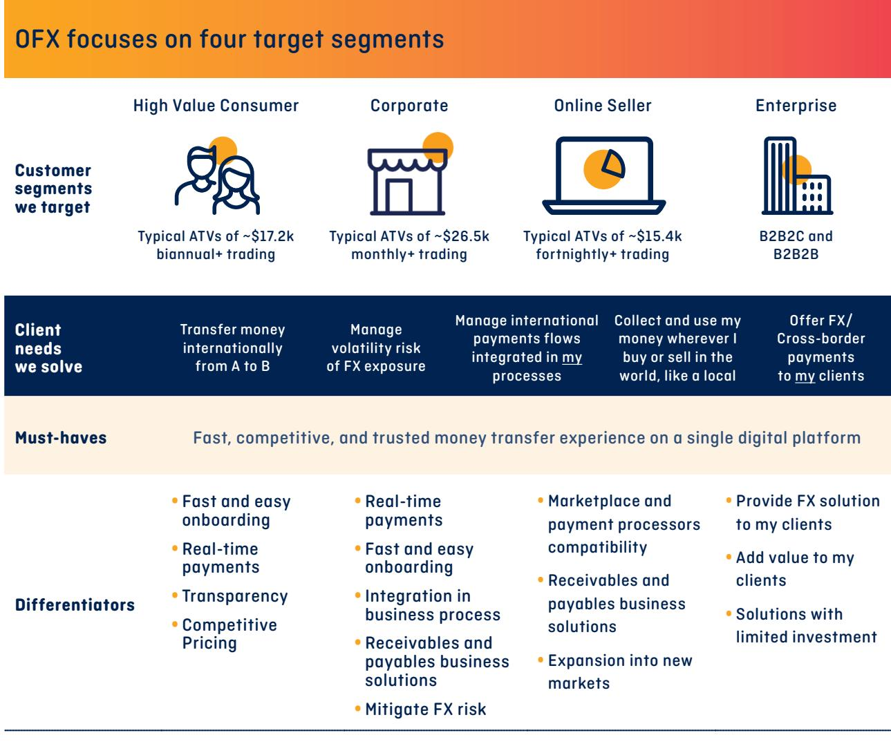

{14}------------------------------------------------

## Operational highlights

Total Transfers (turnover)

\$33.2b

Transactions

## 1,178,603

v

Net Operating Income

Up 24.7% v FY21

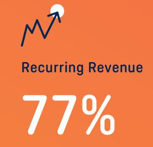

North America Revenue

Up 27.8% v FY21

Corporate Revenue

Up 29.9% ex-offshore share

{15}------------------------------------------------

## Executive team

### **Key Management Personnel**

#### **John ('Skander') Malcolm Managing Director and Chief Executive Officer**

Skander joined OFX in February 2017 and has more than 26 years' experience in financial services across consumer payments, consumer finance, joint ventures, partnerships, commercial lending and leasing and digital. He has worked in Australia, New Zealand, the UK, the US, the Middle East, Africa and Russia. He previously served as President and CEO of GE Healthcare, Eastern and African Growth Markets and, prior to that, as President and CEO for GE Capital, Australia and New Zealand. He holds a Bachelor of Economics from University of Sydney and is a Member of the Australian Institute of Company Directors.

#### **Selena Verth Chief Financial Officer**

Selena joined OFX in October 2017 and has more than 22 years' experience in finance, analytics, M&A and risk across various roles. Her most recent role was Head of Finance – Platforms, Superannuation and Investments and Head of Wealth Analytics and Insight at BT Financial Group Australia. Prior to this, Selena held a number of senior financial roles within GE, including Leader, Financial Planning and Analysis and Commercial Finance for GE Global Growth and Operations, Australia and New Zealand and Director of Business Development for GE Australia. Selena has a Bachelor of Commerce and Executive MBA from the Australian Graduate School of Management. She is a fellow of CPA Australia and is a Graduate of the Australian Institute of Company Directors.

### **Mark Shaw**

#### **Chief Operating Officer and Chief Risk Officer**

Mark joined OFX in January 2018 as Chief Risk Officer and has been Chief Operating Officer and Chief Risk Officer since 1 March 2019. In his role Mark is responsible for the Group's global operations and risk functions. Mark has almost 20 years' experience in financial services gained at leading Australian and New Zealand banks. Most recently he led the Operational Risk and Compliance function for the Australia Division at ANZ. Mark held several other senior roles within ANZ including Head of Compliance in both Australia and New Zealand. Before joining ANZ in 2007, Mark worked at Suncorp managing the group's governance, policy and regulatory training frameworks and overseeing compliance and operational risk teams across Australia. Mark holds Bachelors degrees in Computer Science and Law from the University of Queensland and has also completed all three levels of the Chartered Financial Analyst (CFA) program.

### **Other Executives**

#### **Elisabeth Ellis Chief Legal Officer and Company Secretary**

Lis joined OFX in September 2019. With more than 25 years' experience as a corporate and commercial lawyer, Lis has worked in Australia and across Asia, based in Sydney, Hong Kong, Mongolia and Thailand. Lis has extensive commercial and negotiating experience, as well as deep experience navigating varying legal and regulatory systems across multiple jurisdictions. Before joining OFX, Lis was a partner at MinterEllison, where she worked for 19 years. Prior to that she worked at Allens Arthur Robinson. Lis holds a Bachelor of Science and Laws (Honours) from the University of Sydney and is admitted to practice law in New South Wales (1993) and Hong Kong (1999). She is a Graduate of the Australian Institute of Company Directors.

#### **Elaine Herlihy**

#### **Chief Marketing and Product Officer**

Elaine commenced her role as Chief Marketing Officer at OFX in May 2019 and was appointed to the role of Chief Marketing and Product Officer in August 2020. She has over 20 years' experience in strategic marketing, brand, communications and sales in FinTech, Banking, Superannuation and Media (B2C and B2B). As Marketing Director at PayPal Australia, Elaine was responsible for driving customer growth and engagement across both the consumer and merchant portfolios and building the PayPal brand in Australia. Prior to joining PayPal, Elaine spent eight years at Westpac Group leading brand and marketing functions across both Westpac Bank and BT Financial Group's Superannuation business. Elaine also worked in a variety of marketing and communications roles over a nine-year period at Reuters in London. Elaine holds a Bachelor of Commerce from University College Dublin and a Higher Diploma in Marketing Practice from the Smurfit Graduate School of Business in Dublin. She is a Graduate of the Australian Institute of Company Directors and is an Independent Director of Mine Super and the PayPal Giving Fund in Australia.

{16}------------------------------------------------

## Executive team

#### **Alfred Nader President, North America**

Alfred joined OFX in September 2019. He has over 20 years' experience in all aspects of cross border payments and foreign exchange, having held senior management positions at Western Union and Travelex. Before joining OFX, Alfred was Regional Vice President for Latin America and the Caribbean for Western Union Business Solutions (WUBS) and was responsible for all WUBS activities in the region. While at WUBS, Alfred also served as Vice President of Corporate Strategy and Development working in M&A and negotiating international partnership deals. Prior to that, he held several senior roles with Travelex Global Business Payments. Alfred holds a BBA from The George Washington University and an MBA from MIT's Sloan School of Management.

### **Yung Ngo**

### **President, Asia Pacific**

Yung joined OFX in March 2019 as President, Asia Pacific. Yung has over 24 years' financial services experience in the payments, banking and insurance industries. Prior to joining OFX, Yung has held senior executive positions at Westpac, St.George Bank and GE Capital leading large-scale operations across retail banking, home lending and commercial finance. He has extensive experience driving growth across multiple channels including direct to consumer and businesses, business partnerships and third party as well as call centre distribution. Yung holds a Bachelor of Jurisprudence and a Bachelor of Laws from UNSW and is also a Graduate of the Australian Institute of Company Directors. He was a previous non-executive director for Settlement Services International, a not-for- profit organisation supporting the humanitarian sector.

#### **Kate Svoboda Chief People and Culture Officer**

Kate joined OFX in January 2021. Kate has over 22 years' experience in people and culture across a range of roles in the financial services industry. Her previous role was as Chief People and Culture Officer at Genworth Australia where she led culture and engagement, organisational design and effectiveness, capability and workforce planning, talent acquisition and development, diversity and inclusion and remuneration and benefits. Prior to Genworth, Kate worked as a Senior Human Resources Business Partner for Challenger and held various human resources roles at the Commonwealth Bank of Australia. She has also worked in a range of management and clinical roles in public health. Kate has deep experience developing people and culture strategies that support and enable business strategy. Kate has a Masters of Business Administration (University of New England) and a Bachelor of Speech Pathology (University of Queensland).

#### **Adam Thomas Chief Technology Officer**

Adam joined OFX in December 2019 and was promoted to Chief Technology Officer in August 2020. He has more than 20 years' experience in IT and product development across finance, media and telecommunications and management consulting across many more industries. His speciality is combining agile, product-led engineering teams with commercial enterprise architecture to provide scalable capability for business growth and product innovation. Before joining OFX, Adam was Global Chief Architect for News Corp and Head of Architecture and Technology Strategy for News Corp Australia, leading the transformation of the many mastheads towards digital sustainability. Prior to that he was Head of Platforms, leading large-scale engineering and systems integration teams providing cost efficient delivery of capabilities and innovation. Adam previously worked in Management Consulting for PwC and IBM. Adam holds a Bachelor of Science (Business Information Technology) from the University of NSW.

#### **Sarah Webb President, EMEA**

Sarah joined OFX in December 2018 as President, United Kingdom and Europe and has more than 20 years' experience in payments and a track record of developing client relationships, product initiatives and building profitable businesses. Prior to this, Sarah held the role of Managing Director, Global Payments Networks at Barclays, where she led a team responsible for managing strategic partnerships across credit and debit portfolios globally as well as leading the Barclaycard PSD2 program. Before joining Barclays, Sarah was Head of Global Product Management, Commercial Payments, at American Express. Sarah holds a Bachelor of Science (BSc) degree in Maths with Management from Imperial College, University of London.

{17}------------------------------------------------

### Environmental, social and governance

- CEO's message
- Primary ESG Metrics and KPIs
- Investing in a sustainable future
- Empowering people globally and locally
- Global Financial Responsibility

{18}------------------------------------------------

### What we stand for

Empowering

and locally

humans globally

Moving money

without

barriers

Global

financial

responsibility

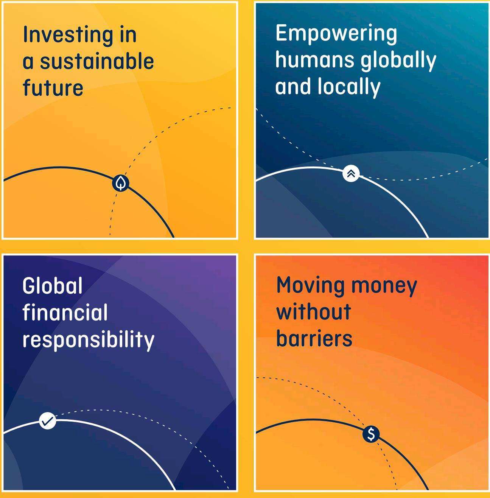

responsibility

Empowering

and locally

Investing in

future

a sustainable

humans globally

{19}------------------------------------------------

## CEO's message

**I'm pleased to say that in FY22, we brought a dedicated team of our people together, in the form of an ESG working group, to better define and advance the program.**

'Making a difference' is our mantra at OFX. It flows through everything we do and translates to what we deliver to our stakeholders: our customers, our communities, our investors, our regulators and our people. It informs how we run our business and inspires our approach to the global OFX Environmental, Social and Governance (**ESG**) program.

I'm pleased to say that in FY22, we brought a dedicated team of our people together, in the form of an ESG working group, to better define and advance the program. The group reviewed our ESG work to date, how our ESG goals are tied to our purpose, our strategy and our operations and what we can do better and smarter to make a meaningful difference. As a result, we've further refined and improved the ESG issues which are most relevant to our business and which have the biggest impact. We've committed to focus on three core pillars:

- **• Investing in a sustainable future**, which includes a move to decarbonise the operations of the Company joining the longer-term pursuit of Net Zero and reaching Climate Active Certified. We are independently calculating our carbon footprint and will focus on where we can have the greatest impact. Complementing the global program are local community volunteering initiatives supporting both environmental and social causes.
- **• Empowering people globally and locally**, which includes elevating opportunities for our people to celebrate, learn about and drive greater inclusion and diversity, and providing structured and organised volunteering and community engagement opportunities.

- **• Global financial responsibility**, which includes a focus on educating our customers and our people on fraud awareness and prevention through dedicated educational campaigns and initiatives underpinned by the ongoing work to becoming ISO270001 certified.
These pillars complement our existing ESG measures, of which the material items for OFX are:

- **•** Data Privacy
- **•** Cyber Security
- **•** Compliance with our various regulators' requirements
- **•** Transparent pricing and selling practices

The pillars are aligned to the key issues that were identified in the Sustainability Accounting Standards Board materiality map and carry the greatest impact to the financial condition or operating performance to the consumer finance industry. The ESG pillars were adopted by the OFX Board of Directors in March 2022 and will be reviewed annually and updated as required. We are committed to regular measurement, improvement and reporting against targets as a driver of the long-term performance of our business.

In the following pages we have summarised our achievements against our FY22 ESG commitments and outline our commitments for FY23. We are proud of how we are seeing our ESG work take shape and we look forward to developing this further to the benefit of all our stakeholders.

{20}------------------------------------------------

## Primary ESG Metrics and KPIs

|                                 | Metric                                                   | FY21   | FY22   | Target for FY23                                                                         |
|---------------------------------|----------------------------------------------------------|--------|--------|-----------------------------------------------------------------------------------------|
| Diversity                       | Female representation on the Board                 | 33%    | 33%    | 40%                                                                                     |
|                                 | Female representation at SLT level                 | 40%    | 41%    | 45%                                                                                     |
| Pricing                         | Number of customer complaints                      | 13     | 4      | 10% reduction in time taken to action customer complaints                         |
| Privacy                         | % of all employees & contractors trained each year | 88.64% | 90.87% | 95%                                                                                     |
|                                 | Number of of privacy impact assessments            | –      | 5      | >= number of new high risk initiatives involving customer personal information |
| Fraud and financial crime | Fraud training for employees                          | 99.51% | 88.89% | 95%                                                                                     |
|                                 | OFX fraud preventions                                 | 98.64% | 99.02% | 99%                                                                                     |
| Cyber                           | Number of P1 cyber incidents                          | –      | 6      | <=5                                                                                     |
|                                 | Percentage of cyber attacks thwarted                  | –      | 99.99% | 99.99%                                                                                  |

{21}------------------------------------------------

### Investing in a Sustainable Future

The nature of OFX's business, driven by our human + digital offering, means that OFX is not a high consumer of energy. However, we are still committed to taking steps to actively monitor, reduce and offset our consumption. We also educate our people on their environmental impact and encourage employees to seek opportunities to participate in community initiatives that are positive for the environment, both locally and globally.

### **Energy footprint**

We consider the environmental impact of our operations and take steps to reduce our energy footprint by:

- **•** Engaging with an independent online platform and Climate Active Certified Consultants to more accurately calculate our carbon emissions, track reduction initiatives and manage our purchased carbon offsets;
- **•** Operating 100% in the cloud, with OFX hosting its technology with Amazon Web Services (**AWS**) (the Company's largest supplier). AWS infrastructure is 3.6 times more energy efficient than average data centres;
- **•** Operating a hybrid work model which allows our people to work from home reducing the need to commute; and
- **•** Minimising energy use in our office locations with energy-saving sensor settings for lighting, heating and cooling and monitors.

### **Waste management and recycling**

We aim to reduce waste by:

- **•** Providing recycling facilities;
- **•** Providing our people with laptops to reduce the need for printing and where printing is required, our printers have default settings to print in black and white and double sided;
- **•** In our Sydney office, providing reusable take-away coffee cups and stainless steel water bottles to reduce the consumption of single-use plastics;
- **•** Encouraging our people to use online tools, such as digital whiteboards to reduce the need for paper and other stationery items;
- **•** Utilising e-signature tools for execution of documents; and
- **•** Leasing our office space in Sydney from Mirvac, which is on track to meet its zero waste goal by 2030.

### **Education and community involvement**

We regularly educate our people to consider the environment in their activities at OFX, providing educational recycling information in our internal communications, and participating in environmental initiatives such as Earth Hour and Clean-Up Australia Day.

{22}------------------------------------------------

### Investing in a Sustainable Future

### **FY22 progress against commitments**

| In FY22 we said we'd …                                                                                                         | Actions we undertook                                                                                                                                                                                                                                       |  |
|--------------------------------------------------------------------------------------------------------------------------------|------------------------------------------------------------------------------------------------------------------------------------------------------------------------------------------------------------------------------------------------------------|--|
| Monitor paper, electricity and water consumption, minimise employee travel and investigate carbon offsets for air travel | • Consumption and employee travel was reduced in part due to COVID-19 restrictions.                                                                                                                                                                     |  |
| Enable universal adoption of e-signature tools                                                                                 | • Electronic signatures are used globally for all non-disclosure agreements, vendor agreements, order forms and employment documents.                                                                                                                |  |
| Actively promote involvement in community activities to improve our environment                                             | • A network of community champions was established which promotes participation in community activities, including soap recycling in Hong Kong, lunch preparation at a homeless shelter and gardening for an environmental group in Sydney. |  |

### **FY23 commitments**

- OFX has engaged with a specialist online platform to help it document and calculate carbon emissions globally, with this baseline data to be used to track and reduce offsets.
- Through both reduction initiatives and offsets, obtain carbon neutral status for our Australian business.
- Begin the journey to becoming certified as carbon neutral for the OFX business globally.

{23}------------------------------------------------

### **Fair and honest selling practices**

'Inspiring Customer Confidence' is the OFX value which reflects the critical importance we place on maintaining customer trust. Our people are subject to the OFX Code of Conduct which requires that they:

- **•** Conduct themselves with openness, honesty, fairness and integrity, and in the best interests of OFX and its stakeholders, including the general public; and
- **•** Act ethically in their approach to business decisions and be fair and reasonable in dealing with customers and suppliers.

Our remuneration framework encourages the effective management of non-financial risks by focusing on the way in which sales are made. We ensure that our remuneration practices are equitable and transparent, and that we operate within a strong risk management framework.

Our Quality Assurance processes for sales performance include supervisors reviewing calls made by the sales team. We also have quarterly Executive Risk Committee meetings where we review risk issues across our business. In addition, an Employee Incentive Governance Committee comprising the Chief People and

Culture Officer and the Chief Financial Officer meet quarterly to assess sales employees' behaviour. The integrity of our selling practices is also upheld by the sales team never providing personal or general financial advice; and our complaint handling process and voice of customer program whereby we receive direct feedback, which is used to manage customer issues and improve frontline coaching and training.

### **Transparency in pricing and product**

We are committed to product information transparency, providing the rate to our customers prior to booking any transfer. We are compliant with the Design and Distribution Obligations recently introduced by ASIC in Australia. In FY22, we created an updated product governance framework, and developed and published Target Market Determinations to assist our customers in making better informed decisions on our financial products.

We provide transparency of the rate to our customers upfront, prior to booking any transfer. We disclose to the customer the OFX Customer Rate inclusive of our OFX margin and any applicable OFX fee plus we disclose the converted recipient amount.

{24}------------------------------------------------

#### **RATE COMPARISON TABLE**

### **Transfer AUD\$20k to USD and you could get up to \$735 more**

\$14,796

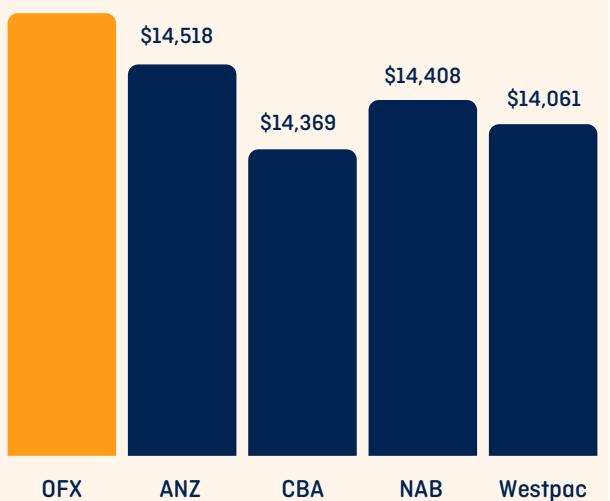

The comparison savings are based on a single transfer of AUD\$20,000 to USD. Savings are calculated by comparing the exchange rate including margins and fees provided by each bank and OFX on the same day (11 April 2022). Pricing data is provided by an independent third party, FXC Intelligence Ltd. The comparison savings provided is true only for the example given and may not include all fees and charges. Different currency exchange amounts, currency types, dates, times and other individual factors will result in different comparison savings. These results therefore may not be indicative of actual savings and should be used only as a guide. The rate comparison chart is updated monthly.

### **Community partnerships**

We move millions of dollars for customers around the world every day, so supporting the victims of financial crime is a cause that aligns with our responsibilities. We partner with Save the Children, a charity that helps protect vulnerable children, many of whom are victims of financial crime through child slavery and people trafficking.

We support and promote the work of the Australian Indigenous Mentoring Experience (AIME), a charity which provides educational and employment mentoring programs to Indigenous high school and university students.

We also give our people the opportunity to choose the charities we support throughout the year through our Aware & Care program. Each quarter, our people nominate a charity of their choice, and the two most selected charities each quarter receive an OFX donation.

Employees who take part in a fundraising activity can be eligible to have their fundraising matched and are encouraged to volunteer including through Make a Difference Day, an additional day of annual leave to participate in charitable programs.

{25}------------------------------------------------

### **Ethical and sustainable business practices**

As a global business and as a significant purchaser of goods and services, we have a responsibility and opportunity to help eradicate modern slavery. We understand the importance of considering environmental, social and ethical factors when making procurement decisions.

OFX has issued a Modern Slavery Statement regarding the risk of modern slavery in the operations and supply chain of OFX Group Limited (and its owned and controlled entities), as well as the steps it has taken to respond to the risks identified (refer to our website for further details and a copy of the statement).

### **Our people**

OFX employs over 450 people across Asia Pacific, North America and the United Kingdom and Europe, and our people are central to the success of our business.

Our culture is underpinned by our values which guide how we work, interact and engage with our customers.

- **•** We are better together we are stronger as one team;
- **•** Push Boundaries discover what is possible;
- **•** Get (the right) Stuff Done own it, execute it, deliver the exceptional;
- **•** Inspire Customer Confidence we keep the customer at the centre of everything we do; and
- **•** Always Keep Learning share your expertise, learn from others.

From these values, we have developed personal and leadership attributes that define what we expect of our people and leaders. These are supported by our reward and recognition programs and our internal communication channels, such as our quarterly employee town halls, fortnightly newsletter, Hello OFXers, and blogs from the CEO and other members of the Global Executive Team. They are also reflected in our branding internally and externally.

The health and wellbeing of our people is paramount and we have a culture (as well as practices and policies) in place that seeks to support to our people. This includes our partnership with Uprise, our wellbeing and employee assistance program provider which offers information and advice on mental wellbeing, mindset, sleep health, nutrition and exercise, self-esteem and acceptance.

### **Employee engagement**

In December 2021, we conducted our annual employee engagement survey, which had a participation rate of 83%. The overall engagement score was 68%, slightly down from 70% in 2020. We recognise this outcome in the context of a number of challenges including difficulties replacing roles in extremely tight labour markets and continued lockdowns. However, even in the face of these challenges, our people told us that they are enormously proud to work for OFX and would recommend it as a great place to work.

Our people have opportunities to develop and build their capability whilst working at OFX. We utilise the LinkedIn Learning platform to provide some of our core learning programs at OFX, and this also allows employees to choose their own learning paths aligned with personal professional interests.

{26}------------------------------------------------

### **Diversity and inclusion**

OFX is committed to building a culture and working environment where our people can thrive, feel comfortable and respected and be themselves at work. We seek to leverage the value that comes from people who have diverse backgrounds, knowledge, lived experiences and perspectives. Each year, OFX's Board commits to measurable diversity and inclusion objectives against which progress is reviewed at the end of the year.

As at 31 March 2022 we had 50% female representation on the GET and 33% female representation on the Board. Female representation in Commercial/Sales roles was 43%, up 14% compared to 31 March 2021. Female representation in Technology roles was 23%, down 2% and female representation at SLT level was 41%, up 1%.

For the first time OFX obtained cultural diversity data across the company. Of the 75% who responded, 46% identified their primary cultural identity as caucasian/white, 12% identified as South East Asian, 10% identified as East Asian and 10% identified as South Asian. The "All Others" category includes Aboriginal or Torres Strait Islander, Multiracial, Hispanic or Latinx, Black or African and cannot be reported on individually due to the respondent number being below the minimum threshold.

Our diversity practices include the following:

- **•** Our talent management processes support equal access to promotion and succession opportunities;
- **•** Our people complete anti-harassment, antibullying and code of conduct training annually;
- **•** We collect data on other diversity dimensions including cultural and linguistic diversity, age, sexual orientation and other demographics to monitor the degree to which we reflect the communities we serve and to inform our programs of work; and

- **•** We provide gender neutral paid parental leave and a parental leave engagement and support plans, to support working parents and their transition back to work.
### **Pay equality**

With access to global remuneration benchmarking data, we have been able to undertake an analysis of the pay competitiveness of male and female employees relative to the market median base salary for their roles. Following the FY22 remuneration review, this analysis showed that:

- **•** On an average basis, men's positioning against the market median is 99.25% vs women's positioning against the market median which is 99.93%; and
- **•** On a median basis, men's positioning against the market median is 98.31% vs women's positioning against the market median which is 99.31%.

This indicates pay equity on a like-for-like basis within OFX.

As an Australian-headquartered company, OFX completes a compliance report each year for the Workplace Gender Equality Agency for our Australian-based employees. As part of our pay equity testing, we analyse the average base salaries of both our male and female employees based in Australia. Following the FY22 remuneration review, when averaging base pay of all Australian-based employees (excluding the CEO), the average female base salary is -12.11% compared to average male base salary. This is compared to an 18.3% base salary pay gap across all industries in Australia and a 23.7% base salary pay gap in Auxiliary Financial Services (WGEA November 2020). This overall gender pay gap reflects the opportunity for OFX to continue to progress female representation at higher levels (therefore higher remuneration levels) of the Company and to continue to conduct pay equity analyses to identify areas in which to take specific action.

{27}------------------------------------------------

### **FY22 progress against commitments**

| In FY22 we said we'd …                                                                                                                        | Actions we undertook                                                                                                                                                                             |
|-----------------------------------------------------------------------------------------------------------------------------------------------|--------------------------------------------------------------------------------------------------------------------------------------------------------------------------------------------------|
| Further develop and implement our philanthropy strategy to increase our contribution to victims of financial crime                      | • Formed a partnership with global charity, Save the Children, making a AUD\$20,000 donation.                                                                                                 |
| Explore potential partnerships and community engagement opportunities that enable OFX to support Indigenous education and employment | • Established a community partnership with the Australian Indigenous Mentoring Experience (AIME).                                                                                             |
| Further develop our response to the risk of modern slavery                                                                                 | • Introduced an enhanced due diligence process on high-risk vendors and improved employee educational resources, including Modern Slavery training undertaken by all employees in FY22. |
| Implement our approach to the future of work based on lessons learned and feedback                                                         | • A hybrid work model was implemented supported by a working from home survey, people leader training and support and risk assessments.                                                    |
| Increase female representation throughout the Company                                                                                      | • Increased female representation across the Senior Leadership Team (SLT).                                                                                                                    |
| Track cultural diversity data a voluntary and                                                                                                 | Obtained cultural diversity data for the first time, with the level of cultural diversity above that of the countries where most employees are located (Australia, Canada, UK).         |
| self-identification basis                                                                                                                     | This level of cultural diversity is above that of the countries in which the majority of our employees are located (Australia, Canada, UK).                                                |
| Continue to take a proactive role in improving the health and welfare of our people                                                        | • Introduced Wellbeing month (September), access to mental health provider, Uprise and corporate discounts for fitness providers.                                                          |

{28}------------------------------------------------

### **FY23 commitments**

- Continue to build on our community partnerships that support victims of financial crime and Indigenous education and employment via education and awareness, fundraising and donations and volunteering opportunities for our people.
- Support a diverse and inclusive culture by maintaining our commitment to gender representation targets, annual pay equity testing and other diversity and inclusion measures, and by providing inclusive and diverse development opportunities for all employees.
- A key focus is increasing female representation in our leadership pipeline at the SLT level. This will assist us in maintaining gender balance at the Global Executive Team level as well as improve pay equity outcomes on an average pay basis.

{29}------------------------------------------------

### **Cyber security and data**

Cyber security poses an increasingly significant threat to our business globally so the security of our customers' data and OFX corporate data is of paramount importance to OFX. We design, build and manage the security for our global data via:

### **Our rigorous processes and systems**

- **•** We employ an information asset focused approach to cyber security risk management, ensuring appropriate ownership and oversight of systems, data and risks, with ongoing technical reviews of our platforms;
- **•** Cyber security subject matter experts provide oversight, and our risk and internal audit functions undertake independent assurance; and we also have security processes that include ongoing technical reviews of our platforms and due diligence of third parties; and
- **•** We continue to invest in our security capabilities and use a range of technologies and security controls to minimise the threat, likelihood and impact of unauthorised access to our networks and systems.

- **•** We deliver programs to all employees to foster a strong cyber security culture, including cyber security drills. We provide specialist secure coding training to engineering employees; and our risk and internal audit functions undertake independent assurance.
### **Privacy**

Regulators and consumers have higher privacy expectations and financial services organisations are stewards of customer data, hence OFX continues to build on its Privacy Commitments.

For FY23 we have set the following KPIs related to privacy for our new CRM system:

- **•** Complete implementation of OFX's new Customer Lifecyle Data Retention Framework; and
- **•** Build robust role-based access controls into our new CRM system for all internal users.

The Australian Attorney General's Department is conducting a review of Australia's privacy laws and OFX will continue to monitor the outcomes of the review and changes to the Privacy Act 1988 that may follow. OFX anticipates that these reforms will address the way in which all organisations must consider privacy in an active regulatory environment.

{30}------------------------------------------------

### **Fraud and financial crime prevention and protection**

With OFX's tenure and global footprint, we see the diverse typologies of criminal financial activity and have built up years of data showing behavioural patterns to look out for.

Across our markets we undergo regular independent assessments through audits of our AML programs, banking compliance reviews and regulatory reviews.

We continually refine our detection strategies and actively investigate fraud whenever we see it through:

- **•** Applying sophisticated systems and expertise to detect and prevent fraud;
- **•** Our people being accountable and empowered to recognise risk;
- **•** Maintaining experienced and highly capable compliance teams in each of our key regions who ensure we understand our local regulatory requirements and have effective compliance programs;
- **•** Continuing to invest in technology to augment our expertise with the right information to monitor and respond to key risks;
- **•** Through our fraud detection system monitoring customer interaction and utilising a multitude of third party information to detect potential concerns such as identity theft; and
- **•** Financial crime controls being consistently tracked and discussed at management, executive and Board level.

### **Governance and conduct**

OFX is committed to being ethical, transparent and accountable. This is essential for the longterm performance and sustainability of the Company. Our Board and management are committed to excellence in corporate governance and aspire to the highest standards of conduct and disclosure.

The Company's governance principles are designed to support business operations, deliver on our strategy, monitor our performance and manage risk. For FY22 our governance practices complied with the ASX Corporate Governance Council's Corporate Governance Principles and Recommendations (4th Edition). More detail is available in our Corporate Governance Statement on our website.

{31}------------------------------------------------

### **FY22 progress against commitments**

### **Cyber Security**

| In FY22 we said we'd …                                                                                 | Actions we undertook                                                                       |
|--------------------------------------------------------------------------------------------------------|--------------------------------------------------------------------------------------------|
| Continue migration of self-hosted applications to a secure cloud environment or managed services | • 100% of our business workloads ran on the cloud.                                         |
| Continue to position OFX for ISO270001 Certification                                                | • ISO27001 Certification is underway, with certification being worked towards for FY24. |

### **Privacy**

| In FY22 we said we'd …                                          | Actions we undertook                                                                                                                                                             |
|-----------------------------------------------------------------|----------------------------------------------------------------------------------------------------------------------------------------------------------------------------------|
| Adopt an enhanced data retention policy                         | • A refreshed data retention policy has detailed Australian and UK retention schedules, incorporating a new framework for managing customer data through its lifecycle. |
| Provide enhanced privacy training for all employees globally | • OFX has developed bespoke staff training on data breach reporting processes.                                                                                                |

### **Fraud and financial crime awareness**

| In FY22 we said we'd …                                                                                                                     | Actions we undertook                                                                                                                                                     |  |  |  |
|--------------------------------------------------------------------------------------------------------------------------------------------|--------------------------------------------------------------------------------------------------------------------------------------------------------------------------|--|--|--|
| Ensure implementation of leading-edge practices and technologies to support fraud and financial crime prevention will continue       | • A new customer risk assessment methodology was agreed.                                                                                                              |  |  |  |
| Look for methods that will allow OFX to contribute our expertise to build strength in the protections in place across the sector and | • An educational session for employees was run on how OFX is working to protect customers from financial crime, and how to improve their own security measures. |  |  |  |
| support Police investigations of identified fraudsters                                                                                  | • New content was posted to the OFX website and emails sent to educate customers on protecting themselves against fraud.                                           |  |  |  |

{32}------------------------------------------------

### **FY23 commitments**

### Cyber security and data protection

- Explore and identify external facing network vulnerabilities and their remediation.
- Implement a vendor management system.
- Continue to upgrade our security toolsets primarily on email and vulnerability management.
- Continue to elevate our BCP/DR procedures through tabletop and simulation exercises.
- Continue to position OFX for ISO270001 Certification.

### Privacy

- Continue to enhance our data retention policy.
- Improve the process around data mapping.
- Embed OFX's Privacy Impact Assessment process.
- Implement enhanced data breach response plans and training for all employees globally.

### Fraud and financial crime

- Further enhancement of identity controls.
- Ongoing enhancement of customer and partner awareness of scams and how to best protect themselves.
- Fraud training and educational content for OFX employees.

{33}------------------------------------------------

## Directors' report and financial statements

for the year ended 31 March 2022

- [Directors' report](#page-35-0)
- [Remuneration report](#page-51-0)
- [Auditor's independence declaration](#page-78-0)
- [Financial Statements](#page-79-0)
	- **[Consolidated statement of comprehensive income](#page-79-0)**
	- **[Consolidated statement of financial position](#page-80-0)**
	- **[Consolidated statement of changes in equity](#page-81-0)**
	- **[Consolidated statement of cash flows](#page-82-0)**
- [Notes to the financial statements](#page-83-0)

#### [Results for the Year](#page-83-0)

- **Note 1. [About this Report](#page-83-0)**
- **Note 2. [Segment Information](#page-87-0)**
- **Note 3. [Net Operating Income](#page-89-0)**
- **Note 4. [Expenses](#page-90-0)**
- **Note 5. [Income Taxes](#page-91-0)**
- **Note 6. [Deferred Income Tax Assets/(Liabilities)](#page-93-0)**
- **Note 7. [Earnings per Share](#page-94-0)**

#### [Financial Assets and Liabilities](#page-95-0)

- **[Note 8. Cash and Cash Equivalents, Client](#page-95-0)  [Liabilities and Deposits Due from](#page-95-0)  [Financial Institutions](#page-95-0)**
- **Note 9. [Other Receivables (Current Assets)](#page-96-0)**
- **Note 10. [Derivative Financial Instruments](#page-96-0)**
- **[Note 11. Fair Values of Financial Assets](#page-97-0)  [and Liabilities](#page-97-0)**
- **Note 12. [Financial Risk Management](#page-98-0)**

#### [Other Assets and Liabilities](#page-106-0)

- **Note 13. [Property, Plant and Equipment](#page-106-0)**
- **Note 14. [Intangible Assets](#page-107-0)**
- **[Note 15. Other Creditors and Accruals](#page-108-0)**
- **[(Current Liabilities)](#page-108-0)**
- **Note 16. [Provisions](#page-108-0)**
- **[Note 17.](#page-109-0) Leases**

#### [Capital Structure](#page-111-0)

- **Note 18. [Capital Management](#page-111-0)**
- **Note 19. [Ordinary Share Capital](#page-111-0)**
- **Note 20. [Dividends](#page-112-0)**
- **Note 21. [Equity-accounted Investees](#page-113-0)**

#### [Other Items](#page-115-0)

- **Note 22. [Related Party Information](#page-115-0)**
- **Note 23. [Share-based Payments](#page-116-0)**
- **Note 24. [Key Management Personnel (KMP)](#page-120-0)**
- **Note 25. [Auditor Remuneration](#page-121-0)**
- **Note 26. [Parent Entity Financial Information](#page-121-0)**
- **Note 27. [Events Occurring After Balance Sheet Date](#page-122-0)**
- [Directors' declaration](#page-123-0)
- [Independent auditor's report](#page-124-0)
- [Shareholder information](#page-129-0)

{34}------------------------------------------------

OFX grew from the idea that there had to be a better, fairer way to move money around the world. That was 20 years ago, and we're still driven by the same mission.

We believe real help from real people counts, and that's why we offer our clients the best of both worlds – an easy-to-use digital platform, combined with 24/7 phone access to our currency experts (we call them OFXperts).

{35}------------------------------------------------

**The Directors of OFX Group Limited present their report on the consolidated entity consisting of OFX Group Limited (OFX or the Company) and the entities it controlled at the end of, or during, the year ended 31 March 2022 (the Consolidated Entity or the Group).**

### **1. Directors**

The Directors of the Company during the financial year and up to the date of this report are:

**Connie Carnabuci Non-Executive Director** *BCom (Marketing) (with Merit), LLB, GAICD*

Member of the People, Culture and Remuneration Committee; Member of the Nomination Committee **Appointed:** 1 April 2019

**Independent Director**

**Residence:** Sydney, Australia

Connie has 35 years' experience as a senior legal advisor to, and as an independent non-executive director of, boards of listed and privately owned companies in Australia and Asia. She brings significant board and C-suite insights on the practical execution of business strategies involving global technology and intellectual property intensive businesses, particularly in the context of M&A, complex commercial transactions and risk management.

Connie was General Counsel of the Australian Broadcasting Corporation (**ABC**) from July 2017 to July 2021, where she was part of the team leading the digital transformation of the ABC. Prior to her role at the ABC, Connie was a Senior Partner with the international law firm Freshfields Bruckhaus Deringer. She was based in Hong Kong for 15 years and led the firm's TMT/IP practice in Asia. She also served as Co-head of the firm's global technology practice. She began her career in Sydney at Mallesons Stephen Jacques (now King and Wood Mallesons) and was a partner there from 1997 to 2000.

**Current directorships (Listed companies):** Nil

**Previous directorships (Listed companies):** Atomo Diagnostics Limited (Feb 2020 to December 2021) **Interest in shares:** 46,832 ordinary shares

{36}------------------------------------------------

#### **Cathy Kovacs Non-Executive Director**

*BComm (UNSW) and MappFin (Macquarie), GAICD*

Member of the Audit, Risk and Compliance Committee; Member of the Nomination Committee **Appointed:** 22 February 2021 **Independent Director**

**Residence:** Sydney, Australia

Cathy has over 30 years' operational experience in the financial services industry, having held senior executive leadership roles at Westpac Banking Group, Ellerston Capital, Macquarie Group and BT Investment Bank. Cathy's most recent executive role was as Group Head of Business Development at Westpac until March 2019, where she was responsible for advising the Westpac Executive Committee and Board on business disruption and the future of banking and wealth, making strategic investments and managing strategic partnerships.

**Current directorships (Listed companies):** Hub24 Limited **Previous directorships (Listed companies):** Nil **Interest in shares:** 73,000 ordinary shares

### **John Alexander (Skander) Malcolm Chief Executive Officer and Managing Director**

*BEc, MAICD*

Member of the Nomination Committee **Appointed:** 1 February 2017

**Not independent Residence:** Sydney, Australia

Skander has more than 26 years' experience in financial services across consumer payments, consumer finance, joint ventures, partnerships, commercial lending and leasing and digital. He has worked in Australia and New Zealand, the UK, the US, the Middle East, Africa and Russia. He previously served as President and CEO of GE Healthcare, Eastern and African Growth Markets, and prior to that, as President and CEO for GE Capital, Australia and New Zealand.

**Current directorships (Listed companies):** Nil

#### **Previous directorships (Listed companies):** Nil

**Interest in shares:** 2,547,471 (of which 1,739,115 have been issued under the Company's Executive Share Plan)

{37}------------------------------------------------

**Grant Murdoch Non-Executive Director**  *MCom (Hons), FAICD, CAANZ*

Chair of the Audit, Risk and Compliance Committee; Member of the Nomination Committee **Appointed:** 19 September 2013 **Independent Director**

**Residence:** Brisbane, Australia

Grant has over 36 years' experience in accounting and corporate finance. Grant's prior professional experience includes Head of Corporate Finance for Ernst & Young Queensland and he is a graduate of the Kellogg Advanced Executive Program at the North Western University, Chicago, United States.

| Current directorships  | Director Lynas Corporation Limited                          |
|------------------------|-------------------------------------------------------------|
| (Listed companies):    | Director Auswide Bank Limited                               |
| Previous directorships | Director Redbubble Limited (December 2016 to November 2019) |
| (Listed companies):    | Director ALS Limited (August 2011 to July 2020)             |
|                        | Director Cardno Limited (January 2013 to November 2015)     |
| Interest in shares:    | 345,000 ordinary shares                                     |

### **Steven Sargent Chairperson**

*BBus, FAICD, FTSE, GAICD*

Member of the Audit, Risk and Compliance Committee; Member of the People, Culture and Remuneration Committee; Member of the Nomination Committee

**Appointed:** 4 August 2016

**Independent Director Residence:** Sydney, Australia

Steve has over 42 years of global corporate experience. Steve's executive career included 22 years at General Electric, where he gained extensive multi-industry, international experience leading businesses in industries including financial services, healthcare and energy across the USA, Europe and Asia Pacific.

Mr Sargent has been serving as a non-executive director on several boards since 2015. His unlisted board activities include Chairperson of The Origin Energy Foundation Limited, Origin's philanthropic arm, and Non-Executive Director of The Great Barrier Reef Foundation.

| Current directorships (Listed companies): | Director: Ramsay Health Care Limited Director: Origin Energy Limited Deputy Chairperson and Lead Independent Director: Nanosonics Limited |
|----------------------------------------------|-------------------------------------------------------------------------------------------------------------------------------------------------|
| Previous directorships                       | Veda Group Ltd                                                                                                                                  |
| (Listed companies): Interest in shares:   | 118,444 ordinary shares                                                                                                                         |

{38}------------------------------------------------

**Douglas Snedden AO Non-Executive Director** *BEC (ANU), MAICD*

Chair of the People, Culture and Remuneration Committee Chair of the Nomination Committee Member of the Audit, Risk and Compliance Committee **Appointed: 16 March 2015 Independent Director Residence:** Sydney, Australia

Doug has over 30 years' experience in finance, consulting, strategic management and outsourcing. Doug has previously worked as Country Managing Director of Accenture Australia. Mr Snedden's unlisted board activities include Council of the National Library, Chairperson Chris O'Brien Lifehouse and Chairperson Odyssey House NSW.

| Current directorships (Listed companies): | Nil                                                                 |
|----------------------------------------------|---------------------------------------------------------------------|
| Previous directorships                       | Chairperson isentia Group Limited (November 2017 to September 2021) |
| (Listed companies):                          | Director Broadspectrum Ltd (2010 to 2016)                           |
|                                              | Director UXC Limited (2012 to 2016)                                 |
|                                              | Director Hillgrove Mining Limited (2012 to 2015)                    |
| Interest in shares:                          | 100,000 ordinary shares                                             |

The following persons were Directors of the Company either during the year or as at the date of the Report:

| Connie Carnabuci Non-Executive Director                                        |  |
|-----------------------------------------------------------------------------------|--|
|                                                                                   |  |
| Cathy Kovacs Non-Executive Director                                            |  |
| John Alexander (Skander) Malcolm Managing Director and Chief Executive Officer |  |
| Grant Murdoch Non-Executive Director                                           |  |
| Steven Sargent Chairperson and Non-Executive Director                          |  |
| Douglas Snedden Non-Executive Director                                         |  |

{39}------------------------------------------------

### **2. Company Secretary**

#### **Elisabeth Ellis**  *BScLLB (Hons), GAICD*

Lis was appointed as Chief Legal Officer and Company Secretary for OFX Group Limited on 30 September 2019. Lis has more than 25 years' experience as a corporate and commercial lawyer in Australia and throughout Asia, having worked in Australia, Hong Kong, Mongolia and Thailand. Before joining OFX, Lis was a partner at MinterEllison, where she worked for 19 years. Prior to that she worked at Allens Arthur Robinson.

Lis is admitted to practice law in New South Wales (1993) and Hong Kong (1999).

### **3. Directors' and Committee meetings**

The following table shows meetings held between 1 April 2021 and 31 March 2022 and the number attended by each Director or Committee member.

| Committee   | Board    |          | Audit, Risk and Compliance |          | People, Culture and Remuneration |          | Nomination |          |
|-------------|----------|----------|-------------------------------|----------|-------------------------------------|----------|------------|----------|
| Director    | Eligible | Attended | Eligible1                     | Attended | Eligible2                           | Attended | Eligible   | Attended |
| C Carnabuci | 17       | 17       | 6                             | 5        | 5                                   | 5        | 4          | 4        |
| C Kovacs    | 17       | 15       | 6                             | 6        | 5                                   | 5        | 4          | 4        |
| S Malcolm   | 193      | 174      | 6                             | 6        | 5                                   | 5        | 4          | 4        |
| G Murdoch   | 19       | 19       | 6                             | 6        | 5                                   | 5        | 4          | 4        |
| S Sargent   | 19       | 19       | 6                             | 6        | 5                                   | 5        | 4          | 4        |
| D Snedden   | 19       | 18       | 6                             | 6        | 5                                   | 5        | 4          | 4        |

1 Ms Carnabuci and Mr Malcolm are not members of the Audit, Risk and Compliance Committee but are invited to attend as observers.

2 Mr Murdoch, Ms Kovacs and Mr Malcolm are not members of the People, Culture and Remuneration Committee but are invited to attend as observers.

3 Mr Malcolm, Mr Murdoch, Mr Sargent and Mr Snedden appointed as a subcommittee to consider the release of the half-year results and the full-year results.

4 Mr Malcolm did not attend one meeting of Directors given potential conflict of interest.

{40}------------------------------------------------

### **4. Directors' interests**

The relevant interest of each Director and their associates in the equity of the Company as at the date of this Report is outlined in the table below. All interests are ordinary shares unless otherwise stated.

|             | Type     | Opening balance | Issued   | Acquired | Lapsed/ Disposed | Closing balance |
|-------------|----------|--------------------|----------|----------|---------------------|--------------------|
| C Carnabuci | Ordinary | 19,332             | –        | 27,500   | –                   | 46,832             |
| C Kovacs    | Ordinary | Nil                | –        | 73,000   | –                   | 73,000             |
| S Malcolm   | Ordinary | 2,991,8861         | 166,7382 | –        | (691,603)3          | 2,467,0214         |
| G Murdoch   | Ordinary | 345,000            | –        | –        | –                   | 345,000            |
| S Sargent   | Ordinary | 118,444            | –        | –        | –                   | 118,444            |
| D Snedden   | Ordinary | 100,000            | –        | –        | –                   | 100,000            |

There were no disposals of shares by the Directors during the year or share transactions post year end.

### **5. Principal activities**

The Group's principal activity during the year was the provision of international payments and foreign exchange services.

### **6. Unissued shares under rights or options**

At the date of this report unissued shares of the Group under rights or options are:

|                    | Expiry Date | Exercise Price | Number of Shares |
|--------------------|-------------|----------------|------------------|
| Performance rights | N/A         | –              | 2,880,964        |
| LTI – Options      | 10 Jun 24   | 1.56           | 722,612          |

All unissued shares are ordinary shares of the Company.

1 Total ordinary shares held by Mr Malcolm comprise 2,430,718 issued ordinary shares under LTI, 480,770 issued ordinary shares by way of personal holdings and vested STI, and 80,398 of shares issued as a retention award.

2 Ordinary shares issued to Mr Malcolm on 9 June 2021 upon vesting of FY20 STI performance rights.

3 Ordinary shares issued as FY19 LTI ESP forfeited on 7 June 2021 in accordance with the terms of the Executive Share Plan.

4 Closing balance ordinary shares held by Mr Malcolm comprise 1,739,115 issued ordinary shares under the ESP LTI, 727,906 issued ordinary shares by way of personal holdings and vested STI and retention awards. In addition, Mr Malcolm holds STI performance rights of 148,493 and LTI performance rights of 506,228, issued on 27 August 2021.

{41}------------------------------------------------

### **7. Dividends and distributions**

No dividends have been paid or determined by the Company during and since the end of the year.

On 18 May 2021, the Company announced an on-market share buyback of up to 10% of the Company's fully paid ordinary shares during the 12 months commencing 7 June 2021. On 20 December 2021 the Company announced its proposed acquisition of Firma. The ASX announcement of this transaction included confirmation that the share buyback will be put on hold to prioritise repayment of debt.

1,912,000 shares were purchased by the Company for a total cost of \$2,654,842.59. The lowest price paid was \$1.305 per share (on 29 June 2021) and the highest price paid per share was \$1.480 per share (on 19 July 2021).

### **8. Operating and financial review**

A summary of financial results for the year ended 31 March 2022 is outlined below.

As required for statutory reporting purposes, the consolidated financial statements of the Consolidated Entity have been presented for the financial year ended 31 March 2022.

The Group's statutory financial information for the year ended 31 March 2022 and for the comparative year ended 31 March 2021 present the Group's performance in compliance with statutory reporting obligations.

To assist shareholders and other stakeholders in their understanding of the Group's financial information as a publicly listed entity, additional underlying financial information for the years ended 31 March 2022 and 31 March 2021 is provided in the Operating and Financial Review section of this report.

The reconciliation and the underlying information have not been audited.

{42}------------------------------------------------

#### **Statutory results**

|                                                              | 2022 \$'000 | 20211 \$'000 | Growth % |
|--------------------------------------------------------------|----------------|-----------------|-------------|
| Net operating income2                                        | 147,027        | 117,930         | 24.7%       |
| EBITDA3                                                      | 43,227         | 28,103          | 53.8%       |
| Less depreciation and amortisation                           | (9,970)        | (11,111)        | (10.3%)     |
| Less interest expense                                        | (717)          | (1,359)         | (47.2%)     |
| Less share of loss of equity-accounted investees, net of tax | (433)          | –               |             |
| Less income tax expense                                      | (7,649)        | (3,548)         | 115.6%      |
| Net profit after tax                                         | 24,458         | 12,085          | 102.4%      |
| EBITDA margin                                                | 29.1%          | 23.8%           |             |
| Earnings per share (basic) (cents)                           | 10.06          | 4.96            |             |

The results were impacted by a significant item. The table below sets out the underlying financial results for the year ended 31 March 2022 which have been adjusted for the significant item.

#### **Underlying results**

|                                                              | 2022 \$'000 | 20211 \$'000 | Growth % |
|--------------------------------------------------------------|----------------|-----------------|-------------|
| Net operating income                                         | 147,027        | 117,930         | 24.7%       |
| Underlying EBITDA                                            | 44,500         | 29,071          | 53.1%       |
| Less depreciation and amortisation                           | (9,970)        | (11,111)        | (10.3%)     |
| Less interest expense                                        | (717)          | (1,359)         | (47.2%)     |
| Less share of loss of equity-accounted investees, net of tax | (433)          | –               |             |
| Less income tax expense                                      | (7,649)        | (3,548)         | 115.6%      |
| Underlying net profit after tax                              | 25,731         | 13,053          | 97.1%       |
| Underlying EBITDA margin                                     | 30.3%          | 24.7%           |             |
| Underlying earnings per share (basic) (cents)                | 10.59          | 5.26            |             |

The following table reconciles underlying earnings measures to statutory results.

1 Comparative information has been restated to reflect the change in accounting policy and the prior period restatements detailed in Financial Statements Note 1(c).

2 Net operating income, a non-IFRS measure, is the combination of Fee and trading income and Fee and commission expense and Interest income. 3 Earnings before interest expense, taxation, depreciation and amortisation (EBITDA) is a non-IFRS, unaudited measure.

Annual Report 2022 | OFX Group Limited 41

{43}------------------------------------------------

### **Year ended 31 March 2022**

|                                | \$'000 EBITDA | \$'000 Profit before tax | \$'000 Income tax | \$'000 Profit after tax |
|--------------------------------|------------------|--------------------------------|----------------------|-------------------------------|
| Statutory profit               | 43,227           | 32,107                         | 7,649                | 24,458                        |
| One-off expenses/non-operating | 1,273            | 1,273                          | –                    | 1,273                         |
| Underlying profit              | 44,500           | 33,380                         | 7,649                | 25,731                        |

FY22 was a record year for OFX with Net Operating Income of \$147.0m, up 24.7% driven by double digit revenue growth across all regions and reductions across commissions and bank fees. Revenue growth was strong across all clients segments with Corporate up 14.5%, OLS up 15.7% Ex Asia (2.7% inclusive), Enterprise up 31.3% and High value Consumer up 24.5%. This growth was a combination of an increase in active clients, transactions per client (ex offshore share purchases) and a significant increase to Average Transaction Values which were up 23.5% when adjusting for the dilutive impact of offshore share purchases in FY21.

All regions achieved strong revenue growth with APAC up 12.8%, North America up 27.8% and EMEA up 26.0%. Growth rates across the regions were achieved through strong volumes in Corporate and Consumer, a return to growth in Enterprise and a recovery in OLS growth rates in the second half of FY22.

Underlying operating expenses were up 15.4% as the Company made key investments to drive growth during FY22 and into the future periods. Promotional expenses were up 29.3% with a focus on continuing to drive brand recognition in the Corporate segment. This included entering into a partnership with the NHL becoming the League's official currency exchange provider. Investment in payment capabilities delivered improved speed and transparency for our clients and our strong focus on risk management resulted in a 94.1% reduction in bad debts.

Underlying EBITDA for the year was \$44.5m, up 53.1% resulting in an EBITDA margin of 30.3%

The Group continues to maintain a strong balance sheet with Net Cash Held of \$84.2m as at 31 March 2022. In 1H22 OFX made an investment in TreasurUp, expanding risk capabilities in the Corporate segment and in 2H22 we announced the acquisition of Firma which is perfectly aligned to our strategy in the Corporate segment and the North American region.

{44}------------------------------------------------

### **As at 31 March 2022**

|                                                           | 2022 \$'000 | 2021 \$'000 |
|-----------------------------------------------------------|----------------|----------------|
| Cash and cash equivalents                                 | 301,870        | 275,261        |
| Deposits due from financial institutions                  | 25,144         | 27,119         |
| Total cash                                                | 327,014        | 302,380        |
| Cash held for subsequent settlement of client liabilities | (242,767)      | 241,807        |
| Net cash held                                             | 84,247         | 60,573         |
| Collateral and bank guarantees                            | (52,646)       | (23,756)       |
| Net available cash                                        | 31,601         | 36,817         |

### **9. Strategy**

With \$206b annual revenue, the cross-border payments industry is a significant market. And as more than 70% of the global market share is still with banks and Incumbent MSBs, our best opportunity is to access this huge market whilst our four target customers switch to non-bank specialists.

Our vision at OFX is to become the 'World's leading value-added cross border payments specialist'. This is what we want the OFX brand to capture in the next five years.

To do so, our competitive positioning relies on choices on two fronts:

- **•** Distinctive CVP (customer value proposition): we deliver a competitively priced and trusted customer experience, by combining both DIGITAL ease and HUMAN support and expertise, as we solve for the complexity and anxiety of moving money globally.
- **•** Global operating model: we develop a 'Moat' to sustain an advantage in the long run.
- **•** This is underpinned by a single global platform that powers four superior capabilities versus our competition:
- **•** Payments excellence
- **•** Customer service
- **•** Risk management
- **•** World-class team

We are building a more valuable Company by investing in healthy revenue growth with strong EBITDA margins, by maintaining a high recurring revenue, and by growing revenue from corporate, online seller and enterprise clients faster than our consumer clients.

Lastly, to successfully execute our strategy, we align our investments with six key strategic pillars. We will continue to focus on delivery of critical initiatives against each of these pillars, including:

- **• Customer experience:** strengthening our client experience, with particular emphasis on improving the Corporate, Online Seller and Enterprise client experience;

{45}------------------------------------------------

- **• Geographic expansion:** investing to grow North America and Europe as next markets;
- **• Partnerships:** creating more and better Enterprise partnerships, working with existing Enterprise partners and prospects to drive stronger value proposition and growing our Online Sellers partnerships, globally;
- **• Reliable and scalable systems:** continuing to improve our technology platform to enable operations at scale, lowering costs and enhancing security for our clients and shareholders;
- **• Risk management:** building trust through strong risk management across regulators, clients, bankers and partners;
- **• People:** greater emphasis to build our Global Operating Model so that our teams can serve customers locally and grow their global careers with OFX.

### **10. Risks**

The potential risks associated with the Group's business are outlined below. This list does not cover every risk that may be associated with the Group, and the occurrence or consequences of some of the risks described are partially or completely outside the control of the Group, its Directors and senior management. There is also no guarantee or assurance that the risks will not change or that other risks will not emerge.

**Regulatory compliance** – The international payments market is highly regulated. There is a risk that any new or changed regulations, for example, banking and financial services licensing regulations, could require the Group to increase its spending on regulatory compliance and/or change its business practices, which could adversely affect the Group's profitability. There is a risk that such regulations could also make it uneconomical for the Group to continue to operate in places where it currently does business. **•** There is a risk that the Group may not comply with all applicable laws or have adequate compliance procedures in place to manage or prevent breaches of applicable laws. There is also a risk that the Group is required to pay significant penalties if it fails to maintain or follow adequate procedures in relation to on-boarding of clients or to detect and prevent money laundering, financing of terrorism, breaches anti-bribery laws or contravenes sanctions, as have been imposed on other companies by governmental authorities. In addition, there is a risk that evidence of a serious failure by the Group to comply with laws may cause one or more of the counterparty banks, partnerships or affiliates to cease business with the Group. The Group has a range of system and process controls in place to mitigate this risk and invests significant resources in compliance. All employees undertake compulsory compliance training on a regular basis.

- **• Information technology (IT)**  The Group depends on the performance, reliability and availability of its technology platform and communications systems. There is a risk that these systems may be adversely affected by events including damage, equipment faults, power failure, computer viruses, misuse by employees or contractors or external malicious interventions such as hacking, fire, natural disasters or weather interventions. Events of that nature may cause part of the Group's technology platform, apps or websites to become unavailable. The Group's operational processes or disaster recovery plans may not adequately address every potential event and its insurance policies may not cover loss or damage that the Group suffers as a result of a system failure. This in turn could reduce the Group's ability to generate income, impact client service and confidence levels, increase cost burden, impact the Group's ability to compete and cause damage to the Group's reputation and, potentially, have a material

{46}------------------------------------------------

adverse effect on its financial position and performance. Further, there is a risk that potential faults in the Group's technology platform could cause transaction errors that could result in legal exposure from clients, damage to the Group's reputation or cause a breach of certain regulatory requirements (including those affecting any required licence) and, potentially, have a material adverse effect on the Group's financial position and performance. The Group maintains disaster recovery plans and controls to mitigate this risk.

- **• Data security and privacy**  The Group's business relies on the effective processing and storage of information using its core technologies and IT systems and operations. If the Group's data security controls are ineffective, the Group's IT systems could be exposed to successful cyber-attacks which may result in the unauthorised access to or loss of critical or sensitive data, loss of information integrity, breaches of obligations or client agreements and websites, system outages and regulatory actions. Any interruptions to these operations would impact the Group's ability to operate and could result in business interruption, the loss of customers and revenue, damaged reputation and weakening of competitive position and could therefore adversely affect the Group's operating and financial performance. The Group is subject to privacy laws in Australia and other jurisdictions in which it conducts its business. The Group operations in the United Kingdom and the European Union are required to comply with the respective implementations of the UK and the European Economic Area versions of the General Data Protection Regulations. Similarly, the Group operations in North America are subject to relevant US and Canadian laws, including the California Consumer Privacy Act. In each of the relevant jurisdictions, these laws generally regulate the collection, use and processing of personal information. Such laws affect the way the Group can collect, use,
analyse, transfer and share personal information that is central to many of the services the Group provides. Any actual or perceived failure by the Group to comply with relevant privacy laws and regulations may result in the imposition of fines, investigations, enforceable undertakings or other penalties, client losses, a reduction in existing services, and limitations on the development of technology and services making use of such data. Any of these events could adversely affect the Group's business, financial condition and financial performance as well as cause reputational damage. The Group has a range of system and process controls in place to mitigate this risk pursuant to a Board approved Cyber Strategy. Employees undertake compulsory privacy and cyber security awareness training.

- **• Relationships with banking counterparties** – The Group relies on banks to conduct its business, particularly to provide its network of local and global bank accounts and act as counterparties in the management of foreign exchange and interest rate risk. There is a risk that one or more of these banks may cease to deal with the Group. The loss of a significant banking relationship, or the loss of a number of banking relationships at the same time, particularly as the Group grows, could prevent or restrict the Group's ability to offer foreign exchange and payment services in certain jurisdictions, increase operating costs for the Group, increase time taken to execute and settle transactions and reduce the Group's ability to internally net out transactions, all of which could materially impact profitability. In addition, there is a risk that a loss or reduction in the services provided by the Group's banks could restrict its ability to actively manage its foreign exchange and interest rate risk in certain jurisdictions. As a result, the Group may have to increase the level of foreign exchange and interest rate exposure within existing operations, reduce or

{47}------------------------------------------------

withdraw certain services it offers to clients or change its business model to reduce the level of risk within the business to acceptable levels, all of which could also materially impact profitability. The Group maintains a panel of banking counterparties and actively manages its relationships with these counterparties.

- **• Mistaken Payment**  There is a risk that, due to system or human errors in the processing of transactions, the Group may transfer an incorrect amount of funds or transfer funds to an incorrect recipient. In these instances, the Group may be required to take steps to recover the funds involved and, in certain circumstances, be liable for amounts paid that were in not in accordance with customer instructions. The Group has a range of system and process controls in place to mitigate this risk.
- **• Fraud**  There is a risk that, if the Group's services are used to transfer money in connection with a fraud or theft (including identity theft), the Group may be required to take steps to recover the funds involved and may in certain circumstances be liable to repay amounts that it accepted for transfer, even after it has made the corresponding international payment. In some cases the Group's insurance does not indemnify for this loss. The Group has a range of fraud prevention controls in place to mitigate this risk.
- **• Foreign exchange rate fluctuations**  Changes in value in currencies can affect the average transaction size entered into by the Group's clients and, potentially, the number of transactions. The Group offers services in over 50 currencies and movements in any of them may adversely impact the Group's performance. In addition, as the Group reports in Australian Dollars, a strengthening of the Australian Dollar against other currencies will also have a negative impact on the reported earnings of the Group that relate to its income earned in geographies outside Australia

(which may increase over time, potentially substantially). Similarly, a weakening of the Australian Dollar as against USD, CAD, £, NZD, HKD and SGD will have a negative impact on the costs of the Group that relate to the costs incurred in geographies outside Australia. To mitigate against this risk, the Group's treasury risk management process monitors and reports performance against defined limits. Overall exposure of the Group is managed within limits set by the Board.

- **• Credit**  The Group enters into forward exchange contracts with some of its clients and its banking counterparties. There is a risk that a client or counterparty fails to make payment upon settlement of these contracts. The Group mitigates against this risk by retaining the discretion to require that an advance payment is made; however, the Group remains exposed to the mark-to-market value of the transactions.
- **• Competition**  The market for the provision of foreign exchange and payment services is highly competitive. The major existing competitors of the Group include banks, money transfer organisations and other specialist providers. New competitors, services and business models which compete with the Group are likely to arise in the future. A substantial increase in competition for any of these reasons could result in the Group's services becoming less attractive to consumer or business clients or partnerships, require the Group to increase its marketing or capital expenditure or require the Group to lower its spreads or alter other aspects of its business model to remain competitive, any of which could materially adversely affect the Group's profitability and financial condition. A key aspect of the Group's business model and competitive advantage is its ability to offer many clients more attractive exchange rates and transaction fees than they regularly receive from competitors such as many major banks.

{48}------------------------------------------------

Competitors could potentially lower their spreads and transaction fees to compete with the Group, which could result in a reduction in, or slowing in the growth of, the Group's transaction turnover, a reduction in margins, increased marketing expense or a failure to capture or reduction in market share. Any of these outcomes could materially impact the Group's income and earnings. The Group regularly reviews its market position and competitiveness as part of its strategic and business planning process.

- **• Intellectual property risk**  The Group relies on certain intellectual property (**IP**) such as trademarks, licences, software and proprietary technology to conduct its business. There is a risk that the actions taken by the Group to register and protect its IP may not be adequate, complete or enforceable, and may not prevent the misappropriation of the Group's IP and proprietary information. If the Group's IP has been compromised, the Group may need to protect its rights by initiating litigation such as infringement or administrative proceeding, which may be time consuming, unpredictable and costly. Any failure by the Group to protect its IP rights may adversely impact the Group's business, operations and future financial performance. There is a risk that the Group may infringe the IP rights of third parties. Third parties may enforce their IP rights and prevent the Group from using the IP, which may adversely impact the business and operations of the Group, and damage the reputation of the Group. To mitigate against this risk the Group actively manages its trademarks and obtains licences in respect of third party IP rights used by the business.
**• Reputational damage** – Maintaining the strength of the Group's reputation is important to retaining and increasing the client base and preserving healthy relationships with its regulators, banks, partners and other stakeholders, There is a risk that unforeseen issues or events may adversely affect the Group's reputation. This may impact on the future growth and profitability of the Group. The Group actively maintains its relationships with regulators, banks, partners and other stakeholders to mitigate against this risk.

### **11. State of affairs and significant changes in the state of affairs**

In the Directors' opinion there have been no significant changes in the state of affairs of the Group during the year. A further review of matters affecting the Group's state of affairs is contained on pages 40 and 43 in the Operating and Financial Review.

### **12. Events subsequent to balance date**

On 2 May 2022, the Group largely completed its acquisition of Canadian corporate foreign exchange business, Firma. Firma is a global payments and foreign exchange service provider based in Edmonton, Canada, with specialist FX products and services for Corporate clients. The transaction expands OFX's capability and presence as a global foreign exchange and payments provider.

{49}------------------------------------------------

### **13. Outlook**

The Group continues to position OFX for growth and is focused on continuing to execute on our key strategic goals:

- **•** Servicing four core segments being Corporate, Online Seller, Enterprise and Consumer clients in all our key regions;
- **•** Continued investment in the client experience – both human and digital – and reliable, scalable systems; and
- **•** Accelerating our medium-term growth through investments in Online Sellers and Enterprise.

We have a strong balance sheet, superior service delivery, an experienced and ambitious team and a clear mandate from our Board and our shareholders to grow sustainably.

### **14. Likely developments and expected results**

Other than the information provided in the operating and financial review, further information on likely developments has not been included as it may unreasonably prejudice the Group.

### **15. Insurance and indemnification of Directors and Officers**

The Directors of the Company and such other officers as the Directors determine are entitled to receive the benefit of an indemnity contained in the Constitution of the Company, to the extent allowed by the *Corporations Act 2001* (Cth).

The Company has entered into a standard form deed of indemnity, insurance and access with the Directors, the Company and Secretary of the Company and with Directors and Officers of each Group entity against liabilities they may incur in the performance of their duties as Directors of the Company, to the extent permitted by the *Corporations Act 2001* (Cth). The indemnity operates only to the extent that the loss or liability is not covered by insurance.

During the year the Company has paid premiums in respect of contracts insuring the Directors and Officers of the Company and each other Group entity against liability incurred in that capacity to the extent allowed by the *Corporations Act 2001* (Cth). The terms of the policies prohibit disclosure of the details of the liability and the premium paid.

### **16. No officers are former auditors**

No officer of the Consolidated Entity has been a partner of an audit firm or a Director of an audit company that is the auditor of the Company and the Consolidated Entity for the financial year.

### **17. Non-audit services**

KPMG continues in office as the external auditor in accordance with s327C of the *Corporations Act 2001* (Cth).

The Company may decide to employ the external auditor on assignments additional to its statutory audit duties where the auditor's expertise and experience with the Company and/or the Group are important.

{50}------------------------------------------------

The Audit, Risk and Compliance Committee is required to pre-approve all audit and non-audit services provided by the external auditor. The committee is not permitted to approve the engagement of the auditor for any non-audit services that may impair or appear to impair the external auditor's judgement or independence in respect of the Company.

The Audit Risk and Compliance Committee and the Board have considered the non-audit services provided during the year by the auditor and are satisfied that the provision of those non-audit services during the year by the auditor is compatible with, and did not compromise, the auditor independence requirements of the *Corporations Act 2001* (Cth) for the following reasons:

- **•** All non-audit services were subject to the corporate governance procedures adopted by the Group and have been reviewed by the Audit, Risk and Compliance Committee to ensure that they do not impact the integrity and objectivity of the auditor.
- **•** The non-audit services provided do not undermine the general principles relating to auditor independence as set out in APES110 *Code of Ethics for Professional Accountants*, as they did not involve reviewing or auditing the auditor's own work, acting in a management or decision-making capacity for the Group, acting as an advocate for the Group or jointly sharing risks or rewards.

Details of the amounts paid or payable to KPMG for audit and non-audit services provided during the year are set out in Note 25 to the Financial Statements. Total non-audit remuneration paid to KPMG is summarised below.

|                                                 | 2022 \$ | 2021 \$ |
|-------------------------------------------------|------------|------------|
| Other advisory services                      | 247,994    | 70,984     |
| Total remuneration for non-audit services | 247,994    | 70,984     |

### **18. Auditor's Independence Declaration**

A copy of the Auditor's Independence Declaration as required under section 307C of the *Corporations Act 2001* (Cth) in relation to the audit for the year ended 31 March 2022 is on page 77 of this report.

### **19. Chief Executive Officer/Chief Financial Officer declarations**

The Chief Executive Officer and the Chief Financial Officer have given the declarations to the Board concerning the Group's Financial Statements and other matters as required under section 295A(2) of the *Corporations Act 2001* (Cth).

### **20. Rounding off**

The Company is of the kind referred to in Australian Securities and Investments Commission Legislative Instrument 2016/191, relating to the rounding off of amounts in the Directors' Report. In accordance with that Instrument, amounts in the Directors' Report and the financial statements are rounded off to the nearest thousand dollars, unless otherwise stated.

{51}------------------------------------------------

for the financial year ended 31 March 2022

### **Fellow Shareholders,**

On behalf of your Board and as Chair of the People, Culture and Remuneration Committee, I am pleased to present our remuneration report for the year ended 31 March 2022. The purpose of this report is to outline OFX's approach to remuneration for Executives and Non-Executive Directors and, in particular, the links between OFX's remuneration framework, business performance and strategy.

### **FY22 in review**

OFX has had a very strong year in which financial and operating targets have been either met or exceeded. The Global Executive Team has done an outstanding job adapting our strategy to optimise market opportunities, including acquisitions, and effectively managing the continuing impacts of COVID-19 on our business operations and our people. The benefits of this have flowed to shareholders through: a significant improvement in the share price (121%); strong financial returns; and a sound platform for future earnings in the form of an industry leading management team, a proven strategy, and investments in safe, reliable and scalable platforms and acquisitions. Compliance, risk and fraud controls have also been exceedingly well managed in an environment where these risks have only continued to increase.

Remuneration outcomes for FY22 reflect the performance of Executives and our people to both maximise business performance and grow the company, accelerating our vision to be one of the world's leading cross-border payment specialists. A summary of FY22 remuneration outcomes is as follows:

- **•** Short-term incentive funding was determined to be 100% of target representing the significant improvement in business performance and therefore an increase from the FY21 outcome of 47.8% of target;
- **•** Based on market analysis, a 3% budget as well as a \$1.4m market adjustment pool for roles that are below market has been allocated for salary increases in FY23 following no pool for salary adjustments in FY22; and
- **•** There have been no increases to Non-Executive Director fees.

### **Remuneration changes in FY23**

Consistent with our remuneration principles, the Board has:

- **•** Approved the issuance of one-off, discretionary awards to employees whose contribution makes a material difference to the earnings profile/competitive differentiation of the business in the near to medium term. These awards of performance-based share rights recognise the performance and/or unique contribution of employees who create significant business benefits for OFX and incentivises them to realise those business benefits over a given period. Executives may also participate in these one-off awards;

{52}------------------------------------------------

for the financial year ended 31 March 2022

- **•** Approved an increase in the variable remuneration opportunity of the Global Executive Team, stepped over the next two years, to ensure our remuneration offering remains competitive and maintains alignment between Executive remuneration and shareholder returns. Along with this change, the Board has introduced a minimum shareholding requirement for Executives further aligning the interests of the Executives with the interests of the Company's shareholders;
- **•** Increased the Stretch target for both the STI Plan for all employees and the LTI Plan for Executives to incentivise and reward outperformance aligned to shareholder returns; and
- **•** Changed the vesting schedule of deferred Short-Term Incentive awards to align the vesting schedule for employees based in Australia with those overseas. It provides for consistency of approach whilst still providing an avenue for applying malus and clawback provisions to unvested equity, should this ever be warranted.

Further details of these remuneration changes are contained in the report.

Overall, the Board is extremely pleased with the Company's results and the continued momentum we are seeing in the business. Our people have worked incredibly hard over the course of the year to serve our clients and grow the business and the remuneration outcomes reflect their success in growing a more valuable Company.

**Douglas Snedden People, Culture and Remuneration Committee 17 May 2022** 

{53}------------------------------------------------

for the financial year ended 31 March 2022

### **Introduction**

The Directors present the Remuneration Report for the Company and its controlled entities (collectively the Group or OFX) for the financial year ended 31 March 2022 prepared in accordance with the requirements of the *Corporations Act 2001* (Cth) (the **Corporations Act**) and as audited as required by section 308(3C) of the Corporations Act.

### **1. Key Management Personnel**

The Remuneration Report outlines the remuneration arrangements in place for the Key Management Personnel (**KMP**) of the Group, which comprises all Directors (Executive and Non-Executive) and those Executives who have authority and responsibility for planning, directing and controlling the activities of the Group. In this report 'Executive KMP' refers to members of the Global Executive Team that are KMP and includes Mr Skander Malcolm, as an Executive Director, Ms Selena Verth as Chief Financial Officer (**CFO**) and Mr Mark Shaw as Chief Operating Officer (**COO**). Table 1 below details the Group's KMP during FY22 and up to the date of this report.

#### **Table 1**

| Name                    | Role                                                |
|-------------------------|-----------------------------------------------------|
| Non-Executive Directors |                                                     |
| Connie Carnabuci        | Non-Executive Director                              |
| Cathy Kovacs            | Non-Executive Director                              |
| Grant Murdoch           | Non-Executive Director                              |
| Steven Sargent          | Chairperson and Non-Executive Director              |
| Douglas Snedden         | Non-Executive Director                              |
| Executive Director      |                                                     |
| Skander Malcolm         | Managing Director and Chief Executive Officer (CEO) |
| Other Executive KMP     |                                                     |
| Selena Verth            | Chief Financial Officer (CFO)                       |
| Mark Shaw               | Chief Operating Officer (COO)                       |

{54}------------------------------------------------

for the financial year ended 31 March 2022

### **2. Remuneration framework and link to business strategy** Remuneration strategy

### **2.1 Remuneration strategy**

as well as skills and experience

#### **Figure 1**

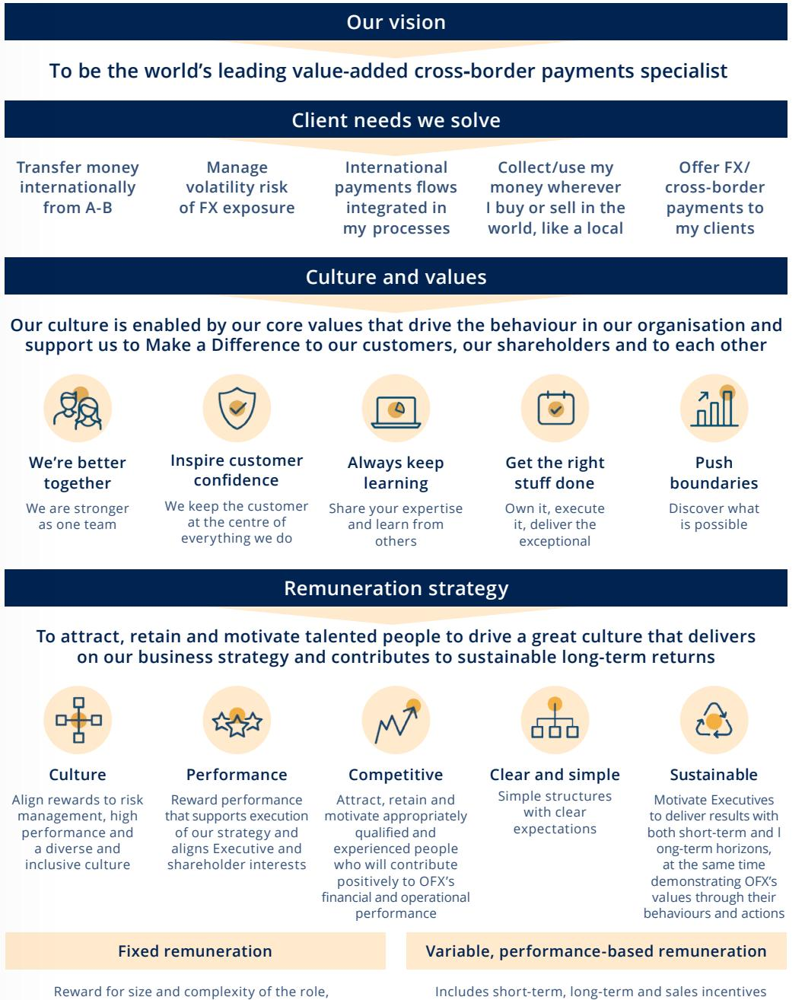

Annual Report 2022 | OFX Group Limited 53

or commissions, and one-off grants of equity or cash

{55}------------------------------------------------

for the financial year ended 31 March 2022

### **2.2 Executive KMP remuneration components**

OFX's Executive KMP remuneration consists of a total fixed remuneration (**TFR**) component, a shortterm incentive (**STI**) component and a long-term incentive (**LTI**) component as set out in Table 2 below.

### **Table 2**

|                         | Total Fixed Remuneration (TFR)                                                     | Short-Term Incentive (STI)                                                                                                                                                                                                               | Long-Term Incentive (LTI)                                                                                                                                                       |
|-------------------------|------------------------------------------------------------------------------------------|---------------------------------------------------------------------------------------------------------------------------------------------------------------------------------------------------------------------------------------------|---------------------------------------------------------------------------------------------------------------------------------------------------------------------------------|
| Purpose                 | Reward for size and complexity of the role, as well as skills and experience | Annual 'at risk' incentive opportunity awarded on the achievement of performance conditions over a 12-month period                                                                                                              | Reward that aligns with longer term OFX performance and shareholder outcomes                                                                                              |
| Link to performance  | Motivation to drive a great culture and deliver on the business strategy        | Strategic individual performance measures that are specific to the Executive KMP's role, are equally weighted and, along with evaluation of behaviour against the OFX values, support an overall performance rating | Performance measures that are designed to encourage Executive KMP to focus on the key performance drivers which underpin sustainable growth in shareholder value |
|                         | Accountabilities that support the execution of the business strategy            | Company performance measures for FY22:                                                                                                                                                                                                   |                                                                                                                                                                                 |
|                         |                                                                                          | • Underlying NOI (30%)                                                                                                                                                                                                                      |                                                                                                                                                                                 |
| Performance measures |                                                                                          | • Underlying EBITDA (30%)                                                                                                                                                                                                                   | Company performance measures                                                                                                                                                    |
|                         |                                                                                          | • Strategic Investments (20%)                                                                                                                                                                                                            | for FY22:                                                                                                                                                                       |
|                         |                                                                                          | • ESG (20%)                                                                                                                                                                                                                                 | • Underlying EPS CAGR (50%)                                                                                                                                                     |
|                         |                                                                                          | Assessment of threshold/ target/maximum levels follows agreed targets, with the vesting scale ranging from 25% through to 110%                                                                                               | • Absolute TSR CAGR (50%)                                                                                                                                                       |

{56}------------------------------------------------

for the financial year ended 31 March 2022

|           | Total Fixed Remuneration (TFR)                                                                                                                                    | Short-Term Incentive (STI)                                                                                                                                                                      | Long-Term Incentive (LTI)                                                                                                                                                   |
|-----------|-------------------------------------------------------------------------------------------------------------------------------------------------------------------------|----------------------------------------------------------------------------------------------------------------------------------------------------------------------------------------------------|-----------------------------------------------------------------------------------------------------------------------------------------------------------------------------|
| Alignment | Set to attract, retain and motivate the right talent to deliver on OFX's strategy and contribute to OFX's financial and operational performance | Clearly defined and measurable performance conditions designed to support the financial and strategic direction of the Group which in turn translates into shareholder return | Encourages sustainable long-term value creation by linking a significant portion of remuneration to OFX's share price and returns generated for shareholders |
| Delivery  | Competitive market based fixed remuneration (base salary + statutory superannuation)                                                                        | Delivered as a combination of a cash award and deferred equity issued as performance rights                                                                                            | A new LTI plan for Executives was introduced from FY22 that grants rights to fully paid ordinary shares in OFX (performance rights)                                |
|           |                                                                                                                                                                         |                                                                                                                                                                                                    | Performance rights allocated in two tranches (50% in each tranche) that operate independently                                                                      |
|           |                                                                                                                                                                         |                                                                                                                                                                                                    | Vesting schedule for each of the two tranches is detailed in Figure 2                                                                                                    |

{57}------------------------------------------------

for the financial year ended 31 March 2022

### **2.3 Remuneration delivery and mix**

The Executive KMP remuneration mix is structured so that a substantial portion of remuneration is delivered as OFX securities through either deferred STI or LTI. Total remuneration correlates to performance. The following Figure 2 (which is not to scale) sets out the remuneration structure and delivery timing for Executive KMP.

### **Remuneration delivery**

#### **Figure 2**

| Remuneration delivery                                         |                                                               | Year 1                                                                            | Year 2                                   | Year 3 |
|---------------------------------------------------------------|---------------------------------------------------------------|-----------------------------------------------------------------------------------|------------------------------------------|--------|
| 1. Fixed Remuneration 100%                                 |                                                               | Salary and other benefits (including statutory super annuation) |                                          |        |
| 2. STI of TFR for each other Executive KMP)                | (Target is 115% of TFR for CEO and 60%                        | Cash STI                                                                          |                                          |        |
| CEO 50% 50%                                             | EXECUTIVE KMP 30% 70%                                   | 12 months deferred vesting                                                  | 12-month holding lock post vesting |        |
| CEO: 50% cash. 50% deferred into performance rights. | KMP: 70% cash. 30% deferred into performance rights. |                                                                                   |                                          |        |

{58}------------------------------------------------

for the financial year ended 31 March 2022

| Remuneration delivery                                                         | Year 1                                                                       | Year 2                                                               | Year 3                               |                            |
|-------------------------------------------------------------------------------|------------------------------------------------------------------------------|----------------------------------------------------------------------|--------------------------------------|----------------------------|
| 3. LTI (92% of TFR for CEO and 40% of TFR for each other Executive KMP) | Subject to three-year performance period FY22 issuance in two | FY22 Vesting schedule for each of the two tranches is as follows: |                                      |                            |
|                                                                               |                                                                              | Performance Measure                                               | % of Performance Rights that vest |                            |
|                                                                               |                                                                              | Below threshold                                                      | Nil                                  |                            |
|                                                                               | tranches                                                                     | Threshold                                                            | 23%                                  |                            |
|                                                                               |                                                                              | Between threshold and target                                      | 23-91% (straight line)            |                            |
|                                                                               |                                                                              | Target                                                               | 91%                                  |                            |
|                                                                               |                                                                              |                                                                      | Between target and stretch        | 91-100% (straight line) |
|                                                                               |                                                                              | Stretch and above                                                    | 100%                                 |                            |
|                                                                               |                                                                              |                                                                      |                                      |                            |
|                                                                               |                                                                              |                                                                      |                                      |                            |
|                                                                               |                                                                              |                                                                      |                                      |                            |

{59}------------------------------------------------

for the financial year ended 31 March 2022

### **Remuneration mix**

### **FY22 Remuneration Outcomes**

Figure 3 below reflects both the target mix1 of pay for each Executive KMP as well as actual mix of pay based on remuneration outcomes (i.e. the relative weight of each component as a percentage of total remuneration) for FY22.

### **Figure 3**

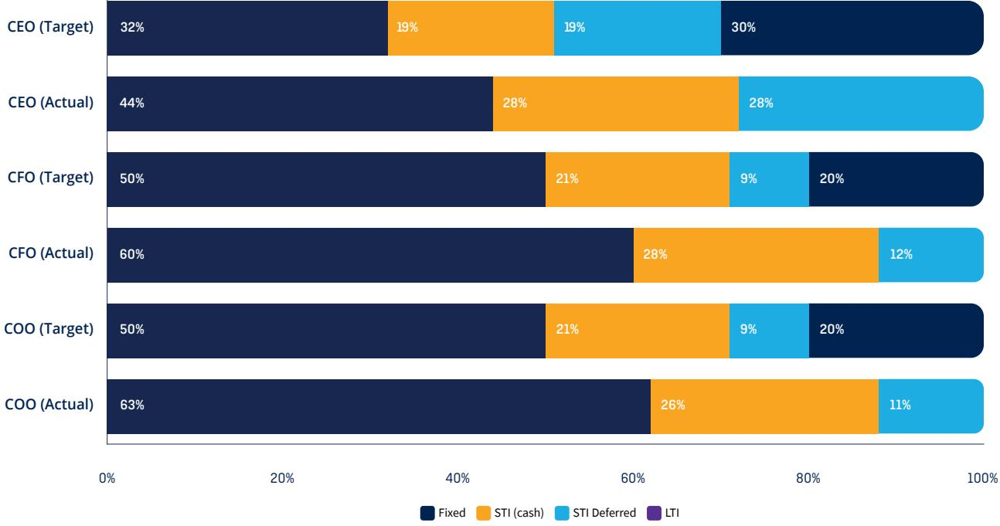

1 Target mix accounts for partial loan forgiveness under the ESP for 'on target' performance.

{60}------------------------------------------------

for the financial year ended 31 March 2022

### **3. Company performance FY22**

### **Five-year Group performance**

The Group's FY18-FY22 annual financial performance measures compared with short-term and longterm remuneration outcomes are set out in Table 3 below.

#### **Table 3**

| Performance Metrics1                    | 2018      | 2019      | 2020     | 20212    | 2022     |
|-----------------------------------------|-----------|-----------|----------|----------|----------|
| Net operating income3                   | \$109.9m  | \$118.7m  | \$125.2m | \$117.9m | \$147.0m |
| EBITDA                                  | \$29.8m   | \$31.6m   | \$36.9m  | \$28.1m  | \$43.3m  |
| Underlying EBITDA                       | \$29.8m   | \$36.0m   | \$38.2m  | \$29.1m  | \$44.5m  |
| Basic earnings per share4               | 7.79cps   | 7.07cps   | 8.37cps  | 4.96cps  | 10.06cps |
| Underlying basic earnings per share5 | 7.79cps   | 8.45cps   | 8.80cps  | 5.26cps  | 10.59cps |
| Dividend per share6                     | \$0.05800 | \$0.05640 | \$0.0563 | \$0.0316 | –        |
| Closing share price                     | \$1.69    | \$1.67    | \$1.24   | \$1.10   | \$2.43   |

1 These are not calculations based on constant currency.

2 2021 information has been restated to reflect the change in accounting policy and the prior period restatements detailed in the Financial Statements Note 1(c).

3 Net operating income, a non-IFRS measure, is the combination of 'Fee and trading income' and 'Fee and commission expense' and 'Interest income'.

4 For the calculation of EPS refer to Note 7 of the financial statements.

5 Underlying basic earnings per share is the basic earnings per share calculation utilising the underlying NPAT of the Group.

6 This represents dividends distributed in the period.

{61}------------------------------------------------

for the financial year ended 31 March 2022

### **4. Statutory disclosures**

Table 4 details the remuneration paid to Executives (KMP) and has been prepared in accordance with the accounting standards.

#### **Table 4**

|                        |      | benefits                            | Short-term          | Post employ ment benefit | Long term benefits       |                                                  | Share-based payments                             |                                                  |                   |
|------------------------|------|-------------------------------------|---------------------|-----------------------------------|--------------------------------|--------------------------------------------------|--------------------------------------------------|--------------------------------------------------|-------------------|
|                        | Year | Cash salary and fees \$ | Cash bonus \$ | Super annuation \$          | Long service leave \$ | Deferred STI – Performance Rights \$ | STI – Retention & One-off awards1 \$ | LTI – ESP and Performance Rights2 \$ | Total \$       |
| Current KMP            |      |                                     |                     |                                   |                                |                                                  |                                                  |                                                  |                   |
| S Malcolm              | 2022 | 676,000                             | 442,477             | 23,100                            | 12,311                         | 193,575                                          | 6,222                                            |                                                  | 485,102 1,838,787 |
|                        | 2021 | 664,731                             | 210,937             | 21,521                            | 8,703                          | 189,329                                          | 74,382                                           | 40,941                                           | 1,210,544         |
|                        | 2022 | 379,000                             | 185,986             | 23,100                            | 5,290                          | 36,306                                           | 38,286                                           | 109,259                                          | 777,227           |
| S Verth                | 2021 | 372,397                             | 88,488              | 21,521                            | 3,330                          | 36,633                                           | 85,525                                           | 10,435                                           | 618,329           |
|                        | 2022 | 355,000                             | 158,999             | 23,100                            | 4,793                          | 35,268                                           | 20,004                                           | 101,956                                          | 699,120           |
| M Shaw                 | 2021 | 344,397                             | 83,187              | 21,521                            | 2,984                          | 39,394                                           | 85,525                                           | 9,945                                            | 586,953           |
| Total KMP remuneration |      |                                     |                     |                                   |                                |                                                  |                                                  |                                                  |                   |
|                        | 2022 | 1,410,000                           | 787,462             | 69,300                            | 22,394                         | 265,149                                          | 64,512                                           | 696,317                                          | 3,315,134         |
|                        | 2021 | 1,381,525                           | 382,612             | 64,563                            | 15,017                         | 265,356                                          | 245,432                                          |                                                  | 61,321 2,415,826  |

1 Ms Verth's awards also include remuneration of \$18,282 in respect of 35,848 one-off performance rights that were granted on 30 July 2021 with a vesting date of 31 May 2023. There are performance conditions that reflect specific outcomes relating to a transaction attached to the vesting.

2 The ESP includes the FY20 and FY21 issuances under the Loan Share Plan. Mr Malcolm's remuneration includes \$266,956 in respect of the ESP, and \$218,146 in respect of LTI performance rights. Ms Verth's remuneration includes \$66,608 in respect of the ESP, and \$42,651 in respect of LTI performance rights. Mr Shaw's remuneration includes \$61,860 in respect of the ESP, and \$40,096 in respect of LTI performance rights.

{62}------------------------------------------------

for the financial year ended 31 March 2022

### **5. Performance and remuneration outcomes for FY22**

### **5.1 Fixed remuneration**

Regular reviews of remuneration levels are a key accountability of the Board; however, due to the impacts of COVID-19 on the business, no fixed remuneration increases were awarded to Executive KMP in FY22. A comprehensive market review has been conducted for each Executive KMP as part of the FY22 remuneration review cycle which, if applicable, will be effective in FY23.

### **5.2 Short-Term Incentive (STI)**

#### **The STI Plan is aligned to shareholder interests by:**

Encouraging Executive KMP to achieve year-on-year performance in a balanced and sustainable manner through a mix of financial and non-financial performance measures.

Mandatory deferral of STI award into performance rights acting as both a retention mechanism and providing the opportunity for malus or clawback if this is ever warranted. 50% of STI is deferred for the CEO and 30% of STI is deferred for other Executive KMP.

#### **Figure 4**

STI outcomes are determined as shown in Figure 4.

| Company Performance measures                                                |        | X | Individual Performance measures |   | X    | Target STI % | X | TFR | =                                               | STI |                        |
|--------------------------------------------------------------------------------|--------|---|------------------------------------|---|------|--------------|---|-----|-------------------------------------------------|-----|------------------------|
| Company performance objectives set and reviewed by the Board annually |        |   |                                    |   |      |              |   |     | (TFR is base salary outside Australia) |     | Min = 0% Max = 132% |
|                                                                                | Payout |   | Does not meet                      | 1 | 0%   |              |   |     |                                                 |     |                        |
| Threshold                                                                      | 50%    |   | Mostly meets                       | 2 | 75%  |              |   |     |                                                 |     |                        |
| Target                                                                         | 100%   |   | Meets                              | 3 | 100% |              |   |     |                                                 |     |                        |
| Max                                                                            | 110%   |   | Exceeds                            | 4 | 110% |              |   |     |                                                 |     |                        |
|                                                                                |        |   | Outstanding                        | 5 | 120% |              |   |     |                                                 |     |                        |

{63}------------------------------------------------

for the financial year ended 31 March 2022

### **FY22 STI outcomes**

Individual performance measures:

In determining individual STI awards, the CEO provides recommendations to the People, Culture and Remuneration Committee in respect of the CEO's direct reports (which includes all Executive KMP except the CEO). The Committee reviews these recommendations and also evaluates the CEO and his direct reports' performance and recommends to the Board any fixed pay changes and incentive awards for the CEO and the CEO's direct reports. Recommendations take into account the STI pool funding percentage (refer Table 7) and the performance of the CEO and his direct reports against individual and business performance goals (refer Table 6 for outcomes in respect of the Executive KMP) as well as the behaviour demonstrated by the CEO and his direct reports in their role consistent with the Company values. Individual goals for the CEO and his direct reports align to the financial and strategic objectives used to determine STI pool funding.

STI achieved by Executive KMP for FY22 is set out in Table 5 below:

| Executive KMP | STI at target \$ | Company Performance Measures | Individual Performance | STI achievement | STI achievement \$ | Cash \$ | STI portion deferred1 \$ |
|------------------|------------------------|------------------------------------|---------------------------|--------------------|--------------------------|------------|--------------------------------|
| S Malcolm        | 804,503                | 100%                               | 110%                      | 110%               | 884,954                  | 442,477    | 442,477                        |
| S Verth          | 241,541                | 100%                               | 110%                      | 110%               | 265,695                  | 185,986    | 79,708                         |
| M Shaw           | 227,141                | 100%                               | 100%                      | 100%               | 227,141                  | 158,999    | 68,142                         |

#### **Table 5**

1 STI deferred portion is calculated as STI achieved multiplied by STI remuneration delivery mix and is a non-statutory measure.

{64}------------------------------------------------

for the financial year ended 31 March 2022

Table 6 below provides a summary of the way in which each individual Executive KMP's FY22 performance was evaluated.

#### **Table 6**

|                                         | S Malcolm    | S Verth      | M Shaw       |
|-----------------------------------------|--------------|--------------|--------------|
| Safe, reliable, scalable platforms      | Meets        | N/A          | Meets        |
| Improved P/E                            | Outstanding  | N/A          | N/A          |
| Improved customer onboarding experience | Mostly Meets | Mostly Meets | Mostly Meets |
| Pricing initiatives                     | N/A          | Exceeds      | N/A          |
| Treasury                                | N/A          | Exceeds      | N/A          |
| M&A strategy and execution              | N/A          | Outstanding  | N/A          |
| Global assurance controls program       | N/A          | N/A          | Exceeds      |
| Scalable operating model                | N/A          | N/A          | Meets        |
| Overall individual performance          | Exceeds      | Exceeds      | Meets        |

### **Table 7**

| Bonus Pool Calculation | Weighting | FY22 Actual | Payout rate | Funding1 | FY21 Actual2 | YOY % |
|---------------------------|-----------|----------------|----------------|----------|-----------------|----------|
| Underlying EBITDA         | 30%       | \$44.5m        | 110%           | 33%      | \$29.1m         | 53.1%    |
| Underlying NOI            | 30%       | \$147.0m       | 110%           | 33%      | \$117.9m        | 24.7%    |
| Strategic Investments     | 20%       |                | 75%            | 15%      |                 |          |
| Risk and ESG              | 20%       |                | 85%            | 17%      |                 |          |
| Board Discretion          |           |                |                | 2%       |                 |          |
| TOTAL                     | 100%      |                |                | 100%     |                 |          |

1 Funding rate is calculated as payout rate multiplied by weighting of Company performance measures.

2 Comparative information has been restated to reflect the change in accounting policy and the prior period restatements detailed in Note 1(c).

{65}------------------------------------------------

for the financial year ended 31 March 2022

Company funding of 100% for STI for FY22 represents the very significant improvement in business performance seen over the course of FY22 and therefore an increase from the FY21 outcome of 47.8% of target. The FY21 funding reflected Company performance in the context of the impact of the COVID-19 pandemic. FY22 STI funding reflects:

- **•** Significant outperformance on financial metrics whereby stretch targets were exceeded and which resulted in the Board applying its discretion to increase STI funding by 2%;
- **•** Strong build of the Enterprise client pipeline across all regions and activation underway;
- **•** Cost savings, product benefits, a material reduction in bad debts and improved efficiency of payments for metrics related to safe, reliable and scalable platforms;
- **•** Significant enhancements to our control environment and risk management capability; and
- **•** Satisfactory achievement on our ESG People and Community measures for FY22.

| Executive KMP | Held at 1 April 20211 | Granted during the year2 | Vested during the year | Lapsed during the year | Held at 31 March 2022 |
|---------------|-----------------------------|--------------------------------|------------------------------|------------------------------|-----------------------------|
| S Malcolm     | 247,136                     | 148,593                        | (247,136)                    | –                            | 148,593                     |
| S Verth       | 107,628                     | 62,563                         | (107,628)                    | –                            | 62,563                      |
| M Shaw        | 110,564                     | 25,115                         | (110,564)                    | –                            | 25,115                      |

### **Table 8 STI-related equity**

1 All holdings at 1 April 2021 were granted during FY21.

2 Grants in FY22 occurred on 27 August 2021 for Mr Malcolm and 7 June 2021 for Ms Verth and Mr Shaw, with a 12-month vesting period and fair value at grant date of \$1.614 for Mr Malcolm and \$1.369 for Ms Verth and Mr Shaw. Ms Verth's grant also includes 35,848 performance rights that were granted on 30 July 2021 with a vesting date of 31 May 2023 and fair value at grant date of \$1.395. There are performance conditions that reflect specific outcomes relating to a transaction attached to the vesting.

{66}------------------------------------------------

for the financial year ended 31 March 2022

### **Vested and Realised Remuneration:**

Table 9 below is a voluntary non-statutory disclosure of the realised remuneration of Executive KMP. Not all amounts have been prepared in accordance with accounting standards and this information differs from the statutory remuneration table in Section 4 which shows the expense for the vested and unvested awards in accordance with accounting standards. The below figures are unaudited.

#### **Table 9**

| KMP       | Year | Cash salary and fees \$ | Cash bonus \$ | Super annuation \$ | Vested STI deferral1 \$ | Vested retention2 \$ | LTI – Executive Share Plan \$ | Total \$  |
|-----------|------|----------------------------------|------------------|--------------------------|----------------------------------|----------------------------|----------------------------------------|-----------|
|           | 2022 | 676,000                          | 442,477          | 23,100                   | 232,600                          | 112,813                    | –                                      | 1,486,990 |
| S Malcolm | 2021 | 664,731                          | 210,937          | 21,521                   | 186,038                          | –                          | –                                      | 1,083,227 |
|           | 2022 | 379,000                          | 185,986          | 23,100                   | 37,986                           | 112,813                    | –                                      | 738,885   |
| S Verth   | 2021 | 372,397                          | 88,488           | 21,521                   | 36,407                           | –                          | –                                      | 518,813   |
|           | 2022 | 355,000                          | 158,999          | 23,100                   | 42,082                           | 112,813                    | –                                      | 691,994   |
| M Shaw    | 2021 | 344,397                          | 83,187           | 21,521                   | 34,692                           | –                          | –                                      | 483,797   |

1 These figures reflect the prior year STI deferred into share rights which have vested. These shares are subject to a holding lock under which they cannot be traded for 12 months from vesting date. The value is derived as the number of vested shares multiplied by the share price on vesting date.

2 These figures reflect retention payments in the form of an equity grant that were issued to Executives as a one-off incentive in FY21. This issuance represented a commitment made by the Board as a part of the unsolicited M&A proposal during FY20. This award vested 12 months from the date of the award, during FY22.

{67}------------------------------------------------

for the financial year ended 31 March 2022

### **5.3 Long-Term Incentive (LTI)**

### **LTI Outcomes for FY22**

No shares under the ESP vested in FY22 however Executive KMP were issued LTI grants for FY22 as outlined in Table 10 below.

For FY22, as approved by shareholders at the Company's AGM in August 2021, Executive KMP were offered a single grant of performance rights. The value of the grants is determined by reference to a set % of TFR. The number of performance rights that each Executive KMP received was determined by dividing the grant value by a 10-day VWAP following the release of full-year results.

For FY19, FY20 and FY21, as approved by shareholders at the Company's AGM in August 2018, in order to reward achievement against performance metrics, part of the loan may be forgiven at the end of the three-year performance period upon the achievement of specified performance conditions.

For FY19, FY20 and FY21 Executive KMP were offered a single grant of shares. The value of the grants is determined by reference to a set % of TFR. The number of shares that each Executive KMP received was determined using the following formula:

#### **Fixed Remuneration x Grant % x Gross-up Factor (2) divided by the share acquisition price**

The Gross-up Factor replaced the previously used Fair Value Factor (Black-Scholes).

Australian Accounting Standards require the ESP awards be treated as options for accounting purposes due to the structure of the plan. The number and value of notional options held by Executive KMP under the ESP during the financial year ended 31 March 2022 is set out in Tables 10 and 11.

| LTI Issuances                      | Grant date   | Vesting date | Expiry date  | Weighted average fair value at grant date | Performance achieved | % vested |
|------------------------------------|--------------|-----------------|--------------|----------------------------------------------------|-------------------------|-------------|
| FY19 share based loan           | 22 June 2018 | 7 June 2021     | 6 June 2023  | 0.44                                               | No                      | –           |
| FY20 share based loan           | 11 June 2019 | 7 June 2022     | 6 June 2024  | 0.38                                               | To be determined     | –           |
| FY21 share based loan           | 9 June 2020  | 9 June 2023     | 9 June 2025  | 0.28                                               | To be determined     | –           |
| FY22 long-term incentive grant1 | 15 June 2021 | 15 June 2024    | 15 June 2024 | 1.0825                                             | To be determined     | –           |

### **Table 10**

1 For Mr Malcolm, the FY22 long-term incentive grant was issued on 27 August 2021 with a weighted average fair value at grant date of 1.3825.

{68}------------------------------------------------

for the financial year ended 31 March 2022

### **Table 11 LTI-related equity**

| Executive KMP | Held at 1 April 20211 | Granted during the year2 | Vested during the year | Lapsed during the year | Held at 31 March 2022 | Total value of LTI equity as at grant date |
|---------------|-----------------------------|--------------------------------|------------------------------|------------------------------|-----------------------------|--------------------------------------------------------|
| S Malcolm     | 2,430,718                   | 506,228                        | –                            | (691,603)                    | 2,245,343                   | 1,265,509                                              |
| S Verth       | 604,915                     | 126,406                        | –                            | (170,985)                    | 560,336                     | 277,970                                                |
| M Shaw        | 562,739                     | 118,834                        | –                            | (158,209)                    | 523,364                     | 260,013                                                |

1 For Mr Malcolm, includes 691,603 shares granted in FY19 ESP, 801,763 granted in FY20 ESP and 937,352 granted in FY21 ESP. For Ms Verth, includes 170,985 shares granted in FY19 ESP, 200,044 granted in FY20 ESP and 233,886 granted in FY21 ESP. For Mr Shaw, includes 158,209 shares granted in FY19 ESP, 184,677 granted in FY20 ESP and 219,853 granted in FY21 ESP.

2 Awards granted during the year include performance rights under FY22 LTI Global Equity Plan. There were no awards granted under the ESP in the period.

### **6. Loans to Executive KMP for FY20 and FY21 LTI grants**

The details of non-recourse loans on foot to Executive KMP under the ESP are set out in Table 12 below.

Under the ESP that was in effect until FY22, Executive KMP acquire shares in the Company funded by a non-recourse loan from the Company. These loans are provided for the sole purpose of Executive KMP acquiring shares in the Company. The amount of the loan is equal to the issue price multiplied by the total number of shares issued. The loan is 'interest free' in that there is no annual interest charge to the participant on the loan. However, the notional value of this interest is taken into account in the overall structure of the program. The participant is obliged to pay a portion of the post-tax value of any dividends received during the loan term toward repayment of the loan amount. To access the shares, participants must repay their loan in full. Following the end of the vesting period, assuming the earnings 'gateway' is achieved, the participant can either repay the loan directly or sell some of their shares and apply the proceeds to repay the loan. Shares remain restricted and can only be sold for the purposes of repaying the loan until the loan is repaid, and it is important that the loan obligation is always taken into account alongside the face value of shares under the ESP awards.

{69}------------------------------------------------

for the financial year ended 31 March 2022

### **Table 12**

| Name        | Held at 1 April 2021 \$ | Advances during the year \$ | Loans lapsed during the year \$ | Repayments during the year \$ | Held at 31 March 2022 \$ | Interest free value \$ | Highest indebtedness during the year \$ |
|-------------|----------------------------------|--------------------------------------|---------------------------------------------|----------------------------------------|-----------------------------------|---------------------------------|-----------------------------------------------------|
| Current KMP |                                  |                                      |                                             |                                        |                                   |                                 |                                                     |
| S Malcolm   | 3,686,890                        | –                                    | (1,179,924)                                 | –                                      | 2,506,967                         | 1,064,395                       | 3,686,890                                           |
| S Verth     | 916,111                          | –                                    | (290,594)                                   | –                                      | 625,517                           | 196,133                         | 916,111                                             |
| M Shaw      | 850,817                          | –                                    | (267,987)                                   | –                                      | 582,830                           | 125,160                         | 850,817                                             |

### **7. Changes to Executive remuneration for FY23**

In FY21, the Board undertook to review the remuneration plans for Executives that resulted in changes in the performance metrics for Company funding for the Short-Term Incentive (STI) Plan as well as the design and performance metrics for the Long-Term Incentive (LTI) Plan for Executives from FY22 onwards.

During FY22, the Board continued to consider the effectiveness of these plans and engaged Godfrey Remuneration Group to provide advice on Executive remuneration relating to STI and LTI. In particular, with the intent of ensuring that OFX has competitive remuneration in place for the Executive team and that remuneration is aligned to market practice. The Board approved changes to Executive remuneration as follows:

#### **FY23 STI Plan metrics**

Underlying EBT will replace Underlying EBITDA as one of two financial metrics in FY23 (Underlying NOI will be retained). The decision to revert back to Underlying EBT as a financial metric for the STI Plan is on the basis that it reflects financial performance in the context of:

- **•** Increasing capital expenditure and as such amortisation expenses; and
- **•** The Company taking on interest expense as a result of the Firma acquisition funding via debt.

{70}------------------------------------------------

for the financial year ended 31 March 2022

### **Variable reward opportunity for Executives**

A review of market practice indicated that a 50:50 weighting of STI and LTI at target would provide a more appropriate remuneration mix for Executives. As such, for direct reports of the CEO, the intent is to achieve a remuneration mix of 40%:30%:30% for Total Fixed Remuneration:STI:LTI from FY24 onwards. This will be achieved by a stepped adjustment of STI and LTI opportunity as follows:

- **•** Increasing the STI opportunity from 60% to 65% in FY23 and to 75% in FY24; and
- **•** Increasing the LTI opportunity from 40% to 60% in FY23 and to 75% in FY24.

To achieve the same 50:50 weighting between STI and LTI at target for the CEO, an increase of the LTI target from 92% to 115% was approved, resulting in a remuneration mix of 30%:35%:35% for Total Fixed Remuneration:STI:LTI from FY23 onwards.

#### **FY23 STI and FY23 LTI**

The current range of opportunity between Target and Stretch measures in the STI and LTI plans is not sufficiently broad to encourage outperformance or when compared to market practice. The performance measures for Stretch should be reflective of true outperformance resulting from exceptional discretionary effort that results in shareholder value creation.

From FY23, the Stretch targets will be increased as follows, with the performance metrics being set at commensurate levels:

- **•** STI Stretch target will increase from 110% to 125%; and
- **•** LTI Stretch target will increase from 110% to 150%.

#### **STI deferral**

Currently, the vesting schedule of deferred STI for Australian participants is such that 100% vests after 12 months and there is a 12-month holding lock post vesting. From FY23, this will be changed so that 50% of the deferred STI award vests after 12 months and 50% of the deferred STI award vests after 24 months. This increases the deferral period as well as ensures global consistency across all participants subject to deferral of STI.

#### **Minimum shareholding requirement**

With the increase to the variable reward components as well as the STI and LTI opportunity for Executives, the Board approved the introduction of a minimum shareholding requirement for Executives from FY23 in order to further align the interests of the Executives with those of shareholders. The parameters of the requirement are that:

- **•** The CEO must establish and maintain a level of share ownership equal to one times his annual base salary;
- **•** The other Executives must establish and maintain a level of share ownership equal to 0.5 times their annual base salary; and
- **•** Until these requirements are met, the Executive must retain 25% of any shares that vest via the LTI Plan.

{71}------------------------------------------------

for the financial year ended 31 March 2022

### **8. Executive KMP service agreements**

### **Contractual arrangements for Executive KMP**

The key employment terms and conditions for Executive KMP as at 31 March 2022 are set out in Table 13 below.

### **Table 13**

| Contract Components           | CEO                                                                                                                                                                                    | Other Executive KMP                                                                                                                                                                                          |  |
|-------------------------------|----------------------------------------------------------------------------------------------------------------------------------------------------------------------------------------|--------------------------------------------------------------------------------------------------------------------------------------------------------------------------------------------------------------|--|
| Basis of contract             | Ongoing (no fixed term)                                                                                                                                                                | Ongoing (no fixed term)                                                                                                                                                                                      |  |
| Notice period                 | 6 months                                                                                                                                                                               | 6 months                                                                                                                                                                                                     |  |
| Post-employment restraints | Maximum 6 months post employment non-compete and non-solicitation restraint                                                                                                      | Maximum 12 months post employment non-compete and non-solicitation restraint                                                                                                                           |  |
| Treatment of STI and LTI   | Upon termination, if the CEO is considered a good leaver, the CEO will be entitled to a pro-rata STI award. Board discretion applies to the treatment of any unvested LTI. | Upon termination, if the Executive KMP is considered a good leaver, the Executive KMP may be entitled to a pro-rata STI award. Board discretion applies to the treatment of any unvested LTI. |  |

### **9. Remuneration Governance**

### **9.1 Role of the People, Culture and Remuneration Committee**

The People, Culture and Remuneration Committee is responsible for providing advice and recommendations to the Board in relation to the Company's remuneration arrangements for Non-Executive Directors, the CEO, and Executives, including total fixed remuneration, bonus, equity-based awards and termination payments. In addition, it is responsible for regularly reviewing the Company's remuneration framework to ensure that it continues to align to business objectives in a manner that is consistent with the long-term sustainability of the Company and a broad range of stakeholder interests over the long term (for example, customer, community, regulator, investor interests) as well as considering those aspects of the Company's remuneration policies and packages, including equitybased incentives, which should be subject to shareholder approval. The Committee is also responsible for reviewing the Company's policies and practices as they relate to diversity and inclusion, talent acquisition, retention, learning and development and termination. The Charter of the People, Culture and Remuneration Committee is available on the Group's website at www.ofx.com/en-au/investors/ corporate-governance/.

{72}------------------------------------------------

for the financial year ended 31 March 2022

To assist in performing its duties, the People, Culture and Remuneration Committee seeks independent advice from external consultants on various remuneration related matters. The People, Culture and Remuneration Committee follows protocols around the engagement and use of external remuneration consultants to ensure compliance with relevant legislation as it relates to Executive remuneration.

During the 2022 financial year, Godfrey Remuneration Group was engaged to provide advice on Executive remuneration relating to STI and LTI and to recommend any changes to the framework that would be valued by Executives and supported by shareholders.

The Board is satisfied that the recommendations received from the remuneration consultants were free from undue influence from the KMP to whom the recommendations relate and in accordance with section 9B of the *Corporations Act 2001* (Cth).

Further, the following arrangements were made to meet this requirement:

- **•** The remuneration consultants were engaged by and reported to the Chair of the People, Culture and Remuneration Committee on behalf of the Board;
- **•** The advice containing the remuneration recommendations was provided by the remuneration consultants directly to the Chair of the People, Culture and Remuneration Committee; and
- **•** The remuneration recommendations made by external advisors to the People, Culture and Remuneration Committee and the Board were used as an input to decision making only.

The total fees paid to external advisors for remuneration recommendations included \$16,500 (including GST) paid to Godfrey Remuneration Group.

#### **9.2 Board discretion**

The Company has a structured and objective approach to remuneration. However, the People, Culture and Remuneration Committee and the Board are able to exercise judgement and discretion as is required to provide remuneration outcomes for Executive KMP that appropriately reflect the performance of the Group and the achievement of real and tangible results that are consistent with the Group's strategic priorities, are in line with Group values, and enhance shareholder value.

#### **9.3 Cessation of employment**

Subject to local legislation, participants are not eligible for any STI cash payment or any deferred STI which are subject to restriction if they are terminated due to misconduct or poor performance, nor in general, if they resign or retire without a managed transition approved by the Board. In certain appropriate circumstances, allowed for under Executive Service Agreements, the Board may deem an Executive KMP to be a 'good leaver' and exercise discretion to allow eligibility for a pro-rata cash payment in respect of the current performance year and may determine that deferred STI previously awarded is retained.

In general, all ESP shares are forfeited and surrendered in full settlement of the loan if a participant ceases employment prior to the end of the performance period. All unvested performance rights are not forfeited if a participant ceases employment prior to vesting date; however, the Board has absolute discretion in appropriate circumstances to deem whether some or all of an Executive KMP's performance rights are retained.

{73}------------------------------------------------

for the financial year ended 31 March 2022

### **9.4 Malus and clawback**

The Board retains wide discretion to adjust formulaic incentive outcomes up or down (including to zero) prior to their finalisation. Malus refers to the exercise of downward discretion. Clawback refers to the Board's power to recover awards or payments that have been made, granted or vested (including the forfeiture of vested equity awards, or the demand of the return of shares or the realised cash value of those shares) where the Board determines that the benefit obtained was inappropriate (for example, as a result of fraud, dishonesty or breach of employment obligations by the recipient or any employee of the Group). The Board has not encountered circumstances in this or prior periods that have required the application of the clawback provisions.

### **9.5 Change of control**

If a change of control occurs prior to the vesting of share rights that are not subject to performance hurdles the Board has discretion to bring forward vesting dates where it considers it appropriate to do so. If a change of control occurs prior to the vesting of STI or LTI that is subject to performance hurdles, the Board has discretion to determine that some or all of the unvested shares or performance rights will vest. In exercising this discretion, the Board may have regard to any matter the Board considers relevant, including the extent to which the vesting conditions have been satisfied (or estimated to have been satisfied) at the time the change of control occurs or the proportion of the performance period during which the vesting conditions are tested that has passed at the time the change of control occurs.

### **9.6 Minimum shareholding requirements for Non-Executive Directors**

A minimum shareholding requirement for Non-Executive Directors was introduced in FY19. The minimum shareholding requirement seeks to align the interests of the Board and shareholders with a minimum shareholding requirement for Non-Executive Directors. Each Non-Executive Director must establish and maintain a level of share ownership equal to one times' the Non-Executive Director's annual base fee. For the purposes of calculating the minimum holding, this does not include any higher fee for acting as Chair or for membership of any Board Committees. The minimum holding must be reached within three years of appointment. At the date of this Remuneration Report, all Non-Executive Directors either met the minimum requirement or were on track to meet it within the required timeframe.

### **9.7 Securities Trading Policy**

All Directors and employees are required to comply with the Group's Securities Trading Policy in undertaking any trading in the Company's shares and may not trade if they are in possession of any inside information. Directors, members of the Global Executive Team, members of the Senior Leadership Team, members of the Finance Team and Specified Employees must apply for and receive written approval before trading in OFX securities. All employees are prohibited from dealing in OFX securities during a Closed Period which precedes the release of the half-year and full-year results and the annual meeting. The Policy prohibits employees who participate in any equity-based plan from entering into any transaction in relation to unvested securities which would have the effect of limiting the economic risk of an unvested security.

{74}------------------------------------------------

for the financial year ended 31 March 2022

### **10. Non-Executive Director remuneration**

### **10.1 Fee framework**

The Board seeks to set fees for the Non-Executive Directors that reflect the demands which are made on and the responsibilities of the Directors, and at a level which will attract and retain Directors of the highest quality.

Non-Executive Director fees will be reviewed from time to time and they may seek the advice of external remuneration advisors for this purpose. There were no changes in fees for Non-Executive Directors during FY22.

### **10.2 Fee pool**

The maximum amount payable to be shared by all Non-Executive Directors is currently set at \$1,000,000 per annum, which was approved by shareholders in General Meeting prior to the Company's listing on the ASX in 2013. To preserve independence, Non-Executive Directors do not receive any equity as part of their remuneration and do not receive any performance-related compensation. Non-Executive Directors receive superannuation contributions where required by Superannuation Guarantee legislation.

### **Table 14 Fees applicable for FY22**

| Role                  | \$      |
|-----------------------|---------|
| Chairperson fee       | 200,000 |
| Base Director fee     | 100,000 |
| Committee Chair fee   | 25,000  |
| Committee Member fee1 | 15,000  |

1. For each committee other than the Nomination Committee.

{75}------------------------------------------------

for the financial year ended 31 March 2022

### **Statutory Non-Executive Director fees for the year ended 31 March 2022**

Details of the fees paid to the Non-Executive Directors for the year ended 31 March 2022 are outlined in Table 15 below:

#### **Table 15**

|                         |      | Short-term employee benefits | Post-employment benefits |         |
|-------------------------|------|------------------------------------|-----------------------------|---------|
| Non-Executive Directors | Year | Cash salary and fees            | Superannuation              | Total   |
| C Carnabuci             | 2022 | 107,123                            | 7,877                       | 115,000 |
|                         | 2021 | 105,023                            | 9,977                       | 115,000 |
| L Frazier               | 2022 | –                                  | –                           | –       |
|                         | 2021 | 19,787                             | 1,880                       | 21,667  |
| C Kovacs                | 2022 | 104,665                            | 10,335                      | 115,000 |
|                         | 2021 | 11,795                             | 1,120                       | 12,915  |
| G Murdoch               | 2022 | 113,766                            | 11,234                      | 125,000 |
|                         | 2021 | 114,155                            | 10,845                      | 125,000 |
| S Sargent               | 2022 | 209,330                            | 20,670                      | 230,000 |
|                         | 2021 | 210,046                            | 19,954                      | 230,000 |
| D Snedden               | 2022 | 127,418                            | 12,582                      | 140,000 |
|                         | 2021 | 127,854                            | 12,146                      | 140,000 |
| Total Non-Executive     | 2022 | 662,302                            | 62,698                      | 725,000 |
| Director Remuneration   | 2021 | 588,660                            | 55,922                      | 644,582 |

{76}------------------------------------------------

for the financial year ended 31 March 2022

### **Director shareholdings**

Details of the Directors' and their affiliates' shareholdings in OFX Group Limited are set out in Section 4 of the Directors' Report on Page 39 of this report.

### **11. Additional Disclosures**

#### **Transactions of KMP**

Shares held in the Company by KMP at the end of the financial year, excluding shares granted under the ESP/LTI and STI, are set out in Table 16 below.

### **Table 16**

|             | Held at 1 April 2021 | Acquisitions | Other movements | Held at 31 March 2022 |
|-------------|-------------------------|--------------|--------------------|--------------------------|
| Current KMP |                         |              |                    |                          |
| S Malcolm   | 173,110                 | –            | –                  | 173,110                  |
| S Verth     | 5,800                   | –            | –                  | 5,800                    |
| M Shaw      | 52,222                  | –            | –                  | 52,222                   |

{77}------------------------------------------------

for the financial year ended 31 March 2022

### **12. Outlook**

The Group will continue to review and adjust its reward mechanisms annually, as required, to ensure that its long-term growth aspirations are met.

This Directors' Report is made in accordance with a resolution of Directors.

On behalf of the Board, 17 May 2022.

**17 May 2022 17 May 2022**

**Steven Sargent Skander Malcolm Chairperson Chief Executive Officer and Managing Director**

{78}------------------------------------------------

### Auditor's independence declaration

### Lead Auditor's Independence Declaration under Section 307C of the Corporations Act 2001

### To the Directors of OFX Group Limited

I declare that, to the best of my knowledge and belief, in relation to the audit of OFX Group Limited for the financial year ended 31 March 2022 there have been:

- i. no contraventions of the auditor independence requirements as set out in the Corporations Act 2001 in relation to the audit; and
- ii. no contraventions of any applicable code of professional conduct in relation to the audit.

*KPM_INI_01*

KPMG Shaun Kendrigan

Partner Sydney

17 May 2022

KPMG, an Australian partnership and a member firm of the KPMG global organisation of independent member firms affiliated with KPMG International Limited, a private English company limited by guarantee. All rights reserved. The KPMG name and logo are trademarks used under license by the independent member firms of the KPMG global organisation. Liability limited by a scheme approved under Professional Standards Legislation.

{79}------------------------------------------------

### Consolidated statement of comprehensive income

for the year ended 31 March 2022

Financial Statements

|                                                                               | Notes      | 2022 \$'000 | 20211 \$'000 |
|-------------------------------------------------------------------------------|------------|----------------|-----------------|
| Fee and trading income                                                        | 3          | 158,015        | 134,232         |
| Fee and commission expense                                                    | 3          | (11,391)       | (16,762)        |
| Net income                                                                    |            | 146,624        | 117,470         |
| Interest and other income                                                     | 3          | 403            | 460             |
| Net operating income                                                          |            | 147,027        | 117,930         |
| Employment expenses                                                           | 4          | (66,618)       | (57,992)        |
| Promotional expenses                                                          |            | (16,543)       | (12,794)        |
| Information technology expenses                                               |            | (8,288)        | (7,633)         |
| Occupancy expenses                                                            |            | (642)          | (678)           |
| Bad and doubtful debts                                                        |            | (116)          | (1,951)         |
| Other operating expenses                                                      | 4          | (11,593)       | (8,779)         |
| Earnings before interest expense, tax, depreciation and amortisation (EBITDA) |            | 43,227         | 28,103          |
| Depreciation and amortisation expense                                         | 13, 14, 17 | (9,970)        | (11,111)        |
| Interest expense                                                              | 17         | (717)          | (1,359)         |
| Share of loss of equity-accounted investees, net of tax                       | 21         | (433)          | –               |
| Net profit before income tax                                                  |            | 32,107         | 15,633          |
| Income tax expense                                                            | 5          | (7,649)        | (3,548)         |
| Net profit attributable to ordinary shareholders                              |            | 24,458         | 12,085          |
| Other comprehensive income                                                    |            |                |                 |
| Other comprehensive income that may be reclassified to profit and loss        |            |                |                 |
| Exchange differences on translation of foreign operations, net of hedging     |            | (3,835)        | (1,303)         |
| Cash flow hedges – effective portion of change in fair value                  |            | 1,980          | –               |
|                                                                               |            | (1,855)        | (1,303)         |
| Total comprehensive income attributable to ordinary shareholders              |            | 22,603         | 10,782          |
|                                                                               |            |                |                 |
| Earnings per share attributable to ordinary shareholders                      |            | Cents          | Cents           |
| Basic                                                                         | 7          | 10.06          | 4.96            |
| Diluted                                                                       | 7          | 9.73           | 4.81            |

The above Consolidated Statement of Comprehensive Income should be read in conjunction with the accompanying notes.

1. Comparative information has been restated to reflect the change in accounting policy and the prior period restatements detailed in Note 1(c).

{80}------------------------------------------------

### Consolidated statement of financial position

as at 31 March 2022

|                                                | Notes | 2022 \$'000 | 20211 \$'000 |
|------------------------------------------------|-------|----------------|-----------------|
| Assets                                         |       |                |                 |
| Cash held for own use                          | 8     | 59,103         | 33,454          |
| Cash held for settlement of client liabilities | 8     | 242,767        | 241,807         |
| Deposits due from financial institutions       | 8     | 25,144         | 27,119          |
| Derivative financial assets                    | 10    | 34,385         | 22,546          |
| Prepayments                                    |       | 5,595          | 5,463           |
| Other receivables                              | 9, 21 | 5,473          | 5,037           |
| Equity accounted investees                     | 21    | 4,474          | –               |
| Property, plant and equipment                  | 13    | 1,236          | 1,054           |
| Intangible assets                              | 14    | 19,873         | 16,327          |
| Right-of-use assets                            | 17    | 6,402          | 13,899          |
| Current tax assets                             |       | –              | 6,273           |
| Total assets                                   |       | 404,452        | 372,979         |
| Liabilities                                    |       |                |                 |
| Client liabilities                             | 8, 9  | 246,611        | 247,094         |
| Derivative financial liabilities               | 10    | 27,117         | 16,733          |
| Lease liabilities                              | 17    | 8,348          | 17,302          |
| Other creditors and accruals                   | 15    | 7,697          | 4,261           |
| Current tax liabilities                        |       | 47             | –               |
| Provisions                                     | 16    | 8,918          | 6,059           |
| Deferred tax liabilities                       | 6     | 2,375          | 1,239           |
| Total liabilities                              |       | 301,113        | 292,688         |
| Net assets                                     |       | 103,339        | 80,291          |
| Equity                                         |       |                |                 |
| Ordinary share capital                         | 19    | 28,576         | 28,990          |
| Retained earnings                              |       | 75,013         | 50,555          |
| Foreign currency translation reserve           |       | (3,085)        | (1,230)         |
| Share-based payments reserve                   |       | 2,835          | 1,976           |
| Total equity attributable to shareholders      |       | 103,339        | 80,291          |

The above Consolidated Statement of Financial Position should be read in conjunction with the accompanying notes.

1. Comparative information has been restated to reflect the change in accounting policy and the prior period restatements detailed in Note 1(c).

{81}------------------------------------------------

### Consolidated statement of changes in equity

for the year ended 31 March 2022

|                                                                      | Notes | Ordinary share capital \$'000 | Retained earnings \$'000 | Foreign currency translation reserve \$'000 | Share based payments reserve \$'000 | Total equity1 \$'000 |
|----------------------------------------------------------------------|-------|----------------------------------------|--------------------------------|---------------------------------------------------------|-------------------------------------------------|----------------------------|
| Balance at 31 March 2020                                             |       | 28,774                                 | 46,502                         | 73                                                      | 638                                             | 75,987                     |
| Change in accounting policy                                          |       | –                                      | (242)                          | –                                                       | –                                               | (242)                      |
| Restated total equity at 1 April 2020                                |       | 28,774                                 | 46,260                         | 73                                                      | 638                                             | 75,745                     |
| Net profit                                                           |       | –                                      | 12,085                         | –                                                       | –                                               | 12,085                     |
| Other comprehensive income                                           |       | –                                      | –                              | (1,303)                                                 | –                                               | (1,303)                    |
| Total comprehensive income                                           |       | –                                      | 12,085                         | (1,303)                                                 | –                                               | 10,782                     |
| Transactions with shareholders in their capacity as shareholders: |       |                                        |                                |                                                         |                                                 |                            |
| Acquisition of shares                                                |       | 216                                    | –                              | –                                                       | –                                               | 216                        |
| Dividends paid                                                       | 20    | –                                      | (7,790)                        | –                                                       | –                                               | (7,790)                    |
| Expenses related to share-based payments                          | 23    | –                                      | –                              | –                                                       | 1,338                                           | 1,338                      |
|                                                                      |       | 216                                    | (7,790)                        | –                                                       | 1,338                                           | (6,236)                    |
| Balance at 31 March 2021                                             |       | 28,990                                 | 50,555                         | (1,230)                                                 | 1,976                                           | 80,291                     |
| Net profit                                                           |       | –                                      | 24,458                         | –                                                       | –                                               | 24,458                     |
| Other comprehensive income                                           |       | –                                      | –                              | (1,855)                                                 | –                                               | (1,855)                    |
| Total comprehensive income                                           |       | –                                      | 24,458                         | (1,855)                                                 | –                                               | 22,603                     |
| Transactions with shareholders in their capacity as shareholders: |       |                                        |                                |                                                         |                                                 |                            |
| Dividends paid                                                       | 20    | –                                      | –                              | –                                                       | –                                               | –                          |
| Shares bought back                                                   | 19    | (2,655)                                | –                              | –                                                       | –                                               | (2,655)                    |
| Shares issued under ESP/GEP                                          | 23    | 1,875                                  | –                              | –                                                       | (1,625)                                         | 250                        |
| Employee share gift                                                  | 23    | 366                                    | –                              | –                                                       | –                                               | 366                        |
| Expenses related to share-based payments                          | 23    | –                                      | –                              | –                                                       | 2,484                                           | 2,484                      |
|                                                                      |       | (414)                                  | –                              | –                                                       | 859                                             | 445                        |
| Balance at 31 March 2022                                             |       | 28,576                                 | 75,013                         | (3,085)                                                 | 2,835                                           | 103,339                    |

The above Consolidated Statement of Changes in Equity should be read in conjunction with the accompanying notes.

1 Comparative information has been restated to reflect the change in accounting policy and the prior period restatements detailed in Note 1(c).

{82}------------------------------------------------

### Consolidated statement of cash flows

for the year ended 31 March 2022

|                                                                                               | Notes | 2022 \$'000 | 20211 \$'000 |
|-----------------------------------------------------------------------------------------------|-------|----------------|-----------------|
| Cash flows from operating activities                                                          |       |                |                 |
| Profit from ordinary activities after income tax                                              |       | 24,458         | 12,085          |
| Adjustments to profit from ordinary activities                                                |       |                |                 |
| Depreciation and amortisation                                                                 |       | 9,970          | 11,111          |
| Interest expense                                                                              |       | 717            | 1,359           |
| Share of loss of equity-accounted investees, net of tax                                       |       | 433            | –               |
| Movement in share-based payment reserve                                                       |       | 2,484          | 1,338           |
| Foreign exchange revaluation                                                                  |       | (161)          | 5,151           |
| Fair value changes on financial assets and liabilities through profit or loss                 |       | (1,455)        | (3,375)         |
| Movement in foreign currency translation reserve                                              |       | (1,855)        | (1,303)         |
| Operating cash flow before changes in working capital                                         |       | 34,591         | 26,366          |
| Changes in assets and liabilities                                                             |       |                |                 |
| Decrease/(Increase) in prepayments and other receivables                                      |       | 696            | 535             |
| Decrease/(Increase) in deferred income tax assets                                             |       | –              | 2,099           |
| (Decrease) in cash held for settlement of client liabilities                                  |       | (960)          | (34,769)        |
| (Decrease)/Increase in amounts due to clients                                                 |       | (483)          | 35,186          |
| Increase/(decrease) in accrued other creditors and accruals                                   |       | 3,436          | (2,259)         |
| Increase in deferred income tax liabilities                                                   |       | 1,136          | 1,239           |
| Increase in current tax liabilities                                                           |       | 47             | –               |
| Increase in provisions                                                                        |       | 2,859          | 443             |
| Decrease/(Increase) in current tax assets                                                     |       | 6,273          | (2,258)         |
| Net cash flows from operating activities                                                      |       | 47,595         | 26,582          |
| Cash flows from investing activities                                                          |       |                |                 |
| Payments for property, plant and equipment                                                    | 13    | (960)          | (148)           |
| Issuance of convertible loan                                                                  | 9, 21 | (1,183)        | –               |
| Payments for intangible assets                                                                | 14    | (10,512)       | (8,973)         |
| Decrease in cash deposited with financial institutions                                        |       | 1,975          | 5,157           |
| Investments in equity-accounted investees                                                     | 21    | (4,985)        | –               |
| Net cash flows from investing activities                                                      |       | (15,665)       | (3,964)         |
| Cash flows from financing activities                                                          |       |                |                 |
| Payments for lease liabilities                                                                | 17    | (4,136)        | (5,200)         |
| (Proceeds from sale)/Payments for acquisition of shares                                       | 19    | (2,039)        | 216             |
| Dividends paid 20                                                                          |       | –              | (7,790)         |
| Net cash flows from financing activities                                                      |       | (6,175)        | (12,774)        |
| Net increase in cash held for own use                                                         |       | 25,755         | 9,844           |
| Cash held for own use at the beginning of the year                                            |       | 33,454         | 28,771          |
| Exchange gains on cash held for own use                                                       |       | (106)          | (5,161)         |
| Cash held for own use at the end of the year 8                                             |       | 59,103         | 33,454          |
| Including cash held for settlement of client liabilities (classified as operating activities) |       |                |                 |
| Cash held for settlement of client liabilities at the beginning of the year                   |       | 241,807        | 207,038         |
| Cash inflows from clients                                                                     |       | 32,968,852     | 24,894,379      |
| Cash outflows to clients                                                                      |       | (32,965,305)   | (24,869,578)    |
| Exchange gain on cash held for client liabilities                                             |       | (2,587)        | (9,968)         |
| Cash held for settlement of client liabilities at the end of the year                         | 8     | 242,767        | 241,807         |
| Total cash and cash equivalents                                                               | 8     | 301,870        | 275,261         |

The above Consolidated Statement of Cash Flows should be read in conjunction with the accompanying notes.

1 Comparative information has been restated to reflect the change in accounting policy and the prior period restatements detailed in Note 1(c).

{83}------------------------------------------------

for the year ended 31 March 2022

### Results for the Year

### **Note 1. About this Report**

### **a) Overview**

OFX Group Limited (the Group or the Company) is a company limited by shares, incorporated and domiciled in Australia. Its shares are publicly traded on the Australian Securities Exchange. This financial report presents the consolidated performance, position and cash flows of the Group for the year ended 31 March 2022 and was approved and authorised for issue by the Board of Directors on 17 May 2022. The Group is forprofit for the purpose of preparing the financial statements. The accounting policies explained in this report are consistent for all the periods presented unless otherwise stated. The Directors have the power to amend and reissue the financial report.

The financial report is a general-purpose financial report which:

- **•** Is prepared in accordance with Australian Accounting Standards and Interpretations issued by the Australian Accounting Standards Board and the *Corporations Act 2001* (Cth). Consequently, this financial report has also been prepared in accordance with and complies with IFRS as issued by the IASB;
- **•** Has been prepared under the historical cost convention except for derivatives and sharebased payments which are measured at fair value; and
- **•** Is presented in Australian dollars with all values rounded to the nearest thousand dollars in accordance with *ASIC Legislative Instrument 2016/191* unless otherwise indicated.

#### **Critical estimates and judgements**

Preparing the financial report requires judgement in applying the accounting policies and calculating certain critical accounting estimates. The Group's critical accounting estimates and significant judgements are:

- **•** Fair value of certain financial instruments (Note 10 and Note 11)
- **•** Estimated credit losses on receivables (Note 12(c))
- **•** Share-based payments (Note 23)

The COVID-19 pandemic created economic uncertainty resulting in changes to cross-border payment flow activity, impacting all regions. Following the global outbreak of COVID-19, the Group enacted its Business Continuity plans and transitioned almost all of its global workforce to work from home arrangements. Many of the Group's key suppliers, including its major banking counterparties, enacted similar arrangements. As a result, no major disruption to the Group's services have occurred to date. The Group has closely monitored, and will continue to closely monitor the situation. There has been no significant impact on estimates and key judgements as a result.

#### **b) Basis of Consolidation**

The consolidated financial report comprises the assets and liabilities of all subsidiaries of the Group as at 31 March 2022 and the results of all subsidiaries for the year then ended. A list of controlled entities at year end is contained in Note 22.

Subsidiaries are all those entities over which the Group has the power to direct the relevant activities, exposure to significant variable returns and the ability to utilise power to affect the Group's own returns. The determination of control is based on current facts and circumstances and is continuously assessed.

{84}------------------------------------------------

for the year ended 31 March 2022

Intercompany transactions, balances and unrealised gains on transactions between Group companies are eliminated. Unrealised losses are also eliminated unless the transaction provides evidence of the impairment of the asset transferred.

Accounting policies of subsidiaries have been changed where necessary to ensure consistency with the policies adopted by the Group.

Investments in subsidiaries are accounted for at cost in the separate financial statements of OzForex Limited (the intermediate holding company) in accordance with AASB 127 *Separate Financial Statements*.

#### **Functional and presentation currency**

Foreign operations are measured in the Group's financial statements using the currency of the primary economic environment in which the foreign operation operates (the functional currency). The functional currencies of overseas subsidiaries are listed in Note 22.

The Group's financial statements are presented in Australian dollars, which is the Group's presentation currency.

### **GST**

Revenues, expenses and fixed assets are recognised net of the associated GST, unless the GST is not recoverable from the relevant taxation authority. Receivables and creditors are presented including the GST. The net GST recoverable from, or payable to, each taxation authority is presented in other receivables or other payables.

Cash flows are presented including GST. The GST components of the cash flows arising from investing or financing activities which are recoverable from, or payable to, the taxation authority, are presented as operating cash flow.

### **c) New and Amended Accounting Standards Adopted by the Group**

#### *IFRIC Agenda Decision – Configuration of customisation costs in a cloud computing arrangement (April 2021)*

The International Financial Reporting Standards Interpretations Committee (IFRIC) issued its agenda decision titled *Configuration or customisation costs in a cloud computing arrangement* in April 2021. This decision discusses whether configuration or customisation expenditure relating to Softwareas-a-Service (SaaS) arrangements can be recognised as an intangible asset and if not, over what time period the expenditure is expensed. The Group's accounting policy has historically been to capitalise all costs associated with SaaS arrangements as intangible assets in the Consolidated Statement of Financial Position. The adoption of the above agenda decision has resulted in a reclassification of these intangible assets to either a prepaid asset in the Consolidated Statement of Financial Position and/or recognition as an expense in the Consolidated Statement of Comprehensive Income, impacting both the current period and prior periods presented.

#### **Software-as-a-Service (SaaS) Arrangements**

SaaS arrangements are service contracts providing the Group with the right to access the cloud provider's application software over a contract period. As such, IFRIC has concluded that SaaS arrangements do not provide an entity with an intangible asset at the commencement of a contract. As a result of the IFRIC decision, costs previously capitalised as an intangible asset are now expensed in the period in which the costs are incurred. Costs incurred for the development of software code that enhances or modifies or creates additional capability to existing systems and meets the definition of and recognition criteria for an intangible asset are recognised as intangible assets, as set out in Note 14. Historical financial information has been restated to account for the impact of the change in accounting policy in relation to SaaS arrangements.

{85}------------------------------------------------

for the year ended 31 March 2022

### **Adjustments recognised on adoption of IFRIC Agenda Decision – Configuration of customisation costs in a cloud computing arrangement (April 2021)**

### **Consolidated Statement of Comprehensive Income (extract)**

|                                                                                  | 31 March 2021 \$'000 | Increase/ (Decrease) \$'000 | March 2021 (Restated) \$'000 |
|----------------------------------------------------------------------------------|----------------------------|-----------------------------------|------------------------------------|
| Information technology expenses                                                  | (6,303)                    | (1,330)                           | (7,633)                            |
| Earnings before interest expense, tax, depreciation and amortisation (EBITDA) | 29,433                     | (1,330)                           | 28,103                             |
| Depreciation and amortisation expense                                            | (11,745)                   | 634                               | (11,111)                           |
| Net profit before income tax                                                     | 16,329                     | (696)                             | 15,633                             |
| Net profit attributable to ordinary shareholders                                 | 12,781                     | (696)                             | 12,085                             |
| Total comprehensive income attributable to shareholders                          | 11,478                     | (696)                             | 10,782                             |

### **Consolidated Statement of Financial Position (extract)**

|                   | 31 March 2021 \$'000 | Increase/ (Decrease) \$'000 | March 2021 (Restated) \$'000 |
|-------------------|----------------------------|-----------------------------------|------------------------------------|
| Prepayments       | 4,680                      | 783                               | 5,463                              |
| Intangible assets | 18,048                     | (1,721)                           | 16,327                             |
| Total assets      | 373,917                    | (938)                             | 372,979                            |
| Net assets        | 81,229                     | (938)                             | 80,291                             |
| Retained earnings | 51,493                     | (938)                             | 50,555                             |
| Total equity      | 81,229                     | (938)                             | 80,291                             |

{86}------------------------------------------------

for the year ended 31 March 2022

### **Consolidated Statement of Cash Flows (extract)**

|                                                          | 31 March 2021 \$'000 | Increase/ (Decrease) \$'000 | March 2021 (Restated) \$'000 |
|----------------------------------------------------------|----------------------------|-----------------------------------|------------------------------------|
| Profit from ordinary activities after income tax         | 12,781                     | (696)                             | 12,085                             |
| Depreciation and amortisation                            | 11,745                     | (634)                             | 11,111                             |
| Operating cash flow before changes in working capital    | 27,696                     | (1,330)                           | 26,366                             |
| Decrease/(Increase) in prepayments and other receivables | 497                        | 38                                | 535                                |
| Net cash flows from operating activities                 | 27,874                     | (1,292)                           | 26,582                             |
| Payments for intangible assets                           | 10,265                     | (1,292)                           | 8,973                              |
| Net cash flows from investing activities                 | (5,256)                    | 1,292                             | (3,964)                            |

#### **Impact on segment disclosures and earnings per share**

Comparative adjusted APAC EBITDA and segment assets decreased as a result of the change in accounting policy. The APAC segment EBITDA decreased by \$1.330m and segment net assets decreased by \$0.938m.

Basic and diluted earnings per share for the previous period have also been restated. The amount of the restatement for both basic and diluted earnings per share was a decrease of 0.29 cents per share.

#### *AASB 128 Investments in Associates and Joint Ventures*

The Group has applied AASB 128 *Investments in Associates and Joint Ventures* in the application of the equity method when accounting for investments in associated and joint ventures. The accounting policy is set out at Note 21, along with details of the Group's investment in a joint venture during the period.

#### **New standards and interpretations not yet adopted**

Certain new accounting standards and interpretations have been published that are not mandatory for 31 March 2022 and have not been early adopted by the Group. These standards are not expected to have a material impact on the Group's financial statements.

{87}------------------------------------------------

for the year ended 31 March 2022

### **Note 2. Segment Information1**

The operating segments presented below reflect how senior management and the Board of Directors (the chief operating decision makers) allocate resources to the segments and review their performance.

The chief operating decision makers examine performance from a geographic perspective and by client market segment. OFX regions are based on client location covering APAC, North America and EMEA. These regions have been identified as reportable segments.

Each region provides International payment services providing bank to bank currency transfers servicing businesses and consumers and international payment solutions which provides strategic partners with a package which includes: OFX IT platform, client service, compliance, banking relationships and payment capabilities.

Segments are managed on an underlying basis. Segment EBITDA excludes \$1.3m (2021: \$1.0m) of one-off expenses/non-operating.

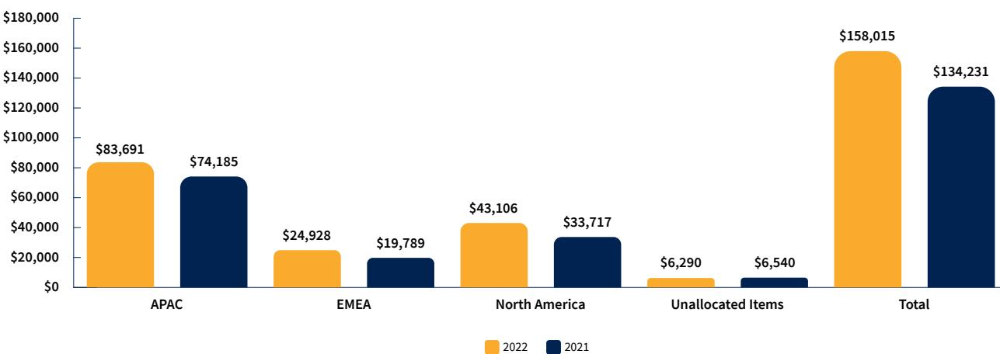

### **Segment Fee and Trading Income – 2022 v 2021 (\$'000)**

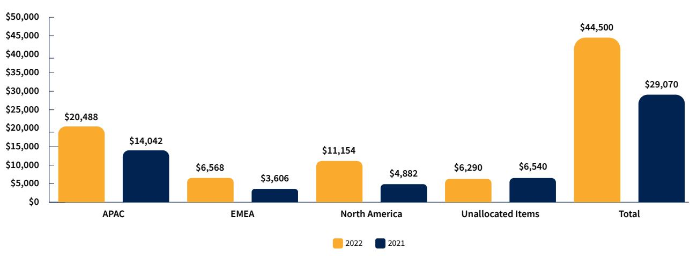

**Segment EBITDA – 2022 v 2021 (\$'000)1**

1 Comparative information has been restated to reflect presentation in the current period, along with the change in accounting policy and prior period restatements detailed in Note 1(c).

{88}------------------------------------------------

for the year ended 31 March 2022

|                                                           | 2022 \$'000 | 2021 \$'000 |
|-----------------------------------------------------------|----------------|----------------|
| Underlying EBITDA                                         | 44,500         | 29,071         |
| One-off expenses/non-operating                            | (1,273)        | (968)          |
| Statutory EBITDA                                          | 43,227         | 28,103         |
| Depreciation and amortisation                             | (9,970)        | (11,111)       |
| Interest expense                                          | (717)          | (1,359)        |
| Net profit before income tax                              | 32,540         | 15,633         |
| Income tax expense                                        | (7,649)        | (3,548)        |
| Share of profit of equity accounted investees, net of tax | (433)          | –              |
| Net profit                                                | 24,458         | 12,085         |

|                          | APAC \$'000 | Europe \$'000 | North America \$'000 | Consolidated \$'000 |
|--------------------------|----------------|------------------|-------------------------|------------------------|
| 2022                     |                |                  |                         |                        |
| Segment assets           | 288,240        | 67,354           | 86,954                  | 442,548                |
| Intergroup eliminations  | (38,096)       | –                | –                       | (38,096)               |
| Deferred tax assets      |                |                  |                         | –                      |
| Total assets             |                |                  |                         | 404,452                |
| Segment liabilities      | (170,880)      | (76,418)         | (89,536)                | (336,834)              |
| Intergroup eliminations  | –              | 18,493           | 19,603                  | 38,096                 |
| Deferred tax liabilities |                |                  |                         | (2,375)                |
| Total liabilities        |                |                  |                         | (301,113)              |
| 2021                     |                |                  |                         |                        |
| Segment assets           | 229,907        | 78,328           | 80,967                  | 389,202                |
| Intergroup eliminations  | (4,159)        | –                | (12,063)                | (16,222)               |
| Deferred tax assets      |                |                  |                         | –                      |
| Total assets             |                |                  |                         | 372,980                |
| Segment liabilities      | (171,469)      | (71,037)         | (65,165)                | (307,671)              |
| Intergroup eliminations  | 9,156          | 7,066            | –                       | 16,222                 |
| Deferred tax liabilities |                |                  |                         | (1,239)                |
| Total liabilities        |                |                  |                         | (292,688)              |

{89}------------------------------------------------

for the year ended 31 March 2022

### **Note 3. Net Operating Income**

### **Fee and Trading Income**

Fee and trading income consists of the realised foreign currency transaction margins and fees, as well as changes in exchange rates between the time a client rate is agreed and a subsequent hedge transaction is entered into by the Group.

Fee and trading income is presented inclusive of realised and unrealised income earned from the sale of foreign currency contracts to clients.

Revenue from contracts with customers is recognised upon settlement of foreign currency payments on behalf of customers in the amount that reflects the agreed foreign exchange margin and fee for the service.

Where the Group enters into contracts for forward delivery with its customers, the Group also enters into separate forward contracts with its banking counterparties in hedge transactions. These are recognised on the Consolidated Statement of Financial Position and measured at fair value through profit and loss.

### **Fee and Commission Expense**

Fee and commission expenses are transactional banking fees and commissions paid to strategic and referral partners.

#### **Interest Income**

Interest income is recognised using the effective interest rate method, which spreads fees and costs associated with an interest bearing receivable across its life.

|                                                        | 2022 \$'000 | 2021 \$'000 |
|--------------------------------------------------------|----------------|----------------|
| Realised margin and fees on foreign exchange contracts | 155,459        | 129,361        |
| Unrealised gains on foreign exchange contracts         | 3,345          | 684            |
| Revaluation of foreign exchange assets and liabilities | (789)          | 4,187          |
| Fee and trading income                                 | 158,015        | 134,232        |
| Fee and commission expense                             | (11,391)       | (16,762)       |
| Net income                                             | 146,624        | 117,470        |
| Interest and other income                              | 403            | 460            |
| Net operating income                                   | 147,027        | 117,930        |

{90}------------------------------------------------

for the year ended 31 March 2022

### **Note 4. Expenses**

|                                                                      | 2022 \$'000 | 2021 \$'000 |
|----------------------------------------------------------------------|----------------|----------------|
| Employment expenses                                                  |                |                |
| Salaries and related costs including commissions                     | (55,251)       | (50,537)       |
| Share-based payments and employee share scheme                       | (2,843)        | (1,553)        |
| Defined contribution plan                                            | (3,917)        | (3,471)        |
| Total employee compensation expense                                  | (62,011)       | (55,561)       |
| Other employment expenses (on-costs, recruitment and staff training) | (4,607)        | (2,431)        |
| Total employment expenses                                            | (66,618)       | (57,992)       |
| Other operating expenses                                             |                |                |
| Professional fees                                                    | (3,602)        | (2,061)        |
| Communication                                                        | (305)          | (303)          |
| Compliance                                                           | (2,658)        | (2,402)        |
| Insurance                                                            | (2,640)        | (2,194)        |
| Travel                                                               | (325)          | –              |
| Non-recoverable GST                                                  | (257)          | (228)          |
| Service provider fee                                                 | (876)          | (892)          |
| Other expenses                                                       | (930)          | (699)          |
| Total other operating expenses                                       | (11,593)       | (8,779)        |

{91}------------------------------------------------

for the year ended 31 March 2022

### **Note 5. Income Taxes1**

Income tax expense is the tax payable on the current period's taxable income adjusted for changes in deferred income tax. Changes in deferred tax assets and liabilities are due to temporary timing differences and unused tax losses.

Current income tax is based on tax laws enacted or substantively enacted in each jurisdiction of the Group's operations at the end of the reporting period. If required, provisions are established for the amounts expected to be paid to the tax authorities.

Deferred income tax is provided in full, using the liability method at the tax rates expected to apply when the assets are recovered or the liabilities are settled. Deferred tax assets and liabilities arise on temporary differences between the tax bases of assets and liabilities and their carrying amounts. In addition, deferred tax assets may be recognised due to unused tax losses. Amounts are only recognised to the extent it is probable future taxable amounts will be available to use those temporary differences or tax losses.

Deferred tax assets and liabilities are offset when:

- **•** There is a legally enforceable right to offset current tax assets and liabilities; and
- **•** The deferred tax balances relate to the same taxation authority.

Current tax assets and liabilities are offset when:

- **•** There is a legally enforceable right to offset; and
- **•** There is an intention to settle on a net basis.

Current and deferred taxes attributable to amounts recognised directly in equity are also recognised directly in equity.

Where there is uncertainty over income tax treatments the recognition and measurement of current or deferred tax assets or liabilities is determined applying *Interpretation 23 – Uncertainty Over Income Tax Treatments*. The Group believes its accruals for tax liabilities are adequate for all open tax years based on its assessment, including interpretations of income tax treatments and prior experience.

### **Tax Consolidation**

The tax consolidation legislation was adopted by the Group as of 15 October 2013. As a consequence, OzForex Limited and its wholly owned Australian controlled entities are taxed as a single entity. The Group's tax year end has been aligned to financial year end as of 31 March 2021, changed from 30 September.

1 Comparative information has been restated to reflect the change in accounting policy and the prior period restatements detailed in Note 1(c).

{92}------------------------------------------------

for the year ended 31 March 2022

### **Offshore Banking Unit**

OzForex Limited, a subsidiary of the Group, was declared an Offshore Banking Unit (OBU) on 10 October 2015. In accordance with Australian income tax legislation, assessable offshore banking (OB) income derived by the OBU is taxable at a concessional rate of 10%. OB income includes revenue earned on foreign exchange transactions with offshore counterparties, excluding those with any AUD component. On 13 September 2021, the previously proposed amendments to the OBU regime by the Australian Treasurer became law. The confirmed bill includes removal of the 10% OBU concessional tax rate. This will cease to apply from the 2023-24 income year.

### **a) Income Tax Expense**

|                                           | 2022 \$'000 | 2021 \$'000 |
|-------------------------------------------|----------------|----------------|
| Current tax expense                       | 5,612          | 1,279          |
| Adjustments to current tax of prior years | 418            | (260)          |
| Total current tax expense                 | 6,030          | 1,019          |
| Deferred income tax (benefit)/expense     | 1,619          | 2,529          |
| Total income tax expense                  | 7,649          | 3,548          |

### **b) Reconciliation of Income Tax Expense to Prima Facie Tax Payable**

|                                                                                  | 2022 \$'000 | 2021 \$'000 |
|----------------------------------------------------------------------------------|----------------|----------------|
| Net profit before income tax                                                     | 32,107         | 15,633         |
| Prima facie income tax expense at 30% (2020: 30%)                                | 9,632          | 4,690          |
| Effect of different offshore tax rates                                           | (554)          | (669)          |
| Decrease in tax expense as a result of operating as an OBU in the current period | (2,550)        | (717)          |
| Increase in tax expense as a result of change in tax laws                        | 604            | –              |
| Research and Development tax credits                                             | (611)          | (678)          |
| Research and Development tax credits associated with change of income tax year   | –              | (443)          |
| Share-based expenses                                                             | 721            | 384            |
| Other items                                                                      | 407            | 981            |
| Total income tax expense                                                         | 7,649          | 3,548          |

{93}------------------------------------------------

for the year ended 31 March 2022

### **Note 6. Deferred Income Tax Assets/(Liabilities)**

|                                                                                | 2022 \$'000 | 2021 \$'000 |
|--------------------------------------------------------------------------------|----------------|----------------|
| Deferred income tax assets                                                     |                |                |
| The balance comprises temporary differences attributable to:                   |                |                |
| Provisions and accrued expenses                                                | 2,012          | 1,305          |
| Corporate action costs deemed capital for taxation                             | 417            | 530            |
| Carried forward tax losses                                                     | –              | 40             |
| Lease liabilities                                                              | 1,163          | 3,078          |
| Property, plant and equipment                                                  | 37             | 30             |
| Other                                                                          | 62             | 79             |
| Total deferred income tax assets – before offset                               | 3,691          | 5,062          |
| Offset deferred income tax liabilities (refer to Note 5 for accounting policy) | (3,691)        | (5,062)        |
| Net deferred income tax assets – after offset                                  | –              | –              |
|                                                                                |                |                |
| Deferred income tax liabilities                                                |                |                |
| The balance comprises temporary differences attributable to:                   |                |                |
| Intangible assets                                                              | (2,426)        | (2,231)        |
| Financial instruments                                                          | (2,720)        | (1,712)        |
| Right-of-use assets                                                            | (478)          | (2,324)        |
| Prepayments                                                                    | (124)          | –              |
| Property, plant and equipment                                                  | (318)          | (34)           |
| Total deferred income tax liabilities – before offset                          | (6,066)        | (6,301)        |
| Offset deferred income tax assets (refer to Note 5 for accounting policy)      | 3,691          | 5,062          |
| Net deferred income tax liabilities – after offset                             | (2,375)        | (1,239)        |
| Net deferred income tax (liabilities)/assets                                   | (2,375)        | (1,239)        |

{94}------------------------------------------------

for the year ended 31 March 2022

### **Note 7. Earnings per Share1**

#### **Earnings per share**

Basic earnings per share shows the profit attributable to each ordinary share. It is calculated as the net profit attributable to ordinary shareholders divided by the weighted average number of ordinary shares in each year.

Diluted earnings per share shows the profit attributable to each ordinary share if all the dilutive potential ordinary shares had been ordinary shares.

There are no discontinued operations of the Group.

### **a) Earnings per Share**

|         | 2022 Cents | 2021 Cents |
|---------|---------------|---------------|
| Basic   | 10.06         | 4.96          |
| Diluted | 9.73          | 4.81          |

### **b) Earnings**

|                                                                                                            | \$'000 | \$'000 |
|------------------------------------------------------------------------------------------------------------|--------|--------|
| Net profit attributable to ordinary shareholders used to calculate basic and diluted earnings per share | 24,458 | 12,085 |

### **c) Weighted Average Number of Shares**

|                                                                                                                 | Number      | Number      |
|-----------------------------------------------------------------------------------------------------------------|-------------|-------------|
| Weighted average number of ordinary shares used to calculate basic earnings per share                        | 243,041,599 | 243,674,227 |
| Dilutive potential ordinary shares2                                                                             | 8,314,611   | 7,151,139   |
| Weighted average number of ordinary shares used as the denominator in calculating diluted earnings per share | 251,356,210 | 250,825,366 |

1 Comparative information has been restated to reflect the change in accounting policy and the prior period restatements detailed in Note 1(c).

2 Include issuances under the Executive Share Plan (ESP) and Global Equity Plan (GEP). Refer to Note 23.

{95}------------------------------------------------

for the year ended 31 March 2022

### Financial Assets and Liabilities

### **Note 8. Cash and Cash Equivalents, Client Liabilities and Deposits Due from Financial Institutions**

Cash and cash equivalents includes cash on hand and deposits held at short call with financial institutions with an original maturity of less than three months (together, 'cash held for own use') and cash held for subsequent settlement of client liabilities.

Cash held for subsequent settlement of client liabilities represents transactions in progress where amounts have been received by the Group but the corresponding payment has not yet occurred. They are unsecured and short-term in nature and are recognised initially at their fair value. Client liabilities are initially measured at amortised cost using the effective interest method and are shown in cash net of client receivables which are recognised in other receivables (refer to Note 9). Gross client liabilities total \$246,611,000 as at 31 March 2022 (2021: \$247,094,000).

Deposits due from financial institutions are primarily short-term deposits with an original maturity of greater than three months, but less than 12 months, are accounted for at the gross value of the outstanding balance and are held at amortised cost.

|                                                           | 2022 \$'000 | 2021 \$'000 |
|-----------------------------------------------------------|----------------|----------------|
| Cash held for own use                                     | 59,103         | 33,454         |
| Cash held for settlement of client liabilities            | 242,767        | 241,807        |
| Cash and cash equivalents                                 | 301,870        | 275,261        |
| Deposits due from financial institutions                  | 25,144         | 27,119         |
| Cash held for subsequent settlement of client liabilities | (242,767)      | (241,807)      |
| Net cash held                                             | 84,247         | 60,573         |
| Collateral and bank guarantees                            | (52,646)       | (23,756)       |
| Net available cash                                        | 31,601         | 36,817         |

{96}------------------------------------------------

for the year ended 31 March 2022

### **Note 9. Other Receivables (Current Assets)**

Other receivables include client receivables, GST receivables and other debtors. Other debtors include rental deposits, interest receivable and a convertible loan issued to a joint venture, the investment in which is detailed at Note 21. Client receivables include amounts settled on behalf of customers of the Group, which are yet to be received. All receivables are recognised at amortised cost, less any impairment. Details about the Group's impairment policies and the calculation of the expected credit loss allowance are provided in Note 12(c). Interest is recognised in the Statement of Comprehensive Income using the effective interest method.

|                          | 2022 \$'000 | 2021 \$'000 |
|--------------------------|----------------|----------------|
| Client receivables       | 3,844          | 5,287          |
| Provision for impairment | (455)          | (1,685)        |
| GST receivables          | 423            | 154            |
| Other debtors            | 1,661          | 1,281          |
| Other receivables        | 5,473          | 5,037          |

### **Note 10. Derivative Financial Instruments**

Derivative instruments entered into by the Group include forward foreign exchange contracts. They are principally used to offset foreign currency contracts with clients, cash flow hedges and as hedges over the Group's net investment in foreign operations.

Derivatives are recognised at trade date and are initially and subsequently measured at fair value through profit or loss. Movements in the carrying amounts of derivatives are recognised in net fee and trading income within the Consolidated Statement of Comprehensive Income, except for movements in derivatives used in the Group's cash flow hedges and hedge of net investments in foreign operations, which is recognised and measured in accordance with Note 12.

|                                          | 2022 \$'000 | 2021 \$'000 |
|------------------------------------------|----------------|----------------|
| Value of forward contracts – assets      | 34,385         | 22,546         |
| Value of forward contracts – liabilities | (27,117)       | (16,733)       |
| Net financial instruments at fair value  | 7,268          | 5,813          |

{97}------------------------------------------------

for the year ended 31 March 2022

### **Note 11. Fair Values of Financial Assets and Liabilities**

OFX Group has categorised its financial instruments that are either measured in the Statement of Financial Position at fair value or of which the fair value is disclosed, into a three-level hierarchy based on the priority of the inputs to the valuation.

A financial instrument's categorisation within the valuation hierarchy is based on the lowest level input that is significant to the fair value measurement. Cash and cash equivalents, deposits due from financial institutions, other receivables, client liabilities, other creditors and accruals are excluded from the fair value hierarchy as these instruments are held at amortised cost. Their fair value approximates the carrying value as they are short-term in nature.

| Level                                                                                                                                                           | Instruments                                                 | Valuation process                                                                                                                                       |
|-----------------------------------------------------------------------------------------------------------------------------------------------------------------|-------------------------------------------------------------|---------------------------------------------------------------------------------------------------------------------------------------------------------|
| Level 1 – Traded in active markets and fair value is based on recent unadjusted quoted prices.                                                            | None – the Group does not hold any of these instruments. | Not applicable.                                                                                                                                         |
| Level 2 – Not actively traded and fair value is based on valuation techniques which maximise the use of observable market prices.                      | Over-the-counter derivatives.                               | Forward foreign exchange contract valuations are based on observable spot exchange rates and the yield curves of the respective currencies. |
| Level 3 – Not actively traded and fair value is based on at least one input which is not observable in the market due to illiquidity or complexity. | None – the Group does not hold any of these instruments. | Not applicable.                                                                                                                                         |

{98}------------------------------------------------

for the year ended 31 March 2022

### **Note 12. Financial Risk Management**

### **Financial risk management**

The Group is exposed to the following risks, and manages this in the following ways:

| Type of risk                                                                                                                                                                                                                                                           | How the risk is managed                                                                                                                                                                                                                                                                                                                       |  |  |  |
|------------------------------------------------------------------------------------------------------------------------------------------------------------------------------------------------------------------------------------------------------------------------|-----------------------------------------------------------------------------------------------------------------------------------------------------------------------------------------------------------------------------------------------------------------------------------------------------------------------------------------------|--|--|--|
| Market risk – Market risk is comprised of both foreign currency risk and interest rate risk.                                                                                                                                                                        |                                                                                                                                                                                                                                                                                                                                               |  |  |  |
| Foreign currency risk – Arises from exposure to changes in foreign exchange rates between the time of agreeing rates with a client and                                                                                                                           | To manage the movement in foreign exchange rates, the Group aggregates transactions and nets out buy transactions against sell transactions.                                                                                                                                                                                            |  |  |  |
| either a corresponding hedge being taken out with a counterparty or an international payment settlement. Settlement typically occurs between 12 to 24 hours after the deal is entered into or up to 24 months later for forward contracts with clients. | The Group then enters into forward foreign exchange hedging contracts with counterparty banks once exposure to a single currency reaches or exceeds a defined threshold.                                                                                                                                                             |  |  |  |
| The Group is also exposed to the interest rate risk embedded in forward contracts offered to its clients to lock in exchange rates up to 24 months in advance.                                                                                                |                                                                                                                                                                                                                                                                                                                                               |  |  |  |
| Interest rate risk – Exposure to non-traded interest rate risk results from cash and term deposits held in different currencies.                                                                                                                                 | Settlement of client liabilities between 12 and 24 hours of receipt of client cash results in low exposure to non-traded interest rate risk.                                                                                                                                                                                            |  |  |  |
| Credit risk – The risk that creditors (clients and financial institutions) will not make                                                                                                                                                                            | The Group typically does not pay out client deals until associated funds have been received.                                                                                                                                                                                                                                               |  |  |  |
| payments on their receivables and derivatives respectively, when they fall due.                                                                                                                                                                                     | In exceptional circumstances, senior management have the discretion to authorise same-day payments, which can result in funds being paid prior to clearance of customer funds. These transactions would only be approved for clients with a low risk of default and are pro-actively monitored to ensure timely settlement. |  |  |  |
|                                                                                                                                                                                                                                                                        | For forward deals part payments are required to be made by clients. Active monitoring of client balances ensures that adequate collateral is held.                                                                                                                                                                                      |  |  |  |
|                                                                                                                                                                                                                                                                        | The Group sets credit limits and obtains collateral with well-rated banking counterparties as security (where appropriate).                                                                                                                                                                                                             |  |  |  |

{99}------------------------------------------------

for the year ended 31 March 2022

| Type of risk                                                                                                                     | How the risk is managed                                                                                                                                                                            |  |  |
|----------------------------------------------------------------------------------------------------------------------------------|----------------------------------------------------------------------------------------------------------------------------------------------------------------------------------------------------|--|--|
| Liquidity risk – The risk that the Group is unable to meet the obligations of its financial liabilities when they are due. | Regular forecasts of the Group's liquidity requirements. Surplus cash is maintained in highly liquid instruments.                                                                            |  |  |
|                                                                                                                                  | Continuous review of currency requirements in operating jurisdictions. Active maintenance of cash balances in currencies and geographical locations necessary to fund these requirements. |  |  |

Risk is managed on a globally consolidated basis for the Group. Risks in subsidiaries are subject to the same risk acceptance policies as the Company.

### **a) Market Risk**

The main component of the Group's market risk is exposure to foreign exchange rate fluctuations. The subsidiaries of the Group (Note 22) typically enter into transactions and recognise assets and liabilities that are denominated in their functional currency.

The Group's sensitivity to foreign exchange fluctuations risk by major currency held on the Consolidated Statement of Financial Position is shown below:

|                                           | 31 March 2022                                    |                                                 | 31 March 2021                                    |                                                 |
|-------------------------------------------|--------------------------------------------------|-------------------------------------------------|--------------------------------------------------|-------------------------------------------------|
| Movement in exchange rate (basis points)1 | +/-500                                           | +/-500                                          | +/-500                                           | +/-500                                          |
|                                           | Sensitivity of profit before tax \$'000 | Sensitivity of equity after tax \$'000 | Sensitivity of profit before tax \$'000 | Sensitivity of equity after tax \$'000 |
| CAD                                       | 1                                                | 34                                              | (36)                                             | (9)                                             |
| EUR                                       | (25)                                             | 19                                              | 10                                               | 70                                              |
| GBP                                       | (91)                                             | (12)                                            | (44)                                             | 63                                              |
| NZD                                       | 1                                                | (2)                                             | 12                                               | 11                                              |
| SGD                                       | 3                                                | 61                                              | (2)                                              | 66                                              |
| USD                                       | (62)                                             | (315)                                           | (102)                                            | (271)                                           |
| Other                                     | 87                                               | 69                                              | 37                                               | 42                                              |
| Total                                     | (86)                                             | (146)                                           | (125)                                            | (28)                                            |

1 Impact of positive movement shown. The impact of a negative movement is the inverse.

{100}------------------------------------------------

for the year ended 31 March 2022

### **b) Interest Rate Risk**

The Group's sensitivity to movements in interest rates is as follows:

|                                              | 31 March 2022                                 |                                              | 31 March 2021                                 |                                              |  |
|----------------------------------------------|-----------------------------------------------|----------------------------------------------|-----------------------------------------------|----------------------------------------------|--|
| Movement in exchange rate (basis points)1 | +/-500                                        | +/-500                                       | +/-500                                        | +/-500                                       |  |
|                                              | Sensitivity of profit before tax \$'000 | Sensitivity of equity after tax \$'000 | Sensitivity of profit before tax \$'000 | Sensitivity of equity after tax \$'000 |  |
| AUD                                          | 579                                           | 435                                          | 482                                           | 362                                          |  |
| CAD                                          | 48                                            | 36                                           | 48                                            | 36                                           |  |
| EUR                                          | 128                                           | 100                                          | 186                                           | 148                                          |  |
| GBP                                          | 276                                           | 213                                          | 229                                           | 180                                          |  |
| NZD                                          | 56                                            | 41                                           | 39                                            | 29                                           |  |
| SGD                                          | 76                                            | 63                                           | 88                                            | 73                                           |  |
| USD                                          | 310                                           | 210                                          | 303                                           | 206                                          |  |
| Other                                        | 162                                           | 122                                          | 137                                           | 105                                          |  |
| Total                                        | 1,635                                         | 1,220                                        | 1,512                                         | 1,139                                        |  |

### **c) Credit Risk**

### **Maximum exposure to credit risk and credit quality of financial assets**

The amounts shown represent the maximum exposure of the Group to credit risk at the end of the reporting period. This is equal to the carrying amount of each class of financial assets in the table below.

The Group uses internal credit ratings to manage the credit quality of its financial assets. The Group's financial assets held with financial institutions are investment grade (between Aaa-Baa3). There are no balances that are past due or impaired as at 31 March 2022 (2021: nil).

|                                                 | Rating           | 2022 \$'000 | 2021 \$'000 |
|-------------------------------------------------|------------------|----------------|----------------|
| Cash and cash equivalents                       | Investment grade | 301,870        | 275,255        |
| Deposits due from financial institutions        | Investment grade | 25,144         | 27,119         |
| Derivative assets – with financial institutions | Investment grade | 10,215         | 8,639          |
| Derivative assets – with clients                | Unrated2         | 24,170         | 13,904         |
| Other receivables                               | Unrated2         | 5,473          | 5,037          |
| Total gross credit risk                         |                  | 366,872        | 329,954        |

1 Impact of positive movement shown. The impact of a negative movement is the inverse.

2 Unrated balances relate to amounts due from clients that are not graded by the Company or by a public ratings agency.

{101}------------------------------------------------

for the year ended 31 March 2022

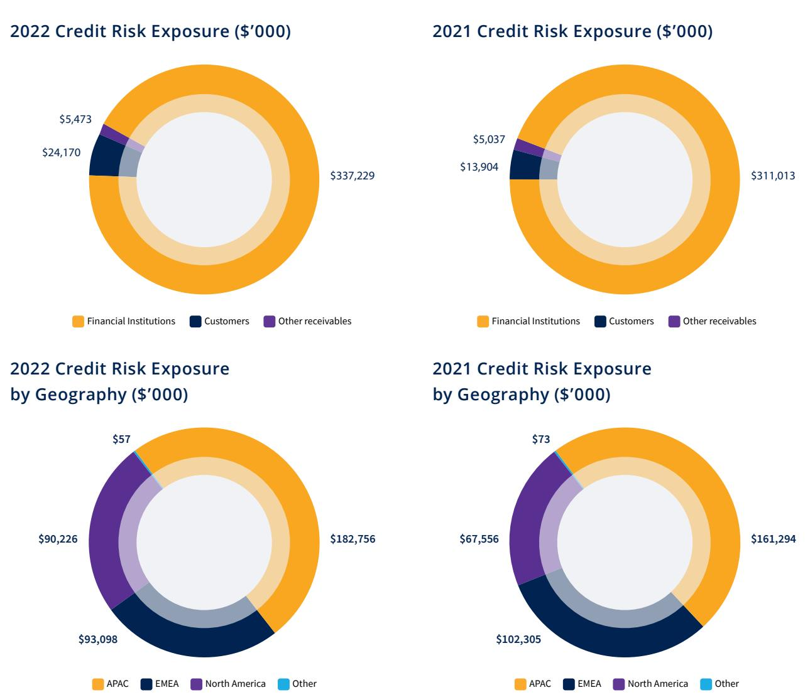

For trading credit risk, the Group assesses the credit quality of the customer, taking into account its financial position, past experience, external credit agency reports and credit references. Individual customer risk limits are set based on internal approvals in accordance with delegated authority limits set by the Board. The compliance with credit limits by credit approved customers is regularly monitored by line credit management. Client receivables aged more than 90 days past due are fully provided for unless deemed otherwise appropriate based on expectation of recoverability.

The Group applies historical lifetime past due information to provide for expected credit losses prescribed by AASB 9, which permits the use of past due information to determine the lifetime expected loss provision for all client receivables arising from a financial instrument. The loss allowance provision as at 31 March 2022 and 2021 was determined as set out below, which incorporates past experience and forward-looking information about the client, including the likelihood of recovery.

{102}------------------------------------------------

for the year ended 31 March 2022

|                                | Year | Current | More than 30 days past due | More than 60 days past due | More than 90 days past due1 | Total \$'000 |
|--------------------------------|------|---------|----------------------------------|----------------------------------|-----------------------------------|-----------------|
| Gross carrying amount (\$'000) | 2022 | 2,944   | 5                                | 49                               | 846                               | 3,844           |
| Gross carrying amount (\$'000) | 2021 | 2,652   | 6                                | 26                               | 2,603                             | 5,287           |
| Provision (\$'000)             | 2022 | 62      | 13                               | 31                               | 349                               | 455             |
| Provision (\$'000)             | 2021 | 60      | –                                | –                                | 1,625                             | 1,685           |

The loss allowances for client receivables as at 31 March reconciles to the opening loss allowances as follows:

|                                                                                    | 2022 \$'000 | 2021 \$'000 |
|------------------------------------------------------------------------------------|----------------|----------------|
| Opening loss allowance as at 1 April                                               | 1,685          | 1,588          |
| Write-off during the year2                                                         | (1,358)        | (1,951)        |
| (Decrease)/Increase in loss allowance recognised in profit or loss during the year | 128            | 2,048          |
| Closing loss allowance at 31 March                                                 | 455            | 1,685          |

Impairment losses on client receivables are presented as bad and doubtful debts within the Consolidated Statement of Comprehensive Income.

### **d) Liquidity Risk**

### **Maturity profile of obligations**

The table below summarises the maturity profile of the Group's financial liabilities as at 31 March 2022 based on contractual undiscounted repayment cash flows. Derivatives are included in the less than three months column at their fair value, as they are frequently settled in the short term. Liquidity risk on these items is not managed on the basis of contractual maturity, since they are not held for settlement according to such maturity and will frequently be settled in the short term at fair value. Derivatives designated in a hedging relationship are included according to their contractual maturity.

1 Provision for client receivables more than 90 days past due incorporates the reduction attributable to amounts expected to be recouped from insurers.

2 Write-off during the year is net of an insurance recovery of \$1.6m (2021: 0).

{103}------------------------------------------------

for the year ended 31 March 2022

|                                  | On demand \$'000 | 3 months or less \$'000 | 3 to 12 months \$'000 | 1 to 5 years \$'000 | Over 5 years \$'000 | Total \$'000 |
|----------------------------------|------------------------|-------------------------------|-----------------------------|---------------------------|---------------------------|-----------------|
| 2022                             |                        |                               |                             |                           |                           |                 |
| Other liabilities1               | (1,894)                | (253,478)                     | –                           | (3,316)                   | –                         | (258,688)       |
| Lease liabilities                | (285)                  | (569)                         | (2,563)                     | (4,931)                   | –                         | (8,348)         |
| Derivative financial instruments |                        |                               |                             |                           |                           |                 |
| Inflows                          |                        | 1,455,658                     | 1,014,086                   | 45,942                    | –                         | 2,515,686       |
| (Outflows)                       |                        | (1,450,560)                   | (1,012,174)                 | (45,682)                  | –                         | (2,508,416)     |
| Total                            | (2,179)                | (248,949)                     | (651)                       | (7,987)                   | –                         | (259,766)       |
| 2021                             |                        |                               |                             |                           |                           |                 |
| Other liabilities1               | (2,220)                | (250,129)                     | –                           | (2,155)                   | –                         | (254,504)       |
| Lease liabilities                | (237)                  | (474)                         | (2,136)                     | (14,455)                  | –                         | (17,302)        |
| Derivative financial instruments |                        |                               |                             |                           |                           |                 |
| Inflows                          | –                      | 1,213,539                     | 650,050                     | 41,010                    | –                         | 1,904,599       |
| (Outflows)                       | –                      | (1,209,106)                   | (649,105)                   | (40,575)                  | –                         | (1,898,786)     |
| Total                            | (2,457)                | (246,170)                     | (1,191)                     | (16,175)                  | –                         | (265,993)       |

### **Financial Instruments, Derivatives and Hedging Activity**

The Group classifies its financial assets in the following categories: financial assets at amortised cost and financial assets at fair value through profit or loss. The classification depends on the purpose for which the financial assets were acquired, which is determined at initial recognition based upon the business model of the Group.

#### **(i) Financial assets at amortised cost**

The Group classifies its financial assets at amortised cost if the asset is held with the objective of collecting contractual cash flows and the contractual terms give rise on specified dates to cash flows that are solely payments of principal and interest. These include client receivables and bank term deposits. Bank term deposits are non-derivative financial assets with fixed or determinable payments that are not quoted in an active market. They are financial assets at amortised cost. Refer to Note 9 for details relating to client receivables.

1 Excludes items that are not financial instruments and non-contractual accruals and provisions.

{104}------------------------------------------------

for the year ended 31 March 2022

### **(ii) Financial assets and liabilities through profit or loss**

The Group holds forward foreign exchange contracts within a business model where collecting contractual cash flows while holding the asset is incidental to achieving the business model's objective of managing performance on a fair value basis as determined by prevailing and expected foreign currency exchange rates. The Group is primarily focused on fair value information to assess the assets' performance and make decisions, resulting in derivative financial instruments being measured at fair value through profit or loss unless designated in hedging relationships.

### **(iii) Hedging activity**

Financial instruments designated by the Group for the purpose of hedging the variability in cash flows associated with highly probable forecast transactions arising from changes in exchange rates, and for the management of foreign currency risk associated with its net investment in foreign operations qualify for hedge accounting. Instruments are initially recognised at fair value on the date a derivative contract is entered into and are subsequently remeasured to their fair value at the end of each reporting period. The full fair value of hedging derivatives is classified as an asset or liability.

At inception of the hedge relationship, the Group documents the economic relationship between hedging instruments and hedged items including whether changes in the cash flows of the hedging instruments are expected to offset changes in the cash flows of hedged items. The Group documents its risk management objective and strategy for undertaking its hedge transactions.

Hedges of net investments in foreign operations and cash flow hedges are accounted for by recognising any gain or loss on the hedging instrument relating to the effective portion of the hedge in other comprehensive income and accumulated in reserves in equity. The gain or loss relating to the ineffective portion is recognised immediately in profit or loss within unrealised gains/(losses).

The Group designates only the change in fair value of the spot element of forward exchange contracts as the hedging instrument in cash flow hedging relationships. The change in fair value of the forward element of forward exchange contracts (forward points) is separately accounted for as a cost of hedging and recognised in a costs of hedging reserve within equity.

When the hedged forecast transaction subsequently results in the recognition of a non-financial item, the amount accumulated in the hedging reserve and the cost of hedging reserve is included directly in the initial cost of the non-financial item when it is recognised.

Gains and losses accumulated in equity are reclassified to profit or loss when the foreign operation is partially disposed of or sold.

{105}------------------------------------------------

for the year ended 31 March 2022

The effects of applying hedge accounting on the Group's financial position and performance are as follows:

|                                                                                                        | 2022 \$'000      | 2021 \$'000      |
|--------------------------------------------------------------------------------------------------------|---------------------|---------------------|
| Net investment in foreign operations hedge: Hedging instrument - forward foreign exchange contracts |                     |                     |
| Carrying amount – Assets                                                                               | 755                 | 560                 |
| Carrying amount – Liabilities                                                                          | (165)               | (22)                |
| Notional amount British Pounds                                                                         | 4,555               | 3,646               |
| Notional amount US Dollars                                                                             | 10,395              | 8,486               |
| Notional amount Canadian Dollars                                                                       | 3,127               | 2,199               |
| Notional amount New Zealand Dollars                                                                    | 2,986               | 2,462               |
| Notional amount Euros                                                                                  | 880                 | 390                 |
| Maturity date                                                                                          | Apr 2021 – Mar 2022 | Apr 2020 – Mar 2022 |
| Hedge ratio                                                                                            | 1:1                 | 1:1                 |
| Change in value of outstanding hedging instruments since 1 April                                       | 540                 | 3,923               |
| Change in value of hedged item used to determine hedge effectiveness                                | (540)               | (3,923)             |
| Weighted average hedge rate – British Pounds                                                        | A\$1 : GBP 0.5522   | A\$1 : GBP0.5521    |
| – US Dollars                                                                                           | A\$1 : US\$0.7423   | A\$1 : US\$0.7279   |
| – Canadian Dollars                                                                                     | A\$1 : CA\$0.9359   | A\$1 : CA\$0.9611   |
| – New Zealand Dollars                                                                                  | A\$1 : NZ\$1.0488   | A\$1 : NZ\$1.0846   |
| – Euros                                                                                                | A\$1 :EUZ\$.6404    | A\$1 : EUR0.6213    |

|                                                                            | 2022 \$'000 | 2021 \$'000 |
|----------------------------------------------------------------------------|----------------|----------------|
| Cashflow hedge: Hedging instrument - forward foreign exchange contracts |                |                |
| Carrying amount – Assets                                                   | 308            | –              |
| Carrying amount – Liabilities                                              | (2,288)        | –              |
| Notional amount Canadian Dollars                                           | 90,000         | –              |
| Maturity date                                                              | May 2022       | –              |
| Hedge ratio                                                                | 1:1            | –              |
| Change in value of outstanding hedging instruments since 1 April           | (1,980)        | –              |
| Change in value of hedged item used to determine hedge effectiveness    | 1,980          | –              |

{106}------------------------------------------------

for the year ended 31 March 2022

### Other Assets and Liabilities

### **Note 13. Property, Plant and Equipment**

Property, plant and equipment is measured at cost less accumulated depreciation and impairment losses. Assets are depreciated on a straight-line basis over their estimated useful lives, as follows:

| Asset class            | Useful life   |
|------------------------|---------------|
| Furniture and fittings | 5 to 10 years |
| Leasehold improvements | Up to 5 years |
| Computer equipment     | 3 years       |

|                               | Furniture, fittings and leasehold improvements \$'000 | Computer equipment \$'000 | Total \$'000 |
|-------------------------------|----------------------------------------------------------------|---------------------------------|-----------------|
| Year ended 31 March 2021      |                                                                |                                 |                 |
| Cost                          | 8,554                                                          | 4,787                           | 13,341          |
| Less accumulated depreciation | (8,017)                                                        | (4,270)                         | (12,287)        |
| Net carrying amount           | 537                                                            | 517                             | 1,054           |
| Movement                      |                                                                |                                 |                 |
| Balance at 31 March 2020      | 1,652                                                          | 627                             | 2,279           |
| Additions                     | 12                                                             | 276                             | 288             |
| Disposals                     | (13)                                                           | –                               | (13)            |
| Depreciation                  | (1,114)                                                        | (386)                           | (1,500)         |
| Balance at 31 March 2021      | 537                                                            | 517                             | 1,054           |
| Year ended 31 March 2022      |                                                                |                                 |                 |
| Cost                          | 8,934                                                          | 5,366                           | 14,300          |
| Less accumulated depreciation | (8,393)                                                        | (4,671)                         | (13,064)        |
| Net carrying amount           | 541                                                            | 695                             | 1,236           |
| Movement                      |                                                                |                                 |                 |
| Balance at 31 March 2021      | 537                                                            | 517                             | 1,054           |
| Additions                     | 380                                                            | 580                             | 960             |
| Disposals                     | –                                                              | –                               | –               |
| Depreciation                  | (376)                                                          | (402)                           | (778)           |
| Balance at 31 March 2022      | 541                                                            | 695                             | 1,236           |

{107}------------------------------------------------

for the year ended 31 March 2022

### **Note 14. Intangible Assets1**

Intangibles are carried at cost at the date of acquisition less accumulated amortisation and impairment losses. Costs directly incurred in acquiring and developing certain software are capitalised where they meet the criteria for capitalisation and amortised on a straight-line basis over the estimated useful life of three to five years. Costs incurred on research related costs or software maintenance are expensed as incurred.

|                               | Internally generated software \$'000 | Externally acquired software \$'000 | Total \$'000 |
|-------------------------------|-----------------------------------------------|----------------------------------------------|-----------------|
| Year ended 31 March 2021      |                                               |                                              |                 |
| Cost                          | 23,168                                        | 14,696                                       | 37,864          |
| Less accumulated amortisation | (10,162)                                      | (10,703)                                     | (20,865)        |
| Less accumulated impairment   | (192)                                         | (480)                                        | (672)           |
| Net carrying amount           | 12,814                                        | 3,513                                        | 16,327          |
| Movement                      |                                               |                                              |                 |
| Balance at 31 March 2020      | 9,560                                         | 3,959                                        | 13,519          |
| Additions                     | 8,973                                         | –                                            | 8,973           |
| Amortisation                  | (5,170)                                       | (995)                                        | (6,165)         |
| Balance at 31 March 2021      | 13,363                                        | 2,964                                        | 16,327          |
| Year ended 31 March 2022      |                                               |                                              |                 |
| Cost                          | 33,225                                        | 15,151                                       | 48,376          |
| Less accumulated amortisation | (16,566)                                      | (11,264)                                     | (27,830)        |
| Less accumulated impairment   | (192)                                         | (481)                                        | (673)           |
| Net carrying amount           | 16,467                                        | 3,406                                        | 19,873          |
| Movement                      |                                               |                                              |                 |
| Balance at 31 March 2021      | 13,363                                        | 2,964                                        | 16,327          |
| Additions                     | 10,056                                        | 455                                          | 10,511          |
| Amortisation                  | (6,404)                                       | (561)                                        | (6,965)         |
| Balance at 31 March 2022      | 17,015                                        | 2,858                                        | 19,873          |

1 Comparative information has been restated to reflect the change in accounting policy and the prior period restatements detailed in Note 1(c).

{108}------------------------------------------------

for the year ended 31 March 2022

### **Note 15. Other Creditors and Accruals (Current Liabilities)**

|                                        | 2022 \$'000 | 2021 \$'000 |
|----------------------------------------|----------------|----------------|
| Accrued charges and sundry liabilities | 7,687          | 4,255          |
| Other liabilities                      | 10             | 6              |
| Total other liabilities                | 7,697          | 4,261          |

### **Note 16. Provisions**

### **Employee provisions**

The Group has a Short-Term Incentive Plan available to all employees including Executive Key Management Personnel (KMP). The Short-Term Incentive Plan is accrued as a liability and expensed over the annual service period until it is paid.

When the long service leave is not expected to be settled within 12 months of year end, the liabilities are measured as the present value of expected future payments using the projected unit credit method.

### **Leasehold makegood provision**

The Group holds a provision for makegood costs anticipated to be incurred in respect of office leases in Australia, London, Canada and Hong Kong. The provision is being accrued on a straight-line basis over the lease terms.

#### **Employee provisions Annual leave \$'000 Short-term incentives \$'000 Long service leave \$'000 Leasehold makegood \$'000 Total \$'000** Carrying amount at beginning of the period 1,872 2,923 752 512 6,059 Additional provisions made 1,288 5,788 66 – 7,142 Provision utilised during the period (1,642) (2,629) (9) (3) (4,283) **Carrying amount at the end of the period 1,518 6,082 809 509 8,918**

All employee provisions are current liabilities apart from \$431,525 (2021: \$404,429) of long service leave which is non-current.

{109}------------------------------------------------

for the year ended 31 March 2022

### **Note 17. Leases**

Under AASB 16, leases are recognised as a right-of-use asset and a corresponding liability at the date at which the leased asset is available for use by the Group. Each lease payment is allocated between the liability and finance cost. The finance cost is charged to profit or loss over the lease period so as to produce a constant periodic rate of interest on the remaining balance of the liability for each period. The right-of-use asset is depreciated over the shorter of the asset's useful life and the lease term on a straight-line basis.

The Group leases various offices. Rental contracts are typically made for fixed periods of three to 10 years but may have extension options. Lease terms are negotiated on an individual basis and contain a wide range of different terms and conditions. The lease agreements do not impose any covenants, but leased assets may not be used as security for borrowing purposes.

Assets and liabilities arising from a lease are initially measured on a present value basis. Lease liabilities include the net present value of the following lease payments:

- **•** Fixed payments (including in-substance fixed payments), less any lease incentives receivable and
- **•** Variable lease payments that are based on an index or a rate.

The lease payments are discounted using the interest rate implicit in the lease. If that rate cannot be determined, the lessee's incremental borrowing rate is used, being the rate that the lessee would have to pay to borrow the funds necessary to obtain an asset of similar value in a similar economic environment with similar terms and conditions. To determine the incremental borrowing rate and in the absence of third-party borrowings, the Group uses a build-up approach that starts with a risk-free interest rate adjusted for credit risk for leases held by the Group, and makes adjustments specific to the lease, e.g. term, country, currency and security.

Extension options are included in a number of the Group's property leases. The extensions are exercisable only by the Group and not by the respective lessor. In determining the lease term, which forms part of the initial measurement of the right-of-use asset and lease liability, management considers all facts and circumstances that create an economic incentive to exercise an extension option. Extension options are only included in the lease term if the lease is reasonably certain to be extended.

Right-of-use assets are measured at cost comprising the following:

- **•** The amount of the initial measurement of lease liability;
- **•** Any lease payments made at or before the commencement date less any lease incentives received;
- **•** Any initial direct costs; and
- **•** Restoration costs.

Subsequent to initial measurement, the lease liability is reduced for payments made and increased for interest incurred. The liability is remeasured to reflect any reassessment or modification, or if there are changes to in-substance fixed payments. When the lease liability is remeasured, a corresponding adjustment is made to the value of the right-of-use asset. Right-of-use assets are generally depreciated over the shorter of the asset's useful life and the lease term on a straight-line basis.

Payments associated with short-term leases and leases of low-value assets are recognised on a straight-line basis as an expense in profit or loss. Short-term leases are leases with a lease term of 12 months or less. Low-value assets comprise IT equipment and small items of office furniture.

{110}------------------------------------------------

for the year ended 31 March 2022

The Consolidated Statement of Financial Position shows the following amounts relating to leases:

| Right-of-use assets                 | 2022 \$'000 | 2021 \$'000 |
|-------------------------------------|----------------|----------------|
| Balance at 31 March 2021            | 13,899         | 17,211         |
| Depreciation charge for the year    | (2,205)        | (3,196)        |
| Modification of right-of-use assets | (5,535)        | 448            |
| FX revaluation                      | 243            | (564)          |
| Total lease assets                  | 6,402          | 13,899         |
| Lease liabilities                   |                |                |
| Current                             | 3,417          | 2,848          |
| Non-current                         | 4,931          | 14,455         |
| Total lease liabilities             | 8,348          | 17,302         |

The Consolidated Statement of Financial Performance shows the following amounts relating to leases:

| Depreciation charge of right-of-use assets | 2022 \$'000 | 2021 \$'000 |
|--------------------------------------------|----------------|----------------|
| Buildings                                  | 2,205          | 3,196          |
| Total depreciation charge                  | 2,205          | 3,196          |
| Interest expense                           | 717            | 1,359          |

The Consolidated Statement of Cash Flows shows the following amount relating to leases:

| Total cash outflow for leases | (4,136) | (5,200) |
|-------------------------------|---------|---------|
|                               |         |         |

{111}------------------------------------------------

for the year ended 31 March 2022

### Capital Structure

### **Note 18. Capital Management**

The Group's capital management strategy is to maximise shareholder value by optimising the level and use of capital, defined as share capital plus reserves. The Group's capital management objectives are to:

- **•** Support the Group's business and operational requirements;
- **•** Meet externally imposed capital requirements; and
- **•** Safeguard the Group's ability to continue as a going concern.

The Group has continued to meet its internal and externally imposed capital requirements this year and no breaches have occurred.

### **Note 19. Ordinary Share Capital**

Ordinary shares are classified as equity and measured based on the proceeds from issuing the shares less the directly attributable incremental costs, net of tax.

There are 242,625,332 fully paid ordinary shares (2021: 243,872,167). Ordinary shares entitle the holder to vote and to receive dividends and the proceeds of the Company if it is liquidated in proportion to the number of shares held.

There are 5,109,856 (2021: 5,775,021) restricted ordinary shares of which 952,493 are unallocated and 4,157,363 are issued to KMP and executives in connection with the Executive Share Plan. Refer to Note 24 for further information.

### **Share Buyback**

On 18 May 2021, the Company announced an on-market share buyback program instead of a dividend in the near term for up to 10% of the Company's fully paid ordinary shares. The buyback commenced on 7 June 2021. A total of 1,912,000 ordinary shares were bought back and subsequently cancelled in the current period. The total amount paid for the shares bought back was \$2.65m. On the announcement of the Firma acquisition on 20 December 2021, the share buyback was suspended.

{112}------------------------------------------------

for the year ended 31 March 2022

### **Note 20. Dividends**

Dividends are recognised as a liability and a reduction to retained earnings when declared. There were no dividends paid in the period (2021: the interim dividend paid was not franked).

|                                                                          | 2022 \$'000 | 2021 \$'000 |
|--------------------------------------------------------------------------|----------------|----------------|
| Final dividend from the preceding year \$nil (2021: \$0.0235) per share) | –              | (5,797)        |
| Interim dividend \$nil (2021: \$0.0081) per share)                       | –              | (1,993)        |
| Total dividends recognised and paid                                      | –              | (7,790)        |

|                                                                                                     | 2022 \$'000 | 2021 \$'000 |
|-----------------------------------------------------------------------------------------------------|----------------|----------------|
| Franked dividends                                                                                   |                |                |
| Franking credits available for subsequent financial years based on a tax rate of 30% (2021: 30%) | 1,261          | 2,975          |

The above amounts represent the balance of the franking account as at the end of the financial period, adjusted for the franking credit impact that will arise from receipt of the current tax asset, but before taking account of the final declared dividend, if any.

{113}------------------------------------------------

for the year ended 31 March 2022

### **Note 21. Equity-accounted Investees**

|                             | 2022 \$'000 | 2021 \$'000 |
|-----------------------------|----------------|----------------|
| Investment in joint venture | 4,474          | –              |
| Closing balance             | 4,474          | –              |

### **Investment in joint venture**

Acquired on 11 June 2021, TreasurUp B.V. (**TreasurUp**) is a joint venture in which the Group has joint control and a 44.98% ownership interest. TreasurUp is a treasury management software company, whose principal place of business is The Netherlands, which will allow the Group to provide automated hedging and risk management solutions for small and medium size corporates to manage their foreign exchange risk. TreasurUp is not publicly listed. TreasurUp is structured as a separate vehicle and the Group has a residual interest in the net assets of TreasurUp. Accordingly, the Group has classified its interest in TreasurUp as a joint venture.

In accordance with the agreement under which the Group's investment in TreasurUp was established, The Group provided a loan to the Company in an amount of €750,000, with an annual interest rate of 8%. The closing balance of at 31 March 2022 of A\$1.183m is included in 'Other receivables' on the Consolidated Statement of Financial Position and at Note 9. No expense has been recognised in the current year for bad or doubtful debts in respect of this balance owed.

### **Accounting policy**

The Group's interest in equity accounted investees includes a joint venture. A joint venture is an arrangement in which the Group has joint control over the key financial and operating policies and has rights to the net assets of the arrangement, rather than rights to its assets and obligations for its liabilities. Interests in the joint venture are accounted for using the equity method.

Under the equity method, the investment is initially recognised at cost, which includes transaction costs. The investment is subsequently adjusted to recognise the Group's share of the joint venture's profit or loss and other comprehensive income until the date on which joint control ceases. The Group's share of the joint venture's profit or loss and other comprehensive income is included in the Group's profit and loss.

Unrealised gains arising from transactions with equity accounted investments are eliminated against the investment to the extent of the Group's interest in the investment. Unrealised losses are eliminated in the same way as unrealised gains, but only to the extent that there is no evidence of impairment.

At each reporting date, the Group determines whether there is objective evidence that an investment in joint venture is impaired. If there is such evidence, an impairment loss, measured by comparing the recoverable amount of the investment with its carrying value, is recognised in the profit or loss. No impairment expense has been recognised in this regard in the current period.

{114}------------------------------------------------

for the year ended 31 March 2022

The following table summarises the financial information of TreasurUp as included in its own financial statements, adjusted for fair value adjustments at acquisition and differences in accounting policies. The table also reconciles the summarised financial information to the carrying amount of the Group's interest in TreasurUp.

|                                                        | 2022 \$'000 | 2021 \$'000 |
|--------------------------------------------------------|----------------|----------------|
| Non-current assets                                     | 6,168          | –              |
| Current assets (including cash and cash equivalents)   | 8,636          | –              |
| Non-current liabilities                                | (3,145)        | –              |
| Current liabilities                                    | (2,365)        | –              |
| Net assets                                             | 9,294          | –              |
| Group's share of net assets (44.98%)                   | 4,180          | –              |
| Equity-accounted acquisition costs                     | 66             | –              |
| Foreign exchange revaluation                           | 228            |                |
| Carrying amount of interest in joint venture           | 4,474          | –              |
| Revenue                                                | 2,425          | –              |
| Depreciation and amortisation                          | (1,312)        | –              |
| Interest expense                                       | (163)          | –              |
| Income tax expense                                     | –              | –              |
| Profit and total comprehensive income at 100% (loss)   | (1,135)        | –              |
| Profit and total comprehensive income at 44.98% (loss) | (511)          | –              |
| Elimination of interest on related party loan          | 78             | –              |
| Group's share of total comprehensive (loss)            | (433)          | –              |

{115}------------------------------------------------

for the year ended 31 March 2022

### Other Items

### **Note 22. Related Party Information**

### **Subsidiaries**

The following entities are wholly owned subsidiaries of the Group and all have a 31 March year end:

| Entity                       | Country of incorporation | Functional currency |
|------------------------------|--------------------------|---------------------|
| CanadianForex Limited        | Canada                   | CAD                 |
| OzForex (HK) Limited         | Hong Kong                | HKD                 |
| OFX (Shanghai) Co. Ltd       | China                    | CNY                 |
| OzForex Limited              | Australia                | AUD                 |
| OFX Australia Pty Limited    | Australia                | AUD                 |
| OFX Financing Pty Limited    | Australia                | AUD                 |
| OFX Group Pty Limited        | Australia                | AUD                 |
| OFX (SNG) PTE. Limited       | Singapore                | SGD                 |
| NZForex Limited              | New Zealand              | NZD                 |
| UKForex Limited              | United Kingdom           | GBP                 |
| OFX Payments Ireland Limited | Ireland                  | EUR                 |
| USForex Incorporated         | United States            | USD                 |
| OFX Japan G.K.               | Japan                    | JPY                 |

{116}------------------------------------------------

for the year ended 31 March 2022

### **Note 23. Share-based Payments**

The Group has a number of employee share-based payments issued under the Executive Share Plan (ESP) and the Global Equity Plan (GEP). The descriptions of the issuances under the Plans are listed below:

| Issuance                                                                    | Description                                                                                                                                                                                                                                                                                                                                                                                                                                                                                                                                                                                                                                                                                                |
|-----------------------------------------------------------------------------|------------------------------------------------------------------------------------------------------------------------------------------------------------------------------------------------------------------------------------------------------------------------------------------------------------------------------------------------------------------------------------------------------------------------------------------------------------------------------------------------------------------------------------------------------------------------------------------------------------------------------------------------------------------------------------------------------------|
| Long-Term Incentives (LTI) – Executive Share Plan Options             | Long-Term Incentives (LTI) are issued under the Group's Executive Share Plan (ESP). Executives are provided with an interest free, non-recourse loan from the Group for the sole purpose of acquiring shares in the Company. Executives may not deal with the shares while the loan remains outstanding and any dividends paid on the shares are applied (on an after-tax basis) towards repaying the loan. Executives are entitled to exercise the voting rights attached to the shares from the date of allocation. If the Executive leaves the Group within the vesting period the shares allocated are returned to the Group, subject to discretion retained by the Directors. |
| Long-Term Incentives (LTI) – Global Equity Plan (GEP) Options         | Long-Term Incentives (LTI) are issued under the Global Equity Plan and comprise options to acquire ordinary shares. Following vesting of the options upon satisfaction of performance conditions, and before their expiry date, some or all the Options may be exercised at the agreed exercise price to acquire fully paid ordinary shares on a one-for-one basis.                                                                                                                                                                                                                                                                                                                            |
| Long-Term Incentives (LTI) – Global Equity Plan Performance Rights | Long-Term Incentive (STI) – Performance Rights are issued under the Group's Global Equity Plan (GEP). Performance Rights are issued to Executives eligible to receive deferred LTI awards as reward for performance. Performance rights are granted at no cost and are settled in shares on a one-for-one basis.                                                                                                                                                                                                                                                                                                                                                                                  |
| Short-Term Incentives (STI) – Performance rights                      | Short-Term Incentive (STI) – Performance Rights are issued under the Group's Global Equity Plan (GEP). Performance Rights are issued to employees eligible to receive deferred STI awards and also to eligible employees as reward for performance. Performance rights are granted at no cost and are settled in shares on a one-for-one basis.                                                                                                                                                                                                                                                                                                                                                |
| Short-Term Incentives (STI) – Retention                                  | Retention payments in the form of an equity grant were issued to Executives as a one-off incentive. This issuance represented a commitment made by the Board as a part of the unsolicited M&A proposal during FY20. This award vested 12 months from the date of the award, on 9 June 2021. There were no issuances under this award in FY22.                                                                                                                                                                                                                                                                                                                                                  |
| One-off Performance Rights                                               | One-off Performance Rights are issued under the Group's Global Equity Plan (GEP) on a one-off, discretionary basis to employees and executives as a reward for performance. One-off Performance Rights are granted at no cost and are settled in shares on a one-for-one basis.                                                                                                                                                                                                                                                                                                                                                                                                                   |
| Employee Shares                                                             | Employee Shares are issued under the Group's Global Equity Plan. The Board has discretion to gift shares to Employees and/or to offer a matching plan. Shares, where issued, are held in a holding lock for the earlier of three years or when the employee ceases employment.                                                                                                                                                                                                                                                                                                                                                                                                                    |

For details on the vesting conditions of share issuances, refer to the Remuneration Report.

{117}------------------------------------------------

for the year ended 31 March 2022

The share-based payment expense within Employee Expenses in the Consolidated Statement of Comprehensive Income is as follows:

|                                                   | 2022 \$ | 2021 \$ |
|---------------------------------------------------|------------|------------|
| Long-Term Incentives (LTI) – Executive Share Plan | 1,457,430  | 100,838    |
| Short-Term Incentives (STI) – Performance Rights  | 597,578    | 549,699    |
| Short-Term Incentives (STI) – Retention           | 146,252    | 686,522    |
| One-off Performance Rights                        | 275,906    | –          |
| Employee Shares                                   | 366,110    | 215,850    |
| Total share-based payment expense                 | 2,843,276  | 1,552,909  |

### **Accounting for Share-based Payments**

The fair value determined at the grant date of the award is recognised as a share-based payment expense in the Consolidated Statement of Comprehensive Income with an offsetting increase in share-based payments reserve within Equity over the relevant performance period. The expense recognised is reduced to take account of the expense attributable to participating employees who do not remain in the employment of the Group throughout the vesting period.

Shares issued under the LTI – ESP are accounted for as Options and as such the amounts receivable from employees in relation to these loans are not recognised in the financial statements. Settlement of share loans upon vesting is recognised as contributed equity.

The LTI – Performance Rights, the LTI – ESP options and LTI GEP Options are measured at fair value at the date of grant using the Monte Carlo simulation model. The fair values include assumptions in the following areas: risk free rate, volatility, estimated service periods and expected achievement of hurdles. The expected life of the options is based on historical data and is not necessarily indicative of exercise patterns that may occur. The expected volatility reflects the assumption that the historical volatility is indicative of future trends, which may also not necessarily reflect the actual outcome.

### **Long-Term Incentives (LTI)**

#### **Executive Share Plan (ESP) and Options**

The ESP was established to incentivise Executives to deliver on the business strategy and contribute to sustainable long-term returns. Detailed remuneration disclosures are provided in the Remuneration Report section of the Directors' Report.

Under the ESP, eligible Executives are provided with an interest free, non-recourse loan from the Group for the sole purpose of acquiring shares in the Company. Executives may not deal with the shares while the loan remains outstanding and any dividends paid on the shares are applied (on an after-tax basis) towards repaying the loan. Executives are entitled to exercise the voting rights attached to the shares from the date of allocation. If the Executive leaves the Group within the vesting period the shares allocated are returned to the Group, subject to discretion retained by the Directors.

{118}------------------------------------------------

for the year ended 31 March 2022

There were no issuances under the LTI – ESP in the current period. The fair value of the prior period LTI – GEP Options is determined using the Black-Scholes option pricing model with the following assumptions:

| Performance period (years) | Grant date | Vesting date | Exercise price | Fair value at grant date | Dividend yield | Risk free interest rate | Share price volatility |
|----------------------------------|---------------|-----------------|-------------------|--------------------------------|-------------------|-------------------------------|------------------------------|
| 3                                | 9 June 2020   | 9 June 2023     | \$1.37            | \$0.27                         | 3.88%             | 0.28%                         | 38.04%                       |

### **Performance Rights**

During the current period, Executives were offered a single grant of performance rights. Detailed remuneration disclosures are provided in the Remuneration Report section of the Directors' Report.

The fair value of the LTI – Performance Rights that were issued during the period is determined using the Monte Carlo simulation with the following assumptions:

| Performance period (years) | Grant date | Vesting date | Exercise price | Weighted average fair value at grant date | Dividend yield | Risk free interest rate | Share price volatility |
|----------------------------------|---------------|-----------------|-------------------|-------------------------------------------------------|-------------------|-------------------------------|------------------------------|
| 3                                | 15 June 2021  | 15 June 2024    | 1.380             | \$1.08                                                | 1.5%              | 0.18%                         | 31%                          |
| 3                                | 27 Aug 2021   | 15 June 2024    | 1.645             | \$1.38                                                | 1.5%              | 0.19%                         | 31%                          |

### **Short-Term Incentives (STI) performance rights**

The fair value of the STI is determined using the Black-Scholes option pricing model with the following assumptions. The exercise price was \$0 for each of the awards.

| Deferral period (years) | Grant type         | Grant date     | Vesting date     | Fair value at grant date | Dividend yield | Risk free interest rate | Share price volatility |
|-------------------------------|-----------------------|-------------------|---------------------|--------------------------------|-------------------|-------------------------------|------------------------------|
|                               |                       |                   |                     |                                |                   |                               |                              |
| 1                             | Performance rights | 9 June 2020       | 9 June 2022         | \$1.27                         | 3.88%             | 0.28%                         | 42.09%                       |
| 2                             | Performance rights | 1 Sept 2020       | 1 September 2022 | \$1.07                         | 4.87%             | 0.28%                         | 41.52%                       |
| 1                             | Performance rights | 7 June 2021       | 7 June 2022         | \$1.37                         | 2.26%             | 0.05%                         | 32.82%                       |
| 1                             | Performance rights | 27 August 2021 | 7 June 2022         | \$1.61                         | 1.92%             | 0.02%                         | 32.89%                       |
| 2                             | Performance rights | 7 June 2021       | 7 June 2023         | \$1.34                         | 2.26%             | 0.05%                         | 39.76%                       |

{119}------------------------------------------------

for the year ended 31 March 2022

### **One-off Performance Rights**

The fair value of the One-off Performance Rights is determined using the Black-Scholes option pricing model with the following assumptions. The exercise price was \$0 for each of the awards.

| Performance period (years) | Grant type         | Grant date | Vesting date     | Fair value at grant date | Dividend yield | Risk free interest rate | Share price volatility |
|----------------------------------|-----------------------|---------------|---------------------|--------------------------------|-------------------|-------------------------------|------------------------------|
| 2                                | Performance rights | 19 May 2021   | 19 May 2023         | \$1.31                         | 2.31%             | 0.07%                         | 41.30%                       |
| 2                                | Performance rights | 26 May 2021   | 30 June 2023        | \$1.35                         | 2.29%             | 0.06%                         | 39.53%                       |
| 1.1                              | Performance rights | 30 July 2021  | 31 August 2022   | \$1.42                         | 2.29%             | 0.02%                         | 34.55%                       |
| 1.8                              | Performance rights | 30 July 2021  | 31 May 2023         | \$1.39                         | 2.29%             | 0.02%                         | 39.57%                       |
| 0.5                              | Performance rights | 20 Dec 2021   | 15 June 2022        | \$2.13                         | 1.47%             | 0.53%                         | 43.97%                       |
| 1                                | Performance rights | 20 Dec 2021   | 20 December 2022 | \$2.12                         | 1.47%             | 0.53%                         | 37.22%                       |
| 1.5                              | Performance rights | 20 Dec 2021   | 15 June 2023        | \$2.10                         | 1.47%             | 0.53%                         | 36.45%                       |

### **Share-based Payment Awards**

|                                             | Balance at start of the year | Granted during the year | Exercised during the year | Forfeited during the year | Balance at end of the year |
|---------------------------------------------|------------------------------------|-------------------------------|---------------------------------|---------------------------------|----------------------------------|
| LTI – Executive Share Plan Options          | 5,915,913                          | –                             | (179,013)                       | (1,279,038)                     | 4,457,862                        |
| LTI – Global Equity Plan Options            | 722,612                            | –                             | –                               | –                               | 722,612                          |
| LTI – Global Equity Plan Performance rights | –                                  | 1,632,279                     | –                               | –                               | 1,632,279                        |
| Short-Term Incentives (STI) – Retention     | 643,184                            | –                             | (643,184)                       | –                               | –                                |
| STI – Performance rights                    | 560,401                            | 509,289                       | (464,388)                       | (58,967)                        | 546,335                          |
| One-off Performance rights                  | –                                  | 406,727                       | –                               | (4,876)                         | 401,851                          |

{120}------------------------------------------------

for the year ended 31 March 2022

### **Note 24. Key Management Personnel (KMP)**

In accordance with the requirements of AASB 124 *Related Party Disclosures*, the KMP include Non-Executive Directors and members of the Group Executive Team who have authority and responsibility for planning, directing and controlling the activities of the Group. A summary of KMP compensation is set out in the table below.

### **Key Management Personnel Remuneration**

| Remuneration                                        | 2022 \$ | 2021 \$ |
|-----------------------------------------------------|------------|------------|
| Short-term employee benefits                        | 2,859,764  | 2,401,432  |
| Post-employment benefits                            | 131,998    | 128,410    |
| Long-term employee benefits                         | 22,395     | 24,222     |
| Share-based payments                                | 1,025,978  | 572,110    |
| Total remuneration paid to key management personnel | 4,040,135  | 3,126,174  |

Detailed remuneration disclosures of individual KMP are provided in the Remuneration Report.

### **Shareholdings**

The total numbers of shares in the Company held during the year by the Directors and other KMP, including their personal related parties, are set out below.

|                                                             | 2022 Number | 2021 Number |
|-------------------------------------------------------------|----------------|----------------|
| Number of options and rights for fully paid ordinary shares | 236,271        | 465,328        |
| Number of fully paid ordinary shares                        | 1,268,933      | 813,908        |
| Number of restricted ordinary shares                        | 2,801,709      | 3,784,703      |

### **Outstanding loans**

The total loan amount outstanding from KMP in relation to the LTI – ESP is \$3,715,313. Refer to Note 23 for details of the plan.

### **Other Transactions with KMP**

All transactions with KMP are made on normal commercial terms and conditions and in the ordinary course of business. There were no transactions during the financial year nor balances owing to or from KMP as at 31 March 2022.

In the normal course of business, the Group occasionally enters into transactions with seven various entities that have Directors in common with the Group. Transactions with these entities are made on commercial arm's length terms and conditions. The relevant Directors do not participate in any decisions regarding these transactions.

{121}------------------------------------------------

for the year ended 31 March 2022

### **Note 25. Auditor Remuneration**

|                                                      | 2022 \$ | 2021 \$ |
|------------------------------------------------------|------------|------------|
| Company's auditor remuneration                       |            |            |
| KPMG                                                 |            |            |
| Audit and review of financial statements             | 493,393    | 425,061    |
| Regulatory assurance services                        | 41,147     | –          |
| Other advisory services                              | 247,994    | 70,984     |
| Total Company's auditor remuneration                 | 782,534    | 496,045    |
| Auditor remuneration to other accounting firms       |            |            |
| Audit and review of financial statements             | 77,909     | 64,984     |
| Taxation services                                    | 106,770    | 107,526    |
| Total auditor remuneration to other accounting firms | 184,679    | 172,510    |

### **Note 26. Parent Entity Financial Information**

Dividends are recognised as income when the Company becomes entitled to the dividend. The ultimate parent entity is OFX Group Limited.

| Summary Financial Information                                 | 2022 \$'000 | 2021 \$'000 |
|---------------------------------------------------------------|----------------|----------------|
| Statement of Financial Position                               |                |                |
| Investment in subsidiaries                                    | 31,411         | 30,966         |
| Total assets                                                  | 31,411         | 30,966         |
| Share-based payments reserve                                  | 2,835          | 1,976          |
| Ordinary share capital                                        | 28,576         | 28,990         |
| Total equity                                                  | 31,411         | 30,966         |
| Profit or loss for the year (intercompany dividends received) |                | 7,792          |
| Total comprehensive income                                    | –              | 7,792          |
| Earnings per share attributable to ordinary shareholders:     | Cents          | Cents          |
| Basic earnings per share                                      | –              | 3.20           |

Diluted earnings per share **–** 3.11

{122}------------------------------------------------

for the year ended 31 March 2022

### **Note 27. Events Occurring After Balance Sheet Date**

On 2 May 2022, the Group largely completed its acquisition of Canadian corporate foreign exchange business, Firma. Firma is a global payments and foreign exchange service provider based in Edmonton, Canada, with specialist FX products and services for Corporate clients. The transaction expands OFX's capability and presence as a global foreign exchange and payments provider.

Total consideration was CAD\$90m, which was funded by an AUD\$100m syndicated loan facility. The provisional goodwill balance is estimated to be CAD\$61.05m. Completion of the acquisition of Firma's UK business is being finalised and remains subject to regulatory approval.

{123}------------------------------------------------

## Directors' declaration

In the Directors' opinion:

- (a) the financial statements and notes for the year ended 31 March 2022 are in accordance with the *Corporations Act 2001* (Cth), including:
	- (i) complying with Accounting Standards, the *Corporations Regulations 2001* (Cth) and other mandatory professional reporting requirements; and
	- (ii) giving a true and fair view of the consolidated entity's financial position as at 31 March 2022 and of its performance for the financial year ended on that date;
- (b) there are reasonable grounds to believe that OFX Group Limited will be able to pay its debts as and when they become due and payable; and
- (c) 'About this Report' on page 82 confirms that the financial statements also comply with International Financial Reporting Standards as issued by the International Accounting Standards Board.

The Directors have been given the declarations by the Chief Executive Officer and Chief Financial Officer required by section 295A of the Corporations Act 2001.

This declaration is made in accordance with a resolution of the Directors.

On behalf of the Board:

**17 May 2022 17 May 2022**

**Steven Sargent Skander Malcolm Chairperson Chief Executive Officer and Managing Director**

122 Annual Report 2022 | OFX Group Limited

{124}------------------------------------------------

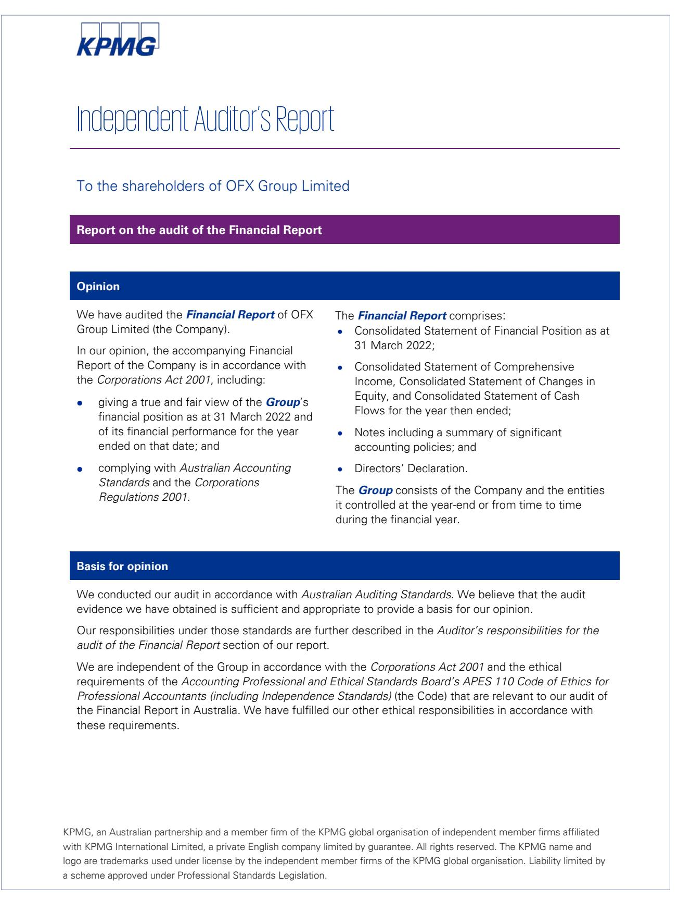

{125}------------------------------------------------

| Key Audit Matters                                                                                                                                                                                                                                                                                                                                                                                                                                                                                                |                                                                                                                                                                                                                                                                                                                                                                                                                                                                                                                                                                                                                                                                                                                                                                                                                                                                                                                                                                                                            |  |
|------------------------------------------------------------------------------------------------------------------------------------------------------------------------------------------------------------------------------------------------------------------------------------------------------------------------------------------------------------------------------------------------------------------------------------------------------------------------------------------------------------------|------------------------------------------------------------------------------------------------------------------------------------------------------------------------------------------------------------------------------------------------------------------------------------------------------------------------------------------------------------------------------------------------------------------------------------------------------------------------------------------------------------------------------------------------------------------------------------------------------------------------------------------------------------------------------------------------------------------------------------------------------------------------------------------------------------------------------------------------------------------------------------------------------------------------------------------------------------------------------------------------------------|--|
| The Key Audit Matters we identified are: • Recognition of fee and trading income Taxation •                                                                                                                                                                                                                                                                                                                                                                                                          | Key Audit Matters are those matters that, in our professional judgement, were of most significance in our audit of the Financial Report of the current period. These matters were addressed in the context of our audit of the Financial Report as a whole, and in forming our opinion thereon, and we do not provide a separate opinion on these matters.                                                                                                                                                                                                                                                                                                                                                                                                                                                                                                                                                                                                                               |  |
| Recognition of fee and trading income (\$158.0m)                                                                                                                                                                                                                                                                                                                                                                                                                                                                 |                                                                                                                                                                                                                                                                                                                                                                                                                                                                                                                                                                                                                                                                                                                                                                                                                                                                                                                                                                                                            |  |
| Refer to Note 3 to the Financial Report                                                                                                                                                                                                                                                                                                                                                                                                                                                                          |                                                                                                                                                                                                                                                                                                                                                                                                                                                                                                                                                                                                                                                                                                                                                                                                                                                                                                                                                                                                            |  |
| The key audit matter                                                                                                                                                                                                                                                                                                                                                                                                                                                                                             | How the matter was addressed in our audit                                                                                                                                                                                                                                                                                                                                                                                                                                                                                                                                                                                                                                                                                                                                                                                                                                                                                                                                                                  |  |
| Fee and trading income is considered a key audit matter due to: • Its significance to OFX Group's results; and • The significant audit effort required considering the high volume of transactions, with unique margins on individual trades. We focused on fee and trading income generated from: • Margins on foreign currency trades; and • Changes in exchange rates between the time when a client trade is agreed, and a subsequent trade is entered into. | Our procedures included: • Assessed the appropriateness of the accounting policy applied by the Group, against the requirements of the accounting standards. • Obtained an understanding of the steps involved in processing a trade and recording revenue. • Tested controls over the reconciliations between the trade recording system and bank statements • Tested the control over the reconciliation of monthly revenue to bank statements • Tested IT controls over the trade recording system. • Tested IT controls over the feed of foreign exchange rates from external providers into the trade recording system. • Tested realised margin on the trades recorded by comparing the contracted rate noted in the trade recording system to market rates obtained from externally available published rates and recalculating the resulting margin. • Compared a trade sample to deal tickets and |  |

{126}------------------------------------------------

| Taxation (\$7.6m) Refer to Note 5 to the Financial Report The key audit matter                                                                                                                                                                                                                                                                                                                                                                                                                                                                                                                                                                                                                                                                              | contracts using external market rates to test unrealised gains and losses on contracts held by the Group at year end. • Assessed the disclosures in the financial report using our understanding obtained from our testing and against the requirements of the accounting standard. How the matter was addressed in our audit                                                                                                                                                                                                                                                                                                                                                                                                                                                                                                                                                                                                                                                                                                                                                                                                                                                                                             |
|-------------------------------------------------------------------------------------------------------------------------------------------------------------------------------------------------------------------------------------------------------------------------------------------------------------------------------------------------------------------------------------------------------------------------------------------------------------------------------------------------------------------------------------------------------------------------------------------------------------------------------------------------------------------------------------------------------------------------------------------------------------------|---------------------------------------------------------------------------------------------------------------------------------------------------------------------------------------------------------------------------------------------------------------------------------------------------------------------------------------------------------------------------------------------------------------------------------------------------------------------------------------------------------------------------------------------------------------------------------------------------------------------------------------------------------------------------------------------------------------------------------------------------------------------------------------------------------------------------------------------------------------------------------------------------------------------------------------------------------------------------------------------------------------------------------------------------------------------------------------------------------------------------------------------------------------------------------------------------------------------------------------------------|
| Tax is considered a key audit matter due to the complexity of concessional tax arrangements used by the Group during the year, including: • A subsidiary of the Group, OzForex Limited, qualifies as an Offshore Banking Unit (OBU), which attracts a concessional tax rate of 10%. We focused on the application of OBU conditions to the Group's transactions. • Eligibility for Research and Development Tax Credits (R&D Credits) which further reduces the Group's tax expense. The eligibility for these tax credits is determined by the Group based on relevant tax legislation. We involved our tax specialists to supplement our senior audit team members in assessing this key audit matter. | Working with our tax specialists, we performed the following procedures: • Evaluated the Group's Policy in relation to the allocation of trades to the OBU. We assessed the OBU legal status against relevant Australian tax legislation. We assessed the wording of the policy in particular as defined in the Group's notes as assessable offshore banking income derived by the OBU against the criteria for OBU application of concessional arrangements in the tax legislation. • Obtained a sample of trades recorded in the OBU and checked their features from the trade recording system against the allocation methodology within Group Policy. • Assessed the scope, competence and objectivity of the external expert engaged by the Group to assist in determining the eligibility for R&D tax credits claimed under the relevant tax legislation. • Assessed the appropriateness of the accounting treatment applied to R&D Credits against the accounting standards. • Assessed the disclosures in the financial report using our understanding obtained from our testing and against the requirements of the accounting standard. |

{127}------------------------------------------------

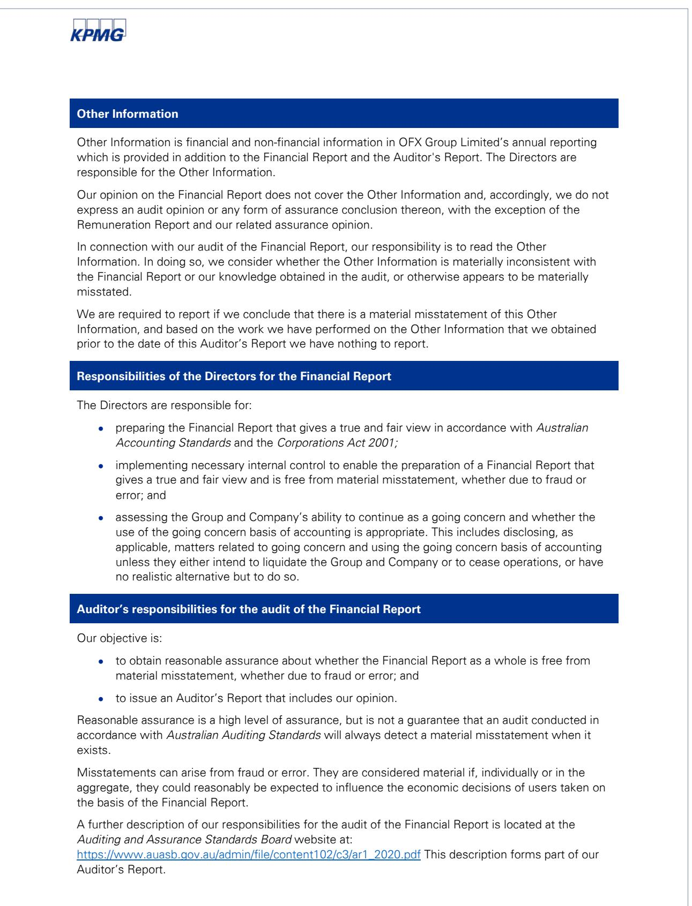

{128}------------------------------------------------

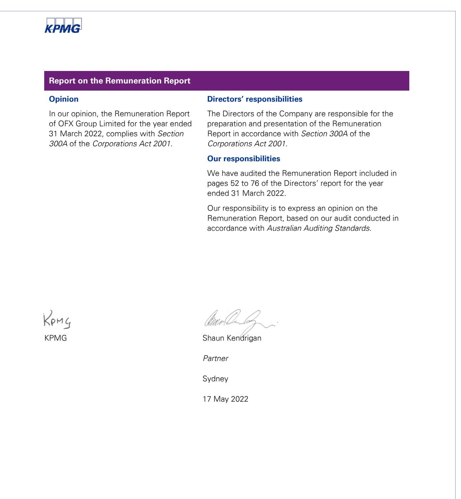

{129}------------------------------------------------

## Shareholder information

as at 13 April 2022

### **Corporate Governance Statement**

For FY22 the OFX governance practices complied with the ASX Corporate Governance Council's Principles and Recommendations. Further details are set out in the FY22 Corporate Governance Statement, as approved by the Board, which is available on the Company's website at: https://www.ofx.com/en-au/ investors/corporate-governance.

### **Substantial Shareholders**

The number of securities held by substantial shareholders (holding not less than 5%) and their associates as shown in substantial shareholder notices received by the Company pursuant to Section 671B of the *Corporations Act 2001* (Cth) as at 13 April 2022 are shown below.

| Name                              | Number Held | % of Issued Capital |
|-----------------------------------|-------------|---------------------|
| Selector Funds Management Limited | 29,325,983  | 11.8%               |
| Ellerston Capital Limited         | 20,361,488  | 8.2%                |
| Microequities                     | 18,125,116  | 7.3%                |
| Australian Ethical Investment     | 17,822,421  | 7.2%                |

### **Distribution of Security Holders**

| Number of shares      | Total holders of ordinary shares | Number of ordinary shares | % of Issued Capital |
|-----------------------|-------------------------------------|------------------------------|------------------------|
| 1 – 1,000             | 831                                 | 427,742                      | 0.18%                  |
| 1,001 – 5,000         | 1,175                               | 3,447,079                    | 1.42%                  |
| 5,001 – 10,000        | 470                                 | 3,772,806                    | 1.55%                  |
| 10,001 – 100,000      | 570                                 | 14,802,080                   | 6.10%                  |
| 100,001 – 999,999,999 | 53                                  | 220,175,625                  | 90.75%                 |
| Total                 |                                     | 242,625,332*                 | 100.00%                |

* Excludes unquoted equity securities.

## 182

Holders of less than a marketable parcel of ordinary shares, based on the Company's closing market price of \$2.41*

78.4%

Shares held by top 20 holders* * As of 13 April 2022.

{130}------------------------------------------------

### **Twenty largest holders of ordinary shares as at 13 April 2022**

|                                                                        | Name                             | Units      | % of Units |
|------------------------------------------------------------------------|----------------------------------|------------|------------|
| 1.                                                                     | Selector Funds Management        | 29,325,983 | 11.8%      |
| 2.                                                                     | Ellerston Capital                | 20,361,488 | 8.2%       |
| 3.                                                                     | Microequities                    | 18,125,116 | 7.3%       |
| 4.                                                                     | Australian Ethical Investment    | 17,822,421 | 7.2%       |
| 5.                                                                     | Pendal Group                     | 10,848,066 | 4.4%       |
| 6.                                                                     | Renaissance Smaller Companies    | 10,577,548 | 4.3%       |
| 7.                                                                     | Matthew Gilmour                  | 9,048,113  | 3.7%       |
| 8.                                                                     | Castle Point Funds Management    | 8,500,000  | 3.4%       |
| 9.                                                                     | Harper Bernays                   | 7,951,063  | 3.2%       |
| 10.                                                                    | Mr Gary Lord                     | 7,941,279  | 3.2%       |
| 11.                                                                    | Dimensional Fund Advisors        | 7,563,756  | 3.1%       |
| 12.                                                                    | Vanguard Group                   | 6,971,334  | 2.8%       |
| 13.                                                                    | Perennial Value Management       | 6,898,433  | 2.8%       |
| 14.                                                                    | Martin Currie Australia          | 6,791,075  | 2.7%       |
| 15.                                                                    | Solium Nominees                  | 6,379,045  | 2.6%       |
| 16.                                                                    | Salter Brothers Asset Management | 6,353,713  | 2.6%       |
| 17.                                                                    | Mr John A Malcolm                | 3,692,904  | 1.5%       |
| 18.                                                                    | Powerwrap                        | 3,500,000  | 1.4%       |
| 19.                                                                    | Realindex Investments            | 3,000,000  | 1.2%       |
| 20.                                                                    | Eley Griffiths Group             | 2,633,756  | 1.1%       |
| Totals: Top 20 holders of 194,285,103 fully paid ordinary shares |                                  | 78.4%      |            |
|                                                                        | Total remaining holders balance  |            | 21.6%      |

### The table above includes ordinary shares issued under the Company's

Executive Share Plan.

### **Unquoted equity securities**

Securities issued under the Company's Short and Long-Term Incentive Plans or Executive Share Plan are subject to vesting conditions which, if met, entitle the holder to fully paid ordinary shares in the Company.

|                                       | Number held | Number of holders |
|---------------------------------------|----------------|----------------------|
| Fully paid ordinary shares (unquoted) | 5,109,856*     | 10                   |
| Performance rights                    | 2,880,964      | 51                   |
| Options                               | 722,612        | 2                    |

* This includes 4,157,363 shares in respect of restricted, allocated shares issued under the Executive Share Plan approved by Shareholders at the AGM in 2018 (nine holders) and 952,493 unallocated shares issued under the Executive Share Plan approved by Shareholders at the AGM in 2018 (one holder – OFX Group Limited).

### **Voting Rights Ordinary fully paid shares**

The voting rights are governed by clause 37 of the Company's Constitution which provides that every member present personally or by proxy, attorney or representative at a general meeting of the Company shall, on a show of hands, have one vote, and on a poll shall have one vote for every share held.

#### **Performance rights**

Performance right holders do not have any voting rights attached to the performance rights issued under the Company's Global Equity Plan or legacy incentive plans.

#### **Share options**

Option holders do not have any voting rights attaching to options.

#### **Service rights**

There are no Service rights holders.

#### **Buyback**

There is no current on market buyback.

#### **Review of operations and activities**

A review of the Company's operations and activities during the reporting period is available within the Directors' Report.

{131}------------------------------------------------

This page has been left blank intentionally.

{132}------------------------------------------------

## Corporate information

### **Directors**

Ms Connie Carnabuci Ms Cathy Kovacs Mr John ('Skander') Malcolm (Chief Executive Officer and Managing Director) Mr Grant Murdoch Mr Steven Sargent (Chairperson) Mr Douglas Snedden

### **Company Secretary**

Ms Elisabeth Ellis

### **Annual General Meeting**

11 August 2022

### **Registered Office and Principal Place of Business**

Level 19 60 Margaret Street Sydney NSW 2000 Australia

Ph: +61 2 8667 8000 Fax: +61 2 8667 8080 Email: investors@ofx.com

### **Share Register**

**Link Market Services Limited** Level 12, 680 George Street Sydney NSW 2000 Australia

Ph: 1300 554 474 Email: registrars@linkmarketservices.com.au

### **Auditor**

**KPMG** Tower Three International Towers Sydney 300 Barangaroo Avenue Sydney NSW 2000 Australia

### **Stock Exchange Listing**

OFX Group Limited shares are listed on the Australia Securities Exchange: OFX

### **Website**

www.ofx.com

{133}------------------------------------------------

