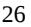

{0}------------------------------------------------

# **UNITED STATES SECURITIES AND EXCHANGE COMMISSION Washington, D.C. 20549 FORM 10-K (Mark one)** ☒ **ANNUAL REPORT PURSUANT TO SECTION 13 OR 15(D) OF THE SECURITIES EXCHANGE ACT OF 1934 For the fiscal year ended December 31, 2022 or** ☐ **TRANSITION REPORT PURSUANT TO SECTION 13 OR 15(D) OF THE SECURITIES EXCHANGE ACT OF 1934 Commission File Number 000-15006 CELLDEX THERAPEUTICS, INC.** (Exact name of registrant as specified in its charter) **Delaware 13-3191702** State or other jurisdiction of incorporation or organization (I.R.S. Employer Identification No.) **Perryville III Building, 53 Frontage Road, Suite 220, Hampton, New Jersey 08827** (Address of principal executive offices) (Zip Code) Registrant's telephone number, including area code: **(908) 200-7500** Securities registered pursuant to Section 12(b) of the Act: **Title of Each Class: Trading Symbol(s) Name of Each Exchange Where Registered:** Common Stock, par value \$.001 CLDX NASDAQ Capital Market Securities registered pursuant to Section 12(g) of the Act: **None** Indicate by check mark if the registrant is a well-known seasoned issuer, as defined in Rule 405 of the Securities Act. Yes ☒ No ☐ Indicate by check mark if the registrant is not required to file reports pursuant to Section 13 or Section 15(d) of the Act. Yes ☐ No ☒ Indicate by check mark whether the registrant: (1) has filed all reports required to be filed by Section 13 or 15(d) of the Securities Exchange Act of 1934 during the preceding 12 months (or for such shorter period that the registrant was required to file such reports), and (2) has been subject to such filing requirements for the past 90 days. Yes ☒ No ☐ Indicate by check mark whether the registrant has submitted electronically every Interactive Data File required to be submitted pursuant to Rule 405 of Regulation S-T (§232.405 of this chapter) during the preceding 12 months (or for such shorter period that the registrant was required to submit and post such files). Yes ☒ No ☐ Indicate by check mark whether the registrant is a large accelerated filer, an accelerated filer, a non-accelerated filer, smaller reporting company, or an emerging growth company. See the definitions of "large accelerated filer," "accelerated filer," "smaller reporting company" and "emerging growth company" in Rule 12b-2 of the Exchange Act. (Check one): Large accelerated filer ☒ Accelerated filer ☐ Non-accelerated filer ☐ Smaller reporting company ☐ Emerging growth company ☐ If an emerging growth company, indicate by check mark if the registrant has elected not to use the extended transition period for complying with any new or revised financial accounting standards provided pursuant to Section 13(a) of the Exchange Act. ☐ Indicate by check mark whether the registrant has filed a report on and attestation to its management's assessment of the effectiveness of its internal control over financial reporting under Section 404(b) of the Sarbanes-Oxley Act (15 U.S.C. 7262(b)) by the registered public accounting firm that prepared or issued its audit report. ☒ If securities are registered pursuant to Section 12(b) of the Act, indicate by check mark whether the financial statements of the registrant included in the filing reflect the correction of an error to previously issued financial statements. ☐ Indicate by check mark whether any of those error corrections are restatements that required a recovery analysis of incentive-based compensation received by any of the registrant's executive officers during the relevant recovery period pursuant to §240.10D-1(b). ☐ Indicate by check mark whether the registrant is a shell company (as defined in Rule 12b-2 of the Act). Yes ☐ No ☒ The aggregate market value of the registrant's common stock held by non-affiliates as of June 30, 2022 was \$1.3 billion. Exclusion of shares held by any person should not be construed to indicate that such person possesses the power, direct or indirect, to direct or cause the actions of the management or policies of the registrant, or that such person is controlled by or under common control with the registrant.

The number of shares of common stock outstanding at February 13, 2023 was 47,207,189 shares.

**DOCUMENTS INCORPORATED BY REFERENCE**

Portions of the definitive Proxy Statement for our 2023 Annual Meeting of Stockholders are incorporated by reference into Part III of this Report.

Auditor Firm ID: 238 Auditor Name: PricewaterhouseCoopers LLP Auditor Location: Boston, Massachusetts

{1}------------------------------------------------

# **CELLDEX THERAPEUTICS, INC. ANNUAL REPORT ON FORM 10-K FOR THE FISCAL YEAR ENDED DECEMBER 31, 2022**

# **TABLE OF CONTENTS**

|            |                                                                                                   | Page |
|------------|---------------------------------------------------------------------------------------------------|------|
| Part I     |                                                                                                   |      |
| Item 1.    | Business                                                                                          | 1    |
| Item 1A.   | Risk Factors                                                                                      | 21   |
| Item 1B.   | Unresolved Staff Comments                                                                         | 48   |
| Item 2.    | Properties                                                                                        | 48   |
| Item 3.    | Legal Proceedings                                                                                 | 48   |
| Item 4.    | Mine Safety Disclosures                                                                           | 48   |
| Part II    |                                                                                                   |      |
|            | Market for Registrant's Common Equity, Related Stockholder Matters and Issuer Purchases of Equity |      |
| Item 5.    | Securities                                                                                        | 49   |
| Item 6.    | [Reserved]                                                                                        | 49   |
| Item 7.    | Management's Discussion and Analysis of Financial Condition and Results of Operations             | 50   |
| Item 7A.   | Quantitative and Qualitative Disclosures About Market Risk                                        | 67   |
| Item 8.    | Financial Statements and Supplementary Data                                                       | 68   |
| Item 9.    | Changes in and Disagreements With Accountants on Accounting and Financial Disclosure              | 93   |
| Item 9A.   | Controls and Procedures                                                                           | 93   |
| Item 9B.   | Other Information                                                                                 | 94   |
| Item 9C.   | Disclosure Regarding Foreign Jurisdictions That Prevent Inspections                               | 94   |
| Part III   |                                                                                                   |      |
| Item 10.   | Directors, Executive Officers and Corporate Governance                                            | 95   |
| Item 11.   | Executive Compensation                                                                            | 95   |
| Item 12.   | Security Ownership of Certain Beneficial Owners and Management and Related Stockholder Matters    | 95   |
| Item 13.   | Certain Relationships and Related Transactions, and Director Independence                         | 95   |
| Item 14.   | Principal Accountant Fees and Services                                                            | 95   |
| Part IV    |                                                                                                   |      |
| Item 15.   | Exhibits, Financial Statement Schedules                                                           | 96   |
| Item 16.   | Form 10-K Summary                                                                                 | 100  |
| Signatures |                                                                                                   | 101  |

# i

{2}------------------------------------------------

*Safe Harbor Statement under the Private Securities Litigation Reform Act of 1995:* This Annual Report on Form 10-K contains forward-looking statements made pursuant to the safe harbor provisions of the Private Securities Litigation Reform Act of 1995 under Section 27A of the Securities Act of 1933, as amended, and Section 21E of the Securities Exchange Act of 1934, as amended. Forwardlooking statements include statements with respect to our beliefs, plans, objectives, goals, expectations, anticipations, assumptions, estimates, intentions and future performance, and involve known and unknown risks, uncertainties and other factors, which may be beyond our control and which may cause our actual results, performance or achievements to be materially different from future results, performance or achievements expressed or implied by such forward-looking statements. All statements other than statements of historical fact are statements that could be forward-looking statements. You can identify these forward-looking statements through our use of words such as "may," "will," "can," "anticipate," "assume," "should," "indicate," "would," "believe," "contemplate," "expect," "seek," "estimate," "continue," "plan," "point to," "project," "predict," "could," "intend," "target," "potential" and other similar words and expressions of the future.

There are a number of important factors that could cause the actual results to differ materially from those expressed in any forwardlooking statement made by us. These factors include, but are not limited to:

- our dependence on product candidates that are still in an early development stage;
- our ability to successfully complete research and further development, including preclinical and clinical studies;
- our anticipated timing for preclinical development, regulatory submissions, commencement and completion of clinical trials and product approvals;
- our ability to negotiate strategic partnerships, where appropriate, for our drug candidates;
- our ability to manage multiple clinical trials for a variety of drug candidates at different stages of development;
- the cost, timing, scope and results of ongoing preclinical and clinical testing;
- our expectations of the attributes of our product and development candidates, including pharmaceutical properties, efficacy, safety and dosing regimens;
- the cost, timing and uncertainty of obtaining regulatory approvals for our drug candidates;
- the availability, cost, delivery and quality of clinical management services provided by our clinical research organization partners;
- the availability, cost, delivery and quality of clinical and commercial-grade materials produced by our own manufacturing facility or supplied by contract manufacturers, suppliers and partners;
- our ability to commercialize our drug candidates and the growth of the markets for those drug candidates;
- our ability to develop and commercialize products before competitors that are superior to the alternatives developed by such competitors;
- our ability to develop technological capabilities, including identification of novel and clinically important targets, exploiting our existing technology platforms to develop new drug candidates and expand our focus to broader markets for our existing targeted therapeutics;
- the cost of paying development, regulatory approval and sales-based milestones under the merger agreement by which we acquired Kolltan Pharmaceuticals, Inc. ("Kolltan") and our related settlement agreement with Kolltan;
- our ability to raise sufficient capital to fund our preclinical and clinical studies and to meet our long-term liquidity needs, on terms acceptable to us, or at all. If we are unable to raise the funds necessary to meet our long-term liquidity needs, we may have to delay or discontinue the development of one or more programs, discontinue or delay ongoing or anticipated clinical

{3}------------------------------------------------

trials, discontinue or delay our commercial manufacturing efforts, discontinue or delay our efforts to expand into additional indications for our drug product candidates, license out programs earlier than expected, raise funds at significant discount or on other unfavorable terms, if at all, or sell all or part of our business;

- our ability to protect our intellectual property rights and our ability to avoid intellectual property litigation, which can be costly and divert management time and attention;
- our ability to develop and commercialize products without infringing the intellectual property rights of third parties;
- the impact of the COVID-19 pandemic on our business or on the economy generally; and
- the factors listed under "Risk Factors" in this Annual Report on Form 10-K.

All forward-looking statements are expressly qualified in their entirety by this cautionary notice. You are cautioned not to place undue reliance on any forward-looking statements, which speak only as of the date of this report or the date of the document incorporated by reference into this report. We have no obligation, and expressly disclaim any obligation, to update, revise or correct any of the forward-looking statements, whether as a result of new information, future events or otherwise. We have expressed our expectations, beliefs and projections in good faith, and we believe they have a reasonable basis. However, we cannot assure you that our expectations, beliefs or projections will result or be achieved or accomplished.

iii

{4}------------------------------------------------

## **PART I**

## **Item 1. BUSINESS**

## **Overview**

Celldex Therapeutics, Inc., which we refer to as "Celldex," "we," "us," "our" or the "Company," is a biopharmaceutical company dedicated to developing therapeutic monoclonal and bispecific antibodies that address diseases for which available treatments are inadequate. Our drug candidates include antibody- based therapeutics which have the ability to engage the human immune system and/or directly affect critical pathways to improve the lives of patients with inflammatory diseases and many forms of cancer.

We are focusing our efforts and resources on the continued research and development of

- Barzolvolimab (also referred to as CDX-0159), a monoclonal antibody that specifically binds the KIT receptor and potently inhibits its activity, which is currently being studied across multiple mast cell driven diseases including
	- Chronic Urticarias: In June and July 2022 respectively, we announced that enrollment had opened and the first patients had been dosed in Phase 2 studies in chronic spontaneous urticaria (CSU) and chronic inducible urticaria (CIndU). Positive interim data from the ongoing Phase 1b study in CSU were reported in February 2023. Positive interim data from the Phase 1b study in CIndU were reported in July and September 2021 and in December 2022 in patients with cold urticaria and symptomatic dermographism;
	- Prurigo Nodularis (PN): In December 2021 we announced that the first patient had been dosed in a Phase 1b study in PN; enrollment was closed in February 2023 and we plan to present data from the study in the second half of 2023;
	- Eosinophilic Esophagitis (EoE): We plan to initiate a Phase 2 study in EoE in the first half of 2023.
- Our next generation bispecific antibody platform to support pipeline expansion with additional candidates for inflammatory diseases and oncology. Targets are being selected based on new science as well as their compatibility to be used in bispecific antibody formats with Celldex's existing antibody programs. Development is focused on emerging, important pathways controlling inflammatory diseases or immunity to tumors.

Our goal is to build a fully integrated, commercial-stage biopharmaceutical company that develops important therapies for patients with unmet medical needs. We believe our program assets provide us with the strategic options to either retain full economic rights to our innovative therapies or seek favorable economic terms through advantageous commercial partnerships. This approach allows us to maximize the overall value of our technology and product portfolio while best ensuring the expeditious development of each individual product.

Our future success depends upon many factors, including our ability, and that of any licensees and collaborators that we may have, to successfully develop, obtain regulatory approval for and commercialize our drug candidates. We have had no commercial revenues from sales of our drug candidates, and we have had a history of operating losses. It is possible that we may not be able to successfully develop, obtain regulatory approval for, or commercialize, our drug candidates, and we are subject to a number of risks that you should be aware of before investing in us. These risks are described more fully in "Item 1A. Risk Factors."

## **Clinical Development Programs**

## *Barzolvolimab (also referred to as CDX-0159)*

Barzolvolimab is a humanized monoclonal antibody that specifically binds the receptor tyrosine kinase KIT and potently inhibits its activity. KIT is expressed in a variety of cells, including mast cells, and its activation by its ligand SCF regulates mast cell growth, differentiation, survival, chemotaxis and degranulation. Barzolvolimab is designed to block KIT activation by disrupting both SCF binding and KIT dimerization. We believe that by targeting KIT, barzolvolimab may be able to inhibit mast cell activity and decrease mast cell numbers to provide potential clinical benefit in mast cell related diseases.

{5}------------------------------------------------

In certain inflammatory diseases, such as chronic spontaneous urticaria (CSU), also known as chronic idiopathic urticaria (CIU), and chronic inducible urticaria (CIndU), mast cell degranulation plays a central role in the onset and progression of the disease. In June 2020, we completed a randomized, double-blind, placebo-controlled, single ascending dose escalation Phase 1a study of barzolvolimab in healthy subjects (n = 32; 8 subjects per cohort, 6 barzolvolimab; 2 placebo). Subjects received a single intravenous infusion of barzolvolimab at 0.3, 1.0, 3.0, or 9.0 mg/kg or placebo. The objectives of the study included safety and tolerability, pharmacokinetics (PK) and pharmacodynamics (tryptase and stem cell factor) and immunogenicity. Tryptase is an enzyme synthesized and secreted almost exclusively by mast cells and decreases in plasma tryptase levels are believed to reflect a systemic reduction in mast cell burden in both healthy volunteers and in disease. Data from the study were featured in a late breaking presentation at the European Academy of Allergy and Clinical Immunology (EAACI) Annual Congress 2020 in June. Barzolvolimab demonstrated a favorable safety profile as well as profound and durable reductions of plasma tryptase, consistent with systemic mast cell suppression.

These data supported expansion of the barzolvolimab program into mast cell driven diseases, including initially in CSU and CIndU, diseases where mast cell degranulation plays a central role in the onset and progression of the disease. Phase 1 studies in CSU and CIndU are completing and Phase 2 studies are ongoing. We continue to assess potential opportunities for barzolvolimab in other diseases where mast cells play an important role, such as dermatologic, respiratory, allergic, gastrointestinal and ophthalmic conditions and to this end, are conducting an ongoing Phase 1 study in prurigo nodularis and plan to initiate a Phase 2 study in eosinophilic esophagitis in the first half of 2023. Phase 1 studies of barzolvolimab have been conducted with an intravenous formulation; a subcutaneous formulation has been successfully developed and is being used in Phase 2 studies.

### *Chronic Spontaneous Urticaria (CSU)*

CSU presents as itchy hives, angioedema or both for at least six weeks without a specific trigger; multiple episodes can play out over years or even decades. CSU is one of the most frequent dermatologic diseases with a prevalence of 0.5-1.0% of the total population or up to approximately 1 to 3 million patients in the United States (Weller et al. 2010. Hautarzt. 61(8), Bartlett et al. 2018. DermNet.Org). Approximately 50% of patients with CSU achieve symptomatic control with antihistamines. Omalizumab, an IgE inhibitor, provides relief for roughly half of the remaining antihistamine refractory patients. Consequently, there is a need for additional therapies.

In October 2020, we announced that enrollment had opened and the first patient had been dosed in a Phase 1b multi-center study of barzolvolimab in CSU. This study is a randomized, double-blind, placebo-controlled clinical trial designed to assess the safety of multiple ascending doses of barzolvolimab in up to 40 patients with CSU who remain symptomatic despite treatment with antihistamines. Secondary and exploratory objectives include pharmacokinetic and pharmacodynamic assessments, including measurement of tryptase and stem cell factor levels and clinical activity outcomes (impact on urticaria symptoms, disease control, clinical response) as well as quality of life assessments. Barzolvolimab is administered intravenously (0.5, 1.5, 3 and 4.5 mg/kg at varying dosing schedules) as add on treatment to H1-antihistamines, either alone or in combination with H2-antihistamines and/or leukotriene receptor agonists.

In February 2023, we reported positive interim data from the CSU study. As of the data cut-off date on November 29, 2022, enrollment was complete with 45 patients with moderate to severe CSU refractory to antihistamines enrolled and treated [35 barzolvolimab (n=9 in 0.5 mg/kg; n=8 in 1.5 mg/kg; n=9 in 3.0 mg/kg; n=9 in 4.5 mg/kg) and 10 placebo]. The 0.5 mg/kg, 1.5 mg/kg and 3.0 mg/kg cohorts had completed study participation through 24 weeks; 6 of 9 patients in the 4.5 mg/kg cohort had completed through the week 20 visit. Complete data were included for all patients in dose levels through 3.0 mg/kg through 24 weeks. All available data for the 4.5 mg/kg and placebo dose levels were presented for adverse events. Activity data for the 4.5 mg/kg dose level were reported through week 20. Activity data for the 0.5 mg/kg and placebo group were only included through week 12 because, as expected, most patients from these groups had significant symptoms ahead of week 24 and discontinued follow up. Two patients did not receive all doses of study treatment [4.5 mg/kg (1), placebo (1)].

- Barzolvolimab resulted in rapid, marked and durable responses in patients with moderate to severe CSU refractory to antihistamines, including patients with prior omalizumab treatment.
- The 1.5 mg/kg, 3.0 mg/kg and 4.5 mg/kg dose groups showed similar markedly improved urticaria symptoms and disease control with sustained durability up to 24 weeks.

{6}------------------------------------------------

- Mean reduction from baseline in urticaria activity (UAS7) at week 12 of 67% in the 1.5 mg/kg dose group (n=8), 67% in the 3.0 mg/kg dose group (n=9) and 82% in the 4.5 mg/kg dose group (n=9).
- Complete response (UAS7=0) at week 12 of 57% in the 1.5 mg/kg dose group, 44% in the 3.0 mg/kg dose group and 67% in the 4.5 mg/kg dose group.
- Well-controlled disease (UCT≥ 12) at week 12 of 75% in the 1.5 mg/kg dose group, 63% in the 3.0 mg/kg dose group and 89% in the 4.5 mg/kg dose group.
- During post-treatment follow up, 7 of 8 (88%) patients who had been treated with barzolvolimab 1.5 mg/kg or 3.0 mg/kg and had a complete response (UAS7=0) at week 12 maintained their complete response through 24 weeks. Two additional patients treated with these doses who were not a complete response at week 12 had a complete response at week 24. 6 of 6 (100%) patients treated with barzolvolimab 4.5 mg/kg maintained their complete response through their last assessment with additional follow up ongoing.
- Patients with prior omalizumab therapy had similar symptom improvement as all patients.
- Rapid onset of responses after initial dosing and sustained durability were observed; onset as early as 1 week after the first dose and prolonged symptom control in some patients for up to 24 weeks.
- Tryptase suppression, indicative of mast cell depletion, paralleled symptom improvement, demonstrating the impact of mast cell depletion on CSU disease activity.
- Barzolvolimab was well tolerated with a favorable safety profile; effects of multiple dose administration were consistent with observations in single dose studies. Most AEs were mild or moderate in severity and resolved while on study. The most common treatment emergent adverse events were hair color changes, COVID-19, headache, neutropenia and urinary tract infections (UTIs). UTIs and COVID-19 were reported as unrelated to treatment. There was one serious adverse event of salmonella gastroenteritis which was also not related to study therapy. Changes in hematologic parameters were consistent with observations in single dose studies, with no pattern of further decreases with multiple doses; hematologic values generally remained within the normal range and returned to baseline levels during the follow up period. Five patients had decreases in neutrophil counts reported as AEs; four of which were previously reported in the EAACI 2022 data presentation. The pattern observed in the neutrophil changes for these patients was similar to the pattern seen in patients across the barzolvolimab program to date—generally transient, asymptomatic, and mild and typically occurring in patients with screening and baseline neutrophil counts at the lower end of the normal range on study initiation.

In June 2022, we announced that the first patient has been dosed in a Phase 2 study in patients with CSU who remain symptomatic despite antihistamine therapy. The study is being conducted at approximately 75 sites across 9 countries. The study is a randomized, double-blind, placebo-controlled, parallel group Phase 2 study evaluating the efficacy and safety profile of multiple dose regimens of barzolvolimab to determine the optimal dosing strategy. Approximately 168 patients will be randomly assigned on a 1:1:1:1 ratio to receive subcutaneous injections of barzolvolimab at 75 mg every 4 weeks, 150 mg every 4 weeks, 300 mg every 8 weeks or placebo during a 16-week placebo-controlled treatment phase. Patients will then enter a 36-week active treatment phase, in which patients not already randomized to barzolvolimab at 150 mg every 4 weeks or 300 mg every 8 weeks will be randomized 1:1 to receive one of these two dose regimens; patients already randomized to these treatment arms will remain on the same regimen as during the placebocontrolled treatment phase. Following the treatment period, patients will enter a 24-week follow up phase. The primary endpoint of the study is mean change in baseline to week 12 in UAS7 (Urticaria Activity Score over 7 days). Secondary endpoints include safety and other assessments of clinical activity including ISS7 (Itch Severity Score over 7 days), HSS7 (Hive Severity Score over 7 days) and AAS7 (Angioedema Activity Score over 7 days). Based on current enrollment projections, we anticipate that enrollment to this study will be completed by the end of the third quarter of 2023 and we plan to report topline data either late this year or in the first quarter of 2024.

### *Chronic Inducible Urticaria (CIndU)*

CIndUs are forms of urticaria that have an attributable cause or trigger associated with them, typically resulting in hives or wheals. The prevalence of CIndU is estimated at 0.5% of the total population and is reported to overlap in up to 36% of CSU patients

{7}------------------------------------------------

(Weller et al. 2010. Hautarzt. 61(8), Bartlett et al. 2018. DermNet.Org). There are currently no approved therapies for chronic inducible urticarias other than antihistamines and patients attempt to manage symptoms associated with their disease through avoidance of triggers. We are exploring cold-induced, dermographism (scratch-induced) and cholinergic (exercise-induced) urticarias.

In December 2020, we announced that enrollment had opened and the first patient had been dosed in a Phase 1b study in CIndU being conducted in Germany in patients who are refractory to antihistamines. This study is an open label clinical trial designed to evaluate the safety of a single dose (3 mg/kg) of barzolvolimab in patients with cold urticaria (ColdU) or symptomatic dermographism (SD). In March and June 2021, respectively, we added a third cohort (single dose, 3 mg/kg) in patients with cholinergic urticaria and a fourth cohort at a lower dose (single dose, 1.5 mg/kg) in ColdU. Patient's symptoms are induced via provocation testing that resembles real life triggering situations. Secondary and exploratory objectives include pharmacokinetic and pharmacodynamic assessments, including changes from baseline provocation thresholds, measurement of tryptase and stem cell factor levels, clinical activity outcomes (impact on urticaria symptoms, disease control, clinical response), quality of life assessments and measurement of tissue mast cells through skin biopsies. Barzolvolimab is administered intravenously on Day 1 as add on treatment to H1-antihistamines.

In November 2022, data from the ColdU and SD cohorts treated with a single intravenous infusion of barzolvolimab at 3 mg/kg were published in *Allergy* (Terhorst-Molawi et al Allergy. 2022 Nov 16. doi: 10.1111/all.15585). Safety results were reported for 21 patients; activity results were reported for the 20 patients who received a full dose of barzolvolimab. Patients had high disease activity. At baseline, patients' mean scores (range) for Dermatology Life Quality Index (DLQI) [10.8 (2–21)] and Urticaria Control Test (UCT) [6.0 (0–13)] indicated marked impairment of quality of life (QoL) and poorly controlled disease, respectively. Three patients (1 with ColdU and 2 with SD) were previously treated with omalizumab and chose to discontinue that treatment because they remained symptomatic. At baseline, provocation thresholds, on average (range), were 18.9°C or 66°F (5–27°C or 41–80.6°F) for patients with ColdU and 3.5 (2–4) pins for patients with SD.

- Rapid (as early as 1 week) and durable responses were observed in all patients as assessed by provocation testing. A complete response was achieved in 95% (n = 19/20) of patients (n = 10/10 ColdU; n = 9/10 SD). The median duration (range) of complete response through the 12-week observation period was 77+ days (29–86; n = 10) for patients with ColdU and 57+ days (16–70; n = 9) for patients with SD. All three patients who experienced insufficient response to omalizumab treatment had a complete response after treatment with barzolvolimab.
- Following a single dose of barzolvolimab rapid improvements in urticaria control was observed. A UCT score of ≥12 (well controlled) was achieved by 80% (n = 16/20) of the patients within week 4 post-treatment. By week 8, all patients (100%; n = 20/20) achieved well-controlled urticaria, which was sustained to week 12 post-dose by 80% (n = 16/20) of patients. Complete urticaria control (UCT = 16) was achieved by 35% (n = 7/20), 65% (n = 13/20), and 40% (n = 8/20) at weeks 4, 8, and 12, respectively.
- At baseline, patients in both treatment groups reported disease impact on their QoL. Disease impact significantly decreased after dosing; a score of 0–1 (minimal/none) was achieved by 80% (n = 16/20) for all patients who completed the DLQI during the study. Additionally, clinically meaningful improvements in QoL were attained and sustained to week 12.
- A single dose of barzolvolimab led to marked decreases in tryptase and in skin mast cells. The kinetics correlated with improvements in provocation testing and clinical activity, consistent with a central role for mast cells in the pathogenesis of ColdU and SD. This confirmed that serum tryptase level is a robust pharmacodynamic biomarker for assessing mast cell burden and clinical activity in inducible urticaria and potentially in other diseases with mast cell driven involvement.
- Barzolvolimab was well tolerated. Most adverse events were mild, and the most common (≥3 patients) were hair color changes (76%; n = 16/21), infusion reactions (43%; n = 9/21), taste changes (38%; n = 8/21), nasopharyngitis (24%; n = 5/21), malaise (24%; n = 5/21), and headache (19%; n = 4/21). Hair color changes (generally small areas of hair color lightening) and taste disorders (generally partial changes of ability to taste salt or umami) are consistent with inhibiting KIT signaling in other cell types and completely resolved over time during follow-up. Infusion reactions, which manifested as localized hives and itching as well as erythema and feeling hot, resolved spontaneously. One patient with a history of fainting experienced loss of consciousness during infusion. The patient rapidly recovered. Importantly, no evidence of mast cell activation as measured by serum tryptase monitoring was observed in this patient. Overall, mean hematology parameters remained within the normal ranges—an important finding for a KIT inhibitor. Mild, transient, and asymptomatic decreases in hemoglobin and white blood cell parameters occurred for some patients.

{8}------------------------------------------------

In December 2022, we presented long term follow up data from the 3.0 mg/kg cohorts in cold urticaria and symptomatic dermographism at the GA²LEN Global Urticaria Forum (GUF) 2022. 14 patients consented to the optional long term follow up evaluation (6 cold, 8 symptomatic dermographism); 10 of the 14 still had complete control of their disease as assessed by provocation testing at week 12. Data were collected at one or more timepoints beyond week 12 through week 36.

- Most patients had return of symptoms and/or loss of urticaria control between 12 and 36 weeks. Remarkably, two patients remained provocation negative at 36 weeks, and four had well controlled disease (UCT ≥12) 36 weeks post dosing.
- Serum tryptase exhibits a similar rate of recovery as clinical symptoms, while skin mast cells return at a slower rate. Tissue KIT signaling, as approximated by SCF levels, was rapidly inhibited after dose administration and fully reactivated approximately 18 weeks after dosing.
- Tryptase levels return to pretreatment levels during follow up, while mast cells continue to recover. Drug related adverse events noted during the study all resolved.

In December 2022, we also presented 12 week treatment results for the 1.5 mg/kg cohort in cold urticaria at the GA²LEN Global Urticaria Forum (GUF) 2022. 10 patients received a single intravenous infusion of barzolvolimab at 1.5 mg/kg. Patients had high disease activity as assessed by provocation threshold testing with a mean baseline critical temperature threshold of 18.4°C or 65°F with a range from 6 to 27°C or 43 to 81°F. All patients had disease refractory to antihistamines and five patients had disease refractory to omalizumab. Safety results were reported for all 10 patients; activity results were reported for the 9 patients who received a full dose of barzolvolimab, including four patients with omalizumab refractory disease.

- All 9 of 9 (100%) patients evaluable for activity treated at 1.5 mg/kg experienced a complete response as assessed by provocation threshold testing, including 4 patients with disease refractory to omalizumab. Rapid onset of responses after dosing and sustained durability were observed in the 1.5 mg/kg cohort. 6 of 9 patients treated achieved a complete response within a week of dosing. The median duration of response was 51+ days (7+ weeks).
- Improvements in disease activity as reported by Urticaria Control Test (UCT) were consistent with the complete responses as measured by provocation testing. All patients entered the study with poorly controlled disease (mean UCT score at baseline of 5.9 and a range of 1-11). Following barzolvolimab administration, all patients achieved well controlled disease (UCT>12) with 7 of 9 achieving complete control (UCT = 16).
- A single 1.5 mg/kg dose of barzolvolimab resulted in rapid, marked and durable suppression of serum tryptase; the kinetics of tryptase depletion mirrored changes in provocation threshold and UCT. Barzolvolimab was generally well tolerated and the safety profile at 1.5mg/kg was similar to the profile observed with 3.0 mg/kg.
- No new treatment emergent AEs of concern were noted. While mild, transient and asymptomatic decreases in hemoglobin and white blood cell (WBC) parameters were noted, consistent with prior studies, the hematology parameters generally remained within the normal range.

To date, 19 of 19 (100%) patients with cold urticaria treated with either a single dose of barzolvolimab at 1.5 or 3.0 mg/kg in this Phase 1b study have experienced a complete response by provocation testing, including 5 patients with omalizumab refractory disease.

In July 2022 we announced that the first patient has been dosed in a Phase 2 study in patients with CIndU who remain symptomatic despite antihistamine therapy. The study will be conducted at approximately 85 sites across approximately 12 countries. The randomized, double-blind, placebo-controlled, parallel group Phase 2 study is evaluating the efficacy and safety profile of multiple dose regimens of barzolvolimab in patients with CIndU to determine the optimal dosing strategy. Approximately 180 patients in 2 cohorts (differentiated by CIndU subtype) including 90 patients with cold urticaria and 90 patients with symptomatic dermographism will be randomly assigned on a 1:1:1 ratio to receive subcutaneous injections of barzolvolimab at 150 mg every 4 weeks, 300 mg every 8 weeks or placebo during a 20-week treatment phase. Patients will then enter a follow-up phase for an additional 24 weeks. In addition, the study includes the option for patients who have symptoms following the treatment phase, including patients who were on placebo, to enroll in an open label extension where all patients receive 300 mg every 9 weeks of barzolvolimab. The primary endpoint of the study is the percentage of patients with a negative provocation test at week 12 (using TempTest(R) and FricTest(R)). Secondary endpoints include safety and other assessments of clinical activity including CTT (Critical Temperature Threshold), CFT (Critical Friction Threshold) and WI-NRS (Worst itch numeric rating scale).

{9}------------------------------------------------

### *Prurigo Nodularis (PN)*

We have expanded clinical development of barzolvolimab into prurigo nodularis (PN). PN is a chronic skin disease characterized by the development of hard, intensely itchy (pruritic) nodules on the skin. Mast cells through their interactions with sensory neurons and other immune cells are believed to play an important role in amplifying chronic itch and neuroinflammation, both of which are a hallmark of PN. There is currently only one FDA approved therapy for PN, representing an area of significant unmet need. Industry sources estimate there are approximately 154,000 patients in the United States with PN who have undergone treatment within the last 12 months and, of these, approximately 75,000 would be biologic-eligible. In December 2021, the first patient was dosed in a Phase 1b multi-center, randomized, double-blind, placebo-controlled intravenous study designed to assess the safety and treatment effects across multiple dosing cohorts of barzolvolimab in up to 30 patients with PN. Enrolling an intravenous, early stage study in the dermatology setting has been a challenge and the study has taken longer than expected to complete. In February 2023, we closed enrollment at 24 patients, which we believe will provide sufficient data for analysis to inform future development decisions in PN. Following the completion of the 24 week follow up period post dosing for patients on study, we plan to present data from the study in the second half of 2023. Potential future development in PN will utilize the subcutaneous formulation of barzolvolimab.

## *Eosinophilic Esophagitis (EoE)*

In February 2022, we announced that we will be expanding clinical development of barzolvolimab into eosinophilic esophagitis (EoE), the most common type of eosinophilic gastrointestinal disease. EoE is a chronic inflammatory disease of the esophagus characterized by the infiltration of eosinophils. This chronic inflammation can result in trouble swallowing, chest pain, vomiting and impaction of food in the esophagus, a medical emergency. Several studies have suggested that mast cells may be an important driver in the disease, demonstrating that the number and activation state of mast cells are greatly increased in EoE biopsies and that mast cell signatures correlate with markers of inflammation, fibrosis, pain and disease severity. Currently, there is only one FDA approved therapy for EoE, representing an area of significant unmet need. Industry sources estimate there are approximately 160,000 patients in the United States with EoE who have undergone treatment within the last 12 months and, of these, approximately 48,000 would be biologic-eligible. Given the lack of effective therapies for EoE and barzolvolimab's potential as a mast cell depleting agent, we believe EoE is an important indication for future study and plan to initiate a Phase 2 multi-center, randomized, double-blind, placebo-controlled subcutaneous study designed to assess the treatment effects and safety of barzolvolimab in patients with EoE in the first half of 2023.

#### *Additional Barzolvolimab Development Activities*

Manufacturing activities to support the introduction of the barzolvolimab subcutaneous formulation into the clinical program have been completed and, in September 2021, we initiated dosing in a randomized, double-blind, placebo-controlled, Phase 1 study designed to evaluate the safety of single ascending doses of the subcutaneous formulation of barzolvolimab in healthy volunteers. In February 2022, we reported that subcutaneous administration of barzolvolimab was well tolerated and that multiple dose levels have been identified that possess promising pharmacokinetic and pharmacodynamic properties. Importantly, subcutaneous delivery of barzolvolimab resulted in dose-dependent, rapid and sustained decreases in serum tryptase compared with placebo and achieved sufficient exposure to produce tryptase suppression levels comparable with the levels that generated impressive clinical activity observed in the Phase 1 CIndU intravenous study. The Phase 2 multi-dose studies in urticaria are designed to evaluate 75 mg and 150 mg administered every 4 weeks and 300 mg administered every 8 weeks. These doses support a 0.5 to 2 ml injection volume, allowing for a single injection as barzolvolimab advances towards potential commercialization. In 2022, we initiated transfer of our current barzolvolimab manufacturing process to a contract manufacturing organization to support late-stage trials and to prepare for potential commercialization.

In February 2022, we reported interim data after completing the in-life dosing portion of our six-month chronic toxicology study in non-human primates. The only clinically adverse finding at the completion of dosing was a profound impact on spermatogenesis, an expected and well understood effect of KIT inhibition. As a standard part of toxicology studies, some animals from each group continued to be observed through a recovery period to understand the reversibility of any adverse findings. Due to the very high concentrations of barzolvolimab at the end of dosing, the recovery period was approximately one year. As we expected, and consistent with previous findings with KIT blocking antibodies, we were pleased to report in December 2022, that during this recovery period spermatogenesis fully recovered in all male animals as measured by both sperm count and motility. We expect the final histologic analysis and study report in early 2023. We are encouraged with these findings and believe these data strongly support our Phase 2 studies in urticaria and in future indications.

{10}------------------------------------------------

## *Bispecific Platform*

Our next generation bispecific antibody platform is supporting the expansion of our pipeline with additional candidates for inflammatory diseases and oncology. Targets are being selected based on new science as well as their compatibility to be used in bispecific antibody formats with our existing antibody programs. Development is focused on emerging, important pathways controlling inflammatory diseases or immunity to tumors.

#### *CDX-585*

CDX-585 combines our proprietary highly active PD-1 blockade and anti-ILT4 blockade to prevent immunosuppressive signals in T cells and myeloid cells, respectively. ILT4 is emerging as an important immune checkpoint on myeloid cells and is thought to contribute to resistance to PD-1 blockade. Interactions of PD-1 and ILT4 with their ligands are known to deliver immune suppressive signals that can attenuate anti-tumor immune responses. The concept behind CDX-585 is to simultaneously inhibit both T cell and myeloid suppressive signals to potentiate the anti-tumor activity of both cell types, and potentially overcome PD-1 resistance. In preclinical studies, CDX-585 was demonstrated to be a potent inhibitor of PD-1 signaling in comparison to the approved PD-1 antibody, nivolumab. In addition, CDX-585 activated and promoted a strong inflammatory phenotype in human macrophage and dendritic cell cultures. Together these activities of CDX-585 enhanced the response in a mixed lymphocyte reaction assay above that observed for either parental mAb or the combination of the PD-1 and ILT4 mAbs. The *in vivo* efficacy of CDX-585 was also demonstrated in a melanoma humanized mouse model. CDX-585 has successfully completed GMP manufacturing and IND-enabling studies to support clinical development. CDX-585 will initially be developed for the treatment of solid tumors either as monotherapy or in combination with other oncologic treatments and is expected to enter the clinic in 2023 in patients with advanced malignancies.

#### *CDX-527*

CDX-527 used our proprietary highly active anti-PD-L1 and CD27 human antibodies to couple CD27 co-stimulation with blockade of the PD-L1/PD-1 pathway to help prime and activate anti-tumor T cell responses through CD27 co-stimulation, while preventing PD-1 inhibitory signals that subvert the immune response. In the summer of 2020, we initiated a Phase 1 dose-escalation study in patients with advanced or metastatic solid tumors that had progressed during or after standard of care therapy to be followed by tumor-specific expansion cohorts. Enrollment to the dose escalation portion was successfully completed and an expansion cohort in patients with checkpoint naïve ovarian cancer was initiated. In November 2022, we provided an update on the study. With multiple clinical trials actively recruiting in ovarian cancer, enrollment to the expansion cohort did not meet our internal timelines and a review of the results did not meet internal hurdles for proceeding and we closed enrollment to the study and discontinued the program.

## *Other programs:*

## *CDX-1140*

CDX-1140 is a fully human agonist monoclonal antibody targeted to CD40, a key activator of immune response, which is found on dendritic cells, macrophages and B cells and is also expressed on many cancer cells. A Phase 1 study was conducted in patients with recurrent, locally advanced or metastatic solid tumors and B cell lymphomas. An MTD of 1.5 mg/kg was established and clinical activity was observed both as a monotherapy and in combination with pembrolizumab. Despite evidence of clinical benefit, questions remain to be answered about CDX-1140, and the broader CD40 agonist class, regarding the best clinical settings, regimens, and possible combinations before advancing into additional Celldex-sponsored studies. Given our pipeline priorities and resource requirements, in August of 2022, we announced that we are not progressing further Company-sponsored studies at this time and are exploring these questions in third-party sponsored studies.

#### **Partnerships**

We may enter into co-development and commercialization partnerships for any of our programs where appropriate. In the past, we have entered into collaborative partnership agreements with pharmaceutical and other companies and organizations that provided financial and other resources, including capabilities in research, development, manufacturing, and sales and marketing, to support our research and development programs and may enter into more of them in the future.

{11}------------------------------------------------

Partnership agreements may terminate without benefit to us if the underlying products are not fully developed. If we fail to meet our obligations under these agreements, they could terminate, and we might need to enter into relationships with other collaborators and to spend additional time, money and other valuable resources in the process. We cannot predict whether our collaborators will continue their development efforts or, if they do, whether their efforts will achieve success. Many of our collaborators face the same kinds of risks and uncertainties in their businesses that we face. A delay or setback to a partner will, at a minimum, delay the commercialization of any affected drug candidates, and may ultimately prevent it. Moreover, any partner could breach its agreement with us or otherwise not use best efforts to promote our products. A partner may choose to pursue alternative technologies or products that compete with our technologies or drug candidates. In either case, if a partner failed to successfully develop one of our drug candidates, we would need to find another partner. Our ability to do so would depend upon our legal right to do so at the time and whether the product remained commercially viable.

#### **Research Collaboration and License Agreements**

We have entered into license agreements whereby we have received licenses or options to license technology, specified patents and/or patent applications. These license and collaboration agreements generally provide for royalty payments equal to specified percentages of product sales, annual license maintenance fees, continuing patent prosecution costs and potential future milestone payments to third parties upon the achievement of certain development, regulatory and/or commercial milestones. Summarized below are our significant research collaboration and license agreements for our current clinical drug candidates.

#### *Yale University (Yale)*

Under a license agreement with Yale, we may be required to make a one-time payment to Yale of \$3.0 million with respect to barzolvolimab upon achievement of a specified commercial milestone. In addition, we may be required to pay a low single-digit royalty on annual worldwide net sales of barzolvolimab. Unless earlier terminated by us or Yale, the Yale license agreement is due to expire no later than May 2038 but may expire earlier on a country-by-country basis under specified circumstances.

### **Competition**

The biotechnology and pharmaceutical industry is intensely competitive and subject to rapid and significant technological change. Many of the products that we are attempting to develop and commercialize will be competing with existing therapies. Other companies are pursuing the development of new therapies that target the same diseases and conditions that we are targeting and may compete directly with our drug candidates. We face competition from companies, major universities and research institutions in the United States and abroad, including a number of large pharmaceutical companies, as well as firms specialized in the development and production of targeted therapies and immune modulators. Some of our competitors possess substantially greater financial, technical and human resources than we do.

The competitors of which we are aware that have initiated a Phase 3 study or have obtained marketing approval for a potentially competitive drug to barzolvolimab for treatment of CSU, CIndU, PN and EoE include: Allakos (lirentelimab for EoE), AstraZeneca (Fasenra for CSU), Galderma/Chugai (nemolizumab for PN), Genentech (fenebrutinib for CSU), Leo Pharma (Adbry for AD), Novartis (ligelizumab for CSU, CIndU and food allergy; remibrutinib for CSU), Regeneron/Sanofi (Dupixent for CSU, CIndU, PN and EoE), and Trevi Therapeutics (nalbuphine for PN).

Our competitors may utilize discovery technologies and techniques or partner with collaborators in order to develop products more rapidly or successfully than us or our collaborators are able to. In addition, some competitors have significantly greater experience than we have in conducting preclinical and nonclinical testing and human clinical trials of drug candidates, scaling up manufacturing operations and obtaining regulatory approvals of drugs and manufacturing facilities. Accordingly, our competitors may succeed in obtaining regulatory approval for drugs more rapidly than we do. If we obtain regulatory approval and commence commercial sales of our drug candidates, we also will compete with respect to manufacturing efficiency and sales and marketing capabilities, areas in which we currently have limited experience.

In addition, academic institutions, government agencies and other public and private organizations conducting research may seek patent protection with respect to potentially competitive products or technologies and may establish exclusive collaborative or licensing relationships with our competitors. Moreover, technology controlled by third parties that may be advantageous to our business may be acquired or licensed by our competitors, thereby preventing us from obtaining technology on commercially reasonable terms, if at all. We will also compete for the services of third parties that may have already developed or acquired internal

{12}------------------------------------------------

biotechnology capabilities or made commercial arrangements with other biopharmaceutical companies to target the diseases on which we have focused both in the U.S. and outside of the U.S.

We also face competition in recruiting and retaining highly qualified scientific personnel and consultants and in the development and acquisition of technologies.

Our competitive position will depend upon our ability to attract and retain qualified personnel, obtain patent protection or otherwise develop proprietary products or processes and secure sufficient capital resources for the often lengthy period between technological conception and commercial sales. We will require substantial capital resources to complete development of some or all of our drug candidates, obtain the necessary regulatory approvals and successfully manufacture and market our drug candidates. In order to secure capital resources, we anticipate having to sell additional capital stock, which would dilute existing stockholders. We may also attempt to obtain funds through research grants and agreements with commercial collaborators. However, these types of funding are uncertain because they are at the discretion of the organizations and companies that control the funds. As a result, we may not receive any funds from grants or collaborations. Alternatively, we may borrow funds from commercial lenders, likely at high interest rates, which would increase the risk of any investment in us.

## **Manufacturing**

We are a research and development company and have limited experience in commercial manufacturing. Our ability to conduct latestage clinical trials, as well as manufacture and commercialize our drug candidates, depends on the ability of Contract Manufacturing Organizations (CMOs) to manufacture our drug candidates on a large scale at a competitive cost and in accordance with current Good Manufacturing Practices (cGMP) and U.S. and foreign regulatory requirements, as applicable. We also rely on CMOs for labeling and storage for studies inside and outside the US. In order for us to establish our own commercial manufacturing facility, we would require substantial additional funds and would need to make facility modifications, hire and retain significant additional personnel and comply with cGMP regulations applicable to such a facility. The commercial manufacturing facility would also need to be licensed for the production of our drug candidates by the FDA and meet other regulatory standards. We therefore work with CMOs under established manufacturing arrangements that comply with the FDA's requirements and other regulatory standards, although there is no assurance that the manufacturing will be successful.

We operate our own cGMP manufacturing facility in Fall River, Massachusetts, to produce drug substance for our current and planned early-stage clinical trials. Our Fall River manufacturing facility has 250L and 1000L bioreactor capacity and is able to manufacture in compliance with FDA and EU regulations, allowing us to distribute drug candidates to clinical sites in the U.S., EU and ROW for early-stage clinical trials. We have manufactured barzolvolimab and CDX-585 drug substance in our Fall River facility for our current and planned Phase 1 and Phase 2 clinical trials. All products are then filled at CMOs. Any manufacturing failures or compliance issues at contract manufacturers could cause delays in our Phase 1 and Phase 2 clinical studies for these drug candidates.

Our barzolvolimab drug product is currently administered both intravenously and subcutaneously. In 2022, we manufactured barzolvolimab drug substance at our Fall River facility in subcutaneous form then filled at a CMO to support ongoing and planned clinical trials. The subcutaneous formulation will allow for a potential self-administration at home setting versus the need for intravenous dosing in a hospital or clinic setting. The subcutaneous form could improve the patient experience if the product becomes available commercially. In 2022, we initiated a transfer of our current barzolvolimab manufacturing process to a CMO to allow us to produce larger batches in support of late-stage trials and to prepare for potential commercialization. We believe that barzolvolimab can be scaled up to permit manufacturing in commercial quantities. However, there can be no assurance that we will not encounter difficulties in scaling up the manufacturing processes.

While we believe that there is currently sufficient capacity worldwide for the production of our potential products through CMOs, establishing long-term relationships with contract manufacturers and securing multiple sources for the necessary quantities of clinical and commercial materials required can be a challenge due to increasing industry demand for CMO services. Qualifying the initial source of clinical and ultimately commercial material is a time consuming and expensive process due to the highly regulated nature of the pharmaceutical/biotech industry. These costs may be mitigated by the economies of scale realized in commercial manufacture and product sales. The key difficulty in qualifying more than one source for each product is the duplicated time and expense in doing so without the potential to mitigate these costs if the secondary source is never utilized.

{13}------------------------------------------------

Use of third-party manufacturers limits our control over and ability to monitor the manufacturing process. As a result, we may not be able to detect a variety of problems that may arise and may face additional costs in the process of interfacing with and monitoring the progress of our contract manufacturers. If third-party manufacturers fail to meet our manufacturing needs in an acceptable manner or fail to comply with regulatory requirements, we would face delays and additional costs while we develop internal manufacturing capabilities or find alternate third-party manufacturers. It may not be possible to have multiple third-party manufacturers ready to supply us with needed material at all or without incurring significant costs.

#### **Commercial Organization**

We have limited commercial experience in marketing, sales, distribution and product reimbursement. We have the capability to provide current and future market insights to our research and development organization regarding our potential drug candidates. In the future, we may choose to expand our commercial team and build a full-scale commercial organization which we believe could provide us the opportunity to retain marketing rights to our drug candidates and commercialize such products ourselves where we deem appropriate or pursue strategic partnerships to develop, sell, market and distribute our drug candidates where we deem appropriate.

## **Patents, Licenses and Proprietary Rights**

In general, our intellectual property strategy is to protect our technology by filing patent applications and obtaining patent rights covering our own technology, both in the United States and in foreign countries that we consider important to our business. In addition, we have acquired and will seek to acquire as needed or desired, exclusive rights of others through assignment or license to complement our portfolio of patent rights. We also rely on trade secrets, unpatented know-how and technological expertise and innovation to develop and maintain our competitive position.

#### *Patents*

The successful development and marketing of products by us will depend in part on our ability to create and maintain intellectual property, including patent rights. We are the owner or exclusive licensee to proprietary patent positions in the areas of immunotherapy technologies and antibody technologies. Although we continue to pursue patent protection for our products, no assurance can be given that any pending application will issue as a patent, that any issued patent will have a scope that will be of commercial benefit or that we will be able to successfully enforce our patent position against infringers. We routinely review our patent portfolio and adjust our strategies for prosecution and maintenance of individual cases according to a number of factors, including program priorities, stage of development and patent term.

The key patents and patent applications owned by us or licensed to us that we consider important to our current clinical programs include the following (except where stated otherwise, the indicated and estimated patent expiry dates are the estimated normal expirations if all maintenance fees and annuities are paid when due, and do not include any possible additional terms for Patent Term Adjustments (PTAs), Patent Term Extensions (PTEs), other term extensions or Supplementary Protection Certificates (SPCs), if these may be secured in due course):

- We own a portfolio of patents and patent applications directed to barzolvolimab and other anti-KIT receptor antibodies. These patents and patent applications include claims directed to particular anti-KIT antibody compositions of matter, including barzolvolimab compositions of matter, and methods of using such antibodies. A composition of matter patent has been issued in the U.S. which would have an estimated patent expiry date in 2034 (this includes additional term due to PTA, but does not include any PTE if this may be secured in due course) and further U.S. patent applications are pending. Patents have also been issued in Europe, Japan, Canada, China, Australia, New Zealand, Israel, India,the Republic of Korea, the Russian Federation, Singapore and certain other countries. Where issued the foregoing would have estimated normal patent expiry dates ranging from 2032 to 2033. Further international patent applications relating to barzolvolimab are also pending.
- We own a pending international patent application directed to anti-ILT4 antibody sequences used in CDX-585 as compositions of matter. We also have rights in further pending international patent applications relating to the bispecific antibody CDX-585 and anti-PD-1 antibody sequences used in CDX-585 as compositions of matter. If, when and where issued the foregoing would have estimated normal patent expiry dates ranging from 2041 to 2042.

{14}------------------------------------------------

There can be no assurance that patent applications owned by or licensed to us will result in granted patents or that, if granted, the resultant patents will afford protection against competitors with similar technology. It is also possible that third parties may obtain patents or other proprietary rights that may be necessary or useful to us. In cases where third parties are first to invent a particular product or technology, it is possible that those parties will obtain patents that will be sufficiently broad to prevent us from using important technology or from further developing or commercializing important drug candidates and immunotherapeutic systems. If licenses from third parties are necessary but cannot be obtained, commercialization of the covered products might be delayed or prevented. Even if these licenses can be obtained, they would probably require us to pay ongoing royalties and other costs, which could be substantial.

Although a patent has a statutory presumption of validity in the United States, the issuance of a patent is not conclusive as to validity or as to the enforceable scope of the patent claims. The validity or enforceability of a patent after its issuance by the Patent and Trademark Office can be challenged in litigation. As a business that uses a substantial amount of intellectual property, we face a heightened risk of intellectual property litigation. If the outcome of the litigation is adverse to the owner of the patent, third parties may then be able to use the invention covered by the patent without authorization or payment. There can be no assurance that our issued patents or any patents subsequently issued to or licensed by us will not be successfully challenged in the future. In addition, there can be no assurance that our patents will not be infringed or that the coverage of our patents will not be successfully avoided by competitors through design innovation.

We are aware that others, including universities and companies, have filed patent applications and have been granted patents in the United States and other countries which claim subject matter potentially useful or necessary to the commercialization of our products. The ultimate scope and validity of existing or future patents which have been or may be granted to third parties, and the availability and cost of acquiring rights in those patents necessary to the manufacture, use or sale of our products presently cannot be determined by us.

Third parties may have or may obtain valid and enforceable patents or proprietary rights that could block us from developing products using our technology, including:

- certain patents and pending patent applications in the United States and foreign countries relating to particular receptors, antigens and antigenic fragments targeted by our current drug candidates; and
- certain patents and pending patent applications in the United States and foreign countries relating to antibodies targeting certain receptors and other targets including anti-ILT4 antibodies, anti-PD-1 antibodies, anti-SCF antibodies, anti-TSLP antibodies and certain other antibodies and their sequences and uses.

In addition to the patents referred to in the previous paragraphs, there may be other patent applications and issued patents belonging to competitors that may require us to alter our drug candidates and immunotherapeutic delivery systems, pay licensing fees or cease some of our activities. If our drug candidates conflict with patents that have been or may be granted to competitors, universities or others, the patent owners could bring legal action against us claiming damages and seeking to enjoin manufacturing and marketing of the patented products. If any of these actions is successful, in addition to any potential liability for damages, we could be required to obtain a license in order to continue to manufacture or market the affected products. There can be no assurance that we would prevail in any such action or that any license required under any such third-party patent would be made available on acceptable terms or at all. We believe that there may be significant litigation in the biotechnology industry regarding patent and other intellectual property rights. If we become involved in that litigation, we could consume substantial resources.

## *Licenses*

We have entered into significant license agreements relating to technologies that are being developed by us. Typically, institutions have granted us an exclusive worldwide license (with right to sublicense) to make, use and sell products embodying the licensed technology, subject to the reservation by the licensor of a non-exclusive right to use the technologies for non-commercial research purposes. Generally, the term of each license is through the expiration of the last of the patents issued with respect to the technologies covered by the license and/or a specified period from first commercial sale on a territory-by- territory basis. We have generally agreed to use reasonable efforts to develop and commercialize licensed products and to achieve specified milestones and pay license fees, milestone payments and royalties based on the net sales of the licensed products or to pay a percentage of sublicense income. If we breach our obligations, the licensor has the right to terminate the license, and, in some cases, convert the license to a non-exclusive license. Generally, we control and are responsible for the cost of defending the patent rights of the technologies that we license.

{15}------------------------------------------------

## *Proprietary Rights*

We also rely on unpatented technology, trade secrets and confidential information, and no assurance can be given that others will not independently develop substantially equivalent information and techniques or otherwise gain access to our know-how and information, or that we can meaningfully protect our rights in such unpatented technology, trade secrets and information. We require each of our employees, consultants and advisors to execute a confidentiality agreement at the commencement of an employment or consulting relationship with us. The agreements generally provide that all inventions conceived by the individual in the course of employment or in providing services to us and all confidential information developed by, or made known to, the individual during the term of the relationship shall be the exclusive property of us and shall be kept confidential and not disclosed to third parties except in limited specified circumstances. There can be no assurance, however, that these agreements will provide meaningful protection for our information in the event of unauthorized use or disclosure of such confidential information.

#### **Government Regulation**

Our activities and products are significantly regulated by a number of governmental entities, including the U.S. Food and Drug Administration, or FDA, in the United States and by comparable authorities in other countries. These entities regulate, among other things, the manufacture, testing, safety, effectiveness, labeling, documentation, advertising and sale of our products. We must obtain regulatory approval from the FDA and comparable authorities in other countries, as applicable, for our drug candidates before we can commercialize such drugs in the U.S. and foreign jurisdictions. Product development within this regulatory framework takes a number of years and involves the expenditure of substantial resources. Many drug candidates that initially appear promising ultimately do not reach the market because they are found to be unsafe or ineffective when tested. Our inability to commercialize a product would impair our ability to earn future revenues.

## *FDA Approval Process*

In the United States, the FDA regulates drugs and biological products under the Federal Food, Drug, and Cosmetic Act, or FDCA, the Public Health Service Act, or PHSA, and implementing regulations. The process of obtaining regulatory approvals and the subsequent compliance with appropriate federal, state, local and foreign statutes and regulations requires the expenditure of substantial time and financial resources. Failure to comply with the applicable United States requirements at any time during the product development process, approval process or after approval may subject an applicant to a variety of administrative or judicial sanctions, such as the FDA's refusal to approve pending applications, withdrawal of an approval, imposition of a clinical hold, issuance of untitled or warning letters, product recalls, product seizures, total or partial suspension of production or distribution injunctions, fines, refusals of government contracts, restitution, disgorgement of profits, civil penalties and criminal prosecution.

The process required by the FDA before a drug or biological product may be marketed in the United States generally involves the following:

- completion of preclinical studies and formulation studies in compliance with the FDA's good laboratory practice, or GLP, regulations;
- submission to the FDA of an investigational new drug, or IND, application which must become effective before human clinical trials may begin;
- approval by an independent institutional review board, or IRB, at each clinical site before each trial may be initiated;
- performance of adequate and well-controlled human clinical trials in accordance with good clinical practices, or GCP, to establish the safety and efficacy of the proposed drug or biological product for each indication;
- submission to the FDA of a new drug application, or NDA, or a biologics license application, or BLA, as applicable;
- satisfactory completion of an FDA advisory committee review, if applicable;

{16}------------------------------------------------

- satisfactory completion of an FDA inspection of the manufacturing facility or facilities at which the product is produced to assess compliance with cGMP requirements and to assure that the facilities, methods and controls are adequate to preserve the drug's identity, strength, quality and purity; and
- FDA review and approval of the NDA or BLA.

We expect that all of our clinical drug candidates will be subject to review as biological products under BLA standards.

Data obtained at any stage of testing is susceptible to varying interpretations, which could delay, limit or prevent regulatory approval. Moreover, during the regulatory process, new or changed drug approval policies may cause unanticipated delays or rejection of our product. We may not obtain necessary regulatory approvals within a reasonable period of time, if at all, or avoid delays or other problems in testing our products. Moreover, even if we received regulatory approval for a product, the approval may require limitations on use, which could restrict the size of the potential market for the product.

### *Clinical Trials*

The FDA provides that human clinical trials may begin 30 days after receipt and review of an IND application, unless the FDA requests additional information or changes to the study protocol within that period. An IND must be sponsored and filed for each of our proposed drug candidates. Authorization to conduct clinical trials in no way assures that the FDA will ultimately approve the product. Clinical trials are generally conducted in three sequential phases. In a Phase 1 trial, the product is given to a small number of patients to test for safety (adverse effects), determine a recommended Phase 2 dose(s) and evaluate any signals of efficacy. Phase 2 trials are conducted on a limited group of the target patient population; safety, optimal dosage and efficacy are studied. A Phase 3 trial is performed in a large patient population, generally over a wide geographic area to provide evidence for the safety and efficacy of the product. The FDA maintains and exercises oversight authority throughout the clinical trial process.

A product's safety and effectiveness in one clinical trial is not necessarily indicative of its safety and effectiveness in another clinical trial. Moreover, we may not discover all potential problems with a product even after completing clinical trials on it. Some of our products and technologies have undergone only preclinical testing. As a result, we do not know whether they are safe or effective for humans. Also, regulatory authorities may decide, contrary to our findings, that a product is unsafe or not as effective in actual use as its clinical trial results indicated. This could prevent the product's widespread use, require its withdrawal from the market or expose us to liability. The FDA or the sponsor may suspend or terminate a clinical trial at any time on various grounds, including a finding that the patients are being exposed to an unacceptable health risk. Similarly, an IRB can suspend or terminate approval of a clinical trial at its institution if the clinical trial is not being conducted in accordance with the IRB's requirements or if the drug has been associated with unexpected serious harm to patients. Any such action could materially harm us. Clinical trials are critical to the success of our products but are subject to unforeseen and uncontrollable delay, including delay in enrollment of patients. Any delay in clinical trials could delay our commercialization of a product.

# *Marketing Approval*

Assuming successful completion of the required clinical testing, the results of the preclinical and clinical studies, together with detailed information relating to the product's pharmacology, chemistry, manufacture, controls and proposed labeling, among other things, are submitted to the FDA as part of an NDA or BLA requesting approval to market the product for one or more indications. FDA approval of the NDA or BLA is required before marketing of the product may begin in the United States. Under federal law, the submission of most NDAs and BLAs is additionally subject to a substantial application user fee and the sponsor of an approved NDA or BLA is also subject to annual prescription drug program fees.

The FDA conducts a preliminary review of all NDAs and BLAs within the first 60 days after receipt before accepting them for filing based on the agency's threshold determination that they are sufficiently complete to permit substantive review. The FDA may request additional information rather than accept an NDA or BLA for filing. In this event, the application must be resubmitted with the additional information. The resubmitted application is also subject to review before the FDA accepts it for filing. Once the submission is accepted for filing, the FDA begins an in-depth substantive review. The FDA has agreed to specified performance goals in the review of NDAs and BLAs. Most such applications for non-priority products are reviewed within ten to twelve months after filing, and most applications for priority review products, that is, drugs and biologics that the FDA determines represent a significant improvement over existing therapy, are reviewed in six to eight months after filing. The review process may be extended by the FDA for three additional months to consider certain late-submitted information or clarification regarding information already provided in

{17}------------------------------------------------

the submission. The FDA may also refer applications for novel drugs or biological products or products that present difficult questions of safety or efficacy to an advisory committee, typically a panel that includes clinicians and other experts, for review, evaluation and a recommendation as to whether the application should be approved. The FDA is not bound by the recommendations of an advisory committee, but it considers such recommendations carefully when making decisions.

Before approving an NDA or BLA, the FDA typically will inspect the facility or facilities where the product is manufactured. The FDA will not approve an application unless it determines that the manufacturing processes and facilities are in compliance with cGMP requirements and adequate to assure consistent production of the product within required specifications. In addition, before approving an NDA or BLA, the FDA will typically inspect one or more clinical sites to assure compliance with GCP and integrity of the clinical data submitted.

The testing and approval processes require substantial time, effort and financial resources, and each may take many years to complete. Data obtained from clinical activities are not always conclusive and may be susceptible to varying interpretations that could delay, limit or prevent regulatory approval. The FDA may not grant approval on a timely basis, or at all. We may encounter difficulties or unanticipated costs in our efforts to develop our drug candidates and secure necessary governmental approvals, which could delay or preclude us from marketing our products.

After the FDA's evaluation of the NDA or BLA and inspection of the manufacturing facilities, the FDA may issue an approval letter or a complete response letter. An approval letter authorizes commercial marketing of the drug or biological product with specific prescribing information for specific indications. A complete response letter generally outlines the deficiencies in the submission and may require substantial additional testing or information in order for the FDA to reconsider the application. If and when those deficiencies have been addressed to the FDA's satisfaction in a resubmission of the NDA or BLA, the FDA will resume review and may subsequently issue an approval letter. The FDA has committed to reviewing such resubmissions in two or six months depending on the type of information included. Even with submission of this additional information, the FDA ultimately may decide that the application does not satisfy the regulatory criteria for approval.

Even if the FDA approves a product, it may limit the approved indications for use for the product, require that contraindications, warnings or precautions be included in the product labeling, require that post- approval studies, including Phase 4 clinical trials, be conducted to further assess a drug's safety after approval, require testing and surveillance programs to monitor the product after commercialization, or impose other conditions, including distribution restrictions or other risk management mechanisms, which can materially affect the potential market and profitability of the product. The FDA may prevent or limit further marketing of a product based on the results of post-market studies or surveillance programs. After approval, many types of changes to the approved product, such as changes in indications, manufacturing changes and labeling, are subject to further testing requirements and FDA review and approval.

### *Special Regulatory Procedures*

*Fast track designation —* The FDA is required to facilitate the development and expedite the review of drugs and biologics that are intended for the treatment of a serious or life-threatening disease or condition and that demonstrate the potential to address unmet medical needs. Under the fast track program, the sponsor of a new drug or biologic candidate may request the FDA to designate the product for a specific indication as a fast track product, concurrent with or after the filing of the IND for the drug candidate. A drug that receives fast track designation is eligible for some or all of the following: (i) more frequent meetings with the FDA to discuss the drug's development plan and ensure collection of appropriate data needed to support drug approval; (ii) more frequent written communication from the FDA about such things as the design of the proposed clinical trials and use of biomarkers; (iii) eligibility for accelerated approval and priority review, if relevant criteria are met; and (iv) "Rolling Review," which means that a drug company can submit completed sections of its BLA or NDA for review by the FDA, rather than waiting until every section of the NDA or BLA is completed before the entire application can be reviewed. This rolling review is available if the applicant provides and the FDA approves a schedule for the submission of the remaining information and the applicant pays applicable user fees. However, the FDA's time period goal for reviewing a fast track application does not begin until the last section of the NDA or BLA is submitted. In addition, the fast track designation may be withdrawn by the FDA if it believes that the designation is no longer supported by data emerging in the clinical trial process.

*Priority review —* Under FDA policies, a drug candidate may be eligible for priority review. The priority review program provides for expedited review or an NDA or BLA, typically within a six to eight month time frame from the time a complete application is accepted for filing. Products regulated by the FDA's Center for Drug Evaluation and Research, or CDER, are eligible

{18}------------------------------------------------

for priority review if they provide a significant improvement compared to marketed products in the treatment, diagnosis or prevention of a disease. Products regulated by the FDA's Center for Biologics Evaluation and Research, or CBER, are eligible for priority review if they provide a significant improvement in the safety or effectiveness of the treatment, diagnosis or prevention of a serious or lifethreatening disease. A fast track designated drug candidate could be eligible for priority review if supported by clinical data at the time of the BLA or NDA submission.

*Accelerated approval —* Under the law and the FDA's accelerated approval regulations, the FDA may approve a drug or biologic for a serious or life-threatening illness that provides meaningful therapeutic benefit to patients over existing treatments based on a surrogate endpoint that is reasonably likely to predict clinical benefit. Surrogate endpoints can often be measured more easily or more rapidly than clinical endpoints. A drug candidate approved on this basis is subject to rigorous post-marketing compliance requirements, including the completion of Phase 4 or post-approval clinical trials to confirm the effect on the clinical endpoint. Failure to conduct required postapproval studies, or confirm a clinical benefit during post-marketing studies, would allow the FDA to withdraw the drug from the market on an expedited basis. All promotional materials for drug candidates approved under accelerated regulations are subject to prior review by the FDA.

*Breakthrough therapy designation —* The FDA is also required to expedite the development and review of the application for approval of drugs that are intended to treat a serious or life-threatening disease or condition where preliminary clinical evidence indicates that the drug candidate may demonstrate substantial improvement over existing therapies on one or more clinically significant endpoints. Under the breakthrough therapy program, the sponsor of a new drug candidate may request that the FDA designate the drug candidate for a specific indication as a breakthrough therapy concurrent with, or after, the filing of the IND for the drug candidate.

*Orphan drug designation —* Under the Orphan Drug Act, the FDA may grant orphan drug designation to a drug or biologic intended to treat a rare disease or condition, which is generally defined as a disease or condition that affects fewer than 200,000 individuals in the United States. Orphan drug designation does not convey any advantage in, or shorten the duration of, the regulatory review and approval process. The first NDA or BLA applicant to receive FDA approval for a particular active ingredient to treat a particular disease with FDA orphan drug designation is entitled to a seven-year exclusive marketing period in the United States for that product, for that indication. During the seven-year exclusivity period, the FDA may not approve any other applications to market the same drug or biologic for the same orphan indication, except in limited circumstances. Among the other benefits of orphan drug designation are tax credits for certain research and a waiver of the NDA or BLA application user fee.

### *Pediatric Information*

Under the Pediatric Research Equity Act of 2003, an NDA, BLA or supplement to an NDA or BLA must contain data that are adequate to assess the safety and effectiveness of the drug or biological product for the claimed indications in all relevant pediatric subpopulations, and to support dosing and administration for each pediatric subpopulation for which the product is safe and effective. The FDA may, on its own initiative or at the request of the applicant, grant deferrals for submission of some or all pediatric data until after approval of the product for use in adults, or full or partial waivers from the pediatric data requirements. Under the Food and Drug Administration Safety and Innovation Act, or FDASIA, the FDA has additional authority to take action against manufacturers not adhering to pediatric study requirements. Unless otherwise required by regulation, the pediatric data requirements do not apply to products with orphan drug designation.

### *Post Approval*

Any drug or biological products manufactured or distributed by us pursuant to FDA approvals are subject to pervasive and continuing regulation by the FDA, including, among other things, requirements relating to recordkeeping, periodic reporting, product sampling and distribution, advertising and promotion and reporting of adverse experiences with the product. After approval, most changes to the approved product, such as adding new indications or other labeling claims are subject to prior FDA review and approval.

The FDA may impose a number of post-approval requirements as a condition of approval of an NDA or BLA. For example, the FDA may require post-marketing testing, including Phase 4 clinical trials, and surveillance to further assess and monitor the product's safety and effectiveness after commercialization. Regulatory approval of oncology products often requires that patients in clinical trials be followed for long periods to determine the overall survival benefit of the drug or biologic.

{19}------------------------------------------------

In addition, drug and biologic manufacturers and other entities involved in the manufacture and distribution of approved drugs and biological products are required to register their establishments with the FDA and state agencies and are subject to periodic unannounced inspections by the FDA and these state agencies for compliance with cGMP requirements. The FDA was also granted new inspection authorities under FDASIA. Changes to the manufacturing process are strictly regulated and often require prior FDA approval before being implemented. FDA regulations also require investigation and correction of any deviations from cGMP and impose reporting and documentation requirements upon us and any third-party manufacturers that we may decide to use. Accordingly, manufacturers must continue to expend time, money and effort in the areas of production and quality control to maintain cGMP compliance.

Once an approval is granted, the FDA may withdraw the approval if compliance with regulatory requirements and standards is not maintained or if problems occur after the product reaches the market. Later discovery of previously unknown problems with a product, including adverse events of unanticipated severity or frequency, or with manufacturing processes, or failure to comply with regulatory requirements, may result in revisions to the approved labeling to add new safety information, imposition of post-market studies or clinical trials to assess new safety risks or imposition of distribution or other restrictions under a Risk Evaluation and Mitigation Strategy program. Other potential consequences include, among other things:

- restrictions on the marketing or manufacturing of the product, complete withdrawal of the product from the market or product recalls;
- fines, untitled and warning letters or holds on post-approval clinical trials;
- refusal of the FDA to approve pending applications or supplements to approved applications, or suspension or revocation of product license approvals;
- product seizure or detention, or refusal to permit the import or export of products; or
- consent decrees, injunctions or the imposition of civil or criminal prosecution.

The FDA strictly regulates marketing, labeling, advertising and promotion of products that are placed on the market. Drugs and biologics may be promoted only for the approved indications and in accordance with the provisions of the approved label. The FDA, the Office of the Inspector General of Health and Human Services and other agencies actively enforce the laws and regulations prohibiting the promotion of off label uses, and a company that is found to have improperly promoted off label uses may be subject to significant liability.

## *Biosimilars Law*

The Biologics Price Competition and Innovation Act of 2009, or BPCIA, amended the PHSA to provide for an abbreviated approval pathway for biological products that demonstrate biosimilarity to a previously-approved biological product. The BPCIA establishes criteria for determining that a product is biosimilar to an already-licensed biologic, or reference product, and establishes a process by which an abbreviated BLA for a biosimilar product is submitted, reviewed and approved. The BPCIA provides periods of exclusivity that protect a reference product from biosimilars competition. Under the BPCIA, the FDA may not accept a biosimilar application for review until four years after the date of first licensure of the reference product, and the biosimilar may not be licensed until 12 years after the reference product's approval. Additionally, the BPCIA establishes procedures by which the biosimilar applicant may provide information about its application and product to the reference product sponsor, and by which information about potentially relevant patents is shared and litigation over patents may proceed in advance of approval. The BPCIA also provides a period of exclusivity for the first biosimilar to be determined by the FDA to be interchangeable with the reference product. The BPCIA applies to our drug candidates and could be applied to allow approval of biosimilars to our products.

## *21st Century Cures Act*

On December 13, 2016, Congress passed the 21st Century Cures Act, or the Cures Act. The Cures Act is designed to modernize and personalize health care, spur innovation and research, and streamline the discovery and development of new therapies through increased federal funding of particular programs. It authorizes increased funding for the FDA to spend on innovation projects, including for certain oncology- directed research. The new law also amends the Public Health Service Act to reauthorize and expand funding for the National Institutes of Health.

{20}------------------------------------------------

The Cures Act also authorizes funding for the "Cancer Moonshot" initiative. The Cancer Moonshot initiative's strategic goals encourage inter-agency cooperation and fund research and innovation to catalyze new scientific breakthroughs, bring new therapies to patients and strengthen prevention and diagnosis. This initiative aims to stimulate drug development through the creation of a publicprivate partnership with 20 to 30 pharmaceutical and biotechnology companies to expedite cancer researchers' access to investigational agents and approved drugs. This partnership is designed to permit researchers to obtain drugs and other technologies from a preapproved "formulary" list without having to negotiate with each company for individual research projects. We will continue to monitor these developments to assess their potential impacts on our business.

## *Companion Diagnostic Review and Approval*

Our drug candidates may rely on the use of a companion diagnostic. Companion diagnostics are subject to regulation by the FDA and comparable foreign regulatory authorities as medical devices and require separate clearance or approval prior to their commercialization. Based on recent FDA guidance documents and the FDA's past treatment of companion diagnostics, we believe that the FDA will likely require one or more of our *in vitro* companion diagnostics to obtain Premarket Approval Application, or PMA, in conjunction with approval of the related drug candidate. The receipt and timing of PMA approval may have a significant effect on the receipt and timing of commercial approval for such drug candidates.Currently we rely on third-party collaborators to develop companion diagnostics for our drug candidates.

The PMA process is similar to the NDA and BLA processes and is costly, lengthy and uncertain. PMA applications must be supported by valid scientific evidence, which typically requires extensive data, including technical, preclinical, clinical and manufacturing data, to demonstrate to the FDA's satisfaction the safety and effectiveness of the device. For diagnostic tests, a PMA application typically includes data regarding analytical and clinical validation studies. As part of its review of the PMA, the FDA will conduct a pre-approval inspection of the manufacturing facility or facilities to ensure compliance with the Quality System Regulation, or QSR, which requires manufacturers to follow design, testing, control, documentation and other quality assurance procedures. If the FDA evaluations of both the PMA application and the manufacturing facilities are favorable, the FDA will either issue an approval letter or an approvable letter, which usually contains a number of conditions that must be met in order to secure the final approval of the PMA. If the FDA's evaluation of the PMA or manufacturing facilities is not favorable, the FDA will deny approval of the PMA or issue a not approvable letter. A not approvable letter will outline the deficiencies in the application and, where practical, will identify what is necessary to make the PMA approvable. The FDA may also determine that additional clinical trials are necessary, in which case the PMA approval may be delayed while the trials are conducted and then the data submitted in an amendment to the PMA.

Furthermore, even after PMA approval is obtained, numerous regulatory requirements apply to the manufacturer of the companion diagnostic. The FDA enforces these requirements by inspection and market surveillance. These requirements include: the QSR, labeling regulations, the FDA's general prohibition against promoting products for unapproved or "off label" uses, the medical device reporting regulation, and the reports of corrections and removals regulation. If the FDA finds a violation, it can institute a wide variety of enforcement actions, ranging from a public warning letter to more severe sanctions such as: fines, injunctions and civil penalties; recall or seizure of products; operating restrictions, partial suspension or total shutdown of production; refusing requests for PMA of new products; and withdrawing PMAs already granted.

#### *Federal and State Fraud and Abuse, Data Privacy and Security and Transparency Laws*

In addition to FDA restrictions on marketing and promotion of pharmaceutical products, several other types of federal and state laws have been applied to restrict certain marketing business practices in the biopharmaceutical and medical device industries in recent years. These laws include, without limitation, state and federal anti-kickback statutes and false claims statutes and false claims laws, data privacy and security laws, as well as transparency laws regarding payments or other items of value provided to health care providers. Applicable state law may be broader in scope than federal law and may apply regardless of payor, in addition to items and services reimbursed under Medicaid and other state programs. If our operations are found to be in violation of any of the health regulatory laws described above or any other laws that apply to us, we may be subject to penalties, including potentially significant criminal and civil and/or administrative penalties, damages, fines, disgorgement, imprisonment, exclusion from participation in government health care programs, contractual damages, reputational harm, administrative burdens, diminished profits and future earnings, and the curtailment or restructuring of our operations, any of which could adversely affect our ability to operate our business and our results of operations. To the extent that any of our products are sold in a foreign country, we may be subject to similar foreign laws, which may include, for instance, applicable post-marketing requirements, including safety surveillance, anti-fraud and abuse laws and implementation of corporate compliance programs and reporting of payments or transfers of value to health care professionals.

{21}------------------------------------------------

In addition, the United States Foreign Corrupt Practices Act, or FCPA, prohibits corporations and individuals from engaging in certain activities to obtain or retain business or to influence a person working in an official capacity. It is illegal to pay, offer to pay or authorize the payment of anything of value to any official of another country, government staff member, political party or political candidate in an attempt to obtain or retain business or to otherwise influence a person working in that capacity. In many countries, the health care professionals we may interact with may meet the FCPA's definition of a foreign government official.

## *Foreign Regulation*

In order to market any therapeutic or diagnostic product outside of the United States, we need to comply with numerous and varying regulatory requirements of other countries regarding safety and efficacy and governing, among other things, clinical trials, marketing authorization, commercial sales and distribution of our products. Whether or not we obtain FDA approval for a product, we need to obtain the necessary approvals by the comparable regulatory authorities of foreign countries before we can commence clinical trials or marketing of the product in those countries. The approval process varies from country to country and can involve additional product testing and additional administrative review periods. The time required to obtain approval in other countries might differ from and be longer than that required to obtain FDA approval. Regulatory approval in one country does not ensure regulatory approval in another, but a failure or delay in obtaining regulatory approval in one country may negatively impact the regulatory process in others.

Under the EU regulatory system, we will submit most of our marketing authorization applications under the centralized procedure. The centralized procedure is compulsory for medicines produced by biotechnology, or are for the treatment of cancer, or officially designated as 'orphan medicines.' The centralized procedure provides for the grant of a single marketing authorization that is valid for all EU member states. As in the United States, we may apply for designation of a drug candidate as an orphan drug for the treatment of a specific indication in the EU before the application for marketing authorization is made. The European Medicines Agency ("EMA") grants orphan medicinal product designation to promote the development of products that may offer therapeutic benefits for lifethreatening or chronically debilitating conditions affecting not more than five in 10,000 people in the EU. Orphan drugs in Europe enjoy economic and marketing benefits, including a 10-year market exclusivity period for the approved indication, but not for the same product, unless another applicant can show that its product is safer, more effective or otherwise clinically superior to the orphandesignated product.

## *Other Regulatory Processes*

From time to time, legislation is drafted, introduced and passed in Congress that could significantly change the statutory provisions governing the testing, approval, manufacturing and marketing of products regulated by the FDA.

In addition to new legislation, FDA regulations and policies are often revised or interpreted by the agency in ways that may significantly affect our business and our products. It is impossible to predict whether further legislative changes will be enacted or whether FDA regulations, guidance, policies or interpretations will change or what the effect of such changes, if any, may be.

## **Third-Party Payor Coverage and Reimbursement**

Significant uncertainty exists as to the coverage and reimbursement status of any drug products for which we obtain regulatory approval. Sales of any of our drug candidates, if approved, will depend, in part, on the extent to which the costs of the drugs will be covered by third-party payors, including government health programs such as Medicare and Medicaid, as well as commercial health insurers, such as managed care organizations. The process for determining reimbursement rates is separate from the payor coverage decision. Therefore, despite obtaining coverage, reimbursement rates may be lower than expected, which can result in larger out-ofpocket payments for the patient.

In order to secure coverage and reimbursement for any drug that might be approved for sale, we need to conduct analyses and pharmaco-economic studies in order to demonstrate the incremental medical benefit over and above the generally-accepted standard of care and cost-effectiveness of the drug. Our drug candidates may not be considered medically necessary, provide insufficient incremental medical benefit, or may not be deemed cost-effective. A payor's decision to provide coverage for a drug product does not imply that an adequate reimbursement rate will be approved.

The containment of health care costs has become a priority of federal, state and foreign governments, and the prices of drugs have been a focus in this effort. Given that the Inflation Reduction Act is now in place, potential implications for the biopharma industry are being assessed. In the meantime, third-party payors are increasingly challenging the prices charged for medical products and services

{22}------------------------------------------------

and examining the medical necessity and cost-effectiveness of medical products and services, in addition to their safety and efficacy. If these third-party payors do not consider our drugs to be cost-effective compared to other available therapies, they may not cover our drugs after approval as a benefit under their plans or, if they do, the level of reimbursement and/or restrictions in formulary placement may be such that they would significantly limit projected sales volumes. In addition to third-party payors, we will also need to negotiate formulary placement with hospitals, health systems and certain independent delivery networks. Such negotiations may be more protracted than anticipated and may be compromised because of similar considerations, relating to insufficient incremental medical benefit and/or cost-effectiveness.

Pricing and reimbursement schemes vary widely from country to country. For example, certain EU member states may approve a specific price and volume for a drug product after which incremental revenues or profits need to be paid back by way of rebates. They may also institutionalize utilization restrictions, curb physicians' drug budgets, provide conditional reimbursement schemes that require additional evidence to be generated post-marketing authorization, etc. The downward pressure on health care costs in general, including prescription drugs, has been evident in EU markets for some time and is now a major focus of federal and state governments in the U.S. As a result, increasingly high barriers are being erected to the pricing and reimbursement of new drugs, despite regulatory efforts to bring drugs to market sooner. Cross- border trade has existed for some time in the EU, allowing pharmacies in one country to import, at a lower price, drug from another country, further exerting pricing pressures across the EU. A proposal to allow importation of less expensive drugs from Canada to the U.S. has been under consideration in U.S. Congress. There can be no assurance that any country that has price controls or reimbursement limitations for drug products will allow favorable reimbursement and pricing arrangements for any of our drugs.

The marketability of any drugs for which we receive regulatory approval for commercial sale may suffer if third-party payors and/or hospital administrators fail to provide adequate coverage, reimbursement or formulary placement. Coverage policies, third-party reimbursement rates and drug pricing regulations may change in the future. In addition, the States may continue to consider legislation of their own which could further restrict the ability to freely price drugs and/or curb utilization in the U.S. Even if favorable coverage and reimbursement status is attained for one or more drugs for which we receive regulatory approval, less favorable coverage policies and reimbursement rates may be implemented in the future.

## **Employees**

As a mission driven organization, we believe the engagement and dedication of our employees is central to our success and employ talented individuals who have the skills and expertise to help us achieve our goals.

As of December 31, 2022, we had 148 full-time employees, 26 of whom have Ph.D. and/or M.D. degrees. Of these employees, 123 were engaged in or directly support research and development activities. We consider our relationship with our employees to be good.

We believe that our success depends in large part on our ability to attract and retain experienced and skilled employees. We endeavor to provide competitive compensation and benefits packages designed to attract, retain and reward talented individuals who possess the skills necessary to support our business objectives, assist in the achievement of our strategic goals and increase stockholder value. We employ a pay for performance philosophy. Annual salary increases, incentive bonuses and stock option grants are available to all employees and are based on merit and include individual and corporate performance factors.

Much of our success is rooted in the diversity of our teams and our commitment to inclusion. We value diversity at all levels and continue to focus on extending our diversity and inclusion initiatives across our entire workforce. We believe that our business benefits from the different perspectives that a diverse workforce brings.

We are committed to the health, safety and well-being of our employees at all times. We follow federal, state and local rules and guidelines to ensure the safety of our workforce and provide resources to assist our employees in managing their overall physical and mental health. As a result of the COVID-19 pandemic, we have implemented additional safety procedures to protect our employees.

#### **Research and Development**

We have dedicated a significant portion of our resources to our efforts to develop our drug candidates. We incurred research and development expenses of \$82.3 million, \$53.3 million and \$42.5 million during the years ended December 31, 2022, 2021 and 2020,

{23}------------------------------------------------

respectively. We anticipate that a significant portion of our operating expenses will continue to be related to research and development in 2023 as we continue to advance our drug candidates through clinical development.

## **Corporate and Available Information**

We are incorporated in Delaware. Our website is located at *http://www.celldex.com.* On our website, investors can obtain, free of charge, a copy of our Annual Report on Form 10-K, Quarterly Reports on Form 10-Q, Current Reports on Form 8-K, our Code of Conduct and Business Ethics, including disclosure related to any amendments or waivers thereto, other reports and any amendments thereto filed or furnished pursuant to Section 13(a) or 15(d) of the Exchange Act of 1934, as amended, as soon as reasonably practicable after we file such material electronically with, or furnish it to, the Securities and Exchange Commission, or the SEC. None of the information posted on our website is incorporated by reference into this Annual Report. The SEC also maintains a website at http://www.sec.gov that contains reports, proxy and information statements and other information regarding us and other companies that file materials with the SEC electronically.

| 20 |
|----|

{24}------------------------------------------------

# **Item 1A. RISK FACTORS**

You should consider carefully these risk factors together with all of the information included or incorporated by reference in this Annual Report in addition to our financial statements and the notes to our financial statements. This section includes forward-looking statements.

The following is a discussion of the risk factors that we believe are material to us at this time. These risks and uncertainties are not the only ones facing us, and there may be additional matters that we are unaware of or that we currently consider immaterial. All of these could adversely affect our business, results of operations, financial condition and cash flows.

# **Summary of Risk Factors**

# **Risks Related to Our Financial Condition and Capital Requirements**

- Risks related to our need for additional capital to fund our operations.
- Risks related to the Merger Agreement and related Settlement Agreement with Kolltan.
- Risks related to U.S. federal income tax reform.

# **Risks Related to Development and Regulatory Approval of Drug Candidates**

- Risks related to our ability to fund and complete the research and development activities and obtain regulatory approval for our program assets.
- Risks related to the extensive regulatory scrutiny to which we are subject.
- Risks related to our ability to commence, enroll, manage and complete our clinical trials.
- Risk of serious adverse or unacceptable side effects identified related to our drug candidates.
- We may enter collaboration agreements for our lead drug candidates that may not meet our expectations.

# **Risks Related to Commercialization of Our Drug Candidates**

- Risks related to delays, difficulties or unanticipated costs in establishing sales, marketing and distribution capabilities.
- Risks related to the acceptance of our drug candidates by physicians, patients and third-party payors.
- Risks related to reimbursement decisions by third-party payors.
- Risks, including the terms of FDA approval, that could affect the demand for and sales and profitability of any of our drug candidates.
- Risks related to the failure to obtain regulatory approvals in foreign jurisdictions and risks related to international operations if we do obtain regulatory approval in foreign jurisdictions.

# **Risks Related to Reliance on Third Parties**

- Risks related to our reliance on third parties.

{25}------------------------------------------------

# **Risks Related to Business Operations**

- Risks related to strategic transactions.
- Risks related to managing our growth.
- Risks related to our ability to integrate and modify our technologies to create new drugs.
- Risks related to computer systems that we and third parties use and potential security breaches.
- Risks related to hazardous materials.
- Risks related to product liability claims.
- Risks related to the global economy and supply chain disruptions.

# **Risks Related to Intellectual Property**

- Risks related to intellectual property.
# **Regulatory Risks**

- Risks related to the regulatory approval process for our drugs.
- Risks related to changes in product candidate manufacturing or formulation.
- Risks related to our compliance with laws and regulations.

# **Risks Related to Our Capital Stock**

- Risks related to our history of losses and uncertainty of future profitability.
- Risks relates to the volatility of our common stock.
- Risks related to our use of our net operating loss carryforwards.

# **General Risk Factors**

- Risks related to internal controls over financial reporting.
- Risks that our competitors may develop technologies that make ours obsolete.
- Risks related to health epidemics and outbreaks.
- Risks related to the loss of our key executives and scientists.
- Risks that our employees may engage in misconduct or other improper activities.
- Risks related to our compliance with the Nasdaq Listing Rules.

{26}------------------------------------------------

## **Risks Related to Our Financial Condition and Capital Requirements**

#### *We currently have no product revenue and will need to raise capital to operate our business.*

To date, we have generated no product revenue and cannot predict when and if we will generate product revenue. We had an accumulated deficit of \$1.3 billion as of December 31, 2022. Until, and unless, we complete clinical trials and other development activity, and receive approval from the FDA and other regulatory authorities, for our drug candidates, we cannot sell our drugs and will not have product revenue. We expect to spend substantial funds to continue the research, development and testing of our products that are in the preclinical and clinical testing stages of development and to prepare to commercialize products in anticipation of FDA approval. Therefore, for the foreseeable future, we will have to fund all of our operations and development expenditures from cash on hand, equity or debt financings, licensing fees and grants. Additional financing will be required to meet our liquidity needs. If we do not succeed in raising additional funds on acceptable terms, we might not be able to complete planned preclinical and clinical trials or obtain approval of any drug candidates from the FDA and other regulatory authorities. In addition, we could be forced to discontinue product development, reduce or forego sales and marketing efforts, forego attractive business opportunities or curtail operations. Any additional sources of financing could involve the issuance of our equity securities, which would have a dilutive effect on our stockholders. No assurance can be given that additional financing will be available to us when needed on acceptable terms, or at all.

We cannot be certain that we will achieve or sustain profitability in the future. Failure to achieve profitability could diminish our ability to sustain operations, pay dividends on our common stock, obtain additional required funds and make required payments on our present or future indebtedness.

## *We expect to incur future losses and we may never become profitable.*

We have incurred operating losses of \$115.2 million, \$71.2 million and \$63.4 million during 2022, 2021 and 2020, respectively, and expect to incur an operating loss in 2023 and beyond. We believe that operating losses will continue in 2023 and beyond because we are planning to incur significant costs associated with the development of our drug candidates. During the years ended December 31, 2022, 2021 and 2020, we incurred \$23.8 million, \$8.0 million and \$4.9 million in clinical trial expense and \$4.5 million, \$1.7 million and \$1.2 million in contract manufacturing expense. Our net losses have had and will continue to have an adverse effect on, among other things, our stockholders' equity, total assets and working capital. We expect that losses will fluctuate from quarter to quarter and year to year, and that such fluctuations may be substantial. We cannot predict when we will become profitable, if at all.

# *We will need additional capital to fund our operations, including the development, manufacture and potential commercialization of our drug candidates. If we do not have or cannot raise additional capital when needed, we may be unable to develop and ultimately commercialize our drug candidates successfully.*

We expect to incur significant costs as we develop our drug candidates. The continuing development and commercialization of our drug candidates requires additional capital beyond our current resources. As of December 31, 2022, we had cash, cash equivalents and marketable securities of \$305.0 million. During the next twelve months and beyond, we will take further steps to raise additional capital to fund our long-term liquidity needs. Our capital raising activities may include, but may not be limited to, one or more of the following:

- licensing of drug candidates with existing or new collaborative partners;
- possible business combinations;
- issuance of debt; or
- issuance of common stock or other securities via private placements or public offerings.

While we may seek capital through a number of means, there can be no assurance that additional financing will be available on acceptable terms, if at all, and our negotiating position in capital-raising efforts may worsen as existing resources are used. There is also no assurance that we will be able to enter into further collaborative relationships. Additional equity financing may be dilutive to our stockholders; debt financing, if available, may involve significant cash payment obligations and covenants that restrict our ability to operate as a business; and licensing or strategic collaborations may result in royalties or other terms which reduce our economic potential from drug candidates under development. If we are unable to raise the funds necessary to meet our liquidity needs, we may

{27}------------------------------------------------

have to delay or discontinue the development of one or more programs, discontinue or delay ongoing or anticipated clinical trials, discontinue or delay our commercial manufacturing efforts, discontinue or delay our efforts to expand into additional indications for our drug product candidates, license out programs earlier than expected, raise funds at significant discount or on other unfavorable terms, if at all, or sell all or part of our business.

# *Our stockholders may be subject to substantial dilution if we elect to pay future milestone consideration to the former Kolltan stockholders in shares of common stock. If we elect to pay future milestone consideration in cash, we would likely need to raise additional capital.*

In connection with the agreement pursuant to which we acquired Kolltan in 2016 (the "Merger Agreement") as modified by the definitive settlement agreement (the "Settlement Agreement") we entered on July 15, 2022 related to litigation arising from the Kolltan merger, in the event that certain specified milestones related to the successful completion of a Phase 2 clinical trial of CDX-0159 or regulatory approval by the United States Food and Drug Administration or European Medicines Agency of certain drug candidates are achieved, we will be required to pay to the former stockholders of Kolltan milestone payments, which milestone payments may be made, at our sole election, in cash, in shares of our common stock or a combination of both, subject to provisions of the Merger Agreement. Pursuant to the Settlement Agreement, as of December 31, 2022 we may be obligated to make milestone payments of up to \$65,000,000. If we elect to issue shares of our common stock to make these milestone payments, you will experience further dilution.

We may require additional capital to fund any milestone payments in cash, depending on the facts and circumstances at the time such payments become due. The number of shares of our common stock issuable in connection with a milestone payment, if any, will be determined based on the average closing price per share of our common stock for the five trading day period ending three calendar days prior to the achievement of such milestone. If we elect to pay the Kolltan Milestones in shares of our common stock, our stockholders would experience substantial dilution.

## *U.S. federal income tax reform could adversely affect us.*

On March 27, 2020, in response to COVID-19, U.S. Congress enacted the Coronavirus Aid, Relief, and Economic Security Act (the "CARES Act"). The CARES Act modified the Tax Cuts and Jobs Act ("TCJA") by, among other things, eliminating the limitation on the deduction of net operating losses to 80% of current year taxable income for tax years beginning before January 1, 2021, and increasing the amount of interest expense that may be deducted from 30% to 50% of adjusted taxable income for tax years beginning in 2019 or 2020. We continue to examine the impact of this tax reform legislation, as well as any additional regulatory guidance that may be issued, may have on our business. For example, change of administration could result in additional tax legislative activity that could have a material adverse effect on the Company.

### **Risks Related to Development and Regulatory Approval of Drug Candidates**

# *Our long-term success depends heavily on our ability to fund and complete the research and development activities and obtain regulatory approval for our program assets.*

Only a small minority of all research and development programs ultimately result in commercially successful drugs. Clinical failure can occur at any stage of clinical development. Clinical and preclinical trials may produce negative or inconclusive results, and we may decide, or regulators may require us, to conduct additional clinical or preclinical trials. In addition, data obtained from trials are susceptible to varying interpretations, and regulators may not interpret our data as favorably as we do, which may delay, limit or prevent regulatory approval. Success in preclinical testing and early clinical trials does not ensure that later clinical trials will generate the same results or otherwise provide adequate data to demonstrate the efficacy and safety of a drug candidate. As part of development, we also must show that we can formulate and manufacture our product candidates in compliance with regulatory requirements.

We will need substantial additional financing to complete the development of our drug candidates and comply with the regulatory requirements governing this process. Further, even if we complete the development of our drug candidates and gain marketing approvals from the FDA and comparable foreign regulatory authorities in a timely manner, we cannot be sure that such drug candidates will be commercially successful in the pharmaceutical market. If the results of clinical trials, the anticipated or actual timing of marketing approvals, or the market acceptance of any of our drug candidates, if approved, do not meet the expectations of investors or public market analysts, the market price of our common stock would likely decline.

{28}------------------------------------------------

## *Our drug candidates are subject to extensive regulatory scrutiny.*

All of our drug candidates are at various stages of development, and our activities and drug candidates are significantly regulated by a number of governmental entities, including the FDA in the United States and by comparable authorities in other countries. These entities regulate, among other things, the manufacture, testing, safety, effectiveness, labeling, documentation, advertising and sale of drugs and drug candidates. We or our partners must obtain regulatory approval for a drug candidate in all of these areas before we can commercialize any of our drug candidates. Product development within this regulatory framework takes a number of years and involves the expenditure of substantial resources. This process typically requires extensive preclinical and clinical testing, which may take longer or cost more than we anticipate, and may prove unsuccessful due to numerous factors. Many drug candidates that initially appear promising ultimately do not reach the market because they are found to be unsafe or ineffective when tested. Companies in the pharmaceutical, biotechnology and immunotherapeutic drug industries have suffered significant setbacks in advanced clinical trials, even after obtaining promising results in earlier trials. Our inability to commercialize a drug candidate would impair our ability to earn future revenues.

# *If our drug candidates do not pass required tests for safety and effectiveness, we will not be able to obtain regulatory approval and derive commercial revenue from them.*

In order to succeed, we will need to obtain regulatory approval for our drug candidates. The FDA has not approved any of our drug candidates for sale to date. Our drug candidates are in various stages of preclinical and clinical testing. Preclinical tests are performed at an early stage of a product's development and provide information about a drug candidate's safety and effectiveness before initiating human clinical trials. Preclinical tests can last years. If a product passes its preclinical tests satisfactorily and we determine that further development is warranted, we would file an IND application for the product with the FDA, and, if the FDA gives its approval, we would begin Phase 1 clinical tests. Phase 1 testing generally lasts between 6 and 24 months. If Phase 1 test results are satisfactory and the FDA gives its approval, we can begin Phase 2 clinical tests. Phase 2 testing generally lasts between 6 and 36 months. If Phase 2 test results are satisfactory and the FDA gives its approval, we can begin Phase 3 pivotal studies. Phase 3 studies generally last between 12 and 48 months. Once clinical testing is completed and a BLA or NDA is filed with the FDA, it may take more than a year to receive FDA approval.

In all cases we must show that a drug candidate is both safe and effective before the FDA, or drug approval agencies of other countries where we intend to sell the product, will approve it for sale. Our research and testing programs must comply with drug approval requirements both in the United States and in other countries, since we are developing our drug candidates with the intention to, or could later decide to, commercialize them both in the U.S. and abroad. A product may fail for safety or effectiveness at any stage of the testing process. A major risk we face is the possibility that none of our products under development will come through the testing process to final approval for sale, with the result that we cannot derive any commercial revenue from them after investing significant amounts of capital in multiple stages of preclinical and clinical testing.

# *Success in early clinical trials does not ensure that later clinical trials will be successful, and we cannot assure you that any of the clinical trials that we may conduct will demonstrate consistent or adequate efficacy and safety to obtain regulatory approval.*

The results of preclinical studies and early clinical trials may not be predictive of the results of later- stage clinical trials, and interim results of a clinical trial do not necessarily predict final results. Preclinical and clinical data are susceptible to various interpretations and analyses, and many companies that have believed their drug candidates performed satisfactorily in preclinical studies and early-stage clinical trials have nonetheless failed to replicate such results in later-stage clinical trials and subsequently failed to obtain marketing approval. Drug candidates in later-stage clinical trials may fail to show the desired safety and efficacy despite having progressed through preclinical and initial clinical trials, even if certain analyses of primary or secondary endpoints in those early trials showed trends towards efficacy. Later-stage clinical trials with larger numbers of patients or longer durations of therapy may also reveal safety concerns that were not identified in earlier smaller or shorter trials. Our failure to demonstrate efficacy and safety data sufficient to support marketing approval for any of our other drug candidates would substantially harm our business, prospectus, financial condition and results of operations.

# *Product testing is critical to the success of our drug candidates but subject to delay or cancellation if we have difficulty enrolling patients.*

As our portfolio of drug candidates moves from preclinical testing to clinical testing, and then through progressively larger and more complex clinical trials, we will need to enroll an increasing number of patients with the appropriate characteristics. At times we

{29}------------------------------------------------

have experienced difficulty enrolling patients, and we may experience more difficulty as the scale of our clinical testing program increases. The factors that affect our ability to enroll patients are largely uncontrollable and include principally the following:

- the nature of the clinical test;
- the size of the patient population;
- patients' willingness to receive a placebo or less effective treatment on the control arm of a clinical study;
- the distance between patients and clinical test sites; and
- the eligibility criteria for the trial.

If we cannot enroll patients as needed, our costs may increase, or we may be forced to delay or terminate testing for a product.

## *We may have delays in commencing, enrolling and completing our clinical trials, and we may not complete them at all.*

We have not completed the clinical trials necessary to obtain FDA approval to market any of our drug candidates in development. Clinical trials for our products in development may be delayed or terminated as a result of many factors, including the following:

- inability to reach agreements on acceptable terms with prospective contract research organizations (CROs) and trial sites, the terms of which can be subject to extensive negotiation and may vary significantly among different CROs and trial sites;
- difficulty in enrolling patients in our clinical trials;
- inability to maintain necessary supplies of study drug and comparator to maintain predicted enrollment rates at clinical trial sites;
- patients failing to complete clinical trials due to dissatisfaction with the treatment, side effects or other reasons;
- failure by regulators to authorize us to commence a clinical trial;
- suspension or termination by regulators of clinical research for many reasons, including concerns about patient safety, bias or failure of our contract manufacturers to comply with cGMP requirements;
- delays or failure to obtain clinical supply for our products necessary to conduct clinical trials from contract manufacturers, including commercial grade-clinical supply for our Phase 3 clinical trials;
- inability to identify and maintain a sufficient number of trial sites, many of which may already be engaged in other clinical trial programs, including some that may be for the same indication as our product candidates;
- drug candidates demonstrating a lack of efficacy during clinical trials;
- inability to continue to fund clinical trials or to find a partner to fund the clinical trials;
- competition with ongoing clinical trials and scheduling conflicts with participating clinicians; and
- delays in completing data collection and analysis for clinical trials.

Any delay or failure to commence, enroll or complete clinical trials, fulfill regulatory requirements and obtain FDA approval for our drug candidates could have a material adverse effect on our cost to develop and commercialize, and our ability to generate revenue from, a particular drug candidate.

{30}------------------------------------------------

# *If serious adverse or unacceptable side effects are identified during the development of our drug candidates, such events could prevent us from obtaining regulatory approval or achieving market acceptance of our drug candidates, and we may need to abandon or limit our development of some of our drug candidates.*

If our drug candidates are associated with serious adverse events or undesirable side effects in clinical trials or have characteristics that are unexpected, such events could prevent us from obtaining regulatory approval or achieving market acceptance of our drug candidates, and we may need to abandon their development or limit development to more narrow uses or subpopulations in which the serious adverse events, undesirable side effects or other characteristics are less prevalent, less severe or more acceptable from a riskbenefit perspective. In pharmaceutical development, many drugs that initially show promise in early-stage testing are later found to cause side effects that prevent further development of the drug. Currently marketed therapies for the treatment of cancer and inflammatory diseases are generally limited to some extent by their toxicity. In addition, some of our drug candidates would be chronic therapies or be used in pediatric populations, for which safety concerns may be particularly important. Use of our drug candidates as monotherapies may also result in adverse events consistent in nature with those associated with other marketed therapies. In addition, when used in combination with other marketed therapies, our drug candidates may exacerbate adverse events associated with the marketed therapy.

Our drug candidates, including barzolvolimab, are monoclonal antibodies, which are biologics. Side effects from biologics may include hypersensitivity; severe reactions such as anaphylaxis or cytokine release syndrome; immune-mediated adverse reactions that may occur in any organ system or tissue, such as pneumonitis, colitis, hepatitis, endocrinopathies, nephritis, and dermatologic reactions; as well as infusion-related reactions, cellulitis, sepsis, pneumonia, urinary tract infection, fatigue, rash, and diarrhea.

Most biologics, including some of our drug candidates, are injected, either subcutaneously or intravenously. There are risks inherent in subcutaneous injections, such as injection-site reactions (including redness, itching, swelling, pain, and tenderness) and other side effects. In addition, there are risks inherent in intravenous administration such as infusion-related reactions (including nausea, pyrexia, rash, and dyspnea). These and other complications or side effects could harm further development and/or commercialization of our antibody-based products and product candidates utilizing this method of administration.

In addition to the safety, efficacy, manufacturing, and regulatory hurdles faced by our product candidates, the administration of biologics frequently causes an immune response, sometimes resulting in the creation of antibodies against the drug candidate which can impact the safety and/or efficacy associated with the treatment.

# *We may expend our resources to pursue a particular drug candidate or indication and forgo the opportunity to capitalize on drug candidates or indications that may ultimately be more profitable or for which there is a greater likelihood of success.*

Because we have limited financial and managerial resources, we intend to focus on developing drug candidates for specific indications that we identify as most likely to succeed, in terms of both their potential for regulatory approval and commercialization. As a result, we may forego or delay pursuit of opportunities with other drug candidates or for other indications that may prove to have greater commercial potential.

Our resource allocation decisions may cause us to fail to capitalize on viable commercial drugs or profitable market opportunities. Our spending on current and future research and development programs and drug candidates for specific indications may not yield any commercially viable drug candidates. If we do not accurately evaluate the commercial potential or target market for a particular drug candidate, we may relinquish valuable rights to that drug candidate through collaboration, licensing or other royalty arrangements in cases in which it would have been more advantageous for us to retain sole development and commercialization rights to the drug candidate.

# *We may be unable to manage multiple late-stage clinical trials for a variety of drug candidates simultaneously.*

As our current clinical trials progress, we may need to manage multiple late-stage clinical trials simultaneously in order to continue developing all of our current products. The management of late-stage clinical trials is more complex and time consuming than early-stage trials. Typically, early-stage trials involve several hundred patients in no more than 10 to 30 clinical sites. Late-stage (Phase 3) trials may involve up to several thousand patients in up to several hundred clinical sites and may require facilities in several countries. Therefore, the project management required to supervise and control such an extensive program in a compliant manner is substantially larger than early-stage programs. As the need for these resources is not known until some months before the trials begin, it is necessary to recruit large numbers of experienced and talented individuals very quickly. If the labor market does not allow this

{31}------------------------------------------------

team to be recruited quickly, the sponsor is faced with a decision to delay the program or to initiate it with inadequate management resources. This may result in recruitment of inappropriate patients, inadequate monitoring of clinical investigators and inappropriate handling of data or data analysis. Consequently, it is possible that conclusions of efficacy or safety may not be acceptable to permit filing of a BLA or NDA for any one of the above reasons or a combination of several.

# *Failure to successfully validate, develop and obtain regulatory approval for companion diagnostics for our drug candidates, if needed, could harm our drug development strategy and operational results.*

As an element of our clinical development approach, we may seek to screen and identify subsets of patients that express a certain biomarker or that have a certain genetic alteration who may derive meaningful benefit from our development drug candidates. To achieve this, one or more of our drug development programs may be dependent on the development and commercialization of a companion diagnostic by us or by third-party collaborators. Companion diagnostics are developed in conjunction with clinical programs for the associated drug candidate. Companion diagnostics are subject to regulation as medical devices and must themselves be approved for marketing by the FDA or certain other foreign regulatory agencies before the related drug candidate may be commercialized. The approval of a companion diagnostic as part of the product label will limit the use of the drug candidate to only those patients who express the specific biomarker it was developed to detect. We or our third-party collaborators may also experience delays in developing a sustainable, reproducible and scalable manufacturing process or transferring that process to commercial partners or negotiating insurance reimbursement for such companion diagnostic, all of which may prevent us from completing our clinical trials or commercializing our drugs on a timely or profitable basis, if at all.

We and our third-party collaborators may encounter difficulties in developing and obtaining approval for these companion diagnostics. Any delay or failure by us or third-party collaborators to develop or obtain regulatory approval of a companion diagnostic could delay or prevent approval of our related drug candidates or, if regulatory approval is obtained, delay or limit our ability to commercialize our related drug candidates.

## *Any delay in obtaining regulatory approval would have an adverse impact on our ability to earn future revenues.*

It is possible that none of the drug candidates that we develop will obtain the regulatory approvals necessary for us to begin commercializing them. The time required to obtain FDA and other approvals is unpredictable but in general takes years following the commencement of clinical trials, depending upon the nature of the drug candidate. Any analysis we perform of data from clinical activities is subject to confirmation and interpretation by regulatory authorities, which could delay, limit or prevent regulatory approval. Any delay or failure in obtaining required approvals could have a material adverse effect on our ability to generate revenues from the particular drug candidate including, but not limited to, loss of patent term during the approval period. Furthermore, if we, or our partners, do not reach the market with our products before our competitors offer products for the same or similar uses, or if we, or our partners, are not effective in marketing our products, our revenues from product sales, if any, will be reduced.

We face intense competition in our development activities. We face competition from many companies in the United States and abroad, including a number of large pharmaceutical companies, firms specialized in the development and production of vaccines, adjuvants and vaccine and immunotherapeutic delivery systems and major universities and research institutions. Most of our competitors have substantially greater resources, more extensive experience in conducting preclinical studies and clinical testing and obtaining regulatory approvals for their products, greater operating experience, greater research and development and marketing capabilities and greater production capabilities than those of ours. These companies might succeed in obtaining regulatory approval for competitive products more rapidly than we can for our products, especially if we experience any delay in obtaining required regulatory approvals.

# *We may enter into collaboration agreements for the licensing, development and ultimate commercialization of some of our drug candidates including, where appropriate, for our lead drug candidates. In such cases, we will depend greatly on our third-party collaborators to license, develop and commercialize such drug candidates, and they may not meet our expectations.*

We may enter into co-development and commercialization partnerships for our drug candidates where appropriate. The process of identifying collaborators and negotiating collaboration agreements for the licensing, development and ultimate commercialization of some of our drug candidates may cause delays and increased costs. We may not be able to enter into collaboration agreements on terms favorable to us or at all. Furthermore, some of those agreements may give substantial responsibility over our drug candidates to the collaborator. Some collaborators may be unable or unwilling to devote sufficient resources to develop our drug candidates as their agreements require. They often face business risks similar to ours, and this could interfere with their efforts. Also, collaborators may

{32}------------------------------------------------

choose to devote their resources to products that compete with ours. If a collaborator does not successfully develop any one of our products, we will need to find another collaborator to do so. The success of our search for a new collaborator will depend on our legal right to do so at the time and whether the product remains commercially viable.

If we enter into collaboration agreements for one or more of our lead drug candidates, the success of such drug candidates will depend in great part upon our and our collaborators' success in promoting them as superior to other treatment alternatives. We believe that our drug candidates can be proven to offer disease treatment with notable advantages over drugs in terms of patient compliance and effectiveness. However, there can be no assurance that we will be able to prove these advantages or that the advantages will be sufficient to support the successful commercialization of our drug candidates.

## **Risks Related to Commercialization of Our Drug Candidates**

# *We may face delays, difficulties or unanticipated costs in establishing sales, marketing and distribution capabilities or seeking a partnership for the commercialization of our drug candidates, even if regulatory approval is obtained.*

We may retain full economic rights to our drug candidates or seek favorable economic terms through advantageous commercial partnerships. As a result, we may have full responsibility for commercialization of one or more of our drug candidates if and when they are approved for sale. We currently lack sufficient marketing, sales and distribution capabilities to carry out this strategy. If any of our drug candidates are approved by the FDA, we will need a drug sales force with technical expertise prior to the commercialization of any of our drug candidates. We may not succeed in developing such sales and distribution capabilities, the cost of establishing such sales and distribution capabilities may exceed any product revenue, or our direct marketing and sales efforts may be unsuccessful. We may find it necessary to enter into strategic partnerships, co-promotion or other licensing arrangements. To the extent we enter into such strategic partnerships, co- promotion or other licensing arrangements, our product revenues are likely to be lower than if we directly marketed and sold such drugs, and some or all of the revenues we receive will depend upon the efforts of third parties, which may not be successful and may not be within our control. If we are unable to enter into such strategic partnerships, co-promotion or other licensing arrangements on acceptable terms or at all, we may not be able to successfully commercialize our existing and future drug candidates. If we are not successful in commercializing any drug candidates for which we obtain regulatory approval, either on our own or through collaborations with one or more third parties, our future product revenue will suffer, and we may never achieve profitability or become unable to continue the operation of our business.

# *If our drug candidates for which we obtain regulatory approval do not achieve broad acceptance from physicians, patients and thirdparty payors, we may be unable to generate significant revenues, if any.*

Even if we obtain regulatory approval for our drug candidates, our approved drugs may not gain market acceptance among physicians and patients. We believe that effectively marketing our drug candidates, if any of them are approved, will require substantial efforts, both prior to commercial launch and after approval. Physicians may elect not to prescribe our drugs, and patients may elect not to request or take them, for a variety of reasons, including:

- limitations or warnings contained in a drug's FDA-approved labeling;
- changes in the standard of care or the availability of alternative drugs for the targeted indications for any of our drug candidates;
- limitations in the approved indications for our drug candidates;
- the approval, availability, market acceptance and reimbursement for the companion diagnostic, where applicable;
- demonstrated clinical safety and efficacy compared to other drugs;
- significant adverse side effects;
- effectiveness of education, sales, marketing and distribution support;
- timing of market introduction and perceived effectiveness of competitive drugs;

{33}------------------------------------------------

- cost-effectiveness;
- adverse publicity about our drug candidates or favorable publicity about competitive drugs;
- convenience and ease of administration of our drug candidates; and
- willingness of third-party payors to reimburse for the cost of our drug candidates.

If our future drugs fail to achieve market acceptance, we will not be able to generate significant revenues and may never achieve profitability.

# *Even if any of our drug candidates receive FDA approval, the terms of the approval may limit such drug's commercial potential. Additionally, even after receipt of FDA approval, such drug would be subject to substantial, ongoing regulatory requirements.*

The FDA has complete discretion over the approval of our drug candidates. If the FDA grants approval, the scope of the approval may limit our ability to commercialize such drug, and in turn, limit our ability to generate substantial product revenue. For example, the FDA may grant approval contingent on the performance of costly post-approval clinical trials or subject to warnings or contraindications or under a Risk Evaluation and Mitigation Strategy (REMS) drug safety program. Additionally, even after granting approval, the manufacturing processes, labeling, packaging, distribution, adverse event reporting, storage, advertising, promotion and recordkeeping for such drug will be subject to extensive and ongoing regulatory requirements. In addition, manufacturers of our drug candidates are required to comply with cGMP regulations, which include requirements related to quality control and quality assurance as well as the corresponding maintenance of records and documentation. Further, regulatory authorities must inspect and approve these manufacturing facilities before they can be used to manufacture our drug candidates, and these facilities are subject to continual review and periodic inspections by the FDA and other regulatory authorities for compliance with cGMP regulations. If we or a third party discover previously unknown problems with a drug, such as adverse events of unanticipated severity or frequency, or problems with the facility where the drug is manufactured, a regulatory authority may impose restrictions on that product, the manufacturer or us, including requiring withdrawal of the drug from the market or suspension of manufacturing. If we, our drug candidates or the manufacturing facilities for our drug candidates fail to comply with regulatory requirements of the FDA and/or other non-U.S. regulatory authorities, we could be subject to administrative or judicially imposed sanctions, including the following:

- warning letters;
- civil or criminal penalties and fines;
- injunctions;
- consent decrees;
- suspension or withdrawal of regulatory approval;
- suspension of any ongoing clinical studies;
- voluntary or mandatory product recalls and publicity requirements;
- refusal to accept or approve applications for marketing approval of new drugs;
- restrictions on operations, including costly new manufacturing requirements; or
- seizure or detention of drugs or import bans.

The regulatory requirements and policies may change, and additional government regulations may be enacted with which we may also be required to comply. We cannot predict the likelihood, nature or extent of government regulation that may arise from future legislation or administrative action, either in the United States or in other countries. If we are not able to maintain regulatory compliance, we may not be permitted to market our future products and our business may suffer.

{34}------------------------------------------------

# *Reimbursement decisions by third-party payors may have an adverse effect on pricing and market acceptance of any of our drug candidates. If there is not sufficient reimbursement for our future drugs, it is less likely that such drugs will be widely used.*

Market acceptance and sales of any of our drug candidates for which we obtain regulatory approval will depend on reimbursement policies and may be affected by future health care reform measures in both the United States and foreign jurisdictions. Government authorities and third-party payors, such as private health insurers and health maintenance organizations, decide which drugs they will cover and establish payment levels. In addition, government authorities and these third-party payors are increasingly attempting to contain health care costs by demanding price discounts or rebates and limiting both the types and variety of drugs that they will cover and the amounts that they will pay for these drugs. In addition, we might need to conduct post-marketing studies in order to demonstrate the cost-effectiveness of any future drugs to such payors' satisfaction. Such studies might require us to commit a significant amount of management time and financial and other resources.

Reimbursement rates may vary according to the use of the drug and the clinical setting in which it is used, may be based on payments allowed for lower-cost products that are already reimbursed, may be incorporated into existing payments for other products or services and may reflect budgetary constraints and/or imperfections in Medicare or Medicaid data used to calculate these rates. Net prices for drugs may be reduced by mandatory discounts or rebates required by government health care programs. Such programs, or regulatory changes or relaxation of laws that restrict imports of drugs from other countries, could reduce the net price we receive for any future marketed drugs. In addition, our future drugs might not ultimately be considered cost-effective.

We cannot be certain that reimbursement will be available for any drug candidates that we develop.Also, we cannot be certain that reimbursement policies will not reduce the demand for, or the price paid for, any future drugs. If reimbursement is not available or is available on a limited basis, we may not be able to successfully commercialize any drug candidates that we develop.

## *Other factors could affect the demand for and sales and profitability of any drug candidates that we may commercialize in the future.*

In general, other factors that could affect the demand for and sales and profitability of our future drugs include, but are not limited to:

- the timing of regulatory approval, if any, of competitive drugs;
- our or any other of our partners' pricing decisions, as applicable, including a decision to increase or decrease the price of a drug, and the pricing decisions of our competitors;
- government and third-party payor reimbursement and coverage decisions that affect the utilization of our future drugs and competing drugs;
- negative safety or efficacy data from new clinical studies conducted either in the U.S. or internationally by any party, which could cause the sales of our future drugs to decrease or a future drug to be recalled;
- the degree of patent protection afforded our future drugs by patents granted to or licensed by us and by the outcome of litigation involving our or any of our licensor's patents;
- marketing exclusivity, if any, awarded by the FDA to our drugs;
- the outcome of litigation involving patents of other companies concerning our future drugs or processes related to production and formulation of those drugs or uses of those drugs;
- the increasing use and development of alternate therapies;
- the rate of market penetration by competing drugs; and
- the termination of, or change in, existing arrangements with our partners.

{35}------------------------------------------------

Any of these factors could have a material adverse effect on the sales of any drug candidates that we may commercialize in the future.

## *Failure to obtain regulatory approvals in foreign jurisdictions will prevent us from marketing our products internationally.*

We may seek approval for our drug candidates outside the United States and may market future products in international markets. In order to market our future products in the European Economic Area, or EEA, and many other foreign jurisdictions, we must obtain separate regulatory approvals. Specifically, in the EEA, medicinal products can only be commercialized after obtaining a Marketing Authorization, or MA.

Before granting the MA, the European Medicines Agency or the competent authorities of the member states of the EEA make an assessment of the risk-benefit balance of the product on the basis of scientific criteria concerning its quality, safety and efficacy.

The approval procedures vary among countries and can involve additional clinical testing, and the time required to obtain approval may differ from that required to obtain FDA approval. Clinical studies conducted in one country may not be accepted by regulatory authorities in other countries. Approval by the FDA does not ensure approval by regulatory authorities in other countries, and approval by one or more foreign regulatory authorities does not ensure approval by regulatory authorities in other foreign countries or by the FDA. However, a failure or delay in obtaining regulatory approval in one country may have a negative effect on the regulatory process in others. The foreign regulatory approval process may include all of the risks associated with obtaining FDA approval. We may not obtain foreign regulatory approvals on a timely basis, if at all. We may not be able to file for regulatory approvals, and even if we file, we may not receive necessary approvals to commercialize our products in any market.

# *If we obtain approval to commercialize any approved products outside of the United States, a variety of risks associated with international operations could materially adversely affect our business.*

If our drug candidates are approved for commercialization outside of the United States, we expect that we will be subject to additional risks related to international operations and entering into international business relationships, including:

- different regulatory requirements for drug approvals;
- reduced protection for intellectual property rights, including trade secret and patent rights;
- unexpected changes in tariffs, trade barriers and regulatory requirements;
- economic weakness, including inflation, rising interest rates or political instability in particular foreign economies and markets;
- compliance with tax, employment, immigration and labor laws for employees living or traveling abroad;
- foreign taxes, including withholding of payroll taxes;
- foreign currency fluctuations, which could result in increased operating expenses and reduced revenues, and other obligations incident to doing business in another country;
- workforce uncertainty in countries where employment regulations are different than, and labor unrest is more common than, in the United States;
- production shortages resulting from any events affecting raw material supply or manufacturing capabilities abroad;
- business interruptions resulting from geopolitical actions, including war and terrorism, or natural disasters, including earthquakes, hurricanes, floods and fires; and
- difficulty in importing and exporting clinical trial materials and study samples.

{36}------------------------------------------------

# **Risks Related to Reliance on Third Parties**

# *We rely on third parties to plan, conduct and monitor our clinical tests, and their failure to perform as required would interfere with our product development.*

We rely on third parties to conduct a significant portion of our clinical development activities. These activities include clinical patient recruitment and observation, clinical trial monitoring, clinical data management and analysis, safety monitoring and project management. We conduct project management and medical and safety monitoring in-house for some of our programs and rely on third parties for the remainder of our clinical development activities. If any of these third parties is unable to perform in a quality and timely manner, and at a feasible cost, our clinical studies will face delays. Further, if any of these third parties fails to perform as we expect or if their work fails to meet regulatory standards, our testing could be delayed, cancelled or rendered ineffective.

# *We rely on contract manufacturers over whom we have limited control. Should the cost, delivery and quality of clinical materials manufactured by us in our Fall River facility or supplied by contract manufacturers vary to our disadvantage, our business operations could suffer significant harm.*

We have limited experience in commercial manufacturing. We rely on CMOs to manufacture drug substance and drug product for any late-stage clinical studies of our drug candidates as well as for future commercial supplies. Our ability to conduct late-stage clinical trials, manufacture and commercialize our drug candidates, if regulatory approval is obtained, depends on the ability of such third parties to manufacture our drug candidates on a large scale at a competitive cost and in accordance with cGMP and foreign regulatory requirements, if applicable. We also rely on CMOs for labeling and storage for studies inside and outside the US. In order for us to establish our own commercial manufacturing facility, we would require substantial additional funds and would need to make facility modifications, hire and retain significant additional personnel and comply with extensive cGMP regulations applicable to such a facility. The commercial manufacturing facility would also need to be licensed for the production of our drug candidates by the FDA and meet other regulatory standards.

Prior to approval of any drug candidate, the FDA must review and approve validation studies for both drug substance and drug product. The manufacturing processes for our drug candidates and immunotherapeutic delivery systems utilize known technologies. We believe that the products we currently have under development can be scaled up to permit manufacture in commercial quantities. However, there can be no assurance that we will not encounter difficulties in scaling up the manufacturing processes. Significant scale-up of manufacturing may result in unanticipated technical challenges and may require additional validation studies that the FDA must review and approve. CMOs may encounter difficulties in scaling up production, including problems involving supply chain, raw material suppliers, production yields, technical difficulties, scaled-up product characteristics, quality control and assurance, shortage of qualified personnel, capacity constraints, changing priorities within the CMOs, compliance with FDA and foreign regulations, environmental compliance, production costs and development of advanced manufacturing techniques and process controls. Any of these difficulties, if they occur and are not overcome to the satisfaction of the FDA or other regulatory agency, could lead to significant delays and possibly the termination of the development program for such drug candidate. These risks become more acute as we scale up for commercial quantities, where reliable sources of drug substance and drug product become critical to commercial success. The commercial viability of any of our drug candidates, if approved, will depend on the ability of our contract manufacturers to produce drug substance and drug product on a large scale. Failure to achieve this level of supply can jeopardize and prevent the successful commercialization of the drug.

We operate our own cGMP manufacturing facility in Fall River, Massachusetts, to produce drug substance for our current and planned early-stage clinical trials. Our Fall River manufacturing facility has 250L and 1000L bioreactor capacity and is able to manufacture in compliance with FDA and EU regulations, allowing us to distribute potential products to clinical sites in the U.S., EU and ROW for early-stage clinical trials. We have manufactured barzolvolimab and CDX-585 drug substance in our Fall River facility for our current and planned Phase 1 and Phase 2 clinical trials. All products are then filled at CMOs. Any manufacturing failures, supply chain delays or compliance issues at our Fall River facility or at our CMOs could cause delays in our Phase 1 and Phase 2 clinical studies for these drug candidates.

Our barzolvolimab drug product is currently administered both intravenously and subcutaneously. In 2022, we manufactured barzolvolimab drug substance at our Fall River facility in subcutaneous form then filled at a CMO to support ongoing and planned clinical trials. The subcutaneous formulation will allow for a potential self-administration at home setting versus the need for intravenous dosing in a hospital or clinic setting. The subcutaneous form could improve the patient experience if the product becomes available commercially. In 2022, we initiated a transfer of our current barzolvolimab manufacturing process to a CMO to allow us to

{37}------------------------------------------------

produce larger batches in support of late-stage trials and to prepare for potential commercialization. We believe that barzolvolimab can be scaled up to permit manufacturing in commercial quantities. However, there can be no assurance that we will not encounter difficulties in scaling up the manufacturing processes.

Our leading drug candidates require specialized manufacturing capabilities and processes. We may face difficulty in securing commitments from U.S. and foreign contract manufacturers as these manufacturers could be unwilling or unable to accommodate our needs. Relying on foreign manufacturers involves peculiar and increased risks, including the risk relating to the difficulty foreign manufacturers may face in complying with cGMP requirements as a result of language barriers, lack of familiarity with cGMP or the FDA regulatory process, supply chain issues or other causes, economic or political instability in or affecting the home countries of our foreign manufacturers, shipping delays, potential changes in foreign regulatory laws governing the sales of our product supplies, fluctuations in foreign currency exchange rates and the imposition or application of trade restrictions.

There can be no assurances that contract manufacturers will be able to meet our timetable and requirements. Further, contract manufacturers must operate in compliance with cGMP and failure to do so could result in, among other things, the disruption of product supplies. As noted above, non-U.S. contract manufacturers may face special challenges in complying with cGMP requirements, and although we are not currently dependent on non-U.S. collaborators or contract manufacturers, we may choose or be required to rely on non-U.S. sources in the future as we seek to develop stable supplies of increasing quantities of materials for ongoing clinical trials of larger scale. Our dependence upon third parties for the manufacture of our products may adversely affect our profit margins and our ability to develop, manufacture, sell and deliver products on a timely and competitive basis.

## *We may need to rely on third-party collaborators to develop and commercialize companion diagnostic tests for our drug candidates.*

We do not have experience or capabilities in developing, administering, obtaining regulatory approval for, or commercializing companion diagnostic tests and will need to rely in large part on third-party collaborators to perform these functions. Companion diagnostic tests are subject to regulation by the FDA and similar regulatory authorities outside of the United States as medical devices and require separate regulatory approval prior to commercialization. We may need to rely on such third-party collaborators to obtain regulatory approval and commercialize such companion diagnostic tests. Such third-party collaborators:

- may not perform its obligations as expected or as required under our collaboration agreement;
- may encounter production difficulties that could constrain the supply of the companion diagnostic test;
- may have difficulties gaining acceptance of the use of the companion diagnostic test in the clinical community;
- may not pursue commercialization of the companion diagnostic test even if they receive any required regulatory approvals;
- may elect not to continue the development or commercialization of the companion diagnostic test based on changes in the third parties' strategic focus or available funding, or external factors such as an acquisition, that divert resources or create competing priorities;
- may be susceptible to third party cyber-attacks on our and their information security systems;
- may not commit sufficient resources to the marketing and distribution of the companion diagnostic test; and
- may terminate their relationship with us.

If such third-party collaborators fail to develop, obtain regulatory approval or commercialize the companion diagnostic test, we may not be able to enter into arrangements with another diagnostic company to obtain supplies of an alternative diagnostic test for use in connection with the development and commercialization of our drug candidates or do so on commercially reasonable terms, which could adversely affect and/or delay the development or commercialization of our drug candidates.

{38}------------------------------------------------

# *Our reliance on third parties requires us to share our trade secrets, which increases the possibility that a competitor will discover them.*

Because we rely on third parties to develop our drug candidates, we must share trade secrets with them.We seek to protect our proprietary technology in part by entering into confidentiality agreements and, if applicable, material transfer agreements, collaborative research agreements, consulting agreements or other similar agreements with our collaborators, advisors, employees and consultants prior to beginning research or disclosing proprietary information. These agreements typically restrict the ability of our collaborators, advisors, employees and consultants to publish data potentially relating to our trade secrets. Our academic collaborators typically have rights to publish data, provided that we are notified in advance and may delay publication for a specified time in order to secure our intellectual property rights arising from the collaboration. In other cases, publication rights are controlled exclusively by us, although in some cases we may share these rights with other parties. We also conduct joint research and development programs which may require us to share trade secrets under the terms of research and development partnership or similar agreements. Despite our efforts to protect our trade secrets, our competitors may discover our trade secrets, either through breach of these agreements, independent development or publication of information including our trade secrets in cases where we do not have proprietary or otherwise protected rights at the time of publication. A competitor's discovery of our trade secrets would impair our competitive position.

# *We or the third parties upon whom we depend may be adversely affected by natural disasters and our business continuity and disaster recovery plans may not adequately protect us from a serious disaster.*

Any unplanned event, such as flood, fire, explosion, earthquake, extreme weather condition, medical epidemic, including the COVID-19 pandemic, power shortage, telecommunication failure or other natural or manmade accidents or incidents that result in us being unable to fully utilize our facilities, or the manufacturing facilities of our third-party CMOs, could severely disrupt our operations and have a material adverse effect on our business, results of operations, financial condition and prospects. For example, our operations are located primarily on the east coast of the United States, and any adverse weather event or natural disaster, such as a hurricane or heavy snowstorm, could have a material adverse effect on a substantial portion of our operations. If any event occurred that prevented us from using all or a significant portion of our manufacturing and lab facilities, that damaged critical infrastructure, such as third-party manufacturing facilities, or that otherwise disrupted operations and travel, it may be difficult or, in certain cases, impossible for us to continue our business for a substantial period of time. The disaster recovery and business continuity plans we have in place may prove inadequate in the event of a serious disaster or similar event. We may incur substantial expenses as a result of the limited nature of our disaster recovery and business continuity plans, which could have a material adverse effect on our business.

## **Risks Related to Business Operations**

# *We may engage in strategic transactions that could impact our liquidity, increase our expenses and present significant distractions to our management.*

From time to time we may consider strategic transactions, including acquisitions of companies, asset purchases and out-licensing or in-licensing of products, drug candidates or technologies. Additional potential transactions that we may consider include a variety of different business arrangements, including spin-offs, strategic partnerships, joint ventures, restructurings, divestitures, business combinations, acquisitions of assets and investments. Any such transaction may require us to incur non-recurring or other charges, may increase our near and long-term expenditures and may pose significant integration challenges or disrupt our management or business, which could adversely affect our operations and financial results. For example, these transactions may entail numerous operational and financial risks, including:

- exposure to unknown liabilities;
- disruption of our business and diversion of our management's time and attention in order to develop acquired products, drug candidates or technologies;
- incurrence of substantial debt or dilutive issuances of equity securities to pay for acquisitions;
- higher than expected acquisition and integration costs;
- write-downs of assets or impairment charges;

{39}------------------------------------------------

- increased amortization expenses;
- difficulty and cost in combining the operations and personnel of any acquired businesses with our operations and personnel;
- impairment of relationships with key suppliers or customers of any acquired businesses due to changes in management and ownership; and
- inability to retain key employees of any acquired businesses.

Accordingly, although there can be no assurance that we will undertake or successfully complete any transactions of the nature described above, any transactions that we do complete could have a material adverse effect on our business, results of operations, financial condition and prospects.

# *We may expand our clinical development, regulatory and sales and marketing capabilities, and as a result, we may encounter difficulties in managing our growth, which could disrupt our operations.*

We expect that if our drug candidates continue to progress in development, we may require significant additional investment in personnel, management systems and resources, particularly in the build out of our commercial capabilities. To date we have hired a core commercial team to plan for potential commercial launches if any of our drug candidates are approved. Over the next several years, we may experience significant growth in the number of our employees and the scope of our operations, particularly in the areas of drug development, regulatory affairs and sales and marketing. To manage this potential future growth, we may continue to implement and improve our managerial, operational and financial systems, expand our facilities and continue to recruit and train additional qualified personnel. Due to our limited financial resources and the limited experience of our management team in managing a company with such anticipated growth, we may not be able to effectively manage the expansion of our operations or recruit and train additional qualified personnel. The physical expansion of our operations may lead to significant costs and may divert our management and business development resources. Any inability to manage growth could delay the execution of our business plans or disrupt our operations.

# *We may not be able to successfully integrate our existing technology or to modify our technologies to create new immunotherapeutic drugs.*

If we are able to integrate our acquired assets and licensed assets with our immunotherapy technologies, we believe these assets will give our immunotherapeutic drugs a competitive advantage. However, if we are unable to successfully integrate licensed assets, or other technologies which we have acquired or may acquire in the future, with our existing technologies and potential products currently under development, we may be unable to realize any benefit from our acquisition of these assets, or other technologies which we have acquired or may acquire in the future, and we may face the loss of our investment of financial resources and time in the integration process.

We believe that our immunotherapy technology portfolio may offer opportunities to develop immunotherapeutic drugs that treat a variety of cancers and inflammatory and infectious diseases by stimulating a patient's immune system against those diseases. If our immunotherapy technology portfolio cannot be used to create effective immunotherapeutic drugs against a variety of diseases, we may lose all or portions of our investment in development efforts for new drug candidates.

# *Our internal computer systems, or those of our CROs, CMOs, or other contractors or consultants, may fail or suffer security breaches, which could result in a material disruption of our drug development programs.*

Despite the implementation of security measures, our internal computer systems and those of our CROs, CMOs, and other contractors and consultants are vulnerable to damage from cyberattacks, malicious intrusion, computer viruses, unauthorized access, loss of data privacy, natural disasters, terrorism, war and telecommunication, electrical failures or other significant disruption. If such an event were to occur and cause interruptions in our operations, it could result in a material disruption of our drug development programs and commercialization efforts. For example, the loss of clinical study data from completed or ongoing clinical studies for any of our drug candidates could result in delays in our regulatory approval efforts and significantly increase our costs to recover or reproduce the data. Further, the risk of cyber-attacks or other privacy or data security incidents may be heightened due to common, external attempts to attack our information technology systems and data using means such as phishing. To the extent that any disruption or security breach were to result in a loss of or damage to our data or applications or inappropriate disclosure of confidential

{40}------------------------------------------------

or proprietary information, we could incur liability and the further development or commercialization of our drug candidates could be delayed.

While we have not experienced any such event to date, if such an event were to occur and cause interruptions in our operations, it could result in a material disruption of our independent drug development programs. For example, the loss of clinical trial data from ongoing or future clinical trials for any of our product candidates could result in delays in regulatory approval efforts and significantly increase costs to recover or reproduce the data. Our information security systems are also subject to laws and regulations requiring that we take measures to protect the privacy and security of certain information we gather and use in our business. For example, HIPAA and its implementing regulations impose, among other requirements, certain regulatory and contractual requirements regarding the privacy and security of personal health information. In the European Union the General Data Protection Regulation, or GDPR, is even more restrictive with respect to all personal information, including information masked by a coding system. In addition to HIPAA and GDPR, numerous other federal and state laws, including, without limitation, state security breach notification laws, state health information privacy laws and federal and state consumer protection laws, govern the collection, use, disclosure and storage of personal information. To the extent that any disruption or security breach of our information technology systems were to result in a loss of or damage to data or applications, or inappropriate disclosure of confidential or proprietary information or personal health information, we could incur substantial liability under laws that protect the privacy of personal information, our reputation would be damaged, and the further development of our product candidates could be delayed, any of which could adversely affect our business.

## *Our business requires us to use hazardous materials, which increases our exposure to dangerous and costly accidents.*

Our research and development activities involve the use of biological materials and small amounts of hazardous chemicals. The company has internal policies and procedures for the safe handling and disposal of these materials, in full compliance with applicable laws and regulations, including applicable OSHA, EPA, state and local regulations, and utilizing EPA licensed disposal companies and facilities. Although we believe we have reduced our risk and impacts from these materials through our safety procedures, we cannot completely eliminate the risk of accidental contamination or injury from these materials. The ongoing cost of complying with environmental laws and regulations is significant and may increase in the future. All risks of environmental damage inherent to our operations cannot be mitigated and failure to comply with applicable government regulations could result in the imposition of fines, restrictions, or increased operational costs, which could impact our ability to carry on with our operations.

# *We face the risk of product liability claims, which could exceed our insurance coverage, and product recalls, each of which could deplete our cash resources.*

As a participant in the pharmaceutical, biotechnology and immunotherapeutic drug industries, we are exposed to the risk of product liability claims alleging that use of our drug candidates caused an injury or harm. These claims can arise at any point in the development, testing, manufacture, marketing or sale of our drug candidates and may be made directly by patients involved in clinical trials of our products, by consumers or health care providers or by individuals, organizations or companies selling our products.Product liability claims can be expensive to defend, even if the drug or drug candidate did not actually cause the alleged injury or harm.

Insurance covering product liability claims becomes increasingly expensive as a drug candidate moves through the development pipeline to commercialization. However, there can be no assurance that such insurance coverage is or will continue to be adequate or available to us at a cost acceptable to us or at all. We may choose or find it necessary under our collaborative agreements to increase our insurance coverage in the future. We may not be able to secure greater or broader product liability insurance coverage on acceptable terms or at reasonable costs when needed. Any liability for damages resulting from a product liability claim could exceed the amount of our coverage, require us to pay a substantial monetary award from our own cash resources and have a material adverse effect on our business, financial condition and results of operations. Moreover, a product recall, if required, could generate substantial negative publicity about our products and business and inhibit or prevent development of our drug candidates and, if approval is obtained, commercialization of our future drugs.

# *Disruptions in the global economy and supply chains may have a material adverse effect on our business, financial condition and results of operations.*

The disruptions to the global economy since 2020 have impeded global supply chains, resulting in longer lead times and also increased critical component costs and freight expenses. We have taken steps to minimize the impact of these increased costs by working closely with our suppliers. Despite the actions we have undertaken to minimize the impacts from disruptions to the global

{41}------------------------------------------------

economy, there can be no assurances that unforeseen future events in the global supply chain, and inflationary pressures, will not have a material adverse effect on our business, financial condition and results of operations.

## **Risks Related to Intellectual Property**

# *We license technology from other companies to develop products, and those companies could influence research and development or restrict our use of it. In addition, if we fail to comply with our obligations in our intellectual property licenses with third parties, we could lose license rights that are important to our business.*

Companies that license technologies to us that we use in our research and development programs may require us to achieve milestones or devote minimum amounts of resources to develop products using those technologies. They may also require us to make significant royalty and milestone payments, including a percentage of any sublicensing income, as well as payments to reimburse them for patent costs. The number and variety of our research and development programs require us to establish priorities and to allocate available resources among competing programs. From time to time, we may choose to slow down or cease our efforts on particular products. If in doing so we fail to fully perform our obligations under a license, the licensor can terminate the license or permit our competitors to use the technology. Termination of these licenses or reduction or elimination of our licensed rights may result in our having to negotiate new or reinstated licenses with less favorable terms. Moreover, we may lose our right to market and sell any products based on the licensed technology. The occurrence of such events could materially harm our business.

# *Our ability to successfully develop and, if regulatory approval is obtained, commercialize our drug candidates may be materially adversely affected if we are unable to obtain and maintain effective intellectual property rights for our drug candidates and technologies.*

Our success depends in part on our ability to obtain and maintain patent protection and other intellectual property protection for our drug candidates and proprietary technology. We have sought to protect our proprietary position by filing patent applications in the United States and abroad related to our drug candidates and technology that are important to our business. This process is expensive and timeconsuming, and we may not be able to file and prosecute all necessary or desirable patent applications at a reasonable cost or in a timely manner. It is also possible that we will fail to identify patentable aspects of our research and development output before it is too late to obtain patent protection. Our existing patents and any future patents we obtain may not be sufficiently broad to prevent others from using our technologies or from developing competing drugs and technologies. We may also be unable to obtain patent term adjustments or extensions (or similar rights, such as Supplementary Protection Certificates, in foreign countries) at the relevant times, or the duration of any such adjustments, extensions or the like may be less than requested.

Biotechnology patents involve complex legal, scientific and factual questions and are highly uncertain and may also result in different outcomes in different territories. To date, there is no consistent policy regarding the breadth of claims allowed in biotechnology patents, particularly in regard to patents for technologies for human uses like those we use in our business. We cannot predict whether the patents we or our licensors seek will issue. If such patents are issued, a competitor may challenge them and may potentially have them revoked or limit their scope, for example based on existing or newly identified prior art or other issues of validity. Moreover, our patents may not afford effective protection against competitors with similar technology. A successful challenge to any one of our patents could result in a third party's ability to use the technology covered by the patent. We also face the risk that others will infringe, avoid or circumvent our patents. Technology that we license from others is subject to similar risks and this could harm our ability to use that technology. If we, or a company that licenses technology to us, were not the first creator of an invention that we use, and/or if inventorship were to be decided against us (or our licensor) in any relevant litigation, our use of the underlying product or technology will face restrictions, including elimination, and our ability to defend and/or enforce any affected patent rights could also be materially harmed.

If we must defend against suits brought against us or prosecute suits against others involving intellectual property rights, we will incur substantial costs. In addition to any potential liability for significant monetary damages, a decision against us may require us to obtain licenses to patents or other intellectual property rights of others on potentially unfavorable terms. If those licenses from third parties are necessary but we cannot acquire them, we would attempt to design around the relevant technology, which would cause higher development costs and delays and may ultimately prove impracticable.

{42}------------------------------------------------

# *We may need to license intellectual property from third parties, and such licenses may not be available or may not be available on commercially reasonable terms.*

A third party may hold intellectual property, including patent rights, that are important or necessary to the development of our drug candidates. It may be necessary for us to use the patented or proprietary technology of a third party to commercialize our own technology or drug candidates, in which case we would be required to obtain a license from such third party. A license to such intellectual property may not be available or may not be available on commercially reasonable terms, which could have a material adverse effect on our business and financial condition.

## *We may be unable to protect the confidentiality of our trade secrets, thus harming our business and competitive position.*

We rely upon trade secrets, including unpatented know-how, technology and other proprietary information to develop and maintain our competitive position, which we seek to protect, in part, by confidentiality agreements with our employees and our collaborators and consultants. We also have agreements with our employees that obligate them to assign their inventions to us. However, it is possible that technology relevant to our business will be independently developed by a person that is not a party to such an agreement. Furthermore, if the employees, consultants or collaborators that are parties to these agreements breach or violate the terms of these agreements, we may not have adequate remedies for any such breach or violation, and we could lose our trade secrets through such breaches or violations. Further, our trade secrets could be disclosed, misappropriated or otherwise become known or be independently discovered by our competitors. In addition, intellectual property laws in foreign countries may not protect our intellectual property to the same extent as the laws of the United States. If our trade secrets are disclosed or misappropriated, it would harm our ability to protect our rights and have a material adverse effect on our business.

## *We may become involved in lawsuits to protect or enforce our patents, which could be expensive, time- consuming and unsuccessful.*

Competitors may infringe our patents. To counter infringement or unauthorized use, we may be required to file infringement claims, which can be expensive and time-consuming. In addition, in an infringement proceeding, a court may decide that a patent of ours is invalid or unenforceable or may refuse to stop the other party from using the technology at issue on the grounds that our patents do not cover the technology in question. An adverse result in any litigation proceeding could put one or more of our patents at risk of being invalidated or interpreted narrowly. Furthermore, because of the substantial amount of discovery required in connection with intellectual property litigation, there is a risk that some of our confidential information could be compromised by disclosure during this type of litigation.

# *Third parties may initiate legal proceedings alleging that we are infringing their intellectual property rights, the outcome of which would be uncertain and could have a material adverse effect on the success of our business.*

Our commercial success depends upon our ability and the ability of our collaborators to develop, manufacture, market and sell our drug candidates and use our proprietary technologies without infringing, misappropriating or otherwise violating the proprietary rights or intellectual property of third parties. We may become party to, or be threatened with, future adversarial proceedings or litigation regarding intellectual property rights with respect to our drug candidates and technology. Third parties may assert infringement claims against us based on existing patents or patents that may be granted in the future. If we are found to infringe a third-party's intellectual property rights, we could be required to obtain a license from such third-party to continue developing our drug candidates and technology. However, we may not be able to obtain any required license on commercially reasonable terms or at all. Even if we were able to obtain a license, it could be non-exclusive, thereby giving our competitors access to the same technologies licensed to us. We could be forced, including by court order, to cease developing the infringing technology or product. In addition, we could be found liable for monetary damages. Claims that we have misappropriated the confidential information or trade secrets of third parties can have a similar negative impact on our business.

# *Third parties may assert that our employees or consultants have wrongfully used or disclosed confidential information or misappropriated trade secrets.*

We employ individuals who were previously employed at universities or other diagnostic or biopharmaceutical companies, including our competitors or potential competitors. Although we try to ensure that our employees and consultants do not use the proprietary information or know-how of others in their work for us, we may be subject to claims that we or our employees, consultants or independent contractors have inadvertently or otherwise used or disclosed intellectual property, including trade secrets or other

{43}------------------------------------------------

proprietary information, of a former employer or other third parties. Litigation may be necessary to defend against these claims. If we fail in defending any such claims, in addition to paying monetary damages, we may lose valuable intellectual property rights or personnel. Even if we are successful in defending against such claims, litigation could result in substantial costs and be a distraction to management and other employees.

## **Regulatory Risks**

#### *We may not be able to obtain or maintain orphan drug designation or exclusivity for our product candidates.*

We may seek orphan drug designation for some of our product candidates in the United States.Regulatory authorities in some jurisdictions, including the United States and Europe, may designate drugs for relatively small patient populations as orphan drugs. Under the Orphan Drug Act, the FDA may designate a product as an orphan drug if it is a drug intended to treat a rare disease or condition, which is generally defined as a patient population of fewer than 200,000 individuals in the United States.

Generally, if a product with an orphan drug designation subsequently receives the first marketing approval for the indication for which it has such designation, the product is entitled to a period of marketing exclusivity, which precludes the FDA or the EMA from approving another marketing application for the same indication for that drug during that time period. The applicable period is seven years in the United States and ten years in Europe. The European exclusivity period can be reduced to six years if a drug no longer meets the criteria for orphan drug designation or if the drug is sufficiently profitable so that market exclusivity is no longer justified. Orphan drug exclusivity may be lost if the FDA or the EMA determines that the request for designation was materially defective or if the manufacturer is unable to assure sufficient quantity of the drug to meet the needs of patients with the rare disease or condition.

We cannot assure you that any future application for orphan drug designation with respect to any product candidate will be granted. If we are unable to obtain orphan drug designation in the United States, we will not be eligible to obtain the period of market exclusivity that could result from orphan drug designation or be afforded the financial incentives associated with orphan drug designation. Even if we obtain orphan drug exclusivity for a product, that exclusivity may not effectively protect the product from competition because different drugs can be approved for the same condition. Even after an orphan drug is approved, the FDA can subsequently approve the same drug for the same condition if the FDA concludes that the later drug is clinically superior in that it is shown to be safer, more effective or makes a major contribution to patient care.

# *Any fast track designation or grant of priority review status by the FDA may not actually lead to a faster development or regulatory review or approval process, nor will it assure FDA approval of our product candidates. Additionally, our product candidates may treat indications that do not qualify for priority review vouchers.*

We may seek fast track designation for some of our product candidates or priority review of applications for approval of our product candidates. If a drug is intended for the treatment of a serious or life- threatening condition and the drug demonstrates the potential to address unmet medical needs for this condition, the drug sponsor may apply for FDA fast track designation. If a product candidate offers major advances in treatment, the FDA may designate it eligible for priority review. The FDA has broad discretion whether or not to grant these designations, so even if we believe a particular product candidate is eligible for these designations, we cannot assure you that the FDA would decide to grant them. Even if we do receive fast track designation or priority review, we may not experience a faster development process, review or approval compared to conventional FDA procedures. The FDA may withdraw fast track designation if it believes that the designation is no longer supported by data from our clinical development program.

# *Any breakthrough therapy designation granted by the FDA for our product candidates may not lead to a faster development or regulatory review or approval process, and it does not increase the likelihood that our product candidates will receive marketing approval.*

We may seek a breakthrough therapy designation for some of our product candidates. A breakthrough therapy is defined as a drug that is intended, alone or in combination with one or more other drugs, to treat a serious or life-threatening disease or condition, and preliminary clinical evidence indicates that the drug may demonstrate substantial improvement over existing therapies on one or more clinically significant endpoints, such as substantial treatment effects observed early in clinical development. For drugs and biologics that have been designated as breakthrough therapies, interaction and communication between the FDA and the sponsor of the trial can help to identify the most efficient path for clinical development while minimizing the number of patients placed in ineffective control regimens. Drugs designated as breakthrough therapies by the FDA may also be eligible for accelerated approval if the relevant criteria are met.

{44}------------------------------------------------

Designation as a breakthrough therapy is within the discretion of the FDA. Accordingly, even if we believe one of our product candidates meets the criteria for designation as a breakthrough therapy, the FDA may disagree and instead determine not to make such designation. In any event, the receipt of a breakthrough therapy designation for a product candidate may not result in a faster development process, review or approval compared to drugs considered for approval under conventional FDA procedures and does not assure ultimate approval by the FDA. In addition, even if one or more of our product candidates qualify as breakthrough therapies, the FDA may later decide that the products no longer meet the conditions for qualification or decide that the time period for FDA review or approval will not be shortened.

# *If our processes and systems are not compliant with regulatory requirements, we could be subject to delays in submitting BLAs, NDAs or restrictions on marketing of drugs after they have been approved.*

We currently are developing drug candidates for regulatory approval and are in the process of implementing regulated processes and systems required to obtain and maintain regulatory approval for our drug candidates. Certain of these processes and systems for conducting clinical trials and manufacturing material must be compliant with regulatory requirements before we can apply for regulatory approval for our drug candidates. These processes and systems will be subject to continual review and periodic inspection by the FDA and other regulatory bodies. If we are unable to achieve compliance in a timely fashion or if compliance issues are identified at any point in the development and approval process, we may experience delays in filing for regulatory approval for our drug candidates or delays in obtaining regulatory approval after filing. In addition, any later discovery of previously unknown problems or safety issues with approved drugs or manufacturing processes, or failure to comply with regulatory requirements may result in restrictions on such drugs or manufacturing processes, withdrawal of drugs from the market, the imposition of civil or criminal penalties or a refusal by the FDA and/or other regulatory bodies to approve pending applications for marketing approval of new drugs or supplements to approved applications, any of which could have a material adverse effect on our business. In addition, we are a party to agreements that transfer responsibility for complying with specified regulatory requirements, such as filing and maintenance of marketing authorizations and safety reporting or compliance with manufacturing requirements, to our collaborators and third-party manufacturers. If our collaborators or third-party manufacturers do not fulfill these regulatory obligations, any drugs for which we or they obtain approval may be subject to later restrictions on manufacturing or sale or may even risk withdrawal, which could have a material adverse effect on our business.

# *We have conducted and are conducting clinical trials outside the United States and anticipate conducting additional clinical trials outside the United States, and the FDA may not accept data from such trials.*

We are currently conducting clinical trials for our product candidates in countries outside of the United States and we anticipate that we will conduct additional clinical trials in countries outside the United States. Although the FDA may accept data from clinical trials conducted outside the United States, acceptance of such study data by the FDA is subject to certain conditions. For example, the clinical trial must be conducted in accordance with GCP requirements and the FDA must be able to validate the data from the clinical trial through an onsite inspection if it deems such inspection necessary. Where data from foreign clinical trials are intended to serve as the sole basis for marketing approval in the United States, the FDA will not approve the application on the basis of foreign data alone unless those data are considered applicable to the U.S. patient population and U.S. medical practice, the clinical trials were performed by clinical investigators of recognized competence, and the data is considered valid without the need for an on-site inspection by the FDA or, if the FDA considers such an inspection to be necessary, the FDA is able to validate the data through an on-site inspection or other appropriate means. In addition, such clinical trials would be subject to the applicable local laws of the foreign jurisdictions where the clinical trials are conducted. A description of any studies related to overdosage is also required, including information on dialysis, antidotes, or other treatments, if known. There can be no assurance the FDA will accept data from clinical trials conducted outside of the United States. If the FDA does not accept any such data, it would likely result in the need for additional clinical trials, which would be costly and time-consuming and delay aspects of our development plan.

Risks inherent in conducting international clinical trials include, but are not limited to:

- foreign regulatory requirements that could burden or limit our ability to conduct our clinical trials;
- administrative burdens of conducting clinical trials under multiple foreign regulatory schema;
- foreign currency fluctuations which could negatively impact our financial condition since certain payments are paid in local currencies;

{45}------------------------------------------------

- manufacturing, customs, shipment and storage requirements;
- cultural differences in medical practice and clinical research; and
- diminished protection of intellectual property in some countries.

### *Changes in product candidate manufacturing or formulation may result in additional costs or delay.*

As product candidates are developed through preclinical studies to late-stage clinical trials towards approval and commercialization, it is common that various aspects of the development program, such as manufacturing methods and formulation, are altered along the way in an effort to optimize processes and results. During the course of a development program, sponsors may also change the contract manufacturers used to produce the product candidates. Such changes carry the risk that they will not achieve these intended objectives. Any of these changes could cause our product candidates to perform differently and affect the results of clinical trials. Such changes may also require additional testing, notification or approval by the FDA, EMA or other regulatory authorities. This could delay completion of clinical trials; require the conduct of bridging clinical trials or studies, or the repetition of one or more clinical trials; increase clinical trial costs; delay approval of our product candidates and jeopardize our ability to commence product sales and generate revenue.

# *Even if we receive regulatory approval for a drug candidate, we will be subject to ongoing regulatory obligations and continued regulatory review, which may result in significant additional expense and subject us to penalties if we fail to comply with applicable regulatory requirements.*

Once regulatory approval has been granted, the approved product and its manufacturer are subject to continual review by the FDA and/or non-U.S. regulatory authorities. Any regulatory approval that we or our collaboration partners receive for our drug candidates may be subject to limitations on the indicated uses for which the product may be marketed or contain requirements for potentially costly postmarketing follow-up studies to monitor the safety and efficacy of the product. In addition, if the FDA and/or non-U.S. regulatory authorities approve any of our drug candidates, we will be subject to extensive and ongoing regulatory requirements by the FDA and other regulatory authorities with regard to the labeling, packaging, adverse event reporting, storage, advertising, promotion and recordkeeping for our products. In addition, manufacturers of our drug products are required to comply with cGMP regulations, which include requirements related to quality control and quality assurance as well as the corresponding maintenance of records and documentation. Further, regulatory authorities must inspect and approve these manufacturing facilities before they can be used to manufacture our drug products, and these facilities are subject to continual review and periodic inspections by the FDA and other regulatory authorities for compliance with cGMP regulations. If we or a third party discover previously unknown problems with a product, such as adverse events of unanticipated severity or frequency or problems with the facility where the product is manufactured, a regulatory authority may impose restrictions on that product, the manufacturer or us, including requiring withdrawal of the product from the market or suspension of manufacturing. If we, our drug candidates or the manufacturing facilities for our drug candidates fail to comply with regulatory requirements of the FDA and/or other non-U.S. regulatory authorities, we could be subject to administrative or judicially imposed sanctions, including the following:

- warning letters;
- civil or criminal penalties and fines;
- injunctions;
- consent decrees;
- suspension or withdrawal of regulatory approval;
- suspension of any ongoing clinical studies;
- voluntary or mandatory product recalls and publicity requirements;
- refusal to accept or approve applications for marketing approval of new drugs;

{46}------------------------------------------------

- restrictions on operations, including costly new manufacturing requirements; or
- seizure or detention of drugs or import bans.

The regulatory requirements and policies may change and additional government regulations may be enacted with which we may also be required to comply. We cannot predict the likelihood, nature or extent of government regulation that may arise from future legislation or administrative action, either in the United States or in other countries. If we are not able to maintain regulatory compliance, we may not be permitted to market our future products, and our business may suffer.

# *We may be subject, directly or indirectly, to federal and state health care fraud and abuse laws, false claims laws, transparency and pricing laws and health information privacy and security laws. If we are unable to comply, or have not fully complied, with such laws, we could face substantial penalties.*

If we obtain FDA approval for any of our drug candidates and begin commercializing those products in the United States, our operations will be directly, or indirectly through our customers, subject to various federal and state fraud and abuse laws, including, without limitation, the federal Anti-Kickback Statute and the federal False Claims Act. These laws may affect, among other things, our proposed sales, marketing and education programs. In addition, we may be subject to patient privacy regulation by both the federal government and the states in which we conduct our business. The laws that may affect our ability to operate include:

- the federal Anti-Kickback Statute, which prohibits, among other things, persons from knowingly and willfully soliciting, receiving, offering or paying remuneration, directly or indirectly, to induce, or in return for, the purchase or recommendation of an item or service reimbursable under a federal health care program, such as the Medicare and Medicaid programs;
- federal civil and criminal false claims laws and civil monetary penalty laws, which prohibit, among other things, individuals or entities from knowingly presenting, or causing to be presented, claims for payment from Medicare, Medicaid or other thirdparty payors that are false or fraudulent;
- the federal Health Insurance Portability and Accountability Act of 1996, or HIPAA, as amended by the Health Information Technology for Economic and Clinical Health Act of 2009, or HITECH, and its implementing regulations, which impose certain requirements relating to the privacy, security and transmission of individually identifiable health information;
- the federal transparency requirements under the Patient Protection and Affordable Care Act of 2010 ("ACA") requires manufacturers of drugs, devices, biologics and medical supplies to report to the Department of Health and Human Services information related to physician payments and other transfers of value and physician ownership and investment interests;
- state law and foreign law equivalents of each of the above federal laws, such as anti-kickback and false claims laws which may apply to items or services reimbursed by any third-party payor, including commercial insurers, and state laws governing the privacy and security of health information in certain circumstances, many of which differ from each other in significant ways and may not have the same effect, thus complicating compliance efforts; and
- state and federal laws, such as the Physician Sunshine Act, directed at generating transparency on financial issues, including drug prices and payments made by drug companies to various entities and individuals involved in healthcare.

Although compliance programs can mitigate the risk of investigation and prosecution for violations of these laws, the risks cannot be entirely eliminated. If our operations are found to be in violation of any of the laws described above or any other governmental regulations that apply to us, we may be subject to penalties, including exclusion from payment by federal health care programs, civil and criminal penalties, damages, fines and the curtailment or restructuring of our operations, any of which could adversely affect our ability to operate our business and our results of operations. Moreover, achieving and sustaining compliance with applicable federal and state privacy, security and fraud laws may prove costly.

{47}------------------------------------------------

# *Compliance with laws and regulations pertaining to the privacy and security of health information may be time consuming, difficult and costly, particularly in light of increased focus on privacy issues in countries around the world, including the U.S. and the EU.*

We are subject to various domestic and international privacy and security regulations related to personal information, including health information, that are appliable to our business and associated data processing activities. The confidentiality, collection, use and disclosure of personal data, including clinical trial patient-specific information, are subject to governmental regulation generally in the country that the personal data were collected or used. In the United States, we are subject to various state and federal privacy and data security regulations, including but not limited to HIPAA and as amended by the HITECH Act. HIPAA imposes specified requirements relating to the privacy, security and transmission of individually identifiable health information, and mandates, among other things, the adoption of uniform standards for the electronic exchange of information in common health care transactions, as well as standards relating to the privacy and security of individually identifiable health information, which require the adoption of administrative, physical and technical safeguards to protect such information. We may also be subject to state security breach notification laws, state laws protecting the privacy and security of health and personal information, and federal and state consumer protections laws which regulate the collection, use, disclosure and transmission of personal information. These laws may overlap and conflict with each other, and each of these laws is subject to varying interpretations by courts and government agencies, creating complex compliance issues for us. In the EU, personal data includes any information that relates to an identified or identifiable natural person with health information carrying additional obligations, including obtaining the explicit consent from the individual for collection, use or disclosure of the information. We are also subject to the EU General Data Protection Regulation 2016/679 ("GDPR"). Violations of the GDPR can carry hefty fines. In addition, we may be subject to additional national laws and regulations that govern the privacy and security of health information in certain circumstances, many of which differ from each other in significant ways, thus complicating compliance efforts. If we fail to comply with applicable data protection laws and regulations, we could be subject to penalties or sanctions, including criminal penalties. Furthermore, the legislative and regulatory landscape for privacy and data protection continues to evolve, and there has been an increasing amount of focus on privacy and data protection issues.

Compliance with these laws may be time-consuming, difficult and costly. If we fail to comply with applicable laws, regulations or duties relating to the use, privacy or security of personal data we could be subject to the imposition of significant civil and criminal penalties, be forced to alter our business practices and suffer reputational harm.

# *Changes in health care law and implementing regulations, including government restrictions on pricing and reimbursement, as well as health care policy and other health care payor cost-containment initiatives, may have a material adverse effect on us.*

In the United States and some foreign jurisdictions, there have been a number of legislative and regulatory changes and proposed changes regarding the regulatory system, health care system and efforts to control health care costs, including drug prices, that could have a significant negative impact on our business, including preventing, limiting or delay regulatory approval of our drug candidates and reducing the sales and profits derived from our products once they are approved. For example, in the United States, the ACA substantially changed the way health care is financed by both governmental and private insurers and significantly affects the pharmaceutical industry. Many provisions of ACA impact the biopharmaceutical industry, including that in order for a biopharmaceutical product to receive federal reimbursement under the Medicare Part B and Medicaid programs or to be sold directly to U.S. government agencies, the manufacturer must extend discounts to entities eligible to participate in the drug pricing program under the Public Health Services Act, or PHS. Since its enactment, there have been judicial and Congressional challenges and amendments to certain aspects of ACA. There is continued uncertainty about the implementation of ACA, including the potential for further amendments to the ACA and legal challenges to or efforts to repeal the ACA.

In addition, the Inflation Reduction Act of 2022, enacted in August 2022, empowers the Centers for Medicare and Medicaid Services to negotiate directly with pharmaceutical companies to set the prices for a limited set of high-cost drugs covered by Medicare, and puts penalties in place for drug manufacturers who increase their Medicare prices by more than the rate of inflation.

Other examples of proposed changes include, but are not limited to, expanding post-approval requirements, changing the Orphan Drug Act, and restricting sales and promotional activities for pharmaceutical products.

We cannot be sure whether additional legislative changes will be enacted, or whether government regulations, guidance or interpretations will be changed, or what the impact of such changes would be on the marketing approvals, sales, pricing, or reimbursement of our drug candidates or products, if any, may be.

{48}------------------------------------------------

## **Risks Related to Our Capital Stock**

## *Our history of losses and uncertainty of future profitability make our common stock a highly speculative investment.*

We have had no commercial revenue to date from sales of our drug candidates. We had an accumulated deficit of \$1.3 billion as of December 31, 2022. We expect to spend substantial funds to continue the research and development testing of our drug candidates.

In anticipation of FDA approval of these products, we will need to make substantial investments to establish sales, marketing, quality control, regulatory compliance capabilities and commercial manufacturing alliances. These investments will increase if and when any of these drug candidates receive FDA approval. We cannot predict how quickly our lead drug candidates will progress through the regulatory approval process. As a result, we may continue to lose money for several years.

We cannot be certain that we will achieve or sustain profitability in the future. Failure to achieve profitability could diminish our ability to sustain operations, pay dividends on our common stock, obtain additional required funds and make required payments on our present or future indebtedness.

#### *Our share price has been and could remain volatile.*

The market price of our common stock has historically experienced and may continue to experience significant volatility. From January 2021 through December 2022, the market price of our common stock has fluctuated from a high of \$57.20 per share in the fourth quarter of 2021, to a low of \$15.37 per share in the first quarter of 2021. Our progress in developing and commercializing our products, the impact of government regulations on our products and industry, the potential sale of a large volume of our common stock by stockholders, our quarterly operating results, changes in general conditions in the economy or the financial markets and other developments affecting us or our competitors could cause the market price of our common stock to fluctuate substantially with significant market losses. If our stockholders sell a substantial number of shares of common stock, especially if those sales are made during a short period of time, those sales could adversely affect the market price of our common stock and could impair our ability to raise capital. In addition, in recent years, the stock market has experienced significant price and volume fluctuations. This volatility has affected the market prices of securities issued by many companies for reasons unrelated to their operating performance and may adversely affect the price of our common stock. In addition, we could be subject to a securities class action litigation as a result of volatility in the price of our stock, which could result in substantial costs and diversion of management's attention and resources and could harm our stock price, business, prospects, results of operations and financial condition.

# *Our ability to use our net operating loss carryforwards will be subject to limitation and, under certain circumstances, may be eliminated.*

As of December 31, 2022, we had net operating loss carryforwards, or NOLs, of approximately \$623.1 million for federal income tax purposes, and \$879.9 million for state income tax purposes. Utilization of these NOLs depends on many factors, including our future income, which cannot be assured. In addition, utilization of our net operating loss and research and development credit carryforwards may be subject to substantial annual limitation due to ownership change limitations that have occurred previously or that could occur in the future provided by Section 382 of the Internal Revenue Code of 1986, or Section 382, as well as similar state provisions. In general, an ownership change, as defined by Section 382, results from transactions increasing the ownership of certain shareholders or public groups in the stock of a corporation by more than 50 percentage points over a three-year period.

In October 2007, June 2009, December 2009 and December 2013, we experienced a change in ownership as defined by Section 382. Historically, we have raised capital through the issuance of capital stock on several occasions which, combined with shareholders' subsequent disposition of those shares, has resulted in three changes of control, as defined by Section 382. As a result of these ownership changes, utilization of at least some of our federal NOL carryforwards is subject to an annual limitation. We have not undertaken a study to assess whether an ownership change or multiple ownership changes have occurred for (i) acquired businesses with NOLs prior to being acquired by the Company, (ii) the Company on the state level, (iii) the Company since March 2015 or (iv) research and development credits. If, based on such a study, we were to determine that there has been an ownership change at any time, utilization of net operating loss or tax credit carryforwards would be subject to an annual limitation under Section 382 (or similar state provisions).

Any unused annual limitation may be carried over to later years, and the amount of the limitation may, under certain circumstances, be subject to adjustment if the fair value of our net assets is determined to be below or in excess of the tax basis of such

{49}------------------------------------------------

assets at the time of the ownership change, and such unrealized loss or gain is recognized during the five-year period after the ownership change. Subsequent ownership changes, as defined in Section 382, could further limit the amount of net operating loss carryforwards and research and development credits that can be utilized annually to offset future taxable income. Additionally, the Tax Cuts and Jobs Act limited the deduction for net operating losses to 80% of taxable income while providing that net operating loss carryovers for years after 2017 will not expire. The CARES Act provides relief to corporate taxpayers by permitting a five year carryback of 2018 – 2020 NOLs, removing the 80% limitation on the carryback of those NOLs, and accelerates refunds for minimum tax credit carryforwards, along with a few other provisions. During the twelve months ended December 31, 2022, no material adjustments were made to provision amounts recorded as a result of the enactment of the CARES Act.

Refer to Note 15, "Income Taxes," in the accompanying notes to the financial statements for additional discussion on income taxes.

### **General Risk Factors**

# *If we fail to maintain an effective system of internal control over financial reporting, we may not be able to accurately report our financial results or prevent fraud. As a result, stockholders could lose confidence in our financial and other public reporting, which would harm our business and the trading price of our common stock.*

Effective internal controls over financial reporting are necessary for us to provide reliable financial reports and, together with adequate disclosure controls and procedures, are designed to prevent fraud. Any failure to implement required or improved controls, or difficulties encountered in their implementation, could cause us to fail to meet our reporting obligations. We have designed, implemented and tested the internal control over financial reporting required to comply with this obligation, which was and is time consuming, costly, and complicated. A control system, no matter how well designed and operated, can provide only reasonable, not absolute, assurance that the control system's objectives will be met. Because of the inherent limitations in all control systems, no evaluation of controls can provide absolute assurance that misstatements due to error or fraud will not occur or that all control issues and instances of fraud will be detected. Any testing by us conducted in connection with Section 404 of the Sarbanes-Oxley Act of 2002, or any subsequent testing by our independent registered public accounting firm, may reveal deficiencies in our internal controls over financial reporting that are deemed to be material weaknesses or that may require prospective or retroactive changes to our financial statements or identify other areas for further attention or improvement. Inferior internal controls could also cause investors to lose confidence in our reported financial information, which could have a negative effect on the trading price of our common stock.

### *We have many competitors in our field, and they may develop technologies that make ours obsolete.*

Biotechnology, pharmaceuticals and therapeutics are rapidly evolving fields in which scientific and technological developments are expected to continue at a rapid pace. We have many competitors in the U.S. and abroad. The competitors of which we are aware that have initiated a Phase 3 study or have obtained marketing approval for a potentially competitive drug to barzolvolimab for treatment of CSU, CIndU, PN and EoE include: Allakos (lirentelimab for EoE), AstraZeneca (Fasenra for CSU), Galderma/Chugai (nemolizumab for PN), Genentech (fenebrutinib for CSU), Leo Pharma (Adbry for AD), Novartis (ligelizumab for CSU, CIndU and food allergy; remibrutinib for CSU), Regeneron/Sanofi (Dupixent for CSU, CIndU, PN and EoE), and Trevi Therapeutics (nalbuphine for PN). Our success depends upon our ability to develop and maintain a competitive position in the product categories and technologies on which we focus. Many of our competitors have greater capabilities, experience and financial resources than we do. Competition is intense and is expected to increase as new products enter the market and new technologies become available. Our competitors may:

- develop technologies and products that are more effective than ours, making ours obsolete or otherwise noncompetitive;
- obtain regulatory approval for products more rapidly or effectively than us; and
- obtain patent protection or other intellectual property rights that would block our ability to develop competitive products.

# *We face risks related to health epidemics and outbreaks, including COVID-19, which could significantly disrupt our preclinical studies and clinical trials.*

The future progression of the COVID-19 pandemic and its effects on our business and operations are uncertain. The duration and the geographic impact of the business disruption and related financial impact resulting from the COVID-19 pandemic cannot be

{50}------------------------------------------------

reasonably estimated at this time and our business could be adversely impacted by its effects. In an effort to halt or slow the outbreak of COVID-19, many governments have, at times, placed significant restrictions on travel and many businesses have, at times, announced closures for extended periods which could adversely impact our operations. Enrollment of patients in our clinical trials and our planned and ongoing preclinical and clinical trials may be delayed due to COVID-19. The impact of the COVID-19 pandemic on the operations of the FDA and other health authorities may delay potential approvals of our clinical trial protocols. In addition, we rely on independent clinical investigators, contract research organizations and other third-party service providers to assist us in managing, monitoring and otherwise carrying out our preclinical studies and clinical trials, and the pandemic may affect their ability to devote sufficient time and resources to our programs. We also rely on third party suppliers and contract manufacturers to produce the drug product we utilize in our clinical trials, and the pandemic may cause delays in the delivery of active pharmaceutical ingredients ("APIs") and drug product. Temporary closure of our facilities, or facilities at which our clinical or preclinical trials are conducted, or restrictions on the ability of our employees, clinicians or patients enrolled in our trials to travel could adversely affect our operations and our ability to conduct and complete our preclinical and clinical trials. In addition, the COVID-19 pandemic, including insufficient vaccination of the general population and the emergence of COVID-19 variants, could affect the health and availability of our workforce as well as those of the third parties on whom we rely. If new, more infectious or severe variants emerge, it is possible that the impact of the pandemic on our business may increase or lengthen in duration.

As a result of the foregoing factors, the expected timeline for data readouts of our preclinical studies and clinical trials and certain regulatory filings may be negatively impacted, which would adversely affect our business.

# *We depend greatly on the intellectual capabilities and experience of our key executives and scientists, and the loss of any of them could affect our ability to develop our products.*

The loss of any of our executive officers could harm us. We entered into employment agreements with each of our executive officers, although an employment agreement as a practical matter does not guarantee retention of an employee. We also depend on our scientific and clinical collaborators and advisors, all of whom have outside commitments that may limit their availability to us. In addition, we believe that our future success will depend in large part upon our ability to attract and retain highly skilled scientific, managerial and marketing personnel, particularly as we expand our activities in clinical trials, the regulatory approval process and sales and manufacturing. We routinely enter into consulting agreements with our scientific and clinical collaborators and advisors, key opinion leaders and heads of academic departments in the ordinary course of our business. We also enter into contractual agreements with physicians and institutions who recruit patients into our clinical trials on our behalf in the ordinary course of our business. Notwithstanding these arrangements, we face significant competition for this type of personnel from other companies, research and academic institutions, government entities and other organizations. We cannot predict our success in hiring or retaining the personnel we require for continued growth.

# *Our employees may engage in misconduct or other improper activities, including noncompliance with regulatory standards and requirements, which could have a material adverse effect on our business.*

We are exposed to the risk of employee fraud or other misconduct. Misconduct by employees could include intentional failures to comply with FDA regulations, provide accurate information to the FDA, comply with applicable privacy laws, comply with manufacturing standards we have established, comply with federal and state health care fraud and abuse laws and regulations, report financial information or data accurately or disclose unauthorized activities to us. In particular, sales, marketing and business arrangements in the health care industry are subject to extensive laws and regulations intended to prevent fraud, kickbacks, self-dealing and other abusive practices. These laws and regulations may restrict or prohibit a wide range of pricing, discounting, marketing and promotion, sales commission, customer incentive programs and other business arrangements. Employee misconduct could also involve the improper use of information obtained in the course of clinical trials, which could result in regulatory sanctions and serious harm to our reputation. We have adopted a Code of Business Conduct and Ethics and launched a Health Care Compliance program, but it is not always possible to identify and deter employee misconduct. The precautions we take and the investments we make to detect and prevent this activity may not be effective in controlling unknown or unmanaged risks or losses or in protecting us from governmental investigations or other actions or lawsuits stemming from a failure to be in compliance with such laws or regulations. If any such actions are instituted against us and we are not successful in defending ourselves or asserting our rights, those actions could have a significant effect on our business and results of operations, including the imposition of significant fines or other sanctions.

{51}------------------------------------------------

## *We may not be able to maintain compliance with the Listing Rules of the NASDAQ Stock Exchange.*

There can be no assurance that in the future we will be able to maintain compliance with the Nasdaq Listing Rules, including the minimum bid price requirement and other applicable corporate governance requirements. If we fail to maintain compliance with the minimum bid requirement or to meet the other applicable continued listing requirements for the NASDAQ Capital Market in the future and NASDAQ determines to delist our common stock, the delisting could adversely affect the market price and liquidity of our common stock and reduce our ability to raise additional capital. In addition, if our common stock is delisted from NASDAQ and the trading price remains below \$5.00 per share, trading in our common stock might also become subject to the requirements of certain rules promulgated under the Exchange Act, which require additional disclosure by broker-dealers in connection with any trade involving a stock defined as a "penny stock" (generally, any equity security not listed on a national securities exchange or quoted on NASDAQ that has a market price of less than \$5.00 per share, subject to certain exceptions).

## **Item 1B. UNRESOLVED STAFF COMMENTS**

None.

## **Item 2. PROPERTIES**

As of December 31, 2022, our significant leased properties are described below.

|                           | Approximate |                                      |                       |
|---------------------------|-------------|--------------------------------------|-----------------------|
| Property Location         | Square Feet | Use                                  | Lease Expiration Date |
| Hampton, New Jersey       | 33,400      | Headquarters, Office and Laboratory  | (1) July 2025      |
| Fall River, Massachusetts | 33,900      | Manufacturing, Office and Laboratory | (2) July 2025      |
| New Haven, Connecticut    | 17,700      | Office and Laboratory                | April 2025            |

(1) Lease includes one renewal option of two years followed by one renewal option of three years.

(2) Lease includes one renewal option of two years followed by one renewal option of three years.

## **Item 3. LEGAL PROCEEDINGS**

We are not currently a party to any material legal proceedings.

## **Item 4. MINE SAFETY DISCLOSURES**

Not applicable.

{52}------------------------------------------------

## **PART II**

# **Item 5. MARKET FOR REGISTRANT'S COMMON EQUITY, RELATED STOCKHOLDER MATTERS AND ISSUER PURCHASES OF EQUITY SECURITIES**

Our common stock currently trades on the Nasdaq Capital Market (NASDAQ) under the symbol "CLDX." As of February 13, 2023, there were approximately 154 shareholders of record of our common stock. On February 13, 2023 the closing price of our common stock, as reported by NASDAQ, was \$42.17 per share. We have not paid any dividends on our common stock since our inception and do not intend to pay any dividends in the foreseeable future.

## **CELLDEX THERAPEUTICS, INC., NASDAQ MARKET INDEX — U.S. AND PEER GROUP INDICES**

The graph below compares the cumulative total stockholder return on the common stock for the period from December 31, 2017 through December 31, 2022, with the cumulative return on (i) NASDAQ U.S. Benchmark TR Index and (ii) NASDAQ Pharmaceutical (Subsector) Index. The comparison assumes investment of \$100 on December 31, 2017 in our common stock and in each of the indices and, in each case, assumes reinvestment of all dividends. The points on the graph are as of December 31 of the year indicated.

|                                         | 2017      | 2018      | 2019      | 2020      | 2021      | 2022      |
|-----------------------------------------|-----------|-----------|-----------|-----------|-----------|-----------|
| Celldex Therapeutics, Inc.              | \$ 100 | \$ 7   | \$ 5   | \$ 41  | \$ 91  | \$ 105 |
| NASDAQ U.S. Benchmark TR Index          | \$ 100 | \$ 95  | \$ 124 | \$ 150 | \$ 189 | \$ 152 |
| NASDAQ Pharmaceutical (Subsector) Index | \$ 100 | \$ 108 | \$ 124 | \$ 137 | \$ 170 | \$ 189 |

**Item 6. [Reserved]**

{53}------------------------------------------------

# **Item 7. MANAGEMENT'S DISCUSSION AND ANALYSIS OF FINANCIAL CONDITION AND RESULTS OF OPERATIONS**

# **OVERVIEW**

We are a biopharmaceutical company dedicated to developing therapeutic monoclonal and bispecific antibodies that address diseases for which available treatments are inadequate. Our drug candidates include antibody-based therapeutics which have the ability to engage the human immune system and/or directly affect critical pathways to improve the lives of patients with inflammatory diseases and many forms of cancer.

We are focusing our efforts and resources on the continued research and development of

- Barzolvolimab (also referred to as CDX-0159), a monoclonal antibody that specifically binds the KIT receptor and potently inhibits its activity, which is currently being studied across multiple mast cell driven diseases including
	- Chronic Urticarias: In June and July 2022 respectively, we announced that enrollment had opened and the first patients had been dosed in Phase 2 studies in chronic spontaneous urticaria (CSU) and chronic inducible urticaria (CIndU). Positive interim data from the ongoing Phase 1b study in CSU were reported in February 2023. Positive interim data from the Phase 1b study in CIndU were reported in July and September 2021 and in December 2022 in patients with cold urticaria and symptomatic dermographism;
	- Prurigo Nodularis (PN): In December 2021 we announced that the first patient had been dosed in a Phase 1b study in PN; enrollment was closed in February 2023 and we plan to present data from the study in the second half of 2023;
	- Eosinophilic Esophagitis (EoE): We plan to initiate a Phase 2 study in EoE in the first half of 2023.
- Our next generation bispecific antibody platform to support pipeline expansion with additional candidates for inflammatory diseases and oncology. Targets are being selected based on new science as well as their compatibility to be used in bispecific antibody formats with Celldex's existing antibody programs. Development is focused on emerging, important pathways controlling inflammatory diseases or immunity to tumors.

Our goal is to build a fully integrated, commercial-stage biopharmaceutical company that develops important therapies for patients with unmet medical needs. We believe our program assets provide us with the strategic options to either retain full economic rights to our innovative therapies or seek favorable economic terms through advantageous commercial partnerships. This approach allows us to maximize the overall value of our technology and product portfolio while best ensuring the expeditious development of each individual product.

The expenditures that will be necessary to execute our business plan are subject to numerous uncertainties. Completion of clinical trials may take several years or more, and the length of time generally varies substantially according to the type, complexity, novelty and intended use of a drug candidate. It is not unusual for the clinical development of these types of drug candidates to each take five years or more, and total development costs could exceed hundreds of millions of dollars for each drug candidate. We estimate that clinical trials of the type we generally conduct are typically completed over the following timelines:

| Clinical Phase | Estimated Completion Period |
|----------------|-----------------------------------|
| Phase 1        | 1 – 2 Years                       |
| Phase 2        | 1 – 5 Years                       |
| Phase 3        | 1 – 5 Years                       |

The duration and the cost of clinical trials may vary significantly over the life of a project as a result of differences arising during the clinical trial protocol, including, among others, the following:

- the number of patients that ultimately participate in the trial;
	- 50

{54}------------------------------------------------

- the duration of patient follow-up that seems appropriate in view of results;
- the number of clinical sites included in the trials;
- the length of time required to enroll suitable patient subjects; and
- the efficacy and safety profile of the drug candidate.

We test potential drug candidates in numerous preclinical studies for safety, toxicology and immunogenicity. We may then conduct multiple clinical trials for each drug candidate. As we obtain results from trials, we may elect to discontinue or delay clinical trials for certain drug candidates in order to focus our resources on more promising drug candidates.

An element of our business strategy is to pursue the discovery, research and development of a broad portfolio of drug candidates. This is intended to allow us to diversify the risks associated with our research and development expenditures. To the extent we are unable to maintain a broad range of drug candidates, our dependence on the success of one or a few drug candidates increases.

Regulatory approval is required before we can market our drug candidates as therapeutic products. In order to proceed to subsequent clinical trial stages and to ultimately achieve regulatory approval, the regulatory agencies must conclude that our clinical data demonstrate that our product candidates are safe and effective. Historically, the results from preclinical testing and early clinical trials (through Phase 2) have often not been predictive of results obtained in later clinical trials. A number of new drugs and biologics have shown promising results in early clinical trials but subsequently failed to establish sufficient safety and efficacy data to obtain necessary regulatory approvals.

Furthermore, our business strategy includes the option of entering into collaborative arrangements with third parties to complete the development and commercialization of our drug candidates. In the event that third parties take over the clinical trial process for one of our drug candidates, the estimated completion date would largely be under control of that third party rather than us. We cannot forecast with any degree of certainty which proprietary products, if any, will be subject to future collaborative arrangements, in whole or in part, and how such arrangements would affect our development plan or capital requirements. Our programs may also benefit from subsidies, grants, contracts or government or agency-sponsored studies that could reduce our development costs.

As a result of the uncertainties discussed above, among others, it is difficult to accurately estimate the duration and completion costs of our research and development projects or when, if ever, and to what extent we will receive cash inflows from the commercialization and sale of a product. Our inability to complete our research and development projects in a timely manner or our failure to enter into collaborative agreements, when appropriate, could significantly increase our capital requirements and could adversely impact our liquidity. These uncertainties could force us to seek additional, external sources of financing from time to time in order to continue with our business strategy. Our inability to raise additional capital, or to do so on terms reasonably acceptable to us, would jeopardize the future success of our business.

During the past five years through December 31, 2022, we incurred an aggregate of \$287.2 million in research and development expenses. The following table indicates the amount incurred for each of our significant research programs and for other identified research and development activities during the years ended December 31, 2022, 2021 and 2020. The amounts disclosed in the following table reflect direct research and development costs, license fees associated with the underlying technology and an allocation of indirect research and development costs to each program.

|                                | Year Ended December 31, 2022 |        |    | Year Ended December 31, 2021 (In thousands) | Year Ended December 31, 2020 |        |  |
|--------------------------------|---------------------------------|--------|----|---------------------------------------------------|---------------------------------|--------|--|
| Barzolvolimab/Anti-KIT Program | \$                              | 51,220 | \$ | 24,395                                            | \$                              | 8,444  |  |
| CDX-585                        |                                 | 9,793  |    | 7,133                                             |                                 | —      |  |
| CDX-527                        |                                 | 2,012  |    | 3,619                                             |                                 | 8,840  |  |
| CDX-1140 and CDX-301           |                                 | 3,992  |    | 5,439                                             |                                 | 10,948 |  |
| Other Programs                 |                                 | 15,241 |    | 12,725                                            |                                 | 14,302 |  |
| Total R&D Expense              | \$                              | 82,258 | \$ | 53,311                                            | \$                              | 42,534 |  |

{55}------------------------------------------------

## **Clinical Development Programs**

#### *Barzolvolimab (also referred to as CDX-0159)*

Barzolvolimab is a humanized monoclonal antibody that specifically binds the receptor tyrosine kinase KIT and potently inhibits its activity. KIT is expressed in a variety of cells, including mast cells, and its activation by its ligand SCF regulates mast cell growth, differentiation, survival, chemotaxis and degranulation. Barzolvolimab is designed to block KIT activation by disrupting both SCF binding and KIT dimerization. We believe that by targeting KIT, barzolvolimab may be able to inhibit mast cell activity and decrease mast cell numbers to provide potential clinical benefit in mast cell related diseases.

In certain inflammatory diseases, such as chronic spontaneous urticaria (CSU), also known as chronic idiopathic urticaria (CIU), and chronic inducible urticaria (CIndU), mast cell degranulation plays a central role in the onset and progression of the disease. In June 2020, we completed a randomized, double-blind, placebo-controlled, single ascending dose escalation Phase 1a study of barzolvolimab in healthy subjects (n = 32; 8 subjects per cohort, 6 barzolvolimab; 2 placebo). Subjects received a single intravenous infusion of barzolvolimab at 0.3, 1.0, 3.0, or 9.0 mg/kg or placebo. The objectives of the study included safety and tolerability, pharmacokinetics (PK) and pharmacodynamics (tryptase and stem cell factor) and immunogenicity. Tryptase is an enzyme synthesized and secreted almost exclusively by mast cells and decreases in plasma tryptase levels are believed to reflect a systemic reduction in mast cell burden in both healthy volunteers and in disease. Data from the study were featured in a late breaking presentation at the European Academy of Allergy and Clinical Immunology (EAACI) Annual Congress 2020 in June. Barzolvolimab demonstrated a favorable safety profile as well as profound and durable reductions of plasma tryptase, consistent with systemic mast cell suppression.

These data supported expansion of the barzolvolimab program into mast cell driven diseases, including initially in CSU and CIndU, diseases where mast cell degranulation plays a central role in the onset and progression of the disease. Phase 1 studies in CSU and CIndU are completing and Phase 2 studies are ongoing. We continue to assess potential opportunities for barzolvolimab in other diseases where mast cells play an important role, such as dermatologic, respiratory, allergic, gastrointestinal and ophthalmic conditions and to this end, are conducting an ongoing Phase 1 study in prurigo nodularis and plan to initiate a Phase 2 study in eosinophilic esophagitis in the first half of 2023. Phase 1 studies of barzolvolimab have been conducted with an intravenous formulation; a subcutaneous formulation has been successfully developed and is being used in Phase 2 studies.

#### *Chronic Spontaneous Urticaria (CSU)*

CSU presents as itchy hives, angioedema or both for at least six weeks without a specific trigger; multiple episodes can play out over years or even decades. CSU is one of the most frequent dermatologic diseases with a prevalence of 0.5-1.0% of the total population or up to approximately 1 to 3 million patients in the United States (Weller et al. 2010. Hautarzt. 61(8), Bartlett et al. 2018. DermNet.Org). Approximately 50% of patients with CSU achieve symptomatic control with antihistamines. Omalizumab, an IgE inhibitor, provides relief for roughly half of the remaining antihistamine refractory patients. Consequently, there is a need for additional therapies.

In October 2020, we announced that enrollment had opened and the first patient had been dosed in a Phase 1b multi-center study of barzolvolimab in CSU. This study is a randomized, double-blind, placebo- controlled clinical trial designed to assess the safety of multiple ascending doses of barzolvolimab in up to 40 patients with CSU who remain symptomatic despite treatment with antihistamines. Secondary and exploratory objectives include pharmacokinetic and pharmacodynamic assessments, including measurement of tryptase and stem cell factor levels and clinical activity outcomes (impact on urticaria symptoms, disease control, clinical response) as well as quality of life assessments. Barzolvolimab is administered intravenously (0.5, 1.5, 3 and 4.5 mg/kg at varying dosing schedules) as add on treatment to H1- antihistamines, either alone or in combination with H2-antihistamines and/or leukotriene receptor agonists.

{56}------------------------------------------------

In February 2023, we reported positive interim data from the CSU study. As of the data cut-off date on November 29, 2022, enrollment was complete with 45 patients with moderate to severe CSU refractory to antihistamines enrolled and treated [35 barzolvolimab (n=9 in 0.5 mg/kg; n=8 in 1.5 mg/kg; n=9 in 3.0 mg/kg; n=9 in 4.5 mg/kg) and 10 placebo]. The 0.5 mg/kg, 1.5 mg/kg and 3.0 mg/kg cohorts had completed study participation through 24 weeks; 6 of 9 patients in the 4.5 mg/kg cohort had completed through the week 20 visit. Complete data were included for all patients in dose levels through 3.0 mg/kg through 24 weeks. All available data for the 4.5 mg/kg and placebo dose levels were presented for adverse events. Activity data for the 4.5 mg/kg dose level were reported through week 20. Activity data for the 0.5 mg/kg and placebo group were only included through week 12 because, as expected, most patients from these groups had significant symptoms ahead of week 24 and discontinued follow up. Two patients did not receive all doses of study treatment [4.5 mg/kg (1), placebo (1)].

- Barzolvolimab resulted in rapid, marked and durable responses in patients with moderate to severe CSU refractory to antihistamines, including patients with prior omalizumab treatment.
- The 1.5 mg/kg, 3.0 mg/kg and 4.5 mg/kg dose groups showed similar markedly improved urticaria symptoms and disease control with sustained durability up to 24 weeks.
- Mean reduction from baseline in urticaria activity (UAS7) at week 12 of 67% in the 1.5 mg/kg dose group (n=8), 67% in the 3.0 mg/kg dose group (n=9) and 82% in the 4.5 mg/kg dose group (n=9).
- Complete response (UAS7=0) at week 12 of 57% in the 1.5 mg/kg dose group, 44% in the 3.0 mg/kg dose group and 67% in the 4.5 mg/kg dose group.
- Well-controlled disease (UCT≥ 12) at week 12 of 75% in the 1.5 mg/kg dose group, 63% in the 3.0 mg/kg dose group and 89% in the 4.5 mg/kg dose group.
- During post-treatment follow up, 7 of 8 (88%) patients who had been treated with barzolvolimab 1.5 mg/kg or 3.0 mg/kg and had a complete response (UAS7=0) at week 12 maintained their complete response through 24 weeks. Two additional patients treated with these doses who were not a complete response at week 12 had a complete response at week 24. 6 of 6 (100%) patients treated with barzolvolimab 4.5 mg/kg maintained their complete response through their last assessment with additional follow up ongoing.
- Patients with prior omalizumab therapy had similar symptom improvement as all patients.
- Rapid onset of responses after initial dosing and sustained durability were observed; onset as early as 1 week after the first dose and prolonged symptom control in some patients for up to 24 weeks.
- Tryptase suppression, indicative of mast cell depletion, paralleled symptom improvement, demonstrating the impact of mast cell depletion on CSU disease activity.
- Barzolvolimab was well tolerated with a favorable safety profile; effects of multiple dose administration were consistent with observations in single dose studies. Most AEs were mild or moderate in severity and resolved while on study. The most common treatment emergent adverse events were hair color changes, COVID-19, headache, neutropenia and urinary tract infections (UTIs). UTIs and COVID-19 were reported as unrelated to treatment. There was one serious adverse event of salmonella gastroenteritis which was also not related to study therapy. Changes in hematologic parameters were consistent with observations in single dose studies, with no pattern of further decreases with multiple doses; hematologic values generally remained within the normal range and returned to baseline levels during the follow up period. Five patients had decreases in neutrophil counts reported as AEs; four of which were previously reported in the EAACI 2022 data presentation. The pattern observed in the neutrophil changes for these patients was similar to the pattern seen in patients across the barzolvolimab program to date—generally transient, asymptomatic, and mild and typically occurring in patients with screening and baseline neutrophil counts at the lower end of the normal range on study initiation.

{57}------------------------------------------------

In June 2022, we announced that the first patient has been dosed in a Phase 2 study in patients with CSU who remain symptomatic despite antihistamine therapy. The study is being conducted at approximately 75 sites across 9 countries. The study is a randomized, double-blind, placebo-controlled, parallel group Phase 2 study evaluating the efficacy and safety profile of multiple dose regimens of barzolvolimab to determine the optimal dosing strategy. Approximately 168 patients will be randomly assigned on a 1:1:1:1 ratio to receive subcutaneous injections of barzolvolimab at 75 mg every 4 weeks, 150 mg every 4 weeks, 300 mg every 8 weeks or placebo during a 16-week placebo-controlled treatment phase. Patients will then enter a 36-week active treatment phase, in which patients not already randomized to barzolvolimab at 150 mg every 4 weeks or 300 mg every 8 weeks will be randomized 1:1 to receive one of these two dose regimens; patients already randomized to these treatment arms will remain on the same regimen as during the placebocontrolled treatment phase. Following the treatment period, patients will enter a 24-week follow up phase. The primary endpoint of the study is mean change in baseline to week 12 in UAS7 (Urticaria Activity Score over 7 days). Secondary endpoints include safety and other assessments of clinical activity including ISS7 (Itch Severity Score over 7 days), HSS7 (Hive Severity Score over 7 days) and AAS7 (Angioedema Activity Score over 7 days). Based on current enrollment projections, we anticipate that enrollment to this study will be completed by the end of the third quarter of 2023 and we plan to report topline data either late this year or in the first quarter of 2024.

## *Chronic Inducible Urticaria (CIndU)*

CIndUs are forms of urticaria that have an attributable cause or trigger associated with them, typically resulting in hives or wheals. The prevalence of CIndU is estimated at 0.5% of the total population and is reported to overlap in up to 36% of CSU patients (Weller et al. 2010. Hautarzt. 61(8), Bartlett et al. 2018. DermNet.Org). There are currently no approved therapies for chronic inducible urticarias other than antihistamines and patients attempt to manage symptoms associated with their disease through avoidance of triggers. We are exploring cold-induced, dermographism (scratch-induced) and cholinergic (exercise-induced) urticarias.

In December 2020, we announced that enrollment had opened and the first patient had been dosed in a Phase 1b study in CIndU being conducted in Germany in patients who are refractory to antihistamines. This study is an open label clinical trial designed to evaluate the safety of a single dose (3 mg/kg) of barzolvolimab in patients with cold urticaria (ColdU) or symptomatic dermographism (SD). In March and June 2021, respectively, we added a third cohort (single dose, 3 mg/kg) in patients with cholinergic urticaria and a fourth cohort at a lower dose (single dose, 1.5 mg/kg) in ColdU. Patient's symptoms are induced via provocation testing that resembles real life triggering situations. Secondary and exploratory objectives include pharmacokinetic and pharmacodynamic assessments, including changes from baseline provocation thresholds, measurement of tryptase and stem cell factor levels, clinical activity outcomes (impact on urticaria symptoms, disease control, clinical response), quality of life assessments and measurement of tissue mast cells through skin biopsies. Barzolvolimab is administered intravenously on Day 1 as add on treatment to H1-antihistamines.

In November 2022, data from the ColdU and SD cohorts treated with a single intravenous infusion of barzolvolimab at 3 mg/kg were published in *Allergy* (Terhorst-Molawi et al Allergy. 2022 Nov 16. doi: 10.1111/all.15585). Safety results were reported for 21 patients; activity results were reported for the 20 patients who received a full dose of barzolvolimab. Patients had high disease activity. At baseline, patients' mean scores (range) for Dermatology Life Quality Index (DLQI) [10.8 (2–21)] and Urticaria Control Test (UCT) [6.0 (0–13)] indicated marked impairment of quality of life (QoL) and poorly controlled disease, respectively. Three patients (1 with ColdU and 2 with SD) were previously treated with omalizumab and chose to discontinue that treatment because they remained symptomatic. At baseline, provocation thresholds, on average (range), were 18.9°C or 66°F (5–27°C or 41–80.6°F) for patients with ColdU and 3.5 (2–4) pins for patients with SD.

- Rapid (as early as 1 week) and durable responses were observed in all patients as assessed by provocation testing. A complete response was achieved in 95% (n = 19/20) of patients (n = 10/10 ColdU; n = 9/10 SD). The median duration (range) of complete response through the 12-week observation period was 77+ days (29–86; n = 10) for patients with ColdU and 57+ days (16–70; n = 9) for patients with SD. All three patients who experienced insufficient response to omalizumab treatment had a complete response after treatment with barzolvolimab.
- Following a single dose of barzolvolimab rapid improvements in urticaria control was observed. A UCT score of ≥12 (well controlled) was achieved by 80% (n = 16/20) of the patients within week 4 post-treatment. By week 8, all patients (100%; n = 20/20) achieved well-controlled urticaria, which was sustained to week 12 post-dose by 80% (n = 16/20) of patients. Complete urticaria control (UCT = 16) was achieved by 35% (n = 7/20), 65% (n = 13/20), and 40% (n = 8/20) at weeks 4, 8, and 12, respectively.

{58}------------------------------------------------

- At baseline, patients in both treatment groups reported disease impact on their QoL. Disease impact significantly decreased after dosing; a score of 0–1 (minimal/none) was achieved by 80% (n = 16/20) for all patients who completed the DLQI during the study. Additionally, clinically meaningful improvements in QoL were attained and sustained to week 12.
- A single dose of barzolvolimab led to marked decreases in tryptase and in skin mast cells. The kinetics correlated with improvements in provocation testing and clinical activity, consistent with a central role for mast cells in the pathogenesis of ColdU and SD. This confirmed that serum tryptase level is a robust pharmacodynamic biomarker for assessing mast cell burden and clinical activity in inducible urticaria and potentially in other diseases with mast cell driven involvement.
- Barzolvolimab was well tolerated. Most adverse events were mild, and the most common (≥3 patients) were hair color changes (76%; n = 16/21), infusion reactions (43%; n = 9/21), taste changes (38%; n = 8/21), nasopharyngitis (24%; n = 5/21), malaise (24%; n = 5/21), and headache (19%; n = 4/21). Hair color changes (generally small areas of hair color lightening) and taste disorders (generally partial changes of ability to taste salt or umami) are consistent with inhibiting KIT signaling in other cell types and completely resolved over time during follow-up. Infusion reactions, which manifested as localized hives and itching as well as erythema and feeling hot, resolved spontaneously. One patient with a history of fainting experienced loss of consciousness during infusion. The patient rapidly recovered. Importantly, no evidence of mast cell activation as measured by serum tryptase monitoring was observed in this patient. Overall, mean hematology parameters remained within the normal ranges—an important finding for a KIT inhibitor. Mild, transient, and asymptomatic decreases in hemoglobin and white blood cell parameters occurred for some patients.

In December 2022, we presented long term follow up data from the 3.0 mg/kg cohorts in cold urticaria and symptomatic dermographism at the GA²LEN Global Urticaria Forum (GUF) 2022. 14 patients consented to the optional long term follow up evaluation (6 cold, 8 symptomatic dermographism); 10 of the 14 still had complete control of their disease as assessed by provocation testing at week 12. Data were collected at one or more timepoints beyond week 12 through week 36.

- Most patients had return of symptoms and/or loss of urticaria control between 12 and 36 weeks. Remarkably, two patients remained provocation negative at 36 weeks, and four had well controlled disease (UCT ≥12) 36 weeks post dosing.
- Serum tryptase exhibits a similar rate of recovery as clinical symptoms, while skin mast cells return at a slower rate. Tissue KIT signaling, as approximated by SCF levels, was rapidly inhibited after dose administration and fully reactivated approximately 18 weeks after dosing.
- Tryptase levels return to pretreatment levels during follow up, while mast cells continue to recover. Drug related adverse events noted during the study all resolved.

In December 2022, we also presented 12 week treatment results for the 1.5 mg/kg cohort in cold urticaria at the GA²LEN Global Urticaria Forum (GUF) 2022. 10 patients received a single intravenous infusion of barzolvolimab at 1.5 mg/kg. Patients had high disease activity as assessed by provocation threshold testing with a mean baseline critical temperature threshold of 18.4°C or 65°F with a range from 6 to 27°C or 43 to 81°F. All patients had disease refractory to antihistamines and five patients had disease refractory to omalizumab. Safety results were reported for all 10 patients; activity results were reported for the 9 patients who received a full dose of barzolvolimab, including four patients with omalizumab refractory disease.

- All 9 of 9 (100%) patients evaluable for activity treated at 1.5 mg/kg experienced a complete response as assessed by provocation threshold testing, including 4 patients with disease refractory to omalizumab. Rapid onset of responses after dosing and sustained durability were observed in the 1.5 mg/kg cohort. 6 of 9 patients treated achieved a complete response within a week of dosing. The median duration of response was 51+ days (7+ weeks).
- Improvements in disease activity as reported by Urticaria Control Test (UCT) were consistent with the complete responses as measured by provocation testing. All patients entered the study with poorly controlled disease (mean UCT score at baseline of 5.9 and a range of 1-11). Following barzolvolimab administration, all patients achieved well controlled disease (UCT>12) with 7 of 9 achieving complete control (UCT=16).

{59}------------------------------------------------

- A single 1.5 mg/kg dose of barzolvolimab resulted in rapid, marked and durable suppression of serum tryptase; the kinetics of tryptase depletion mirrored changes in provocation threshold and UCT. Barzolvolimab was generally well tolerated and the safety profile at 1.5mg/kg was similar to the profile observed with 3.0 mg/kg.
- No new treatment emergent AEs of concern were noted. While mild, transient and asymptomatic decreases in hemoglobin and white blood cell (WBC) parameters were noted, consistent with prior studies, the hematology parameters generally remained within the normal range.

To date, 19 of 19 (100%) patients with cold urticaria treated with either a single dose of barzolvolimab at 1.5 or 3.0 mg/kg in this Phase 1b study have experienced a complete response by provocation testing, including 5 patients with omalizumab refractory disease.

In July 2022 we announced that the first patient has been dosed in a Phase 2 study in patients with CIndU who remain symptomatic despite antihistamine therapy. The study will be conducted at approximately 85 sites across approximately 12 countries. The randomized, double-blind, placebo-controlled, parallel group Phase 2 study is evaluating the efficacy and safety profile of multiple dose regimens of barzolvolimab in patients with CIndU to determine the optimal dosing strategy. Approximately 180 patients in 2 cohorts (differentiated by CIndU subtype) including 90 patients with cold urticaria and 90 patients with symptomatic dermographism will be randomly assigned on a 1:1:1 ratio to receive subcutaneous injections of barzolvolimab at 150 mg every 4 weeks, 300 mg every 8 weeks or placebo during a 20-week treatment phase. Patients will then enter a follow-up phase for an additional 24 weeks. In addition, the study includes the option for patients who have symptoms following the treatment phase, including patients who were on placebo, to enroll in an open label extension where all patients receive 300 mg every 9 weeks of barzolvolimab. The primary endpoint of the study is the percentage of patients with a negative provocation test at week 12 (using TempTest(R) and FricTest(R)). Secondary endpoints include safety and other assessments of clinical activity including CTT (Critical Temperature Threshold), CFT (Critical Friction Threshold) and WI-NRS (Worst itch numeric rating scale).

## *Prurigo Nodularis (PN)*

We have expanded clinical development of barzolvolimab into prurigo nodularis (PN). PN is a chronic skin disease characterized by the development of hard, intensely itchy (pruritic) nodules on the skin. Mast cells through their interactions with sensory neurons and other immune cells are believed to play an important role in amplifying chronic itch and neuroinflammation, both of which are a hallmark of PN. There is currently only one FDA approved therapy for PN, representing an area of significant unmet need. Industry sources estimate there are approximately 154,000 patients in the United States with PN who have undergone treatment within the last 12 months and, of these, approximately 75,000 would be biologic-eligible. In December 2021, the first patient was dosed in a Phase 1b multi-center, randomized, double-blind, placebo-controlled intravenous study designed to assess the safety and treatment effects across multiple dosing cohorts of barzolvolimab in up to 30 patients with PN. Enrolling an intravenous, early stage study in the dermatology setting has been a challenge and the study has taken longer than expected to complete. In February 2023, we closed enrollment at 24 patients, which we believe will provide sufficient data for analysis to inform future development decisions in PN. Following the completion of the 24 week follow up period post dosing for patients on study, we plan to present data from the study in the second half of 2023. Potential future development in PN will utilize the subcutaneous formulation of barzolvolimab.

## *Eosinophilic Esophagitis (EoE)*

In February 2022, we announced that we will be expanding clinical development of barzolvolimab into eosinophilic esophagitis (EoE), the most common type of eosinophilic gastrointestinal disease. EoE is a chronic inflammatory disease of the esophagus characterized by the infiltration of eosinophils. This chronic inflammation can result in trouble swallowing, chest pain, vomiting and impaction of food in the esophagus, a medical emergency. Several studies have suggested that mast cells may be an important driver in the disease, demonstrating that the number and activation state of mast cells are greatly increased in EoE biopsies and that mast cell signatures correlate with markers of inflammation, fibrosis, pain and disease severity. Currently, there is only one FDA approved therapy for EoE, representing an area of significant unmet need. Industry sources estimate there are approximately 160,000 patients in the United States with EoE who have undergone treatment within the last 12 months and, of these, approximately 48,000 would be biologic-eligible. Given the lack of effective therapies for EoE and barzolvolimab's potential as a mast cell depleting agent, we believe EoE is an important indication for future study and plan to initiate a Phase 2 multi-center, randomized, double-blind, placebo-controlled subcutaneous study designed to assess the treatment effects and safety of barzolvolimab in patients with EoE in the first half of 2023.

{60}------------------------------------------------

## *Additional Barzolvolimab Development Activities*

Manufacturing activities to support the introduction of the barzolvolimab subcutaneous formulation into the clinical program have been completed and, in September 2021, we initiated dosing in a randomized, double-blind, placebo-controlled, Phase 1 study designed to evaluate the safety of single ascending doses of the subcutaneous formulation of barzolvolimab in healthy volunteers. In February 2022, we reported that subcutaneous administration of barzolvolimab was well tolerated and that multiple dose levels have been identified that possess promising pharmacokinetic and pharmacodynamic properties. Importantly, subcutaneous delivery of barzolvolimab resulted in dose-dependent, rapid and sustained decreases in serum tryptase compared with placebo and achieved sufficient exposure to produce tryptase suppression levels comparable with the levels that generated impressive clinical activity observed in the Phase 1 CIndU intravenous study. The Phase 2 multi-dose studies in urticaria are designed to evaluate 75 mg and 150 mg administered every 4 weeks and 300 mg administered every 8 weeks. These doses support a 0.5 to 2 ml injection volume, allowing for a single injection as barzolvolimab advances towards potential commercialization. In 2022, we initiated transfer of our current barzolvolimab manufacturing process to a contract manufacturing organization to support late-stage trials and to prepare for potential commercialization.

In February 2022, we reported interim data after completing the in-life dosing portion of our six-month chronic toxicology study in non-human primates. The only clinically adverse finding at the completion of dosing was a profound impact on spermatogenesis, an expected and well understood effect of KIT inhibition. As a standard part of toxicology studies, some animals from each group continued to be observed through a recovery period to understand the reversibility of any adverse findings. Due to the very high concentrations of barzolvolimab at the end of dosing, the recovery period was approximately one year. As we expected, and consistent with previous findings with KIT blocking antibodies, we were pleased to report in December 2022, that during this recovery period spermatogenesis fully recovered in all male animals as measured by both sperm count and motility. We expect the final histologic analysis and study report in early 2023. We are encouraged with these findings and believe these data strongly support our Phase 2 studies in urticaria and in future indications.

## *Bispecific Platform*

Our next generation bispecific antibody platform is supporting the expansion of our pipeline with additional candidates for inflammatory diseases and oncology. Targets are being selected based on new science as well as their compatibility to be used in bispecific antibody formats with our existing antibody programs. Development is focused on emerging, important pathways controlling inflammatory diseases or immunity to tumors.

## *CDX-585*

CDX-585 combines our proprietary highly active PD-1 blockade and anti-ILT4 blockade to prevent immunosuppressive signals in T cells and myeloid cells, respectively. ILT4 is emerging as an important immune checkpoint on myeloid cells and is thought to contribute to resistance to PD-1 blockade. Interactions of PD-1 and ILT4 with their ligands are known to deliver immune suppressive signals that can attenuate anti-tumor immune responses. The concept behind CDX-585 is to simultaneously inhibit both T cell and myeloid suppressive signals to potentiate the anti-tumor activity of both cell types, and potentially overcome PD-1 resistance. In preclinical studies, CDX-585 was demonstrated to be a potent inhibitor of PD-1 signaling in comparison to the approved PD-1 antibody, nivolumab. In addition, CDX-585 activated and promoted a strong inflammatory phenotype in human macrophage and dendritic cell cultures. Together these activities of CDX-585 enhanced the response in a mixed lymphocyte reaction assay above that observed for either parental mAb or the combination of the PD-1 and ILT4 mAbs. The *in vivo* efficacy of CDX-585 was also demonstrated in a melanoma humanized mouse model. CDX-585 has successfully completed GMP manufacturing and IND-enabling studies to support clinical development. CDX-585 will initially be developed for the treatment of solid tumors either as monotherapy or in combination with other oncologic treatments and is expected to enter the clinic in 2023 in patients with advanced malignancies.

## *CDX-527*

CDX-527 used our proprietary highly active anti-PD-L1 and CD27 human antibodies to couple CD27 co-stimulation with blockade of the PD-L1/PD-1 pathway to help prime and activate anti-tumor T cell responses through CD27 co-stimulation, while preventing PD-1 inhibitory signals that subvert the immune response. In the summer of 2020, we initiated a Phase 1 dose-escalation study in patients with advanced or metastatic solid tumors that had progressed during or after standard of care therapy to be followed by tumor-specific expansion cohorts. Enrollment to the dose escalation portion was successfully completed and an expansion cohort in patients with checkpoint naïve ovarian cancer was initiated. In November 2022, we provided an update on the study. With multiple

{61}------------------------------------------------

clinical trials actively recruiting in ovarian cancer, enrollment to the expansion cohort did not meet our internal timelines and a review of the results did not meet internal hurdles for proceeding and we closed enrollment to the study and discontinued the program.

*Other programs:*

*CDX-1140*

CDX-1140 is a fully human agonist monoclonal antibody targeted to CD40, a key activator of immune response, which is found on dendritic cells, macrophages and B cells and is also expressed on many cancer cells. A Phase 1 study was conducted in patients with recurrent, locally advanced or metastatic solid tumors and B cell lymphomas. An MTD of 1.5 mg/kg was established and clinical activity was observed both as a monotherapy and in combination with pembrolizumab. Despite evidence of clinical benefit, questions remain to be answered about CDX-1140, and the broader CD40 agonist class, regarding the best clinical settings, regimens, and possible combinations before advancing into additional Celldex-sponsored studies. Given our pipeline priorities and resource requirements, in August of 2022, we announced that we are not progressing further Company-sponsored studies at this time and are exploring these questions in third-party sponsored studies.

## **CRITICAL ACCOUNTING POLICIES AND ESTIMATES**

Our significant accounting policies are described in Note 2 to the financial statements included in Item 8 of this Form 10-K. We believe our most critical accounting policies include accounting for contingent consideration, revenue recognition, intangible and longlived assets, research and development expenses and stock-based compensation expense.

The methods, estimates and judgments we use in applying our most critical accounting policies have a significant impact on the results we report in our financial statements. We evaluate our estimates and judgments on an ongoing basis. We base our estimates on historical experience and on assumptions that we believe to be reasonable under the circumstances. Our experience and assumptions form the basis for our judgments about the carrying value of assets and liabilities that are not readily apparent from other sources. Actual results may vary from what we anticipate and different assumptions or estimates about the future could materially change our reported results. We believe the following accounting policies are the most critical to us in that they are important to the portrayal of our financial statements and they require our most difficult, subjective or complex judgments in the preparation of our financial statements:

### *Contingent Consideration*

We record contingent consideration resulting from a business combination at its fair value on the acquisition date. We determine the fair value of the contingent consideration based primarily on the following factors:

- timing and probability of success of clinical events or regulatory approvals;
- timing and probability of success of meeting clinical and commercial milestones; and
- discount rates.

Our contingent consideration arose in connection with our acquisition of Kolltan. On a quarterly basis, we revalue these obligations and record increases or decreases in their fair value as an adjustment to operating earnings. As of December 31, 2022, the fair value of our contingent consideration was \$0.0 million. Changes to contingent consideration obligations can result from adjustments to discount rates, accretion of the discount rates due to the passage of time, changes in our estimates of the likelihood or timing of achieving development or commercial milestones, changes in the probability of certain clinical events or changes in the assumed probability associated with regulatory approval.

The assumptions related to determining the value of contingent consideration include a significant amount of judgment, and any changes in the underlying estimates could have a material impact on the amount of contingent consideration adjustment recorded in any given period.

{62}------------------------------------------------

## *Revenue Recognition*

Revenues are recognized when performance obligations under agreements or contracts are satisfied, in an amount that reflects the consideration the Company expects to be entitled to in exchange for those services.

The Company determines revenue recognition through the following steps:

- Identification of the contract, or contracts, with a customer;
- Identification of the performance obligations in the contract;
- Determination of the transaction price;
- Allocation of the transaction price to the performance obligations in the contract; and
- Recognition of revenue when, or as, the Company satisfies a performance obligation.

Revenue for the Company is derived from product development agreements with collaborative partners for the research and development of therapeutic drug candidates. The terms of the agreements may include nonrefundable signing and licensing fees, funding for research, development and manufacturing, milestone payments and royalties on any product sales derived from collaborations. The Company assesses the multiple obligations typically within product development contracts to determine the distinct performance obligations and how to allocate the arrangement consideration to each distinct performance obligation. Under product development agreements, revenue is generally recognized using a cost-to-cost measure of progress. Revenue is recognized based on the costs incurred to date as a percentage of the total estimated costs to fulfill the contract. Incurred cost represents work performed, which corresponds with, and thereby best depicts, the transfer of control to the customer. Due to the nature of the work performed in these arrangements, the estimation of cost at completion is complex, subject to many variables, such as expected clinical trial costs, and requires significant judgements. Circumstances can arise that change original estimates of costs or progress toward completion. Any revisions to estimates are reflected in revenue on a cumulative catch-up basis in the period in which the change in circumstances became known.

Revenue for the Company is also derived from manufacturing and research and development arrangements. The Company owns and operates a cGMP manufacturing facility in Fall River, Massachusetts, to produce drug substance for its current and planned early-stage clinical trials. In order to utilize excess capacity, the Company has, from time to time, entered into contract manufacturing and research and development arrangements in which services are provided on a time-and-material basis or at a negotiated fixed- price. Revenue from time-and-material contracts is generally recognized on an output basis as labor hours and/or direct expenses are incurred. Under fixedprice contracts, revenue is generally recognized on an output basis as progress is made toward completion of the performance obligations using surveys of performance completed to date.

## *Intangible and Long-Lived Assets*

We evaluate the recoverability of our long-lived assets, including property and equipment when circumstances indicate that an event of impairment may have occurred. Determination of recoverability is based on an estimate of undiscounted future cash flows resulting from the use of the asset and its eventual disposition. In the event that such cash flows are not expected to be sufficient to recover the carrying amount of the assets, the assets are written down to their estimated fair values.

IPR&D assets acquired in a business combination initially are recorded at fair value and accounted for as indefinite-lived intangible assets. These assets are capitalized on our balance sheets until either the project underlying them is completed or the assets become impaired. If a project is completed, the carrying value of the related intangible asset is amortized over the remaining estimated life of the asset beginning in the period in which the project is completed. If a project becomes impaired or is abandoned, the carrying value of the related intangible asset is written down to its fair value and an impairment charge is taken in the period in which the impairment occurs. Discounted cash flow models are typically used in these tests, and the models require the use of significant estimates and assumptions including but not limited to:

- timing and costs to complete the in-process projects;

{63}------------------------------------------------

- timing and probability of success of clinical events or regulatory approvals;
- estimated future cash flows from product sales resulting from completed products and in-process projects; and
- discount rates

Each IPR&D asset is assessed for impairment at least annually or when impairment indicators are present. The Company has the option to assess qualitative factors to determine if it is more likely than not that the IPR&D asset is impaired and whether it is necessary to perform a quantitative impairment test.

## *Research and Development Expenses*

Research and development costs, including internal and contract research costs, are expensed as incurred. Research and development expenses consist mainly of clinical trial costs, manufacturing of clinical material, toxicology and other preclinical studies, personnel costs, depreciation, license fees and funding of outside contracted research.

Clinical trial expenses include expenses associated with clinical research organization, or CRO, services. Contract manufacturing expenses include expenses associated with contract manufacturing organization, or CMO, services. The invoicing from CROs and CMOs for services rendered can lag several months. We accrue the cost of services rendered in connection with CRO and CMO activities based on our estimate of costs incurred. We maintain regular communication with our CROs and CMOs to assess the reasonableness of our estimates. Differences between actual expenses and estimated expenses recorded have not been material and are adjusted for in the period in which they become known.

## *Stock-Based Compensation Expense*

We record stock-based compensation expense for all stock-based awards made to employees, consultants and non-employee directors based on the estimated fair values of the stock-based awards expected to vest at the grant date and adjust, if necessary, to reflect actual forfeitures. Our estimates of employee, consultant, and non-employ director stock option values rely on estimates of future uncertain events. Significant assumptions include the use of historical volatility to estimate the expected stock price volatility. We also estimate expected term based on historical exercise patterns. For consultant and non-employee director grants, we may elect to use the contractual term as the expected term in the option-pricing model. Actual volatility and lives of options may be significantly different from our estimates. Compensation expense for all stock-based awards is recognized using the straight-line method over the term of vesting or performance.

{64}------------------------------------------------

## **RESULTS OF OPERATIONS**

### *Year Ended December 31, 2022 compared with Year Ended December 31, 2021*

|                                                              | Year Ended December 31, |                                |    |          | Increase/ (Decrease) |         | Increase/ (Decrease) |  |
|--------------------------------------------------------------|----------------------------|--------------------------------|----|----------|-------------------------|---------|-------------------------|--|
|                                                              |                            | 2022 2021 (In thousands) |    |          |                         | \$      | %                       |  |
| Revenues:                                                    |                            |                                |    |          |                         |         |                         |  |
| Product development and licensing agreements                 | \$                         | 56                             | \$ | 31       | \$                      | 25      | 81 %                    |  |
| Contracts and grants                                         |                            | 2,301                          |    | 4,620    |                         | (2,319) | (50)%                   |  |
| Total revenues                                               | \$                         | 2,357                          | \$ | 4,651    | \$                      | (2,294) | (49)%                   |  |
| Operating expenses:                                          |                            |                                |    |          |                         |         |                         |  |
| Research and development                                     |                            | 82,258                         |    | 53,311   |                         | 28,947  | 54 %                    |  |
| General and administrative                                   |                            | 27,195                         |    | 20,488   |                         | 6,707   | 33 %                    |  |
| Intangible asset impairment                                  |                            | —                              |    | 3,500    |                         | (3,500) | (100)%                  |  |
| Gain on fair value remeasurement of contingent consideration |                            | (6,862)                        |    | (1,405)  |                         | 5,457   | 388 %                   |  |
| Litigation settlement related loss                           |                            | 15,000                         |    | —        |                         | 15,000  | n/a                     |  |
| Total operating expenses                                     |                            | 117,591                        |    | 75,894   |                         | 41,697  | 55 %                    |  |
| Operating loss                                               |                            | (115,234)                      |    | (71,243) |                         | 43,991  | 62 %                    |  |
| Investment and other income, net                             |                            | 2,909                          |    | 505      |                         | 2,404   | 476 %                   |  |
| Net loss before income tax benefit                           |                            | (112,325)                      |    | (70,738) |                         | 41,587  | 59 %                    |  |
| Income tax benefit                                           |                            | —                              |    | 227      |                         | (227)   | (100)%                  |  |
| Net loss                                                     |                            | \$ (112,325)                   | \$ | (70,511) | \$                      | 41,814  | 59 %                    |  |

## *Net Loss*

The \$41.8 million increase in net loss for the year ended December 31, 2022, as compared to the year ended December 31, 2021, was primarily due to the \$15.0 million litigation settlement related loss recorded in the second quarter of 2022 and increases in research and development and general and administrative expenses, partially offset by an increase in the gain on fair value remeasurement of contingent consideration.

#### *Revenue*

Product development and licensing agreements revenue for the year ended December 31, 2022, was relatively consistent with the year ended December 31, 2021. The \$2.3 million decrease in contracts and grants revenue for the year ended December 31, 2022, as compared to the year ended December 31, 2021, was primarily related to a decrease in services performed under our manufacturing and research and development agreements with Rockefeller University and Gilead Sciences. We expect revenue to increase over the next twelve months as a result of an increase in services expected to be performed under our manufacturing and research and development agreement with Rockefeller University.

#### *Research and Development Expense*

Research and development expenses consist primarily of (i) personnel expenses, (ii) laboratory supply expenses relating to the development of our technology, (iii) facility expenses and (iv) product development expenses associated with our drug candidates as follows:

|                     |           | Year Ended December 31, | Increase/ (Decrease) |       |
|---------------------|-----------|----------------------------|-------------------------|-------|
|                     | 2022      | 2021                       |                         | %     |
|                     |           | (In thousands)             | \$                      |       |
| Personnel           | \$ 32,674 | \$ 26,424                  | \$ 6,250             | 24 %  |
| Laboratory supplies | 6,310     | 5,981                      | 329                     | 6 %   |
| Facility            | 4,764     | 4,771                      | (7)                     | 0 %   |
| Product development | 32,156    | 12,230                     | 19,926                  | 163 % |

{65}------------------------------------------------

Personnel expenses primarily include salary, benefits, stock-based compensation and payroll taxes. The \$6.3 million increase in personnel expenses for the year ended December 31, 2022, as compared to the year ended December 31, 2021, was primarily due to higher stock-based compensation expense and an increase in employee headcount. We expect personnel expenses to increase over the next twelve months as a result of additional headcount to support the expanded development of barzolvolimab.

Laboratory supplies expenses include laboratory materials and supplies, services, and other related expenses incurred in the development of our technology. The \$0.3 million increase in laboratory supply expenses for the year ended December 31, 2022, as compared to the year ended December 31, 2021, was primarily due to higher laboratory services, materials and supplies purchases. We expect laboratory supplies expenses to remain relatively consistent over the next twelve months, although there may be fluctuations on a quarterly basis.

Facility expenses include depreciation, amortization, utilities, rent, maintenance and other related expenses incurred at our facilities. Facility expenses for the year ended December 31, 2022 were relatively consistent with the year ended December 31, 2021. We expect facility expenses to remain relatively consistent over the next twelve months, although there may be fluctuations on a quarterly basis.

Product development expenses include clinical investigator site fees, external trial monitoring costs, data accumulation costs, contracted research and outside clinical drug product manufacturing. The \$19.9 million increase in product development expenses for the year ended December 31, 2022, as compared to the year ended December 31, 2021, was primarily due to an increase in barzolvolimab clinical trial and contract manufacturing expenses. We expect product development expenses to increase over the next twelve months as a result of further increases in barzolvolimab clinical trial and contract manufacturing expenses.

#### *General and Administrative Expense*

The \$6.7 million increase in general and administrative expenses for the year ended December 31, 2022, as compared to the year ended December 31, 2021, was primarily due to higher stock-based compensation, legal and barzolvolimab commercial planning expenses. We expect general and administrative expenses to remain relatively consistent over the next twelve months, although there may be fluctuations on a quarterly basis.

## *Intangible Asset Impairment*

During the third quarter of 2021, we evaluated the TAM program IPR&D asset for potential impairment as a result of a lack of interest in the program from third parties. We concluded that the TAM program IPR&D asset was fully impaired, and a non-cash impairment charge of \$3.5 million was recorded in the third quarter of 2021.

#### *Gain on Fair Value Remeasurement of Contingent Consideration*

The \$6.9 million gain on fair value remeasurement of contingent consideration for the year ended December 31, 2022 was primarily due to our decision to deprioritize the CDX-1140 program.

## *Litigation Settlement Related Loss*

We recorded a loss of \$15.0 million in the second quarter of 2022 related to the Initial Payment due under the binding settlement term sheet (the "Term Sheet") entered with SRS.

#### *Investment and Other Income, Net*

The \$2.4 million increase in investment and other income, net for the year ended December 31, 2022, as compared to the year ended December 31, 2021, was primarily due to higher interest rates on fixed income investments. We expect investment and other income to increase over the next twelve months primarily due to higher interest rates and higher other income related to our sale of New Jersey tax benefits.

{66}------------------------------------------------

# *Income Tax Benefit*

A \$0.2 million non-cash income tax benefit was recorded for the year ended December 31, 2021 related to the impairment of the TAM program IPR&D asset in the third quarter of 2021.

## *Year Ended December 31, 2021 compared with Year Ended December 31, 2020*

|                                                              | Year Ended December 31, |             |    |             | Increase/ (Decrease) |          | Increase/ (Decrease) |  |
|--------------------------------------------------------------|----------------------------|-------------|----|-------------|-------------------------|----------|-------------------------|--|
|                                                              |                            | 2021        |    | 2020        |                         | \$       | %                       |  |
|                                                              | (In thousands)             |             |    |             |                         |          |                         |  |
| Revenues:                                                    |                            |             |    |             |                         |          |                         |  |
| Product development and licensing agreements                 | \$                         | 31          | \$ | 2,301       | \$                      | (2,270)  | (99)%                   |  |
| Contracts and grants                                         |                            | 4,620       |    | 5,117       |                         | (497)    | (10)%                   |  |
| Total revenues                                               | \$                         | 4,651       | \$ | 7,418       | \$                      | (2,767)  | (37)%                   |  |
| Operating expenses:                                          |                            |             |    |             |                         |          |                         |  |
| Research and development                                     |                            | 53,311      |    | 42,534      |                         | 10,777   | 25 %                    |  |
| General and administrative                                   |                            | 20,488      |    | 14,456      |                         | 6,032    | 42 %                    |  |
| Intangible asset impairment                                  |                            | 3,500       |    | 18,000      |                         | (14,500) | (81)%                   |  |
| Gain on fair value remeasurement of contingent consideration |                            | (1,405)     |    | (4,218)     |                         | (2,813)  | (67)%                   |  |
| Total operating expenses                                     |                            | 75,894      |    | 70,772      |                         | 5,122    | 7 %                     |  |
| Operating loss                                               |                            | (71,243)    |    | (63,354)    |                         | 7,889    | 12 %                    |  |
| Investment and other income, net                             |                            | 505         |    | 2,407       |                         | (1,902)  | (79)%                   |  |
| Net loss before income tax benefit                           |                            | (70,738)    |    | (60,947)    |                         | 9,791    | 16 %                    |  |
| Income tax benefit                                           |                            | 227         |    | 1,167       |                         | (940)    | (81)%                   |  |
| Net loss                                                     |                            | \$ (70,511) |    | \$ (59,780) | \$                      | 10,731   | 18 %                    |  |

#### *Net Loss*

The \$10.7 million increase in net loss for the year ended December 31, 2021, as compared to the year ended December 31, 2020, was primarily the result of an increase in research and development and general and administrative expenses, a decrease in the gain on fair value remeasurement of contingent consideration and revenue, partially offset by a decrease in non-cash intangible asset impairment expense.

## *Revenue*

The Company's agreement with Rockefeller University, as amended, (the "Rockefeller Agreement") provides for the Company to perform manufacturing and development services for Rockefeller University for their portfolio of antibodies against HIV. This portfolio was licensed to Gilead Sciences in January 2020 from Rockefeller University ("Rockefeller Transaction"). The \$2.3 million decrease in revenue from product development and licensing agreements for the year ended December 31, 2021, as compared to the year ended December 31, 2020, was primarily due to the \$1.8 million received from the Rockefeller Transaction in the first quarter of 2020. The \$0.5 million decrease in revenue from contracts and grants for the year ended December 31, 2021, as compared to the year ended December 31, 2020, was primarily related to a decrease in services performed under our contract manufacturing and research and development agreements with Rockefeller University and Gilead Sciences.

{67}------------------------------------------------

## *Research and Development Expense*

Research and development expenses consist primarily of (i) personnel expenses, (ii) laboratory supply expenses relating to the development of our technology, (iii) facility expenses and (iv) product development expenses associated with our drug candidates as follows:

|                     |              | Year Ended December 31, | Increase/ (Decrease) |       |
|---------------------|--------------|----------------------------|-------------------------|-------|
|                     | 2021 2020 |                            | \$                      | %     |
|                     |              | (In thousands)             |                         |       |
| Personnel           | \$ 26,424    | \$ 21,896                  | \$ 4,528                | 21 %  |
| Laboratory supplies | 5,981        | 4,393                      | 1,588                   | 36 %  |
| Facility            | 4,771        | 6,367                      | (1,596)                 | (25)% |
| Product development | 12,230       | 6,233                      | 5,997                   | 96 %  |

Personnel expenses primarily include salary, benefits, stock-based compensation and payroll taxes. The \$4.5 million increase in personnel expenses for the year ended December 31, 2021, as compared to the year ended December 31, 2020, was primarily due to higher stock-based compensation expense and an increase in employee headcount.

Laboratory supplies expenses include laboratory materials and supplies, services, and other related expenses incurred in the development of our technology. The \$1.6 million increase in laboratory supply expenses for the year ended December 31, 2021, as compared to the year ended December 31, 2020, was primarily due to higher laboratory materials and supplies purchases.

Facility expenses include depreciation, amortization, utilities, rent, maintenance and other related expenses incurred at our facilities. The \$1.6 million decrease in facility expenses for the year ended December 31, 2021, as compared to the year ended December 31, 2020, was primarily due to lower rent as a result of the consolidation of our Massachusetts lab and manufacturing facilities in the second quarter of 2020 and lower depreciation expenses.

Product development expenses include clinical investigator site fees, external trial monitoring costs, data accumulation costs, contracted research and outside clinical drug product manufacturing. The \$6.0 million increase in product development expenses for the year ended December 31, 2021, as compared to the year ended December 31, 2020, was primarily due to an increase in barzolvolimab clinical trial and contract research expenses.

## *General and Administrative Expense*

The \$6.0 million increase in general and administrative expenses for the year ended December 31, 2021, as compared to the year ended December 31, 2020, was primarily due to higher stock-based compensation and legal expenses.

## *Intangible Asset Impairment*

We evaluated the TAM program IPR&D asset for potential impairment in the fourth quarter of 2020 as a result of our decision to focus our efforts on out-licensing opportunities for the program, which caused changes in projected development and regulatory timelines related to the program. We concluded that the TAM program IPR&D asset was partially impaired, and a non-cash impairment charge of \$14.5 million was recorded in the fourth quarter of 2020. During the third quarter of 2021, we evaluated the TAM program IPR&D asset for potential impairment as a result of a lack of interest in the program from third parties. We concluded that the TAM program IPR&D asset was fully impaired, and a non-cash impairment charge of \$3.5 million was recorded in the third quarter of 2021. We evaluated the CDX-3379 IPR&D asset for potential impairment as a result of the discontinuation of the CDX-3379 program in the second quarter of 2020. We concluded that the CDX-3379 IPR&D asset was fully impaired, and a non-cash impairment charge of \$3.5 million was recorded in the second quarter of 2020.

## *Gain on Fair Value Remeasurement of Contingent Consideration*

The \$1.4 million gain on fair value remeasurement of contingent consideration for the year ended December 31, 2021 was primarily due to updated assumptions for the TAM program, partially offset by losses related to changes in discount rates and the passage of time.

{68}------------------------------------------------

## *Investment and Other Income, Net*

The \$1.9 million decrease in investment and other income, net for the year ended December 31, 2021, as compared to the year ended December 31, 2020, was primarily due to lower other income related to our sale of New Jersey tax benefits.

## *Income Tax Benefit*

A \$0.2 million non-cash income tax benefit was recorded for the year ended December 31, 2021 related to the impairment of the TAM program IPR&D asset in the third quarter of 2021.

## **LIQUIDITY AND CAPITAL RESOURCES**

Our cash equivalents are highly liquid investments with a maturity of three months or less at the date of purchase and consist primarily of investments in money market mutual funds with commercial banks and financial institutions. We maintain cash balances with financial institutions in excess of insured limits. We do not anticipate any losses with respect to such cash balances. We invest our excess cash balances in marketable securities, including municipal bond securities, U.S. government agency securities and high- grade corporate bonds that meet high credit quality standards, as specified in our investment policy. Our investment policy seeks to manage these assets to achieve our goals of preserving principal and maintaining adequate liquidity.

The use of our cash flows for operations has primarily consisted of salaries and wages for our employees; facility and facility-related costs for our offices, laboratories and manufacturing facility; fees paid in connection with preclinical studies, clinical studies, contract manufacturing, laboratory supplies and services; and consulting, legal and other professional fees. We anticipate that our cash flows from operations will continue to be focused in these areas as we progress our current drug candidates through the clinical trial process and develop additional drug candidates. To date, the primary sources of cash flows from operations have been payments received from our collaborative partners and from government entities and payments received for contract manufacturing and research and development services provided by us. The timing of any new contract manufacturing and research and development agreements, collaboration agreements, government contracts or grants and any payments under these agreements, contracts or grants cannot be easily predicted and may vary significantly from quarter to quarter.

At December 31, 2022, our principal sources of liquidity consisted of cash, cash equivalents and marketable securities of \$305.0 million. We have had recurring losses and incurred a loss of \$112.3 million for the year ended December 31, 2022. Net cash used in operations for the year ended December 31, 2022 was \$103.7 million. We believe that the cash, cash equivalents and marketable securities at December 31, 2022 are sufficient to meet estimated working capital requirements and fund planned operations through 2025, which include our ongoing Phase 1b studies in urticaria and prurigo nodularis and our ongoing and planned Phase 2 studies in CSU, CIndU and EoE. This could be impacted if we elect to pay the future milestones under the Settlement Agreement with SRS, if any, in cash.

During the next twelve months, we may take further steps to raise additional capital to meet our long-term liquidity needs including, but not limited to, one or more of the following: the licensing of drug candidates with existing or new collaborative partners, possible business combinations, issuance of debt, or the issuance of common stock or other securities via private placements or public offerings. Although we have been successful in raising capital in the past, there can be no assurance that additional financing will be available on acceptable terms, if at all, and our negotiating position in capital raising efforts may worsen as existing resources are used. There is also no assurance that we will be able to enter into further collaborative relationships. Additional equity financings may be dilutive to our stockholders; debt financing, if available, may involve significant cash payment obligations and covenants that restrict our ability to operate as a business; and licensing or strategic collaborations may result in royalties or other terms which reduce our economic potential from products under development. Our ability to continue funding our planned operations into and beyond twelve months from the issuance date is also dependent on the timing and manner of payment of the future milestones under the Settlement Agreement with SRS, in the event that we achieve the milestones related to those payments. We may decide to pay those milestone payments in cash, shares of our common stock or a combination thereof. If we are unable to raise the funds necessary to meet our long-term liquidity needs, we may have to delay or discontinue the development of one or more programs, discontinue or delay ongoing or anticipated clinical trials, discontinue or delay our commercial manufacturing efforts, discontinue or delay our efforts to expand into additional indications for our drug product candidates, license out programs earlier than expected, raise funds at a significant discount or on other unfavorable terms, if at all, or sell all or a part of our business.

{69}------------------------------------------------

## *Operating Activities*

Net cash used in operating activities was \$103.7 million for the year ended December 31, 2022 compared to \$60.9 million for the year ended December 31, 2021. The increase in net cash used in operating activities was primarily due to increases in research and development and general and administrative expenses and the \$15.0 million Initial Payment made to SRS under the Settlement Agreement. We expect that cash used in operating activities (not including the \$15.0 million Initial Payment made to SRS) will increase over the next twelve months as a result of the expanded development of barzolvolimab.

Net cash used in operating activities was \$60.9 million for the year ended December 31, 2021 compared to \$40.4 million for the year ended December 31, 2020. The increase in net cash used in operating activities was primarily due to increases in research and development and general and administrative expenses and a decrease in revenue.

We have incurred and will continue to incur significant costs in the area of research and development, including preclinical and clinical trials and clinical drug product manufacturing as our drug candidates are developed. We plan to spend significant amounts to progress our current drug candidates through the clinical trial processes as well as to develop additional drug candidates. As our drug candidates progress through the clinical trial process, we may be obligated to make significant milestone payments, pursuant to our existing arrangements and arrangements we may enter in the future.

#### *Investing Activities*

Net cash provided by investing activities was \$89.9 million for the year ended December 31, 2022 compared to net cash used in investing activities of \$216.2 million for the year ended December 31, 2021. The increase in net cash provided by investing activities was primarily due to net sales and maturities of marketable securities of \$91.7 million for the year ended December 31, 2022 as compared to net purchases of \$214.9 million for the year ended December 31, 2021. We expect that cash provided by investing activities will increase over the next twelve months as we fund our operations through the combination of net proceeds from the sales and maturities of marketable securities, cash provided by financing activities and/or new partnerships, although there may be significant fluctuations on a quarterly basis based on the amount of cash provided by financing activities and/or new partnerships.

Net cash used in investing activities was \$216.2 million for the year ended December 31, 2021 compared to \$98.2 million for the year ended December 31, 2020. The increase in net cash used in investing activities was primarily due to net purchases of marketable securities for the year ended December 31, 2021 of \$214.9 million as compared to \$96.7 million for the year ended December 31, 2020.

## *Financing Activities*

Net cash provided by financing activities was \$4.1 million for the year ended December 31, 2022 compared to \$272.4 million for the year ended December 31, 2021. The decrease in net cash provided by financing activities was primarily due to a decrease in net proceeds from stock issuances.

Net cash provided by financing activities was \$272.4 million for the year ended December 31, 2021 compared to \$171.2 million for the year ended December 31, 2020. The increase in net cash provided by financing activities was primarily due to an increase in net proceeds from stock issuances.

## *Equity Offerings*

In November 2020, we filed an automatic shelf registration statement with the SEC to register for sale any combination of the types of securities described in the shelf registration statement.

In May 2016, we entered into a controlled equity offering sales agreement with Cantor Fitzgerald & Co. ("Cantor") to allow us to issue and sell shares of our common stock from time to time through Cantor, acting as agent. During the year ended December 31, 2020, we issued 7,125,004 million shares of common stock under the agreement with Cantor resulting in net proceeds of \$29.4 million, after deducting commission and offering expenses. No shares of common stock were sold under the Cantor Agreement during the years ended December 31, 2021 and December 31, 2022. At December 31, 2022, we had \$50.0 million remaining in aggregate gross offering price available under our November 2020 prospectus supplement.

{70}------------------------------------------------

During the second quarter of 2020, the Company issued 15,384,614 shares of its common stock in an underwritten public offering resulting in net proceeds to the Company of \$141.4 million, after deducting underwriting fees and offering expenses.

During the third quarter of 2021, we issued 6,845,238 shares of common stock in an underwritten public offering resulting in net proceeds of \$269.9 million, after deducting underwriting fees and offering expenses.

### **Item 7A. QUANTITATIVE AND QUALITATIVE DISCLOSURES ABOUT MARKET RISK**

We own financial instruments that are sensitive to market risk as part of our investment portfolio. Our investment portfolio is used to preserve our capital until it is used to fund operations, including our research and development activities. None of these market-risk sensitive instruments are held for trading purposes. We invest our cash primarily in money market mutual funds. These investments are evaluated quarterly to determine the fair value of the portfolio. From time to time, we invest our excess cash balances in marketable securities, including municipal bond securities, U.S. government agency securities, and high-grade corporate bonds that meet high credit quality standards, as specified in our investment policy. Our investment policy seeks to manage these assets to achieve our goals of preserving principal and maintaining adequate liquidity. Because of the short-term nature of these investments, we do not believe we have material exposure due to market risk. The impact to our financial position and results of operations from changes in interest rates is not material.

We do not utilize derivative financial instruments. The carrying amounts reflected in the balance sheet of cash and cash equivalents, accounts receivables and accounts payable approximates fair value at December 31, 2022 due to the short-term maturities of these instruments.

{71}------------------------------------------------

# **Item 8. FINANCIAL STATEMENTS AND SUPPLEMENTARY DATA**

### **Report of Independent Registered Public Accounting Firm**

To the Board of Directors and Stockholders of Celldex Therapeutics, Inc.

#### *Opinions on the Financial Statements and Internal Control over Financial Reporting*

We have audited the accompanying consolidated balance sheets of Celldex Therapeutics, Inc. and its subsidiary (the "Company") as of December 31, 2022 and 2021, and the related consolidated statements of operations and comprehensive loss, of stockholders' equity and of cash flows for each of the three years in the period ended December 31, 2022, including the related notes (collectively referred to as the "consolidated financial statements"). We also have audited the Company's internal control over financial reporting as of December 31, 2022, based on criteria established in *Internal Control - Integrated Framework* (2013) issued by the Committee of Sponsoring Organizations of the Treadway Commission (COSO).

In our opinion, the consolidated financial statements referred to above present fairly, in all material respects, the financial position of the Company as of December 31, 2022 and 2021, and the results of its operations and its cash flows for each of the three years in the period ended December 31, 2022 in conformity with accounting principles generally accepted in the United States of America. Also in our opinion, the Company maintained, in all material respects, effective internal control over financial reporting as of December 31, 2022, based on criteria established in Internal Control - Integrated Framework (2013) issued by the COSO.

### *Basis for Opinions*

The Company's management is responsible for these consolidated financial statements, for maintaining effective internal control over financial reporting, and for its assessment of the effectiveness of internal control over financial reporting, included in Management's Annual Report on Internal Control over Financial Reporting appearing under Item 9A. Our responsibility is to express opinions on the Company's consolidated financial statements and on the Company's internal control over financial reporting based on our audits. We are a public accounting firm registered with the Public Company Accounting Oversight Board (United States) (PCAOB) and are required to be independent with respect to the Company in accordance with the U.S. federal securities laws and the applicable rules and regulations of the Securities and Exchange Commission and the PCAOB.

We conducted our audits in accordance with the standards of the PCAOB. Those standards require that we plan and perform the audits to obtain reasonable assurance about whether the consolidated financial statements are free of material misstatement, whether due to error or fraud, and whether effective internal control over financial reporting was maintained in all material respects.

Our audits of the consolidated financial statements included performing procedures to assess the risks of material misstatement of the consolidated financial statements, whether due to error or fraud, and performing procedures that respond to those risks. Such procedures included examining, on a test basis, evidence regarding the amounts and disclosures in the consolidated financial statements. Our audits also included evaluating the accounting principles used and significant estimates made by management, as well as evaluating the overall presentation of the consolidated financial statements. Our audit of internal control over financial reporting included obtaining an understanding of internal control over financial reporting, assessing the risk that a material weakness exists, and testing and evaluating the design and operating effectiveness of internal control based on the assessed risk. Our audits also included performing such other procedures as we considered necessary in the circumstances. We believe that our audits provide a reasonable basis for our opinions.

{72}------------------------------------------------

## *Definition and Limitations of Internal Control over Financial Reporting*

A company's internal control over financial reporting is a process designed to provide reasonable assurance regarding the reliability of financial reporting and the preparation of financial statements for external purposes in accordance with generally accepted accounting principles. A company's internal control over financial reporting includes those policies and procedures that (i) pertain to the maintenance of records that, in reasonable detail, accurately and fairly reflect the transactions and dispositions of the assets of the company; (ii) provide reasonable assurance that transactions are recorded as necessary to permit preparation of financial statements in accordance with generally accepted accounting principles, and that receipts and expenditures of the company are being made only in accordance with authorizations of management and directors of the company; and (iii) provide reasonable assurance regarding prevention or timely detection of unauthorized acquisition, use, or disposition of the company's assets that could have a material effect on the financial statements.

Because of its inherent limitations, internal control over financial reporting may not prevent or detect misstatements. Also, projections of any evaluation of effectiveness to future periods are subject to the risk that controls may become inadequate because of changes in conditions, or that the degree of compliance with the policies or procedures may deteriorate.

#### *Critical Audit Matters*

The critical audit matter communicated below is a matter arising from the current period audit of the consolidated financial statements that was communicated or required to be communicated to the audit committee and that (i) relates to accounts or disclosures that are material to the consolidated financial statements and (ii) involved our especially challenging, subjective, or complex judgments. The communication of critical audit matters does not alter in any way our opinion on the consolidated financial statements, taken as a whole, and we are not, by communicating the critical audit matter below, providing a separate opinion on the critical audit matter or on the accounts or disclosures to which it relates.

## *Kolltan Settlement - Accounting for Future Milestone Payments*

As described in Note 17 to the consolidated financial statements, on November 29, 2016, the Company acquired all of the share and debt interests of Kolltan, a clinical-stage biopharmaceutical company, in exchange for 1,217,200 shares of the Company's common stock plus contingent consideration of up to \$172.5 million payable in cash, in shares of Celldex's common stock or a combination of both, in the sole discretion of the Company and subject to provisions of the Agreement and Plan of Merger, dated November 1, 2016 (the "Merger Agreement") with such contingent consideration based on the achievement of development, regulatory approval or sales-based milestones ("Kolltan Milestones"). In October 2019, the Company received a letter from Shareholder Representative Services LLC ("SRS"), the hired representative of the former stockholders of Kolltan, notifying the Company that it objected to the Company's characterization of the development, regulatory approval and sales-based Kolltan Milestones relating to CDX-0158 as having been abandoned and contending instead that the related milestone payments are due from the Company to the Kolltan stockholders. On August 18, 2020, the Company filed a Verified Complaint in the Court of Chancery of the State of Delaware against SRS (the "litigation"). On June 20, 2022, the Company entered into a binding settlement term sheet with SRS, related to the litigation, which, upon execution of a definitive settlement agreement and the initial payment of \$15 million would result in the joint dismissal, with prejudice, of all claims and counterclaims in the litigation. The definitive settlement agreement between the Company and SRS was executed on July 15, 2022 (the "Settlement Agreement"). The payment obligations under the Settlement Agreement replace, in their entirety, the contingent consideration in the Merger Agreement. As described by management, future milestone payments related to the CDX-0159 program, which was subject to the litigation, will be recorded when and if payment becomes probable and reasonably estimable in accordance with the loss contingency model whereas milestones related to the remaining surviving company products are measured at fair value in accordance with the contingent consideration model.

The principal consideration for our determination that performing procedures relating to the Kolltan settlement - accounting for future milestone payments is a critical audit matter is the high degree of auditor effort in performing procedures relating to management's determination that the future milestone payments required in connection with the Kolltan settlement will be assessed under the loss contingency model as it relates to the CDX-0159 program, and under the contingent consideration model as it relates to the surviving company products under the Merger Agreement.

{73}------------------------------------------------

Addressing the matter involved performing procedures and evaluating audit evidence in connection with forming our overall opinion on the consolidated financial statements. These procedures included testing the effectiveness of controls relating to management's determination of the accounting treatment for the future milestone payments. These procedures also included, among others, reviewing the Settlement Agreement and evaluating whether the future milestone payments have been properly accounted for and disclosed in accordance with the relevant accounting standards. /s/ PricewaterhouseCoopers LLP

Boston, Massachusetts February 28, 2023

We have served as the Company's auditor since 2008.

{74}------------------------------------------------

# **CONSOLIDATED BALANCE SHEETS (In thousands, except share and per share amounts)**

|                                                                                                 | December 31, 2022 |             | December 31, 2021 |             |
|-------------------------------------------------------------------------------------------------|-------------------|-------------|-------------------|-------------|
| Assets                                                                                          |                   |             |                   |             |
| Current assets:                                                                                 |                   |             |                   |             |
| Cash and cash equivalents                                                                       | \$                | 29,429      | \$                | 39,143      |
| Marketable securities                                                                           |                   | 275,523     |                   | 369,107     |
| Accounts and other receivables                                                                  |                   | 347         |                   | 172         |
| Prepaid and other current assets                                                                |                   | 12,394      |                   | 2,417       |
| Total current assets                                                                            |                   | 317,693     |                   | 410,839     |
| Property and equipment, net                                                                     |                   | 3,747       |                   | 3,551       |
| Operating lease right-of-use assets, net                                                        |                   | 4,001       |                   | 2,970       |
| Intangible assets                                                                               |                   | 27,190      |                   | 27,190      |
| Other assets                                                                                    |                   | 104         |                   | 104         |
| Total assets                                                                                    | \$                | 352,735     | \$                | 444,654     |
| Liabilities and stockholders' equity                                                            |                   |             |                   |             |
| Current liabilities:                                                                            |                   |             |                   |             |
| Accounts payable                                                                                | \$                | 3,340       | \$                | 1,228       |
| Accrued expenses                                                                                |                   | 12,835      |                   | 12,000      |
| Current portion of operating lease liabilities                                                  |                   | 1,445       |                   | 1,746       |
| Current portion of long-term liabilities                                                        |                   | 990         |                   | 1,554       |
| Total current liabilities                                                                       |                   | 18,610      |                   | 16,528      |
| Long-term portion of operating lease liabilities                                                |                   | 2,588       |                   | 1,296       |
| Other long-term liabilities                                                                     |                   | 5,333       |                   | 7,354       |
| Total liabilities                                                                               |                   | 26,531      |                   | 25,178      |
| Commitments and contingent liabilities (Note 14)                                                |                   |             |                   |             |
| Stockholders' equity:                                                                           |                   |             |                   |             |
| Convertible preferred stock, \$.01 par value; 3,000,000 shares authorized; no shares issued and |                   |             |                   |             |
| outstanding at December 31, 2022 and 2021                                                       |                   | —           |                   | —           |
| Common stock, \$.001 par value; 297,000,000 shares authorized; 47,200,695 and 46,730,198        |                   |             |                   |             |
| shares issued and outstanding at December 31, 2022 and 2021, respectively                       |                   | 47          |                   | 47          |
| Additional paid-in capital                                                                      |                   | 1,580,829   |                   | 1,561,142   |
| Accumulated other comprehensive income                                                          |                   | 1,260       |                   | 1,894       |
| Accumulated deficit                                                                             |                   | (1,255,932) |                   | (1,143,607) |
| Total stockholders' equity                                                                      |                   | 326,204     |                   | 419,476     |
| Total liabilities and stockholders' equity                                                      | \$                | 352,735     | \$                | 444,654     |

The accompanying notes are an integral part of the financial statements.

{75}------------------------------------------------

|                                                                 | Year Ended December 31, 2022 |    | Year Ended December 31, 2021 |    | Year Ended December 31, 2020 |
|-----------------------------------------------------------------|---------------------------------|----|---------------------------------|----|---------------------------------|
| Revenues:                                                       |                                 |    |                                 |    |                                 |
| Product development and licensing agreements                    | \$ 56                        | \$ | 31                              | \$ | 2,301                           |
| Contracts and grants                                            | 2,301                           |    | 4,620                           |    | 5,117                           |
| Total revenues                                                  | 2,357                           |    | 4,651                           |    | 7,418                           |
| Operating expenses:                                             |                                 |    |                                 |    |                                 |
| Research and development                                        | 82,258                          |    | 53,311                          |    | 42,534                          |
| General and administrative                                      | 27,195                          |    | 20,488                          |    | 14,456                          |
| Intangible asset impairment                                     | —                               |    | 3,500                           |    | 18,000                          |
| Gain on fair value remeasurement of contingent consideration    | (6,862)                         |    | (1,405)                         |    | (4,218)                         |
| Litigation settlement related loss                              | 15,000                          |    | —                               |    | —                               |
| Total operating expenses                                        | 117,591                         |    | 75,894                          |    | 70,772                          |
| Operating loss                                                  | (115,234)                       |    | (71,243)                        |    | (63,354)                        |
| Investment and other income, net                                | 2,909                           |    | 505                             |    | 2,407                           |
| Net loss before income tax benefit                              | \$ (112,325)                 | \$ | (70,738)                        | \$ | (60,947)                        |
| Income tax benefit                                              | —                               |    | 227                             |    | 1,167                           |
| Net loss                                                        | \$ (112,325)                 | \$ | (70,511)                        | \$ | (59,780)                        |
| Basic and diluted net loss per common share                     | \$ (2.40)                    | \$ | (1.64)                          | \$ | (2.02)                          |
| Shares used in calculating basic and diluted net loss per share | 46,888                          |    | 42,870                          |    | 29,640                          |
| Comprehensive loss:                                             |                                 |    |                                 |    |                                 |
| Net loss                                                        | \$ (112,325)                 | \$ | (70,511)                        | \$ | (59,780)                        |
| Other comprehensive income (loss):                              |                                 |    |                                 |    |                                 |
| Unrealized loss on marketable securities                        | (634)                           |    | (695)                           |    | (30)                            |
| Comprehensive loss                                              | \$ (112,959)                 | \$ | (71,206)                        | \$ | (59,810)                        |

# **CONSOLIDATED STATEMENTS OF OPERATIONS AND COMPREHENSIVE LOSS (In thousands, except per share amounts)**

The accompanying notes are an integral part of the financial statements.

{76}------------------------------------------------

# **CONSOLIDATED STATEMENTS OF STOCKHOLDERS' EQUITY (In thousands, except share amounts)**

|                                                                    | Common Stock Shares | Common Stock Par Value | Additional Paid-In Capital | Accumulated Other Comprehensive Income | Accumulated Deficit | Total Stockholders' Equity |
|--------------------------------------------------------------------|---------------------------|------------------------------|----------------------------------|-------------------------------------------------|------------------------|----------------------------------|
| Balance at December 31, 2019                                       | 16,972,077                | \$ 17                     | \$ 1,104,706                  | \$ 2,619                                     | \$ (1,013,316)         | \$ 94,026                     |
| Shares issued under stock option and employee stock purchase plans | 122,076                   | —                            | 434                              | —                                               | —                      | 434                              |
| Shares issued in connection with at the market agreement           | 7,125,004                 | 8                            | 29,423                           | —                                               | —                      | 29,431                           |
| Shares issued in underwritten offering, net                        | 15,384,614                | 15                           | 141,346                          | —                                               | —                      | 141,361                          |
| Stock-based compensation                                           | —                         | —                            | 3,915                            | —                                               | —                      | 3,915                            |
| Unrealized loss on marketable securities                           | —                         | —                            | —                                | (30)                                            | —                      | (30)                             |
| Net loss                                                           | —                         | —                            | —                                | —                                               | (59,780)               | (59,780)                         |
| Balance at December 31, 2020                                       | 39,603,771                | \$ 40                     | \$ 1,279,824                  | \$ 2,589                                     | \$ (1,073,096)         | \$ 209,357                    |
| Shares issued under stock option and employee stock purchase plans | 281,189                   | —                            | 2,479                            | —                                               | —                      | 2,479                            |
| Shares issued in underwritten offering, net                        | 6,845,238                 | 7                            | 269,886                          | —                                               | —                      | 269,893                          |
| Stock-based compensation                                           | —                         | —                            | 8,953                            | —                                               | —                      | 8,953                            |
| Unrealized loss on marketable securities                           | —                         | —                            | —                                | (695)                                           | —                      | (695)                            |
| Net loss                                                           | —                         | —                            | —                                | —                                               | (70,511)               | (70,511)                         |
| Balance at December 31, 2021                                       | 46,730,198                | \$ 47                     | \$ 1,561,142                  | \$ 1,894                                     | \$ (1,143,607)         | \$ 419,476                    |
| Shares issued under stock option and employee stock purchase plans | 470,497                   | —                            | 4,076                            | —                                               | —                      | 4,076                            |
| Stock-based compensation                                           | —                         | —                            | 15,611                           | —                                               | —                      | 15,611                           |
| Unrealized loss on marketable securities                           | —                         | —                            | —                                | (634)                                           | —                      | (634)                            |
| Net loss                                                           | —                         | —                            | —                                | —                                               | (112,325)              | (112,325)                        |
| Balance at December 31, 2022                                       | 47,200,695                | \$ 47                     | \$ 1,580,829                  | \$ 1,260                                     | \$ (1,255,932)         | \$ 326,204                    |

The accompanying notes are an integral part of the financial statements.

{77}------------------------------------------------

# **CONSOLIDATED STATEMENTS OF CASH FLOWS (In thousands)**

| Cash flows from operating activities: Net loss \$ (112,325) \$ (70,511) \$ Adjustments to reconcile net loss to net cash used in operating activities: Depreciation and amortization 2,896 3,068 Amortization and premium of marketable securities, net 844 (3,209) Loss (gain) on sale or disposal of assets 2 (24) Intangible asset impairment — 3,500 Gain on fair value remeasurement of contingent consideration (6,862) (1,405) Non-cash income tax benefit — (227) Stock-based compensation expense 15,611 8,953 Changes in operating assets and liabilities: Accounts and other receivables (175) 1,574 |                                  | Year Ended December 31, 2022 |         | Year Ended December 31, 2021 | Year Ended December 31, 2020 |           |  |
|-----------------------------------------------------------------------------------------------------------------------------------------------------------------------------------------------------------------------------------------------------------------------------------------------------------------------------------------------------------------------------------------------------------------------------------------------------------------------------------------------------------------------------------------------------------------------------------------------------------------------------------------------------------------------------------------------------------------|----------------------------------|---------------------------------|---------|---------------------------------|---------------------------------|-----------|--|
|                                                                                                                                                                                                                                                                                                                                                                                                                                                                                                                                                                                                                                                                                                                 |                                  |                                 |         |                                 |                                 |           |  |
|                                                                                                                                                                                                                                                                                                                                                                                                                                                                                                                                                                                                                                                                                                                 |                                  |                                 |         |                                 |                                 | (59,780)  |  |
|                                                                                                                                                                                                                                                                                                                                                                                                                                                                                                                                                                                                                                                                                                                 |                                  |                                 |         |                                 |                                 |           |  |
|                                                                                                                                                                                                                                                                                                                                                                                                                                                                                                                                                                                                                                                                                                                 |                                  |                                 |         |                                 |                                 | 3,929     |  |
|                                                                                                                                                                                                                                                                                                                                                                                                                                                                                                                                                                                                                                                                                                                 |                                  |                                 |         |                                 |                                 | (729)     |  |
|                                                                                                                                                                                                                                                                                                                                                                                                                                                                                                                                                                                                                                                                                                                 |                                  |                                 |         |                                 |                                 | (55)      |  |
|                                                                                                                                                                                                                                                                                                                                                                                                                                                                                                                                                                                                                                                                                                                 |                                  |                                 |         |                                 |                                 | 18,000    |  |
|                                                                                                                                                                                                                                                                                                                                                                                                                                                                                                                                                                                                                                                                                                                 |                                  |                                 |         |                                 |                                 | (4,218)   |  |
|                                                                                                                                                                                                                                                                                                                                                                                                                                                                                                                                                                                                                                                                                                                 |                                  |                                 |         |                                 |                                 | (1,167)   |  |
|                                                                                                                                                                                                                                                                                                                                                                                                                                                                                                                                                                                                                                                                                                                 |                                  |                                 |         |                                 |                                 | 3,915     |  |
|                                                                                                                                                                                                                                                                                                                                                                                                                                                                                                                                                                                                                                                                                                                 |                                  |                                 |         |                                 |                                 |           |  |
|                                                                                                                                                                                                                                                                                                                                                                                                                                                                                                                                                                                                                                                                                                                 |                                  |                                 |         |                                 |                                 | (787)     |  |
|                                                                                                                                                                                                                                                                                                                                                                                                                                                                                                                                                                                                                                                                                                                 | Prepaid and other current assets |                                 | (9,572) | (1,871)                         |                                 | (334)     |  |
| Other assets — (5)                                                                                                                                                                                                                                                                                                                                                                                                                                                                                                                                                                                                                                                                                        |                                  |                                 |         |                                 |                                 | —         |  |
| Accounts payable and accrued expenses 3,123 3,653                                                                                                                                                                                                                                                                                                                                                                                                                                                                                                                                                                                                                                                         |                                  |                                 |         |                                 |                                 | 1,638     |  |
| Other liabilities 2,726 (4,405)                                                                                                                                                                                                                                                                                                                                                                                                                                                                                                                                                                                                                                                                           |                                  |                                 |         |                                 |                                 | (816)     |  |
| Net cash used in operating activities (103,732) (60,909)                                                                                                                                                                                                                                                                                                                                                                                                                                                                                                                                                                                                                                                  |                                  |                                 |         |                                 |                                 | (40,404)  |  |
| Cash flows from investing activities:                                                                                                                                                                                                                                                                                                                                                                                                                                                                                                                                                                                                                                                                           |                                  |                                 |         |                                 |                                 |           |  |
| Sales and maturities of marketable securities 280,666 174,947                                                                                                                                                                                                                                                                                                                                                                                                                                                                                                                                                                                                                                             |                                  |                                 |         |                                 |                                 | 123,600   |  |
| Purchases of marketable securities (188,965) (389,881)                                                                                                                                                                                                                                                                                                                                                                                                                                                                                                                                                                                                                                                    |                                  |                                 |         |                                 |                                 | (220,321) |  |
| Acquisition of property and equipment (1,828) (1,249)                                                                                                                                                                                                                                                                                                                                                                                                                                                                                                                                                                                                                                                     |                                  |                                 |         |                                 |                                 | (1,552)   |  |
| Proceeds from sale or disposal of assets 69 27                                                                                                                                                                                                                                                                                                                                                                                                                                                                                                                                                                                                                                                            |                                  |                                 |         |                                 |                                 | 55        |  |
| Net cash provided by (used in) investing activities 89,942 (216,156)                                                                                                                                                                                                                                                                                                                                                                                                                                                                                                                                                                                                                                      |                                  |                                 |         |                                 |                                 | (98,218)  |  |
| Cash flows from financing activities:                                                                                                                                                                                                                                                                                                                                                                                                                                                                                                                                                                                                                                                                           |                                  |                                 |         |                                 |                                 |           |  |
| Net proceeds from stock issuances — 269,893                                                                                                                                                                                                                                                                                                                                                                                                                                                                                                                                                                                                                                                               |                                  |                                 |         |                                 |                                 | 170,792   |  |
| Proceeds from issuance of stock from employee benefit plans 4,076 2,479                                                                                                                                                                                                                                                                                                                                                                                                                                                                                                                                                                                                                                   |                                  |                                 |         |                                 |                                 | 434       |  |
| Issuance of term loan — —                                                                                                                                                                                                                                                                                                                                                                                                                                                                                                                                                                                                                                                                                 |                                  |                                 |         |                                 |                                 | 2,962     |  |
| Payment of term loan — —                                                                                                                                                                                                                                                                                                                                                                                                                                                                                                                                                                                                                                                                                  |                                  |                                 |         |                                 |                                 | (2,962)   |  |
| Net cash provided by financing activities 4,076 272,372                                                                                                                                                                                                                                                                                                                                                                                                                                                                                                                                                                                                                                                   |                                  |                                 |         |                                 |                                 | 171,226   |  |
| Net (decrease) increase in cash and cash equivalents (9,714) (4,693)                                                                                                                                                                                                                                                                                                                                                                                                                                                                                                                                                                                                                                      |                                  |                                 |         |                                 |                                 | 32,604    |  |
| Cash and cash equivalents at beginning of period 39,143 43,836                                                                                                                                                                                                                                                                                                                                                                                                                                                                                                                                                                                                                                            |                                  |                                 |         |                                 |                                 | 11,232    |  |
| Cash and cash equivalents at end of period \$ 29,429 \$ 39,143 \$                                                                                                                                                                                                                                                                                                                                                                                                                                                                                                                                                                                                                                |                                  |                                 |         |                                 |                                 | 43,836    |  |
| Non-cash investing activities                                                                                                                                                                                                                                                                                                                                                                                                                                                                                                                                                                                                                                                                                   |                                  |                                 |         |                                 |                                 |           |  |
| Accrued construction in progress \$ 113 \$ 289 \$                                                                                                                                                                                                                                                                                                                                                                                                                                                                                                                                                                                                                                                |                                  |                                 |         |                                 |                                 | 221       |  |

The accompanying notes are an integral part of the financial statements.

{78}------------------------------------------------

## **NOTES TO FINANCIAL STATEMENTS**

#### **(1) Nature of Business and Overview**

Celldex Therapeutics, Inc. (the "Company" or "Celldex") is a biopharmaceutical company dedicated to developing therapeutic monoclonal and bispecific antibodies that address diseases for which available treatments are inadequate. The Company is primarily focusing its efforts and resources on the continued research and development of barzolvolimab (also referred to as CDX-0159) and CDX-585.

At December 31, 2022, the Company had cash, cash equivalents and marketable securities of \$305.0 million. The Company has had recurring losses and incurred a loss of \$112.3 million for the year ended December 31, 2022. Net cash used in operations for the year ended December 31, 2022 was \$103.7 million. The Company believes that the cash, cash equivalents and marketable securities at the filing date of this Form 10-K will be sufficient to meet estimated working capital requirements and fund planned operations for at least the next twelve months from the date of issuance of these financial statements.

During the next twelve months and beyond, the Company may take further steps to raise additional capital to meet its long-term liquidity needs including, but not limited to, one or more of the following: the licensing of drug candidates with existing or new collaborative partners, possible business combinations, issuance of debt, or the issuance of common stock or other securities via private placements or public offerings. Although the Company has been successful in raising capital in the past, there can be no assurance that additional financing will be available on acceptable terms, if at all, and the Company's negotiating position in capital-raising efforts may worsen as existing resources are used. There is also no assurance that the Company will be able to enter into further collaborative relationships. Additional equity financings may be dilutive to the Company's stockholders; debt financing, if available, may involve significant cash payment obligations and covenants that restrict the Company's ability to operate as a business; and licensing or strategic collaborations may result in royalties or other terms which reduce the Company's economic potential from products under development. The Company's ability to continue funding its planned operations beyond twelve months from the issuance date is also dependent on the timing and manner of payment of amounts due under the Settlement Agreement with Shareholder Representative Services LLC ("SRS") (refer to Note 17), in the event that the Company achieves the milestones related to those payments. The Company, at its option, may decide to pay those milestone payments in cash, shares of its common stock or a combination thereof. If the Company is unable to raise the funds necessary to meet its long-term liquidity needs, it may have to delay or discontinue the development of one or more programs, discontinue or delay ongoing or anticipated clinical trials, discontinue or delay our commercial manufacturing efforts, discontinue or delay our efforts to expand into additional indications for our drug product candidates, license out programs earlier than expected, raise funds at a significant discount or on other unfavorable terms, if at all, or sell all or a part of the Company.

## **(2) Summary of Significant Accounting Policies**

## *Basis of Presentation*

The balance sheets and statements of operations and comprehensive loss, stockholders' equity, and cash flows, are consolidated for the years ended December 31, 2022, 2021 and 2020. These consolidated financial statements reflect the operations of the Company and its wholly-owned subsidiary. All intercompany balances and transactions have been eliminated in consolidation. The Company operates in one segment, which is the business of development, manufacturing and commercialization of novel therapeutics for human health care.

## *Use of Estimates*

The preparation of the financial statements in conformity with accounting principles generally accepted in the United States of America (U.S. GAAP) requires management to make estimates and use assumptions that affect the reported amounts of assets and liabilities, the disclosure of contingent assets and liabilities at the dates of the financial statements and the reported amounts of revenues and expenses during the reporting period. Actual results could differ from those estimates.

{79}------------------------------------------------

## *Cash and Cash Equivalents*

The Company considers all highly liquid investments purchased with a maturity date of 90 days or less at the date of purchase to be cash equivalents. Cash equivalents consist principally of money market funds and debt securities.

### *Marketable Securities*

The Company invests its excess cash balances in marketable securities, including municipal bond securities, U.S. government agency securities, and highly rated corporate bonds. The Company classifies all of its marketable securities as current assets on the balance sheets because they are available-for-sale and available to fund current operations. Marketable securities are stated at fair value with unrealized gains and losses included as a component of accumulated other comprehensive income (loss), which is a separate component of stockholders' equity, until such gains and losses are realized. If a decline in the fair value is considered other-thantemporary, based on available evidence, the unrealized loss is reclassified from accumulated other comprehensive income (loss) to the statements of operations. Realized gains and losses are determined on the specific identification method and are included in investment and other income, net.

#### *Concentration of Credit Risk and of Significant Customers and Suppliers*

Financial instruments that potentially subject the Company to concentrations of credit risk primarily consist of cash, cash equivalents, marketable securities and accounts receivable. The Company invests its cash, cash equivalents and marketable securities in debt instruments and interest-bearing accounts at major financial institutions in excess of insured limits. The Company mitigates credit risk by limiting the investment type and maturity to securities that preserve capital, maintain liquidity and have a high credit quality. The Company has not historically experienced credit losses from its accounts receivable and therefore has not established an allowance for doubtful accounts.

Revenue from Rockefeller University represented 75% of total Company revenue for the year ended December 31, 2022. Revenue from Rockefeller University and Gilead Sciences represented 88% and 85% of total Company revenue for the years ended December 31, 2021 and 2020, respectively.

The Company relies on contract manufacturing organizations (CMO) to manufacture drug substance and drug product as well as for future commercial supplies. The Company also relies on CMOs for supply of raw materials as well as filling, packaging, storing and shipping our drug products.

#### *Fair Value Measurements*

The Company has certain assets and liabilities that are measured at fair value in the financial statements. The Company seeks to maximize the use of observable inputs (market data obtained from sources independent from the Company) and to minimize the use of unobservable inputs (the Company's assumptions about how market participants would price assets and liabilities) when measuring the fair value of its assets and liabilities. These assets and liabilities are classified into one of three levels of the following fair value hierarchy as defined by U.S. GAAP:

Level 1: Observable inputs such as quoted prices in active markets for identical assets or liabilities. An active market for an asset or liability is a market in which transactions for the asset or liability occur with sufficient frequency and volume to provide pricing information on an ongoing basis.

Level 2: Observable inputs other than Level 1 prices, such as quoted prices in active markets for similar assets or liabilities and quoted prices for identical assets or liabilities in markets that are not active.

Level 3: Unobservable inputs based on the Company's assessment of the assumptions that market participants would use in pricing the asset or liability.

## *Property and Equipment*

Property and equipment are stated at cost and depreciated over the estimated useful lives of the related assets using the straight-line method. Laboratory equipment and office furniture and equipment are depreciated over five years, and computer equipment is depreciated over three years. Manufacturing equipment is depreciated over seven to ten years. Leasehold improvements

{80}------------------------------------------------

are amortized over the shorter of the estimated useful life or the non-cancelable term of the related lease, including any renewals that are reasonably assured of occurring. Property and equipment under construction is classified as construction in progress and is depreciated or amortized only after the asset is placed in service. Expenditures for maintenance and repairs are charged to expense whereas the costs of significant improvements which extend the life of the underlying asset are capitalized. Upon retirement or sale, the cost of assets disposed of and the related accumulated depreciation are eliminated and any resulting gain or loss is reflected in the Company's statements of operations and comprehensive loss.

The treatment of costs to construct property and equipment depends on the nature of the costs and the stage of construction. Costs incurred in the project planning, design, construction and installation phases are capitalized as part of the cost of the asset. The Company stops capitalizing these costs when the asset is substantially complete and ready for its intended use. For manufacturing property and equipment, the Company also capitalizes the cost of validating these assets for the underlying manufacturing process. The Company completes the capitalization of validation costs when the asset is substantially complete and ready for its intended use. Costs capitalized include incremental labor and fringe benefits, and direct consultancy services.

#### *Leases*

The Company has operating leases of office, manufacturing and laboratory space, which have remaining lease terms of one to three years and may include one or more options to renew or terminate early.

The Company determines if an arrangement contains a lease at inception. Operating lease right-of-use assets and lease liabilities are recognized based on the present value of the future minimum lease payments over the lease term at commencement date. Certain adjustments to the right-of-use asset may be required for items such as prepaid or accrued lease payments, initial direct costs paid or incentives received. The Company's leases do not contain an implicit rate, and therefore the Company uses an estimated incremental borrowing rate based on the information available at the lease commencement date in determining the present value of lease payments. Options to extend or terminate the lease are reflected in the calculation when it is reasonably certain that the option will be exercised. The Company has elected to account for lease and non-lease components as a single lease component, however non-lease components that are variable, such as common area maintenance and utilities, are generally paid separately from rent based on actual costs incurred and therefore are not included in the right-of-use asset and operating lease liability and are reflected as an expense in the period incurred. Leases with an initial term of 12 months or less are not recorded on the balance sheet.

#### *Contingent Consideration*

The Company records contingent consideration resulting from a business combination at its fair value on the acquisition date. The Company determines the fair value of the contingent consideration based primarily on the (i) timing and probability of success of clinical events or regulatory approvals; (ii) timing and probability of success of meeting clinical and commercial milestones; and (iii) discount rates. The Company's contingent consideration liabilities arose in connection with its acquisition of Kolltan. On a quarterly basis, the Company revalues these obligations and records increases or decreases in their fair value as an adjustment to operating earnings. Changes to contingent consideration obligations can result from adjustments to discount rates, accretion of the discount rates due to the passage of time, changes in the Company's estimates of the likelihood or timing of achieving development or commercial milestones, changes in the probability of certain clinical events or changes in the assumed probability associated with regulatory approval. The assumptions related to determining the value of contingent consideration include a significant amount of judgment, and any changes in the underlying estimates could have a material impact on the amount of contingent consideration adjustment recorded in any given period.

#### *Intangible Assets*

IPR&D assets acquired in a business combination initially are recorded at fair value and accounted for as indefinite-lived intangible assets. The valuation model used to measure the fair value of the Company's IPR&D assets was primarily a discounted cash flow approach. The assumptions used in determining the fair value of the Company's IPR&D assets include (i) probability of success; (ii) probability of partnership; (iii) partnership milestones; and (iv) discount rate. These assets are capitalized on the Company's balance sheets until either the project underlying them is completed or the assets become impaired. If a project is completed, the carrying value of the related intangible asset is amortized over the remaining estimated life of the asset beginning in the period in which the project is completed. If a project becomes impaired or is abandoned, the carrying value of the related intangible asset is written down to its fair value and an impairment charge is taken in the period in which the impairment occurs.

{81}------------------------------------------------

Each IPR&D asset is assessed for impairment at least annually or when impairment indicators are present. The Company has the option to assess qualitative factors to determine if it is more likely than not that the IPR&D asset is impaired and whether it is necessary to perform a quantitative impairment test.

#### *Impairment of Intangible and Long-Lived Assets*

The Company evaluates the recoverability of its long-lived assets, including property and equipment, right-of-use assets, and intangible assets when circumstances indicate that an event of impairment may have occurred. Determination of recoverability is based on an estimate of undiscounted future cash flows resulting from the use of the asset and its eventual disposition. In the event that such cash flows are not expected to be sufficient to recover the carrying amount of the assets, the assets are written-down to their estimated fair values.

#### *Revenue Recognition*

Revenues are recognized when performance obligations under agreements or contracts are satisfied, in an amount that reflects the consideration the Company expects to be entitled to in exchange for those services.

The Company determines revenue recognition through the following steps:

- Identification of the contract, or contracts, with a customer;
- Identification of the performance obligations in the contract;
- Determination of the transaction price;
- Allocation of the transaction price to the performance obligations in the contract; and
- Recognition of revenue when, or as, the Company satisfies a performance obligation.

Revenue for the Company is derived from product development agreements with collaborative partners for the research and development of therapeutic drug candidates. The terms of the agreements may include nonrefundable signing and licensing fees, funding for research, development and manufacturing, milestone payments and royalties on any product sales derived from collaborations. The Company assesses the multiple obligations typically within product development contracts to determine the distinct performance obligations and how to allocate the arrangement consideration to each distinct performance obligation. Under product development agreements, revenue is generally recognized using a cost-to-cost measure of progress. Revenue is recognized based on the costs incurred to date as a percentage of the total estimated costs to fulfill the contract. Incurred cost represents work performed, which corresponds with, and thereby best depicts, the transfer of control to the customer. Due to the nature of the work performed in these arrangements, the estimation of cost at completion is complex, subject to many variables, such as expected clinical trial costs, and requires significant judgements. Circumstances can arise that change original estimates of costs or progress toward completion. Any revisions to estimates are reflected in revenue on a cumulative catch-up basis in the period in which the change in circumstances became known.

Revenue for the Company is also derived from manufacturing and research and development arrangements. The Company owns and operates a cGMP manufacturing facility in Fall River, Massachusetts, to produce drug substance for its current and planned early-stage clinical trials. In order to utilize excess capacity, the Company has, from time to time, entered into contract manufacturing and research and development arrangements in which services are provided on a time-and-material basis or at a negotiated fixed price. Revenue from time-and-material contracts is generally recognized on an output basis as labor hours and/or direct expenses are incurred. Under fixedprice contracts, revenue is generally recognized on an output basis as progress is made toward completion of the performance obligations using surveys of performance completed to date.

{82}------------------------------------------------

## *Contract Assets and Liabilities*

The Company classifies the right to consideration in exchange for products or services transferred to a client as either a receivable or a contract asset. A receivable is a right to consideration that is unconditional as compared to a contract asset which is a right to consideration that is conditional upon factors other than the passage of time.

The Company's contract liabilities result from arrangements where the Company has received payment in advance of performance under the contract. These amounts are included as deferred revenue within current portion of long-term liabilities on the consolidated balance sheets.

#### *Research and Development Expenses*

Research and development costs, including internal and contract research costs, are expensed as incurred. Research and development expenses consist mainly of clinical trial costs, manufacturing of clinical material, toxicology and other preclinical studies, personnel costs, depreciation, license fees and funding of outside contracted research.

Clinical trial expenses include expenses associated with clinical research organization, or CRO, services. Contract manufacturing expenses include expenses associated with contract manufacturing organization, or CMO, services. The invoicing from CROs and CMOs for services rendered can lag several months. The Company accrues the cost of services rendered in connection with CRO and CMO activities based on our estimate of costs incurred. The Company maintains regular communication with our CROs and CMOs to assess the reasonableness of its estimates. Differences between actual expenses and estimated expenses recorded have not been material and are adjusted for in the period in which they become known.

#### *Patent Costs*

Patent costs are expensed to general and administrative expense as incurred. Certain patent costs are reimbursed by the Company's product development and licensing partners. Any reimbursed patent costs are recorded as product development and licensing agreement revenues in the Company's consolidated financial statements.

#### *Stock-Based Compensation*

The Company records stock-based compensation expense for all stock-based awards made to employees, consultants and nonemployee directors based on the estimated fair values of the stock-based awards expected to vest at the grant date and adjusts, if necessary, to reflect actual forfeitures. Compensation expense for all stock-based awards is recognized using the straight-line method over the term of vesting or performance.

#### *Foreign Currency Translation*

Net unrealized gains and losses resulting from foreign currency translation are included in accumulated other comprehensive income. At December 31, 2022 and 2021, accumulated other comprehensive income includes a net unrealized gain related to foreign currency translation of \$2.6 million.

## *Income Taxes*

The Company uses the asset and liability method to account for income taxes, including the recognition of deferred tax assets and deferred tax liabilities for the anticipated future tax consequences attributable to differences between financial statement amounts and their respective tax basis. Quarterly, the Company reviews its deferred tax assets for recovery. A valuation allowance is established when the Company believes that it is more likely than not that its deferred tax assets will not be realized. Changes in valuation allowances from period to period are included in the Company's tax provision in the period of change.

The Company records uncertain tax positions in the financial statements only if it is more likely than not that the uncertain tax position will be sustained upon examination by the taxing authorities. The Company records interest and penalties related to uncertain tax positions in income tax expense.

{83}------------------------------------------------

## *Comprehensive Loss*

Comprehensive loss is comprised of net loss and certain changes in stockholders' equity that are excluded from net loss. The Company includes foreign currency translation adjustments and unrealized gains and losses on marketable securities in other comprehensive loss. The statements of operations and comprehensive loss reflect total comprehensive loss for the years ended December 31, 2022, 2021 and 2020.

#### *Net Loss Per Share*

Basic net loss per common share is based upon the weighted-average number of common shares outstanding during the period, excluding restricted stock that has been issued but is not yet vested. Diluted net loss per common share is based upon the weightedaverage number of common shares outstanding during the period plus additional weighted-average potentially dilutive common shares outstanding during the period when the effect is dilutive. In periods in which the Company reports a net loss, there is no difference between basic and diluted net loss per share because dilutive shares of common stock are not assumed to have been issued as their effect is anti-dilutive. The potentially dilutive common shares that have not been included in the net loss per common share calculations because the effect would have been anti-dilutive are as follows:

|               |           | Year Ended December 31, |           |  |  |  |  |  |
|---------------|-----------|-------------------------|-----------|--|--|--|--|--|
|               | 2022      | 2021                    | 2020      |  |  |  |  |  |
| Stock options | 5,085,662 | 4,077,667               | 3,042,229 |  |  |  |  |  |

### *Recent Accounting Pronouncements*

From time to time, new accounting pronouncements are issued by the Financial Accounting Standards Board ("FASB") or other standard setting bodies that are adopted by the Company as of the specified effective date. Unless otherwise discussed, the Company believes that the impact of recently issued standards that are not yet effective will not have a material impact on the Company's consolidated financial statements upon adoption.

In June 2016, the FASB issued guidance on the Measurement of Credit Losses on Financial Instruments. The guidance requires that credit losses be reported using an expected losses model rather than the incurred losses model that is currently used, and establishes additional disclosures related to credit risks. For available-for-sale debt securities with unrealized losses, the standard now requires allowances to be recorded instead of reducing the amortized cost of the investment. This standard will be effective for the Company on January 1, 2023. The adoption of this new guidance is not expected to have a material impact on the Company's consolidated financial statements and related disclosures.

#### **(3) Accumulated Other Comprehensive Income**

The changes in accumulated other comprehensive income, which is reported as a component of stockholders' equity, for the year ended December 31, 2022 are summarized below:

|                              | Unrealized Gain (Loss) on Marketable Securities |         | Foreign Currency Items | Total       |
|------------------------------|----------------------------------------------------------|---------|---------------------------|-------------|
|                              |                                                          |         | (In thousands)            |             |
| Balance at December 31, 2021 | \$                                                       | (702)   | \$ 2,596               | \$ 1,894 |
| Other comprehensive loss     |                                                          | (634)   | —                         | (634)       |
| Balance at December 31, 2022 | \$                                                       | (1,336) | \$ 2,596               | \$ 1,260 |

No amounts were reclassified out of accumulated other comprehensive income during the years ended December 31, 2022, 2021 and 2020.

{84}------------------------------------------------

## **(4) Fair Value Measurements**

The following tables set forth the Company's financial assets and liabilities subject to fair value measurements:

|                                              | As of December 31, 2022 | Level 1                   | Level 2 (In thousands) |         | Level 3     |
|----------------------------------------------|----------------------------|---------------------------|---------------------------|---------|-------------|
| Assets:                                      |                            |                           |                           |         |             |
| Money market funds and cash equivalents      | \$ 16,813               | —                         | \$                        | 16,813  | —           |
| Marketable securities                        | 275,523                    | —                         |                           | 275,523 | —           |
|                                              | \$ 292,336              | —                         | \$                        | 292,336 | —           |
| Liabilities:                                 |                            |                           |                           |         |             |
| Kolltan acquisition contingent consideration | \$ —                    | —                         |                           | —       | \$ —     |
|                                              | \$ —                    | —                         |                           | —       | \$ —     |
|                                              |                            |                           |                           |         |             |
|                                              | As of December 31, 2021 | Level 1 (In thousands) |                           | Level 2 | Level 3     |
| Assets:                                      |                            |                           |                           |         |             |
| Money market funds and cash equivalents      | \$ 26,220               | —                         | \$                        | 26,220  | —           |
| Marketable securities                        | 369,107                    | —                         |                           | 369,107 | —           |
|                                              | \$ 395,327              | —                         | \$                        | 395,327 | —           |
| Liabilities:                                 |                            |                           |                           |         |             |
| Kolltan acquisition contingent consideration | \$ 6,862                | —                         |                           | —       | \$ 6,862 |

The Company's financial assets consist mainly of cash equivalents and marketable securities and are classified as Level 2 within the valuation hierarchy. The Company values its marketable securities utilizing independent pricing services which normally derive security prices from recently reported trades for identical or similar securities, making adjustments based on significant observable transactions. At each balance sheet date, observable market inputs may include trade information, broker or dealer quotes, bids, offers or a combination of these data sources.

The following table reflects the activity for the Company's contingent consideration liabilities measured at fair value using Level 3 inputs for the year ended December 31, 2022 (in thousands):

|                                                       | Other Liabilities:          |   |
|-------------------------------------------------------|-----------------------------|---|
|                                                       | Contingent Consideration |   |
| Balance at December 31, 2021                          | \$ 6,862                 |   |
| Fair value adjustments included in operating expenses | (6,862)                     |   |
| Balance at December 31, 2022                          | \$                          | — |

The valuation technique used to measure fair value of the Company's Level 3 liabilities, which consist of contingent consideration related to the acquisition of Kolltan in 2016 (Note 17), was primarily an income approach. The significant unobservable inputs used in the fair value measurement of the contingent consideration are estimates, including probability of success, discount rates and amount of time until the conditions of the milestone payments are met.

During the year ended December 31, 2022, the Company recorded a \$6.9 million gain on fair value remeasurement of contingent consideration primarily due to the Company's decision to deprioritize the CDX-1140 program. The assumptions related to determining the value of contingent consideration include a significant amount of judgment, and any changes in the underlying estimates could have a material impact on the amount of contingent consideration adjustment recorded in any given period.

The Company did not have any transfers of assets or liabilities between the fair value measurement classifications during the years ended December 31, 2022 and 2021.

{85}------------------------------------------------

# **(5) Marketable Securities**

The following is a summary of marketable debt securities, classified as available-for-sale:

|                                                 | Amortized    | Gross Unrealized Gains |   | Gross Unrealized |         | Fair Value |            |
|-------------------------------------------------|--------------|------------------------------|---|---------------------|---------|---------------|------------|
|                                                 | Cost         | Losses (In thousands)     |   |                     |         |               |            |
| December 31, 2022                               |              |                              |   |                     |         |               |            |
| Marketable securities                           |              |                              |   |                     |         |               |            |
| U.S. government and municipal obligations       |              |                              |   |                     |         |               |            |
| Maturing in one year or less                    | \$ 97,246 | \$                           | 5 | \$                  | (369)   | \$            | 96,882     |
| Maturing after one year through three years     | —            |                              | — |                     | —       |               | —          |
| Total U.S. government and municipal obligations | \$ 97,246 | \$                           | 5 | \$                  | (369)   | \$            | 96,882     |
| Corporate debt securities                       |              |                              |   |                     |         |               |            |
| Maturing in one year or less                    | \$ 179,613   | \$                           | — | \$                  | (972)   |               | \$ 178,641 |
| Maturing after one year through three years     | —            |                              | — |                     | —       |               | —          |
| Total corporate debt securities                 | \$ 179,613   | \$                           | — | \$                  | (972)   |               | \$ 178,641 |
| Total marketable securities                     | \$ 276,859   | \$                           | 5 | \$                  | (1,341) |               | \$ 275,523 |
| December 31, 2021                               |              |                              |   |                     |         |               |            |
| Marketable securities                           |              |                              |   |                     |         |               |            |
| U.S. government and municipal obligations       |              |                              |   |                     |         |               |            |
| Maturing in one year or less                    | \$ 80,674 | \$                           | — | \$                  | (133)   | \$            | 80,541     |
| Maturing after one year through three years     | 51,319       |                              | — |                     | (184)   |               | 51,135     |
| Total U.S. government and municipal obligations | \$ 131,993   | \$                           | — | \$                  | (317)   |               | \$ 131,676 |
| Corporate debt securities                       |              |                              |   |                     |         |               |            |
| Maturing in one year or less                    | \$ 170,034   | \$                           | — | \$                  | (28)    |               | \$ 170,006 |
| Maturing after one year through three years     | 67,782       |                              | — |                     | (357)   |               | 67,425     |
| Total corporate debt securities                 | \$ 237,816   | \$                           | — | \$                  | (385)   |               | \$ 237,431 |
| Total marketable securities                     | \$ 369,809   | \$                           | — | \$                  | (702)   |               | \$ 369,107 |

The Company holds investment grade marketable securities, and none were considered to be other-than-temporarily impaired as of December 31, 2022. Marketable securities include \$0.8 million and \$1.3 million in accrued interest at December 31, 2022 and December 31, 2021, respectively.

# **(6) Property and Equipment, Net**

Property and Equipment, net includes the following:

|                                                 |    | December 31, 2022 |    | December 31, 2021 |  |  |
|-------------------------------------------------|----|----------------------|----|----------------------|--|--|
|                                                 |    | (In thousands)       |    |                      |  |  |
| Laboratory equipment                            | \$ | 9,250                | \$ | 8,581                |  |  |
| Manufacturing equipment                         |    | 2,558                |    | 2,571                |  |  |
| Office furniture and equipment                  |    | 3,454                |    | 3,362                |  |  |
| Leasehold improvements                          |    | 9,613                |    | 9,531                |  |  |
| Construction in progress                        |    | 498                  |    | 632                  |  |  |
| Total property and equipment                    |    | 25,373               |    | 24,677               |  |  |
| Less: accumulated depreciation and amortization |    | (21,626)             |    | (21,126)             |  |  |
| Property and equipment, net                     | \$ | 3,747                | \$ | 3,551                |  |  |

Depreciation and amortization expense related to property and equipment was \$1.4 million, \$1.6 million and \$2.0 million for the years ended December 31, 2022, 2021 and 2020, respectively.

{86}------------------------------------------------

## **(7) Leases**

The Company has operating leases of office, manufacturing and laboratory space, which have remaining lease terms of one to three years and may include one or more options to renew.

During the years ended December 31, 2022, 2021, and 2020, the Company recorded right of use assets and lease liabilities of \$2.5 million, \$1.0 million and 1.9 million related to new leases and lease extensions, respectively.

Operating lease expense was \$1.9 million, \$1.9 million and \$2.3 million for years ended December 31, 2022, 2021 and 2020, respectively. Variable lease expense was \$0.8 million, \$0.7 million and \$1.2 million for years ended December 31, 2022, 2021 and 2020, respectively.Cash paid for amounts included in the measurement of operating lease liabilities was \$1.9 million, \$1.8 million and \$2.4 million for the years ended December 31, 2022, 2021 and 2020, respectively. As of December 31, 2022, the weighted-average remaining lease term was 2 years and the weighted-average discount rate was 10.0%, compared to a weighted-average remaining lease term of 2 years and weighted average discount rate of 10.0% as of December 31, 2021.

Future minimum lease payments under non-cancellable leases as of December 31, 2022 were as follows:

| 2023                                         | \$ 1,776 |
|----------------------------------------------|-------------|
| 2024                                         | 1,876       |
| 2025                                         | 896         |
| Total lease payments                         | 4,548       |
| Less imputed interest                        | (515)       |
| Present value of operating lease liabilities | \$ 4,033 |

## **(8) Intangible Assets**

At December 31, 2022 and 2021, the carrying value of the Company's indefinite-lived intangible assets was \$27.2 million. Indefinite-lived intangible assets consist of acquired in-process research and development ("IPR&D") related to the development of the anti-KIT program (including barzolvolimab). Barzolvolimab is in Phase 2 development. As of December 31, 2022, the IPR&D asset related to the anti-KIT program had not reached technological feasibility nor did the asset have alternative future uses.

The Company performs an impairment test on IPR&D assets at least annually, or more frequently if events or changes in circumstances indicate that IPR&D assets may be impaired. During the fourth quarter of 2020, the Company decided that although it had developed promising data for the AxL target within the TAM program, it would focus its efforts on out-licensing opportunities for its TAM program, a broad antibody discovery effort to generate antibodies that modulate the TAM family of RTKs, comprised of Tyro3, AxL and MerTK. As a result, the Company evaluated the TAM program IPR&D asset for potential impairment due to the change in projected development and regulatory timelines related to the program. The Company used a discounted cash flow fair value model and recorded a non-cash partial impairment charge of \$14.5 million for the fourth quarter of 2020. During the third quarter of 2021, the Company evaluated its out-licensing progress since December 31, 2020 and the status and expectation for the TAM program. Despite the Company's efforts to out-license, there was a lack of interest in the program from third parties. Therefore, the Company evaluated the TAM program IPR&D asset for potential impairment using a discounted cash flow fair value model and concluded that the TAM IPR&D asset was fully impaired. A non-cash impairment charge of \$3.5 million was recorded for the third quarter of 2021. The Company evaluated the CDX-3379 IPR&D asset for potential impairment as a result of the discontinuation of the CDX-3379 program in the second quarter of 2020. The Company concluded that the CDX-3379 IPR&D asset was fully impaired, and a non-cash impairment charge of \$3.5 million was recorded during the second quarter of 2020. The Company performed its annual impairment test of the IPR&D asset related to the development of the anti-KIT program (including barzolvolimab) during the fourth quarter of 2022 and concluded that the IPR&D asset was not impaired. Due to the nature of IPR&D projects, the Company may experience future delays or failures to obtain regulatory approvals to conduct clinical trials, failures of such clinical trials or other failures to achieve a commercially viable product, and as a result, may recognize further impairment losses in the future.

{87}------------------------------------------------

# **(9) Accrued Expenses**

Accrued expenses include the following:

|                                                 | December 31, 2022 | December 31, 2021 (In thousands) |        |  |
|-------------------------------------------------|----------------------|----------------------------------------|--------|--|
| Accrued payroll and employee benefits           | \$ 7,526          | \$                                     | 7,968  |  |
| Accrued research and development contract costs | 4,223                |                                        | 2,871  |  |
| Accrued professional fees                       | 766                  |                                        | 878    |  |
| Other accrued expenses                          | 320                  |                                        | 283    |  |
|                                                 | \$ 12,835         | \$                                     | 12,000 |  |

## **(10) Other Long-Term Liabilities**

Other long-term liabilities include the following:

| December 31, 2022 |       | December 31, 2021 |                |  |  |
|----------------------|-------|----------------------|----------------|--|--|
|                      |       |                      |                |  |  |
| \$                   | 1,613 | \$                   | 1,613          |  |  |
|                      | 4,650 |                      | —              |  |  |
|                      | —     |                      | 6,862          |  |  |
|                      | 60    |                      | 433            |  |  |
|                      | 6,323 |                      | 8,908          |  |  |
|                      | (990) |                      | (1,554)        |  |  |
| \$                   | 5,333 | \$                   | 7,354          |  |  |
|                      |       |                      | (In thousands) |  |  |

In March 2022, the Company received approval from the New Jersey Economic Development Authority and agreed to sell New Jersey tax benefits of \$5.0 million to an independent third party for \$4.7 million. Under the agreement, the Company must maintain a base of operations in New Jersey for five years or the tax benefits must be paid back on a pro-rata basis based on the number of years completed.

In November 2015, the Company received approval from the New Jersey Economic Development Authority and agreed to sell New Jersey tax benefits of \$9.8 million to an independent third party for \$9.2 million. During the year ended December 31, 2020, the Company recorded \$1.8 million to other income related to the sale of these tax benefits.

## **(11) Stockholders' Equity**

#### *Common Stock*

In November 2020, the Company filed an automatic shelf registration statement with the SEC to register for sale any combination of the types of securities described in the shelf registration statement.

In May 2016, the Company entered into a controlled equity offering sales agreement (the "Cantor Agreement") with Cantor Fitzgerald & Co. ("Cantor") to allow the Company to issue and sell shares of its common stock from time to time through Cantor, acting as agent. During the year ended December 31, 2020, the Company issued 7,125,004 million shares of its common stock, under the agreement with Cantor resulting in net proceeds to the Company of \$29.4 million, after deducting commission and offering expenses. At December 31, 2022, the Company had \$50 million remaining in aggregate gross offering price available under the Company's November 2020 prospectus.

In July 2021, the Company issued 6,845,238 shares of its common stock in an underwritten public offering resulting in net proceeds to the Company of \$269.9 million, after deducting underwriting fees and offering expenses.

In June 2020, the Company issued 15,384,614 shares of its common stock in an underwritten public offering resulting in net proceeds to the Company of \$141.4 million, after deducting underwriting fees and offering expenses.

{88}------------------------------------------------

## *Convertible Preferred Stock*

At December 31, 2022, the Company had authorized 3,000,000 shares of preferred stock all of which have been designated Class C Preferred Stock including 350,000 shares which have been designated Series C-1 Junior Participating Cumulative Preferred Stock (the "Series C-1 Preferred Stock"). No shares of Series C-1 Preferred Stock were outstanding at December 31, 2022 or 2021.

#### **(12) Stock-Based Compensation**

The Company has the following stock-based compensation plans: the 2004 Employee Stock Purchase Plan (the "2004 ESPP Plan"), the 2008 Stock Option and Incentive Plan (the "2008 Plan") and the 2021 Omnibus Equity Incentive Plan (the "2021 Plan"). There are no shares available for future grant under the 2008 Plan. Outstanding options under the 2008 Plan will be rolled into the 2021 Plan if canceled.

#### *Employee Stock Purchase Plan*

At December 31, 2022, a total of 276,666 shares of common stock are reserved for issuance under the 2004 ESPP Plan. Under the 2004 ESPP Plan, each participating employee may purchase shares of common stock through payroll deductions at a purchase price equal to 85% of the lower of the fair market value of the common stock at either the beginning of the offering period or the applicable exercise date. During the years ended December 31, 2022, 2021 and 2020, the Company issued 12,243, 21,867 and 39,817 shares under the 2004 ESPP Plan, respectively. At December 31, 2022, 176,232 shares were available for issuance under the 2004 ESPP Plan.

### *Employee Stock Option Plan*

The 2021 Plan permits the granting of incentive stock options (intended to qualify as such under Section 422A of the Internal Revenue Code of 1986, as amended), non-qualified stock options, stock appreciation rights, performance share units, restricted stock and other awards of restricted stock in lieu of cash bonuses to employees, consultants and non-employee directors.

The 2021 Plan allows for grants of new awards until April 19, 2031. As of December 31, 2022, there were 2,227,595 shares outstanding under the 2008 Plan that will be rolled into the 2021 Plan if canceled. The Company's Board of Directors determines the term of each option, option price, and number of shares for which each option is granted and the rate at which each option vests. Options generally vest over a period not to exceed four years. The term of each option cannot exceed ten years (five years for options granted to holders of more than 10% of the voting stock of the Company), and the exercise price of stock options cannot be less than the fair market value of the common stock at the date of grant (110% of fair market value for incentive stock options granted to holders of more than 10% of the voting stock of the Company). Vesting of all employee and non-employee director stock option awards may accelerate upon a change in control as defined in the 2021 Plan.

A summary of stock option activity for the year ended December 31, 2022 is as follows:

|                                                          | Shares    | Weighted Average Exercise Price Per Share |       | Weighted Average Remaining Contractual Term (In Years) |  |
|----------------------------------------------------------|-----------|-------------------------------------------------------|-------|--------------------------------------------------------------------|--|
| Options outstanding at December 31, 2021                 | 4,077,667 | \$                                                    | 30.02 | 8.0                                                                |  |
| Granted                                                  | 1,620,000 | \$                                                    | 23.19 | —                                                                  |  |
| Exercised                                                | (458,254) | \$                                                    | 8.22  | —                                                                  |  |
| Canceled                                                 | (153,751) | \$                                                    | 48.36 | —                                                                  |  |
| Options outstanding at December 31, 2022                 | 5,085,662 | \$                                                    | 29.26 | 7.9                                                                |  |
| Options vested and expected to vest at December 31, 2022 | 4,970,769 | \$                                                    | 29.40 | 7.8                                                                |  |
| Options exercisable at December 31, 2022                 | 2,100,491 | \$                                                    | 40.05 | 6.6                                                                |  |
| Shares available for grant under the 2021 Plan           | 1,837,968 |                                                       | —     | —                                                                  |  |

The total intrinsic value of stock options exercised during the years ended December 31, 2022, 2021 and 2020 was \$12.8 million, \$9.4 million and \$0.8 million, respectively. The weighted average grant-date fair value of stock options granted during the years ended

{89}------------------------------------------------

December 31, 2022, 2021 and 2020 was \$17.60, \$22.16 and \$8.08, respectively. The total fair value of stock options vested during the years ended December 31, 2022, 2021 and 2020 was \$15.6 million, \$5.9 million and \$2.4 million, respectively.

The aggregate intrinsic value of stock options outstanding at December 31, 2022 was \$122.6 million. The aggregate intrinsic value of stock options vested and expected to vest at December 31, 2022 was \$120.1 million. The aggregate intrinsic value of stock options exercisable at December 31, 2022 was \$54.1 million. As of December 31, 2022, total compensation cost related to non-vested employee and non-employee director stock options not yet recognized was approximately \$42.9 million, net of estimated forfeitures, which is expected to be recognized as expense over a weighted average period of 2.6 years.

## *Valuation and Expenses Information*

Stock-based compensation expense for the years ended December 31, 2022, 2021 and 2020 was recorded as follows:

|                                        | 2022 2021 2020 (In thousands) |    |       |    |       |
|----------------------------------------|----------------------------------------|----|-------|----|-------|
| Research and development               | \$ 8,082                            | \$ | 4,525 | \$ | 1,933 |
| General and administrative             | 7,529                                  |    | 4,428 |    | 1,982 |
| Total stock-based compensation expense | \$ 15,611                           | \$ | 8,953 | \$ | 3,915 |

The fair values of employee and director stock options granted during the years ended December 31, 2022, 2021 and 2020 were valued using the Black-Scholes option pricing model with the following assumptions:

|                                 | 2022       | 2021       | 2020       |
|---------------------------------|------------|------------|------------|
| Expected stock price volatility | 90 - 97%   | 97 - 98%   | 91 - 98%   |
| Expected option term            | 6.0 Years  | 6.0 Years  | 6.0 Years  |
| Risk-free interest rate         | 1.7 - 4.2% | 0.8 - 1.4% | 0.5 - 0.7% |
| Expected dividend yield         | None       | None       | None       |

The Company estimates expected term based on historical exercise patterns. The Company uses its historical stock price volatility consistent with the expected term of grant as the basis for its expected volatility assumption. The risk-free interest rate is based upon the yield of U.S. Treasury securities consistent with the expected term of the option. The dividend yield assumption is based on the Company's history of zero dividend payouts and expectation that no dividends will be paid in the foreseeable future.

## **(13) Revenue**

#### *Product Development and Licensing Revenue*

The Company's agreement with Rockefeller University, as amended, (the "Rockefeller Agreement") provides for the Company to perform manufacturing and development services for Rockefeller University for their portfolio of antibodies against HIV. This portfolio was licensed to Gilead Sciences in January 2020 from Rockefeller University ("Rockefeller Transaction"). Pursuant to the Rockefeller Agreement, the Company received an upfront payment of \$1.8 million as a result of the Rockefeller Transaction which was recorded to revenue during the first quarter of 2020. The Company is eligible to receive additional payments from Rockefeller University if this portfolio progresses through clinical and commercial development.

## *Contract and Grants Revenue*

The Company has entered into the Rockefeller Agreement and an agreement with Gilead Sciences pursuant to which the Company performs manufacturing and research and development services on a time-and-materials basis or at a negotiated fixed price. The Company recognized \$1.8 million, \$4.1 million and \$4.5 million in revenue under these agreements during the years ended December 31, 2022, 2021 and 2020, respectively.

During the third quarter of 2020, the Company was awarded a Small Business Innovation Research ("SBIR") grant from the National Institutes of Health (NIH) to support the Company's CDX-1140 and CDX-301 programs. The Company recognized \$0.5 million, \$0.4 million and \$0.4 million in grant revenue under the award during the years ended December 31, 2022, 2021 and 2020, respectively.

{90}------------------------------------------------

## *Contract Assets and Liabilities*

At December 31, 2022 and 2021, the Company's right to consideration under all contracts was considered unconditional, and as such, there were no recorded contract assets. At December 31, 2022, the Company had \$0.1 million in contract liabilities recorded, which is expected to be recognized during the next 12 months as manufacturing and research and development services are performed. At December 31, 2021, the Company had \$0.4 million in contract liabilities recorded. Revenue recognized from contract liabilities as of December 31, 2021 during the year ended December 31, 2022 was \$0.4 million.

## **(14) Collaboration Agreements**

The Company has entered into license agreements whereby the Company has received licenses or options to license technology, specified patents and/or patent applications. These license and collaboration agreements generally provide for royalty payments equal to specified percentages of product sales, annual license maintenance fees, continuing patent prosecution costs and potential future milestone payments to third parties upon the achievement of certain development, regulatory and/or commercial milestones. Nonrefundable license fee expense of \$0.1 million, \$0.1 million and \$0.2 million was recorded to research and development expense for the years ended December 31, 2022, 2021 and 2020, respectively.

#### *Yale University (Yale)*

Under a license agreement with Yale, the Company may be required to make a one-time payment to Yale of \$3.0 million with respect to barzolvolimab upon achievement of a specified commercial milestone. In addition, the Company may be required to pay a low single-digit royalty on annual worldwide net sales of barzolvolimab. Unless earlier terminated by us or Yale, the Yale license agreement is due to expire no later than May 2038 but may expire earlier on a country-by-country basis under specified circumstances.

## **(15) Income Taxes**

The components of income tax benefit (provision) are as follows:

|                                   | Year Ended December 31, |          |  |                |    |           |
|-----------------------------------|-------------------------|----------|--|----------------|----|-----------|
|                                   |                         | 2022     |  | 2021           |    | 2020      |
|                                   |                         |          |  | (In thousands) |    |           |
| Income tax benefit (provision):   |                         |          |  |                |    |           |
| Federal                           | \$ 17,484               |          |  | \$ 18,513      |    | \$ 16,615 |
| State                             |                         | 9,606    |  | 7,082          |    | 5,802     |
| Expiration of NOLs and R&D credit |                         | (16,862) |  | (14,210)       |    | (20,294)  |
|                                   |                         | 10,228   |  | 11,385         |    | 2,123     |
| Deferred tax valuation allowance  |                         | (10,228) |  | (11,158)       |    | (956)     |
|                                   | \$                      | — \$     |  | 227            | \$ | 1,167     |

A reconciliation between the amount of reported income tax and the amount computed using the U.S. statutory rate is as follows:

|                                                                | 2022         | 2021           | 2020        |
|----------------------------------------------------------------|--------------|----------------|-------------|
|                                                                |              | (In thousands) |             |
| Pre-tax loss                                                   | \$ (112,325) | \$ (70,738)    | \$ (60,947) |
| Loss at statutory rates                                        | (23,588)     | (14,855)       | (12,799)    |
| Research and development credits                               | (3,876)      | (2,422)        | (1,778)     |
| State taxes                                                    | (9,606)      | (7,082)        | (5,802)     |
| Other                                                          | 11,421       | (941)          | (1,152)     |
| Change in fair value remeasurement of contingent consideration | (1,441)      | (295)          | (886)       |
| Expiration of NOLs and R&D credit                              | 16,862       | 14,210         | 20,294      |
| Change in valuation allowance                                  | 10,228       | 11,158         | 956         |
| Income tax (benefit) provision                                 | \$ — \$   | (227)          | \$ (1,167)  |

{91}------------------------------------------------

Deferred tax assets and liabilities are recognized based on temporary differences between the financial reporting and tax basis of assets and liabilities using future expected enacted rates. The principal components of the deferred tax assets and liabilities at December 31, 2022 and 2021 are as follows:

|                                            | December 31, 2022 |           |    | December 31, 2021 |  |
|--------------------------------------------|----------------------|-----------|----|----------------------|--|
|                                            | (In thousands)       |           |    |                      |  |
| Gross deferred tax assets                  |                      |           |    |                      |  |
| Net operating loss carryforwards           | \$                   | 188,255   | \$ | 183,711              |  |
| Tax credit carryforwards                   |                      | 50,688    |    | 47,927               |  |
| Deferred research and development expenses |                      | 67,494    |    | 59,753               |  |
| Stock-based compensation                   |                      | 9,993     |    | 14,719               |  |
| Fixed assets                               |                      | 1,193     |    | 1,287                |  |
| Accrued expenses and other                 |                      | 373       |    | 370                  |  |
|                                            |                      | 317,996   |    | 307,767              |  |
| Gross deferred tax liabilities             |                      |           |    |                      |  |
| IPR&D intangibles                          |                      | (6,840)   |    | (6,840)              |  |
| Total deferred tax assets and liabilities  |                      | 311,156   |    | 300,927              |  |
| Valuation allowance                        |                      | (312,769) |    | (302,540)            |  |
| Net deferred tax liability                 | \$                   | (1,613)   | \$ | (1,613)              |  |

The Company has evaluated the positive and negative evidence bearing upon the realizability of its net deferred tax assets and considered its history of losses, ultimately concluding that it is "more likely than not" that the Company will not recognize the benefits of federal, state and foreign deferred tax assets and, as such, has maintained a full valuation allowance on its deferred tax assets.

In response to COVID-19, the Coronavirus Aid, Relief, and Economic Security Act (the "CARES Act") was enacted on March 27, 2020. Among other provisions, the CARES Act included (i) the ability to use net operating losses to offset income without the 80% taxable income limitation enacted as part of the Tax Cuts and Jobs Act ("TCJA") for net operating losses incurred in the 2018, 2019 or 2020 tax years; and (ii) the ability to claim a current deduction for interest expense up to 50% of adjusted taxable income for the 2019 and 2020 tax years (rather than 30% of adjusted taxable income pursuant to the TCJA). We do not expect that any of the provisions of the CARES Act will result in a material impact to the financial statements.

The net deferred tax liability of \$1.6 million at December 31, 2022 and 2021, relates to the temporary differences associated with the IPR&D intangible assets acquired in previous business combinations and are not deductible for tax purposes. The Company recorded an income tax benefit of \$0.2 million during the year ended December 31, 2021 due to a decrease in deferred tax liabilities resulting from the impairment of the TAM program IPR&D asset in the third quarter of 2021.

As of December 31, 2022, the Company had federal and state net operating loss carryforwards of \$623.1 million and \$879.9 million, respectively, which may be available to offset certain future income tax liabilities and begin to expire in 2023 and 2029, respectively. Of the federal net operating loss carryforwards of \$623.1 million, approximately \$374.8 million are from 2018, 2019, 2020, 2021 and 2022 and have no expiration date. As of December 31, 2022, the Company also had federal and state research and development tax credit carryforwards of \$41.4 million and \$11.7 million, respectively, which may be available to offset future income tax liabilities and begin to expire in 2023 and 2022, respectively.

Utilization of the net operating loss carryforwards and research and credit carryforwards may be subject to a substantial annual limitation under Section 382 of the Internal Revenue Code of 1986, or Section 382, due to ownership changes that occurred previously or that could occur in the future. These ownership changes may limit the amount of carryforwards that can be utilized annually to offset future taxable income. In general, an ownership change, as defined by Section 382, results from transactions increasing the ownership of certain shareholders or public groups in the stock of a corporation by more than 50% over a three-year period. The Company has estimated the amounts of net operating loss and research and development tax credit carryforwards which will expire unutilized as a result of its estimated annual limitations under Section 382 and has excluded those amounts from the carryforward amounts disclosed above and in the deferred tax assets and liabilities table included in this footnote. The Company has concluded Section 382 studies through 2015 for Celldex generated NOLs.

As of December 31, 2022 and 2021, the Company did not have any unrecognized tax benefits.

{92}------------------------------------------------

Massachusetts, New Jersey, New York and Connecticut are the jurisdictions in which the Company primarily operates or has operated and has income tax nexus. The Company is not currently under examination by these or any other jurisdictions for any tax year. Generally, in U.S. federal and state taxing jurisdictions, all years which generated net operating losses and/or tax credit carryforwards remain subject to examination to the extent those carryforwards are utilized in a subsequent period.

## **(16) Retirement Savings Plan**

The Company maintains a 401(k) Plan which is available to substantially all employees. Under the terms of the 401(k) Plan, participants may elect to contribute up to 60% of their compensation or the statutory prescribed limits. The Company may make 50% matching contributions on up to 4% of a participant's annual salary. Benefit expense for the 401(k) Plan was \$0.4 million, \$0.4 million and \$0.3 million for the years ended December 31, 2022, 2021 and 2020, respectively.

## **(17) Kolltan Acquisition**

On November 29, 2016, the Company acquired all of the share and debt interests of Kolltan, a clinical-stage biopharmaceutical company, in exchange for 1,217,200 shares of the Company's common stock plus contingent consideration of up to \$172.5 million payable in cash, in shares of Celldex's common stock or a combination of both, in the sole discretion of Celldex and subject to provisions of the Agreement and Plan of Merger, dated November 1, 2016 (the "Merger Agreement") with such contingent consideration based on the achievement of development, regulatory approval or sales-based milestones ("Kolltan Milestones").

In October 2019, the Company received a letter from SRS, the hired representative of the former stockholders of Kolltan, notifying the Company that it objected to the Company's characterization of the development, regulatory approval and sales-based Kolltan Milestones relating to CDX-0158 as having been abandoned and contending instead that the related milestone payments are due from Celldex to the Kolltan stockholders.

On August 18, 2020, Celldex filed a Verified Complaint in the Court of Chancery of the State of Delaware against SRS (acting in its capacity as the representative of the former stockholders of Kolltan pursuant to the Merger Agreement) seeking declaratory relief with respect to the rights and obligations of the parties relating to certain contingent milestone payments under the Merger Agreement relating to the discontinued CDX-0158 program (the "Litigation").

On June 20, 2022, the Company entered into a binding settlement term sheet (the "Term Sheet") with SRS, related to the Litigation, which, upon execution of a definitive settlement agreement and the payment of the Initial Payment (as defined below), would result in the joint dismissal, with prejudice, of all claims and counterclaims in the Litigation. The definitive settlement agreement between the Company and SRS was executed on July 15, 2022 (the "Settlement Agreement") and the Company and SRS jointly filed a Stipulation of Dismissal with prejudice relating to the Litigation on July 19, 2022.

Pursuant to the terms of the Term Sheet and the Settlement Agreement, all milestone payments provided for by the Merger Agreement are replaced in their entirety with the following payments, each of which is payable only once:

- (i) The Company paid \$15.0 million upon execution of the Settlement Agreement (the "Initial Payment").
- (ii) The Company shall pay \$15.0 million upon the Successful Completion (as defined in the Term Sheet) of a Phase 2 Clinical Trial (as defined in the Merger Agreement) of barzolvolimab, subject to the \$2.5 million contractual credit as set forth in the Merger Agreement.

{93}------------------------------------------------

- (iii) The Company shall pay \$52.5 million upon the first United States Food and Drug Administration or European Medicines Agency, or, in each case, any successor organization, regulatory approval of a Surviving Company Product (as defined the Term Sheet).
The above payment obligations replace, in their entirety, the contingent consideration in the form of development, regulatory approval and sales-based milestones of up to \$172.5 million contained in the Merger Agreement.

Under the Settlement Agreement, each of the Company and SRS provided broad mutual releases of all claims relating to or arising out of the Merger Agreement, including without limitation, all claims brought in the Litigation or that could have been brought in the Litigation.

The Company paid the Initial Payment in cash in July 2022. Any future milestone payments related to the barzolvolimab program, which was subject to the Litigation, will be recorded when and if payment becomes probable and reasonably estimable in accordance with the loss contingency model under ASC 450. Milestones related to the remaining Surviving Company Products are measured at fair value in accordance with the contingent consideration model (refer to Note 4). When and if any of the remaining payments described above become due, they shall be payable, at the Company's sole election, in either cash or stock (as set forth in the Merger Agreement) or a combination thereof.

{94}------------------------------------------------

# **Item 9. CHANGES IN AND DISAGREEMENTS WITH ACCOUNTANTS ON ACCOUNTING AND FINANCIAL DISCLOSURE**

None.

# **Item 9A. CONTROLS AND PROCEDURES**

## *Evaluation of Disclosure Controls and Procedures*

As of December 31, 2022, our management evaluated, with the participation of our Chief Executive Officer and Chief Financial Officer, the effectiveness of our disclosure controls and procedures (as defined in Rules 13a- 15(e) and 15d-15(e) under the Securities Exchange Act of 1934, as amended (the "Exchange Act")). Based on that evaluation, our Chief Executive Officer and Chief Financial Officer concluded that our disclosure controls and procedures were effective at the reasonable assurance level as of December 31, 2022. Our disclosure controls and procedures are designed to provide reasonable assurance that information required to be disclosed in the reports that we file or submit under the Exchange Act is recorded, processed, summarized and reported within time periods specified by the SEC's rules and forms, and that such information is accumulated and communicated to our management, including our Chief Executive Officer and Chief Financial Officer, as appropriate to allow timely decisions regarding required disclosure.

## *Management's Annual Report on Internal Control Over Financial Reporting*

Our management is responsible for establishing and maintaining adequate internal control over our financial reporting. Internal control over financial reporting is defined in Rules 13a-15(f) and 15d-15(f) under the Exchange Act as a process designed by, or under the supervision of, our Chief Executive Officer and Chief Financial Officer, and effected by our Board of Directors, management and other personnel, to provide reasonable assurance regarding the reliability of our financial reporting and the preparation of our financial statements for external purposes in accordance with generally accepted accounting principles, and includes those policies and procedures that:

- pertain to the maintenance of records that, in reasonable detail, accurately and fairly reflect the transactions and dispositions of assets;
- provide reasonable assurance that transactions are recorded as necessary to permit preparation of financial statements in accordance with generally accepted accounting principles, and that receipts and expenditures are being made only in accordance with the authorizations of management and directors; and
- provide reasonable assurance regarding the prevention or timely detection of unauthorized acquisition, use or disposition of assets that could have a material effect on our financial statements.

Because of its inherent limitations, internal control over financial reporting may not prevent or detect misstatements. Also, projections of any evaluation of effectiveness to future periods are subject to the risk that controls may become inadequate because of changes in conditions, or that the degree of compliance with the policies or procedures may deteriorate.

Under the supervision and with the participation of our management, including our Chief Executive Officer and Chief Financial Officer, we conducted an evaluation of the effectiveness of our internal control over financial reporting based on the framework provided in *Internal Control — Integrated Framework* (2013) issued by the Committee of Sponsoring Organizations of the Treadway Commission. Based on this evaluation, our management concluded that our internal control over financial reporting was effective as of December 31, 2022.

The effectiveness of the Company's internal control over financial reporting as of December 31, 2022, has been audited by PricewaterhouseCoopers LLP, an independent registered public accounting firm, as stated in their report which appears in Item 8 above.

{95}------------------------------------------------

# *Changes in Internal Control Over Financial Reporting*

There were no changes in our internal control over financial reporting during the three months ended December 31, 2022 that have materially affected, or are reasonably likely to materially affect, our internal control over financial reporting.

# **Item 9B. OTHER INFORMATION**

None.

# **Item 9C. DISCLOSURE REGARDING FOREIGN JURISDICTIONS THAT PREVENT INSPECTIONS**

Not applicable.

{96}------------------------------------------------

## **PART III**

## **Item 10. DIRECTORS, EXECUTIVE OFFICERS AND CORPORATE GOVERNANCE**

The information required by this Item 10 will be included in the definitive Proxy Statement for our 2023 Annual Meeting of Stockholders, or the 2023 Proxy Statement, under "Information Regarding Our Current Directors and Executive Officers," "Delinquent Section 16(a) Reports," "Code of Business Conduct and Ethics" and "The Board of Directors and Its Committees" and is incorporated herein by reference. If the 2023 Proxy Statement is not filed with the SEC within 120 days after the end of our most recent fiscal year, we will provide such information by means of an amendment to this Annual Report on Form 10-K.

## **Item 11. EXECUTIVE COMPENSATION**

The information required by this Item 11 will be included in the 2023 Proxy Statement under "Executive Compensation," and "Compensation Committee Interlocks and Insider Participation," and is incorporated herein by reference. If the 2023 Proxy Statement is not filed with the SEC within 120 days after the end of our most recent fiscal year, we will provide such information by means of an amendment to this Annual Report on Form 10-K.

# **Item 12. SECURITY OWNERSHIP OF CERTAIN BENEFICIAL OWNERS AND MANAGEMENT AND RELATED STOCKHOLDER MATTERS**

The information required by this Item 12 will be included in the 2023 Proxy Statement under "Security Ownership of Certain Beneficial Owners and Management" and "Equity Compensation Plan Information" and is incorporated herein by reference. If the 2023 Proxy Statement is not filed with the SEC within 120 days after the end of our most recent fiscal year, we will provide such information by means of an amendment to this Annual Report on Form 10-K.

## **Item 13. CERTAIN RELATIONSHIPS AND RELATED TRANSACTIONS, AND DIRECTOR INDEPENDENCE**

The information required by this Item 13 will be included in the 2023 Proxy Statement under "Election of Directors" and "Approval of Related Person Transactions and Transactions with Related Persons" and is incorporated herein by reference. If the 2023 Proxy Statement is not filed with the SEC within 120 days after the end of our most recent fiscal year, we will provide such information by means of an amendment to this Annual Report on Form 10-K.

## **Item 14. PRINCIPAL ACCOUNTING FEES AND SERVICES**

The information required by this Item 14 will be included in the 2023 Proxy Statement under "Independent Registered Public Accounting Firm" and is incorporated herein by reference. If the 2023 Proxy Statement is not filed with the SEC within 120 days after the end of our most recent fiscal year, we will provide such information by means of an amendment to this Annual Report on Form 10-K.

{97}------------------------------------------------

## **PART IV**

## **Item 15. EXHIBITS, FINANCIAL STATEMENT SCHEDULES**

(A) The following documents are filed as part of this Form 10-K:

- *(1) Financial Statements:*
The Financial Statements and Supplementary Data are included in Part II Item 8 of this report.

- *(2) Financial Statement Schedules:*
Schedules are omitted since the required information is not applicable or is not present in amounts sufficient to require submission of the schedule, or because the information required is included in the Financial Statements or Notes thereto.

- *(3) Exhibits:*

|     |                                                                                                                                                                                                                                       | Incorporated by Reference to |                |                    |  |  |  |
|-----|---------------------------------------------------------------------------------------------------------------------------------------------------------------------------------------------------------------------------------------|------------------------------|----------------|--------------------|--|--|--|
| No. | Description                                                                                                                                                                                                                           | Form and SEC File No.     | Exhibit No. | SEC Filing Date |  |  |  |
|     | Plan of Acquisition, Reorganization, Arrangement, Liquidation or Succession                                                                                                                                                           |                              |                |                    |  |  |  |
| 2.1 | Agreement and Plan of Merger, dated as of November 1, 2016, by and among Kolltan Pharmaceuticals, Inc., Celldex Therapeutics, Inc., Connemara Merger Sub 1 Inc. and Connemara Merger Sub 2 LLC.                           | 8-K (000-15006)           | 2.1            | 11/1/16            |  |  |  |
| 2.2 | Binding Settlement Term Sheet, dated June 20, 2022, by and between Shareholder Representatives Services LLC, solely in its capacity as Stockholders Representative, and Celldex Therapeutics, Inc.                           | 8-K (000-15006)           | 10.1           | 6/23/22            |  |  |  |
| 2.3 | Confidential Settlement Agreement and Mutual Release, dated July 15, 2022, by and between Shareholder Representatives Services LLC, solely in its capacity as Stockholders Representative, and Celldex Therapeutics, Inc. | 8-K (000-15006)           | 10.1           | 7/18/22            |  |  |  |
|     | Articles of Incorporation and By-Laws                                                                                                                                                                                                 |                              |                |                    |  |  |  |
| 3.1 | Third Restated Certificate of Incorporation                                                                                                                                                                                           | S-4 (333-59215)           | 3.1            | 7/16/98            |  |  |  |
| 3.2 | Certificate of Amendment of Third Restated Certificate of Incorporation                                                                                                                                                            | S-4 (333-59215)           | 3.1            | 7/16/98            |  |  |  |
| 3.3 | Second Certificate of Amendment of Third Restated Certificate of Incorporation                                                                                                                                                     | S-4 (333-59215)           | 3.2            | 7/16/98            |  |  |  |
| 3.4 | Third Certificate of Amendment of Third Restated Certificate of Incorporation                                                                                                                                                      | 10-Q (000-15006)          | 3.1            | 5/10/02            |  |  |  |
| 3.5 | Fourth Certificate of Amendment of Third Restated Certificate of Incorporation                                                                                                                                                     | 8-K (000-15006)           | 3.1            | 3/11/08            |  |  |  |
| 3.6 | Fifth Certificate of Amendment of Third Restated Certificate of Incorporation                                                                                                                                                      | 8-K (000-15006)           | 3.2            | 3/11/08            |  |  |  |
| 3.7 | Sixth Certificate of Amendment of Third Restated Certificate of Incorporation                                                                                                                                                      | 10-Q (000-15006)          | 3.7            | 11/10/08           |  |  |  |
|     |                                                                                                                                                                                                                                       |                              |                |                    |  |  |  |

{98}------------------------------------------------

| 3.8                                             | S e v e n t h C e r t i f i c a t e o f A m e n d m e n t o f T h i r d R e s t a t e d C e r t i f i c a t e o f I n c o r p o r a t i o n                                                                                                                                                                                                                                                                                                                                                                                                               | 8 - K ( 0 0 0 - 1 5 0 0 6 )            | 3.1           | 2 / 8 / 1 9           |
|-------------------------------------------------|--------------------------------------------------------------------------------------------------------------------------------------------------------------------------------------------------------------------------------------------------------------------------------------------------------------------------------------------------------------------------------------------------------------------------------------------------------------------------------------------------------------------------------------------------------------------------------------------------------------------------------------------------------------------------------------------------------------------------------------------------------------------------|-------------------------------------------------------------------------------|---------------|--------------------------------------|
| 3.9                                             | S e c o n d A m e n d e d a n d R e s t a t e d B y - L a w s o f C e l l d e x T h e r a p e u t i c s , I n c., d a t e d N o v e m b e r 3 , 2 0 2 2                                                                                                                                                                                                                                                                                                                                                                                    | 1 0 - Q ( 0 0 0 - 1 5 0 0 6 )       | 3.1           | 1 1 / 9 / 2 2      |
| In s t r u m e n ts     | D e fi n i n g t h e R i g h ts o f S e c u r i ty Ho l d e r s                                                                                                                                                                                                                                                                                                                                                                                                                                                                                                                                                                                                                   |                                                                               |               |                                      |
| 4.1                                             | S p e c i m e n o f C o m m o n S t o c k C e r t i f i c a t e                                                                                                                                                                                                                                                                                                                                                                                                                                                                                                                                                                                                             | 8 - K ( 0 0 0 - 1 5 0 0 6 )            | 4.1           | 2 / 8 / 1 9           |
| 4.2                                             | C e r t i f i c a t e o f D e s i g n a t i o n s , P r e f e r e n c e s a n d R i g h t s o f a S e r i e s o f P r e f e r r e d S t o c k c l a s s i f y i n g a n d d e s i g n a t i n g t h e S e r i e s C - 1 J u n i o r P a r t i c i p a t i n g                                                                                                                  | 8 - A ( 0 0 0 - 1 5 0 0 6 )            | 3.1           | 1 1 / 8 / 0 4      |
| 4.3                                             | C u m u l a t i v e P r e f e r r e d S t o c k D e s c r i p t i o n o f S e c u r i t i e s                                                                                                                                                                                                                                                                                                                                                                                                                                                                                                                                  | F i l e d h e r e w i t h                 |               |                                      |
| Ma t e r i a l C o n | t r a c ts - L e a s e s                                                                                                                                                                                                                                                                                                                                                                                                                                                                                                                                                                                                                                                                                                                |                                                                               |               |                                      |
|                                                 |                                                                                                                                                                                                                                                                                                                                                                                                                                                                                                                                                                                                                                                                                                                                                                          |                                                                               |               |                                      |
| 1 0.1                                        | C o m m e r c i a l L e a s e A g r e e m e n t o f M a y 1 , 1 9 9 6 b e t w e e n t h e C o m p a n y a n d F o u r t h Av e n u e Ve n t u r e s L i m it e d P a r t n e r s h i p                                                                                                                                                                                                                                                                                                        | 1 0 - Q /A ( 0 0 0 - 1 5 0 0 6 ) | 1 0.1 1 | 8 / 2 3 / 9 6      |
| 1 0.2                                        | E x t e n s i o n o f L e a s e A g r e e m e n t o f M a y 1 , 1 9 9 7 b e t w e e n t h e C o m p a n y a n d D I V N e e d h a m 5 3 L L C ( s u c c e s s o r i n i n t e r e s t t o F o u r t h Av e n u e Ve n t u r e s                                                                                                                                                                                                | 1 0 - K ( 0 0 0 - 1 5 0 0 6 )       | 1 0.9      | 3 / 2 7 / 0 2      |
| 1 0.3                                        | L i m it e d P a r t n e r s h i p ) d a t e d a s o f A u g u s t 2 3 , 2 0 0 1 F i r s t A m e n d m e n t t o L e a s e b y a n d b e t w e e n t h e C o m p a n y a n d D I V N e e d h a m 1 1 5 L L C ( s u c c e s s o r i n i n t e r e s t t o F o u r t h Av e n u e Ve n t u r e s L i m i t e d | 1 0 - K ( 0 0 0 - 1 5 0 0 6 )       | 1 0.4 0 | 3 / 1 6 / 0 6      |
| 1 0.4                                        | P a r t n e r s h i p ) d a t e d N o v e m b e r 2 9 , 2 0 0 5 S e c o n d A m e n d m e n t t o L e a s e b y a n d b e t w e e n t h e C o m p a n y a n d D I V N e e d h a m 1 1 5 L L C d a t e d a s o f                                                                                                                                                                                                                                     | 1 0 - K /A ( 0 0 0 - 1 5 0 0 6 ) | 1 0.4      | 2 / 2 5 / 1 6      |
| * 1 0.5                                   | A u g u s t 1 , 2 0 1 5 L e a s e A g r e e m e n t , b y a n d b e t w e e n t h e C o m p a n y a n d t h e M a s s a c h u s e t t s D e v e l o p m e n t F i n a n c e A g e n c y, d a t e d a s o f D e c e m b e r 2 2 , 2 0 0 3                                                                                                                                                                        | 1 0 - Q ( 0 0 0 - 1 5 0 0 6 )       | 1 0.1      | 4 / 3 0 / 0 4      |
| 1 0.6                                        | F i r s t A m e n d m e n t t o L e a s e b e t w e e n M a s s a c h u s e t t s D e v e l o p m e n t F i n a n c e A g e n c y a n d t h e C o m p a n y d a t e d M a r c h 1 7 , 2 0 0 5                                                                                                                                                                                                                                                                                  | 1 0 - K /A ( 0 0 0 - 1 5 0 0 6 ) | 1 0.6      | 1 2 / 2 3 / 1 0 |
| 1 0.7                                        | S e c o n d A m e n d m e n t t o L e a s e b y a n d b e t w e e n t h e C o m p a n y a n d t h e M a s s a c h u s e t t s D e v e l o p m e n t F i n a n c e A g e n c y d a t e d a s o f N o v e m b e r 4 , 2 0 0 5                                                                                                                                                                                                       | 1 0 - K ( 0 0 0 - 1 5 0 0 6 )       | 1 0.4 1 | 3 / 1 6 / 0 6      |
| 1 0.8                                        | T h i r d A m e n d m e n t t o L e a s e b e t w e e n M a s s a c h u s e t t s D e v e l o p m e n t F i n a n c e A g e n c y a n d t h e C o m p a n y d a t e d D e c e m b e r 2 0 , 2 0 0 6                                                                                                                                                                                                                                                                   | 1 0 - K /A ( 0 0 0 - 1 5 0 0 6 ) | 1 0.7      | 1 2 / 2 3 / 1 0 |
| 1 0.9                                        | F i f t h A m e n d m e n t t o L e a s e b e t w e e n M a s s a c h u s e t t s D e v e l o p m e n t F i n a n c e A g e n c y a n d t h e C o m p a n y d a t e d O c t o b e r 3 , 2 0 0 8                                                                                                                                                                                                                                                                             | 1 0 - K /A ( 0 0 0 - 1 5 0 0 6 ) | 1 0.8      | 1 2 / 2 3 / 1 0 |
| 1 0.1 0                                   | S i x t h A m e n d m e n t t o L e a s e b e t w e e n M a s s a c h u s e t t s D e v e l o p m e n t F i n a n c e A g e n c y a n d t h e C o m p a n y d a t e d A u g u s t 2 0 , 2 0 0 9                                                                                                                                                                                                                                                                             | 1 0 - K /A ( 0 0 0 - 1 5 0 0 6 ) | 1 0.9      | 1 2 / 2 3 / 1 0 |
| 1 0.1 1                                   | S e v e n t h A m e n d m e n t t o L e a s e b y a n d b e t w e e n t h e C o m p a n y a n d t h e M a s s a c h u s e t t s D e v e l o p m e n t F i n a n c e A g e n c y d a t e d a s o f J u n e 2 2 , 2 0 1 0                                                                                                                                                                                                                 | 1 0 - Q ( 0 0 0 - 1 5 0 0 6 )       | 1 0.1      | 8 / 5 / 1 0           |
| 1 0.1 2                                   | E i g h t h A m e n d m e n t t o L e a s e b y a n d b e t w e e n t h e C o m p a n y a n d U n i v e r s i t y o f M a s s a c h u s e t t s D a r t m o u t h d a t e d a s o f N o v e m b e r 1 , 2 0 1 5                                                                                                                                                                                                                                     | 1 0 - K /A ( 0 0 0 - 1 5 0 0 6 ) | 1 0.1 2 | 2 / 2 5 / 1 6      |

{99}------------------------------------------------

| 1 0.1 3                         | N in t h A m e n d m e n t t o L e a s e b y a n d b e t w e e n t h e C o m p a n y a n d U n i v e r s i t y o f M a s s a c h u s e t t s D a r t m o u t h d a t e d a s o f O c t o b e r 1 , 2 0 1 9                                                                                                                                                                                                               | 1 0 - K ( 0 0 0 - 1 5 0 0 6 ) | 1 0.1 3 | 3 / 2 6 / 2 0 |
|---------------------------------------|--------------------------------------------------------------------------------------------------------------------------------------------------------------------------------------------------------------------------------------------------------------------------------------------------------------------------------------------------------------------------------------------------------------------------------------------------------------------------------------------------------------------------------------------------------------------------------------------------------------------------------------------------------------------------------------------------------------------------------------|-------------------------------------------------------------------------|---------------|---------------------------------|
| 1 0.1 4                         | Te n t h A m e n d m e n t t o L e a s e b y a n d b e t w e e n t h e C o m p a n y a n d U n i v e r s i t y o f M a s s a c h u s e t t s D a r t m o u t h d a t e d a s o f A u g u s t 1 , 2 0 2 2                                                                                                                                                                                                                    | 1 0 - Q ( 0 0 0 - 1 5 0 0 6 ) | 1 0.2      | 1 1 / 9 / 2 2 |
| 1 0.1 5                         | L e a s e A g r e e m e n t d a t e d a s o f M a y 1 , 2 0 1 3 b y a n d b e t w e e n C r o w n P e r r y v i l l e , L L C a n d t h e C o m p a n y.                                                                                                                                                                                                                                                                                                                                            | 1 0 - Q ( 0 0 0 - 1 5 0 0 6 ) | 1 0.1      | 5 / 0 3 / 1 3 |
| 1 0.1 6                         | F i r s t A m e n d m e n t t o L e a s e b e t w e e n C o m p a n y a n d C r o w n P e r r y v i l l e , L L C d a t e d a s o f J u n e 1 7 , 2 0 1 5                                                                                                                                                                                                                                                                                                                                        | 1 0 - Q ( 0 0 0 - 1 5 0 0 6 ) | 1 0.2      | 8 / 1 0 / 1 5 |
| 1 0.1 7                         | S e c o n d A m e n d m e n t t o L e a s e A g r e e m e n t b e t w e e n t h e C o m p a n y a n d C r o w n P e r r y v i l l e , L L C d a t e d a s o f M a r c h 8 , 2 0 1 9                                                                                                                                                                                                                                                                       | 1 0 - Q ( 0 0 0 - 1 5 0 0 6 ) | 1 0.1      | 5 / 7 / 1 9      |
| 1 0.1 8                         | T h i r d A m e n d m e n t t o L e a s e A g r e e m e n t b e t w e e n t h e C o m p a n y a n d P e r r y v i l l e S P E L L C ( s u c c e s s o r - i n - i n t e r e s t ) t o C r o w n P e r r y v i l l e , L L C d a t e d a s o f M a y 2 3 , 2 0 2 2                                                                    | 1 0 - Q ( 0 0 0 - 1 5 0 0 6 ) | 1 0.3      | 8 / 8 / 2 2      |
| 1 0.1 9                         | E x t e n s i o n o f L e a s e A g r e e m e n t b e t w e e n t h e C o m p a n y a n d U n i v e r s i t y o f M a s s a c h u s e t t s D a r t m o u t h d a t e d a s o f J u l y 1 , 2 0 2 0                                                                                                                                                                                                                               | 1 0 - Q ( 0 0 0 - 1 5 0 0 6 ) | 1 0.1      | 8 / 6 / 2 0      |
| Ma t e r i a l C | o n t r a c ts - L i c e n s e , C o l l a b o r a t i o n , S upp ly a n d D i s t r i b u t i o n Ag                                                                                                                                                                                                                                                                                                                                                                                                                                                                               | re e m e n ts                                            |               |                                 |
| * 1 0.2 0                    | A m e n d e d a n d R e s t a t e d L i c e n s e A g r e e m e n t b y a n d b e t w e e n t h e C o m p a n y a n d Ya l e U n i v e r s i t y d a t e d a s o f J u l y 2 6 , 2 0 2 2                                                                                                                                                                                                                                                            | 1 0 - Q ( 0 0 0 - 1 5 0 0 6 ) | 1 0.1      | 1 1 / 9 / 2 2 |
| Ma t e r i a l C | o n t r a c ts - S t o c k P u rc h a s e , F i n a n c i n g a n d C re d i t Ag re e m e n ts                                                                                                                                                                                                                                                                                                                                                                                                                                                                                                  |                                                                         |               |                                 |
| 1 0.2 1                         | S a l e s A g r e e m e n t , d a t e d M a y 1 9 , 2 0 1 6 , b y a n d b e t w e e n C e l l d e x T h e r a p e u t i c s , I n c. a n d C a n t o r F i t z g e r a l d & C o.                                                                                                                                                                                                                                                                                  | 8 - K ( 0 0 0 - 1 5 0 0 6 )      | 1.1           | 5 / 1 9 / 1 6 |
| Ma t e r i a l C | o n t r a c ts - Ma n a g e m e n t C o n t r a c ts a n d C o mp e n s a t o ry P l a n s                                                                                                                                                                                                                                                                                                                                                                                                                                                                                                             |                                                                         |               |                                 |
| † 1 0.2 2                    | C e l l d e x T h e r a p e u t i c s , I n c. 2 0 2 1 O m n i b u s E q u i t y I n c e n t i v e P l a n                                                                                                                                                                                                                                                                                                                                                                                                                                                                  | 8 - K ( 0 0 0 - 1 5 0 0 6 )      | 1 0.1      | 6 / 1 7 / 2 1 |
| † 1 0.2 3                    | C e l l d e x T h e r a p e u t i c s , I n c. A m e n d e d a n d R e s t a t e d 2 0 0 8 S t o c k O p t i o n a n d I n c e n t i v e P l a n ( a s a m e n d e d , e f f e c t i v e J u n e 1 8 , 2 0 2 0 ).                                                                                                                                                                                                  | 8 - K ( 0 0 0 - 1 5 0 0 6 )      | 1 0.1      | 6 / 1 8 / 2 0 |
| † 1 0.2 4                    | C e l l d e x T h e r a p e u t i c s , I n c. A m e n d e d a n d R e s t a t e d 2 0 0 4 E m p l o y e e S t o c k P u r c h a s e P l a n ( e f f e c t i v e a s o f J u n e 1 9 , 2 0 1 9 )                                                                                                                                                                                                                                           | 8 - K ( 0 0 0 - 1 5 0 0 6 )      | 1 0.2      | 6 / 1 9 / 1 9 |
| † 1 0.2 5                    | A m e n d e d a n d R e s t a t e d E m p l o y m e n t A g r e e m e n t , d a t e d a s o f J u l y 1 , 2 0 2 1 , b y a n d b e t w e e n C e l l d e x T h e r a p e u t i c s , I n c. a n d A n t h o n y S. M a r u c c i                                                                                                                                                                  | 8 - K ( 0 0 0 - 1 5 0 0 6 )      | 1 0.1      | 7 / 1 / 2 1      |
| † 1 0.2 6                    | A m e n d e d a n d R e s t a t e d E m p l o y m e n t A g r e e m e n t , d a t e d a s o f J u l y 1 , 2 0 2 1 , b y a n d b e t w e e n C e l l d e x T h e r a p e u t i c s , I n c. a n d S a m M a r t i n                                                                                                                                                                                              | 8 - K ( 0 0 0 - 1 5 0 0 6 )      | 1 0.2      | 7 / 1 / 2 1      |
| † 1 0.2 7                    | A m e n d e d a n d R e s t a t e d E m p l o y m e n t A g r e e m e n t , d a t e d a s o f J u l y 1 , 2 0 2 1 , b y a n d b e t w e e n C e l l d e x                                                                                                                                                                                                                                                                                                                                        | 8 - K ( 0 0 0 - 1 5 0 0 6 )      | 1 0.3      | 7 / 1 / 2 1      |
| † 1 0.2 8                    | T h e r a p e u t i c s , I n c. a n d T i b o r K e l e r , P h.D. A m e n d e d a n d R e s t a t e d E m p l o y m e n t A g r e e m e n t , d a t e d a s o f J u l y 1 , 2 0 2 1 , b y a n d b e t w e e n C e l l d e x T h e r a p e u t i c s , I n c. a n d R o n a l d P e p i n , P h.D. | 8 - K ( 0 0 0 - 1 5 0 0 6 )      | 1 0.4      | 7 / 1 / 2 1      |
| † 1 0.2 9                    | A m e n d e d a n d R e s t a t e d E m p l o y m e n t A g r e e m e n t , d a t e d a s o f J u l y 1 , 2 0 2 1 , b y a n d b e t w e e n C e l l d e x T h e r a p e u t i c s , I n c. a n d S a r a h C a v a n a u g h                                                                                                                                                                     | 8 - K ( 0 0 0 - 1 5 0 0 6 )      | 1 0.5      | 7 / 1 / 2 1      |

{100}------------------------------------------------

| †10.30 Amended and Restated Employment Agreement, dated                                | 8-K                           | 10.6  | 7/1/21  |
|----------------------------------------------------------------------------------------|-------------------------------|-------|---------|
| as of July 1, 2021, by and between Celldex                                             | (000-15006)                   |       |         |
| Therapeutics, Inc. and Margo Heath-Chiozzi, M.D.                                       |                               |       |         |
| †10.31 Amended and Restated Employment Agreement, dated                                | 8-K                           | 10.7  | 7/1/21  |
| as of July 1, 2021, by and between Celldex Therapeutics, Inc. and Elizabeth Crowley | (000-15006)                   |       |         |
| †10.32 Amended and Restated Employment Agreement, dated                                |                               | 10.8  | 7/1/21  |
| as of July 1, 2021, by and between Celldex                                             | 8-K                           |       |         |
| Therapeutics, Inc. and Richard Wright, Ph.D.                                           | (000-15006)                   |       |         |
| †10.33 Amended and Restated Employment Agreement, dated                                | 8-K                           | 10.9  | 7/1/21  |
| as of July 1, 2021, by and between Celldex                                             | (000-15006)                   |       |         |
| Therapeutics, Inc. and Diane Young, M.D.                                               |                               |       |         |
| †10.34 Amended and Restated Employment Agreement, dated                                | 8-K                           | 10.10 | 7/1/21  |
| as of July 1, 2021, by and between Celldex                                             | (000-15006)                   |       |         |
| Therapeutics, Inc. and Freddy Jimenez                                                  |                               |       |         |
| †10.35 Celldex Therapeutics, Inc. 2021 Plan Form of                                    | 8-K                           | 10.2  | 6/17/21 |
| Restricted Stock Award Agreement                                                       | (000-15006)                   |       |         |
| †10.36 Celldex Therapeutics, Inc. 2021 Plan Form of                                    | 8-K                           | 10.3  | 6/17/21 |
| Incentive Stock Option Grant Agreement                                                 | (000-15006)                   |       |         |
| †10.37 Celldex Therapeutics, Inc. 2021 Plan Form of                                    | 8-K                           | 10.4  | 6/17/21 |
| Nonqualified Stock Option Grant Agreement                                              | (000-15006)                   |       |         |
| †10.38 Celldex Therapeutics, Inc. 2021 Plan Form of                                    | 8-K                           | 10.5  | 6/17/21 |
| Restricted Stock Unit Award Agreement                                                  | (000-15006)                   |       |         |
| †10.39 2008 Plan Form of Stock Option Agreement                                        | 10-Q                          | 10.1  | 8/08/18 |
|                                                                                        | (000-15006)                   |       |         |
| †10.40 2008 Plan Form of Restricted Stock Award                                        | 10-K                          | 10.42 | 3/12/10 |
| 21.1 Subsidiaries of Celldex Therapeutics, Inc.                                        | (000-15006) Filed herewith |       |         |
|                                                                                        |                               |       |         |
| 23.1 Consent of PricewaterhouseCoopers LLP, an                                         | Filed herewith                |       |         |
| Independent Registered Public Accounting Firm                                          |                               |       |         |
| 31.1 Certification of President and Chief Executive Officer                            | Filed herewith                |       |         |
| 31.2 Certification of Senior Vice President and Chief                                  | Filed herewith                |       |         |
| Financial Officer                                                                      |                               |       |         |
| 32 Section 1350 Certifications                                                         | Furnished herewith            |       |         |
| 101.INS Inline XBRL Instance Document - the instance                                   | Filed herewith                |       |         |
| document does not appear in the Interactive Data File                                  |                               |       |         |
| because its XBRL tags are embedded within the Inline                                   |                               |       |         |
| XBRL document                                                                          |                               |       |         |
| 101.SCH Inline XBRL Taxonomy Extension Schema Document                                 | Filed herewith                |       |         |
| 101.CAL Inline XBRL Taxonomy Extension Calculation                                     | Filed herewith                |       |         |
| Linkbase Document                                                                      |                               |       |         |
| 101.DEF Inline XBRL Taxonomy Extension Definition Linkbase                             | Filed herewith                |       |         |
| Document                                                                               |                               |       |         |
| 101.LAB Inline XBRL Taxonomy Extension Label Linkbase                                  | Filed herewith                |       |         |
| Document                                                                               |                               |       |         |
| 101.PRE Inline XBRL Taxonomy Extension Presentation                                    | Filed herewith                |       |         |
| Linkbase Document 104 Cover Page Interactive Data File (formatted as Inline         |                               |       |         |
| XBRL and contained in Exhibit 101)                                                     |                               |       |         |

* Certain confidential portions of this exhibit were redacted. Celldex Therapeutics, Inc. agrees to furnish supplementally to the U.S. Securities and Exchange Commission a copy of any omitted schedule and/or exhibit upon request. The confidential portions of this exhibit were omitted by means of marking such portions with asterisks because the identified confidential portions (i) are not

{101}------------------------------------------------

material, (ii) would be competitively harmful if publicly disclosed and (iii) contain information that Celldex Therapeutics, Inc, customarily and actually treats as private or confidential.

† Indicates a management contract or compensation plan, contract or arrangement.

## **Item 16. FORM 10-K SUMMARY**

None.

{102}------------------------------------------------

## **SIGNATURES**

Pursuant to the requirements of Section 13 or 15(d) of the Securities Exchange Act of 1934, the registrant has duly caused this report to be signed on its behalf by the undersigned, thereunto duly authorized.

#### **CELLDEX THERAPEUTICS, INC.**

**Date** February 28, 2023 By: /s/ ANTHONY S. MARUCCI

Anthony S. Marucci *President and Chief Executive Officer*

Pursuant to the requirements of the Securities Exchange Act of 1934, this report has been signed by the following persons on behalf of the registrant and in the capacities and on the dates indicated.

| Title                                            | Date                                                                                                                                                    |
|--------------------------------------------------|---------------------------------------------------------------------------------------------------------------------------------------------------------|
| President, Chief Executive Officer, and Director | February 28, 2023                                                                                                                                       |
|                                                  |                                                                                                                                                         |
|                                                  | February 28, 2023                                                                                                                                       |
| Chief Financial Officer and Treasurer            |                                                                                                                                                         |
|                                                  |                                                                                                                                                         |
| Director, Chair of the Board of Directors        | February 28, 2023                                                                                                                                       |
|                                                  |                                                                                                                                                         |
|                                                  | February 28, 2023                                                                                                                                       |
|                                                  |                                                                                                                                                         |
|                                                  | February 28, 2023                                                                                                                                       |
|                                                  |                                                                                                                                                         |
|                                                  |                                                                                                                                                         |
| Director                                         | February 28, 2023                                                                                                                                       |
|                                                  |                                                                                                                                                         |
| Director                                         | February 28, 2023                                                                                                                                       |
|                                                  |                                                                                                                                                         |
|                                                  | February 28, 2023                                                                                                                                       |
|                                                  |                                                                                                                                                         |
|                                                  |                                                                                                                                                         |
| Director                                         | February 28, 2023                                                                                                                                       |
|                                                  |                                                                                                                                                         |
|                                                  | February 28, 2023                                                                                                                                       |
|                                                  |                                                                                                                                                         |
|                                                  | (Principal Executive Officer) Senior Vice President, (Principal Financial and Accounting Officer) Director Director Director Director |

{103}------------------------------------------------

# **DESCRIPTION OF THE REGISTRANT'S SECURITIES REGISTERED PURSUANT TO SECTION 12 OF THE SECURITIES EXCHANGE ACT OF 1934**

The following description of our common stock summarizes the material terms and provisions of our common stock. The following description of our capital stock does not purport to be complete and is subject to, and qualified in its entirety by, our Third Restated Certificate of Incorporation, as amended, (the "Certificate of Incorporation") and our Amended and Restated By-Laws (the "Bylaws") which are exhibits to the Annual Report on Form 10-K filed with the Securities and Exchange Commission, of which this Exhibit 4.3 forms a part. The terms of our common stock may also be affected by Delaware law.

# **General**

We are authorized to issue up to 297,000,000 shares of common stock, \$0.001 par value per share. We are also authorized to issue up to 3,000,000 shares of preferred stock, all of which have been designated as Class C Preferred Stock, including 350,000 shares which have been designated as Series C-1 Junior Participating Cumulative Preferred Stock, the terms of which are to be determined by our Board of Directors.

Our common stock is listed on the Nasdaq Capital Market under the symbol "CLDX".

# **Description of Common Stock**

# *Dividends*

The Board of Directors may, out of funds legally available, at any regular or special meeting, declare dividends to the holders of shares of our common stock as and when they deem expedient, subject to the rights of holders of the preferred stock, if any.

# *Voting*

Each share of common stock entitles the holders to one vote per share on all matters requiring a vote of the stockholders, including the election of directors. No holders of shares of common stock shall have the right to vote such shares cumulatively in any election for the Board of Directors.

# *Rights Upon Liquidation*

In the event of our voluntary or involuntary liquidation, dissolution, or winding up, the holders of our common stock will be entitled to share equally in our assets available for distribution after payment in full of all debts and after the holders of preferred stock, if any, have received their liquidation preferences in full.

# *Miscellaneous*

No holders of shares of our common stock shall have any preemptive rights to subscribe for, purchase or receive any shares of any class, whether now or hereafter authorized, or any options or warrants to purchase any such shares, or any securities convertible into or exchanged for any such shares, which may at any time be issued, sold or offered for sale by Celldex.

{104}------------------------------------------------

# *Anti-Takeover Provisions*

Certain provisions in our third restated certificate of incorporation, as amended, our second amended and restated by-laws (the "by-laws") and applicable Delaware corporate law, may have the effect of discouraging a change of control of Celldex, even if such a transaction is favored by some of our stockholders and could result in stockholders receiving a substantial premium over the current market price of our shares. The primary purpose of these provisions, which are summarized below is to encourage negotiations with our management by persons interested in acquiring control of our corporation.

- · *Special Meetings.* Our by-laws provide that, except as otherwise required by law, special meetings of our stockholders can only be called by the chair of the board, our president, secretary or our board of directors.
- · *Advance Notice Requirements for Stockholder Proposals.* Our by-laws establish an advance notice procedure for stockholder proposals to be brought before an annual meeting of stockholders, including proposed nominations of persons for election to our board of directors. Stockholders at an annual meeting are only able to consider proposals or nominations specified in the notice of meeting or brought before the meeting by or at the direction of our board of directors or by a stockholder of record on the record date for the meeting who is entitled to vote at the meeting and who has delivered timely written notice in proper form to our secretary of the stockholder's intention to bring such business before the meeting. These provisions could have the effect of delaying until the next stockholder meeting stockholder actions that are favored by the holders of a majority of our outstanding voting securities.
- · *Delaware Business Combination Statute.* We are subject to Section 203 of the General Corporation Law of the State of Delaware. Subject to certain exceptions, Section 203 prevents a publicly held Delaware corporation from engaging in a "business combination" with any "interested stockholder" for three years following the date that the person became an interested stockholder, unless the interested stockholder attained such status with the approval of our board of directors or unless the business combination is approved in a prescribed manner. A "business combination" includes, among other things, a merger or consolidation involving us and the "interested stockholder" and the sale of more than 10% of our assets. In general, an "interested stockholder" is any entity or person beneficially owning 15% or more of our outstanding voting stock and any entity or person affiliated with or controlling or controlled by such entity or person.
- · *Exclusive Forum Selection.* Our by-laws provide that, unless we consent in writing to the selection of an alternative forum, the Court of Chancery of the State of Delaware (or, if the Court of Chancery does not have, or declines to accept, jurisdiction, another state court or a federal court located within the State of Delaware) will be the sole and exclusive forum for any complaint asserting any internal corporate claims. Such claims include claims in the right of the Company that are based upon a violation of a duty by a current or former director, officer, employee or stockholder in such capacity, or as to which the Delaware General Corporation Law (the "DGCL") confers jurisdiction upon the Court of Chancery. Our by-laws also provide that unless otherwise selected or consented to by the Company, the federal district courts of the United States of America will be the sole and exclusive forum for any complaint asserting a cause of action arising under the Securities Act of 1933, as amended.

Computershare Trust Company, N.A. is presently the transfer agent and registrar for our common stock.

{105}------------------------------------------------

# **SUBSIDIARIES OF CELLDEX THERAPEUTICS, INC.**

| Name                                  | Jurisdiction of Organization | Ownership Percentage |
|---------------------------------------|---------------------------------|-------------------------|
| Celldex Therapeutics Switzerland GmbH | Switzerland                     | 100%                    |

{106}------------------------------------------------

# **CONSENT OF INDEPENDENT REGISTERED PUBLIC ACCOUNTING FIRM**

We hereby consent to the incorporation by reference in the Registration Statements on Form S-8 (Nos. 333-257137, 333-239463, 333-232253, 333-232255, 333-219867, 333-219869, 333-205694, 333-189336, 333-182142, 333-151728 and 333-117602) and on Form S-3 (Nos. 333-249917, 333-239199, 333-235399 and 333-215747) of Celldex Therapeutics, Inc. of our report dated February 28, 2023 relating to the financial statements and the effectiveness of internal control over financial reporting, which appears in this Form 10-K.

/s/ PricewaterhouseCoopers LLP

Boston, Massachusetts February 28, 2023

{107}------------------------------------------------

# **CERTIFICATION**

## I, Anthony S. Marucci, certify that:

1. I have reviewed this annual report on Form 10-K of Celldex Therapeutics, Inc.;

2. Based on my knowledge, this report does not contain any untrue statement of a material fact or omit to state a material fact necessary to make the statements made, in light of the circumstances under which such statements were made, not misleading with respect to the period covered by this report;

3. Based on my knowledge, the financial statements, and other financial information included in this report, fairly present in all material respects the financial condition, results of operations and cash flows of the registrant as of, and for, the periods presented in this report;

4. The registrant's other certifying officer and I are responsible for establishing and maintaining disclosure controls and procedures (as defined in Exchange Act Rules 13a-15(e) and 15d-15(e)) and internal control over financial reporting (as defined in the Exchange Act Rules 13a-15(f) and 15d-15(f)) for the registrant and have:

(a) Designed such disclosure controls and procedures, or caused such disclosure controls and procedures to be designed under our supervision, to ensure that material information relating to the registrant, including its consolidated subsidiaries, is made known to us by others within those entities, particularly during the period in which this report is being prepared;

(b) Designed such internal control over financial reporting, or caused such internal control over financial reporting to be designed under our supervision, to provide reasonable assurance regarding the reliability of financial reporting and the preparation of financial statements for external purposes in accordance with generally accepted accounting principles;

(c) Evaluated the effectiveness of the registrant's disclosure controls and procedures and presented in this report our conclusions about the effectiveness of the disclosure controls and procedures, as of the end of the period covered by this report based on such evaluation; and

(d) Disclosed in this report any change in the registrant's internal control over financial reporting that occurred during the registrant's most recent fiscal quarter (the registrant's fourth fiscal quarter in the case of an annual report) that has materially affected, or is reasonably likely to materially affect, the registrant's internal control over financial reporting; and

5. The registrant's other certifying officer and I have disclosed, based on our most recent evaluation of internal control over financial reporting, to the registrant's auditors and the audit committee of the registrant's Board of Directors (or persons performing the equivalent functions):

(a) All significant deficiencies and material weaknesses in the design or operation of internal control over financial reporting which are reasonably likely to adversely affect the registrant's ability to record, process, summarize and report financial information; and

(b) Any fraud, whether or not material, that involves management or other employees who have a significant role in the registrant's internal control over financial reporting.

Date: February 28, 2023 By /s/ ANTHONY S. MARUCCI

Name: Anthony S. Marucci Title: *President and Chief Executive Officer*

{108}------------------------------------------------

# **CERTIFICATION**

I, Sam Martin, certify that:

1. I have reviewed this annual report on Form 10-K of Celldex Therapeutics, Inc.;

2. Based on my knowledge, this report does not contain any untrue statement of a material fact or omit to state a material fact necessary to make the statements made, in light of the circumstances under which such statements were made, not misleading with respect to the period covered by this report;

3. Based on my knowledge, the financial statements, and other financial information included in this report, fairly present in all material respects the financial condition, results of operations and cash flows of the registrant as of, and for, the periods presented in this report;

4. The registrant's other certifying officer and I are responsible for establishing and maintaining disclosure controls and procedures (as defined in Exchange Act Rules 13a-15(e) and 15d-15(e)) and internal control over financial reporting (as defined in the Exchange Act Rules 13a-15(f) and 15d-15(f)) for the registrant and have:

(a) Designed such disclosure controls and procedures, or caused such disclosure controls and procedures to be designed under our supervision, to ensure that material information relating to the registrant, including its consolidated subsidiaries, is made known to us by others within those entities, particularly during the period in which this report is being prepared;

(b) Designed such internal control over financial reporting, or caused such internal control over financial reporting to be designed under our supervision, to provide reasonable assurance regarding the reliability of financial reporting and the preparation of financial statements for external purposes in accordance with generally accepted accounting principles;

(c) Evaluated the effectiveness of the registrant's disclosure controls and procedures and presented in this report our conclusions about the effectiveness of the disclosure controls and procedures, as of the end of the period covered by this report based on such evaluation; and

(d) Disclosed in this report any change in the registrant's internal control over financial reporting that occurred during the registrant's most recent fiscal quarter (the registrant's fourth fiscal quarter in the case of an annual report) that has materially affected, or is reasonably likely to materially affect, the registrant's internal control over financial reporting; and

5. The registrant's other certifying officer and I have disclosed, based on our most recent evaluation of internal control over financial reporting, to the registrant's auditors and the audit committee of the registrant's Board of Directors (or persons performing the equivalent functions):

(a) All significant deficiencies and material weaknesses in the design or operation of internal control over financial reporting which are reasonably likely to adversely affect the registrant's ability to record, process, summarize and report financial information; and

(b) Any fraud, whether or not material, that involves management or other employees who have a significant role in the registrant's internal control over financial reporting.

Date: February 28, 2023 By /s/ SAM MARTIN

Name: Sam Martin Title: *Senior Vice President and Chief Financial Officer*

{109}------------------------------------------------

# **CERTIFICATION OF CHIEF EXECUTIVE OFFICER AND CHIEF FINANCIAL OFFICER PURSUANT TO 18 U.S.C. SECTION 1350, AS ADOPTED PURSUANT TO SECTION 906 OF THE SARBANES-OXLEY ACT OF 2002**

Each of the undersigned hereby certifies, pursuant to 18 U.S.C. Section 1350, as adopted pursuant to Section 906 of the Sarbanes-Oxley Act of 2002, in his capacity as an officer of Celldex Therapeutics, Inc. (the "Company"), that, to his knowledge, the Annual Report of the Company on Form 10-K for the period ended December 31, 2022 (the "Form 10-K"), fully complies with the requirements of Section 13(a) or 15(d) of the Securities Exchange Act of 1934 (15 U.S.C. §78m or 78o(d)) and that the information contained in such report fairly presents, in all material respects, the financial condition and results of operations of the Company. This written statement is being furnished to the Securities and Exchange Commission as an exhibit to the Form 10-K. A signed original of this statement has been provided to the Company and will be retained by the Company and furnished to the Securities and Exchange Commission or its staff upon request.

Date: February 28, 2023 By:/s/ ANTHONY S. MARUCCI

Name: Anthony S. Marucci Title: *President and Chief Executive Officer*

Date: February 28, 2023 By:/s/ SAM MARTIN

Name: Sam Martin Title: *Senior Vice President and Chief Financial Officer*

This certification shall not be deemed "filed" for any purpose, nor shall it be deemed to be incorporated by reference into any filing under the Securities Act of 1933 or the Exchange Act.