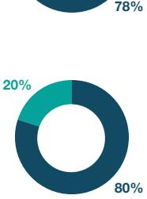
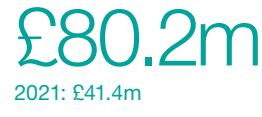

{0}------------------------------------------------

SIG plc Annual Report and Accounts 2022

{1}------------------------------------------------

SIG is a leading supplier of specialist insulation, roofing materials, and sustainable building products to customers across Europe, known for our expertise, quality service, and reliability.

We've been supplying the construction industry for over 65 years and we are proud of the central role we play in the supply chain, bringing value to our customers and manufacturers as a specialist distributor.

Gavin Slark Chief Executive Officer

{2}------------------------------------------------

# 2022 highlights

Revenue

£2,744.5m

2021: £2,291.4m

Gross margin*

25.9%

2021: 26.3%

#### Statutory profit/(loss) before tax

£27.5m 2021: loss of £15.9m

Lost time injury frequency rate ("LTIFR")*

 11.1 2021: 11.8

* Refer to pages 24 to 25 for definitions.

Like-for-like ("LFL") sales growth*

17% 2021: 24%

£80.2m

Underlying operating profit*

2021: £41.4m

# Net debt

£444.0m

2021: £365.0m

Greenhouse gas ("GHG") emissions per £m of revenue*

 17.5 metric tonnes 2021: 23.0 metric tonnes

To find out more please go to sigplc.com

#### Strategic report

- 2 At a glance
- 6 Strategic framework
- 8 Our market
- 12 Business model
- 14 Chairman's statement
- 17 Chief Executive Officer's review
- 20 Our strategy
- 24 Key performance indicators
- 26 Environmental, social and governance
- 55 Non-financial information statement
- 56 Risk
- 62 Financial review

#### Governance

- 69 Chairman's introduction
- 70 Board of Directors
- 72 Corporate governance report
- 72 Board activities
	- 76 Engagement with our stakeholders
	- 80 Workforce engagement
	- 82 Division of responsibilities
	- 84 Executive Leadership Team
	- 85 Board arrangements
	- 87 Board evaluation
	- 88 Nominations Committee report
	- 92 Risk management and internal control
	- 94 Audit & Risk Committee report
- 101 Directors' remuneration report
- 127 Directors' report
- 131 Directors' Responsibilities Statement

#### Financials

- 133 Consolidated income statement
- 134 Consolidated statement
- of comprehensive income 135 Consolidated balance sheet
- 136 Consolidated statement of changes in equity
- 137 Consolidated cash flow statement
- 138 Statement of significant accounting policies
- 149 Critical accounting judgements and key sources of estimation uncertainty
- 151 Notes to the consolidated financial statements
- 194 Non-statutory information
- 196 Independent auditor's report
- 205 Five-year summary
- 206 Company balance sheet
- 207 Company statement of changes in equity
- 208 Company statement of significant accounting policies
- 211 Notes to the Company financial statements
- 217 Group companies 2022
- 220 Company information

{3}------------------------------------------------

# At a glance

# Pan-European presence

We are the largest European player in our chosen interiors and exteriors markets and the largest partner for many of our suppliers. We are well diversified across geography, end-markets and customer type.

Our empowered local teams and deep relationships with manufacturers give us flexibility to respond to changing customer needs and varied market conditions, enabling most of our businesses to out-perform the market in 2022.

No one supplier represents more than 10% of the Group's cost of sales

75k+ customers

58% EU sales

{4}------------------------------------------------

|                                                 | Revenue £m | Trading sites | Employees | Market position | Underlying operating margin % |
|-------------------------------------------------|---------------|------------------|-----------|--------------------|-------------------------------------|
| United Kingdom                                  |               |                  |           | Top                |                                     |
| Interiors Exteriors                          | 703 445    | 176              | 3,140     | 2 #1            | 2.0 4.1                          |
| France                                          |               |                  |           |                    |                                     |
| Interiors Exteriors                          | 218 466    | 138              | 1,372     | #2 #1           | 5.6 5.1                          |
| Germany                                         | 458           | 52               | 1,266     | Top 3           | 3.7                                 |
| Poland                                          | 231           | 47               | 884       | Top 3           | 4.6                                 |
| Benelux                                         | 116           | 17               | 219       | Top 3           | (2.6)                               |
| Republic of Ireland & Northern Ireland | 108           | 11               | 324       | Top 2           | 5.5                                 |
|                                                 | Interiors     | Exteriors        |           |                    |                                     |

{5}------------------------------------------------

# At a glance

# Supplying specialist products key to sustainable construction

{6}------------------------------------------------

SIG is a leading supplier of specialist building products and systems across our core interiors and exteriors categories. We connect over 75,000 customers with thousands of different products, but SIG is more than a distributor – we provide technical advice, train and certify installers, and fabricate bespoke solutions in key niches.

{7}------------------------------------------------

# Strategic framework

# A proven growth strategy

Since 2020, we have executed on our seven pillar growth strategy, supporting our commitment to sustainable construction and sustainable market leadership.

LFL growth since 2020

45%

A strong positive impact on customers, with

>90%

agreeing in recent surveys that "SIG is a brand I trust"

2022 underlying operating margin ahead of plan

2.9%

Improved employee Net Promoter Score ("eNPS") over the last two years

+19

Margin accretive acquisitions in the last two years

+£140m acquired revenue

{8}------------------------------------------------

Strategic report Governance Financials

# Return to Growth strategy launched two years ago

- − Response to a period of share loss and profit decline that pre-dated Covid-19.
- − Driving margin uplift through profitable growth, not short-term cost cutting.
- − Decentralisation and empowerment.
- − Seven strategic pillars rooted in the DNA of SIG's most successful eras.
- − Commitment to energy efficiency SIG's heritage and our future.

# What's changed? We... What we've achieved

- − Trusted and incentivised branch managers to make the right decisions for their local markets.
- − Invested in superior inventory range and availability.
- − Hired hundreds of specialists in sales and category management teams.
- − Strengthened strategic partnerships with significant revenue growth in products from key suppliers.
- − Are redesigning processes to make SIG easier to buy from, sell to and work for.
- − Executed the strategy consistently, building customer and supplier loyalty through a turbulent two years.

# As a result SIG is...

- ...more specialist
- ...more local
- ...more productive and engaged
- ...more valuable to our suppliers
- ...more flexible.

- − Doubled underlying operating profit from 2021 with underlying operating margin improvement, to nearly 3%, ahead of plan.
- − Sustained gross margins through successful product inflation management.
- − Continued reduction in operating costs as a percentage of sales.
- − Share gains and improved margins while investing for the future.
- − Improving customer Net Promoter Score ("NPS") and employee engagement scores.
- − 12 branch openings in the last two years (reversing long-term footprint decline).
- − Five margin accretive acquisitions.
- − Rejuvenated leadership team with industry expertise bolstered.

# Acquisition of Miers Construction Products Limited

One of the UK's leading suppliers of specialist construction accessories, Miers broadens SIG's offering in high-margin categories and increases our exposure to growing infrastructure markets.

{9}------------------------------------------------

# Our market

# Benefitting from long-term growth trends

SIG's diversification and energy efficiency heritage mean the Group is well placed to respond to market growth drivers and changing customer needs.

# Construction industry growth

- − Long-term construction industry growth is driven by macroeconomic factors including population growth, economic activity and GDP. Industry-specific demand drivers include governments' long-term need to tackle housing shortages, the drive to upgrade energy-inefficient building stock, and infrastructure investment.
- − Looking ahead, while some industry end-markets are expected to be impacted by near-term weakness, the long-term outlook for the construction industry remains one of growth.
- − Building materials demand can experience cyclicality, but endmarkets within the industry and countries do not move in unison – diversification matters.
- − SIG's sales are evenly split between new build projects (c50%) and repair, maintenance and improvement ("RMI") projects (c50%). Around 50% of our customers' end-projects are residential and 50% non-residential.

Together with our presence across six European geographies, SIG benefits from long-term construction industry growth with diversified exposure across industry end-markets.

# Inflation and energy costs

- − Cumulative building materials inflation was more than 25% over the last two years in some categories, inevitably constraining near-term market volume growth.
- − Inflation in 2021 was impacted by Covid-19-linked supply chain disruption. In 2022 it was largely driven by rising energy costs caused by the war in Ukraine (energy accounts for 25% of the production cost in core SIG products).
- − High (and unpredictable) inflation puts stress on the construction ecosystem – contractors are less willing to commit to lengthy fixed price contracts with suppliers pausing production when energy costs make production uneconomic.
- − The impact of high inflation on industry input prices is expected to ease in 2023.

SIG's proactive communication of supplier price rises, and advice to customers on optimising cost and energy efficiency, enabled us to sustain gross margins despite high input cost inflation.

{10}------------------------------------------------

# Sustainable construction

- − Over 35% of European GHG emissions are linked to construction. Our industry is centre-stage in enabling UK and EU governments to reduce carbon emissions and embodied carbon in buildings and to meet their net zero targets.
- − Regulation is being introduced in a number of areas: tightened standards for insulation performance (e.g. Part L in UK), embodied carbon and recycled content (e.g. EU Ecodesign for Sustainable Product Regulation) and roofing mix (e.g. Climate and Resilience act in France mandates 30%+ coverage of solar panels or green roofs for buildings over 1,000m2 ).
- − Governments are providing sector-specific financial resource, e.g. Germany has allocated €47bn over three years to improve the energy efficiency of existing buildings, and in the UK "Eco Plus" will provide grants of up to £15,000 to help c70,000 homeowners fund insulation renovation.

SIG benefits from European governments' regulation, standards and stimulus for energy efficiency and insulation, as well as demand for more sustainable building materials.

# Digitalisation

- − Construction labour productivity fell over the last 35 years (while doubling in manufacturing sectors) – digitalisation across the construction value chain is key to addressing this industry productivity challenge.
- − Trade customers increasingly expect distributors to offer easy-to-use digital services to research, plan, order, track and manage their accounts, as part of omnichannel relationships.
- − Building design processes are utilising digital models of whole building lifecycle (raising the importance of product data flows), while modern methods of construction such as modular will reduce cost and waste.
- − Growing attention to lifecycle carbon footprint adds significant product data complexity.

SIG is transferring learnings from SIG Poland in its omnichannel approach. Various operating companies are now investing in product information management systems, and driving benefits from modernising operational processes (e.g. warehouse and transport management).

{11}------------------------------------------------

# Our market

# Rising demand for sustainable, energy efficient buildings

SIG was founded in 1957, a leading force influencing and responding to evolving energy efficiency standards across seven decades. As Europe's leading independent supplier of insulation, SIG is well placed to benefit from the European-wide drive to improve energy efficiency across the built environment.

# Why this is important

UK and EU net zero targets require the housing renovation rate to triple. Governments are therefore introducing regulation and support in a number of areas e.g.

- − Building energy performance: more stringent standards are being introduced to reduce in-use emissions, e.g. Part L, Future Homes Standard, higher EPC standards (UK), obligations to install photovoltaic panels ("PV") (France, Germany), heating source transition.
- − Product sustainability: proposals to revise the EU Ecodesign Directive and EU Construction Products Regulation lead to more recycled content and packaging and more consistency to product sustainability claims.

Leading to...

Growth in demand for insulation and other core SIG products

Distributor expertise in energy and carbon efficiency increasingly important

{12}------------------------------------------------

- − Energy efficiency is our DNA, from taking fibreglass into domestic insulation in the 50s, 60s and 70s, through to highly efficient modern insulation systems and low-carbon materials.
- − We are the biggest independent supplier of insulation in Europe, and a key customer of our major manufacturers.
- − SIG technical teams advise on compliance and performance solutions across thermal and acoustic insulation, fire protection and embodied carbon.
- − By accelerating access to environmentally friendly solutions and providing data and advice on carbon performance we help customers achieve their own sustainable construction goals.

# Why SIG? What we've achieved

- − Market leadership in insulation.
- − Growth in our bio-sourced materials range.
- − Launch of solar solutions and training targeted at small roofers.
- − Advice to national housebuilder project customers on the selection of products to support overall building energy efficiency in the context of ongoing and changing regulations.
- − Proactive collection of customer waste in France.
- − Investments and partnerships in earlystage innovations, including recycled roofing materials, carbon negative plasterboard and ultra-light solar.
- − A 9% reduction in emissions from SIG's own operations in 2022.

# SIG's role in sustainable construction

- − Raise awareness of energy efficiency and carbon regulations.
- − Introduce and scale up new lower-carbon solutions.
- − Provide transparency to product carbon performance.
- − Help customers optimise between cost, energy efficiency in use and embodied carbon.
- − Coordinate complex logistics to reduce on-site cost and waste.
- − Provide ancillary services such as data, technical advice and support.
- − Backhaul waste from customers' sites.
- − Reduce emissions from our own operations.

{13}------------------------------------------------

# Business model

# Creating value for our stakeholders

# Our resources What we do

# Committed and specialised workforce

- − Over 7,000 people
- − 73% engagement score
- − Hundreds of category experts hired in the last two years
- − Over 200 apprentices

# Pan-European local footprint

- − 440+ branches in six geographies
- − 2x revenue of nearest interiors peer, 3x revenue of nearest exteriors peer

# Powerful franchise

- − >90% of customers say "SIG is a brand I trust"
- − Industry reputation rebuilt

# "Born green" DNA

- − Seven decades promoting and advocating for energy efficient solutions
- − Largest independent supplier of insulation in Europe

# Innovation ecosystem

- − Partnerships with start-ups and research institutes pioneering sustainable construction solutions
# Financial stability

- − £2,744.5m sales with 17% LFL growth
- − £80.2m underlying operating profit
- − Long-term funding in place, due for repayment in 2026
- − Stable Board and governance structure

# SIG is a leading supplier of specialist insulation and sustainable building products and solutions to business customers across Europe

Interiors Revenue 65%

- − Structural insulation
- − Technical insulation
- − Ceiling tiles and grids
- − Construction accessories and fixings
- − Partition walls and doorsets
- − Drylining
- − Floor coverings

# Exteriors Revenue

35%

- − Tiles, slates and membranes
- − Batten for pitched roofs
- − Single-ply flat roof systems
- − Industrial roofing
- − Cladding systems − Room-in-roof
- panel systems − Photovoltaic panels

infrastructure; new and RMI

{14}------------------------------------------------

# Our purpose

To enable modern, sustainable and safe living and working environments in the communities in which we operate

# Leading to sustainable market leadership

Operating margins trending to 5%

Grow our leadership positions and market share

Trusted and recommended  Disciplined capital allocation

# Supported by five sustainability commitments

Net zero carbon by 2035

Partner with manufacturers and customers

# How we do it Creating stakeholder value

# Valued by employees:

- − Motivated employees who are proud to work for SIG and are highly committed to their work, the organisation, and their teams
- − Improved health and safety performance against all metrics

# Employee NPS +14

# Valued by customers:

- − Wide range and availability of established and new products
- − Coordinating complex logistics to reduce cost and waste
- − Bespoke solutions and fabrication
- − Expert advice on energy and carbon efficiency, compliance and cost

# Customer NPS +46

# Valued by manufacturers:

- − Access to fragmented customer base
- − Energy efficient distribution
- − Joined up provision of technical support

# Significant revenue growth in products from key suppliers

# Valued by shareholders:

- − Well positioned for sustainability tailwinds
- − Diversification by country and end-market
- − Proven strategy, experienced management
- − Successful turnaround, with further performance upside and growth opportunity

# Growth path to 5% margin

# Valued by future generations:

- − Minimising carbon in SIG's own operations
- − Enabling energy efficient buildings
- − Facilitating the circular economy

# Net zero carbon by 2035

See Engagement with our stakeholders on pages 76 to 79

{15}------------------------------------------------

# Chairman's statement

# Transformation and good momentum

"SIG continued to make good progress in 2022. I would like to thank Steve Francis, our outgoing CEO, for his significant contribution to transforming the Group's position. I look forward to working with Gavin Slark, our new CEO, on building on these foundations and delivering long-term value for all our stakeholders."

Andrew Allner Chairman

# Dear Shareholder

The Group continued to make good progress in 2022 in the execution of our strategy, in growing the business strongly, improving margins, partly driven by inflationary tailwinds, and in demonstrating improved cash generation. Encouragingly we have strengthened our market position in most of our major markets.

The Board would like to thank our outgoing CEO, Steve Francis, for his significant contribution to transforming the Group over the last three years. Steve joined us during a very difficult period for the Group and, having led the development of the Return to Growth strategy, he leaves SIG in a much stronger position than when he joined. We wish him well for the future. Steve is succeeded by Gavin Slark, who has a long track record of success in the pan-European construction products distribution industry. We have every confidence that he will build on our strategic momentum and ensure SIG is able to take advantage of the many opportunities we see ahead.

# Strategic progress

SIG has been transformed since the launch of our Return to Growth strategy in 2020.

We have returned to our previously well established and proven way of doing business, notably by empowering and trusting our local teams, and as a result are regaining our reputation as a trusted network of building materials specialists across our markets. Today we have a consistent and resilient business model, built on diversification, operational flexibility, and the strength of a localised and branch-led approach.

We have continued to invest for the future, opening eight new branches across our network and acquiring two businesses in the last year, alongside building experienced teams who continue to develop strong and proactive customer and supplier relationships.

{16}------------------------------------------------

We have been able to manage the significant inflationary pressures seen in 2022, including very high increases in input costs, through improved customer service and product availability.

We are committed to making SIG easier to buy from, sell to, and work for, helping us increase the productivity of our branches and fleet. We are embracing technology and advancing the evolution of our business and industry into omnichannel business models.

A large majority of our products help increase energy efficiency in buildings, and so we are well placed to take advantage of what we see as a strategic tailwind over the coming years.

We have continued to improve our operating margin, reaching 2.9% in 2022, and, importantly, returning to positive free cash flow generation. We have demonstrated the ability to execute investment-led growth both organically and through M&A, and both aspects will remain important in the medium and longer term.

Further details of the strategy and a strategic update can be found in the Chief Executive Officer's review on pages 17 to 19.

# Sustainability

The Board believes that sustainable growth goes beyond strong financial performance. As a responsible business, our ambition is to create long-term value and make a positive impact on our employees, customers, suppliers, and communities, while helping to drive profitable economic growth.

We continue to focus on our five Group-wide sustainability commitments:

- Net zero carbon by 2035
- Sending zero SIG waste to landfill by 2025
- Partnering with manufacturers and customers to reduce carbon and waste across the supply chain
- A health and safety leader in building materials distribution
- An employer of choice in our sector.

# Our investment case

# Resilient, diversified and high potential franchise in sustainable construction

- − A unique pan-European platform with leading positions in fragmented interiors and exteriors segments.
- − Competitively advantaged through scale, supplier partnerships, local proximity, logistics excellence and specialist expertise.

# Proven business model

- − The seven pillar model builds on the decentralisation and empowerment of entrepreneurial teams that underpinned SIG's most successful eras.
# Rejuvenated leadership team with a strong track record

- − Driven and balanced executive team, blending deep SIG and industry experience.
- − Smooth transition to highly regarded CEO in February 2023.
- − Resilience through operational flexibility and diversification by product, geography, customer and end-user mix.
- − "Born green" decades of experience as a leading force in energy efficiency, product focus aligned to sustainability tailwinds, backed by SIG's own net zero commitments.
- − Tried and tested playbook equally applicable to adjacent specialist categories with similar characteristics.
- − Long history of SIG expansion into new products and geographies.
- − Strategy execution ahead of expectations: above market growth, consistent operating margin uplift, improving customer, employee and supplier loyalty.
- − Doubled underlying operating profit in 2022.

# Clear path towards 5% operating margin and opportunities to accelerate

- − Supportive long-term structural growth drivers, despite weaker near-term market conditions.
- − Further "self-help" upside to go for portfolio businesses at different stages in their path to 5%.
- − Multiple levers for capital-light growth, mix improvement and productivity gains.
- − Returned to cash generation, with demonstrated ability to invest in margin accretive M&A and network expansion.

{17}------------------------------------------------

# Chairman's statement

These commitments underpin our determination to build modern, sustainable, and safe living and working environments in the communities in which we operate. We recognise our responsibility, as a leading industry player, to support the construction industry in taking meaningful steps to protect the environment and reduce carbon emissions.

The Board was pleased to approve the Group's refreshed sustainability policy during the year which sets out the actions being taken to achieve net zero carbon by 2035 and zero SIG waste to landfill by 2025. The policy also supports our commitment to ensuring our employees feel safe, valued, and proud to work for us.

Further information on our progress can be found on pages 26 to 54.

# Group performance

2022 LFL sales growth was strong at 17% with high levels of price inflation providing a substantial tailwind to the reported level of growth throughout the year. Volume growth was broadly flat with gains in market share offsetting declines in some of our end-markets, notably in the second half of the year.

We reported an underlying operating profit of £80.2m, a £38.8m increase compared with 2021 (2021: £41.4m), and an underlying profit before tax of £51.6m (2021: £19.3m). This led to an increase in underlying earnings per share from 0.3p in 2021 to 3.2p. Statutory profit before tax was £27.5m (2021: loss of £15.9m), with a statutory earnings per share of 1.3p against a loss per share of 2.4p in 2021.

As anticipated, the Group has delivered positive free cash flow for the year, which was a key strategic target and milestone set under our Return to Growth strategy. The £10.6m free cash flow has helped to further reduce our post-IFRS 16 leverage from 3.2x in 2021 to 2.8x in 2022. Post-IFRS 16 net debt has increased largely due to additional lease liabilities following lease renewals and additions across our trading sites and fleet.

No dividend is proposed for 2022. We will continue to monitor free cash flow generation and progress toward our target leverage. The Board remains committed to returning to paying a dividend when we sensibly can, as part of our wider capital allocation policy.

# Governance and Board

We believe that good corporate governance comes from an effective Board that provides strong leadership to the Group and engages well with both management and stakeholders.

I am pleased to report that a smooth CEO transition from Steve to Gavin has been achieved, and I am confident that our new CEO and the Executive Leadership Team will build on the significant progress made in the last three years.

During the year, the Board also placed significant focus on the development of succession planning for our senior team to ensure that the Group is well prepared and continues to have a stable body of experienced leaders in place.

I believe the Board continues to operate effectively across all aspects of its role, and more details of this can be found in the Corporate Governance report and particularly on page 87 where we describe the annual evaluation exercise undertaken by the Board.

The Board of ten Directors includes two women and one Director from an ethnic minority background, and there remains work to be done to improve the diversity of the Board. Recognising that during the year the Nominations Committee's focus was on CEO succession and the development of our senior leadership team, we remain committed to taking further steps to address Board diversity in 2023.

The Board firmly believes it is important for Directors to engage directly with employees to gain first-hand insight into their challenges and views. During the year, I am pleased to report that nominated Board members continued to deliver our Board Workforce Engagement programme, meeting face-to-face with a broad cross-section of employees. You can read more about this on pages 80 to 81.

Christian Rochat has informed the Group that due to the recent increase in his commitments to companies within the CD&R portfolio, he will not stand for re-election at the AGM on 4 May 2023 and will accordingly step down as of that date. CD&R is entitled to appoint a Director to replace him. Christian joined the Board at the time of CD&R's investment in July 2020 and I would like to express our gratitude to him for the role that he played in the Group's turnaround and progress since then, to the benefit of all of SIG's shareholders.

# People and culture

Our people continue to be our biggest strength. The Board would like to thank employees for their dedication, commitment, and hard work throughout the year.

The Board is cognisant of the pressures the current economic climate, and especially the increases in the cost of living, place on our people. As a Group, we will continue to work hard to provide support to our employees through these challenging times including selective one-off cost of living payments.

We continue our efforts to build an inclusive culture, and our third annual employee engagement survey, which provides both qualitative and quantitative data, enables us to engage and listen directly to employees.

The Board was very encouraged to see positive feedback and signs of continued improvement in many areas, and the insight and recommendations continue to support our People strategy. You can read more about the feedback and actions on pages 40 to 44.

The Board is committed to SIG's ambition to be an employer of choice in the building materials sector. Our approach to people and culture will continue to be a critically important priority, with an even greater focus on talent, development, diversity, and succession planning.

# Outlook

We believe that, through the dedication of our people, SIG is currently in better shape than it has been for a number of years, to the benefit of all stakeholders.

We retain strong positions in our core markets and, while market headwinds remain in 2023, our scale, diversification, and resilience give the Board confidence in our ability to deliver the Group's medium to longer-term objectives.

I would like to thank our employees and all our other stakeholders for their ongoing support.

I, along with the rest of the Board, very much look forward to working with Gavin to build on the strong foundations established over the last three years and delivering on our expectations for the year ahead.

# Andrew Allner

Chairman 7 March 2023

{18}------------------------------------------------

# Chief Executive Officer's review

# Solid foundations for further growth

"2022 results demonstrate good progress against the key growth and development milestones that the Group set in 2020."

# Gavin Slark

Chief Executive Officer

I am pleased to provide my first report as the Chief Executive Officer of SIG. Having joined on 1 February 2023, after the end of the reporting period, I would like to thank Steve Francis, the Executive Leadership Team and all of our people across our businesses who have contributed to SIG's strong performance in 2022.

# 2022 Results

Our 2022 results demonstrate good progress against the key growth and development milestones that the Group set in 2020. LFL revenue growth of 17% reflected the Group's ability to effectively manage input price inflation, as well as the successful execution of its strategy and the gaining of market share in key geographies. The Group also delivered its targeted step-up in profitability, reaching a 3.1% underlying operating margin in H1, and closing the year at 2.9%, a 110 bps improvement over 2021. This performance was achieved despite a one-off loss of £5m in H2 as a result of Avonside, a major UK roofing contractor and one of the Group's largest customers, going into administration.

These results reflect the further progress made under the Return to Growth strategy launched in 2020. We have empowered branches, who can respond to local trading conditions and drive local performance, and we have businesses that are now more specialist, flexible, productive, and engaged. Customer NPS has improved in most geographies and the Group's NPS increased from +40 to +46, meaning that an increasingly high proportion of our customers are likely to recommend SIG to others.

SIG's 2022 results also demonstrate a significantly improved financial position since 2020. The Group has returned to positive free cash flow and further reduced its leverage, which were both key targets set in 2020. As set out in the Financial review, the financing put in place during 2021 secured long-term funding at good pricing until 2026. SIG also now has a good level of liquidity to support the ongoing needs of the growing Group. This includes a revolving credit facility that was increased from £50m to £90m in late 2022, and which was undrawn at the year end.

{19}------------------------------------------------

# Chief Executive Officer's review

# Market dynamics

SIG's results during 2022, and over the last two years, also reflect the Group's successful management of volatile macroeconomic conditions to deliver consistent performance improvement.

The impact of Covid-19 during 2020 and 2021 created unprecedented disruption for the construction industry with knock-on effects continuing into 2022. The decline in market activity during the initial lockdowns in 2020 was followed by higher than usual RMI activity in many markets, coupled with significant supply chain and logistics challenges and labour shortages. As supply chains began to normalise, the commencement of war in Ukraine in 2022 created volatile energy and raw material markets, which drove price inflation and macroeconomic uncertainty.

SIG has successfully managed through these market swings. During 2021, the Group took strong action to ensure stock availability for customers, prioritising investment in product inventory and enhancing service levels. In 2022, the Group was able to unwind some of the resulting higher inventory to more normalised levels, with working capital improvement as a result, whilst ensuring we maintained strong customer service and prompt delivery times.

While input cost inflation has supported top-line revenue growth, SIG's tight focus on product category management was critical to enabling effective pass through. Strong relationships and communication with both suppliers and customers have also been vital, and I credit our teams for their ongoing commitment in this area.

As set out in further detail in the "Our market" section of this Strategic report the Group's trading environment includes the impact of near-term economic trends and long-term structural growth drivers. During 2022 we saw the impact of both trends, from some softening of trading in the second half in geographies such as the UK due to weaker economic conditions, together with the continuation of long-term trends among governments to mandate greater sustainability in construction and the built environment, in particular to increase the energy efficiency of buildings.

# Strategic progress across SIG's geographies

In France the operating margin of both the Interiors and Exteriors businesses now exceeds 5%, driven by consistent execution of our strategy. This execution has included product mix enhancement and a rigorous focus on branch performance and has led to market share gains.

In Germany we have delivered a strong turnaround since the introduction of new management in Q4 2021, with 16% LFL sales growth in 2022 and underlying operating margin improving to 3.7% from 0.9% in 2021. Progress in Germany has been driven by an "empower the touchpoints" strategy that has increased empowerment of local teams, re-energised the sales force, and bolstered specialist expertise to strengthen customer and supplier relationships.

The UK Interiors business has delivered a successful two-year turnaround, recovering market share and returning to profitability through consistent execution of its strategy, better pricing discipline, and aided by the pricing tailwind. UK Exteriors had a solid year albeit with market volumes declining in the second half in particular. Their margin was affected by the significant bad debt write-off referenced on page 17.

Our Benelux business returned to market share gain in 2022 with some initial improvements in profitability, and with further aspects of the turnaround plans to be implemented.

The Group has continued to utilise technology to support business transformation through improved productivity and customer experience, with a focus on making SIG a better place to buy from, sell to and work for. Further progress is needed in 2023 to ensure consistent deployment of these solutions across all of the Group's businesses.

In Poland our omnichannel services to customers and new ways of working have driven strong sales, profit and productivity improvement, with sales via our marketleading e-commerce platform representing 10% of sales. Across our operating companies we are progressing the transformation of our warehouse and transport management

systems onto digital platforms for process optimisation and productivity improvements. We have also continued to build our digital leadership capabilities across the business.

During 2022 the Group invested in both network expansion and two accretive acquisitions. Eight new branches were opened, which will continue to bolster organic growth in the years ahead, and the acquisitions of Miers Construction Products and Thermodämm completed successfully. Miers is one of the UK's leading suppliers of specialist construction accessories and increases our exposure to infrastructure end-markets. Thermodämm is a specialist interiors business in Germany, reinforcing our market-leading position in flooring.

These acquisitions, together with those completed in 2021, reflect the Group's commitment to supplementing organic revenue growth with selective acquisitions, where these can boost specialist expertise in high-margin categories and deliver synergies with our existing businesses.

# Sustainability

The Group has set five commitments against which it will measure its continuing progress as a leader in sustainable construction. During 2022 we have reduced emissions (Scope 1, Scope 2 and business travel emissions) by 10% to 43,328 metric tonnes as we work towards our goal of being net zero carbon by 2035 at the latest. The key drivers were an increased use of renewable electricity contracts in the UK and Germany alongside replacing vehicles with a lower-carbon alternative as leases come up for renewal. We have also increased the level of waste that is diverted from landfill to 92% from 86% in 2021.

The Group reinforced its commitment to being a health and safety leader in our industry, appointing a new Group Health, Safety and Environment Director. Our 2022 reported LTIFR reduced to 11.1 from 11.8 in 2021, alongside improved near-miss reporting which encourages all our employees, contractors and stakeholders to report near misses, unsafe situations and behaviours for positive interventions.

Further details of our progress under these and our other sustainability commitments can be found on pages 26 to 54.

{20}------------------------------------------------

# Initial impressions

Over my first five weeks at SIG, I have had the opportunity to visit many of our teams, operations and branches. I am greatly looking forward to spending more time working with my colleagues and pursuing our opportunities together. Some of my initial impressions are:

#### A successful three years

The Group's progress over the last three years in improving its operating and financial performance has been significant, especially in challenging market conditions. There is a strong sense of pride among the colleagues I have met in what has been achieved and there is a clear appetite to continue that momentum.

#### Engaged people and culture

Our people are passionate about going the extra mile for our customers and meeting the needs of their local markets. SIG branch teams demonstrated their knowledge of our products, while our senior leaders (many returning to SIG in the last three years) carry a depth of industry expertise that is invaluable. Employee engagement has further increased in 2022, but we also know we have further to go to make SIG easy to buy from, sell to and work for. Please read more on our People strategy on pages 40 to 44.

# Pan-European diversification and growth opportunity

As a listed company on the London Stock Exchange, SIG is perhaps sometimes seen from a distance as a "UK" business. However, almost 60% of the Group's revenue is generated from the EU with a portfolio of strong positions, diversified by customer segment and endmarket. This pan-European spread presents a range of opportunities for profitable growth in existing and adjacent categories.

# Outlook

Looking beyond the impact of the shortterm economic cycle, SIG remains very well positioned to benefit from long-term structural growth in our industry, and, as a leading European supplier of insulation and energy efficiency solutions, to benefit from structural tailwinds of decarbonisation.

Through the Group's good progress over the last two years, SIG is in a strengthened financial position. This, together with the growth opportunities we have across the portfolio and the opportunity for continued improvement in operating performance and profitability, gives me confidence in our ability to deliver long-term sustainable profitable growth. I am delighted to have joined a Group with a strong platform for value creation for our stakeholders, and look forward to working with all of our teams in capturing these opportunities.

#### Gavin Slark

Chief Executive Officer

7 March 2023

{21}------------------------------------------------

# Our strategy

# Resilient and flexible

We continue to build on the success of our Return to Growth strategy and make progress against each of our seven strategic pillars, strengthening our position in the market and building our resilience for the future.

# Responsible actions

- A greener fleet and estate
- Positive community impact

# 2022 progress

- − Our eNPS rating improved by 11 points in 2022 and has now improved 19 points since 2020.
- − The Group's health and safety leadership was strengthened in the year with the appointment of a new Group Health, Safety and Environment Director.
- − The LTIFR reduced to 11.1 from 11.8 in 2021.
- − Total carbon emissions were 9% lower than 2021 and 17% lower than the last pre-Covid-19 "normal" year of 2019, driven by an increased use of renewable electricity contracts in the UK and Germany alongside the gradual replacement of vehicles with a lower-carbon alternative when lease renewals fall due.
- − A new diversity, equality and inclusion ("DEI") forum was established with representatives from all operating companies.
- − Wellbeing programmes were enhanced in all businesses to support employees through the pressure of the current economic climate and cost of living increases.
- − SIG Poland was awarded "Green Company" and "Good Employer" by the European Business Forum in November 2022.

# Link to KPIs

- − Lost time injury frequency rate
- − GHG emissions per £m of revenue (metric tonnes)
- − Employee engagement result (eNPS)

- − Health and safety
- − Macroeconomic uncertainty
- − Environmental, social and governance
- − Legal or regulatory compliance
- − Change management

{22}------------------------------------------------

# Winning branches

- Local teams trusted and empowered to succeed
- Differentiated through expertise, proximity and service

# 2022 progress

- − There has been a customer NPS improvement in most businesses, with particularly strong scores in Poland (+80) and Germany (+63). Group NPS increased from +40 to +46 indicating an increased likelihood of our customers recommending SIG.
- − Our decentralised approach has enabled branches to "go where the growth is", optimising category mix and managing margin in volatile market conditions.
- − Germany's "empower the touchpoints" strategy was implemented, creating a new branch structure and autonomy and ensuring branches are closer to customers and suppliers. This has helped to drive an improvement in Germany's operating margin to 3.7% from 0.9% in 2021.
- − Our branches have remained fundamental to our evolution of providing omnichannel services to our customers: in person expertise when required, collection of goods ordered or as a local hub for delivery.
- − LFL sales have increased by 17% from 2021 with gross margin remaining broadly in line with 2021 at 25.9%.

# Link to KPIs

- − Net Promoter Score (NPS)
- − Like-for-like sales (%)
- − Gross margin (%)
- − Operating margin (%)

# Link to principal risks

- − Health and safety
- − Attract, recruit and retain our people
- − Digitalisation
- − Change management

# Superior service

- Agile and entrepreneurial sales teams
- Omnichannel, data-rich customer journey

# 2022 progress

- − In an ongoing difficult supply environment, the Group has maintained appropriate investment in inventory to ensure that there is range and availability for our customers.
- − Poland's customers' ongoing adoption of omnichannel drove productivity and margin gains with sales via e-commerce representing 10% of their total sales during the year. Our e-commerce platform in Poland continues to be a great success, winning the award for the "Best e-commerce B2B" in the e-commerce Polska awards 2022.
- − Across the Group, the first steps in leveraging Poland's successful omnichannel approach across other operating companies were taken with the promotion of Poland's e-commerce leader to Group Director of Omnichannel. In addition, Germany hired an experienced e-commerce director from the industry to lead the drive towards an omnichannel approach.

# Link to KPIs

- − Net Promoter Score (NPS)
- − Like-for-like sales (%)

- − Macroeconomic uncertainty
- − Attract, recruit and retain our people
- − Digitalisation
- − Change management

{23}------------------------------------------------

# Our strategy

# Specialist expertise

- Known for specialist focus and technical knowledge
- Advice to optimise cost, performance and carbon

# 2022 progress

- − UK Interiors has now delivered its initial turnaround with an operating margin of 2.0% in 2022 against (12.7)% in 2020 when the rebuild began. Market share has been recaptured, and margins have improved due to pricing discipline, product mix and inflation management, all enabled by the return of expertise into the business. Over the two years from 2020, the UK have hired over 150 specialists with, on average, more than 15 years' experience.
- − Our Interiors business in France, LiTT, celebrated its 40th anniversary, highlighting the heritage and experience we have in the marketplace.
- − SIG's strong franchise and category expertise across the business has enabled our ability to pass through inflation in a challenging macroeconomic climate. Along with the ability of our local specialists to manage price and demand trade-offs daily, this has led to a broadly stable gross margin for the Group of 25.9%.

# Valuable partnerships

- Win-win strategies with suppliers
- Supporting suppliers' and customers' sustainability goals

# 2022 progress

- − Our pan-European supplier relationships and local teams have ensured we have been able to secure inventory availability across our branch network whilst negotiating versatile rebate structures.
- − Revenue from products from key suppliers grew significantly from 2020.
- − SIG in the UK has become a partner of the Supply Chain Sustainability School, which will provide resources to help the team in the UK lead the conversation on sustainable building practices both internally and within its supply chain.
- − SIG Ireland has become a member of the Irish Green Building Council; this will allow the business to enhance their sustainable product offering and technical expertise.
- − Our UK MD, Philip Johns, is the Chairman of the CPA (Construction Products Association) – a leading organisation that represents and champions construction product manufacturers and suppliers.

# Link to KPIs

- − Net Promoter Score (NPS)
- − Like-for-like sales (%)
- − Gross margin (%)
- − Operating margin (%)

# Link to principal risks

- − Attract, recruit and retain our people
- − Mergers and acquisitions

# Link to KPIs

- − Gross margin (%)
- − Operating margin (%)

- − Data quality and governance
- − Environmental, social and governance

{24}------------------------------------------------

# Highest productivity

- Digitalising operational processes
- Lean and effective governance

# 2022 progress

- − Modernisation is a key priority for the Group and the operating companies have made good progress making SIG an easier place to buy from, sell to and work for.
- − In the UK, a new warehouse management system ("WMS") was rolled out in a number of branches and a trial B2B e-commerce portal was launched for the Interiors and Exteriors businesses.
- − In France, a transport management system has been rolled out across the Interiors business, while we are also implementing a WMS in our largest locations. A trial e-commerce B2B portal was also launched for Larivière.
- − Ireland's continued modernisation of business processes, enabled by technology, is producing material financial benefits with the focus this year on the procure to pay process.

# Link to KPIs

- − Lost time injury frequency rate
- − GHG emissions per £m of revenue (metric tonnes)
- − Employee engagement result (eNPS)
- − Operating margin (%)
- − Average trade working capital to sales ratio (%)

# Link to principal risks

− Digitalisation

# Focused growth

- Growing energy efficient and low-carbon solutions
- Expanding branch network
- Acquisitions

# 2022 progress

- − The strategic acquisitions of Miers in the UK and Thermodämm in Germany completed in 2022. The five acquisitions since 2020 have brought 15 additional branches into the network and they continue to perform to expectations. A further pipeline of attractive UK and EU acquisitions has also been established.
- − We have continued to develop product strategies across our businesses to ensure that we are able to provide diverse, informed choices for our customers, and enable access to the most environmentally friendly materials that are supported by data and credentials. In France, specific catalogues have been produced for bio-sourced products and solar solutions. In Poland, products with an Environmental Product Declaration ("EPD") are highlighted online to help customers more readily understand and compare environmental credentials.
- − Excluding acquisitions, the branch network has also expanded organically since 2020 with three new branches in UK, one in Ireland, two in France, four in Poland and two in Benelux. This has reversed the long-term footprint decline previously seen and we are targeting further branch openings across SIG in the medium term.

# Link to KPIs

- − Like-for-like sales (%)
- − Gross margin (%)
- − Operating margin (%)
- − Average trade working capital to sales ratio (%)

- − Cyber security
- − Macroeconomic uncertainty
- − Data quality and governance
- − Mergers and acquisitions
- − Change management

{25}------------------------------------------------

# Key performance indicators

# How we performed

# Non-financial KPIs

# Lost time injury frequency rate

# Definition

The ratio of any injury to an employee (including a contractor) resulting in any lost time per 1,000,000 hours worked – on a 12-month rolling basis.

#### 2022 performance

A continuation of the positive downward trend with a further 6% reduction in 2022 leading to a 13% decrease since 2020. The 2022 ratio has been driven by strong performances in the UK and Benelux.

# 11.1

# Link to strategy

### Link to risks

- − Health and safety
- − Attract, recruit and retain our people
- − Environmental, social and governance

#### Link to remuneration

Health and safety measures in annual bonus scheme.

# GHG emissions per £m of revenue (metric tonnes)

## Definition

Metric tonnes of GHG emissions per £m of revenue.

#### 2022 performance

A significant reduction from 2021 driven in part by inflationary tailwinds in revenue alongside a 9% reduction in total emissions. Emissions have reduced due to a gradual migration of our fleet towards lower carbon alternatives alongside a move towards greener energy contracts.

# 17.5

# Link to strategy

# Link to risks

- − Environmental, social and governance
- − Legal or regulatory compliance

# Link to remuneration

A carbon reduction measure will be included in the personal objectives of certain senior management from 2023 onwards.

# Net Promoter Score (NPS)

NPS is a customer experience metric based on their likelihood to recommend SIG. It is calculated by subtracting the percentage of customers who answer the question with a 6 or lower from the percentage of customers who answer with a 9 or 10. This is externally monitored by a third-party company. 2022 performance 2022 sees further progress on already strong scores with particularly positive results noted in Poland and Germany.

Definition

# Link to strategy

# Link to risks

- − Digitalisation
- − Macroeconomic uncertainty
- − Change management

## Link to remuneration

Customer engagement progress forms part of the personal objectives of senior management.

+14

# Employee engagement result (eNPS)

### Definition

eNPS is an employee experience metric based on their likelihood to recommend SIG as an employer.

#### 2022 performance

A very encouraging performance, with a 19 point improvement since 2020. Improvements were seen in most of our focus areas including vision and leadership, communication, learning and development and health, safety and wellbeing.

# Link to strategy

# Link to risks

- − Health and safety
- − Attract, recruit and retain our people
- − Environmental, social and governance

#### Link to remuneration

Employee engagement progress forms part of the personal objectives of senior management.

{26}------------------------------------------------

#### Our strategic pillars

Responsible actions Winning branches

Specialist expertise

Superior service

partnerships Focused growth

Valuable

Highest productivity

# Financial KPIs

# Like-for-like sales (%)

## Definition

The growth/(decline) in sales per day (in constant currency) excluding any current and prior year acquisitions. Sales not adjusted for branch openings or closures. See page 195 for the calculation.

#### 2022 performance

A further strong performance that was aided, in part, by the successful management and pass-through of input cost inflation.

# 17%

# Link to strategy

#### Link to risks

- − Macroeconomic uncertainty
- − Attract, recruit and retain
- our people − Change management

#### Link to remuneration

Profit measures in annual bonus scheme.

The calculation of underlying gross profit divided by underlying revenue. Underlying revenue and gross profit represents amounts from continuing operations excluding amounts from non-core businesses and Other items, as shown on the Consolidated income statement.

Gross margin has remained broadly stable since 2021; the small decline in 2022 was driven mostly by strong comparatives in UK Exteriors.

Definition

# 25.9%

# Link to strategy

#### Link to risks

- − Macroeconomic uncertainty
- − Attract, recruit and retain our people
- − Digitalisation
- − Change management

# Link to remuneration

Profit measures in annual bonus scheme.

# Operating margin (%)

#### Definition

The ratio of underlying operating profit divided by underlying revenue. Underlying operating profit represents operating profit from continuing operations excluding amounts from non-core businesses and Other items. See page 195 for the calculation.

#### 2022 performance

A strong performance, ahead of plan, driven by market share gains and margin uplift across the businesses.

# 2.9%

# Link to risks

- − Macroeconomic uncertainty
- − Attract, recruit and retain
- our people
- − Digitalisation
- − Change management

# Link to remuneration

Profit measures in annual bonus scheme.

14.3 13.8 14.6

2022 performance

#### Definition

The average closing trade working capital balance of each calendar month of the year, divided by underlying revenue. Trade working capital includes net stock, net trade receivables, gross trade creditors and supplier rebates due.

### 2022 performance

A solid performance which highlights continuing balance sheet discipline against a backdrop of ongoing macroeconomic uncertainty.

# 14.6%

- − Macroeconomic uncertainty − Attract, recruit and retain
- 

# Link to remuneration

Included in operating company annual bonus schemes.

# Link to strategy

- 
Average trade working capital to sales ratio (%)

- our people
	- − Change management

{27}------------------------------------------------

# Environmental, social and governance

# Our ESG Approach

# What does ESG mean to SIG?

# Environment

SIG was "born green" and our core products – insulation and roofing – are vital for the optimal energy efficiency of buildings. Increasing awareness of the need to build sustainably plays to our strengths and represents a significant opportunity for us.

Our most direct environmental responsibility is to reduce the carbon footprint of our own operations, most materially the emissions from our fleet, estate, and business travel. We have committed to making SIG net zero carbon by 2035 at the latest.1 Own fleet vehicle fuel represents 80% of total emissions so our biggest lever is transitioning to electric vehicles for cars and forklifts, and to lower carbon technologies in commercial vehicles.

Alongside net zero carbon by 2035 we have committed to zero SIG waste to landfill by 2025, through waste segregation, reuse of packaging and paperless processes.

See Environment on pages 28 to 36

# Social

Our social responsibilities are to our employees, our partners and customers, and the communities in which we operate. We have committed to being both a health and safety leader and an employer of choice in building materials distribution. The physical safety of our employees and anyone who visits our premises is our priority, and we do all we can to protect the mental wellbeing of everyone who works with us.

We want people to be proud to work for SIG: proud of who we are, our high standards and our purpose and vision. Everyone is respected for who they are, and we value and promote diversity throughout the business. We are embedded in the communities we serve and are committed to contributing to them to earn our place as a valued part of them.

See Social on pages 37 to 44

# Governance

Our devolved operating model goes hand in hand with robust standards, controls, and principles. We are proud to be a strongly governed, transparent and fair business. Our Governance section, set out on pages 68 to 131, provides full details of the governance frameworks in place within the Group. enforce the responsible business practices we are committed to. G

Within this section, pages 45 to 54 set out our governance of ESG matters, specifically including our adherence to climate-related disclosure regulations along with key policies which

See Governance on pages 45 to 54

{28}------------------------------------------------

# Our sustainability commitments

Last year we launched our sustainability commitments along with the framework for how we would measure progress.

| Commitment                                                                                                                         | Measure                                                                                   | 2022                    | 2021    |  |  |
|------------------------------------------------------------------------------------------------------------------------------------|-------------------------------------------------------------------------------------------|-------------------------|---------|--|--|
| Net zero carbon by 2035 at the latest (see pages 28 to 32)                                                                   | Net zero carbon emissions – covering Scope 1, 2 and business travel (metric tonnes) | 43,328                  | 47,948  |  |  |
|                                                                                                                                    | Current fleet mix by fuel type – % electric/hybrid vehicles in own fleet            | 24%                     | 19%     |  |  |
| Zero SIG waste to landfill by 2025                                                                                              | % waste not going to landfill                                                             |                         |         |  |  |
| (see page 33)                                                                                                                      | − Total                                                                                   | 92%                     | 86%     |  |  |
|                                                                                                                                    | − Hazardous                                                                               | 49%                     | 47%     |  |  |
|                                                                                                                                    | − Non-hazardous                                                                           | 92%                     | 87%     |  |  |
| Partner with manufacturers and customers to reduce carbon and waste across the supply chain (see pages 34 to 36) | Case studies and examples in the long term will inform Scope 3 emissions            | Refer to pages 34 to 36 |         |  |  |
| Health and safety leader in building                                                                                            | "Our people feel safe" from the employee engagement survey                             | 92%                     | 91%     |  |  |
| materials distribution (see pages 37 to 39)                                                                                     | Lost time injury frequency rate ("LTIFR")                                              | 11.1                    | 11.8    |  |  |
| Employer of choice                                                                                                                 | Employee engagement (eNPS)                                                                | +14                     | +3      |  |  |
| in building materials                                                                                                              | Diversity statistics (male/female split)1                                                 |                         |         |  |  |
| distribution (see pages 40 to 44)                                                                                               | − Total employees                                                                         | 78%/22%                 | 78%/22% |  |  |
|                                                                                                                                    | − Board members                                                                           | 80%/20%                 | 80%/20% |  |  |
|                                                                                                                                    | − Senior managers2                                                                        | 79%/21%                 |         |  |  |
|                                                                                                                                    | − Senior managers3                                                                        | 70%/30%                 |         |  |  |

1. Headcount on 31 December.

- 2. Data is per s.414C(8) of the Companies Act and includes subsidiary directors population of 99 employees.
- 3. Data as per provision 23 of the UK Corporate Governance Code population of 24 employees.

# Internal stakeholder priorities

Last year, the Group undertook an internal stakeholder exercise to determine those ESG areas that are of primary significance and importance to SIG. Through this process, we sought and considered the views and concerns of a range of employees throughout the Group and built a clear picture of where our collective priorities lie.

The most important priorities identified were:

- carbon reduction reflecting the need to address climate change;
- health and safety everyone in our organisation should be safe;
- employee wellbeing ensuring that our people continue to feel connected and valued; and
- management of the supply chain – in particular, focusing on the responsible sourcing and human rights elements of the supply chain.

These priorities were fundamental to the creation of the sustainability commitments in 2021 and remain central to our ESG approach in 2022 and beyond. In the current year, we also included sustainability and diversity sections in the employee engagement survey for the first time to ensure we continue to understand our employees' views and concerns in these areas.

# UN SDGs

Our approach also considers the impact of the United Nations Sustainable Development Goals and the underlying ESG risks we consider to be important to the Group. These are detailed further on pages 46 to 48. We also further

consider the governance of our ESG obligations on pages 45 to 46.

{29}------------------------------------------------

# Environmental, social and governance

# Environment

# Net zero carbon by 2035

Roadmap to net zero

# 2022

During 2022, we have further developed our path towards net zero carbon, considering the relative maturities and readiness of each of our operating companies to make the changes required to meet our overall commitment. Our 2022 progress on this pathway is set out on pages 30 to 32.

2022

# Our commitment

We have committed to net zero carbon in SIG's operations by 2035 at the latest and as stated in 2021, we aim to achieve this target by meeting the following secondary goals:

- − 80% reduction against total Scope 1, 2 and business travel emissions by 2035 (using 2021 emissions as a base year) and offsetting any residual emissions;
- − cars and forklifts ("FLTs") to be 100% electric by 2030; and
- − commercial vehicles to be 100% electric, hydrogen, or lower-carbon alternative by 2035 (although this continues to be dependent on the pace of progress in the development of external technology, especially for HGVs).

# Net zero carbon target

Our net zero carbon target includes Scope 1, Scope 2 and business travel emissions.

We are working to achieve a Scope 3 framework, approach and target by the end of 2023 with an aim to get SBTi (or equivalent) approval of our full net zero carbon plan and targets in 2024.

# 2030

# Green branches

New branches procured with sustainable, lowcarbon features

# Cars and vans

100% of company cars and vans with electric or hydrogen engines

2022 net zero carbon emissions

43,328MT

100% of FLTs will be electric

2029

FLTs

from baseline (2021)

c70%

carbon reduction at 2030

2030

# Renewables

100% of electricity to be generated by renewable sources

2032

{30}------------------------------------------------

# 2023

# Focus for 2023

Further reduction in net zero carbon emissions driven by:

- − Ongoing trials and the subsequent implementation of alternative fuels in our large commercial vehicles (e.g. Hydrotreated Vegetable Oil ("HVO").
- − Increase in lower-carbon car, van and forklift truck fleet.
- − Investigation into renewable energy contracts in those operating companies that have not yet transitioned to one.
- − Continued roll-out of sustainability training and awareness programmes.
- − Introduction of carbon-related incentivisation into the personal objectives of senior management.
- − Further development of carbon reporting technology to allow more real-time analysis of data.

# 2025

# Employee engagement and training

Finish roll-out of sustainability training and awareness programmes

# LEDs

Replacement of all lights with LEDs and all electrical appliances with high energy class

# Waste

Zero SIG waste to landfill achieved

# Offset strategy

Offset strategy defined

# Whole fleet

c40%

carbon reduction at 2025 from baseline (2021)

100% of the fleet to be electric, hydrogen or lower-carbon alternative

# Product 100% of products to

2025

have EPDs

2035

2035 net zero carbon emissions

100% carbon reduction at 2035 from baseline (2021) including offset

#### 2035

{31}------------------------------------------------

# Environmental, social and governance | Environment

# 2022 progress

We are committed to providing full and accurate data for our carbon footprint, with minimal reliance on estimates. In 2022, 99% of information is based on actual data (2021: 97%). To provide the appropriate time and resource to enable more accurate carbon reporting and auditing of the process, our emission accounting period is different from the Group's financial year. The current data year is to 30 September 2022. We continue to improve our data collection and accounting processes, and the GHG information for the period October 2021 to September 2022 has been verified, to a limited level of assurance, by Carbon Intelligence (third-party specialist auditors) in accordance with ISO14064-3.

Our carbon footprint includes emissions for which we are directly responsible, such as vehicle and heating fuel (Scope 1) and emissions by third parties from the generation of electricity (Scope 2). We have also disclosed Scope 3 emissions over which the business has limited control, including third-party air and rail transportation and, in 2021, broadened these emissions to include third-party deliveries as well as third-party transportation.

#### CO2 emissions – Scope 1 – Direct

|                                   | Metric tonnes 2022 Group | Metric tonnes 2021 Group | Metric tonnes 2020 Group | Metric tonnes 2022 UK | Metric tonnes 2022 Europe |
|-----------------------------------|--------------------------------|--------------------------------|--------------------------------|-----------------------------|---------------------------------|
| Road vehicle fuel emissions1      | 34,119                         | 35,002                         | 36,818                         | 15,611                      | 18,508                          |
| Plant vehicle fuel emissions2     | 4,328                          | 4,759                          | 4,206                          | 1,870                       | 2,458                           |
| Natural gas3                      | 1,571                          | 2,642                          | 1,488                          | 698                         | 873                             |
| Coal/coke for heating4            | 101                            | 79                             | 40                             | —                           | 101                             |
| Heating fuels (kerosene and LPG)5 | 410                            | 479                            | 490                            | 81                          | 329                             |
| Total                             | 40,529                         | 42,961                         | 43,042                         | 18,260                      | 22,269                          |

Data source and collection methods

1. Fuel cards and direct purchase records in litres converted according to Department for Business, Energy and Industrial Strategy ("BEIS") guidelines.

2. Direct purchase records in litres converted according to BEIS guidelines.

3. Consumption in kWh converted according to BEIS guidelines.

4. Purchases in tonnes converted according to BEIS guidelines.

5. Purchases in litres converted according to BEIS guidelines.

#### CO2 emissions – Scope 2 – Indirect

|                                  | Metric tonnes 2022 Group | Metric tonnes 2021 Group | Metric tonnes 2020 Group | Metric tonnes 2022 UK | Metric tonnes 2022 Europe |
|----------------------------------|--------------------------------|--------------------------------|--------------------------------|-----------------------------|---------------------------------|
| Electricity6 – location-based | 4,454                          | 4,944                          | 4,280                          | 2,162                       | 2,292                           |
| Electricity6 – market-based7  | 2,535                          | 4,944                          | 4,280                          | 661                         | 1,874                           |
|                                  |                                |                                |                                |                             |                                 |
|                                  | kWh                            | kWh                            | kWh                            | kWh                         | kWh                             |
|                                  | 2022                           | 2021                           | 2020                           | 2022                        | 2022                            |
|                                  | Group                          | Group                          | Group                          | UK                          | Europe                          |
| Electricity consumption          | 20,475,964                     | 22,795,687                     | 17,503,880                     | 10,940,303                  | 9,535,661                       |

Data source and collection methods

6. Consumption in kWh converted according to International Energy Agency ("IEA") guidelines.

7. Market-based approach reflects emissions from electricity that we have purposefully chosen. In our case this relates to renewable electricity contracts that we have purchased in the UK and Germany.

|                                                | Metric tonnes 2022 Group | Metric tonnes 2021 Group | Metric tonnes 2020 Group | Metric tonnes 2022 UK | Metric tonnes 2022 Europe |
|------------------------------------------------|--------------------------------|--------------------------------|--------------------------------|-----------------------------|---------------------------------|
| Total Scope 1 and 2 emissions – location-based | 44,983                         | 47,905                         | 47,322                         | 20,422                      | 24,561                          |
| Total Scope 1 and 2 emissions – market-based   | 43,064                         | 47,905                         | 47,322                         | 18,921                      | 24,143                          |

{32}------------------------------------------------

| CO2 emissions – Scope 3 – Other indirect |               |               |               |               |               |
|---------------------------------------------|---------------|---------------|---------------|---------------|---------------|
|                                             | Metric tonnes | Metric tonnes | Metric tonnes | Metric tonnes | Metric tonnes |
|                                             | 2022          | 2021          | 2020          | 2022          | 2022          |
|                                             | Group         | Group         | Group         | UK            | Europe        |
| Third-party provided transport8             | 5,061         | 4,866         | 249           | 250           | 4,811         |
| Data source and collection methods          |               |               |               |               |               |

8. Distance travelled converted according to BEIS guidelines.

#### CO2 emissions – Total emissions

|                                                   | Metric tonnes | Metric tonnes | Metric tonnes | Metric tonnes | Metric tonnes |
|---------------------------------------------------|---------------|---------------|---------------|---------------|---------------|
|                                                   | 2022          | 2021          | 2020          | 2022          | 2022          |
|                                                   | Group         | Group         | Group         | UK            | Europe        |
| Total Scope 1, 2 and 3 emissions – location-based | 50,044        | 52,771        | 47,346        | 20,672        | 29,372        |
| Total Scope 1, 2 and 3 emissions – market-based   | 48,125        | 52,771        | 47,346        | 19,171        | 28,954        |
| Total energy (MWh)9                               | 211,197       | 215,481       |               | 86,925        | 124,272       |

Conversion factor

9. UK Government GHG Conversion Factors for Company Reporting 2022 according to BEIS guidelines.

# Emissions per £m of revenue

|                                   | Metric tonnes | Metric tonnes | Metric tonnes | Metric tonnes | Metric tonnes |
|-----------------------------------|---------------|---------------|---------------|---------------|---------------|
|                                   | 2022          | 2021          | 2020          | 2022          | 2022          |
|                                   | Group         | Group         | Group         | UK            | Europe        |
| Scope 1                           | 14.8          | 18.7          | 23.0          | 15.5          | 14.2          |
| Scope 2 – location-based          | 1.6           | 2.2           | 2.3           | 1.9           | 1.5           |
| Scope 2 – market-based            | 0.9           | 2.2           | 2.3           | 0.6           | 1.2           |
| Scope 1 and 2 – location-based    | 16.4          | 20.9          | 25.3          | 17.4          | 15.7          |
| Scope 1 and 2 – market-based      | 15.7          | 20.9          | 25.3          | 16.1          | 15.4          |
| Scope 3                           | 1.8           | 2.1           | 0.1           | 0.2           | 3.0           |
| Scope 1, 2 and 3 – location-based | 18.2          | 23.0          | 25.4          | 17.6          | 18.7          |
| Scope 1, 2 and 3 – market-based   | 17.5          | 23.0          | 25.4          | 16.3          | 18.4          |

Our carbon footprint includes all emission sources as required under the Companies Act 2006 (Strategic report and Directors' report) 2013 Regulations. Emission factors from the UK Government's GHG Conversion Factors for Company Reporting 2022, provided by BEIS, along with factors from the IEA list for 2022 have been used to calculate our GHG disclosures. The data relating to CO2 emissions has been collected, where practicable, from all the Group's material operations. The 2020 data includes the businesses classified as non-core in the financial statements for the year ended 31 December 2020 but excludes data relating to the Air Handling business that was disposed of in January 2020.

Total emissions on a market basis have fallen 9% from 2021 and 17% from the last pre-Covid-19 "normal" year of 2019. Scope 1 and 2 emissions have now fallen 25% from 2019. Our net zero emissions, which include only Scope 1 and 2 emissions plus business travel, have decreased 10% from our baseline of 2021.

The UK and Germany have primarily driven the reduction from 2021 with 100% of their electricity now being provided through a renewable contract which has a lower conversion factor than a traditional electricity contract. 17% of the Group's electricity has been generated from renewable energy contracts in 2022.

Own fleet emissions continue to constitute a significant portion of our total emissions (80%). Emissions from this fleet have reduced 3% from 2021 due to the gradual replacement of vehicles with an electric/hybrid fleet and a greater use of telematics throughout the business. At the start of the year, 19% of all our fleet were hybrid or electric, however by the end of the year, this had increased to 24%.

At a Group level, we have made significant improvements in our carbon reporting with monthly reporting now being received from all businesses (as opposed to annual reporting in prior years). This reporting covers Scope 1, 2 and 3 emissions (business travel and thirdparty logistics) along with other metrics such

as fleet mix by fuel type plus the amount of electricity which is generated by renewable sources. This has allowed the businesses to actively steer their emissions on a more real-time basis and make timely, informed decisions. We will continue to develop our reporting throughout 2023.

{33}------------------------------------------------

# Environmental, social and governance | Environment

# Each of our businesses are focused on reducing carbon emissions and meeting our net zero commitments.

# UK

# Fleet

The UK are installing HVO tanks at a select number of sites to trial the use of this fuel for their large commercial vehicles. HVO is a lower-carbon alternative to diesel which can be used in some of our existing vehicles without any engine adaptations.

# Estate

In Q1 2022, the UK switched their electricity contract to a renewably sourced energy contract which has a significantly lower emission factor attached to it.

# Poland

#### Fleet

Poland have used telematics to communicate fleet vehicle location, safety metrics, and engine diagnostics in real-time; optimising the routes taken for deliveries and ensuring the quickest path is taken to maximise fuel efficiency whilst reducing the impact on the environment.

# Estate

Poland launched a renewable energy pilot project to trial photovoltaic installation, the replacement of gas heating with electric heating, and the expansion of charging points for electric cars.

# France

## Fleet

France have reduced the rotation of their trucks by optimising loads so there are fewer journeys needed. They have also purchased two alternative fuel trucks that use compressed natural gas as a lowercarbon alternative to petrol/diesel.

# Estate

France regularly hold challenges for colleagues to educate and increase awareness of how power consumption can be reduced.

# Republic of Ireland and Northern Ireland

#### Fleet

Ireland are no longer accepting new lease agreements for diesel or petrol cars and forklift trucks.

#### Estate

Ireland submitted planning permission for solar panels across four sites including its regional distribution centre. This will allow a portion of their electricity to be renewably generated on site.

# Germany

#### Fleet

The team in Germany have started to explore alternative fuel options with a focus on hydrogen-fuelled vehicles.

#### Estate

In Q3 2022, Germany switched their electricity contract to a renewably sourced energy contract which has a significantly lower emission factor attached to it.

# Benelux

#### Fleet

99% of the forklift truck fleet in Benelux is now electric.

## Estate

Benelux are working through their estate, replacing halogen and fluorescent lighting with LED lighting.

{34}------------------------------------------------

# Zero SIG waste to landfill by 2025

# Our commitment

Our commitment is for zero SIG waste to landfill by 2025. Our primary responsibility is the SIG waste that we directly control, including monitoring and validating third-party waste contracts for our sites. This will be achieved by waste segregation, reuse of packaging and paperless processes.

However, the nature of our role as a distributor in the middle of the supply chain, handling logistics between customers and suppliers, means we are already coordinating complex logistics and breaking bulk, which helps reduce on-site waste (both materials and labour) in construction. We are also well placed to support a circular economy by recycling and repurposing materials to reduce waste and raw materials extraction.

# Sustainable packaging for a circular economy

# 2022 progress

A total of 14.5m tonnes of waste was reported throughout 2022, a 3% increase from 2021. Total waste diverted from landfill has however increased by 1.1m tonnes with 92% of all SIG waste now being diverted from landfill – an increase from 86% in 2021 and 88% in 2020 and 2019.

Waste is measured via reporting from our waste management companies who, in most cases, can tell us whether our waste has been incinerated, recycled or sent to landfill.

All businesses now have over 80% of their waste diverted from landfill with a significant increase in our Irish business, moving from 14% in 2021 to 87% in 2022. Our business in Germany has had 100% of its own waste diverted from landfill since 2005 following a landfill ban that means that non-recyclable waste is required by law to be biologically or thermally transformed. We expect to see similar legislation in our other key geographies in the coming years and would expect to see c95% of waste being diverted from landfill in 2023 and c98% in 2024, before hitting 100% by 2025 in line with our commitment.

Other key initiatives ongoing in the businesses include:

- The UK initiated product packaging reviews to reduce surplus and single-use plastic in preparation for Extended Producer Responsibility, a regulatory tool that requires producers to be significantly responsible for their post-consumer product. This is also already in place in France and Germany.
- Ireland engaged a market-leading ecofriendly recycling company to survey all their sites and propose innovative solutions for waste management.
- Conscious waste segmentation has been a focus at our businesses in Poland and Benelux with active waste segregation where possible to allow for additional recycling capability.

Waste statistics

- Total waste to landfill
- Total waste diverted from landfill
- % waste diverted from landfill

# Innovative recycling in Ireland

In the drive to meet our commitment of zero SIG waste to landfill by 2025, Ireland have engaged a company called Envirogreen to propose bespoke and eco-friendly solutions for waste management and recycling.

As a recycling company not a waste company, Envirogreen are able to buy recyclables at competitive rates and provide rebates for them, therefore actively encouraging best recycling practices across our sites.

Ireland also receive real-time reporting that details the rebates, carbon savings and recycling volume per site to detail their progress and help them make improvements where necessary.

{35}------------------------------------------------

# Environmental, social and governance | Environment

# Partner with manufacturers and customers to reduce carbon and waste across the supply chain

# Our commitment

Our commitment is to partner with manufacturers and customers to reduce carbon and waste across the supply chain.

As a specialist distributor of products central to building energy efficiency, SIG is at the heart of the supply chain, uniquely placed to help suppliers and customers meet their own sustainable construction ambitions.

SIG's role is to provide choice, data transparency and expertise on regulatory compliance. We are working to identify and promote more sustainable products from new and existing suppliers.

# 2022 focus

To distil this broad commitment into an approach that makes sense for SIG, we have focused on the following areas:

| Understanding the impact of regulation                                  | − More stringent standards for in-use emissions, e.g. Part L, Future Homes Standard, higher rental EPC standards (UK), obligations to install PV (France, Germany) and heat source replacement will lead to growth in energy efficient categories (e.g. insulation, timberframe, PV solutions, heatpumps, etc.) and the retrofit market. − Product sustainability proposals e.g. the revision of the EU Ecodesign Directive and EU Construction Products Regulation to increase use of recycled content and sustainable packaging, and to bring more consistency to product sustainability claims, will lead to medium-term growth in low-carbon products. The requirement for more product data points and more complex compliance needs means we need to be on hand to advise customers on the best product for their needs. |
|-------------------------------------------------------------------------------|-----------------------------------------------------------------------------------------------------------------------------------------------------------------------------------------------------------------------------------------------------------------------------------------------------------------------------------------------------------------------------------------------------------------------------------------------------------------------------------------------------------------------------------------------------------------------------------------------------------------------------------------------------------------------------------------------------------------------------------------------------------------------------------------------------------------------------------------------------------------|
| Accelerating the growth of new sustainable products and solutions | − New and growing sustainable products in the year: light PV panels, wood fibre and sheep wool insulation, synthetic roof tiles, green roofs. − France sold €3.3m of bio-sourced insulation in 2022, targeting 10% of insulation in the medium term. − E-commerce: Poland launched a sustainability zone on its e-commerce site.                                                                                                                                                                                                                                                                                                                                                                                                                                                                                                                 |
| Piloting new models for working with early-stage manufacturers    | We are partnering with innovative start-ups, leveraging relationships with research institutions, and investing seed capital to secure exclusive distribution of new green material technologies.                                                                                                                                                                                                                                                                                                                                                                                                                                                                                                                                                                                                                                                         |
| Defining SIG's framework for product sustainability                  | Demand for "sustainable" products is growing but the industry is still working towards common standards. During 2022, we have been working on a pragmatic and transparent approach to defining product sustainability in our range with clear criteria over three dimensions: minimise embodied carbon, conserve energy through their lifetime performance in a building and generate or store renewable energy. We are seeking feedback from suppliers and customers on the criteria into 2023, and will use this approach to categorise and promote sustainable products.                                                                                                                                                                                                                                                          |

{36}------------------------------------------------

# Bio-sourced products

Bio-sourced products are made from renewable sources and are solutions derived from plant, animal biomass or eco-friendly materials. They are an alternative to traditional insulation, such as stone and glass wools, which are very high consumers of CO2 .

Our team in France are raising awareness and accessibility of these alternative bio-sourced solutions by creating bespoke catalogues and communications outlining their benefits. These products improve air quality, contribute to noise reduction and have comparable thermal performance to traditional products, but are better for the environment.

# SIG Facades

During 2022, the Irish Government introduced a range of grants to encourage citizens to retrofit their homes to reduce carbon footprint.

One of the main initiatives is to encourage people in older houses to increase the insulation levels. For people living in detached houses the installation of an External Wall Insulation ("EWI") system is often the most effective way to do this.

An EWI system involves insulation, reinforcement mesh, fixings and renders, and SIG Ireland have a long history of selling these systems to specialist EWI subcontractors. In 2022, SIG Ireland created a standalone division called SIG Facades to fully service the growing requirements of this part of the market.

{37}------------------------------------------------

# Environmental, social and governance | Environment

# Scope 3 approach and framework

Linked to our commitment in this area is the establishment of a framework for tackling the Group's Scope 3 emissions. We currently report a small portion of Scope 3 emissions, being business travel and third-party logistics emissions. However, we are aware, given the nature of our business, that our total Scope 3 emissions will be very significant and a material portion of our total emissions.

To ensure that we approach this complex and multi-layered topic in a structured way, we will spend 2023 building a plan to articulate our Scope 3 journey. This will include both an internal appraisal of the Group's readiness to tackle this area as well as an external assessment of the Scope 3 emissions landscape, including what our peers and those in our industry are reporting and how they are approaching this topic.

By the end of 2023, we hope to have completed a materiality assessment of those Scope 3 emissions which are relevant to SIG's business, quantified these emissions, and formulated a plan to capture, collect and manage this data. Once we have this baseline data, we expect to be able to articulate our transition plan and targets along with our approach to supplier engagement and any technological enablement required.

# SIG Assured

SIG Assured is the UKs compliance tracking system that ensures that the products we stock, by participating suppliers, meet essential regulatory compliance. Whenever UK customers see the SIG "shield of assurance" stamp, they can be confident that their purchase is fully traceable and supported by SIG's compliance tracking system appraisal.

This stamp gives our customers peace of mind that:

- Stock items supplied by the Group's participating suppliers have been considered against various legislative requirements including:
	- − Registration, Evaluation, Authorisation and Restriction of Chemicals (REACH)
	- − Safety data sheets (SDS)/(eSDS)
	- − Product safety and handling sheets (where SDS is not warranted)
	- − Declarations of performance/ conformity (DoP/DoC)/CE Marking
	- − Restrictions of Hazardous Substances (RoHS)
	- − European Timber Regulations (EUTR)
	- − Biocidal products
	- − Poisons and explosive precursors
	- − Psychoactive substances
	- − Conflict minerals
	- − Modern slavery
- All products are supported by the appropriate relevant documentation
- All documentation is validated for legal compliance

# Timber sourcing

We are conscious of managing our supply chain – in particular, focusing on the responsible sourcing and human rights elements of the supply chain. Given this, we ensure that all SIG timber products in the Group are FSC or PEFC certified.

{38}------------------------------------------------

# Social

# Health and safety

# Our commitment

We are committed to being a health and safety leader in building materials distribution and to providing workplaces that assure the safety, health and wellbeing of our employees, contractors, and stakeholders.

We believe that a safe, healthy workplace is the cornerstone of a sustainable, profitable business. Our aim is to build a culture where health and safety are an inherent part of our business activities; where we strive to ensure that everyone associated with our businesses goes home safe and well.

Our employees support this, with health and safety ranking as one of the top ESG priorities for our internal stakeholders.

Our health and safety highlights for 2022 include:

- The engagement survey shows that 92% of our employees feel safe at work. This is a 1% increase on last year's figures and continues an upward trend from 2021. It is also higher than the construction industry benchmark.
- We have reduced our Lost Time Injury Frequency Rate ("LTIFR") to 11.1 from 11.8 in 2021.
- Our near miss/hazard reporting has increased by 17%, demonstrating our open reporting culture and allowing us the opportunity to prevent hazards from becoming incidents.

# Governance and structure

The ultimate responsibility for health and safety rests with the Group CEO, the Board and the Executive Leadership Team. This responsibility is cascaded through the organisation via our operating company Managing Directors and their leadership teams.

Each operating company has a health and safety team, supported by a central team of experts and the Group Health, Safety and Environment Director. At a Group level, the Health and Safety policy sets the direction for our businesses, who manage and monitor their own objectives, plans and activities in accordance with this policy.

The health and safety leadership team also meet on a quarterly basis. This team comprises the health and safety leaders in each operating company and our central Group experts, and is led by our Group Health, Safety and Environment Director. Updates on progress and initiatives are discussed with the aim of sharing best practice and knowledge across the Group.

Regular comprehensive reporting from the businesses to the Board and the Executive Leadership Team also details progress on KPIs, key initiatives and significant incident detail.

We are constantly seeking to strengthen our health and safety capability and as such, welcomed new members to our health and safety leadership team in 2022, including a new Group Health, Safety and Environment Director, Julie Westcott. Our appointments this year have brought significant expertise and experience to the Group.

{39}------------------------------------------------

# Environmental, social and governance | Social

# 2022 progress

# Health and safety performance

We are pleased to report that in 2022 we achieved a 6% decrease in our LTIFR, with a reduction to 11.1 from 11.8 in 2021. Our employee LTIFR (excluding temporary and agency staff) also reduced to 8.8 in 2022, from 9.2 in 2021. Strong performances in Benelux and the UK led to both of these improvements.

# LTIFR history

Correspondingly, we are pleased to report that our severity rate has reduced by 5% to 33.2 in 2022. This is a good reduction giving us reassurance that we are managing those risks which could lead to serious and potentially fatal injuries.

In addition, the "Total Recordable Incident Rate" (using OSHA definitions) fell from 2.8 to 2.5, whilst our "Total Incident Rate" increased by 18% indicating increasing awareness of the importance of reporting all incidents, including property and environmental damage.

This open reporting culture also led to a 17% improvement in near miss/hazard reporting. While our numbers are not yet at industry average, we are pleased with this progress and continue to work to encourage all our employees, contractors and stakeholders to report near misses, unsafe situations and behaviours.

All of the performance data above covers 100% of the Group's operations.

# The health and safety agenda

Last year, our health and safety agenda was enhanced and supplemented with two additional programmes focused on our estate and leadership.

During the year, the estate programme has reviewed the safety of our sites including welfare facilities and traffic flow. Each business was responsible for assessing its own sites, allocating investment, and implementing actions to ensure improvement. Critical site works were completed during the year and in the UK alone, over £3m has been spent on improving our sites.

# Poland

Poland have successfully maintained low levels of incident rates throughout 2022, driven by a number of effective programmes and initiatives which reflect the high level of employee engagement the business has generated in this area. Poland recorded the highest score in our recent employee survey when asked whether health and safety was taken seriously in the business:

- − Master driver competition drivers compete to win the title of master driver. The winner is determined from the telematic information which is fed back to the fleet team, detailing how safe and energy efficient the driving has been. This system also provides immediate feedback to the driver, allowing for corrective action and the reduction of accidents in the future.
- − First aid training all employees were given first aid training, covering vehicle rescue, emergencies and defibrillators. Poland also offered this training to their employees' children, who enjoyed the experience, whilst learning about safety.
- − Perfect warehouse the distribution branches in Poland competed for the accolade of the "perfect warehouse". To win, the team needed to show visible leadership, housekeeping, promotion of SIG values, compliance with safe working practices and innovation in health and safety.
- − Regular health events and news the physical and mental health of employees is supported through organised sport events (such as running clubs), regular health-focused newsletters, and even special SIG sportswear to promote inclusion in the events.

The second programme focused on ensuring that our leadership, at all levels of the organisation, were actively and visibly leading by example when it comes to health and safety. Across the Group a range of activities have taken place, including initiating health and safety reviews during regular site visits, ensuring that employee concerns were appropriately investigated and attending relevant behavioural and leadership training.

# Operating company highlights

Our businesses are at different stages of health and safety cultural maturity and as such the highlights below reflect this.

Germany have implemented a safety "QuikCheck" process for all branches. This process includes a list of safety expectations against which branches will be audited. Actions from the audit are entered into an application which tracks the points raised through to completion.

{40}------------------------------------------------

Benelux have developed a scorecard of health, safety and environmental compliance activities which is completed and then reviewed at monthly branch meetings. In addition, branch managers carry out monthly safety toolbox talks and full health and safety assessments of their branches, with resulting actions closely tracked until completion.

Ireland have continued with their behaviourbased safety culture focusing on leadership, engagement, communication and planning. Considerable training has taken place to ensure all senior leaders understand their roles and responsibilities regarding safety with each leader undertaking the Institution of Occupational Safety and Health "Managing Safely" course. The safety culture approach has been very successful in reducing accidents and improving stakeholder engagement.

The UK have developed a "10 Point Safety Objective Plan" designed to minimise risks through effective leadership, engagement and managing safe workplaces. This process has been created with the aid of safety workshops in which leadership personnel listened to the concerns and ideas of employees across our branches and sites in the UK.

France have continued to invest in site facilities and improvements, with specific attention on racking, repairs and floor markings. In addition, the focus has been on leadership training and understanding of roles, responsibilities and behaviours. This training has been very well received at a senior management level and will be cascaded throughout the organisation in 2023.

# 2023 focus

The success of the initiatives put in place in 2022 will provide the foundation for a new strategy in 2023, based on active, visible leadership, employee engagement and systems and processes that are continually challenged and improved, driving us towards excellence in our workplaces and culture. To support the creation of this culture we have commissioned a study designed to benchmark us against industry best practice. The ambition is for this study to be completed in the first half of 2023, the results of which will provide significant input into the development of our new strategy in the second half of 2023.

# UK's 10 point Safety Objective Plan

# 1. An engaged leadership team

All leaders within the business are trained to understand their role in creating and maintaining a safe working environment and culture.

#### 2. Employee participation

Every employee has the opportunity to contact their regional safety manager or anonymously report concerns to the safety team. Outlining safety roles within the business means that everyone has a way of engaging and being heard.

#### 3. Minimise risk and reduce harm

Our processes are designed and reviewed to reduce risk and minimise the chance of injury or ill health. Where a new risk of injury is found we review our safety system and provide an update to employees. Where risk is increasing as a result of a change in our operations, this is clearly communicated.

#### 4. Training designed to engage with our risks

Where we provide role-specific training, it is targeted and focused on the risks as experienced in our operations to maximise relevance.

# 5. Utilise our ISO45001 system to maintain and improve our safety performance

Legal compliance is achieved and provides for the systemic review, maintenance and management of policies, practices, training and risk assessment.

#### 6. Personal protective equipment ("PPE")

Appropriate use and maintenance is the responsibility of those that use it and their managers. Colleagues regularly check that their PPE is in a usable condition and managers respond immediately to any concerns raised, replacing as necessary.

#### 7. Work equipment safety

Each business unit ensures that work equipment safety is integrated into project plans prior to procurement and is maintained through a robust, planned and preventative maintenance schedule as appropriate.

# 8. Control of contractors

Through the adoption of safety standards in our procurement of services, we ensure that safety is key to the operation of any contractor on our sites.

## 9. Scorecard for safety

We establish clearly identified safety performance standards with a scorecard of leading and lagging indicators to target the reduction of incidents and the improvement in engagement and leadership.

## 10. All branches and sites reviewed annually at a minimum, with senior management involvement

In-person assessments take place with members of the safety team and the results and findings are discussed with senior management teams. At each board meeting the Business Unit Director is responsible for providing a performance review. Regional Directors are invited by rota to provide an update on performance and celebrate success.

{41}------------------------------------------------

# Environmental, social and governance | Social

# Our people

# Our commitment

Our commitment is to be an employer of choice in the building material distribution business.

In 2022, our leaders, managers and HR partners continued, with renewed purpose, to embrace and respond to the personal and professional pressures faced by our people as they manage through an increased cost of living, the prevailing economic climate and the continuing impact of the Covid-19 pandemic.

We have been proactive in supporting them financially where we have been able to, either in base pay awards and/or through one-off payments. In all cases, we have challenged ourselves to provide the best we can for our people in meeting their personal and professional needs, from wellbeing and health and safety, to ensuring effective learning, career development and engagement at work.

More broadly, we have worked hard to ensure we develop and maintain a working environment that is fair and inclusive, so our people can feel secure, proud and valued, and empowered to make valuable contributions to our business, individually and through the teams of which they form part. Our commitment to, and investment in, our employees' experience in the workplace is the foundation of being an employer of choice in the building material distribution industry.

# Employee engagement

Our latest annual employee engagement survey, conducted in October 2022, reflects the investments we have made in our people. Results were particularly positive and represent significant improvement from the previous year. Our people are proud to work for SIG. They are highly committed to their work, the organisation, and their teams.

Our overall engagement score was 73%, an improvement of 2% from 2021 with a score of over 80% in many of the countries in which we operate. The survey was sent to all our employees with a 73% response rate, which compares favourably with the sector average benchmark (67%). We have also improved in key focus areas, particularly in vision and leadership, communication and learning and development. Our highest scoring area, a reflection of our culture, remains health, safety and wellbeing.

Alongside our engagement scores, we have seen an improvement in our eNPS, particularly important to our growth strategy, as we look to hire and retain top talent in the industry. We achieved an improvement in the eNPS score of 11 points from the 2021 survey, and 19 points from the 2020 survey.

While pleased with these results and the progress we have made in the last two years, we know there is much more to do and improve as we shape the culture, work environment and employee value proposition that together ensure the success and wellbeing of our people, business and customers.

To that end, our leaders collaborated with Non-Executive Director Simon King to run a second Board Workforce Engagement programme again this year. This comprised site visits to the different businesses with small groups that included a cross section of employees from all levels, regions and functions. Over 170 employees participated and provided feedback on their experience of working for SIG. Key insights included:

- strong support for SIG as an employer and as a Group;
- confidence in our locally-led strategy;
- improved communication within the Group;
- continuing push for long-term career opportunities; and
- employees' passion for innovation, particularly in relation to the customer experience and enabling our vision and approach to sustainability.

We continue to listen, inform and enable, and are investing in the channels that help us to do this well, such as our Group-wide internal communications platform, Workplace by Facebook. All employees across the Group have access to it and are encouraged to use it to share ideas and experiences, receive business updates, ask questions or to simply stay in touch and support colleagues.

{42}------------------------------------------------

"Our commitment to our people is to make sure they feel safe, proud, and valued. Their health and wellbeing are integral to this. Now more than ever, we will do what we can to support, educate and provide opportunities for our people to stay happy and healthy at work."

# Julie Armstrong

Chief People Officer

# Employee wellbeing

At the centre of our commitment to employees is ensuring their wellbeing, particularly in today's economic and social environment.

To that end, leaders in each of our operating companies have introduced wellbeing programmes and initiatives to support their employees. These are underpinned by our Group-wide employee health and wellbeing policy and training for all employees, aimed at helping them to embrace their own responsibilities for keeping themselves and their colleagues safe and well.

In addition to certain one-off payments, our operating companies have provided other means of support to help our people through challenging times.

These include financial planning advice and access to employee assistance support and counselling where required, alongside local campaigns to raise awareness and provide advice and training for our people to help them look after themselves and their colleagues. In some of our countries, we also have a number of nominated individuals trained in mental health first aid training.

Our employee survey indicated a 74% positive response when our employees were asked about how the Group supports their health and wellbeing, a significant improvement on our 2021 score. We will continue to explore and innovate in this area in future.

# Health and wellbeing in Poland

In 2022, Poland have developed a wellbeing channel on their internal communication platform, with the aim to both educate and promote wellbeing across the business. The channel communicates daily posts on topics including stress, emotions, healthy eating, sleep, exercise, sense of purpose, appreciation, burnout, talking to others, and social support with information, tips and contacts for additional support. There are regular webinars to inform and provide support and regular opportunities to participate in team events and charity initiatives. At the end of 2022, Poland have started to implement an externally provided platform to expand the employee benefits offering in this area and provide increased support from subject matter experts.

Poland's efforts were recognised by colleagues in the recent employee engagement survey where Poland scored the highest eNPS score in the Group (+37) and the highest operating company response rate (93%), with health, safety and wellbeing being the highest scoring area. In addition, Poland have also received a number of awards from external, well-respected bodies, the most prestigious being the award for Social Responsibility Leader "Good Employer 2022". The judges of the programme were impressed with SIG's significant involvement in activities supporting its colleagues, particularly with their health and wellbeing, and publicly recognises SIG as a "reliable company", sensitive and responsive to the needs of its colleagues.

{43}------------------------------------------------

# Environmental, social and governance | Social

# Diversity, Equality, and Inclusion ("DEI")

As part of our ambition to be an employer of choice in the building materials distribution sector, we recently launched our vision and commitments to diversity, equality and inclusion. In doing so, we have focused practically on how to help our leaders put the relevant level of focus in this area.

Our vision is to develop a culture and working environment that is fair and inclusive and a workplace in which our employees can feel safe, proud, valued and enabled to make meaningful contributions to our business.

Our DEI commitments help us to deliver our vision by outlining the key areas in which we will apply our focus. We want to:

- create an inclusive environment where everyone is listened to, treated fairly and with respect;
- ensure our ways of working, processes and policies are clear, impartial and fair; and
- create opportunities to improve the diversity of our workforce across all our businesses.

In addressing these objectives this year, we conducted a Group-wide benchmark review and a reputational risk analysis to understand how we compare to industry peers at a Group level and on an individual country basis. We have also set up a Group-wide monthly DEI forum with representation from all areas of the business. This group developed and launched our new DEI policy and is responsible, going

forward, for driving our agenda and prioritising key activities for the business in meeting our DEI commitments. As part of its remit, the forum is now championing ways to ensure we have an inclusive working environment in all our businesses and locations. It also acts as a channel to challenge the businesses in terms of practice, approach and development, particularly in supporting underrepresented or disadvantaged groups.

Each business has delivered an initial plan containing initiatives such as creating their own DEI forum, employee resource groups, working with external partners to attract candidates from particular diverse groups, reviewing employment policies and processes and providing communications, tools and resources to raise awareness from the wider employee base.

In our latest employee engagement survey, 84% of our colleagues answered positively when asked if they feel they are treated with respect regardless of their age, gender, and cultural background, 3% higher than 2021.

We have made substantial progress this year from a DEI perspective, improving related communications, dialogue and engagement and upgrading our support for international campaigns and programmes. In 2023, the key areas for focus will include ensuring better channels to attract, promote and retain diverse talent, developing the DEI measures to report progress, and continuing to deliver appropriate training to enhance knowledge and support.

Gender diversity figures

(as at 31 Dec 2022)

All employees 7,205

Board members

10

22%

23%

Executive Leadership Team

13

European Leadership Group

103

- Male Female

77%

# DEI in France

Aligned to the Group's vision and commitments, France developed their own DEI plan and approach with the aim to really bring to life what diversity, equality and inclusion means for our people and celebrate the differences that having a diverse and inclusive workforce can bring.

A diversity committee was set up, with representatives from the senior leadership team and their first achievement was developing a DEI Charter for all colleagues to sign up to. The Charter details six commitments to DEI;

- 1. Promote non-discrimination principles in how we work.
- 2. Communicate our principles internally and externally.
- 3. Provide awareness and training in recruitment processes to ensure open and inclusive recruitment.
- 4. Develop the diversity of employees by increasing the representation at all levels.
- 5. Have DEI as an agenda point in Works Council discussions.
- 6. Assess and measure progress of initiatives and commitments.

The charter was launched via a webinar to over 1,000 employees, accompanied by a short film showcasing the power of diversity within the business which featured a number of SIG employees in addition to the Managing Director and the HR Director. The webinar also asked for volunteers to be champions to support the delivery of the commitments across the business who will meet regularly and be empowered to make decisions and take initiatives forward.

{44}------------------------------------------------

# Talent and succession

Helping colleagues to develop and realise their potential to deliver success today, tomorrow and into the future is a crucial pillar of our People strategy and focus on growth. Our success results from a profound commitment to provide our people with the skills and knowledge they need, and the career development opportunities they deserve.

Apprenticeship programmes are a key part of how we both attract and develop talent and how we ensure we recruit individuals from different backgrounds with different experiences and skill sets. Currently we have over 200 apprentices across the business and we aim to increase that to over 300 during 2023. We offer technical training, sales competency learning and leadership programmes across our businesses. Our online, virtual, and in-person training platforms ensure learning for all employees as they seek new opportunities and develop skills that benefit them personally and professionally.

In 2022, we used our Group-wide talent framework to measure the level of capability in key roles throughout the organisation, identify employees with high potential, develop succession plans for critical roles, and locate candidates for potential development moves. We have also undertaken a thorough organisational capability review and established our critical capabilities to develop a more relevant and strategic talent framework and principles to embed within the business moving into 2023.

This enables us to link capability and potential to the needs of the business more readily. We have also recently launched our talent and development policy which outlines our aims, guiding principles and approach to all talent and development activity.

Providing development opportunities is a key priority as we underpin and support our talent framework and performance management processes. In developing our pipeline of

leadership talent to support the Group now and in the future, the Executive Leadership Team have each completed a development and assessment programme consisting of psychometrics, feedback from colleagues and an individual leadership session, followed by feedback and development planning. The process also helped to develop our Groupwide leadership competency framework which articulates what SIG needs from its leaders. The development programme and competency framework are currently being rolled out to the next level of leadership.

Performance Manager, our online platform for personal development reviews, which was launched in 2021, has been further developed to make the process of setting clear and realistic objectives even easier and has increased the population of the workforce using the system.

# Apprenticeships in Germany

Germany have once again welcomed apprentices into their business, with 26 enrolled in their successful apprenticeship programme in 2022.

The programme starts with a three-day induction whereby the apprentices have the opportunity to get to know each other, meet colleagues from the wider business and attend a dinner with the MD and senior management in order to understand more about the business.

The programme then covers a number of disciplines ranging from operational management, sales, office management and warehouse logistics, with the apprentices working as a key member of the teams. The programme is for three years and there is an opportunity for all apprentices to secure permanent employment at the end of the programme.

# Apprenticeships in the UK

The UK have been running apprenticeship programmes for over a decade. 2022 saw 60 apprentices on programmes across a variety of disciplines, including customer service, business administration, trade counter, warehouse, procurement, sales, finance, HR and IT.

Jack Lawless, from our Interiors business in Leeds, joined the business in August 2021 as an apprentice. He was offered an extended apprenticeship programme, with the aim of developing him into a skilled and valued member of the sales team. Jack's development has been so impressive that his success has been recognised within the business and externally as he was shortlisted (one of three from 2,000 applications) for

the Lifetime Training's Recruited Apprentice of the Year 2022 award and received the Construction Accessories Rising Star award 2022.

{45}------------------------------------------------

# Environmental, social and governance | Social

# Community and charity

We are immensely proud of the part our colleagues play in both community and charity work. Our belief is that no one knows a community better than those who live and work there, and we actively encourage, support, and provide resources for our people to take part in community, local and national charity initiatives. Developing links with our local communities, and the people in them, is key as we continue to enhance the part we play to support them. We are committed to local employment in the markets in which we operate, and where we need to recruit externally we use in-house or local recruitment firms in that market. We do not operate an expat-based employment model.

In 2022, we set up a Charity and Community network forum in which all of our businesses are represented. The forum meets bi-monthly and promotes, champions, and encourages SIG to be an active member of the communities in which we operate. It supports the communication, delivery and measurement of local and Group initiatives and members share ideas and initiatives while representing their businesses on any Group-wide proposals. The key output of the forum for the year has been introducing a policy for all employees to have the opportunity to volunteer for charitable or community support activities for a minimum of one day per calendar year.

All of our businesses have been actively involved in charity and community work this year – the UK have continued to fundraise for Cancer Research UK and Rainy Day Trust and held their second annual charity ball in November 2022. Germany ran a number of Christmas campaigns donating monies to local charities and Poland continued to run learning sessions for children in the communities in which we work.

Perhaps the most significant contribution from colleagues this year has been in support of the people of Ukraine. Group-wide, we worked with and donated to the Disasters Emergency Committee Ukraine humanitarian appeal through a matched funding scheme. Each of our businesses has also donated directly to several front-line agencies. Our colleagues have provided both financial and practical support, often on a personal level, to help those who have been affected. Poland supported a charity organisation called Siepomagaour and set up the "SIG for Ukraine" donation account. Each of our businesses made a significant donation to the account, along with SIG employees, customers, and suppliers across the Group. We will continue to raise awareness of the fund on Poland's website and social media channels.

# Priorities for 2023

- We will continue to deepen and broaden our investment in being an employer of choice. This is the bedrock of our People strategy and activities. In particular, we will further strengthen how we best support the physical and emotional wellbeing of all our people.
- Attract and retain top talent at all levels and provide developmental, promotional and succession opportunities for our people.
- Support the development of further innovation.
- Recognise and reward strong performance.
- Refresh and sustain a culture of diversity, equality and inclusion throughout our organisation.

Finally, as we take action in response to the feedback from the employee engagement survey, we will continue to implement improved systems and processes, further improve our two-way communications, and continue to celebrate the success of all our employees.

# Charity fundraising in the UK

The UK held their second annual charity fundraising gala in 2022, raising £81,000 and taking the total amount raised for nominated charities, Rainy Day Trust and Cancer Research UK, by SIG initiatives in 2022 to over £100,000.

The share of the money donated to the nation-wide cancer charity is being used to support research that will help develop new treatments, while the money donated to Rainy Day Trust is providing immediate financial support for individuals and families in the construction industry who find themselves simply unable to manage.

The gala event, which included fire-eating, aerial acrobatics and cabaret performances, was made a success through the generous support of hundreds of SIG's suppliers. It was the culmination of a fundraising year which had seen numerous events taking place throughout the organisation at individual branches and offices.

The SIG Fundraising Committee has set the ambitious target of increasing the fundraising total even further in 2023.

{46}------------------------------------------------

# Governance

Our full governance report can be seen on pages 68 to 131. This section sets out our governance of ESG, including climate-related disclosures and key ESG principles.

# Climate-related disclosures

In 2021, the Financial Conduct Authority introduced the mandatory Task Force on Climate-related Financial Disclosures ("TCFD"). The TCFD recommendations are supported by 11 disclosures that require the Group to provide detailed information on how we are assessing our climate-related risks and opportunities, what we are doing to mitigate the risks of climate change, and also provide transparency about how the risks and opportunities are governed.

We have addressed how we have complied with these recommendations on page 53.

# Board

Responsible for the establishment and oversight of the Group's purpose, strategy, and behaviours, including the associated climate-related risks and opportunities

# Audit & Risk Committee

Responsible for oversight and assessment of the TCFD disclosures

Sustainability committee Providing thought leadership and advice to the CEO/CFO on climate-related risks and opportunities

# CEO/CFO

Responsible for proposing and delivering the Group's strategy, including the management of climate-related risks and opportunities

Executive Leadership Team ("ELT") Responsible for delivery of the Group strategy alongside management of operational issues, including climate-related risks and opportunities

# Remuneration Committee

Responsible for setting relevant climate-related incentives for the Board and senior management

# Operating company MDs

Responsible for the operating company delivery of the Group's strategy, including management of climaterelated risks and opportunities

# Employees

Responsible for adhering to the Group's strategy on a day-to-day basis, including ways to manage climate-related risks and opportunities

# Governance and management structure of climate-related matters

The governance of climaterelated matters, amongst our broader sustainability commitments, is as follows:

{47}------------------------------------------------

# Environmental, social and governance | Governance

# Governance

The Board recognises the severity and complexity of climate change and the need for immediate and meaningful action. Alongside this, the Board also recognises that the Group has a long and rich heritage in delivering energy efficient solutions to customers and that there are significant opportunities for the Group from climate-related matters and the drive for sustainable construction. Its role in the year has been to ensure that the Group's approach to such risks and opportunities is balanced, measured and appropriate for our business.

In the prior year, the Board approved the five sustainability commitments discussed on page 27. In the current year, the focus of the Board and senior management in relation to climaterelated matters has been as follows:

- understanding our progress against our climate-related commitments, including:
	- − reviewing the interim targets towards our carbon reduction and waste reduction commitments
	- − understanding the improvements made in carbon reporting to facilitate better control and management of our carbon emissions and waste
- − reviewing and challenging operating company net zero transition plans towards 2035
- authorising the roll-out of a comprehensive communications strategy to ensure that the sustainability commitments are understood at all levels of the organisation, including approving a new sustainability policy;
- focusing on our commercial agenda with respect to sustainability including: understanding the impact of regulation on our business; defining a framework for categorising product sustainability; accelerating the growth of new sustainable products and solutions; and piloting new models for working with innovative early stage manufacturers;
- reviewing the climate-related risks identified in the Group and ensuring that there are appropriate mitigations in place; and
- understanding how our carbon and waste reduction plans, plus the opportunities we see from climate-related matters, have been embedded in the Group's budgets and medium-term plans.

In 2023, we will look to further formalise the reporting that the Board and senior management see in respect to the progress we are making against our commitments and the opportunities we have identified. This will be done on, at least, a quarterly basis.

The Board continues to ensure that there is appropriate climate-related expertise within the business and in 2023 will continue to build on this level of knowledge and understanding.

The Board is assisted in its duties by the Audit & Risk Committee and the Remuneration Committee. The Audit & Risk Committee has the responsibility to ensure that the Group's TCFD reporting is appropriate, transparent and representative of the position of the Group in this area. The Remuneration Committee has decided that, for 2023, there will be an ESG objective that will be used as part of personal objectives in the bonus scheme for certain senior management.

The CEO is ultimately responsible for delivering the strategy of the Group, including management of climate-related risks and opportunities. He is supported by senior management who have the responsibility to deliver this strategy on a day-to-day basis and to ensure that climaterelated matters are appropriately cascaded through the business. This includes:

- 1. Sustainability committee this committee includes the CEO, CFO, Chief People Officer, Group Strategy Director, Group Health, Safety and Environment Director, senior representatives from the operating companies and sustainability subject matter experts. This committee, whilst not a Board Committee, has been instrumental in driving our sustainability commitments forward and providing thought leadership and advice on all areas of climate change risks and opportunities in the Group. This committee meets monthly.
- 2. Operating company MDs each MD is responsible for embedding the Group's strategy into their operating company. This includes both understanding and mitigating the climate-related risks noted in the Group whilst also harnessing the opportunities that climate-related matters bring. Each MD is supported by sustainability specialists who are driving operating company specific plans to meet the challenging commitments we have set ourselves, both in terms of our path towards net zero, and also ensuring that we continue our tradition of bringing energy efficient solutions to the market.

- 3. ELT comprised of the Group's most senior leaders, the ELT is responsible for the operational delivery of the Group's strategy. They form a key role in developing the approach, focus and day-to-day management of climate-related matters alongside ensuring that the performance against our commitments is monitored appropriately and in line with the overall strategy. The ELT meets regularly.
# Strategy

Climate-related risks and opportunities can include risks and opportunities from physical events, such as extreme weather events, or risks and opportunities because of a transition to a low-carbon economy.

# Acute physical risks

The Group does not consider acute physical risks such as drought, flooding, wildfires and hurricanes to be material strategic risks given that the Group, along with the majority of its key suppliers and customers, operates in the UK and Ireland, France, Germany, the Netherlands, Belgium and Poland. Flood risk could be a consideration but based on an external review of our branch network, only a small number of our branches have a high flood risk attached to them, leading to minimal risk for the Group's strategy.

Further analysis on the potential impact of physical risks on our supply chain confirmed that the risk to the Group was not material due to:

- the Group's ability to pivot to new suppliers and supply routes should a significant physical event occur;
- the location of our key suppliers in areas of Europe that are less exposed to acute physical risks; and
- the mitigation strategies of our key suppliers to physical risks, which include:
- − ensuring physical risks are built into forecasts and risk modelling when considering new expansions or sites;
- − implementation of risk prevention policies that minimise the impact of significant events should they arise. This includes a special focus on sites with high exposures to natural disasters and business continuity plans; and
- − diversified manufacturing sites which allow supply to be maintained from areas of the world not impacting by a particular physical event.

{48}------------------------------------------------

#### Transition risks and chronic physical risks

In terms of transition and chronic physical risks, the Group considers short, medium and long-term horizons to be as follows: short-term is within the next 3 years (in line with our viability review period); medium-term is 4-10 years; and long-term is over 10 years. The table below sets out the main climaterelated transition and chronic physical risks that the Group faces alongside proposed mitigating strategies and the impact on the Group's strategy.

| Risk                                                 | Description                                                                                                                                                                                                                                                                                                                                                                                                                                       | Mitigation                                                                                                                                                                                                                                                                                                                                                                                                                       | Impact on strategy1 |  |  |
|------------------------------------------------------|---------------------------------------------------------------------------------------------------------------------------------------------------------------------------------------------------------------------------------------------------------------------------------------------------------------------------------------------------------------------------------------------------------------------------------------------------|----------------------------------------------------------------------------------------------------------------------------------------------------------------------------------------------------------------------------------------------------------------------------------------------------------------------------------------------------------------------------------------------------------------------------------|------------------------|--|--|
| Specific climate-related risks                       |                                                                                                                                                                                                                                                                                                                                                                                                                                                   |                                                                                                                                                                                                                                                                                                                                                                                                                                  |                        |  |  |
| Removal of fossil fuels from our fleet (S/M/L) | Vehicle emissions remain the single largest contributor to our carbon emissions. There is a significant degree of uncertainty regarding the optimum future technology for our heavy-duty fleet and there is therefore risk regarding what and when any investment in new technologies should be made.                                                                                                                              | Pages 28 to 32 set out our progress and future plans for decarbonising our fleet. Whilst the most cost-effective route for decarbonising heavy-duty vehicles remains the biggest uncertainty, we are starting to trial the use of alternative fuels, i.e. HVO, and will continue to work with our fleet partners and manufacturers to assess the most viable long-term alternatives.                           | High                   |  |  |
| Waste management (S)                              | There is an increased likelihood of greater regulatory pressure to ensure that, in addition to the management of SIG's "own waste", companies will become liable for product waste, particularly with regards to "end of life" and "embedded carbon" obligations. Any such requirement in the near term would present significant challenges in terms of reverse logistics processes and costs.                                 | Our commitment to zero SIG waste to landfill by 2025 is driving several waste initiatives in the Group. Whilst this commitment is currently our focus, in 2023 we will expand our thinking to include non-SIG waste and ensure that we are well placed to support the circular economy by recycling and repurposing materials to reduce waste and raw materials extraction.                                    | Medium                 |  |  |
| Product carbon data (S/M/L)                       | There is a risk that we either lack or do not have access to the appropriate degree of detailed product or manufacturers' data to satisfy customers' needs with regards to their own internal ESG requirements or sustainability drivers.                                                                                                                                                                                             | Product data quality remains a focus area for our operating companies, who continue to monitor, assess and upgrade their product data requirements, capabilities, and governance considering ongoing changes in business needs and regulation.                                                                                                                                                                       | Medium                 |  |  |
| Energy efficiency (property portfolio) (S/M)   | There is a risk that the inherent age and construct of our branch estate impacts our ability to drive enhanced energy efficiency across our property portfolio. This has the potential to create reputational impacts and potential wellbeing issues for the employees in the branches.                                                                                                                                               | We expect that all new branches procured or leased will have sustainable, low-carbon features included. For the existing estate, branches are being upgraded in a controlled manner, where needed, with LED lighting being used to replace traditional lighting and other energy initiatives being put in place to reduce energy usage.                                                                           | Medium                 |  |  |
| Chronic physical risks (M/L)                      | Frequent summer heatwaves restrict or impact summer construction periods whilst higher winter precipitation and more intense storm events affect outdoor winter construction. This may have an impact on how construction projects are scheduled, planned and executed.                                                                                                                                                            | Chronic physical risks are longer-term shifts in climate patterns. The relatively long-term nature of the risk will allow the Group time to formulate a sustainable response to the changing weather patterns, alongside its suppliers and customers.                                                                                                                                                                | Medium                 |  |  |
| Use of carbon offsets (L)                         | SIG has set net zero carbon targets and may use carbon offset schemes to balance harder-to-reduce emissions. There is a risk that sufficient "quality" and economically viable offset schemes may not be available to meaningfully mitigate any carbon target shortfalls.                                                                                                                                                             | We are committed to achieving our carbon targets and will identify and prioritise the key enablers to reducing our carbon emissions and ensure that offsets are utilised only as a last resort.                                                                                                                                                                                                                         | Medium                 |  |  |
| Energy market volatility (S/M)                    | Conflict between long-term decarbonisation targets and a desire to manage uncertainties presented by unpredictable energy markets results in governments delaying or failing to make the necessary infrastructure investments to support the transition to a green economy. This impacts the industry's ability to deliver its carbon reduction plans.                                                                             | While recognising the impacts of government policy and regulation on our decarbonisation strategies, we continue to assess our planned contribution to reducing carbon emissions on the basis of the benefits to SIG and our key stakeholders and customers. We remain committed to their execution and the realisation of their benefits.                                                                        | Medium                 |  |  |
| Grid electrification capacity (S/M/L)             | According to the World Economic Forum, the electrification of cars is likely to increase the total electricity demand upwards by 10-20% globally. There is a risk that local power grids and transmission network capacity and infrastructures are unable to accommodate the increased volume of required charge points or the capacity of local transmission networks to handle increased peak loads to support recharging. | While we continue to seek opportunities to utilise alternative technologies to reduce our carbon footprint, we recognise that the capacity of local infrastructures to support the introduction of these technologies may impact the speed or scope with which these initiatives are introduced. We continue to work with key partners and stakeholders to ensure that any constraints are identified, risk | Medium                 |  |  |
|                                                      |                                                                                                                                                                                                                                                                                                                                                                                                                                                   | assessed and, where possible, mitigated prior to the implementation of new technologies and any additional costs are considered as part of our investment appraisal processes.                                                                                                                                                                                                                                          |                        |  |  |

1. The risk noted above that has a "High" impact has been referenced as part of the wider ESG risk disclosed in the Group's principal risks and uncertainties on page 59. Risk classification and prioritisation has been determined based on complexity and the materiality of the cost of risk reduction. We anticipate the impact of the climate-related risks to reduce over the medium/long term as we gain more certainty and clarity on our detailed plan to achieve net zero carbon.

{49}------------------------------------------------

# Environmental, social and governance | Governance

| Risk                            | Description                                                                                                                                                                                                                                                                                                                                                        | Mitigation                                                                                                                                                                                                                                                                                                                                                                                                                                                                                                                                                                                               | Impact on strategy1 |  |  |  |
|---------------------------------|--------------------------------------------------------------------------------------------------------------------------------------------------------------------------------------------------------------------------------------------------------------------------------------------------------------------------------------------------------------------|----------------------------------------------------------------------------------------------------------------------------------------------------------------------------------------------------------------------------------------------------------------------------------------------------------------------------------------------------------------------------------------------------------------------------------------------------------------------------------------------------------------------------------------------------------------------------------------------------------|------------------------|--|--|--|
|                                 | Other ESG risks                                                                                                                                                                                                                                                                                                                                                    |                                                                                                                                                                                                                                                                                                                                                                                                                                                                                                                                                                                                          |                        |  |  |  |
| Health and safety compliance | There is a risk that poor organisational arrangements or behavioural culture with regards to health and safety compliance directly contribute to a significant health and safety failure, resulting in enforcement action, penalties, reputational damage, or adverse press coverage.                                                                  | The Group Health, Safety and Environment Director is a member of the Executive Leadership Team and provides strategic leadership for all matters relating to health and safety. She is supported by local health and safety managers, embedded in each of our businesses, who provide leadership and support as well as providing regular monitoring and reporting of key performance metrics and the status of local actions and initiatives (see pages 37 to 39 for further details).                                                                                          | High                   |  |  |  |
| Employee wellbeing           | There is an increasing risk regarding how the increased cost of living, mental health and wellbeing are increasingly interconnected.                                                                                                                                                                                                                         | Each of our operating companies has introduced programmes and initiatives to continually support employees. These are underpinned by a Group-wide employee health and wellbeing policy and training for employees to outline their responsibilities to keep themselves and their colleagues safe and well (see page 41 for further details).                                                                                                                                                                                                                                           | High                   |  |  |  |
| Diversity and inclusion      | There is a risk that SIG's relative lack of diversity in the workforce is a missed opportunity to tap into additional sources of new employees and talent, in addition to potentially contributing to adverse reputational risk.                                                                                                                          | Our DEI policy, which is mandatory for all employees to review and understand, outlines both management and employee responsibilities in this area. The policy sets out our aims to encourage, promote, and maintain an inclusive and supportive work environment which reflects the rights of individuals to be treated fairly and with respect and enables them to fulfil their potential. There is also a Group wide DEI forum which comprises senior representatives across the Group, who are dedicated to progressing the DEI agenda (see page 42 for further details). | Medium                 |  |  |  |
| Capability and capacity      | There is a risk that SIG lacks the necessary capacity, expertise and capability to manage the full scope of both external and internal ESG reporting activities and is unable to provide accurate, complete and timely ESG data. This risk will be exacerbated by increasing regulatory reporting requirements due to take effect in the near term. | In 2022, we used our Group-wide talent framework to measure the level of capability in key roles throughout the Group, including the ESG organisation. We identified employees with high potential, developed succession plans for critical roles, and identified candidates for potential development moves to ensure we have a talent and succession plan to meet the current and expected ESG requirements (see page 43 for further details).                                                                                                                                    | Medium                 |  |  |  |
| New and emerging legislation | There is a risk that SIG fails to effectively scan, impact assess and scenario plan for new and emerging legislation or standards. This may result in regulatory censure, penalties or negative reputational impacts.                                                                                                                                     | The Group operates with a strong governance framework, with policies and procedures in place to ensure compliance with all relevant legislation. The Group has a General Counsel who is a member of the Executive Leadership Team and who is supported by a dedicated in-house legal and company secretarial team at a Group and operating company level. Additionally, use is made of external legal support where required to ensure all new and emerging legislation that is relevant to the Group is understood and responded to appropriately.                           | Medium                 |  |  |  |

1. The risks noted above that have a "High" impact have been referenced individually or as part of the wider ESG risk disclosed in the Group's principal risks and uncertainties on pages 58 and 59. Risk classification and prioritisation has been determined based on complexity and the materiality of the cost of risk reduction.

{50}------------------------------------------------

# Opportunities

Climate change presents a significant number of opportunities for the Group which are already built into our strategy. As a specialist distributor with pan-European scale and heritage in energy efficiency, SIG is uniquely placed to support sustainable construction by increasing transparency to carbon efficiency, accelerating access to low-carbon solutions, and enabling circularity. Our category mix is well positioned, with both insulation and roofing critical to building energy performance and addressing product sustainability.

Our commercial priorities and opportunities centre around:

- 1. Responding to regulations in the energy performance of buildings and the need for enhanced building materials product sustainability – the resulting growth in the retrofit market and in energy efficient categories such as insulation, timberframe, PV and heat pumps, as examples, will lead to significant tailwinds in many of our core categories and will accelerate the growth of lower embodied carbon products, especially insulation, roofing and plasterboard. It will also lead to the expansion of our design and specification advice proposition which provides data-driven technical advice based on knowledge of operational and embodied carbon performance of specific products across multiple suppliers.
# 2. Accelerating the growth of new sustainable products and solutions

- a. Insulation new lower carbon insulation products have been introduced such as wood fibre insulation and sheep's wool insulation. France, as an example, is targeting 10% of insulation sales from bio-sourced products in the medium term.
- b. Sustainable roofing solutions we are expanding and promoting our sustainable roofing solutions including lightweight synthetic roof tiles, natural slate tiles, green/brown roofs and single ply membranes.
- c. Solar panel market innovation driven by legislation in new builds and rising energy costs, the market for solar panels will increase significantly. We are building capability to ensure we have complete solutions for pitched roofs, flat roofs, industrial buildings and rainscreens.
- d. Small scale drylining options supporting and incubating emerging suppliers in low-carbon plasterboard solutions and natural alternatives to steel for stud and track walls.

- 3. Partnering with early-stage innovators to develop new products and solutions – we are partnering with start-ups and academic institutions, leveraging our network and customer bases to bring new sustainable products to market and demonstrating the Group's value as an innovation partner.
# Impact on financial planning and financial statements

The largest financial impact from our carbonrelated risks is the cost involved with removing fossil fuels from our fleet. The strategy for transitioning the fleet to a lower carbon basis is to replace aged vehicles with lower carbon alternatives as and when the leases naturally renew and to focus on a short to medium-term transition to lower carbon fuels which can be used in our existing fleet. There are currently no plans to accelerate the transition of the fleet to lower carbon alternatives over and above the natural lease cycle. This is because:

- the cost to break the leases and accelerate the renewal of the fleet with lower carbon options is prohibitive;
- there is also little to no availability for lowcarbon HGVs, at least in the near term;
- the national charging networks are currently insufficient to support our charging needs – national infrastructure plans are required to make the option financially viable;
- many of our branches will not have the power capacity currently to support charging requirements or hydrogen provision;
- the currently available electric HGV range does not support our delivery structure – it is most suitable for long routes with no stops which is not common in our business; and
- vehicle solutions are still in development OEMs are currently uncertain on whether electric, hydrogen, battery or hybrids will be the favoured solution.

Using our strategy, we are forecast to meet our net zero carbon goals by 2035 and therefore there is currently no need to accelerate the replacement of the fleet to meet our commitments.

The costs of pursuing this strategy over the short term have been factored into our 2023 budget and medium-term plans by each operating company. Over this period, these costs largely relate to the transition of our car and forklift fleet to lower-carbon alternatives and the gradual transition to fuels such as HVO in our large trucks.

Whilst the total cost of novating the fleet on renewal of the lease is material to the Group, the incremental cost of choosing to renew with lower carbon vehicles instead of traditional vehicles is not material. In the UK (which has 40% of our emissions), the incremental cost of novating this fleet is c£0.8m in 2023, 2024 and 2025. Similarly, the cost of building the infrastructure to support the move to HVO fuel in the UK in some of our trucks is less than £100k per annum. HVO fuel is not expected to have any significant incremental cost impact over the diesel which is currently purchased.

We would expect to see the upside from the climate-related opportunities noted above exceed these incremental costs in the short and medium term.

Given the uncertainty in the optimum future technology for our heavy-duty fleet, it is not practicable to quantify the financial impact it may have on the Group long-term. However, given the opportunities we see for the business in response to climate change, we do not consider there to be a material risk to the longterm financial health of the Group.

The financial impact of climate-related matters is further discussed on pages 66 to 67 as part of our viability and going concern statements as well as in Note 11 of the financial statements which details our considerations in respect of impairment reviews. These statements conclude that there is not considered to be a significant risk of climate change causing a significant downturn in cash flows across the Group.

{51}------------------------------------------------

# Environmental, social and governance | Governance

# Scenario analysis

The Group has looked at two climate change scenarios to assess the likely consequences from each scenario as well as the likely directional impact they will have on the Group's risks and opportunities. We will continue to review this assessment and work to enhance our reporting on the resilience of our strategy to these scenarios.

| Scenario                 | Effective action but implementation delayed (transition scenario)                                                                                                                                                                                                                                                                                                                     | Ineffective action (physical scenario)                                                                                                                                                                                                                                                                                                                    |
|--------------------------|---------------------------------------------------------------------------------------------------------------------------------------------------------------------------------------------------------------------------------------------------------------------------------------------------------------------------------------------------------------------------------------|-----------------------------------------------------------------------------------------------------------------------------------------------------------------------------------------------------------------------------------------------------------------------------------------------------------------------------------------------------------|
|                          | Late action: The implementation of policy to drive the transition is delayed until 2031 and is then more sudden and disorderly. Some government and societal commitment to ongoing enhancements and improvements to achieve targets and forecasts implemented. Global warming is limited to 1.8OC by the end of the scenario (2050) relative to pre-industrial levels. | No action: No policies introduced beyond those already implemented. The absence of transitional policies leads to a growing concentration of greenhouse gas emissions in the atmosphere and, as a result, global temperature levels continue to increase, reaching 3.3OC relative to pre-industrial levels by the end of the scenario (2050). |
|                          | The more compressed nature of the reduction in emissions results in material short-term macroeconomic disruption. Significant growth opportunities for SIG in terms of likely increased demand for transitional technologies and products to support lower carbon construction and building upgrades.                                                                     | This leads to chronic changes in precipitation, ecosystems and sea levels leading to permanent impacts on living and working conditions, buildings and infrastructure. UK and global GDP growth is permanently lower and macroeconomic uncertainty increases.                                                                                    |
|                          | Likely impact and consequences                                                                                                                                                                                                                                                                                                                                                        |                                                                                                                                                                                                                                                                                                                                                           |
| Policy and regulatory | There will be significant government support for green infrastructure investments. Mandatory product information will be needed to support this investment.                                                                                                                                                                                                                     | No additional effective policy action on climate change.                                                                                                                                                                                                                                                                                                  |
|                          | Carbon taxes help to drive the transition to sustainable energy, penalising the use of fossil fuels whilst encouraging investments in energy efficient infrastructure.                                                                                                                                                                                                          |                                                                                                                                                                                                                                                                                                                                                           |
|                          | Failure to meet national and global carbon targets will likely result in more regulatory interventions resulting in some short-term scarcity in supply chains.                                                                                                                                                                                                                  |                                                                                                                                                                                                                                                                                                                                                           |
|                          | Government policy supports and subsidises investment in lower carbon intensity fleets.                                                                                                                                                                                                                                                                                             |                                                                                                                                                                                                                                                                                                                                                           |
| Economy and market    | Likely that there is a climate-related recession in the early 2030s but that long-term growth continues.                                                                                                                                                                                                                                                                           | Economic growth in steady decline and driven by high levels of economic uncertainty.                                                                                                                                                                                                                                                                   |
|                          | Significant infrastructure investment needed in a drive to develop non-fossil fuel energy sources and transport networks.                                                                                                                                                                                                                                                          | UK and global growth are permanently lower. c10% of homes become un-insurable for climate risks prompting overall                                                                                                                                                                                                                                      |
|                          | <5% of homes become uninsurable for climate risks.                                                                                                                                                                                                                                                                                                                                    | lower investment in affected property.                                                                                                                                                                                                                                                                                                                    |
|                          | Banks offer green mortgages and financing products for green renovations.                                                                                                                                                                                                                                                                                                          | Infrastructure investments are critical, driven by the need to develop climate resilience defences.                                                                                                                                                                                                                                                    |
|                          | Demand for offsets and renewable energy products rises, pushing up prices and creating a "renewable" gap so that the Group cannot rely on purchasing green electricity certificates to meet carbon targets.                                                                                                                                                                     |                                                                                                                                                                                                                                                                                                                                                           |
| Technology               | Offsite manufacturing is used due to its lower embodied carbon.                                                                                                                                                                                                                                                                                                                       | Offsite manufacturing boosted as onsite work impacted by weather                                                                                                                                                                                                                                                                                          |
|                          | Newly built structures will need to be significantly redesigned, with buildings simultaneously needing to consume less materials in the                                                                                                                                                                                                                                            | extremes. Increased focus on resilience of buildings to climate change.                                                                                                                                                                                                                                                                                |
|                          | build yet be structurally stronger. Increased investment in digital capabilities to facilitate the modelling                                                                                                                                                                                                                                                                       | Urgent pressure to decarbonise the construction industry results in new products which may make existing product obsolete or see new                                                                                                                                                                                                                   |
|                          | of the build to disclose carbon content. Products heavily reliant on fossil fuels no longer wanted, leading to product innovation, rising deconstruction and higher supply chain costs.                                                                                                                                                                                      | disruptors entering the market, challenging long-standing relationships and arrangements.                                                                                                                                                                                                                                                              |
| Physical and climate  | Higher incidence rate of acute physical weather events with some impact on chronic events such as increased precipitation and heatwaves.                                                                                                                                                                                                                                        | Global warming relative to pre-industrial times reaches 3.3°C by 2050. Accelerating and widespread climate change manifests itself in irreversible consequences that will push ecosystems beyond tipping points.                                                                                                                                 |
|                          |                                                                                                                                                                                                                                                                                                                                                                                       | Frequent summer heatwaves restrict summer construction period. At a certain level, extreme temperature can stop work on construction projects for health and safety reasons while also potentially compromising the structural soundness of materials, causing improper operation of machinery, and increasing fire risk on the site.         |
|                          |                                                                                                                                                                                                                                                                                                                                                                                       | Considerably higher winter precipitation and more intense storm events affect winter construction.                                                                                                                                                                                                                                                     |
|                          |                                                                                                                                                                                                                                                                                                                                                                                       | Extensive flooding with a mean sea level increase of c0.39m in the UK. UK, Netherlands and Northern Germany particularly exposed to flooding.                                                                                                                                                                                                          |
|                          |                                                                                                                                                                                                                                                                                                                                                                                       | Supply chains significantly disrupted in the worst-hit regions.                                                                                                                                                                                                                                                                                           |

{52}------------------------------------------------

|                                                                                                                                               | Effective action but implementation delayed (transition scenario) |                 | Ineffective action (physical scenario) |                 |  |  |  |
|-----------------------------------------------------------------------------------------------------------------------------------------------|----------------------------------------------------------------------|-----------------|----------------------------------------|-----------------|--|--|--|
|                                                                                                                                               | Relative likelihood                                                  | Relative impact | Relative likelihood                    | Relative impact |  |  |  |
| Impact on climate-related risks                                                                                                               |                                                                      |                 |                                        |                 |  |  |  |
| Removal of fossil fuels from our fleet                                                                                                        |                                                                      |                 |                                        |                 |  |  |  |
| Waste management                                                                                                                              |                                                                      |                 |                                        |                 |  |  |  |
| Product carbon data                                                                                                                           |                                                                      |                 |                                        |                 |  |  |  |
| Energy efficiency (property portfolio)                                                                                                        |                                                                      |                 |                                        |                 |  |  |  |
| Chronic physical risks                                                                                                                        |                                                                      |                 |                                        |                 |  |  |  |
| Use of carbon offsets                                                                                                                         |                                                                      |                 |                                        |                 |  |  |  |
| Energy market volatility                                                                                                                      |                                                                      |                 |                                        |                 |  |  |  |
| Grid electrification capacity                                                                                                                 |                                                                      |                 |                                        |                 |  |  |  |
| Impact on climate-related opportunities                                                                                                       |                                                                      |                 |                                        |                 |  |  |  |
| Responding to regulations in the energy performance of buildings and the need for enhanced building materials product sustainability |                                                                      |                 |                                        |                 |  |  |  |
| Accelerating the growth of new sustainable products and solutions                                                                          |                                                                      |                 |                                        |                 |  |  |  |
| Partnering with early-stage innovators to develop new products and solutions                                                               |                                                                      |                 |                                        |                 |  |  |  |

 Increased likelihood of climate-related risk or opportunity occurring/increased impact on the climate-related risk or opportunity.

 Neutral likelihood of climate-related risk or opportunity occurring/neutral impact on the climate-related risk or opportunity.

 Reduced likelihood of climate-related risk or opportunity occurring/reduced impact on the climate-related risk or opportunity.

{53}------------------------------------------------

# Environmental, social and governance | Governance

# Risk

The process of identifying and assessing the climate-related risks noted on pages 46 to 47 follows our overall approach to risk management set out on pages 56 to 57 in that we focus on our strategic objectives and combine a top-down strategic Group-level view with a bottom-up operational view of the risks at operating company level. To assess our risks, we consider the likely financial, reputational, regulatory and operational impacts that could have a material financial impact and the probability that each risk may materialise. A granular and specific climate change risk review is also performed with members of the sustainability committee and other stakeholders. The outputs from these risk review exercises have been combined to consolidate our view of our principal climaterelated risks and will continue to be reviewed by the Board, Executive Leadership Team and sustainability committee throughout the annual risk cycle.

The management of climate-related risks follows the Group's overall risk management principles as set out on page 57 and encompasses five key areas: the Role of the Board, Responsibility and accountability, Transparency and openness, Culture of continuous improvement and Applicability.

Whilst the Board recognises that in order to achieve its strategic objectives, it must accept and manage a certain degree of risk, it has a low appetite for risks that have significant negative consequences such as climate-related risks. It aims to ensure that the Group either avoids those activities that may result in climate-related risks accelerating or eliminate the risks through applied and focused mitigation efforts.

# Metrics and targets

The Group sets out its Scope 1, 2 and 3 emissions on pages 30 to 31; these have been verified by Carbon Intelligence to ISO 14064-3 to a limited level of assurance. Page 27 also sets out the additional metrics that we use to monitor the progress of our sustainability commitments, from a climaterelated perspective. These include current fleet mix by fuel type, % waste diverted from landfill and details on the type of waste we have i.e. hazardous and non-hazardous. We will continue to develop metrics throughout 2023 along with further Scope 3 metrics.

Pages 28 to 29 and 33 also set out the interim targets we have established to manage our climate-related commitments. These highlight our transition plan to meeting our net zero carbon commitment by 2035 as well as our interim targets to meeting our commitment for zero SIG waste to landfill by 2025. We have also established short-term targets for both commitments for 2023, 2024 and 2025 and will report on our progress against these targets to the Board and senior management on a quarterly basis throughout 2023.

{54}------------------------------------------------

| TCFD compliance                                                                                                                                                      |                                                                                                                                                                 | Where reference can be found                                                                                                                                                                                                                                                                                                                               |
|----------------------------------------------------------------------------------------------------------------------------------------------------------------------|-----------------------------------------------------------------------------------------------------------------------------------------------------------------|------------------------------------------------------------------------------------------------------------------------------------------------------------------------------------------------------------------------------------------------------------------------------------------------------------------------------------------------------------|
| Thematic recommendations                                                                                                                                             | Recommended disclosures                                                                                                                                         | in the report                                                                                                                                                                                                                                                                                                                                              |
| Governance – Disclose the                                                                                                                                            | Describe the Board's oversight of climate-related risks and opportunities.                                                                                      | Pages 45 to 46                                                                                                                                                                                                                                                                                                                                             |
| organisation's governance around climate-related risks and opportunities.                                                                                      | Describe management's role in assessing and managing climate-related risks and opportunities.                                                                | Pages 45 to 46                                                                                                                                                                                                                                                                                                                                             |
| Strategy – Disclose the actual and potential impacts of climate-related                                                                                           | Describe the climate-related risks and opportunities the organisation has identified over the short, medium, and long term.                                  | Risks – pages 46 to 48 Opportunities – page 49                                                                                                                                                                                                                                                                                                          |
| risks and opportunities on the organisation's businesses, strategy,                                                                                               | Describe the impact of climate-related risks and opportunities on the organisation's businesses, strategy, and financial planning.                           | Risks – pages 46 to 49 Opportunities – page 49                                                                                                                                                                                                                                                                                                          |
| and financial planning where such information is material. Risk – Disclose how the organisation identifies, assesses, and manages climate-related risks. | Describe the resilience of the organisation's strategy, taking into consideration different climate-related scenarios, including a 2°C or lower scenario. | Pages 50 to 51. Our review has concentrated on identifying the likely consequences and directional impact of two scenarios on the Group's climate-related risks and opportunities. We will continue to review this assessment and work to enhance our reporting on the resilience of our strategy to these scenarios over 2023. |
|                                                                                                                                                                      | Describe the organisation's processes for identifying and assessing climate-related risks.                                                                   | Page 52                                                                                                                                                                                                                                                                                                                                                    |
|                                                                                                                                                                      | Describe the organisation's processes for managing climate-related risks.                                                                                       | Page 52                                                                                                                                                                                                                                                                                                                                                    |
|                                                                                                                                                                      | Describe how processes for identifying, assessing, and managing climate-related risks are integrated into the organisation's overall risk management.     | Page 52                                                                                                                                                                                                                                                                                                                                                    |
| Metrics and targets – Disclose the metrics and targets used to assess and manage relevant climate                                                              | Disclose the metrics used by the organisation to assess climate-related risks and opportunities in line with its strategy and risk management process.    | Sustainability commitments and metrics on page 27. GHG emissions on pages 30 to 31.                                                                                                                                                                                                                                                                  |
| related risks and opportunities where such information is material.                                                                                               | Disclose Scope 1, Scope 2, and if appropriate, Scope 3 GHG emissions, and the related risks.                                                                 | Disclosed on pages 30 to 31. We currently report only business travel and third-party logistics Scope 3 emissions. As discussed on page 36, we will continue to develop our Scope 3 emissions framework throughout 2023 and 2024.                                                                                                        |
|                                                                                                                                                                      | Describe the targets used by the organisation to manage climate related risks and opportunities and performance against targets.                             | The interim targets towards our net zero carbon and zero SIG waste to landfill commitments are disclosed on pages 28 to 29 and page 33.                                                                                                                                                                                                           |

{55}------------------------------------------------

# Environmental, social and governance | Governance

# ESG principles SIG Code of Conduct

SIG has a Code of Conduct that sets out our ethical standards and expected behaviours from all employees of the Group. The Code of Conduct provides guidance on how to manage certain situations, where to go for advice, and outlines our obligations across a number of business policies, including antibribery, corruption, ethical trading, and human rights. The Code of Conduct is supported by our Group and local policies, procedures and guidelines that are designed to protect the business and our employees from legal, financial, and reputational risk.

A confidential and independent hotline service is available to all employees so that they can raise any concerns about how the Group conducts its business. SIG believes this is an important resource, which supports a culture of openness throughout the Group. The service is provided by an independent third party with a full investigation being carried out on all matters raised and a report prepared for feedback to the concerned party, where possible.

The Code of Conduct can be viewed on our website (www.sigplc.com).

# Diversity, Equality and Inclusion policy

The policy outlines our commitments and approach across the Group in relation to DEI. We are committed to developing a working environment that is fair and inclusive so employees can feel safe, proud and valued.

SIG encourages and considers all applications from individuals with recognised disabilities to ensure they have equal opportunity for employment and development within the business. If an employee becomes disabled during employment, every effort is made to ensure they can continue in employment, by making reasonable adjustments in the workplace or by providing retraining for alternative work where necessary.

The Diversity, Equality and Inclusion policy can be viewed on our website (www.sigplc.com).

# Ethical Trading and Human Rights policy

The Ethical Trading and Human Rights policy covers the main issues that may be encountered in relation to product sourcing and sets out the standards of professionalism and integrity that should be maintained by employees in all Group operations worldwide. The policy sets out standards concerning:

- safe and fair working conditions for employees;
- responsible management of social and environmental issues within the Group; and
- standards in the international supply chain.

SIG promotes human rights through its employment policies and practices, supply chain, and the responsible use of its products and services.

The Ethical Trading and Human Rights policy can be viewed on our website (www.sigplc.com).

## Anti-Bribery and Corruption policy

SIG has a number of fundamental principles that it believes are the foundation of sound and fair business practice, one of which is a zerotolerance position on bribery and corruption. The Group's Anti-bribery and Corruption policy clearly sets out the ethical standards required to ensure compliance with legal obligations within the countries in which SIG and its subsidiary companies operate.

Anti-bribery and corruption training is provided to all employees across the Group. This online training includes modules on competition law. SIG values its reputation for ethical behaviour, financial probity and reliability. It recognises that over and above the commission of any crime, any involvement in bribery will also reflect adversely on its image and reputation. Its aim, therefore, is to limit its exposure to bribery and corruption by:

- setting out a clear policy on anti-bribery and corruption;
- training all employees so that they can recognise and avoid the use of bribery by themselves and others;
- encouraging employees to be vigilant and to report any suspicion of bribery, providing them with suitable channels of communication and ensuring sensitive information is treated appropriately;
- rigorously investigating instances of alleged bribery and assisting the police and other appropriate authorities in any resulting prosecution; and
- taking firm and vigorous action against any individual(s) involved in bribery or corruption.

A copy of the Anti-Bribery and Corruption policy is available to view on our website (www.sigplc.com).

#### Modern Slavery Act 2015

The Group has published its Group Modern Slavery statement in respect of the year ended 31 December 2021 on our website (www.sigplc.com) in line with Home Office guidance. The Group continues to work with its supply chain to ensure there is a zero-tolerance policy on slavery. The 2022 statement will be published on our website in compliance with the required deadline.

## Payment practices

SIG Trading Limited publishes information about payment practices and reporting as required by the Reporting on Payment Practices and Performance Regulations 2017 in the UK. This is published on a Government website: check-payment-practices.service.gov.uk. This report is published every six months as per the requirements and the most recent information was submitted in January 2023 for the six months to 31 December 2022.

## Group Sustainability policy

It is essential that we support our industry in a way that protects the environment and does not contribute to climate change. We are committed to operating in a responsible manner that promotes a healthy community and workforce, supports the conservation of natural resources and generates enough profit and cash to remain financially strong for the long term.

The Group Sustainability policy sets out our commitment to sustainability and the actions we are taking to support this. Our sustainability commitments can be seen on page 27 and will be achieved through the following principles:

- integrate sustainability considerations into all our business decisions;
- comply with (at a minimum) all applicable legislation, regulations, and codes of practice;
- ensure all operations minimise resource consumption and operate in a sustainable way;
- support employee awareness of, and commitment and improvement to, our sustainability policy;
- identify and promote products which support carbon and circular economy goals;
- promote customer and supplier awareness of our sustainability policy, encouraging the adoption of similar sustainable management practices; and
- review, report and strive for continual improvements to annual sustainability performance.

The Group Sustainability policy can be viewed on our website (www.sigplc.com).

{56}------------------------------------------------

# Non-financial information statement

SIG continues to integrate ESG responsibility across the Group, and we are committed to socially responsible business practices for our shareholders, employees, customers and suppliers.

In compliance with the Non-Financial Reporting Directive, the table below summarises the requirements and where relevant information can be found within the Annual Report and Accounts.

Further information on our sustainability policies and corporate responsibility can be found on our website (www.sigplc.com).

| Reporting requirement         | Our response                                                        | Relevant policies and frameworks                                | Relevant risks (pages 56 to 61)             |  |  |
|-------------------------------|---------------------------------------------------------------------|-----------------------------------------------------------------|---------------------------------------------|--|--|
| Environmental matters         | • Net carbon zero by 2035 at                                        | • Sustainability commitments                                    | • Health and safety                         |  |  |
| Read more on pages 28 to 36   | the latest (page 27)                                             |                                                                 | • Environment, social and                   |  |  |
|                               | • No SIG waste to landfill by 2025 • Group Sustainability policy |                                                                 | governance                                  |  |  |
|                               | • Partner with manufacturers and                                    | (page 54)                                                       |                                             |  |  |
|                               | customers to reduce carbon and waste across the supply chain  | • Waste management (page 33)                                    |                                             |  |  |
|                               |                                                                     | • Health and Safety policy (pages 37 to 39)                  |                                             |  |  |
| People and social             | • Annual employee engagement survey                              | • Sustainability commitments (page 27)                       | • Attract, recruit and retain our people |  |  |
| Read more on pages 37 to 44   | • Health and safety leader in building materials distribution    | • Group Sustainability policy (page 54)                      | • Environmental, social and governance   |  |  |
|                               | • Employer of choice in building materials distribution          | • Diversity, Equality and Inclusion policy (pages 42 and 54) |                                             |  |  |
|                               | • Launch of employee wellbeing                                      | • SIG Code of Conduct (page 54)                                 |                                             |  |  |
|                               | training                                                            | • Employee engagement (page 40)                              |                                             |  |  |
|                               |                                                                     | • Talent and succession (page 43)                            |                                             |  |  |
| Human rights and anti-bribery | • Raise awareness of policies                                       | • Ethical Trading and Human                                     | • Legal or regulatory                       |  |  |
| Read more on page 54          | • Included in mandatory training                                    | Rights policy (page 54)                                         | compliance                                  |  |  |
|                               |                                                                     | • Anti-Bribery and Corruption policy (page 54)               |                                             |  |  |

Our business model provides insight into our key activities and how we add value to our stakeholders.

#### Read more on pages 12 to 13

Principal risks and uncertainties are managed through the risk management framework.

#### Read more on pages 56 to 61

Our KPIs enable us to measure the success of our strategic objectives and performance.

#### Read more on pages 24 to 25

The Section 172 Statement is set out on pages 76 to 79 of the Corporate governance report (providing information on how the Directors have performed their duty to promote the success of the Company) and is incorporated by reference into the Strategic report.

{57}------------------------------------------------

# Principal risks and uncertainties

# Risk management plays an integral part in SIG's planning, decision-making and management processes.

All employees have a responsibility to ensure they understand their relevant risks, that appropriate controls are in place and that they are operating effectively to manage these risks. The Board maintains overall responsibility for ensuring risk management and internal control systems are robust.

The Board, supported by the Audit & Risk Committee, sets the strategy for the Group and ensures risks are effectively identified and managed through the implementation of the risk management and control frameworks. The Group employs a three lines model to provide a simple and effective way to enhance risk and control management processes and ensure roles and responsibilities are clear. The Board maintains oversight to ensure risk management and control activities carried out by the three lines are proportionate to the perceived degree of risk and its own risk appetite across the Group. An outline of the three lines model is detailed below.

# The three lines model

## Operational management:

Operational management is responsible for identifying and assessing risks on an ongoing basis, and for implementing and maintaining appropriate controls aligned to the organisation's policies and procedures.

# Risk management, internal controls and compliance functions:

Our compliance, risk management and internal controls functions support the business in ensuring effective implementation of, and compliance with, policies and procedures across the business.

#### Independent assurance:

Our internal audit function provides independent assurance to ensure that controls are implemented and are operating efficiently and effectively across the organisation.

# Our approach to risk management

The ability to effectively manage risks and uncertainties is at the heart of every successful organisation and how we identify and respond to risks and uncertainty will influence business outcomes and contribute to the quality of our decisions.

To identify our risks, we focus on our strategic objectives and consider what might stop us achieving our plan within our strategic planning period. The approach combines a top-down strategic Group-level view and a bottom-up operational view of the risks at operating company level. Meetings are held with our operating company leadership teams to identify the risks within their operations. These are consolidated and, in conjunction with a series of discussions held with the Executive Leadership Team and Non-Executive Directors, provide the inputs to identify and validate our principal risks.

To assess our risks, we consider the likely financial, reputational, regulatory, and operational impacts and the probability that each risk may materialise. This helps us to assess the nature and extent of internal control we need to implement to manage the risk to an acceptable level. For each of the principal risks, we have considered whether the risk is increasing, decreasing or remains unchanged. We have also given an indication of those elements of our strategic plan which may be impacted should any of the risks materialise.

To ensure we effectively monitor our risks, the principal risks are reviewed by the Board, the Audit & Risk Committee and the Executive Leadership Team regularly during the year. Changes to the principal risks and mitigation activities are considered as part of this review.

{58}------------------------------------------------

# Risk management principles

Our approach to risk management is supported by the following key risk management principles:

> Our risk management principles 1 5 2 4 3

1. Role of the Board: The Board is responsible for ensuring there are adequate procedures to manage risk, overseeing the internal control framework, and determining the nature and extent of the principal risks the Group is willing to take in order to achieve its long-term strategic objectives. The Audit & Risk Committee has responsibility for reviewing the overall risk management policy and ensuring its effective implementation on an annual basis.

## 2. Responsibility and accountability:

A fundamental premise of our approach is that each operating company owns its risks and works in collaboration with the Group Risk and Internal Audit function to ensure it performs regular risk identification, assessment, mitigation, monitoring and reporting processes.

### 3. Transparency and openness:

Risk management activities and processes are subject to regular review in order to provide reasonable assurance of the effectiveness of local risk management arrangements and to consider the status of mitigations or additional controls required.

#### 4. Culture of continuous

improvement: We are committed to ensuring that we regularly review our risk management processes and ensure that they remain relevant and support our businesses in making risk informed decisions.

5. Applicability: Our approach to risk management is applicable to all entities across the Group. Risks incurred through contractual relationships that directly impact the Group's risk profile are monitored, as determined by the Board.

# Principal risks

- 5 Data quality and governance
- 9 Digitalisation
- 10 Change management

# Risk appetite

The Board recognises that, in order to achieve its strategic objectives, it must accept and manage a certain degree of risk. On at least an annual basis it considers the nature and level of risk it is prepared to accept to deliver the strategy.

Risk appetite is assessed against a suite of risk categories directly relevant to the Group, supported by high-level statements which set out the Board's expectations with regards to the accepted level of risk appetite for each category of risk.

We continue to have a higher appetite for those risks that present the greatest opportunities for commercial reward and take a balanced approach to such opportunities in terms of assessing potentially higher levels of risk and return.

We do, however, have a very low tolerance for risks that have significant negative consequences, particularly when they could adversely impact health and safety, legal compliance, our values and culture, or our reputation. We aim to either avoid those activities that may result in these risks materialising or eliminate these risks with our mitigation efforts.

# Principal risks

The Board regularly monitors the Group risk register, which includes the ten principal risks to the Group set out in this report. These risks, if they materialise, could have a significant impact on the Group's ability to meet its strategic objectives. The assessed net risk scores (likelihood and impact of the risk occurring after taking account of mitigating controls) are outlined in the matrix above and details of the risks and current mitigations are included in the table on the following pages.

{59}------------------------------------------------

# Risk

#### Our strategic pillars

partnerships Highest

productivity

Valuable

#### Risk movement

Risk Description Mitigation

# 1. Cyber security

Internal or external cyber-attacks could result in system disruption or sensitive data being compromised

Link to strategic pillars:

Risk movement:

In the context of widespread dependency on increasingly complex digital systems, growing cyber threats are outpacing societies' ability to effectively prevent and manage them. These risks are also exacerbated by an increasing willingness of nation states to engage in asymmetric cyber warfare to achieve geopolitical aims.

There is a risk that we lack the capabilities to effectively prevent, monitor, respond to, or recover from, suspected cyber-attacks on our IT infrastructure. Such attacks may result in a loss of data or disruption to IT services which may have a significant impact on our ability to operate and comply with data protection and privacy laws (e.g. GDPR), and may have a detrimental effect on our reputation.

Cyber security continues to receive Board and Executive Leadership Team focus with an emphasis on ensuring that appropriate technologies are deployed across IT infrastructure to manage cyber threats.

Regular and independent reviews are performed to assess the nature of potential cyber threats, security processes and initiatives. They also ensure that we implement appropriate tools and processes to better identify and remediate new and emerging cyber risks and vulnerabilities.

Cyber-incident response protocols are in place to support our ability to effectively respond to and recover from a cyber threat or incident and ongoing cyber training campaigns and initiatives ensure employees are alert to the nature and consequences of cyber-attacks.

# 2. Health and safety

Danger of incident or accident, resulting in injury or loss of life to employees, customers, or the general public

Risk movement:

Link to strategic pillars:

There is a risk that poor organisational arrangements or behavioural culture with regards to health and safety causes harm to individuals and may result in enforcement action, penalties, reputational damage, or adverse press coverage.

The Group Health, Safety and Environment Director is a member of the Executive Leadership Team and provides strategic leadership for all matters relating to health, safety and environmental performance, oversight and strategy. During the year we appointed a new Group Health, Safety and Environment Director and she is supported by local health and safety managers, embedded in each of our businesses, who provide local leadership and support, and provide regular monitoring and reporting of key performance metrics and the status of local actions and initiatives implemented.

A compliance standards framework is in place to ensure the adequacy of local health and safety standards and arrangements, with assurance provided through a programme of compliance audits performed by suitably trained and experienced health and safety professionals.

# 3. Macroeconomic uncertainty

Macroeconomic volatility impacts the Group's ability to accurately forecast and to meet internal and external expectations

Risk movement:

Link to strategic pillars:

Geopolitical tensions have been a key feature of 2022 and are unlikely to disappear in 2023. The ongoing impacts of restoring post-Covid-19 financial stability, conflict in Ukraine and the response of Western governments, particularly regarding the imposition of sanctions on Russia and retaliatory disruption to energy supplies, has resulted in unprecedented economic turbulence and financial uncertainty with significant ongoing inflationary and cost of living impacts for both the UK and Europe.

This volatility has the potential to impact customer demand, along with presenting significant challenges to our financial, operational and commercial resilience, whilst adding costs to our operations and making planning and forecasting more difficult. Changes in macroeconomic conditions may adversely affect the Group's people, business, results of operations, financial condition, or prospects.

We continue to assess inflationary and other supply chain pressures and impacts on product pricing and will continue to work with our suppliers to identify opportunities to improve supply chain resilience and to selectively pre-purchase products in order to ensure continuity of supply.

The Group's geographical diversity across Europe reduces the impact of changes in market conditions in any one country while industry-based KPIs, monitored monthly at a Group and operating company level, help to ensure that warnings and indicators of risk are identified early, and appropriate mitigation strategies implemented.

{60}------------------------------------------------

#### Risk Description Mitigation

# 4. Attract, recruit and retain our people

Failure to attract and retain people with the right skills, drive and capability to reshape and grow the business

Risk movement:

#### Link to strategic pillars:

A combination of structural labour and vocational skills shortages in the construction sector, exacerbated by increased employee concerns regarding post-Covid-19 wellbeing, mental health anxieties and significant wage inflation pressure resulting from an increased cost of living, has the potential to negatively impact SIG's ability to attract, recruit and retain staff across the full spectrum of disciplines.

There is a risk that we lack the necessary quality of systems and processes to ensure sufficient granularity, completeness, and accuracy of vendor, product and pricing master data. This has the potential to impact our ability to deliver a digital customer experience, provide enhanced product and customer analytics or insight and comply with both existing and new regulatory

We continue to invest in learning and development programmes to ensure both vocational and technical training needs are met whilst retaining an agile workforce.

We ensure accountabilities, responsibilities, and organisational structures are regularly reviewed and where necessary restructured to optimise employee motivation and engagement. Employee engagement is also monitored through the annual employee engagement survey process and the Workforce Engagement programme run by the Board.

Ongoing enhancements to pay and conditions, including benchmarking remuneration packages to ensure market competitiveness, addressing the financial challenges experienced by our lower paid colleagues, broadening the scope of variable elements of remuneration and the development of retention and succession plans for critical roles helps to mitigate this risk.

# 5. Data quality and governance

# Poor data quality negatively impacts our financial management, fact-based decisionmaking, business efficiency, and credibility with customers

Risk movement:

Link to strategic pillars:

# 6. Environmental, social and governance (ESG)

requirements.

SIG suffers reputational impacts due to poor environmental, social and governance arrangements and performance

Risk movement:

Link to strategic pillars:

Public and commercial consciousness has been growing on a wide range of environmental, social and governance issues, including climate change, employee wellbeing and how an organisation contributes to society. Organisations should not only minimise their negative impacts, but also contribute positively to both society and the environment.

While SIG has a long and rich heritage in helping the construction industry deliver energy efficient solutions and products, risks remain in terms of how we deliver our ESG agenda. This is particularly the case in how we ensure we achieve our stated aims with regards to climate change. These risks include the cost and complexity of compliance, the challenges presented by the decarbonisation of our vehicle fleet and estate and how we engage with the wider industry to reduce product and supply-chain carbon impacts.

Product and customer data quality remains a focus area for our operating companies, who continue to monitor, assess and upgrade their product data requirements, capabilities and governance considering ongoing changes in business needs and regulation. We also continue to maintain and upgrade our ERP systems where relevant to ensure these systems support the required data quality and governance required.

As outlined on page 27, we have set ambitious ESG commitments and will focus on demonstrating health and safety leadership in our sector, committing to a net zero carbon target by 2035 at the latest, sending zero SIG waste to landfill by 2025, partnering with manufacturers and customers to reduce carbon and waste across the supply chain, and to being recognised as an employer of choice in building materials distribution.

These commitments will be supported by verifiable and evidenced-based data to ensure that progress in achieving these aims and ambitions is monitored and subject to appropriate rigour. To do this, we have enhanced our sustainability reporting and budgeting processes (particularly in relation to carbon emissions and waste) to ensure that we are able to effectively track both the progress and financial impacts of commitments.

In terms of employee wellbeing, each of our businesses has introduced programmes and initiatives to support employees, underpinned by a Group-wide employee health and wellbeing policy and training for all employees to understand their responsibilities to keep themselves and their colleagues safe and well.

{61}------------------------------------------------

# Risk

#### Our strategic pillars Risk movement

partnerships Highest

productivity

Valuable

| Risk increased |
|----------------|
| Risk unchanged |
| Risk decreased |

Risk Description Mitigation

# 7. Mergers and acquisitions

We lack the capabilities to effectively identify, acquire and integrate significant merger and acquisition opportunities and ensure deals deliver desired scalability and value creation

As part of our growth strategy, we may from time to time acquire new businesses. Such decisions are based on detailed plans that assess the value creation opportunity for the Group. By their nature, there is an inherent risk that we fail to manage the execution and integration risks which may result in delays or additional costs and impact the future value and revenues generated.

We have dedicated M&A Group resource supported by appropriately skilled in-house expertise and the use of approved external advisors.

Clear accountability and authority limits for the initiation and approval of M&A activity are defined in the Group Delegation of Authority.

Resource is also available in the organisation to ensure that transactions are subject to post-integration and lessons learnt exercises and we continue to streamline and enhance our M&A policies and procedures.

Risk movement:

Link to strategic pillars:

# 8. Legal or regulatory compliance

We fail to comply with, or are found to be in breach of, legal or regulatory requirements

Risk movement:

Link to strategic pillars:

The Group's operations are subject to an increasing and evolving range of regulatory and other requirements in the markets in which it operates. A major corporate failure resulting from a non-compliance with legislative, regulatory or other requirements would impact our brand and reputation, could expose us to significant operational disruption or result in enforcement action or penalties.

Our Group General Counsel is a member of the Executive Leadership Team and is supported by appropriately skilled in-house legal and company secretarial resource at Group and operating company level, with further support provided by an approved panel of external lawyers and advisors.

Policies and procedures are in place to ensure compliance with legal and regulatory frameworks, including health and safety, environmental, ethical, fraud, data protection and product safety.

The Group has a dedicated internal controls function to ensure that appropriate controls are in place and are operating effectively to mitigate against material financial misstatement, errors, omissions or fraud.

Our Code of Conduct is available on our website and forms part of our employee induction programme. E-learning tools are also deployed across the organisation to ensure employees are aware of, and understand, their obligations.

A whistleblowing hotline, managed and facilitated by an independent third party, is in place throughout the Group. All calls are followed up and investigated fully with all findings reported to the Board.

{62}------------------------------------------------

#### Risk Description Mitigation

# 9. Digitalisation

SIG fails to maintain or offer the digital capabilities necessary to either maintain market competitiveness or to support the ongoing investments required to modernise and deliver future efficiency and productivity gains

Risk movement:

Link to strategic pillars:

# 10. Change management

Failure to deliver the change and growth agenda in an effective and efficient manner, resulting in management stretch, compromised quality, and inability to meet growth targets

Risk movement:

Link to strategic pillars:

Increased technological innovation and change has accelerated the increasing role digitalisation will have in the construction materials supply chain. We continue to seek opportunities to ensure we can deliver digital solutions to enable a more integrated and frictionless experience for both customers and suppliers.

This risk may be exacerbated by legacy systems and technologies which are heavily customised, require significant system maintenance to prevent outages and lack the functionality to allow their integration into a more modern digital infrastructure.

We continue to evaluate new technologies and make investments in the digital workplace to ensure that we maintain a competitive digital proposition.

Across our markets each operating company is responsible for ensuring that it implements the necessary technologies and ways of working to ensure that it can maximise digital opportunities in terms of enhancing the customer experience and optimising transactional, fulfilment or process efficiencies.

During 2022, we identified opportunities for further progress in digital, particularly with regards to how we can increase our productivity, optimise process efficiencies and enhance the customer experience. This will form the basis of how we further develop our digital capabilities.

As we enter the next phase of executing our strategy, there will be a key focus on identifying and implementing opportunities to drive efficiency and productivity and to ensuring that we optimise our service, product offer and processes, and manage our cost base.

This will inevitably require changes to roles, and ways of working, while we continue to modernise existing and implement new IT systems.

There is a risk that these initiatives, allied to the impacts of an increasingly volatile market and the associated pressures resulting from an increased cost of living, results in "change fatigue" and either future changes are not implemented as planned, or the benefits are not realised.

Operating companies continue to manage change portfolios through programme management governance committees. Increased monitoring has been implemented, particularly regarding progress against growth initiatives, in line with our strategy.

Monitoring of business growth metrics and early warning indicators or trends continues as part of business reviews at both the management and Board level.

Our ongoing employee engagement surveys continue to facilitate the early identification of change impact in terms of our employees, and action plans are implemented and monitored accordingly.

{63}------------------------------------------------

# Financial review

# Good financial progress

"We are pleased to report further financial progress in 2022, surpassing the profitability and cash generation milestones that we set in 2020 to finish the year in a strengthened financial position."

Ian Ashton Chief Financial Officer

Revenue £2,744.5m 2021: £2,291.4m

Gross margin

25.9% 2021: 26.3%

Underlying operating profit

Net debt £444.0m 2021: £365.0m

Strong commercial execution of the Return to Growth strategy, together with our ability to manage the volatile inflationary environment and pass on price increases, delivered increased profitability, and a return to positive free cash flow in the year. This was despite some variability in demand, including increasing softness in the second half.

The macroeconomic environment, notably the global increase in energy costs, created significant price inflation of key materials in the construction industry. The effects of this were successfully managed, as noted, with the input price increases passed on to customers, increasing our reported revenue.

Despite increased leasing renewals during 2022, partly due to branch expansion but mostly due to timing and phasing of lease renewals, and a consequent increase to post-IFRS 16 net debt, we reported further progress in reducing our leverage towards our target level. We closed the year with a robust balance sheet and good liquidity.

# Revenue

The Group saw a 17% increase in its LFL revenue over the year, with revenue up to £2,744.5m (2021: £2,291.4m) driven by the pass through of product price inflation in all geographies and the impact of our strategic growth initiatives. We estimate the impact of inflation on revenue growth for the full year was approximately 17%, with this gradually reducing as the year progressed.

# Operating costs and profit

Gross profit increased 18% to £711.0m (2021: £602.1m) with a gross profit margin of 25.9% (2021: 26.3%). The reduction in gross margin was primarily driven by strong comparatives in UK Exteriors.

The Group's underlying operating costs increased by 12.5% to £630.8m (2021: £560.7m). Around half of this was due to inflation, with the balance due to the additional year-over-year operating costs within businesses acquired during 2021 and 2022, an increase in bad debt charges, and selective investments across the Group, notably in our French businesses.

The Group's underlying operating profit increased 93.7% to £80.2m (2021: £41.4m), at an underlying operating margin of 2.9% (2021: 1.8%), an increase of 110 bps on the prior year. Adjusted operating margin improvement was driven by improved profitability across the Group's operating countries.

The Group's operating profit performance was achieved despite a one-off loss of £5m in H2 resulting from the administration of Avonside, a major UK roofing contractor and one of the Group's largest customers. Whilst disappointing, the Group believes that this situation arose from company-specific factors. Customer bad debt metrics more broadly were in line with management's expectations.

The Group's statutory operating profit was £56.2m (2021: £14.0m) after Other items of £24.0m (2021: £27.4m). Other items are set out later in this report.

{64}------------------------------------------------

# Segmental analysis UK

|              |         |         |           | Underlying | Underlying    |
|--------------|---------|---------|-----------|------------|---------------|
|              |         |         |           | operating  | operating     |
|              | Revenue | Revenue |           | profit     | (loss)/profit |
|              | 2022    | 2021    | LFL sales | 2022       | 2021          |
|              | £m      | £m      | vs 2021   | £m         | £m            |
| UK Interiors | 702.6   | 507.4   | 23%       | 14.3       | (2.5)         |
| UK Exteriors | 445.2   | 422.2   | 7%        | 18.4       | 25.0          |
| UK           | 1,147.8 | 929.6   | 15%       | 32.7       | 22.5          |

Revenue in UK Interiors, a specialist insulation and interiors distribution business, was up 38% to £702.6m (2021: £507.4m). This included an 18% impact from the acquisition of Miers in July and a full year of trading for Penlaw and F30, both acquired in 2021. LFL revenue grew 23% driven by good strategic execution and a strengthened market position as well as benefitting from input price inflation. The improved revenue saw the business successfully return to profitability, generating an underlying operating profit of £14.3m (2021: £2.5m loss), with the business largely delivering the additional volumes through the existing capacity in the network.

UK Exteriors, a specialist roofing merchant, which also includes our Building Solutions business, traded well despite some softening in the RMI market through the latter part of the year. Continued high levels of purchase price inflation contributed to revenues of £445.2m (2021: £422.2m), a LFL increase of 7%. Underlying operating profit of £18.4m (2021: £25.0m) was down 26.4% primarily due to the one-off loss of £5m in H2 resulting from the administration of Avonside.

## France

|                  | Revenue 2022 £m | Revenue 2021 £m | LFL sales vs 2021 | Underlying operating profit 2022 £m | Underlying operating profit 2021 £m |
|------------------|-----------------------|-----------------------|----------------------|-------------------------------------------------|-------------------------------------------------|
| France Interiors | 218.4                 | 195.3                 | 12%                  | 12.2                                            | 11.2                                            |
| France Exteriors | 465.6                 | 406.0                 | 15%                  | 23.6                                            | 17.4                                            |
| France           | 684.0                 | 601.3                 | 14%                  | 35.8                                            | 28.6                                            |

France Interiors, a structural insulation and interiors business trading as LiTT, saw revenue increase 12% on a reported and LFL basis to £218.4m (2021: £195.3m) driven by input price inflation pass through and continued strategic execution. Underlying operating profit increased 9% to £12.2m (2021: £11.2m) driven by revenue growth partially offset by higher operating costs.

Revenue in France Exteriors, a specialist roofing business trading as Larivière, increased 15% to £465.6m (2021: £406.0m), and by 15% on a LFL basis. Demand remained solid in the French RMI market and revenue also benefitted from pass through of input price inflation. The increase in revenue together with increased supplier rebates and strict pricing discipline, partially offset by increased costs to fulfil higher trading volumes, resulted in underlying operating profit increasing 36% to £23.6m (2021: £17.4m).

### Germany

|         |         |         |           | Underlying | Underlying |
|---------|---------|---------|-----------|------------|------------|
|         |         |         |           | operating  | operating  |
|         | Revenue | Revenue |           | profit     | profit     |
|         | 2022    | 2021    | LFL sales | 2022       | 2021       |
|         | £m      | £m      | vs 2021   | £m         | £m         |
| Germany | 457.8   | 393.2   | 16%       | 16.8       | 3.6        |

Revenue in Wego/Vti, our specialist insulation and interiors distribution business in Germany, increased 16% on a reported and LFL basis to £457.8m (2021: £393.2m), with the impact of the acquisition of Thermodämm being under 1%. The German team remained highly focused on their turnaround initiatives. Revenue growth was driven by improved market performance as a result of these initiatives, as well as benefitting from the pass through of input price inflation and proactive stock management. The increased revenue resulted in significantly improved operating profit of £16.8m, more than four times that of 2021 (2021: £3.6m), and with an increase in underlying operating margin to 3.7% (2021: 0.9%).

#### Poland

|        |                       |                       |                      | Underlying operating | Underlying operating |
|--------|-----------------------|-----------------------|----------------------|-------------------------|-------------------------|
|        | Revenue 2022 £m | Revenue 2021 £m | LFL sales vs 2021 | profit 2022 £m    | profit 2021 £m    |
| Poland | 230.7                 | 186.7                 | 28%                  | 10.6                    | 6.3                     |

In our Polish business, a market-leading distributor of insulation and interiors, revenue increased to £230.7m (2021: £186.7m), with LFL sales up 28% due to an increase in market share, branch openings and pass through of significant price inflation. The Polish business also saw further operating margin improvement and underlying operating profit grew by 68% to £10.6m (2021: £6.3m).

{65}------------------------------------------------

# Financial review

# Benelux

|         |         |         |           |       | Underlying operating | Underlying operating |
|---------|---------|---------|-----------|-------|-------------------------|-------------------------|
|         | Revenue | Revenue |           | loss  | loss                    |                         |
|         | 2022    | 2021    | LFL sales | 2022  | 2021                    |                         |
|         | £m      | £m      | vs 2021   | £m    | £m                      |                         |
| Benelux | 115.9   | 92.4    | 25%       | (3.0) | (4.9)                   |                         |

Revenue from the Group's businesses in Benelux increased 25% to £115.9m (2021: £92.4m), with LFL sales up 25%. Revenue benefitted from increased volumes, but the turnaround of the business remains in progress and, despite recent market share recovery, it continues to trade with lower market share than it had previously. Whilst the management team appointed in mid-2021 is making progress regaining market share in the Netherlands and starting to address the operational issues, this has taken longer than previously anticipated. This progress resulted in a reduced underlying operating loss of £3.0m (2021: £4.9m loss).

The continued challenges in the Benelux business led to a further impairment charge of £15.8m being recognised at 31 December 2022 (2021: £9.9m).

# Ireland

|         |         |         |           | Underlying | Underlying |
|---------|---------|---------|-----------|------------|------------|
|         |         |         |           | operating  | operating  |
|         | Revenue | Revenue |           | profit     | profit     |
|         | 2022    | 2021    | LFL sales | 2022       | 2021       |
|         | £m      | £m      | vs 2021   | £m         | £m         |
| Ireland | 108.3   | 88.2    | 24%       | 6.0        | 2.8        |

Our business in Ireland is a specialist distributor of interiors and exteriors, as well as a specialist contractor for office furnishing, industrial coatings and kitchen/bathroom fit out. A strong rebound in the second half of 2021 following the impact of further Covid-19-related Government restrictions in the Republic of Ireland in H1 2021, continued into 2022, although some demand softening was seen in H2 2022. Revenue increased by 23% to £108.3m (2021: £88.2m), and by 24% on a LFL basis. Underlying operating profit improved by over 100% to £6.0m (2021: £2.8m), reflecting the increased revenue and a shift in sales mix towards higher margin offerings.

# Reconciliation of underlying to statutory result

Other items, being items excluded from underlying results, amounted to £24.1m for the year (2021: £35.2m) on a pre-tax basis and are summarised in the table below:

|                                                       | 2022       | 2021       |
|-------------------------------------------------------|------------|------------|
| Underlying profit before tax                          | £m 51.6 | £m 19.3 |
| Other items – impacting profit before tax:            |            |            |
| Amortisation of acquired intangibles                  | (4.7)      | (4.7)      |
| Impairment charges                                    | (15.8)     | (10.2)     |
| Cloud computing configuration and customisation costs | (2.7)      | (3.3)      |
| Costs associated with acquisitions                    | (2.5)      | (1.5)      |
| Net restructuring costs                               | (0.4)      | (3.7)      |
| Onerous contract costs                                | 1.2        | (2.0)      |
| Costs associated with refinancing                     | (0.4)      | (2.4)      |
| Other specific items                                  | 1.3        | 0.4        |
| Non-underlying finance costs                          | (0.1)      | (7.8)      |
| Total Other items                                     | (24.1)     | (35.2)     |
| Statutory profit/(loss) before tax                    | 27.5       | (15.9)     |

Further details of Other items are as follows:

- Impairment charge of £15.8m relates to the impairment of goodwill and other non-current assets in Benelux.
- Cloud computing costs relate to project configuration and customisation costs associated with strategic cloud computing arrangements which are expensed, rather than being capitalised as intangible assets.
- Costs associated with acquisitions relate principally to the acquisition of Miers Construction Products Limited in the UK, including legal and other advisor costs associated with the acquisition and earnout consideration being accrued over the performance period.
- Other specific items comprises the settlement and/or release of certain historic provisions, including amounts relating to businesses divested in previous years, impacts of the pensions member options exercise undertaken in the UK during the year, and a £2.0m provision for impairment of lease receivables.

{66}------------------------------------------------

# Taxation

The effective tax rate for the Group on the total profit before tax of £27.5m (2021: £15.9m loss) was 43.6% (2021: negative 78.0%). As the Group operates in several different countries, tax losses cannot be surrendered or utilised cross border. Tax losses are not currently recognised as deferred tax assets in respect of the UK business, which also impacts the overall effective tax rate. The combination of these factors means that the effective tax rate is less meaningful as an indicator or comparator for the Group.

In accordance with UK legislation, the Group publishes an annual tax strategy, which is available on our website (www.sigplc.com).

# Pensions

The Group operates four (2021: four) defined benefit pension schemes and a number of defined contribution pension schemes. The largest defined benefit scheme is a UK scheme, which was closed to further accrual in 2016.

The Group's total pension charge for the year, including amounts charged to interest, was £7.4m (2021: £6.9m), of which a charge of £0.2m (2021: £0.6m) related to defined benefit pension schemes and £7.2m (2021: £6.3m) related to defined contribution schemes.

The total net liability in relation to defined benefit pension schemes at 31 December 2022 was £23.0m (2021: £10.7m). The last triennial actuarial valuation of the UK scheme as at 31 December 2019 was concluded in March 2021. This showed that the market value of the scheme's assets had increased by 20% to £196m and their actuarial value covered 102% of the benefits accrued to members after allowing for expected future increases in pensionable salaries. As part of the funding discussions, the Company paid an additional one-off contribution of £2.5m into the Plan in July 2021 to accelerate plans to achieve a secondary funding target. The next triennial valuation as at 31 December 2022 will commence shortly. The scheme remains well funded despite the recent volatility of rates experienced during 2022.

# Financial position

Overall, the net assets of the Group increased by £3.1m to £267.8m (2021: £264.7m), with a gross cash position at year end of £130.1m (2021: £145.1m). The movement in the year end cash balances reflects a positive free cash flow of £10.6m delivered in the year, more than offset by £27.5m spent on acquisitions and investments. Reported year end net debt on a post-IFRS 16 basis was £444.0m (2021: £365.0m) and £160.3m on a pre-IFRS 16 basis (2021: £128.6m). The movement in post-IFRS 16 net debt, beyond the change in cash noted above, is due mainly to an increase in lease liabilities of £46.6m, driven by timing of lease renewals and investments in new branches, and a currency movement of £14m on bond debt. Leverage continued to come down towards the Group's medium-term targets and finished the year at 2.8x and 1.8x on post-and pre-IFRS 16 bases respectively (2021: 3.2x and 2.5x respectively).

# Cash flow

| £m Underlying operating profit 80.2 Depreciation 73.2 Amortisation 3.2 Underlying EBITDA 156.6 | £m 41.4 68.3 3.4 113.1 (85.4) |
|------------------------------------------------------------------------------------------------------------------------|----------------------------------------------|
|                                                                                                                        |                                              |
|                                                                                                                        |                                              |
|                                                                                                                        |                                              |
|                                                                                                                        |                                              |
|                                                                                                                        |                                              |
| Increase in working capital (14.4)                                                                                  |                                              |
| Repayment of lease liabilities (60.1)                                                                               | (57.3)                                       |
| Capital expenditure (14.5)                                                                                          | (18.6)                                       |
| Cash exceptional items (14.7)                                                                                       | (10.9)                                       |
| Other 1.9                                                                                                           | (15.0)                                       |
| 54.8 Operating cash flow1                                                                                           | (74.1)                                       |
| Interest and financing (28.8)                                                                                       | (22.7)                                       |
| Refinancing cash costs (1.1)                                                                                        | (16.9)                                       |
| Tax (14.3)                                                                                                          | (10.4)                                       |
| Free cash flow1 10.6                                                                                                | (124.1)                                      |
| Acquisitions and investments (27.5)                                                                                 | (10.6)                                       |
| (Repayment)/drawdown of debt (1.4)                                                                                  | 52.0                                         |
| Total cash flow (18.3)                                                                                              | (82.7)                                       |
| Cash and cash equivalents at beginning of the year2 145.1                                                           | 235.3                                        |
| Effect of foreign exchange rate changes 3.3                                                                         | (7.5)                                        |
| Cash and cash equivalents at end of the year2 130.1                                                                 | 145.1                                        |

1. Free cash flow represents the cash available after supporting operations, including capital expenditure and the repayment of lease liabilities, and before acquisitions and any movements in funding. Operating cash flow represents free cash flow before interest, financing, costs of refinancing and tax.

2. Cash and cash equivalents at 31 December 2022 comprise cash at bank and on hand of £130.1m (2021: £145.1m) less bank overdrafts of £nil (2021: £nil).

During the year, the Group reported a free cash inflow of £10.6m (2021: £124.1m outflow) as a result of the increased underlying operating profit in the year, partially offset by an increase in working capital and after payments in relation to lease liabilities, capital expenditure, interest, tax and exceptional and other cash flows. Interest and financing costs increased as a result of the full-year impact of interest on the €300m bond and a £1.7m increase in interest on lease liabilities. Tax paid increased due to increased profits in the tax-paying mainland European businesses. "Other" includes payments to the Employee Benefit Trust ("EBT") to fund share plans of £4.0m, and a £2.5m annual payment to the UK pension scheme, offset by non-cash items and proceeds on sale of property, plant and equipment.

{67}------------------------------------------------

# Financial review

The increase in working capital was £14.4m of which £13.0m related to inventory movements, driven mainly by year-over-year inflation.

Other movements in cash below free cash flow include £27.5m cash outflow primarily in relation to the purchase of businesses in the UK and Germany (2021: £10.6m outflow), including £1.3m deferred consideration payments relating to UK acquisitions in previous years.

# Financing and funding

The Group's financing facilities comprise €300m fixed rate secured notes (due November 2026) and a Revolving Credit Facility ("RCF") of £90m (due May 2026). During the second half of the year, the Group extended its RCF by £40m, utilising the accordion feature of the existing RCF and bringing the total committed facility to £90m. The increased RCF, which was entered into on the same terms as the existing £50m facility, will be used to provide additional committed standby liquidity given the uncertain macro environment and to potentially take advantage of additional profit and cash flow enhancing opportunities in the medium term. The secured notes are subject to incurrence-based covenants only, and the RCF has a leverage maintenance covenant set at 4.75x which only applies if the facility is over 40% drawn at a quarter end reporting date. The RCF was undrawn at 31 December 2022.

The Group has a healthy level of available liquidity, and on the basis of current forecasts is expected to remain in compliance with all banking covenants throughout the forecast period to 31 March 2024.

|                                               | 2022 £m     | 2021 £m     |
|-----------------------------------------------|----------------|----------------|
| Cash and cash equivalents at end of the year  | 130.1          | 145.1          |
| Undrawn RCF at end of the year                | 90.0           | 50.0           |
| Liquidity                                     | 220.1          | 195.1          |
| Post-IFRS 16 net debt Pre-IFRS 16 net debt | 444.0 160.3 | 365.0 128.6 |
| Post-IFRS 16 leverage Pre-IFRS 16 leverage | 2.8x 1.8x   | 3.2x 2.5x   |

# Contingent liability

As noted in Note 21, two of SIG's wholly owned subsidiaries in Benelux are subject to legal proceedings brought by a customer in connection with the installation of insulation at an industrial facility in Belgium. Those subsidiaries sold an insulation product manufactured by a third party, and made requested adaptations to the product prior to selling it. The claim relates to the adaptations.

Subsequent to the year end, the Group has obtained additional independent technical expert input on the matter, which is currently being discussed with our customer. This matter may give rise to a possible further obligation whose existence will be confirmed only by the occurrence of uncertain future events not wholly within the control of the Group. Given the outcome of the matter remains highly uncertain at this stage, the Group cannot estimate the possible further financial impact in the event that the subsidiaries were determined to have any further obligation arising from this matter. Further information about the matter and its possible outcomes are not provided, as such disclosures could prejudice the position and interests of the Group in this matter.

# Going concern

The Group closely monitors its funding position throughout the year, including monitoring compliance with covenants and available facilities to ensure it has sufficient headroom to fund operations. The Group's financing facilities and compliance with its banking covenants are detailed above.

The Directors have considered the Group's forecasts which support the view that the Group will be able to continue to operate within its banking facilities and comply with its banking covenants. The Directors have considered the following principal risks and uncertainties that could potentially impact the Group's ability to fund its future activities and adhere to its banking covenants, including:

- high levels of product inflation, and current economic and political uncertainties across Europe, all potentially impacting market demand;
- potentially recessionary conditions in the coming year; and
- material shortages impacting our ability to meet demand and hence having an impact on forecast sales.

The forecasts on which the going concern assessment is based have been subject to sensitivity analysis and stress testing to assess the impact of the above risks and the Directors have also reviewed mitigating actions that could be taken. Details are set out in the Viability statement.

The Directors have considered the impact of climate-related matters on the going concern assessment and this is not expected to have a significant impact on the Group's going concern assessment to 31 March 2024.

On consideration of the above, the Directors believe that the Group has adequate resources to continue in operational existence for the forecast period to 31 March 2024 and the Directors therefore consider it appropriate to adopt the going concern basis in preparing the 2022 financial statements.

# Viability statement

In accordance with Provision 31 of the Corporate Governance Code, the Directors have undertaken an assessment of the viability of the Group.

In making this assessment, the Directors confirm that they have performed a robust assessment of the principal risks facing the Group, including those that would threaten its business model, future performance, solvency or liquidity. Details of the risk identification and management process as well as a description of the principal risks and uncertainties facing the Group are included in this Strategic report on pages 56 to 61. The Directors believe the Group is well placed to manage these risks successfully.

The Board has determined that a three-year period to 31 December 2025 is the most appropriate period of assessment. Whilst the Board has no reason to believe the Group will not remain viable over a longer period, three years has been chosen as this aligns with the Group's medium-term planning process and is considered the period over which it has reasonable visibility of the market and industry characteristics to be able to develop reasonable forecasting assumptions and perform a realistic viability assessment.

#### The assessment process and key assumptions

In making the Viability statement, the Directors are required to consider the Group's ability to meet its liabilities as they fall due, taking into account the Group's current position and principal risks.

The Group has a strong liquidity position at 31 December 2022 following the robust trading performance during the year and the availability of the £90m RCF. In December 2022, the Group extended its RCF by £40m, utilising the accordion feature of the existing RCF and bringing the total committed facility to £90m. The increased RCF, which was entered into on the same terms as the existing £50m facility, will be used to provide additional committed standby liquidity given the uncertain macro environment and to potentially take advantage of additional profit and cash flow enhancing opportunities in the medium term. The Group has committed facilities in place until 2026, comprising €300m fixed rate secured notes and the £90m RCF. The secured notes are

{68}------------------------------------------------

subject to incurrence-based covenants only, and the RCF has a leverage maintenance covenant set at 4.75x which only applies if the facility is over 40% drawn at a quarter end reporting date. The RCF was undrawn at 31 December 2022.

As part of the Group's financial and strategic planning process, the Group has prepared financial forecasts for the three years to 31 December 2025.

The process included a detailed review of the forecasts, led by the Chief Executive Officer and Chief Financial Officer, with input from operational and functional management, and these forecasts were approved by the Board.

In order to assess the resilience of the Group to threats posed by the principal risks in severe but plausible scenarios, the Group's financial forecasts were subjected to thorough multi-variant stress and sensitivity analysis together with an assessment of potential mitigating actions. This multi-variant stress and sensitivity analysis included scenarios arising from combinations of the following:

| Scenario                                                                                                                                                                                                                                                                                                                      | Link to principal risks and uncertainties                                                       |
|-------------------------------------------------------------------------------------------------------------------------------------------------------------------------------------------------------------------------------------------------------------------------------------------------------------------------------|----------------------------------------------------------------------------------------------------|
| The implications of a challenging economic environment, in particular the potential impacts of continued inflationary pressures, have been modelled by assuming a severe but plausible reduction in revenue and gross margins in each of the three years.                                                      | − Macroeconomic uncertainty − Change management                                              |
| The impact of the competitive environment and softening of the construction market within which the Group's businesses operate and the interaction with the Group's gross margin have been modelled by assuming a severe but plausible reduction in revenue and gross margins during the three-year period. | − Macroeconomic uncertainty − Change management − Environmental, social and governance |
| The impact of completing future acquisitions which do not deliver desired value creation or which take place as one or more of the above scenarios begins to develop has been modelled by assuming a cash outflow in conjunction with a downside scenario in revenue and gross margin.                      | − Mergers and acquisitions − Macroeconomic uncertainty                                    |

The resulting impact on key metrics was considered with particular focus on solvency measures including liquidity headroom and financial covenants where relevant. Under each of the scenarios considered, the forecasts indicate significant headroom during the three-year period. Under a scenario including a combination of the above resulting in a 75% reduction in underlying operating profit from base forecasts in 2023, 63% in 2024 and 57% in 2025, the analysis shows that sufficient cash would be available without the need to draw on the RCF and therefore no covenant tests would apply. Reverse stress testing has also been performed to analyse the level of revenue, operating profit and cash reductions over and above the scenario considered above that could be experienced before the RCF becomes drawn and there is a potential breach in the leverage covenant in the period under review.

The Directors have considered the potential impact of climate change on the viability assessment. At the current time, no legislation has been passed that will impact the key assumptions used in the forecasts and there are no overriding changes to key assumptions relating to climate change built into the forecasts. The costs of implementing the Group's strategy of replacing the current fleet with lower carbon alternatives as and when leases naturally renew are factored into the Group's forecasts. Climate change also presents a significant number of opportunities for

the Group which are built into the Group's strategy. There is therefore not considered to be a significant risk of climate change causing a significant downturn in cash flows across the Group over the viability assessment period and therefore no specific sensitivities relating to climate change are considered necessary over and above the sensitivities already performed above.

After conducting their viability review, and taking into account the Group's current position and principal risks, the Directors confirm that they have a reasonable expectation that the Group will be able to continue in operation and meet its liabilities as they fall due over the three-year period of their assessment to 31 December 2025.

# Cautionary statement

This Strategic report has been prepared to provide the Company's shareholders with a fair review of the business of the Group and a description of the principal risks and uncertainties facing it. It may not be relied upon by anyone, including the Company's shareholders, for any other purpose.

This Strategic report and other sections of this report contain forwardlooking statements that are subject to risk factors including the economic and business circumstances occurring from time to time in countries and markets in which the Group operates and risk factors associated with the building and construction sectors. By their nature, forward-looking statements involve a number of risks, uncertainties and assumptions because they relate to events and/or depend on circumstances that may or may not occur in the future and could cause actual results and outcomes to differ materially from those expressed in or implied by the forward-looking statements.

No assurance can be given that the forward-looking statements in this Strategic report will be realised. Statements about the Directors' expectations, beliefs, hopes, plans, intentions and strategies are inherently subject to change and they are based on expectations and assumptions as to future events, circumstances and other factors which are in some cases outside the Group's control. Actual results could differ materially from the Group's current expectations. It is believed that the expectations set out in these forward-looking statements are reasonable but they may be affected by a wide range of variables, which could cause actual results or trends to differ materially, including but not limited to, changes in risks associated with the level of market demand, fluctuations in product pricing and changes in foreign exchange and interest rates. The forward-looking statements should be read in particular in the context of the specific risk factors for the Group identified on pages 56 to 61 of this Strategic report.

The Company's shareholders are cautioned not to place undue reliance on the forward-looking statements. This Strategic report has not been audited or otherwise independently verified. The information contained in this Strategic report has been prepared on the basis of the knowledge and information available to Directors at the date of its preparation and the Company does not undertake any obligation to update or revise this Strategic report during the financial year ahead.

The Strategic report (comprising up to and including page 67 was approved by the Board of Directors on 7 March 2023 and signed on the Board's behalf by:

Gavin Slark Chief Executive Officer

Ian Ashton Chief Financial Officer

7 March 2023

{69}------------------------------------------------

# Governance

- 69 Chairman's introduction
- 70 Board of Directors
- 72 Corporate governance report
	- 72 Board activities
	- 76 Engagement with our stakeholders
	- 80 Workforce engagement
	- 82 Division of responsibilities
	- 84 Executive Leadership Team
	- 85 Board arrangements
	- 87 Board evaluation
	- 88 Nomination Committee report
	- 92 Risk management and internal control
	- 94 Audit & Risk Committee report
- 101 Directors' remuneration report
- 127 Directors' report
- 131 Directors' Responsibilities Statement

# Compliance with the UK Corporate Governance Code 2018

Our Governance sections, set out over the following pages, explain how the Group has applied the principles and complied with the provisions of the Code1 during the financial year ended 31 December 2022. During 2022 we were fully compliant with the Code with the exception of Provision 32, which requires the Board to establish a Remuneration Committee of independent non-executive directors. Bruno Deschamps was a member of the Remuneration Committee and, as a nominated Director of CD&R, he was not considered to be independent under Provision 10. Notwithstanding this, the Board considered Bruno to be a valuable member of the Committee.

| 1 | Board leadership and Company purpose   | 69  |
|---|----------------------------------------|-----|
| 2 | Division of responsibilities           | 82  |
| 3 | Composition, succession and evaluation | 85  |
|   | Nomination Committee report            | 88  |
| 4 | Audit, risk and internal control       | 92  |
|   | Audit & Risk Committee report          | 94  |
| 5 | Remuneration                           | 101 |
|   | Directors' remuneration report         | 101 |

1. The UK Corporate Governance Code 2018 (the "Code") can be accessed at www.frc.org.uk

{70}------------------------------------------------

# Chairman's introduction

# Continued focus

# Dear Shareholder

On behalf of the Board, I am pleased to present the Group's Corporate Governance report on pages 68 to 131.

The Group produced encouraging financial results for 2022, with an increased profit from the previous year, margins improving towards our long-term goal of 5% and a positive cash result. On behalf of the Board, I would like to thank all of our employees for their hard work and achievements during the year.

In September 2022 we announced that Steve Francis would be stepping down as Group CEO on 1 February 2023 and that Gavin Slark would be joining SIG to take up the Group CEO role from that date. I wish to express my sincere thanks to Steve for the role that he played as Group CEO from February 2020. Steve oversaw the successful equity raise in 2020 that recapitalised the balance sheet and from there led the successful turnaround of the Group, culminating in the return to profit in 2021 and the generation of free cash flow in 2022. We welcomed Gavin to the Board in February 2023 and I look forward to working with him in building upon the foundations that Steve laid for SIG for the future.

2022 was marked by stability and continuity in terms of personnel at the Board and in the ELT. There were no appointments to or resignations from the Board that took effect during the year. There was only one change in the ELT, with no changes in the holders of the Managing Director roles amongst the operating companies. This year the Board undertook an internal evaluation and I was pleased that this platform of stability and continuity produced a highly encouraging set of results. The Board is not complacent as to the challenges that 2023 and beyond will provide, but shareholders can take assurance that the Board is operating as a cohesive and effective body. The Board has developed relationships with the ELT that are challenging, where required, but are respectful and supportive. Further detail concerning the evaluation exercise can be found on page 87.

I would also like to take this opportunity to address our relationship with the Company's largest shareholder, CD&R. CD&R holds c29% of the shares in SIG, a stake that it took up in 2020 largely as part of the equity fundraising. CD&R has two Directors appointed to the Board, currently being Bruno Deschamps and Christian Rochat. CD&R has the right to appoint one member of the Remuneration Committee

(currently Bruno Deschamps) and the Nominations Committee (currently Christian Rochat) and to appoint an observer to the Audit & Risk Committee. Further details of the relationship with CD&R can be found on page 83.

The recent Board evaluation exercise demonstrated that the other Directors recognise and value the contribution made to the Group by Bruno and Christian: their contributions are not limited to representing the interests of CD&R's funds which are invested in SIG. They each bring a wealth of sector experience and wider knowledge that enhances the discussions at Board and contributes to the making of better decisions.

The Board is aware that the Code provides for a Remuneration Committee to consist solely of independent Directors and that Bruno is deemed to be non-independent by virtue of his relationship with CD&R. To that extent, the Company is therefore not compliant with this provision of the Code. However, the Board's opinion is that the Remuneration Committee benefits from Bruno being a member of the Committee and were he not a member the Committee would need to consider how to replace the contribution that he makes.

As there were no changes in the make up of the Board in 2022, there is no difference in the gender diversity of the Board from the previous year. The Board comprises ten Directors of whom two are women, with one-third of the independent Non-Executive Directors being women. The Board includes one Director from an ethnic minority background. The Board is aware of the importance of making progress on diversity in general and in particular on gender diversity on the Board. The Nominations Committee commenced steps during the year in this direction, and further details can be found in the Nominations Committee report on page 91.

For 2021 SIG reported against eight of the eleven Taskforce on Climaterelated Financial Disclosures ("TCFD") recommended disclosures. I am pleased that for 2022 we have reported against all eleven of the TCFD recommended disclosures. Finally, a year ago we published a set of focused sustainability commitments and our first report on the progress we have made towards fulfilling these commitments is contained in the Strategic report set out at pages 26 to 54.

# 2023 Annual General Meeting

The Annual General Meeting will be held on 4 May 2023 at the offices of Allen & Overy LLP, One Bishops Square, London, E1 6AD. If you are unable to attend and you have any questions, please email them to cosec@sigplc.com in advance of the meeting. We will ensure the answers to your questions are provided at the meeting. Further details of the arrangements for the AGM will be sent to shareholders shortly. I warmly extend the invitation to all shareholders to join us in person at the AGM.

# Andrew Allner

Chairman 7 March 2023

{71}------------------------------------------------

# Board of Directors

# Andrew Allner BA, FCA Non-Executive Chairman1

Appointed as Non-Executive Chairman on 1 November 2017.

## External roles

Andrew is Chairman of Shepherd Building Group Limited and Fox Marble Holdings plc, an AIM traded company.

#### Experience and past roles

Andrew has significant listed company board experience as Chairman and as a Non-Executive Director. He was previously Chairman at The Go-Ahead Group plc and Marshalls plc, and a Non-Executive Director at Northgate plc, AZ Electronic Materials SA and CSR plc. Previous executive roles include Group Finance Director of RHM plc and CEO of Enodis plc. He has also held senior executive positions with Dalgety plc, Amersham International plc and Guinness plc. He also has significant experience of change and challenging situations.

## Key strengths

Substantial board, leadership, strategy, international and general management, corporate transaction, governance and accounting expertise.

# Gavin Slark Chief Executive Officer

Appointed as an Executive Director and Chief Executive Officer on 1 February 2023.

#### External roles

Gavin is currently a Non-Executive Director of Galliford Try Holdings plc, a leading UK construction group. He steps down from this role on 31 March 2023.

#### Experience and past roles

Gavin was previously Chief Executive Officer of Grafton Group plc, the international building materials distributor and DIY retailer, for 11 years from 2011. He has also served as Chief Executive Officer of BSS Group plc, a leading UK distributor to specialist trades including the plumbing, heating and construction sectors.

#### Key strengths

Significant in-depth knowledge and years of experience in the distribution sector, shaping strategy and culture, product knowledge, leadership and management.

# Ian Ashton BA, FCA Chief Financial Officer

Appointed as an Executive Director and Chief Financial Officer on 1 July 2020.

#### External roles

Ian does not have any external roles.

#### Experience and past roles

Prior to joining SIG, Ian was Group Chief Financial Officer of Low & Bonar plc until its acquisition by the Freudenberg group. Before that, he was Chief Financial Officer of Labviva LLC, a US-based technology company. Ian worked for much of his career at Smith & Nephew plc, undertaking various financial roles in the UK, the US and Asia. Ian is a qualified chartered accountant and began his career at Ernst & Young LLP.

#### Key strengths

Broad global experience in a series of financial leadership roles. A strong track record in corporate transactions, driving change, accounting/finance and stakeholder engagement with significant international experience.

# Kath Durrant BA Non-Executive Director

Appointed as an Independent Non-Executive Director and Chair of the Remuneration Committee on 1 January 2021.

### External roles

Kath is Non-Executive Director and Remuneration Chair at Vesuvius plc and Non-Executive Director at Essentra plc.

#### Experience and past roles

As well as working in senior roles at GlaxoSmithKline plc and AstraZeneca plc, Kath has previously served as the Group Human Resources Director of Rolls Royce plc, of Ferguson plc, and as Chief Human Resources Officer of CRH plc. She served as a Non-Executive Director and Chair of the Remuneration Committee of Renishaw plc and of Calisen plc.

#### Key strengths

Human resources across a range of businesses, transformation and change management, construction industry and international experience.

# Gillian Kent BA, CIM Diploma in Marketing Non-Executive Director

Appointed as an Independent Non-Executive Director on 1 July 2019.

#### External roles

Gillian holds Non-Executive Director and Remuneration Chair roles at Mothercare plc and Marlowe plc, and Non-Executive Director roles at Ascential plc and THG plc.

#### Experience and past roles

Gillian has had a broad executive career including being Chief Executive of real estate portal Propertyfinder until its acquisition by Zoopla, and 15 years with Microsoft, including three years as Managing Director of MSN UK. Gillian was previously a Non-Executive Director of NAHL Group Plc, Pendragon Plc and of Dignity plc.

### Key strengths

Strong commercial, strategic, change management, stakeholder engagement, customer and digital/ technology experience across a broad range of businesses.

# Simon King AMP, Insead Non-Executive Director

Appointed as an Independent Non-Executive Director on 1 July 2020. Simon is the Designated Non-Executive Director for Workforce Engagement.

#### External roles

Simon holds a Non-Executive Director role at James Donaldson Group Ltd and is Chairman at Smoking Lobster Restaurants (Isle of Wight).

#### Experience and past roles

Simon most recently served as a Non-Executive Director for Headlam Group plc. In his executive career he served on the Travis Perkins Executive Board and held the position of CEO for Wickes. Prior to that, Simon was at Walmart as COO of Asda, CEO at Savola Group Middle East and held CEO roles for Tesco in Turkey and South Korea, leading the joint venture with Samsung. Before Tesco South Korea, Simon was Chief Commercial Officer for Tesco in central Europe.

#### Key strengths

Over 35 years' experience leading international teams, building products distribution experience, change management, retail and distribution, marketing, technology/digital and stakeholder engagement experience, particularly the workforce.

{72}------------------------------------------------

# Shatish Dasani MA, FCA, MBA Non-Executive Director

Appointed as an Independent Non-Executive Director and Chair of the Audit & Risk Committee on 1 February 2021.

#### External roles

Shatish is currently Senior Independent Director and Chair of the Audit & Risk Committee of Renew Holdings plc and a Non-Executive Director and Audit & Risk Committee Chair at each of Speedy Hire plc and Genuit Group plc. He is also Trustee and Chair of UNICEF UK.

#### Experience and past roles

Shatish has over 25 years' experience in senior public company finance roles across various sectors. He also has extensive international experience including as a regional CFO based in South America. He was previously the Chief Financial Officer of Forterra plc and TT Electronics plc, and was also an alternate Non-Executive Director of Camelot Group plc and Public Member at Network Rail plc.

#### Key strengths

Strategy development and execution, performance improvement, financial management, corporate finance, and mergers and acquisitions (including recent and relevant financial experience). Sector experience of building materials, advanced electronics, general industrial, business services and infrastructure.

# Bruno Deschamps ISG Paris (MBA, marketing, finance)

# Non-Executive Director

Appointed as a Non-Executive Director on 10 July 2020.

#### External roles

Bruno holds directorships in the following CD&R portfolio companies: Kalle Gmbh, OCS Group and Wolseley, of which Bruno is also Chairman.

#### Experience and past roles

Bruno is an Operating Advisor to CD&R LLP. He is a former Chairman of Diversey (USA), Kloeckner Pentaplast (Germany). He has served as Managing Partner of 3i Plc Group, Operating Partner of CD&R and Chairman of Brakes. Bruno was President and COO of Ecolab Inc (USA), and President of Henkel Ecolab, Teroson Gmbh, Henkel Adhesives (Germany), and Chairman of SAIM (France). Bruno is a Knight of the Legion d'Honneur (France).

#### Key strengths

Deep industrial knowledge, corporate transactions, extensive experience in driving and overseeing improved company performance.

#### Committee key

- A Audit & Risk Committee R Remuneration Committee N Nominations Committee Chair of Committee I Independent Director
	- 1. Independent on appointment.
	- 2. Christian will not be seeking re-election at the 2023 AGM. CD&R is entitled to appoint a director to replace him.

# Alan Lovell MA, FCA Senior Independent Non-Executive Director

Appointed as an Independent Non-Executive Director and Senior Independent Director on 1 August 2018.

#### External roles

Alan is Chairman of Safestyle UK plc and Interserve Group Limited and was recently appointed Chair of the Environment Agency.

#### Experience and past roles

Alan has previously been Chief Executive Officer of six companies: Tamar Energy Limited, Infinis plc, Jarvis plc, Dunlop Slazenger Group Ltd, Costain Group plc and Conder Group plc. Alan was also previously Chairman of Sepura plc, Flowgroup plc, Progressive Energy Ltd and the Consumer Council for Water.

#### Key strengths

Significant listed company Board experience. Accounting and finance, corporate transactions and extensive construction industry and turnaround experience in the UK and Europe.

# Christian Rochat BA (Law), PhD (Law), MBA2

# Non-Executive Director

Appointed as Non-Executive Director on 10 July 2020.

#### External roles

Christian is a Partner of CD&R. Christian holds directorships in the following CD&R portfolio companies: Belron Group SA, Socotec Group, Westbury Street Holdings Ltd and Wolseley.

#### Experience and past roles

Christian joined CD&R in 2004 and is a Partner based in London. He led the CD&R investments in Belron, Exova, Socotec, SPIE, Westbury Street Holdings and Wolseley. He also led the sale of Brakes Group and served as a Director of the company. Prior to joining CD&R, he was a Managing Director at Morgan Stanley Capital Partners, and a Director at Schroder Ventures (now Permira). He also worked in the London and New York offices of Morgan Stanley's mergers and acquisitions department.

#### Key strengths

Deep industrial knowledge, transformation, change management, strategy, stakeholder engagement, corporate transactions and extensive experience in driving and overseeing improved company performance.

{73}------------------------------------------------

# Corporate governance report

# Board activities

### Our strategic pillars

Responsible actions

Winning branches

Superior service

Specialist expertise

Valuable partnerships

Highest productivity

Focused growth

- − Regular updates and reviews throughout the year to monitor the Group's financing position, mediumterm plan and business plan.
- − Approving the exercise of the accordion option in the Group's RCF to increase the size of the RCF to maximise available liquidity.
- − Consideration of M&A opportunities to ensure they advance the Group's strategy and are earnings enhancing.
- − Held a Board strategy day with the ELT.
- − Received regular updates on the measures being taken to mitigate any increase in bad credit risk as a result of economic downturn.

# Strategy and financing Corporate reporting and performance monitoring

- − Approved the 2023 budget and the three-year financial projections.
- − Periodic review of the Group's ability to trade as a going concern and viability.
- − Approved the 2021 full-year and 2022 interim results, and ensured work was on schedule for the production of the 2022 full-year Annual Report and Accounts.
- − Approved the release of public announcements in line with the Disclosure and Transparency Rules, UK Market Abuse Regulation and other requirements.
- − Received regular investor relations reports as well as regular updates from brokers on market conditions and equity investor sentiment.
- − Received regular updates and reports from the sustainability committee.
- − Appointed Investec to act as joint broker alongside Peel Hunt.

# Link to strategy Link to strategy

| EITIN IN SURREY |        |         |
|-----------------|--------|---------|
| ಳ್ಳಿಗೆ          | ಟ್ಟಿತಿ | 15 - |

{74}------------------------------------------------

# Stakeholder engagement Governance Risk management and

- − Considered the Group's key stakeholders.
- − Group-wide customer surveys undertaken and results reported to the Board.
- − Third annual employee engagement survey undertaken, with feedback reviewed to ensure any material concerns were identified and suitably addressed.
- − Reviewed feedback from the Chairman, Committee Chairs, Executive Directors and brokers following meetings with shareholders.
- − Appointed a Head of Investor Relations to further develop and improve shareholder engagement and communications.
- − Established a DEI forum to promote DEI in the workplace and support the communication, delivery and measurement of local and Group-wide initiatives.
- − Reviewed feedback from the Board Workforce Engagement sessions conducted by the Designated Non-Executive for Workforce Engagement during the year.

#### Link to strategy Link to strategy Link to strategy

- − Reviewed and, where appropriate, updated the Terms of Reference for each of the Committees and the Board.
- − Conducted an internal Board evaluation process and set objectives for 2023.
- − Updated the skills matrix as part of the Board evaluation to map the skillset of the Board to ensure it aligns with that required to execute strategy and meet future challenges and also to be used in succession planning.
- − Reviewed the report of the Group Health, Safety and Environment Director as the first item of business on the agenda for Board meetings.
- − Received regular reports and presentations during the year relating to risk management and internal controls, as well as on sustainability issues.
- − Reviewed the reporting of the Group against the TCFD pillars and recommended disclosures.
- − Received a legal briefing on directors' duties regarding UK health and safety law.
- − Received regular updates on regulatory matters at Board meetings.
- − Annual review, update and approval of key Group-wide policies.

# internal control

- − Reviewed whistleblowing arrangements and ensured that arrangements are in place for proportionate and independent investigation and follow up action.
- − In-depth review of cyber security, with particular attention paid to homeworking by employees, to ensure continued good practice and enhanced security was in place. Reviewed mitigation measures available in the event of a cyber incident.
- − Received regular reports on risk management and internal controls from the Chief Financial Officer.
- − Approved the Group risk register, risk appetite and principal risks.
- − Reviewed progress on the five sustainability commitments published by the Group in March 2022.
- − Ongoing review of SIG's internal controls framework as part of preparation for the introduction of enhanced controls regulations and reporting.

{75}------------------------------------------------

# Corporate governance report | Board activities

# Board attendance at meetings

The following table shows the attendance of Directors at meetings of the Board and meetings of the Audit & Risk, Remuneration and Nominations Committees during the year ended 31 December 2022:

|                  | Scheduled Board (8 meetings)1 | Additional Board (1 meeting)1 | Scheduled Audit & Risk (4 meetings) | Scheduled Remuneration (5 meetings) | Scheduled Nominations (3 meetings) | Additional Nominations (2 meetings)² |
|------------------|-------------------------------------|-------------------------------------|-------------------------------------------|-------------------------------------------|------------------------------------------|--------------------------------------------|
| Andrew Allner3   | 8                                   | 1                                   | N/A                                       | 5                                         | 3                                        | 2                                          |
| Ian Ashton4      | 8                                   | 1                                   | N/A                                       | N/A                                       | N/A                                      | N/A                                        |
| Shatish Dasani   | 8                                   | 1                                   | 4                                         | 5                                         | 3                                        | 2                                          |
| Bruno Deschamps  | 8                                   | 1                                   | N/A                                       | 5                                         | N/A                                      | N/A                                        |
| Kath Durrant     | 8                                   | 1                                   | 4                                         | 5                                         | 3                                        | 2                                          |
| Steve Francis5   | 8                                   | 1                                   | N/A                                       | N/A                                       | N/A                                      | N/A                                        |
| Gillian Kent     | 8                                   | 1                                   | 4                                         | 5                                         | 3                                        | 2                                          |
| Simon King6      | 7                                   | 1                                   | 4                                         | 5                                         | 3                                        | 2                                          |
| Alan Lovell      | 8                                   | 1                                   | 4                                         | 5                                         | 3                                        | 2                                          |
| Christian Rochat | 8                                   | 1                                   | N/A                                       | N/A                                       | 3                                        | 2                                          |
| Gavin Slark7     | N/A                                 | N/A                                 | N/A                                       | N/A                                       | N/A                                      | N/A                                        |

1. This year there were eight scheduled Board meetings and one additional Board meeting. The additional Board meeting was held to agree the terms of Steve Francis stepping down as Group CEO and the appointment of Gavin Slark as Group CEO.

2. This year there were three scheduled Nominations Committee meetings and two additional Nominations Committee meetings. The additional meetings were held in connection with the Group CEO transition.

3. The Chairman attended all four Audit & Risk Committee meetings.

4. Ian Ashton attended all four Audit & Risk Committee meetings and those sections of the Remuneration Committee meetings to which he was invited by the Chair of the Committee.

5. Steve Francis attended all four Audit & Risk Committee meetings as well as those sections of the Remuneration Committee meetings to which he was invited by the Chair of the Committee.

6. Simon King was unable to attend one Board meeting due to an engagement which he was unable to reschedule.

7. Gavin Slark was appointed a Director on 1 February 2023, being after the year end, so was not a Director during the period covered by the table.

The table shows those meetings that each Director attended as a member rather than as an invitee. Where "N/A" appears in the table the Director is not a member of the Committee although may have attended the meeting; please see the footnotes to the table. Directors do not participate in meetings when matters relating to them are discussed.

The Chairman holds meetings with the Non-Executive Directors without the Executive Directors present. During 2022, several such meetings were held. The Senior Independent Director also meets with the other independent Non-Executive Directors without the Chairman present, in particular when the performance of the Chairman is being considered. All Directors attended the 2022 AGM. The meeting was open to shareholders to attend.

# Directors' conflicts

Each Director has a duty under the Companies Act 2006 to avoid any situation where they have, or can have, a direct or indirect interest that conflicts, or possibly may conflict, with the Company's interests. Provision 7 of the Code also requires the Board to take action to identify and manage conflicts of interest, including those resulting from significant shareholdings and to ensure that the influence of third parties does not compromise or override independent judgement. This duty is in addition to the obligation that they owe to the Company to disclose to the Board any transaction or arrangement under consideration by the Company in which they have, or can have, a direct or indirect interest. Directors of public companies may authorise conflicts and potential conflicts, where appropriate, if a company's Articles of Association permit and shareholders have approved appropriate amendments.

Procedures have been put in place for the disclosure by Directors of any such conflicts and also for the consideration and authorisation of any conflicts by the Board. These procedures allow for the imposition of limits or conditions by the Board when authorising any conflict, if they think this is appropriate. These procedures have been applied during the year and

are included as a regular item for consideration by the Board at each of its meetings. The Board believes that the procedures established to deal with conflicts of interest are operating effectively, they are periodically reviewed to ensure they are fully compliant with the Code.

As part of the review of conflicts, the Directors confirmed they have no connection with the external search firm Korn Ferry whose services were used in connection with the appointment of the new Group Chief Executive Officer. The Savannah Group and Odgers Berndtson were used during the year in connection with other senior recruitment activity.

All Directors are required to complete and disclose a gifts and hospitality form confirming the offering or receipt of any gifts or hospitality offered or provided as a result of their directorship of the Company in accordance with the Group's Gifts and Hospitality policy.

The Board is aware of the other commitments of the Directors and is satisfied that these do not conflict with their duties as Directors of the Company and that the influence of third parties does not compromise or override their independent judgement.

# Culture and purpose

The Board ultimately has responsibility for ensuring that workforce policies and practices are in line with the Group's purpose and values, and support the desired culture throughout the Group. This involves reviewing policies and practices that have an impact on the experience of the workforce and drive behaviours e.g. recruitment and retention, promotion and progression, performance management, training and development, reskilling and flexible working. The Board considers that the Group operates a risk-aware culture with an open style of communication, which seeks to identify problems and issues early wherever possible. Where issues are identified, the Board endeavours to take action to remedy any areas of concern.

{76}------------------------------------------------

Each year the Board reviews and amends, if necessary, a suite of policies across the Group which are published to all employees and contractors. These include: Health and Safety, Employee Health and Wellbeing, Whistleblowing, Anti-Bribery and Corruption, Diversity, Equality and Inclusion, GDPR, and Gifts and Hospitality. All employees, including the Board, and contractors are asked to complete online training on each of these policies. Completion of this training is tracked, and reminders issued when required, to ensure that the training is completed. As new policies are developed, appropriate training is provided to all employees.

The Board agrees that the right culture is key to future success and whilst SIG's culture varies between countries, the goal is to create a winning, vibrant and modern culture which combines discipline, clear expectations and effective processes with entrepreneurial spirit. The Group has made consistent progress with embedding this within the workforce in recent years.

#### See page 16 of the Strategic report for more details.

Site visits are invaluable to the Board, enabling the Directors to meet members of staff and local management and gain a better insight into not only the culture and purpose in the working environment, but to also understand the functions of the branches and any restrictions or opportunities they face. In turn, the decisions made at Board level factor in all of these considerations and hence are better informed. As a Board, the Directors visited four sites during the year. The Directors were able to see first-hand how health and safety, culture and purpose are embedded and understood within the business. There was positive feedback from employees and the Board following these visits.

The Group is committed to investing in, and rewarding, its workforce and accordingly it continues to develop and improve upon local recognition programmes, which recognise outstanding work, efforts and achievements that are aligned with Group behaviours. The Group provides regular training opportunities for its employees and also operates a share incentive plan for UK employees.

# Board engagement with employees

# Workforce engagement with Designated Non-Executive Director (Simon King)

- Site visits took place during 2022 to engage with colleagues around the Group. Further details can be found on pages 80 and 81.
#### Workforce engagement during Board visits

- The Board visited colleagues at the SIG Distribution Centre and the SIG Roofing branch in Leeds, UK. The Directors were given a tour of the branches following which they joined branch colleagues for lunch and a presentation on sales performance and logistics.
- Board members also visited the SIG Bedford branch to view the health and safety procedures in operation at the site. The Directors were joined by colleagues from the branch for an informal lunch.
- Additionally, Board meetings are principally held at the offices at one of SIG UK's principal distribution sites in Colnbrook, Slough.

# Annual employee survey

The third employee engagement survey was launched in September and the results were reported to the Board at its December meeting. Consistent with the first two surveys, the employee NPS methodology was used for the 2022 survey. The survey's principal focus concerned the question "how likely is it that you would recommend SIG as an employer?". There were subsets of the survey which focused on key themes such as: vision and leadership, culture, management, job satisfaction, teamwork and collaboration, health and wellbeing, learning and development, communication, and customer focus. Overall, the results of the survey were encouraging. The response rate was 73%, being above the benchmark average, which is a strong indicator of a workforce's engagement levels.

During December 2022 the results of the survey were also reported to the ELT. Thereafter the results were cascaded to local business management teams to enable plans to be drawn up at branch or department level (as appropriate). Progress against these plans will be measured, reported and communicated internally on a regular basis.

# Focus on data

To monitor culture and engagement within the business, the Board receives and reviews reports on the data sets recommended in the guidelines produced by the Financial Reporting Council. The table below shows the various datasets that are typically included.

# Datasets

- − Attitudes to regulators, internal audit and employees
- − Training data
- − Recruitment
- − Reward
- − Promotion decisions
- − Whistleblowing data
- − Employee surveys
- − Board interaction with senior management and workforce
- − Health and safety data including near misses

{77}------------------------------------------------

# Corporate governance report

# Engagement with our stakeholders

# Section 172 and stakeholder engagement

SIG seeks to foster flexible and constructive relationships with its key stakeholder groups and recognises that the vitality of its strategy is enriched by stakeholder views and feedback.

The Directors consider that they have performed their fiduciary duty, as stipulated under Section 172 of the Act, in good faith to promote the success of the Group for the benefit of its members as a whole. They have taken into consideration, amongst other matters:

- the likely long-term consequences of their decisions;
- the interests of the Group's employees;
- the need to foster relationships with suppliers, customers and others;
- the desirability of the Group maintaining a reputation for high standards of business conduct; and
- the need to act fairly between members of the Company.

This Section 172 statement, contained on pages 76 to 79, illustrates in greater detail some of the significant stakeholder considerations considered by the Board in its decision-making during 2022.

# How the Directors have applied their Section 172 obligations

The Board has considered its key stakeholders and the methods of engagement with each, both at Board level and across the Group. It receives regular reports from management to enable it to monitor the quality and effectiveness of the arrangements for stakeholder engagement. A more in-depth exploration of how the Directors discharged their Section 172 obligations is provided on page 79 in relation to the Group's response to the Russian invasion of Ukraine in March 2022.

As part of its decision-making process, the Board regularly considers the principal risks of the Group as set out on pages 58 to 61.

# Shareholder communication

The Group recognises the importance of communicating with its shareholders, including its employee shareholders, to ensure that its strategy and performance is understood. The CEO and CFO are primarily responsible for investor relations. This has been further enhanced during the year with the appointment of a Head of Investor Relations. The Board is kept informed of investors' views through the regular distribution and discussion of analysts' and brokers' briefings and a summary of investor opinion feedback. In addition, feedback from major shareholders is reported to the Board by the Chairman, CEO and CFO and discussed at its meetings. Formal presentations are made to institutional shareholders following the announcement of the Group's annual and interim results.

The Chairman believes in regular and transparent communication with shareholders and makes himself available as required during the year. The Chairman held discussions with several of SIG's institutional shareholders during the year. These meetings relayed the strategy and direction of the business, while enabling him to understand their views on matters such as sustainability, governance and performance. Contact is also maintained, where appropriate, with shareholders to discuss overall remuneration plans and policies. The Chairman and the Senior Independent Director are available to discuss governance and strategy with major shareholders if requested, and both are available for contact with individual shareholders, should any specific areas of concern or enquiry be raised. The Chair of the Audit & Risk Committee and the Chair of the Remuneration Committee are also available for contact with shareholders should there be any matters raised which are relevant to their area of responsibility and both are available to answer questions at our AGM. During the year, the Chair of the Remuneration Committee met with a number of shareholders to discuss proposed changes to the Directors' remuneration policy at the next AGM.

The notice of AGM is sent to shareholders at least 21 clear days before the meeting. The Group provides a facility for shareholders to vote electronically by proxy, and the form of proxy provides shareholders with the option of withholding their vote on a resolution if they so wish. At the AGM in May 2023, shareholders will be asked to vote on a poll, rather than a show of hands, following best practice. The General Counsel & Company Secretary ensures that votes are properly received and recorded. Details of the proxies lodged on all resolutions and of all abstentions are published on the Group's website immediately after the AGM.

{78}------------------------------------------------

## Why we engage Engagement activities Actions taken

- Shareholders
The Directors' principal duty under Section 172 is to act in good faith to promote the success of the Group for the benefit of the Company's members as a whole. It therefore follows that the Directors consider that shareholders' views are important as part of their decision-making process and welcome discussions with them, particularly in relation to strategy, performance, remuneration and governance.

SIG seeks to ensure that there is active engagement with all shareholders, which is achieved through the publication of the annual and interim reports, Stock Exchange announcements, the AGM, online presentations of the half-year and full-year results by the CEO and CFO, investor roadshows and analyst presentations, as well as meetings between shareholders and Directors, including the Chairman and Chairs of Board committees. During the year there was specific engagement by the Chairman and by the Chair of the Remuneration Committee regarding, respectively, the CEO transition and the revised Directors' remuneration policy to be put to shareholders at the AGM in May 2023. In addition, there has also been engagement with various proxy advisors to ensure that shareholder sentiment regarding a range of issues is also given due consideration.

- Responding to shareholder feedback in finalising the amended Directors' remuneration policy to be put to shareholders at the upcoming AGM.
- Appointment of a dedicated Head of Investor Relations to provide improved engagement with investors.
- Continued focus on SIG's sustainability commitments.

# Colleagues

SIG is a people business: engagement by the Group with its stakeholders is through its people. Accordingly, engagement by the Group with its workforce underpins SIG's success. SIG's growth and sustainability depends on having the right company culture, supported by suitable behaviours and with a clear purpose.

The Board Workforce Engagement programme continued and was expanded in 2022. As Covid-19 restrictions were no longer in place it was possible to hold in-person meetings in all but one of the operating companies. The Board-Designated Non-Executive Director, Simon King, once again led the programme and participated in every meeting. These sessions gave opportunity for employees to raise and discuss in an informal manner their experiences, both positive and negative, and to identify key priorities and opportunities for improvement.

SIG also conducted its annual all-employee engagement survey. This was the third year of the survey, meaning that the Board is starting to be able to identify longer-term trends in employee sentiment. The results of the survey were reported to the Board together with an analysis of the results and a roadmap for how management will be taking forward its actions in response to the findings.

- The Board was mindful of the impact of high levels of inflation during the year on the Group's workforce. The Directors received regular reports from management as to the actions being taken in each country of operation to respond to and mitigate the effects of the high cost of living. Further details of the financial responses taken by operating companies can be found on pages 40 and 41.
- The Board also sought assurance from management that all employees had access to and were aware of the Group's wellbeing and mental health services.
- Health and safety continues to be a cornerstone of the Group's business. The Board received an update at every meeting from the Group Health, Safety and Environment Director in order to monitor the continued improvement of the Group's health and safety processes.
- Following feedback from the previous year's workforce engagement exercise, the UK business revised its in-house training programmes to offer greater "hands on" training to enable colleagues to better advise customers.

# Customers

Understanding the needs and requirements of our customers is hugely important and the Group seeks to use this knowledge to partner effectively with our customers. Customer service is vital to maintaining and growing revenues and profits, and we use engagement with our customers to develop and strengthen our sales capacity and productivity to improve our service and continually develop and refresh our product offering.

Engagement with customers takes place principally at the local, often branch, level. For larger customers there is also engagement at a regional or national level within operating companies. The Board receives regular updates from management during the year to enable the Directors to monitor such engagement and to offer guidance when appropriate. The Group-wide customer engagement survey was again conducted in 2022 and the Board received the results of this exercise together with the action proposed to be taken by management in response to its findings.

- The Board and the ELT reviewed the actions proposed to be taken by management in light of the findings of the annual customer engagement survey.
- The Board monitored engagement between management and customers where the latter had sought more information about the Group's ESG agenda, including in particular the sustainability of the products sold by the Group and the steps being taken by the Group to reduce its carbon footprint.
- The Board continued to focus on the steps being taken by management in progressing the digitalisation and modernisation of the Group in response to customer requests.

{79}------------------------------------------------

# Corporate governance report | Engagement with our stakeholders

Why we engage Engagement activities Actions taken

# Suppliers

SIG enjoys a pivotal position in industry supply chains: we connect suppliers and customers in ways in which they would be unlikely to achieve without SIG's presence. We are a principal route to market for many of our suppliers and we seek to add value for our suppliers by operating as their supply chain partner of choice. We engage with our suppliers to understand their businesses and to identify ways in which we can work with them strategically.

Engagement with suppliers most frequently relates to immediate or short-term trading matters. There is also engagement that relates to longer-term issues. During the year, one area of substantial engagement with suppliers concerned the availability of certain products in consequence of the Russian invasion of Ukraine. The disruption of the supply of certain metal products that were manufactured in Ukraine, and the impact on the supply of timber following the imposition of sanctions on Russia, required some businesses in the supply chain to seek alternative sources of supply. A second area of substantial engagement concerned the continuing long-term trend to develop and identify products that have a lower environmental impact.

- Obtaining alternative sources of supplies of products where the original source of supply was impacted as a consequence of the Russian invasion of Ukraine.
- In order to comply with good business practice and its ISO 9001:2015 accreditation, SIG UK issued a questionnaire for all its suppliers. This helped identify existing and new suppliers who are able to assist SIG UK with maintaining a consistently high standard of quality throughout the business.
- Continued to evolve and develop the response to, and partnering with, suppliers to ensure SIG is at the forefront of sustainability in the construction industry.

# Lenders

SIG operates with a level of debt. Some of this debt is to support the Group's short-term working capital requirements, including seasonal fluctuations, whilst other elements of SIG's debt have a longer-term profile. Working in partnership with our lenders is therefore important to ensure that we have the appropriate financial structure to support the Group's day-to-day business as well as future growth and expansion.

In November 2021, the Company issued a €300m bond listed on The International Stock Exchange in the Channel Islands and entered into a £50m Revolving Credit Facility ("RCF") with a syndicate of banks. During 2022, there was regular engagement with credit rating agencies on business performance and with the lenders of the RCF, particularly in relation to the exercise of the accordion facility within the RCF.

- In December 2022, the Company exercised the accordion facility in the RCF to increase the maximum size of the RCF from £50m to £90m (all of which was undrawn at the year end). This step was taken as a prudent and cost-effective measure to provide an enhanced liquidity position for the Group.
- The Board received regular updates on tax and treasury matters from the CFO with the Group Head of Tax and Treasury also presenting an update on key matters to the Audit & Risk Committee during the year.

# Pension scheme members and trustees

The Group operates four pension schemes which provide defined benefits based on final pensionable salary, the largest of which is in the UK alongside three overseas schemes. The UK defined benefit scheme is closed to new members and has an age profile that is rising. The overseas book reserve schemes remain open to new members. We currently engage with the trustees of the UK scheme to ensure that the views and concerns of these important stakeholders are considered, and the schemes are appropriately governed.

# Local community

SIG's businesses operate at the local level. This is a reason why the Group's strategy places strong emphasis on colleagues who work in branches and distribution centres, and who otherwise engage directly with customers and suppliers on a daily basis. Accordingly, the Directors recognise that close relationships with the communities in which SIG's businesses operate help to foster the long-term success of the business. SIG is part of its local communities, and its actions should have a beneficial impact on those communities.

The Group has regular dialogue with the trustees of the UK pension scheme to discuss the ongoing management of the scheme. Furthermore, SIG is in contact with scheme members through the publication of regular newsletters. In 2022, there was considerable communication with both the trustees and the members of the UK scheme in relation to the transition to a sole trusteeship model. In addition, there was significant communication with members concerning an exercise to increase flexibility and options for plan members around taking their retirement benefits.

- The trustee structure of the UK pension scheme was amended in the year with a professional trustee firm being appointed as the sole trustee of the scheme. The Group engaged with the outgoing trustees and the professional trustee firm to ensure a smooth and controlled transition. The members of the scheme were made aware of the transition through the member newsletter that is routinely circulated.
- A member options exercise was conducted in the year to allow members to have more options on their retirement benefits. Through the process, the Group and the trustees engaged on a very frequent basis to ensure the exercise was completed thoroughly and in line with scheme rules. Regular communication was also sent to the members, via individual letters, to set out their personal retirement benefit options plus the process they needed to follow if they wished to engage in the exercise.

There were a great number of collaborations across the Group, which are too numerous to list individually.

Please see page 44 for examples of the engagement activities and actions taken.

{80}------------------------------------------------

See pages 26 to 36 of the Strategic report for details

Why we engage Engagement activities Actions taken

of the actions taken.

- Environment
SIG has a long-standing environmental heritage. The Directors appreciate that environmental matters are important to all stakeholder groups who are calling on companies to do more on key sustainability topics and to be more transparent about their efforts. This resonates with the Group's strategic pillar regarding "responsible actions" under which SIG seeks to ensure that its people feel safe, proud and valued. SIG seeks to operate sustainably for the benefit of communities and the environment.

The sustainability committee meets monthly, sponsored by the CEO. The committee is chaired by the Chief People Officer and is attended by the CEO and CFO together with senior representatives from all operating companies and functional experts from Group. The sustainability committee's actions are the groundwork for the sustainability strategy of the Group, including the monitoring of performance towards the Group's sustainability commitments. Whilst the sustainability committee is not a formal Board committee, its activities are reported regularly to the Board, by way of written Board reports and presentations made to the Board.

# Example of how the Directors applied their Section 172 obligations

#### Response to the Russian invasion of Ukraine in February 2022

The invasion of Ukraine by Russia in February 2022 had many consequences that impacted the Group. Some of these were apparent relatively quickly whilst others were consequences of actions taken by national governments and the EU in response to the invasion. Examples of the consequences that were considered by the Board included:

- Disruption of availability of products manufactured in Ukraine.
- Cessation of products from Russia in consequence of sanctions imposed on Russia.
- Increase in demand for alternative products, with impact on the price of those products.
- Increase in the cost of products more generally due to impact on energy prices of the imposition of sanctions on Russian oil and gas.
- Contribution of these factors to increasing inflation, affecting all employees and especially those on lower salaries.
- Direct humanitarian impact of Ukrainian citizens leaving Ukraine for security reasons, notably in Poland which shares a land border with Ukraine.
- Wider humanitarian consequences, through the settling of Ukrainian citizens across Europe or through the support of Ukrainians remaining in Ukraine.

The actions taken in response to these matters included:

#### Risks and mitigation

- Using the WorldCheck One® risk intelligence database to screen our top suppliers and other critical counterparties for sanction risks. This exercise is performed regularly to ensure our approach remains robust as sanctions regimes evolve.
- Use of an external Corporate Intelligence and Sanctions team to provide elevated due diligence where necessary.
- Implementing a specific sanctions policy and rolling out online training for relevant employees.
- Reviewing cyber risk and scanning third parties for increased risk of cyber-attack, for example counterparties based in countries such as Belarus or where the ultimate beneficial owner of a counterparty was based in such a country.

#### Colleagues

- Supported the fundraising efforts of colleagues across the Group. SIG matched all employee donations made to the Disasters Emergency Committee ("DEC") Ukraine Humanitarian Appeal.
- In terms of response to the cost of living pressures on employees, please see the actions described on page 103.

#### Customers

- To ensure that stock availability was maintained, alternative suppliers were identified and, following the appropriate sanctions checks, were engaged.
- There was clear communication with customers regarding SIG's policies and procedures with regards to SIG's approach to sanctions.

#### Suppliers

- As described in the section headed "Risks and mitigation", we quickly devised and implemented arrangements to ensure that appropriate actions were taken to identify counterparties who were on a relevant sanctions list.
- This monitoring also identified third parties who were not directly impacted by sanctions but were relatively high risk. This enabled management to make decisions as to whether to continue to engage with those parties.

#### Communities

- SIG Poland was, through proximity to Ukraine, the most directly affected operating company. SIG Poland took immediate action to support the people of Ukraine and set up a funding account with a local charity organisation, making a significant donation to the account. SIG Poland, and its employees, also contributed in other ways, such as donating paint and time to redecorate a hostel used to home families fleeing the conflict in Ukraine.
- All of the operating companies made contributions to support the welfare of those seeking refuge in countries outside of Ukraine. In total, the value of these contributions exceeded £285,000 (€342,000).

#### Shareholders

- Ultimately, all of the actions taken by SIG were for the benefit of shareholders and support the Group's seven-pillar strategy.
- All of the actions are the hallmark of a responsible business.

{81}------------------------------------------------

Board leadership and Company purpose

1 2 3 4 5

# Corporate governance report

# Workforce engagement

with Simon King, Designated Non-Executive Director

The Workforce Engagement programme for 2022 was carried out through site visits in the UK, Ireland and mainland Europe with small groups comprising a cross section of employees, representing all levels, regions and functions. This allowed for contributions from all attendees and gave insights into all areas of the Group. During these meetings I met with more than 170 colleagues from across the Group.

The aim is to encourage meaningful dialogue between a Non-Executive Director and employees. In the sessions everyone has scope to speak freely and ask questions. The role of the Designated NED for Workforce Engagement is to offer perspective from the Board and factor employee feedback into Board level decisionmaking where relevant and appropriate. Any issue or escalation arising in a meeting is addressed attentively but neutrally and brought to the attention of senior management for follow-up. The Board receives a regular update on the sessions from me. Feedback from employees during the sessions is not attributed to individual employees.

For consistency, I asked the same three questions this year as I had asked the previous year. The three questions I asked were:

- What has gone well in SIG (locally or corporately) in the last year?
- What has not gone so well in SIG in the last year?
- If you were in charge, and budget was not a constraint, what would be the one thing you would make happen at SIG?

Each attendee had the opportunity to make their point on each question. Often the points colleagues made encouraged discussion which provided a rich source of insight.

# Branch visits

It was a privilege to visit a selection of SIG sites across Europe and the UK in person during 2022. I was delighted to note the rise in confidence across the teams and it is evident that we have the right local strategy in place. It was uplifting to hear the teams speak about winning local business. Trust in the leadership and support from the Group function and senior leadership is growing and this is further boosting the growing confidence.

- The French teams from both Larivière and LiTT acknowledge the strong, diverse leadership that has been consistently developing over the last five years. They really appreciate the trust given to branches to make decisions at a local level and several also took the opportunity to push hard for regional investment to grow the business further. At a branch in Lille our discussion was followed by a lunch with the whole team to celebrate their achievement as the fastest-growing branch in France. During this event it became apparent that everyone in the team had a voice and heart and cared deeply about their branch: lorry drivers in the distribution team made awards to colleagues in the finance team, while one of the sales team presented an award to a driver for outstanding customer service, as he had looked after a loyal customer who had no electricity by taking them coffee and croissants which he had paid for out of his own pocket!
- In Poland the team are suitably proud of the leap forward they have made in digitalisation within their business, having spent many years building the right foundations. They are clearly working in cross-functional teams to bring efficiency and service enabled by the digital world for the benefit of both colleagues and customers. With the evident cooperation between teams, they are a great example for other SIG teams to learn from.
- The team in Cambuslang (Scotland) made an impression, setting out their vision for helping to improve SIG's sustainability credentials and making sure this was integral to all their local decision-making.
- The Ireland team's development of their health and safety culture and wellbeing was great to see and has set an example to the rest of the Group. A big part of their focus is on self-help; starting each day with a safety briefing, making sure everyone in their team looks out for each other.
- Respecting both the customer and the needs of the construction industry have been brought to a new level in Germany where the dynamic new leadership team has listened to customer feedback on how to build a modern business. They are strongly recovering an old business and are enjoying and celebrating their success step by step.

I really enjoyed hearing from all our teams across the Group about their passion for SIG; whether it's bringing apprentices into SIG to develop our future teams faster and better, or suggestions for changes that can be implemented to improve sustainability credentials.

{82}------------------------------------------------

| What has gone well in SIG?                  | The three principal insights I took from these meetings were: the teams were extremely supportive of SIG, want the Group to succeed and are confident in our locally-led strategy; staff felt that communication had improved within the Group; and our peoples' desire for training and development, so they can further improve services to customers, remains undimmed.                                                                                                                                                                                                                                                                                                                                             |
|------------------------------------------------|------------------------------------------------------------------------------------------------------------------------------------------------------------------------------------------------------------------------------------------------------------------------------------------------------------------------------------------------------------------------------------------------------------------------------------------------------------------------------------------------------------------------------------------------------------------------------------------------------------------------------------------------------------------------------------------------------------------------------------|
| What has not gone so well?                  | As in previous years, it was also important for me to hear feedback on areas where we can improve, and colleagues were encouraged to raise matters that could be done better and to speak honestly about their constructive feedback. Many of the comments related to the cost of living pressures affecting staff and customers. I am pleased that many of these issues are being addressed within the operating companies and that we are providing help and support for our colleagues. I was again struck by the fact that many of the business-related issues raised with me concerned matters that, if fixed, would provide a better customer experience, or would benefit the Group in some way. |
| What would be the change you would make? | I greatly enjoyed hearing from my colleagues on their ideas for how to improve SIG: their passion for our business really shone through. Even though they were asked to assume no limitation on budget and with the freedom to do anything, colleagues invariably chose local matters and to make their part of the business better. This is a great cultural strength from hard-working, dedicated teams. I was especially encouraged that many of the suggestions involved sustainability issues. Many were innovative and most would improve the customer experience, and ESG was a major topic this year as our colleagues embrace our sustainability messaging and targets.                           |

I shared these insights with my Board colleagues during the year and we considered this feedback in conjunction with the results of the employee engagement survey to identify common themes, which the Board in turn fed back to management.

{83}------------------------------------------------

# Corporate governance report

# Division of responsibilities

| Member            | Role                                        |
|-------------------|---------------------------------------------|
| Andrew Allner     | Non-Executive Chairman                      |
| Steve Francis     | Chief Executive Officer (resigned as Group  |
|                   | CEO and a Director on 1 February 2023)      |
| Gavin Slark       | Chief Executive Officer (appointed as Group |
|                   | CEO and a Director on 1 February 2023)      |
| Ian Ashton        | Chief Financial Officer                     |
| Shatish Dasani    | Independent Non-Executive Director          |
| Bruno Deschamps   | Non-Executive Director appointed by CD&R    |
| Kath Durrant      | Independent Non-Executive Director          |
| Gillian Kent      | Independent Non-Executive Director          |
| Simon King        | Independent Non-Executive Director          |
| Alan Lovell       | Senior Independent Non-Executive Director   |
| Christian Rochat1 | Non-Executive Director appointed by CD&R    |
|                   |                                             |

1. Christian will not be seeking re-election at the 2023 AGM. CD&R is entitled to appoint a director to replace him.

# The role of the Board

The primary role of the Board is to promote the long-term sustainable success of the Company and its subsidiaries, generating value for shareholders and contributing to wider society. The Group's purpose is to enable modern, sustainable and safe living and working environments in the communities in which we operate. We aspire to be the sustainable market leader in all our country markets. Consistent with our purpose, the Board sets the Group's strategy, which is focused on sustainable value creation for shareholders, and considers SIG's wider relationships with its key stakeholders.

# Key responsibilities

- Establishing the Group's purpose, strategy and behaviours, and satisfying itself that these and its culture are aligned.
- Ensuring that all Directors act with integrity, lead by example and promote the desired culture.

# Assessing and monitoring culture

- Safeguarding that the matters set out in Section 172 of the Act are considered in Board discussions and decision-making.
- Ensuring that the necessary resources are in place for the Group to meet its objectives and assessing the basis on which the Group generates and preserves value over the long-term.
- Reviewing whistleblowing arrangements and ensuring that arrangements are in place for proportionate and independent investigation and follow up action.

# Terms of reference and matters reserved

The Board retains a schedule of matters reserved for its decision. The schedule of matters reserved and the Board's terms of reference can be found on the Group's website at www.sigplc.com.

# Evaluation

The Board undertakes an annual assessment of its performance, in line with the Code. The 2021 assessment was an external exercise undertaken by Manchester Square Partners. Accordingly the 2022 evaluation was an internal exercise, led by the Chairman and the General Counsel & Company Secretary. Details of the review can be found on page 87.

# Committees of the Board

The Board has delegated certain responsibilities to its principal Committees. Each of the Committees operates under written terms of reference, which are consistent with current best practice. The terms of reference of each of the Committees were reviewed and updated, if appropriate, by the Board during the year and can be found on the Group's website (www.sigplc.com).

# Audit & Risk Committee

Monitors the integrity of financial reporting and the performance of the external Auditor and reviews the effectiveness of the Group's systems of internal control and related compliance activities. During the year, the remit of the Committee was extended to formally include risk matters and the Committee's name was changed from the Audit Committee to the Audit & Risk Committee.

The Committee's Report is set out on pages 94 to 100.

# Nominations Committee

Regularly reviews the structure, size and composition of the Board and oversees the development of a diverse pipeline for orderly succession to the Board and senior management positions. Working with HR, takes an active role in setting and working towards diversity objectives and strategies for the Group as a whole.

The Committee's Report is set out on pages 88 to 91.

# Remuneration Committee

Agrees with the Board the framework or broad policy of remuneration for the Chairman, Executive Directors and senior executives, and sets their remuneration. Reviews remuneration policies across the Group, ensuring the alignment of workforce remuneration and incentives with the Group's culture and strategy.

The Committee's Report is set out on pages 101 to 126.

# Executive Leadership Team

The ELT addresses operational issues and is responsible for implementing Group strategy and policies, day-to-day management and monitoring performance. The ELT meets regularly. Members are those individuals listed on page 84.

{84}------------------------------------------------

# Board roles

Each of the independent Non-Executive Directors are considered by the Board to be independent of management and free of any relationship that could materially interfere with the exercise of their independent judgement. The two Non-Executive Directors appointed under the Relationship Agreement with CD&R are not considered to be independent under Provision 10 of the Code. However, they are considered as independent of management and are important in ensuring appropriate independent challenge. The Chairman was judged by the Board as being independent on appointment. The composition of the Board is such that it includes an appropriate combination of Executive Directors, Non-Executive Directors and independent Non-Executive Directors, and no one individual or group of individuals dominates the Board's decision-making. The roles of the Chairman and Chief Executive Officer are separate and clearly defined, and are undertaken by different individuals, ensuring that there is a clear division of responsibilities between the leadership of the Board and the executive leadership. More details of the roles and responsibilities can be found on the Group's website at www.sigplc.com.

#### Chairman

- Leads the Board, responsible for its overall effectiveness in directing the Group.
- Shapes the culture in the Boardroom, ensuring that all Directors contribute effectively, and leads Board succession planning.

#### Chief Executive Officer

- Responsible for proposing and then delivering the strategy approved by the Board.
- Responsible for setting an example to the Group's workforce, for communicating to them the expectations in respect of the Group's culture and for ensuring that operational policies and practices drive appropriate behaviour.

#### Senior Independent Director

- Available for approach by (or representations from) shareholders, where communications through the Chairman or Executive Directors may not be appropriate.
- Leads the evaluation of the Chairman's performance at least once a year, meeting with the Non-Executive Directors, without the Chairman being present.

#### Non-Executive Directors

- Appointed for their wide-ranging experience and backgrounds.
- They each provide constructive challenge, strategic guidance and specialist advice, holding management and individual Executive Directors to account against agreed performance objectives.

#### Group General Counsel & Company Secretary

- Independent advisor to the Board.
- Chief Legal officer to the Group.
- Ensures Board procedures and best practice governance arrangements are followed, and decisions are implemented.

# Investment by CD&R

#### Relationship with CD&R

CD&R invested in SIG in July 2020, taking a stake of approximately 28%. Since then, CD&R has increased its holding and, as at the date of this report, holds approximately 29% of the shares in SIG.

SIG's relationship with CD&R is governed by the Relationship Agreement entered into between SIG and CD&R in 2020. Under the Relationship Agreement, CD&R has the right to appoint two non-independent Non-Executive Directors and in July 2020 CD&R appointed Christian Rochat and Bruno Deschamps. Christian serves on the Nominations Committee and Bruno is a member of the Remuneration Committee; please see page 102 for further information regarding Bruno's role as a member of the Remuneration Committee. An observer from CD&R attends Audit & Risk Committee meetings.

The Relationship Agreement also provides for the Non-Executive Directors appointed by CD&R to have a monthly meeting with the Group CEO and other members of the management team. In practice this is fulfilled by way of regular operating review meetings involving the CD&R Non-Executive Directors, the Audit & Risk Committee observer, the Chairman, the CEO, the CFO and the Group Strategy Director, together with the General Counsel & Company Secretary and, attending by invitation, one of the independent Non-Executive Directors. A typical operating review meeting is structured as two sections: either as successive sessions with two operating companies or as one session with an operating company and a second session dealing with a separate business matter. All papers produced for the operating review meetings are made available to the full Board. A debrief on the key matters discussed at the operating review meetings is provided by the CEO and a CD&R Non-Executive Director at the subsequent Board meeting.

During 2022, the operating review meetings included sessions focused on each of the operating companies. Bruno and Christian's deep industry experience and knowledge, as communicated through the operating review meetings, was of significant value to the operating companies.

Under the Relationship Agreement, any actual or potential conflict between the interests of CD&R and/or either of the CD&R Non-Executive Directors and SIG must be declared, and the relevant CD&R Non-Executive Directors may be prevented from voting on any such matter. At each Board meeting all Directors are required to declare any new conflicts of interest, and the Board manages such conflicts of interest. CD&R also owns Wolseley and Bruno acts as Chairman of Wolseley. The Board is satisfied that no conflicts of interest have arisen during the year and notes that SIG and Wolseley are engaged in separate markets.

The Board greatly appreciates the contribution made during 2022 by Bruno and Christian, and CD&R more generally, and believes it significantly benefits all of SIG's shareholders and stakeholders.

See page 128 for further information on the Relationship Agreement.

{85}------------------------------------------------

# Corporate governance report Executive Leadership Team as at 7 March 2023

Gavin Slark Chief Executive Officer More than 15 years' experience as CEO of listed distribution businesses.

## Key career highlights

- CEO, Grafton Group plc
- CEO, BSS Group plc

Ian Ashton Chief Financial Officer Over 20 years' of broad global experience in financial leadership roles.

# Key career highlights

- CFO, Low & Bonar Plc
- CFO, Labiva LLC
- Various senior roles with Smith and Nephew plc

Alfons Horn Managing Director Germany Over 25 years' experience in the distribution and building materials industry.

#### Key career highlights

- Regional President for BMI
- Managing Director for Contract Company Holding GmbH & Co

# Philip Johns Managing Director UK

Over 30 years' experience in the construction industry specialising in merchanting and distribution.

#### Key career highlights

- Chief Commercial Officer, IBMG Group
- CEO, MKM Building Supplies
- Managing Director, SIGE (2006–15)
- Joined SIG in 1987

# Julien Monteiro Managing Director France

Over 14 years' global experience in the specialist industrial distribution industry.

# Key career highlights

- Managing Director, France, Brammer Group
- Business Director and Sales Director, Nacco Materials Group

# Marcin Szczygiel Managing Director Poland

Over 23 years' experience in the specialist construction distribution industry.

#### Key career highlights

- Managing Director for SIG Poland since 1999
- Managing Director, Sitaco
- Sales and Marketing Director, Isover Poland

# Kevin Windle Managing Director Ireland

Over 21 years' experience in finance leadership roles in the building merchanting industry.

# Key career highlights

- Finance Director, SIG Ireland until 2019
- EMEA Finance Director, Glanbia Performance Nutrition
- Finance Director, Grafton Merchanting ROI

# Louis van Wijck Managing Director Benelux

Over 30 years' experience and expertise and an extensive network across the finishing and construction industry.

#### Key career highlights

- Founded Wijcks Afbouwmaterialen in 2002 and sold it to CRH in 2012

# Julie Armstrong Chief People Officer Over 20 years' experience both in and outside of HR.

# Key career highlights

- Chief People Officer for Calisen Group Holdings
- Group HR Director for Thomas Cook
- Customer Services Director at Manchester Airports Group

# Tim Johnson Group Strategy Director

Over 20 years' experience in strategy, transformation and M&A from a wide range of sectors.

# Key career highlights

- Group Strategy Director for Bupa, Countrywide, and Cancer Research

# Kate Taylor Group Communications Director

Over 20 years' of both communication and HR experience.

#### Key career highlights

- Previously HR Director of UK Interiors. In Group HR & Communications responsible for the culture and engagement strategy for the Group
- Previous roles with Compass Group

# Andrew Watkins Group General Counsel & Company Secretary

Over 20 years' experience as legal counsel across public and private companies.

#### Key career highlights

- General Counsel, Hyve Group plc
- General Counsel & Company Secretary, Ebiquity plc
- Partner, Trowers & Hamlins LLP

# Julie Westcott Group Health, Safety and Environment Director

Over 20 years' experience working in HSE in logistics and manufacturing industries.

### Key career highlights

- European EHS Director for JELD-WEN, Inc
- Group HSE Director for DS Smith Plc
- HR & Safety Manager at RPC Group Plc

{86}------------------------------------------------

# Board arrangements

# Time commitments

The Board has satisfied itself that there is no compromise to the independence of those Directors who have other appointments in outside entities. The Board believes each of the Non-Executive Directors brings his/her own senior level of experience and expertise, and that the balance between non-executive and executive representation encourages healthy independent challenge.

Prior to their appointment, Directors are required to disclose any other significant outside directorships. The Nominations Committee reviews the other commitments of Directors upon appointment, upon any proposal for reappointment and following any change in roles, to ensure that the Board is satisfied that each of the Directors has sufficient time to undertake their role and responsibilities towards the Group. Directors are aware that they must not take on additional external appointments without the prior approval of the Board.

During 2022, approval was given to Gillian Kent prior to taking up the roles as non-executive director of Marlowe plc and of THG plc. Simon King was granted approval prior to him taking up the role as nonexecutive director of James Donaldson Group Ltd. Board approval was given to Alan Lovell prior to him being appointed Chair of the Environment Agency and to Kath Durrant prior to her appointment as a non-executive director for Essentra plc.

# Information and support

To enable the Board to perform its duties efficiently and effectively, the Directors have full access to all relevant information and to the services of the General Counsel & Company Secretary, whose responsibility it is to ensure that Board policies and procedures are followed, including formal minuting of any unresolved concerns that any Director may have in connection with the operation of the Group. During the year there were no such unresolved issues.

There is an agreed procedure whereby Directors wishing to take independent legal advice in the furtherance of their duties may do so at the Group's expense. Further, on resignation, if a Non-Executive Director had any concerns, the Chairman would invite them to provide a written statement for circulation to the Board. The appointment and removal of the Company Secretary is a matter reserved for the Board.

The Board and its Committees are provided with sufficient resources to undertake their duties. Appropriate training is available to all Directors on appointment and on an ongoing basis as required.

The Group operates a paperless meeting system for the Board and its Committees. Using an electronic system for meeting packs supports our online drive across the Group and is consistent with reducing the impact of our operations on the environment. It is also more secure than distribution of paper or via email. The Board receives papers circulated through the portal in advance of each Board meeting as well as information between Board meetings on matters such as analyst and shareholding reports and flash results. There is also a separate "Reading Room" within the portal where Directors can access information such as corporate policies, daily sales information, the Articles of Association, Group and organisational structures, Board dates and contact details.

The General Counsel & Company Secretary attends all Board meetings and is at hand to answer questions or offer independent advice or expertise to Directors, should that be required.

# Composition and succession

There were no appointments to or resignations from the Board that took effect during the year. In September 2022, it was announced that Steve Francis would step down as Group CEO and a Director on 1 February 2023 and that Gavin Slark would be appointed as his replacement as Group CEO on that date. Gavin was also appointed a Director on 1 February 2023.

# Election and re-election of Directors

Under the Articles of Association, all Directors are subject to election at the AGM immediately following their appointment and to re-election every three years. However, in accordance with the Code, all Directors seek election or re-election at the Company's AGM each year.

The Board believes the success of the Group going forward will be achieved by the continued success of the strategy of returning to profitable growth by maintaining a leading market position, with a modernised operating model, effective partnerships with customers and suppliers, developing high-performing people and becoming a more sustainably responsible business. The contribution of the whole Board is essential in delivering this strategy. In accordance with Provision 18, the 2023 notice of AGM includes the skills and experience that each Director has, and a statement as to why their contribution is and continues to be important to the Group's long-term sustainable success, which enables shareholders to make their own informed decisions on the election or re-election of Directors.

Andrew Allner brings varied and substantial board and general management experience to the Group. He has an in-depth understanding of corporate governance having served as a director and chairman of several listed companies.

Gavin Slark has a long track record of success in the pan-European construction distribution industry. He also has significant experience as Group CEO of listed businesses.

Ian Ashton has extensive and broad global experience in financial leadership roles. He has a strong track record of driving change and delivering value to stakeholders.

Alan Lovell brings significant listed company board experience, both as an executive and non-executive director. He has extensive experience in the UK and in Europe in the Group's key sector of construction.

Gillian Kent is an experienced non-executive director having served on a number of listed boards and as a member of audit, remuneration and nomination committees. She brings a valuable perspective with specialist knowledge in the development of e-commerce and software businesses and expertise in building product markets and brands.

{87}------------------------------------------------

# Corporate governance report | Board arrangements

Simon King brings extensive, hands-on experience in building products and distribution businesses from a career spanning over 35 years. He also has change management, retail, distribution, marketing and customer proposition, technology, digital and stakeholder engagement (particularly workforce engagement) experience.

Bruno Deschamps' skills and experience include deep industrial knowledge, corporate transactions and extensive experience in driving and overseeing improved company performance.

Kath Durrant is an experienced Chair of Remuneration. She has significant international and industry knowledge gained from her roles at Ferguson and CRH. Kath also has extensive experience of working in businesses undergoing transformation.

Shatish Dasani is an experienced public company CFO and audit committee chair as well as having strong international experience across several sectors relevant to SIG's business.

Christian Rochat has informed the Company that he will not seek re-election at the AGM and will therefore stand down as a Director on 4 May 2023.

To enable shareholders to make an informed decision, the 2023 notice of AGM includes biographical details and a detailed statement as to why the Group believes that those Directors seeking election/re-election should be elected/re-elected.

It is the view of the Board that each of the Non-Executive Directors standing for re-election brings considerable management experience and an independent perspective to the Board's discussions and each is considered independent of management. Each of the independent Non-Executive Directors standing for re-election is considered free from any relationship or circumstance that could affect, or appear to affect, the exercise of their independent judgement.

The Chairman intends to confirm at the AGM that, as evidenced by the internal 2022 Board evaluation process, the performance of each individual continues to be effective, that each Director acts with integrity, leads by example, promotes the desired culture and demonstrates commitment to the role.

The terms of the Directors' service contracts are disclosed in the Directors' remuneration report on page 119. Full details of Directors' remuneration, interests in the share capital of the Company and of share options held are set out on pages 123 in the Directors' remuneration report. Directors' service contracts and the letters of appointment of the Non-Executive Directors are available for inspection at the Company's registered office and will be available at the 2023 AGM.

# Skills and experience

The Board evaluation, described on page 87, identified that the Board encompasses a wide range and combination of different skills, experience and knowledge, ranging from accounting to strategy and distribution to stakeholder engagement.

# Training and induction

The Chairman reviews with the Board its training and development needs. During the year, the Directors attended training sessions on various subjects, including their duties as directors concerning health and safety under UK law. All Directors receive induction training on their directors' duties, the responsibilities of a premium listed issuer, and the continuing obligations of a company admitted to the premium listing segment of the Official List of the FCA. The Board also receives regular presentations from advisors and senior management on a range of topical issues, such as from the Group's financial advisors in relation to the macroeconomic and industry backdrop and sector dynamics that SIG faces.

On appointment, Directors receive an induction to the Group. This involves meetings with each Board member, members of the ELT, external advisors (such as brokers, auditors and financial advisors), visits to a number of branch locations, and receipt of a pack of corporate materials including corporate policies and procedures and details of insurance, financial framework and significant shareholders. The programme ensures that they are well briefed on current key Board topic areas, the Group's strategy, purpose and structure, stakeholder engagement activities, Group operations, finance and the industry.

# Diversity policy

The Board recognises that diversity of gender, social and ethnic backgrounds and cognitive and personal strengths is important to the success of the organisation. These areas are matters of key focus for the Nominations Committee, together with the HR team, as they continue to develop diversity within the organisation during 2023 and beyond. The Board recently reviewed and updated its Board Diversity policy, which is available on the Group's website (www.sigplc.com).

{88}------------------------------------------------

Strategic report Governance Financials

# Board evaluation

The Code requires the Company to undertake an annual evaluation of the performance of the Board and its committees. The Company undertook an external evaluation in 2021, supported by Manchester Square Partners, and the exercise in 2022 was conducted on an internal basis.

The Board approved a questionnaire to be completed by all Directors with some questions requiring, in addition, open text comment answers. The questionnaire focused on several key topics aligned to the Code, including Board leadership and culture; Group purpose and strategy; and Board and ELT composition and succession, including DEI. There were subsets of the questionnaire specific to each of the Audit & Risk Committee, the Remuneration Committee and the Nominations Committee.

The responses to the questionnaire were reviewed by the General Counsel & Company Secretary and discussed with the Chairman, and with the Chairs of each of the Committees regarding the sections of the questionnaire specific to those Committees. As part of the evaluation, the Chairman met with the Non-Executive Directors individually to discuss the feedback on their performance, and the Senior Independent Director met with the Chairman to discuss his performance.

The principal finding from the review was that the Board and its Committees were effective and worked well during the year. It was noted that 2022 was the first year in a considerable period that there had not been any new appointments to the Board or departures from the Board. Given the significant turnover in Board representation in the years that preceded 2022, this stability was most welcome as it enabled the Board to build further on the foundations that had been laid in 2020 and 2021 in ensuring that the Board operated in a productive manner.

In establishing its priorities for 2023, the Board was particularly mindful of two factors. Firstly, the importance of ensuring that the CEO transition proceeds smoothly and that Gavin Slark's onboarding as Group CEO is a success. This onboarding is a priority not only for the initial period of the handover by Steve Francis, but across the whole year, to ensure that Gavin is properly established in role. The second factor of which the Board was mindful is that 2023 will, almost inevitably, present tougher trading conditions in all of the Group's countries of operation than experienced during most of 2022. It is therefore prudent to set objectives for the Board, and its Committees, that are sensitive to these demands.

The Board priorities for 2023 include:

- ensuring a smooth transition from Steve Francis to Gavin Slark as Group CEO and a successful onboarding of Gavin Slark through 2023;
- ensuring an appropriate balance between longer-term vision and responding to shorter-term volatility; and
- a focus on technology issues and modernisation.

Further information on the objectives set by each Committee for 2023 can be found in their reports.

The Board set a number of objectives for itself and its Committees for 2022. Ongoing progress on these objectives was reported to the Board by the General Counsel & Company Secretary at each Board meeting, meaning that the Board was able to review progress on a regular basis. The Board also reviewed the wider economic circumstances prevailing during the year, and particularly unforeseen circumstances such as the Russian invasion of Ukraine, persistent high inflation and rising interest rates leading to worsening trading conditions, to assess whether the objectives set at the start of the year remained a priority.

The majority of objectives set for 2022 were addressed either in whole or in part during the year. Where an objective was satisfied in part during 2022, it is expected that further progress will be made during 2023. For a small number of objectives, the Board decided during the year that they would be deprioritised as the time and commitment of the Board or the appropriate Committee was better used in addressing other matters that had arisen during the year. The Board is satisfied that in such cases it was appropriate to take this action, in the best interests of the Company and its stakeholders.

{89}------------------------------------------------

# Corporate governance report

# Nominations Committee report

# Nominations Committee membership

| Member                                    | Joined     |
|-------------------------------------------|------------|
| Andrew Allner1                            | 1 November |
| Chairman                                  | 2017       |
| Shatish Dasani                            | 1 February |
| Independent Non-Executive Director        | 2021       |
| Kath Durrant                              | 1 January  |
| Independent Non-Executive Director        | 2021       |
| Gillian Kent                              | 1 July     |
| Independent Non-Executive Director        | 2019       |
| Simon King                                | 1 July     |
| Independent Non-Executive Director        | 2020       |
| Alan Lovell                               | 1 August   |
| Senior Independent Non-Executive Director | 2018       |
| Christian Rochat                          | 10 July    |
| Non-Executive Director                    | 2020       |
|                                           |            |

1. Independent on appointment.

# Directors' tenure

as at 7 March 2023

| Gavin Slark      | 0 years 1 month  |
|------------------|------------------|
| Ian Ashton       | 2 years 8 months |
| Andrew Allner    | 5 years 4 months |
| Shatish Dasani   | 2 years 1 month  |
| Bruno Deschamps  | 2 years 7 months |
| Kath Durrant     | 2 years 2 months |
| Gillian Kent     | 3 years 8 months |
| Simon King       | 2 years 8 months |
| Alan Lovell      | 4 years 7 months |
| Christian Rochat | 2 years 7 months |

# Purpose and aims

To lead the process for Board appointments, ensure plans are in place for orderly succession to both Board and senior management positions, and oversee the development of a diverse pipeline for succession.

The Committee aims to maintain the appropriate balance of skills, knowledge, experience, diversity and independence of the Board and its Committees to ensure their continued effectiveness.

# Key responsibilities

- To review the structure, size and composition (including the skills, knowledge, experience and diversity) required of the Board compared to its current position and in the light of future challenges affecting the business.
- To make recommendations to the Board regarding any changes, to ensure that plans are in place for the orderly succession and development of Directors and other senior executives, and to oversee the development of a diverse pipeline for succession.
- Working with the Group Chief People Officer, to take an active role in setting and meeting diversity objectives and strategies for the Group as a whole.

# Terms of reference

During the year the Board reviewed its terms of reference and made a number of non-material updates to them. These can be found on the Group's website at www.sigplc.com.

# Evaluation

An internal evaluation was conducted for the Committee in line with the Code. More details can be found on page 87.

{90}------------------------------------------------

Board gender diversity as at 7 March 2023

80%

Male Female

20%

# Dear Shareholder,

I am pleased to present the Nominations Committee Report for the financial year ended 31 December 2022 on behalf of the Board.

The composition of the Nominations Committee meets with the requirements of the Code with the majority of members being independent (five out of seven members were independent and I was independent on appointment) and, in line with good practice, membership is reviewed annually.

A principal activity of the Committee during the year was the announcement in September 2022 that Gavin Slark had been appointed as the Group's new Chief Executive Officer with effect from 1 February 2023, replacing Steve Francis who stepped down as Group CEO on that date. The Committee was delighted to secure Gavin as the Group's CEO and the announcement in September was the culmination of considerable work by the Committee, management and our advisors in the period leading up to that announcement.

During the year the Committee also progressed its review of succession for senior roles and of the talent and capabilities of the ELT, as it had stated last year that it would do.

Recent years have, rightly, seen an increased focus by companies and their stakeholders on diversity and inclusion. The Committee devoted attention to this important subject during 2022, as we had said that we would do, and a revised Diversity, Equality and Inclusion policy was launched in Q4 of 2022, and a Group-wide DEI forum was established with representatives from across the business to develop our framework and deliver actions in this area. The Committee is aware that the Group remains a work in progress in these areas and is committed to continuing to seek to make progress in 2023.

As at the year end, my current term of office was due to expire on 31 October 2023. In light of the appointment of a new Group CEO on 1 February 2023, the Board took the decision in March 2023 to renew my term for an additional 3 years, to 31 October 2026 to ensure a period of continuity as Gavin is onboarded as Group CEO.

#### Andrew Allner

Chair of the Nominations Committee

7 March 2023

#### Summary of Directors' skills1

As at 7 March 2023

The information contained above was sourced directly from each of the Directors.

12

14

20

21

23

27

26

19

18 18

{91}------------------------------------------------

1 2 3 4 5

# Corporate governance report | Nominations Committee report

# Meetings and membership

During the year, the Committee met on five occasions, with two of these meetings comprising additional meetings held in connection with the Group CEO transition. The quorum for meetings is three members, the majority of whom must be independent Non-Executive Directors. Members of the Committee are not involved in matters affecting their own position.

The Committee comprises the Chairman and six Non-Executive Directors of whom five are independent Non-Executive Directors. No Executive Directors are appointed to the Committee; however, they may attend by invitation if the matters to be discussed require their participation. Attendance at meetings is set out on page 74.

# Board balance, composition and skills

The Board comprises ten Directors: the Chairman of the Board, two Executive Directors, and seven Non-Executive Directors, of whom five are independent Non-Executive Directors.

A principal activity of the Committee in 2022 was the appointment of Gavin Slark as Group CEO, replacing Steve Francis who stepped down as Group CEO on 1 February 2023. The Committee engaged Korn Ferry to support it during the recruitment process. A long-list of candidates was prepared and considered by the Committee, from which it felt that Gavin Slark was the outstanding candidate due to his tenure within the building materials distribution industry and his previous track record as a listed-company CEO, notably at Grafton Group plc. The Committee was delighted that the Group was able to announce in September 2022 that Gavin would be joining SIG in February 2023.

During the year, and in accordance with its usual practice, the Committee also reviewed the wider composition and balance of the Board. The review considered the membership of the Committees of the Board, the balance on the Board between Executive and Non-Executive Directors, the tenure of the Directors, diversity on the Board and the independence of the Non-Executive Directors. The Non-Executive Directors, other than Bruno Deschamps and Christian Rochat who are CD&R representatives on the Board, are considered independent as at the date of this report. On appointment to the Board, the Chairman was considered independent in accordance with the terms of the Code.

#### For more information on biographical details for each Director see pages 70 to 71.

In making recommendations for the annual re-election of the Chairman and Non-Executive Directors, the Committee considers the skills, knowledge, experience, independence and the time commitments of each Director to ensure that they have sufficient time to fulfil their responsibilities to the business. All Directors will accordingly be put forward for election or re-election at the 2023 AGM, with the exception of Christian Rochat who is to stand down and will not seek re-election.

In its most recent report, the Committee stated that it would consider during 2022 whether to recommend to the Board the adoption of a policy on external commitments held by Non-Executive Directors. The Committee was mindful that whilst the Code does not prescribe specific limits on the number of other directorships a Non-Executive Director may hold, a number of institutional shareholders and their representative bodies have issued such guidance. Having considered the matter during the year, the Committee has concluded at this time not to make any recommendation that SIG adopts a formal policy on external board appointments. However, the Committee takes shareholder opinions on over-boarding seriously and due consideration is always given to such concerns where a Director requests permission to take up a further appointment.

# Executive Leadership Team

There was one appointment made to the ELT during the year. Julie Westcott joined as Group Health, Safety and Environment Director, replacing the previous holder of the role, which further strengthened the leadership in this area while also improving the gender diversity of the ELT.

In its previous report, the Committee stated that during 2022 it would undertake a review of the talent and capabilities of the ELT. Parsons Consulting were engaged to support this exercise, which ran through the year. The results of the exercise were reported to the Committee and individual plans have been put in place for each ELT member to further their development. The Committee also said that it would undertake a similar exercise for colleagues who report to an ELT member and Parsons Consulting were also engaged to provide support on this exercise.

# Board succession planning

During 2022, as it stated it would do, the Committee commenced the exercise of a more structured and formal review of talent, management, performance and the capability of the Board. Savannah Group were engaged to assist in this exercise as it relates to the skills of the Non-Executive Directors in particular. The majority of the time devoted by the Committee during the year to Board succession was in relation to the Group CEO transition, for understandable reasons. The work concerning broader Board succession planning will continue during 2023.

{92}------------------------------------------------

# Diversity

The Board acknowledges the importance of diversity in its broadest sense in the Boardroom as a driver of Board effectiveness. The Board recognises that gender, ethnic, social and cultural diversity of boards are significant aspects of diversity and acknowledges the role that women and those of different ethnic, social and cultural backgrounds with the right skills, experience, cognitive and personal strengths can play in contributing to diversity of perspective in the Boardroom. The policy on Board diversity was reviewed and updated by the Board during the year and is available on the Group's website (www.sigplc.com).

Gender diversity is a significant aspect of diversity. The Board comprises ten Directors, of whom two are women. Of the six independent Non-Executive Directors, one-third are women. CD&R has the right to appoint two Directors, under the Relationship Agreement, and CD&R's two appointees to the Board are both male. On a statistical level, this makes meeting higher thresholds of gender diversity more challenging. The Board is compliant with the Parker Review recommendations for FTSE250 companies as it includes one Director of an ethnic minority background.

The Committee receives regular information on diversity from across the Group except from those countries where the law does not permit such information to be gathered. The Group continues to ensure where possible that recruitment for any new roles has a short-list of diverse candidates. Information on the gender balance of senior management is on page 42.

2022 saw SIG establish a Group-wide DEI forum, including representation from each operating company, which contributed to the new DEI policy published during the year (and available on the Company's website www.sigplc.com). A Group DEI framework was established to direct and guide activities across the business, while allowing each operating company flexibility to ensure alignment to local culture. The aims of the programme are to enhance DEI awareness across SIG and ultimately to improve the representation of underrepresented groups in SIG.

# Committee evaluation and priorities

An internal evaluation of the Committee was conducted for 2022 and further details can be found on page 87. The priorities that the Committee has established for 2023 include:

- Board composition and Non-Executive Director succession planning;
- ELT succession planning; and
- wider company succession planning.

{93}------------------------------------------------

# Corporate governance report

# Risk management and internal control

The Board has ultimate responsibility for establishing procedures to manage risk, oversee the internal control framework and determine the nature and extent of the principal risks the Group is willing to take in order to achieve its long-term strategic objectives. The Board delegates responsibility to the Audit & Risk Committee to consider the adequacy of the risk management and internal control framework, to agree the riskbased internal audit programme and to ensure the risk management and internal control structure and frameworks are robust.

The ELT has responsibility for ensuring that risk management is embedded into all processes and for ensuring that risk profile is in line with the approved risk appetite. Local controls managers support process owners to develop controls and to test their effectiveness. Group Internal Audit is responsible for providing independent assurance on the quality of the risk management processes, developing a riskbased internal audit programme and providing independent assurance to the Board and the Audit & Risk Committee that the controls in place are designed appropriately and operating effectively.

The Group Internal Audit function comprises an in-house team supported by external resources, where necessary, to assist in providing assurance on specialist areas. The Board regularly reviews the need for the Group Internal Audit function and the effectiveness of the co-source arrangement.

Information on audit can be found in the Audit & Risk Committee Report on pages 94 to 100.

# Key elements of ongoing process for risk management and internal control

Group Internal Audit periodically reviews local risk management arrangements in order to provide reasonable assurance to both the Audit & Risk Committee and the Board that appropriate internal controls have been implemented to mitigate the likelihood of risks materialising and effectively minimising potential impacts arising. In addition, on at least an annual basis, the Group Director of Audit and Risk meets with the operating company leadership teams to perform a detailed review of their key strategic risks and uncertainties, which is used as an input to the annual Group strategic risk review.

The key elements of the existing systems for risk management and internal control, in accordance with the FRC's Guidance on Risk Management and Internal Control and Related Financial and Business Reporting (September 2014), are as follows:

# Risk management

- The documented Group risk management framework, approved by the Audit & Risk Committee, provides an overview of the agreed risk management processes within the Group and gives practical guidance to operating companies and individual functions on the management of risk.
- In accordance with the Group risk management framework, the Group Director of Audit and Risk works with operating companies and central function leadership teams to ensure appropriate local risk registers are maintained.
- The Board maintains an overall Group risk register, the content of which is reviewed and assessed at least twice a year by the Board and includes regular input from the Audit & Risk Committee. A review of the Group's principal risks and how it manages or mitigates them is presented in the Strategic report on pages 56 to 61.
- The Group risk register has been reviewed and updated and contains the principal risks faced by the Group, assessing the potential risk having taken into account likelihood, impact and the current controls to mitigate an identified risk and any further actions required to bring the risk to within risk appetite. Once identified, emerging risks are assessed by identifying and mapping out the core elements of the risk, identifying owners for each element in the operating companies, holding workshops with risk owners to assess the level of risk, identifying potential mitigating actions that reduce the impact of the risk and seeking external guidance if required. Potential emerging risks are monitored and assessed regularly during the year by the Audit & Risk Committee for their relevance and significance.

The Audit & Risk Committee regularly assesses the Group's emerging and principal risks and considers that its assessment is robust. The Audit & Risk Committee reports to the Board following its assessments. A consolidated Group strategic risk report was prepared for review by the ELT and was recommended to the Board for approval in early 2023.

# Internal control

The Group assurance framework is the basis on which the Group Controls and Internal Audit teams base their annual plan. The controls plan for 2022 was defined, communicated and agreed with operating companies, and the teams made progress on the delivery of the plan. The teams support the creation and maintenance of a robust financial control environment, and they raise controls awareness across SIG by providing operating company and Group functions with practical and hands-on support and advice. Group Internal Audit proposed and delivered a rolling audit plan for 2022 across the Group, together with a branch audit programme. Regular updates were provided through the year.

{94}------------------------------------------------

Strategic report Governance Financials

Key control activities include:

- operating company controls reviews: in order to continue to build up controls documentation across core financial processes within the operating companies, the 2022 plan contained a number of controls reviews. The objective of controls reviews is to support the operating companies in enhancing their control environments and to build the Risk and Control Matrices ("RACMs") and process map documentation;
- entity-level control and Group function reviews: reviews were performed over Group functions to identify and document processlevel and entity-level controls. These reviews were completed in the year and no significant gaps in expected controls were identified;
- IT General Controls ("ITGC"): the Group Controls team have worked with each operating company to identify, document and build out the ITGC environment. The team then continued to support operating company IT teams in remediating any control weaknesses identified. This support will continue until fully remediated;
- Key Control Framework ("KCF") submissions: on a quarterly basis operating companies are required to self-certify against 32 areas covering financial controls, entity-level controls, operational controls and ITGC. The Group Controls team performs a review of the responses received to ensure consistency of responses compared to other sources of assurance, as well as to identify significant issues or control weaknesses;
- action remediation and tracking: the Group Controls team document and monitor progress on all remediation actions arising from controls work. Monthly updates are obtained from operating companies, which are analysed, investigated and reported to the ELT and the Audit & Risk Committee;
- the Group Delegation of Authority policy was refreshed and approved by the Board in September 2022 following which it was communicated to the operating companies and Group functions during October 2022;
- training and guidance: to raise the awareness of controls across the business, the Group Controls team delivered a series of training modules and guidance covering control topics relevant to operating companies and Group;
- UK SOX update: the Group Controls team considered the final response of the Department of Business, Energy and Industrial Strategy ("BEIS") consultation paper and impact thereof on the controls programme across the Group. Further information, guidance and timelines are expected from regulators. The team continues to monitor and assess the likely impacts, gaps and roadmaps for implementation and amend the controls programme accordingly;
- as part of the sanctions policy adopted in 2022, Internal Audit screened the top 20 product suppliers for each operating company and other strategic suppliers, and no compliance exceptions were noted;
- a high-level review of capital expenditure investment appraisal processes was carried out across the operating companies to ensure that appropriate local processes are in place to provide effective governance across major investment decisions; and
- to help assess and prioritise investments in IT infrastructure, applications and services, the Internal Audit team created an IT capability process assessment methodology. This was rolled out in Germany and Benelux in 2022.

#### Financial reporting

- In addition to the general internal controls and risk management processes described on pages 92 to 93, the Group also has specific systems and controls to govern the financial reporting process and preparation of the Annual Report and Accounts.
- These systems include clear policies and the procedures for ensuring that the Group's financial reporting processes and the preparation of its financial statements comply with all relevant reporting requirements.
- Group accounting policies are comprehensively detailed in the Group accounting policy manual, which all businesses are required to comply with in the preparation of their results.
- Financial reporting control requirements are set out in relevant RACMs, which have been reviewed and updated during the current year.

# Annual assessment of the effectiveness of systems of risk management and internal control systems

The Board assessed the effectiveness of the Group's system of risk management and internal controls. This assessment covered all controls including operational, compliance and risk management procedures, as well as financial controls.

The Board considers that the information that it receives is sufficient to enable it to review the effectiveness of the Group's risk management and internal controls in accordance with the FRC's guidance. The Board considers that the framework of controls in place is effective and enables risk to be assessed and managed. The Board also considers its risk management and internal control processes provide it with the assurance that all the necessary resources are in place for the Group to meet its objectives and to measure performance against them for 2022 and up to and including the date of this report.

{95}------------------------------------------------

# Corporate governance report

# Audit & Risk Committee report

# Audit & Risk Committee membership

| Member                                     | Joined     |
|--------------------------------------------|------------|
| Shatish Dasani                             | 1 February |
| Chair & Independent Non-Executive Director | 2021       |
| Kath Durrant                               | 1 January  |
| Independent Non-Executive Director         | 2021       |
| Alan Lovell                                | 1 August   |
| Senior Independent Non-Executive Director  | 2018       |
| Gillian Kent                               | 1 July     |
| Independent Non-Executive Director         | 2019       |
| Simon King                                 | 1 July     |
| Independent Non-Executive Director         | 2020       |

# Purpose and aims

To provide effective oversight and governance over the financial integrity of the Group's financial reporting so as to ensure that the interests of the Company's shareholders and other key stakeholders are considered and protected.

To make recommendations on the reporting, control, risk management and compliance aspects of the Directors' and Group's responsibilities, providing independent monitoring, guidance and challenge to senior management in these areas.

The Committee's aims are to ensure high standards of corporate and regulatory reporting; an appropriate control environment; a robust risk management framework; and effective compliance monitoring. The Committee believes that excellence in these areas enhances effectiveness and reduces the risks of the Group to an acceptable level.

# Key responsibilities

- The accounting principles, practices and policies applied in, and the integrity of, the Group's Consolidated financial statements.
- The adequacy and effectiveness of the internal control environment.
- The effectiveness of the Group's Internal Audit function.
- The appointment, independence, effectiveness and remuneration of the Group's external Auditor including the policy on non-audit services.
- The conduct of any tender process for the Group's external Auditor.
- External financial reporting and associated announcements, including significant financial reporting judgement contained in them.
- The effectiveness of the risk management procedures in place and the steps being taken to mitigate the Group's risks.
- The Group's compliance with the audit-related provisions of the Code.

# Terms of reference

During the year the Board carried out a review and updated the Committee's terms of reference, principally to reflect the formal assumption by the Committee of the Board's responsibility for risk. These can be found on the Group's website at www.sigplc.com.

# Evaluation

An internal effectiveness review was conducted for the Committee in line with the Code. More details can be found on page 87.

{96}------------------------------------------------

# Dear Shareholder,

On behalf of the Board, I am pleased to present the Audit & Risk Committee Report for the financial year ended 31 December 2022. This report is intended to provide shareholders with an understanding of the key areas considered by the Committee, together with how the Committee has discharged its responsibilities and provided assurance on the integrity of the 2022 Annual Report and Accounts.

The Group has continued to make strong progress on strengthening its internal control environment and developing a robust internal control framework. Detailed control frameworks are in place for key processes and management is actively working to embed these in all parts of the Group and to enhance our risk-based approach to continuous monitoring of control effectiveness. I am confident this will continue into 2023.

The Committee's terms of delegation from the Board already included a number of risk matters and, beyond the formal scope of delegation to the Committee, it has in practice included principal risk areas within its ambit for some time. During the year the decision was taken to formalise the Committee's remit with regard to risk and to update the Committee's name accordingly to the "Audit & Risk Committee".

The Committee held four meetings in 2022. I also had regular meetings with the CFO, General Counsel & Company Secretary, Group Director of Audit and Risk, Group Financial Controller, and the external Auditor to discuss key financial, control and risk issues and to review agenda items and papers for forthcoming Committee meetings. In addition to the ongoing review of key judgements applied to financial statements, assurance reports and risk registers, the Committee's work during the year covered the following key areas:

- review of the work of the Group Controls team as it continues to support development and formalisation of the controls framework across the Group. The activities of the team in 2022 included the continued enhancement and documentation of RACMs across the operating companies covering nine key financial processes (order to cash; procure to pay; HR & payroll; cash management; inventory management; supplier rebates; customer rebates; fixed assets; and financial close), reviews over Group functions to identify and document process-level and entity-level controls, and working with each operating company to identify, document and build out the ITGC environment;
- consideration of the adequacy and robustness of the risk management framework to ensure that the organisation's principal risks and uncertainties are identified and assessed, and actions implemented to mitigate either the likelihood of risks arising or the potential impact of risks materialising;
- TCFDs became the standard of climate-related reporting for premium listed companies with accounting periods beginning on or after 1 January 2021. The Committee has again carefully examined the four pillars and 11 recommended disclosures to determine the Group's ability to report against each of them and I am pleased to say that SIG has reported against all this year;
- oversight of the development of a standalone sanctions policy to ensure that the Group was compliant with the sanctions implemented following the invasion of Ukraine. This also included the development of protocols and procedures to identify and mitigate potential risk posed by third parties with whom the Group engaged; and
- the Committee also monitored the increasing risk to cyber security. Areas under review included business continuity, cyber and data security and ITGCs. The Committee has monitored the progress made to ensure that best practices are in place across the Group.

An internal evaluation of the Committee was conducted for 2022 and further details can be found on page 87. The priorities that the Committee has established for 2023 include:

- review of the finance functions across the Group, with particular focus on specific locations;
- ensuring there remains a close focus on risk, particularly during tougher economic conditions; and
- reviewing the third-party assurance that can be provided for ESG reporting, as the Group seeks to expand the scope of its ESG reporting in future years.

#### Shatish Dasani

Chair of the Audit & Risk Committee 7 March 2023

{97}------------------------------------------------

# Key activities during 2022

- −Preparation for external Auditor lead partner rotation (in 2023)
- −Cyber risk and mitigation measures
- −Sanctions policy
- −Review of the 2021 Annual Report and Accounts
- −Risk update and Annual Report disclosure
- −Review of half-year results
- −Half-year results announcement
- −Group Internal Audit and risk strategy
- −Extension of the Committee's remit to formally include risk

# At every meeting the Committee considers:

- −Report of the CFO
- −Report of the external Auditor
- −Report of the Group Director of Audit and Risk
- −Minutes and actions from previous meetings

# The Committee also considered during the year:

- −Audit and risk management team capacity and resource allocation
- −Internal controls
- −Senior Accounting Officer annual review
- −TCFD reporting
- −Annual auditor evaluation
- −Report of Group Head of Tax and Treasury
- −Review of non-audit services from external Auditor
- −Risk appetite and Group risk register
- −Deep-dive risk reviews on people risk and emerging risk

# Committee membership

The Board considers that each member of the Committee was independent throughout the year, and remains so, and there are no circumstances which are likely to impair their independence according to the factors set out in the Code or otherwise. The knowledge and experience of the Committee members means that the Committee is competent in the sector in which the Group operates. Shatish Dasani, as Chair of the Committee, is a chartered accountant and has recent and relevant financial experience for the purposes of the Code.

Attendance by individual members of the Committee is disclosed in the table on page 74. The Committee Chair regularly invites senior management to attend meetings of the Committee to discuss or present specific items; the CFO, Ian Ashton, and the CEO in office during the year, Steve Francis, attended all of the meetings in 2022. The external Auditor, the Group Director of Audit and Risk and the Group Financial Controller also attended all meetings of the Committee and have direct access to the Committee Chair.

The Committee meets regularly with the external Auditor and the Group Director of Audit and Risk without the Executive Directors being present and the Committee Chair also meets with the external Auditor, the CFO, Group Financial Controller and the Group Director of Audit and Risk in advance of Committee meetings.

In accordance with the Relationship Agreement with CD&R, an observer nominated by CD&R attended all Committee meetings held this year. As an observer, the representative is entitled to attend meetings but cannot affect the decision making of the Committee.

# Committee structure

The Committee operates under written terms of reference which can be found on the Group's website (www.sigplc.com). They are reviewed annually by the Committee and changes are recommended to the Board for approval. The Committee has in its terms of reference the power to engage outside advisors and to obtain its own independent external advice at the Group's expense, should it be deemed necessary.

# Meetings

The Committee meets regularly throughout the year, with four meetings being held during 2022. Key matters considered at meetings of the Committee are set out on the left of this page.

{98}------------------------------------------------

# Significant financial judgements

The Committee considered a number of significant issues during the year. These related to areas requiring management to exercise particular judgement or a high degree of estimation. The Committee assesses whether the judgements and estimates made by management are reasonable and appropriate. The issues and how they were addressed by the Committee are set out below:

| Key financial reporting and significant financial judgements considered in relation to the financial statements |                                                                                                                                                                                                                                                                                                                                                                                                                                                                    | How the issue was addressed by the Committee                                                                                                                                                                                                                                                                                                                                                                                                                                                          |
|--------------------------------------------------------------------------------------------------------------------|--------------------------------------------------------------------------------------------------------------------------------------------------------------------------------------------------------------------------------------------------------------------------------------------------------------------------------------------------------------------------------------------------------------------------------------------------------------------|-------------------------------------------------------------------------------------------------------------------------------------------------------------------------------------------------------------------------------------------------------------------------------------------------------------------------------------------------------------------------------------------------------------------------------------------------------------------------------------------------------|
| Carrying value of goodwill and intangible assets                                                                | The carrying value of goodwill and intangible assets is reviewed at the mid-year point and at year end. The Group estimates a recoverable amount for each individual cash-generating unit ("CGU") based on forecast revenues, operating margins and discount rate risk adjusted where appropriate.                                                                                                                                               | The results of the 2022 impairment review have been reviewed. The Committee noted the continued increase in headroom due to the strong trading performance and increased forecast profits over the next three years for most CGUs. An impairment was, however, recognised in Benelux given ongoing operational issues faced and losses incurred during the year. The Committee considered the appropriateness of the assumptions and the sensitivity analysis performed.         |
| Recognition of deferred tax assets                                                                              | Deferred tax assets are recognised for unused tax attributes to the extent that it is probable that taxable profit will be available against which the attributes can be utilised. The Group has significant potential deferred tax assets which are currently unrecognised relating mainly to cumulative UK tax losses and other deductible temporary differences.                                                                           | The Committee considered the judgement made that there is not sufficient convincing evidence at 31 December 2022 that sufficient future taxable profits will be available to allow the utilisation of the deductible temporary differences, considering the forecast taxable profits of the UK tax group, the timing of potential unwind of the deductible timing differences and current macroeconomic uncertainty, and is satisfied with the judgement made.                   |
| Recognition and measurement of supplier rebate income                                                        | Procedures and controls are in place to ensure that the reporting, reviewing and accounting for supplier rebate income is properly managed and that supplier rebates are recognised appropriately in the Consolidated financial statements.                                                                                                                                                                                                         | The Committee considered the adequacy of work performed in the year to gain assurance that procedures and controls in place were effective.                                                                                                                                                                                                                                                                                                                                                     |
| Disclosure of Other items                                                                                          | The Group presents income statement items in the middle column of the Consolidated income statement, entitled Other items, when they are significant in size and nature, and either do not form part of the trading activities of the Group or where their separate presentation enhances understanding of the financial performance of the Group.                                                                                            | The Committee carefully considered the judgements made in the separate disclosure of Other items. In particular, the Committee sought to ensure that the treatment followed consistent principles and that reporting in the Consolidated financial statements is suitably clear and understandable.                                                                                                                                                                                       |
| Going concern basis and viability statement                                                                     | The Group is required to assess if it has access to sufficient resources to continue as a going concern and assess the period of viability.                                                                                                                                                                                                                                                                                                                  | The Committee considered the review of going concern and longer-term viability performed by management and reviewed the financial statement disclosures. On the basis of the financing the Group has in place and the Group's latest financial forecasts, the Committee is satisfied with the conclusions over going concern and longer-term viability.                                                                                                                                |
| Contingent liability disclosure                                                                                 | The Group discloses contingent liabilities of which it is aware at the date of signing the financial statements. Subsequent to the year-end, additional independent technical expert input has been obtained relating to legal proceedings being brought by a customer in Belgium, which may give rise to a possible further obligation and is disclosed as a contingent liability in Note 29 to the Consolidated financial statements. | The Committee considered the supporting information in relation to the ongoing claim, the additional input obtained and the potential impact this may have. On the basis that this is a possible future obligation whose existence will be confirmed only by the occurrence of future events not wholly within the control of the Group, the Committee is satisfied that the conclusions reached and the disclosures included in the Annual Report and Accounts are appropriate. |

{99}------------------------------------------------

# Corporate governance report | Audit & Risk Committee report

# Oversight of risk management and internal controls

The Committee reviews and examines the effectiveness of the Group's internal controls and risk management systems and advises the Board in the exercise of its responsibility for maintaining sound risk management and internal control systems. The Board has approved a set of policies, procedures and frameworks for effective internal control and risk management. These procedures are subject to regular review and provide an ongoing process for identifying, evaluating, and managing the significant risks faced by the Group. Such a system is designed to manage, rather than eliminate, the risk of failure to achieve business objectives and can provide only reasonable and not absolute assurance against material misstatements or loss.

# Risk management

On an annual basis the Committee oversees the review of the Group's key strategic risks and uncertainties. In performing this review, the Committee seeks the opinions, and takes into consideration the inputs, of a broad range of SIG stakeholders. This included the consideration of the outputs of individual strategic risk assessments, performed at each of our operating companies, the insight and views of the ELT and the outputs of one-to-one meetings held between the Group Director of Audit and Risk and individual Board members and senior management.

These risks are also subject to review on a periodic basis whereby the Committee considers the impacts of any changes to SIG's risk profile arising from updates from the Group Director of Audit and Risk on key issues in relation to the Group's risk management systems and processes, the outputs of deep-dive risk reviews, updates to individual operating companies' strategic risk registers and issues identified through other assurance activities completed across the Group during the year.

# Risk management roles and responsibilities:

# The Committee

- Responsible for reviewing and examining the effectiveness of the risk management systems, processes and internal controls implemented by management.
- Reviews and recommends the annual strategic risk reporting process to the Board for approval. On a periodic basis, it reviews the status of key risks and uncertainties, the effectiveness of internal controls or other mitigations implemented and trends and issues arising from key risk indicators.

# Executive Leadership Team

- Each ELT member is responsible for, at least bi-annually, reviewing the status of strategic risks and uncertainties relevant to their area of responsibility.
# Operating company MDs

- Responsible for ensuring their operating company has an appropriate and proportionate risk management process which captures, assesses and prioritises business risks and identifies appropriate mitigation strategies. This process is reviewed and, if necessary, updated, on a regular basis or when changes in business activities or external events are likely to have a reasonable impact on the operating company's risk profile. Each operating company's MD is also responsible for formally approving and signing-off their operating company's strategic risk report.
# Group Director of Audit and Risk

- Provides advice and, where requested, support to Group and operating companies' management to ensure their completion of risk management activities.
- Regularly reviews the output of operating companies' and Group functions' risk management activities and processes in order to provide reasonable assurance to the Committee that appropriate internal controls have been implemented to mitigate the likelihood of risks materialising and minimising potential impacts arising.
- Works collaboratively with the Committee, ELT and operating company MDs to prepare an annual review of strategic risks and uncertainties to ensure that the nature and treatment of critical risks and uncertainties (relative to both the Group and each operating company's strategic plans) are appropriately articulated, and that appropriate mitigations are implemented where necessary.

# Internal controls

SIG has adopted an assurance framework which provides a structured means to support the ongoing process of identification, evaluation and management of significant risks faced by the Group. The aim of the framework is to ensure that a single easily explainable framework exists for all aspects of control (financial and non-financial), with individual elements clearly defined and understood and a clear linkage throughout the framework from a branch to Board level. The framework is the basis on which the Group Controls team's annual plan is built.

Some major activities performed as part of the annual controls plan for 2022 were:

- controls reviews and RACM enhancement;
- ITGC review (UK, France, Germany, Poland);
- credit control reviews in UK, Germany and France to ensure that fundamental credit management controls are appropriately designed and operating effectively;
- monitoring actions and supporting owners with remediation activities with regular reporting to the Committee; and
- control framework assessment and gap analysis in readiness for the potential introduction of enhanced controls regulations and reporting.

The Committee has responsibility for reviewing the adequacy and effectiveness of the Group's internal control systems. Reports on the findings of the Group Controls team and Internal Audit's reviews, investigations and management agreed actions are provided at every meeting. The Committee receives regular reports on progress and any issues arising.

{100}------------------------------------------------

# Oversight of internal audit

The Group Internal Audit function provides independent assurance to senior management and the Board on the adequacy and effectiveness of SIG's risk management and controls framework. Internal audit forms an independent and objective assessment as to whether risks have been adequately identified, adequate internal controls are in place to manage those risks, and whether the controls are working effectively.

The Committee reviewed the remit, organisation, and resources of the function, together with the internal audit plan. The internal audit plan was regularly reviewed during the year to ensure it remained aligned to the key risks of the business and that the function was appropriately resourced.

Group Internal Audit undertakes independent and objective assessments to determine whether risks had been adequately identified, adequate internal controls are in place to manage those risks, and those controls are working effectively. External resources continue to provide cosourced support, when necessary, to Group Internal Audit to cover specialist areas.

Audit reports were presented to the Committee with areas of weakness resulting in action plans being developed and follow-up reports required to ensure that actions had been completed appropriately. The results of all audits have been presented to the Committee during the year, and follow-up audit checks undertaken to establish that actions have been completed appropriately.

Examples of internal audit reports issued during the year include:

- UK HR and payroll internal control operational effectiveness testing;
- Group Treasury internal control operational effectiveness testing;
- SIG Poland, capex, investment appraisal process reviews; and
- SIG France SAP S/4HANA project review.

Consistent with previous years, the Committee agreed the process for the evaluation of the performance of the Group Internal Audit function which involved the circulation of a questionnaire tailored for several participating stakeholder groups. The questionnaire was sent to the Committee, Executive Directors, Managing Directors and Finance Directors of the operating companies, the external Auditor, and other key individuals in functional areas. Members of the Internal Audit team were also asked to complete a questionnaire by way of self-assessment.

The evaluation found that the Group Internal Audit function adds value, maintains its independence, provides a broad range of assurance and is effective overall.

The areas of focus for 2023 were agreed by the Committee and include:

- 1. continued focus on the timeliness of management's response and implementation of agreed actions;
- 2. further develop the team induction process to ensure all team members are familiar with all business operations across the Group, including activities conducted only by certain operating companies; and
- 3. review potential for greater use of data analytics in internal auditing.

# Oversight of external Auditor

Ernst & Young LLP were appointed as the Group's external Auditor in July 2018 following a tender. Shareholders formally approved their re-appointment at the Annual General Meeting in May 2022. There is no intention to conduct any re-tendering exercise currently, but this will be reviewed annually, taking into account the performance and effectiveness of the Auditor, as assessed by the Committee.

The lead audit partner at Ernst & Young LLP completes his maximum term of office following the conclusion of the audit of the 2022 financial statements. During the year, meetings were held with other partners at Ernst & Young LLP following which it was agreed that Mr Adrian Roberts will replace Mr Colin Brown as the lead audit partner, with effect from the conclusion of the 2022 audit. Mr Roberts observed a number of key meetings during the 2022 audit process to ensure he is familiar with the Group and its business, ahead of assuming the role of lead audit partner.

# External Auditor performance evaluation

For the year ended 31 December 2021, the Group assessed the external Auditor's performance using a questionnaire sent to key finance and non-finance stakeholders across the Group, a commentary-based survey of Committee members and a review of other published information on audit quality.

The questionnaire was sent to the Finance Director and Financial Controller of all in-scope operating companies together with all key members of the Group finance team and others who had involvement with the Auditor, including Tax and Treasury, Company Secretariat, HR, Risk and Internal Audit. The questionnaire comprised 38 questions covering a range of topics including the audit firm itself, the partner role and involvement, the audit team, audit planning and execution, fees, communication and governance and independence, with respondents asked to rate the Auditor on a scale of 1 to 5 and to provide any additional comments alongside their ratings.

Overall, the ratings were broadly consistent with or slightly higher than the ratings for the previous year across all areas. The most notable increase was in the area of the audit fee, which was the lowest scoring area last year. This is a result of higher ratings at Group level and in the UK, France and Germany, and a reduced level of overruns for 2021 following smoother audit processes in most locations.

Results from the feedback process have been shared with the external Auditor and a number of actions taken to address matters raised. The Committee, having reviewed the performance and effectiveness of the external Auditor, was satisfied with the independence, objectivity, expertise, resources and general effectiveness of Ernst & Young LLP and that the Group is subject to a rigorous audit process.

# External Auditor independence assessment

The Committee monitors the need for the external Auditor to have an appropriate degree of independence and objectivity.

The external Auditor reports to the Committee each year on the actions taken to comply with professional and regulatory requirements and best practice designed to ensure its independence, including the rotation of key members of the external audit team. Ernst & Young LLP has formally confirmed its independence to the Committee in respect of the period covered by these Consolidated financial statements.

{101}------------------------------------------------

# Corporate governance report | Audit & Risk Committee report

# Policy on non-audit services

The Group has a policy with regard to the provision of audit and nonaudit services by the external Auditor, which operated throughout 2022. The policy is based on the principle that the external Auditor should undertake non-audit services only where they are the most appropriate and cost-effective provider of the service, and where the provision of non-audit services does not impair, and could not reasonably be perceived to impair, the external Auditor's independence and objectivity. It categorises such services as auditor-permitted services, auditorexcluded services and auditor-authorised services. The fees permissible for non-audit services should not exceed 70% of the average audit fees paid to the Group's external Auditor in the last three consecutive financial years. The policy was reviewed during 2022 and will be reviewed annually and can be viewed on the Group's website (www.sigplc.com). It defines the types of services falling under each category and sets out the criteria to be met and the internal approvals required prior to the commencement of any auditor-authorised services. In all cases, any instruction must be pre-approved by the CFO and the Committee Chair before the external Auditor is engaged. The external Auditor cannot be engaged to perform any assignment where the output is then subject to their review as external Auditor. The Committee regularly reviews an analysis of all services provided by the external Auditor. The policy and the external Auditor's fees are reviewed and set annually by the Committee and are approved by the Board.

The total fees payable by the Group to its external Auditor for non-audit services in 2022 were £0.2m, primarily the interim review (2021: £0.4m). The total fees payable to the external Auditor for audit services in respect of the same period were £2.7m (2021: £2.6m). Current year costs include £0.1m in relation to the 2021 audit (2021: £0.3m in relation to the 2020 audit).

The ratio of audit to non-audit fee was 13:1 in respect of the audit for the current year. Details of each non-audit service and reasons for using the Group's external Auditor are provided in Note 3 to the Consolidated financial statements on page 157.

A full breakdown of external Auditor fees is disclosed in Note 3 to the Consolidated financial statements on page 157.

# Resolution to reappoint external Auditor

The Committee recommends, and the Board agrees, that a resolution for the reappointment of Ernst & Young LLP as Auditor of the Company for a further year will be proposed at the 2023 Annual General Meeting.

# Fair, balanced and understandable

The Board had the opportunity to review early drafts of the Annual Report and Accounts and provided input. Following this, the Committee has reviewed the contents of this year's Annual Report and Accounts and advised the Board that, in its view, the Annual Report and Accounts, taken as a whole, is fair, balanced and understandable and provides the necessary information to enable shareholders to assess the position and performance, strategy and business model of the Group.

In reaching this conclusion the Committee has considered the following:

- the preparation of the Annual Report is a collaborative process between the Finance, Investor Relations, Legal, Company Secretariat, Human Resources and Communications functions within the Group, ensuring the appropriate professional input to each section. External guidance and advice is sought where appropriate;
- the coordination and project management is undertaken by a central team to ensure consistency and completeness of the document;
- an extensive review process is undertaken, both internally and using external advisors;
- a report is prepared internally to assess the Annual Report and how it addresses the fair, balanced and understandable assertion; and
- a final draft is reviewed by the Committee members prior to consideration by the Board.

# Shatish Dasani Chair of the Audit & Risk Committee

7 March 2023

{102}------------------------------------------------

# Directors' remuneration report

# Directors' remuneration report

# Remuneration Committee membership

| Member                                     | Joined     |
|--------------------------------------------|------------|
| Kath Durrant                               | 1 January  |
| Chair & Independent Non-Executive Director | 2021       |
| Andrew Allner                              | 1 November |
| Chairman                                   | 2017       |
| Shatish Dasani                             | 1 February |
| Independent Non-Executive Director         | 2021       |
| Bruno Deschamps                            | 10 July    |
| Non-Executive Director                     | 2020       |
| Gillian Kent                               | 1 July     |
| Independent Non-Executive Director         | 2019       |
| Simon King                                 | 1 July     |
| Independent Non-Executive Director         | 2020       |
| Alan Lovell                                | 1 August   |
| Senior Independent Non-Executive Director  | 2018       |

# Purpose and aims

To provide effective oversight and governance over the integrity of the Group's remuneration arrangements for senior management to ensure that the interests of the Company's shareholders are protected at all times.

The Committee's aim is to ensure that remuneration arrangements support the strategic aims of the Group and enable the recruitment, motivation and retention of senior leaders to deliver sustainable long-term performance in line with the purpose and culture of the business.

# Key responsibilities

The Committee's key responsibilities are to assist the Board in discharging its responsibilities for:

- reviewing the broad remuneration policy for the senior management;
- recommending and monitoring the level and structure of remuneration for senior management;
- governing all share plans; and
- reviewing any major changes in employee remuneration and benefit structures throughout the Group.

# Terms of reference

Revised terms of reference were adopted in December 2020. During 2022 the Committee has reviewed the appropriateness of these terms and made a number of reasonably minor amendments. The latest version can be found on the Group's website at www.sigplc.com.

# Evaluation

A review of the Committee's performance was undertaken in the year. Feedback on the planning, organisation, information, and decision quality was considered to be at the appropriate levels. Further details on the evaluation process can be found on page 87.

The Committee will continue to support the Group's profitable growth through the effective deployment of the remuneration policy and its incentive structures. It remains mindful of the continuing challenges that Covid-19, inflation and supply chain issues have created for colleagues, customers, suppliers and shareholders.

# Contents

In this report we set out:

- 1. the Annual statement from the Chair of the Remuneration Committee;
- 2. the amended remuneration policy, which is subject to a binding shareholder vote at the 2023 AGM; and
- 3. the Annual report on remuneration which explains how we have paid our Directors under the current policy this year and how our framework aligns with our wider strategy and corporate governance best practice, as well as how we consider remuneration of the wider workforce in relation to executive pay.

As in previous years, the Annual report on remuneration and this annual statement are subject to an advisory shareholder vote at the 2023 AGM. In addition, the Directors' remuneration policy is to be renewed at the 2023 AGM and will be the subject of a binding shareholder vote. Only minor changes to the existing policy are proposed, and the revised policy can be found on pages 110 to 120. However, the Committee will keep the policy under review during the policy cycle and, dependent on discussions with the Board and new CEO on strategy, may return to shareholders with an alternative policy sooner than 2026.

{103}------------------------------------------------

# Directors' remuneration report

# Dear Shareholder,

On behalf of the Remuneration Committee, I am pleased to present the Directors' remuneration report for 2022.

# Background

The Return to Growth strategy has continued to progress well during 2022. Continuing market challenges regarding supply shortages and escalating price inflation have been managed well, although it is acknowledged that these issues are not yet behind us with inflation being felt across Europe. Throughout the year the Group has continued to retain focus on core disciplines which has helped us to grow, improve margins and regain market share. In addition, the search and subsequent transition to a new CEO has proceeded smoothly with Steve Francis stepping down and Gavin Slark taking up the position from 1 February 2023.

# Group performance

| Metric                                       | 2022      | 2021      |
|----------------------------------------------|-----------|-----------|
| Revenue                                      | £2,744.5m | £2,291.4m |
| Like-for-like sales                          | 17%       | 24%       |
| Gross margin                                 | 25.9%     | 26.3%     |
| Underlying operating profit                  | £80.2m    | £41.4m    |
| Average trade working capital to sales ratio | 14.6%     | 13.8%     |
| Underlying operating margin                  | 2.9%      | 1.8%      |

# Performance in 2022

Overall, performance for the year was ahead of plan with the Group achieving a 2.9% underlying operating margin with momentum to improve margins towards 5% over the medium term. Underlying operating profit almost doubled to £80.2m from £41.4m in 2021 and the Group also delivered a positive free cash flow for the year, an important milestone.

France once again delivered a strong performance, delivering an operating margin of 5.2% and £35.8m of underlying operating profit. The good progress in UK Interiors has continued, with the business delivering 23% LFL revenue growth and moving back to profitability. UK Exteriors continued to trade well against some strong comparators despite softening in the RMI market. Underlying operating profit was however lower than 2021, due primarily to a £5m one-off loss as a result of its largest customer Avonside going into administration. Germany, under new, experienced and energetic leadership for well over a year now, performed well and is creating the conditions for continued profitable growth. Our Polish business received multiple industry level accolades and is a standout performer in all respects across the Group. Benelux reported some good growth and began to recover market share, but more work remains to be done to get the business fully back on track and profitable. Ireland delivered a resilient performance in a slightly weaker market.

The Group has been aided by inflationary tailwinds, but it is to the credit of our teams, and especially our highly engaged branches, that inflation has been successfully managed whilst retaining our market position. Pricing and commercial capability has been enhanced in each operating company.

Cash flow received much attention during the year and as noted we delivered positive free cash flow. Working capital management is key to this, and we focus and incentivise the businesses to ensure a sustainable and efficient approach. Behaviourally our teams are rightly keen to deliver for the customer and, cognisant of the recent supply challenges faced across the industry, they have tended to operate with caution in running with slightly higher levels of stock. A continuous focus on improving working capital management capability will remain important in coming years.

Net debt was well managed during the year, and caution has been exercised in potential M&A activity. The accretive acquisitions undertaken in 2022 are performing to plan. Capital has been focused on branch upgrades and selectively on new branches, and in addition the timing of lease renewals has influenced post-IFRS 16 net debt. Heading into more uncertain times management's focus on the balance sheet will continue to be important. Leverage continues on its downward trajectory towards our initial target of <2.5x on a post-IFRS 16 basis.

In the digital and e-commerce arena our Polish business has developed an outstanding trade-based model for customers to transact online, with significant effects on typical basket size and volumes. Learnings from the Polish team are being shared across the Group, and indeed modernisation in all its forms will be the subject of targets for each of our operating company MDs in the years to come.

Management across the Group have taken on the sustainability challenge – not only delivering effective TCFD reporting, but creating net zero roadmaps at a Group and operating company level and engaging with local teams to address our sustainability challenges. Further work is being done to define product and service opportunities within the sustainability agenda. GHG emissions per £m of revenue decreased to 17.5 metric tonnes from 23.0 metric tonnes in 2021, with total emissions 9% lower than 2021 and 17% lower than the last pre-Covid-19 "normal" year of 2019. Customer NPS improved again in 2022 with a 6-point increase to +46, with employee NPS showing an 11-point improvement to +14. Whilst the LTIFR continues to show a downward trend to 11.1, there is more work to do in this area and it will continue to be a key focus in 2023.

Turning to the individual performance of the Chief Executive Officer and Chief Financial Officer, clear objectives were set at the start of the year and agreed with the Committee. The Group's performance management system supported the Committee's consideration of personal performance. More detail can be found on pages 122 and 123.

# Corporate governance and remuneration

The Committee sets high standards in corporate governance, and during the year the Committee:

- wrote to our largest shareholders to understand their views on our proposed amendments to the remuneration policy and welcomed their feedback;
- reviewed and approved remuneration proposals for Steve Francis on his stepping down from the Board in February 2023 and the recruitment of our new CEO, Gavin Slark;
- reviewed the effectiveness of the advice received from Korn Ferry in supporting the Committee. The Committee is satisfied with the highquality support and advice it receives from Korn Ferry;
- considered the role of Bruno Deschamps, who is a member of the Committee in line with the Relationship Agreement with CD&R. Whilst Bruno is not considered independent under the Corporate Governance Code, the Committee believes Bruno's contributions to the working of the Committee are very positive and non-partisan, and demonstrate his experience in considering remuneration, incentivisation and targetsetting issues for all levels of employees in the workforce – not just the Executive Leadership Team;
- engaged with employees on executive remuneration, from receiving feedback via the employee engagement survey and key management personnel who hold "townhall" meetings and directly engage with employees on a day-to-day basis;

{104}------------------------------------------------

- received data, information and analysis on all employee terms and conditions of employment across the Group and used this information in making executive remuneration decisions. It noted the areas of commitment, focus and improvement being led by each operating company Managing Director and Human Resources Director;
- approved funding for the independently managed Employee Benefit Trust ("EBT") to buy shares in the market; and
- formally reviewed an analysis of the underpin and windfall tests that apply to the Restricted Share Plan ("RSP") awards.

An internal evaluation of the Committee was conducted for 2022 and further details can be found on page 87.

# Remuneration decisions

There were no matters that the Committee felt warranted the exercise of its discretion during the year.

# Change of CEO

Following three years leading and delivering the turnaround of SIG, Steve Francis stepped down from the CEO role and from the Board on 1 February 2023 and was succeeded by Gavin Slark.

Steve Francis has been treated as a good leaver under the incentive plans by the Committee reflecting the nature of the succession planning and his departure. Accordingly, his RSP Awards will be pro-rated to reflect the shortened period of his employment relative to their three-year term. Annual bonus will be able to be earned for the part of the 2023

# Proposed remuneration policy

financial year that he is an employee and deferred bonuses will also run their normal course. There will be no acceleration of any vesting periods and the additional two-year holding periods will continue to apply. His six-month notice period completed on 8 March 2023, and he will be available under the terms of a consultancy agreement to assist until the end of April 2023. This ensures adequate continuity exists as Gavin settles into his role.

Ahead of the decision to offer the role of CEO to Gavin Slark, the Remuneration Committee discussed the proposed remuneration package, with input from our remuneration advisors and the Chair. Gavin Slark's remuneration package is in accordance with our Directors' remuneration policy and provides incentives that are aligned to our strategy and commensurate with his role, responsibilities, and experience. This package was necessary in a competitive market to secure his recruitment and reflects his previous experience and level of remuneration. In summary, his base salary has been set at £675,000, with the next review not expected until 1 January 2024.

Benefits will be aligned with policy, including a car allowance of £23,000 per annum and pension allowances set in line with the workforce rate at 5% of salary.

Incentives will be aligned with our proposed policy with Gavin receiving a potential annual bonus of up to 150% of base salary, a third of which will be deferred for three years. The RSP grant will also align with policy at 125% of base salary.

At the 2023 AGM, we are proposing an amended remuneration policy. This policy is substantially similar to the previous policy with no material changes to our approach to remuneration. Our proposed changes and the rationale for each change has been included below.

| Element               | Changes to policy                                                                                                                    | Rationale                                                                                                                                                                                      |
|-----------------------|--------------------------------------------------------------------------------------------------------------------------------------|------------------------------------------------------------------------------------------------------------------------------------------------------------------------------------------------|
| Pension               | Pension contribution for all Executive Directors aligned at no more than the rate applicable to the majority of the UK workforce. | Removed reference to a specific rate to clarify that the rate applied will be no higher than the prevailing workforce rate at the time i.e. it may change as the workforce rate changes. |
| Annual bonus plan  | Removal of two-year holding period from deferred shares under the annual bonus plan.                                              | This will align us with market practice and will ensure Executive Directors can benefit from their shareholdings in a more timely manner.                                                   |
|                       | Allowing targets to be set for less than a financial year.                                                                           | This flexibility may be useful in periods of significant uncertainty, for example, but would not be the norm.                                                                               |
|                       | Simplification of deferral to represent a third being deferred for three years.                                                   | Simplifying the deferral amounts so they are more easily tracked and are consistent regardless of the amount of bonus earned in the year.                                                   |
| Malus and clawback | Revisions to the circumstances and ability to operate through service contracts (for example) are to be included.                 | This will align us with market practice and Investment Association guidance.                                                                                                                   |
| Notice periods     | Clarification that the notice period for the Executive Directors can be shortened or lengthened within the 12-month maximum.      | This is to clarify that the notice period may be adjusted through a new service contract during the policy period as long as it does not exceed a 12-month period.                       |

# Salary increases

Throughout our businesses we have implemented an annual salary review. The Committee determined that there would be no salary increase for the CEO due to his impending departure, and a salary increase for the CFO for 2023 of 5%. The Committee also determined that the Chairman's fee would rise by 4%. The majority of the UK workforce received a minimum increase of 6%. In consideration of the prevailing increase in the cost of living, we operated a tapering effect in the UK with those earning less than £40,000 receiving a minimum of 6% whilst those on minimum wage received 11.37% to take them above the new national minimum wage rate announced for 2023. The cost of living impact has been considered in all our geographies and appropriate adjustments made to annual salary reviews, as well as additional one-off cash payments to support where possible. In the UK, for example, we awarded £500 to those earning less than £40,500.

# Annual bonus outcomes for 2022

In reviewing the overall remuneration outcomes, the Committee ensured they were reflective of the business performance and the experience of our stakeholders. The Committee was comfortable that the bonuses were appropriate in this context, and we determined that the CEO and CFO should be awarded 96.5 percent and 94.6 percent of maximum respectively.

{105}------------------------------------------------

# Directors' remuneration report

# Annual bonus design for 2023

Financial measures will continue to represent 80% of the overall opportunity with the remainder reflecting strategic objectives. However, there will be minor changes to the financial measures for 2023. Underlying operating profit will continue as a measure of profit representing a 60% weighting. The leverage measure will change from a 20% weighting to 10%, with a 10% weighting being added in respect of average Group working capital divided by annual sales. It is felt that including working capital as a Group measure will ensure that appropriate additional focus is put on the efficient management of working capital throughout the business, and is aligned with operating company bonus design. An ESG measure will also be included in personal objectives.

# RSP awards

Before the RSP awards made in 2020, 2021 and 2022 can vest in 2023, 2024 and 2025 respectively, the Committee will have to determine whether a windfall gain may have been created and also consider certain underpinning factors. Following a formal review, the Committee's view is that to date neither the underpinning factors nor the windfall gain test would give rise to a scaling back of any award. From 2023, the underpin will also include an element for ESG.

The Committee intends to make awards in 2023 of 100% of salary to the CFO and at the level of 125% of salary to the new CEO.

# Focus for the year ahead

The priorities that the Committee has established for 2023 include:

- monitoring the impact of the execution of the Return to Growth strategy, operational performance, and ensuring that incentive arrangements and targets remain appropriate in a high-inflation and potentially recessionary environment;
- reviewing wider workforce remuneration;
- developing ESG-based incentives;
- operating the annual bonus plans and RSP, and assessing performance against the corresponding targets/underpins. A regular formal review of underpin and windfall tests will take place; and
- reviewing updates received from the Chief People Officer in relation to developments in employee reward, incentive, and benefit structures.

# Conclusion

In 2023, with the support of the new CEO, we expect the leadership team to continue to sustain momentum from the successful implementation of our Return to Growth strategy, with a focus on modernisation, operational excellence and delivery, while remaining flexible to respond to the ever-changing economic climate and inflationary environment.

Looking forward, the Committee remains focused on supporting the Group to achieve a significant improvement in performance and on continuing to operate with rigor and transparency.

I hope you find this report clear and useful in explaining our approach to remuneration. If you have any questions on the policy or the report, please contact me through the Group General Counsel & Company Secretary.

# Kath Durrant

Chair of the Remuneration Committee 7 March 2023

{106}------------------------------------------------

Strategic report Governance Financials

# How do our incentive performance measures align to our purpose and strategy?

In executing our strategy, we aim to focus on recovering and enhancing value for shareholders and all other stakeholders. As set out in our remuneration policy, the RSP does not have a primary set of performance targets but operates a general underpin on vesting, allowing the Committee to review holistically the overall performance of the Group, individual performance, and wider Group considerations. In addition, we continually consider the performance measures we use for the annual bonus incentives to ensure they support the delivery of our strategy.

Our purpose To enable modern, sustainable and safe living and working environments in the communities in which we operate.

{107}------------------------------------------------

# Directors' remuneration report

The Code requires the Committee to determine the policy and practices for Executive Directors in line with a number of factors set out in Provision 40. The following table sets out how the remuneration policy aligns with the Code.

| Provision 40 element                                                                                        | How the remuneration policy aligns                                                                                                                                                                                                                                                                                                 |
|-------------------------------------------------------------------------------------------------------------|------------------------------------------------------------------------------------------------------------------------------------------------------------------------------------------------------------------------------------------------------------------------------------------------------------------------------------|
| Clarity – remuneration arrangements should be transparent and promote                                 | • The annual bonus plan performance conditions are based on the core KPIs of the strategy and therefore there is a clear link to all stakeholders between their delivery and reward provided to management. There is a logical flow of similar KPIs in the incentive schemes that apply to different parts of the workforce. |
| effective engagement with shareholders and the workforce.                                                | • Engagement of Remuneration Committee members with the workforce on a wide range of topics including remuneration takes place.                                                                                                                                                                                                 |
| Simplicity – remuneration                                                                                   | • The performance conditions for the annual bonus plan are based on the Group's KPIs.                                                                                                                                                                                                                                              |
| structures should avoid complexity and their rationale and operation should be easy to understand. | • To ensure simplicity, reward is aligned with the delivery of the key markers that indicate the successful implementation of strategy.                                                                                                                                                                                         |
|                                                                                                             | • Restricted shares are a simple mechanism and avoid the setting of long-term performance conditions which tend to inherently make remuneration more complex.                                                                                                                                                                   |
| Risk – remuneration                                                                                         | The remuneration policy includes:                                                                                                                                                                                                                                                                                                  |
| arrangements should ensure                                                                                  | • setting defined limits on the maximum awards which can be earned;                                                                                                                                                                                                                                                                |
| reputational and other risks from excessive rewards, and                                                 | • requiring the deferral of a substantial proportion of the incentives in shares for a material period of time;                                                                                                                                                                                                                    |
| behavioural risks that can arise                                                                            | • aligning the performance conditions with the strategy of the Group;                                                                                                                                                                                                                                                              |
| from target-based incentive                                                                                 | • ensuring a focus on long-term sustainable performance through the RSP; and                                                                                                                                                                                                                                                       |
| plans, are identified and mitigated.                                                                     | • ensuring there is sufficient flexibility to adjust payments through malus and clawback and an overriding discretion to depart from formulaic outcomes.                                                                                                                                                                        |
|                                                                                                             | These elements mitigate against the risk of target-based incentives by:                                                                                                                                                                                                                                                            |
|                                                                                                             | • limiting the maximum value that can be earned;                                                                                                                                                                                                                                                                                   |
|                                                                                                             | • deferring the value in shares for the long term, which helps ensure that the performance earning the award was                                                                                                                                                                                                                   |
|                                                                                                             | sustainable and thereby discourages short-term behaviours;                                                                                                                                                                                                                                                                         |
|                                                                                                             | • aligning any reward to the agreed strategy of the Group;                                                                                                                                                                                                                                                                         |
|                                                                                                             | • supporting a focus on the sustainability of the performance over the longer term through the use of an RSP;                                                                                                                                                                                                                      |
|                                                                                                             | • reducing the awards or cancelling them if the behaviours giving rise to the awards are inappropriate; and                                                                                                                                                                                                                        |
|                                                                                                             | • reducing the awards or cancelling them, if it appears that the criteria on which the award was based do not                                                                                                                                                                                                                      |
| Predictability – the range of                                                                               | reflect the underlying performance of the Group. • The remuneration policy sets out clearly the range of values, limits and discretions in respect of the                                                                                                                                                                       |
| possible values of rewards to                                                                               | remuneration of management.                                                                                                                                                                                                                                                                                                        |
| individual directors and any other                                                                          | • The RSP increases the predictability of the rewards received by management.                                                                                                                                                                                                                                                      |
| limits or discretions should be                                                                             |                                                                                                                                                                                                                                                                                                                                    |
| identified and explained at the                                                                             |                                                                                                                                                                                                                                                                                                                                    |
| time of approving the policy.                                                                               |                                                                                                                                                                                                                                                                                                                                    |
| Proportionality – the link between individual awards,                                                    | • The remuneration policy sets out clearly the range of values and discretions in respect of the remuneration of management. In a competitive market for quality leaders the Group pays sufficiently to attract, incentivise                                                                                                    |
| the delivery of strategy and                                                                                | and retain.                                                                                                                                                                                                                                                                                                                        |
| the long-term performance                                                                                   | • The primary value of an RSP discounted vs a traditional LTIP is in share price appreciation over time and is                                                                                                                                                                                                                     |
| of the Group should be clear.                                                                               | therefore aligned with the development of a sustainable business and shareholder value.                                                                                                                                                                                                                                            |
| Outcomes should not reward                                                                                  |                                                                                                                                                                                                                                                                                                                                    |
| poor performance.                                                                                           |                                                                                                                                                                                                                                                                                                                                    |
| Alignment to culture –                                                                                      | • The annual bonus plan drives behaviours consistent with SIG's strategy and there is a logical flow of similar                                                                                                                                                                                                                    |
| incentive schemes should drive behaviours consistent with                                                | KPIs through the incentive schemes that apply to the workforce.                                                                                                                                                                                                                                                                    |
| Group purpose, values and                                                                                   | • The RSP drives behaviours consistent with the Group's purpose and values which are focused on the                                                                                                                                                                                                                                |
| strategy.                                                                                                   | long-term future of the business.                                                                                                                                                                                                                                                                                                  |

{108}------------------------------------------------

#### Strategic report Governance Financials

# Remuneration principles

Our remuneration principles remain relevant and are designed to support and reinforce our culture and behaviours. They provide a best practice framework for the design, implementation and operation of Group and local reward policies and practices and apply across the Group.

### Alignment and fairness

#### In action

- Clear and appropriate governance structures are in place for decision making at all levels.
- Remuneration programmes and processes are run fairly, with integrity and are supported with clear communication to individuals.
- Pay arrangements are fair and equitable across the Group.

# Rewarding contribution and performance In action

- Bonus plans are designed for the Executives and all other employees to incentivise sustainable profitable growth and cash generation.
- Incentive plans reward the delivery of our business strategy, targets are appropriately stretching, and objectives are focused on value creation.
- Performance measures are reviewed regularly, personal and strategic objectives are accurately assessed, and targets are set relative to strategic priorities.
- Health and safety is a feature of all management and executive plans.

# Transparency and participation

## In action

- There is a focus on effectively communicating remuneration decisions through stakeholder engagement.
- Incentive and benefits plans are clear, simple and understood by participants to maximise engagement.

# Wider workforce considerations

The Committee considers the wider workforce when making pay decisions and it reviews employee policies and practices to ensure reward and incentives are aligned with SIG's strategy, vision and culture.

In addition to the Executive Directors, its remit extends to senior management teams operating across all countries within the Group, and the annual bonus plan and share incentive plans are structurally consistent with those of the Executive Directors, creating a shared strategic focus. The Committee believes that it is important to be transparent with how decisions on reward are made and this section seeks to provide context to our Director pay by providing information on whether our approach to executive remuneration is consistent with the wider workforce.

# Wider workforce remuneration

Delivery of our strategy depends on attracting and retaining an engaged workforce that has the right skills and demonstrates the right behaviours to make a valuable contribution to our business. The Board is focused on employee engagement and the Remuneration Committee specifically is committed to ensuring that appropriate engagement takes place with employees to explain how executive remuneration aligns with SIG's approach to wider Group pay. The Committee undertook a review of all workforce pay, terms and conditions, and engaged with the leaders responsible for townhalls to solicit employee views and sentiment. Additionally, a review of the Group-wide employee engagement survey was undertaken by the Board to ensure that employee sentiment was understood and considered as part of their decision-making.

# Engagement with shareholders

We have solicited views from our shareholders on the proposed changes of the remuneration policy as detailed herein, and we are grateful for their feedback and support.

# Key elements of remuneration

The Committee reviews all key elements of remuneration across the Group annually. The levels and types of remuneration vary across the Group depending on the employee's level of seniority, country of operation and role. In the UK, the Group operates a broad range of benefits including an all-employee Share Incentive Plan ("SIP").

It is important to highlight that the Committee is not looking for a homogeneous approach across the Group. However, when conducting its review, it pays particular attention to:

- whether the element of remuneration is consistent with the Group remuneration principles (see opposite);
- if there are differences, they are objectively justifiable; and
- if the approach seems fair and equitable in the context of other employees.

{109}------------------------------------------------

# Directors' remuneration report

A summary of the employee remuneration structure and how it compares to the remuneration of the Executive Directors is below:

| Pay element  | Employees                                                  | Executive Directors                                             |
|--------------|------------------------------------------------------------|-----------------------------------------------------------------|
| Salary       | We conduct an annual pay review for all employees.         | Salary increases are considered in the context of the wider     |
|              | In setting the budget, many factors are considered, such   | workforce review and performance of the Group.                  |
|              | as market rates, economic context, business performance    |                                                                 |
|              | and affordability.                                         | A salary increase was awarded to the Executive Directors        |
|              | The general workforce increase in the UK for 2022 was 3%.  | in 2022 of 3%.                                                  |
| Pensions and | We offer market-aligned benefits packages reflecting       | Pension contributions are no higher than those provided to      |
| benefits     | normal practice in each country in which we operate. Where | UK employees.                                                   |
|              | appropriate, we offer benefit choices to our employees.    |                                                                 |
|              |                                                            | Benefits are aligned to the senior leadership team in the       |
|              |                                                            | country of operation.                                           |
| Bonus plan   | Over 80% of our workforce participate in a cash bonus      | CEO annual bonus of up to 150% of base salary, CFO annual       |
|              | scheme. The level and performance factors differ depending | bonus of up to 125% of base salary.                             |
|              | on the role and country of operation.                      |                                                                 |
|              |                                                            | Two-thirds payable in cash and one-third payable in shares      |
|              |                                                            | up to 100% of salary; any excess over 100% of salary payable    |
|              |                                                            | in shares. From 2023, one-third of the total amount will be     |
|              |                                                            | payable in shares, and the remaining two-thirds will be payable |
|              |                                                            | in cash.                                                        |
| RSP          | 55 senior leaders participated in the RSP in 2022, with a  | Maximum annual award of 125% of salary; three-year vesting      |
|              | range of annual awards between 20% to 80%. A holding       | period with underpin on vesting; and a two-year holding period. |
|              | period does not apply below the Executive Director level.  |                                                                 |
|              |                                                            | Awards of 100% of salary were made in 2022.                     |
| SIP          | All UK employees are invited to participate in the SIP.    | Executive Directors are invited to participate in the SIP.      |

In summary, the Committee is satisfied that the approach to remuneration across the Group is consistent with the Group's principles of remuneration. Further, in the Committee's opinion the approach to executive remuneration aligns with the wider Group pay policy, and there are no anomalies specific to the Executive Directors.

# Summary of the application of the remuneration policy

We have set out below how the remuneration policy operated in 2022. You can find the full remuneration policy in the Company's Notice of General Meeting dated 29 October 2020 at www.sigplc.com/investors/information-for-shareholders/agm-notices-and-results. Our amended remuneration policy, which will apply from the 2023 AGM, is detailed in the policy section of this annual report.

The Group's policy is to provide remuneration packages that fairly reward the Executive Directors for the contribution they make to the business and that are appropriately competitive to attract, retain and motivate Executive Directors and senior managers of the right calibre. A significant proportion of remuneration takes the form of variable pay, which is linked to the achievement of specific and stretching targets that align with the creation of shareholder value and the Group's strategic goals.

In order to avoid any conflict of interest, remuneration is managed through well-defined processes ensuring no individual is involved in the decisionmaking process related to their own remuneration. In particular, the remuneration of all Executive Directors is set and approved by the Committee; none of the Executive Directors are involved in the determination of their own remuneration arrangements. The Committee also receives support from external advisors and evaluates the support provided by these advisors annually to ensure that advice is independent, appropriate and cost-effective.

| Element and link to strategy                                                                                                                                                            | How we implemented the policy in 2022                          | How we will implement the policy in 2023                                                                          |
|-----------------------------------------------------------------------------------------------------------------------------------------------------------------------------------------|----------------------------------------------------------------|-------------------------------------------------------------------------------------------------------------------|
| Base salary                                                                                                                                                                             | Executive Director salaries for 2022 were as                   | The CFO's salary for 2023 will increase by 5% to                                                                  |
| Provides a base level of remuneration to support recruitment and retention of Executive Directors with the necessary experience and expertise to deliver the Group's strategy. | follows:                                                       | £411,646.                                                                                                         |
|                                                                                                                                                                                         | • CEO – £564,543                                               | The CEO's salary has been set on appointment at                                                                   |
|                                                                                                                                                                                         | • CFO – £392,044                                               | £675,000.                                                                                                         |
|                                                                                                                                                                                         | The general employee base salary increase in the UK was 3%. | The general UK employee base salary increase was 5.91%. 75% of employees received a minimum increase of 6%. |
| Pension                                                                                                                                                                                 | The Executive Directors received a pension                     | No change.                                                                                                        |
| Provides a fair level of pension provision for all                                                                                                                                      | allowance of 5% of salary. This is 2.5% of salary              |                                                                                                                   |
| employees.                                                                                                                                                                              | below what is permissible under the policy.                    |                                                                                                                   |
| Benefits                                                                                                                                                                                | The benefits received were as follows:                         | No change.                                                                                                        |
| Provides a market standard level of benefits.                                                                                                                                           | • Car allowance                                                |                                                                                                                   |
|                                                                                                                                                                                         | • Private medical insurance                                    |                                                                                                                   |
|                                                                                                                                                                                         | • Group income protection                                      |                                                                                                                   |
|                                                                                                                                                                                         | • Group life assurance                                         |                                                                                                                   |

{110}------------------------------------------------

| How we implemented the policy in 2022 Maximum opportunity in 2022 was as follows: • CEO – 150% of base salary • CFO – 125% of base salary Any bonus is subject to a health and safety override, where the Committee will review the health and safety performance of the Group for the year in question. See page 122 for bonus outcomes for 2022.                                                                                                                                                                                                                     | How we will implement the policy in 2023 No change to opportunity levels. Deferral method simplified to defer 1/3 of the whole bonus payable for three years. There will be no additional holding period. The health and safety override will continue to operate in 2023. The performance measures for 2023 are underlying operating profit (60%), leverage (10%), average Group working capital divided by annual sales (10%) and strategic objectives (20%).                      |
|------------------------------------------------------------------------------------------------------------------------------------------------------------------------------------------------------------------------------------------------------------------------------------------------------------------------------------------------------------------------------------------------------------------------------------------------------------------------------------------------------------------------------------------------------------------------------------------------|--------------------------------------------------------------------------------------------------------------------------------------------------------------------------------------------------------------------------------------------------------------------------------------------------------------------------------------------------------------------------------------------------------------------------------------------------------------------------------------------------------------------|
|                                                                                                                                                                                                                                                                                                                                                                                                                                                                                                                                                                                                | It is the view of the Committee that the targets for the bonus are commercially sensitive as they are primarily related to budgeted future profit and debt levels in the Group and therefore their disclosure in advance is not in the interests of the Group or shareholders. The Committee will, however, provide full retrospective disclosure to enable shareholders to judge the level of award against the targets set.                                                              |
| RSP awards granted in 2022 were as follows: • CEO – 100% of base salary • CFO – 100% of base salary The Group regularly reviewed Group and individual performance against the underpin and considered whether a windfall was felt to be made for all outstanding awards each year.                                                                                                                                                                                                                                                                                           | No changes in RSP awards are expected for 2023 for the CFO. The CEO will be granted an award of 125% of salary reflecting the terms agreed on his appointment and in line with the policy.                                                                                                                                                                                                                                                                                                                |
| Share ownership requirements: • CEO – 300% of base salary • CFO – 300% of base salary This applies for two years post-cessation, or the actual shareholding on cessation if lower. Fees for 2022 were increased by 3%, being the same as the increase in the Executive Directors' basic salary. Fees for 2022 were as follows: • Chairman – £224,772 • Non-Executive Directors fee – £62,727 • Senior Independent Director – £10,000 • Designated Non-Executive Director for Workforce Engagement – £10,000 • Remuneration Committee Chair – £12,000 | No change. Fees were reviewed in January 2023 and it was agreed that the fees be increased by 4% which is reflective of the current cost of living challenges and below the general workforce increase for the UK. • Chairman – £233,763 • Non-Executive Directors fee – £65,236 • Senior Independent Director – £10,000 • Designated Non-Executive Director for Workforce Engagement – £10,000 • Remuneration Committee Chair – £12,000 • Audit & Risk Committee Chair – £12,000 |
| • one-third of any bonus earned up to 100% of salary retention of a Chair and Non-Executive Directors with                                                                                                                                                                                                                                                                                                                                                                                                                                                                                  |                                                                                                                                                                                                                                                                                                                                                                                                                                                                                                                    |

{111}------------------------------------------------

# Directors' remuneration report

# Proposed amendments to the remuneration policy

This section of the report sets out the Company's amended remuneration policy for Executive and Non-Executive Directors, to be approved by shareholders at the Annual General Meeting on 4 May 2023. Once approved, the amended remuneration policy may operate for up to three years.

Subject to approval by shareholders at the 2023 AGM, this policy will be effective for the 2023 financial year and so will apply to incentive awards with performance periods beginning on 1 January 2023. Payments to Directors can only be made if they are consistent with a shareholder approved policy or amendment to the policy. The amended remuneration policy has been prepared in accordance with the requirements of UK company law and regulations. It also meets the relevant requirements of the Financial Conduct Authority's Listing Rules and describes how the Board has applied the principles of good governance as set out in the 2018 UK Corporate Governance Code.

The Committee has continued with a degree of flexibility to ensure the practical application of the amended remuneration policy. Where such discretion is reserved, the extent to which it may be applied is described. The purpose of the amended remuneration policy remains to attract, retain and motivate the Group's leaders and ensure they are focused on delivering business priorities within a framework designed to promote the long-term success of the Group, aligned with shareholder interests.

# Changes in the amended remuneration policy from the current policy (approved by shareholders in 2020)

| Element               | Changes to policy                                                                                                                       | Rationale                                                                                                                                                                          |
|-----------------------|-----------------------------------------------------------------------------------------------------------------------------------------|------------------------------------------------------------------------------------------------------------------------------------------------------------------------------------|
| Pension               | Pension contribution for all Executive Directors aligned at no more than the rate applicable to the majority of the UK workforce. | Removed reference to a specific rate to clarify that the rate applied will be no more than the prevailing rate at the time i.e. it may change as the workforce rate changes. |
| Annual bonus plan     | Removal of two-year holding period from deferred shares under the annual bonus plan.                                                 | This will align us with market practice and will ensure Executive Directors can benefit from their shareholdings in a more timely manner.                                    |
|                       | Allowing targets to be set for less than a financial year.                                                                              | This flexibility may be useful in periods of significant uncertainty, for example, but would not be the norm.                                                                   |
|                       | Simplification of deferral to represent a third being deferred for three years.                                                      | Simplifying the deferral amounts so they are more easily tracked and are consistent regardless of the amount of bonus earned in the year.                                    |
| Malus and clawback | Revisions to the circumstances and ability to operate through service contracts (for example) are to be included.                    | This will align us with market practice and the Investment Association guidance.                                                                                                |
| Notice periods        | Clarification that the notice period for the Executive Directors can be shortened or lengthened within the 12-month maximum.      | This is to clarify that the notice period may be adjusted through a new service contract during the policy period as long as it does not exceed a 12-month period.           |

The following table sets out the material changes and the rationale:

# Considerations when setting the amended remuneration policy

- In setting the amended remuneration policy for the Executive Directors and senior management, the Committee has taken into account the following:
- the need to maintain a clear link between the overall reward policy and the specific performance of the Group;
- the need to achieve alignment to the Group's strategy both in the short and long term;
- the requirement for remuneration to be competitive, with a significant proportion dependent on risk-assessed performance targets;
- the responsibilities of each individual's role and their individual experience and performance;
- the need to attract, retain and motivate Executive Directors and senior management when determining remuneration packages, including an appropriate proportion of fixed and variable pay;
- the need to be compliant with the regulatory framework applicable to the Group;
- pay and benefits practice and employment conditions both within the Group as a whole and within the sector in which it operates; and
- periodic external comparisons to examine current market trends and practices and equivalent roles in companies of similar size, business complexity and geographical scope.

{112}------------------------------------------------

# Directors' remuneration policy table

| Element and link to strategy                                                                                                                                                       | Operation                                                                                                                                                                                                                                                                                                                                                                                                                                                                                                                                                                                                                                                                                                                                                                                                                                                                     | Maximum                                                                                                                                                                                                                                                                                                                                                                                                                                                                                                                                                                                                                                                                                                                          | Performance conditions and recovery provisions                                                                                      |
|---------------------------------------------------------------------------------------------------------------------------------------------------------------------------------------|-------------------------------------------------------------------------------------------------------------------------------------------------------------------------------------------------------------------------------------------------------------------------------------------------------------------------------------------------------------------------------------------------------------------------------------------------------------------------------------------------------------------------------------------------------------------------------------------------------------------------------------------------------------------------------------------------------------------------------------------------------------------------------------------------------------------------------------------------------------------------------|----------------------------------------------------------------------------------------------------------------------------------------------------------------------------------------------------------------------------------------------------------------------------------------------------------------------------------------------------------------------------------------------------------------------------------------------------------------------------------------------------------------------------------------------------------------------------------------------------------------------------------------------------------------------------------------------------------------------------------|----------------------------------------------------------------------------------------------------------------------------------------|
| Salary                                                                                                                                                                                |                                                                                                                                                                                                                                                                                                                                                                                                                                                                                                                                                                                                                                                                                                                                                                                                                                                                               |                                                                                                                                                                                                                                                                                                                                                                                                                                                                                                                                                                                                                                                                                                                                  |                                                                                                                                        |
| Provides a base level of remuneration to support recruitment of Executive Directors with the necessary experience and expertise to deliver the Group's strategy. | An Executive Director's basic salary is set on appointment and reviewed annually or when there is a change in position or responsibility. When determining an appropriate level of salary, the Committee considers: • pay increases for other employees; • remuneration practices within the Group; • any change in scope, role and responsibilities; • the general performance of the Group and each individual; • the experience of the relevant Director; and • the economic environment. Individuals who are recruited or promoted to the Board may, on occasion, have their salaries set below the targeted policy level until they become established in their role. In such cases subsequent increases in salary may be higher than the general rises for employees until the target positioning is achieved. | The Committee ensures that maximum salary levels are positioned in line with companies of a similar size or sector to SIG and validated against an appropriate comparator group, so that they are competitive against the market. The Committee intends to review the comparators each year and will add or remove companies from the groups as it considers appropriate. In general, salary increases for Executive Directors will be in line with the increase for employees. However, larger increases may be offered if there is a material change in the size and responsibilities of the role (which covers significant changes in Group size and/or complexity). | A broad assessment of individual and business performance is used as part of the salary review. No recovery provisions apply. |
| Pension                                                                                                                                                                               |                                                                                                                                                                                                                                                                                                                                                                                                                                                                                                                                                                                                                                                                                                                                                                                                                                                                               |                                                                                                                                                                                                                                                                                                                                                                                                                                                                                                                                                                                                                                                                                                                                  |                                                                                                                                        |
| Provides a fair level of pension provision for all employees.                                                                                                                   | The Group provides a pension contribution allowance that is fair, competitive and in line with corporate governance best practice. Pension contributions will be a non consolidated allowance and will not impact any incentive calculations.                                                                                                                                                                                                                                                                                                                                                                                                                                                                                                                                                                                                                  | The maximum value of the pension contribution allowance for Executive Directors will be aligned to that available to the majority of the UK workforce.                                                                                                                                                                                                                                                                                                                                                                                                                                                                                                                                                               | No performance or recovery provisions apply.                                                                                        |
| Benefits                                                                                                                                                                              |                                                                                                                                                                                                                                                                                                                                                                                                                                                                                                                                                                                                                                                                                                                                                                                                                                                                               |                                                                                                                                                                                                                                                                                                                                                                                                                                                                                                                                                                                                                                                                                                                                  |                                                                                                                                        |
| Provides a market standard level of benefits.                                                                                                                                   | Benefits include market standard benefits. The Committee recognises the need to maintain suitable flexibility in the benefits provided to ensure it is able to support its objective of attracting and retaining personnel in order to deliver the Group strategy. Additional benefits which are available to other employees (including any all-employee plans) on broadly similar terms may therefore be offered, such as relocation allowances on recruitment.                                                                                                                                                                                                                                                                                                                                                                               | The maximum is the cost of providing the relevant benefits and in the case of all-employee plans, in line with HMRC approved limits.                                                                                                                                                                                                                                                                                                                                                                                                                                                                                                                                                                                    | No performance or recovery provisions applicable.                                                                                   |

{113}------------------------------------------------

# Directors' remuneration report | Proposed amendments to the remuneration policy

| Element and link to strategy                                                                                                                                                                                                                                                                                                                                                                                                                                                                                                                                            | Operation                                                                                                                                                                                                                                                                                                                                                                                                    | Maximum                                                                                                                                                                                                                     | Performance conditions and recovery provisions                                                                                                                                                                                                                                                                                                                                                                                                                                                                                                                                                                                                                                            |
|----------------------------------------------------------------------------------------------------------------------------------------------------------------------------------------------------------------------------------------------------------------------------------------------------------------------------------------------------------------------------------------------------------------------------------------------------------------------------------------------------------------------------------------------------------------------------|--------------------------------------------------------------------------------------------------------------------------------------------------------------------------------------------------------------------------------------------------------------------------------------------------------------------------------------------------------------------------------------------------------------|-----------------------------------------------------------------------------------------------------------------------------------------------------------------------------------------------------------------------------|----------------------------------------------------------------------------------------------------------------------------------------------------------------------------------------------------------------------------------------------------------------------------------------------------------------------------------------------------------------------------------------------------------------------------------------------------------------------------------------------------------------------------------------------------------------------------------------------------------------------------------------------------------------------------------------------|
| Annual bonus plan                                                                                                                                                                                                                                                                                                                                                                                                                                                                                                                                                          |                                                                                                                                                                                                                                                                                                                                                                                                              |                                                                                                                                                                                                                             |                                                                                                                                                                                                                                                                                                                                                                                                                                                                                                                                                                                                                                                                                              |
| The annual bonus plan provides a significant incentive to the Executive Directors linked to achievement in delivering goals that are closely aligned with the Group's strategy and the creation of value for shareholders. In particular, the annual bonus plan supports the Group's objectives, allowing the setting of targets for the year based on the Group's strategic objectives at that time, meaning that a wider range of performance metrics can be used that are relevant and achievable. | The Committee will determine the maximum annual participation in the annual bonus plan for each year, which will not exceed 150% of salary. Details of the performance conditions, targets and their level of satisfaction for the year being reported on will be set out in the Annual report on remuneration.                                                                         | The Committee will determine the maximum annual participation in the annual bonus plan for each year, which will not exceed 150% of salary. Percentage of bonus maximum earned for levels of performance: | The annual bonus plan is based on a mix of financial and strategic/ operational conditions. Measures will normally be set across one financial year and shall be measured accordingly. The financial measures will account for no less than 50% of the bonus opportunity. The Committee retains discretion in exceptional circumstances to change performance measures and targets and the weightings attached to performance measures part way through a performance year if there is a significant and material event which causes the Committee to believe the original measures, weightings and targets are no longer appropriate. |
|                                                                                                                                                                                                                                                                                                                                                                                                                                                                                                                                                                            | In extreme circumstances as determined by the Committee, targets may be established for periods of less than a full year, for example six months. At the end of the period, targets will be reviewed and adjusted for the remainder of the year. The Committee can determine that part of the bonus earned under the annual bonus plan is provided as an award of deferred shares.   | • threshold up to 25% • target 50% • maximum 100%                                                                                                                                                                     |                                                                                                                                                                                                                                                                                                                                                                                                                                                                                                                                                                                                                                                                                              |
|                                                                                                                                                                                                                                                                                                                                                                                                                                                                                                                                                                            | One-third of any bonus earned is deferred in shares. The Committee may determine that a greater portion or in some cases the entire bonus be paid in deferred shares. The main terms of these deferred share awards are: • minimum deferral period of three years; and • the participant's continued employment at the end of the deferral period unless he/she is a good leaver. |                                                                                                                                                                                                                             | Discretion may also be exercised where the Committee believes that the bonus outcome is not a fair and accurate reflection of business, individual and wider Group performance. The exercise of this discretion may result in a downward or upward movement in the amount of bonus earned resulting from the application of the performance measures.                                                                                                                                                                                                                                                                                                          |
|                                                                                                                                                                                                                                                                                                                                                                                                                                                                                                                                                                            | The Committee may award dividend equivalents on deferred bonus awards to the extent that these vest.                                                                                                                                                                                                                                                                                                   |                                                                                                                                                                                                                             | Any adjustments or discretion applied by the Committee will be fully disclosed in the following year's Directors' remuneration report. The Committee is of the opinion that given the commercial sensitivity arising in relation to the detailed financial targets used for the annual bonus, disclosing precise targets for the annual bonus plan in advance would not be in shareholder interests. Actual targets, performance achieved, and awards made will be published in the Directors' remuneration report at                                                                                                                              |

the end of the performance periods, so shareholders can fully assess the basis for any payouts under the annual bonus. The annual bonus plan contains malus and clawback

provisions.

{114}------------------------------------------------

Strategic report Governance Financials

| Element and link to strategy                                                                                                                   | Operation                                                                                                                                                                                                                                                                                                                                                                                                                                                                                                                                                                                                                                                                                                                                                    | Maximum                                                                                                                                                                                                                                                                                                                                                        | Performance conditions and recovery provisions                                                                                                                                                                                                                                                                                                                                                                                                                                                                                                                                                                                                                                                                                                                                                                                                                                                                                                                                                                                                                                                                                                                            |
|---------------------------------------------------------------------------------------------------------------------------------------------------|--------------------------------------------------------------------------------------------------------------------------------------------------------------------------------------------------------------------------------------------------------------------------------------------------------------------------------------------------------------------------------------------------------------------------------------------------------------------------------------------------------------------------------------------------------------------------------------------------------------------------------------------------------------------------------------------------------------------------------------------------------------|----------------------------------------------------------------------------------------------------------------------------------------------------------------------------------------------------------------------------------------------------------------------------------------------------------------------------------------------------------------|------------------------------------------------------------------------------------------------------------------------------------------------------------------------------------------------------------------------------------------------------------------------------------------------------------------------------------------------------------------------------------------------------------------------------------------------------------------------------------------------------------------------------------------------------------------------------------------------------------------------------------------------------------------------------------------------------------------------------------------------------------------------------------------------------------------------------------------------------------------------------------------------------------------------------------------------------------------------------------------------------------------------------------------------------------------------------------------------------------------------------------------------------------------------------|
| RSP                                                                                                                                               |                                                                                                                                                                                                                                                                                                                                                                                                                                                                                                                                                                                                                                                                                                                                                              |                                                                                                                                                                                                                                                                                                                                                                |                                                                                                                                                                                                                                                                                                                                                                                                                                                                                                                                                                                                                                                                                                                                                                                                                                                                                                                                                                                                                                                                                                                                                                              |
| Awards are designed to incentivise the Executive Directors over the longer term to successfully implement the Group's strategy. | Awards are granted annually to Executive Directors in the form of conditional awards or options. Awards vest at the end of a three-year period subject to: • the Executive Director's continued employment at the date of vesting; and • the satisfaction of an underpin as determined by the Committee whereby the Committee can adjust vesting for business, individual and wider Group performance. A two-year holding period will apply following the three-year vesting period for all awards granted to the Executive Directors. Upon vesting, sufficient shares may be sold to pay tax on the shares. The Committee may award dividend equivalents on RSP awards to the extent that these vest. | Maximum value of 125% of salary per annum based on the market value at the date of grant in accordance with the rules of the RSP. There are no performance conditions on grant, however the Committee will consider prior year business and personal performance to determine whether the level of grant remains appropriate. | No specific performance conditions are required for the vesting of RSP awards but there will be an underpin as the Committee will have the discretion to adjust vesting taking into account business, individual and wider company performance. The Committee will take into account the following factors (amongst others) when determining whether to exercise its discretion to adjust the number of shares vesting: • whether threshold performance levels have been achieved for the performance conditions for the annual bonus plan for each of the three years covered by the vesting period for the restricted shares; • whether there have been any sanctions or fines issued by a regulatory body; • participant responsibility may be allocated collectively or individually; • whether there has been material damage to the reputation of the Group; • the potential for windfall gains; • whether there has been sufficient progress against the sustainability plan approved by the Board; and • the level of employee and customer engagement over the period. |
|                                                                                                                                                   |                                                                                                                                                                                                                                                                                                                                                                                                                                                                                                                                                                                                                                                                                                                                                              |                                                                                                                                                                                                                                                                                                                                                                | Awards are subject to clawback and malus provisions.                                                                                                                                                                                                                                                                                                                                                                                                                                                                                                                                                                                                                                                                                                                                                                                                                                                                                                                                                                                                                                                                                                                      |

performance targets; (iii) undertaking an annual review of performance targets and weightings; (iv) the determination of the treatment of leavers in line with the plan rules; (v) adjustments to existing performance targets and/or share awards under the plans if certain relevant events take place (e.g. a capital restructuring, a material acquisition/divestment etc.) with any such adjustments to result in the revised targets being no more or less challenging to achieve; and (vi) dealing with a change of control.

# Legacy remuneration arrangements

All variable remuneration arrangements previously disclosed in prior years' Directors' remuneration reports will remain eligible to vest or become payable on their original terms and vesting dates, subject to any related clawback provisions.

{115}------------------------------------------------

# Directors' remuneration report | Proposed amendments to the remuneration policy

# Shareholding requirement

The Committee already has in place strong shareholding requirements (as a percentage of base salary) that encourage Executive Directors to build up their holdings over a five-year period. Adherence to these guidelines is a condition of continued participation in the share incentive arrangements. This amended remuneration policy ensures that the interests of Executive Directors and those of shareholders are closely aligned.

In addition, Executive Directors are required to retain 100% of the post-tax amount of vested shares from the Company incentive plans until the minimum shareholding requirement is met and maintained. The following table sets out the minimum shareholding requirements:

| Role                | Shareholding requirement (percentage of salary) |
|---------------------|----------------------------------------------------|
| Executive Directors | 300%                                               |
|                     |                                                    |

The Committee retains the discretion to increase the shareholding requirements.

The post-cessation shareholding requirement is aligned to the full in-employment requirement as listed above (or the executive's actual shareholding on cessation if lower) for two years following cessation of employment. In exceptional circumstances the Committee may exercise discretion to reduce the amount and/or time period for the post cessation of employment requirements. Any exercise of this discretion will be fully disclosed and explained in the next Directors' remuneration report.

# Non-Executive Director's remuneration policy table

| Chair & Non-Executive Director fees                                                                                                                                                                                                       | Operation                                                                                                                                                                                                                                                                                                                                                                                                                                                                                                                                                                                                                                                                                                                                                                                                                                                                                                                            | Maximum                                                                                                                                                                                                                                                                                                                                                                                                                                                                                                                                          | Performance conditions and recovery provisions    |
|----------------------------------------------------------------------------------------------------------------------------------------------------------------------------------------------------------------------------------------------|--------------------------------------------------------------------------------------------------------------------------------------------------------------------------------------------------------------------------------------------------------------------------------------------------------------------------------------------------------------------------------------------------------------------------------------------------------------------------------------------------------------------------------------------------------------------------------------------------------------------------------------------------------------------------------------------------------------------------------------------------------------------------------------------------------------------------------------------------------------------------------------------------------------------------------------|--------------------------------------------------------------------------------------------------------------------------------------------------------------------------------------------------------------------------------------------------------------------------------------------------------------------------------------------------------------------------------------------------------------------------------------------------------------------------------------------------------------------------------------------------|------------------------------------------------------|
| Provides a level of fees to support recruitment and retention of a Chair and Non-Executive Directors with the necessary experience to advise and assist with establishing and monitoring the Group's strategic objectives. | The Board is responsible for setting the remuneration of the Non-Executive Directors. The Committee is responsible for setting the Chair's fees. Non-Executive Directors are paid an annual basic fee and additional fees for chairing of committees. The Group retains the flexibility to pay fees for the membership of committees. The Chair does not receive any additional fees for membership of committees. Further, additional fees may be paid by the Group to the Chair and Non Executive Directors for additional time commitments or roles outside the normal scope of their appointments. Fees are reviewed annually based on equivalent roles in the comparator group used to review salaries paid to the Executive Directors. Non-Executive Directors and the Chair do not participate in any variable remuneration or benefits arrangements. | The fees for Non-Executive Directors and the Chair are broadly set at a competitive level against the comparator group. In general, the level of fee increase for the Non-Executive Directors and the Chair will be set taking account of any change in responsibility and will take into account the general rise in salaries across the UK workforce. The Group will pay reasonable expenses incurred by the Non Executive Directors and Chair and may settle any tax incurred in relation to these. | No performance or recovery provisions applicable. |

{116}------------------------------------------------

# Illustration of application of new remuneration policy

The chart below shows an estimate of the remuneration that could be received by Executive Directors under the proposed amended remuneration policy set out in this report:

Scenario charts show "minimum", "target" and "maximum" scenarios in accordance with the regulations, as well as the impact of a 50% share price growth on the long-term incentives for the "maximum" scenario. All scenarios do not account for dividend equivalents on deferred bonus shares or RSP awards.

Assumptions used in determining the level of pay-out under given scenarios are as follows:

| Element      | Minimum                                              | Target                                                            | Maximum                       | Maximum with 50% share price growth |
|--------------|------------------------------------------------------|-------------------------------------------------------------------|-------------------------------|----------------------------------------|
| Fixed pay    | Base salary for 2023                                 |                                                                   |                               |                                        |
|              |                                                      | CFO based on amount paid in 2022, CEO based on estimates for 2023 |                               |                                        |
|              | Pension contribution 5% for both Executive Directors |                                                                   |                               |                                        |
| Annual bonus | Nil                                                  | 50% of the maximum                                                | 100% of the maximum           | 100% of the maximum                    |
|              |                                                      | opportunity                                                       | opportunity                   | opportunity                            |
| RSP          | 0% vesting underpins not met                         | 100% vesting of awards                                            | 100% vesting of awards        | 100% vesting of awards                 |
|              | Award levels are 125% for the                        | Award levels are 125% for the                                     | Award levels are 125% for the | Award levels are 125% for the          |
|              | CEO and 100% for the CFO                             | CEO and 100% for the CFO                                          | CEO and 100% for the CFO      | CEO and 100% for the CFO               |

# Discretion within the Directors' remuneration policy

The Committee has discretion in several areas of the amended remuneration policy as set out in this report. These changes mirror the discretion available under the previous remuneration policy. The Committee may also exercise operational and administrative discretions under relevant plan rules as set out in those rules. In addition, the Committee has the discretion to amend the amended remuneration policy with regard to minor or administrative matters where it would be, in the opinion of the Committee, disproportionate to seek or await shareholder approval.

In addition to the performance metrics set by the Committee annually for the incentive plans, the Committee will also assess the overall, or underlying, performance of the Group and the operating companies. In light of this assessment, the Committee may make a downward adjustment, including to zero, to the vesting outcome on all or any of the performance metrics.

The Committee will also assess the performance of the Group and the operating companies against the risk metrics, and may make a downward adjustment, including to zero, to the vesting outcome on all or any of the performance metrics, to take account of any material failures of risk management or regulatory compliance in the Group and the operating companies.

Additionally, Committee discretion can be applied in implementing the post-employment shareholding requirement including in cases of significant financial hardship, material ill-health and conflict of interest.

{117}------------------------------------------------

# Directors' remuneration report | Proposed amendments to the remuneration policy

# Malus and clawback

Malus is the adjustment of the annual bonus plan payments or unvested RSP awards or the imposition of additional conditions because of the occurrence of one or more circumstances listed below. The adjustment may result in the value of an outstanding award being reduced to nil.

Clawback is the recovery of payments made under the annual bonus plan or vested long-term incentive awards (including RSP awards) as a result of the occurrence of one or more circumstances listed below.

Clawback may apply to all or part of a participant's payment under the bonus plan or RSP awards and may be effected, among other means, by requiring the transfer of shares, payment of cash or reduction of awards or bonuses.

The circumstances in which malus and clawback could apply are as follows:

- discovery of a material misstatement resulting in an adjustment in the audited accounts of the Group or any Group company;
- the assessment of any vesting condition or any other condition under the plan was based on error, or inaccurate or misleading information;
- the discovery that any information used to determine the award was based on error, or inaccurate or misleading information;
- action or conduct of a participant which amounts to fraud or gross misconduct;
- events or the behaviour of a participant have led to the censure of a Group company by a regulatory authority or have had a significant detrimental impact on the reputation of any Group company provided that the Board is satisfied that the relevant participant was responsible for the censure or reputational damage and that the censure or reputational damage is attributable to the participant;
- material failure of risk management; or
- corporate failure.

|          | Annual bonus (cash)        | Annual bonus (deferred shares) | RSP awards                                                |
|----------|----------------------------|--------------------------------|-----------------------------------------------------------|
| Malus    | Up to the date of the cash | To the end of the three-year   | To the end of the three-year vesting period.              |
|          | payment.                   | vesting period.                |                                                           |
| Clawback | Two years post the date of | n/a                            | Two years following the end of the vesting period. The    |
|          | any cash payment.          |                                | total malus and clawback period may be extended where     |
|          |                            |                                | there is an ongoing internal or regulatory investigation. |

The Committee believes that the rules of the Group's incentive plans provide sufficient powers to enforce malus and clawback where required.

# Loss of office policy

Remuneration element Treatment on cessation of employment

When considering compensation for loss of office, the Committee will always seek to minimise the cost to the Group whilst applying the following philosophy:

| General Salary, benefits and pension | The Committee will honour Executive Directors' contractual entitlements. Service contracts do not contain liquidated damages clauses. If a contract is to be terminated, the Committee will determine such mitigation as it considers fair and reasonable in each case. There are no contractual arrangements that would guarantee a pension with limited or no abatement on severance or early retirement. There is no agreement between the Group and its Directors or employees providing for compensation for loss of office or employment that occurs because of a takeover bid. The Committee reserves the right to make additional payments where such payments are made in good faith in discharge of an existing legal obligation (or by way of damages for breach of such an obligation); or by way of settlement or compromise of any claim arising in connection with the termination of an Executive Director's office or employment. These will be paid over the notice period. The Group has discretion to make a lump sum payment in lieu. |                                                |                                                                                                                                                                                                                                                                                                                                                                                                                                                                                                       |
|--------------------------------------------|------------------------------------------------------------------------------------------------------------------------------------------------------------------------------------------------------------------------------------------------------------------------------------------------------------------------------------------------------------------------------------------------------------------------------------------------------------------------------------------------------------------------------------------------------------------------------------------------------------------------------------------------------------------------------------------------------------------------------------------------------------------------------------------------------------------------------------------------------------------------------------------------------------------------------------------------------------------------------------------------------------------------------------------------------------------------------------|------------------------------------------------|-------------------------------------------------------------------------------------------------------------------------------------------------------------------------------------------------------------------------------------------------------------------------------------------------------------------------------------------------------------------------------------------------------------------------------------------------------------------------------------------------------|
| Annual bonus plan                          | Good leaver reason                                                                                                                                                                                                                                                                                                                                                                                                                                                                                                                                                                                                                                                                                                                                                                                                                                                                                                                                                                                                                                                                 | Other reason                                   | Discretion                                                                                                                                                                                                                                                                                                                                                                                                                                                                                            |
| Cash                                       | Performance conditions will be measured at the bonus measurement date. Bonus will normally be pro rated for the period worked during the financial year.                                                                                                                                                                                                                                                                                                                                                                                                                                                                                                                                                                                                                                                                                                                                                                                                                                                                                                            | No bonus payable for the year of cessation. | The Committee has discretion to determine: • that an Executive Director is a good leaver. It is the Committee's intention to only use this discretion in circumstances where there is an appropriate business case which will be explained in full to shareholders; and • whether to pro-rate the bonus to time. The Committee's normal policy is that it will pro-rate bonus for time. It is the Committee's intention to use discretion to not pro-rate in circumstances where |
|                                            |                                                                                                                                                                                                                                                                                                                                                                                                                                                                                                                                                                                                                                                                                                                                                                                                                                                                                                                                                                                                                                                                                    |                                                | there is an appropriate business case which will be explained in full to shareholders.                                                                                                                                                                                                                                                                                                                                                                                                             |

{118}------------------------------------------------

| Deferred share                   | All subsisting deferred                                                                                                              | Lapse of any unvested                                                                                                                 | The Committee has discretion to:                                                                                                                                                                                                                                                                                                            |
|----------------------------------|--------------------------------------------------------------------------------------------------------------------------------------|---------------------------------------------------------------------------------------------------------------------------------------|---------------------------------------------------------------------------------------------------------------------------------------------------------------------------------------------------------------------------------------------------------------------------------------------------------------------------------------------|
| awards                           | share awards will vest.                                                                                                              | deferred share awards.                                                                                                                | • determine that an Executive Director is a good leaver. It is the                                                                                                                                                                                                                                                                          |
|                                  |                                                                                                                                      |                                                                                                                                       | Committee's intention to only use this discretion in circumstances where there is an appropriate business case which will be explained in full to shareholders;                                                                                                                                                                       |
|                                  |                                                                                                                                      |                                                                                                                                       | • vest deferred shares at the end of the original deferral period or at the date of cessation. The Committee will make this determination depending on the type of good leaver reason resulting in the cessation; and                                                                                                              |
|                                  |                                                                                                                                      |                                                                                                                                       | • determine whether to pro-rate the maximum number of shares to the time from the date of grant to the date of cessation. The Committee's normal policy is that it will not pro-rate awards for time. The Committee will determine whether or not to pro-rate based on the circumstances of the Executive Director's departure. |
| RSP                              | Good leaver reason                                                                                                                   | Other reason                                                                                                                          | Discretion                                                                                                                                                                                                                                                                                                                                  |
| For the year of cessation     | The award will normally be pro-rated for the period worked during the financial year.                                       | No award for year of cessation.                                                                                                    | The Committee has discretion to determine:                                                                                                                                                                                                                                                                                                  |
|                                  |                                                                                                                                      |                                                                                                                                       | • that an Executive Director is a good leaver. It is the Committee's intention to only use this discretion in circumstances where there is an appropriate business case which will be explained in full to shareholders;                                                                                                           |
|                                  |                                                                                                                                      |                                                                                                                                       | • whether to pro-rate the award to time. The Committee's normal policy is that it will pro-rate for time. It is the Committee's intention to use discretion to not pro-rate in circumstances where there is an appropriate business case which will be explained in full to shareholders; and                                   |
|                                  |                                                                                                                                      |                                                                                                                                       | • whether the award will vest on the date of cessation or the original vesting date. The Committee will make its determination based amongst other factors on the reason for the cessation of employment.                                                                                                                          |
| Subsisting awards                | Awards will be pro-rated to time and will vest on their original vesting dates and remain subject to the holding period. | Unvested awards will be forfeited on cessation of employment. Vested awards will remain subject to the holding period. | The Committee has discretion to determine:                                                                                                                                                                                                                                                                                                  |
|                                  |                                                                                                                                      |                                                                                                                                       | • that an Executive Director is a good leaver. It is the Committee's intention to only use this discretion in circumstances where there is an appropriate business case which will be explained in full to shareholders;                                                                                                           |
|                                  |                                                                                                                                      |                                                                                                                                       | • whether to pro-rate the award to the date of cessation. The Committee's normal policy is that it will pro-rate. The Committee will determine whether to pro-rate based on the circumstances of the Executive Director's departure;                                                                                               |
|                                  |                                                                                                                                      |                                                                                                                                       | • whether the awards vest on the date of cessation or the original vesting date. The Committee will make its determination based amongst other factors on the reason for the cessation of employment; and                                                                                                                          |
|                                  |                                                                                                                                      |                                                                                                                                       | • whether the holding period for awards applies in part or in full. The Committee will make its determination based amongst other factors on the reason for the cessation of employment.                                                                                                                                              |
| Other contractual obligations |                                                                                                                                      |                                                                                                                                       | There are no other contractual provisions other than those set out above agreed prior to 27 June 2021.                                                                                                                                                                                                                                      |

The following definition of leavers will apply to all the above incentive plans. A "good leaver" is defined as cessation in the following circumstances:

- death;
- ill-health;
- injury or disability;
- retirement with agreement of the employing Group company;
- employing company ceasing to be a Group company;
- transfer of employment to a company which is not a Group company; and
- at the discretion of the Committee (as described above).

Cessation of employment in circumstances other than those set out above is cessation for other reasons.

{119}------------------------------------------------

# Directors' remuneration report | Proposed amendments to the remuneration policy

# Change of control policy

| Name of incentive plan | Change of control                                | Discretion                                                                     |
|------------------------|--------------------------------------------------|--------------------------------------------------------------------------------|
| Annual bonus plan      | Pro-rated to time and performance to the date    | The Committee has discretion regarding whether to pro-rate the bonus to        |
|                        | of the change of control. The assessment is to   | time. The Committee's normal policy is that it will pro-rate the bonus for     |
|                        | take place at the time of the change of control. | time. It is the Committee's intention to use its discretion to not pro-rate in |
|                        |                                                  | circumstances only where there is an appropriate business case.                |
| Deferred share         | Subsisting deferred share awards will vest on    | The Committee has discretion regarding whether to pro-rate the award           |
| awards                 | a change of control.                             | to time. The Committee's normal policy is that it will not pro-rate awards     |
|                        |                                                  | for time. The Committee will make this determination depending on the          |
|                        |                                                  | circumstances of the change of control.                                        |
| RSP                    | The number of shares subject to subsisting       | The Committee has discretion regarding whether to pro-rate the RSP             |
|                        | RSP awards will vest on a change of control      | awards for time. The Committee's normal policy is that it will pro-rate the    |
|                        | pro-rated for time and performance against       | RSP awards for time. It is the Committee's intention to use its discretion to  |
|                        | any underpins.                                   | not pro-rate in circumstances only where there is an appropriate business      |
|                        |                                                  | case. The Committee also has discretion to consider attainment of any          |
|                        |                                                  | underpins.                                                                     |

# Recruitment and promotion policy

The Company's principle is that the remuneration of any new recruit will be assessed in line with the same principles as for the Executive Directors, as set out in the remuneration policy table. The Committee is mindful that it wishes to avoid paying more than it considers necessary to secure a preferred candidate with the appropriate calibre and experience needed for the role. In setting the remuneration for new recruits, the Committee will have regard to guidelines and shareholder sentiment regarding one-off or enhanced short-term or long-term incentive payments, as well as giving consideration for the appropriateness of any performance measures associated with an award. The Group's policy when setting remuneration for the appointment of new Directors is summarised in the table below:

| Salary, benefits     | Salary, benefits and pension will be set in line with the policy for existing Executive Directors. Maximum pension            |
|----------------------|-------------------------------------------------------------------------------------------------------------------------------|
| and pension          | contribution will be aligned to that of the majority of employees.                                                            |
| Annual bonus         | Maximum annual participation will be set in line with the Group's policy for existing Executive Directors and will not exceed |
|                      | 150% of salary.                                                                                                               |
| Restricted shares    | Maximum annual participation will be set in line with the Group's policy for existing Executive Directors and will not exceed |
|                      | 125% of salary for restricted shares.                                                                                         |
| Maximum variable     | The maximum variable remuneration which may be granted is the sum of the annual bonus and restricted shares award             |
|                      | (excluding the value of any buyouts) which is 275% of salary.                                                                 |
| "Buy out" of         | Where the Committee determines that the individual circumstances of recruitment justifies the provision of a buyout, the      |
| incentives forfeited | equivalent value of any incentives that will be forfeited on cessation of an Executive Director's previous employment will be |
| on cessation of      | calculated taking into account the following:                                                                                 |
| employment           | • the proportion of the performance period completed on the date of the Executive Director's cessation of employment;         |
|                      | • the performance conditions attached to the vesting of these incentives and the likelihood of them being satisfied; and      |
|                      | • any other terms and condition having a material effect on their value ("lapsed value").                                     |
|                      | The Committee may then grant up to the same value as the lapsed value, where possible, under the Group's incentive            |
|                      | plans. To the extent that it is not possible or practical to provide the buyout within the terms of the Group's existing      |
|                      | incentive plans, a bespoke arrangement would be used.                                                                         |
| Relocation policies  | In instances where the new Executive Director is required to relocate or spend significant time away from their normal        |
|                      | residence, the Group may provide one-off compensation to reflect the cost of relocation for the Executive Director. The       |
|                      | level of the relocation package will be assessed on a case-by-case basis but will take into consideration any cost of living  |
|                      | differences/housing allowance and schooling and will not exceed a period of two years from recruitment.                       |

Where an existing employee is promoted to the Board, the remuneration policy set out above would apply from the date of promotion but there would be no retrospective application of the remuneration policy in relation to subsisting incentive awards or remuneration arrangements. Accordingly, prevailing elements of the remuneration package for an existing employee would be honoured and form part of the ongoing remuneration of the person concerned. These would be disclosed to shareholders in the remuneration report for the relevant financial year.

The Group's policy when setting fees for the appointment of a new Chair or Non-Executive Directors is to apply the policy which applies to the current Chair or Non-Executive Directors.

Where an interim CEO or deputy CEO are appointed but without being a Director of the Company, the remuneration policy set out above will apply from appointment but there will be no retrospective application of the remuneration policy, therefore any existing remuneration arrangements, subsisting incentive awards and notice period are permitted to continue for up to the earlier of 12 months from appointment or the next date of award/ review date. A stepping up allowance may be paid for the duration of their appointment.

{120}------------------------------------------------

# Service contracts and letters of appointments

The Committee's policy for setting notice periods is that normally they will be a maximum of 12 months. The Committee may in exceptional circumstances, arising on recruitment, allow a longer period, which would in any event reduce to 12 months following the first year of employment. The Non-Executive Directors of the Company do not have service contracts. The Non-Executive Directors are appointed by letters of appointment. Each independent Non-Executive Director's term of office runs for a three-year period.

The Company follows the UK Corporate Governance Code's recommendation that all Directors be subject to annual reappointment by shareholders.

The details of the service contracts currently in place are as follows:

#### Executive Directors

| Name          | Date of contract | Company notice | Executive notice | Guaranteed payments on change of control or cessation |
|---------------|------------------|----------------|------------------|----------------------------------------------------------|
| Gavin Slark   | 1 February 2023  | 12 months      | 12 months        | None                                                     |
| Steve Francis | 25 February 2020 | 6 months       | 6 months         | None                                                     |
| Ian Ashton    | 1 July 2020      | 6 months       | 6 months         | None                                                     |

To the extent amendments are made to the Executives' contracts in the year this section will be updated in the next annual report to reflect the changes made in the year.

#### Terms of appointment of the Non-Executive Directors

| Name             | Date of appointment | Date of most recent term | Date of expiry   |
|------------------|---------------------|--------------------------|------------------|
| Alan Lovell      | 1 August 2018       | 13 May 2021              | 12 May 2024      |
| Andrew Allner    | 1 November 2017     | 1 November 2020          | 31 October 20261 |
| Bruno Deschamps  | 10 July 2020        | 10 July 2020             | 9 July 20261     |
| Christian Rochat | 10 July 2020        | 10 July 2020             | 4 May 20232      |
| Gillian Kent     | 1 July 2019         | 12 May 2022              | 11 May 2025      |
| Kath Durrant     | 1 January 2021      | 1 January 2021           | 31 December 2023 |
| Shatish Dasani   | 1 February 2021     | 1 February 2021          | 31 January 2024  |
| Simon King       | 1 July 2020         | 1 July 2020              | 30 June 20261    |

1. Each of these terms of office were renewed for a further three years following the year-end date.

2. Christian Rochat will not be seeking re-election at the 2023 AGM.

# Policy on other appointments

Executive Directors are permitted to hold non-executive directorships in a FTSE company and the fees from their appointment may be retained, provided that the Board considers that this will not adversely affect their executive responsibilities.

# Consideration of employment conditions elsewhere in the Group

Each year, prior to reviewing the remuneration of the Executive Directors and the members of the Executive Leadership Team, the Committee considers a report prepared by the Chief People Officer detailing base pay and share schemes practice across the Group. The report provides an overview of how employee pay compares to the market and any material changes during the year and includes detailed analysis of basic pay and variable pay changes within the UK.

While the Group does not directly consult with employees as part of the process of reviewing Executive Director pay and formulating the remuneration policy, the Group does receive an update and feedback from the broader employee population on an annual basis using an engagement survey, which collates information relating to remuneration, and consults a representative sample of employees on executive remuneration as part of the workforce engagement agenda. The Group does not use remuneration comparison measurements.

The Group aims to provide a remuneration package for all employees that is market competitive and operates the same core structure as for the Executive Directors. The Group operates employee share and variable pay plans, with pension provisions provided for all Executive Directors and employees. In addition, any salary increases for Executive Directors are expected to be generally in line with those for UK-based employees. The Committee annually publishes information relating to "Fairness, diversity and wider workforce considerations" as part of the Directors' remuneration report.

# Consideration of shareholder views

The Committee takes the views of shareholders seriously and these views are taken into account in shaping remuneration policy and practice. Shareholder views are considered when evaluating and setting remuneration strategy and the Committee welcomes an open dialogue with its shareholders on all aspects of remuneration. The Committee consulted its major shareholders and the main shareholder representative bodies IA, ISS and Glass Lewis on the proposed amended remuneration policy. The Committee is grateful for the time taken to consider the Committee proposals and provide feedback. At the end of the consultation the majority of shareholders consulted indicated they were supportive of the amended remuneration policy.

{121}------------------------------------------------

# Directors' remuneration report | Proposed amendments to the remuneration policy

# Compliance with UK Corporate Governance Code

The following table sets out how the amended remuneration policy aligns with the UK Corporate Governance Code whose objective is to ensure the remuneration operated by the Group is aligned to all stakeholder interests including those of shareholders:

| Key remuneration element of the 2018 UK Corporate Governance Code                                                                             |                                                                                                                                                                                | Alignment with our proposed amendments to the remuneration policy                                                                                                                                                                                                                                                                            |  |  |  |  |
|-----------------------------------------------------------------------------------------------------------------------------------------------|--------------------------------------------------------------------------------------------------------------------------------------------------------------------------------|----------------------------------------------------------------------------------------------------------------------------------------------------------------------------------------------------------------------------------------------------------------------------------------------------------------------------------------------|--|--|--|--|
| Five-year period between the date of grant and realisation                                                                                    |                                                                                                                                                                                | The RSP meets this requirement through the implementation of the two-year                                                                                                                                                                                                                                                                    |  |  |  |  |
| for share incentives                                                                                                                          |                                                                                                                                                                                | post-vesting holding period in the RSP.                                                                                                                                                                                                                                                                                                      |  |  |  |  |
| Phased release of equity awards                                                                                                               |                                                                                                                                                                                | The RSP meets this requirement as awards are made in an annual cycle.                                                                                                                                                                                                                                                                        |  |  |  |  |
| Discretion to override formulaic outcomes                                                                                                     |                                                                                                                                                                                | Included in the terms and conditions of the annual bonus plan and the RSP.                                                                                                                                                                                                                                                                   |  |  |  |  |
| Post-cessation shareholding requirement                                                                                                       |                                                                                                                                                                                | The full in-employment requirement for two years following cessation of employment.                                                                                                                                                                                                                                                          |  |  |  |  |
| Pension alignment                                                                                                                             |                                                                                                                                                                                | All Executive Directors aligned with wider employee contributions.                                                                                                                                                                                                                                                                           |  |  |  |  |
| Extended malus and clawback                                                                                                                   |                                                                                                                                                                                | The proposed malus and clawback provisions are formally enhanced to align with the FRC's Board Effectiveness Guidance.                                                                                                                                                                                                                    |  |  |  |  |
| Provision 40 element                                                                                                                          | How the amended remuneration policy aligns                                                                                                                                     |                                                                                                                                                                                                                                                                                                                                              |  |  |  |  |
| Clarity – remuneration arrangements should be                                                                                              |                                                                                                                                                                                | • The bonus plan performance conditions are based on the core KPIs of the strategy and therefore there is a clear link to all stakeholders between their delivery and reward provided to management.                                                                                                                                      |  |  |  |  |
| transparent and promote effective engagement with shareholders and the workforce.                                                       | shareholders.                                                                                                                                                                  | • The RSP provides annual grants of shares which have to be retained for the longer term to ensure a focus on sustainable performance. This provides complete clarity of the alignment of the interests of management and                                                                                                                 |  |  |  |  |
| Simplicity – remuneration structures should avoid                                                                                          |                                                                                                                                                                                | • The performance conditions for the bonus plan are based on the Group's KPIs. To ensure simplicity, reward is aligned with the delivery of the key markers that indicate the successful implementation of strategy.                                                                                                                      |  |  |  |  |
| complexity and their rationale and operation should be easy to understand.                                                              |                                                                                                                                                                                | • Restricted shares are a simple mechanism and avoid the setting of long-term performance conditions which tend to inherently make the remuneration more complex.                                                                                                                                                                         |  |  |  |  |
| Risk – remuneration                                                                                                                           | The amended remuneration policy includes:                                                                                                                                      |                                                                                                                                                                                                                                                                                                                                              |  |  |  |  |
| arrangements should ensure                                                                                                                    |                                                                                                                                                                                | • setting defined limits on the maximum awards which can be earned;                                                                                                                                                                                                                                                                          |  |  |  |  |
| reputational and other risks                                                                                                                  | • requiring the deferral of a substantial proportion of the incentives in shares for a material period of time;                                                                |                                                                                                                                                                                                                                                                                                                                              |  |  |  |  |
| from excessive rewards, and behavioural risks that can arise                                                                               | • aligning the performance conditions with the strategy of the Group;                                                                                                          |                                                                                                                                                                                                                                                                                                                                              |  |  |  |  |
| from target-based incentive                                                                                                                   | • ensuring a focus on long-term sustainable performance through the RSP; and                                                                                                   |                                                                                                                                                                                                                                                                                                                                              |  |  |  |  |
| plans, are identified and mitigated.                                                                                                       | • ensuring there is sufficient flexibility to adjust payments through malus and clawback and an overriding discretion to depart from formulaic outcomes.                    |                                                                                                                                                                                                                                                                                                                                              |  |  |  |  |
|                                                                                                                                               | These elements mitigate against the risk of target-based incentives by:                                                                                                        |                                                                                                                                                                                                                                                                                                                                              |  |  |  |  |
|                                                                                                                                               | • limiting the maximum value that can be earned;                                                                                                                               |                                                                                                                                                                                                                                                                                                                                              |  |  |  |  |
|                                                                                                                                               | • deferring the value in shares for the long term which helps ensure that the performance earning the award was sustainable and thereby discouraging short-term behaviours; |                                                                                                                                                                                                                                                                                                                                              |  |  |  |  |
|                                                                                                                                               |                                                                                                                                                                                | • aligning any reward to the agreed strategy of the Group;                                                                                                                                                                                                                                                                                   |  |  |  |  |
|                                                                                                                                               |                                                                                                                                                                                | • the use of an RSP supports a focus on the sustainability of the performance over the longer term;                                                                                                                                                                                                                                          |  |  |  |  |
|                                                                                                                                               | • reducing the awards or cancelling them if the behaviours giving rise to the awards are inappropriate; and                                                                    |                                                                                                                                                                                                                                                                                                                                              |  |  |  |  |
|                                                                                                                                               | • reducing the awards or cancelling them, if it appears that the criteria on which the award was based do not reflect the underlying performance of the Group.              |                                                                                                                                                                                                                                                                                                                                              |  |  |  |  |
| Predictability – the range of possible values of rewards to                                                                                | • The amended remuneration policy sets out clearly the range of values, limits and discretions in respect of the remuneration of management.                                |                                                                                                                                                                                                                                                                                                                                              |  |  |  |  |
| individual directors and any other limits or discretions should be identified and explained at the time of approving the policy.     |                                                                                                                                                                                | • The introduction of an RSP increases the predictability of the rewards received by management.                                                                                                                                                                                                                                             |  |  |  |  |
| Proportionality – the link between individual awards,                                                                                      | remuneration of management.                                                                                                                                                    | • The amended remuneration policy sets out clearly the range of values and discretions in respect of the                                                                                                                                                                                                                                     |  |  |  |  |
| the delivery of strategy and the long-term performance of the Group should be clear. Outcomes should not reward poor performance. | all stakeholders.                                                                                                                                                              | • The introduction of an RSP increases the predictability of the rewards received by Executive Directors, and the bonus plan, being based on annual targets, operates over a more predictable time cycle compared with traditional LTIPs thereby allowing the Committee to more effectively ensure desirable remuneration outcomes for |  |  |  |  |
| Alignment to culture – incentive                                                                                                              |                                                                                                                                                                                | • The bonus plan drives behaviours consistent with SIG's strategy.                                                                                                                                                                                                                                                                           |  |  |  |  |
| schemes should drive behaviours consistent with Group purpose, values and strategy.                                                     | future of the business.                                                                                                                                                        | • The RSP drives behaviours consistent with the Group's purpose and values which are focused on the long-term                                                                                                                                                                                                                                |  |  |  |  |

{122}------------------------------------------------

# Directors' remuneration report

# Annual report on remuneration

# The following section provides details of how SIG's remuneration policy was implemented during the financial year ended 31 December 2022.

This part of the report has been prepared in accordance with the Companies Act, various companies regulations, and relevant sections of the Listing Rules. The Annual report on remuneration and the Chair's statement will be put to an advisory shareholder vote at the 2023 AGM. The information on pages 101 to 126 has been audited where required under the regulations and indicated as such.

# Single total figure of remuneration for Executive Directors (audited)

The table below sets out the single total figure of remuneration received by each Executive Director for the year ended 31 December 2022 and the prior year.

| Executive Director |      | Base salary1 | Taxable benefits2 £'000 | Annual bonus3 £'000 | LTIP £'000 | Pension4 £'000 | Other £'000 | Total remuneration £'000 | Total fixed remuneration £'000 | Total variable remuneration £'000 |
|--------------------|------|-----------------|-------------------------------|---------------------------|---------------|-------------------|----------------|--------------------------------|--------------------------------------|-----------------------------------------|
| Steve Francis      | 2022 | 565             | 25                            | 817                       | 0             | 28                | 0              | 1,435                          | 618                                  | 817                                     |
|                    | 2021 | 548             | 25                            | 715                       | 0             | 27                | 0              | 1,315                          | 600                                  | 715                                     |
| Ian Ashton         | 2022 | 392             | 22                            | 464                       | 0             | 20                | 0              | 898                            | 434                                  | 464                                     |
|                    | 2021 | 381             | 22                            | 412                       | 0             | 19                | 0              | 834                            | 422                                  | 412                                     |

The figures in the table above have been calculated as follows:

1. Base salary: amount earned for the year as Directors and rounded up.

2. Taxable benefits: include, but are not limited to, car allowance (£15,000), private medical insurance, life assurance, and income protection.

3. Annual bonus: payment for performance during the year (including any deferred portion).

4. Pension: the Company's pension contribution during the year of 5% of salary.

# Payments for loss of office and payments to past Directors (audited)

No payments for loss of office or to past Directors have been made in the year.

# Single total figure of remuneration for Non-Executive Directors (audited)

The table below sets out the single total figure of remuneration received by each Non-Executive Director for services rendered to the Group as a Non-Executive Director for the year ended 31 December 2022 and the prior year.

|                          |                          |       | Committee Chair/Senior Independent Director fees |       | Additional advisory        |       | Total fees   |       |
|--------------------------|--------------------------|-------|-----------------------------------------------------|-------|----------------------------|-------|--------------|-------|
|                          | Base fee 2022 2021 |       | 2022 2021                                        |       | board fees 2022 2021 |       | 2022 2021 |       |
|                          | £'000                    | £'000 | £'000                                               | £'000 | £'000                      | £'000 | £'000        | £'000 |
| Alan Lovell              | 63                       | 61    | 10                                                  | 10    | —                          | —     | 73           | 71    |
| Andrew Allner (Chairman) | 225                      | 218   | —                                                   | —     | —                          | —     | 225          | 218   |
| Bruno Deschamps1         | 63                       | 61    | —                                                   | —     | —                          | —     | 63           | 61    |
| Christian Rochat1        | 63                       | 61    | —                                                   | —     | —                          | —     | 63           | 61    |
| Gillian Kent             | 63                       | 61    | —                                                   | —     | —                          | —     | 63           | 61    |
| Kath Durrant             | 63                       | 61    | 12                                                  | 12    | —                          | —     | 75           | 73    |
| Shatish Dasani2          | 63                       | 56    | 12                                                  | 11    | —                          | —     | 75           | 67    |
| Simon King3              | 63                       | 61    | 10                                                  | —     | —                          | —     | 73           | 61    |

1. The fees paid to Bruno Deschamps and Christian Rochat are not retained by them individually but paid to CD&R.

2. Shatish Dasani was appointed as a Non-Executive Director on 1 February 2021 and his fees for 2021 reflect remuneration earned from that date.

3. Simon King was paid an additional £10k pa as Designated Non-Executive Director for Workforce Engagement from 1 January 2022.

{123}------------------------------------------------

# Directors' remuneration report | Annual report on remuneration

# 2022 bonus out-turn

The maximum potential bonus opportunity for Steve Francis (CEO) was 150% of salary and for Ian Ashton (CFO) was 125% of salary. The table below sets out the targets and level of achievement that were considered when determining the bonus. The Committee also considered the targets that would apply to the Executive Leadership Team for 2022, which were based on operating profit and leverage.

|                                   |        |           |         |         |         | CEO Actual | CFO Actual |
|-----------------------------------|--------|-----------|---------|---------|---------|------------|------------|
| Performance condition (weighting) | Actual | Threshold | Interim | Maximum | Outcome | £'000      | £'000      |
| Operating profit (60%)1           |        | 25%       | 50%     | 100%    | 100%    | 508        | 294        |
|                                   | £79.8m | 48.2m     | 60.3    | 72.3    |         |            |            |
| Leverage2 (20%)                |        | 25%       | 50%     | 100%    | 100%    | 169        | 98         |
|                                   | 2.67x  | 3.14x     | 2.99x   | 2.84x   |         |            |            |
| Strategic objectives (20%)        |        |           |         |         |         |            |            |
| pay-out level                     |        |           |         |         |         | 140        | 72         |
| Total3                            |        |           |         |         |         | 817        | 464        |

1. Group underlying operating profit, adjusted for M&A during the year.

2. Average net debt divided by LTM EBITDA, adjusted for M&A during the year.

3. The Committee reviewed health and safety leadership and performance and determined that there was no requirement to exercise its override discretions.

## Chief Executive Officer

| CEO bonusable objectives | Outcome                                                                                                                                                                                                                                                                                                                                                                                                                                                                                                                                                                                         |
|--------------------------|-------------------------------------------------------------------------------------------------------------------------------------------------------------------------------------------------------------------------------------------------------------------------------------------------------------------------------------------------------------------------------------------------------------------------------------------------------------------------------------------------------------------------------------------------------------------------------------------------|
| Strategy                 | A year of very good progress with the strategy being successfully operationalised and embedded into plans and KPIs in the organisation. Improved communications with all stakeholders during 2022. Facilitation of cross operating company networks to provide a platform for sharing learnings on revenue generation levers and opportunities also delivered during the year.                                                                                                                                                                                                         |
| Operational excellence   | The architecture of a foundation for more modern productive business has been a focus in 2022. Improved productivity culture with associated reporting metrics has been delivered along with increased capability on health and safety providing a strong basis for further improvement; for example, survey results showed an increase of 2% to 84% on health and safety. In addition, progress was made during the year on developing the sustainability agenda as Chair of the Group-wide committee to put in place the building blocks for a strong carbon performance culture. |
| Communication and        | Investor awareness, employee engagement and cross operating company cooperation have all moved significantly                                                                                                                                                                                                                                                                                                                                                                                                                                                                                    |
| engagement               | during 2022. Employee NPS has increased from +3 to +14 across the Group, and the employee engagement survey highlighted a 73% positive response when asked about communication in the Group, a 4% increase from 2021.                                                                                                                                                                                                                                                                                                                                                                        |
| Corporate development    | During the year, planned and complementary M&A has been delivered well in the UK and Germany.                                                                                                                                                                                                                                                                                                                                                                                                                                                                                                   |
| Talent management        | 2022 has been a year of learning and maturing for the senior leadership and strengthening the senior leadership bench has been a key focus. All senior team members have completed a development assessment and subsequently have robust and actionable development plans. This process is now being cascaded down to the next level of senior leadership. The transition to a new CEO has also been managed very well.                                                                                                                                                                |

The Committee evaluated the performance of the CEO against the above outcomes and awarded a bonus of 16.5% out of the 20% available for these strategic objectives.

# Chief Financial Officer

| CFO bonusable objectives | Outcome                                                                                                             |
|--------------------------|---------------------------------------------------------------------------------------------------------------------|
| Business performance     | Strong focus on cash generation throughout the year. Rigorous forecasting and targets put in place, and drove a     |
|                          | thorough understanding of inventory investment and impact of inflation.                                             |
| Investor relations       | Good progress made on building solid communications with stakeholders throughout the year, on both equity and       |
|                          | debt sides. Rigorous and successful process to identify and onboard new joint corporate broker.                     |
| People                   | Good progress made in continuing to build talent across finance, and the right level of exposure has been given     |
|                          | to high potentials. Excellent progress made on employee engagement in finance.                                      |
| Audit and controls       | Strong delivery again during 2022. Continuing to build teams that provide the right level of support, challenge and |
|                          | oversight to the organisation. External audit process continues to improve in effectiveness and efficiency.         |
| Financing                | M&A funding well managed during 2022, along with active management of constraints to support successful             |
|                          | outcomes as required by the business. Smooth process to access £40m additional potential funding via the accordion  |
|                          | feature within the RCF.                                                                                             |

The Committee evaluated the performance of the CFO against the above outcomes and awarded a bonus of 14.6% out of the 20% available for these strategic objectives.

The Committee considered the overall stakeholder experience (in particular employees and shareholders) in the year and was satisfied that the formulaic outcome from the bonus for both individuals was appropriate.

{124}------------------------------------------------

# Restricted share plan awards vesting during 2022

No RSP awards have vested in the year. The Executive Directors have been granted RSP awards in 2020, 2021 and 2022. The first tranche of these awards is not due to vest until 2023 subject to continued employment by the participants and assessment of the underpin by the Committee before vesting can take place. Any shares that vest will subsequently be released following a further two-year holding period.

The Committee has taken an initial assessment of the underpin for awards which are due to vest in future periods. The Committee is currently of the view that there are no reasons known presently to reduce vesting under the 2020, 2021 and 2022 awards but will keep the position under review during the remainder of the vesting period. This assessment was made having regard to a number of factors including any movement in share price from the date of grant of the 2020, 2021 and 2022 RSP awards, the Committee's views on the reasons for the movement, and wider business and individual performance.

# 2022 restricted share plan awards (audited)

Steve Francis and Ian Ashton were granted RSP awards of 100% of salary on 15 March 2022. No consideration was paid for the grant of the awards which are structured as nil-cost options. The number of ordinary shares over which RSP awards were granted was based on an ordinary share price of 39.32 pence per share, based on the closing share price of the previous trading day.

The normal vesting date of the awards will be 15 March 2025, being the third anniversary of the award date. The awards will ordinarily vest after three years subject to continued service and a discretionary underpin that allows the Remuneration Committee to make adjustments to the level of vesting if it believes due to business performance, individual performance or wider Group considerations that the vesting should be adjusted. This will include consideration of all relevant factors, including any windfall gains. Once vested, the awards will normally be exercisable until the day before the tenth anniversary of the award date. The awards are subject to a two-year holding period commencing on vesting. The award for the CEO will be pro-rated to his leave date of 8 March 2023.

|                    |               | % of award for |                |               |
|--------------------|---------------|----------------|----------------|---------------|
|                    |               | minimum        | Shares subject | Face value at |
| Executive Director | Date of grant | performance    | to award       | date of award |
| Steve Francis      | 14 March 2022 | 100            | 1,435,766      | £564,543      |
| Ian Ashton         | 14 March 2022 | 100            | 997,060        | £392,044      |

# Directors' interests in SIG shares (audited)

The interests of the Directors in office during the year ended 31 December 2022, and their families, in the ordinary shares of the Company at the dates below were as follows:

|                  |                                | Shares held                                |                             | Nil-cost options held                                   |                                        |                                               |                                                       |                     |
|------------------|--------------------------------|--------------------------------------------|-----------------------------|---------------------------------------------------------|----------------------------------------|-----------------------------------------------|-------------------------------------------------------|---------------------|
|                  | Owned outright or vested | Vested but subject to holding period | Vested but not exercised | Unvested subject to vesting and holding period | Unvested and subject to deferral | Shareholding required (% basic salary)1 | Current shareholding as a % of basic salary2 | Requirement met2 |
| Steve Francis3   | 864,454                        | —                                          | —                           | 5,530,490                                               | —                                      | 300                                           | 199                                                   | No                  |
| Ian Ashton4      | 166,666                        | —                                          | —                           | 3,706,256                                               | —                                      | 300                                           | 161                                                   | No                  |
| Andrew Allner    | 288,384                        | —                                          | —                           | —                                                       | —                                      | —                                             | —                                                     | —                   |
| Kath Durrant     | 100,774                        | —                                          | —                           | —                                                       | —                                      | —                                             | —                                                     | —                   |
| Gillian Kent     | Nil                            | —                                          | —                           | —                                                       | —                                      | —                                             | —                                                     | —                   |
| Alan Lovell      | 330,000                        | —                                          | —                           | —                                                       | —                                      | —                                             | —                                                     | —                   |
| Bruno Deschamps  | Nil                            | —                                          | —                           | —                                                       | —                                      | —                                             | —                                                     | —                   |
| Simon King       | 166,666                        | —                                          | —                           | —                                                       | —                                      | —                                             | —                                                     | —                   |
| Christian Rochat | Nil                            | —                                          | —                           | —                                                       | —                                      | —                                             | —                                                     | —                   |
| Shatish Dasani   | 250,000                        | —                                          | —                           | —                                                       | —                                      | —                                             | —                                                     | —                   |

1. Executive Directors are expected to achieve target shareholdings within five years of appointment.

2. Based on SIG share price of 29.6p as at 30 December 2022. The post-tax value of the RSP awards granted in December 2020, March 2021 and March 2022 have been included in the current shareholding figure. The % shareholding will fluctuate due to share price movements at each year end.

3. Steve Francis was appointed as CEO on 25 February 2020.

4. Ian Ashton was appointed as CFO on 1 July 2020.

There have been no changes to shareholdings between 1 January 2023 and the date of this report.

No Directors exercised any share options during the year such that the aggregate gain on exercise was nil (2021: nil).

{125}------------------------------------------------

# Total Shareholder Return ("TSR")

The graph below shows the Group's TSR performance (share price plus dividends paid) compared with the performance of the FTSE All Share Industrial Support Services Index over the ten-year period to 31 December 2022. This index has been selected because the Group believes that the constituent companies comprising the FTSE All Share Industrial Support Services Index are the most appropriate for this comparison as they are affected by similar commercial and economic factors to SIG.

# Ten Year Company TSR Performance v FTSE All Share Industrial Support Services

# CEO pay in the last ten years

The table below shows how pay for the CEO role has changed in the last ten years.

| Year             | 2013 £'000    | 2013 £'000       | 2014 £'000      | 2015 £'000      | 2016 £'000       | 2016 £'000 | 2017 £'000 | 2017 £'000       | 2018 £'000      | 2019 £'000      | 2020 £'000       | 2020 £'000     | 2021 £'000    | 2022 £'000    |
|------------------|------------------|---------------------|--------------------|--------------------|---------------------|---------------|---------------|---------------------|--------------------|--------------------|---------------------|-------------------|------------------|------------------|
| Incumbent        | Chris Davies1 | Stuart Mitchell2 | Stuart Mitchell | Stuart Mitchell | Stuart Mitchell4 | Mel Ewell5 | Mel Ewell  | Meinie Oldersma6 | Meinie Oldersma | Meinie Oldersma | Meinie Oldersma7 | Steve Francis8 | Steve Francis | Steve Francis |
| Single figure of |                  |                     |                    |                    |                     |               |               |                     |                    |                    |                     |                   |                  |                  |
| remuneration     | 1,031            | 987                 | 968                | 765                | 581                 | 100           | 150           | 794                 | 669                | 688                | 258                 | 850               | 1,315            | 1,435            |
| % of max annual  |                  |                     |                    |                    |                     |               |               |                     |                    |                    |                     |                   |                  |                  |
| bonus earned     | 50               | 60.5                | 57                 | 03                 | n/a                 | n/a           | n/a           | 70                  | 0                  | 0                  | 0                   | 57                | 87               | 96.5             |
| % of max LTIP    |                  |                     |                    |                    |                     |               |               |                     |                    |                    |                     |                   |                  |                  |
| awards vesting   | 0                | n/a                 | n/a                | 19.5               | n/a                 | n/a           | n/a           | n/a                 | n/a                | 0                  | n/a                 | n/a               | n/a              | n/a              |

1. The figures shown pertain to the period 1 January 2013 to 31 December 2013 (includes remuneration in lieu of salary, pension and other benefits after 1 March 2013).

2. Stuart Mitchell was appointed to the Board on 10 December 2012 and became the CEO on 1 March 2013. The 2013 figure pertains to the period 1 January 2013 to 31 December 2013. 3. Stuart Mitchell took the decision to waive his entitlement to the 2015 annual bonus.

4. Stuart Mitchell stepped down as CEO with effect from 11 November 2016, and his remuneration relates to the period served. He did not receive a bonus for 2016, and his outstanding LTIP awards lapsed.

5. Mel Ewell was appointed as Interim CEO with effect from 11 November 2016 and stepped down on 31 March 2017. He continued as an Executive Director until 20 April 2017, and his remuneration relates to the period served as CEO. Mel Ewell did not participate in any Group incentive schemes.

6. Meinie Oldersma was appointed CEO on 3 April 2017. The 2017 figure pertains to the period 3 April 2017 to 31 December 2017.

7. Meinie Oldersma stepped down as CEO with effect from 24 February 2020, and his remuneration relates to the period served. He did not receive a bonus for 2020, and his outstanding LTIP awards lapsed.

8. Steve Francis was appointed CEO on 25 February 2020. The 2020 figure pertains to the period 25 February 2020 to 31 December 2020. His single figure reflects the temporary 20% salary reduction between 1 April 2020 and 30 June 2020 as a result of the Covid-19 pandemic as well as the one-off bonus arrangement received for 2020. Steve Francis stepped down from CEO on 1 February 2023 and was succeeded by Gavin Slark.

{126}------------------------------------------------

# Percentage change in Directors' remuneration

The Executive Directors are the only employees of SIG plc. The table below shows the annual percentage change in salary/fees, benefits and bonus between 2022 and 2021 of the Directors of the Group compared to the average for all other UK-based employees. The year-on-year analysis prior to this is not presented as the comparatives were not meaningful: the Executive Directors joined the Company during 2020 and did not serve a whole year in office during that year. Over time, the percentage over five years will be disclosed.

|                                  | % change 2022 v 2021 |          |         |
|----------------------------------|----------------------|----------|---------|
|                                  | Salary/fees          | Benefits | Bonus   |
| Steve Francis (CEO)              | 3                    | 0.8      | 14.2    |
| Ian Ashton (CFO)                 | 3                    | 0.6      | 12.4    |
| Andrew Allner (Chairman)         | 3                    | —        | —       |
| Shatish Dasani1                  | 11.8                 | —        | —       |
| Bruno Deschamps                  | 3                    | —        | —       |
| Kath Durrant                     | 3                    | —        | —       |
| Gillian Kent                     | 3                    | —        | —       |
| Simon King2                      | 19.4                 | —        | —       |
| Alan Lovell                      | 3                    | —        | —       |
| Christian Rochat                 | 3                    | —        | —       |
| Average % increase for employees | 5.6                  | (5.6)3   | (18.3)4 |

1. Shatish Dasani joined on 1 February 2021. Increased % change reflects the additional month's salary for 2022.

2. From 1 January 2022 Simon King was paid an additional fee of £10,000 as Designated Non-Executive Director for Workforce Engagement.

3. The reduction in the UK employee benefits figure reflects a change to the UK car policy and company car fleet review in 2021. Eligible UK employees can now choose between a company car or cash allowance, whilst more carbon efficient vehicles have been added to the fleet. These changes saw more employees opting for electric vehicles over a cash allowance, leading to an overall reduction in the cost of the car benefit provision.

4. SIG plc operates a number of bonus schemes with measures and targets aligned to business performance in the relevant operating company. The reduction in the UK employee bonus figure reflects depressed results for this business, whilst the increase in the Executive Directors bonus figures reflects the results driven by Group business performance.

# CEO pay ratio

| Financial year | Method used                | 25th percentile pay ratio | 50th percentile pay ratio | 75th percentile pay ratio |
|----------------|----------------------------|------------------------------|------------------------------|------------------------------|
| 2022           | Option B (Gender Pay Data) | 46:1                         | 42:1                         | 27:1                         |
| 2021           | Option B (Gender Pay Data) | 53:1                         | 45:1                         | 31:1                         |
| 2020           | Option B (Gender Pay data) | 44:1                         | 38:1                         | 31:1                         |
| 2019           | Option B (Gender Pay data) | 32:1                         | 28:1                         | 20:1                         |
| 2018           | Option B (Gender Pay data) | 33:1                         | 27:1                         | 20:1                         |

For 2022, the Company has used Option B given the availability of data, in order that a direct comparison can be shown against last year. Gender Pay for 2022 has been calculated in line with the guidance and details of the data used in the analysis can be found in the Gender Pay Gap Report which will be published on our website (www.sigplc.com) in March 2023.

In determining the quartile figures, one UK employee with the relevant hourly rate was chosen for each quartile and the single total remuneration figure was calculated for them to compare to the CEO.

The Group feels that using Gender Pay Data ensures that these individuals are reasonably representative of pay levels at the 25th, 50th and 75th percentile as the single total remuneration figure for these individuals is similar to other employees with a similar annual salary.

|              | 2022      |        |        | 2021   |           |        |        |        |
|--------------|-----------|--------|--------|--------|-----------|--------|--------|--------|
|              | CEO       | 25th   | 50th   | 75th   | CEO       | 25th   | 50th   | 75th   |
| Basic salary | 564,543   | 24,046 | 32,960 | 41,227 | 548,100   | 22,665 | 27,600 | 35,018 |
| Benefits     | 24,644    | 131    | 90     | 1,001  | 24,455    | 126    | 153    | 194    |
| Pension      | 28,227    | 1,891  | 805    | 1,074  | 27,405    | 1,700  | 1,656  | 2,626  |
| Bonus plan   | 817,176   | 5,251  | 100    | 10,500 | 715,271   | 200    | 100    | 5,253  |
| Total pay    | 1,434,590 | 31,319 | 33,955 | 53,802 | 1,315,231 | 24,691 | 29,509 | 43,091 |

CEO pay for 2022 has been calculated for the period 1 January 2022 to 31 December 2022 based on the single total figure of remuneration table.

The following elements have been used to calculate the single total figure of remuneration for the employee at each quartile; base salary; bonus; employer pension contribution; car/car allowance; private medical insurance; Group life assurance; Group income protection; and employer share incentive plan contribution, for the period 1 January 2022 to 31 December 2022.

No pay elements were omitted or adjusted to calculate CEO pay. Non-guaranteed overtime was omitted for employees due to its variable nature.

The Committee continues to be committed to ensuring that CEO pay is commensurate with performance. For 2021 and 2022, the CEO was paid a bonus in line with the scheme and treatment for all participants.

{127}------------------------------------------------

To ensure pay is managed appropriately at all levels in the organisation, we regularly review our salaries against those of similar roles in both the wider market and our sector. We also undertake additional pay analysis, such as gender pay reporting, to ensure we can identify, and, if appropriate, address any pay issues that arise. The ratio is driven by the differences in the structure of the pay of our CEO, which is made up of a higher proportion of variable pay, versus that of our wider workforce employees. This reflects the diverse range of roles and skillsets required to effectively operate our organisation; from the operational employees in our distribution centres, to, for example, specialist technical roles in our IT departments. What is important from our perspective is that this ratio is influenced only by the differences in structure, and not by divergence in fixed pay between the CEO and wider workforce.

Remuneration

# Relative importance of the spend on pay

The table below shows the percentage change in total employee pay expenditure and shareholder distribution (i.e. dividends and share buybacks) from the financial year ended 31 December 2021 to the financial year ended 31 December 2022.

|                              | 2022 £m | 2021 £m | % Change |
|------------------------------|------------|------------|----------|
| Distribution to shareholders | —          | —          | —        |
| Employee remuneration1       | 331.7      | 303.2      | 9.4%     |

1. Continuing operations employee remuneration.

The Company has declared that no final dividend would be paid for 2022 and no interim dividend was paid in 2022 (2021: nil).

# Advisors to the Remuneration Committee

# External

To ensure that the Group's remuneration practices are in line with best practice, the Committee appointed independent external remuneration advisors, Korn Ferry, through a competitive tender process in 2021. Korn Ferry confirms that it has no connection with the Company or its individual directors.

During the year, the Committee sought advice from Korn Ferry in relation to emerging market practices in CEO recruitment, general matters related to remuneration and peer group remuneration analysis.

Korn Ferry is a member of the Remuneration Consultants Group and adheres to its Code of Conduct in its dealings with the Committee. The Committee reviews the objectivity and independence of the advice it receives from its advisor at a private meeting each year. It is satisfied that the advice received during 2022 was independent, robust, and professional.

The fees for the advice provided by Korn Ferry in 2022 were £114,611 (2021: £52,705) and were based on the time spent during the year. Korn Ferry also supported SIG in the recruitment of our new CEO Gavin Slark.

# Internal

During the year the Committee sought internal support from the CEO, CFO, Chief People Officer, Group Head of Reward, and the Company Secretary, whose attendance at meetings was by invitation from the Committee Chair, to advise on specific questions raised by the Committee and on matters relating to the performance and remuneration of the senior management team. Such attendances specifically excluded any matter concerning their own remuneration. The Company Secretary acts as secretary to the Committee.

# Voting outcomes

The following table shows the results of the advisory vote on the 2021 Directors' remuneration report at the AGM held on 12 May 2022 and the vote on the remuneration policy at the General Meeting on 17 November 2020.

| Resolution                                                       | Votes cast "for" | %     | Votes cast "against" | %    | Votes "withheld" |
|------------------------------------------------------------------|---------------------|-------|-------------------------|------|---------------------|
| To approve the annual statement by the Chair of the Remuneration |                     |       |                         |      |                     |
| Committee and the Directors' remuneration report                 | 914,475,254         | 95.22 | 45,907,703              | 4.78 | 29,142              |
| To approve the remuneration policy (as voted in 2020)            | 831,756,099         | 92.63 | 66,165,425              | 7.37 | 23,395,204          |

# Kath Durrant

# Chair of the Remuneration Committee

7 March 2023

{128}------------------------------------------------

# Corporate governance

# Directors' report

# Substantial shareholdings

The Company had received notification of the following shareholdings in its issued share capital pursuant to the Disclosure Guidance and Transparency Rules ("DTRs") of the Financial Conduct Authority as at 31 December 2022 and 7 March 2023. Information provided by the Company pursuant to the DTRs is publicly available via the regulatory information services and on the Company's website.

| Shareholder                              | Interests disclosed to the Company as at 31 December 2022 | % | Nature of holding as per disclosure | Interests disclosed to the Company as at 7 March 2023 | %     | Nature of holding as per disclosure |
|------------------------------------------|-----------------------------------------------------------------|---|----------------------------------------|-------------------------------------------------------------|-------|----------------------------------------|
| CD&R Sunshine S. a. r. l.                | 342,220,120                                                     |   | 28.96% Direct Interest                 | 342,220,120                                                 |       | 28.96% Direct Interest                 |
| IKO Enterprises Limited                  | 174,918,803                                                     |   | 14.8% Direct Interest                  | 174,918,803                                                 |       | Direct Interest                        |
|                                          |                                                                 |   | (including an                          |                                                             |       | (including an                          |
|                                          |                                                                 |   | Indirect Interest                      |                                                             |       | Indirect Interest                      |
|                                          |                                                                 |   | of 1.0816%)                            |                                                             | 14.8% | of 1.0816%)                            |
| Aberforth Partners LLP                   | 117,060,429                                                     |   | 9.89% Indirect Interest                | 117,125,429                                                 |       | 9.91% Indirect Interest                |
| Massachusetts Financial Services Company | 36,242,679                                                      |   | 3.07% Indirect Interest                | 36,242,679                                                  |       | 3.07% Indirect Interest                |

# Whistleblowing

The Group has in place a Whistleblowing policy under which employees may, in confidence, raise concerns about possible wrongdoing in financial reporting or other matters. A copy of this policy is available on the Group's website (www.sigplc.com).

The Group also has a confidential hotline in place, which is available to all Group employees and provides a facility for them to bring matters to management's attention on a confidential basis. The hotline is provided by an independent third party. During 2022, these systems were operational throughout the Group.

A full investigation is carried out on all matters raised and where a whistleblowing report has been prepared, an update is provided to the Board as part of the General Counsel & Company Secretary's report. The General Counsel & Company Secretary also reports to the Board concerning ongoing investigations and conclusions reached. During 2022, Group employees used this system to raise concerns about a number of separate issues, all of which were appropriately responded to.

# Statement of the Directors on the disclosure of information to the Auditor

The Directors who held office at the date of approval of the Directors' Report confirm that:

- so far as they are each aware, there is no relevant audit information of which the Company's Auditor is unaware; and
- each Director has taken all steps that they ought to have taken as a Director to make themselves aware of any relevant audit information and to establish that the Company's Auditor is aware of that information.

This confirmation is given and should be interpreted in accordance with the provisions of section 418 of the Act.

# Going concern

The going concern statement can be found on page 66 of the Strategic report.

# Viability statement

The Viability statement can be found on pages 66 to 67 of the Strategic report.

# Independent Auditor

On the recommendation of the Audit & Risk Committee (see page 100), in accordance with Section 489 of the Act, resolutions are to be proposed at the AGM for the reappointment of Ernst & Young LLP as Auditor of the Company and to authorise the Audit & Risk Committee to agree its remuneration. The remuneration of the Auditor for the year ended 31 December 2022 is fully disclosed in Note 3 to the Consolidated financial statements on page 157.

# Publication of Annual Report and notice of AGM

Shareholders are to note that the SIG plc Annual Report 2022 together with the notice convening the 2023 AGM will be published on the Group's website (www.sigplc.com). If shareholders have elected to receive shareholder correspondence in hard copy, then the Annual Report and notice convening the AGM will be distributed to them.

# Principal activity

The principal activity of the Group is the supply of specialist products to construction and related markets in the UK, Ireland and mainland Europe.

The Chairman's statement and Strategic report on pages 1 to 67 contain a review of these activities and comment on the future outlook and developments. The financial risk management objectives, policies and key performance indicators of the Group are also set out in the Strategic report.

# Political donations

It is the Group's policy not to make political donations and no political donations were made during the year (2021: £nil). Details of the Group's policies in relation to corporate governance are disclosed on page 54.

# Group results and dividends

The Consolidated income statement for the year ended 31 December 2022 is shown on page 133. The movement in Group reserves during the year is shown on page 136 in the Consolidated statement of changes in equity. Segmental information is set out in Note 1 to the Consolidated financial statements on pages 151 to 156.

{129}------------------------------------------------

# Corporate governance | Directors' report

The Board has taken the decision not to declare a final dividend for the year 2022 (2021: nil). No interim dividend was paid in 2022 (2021: nil). Therefore, the total dividend paid in 2022 was nil (2021: nil).

# GHG emissions

Details of the Group's GHG emissions, energy and carbon reduction plans are detailed in the Strategic report on page 28 to 36.

# Employees

Details of the Group's policies in relation to employees (including disabled employees) are disclosed in the Strategic report on pages 40 to 44 and on page 54. Further information on employee engagement and consultation can be found in the Strategic report on page 40 and the Corporate Governance report on pages 80 to 81.

# Stakeholder engagement

Further information on stakeholder engagement, including on our business relationships with suppliers, customers and others, can be found in the Corporate Governance report on pages 76 to 79.

# Post balance sheet events

Details of post balance sheet events are included in Note 32 on page 193 of the Consolidated financial statements.

# Related party transactions

Except as disclosed in Note 30 to the Consolidated financial statements on page 193, and except for Directors' service contracts and the Relationship Agreement with CD&R, the Company did not have any material transactions or transactions of an unusual nature with, and did not make loans to, related parties in the periods in which any Director is or was materially interested.

# Summary of key terms of the CD&R Relationship Agreement

The Company entered into a Relationship Agreement with CD&R on 29 May 2020, which will remain effective as long as CD&R is entitled to exercise 10% or more of the votes able to be cast on matters at general meetings of the Company. The Relationship Agreement regulates the Company's relationship with CD&R. It includes agreement by CD&R that it shall (and ensure that its associates shall), among other things, conduct all transactions with the Group at arm's length and on normal commercial terms, not take actions that would have the effect of preventing the Group from carrying on its business independently and not take any action that would prevent the Group from complying with its obligations under the Listing Rules and other applicable laws and regulations. More details on the content of the Relationship Agreement can be found in the prospectus dated 19 June 2020, which is available on the Group's website (www.sigplc.com). As far as the Group is aware the undertakings included in the Relationship Agreement have been complied with during the period under review.

Further details on the CD&R relationship in practice can be found on page 83.

# Directors' and officers' liability insurance and indemnities

The Company purchases liability insurance cover for Directors and officers of the Company and its subsidiaries, which gives appropriate cover for any legal action brought against them. The Company has also provided an indemnity, which was in force during the financial year for its Directors to the extent permitted by the law in respect of liabilities incurred as a result of their office. The indemnity would not provide any coverage to the extent that a Director is proved to have acted fraudulently or dishonestly.

No claims or qualifying indemnity provisions and no qualifying pension scheme indemnity provisions have been made either during the year or by the date of approval of this Directors' report.

# Financial instruments

Information on the Group's financial risk management objectives and policies on the exposure of the Group to relevant risks arising from financial instruments is in Note 18 to the Consolidated financial statements on pages 173 to 179.

# Future developments

Possible future developments are disclosed in the Strategic report on pages 16 and 19.

# Acquisitions and disposals

Details of acquisitions made, and businesses identified for sale or closure are covered in Note 13 on pages 167 to 170 of the Consolidated financial statements.

# Group companies

A full list of Group companies (and their registered office addresses) is disclosed on pages 217 to 219.

# Share capital

The Company has a single class of share capital, which is divided into ordinary shares of 10p each. At 31 December 2022, the Company had a called-up share capital of £118,155,697.70 divided into ordinary shares of 10p each (2021: £118,155,697.70).

During the year ended 31 December 2022, options over 306,676 ordinary shares vested under the Company's share option schemes. No new ordinary shares were allotted to satisfy the vesting of these options and no new ordinary shares have been allotted under these schemes since the end of the financial year to the date of this report. Details of outstanding options under the Group's employee and executive schemes are set out in Note 9 on pages 161 to 162, which also contains details of options granted over unissued share capital.

# Rights attaching to shares

The rights attaching to the ordinary shares are defined in the Company's Articles of Association. The Articles of Association may be changed by special resolution of the Company. A shareholder whose name appears on the Company's Register of Members can choose whether their shares are evidenced by share certificates (e.g. in certificated form) or held in electronic (e.g. uncertificated) form in CREST (the electronic settlement system in the UK).

Subject to any restrictions below, shareholders may attend any general meetings of the Company and, on a show of hands, every shareholder (or their representative) who is present at a general meeting has one vote on each resolution and, on a poll, every shareholder (or their representative) who is present has one vote on each resolution for every ordinary share of which they are the registered shareholder.

A resolution put to the vote of a general meeting is decided on a show of hands unless before or on the declaration of the result of a vote on a show of hands, a poll is demanded by the Chairman of the meeting, or by at least five shareholders (or their representatives) present in person and having the right to vote, or by any shareholders (or their representatives) present in person having at least 10% of the total voting rights of all shareholders, or by any shareholders (or their representatives) present in person holding ordinary shares in which an aggregate sum has been paid up of at least one-tenth of the total sum paid up on all ordinary shares.

{130}------------------------------------------------

Shareholders can declare final dividends by passing an ordinary resolution, but the amount of such dividends cannot exceed the amount recommended by the Board. The Board can pay interim dividends on any class of shares of the amounts and on the dates and for the periods they decide provided the distributable profits of the Company justify such payment. The Board may, if authorised by an ordinary resolution of the shareholders, offer any shareholder the right to elect to receive new ordinary shares, which will be credited as fully paid, instead of their cash dividend.

Any dividend that has not been claimed for 12 years after it became due for payment will be forfeited and will then belong to the Company unless the Directors decide otherwise.

If the Company is wound up, the liquidator can, with the sanction of an extraordinary resolution passed by the shareholders, divide among the shareholders all or any part of the assets of the Company and they can value any assets and determine how the division shall be carried out as between the members or different classes of members. The liquidator can also transfer the whole or any part of the assets to trustees upon any trusts for the benefit of the members. No shareholders can be compelled to accept any asset which would give them a liability.

Under the Company's SIP, the SIP trustee holds shares on behalf of employee participants. In accordance with the SIP trust deed and rules, the SIP trustee must act in accordance with any directions given by a SIP participant in respect of their SIP shares. In the absence of any such directions from a SIP participant the SIP trustee will not take any action in respect of SIP shares.

Under the SIG employee benefit trust (the "EBT"), the EBT trustee holds shares to be used for the settlement of awards granted under the Company's incentive plans. The EBT trustee has, under the trust deed establishing the EBT, waived all rights to vote in respect of any shares held in the EBT, except any shares participants own beneficially, in respect of which it will invite participants to direct how the trustee shall act in relation to the shares held on their behalf. The number of shares held in the EBT on 7 March 2023 was 33,877,777. The EBT trustee also waives any dividends on shares held in the EBT.

Further information relating to the change of control provisions under the Group's incentive plans appears within the remuneration policy available on the Group's website www.sigplc.com.

# Voting at general meetings

Any form of proxy sent by the Company to shareholders in relation to any general meeting must be delivered to the Company, whether in written or electronic form, no less than 48 hours before the time appointed for holding the meeting or adjourned meeting at which the person named in the appointment proposes to vote.

The Board may determine that the shareholder is not entitled to exercise any right conferred by being a shareholder if they or any person with an interest in shares has been sent a notice under Section 793 of the Companies Act 2006 (which confers upon public companies the power to require information with respect to interests in their voting shares) and they or any interested person failed to supply the Company with the information requested within 14 days after delivery of that notice. The Board may also decide that no dividend is payable in respect of those default shares and that no transfer of any default shares shall be registered.

These restrictions end seven days after receipt by the Company of a notice of an approved transfer of the shares or all the information required by the relevant Section 793 Notice, whichever is the earlier.

# Transfer of shares

The Board may refuse to register a transfer of a certificated share that is not fully paid, provided that the refusal does not prevent dealings in shares in the Company from taking place on an open and proper basis. The Board may also refuse to register a transfer of a certificated share unless: (i) the instrument of transfer is lodged, duly stamped (if necessary), at the registered office of the Company or any other place decided by the Board accompanied by a certificate for the share to which it relates and such other evidence as the Board may reasonably require to show the right of the transferor to make the transfer; (ii) is in respect of only one class of shares; and (iii) is in favour of not more than four transferees.

Transfer of uncertificated shares must be carried out using CREST and the Board can refuse to register a transfer of an uncertificated share in accordance with the regulations governing the operation of CREST.

# Variation of rights

If at any time the capital of the Company is divided into different classes of shares, the special rights attaching to any class may be varied or revoked either:

- i. with the written consent of the holders of at least 75% in nominal value of the issued shares of the class; or
- ii. with the sanction of an extraordinary resolution passed at a separate general meeting of the holders of the shares of the class.

The Company can issue new shares and attach any rights to them. If there is no restriction by special rights attaching to existing shares, rights attaching to new shares can take priority over the rights of existing shares, or the new shares and the existing shares are deemed to be varied (unless the rights expressly allow it) by a reduction of paid up capital, or if another share of that same class is issued and ranks in priority for payment of dividend, or in respect of capital or more favourable voting rights.

# Election and re-election of Directors

The Company may, by ordinary resolution, of which special notice has been given in accordance with the Act, remove any Director before the expiration of their period of office. The office of a Director shall be vacated if:

- i. they cease to be a Director by virtue of any provision of law or are removed pursuant to the Company's Articles of Association or they become prohibited by law from being a Director;
- ii. they become bankrupt or compound with their creditors generally;
- iii. they become of unsound mind or a patient for any purpose of any statute relating to mental health and the Board resolves that their office is vacated;
- iv. they resign;
- v. they fail to attend Board meetings for six consecutive months without leave of absence from the Board and the Board resolves that the office is vacated;
- vi. their appointment terminates in accordance with the provisions of the Company's Articles;
- vii. they are dismissed from executive office;
- viii.they are convicted of an indictable offence and the Directors resolve that it is undesirable in the interests of the Company that they remain as a Director; or
- ix. the conduct of the Director is the subject of an investigation and the Directors resolve that it is undesirable in the interests of the Company that they remain a Director.

{131}------------------------------------------------

# Corporate governance | Directors' report

The Board may, from time to time, appoint one or more Directors as Managing Director or to fulfil any other executive function within the Company for such term, remuneration and other conditions of appointment as it may determine, and it may revoke such appointment (subject to the provisions of the Companies Act).

# Agreements with employees and significant agreements (contracts of significance)

There are no agreements between the Company and its Directors or employees providing for compensation for loss of office or employment (whether through resignation, purported redundancy or otherwise) that occurs because of a takeover bid.

The Company's borrowing arrangements are terminable upon a change of control of the Company.

# Fixed assets

In the opinion of the Directors, there is no material difference between the book value and the current open market value of the Group's interests in land and buildings.

# CREST

The Company's ordinary shares are in CREST, the settlement system for stocks and shares.

# 2023 Interim Report

Current regulations permit the Company not to send hard copies of its Interim Reports to shareholders and therefore the Company intends to publish its Interim Report on its website at www.sigplc.com.

# Authority to purchase own ordinary shares

Shareholders' authority for the purchase by the Company of 118,155,698 of its own shares existed at the end of the year. The Company has made no purchases of its own ordinary shares pursuant to this authority. The Company will seek to renew this.

For the purposes of LR 9.8.4C R, the information required to be disclosed by LR 9.8.4 R can be found in the following locations:

| Section | Topic                                                    | Location                                |
|---------|----------------------------------------------------------|-----------------------------------------|
| (1)     | Interest capitalised                                     | Not applicable                          |
| (2)     | Publication of unaudited financial information           | Not applicable                          |
| (4)     | Details of long-term incentive schemes                   | Remuneration Committee Report, page 104 |
| (5)     | Waiver of emoluments by a Director                       | Not applicable                          |
| (6)     | Waiver of future emoluments by a Director                | Not applicable                          |
| (7)     | Non pre-emptive issues of equity for cash                | Not applicable                          |
| (8)     | Item (7) in relation to major subsidiary undertakings    | Not applicable                          |
| (9)     | Parent participation in a placing by a listed subsidiary | Not applicable                          |
| (10)    | Contracts of significance                                | Not applicable                          |
| (11)    | Provision of services by a controlling shareholder       | Not applicable                          |
| (12)    | Shareholder waivers of dividends                         | Not applicable                          |
| (13)    | Shareholder waivers of future dividends                  | Not applicable                          |
| (14)    | Agreements with controlling shareholders                 | Not applicable                          |

# Cautionary statement

The cautionary statement can be found on page 67 of the Strategic report.

# Content of Directors' report

The Corporate Governance report (including the Board biographies) that can be found on pages 69 to 87, the Audit & Risk Committee Report on pages 94 to 100, the Nominations Committee Report on pages 88 to 91, and the Directors' Responsibility Statement on page 131 are incorporated by reference and form part of this Directors' report. The Directors' report, together with the Directors' remuneration report on pages 101 to 126, fulfils the requirements of the Corporate Governance report for the purposes of DTR 7.2.6.

The Board has prepared a Strategic report (including the Business review), which provides an overview of the development and performance of the Group's business in the year ended 31 December 2022 and its position at the end of the year and covers likely future developments in the business of the Group. The ESG approach forms part of the Strategic report.

For the purposes of compliance with DTR 4.1.8 R, the required content of the management report can be found in the Strategic report and this Directors' report, including the sections of the Annual Report and Accounts incorporated by reference. SIG has been mindful of the best practice guidance published by Defra and other bodies in relation to environmental, community and social KPIs when drafting the Strategic report. The Board has also considered social, environmental and ethical risks, in line with the best practice recommendations of the Association of British Insurers. Management, led by the CEO, has responsibility for identifying and managing such risks, which are discussed extensively in this Annual Report and Accounts.

All the information cross-referenced is hereby incorporated by reference into this Directors' report.

# Approval of the Directors' report

The Directors' report set out on pages 127 to 130 was approved by the Board of Directors on 7 March 2023 and signed on its behalf by:

# Andrew Watkins

General Counsel & Company Secretary 7 March 2023

{132}------------------------------------------------

# Corporate governance

# Directors' Responsibilities Statement

The Directors are responsible for preparing the Annual Report and the Financial Statements in accordance with applicable law and regulations.

Company law requires the Directors to prepare Financial Statements for each financial year. Under that law the Directors are required to prepare the Group Financial Statements, in accordance with UK adopted international accounting standards. The Directors have elected to prepare the Parent Company Financial Statements in accordance with United Kingdom Accounting Standards, including Financial Reporting Standard 101, "Reduced Disclosure Framework" (United Kingdom Generally Accepted Accounting Practice) as applied in accordance with the provisions of the Companies Act 2006. Under company law the Directors must not approve the Financial Statements unless they are satisfied that they give a true and fair view of the assets, liabilities, financial position and profit or loss of the Company for that period.

In preparing the Parent Company Financial Statements, the Directors are required to:

- select suitable accounting policies and then apply them consistently;
- make judgements and accounting estimates that are reasonable and prudent;
- state whether applicable UK Accounting Standards have been followed, subject to any material departures disclosed and explained in the Financial Statements; and
- prepare the Financial Statements on the going concern basis unless it is inappropriate to presume that the Company will continue in business.

In preparing the Group Financial Statements, International Accounting Standard 1 requires that Directors:

- Properly select and apply accounting policies;
- Present information, including accounting policies, in a manner that provides relevant, reliable, comparable and understandable information;
- Provide additional disclosures when compliance with the specific requirements in IFRS are insufficient to enable users to understand the impact of particular transactions, other events and conditions on the entity's financial position and financial performance; and
- Make an assessment of the Company's ability to continue as a going concern.

The Directors are responsible for keeping adequate accounting records that are sufficient to show and explain the Company's transactions and disclose with reasonable accuracy, at any time, the financial position of the Group at that time and enable them to ensure that the Financial Statements comply with the Companies Act 2006. They are also responsible for safeguarding the assets of the Company and hence for taking reasonable steps for the prevention and detection of fraud and other irregularities.

The Directors are responsible for the maintenance and integrity of the corporate and financial information included on the Company's website. Legislation in the United Kingdom governing the preparation and dissemination of financial statements may differ from legislation in other jurisdictions.

# Responsibility statement

We confirm that to the best of our knowledge:

- The Financial Statements, prepared in accordance with the relevant financial reporting framework, give a true and fair view of the assets, liabilities, financial position and profit or loss of the Company and the undertakings included in the consolidation taken as a whole; and
- The Strategic report includes a fair review of the development and performance of the business and the position of the Company, and the undertakings included in the consolidation taken as a whole, together with a description of the principal risks and uncertainties that they face.

This responsibility statement was approved by the Board of Directors on 7 March 2023 and is signed on its behalf by:

# Gavin Slark

Chief Executive Officer 7 March 2023

## Ian Ashton

Chief Financial Officer 7 March 2023

{133}------------------------------------------------

# Financial statements

- Consolidated income statement
- Consolidated statement of comprehensive income
- Consolidated balance sheet
- Consolidated statement of changes in equity
- Consolidated cash flow statement
- Statement of significant accounting policies
- Critical accounting judgements and key sources of estimation uncertainty
- Notes to the consolidated financial statements
- Non-statutory information
- Independent auditor's report
- Five-year summary
- Company balance sheet
- Company statement of changes in equity
- Company statement of significant accounting policies
- Notes to the Company financial statements
- Group companies 2022
- Company information

{134}------------------------------------------------

# Consolidated income statement

for the year ended 31 December 2022

|                                        | Note | Underlying1 2022 £m | Other items2 2022 £m | Total 2022 £m | Underlying1 2021 £m | Other items2 2021 £m | Total 2021 £m |
|----------------------------------------|------|---------------------------|----------------------------|---------------------|---------------------------|----------------------------|---------------------|
|                                        |      |                           |                            |                     |                           |                            |                     |
| Revenue                                | 1    | 2,744.5                   | —                          | 2,744.5             | 2,291.4                   | —                          | 2,291.4             |
| Cost of sales                          |      | (2,033.5)                 | —                          | (2,033.5)           | (1,689.3)                 | —                          | (1,689.3)           |
| Gross profit                           |      | 711.0                     | —                          | 711.0               | 602.1                     | —                          | 602.1               |
| Other operating expenses               | 2    | (614.3)                   | (22.0)                     | (636.3)             | (555.9)                   | (27.4)                     | (583.3)             |
| Impairment losses on financial assets3 | 15   | (16.5)                    | (2.0)                      | (18.5)              | (4.8)                     | —                          | (4.8)               |
| Operating profit/(loss)                | 3    | 80.2                      | (24.0)                     | 56.2                | 41.4                      | (27.4)                     | 14.0                |
| Finance income                         | 5    | 1.3                       | —                          | 1.3                 | 0.7                       | —                          | 0.7                 |
| Finance costs                          | 5    | (29.9)                    | (0.1)                      | (30.0)              | (22.8)                    | (7.8)                      | (30.6)              |
| Profit/(loss) before tax               |      | 51.6                      | (24.1)                     | 27.5                | 19.3                      | (35.2)                     | (15.9)              |
| Income tax (expense)/credit            | 6    | (14.4)                    | 2.4                        | (12.0)              | (15.6)                    | 3.2                        | (12.4)              |
| Profit/(loss) after tax                |      | 37.2                      | (21.7)                     | 15.5                | 3.7                       | (32.0)                     | (28.3)              |
| Attributable to:                       |      |                           |                            |                     |                           |                            |                     |
| Equity holders of the Company          |      | 37.2                      | (21.7)                     | 15.5                | 3.7                       | (32.0)                     | (28.3)              |
| Earnings/(loss) per share              |      |                           |                            |                     |                           |                            |                     |
| Basic                                  | 8    |                           |                            | 1.3p                |                           |                            | (2.4)p              |
| Diluted                                | 8    |                           |                            | 1.3p                |                           |                            | (2.4)p              |

1. Underlying represents the results before Other items. See the Statement of significant accounting policies for further details.

2. Other items have been disclosed separately in order to give an indication of the underlying earnings of the Group. Other items are defined in the Statement of significant accounting policies on page 140 and further details are disclosed in Note 2.

3. Impairment losses on financial assets (trade receivables and lease receivables), as determined in accordance with IFRS 9 Financial Instruments (Notes 2 and 15), previously included in other operating expenses, are shown separately, and the prior year comparative has been updated to present on a consistent basis.

The accompanying Statement of significant accounting policies and Notes to the consolidated financial statements are an integral part of this Consolidated income statement.

{135}------------------------------------------------

# Consolidated statement of comprehensive income

for the year ended 31 December 2022

| Note                                                                                                             | 2022 £m | 2021 £m |
|------------------------------------------------------------------------------------------------------------------|------------|------------|
| Profit/(loss) after tax for the year                                                                             | 15.5       | (28.3)     |
| Items that will not subsequently be reclassified to the Consolidated income statement:                           |            |            |
| Remeasurement of defined benefit pension liability 28                                                         | (14.3)     | 9.1        |
| Deferred tax movement associated with remeasurement of defined benefit pension liability 22                   | (0.5)      | 0.1        |
|                                                                                                                  | (14.8)     | 9.2        |
| Items that may subsequently be reclassified to the Consolidated income statement:                                |            |            |
| Exchange difference on retranslation of foreign currency goodwill and intangibles                                | 2.7        | (3.7)      |
| Exchange difference on retranslation of foreign currency net investments (excluding goodwill and intangibles) | 11.5       | (10.7)     |
| Exchange and fair value movements associated with borrowings and derivative financial instruments                | (13.9)     | 8.6        |
| Gains and losses on cash flow hedges                                                                             | 1.6        | 0.7        |
| Transfer to profit and loss on cash flow hedges                                                                  | 0.2        | (3.1)      |
|                                                                                                                  | 2.1        | (8.2)      |
| Other comprehensive (expense)/income                                                                             | (12.7)     | 1.0        |
| Total comprehensive income/(expense)                                                                             | 2.8        | (27.3)     |
| Attributable to:                                                                                                 |            |            |
| Equity holders of the Company                                                                                    | 2.8        | (27.3)     |
|                                                                                                                  | 2.8        | (27.3)     |

The accompanying Statement of significant accounting policies and Notes to the consolidated financial statements are an integral part of this Consolidated statement of comprehensive income.

{136}------------------------------------------------

# Consolidated balance sheet

as at 31 December 2022

|                                                       | Note | 2022 £m    | 2021 £m    |
|-------------------------------------------------------|------|---------------|---------------|
| Non-current assets                                    |      |               |               |
| Property, plant and equipment                         | 10   | 68.8          | 66.9          |
| Right-of-use assets                                   | 23   | 265.9         | 230.9         |
| Goodwill                                              | 11   | 134.2         | 120.1         |
| Intangible assets                                     | 12   | 22.8          | 16.7          |
| Lease receivables                                     | 23   | 1.2           | 2.9           |
| Deferred tax assets                                   | 22   | 3.3           | 4.8           |
| Non-current financial assets                          | 18   | 0.4           | —             |
| Current assets                                        |      | 496.6         | 442.3         |
| Inventories                                           | 14   | 270.6         | 242.0         |
| Lease receivables                                     | 23   | 0.1           | 0.8           |
| Trade and other receivables                           | 15   | 432.6         | 371.3         |
| Current tax assets                                    | 15   | 1.5           | —             |
| Current financial assets                              | 18   | 1.6           | 0.2           |
| Cash at bank and on hand                              | 18   | 130.1         | 145.1         |
|                                                       |      | 836.5         | 759.4         |
| Total assets                                          |      | 1,333.1       | 1,201.7       |
| Current liabilities                                   |      |               |               |
| Trade and other payables                              | 16   | 425.0         | 369.7         |
| Lease liabilities                                     | 16   | 56.5          | 50.7          |
| Interest-bearing loans and borrowings                 | 17   | 0.8           | —             |
| Deferred consideration                                | 16   | 0.7           | 1.1           |
| Other financial liabilities                           | 16   | —             | 0.4           |
| Derivative financial instruments                      | 16   | —             | 0.5           |
| Current tax liabilities                               | 16   | 5.8           | 4.6           |
| Provisions                                            | 21   | 9.6           | 12.9          |
|                                                       |      | 498.4         | 439.9         |
| Non-current liabilities                               |      |               |               |
| Lease liabilities                                     | 23   | 251.2         | 210.4         |
| Interest-bearing loans and borrowings                 | 17   | 266.1         | 249.6         |
| Deferred consideration                                | 18   | 1.8           | 0.7           |
| Derivative financial instruments                      | 18   | 0.1           | —             |
| Other financial liabilities                           | 18   | —             | 0.6           |
| Other payables                                        |      | 7.4           | 3.8           |
| Retirement benefit obligations                        | 28   | 23.0          | 10.7          |
| Provisions                                            | 21   | 17.3          | 21.3          |
|                                                       |      | 566.9         | 497.1         |
| Total liabilities                                     |      | 1,065.3       | 937.0         |
| Net assets                                            |      | 267.8         | 264.7         |
| Capital and reserves                                  |      |               |               |
| Called up share capital                               | 24   | 118.2         | 118.2         |
| Share premium account                                 | 24   | —             | —             |
| Treasury shares reserve Capital redemption reserve | 24   | (16.4) 0.3 | (12.5) 0.3 |
| Share option reserve                                  |      | 8.6           | 4.4           |
| Hedging and translation reserves                      |      | 4.5           | 2.4           |
| Cost of hedging reserve                               |      | 0.1           | 0.1           |
| Merger reserve                                        |      | 92.5          | 92.5          |
| Retained profits                                      |      | 60.0          | 59.3          |
| Attributable to equity holders of the Company         |      | 267.8         | 264.7         |
| Total equity                                          |      | 267.8         | 264.7         |
|                                                       |      |               |               |

The accompanying Statement of significant accounting policies and Notes to the consolidated financial statements are an integral part of this Consolidated balance sheet.

The Consolidated financial statements were approved by the Board of Directors on 7 March 2023 and signed on its behalf by:

| Gavin Slark | Ian Ashton |  |  |  |  |
|-------------|------------|--|--|--|--|
| Director    | Director   |  |  |  |  |
|             |            |  |  |  |  |

Registered in England: 00998314

{137}------------------------------------------------

# Consolidated statement of changes in equity

for the year ended 31 December 2022

|                                         |                               |                             |                               |                                  |                            | Hedging                        |                               |                   |                                  |        |
|-----------------------------------------|-------------------------------|-----------------------------|-------------------------------|----------------------------------|----------------------------|--------------------------------|-------------------------------|-------------------|----------------------------------|--------|
|                                         | Called up share capital | Share premium account | Treasury shares reserve | Capital redemption reserve | Share option reserve | and translation reserves | Cost of hedging reserve | Merger reserve | Retained (losses)/ profits | Total  |
|                                         | £m                            | £m                          | £m                            | £m                               | £m                         | £m                             | £m                            | £m                | £m                               | £m     |
| At 1 January 2021                       | 118.2                         | 447.7                       | (0.2)                         | 0.3                              | 2.0                        | 10.5                           | 0.2                           | 92.5              | (369.3)                          | 301.9  |
| Loss after tax                          | —                             | —                           | —                             | —                                | —                          | —                              | —                             | —                 | (28.3)                           | (28.3) |
| Other comprehensive (expense)/income | —                             | —                           | —                             | —                                | —                          | (8.1)                          | (0.1)                         | —                 | 9.2                              | 1.0    |
| Total comprehensive expense          | —                             | —                           | —                             | —                                | —                          | (8.1)                          | (0.1)                         | —                 | (19.1)                           | (27.3) |
| Purchase of treasury shares             | —                             | —                           | (12.3)                        | —                                | —                          | —                              | —                             | —                 | —                                | (12.3) |
| Credit to share option reserve       | —                             | —                           | —                             | —                                | 2.6                        | —                              | —                             | —                 | —                                | 2.6    |
| Settlement of share options             | —                             | —                           | —                             | —                                | (0.2)                      | —                              | —                             | —                 | —                                | (0.2)  |
| Capital reduction                       | —                             | (447.7)                     | —                             | —                                | —                          | —                              | —                             | —                 | 447.7                            | —      |
| At 31 December 2021                     | 118.2                         | —                           | (12.5)                        | 0.3                              | 4.4                        | 2.4                            | 0.1                           | 92.5              | 59.3                             | 264.7  |
| Profit after tax                        | —                             | —                           | —                             | —                                | —                          | —                              | —                             | —                 | 15.5                             | 15.5   |
| Other comprehensive income/(expense) | —                             | —                           | —                             | —                                | —                          | 2.1                            | —                             | —                 | (14.8)                           | (12.7) |
| Total comprehensive income           | —                             | —                           | —                             | —                                | —                          | 2.1                            | —                             | —                 | 0.7                              | 2.8    |
| Purchase of treasury shares          | —                             | —                           | (4.0)                         | —                                | —                          | —                              | —                             | —                 | —                                | (4.0)  |
| Credit to share option reserve       | —                             | —                           | —                             | —                                | 4.4                        | —                              | —                             | —                 | —                                | 4.4    |
| Settlement of share options             | —                             | —                           | 0.1                           | —                                | (0.2)                      | —                              | —                             | —                 | —                                | (0.1)  |
| At 31 December 2022                     | 118.2                         | —                           | (16.4)                        | 0.3                              | 8.6                        | 4.5                            | 0.1                           | 92.5              | 60.0                             | 267.8  |

The share option reserve represents the cumulative equity-settled share option charge under IFRS 2 "Share-based payments" less the value of any share options that have been exercised.

The hedging and translation reserves represents movements in the Consolidated balance sheet as a result of movements in exchange rates and movements in the fair value of cash flow hedges which are taken directly to reserves as detailed in the Statement of significant accounting policies.

Treasury shares relate to shares purchased by the SIG Employee Benefit Trust ("EBT") to satisfy awards made under the Group's share plans which are not vested and beneficially owned by employees.

The share premium account was cancelled during the prior year through a capital reduction. See Note 24 for further details.

The merger reserve represents the premium on ordinary shares issued in a previous year through the use of a cash box structure.

The accompanying Statement of significant accounting policies and Notes to the consolidated financial statements are an integral part of this Consolidated statement of changes in equity.

{138}------------------------------------------------

# Consolidated cash flow statement

for the year ended 31 December 2022

|                                                                    | Note | 2022 £m | 2021 £m |
|--------------------------------------------------------------------|------|------------|------------|
| Net cash flow from operating activities                            |      |            |            |
| Cash generated from operating activities                           | 25   | 132.3      | 7.4        |
| Income tax paid                                                    |      | (14.3)     | (10.4)     |
| Net cash generated from/(used in) operating activities             |      | 118.0      | (3.0)      |
| Cash flows from investing activities                               |      |            |            |
| Finance income received                                            |      | 1.3        | 0.7        |
| Purchase of property, plant and equipment and computer software    |      | (14.5)     | (18.6)     |
| Initial direct costs of right-of-use assets                        |      | (0.8)      | —          |
| Proceeds from sale of property, plant and equipment                |      | 0.8        | 2.7        |
| Net cash flow on the purchase of businesses                        | 13   | (26.0)     | (10.1)     |
| Settlement of amounts payable for previous purchases of businesses | 13   | (1.3)      | (0.5)      |
| Investment in financial assets                                     |      | (0.2)      | —          |
| Net cash flow from investing activities                            |      | (40.7)     | (25.8)     |
| Cash flows from financing activities                               |      |            |            |
| Finance costs paid1                                                |      | (30.1)     | (36.3)     |
| Repayment of lease liabilities                                     |      | (60.1)     | (57.3)     |
| Repayment of borrowings                                            |      | (1.4)      | (200.3)    |
| Proceeds from borrowings                                           |      | —          | 251.5      |
| Settlement of derivative financial instruments                     |      | —          | 0.8        |
| Acquisition of treasury shares                                     |      | (4.0)      | (12.3)     |
| Net cash flow from financing activities                            |      | (95.6)     | (53.9)     |
| Decrease in cash and cash equivalents in the year                  | 26   | (18.3)     | (82.7)     |
| Cash and cash equivalents at beginning of the year2                | 27   | 145.1      | 235.3      |
| Effect of foreign exchange rate changes                            | 27   | 3.3        | (7.5)      |
| Cash and cash equivalents at end of the year2                      | 27   | 130.1      | 145.1      |

1. Finance costs paid in the prior year included £12.9m make whole payment in connection with the refinancing during the prior year (see Note 5).

2. Cash and cash equivalents comprise cash at bank and on hand of £130.1m (2021: £145.1m) less bank overdrafts of £nil (2021: £nil).

The accompanying Statement of significant accounting policies and Notes to the consolidated financial statements are an integral part of this Consolidated cash flow statement.

{139}------------------------------------------------

# Statement of significant accounting policies

for the year ended 31 December 2022

The significant accounting policies adopted in this Annual Report and Accounts for the year ended 31 December 2022 are set out below.

# Basis of preparation

The Consolidated financial statements are prepared in accordance with UK adopted international accounting standards.

The Consolidated financial statements have been prepared under the historical cost convention except for derivative financial instruments and unquoted investments which are stated at their fair value. The principal accounting policies applied in the preparation of these Consolidated financial statements are set out below. These policies have been consistently applied to all the years presented, unless otherwise stated.

The qualifying partnership, The SIG 2018 Scottish Limited Partnership, which is included in these Consolidated financial statements, is entitled to exemption under Regulation 7(1) from the requirements of Regulations 4 to 6 of Part 2 of The Partnerships (Accounts) Regulations 2008 in relation to preparation and audit of annual financial statements of the partnership. Advantage has been taken of the exemption conferred by this regulation.

The subsidiary of the Company, SIG Building Systems Limited (registered number 07976470), is entitled to exemption from audit under s479A of the Companies Act 2006 relating to subsidiary companies.

The Consolidated financial statements have been prepared on a going concern basis as set out below.

In preparing the Consolidated financial statements management has considered the impact of climate change, particularly in the context of the financial statements as a whole, in addition to disclosures included in the Strategic report this year. This included an assessment of the impact on the carrying value of non-current assets and the impact on forecasts used in the impairment review and the assessments of going concern and longer term viability. These considerations did not have a material impact on the financial reporting judgements and estimates, consistent with the assessment that climate change is not expected to have a significant impact on the Group's going concern assessment to 31 March 2024 nor the viability of the Group over the next three years.

# Going concern

The Group closely monitors its funding position throughout the year, including monitoring compliance with covenants and available facilities to ensure it has sufficient headroom to fund operations.

The Group's financing facilities comprise a €300m fixed rate bond (secured notes), due November 2026, and £90m Revolving Credit Facility ("RCF") which expires in May 2026. One of the trading businesses also has a £2.9m bank loan repayable over the period to June 2026. The secured notes are subject to incurrence based covenants only, and the RCF has a leverage maintenance covenant which is only effective if the facility is over 40% drawn at a quarter end reporting date. The RCF was undrawn at 31 December 2022.

The Group has significant available liquidity and on the basis of current forecasts is expected to remain in compliance with all banking covenants throughout the forecast period to 31 March 2024.

The Directors have considered the Group's forecasts which support the view that the Group will be able to continue to operate within its banking facilities and comply with its banking covenants. The Directors have considered the following principal risks and uncertainties that could potentially impact the Group's ability to fund its future activities and adhere to its banking covenants, including:

- high levels of product inflation, and current economic and political uncertainties across Europe, all potentially impacting market demand;
- potentially recessionary conditions in the coming year; and
- material shortages impacting our ability to meet demand and hence having an impact on forecast sales.

The forecasts on which the going concern assessment is based have been subject to sensitivity analysis and stress testing to assess the impact of the above risks and the Directors have also reviewed mitigating actions that could be taken. Under a scenario including a combination of the above resulting in a 73% reduction in underlying operating profit from the base forecast for the going concern period, the analysis shows that sufficient cash would be available without triggering a covenant breach. Further details are also included in the Viability statement on pages 66 and 67.

The Directors have considered the impact of climate-related matters on the going concern assessment and this is not expected to have a significant impact on the Group's going concern assessment to 31 March 2024.

On consideration of the above, the Directors believe that the Group has adequate resources to continue in operational existence for the forecast period to 31 March 2024 and the Directors therefore consider it appropriate to adopt the going concern basis in preparing the 2022 Consolidated financial statements.

# New standards, interpretations and amendments adopted

The following amendments and interpretations apply for the first time in 2022, but have not had a material impact on the Consolidated financial statements of the Group:

- Amendment to IFRS 3 Business Combinations: reference to the Conceptual Framework
- Amendment to IAS 16 Property, Plant and Equipment: proceeds before intended use
- Amendment to IAS 37 Provisions, contingent liabilities and contingent assets: costs of fulfilling a contract

{140}------------------------------------------------

# New standards, amendments and interpretations not yet adopted

Certain new accounting standards and interpretations have been published that are not mandatory for 31 December 2022 reporting periods and have not been early adopted by the Group. None of these are expected to have a material impact on the Group in the current or future reporting periods or on foreseeable future transactions.

# Disclosure restatements

#### Disclosure of discount rates used in value in use calculation

During the preparation of the 2022 Annual Report and Accounts an error was identified in the comparative disclosures in relation to pre-tax discount rates used in the value in use calculation in Note 11. The discount rates disclosed were post-tax rates instead of the pre-tax rates as required by IAS 36 "Impairment of assets". The prior year comparatives for the pre-tax discount rate assumption used in the value in use calculation and the change required for carrying value to equal recoverable amount have been restated to show the correct amounts. This does not impact any of the primary statements or other notes to the Consolidated financial statements.

#### Aged analysis of expected credit loss provision

An error was also identified in the comparative disclosures in relation to the aged analysis of the expected credit loss provision and expected credit loss rates in Note 15. The comparative for the analysis of the expected credit loss provision across the aged categories of trade receivables has been restated to present on a consistent basis with the current year with a corresponding restatement of the expected credit loss rate applied to each category. This does not impact the total expected credit loss provision and does not impact any of the primary statements or other notes to the financial statements.

# Basis of consolidation

The Consolidated financial statements incorporate the Financial statements of the Company and each of its subsidiary undertakings after eliminating all significant intercompany transactions and balances. The results of subsidiary undertakings acquired or sold are consolidated for the periods from or to the date on which control passed.

Changes in the Group's interests in subsidiaries that do not result in a loss of control are accounted for as equity transactions. The carrying amount of the Group's interests and the non-controlling interests are adjusted to reflect the changes in their relative interests in the subsidiaries. Any difference between the amount by which the non-controlling interests are adjusted and the fair value of the consideration paid or received is recognised directly in equity and attributed to the shareholders of the Company.

Profit and loss on disposal is calculated as the difference between the aggregate of the fair value of the consideration received and the previous carrying amount of the net assets (including goodwill and intangible assets) of the businesses.

# Goodwill and business combinations

All business combinations are accounted for by applying the purchase method. Goodwill arising on consolidation represents the excess of the cost of the acquisition over the Group's interest in the fair value of identifiable assets (including intangible assets) and liabilities of the business acquired.

Goodwill is stated at cost less any accumulated impairment losses. Goodwill is not amortised but is tested annually for impairment, or more frequently when there is an indication that goodwill may be impaired. For the purposes of impairment testing, goodwill is allocated to each of the Group's cashgenerating units ("CGUs") expected to benefit from the synergies of the combination. If the recoverable amount of the CGU is less than the carrying amount of the unit, the impairment loss is allocated first to reduce the carrying amount of any goodwill allocated to the unit and then to the other assets of the unit pro rata on the basis of the carrying amount of each asset in the unit. Right-of-use assets recognised on adoption of IFRS 16 are included in the carrying amount of the CGU, with cash flows and discount rates adapted accordingly to calculate value in use on a consistent basis. An impairment loss recognised on goodwill cannot be reversed in a subsequent period.

On disposal of a subsidiary, the attributable amount of remaining goodwill relating to the entity disposed of is included in the determination of any profit or loss on disposal.

Goodwill recorded in foreign currencies is retranslated at each period end. Any movements in the carrying value of goodwill as a result of foreign exchange rate movements are recognised in the Consolidated statement of comprehensive income.

Any excess of the fair value of net assets over consideration arising on an acquisition is recognised immediately in the Consolidated income statement.

# Foreign currency

Transactions denominated in foreign currencies are recorded in the local currency and converted at actual exchange rates at the date of the transaction. Any gain or loss arising from a change in exchange rates subsequent to the date of the transaction is included as an exchange gain or loss in the Consolidated income statement.

At each balance sheet date, monetary assets and liabilities denominated in foreign currencies are reported at the rates of exchange prevailing at that date.

{141}------------------------------------------------

# Statement of significant accounting policies

for the year ended 31 December 2022

# Foreign currency continued

On consolidation, assets and liabilities of overseas subsidiary undertakings are translated into sterling at the rate of exchange prevailing at the balance sheet date. Income and expense items are translated into sterling at the average rate of exchange for the year as an approximation where actual rates do not fluctuate significantly.

Exchange differences arising on translation of the opening net assets and results of overseas operations, and on foreign currency borrowings, to the extent that they hedge the Group's investment in such operations, are reported in the Consolidated statement of comprehensive income.

On the disposal of a foreign operation, all of the exchange differences accumulated in equity in respect of that operation are reclassified to the Consolidated income statement.

# Consolidated income statement disclosure

Income statement items are presented in the middle column of the Consolidated income statement entitled Other items where they are significant in size and nature, and either they do not form part of the trading activities of the Group, or their separate presentation enhances understanding of the financial performance of the Group. Items classified as Other Items are as follows:

## • Costs related to acquisitions

 The Group has made a number of acquisitions in the current and previous years. There are a number of specific costs relating to these acquisitions which make comparison of performance of the businesses and segments difficult. Therefore the following items are recorded as Other items to provide a more comparable view of the businesses and enhance the clarity of the performance of the Group and its businesses to the readers of the Consolidated financial statements:

(i) amortisation of intangible assets acquired through business combinations;

(ii) expenses related to contingent consideration required to be treated as remuneration for acquired businesses;

(iii) costs and credits arising from the re-estimation of deferred and contingent consideration payable in respect of acquisitions; and

(iv) costs related to the acquisition of businesses.

#### • Impairment charges

 Impairment charges related to non-current assets are non-cash items and tend to be significant in size. The presentation of these as Other items further enhances the understanding of the ongoing performance of the Group. Impairments of property, intangible assets and other tangible fixed assets are included in Other items if related to a fundamental restructuring project or other fundamental project or if significant in size. Other impairments are included in underlying results.

#### • Profits and losses on agreed sale or closure of non-core businesses and associated impairment charges

 The gain or loss on the sale or closure of businesses tends to be significant in size and irregular in nature and is related to businesses that will not be part of the continuing Group. The gain or loss on the sale or closure of these businesses is therefore included within Other items.

#### • Net operating losses attributable to businesses identified as non-core

 Operating results from businesses identified as non-core do not form part of the ongoing trading activities of the Group and they are therefore recorded separately in Other items in order to enhance the understanding of the ongoing financial performance of the Group and its businesses. Non-core businesses are those businesses that have been closed or disposed of or where the Board has resolved to close or dispose of the business by the end of the reporting period and which don't meet the criteria to be classified as a discontinued operation. The presentation is applied retrospectively, so businesses classified as non-core after the period end but before the Consolidated financial statements are signed are included in the Other items column in the reporting period, and prior year comparatives are restated for businesses identified as non-core after signing of the prior year Annual Report and Accounts. There are currently no businesses classified as non-core.

#### • Net restructuring costs

 Restructuring costs are classified as Other Items if they relate to a fundamental change in the organisational structure of the Group or a fundamental change in the operating model of a business within the Group. Costs may include redundancy, property closure costs and consultancy costs, which are significant in size and will not be incurred under the ongoing structure or operating model of the Group. These costs are therefore recorded as Other items in order to provide a better understanding of the ongoing financial performance of the Group. Careful consideration is applied by management in assessing whether these costs relate to fundamental restructuring and changing the structure and operating model of the business as opposed to costs incurred in the normal course of business.

#### • Costs associated with refinancing

 Costs associated with the refinancing and changes to debt facility agreements during the current and prior year are included within Other items as they are significant in size, do not form part of the underlying trading activities and will not be incurred on an ongoing basis.

#### • Cloud computing customisation and configuration costs

 Costs incurred in relation to the implementation of Software as a Service ("SaaS") arrangements which are recognised as expenses in the consolidated income statement are included within Other items if they relate to significant strategic projects and are considered to meet the Group's definition of Other items.

{142}------------------------------------------------

#### • Other specific items

 Other specific items are recorded in Other items where they do not form part of the underlying trading activities of the Group in order to enhance the understanding of the financial performance of the Group. This includes, for example, profit on sale of property not related to ongoing operations (i.e. related to a branch or business closure) or property sold as part of a fundamental restructuring programme. Profit on the sale of property in connection with branch or office moves in the normal course of business is included within underlying results. A full breakdown of other specific items is included in Note 2 to the Consolidated financial statements.

#### • Other items within finance income and finance costs

 The unwinding of provision discounting for provisions that have been included as Other Items is included within Other Items consistent with the classification of the provision. Other provision discounting is included within underlying finance costs.

#### • Taxation

 The taxation effect of Other Items and tax adjustments in respect of previous years' Other Items are shown within Other items in order to enhance the understanding of the underlying tax position of the Group.

# Revenue from contracts with customers

Revenue is measured based on the consideration specified in a contract with a customer and excludes amounts collected on behalf of third parties. The Group recognises revenue when it transfers control over a product or service to a customer.

#### a) Sale of goods

The majority of the Group's revenue arises from contracts with customers for the sale of goods, with one performance obligation. Revenue is recognised at the point in time that control of the goods passes to the customer, usually on delivery to the customer. Standard payment terms vary across the different businesses but generally range from 8 to 60 days from end of month. The amount of revenue recognised is impacted by the following:

#### Volume rebates

The Group provides retrospective volume rebates to certain customers, which give rise to variable consideration. The Group estimates the expected volume rebates using an expected value approach based on expected volumes and thresholds in the contracts. The Group then applies the constraint regarding variable consideration and revenue is only recognised to the extent that it is highly probable that a significant reversal will not occur. Expected volume rebates due to customers are recognised as a reduction to trade receivables.

#### Early settlement discounts

Early settlement discounts are estimated using the expected value approach based on past experience and are recognised at the time of recognising the revenue, subject to the constraint regarding variable consideration that it is highly probable that a change in estimate would not result in a significant reversal of the cumulative revenue recognised.

#### b) Construction contracts

The Group has contracts for the provision of industrial services which fall under the category of "construction contracts".

The Group's business in Ireland provides industrial painting, coating and repair services. Revenue from these contracts is recognised over time, as the entity's performance enhances a customer-controlled asset, using an output method to measure progress towards completion, based on agreed rates and/or valuation schedules agreed with the customer which confirm the amounts invoiced each month, depending on individual contract terms. Any earned consideration that is conditional is recorded as a contract asset. A contract asset becomes a receivable when receipt is conditional only on the passage of time. Therefore, revenue recognised from construction contracts described above which has not yet been invoiced is recognised as a contract asset, which is shown as a separate line item on the Consolidated balance sheet rather than as part of trade and other receivables (£nil in 2022 and £nil in 2021). Invoices are raised as the contract progresses based on agreed milestones, rates or valuation schedules depending on the terms of individual contracts, with subsequent payment in accordance with agreed payment terms.

#### c) Presentation and disclosure requirements

The Group has disaggregated revenue recognised from contracts with customers into categories that depict how the nature, amount, timing and uncertainty of revenue and cash flows are affected by economic factors. The Group has also disclosed information about the relationship between the disclosure of disaggregated revenue and the revenue information disclosed for each reportable segment. Refer to Note 1 for the disclosure on disaggregated revenue.

# Supplier rebates

Supplier rebate income is significant to the Group's results, with a substantial proportion of purchases covered by rebate agreements.

Some supplier rebate agreements are non-coterminous with the Group's financial year, and firm confirmation of amounts due may not be received until after the balance sheet date.

Where the Group relies on estimates, these are made with reference to contracts or other agreements, management forecasts and detailed operational workbooks. Supplier rebate income estimates are regularly reviewed by senior management.

{143}------------------------------------------------

# Statement of significant accounting policies

for the year ended 31 December 2022

# Supplier rebates continued

Outstanding amounts at the balance sheet date are included in trade payables when the Group has the right to offset against amounts owing to the supplier and therefore settles on a net basis, in line with IAS 32 criteria. Where the supplier rebates are not netted off the amounts owing to that supplier, the outstanding amount is included within prepayments and accrued income. The carrying value of inventory is reduced by the associated amount where the inventory has yet to be sold at the balance sheet date.

# Operating profit

Operating profit is stated after charging distribution costs, selling and marketing costs and administrative expenses, but before finance income and finance costs.

# Taxation

Income tax on the profit or loss for the periods presented comprises both current and deferred tax. Income tax is recognised in the Consolidated income statement except to the extent that it relates to items recognised directly in equity, in which case it is recognised in the Consolidated statement of comprehensive income or the Consolidated statement of changes in equity.

Current tax is the expected tax payable on the taxable income for the year, using tax rates that have been enacted by the balance sheet date, and any adjustment to tax payable in respect of previous years.

Current tax assets and liabilities are offset when there is a legally enforceable right to set off current tax assets against current tax liabilities and when they relate to income taxes levied by the same taxation authority and the Group intends to settle its current tax assets and liabilities on a net basis.

Uncertain tax treatments are accounted for in accordance with IFRIC 23. The Group determines whether to consider each uncertain tax treatment separately or together with one or more other uncertain tax treatments and uses the approach that better predicts the resolution of the uncertainty.

Deferred tax is provided using the balance sheet liability method, providing for all temporary differences between the carrying amounts of assets and liabilities for financial reporting purposes and the amounts used for taxation purposes.

In accordance with IAS 12, the following temporary differences are not provided for:

- goodwill not deductible for taxation purposes;
- the initial recognition of assets or liabilities that affect neither accounting nor taxable profit; or
- differences relating to investments in subsidiaries to the extent that they will probably not reverse in the foreseeable future and the Group is able to control the reversal.

The amount of deferred tax provided is based on the expected manner of realisation or settlement of the carrying amount of assets and liabilities, using tax rates enacted or substantively enacted by the balance sheet date.

A deferred tax asset is recognised only to the extent that it is probable that future taxable profits will be available against which the asset can be utilised. Deferred tax assets are reduced to the extent that it is no longer probable that the related tax benefit will be realised.

# Share-based payment transactions

Employees (including senior executives) of the Group receive remuneration in the form of share-based payments, whereby employees render services as consideration for equity instruments (equity-settled transactions). Equity settled share-based payments are measured at fair value at the date of grant based on the Group's estimate of the number of shares that will eventually vest. The fair value determined is then expensed in the Consolidated income statement on a straight-line basis over the vesting period, with a corresponding increase in equity. The fair value of the options is measured using the Black-Scholes or Monte Carlo option pricing model as appropriate.

The amount recognised as an expense is adjusted to reflect the actual number of share options that vest.

For equity-settled share options, at each balance sheet date the Group revises its estimate of the number of share options expected to vest as a result of the effect of non-market-based vesting conditions. The impact of the revision of the original estimates, if any, is recognised in the Consolidated income statement such that the cumulative expense reflects the revised estimate, with a corresponding adjustment to equity reserves.

Service and non-market performance conditions are not taken into account when determining the grant date fair value of awards, but the likelihood of the conditions being met is assessed as part of the Group's best estimate of the number of equity instruments that will ultimately vest. Market performance conditions are reflected within the grant date fair value. Any other conditions attached to an award, but without an associated service requirement, are considered to be non-vesting conditions. Non-vesting conditions are reflected in the fair value of an award and lead to an immediate expensing of an award unless there are also service and/or performance conditions.

No expense is recognised for awards that do not ultimately vest because non-market performance and/or service conditions have not been met. Where awards include a market or non-vesting condition, the transactions are treated as vested irrespective of whether the market or non-vesting condition is satisfied, provided that all other performance and/or service conditions are satisfied.

The EBT) purchases shares in the Company in order to satisfy awards made under the Company's share plans. The EBT is included in the Consolidated financial statements of the Group. Shares held by the EBT which are not vested and beneficially owned by employees are treated as treasury shares and a deduction is computed in the Company's issued share capital for the purpose of calculating earnings per share.

{144}------------------------------------------------

# Intangible assets

The Group recognises intangible assets at cost less accumulated amortisation and impairment losses. The Group recognises two types of intangible asset: acquired and purchased. Acquired intangible assets arise as a result of applying IFRS 3 "Business Combinations" which requires the separate recognition of intangible assets from goodwill on all business combinations. Purchased intangible assets relate primarily to software that is separable from any associated hardware.

Intangible assets are amortised on a straight-line basis over their useful economic lives as follows:

|                        | Amortisation period         | Current average useful life |
|------------------------|-----------------------------|-----------------------------|
| Customer relationships | Life of the relationship    | 7 to 10 years               |
| Non-compete contracts  | Life of the contract        | 3 years                     |
| Computer software      | Useful life of the software | 3 to 10 years               |

Assets in the course of construction are carried at cost, with amortisation commencing once the assets are ready for their intended use.

# Software as a service ("SaaS") arrangements

SaaS arrangements are arrangements in which the Group does not currently control the underlying software used in the arrangement. These arrangements are accounted for as a service contract over the contract period. The Group's policy in relation to costs incurred to configure or customise the software to specific requirements is as follows:

- Where costs incurred to configure or customise SaaS arrangements result in the creation of a resource which is identifiable, and where the Group has the power to obtain the future economic benefit flowing from the underlying resource and to restrict the access of others to those benefits, such costs are capitalised as separate software intangible assets and amortised over the useful life of the software on a straight-line basis.
- Where costs incurred to configure or customise do not result in the recognition of an intangible software asset then those costs that provide the Group with a distinct service (in addition to the SaaS access) are recognised as expenses when the supplier provides the services. When such costs incurred do not provide a distinct service, the costs are expensed as incurred. Costs are included within Other items in the Consolidated income statement if they relate to significant strategic projects and are considered to meet the Group's definition of Other items.

# Property, plant and equipment

Property, plant and equipment is shown at original cost to the Group less accumulated depreciation and any provision for impairment.

Depreciation is provided at rates calculated to write off the cost less the estimated residual value of property, plant and equipment on a straight-line basis over their estimated useful lives as follows:

|                                                | Current estimate of useful life |
|------------------------------------------------|---------------------------------|
| Freehold buildings                             | 50 years                        |
| Leasehold properties and improvements          | Period of lease (3 to 25 years) |
| Plant and machinery (including motor vehicles) | 3 to 8 years or length of lease |

Freehold land is not depreciated.

Residual values, which are based on market rates, are reassessed annually.

Assets in the course of construction are carried at cost, with depreciation charged on the same basis as all other assets once those assets are ready for their intended use.

# Investment property

Investment properties are measured initially at cost, including transaction costs. Subsequent to initial recognition the Group has chosen to apply the cost model. Investment properties are therefore recognised at cost and depreciated over the useful life and are impaired when appropriate in accordance with IAS 16 "Property, plant and equipment".

Transfers are made to or from investment property only when there is a change in use. If owner-occupied property becomes an investment property, the Group accounts for such property in accordance with the policy stated under property, plant and equipment up to the date of change in use.

# Borrowing costs

Borrowing costs directly attributable to the acquisition, construction or production of qualifying assets, which are assets that necessarily take a substantial period of time to get ready for their intended use or sale, are added to the cost of those assets, until such a time as the assets are substantially ready for their intended use or sale. All other borrowing costs are recognised in the Consolidated income statement in the period in which they are incurred.

Interest income is recognised when it is probable that the economic benefits will flow to the Group and the amount of revenue can be measured reliably. Interest income is accrued on a time basis, by reference to the principal outstanding and at the effective interest rate applicable, which is the rate that exactly discounts estimated future cash receipts through the expected life of the financial asset to that asset's net carrying amount on initial recognition.

{145}------------------------------------------------

# Statement of significant accounting policies

for the year ended 31 December 2022

# Leases and hire purchase agreements

Leases and hire purchase agreements are recognised in accordance with IFRS 16 "Leases".

## a) The Group's leasing activities

The group leases various offices, warehouses, branches, equipment and cars. Rental contracts are typically made for fixed periods of 3 to 10 years but may have extension or early termination options. Certain property leases have a term of 25 years. Lease terms are negotiated on an individual basis and contain a wide range of different terms and conditions. The lease agreements do not impose any covenants.

## b) How leases are accounted for

A lease liability is recognised based on the discounted present value of total future lease payments, with a corresponding right-of-use asset including any initial direct costs recognised and depreciated over the lease term. The lease payments are discounted using the lessee's incremental borrowing rate or the interest rate implicit in the lease. The Group remeasures lease liabilities and right-of-use assets when there is a change of lease term, lease payments or a change in the assessment of exercising of a purchase option. The impact of these changes is included within modifications in Note 23.

Where a lease liability relates to an onerous lease contract the right-of-use asset is assessed for impairment. Payments due under the lease continue to be included in the lease liability, therefore a separate provision is no longer required. The lease liability is also remeasured upon the occurrence of certain events, which is generally also recognised as an adjustment to the right of-use asset. Provisions for short-term onerous lease contracts continue to be recognised.

## i) Definition of a lease

A lease is a contract (i.e. an agreement between two or more parties that creates enforceable rights and obligations), or part of a contract, that conveys the right to control the use of an identified asset for a period of time in exchange for consideration. It is determined whether a contract is a lease or contains a lease at the inception of the contract.

Under IFRS 16, an identified asset can be either implicitly or explicitly specified in a contract.

#### ii) Lease term

In accordance with IFRS 16, the lease term is defined as the non-cancellable period of the lease, together with:

- periods covered by an option to extend the lease if the lessee is reasonably certain to exercise that option; and
- periods covered by an option to terminate the lease if the lessee is reasonably certain not to exercise that option.

#### iii) Variable lease payments

Variable lease payments based on an index or a rate are part of the lease liability. Variable lease payments are initially measured using the index or the rate at the commencement date. Forecast future changes in rates are not included; these are only taken into account at the point in time at which lease payments change.

The Group has a few property leases where rentals are based on an index but with a cap and collar, and for such leases the minimum future increase is included in the initial recognition of the lease liability where relevant.

Other variable payments, for example additional costs based on usage or vehicle mileage, are not included in the lease liability.

#### iv) Asset restoration costs

Where there is an obligation under a lease contract to dismantle and/or restore the asset to its original condition, provision is made for this in accordance with IAS 37, and the initial carrying amount of this provision is included within fixed assets on inception of the lease. The liability continues to be recorded as a separate provision on the balance sheet (i.e. it is not included in the IFRS 16 lease liability).

#### v) Exemptions

The Group has certain assets with lease terms of 12 months or less and leases of equipment with low value. The Group applies the "short-term lease" and "lease of low-value assets" recognition exemptions for these leases.

The Group has considered the amendments within the Covid-19 Related Rent Concessions (Amendment to IFRS 16) Standard allowing companies with rent concessions meeting the criteria in the amendment to choose to take advantage of the practical expedient not to assess whether a rent concession is a lease modification as all of the following conditions were met:

- the change in lease payments results in revised consideration for the lease that is substantially the same as, or less than, the consideration for the lease immediately preceding the change;
- any reduction in lease payments affects only payments due on or before 30 June 2022; and
- there is no substantive change to other terms and conditions of the lease.

The only changes as a result of Covid-19 have been changes in the timing of payments (for example from quarterly to monthly) and there are therefore no significant amounts recognised in the Consolidated income statement from Covid-19 related rent concessions during the year.

{146}------------------------------------------------

# Inventories

Inventories are stated at the lower of cost (including an appropriate proportion of attributable overheads, supplier rebates and discounts) and net realisable value. The cost formula used in measuring inventories is either a weighted average cost, or a first-in first-out basis, depending on the most appropriate method for each particular business. Most businesses use weighted average, with the exception of Poland and Ireland, where first in first out is used.

Net realisable value is based on estimated normal selling price, less further costs expected to be incurred up to completion and disposal. Provision is made for obsolete, slow-moving or defective items where appropriate.

# Cash and cash equivalents

Cash and cash equivalents comprise cash balances and call deposits with an original maturity of three months or less.

Bank overdrafts that are repayable on demand and form an integral part of the Group's cash management are included as a component of cash and cash equivalents for the purposes of the Consolidated cash flow statement.

Lease payments are presented as follows in the Consolidated cash flow statement:

- short term lease payments and payments for leases of low-value assets that are not included in the measurement of the lease liabilities are presented within cash flows from operating activities;
- payments for the interest element of recognised lease liabilities are included in 'Finance costs paid' within cash flows from financing activities; and
- payments for the principal element of recognised lease liabilities are presented within cash flows from financing activities

Cash flows in relation to the settlement of amounts payable for previous purchases of businesses related to consideration dependent on vendors remaining within the business are classified as an operating cash flow. Cash flows in relation to contingent or deferred consideration not dependent on vendors remaining within the business are classified as a cash flow from investing activities.

# Financial assets

Financial assets are classified as either financial assets subsequently measured at amortised cost, fair value through profit and loss ("FVPL") or fair value through other comprehensive income ("FVOCI").

The classification at initial recognition depends on the financial asset's contractual cash flow characteristics and the Group's business model for managing them. With the exception of trade receivables that do not contain a significant financing component or for which the Group has applied the practical expedient, the Group initially measures a financial asset at its fair value plus, in the case of a financial asset not at fair value through profit or loss, transaction costs. Trade receivables that do not contain a significant financing component or for which the Group has applied the practical expedient are measured at the transaction price determined under IFRS 15.

The Group measures financial assets at amortised cost if both the following conditions are met:

- the financial asset is held within a business model with the objective to hold financial assets in order to collect contractual cash flows; and
- the contractual terms of the financial asset give rise on specified dates to cash flows that are solely payments of principal and interest on the principal amount outstanding.

The Group's financial assets are all measured at amortised cost, except for derivative financial instruments ("FVPL") and unquoted investments ("FVOCI").

Financial assets at amortised cost are subsequently measured using the effective interest method and are subject to impairment. Gains and losses are recognised in profit or loss when the asset is derecognised, modified or impaired. The Group's financial assets include trade receivables, deferred consideration and cash and cash equivalents.

#### Impairment of financial assets

The Group recognises an allowance for expected credit losses ("ECLs") for all debt instruments held at amortised cost. ECLs are based on the difference between the contractual cash flows due in accordance with the contract and all the cash flows that the Group expects to receive, discounted at an approximation of the original effective interest rate. For trade receivables and contract assets, the Group applies the standard's simplified approach and calculates ECLs based on lifetime expected credit losses. The Group has established a provision matrix that is based on the Group's historical credit loss experience, adjusted for forward looking factors specific to the debtors and economic environment.

{147}------------------------------------------------

# Statement of significant accounting policies

for the year ended 31 December 2022

# Financial assets continued

## Derecognition

A financial asset (or, where applicable, a part of a financial asset or part of a group of similar financial assets) is primarily derecognised (i.e. removed from the Group's consolidated balance sheet when:

- the rights to receive cash flows from the asset have expired; or
- the Group has transferred its rights to receive cash flows from the asset or has assumed an obligation to pay the received cash flows in full without material delay to a third party under a "pass-through" arrangement; and either (a) the Group has transferred substantially all the risks and rewards of the asset, or (b) the Group has neither transferred nor retained substantially all the risks and rewards of the asset but has transferred control of the asset.

Trade receivables that are factored out to banks and other financial institutions without recourse to the Group are derecognised at the point of factoring as the risks and rewards of the receivables have been fully transferred. In assessing whether the receivables qualify for derecognition, the Group has considered the receivables and receivable insurance contracts as two separate units of account. Therefore, the insurance is not included as part of the derecognition assessment on the basis that the insurance is not similar to the receivables. The Group has elected to recognise cash inflows from the sale of factored receivables as an operating cash flow.

# Financial liabilities

Financial liabilities are classified at initial recognition as financial liabilities at fair value through profit or loss, loans and borrowings, payables, or as derivatives designated as hedging instruments in an effective hedge, as appropriate. All financial liabilities, except for derivative financial instruments (see below), are recognised initially at fair value, net of transaction costs, and are subsequently measured at amortised cost using the effective interest rate ("EIR") method.

A financial obligation is derecognised when the obligation under the liability is discharged, cancelled or expires. When an existing financial liability is replaced by another from the same lender on substantially different terms, or the terms of an existing liability are substantially modified, such an exchange or modification is treated as the derecognition of the original liability and the recognition of a new liability. Where a modification of a financial liability does not result in derecognition, the amortised cost of the financial liability is recalculated by computing the present value of estimated future contractual cash flows that are discounted at the loan's original EIR. Any consequent adjustment (gain or loss on modification) is recognised immediately in profit or loss. The gain or loss on modification will unwind over the remaining term of the liability, with the movement recognised in finance costs.

Financial liabilities designated upon initial recognition at fair value through profit or loss are designated at the initial date of recognition and only if the criteria in IFRS 9 are satisfied. The Group has not designated any financial liability as at fair value through profit or loss.

When determining the fair value of financial liabilities, the expected future cash flows are discounted using an appropriate interest rate.

Debt and equity instruments are classified as either financial liabilities or as equity in accordance with the substance of the contractual arrangement.

# Offsetting of financial instruments

Financial assets and financial liabilities are offset and the net amount is reported in the Consolidated balance sheet if there is a currently enforceable legal right to offset the recognised amounts and there is an intention to settle on a net basis, to realise the assets and settle the liabilities simultaneously.

# Derivative financial instruments

The Group uses derivative financial instruments including interest rate swaps, forward foreign exchange contracts, and cross-currency swaps to hedge its exposure to foreign currency exchange and interest rate risks arising from operational and financing activities. In accordance with its treasury policy, the Group does not hold or issue derivative financial instruments for trading purposes. However, any derivative financial instruments that do not qualify for hedge accounting are accounted for as trading instruments. Derivatives are classified as non-current assets or non-current liabilities if the remaining maturity of the derivatives is more than 12 months and they are not expected to be otherwise realised or settled within 12 months. Other derivatives are presented as current assets or current liabilities.

Derivative financial instruments are recognised immediately at fair value. Subsequent to their initial recognition, derivative financial instruments are then stated at their fair value. The fair value of derivative financial instruments is derived from "mark-to-market" valuations obtained from the Group's relationship banks.

{148}------------------------------------------------

Unless hedge accounting is achieved, the gain or loss on remeasurement to fair value is recognised immediately and is included as part of finance income or finance costs, together with other fair value gains and losses on derivative financial instruments, within Other items in the Consolidated income statement.

Hedge accounting is discontinued when the hedging instrument expires or is sold, terminated, exercised, no longer qualifies for hedge accounting, or when the Group revokes the hedging relationship. At that time, any cumulative gain or loss on the hedging instrument recognised in equity is retained in equity until the forecast transaction occurs. If a hedged transaction is no longer expected to occur, the net cumulative gain or loss recognised in equity is transferred to the Consolidated income statement in the period.

For the purposes of hedge accounting, hedges are classified as:

- fair value hedges when hedging the exposure to changes in the fair value of a recognised asset or liability or an unrecognised commitment;
- cash flow hedges when hedging the exposure to variability in cash flows that is either attributable to a particular risk associated with a recognised asset or liability or a highly probably forecast transaction or the foreign currency risk in an unrecognised firm commitment; or
- hedges of a net investment in a foreign operation.

At the inception of the hedge relationship, the Group formally designates and documents the hedge relationship to which it wishes to apply hedge accounting, along with its risk management objectives and its strategy for undertaking the hedging transaction.

The documentation includes identification of the hedging instrument, the hedged item, the nature of the risk being hedged and how the Group will assess whether the hedging relationship meets the hedge effectiveness requirements (including the analysis of sources of hedge ineffectiveness and how the hedge ratio is determined). A hedging relationship qualifies for hedge accounting if it meets all of the following effectiveness requirements:

- there is "an economic relationship" between the hedged item and the hedging instrument;
- the effect of credit risk does not "dominate the value changes" that result from that economic relationship; and
- the hedge ratio of the hedging relationship is the same as that resulting from the quantity of the hedged item that the Group actually hedges and the quantity of the hedging instrument that the Group actually uses to hedge that quantity of hedged item.

Hedges that meet all the qualifying criteria for hedge accounting are accounted for as described below:

#### Fair value hedges

The change in the fair value of the hedged item attributable to the risk being hedged is recorded as part of the carrying value of the hedged item and is recognised in the Consolidated income statement within Other items. The change in the fair value of the hedging instrument is also recognised in the Consolidated income statement within Other items.

#### Cash flow hedges

The effective part of any gain or loss on the hedging instrument is recognised directly in the Consolidated statement of comprehensive income in the cash flow hedging reserve. When the forecast transaction subsequently results in the recognition of a non-financial asset or non-financial liability, the associated cumulative gain or loss is removed from equity and included in the initial cost or other carrying amount of the non-financial asset or liability. If a hedge of a forecast transaction subsequently results in the recognition of a financial asset or financial liability, the associated gains or losses that were previously recognised in the Consolidated statement of comprehensive income are reclassified into the Consolidated income statement in the same period or periods during which the asset acquired or liability assumed affects the Consolidated income statement.

For cash flow hedges, the ineffective portion of any gain or loss is recognised immediately as fair value gains or losses on derivative financial instruments and is included as part of finance income or finance costs within Other items in the Consolidated income statement. The Group designates only the spot element of forward contracts as a hedging instrument. The forward element is recognised in other comprehensive income and accumulated in a separate component of equity under cost of hedging reserve.

#### Hedges of net investment in foreign operations

The portion of any gain or loss on an instrument used to hedge a net investment in a foreign operation that is determined to be an effective hedge is recognised in the Consolidated statement of comprehensive income. The ineffective portion of any gain or loss is recognised immediately as fair value gains or losses on derivative financial instruments and is included as part of finance income or finance costs within Other items within the Consolidated income statement. Gains and losses deferred in the foreign currency translation reserve are recognised immediately in the Consolidated income statement when foreign operations are disposed of.

{149}------------------------------------------------

# Statement of significant accounting policies

for the year ended 31 December 2022

# Provisions

Provisions are recognised when the Group has a present obligation (legal or constructive) as a result of a past event, it is probable that a transfer of economic benefit will be required to settle the obligation and a reliable estimate can be made of the obligation. If the effect of the time value of money is material, provisions are discounted using a current pre-tax rate that reflects, when appropriate, the risks specific to the liability. When discounting is used, the increase in the provision due to the passage of time is recognised as a finance cost.

# Leasehold dilapidations

Provisions are recognised in relation to contractual obligations to reinstate leasehold properties to their original state of repair. The provision is calculated based on both the liability to rectify or reinstate leasehold improvements and modifications carried out on the inception of the lease, recognised on inception with a corresponding fixed asset, and the liability to rectify general wear and tear which is recognised as incurred over the life of the lease. The provision recognised is based on estimated expected value using current cost estimates and therefore the net impact of inflation and discounting to present value is not considered material.

# Onerous contracts

If the Group has a contract that is onerous, the present obligation under the contract is recognised and measured as a provision. An onerous contract is a contract under which the unavoidable costs of meeting the obligations exceed the economic benefits expected to be received under it.

# Pension schemes

SIG operates four defined benefit pension schemes. The Group's net obligation in respect of these defined benefit pension schemes is calculated separately for each plan by estimating the amount of future benefit that employees have earned in return for their service in both current and prior periods. That benefit is discounted using an appropriate discount rate to determine its present value and the fair value of any plan assets is deducted.

Where the benefits of the plan are improved, the portion of the increased benefit relating to past service by employees is recognised as an expense in the Consolidated income statement, at the earlier of when the plan amendment or curtailment occurs and when the entity recognises related restructuring costs or termination benefits.

The full service cost of the pension schemes is charged to operating profit. Net interest costs on defined benefit pension schemes are recognised in the Consolidated income statement. Discretionary contributions made by employees or third parties reduce service costs upon payment of these contributions into the plan.

Any actuarial gain or loss arising is charged through the Consolidated statement of comprehensive income and comprises the difference between the expected returns on assets and those actually achieved, any changes in the actuarial assumptions for demographics and any changes in the financial assumptions used in the valuations.

The pension scheme deficit is recognised in full and presented on the face of the Consolidated balance sheet. The associated deferred tax asset is recognised within non-current assets in the Consolidated balance sheet.

For defined contribution schemes the amount charged to the Consolidated income statement in respect of pension costs and other post-retirement benefits is the contributions payable in the year. Differences between contributions payable in the year and contributions actually paid are included within either accruals or prepayments in the Consolidated balance sheet.

# Dividends

Dividends proposed by the Board of Directors that have not been paid by the end of the year are not recognised in the Consolidated financial statements until they have been approved by the shareholders at the Annual General Meeting.

# Segmental reporting

In accordance with IFRS 8 "Operating Segments", the Group identifies its reportable segments based on the components of the business on which financial information is regularly reviewed by the Group's Chief Operating Decision Maker ("CODM") to assess performance and make decisions about how resources are allocated. For SIG, the CODM is considered to be the Executive Leadership Team. Reported operating segments are consistent with those reported in the 2021 Annual Report and Accounts.

{150}------------------------------------------------

# Critical accounting judgements and key sources of estimation uncertainty for the year ended 31 December 2022

In the application of the Group's accounting policies, which are described on pages 138 to 148, the Directors are required to make judgements (other than those involving estimates) that have a significant impact on the amounts recognised and to make estimates and assumptions about the carrying amounts of assets and liabilities that are not readily apparent from other sources. The estimates and associated assumptions are based on historical experience and other factors that are considered to be relevant. Actual results may differ from these estimates.

The estimates and underlying assumptions are reviewed on an ongoing basis. Revisions to accounting estimates are recognised in the period in which the change takes place if the revision affects only that period, or in the period of the revision and future periods if the revision affects both current and future periods.

# Critical judgements in applying the Group's accounting policies

The following are the critical judgements that the Directors have made in the process of applying the Group's accounting policies and that have had a significant effect on the amounts recognised in the Consolidated financial statements. The judgements involving estimations are dealt with separately below.

#### Classification of Other items in the Consolidated income statement

As described in the Statement of significant accounting policies, certain items are presented in the separate column of the Consolidated income statement entitled Other items where they are significant in size or nature, and either they do not form part of the trading activities of the Group or their separate presentation enhances understanding of the financial performance of the Group. The nature and amounts of the items included in Other items, together with the overall impact on the results for the year, is disclosed in Note 2 of the Consolidated financial statements.

#### Recognition of deferred tax assets

Deferred tax assets are recognised for unused tax attributes to the extent that it is probable that taxable profit will be available against which the attributes can be utilised, after consideration of available taxable temporary differences. The Group has £74.1m (2021: £77.9m) of potential deferred tax assets relating to cumulative tax losses and other deductible timing differences in the UK and Benelux, which are currently unrecognised as it is not considered probable that sufficient future taxable profits will be available to allow the utilisation of the deductible temporary differences. Although the UK trading businesses have returned to profitability in the current year, the UK tax group remains in a taxable loss position and there is not considered to be sufficient convincing evidence that future taxable profits will be available at 31 December 2022. This required significant management judgement to determine the likely timing and level of future taxable profits and whether sufficient, convincing evidence was available at 31 December 2022 to recognise the previously unrecognised deferred tax assets. If the Group were able to recognise all unrecognised deferred tax assets, profit and equity would have increased by £74.1m. Further details are disclosed in Note 22.

# Key sources of estimation uncertainty

The key estimates and assumptions that have a significant risk of causing a material adjustment to the carrying value of the assets and liabilities within the next financial year are detailed below.

#### Post-employment benefits

The Group operates four defined benefit pension schemes. All post-employment benefits associated with these schemes have been accounted for in accordance with IAS 19 "Employee Benefits". As detailed within the Statement of significant accounting policies, in accordance with IAS 19, all actuarial gains and losses have been recognised immediately through the Consolidated statement of comprehensive income.

For all defined benefit pension schemes, pension valuations have been performed using specialist advice obtained from independent qualified actuaries. In performing these valuations, significant actuarial assumptions have been made to determine the defined benefit obligation, in particular with regard to discount rate, inflation and mortality. Management considers the key assumption to be the discount rate applied. In determining the appropriate discount rate, the Group considers the interest rates of high quality corporate bonds excluding university bonds. If the discount rate were to be increased/decreased by 0.1%, this would decrease/increase the Group's gross pension scheme deficit by £1.4m as disclosed in Note 28. At 31 December 2022 the Group's retirement benefit obligations were £23.0m (2021: £10.7m).

#### Impairment of goodwill

The Group tests goodwill annually for impairment, or more frequently if there are indications that an impairment may be required. Determining whether goodwill is impaired requires an estimation of the value in use of the CGUs to which goodwill has been allocated, including all related assets. The key estimates made in the value in use calculation are those regarding discount rates, sales growth rates, and expected changes to selling prices and direct costs to reflect the operational gearing of the business. The Directors estimate discount rates using pre-tax rates that reflect current market assessments of the time value of money for the Group and that also include a risk premium to factor in a certain element of risk over and above that already included in the forecast cash flows where considered necessary (for example the turnaround risk associated with achievement of the Return to Growth strategy in certain CGUs).

The Group performs goodwill impairment reviews by forecasting cash flows based upon management's three year projections, which include forecast sales growth based on management's best estimates and external data (construction PMI data and construction market growth forecasts), gross margin assumptions based on management's best estimates and previous experience, with annual growth rates based upon country specific inflation expectations (1.6%-2.5%) applied thereafter into perpetuity. Assumptions regarding sales and operating profit growth, gross margin, and discount rate are considered to be the key areas of estimation in the impairment review process, and appropriate sensitivities have been performed and disclosed in Note 11. Impairments are allocated initially against the value of any goodwill held within a CGU, with any remaining impairment applied to intangible assets, right-of-use assets and property, plant and equipment on a pro rata basis.

{151}------------------------------------------------

# Critical accounting judgements and key sources of estimation uncertainty

for the year ended 31 December 2022

# Impairment of goodwill continued

The carrying amount of relevant non-current assets at 31 December 2022 is £491.7m (2021: £434.6.m) including right-of-use assets recognised in accordance with IFRS 16. The most recent results of the impairment review process are disclosed in Note 11. An impairment charge of £9.9m was recognised in relation to the Benelux CGU in 2021, but continued operational challenges and a delay in progress from initiatives implemented to turn the business around has led to a further reduction in forecast future cashflows over the next three years, and as a result an impairment charge of £15.8m has been recognised at 31 December 2022. The carrying value of non-current assets associated with all the other Group's CGUs is considered supportable at 31 December 2022. Whilst the Directors consider the assumptions used in the impairment review to be realistic, if actual results are different from expectations then it is possible that the value of goodwill included in the Consolidated balance sheet could become impaired further. The remaining carrying value of goodwill is £134.2m. Sensitivities are disclosed in Note 11. These indicate reasonably possible scenarios which could lead to further impairment.

# Other areas of estimation uncertainty

The following areas of estimation uncertainty are not presented to comply with the requirements of paragraph 125 of IAS 1 "Presentation of Financial Statements" as it is not expected there is a significant risk of a material adjustment to the carrying amount of assets and liabilities within the next financial year. They are presented as additional disclosure of estimates used in the financial statements.

# Rebates receivable

Supplier rebate income is significant to the Group's result, with a substantial proportion of purchases covered by rebate agreements. Supplier rebate income affects the recorded value of cost of sales, trade payables, trade and other receivables, and inventories. The amounts payable under rebate agreements are often subject to negotiation after the balance sheet date. At the balance sheet date, the Directors estimate the amount of rebate that will become payable by and due to the Group under these agreements based upon prices, volumes and product mix. The Group has recognised income from supplier rebates of £349.5m from continuing operations for the year ended 31 December 2022 (2021: £261.4m). At 31 December 2022 trade payables is presented net of £48.4m (2021: £29.8m) due from suppliers in respect of supplier rebates where the Group has the right to net settlement, and included within prepayments and accrued income is £77.5m (2021: £58.2m) due in relation to supplier rebates where there is no right to offset against trade payable balances. The majority of these balances relate to agreements which are coterminous with the financial year end and therefore this reduces the level of estimation involved. Based on experience in the current year, the amount received is not expected to vary from the amount recorded by more than £2.0m (2021: £1.0m).

# Provisions against receivables

At 31 December 2022 the Group has recognised trade receivables with a carrying value of £324.9m (2021: £287.7m). The Group recognises an allowance for expected credit losses ("ECLs)" in relation to trade receivables. The Group has established a provision matrix that is based on the Group's historical credit loss experience, adjusted for forward looking factors specific to the debtors and economic environment. Changes in the economic environment or customer-specific circumstances could have an impact on the recoverability of amounts included on the Consolidated balance sheet at 31 December 2022. The total allowance for ECLs recorded at 31 December 2022 is £19.1m (2021: £16.1m). The Group has experienced a higher bad debt expense in the current year due to the administration of Avonside, a major UK roofing contractor and one of the Group's largest customers, together with an increase in loss rates in certain operating companies as a result of applying adjustments to reflect current and forward looking information given current economic conditions and expectations. The bad debt to sales ratio of the Group has varied by up to 0.2% over recent periods (excluding Avonside), therefore this gives an indication that the bad debt experience could vary by c£5m based on current year sales. Further detail on trade receivables and the allowance for ECLs recognised is disclosed in Note 15.

#### Dilapidations provisions

The Group has a significant number of leasehold properties with contractual obligations to reinstate the properties to their original state of repair at the end of the lease contract. The Group has recognised a provision of £24.4m at 31 December 2022 (2021: £22.0m) in relation to this obligation (see Note 21). The total provision includes both the estimated cost of rectifying or reinstating leasehold modifications and improvements carried out, which is recognised at the inception of the lease with a corresponding asset recognised in fixed assets and depreciated over the term of the lease, together with the estimated cost of rectifying general wear and tear which is recognised as incurred over the life of the lease. Estimates are based on a combination of a sample of assessments by third party independent property surveyors, internal assessments by the Group's property experts and previous settlement history. Whilst the Directors consider the estimates to be reasonable based on latest available information, actual amounts payable could be different to the amount provided depending on specific circumstances of individual properties and counterparties at the expiry of each lease contract. The amount payable is not expected to be materially different to the amount provided in the following year but there could be a material adjustment over a longer timescale. The provision is reassessed each year on the basis of latest information, which could also result in a change in the value of the provision year-on-year of up to c10% based on past experience.

#### Leases – estimating the incremental borrowing rate

The Group cannot readily determine the interest rate implicit in leases, therefore, it uses its incremental borrowing rate ("IBR") to measure lease liabilities. The IBR is the rate of interest that the Group would have to pay to borrow over a similar term and with a similar security, the funds necessary to obtain an asset of a similar value to the right-of-use asset in a similar economic environment. The IBR therefore requires estimation when no observable rates are available, such as for subsidiaries that do not enter into financing transactions. The Group estimates the IBR using observable inputs, such as market interest rates, when available and is required to make certain entity-specific estimates, such as the subsidiary's stand-alone credit rating.

{152}------------------------------------------------

# Notes to the consolidated financial statements

for the year ended 31 December 2022

# 1. Revenue and segmental information

Revenue

|                              | UK        | UK        | Total         | France    | France    | Total  |         |         |         |        |              | Total          |
|------------------------------|-----------|-----------|---------------|-----------|-----------|--------|---------|---------|---------|--------|--------------|----------------|
|                              | Interiors | Exteriors | UK            | Interiors | Exteriors | France | Germany | Benelux | Ireland | Poland | Eliminations | Group          |
| 2022                         | £m        | £m        | £m            | £m        | £m        | £m     | £m      | £m      | £m      | £m     | £m           | £m             |
| Type of product              |           |           |               |           |           |        |         |         |         |        |              |                |
| Interiors                    | 702.6     | —         | 702.6         | 218.4     | —         | 218.4  | 457.8   | 115.9   | 66.7    | 230.7  |              | — 1,792.1      |
| Exteriors                    | —         | 445.2     | 445.2         | —         | 465.6     | 465.6  | —       | —       | 41.6    | —      | —            | 952.4          |
| Inter-segment revenue1       | 5.5       | 2.7       | 8.2           | 0.1       | 9.7       | 9.8    | 0.1     | —       | —       | 0.1    | (18.2)       | —              |
| Total underlying and         |           |           |               |           |           |        |         |         |         |        |              |                |
| statutory revenue            | 708.1     |           | 447.9 1,156.0 | 218.5     | 475.3     | 693.8  | 457.9   | 115.9   | 108.3   | 230.8  |              | (18.2) 2,744.5 |
|                              |           |           |               |           |           |        |         |         |         |        |              |                |
| Nature of revenue            |           |           |               |           |           |        |         |         |         |        |              |                |
| Goods for resale (recognised |           |           |               |           |           |        |         |         |         |        |              |                |
| at point in time)            | 708.1     |           | 447.9 1,156.0 | 218.5     | 475.3     | 693.8  | 457.9   | 115.9   | 102.6   | 230.8  |              | (18.2) 2,738.8 |
| Construction contracts       |           |           |               |           |           |        |         |         |         |        |              |                |
| (recognised over time)       | —         | —         | —             | —         | —         | —      | —       | —       | 5.7     | —      | —            | 5.7            |
| Total                        | 708.1     |           | 447.9 1,156.0 | 218.5     | 475.3     | 693.8  | 457.9   | 115.9   | 108.3   | 230.8  |              | (18.2) 2,744.5 |
|                              |           |           |               |           |           |        |         |         |         |        |              |                |

1. Inter-segment revenue is charged at the prevailing market rates.

|                                                   | UK              | UK              | Total    | France          | France          | Total        |               |               |               |              |                    | Total          |
|---------------------------------------------------|-----------------|-----------------|----------|-----------------|-----------------|--------------|---------------|---------------|---------------|--------------|--------------------|----------------|
| 2021                                              | Interiors £m | Exteriors £m | UK £m | Interiors £m | Exteriors £m | France £m | Germany £m | Benelux £m | Ireland £m | Poland £m | Eliminations £m | Group £m    |
| Type of product                                   |                 |                 |          |                 |                 |              |               |               |               |              |                    |                |
| Interiors                                         | 507.4           | —               | 507.4    | 195.3           | —               | 195.3        | 393.2         | 92.4          | 51.1          | 186.7        | —                  | 1,426.1        |
| Exteriors                                         | —               | 422.2           | 422.2    | —               | 406.0           | 406.0        | —             | —             | 37.1          | —            | —                  | 865.3          |
| Inter-segment revenue1                            | 3.4             | 0.6             | 4.0      | 0.1             | 11.6            | 11.7         | —             | —             | 0.1           | —            | (15.8)             | —              |
| Total underlying and statutory revenue         | 510.8           | 422.8           | 933.6    | 195.4           | 417.6           | 613.0        | 393.2         | 92.4          | 88.3          | 186.7        |                    | (15.8) 2,291.4 |
| Nature of revenue                                 |                 |                 |          |                 |                 |              |               |               |               |              |                    |                |
| Goods for resale (recognised at point in time) | 510.8           | 422.8           | 933.6    | 195.4           | 417.6           | 613.0        | 393.2         | 92.4          | 83.7          | 186.7        |                    | (15.8) 2,286.8 |
| Construction contracts (recognised over time)  | —               | —               | —        | —               | —               | —            | —             | —             | 4.6           | —            | —                  | 4.6            |
| Total                                             | 510.8           | 422.8           | 933.6    | 195.4           | 417.6           | 613.0        | 393.2         | 92.4          | 88.3          | 186.7        |                    | (15.8) 2,291.4 |

1. Inter-segment revenue is charged at the prevailing market rates.

{153}------------------------------------------------

# Notes to the consolidated financial statements

for the year ended 31 December 2022

# 1. Revenue and segmental information continued

# Segmental Information

In accordance with IFRS 8 "Operating Segments", the Group identifies its reportable operating segments based on the way in which financial information is reviewed and business performance is assessed by the CODM. Reportable operating segments are grouped on a geographical basis as explained in the Statement of significant accounting policies.

# a) Segmental analysis

|                                         | UK        | UK        | Total         | France    | France    | Total  |         |         |         |        |              | Total          |
|-----------------------------------------|-----------|-----------|---------------|-----------|-----------|--------|---------|---------|---------|--------|--------------|----------------|
|                                         | Interiors | Exteriors | UK            | Interiors | Exteriors | France | Germany | Benelux | Ireland | Poland | Eliminations | Group          |
| 2022                                    | £m        | £m        | £m            | £m        | £m        | £m     | £m      | £m      | £m      | £m     | £m           | £m             |
| Revenue                                 |           |           |               |           |           |        |         |         |         |        |              |                |
| Underlying and statutory                |           |           |               |           |           |        |         |         |         |        |              |                |
| revenue                                 | 702.6     | 445.2     | 1,147.8       | 218.4     | 465.6     | 684.0  | 457.8   | 115.9   | 108.3   | 230.7  |              | — 2,744.5      |
| Inter-segment revenue1                  | 5.5       | 2.7       | 8.2           | 0.1       | 9.7       | 9.8    | 0.1     | —       | —       | 0.1    | (18.2)       | —              |
| Total revenue                           | 708.1     |           | 447.9 1,156.0 | 218.5     | 475.3     | 693.8  | 457.9   | 115.9   | 108.3   | 230.8  |              | (18.2) 2,744.5 |
|                                         |           |           |               |           |           |        |         |         |         |        |              |                |
| Segment result before Other items    | 14.3      | 18.4      | 32.7          | 12.2      | 23.6      | 35.8   | 16.8    | (3.0)   | 6.0     | 10.6   | —            | 98.9           |
| Amortisation of acquired intangibles | (1.4)     | (3.2)     | (4.6)         | —         | (0.2)     | (0.2)  | 0.1     | —       | —       | —      | —            | (4.7)          |
| Impairment charges                      | —         | —         | —             | —         | —         | —      | —       | (15.8)  | —       | —      | —            | (15.8)         |
| Acquisition costs                       | (2.2)     | —         | (2.2)         | (0.2)     | —         | (0.2)  | (0.1)   | —       | —       | —      | —            | (2.5)          |
| Cloud computing customisation and    |           |           |               |           |           |        |         |         |         |        |              |                |
| configuration costs                     | —         | —         | —             | (2.0)     | —         | (2.0)  | —       | (0.7)   | —       | —      | —            | (2.7)          |
| Net restructuring costs                 | —         | —         | —             | —         | —         | —      | —       | (0.4)   | —       | —      | —            | (0.4)          |
| Other specific items                    | 1.0       | —         | 1.0           | —         | —         | —      | —       | —       | —       | —      | —            | 1.0            |
| Segment operating profit/(loss)      | 11.7      | 15.2      | 26.9          | 10.0      | 23.4      | 33.4   | 16.8    | (19.9)  | 6.0     | 10.6   | —            | 73.8           |
| Parent Company costs                    |           |           |               |           |           |        |         |         |         |        |              | (18.7)         |
| Parent Company Other items2             |           |           |               |           |           |        |         |         |         |        |              | 1.1            |
| Operating profit                        |           |           |               |           |           |        |         |         |         |        |              | 56.2           |
| Net finance costs before Other items |           |           |               |           |           |        |         |         |         |        |              | (28.6)         |
| Non-underlying finance costs            |           |           |               |           |           |        |         |         |         |        |              | (0.1)          |
| Profit before tax                       |           |           |               |           |           |        |         |         |         |        |              | 27.5           |
| Income tax expense                      |           |           |               |           |           |        |         |         |         |        |              | (12.0)         |
| Profit for the year                     |           |           |               |           |           |        |         |         |         |        |              | 15.5           |

1. Inter-segment revenue is charged at the prevailing market rates.

2. Parent Company Other items include costs associated with refinancing £0.4m, offset by credits relating to onerous contracts £1.2m and other specific items £0.3m. See Note 2 for further details.

{154}------------------------------------------------

| 2021                                    | UK Interiors £m | UK Exteriors £m | Total UK £m | France Interiors £m | France Exteriors £m | Total France £m | Germany £m | Benelux £m | Ireland £m | Poland £m | Eliminations £m | Total Group £m |
|-----------------------------------------|-----------------------|-----------------------|-------------------|---------------------------|---------------------------|-----------------------|---------------|---------------|---------------|--------------|--------------------|----------------------|
| Revenue                                 |                       |                       |                   |                           |                           |                       |               |               |               |              |                    |                      |
| Underlying and statutory                |                       |                       |                   |                           |                           |                       |               |               |               |              |                    |                      |
| revenue                                 | 507.4                 | 422.2                 | 929.6             | 195.3                     | 406.0                     | 601.3                 | 393.2         | 92.4          | 88.2          | 186.7        | —                  | 2,291.4              |
| Inter-segment revenue1                  | 3.4                   | 0.6                   | 4.0               | 0.1                       | 11.6                      | 11.7                  | —             | —             | 0.1           | —            | (15.8)             | —                    |
| Total revenue                           | 510.8                 | 422.8                 | 933.6             | 195.4                     | 417.6                     | 613.0                 | 393.2         | 92.4          | 88.3          | 186.7        |                    | (15.8) 2,291.4       |
| Segment result before Other items    | (2.5)                 | 25.0                  | 22.5              | 11.2                      | 17.4                      | 28.6                  | 3.6           | (4.9)         | 2.8           | 6.3          | —                  | 58.9                 |
| Amortisation of acquired intangibles | (0.3)                 | (4.0)                 | (4.3)             | —                         | (0.4)                     | (0.4)                 | —             | —             | —             | —            | —                  | (4.7)                |
| Impairment charges                      | (0.3)                 | —                     | (0.3)             | —                         | —                         | —                     | —             | (9.9)         | —             | —            | —                  | (10.2)               |
| Acquisition costs                       | (1.5)                 | —                     | (1.5)             | —                         | —                         | —                     | —             | —             | —             | —            | —                  | (1.5)                |
| Cloud computing customisation and    |                       |                       |                   |                           |                           |                       |               |               |               |              |                    |                      |
| configuration costs                     | (0.6)                 | (0.5)                 | (1.1)             | —                         | (0.8)                     | (0.8)                 | (0.8)         | (0.6)         | —             | —            | —                  | (3.3)                |
| Net restructuring costs                 | 0.1                   | (0.6)                 | (0.5)             | —                         | —                         | —                     | (1.4)         | (0.4)         | —             | —            | —                  | (2.3)                |
| Segment operating (loss)/profit      | (5.1)                 | 19.9                  | 14.8              | 11.2                      | 16.2                      | 27.4                  | 1.4           | (15.8)        | 2.8           | 6.3          | —                  | 36.9                 |
| Parent Company costs                    |                       |                       |                   |                           |                           |                       |               |               |               |              |                    | (17.5)               |
| Parent Company Other items2             |                       |                       |                   |                           |                           |                       |               |               |               |              |                    | (5.4)                |
| Operating profit                        |                       |                       |                   |                           |                           |                       |               |               |               |              |                    | 14.0                 |
| Net finance costs before Other items |                       |                       |                   |                           |                           |                       |               |               |               |              |                    | (22.1)               |
| Non-underlying finance costs            |                       |                       |                   |                           |                           |                       |               |               |               |              |                    | (7.8)                |
| Loss before tax                         |                       |                       |                   |                           |                           |                       |               |               |               |              |                    | (15.9)               |
| Income tax expense                      |                       |                       |                   |                           |                           |                       |               |               |               |              |                    | (12.4)               |
| Loss for the year                       |                       |                       |                   |                           |                           |                       |               |               |               |              |                    | (28.3)               |

1. Inter-segment revenue is charged at the prevailing market rates.

2. Parent Company Other items include costs associated with refinancing £2.4m, onerous contract costs £2.0m, restructuring costs £1.4m offset by other specific items £0.4m credit. See Note 2 for further details.

{155}------------------------------------------------

# Notes to the consolidated financial statements

for the year ended 31 December 2022

# 1. Revenue and segmental information continued

| 2022                                  | UK Interiors £m | UK Exteriors £m | Total UK £m | France Interiors £m | France Exteriors £m | Total France £m | Germany £m | Benelux £m | Ireland £m | Poland £m | Total Group £m |
|---------------------------------------|-----------------------|-----------------------|-------------------|---------------------------|---------------------------|-----------------------|---------------|---------------|---------------|--------------|----------------------|
| Balance sheet                         |                       |                       |                   |                           |                           |                       |               |               |               |              |                      |
| Assets                                |                       |                       |                   |                           |                           |                       |               |               |               |              |                      |
| Segment assets                        | 287.7                 | 271.9                 | 559.6             | 81.4                      | 255.2                     | 336.6                 | 150.8         | 46.7          | 57.8          |              | 82.7 1,234.2         |
| Unallocated assets:                   |                       |                       |                   |                           |                           |                       |               |               |               |              |                      |
| Property, plant and equipment         |                       |                       |                   |                           |                           |                       |               |               |               |              | 0.9                  |
| Derivative financial instruments      |                       |                       |                   |                           |                           |                       |               |               |               |              | 1.8                  |
| Cash and cash equivalents             |                       |                       |                   |                           |                           |                       |               |               |               |              | 91.1                 |
| Other assets                          |                       |                       |                   |                           |                           |                       |               |               |               |              | 5.1                  |
| Consolidated total assets             |                       |                       |                   |                           |                           |                       |               |               |               |              | 1,333.1              |
| Liabilities                           |                       |                       |                   |                           |                           |                       |               |               |               |              |                      |
| Segment liabilities                   | 244.2                 | 128.2                 | 372.4             | 74.4                      | 160.2                     | 234.6                 | 84.3          | 25.2          | 31.2          | 41.4         | 789.1                |
| Unallocated liabilities:              |                       |                       |                   |                           |                           |                       |               |               |               |              |                      |
| Interest-bearing loans and borrowings |                       |                       |                   |                           |                           |                       |               |               |               |              | 264.0                |
| Derivative financial instruments      |                       |                       |                   |                           |                           |                       |               |               |               |              | 0.1                  |
| Other liabilities                     |                       |                       |                   |                           |                           |                       |               |               |               |              | 12.1                 |
| Consolidated total liabilities        |                       |                       |                   |                           |                           |                       |               |               |               |              | 1,065.3              |

|                                       | UK              | UK              | Total    | France          | France          | Total        |               |               |               |              | Total       |
|---------------------------------------|-----------------|-----------------|----------|-----------------|-----------------|--------------|---------------|---------------|---------------|--------------|-------------|
| 2021                                  | Interiors £m | Exteriors £m | UK £m | Interiors £m | Exteriors £m | France £m | Germany £m | Benelux £m | Ireland £m | Poland £m | Group £m |
| Balance sheet                         |                 |                 |          |                 |                 |              |               |               |               |              |             |
| Assets                                |                 |                 |          |                 |                 |              |               |               |               |              |             |
| Segment assets                        | 222.3           | 262.6           | 484.9    | 69.5            | 208.0           | 277.5        | 136.1         | 53.9          | 54.2          | 66.2         | 1,072.8     |
| Unallocated assets:                   |                 |                 |          |                 |                 |              |               |               |               |              |             |
| Property, plant and equipment         |                 |                 |          |                 |                 |              |               |               |               |              | 0.3         |
| Derivative financial instruments      |                 |                 |          |                 |                 |              |               |               |               |              | 0.2         |
| Cash and cash equivalents             |                 |                 |          |                 |                 |              |               |               |               |              | 126.9       |
| Other assets                          |                 |                 |          |                 |                 |              |               |               |               |              | 1.5         |
| Consolidated total assets             |                 |                 |          |                 |                 |              |               |               |               |              | 1,201.7     |
| Liabilities                           |                 |                 |          |                 |                 |              |               |               |               |              |             |
| Segment liabilities                   | 204.6           | 124.1           | 328.7    | 54.6            | 117.8           | 172.4        | 74.7          | 21.7          | 30.9          | 33.5         | 661.9       |
| Unallocated liabilities:              |                 |                 |          |                 |                 |              |               |               |               |              |             |
| Interest-bearing loans and borrowings |                 |                 |          |                 |                 |              |               |               |               |              | 249.6       |
| Derivative financial instruments      |                 |                 |          |                 |                 |              |               |               |               |              | 0.5         |
| Other liabilities                     |                 |                 |          |                 |                 |              |               |               |               |              | 25.0        |
| Consolidated total liabilities        |                 |                 |          |                 |                 |              |               |               |               |              | 937.0       |

{156}------------------------------------------------

|                                                                            | UK        | UK        | Total | France    | France    | Total  |         |         |         |        | Parent  | Total |
|----------------------------------------------------------------------------|-----------|-----------|-------|-----------|-----------|--------|---------|---------|---------|--------|---------|-------|
|                                                                            | Interiors | Exteriors | UK    | Interiors | Exteriors | France | Germany | Benelux | Ireland | Poland | Company | Group |
| 2022                                                                       | £m        | £m        | £m    | £m        | £m        | £m     | £m      | £m      | £m      | £m     | £m      | £m    |
| Other segment information                                                  |           |           |       |           |           |        |         |         |         |        |         |       |
| Capital expenditure on:                                                    |           |           |       |           |           |        |         |         |         |        |         |       |
| Property, plant and equipment                                              | 2.7       | 3.4       | 6.1   | 1.0       | 2.0       | 3.0    | 1.4     | 2.1     | 1.0     | 0.4    | 0.3     | 14.3  |
| Computer software                                                          | —         | —         | —     | —         | 0.2       | 0.2    | —       | —       | —       | —      | —       | 0.2   |
| Goodwill and intangible assets acquired                                 | 25.2      | —         | 25.2  | —         | —         | —      | 3.7     | —       | —       | —      | —       | 28.9  |
| Non-cash expenditure:                                                      |           |           |       |           |           |        |         |         |         |        |         |       |
| Depreciation of fixed assets                                               | 3.4       | 3.4       | 6.8   | 0.7       | 1.4       | 2.1    | 1.5     | 1.1     | 0.6     | 0.4    | 0.1     | 12.6  |
| Depreciation of right-of-use assets                                     | 17.0      | 8.7       | 25.7  | 5.4       | 8.9       | 14.3   | 13.6    | 3.0     | 1.8     | 2.2    | —       | 60.6  |
| Impairment of property, plant and equipment and computer software    | —         | —         | —     | —         | —         | —      | —       | 2.5     | —       | —      | —       | 2.5   |
| Impairment of right-of-use assets                                          | —         | —         | —     | —         | —         | —      | —       | 9.7     | —       | —      | —       | 9.7   |
| Amortisation of acquired intangibles and computer software           | 3.3       | 0.5       | 3.8   | —         | 0.1       | 0.1    | 0.1     | —       | 0.3     | 0.1    | 3.5     | 7.9   |
| Impairment of goodwill and intangibles (excluding computer software) | —         | —         | —     | —         | —         | —      | —       | 3.6     | —       | —      | —       | 3.6   |

| 2021                                                                       | UK Interiors £m | UK Exteriors £m | Total UK £m | France Interiors £m | France Exteriors £m | Total France £m | Germany £m | Benelux £m | Ireland £m | Poland £m | Parent Company £m | Total Group £m |
|----------------------------------------------------------------------------|-----------------------|-----------------------|-------------------|---------------------------|---------------------------|-----------------------|---------------|---------------|---------------|--------------|-------------------------|----------------------|
| Other segment information                                                  |                       |                       |                   |                           |                           |                       |               |               |               |              |                         |                      |
| Capital expenditure on:                                                    |                       |                       |                   |                           |                           |                       |               |               |               |              |                         |                      |
| Property, plant and equipment                                              | 5.3                   | 3.1                   | 8.4               | 1.4                       | 2.6                       | 4.0                   | 0.7           | 2.9           | 0.9           | 0.2          | 0.1                     | 17.2                 |
| Computer software                                                          | —                     | 0.4                   | 0.4               | 0.1                       | 0.5                       | 0.6                   | 0.1           | —             | 0.2           | 0.1          | —                       | 1.4                  |
| Goodwill and intangible assets acquired                                 | 9.8                   | —                     | 9.8               | —                         | —                         | —                     | —             | —             | —             | —            | —                       | 9.8                  |
| Non-cash expenditure:                                                      |                       |                       |                   |                           |                           |                       |               |               |               |              |                         |                      |
| Depreciation of fixed assets                                               | 3.1                   | 3.3                   | 6.4               | 0.6                       | 1.6                       | 2.2                   | 1.1           | 0.7           | 0.6           | 0.3          | 0.1                     | 11.4                 |
| Depreciation of right-of-use assets                                     | 13.5                  | 8.6                   | 22.1              | 5.9                       | 9.1                       | 15.0                  | 12.8          | 2.1           | 1.6           | 3.2          | 0.1                     | 56.9                 |
| Impairment of property, plant and equipment and computer software    | 0.3                   | —                     | 0.3               | —                         | —                         | —                     | —             | —             | —             | —            | —                       | 0.3                  |
| Impairment of right-of-use assets                                          | —                     | —                     | —                 | —                         | —                         | —                     | —             | 0.1           | —             | —            | 0.4                     | 0.5                  |
| Amortisation of acquired intangibles and computer software           | 2.5                   | 4.5                   | 7.0               | —                         | 0.4                       | 0.4                   | 0.1           | —             | 0.2           | 0.1          | 0.3                     | 8.1                  |
| Impairment of goodwill and intangibles (excluding computer software) | —                     | —                     | —                 | —                         | —                         | —                     | —             | 9.9           | —             | —            | —                       | 9.9                  |

{157}------------------------------------------------

# Notes to the consolidated financial statements

for the year ended 31 December 2022

# 1. Revenue and segmental information continued

## b) Geographic information

The Group's non-current operating assets (including property, plant and equipment, right-of-use assets, goodwill and intangible assets but excluding lease receivables, deferred tax and financial assets) by geographical location are as follows:

|                | 2022 £m | 2021 £m |
|----------------|------------|------------|
| United Kingdom | 258.4      | 228.7      |
| Ireland        | 16.5       | 13.1       |
| France         | 134.7      | 108.3      |
| Germany        | 57.6       | 49.8       |
| Poland         | 14.5       | 12.0       |
| Benelux        | 10.0       | 22.7       |
| Total          | 491.7      | 434.6      |

# 2. Other operating expenses

# a) Analysis of other operating expenses

|                                              |                             | 2022              |             | 2021                        |                   |             |  |
|----------------------------------------------|-----------------------------|-------------------|-------------|-----------------------------|-------------------|-------------|--|
|                                              | Before Other items £m | Other items £m | Total £m | Before Other items £m | Other items £m | Total £m |  |
| Other operating expenses:                    |                             |                   |             |                             |                   |             |  |
| Distribution costs                           | 316.7                       | 0.4               | 317.1       | 282.2                       | 3.7               | 285.9       |  |
| Selling and marketing costs                  | 180.2                       | —                 | 180.2       | 158.0                       | 1.0               | 159.0       |  |
| Management, administrative and central costs | 117.4                       | 21.6              | 139.0       | 115.7                       | 22.7              | 138.4       |  |
| Total                                        | 614.3                       | 22.0              | 636.3       | 555.9                       | 27.4              | 583.3       |  |

## b) Other items

Profit/(loss) after tax includes the following Other items which have been disclosed in a separate column within the Consolidated income statement in order to provide a better indication of the underlying earnings of the Group (as explained in the Statement of significant accounting policies):

|                                                        | 2022              |                  |                 | 2021              |                  |                 |
|--------------------------------------------------------|-------------------|------------------|-----------------|-------------------|------------------|-----------------|
|                                                        | Other items £m | Tax impact £m | Tax impact % | Other items £m | Tax impact £m | Tax impact % |
| Amortisation of acquired intangibles (Note 12)         | (4.7)             | 0.9              | 19.1%           | (4.7)             | 0.2              | 4.3%            |
| Impairment charges1                                    | (15.8)            | —                | —               | (10.2)            | —                | —               |
| Costs related to acquisitions (Note 13)                | (2.5)             | 0.3              | 12.0%           | (1.5)             | —                | —               |
| Cloud computing configuration and customisation costs2 | (2.7)             | 0.7              | 25.9%           | (3.3)             | 0.5              | 15.2%           |
| Onerous contract costs3                                | 1.2               | —                | —               | (2.0)             | —                | —               |
| Costs associated with refinancing4                     | (0.4)             | —                | —               | (2.4)             | 0.5              | 20.8%           |
| Net restructuring costs5                               | (0.4)             | 0.1              | 25.0%           | (3.7)             | 0.5              | 13.5%           |
| Other specific items6                                  | 1.3               | 0.4              | (30.8)%         | 0.4               | —                | —               |
| Impact on operating profit/(loss)                      | (24.0)            | 2.4              | 10.0%           | (27.4)            | 1.7              | 6.2%            |
| Non-underlying finance costs7                          | (0.1)             | —                | —               | (7.8)             | 1.5              | 19.2%           |
| Impact on profit/(loss) before tax                     | (24.1)            | 2.4              | 10.0%           | (35.2)            | 3.2              | 9.1%            |

1. Impairment charges in the current year relate to the Benelux CGU and comprise £3.6m relating to goodwill (Note 11), £2.5m tangible fixed assets (Note 10) and £9.7m right-of-use assets (Note 23). Impairment charges in the prior year comprised £9.9m relating to goodwill (see Note 11) and £0.3m relating to additional impairment of an investment property (Note 10).

2. Cloud computing configuration and customisation costs relate to costs incurred on strategic projects involving SaaS arrangements which are expensed as incurred rather than being capitalised as intangible assets.

3. Onerous contract costs relate to provisions recognised for licence fee commitments where no future economic benefit was expected to be obtained, principally in relation to the SAP S/4HANA implementation (see Note 21). There is a credit in the current year following recent renegotiation of the total commitment for the remaining year.

4. Costs associated with refinancing in the current year relate to the increase in the RCF (see Note 17) and some ongoing costs relating to the refinancing in the prior year. Costs associated with refinancing in the prior year included legal and professional fees of £4.9m offset by a £2.5m gain in relation to the termination of the cash flow hedging arrangements as a result of the refinancing.

5. Net restructuring costs in the year relate to consultancy and redundancy costs in Benelux. Costs in the prior year included property closure costs of £1.2m, redundancy and related staff costs of £2.4m and restructuring consultancy costs of £0.1m. These costs were incurred principally in connection with the restructuring of corporate functions as part of the implementation of the Return to Growth strategy, and restructuring in Germany and Benelux.

6. Other specific items comprises the settlement and/or release of historic provisions, including amounts relating to businesses divested in previous years, impacts of the pensions member options exercise undertaken during the year and £2.0m provision for impairment of lease receivables. The £0.4m credit in 2021 related principally to the transfer from cash flow hedging reserve to profit and loss in relation to the cash flow hedging arrangements on the private placement notes following partial repayment in 2020.

7. Non-underlying finance costs in the current year relate to the unwinding of the discount on the onerous contract provision. Costs in the prior year comprised a £12.9m make-whole payment on settlement of the private placement notes, £2.8m write-off of arrangement fees in relation to the previous debt arrangements, offset by £8.0m release of the loss on modification recognised on amendment of the private placement notes in 2020, together with £0.1m unwinding of the discount on the onerous contract provision.

The total impact of the above amounts on the Consolidated cash flow statement is a cash outflow of £15.8m (2021: £27.8m), including £nil (2021: £12.9m) within finance costs paid.

{158}------------------------------------------------

# 3. Operating profit/(loss)

|                                                               | 2022    | 2021    |
|---------------------------------------------------------------|---------|---------|
|                                                               | £m      | £m      |
| Operating profit/(loss) is stated after charging/(crediting): |         |         |
| Cost of inventories recognised as an expense                  | 2,022.4 | 1,680.0 |
| Net decrease in provision for inventories                     | 3.0     | 0.5     |
| Depreciation of property, plant and equipment                 | 12.6    | 11.4    |
| Depreciation of right-of-use assets                           | 60.6    | 56.9    |
| Amortisation of acquired intangibles                          | 4.7     | 4.7     |
| Amortisation of computer software                             | 3.2     | 3.4     |
| Loss on disposal of property, plant and equipment             | (0.4)   | (0.9)   |
| Impairment charges (Note 2)                                   | 15.8    | 10.7    |
| Expense relating to short term leases (Note 23)               | 0.3     | 0.8     |
| Net increase in provision for receivables (Note 15)           | 16.5    | 4.8     |
| Foreign exchange rate (gains)/losses                          | (1.0)   | 0.3     |

#### Auditor's remuneration:

During the year the Group incurred the following costs for services provided by the Company's Auditor:

|                                                                  | 2022 £m | 2021 £m |
|------------------------------------------------------------------|------------|------------|
| Audit of the Company and Group consolidated financial statements | 0.9        | 0.9        |
| Audit of the Company's subsidiaries                              | 1.8        | 1.7        |
| Total audit fees1                                                | 2.7        | 2.6        |
| Audit-related assurance services2                                | 0.2        | 0.4        |
| Total non-audit fees                                             | 0.2        | 0.4        |
| Total fees                                                       | 2.9        | 3.0        |

1. The current year costs include £0.1m costs in relation to the 2021 audit (2021: £0.3m in relation to 2020).

2. The audit-related assurance services comprise £0.2m relating to the interim review. The services in the prior year comprised £0.2m relating to the interim review and £0.2m relating to assurance services in connection with the refinancing during the year. It is usual practice for a company's Auditor to perform this work.

The Audit and Risk Committee report on pages 94 and 100 provides an explanation of how Auditor objectivity and independence is safeguarded when non-audit services are provided by the Auditor.

# 4. Staff costs

Particulars of employees (including Directors) are shown below:

|                                             | 2022  | 2021  |
|---------------------------------------------|-------|-------|
|                                             | £m    | £m    |
| Employee costs during the year amounted to: |       |       |
| Wages and salaries                          | 268.5 | 247.6 |
| Social security costs                       | 49.7  | 44.8  |
| IFRS 2 share option charge                  | 4.4   | 2.6   |
| Pension costs (Note 28)                     | 7.7   | 6.7   |
| Redundancy costs                            | 1.4   | 1.5   |
| Total staff costs                           | 331.7 | 303.2 |

Redundancy and related staff costs of £0.1m (2021: £2.4m) have been included within Other items (Note 2).

Of the pension costs noted above, a charge of £0.5m (2021: £0.4m) relates to defined benefit schemes and a charge of £7.2m (2021: £6.3m) relates to defined contribution schemes. See Note 28 for more details.

{159}------------------------------------------------

# Notes to the consolidated financial statements

for the year ended 31 December 2022

# 4. Staff costs continued

The average monthly number of persons employed by the Group during the year was as follows:

|                | 2022 Number | 2021 Number |
|----------------|----------------|----------------|
| Production     | 236            | 229            |
| Distribution   | 2,605          | 2,408          |
| Sales          | 2,971          | 2,828          |
| Administration | 1,331          | 1,155          |
| Total          | 7,143          | 6,620          |

#### Directors' emoluments

Details of the individual Directors' emoluments are given in the Directors' remuneration report on page 121.

The employee costs shown above include the following emoluments in respect of Directors of the Company:

|                                                                                                    | 2022 £m | 2021 £m |
|----------------------------------------------------------------------------------------------------|------------|------------|
| Directors' remuneration (excluding IFRS 2 share option charge but including social security costs) | 3.4        | 3.1        |
| Total                                                                                              | 3.4        | 3.1        |

# 5. Finance income and finance costs

|                                                             | 2022             |                   |             | 2021             |                   |             |
|-------------------------------------------------------------|------------------|-------------------|-------------|------------------|-------------------|-------------|
|                                                             | Underlying £m | Other items £m | Total £m | Underlying £m | Other items £m | Total £m |
| Finance income                                              |                  |                   |             |                  |                   |             |
| Interest on bank deposits                                   | 1.3              | —                 | 1.3         | 0.7              | —                 | 0.7         |
| Total finance income                                        | 1.3              | —                 | 1.3         | 0.7              | —                 | 0.7         |
| Finance costs                                               |                  |                   |             |                  |                   |             |
| On bank loans, overdrafts and other associated items1       | 2.6              | —                 | 2.6         | 4.6              | —                 | 4.6         |
| On secured notes2                                           | 14.0             | —                 | 14.0        | 1.7              | —                 | 1.7         |
| On private placement notes3                                 | —                | —                 | —           | 4.7              | —                 | 4.7         |
| On obligations under lease contracts                        | 13.3             | —                 | 13.3        | 11.6             | —                 | 11.6        |
| Total interest expense                                      | 29.9             | —                 | 29.9        | 22.6             | —                 | 22.6        |
| Unwinding of provision discounting4                         | —                | 0.1               | 0.1         | —                | 0.1               | 0.1         |
| Net finance charge on defined benefit pension schemes       | —                | —                 | —           | 0.2              | —                 | 0.2         |
| Make-whole payment on settlement of private placement notes | —                | —                 | —           | —                | 12.9              | 12.9        |
| Write off of arrangement fees on extinguished debt5         | —                | —                 | —           | —                | 2.8               | 2.8         |
| Loss on modification of private placement notes6            | —                | —                 | —           | —                | (8.0)             | (8.0)       |
| Total finance costs                                         | 29.9             | 0.1               | 30.0        | 22.8             | 7.8               | 30.6        |
| Net finance costs                                           | 28.6             | 0.1               | 28.7        | 22.1             | 7.8               | 29.9        |

1. Other associated items includes the amortisation of arrangement fees of £0.1m (2021: £0.9m).

2. Included within finance costs on the secured notes is the amortisation of arrangement fees of £0.5m (2021: £0.1m).

3. Included within finance costs on private placement notes in the prior year was the amortisation of arrangement fees of £0.6m and the amortisation of the loss on modification of £2.1m.

4. Relates to the onerous contract provision included within Other items. See Note 2 for further details.

5. As part of the restructuring of the debt agreements in November 2021 the previous debt (private placement notes and term loan) were extinguished and arrangement fees which were being amortised over the term of the previous facilities were written off.

6. The amendments to the private placement loan notes in 2020 met the criteria for a modification of the existing arrangements rather than an extinguishment and refinancing, resulting in the recognition of a loss on modification of £11.3m in 2020, reflecting the difference in the present value of the future cashflows discounted at the loans' original effective interest rates. The amortisation of this loss on modification was included within underlying finance costs on private placement notes in 2020 and 2021, resulting in a reduction in finance costs compared to the amount paid. On 18 November 2021 the private placement notes were fully repaid and the remaining balance of the loss on modification was released.

{160}------------------------------------------------

# 6. Income tax

The income tax expense comprises:

|                                                   |                                            | 2022 £m | 2021 £m |
|---------------------------------------------------|--------------------------------------------|------------|------------|
| Current tax                                       |                                            |            |            |
| UK & Ireland corporation tax:                     | – charge for the year                      | 0.8        | 0.3        |
|                                                   | – adjustments in respect of previous years | 0.1        | —          |
|                                                   |                                            | 0.9        | 0.3        |
| Mainland Europe corporation tax:                  | – charge for the year                      | 13.4       | 10.6       |
|                                                   | – adjustments in respect of previous years | 0.3        | 2.0        |
|                                                   |                                            | 13.7       | 12.6       |
| Total current tax                                 |                                            | 14.6       | 12.9       |
|                                                   |                                            |            |            |
| Deferred tax                                      |                                            |            |            |
| Current year credit                               |                                            | (2.2)      | (1.1)      |
| Adjustments in respect of previous years          |                                            | (0.3)      | 0.6        |
| Deferred tax charge in respect of pension schemes |                                            | —          | (0.1)      |
| Effect of change in rate                          |                                            | (0.1)      | 0.1        |
| Total deferred tax                                |                                            | (2.6)      | (0.5)      |
| Total income tax expense                          |                                            | 12.0       | 12.4       |

As the Group's profits and losses are earned across a number of tax jurisdictions an aggregated income tax reconciliation is disclosed, reflecting the applicable rates for the countries in which the Group operates.

The total tax charge for the year differs from the expected tax using a weighted average tax rate which reflects the applicable statutory corporate tax rates on the accounting profits/losses in the countries in which the Group operates. The differences are explained in the following aggregated reconciliation of the income tax expense:

|                                                                           | 2022 £m | %      | 2021 £m | %       |
|---------------------------------------------------------------------------|------------|--------|------------|---------|
| Profit/(loss) before tax                                                  | 27.5       |        | (15.9)     |         |
| Expected tax charge/(credit)                                              | 8.5        | 30.9%  | (1.5)      | 9.4%    |
| Factors affecting the income tax expense for the year:                    |            |        |            |         |
| Expenses not deductible for tax purposes1                                 | 2.1        | 7.6%   | 4.5        | (28.3)% |
| Non-taxable income                                                        | (1.3)      | (4.7)% | (0.1)      | 0.6%    |
| Impairment and disposal charges not deductible for tax purposes2          | 3.0        | 10.9%  | 1.4        | (8.8)%  |
| Deductible temporary differences not recognised for deferred tax purposes | 2.2        | 8.0%   | 5.4        | (34.0)% |
| Utilisation of deferred tax assets not previously recognised              | (2.5)      | (9.1)% | —          | —       |
| Other adjustments in respect of previous years                            | 0.1        | 0.4%   | 2.6        | (16.4)% |
| Effect of change in rate on deferred tax                                  | (0.1)      | (0.4)% | 0.1        | (0.6)%  |
| Total income tax expense                                                  | 12.0       | 43.6%  | 12.4       | (78.0)% |

1. The majority of the Group's expenses that are not deductible for tax purposes are in relation to acquisition related costs, non-qualifying depreciation and other disallowable expenditure in the current year. The expenses not deductible for tax purposes in the prior year related to internal restructuring and impairments of property.

2. During the year the Group incurred impairment charges of £15.8m (2021: £9.9m) in relation to goodwill and other non-current assets (as set out in Note 11) which are not deductible for tax purposes.

The effective tax rate for the Group on the total profit before tax of £27.5m (2021: £15.9m loss) is 43.6% (2021: negative 78%). As the Group operates in several different countries tax losses cannot be surrendered or utilised cross border. Tax losses are not currently recognised in respect of the UK business (Note 22) which has the effect of increasing the overall effective tax rate.

Factors that will affect the Group's future total tax charge as a percentage of underlying profits are:

- the mix of profits and losses between the tax jurisdictions in which the Group operates;
- the impact of non-deductible expenditure and non-taxable income;
- agreement of open tax computations with the respective tax authorities; and
- the recognition or utilisation (with corresponding reduction in cash tax payments) of unrecognised deferred tax assets (see Note 22).

{161}------------------------------------------------

# Notes to the consolidated financial statements

for the year ended 31 December 2022

# 6. Income tax continued

In addition to the amounts charged to the Consolidated income statement, the following amounts in relation to taxes have been recognised in the Consolidated statement of comprehensive income, with the exception of deferred tax on share options which has been recognised in the Consolidated statement of changes in equity:

|                                                                                              | 2022 £m | 2021 £m |
|----------------------------------------------------------------------------------------------|------------|------------|
| Deferred tax movement associated with re-measurement of defined benefit pension liabilities1 | 0.5        | (0.1)      |
| Exchange rate movements                                                                      | 0.1        | —          |
| Total                                                                                        | 0.6        | (0.1)      |

1. This item will not subsequently be reclassified to the Consolidated income statement.

# 7. Dividends

No interim dividend was paid for the year ended 31 December 2022 and no final dividend is proposed. No interim or final dividend was proposed or paid for the year ended 31 December 2021. No dividends have been paid between 31 December 2022 and the date of signing the Consolidated financial statements.

At 31 December 2022 the Company has distributable reserves of £247.3m (2021: £190.2m) as set out in Note 14 of the Company financial statements. In the prior year, on 24 June 2021, the Group completed the cancellation of its share premium account, resulting in the transfer of £447.7m from share premium to retained profits/(losses) and the creation of distributable reserves. See Note 24 for further details.

# 8. Earnings/(loss) per share

The calculations of earnings/(loss) per share are based on the following profits/(losses) and numbers of shares:

|                                                                                                              | Basic and diluted |            |
|--------------------------------------------------------------------------------------------------------------|-------------------|------------|
|                                                                                                              | 2022 £m        | 2021 £m |
| Profit/(loss) attributable to ordinary equity holders of the parent for basic and diluted earnings per share | 15.5              | (28.3)     |
| Add back:                                                                                                    |                   |            |
| Other items (Note 2)                                                                                         | 21.7              | 32.0       |
| Profit attributable to ordinary equity holders of the parent for basic and diluted earnings per share        |                   |            |
| before other items                                                                                           | 37.2              | 3.7        |

| Weighted average number of shares               | 2022 Number | 2021 Number |
|-------------------------------------------------|----------------|----------------|
| For basic and diluted earnings/(loss) per share | 1,149,776,931  | 1,177,972,694  |
| Effect of dilution from share options           | 33,638,307     | —              |
| Adjusted for the effect of dilution             | 1,183,415,238  | 1,177,972,694  |

Share options were considered antidilutive in the prior year, as their conversion into ordinary shares would decrease the loss per share. The calculation of diluted earnings/(loss) per share does not assume conversion, exercise, or other issue of potential ordinary shares that would have an antidilutive effect on earnings/(loss) per share.

The weighted average number of shares excludes those held by the EBT which are not vested and beneficially owned by employees.

|                                             | 2022 | 2021   |
|---------------------------------------------|------|--------|
| Earnings/(loss) per share                   |      |        |
| Basic earnings/(loss) per share             | 1.3p | (2.4)p |
| Diluted earnings/(loss) per share           | 1.3p | (2.4)p |
| Earnings per share before Other items1      |      |        |
| Basic earnings per share before Other items | 3.2p | 0.3p   |

1. Earnings per share before Other items (also referred to as underlying earnings per share) has been disclosed in order to present the underlying performance of the Group.

{162}------------------------------------------------

# 9. Share-based payments

The Group had four share-based payment schemes in existence during the year ended 31 December 2022 (2021: four). The Group recognised a total charge of £4.4m (2021: £2.6m) in the year relating to share-based payment transactions with a corresponding entry to the share option reserve. The weighted average fair value of each option granted in the year was 40p (2021: 42p). Details of each of the schemes are provided below.

#### a) Management Incentive Plan ("MIP")

On 16 May 2018 the MIP was approved. Under this Plan, senior leadership and wider leadership team members could be awarded an annual grant of restricted and deferred share options up to a certain percentage of base salary. Restricted share options had no performance conditions other than the employee remaining in employment for the three year vesting period. The deferred share options were formally granted 12 months after the granting of the restricted share options, with the number of options granted based on the achievement of certain performance criteria for the relevant financial year. The deferred share options vested after a further two years provided the employee remained in employment. The vesting period for both options was considered to be the three years from the granting of the restricted share options as this is the date on which both parties had a shared understanding of the terms and conditions of the arrangement. There were no new awards of restricted and deferred shares in 2022 or 2021.

|                           | 2022      | 2021      |
|---------------------------|-----------|-----------|
| MIP options               | Options   | Options   |
| At 1 January              | 343,045   | 924,506   |
| Exercised during the year | (306,676) | (346,684) |
| Lapsed during the year    | (36,369)  | (234,777) |
| At 31 December            | —         | 343,045   |

There are no remaining share options outstanding at the end of the year. 306,676 options (2021: 346,684) were exercised during the year, of which 8,756 (2021: 328,096) were settled in cash. At 31 December 2021, 8,838 were exercisable, the options outstanding had no exercise price, therefore a weighted average exercise price of nil, and a weighted average remaining contractual life of 0.3 years.

## b) Restricted Share Plan ("RSP")

On 17 November 2020 the SIG plc Restricted Share Plan was approved. Under this Plan, Executive Directors and eligible employees can be awarded an annual grant of restricted share awards up to a certain percentage of base salary. Restricted share awards have no performance conditions other than the employee remaining in employment for the three year vesting period.

|                         | 2022        | 2021        |
|-------------------------|-------------|-------------|
| Restricted share awards | Options     | Options     |
| At 1 January            | 24,674,922  | 16,548,665  |
| Granted during the year | 10,981,472  | 11,168,431  |
| Lapsed                  | (1,285,700) | (3,042,174) |
| At 31 December          | 34,370,694  | 24,674,922  |

Of the above share options outstanding at the end of the year, nil (2021: nil) were exercisable at 31 December 2022. All options granted during the current and prior year have no exercise price. The options outstanding at 31 December 2022 therefore have a weighted average exercise price of nil (2021: nil) and the options outstanding have a weighted average remaining contractual life of 1.4 years (2021: 2.1 years). In the year, no options were exercised.

The assumptions used in the Black-Scholes model in relation to the restricted share awards are as follows:

|                                                                                     | 20 September 2022 | 14 March 2022 |
|-------------------------------------------------------------------------------------|----------------------|------------------|
| Share price (on date of official grant)                                             | 35p                  | 39p              |
| Exercise price                                                                      | 0.0p                 | 0.0p             |
| Expected volatility                                                                 | 52.2%                | 52.6%            |
| Actual life                                                                         | 3 years              | 3 years          |
| Risk free rate                                                                      | 3.2%                 | 1.35%            |
| Dividend                                                                            | 3.2%                 | 3.2%             |
| Expected percentage options to be exercised at date of grant                        | 100%                 | 92%              |
| Revised expectation of percentage of options to be exercised as at 31 December 2022 | 46%                  | 82%              |

The weighted average fair value of RSP awards granted during 2022 was 40p (2021: 41p). The expected volatility was determined by calculating the historical volatility of the Group's share price over the previous two years. The expected percentage of total options exercised is based on the Directors' best estimate for the effects of behavioural considerations. The awards relating to the previous Chief Executive Officer will vest on a prorata basis to his leave date of 8 March 2023.

{163}------------------------------------------------

# Notes to the consolidated financial statements

for the year ended 31 December 2022

# 9. Share-based payments continued

### c) Directors' deferred shares

1,292,447 awards were also issued during the year in relation to the Directors' 2021 annual bonus plan which was settled two-thirds in cash and one-third in deferred shares up to 100% of base salary and the excess deferred in shares. The shares are deferred for three years and are subject to continued employment. The fair value of these awards was 48p per share. Assumptions used in the Black-Scholes model in relation to these awards include share price at date of award 47p, risk free rate 0.16%, dividend yield 3.2% and expected volatility 53.7%.

1,713,755 deferred shares have also been accrued in relation to the Directors' 2022 annual bonus plan, which will be settled two-thirds in cash and one-third in deferred shares up to 100% of base salary and any excess deferred in shares. The shares are deferred for three years and are subject to continued employment. The fair value of these awards was 40p per share. Assumptions used in the Black-Scholes model in relation to these awards are the same as the March 2022 RSP awards on page 123.

Of the above awards outstanding at the end of the year, nil are exercisable at 31 December 2022. The awards have a weighted average exercise price of nil and the options outstanding have a weighted average remaining contractual life of 2.7 years (2021: 3.1 years).

## d) Share Incentive Plan ("SIP")

The SIP is offered to UK employees. The SIP is a HM Revenue & Customs approved scheme and operates by inviting participants, including Executive Directors, to purchase shares in the Company in a tax efficient manner on a monthly basis. The Company gives one matching share for each share purchased by the employee up to a maximum of £20 each month. No performance criteria are attached to these matching shares, other than to avoid forfeiture the participants must remain within the plan for a minimum of two years. 377,464 matching shares were granted in the year (2021: 232,081). Given the nature of the scheme, the fair value of the matching shares equates to the cost of the Company acquiring these shares.

# 10. Property, plant and equipment

The movements in the year and the preceding year were as follows:

|                                         | Freehold land and buildings | Leasehold properties | Plant and machinery | Total  |
|-----------------------------------------|--------------------------------|-------------------------|------------------------|--------|
|                                         | £m                             | £m                      | £m                     | £m     |
| Cost                                    |                                |                         |                        |        |
| At 1 January 2021                       | 39.8                           | 65.7                    | 164.6                  | 270.1  |
| Exchange differences                    | (2.2)                          | (1.3)                   | (4.4)                  | (7.9)  |
| Additions                               | 0.5                            | 6.6                     | 10.1                   | 17.2   |
| Added on acquisition                    | —                              | —                       | 1.5                    | 1.5    |
| Reclassifications                       | 3.1                            | (1.6)                   | 2.8                    | 4.3    |
| Disposals                               | (0.5)                          | (5.7)                   | (32.6)                 | (38.8) |
| At 31 December 2021                     | 40.7                           | 63.7                    | 142.0                  | 246.4  |
| Exchange differences                    | 1.9                            | 1.1                     | 3.9                    | 6.9    |
| Additions                               | 0.2                            | 3.4                     | 10.7                   | 14.3   |
| Added on acquisition                    | —                              | 0.1                     | 0.9                    | 1.0    |
| Reclassifications                       | —                              | (0.1)                   | 0.5                    | 0.4    |
| Disposals                               | —                              | (2.9)                   | (12.5)                 | (15.4) |
| At 31 December 2022                     | 42.8                           | 65.3                    | 145.5                  | 253.6  |
| Accumulated depreciation and impairment |                                |                         |                        |        |
| At 1 January 2021                       | 21.0                           | 46.6                    | 139.3                  | 206.9  |
| Charge for the year                     | 0.7                            | 3.0                     | 7.7                    | 11.4   |
| Impairment charges                      | —                              | 0.3                     | —                      | 0.3    |
| Exchange differences                    | (1.3)                          | (1.0)                   | (4.3)                  | (6.6)  |
| Reclassifications                       | 0.2                            | 1.2                     | 2.9                    | 4.3    |
| Disposals                               | (0.1)                          | (4.9)                   | (31.8)                 | (36.8) |
| At 31 December 2021                     | 20.5                           | 45.2                    | 113.8                  | 179.5  |
| Charge for the year                     | 1.2                            | 2.9                     | 8.5                    | 12.6   |
| Impairment charges                      | —                              | —                       | 2.5                    | 2.5    |
| Exchange differences                    | 1.1                            | 0.8                     | 2.9                    | 4.8    |
| Reclassifications                       | —                              | —                       | 0.4                    | 0.4    |
| Disposals                               | —                              | (2.8)                   | (12.2)                 | (15.0) |
| At 31 December 2022                     | 22.8                           | 46.1                    | 115.9                  | 184.8  |
| Net book value                          |                                |                         |                        |        |
| At 31 December 2022                     | 20.0                           | 19.2                    | 29.6                   | 68.8   |
| At 31 December 2021                     | 20.2                           | 18.5                    | 28.2                   | 66.9   |

{164}------------------------------------------------

Leasehold properties includes leasehold improvements. Also included is a property held under a lease which is classified as an investment property as it is no longer being occupied for use by the Group. The Group has chosen to account for investment property using the cost model. £nil (2021: £nil) has been recognised in rental income and £nil (2021: £0.3m) incurred in Other items during the year. The £0.3m charge in the prior year related to an impairment of the asset following an increase in future rent. The property is being depreciated on a straight-line basis over the term of the lease (25 years). The property had a cost of £4.2m, accumulated deprecation of £0.3m and impairment of £2.8m on transfer to investment property at the end of 2018. Subsequent impairments have been recognised and the fair value of the investment property at 31 December 2022 is estimated to be £0.5m (2021: £0.5m) based on future expected rental returns. No independent third party valuation has been carried out.

Included within additions during the year are assets in the course of construction of £1.3m (2021: £2.3m).

Climate-related matters: The Group monitors the latest legislation in relation to climate-related matters. At the current time no legislation has been passed that will have a significant impact on the useful economic life of the Group's tangible fixed assets and the Group has not identified any principal risks relating to climate change that are considered to have a significant impact on tangible fixed assets.

The impairment charge in the current year is attributable to the impairment in relation to the Benelux CGU (see Note 11). The impairment charge in the prior year was related to the impairment of the investment property referred to above.

# 11. Goodwill

|                                                | £m     |
|------------------------------------------------|--------|
| Cost                                           |        |
| At 1 January 2021                              | 435.6  |
| Acquisitions (Note 13)                         | 4.8    |
| Exchange differences                           | (12.0) |
| At 31 December 2021                            | 428.4  |
| Acquisitions (Note 13)                         | 15.2   |
| Adjustment in relation to previous acquisition | (0.1)  |
| Exchange differences                           | 10.4   |
| At 31 December 2022                            | 453.9  |
| Accumulated impairment losses                  |        |
| At 1 January 2021                              | 306.8  |
| Impairment charges                             | 9.9    |
| Exchange differences                           | (8.4)  |
| At 31 December 2021                            | 308.3  |
| Impairment charges                             | 3.6    |
| Exchange differences                           | 7.8    |
| At 31 December 2022                            | 319.7  |
| Net book value                                 |        |
| At 31 December 2022                            | 134.2  |
| At 31 December 2021                            | 120.1  |
|                                                |        |

Goodwill acquired in a business combination is allocated at the date of acquisition to the CGUs that are expected to benefit from that business combination. The Group currently has 10 CGUs (2021: 11). The addition of goodwill in the year relates to the acquisition of Miers Construction Products in the UK (£13.2m), which is considered as a separate CGU for the current year, and Thermodämm GmbH in Germany (£2.0m), which is part of the Germany CGU (see Note 13). The Penlaw Group and F30 Building Products were considered as separate CGUs in the prior year but have been integrated within the UK Interiors business during the current year so are now included within the UK Interiors CGU. Ireland is a CGU of the Group but does not have any associated goodwill.

{165}------------------------------------------------

# Notes to the consolidated financial statements

for the year ended 31 December 2022

# 11. Goodwill continued

## Summary analysis

The carrying value of goodwill in respect of all CGUs is set below. These are fully supported by value in use calculations as explained below.

|                             | 2022 £m | 2021 £m |
|-----------------------------|------------|------------|
| UK Interiors1               | 4.7        | —          |
| UK Exteriors                | 57.4       | 57.4       |
| Miers Construction Products | 13.2       | —          |
| Penlaw Group1               | —          | 2.7        |
| F30 Building Products1      | —          | 2.1        |
| Building Solutions          | 11.0       | 11.0       |
| France Exteriors            | 36.6       | 34.8       |
| France Interiors            | 5.5        | 5.2        |
| Germany                     | 4.6        | 2.4        |
| Poland                      | 1.2        | 1.2        |
| Benelux                     | —          | 3.3        |
| Total goodwill              | 134.2      | 120.1      |

1. The Penlaw Group and F30 Building Products are included within the UK Interiors CGU in the current year.

#### Impairment review process

The Group tests goodwill and the associated intangible assets and property, plant and equipment of CGUs annually for impairment, or more frequently if there are indications that an impairment may be required.

The recoverable amounts of all CGUs are determined from value in use calculations. The key assumptions for these calculations are those regarding discount rates, sales growth, gross margin and operating profit growth rates. These assumptions have been revised in the year in light of the current economic environment and recent trading performance. Discount rates represent the current market assessment of the risks specific to each CGU, taking into consideration the time value of money and individual risks of the underlying assets that have not been incorporated in the cash flow estimates. The discount rate calculation is based on the specific circumstances of the Group and its operating segments and is derived from its weighted average cost of capital ("WACC"), including the cost of lease debt in accordance with IFRS 16, with adjustments made to factor in the amount and timing of future tax flows in order to reflect a pre-tax discount rate. Discount rates for certain CGUs also include a risk premium to factor in a certain element of risk over and above that already included in the forecast cash flows (for example the risk of delayed achievement of turnaround and growth). In respect of the other assumptions, external data and management's best estimates are applied as described below.

Value in use is determined by forecasting cash flows based upon management's three year projections, which include forecast sales growth based on management's best estimates and external data (construction PMI data and construction market growth forecasts), gross margin assumptions based on management's best estimates and previous experience, with annual growth rates based upon country specific inflation expectations (1.6%-2.5%) applied thereafter and into perpetuity.

The key assumptions used for each CGU are shown in the table on page 165 in the sensitivity analysis section.

Climate-related matters: The Group monitors climate-related risks and opportunities, as described in the principal risks and uncertainties and Environmental, Social and Governance ("ESG") sections of the strategic report and has considered the potential impact of climate change on the impairment review. At the current time, no legislation has been passed that will impact the key assumptions used in the value in use calculations. The impact on revenue in terms of opportunities from continuing to expand the Group's product offering in energy-saving products and initiatives such as developing partnerships with suppliers to encourage uptake of low carbon products and working with large customers such as housebuilders to support them in their sustainability ambitions is factored into sales forecasts in the short and medium term if applicable and the impact is known as part of bottom up forecasting procedures, and the impact of transitioning the Group's fleet to lower carbon fuel alternatives as and when leases expire is also included in the forecasts, but there are no overriding changes to key assumptions built into the forecasts at the current time. There is not considered to be a significant risk of climate change causing a significant downturn in cashflows across the Group and therefore no specific sensitivities relating to climate change are considered necessary over and above the sensitivities already performed below.

#### 2022 impairment review results

The results of the impairment review carried out at 31 December 2022 indicated that the carrying value of goodwill and other assets associated with the Benelux CGU was not supportable. An impairment charge of £9.9m was recognised in relation to this CGU at 31 December 2021, but continued operational challenges and delayed progress from initiatives implemented to turn the business around has led to a further reduction in forecast future cashflows over the next three years for this CGU. As a result, an impairment charge of £15.8m has been recognised at 31 December 2022, which has been allocated against goodwill (£3.6m), tangible fixed assets (£2.5m) and right-of-use assets (£9.7m). The Benelux CGU is a reportable segment as disclosed in Note 1, and the charge has been included within Other items in the consolidated income statement. The recoverable amount of the CGU is £26.3m, based on the value in use calculation. The carrying value of all other CGUs remains supportable.

{166}------------------------------------------------

#### Sensitivity analysis

A number of sensitivities have been performed on the Group's CGUs to highlight the changes in market conditions that would lead to the value in use equalling the carrying value. The table below sets out the amount that each assumption would have to change by, all other assumptions remaining the same, for the carrying value of goodwill, intangible assets and property, plant and equipment to equal recoverable amount for each CGU. The Benelux CGU has been impaired to recoverable amount based on the assumptions applied, therefore any change in a key assumption would cause further impairment of the carrying value of non-current assets for this CGU. Separate analysis is provided below of the key assumptions applied in the calculation of recoverable amount and the additional impairment that could arise from a reasonably possible change in assumption. Ireland does not have any goodwill at 31 December 2022 and is therefore not included in the analysis below.

|                             |           | Average revenue growth (%)  |                                    |                             | Pre-tax discount rate (%)          |                             | Gross margin (%)                   |                             | Long-term operating profit growth rate (average % per annum) |  |
|-----------------------------|-----------|-----------------------------|------------------------------------|-----------------------------|------------------------------------|-----------------------------|------------------------------------|-----------------------------|--------------------------------------------------------------------|--|
|                             |           |                             | Change required for carrying |                             | Change required for carrying |                             | Change required for carrying |                             | Change required for carrying                                 |  |
|                             |           | Assumption used in value | value to equal                  | Assumption used in value | value to equal                  | Assumption used in value | value to equal                  | Assumption used in value | value to equal                                                  |  |
| 2022                        | Headroom1 | in use calculation2      | recoverable amount              | in use calculation       | recoverable amount              | in use calculation       | recoverable amount              | in use calculation       | recoverable amount                                              |  |
| UK Interiors                | £39.6m    | 5.5%                        | (3.3)%                             | 14.3%                       | 3.7%                               | 24.7%                       | (0.6)%                             | 2.0%                        | (5.4)%                                                             |  |
| Miers Construction Products | £4.3m     | 4.1%                        | (3.0)%                             | 14.1%                       | 1.2%                               | 26.8%                       | (0.7)%                             | 2.0%                        | (1.2)%                                                             |  |
| UK Exteriors                | £36.3m    | 6.7%                        | (4.7)%                             | 13.6%                       | 3.3%                               | 28.5%                       | (1.1)%                             | 2.0%                        | (3.8)%                                                             |  |
| Building Solutions          | £52.1m    | 5.1%                        | (29.0)%                            | 13.3%                       | 24.6%                              | 25.0%                       | (6.1)%                             | 2.0%                        | (36.0)%                                                            |  |
| France Interiors            | £107.3m   | 8.3%                        | (19.0)%                            | 13.3%                       | 76.8%                              | 28.9%                       | (4.7)%                             | 1.6%                        | n/m3                                                               |  |
| France Exteriors            | £109.0m   | 7.2%                        | (10.9)%                            | 13.4%                       | 12.6%                              | 25.3%                       | (2.2)%                             | 1.6%                        | (20.3)%                                                            |  |
| Germany                     | £166.7m   | 4.8%                        | (15.9)%                            | 12.3%                       | 23.0%                              | 28.0%                       | (3.5)%                             | 2.0%                        | (68.6)%                                                            |  |
| Poland                      | £73.8m    | 4.8%                        | (23.7)%                            | 14.6%                       | 29.2%                              | 20.2%                       | (3.6)%                             | 2.5%                        | n/m3                                                               |  |

1. Compared to carrying value of goodwill, intangible assets, property, plant and equipment and right-of-use assets.

2. Average growth over the three years.

3. Not meaningful as over 100% reduction required.

The changes required represent the absolute change required to the assumption % used in the value in use calculation.

Of the above sensitivities for 2022, management considers the % changes in revenue growth and gross margin to be reasonably possible scenarios for the UK Interiors, Miers Construction Products and UK Exteriors CGUs, given current uncertainties regarding demand and inflation. The other % changes in assumptions shown above are not considered to be reasonably possible scenarios, but this additional voluntary information over and above that required by IAS 36 has been included in order to provide a full picture of the level of headroom and sensitivity to changes in assumptions for each CGU. For the Benelux CGU, recoverable amount is based on average revenue growth over the three years of 7.5%, gross margin of 22.7%, discount rate of 10.4% and long-term growth rate of 1.9%. As the CGU has been impaired to recoverable value, any change in assumption would cause further impairment. A 2% reduction in revenue would lead to further impairment of £4.0m.

|                    |           |                                                       | Average revenue growth (%)                                                       |                                                       | Pre-tax discount rate (%) (restated)4                                          | Gross margin (%)                                     |                                                                                  | Long-term operating profit growth rate (average % per annum) |                                                                                  |
|--------------------|-----------|-------------------------------------------------------|----------------------------------------------------------------------------------|-------------------------------------------------------|-----------------------------------------------------------------------------------|------------------------------------------------------|----------------------------------------------------------------------------------|--------------------------------------------------------------------|----------------------------------------------------------------------------------|
| 2021               | Headroom1 | Assumption used in value in use calculation2 | Change required for carrying value to equal recoverable amount | Assumption used in value in use calculation4 | Change required for carrying value to equal recoverable amount4 | Assumption used in value in use calculation | Change required for carrying value to equal recoverable amount | Assumption used in value in use calculation               | Change required for carrying value to equal recoverable amount |
| Penlaw             | £22.6m    | 5.0%                                                  | (16.3)%                                                                          | 11.7%                                                 | 10.9%                                                                             | 21.1%                                                | (3.4)%                                                                           | 2.0%                                                               | (27.7)%                                                                          |
| F30                | £11.5m    | 5.9%                                                  | (39.6)%                                                                          | 11.7%                                                 | 34.8%                                                                             | 29.0%                                                | (11.4)%                                                                          | 2.0%                                                               | n/m3                                                                             |
| UK Exteriors       | £82.3m    | 5.1%                                                  | (8.9)%                                                                           | 11.7%                                                 | 6.0%                                                                              | 29.6%                                                | (2.1)%                                                                           | 2.0%                                                               | (6.6)%                                                                           |
| Building Solutions | £42.0m    | 1.7%                                                  | (24.7)%                                                                          | 11.9%                                                 | 16.7%                                                                             | 26.7%                                                | (5.4)%                                                                           | 2.0%                                                               | (20.8)%                                                                          |
| France Interiors   | £100.9m   | 3.8%                                                  | (20.0)%                                                                          | 11.4%                                                 | 46.1%                                                                             | 29.3%                                                | (5.0)%                                                                           | 1.2%                                                               | n/m3                                                                             |
| France Exteriors   | £88.3m    | 3.6%                                                  | (10.1)%                                                                          | 11.4%                                                 | 9.1%                                                                              | 25.3%                                                | (2.1)%                                                                           | 1.2%                                                               | (11.2)%                                                                          |
| Germany            | £21.5m    | 6.8%                                                  | (2.1)%                                                                           | 11.2%                                                 | 2.9%                                                                              | 27.9%                                                | (0.5)%                                                                           | 1.9%                                                               | (3.0)%                                                                           |
| Poland             | £61.2m    | 2.2%                                                  | (21.6)%                                                                          | 11.8%                                                 | 21.9%                                                                             | 21.2%                                                | (3.3)%                                                                           | 2.5%                                                               | (51.6)%                                                                          |

1. Compared to carrying value of goodwill, intangible assets, property, plant and equipment and right-of-use assets.

2. Average growth over the three years.

3. Not meaningful as over 100% reduction required.

4. Amounts have been restated from the prior year to reflect pre-tax discount rates, as disclosed in the Statement of significant accounting policies.

The changes required represent the absolute change required to the assumption % used in the value in use calculation.

{167}------------------------------------------------

# Notes to the consolidated financial statements

for the year ended 31 December 2022

# 11. Goodwill continued

Of the above sensitivities for 2021, management considered the % changes in revenue growth and gross margin to be reasonably possible scenarios for Germany CGU, although this was not expected based on current trading performance and outlook. The other % changes in assumptions shown above were not considered to be reasonably possible scenarios, but this additional voluntary information over and above that required by IAS 36 was included in order to provide a full picture of the level of headroom and sensitivity to changes in assumptions for each CGU. For the Benelux CGU, recoverable amount was based on average revenue growth over the three years of 7.8%, consistent gross margin with the current year, discount rate of 9.5% and long term growth rate of 1.9%. A 2% reduction in revenue would have led to further impairment of £4.0m.

The forecasts used in the 2022 impairment review take into account management's best estimate of future cash flows, reflecting the trading levels experienced during the year and the positive impact of the strategic actions undertaken to improve performance under the Return to Growth Strategy but also reflecting current economic conditions and best estimates of inflation and demand.

The Board has actively reviewed the forecasts associated with the CGUs noting the assumptions used, the sensitivity analysis performed and the ability of the businesses to adapt to challenging economic environments in which they operate, and is satisfied that no further impairments are necessary at 31 December 2022.

# 12. Intangible assets

The intangible assets presented below relate to acquired intangibles that arise as a result of applying IFRS 3 "Business Combinations" (which requires the separate recognition of acquired intangibles from goodwill) and computer software which is recognised separately from associated hardware.

|                      | Customer relationships £m | Non-compete clauses £m | Computer software £m | Total £m |
|----------------------|---------------------------------|------------------------------|----------------------------|-------------|
| Cost                 |                                 |                              |                            |             |
| At 1 January 2021    | 206.5                           | 11.7                         | 52.4                       | 270.6       |
| Additions            | 5.0                             | —                            | 1.4                        | 6.4         |
| Disposals            | —                               | —                            | (2.0)                      | (2.0)       |
| Exchange differences | —                               | —                            | (1.0)                      | (1.0)       |
| At 31 December 2021  | 211.5                           | 11.7                         | 50.8                       | 274.0       |
| Additions (Note 13)  | 13.7                            | —                            | 0.2                        | 13.9        |
| Disposals            | —                               | —                            | (7.8)                      | (7.8)       |
| Exchange differences | —                               | —                            | 0.6                        | 0.6         |
| At 31 December 2022  | 225.2                           | 11.7                         | 43.8                       | 280.7       |
| Amortisation         |                                 |                              |                            |             |
| At 1 January 2021    | 198.0                           | 11.7                         | 42.4                       | 252.1       |
| Charge for the year  | 4.7                             | —                            | 3.4                        | 8.1         |
| Disposals            | —                               | —                            | (2.0)                      | (2.0)       |
| Exchange differences | —                               | —                            | (0.9)                      | (0.9)       |
| At 31 December 2021  | 202.7                           | 11.7                         | 42.9                       | 257.3       |
| Charge for the year  | 4.7                             | —                            | 3.2                        | 7.9         |
| Disposals            | —                               | —                            | (7.7)                      | (7.7)       |
| Exchange differences | (0.1)                           | —                            | 0.5                        | 0.4         |
| At 31 December 2022  | 207.3                           | 11.7                         | 38.9                       | 257.9       |
| Net book value       |                                 |                              |                            |             |
| At 31 December 2022  | 17.9                            | —                            | 4.9                        | 22.8        |
| At 31 December 2021  | 8.8                             | —                            | 7.9                        | 16.7        |

Amortisation of acquired intangibles is included in the Consolidated income statement as part of operating expenses and is classified within Other items.

The weighted average amortisation period for each category of intangible asset is disclosed in the Statement of significant accounting policies.

Included within computer software additions are assets in the course of construction of £0.2m (2021: £0.4m).

{168}------------------------------------------------

# 13. Acquisitions

The Group acquired the following businesses during the year:

|                                     | % ordinary share capital acquired | Acquisition date | Country of incorporation | Principal activity                                  |
|-------------------------------------|--------------------------------------|------------------|--------------------------|-----------------------------------------------------|
| Thermodämm GmbH                     | 100%                                 | 14 July 2022     | Germany                  | Distributor of interiors and insulation products |
| Miers Construction Products Limited | 100%                                 | 22 July 2022     | United Kingdom           | Distributor of specialist construction materials |

The Group acquired the Thermodämm business to enlarge its market share in the German screed flooring business and the acquisition is allocated to the Germany segment. The Group acquired the Miers business to enlarge the UK Interiors business in terms of product range and geographic location, and the acquisition is allocated to the UK Interiors segment.

The provisional fair values of the identifiable assets and liabilities of the acquisitions at the date of acquisition are as follows.

|                                             | 2022             |                  |             | 2021               |                                |             |
|---------------------------------------------|------------------|------------------|-------------|--------------------|--------------------------------|-------------|
|                                             | Miers (UK) £m | Thermodämm £m | Total £m | Penlaw Group £m | F30 Building Products £m | Total £m |
| Assets                                      |                  |                  |             |                    |                                |             |
| Intangible assets (customer relationships)  | 12.0             | 1.7              | 13.7        | 3.2                | 1.8                            | 5.0         |
| Property, plant and equipment               | 0.8              | 0.2              | 1.0         | 1.4                | 0.1                            | 1.5         |
| Right-of-use asset                          | 2.7              | 0.6              | 3.3         | 7.2                | 0.3                            | 7.5         |
| Cash and cash equivalents                   | 4.1              | 0.2              | 4.3         | 2.0                | 0.2                            | 2.2         |
| Trade and other receivables                 | 13.0             | 0.3              | 13.3        | 20.6               | 1.1                            | 21.7        |
| Inventories                                 | 7.3              | 0.6              | 7.9         | 3.1                | 0.2                            | 3.3         |
| Current tax asset                           | 0.3              | —                | 0.3         | —                  | —                              | —           |
|                                             | 40.2             | 3.6              | 43.8        | 37.5               | 3.7                            | 41.2        |
| Liabilities                                 |                  |                  |             |                    |                                |             |
| Trade and other payables                    | (12.2)           | (0.6)            | (12.8)      | (20.8)             | (1.3)                          | (22.1)      |
| Provisions                                  | (1.1)            | —                | (1.1)       | (0.6)              | (0.1)                          | (0.7)       |
| Current tax liability                       | —                | —                | —           | (0.1)              | (0.1)                          | (0.2)       |
| Deferred tax liability                      | (3.0)            | (0.7)            | (3.7)       | (0.9)              | (0.4)                          | (1.3)       |
| Bank loan                                   | (3.2)            | —                | (3.2)       | —                  | —                              | —           |
| Lease liability                             | (2.7)            | (0.7)            | (3.4)       | (7.2)              | (0.3)                          | (7.5)       |
|                                             | (22.2)           | (2.0)            | (24.2)      | (29.6)             | (2.2)                          | (31.8)      |
| Total identifiable net assets at fair value | 18.0             | 1.6              | 19.6        | 7.9                | 1.5                            | 9.4         |
| Goodwill arising on acquisition (Note 11)   | 13.2             | 2.0              | 15.2        | 2.7                | 2.1                            | 4.8         |
| Purchase consideration transferred          | 31.2             | 3.6              | 34.8        | 10.6               | 3.6                            | 14.2        |

The fair value of trade receivables amounts to £12.1m for Miers and £0.3m for Thermodämm. The gross amount of trade receivables is £12.5m for Miers and £0.3m for Thermodämm.

The Group measures the acquired lease liabilities using the present value of the remaining lease payments at the date of acquisition. The right-of-use asset was measured at an amount equal to the lease liability.

The goodwill of £13.2m relating to Miers comprises the value of expected synergies arising from the acquisition, strategic fit with the UK Interiors business and geographic location, in particular in relation to developing sales in the construction accessories sector.

The goodwill of £2.0m relating to Thermodämm comprises the value of the strategic fit within the German branch landscape and expected synergies arising from the acquisition.

From the date of acquisition, Miers contributed £27.6m of revenue and £0.2m to underlying profit before tax of the Group, and Thermodämm contributed £2.7m of revenue and £0.1m to underlying profit before tax. If the acquisitions had taken place at the beginning of the year, revenue for the Group would have been £2,783.0m and profit before tax for the Group would have been £30.5m.

Acquisition-related costs of £0.8m for Miers and £0.1m for Thermodämm are recognised within Other items in the Consolidated income statement.

{169}------------------------------------------------

# Notes to the consolidated financial statements

for the year ended 31 December 2022

# 13. Acquisitions continued

### Purchase consideration

|                                                       | 2022             |                  |             | 2021               |                                |             |
|-------------------------------------------------------|------------------|------------------|-------------|--------------------|--------------------------------|-------------|
|                                                       | Miers (UK) £m | Thermodämm £m | Total £m | Penlaw Group £m | F30 Building Products £m | Total £m |
| Cash paid on completion                               | 26.9             | 3.4              | 30.3        | 9.8                | 2.5                            | 12.3        |
| Deferred consideration due within one year            | —                | 0.2              | 0.2         | 0.2                | 0.5                            | 0.7         |
| Deferred consideration due after more than one year   | 1.8              | —                | 1.8         | 0.1                | 0.6                            | 0.7         |
| Contingent consideration due within one year          | —                | —                | —           | 0.1                | —                              | 0.1         |
| Contingent consideration due after more than one year | 2.5              | —                | 2.5         | 0.4                | —                              | 0.4         |
| Total consideration                                   | 31.2             | 3.6              | 34.8        | 10.6               | 3.6                            | 14.2        |

The contingent consideration in relation to Miers is payable dependent on future performance of the business based on adjusted EBITDA exceeding an EBITDA threshold, as defined in the sale and purchase agreement, for the financial year to 31 December 2023, subject to a maximum of £2.6m. The range of contingent consideration payable is therefore £nil to £2.6m, with £2.5m recognised at the date of acquisition on the basis of current forecasts and fair value calculation. This is included within other payables due after more than one year on the Consolidated balance sheet. The liability is remeasured to fair value at subsequent reporting dates with changes in fair value recognised in profit or loss. The fair value is measured using level 3 inputs and is sensitive to changes in one or more observable inputs.

A further amount of up to £4.0m is also payable in 2024 dependant on the future performance of the business for the financial year to 31 December 2023 and dependent on the vendors remaining within the business. This is therefore treated as remuneration and is being charged to the Consolidated income statement as earned. £1.2m has been recognised and included within other payables due after more than one year at 31 December 2022.

#### Analysis of cash flows on acquisition

|                                                                                             | 2022             |                  |             | 2021               |                                |             |
|---------------------------------------------------------------------------------------------|------------------|------------------|-------------|--------------------|--------------------------------|-------------|
|                                                                                             | Miers (UK) £m | Thermodämm £m | Total £m | Penlaw Group £m | F30 Building Products £m | Total £m |
| Consideration paid (included in cash flows from investing activities)                    | (26.9)           | (3.4)            | (30.3)      | (9.8)              | (2.5)                          | (12.3)      |
| Net cash acquired with the subsidiary (included in cash flows from investing activities) | 4.1              | 0.2              | 4.3         | 2.0                | 0.2                            | 2.2         |
| Total net cash flow included in cash flows from investing activities                     | (22.8)           | (3.2)            | (26.0)      | (7.8)              | (2.3)                          | (10.1)      |
| Transaction costs (included in cash flows from operating activities)                     | (0.8)            | (0.1)            | (0.9)       | (0.3)              | (0.1)                          | (0.4)       |
| Net cash flow on acquisition                                                                | (23.6)           | (3.3)            | (26.9)      | (8.1)              | (2.4)                          | (10.5)      |

#### Deferred consideration

A reconciliation of the movement in deferred consideration is provided below:

|                                                | 2022 £m | 2021 £m |
|------------------------------------------------|------------|------------|
| Liability at 1 January                         | 1.8        | 0.9        |
| Liability arising on acquisitions in the year  | 2.0        | 1.4        |
| Amounts paid relating to previous acquisitions | (1.3)      | (0.5)      |
| Liability at 31 December                       | 2.5        | 1.8        |
|                                                |            |            |
| Included in current liabilities                | 0.7        | 1.1        |
| Included in non-current liabilities            | 1.8        | 0.7        |
| Total                                          | 2.5        | 1.8        |

{170}------------------------------------------------

#### Contingent consideration

A reconciliation of the movement in the fair value measurement of contingent consideration is provided below:

|                                                                      | 2022 £m | 2021 £m |
|----------------------------------------------------------------------|------------|------------|
| Liability at 1 January                                               | 0.5        | —          |
| Liability arising on acquisitions in the year                        | 2.5        | 0.5        |
| Liability at 31 December                                             | 3.0        | 0.5        |
|                                                                      |            |            |
| Included in current liabilities (within accruals and other payables) | 0.5        | 0.1        |
| Included in non-current liabilities (within other payables)          | 2.5        | 0.4        |
| Total                                                                | 3.0        | 0.5        |

The £2.5m arising on acquisitions in the year relates to Miers, as set out above. The other amount relates to Penlaw, which was acquired in the prior year. See below for further details.

#### Consideration dependent on vendors remaining within the business

Amounts which may be paid to vendors of recent acquisitions who are employed by the Group and are contingent upon the vendors remaining within the business are, as required by IFRS 3 "Business Combinations", treated as remuneration and charged to the consolidated income statement as earned. A reconciliation of the movement in amounts accrued is as follows:

|                                                                      | 2022 £m | 2021 £m |
|----------------------------------------------------------------------|------------|------------|
| Liability at 1 January                                               | 0.6        | —          |
| New amounts accrued                                                  | 1.4        | 0.6        |
| Amounts paid (included within cash flow from operating activities)   | (0.8)      | —          |
| Liability at 31 December                                             | 1.2        | 0.6        |
|                                                                      |            |            |
| Included in current liabilities (within accruals and other payables) | —          | 0.6        |
| Included in non-current liabilities (within other payables)          | 1.2        | —          |
| Total                                                                | 1.2        | 0.6        |

#### Acquisitions in 2021

In the prior year the Group acquired 100% of the ordinary share capital of F30 Building Products Limited, a UK distributor of construction accessories, on 10 March 2021 and 100% of the ordinary share capital of the Penlaw Group of companies, a UK distributor of interiors and insulation products, on 26 October 2021. Details of the consideration, fair values of assets and liabilities acquired and cash flows on acquisition are shown above.

The contingent consideration in relation to the Penlaw Group is payable dependent on future performance of the business based on adjusted EBITDA exceeding an EBITDA threshold, as defined in the sale and purchase agreement, with up to a maximum of £0.6m payable for the first twelve months from completion and up to a maximum of £1.2m for the second twelve months from completion, subject to a maximum of £1.2m in total. At the acquisition date, the fair value of contingent consideration was estimated to be £0.5m. No amount was payable in relation to performance for the first twelve months from completion. On the basis of current forecasts, the fair value of contingent consideration in relation to the second twelve months from completion continues to be estimated at £0.5m at 31 December 2022. This is included within other payables on the Consolidated balance sheet. The range of contingent consideration payable is £nil to £1.2m. The fair value is measured using level 3 inputs and is sensitive to changes in one or more observable inputs.

In relation to F30 Building Products, a further amount of up to £0.8m was also payable over the twelve months from completion dependant on the future performance of the business and dependent on the vendor remaining within the business. This was therefore treated as remuneration and was charged to the Consolidated income statement as earned. £0.6m was recognised and included within accruals in relation to this at 31 December 2021, with a further £0.2m recognised and the total amount of £0.8m paid during 2022.

The goodwill of £2.1m relating to F30 Building Products comprised the value of expected synergies arising from the acquisition, strategic fit with the UK Interiors business and geographic location, in particular the developing sales in the construction accessories sector. The 2021 provisional fair values of the identifiable assets and liabilities have been finalised during the current year with no further adjustments recognised.

{171}------------------------------------------------

# Notes to the consolidated financial statements

for the year ended 31 December 2022

# 13. Acquisitions continued

The goodwill of £2.7m relating to the Penlaw Group comprised the value of expected synergies arising from the acquisition and the strategic fit with the UK Interiors business. The 2021 provisional fair values of the identifiable assets and liabilities have been finalised during the current year resulting in a net £0.1m reduction in the goodwill previously recognised. Trade receivables were reduced by £0.2m, trade and other payables increased by £0.1m and current tax liability reduced by £0.4m.

From the date of acquisition, the Penlaw Group contributed £9.9m of revenue and £0.4m loss to underlying profit before tax of the Group in 2021, and F30 Building Products contributed £6.5m of revenue and £0.8m to underlying profit before tax. If the acquisitions had taken place at the beginning of 2021, revenue for the Group would have been £2,349.6m and loss before tax for the Group would have been £13.9m.

# 14. Inventories

|                                     | 2022  | 2021  |
|-------------------------------------|-------|-------|
|                                     | £m    | £m    |
| Raw materials and consumables       | 12.6  | 7.0   |
| Work in progress                    | 1.9   | 2.0   |
| Finished goods and goods for resale | 256.1 | 233.0 |
| Total                               | 270.6 | 242.0 |

The estimated replacement cost of inventories is not materially different from the balance sheet value stated above.

# 15. Trade and other receivables

|                                | 2022 £m | 2021 £m |
|--------------------------------|------------|------------|
| Trade receivables              | 324.9      | 287.7      |
| VAT                            | 6.8        | 6.2        |
| Other receivables              | 7.9        | 5.3        |
| Prepayments and accrued income | 93.0       | 72.1       |
| Trade and other receivables    | 432.6      | 371.3      |
| Lease receivables (Note 23)    | 0.1        | 0.8        |
| Current tax assets             | 1.5        | —          |
| Total receivables              | 434.2      | 372.1      |

Included within prepayments and accrued income is £77.5m (2021: £58.2m) due in relation to supplier rebates where there is no right to offset against trade payable balances. The remainder of the balance relates to prepayments.

Trade receivables are non-interest bearing and are generally on terms which range from 8 to 60 days from end of month.

Trade receivables are stated net of allowance for estimated credit losses and provisions for sales credit notes and customer rebates. An allowance has been made for estimated credit losses from trade receivables of £19.1m at 31 December 2022 (2021: £16.1m).

#### Movement in the allowance for expected credit losses

|                                                              | 2022 £m | 2021 £m |
|--------------------------------------------------------------|------------|------------|
| At 1 January                                                 | (16.1)     | (15.3)     |
| Utilised                                                     | 14.3       | 3.3        |
| Unused amounts released to the Consolidated income statement | 1.7        | 2.3        |
| Added on acquisition                                         | (0.3)      | —          |
| Charged to the Consolidated income statement                 | (18.2)     | (7.1)      |
| Exchange differences                                         | (0.5)      | 0.7        |
| At 31 December                                               | (19.1)     | (16.1)     |

The Group applies the IFRS 9 simplified approach to measuring expected credit losses which uses a lifetime expected loss allowance for all trade receivables and contract assets.

{172}------------------------------------------------

The expected loss rates have been assessed by each operating segment and are based on the payment profiles of sales over a period prior to 31 December 2022, the availability of credit insurance and the historical credit losses experienced within this period. The historical loss rates are adjusted to reflect current and forward-looking information on macroeconomic factors affecting the ability of the customers to settle the receivables and any change in the credit quality of the trade receivable from the date credit was initially granted up to the reporting date and makes a provision for impairment accordingly. In calculating ECLs, a loss is either a debt written off or overdue by more than 12 to 24 months depending on the business and/or expected likelihood of recovery. Debts are generally written off following official notice of insolvency, conclusion of legal proceedings or when there is no reasonable expectation of recovery. ECL provisions have been adjusted where relevant to take account of experience during the year and forward looking information.

The total impairment loss relating to trade receivables recognised in the consolidated income statement is £16.5m (2021: £4.8m). The increase in the current year is mainly due to the loss from the administration of Avonside, a major UK roofing contractor and one of the Group's largest customers, together with an increase in loss rates in certain operating companies as a result of applying adjustments to reflect current and forward looking information given current economic conditions and expectations.

|                             | Days past due   |                  |                  |                 |             |
|-----------------------------|-----------------|------------------|------------------|-----------------|-------------|
| 31 December 2022            | < 30 days £m | 30-60 days £m | 61-90 days £m | > 91 days £m | Total £m |
| ECL rate                    | 1.0%            | 8.2%             | 17.4%            | 54.4%           |             |
| Total gross carrying amount | 310.0           | 34.3             | 8.6              | 21.7            | 374.6       |
| ECL                         | 3.0             | 2.8              | 1.5              | 11.8            | 19.1        |

|                              | Days past due   |                  |                  |                 |             |
|------------------------------|-----------------|------------------|------------------|-----------------|-------------|
| 31 December 2021 (restated)1 | < 30 days £m | 30-60 days £m | 61-90 days £m | > 91 days £m | Total £m |
| ECL rate                     | 0.6%            | 6.5%             | 15.4%            | 60.4%           |             |
| Total gross carrying amount  | 269.7           | 30.5             | 8.9              | 18.2            | 327.3       |
| ECL                          | 1.7             | 2.0              | 1.4              | 11.0            | 16.1        |

1. The prior year comparative for the analysis of the expected credit loss provision and expected credit loss rate across the aged categories of trade receivables has been restated to present on a consistent basis with the current year, as disclosed in the Statement of Significant Accounting Policies.

The Directors consider that the carrying amount of trade and other receivables approximates to their fair value.

Included within trade receivables is a managed pool of customer balances of £52.8m (2021: £41.1m) pledged as security in relation to the asset backed funding arrangement implemented in relation to the UK defined benefit pension plan. See Note 28 for further details.

#### Transfer of trade receivables

Consistent with previous years, the Group sold without recourse trade receivables to banks and other financial institutions for cash proceeds. These trade receivables of £37.8m (2021: £32.8m) have been derecognised from the Consolidated balance sheet, because the Group has transferred the risks and rewards.

#### Credit risk management

Credit risk refers to the risk that a counterparty will default on its contractual obligations resulting in financial loss to the Group. Trade receivable credit exposure is controlled by counterparty limits that are set, reviewed and approved by operational management on a regular basis.

Trade receivables consist of a large number of typically small to medium sized customers, spread across a number of different market sectors and geographical areas. Ongoing credit evaluation is performed on the financial condition of accounts receivable and to determine whether the credit risk has increased since initial recognition. Where appropriate, credit guarantee insurance cover is purchased.

The Group does not have any significant credit risk exposure to any single customer, with no single customer representing more than 1% of the Group's revenue.

{173}------------------------------------------------

# Notes to the consolidated financial statements

for the year ended 31 December 2022

# 16. Current liabilities

|                                                 | 2022  | 2021  |
|-------------------------------------------------|-------|-------|
|                                                 | £m    | £m    |
| Trade payables                                  | 289.6 | 229.4 |
| VAT                                             | 9.4   | 15.8  |
| Social security and payroll taxes               | 14.2  | 12.9  |
| Accruals and other payables                     | 111.8 | 111.6 |
| Trade and other payables                        | 425.0 | 369.7 |
| Lease liabilities (Note 23)                     | 56.5  | 50.7  |
| Interest-bearing loans and borrowings (Note 17) | 0.8   | —     |
| Deferred consideration (Note 13)                | 0.7   | 1.1   |
| Other financial liabilities                     | —     | 0.4   |
| Derivative financial instruments                | —     | 0.5   |
| Current tax liabilities                         | 5.8   | 4.6   |
| Provisions (Note 21)                            | 9.6   | 12.9  |
| Current liabilities                             | 498.4 | 439.9 |

Trade payables is presented net of £48.4m (2021: £29.8m) due from suppliers in respect of supplier rebates where the Group has the right to net settlement.

Of the above balances, the lease liability contracts are secured on the underlying assets and the remaining balances are unsecured.

Trade payables, accruals and deferred income principally comprise amounts outstanding for trade purchases and ongoing costs.

The Directors consider that the carrying amount of current liabilities approximates to their fair value.

# 17. Interest-bearing loans and borrowings

|                                                         | 2022 £m | 2021 £m |
|---------------------------------------------------------|------------|------------|
| Current interest-bearing loans and borrowings           |            |            |
| Lease liabilities (Note 23)                             | 56.5       | 50.7       |
| Bank loan                                               | 0.8        | —          |
| Other financial liabilities                             | —          | 0.4        |
| Total current interest-bearing loans and borrowings     | 57.3       | 51.1       |
| Non-current interest-bearing loans and borrowings       |            |            |
| Lease liabilities (Note 23)                             | 251.2      | 210.4      |
| Secured notes                                           | 264.0      | 249.6      |
| Bank loan                                               | 2.1        | —          |
| Other financial liabilities                             | —          | 0.6        |
| Total non-current interest-bearing loans and borrowings | 517.3      | 460.6      |
| Total interest-bearing loans and borrowings             | 574.6      | 511.7      |

On 18 November 2021 the Group completed a restructuring of its debt arrangements. This comprised the issuance of €300m secured notes at a coupon of 5.25% and a new RCF of £50m. The proceeds from the secured notes were used to repay the existing private placement notes and £70m term loan, and the previous revolving credit facility of £25m was cancelled. This was accounted for as en extinguishment of the previous arrangements, and arrangement fees and the loss on modification which were being amortised over the term of the previous facilities were written off in the prior year (see Note 5).

# Secured notes

The €300m secured notes are repayable on 30 November 2026. The notes are guaranteed by certain subsidiaries of the Group and are secured by a first priority floating charge over the assets of the Company and the relevant UK subsidiaries and by a security interest over the shares, material bank accounts and intercompany receivables of the non-UK guarantor subsidiaries. The notes are recognised at amortised cost, net of arrangement fees of which £2.0m is unamortised at 31 December 2022 (2021: £2.5m). The notes are subject to incurrence based covenants only.

{174}------------------------------------------------

The contractual repayment profile of the current secured notes is shown below:

|                                      | 2022                   |       |       | 2021                   |  |
|--------------------------------------|------------------------|-------|-------|------------------------|--|
|                                      | Fixed interest rate |       |       | Fixed interest rate |  |
|                                      | £m                     | %     | £m    | %                      |  |
| Total gross amount repayable in 2026 | 266.0                  | 5.25% | 252.1 | 5.25%                  |  |
| Unamortised fees                     | (2.0)                  |       | (2.5) |                        |  |
| Total                                | 264.0                  | 5.25% | 249.6 | 5.25%                  |  |

#### Bank loan

The bank loan was acquired as part of the Miers business acquisition during the year (see Note 13). The loan is repayable in equal monthly instalments until June 2026, incurs interest at 2.25% above base rate and is secured by way of a fixed and floating charge over certain assets of the Miers business.

#### Committed facilities

The Group also has undrawn committed borrowing facilities at 31 December 2022 as follows:

|                       | 2022 | 2021 |
|-----------------------|------|------|
|                       | £m   | £m   |
| RCF expiring May 2026 | 90.0 | 50.0 |
| Total                 | 90.0 | 50.0 |

On 7 December 2022 the Group extended its RCF by £40m, utilising the accordion feature of the existing RCF and bringing the total committed facility to £90m. £26m was drawn on the RCF in July 2022 and was repaid in tranches over subsequent months. The RCF was undrawn at 31 December 2022. The RCF has a leverage maintenance covenant which is only effective if the facility is over 40% drawn at a quarter end reporting date.

The fair value of borrowings is disclosed in Note 18.

# 18. Financial assets, liabilities, financial risk management and derivatives

The Group's principal financial liabilities, other than derivatives, comprise loans and borrowings, lease liabilities, deferred consideration and trade and other payables. The main purpose of these financial liabilities is to finance the Group's operations. The Group's principal financial assets include trade receivables and cash and cash equivalents that derive directly from its operations.

#### a) Financial assets

The Group holds the following financial assets:

| Note                                                                      | 2022 £m | 2021 £m |
|---------------------------------------------------------------------------|------------|------------|
| Financial assets at amortised cost:                                       |            |            |
| Trade receivables 15                                                   | 324.9      | 287.7      |
| Cash at bank and on hand                                                  | 130.1      | 145.1      |
| Financial asset at fair value through OCI:                                |            |            |
| Unquoted equity investment                                                | 0.2        | —          |
| Derivative financial instruments designated as hedging instruments 18d | 1.6        | 0.2        |
| Derivative financial instruments not designated as hedging instruments    | 0.2        | —          |
| Total                                                                     | 457.0      | 433.0      |

The interest received on cash deposits is at variable rates of interest of up to 3.42% (2021: 0.17%).

The Directors consider that the fair values of cash at bank and on hand and trade receivables approximate their carrying value, largely due to the short-term maturities of these instruments. The fair value is not significantly different to the carrying amount.

The Group's credit risk on liquid funds and derivative financial instruments is limited because the counterparties are banks with high credit ratings assigned by international credit rating agencies. Information about the Group's exposure to credit risk in relation to trade receivables is given in Note 15.

Of the above cash at bank on hand, £2.6m (2021: £56.3m) is denominated in Sterling, £110.9m (2021: £79.4m) in Euros, £15.3m (2021: £8.7m) in Polish Zloty, and £1.3m (2021: £0.7m) in other currencies.

The financial asset at fair value through OCI is an investment in equity shares of a non-listed company. The Group holds a non-controlling interest of 17% in the company. The investment is designated at fair value through OCI as it is considered strategic in nature.

{175}------------------------------------------------

# Notes to the consolidated financial statements

for the year ended 31 December 2022

# 18. Financial assets, liabilities, financial risk management and derivatives continued

# b) Financial liabilities

The Group holds the following financial liabilities:

|                                                                        | Note | 2022 £m | 2021 £m |
|------------------------------------------------------------------------|------|------------|------------|
| Financial liabilities at amortised cost                                |      |            |            |
| Trade and other payables1                                              | 16   | 401.4      | 341.0      |
| Interest-bearing loans and borrowings                                  | 17   | 266.9      | 249.6      |
| Deferred consideration                                                 | 13   | 2.5        | 1.8        |
| Lease liabilities                                                      | 23   | 307.7      | 261.1      |
| Derivative financial instruments designated as hedging instruments     | 18d  | 0.1        | 0.4        |
| Derivative financial instruments not designated as hedging instruments |      | —          | 0.1        |
| Other financial liabilities                                            |      | —          | 1.0        |
| Total                                                                  |      | 978.6      | 855.0      |

1. Excluding non-financial liabilities.

The Directors consider that the fair values of trade and other payables and loan notes and deferred consideration approximate their carrying value due to their short-term nature. The fair value of borrowings is considered below.

# 2022 interest rate and currency profile

The interest rate and currency profile of the Group's financial liabilities at 31 December 2022, excluding prepayment of arrangement fees of £2m and deferred consideration of £2.5m was as follows:

|                 |              |             |                     |                  | Effective fixed    | Weighted average time for which rate | Amount        | Amount          |
|-----------------|--------------|-------------|---------------------|------------------|--------------------|--------------------------------------------|---------------|-----------------|
|                 | Currency     | Total £m | Floating rate £m | Fixed rate £m | interest rate % | is fixed Years                          | secured £m | unsecured £m |
| Lease contracts | Sterling     | 147.5       | —                   | 147.5            | 1.7% – 12.6%       | 10.1                                       | 147.5         | —               |
| Bank loan       | Sterling     | 2.9         | 2.9                 | —                | n/a                | 3.4                                        | 2.9           | —               |
| Secured notes   | Euro         | 266.0       | —                   | 266.0            | 5.25%              | 3.9                                        | 266.0         | —               |
| Lease contracts | Euro         | 149.2       | —                   | 149.2            | 0.6% – 15.4%       | 6.3                                        | 149.2         | —               |
| Lease contracts | Polish Zloty | 11.0        | 4.3                 | 6.7              | 2.0% – 7.9%        | 6.3                                        | 11.0          | —               |
| Total           |              | 576.6       | 7.2                 | 569.4            |                    |                                            | 576.6         | —               |

All of the above lease contracts are secured on the underlying assets.

The Directors consider the fair value of the Group's floating rate financial liabilities to materially approximate to the book value shown in the table above. The fair value of the Group's secured notes at 31 December 2022 is estimated to be £221.6m (2021: £256.1m) and is classified as a Level 2 fair value measurement for disclosure purposes. The remaining fixed rate debt amounts to £303.4m (2021: £524.1m) and relates to finance lease contracts and fixed rate loans. The Directors consider the fair value of these remaining fixed rate debts to materially approximate to the book values shown above.

{176}------------------------------------------------

#### 2021 interest rate and currency profile

The interest rate and currency profile of the Group's financial liabilities at 31 December 2021, excluding prepayment of arrangement fees of £1.9m was as follows:

|                  | Currency     | Total £m | Floating rate £m | Fixed rate £m | Effective fixed interest rate % | Weighted average time for which rate is fixed Years | Amount secured £m | Amount unsecured £m |
|------------------|--------------|-------------|---------------------|------------------|---------------------------------------|-----------------------------------------------------------------|-------------------------|---------------------------|
| Other borrowings | Sterling     | 0.3         | —                   | 0.3              | —                                     | 0.6                                                             | —                       | 0.3                       |
| Lease contracts  | Sterling     | 134.4       | —                   | 134.4            | 1.7%-5.3%                             | 9.8                                                             | 134.4                   | —                         |
| Secured notes    | Euro         | 252.1       | —                   | 252.1            | 5.25%                                 | 4.9                                                             | 252.1                   | —                         |
| Other borrowings | Euro         | 1.0         | —                   | 1.0              | 2.8%                                  | 1.0                                                             | 1.0                     | —                         |
| Lease contracts  | Euro         | 117.6       | —                   | 117.6            | 0.6%-5.7%                             | 6.2                                                             | 117.6                   | —                         |
| Lease contracts  | Polish Zloty | 9.1         | 2.4                 | 6.7              | 2.1%-8.3%                             | 6.5                                                             | 9.1                     | —                         |
| Lease contracts  | Other        | —           | —                   | —                | n/a                                   | n/a                                                             | —                       | —                         |
| Total            |              | 514.5       | 2.4                 | 512.1            |                                       |                                                                 | 514.2                   | 0.3                       |

All of the above lease contracts are secured on the underlying assets.

In both 2022 and 2021, the interest rate on floating rate financial liabilities is based upon appropriate local market rates.

#### c) Financial risk management

The Group's finance and treasury policies set out the Group's approach to managing treasury risk. The objectives of the Group's financial risk management policies are to ensure sufficient liquidity to meet the Group's operational and strategic needs and the management of financial risk at optimal cost.

The Group is exposed to credit risk, liquidity risk, interest rate risk and foreign currency risk. The Group Board oversees the management of these risks. The Board manages the risks through implementation of the Group treasury policy, supported by the Group Tax and Treasury Committee, which monitors and reviews the activities of the Group Treasury Function to ensure they are performed in accordance with the policy and reports to the Board on a regular basis. It is Group policy that no trading in financial instruments or speculative transactions be undertaken.

#### Liquidity risk

Liquidity risk is the risk that SIG is unable to meet its financial obligations as they fall due. In order to minimise this risk, SIG seeks to balance certainty of funding and a flexible, cost-effective borrowing structure. The key sources of finance are note holders, being professional institutional investors, and a RCF with principal banks. The Group also maintains cash balances which are more than sufficient to meet the requirements of the working capital cycle taking into account the seasonality of the business.

To manage liquidity risk the Group prepares and reviews rolling weekly cash flow forecasts, actual cash and debt positions along with available facilities and headroom which are reported weekly and monitored by Group management. In addition, full annual three-year forecasts are prepared including cash flow and headroom forecasts. The Group is in a good liquidity position and at 31 December 2022 held cash of £130.1m (2021: £145.1m), and had £90m (2021: £50.0m) additional headroom from the RCF that matures in May 2026.

#### Foreign currency risk

The Group has a number of overseas businesses whose revenues and costs are denominated in the currencies of the countries in which they operate. 58.2% of the Group's 2022 continuing revenues (2021: 59%) were in foreign currencies, being primarily Euros and Polish Zloty. The Group faces a translation risk in respect of changes to the exchange rates between the reporting currencies of these operations and Sterling and has decided not to hedge the income statement translational risk arising from these income streams.

The Consolidated balance sheet of the Group is inherently exposed to movements in the sterling value of its net investments in foreign businesses. For currencies where the Group has significant exposure, the Group seeks to hold financial liabilities and derivatives in the same currency to partially hedge the net investment values.

The Group uses foreign exchange forward contracts to manage the exposures arising from cross currency transactions (Note 18d ii).

{177}------------------------------------------------

# Notes to the consolidated financial statements

for the year ended 31 December 2022

# 18. Financial assets, liabilities, financial risk management and derivatives continued

Overseas earnings streams are translated at the average rate of exchange for the year whilst balance sheets are translated using closing rates. The table below sets out the principal exchange rates used:

|              | Average rate |       |      |       | Closing rate |        |  |
|--------------|--------------|-------|------|-------|--------------|--------|--|
|              | Movement     |       |      |       | Movement     |        |  |
|              | 2022         | 2021  | (%)  | 2022  | 2021         | (%)    |  |
| Euro         | 1.171        | 1.165 | 0.5% | 1.128 | 1.190        | (5.2)% |  |
| Polish Zloty | 5.488        | 5.320 | 3.2% | 5.300 | 5.460        | (2.9)% |  |

# Commodity risk

The nature of the Group's operations creates an ongoing demand for fuel and therefore the Group is exposed to movements in market fuel prices. The Group currently has no commodity derivative contracts in place though is reviewing its approach to fuel hedging in conjunction with the planned migration of the fleet to electric and lower carbon fuels.

# Credit risk

Credit risk is covered in Note 15.

# Counterparty credit risk

SIG holds significant investment assets, being principally cash deposits and derivative assets. Strict policies are in place in order to minimise counterparty credit risk associated with these assets. A list of approved deposit counterparties is maintained and counterparty credit limits, based on published credit ratings and CDS spreads, are in place. These limits, and the position against these limits, are reviewed and reported on a regular basis. Sovereign credit ratings are also monitored, and country limits for investment assets are in place. If necessary, funds are repatriated to the UK.

# Interest rate risk

The Group has exposure to movements in interest rates on its outstanding debt, financial derivatives and cash balances. To reduce this risk the Group monitors its mix of fixed and floating rate debt and, if required, transacts derivative financial instruments to manage this mix where appropriate. SIG has a policy of aiming to fix at least 50% of its average net debt over the medium term. The percentage of gross debt at fixed rates of interest at 31 December 2022 is 99.4% (2021: 99.5%). The percentage of available gross debt at fixed rates of interest at 31 December 2022 (including the undrawn RCF) is 85.3% (2021: 90.7%).

# d) Hedging activities and derivatives

The Group is exposed to foreign currency and interest rate risks relating to its ongoing business operations. In order to manage the Group's exposure to exchange rate and interest rate changes, the Group utilises currency derivative financial instruments. The fair values of these derivative financial instruments are calculated by discounting the associated future cash flows to net present values using appropriate market rates prevailing at the balance sheet date.

The Group does not trade in derivative financial instruments for speculative purposes. Where derivatives meet the hedge accounting criteria under the rules of IFRS 9, movements in the fair values of these derivative financial instruments are recognised in the Consolidated statement of comprehensive income. Where the criteria for hedge accounting are not met, movements are accounted for at fair value through profit or loss. Financial instruments are presented as current assets or liabilities to the extent they are expected to be settled within 12 months after the end of the reporting period.

The Group is required to analyse financial instruments that are measured subsequent to initial recognition at fair value, grouped into Levels 1 to 3 based on the degree to which the fair value is observable:

- Level 1 fair value measurements are those derived from quoted prices (unadjusted) in active markets for identical assets or liabilities.
- Level 2 fair value measurements are those derived from inputs other than quoted prices included within Level 1 that are observable for the asset or liability, either directly (i.e. as prices) or indirectly (i.e. derived from prices).
- Level 3 fair value measurements are those derived from valuation techniques that include inputs for the asset or liability that are not based on observable market data (unobservable inputs).

All of the financial instruments below are categorised as Level 2.

# i) Net investment hedges

The Group has investments in euro denominated subsidiaries. At 31 December 2022 the Group held €300m (2021: €300m) of direct eurodenominated debt through its secured notes. This borrowing is being used to hedge the Group's exposure to the euro foreign exchange risk on investments in euro denominated subsidiaries. Gains or losses on retranslation of the borrowing are transferred to OCI to offset any gains or losses on translation of the net investments in the subsidiaries.

There is an economic relationship between the hedged item and the hedging instruments as the net investment in euro denominated assets creates a translation risk that will match the foreign exchange risk on the euro denominated debt. The Group has established a hedge ratio of 1:1 as the underlying risk of the hedging instrument is identical to the hedged risk component. Hedge ineffectiveness will arise when the amount of the investment in euro denominated subsidiaries becomes lower than the amount of the euro denominated debt.

{178}------------------------------------------------

The impact of the hedging instruments on the Consolidated balance sheet is as follows:

|                                        | Notional amount €m | Carrying amount (liability) £m | Line item in the Consolidated balance sheet | Change in fair value used for measuring ineffectiveness for the period £m |
|----------------------------------------|--------------------------|-----------------------------------------|------------------------------------------------|------------------------------------------------------------------------------------------|
| As at 31 December 2022                 |                          |                                         |                                                |                                                                                          |
| Foreign currency denominated borrowing | 300.0                    | 266.0                                   | Secured notes                                  | (13.9)                                                                                   |
| As at 31 December 2021                 |                          |                                         |                                                |                                                                                          |
| Cross-currency swap                    | —                        | —                                       | Derivative financial instruments               | 0.5                                                                                      |
| Foreign currency denominated borrowing | 300.0                    | 252.1                                   | Secured notes                                  | 1.3                                                                                      |
| Foreign currency denominated borrowing | —                        | —                                       | Private placement notes                        | 6.8                                                                                      |

The impact of the hedged item on the Consolidated balance sheet is as follows:

|                                        | 31 December 2022                                                       |                                                     |                                  | 31 December 2021                                                       |                                                     |                                  |  |
|----------------------------------------|------------------------------------------------------------------------|-----------------------------------------------------|----------------------------------|------------------------------------------------------------------------|-----------------------------------------------------|----------------------------------|--|
|                                        | Change in fair value used for measuring ineffectiveness £m | Foreign currency translation reserve £m | Cost of hedging reserve £m | Change in fair value used for measuring ineffectiveness £m | Foreign currency translation reserve £m | Cost of hedging reserve £m |  |
| Net investment in foreign subsidiaries | (13.9)                                                                 | (13.9)                                              | —                                | 8.6                                                                    | 8.6                                                 | —                                |  |

The hedging gain recognised in other comprehensive income before tax is equal to the change in fair value used for measuring effectiveness. There is no ineffectiveness recognised in profit or loss.

|                                              | 2022 | 2021  |
|----------------------------------------------|------|-------|
| Hedge of the Group's Euro denominated assets | £m   | £m    |
| Asset at 1 January                           | —    | 0.1   |
| Fair value gains recognised in equity        | —    | 0.5   |
| Cash settlement on partial derecognition     | —    | (0.6) |
| Liability at 31 December                     | —    | —     |

#### ii) Cash flow hedges

With regard to cash flow hedges, the effective portion of the gain or loss on the hedging instrument is recognised in equity and is subsequently removed and included in the Consolidated income statement within Finance costs in the same period that the hedged item affects the Consolidated income statement.

#### Foreign currency risk

The Group previously faced a translation risk from the US dollar on its private placement borrowings in respect of payments of interest and the principal amount and held two cross-currency interest rate swaps which swapped fixed US dollar-denominated debt (and the associated interest) held in the UK into fixed Sterling-denominated debt. Following the refinancing in November 2021 the Group no longer has any US dollar denominated debt and the cross-currency interest rate swaps were terminated on completion of the refinancing.

|                                                      | 2022 | 2021  |
|------------------------------------------------------|------|-------|
| Hedge of the Group's functional currency cash flows  | £m   | £m    |
| Liability at 1 January                               | —    | (0.4) |
| Fair value gains recognised in equity                | —    | 0.5   |
| Cash settlement on derecognition of cash flow hedges | —    | (0.1) |
| Liability at 31 December                             | —    | —     |

The Group also uses foreign exchange forward contracts to manage the exposures arising from cross currency transactions. At 31 December 2022 the Group held a number of short term forward contracts designated as hedging instruments in cash flow hedges of forecast purchases in US dollars and euros. The forecast transactions are highly probable. Foreign exchange forward contract balances vary with the level of expected foreign currency transactions and changes in foreign exchange forward rates.

Included within derivative financial instruments is £1.5m (2021: £0.2m) relating to forward foreign exchange contracts.

{179}------------------------------------------------

# Notes to the consolidated financial statements

for the year ended 31 December 2022

# 18. Financial assets, liabilities, financial risk management and derivatives continued

The Group is holding the following foreign exchange forward contracts:

|                                    | Notional amount \$m | Notional amount €m | Notional amount £m | Maturity         | Average hedged rate | Average forward rate |
|------------------------------------|---------------------------|--------------------------|--------------------------|------------------|------------------------|-------------------------|
| As at 31 December 2022             |                           |                          |                          |                  |                        |                         |
| Foreign exchange forward contracts | 12.0                      | 49.2                     |                          | 52.4 2023 & 2024 | n/a                    | 1.14                    |
| As at 31 December 2021             |                           |                          |                          |                  |                        |                         |
| Foreign exchange forward contracts | 11.5                      | 27.8                     | 32.2                     | 2022             | n/a                    | 1.27                    |

The impact of the hedging instruments on the Consolidated balance sheet is as follows:

|                                    | Carrying amount £m | Line item in the Consolidated balance sheet | Change in fair value used for measuring ineffectiveness for the period £m |
|------------------------------------|--------------------------|---------------------------------------------------|---------------------------------------------------------------------------------------|
| As at 31 December 2022             |                          |                                                   |                                                                                       |
|                                    |                          | Derivative financial                              |                                                                                       |
| Foreign exchange forward contracts | 1.5                      | instruments                                       | 1.6                                                                                   |
| As at 31 December 2021             |                          |                                                   |                                                                                       |
|                                    |                          | Derivative financial                              |                                                                                       |
| Cross-currency swaps               | —                        | instruments                                       | 0.5                                                                                   |
|                                    |                          | Derivative financial                              |                                                                                       |
| Foreign exchange forward contracts | (0.2)                    | instruments                                       | 0.2                                                                                   |

The impact of the hedged item on the Consolidated balance sheet is as follows:

|                                    | As at 31 December 2022                                                 |                                       |                                     | As at 31 December 2021                                                 |                                       |                                     |
|------------------------------------|------------------------------------------------------------------------|---------------------------------------|-------------------------------------|------------------------------------------------------------------------|---------------------------------------|-------------------------------------|
|                                    | Change in fair value used for measuring ineffectiveness £m | Cash flow hedging reserve £m | Cost of hedging reserve £m | Change in fair value used for measuring ineffectiveness £m | Cash flow hedging reserve £m | Cost of hedging reserve £m |
| Cross-currency swaps               | —                                                                      | —                                     | —                                   | 0.5                                                                    | 0.5                                   | —                                   |
| Foreign exchange forward contracts | 1.6                                                                    | 1.6                                   | —                                   | 0.2                                                                    | 0.2                                   | —                                   |

The effect of the cash flow hedges in the Consolidated income statement and Consolidated statement of comprehensive income is as follows:

|                                    | Total hedging gain/(loss) recognised in OCI £m | Ineffectiveness recognised in profit or loss £m | Line item in the statement of profit or loss | Amount reclassified from OCI to profit or loss £m | Line item in the statement of profit or loss |
|------------------------------------|------------------------------------------------------------|----------------------------------------------------------|----------------------------------------------------|---------------------------------------------------------------|-------------------------------------------------|
| As at 31 December 2022             |                                                            |                                                          |                                                    |                                                               |                                                 |
| Foreign exchange forward contracts | 1.6                                                        | —                                                        | Finance costs                                      |                                                               | 0.2 Operating expenses                          |
| As at 31 December 2021             |                                                            |                                                          |                                                    |                                                               |                                                 |
| Cross-currency swaps               | 0.5                                                        | —                                                        | Finance costs                                      | —                                                             | Operating expenses                              |
| Foreign exchange forward contracts | 0.2                                                        | —                                                        | Finance costs                                      | —                                                             | Operating expenses                              |

#### Derivatives not designated as hedging instruments

The Group also uses some foreign exchange forward contracts which are not designated as cash flow hedges to manage some of its transaction exposures and are entered into for periods consistent with foreign currency exposure of the underlying transactions, generally within one month. As at the year end there was one (2021: one) such item with a total carrying amount of £0.2m (2021: £0.1m).

{180}------------------------------------------------

#### iii) Impact of hedging on equity

Set below is the reconciliation of each component of equity and the analysis of other comprehensive income:

|                                                                              | Foreign currency |                           |       |                           |        |                     |      |                         |  |
|------------------------------------------------------------------------------|------------------|---------------------------|-------|---------------------------|--------|---------------------|------|-------------------------|--|
|                                                                              |                  | Retained profits/(losses) |       | Cash flow hedging reserve |        | translation reserve |      | Cost of hedging reserve |  |
|                                                                              | 2022             | 2021                      | 2022  | 2021                      | 2022   | 2021                | 2022 | 2021                    |  |
|                                                                              | £m               | £m                        | £m    | £m                        | £m     | £m                  | £m   | £m                      |  |
| At 1 January                                                                 | 59.3             | (369.3)                   | (0.2) | 2.2                       | 2.6    | 8.4                 | 0.1  | 0.2                     |  |
| Effective portion of changes in fair value arising from:                  |                  |                           |       |                           |        |                     |      |                         |  |
| Net investment Swaps                                                         | —                | —                         | —     | —                         | —      | 0.5                 | —    | —                       |  |
| Cross-currency swaps                                                         | —                | —                         | —     | 0.5                       | —      | —                   | —    | —                       |  |
| Foreign exchange forward contracts                                        | —                | —                         | 1.6   | 0.2                       | —      | —                   | —    | —                       |  |
| Amount reclassified to profit or loss                                     | —                | —                         | 0.2   | (3.1)                     | —      | —                   | —    | (0.1)                   |  |
| Foreign currency revaluation of foreign currency denominated borrowing | —                | —                         | —     | —                         | (13.9) | 8.1                 | —    | —                       |  |
| Foreign currency revaluation of net foreign operations                    | —                | —                         | —     | —                         | 14.2   | (14.4)              | —    | —                       |  |
| Tax effect                                                                   | —                | —                         | —     | —                         | —      | —                   | —    | —                       |  |
| Other movements not associated with hedging                               | 0.7              | 428.6                     | —     | —                         | —      | —                   | —    | —                       |  |
| At 31 December                                                               | 60.0             | 59.3                      | 1.6   | (0.2)                     | 2.9    | 2.6                 | 0.1  | 0.1                     |  |

The following table reconciles the net losses on derivative financial instruments recognised directly in the Consolidated income statement, to the movements in derivative financial instruments noted above.

|                                                                                                    | 2022  | 2021 |
|----------------------------------------------------------------------------------------------------|-------|------|
|                                                                                                    | £m    | £m   |
| Gains on derivative financial instruments recognised directly in the Consolidated income statement | 0.3   | —    |
| Amounts reclassified from OCI to profit and loss on cash flow hedges                               | (0.2) | 3.1  |
| Total net gains on derivative financial instruments included in the Consolidated income statement  | 0.1   | 3.1  |

# 19. Maturity of financial assets and liabilities

#### Maturity of financial liabilities

The maturity profile of the Group's financial liabilities (inclusive of derivative financial assets) at 31 December 2022 was as follows:

|                                                     | 2022 £m | 2021 £m |
|-----------------------------------------------------|------------|------------|
| In one year or less                                 | 56.4       | 51.7       |
| In more than one year but not more than two years   | 51.5       | 44.0       |
| In more than two years but not more than five years | 368.5      | 336.4      |
| In more than five years                             | 99.0       | 81.7       |
| Total                                               | 575.4      | 513.8      |

The table excludes trade and other payables of £401.4m (2021: £341.0m).

## *Contractual maturity analysis of the Group's financial liabilities, derivative financial instruments, other financial assets, deferred consideration and cash and cash equivalents*

IFRS 7 requires disclosure of the maturity of the Group's remaining contractual financial liabilities. The tables on pages 180 and 181 have been drawn up based on the undiscounted contractual maturities of the Group's financial assets and liabilities including interest that will accrue to those assets and liabilities except where the Group is entitled and intends to repay the liability before its maturity. Both the inclusion of future interest and the values disclosed being undiscounted results in the total position being different to that included in the Consolidated balance sheet. Given this is a maturity analysis all trade payables (including amongst other items payroll and sales tax accruals which are not classified as financial instruments) have been included.

{181}------------------------------------------------

# Notes to the consolidated financial statements

for the year ended 31 December 2022

# 19. Maturity of financial assets and liabilities continued

2022 Analysis

|                                        |                              | Maturity analysis |                 |                 |                 |             |
|----------------------------------------|------------------------------|-------------------|-----------------|-----------------|-----------------|-------------|
|                                        | Balance sheet value £m | < 1 year £m    | 1-2 years £m | 2-5 years £m | > 5 years £m | Total £m |
| Current liabilities                    |                              |                   |                 |                 |                 |             |
| Trade and other payables               | 401.4                        | 401.4             | —               | —               | —               | 401.4       |
| Lease liabilities                      | 56.5                         | 73.3              | —               | —               | —               | 73.3        |
| Interest bearing loans                 | 0.8                          | 0.9               | —               | —               | —               | 0.9         |
| Deferred consideration                 | 0.7                          | 0.7               | —               | —               | —               | 0.7         |
| Total                                  | 459.4                        | 476.3             | —               | —               | —               | 476.3       |
| Non-current liabilities                |                              |                   |                 |                 |                 |             |
| Lease liabilities                      | 251.2                        | —                 | 62.1            | 126.2           | 114.8           | 303.1       |
| Interest-bearing loans                 | 2.1                          | —                 | 0.9             | 1.3             | —               | 2.2         |
| Secured notes                          | 264.0                        | 14.0              | 14.0            | 293.9           | —               | 321.9       |
| Deferred consideration                 | 1.8                          | —                 | 1.8             | —               | —               | 1.8         |
| Derivative financial instruments       | 0.1                          | —                 | 0.1             | —               | —               | 0.1         |
| Total                                  | 519.2                        | 14.0              | 78.9            | 421.4           | 114.8           | 629.1       |
| Total liabilities                      | 978.6                        | 490.3             | 78.9            | 421.4           | 114.8           | 1,105.4     |
| Other                                  |                              |                   |                 |                 |                 |             |
| Derivative financial instrument assets | (1.8)                        | (1.5)             | (0.1)           | —               | —               | (1.6)       |
| Unquoted equity investments            | (0.2)                        | —                 | —               | —               | (0.2)           | (0.2)       |
| Cash and cash equivalents              | (130.1)                      | (130.1)           | —               | —               | —               | (130.1)     |
| Trade and other receivables            | (432.6)                      | (432.6)           | —               | —               | —               | (432.6)     |
| Total                                  | (564.7)                      | (564.2)           | (0.1)           | —               | (0.2)           | (564.5)     |
| Grand total                            | 413.9                        | (73.9)            | 78.8            | 421.4           | 114.6           | 540.9       |

The table above includes short term derivative financial assets with a fair value at 31 December 2022 of £1.8m and derivative financial liabilities of £0.1m that will be settled gross, the final exchange on these derivatives will be total receipts of €49.2m, PLN35m, \$12m with corresponding payments totalling £58.8m.

The following financial assets and liabilities are subject to offsetting, enforceable master netting arrangements:

|                                  | Gross         |                |            |
|----------------------------------|---------------|----------------|------------|
|                                  | amounts of    | Amounts        |            |
|                                  | recognised    | available to   |            |
|                                  | financial     | offset through |            |
|                                  | assets/       | netting        |            |
|                                  | (liabilities) | agreements     | Net amount |
| As at 31 December 2022           | £m            | £m             | £m         |
| Derivative financial assets      | 1.8           | —              | 1.8        |
| Derivative financial liabilities | (0.1)         | —              | (0.1)      |
| Total                            | 1.7           | —              | 1.7        |

{182}------------------------------------------------

#### 2021 Analysis

|                                        |                              | Maturity analysis |                 |                 |                 |             |
|----------------------------------------|------------------------------|-------------------|-----------------|-----------------|-----------------|-------------|
|                                        | Balance sheet value £m | < 1 year £m    | 1-2 years £m | 2-5 years £m | > 5 years £m | Total £m |
| Current liabilities                    |                              |                   |                 |                 |                 |             |
| Trade and other payables               | 341.0                        | 341.0             | —               | —               | —               | 341.0       |
| Lease liabilities                      | 50.7                         | 59.3              | —               | —               | —               | 59.3        |
| Deferred consideration                 | 1.1                          | 1.1               | —               | —               | —               | 1.1         |
| Derivative financial instruments       | 0.5                          | 0.5               | —               | —               | —               | 0.5         |
| Other financial liabilities            | 0.4                          | 0.4               | —               | —               | —               | 0.4         |
| Total                                  | 393.7                        | 402.3             | —               | —               | —               | 402.3       |
| Non-current liabilities                |                              |                   |                 |                 |                 |             |
| Lease liabilities                      | 210.4                        | —                 | 48.3            | 95.0            | 126.2           | 269.5       |
| Secured notes                          | 249.6                        | 13.7              | 13.2            | 291.8           | —               | 318.7       |
| Deferred consideration                 | 0.7                          | —                 | 0.7             | —               | —               | 0.7         |
| Other financial liabilities            | 0.6                          | —                 | 0.4             | 0.2             | —               | 0.6         |
| Total                                  | 461.3                        | 13.7              | 62.6            | 387.0           | 126.2           | 589.5       |
| Total liabilities                      | 855.0                        | 416.0             | 62.6            | 387.0           | 126.2           | 991.8       |
| Other                                  |                              |                   |                 |                 |                 |             |
| Derivative financial instrument assets | (0.2)                        | —                 | —               | —               | (0.2)           | (0.2)       |
| Cash and cash equivalents              | (145.1)                      | (145.1)           | —               | —               | —               | (145.1)     |
| Trade and other receivables            | (371.3)                      | (371.3)           | —               | —               | —               | (371.3)     |
| Total                                  | (516.6)                      | (516.4)           | —               | —               | (0.2)           | (516.6)     |
| Grand total                            | 338.4                        | (100.4)           | 62.6            | 387.0           | 126.0           | 475.2       |

The table above includes short term derivative financial assets with a fair value at 31 December 2021 of £0.2m and derivative financial liabilities of £0.5m that will be settled gross, the final exchange on these derivatives will be total receipts of €27.8m, PLN 32m, \$11.5m with corresponding payments totalling £38.2m.

The following financial assets and liabilities are subject to offsetting, enforceable master netting arrangements:

| Gross amounts of recognised financial assets/ (liabilities) As at 31 December 2021 £m | Amounts available to offset through netting agreements £m | Net amount £m |
|------------------------------------------------------------------------------------------------------------|--------------------------------------------------------------------------|------------------|
| Derivative financial assets 0.2                                                                         | —                                                                        | 0.2              |
| Derivative financial liabilities (0.5)                                                                  | —                                                                        | (0.5)            |
| Total (0.3)                                                                                             | —                                                                        | (0.3)            |

{183}------------------------------------------------

# Notes to the consolidated financial statements

for the year ended 31 December 2022

# 20. Sensitivity Analysis

IFRS 7 requires the disclosure of a sensitivity analysis that details the effects on the Group's profit or loss and other equity of reasonably possible fluctuations in market rates.

This sensitivity analysis has been prepared to illustrate the effect of the following hypothetical variations in market rates on the fair value of the Group's financial assets and liabilities:

(i) a 1% (100 basis points) increase or decrease in market interest rates; and

(ii) a 10% strengthening or weakening of Sterling against all other currencies to which the Group is exposed.

# a) Interest rate sensitivity

The Group is currently exposed to sterling and euro interest rates. The Group also has a minimal exposure to Polish zloty interest rates. In order to illustrate the Group's sensitivity to interest rate fluctuations, the following table details the Group's sensitivity to a 100 basis point change in each respective interest rate. The sensitivity analysis of the Group's exposure to interest rate risk at the reporting date has been determined based on the change taking place at the beginning of the financial year and held constant throughout the reporting period. A positive number indicates an increase in profit or loss and other equity.

## 2022 analysis

|                            | GBP    |           | EUR    |        | Total  |        |
|----------------------------|--------|-----------|--------|--------|--------|--------|
|                            | +100bp | -100bp    | +100bp | -100bp | +100bp | -100bp |
|                            | £m     | £m        | £m     | £m     | £m     | £m     |
| Profit or loss             | 0.1    | (0.1) (i) | —      | — (ii) | 0.1    | (0.1)  |
| Total shareholders' equity | 0.1    | (0.1)     | —      | —      | 0.1    | (0.1)  |

### 2021 analysis

|                            |              | GBP          |              | EUR          |              | Total        |  |
|----------------------------|--------------|--------------|--------------|--------------|--------------|--------------|--|
|                            | +100bp £m | -100bp £m | +100bp £m | -100bp £m | +100bp £m | -100bp £m |  |
| Profit or loss             | —            | — (i)        | —            | — (ii)       | —            | —            |  |
| Total shareholders' equity | —            | —            | —            | —            | —            | —            |  |

The movements noted above are mainly attributable to:

(i) floating rate Sterling debt and cash deposits

(ii) floating rate Euro debt and Euro cash deposits

# b) Foreign currency sensitivity

The Group is exposed to currency rate changes between sterling and euros, US dollar and Polish zloty.

The following table details the Group's sensitivity to a 10% change in Sterling against each respective foreign currency to which the Group is exposed, indicating the likely impact of changes in foreign exchange rates on the Group's financial position. The sensitivity analysis of the Group's exposure to foreign currency risk at the reporting date has been determined based on the change taking place at the beginning of the financial year and held constant throughout the reporting period. A positive number indicates an increase in profit or loss and other equity.

#### 2022 analysis

|                                                     | EUR        |             | USD        |            | PLN        |            | Total      |            |
|-----------------------------------------------------|------------|-------------|------------|------------|------------|------------|------------|------------|
|                                                     | +10% £m | -10% £m  | +10% £m | -10% £m | +10% £m | -10% £m | +10% £m | -10% £m |
| Assets and liabilities under the scope of IFRS 7 |            |             |            |            |            |            |            |            |
| Profit or loss                                      | 1.2        | (1.5) (i)   | —          | —          | (0.6)      | 0.7        | 0.6        | (0.8)      |
| Other equity                                        | 5.6        | (6.8) (ii)  | (0.9)      | 1.1 (ii)   | (0.8)      | 1.0 (ii)   | 3.8        | (4.7)      |
| Total shareholders' equity                          | 6.8        | (8.3)       | (0.9)      | 1.1        | (1.4)      | 1.7        | 4.4        | (5.5)      |
| Total assets and liabilities1                       |            |             |            |            |            |            |            |            |
| Profit or loss                                      | 1.3        | (1.6) (iii) | —          | — (v)      | (0.6)      | 0.7 (vi)   | 0.7        | (0.8)      |
| Other equity                                        | (4.0)      | 4.9 (iv)    | (0.9)      | 1.1 (iv)   | (2.4)      | 2.9 (iv)   | (7.3)      | 8.9        |
| Total shareholders' equity                          | (2.7)      | 3.3         | (0.9)      | 1.1        | (3.0)      | 3.6        | (6.6)      | 8.1        |

{184}------------------------------------------------

#### 2021 analysis

|                                                     | EUR        |            | USD        |            | PLN        |            | Total      |            |
|-----------------------------------------------------|------------|------------|------------|------------|------------|------------|------------|------------|
|                                                     | +10% £m | -10% £m | +10% £m | -10% £m | +10% £m | -10% £m | +10% £m | -10% £m |
| Assets and liabilities under the scope of IFRS 7 |            |            |            |            |            |            |            |            |
| Profit or loss                                      | —          | — (i)      | —          | —          | (0.5)      | 0.7        | (0.5)      | 0.7        |
| Other equity                                        | 4.0        | (4.9) (ii) | (0.8)      | 0.9 (ii)   | 0.3        | (0.4) (ii) | 3.5        | (4.4)      |
| Total shareholders' equity                          | 4.0        | (4.9)      | (0.8)      | 0.9        | (0.2)      | 0.3        | 3.0        | (3.7)      |
| Total assets and liabilities1                       |            |            |            |            |            |            |            |            |
| Profit or loss                                      | —          | — (iii)    | —          | — (v)      | —          | — (vi)     | —          | —          |
| Other equity                                        | (4.3)      | 5.3 (iv)   | (0.8)      | 0.9 (iv)   | (0.5)      | 0.7 (iv)   | (5.6)      | 6.9        |
| Total shareholders' equity                          | (4.3)      | 5.3        | (0.8)      | 0.9        | (0.5)      | 0.7        | (5.6)      | 6.9        |

1. Certain assets and liabilities such as inventories, non-current assets and provisions do not come under the scope of IFRS 7. Therefore, in order to present a complete analysis of the Group's exposure to movements in foreign currency exchange rates, the exposure on the Group's total assets and liabilities has been disclosed.

The movements noted above are mainly attributable to:

(i) retranslation of euro interest flows.

(ii) mark-to-market valuation changes in the fair value of effective net investment hedges and retranslation of assets and liabilities under the scope of IFRS 7.

(iii) retranslation of euro profit streams and transaction exposure relating to purchases in euros.

(iv) retranslation of foreign currency denominated assets and liabilities outside the scope of IFRS 7 and mark-to-market valuation changes in the fair value of effective net investment hedges.

(v) transaction exposure relating to purchases in US dollars.

(vi) retranslation of Polish zloty profit streams.

# 21. Provisions

|                                       | Onerous leases £m | Leasehold dilapidations £m | Onerous contracts £m | Other amounts £m | Total £m |
|---------------------------------------|-------------------------|----------------------------------|----------------------------|---------------------|-------------|
| At 1 January 2022                     | 1.3                     | 22.0                             | 8.8                        | 2.1                 | 34.2        |
| Unused amounts reversed in the period | (0.1)                   | (0.6)                            | (1.2)                      | (0.4)               | (2.3)       |
| Utilised                              | (1.2)                   | (0.2)                            | (6.8)                      | (1.4)               | (9.6)       |
| New provisions                        | 0.1                     | 2.1                              | —                          | 1.1                 | 3.3         |
| Added on acquisition                  | —                       | 1.1                              | —                          | —                   | 1.1         |
| Unwinding of discount                 | —                       | —                                | 0.1                        | —                   | 0.1         |
| Exchange differences                  | —                       | —                                | —                          | 0.1                 | 0.1         |
| At 31 December 2022                   | 0.1                     | 24.4                             | 0.9                        | 1.5                 | 26.9        |

|                                     | 2022 £m | 2021 £m |
|-------------------------------------|------------|------------|
| Included in current liabilities     | 9.6        | 12.9       |
| Included in non-current liabilities | 17.3       | 21.3       |
| Total                               | 26.9       | 34.2       |

#### Onerous leases

In accordance with IFRS 16, the future rental payments due over the remaining term of existing lease contracts is included in the lease liability, with the right-of-use asset impaired to reflect the future cost not covered through sublease income. The remaining onerous lease provision relates to other non-rental costs due over the remaining lease term based on expected value of costs to be incurred and assumptions regarding subletting. The balance at 31 December 2022 is payable over the relevant lease terms, the longest unexpired term being 19 years to 2041.

#### Leasehold dilapidations

This provision relates to contractual obligations to reinstate leasehold properties to their original state of repair. The provision is calculated based on both the estimated liability to rectify or reinstate leasehold improvements and modifications carried out on the inception of the lease (recognised on inception with corresponding fixed asset) and the liability to rectify general wear and tear which is recognised as incurred over the life of the lease. The costs will be incurred both at the end of the leases as set out in Note 23 (reinstatement) and during the lease term (wear and tear).

#### Onerous contracts

Onerous contract provisions relate to licence fee commitments where no future economic benefit is expected to be obtained, principally in relation to the SAP S/4HANA implementation following the change in scope of the project in previous years. The remaining cost will be incurred in 2023.

{185}------------------------------------------------

# Notes to the consolidated financial statements

for the year ended 31 December 2022

# 21. Provisions continued

## Other amounts

Other amounts relate principally to claims and warranty provisions based on expected value and past experience. The transfer of economic benefit is expected to be made between one and four years' time.

Two of SIG's wholly owned subsidiaries in Benelux are subject to legal proceedings brought by a customer in connection with the installation of insulation at an industrial facility in Belgium. Those subsidiaries sold an insulation product manufactured by a third party, and made requested adaptations to the product prior to selling it. The claim relates to the adaptations. Further information about the matter and its possible outcomes are not provided, as such disclosures could prejudice the position and interests of the Group in this matter. This matter arose during 2022 and the provision recognised in the year is included within the "new provisions" charge of £1.1m. This claim is discussed further in Note 29 (c).

# 22. Deferred tax

The net deferred tax asset at the end of the year is analysed as follows:

|                        | 2022 £m | 2021 £m |
|------------------------|------------|------------|
| Deferred tax assets    | 3.3        | 4.8        |
| Net deferred tax asset | 3.3        | 4.8        |

# Summary of deferred tax

The different components of deferred tax assets and liabilities recognised by the Group and movements thereon during the current and prior reporting period are analysed below:

|                           | Goodwill and intangibles £m | Property, plant and equipment £m | Short term timing differences £m | Retirement benefit obligations £m | Losses £m | Other £m | Total £m |
|---------------------------|-----------------------------------|----------------------------------------|-------------------------------------------|--------------------------------------------|--------------|-------------|-------------|
| At 1 January 2021         | (1.7)                             | 4.7                                    | 0.8                                       | 3.2                                        | 0.6          | (1.9)       | 5.7         |
| Credit/(charge) to income | 1.4                               | (1.8)                                  | 1.7                                       | (1.2)                                      | 1.5          | (1.1)       | 0.5         |
| Credit/(charge) to equity | —                                 | —                                      | —                                         | 0.1                                        |              | —           | 0.1         |
| Added on acquisition      | (1.3)                             | —                                      | —                                         | —                                          | —            | —           | (1.3)       |
| Exchange differences      | —                                 | —                                      | (0.1)                                     | —                                          | (0.1)        |             | (0.2)       |
| At 31 December 2021       | (1.6)                             | 2.9                                    | 2.4                                       | 2.1                                        | 2.0          | (3.0)       | 4.8         |
| Credit/(charge) to income | 0.6                               | 2.9                                    | 0.5                                       | —                                          | (2.0)        | 0.6         | 2.6         |
| Charge to equity          | —                                 | —                                      | —                                         | (0.5)                                      | —            | —           | (0.5)       |
| Added on acquisition      | (3.6)                             | (0.1)                                  | (0.1)                                     | —                                          | —            | —           | (3.8)       |
| Exchange differences      | —                                 | 0.1                                    | —                                         | 0.1                                        | —            | —           | 0.2         |
| At 31 December 2022       | (4.6)                             | 5.8                                    | 2.8                                       | 1.7                                        | —            | (2.4)       | 3.3         |

The deferred tax charge within the Consolidated income statement for 2022 includes a credit of £0.1m (2021: £0.1m charge) arising from the change in domestic tax rates in the countries in which the Group operates.

Given current and forecast trading the Directors consider that recognition of the deferred tax assets above is appropriate.

The majority of the deferred tax asset associated with the retirement benefit obligations is in respect of the French and German defined benefit schemes. Payments against the deficit will be deductible for tax purposes on a paid basis and the Group expects to receive the tax benefit, therefore the associated deferred tax asset has been recognised.

The Group has cumulative tax losses and other deductible temporary differences of £289.0m (2021: £258.2m) in the UK and £7.3m (2021: £4.2m) in Benelux for which no deferred asset is currently recognised as it is not considered probable that sufficient future taxable profits will be available to allow the utilisation of the deductible temporary differences. For the UK, although the trading businesses have returned to profitability in the current year, the UK tax group remains in a taxable loss position and there is not considered to be sufficient convincing evidence that future taxable profits will be available at 31 December 2022. If the Group were to recognise all unrecognised deferred tax assets, profit and equity would have increased by £74.1m. The deductible temporary differences are available indefinitely.

At the balance sheet date, no deferred tax liability is recognised on temporary differences relating to undistributed profits of the overseas subsidiaries which aggregate to £186m (2021: £143m). The Group is in a position to control the timing of the reversal of these temporary differences and it is probable that they will not reverse in the foreseeable future.

The UK Budget 2021 announced an increase to the UK's main corporation tax rate to 25%, which is due to be effective from 1 April 2023. These changes were substantively enacted at 31 December 2021 and were reflected in the measurement of deferred tax balances at the prior period end. This did not have a significant impact as deferred assets are currently not recognised in the UK as noted above.

The Group has considered the impact of climate-related matters on future taxable profits when assessing the recoverability of deferred tax assets. At present, the impact of climate-related matters is not considered significant to forecast results and therefore no specific assumptions relating to climate change are currently built into the forecasts.

{186}------------------------------------------------

# 23. Leases

#### The Group as a lessee

The Group has lease contracts for various properties, vehicles and other equipment used in its operations. Information on the nature and accounting for lease contracts is provided in the Statement of significant accounting policies.

Set out below are the carrying amounts of right-of-use assets recognised and the movements during the period:

|                           |           | Plant and |        |
|---------------------------|-----------|-----------|--------|
|                           | Buildings | equipment | Total  |
|                           | £m        | £m        | £m     |
| At 1 January 2022         | 196.3     | 34.6      | 230.9  |
| Reclassification1         | (15.8)    | 15.8      | —      |
| Foreign currency movement | 6.0       | 1.9       | 7.9    |
| Additions                 | 25.1      | 24.0      | 49.1   |
| Added on acquisition      | 2.8       | 0.6       | 3.4    |
| Disposals                 | —         | (0.1)     | (0.1)  |
| Modifications             | 45.0      | —         | 45.0   |
| Impairments               | (9.7)     | —         | (9.7)  |
| Depreciation expense      | (40.7)    | (19.9)    | (60.6) |
| At 31 December 2022       | 209.0     | 56.9      | 265.9  |

1. Amounts have been reclassified to reflect the correct categorisation of certain assets.

Set out below are the carrying amounts of lease liabilities and the movements during the year:

|                           | £m     |
|---------------------------|--------|
| At 1 January 2022         | 261.1  |
| Foreign currency movement | 7.7    |
| Additions                 | 48.3   |
| Added on acquisition      | 3.4    |
| Disposals                 | (0.2)  |
| Modifications             | 47.5   |
| Accretion of interest     | 13.3   |
| Payments                  | (73.4) |
| At 31 December 2022       | 307.7  |
| Current                   | 56.5   |
| Non-current               | 251.2  |
|                           | 307.7  |

The following are the amounts recognised in profit or loss:

|                                                                        | 2022 £m | 2021 £m |
|------------------------------------------------------------------------|------------|------------|
| Depreciation expense of right-of-use assets                            | 60.6       | 56.9       |
| Interest expense on lease liabilities                                  | 13.3       | 11.6       |
| Expense relating to short-term leases (included in operating expenses) | 0.3        | 0.8        |
| Impairment of right-of-use assets (included in other items)            | 9.7        | 0.5        |
| Total amount recognised in profit or loss                              | 83.9       | 69.8       |

The Group had total cash outflows for leases of £73.4m in 2022 (2021: £68.9m). The Group also had non-cash additions to right-of-use assets and lease liabilities of £48.3m in 2022 (2021: £48.9m). The future cash outflows relating to leases that have not yet commenced are disclosed in Note 29(b).

The Group has several lease contracts that include extension and termination options. These options are negotiated by management to provide flexibility in managing the lease-asset portfolio and align with the Group's business needs.

{187}------------------------------------------------

# Notes to the consolidated financial statements

for the year ended 31 December 2022

# 23. Leases continued

Set out below are the undiscounted potential future rental payments relating to periods following the expiry date of extension and termination options that are not included in the lease term.

|                                                | Within five years £m | More than five years £m | Total £m |
|------------------------------------------------|----------------------------|-------------------------------|-------------|
| Extension options expected not to be exercised | 36.4                       | 45.6                          | 82.0        |
| Termination options expected to be exercised   | 0.5                        | 0.4                           | 0.9         |
|                                                | 36.9                       | 46.0                          | 82.9        |

## The Group as a lessor

The Group is an intermediate lessor of a number of property leases which are subleased to a third party and are classified as finance leases in accordance with IFRS 16. The Group has lease assets receivable of £1.3m at 31 December 2022 (2021: £3.7m). These leases have terms of between 1 and 7 years. Rental income recognised by the Group during the year is £0.4m (2021: £1.0m).

Future lease payments receivable from sub-leases classified as finance leases are as follows:

|                                             | 2022 £m | 2021 £m |
|---------------------------------------------|------------|------------|
| Within one year                             | 0.4        | 1.1        |
| After one year but not more than five years | 1.1        | 2.5        |
| More than five years                        | 0.5        | 1.0        |
|                                             | 2.0        | 4.6        |
| Less: future finance charges                | (0.7)      | (0.9)      |
| Lease assets receivable                     | 1.3        | 3.7        |

Of the total lease assets receivable, £0.1m (2021: £0.8m) is due within one year and £1.2m (2021: £2.9m) is due after more than one year.

Future minimum rentals receivable under non-cancellable operating leases are as follows:

|                                             | 2022 | 2021 |
|---------------------------------------------|------|------|
|                                             | £m   | £m   |
| Within one year                             | 0.3  | 0.4  |
| After one year but not more than five years | 0.9  | 0.9  |
| More than five years                        | 0.4  | 0.2  |
|                                             | 1.6  | 1.5  |

# 24. Called up share capital

|                                                                 | 2022 £m | 2021 £m |
|-----------------------------------------------------------------|------------|------------|
| Authorised:                                                     |            |            |
| 1,390,000,000 ordinary shares of 10p each (2021: 1,390,000,000) | 139.0      | 139.0      |
| Allotted, called up and fully paid:                             |            |            |
| 1,181,556,977 ordinary shares of 10p each (2021: 1,181,556,977) | 118.2      | 118.2      |

The Company has one class of ordinary share which carries no right to fixed income. The Company did not allot any shares during the year.

# Treasury shares

Treasury shares relate to shares purchased by the EBT to satisfy awards made under the Group's share plans which are not vested and beneficially owned by employees. 9,360,742 (2021: 24,708,134) shares were purchased during the year at a weighted average cost of 42.7p per share (2021: 50.5p) and 297,920 shares were issued relating to the settlement of share awards. A total of 33,877,777 own shares are outstanding at 31 December 2022 (2021: 24,814,955).

# Capital reduction

On 24 June 2021 the Group completed the cancellation of its share premium account, which was approved by shareholders at the Annual General Meeting on 13 May 2021 and sanctioned by the High Court of England and Wales on 16 June 2021. The capital reduction resulted in the transfer of £447.7m from share premium account to retained profits/(losses) and created distributable reserves.

{188}------------------------------------------------

# 25. Reconciliation of profit/(loss) before tax to cash generated from operating activities

|                                                         | 2022 £m | 2021 £m |
|---------------------------------------------------------|------------|------------|
| Profit/(loss) before tax                                | 27.5       | (15.9)     |
| Net finance costs (Note 5)                              | 28.7       | 29.9       |
| Depreciation of property, plant and equipment (Note 10) | 12.6       | 11.4       |
| Depreciation of right-of-use assets (Note 23)           | 60.6       | 56.9       |
| Amortisation of computer software (Note 12)             | 3.2        | 3.4        |
| Amortisation of acquired intangibles (Note 12)          | 4.7        | 4.7        |
| Impairment of property, plant and equipment (Note 10)   | 2.5        | 0.3        |
| Impairment of goodwill (Note 11)                        | 3.6        | 9.9        |
| Impairment of right-of-use asset (Note 23)              | 9.7        | 0.5        |
| Impairment of lease receivable (Note 2)                 | 2.0        | —          |
| Profit on sale of property, plant and equipment         | (0.4)      | (0.9)      |
| Share-based payments                                    | 4.4        | 2.4        |
| Gains on derivative financial instruments               | —          | (2.8)      |
| Net foreign exchange differences                        | (1.0)      | 0.3        |
| Decrease in provisions                                  | (11.4)     | (7.3)      |
| Working capital movements:                              |            |            |
| – Increase in inventories                               | (13.0)     | (75.7)     |
| – Increase in receivables                               | (41.6)     | (68.1)     |
| – Increase in payables                                  | 40.2       | 58.4       |
| Cash generated from operating activities                | 132.3      | 7.4        |

Included within the cash generated from operating activities is a defined benefit pension scheme employer's contribution of £2.5m (2021: £5.0m).

# 26. Reconciliation of net cash flow to movements in net debt

|                                                              | 2022    | 2021    |
|--------------------------------------------------------------|---------|---------|
|                                                              | £m      | £m      |
| Decrease in cash and cash equivalents in the year            | (18.3)  | (82.7)  |
| Cash flow from decrease in debt                              | 76.1    | 15.8    |
| Decrease/(increase) in net debt resulting from cash flows    | 57.8    | (66.9)  |
| Deferred consideration added on acquisitions                 | (2.0)   | (0.9)   |
| Other debt added on acquisitions                             | (6.6)   | (7.5)   |
| Non-cash movement in lease liabilities and lease receivables | (111.3) | (68.0)  |
| Other non-cash items1                                        | 1.4     | 8.0     |
| Exchange differences                                         | (18.3)  | 8.5     |
| Increase in net debt in the year                             | (79.0)  | (126.8) |
| Net debt at 1 January                                        | (365.0) | (238.2) |
| Net debt at 31 December                                      | (444.0) | (365.0) |

1. Other non-cash items relates to the fair value movement of debt and derivative financial instruments recognised in the year which does not give rise to a cash inflow or outflow.

{189}------------------------------------------------

# Notes to the consolidated financial statements

for the year ended 31 December 2022

# 26. Reconciliation of net cash flow to movements in net debt continued

Net debt is defined as follows:

|                                       | 2022    | 2021    |
|---------------------------------------|---------|---------|
| Non-current assets:                   | £m      | £m      |
| Derivative financial instruments      | 0.2     | —       |
| Lease receivables                     | 1.2     | 2.9     |
| Current assets:                       |         |         |
| Derivative financial instruments      | 1.6     | 0.2     |
| Lease receivables                     | 0.1     | 0.8     |
| Cash at bank and on hand              | 130.1   | 145.1   |
| Current liabilities:                  |         |         |
| Lease liabilities                     | (56.5)  | (50.7)  |
| Interest-bearing loans and borrowings | (0.8)   | —       |
| Deferred consideration                | (0.7)   | (1.1)   |
| Other financial liabilities           | —       | (0.4)   |
| Derivative financial instruments      | —       | (0.5)   |
| Non-current liabilities:              |         |         |
| Lease liabilities                     | (251.2) | (210.4) |
| Interest-bearing loans and borrowings | (266.1) | (249.6) |
| Deferred consideration                | (1.8)   | (0.7)   |
| Derivative financial instruments      | (0.1)   | —       |
| Other financial liabilities           | —       | (0.6)   |
| Net debt                              | (444.0) | (365.0) |

# 27. Analysis of net debt

|                                                     | At 31 December 2021 £m | Cash flows £m | Acquisitions £m | Non-cash items1 £m | Exchange differences £m | At 31 December 2022 £m |
|-----------------------------------------------------|---------------------------------|------------------|--------------------|--------------------------|-------------------------------|---------------------------------|
| Cash at bank and on hand                            | 145.1                           | 7.7              | (26.0)             | —                        | 3.3                           | 130.1                           |
| Lease receivables                                   | 3.7                             | (0.4)            | —                  | (2.0)                    | —                             | 1.3                             |
|                                                     | 148.8                           | 7.3              | (26.0)             | (2.0)                    | 3.3                           | 131.4                           |
| Liabilities arising from financing activities       |                                 |                  |                    |                          |                               |                                 |
| Financial assets – derivative financial instruments | 0.2                             | —                | —                  | 1.6                      | —                             | 1.8                             |
| Debts due within one year                           | (2.0)                           | 1.8              | (1.3)              | —                        | —                             | (1.5)                           |
| Debts due after one year                            | (250.9)                         | 0.9              | (3.9)              | (0.2)                    | (13.9)                        | (268.0)                         |
| Lease liabilities                                   | (261.1)                         | 73.8             | (3.4)              | (109.3)                  | (7.7)                         | (307.7)                         |
|                                                     | (513.8)                         | 76.5             | (8.6)              | (107.9)                  | (21.6)                        | (575.4)                         |
| Net debt                                            | (365.0)                         | 83.8             | (34.6)             | (109.9)                  | (18.3)                        | (444.0)                         |

1. Non-cash items includes to the fair value movement of debt recognised in the year which does not give rise to a cash inflow or outflow, movements between debts due within one year and after one year, and non-cash movements in lease liabilities.

# 28. Retirement benefit obligations

The Group operates a number of pension schemes, four (2021: four) of which provide defined benefits based on final pensionable salary. Of these schemes, one (2021: one) has assets held in a separate trustee administered fund and three (2021: three) are overseas book reserve schemes. The Group also operates a number of defined contribution schemes, all of which are independently managed.

There is one pension plan in The Netherlands which is classified as a multi-employer defined benefit scheme under IAS 19, but is recognised in the Consolidated financial statements as a defined contribution scheme since the pension fund is not able to provide sufficient information to allow SIG's share of the assets and liabilities to be separately identified. Therefore, the Group's annual pension expense for this scheme (the industry-wide pension plan for the construction materials industry ("BPF HiBiN")), is equal to the required contribution each year. The coverage ratio of the multiemployer union plan increased to 109% as at 31 December 2022 (2021: 102.5%). The pension premium percentage was increased to 25.2% (2021: 22.2%). The coverage ratio is calculated by dividing the fund's assets by the total sum of pension liabilities and is based upon market interest rates. The Company's participation in this scheme represents c0.1% of the total members. The Company is not liable for other participants' obligations, and there is no agreed allocation of surplus or deficit on withdrawal from the scheme or on winding up of the scheme. The Company is not aware of any planned changes to contributions or benefits at the current time.

The Group's total pension charge for the year, including amounts charged to interest and Other items, was £7.4m (2021: £6.9m), of which a charge of £0.2m (2021: £0.6m) related to defined benefit pension schemes and £7.2m (2021: £6.3m) related to defined contribution schemes.

{190}------------------------------------------------

#### Defined benefit pension scheme valuations

In accordance with IAS 19 the Group recognises all actuarial gains and losses in full in the period in which they arise in the Consolidated statement of comprehensive income.

The actuarial valuations of the defined benefit pension schemes are assessed by an independent actuary every three years who recommends the rate of contribution payable each year. The last formal actuarial valuation of the SIG plc Retirement Benefits Plan, the UK scheme which is the largest scheme of the Group, as at 31 December 2019 was concluded in March 2021 and showed that the market value of the scheme's assets was £196.3m and their actuarial value covered 102% of the benefits accrued to members after allowing for expected future increases in pensionable salaries. As part of the funding discussions the Group paid an additional one-off contribution of £2.5m into the Plan in July 2021 to accelerate plans to achieve a secondary funding target. On 30 June 2016 the UK defined benefit pension scheme was closed to future benefit accrual. The next triennial valuation as at 31 December 2022 will commence shortly.

In 2018 an asset-backed funding arrangement was put in place to fund the triennial pension deficit identified by the previous valuation as at 31 December 2016 and to increase security of the Plan. The asset backed funding arrangement transfers certain rights over a managed pool of certain customer receivables of one of the Group's subsidiary companies to a partnership and provides a mechanism to settle future funding commitments from receipts from higher quality trade receivables to ensure contributions to the Plan of £2.5m per annum for up to 20 years (as may be required and subject to certain discretions). The balance of receivables assigned to the managed pool is disclosed in Note 15. The level of customer receivables assigned to the managed pool has increased by £10.7m during the year in order to provide additional security to the Trustees following the refinancing of the Group's debt in 2021 with associated security changes. This does not change the level of annual distribution or commitment to the Plan. The partnership is controlled by the Group and is therefore included within the consolidated financial statements. The receivables continue to be recognised on the consolidated balance sheet, and the Plan's interest in the partnership is a non-transferable financial asset issued by the Group, and therefore does not constitute a plan asset for the Group. Distribution of income to the partners of the partnership, which forms the contribution to the Plan, is at the discretion of the General Partner, a subsidiary of the Group. There is however a guarantee in place which ensures that the Group's subsidiary, SIG Trading Limited, will make an equivalent contribution to the Plan if the partnership does not effect the discretionary distribution. The Group is therefore committed to making a contribution of £2.5m per annum until the structure terminates at the end of 20 years or earlier if certain agreed funding levels are reached.

The Trustees of the pension fund are required by law to act in the interest of the fund and of all relevant stakeholders in the scheme. The Trustees of the pension fund are responsible for the investment policy with regard to the assets of the fund.

The other three schemes are book reserve schemes whereby the sponsoring company does not hold any separate assets to fund the pension scheme but makes a reserve in its accounts. Therefore, these schemes do not hold separate scheme assets. The liabilities of the schemes are met by the sponsoring companies.

The schemes typically expose the Group to actuarial risks such as: investment risk, interest rate risk, longevity risk and salary risk. The risk relating to benefits to be paid to the dependants of scheme members on death in service is reinsured by an external insurance company.

| Investment risk    | The present value of the defined benefit plan liability is calculated using a discount rate determined by reference to high quality corporate bond yields; if the return on plan assets falls below this rate, it will create a plan deficit. Currently the plan has relatively balanced investments in line with the Trustees' Statement of Investment Principles between equity securities and debt instruments. Due to the long-term nature of the plan liabilities, the Trustees of the pension fund consider it appropriate that a reasonable portion of the plan assets should be invested in growth assets to leverage the return generated by the fund. |
|--------------------|-----------------------------------------------------------------------------------------------------------------------------------------------------------------------------------------------------------------------------------------------------------------------------------------------------------------------------------------------------------------------------------------------------------------------------------------------------------------------------------------------------------------------------------------------------------------------------------------------------------------------------------------------------------------------------|
| Interest rate risk | A decrease in the bond interest rate will increase the plan liability but this will be partially offset by an increase in the return on the plan's bond holdings.                                                                                                                                                                                                                                                                                                                                                                                                                                                                                                        |
| Longevity risk     | The present value of the defined benefit plan liability is calculated by reference to the best estimate of the mortality of plan participants both during and after their employment. An increase in the life expectancy of the plan participants will increase the plan's liability.                                                                                                                                                                                                                                                                                                                                                                                 |
| Salary risk        | The present value of the defined benefit plan liability is calculated by reference to the future salaries of plan participants. As such, an increase in the salary of the plan participants will increase the plan's liability. However, a pensionable salary cap was introduced from 1 July 2012 of 2.5% per annum.                                                                                                                                                                                                                                                                                                                                                  |

#### Consolidated income statement charges

The pension charge for the year, including amounts charged to interest of £nil (2021: £0.2m) relating to the defined benefit pension schemes, was £0.2m (2021: £0.6m). This is net of £0.3m credit included within Other items relating to the member options exercise undertaken during the year.

In accordance with IAS 19, the charge for the defined benefit schemes has been calculated as the sum of the cost of benefits accruing in the year, the increase in the value of benefits already accrued and the expected return on assets. The actuarial valuations described previously have been updated at 31 December 2022 by a qualified actuary using revised assumptions that are consistent with the requirements of IAS 19. Investments have been valued, for this purpose, at fair value.

The UK defined benefit scheme is closed to new members and has an age profile that is rising. The three overseas book reserve schemes remain open to new members.

{191}------------------------------------------------

# Notes to the consolidated financial statements

for the year ended 31 December 2022

# 28. Retirement benefit obligations continued

#### Consolidated balance sheet liability

The balance sheet position in respect of the four defined benefit schemes can be summarised as follows:

|                                   | 2022 £m | 2021 £m |
|-----------------------------------|------------|------------|
| Pension liability before taxation | (23.0)     | (10.7)     |
| Related deferred tax asset        | 1.7        | 2.1        |
| Pension liability after taxation  | (21.3)     | (8.6)      |

The actuarial loss of £14.3m (2021: £9.1m gain) for the year, together with the associated deferred tax charge of £0.5m (2021: £0.1m credit) has been recognised in the Consolidated statement of comprehensive income. In addition a deferred tax credit of £nil (2021: £0.4m credit) has been recognised in the Consolidated income statement.

Of the above pension liability before taxation, £15.7m (2021: £2.2m) relates to wholly or partly funded schemes and £7.3m (2021: £8.5m) relates to the overseas unfunded schemes. The liability in relation to the UK scheme has increased during the year due to an increase in gilt yields causing a loss on scheme assets, partially offset by a reduction in the liabilities due to an increase in the discount rate, reflecting a significant increase in corporate bond yields over the period.

The movement in the pension liability before taxation in the year can be summarised as follows:

|                                                                    | 2022 £m | 2021 £m |
|--------------------------------------------------------------------|------------|------------|
| Pension liability at 1 January                                     | (10.7)     | (25.1)     |
| Current service cost                                               | (0.5)      | (0.4)      |
| Payment of unfunded benefits                                       | 0.3        | 0.3        |
| Contributions                                                      | 2.5        | 5.0        |
| Net finance cost                                                   | —          | (0.2)      |
| Past service credit – plan amendment (included within Other items) | 0.3        | —          |
| Actuarial (loss)/gain                                              | (14.3)     | 9.1        |
| Effect of changes in exchange rates                                | (0.6)      | 0.6        |
| Pension liability at 31 December                                   | (23.0)     | (10.7)     |

The principal assumptions used for the IAS 19 actuarial valuation of the UK scheme (the largest scheme of the Group) were:

|                                               | 2022 % | 2021 % |
|-----------------------------------------------|-----------|-----------|
| Rate of increase in salaries1                 | n/a       | n/a       |
| Rate of fixed increase of pensions in payment | 1.9%      | 2.0%      |
| Rate of increase of LPI pensions in payment   | 3.0%      | 3.2%      |
| Discount rate                                 | 4.9%      | 1.8%      |
| Inflation assumption                          | 3.2%      | 3.4%      |

1. Upon closure of the UK defined benefit scheme to future benefit accrual the accrued benefits of active members ceased to be linked to their final salary and will instead revalue in deferment broadly in line with movements in the Consumer Price Index.

Deferred pensions are revalued to retirement in line with the schemes' rules and statutory requirements, with the inflation assumption used for LPI revaluation in deferment.

Within the principal plan the life expectancy for a male employee beyond the normal retirement age of 65 is 22.5 years (2021: 22.6 years). The life expectancy on retirement at age 65 of a male employee currently aged 45 years is 22.9 years (2021: 23.1 years). The life expectancy for a female employee beyond the normal retirement age of 65 is 23.9 years (2021: 24.0 years). The life expectancy on retirement at age 65 of a female employee currently aged 45 years is 25.5 years (2021: 25.6 years).

The sensitivity analyses below have been determined based on reasonably possible changes of the respective assumptions occurring at the end of the reporting period, while holding all other assumptions constant. If the discount rate were to be increased/decreased by 0.1%, this would decrease/ increase the Group's gross pension scheme deficit by c£1.4m. If the rate of inflation increased/decreased by 0.1% this would increase/decrease the Group's gross pension scheme deficit by c£0.4m. If the life expectancy for employees increased by one year the Group's gross pension scheme deficit would increase by c£4.5m. The sensitivity analysis presented above may not be representative of the actual change in the defined benefit obligation as it is unlikely that the changes in assumptions would occur in isolation of one another as some of the assumptions may be correlated.

The average duration of the defined benefit scheme obligation at 31 December 2022 is 16 years (2021: 17 years).

{192}------------------------------------------------

The fair value of assets held at the balance sheet date were:

|                                | 2022  | 2021  |
|--------------------------------|-------|-------|
|                                | £m    | £m    |
| Equities                       | 17.6  | 43.0  |
| Corporate and government bonds | 62.1  | 89.5  |
| Investment funds               | 8.8   | 15.3  |
| Property                       | 6.6   | 8.1   |
| Cash and net current assets    | 6.2   | 16.4  |
| Total fair value of assets     | 101.3 | 172.3 |

All equity and debt instruments have quoted prices in active markets and can be classified as Level 1 and 2 instruments, other than property which is Level 3.

The amount included in the Consolidated balance sheet arising from the Group's obligation in respect of its defined benefit schemes is as follows:

|                                                            | 2022 £m | 2021 £m |
|------------------------------------------------------------|------------|------------|
| Fair value of assets                                       | 101.3      | 172.3      |
| Present value of scheme liabilities                        | (124.3)    | (183.0)    |
| Net liability recognised in the Consolidated balance sheet | (23.0)     | (10.7)     |

The overall expected rate of return is based upon market conditions at the balance sheet date.

Amounts recognised in the Consolidated income statement in respect of these defined benefit schemes are as follows:

|                                                                    | 2022  | 2021 |
|--------------------------------------------------------------------|-------|------|
|                                                                    | £m    | £m   |
| Current service cost                                               | 0.5   | 0.4  |
| Past service credit – plan amendment (included within Other items) | (0.3) | —    |
| Net finance cost                                                   | —     | 0.2  |
| Amounts recognised in the Consolidated income statement            | 0.2   | 0.6  |
|                                                                    |       |      |

Analysis of the actuarial loss/(gain) recognised in the Consolidated statement of comprehensive income in respect of the schemes:

|                                                | 2022   | 2021  |
|------------------------------------------------|--------|-------|
|                                                | £m     | £m    |
| Actual return less expected return on assets   | (70.4) | 0.8   |
| Effect of changes in demographic assumptions   | 0.8    | 0.7   |
| Effect of changes in financial assumptions     | 58.6   | 8.8   |
| Impact of liability experience                 | (3.3)  | (1.2) |
| Remeasurement of the defined benefit liability | (14.3) | 9.1   |

The remeasurement of the net defined benefit liability is included within the Consolidated statement of comprehensive income.

{193}------------------------------------------------

# Notes to the consolidated financial statements

for the year ended 31 December 2022

# 28. Retirement benefit obligations continued

Movements in the present value of the schemes' liabilities were as follows:

|                                                                    | 2022 £m | 2021 £m |
|--------------------------------------------------------------------|------------|------------|
| Present value of schemes' liabilities at 1 January                 | (183.0)    | (198.6)    |
| Current service cost                                               | (0.5)      | (0.4)      |
| Interest on pension schemes' liabilities                           | (3.1)      | (2.5)      |
| Benefits paid                                                      | 6.2        | 9.3        |
| Payment of unfunded benefits                                       | 0.3        | 0.3        |
| Effect of changes in exchange rates                                | (0.6)      | 0.6        |
| Past service credit – plan amendment (included within Other items) | 0.3        | —          |
| Remeasurement gains/(losses):                                      |            |            |
| Actuarial gain arising from changes in demographic assumptions     | 0.8        | 0.7        |
| Actuarial loss arising from changes in financial assumptions       | 58.6       | 8.8        |
| Actuarial loss due to liability experience                         | (3.3)      | (1.2)      |
| Present value of schemes' liabilities at 31 December               | (124.3)    | (183.0)    |

Movements in the fair value of the schemes' assets were as follows:

|                                              | 2022 £m | 2021 £m |
|----------------------------------------------|------------|------------|
| Fair value of schemes' assets at 1 January   | 172.3      | 173.5      |
| Finance income                               | 3.1        | 2.3        |
| Actual return less expected return on assets | (70.4)     | 0.8        |
| Contributions from sponsoring companies      | 2.5        | 5.0        |
| Benefits paid                                | (6.2)      | (9.3)      |
| Fair value of schemes' assets at 31 December | 101.3      | 172.3      |

# 29. Commitments and contingencies

a) Capital commitments

|                                                                               | 2022 £m | 2021 £m |
|-------------------------------------------------------------------------------|------------|------------|
| The purchase of property, plant and equipment contracted but not provided for | 0.1        | 0.1        |

At 31 December 2022 the Group is also committed to further licence costs of £1.9m (2021: £10.1m) in relation to the SAP implementation project and other licence fees. £0.9m of this commitment has been already recognised as an onerous contract provision at 31 December 2022, with £1.0m in total remaining to be recognised in the income statement over the period 2022 to 2026.

# b) Lease commitments

The Group has various lease contracts that have not yet commenced as at 31 December 2022. The future lease payments for these non-cancellable lease contracts are £0.3m within one year (2021: £0.9m), £0.1m within five years (2021: £3.4m) and nil thereafter (2021: £1.8m).

Information on the Group's leasing arrangements is included in Note 23.

# c) Contingent liabilities

# Legal claim

As noted in Note 21, two of SIG's wholly owned subsidiaries in Benelux are subject to legal proceedings brought by a customer in connection with the installation of insulation at an industrial facility in Belgium. Those subsidiaries sold an insulation product manufactured by a third party, and made requested adaptations to the product prior to selling it. The claim relates to the adaptations.

Subsequent to the year-end, the Group has obtained additional independent technical expert input on the matter, which is currently being discussed with our customer. This matter may give rise to a possible further obligation whose existence will be confirmed only by the occurrence of uncertain future events not wholly within the control of the Group. Given the outcome of the matter remains highly uncertain at this stage, the Group cannot estimate the possible further financial impact in the event that the subsidiaries were determined to have any further obligation arising from this matter. Further information about the matter and its possible outcomes are not provided, as such disclosures could prejudice the position and interests of the Group in this matter.

{194}------------------------------------------------

#### Other

As at the balance sheet date, the Group had outstanding obligations under customer guarantees, claims, standby letters of credit and discounted bills of up to £11.7m (2021: £9.9m). Of this amount, £5.2m (2021: £4.7m) relates to a standby letter of credit issued by HSBC Bank plc in respect of the Group's insurance arrangements.

As disclosed in the Statement of significant accounting policies, SIG Building Systems Limited have taken advantage of the exemption available under Section 479A of the Companies Act 2006 in respect of the requirement for audit. As a condition of the exemption, the Company has guaranteed the year end liabilities of the entity until they are settled in full.

As part of the disposal of the Building Plastics business in 2017 a guarantee was provided to the landlord of the leasehold properties transferred with the business covering rentals over the remaining term of the leases in the event that the acquiring company enters into administration before the end of the lease term. The maximum liability that could arise from this would be approximately £0.8m (2021: £1.1m). based on the remaining future rent commitment at 31 December 2022. No provision has been made in these Consolidated financial statements as it is not considered likely that any loss will be incurred in connection with this.

# 30. Related party transactions

Transactions between the Company and its subsidiaries, which are related parties, have been eliminated on consolidation and have therefore not been disclosed.

In 2022, SIG incurred expenses of £0.2m (2021: £0.6m) on behalf of the SIG plc Retirement Benefits Plan, the UK defined benefit pension scheme.

#### Remuneration of key management personnel

The total remuneration of key management personnel of the Group, being the Executive Leadership Team members and the Non-Executive Directors, is set out below in aggregate for each of the categories specified in IAS 24 "Related Party Disclosures".

|                                          | 2022 £m | 2021 £m |
|------------------------------------------|------------|------------|
| Short term employee benefits             | 7.9        | 6.7        |
| Termination and post-employment benefits | 0.1        | —          |
| IFRS 2 share option charge               | 2.9        | 1.5        |
|                                          | 10.9       | 8.2        |

# 31. Subsidiaries

Details of the Group's subsidiaries, all of which have been included in the Consolidated financial statements, are shown on pages 217 to 219.

# 32. Post balance sheet events

There are no post balance sheet events requiring adjustment or disclosure in the Consolidated financial statements.

{195}------------------------------------------------

# Non-statutory information

for the year ended 31 December 2022

The Group uses a number of alternative performance measures, which are non-IFRS, to describe the Group's performance. The Group considers these performance measures to provide useful historical financial information to help investors evaluate the underlying performance of the business. Alternative performance measures are not a substitute for or superior to statutory IFRS measures.

These measures, as shown below, are used to improve the comparability of information between reporting periods and geographical units, to adjust for Other items (as explained in further detail within the Statement of significant accounting policies) or to adjust for businesses identified as noncore to provide information on the ongoing activities of the Group. This also reflects how the business is managed and measured on a day-to-day basis. Non-core businesses are those businesses that have been closed or disposed of or where the Board has resolved to close or dispose of the businesses by the end of the reporting period. Measures presented are aligned with the key performance measures used in the business and as included in the Strategic report.

# a) Net debt

Net debt is a key metric for the Group, and monitoring it is an important element of treasury risk management for the Group. Net debt excluding the impact of IFRS 16 is no longer relevant for financial covenant purposes but is still monitored for comparative purposes.

|                                                                   | 2022    | 2021    |
|-------------------------------------------------------------------|---------|---------|
| Note                                                              | £m      | £m      |
| Reported net debt 27                                           | 444.0   | 365.0   |
| Lease liabilities recognised in accordance with IFRS 16           | (285.0) | (239.1) |
| Lease receivables recognised in accordance with IFRS 16           | 1.3     | 3.7     |
| Other financial liabilities recognised in accordance with IFRS 16 | —       | (1.0)   |
| Net debt excluding the impact of IFRS 16                          | 160.3   | 128.6   |

# b) Leverage

Leverage is one of the covenants applicable to the Revolving Credit facility and is used as a key performance metric for the Group. It is calculated as net debt divided by the last twelve months underlying EBITDA.

|                                                                       | 2022 £m | 2021 £m |
|-----------------------------------------------------------------------|------------|------------|
| Underlying operating profit                                           | 80.2       | 41.4       |
| Add back:                                                             |            |            |
| Depreciation of right-of-use assets and property, plant and equipment | 73.2       | 68.3       |
| Amortisation of computer software                                     | 3.2        | 3.4        |
| Underlying EBITDA                                                     | 156.6      | 113.1      |
|                                                                       |            |            |
| Reported net debt                                                     | 444.0      | 365.0      |
| Leverage                                                              | 2.8x       | 3.2x       |

Leverage excluding the impact of IFRS 16 is calculated as follows:

|                                                         | 2022  | 2021  |
|---------------------------------------------------------|-------|-------|
|                                                         | £m    | £m    |
| Underlying operating profit                             | 80.2  | 41.4  |
| Impact of IFRS 16                                       | (8.6) | (4.3) |
| Underlying operating profit excluding impact of IFRS 16 | 71.6  | 37.1  |
| Add back:                                               |       |       |
| Depreciation excluding impact of IFRS 16                | 12.2  | 11.2  |
| Amortisation of computer software                       | 3.2   | 3.4   |
| Underlying EBITDA excluding the impact of IFRS 16       | 87.0  | 51.7  |
|                                                         |       |       |
| Net debt excluding the impact of IFRS 16                | 160.3 | 128.6 |
| Leverage excluding the impact of IFRS 16                | 1.8x  | 2.5x  |

{196}------------------------------------------------

# c) Like-for-like sales

Like-for-like sales is calculated on a constant currency basis, and represents the growth in the Group's sales per day excluding any acquisitions or disposals completed or agreed in the current and prior year. Revenue is not adjusted for branch openings and closures. This measure shows how the Group has developed its revenue for comparable business relative to the prior period. As such it is a key measure of the growth of the Group during the year. Underlying revenue is revenue from continuing operations excluding non-core businesses.

|                                          | UK Interiors £m | UK Exteriors £m | Total UK £m | France Interiors £m | France Exteriors £m | Total France £m | Germany £m | Benelux £m | Ireland £m | Poland £m | Total Group £m |
|------------------------------------------|-----------------------|-----------------------|----------------|---------------------------|---------------------------|-----------------------|---------------|---------------|---------------|--------------|----------------------|
| Statutory and underlying revenue 2022 | 702.6                 | 445.2                 | 1,147.8        | 218.4                     | 465.6                     | 684.0                 | 457.8         | 115.9         | 108.3         | 230.7        | 2,744.5              |
| Statutory and underlying revenue 2021 | 507.4                 | 422.2                 | 929.6          | 195.3                     | 406.0                     | 601.3                 | 393.2         | 92.4          | 88.2          | 186.7        | 2,291.4              |
| % change year on year:                   |                       |                       |                |                           |                           |                       |               |               |               |              |                      |
| Underlying revenue                       | 38.5%                 | 5.4%                  | 23.5%          | 11.8%                     | 14.7%                     | 13.8%                 | 16.4%         | 25.4%         | 22.8%         | 23.6%        | 19.8%                |
| Impact of currency                       | —                     | —                     | —              | 0.6%                      | 0.6%                      | 0.5%                  | 0.6%          | 0.7%          | 0.6%          | 3.9%         | 0.6%                 |
| Impact of acquisitions                   | (17.0)%               | —                     | (9.4)%         | —                         | —                         | —                     | (0.7)%        | —             | —             | —            | (4.8)%               |
| Impact of working days                   | 1.4%                  | 1.3%                  | 1.3%           | —                         | (0.5)%                    | (0.3)%                | —             | (1.0)%        | 0.5%          | 0.5%         | 1.4%                 |
| Like-for-like sales                      | 22.9%                 | 6.7%                  | 15.4%          | 12.4%                     | 14.8%                     | 14.0%                 | 16.3%         | 25.1%         | 23.9%         | 28.0%        | 17.0%                |

# d) Operating margin

This is used to enhance understanding and comparability of the underlying financial performance of the Group and is calculated as underlying operating profit as a percentage of underlying revenue.

| Operating margin            | 2.9%       | 1.8%       |
|-----------------------------|------------|------------|
| Underlying operating profit | 80.2       | 41.4       |
| Underlying revenue          | 2,744.5    | 2,291.4    |
|                             | 2022 £m | 2021 £m |

# e) Free cash flow

Free cash flow represents the cash available after supporting operations, including capital expenditure and the repayment of lease liabilities, and before acquisitions and any movements in funding. Operating cash flow represents free cash flow before interest, financing, costs of refinancing and tax. These measures are used to enhance understanding and comparability of the cash generation of the Group.

|                                                                    | 2022 £m | 2021 £m |
|--------------------------------------------------------------------|------------|------------|
| Decrease in cash and cash equivalents in the year                  | (18.3)     | (82.7)     |
| Add back:                                                          |            |            |
| Net cash flow on the purchase of businesses                        | 26.0       | 10.1       |
| Settlement of amounts payable for previous purchases of businesses | 1.3        | 0.5        |
| Investment in financial assets                                     | 0.2        | —          |
| Repayment of borrowings                                            | 1.4        | 200.3      |
| Proceeds from borrowings                                           | —          | (251.5)    |
| Settlement of derivative financial instruments                     | —          | (0.8)      |
| Free cash flow                                                     | 10.6       | (124.1)    |
| Add back:                                                          |            |            |
| Finance costs paid                                                 | 30.1       | 36.3       |
| Finance income received                                            | (1.3)      | (0.7)      |
| Other refinancing cash costs1                                      | 1.1        | 4.0        |
| Tax paid                                                           | 14.3       | 10.4       |
| Operating cash flow                                                | 54.8       | (74.1)     |

1. Includes costs accrued in the prior year and paid in the current year. Excludes the make-whole payment in the prior year of £12.9m which is included in the finance costs paid line.

# f) Other non-statutory measures

In addition to the alternative performance measures noted above, the Group also uses underlying EPS (as set out in Note 8), underlying net finance costs (as set out in Note 5) and average trade working capital to sales ratio. Average trade working capital to sales ratio is calculated as the average trade working capital each month end (net inventory, gross trade creditors, net trade receivables and supplier rebates receivable) divided by underlying annual revenue.

{197}------------------------------------------------

# Independent auditor's report

to the members of SIG plc

# Opinion

## In our opinion:

- SIG plc's Group financial statements and parent company financial statements (the "financial statements") give a true and fair view of the state of the Group's and of the parent company's affairs as at 31 December 2022 and of the Group's profit for the year then ended;
- the Group financial statements have been properly prepared in accordance with UK adopted international accounting standards;
- the parent company financial statements have been properly prepared in accordance with United Kingdom Generally Accepted Accounting Practice; and
- the financial statements have been prepared in accordance with the requirements of the Companies Act 2006.

We have audited the financial statements of SIG plc (the "parent company") and its subsidiaries (the "Group") for the year ended 31 December 2022 which comprise:

| Group                                                                              | Parent company                         |
|------------------------------------------------------------------------------------|----------------------------------------|
| Consolidated income statement for the year ended 31 December 2022                  | Company balance sheet as at            |
|                                                                                    | 31 December 2022                       |
| Consolidated statement of comprehensive income for the year ended 31 December 2022 | Company statement of changes           |
|                                                                                    | in equity for the year ended           |
|                                                                                    | 31 December 2022                       |
| Consolidated balance sheet as at 31 December 2022                                  | Related notes 1 to 16 to the financial |
|                                                                                    | statements including a summary of      |
|                                                                                    | significant accounting policies        |
| Consolidated statement of changes in equity for the year ended 31 December 2022    |                                        |
| Consolidated cash flow statement for the year ended 31 December 2022               |                                        |

Related notes 1 to 32 to the financial statements, including a summary of significant accounting policies

The financial reporting framework that has been applied in the preparation of the Group financial statements is applicable law and UK adopted international accounting standards. The financial reporting framework that has been applied in the preparation of the parent company financial statements is applicable law and United Kingdom Accounting Standards, including FRS 101 "Reduced Disclosure Framework" (United Kingdom Generally Accepted Accounting Practice).

# Basis for opinion

We conducted our audit in accordance with International Standards on Auditing (UK) (ISAs (UK)) and applicable law. Our responsibilities under those standards are further described in the Auditor's responsibilities for the audit of the financial statements section of our report. We believe that the audit evidence we have obtained is sufficient and appropriate to provide a basis for our opinion.

# Independence

We are independent of the Group and parent in accordance with the ethical requirements that are relevant to our audit of the financial statements in the UK, including the FRC's Ethical Standard as applied to listed public interest entities, and we have fulfilled our other ethical responsibilities in accordance with these requirements.

The non-audit services prohibited by the FRC's Ethical Standard were not provided to the Group or the parent company and we remain independent of the Group and the parent company in conducting the audit.

# Conclusions relating to going concern

In auditing the financial statements, we have concluded that the directors' use of the going concern basis of accounting in the preparation of the financial statements is appropriate. Our evaluation of the directors' assessment of the Group and parent company's ability to continue to adopt the going concern basis of accounting included:

- Confirming our understanding of management's going concern assessment which included the preparation of the base case cash forecast and the reasonable worst-case scenario covering the going concern period until 31 March 2024. We also engaged with management early to ensure all key risk factors were considered in their assessment;
- Obtaining management's going concern assessment, including the cash forecast for the going concern period through to 31 March 2024 and testing this for arithmetical accuracy. Management modelled a downside scenario in its cash forecasts in order to incorporate unexpected changes to the forecasted liquidity of the Group;
- Checking the consistency of information used in management's assessment with the annual plan and information obtained from other areas of the audit;

{198}------------------------------------------------

- Obtaining agreements for the Secured Notes and Revolving Credit Facility to verify the nature of facilities, repayment terms, covenants, and other conditions. This included the agreements associated with the increase to the Revolving Credit Facility. Other than the increase to the Revolving Credit Facility, where the terms remained consistent with the original facility, we confirmed there had been no changes to existing facilities;
- Assessing the continued availability of the facilities to the Group through the going concern period and ensuring completeness of covenants identified by management;
- Challenging the appropriateness of the key assumptions in management's forecasts, including revenue growth and gross margin percentage, by comparing these to year-to-date performance and industry benchmarks;
- Challenging management's consideration of a reasonable worst-case scenario, evaluating whether the impact of cost-inflation had been appropriately included and whether climate risk may materially impact the going concern assessment;
- Considering management's reverse stress test and performing independent reverse stress testing in order to identify and understand what factors and how severe a downside scenario would have to be to result in the Group utilising all liquidity or breaching a financial covenant during the going concern period;
- Assessing the plausibility of management's downside scenarios, including the reverse stress test, by comparing to third-party data, including industry and broker reports, for indicators of contradictory evidence, including market growth expectations and broker consensus on expected outturn of the Group and performance of the industry;
- Considering the amount and timing of mitigating factors under the Group's control that could preserve cash if required; and
- Reviewing the Group's going concern disclosures included in the annual report in order to assess whether they were appropriate and in conformity with the reporting standards.

#### Key Observations

- At 31 December 2022 the Group has committed facilities of €300m Secured Notes and a Revolving Credit Facility of £90m to November 2026 and May 2026 respectively. The Revolving Credit Facility was undrawn at 31 December 2022. The Group also had a cash balance of £130.1m at 31 December 2022.
- The results from both management's evaluation and our independent sensitivity analysis and reverse stress testing indicate that a scenario whereby a decline in performance is severe enough to cause a liquidity issue and covenant breach is considered remote.
- Our consideration of other evidence, including industry and broker reports, did not contradict the assumptions in management's forecasts. Additionally, we did not identify events or conditions in the period to 31 March 2024, or in the look-forward period, that may cast doubt on the Group's ability to continue as a going concern.

Based on the work we have performed, we have not identified any material uncertainties relating to events or conditions that, individually or collectively, may cast significant doubt on the Group and parent company's ability to continue as a going concern for the period to 31 March 2024.

In relation to the Group and parent company's reporting on how they have applied the UK Corporate Governance Code, we have nothing material to add or draw attention to in relation to the directors' statement in the financial statements about whether the directors considered it appropriate to adopt the going concern basis of accounting.

Our responsibilities and the responsibilities of the directors with respect to going concern are described in the relevant sections of this report. However, because not all future events or conditions can be predicted, this statement is not a guarantee as to the Group's ability to continue as a going concern.

# Overview of our audit approach

| Audit scope | • We performed an audit of the complete financial information of five components and audit procedures on specific balances for a further three components.                                           |
|-------------|---------------------------------------------------------------------------------------------------------------------------------------------------------------------------------------------------------|
|             | • The components where we performed full or specific audit procedures accounted for 92% of Underlying operating profit, 99% of Underlying profit before tax, 91% of Revenue and 89% of Total assets. |
|             | Key audit matters • Impairment of goodwill, intangible assets, property, plant and equipment (PPE) and Right-of-use assets (ROUA).                                                                      |
|             | • Misstatement of supplier rebate income and the associated receivable.                                                                                                                                 |
| Materiality | • Overall Group materiality of £3.5m which represents 4.4% of underlying operating profit.                                                                                                              |

{199}------------------------------------------------

# Independent auditor's report

to the members of SIG plc

# An overview of the scope of the parent company and Group audits

# Tailoring the scope

Our assessment of audit risk, our evaluation of materiality and our allocation of performance materiality determine our audit scope for each company within the Group. Taken together, this enables us to form an opinion on the consolidated financial statements. We consider size, risk profile, the organisation of the Group and effectiveness of Group-wide controls, changes in the business environment, the potential impact of climate change and other factors such as recent Internal audit results when assessing the level of work to be performed at each component.

In assessing the risk of material misstatement to the Group financial statements, and to ensure we had adequate quantitative coverage of significant accounts in the financial statements, we selected eight components covering entities within the United Kingdom (including the parent company), France, Germany, Poland, and Ireland which represent the principal business units within the Group.

Of the eight components selected, we performed an audit of the complete financial information of five components ("full scope components") which were selected based on their size or risk characteristics. For the remaining three components ("specific scope components"), we performed audit procedures on specific accounts within that component that we considered had the potential for the greatest impact on the significant accounts in the financial statements either because of the size of these accounts or their risk profile.

The reporting components where we performed audit procedures accounted for 92% (2021: 90%) of the Group's underlying operating profit, being the measure used to calculate materiality, 99% (2021: 94% of the Group's underlying loss before tax) of the Group's underlying profit before tax, 91% (2021: 92%) of the Group's Revenue and 89% (2021: 88%) of the Group's Total assets. For the current year, the full scope components contributed 56% (2021: 40%) of the Group's underlying operating profit, 48% (2021: 47% of the Group's underlying loss before tax) of the Group's underlying profit before tax, 71% (2021: 72%) of the Group's Revenue and 69% (2021: 77%) of the Group's Total assets. The specific scope components contributed 36% (2021: 50%) of the Group's underlying operating profit, 51% (2021: 47% of the Group's underlying loss before tax) of the Group's underlying profit before tax, 20% (2021: 20%) of the Group's Revenue and 20% (2021: 11%) of the Group's Total assets. The audit scope of these components may not have included testing of all significant accounts of the component but will have contributed to the coverage of significant accounts tested for the Group. We also instructed two locations to perform specified procedures over certain aspects of revenue, receivables, and cash.

Of the remaining components that together represent 8% of the Group's underlying operating profit, none are individually greater than 5% of the Group's underlying operating profit. For these components, we performed other procedures, including analytical review, review of internal audit reports, testing of consolidation journals and intercompany eliminations and foreign currency translation recalculations to respond to any potential risks of material misstatement to the Group financial statements.

# Changes from the prior year

The Group scope was consistent with the prior year.

# Involvement with component teams

In establishing our overall approach to the Group audit, we determined the type of work that needed to be undertaken at each of the components by us, as the primary audit engagement team, or by component auditors from other EY global network firms operating under our instruction. Of the five full scope components, audit procedures were performed on three of these directly by the primary audit team and two by component audit teams. Of the three specific scope components, audit procedures were performed by component audit teams for all. Where the work was performed by component auditors, we determined the appropriate level of involvement to enable us to determine that sufficient audit evidence had been obtained as a basis for our opinion on the Group as a whole.

The Group audit team continued to follow a programme of planned visits that has been designed to ensure that the Senior Statutory Auditor, and other Group Partners and team members, visit all full scope and other key locations. During the current year's audit cycle, visits and in-person meetings were undertaken by the primary audit team with the component teams in France, Germany and Ireland. These visits involved discussing the audit approach with the component team and any issues arising from their work, meeting with local management, and reviewing relevant audit working papers on risk areas. The primary team interacted regularly with the component teams, where appropriate, during various stages of the audit, reviewed relevant working papers and were responsible for the scope and direction of the audit process. At critical periods of the audit, we increased the use of online collaboration tools to facilitate team meetings, information sharing and the evaluation, review and oversight of component teams. We requested more detailed deliverables from component teams, and we utilised fully the interactive capability of EY Canvas, our global audit workflow tool, to review remotely the relevant underlying work performed. The Senior Statutory Auditor is responsible for the UK component teams. For the UK components, communication has been maintained throughout the audit covering the same areas described above applicable to all non-UK component teams. This, together with the additional procedures performed at Group level, gave us appropriate evidence for our opinion on the Group financial statements.

{200}------------------------------------------------

# Climate change

There remains increased interest from stakeholders as to how climate change will impact companies. The Group has determined that the most significant future impact from climate change on its operations will be the removal of fossil fuels from the Group's fleet of vehicles. These effects are explained on pages 47 to 53 in the required Task Force for Climate related Financial Disclosures and on pages 56 to 61 in the principal risks and uncertainties. They have also explained their climate commitments on pages 26 to 36, including 'Net zero carbon by 2035 at the latest' and 'Zero SIG waste to landfill by 2025'. All of these disclosures form part of the "Other information," rather than the audited financial statements. Our procedures on these unaudited disclosures therefore consisted solely of considering whether they are materially inconsistent with the financial statements or our knowledge obtained in the course of the audit or otherwise appear to be materially misstated, in line with our responsibilities on "Other information".

In planning and performing our audit we assessed the potential impacts of climate change on the Group's business and any consequential material impact on its financial statements.

The Group has explained in the Statement of significant accounting policies how they have assessed the impact of climate change on the carrying value of non-current assets and the impact on forecasts used in the impairment review and the assessments of going concern and longer term viability. Management concluded these considerations did not have a material impact on the Group in the current year or over the next three years.

Our audit effort in considering the impact of climate change on the financial statements was focused on evaluating management's assessment of the impact of climate risk, physical and transition, and their climate commitments. As part of this evaluation, we performed our own risk assessment, supported by our climate change internal specialists, to determine the risks of material misstatement in the financial statements from climate change which needed to be considered in our audit.

We also challenged the Directors' considerations of climate change risks in their assessment of going concern and viability and associated disclosures. Where considerations of climate change were relevant to our assessment of going concern, these are described above.

Based on our work we have not identified the impact of climate change on the financial statements to be a key audit matter or to impact a key audit matter.

# Key audit matters

Key audit matters are those matters that, in our professional judgment, were of most significance in our audit of the financial statements of the current period and include the most significant assessed risks of material misstatement (whether or not due to fraud) that we identified. These matters included those which had the greatest effect on: the overall audit strategy, the allocation of resources in the audit; and directing the efforts of the engagement team. These matters were addressed in the context of our audit of the financial statements as a whole, and in our opinion thereon, and we do not provide a separate opinion on these matters.

{201}------------------------------------------------

# Independent auditor's report

to the members of SIG plc

equipment ("PPE"), and right-of-use

*Refer to Accounting policies (pages 139 and 143); and Note 11 of the Consolidated financial statements* 

The Group balance sheet includes goodwill, intangible assets, PPE, and ROUA totalling £491.7m

In accordance with the requirements of IAS 36 Impairment of Assets, management test goodwill balances annually for impairment. This assessment includes intangible assets, PPE, and ROUA. Impairment tests are performed where indicators of impairment exist. Impairment tests can include significant areas of estimation uncertainty and judgement over the future performance of the business, for example forecast future trading results and cashflows and specific assumptions such as discount rates and long-term growth rates. Changes to assumptions or adverse performance could have a significant impact on the available headroom and any impairment that may be required. In the current year, this risk specifically relates to the Benelux cash-generating unit ("CGU"). Additionally, indicators may exist that reversal of previously recorded impairment is appropriate. In the current year, this risk specifically relates to the UK Interiors CGU.

assets ("ROUA")

*(pages 163 to 166).*

(2021: £434.6m).

### Risk Our response to the risk

#### Impairment of goodwill, intangible assets, property, plant and Indicators of Impairment or Reversal of Impairment

We audited management's impairment assessment including their consideration of indicators for impairment or reversal of impairment. We considered whether other indicators existed which were not identified by management.

#### Valuation Model

We understood the methodology behind, and tested, the discounted cash-flow model used by management to perform the impairment test for each of the relevant CGUs per the requirements of IAS 36 Impairment of Assets.

We tested the clerical accuracy of the model and challenged the allocation of central assets and forecasting risk adjustments through understanding the rationale for their inclusion and reviewing management's calculations.

We identified and walked through key controls in the impairment process identified by management, including the budgeting process.

We challenged whether any 'indicators' of impairment reversal exist and whether they are sufficiently satisfied in order to recognise any reversal of previous impairment charges.

#### Key assumptions in the valuation

We evaluated the key underlying assumptions within the VIU calculation including the forecasts, discount rates, and long-term growth rates.

We evaluated the impact of cost-inflation, the Russian invasion of Ukraine, and climate risk on the assumptions.

We challenged the underlying forecast in management's 2023 budgets and 2024- 2025 medium-term plan. Our challenge focused on the cost-inflation pressures and growth assumptions.

We benchmarked the discount rate calculation and long-term growth rates applied, using our internal valuation experts. We considered if management's assumptions are within an acceptable range based on comparative market data.

We applied sensitivities to the long-term growth rates used in the model by benchmarking to alternative source of evidence, we noted management's rates were comparable and the model was not overly sensitive to this change.

For the Benelux CGU, we performed our own sensitivities on the key assumptions to understand whether a reasonable change in assumptions would materially change the conclusions reached by management.

For the UK Interiors CGU, we challenged management as to whether current performance, and status of the turnaround plan, represented a reason to reverse previous impairments of PPE and ROUA recorded in 2020.

#### Disclosures

We assessed the disclosures against the requirements of IAS 36 Impairment of Assets, in particular the requirement to disclose further sensitivities for CGUs where a reasonably possible change in a key assumption would cause an impairment.

We also assessed the disclosure within the key judgements and estimation uncertainty section of the financial statements.

The primary audit team performed audit procedures over this risk area covering 100% of the risk amount.

#### Key observations communicated to the Audit and Risk Committee

An impairment charge of £15.8m against Benelux goodwill, PPE and ROUA has been appropriately recorded.

Due to the challenging economic environment, the sensitivity to a downside case and current profitability levels not yet reaching pre-impairment levels, we agree there is insufficient evidence to support a reversal of previous impairment in the UK Interiors CGU.

We reviewed the disclosures included within the financial statements and consider them appropriate.

{202}------------------------------------------------

#### Misstatement of supplier rebate income and associated receivable

*Refer to Accounting policies (pages 141 to 142 and page 150); and Notes 15 and 16 of the Consolidated financial statements (page 170 to 172)*

In 2022, income from Supplier Rebates totalled £349.5m (2021: £261.4m) with a receivable balance as at 31 December 2022 of £125.9m (2021: £88.0m).

The terms of agreements with suppliers can be complex and varied. Judgement and estimation uncertainty is present in relation to supplier rebates, in particular where amounts receivable are tiered based on volumes purchased or where volumes are estimated, for example where arrangements span the year end. There is opportunity through management override of controls or error to either overstate or understate the balance of supplier rebates recognised.

Risk Our response to the risk

We focused our audit procedures on the areas where management apply judgement and estimation, where the processing is either manual or more complex, and where the value is high. In particular, where amounts receivable are tiered based on volumes purchased or where volumes are estimated, for example where arrangements span the year end.

We performed walkthroughs to understand the key processes used to record supplier rebate transactions and identified key controls.

We performed analytical reviews to understand unusual movements in income statement and balance sheet accounts period on period, including ageing analysis.

We selected a sample of suppliers, in order to obtain independent confirmations to confirm key terms, income recognised and the year end receivable.

Using the confirmations received, we reconciled income recognised in the period and the receivable recorded at the year end.

Where third party vendor confirmations could not be obtained for the sample, we:

- Obtained and reviewed the agreement signed by both parties.
- Validated the purchase volumes used in the calculation of income through sample testing to supporting documentation.
- Recalculated the year-end rebate receivable and income recognised in the year based on the validated volumes and the terms of the signed agreement.

Using data extracted from the accounting system, we tested the appropriateness of a sample of journal entries and other adjustments to supplier rebate accounts in the balance sheet and income statement.

We reviewed the appropriateness of the critical accounting judgements and key sources of estimation uncertainty disclosed in respect of supplier rebate amounts recorded in the income statement and balance sheet.

We performed the above audit procedures over this risk area at eight full and specific scope locations, which covered 97% of the risk amount associated to supplier rebate income, and 95% of the risk amount associated to supplier rebates receivable.

In the prior year, our auditor's report included key audit matters in relation to potential impairment of investments in subsidiary undertakings and the recoverability of receivables due from subsidiary undertakings in the parent company, and classification of Other Items in the Income Statement. In the current year, we consider these risks to have reduced versus the prior year given the improved financial performance of the Group and the reduction in the level of Other Items recognised in the Income Statement.

# Our application of materiality

We apply the concept of materiality in planning and performing the audit, in evaluating the effect of identified misstatements on the audit and in forming our audit opinion.

# Materiality

*The magnitude of an omission or misstatement that, individually or in the aggregate, could reasonably be expected to influence the economic decisions of the users of the financial statements. Materiality provides a basis for determining the nature and extent of our audit procedures.*

We determined materiality for the Group to be £3.5m (2021: £3.0m), which is 4.4% of underlying operating profit (2021: 0.5% of gross margin). We believe that underlying operating profit provides us with the most relevant performance measures to the stakeholders of the Group and is therefore an appropriate basis for materiality. The increase in materiality year on year is reflective of the improved financial performance of the Group. The basis of materiality represents a change versus the prior year and was selected because underlying operating profit is a key focus for management and those charged with governance and, due to the improvement in operating profit versus the prior year, was a more appropriate measure upon which to base materiality, and gave a materiality value reflective of the performance of the Group.

We determined materiality for the Parent Company to be £3.5m (2021: £3.0m), which is 1.0% (2021: 1.0%) of equity being £4.3m, however we have capped this at the materiality for the Group.

During the course of our audit, we reassessed initial materiality but this did not result in any changes.

#### Key observations communicated to the Audit and Risk Committee

The income recognised in the year and the balance sheet position at year end are appropriately recorded.

We reviewed the disclosures included within the financial statements and consider them appropriate.

{203}------------------------------------------------

# Independent auditor's report

to the members of SIG plc

# Performance materiality

*The application of materiality at the individual account or balance level. It is set at an amount to reduce to an appropriately low level the probability that the aggregate of uncorrected and undetected misstatements exceeds materiality.*

On the basis of our risk assessments, together with our assessment of the Group's overall control environment, our judgement was that performance materiality was 50% (2021: 50%) of our planning materiality, namely £1.75m (2021: £1.5m). We have set performance materiality at this percentage due to our assessment of the control environment, the level of misstatements in the prior year, and the outcome of our risk assessment.

Audit work at component locations for the purpose of obtaining audit coverage over significant financial statement accounts is undertaken based on a percentage of total performance materiality. The performance materiality set for each component is based on the relative scale and risk of the component to the Group as a whole and our assessment of the risk of misstatement at that component. In the current year, the range of performance materiality allocated to components was £0.4m to £0.8m (2021: £0.3m to £0.6m).

# Reporting threshold

*An amount below which identified misstatements are considered as being clearly trivial.*

We agreed with the Audit and Risk Committee that we would report to them all uncorrected audit differences in excess of £0.175m (2021: £0.15m), which is set at 5% of planning materiality, as well as differences below that threshold that, in our view, warranted reporting on qualitative grounds.

We evaluate any uncorrected misstatements against both the quantitative measures of materiality discussed above and in light of other relevant qualitative considerations in forming our opinion.

# Other information

The other information comprises the information included in the annual report set out on pages 1 to 131, including the Strategic Report and the Governance reports (Corporate Governance Report, Nominations Committee Report, Directors' Report, Audit and Risk Committee Report, Directors' Remuneration Report, and Directors' Responsibilities Statement), other than the financial statements and our auditor's report thereon. The directors are responsible for the other information contained within the annual report.

Our opinion on the financial statements does not cover the other information and, except to the extent otherwise explicitly stated in this report, we do not express any form of assurance conclusion thereon.

Our responsibility is to read the other information and, in doing so, consider whether the other information is materially inconsistent with the financial statements, or our knowledge obtained in the course of the audit, or otherwise appears to be materially misstated. If we identify such material inconsistencies or apparent material misstatements, we are required to determine whether this gives rise to a material misstatement in the financial statements themselves. If, based on the work we have performed, we conclude that there is a material misstatement of the other information, we are required to report that fact.

We have nothing to report in this regard.

# Opinions on other matters prescribed by the Companies Act 2006

In our opinion, the part of the directors' remuneration report to be audited has been properly prepared in accordance with the Companies Act 2006.

In our opinion, based on the work undertaken in the course of the audit:

- the information given in the strategic report and the directors' report for the financial year for which the financial statements are prepared is consistent with the financial statements; and
- the strategic report and the directors' report have been prepared in accordance with applicable legal requirements.

# Matters on which we are required to report by exception

In the light of the knowledge and understanding of the Group and the parent company and its environment obtained in the course of the audit, we have not identified material misstatements in the strategic report or the directors' report.

We have nothing to report in respect of the following matters in relation to which the Companies Act 2006 requires us to report to you if, in our opinion:

- adequate accounting records have not been kept by the parent company, or returns adequate for our audit have not been received from branches not visited by us; or
- the parent company financial statements and the part of the Directors' Remuneration Report to be audited are not in agreement with the accounting records and returns; or
- certain disclosures of directors' remuneration specified by law are not made; or
- we have not received all the information and explanations we require for our audit

{204}------------------------------------------------

# Corporate Governance Statement

We have reviewed the directors' statement in relation to going concern, longer-term viability and that part of the Corporate Governance Statement relating to the Group and company's compliance with the provisions of the UK Corporate Governance Code specified for our review by the Listing Rules.

Based on the work undertaken as part of our audit, we have concluded that each of the following elements of the Corporate Governance Statement is materially consistent with the financial statements, or our knowledge obtained during the audit:

- Directors' statement with regards to the appropriateness of adopting the going concern basis of accounting and any material uncertainties identified set out on page 66;
- Directors' explanation as to its assessment of the company's prospects, the period this assessment covers and why the period is appropriate set out on pages 66 to 67;
- Directors' statement on whether it has a reasonable expectation that the Group will be able to continue in operation and meets its liabilities set out on page 66;
- Directors' statement on fair, balanced and understandable set out on page 100;
- Board's confirmation that it has carried out a robust assessment of the emerging and principal risks set out on page 92;
- The section of the annual report that describes the review of effectiveness of risk management and internal control systems set out on page 92; and
- The section describing the work of the Audit and Risk Committee set out on pages 94 to 100.

# Responsibilities of directors

As explained more fully in the directors' responsibilities statement set out on page 131, the directors are responsible for the preparation of the financial statements and for being satisfied that they give a true and fair view, and for such internal control as the directors determine is necessary to enable the preparation of financial statements that are free from material misstatement, whether due to fraud or error.

In preparing the financial statements, the directors are responsible for assessing the Group and parent company's ability to continue as a going concern, disclosing, as applicable, matters related to going concern and using the going concern basis of accounting unless the directors either intend to liquidate the Group or the parent company or to cease operations, or have no realistic alternative but to do so.

# Auditor's responsibilities for the audit of the financial statements

Our objectives are to obtain reasonable assurance about whether the financial statements as a whole are free from material misstatement, whether due to fraud or error, and to issue an auditor's report that includes our opinion. Reasonable assurance is a high level of assurance, but is not a guarantee that an audit conducted in accordance with ISAs (UK) will always detect a material misstatement when it exists. Misstatements can arise from fraud or error and are considered material if, individually or in the aggregate, they could reasonably be expected to influence the economic decisions of users taken on the basis of these financial statements.

#### Explanation as to what extent the audit was considered capable of detecting irregularities, including fraud

Irregularities, including fraud, are instances of non-compliance with laws and regulations. We design procedures in line with our responsibilities, outlined above, to detect irregularities, including fraud. The risk of not detecting a material misstatement due to fraud is higher than the risk of not detecting one resulting from error, as fraud may involve deliberate concealment by, for example, forgery or intentional misrepresentations, or through collusion. The extent to which our procedures are capable of detecting irregularities, including fraud is detailed below.

However, the primary responsibility for the prevention and detection of fraud rests with both those charged with governance of the company and management.

- We obtained an understanding of the legal and regulatory frameworks that are applicable to the Group and determined that the most significant, which are directly relevant to specific assertions in the financial statements, are those that relate to the reporting framework (UK adopted International Accounting Standards, the Companies Act 2006 and the UK Corporate Governance Code) and the relevant tax compliance regulations in the jurisdictions in which the Group operates.
- We understood how SIG plc is complying with those frameworks by making enquiries of management, internal audit, those responsible for legal and compliance procedures, and the Company Secretary. We corroborated our enquiries through our review of minutes of meetings of the Board of Directors, Remuneration Committee, Nominations Committee, and the Audit and Risk Committee (which we also observed in attendance). We also considered the results of our audit procedures across the Group.
- We assessed the susceptibility of the Group's financial statements to material misstatement, including how fraud might occur by meeting with management from various parts of the business to understand where it considered there was a susceptibility to fraud. We also considered performance targets and their propensity to influence efforts made by management to manage earnings. We considered the programmes and controls that the Group has established to address risks identified, or that otherwise prevent, deter and detect fraud; and how senior management monitors those programmes and controls. Where the risk was considered to be higher, we performed audit procedures to address each identified fraud risk. These procedures included testing manual journals and were designed to provide reasonable assurance that the financial statements were free from fraud and error.

{205}------------------------------------------------

# Independent auditor's report

to the members of SIG plc

- Based on this understanding we designed our audit procedures to identify non-compliance with such laws and regulations. Our procedures involved inquiries of Group management, those charged with governance and legal counsel, as well as journal entry testing, with a focus on manual consolidation journals and journals indicating significant or unusual transactions based on our understanding of the business. Through our testing we challenged the assumptions and judgements made by management in respect of significant one-off transactions in the year and significant accounting estimates as referred to in the key audit matters section above. At a component level, our full and specific scope component audit team's procedures included inquiries of component management, journal entry testing, and focused testing, including in respect of the key audit matter of supplier rebate income and the associated receivable. We also leveraged our data analytics platform in performing our work on the order to cash processes to assist in identifying higher risk transactions for testing. In addition, we completed procedures to conclude on the compliance of the disclosures in the Annual Report and Accounts with the requirements of the relevant accounting standards, UK legislation and the UK Corporate Governance Code.
- Specific inquiries were made with the component teams to confirm the details of any instances of non-compliance with laws and regulations. This was reported via interoffice audit deliverables based on the procedures detailed in the previous paragraph. Additionally, the Group audit team communicates any instances of non-compliance with laws and regulations to component teams through regular interactions throughout the audit cycle. There were no instances of non-compliance with laws and regulations that we concluded would have a material impact on the Group consolidated financial statements.

A further description of our responsibilities for the audit of the financial statements is located on the Financial Reporting Council's website at https://www.frc.org.uk/auditorsresponsibilities. This description forms part of our auditor's report.

# Other matters we are required to address

- Following the recommendation from the Audit and Risk Committee we were appointed by the company on 4 July 2018 to audit the financial statements for the year ending 31 December 2018 and subsequent financial periods.
- The period of total uninterrupted engagement including previous renewals and reappointments is five years, covering the years ending 31 December 2018 to 31 December 2022.
- The audit opinion is consistent with the additional report to the Audit and Risk Committee.

# Use of our report

This report is made solely to the company's members, as a body, in accordance with Chapter 3 of Part 16 of the Companies Act 2006. Our audit work has been undertaken so that we might state to the company's members those matters we are required to state to them in an auditor's report and for no other purpose. To the fullest extent permitted by law, we do not accept or assume responsibility to anyone other than the company and the company's members as a body, for our audit work, for this report, or for the opinions we have formed.

# Colin Brown

# (Senior statutory auditor)

for and on behalf of Ernst & Young LLP, Statutory Auditor London

7 March 2023

# Notes:

- 1. The maintenance and integrity of the SIG plc web site is the responsibility of the directors; the work carried out by the auditors does not involve consideration of these matters and, accordingly, the auditors accept no responsibility for any changes that may have occurred to the financial statements since they were initially presented on the web site.
- 2. Legislation in the United Kingdom governing the preparation and dissemination of financial statements may differ from legislation in other jurisdictions.

{206}------------------------------------------------

# Five-year summary

| Statutory basis               | Total 2018 £m | Total 2019 £m | Total 2020 £m | Total 2021 £m | Total 2022 £m |
|-------------------------------|---------------------|---------------------|---------------------|---------------------|---------------------|
| Revenue                       | 2,431.8             | 2,160.6             | 1,874.5             | 2,291.4             | 2,744.5             |
| Operating profit/(loss)       | 26.2                | (87.9)              | (160.0)             | 14.0                | 56.2                |
| Finance income                | 0.5                 | 0.5                 | 0.7                 | 0.7                 | 1.3                 |
| Finance costs                 | (16.4)              | (25.3)              | (35.3)              | (30.6)              | (30.0)              |
| Profit/(loss) before tax      | 10.3                | (112.7)             | (194.6)             | (15.9)              | 27.5                |
| Profit/(loss) after tax       | 4.1                 | (124.1)             | (201.2)             | (28.3)              | 15.5                |
| Earnings/(loss) per share (p) | 3.0                 | (21.0)              | (23.1)              | (2.4)               | 1.3                 |
| Total dividend per share (p)  | 3.75                | 1.25                | 0.0                 | 0.0                 | 0.0                 |

| Underlying basis1         | Underlying 2018 £m | Underlying 2019 £m | Underlying 2020 £m | Underlying 2021 £m | Underlying 2022 £m |
|---------------------------|--------------------------|--------------------------|--------------------------|--------------------------|--------------------------|
| Revenue                   | 2,347.2                  | 2,143.0                  | 1,872.7                  | 2,291.4                  | 2,744.5                  |
| Operating profit/(loss)   | 70.4                     | 42.5                     | (53.1)                   | 41.4                     | 80.2                     |
| Finance income            | 0.5                      | 0.5                      | 0.7                      | 0.7                      | 1.3                      |
| Finance costs             | (15.9)                   | (25.3)                   | (23.7)                   | (22.8)                   | (29.9)                   |
| Profit/(loss) before tax  | 55.0                     | 17.7                     | (76.1)                   | 19.3                     | 51.6                     |
| Profit/(loss) after tax   | 40.1                     | 1.4                      | (86.1)                   | 3.7                      | 37.2                     |
| Earnings/(loss) per share | 6.8                      | 0.2                      | (9.9)                    | 0.3                      | 3.2                      |

1. Underlying represents the results before Other items. See the Statement of significant accounting policies for further details.

All underlying numbers are stated excluding the trading results attributable to businesses identified as non-core.

{207}------------------------------------------------

# Company balance sheet

as at 31 December 2022

|                                                 |       | 2022   | 2021   |
|-------------------------------------------------|-------|--------|--------|
|                                                 | Notes | £m     | £m     |
| Fixed assets                                    |       |        |        |
| Investments                                     | 5     | 267.6  | 267.6  |
| Tangible fixed assets                           | 6     | 0.6    | 0.3    |
| Intangible assets                               | 7     | 0.3    | 0.6    |
|                                                 |       | 268.5  | 268.5  |
| Current assets                                  |       |        |        |
| Debtors – due within one year                   | 8     | 580.8  | 496.7  |
| Cash at bank and in hand                        |       | 91.1   | 119.9  |
|                                                 |       | 671.9  | 616.6  |
| Current liabilities                             |       |        |        |
| Creditors: amounts falling due within one year  | 9     | 245.8  | 248.3  |
| Provisions: amounts falling due within one year | 12    | 0.9    | 4.5    |
|                                                 |       | 246.7  | 252.8  |
| Net current assets                              |       | 425.2  | 363.8  |
| Total assets less current liabilities           |       | 693.7  | 632.3  |
| Creditors: amounts falling due after one year   | 10    | 264.1  | 249.6  |
| Provisions: amounts falling due after one year  | 12    | —      | 4.0    |
| Net assets                                      |       | 429.6  | 378.7  |
| Capital and reserves                            |       |        |        |
| Called up share capital                         | 14    | 118.2  | 118.2  |
| Treasury shares reserve                         | 14    | (16.4) | (12.5) |
| Merger reserve                                  | 14    | 104.0  | 104.0  |
| Capital redemption reserve                      | 14    | 0.3    | 0.3    |
| Share option reserve                            | 14    | 8.6    | 4.4    |
| Exchange reserve                                | 14    | (0.2)  | (0.2)  |
| Cash flow hedging reserve                       | 14    | 1.4    | (0.3)  |
| Cost of hedging reserve                         | 14    | 0.1    | 0.1    |
| Retained profits                                | 14    | 213.6  | 164.7  |
| Shareholders' funds                             |       | 429.6  | 378.7  |

The accompanying Statement of significant accounting policies and Notes to the Company financial statements are an integral part of this Company balance sheet.

As permitted by Section 408 of the Companies Act 2006 the Company has elected not to present its own Company income statement for the year. SIG plc reported a profit after tax for the financial year ended 31 December 2022 of £48.9m (2021: £1.0m).

The financial statements were approved by the Board of Directors on 7 March 2023 and signed on its behalf by:

Gavin Slark Ian Ashton Director Director

Registered in England: 00998314

{208}------------------------------------------------

# Company statement of changes in equity

for the year ended 31 December 2022

|                                         | Called up share capital £m | Share premium account £m | Treasury shares reserve £m | Merger reserve £m | Capital redemption reserve £m | Share option reserve £m | Exchange reserve £m | Cash flow hedging reserve £m | Cost of hedging reserve £m | Retained (losses)/ profits £m | Total equity £m |
|-----------------------------------------|-------------------------------------|-----------------------------------|-------------------------------------|-------------------------|----------------------------------------|----------------------------------|---------------------------|---------------------------------------|-------------------------------------|----------------------------------------|-----------------------|
| At 1 January 2021                       | 118.2                               | 447.7                             | (0.2)                               | 104                     | 0.3                                    | 2.0                              | (0.2)                     | 2.1                                   | 0.1                                 | (284.0)                                | 390.0                 |
| Profit after tax                        | —                                   | —                                 | —                                   | —                       | —                                      | —                                | —                         | —                                     | —                                   | 1.0                                    | 1.0                   |
| Other comprehensive expense          | —                                   | —                                 | —                                   | —                       | —                                      | —                                | —                         | (2.4)                                 | —                                   | —                                      | (2.4)                 |
| Total comprehensive (expense)/income | —                                   | —                                 | —                                   | —                       | —                                      | —                                | —                         | (2.4)                                 | —                                   | 1.0                                    | (1.4)                 |
| Purchase of treasury shares          | —                                   | —                                 | (12.3)                              | —                       | —                                      | —                                | —                         | —                                     | —                                   | —                                      | (12.3)                |
| Credit to share option reserve       | —                                   | —                                 | —                                   | —                       | —                                      | 2.6                              | —                         | —                                     | —                                   | —                                      | 2.6                   |
| Settlement of share options          | —                                   | —                                 | —                                   | —                       | —                                      | (0.2)                            | —                         | —                                     | —                                   | —                                      | (0.2)                 |
| Capital reduction                       | —                                   | (447.7)                           | —                                   | —                       | —                                      | —                                | —                         | —                                     | —                                   | 447.7                                  | —                     |
| At 31 December 2021                     | 118.2                               | —                                 | (12.5)                              | 104.0                   | 0.3                                    | 4.4                              | (0.2)                     | (0.3)                                 | 0.1                                 | 164.7                                  | 378.7                 |
| Profit after tax                        | —                                   | —                                 | —                                   | —                       | —                                      | —                                | —                         | —                                     | —                                   | 48.9                                   | 48.9                  |
| Other comprehensive expense          | —                                   | —                                 | —                                   | —                       | —                                      | —                                | —                         | 1.7                                   | —                                   | —                                      | 1.7                   |
| Total comprehensive (expense)/income | —                                   | —                                 | —                                   | —                       | —                                      | —                                | —                         | 1.7                                   | —                                   | 48.9                                   | 50.6                  |
| Purchase of treasury shares          | —                                   | —                                 | (4.0)                               | —                       | —                                      | —                                | —                         | —                                     | —                                   | —                                      | (4.0)                 |
| Credit to share option reserve       | —                                   | —                                 | —                                   | —                       | —                                      | 4.4                              | —                         | —                                     | —                                   | —                                      | 4.4                   |
| Settlement of share options          | —                                   | —                                 | 0.1                                 | —                       | —                                      | (0.2)                            | —                         | —                                     | —                                   | —                                      | (0.1)                 |
| At 31 December 2022                     | 118.2                               | —                                 | (16.4)                              | 104.0                   | 0.3                                    | 8.6                              | (0.2)                     | 1.4                                   | 0.1                                 | 213.6                                  | 429.6                 |

The accompanying Statement of significant accounting policies and Notes to the Company financial statements are an integral part of this Company statement of changes in equity.

{209}------------------------------------------------

# Company statement of significant accounting policies

for the year ended 31 December 2022

# Basis of accounting

The separate financial statements of the Company are presented as required by the Companies Act 2006. They have been prepared under the historical cost convention except for derivative financial instruments which are stated at their fair value.

Fair value is the price that would be received to sell an asset or paid to transfer a liability in an orderly transaction between market participants at the measurement date, regardless of whether that price is directly observable or estimated using another valuation technique. In estimating the fair value of an asset or a liability, the Company takes into account the characteristics of the asset or liability if market participants would take those characteristics into account when pricing the asset or liability at the measurement date. Fair value for measurement purposes in these financial statements is determined on such a basis, except for share-based payment transactions that are within the scope of IFRS 2, leasing transactions that are within the scope of IAS 17, and measurements that have some similarities to fair value but are not fair value, such as net realisable value in IAS 2 or value in use in IAS 36. Categorisation of fair value is set out in the Consolidated financial statements on pages 145 to 147.

The separate financial statements have been prepared in accordance with Financial Reporting Standard 101, "Reduced Disclosure Framework" ("FRS 101") and the Companies Acts 2006 as applicable to companies using FRS 101. FRS 101 sets out a reduced disclosure framework for a qualifying entity that would otherwise apply the recognition, measurement and disclosure requirements of UK adopted international accounting standards in conformity with the requirements of the Companies Act 2006. The Company is a qualifying entity for the purposes of FRS 101.

# Going concern

The Company closely monitors its funding position throughout the year, including monitoring compliance with covenants and available facilities to ensure it has sufficient headroom to fund operations.

The Company's financing facilities comprise a €300m fixed rate bond (secured notes), due November 2026, and £90m RCF which expires in May 2026. The secured notes are subject to incurrence based covenants only, and the RCF has a leverage maintenance covenant which is only effective if the facility is over 40% drawn at a quarter end reporting date. The RCF was undrawn at 31 December 2022.

The Company has significant available liquidity and on the basis of current forecasts is expected to remain in compliance with all banking covenants throughout the forecast period to 31 March 2024.

The Company has no trading operations and therefore its ability to continue as a going concern is dependent on the trading of its subsidiaries and the forecasts for the Group as a whole. The Directors have considered the Group's forecasts which support the view that the Group and Company will be able to continue to operate within its banking facilities and comply with its banking covenants. The Directors have considered the following principal risks and uncertainties that could potentially impact the Group and Company's ability to fund its future activities and adhere to its banking covenants, including:

- high levels of product inflation, and current economic and political uncertainties across Europe, all potentially impacting market demand;
- potentially recessionary conditions in the coming year; and
- material shortages impacting our ability to meet demand and hence having an impact on forecast sales.

The forecasts on which the going concern assessment is based have been subject to sensitivity analysis and stress testing to assess the impact of the above risks and the Directors have also reviewed mitigating actions that could be taken. Details are set out in the Viability statement review on pages 66 and 67.

The Directors have considered the impact of climate-related matters on the going concern assessment, but the impact on the Company is not considered to create any material uncertainties related to events or conditions that could cast significant doubt upon the Company's ability to continue as a going concern.

On consideration of the above, the Directors believe that the Company has adequate resources to continue in operational existence for the forecast period to 31 March 2024 and the Directors therefore consider it appropriate to adopt the going concern basis in preparing the 2022 financial statements.

# New standards, interpretations and amendments adopted

A number of amendments and interpretations apply for the first time in 2022, but do not have an impact on the financial statements of the Company. The Company has not early adopted any standards, interpretations or amendments that have been issued but are not yet effective.

# Exemptions applied in accordance with FRS 101

- The following exemptions from the requirements of IFRS have been applied in the preparation of these financial statements, in accordance with FRS 101:
- the requirements of paragraphs 45(b) and 46 to 52 of IFRS 2 "Share-based Payment"
- the requirements of IFRS 7 "Financial Instruments: Disclosures"
- the requirements of paragraphs 91 to 99 of IFRS 13 "Fair Value Measurement"
- the requirement in paragraph 38 of IAS 1 "Presentation of Financial Statements" to present comparative information in respect of: (i) paragraph 79(a)(iv) of IAS 1 and
	- (ii) (paragraph 73(e) of IAS 16 "Property, Plant and Equipment"

{210}------------------------------------------------

- the requirements of paragraphs 10(d), 10(f), 16, 38A to 38D, 40A to 40B, 111, and 134 to 136 of IAS 1 "Presentation of Financial Statements"
- the requirements of IAS 7 "Statement of Cash Flows"
- the requirements of paragraphs 30 and 31 of IAS 8 "Accounting Policies, Changes in Accounting Estimates and Errors"
- the requirements of paragraph 17 of IAS 24 "Related Party Disclosures"
- the requirements in IAS 24 "Related Party Disclosures" to disclose related party transactions entered into between two or more members of a group
- the requirements of paragraphs 130(f)(ii), 130(f)(iii), 134(d) to 134(f) and 135(c) to 135(e) of IAS 36 "Impairment of Assets".

# Share-based payments

The accounting policy for share-based payments ("IFRS 2") is consistent with that of the Group as detailed on page 142.

# Derivative financial instruments

The accounting policy for derivative financial instruments is consistent with that of the Group as detailed on pages 146 and 147.

# Financial assets and liabilities

The accounting policy for financial assets and liabilities is consistent with that of the Group as detailed on pages 145 and 146. The Company has assessed on a forward looking basis the ECLs associated with amounts owed by subsidiary undertakings. The impairment methodology applied depends on the ability to repay amounts repayable on demand and whether there has been any significant change in credit risk.

# Investments

Fixed asset investments in subsidiaries are shown at cost less provision for impairment.

# Tangible fixed assets

The accounting policy for tangible fixed assets is consistent with that of the Group as detailed on page 143.

# Intangible assets

The accounting policy for intangible fixed assets is consistent with that of the Group as detailed on page 143.

# Leases

The accounting policy for leases is consistent with that of the Group as detailed on page 144.

# Foreign currency

The accounting policy for foreign currency is consistent with that of the Group as detailed on pages 139 and 140.

# Taxation

The accounting policy for taxation is consistent with that of the Group as detailed on page 142.

# Dividends

Dividends proposed by the Board of Directors that have not been paid by the end of the year are not recognised in the financial statements until they have been approved by the shareholders at the Annual General Meeting.

# Critical accounting judgements and key sources of estimation uncertainty

In the application of the Company's accounting policies, which are described above, the Directors are required to make judgements (other than those involving estimates) that have a significant impact on the amounts recognised and to make estimates and assumptions about the carrying amounts of assets and liabilities that are not readily apparent from other sources.

The following are the critical judgements that the Directors have made in the process of applying the Company's accounting policies and that have had a significant effect on the amounts recognised in the financial statements. The judgements involving estimations are dealt with separately below.

#### Recognition of deferred tax assets

Deferred tax assets are recognised for unused tax attributes losses to the extent that it is probable that taxable profit will be available against which the attributes losses can be utilised, after consideration of available taxable temporary differences. The Company has £10.6m (2021: £10.7m) of potential deferred tax assets relating to cumulative UK tax losses and other deductible timing differences which are currently unrecognised as there is not considered to be sufficient convincing evidence at 31 December 2022 that sufficient future taxable profits will be available to allow the utilisation of the deductible temporary differences, in particular given the cumulative historic and current year tax loss position in the UK. This required significant management judgement to determine the likely timing and level of future taxable profits and whether sufficient, convincing evidence was available at 31 December 2022 to recognise the previously unrecognised deferred tax assets. If the Company were able to recognise all unrecognised deferred tax assets, profit and equity would have increased by £10.6m. Further details are disclosed in Note 13.

The key estimates and assumptions that have a significant risk of causing a material adjustment to the carrying value of the assets and liabilities recognised by the Company within the next financial year are detailed below.

{211}------------------------------------------------

# Company statement of significant accounting policies

for the year ended 31 December 2022

# Impairment of fixed asset investments

Determining whether the Company's investments are impaired requires an estimation of the investments' value in use. The key estimates made in the value in use calculation in relation to trading subsidiaries are those regarding discount rates, sales growth rates, gross margin and long term operating profit growth. The Directors estimate discount rates using pre-tax rates that reflect current market assessments of the time value of money for the Group.

The Company performs investment impairment reviews by forecasting cash flows based upon the following year's budget as a base, taking into account current economic conditions. The carrying amount of investments in subsidiaries at the balance sheet date was £267.6m (2021: £267.6m). Of the £267.6m net book value at 31 December 2022, £263.7m relates to the Company's investment in SIG Trading Limited, the largest UK trading subsidiary, and therefore assumptions regarding sales, gross margin and operating profit growth of this subsidiary are considered to be the key areas of estimation in the impairment review process. At 31 December 2022 the carrying value is supported by the future operating cashflows and no further impairments are recognised. No reversal of the previous impairment is recognised as there is not sufficient evidence that the factors leading to the impairment in previous years no longer exist and that the reverse indicators of impairment are sufficiently satisfied at 31 December 2022.

Whilst the Directors consider the assumptions used in the impairment review to be realistic, if actual results are different from expectations then it is possible that the value of the investment included in the Company balance sheet could become impaired further. Further details on the assumptions and sensitivities in relation to the forecast future cash flows of this subsidiary are provided in Note 11 of the Consolidated financial statements.

## Impairment of amounts owed by subsidiary undertakings

At 31 December 2022 the Company has recognised amounts owed by subsidiary undertakings of £574.6m (2021: £492.3m). The Company recognises an allowance for expected credit losses ("ECLs") in relation to amounts owed by subsidiary undertakings based on the ability to repay amounts repayable on demand and whether there has been any significant change in credit risk. An ECL provision of £74.0m has been recognised at 31 December 2022 (2021: £169.9m) based on estimates regarding the future cash flows from subsidiaries and taking account of the time value of money. Changes in the economic environment or circumstances specific to individual subsidiaries could have an impact on recoverability of amounts included on the Company balance sheet at 31 December 2022 and level of ECL provision required in the future.

{212}------------------------------------------------

# Notes to the Company financial statements

for the year ended 31 December 2022

# 1. Profit for the year

As permitted by Section 408 of the Companies Act 2006 the Company has elected not to present its own Company income statement for the year. SIG plc reported a profit after tax for the financial year ended 31 December 2022 of £48.9m (2021: £1.0m).

The Auditor's remuneration for audit services to the Company was £1.1m (2021: £0.6m).

# 2. Share-based payments

The Company had four share-based payment schemes in existence during the year ended 31 December 2022 (2021: four). The Company recognised a total credit to equity of £2.0m (2021: £0.7m) in the year relating to share-based payment transactions. Details of each of the share-based payment schemes can be found in Note 9 to the Consolidated financial statements.

# 3. Dividends

No interim dividend was paid during 2022 (2021: nil) and the Directors are not proposing a final dividend for the year ended 31 December 2022 (2021: no dividend). Total dividends paid during the year was £nil (2021: £nil). No dividends have been paid between 31 December 2022 and the date of signing the Company financial statements.

See Note 14 for further details on distributable reserves.

# 4. Staff costs

Particulars of employees (including Directors and employees recharged to the Company from a UK subsidiary) are shown below:

|                                             | 2022 £m | 2021 £m |
|---------------------------------------------|------------|------------|
| Employee costs during the year amounted to: |            |            |
| Wages and salaries                          | 7.8        | 8.2        |
| Social security costs                       | 1.3        | 1.0        |
| IFRS 2 share option charge                  | 2.0        | 0.7        |
| Pension costs                               | 0.3        | 0.3        |
| Total                                       | 11.4       | 10.2       |

The average monthly number of persons that these costs relate to is as follows:

| Number Administration 63 | 2022 | 2021   |
|--------------------------------|------|--------|
|                                |      | Number |
|                                |      | 58     |

# 5. Fixed asset investments

Fixed asset investments comprise investments in subsidiary undertakings, as follows:

|                                | 2022 £m | 2021 £m |
|--------------------------------|------------|------------|
| Cost                           |            |            |
| At 1 January                   | 650.9      | 650.9      |
| Additions                      | —          | —          |
| At 31 December                 | 650.9      | 650.9      |
| Accumulated impairment charges |            |            |
| At 1 January                   | 383.3      | 383.3      |
| Impairment charge              | —          | —          |
| At 31 December                 | 383.3      | 383.3      |
| Net book value                 |            |            |
| At 31 December                 | 267.6      | 267.6      |
| At 1 January                   | 267.6      | 267.6      |

Details of the Company's subsidiaries are shown on pages 217 to 219.

Of the £267.6m (2021: £267.6m) investment net book value, £263.7m (2021: £263.7m) relates to SIG Trading Limited, the largest UK trading subsidiary. At 31 December 2022 the carrying value is supported by the future operating cashflows and no further impairments are recognised. No reversal of the previous impairment is recognised as there is not sufficient evidence that the factors leading to the impairment in previous years no longer exist and that the reverse indicators of impairment are sufficiently satisfied at 31 December 2022.

A more detailed sensitivity analysis of the Group's significant CGUs is given in Note 11 of the Consolidated financial statements.

{213}------------------------------------------------

# Notes to the Company financial statements

for the year ended 31 December 2022

# 6. Tangible fixed assets

The movement in the year was as follows:

|                     |                                      | Land and buildings              |                              |          |
|---------------------|--------------------------------------|---------------------------------|------------------------------|----------|
|                     | Freehold land and buildings £m | Leasehold improvements £m | Plant and machinery £m | Total £m |
| Cost                |                                      |                                 |                              |          |
| At 1 January 2021   | 0.1                                  | 0.5                             | 0.6                          | 1.2      |
| Additions           | —                                    | 0.1                             | —                            | 0.1      |
| Disposals           | —                                    | (0.2)                           | —                            | (0.2)    |
| At 31 December 2021 | 0.1                                  | 0.4                             | 0.6                          | 1.1      |
| Additions           | —                                    | 0.3                             | 0.1                          | 0.4      |
| Disposals           | —                                    | (0.1)                           | —                            | (0.1)    |
| At 31 December 2022 | 0.1                                  | 0.6                             | 0.7                          | 1.4      |
| Depreciation        |                                      |                                 |                              |          |
| At 1 January 2021   | 0.1                                  | 0.2                             | 0.6                          | 0.9      |
| Charge for the year | —                                    | 0.1                             | —                            | 0.1      |
| Disposals           | —                                    | (0.2)                           | —                            | (0.2)    |
| At 31 December 2021 | 0.1                                  | 0.1                             | 0.6                          | 0.8      |
| Charge for the year | —                                    | 0.1                             | —                            | 0.1      |
| Disposals           | —                                    | (0.1)                           | —                            | (0.1)    |
| At 31 December 2022 | 0.1                                  | 0.1                             | 0.6                          | 0.8      |
| Net book value      |                                      |                                 |                              |          |
| At 31 December 2022 | —                                    | 0.5                             | 0.1                          | 0.6      |
| At 31 December 2021 | —                                    | 0.3                             | —                            | 0.3      |
|                     |                                      |                                 |                              |          |

# 7. Intangible fixed assets

The movement in the year was as follows:

|                     | Computer software | Total |
|---------------------|----------------------|-------|
|                     | £m                   | £m    |
| Cost                |                      |       |
| At 1 January 2021   | 1.6                  | 1.6   |
| Additions           | —                    | —     |
| Disposals           | (0.1)                | (0.1) |
| At 31 December 2021 | 1.5                  | 1.5   |
| Additions           | —                    | —     |
| Disposals           | (0.5)                | (0.5) |
| At 31 December 2022 | 1.0                  | 1.0   |
| Depreciation        |                      |       |
| At 1 January 2021   | 0.6                  | 0.6   |
| Charge for the year | 0.3                  | 0.3   |
| At 31 December 2021 | 0.9                  | 0.9   |
| Charge for the year | 0.2                  | 0.2   |
| Disposals           | (0.4)                | (0.4) |
| At 31 December 2022 | 0.7                  | 0.7   |
| Net book value      |                      |       |
| At 31 December 2022 | 0.3                  | 0.3   |
| At 31 December 2021 | 0.6                  | 0.6   |

Included within computer software additions are assets in the course of construction of £nil (2021: £nil).

{214}------------------------------------------------

# 8. Debtors

|                                         | 2022  | 2021  |
|-----------------------------------------|-------|-------|
|                                         | £m    | £m    |
| Amounts owed by subsidiary undertakings | 574.6 | 492.3 |
| Derivative financial instruments        | 1.6   | 0.2   |
| Prepayments                             | 4.6   | 4.2   |
| Total                                   | 580.8 | 496.7 |

The Group recognises an allowance for ECLs in relation to amounts owed by subsidiary undertakings based on the ability to repay amounts repayable on demand and whether there has been any significant change in credit risk. An ECL provision of £74.0m (2021: £169.9m) has been recognised at 31 December 2022 based on estimates regarding the future cash flows from subsidiaries and taking account of the time value of money.

Amounts owed by subsidiary undertakings are measured at amortised cost and bear interest at rates between 0.0% and 8.0%.

# 9. Creditors: amounts falling due within one year

|                                         | 2022  | 2021  |
|-----------------------------------------|-------|-------|
|                                         | £m    | £m    |
| Lease liabilities                       | —     | 0.3   |
| Amounts owed to subsidiary undertakings | 235.5 | 234.7 |
| Derivative financial instruments        | —     | 0.5   |
| Accruals and deferred income            | 10.3  | 12.8  |
| Total                                   | 245.8 | 248.3 |

Amounts owed to subsidiary undertakings are measured at amortised cost, are unsecured and bear interest at rates between 0.0% and 7.25%.

# 10. Creditors: amounts falling due after one year

|                                  | 2022 £m | 2021 £m |
|----------------------------------|------------|------------|
| Secured notes                    | 264.0      | 249.6      |
| Derivative financial instruments | 0.1        | —          |
| Total                            | 264.1      | 249.6      |

On 18 November 2021 the Company completed a restructuring of its debt arrangements. This comprised the issuance of €300m secured notes at a coupon of 5.25% and a new revolving credit facility of £50m. The proceeds from the secured notes were used to repay the existing private placement notes and £70m term loan, and the previous revolving credit facility of £25m was cancelled. This was accounted for as en extinguishment of the previous arrangements, and arrangement fees and the loss on modification which were being amortised over the term of the previous facilities were written off in the prior year.

#### Secured notes

The €300m secured notes are repayable on 30 November 2026. The notes are guaranteed by certain subsidiaries of the Group and are secured by a first priority floating charge over the assets of the Company and the relevant UK subsidiaries and by a security interest over the shares, material bank accounts and intercompany receivables of the non-UK guarantor subsidiaries. The notes are recognised at amortised cost, net of arrangement fees of which £2.0m is unamortised at 31 December 2022 (2021: £2.5m).

The contractual repayment profile of the current secured notes and the previous private placement notes is shown below:

|                                      | 2022           |       | 2021           |       |
|--------------------------------------|----------------|-------|----------------|-------|
|                                      | Fixed interest |       | Fixed interest |       |
|                                      |                | rate  |                | rate  |
|                                      | £m             | %     | £m             | %     |
| Total gross amount repayable in 2026 | 266.0          | 5.25% | 252.1          | 5.25% |
| Unamortised fees                     | (2.0)          |       | (2.5)          |       |
| Total                                | 264.0          | 5.25% | 249.6          | 5.25% |

{215}------------------------------------------------

# Notes to the Company financial statements

for the year ended 31 December 2022

# 11. Leases

## The Company as a lessee

The Company had a lease contract for a property which was exited from during the year. Information on the nature and accounting for lease contracts is provided in the Statement of significant accounting policies.

Set out below is the carrying amount of the right-of-use asset recognised and the movement during the period:

|                      | Buildings £m | Total £m |
|----------------------|-----------------|-------------|
| At 1 January 2021    | 1.4             | 1.4         |
| Depreciation expense | (0.1)           | (0.1)       |
| Modification         | (0.9)           | (0.9)       |
| Impairment           | (0.4)           | (0.4)       |
| At 31 December 2021  | —               | —           |
| Depreciation expense | —               | —           |
| Modification         | —               | —           |
| Impairment           | —               | —           |
| At 31 December 2022  | —               | —           |

Set out below is the carrying amount of the lease liability and the movement during the year:

|                       | Total £m |
|-----------------------|-------------|
| At 1 January 2021     | 1.6         |
| Accretion of interest | —           |
| Payments              | (0.2)       |
| Modification          | (1.1)       |
| At 31 December 2021   | 0.3         |
| Accretion of interest | —           |
| Payments              | (0.1)       |
| Disposals             | (0.2)       |
| At 31 December 2022   | —           |
|                       |             |

|             | 2022 | 2021 |
|-------------|------|------|
|             | £m   | £m   |
| Current     | —    | 0.3  |
| Non-current | —    | —    |
|             | —    | 0.3  |

The following are the amounts recognised in profit or loss:

|                                            | 2022 £m | 2021 £m |
|--------------------------------------------|------------|------------|
| Depreciation expense of right-of-use asset | —          | 0.1        |
| Interest expense on lease liability        | —          | —          |
| Impairment of right-of-use asset           | —          | 0.4        |
| Total amount recognised in profit or loss  | —          | 0.5        |

The Company had total cash outflows for leases of £0.1m in 2022 (2021: £0.2m). The Company had no non-cash additions to right-of-use assets and lease liabilities in 2022 (2021: none). There are no future cash outflows relating to leases that have not yet commenced in 2022 (2021: none).

{216}------------------------------------------------

# 12. Provisions

|                                     |                     |                     | Onerous         |             |
|-------------------------------------|---------------------|---------------------|-----------------|-------------|
|                                     | Onerous lease £m | Dilapidations £m | contracts £m | Total £m |
| At 1 January 2022                   | 0.2                 | 0.2                 | 8.1             | 8.5         |
| Utilised                            | (0.1)               | —                   | (6.1)           | (6.2)       |
| Release of unused amounts           | (0.1)               | (0.2)               | (1.2)           | (1.5)       |
| Unwinding of discount               | —                   | —                   | 0.1             | 0.1         |
| At 31 December 2022                 | —                   | —                   | 0.9             | 0.9         |
|                                     |                     |                     |                 |             |
|                                     |                     |                     | 2022            | 2021        |
|                                     |                     |                     | £m              | £m          |
| Amounts falling due within one year |                     |                     | 0.9             | 4.5         |
| Amounts falling due after one year  |                     |                     | —               | 4.0         |
| Total                               |                     |                     | 0.9             | 8.5         |

The dilapidation provision relates to the contractual obligation to reinstate leasehold property to its original state of repair. During the year a final settlement was agreed with the Landlord, with the remaining unused provision being released to the profit and loss account.

The onerous lease provision relates to a vacant property. The future rental costs are included in the lease liability, with the right-of-use asset impaired to reflect the future cost not covered through sublease income. During the year a final settlement was agreed with the Landlord, with the remaining unused provision being released to the profit and loss account.

The onerous contract provision relates to licence fee commitments where no future economic benefit is expected to be obtained, principally in relation to the SAP S/4HANA implementation following the change in scope of the project in previous years. The remaining cost will be incurred in 2023.

# 13. Deferred tax

Deferred tax has not been recognised on trading losses and other deductible temporary differences of £42.4m (2021: £42.2m) carried forward on the basis that the realisation of their future economic benefit is uncertain. The unrecognised potential deferred tax asset in relation to this is £10.6m (2021: £10.7m). At the balance sheet date, no deferred tax liability is recognised on temporary differences relating to undistributed profits of the overseas subsidiaries. The Company is in a position to control the timing of the reversal of these temporary differences and it is probable that they will not reverse in the foreseeable future. The value of the losses has increased in the year due to the main rate of UK corporation tax increasing from 19% to 25%.

# 14. Capital and reserves a) Called up share capital

#### 2022 £m 2021 £m Authorised: 1,390,000,000 ordinary shares of 10p each (2021: 1,390,000,000) 139.0 139.0 Allotted, called up and fully paid: 1,181,556,977 ordinary shares of 10p each (2021: 1,181,556,977) 118.2 118.2

During 2022 the Company allotted no shares (2021: no shares) from the exercise of share options.

#### b) Treasury shares

Treasury shares relate to shares purchased by the EBT to satisfy awards made under the Group's share plans which are not vested and beneficially owned by employees. 9,360,742 (2021: 24,708,134) shares were purchased during the year at a weighted average cost of 42.7p (2021: 50.5p) per share, and 297,920 (2021: 18,608) shares were issued relating to the settlement of share awards. A total of 33,877,777 own shares are outstanding at 31 December 2022 (2021: 24,814,955).

{217}------------------------------------------------

# Notes to the Company financial statements

for the year ended 31 December 2022

# 14. Capital and reserves continued

## c) Reserves

Details of all movements in reserves are shown in the Company statement of changes in equity.

The share premium represents the amounts above the nominal value received for shares sold.

The share option reserve represents the cumulative equity-settled share option charge under IFRS 2 "Share-based payments" less the value of any share options that have been exercised.

The cash flow hedging and cost of hedging reserves represents movements in the Consolidated balance sheet as a result of movements in the fair value of cash flow hedges which are taken directly to reserves as detailed in the Statement of significant accounting policies.

The merger reserve principally represents the premium on ordinary shares issued in a previous year through the use of a cash box structure.

The Company maintains its positive distributable reserves position and continues to review the Group structure to optimise reserves. At 31 December 2022 the Company had distributable reserves of £247.3m (2021: £190.2m).

# 15. Guarantees and contingent liabilities

# a) Guarantees

At 31 December 2022 the Company had provided guarantees of £nil (2021: £nil) on behalf of its subsidiary undertakings.

# b) Contingent liabilities

As at the balance sheet date, the Company had outstanding obligations under a standby letter of credit of up to £5.2m (2021: £4.7m). This standby letter of credit, issued by HSBC Bank plc, is in respect of the Group's insurance arrangements.

As disclosed in the Statement of significant accounting policies, SIG Building Systems Limited have taken advantage of the exemption available under Section 479A of the Companies Act 2006 in respect of the requirement for audit. As a condition of the exemption, the Company has guaranteed the year end liabilities of the entity until they are settled in full.

# 16. Related party transactions

#### Remuneration of key management personnel

The total remuneration of the Directors of the Group Board, who the Company considered to be its key management personnel, is provided in the audited part of the Directors' remuneration report on pages 121 to 126. In addition, the Company recognised a share-based payment charge under IFRS 2 of £2.0m (2021: £0.7m) with a credit to the share option reserve of £2.0m (2021: £0.7m).

{218}------------------------------------------------

# Group companies 2022

This Note provides a full list of the related undertakings of SIG plc in line with Companies Act requirements.

In accordance with Section 409 of the Companies Act 2006 a full list of related undertakings, the country of incorporation, registered office address and the effective percentage of equity owned, as at 31 December 2022 is disclosed below. Unless otherwise stated, the share capital disclosed comprises ordinary or common shares which are held by subsidiaries of SIG plc.

# Group companies

# Fully owned subsidiaries (United Kingdom)

A. M. Proos & Sons Limited (England) (ii) (xxii) A. Steadman & Son (Holdings) Limited (England) (ii) (xxii) A. Steadman & Son Limited (England) (ii) (xxii) Aaron Roofing Supplies Limited (England) (ii) (xxii) Acoustic and Insulation Manufacturing Limited (England) (ii) (xxii) Acoustic and Insulation Materials Limited (England) (ii) (xxii) Advanced Cladding & Insulation Group Limited (England) (ii) (xxii) Ainsworth Insulation Limited (England) (ii) (xi) Ainsworth Insulation Supplies Limited (England) (ii) (xiii) AIS Insulation Supplies Limited (England) (ii) (xxii) Alltrim Plastics Limited (England) (ii) (xxii) Asphaltic Roofing Supplies Limited (England) (ii) (xxii) Auron Limited (England) (ii) (xix) BBM (Materials) Limited (England) (ii) (xxii) Bowller Group Limited (England) (ii) (xxii) Building Solutions (National) Limited (England) (xxii) Buildspan Holdings Limited (England) (ii) (vii) C. P. Supplies Limited (England) (ii) (xxii) Cairns Roofing and Building Merchants Limited (England) (ii) (xxii) Ceilings Distribution Limited (England) (i) (ii) (xxii) Cheshire Roofing Supplies Limited (England) (ii) (xxii) +Clyde Insulation Supplies Limited (Scotland) (ii) (xxii) Clydesdale Roofing Supplies (Leyland) Limited (England) (ii) (xxii) CMS Danskin Acoustics Limited (England) (ii) (xxii) Coleman Roofing Supplies Limited (England) (ii) (xxii) Complete Construction Products Limited (England) (xxii) CPD Distribution Plc (England) (ii) (xxii) Dane Weller Holdings Limited (England) (ii) (xxii) +Danskin Flooring Systems Limited (Scotland) (ii) (xxii) Davies & Tate plc (England) (ii) (xxii) Drainex Limited (England) (ii) (viii) Euroform Products Limited (England) (ii) (xxii) +Fastplas Limited (Scotland) (ii) (xxii) F30 Building Products Limited (England) (xxii) Fibreglass Insulations Limited (England) (ii) (xxii) Fireseal (North West) Limited (England) (ii) (xxii) Firth Powerfix Limited (England) (ii) (vii) Flex-R Limited (England) (ii) (ix) Formerton Limited (England) (ii) (xxii) Formerton Sheet Sales Limited (England) (ii) (xxii) Franklin (Sussex) Limited (England) (ii) (xxii)

General Fixings Limited (England) (ii) (xxii) G.S. Insulation Supplies Limited (England) (ii) (xxii) Gutters & Ladders (1968) Limited (England) (ii) (xxii) >HHI Building Products Limited (Northern Ireland) (ii) (xxii) Hillsborough Investments Limited (England) (i) (ii) (xxiii) Insulation & Machining Services Limited (England) (ii) (v) Insulslab Limited (England) (ii) (xxii) +J. Danskin & Company Limited (Scotland) (ii) (xxii) John Hughes (Roofing Merchant) Limited (England) (ii) (xxii) John Hughes (Wigan) Limited (England) (ii) (xxii) Jordan Wedge Limited (England) (ii) (xxii) K.D. Insulation Supplies Limited (England) (ii) (xxii) Kem Edwards Limited (England) (ii) (xxii) Kesteven Roofing Centre Limited (England) (ii) (xxii) Kestral Construction Products Limited (England) (xxii) Kitson's Thermal Supplies Limited (England) (ii) (v) Landsdon Holdings Limited (England) (ii) (xv) Landsdon Limited (England) (ii) (x) Leaderflush + Shapland Holdings Limited (England) (xxii) Lifestyle Partitions and Furniture Limited (England) (ii) (vi) London Insulation Supplies Limited (England) (ii) (xxii) +MacGregor & Moir Limited (Scotland) (ii) (xxii) Mayplas Limited (England) (ii) (ix) MCP Fixings Limited ((England) (xxii) Miers Construction Products Limited (England) (xxii) Ockwells Limited (England) (ii) (vii) Omnico (Developments) Limited (England) (ii) (xxii) Omnico Plastics Limited (England) (ii) (xxii) One Stop Roofing Centre Limited (England) (ii) (xxii) Orion Trent Holdings Limited (England) (ii) (xvii) Orion Trent Limited (England) (ii) (xi) Penkridge Holdings Limited (England) (ii) (xxii) Penlaw & Company Limited (England) (xxii) Penlaw Fixings Limited (England) (xxii) Penlaw Norfolk Limited (England) (xxii) Penlaw Northwest Limited (England) (xxii) Plastic Pipe Supplies Limited (England) (ii) (xxii) Pre-Pour Services Limited (England) (ii) (xv) Roberts & Burling Roofing Supplies Limited (England) (ii) (xxii) Roof Shop Limited (England) (ii) (xxii) Roofing Centre Group Limited (England) (ii) (xxii) Roofing Material Supplies Limited (England) (ii) (xxii) Roplas (Humberside) Limited (England) (ii) (xxii)

{219}------------------------------------------------

# Group companies 2022

Roplas (Lincs) Limited (England) (ii) (xxii) Ryan Roofing Supplies Limited (England) (ii) (viii) SAS Direct and Partitioning Limited (England) (ii) (xxii) Scotplas Limited (England) (ii) (xxii) Sheffield Insulations Limited (England) (i) (ii) (xxiii) Shropshire Roofing Supplies Limited (England) (ii) (xxii) SIG Building Solutions Limited (England) (ii) (xxii) SIG Building Systems Limited (England) (xxii) SIG Dormant Company Number Eight Limited (England) (ii) (iv) SIG Dormant Company Number Eleven Limited (England) (ii) (xxii) SIG Dormant Company Number Fourteen Limited (ii) (xxii) SIG Dormant Company Number Nine Limited (England) (i) (ii) (xxii) SIG Dormant Company Number Seven Limited (England) (i) (ii) (xxii) SIG Dormant Company Number Six Limited (England) (ii) (xxii) SIG Dormant Company Number Sixteen Limited (England) (ii) (xxii) SIG Dormant Company Number Ten Limited (England) (i) (ii) (xvii) SIG Dormant Company Number Three Limited (England) (i) (ii) (xxii) SIG Dormant Company Number Two Limited (England) (i) (ii) (iv) SIG EST Trustees Limited (England) (i) (ii) (xxii) SIG European Holdings Limited (England) (i) (xxii) SIG European Investments Limited (England) (xxii) SIG Green Deal Provider Company Limited (England) (i) (ii) (xxii) SIG Group Life Assurance Scheme Trustees Limited (England) (ii) (xxii) SIG Hillsborough Limited (England) (xxii) SIG (IFC) Limited (England) (xxii) SIG International Trading Limited (England) (i) (xxii) SIG Logistics Limited (England) (ii) (xxii) SIG Manufacturing Limited (England) (xxii) SIG Offsite Limited (England) (ii) (xxii) SIG Retirement Benefits Plan Trustee Limited (England) (i) (ii) (xxii) SIG Roofing Supplies Limited (England) (i) (ii) (xxii) SIG Scots Co Limited (Scotland) (i) (xxii) SIG Specialist Construction Products Limited (England) (ii) (xxii) SIG Trading Limited (England) (i) (xxii) S M Roofing Supplies Limited (England) (xxii) Solent Insulation Supplies Limited (England) (ii) (xxii) South Coast Roofing Supplies Limited (England) (ii) (xxii) Specialised Fixings Limited (England) (ii) (xxii) Specialist Fixings and Construction Products Limited (ii) (xxii) Summers PVC (Essex) Limited (England) (ii) (xxii) Support Site Limited (England) (i) (ii) (xxii) T.A.Stephens (Roofing) Limited (England) (ii) (xxii) Tenon Partition Systems Limited (England) (ii) (xxii) The Coleman Group Limited (England) (ii) (xviii) The Greenjackets Roofing Services Limited (England) (ii) (xv) Thomas Smith (Roofing Centres) Limited (England) (ii) (xxii) Tolway East Limited (England) (ii) (xxii) Tolway Fixings Limited (England) (ii) (xxii)

Tolway Holdings Limited (England) (ii) (xxiv) Trent Insulations Limited (England) (ii) (xxii) Trimform Products Limited (England) (ii) (xxii) TSS Plastics Centre Limited (England) (ii) (xxii) Undercover Holdings Limited (England) (ii) (xxii) Undercover Roofing Supplies Limited (England) (ii) (v) United Roofing Products Limited (England) (ii) (xxii) W.W. Fixings Limited (England) (ii) (xvi) Warm A Home Limited (England) (ii) (xx) Wedge Roofing Centres Holdings Limited (England) (ii) (xxii) Wedge Roofing Centres Limited (England) (ii) (xxii) Westway Insulation Supplies Limited (England) (ii) (xxii) Weymead Holdings Limited (England) (ii) (xv) William Smith & Son (Roofing) Limited (England) (ii) (xxii) Window Fitters Mate Limited (England) (ii) (xxii) Woods Insulation Limited (England) (ii) (xxii) Workspace London Limited (England) (ii) (xxii) Zip Screens Limited (England) (i) (ii) (xxii)

## Fully owned limited partnership

+The 2018 SIG Scottish Limited Partnership (Scotland) (xxi)

#### Controlling interests (United Kingdom)

Passive Fire Protection (PFP) UK Limited (England) (51%) (ii)

- + Registered Office Address: Coddington Crescent, Holytown, Motherwell, ML1 4YF, United Kingdom
- > Registered Office Address: 6-8 Balmoral Road, Balmoral Industrial Estate, Belfast, Northern Ireland, BT12 6QA, United Kingdom

# Fully owned subsidiaries (overseas) (including registered office addresses)

Gate Pizzaras SL (Spain) – Ponferrada, Villamartin Leon, Spain Hillsborough (Guernsey) Limited (Guernsey) – Martello Court, PO Box 119, Admiral Park, St Peter Port, HY1 3HB, Guernsey

Hillsborough Investments (Guernsey) Limited (Guernsey) – Martello Court, PO Box 119, Admiral Park, St Peter Port, HY1 3HB, Guernsey

Isolatec b.v.b.a. (Belgium) – Scheepvaartkaai 5, Hasselt 3500, Belgium J S McCarthy Limited (Ireland) – Ballymount Retail Centre, Ballymount Road Lower, Dublin 24, Ireland

Larivière S.A.S. (France) – 36 bis rue delaage, 49100 Angers, France

LiTT Diffusion S.A.S. (France) – 8-16 rue Paul Vaillant Couturier, 92240 Malakoff, France

Meldertse Plafonneerartikelen N.V. (Belgium) – Bosstraat 60, 3560 Lummen, Belgium

MIT International Trade S.L (Spain) – Carretera Sarria a Vallvidrera 259, Local 08017, Barcelona, Spain

MPA BXL N.V. (Belgium) – Bosstraat 60, 3560 Lummen, Belgium

SIG Aftbouwspecialist B.V. (The Netherlands) Het Sterrenbeeld 52, 5215 ML 's-Hertogenbosch, The Netherlands

SIG Belgium Holdings N.V. (Belgium) – Bosstraat 60, 3560 Lummen, Belgium

{220}------------------------------------------------

## Fully owned subsidiaries (overseas) (including registered office addresses) continued

SIG Building Products Limited (Ireland) (ii) – Ballymount Retail Centre, Ballymount Road Lower, Dublin 24, Ireland

SIG Central Services B.V. (The Netherlands) – Bedrijfweg 15, 5061 JX Oisterwijk, The Netherlands

SIG Construction GmbH (Germany) – Maybachstrasse 14, 63456 Hanau-Steinheim, Germany

SIG Financing (Jersey) Limited (Jersey) – 44 Esplanade, St Helier, JE4 9WG, Jersey

SIG France S.A.S. (France) – 8-16 rue Paul Vaillant Couturier, 92240 Malakoff, France

SIG Germany GmbH (Germany) – Maybachstrasse 14, 63456 Hanau-Steinheim, Germany

SIG Holdings B.V. (The Netherlands) – Bedrijfweg 15, 5061 JX Oisterwijk, The Netherlands

SIG Nederland B.V. (The Netherlands) – Bedrijfweg 15, 5061 JX Oisterwijk, The Netherlands

SIG Property GmbH (Germany) – Maybachstrasse 14, 63456 Hanau-Steinheim, Germany

SIG Technische Isolatiespecialist B.V. (The Netherlands) – Touwbaan 24-26, 2352 TZ Leiderdorp, The Netherlands

SIG Stukadoorsspecialist B.V. (The Netherlands) – Hoogeveenenweg 160, Nieuwerkerk a.d. Ussel, 2913 LV, The Netherlands

SIG Trading (Ireland) Limited (Ireland) (viii) – Ballymount Retail Centre, Ballymount Road Lower, Dublin 24, Ireland

SIG Sp. z.o.o. (Poland) – ul. Kamienskiego 51, 30-644 Krakow, Poland

Sitaco Sp. z.o.o. (Poland) – ul. Kamienskiego 51, 30-644 Krakow, Poland

Sitaco Sp. z.o.o. Spolka Komandytowa (Poland) – ul. Kamienskiego 51, 30-644 Krakow, Poland

Thermodämm GmbH (Germany) – Maybachstrasse 14, 63456 Hanau-Steinheim, Germany

WeGo Systembaustoffe GmbH (Germany) – Maybachstrasse 14, 63456 Hanau-Steinheim, Germany

#### Notes

- (i) Directly owned by SIG plc
- (ii) Dormant company
- (iii) Ownership held in cumulative preference shares
- (iv) Ownership held in ordinary shares and 12% cumulative redeemable preference shares
- (v) Ownership held in ordinary shares and preference shares
- (vi) Ownership held in ordinary shares and deferred ordinary shares
- (vii) Ownership held in ordinary shares and class A ordinary shares
- (viii) Ownership held in ordinary shares and class B ordinary shares
- (ix) Ownership held in ordinary shares, class A ordinary shares and class B ordinary shares
- (x) Ownership held in ordinary shares, class B ordinary shares and class C ordinary shares
- (xi) Ownership held in ordinary shares, class A ordinary shares, class B ordinary shares and class C ordinary shares
- (xii) Ownership held in ordinary shares and class E ordinary shares
- (xiii) Ownership held in ordinary shares, class A ordinary shares, class B ordinary shares, class C ordinary shares, class D ordinary shares, class E ordinary shares, class F ordinary shares and class G ordinary shares
- (xiv) Ownership held in class A ordinary shares
- (xv) Ownership held in class A ordinary shares and class B ordinary shares
- (xvi) Ownership held in class A ordinary shares, class B ordinary shares and class C ordinary shares
- (xvii) Ownership held in class A ordinary shares, class B ordinary shares and preference shares
- (xviii) Ownership held in class A ordinary shares, class B ordinary shares and cumulative redeemable preference shares
- (xix) Ownership held in class B ordinary shares and preference shares
- (xx) Ownership held in class AA ordinary shares, class AB ordinary shares, class AC ordinary shares, class AD ordinary shares, class AE ordinary shares, class AF ordinary shares, class AG ordinary shares, class B ordinary shares and class C ordinary shares
- (xxi) Limited partner SIG Retirement Benefit Plan Trustee Limited
- (xxii) Ownership held in ordinary shares
- (xxiii) Ownership held in ordinary shares and cumulative preference shares
- (xxiv) Ownership held in ordinary shares, preference shares and redeemable preference shares

{221}------------------------------------------------

# Company information

#### Life President

Sir Norman Adsetts OBE, MA

# General Counsel & Company Secretary Andrew Watkins

#### Registered number

Registered in England 00998314

## Corporate and Registered office

Adsetts House 16 Europa View Sheffield Business Park Sheffield S9 1XH Tel: +44 (0) 114 285 6300 Email: info@sigplc.com

Company website www.sigplc.com

#### Listing details

Market Reference Sector UK Listed SHI.L Support Services

# Registrars and transfer office

Computershare Investor Services PLC

The Pavilions Bridgwater Road Bristol BS99 6ZZ

#### Auditor

Ernst & Young LLP 1 More London Place London SE1 2AF

#### Solicitors

Allen & Overy LLP One Bishops Square London E1 6AD

### Principal bankers

National Westminster Bank plc 250 Bishopsgate London EC2M 4AA

#### Barclays Bank plc

Level 25 1 Churchill Place London E14 5HP

#### BNP Paribas

London Branch 10 Harewood Avenue London NW1 6AA

### Lloyds Bank plc

1 Lovell Park Road Leeds LS2 8DA

#### HSBC UK Bank plc

4th Floor City Point Leeds LS1 2HL

### Joint stockbrokers

Peel Hunt LLP 100 Liverpool Street London EC2M 2AT

### Investec Bank plc

30 Gresham Street London England EC2V 7QP

## Financial public relations

FTI Consulting LLP 200 Aldersgate Aldersgate Street London EC1A 4HD

#### Financial advisors

Lazard & Co Limited 50 Stratton Street London W1 J8LL

#### Shareholder enquiries

Our share register is managed by Computershare, who can be contacted by telephone on:

24-hour helpline* 0370 707 1293 Overseas callers* +44 370 707 1293 Text phone 0370 702 0005

* Operator assistance available between 08:30 and 17:30 GMT each business day.

Email: Access the Computershare website www-uk.computershare.com/investor and click on "Contact Us", from where you can email Computershare.

Post: Computershare, The Pavilions, Bridgwater Road, Bristol BS99 6ZZ, United Kingdom.

{222}------------------------------------------------

# Website and electronic communications

Shareholders receive notification of the availability of the results to view or download on the Group's website www.sigplc.com, unless they have elected to receive a printed version of the results.

We encourage our shareholders to accept all shareholder communications and documents electronically instead of receiving paper copies by post as this helps to reduce the environmental impact by saving on paper and also reduces distribution costs.

If you sign up to electronic communications, instead of receiving paper copies of the annual financial results, notices of shareholder meetings and other shareholder documents through the post, you will receive an email to let you know this information is on our website.

If you would like to sign up to receive all future shareholder communications electronically, please register through our registrars Computershare at www.investorcentre.co.uk/ecomms.

# Financial calendar

| Annual General Meeting | Thursday 4 May 2023   |
|------------------------|-----------------------|
| Interim results 2023   | Tuesday 8 August 2023 |
| Full-year results 2023 | March 2024            |
| Annual Report and      |                       |
| Accounts 2023          |                       |
| posted to shareholders | March/April 2024      |

# Shareholder analysis at 31 December 2022

| Number of    |         | Number of       |         |
|--------------|---------|-----------------|---------|
| shareholders | %       | ordinary shares | %       |
| 542          | 33.29%  | 212,575         | 0.02%   |
| 555          | 34.09%  | 1,261,462       | 0.11%   |
| 155          | 9.52%   | 1,051,185       | 0.09%   |
| 181          | 11.12%  | 6,244,590       | 0.53%   |
| 56           | 3.44%   | 9,434,465       | 0.80%   |
| 30           | 1.84%   | 10,158,871      | 0.86%   |
| 35           | 2.15%   | 25,217,621      | 2.13%   |
| 74           | 4.55%   | 1,127,976,208   | 95.46%  |
| 1,628        | 100.00% | 1,181,556,977   | 100.00% |
|              |         |                 |         |

{223}------------------------------------------------

SIG Annual Report and Accounts 2022

{224}------------------------------------------------

This report is certified in accordance with the FSC® (Forest Stewardship Council®) and is recyclable and acid-free.

Pureprint Ltd is FSC certified and ISO 14001 certified showing that it is committed to all round excellence and improving environmental performance is an important part of this strategy.

Pureprint Ltd aims to reduce at source the effect its operations have on the environment and is committed to continual improvement, prevention of pollution and compliance with any legislation or industry standards.

Pureprint Ltd is a Carbon/Neutral® Printing Company.

The paper is Carbon Balanced with the World Land Trust, an international conservation charity, who offset carbon emissions through the purchase and preservation of high conservation value land.

Through protecting standing forests, under threat of clearance, carbon is locked in that would otherwise be released. These protected forests are then able to continue absorbing carbon from the atmosphere, referred to as REDD (Reduced Emissions from Deforestation and forest Degradation). This is now recognised as one of the most cost-effective and swiftest ways to arrest the rise in atmospheric CO2 and global warming effects. Additional to the carbon benefits is the flora and fauna this land preserves, including a number of species identified at risk of extinction on the IUCN Red List of Threatened Species.

CBP017586

This is to certify that by using Carbon Balanced Paper for the SIG plc Annual Report, SIG plc has balanced through World Land Trust the equivalent of 393kg of carbon dioxide. This support will enable World Trust to protect 75m2 of critically threatened tropical forest. Issued on 02/03/2023 – Certificate number CBP017586. Presented by Denmaur Paper Media.

{225}------------------------------------------------

# Registered office

Adsetts House 16 Europa View Sheffield Business Park Sheffield S9 1XH T: +44 (0) 114 285 6300 E: info@sigplc.com www.sigplc.com

SIG plc

Annual Report and Accounts 2022

Registered number: 00998314 Registered in England

{226}------------------------------------------------

Registered office Adsetts House 16 Europa View Sheffield Business Park Sheffield S9 1XH T: +44 (0) 114 285 6300 E: info@sigplc.com www.sigplc.com

Registered number: 00998314 Registered in England