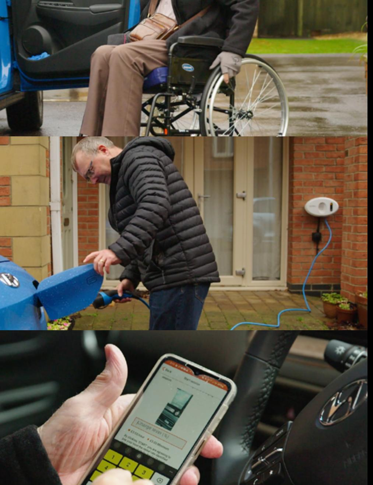

{0}------------------------------------------------

Annual Report and Accounts 2022

# Delivering for customers on every journey

{1}------------------------------------------------

# 1. Strategic report 2. Governance

# 3. Financial statements

# Improving everyday mobility

- Our purpose
- Why is mobility important?
- What we do
- Delivering for customers on every journey
- How we reinvest
- Making independence affordable: customer story
- Chairman's statement

# Our impact in 2022

- 2022 at a glance
- CEO statement
- Business model
- Worry-free mobility: customer story
- Personal choice: customer story
- Our strategy
- Delivering for customers: our performance
- CFO statement
- A word from Motability, the Charity

|    | Investing for the future            |    |
|----|-------------------------------------|----|
| 30 | The transition to electric:         | 70 |
|    | customer story                      | 73 |
| 31 | Making electric vehicles accessible |    |
| 34 | Innovative ways to travel:          |    |
|    | customer story                      |    |
| 35 | Innovative ways to travel           |    |
|    | Delivering sustainably              |    |
| 38 | Making a positive impact:           |    |
|    | ESG overview                        |    |
| 40 | Support and expertise:              |    |
|    | our people story                    |    |
| 41 | People                              |    |
| 46 | Section 172                         |    |
| 48 | Risk                                |    |

- Corporate governance report Audit Committee Nomination Committee Remuneration report Other statutory information Directors' report Directors' responsibilities statement Independent auditor's report
- Financial statements Notes to the financial statements

{2}------------------------------------------------

# Improving everyday mobility

- Our purpose
- Why is mobility important?
- What we do
- Delivering for customers on every journey
- How we reinvest
- Making independence affordable: customer story
- Chairman's statement

{3}------------------------------------------------

# Our purpose

We exist to deliver smart, sustainable solutions that improve our customers' mobility in a fast-changing world.

{4}------------------------------------------------

# Why is mobility important?

Mobility plays a crucial role in all our lives. It unlocks our ability to get to work, visit friends, access healthcare and see new places.

Yet, for many disabled people, the barriers are high. Cars can be prohibitively expensive, and public transport is often inaccessible.

Since our founding over 40 years ago, Motability Operations has provided more than five million customers with affordable transport solutions, empowering them to get around on their own terms.

{5}------------------------------------------------

# What we do

Through the Motability Scheme, we lease mobility solutions to recipients of the higher rate mobility allowances.

> Our customers can choose the solution that fits their individual needs, from a range of cars, scooters and Wheelchair-Accessible Vehicles (WAV). Insurance, roadside assistance, tyres, adaptations and more are all taken care of as part of the lease.

As a purpose-driven and customer-focussed company, any money we make from running the Motability Scheme is reinvested to create the most positive impact for over 650,000 customers.

# Our fleet

{6}------------------------------------------------

# Delivering for customers on every journey

We're passionate about supporting our customers through every stage of their mobility journey, whether it be choosing the right vehicle for their needs, or enjoying the latest technical innovations.

To learn more about how we deliver for customers on every journey, read and watch our customer stories, included throughout this year's report.

Find out more on page 8 Find out more on page 30

# Making independence affordable The transition to electric

Find out more on page 16 Find out more on page 34

# Worry-free mobility Innovative ways to travel

Find out more on page 17 Find out more on page 40

# Personal choice Support and expertise

{7}------------------------------------------------

# Reinvesting for our customers

donation to Motability, the Charity

To provide additional support, such as grants, to disabled people

investment in electric over the next 3 years

Supporting our customers with the transition to electric vehicles and funding home chargepoints

The money we make doesn't go to shareholders. It is used to keep prices affordable for our customers, provide donations to Motability, the Charity, or it can be returned directly to our customers.

We provide not only the right car for each of our customers' needs, but the whole worry-free package: insurance, roadside assistance and everything you need to stay on the road. It's more than just a car, and on average our package is 45% cheaper than the cost of an alternative lease.

See more on page 8

On top of this, we're investing in mobility solutions that will make sure our customers aren't left behind as the UK transitions to electric.

See more on pages 30-36

{8}------------------------------------------------

Motability Operations accounts for around 12% of all new cars on the road.

Without the Motability Scheme, many of our customers would be unable to get out and about – there are often no alternative means of transport available to them.

Ensuring our products and services remain affordable for our customers is our number one priority. By using our scale, we're able to make independence a reality for many more people.

# Making independence affordable

45% cheaper than the cost of an alternative leasing option

[Click here to watch the full video](https://annualreport22.motabilityoperations.co.uk/video/making_independence_affordable.mp4) 

" relied on lifts from friends."

# Because I used the Motability Scheme car before with my mum, I thought it would be ideal for myself. Without the Scheme, I would never have been able to afford to drive a car and I would have been stuck in the house or

**Tracey, who lost her musician husband three years ago, can still enjoy going to gigs in her adapted car**

{9}------------------------------------------------

# Investing now to meet our customers' needs for the future

**Rt. Hon Sir Stephen O'Brien KBE** Chairman

This time last year, we were coming through the challenges of the Covid-19 pandemic and looking forward to returning to 'business as usual'. Little did we know what was coming down the line for 2022.

But I'm happy to say that our customers have been able to count on excellent service during these difficult times and this is credit to the dedication, determination and commitment of our people, particularly those in customer-facing positions. I'm proud of the positive impact Motability Operations has on the lives of disabled people and their families. No one at Motability Operations has lost sight of the fact that they're dealing with people who may need us more than ever to help them enjoy their freedom and independence.

The challenges of the past few years for the business have been substantial: working through the Covid-19 pandemic, adapting (very successfully) to hybrid working, a global shortage of semiconductors having a serious impact on the availability of new cars, and now the horrific war in Ukraine exacerbating rising fuel prices and supply chain issues. Our customers have been affected by all of these problems, along with growing cost-of-living challenges. So it's been even more important for us to support the affordability of their Scheme vehicle.

This year, when we were reviewing the way the Scheme runs we found that because our customers are taking such good care of their vehicles, we can pay £350 of the Good Condition Payment early. We hope this payment can provide some help and keep our customers on the road, at a time when all costs are rising. Please read more about how we are reinvesting for our customers on page 7.

### **Focusing on what's important for our customers**

'Business as usual' looks very different at the moment, but I'm delighted that we can continue to support our customers: our latest customer satisfaction ratings still stand at 9.6 out of 10, despite the upheavals of the past few years.

Planning for a greener and more connected future is key to the development of the business, and the Board is fully behind our CEO Andrew Miller, who is driving innovation throughout Motability Operations. 'Lean into green' – our transition to an electric fleet – is well underway. As one of the UK's largest leasers of electric vehicles (EVs), we're leading the way to carbon-free motoring and the phasing out of internal combustion engine vehicles by 2030.

Motability Operations continues to be an extremely well-run business under Andrew's leadership. The Board is supportive of the strategy, clarity of vision and purpose he has brought to the Company. We have an excellent leadership and executive team, and this year I've been delighted to welcome Peter Pritchard onto the Board as a Non-Executive Director. Peter's long career in retail, online and offline, brings a wealth of experience and insight for the team to draw upon.

{10}------------------------------------------------

## **Working closely with Motability, the Charity**

Our relationship with Motability, the Charity, is a strong and symbiotic one. We share common goals, and we value their oversight, input and strategic direction. We work closely together to develop products and services to make life easier for our customers and their families, such as when we first enabled parents of children with disabilities to use their allowance to lease a Motability Scheme vehicle.

We're pleased that as a result of headroom in our financial results this year we were able to donate £200m to Motability, the Charity. This will allow even more people to enjoy their freedom, through a range of charitable grants.

See page 27 for more information

#### **Making a real difference**

Now more than ever, we want to help make a difference to the lives of our customers. As well as supporting affordability for them on a daily basis, our investment in EVs is helping to deliver the Government's sustainable transport agenda. The move to carbon-free transport is a national imperative and we're committed to ensuring that people with disabilities are not left behind. However, as EV innovation evolves over the coming years, we're here to make sure that accessibility is at the heart of these developments.

Helping people to live independent lives with accessible transport will be the focus of our future innovation, and I'm proud that we're an organisation that has the financial stability, leadership expertise and the talented, committed and determined people to achieve this.

**Rt. Hon Sir Stephen O'Brien KBE** Chairman

{11}------------------------------------------------

# Our impact in

- 2022 at a glance
- CEO statement
- Business model
- Worry-free mobility: customer story
- Personal choice: customer story
- Our strategy
- Delivering for customers: our performance
- CFO statement
- A word from Motability, the Charity
- Where our charity donation goes

{12}------------------------------------------------

# 2022 highlights

Disability Confident Leader status

Find out more about our KPIs on page 19 Find out more about our ESG performance on page 38

employee engagement score

{13}------------------------------------------------

# We're prepared to support our customers through tough times

**Andrew Miller** CEO, Motability Operations The two years I've spent at Motability Operations so far have been unlike any the business has faced before, and we expect the year ahead will be just the same. That's why we think long term – planning for hard times in good times.

Our customers' mobility is our top priority, so our business model is designed to make sure the Scheme is stable and sustainable. It's at times like now, with rising costs across the board, that our model delivers and we can give our customers peace of mind that the Scheme will continue to be there for them.

I'm proud to lead our team, who are all fiercely committed to supporting our customers as they navigate current challenges brought on by the rising cost of living and disruption in the car market – which we know impacts people with disabilities more than most.

The long-term resilience of our business model means we have the financial and organisational strength to maintain the Scheme, and innovate for the future.

# **For our customers, the Scheme means freedom**

We measure our effectiveness by the impact we have on our customers' lives and are proud to be a purpose-driven organisation. We've worked hard this year to be really clear about what we mean by this, and you'll see it set out on page 3. Our purpose empowers us to prepare for the future of mobility and unites us as an organisation to deliver for our customers.

We run the Scheme to provide the best possible value. As the owner and operator of the country's biggest vehicle fleet, we use our scale to negotiate the best deals on our customers' behalf, and our worryfree package goes well beyond providing 'just' a vehicle. On average, our package is 45% cheaper than other commercial alternatives, which is why our customers score us 9.5 out of 10 for affordability and 9.7 for being worry-free, which also explains our overall score of 9.6 out of 10 for satisfaction.

Our focus will always be to support customers to enjoy their everyday freedom. They rely on the Scheme to get from A to B, and we work hard to make sure they get there, whatever crops up en route. If a Scheme customer has a puncture on the motorway, our partner, the RAC, acts as an extension of our own team: from getting the car and the customer home, taking care of tyre fitters, to organising a hire car or taxi for the next day. Just one call to sort everything.

Our customers tell us that they view the Scheme as a lifeline. Having their own vehicle gives customers a sense of security and 'normality' in their day-to-day lives. Public transport and second-hand vehicles are not seen as viable alternatives as they would mean big compromises on our customers' functional, financial and mental well-being. Even in the context of the rising cost of living, the Scheme is seen to offer great value for money.

{14}------------------------------------------------

# We've supported affordability for our customers when they need it most:

• From Spring 2023 every car customer taking out a new lease on the Scheme will receive a **£750 New Vehicle Payment to** help them make the most of their new car and get them on the road.

• We're giving back to our customers – for those who are eligible, we're paying part of the

**Good Condition Payment early**, to put money back in their pockets, and from 1 October, we've re-structured how this is priced into the lease so we can keep lease costs lower.

• We're making more money available to help customers most in need – by pledging **£200m to Motability, the Charity,** so that they can help disabled people to access and use the Motability Scheme, and improve access to other types of transport through innovations and funding to other charities and organisations. • We're investing **£645m** to keep future car prices as low as possible. Despite being in a market where all our costs are rising, we want our customers to rely on our worry-free package that keeps them mobile.

• And as the UK commits to reaching net zero, we've started to see results from our investment of **£300m** in supporting our customers with the transition to electric vehicles (EVs). We're making EVs more affordable, as well as installing home chargepoints, investing in innovative solutions for our customers, and working with manufacturers and converters to help electrify our Wheelchair Accessible Vehicle (WAV) fleet. We simply won't let our customers be left behind in the switch to electric.

See page 7 for more information on our reinvestments

### **Our capital reserves help us deliver for customers**

We have a responsibility to ensure our customers can afford to stay mobile.

As our Chairman, Sir Stephen O'Brien, referred to in his statement, we're facing one of the toughest operating environments in our history.

The well-publicised supply chain issues, have seen the global supply of new cars plummet since the start of the pandemic. Throughout this time, we've been working with our manufacturing and dealer partners to make as many new cars as possible available for Motability Scheme customers in very challenging circumstances. In fact, we've actually increased our market share of all new cars in the UK from 9% in 2015 to 16% in 2022.

This year has also seen a significant rise in our capital reserves because used-car prices have been unusually high, so we're reinvesting this money to keep the Scheme as affordable as possible, now and in the future. We don't pay shareholder dividends – any profits we make are used to keep prices affordable for our customers, provide donations to Motability, the Charity, or are returned to our customers.

#### See page 7 for more detail on how we reinvest in our customers

Alongside measures to improve affordability, we're also addressing issues of availability through extending leases for any customers who need this. Our focus is on keeping our customers mobile.

#### **Going green by 2030**

We aren't letting the challenging operating environment of today distract us from the opportunities for the future. We're already leveraging our purchasing power to be a leader in the transition to electric – and are proud to be at the forefront of the country's journey to carbon-free motoring by 2030.

We buy over 10% of all new electric vehicles in the UK, making us one of the largest EV buyers in the country. We're also one of the UK's biggest installers of home chargepoints. With the help of our installation partners Ohme and Easee, we arrange and cover the cost of a home chargepoint and standard installation for our EV customers – and we're funding innovative solutions for the future of motoring. I'm delighted that our new innovation team is playing a leading role in championing accessibility in new technology.

See page 34 for more information

As a purpose-driven organisation, we're committed to making an impact. Sustainability is right at the heart of this, and we have begun the process of seeking accreditation as a certified B Corp. The assessment will help us measure and manage our impact on our people, our customers, our suppliers, our communities and the environment around us. We are also currently engaged with the Science Based Targets initiative (SBTi) to set targets which reflect our commitment to accelerating our contribution towards halving emissions before 2030. You can read more about this in our first ever Sustainability Report.

[Read our Sustainability Report online here.](https://annualreport22.motabilityoperations.co.uk/documents/Motability_Operations_2022_SR.pdf)

# **A positive impact for a challenging future**

Backed by over 40 years of experience, we are here to find solutions for our customers' needs. This all happens thanks to our incredible teams, and I know it can be a huge responsibility. I'd like to take this opportunity to say thank you to everyone who makes this happen.

See page 40 for more information on our people

The last few years have been challenging, but I'm confident we at Motability Operations have the people and the plans to develop our service and be even more responsive to the needs of our customers.

We're passionate about using our financial strength, our scale and our partnerships to keep our service sustainable for the future. Delivering the best possible package at affordable prices, that our customers can count on.

Our most important measure of success is the impact we make on our customers' lives. There are still obstacles to overcome but the journey is clearly mapped out and I am confident of our ability to reach our goals.

# £645m

to be invested to keep future vehicle prices as low as possible

From our research, we know that the Scheme offers our customers a package they wouldn't be able to get anywhere else:

- All-inclusive offering, providing them with clarity and no surprise costs to worry about.
- New, high-quality vehicles that everyone in society can access, which provides a sense of normality and a smooth driving experience.
- Great customer support, with a proactive team that always looks to find solutions.
- Emotional support, providing our customers with the chance to feel equal to others.

**Andrew Miller** CEO, Motability Operations

- 
- 
- 
- 
- 

{15}------------------------------------------------

# How we create value

# Motability, the Charity

Oversees and sets the strategic direction of the Motability Scheme and provides additional support, such as grants, to disabled people.

See page 27 for more information about Motability, the Charity

We plan to make a modest profit of 1.5% to underpin sustainability of the Scheme. The level of profit we make depends on the value of used cars. In the current market, this is exceptionally high.

We hold capital reserves to secure the long-term future of the Scheme. Any headroom above required reserves is reinvested in the Scheme or donated to Motability, the Charity.

See page 7 for more information

This includes cars, electric vehicles (EV), Wheelchair Accessible Vehicles (WAV), scooters or powered wheelchairs.

By leveraging our purchasing power, efficiencies and ensuring our customers benefit from our VAT zero-rating, our vehicle leases are 45% cheaper on average than alternative leasing options.

A Company owned by four banks, who are the only Company shareholders. These shareholders have waived any right to make money directly from the Scheme through dividends or sale of the Company.

Motability Operations does not pay ordinary shareholder

the Government.

Motability Operations is the organisation that delivers the Motability Scheme to over 650,000 customers.

{16}------------------------------------------------

We want our customers to make the most of their vehicle without having to worry. So their package includes the car, insurance, breakdown cover, new tyres, regular servicing and MOT. Motability Scheme customers can also access support from our team, whenever they need it.

Life isn't getting any cheaper, so we're doing all we can to help our customers with the cost of getting around.

# "All you need to do is put fuel in and drive it... it's real peace of mind."

**Beth and her mum, Sam, love the independence their WAV gives them**

# Worry-free mobility

[Click here to watch the full video](https://annualreport22.motabilityoperations.co.uk/video/worry-free_mobility.mp4)

# Customers are at the

heart of everything we do

{17}------------------------------------------------

From getting Jack to the football to sorting Ria's first car ready for uni – we've helped over 5 million people get on the move.

# Personal choice

# "Jaiquane has an electric and a manual chair, and having a bigger vehicle allows us to go out and

about with both of them."

**Natasha and her son, Jaiquane, chose an eight-seater vehicle for extra space**

[Click here to watch the full video](https://annualreport22.motabilityoperations.co.uk/video/personal_choice.mp4)

We want our customers to feel at ease in their vehicles. So we let them choose a car they love driving, as well as one that does what they need it to do — whether it's a trip to the supermarket or a family holiday.

From steering aids and swivel chairs to boot hoists and fully Wheelchair Accessible Vehicles, we provide a range of options that give people the independence they need.

{18}------------------------------------------------

# Our strategic framework

Led by our purpose, we have defined three strategic pillars that set out how we align our business objectives, strategic initiatives, performance targets and business planning.

# Our purpose

is to deliver smart, sustainable solutions that improve our customers' mobility in a fast-changing world.

# Our strategic pillars

{19}------------------------------------------------

# Measuring our success

# **Delivery**

- We have continued to invest in our front-line customer services team. We are proud of our team and how they face unique challenges every day; they are always on hand to address all our customer needs. This year the team has had to manage thousands of queries about industry supply challenges, availability, extending customers' leases and customer payments.
- Our call volumes remain very high, so to support this we have also invested in developing our digital support for our customers so they can access information at any time of the day. They can now do this through our online chat, across our social media channels and through new and improved content across the refreshed Scheme website.
- The continuous mobility programme has ensured that our customers remain mobile, while there is still low availability across the Scheme. We're currently auto extending leases for six months, while customers are either waiting to find a suitable vehicle to order or to take delivery of their vehicle. Our priority remains keeping our customers on the road.
- We have continued to work closely with the converters of our most complex vehicle solutions, understanding and supporting the challenges faced during a difficult period for these often more bespoke organisations. Because converting to EVs will be more complex for those with the most serious mobility requirements, we are working with OEMs and converters to find a solution that works. See more on page 33

# **Objectives**

- Deliver best-practice customer service through our call centre
- Ensure that the standard of services deployed through our key suppliers is commensurate with our internal targets
- Build our adaptation and conversion expertise to ensure that customers have a seamless experience and that we are recognised for the excellence of our 'one-stop shop' service
- Provide our customers with the information and tools they need to select a suitable car from the wide range available
- Provide information to support decision-making to meet customers' mobility needs

# Performance against Scheme objectives

We track performance through a range of contractual objectives as agreed in the Scheme agreement with Motability, the Charity. These are designed to ensure we deliver a successful and efficient Scheme for our customers. We also have a range of internal key performance indicators (KPIs).

# **Building our customer and disability expertise Calls answered within 20 seconds**

Throughout the year call volumes have been higher than ever before driven by availability of new vehicles, customer payments and concerns about lease extensions.

## **Overall customer satisfaction**

We deliver by putting our customers at the heart of everything we do and listening to what our customers need.

#### **Roadside assistance average response time**

Keeping our customers mobile remains our priority. In the event of a breakdown Scheme customers receive priority assistance from our Scheme partner the RAC, with an average response time of 39.1 minutes during the year (compared with a KPI target of <42 minutes). In most cases problems are quickly resolved and customers are able to be mobile again.

{20}------------------------------------------------

## **Delivery**

- Working alongside our manufacturing partners to maintain choice and affordability on the Scheme is key to delivering for our customers.
- We are continuously looking for ways to improve the choice and availability of vehicles and we plan to have more manufacturers joining the Scheme over the next year.
- Unfortunately, this year due to the well-publicised industry supply issues, we have been unable to fulfil the KPI 'Maintain a range of at least 200 cars at "nil advance payment". We have had on average 75 cars on the Scheme with a nil advance payment throughout the year which still provides choice and affordability for our customers when they need it most.
- We have seen a large increase in customers choosing an EV for their next car on the Scheme. We have been able to offer customers an average of 72 electric vehicle options during the year.
- We have further enhanced the customer WAV proposition with the roll out of familiarisation visits, and annual checks, to make sure customers are comfortable with their vehicle, and the technical aspects remain sound.
- We continued to develop our processes of residual value forecasting, to ensure customer pricing is based on a fair and reasonable assessment of future market values. An independent third-party end-to-end assessment of our residual value forecasting, stated "MO's forecasting approach uses sophisticated techniques, is robust, fit-for-purpose and aligns to forecasting best practice".
- Continued activity on the long-term development of systems infrastructure for our online remarketing processes. This year we have launched a new look 'mfl direct' and our Vehicle Remarketing team continue to deliver excellent results on a sustainable and secure platform fit for the future. This will provide opportunities to deliver more enhancements to our existing remarketing capabilities.

# Measuring our success Provide value and choice

# **Objectives**

- Provide stability in pricing and choice throughout the economic cycle
- Provide a wide selection of vehicle models and brands
- Maintain a range of at least 200 cars at 'nil advance payment'
- Ensure that our residual value-setting and forecasting is the best in the industry
- Retain our market leadership for vehicle remarketing

#### **% of vehicles sold online at the end of lease**

Selling via our online sales channel, 'mfldirect', provides an effective, low-cost route to market which facilitates the management of our high volume of disposals, and also ensures a competitive sales environment through which we seek to maximise our net return.

## **Relative affordability – % cheaper than alternative**

We benchmark ourselves using commercial contract hire quotations. These are usually unavailable to the general public and are likely to be less expensive than personal contract purchase quotations. Our economies of scale, operational efficiencies and a VAT concession (which is passed onto customers in lease pricing) deliver the majority of this differential.

#### **Affordable vehicle choice at 'nil advance payment'**

75 Target of >200 Average from Oct 21 – Sept 22

We aim to maintain the availability of at least 200 cars that are funded solely by the assignment of the customer's Disability Allowance. During the year to October 2021 to September 2022 we were unable to reach this target because of low availability due to the well-publicised supply constraints.

{21}------------------------------------------------

# Measuring our success

# **Delivery**

- We were delighted to return to in-person events for our series of 'One Big Day' events over the summer. This year was our most successful year ever with over 21,000 attendees across four events.
- We also delivered a digital experience for our customers who were unable to attend the Big Event, at the NEC in Birmingham. We streamed various events, including speaker sessions and interviews, over the course of two days in May with total views coming in at almost 4,000 people.
- We have continued to provide operational and disability confidence training for dealer Motability specialists, through our online platform.
- We have launched the first three stages of our new Motability Scheme website, a new look and feel, improved content and user experience across a digital experience platform, with more stages to follow this year. Feedback so far has been very positive and we are now able to offer users a simpler, cleaner journey.
- There has been continued development of the online account for customers, further broadening the opportunities for customers to self serve and reduce call volumes in our contact centre.
- We have continued to work with Family Fund, the UK's largest charity providing grants for low-income families raising disabled or seriously ill children and young people, to deliver a pilot scheme providing vehicles to families with children under the age of three who are seriously ill or disabled but do not yet qualify for a mobility allowance. This programme was endorsed by the DWP with funding to date provided by Motability, the Charity, and during the year more than 200 families were supported by the provision of an appropriate vehicle.
- In July 2021, we announced that Direct Line Group Limited will take over from RSA as our insurance partner. This is being managed in a phased approach and is due to complete in September 2023. This new proposition will offer the potential to grow the Scheme and offer increased flexibility to customers. We are confident that the new relationship will enhance our customer experience and provide more digital support.

# **Objectives**

- Raise understanding of Scheme elements and confidence and trust in the Scheme
- Maximise effectiveness of multimedia channels to increase understanding within the eligible customer base
- Identify and, where appropriate, remove any barriers for potential customers
- Continue to encourage Motability dealers to promote the Scheme in line with our brand

# Improve reach and awareness

#### **Customer renewal rate at the end of lease**

Whether customers decide to renew at the end of the lease is a key measure of our success in delivering affordability, choice and customer service. During the year to September 2021 this was maintained at 91%, compared with a KPI target of 85%.

# **Trust in Motability**

Since 2012 we have measured customers' trust in the Motability Scheme. Trust is considered to be key in enabling current and potential customers to make an informed and confident choice of a mobility solution that meets their disability needs and, in turn, strengthens customer advocacy of the Scheme.

#### **Customer advocacy**

Existing customers are the Scheme's biggest advocates, with 9.6 customers out of 10 saying that they would recommend the Scheme to others.

{22}------------------------------------------------

# **Delivery**

- Financial results during the year have been buoyed by a continued increase in used-car values, caused by demand from online dealers and availability in the new car market. This has had a direct impact on the value of our fleet, leading to higher vehicle resale prices at the end of a lease, and reduced depreciation charges as we assess future residual values.
- We continue to apply capital modelling methodology and our applied risk appetite and confidence levels, and we benchmark our capital reserve levels against near-comparable companies. This economic capital approach has been confirmed as appropriate by Oliver Wyman and supports the Group's application of a 99.99% confidence level.
- Continued development aligned to our strategic IT roadmap that will secure systems sustainability (replacing aged legacy systems) with linked benefits flowing across business operations.
- Our annual independent employee culture survey recorded an exceptionally high engagement score of 92%, significantly ahead of the benchmark of other high-performing organisations.
- Given the high-performance levels expected of individuals who work to deliver the Scheme we have invested resources to ensure we maintain and develop an appropriate environment that supports their needs and that recognises and embraces the benefits of a diverse workforce.

# Measuring our success Ensure long-term sustainability

#### See more on page 40.

- Maintained a proactive engagement programme with key stakeholders, operating in a transparent and straightforward manner.
- Ensured a good range of lower-emission, higher-MPG vehicle choices are available across vehicle categories and feature green choices in our promotional mailings.

# **Objectives**

- Maintain a prudent reserves policy that provides financial strength adequate for us to withstand the impact of potential shock events
- Create opportunities to access wider sources of competitive funding. We aim to maintain our credit rating, enabling us to secure the most appropriate funding at competitive rates
- Attract and retain quality people
- Ensure that our premises and information technology infrastructure are robust and future-proof
- Continue to nurture effective partnerships with key stakeholders
- Maintain a forward-looking environmental policy, providing a choice of environmentally friendly vehicles on the Scheme, balancing customer needs with fuel economy and emissions

# **Credit rating**

Our credit ratings underpin our ability to fund the Scheme in a sustainable and cost-effective manner. Our ratings remain A/A1 with stable outlooks (from Standard & Poor's and Moody's respectively).

#### **Employee engagement**

We participate in an independent annual review of business culture, where we have significantly outperformed the 'High-Performing Organisations' benchmark. Employee engagement is 10pts higher than the benchmark.

### **Debt maturity profile**

The Group aims to retain a well-laddered debt maturity profile in order to effectively manage refinancing risk. The average debt maturity remains appropriate at just above eight years.

{23}------------------------------------------------

**Matthew Hamilton-James** Chief Finance Officer

Our financial performance has remained strong this year thanks to our sustainable business model and the continued increase in used-car values. This has enabled us to commit to further significant investments, to support our customers during these challenging times.

# Delivering value for money

#### **Overview**

The current global economic conditions continue to have significant impacts on the automotive sector and are directly resulting in the short supply of new vehicles. This has inevitably led to extended wait times for a new vehicle, so we have focused on keeping our customers mobile by providing automatic six-month lease extensions. A knock-on effect of the shortage of new vehicles has seen increased demand for used vehicles across the market, with used-car values continuing to track above expectations.

This has had a direct impact on the value of our fleet, leading to higher vehicle resale prices at the end of a lease, and reduced depreciation charges as we assess future residual values. These effects are covered in more detail throughout this report; however, this financial upside has provided us with enough capital headroom to commit to a number of direct and indirect investments to support customers through these challenging times.

See page 7 for more information

## **Customer numbers, renewal rates and affordability**

Our year-end fleet stood at 652k, reflecting a 0.6% growth in customer numbers during 2022. Despite a strong order-bank (from new and renewing customers), our ability to fulfil orders continues to be significantly impacted by the global lack of new vehicles.

As a consequence, our customer order bank stood at 117k at 30 September 2022 (an increase of 35k year-on-year), with lead times (from application to delivery) at 25 weeks compared to an order bank of 42k and a typical lead time of 10 weeks pre-pandemic, pre-supply challenges. This has also resulted in the continued growth in the number of customers in lease extension (as we automatically extend leases to keep customers mobile), with volumes standing at 135.9k at 30 September 2022 (FY2021: 79.0k).

Whilst we aim to provide a broad range of suitable vehicles at affordable prices, the supply-side constraints (which are expected to continue beyond 2023) and model range rationalisation by manufacturers have affected the choices available to our customers. In the final quarter's price list (July-September 2022) there were 60 vehicles priced at "nil advance payment" compared to 205 vehicles in the same quarter last year.

{24}------------------------------------------------

# **Financial overview**

We continue to target a 1.5% post-tax return on assets in order to provide sustainability into the long-run and ensure that there is built-in recoverability in the event of market downturn. The unguaranteed residual value of our fleet was £8.7 billion at September 2022, meaning that a 1% movement in used-car values would impact us by £87.2m. This means that whilst we hold capital reserves to provide protection against unexpected downside movements in values (so we can insulate customers from these financial impacts), any positive movements can lead to above target profitability.

During the year ended September 2022, the strength of the used car market has been the primary driver of a post-tax profit of £922.9m, representing a 7.8% return on assets.

### **Revenue:** Total revenue increased by 5.8% to £4,708.4m (FY2021: £4,449.5m).

- Rental revenue £2,172.2m (FY2021: £2,054.2m): The increase is largely driven by an increase in our customer numbers plus a 3% uplift in mobility allowances from April 2022 (allowances are uplifted each April based on the Consumer Price Index recorded in the previous September).
- Disposal revenue £2,482.4m (FY2021: £2,357.6m): The increase year on year comes despite a fall in disposal volumes from 201k in FY2021 to 163k in FY2022. Average sales values increased significantly during the year, as outlined below.

# **Vehicle remarketing profit:** £723.4 million (FY2021: £416.4m).

- The strength of used car values across the industry has resulted in significant profitability upon vehicle resale at the end of lease. Average gross sale values for car disposals were £15.7k across FY2022, an increase of 49.5% on sale values that were achieved in FY2019 (£10.5k). The crystallisation of blocked appreciation highlighted in the 2021 Annual Report and Accounts has contributed to this result. This is where anticipated revaluation gains were not adjusted through depreciation, as assets cannot be appreciated to a point above the written down value at the beginning of the financial period.
#### **Assets and residual values:** operating lease assets were £9.6bn at September 2022 with an unguaranteed residual value of £8.7bn.

- 
- 
- 

• We undertake a quarterly reassessment of the anticipated value of the fleet, and at each financial period-end recalibrate depreciation to reflect any movements in residual values.

• The revaluation seeks to attribute a value to the existing fleet (which we will return to market over the next three years). At September 2022 the estimate of fleet value is significantly increased by a positive underlying base (current market value of three-year-old cars) and a buoyant medium-term outlook, reflecting favourable demand conditions as a consequence of the continued new-vehicle supply challenges. The projected revaluation anticipates a net gain of £1,628.5m after adjusting for selling costs and early termination leases. This positive outlook drives a depreciation credit of £577.4m in 2022. This impact, together with a £154.3m credit brought forward from prior year revaluation exercises, reduces the 2022 depreciation charge by a total of £731.7m.

• However, as referenced earlier, not all of the net revaluation gains can be recognised through adjusted (reduced) depreciation, as assets cannot be appreciated to a point above the written down book value at the beginning of the financial period. The positive movement in forecast values may additionally result in vehicle remarketing profitability in future periods of up to £261.0m providing that the current assessment of future values holds.

# Investing to support our customers

Chief Finance Officer

# £200m

Our customers' mobility is too important to take risks with. That's why maintaining a prudent reserves policy is one of our core objectives: it provides the financial resilience to withstand economic turbulence, without compromising the customer offering." **Matthew Hamilton-James** "

Donated to Motability, the Charity, to support their grant-making and broader activities

# £220m

Accelerated Good Condition Payments

# £525m

Investment in a New Vehicle Payment scheme, providing customers with £750 towards the cost of a new vehicle

# £300m

Invested to support the transition to electric vehicles over the next 3 years

£645m

Ring-fenced to support vehicle affordability over the next 2-3 years

{25}------------------------------------------------

- **£645m in wider affordability support**: We recognise the impact that rising new vehicle prices continue to have on affordability (coupled with the wider impact of inflation on cost of living). So we are pleased to be able to commit £645m of capital to support affordability across the next two to three years. In effect we will be subsidising lease prices to ensure that a wider range of vehicles are more affordable for our customers (including a broader offering at "nil advance payment") as vehicle supply begins to normalise.
#### **Charity support – £200m donation to Motability, the Charity**

- Our capital headroom has also enabled our board to approve the payment of a £200m donation to Motability. This donation will allow Motability to continue to build on its ambitions in supporting the UK's disabled population with their transportation needs over the next three years. It is anticipated that approximately 70% of these funds will be deployed in the form of grants to support customer affordability as they access the Scheme. The FY2022 result is net of this £200m donation.
# **Financial implications as we deploy our capital headroom**

The board is confident that Motability Operations has the capital capacity and liquidity to support the investments outlined above. In effect we are utilising capital headroom (over and above the prudently calculated capital requirement, set at a 99.99% confidence level, plus buffer). Whilst the donation to Motability, the Charity, has already been recognised in the FY2022 financial statements, the nature of the wider affordability investments means that these will spread forward across multiple years. In effect we will deploy our capital headroom to subsidise future lease price by pricing in a below 1.5% or negative return on asset. Importantly, these investments are timebound, and once utilised we will revert to lease pricing based on a 1.5% return on assets. Capital is expected to remain above the minimum requirement (plus buffer) throughout the forecast horizon.

#### **Capital management:** Capital reserves increased to £3.8bn at September 2022 (FY2021: £2.9bn)

- We continue to use an Economic Capital model to determine the appropriate level of capital required to protect the business from shock events and continue to apply a 99.99% confidence level for our assessment of risk. Our policy is to target a capital position above the 99.99% threshold, plus buffer, above this minimum requirement.
- As we do not pay shareholder dividends, any capital above the target level is actively invested to support current and future customers, and to support Motability, the Charity's, wider mandate.

### **Investing to support our customers**

The financial result in FY2022 has led to incremental capital headroom and provided the opportunity to build on the investments to support our customers which were outlined in the FY2021 Annual Report and Accounts.

#### **Direct support for customers**

- **£525m invested in an enhanced New Vehicle Payment (NVP)**: We are increasing the NVP from £250 to £750 for all renewing customers and any new to Scheme customers who place an application during 2023 (payment will be made to both renewing and new customers at the point they take delivery of their new vehicle). Customers who have previously received a £250 NVP will receive a £500 top-up payment. These payments, which represent a significant investment in supporting affordability for customers, will be rolled out from February 2023.
- **£220m of accelerated Good Condition Payments (GCP)**: We have taken the decision to reduce the deposit we hold against the condition of our fleet from £600 to £250 per vehicle. This allows us to accelerate a payment of £350 to all car Scheme customers and so put money back in our customers' pockets today. In aggregate this amounts to £220m in accelerated payments to customers. This decision also allows us to reduce the amount that we hold against future leases, so keeping the cost of leases as low as possible.

#### **Indirect affordability support**

- **£300m investment to support the transition to electric vehicles**: Last year we ring-fenced £300m of capital to ensure that our customers are not left behind on the transition to electric vehicles, recognising the higher cost of electric vehicles and challenges around the vehicle charging infrastructure. To date £77m has been deployed in supporting 25,000 customer orders (across vehicles delivered and the existing order-bank), with 16,000 standard home chargepoints having been installed free-of-charge. We remain committed to rolling out the remainder of this investment over the next two to three years.

{26}------------------------------------------------

#### **Insurance**

We are in the process of moving our insurance provision to Direct Line Group and are on track to complete the process by mid-2023. The change will future-proof the business and offer a seamless transition for customers, who will benefit from a market-leading, interactive tech platform, simplifying the handling of their account. We want to make customer touch points as simple and user-friendly as possible, particularly those which can be more stressful, such as reporting accidents or making a claim on their policy.

Motability Operations participates in a proportion of premium exposure via our A-rated reinsurance captive MO Reinsurance Ltd (MORL). MORL's net exposure is contained through a conservatively structured reinsurance programme. The Group financial statements include the consolidated results of MORL with segmental reporting to reflect the way we manage and report on this business activity. The segmental analysis can be found in note 5 to the financial statements, highlighting a profit of £5.2m in the year to September 2022 (September 2021: £14.6m). MORL has been subject to ongoing market uncertainty due to heightened claims inflation, new vehicle supply constraints and delays in confirming the ultimate impact of changes in whiplash claim legislation. Motor claims inflation increased due to supply chain disruption and anticipated increases in the cost of on-going care, with claims also taking longer to settle. As a result, MORL continues to reserve to the 85th percentile for projected ultimate losses and has applied an additional specific reserve for the effects of inflation on those reserves.

### **Taxation**

For the year ending September 2022, the Group's underlying tax charge was £153.2m (13.4%) with an additional £66.5m deferred tax charge following the remeasurement of deferred tax. The tax rate is less than the headline rate of 19% because of non-taxable capital gains arising in the year. These gains occurred due to the strength of the used-car market which has seen vehicles being sold for net proceeds exceeding the original cost of the vehicles as incurred at the start of their leases. The standard rate of corporation tax in the UK will change from 19% to 25% with effect from 1 April 2023 onwards and therefore deferred tax has been re-measured at the rate at which timing differences are expected to reverse.

# **Cash and funding**

The Group continues to pursue a strategy of maintaining appropriate liquidity headroom and a well-diversified ladder of funding maturities. To date this has been achieved through a combination of GBP and EUR denominated capital market bond finance and through committed bank facilities. MO intends to pursue this strategy which has served MO well to date. We raised incremental financing in January 2022 with a GBP £500m 20-year bond. This is the third bond issued under the Group's Social Bond Framework. This refinancing provides liquidity to meet MO's medium-term funding requirements and headroom to settle the £400m bond which matured in June 2022.

As part of our commitment under the Social Bond Framework (which is in accordance with the ICMA Social Bond Principles (SBP) 2020 as confirmed by a 'Second Party Opinion' (SPO) our second "Annual Report on Eligible Social Projects," will be published 12 months after the issuance of the Group's most recent bond, in January 2023, which will demonstrate how the bond proceeds have been utilised. This impact report has been verified by DNV GL under their Assurance Statement as complying with commitments given by Motability Operations in its Social Bond Framework.

#### **Bank Facility Refinancing**

Motability Operations' existing bank facilities were due to expire in September 2023. The Group initiated a refinancing exercise during the summer of 2022, with a view to arranging a new facility well in advance of the 2023 maturity. This transaction was successfully completed on 31 October 2022, with a new five-year facility (£400m term loan and

£1.5bn revolving credit facility), with two "plus one" options, syndicated across our existing banking group. Aligned to our wider sustainability agenda, the new banking facility is a sustainability linked loan, with margin ratchets linked to the delivery of challenging measures in respect of CO2 reduction and customer satisfaction targets.

At the year end the Group held cleared cash balances of £709.0m (of which £96.1m was ring-fenced in the Group's reinsurance captive on the Isle of Man). The Group's average debt maturity was 8.5 years at the balance sheet date (FY2021: 7.9 years).

# **Treasury policy**

Consistent with other aspects of our business activities, we have adopted a measured approach to treasury management. We use derivative financial instruments (specifically interest rate swaps) to reduce our exposure to interest rate movements that affect the funding of existing leased assets. The Group also fully hedges the foreign currency risk consequent on its four fixed-rate Eurobonds using crosscurrency swaps. The Group's overall interest rate risk management strategy is to convert all newly issued foreign-denominated debt into the Group's functional currency of Sterling. We operate hedge accounting, and derivative financial instruments are 'marked to market' with their value being shown on the face of the balance sheet. The value of the hedging reserve at 30 September 2022 was £52.2m post-tax.

# **Outlook**

Looking ahead there are undoubtedly challenges to navigate as the new-vehicle supply-side disruption continues to affect our order pipeline, and the impacts of rising interest rates and inflation begin to take hold.

We will continue to carefully monitor the demand and supply dynamics affecting the used-car market, and whilst this year we have benefitted from positive movements in the value of our fleet, with an assumption that used-car demand and so values will remain buoyant during 2023, we are acutely aware that this volatility can of course move in the other direction.

However, the resilience of our business model enables us to continue supporting customers through these difficult times and we are well-placed with capital headroom which enables us to make positive investments to support existing and future customers as outlined earlier in this report.

We have strong liquidity as at 30 September 2022 and are confident that our financing structure (bank term loan, revolving credit facility and well-laddered bond maturity profile) provides us with flexibility as we look ahead.

**Matthew Hamilton-James** Chief Finance Officer

{27}------------------------------------------------

# A word from Motability, the Charity

Motability's vision is that no disabled person should be disadvantaged due to poor access to transportation.

> Whilst new vehicle supply will gradually improve, it will take some time for prices to stabilise, and the charity is therefore facing a period of increased demand and increased cost of grant awards. This donation means we won't need to stop doing our vital work, whilst ensuring the charity is able to help generations of disabled people in the years to come.

Despite an increasing element of our grant-making now reaching beyond the Scheme, and our steady investment in innovation activities and research, oversight of the Motability Scheme continues to be the mainstay of our activities.

In consultation with the team at Motability Operations, we set the strategic policies and direction of the Motability Scheme, and oversee its performance to ensure that it continues to meet the needs of disabled people both now and in the future.

We are incredibly proud that together, we have enabled millions of disabled people and their families to enjoy independence and freedom for over 40 years.

# 18 months at a glance

- Charitable spend of £78m including £54m on Schemerelated grants (2021/22).
- 17,626 individuals awarded a grant in 2021/22 an increase of 8% on the previous year.
- £5m a year for the Family Fund Mobility Support (FFMS) scheme, giving vital support to families raising a disabled, or seriously ill, child under the age of three, who has significant mobility needs.
- Furthered our understanding of disability and transport through our research work. Working with disabled people and disabled people's organisations, our research reports share the lived experience of disabled people travelling in the UK and can be used by transport providers to make changes now and to build an inclusive future.
- Launched six new grant programmes for charities and organisations. £50m commitment over three years.
- Launched Bespoke Passenger Solutions a new Schemerelated grant programme to help WAV passengers with more complex adaptations.
- Appointed an independent consortium to run the world's first Evidence Centre for inclusive transport, funded by Motability. £20m commitment over seven years.
- Launched PAS1899 a world leading public charging accessibility standard. Our work with disabled people highlighted that by 2035, 50% will need to charge in public but will face difficulties or be unable to. Motability cosponsored the BSI Standard with the Office for Zero Emission Vehicles and has funded freely accessible design guidance for chargepoint manufacturers and providers.

Disabled people make 38% fewer journeys than non-disabled people – a figure that hasn't changed in over a decade – and disabled people tell us that lack of access to transport affects every area of their lives, from working to socialising to accessing healthcare. The charity aims to achieve our vision in a number of ways including supporting disabled people to access the Motability Scheme through individual grants, awarding grants to other charities and organisations, through research and innovation and amplifying the voices of disabled people.

The donation made by Motability Operations in 2021 has enabled us to expand our work, launching our new three-year Grants to Charities and Organisations portfolio and increasing Schemerelated grant-making.

We welcome the £200m donation this year, which will enable us to continue to fulfil our ambition for the next five years.

No-one could have predicted Covid-19, the war in Ukraine and the many other problems that have affected the global car market. These, combined with the current period of real pressure on household budgets, have significantly impacted the work of the charity. We currently face unprecedented levels of demand from beneficiaries as they find themselves unable to afford a suitable vehicle that meets their needs on the Scheme.

17,626

grants awarded

in 2021/22

{28}------------------------------------------------

# Where our charity donation goes

We are proud to support Motability, the Charity, in their wider mission to improve mobility for disabled people.

# Emelia's story

Emelia is 7 years old and received a grant towards the Advance Payment on her Ford Independence Wheelchair Accessible Vehicle (WAV) on the Motability Scheme.

Emelia's mum, Stephanie, said "Before having the WAV it was very difficult. I had to transfer Emelia into a car seat numerous times a day and lift her heavy wheelchair out of the boot each time. There was no such thing as a quick trip out.

"Without the Motability Scheme and the grant towards the Advance Payment, we would never have been able to afford a car that meets Emelia's needs. It has helped our family massively."

As you'll see on page 7, the money we make is reinvested to help our customers, to keep the Scheme affordable, and to innovate for the future. If our financial position allows, we also make a donation to Motability, the Charity.

Last year, we made a donation of £170m to Motability, the Charity. This donation is just one of the ways we support disabled people and help Motability deliver their wider mandate.

Our business model, levels of reserves and how we run and operate the Scheme are agreed and governed in close consultation with Motability and we deliver against a clear set of objectives and KPIs.

See more on page 19

Without the Motability Scheme and the grant towards the Advance Payment, we would never have been able to afford a car that meets Emelia's needs." **Emelia's mum, Stephanie** "

{29}------------------------------------------------

# Investing for the future

| 30     | The transitic |
|--------|---------------|
| ਤਾ ਹੈ। | Making elec   |
| 34     | Innovative    |

30 The transition to electric: customer story 31 Making electric vehicles accessible 34 Innovative ways to travel: customer story

- 35 Innovative ways to travel

{30}------------------------------------------------

We're responsible for one of the biggest electric vehicle fleets in the UK, and we're committed to helping our customers make the transition to electric.

# Transport is changing. We're ready.

"The EV is great. There are no gears or clutch to worry about and it's a dream to drive, and there's plenty of space for my wife's wheelchair."

**Alan and his wife are in their 16th year as Motability Scheme customers**

[Click here to watch the full video](https://annualreport22.motabilityoperations.co.uk/video/the_transition_to_electric.mp4)

{31}------------------------------------------------

# The journey to accessible electric vehicles

The move to electric vehicles marks the biggest upheaval in the retail automotive industry for a century.

Motability Operations accounts for around 12% of all new cars on the road, in other words about 1 in 50 cars on the road is one of ours. With the UK Government banning the sale of new petrol and diesel cars by 2030, we're committed to supporting our customers with the transition to electric. It's our priority to ensure our customers have the same access to cleaner, more sustainable transport as everyone else.

To achieve this we're subsidising the cost of electric vehicles, covering the cost of a home chargepoint and standard installation for an EV customer, and working with a range of manufacturers and infrastructure tech providers to help ensure that accessibility is built into the public charging network from the very beginning.

Motability Operations Group plc | Annual Report and Accounts 2022 **31**

{32}------------------------------------------------

At Ohme, putting our customers at the heart of everything we do and building strong relationships are two of our core values, so we feel privileged to be helping Motability Scheme customers with their move towards electric vehicles.

# **A year of progress**

We've seen a big increase in the uptake of EVs over the past year, with over 17,500 Motability Scheme electric vehicles now on the road, and another 16,000 applications in the pipeline. Our EV fleet has more than tripled in the past 12 months and we're confident this will continue to increase over the coming years.

But we understand there are still barriers to making the switch to electric for many of our customers. Around 40% of our customers do not have off-street parking where they could have a home charger fitted, and are likely to rely on the UK's public charging network. According to our latest research, 62% of customers surveyed said they would not consider an electric car right now due to concerns over battery range, while 57% gave a lack of public chargepoints in their area as a reason for not making the switch.

We're continuing to work through all the challenges of converting our fleet to electric and ensuring our customers feel supported through this transition. See pages 34-36 for more.

> Compared to traditional cars, electric vehicles can enable all drivers to enjoy greater mobility, freedom and independence as well as saving money with reduced running costs. Ohme is very happy to be part of enabling that journey alongside Motability Operations." **David Watson, Ohme, CEO Easee, Key Account Manager** 16,000 Nearly

Choice and availability of EVs remains low, due to industry constraints, but we're working hard with our partners to find solutions for our customers. We have also improved the content of our newly designed website, so that customers can easily assess if an EV is right for them, using our bespoke suitability checker.

# A word from our new partners

This year has also seen a significant improvement in our home charging experience, bringing on two new suppliers Ohme and Easee – providing a full service solution for our customers wherever they are in the country.

"For both Motability Operations and " Easee, it was crucial to ensure that customers felt supported, no matter their additional needs. This can be seen in the bespoke customer journey that was created to make the installation process as frictionless as possible, and the supplementary materials created to ensure the customer would feel confident charging their car afterwards.

When you find a company that aligns with your cultural values, you know it's going to be an amazing partnership, and together we have already helped over 2,500 Motability Scheme customers in their transition to electric!''

**Connor Henderson** 

home chargepoints installed to date

{33}------------------------------------------------

# **The conversion of Electric Wheelchair Accessible Vehicles (E-WAV)**

We put our customers at the heart of everything we do, so we're investing in new ways to meet new needs, and making sure we stay ahead of industry changes.

An even bigger challenge for us in the move to electric, is ensuring our WAV customers are able to find an electric solution post 2030.

### **What's the challenge?**

To convert most of our Scheme vehicles into a WAV, our converter partners often have to lower the floor within the vehicle. The small and medium electric base vehicles which are currently on the market, have the battery positioned under the chassis, preventing the floor being lowered in most cases.

#### **How will we find a solution?**

We're calling on the industry to collaborate now to find a solution, so we can ensure our most vulnerable customers still have access to mobility post 2030.

Along with our partners from Motability, the Charity, and the Wheelchair Accessible Vehicle Converters Association (WAVCA), we hosted a dedicated event this summer to start the conversations on tackling the significant challenges in adapting WAVs for the future.

We know the transition to electric vehicles will be more complex for our customers with the most extensive mobility requirements . The **Changing Lives in an Electric World** event was designed to be a platform for key industry leaders to discuss how, with greater collaboration and communication, we can all continue to deliver lifechanging mobility for our customers. This is just the first step on this journey and we are continuing to develop this vital part of our work.

See page 34 onwards for more on our innovative approach to EVs

{34}------------------------------------------------

# Innovative ways to travel

The automotive landscape is in transition.

Our innovation team has been set up to support our customers with a worry-free transition to electric. The team is now working with a range of partners, to ensure the future of transport is accessible for our customers.

To do this, we're collaborating with innovators like Co Charger, an app-based community charging initiative that matches you with a nearby 'host' who's willing to share their home charger with those who don't have their own.

"Co Charger is a very useful tool for people with electric cars, a wonderful app… I had a phone call asking if I'd be interested in the pilot scheme… and I thought that sounds like a good idea!"

**Roy, a Motability Scheme customer who took part in the Co Charger pilot**

Motability Operations Group plc | Annual Report and Accounts 2022 **34**

{35}------------------------------------------------

# Putting accessibility in the driving seat

This year, we've done more than ever to ensure our customers can enjoy the latest advances in technology.

### **What's the challenge?**

Disabled people face many challenges when they are looking to switch to electric: availability and affordability issues, being able to charge their vehicle at home, and having access to reliable and accessible public chargers that allow them to plan a journey with confidence.

As we've mentioned in the previous section, we're currently helping our customers with affordability. We're subsidising the cost of EVs and where our customers have access to driveways, we're covering the cost of their home chargepoint and standard installation. But around 40% of our customers don't have off-street parking, and are likely to rely on the public charging network when they make the switch to electric, so being able to charge their EV during a journey is essential.

For our customers, it's not just range anxiety that's an issue. Knowing there are chargepoints at convenient places en route is one thing, but trusting that there will be enough space around the chargepoint or that there is a step-free entrance and exit, is perhaps an even bigger worry.

According to [research](https://www.gov.uk/definition-of-disability-under-equality-act-2010) by the Department of Transport, in the UK those with disabilities (as defined under the Equality Act 2010) take 38% fewer trips than those without. This transport accessibility gap is something we're determined to change.

You can read the full research by Motability, the Charity, [here](https://www.motability.org.uk/media/iwaidhxk/motability_transport-accessibility-gap-report_march-2022_final.pdf).

"We envisage a future where Motability Scheme customers can confidently embark on any journey in an electric vehicle, knowing that they will be able to charge when they need to."

**Jonathan Jenkins, Head of Innovation** 

Motability Operations Group plc | Annual Report and Accounts 2022 **35**

{36}------------------------------------------------

# **A partnership approach to an EV solution**

We've always looked at developing bespoke solutions to help our customers, whether it's new insurance products or specialist roadside assistance.

The approach we're taking to finding solutions to help with the transition to EVs is different.

We're getting involved at ground level with some of the most forward – thinking tech startups around, letting some of our customers trial their products and giving them the opportunity to feed back on what works for people with disabilities and what doesn't.

# **Some of the partnerships and customer pilots we've been running include:**

- Over 250 of our customers joined a trial with **Zap-Map**, which plots public chargepoints around the UK. The trial was designed to help assess the experience of charging an EV for disabled people on the UK's public charging network.
- **Charge Fairy** is a portable charging solution that uses an app to monitor your car and send out a 'charge fairy' (a technician with a mobile charging point) to top up your EV. The pilot was designed to understand whether offering a mobile and full-service solution could reduce charging anxiety amongst our customers.
- **Bonnet** is a payment aggregator that connects over 17+ different charging apps into one simple app. They strive to provide the best EV charging experience possible by providing accurate and live data for each chargepoint as well as standardised pricing. The aim of this trial was to support Scheme customers by simplifying public charging and help to provide worry-free access to electric motoring.
- **Co Charger** harnesses the power of local communities to give everyone access to local home chargers. The pilot enabled Scheme customers to rent out their home charger or use a neighbours' the app co-ordinates everything, including payment.
- **drivvn's** Suitability Assessment Tool helps drivers decide if the transition to an electric vehicle is the right choice. The results are based on personalised factors such as driving habits, mileage requirements, access to public and home charging, the customer's confidence in EVs and more. This trial further enhances our commitment to prioritising customer personalisation and communication.
- **Sycada** promotes green and safe driving, with their DriveTag product. This pilot will test if Scheme customers can improve their driving style.

By working with innovators who are already addressing some of these concerns, we can help to make sure accessibility is embedded into the solution from the beginning.

The charging infrastructure is perhaps the most pressing challenge in the short to medium term, but there are other benefits to this approach.

We can spot potential future industry disruptors in any segment of the market and get our customers on their agenda. They could be manufacturers selling direct to customers; the joined-up thinking of Mobility as a Service (MaaS) and multi-modal mobility and driverless cars and other app-based solutions to problems we might not yet know exist.

For example, with driverless cars, we're asking manufacturers to consider what would happen if the person operating their car happened to be blind. If we can embed this thought process at an early stage, the resulting solution will benefit everyone.

# **The power of our brand and expertise**

As one of the biggest purchasers of new cars in the UK, Motability Operations has significant buying power in the marketplace, which we can leverage for the benefit of our customers.

Tech innovators and automotive manufacturers know that collaborating with us is an asset for their business. Involving our customers in pilots gives them intelligence that helps make their products more accessible, not just for disabled people but everyone: parents with pushchairs, the elderly and drivers of large vehicles, among others.

As well as providing valuable insight into a growing section of their target market, the Motability Operations seal of approval could also lend substantial additional credibility to potential investors and business partners.

Innovation is the route to Motability Operations evolving and becoming even more relevant in the changing market environment. By looking ahead and working with the brightest minds in the industry, we can reassure our customers that their combined mobility allowances – and their unique insight – will ensure their continuing independence in the years to come.

8,500 customers have participated in our pilots this year

{37}------------------------------------------------

# Delivering sustainably

| 38 | Making a positive impact: ESG overview |
|----|-------------------------------------------|
|    |                                           |
| 41 | People                                    |
| 46 | Section 172                               |
| 48 | Risk                                      |

40 Support and expertise: our people story

{38}------------------------------------------------

# Making a positive impact

As a purpose-driven business, we're committed to delivering more for our customers and broader stakeholders. This year, we're proud to announce the publication of our first Sustainability Report, and our journey to B Corp certification.

"Our business is all about delivering smart, sustainable solutions that improve our customers' mobility in a fast-changing world and help them to access work, education and leisure opportunities that may otherwise have been out of reach.

It means more than that to us, though. Our impact goes further than empowering our customers. It encompasses how we bring about change in the economy, society and our local communities, the environment, our suppliers and our wider stakeholders." **Matthew Hamilton-James, CFO**

{39}------------------------------------------------

# Reviewing our progress

In last year's report, we set out our impacts across a range of Environmental, Social and Governance initiatives. We're pleased to provide an overview of our progress here, with more detail on the initiatives supporting our strategy available in our Sustainability Report.

# Customers

**Continuing to deliver a worry-free service and providing extra support during challenging times.**

- £645m reinvested in more affordability support, and a further £525m to New Vehicle Payments
- Increased the number of colleagues in front-line teams
- Maintained high customer satisfaction score of 9.6 out of 10

[Read more on page 8](https://annualreport22.motabilityoperations.co.uk/documents/Motability_Operations_2022_SR.pdf#page=8)

# Environment

**Doing our part to cut emissions while supporting the EV transition.**

- Reduced our direct impact through office improvements and colleague initiatives
- £300m investment in supporting customers to transition to EV
- Maintained a 'B' rating from CDP (formerly the Carbon Disclosure Project) and will be implementing the Science Based Targets initiative

[Read more on page 11](https://annualreport22.motabilityoperations.co.uk/documents/Motability_Operations_2022_SR.pdf#page=11)

People

**Aiming to be a top decile employer and promoting diversity and inclusion.**

- Extended our pay gap reporting to cover ethnicity and disability
- Relaunched our Diversity networking groups
- Enhanced our learning and development programme

[Read more on page 16](https://annualreport22.motabilityoperations.co.uk/documents/Motability_Operations_2022_SR.pdf#page=16)

# Communities

**Supporting wider society, especially disabled people.**

- Donated £200m to Motability, the Charity
- Partnered with onHand to match employees with volunteering opportunities
- Supported colleague fundraising and introduced beehives in Bristol

[Read more on page 19](https://annualreport22.motabilityoperations.co.uk/documents/Motability_Operations_2022_SR.pdf#page=19)

# Governance

**Maintaining high transparency and setting challenging targets to move forward.**

- Begun our journey towards B Corp certification
- Published our first Sustainability Report
- Updated our Articles of Association to reflect commitment to wider stakeholders

[Read more on page 22](https://annualreport22.motabilityoperations.co.uk/documents/Motability_Operations_2022_SR.pdf#page=22)

{40}------------------------------------------------

Motability employees pride ourselves on going that bit further for our customers. We know they rely on us, and we are encouraged to use our natural empathy and problem-solving skills to make a real difference for a customer in need.

# Support and expertise

"To be able to say, 'Don't worry, we can sort it out for you' and know that you can do it without making the customer wait a long time is really empowering." **Chloe, contact centre advisor in our Bristol office** 

[Click here for more information on our website](https://annualreport22.motabilityoperations.co.uk/delivering-sustainably.html)

Motability Operations Group plc | Annual Report and Accounts 2022 **40**

{41}------------------------------------------------

# We're driven by the passion of our people

We know we're doing a valuable job, helping Motability Scheme customers enjoy everyday freedom. So when we recruit new members of our team, we're looking for colleagues who are committed to our purpose and put our customers at the heart of everything they do, as well as excel in their role.

Our people are valuable to us and we want to make sure they can build a fulfilling career here. We know that by championing a positive and inclusive working environment and helping our employees develop, we will have higher levels of retention. This approach works for us, and many of our people have been with us for over six years – ensuring we retain long-term knowledge and expertise within our team.

of employees have 39% been with us for more than 6.4 years

Motability Operations Group plc | Annual Report and Accounts 2022 **41**

{42}------------------------------------------------

#### **Living up to our values**

This year, as an organisation, we have worked on developing a

new purpose to help explain why we exist and what our role is for our customers. From this work it became clear that our old values were no longer fit for purpose, for the modern organisation we wanted to be. We went through a collaborative process, with representatives from across Motability Operations, to develop a new set of values that support our purpose through our everyday behaviour. We made sure we didn't approach this project from the top down, and to deliver it we set up five focus groups. These were made up of new starters; early careers employees; people with 3-5 years' service; 10 years'+ service; and a range of managers from across the business.

We held a variety of workshops, where teams came together to give their views on what our work means to them and how we make sure our values are future-facing.

#### **Engaging with our people**

Our new values represent ambition, they aren't just words on a page, and we want our people to live and breathe them every day.

We have recently announced the values at a series of employee roadshows and we will continue to embed them into our culture in the new year.

# Introducing our new values

"Being able to witness the impact our products and services have on real people's lives is a privilege."

**A comment from one of our team in our annual employee survey**

{43}------------------------------------------------

## **A two-way street**

We listen to our people and value their input. We ask them every year what they think about us and what we could do better. Generally, our survey has revealed that people love working here, support our Company values, understand our purpose and are proud of the service we provide. Where there are concerns, we try to address them and change things around.

Feedback from this year's survey said that many employees were feeling overwhelmed by the volume of internal emails and messages. So we are looking at our whole internal communications process and streamlining it, reducing emails and redesigning our intranet. We want to make sure our employees feel engaged.

For many years, we've run regular employee roadshows across our three sites. These sessions are an opportunity for the Executive team to share an update on the strategy and direction for the organisation and hear feedback from our employees across the business. This year's series of roadshows were a great success and an opportunity for people to re-set following the Covid-19 pandemic, meet our new CEO in person and let us know what they think about the business.

## **A new way of working**

Like a lot of businesses, we've had to adapt. People now expect to work remotely at least part of the time and we've fully embraced hybrid working.

We have adjusted well and worked through the challenges, and haven't seen a negative impact on the business. In a lot of cases, it's actually been a big benefit: we can now welcome people from further afield and offer more flexibility to all our employees.

People are coming into our offices less than they used to and there's a lot more free space. So this year we've closed buildings and floors and moved things around, so that when people come to the office they are closer to colleagues. This has allowed greater collaboration and teamwork.

Not everyone has the desire, space or facilities to work from home, but we've found that by deploying a hybrid working model, we can attract and retain the best people, who may have other responsibilities or require adjustments.

"Being able to work flexibly now, really helps with being a mother. I can be there for key milestones that I may have missed otherwise, and I have the time to work solidly without any distractions. MO supports you 100% to work flexibly. I discuss my career progression with my manager and have no concerns that it will impact my career in the future."

**Sophie, HR adviser in our Edinburgh office** 

Motability Operations Group plc | Annual Report and Accounts 2022 **43**

{44}------------------------------------------------

# **Growing the business by growing our teams**

We're really proud that some of our senior leadership and executive teams have worked their way up through the business. We've found that our people stay here for a long time. We're often told this is because there's clear scope for progression up the career ladder within the Company.

Leadership development is a big focus for us. Diversity at a senior level is really important and something we want to improve, as we believe it can empower people across the business to strive for success if they see role models at the top.

For the past two years, we've run specialised development programmes for employees with disabilities. The aim is to help them recognise what holds them back, to help them manage their disability in the workplace and ultimately help increase their confidence and effectiveness. Feedback has been overwhelmingly positive, and we're now planning a similar programme for people from Black, Asian and Minority Ethnic groups for next year. This will focus on leadership development by playing to their personal strengths, building their personal brand and building their confidence.

We want to increase the diversity of our workforce so that we can reflect the profile of the general population more accurately. We're committed to increasing the proportion of Black, Asian and Minority Ethnic employees and employees with disabilities at Motability Operations. We've got a number of initiatives in place, including training for all recruiting managers, and our recruitment team works hard to deliver diverse candidate shortlists where possible.

One way we're working towards increased representation and developing our talent pipeline is via our scholarship programmes. We currently offer a programme to students with disabilities and to Black, Asian and Minority Ethnic students.

The scholarship covers university tuition fees for up to four years and includes summer work experience placements in Edinburgh, London or Bristol, along with mentoring and the opportunity to apply for a permanent job after graduating.

"I had never come across another scholarship targeted at disabled students. The existence of such a scheme, combined with the understanding surrounding reasonable adjustments I have received, has highlighted to me how the Company values and supports employees with disabilities."

**Anna, Disability Scholarship student**

[Click here to watch the full video](https://annualreport22.motabilityoperations.co.uk/video/lauren_davies.mp4)

# Growth in action

Lauren works in our contact centre as a coach. She loves her job and how the Company has supported her to do it well.

I have a whole range of things that can affect my mobility. With previous employers, my condition was always a massive barrier to career progression. But Motability Operations' approach is completely different. The support I've been offered has really allowed me to get on with my job and do it well – which of course has been beneficial for the Company."

**Lauren, team coach in our contact centre in Bristol** 

"

{45}------------------------------------------------

## **Pay gaps**

We've been publishing a gender pay gap report since 2017. Last year we took our pay gap reporting further to include three of the four employee demographics that we currently measure – gender, ethnicity and disability. We currently don't have enough data to report on our fourth key demographic – LGBTQ+ – but we're actively planning for this.

#### **Gender pay**

Our mean gender pay gap in 2021 was 25.1%, which is higher than the UK average. This is largely due to differences in gender balance in various roles and reflects three key factors.

- 1. At the time of reporting, our Executive team comprised four men and one woman, which impacts the gender pay gap. Since reporting, we've appointed more women to the team and now have an almost 50:50 ratio.
- 2. We have a larger proportion of men working in relatively highly-paid IT roles (for example about three-quarters of the IT department are men)
- 3. We have a larger proportion of women working in our customer contact centre, which offers roles on flexible shift patterns. These factors are similar to many other similar businesses and reflect wider society and industry trends.

We are committed to reducing our gender pay gap next year, and continue to champion every employee enjoying the same opportunities to progress and work in a way that suits them best. We will be publishing our next pay gap report in Spring 2023.

# **Disability pay**

Our mean disability pay gap is 16.3%, which is a small improvement on the national average. Disclosure of disabilities is not mandatory for employees, but we are investing heavily in ensuring that disabled people have the same opportunities as all other employees, as described earlier.

## **Ethnicity pay**

Our ethnicity pay gap is minus 12.2%, which means that Black, Asian and Minority Ethnic employees earn more than white employees, on average. This can be explained by the high number of people from Minority Ethnic backgrounds in our IT department, where pay is higher than many other areas of the business.

# **Supporting our people through tough times**

We know the past few years have been tough on everyone's mental health and well-being, and our employees are no different. We've worked hard to ensure our employees feel supported throughout this time and it continues to remain a top priority for us.

### **Mental health support**

Our Mental Health Ally network is made up of employees who are trained to spot and support colleagues who might be having a difficult time. This year we've seen new employees join the group and we now have 54 people across the business in the network, with fantastic feedback from those who have benefitted.

## **Diversity networking**

Belonging@MO comprises four diversity networking groups which provide a two-way forum for discussion and ideas.

The groups are enABLE (disabilities), REACH (race and ethnicity), GENDER and PRIDE (LBGTQ+). They're run by employees and supported by our senior management teams. Employees are encouraged to join the networks, be themselves and have their voice heard. Our new network leads receive professional training to help them go out among the workforce, enrol new members and spread the word about diversity at Motability Operations. Their involvement doesn't impinge on their commitment to their day jobs, but they are invaluable in helping influence policy and top-level decision-making about diversity.

# **Listening to our people**

Every year we carry out a survey, asking our employees for their views on Motability Operations: our values, leadership, culture, customer focus and engagement.

"I am able to bring every part of myself to work. I can do this knowing that there's always a friendly supportive face, no matter where you are."

**A comment from one of our team in our annual employee survey**

{46}------------------------------------------------

# Section 172 Companies Act 2006

# **Compliance with Section 172 Companies Act 2006**

This S172 statement explains how the Board of Directors:

- has engaged with employees, suppliers, customers and others;
- has had regard to employee interests, the need to foster the company's business relationships with suppliers, customers and other, and the effect of that regards, including on the principal decisions taken by the Company during the financial year.

The S172 statement focuses on matters of strategic importance to the Group, and the level of information disclosed is consistent with the size and the complexity of the business.

When making decisions, each Director and member of the Executive ensures that he/she acts in the way he/she considers, in good faith, would most likely promote the Group's success for the benefit of its members as a whole, and in doing so have regard (among other matters) to:

# **S172(1)(A)**

#### **"The likely consequences of any decision in the long term"**

The Directors understand the business and the evolving environment in which we operate, including the challenges of navigating through the impact of the pandemic, the transition to electric vehicles, the supply constraints, cost of living pressures, the changing customer base and the ESG agenda.

## **S172(1)(B)**

#### **"The interests of the company's employees"**

The Directors recognise that our employees are fundamental and core to our business and delivery of our strategic ambitions. The success of our business depends on attracting, retaining and motivating employees. From ensuring that we remain a responsible employer, from pay and benefits to our health, safety and workplace environment, the Directors factor the implications of decisions on employees and the wider workforce, where relevant and feasible.

More information on this can be found within the "People" section on pages 40-45.

# **S172(1)(C)**

### **"The need to foster the company's business relationships with suppliers, customers and others"**

Delivering our strategy requires strong mutually beneficial relationships with suppliers, customers, Motability, the Charity, and investors. Supplier engagement and ongoing supplier management are supported by the Company's purchasing policy, alongside focussed monitoring of supplier performance and customer engagement via customer satisfaction surveys. The Board continuously assesses the priorities related to customers and those with whom we do business, and the Board engages with the business on these topics, within the context of its strategy and investment proposals.

# **S172(1)(D)**

### **"The impact of the company's operations on the community and the environment"**

The Directors recognise that having a clear ESG strategy is vital for future sustainability. In the last year we have set out clear and objective ESG targets, in respect of which good progress has been made. We have also embarked upon a journey to becoming certified by B Corp, which we consider to be the highest benchmark for our ESG ambitions. As part of this, the Board has agreed to change the Memorandum and Articles of both Motability Operations Group Plc and its subsidiary, Motability Operations Ltd, which means that the purpose of those companies is to make a "material positive impact on society and the environment".

{47}------------------------------------------------

As reported last year, the Company is part of the Carbon Disclosure Programme (CDP) and our rating of 'B' was maintained this year following a thorough review.

We also continue to take a proactive approach to managing our CO2 emissions agenda, with a number of initiatives that provide information and choice for our customers; we meet our environmental responsibilities by managing our internal infrastructure and creating a work environment which looks to minimise our carbon footprint. Details of our initiatives and approach can be found in the Environment section on page 38 and there is a copy of our Statement of carbon emissions in compliance with Streamlined Energy and Carbon Reporting (SECR). Motability Operations is registered with the Carbon Trust.

For the first time, we have also published a Sustainability Report, which gives a more detailed account of our ambitions in relation to ESG. Further details can be found in our [Sustainability Report.](https://annualreport22.motabilityoperations.co.uk/documents/Motability_Operations_2022_SR.pdf)

#### **S172(1)(E)**

#### **"The desirability of the company maintaining a reputation for high standards of business conduct"**

Motability Operations is committed to establishing and maintaining a framework of corporate governance that facilitates management in making decisions within an appropriate framework of control that promotes high standards of business conduct. Our reporting against the Wates Principles has been included on pages 60-66. Throughout 2023, the Board will continue to review and challenge how the Group can improve engagement with its employees and stakeholders.

# **S172(1)(F)**

#### **"The need to act fairly as between members of the company"**

After weighing up all relevant factors, the Directors consider which course of action best enables delivery of our strategy through the long term, taking into consideration the impact on stakeholders. In doing so, our Directors act fairly as between the Group's members but are not required to balance the Company's interest with those of other stakeholders.

#### **Culture**

The Board recognises that it has an important role in assessing and monitoring that our desired culture is embedded in the values, attitudes and behaviours we demonstrate, including in our activities and stakeholder relationships. We have also established a new set of core values – We find solutions, We drive change, We care.

See more on page 42.

Our key employee policies, including Bullying and Harassment, Disability Confidence, Diversity, Grievances and Health & Safety help everyone at Motability Operations act in line with these values and comply with relevant laws and regulations. Our Health and Safety Statement is designed to help protect people and the environment. We also strive to maintain a diverse and inclusive culture.

The Board considers the High Performing Organisations (HPO) Survey to be one of its principal tools to measure employee engagement, motivation, affiliation and commitment to Motability Operations. It provides insights into employee views and has a consistently high response rate. The Board also utilises this engagement to understand how survey outcomes are being leveraged to strengthen Motability Operations' culture and values.

# **Stakeholder engagement (including employee engagement)**

The Board recognises the important role Motability Operations has to play in society and is deeply committed to public collaboration and stakeholder engagement. This commitment is at the heart of Motability Operations' strategic ambitions and as stated above, is now part of its constitutional purpose. The Board strongly believes that Motability Operations will only succeed by working with customers, business partners, investors and other stakeholders. Working together is critical, particularly at a time when society, including businesses, governments and consumers, faces issues as complex and challenging as the pandemic.

Approved by the Board of Directors on 13 December 2022 and signed on its behalf by:

**Rt Hon Sir Stephen O'Brien KBE** Chairman

**Andrew Miller** Chief Executive Officer

{48}------------------------------------------------

# Our dynamic and robust approach

Through our comprehensive risk management processes we continually identify and assess the potential risks that we face. Having understood the nature of these risks, we ensure that we have effective mitigation in place to reduce these exposures.

At Motability Operations, we recognise that sound risk management is fundamental to the successful and sustainable operation of the business. It is a core commitment that our approach protects the interests of customers and seeks to ensure that risks are managed sufficiently to avoid financial, reputational, and operational shocks to the business.

Our approach to risk management is both dynamic and robust, aiming to ensure that we identify, quantify and manage all material risks. Our risk management framework is enshrined within our day-to-day activities and our governance framework, which is overseen and managed by our Risk Management Committee.

We have a Director with specific responsibility for risk, as well as a dedicated Risk Management function. The business's appetite for risk is managed through a comprehensive and independently verified Risk Appetite Framework. The Risk Management function is predicated on a dynamic business partnering approach, supporting the business with identification of risks and controls, risk awareness and enhancing MO's approach to Enterprise Risk Management (ERM).

The challenges the business faces are becoming more complex. The risk landscape is changing, fuelled by the rapid pace of change, globalisation, industry challenges and increasing regulation. To support this, the Business Risk team was expanded at the beginning of this year, focused on the wider landscape of emerging risks and forward-thinking analysis of external threats and opportunities. This ensures risk management is integral within business strategy and transition, facilitated through a business partner approach.

We make certain that, through our policies, our approach and our activities, we meet standards of behaviour that fall within boundaries that are consistent with our agreed level of risk appetite.

We have designed our risk management framework around the 'three lines model' for risk governance. We have ensured that our approach remains aligned to the revision of the three lines model, published by the Chartered Institute of Internal Auditors (IIA) in July 2020.

# **Risk identification and monitoring**

Consistent with the three lines model, we have a dedicated Risk Management function that is integral to coordinating, monitoring and advising on control activities.

This holistic approach encompasses all material risks, with clearly identified accountabilities and responsibilities for risk management, control and assurance. As such, risk management is incorporated as a core part of effective business planning and capital management. The responsibility for managing the risks and control activities sits firmly within the first line responsibilities.

We regularly review our risk management framework to ensure that it remains appropriate to the business and its strategy. These updates include regular assessments of risks and controls, including the update of risk registers, and early identification of any emerging risks to the achievement of our stated objectives.

The framework is designed to identify and mitigate risks to the business and its operation, which has been proven through yet another challenging year with new car supply chains significantly impacted by the global semi-conductor shortage, raw material availability and rising costs, exacerbated by the Russia and Ukraine conflict as well as localised lockdowns in Asia.

In line with the business strategy for a 'Glide Path to Green', we have enhanced risk management and support to ensure the business remains focussed on risk and controls through strategic change and transition activity, with Transformation added to the principal risks.

"We recognise that sound risk management is fundamental to the successful and sustainable operation of the business."

{49}------------------------------------------------

# Risk management framework

We have designed our risk management framework around the 'three lines model' for risk governance.

- Controls designed into processes and procedures
- Control Self-Assessments and control action plans
- Project risk identification and management processes
- Executive's Risk Assessments
- Risk department activities
- Policies and procedures, e.g. Authorities Manual
- Executive team and Heads of Function Annual Accountability Statements
- Company Performance Report and KPIs
- Activities of the Board and Committees
- Revised Risk Management Committee re-focussed on ERM and emerging risks
- 
- 
- 

• Follow-up of agreed recommendations against implementation deadlines and subsequent reporting • Internal Audit reviews

{50}------------------------------------------------

# Principal risks

# 1. Residual values risk 2. Insurance risk

| Net impact* | Net likelihood* | Risk status | Net impact* | Net likelihood* | Risk status |
|-------------|-----------------|-------------|-------------|-----------------|-------------|
|             |                 |             |             |                 |             |

We provide our customers with a fixed price over their lease term, predominantly covering a three-year period; this underpins our most significant risk as we underwrite the exposure to unforeseen and material movement in the market value of second-hand vehicles.

Total residual value risk is measured as the difference between the forecast values used for pricing and the net proceeds we ultimately realise on disposal.

#### Change to risk status

- Increased risk status due to the uncertainty within new car supply chains. The UK used-car market has seen a strong performance on price throughout the year as consumers switched from new to used vehicles
#### Potential impact

- Volatility in profitability, reserves and pricing
- Potential impact on affordability and choice

#### How we mitigate

- Sophisticated in-house residual value setting and forecasting process
- Risk capital management for asset risk using Economic Capital principles
- Market-leading remarketing approach

#### Link to strategy

- The setting of residual values is one of our core competencies. Our strategic approach ensures that we invest appropriately to maintain a market-leading capability (in terms of people, methodology and technology)

| t impact* | Net likelihood* | Risk status |
|-----------|-----------------|-------------|
|           |                 |             |

Insurance is the second biggest risk we face, and as we fix this cost for our customers for between three and five years (depending on lease length), our exposure is larger than is typical in the market.

#### Change to risk status

• An established reinsurance captive, managed through a wholly owned subsidiary (MORL), continues

- to deliver a robust and cost-effective insurance solution
- 

• A strategic decision to move to a new insurance provider, Direct Line Group, was confirmed in FY21

#### Potential impact

- Financial impact of claims exceeding priced expectations
- Failure of a reinsurer could transfer risk back to Motability Operations
- Potential operational, financial and reputational risk

#### How we mitigate

- Conservatively placed reinsurance programme effectively limits the Group's net risk
- Risk capital in place to cover net risk
- Access to extensive expertise
- Diversification of supply across highly rated reinsurers

#### Link to strategy

• Our insurance arrangement has been carefully designed to ensure that the structure delivers value

• Transition to new insurance provider managed by a dedicated Executive Director and project team

- for customers and is sustainable into the long term
- which will drive long-term benefits for the Scheme and its customers

**Key**

| Low | Medium | High | Very high Increasing Stable | Decreasing |
|-----|--------|------|-----------------------------|------------|
|     |        |      |                             |            |

{51}------------------------------------------------

Customers assign their allowances to us, and this is paid directly from the DWP or Social Security Scotland. As a result, the credit risk is low. If the Government did transfer responsibility of payment to the customer, as with Housing Benefit under Universal Credit, MO could be exposed to significant credit risk.

#### Change to risk status

• Risk status remains stable. We have an excellent working relationship with the DWP and Social Security Scotland, both of whom are engaged in ensuring that our processes operate in an effective

• Payments made directly by customers in relation to additional charges equate to a smaller percentage

- and efficient manner
- of total credit billings

### Potential impact

- Potential impact on cash inflows and consequent write-off to income statement
#### How we mitigate

• Principal income stream received directly from DWP or Social Security Scotland under contractual

- agreements therefore minimal credit risk
- 

• Residual credit risks are managed through credit assessments and an effective credit control function

#### Link to strategy

• The assignment of customers' allowances directly to the Group is a fundamental strategic underpinning

- of the effective and efficient operation of the Scheme

| 3. Treasury risk |  |
|------------------|--|
|                  |  |

| Net impact* | Net likelihood* | Risk status |  |
|-------------|-----------------|-------------|--|
|             |                 |             |  |

The availability of sustainable funding and liquidity is critical to our ongoing operation. Risks include those associated with exposure to interest and exchange rate movements, liquidity, funding, counterparty and operational risk.

|                | Key             |        |      |             |                             |  |            |
|----------------|-----------------|--------|------|-------------|-----------------------------|--|------------|
|                | Low             | Medium | High |             | Very high Increasing Stable |  | Decreasing |
|                |                 |        |      |             |                             |  |            |
| 4. Credit risk |                 |        |      |             |                             |  |            |
|                |                 |        |      |             |                             |  |            |
| Net impact*    | Net likelihood* |        |      | Risk status |                             |  |            |
|                |                 |        |      |             |                             |  |            |
|                |                 |        |      |             |                             |  |            |

#### Change to risk status

- Risk status is stable; we re-tendered our banking facilities in 2022 which included the introduction of a new sustainability linked loan with KPIs set against ESG performance
- Positive feedback received from credit rating agencies in relation to the robustness of our financial position
- Uncertainty around the UK economy and long-term effects of Brexit, could impact the UK's sovereign credit rating

### Potential impact

- Volatility in funding costs, with knock-on effects on lease pricing, and lack of availability of growth or replacement funding
#### How we mitigate

- Successful execution of a dual tranche bond issuance in January. Positive feedback from investors on robust response to Covid-19 and interest in the newly established Social Bond Framework
- Majority of funding on fixed rates or fixed through interest rate and/or foreign currency swaps
- Balanced portfolio of funding maturities and diversification into bond market
- Maintenance of strong credit rating
- Robust treasury system, controls and governance

#### Link to strategy

- The strategic pillar of ensuring long-term sustainability guides our approach to determining treasury policy, which is designed to be 'vanilla' and risk-averse

| Low | Medium | High | Very high Increasing Stable | Decreasing |
|-----|--------|------|-----------------------------|------------|
|     |        |      |                             |            |
|     |        |      |                             |            |
|     |        |      |                             |            |
|     |        |      |                             |            |
|     |        |      |                             |            |
|     |        |      |                             |            |
|     |        |      |                             |            |
|     |        |      |                             |            |

{52}------------------------------------------------

| Net impact* | Net likelihood* | Risk status | Net impact* | Net likelihood* | Risk status |
|-------------|-----------------|-------------|-------------|-----------------|-------------|
|             |                 |             |             |                 |             |

The efficiency of our business is key to delivering excellent customer service and also ensuring we maximise and protect the value of our assets.

#### Change to risk status

- Increased risk status reflects a build-up in the application pipeline which compounds pressure on our contact centre
- Company strategy has identified key areas of focus and investment, including supporting the transition to battery electric vehicles (BEVs)
- Development of the business model, and strategic initiatives consider future risks and improvements to processes and controls

#### Potential impact

- Potential operational, financial, and reputational risk
- Risk of business disruption

#### How we mitigate

- Robust control environment
- Active monitoring and testing of Business Continuity and Disaster Recovery plans
- Focus and investment in IT infrastructure providing a stable and resilient operating platform
- Controlled and governed process changes to support business change activity

#### Link to strategy

- We ensure that we make appropriate strategic investments in our infrastructure, systems and processes

|                     |                 |             |             |                                        | Key             |      |  |                             |  |            |
|---------------------|-----------------|-------------|-------------|----------------------------------------|-----------------|------|--|-----------------------------|--|------------|
|                     |                 |             |             | Low                                    | Medium          | High |  | Very high Increasing Stable |  | Decreasing |
|                     |                 |             |             |                                        |                 |      |  |                             |  |            |
| 5. Operational risk |                 |             |             | 6. Cyber risk and information security |                 |      |  |                             |  |            |
| Net impact*         | Net likelihood* | Risk status | Net impact* |                                        | Net likelihood* |      |  | Risk status                 |  |            |
|                     |                 |             |             |                                        |                 |      |  |                             |  |            |
|                     |                 |             |             |                                        |                 |      |  |                             |  |            |

Cyber risk and information security are key priorities for the business. We have a sophisticated layered approach to IT security and have implemented enhanced controls. We continue to monitor the everchanging nature of the external threats faced and have established controls and an ongoing programme of development in this area.

#### Change to risk status

• The increased risk status is linked to continuing threats faced by all companies and the increase in attacks

- across the UK, in particular ransomware
- Evolution of online customer accounts and services has increased our digital footprint

#### Potential impact

- Potential impacts to customer and stakeholder confidence
- Potential financial and reputational risk
- Risk of business disruption

#### How we mitigate

- Information security framework aligned to best practice and industry standards
- Dedicated security operations model in place monitoring threats 24/7
- Designated data protection officer
- Ongoing employee awareness programme
- Cyber Insurance and Incident Response plan in place and regularly reviewed
- assurance activity

• Cyber response exercises performed with the Executive team and operational teams as part of ongoing

#### Link to strategy

- Customer confidence in the Scheme underpins our strategy
- 

• The strategic pillar of ensuring long-term sustainability ensures compliance with key regulation

| Low | Medium | High | Very high Increasing Stable | Decreasing |
|-----|--------|------|-----------------------------|------------|
|     |        |      |                             |            |
|     |        |      |                             |            |
|     |        |      |                             |            |
|     |        |      |                             |            |
|     |        |      |                             |            |
|     |        |      |                             |            |

{53}------------------------------------------------

Our core product offering is delivered through contracts with key suppliers who provide the vehicles, the vehicle insurance services, roadside assistance, and tyre and windscreen replacement services. The failure of a key supplier would create difficulty for customers and potentially have significant financial implications as we seek alternative service providers.

#### Change to risk status

- Increasing risk status due to supply chain challenges and inflationary pressures
- Appropriate due diligence processes are in place to ensure that we continue to engage with partners and suppliers on a commercial and sustainable basis

#### Potential impact

- Compromised customer service provision and potential financial impact of securing alternative supplier
- In case of a manufacturer failure, likely impairment of residual values and threatened availability of parts and warranties

### How we mitigate

- Strong supplier relationships and communication
- Active monitoring of performance, credit ratings and market announcements
- Diversification of supply
- Diversified portfolio

### Link to strategy

- Through our annual strategic review, we assess the performance and stability of all main Scheme suppliers, including contingency planning in the event of a major failure
Business operations are reliant upon people, and the systems and activities performed by our employees in conjunction with our key suppliers and partners. Any major and sustained disruption to these business activities caused by fire, flood, extreme weather, contamination, business systems, telecommunication or a natural or physical disaster such as a pandemic could have a significant impact on the customers and

|                 |                          |             | Low | Medium | High            |                             |             | Decreasing                  |
|-----------------|--------------------------|-------------|-----|--------|-----------------|-----------------------------|-------------|-----------------------------|
|                 |                          |             |     |        |                 |                             |             |                             |
|                 |                          |             |     |        |                 |                             |             |                             |
| Net likelihood* | Risk status              | Net impact* |     |        |                 |                             |             |                             |
|                 | 7. Supplier failure risk |             |     |        | Net likelihood* | 8. Business continuity risk | Risk status | Very high Increasing Stable |

# the wider business objectives.

# Change to risk status

• The increasing trend status is linked to the financial and reputational impact of business disruption and the increase in extreme events such as the pandemic and extreme weather events such as the storms in

• Rising inflation and energy challenges could lead to reductions in operating hours and production close-

- February 2022
- down for suppliers over the winter period
- treating incidents in isolation

• Incident management focus places emphasis on operational resilience and remediation, rather than

### Potential impact

• The impact of a continuity event could have severe operational, financial, and reputational effects on our

- ability to operate the Scheme
### How we mitigate

• Well-established continuity response plans including homeworking, system resilience and disaster recovery

- 
- Dedicated cross-functional Business Continuity Committee in place
- dedicated business continuity application
- 

• Controlled and governed process changes to support the business through continuity events including

• Rolling program of assurance and testing activity managed through a cross-functional working group

### Link to strategy

• Investment in our infrastructure ensures the effective and efficient operation of the Scheme and long-term

- sustainability in providing excellent customer service

| Key |        |      |                             |            |
|-----|--------|------|-----------------------------|------------|
| Low | Medium | High | Very high Increasing Stable | Decreasing |
|     |        |      |                             |            |
|     |        |      |                             |            |
|     |        |      |                             |            |
|     |        |      |                             |            |
|     |        |      |                             |            |
|     |        |      |                             |            |

|  | Net impact* |
|--|-------------|
|--|-------------|

{54}------------------------------------------------

Loss of highly skilled employees and/or the inability to develop, retain or attract skilled employees to support operations and growth activity.

### Change to risk status

- Increasing trend is a reflection of the challenges facing all employees including cost of living, levels of inflation and a challenging recruitment market
- Loss of key employees/leaders may have an adverse impact on operational delivery and decision making through the loss of skills, capability and corporate knowledge

### Potential impact

- Potential operational risk
- Delays to project and strategic activity
- Could lead to failure to deliver Scheme KPIs

### How we mitigate

- Business transitioned to hybrid working post-Covid, offering greater flexibility
- Remuneration Committee oversees pay and benefits packages with market benchmarking
- Diversity and inclusion and gender pay gap reviewed with defined action plans
- Ethnicity, Diversity and Inclusion Committee established reporting to the Executive team
- Training and support delivered for employees in supporting mental health and well-being
- Cost of living increases agreed for all employees (excluding the Executive team) from 1 October 2022

### Link to strategy

- Delivery of the operational and strategic activity is dependent on highly skilled people
# 9. Climate risk

| Net impact* | Net likelihood* | Risk status |  |
|-------------|-----------------|-------------|--|
|             |                 |             |  |

Climate change and sustainability are key issues for UK businesses. We could experience losses and/or reputational damage because of climate change and UK Government regulation to stop production of petrol and diesel vehicles by 2030. This could be directly, through a reduction in our customers, where a Battery Electric Vehicle (BEV) may not be practical or suit their mobility or through third-party engagements. In addition, impacts could be seen through an increase in the economic disruption from extreme weather events.

|                 | Key |                 |      |                             |            |
|-----------------|-----|-----------------|------|-----------------------------|------------|
|                 | Low | Medium          | High | Very high Increasing Stable | Decreasing |
|                 |     |                 |      |                             |            |
| 10. People risk |     |                 |      |                             |            |
| Net impact*     |     | Net likelihood* |      | Risk status                 |            |
|                 |     |                 |      |                             |            |

### Change to risk status

- Increased political and social focus on climate change presents a significant opportunity
- We continue to take a proactive approach to managing the CO2 emissions agenda
- Customer transition to BEV is reliant upon many factors such as vehicle suitability, price and charging infrastructure
- Investment and support for customers transitioning to BEV

#### Potential impact

- Potential financial and reputational risk
- Customer appetite or suitability of the BEV proposition could lead to a loss of customers or a reduction in fleet size
- Risk of business disruption
- Volatility in funding costs, with knock-on effects on lease pricing, and lack of availability of growth or replacement funding

#### How we mitigate

- The Company strategy process has identified key areas of focus, including the transition to BEV; they will underpin the Scheme proposition over the long term
- Dedicated team responsible for developing innovation activity to support customers' understanding and transition to BEVs
- We established working groups to look at charging tariffs to ensure customers get value for money, as well as the wider green agenda
- We have expanded our network of charging partners and support the installation of charging points for our customers
- Enhanced customer information and support on transition to BEV on the Scheme website

#### Link to strategy

- The Glide Path to Green will underpin the strategic approach and initiatives that will support the development of the long-term customer proposition
- Fulfilling unmet needs is a core component of the strategy, which includes exploring new products and services
- MO has produced its first Sustainability Report which will be published in December 2022
- * Net assessment incorporates mitigating controls.

| Key |        |      |  |                             |  |            |
|-----|--------|------|--|-----------------------------|--|------------|
| Low | Medium | High |  | Very high Increasing Stable |  | Decreasing |
|     |        |      |  |                             |  |            |
|     |        |      |  |                             |  |            |
|     |        |      |  |                             |  |            |
|     |        |      |  |                             |  |            |
|     |        |      |  |                             |  |            |
|     |        |      |  |                             |  |            |
|     |        |      |  |                             |  |            |
|     |        |      |  |                             |  |            |

{55}------------------------------------------------

# Risk continued

# 11. Transformation risk

| Net impact* | Net likelihood* | Risk status |
|-------------|-----------------|-------------|
|             |                 |             |

Failure to effectively manage and deliver strategic projects could result in lost or missed opportunities and ultimately cause customer dissatisfaction, defection or the inability to attract new customers.

#### Change to risk status

- Digital transformation continues to accelerate through the evolution of our online customer account
- Company strategy identifies key areas of focus that underpin long-term scheme proposition

#### Potential impact

- Potential risk to customers, operations, business reputation and financial position
- Supplier risk heightened as new strategic partnerships are developed
- Loss of revenue and the inability to attract new customers

#### How we mitigate

- Executive Director with responsibility for innovation and transformation
- Strengthened project management office and transformation governance
- Dedicated team responsible for developing innovation activity
- Clearly defined strategic initiatives agreed at Board level
- Development of strategic risk management framework
- Regular horizon scanning to determine emerging external risks

#### Link to strategy

- Clearly defined strategic initiatives ensure transformation activity delivers outstanding value and services to customers

| Key |        |      |                             |            |
|-----|--------|------|-----------------------------|------------|
| Low | Medium | High | Very high Increasing Stable | Decreasing |
|     |        |      |                             |            |

{56}------------------------------------------------

# **Capital adequacy and Economic Capital**

Although the Group is not regulated for capital purposes, our approach to balance sheet management aligns with best practice, with the overarching objective being to ensure that we have the financial resilience to withstand economic turbulence without compromising the customer offering. The Group holds capital in the form of 'restricted reserves' to provide the necessary financial shock-absorber against the majority of unexpected loss to ensure sustainability into the long term.

The Group uses Economic Capital (EC) principles to determine the appropriate level of capital.

The EC process involves undertaking a comprehensive assessment of the material risks and evaluated potential impacts the Group faces given its core activities. This enables us to determine an appropriate level of capital required to protect the Scheme from potential shock events.

The EC approach encompasses all material risks and the ability to recover from a shock, delivering an outcome that management views as reasonable and prudent in the context of the impact that failure of the Scheme would have on our customer base.

We undertake an annual review of our Economic Capital requirement and the key underlying assumptions inclusive of new or emerging Company-specific or wider environmental factors which are considered to have a bearing on the Group's capital requirements.

In line with NAO recommendations in 2018, Motability, the Charity, initiated an external review from Oliver Wyman, to examine our capital modelling methodology, our applied risk appetite and confidence levels and to benchmark our capital reserves levels against near-comparable companies. The review confirmed the appropriateness of Motability Operations' Economic Capital approach and supported the Group's application of a 99.99% confidence level (or one in ten thousand loss event), given Motability Operations' unique risk profile. There were some recommended future which were addressed by MO in 2020.

Motability commissioned Oliver Wyman to undertake an independent follow-up review, which was published in 2021, noting the "improved quality of the economic capital framework and that all material changes are sound" and that MO's assessment of capital is "within a range of justifiable outcomes". Motability Operations remains committed to ensuring the ongoing development and refinement of the Economic Capital approach and methodology.

# **Calculating the Economic Capital requirement**

Where applicable we use our own data and experience and independently reviewed statistical models to calculate the EC requirement to a 99.99% confidence interval. We adopt a scenariobased modelling approach with management judgment for the remaining risks.

The selected confidence level is more prudent than the minimum requirements in certain regulatory environments (Basel III at 99.9%; Solvency II at 99.5%). However, we have maintained a consistent and transparent approach to capital management and have regularly sought independent review to validate our approach which reflects a limited capacity to raise new capital or readily take actions to de-risk or diversify.

Our approach to calculating economic capital allows for diversification across all risks leading to a 29% reduction in our risk assessment for 2022. This is in addition to the diversification impacts within the different risks themselves. Post diversification, the EC requirement, as assessed through modelling, stands at £2.19bn.

Having defined the EC requirement, our policy is to maintain a buffer that provides an appropriate contingency to this minimum capital requirement and protects customer pricing for pipeline applications.

At the financial year end, the Group's closing capital position (represented by restricted reserves on the balance sheet of £3.8bn) was considered by the Executive team to be sufficient and appropriate given the current and emerging potential risks faced by the Scheme.

The largest risk MO is exposed to is the unforeseen and material movements in the value of used cars, which remain unexpectedly high.

# **Forecasting residual values**

An estimated residual fleet value of £8.7bn means that even a 1% error in our forecast equates to a £87m financial exposure for MO. To provide some market context, used-car values in the UK dropped by 22% in 12 months during the 2008/09 financial crash, demonstrating the volatility and complexity in estimating future used-car values in support of fixed customer pricing and revaluing our fleet.

We seek to recruit and retain the expertise to develop our processes, supported by leading third-party experts. We combine econometric modelling techniques with car industry expertise with our aim to ensure that customer pricing is based on a fair and reasonable assessment of future market values.

In 2019, an independent third-party, end-to-end assessment provided objective assurance of our forecast process, stating "MO's forecasting approach uses sophisticated techniques, is robust, fit-for-purpose and aligns to forecasting best practice". Whilst they confirmed there was "no evidence of systematic bias that results in either under- or overforecasting" the review did highlight some minor recommendations that MO implemented over 2020.

The independent third party has subsequently validated that the recommendations have been completed, stating "we have found sufficient evidence to conclude that our recommendations have been addressed and are satisfied with MO's approach in interpreting them". Whilst the level of uncertainty is a challenge for all forecasters working with a long forecast horizon (over three years), we have a strong track record of outperforming alternative market benchmarks.

{57}------------------------------------------------

The challenges the business faces are becoming more complex. The risk landscape is changing, fuelled by the rapid pace of change, globalisation, industry challenges and increasing regulation. The expansion of the Business Risk team at the beginning of this year enabled a greater focus on the wider landscape of emerging risks and forward-thinking analysis of external threats and opportunities. The use of a clearly defined Risk Appetite Framework (RAF) and formalised risk reporting remains central.

This framework builds on our strong risk management culture and aligns our strategic planning and risk management activities. The RAF captures the business's risk appetite against all key risk components and leverages our governance culture to provide an alert system against the set appetite levels which now includes over 160 risk metrics.

Our risk appetite is reviewed and set by the Executive team on at least an annual basis, utilising information from strategic planning, risk management activity and business objectives.

"The comprehensive Risk Appetite Framework ensures that there is a clear linkage between our strategic planning, business model, performance monitoring and risk management activities."

#### **High-level**

High-level enterprise-wide risk appetite statement, measures and limits

#### **Directional**

Key risk driver and related risk appetite statements, measures and limits

#### **Specific**

Principles and policies to operationalise risk appetite

#### **Detailed**

Detailed risk appetite measures and limits

Documentation of specific minimum standards; principles and 'dos and don'ts' for inclusion in the business policies and risk assessment

| Based upon a top-down hierarchy derived from the strategic plan and objectives and risk strategy                                                                                          | documentation |  |
|----------------------------------------------------------------------------------------------------------------------------------------------------------------------------------------------|---------------|--|
| Articulation of high-level statements and limits aligned to strategic risk objectives such as Earnings Volatility; Embedded Value; Financial Strength; Infrastructure; Reputation etc. |               |  |
| Analysis of high-level limits to identify and set limits against key risk drivers so as to give directional steer to business                                                             |               |  |

Mapping of directional limits to detailed business management information so as to tie together the top-down and bottom-up

The framework is then used to inform the key business dimensions including: business model, customer profile, control measures, concentrations, competitive position, and financials

# Risk Appetite Framework

{58}------------------------------------------------

Whilst the Company is not required to comply with the 2018 UK Corporate Governance Code, the Executive team have voluntarily considered provision 31 as if it applied and have assessed the prospects of the Company over a longer period than the 12 months required by the 'Going Concern' provision. The Executive team has assessed Motability Operations Group plc's viability over a three-year period to September 2025.

A three-year period is considered to be an appropriate period for the viability review for the following reasons:

- Over 95% of customers take up a three-year lease product, and given the Group's objective of providing sustainability and affordability to customers, it is appropriate to assess the Company's viability across a period in which existing contractual obligations to customers can be fulfilled; and
- Linked to this, over 95% of the Group's existing residual value risk will unwind across this same time period.

This assessment has been made taking account of the current position of the Group, its core three-year lease product, corporate planning process and the Group's key risks and risk appetite as detailed in the Strategic report on pages 3-58.

In making their assessment, the Executive team took account of the Group's current financial and operational positions, as well as broader external risks and uncertainties that may impact the operation.

The financial assessment focussed on capital adequacy and liquidity under a range of stress scenarios, such as delayed/ failed bond issuance and varying levels of fleet volume. The review includes a specific assessment of severe but plausible reductions in residual values related to economic impacts from significant additional waves of Covid-19 infection, and/or the UK's economic recovery post-pandemic.

As detailed in the Chief Finance Officer's review on page 23, the Group's closing financial position reflects capital reserves of £3.8bn, which provides headroom above the policy position (to hold capital at 99.99% confidence, plus buffer).

From an operational perspective, stress scenarios test the Group's ability to continue to provide affordable leases and consistent service levels across a three-year period. These financial and operational reviews provide the Executive with appropriate confidence in making this viability statement.

The Executive also assessed the Group's ability to meet its outstanding bond and bank debt liabilities:

- The Group will be required to repay two bonds in the period. The first is in June 2023 (€550m) and the second is in March 2025 (€500m). The Executive team assessed that the Group has access to sufficient liquidity to make this repayment from existing cash balances, cash and funding) and/or its committed bank credit facilities of £1.5bn in the event that refinancing in the debt capital markets is not viable.
- Whilst it is noted that the longer-term nature of these obligations can extend significantly beyond the three-year period adopted for this viability review, the Executive are satisfied that lenders are not only provided with robust protection through the relevant documentation, but that the Group will have the resources to meet these obligations under the full range of stress scenarios referenced above.

In making this statement, the Executive have made the following key assumptions:

- motoring including excellent support and service throughout the UK affordable vehicles that meet the needs of its customers
- Customers will continue to be treated fairly and enjoy worry-free • Motability Operations will continue to provide a broad selection of
- Motability Operations will continue to generate a level of profitability that is adequate to protect the Scheme from economic shock, whilst also covering any growth in the capital requirement and protecting affordability of the price list
- Motability Operations will continue to minimise the impact of market volatility through maintaining a robust balance sheet and appropriate level of reserves
- Motability Operations will continue to minimise the impact of financial volatility through effective realisation and management of residual values
- Motability Operations will continue to maintain access to funding with sufficient headroom to meet its financing needs
- Motability Operations will continue to focus and invest appropriately in IT infrastructure to ensure that a stable and resilient operating platform is maintained
- Motability Operations will ensure that strategic activities are developed and align to the 'Lean into green' environmental objective to have a material positive impact on society and the environment

- The Executive team have therefore concluded that, based on the extent of the corporate planning process and strong financial positions, there is a reasonable expectation that the Group has adequate resources and will continue to operate and meet its liabilities as they fall due over the period of their assessment.

{59}------------------------------------------------

# Governance

- Corporate governance report
- Audit Committee
- Nomination Committee
- Remuneration report
- Other statutory information
- Directors' report
- Directors' responsibilities statement
- Independent auditor's report

{60}------------------------------------------------

# Corporate governance report

For the year ended 30 September 2022, under the Companies (Miscellaneous Reporting) Regulations 2018, the Company has applied the Wates Corporate Governance Principles for Large Private Companies.

# Principle 1

# **Purpose and Leadership**

Our purpose is to deliver smart, sustainable solutions that improve our customers' mobility in a fast-changing world.

Our defined strategic pillars of 'Delivering brilliantly for our customers', 'Lean into green', 'Provide value and choice' and 'Find new and exciting products for our customers' set out a clear framework within which we align our business objectives, strategic initiatives, performance targets and business planning. Our people positioning principles, culture and values form the bedrock to deliver these objectives.

Our values of 'We find solutions', 'We drive change' and 'We care' are central to delivering and meeting the needs and expectations of our customers. We embrace diversity which enables us to have a wide variety of approaches and perspectives, enhancing performance and creating value for customers.

The Group's purpose, goals and values build on Motability Operations' commitment to good corporate governance with a clear focus on our environmental and social responsibility. As part of this commitment, it was agreed by the Board that the Memorandum and Articles of both the Group and Motability Operations Limited, be amended to reflect the desire to have a 'material positive impact on the environment and society'.

As we do not pay shareholder dividends we can focus purely on delivering for our customers, with profits available for reinvestment to support their current and future needs. The Group's strong financial position has allowed us to assist customers in challenging economic conditions, and help reduce increased costs in the proposition caused by new car inflation. This was delivered in the form of the introduction of a 'New Vehicle Payment' to customers of £250 (£100 for PWS customers), such payment increasing to £750 from 1 January 2023. In addition and as referenced on page 9, £350 of the Good Condition Payment has been released into lease pricing and a refund of this cost paid to all existing customers from 1 October 2022. This financial year also saw Motability Operations make a donation to Motability, the Charity, of £200m.

# Principle 2

# **Board Composition**

The Board comprises a Chairman, Chief Executive, Chief Finance Officer, four Non-Executives Directors and six Independent Non-Executive Directors. This size and composition is appropriate given the size and complexity of the business. The Group has a separate Chairman and Chief Executive to ensure that the balance of responsibilities, accountabilities and decision-making across the Group is effectively maintained.

The responsibility of the Independent Non-Executive Chairman includes leading the Board and ensuring its effectiveness. This includes setting the agenda for Board meetings, promoting a culture of openness and debate and, with the assistance of the Company Secretary, arranging for the Directors to receive timely, accurate and clear information ahead of Board meetings.

The Chief Executive is responsible for leading and managing the business on a day-to-day basis with authorities delegated by the Board, and is accountable to the Board for the financial and operational performance of the Group. This day-to-day management is effected through the Executive Committee, with the Chief Executive as Chair.

The Non-Executive Directors combine broad business and commercial knowledge to enable them to challenge and contribute to the development of our strategy. They bring an independent judgement to all business issues through their contribution at Board and Committee meetings. The Chairman is satisfied that the Independent Non-Executive Directors are independent in both character and judgement.

The Board meets at least six times a year in December, March, April, June, September and November. A key element of the Board meetings is to demonstrate how the Company's strategy is being delivered. The formal agenda that follows this will typically include a review of the Company Performance Report (including a financial and operational review), a Chief Executive update, and Audit, Remuneration and Nomination Committee updates.

{61}------------------------------------------------

# Corporate structure

## **The Board's responsibilities**

Matters reserved for the Board include:

- Promoting the success of the business
- Approval of strategy proposed by the Executive Committee
- Approval of financial reporting and controls
- Ensuring maintenance of a sound system of internal control and risk management
- Approval of major capital projects
- Ensuring adequate succession planning for the Board and senior management
- Undertaking reviews of its own performance and that of other Board Committees
- Approval of Group policies
- Approval of the structure and terms of reference of the Board Committees

{62}------------------------------------------------

# Our Board

The Directors of the Company who were in office at the date of signing the financial statements were:

### **Non-Executive Directors**

**Chris Davies** Independent Non-Executive Director

Chris was appointed as an Independent Non-Executive Director of Motability Operations Group plc on 1 Jul 2020.

Member of Audit Committee and Remuneration Committee.

# **Daniel Fairclough**

Non-Executive Director

Daniel was appointed as a Non-Executive Director of Motability Operations Group plc on 26 August 2022 (alternate – David Mudie , appointed 26 August 2022).

Member of Audit Committee.

# **Alison Hastings**

Independent Non-Executive Director

Alison was appointed as an Independent Non-Executive Director of Motability Operations Group plc on 1 June 2018.

# **Michael Hordley**

Non-Executive Director

Michael was appointed as a Non-Executive Director of Motability Operations Group plc on 16 July 2021 (alternate – Jayne Seaford, appointed 16 July 2021).

Member of Audit Committee.

#### **Daniel Meredith Jones** Non-Executive Director

Daniel was appointed as a Non-Executive Director of Motability Operations Group plc on 7 September 2016. (alternate – Simon Amess, appointed 01 December 2019).

Member of Audit Committee and Remuneration Committee.

#### **Simon Minty**

Independent Non-Executive Director

Simon was appointed as an Independent Non-Executive Director of Motability Operations Group plc on 1 September 2018.

Designate Non-Executive Director to engage with employees, and member of the Remuneration Committee.

#### **Ruth Owen**

Independent Non-Executive Director

Ruth was appointed as an Independent Non-Executive Director of Motability Operations Group plc on 1 June 2018.

#### **Ruth Prior**

Independent Non-Executive Director

Ruth was appointed as an Independent Non-Executive Director of Motability Operations Group plc on 1 March 2018.

Chair of Audit Committee and member of the Remuneration Committee and Nomination Committee.

#### **Peter Pritchard** Non-Executive Director

Peter was appointed as a Non-Executive Director of Motability Operations Group plc on 1 September 2022.

#### **Neill Thomas** Senior Independent Director

Neill was appointed as an Independent Non-Executive Director of Motability Operations Group plc on 1 September 2014 and Senior Independent Director on 7 June 2018.

Member of Audit Committee, Nomination Committee and Chair of Remuneration Committee.

#### **Robert Whittick** Non-Executive Director

Robert was appointed as a Non-Executive Director of Motability Operations Group plc on 30 September 2016 (alternate – Peter Lord, appointed 30 September 2016).

Member of Audit Committee.

#### **Jo Pentland** Group Company Secretary

Jo was appointed as Company Secretary of Motability Operations Group plc on 20 March 2008.

# **Executive Directors**

# **Andrew Miller**

Chief Executive

Andrew was appointed as Chief Executive of Motability Operations Group plc on 1 January 2021.

#### **Matthew Hamilton-James** Chief Finance Officer

Matthew was appointed as Chief Finance Officer of Motability Operations Group plc on 1 October 2016.

#### **Chairman**

#### **Rt. Hon Sir Stephen O'Brien KBE**

Independent Non-Executive Chairman

Stephen was appointed as Non-Executive Chairman of Motability Operations Group plc on 1 April 2019.

Chair and member of Nomination Committee.

{63}------------------------------------------------

# Principle 3

# **Director Responsibilities**

#### **Accountability**

At Motability Operations, we believe that good governance supports open and fair business, ensures that the Group has the right safeguards in place and makes certain that every decision it takes is underpinned by the right considerations. Our Board has a clear strategy, strong and appropriate risk control, and we have the right people in place to ensure this is effectively overseen and delivered. We have a strong culture of control, and all Executive Directors and Heads of Function sign an accountability statement setting out expectations, together with goals and objectives for the year. This provides the framework for performance assessment at an individual level.

Clearly defined lines of accountability and delegation of authority alongside well-established policies and procedures in respect of financial planning and reporting, the preparation of monthly management accounts, project governance and information security, all form part of our internal control systems that ensure the accuracy and reliability of financial reporting. The effectiveness of our Governance Committees was confirmed following a review and assessment of the performance, and all Company policies were also reviewed and relaunched.

We comply with the relevant provisions of the Companies Act 2006, the Financial Conduct Authority's (FCA) Disclosure and Transparency Rules and with its Listing Rules applicable to a company with wholesale debt admitted to trading on the London Stock Exchange's regulated market. Our subsidiary, Motability Operations Limited, is governed by and complies with the requirements of the FCA for Consumer Credit.

Our culture and people are intrinsic to our achievements, and we are committed to the recruitment and retention of an engaged and motivated workforce. We are fully pledged to key representation on the Board and aim to provide a strong balance and diversity of expertise, skills, experience and objectivity. The Company's culture, complexity and the scale of risks faced, as well as its annual performance, are all integral measures in addressing remuneration. Motability Operations regularly reviews remuneration against the market and makes use of pay and benefit programmes which support the achievement of its objectives. The Company's values are fundamental to delivering excellent performance, and this is exhibited at the most senior level.

#### **Committees**

The Board delegates authority for day-to-day management of the Company to the Executive Committee which meets monthly. The Executive Committee is chaired by Andrew Miller, Group Chief Executive, and includes Kelly-Jane Botha, General Counsel, Gareth Everson, Strategy and Planning Director; Ian Goswell, Director, Mobility Services; Matthew Hamilton-James, Chief Finance Officer; Jo Pentland, Group Company Secretary; Ashley Sylvester, Chief Innovation and Transformation Director; Lisa Thomas, Chief Marketing Officer; and Julie McManus, Company Secretary.

The Executive Committee met 12 times during the financial year and it has delegated authority from the Board to:

- Manage the day-to-day business operations of the Group and its subsidiaries
- Develop and set strategic objectives
- Agree policy guidelines
- Agree the Group's budgets and plans and, once these are adopted by the Board, be responsible for achieving them
- Ensure appropriate levels of authority are delegated to senior management
- Ensure the co-ordination and monitoring of the Group's internal controls and ensure that activities undertaken are conducted within the Group's risk appetite
- Safeguard the integrity of management information and financial reporting systems
- Approve key supplier agreements
- Ensure the provision of adequate management development and succession, and recommendation and implementation of appropriate remuneration structures
- Develop and implement Group policies through the Governance Committees (Risk Management; Pricing Policy; Customer Management; Transformation; ESG and Equality, Diversity & Inclusion Committee) and MO Reinsurance Ltd Board
- Agree internal authority limits and control

The Executive Committee is kept informed and updated by the subordinate Governance Committees and the MO Reinsurance Ltd Board, and monthly Executive Committee packs are sent to the Non-Executive Directors for information. The Executive Committee reports to the main Board at least six times a year and there is a standard Board agenda item which allows any Director to comment or ask questions on the content of the Executive Committee packs. The performance and strengths of the Executive Committee are evaluated periodically and individual members' performance is assessed annually.

The Independent Non-Executive Directors are wholly independent in that they have no material business or relationship with the Group that might influence their independence or judgement. In addition, certain governance responsibilities are delegated to other Board Committees (Audit, Remuneration and Nomination Committees). These Committees include both Non-Executive Directors and Independent Non-Executive Directors, who support effective decision-making and independent challenge.

{64}------------------------------------------------

# Nomination Committee

MO Reinsurance Ltd Board

### **Integrity of information**

The Board receives regular and timely information (at least monthly) on all key aspects of the business including financial performance of the business, strategy, operational matters, risk and opportunities, health and safety, all supported by key performance indicators (KPIs). The key financial information is collated from the Group's various financial reporting systems. The Finance function is appropriately qualified to ensure the integrity of this information and has access to necessary training to keep them up to date with regulatory changes. The financial statements are currently externally audited by KPMG LLP on an annual basis, and financial controls are reviewed by the Group's Internal Audit function.

Other key information is prepared by the relevant internal function. Processes for collecting data, as well as reporting of that data, are reviewed on a cyclical basis by the Internal Audit function with quarterly reporting to the Audit Committee.

{65}------------------------------------------------

# Principle 4

# **Opportunity and Risk**

The Board seeks out opportunity whilst mitigating risk.

#### **Opportunity**

The business revises its strategic plan annually, setting the agenda for delivering smart, sustainable solutions that improve our customers' mobility in a fast-changing world. The updated plan is cascaded widely throughout the business via team meetings and employee roadshows, which means individuals, teams and divisions can identify clearly how their goals fit with the Company objectives. The Executive team develop a good understanding of the business's operations and external environment and are therefore well-placed to make informed decisions.

This provides a clear line of sight towards ensuring that our high performance is maintained and fully sustainable. See page 18 for our strategic pillars.

We continue to take a proactive approach to our ESG agenda and strategy, not least via our journey to B Corp certification and the publication of our first Sustainability Report.

Further details of how we have made a positive impact can be found on page 38. A copy of our Statement of carbon emissions in compliance with Streamlined Energy and Carbon Reporting (SECR) is available on page 86. Motability Operations is registered with the Carbon Trust.

### **Risk**

At Motability Operations, we recognise that sound risk management is fundamental to the successful and sustainable operation of the business. It is a core commitment that our approach protects the interests of customers and seeks to ensure that risks are managed sufficiently to avoid financial, reputational and operational shocks to the business. Our approach to risk management is both dynamic and robust, aiming to ensure that we identify, quantify and manage all material risks. Our risk framework is enshrined within our day-to-day activities and our governance framework, which is overseen and managed by our Risk Management Committees.

# The IIA's three lines model

Accountability, reporting Delegation, direction, resources, oversight Alignment, communication co-ordination, collaboration

{66}------------------------------------------------

# Principle 5

## **Remuneration**

The Remuneration Committee has clearly defined terms of reference and is responsible for making recommendations to the Board concerning the Group's remuneration strategy and recruitment framework. In doing so, the Committee takes advice from independent external consultants who provide updates on legislative requirements, best market practice and remuneration benchmarking, drawing evidence from across the sector in which the Company operates and from other relevant sectors.

Our aim is to design a competitive remuneration package that is sufficient to attract and retain individuals with the necessary skills, experience and expertise to run a business of the size and complexity of Motability Operations on a sustainable basis. Our policy ensures we do not encourage inappropriate behaviours or actions and we do not reward poor performance or failure.

In the interests of continued transparency in relation to the remuneration of the Executive, Motability Operations voluntarily elects to publish a Remuneration Report. The aim of the report is to set out the key elements of our Remuneration Policy that ensure a robust and reasonable balance is achieved between financial reward and performance. The report also demonstrates how the Remuneration Policy has been applied in the current year and the intended approach for the forthcoming year. The detailed report can be found on page 75.

This year we took our pay gap reporting further to include three of our four employee demographics – gender, ethnicity and disability. While we pay equally for equal roles, in 2021 we identified a mean gender pay gap of 25.1%; a 16.3% disability pay gap; and a negative 12.2% ethnicity pay gap. For more information please see pages 45 of the People section. The Group is an active equal opportunities employer and promotes an environment free from discrimination, harassment and victimisation, where everyone receives equal treatment and career development regardless of age, gender, nationality, ethnic origin, religion, marital status, sexual orientation or disability. All decisions relating to employment practices (including remuneration) are objective, free from bias and based solely upon work criteria and individual merit.

# Principle 6

# **Stakeholders**

The Board is clear that good governance and effective communication are essential on a day-to-day basis to deliver our purpose and protect the Company's reputation and relationships with all our stakeholder community including customers, employees, suppliers, Motability, the Charity, manufacturers and dealers, disability groups, investors and the local communities in which we work.

# **External impacts**

The Board is committed to social responsibility, community engagement and environmental stability. It achieves this in part through its commitment to: a culture of zero harm (ensuring the safety, health and well-being of everyone who works with us); creating positive environmental and social impact; being an employer of choice where everyone is valued and respected; and continuing to ensure the long-term sustainability of the Scheme.

We have an Executive Director with specific responsibility for risk, as well as a dedicated Risk Management function. The business's appetite for risk is managed through a comprehensive and independently verified Risk Appetite Framework.

We have designed our risk management framework around the 'three lines model'. Consistent with this approach, we have a dedicated Risk function that is integral to coordinating, monitoring and advising on control activities. This holistic approach encompasses all material risks, with clearly identified accountabilities and responsibilities for risk management, control and assurance. As such, risk management is incorporated as a core part of effective business planning and capital management. The responsibility of managing the risks and control activities sits firmly within the first line responsibilities.

We regularly review our risk management framework to ensure that it remains appropriate to the business and its strategy. These updates include regular assessments of risks and controls, including the update of risk registers, and early identification of any emerging risks to the achievement of our stated objectives. Further details of our risk management framework and approach are outlined in the Strategic report 3-58.

The Risk Management Committee, consisting of Executive Committee members and Heads of Function, ensures that inherent and emerging risks are identified and managed appropriately and in a timely manner. The Company's principal risks and mitigations are outlined in the Risk Management report (on pages 48-55).

A list of emerging risks is maintained by the Risk Management Committee and considered at each meeting – an emerging risk is included on the risk register once its likelihood and impact of occurrence becomes material to the Company.

The Company's Strategic report on pages 3-58 includes key risks that are monitored by the Risk Management Committee. The risk register is presented to the Executive Committee and the Group Audit Committee on a quarterly basis. The Company's systems and controls are designed to manage, rather than to entirely eliminate, the risk of failure to achieve business objectives and can only provide reasonable and not an absolute assurance against a risk materialising.

Our risk appetite is reviewed and set by the Executive on at least an annual basis, utilising information from strategic planning, risk management activity and business objectives.

{67}------------------------------------------------

#### **Stakeholders**

|            | What matters to them                                                                                                                                                                                                                                                                    | How we listen                                                                                                                                                                                                                                                                                                                                                                                                                                                                                                                                                                                                                                               | Actions we've taken                                                                                                                                                                            |
|------------|-----------------------------------------------------------------------------------------------------------------------------------------------------------------------------------------------------------------------------------------------------------------------------------------|-------------------------------------------------------------------------------------------------------------------------------------------------------------------------------------------------------------------------------------------------------------------------------------------------------------------------------------------------------------------------------------------------------------------------------------------------------------------------------------------------------------------------------------------------------------------------------------------------------------------------------------------------------------|------------------------------------------------------------------------------------------------------------------------------------------------------------------------------------------------|
| Customers  | Access to affordable worry free motoring in a vehicle that meets their needs, during a time when the global car market still faces a number of supply chain challenges, including delivery delays, low supply of certain makes and models and increasing costs. | • Twice a year we independently survey our customers, so we can seek feedback and improve our proposition. • We regularly meet with our Motability Consumer Group panel, who provide valuable insight, support and feedback to help us improve the Scheme. • Each year we receive over a million calls from our customers, each different and handled personally by our team of experts, and through speak analytics we are able to enhance our immediate understanding of customers' needs and adapt to any changing requirements.                                                                                     | supply, by extending leases on existing vehicles whenever we need to. improve affordability support for our customers. their bank account. richer customer insights than ever before. |
| Our people | We know the success of our organisation depends on attracting, retaining and motivating employees. More information can be found in the People section on page 41.                                                                                                    | • Every year we measure our employee satisfaction through our annual employee survey. • We work hard to ensure our teams are engaged in our strategic plans and progress and share regular Company updates through newsletters and team meetings. • We have an engaged employee forum and diversity networking groups representing employees across all business areas. • Our CEO, Andrew Miller, has held Company webinars throughout the year with guest members from our Executive team and Non Executive Board members. • This year, we were also delighted to restart our in-person Company roadshows. | remotely at least part of the time. room to improve. our business.                                                                                                                       |
| Suppliers  | Our Scheme partners are essential to deliver our worry free package and maintaining our high levels of customer service. For these partnerships to be sustainable for the long term we recognise that our supplier relationships need to make commercial sense. | • Our twice yearly CSI survey allows us to gain feedback from customers on supplier experience, and we also hold regular performance reviews and periodic tenders. • We have carried out feedback questionnaires from those suppliers who work on our premises, to ensure we maintain the same high engagement standards, whether directly employed by Motability Operations or indirectly.                                                                                                                                                                                                                                         | our customer experience. were paid within its standard payment terms of 30 days.                                                                                                            |

- This year we have focussed on ensuring our customers remain supported through the global supply, by extending leases on existing vehicles whenever we need to.
- We regularly communicate through a number of methods including customer newsletters, our social media channels, the Motability Scheme website and customer letters.
- We have also committed a further £525m to support customers, via the New Vehicle Payment (increased from £250 to £750) and made changes to the Good Condition Bonus to
- We have also continued to improve and market our online account, which gives customers the opportunity to manage elements of their lease online and receive payments directly into
- To improve our customer insight and experience even further, we have launched the new 'Headlight' customer community, made up of over 4,500 customers who are actively engaged with the Scheme. Headlight has been designed to provide an always-on community of customers so we can connect with as much data as possible, and deliver
- We have continued to embrace hybrid working with most people in the business working
- Work continues on our internal communications strategy as we know there is always
- Our Mental Health Allies programme is well developed, with 54 allies throughout
- We launched our Belonging@ MO diversity networking initiative. This comprises four diversity networking groups which provide a two-way forum for discussion and ideas. • Developing our internal talent remains a top priority, including formal training, involvement in strategic initiatives and projects and cross functional secondments.
- We continue to work closely with our suppliers to ensure delivery and standards are maintained, and we provide enhanced levels of flexibility and support, to improve
- We routinely carry out supplier reviews to monitor performance against KPIs, ensuring that suppliers implement action plans where necessary, and include insurance, roadside assistance and tyre replacement services on our Customer Satisfaction Index, enabling us to benchmark and align the performance of every provider. • The Company publishes its payment reporting data bi-annually. 99% of all invoices

{68}------------------------------------------------

#### **Stakeholders continued**

• While we take responsibility for the overall customer experience, around 14,000 trained Motability specialists employed by the car and PWS dealerships conduct the primary faceto-face relationship with the customer. More than 4,400 dealers provide front-line services for customers; through the national lockdowns, we continued to provide high-quality training for Motability specialists through switching to online platforms.

• Our dealerships provide the 'shop window' for the Motability car scheme, and are incentivised to provide all-encompassing worry-free service to Motability customers; as a result of this consistently high delivery the dealership network has been rewarded

|                                                                                                                                                                                                                                                                                                  | What matters to them                                                                                                                                                                                                                                                                                                                                                                                                                                                                                                                                                                                                                                                                                                                                                                                                                     | How we listen                                                                                                                                                                                                                                                                                                                                                                                                                                                                                                                                                        | Actions we've taken                                                                                                                     |  |
|--------------------------------------------------------------------------------------------------------------------------------------------------------------------------------------------------------------------------------------------------------------------------------------------------|------------------------------------------------------------------------------------------------------------------------------------------------------------------------------------------------------------------------------------------------------------------------------------------------------------------------------------------------------------------------------------------------------------------------------------------------------------------------------------------------------------------------------------------------------------------------------------------------------------------------------------------------------------------------------------------------------------------------------------------------------------------------------------------------------------------------------------------|----------------------------------------------------------------------------------------------------------------------------------------------------------------------------------------------------------------------------------------------------------------------------------------------------------------------------------------------------------------------------------------------------------------------------------------------------------------------------------------------------------------------------------------------------------------------|-----------------------------------------------------------------------------------------------------------------------------------------|--|
| Manufacturers We provide a significant and and dealers stable route to market for car manufacturers and we regard our partnership with them as extremely valuable to the running of the Scheme. During the year we accounted for over 12% of UK car registrations. |                                                                                                                                                                                                                                                                                                                                                                                                                                                                                                                                                                                                                                                                                                                                                                                                                                          | • We have developed strategic relationships with mainstream car manufacturers and support specialist training across the UK dealership network. • We have a dedicated team which works with the manufacturers to ensure continual engagement and feedback. Dealers continue to work closely with us with support from our dedicated in-house call centre, field teams and regular business briefings. This helps to improve awareness and understanding of the Scheme and understand the challenges faced.                             | training for Motability specialists through switching to online platforms. through Motability Dealer Partnership programme payments. |  |
| Investors                                                                                                                                                                                                                                                                                        | Our bond holders need to be confident that the funds they invest in Motability Operations are secure. Our capital structure and approach to risk management are therefore key. Increasingly investors are interested in a company's ESG credentials. Whilst risk and return remain key considerations, our social purpose and environment impact are of increasing focus.                                                                                                                                                                                                                                                                                                                                                                                                                         | • We have an established programme of engagement with our investors, including sharing our Annual Report and Half Year report with investors, providing visibility of Company performance. • We host global investor calls twice a year following the publication of these reports and invite an open dialogue and Q&A. • We believe that transparency is key and as part of our rolling refinancing programme, the Executive team make themselves available for a comprehensive investor road show prior to any new bond issuance. | our January 2022 bond have been utilised in January 2023.                                                                               |  |
| Motability (national Charity)                                                                                                                                                                                                                                                              | Motability, the Charity, • We continue to work closely and collaborate with Motability on how is responsible for we run the Scheme and a number of initiatives. overseeing the Motability • We engage with them through various channels including regular Scheme. Their vision is that working groups with the teams at the Charity, the Charity's Scheme no disabled person shall be Oversight Committee and at their Board of Governors' meeting. disadvantaged due to poor • We work with Motability and see real value in their input, feedback access to transportation. and constructive challenge. See page 27 for details. • We are also working closely with our colleagues at Motability, to ensure that electric vehicles are accessible for disabled customers. |                                                                                                                                                                                                                                                                                                                                                                                                                                                                                                                                                                      | a real difference to disabled people's lives. objectives and the direction set in partnership with Motability, the Charity.          |  |

• Investor feedback has shaped our thinking towards ESG. This led to the development of our Social Bond Framework in late 2020, with three bonds issued under this framework to date. We will publish our second 'impact and allocation' report demonstrating how proceeds from

• By understanding Motability's plans and priorities we can make sure our plans align. We know this helps inform our decisions in balancing how we deploy our capital reserves to meet the Scheme objectives and ensure our charitable donation to Motability makes

• Our performance is tracked through a range of contractual KPIs developed in partnership with Motability. These KPIs ensure activity across the business is aligned to our strategic objectives and the direction set in partnership with Motability, the Charity.

{69}------------------------------------------------

#### **Stakeholders continued**

• We have always encouraged the use of meeting space in our offices by disability organisations, and when the opportunity came to plan our new Edinburgh offices from scratch, we took advantage of this to plan state of the art accessible meeting spaces for

• The insight from our broad engagement with disability groups helps us shape our

|                             | What matters to them                                                                                                                                                                                                                                                                                                                                                                                                                                                                                       | How we listen                                                                                                                                                                                                                                                                                                                                                                                                                                                                                             | Actions we've taken                                                                                                          |  |  |  |
|-----------------------------|------------------------------------------------------------------------------------------------------------------------------------------------------------------------------------------------------------------------------------------------------------------------------------------------------------------------------------------------------------------------------------------------------------------------------------------------------------------------------------------------------------|-----------------------------------------------------------------------------------------------------------------------------------------------------------------------------------------------------------------------------------------------------------------------------------------------------------------------------------------------------------------------------------------------------------------------------------------------------------------------------------------------------------|------------------------------------------------------------------------------------------------------------------------------|--|--|--|
| Disability organisations | Disability groups provide an important voice for our customer base and offer first-hand insight into the challenges faced by our customers and the wider disabled population.                                                                                                                                                                                                                                                                                                            | • We meet with disability groups to share and discuss developments within Motability Operations, but also aim to understand first hand the issues facing these organisations and their members and clients. • We attend various AGMs and events, including the Disability Benefits Consortium. This interaction provides a valuable sounding board to feed back on our plans and operational challenges, helping to ensure that the voices of people with disabilities are heard. | use by community organisations. customer proposition.                                                                     |  |  |  |
| Local communities        | Our focus on empowerment and support for under represented groups extends to wider society, including increasing diversity in our workforce and supporting the communities in which we live and work. We offer best practice disability access in and around our buildings. As a large UK-wide business, with offices in Bristol, Edinburgh and London, we want to make a positive social and economic impact for our local communities and wider society. | • We engage with local charities, education bodies and businesses to understand how we can create a positive impact. • Employee feedback and input is also important in shaping how we can support our local communities.                                                                                                                                                                                                                                                                  | programme, donating £68,099 via the programme. Apprenticeship Programme. a positive impact in their local communities. |  |  |  |

- We continue to support local initiatives and make donations through our 'myCommunity'
- We operate a Scholarship Programme providing financial support and work experience for a number of disabled and BAME students each year and have started an
- During 2022 we launched an employee volunteering scheme to enable employees to make
- We make our premises available for local charities to use for meetings and events.

{70}------------------------------------------------

**Ruth Prior** Audit Committee Chair The Audit Committee plays an important role in overseeing and ensuring the effectiveness of the financial control and risk management framework at Motability Operations.

The Audit Committee comprises three Independent Non-Executive Directors and four shareholder-appointed Non-Executive Directors, and Motability, the Charity, has observer rights. In my capacity as an Independent Non-Executive Director I chair the Committee, with other members during the year being Lisa Bartrip, Christopher Davies, Daniel Meredith Jones, Michael Hordley, Neill Thomas and Robert Whittick. Chris Davies and I are serving Company CFOs. The Executive Directors, other members of senior management, the Head of Internal Audit and the external auditors (KPMG LLP) are in attendance where appropriate, together with senior representatives of Motability, the Charity.

The Committee's terms of reference remain unchanged, giving delegated authority from the Board to:

- Review and recommend the annual assurance plan to the Board and receive progress reports from Internal Audit
- Oversee all assurance activity and monitor the adequacy and effectiveness of such activity
- Review audit reports and monitor management's progress against agreed actions
- Appoint and dismiss the external auditors
- Monitor the objectivity, independence and effectiveness of the external auditors, including the sanction of non-audit work
- Oversee the operation of the risk management framework, including the risks identified in the corporate risk register
- 
- 
- 
- 
- 

• Receive and review periodic reports from the Financial Risk Management Committee and Risk Policy & Compliance Committee • Review key areas of management judgement which may have a material bearing on the financial statements including, but not limited to, the periodic revaluation of residual values, the assessment of the adequacy of MORL's insurance reserves and other accounting estimates such as maintenance accruals and end-of-contract payments

• Receive periodic reports from MORL's Audit & Risk, Underwriting and Investment Committees to ensure that risk management within the subsidiary is managed in a manner consistent with Group policies • Consider any substantive control issues arising, including major control failures or incidents

• Oversee internal and statutory financial reporting, recommending to the Board adoption of the half-year and full-year accounts

The Committee meets quarterly in advance of meetings of the main Board, at which the Committee Chair reports. Matters considered on a regular basis during the year included:

- 
• The Company's capital position, incorporating the evolution and quantification of major risks and their implication for capital requirements, as recorded and measured through the risk register, to ensure capital adequacy at all times within the parameters agreed by the Board

# Audit Committee

{71}------------------------------------------------

- A treasury report covering policy and factors affecting liquidity (including ongoing Group financial performance, bank finance availability and bond market access) to ensure that satisfactory liquidity is maintained at all times, within the agreed policy
- Progress reports from the responsible Executive Director on all key aspects of the business
- Reviewing the outputs of matters considered by the Risk Management Committee, presented by the responsible Executive Directors
- Internal Audit reports and issue resolution on a quarterly basis, together with the appropriate resourcing of the function. No significant issues were encountered
- Reports on any significant control failures or incidents over the previous quarter, and resolution to the satisfaction of the Committee

Other matters on which the Committee focussed specifically at intervals during the year included:

- Received updates and considered how the Group responded to the continued supply chain challenges and the ongoing Covid Post Implementation Review which looked to evaluate the business response to Covid against four pandemic phases, namely (i) identification and initial response; (ii) transition management; (iii) the new norm; and (iv) business resumption and future approach, with particular focus on the five areas of continued management focus during the pandemic
- Reports on an overview of business risk as the second line within our three lines model where ownership and accountability for risk sits firmly in first operational areas, with illustrations on how they provide first line support and third line interaction with Internal Audit and the new Enterprise Risk Management Framework to illustrate the way in which emerging risk and strategy would be used to inform the major risks with clear alignment to the business governance structure
- Reports were received from management on a continued proactive programme of security initiatives, including the outputs from the Cyber Incident Management response exercise and how these are being factored into Group's cyber incident plans as part of the Group's ongoing programme of cyber security assurance and the establishment of the Cyber Risk and Security Forum to provide additional oversight and governance of MO's management of cyber risk
- Presentations from the respective chairs of MO Reinsurance Limited's (MORL) Underwriting, Investment and Audit & Risk Committees. This included an update on the transition from the current insurance provider Royal SunAlliance Insurance plc to Direct Line Group

• Validation of the annual risk review process, including a review of how the major risks are presented to ensure greater consistency of internal and external risk reporting, a clear demonstration of trends/ changes in risk, and with explicit links to potential impacts to the business model and strategy

• The financial statement for the half year and full year which is considered in depth at the Committee's December meeting, with the benefit of a detailed report on the findings of the external auditors, KPMG LLP, who are in attendance to present their report and respond to questions. In issuing unqualified reports in the year ended 30 September 2022 the auditors provided appropriate assurance and identified no matters of material concern either to themselves or to

- - the Committee

Significant financial reporting/judgements and changes in relation to the Group's financial statements considered by the Committee are set out on page 72.

**Ruth Prior** Audit Committee Chair

{72}------------------------------------------------

During the year, the Committee considered the following significant financial reporting judgements and changes in relation to the Group's financial statements and disclosures, with input from management, Internal Audit and the external auditors:

#### **Residual values**

The estimation of the residual values of the vehicle fleet is subject to a number of economic, industry and portfolio-specific factors. Volatility and/or inaccuracy in estimating residual values could have a material impact on the Group's reported financial position.

#### **Audit Committee review and conclusions**

- The estimation of residual values is identified as a key business risk and was subject to regular scrutiny and review by the Audit Committee during the year.
- The Audit Committee reviewed management's accounting estimates of residual values as part of the financial reporting cycle to understand and evaluate assumptions and estimates.
- The Audit Committee was satisfied that the methodology and residual value estimates were appropriate and that the processes undertaken in a well controlled manner.

#### **Insurance reserves**

Insurance reserves are set aside in anticipation of insurance claims where accidents in the Group's cars have occurred but are yet to be reported. The assessment of these claims results in a provision being recognised, which will affect the reported financial result. The Group's assessment of insurance reserves is based on a detailed independent actuarial assessment.

#### **Audit Committee review and conclusions**

- The Group's assessment of insurance reserves was initially reviewed by the MORL Underwriting Committee and MORL Board to consider the appropriateness of the methodology and assumptions applied.
#### **Other accounting estimates**

Other areas of accounting estimates include maintenance accrual and end-of-contract payments. Changes in estimates of future expenditure or payout rates may affect the reported financial result.

#### **Audit Committee review and conclusions**

• The Committee assessed accounting estimates as part of the review process for the financial statements.

• The Committee discussed the work and findings of Internal Audit and the external auditors to assess the appropriateness and robustness

- 
- of estimates.
- 

• On this basis, the Audit Committee was satisfied that accounting estimates were appropriate and processes well controlled.

#### **Key judgements in financial reporting**

{73}------------------------------------------------

**Rt. Hon Sir Stephen O'Brien KBE** Chairman

We continually review the composition of the Board and this year appointed an additional Independent Non-Executive Director to ensure that it had the right skills, knowledge and experience for our changing needs.

The Nomination Committee comprises the Independent Non-Executive Chairman, the Senior Independent Director and an Independent Non-Executive Director. It is chaired by the Independent Non-Executive Chairman, Sir Stephen O'Brien, and the other members are Neill Thomas and Ruth Prior. The Chief Executive and Chief of People attend where appropriate. The Head of People Experience acts as secretary to the Committee.

The Committee meets twice yearly, and at such other times as required, and has delegated authority from the Board to:

- Review the structure, size and composition (including the skills, knowledge and experience) of the Board.
- Review the leadership needs of the organisation, both executive and non-executive, to ensure the continued ability of the business to operate successfully.
- Develop and review succession and retention plans for Directors and other senior managers, taking into account the challenges and opportunities facing the Company and the skills and expertise which are needed in the future.
- Review proposals for any new Executive and Independent Non-Executive Director appointments.

• Identify and nominate candidates to fill Executive and Independent Non-Executive Directors' roles (including the role of Senior Independent Director), including the re-appointment of Independent Non-Executive Directors at the end of their term. In identifying suitable candidates the Committee will use open advertising or the services of external advisers to facilitate the search. The Committee will consider candidates from a wide range of backgrounds and make decisions on the basis of merit against objective criteria. • Review annually the time required from Non-Executive Directors to fulfil their responsibilities.

- 
- 
- Make recommendations to the Board in relation to membership of the Audit, Remuneration and Nomination Committees.
- 
- Make recommendations to the Board concerning any matters relating to the termination of a Director's contract of employment or service.

- Approve any Executive Director's external non-executive director appointment.
- Evaluate the effectiveness of the Committee.

The Chairman of the Company holds meetings with the shareholders and feeds back any views, issues or concerns to the Board. There is an 'open invitation' to the Senior Independent Director to attend these meetings as appropriate.

# Nomination Committee

{74}------------------------------------------------

During the year, the following matters were covered by the Nomination Committee:

- The composition of the Board was reviewed and it was recommended to the Board the re-appointment to the Group Board of: Sir Stephen O'Brien as Chairman for a second three-year term from 1 April 2022; Chris Davies for a second three-year term from 1 June 2023; and Neill Thomas' appointment as Senior Independent Director, being in the best interests of the Company and all stakeholders during the period of business transformation, be extended for a further year at the end of his third term to 30 September 2024. It was further recommended that Peter Pritchard be appointed from 1 September 2022 as an additional Independent Non–Executive Director to broaden the experience and knowledge on the Board.
- The membership of the Board Committees was also reviewed and it was recommended that: Neill Thomas would step down as Chair of the Remuneration Committee with effect from 1 March 2024 and Chris Davies would take over as Chair at that time; Peter Pritchard and Alison Hastings would join the Remuneration Committee from 1 November 2022; Peter Pritchard would also join the Audit Committee from 1 January 2023; as Chair of the Remuneration Committee Chris Davies would join the Nomination Committee from 1 March 2024 and Neill Thomas would remain on the Committee until 30 September.
- Recommended to the Board the re-appointment to the MO Reinsurance Board of Jerry Lineham for a second three-year term from 1 May 2022. It was further recommended to retain Paul Helps' expertise on the MO Reinsurance Board for a further three years until January 2026. Other changes were recommended to the MO Reinsurance Board as follows: Jo Pentland would retire at the end of December 2022 and be replaced by Kelly-Jane Botha; Ashley Sylvester would step down and be succeeded by Clare Ickringill with her alternate being Tom Keenan, Head of Insurance Risk.
- Recommended to the Board the appointment to the Executive Committee of five new Executives who would bring core aspects of the business to the agenda, as well as supporting succession planning and bringing more diversity to the team. The new members were Clare Ickringill, Chief Asset Risk Officer; Damian Oton, Managing Director Fleet; Sarah Lewis, Chief People Officer; Gareth Everson, Strategy & Planning Director; and Kelly-Jane Botha, General Counsel.
- Approved the new roles of Customer Service Managing Director and Chief Technology Officer to join the Executive Committee and the appointment of Lisa Witherington and Paul Durkan, respectively.
- Succession plans for Directors and senior managers were reviewed and the Committee was satisfied that these were appropriate and continue to meet business needs.
- Agreed the position of the Executive Directors within their remuneration ranges.

#### Nomination Committee continued

**Rt. Hon Sir Stephen O'Brien KBE** Chairman

Motability Operations Group plc | Annual Report and Accounts 2022 **74**

{75}------------------------------------------------

**Neill Thomas** Chair of Remuneration Committee

I am pleased to present the Directors' Remuneration Report for the year ending September 2022.

Motability Operations has a clear strategic agenda and performance framework, with remuneration structures linked to the delivery of sustainable measures of Company performance.

# **Linking performance and pay**

The aim of this report is to set out the key elements of our Remuneration Policy that ensure a robust and reasonable balance is achieved between financial reward and performance.

The report will also demonstrate how the Remuneration Policy has been applied in the current year and the intended approach for the forthcoming year.

### **Remuneration approach**

Motability Operations has a clearly defined strategic agenda and framework which underpins its core purpose to deliver smart, sustainable solutions that improve our customers' mobility in a fastchanging world.

Our aim is to design a competitive remuneration package that is sufficient to attract and retain individuals with the necessary skills, experience and expertise to run a business of the size and complexity of Motability Operations on a sustainable basis. Our policy ensures we do not encourage inappropriate behaviours or actions and we do not reward poor performance or failure.

As outlined in the 2021 Remuneration Report, a revised annual performance incentive framework was introduced in 2022. The revised framework ensures that performance-related pay retains an appropriate balance between day-to-day delivery and a longer-term focus on innovation and strategic implementation. Details of this revised framework and the 2022 performance outcomes are covered later in this report.

# **Current year application and context**

The early part of this year saw the continued easing of Covid-19 restrictions, with the successful roll-out of the UK's vaccine programme significantly reducing transmission rates and levels of hospitalisation. However, the longer-term impacts of the pandemic continued to have a major impact on the Company's operations, with the global supplychain challenges resulting in a significant and sustained contraction in the production and supply of new vehicles (a result of the wellpublicised global semiconductor shortage). This has affected both the price and availability of new vehicles to the Scheme, with a significantly reduced offering on the customer price list. The production delays have also resulted in extended lead-time for customers who have placed an application and an elevated volume of lease extensions (in order to keep customers mobile, Motability Operations has offered automatic lease extensions to existing customers).

These supply-side impacts were compounded by the war in the Ukraine and subsequent inflationary pressures leading to the current cost-of-living challenges.

# Letter from the Committee Chairman

{76}------------------------------------------------

Assessment of performance this year has been undertaken in the context of this challenging backdrop, with recognition that there are certain factors outside of management's control.

## **Annual performance-related payments**

During 2022 a revised performance incentive framework was implemented for the Executive team. As set out in last year's Remuneration report, the revised framework:

- Includes revised criteria for minimum threshold performance (below which no performance-related payments are paid)
- Ensures a robust and objective measurement of individual performance and contribution
- Reflects revised, measurable, and stretching corporate targets
- Includes defined long-term (multi-year) targets in relation to strategic implementation
- Reflects specific objectives aligned to the business's commitment to reduce its environmental impact, reflecting the Board's commitment and intent to define specific targets in this important area of its operations

Details of the revised framework are set out in the Remuneration Report below.

The maximum potential annual performance incentive for the CEO and CFO has been set at 150% and 125% of salary respectively. These maximum levels provide the Committee some discretion to reward for exceptional step-change events or performance during the year but ensure that there is an absolute limit on individual payments that can be made.

Performance against this framework resulted in a bonus expressed as a percentage of the maximum potential of 53% for Andrew Miller and 61% for Matthew Hamilton-James. A detailed breakdown of performance against the revised framework is set out in the Remuneration report below.

### **Bonus deferral and release**

To support a culture of long-term decision-making in the ordinary course of business, 50% of bonus awards are deferred for a period of three years with performance criteria used to assess the final release of this payment.

Based on performance in the three-year period ended 30 September 2022, the Committee determined that the underpinned conditions attached to deferred bonus awards made in respect of FY2019 were achieved and as such the awards were released to the Executive Directors.

### **Salary**

The Remuneration Committee determines the salary of each Executive Director with regard to the role and responsibilities, the experience of the individual currently undertaking the role, the criticality of the role and the individual to the business, performance and market comparatives. Changes are made as appropriate taking these factors into account and giving due consideration to increases awarded to the wider workforce.

# **Core benefits**

The Group provides Executive Directors with a number of core benefits including private medical insurance, life assurance, travel insurance and a company car (or cash allowance in lieu).

# **Pension**

The Group provides a Defined Contribution scheme contribution or cash allowance in lieu of pension for Executive Directors. The normal contribution rate for all employees (including Executive Directors) is 15% of base salary (other than where legacy agreements exist).

# **Approach for FY2023**

The Remuneration Committee will keep the revised performance framework under review in 2023, to ensure that the metrics provide a challenging and appropriately broad set of measures in the context of current and longer-term business priorities.

**Neill Thomas**

Remuneration Committee Chairman

# "Ensuring a clear linkage between performance and financial reward."

#### **Neill Thomas**

Chair of Remuneration Committee

{77}------------------------------------------------

# **Executive Directors' remuneration**

The table below sets out the Directors' remuneration structure consisting of base salary, annual performance-related pay, core benefits and pension.

| Base salary                                                                                                                                                                                                                                                                                                                                   | Benefits                                                                                                          | Pension Contribution                                                                                                                                                                                                                                                       | Annual performance incentive paid                                                                                                                                                                                                                                                                                                              | Vesting of deferred bonus                                                                                                                                                                                                                                                                   |  |
|-----------------------------------------------------------------------------------------------------------------------------------------------------------------------------------------------------------------------------------------------------------------------------------------------------------------------------------------------|-------------------------------------------------------------------------------------------------------------------|----------------------------------------------------------------------------------------------------------------------------------------------------------------------------------------------------------------------------------------------------------------------------|------------------------------------------------------------------------------------------------------------------------------------------------------------------------------------------------------------------------------------------------------------------------------------------------------------------------------------------------|---------------------------------------------------------------------------------------------------------------------------------------------------------------------------------------------------------------------------------------------------------------------------------------------|--|
| Andrew Miller's salary in 2021 reflects nine months as CEO from January 2021 (annual base salary of £410k). Matthew Hamilton James' salary in 2021 includes a non pensionable 'stand-up' salary award of £5k per month whilst undertaking the role of Interim Chief Executive Officer between October and December 2020. | A standard range of benefits provided: Company car, life assurance, medical insurance and travel insurance. | Comprises payments made into the Company's non-contributory Group personal pension (money purchase) scheme, plus any payments made in lieu of pensions where the Director has opted to take taxable income instead of pension contribution entitlements. | The maximum potential bonus is 150% and 125% of salary respectively for the CEO and Chief Finance Officer. The bonus is substantially based on key performance measures and individual objectives set at the start of the financial year with additional consideration given to reflect exceptional step-change events or | Payment in the year relates to the release of deferred bonus awards earned in FY2019. The Committee determined that the performance criteria attached to the awards were met in full and therefore the award was released.                                                |  |
| • Andrew Miller – £421k (FY2021: £308k) • Matthew Hamilton-James – £340k (FY2021: £324k)                                                                                                                                                                                                                                          |                                                                                                                   | • Andrew Miller – £63k (FY2021: £46k) 15% of salary • Matthew Hamilton-James – £51k (FY2021: £46K) 15% of salary                                                                                                                                            | performance within the year. • Andrew Miller – £170k, representing the cash component (50%) of the bonus award in respect of FY2022, which paid out at 53% of maximum. (FY2021: £108k) • Matthew Hamilton-James – £133k, representing the cash component (50%) of the bonus award in respect of FY2022,             | • Andrew Miller – £0k (FY2021: not applicable) • Matthew Hamilton-James – £197k* (FY2021: £121k) * includes £65k being the payment of 25% of the FY2020 award which was deferred until October 2021 pending the successful navigation of the impacts of COVID-19 |  |

(FY2021: £146k)

Payment in the year relates to the release of deferred bonus awards earned in FY2019. The Committee determined that the performance criteria attached to the awards were met in full and therefore the award was released.

- Andrew Miller £0k (FY2021: not applicable)
- Matthew Hamilton-James £197k* (FY2021: £121k)
- * includes £65k being the payment of 25% of the FY2020 award which was deferred until October 2021 pending the successful navigation of the impacts of COVID-19

# **Annual performance incentive – measurement**

Annual performance-related payments are not guaranteed and are linked to clear and sustainable measures of business and individual performance, with levels of stretch incorporated to encourage and reward outstanding performance. A revised performance-related pay structure was introduced in FY2022. The details of this structure are set out below.

### **Minimum threshold performance**

For any potential performance incentive payments to be considered, a minimum threshold performance must be met. The Remuneration Committee may, at its discretion, choose to override these threshold criteria in exceptional circumstances where it is considered that external circumstances, outside of management's control, have compromised delivery. The threshold targets focus on delivery against the following customer performance measures (which are consistent with threshold performance under the contractual KPI framework with Motability, the Charity):

#### **Minimum threshold performance**

#### **Measure**

| Measure                                            | Threshold Performance |
|----------------------------------------------------|--------------------------|
| Customer satisfaction                              | ≥ 88%                    |
| Proportion of car derivatives on the price list at |                          |
| 'nil advance payment'                              | ≥10%                     |
| Customer renewal rate at end of lease              | ≥75%                     |

The achievement of threshold performance enables the release of the potential performance-related payments for Executive Directors. Individual performance awards are then considered, with 50% of any potential award being assessed against shared corporate objectives and 50% attributable to personal objectives.

{78}------------------------------------------------

#### **Corporate performance objectives**

The revised corporate performance objectives have been designed to target the delivery of a strong and consistent day-to-day performance whilst also ensuring appropriate focus on innovation, strategic planning, and sustainability. Corporate performance objectives account for 50% of an individual Executive Director's potential performance-related payment, with 10% available across each of the following five metrics:

#### **Corporate performance objectives**

|                                |                                   | Bonus     |                                                                           |                                 |                             |
|--------------------------------|-----------------------------------|-----------|---------------------------------------------------------------------------|---------------------------------|-----------------------------|
| Focus area                     | Measure                           | potential | 100% Payout                                                               | 50% Payout                      | 0% Payout                   |
| Customer service               | Customer satisfaction score | 10%       | 96%                                                                       | 92%                             | 88%                         |
| People and business culture | Employee engagement score   | 10%       | 94%                                                                       | 92%                             | 90%                         |
| Innovation                     | Number of pilots in year       | 10%       | 10                                                                        | 6                               | 2                           |
| Environmental                  | % fleet electric/ hybrid    | 10%       | 18%                                                                       | 16%                             | 14                          |
| Financial sustainability    | Capital reserves               | 10%       | >Minimum Capital Requirement (MCR) + buffers, credit rating maintained | Capital > MCR, but below buffer | Capital < MCR and buffer |

* The Minimum Capital Requirement (MCR) is derived using an Economic Capital methodology which calculates the capital required to protect the business from potential risk events. Capital requirements are assessed at a 99.99% confidence interval to ensure that the business is capable of withstanding extreme shock. Aligned with best-practice, policy is to operate with a capital buffer (over and above the MCR) to provide protection against cyclical economic shock and to cover the vehicle- order pipeline.

#### **Individual performance objectives**

The remaining 50% of any potential performance-related pay is based on the delivery of a number of individual objectives for Executive Directors, focusing on specific, in-year deliverables.

### **Overall out-turns for FY2022**

Annual performance incentive awards were based on the Remuneration Committee evaluation of Company and individual performance across a broad range of criteria and paid out 53% of maximum potential award for Andrew Miller and 61% of the maximum potential award for Matthew Hamilton-James.

{79}------------------------------------------------

#### **FY2022 Outcomes**

The table below sets out the remuneration outcomes for the Executive Directors for FY2022

| £'k                    |      |      | Expenses reimbursed in performance of Salary Benefits1 duties2 Pension3 |      |      |      |      |      | Vesting of deferred bonuses and long term Bonus4 incentives5 Total |      |      |      |      |      |
|------------------------|------|------|-------------------------------------------------------------------------------------------|------|------|------|------|------|-----------------------------------------------------------------------------------|------|------|------|------|------|
|                        | 2022 | 2021 | 2022                                                                                      | 2021 | 2022 | 2021 | 2022 | 2021 | 2022                                                                              | 2021 | 2022 | 2021 | 2022 | 2021 |
| Executive Directors    |      |      |                                                                                           |      |      |      |      |      |                                                                                   |      |      |      |      |      |
| Andrew Miller          | 421  | 308  | 19                                                                                        | 14   | –    | –    | 63   | 46   | 170                                                                               | 108  | –    | –    | 673  | 476  |
| Matthew Hamilton-James | 340  | 324  | 16                                                                                        | 14   | –    | –    | 51   | 46   | 133                                                                               | 146  | 197  | 121  | 737  | 651  |

1. Benefits include car allowance, private medical cover, life assurance and travel insurance.

2. Certain expenses reimbursed relating to the performance of a Director's duties are classified as remuneration by HMRC (travel to and from Company meetings and the related accommodation), so added to emoluments in the month they are paid. 3. Pensions benefits comprise payments made into the Company's non-contributory Group personal pension (money purchase) scheme, plus payments made in lieu of pensions where the Director has opted to take taxable income instead of pension contribution entitlements.

4.Bonus reflects the proportion of the annual award (50%) that is payable for the current year. The remaining 50% is deferred for a period of three years. In FY2020, 25% was payable in the current year, 25% deferred for a further year and 50% deferred for three years. 5. This reflects the vesting of deferred bonuses awarded in December 2018 and released in December 2021 and £65k for Matthew Hamilton-James in respect of the 25% of the FY2020 award which was deferred until October 2021.

### **FY2022 Performance Outcomes**

#### **Performance against minimum threshold targets**

Performance against the minimum threshold performance criteria is set out below. With the actual performance exceeding the minimum threshold targets, the Remuneration Committee was satisfied that the performancerelated payments could be considered for the Executive Directors.

Overall customer satisfaction rating as measured by UKCSI and an independent review by Ipsos MORI

"nil advance payment" (average across year)

Customer renewal rate at the end of existing lease

{80}------------------------------------------------

## **Performance against corporate objective targets**

With the minimum threshold targets having been met, the Remuneration Committee considered performance against the corporate objectives set out below. A total potential award of 50% of base salary is achievable for delivery in full against these targets, with a potential 10% attributable to each of the five measures set out below:

#### **Customer satisfaction: 10% award**

Customer service is measured through an independent review by Ipsos MORI which is commissioned jointly by Motability Operations and Motability, the Charity. The survey measures feedback across a comprehensive range of customer touchpoints. The April 2022 survey showed 96% overall customer satisfaction and is considered a positive validation of the focussed efforts across the organisation, particularly given the backdrop of the ongoing supply-side challenges.

#### **Employee engagement: 5% award**

Employee engagement is measured via an independent employee survey conducted by Willis Towers Watson with results benchmarked against a pool of UK high performing companies. The employee engagement score for 2022 was 92%. Whilst this outcome is significantly above the survey's "High-Performing Organisation" benchmark, the result moved backwards from 2021 (94% engagement).

#### **Number of pilots: 10% award**

As set out on page 20, the third pillar of Motability Operations' strategy is to focus on developing new products for our customers. In 2022 we established an innovation team, tasked with exploring opportunities and mobilising a series of pilots in partnership with a number of innovative businesses. During the year 12 pilots were launched.

#### **Environment: 0% award**

In line with Motability Operations' commitment to support the transition to electric vehicles, a new corporate objective, targeting the electric and hybrid fleet composition, was introduced. Notwithstanding the significant investment to support electric vehicle pricing (as we have begun to invest the £300m announced in the 2021 Annual Report and Accounts), supply-side constraints continue to frustrate product availability and lead times. At September 2022 12% of the fleet was electric/hybrid compared to the 18% target.

#### **Financial sustainability: 10%**

Capital levels were maintained above the MCR and buffers throughout the year. This capital position has enabled Motability Operations to commit to the various customer investments outlined earlier in this report, including the enhanced new vehicle payment, the £300m investment in electric vehicles and wider affordability support.

Given the performance levels delivered, the Committee approved a 35% payment out of a potential 50% against the corporate objectives.

|  | Service                  |
|--|--------------------------|
|  |                          |
|  | Culture                  |
|  | Innovation               |
|  | Environment              |
|  |                          |
|  | Financial Sustainability |
|  |                          |

{81}------------------------------------------------

### **Performance against individual objectives**

Having reviewed the performance of the CEO and CFO against the agreed range of individual targets, the Remuneration Committee agreed performance awards of 45% for Andrew Miller and 41% for Matthew Hamilton-James, out of a potential 50% award.

#### **Future incentives – Summary table of amounts awarded but not yet receivable**

|                                                 | Date of awards | Performance period | Date receivable | Maximum vesting value | Value expected at vesting |
|-------------------------------------------------|-------------------|-----------------------|--------------------|--------------------------|------------------------------|
| Deferred bonuses                                |                   |                       |                    | £k                       | £k                           |
| Future payments for current Executive Directors |                   |                       |                    |                          |                              |
| Andrew Miller                                   | Oct 2021          | 2021-2024             | Dec 2024           | 108                      | 108                          |
|                                                 | Oct 2022          | 2022-2025             | Dec 2025           | 170                      | 170                          |
| Matthew Hamilton-James                          | Oct 2019          | 2019-2022             | Dec 2022           | 142                      | 142                          |
|                                                 | Oct 2020          | 2020-2023             | Dec 2023           | 130                      | 130                          |
|                                                 | Oct 2021          | 2021-2024             | Dec 2024           | 146                      | 146                          |
|                                                 | Oct 2022          | 2022-2025             | Dec 2025           | 133                      | 133                          |
| Future payments for former CEO                  |                   |                       |                    |                          |                              |
| Mike Betts                                      | Oct 2019          | 2019-2022             | Dec 2022           | 275                      | 275                          |
|                                                 | Oct 2020          | 2020-2023             | Dec 2023           | 143                      | 143                          |

All of the above are subject to malus and clawback provisions.

Deferred bonuses cannot increase in value. However, these can reduce in value depending on performance criteria.

Whilst Mike Betts' tenure as CEO ended on 31 March 2020, under the terms of the Executive Director bonus scheme, he continues to receive amounts earned in previous years but where payment was deferred for three years.

## **Non-Executive Directors' remuneration**

The Non-Executive Chairman and the Independent Directors receive a base annual fee which reflects their expected time commitment. In addition, the Independent Directors receive fees for chairing the Audit Committee and the Remuneration Committee.

The remuneration for the Non-Executive Chairman, the Senior Independent Director and the Independent Non-Executive Directors typically changes in line with overall changes implemented for employees.

{82}------------------------------------------------

## **Total remuneration**

The table below summarises the total remuneration for the Group Executive Directors and Independent Non-Executive Directors of Motability Operations Group plc in line with the Remuneration Policy.

|                                     |        |               |           |      |         | Expenses         |          |      |        |             |      | Vesting of    |      |      |
|-------------------------------------|--------|---------------|-----------|------|---------|------------------|----------|------|--------|-------------|------|---------------|------|------|
|                                     |        | reimbursed in |           |      |         | deferred bonuses |          |      |        |             |      |               |      |      |
|                                     |        |               |           |      |         | performance of   |          |      |        |             |      | and long term |      |      |
| £'k                                 | Salary |               | Benefits1 |      | duties2 |                  | Pension3 |      | Bonus4 | incentives5 |      | Total         |      |      |
|                                     | 2022   | 2021          | 2022      | 2021 | 2022    | 2021             | 2022     | 2021 | 2022   | 2021        | 2022 | 2021          | 2022 | 2021 |
| Executive Directors                 |        |               |           |      |         |                  |          |      |        |             |      |               |      |      |
| Andrew Miller                       | 421    | 308           | 19        | 14   | –       | –                | 63       | 46   | 170    | 108         | –    | –             | 673  | 476  |
| Matthew Hamilton-James              | 340    | 324           | 16        | 14   | –       | –                | 51       | 46   | 133    | 146         | 197  | 121           | 737  | 651  |
| Former Executive Director           |        |               |           |      |         |                  |          |      |        |             |      |               |      |      |
| Mike Betts                          | –      | –             | –         | –    | –       | –                | –        | –    | –      | –           | 336  | 263           | 336  | 263  |
| Independent Non-Executive Directors |        |               |           |      |         |                  |          |      |        |             |      |               |      |      |
| Sir Stephen O'Brien (Chairman)      | 156    | 152           | –         | –    | –       | 6                | –        | –    | –      | –           | –    | –             | 156  | 158  |
| Neill Thomas                        | 77     | 75            | –         | –    | –       | –                | –        | –    | –      | –           | –    | –             | 77   | 75   |
| Ruth Prior                          | 67     | 65            | –         | –    | –       | –                | –        | –    | –      | –           | –    | –             | 67   | 65   |
| Peter Pritchard^ (since Sep 2022)   | 4      | –             | –         | –    | –       | –                | –        | –    | –      | –           | –    | –             | 4    | –    |
| Ruth Owen                           | 51     | 50            | –         | –    | –       | –                | –        | –    | –      | –           | –    | –             | 51   | 50   |
| Alison Hastings                     | 51     | 50            | –         | –    | 2       | 1                | –        | –    | –      | –           | –    | –             | 53   | 51   |
| Simon Minty                         | 52     | 51            | –         | –    | –       | –                | –        | –    | –      | –           | –    | –             | 52   | 51   |
| Chris Davies                        | 52     | 51            | –         | –    | 1       | –                | –        | –    | –      | –           | –    | –             | 53   | 51   |

Benefits include car allowance, private medical cover, life assurance and travel insurance.

1. Certain expenses reimbursed relating to the performance of a Director's duties are classified as remuneration by HMRC (travel to and from Company meetings and the related accommodation), so added to emoluments in the month they are paid. 2. Pensions benefits comprise payments made into the Company's non-contributory Group personal pension (money purchase) scheme, plus payments made in lieu of pensions where the Director has opted to take taxable income instead of pension contribution entitlements.

3. Bonus reflects the proportion of the annual award (50%) that is payable for the current year. The remaining 50% is deferred for a period of three years. In FY2020, 25% was payable in the current year, with 25% deferred until October 2021 and 50% deferred for three years.

4.This reflects the vesting of deferred bonuses awarded in December 2018 and released in December 2021 and £65k for Matthew Hamilton-James in respect of the 25% of the FY2020 award which was deferred until October 2021.

All Directors served throughout the year unless marked ^ .

Of the Board's Non-Executive Directors, only the Chairman and Independent Non-Executive Directors receive remuneration.

{83}------------------------------------------------

# **Membership of the Remuneration Committee**

Members of the Remuneration Committee are appointed by the Group Board, on the recommendation of the Nomination Committee and in consultation with the Chairman of the Remuneration Committee. The majority are Independent Non-Executive Directors. During 2022 the Committee members were Neill Thomas, who chaired the Committee, Daniel Meredith Jones, Sir Stephen O'Brien, Ruth Prior, Simon Minty and Chris Davies.

The Chief Executive, Chief People Officer and Group Company Secretary attend the Committee (but are absent for any discussion about their own remuneration). The HR Rewards and Policy Manager acts as secretary to the Committee. The Chief People Officer provides subject matter expertise to the Committee as required in its consideration and application of the Company's Remuneration Policy. Individuals are not involved in any discussions or decisions which directly relate to their own performance or remuneration.

## **Remuneration Policy**

#### **Responsibilities of the Remuneration Committee**

The Remuneration Committee has delegated authority from the Group Board to review and approve, for Motability Operations Group plc and its subsidiaries:

- The overall positioning of competitive remuneration with reference to market data
- Base salaries and increases for the Executive
- Design, terms and eligibility of performance-related pay schemes including annual awards and any long-term incentives
- Whether any circumstances exist which would result in the need to withhold or claw-back any element of variable pay
- The policy for pension arrangements and other benefits for the Executive
- The remuneration arrangements on appointment of a new Executive, including any buy-out awards (if applicable)
- The policy on exit payments for the Executive and the remuneration terms of exit on departure of the Executive
- The broad policy for the remuneration of all employees, the implementation of which is delegated to the Executive
- Oversight of the gender pay gap reporting in accordance with the Equality Act 2010 (Gender Pay Gap Information) Regulations 2017. The fifth gender pay gap report, highlighting a mean pay gap of 25.1% compared to 24.6% the previous year, was published in March 2022. Our gender pay gap continues to be driven by gender imbalance influenced by a number of factors including the competition for female talent in specialist technical roles and a large proportion of females in our customer contact centre where roles are offered on flexible shift patterns (for further detail please refer to the People section on pages 40-45)

Following each Remuneration Committee meeting, the Committee reports to the Group Board and works closely with the Audit and Nomination Committees. The terms of reference of the Remuneration Committee are reviewed annually and approved by the Group Board.

The effectiveness of the Committee is evaluated at least every two years. A review was undertaken in October 2020 with positive feedback being received from the Committee members concluding that the Committee was effective and had discharged all its duties and responsibilities. A further review will be undertaken in October 2022.

# **Advisers**

The Committee draws on the expertise of external independent specialists for benchmarking, advice on best practice and to confirm that a well-governed process is applied. In accordance with the Remuneration Policy which states that the remuneration advisers should be reviewed every three years, a review took place in 2020 which resulted in Deloitte being awarded the role. Since March 2020 Deloitte has continued to advise the Committee.

{84}------------------------------------------------

# **Activities of the Remuneration Committee during the year**

The Committee met six times in the financial year ending 30 September 2022 and its main activities during the year were to:

- Review and agree any changes to Executive base salaries and annual performance-related payments
- Consider whether any of the underpinning conditions relating to the release of the Executive deferred bonus payments apply
- Review Executive remuneration ranges with reference to market data
- Review and agree the remuneration packages for new Executive team roles
- Implement the revised performance incentive framework for Executive Directors
- Review and agree any annual salary increase for employees and payment of performance-related bonuses
- Review and agree any in-year cost of living-related salary increases for employees
- Review pension and benefits
- Review the gender pay gap report
- Review the Chairman's and Independent Non-Executive Directors' fees
- Review the Remuneration Policy to ensure best practice
- Review the terms of reference and the Committee's effectiveness

# **Executive Remuneration Policy**

The Group's policy is to establish and maintain levels of pay and benefits which facilitate the achievement of its objectives. The Group regularly reviews its remuneration against the market to ensure that it is competitive over the long term, is able to attract talent, and incentivises and encourages retention, whilst at the same time ensuring it does not encourage inappropriate behaviours and actions. Remuneration is very clearly linked to overall business strategy, with Group targets set in the context of both annual and longer-term objectives and milestones. Individual objectives are aligned to the achievement of the Group's annual objectives (both financial and non-financial), the delivery of the strategic agenda and the demonstration of core values.

Each Executive receives a copy of the Strategic Review, the Annual Operating Plan (describing corporate and divisional objectives and budgets), together with an Accountability Statement setting out performance expectations in respect of a range of matters including risk management, corporate governance, compliance, adherence to Group policies, diversity, employee engagement, fraud and bribery prevention and personal objectives against which 50% of performancerelated payments will be judged.

The Group's culture is regarded as central to delivering excellent performance and based on our principles of:

- We always treat customers fairly
- We're competitive on value and professional expertise
- We always provide value for stakeholders
- We work hard to make sure our finances will sustain our efforts into the future
- We make sure we are an outstanding, responsible employer

The performance of the Group, its culture and the risks facing the organisation are regularly considered when the Board and the Remuneration Committee address remuneration matters.

# **Leaving and joining arrangements for Executive Directors**

The Chief Executive and Chief People Officer work with the Remuneration Committee to ensure that contractual terms on termination, and payments made, are fair to the individual and the Group and failure is not rewarded. The remuneration for a new Executive (whether recruited externally or promoted from within the business) will be based on the experience of the individual and market comparatives for the role and its responsibilities and will be consistent with the Remuneration Policy when determining each element of remuneration.

# **Other matters**

Equal & fair pay – The Group's Remuneration Policy recognises Equal Pay. The Group is also committed to paying at least at the level of the current Living Wage (as calculated by the Living Wage Foundation) for an individual's base location.

Employees – A key underlying principle is that, as far as practicable and appropriate, decisions in relation to pay and reward for the Executive Directors should be applied consistently with the application to other employees.

Non-executive appointments at other companies – The Group considers that the release of Executive Directors to serve as non-executive directors elsewhere can be beneficial as part of their ongoing development, enabling Executives to broaden their experience and expertise. Any potential appointments are reviewed and agreed by the Nomination Committee. Under the Group's Remuneration Policy Executives may retain any fees received for non-executive activities.

# **Basis of employment**

All employees (including Executive and Independent Non-Executive Directors) are paid through payroll, with payments being subject to PAYE and National Insurance contributions as appropriate. The Group does not make use of Service Contracts.

**Neill Thomas**

Remuneration Committee Chairman

{85}------------------------------------------------

#### **Human rights**

We aspire to conduct business in a way that values and respects the individual rights of all stakeholders we work with. We are committed to building our employees' and suppliers' knowledge and awareness of human rights, encouraging them to speak up about any concerns without fear of retribution.

Motability Operations has the following policies readily available to all employees:

- Information Security & Data Protection Policy together with Data Privacy Notices, Modern Slavery Statement, Whistleblowing Policy, Pre-employment vetting guidelines, Anti-Money Laundering and Bribery & Fraud Policy.
We're committed to the highest standards of ethics, honesty and integrity. Our Anti-Money Laundering and Bribery & Fraud Policy outlines the expected standard of conduct that employees, contractors, suppliers, business partners and third parties are obliged to follow. In addition our Gifts and Entertainment Policy includes detailed procedures around the giving and receiving of gifts, hospitality and entertainment.

#### **Customer service and complaints handling**

We're committed to delivering excellent customer service.

- In 2022, the UK Institute of Customer Service (UK ICS) rated Motability Operations as the highest-performing organisation in the UK with regard to customer service, achieving 9.45 out of 10.
- Our customer services are UK based and can be reached via a low cost 0330 number – during the year ending 30 September 2022 they took approximately 1,560,246 calls
- Vast majority of calls/enquiries are resolved at the first point of contact
- For issues that cannot be resolved at first point of contact, a team of account managers is ready to assist.

#### **Customer service data**

Our customer services team handled 1,560,246 telephone calls in the year ending 30 September 2022.

Motability Operations has a customer base of circa 652,000.

# **Non-financial information**

We aim to comply with the new Non-financial reporting requirements contained within sections 414CA and 414CB of the Companies Act 2006. We believe that disclosure of non-financial information is fundamental to understanding how we evaluate the impact of different social, environmental and ethical issues and delivering a sustainable business for all our stakeholders.

We have a range of policies and guidance to assess performance and progress in delivering positive outcomes for stakeholders.

#### **Sustainability**

We continue to take a proactive approach to emissions and seek to provide our customers with relevant information to support their decisions when selecting a vehicle appropriate to their needs; further detail is available on page 38. We also seek to minimise the footprint of our work environment, see page 86 for details of initiatives and SECR.

We actively embrace corporate social responsibility obligations and recognise that the calibre and commitment of our people is key to our success, requiring a working environment that promotes collaboration and supports diversity, inclusivity, personal development and respect. Our approach and key initiatives are described in further detail on page 61 within our corporate governance reporting.

#### **Our approach to complaints**

Customers are at the heart of everything that we do. However, if things go wrong we encourage our customers to tell us in order that we can put things right as quickly as possible. We have robust processes in place to ensure we handle all complaints fairly and in a timely manner.

In the UK the Financial Conduct Authority (FCA) requires consumer credit firms with limited permissions to report on the number of FCA reportable complaints they receive on an annual basis, in line with the firm's financial reporting period. Motability Operations' financial reporting period is 1 October to 30 September.

The figure below represents the number of FCA reportable customer complaints received over the past two years.

| Period covered                     | Volume of complaints |  |  |  |
|------------------------------------|----------------------|--|--|--|
| 1 October 2021 – 30 September 2022 | 2,316                |  |  |  |
| 1 October 2020 – 30 September 2021 | 2,964                |  |  |  |

The lessons learnt from complaints are invaluable to us and we use these to inform our decision-making and to improve our processes and customer service.

There are a number of ways we look to ensure that we bring about service and/or process improvements (if necessary) as a result of dealing with complaints. These include, but are not limited to:

- 
- 
- 
- 

• ensuring that we have both a proactive and reactive approach to service improvement activity

• ensuring that we can and do make process changes following individual complaints

• using our root cause analysis programme to review high-volume complaint areas and look to reduce where we can/prevent where we can/educate customers where we can

• encouraging employees to suggest ideas for service or process improvement, whether linked to a complaint or not.

"In 2022, the UK Institute of Customer Service (UK ICS) rated Motability Operations as the highest-performing organisation in the UK with regard to customer service."

{86}------------------------------------------------

# **Energy efficiency actions**

We are committed to responsible energy management and will practise energy efficiency throughout our organisation, wherever it is cost effective. We recognise that climate change is one of the most serious environmental challenges currently threatening the global community and we understand we have a role to play in reducing greenhouse gas emissions.

Actions we have taken in this area include the use of boiler optimisers in all our buildings, voltage optimisers in our Bristol properties, where we have also installed LED lighting in the car park and calibrated heating systems in all premises to accurately reflect their usage and occupancy levels. In addition, we have fitted reflective films to comms rooms windows to reflect sunlight away and reduce unnecessary cooling, and insulted air conditioning pipework to optimal levels to reduce our energy consumption.

We have also taken steps to ensure that by the end of 2022, all our vehicles in our Company car fleet are either electric or hybrid. In areas where we cannot directly influence CO₂, such as in essential business travel, we have brought in a carbon-offsetting policy in partnership with Climatecare. Since implemented in October 2021, this equated to offsetting 31.7 tonnes CO₂e.

# **Methodology**

The methodology used in the calculation of disclosures of disclosures: All emissions have been converted and expressed in terms of their carbon dioxide equivalent using the UK Government GHG Conversion factors.

# **Proposed dividend**

In accordance with the Shareholders' Agreement, the ordinary shareholding carries no rights to income.

# **Directors' indemnity**

As permitted by the Articles of Association, the Directors have the benefit of an indemnity which is a qualifying third-party indemnity provision as defined by Section 234 of the Companies Act 2006. The indemnity was in force throughout the last financial year and is currently in force. The Company also purchased and maintained throughout the financial year Directors' and Officers' liability insurance.

# **Customer satisfaction levels with our complaints handling**

We use customer satisfaction surveys to ask customers how we handled their complaint. In April 2022 we contacted a representative sample of customers who had complained to us between December 2021 and February 2022. They rated us with an overall score of 8.2 out of 10 for our complaint handling.

There were 81 customers who asked the Financial Ombudsman Service (FOS) to review a decision made by Motability Operations in the year ending 30 September 2022. Of the 81 requests for review by customers, the FOS has found in favour of Motability Operations in relation to 68 of these and 9 are pending the FOS decision.

# **Statement of carbon emissions in compliance with Streamlined Energy and Carbon Reporting (SECR)**

Our SECR reporting covers energy use and associated greenhouse gas emissions relating to gas and electricity, intensity ratios and information relating to energy efficiency actions.

|                                                                                                                                                  | Current reporting year                          | Comparison reporting year |  |
|--------------------------------------------------------------------------------------------------------------------------------------------------|----------------------------------------------------|------------------------------|--|
|                                                                                                                                                  | 01/10/2021 - 30/09/2022                         | 01/10/2020 - 30/09/2021   |  |
| Emissions from activities for which the company own or control including combustion of fuel & operation of facilities (Scope 1) / tC02e | 936                                                | 20,160                       |  |
| Emissions from purchase of electricity, heat, steam and cooling purchased for own use (Scope 2, location-based) / tC02e                 | 1,009                                              | 1,127                        |  |
| Total gross Scope 1 & Scope 2 emissions / tC02e                                                                                               | 1,945                                              | 21,287                       |  |
| Energy consumption used to calculate above emissions: kWh                                                                                     | 5,290,005                                          | 5,104,206                    |  |
| Intensity ratio                                                                                                                                  | 0.11                                               | 1.24                         |  |
| Methodology                                                                                                                                      | Total Gross C02e / Square meter of floor space. |                              |  |

Year on year data will be provided in future reports. Future reporting will also include data in relation to Motability Operations' recently acquired Coalville property, the property that will in time be the heart of the tactical repairs to de-fleeting vehicles.

{87}------------------------------------------------

## **Directors' Report**

The Directors present their Annual Accounts and Reports for the year ending 30 September 2022. The report must be read in conjunction with the Strategic report on pages 3-58, the Chairman's statement on page 9 and the Chief Executive review on page 13. For the year ended 30 September 2022, under the Companies (Miscellaneous Reporting) Regulations 2018, the Company has applied the Wates Corporate Governance Principles for Large Private Companies (published by the Financial Reporting Council ("FRC") in December 2018 and available on the FRC website).

#### **Engagement with employees**

Our employees are the key to our success and we strive to ensure all employees feel they have a say in how we run the business. Our engagement with employees is achieved in a number of ways: the Employee Forum where elected Employee Representatives and senior management meet regularly to ensure two-way sharing of ideas and questions; the Diversity Networking Groups which comprise of the GENDER, the PRIDE, the enAble and the REACH Networks; via Simon Minty, in his capacity as Designated Non Executive Director to engage with employees and feedback to the Board. In addition, we conduct an all-employee survey that benchmarks against High Performing Organisations, which allows employees to make anonymous comments on both their immediate teams and managers together with the Company as a whole. We also periodically conduct pulse surveys on such issues as diversity and inclusion.

#### **Supplier engagement**

We work closely with our service providers to ensure that they maintain our required standards, and routinely carry out supplier reviews to monitor performance against key performance indicators, ensuring that suppliers implement action plans where necessary. We include insurance, roadside assistance and tyre replacement services on our Customer Satisfaction Index, enabling us to benchmark and align the performance of every provider.

{88}------------------------------------------------

# **Statement of directors' responsibilities in respect of the annual report, strategic report, the directors' report and the financial statements**

The Directors are responsible for preparing the Annual Report, the Strategic Report, the Directors' Report and the financial statements in accordance with applicable law and regulations.

Company law requires the Directors to prepare financial statements for each financial year. Under that law they have elected to prepare the financial statements in accordance with UK-adopted international accounting standards and applicable law.

Under company law the Directors must not approve the financial statements unless they are satisfied that they give a true and fair view of the state of affairs of the Company and of the profit or loss of the Company for that period. In preparing these financial statements, the Directors are required to:

- select suitable accounting policies and then apply them consistently;
- make judgements and estimates that are reasonable, relevant and reliable;
- state whether they have been prepared in accordance with UK-adopted international accounting standards;
- assess the Company's ability to continue as a going concern, disclosing, as applicable, matters related to going concern; and
- use the going concern basis of accounting unless they either intend to liquidate the Company or to cease operations, or have no realistic alternative but to do so.

The Directors are responsible for keeping adequate accounting records that are sufficient to show and explain the Company's transactions and disclose with reasonable accuracy at any time the financial position of the Company and enable them to ensure that the financial statements comply with the Companies Act 2006. They are responsible for such internal control as they determine is necessary to enable the preparation of financial statements that are free from material misstatement, whether due to fraud or error, and have general responsibility for taking such steps as are reasonably open to them to safeguard the assets of the Company and to prevent and detect fraud and other irregularities.

The Directors are responsible for the maintenance and integrity of the corporate and financial information included on the Company's website. Legislation in the UK governing the preparation and dissemination of financial statements may differ from legislation in other jurisdictions.

# **Responsibility statement of the Directors in respect of the annual financial report**

The directors who held office at the date of approval of this directors' report confirm that, so far as they are each aware, there is no relevant audit information of which the Company's auditor is unaware; and each director has taken all the steps that he ought to have taken as a director to make himself aware of any relevant audit information and to establish that the Company's auditor is aware of that information.

We confirm that to the best of our knowledge:

- the financial statements, prepared in accordance with the applicable set of accounting standards, give a true and fair view of the assets, liabilities, financial position and profit or loss of the Company and the undertakings included in the consolidation taken as a whole; and the Strategic report includes a fair review of the development and performance of the business and the position of the issuer and the undertakings included in the consolidation taken as a whole, together with a description of the principal risks and uncertainties that they face.
#### **Going concern**

The Directors are satisfied that the Group has adequate resources to continue in operational existence for the foreseeable future, and for this reason the financial statements continue to be prepared on the going concern basis. In addition to the going concern statement, the 2022 Annual Report and Accounts includes a Viability Statement. This can be found on page 58 of this report.

#### **Independent auditors**

The auditor KPMG LLP has indicated their willingness to continue in office and a resolution to reappoint them for the next financial year will be proposed at the Annual General Meeting.

# **Directors**

Stephen O'Brien, Chris Davies, Matthew Hamilton-James, Alison Hastings, Michael Hordley, Daniel Meredith Jones, Andrew Miller, Simon Minty, Ruth Owen, Ruth Prior and Neill Thomas served as Directors throughout the year. Simon Amess, Peter Lord, David Mudie and Jayne Seaford served as alternate Directors throughout the year (Lisa Bartrip resigned 26 August 2022).

Daniel Fairclough and Peter Pritchard were appointed as Non-Executive Directors on 26 August and 1 September 2022 respectively.

# **Directors' interests**

No Directors have any share interest in the Group, nor any material interest in any contract entered by the Group. Signed by order of the Board

**Jo Pentland**

Group Company Secretary

13 December 2022

{89}------------------------------------------------

| Overview                                 |                                                           |  |
|------------------------------------------|-----------------------------------------------------------|--|
| Materiality:                             | £33.0m (2021: £34.0m)                                     |  |
| Group financial statements as a whole | 0.7% (2021: 0.8%) of total revenue                        |  |
| Coverage                                 | 100% (2021: 100%) of group profit before tax           |  |
|                                          |                                                           |  |
| Key audit matters                        | vs 2021                                                   |  |
| Recurring risks of the Group             | Residual values of used cars                              |  |
|                                          | Valuation of incurred but not reported (IBNR) reserves |  |

# Independent auditor's report

to the members of Motability Operations Group plc

# **1. Our opinion is unmodified**

We have audited the financial statements of Motability Operations Group plc ("the Company") for the year ended 30 September 2022 which comprise the Group income statement, Group statement of comprehensive income, the Group and Company balance sheets, the Group and Company statement of changes in equity, the Group and Company statements of cash flows and the related notes, including the accounting policies in note 2.

#### **In our opinion:**

- the financial statements give a true and fair view of the state of the Group's and of the parent Company's affairs as at 30 September 2022 and of the Group's profit for the year then ended;
- the Group financial statements have been properly prepared in accordance with UK-adopted international accounting standards;
- the parent Company financial statements have been properly prepared in accordance UK-adopted international accounting standards and as applied in accordance with the provisions of the Companies Act 2006; and
- the financial statements have been prepared in accordance with the requirements of the Companies Act 2006.

#### **Basis for opinion**

We conducted our audit in accordance with International Standards on Auditing (UK) ("ISAs (UK)") and applicable law. Our responsibilities are described below. We believe that the audit evidence we have obtained is a sufficient and appropriate basis for our opinion. Our audit opinion is consistent with our report to the audit committee.

We were first appointed as auditor by the shareholders on 6 March 2019. The period of total uninterrupted engagement is for the 4 financial years ended 30 September 2022. We have fulfilled our ethical responsibilities under, and we remain independent of the Group in accordance with, UK ethical requirements including the FRC Ethical Standard as applied to listed public interest entities. No non-audit services prohibited by that standard were provided.

{90}------------------------------------------------

## **2. Key audit matters: our assessment of risks of material misstatement**

Key audit matters are those matters that, in our professional judgement, were of most significance in the audit of the financial statements and include the most significant assessed risks of material misstatement (whether or not due to fraud) identified by us, including those which had the greatest effect on: the overall audit strategy; the allocation of resources in the audit; and directing the efforts of the engagement team. We summarise below the key audit matters (unchanged from 2021), in decreasing order of audit significance, in arriving at our audit opinion above, together with our key audit procedures to address those matters and, as required for public interest entities, our results from those procedures. These matters were addressed, and our results are based on procedures undertaken, in the context of, and solely for the purpose of, our audit of the financial statements as a whole, and in forming our opinion thereon, and consequently are incidental to that opinion, and we do not provide a separate opinion on these matters.

| Key Audit Matter                                                                                                      | The risk                                                                                                                                                                                                                                                                                                               | Our response                                      |  |  |
|-----------------------------------------------------------------------------------------------------------------------|------------------------------------------------------------------------------------------------------------------------------------------------------------------------------------------------------------------------------------------------------------------------------------------------------------------------|---------------------------------------------------|--|--|
| Residual values of used cars                                                                                          | Subjective estimate:                                                                                                                                                                                                                                                                                                   |                                                   |  |  |
| Refer to page 70 (Audit Committee Report), page 102 (accounting policy) and page 117 (financial disclosures) | The Group leases a fleet of cars to customers which are held as operating leases. These cars are depreciated to their residual value over the life of the operating lease.                                                                                                                                          |                                                   |  |  |
|                                                                                                                       | The residual values are set at the start of each lease, based on a model that takes into account a number of variables and assumptions. These are an estimate of the amount that would currently be obtained on disposal at the end of the lease if the cars were already of the age and condition               | re-sale value of different cohorts of cars;       |  |  |
|                                                                                                                       | at the end of the lease.                                                                                                                                                                                                                                                                                               |                                                   |  |  |
|                                                                                                                       | Every six months, the Group reviews the residual values for the fleet, and if appropriate, updates these to represent their current best estimate, based upon the latest available information                                                                                                                      |                                                   |  |  |
|                                                                                                                       | There are a number of elements to the Group's estimation that require judgement, such as the                                                                                                                                                                                                                           | over the macroeconomic outlook;                   |  |  |
|                                                                                                                       | impact of past events and the expected condition of the vehicle at the end of the lease, that collectively create significant uncertainty in the estimation of residual values. There continues to                                                                                                                  | including current sales prices and economic data; |  |  |
|                                                                                                                       | be a high degree of uncertainty and therefore subjectivity in the assumptions as a result of the uncertainties arising from the current high-inflation environment, ongoing conflict in Ukraine and lasting economic impact of COVID-19.                                                                         |                                                   |  |  |
|                                                                                                                       | The change in estimate of residual values of used cars impacts the amount of depreciation recognised over the life of the lease as follows:                                                                                                                                                                         |                                                   |  |  |
|                                                                                                                       | • An upwards revision of residual value estimates leads to the recognition of a lower depreciation charge for the year and in future years;                                                                                                                                                                      | analysis that is disclosed. Our results        |  |  |
|                                                                                                                       | • A downwards revision of residual value estimates leads to the recognition of a higher depreciation charge for the year and in future years.                                                                                                                                                                    |                                                   |  |  |
|                                                                                                                       | The effect of these matters is that, as part of our risk assessment, we determined that the                                                                                                                                                                                                                            |                                                   |  |  |
|                                                                                                                       | residual value of used cars has a high degree of estimation uncertainty, with a potential range of reasonable outcomes greater than our materiality for the financial statements as a whole, and possibly many times that amount. The financial statements disclose the sensitivities estimated by the Group. |                                                   |  |  |

We performed the tests below rather than seeking to rely on any of the group's controls because the nature of the balance is such that we would expect to obtain audit evidence primarily through the detailed procedures described.

• **Historical comparisons:** We assessed the Group's historical forecasting performance, comparing the Group's residual value forecasts to the actual

• **Benchmarking assumptions:** We assessed the Group's forecasts against alternative industry benchmarks such as CAP index;

• **Our expertise:** We used our economics specialists to assess the assumptions

• **Test of detail:** We assessed the completeness and accuracy of key data inputs including current sales prices and economic data;

• **Test of detail:** We calculated our own range for the estimate, by assessing the variability used in car sales data experienced by the Group. We focussed on similar transactions, carried out at similar points in time, such that we were able to narrow this range to only reasonable values. We compared the Group's estimate to our range, and assessed the Group's rationale for the point estimate chosen; and

• **Assessing transparency:** We assessed whether the disclosures appropriately reflect and address the uncertainty which exists when determining the residual value of used cars. As a part of this, we assessed the sensitivity

We found the resulting estimate of the residual values of used cars and the related disclosures to be acceptable (2021 result: acceptable).

{91}------------------------------------------------

## **2. Key audit matters: our assessment of risks of material misstatement**

Key audit matters are those matters that, in our professional judgement, were of most significance in the audit of the financial statements and include the most significant assessed risks of material misstatement (whether or not due to fraud) identified by us, including those which had the greatest effect on: the overall audit strategy; the allocation of resources in the audit; and directing the efforts of the engagement team. We summarise below the key audit matters (unchanged from 2021), in decreasing order of audit significance, in arriving at our audit opinion above, together with our key audit procedures to address those matters and, as required for public interest entities, our results from those procedures. These matters were addressed, and our results are based on procedures undertaken, in the context of, and solely for the purpose of, our audit of the financial statements as a whole, and in forming our opinion thereon, and consequently are incidental to that opinion, and we do not provide a separate opinion on these matters.

> We performed the tests below rather than seeking to rely on any of the Group's controls because the nature of the balance is such that we would expect to obtain audit evidence primarily through the detailed procedures described.

| Key Audit Matter                                                                                                                                                                   | The risk                                                                                                                                                                                                                                                                                                                                                                                                                                                                                                                                                                                                                                                                                                                                                                                                                                                                           | Our response                                                                                                                          |
|------------------------------------------------------------------------------------------------------------------------------------------------------------------------------------|------------------------------------------------------------------------------------------------------------------------------------------------------------------------------------------------------------------------------------------------------------------------------------------------------------------------------------------------------------------------------------------------------------------------------------------------------------------------------------------------------------------------------------------------------------------------------------------------------------------------------------------------------------------------------------------------------------------------------------------------------------------------------------------------------------------------------------------------------------------------------------|---------------------------------------------------------------------------------------------------------------------------------------|
| Valuation of incurred but not reported (IBNR) reserves Refer to page 70 (Audit Committee Report), page 108 (accounting policy) and page 124 (financial disclosures) | Subjective estimate: The valuation of IBNR reserves is an area requiring significant judgement in the Group financial statements. Valuation of these liabilities is highly judgmental as it requires a number of assumptions to be made that have high estimation uncertainty and can have material impacts on the valuation. Further, valuation of these liabilities involves selection of appropriate methods and involves complex calculations. The key assumptions used to value the IBNR reserves are expected loss ratios, which depend on estimates of the frequency and severity of claims, including the impact of COVID-19, and, for the latter, inflation. Certain areas of the IBNR contain greater uncertainty, for example third party bodily injury claims exhibit greater variability and are more long tailed than the damage classes. | relating to new legislation that may affect claims settlement;                                                                        |
|                                                                                                                                                                                    | Similar estimates are required in establishing the reinsurers' share of insurance provisions, in particular share of IBNR claims. The IBNR reserve forms part of the provision for insurance claims outstanding which includes an actuarial best estimate ('ABE') and a margin to make allowance for risks and uncertainties that are not specifically allowed for in establishing the ABE. The appropriate margin to recognise is a subjective judgement and estimate taken by the Directors, based on the perceived uncertainty and potential for volatility in the underlying claims. The effect of these matters is that, as part of our risk assessment, we determined that the valuation of IBNR reserves has a high degree of estimation uncertainty, with a potential range                                                                        |                                                                                                                                       |
|                                                                                                                                                                                    | of reasonable outcomes greater than our materiality for the financial statements as a whole.                                                                                                                                                                                                                                                                                                                                                                                                                                                                                                                                                                                                                                                                                                                                                                                       | policy and disclosures relating to valuation of IBNR reserves. Our results reserves to be acceptable (2021 result: acceptable). |
| Recoverability of parent Company's loans to subsidiaries Refer to page 70 (Audit                                                                                          | Low risk, high value The carrying amount of the parent Company's loans to subsidiaries represents 86.8% (2020: 91.6%) of the Company's total assets.                                                                                                                                                                                                                                                                                                                                                                                                                                                                                                                                                                                                                                                                                                                         |                                                                                                                                       |
| Committee Report), page 103 (accounting policy) and page 120                                                                                                                    | Their recoverability is not at a high risk of significant misstatement or subject to significant judgement. However, due to their materiality in the context of the Parent Company financial statements, this is considered to be the area that had the greatest effect on our overall parent                                                                                                                                                                                                                                                                                                                                                                                                                                                                                                                                                                                |                                                                                                                                       |

• **Independence re-performance:** We carried out alternative projections of the gross and net IBNR reserve balances using standard actuarial methods;

• **Sector experience and benchmarking:** We compared the assumptions, reserving methodologies and estimates of gross and net IBNR (of reinsurance) losses to expectations based on the Group's historical experience, current trends, externallyderived data and benchmarking against industry trends including information relating to new legislation that may affect claims settlement;

• **Margin evaluation:** We evaluated the appropriateness of the margin applied to the actuarial best estimate. In order to do this we assessed the Directors' approach to, and analysis performed, in setting the margin with respect to recognised actuarial methods. In particular, we considered the allowance for uncertainties inherent in the data and assumptions in developing the actuarial best estimate through inquiry with the Directors and with respect to our understanding of any changes in the Group's risks and our own sector experience of approaches to setting the margin and the level of margin held by the Groups peers; and

• **Assessing transparency:** We assessed the appropriateness of the accounting policy and disclosures relating to valuation of IBNR reserves.

We found the resulting estimate of the valuation of incurred but not reported

(financial disclosures)

Company audit.

We performed the tests below rather than seeking to rely on any of the Group's controls because the nature of the balance is such that we would expect to obtain audit evidence primarily through the detailed procedures described:

• **Test of detail:** We have assessed 100% of the loans to Group companies to identify, with reference to the relevant subsidiaries' draft balance sheet, whether they have a positive net asset value and therefore coverage of debt owed, as well as assessing whether those subsidiaries have historically been profit-making.

**Our results** 

We found the Group's assessment of the recoverability of parent Company's loans to subsidiaries to be acceptable (2021 result: acceptable).

{92}------------------------------------------------

# **3. Our application of materiality and an overview of the scope of our audit**

Materiality for the Group financial statements as a whole was set at £33.0m (2021: £34.0m), determined with reference to a benchmark of Group total revenue, of which it represents 0.7% (2021: 0.8% of total revenue).

Materiality for the parent Company financial statements as a whole was set at £23.0m (2021: £23.8m), determined with reference to a benchmark of Company total assets, of which it represents 0.34% (2021: 0.38% of total assets) given this was capped at a percentage of Group materiality.

In line with our audit methodology, our procedures on individual account balances and disclosures were performed to a lower threshold, performance materiality, so as to reduce to an acceptable level the risk that individually immaterial misstatements in individual account balances add up to a material amount across the financial statements as a whole.

Performance materiality was set at 65% (2021: 65%) of materiality for the financial statements as a whole, which equates to £21.4m (2021: £22.1m) for the Group and £14.9m (2021: £15.4m) for the parent Company. We applied this percentage in our determination of performance materiality based on our assessment of the increased level of aggregation risk.

We agreed to report to the Audit Committee any corrected or uncorrected identified misstatements exceeding £1.6m (2021: £1.7m) for the Group and £1.1m (2021: £1.5m) for the Company, in addition to other identified misstatements that warranted reporting on qualitative grounds.

We subjected all three of the Group's reporting components to full scope audits for Group purposes. The components within the scope of our work accounted for 100% of the Group revenue, profit before tax and total assets.

The Group team instructed component auditors as to the significant areas to be covered, including the relevant risks detailed above and the information to be reported back. The Group team approved the following component materialities, having regard to the mix and size of risk profile of the Group across the components:

- Motability Operations Group plc: £23.0m (2021: £23.8m)
- MO Reinsurance Limited: £8.0m (2021: £6.8m)
- Motability Operations Limited: £31.0m (2021: £32.0m)

The audit work of MO Reinsurance Limited was performed by a component auditor. The audit work of the other two components was performed by the Group team.

The Group team reviewed the audit work of the component auditor to assess the audit risk and strategy. Meetings were also held with the component auditor and the Group auditor attended the Audit Committee meetings of the components. At these meetings, the findings reported to the Group team were discussed in more detail and any further work required by the Group team was then performed by the component auditor.

We were able to rely upon the Group's internal control over financial reporting in several areas of our audit, where our controls testing supported this approach, which enabled us to reduce the scope of our substantive audit work; in the other areas the scope of the audit work performed was fully substantive.

**Group materiality** £33.0m (2021: £34.0m)

**£33.0m** Whole financial statements materiality (2021: £34.0m)

**£21.4m** Whole financial statements perfromance materiality (2021: £22.0m)

**£31.0m** Range of materiality at 3 components (£8.0m to £31.0m) (2021: £6.8m to £32.0m)

**£1.6m** Misstatements reported to the audit committee (2021: £1.7m)

{93}------------------------------------------------

### **4. Going concern**

The Directors have prepared the financial statements on the going concern basis as they do not intend to liquidate the Group or the Company or to cease their operations, and as they have concluded that the Group's and the Company's financial position means that this is realistic. They have also concluded that there are no material uncertainties that could have cast significant doubt over their ability to continue as a going concern for at least a year from the date of approval of the financial statements ("the going concern period").

We used our knowledge of the Group, its industry, and the general economic environment to identify the inherent risks to its business model and analysed how those risks might affect the Group's and Company's financial resources or ability to continue operations over the going concern period. The risks that we considered most likely to adversely affect the Group's and Company's available financial resources and metrics relevant to debt covenants over this period were:

- Reduced disposal proceeds from disposal of operating lease assets; and
- Economic uncertainty impacting the fleet valuations.

We considered whether these risks could plausibly affect the liquidity and covenant compliance in the going concern period by comparing severe, but plausible downside scenarios that could arise from these risks individually and collectively against the level of available financial resources and covenants indicated by the Group's financial forecasts.

We considered whether the going concern disclosure in note 2 to the financial statements gives a full and accurate description of the Directors' assessment of going concern.

Our conclusions based on this work:

- We consider that the Directors' use of the going concern basis of accounting in the preparation of the financial statements is appropriate;
- We have not identified, and concur with the Directors' assessment that there is not, a material uncertainty related to events or conditions that, individually or collectively, may cast significant doubt on the Group's or Company's ability to continue as a going concern for the going concern period; and
- We found the going concern disclosure in note 2 to be acceptable.

However, as we cannot predict all future events or conditions and as subsequent events may result in outcomes that are inconsistent with judgements that were reasonable at the time they were made, the above conclusions are not a guarantee that the Group or the Company will continue in operation.

# **5. Fraud and breaches of laws and regulations – ability to detect**

#### **Identifying and responding to risks of material misstatement due to fraud**

To identify risks of material misstatement due to fraud ("fraud risks") we assessed events or conditions that could indicate an incentive or pressure to commit fraud or provide an opportunity to commit fraud. Our risk assessment procedures included:

- Enquiring of Directors, the Audit Committee, internal audit and inspection of policy documentation as to the Group's high-level policies and procedures to prevent and detect fraud, including the internal audit function, and the Group's channel for "whistleblowing", as well as whether they have knowledge of any actual, suspected or alleged fraud.
- Reading Board, Audit Committee and Financial Risk Management Committee meeting minutes.
- Considering remuneration incentive schemes and performance targets for management and Directors.
- Using analytical procedures to identify any unusual or unexpected relationships.

We communicated identified fraud risks throughout the audit team and remained alert to any indications of fraud throughout the audit . This included communication from the Group audit team to the component audit team of relevant fraud risks identified at the Group level and request to the component audit team to report to the Group audit team any instances of fraud that could give rise to a material misstatement at the Group level.

As required by auditing standards, we perform procedures to address the risk of management override of controls, in particular the risk that Group and component management may be in a position to make inappropriate accounting entries and the risk of bias in accounting estimates and judgements such as residual value of used cars and valuation of IBNR reserves. On this audit we do not believe there is a fraud risk related to revenue recognition because there is limited opportunity to commit fraud due to the lack of inherent complexity in revenue recognition and there is limited perceived pressure on management or incentives to achieve an expected revenue target.

We identified fraud risks in relation to residual value of used cars and valuation of IBNR reserves due to the significant judgement involved in these estimates. Further detail in respect of these areas is set out in the key audit matter disclosures in section 2 of this report.

We performed procedures including:

- 
- 

• Identifying journal entries to test based on risk criteria and comparing the identified entries to supporting documentation. An example of our high risk criteria is journal entries posted to seldom used accounts.

• Assessing whether the judgements made in making accounting estimates are indicative of a potential bias.

### **Identifying and responding to risks of material misstatement related to compliance with laws and regulations**

We identified areas of laws and regulations that could reasonably be expected to have a material effect on the financial statements from our general commercial and sector experience, and through discussion with the Directors and other management (as required by auditing standards), and from inspection of the Group's regulatory and legal correspondence and discussed with the directors and other management the policies and procedures regarding compliance with laws and regulations.

As the Group is regulated, our assessment of risks involved gaining an understanding of the control environment including the entity's procedures for complying with regulatory requirements.

We communicated identified laws and regulations throughout our team and remained alert to any indications of non-compliance throughout the audit. This included communication from the Group audit team to the component audit team of relevant laws and regulations identified at the Group level, and a request for the component auditor to report to the Group audit team any instances of non-compliance with laws and regulations that could give rise to a material misstatement at the Group level.

The potential effect of these laws and regulations on the financial statements varies considerably.

Firstly, the Group is subject to laws and regulations that directly affect the financial statements including financial reporting legislation (including related companies legislation), distributable profits legislation, and taxation legislation and we assessed the extent of compliance with these laws and regulations as part of our procedures on the related financial statement items.

Secondly , the Group is subject to many other laws and regulations where the consequences of non-compliance could have a material effect on amounts or disclosures in the financial statements, for instance through the imposition of fines or litigation or the loss of the Group's license to operate. We identified the following areas as those 

{94}------------------------------------------------

most likely to have such an effect: regulatory capital and regulatory compliance, recognising the financial and regulated nature of the Group's activities and its legal form and also recognising that there are operations of the Group authorised and regulated by the Isle of Man Financial Services Authority.

Auditing standards limit the required audit procedures to identify non-compliance with these laws and regulations to enquiry of the directors and other management and inspection of regulatory and legal correspondence, if any. Therefore if a breach of operational regulations is not disclosed to us or evident from relevant correspondence, an audit will not detect that breach.

### **Context of the ability of the audit to detect fraud or breaches of law or regulation**

Owing to the inherent limitations of an audit, there is an unavoidable risk that we may not have detected some material misstatements in the financial statements, even though we have properly planned and performed our audit in accordance with auditing standards. For example, the further removed non-compliance with laws and regulations is from the events and transactions reflected in the financial statements, the less likely the inherently limited procedures required by auditing standards would identify it.

In addition, as with any audit, there remained a higher risk of nondetection of fraud, as these may involve collusion, forgery, intentional omissions, misrepresentations, or the override of internal controls. Our audit procedures are designed to detect material misstatement. We are not responsible for preventing non-compliance or fraud and cannot be expected to detect non-compliance with all laws and regulations.

# **6. We have nothing to report on the other information in the Annual Report**

The Directors are responsible for the other information presented in the Annual Report together with the financial statements. Our opinion on the financial statements does not cover the other information and, accordingly, we do not express an audit opinion or, except as explicitly stated below, any form of assurance conclusion thereon.

Our responsibility is to read the other information and, in doing so, consider whether, based on our financial statements audit work, the information therein is materially misstated or inconsistent with the financial statements or our audit knowledge. Based solely on that work we have not identified material misstatements in the other information.

#### **Strategic report and Directors' report**

Based solely on our work on the other information:

- we have not identified material misstatements in the Strategic report and the Directors' report;
- in our opinion the information given in those reports for the financial year is consistent with the financial statements; and
- in our opinion those reports have been prepared in accordance with the Companies Act 2006.

# **7. We have nothing to report on the other matters on which we are required to report by exception**

Under the Companies Act 2006, we are required to report to you if, in our opinion:

- adequate accounting records have not been kept by the parent Company, or returns adequate for our audit have not been received from branches not visited by us; or
- the parent Company financial statements are not in agreement with the accounting records and returns; or
- certain disclosures of directors' remuneration specified by law are not made; or
- we have not received all the information and explanations we require for our audit.

We have nothing to report in these respects.

#### **8. Respective responsibilities**

#### **Directors' responsibilities**

As explained more fully in their statement set out on page 88, the Directors are responsible for: the preparation of the financial statements including being satisfied that they give a true and fair view; such internal control as they determine is necessary to enable the preparation of financial statements that are free from material misstatement, whether due to fraud or error; assessing the Group and parent Company's ability to continue as a going concern, disclosing, as applicable, matters related to going concern; and using the going concern basis of accounting unless they either intend to liquidate the Group or the parent Company or to cease operations, or have no realistic alternative but to do so.

### **Auditor's responsibilities**

Our objectives are to obtain reasonable assurance about whether the financial statements as a whole are free from material misstatement, whether due to fraud or error, and to issue our opinion in an auditor's report. Reasonable assurance is a high level of assurance, but does not guarantee that an audit conducted in accordance with ISAs (UK) will always detect a material misstatement when it exists. Misstatements can arise from fraud or error and are considered material if, individually or in aggregate, they could reasonably be expected to influence the economic decisions of users taken on the basis of the financial statements.

A fuller description of our responsibilities is provided on the FRC's website at [www.frc.org.uk/auditorsresponsibilities.](http://www.frc.org.uk/auditorsresponsibilities)

# **9. The purpose of our audit work and to whom we owe our responsibilities**

This report is made solely to the Company's members, as a body, in accordance with Chapter 3 of Part 16 of the Companies Act 2006. Our audit work has been undertaken so that we might state to the Company's members those matters we are required to state to them in an auditor's report and for no other purpose. To the fullest extent permitted by law, we do not accept or assume responsibility to anyone other than the Company and the Company's members, as a body, for our audit work, for this report, or for the opinions we have formed.

**Simon Clark (Senior Statutory Auditor) for and on behalf of KPMG LLP, Statutory Auditor**  Chartered Accountants

15 Canada Square Canary Wharf London E14 5GL

13 December 2022

{95}------------------------------------------------

# Financial statements

Annual Report and Accounts 2022

{96}------------------------------------------------

# Financial statements Income statement

For the year ended 30 September 2022

|                                                                                   | 2022      | 2021      |
|-----------------------------------------------------------------------------------|-----------|-----------|
| Note                                                                              | Group     | Group     |
|                                                                                   | £m        | £m        |
| Revenue 4                                                                      | 4,708.4   | 4,449.5   |
| Net operating costs excluding charitable donations                                | (3,192.9) | (3,432.6) |
| Charitable donations                                                              | (200.1)   | (170.2)   |
| Net operating costs 6                                                          | (3,393.0) | (3,602.8) |
| Profit from operations                                                            | 1,315.4   | 846.7     |
| Finance costs 9                                                                | (172.8)   | (166.2)   |
| Profit before tax                                                                 | 1,142.6   | 680.5     |
| Taxation                                                                          |           |           |
| Taxation excluding the impact of changes in the UK corporation tax rate 10     | (153.2)   | (105.5)   |
| Remeasurement of deferred tax due to changes in the UK corporation tax rate 10 | (66.5)    | (15.1)    |
| Profit for the financial year                                                     | 922.9     | 559.9     |

All amounts in current and prior periods relate to continuing operations (see note 2).

The profit is non-distributable and held for the benefit of the Scheme.

# Statement of comprehensive income

For the year ended 30 September 2022

|                                                                                  | 2022   | 2021   |
|----------------------------------------------------------------------------------|--------|--------|
| Note                                                                             | Group  | Group  |
|                                                                                  | £m     | £m     |
| Profit for the financial year                                                    | 922.9  | 559.9  |
| Other comprehensive income – items that may be reclassified subsequently         |        |        |
| to profit or loss                                                                |        |        |
| Gains/(losses) on movements in fair value of cash flow hedging derivatives 25 | 106.7  | (66.4) |
| (Losses)/gains on cash flow hedges reclassified to the income statement 25    | (38.4) | 93.7   |
| Tax relating to components of other comprehensive income                         | (15.1) | (5.1)  |
| Other comprehensive income for the year, net of tax                              | 53.2   | 22.2   |
| Total comprehensive income for the year                                          | 976.1  | 582.1  |

{97}------------------------------------------------

Financial statements continued

# Balance sheets

As at 30 September 2022

| £m £m £m £m Assets Non-current assets Intangible assets 11 73.9 94.1 – – Property, plant and equipment 12 92.2 67.8 – – Assets held for use in operating leases 13 9,564.5 8,790.7 – – Financial assets at amortised cost 15 199.6 126.4 – – Investment in subsidiaries 16 – – 110.9 110.9 Loans to Group companies 16 – – 5,819.4 5,719.4 Trade and other receivables 19 17.2 20.7 – 1.0 Derivative financial instruments 26 46.6 70.5 46.6 70.5 Deferred tax assets 27 – – – 0.2 9,994.0 9,170.2 5,976.9 5,902.0 Current assets Corporation tax receivable 23.2 11.0 – – Inventories 14 124.0 109.8 – – Financial assets at amortised cost 15 80.6 80.9 – – Cash and bank balances 17 769.3 484.8 640.0 341.1 Insurance receivables 18 57.0 46.2 – – Trade and other receivables 19 256.0 209.8 1.9 1.0 Reinsurers' share of insurance provisions 24 488.9 454.5 – – Derivative financial instruments 26 87.6 – 87.6 – 1,886.6 1,397.0 729.5 342.1 Total assets 11,880.6 10,567.2 6,706.4 6,244.1 Liabilities Current liabilities Corporation tax payable – – – – Deferred rental income 20 (203.1) (190.9) – – Provision for customer rebates 21 (136.6) – – (157.9) Insurance payables 22 (52.5) – – (71.4) Trade and other payables 23 (183.9) (494.4) (156.0) (209.6) Provision for insurance claims outstanding 24 (667.4) (584.0) – – Financial liabilities 25 (974.8) (487.0) (910.5) (430.8) Derivative financial instruments 26 – – (0.3) (0.3) (2,218.3) (1,647.5) (1,404.9) (640.7) Net current liabilities (331.7) (675.4) (250.5) (298.6) Non-current liabilities Deferred rental income 20 (259.1) – – (252.8) Provision for customer rebates 21 (87.0) (75.5) – – Financial liabilities 25 (5,010.8) (4,964.9) (5,360.2) (5,315.6) Derivative financial instruments 26 – – (42.7) (42.7) Deferred tax liabilities 27 (448.8) (14.7) (308.0) – (5,805.7) (4,979.6) (6,039.2) (5,358.3) Total liabilities (8,024.0) (6,384.5) (7,686.7) (5,999.0) Net assets 3,856.6 2,880.5 321.9 245.1 Equity Ordinary share capital 28 0.1 0.1 0.1 0.1 Hedging reserve 52.2 52.2 (1.0) (1.0) Restricted reserves* 3,804.3 2,881.4 269.6 246.0 Total equity 3,856.6 2,880.5 321.9 245.1 | Note | 2022 Group | 2021 Group | 2022 Company | 2021 Company |
|---------------------------------------------------------------------------------------------------------------------------------------------------------------------------------------------------------------------------------------------------------------------------------------------------------------------------------------------------------------------------------------------------------------------------------------------------------------------------------------------------------------------------------------------------------------------------------------------------------------------------------------------------------------------------------------------------------------------------------------------------------------------------------------------------------------------------------------------------------------------------------------------------------------------------------------------------------------------------------------------------------------------------------------------------------------------------------------------------------------------------------------------------------------------------------------------------------------------------------------------------------------------------------------------------------------------------------------------------------------------------------------------------------------------------------------------------------------------------------------------------------------------------------------------------------------------------------------------------------------------------------------------------------------------------------------------------------------------------------------------------------------------------------------------------------------------------------------------------------------------------------------------------------------------------------------------------------------------------------------------------------------------------------------------------------------------------------------------------------------------------------------------------------------------------------------------------------------------------------------------------------------------------------------------------------------------------------------------------------------------------------------------------------------------------------------------------------------------------------------------------------------------------------------------------------------------------------------------------------------------------------------------------------------------------------------------------------------------------------------------------------------------------------------------------------------------------------------------------------------------------------------------------------------------------------------------------------|------|---------------|---------------|-----------------|-----------------|
|                                                                                                                                                                                                                                                                                                                                                                                                                                                                                                                                                                                                                                                                                                                                                                                                                                                                                                                                                                                                                                                                                                                                                                                                                                                                                                                                                                                                                                                                                                                                                                                                                                                                                                                                                                                                                                                                                                                                                                                                                                                                                                                                                                                                                                                                                                                                                                                                                                                                                                                                                                                                                                                                                                                                                                                                                                                                                                                                                         |      |               |               |                 |                 |
|                                                                                                                                                                                                                                                                                                                                                                                                                                                                                                                                                                                                                                                                                                                                                                                                                                                                                                                                                                                                                                                                                                                                                                                                                                                                                                                                                                                                                                                                                                                                                                                                                                                                                                                                                                                                                                                                                                                                                                                                                                                                                                                                                                                                                                                                                                                                                                                                                                                                                                                                                                                                                                                                                                                                                                                                                                                                                                                                                         |      |               |               |                 |                 |
|                                                                                                                                                                                                                                                                                                                                                                                                                                                                                                                                                                                                                                                                                                                                                                                                                                                                                                                                                                                                                                                                                                                                                                                                                                                                                                                                                                                                                                                                                                                                                                                                                                                                                                                                                                                                                                                                                                                                                                                                                                                                                                                                                                                                                                                                                                                                                                                                                                                                                                                                                                                                                                                                                                                                                                                                                                                                                                                                                         |      |               |               |                 |                 |
|                                                                                                                                                                                                                                                                                                                                                                                                                                                                                                                                                                                                                                                                                                                                                                                                                                                                                                                                                                                                                                                                                                                                                                                                                                                                                                                                                                                                                                                                                                                                                                                                                                                                                                                                                                                                                                                                                                                                                                                                                                                                                                                                                                                                                                                                                                                                                                                                                                                                                                                                                                                                                                                                                                                                                                                                                                                                                                                                                         |      |               |               |                 |                 |
|                                                                                                                                                                                                                                                                                                                                                                                                                                                                                                                                                                                                                                                                                                                                                                                                                                                                                                                                                                                                                                                                                                                                                                                                                                                                                                                                                                                                                                                                                                                                                                                                                                                                                                                                                                                                                                                                                                                                                                                                                                                                                                                                                                                                                                                                                                                                                                                                                                                                                                                                                                                                                                                                                                                                                                                                                                                                                                                                                         |      |               |               |                 |                 |
|                                                                                                                                                                                                                                                                                                                                                                                                                                                                                                                                                                                                                                                                                                                                                                                                                                                                                                                                                                                                                                                                                                                                                                                                                                                                                                                                                                                                                                                                                                                                                                                                                                                                                                                                                                                                                                                                                                                                                                                                                                                                                                                                                                                                                                                                                                                                                                                                                                                                                                                                                                                                                                                                                                                                                                                                                                                                                                                                                         |      |               |               |                 |                 |
|                                                                                                                                                                                                                                                                                                                                                                                                                                                                                                                                                                                                                                                                                                                                                                                                                                                                                                                                                                                                                                                                                                                                                                                                                                                                                                                                                                                                                                                                                                                                                                                                                                                                                                                                                                                                                                                                                                                                                                                                                                                                                                                                                                                                                                                                                                                                                                                                                                                                                                                                                                                                                                                                                                                                                                                                                                                                                                                                                         |      |               |               |                 |                 |
|                                                                                                                                                                                                                                                                                                                                                                                                                                                                                                                                                                                                                                                                                                                                                                                                                                                                                                                                                                                                                                                                                                                                                                                                                                                                                                                                                                                                                                                                                                                                                                                                                                                                                                                                                                                                                                                                                                                                                                                                                                                                                                                                                                                                                                                                                                                                                                                                                                                                                                                                                                                                                                                                                                                                                                                                                                                                                                                                                         |      |               |               |                 |                 |
|                                                                                                                                                                                                                                                                                                                                                                                                                                                                                                                                                                                                                                                                                                                                                                                                                                                                                                                                                                                                                                                                                                                                                                                                                                                                                                                                                                                                                                                                                                                                                                                                                                                                                                                                                                                                                                                                                                                                                                                                                                                                                                                                                                                                                                                                                                                                                                                                                                                                                                                                                                                                                                                                                                                                                                                                                                                                                                                                                         |      |               |               |                 |                 |
|                                                                                                                                                                                                                                                                                                                                                                                                                                                                                                                                                                                                                                                                                                                                                                                                                                                                                                                                                                                                                                                                                                                                                                                                                                                                                                                                                                                                                                                                                                                                                                                                                                                                                                                                                                                                                                                                                                                                                                                                                                                                                                                                                                                                                                                                                                                                                                                                                                                                                                                                                                                                                                                                                                                                                                                                                                                                                                                                                         |      |               |               |                 |                 |
|                                                                                                                                                                                                                                                                                                                                                                                                                                                                                                                                                                                                                                                                                                                                                                                                                                                                                                                                                                                                                                                                                                                                                                                                                                                                                                                                                                                                                                                                                                                                                                                                                                                                                                                                                                                                                                                                                                                                                                                                                                                                                                                                                                                                                                                                                                                                                                                                                                                                                                                                                                                                                                                                                                                                                                                                                                                                                                                                                         |      |               |               |                 |                 |
|                                                                                                                                                                                                                                                                                                                                                                                                                                                                                                                                                                                                                                                                                                                                                                                                                                                                                                                                                                                                                                                                                                                                                                                                                                                                                                                                                                                                                                                                                                                                                                                                                                                                                                                                                                                                                                                                                                                                                                                                                                                                                                                                                                                                                                                                                                                                                                                                                                                                                                                                                                                                                                                                                                                                                                                                                                                                                                                                                         |      |               |               |                 |                 |
|                                                                                                                                                                                                                                                                                                                                                                                                                                                                                                                                                                                                                                                                                                                                                                                                                                                                                                                                                                                                                                                                                                                                                                                                                                                                                                                                                                                                                                                                                                                                                                                                                                                                                                                                                                                                                                                                                                                                                                                                                                                                                                                                                                                                                                                                                                                                                                                                                                                                                                                                                                                                                                                                                                                                                                                                                                                                                                                                                         |      |               |               |                 |                 |
|                                                                                                                                                                                                                                                                                                                                                                                                                                                                                                                                                                                                                                                                                                                                                                                                                                                                                                                                                                                                                                                                                                                                                                                                                                                                                                                                                                                                                                                                                                                                                                                                                                                                                                                                                                                                                                                                                                                                                                                                                                                                                                                                                                                                                                                                                                                                                                                                                                                                                                                                                                                                                                                                                                                                                                                                                                                                                                                                                         |      |               |               |                 |                 |
|                                                                                                                                                                                                                                                                                                                                                                                                                                                                                                                                                                                                                                                                                                                                                                                                                                                                                                                                                                                                                                                                                                                                                                                                                                                                                                                                                                                                                                                                                                                                                                                                                                                                                                                                                                                                                                                                                                                                                                                                                                                                                                                                                                                                                                                                                                                                                                                                                                                                                                                                                                                                                                                                                                                                                                                                                                                                                                                                                         |      |               |               |                 |                 |
|                                                                                                                                                                                                                                                                                                                                                                                                                                                                                                                                                                                                                                                                                                                                                                                                                                                                                                                                                                                                                                                                                                                                                                                                                                                                                                                                                                                                                                                                                                                                                                                                                                                                                                                                                                                                                                                                                                                                                                                                                                                                                                                                                                                                                                                                                                                                                                                                                                                                                                                                                                                                                                                                                                                                                                                                                                                                                                                                                         |      |               |               |                 |                 |
|                                                                                                                                                                                                                                                                                                                                                                                                                                                                                                                                                                                                                                                                                                                                                                                                                                                                                                                                                                                                                                                                                                                                                                                                                                                                                                                                                                                                                                                                                                                                                                                                                                                                                                                                                                                                                                                                                                                                                                                                                                                                                                                                                                                                                                                                                                                                                                                                                                                                                                                                                                                                                                                                                                                                                                                                                                                                                                                                                         |      |               |               |                 |                 |
|                                                                                                                                                                                                                                                                                                                                                                                                                                                                                                                                                                                                                                                                                                                                                                                                                                                                                                                                                                                                                                                                                                                                                                                                                                                                                                                                                                                                                                                                                                                                                                                                                                                                                                                                                                                                                                                                                                                                                                                                                                                                                                                                                                                                                                                                                                                                                                                                                                                                                                                                                                                                                                                                                                                                                                                                                                                                                                                                                         |      |               |               |                 |                 |
|                                                                                                                                                                                                                                                                                                                                                                                                                                                                                                                                                                                                                                                                                                                                                                                                                                                                                                                                                                                                                                                                                                                                                                                                                                                                                                                                                                                                                                                                                                                                                                                                                                                                                                                                                                                                                                                                                                                                                                                                                                                                                                                                                                                                                                                                                                                                                                                                                                                                                                                                                                                                                                                                                                                                                                                                                                                                                                                                                         |      |               |               |                 |                 |
|                                                                                                                                                                                                                                                                                                                                                                                                                                                                                                                                                                                                                                                                                                                                                                                                                                                                                                                                                                                                                                                                                                                                                                                                                                                                                                                                                                                                                                                                                                                                                                                                                                                                                                                                                                                                                                                                                                                                                                                                                                                                                                                                                                                                                                                                                                                                                                                                                                                                                                                                                                                                                                                                                                                                                                                                                                                                                                                                                         |      |               |               |                 |                 |
|                                                                                                                                                                                                                                                                                                                                                                                                                                                                                                                                                                                                                                                                                                                                                                                                                                                                                                                                                                                                                                                                                                                                                                                                                                                                                                                                                                                                                                                                                                                                                                                                                                                                                                                                                                                                                                                                                                                                                                                                                                                                                                                                                                                                                                                                                                                                                                                                                                                                                                                                                                                                                                                                                                                                                                                                                                                                                                                                                         |      |               |               |                 |                 |
|                                                                                                                                                                                                                                                                                                                                                                                                                                                                                                                                                                                                                                                                                                                                                                                                                                                                                                                                                                                                                                                                                                                                                                                                                                                                                                                                                                                                                                                                                                                                                                                                                                                                                                                                                                                                                                                                                                                                                                                                                                                                                                                                                                                                                                                                                                                                                                                                                                                                                                                                                                                                                                                                                                                                                                                                                                                                                                                                                         |      |               |               |                 |                 |
|                                                                                                                                                                                                                                                                                                                                                                                                                                                                                                                                                                                                                                                                                                                                                                                                                                                                                                                                                                                                                                                                                                                                                                                                                                                                                                                                                                                                                                                                                                                                                                                                                                                                                                                                                                                                                                                                                                                                                                                                                                                                                                                                                                                                                                                                                                                                                                                                                                                                                                                                                                                                                                                                                                                                                                                                                                                                                                                                                         |      |               |               |                 |                 |
|                                                                                                                                                                                                                                                                                                                                                                                                                                                                                                                                                                                                                                                                                                                                                                                                                                                                                                                                                                                                                                                                                                                                                                                                                                                                                                                                                                                                                                                                                                                                                                                                                                                                                                                                                                                                                                                                                                                                                                                                                                                                                                                                                                                                                                                                                                                                                                                                                                                                                                                                                                                                                                                                                                                                                                                                                                                                                                                                                         |      |               |               |                 |                 |
|                                                                                                                                                                                                                                                                                                                                                                                                                                                                                                                                                                                                                                                                                                                                                                                                                                                                                                                                                                                                                                                                                                                                                                                                                                                                                                                                                                                                                                                                                                                                                                                                                                                                                                                                                                                                                                                                                                                                                                                                                                                                                                                                                                                                                                                                                                                                                                                                                                                                                                                                                                                                                                                                                                                                                                                                                                                                                                                                                         |      |               |               |                 |                 |
|                                                                                                                                                                                                                                                                                                                                                                                                                                                                                                                                                                                                                                                                                                                                                                                                                                                                                                                                                                                                                                                                                                                                                                                                                                                                                                                                                                                                                                                                                                                                                                                                                                                                                                                                                                                                                                                                                                                                                                                                                                                                                                                                                                                                                                                                                                                                                                                                                                                                                                                                                                                                                                                                                                                                                                                                                                                                                                                                                         |      |               |               |                 |                 |
|                                                                                                                                                                                                                                                                                                                                                                                                                                                                                                                                                                                                                                                                                                                                                                                                                                                                                                                                                                                                                                                                                                                                                                                                                                                                                                                                                                                                                                                                                                                                                                                                                                                                                                                                                                                                                                                                                                                                                                                                                                                                                                                                                                                                                                                                                                                                                                                                                                                                                                                                                                                                                                                                                                                                                                                                                                                                                                                                                         |      |               |               |                 |                 |
|                                                                                                                                                                                                                                                                                                                                                                                                                                                                                                                                                                                                                                                                                                                                                                                                                                                                                                                                                                                                                                                                                                                                                                                                                                                                                                                                                                                                                                                                                                                                                                                                                                                                                                                                                                                                                                                                                                                                                                                                                                                                                                                                                                                                                                                                                                                                                                                                                                                                                                                                                                                                                                                                                                                                                                                                                                                                                                                                                         |      |               |               |                 |                 |
|                                                                                                                                                                                                                                                                                                                                                                                                                                                                                                                                                                                                                                                                                                                                                                                                                                                                                                                                                                                                                                                                                                                                                                                                                                                                                                                                                                                                                                                                                                                                                                                                                                                                                                                                                                                                                                                                                                                                                                                                                                                                                                                                                                                                                                                                                                                                                                                                                                                                                                                                                                                                                                                                                                                                                                                                                                                                                                                                                         |      |               |               |                 |                 |
|                                                                                                                                                                                                                                                                                                                                                                                                                                                                                                                                                                                                                                                                                                                                                                                                                                                                                                                                                                                                                                                                                                                                                                                                                                                                                                                                                                                                                                                                                                                                                                                                                                                                                                                                                                                                                                                                                                                                                                                                                                                                                                                                                                                                                                                                                                                                                                                                                                                                                                                                                                                                                                                                                                                                                                                                                                                                                                                                                         |      |               |               |                 |                 |
|                                                                                                                                                                                                                                                                                                                                                                                                                                                                                                                                                                                                                                                                                                                                                                                                                                                                                                                                                                                                                                                                                                                                                                                                                                                                                                                                                                                                                                                                                                                                                                                                                                                                                                                                                                                                                                                                                                                                                                                                                                                                                                                                                                                                                                                                                                                                                                                                                                                                                                                                                                                                                                                                                                                                                                                                                                                                                                                                                         |      |               |               |                 |                 |
|                                                                                                                                                                                                                                                                                                                                                                                                                                                                                                                                                                                                                                                                                                                                                                                                                                                                                                                                                                                                                                                                                                                                                                                                                                                                                                                                                                                                                                                                                                                                                                                                                                                                                                                                                                                                                                                                                                                                                                                                                                                                                                                                                                                                                                                                                                                                                                                                                                                                                                                                                                                                                                                                                                                                                                                                                                                                                                                                                         |      |               |               |                 |                 |
|                                                                                                                                                                                                                                                                                                                                                                                                                                                                                                                                                                                                                                                                                                                                                                                                                                                                                                                                                                                                                                                                                                                                                                                                                                                                                                                                                                                                                                                                                                                                                                                                                                                                                                                                                                                                                                                                                                                                                                                                                                                                                                                                                                                                                                                                                                                                                                                                                                                                                                                                                                                                                                                                                                                                                                                                                                                                                                                                                         |      |               |               |                 |                 |
|                                                                                                                                                                                                                                                                                                                                                                                                                                                                                                                                                                                                                                                                                                                                                                                                                                                                                                                                                                                                                                                                                                                                                                                                                                                                                                                                                                                                                                                                                                                                                                                                                                                                                                                                                                                                                                                                                                                                                                                                                                                                                                                                                                                                                                                                                                                                                                                                                                                                                                                                                                                                                                                                                                                                                                                                                                                                                                                                                         |      |               |               |                 |                 |
|                                                                                                                                                                                                                                                                                                                                                                                                                                                                                                                                                                                                                                                                                                                                                                                                                                                                                                                                                                                                                                                                                                                                                                                                                                                                                                                                                                                                                                                                                                                                                                                                                                                                                                                                                                                                                                                                                                                                                                                                                                                                                                                                                                                                                                                                                                                                                                                                                                                                                                                                                                                                                                                                                                                                                                                                                                                                                                                                                         |      |               |               |                 |                 |
|                                                                                                                                                                                                                                                                                                                                                                                                                                                                                                                                                                                                                                                                                                                                                                                                                                                                                                                                                                                                                                                                                                                                                                                                                                                                                                                                                                                                                                                                                                                                                                                                                                                                                                                                                                                                                                                                                                                                                                                                                                                                                                                                                                                                                                                                                                                                                                                                                                                                                                                                                                                                                                                                                                                                                                                                                                                                                                                                                         |      |               |               |                 |                 |
|                                                                                                                                                                                                                                                                                                                                                                                                                                                                                                                                                                                                                                                                                                                                                                                                                                                                                                                                                                                                                                                                                                                                                                                                                                                                                                                                                                                                                                                                                                                                                                                                                                                                                                                                                                                                                                                                                                                                                                                                                                                                                                                                                                                                                                                                                                                                                                                                                                                                                                                                                                                                                                                                                                                                                                                                                                                                                                                                                         |      |               |               |                 |                 |
|                                                                                                                                                                                                                                                                                                                                                                                                                                                                                                                                                                                                                                                                                                                                                                                                                                                                                                                                                                                                                                                                                                                                                                                                                                                                                                                                                                                                                                                                                                                                                                                                                                                                                                                                                                                                                                                                                                                                                                                                                                                                                                                                                                                                                                                                                                                                                                                                                                                                                                                                                                                                                                                                                                                                                                                                                                                                                                                                                         |      |               |               |                 |                 |
|                                                                                                                                                                                                                                                                                                                                                                                                                                                                                                                                                                                                                                                                                                                                                                                                                                                                                                                                                                                                                                                                                                                                                                                                                                                                                                                                                                                                                                                                                                                                                                                                                                                                                                                                                                                                                                                                                                                                                                                                                                                                                                                                                                                                                                                                                                                                                                                                                                                                                                                                                                                                                                                                                                                                                                                                                                                                                                                                                         |      |               |               |                 |                 |
|                                                                                                                                                                                                                                                                                                                                                                                                                                                                                                                                                                                                                                                                                                                                                                                                                                                                                                                                                                                                                                                                                                                                                                                                                                                                                                                                                                                                                                                                                                                                                                                                                                                                                                                                                                                                                                                                                                                                                                                                                                                                                                                                                                                                                                                                                                                                                                                                                                                                                                                                                                                                                                                                                                                                                                                                                                                                                                                                                         |      |               |               |                 |                 |
|                                                                                                                                                                                                                                                                                                                                                                                                                                                                                                                                                                                                                                                                                                                                                                                                                                                                                                                                                                                                                                                                                                                                                                                                                                                                                                                                                                                                                                                                                                                                                                                                                                                                                                                                                                                                                                                                                                                                                                                                                                                                                                                                                                                                                                                                                                                                                                                                                                                                                                                                                                                                                                                                                                                                                                                                                                                                                                                                                         |      |               |               |                 |                 |
|                                                                                                                                                                                                                                                                                                                                                                                                                                                                                                                                                                                                                                                                                                                                                                                                                                                                                                                                                                                                                                                                                                                                                                                                                                                                                                                                                                                                                                                                                                                                                                                                                                                                                                                                                                                                                                                                                                                                                                                                                                                                                                                                                                                                                                                                                                                                                                                                                                                                                                                                                                                                                                                                                                                                                                                                                                                                                                                                                         |      |               |               |                 |                 |
|                                                                                                                                                                                                                                                                                                                                                                                                                                                                                                                                                                                                                                                                                                                                                                                                                                                                                                                                                                                                                                                                                                                                                                                                                                                                                                                                                                                                                                                                                                                                                                                                                                                                                                                                                                                                                                                                                                                                                                                                                                                                                                                                                                                                                                                                                                                                                                                                                                                                                                                                                                                                                                                                                                                                                                                                                                                                                                                                                         |      |               |               |                 |                 |
|                                                                                                                                                                                                                                                                                                                                                                                                                                                                                                                                                                                                                                                                                                                                                                                                                                                                                                                                                                                                                                                                                                                                                                                                                                                                                                                                                                                                                                                                                                                                                                                                                                                                                                                                                                                                                                                                                                                                                                                                                                                                                                                                                                                                                                                                                                                                                                                                                                                                                                                                                                                                                                                                                                                                                                                                                                                                                                                                                         |      |               |               |                 |                 |
|                                                                                                                                                                                                                                                                                                                                                                                                                                                                                                                                                                                                                                                                                                                                                                                                                                                                                                                                                                                                                                                                                                                                                                                                                                                                                                                                                                                                                                                                                                                                                                                                                                                                                                                                                                                                                                                                                                                                                                                                                                                                                                                                                                                                                                                                                                                                                                                                                                                                                                                                                                                                                                                                                                                                                                                                                                                                                                                                                         |      |               |               |                 |                 |
|                                                                                                                                                                                                                                                                                                                                                                                                                                                                                                                                                                                                                                                                                                                                                                                                                                                                                                                                                                                                                                                                                                                                                                                                                                                                                                                                                                                                                                                                                                                                                                                                                                                                                                                                                                                                                                                                                                                                                                                                                                                                                                                                                                                                                                                                                                                                                                                                                                                                                                                                                                                                                                                                                                                                                                                                                                                                                                                                                         |      |               |               |                 |                 |
|                                                                                                                                                                                                                                                                                                                                                                                                                                                                                                                                                                                                                                                                                                                                                                                                                                                                                                                                                                                                                                                                                                                                                                                                                                                                                                                                                                                                                                                                                                                                                                                                                                                                                                                                                                                                                                                                                                                                                                                                                                                                                                                                                                                                                                                                                                                                                                                                                                                                                                                                                                                                                                                                                                                                                                                                                                                                                                                                                         |      |               |               |                 |                 |
|                                                                                                                                                                                                                                                                                                                                                                                                                                                                                                                                                                                                                                                                                                                                                                                                                                                                                                                                                                                                                                                                                                                                                                                                                                                                                                                                                                                                                                                                                                                                                                                                                                                                                                                                                                                                                                                                                                                                                                                                                                                                                                                                                                                                                                                                                                                                                                                                                                                                                                                                                                                                                                                                                                                                                                                                                                                                                                                                                         |      |               |               |                 |                 |
|                                                                                                                                                                                                                                                                                                                                                                                                                                                                                                                                                                                                                                                                                                                                                                                                                                                                                                                                                                                                                                                                                                                                                                                                                                                                                                                                                                                                                                                                                                                                                                                                                                                                                                                                                                                                                                                                                                                                                                                                                                                                                                                                                                                                                                                                                                                                                                                                                                                                                                                                                                                                                                                                                                                                                                                                                                                                                                                                                         |      |               |               |                 |                 |
|                                                                                                                                                                                                                                                                                                                                                                                                                                                                                                                                                                                                                                                                                                                                                                                                                                                                                                                                                                                                                                                                                                                                                                                                                                                                                                                                                                                                                                                                                                                                                                                                                                                                                                                                                                                                                                                                                                                                                                                                                                                                                                                                                                                                                                                                                                                                                                                                                                                                                                                                                                                                                                                                                                                                                                                                                                                                                                                                                         |      |               |               |                 |                 |

* Restricted reserves are retained for the benefit of the Scheme. As regards ordinary shareholders, there is no dividend entitlement. A reserves management policy has been established to ensure that the business and the customer proposition are sustainable throughout the economic cycle.

Under section 408 of the Companies Act 2006, the Group has elected to take the exemption with regard to disclosing the Company income statement and statement of comprehensive income. The Company's profit for the financial year was £23.6m (2021: £39.9m), of which £nil (2021: £25.0m) was a result of dividends received from subsidiaries (see note 16).

These financial statements on pages 96 to 148 were approved by the Board of Directors on 13 December 2022 and signed on behalf of the Board.

**Andrew Miller**  Chief Executive Motability Operations Group plc Registered number 6541091

The notes on pages 100 to 148 form an integral part of these financial statements

{98}------------------------------------------------

## Financial statements continued

# Statements of changes in equity

For the year ended 30 September 2022

|                                                                    | Ordinary share | Hedging      | Restricted    | Total         |
|--------------------------------------------------------------------|----------------|--------------|---------------|---------------|
| Group                                                              | capital        | reserve      | reserves      | equity        |
| At 1 October 2020                                                  | £m 0.1      | £m (23.2) | £m 2,321.5 | £m 2,298.4 |
| Comprehensive income                                               |                |              |               |               |
|                                                                    |                |              |               |               |
| Profit for the year                                                | –              | –            | 559.9         | 559.9         |
| Other comprehensive income – items that may be reclassified        |                |              |               |               |
| subsequently to profit or loss                                     |                |              |               |               |
| Losses on movements in fair value of cash flow hedging derivatives | –              | (66.4)       | –             | (66.4)        |
| Gains on cash flow hedges reclassified to the income statement     | –              | 93.7         | –             | 93.7          |
| Tax relating to components of other comprehensive income           | –              | (5.1)        | –             | (5.1)         |
| Total comprehensive income                                         | –              | 22.2         | 559.9         | 582.1         |
| At 1 October 2021                                                  | 0.1            | (1.0)        | 2,881.4       | 2,880.5       |
| Comprehensive income                                               |                |              |               |               |
| Profit for the year                                                | –              | –            | 922.9         | 922.9         |
| Other comprehensive income – items that may be reclassified        |                |              |               |               |
| subsequently to profit or loss                                     |                |              |               |               |
| Gains on movements in fair value of cash flow hedging derivatives  | –              | 106.7        | –             | 106.7         |
| Losses on cash flow hedges reclassified to the income statement    | –              | (38.4)       | –             | (38.4)        |
| Tax relating to components of other comprehensive income           | –              | (15.1)       | –             | (15.1)        |
| Total comprehensive income                                         | –              | 53.2         | 922.9         | 976.1         |
| At 30 September 2022                                               | 0.1            | 52.2         | 3,804.3       | 3,856.6       |
|                                                                    |                |              |               |               |
|                                                                    | Ordinary share | Hedging      | Restricted    | Total         |
|                                                                    | capital        | reserve      | reserves      | equity        |
| Company                                                            | £m             | £m           | £m            | £m            |
| At 1 October 2020                                                  | 0.1            | (23.2)       | 206.1         | 183.0         |
| Comprehensive income                                               |                |              |               |               |
| Profit for the year                                                | –              | –            | 39.9          | 39.9          |
| Other comprehensive income – items that may be reclassified        |                |              |               |               |
| subsequently to profit or loss                                     |                |              |               |               |
| Losses on movements in fair value of cash flow hedging derivatives | –              | (66.4)       | –             | (66.4)        |
| Gains on cash flow hedges reclassified to the income statement     | –              | 93.7         | –             | 93.7          |
| Tax relating to components of other comprehensive income           | –              | (5.1)        | –             | (5.1)         |
| Total comprehensive income                                         | –              | 22.2         | 39.9          | 62.1          |
| At 1 October 2021                                                  | 0.1            | (1.0)        | 246.0         | 245.1         |
| Comprehensive income                                               |                |              |               |               |
| Profit for the year                                                | –              | –            | 23.6          | 23.6          |
| Other comprehensive income – items that may be reclassified        |                |              |               |               |
| subsequently to profit or loss                                     |                |              |               |               |
| Gains on movements in fair value of cash flow hedging derivatives  | –              | 106.7        | –             | 106.7         |
| Losses on cash flow hedges reclassified to the income statement    | –              | (38.4)       | –             | (38.4)        |
| Tax relating to components of other comprehensive income           | –              | (15.1)       | –             | (15.1)        |
| Total comprehensive income                                         | –              | 53.2         | 23.6          | 76.8          |
| At 30 September 2022                                               | 0.1            | 52.2         | 269.6         | 321.9         |

{99}------------------------------------------------

# Financial statements continued Statements of cash flows

For the year ended 30 September 2022

|                                                        |        | 2022        | 2021        | 2022          | 2021          |
|--------------------------------------------------------|--------|-------------|-------------|---------------|---------------|
|                                                        | Note   | Group £m | Group £m | Company £m | Company £m |
| Cash flows from operating activities                   |        |             |             |               |               |
| Cash generated from/(used in) operations               | 29     | 775.4       | 291.4       | 192.4         | (305.1)       |
| Interest (paid)/received                               |        | (170.9)     | (159.5)     | 26.0          | 29.9          |
| Income tax paid                                        |        | (106.0)     | (93.9)      | (7.2)         | (8.0)         |
| Charitable donations                                   |        | (200.1)     | (170.2)     | –             | –             |
| Net cash generated from/(used in) operating activities |        | 298.4       | (132.2)     | 211.2         | (283.2)       |
| Cash flows from investing activities                   |        |             |             |               |               |
| Dividend received                                      | 16     | –           | –           | –             | 25.0          |
| Purchase of intangible assets                          | 11     | (3.7)       | (27.8)      | –             | –             |
| Purchase of property, plant and equipment              | 12     | (30.9)      | (8.6)       | –             | –             |
| Proceeds from sale of property, plant and equipment    | 12, 29 | 0.2         | 0.5         | –             | –             |
| Investment in financial assets at amortised cost       | 15     | (72.9)      | (3.9)       | –             | –             |
| Net cash (used in)/generated from investing activities |        | (107.3)     | (39.8)      | –             | 25.0          |
| Cash flows from financing activities                   |        |             |             |               |               |
| New loans raised                                       |        | –           | –           | –             | –             |
| Loans settled                                          |        | –           | (400.0)     | –             | (400.0)       |
| Bonds issued                                           | 25     | 487.7       | 787.9       | 487.7         | 787.9         |
| Bonds redeemed                                         |        | (400.0)     | –           | (400.0)       | –             |
| Proceeds from settlement of derivatives                |        | –           | –           | –             | –             |
| Payments of principal portions of lease liabilities    |        | (2.2)       | (3.6)       | –             | –             |
| Net cash generated from financing activities           |        | 85.5        | 384.3       | 87.7          | 387.9         |
| Net increase in cash and cash equivalents              |        | 276.6       | 212.3       | 298.9         | 129.7         |
| Cash and cash equivalents at beginning of year         |        | 432.4       | 220.1       | 341.1         | 211.4         |
| Cash and cash equivalents at end of year               | 17     | 709.0       | 432.4       | 640.0         | 341.1         |

{100}------------------------------------------------

### Notes to the financial statements

# Notes to the financial statements

#### 1. General information

Motability Operations Group plc is a company incorporated and domiciled in the United Kingdom, whose shares are privately owned. The address of the registered office is City Gate House, 22 Southwark Bridge Road, London SE1 9HB. The nature of the Company's operations and its principal activities are set out on pages 3 to 5 and 15, and the Group's shareholders are detailed in the Corporate governance report on page 61.

Motability Operations Group plc ('the Company') and its subsidiaries will be referred to as 'the Group' in this report.

These financial statements are presented in pounds Sterling because that is the currency of the primary economic environment in which the Company operates.

#### Accounting convention

The financial statements have been prepared under the historical cost convention, except the revaluation of financial assets and financial liabilities (including derivative instruments) which are valued at fair value through profit or loss, apart from derivative instruments relating to cash flow hedges which are classified and measured at fair value through other comprehensive income.

#### 2. Significant accounting policies

#### Basis of preparation

On 31 December 2020, IFRS as adopted by the European Union at that date was brought into UK law and became UK-adopted International Accounting Standards, with future changes being subject to endorsement by the UK Endorsement Board. Motability Operations Group plc transitioned to UK-adopted International Accounting Standards in its Company financial statements on 1 October 2021. This change constitutes a change in accounting framework. However, there is no impact on recognition, measurement or disclosure in the period reported as a result of the change in framework.

The financial statements have been prepared in accordance with UK-adopted International Accounting Standards and with the requirements of the Companies Act 2006 as applicable to companies reporting under those standards.

The preparation of financial statements in conformity with IFRSs requires the use of estimates and assumptions that affect the reported amounts of assets and liabilities at the date of the financial statements and the reported amounts of revenues and expenses during the reporting period. Although these estimates are based on the Directors' best knowledge of the amount, event or actions, actual results ultimately may differ from those estimates. The areas involving a higher degree of judgement or complexity, or areas where assumptions and estimates are significant to the consolidated financial statements and Motability Operations Group plc's individual Company financial statements, are disclosed in note 3.

Except as described below, the accounting policies have been applied consistently to the years 2022 and 2021.

#### Adoption of new or revised standards

The following new and revised standards and interpretations have been adopted in these financial statements. Their adoption has not had a material impact on the amounts reported.

IFRS 9, IAS 39, IFRS 7, IFRS 4 and IFRS 16 (Amendments) Interest Rate Benchmark Reform – Phase 2

{101}------------------------------------------------

#### 2. Significant accounting policies continued

At the date of authorisation of these financial statements, the following standards, amendments and interpretations were in issue but not yet effective and have not been early adopted by the Group.

| IFRS 17                                            | Insurance Contracts                                                                                                  |
|----------------------------------------------------|----------------------------------------------------------------------------------------------------------------------|
| IAS 16 (Amendments)                                | Property, Plant and Equipment: Proceeds before Intended Use                                                          |
| IAS 37 (Amendments)                                | Provisions, Contingent Liabilities and Contingent Assets: Onerous Contracts – Cost of Fulfilling a Contract    |
| IAS 8 (Amendments)                                 | Accounting Policies, Changes in Accounting Estimates and Errors: Definition                                          |
| Annual improvements to IFRS Standards 2018-2020 |                                                                                                                      |
| IAS 1 (Amendments)                                 | Amendments to IAS 1 Presentation of Financial Statements: Classification of Liabilities as Current or Non-current |
| IAS 1 and IFRS Practice Statement 2                | Amendments to IAS 1 Presentation of Financial Statements and IFRS Practice                                           |
| (Amendments)                                       | Making Materiality Judgements Statement 2 –                                                                    |
| IFRS 3 (Amendments)                                | Reference to the Conceptual Framework                                                                                |
| IAS 12 (Amendments)                                | Deferred Tax related to Assets and Liabilities Arising from a Single Transaction                                     |

#### IFRS 17 Insurance Contracts

IFRS 17 was issued on 18 May 2017 and now has an implementation date of accounting periods commencing on or after 1 January 2023, so that for the Group the first accounting period in which adoption is required is that for the year ending 30 September 2024 (with comparative figures for the previous accounting period also affected). The Group is assessing the impact of the changes for the reporting of the fleet reinsurance segment and has no plans to apply the requirements of the standard earlier than the required date.

Aside from IFRS 17 (which is still being assessed), the Directors anticipate that the adoption of these standards, amendments and interpretations in future periods is not likely to have a material effect on the financial statements of the Group, and do not plan to apply any of the new IFRSs in advance of their required dates.

Other standards, amendments and interpretations not described above are not material to the Group or the Company's financial statements.

#### Interest Rate Benchmark Reform

The Group has adopted Interest Rate Benchmark Reform – Phase 2 (Amendments to IFRS 9, IAS 39, IFRS 7, IFRS 4 and IFRS 16) (the Phase 2 amendments) and applied the Phase 2 relief for the first time in the period to 30 September 2022.

Historically, the variable rate paid or received on interest rate swap contracts used by the Group has been based on LIBOR. Upon the cessation of the LIBOR benchmarks in 2021 the Group updated its bank facilities to reference the market-standard risk-free rate. The replacement of LIBOR with the SONIA benchmark has been applied to the Group's syndicated bank facility and bilateral bank facility; both facilities remain in operation as at 30 September 2022. The adoption of SONIA as the reference rate also required both facilities to adopt Credit Adjustment Spreads ("CAS"). The CAS eliminate, as can be best achieved, any economic value transferring between the lenders and the Group resulting from this change. All other critical terms within the facilities are unaffected.

None of the Group's derivatives contracts were impacted by the switch as the only open derivative positions in place at the time of the transition were executed on a 'fixed pay, fixed received' basis. These derivates (swaps designated in eligible hedge relationships) therefore do not reference a floating rate. All pre-existing floating rate derivative contracts had expired prior to the cut-over date.

The Phase 2 amendments provide practical relief from certain requirements in the standards related to modifications of financial instruments, lease contracts or hedging relationships when a benchmark interest rate is replaced with a new alternative benchmark rate when the modifications are a direct consequence of interest rate benchmark reform and are made on an economically equivalent basis. As this is the case with the Group's modifications, the reliefs have been adopted and the Group has also elected not to restate the prior period to also reflect the application of these amendments.

{102}------------------------------------------------

#### 2. Significant accounting policies continued

#### Going concern

The Group's business activities, together with the factors likely to affect its future development, performance and position, are set out in the Strategic report on pages 3 to 47. The financial position of the Group, its cash flows, liquidity position and borrowing facilities are described in the Strategic report on pages 23 to 26. In addition, note 36 to the financial statements includes the Group's objectives, policies and processes for managing its capital; its financial risk management objectives; details of its financial instruments and hedging activities; and its exposures to credit, liquidity and foreign exchange risk.

The Directors continue to adopt the going concern basis in preparing the financial statements, which is deemed appropriate for the reasons described below.

The Group has considerable financial resources, with restricted reserves of £3,804.3m at 30 September 2022, together with a long-term contract with Motability to operate the 'Motability Scheme'.

During the year ended 30 September 2022, there have been additional local and national restrictions in response to the global Covid-19 pandemic. Business operations have been uninterrupted throughout this period as all employees are capable of working remotely where possible. In addition, the used-car market has remained operational and due to key component shortages, exacerbated by the war in Ukraine, constraining new vehicle supplies, used-car values remain buoyant and in line with management expectations.

Following the year-ended 30 September 2022, on 31 October 2022, the Group completed a refinancing exercise which secured two new five-year facilities: a £1.5bn revolving credit facility and a £400m term loan, as described in note 35.

The Directors have prepared budgets and cash flow forecasts for the period to 31 March 2024 by means of a baseline forecast. The baseline forecast is based on economic conditions and forecasts as at 30 September 2022.

In addition, the Directors have applied severe, yet plausible, downside scenarios to the baseline forecast, reflecting the potential effects to operations and financial performance as the country and economy recover from the Covid-19 pandemic. These include a deterioration in revenue from disposal of operating lease assets and an inability to issue debt under the Euro Medium Term Note Programme, should it be required.

Within both the baseline and stressed forecasts the Group has significant headroom to:

- continue to fund the business and meet its liabilities utilising current and refinanced banking facilities, detailed in notes 25 and 35;
- meet the objectives of its capital and reserves management policy, detailed in note 36; and
- comply with its debt financing covenant, detailed in note 36.

The forecast headroom in the event of these severe, yet plausible, scenarios coming to fruition indicates that no mitigating action is required.

Consequently, the Directors are confident that the Group and Company will have sufficient funds to continue to meet its liabilities as they fall due for at least 12 months from the date of approval of the financial statements and therefore have prepared the financial statements on a going concern basis.

#### Basis of consolidation

Subsidiaries are all entities over which the Group has control. The Group controls an entity when the Group is exposed to or has rights to variable returns from its involvement with the entity and has the ability to affect those returns through its power over the entity. In terms of subsidiaries, the Group:

- Consolidates subsidiaries from the date on which control passes to the Group and deconsolidates from the date control ceases
- Changes the accounting policies of subsidiaries, where necessary, to ensure consistency with the policies adopted by the Group
- Eliminates intercompany transactions and balances in the Group results

{103}------------------------------------------------

#### 2. Significant accounting policies continued

#### Investment in subsidiaries

The Company's investments in its subsidiaries are stated at cost less any charge for impairment in the Company's balance sheet. Impairment adjustments are charged to the income statement. In accordance with IAS 36, impairment is considered as part of the Group's going concern analysis.

#### Intangible assets

Intangible assets represent computer software costs. In accordance with IAS 38, computer software is capitalised on the basis of the costs incurred to acquire and bring into use the specific software and includes capitalised internal labour where appropriate. These costs are amortised on a straight-line basis over their estimated useful lives, between three and seven years. Annually, intangible assets are reviewed for impairment triggers which in these cases would be idleness or loss of use of the assets.

#### Property, plant and equipment

Property, plant and equipment are stated at historical cost less accumulated depreciation and provision for any impairment in value. Cost includes the original purchase price of the asset and the costs attributable to bringing the asset to its working condition for its intended use. The carrying values of all property, plant and equipment are reviewed for impairment when events or changes in circumstances indicate the carrying value may not be recoverable. Residual values and useful lives are reviewed, and adjusted if appropriate, at each balance sheet date.

Depreciation is calculated to write down assets, on a straight-line basis, over the estimated useful life of the assets as follows:

Motor vehicles (company cars) Four years Leasehold improvements Remaining term of lease Fixtures, fittings and office equipment Three years

The estimated useful life of right-of-use assets is to the end of the lease contracts. The lease maturity dates are disclosed in note 31.

Gains and losses on disposals are determined by comparing the proceeds with the carrying amount and are recognised within net operating costs in the income statement. Property, plant and equipment assets are reviewed annually for impairment triggers meaning loss/cessation of use.

#### Assets held for use in operating leases

Assets leased to customers, under agreements which do not transfer substantially all the risks and rewards of ownership, are classified as operating leases. Operating lease assets are capitalised and depreciated on a straight-line basis over their anticipated useful lives to estimated residual values. Estimated residual values are reviewed at the balance sheet date against the latest usedcar price information and any resulting changes are accounted for prospectively as a recalibration of depreciation for the year and remaining lease term.

Assets are reviewed annually for impairment whenever events or changes in circumstances indicate that the carrying amount (including any recalibration arising from the review of residual values) may not be fully recoverable, considering both external as well as internal sources of information. If such an indication for impairment exists, an analysis is performed to assess whether the carrying value of the assets exceeds the recoverable amount. An impairment charge is booked for the amount by which the asset's carrying amount exceeds its recoverable amount. The recoverable amount is the 'value in use'. The value in use is determined as the present value of the future cash flows expected to be derived from each monthly tranche of leases by lease inception date (as 'cash generating units'). This is done at a monthly tranche level as the lowest possible level of aggregation given the portfolio characteristics of the leased fleet in terms of future costs and the uncertainty of future early termination rates which would impact the prospects of individual vehicle assets.

Any impairment charge is unwound when either the tranche of leases affected comes to an end or there has been a change in the estimates used to determine the recoverable amount. An impairment charge is reversed only to the extent of the asset's carrying amount that would have been determined, net of depreciation, if no impairment charge had been recognised.

#### Inventories

In accordance with IAS 2, operating lease assets are transferred to inventories at their carrying amount when they cease to be leased and become held for sale. Inventories are subsequently measured at the lower of their transfer value and net realisable value.

{104}------------------------------------------------

#### 2. Significant accounting policies continued

#### Revenue recognition – leasing (under IFRS 16)

Revenue comprises both advance rentals payable directly by lessees and periodic rentals receivable from lessees by means of mandated payments of: the Higher Rate Mobility Component of the Disability Living Allowance; the War Pensioners' Mobility Supplement; the Enhanced Rate of the Mobility Component of the Personal Independence Payment; or the Armed Forces Independence Payment. The total rental receivable under each leasing contract is then split further into leasing revenue, in-life service costs revenue and insurance cover-related revenue. The terms of payment of the overall rental are as described above – a single upfront payment where applicable followed by mandated four-weekly payments from the relevant Government agency.

The rental revenue comprises the fair value of the consideration received or receivable for the goods and services provided. Rental revenue (including advance rentals) from operating leases is recognised on a straight-line basis over the lease term.

Proceeds from disposal of operating lease assets are recognised when the physical vehicles have been sold and control of the vehicles has been passed to the buyer at the point of sale (usually to a car dealership or at auction). For insurance reimbursements, revenue is recognised when the claim has been accepted by the insurer and a valuation provided for the compensation amount.

#### Provisions for customer rebates

Rental income received in respect of conditional customer rebates is not recognised as revenue to the extent that it is expected to be repaid to customers on the return of their leased assets.

#### Revenue recognition – in-life service costs and insurance services (under IFRS 15)

Rental income received in respect of in-life service costs ("ILSC") or insurance services is deferred to the extent that it relates to future performance obligations under each of these two elements of the contract. For each of these two revenue streams, the measure of progress selected as the most appropriate measure to depict the Group's performance in transferring control of services promised to the customer is the 'cost-to-cost' input method (that is, costs incurred relative to total estimated costs). These are performance obligations which are satisfied at specific times as routine or recurring services during the period of contract, so using relative costs to determine the completion rate is appropriate.

Management has made a judgement in applying the disaggregation of the contractual obligations to treat ILSC and insurance cover rentals as separate revenue streams (and not to disaggregate any further). This is due to a) maintenance, servicing, tyres, windscreens and breakdown cover all being similar in nature in terms of keeping vehicles on the road in good condition and having a well-established history of timing effects in terms of the historic spend curve of such services and b) the insurance element being a separate obligation with different timing characteristics. All other services provided relate to the leasing of the vehicle itself and are outside the scope of IFRS 15.

ILSC spend curves occur because such services are back-loaded for a new vehicle, as maintenance costs are lower in the first year of a vehicle's life compared with later years. For insurance, premium payments to the Group's fronting insurer are generally expected to rise every six months, so that the obligation to pay premiums in the latter stages of a lease is typically higher than the early stages, requiring a deferral of revenue recognised.

Margins have been applied to each of these revenue streams giving due consideration to possible future increases to prices in both the ILSC and insurance sectors, to protect these revenue streams from impairment in the event of such increases. To do so, past changes in historical spending curves are reviewed.

All historical spending curves are reviewed periodically to ensure that they remain a fair representation of the expected changes in cost profiles as a proxy for performance obligations in line with the leasing contracts.

#### Net operating costs

Net operating costs comprise: net book value of disposed operating lease assets, depreciation, insurance, maintenance, dealer supply and service payments, roadside assistance, charitable donations and other Scheme-related costs including the Motability levy (see note 33) and overheads. An analysis is provided in note 6.

The Group's insurance costs are presented net of a 'profit sharing' arrangement with the fronting insurer. These premium rebates are recognised as receivable by the Group once loss ratios are determined following actuarial review, in line with IAS 37 'Provisions, Contingent Liabilities and Contingent Assets'.

Overheads include the cost to the Group of the Directors' long-term incentives, recognised on an accruals basis over the period to which the performance criteria relate, adjusted for changes in the probability of performance criteria being met or conditional awards lapsing.

#### Charitable donations

Charitable donations are recognised when paid, or when a constructive obligation is established by the creation of a clearly communicated expectation in sufficient detail to effectively make the obligation irrevocable.

{105}------------------------------------------------

#### 2. Significant accounting policies continued

#### Finance costs

Finance costs are recognised as an expense on an accruals basis using the straight-line method, as this is materially equivalent to the effective interest rate method for the Group.

#### Retirement benefit costs

Company pension contributions are calculated as a fixed percentage of the pensionable salaries of eligible employees. These contributions are charged in the period to which the salary relates. The Company pension scheme is a defined contribution scheme. The Group has no further payment obligations once the contributions have been paid.

#### Taxation

Taxation on the profit for the year comprises both current and deferred tax as well as adjustments in respect of prior years. Taxation is recognised in the income statement, except to the extent it relates to items recognised in other comprehensive income or directly in equity, in which case the tax is also recognised in other comprehensive income or directly in equity, respectively.

Current tax is the expected tax payable on the profit for the period, using tax rates enacted or substantively enacted by the balance sheet date.

Deferred tax is recognised in respect of all temporary differences between the carrying value of assets and liabilities for reporting purposes and the amounts charged or credited for tax purposes. Deferred tax is calculated at the rate of tax expected to apply when the liability is settled or the asset is realised using tax rates enacted or substantively enacted by the balance sheet date. A deferred tax asset is recognised only to the extent that it is probable that future taxable profit will be available against which the asset can be utilised. Any estimates of rate change effect on the measurement of deferred tax balances are disclosed separately.

#### Long-term incentive arrangements

Payments falling due under long-term incentive arrangements depend upon length of service and performance criteria (see note 34). The cost is recognised during the years in which services are rendered subject to meeting specific performance requirements.

#### Share capital

Ordinary share capital is classified as equity. The Group's preference shares are classified as debt, with the associated dividend being recognised on an amortised cost basis in the income statement as a finance cost. As regards ordinary shareholders, there is no dividend entitlement. A reserves management policy has been established to ensure that the business and the customer proposition are sustainable throughout the economic cycle.

#### Financial instruments

Financial assets and liabilities include trade and other receivables, cash and cash equivalents, trade and other payables, preference shares and derivative instruments.

#### Recognition and initial measurement

Trade receivables are initially recognised when originated, and initially measured at the transaction price. Other financial assets and liabilities are recognised when the Company within the Group becomes a party to the contractual provisions of the instrument and are initially valued including transaction costs directly attributable to their acquisition or issue.

#### Classification and subsequent measurement

Financial assets are measured at amortised cost, and this classification would only be changed if the Group changed its business model (in which case all affected financial assets would be reclassified on the first day of the first reporting period following the change in the business model).

In classifying these assets at amortised cost, both of the following conditions have been found to apply: the business model has an objective to hold assets to collect contractual cash flows and its contractual terms give rise on specified dates to cash flows that are solely payments of principal and interest on the principal amount outstanding.

#### The business model

The financial assets at amortised cost are held at MORL, the reinsurance captive. MORL holds investments in a managed bond solution segregated into portfolios with differing maturity profiles, reflecting the fact that cash arises from two sources: capital and reinsurance premiums. The portfolios are managed with the main aim of capital preservation, with key restrictions set by the treasury policy on credit quality, asset type, duration of assets and maximum exposures. Over the life of these portfolios no early sales have ever been made. The only provision for making an early disposal is where a significant increase to an asset's credit risk occurs (e.g. a significant downgrade in a bond's rating to below investment grade – with the Group's minimum rating requirement being A- or A3 this would mean a four-notch fall in the bond's rating).

The remainder of the Group's financial assets (trade and other receivables, cash and cash equivalents) are held to collect.

{106}------------------------------------------------

#### 2. Significant accounting policies continued

#### Financial instruments continued

#### Assessment whether contractual cash flows are solely payments of principal and interest

The Group has considered the contractual terms of the instruments, including assessing whether the financial asset contains a contractual term that could change the timing or amount of contractual cash flows such that it would not meet this condition, including contingent events that would change the timing of cash flows, variable-rate features, prepayment and extension features and non-recourse features.

The treasury policy adopted by the Group in respect of financial assets does not allow for investments in instruments with trigger events which could change the amounts or timing of cash flows, callable bonds, or arrangements denominated in foreign currencies. The allowable investments are corporate and Government debt instruments which pay interest as per the bond issue and principal at maturity.

#### Subsequent measurement

Financial assets at amortised cost are subsequently measured using the effective interest method, where relevant reduced by impairment losses with interest income and impairment recognised in profit or loss. Any gain or loss on derecognition would be recognised in profit or loss.

#### Financial liabilities – classification, subsequent measurement and gains and losses

#### Trade and other payables

Trade and other payables are recognised when the Group has a present legal or constructive obligation as a result of a past event, it is probable that an outflow of resources embodying economic benefit will be required to settle the obligation, and reliable estimates of the amount of obligation can be made.

Trade and other payables are short-term financial liabilities which do not carry any interest and are stated at nominal value, which approximates to the fair value because of their short maturities.

#### Financial liabilities

Financial liabilities are recognised initially at fair value, net of transaction costs. They are subsequently held at amortised cost. Any difference between the amount on initial recognition and the redemption value is recognised in the income statement using the effective interest method.

Short-term financial liabilities, such as bank overdrafts, are measured at nominal value, which approximates to the fair value because of their short maturities.

#### Right-of-use asset lease liabilities

Leases are recognised as a right-of-use asset and a corresponding liability at the date at which the leased asset is made available for use. Lease payments are allocated between the liability and finance costs. The finance cost is charged to profit or loss over the lease term so as to produce a constant periodic rate of interest on the remaining balance of the liability. The right-of-use asset is depreciated over the shorter of its useful life and the lease term on a straight-line basis. In determining the lease term, we consider all the facts and circumstances that create an economic incentive to exercise an extension option or not exercise a termination option over the planning horizon of five years. In general, it is not expected that the discount rate implicit in the lease is available so the lessee's incremental borrowing rate is used. This is the rate that the lessee would have to pay to borrow the funds necessary to obtain an asset of similar value in a similar economic environment with similar terms and conditions.

Any lease modification to our property leases will be accounted for as a separate lease if both a) the modification increases the scope of the lease by adding the right to use one or more underlying assets and b) the consideration for the lease increases by an amount commensurate with the stand-alone price for the increase in scope.

#### Insurance receivables and payables

Receivables and payables arising under insurance contracts are recognised when due. A provision for impairment is established when there is objective evidence that, as a result of one or more events that occurred after the initial recognition, the estimated future cash flows have been impacted.

#### Derecognition

Financial assets are derecognised when contractual rights to the cash flows expire or are transferred along with substantially all the risks and rewards of ownership. Financial liabilities are derecognised when the contractual obligations are discharged or cancelled, or expire. The Group would also derecognise a financial liability when its terms are modified and the cash flows of the modified terms are substantially different, in which case a new financial liability based on the modified terms would be recognised at fair value.

{107}------------------------------------------------

#### 2. Significant accounting policies continued

#### Financial liabilities – classification, subsequent measurement and gains and losses continued Offsetting

Financial assets and financial liabilities are offset and the net amount presented in the balance sheet when, and only when, the Group currently has a legally enforceable right to set off the amounts and it intends either to settle them on a net basis or to realise the asset and settle the liability simultaneously.

#### Derivative financial instruments and hedge accounting: cash flow hedges

The Group enters into derivative financial instruments, comprising interest rate and cross-currency swaps, to manage its exposures to interest rate and foreign exchange risk, chiefly on the Group's Eurobonds. Further details of derivative financial instruments are disclosed in note 26.

At the inception of the hedge relationship, the Group documents the relationship between the hedging instrument and the hedged item, along with its risk management objectives and its strategy for undertaking various hedge transactions. Furthermore, at the inception of the hedge and on an ongoing basis, the Group documents whether or not the hedging instrument that is used in a hedging relationship is effective in offsetting changes in cash flows of the hedged item.

Note 26 sets out details of the fair values of the derivative instruments used for hedging purposes. Movements in the fair value reserve (net of tax effects) are also detailed in the statement of changes in equity.

Derivatives are initially recognised at fair value at the date a derivative contract is entered into and are subsequently remeasured to their fair value at each balance sheet date. When a derivative is designated as a cash flow hedging instrument, the effective portion of changes in fair value of the derivative is recognised in OCI and accumulated in the hedging reserve. Any ineffective portion would be recognised immediately in profit or loss.

#### Impairment policy: financial assets

Financial assets are assessed for indicators of impairment at each balance sheet date and impaired where there is objective evidence that, as a result of one or more events (such as a default or a significant increase in credit risk) that occurred after the initial recognition of the financial asset, the estimated future cash flows of the investment have been reduced.

On investments held to collect, the Group considers that the low credit risk practical expedient in IFRS 9 applies as the treasury policy limits the range of investments such that the instruments have a strong capacity to meet their contractual cash flow obligations, they are resilient to adverse changes in economic and business conditions, and have a strong external rating (see 'The business model' above). This means that only 12-month expected credit losses ("ECL") will be recorded for these financial instruments, and these are not material for the Group.

In terms of ECL on trade receivables, the Group's policy is to collect all trade debt via direct debit at the point of sale for vehicle disposals, or monthly in other cases. Customer rentals are either paid upfront or by assignment of Government allowances which are collected electronically on a four-weekly basis. No trade receivables include a significant financing component. For trade receivables, cash equivalents and inter-company loans the key elements used in the calculation of ECL are: the probability of default, the loss given a default occurring, and the exposure at default. The measurement is a probability weighted estimate of credit losses over the expected life of the financial instrument.

IFRS 9 allows for a simplified approach (rather than a 'staging' approach) in such circumstances and the Group uses a provision matrix combining historical provision rates with current conditions and reasonable and supportable forecasts about the future.

#### Foreign currency translation

The Company has issued fixed-rate Eurobonds and at the same time entered into cross-currency interest rate swap arrangements to hedge its foreign exchange risk. The Company's overall foreign exchange risk management strategy is to translate all new issued foreign-denominated debt into the Company's functional currency of Sterling.

Monetary assets and liabilities expressed in foreign currencies are translated into Sterling at rates of exchange prevailing at the balance sheet date. Foreign currency amounts are initially recorded at the rates of exchange prevailing on the dates of the transactions. Individual transactions denominated in foreign currencies are translated into Sterling at the exchange rates prevailing on the dates payment takes place. Gains and losses arising on retranslation are, with the exception of the effective portion of foreign exchange gains or losses on debt instruments designated as hedging instruments in a cash flow hedge relationship, included in the income statement for the period and are classified as either operating or financing depending on the nature of the monetary item giving rise to them. The Company hedged all its foreign exchange risks on the Eurobonds and does not have any other monetary assets or liabilities in foreign currencies.

{108}------------------------------------------------

#### 2. Significant accounting policies continued

#### Financial liabilities – classification, subsequent measurement and gains and losses continued

#### Insurance contracts

Insurance contracts are those contracts that transfer significant insurance risk. Such contracts may also transfer financial risks.

#### Recognition and measurement

Insurance and reinsurance claims and loss adjustment expenses are charged (and credited) to the income statement as incurred based on the best estimate of liabilities for compensation owed to contract holders together with a risk margin. They include direct and indirect claims settlement costs and arise from events that have occurred up to the balance sheet date even if they have not yet been reported to the Group. The measurement of insurance liabilities and reinsurance recoveries is described in more detail in note 24.

The Group does not discount its insurance liabilities as they are generally short term in nature. Liabilities for unpaid claims are estimated using the input of data for individual cases reported to the Group and statistical analysis for the claims incurred but not reported, including an estimate of the impact on claims that may be affected by external factors such as court decisions and legislative changes.

Payments made by the insurance subsidiary in respect of Group-owned fleet vehicles written off are eliminated on consolidation (see note 5).

#### 3. Critical accounting judgements and key sources of estimation uncertainty

In the application of the Group's accounting policies, the Directors are required to make judgements, estimates and assumptions about the carrying amounts of assets and liabilities that are not readily apparent from other sources.

The estimates and associated assumptions are based on historical experience and other factors that are considered to be relevant. Actual results may differ from these estimates.

The estimates and underlying assumptions are reviewed on an ongoing basis. Revisions to accounting estimates are recognised in the period in which the estimate is revised if the revision affects only that period, or in the period of the revision and future periods if the revision affects both current and future periods.

Judgements are made when applying significant accounting policies and disclosed below where these judgements materially affect the reported numbers. Judgements and estimates also apply when preparing for going concern analysis and disclosures (see note 2).

The Company has no significant accounting estimates.

#### Key estimate: residual values of operating lease assets

The method by which the Directors have determined the Group's residual values of the operating lease assets is described in note 13, and the impact of the change in estimates during the year is also disclosed in note 6.

#### Sensitivity analysis

Because of the inherent uncertainty associated with such valuation methodology and in particular the volatility of the prices of second-hand vehicles, the carrying value of the operating lease assets may differ from their realisable value (see note 13). As at 30 September 2022, if the value of the expected net sales proceeds for our existing portfolio of operating leases were to decrease/increase by 1% from our estimates (1% being a reasonable, scalable base unit for movements in the used-car market), the effect would be to increase/decrease the depreciation on these vehicles by £87.2m (2021: £75.9m). Approximately 25% of this will crystallise at the end of the contracts (in particular in cases where the leases terminate early) but for the majority of the fleet a revaluation exercise is undertaken in order to prospectively adjust the depreciation expense over the remaining terms of the leases. This would be booked from the start of the current accounting year onwards. A 1% fall would increase this year's depreciation charge by approximately £19.2m (2021: £15.1m) and there is no impact on impairment charges (2021: no impairment charge). A 1% rise would decrease this year's depreciation charge by approximately £18.5m (2021: £14.8m) and there would be no impact on impairment charges (2021: no impairment charge).

{109}------------------------------------------------

#### 3. Critical accounting judgements and key sources of estimation uncertainty continued

#### Key estimate and judgement: insurance contracts

There are many factors that cause uncertainty when the Group is estimating its ultimate claims liability. Principally, the complex nature of the bodily injury claims (in particular) usually result in a lengthy legal process during which the estimated claims quantum can fluctuate, and judgements are made by actuaries in the selection of appropriate actuarial methods when estimating the claims liabilities. The methods and basis of selection are described in more detail in note 24.

Therefore, the key estimates and judgements relating to insurance contracts concern the valuation of claims liabilities.

#### Valuation of liabilities of insurance contracts

Claims incurred include all losses occurring during the year (reported or not), related handling costs, a reduction for the value of salvage and other recoveries and any adjustments to claims outstanding from previous years. The provision for claims outstanding is made on an individual basis plus an estimate of the cost of claims incurred but not reported ("IBNR") at the balance sheet date using statistical methods. The estimation of IBNR is generally subject to a greater degree of uncertainty than notified claims as some cases can take time to become notified and the total amount of the potential claim is not always apparent from initial information supplied to the insurer. In calculating the estimated cost of unpaid claims, the Group, in conjunction with independent actuaries, uses a variety of estimation techniques, generally based upon statistical analysis of both market data and its own historic experience.

During 2021 the new measures from the UK Civil Liability Act relating to whiplash-related injury claims came into effect. The new regulations have so far led to a reduction in this type of claim though there is some uncertainty about the longer-term effect.

The Group has assessed the continuing impact of Covid-19 on repair delays and the time claims take to be progressed and settled, which have resulted in slower loss development and the potential for higher costs. In addition, the Group has recognised that repair cost inflation continues to increase, together with key-to-key times on repairs. For these reasons, the Group has determined that it is appropriate to continue to apply a higher risk margin than in a normal period.

The risk margin would normally be calibrated at the 80th percentile, but since 30 September 2020 it has been temporarily moved to a higher confidence interval (85th), giving an additional risk margin on the retained risk layer of £3.3m (2021: £2.8m). The actuary has provided the Directors with a number of models and sensitivity tests to evaluate the adequacy of this risk margin. The conclusion of the analysis was that the risk margin at the 85th percentile would be adequate in a range of scenarios. This has given the Group assurance that a range of downside scenarios, including repair cost inflation and increasing delays in loss development impacts, is not expected to exceed the margin applied.

The reserves held in the financial statements of the Group are adequate and match the best estimates calculated by the independent actuaries. See note 24 for details of claims reserves balances.

#### Sensitivity analysis

A 1% change in the insurance loss ratio would impact pre-tax profits by £2.9m in the year (2021: £2.7m). The precise outcome of such changes would depend on the impacted layer and frequency of claims in each scenario. Note 24 describes in more detail the sources of uncertainty in the estimation of future claims payments.

Given the current high inflationary environment and uncertainty over future inflation, alternative adverse inflation scenarios have been considered which also provide an indication of the sensitivity of the Group's insurance claims reserves to this assumption. Assuming claims inflation peaks at 8% at Q4 2022, and is sustained at least 4.8% until Q4 2023, this would result in a £2.7m increase in liabilities in the net layer and a further £7.9m increase in the liabilities of the reinsurance layer.

{110}------------------------------------------------

#### 4. Revenue

An analysis of the Group's revenue is provided below:

|                                                                  | 2022    | 2021    |
|------------------------------------------------------------------|---------|---------|
|                                                                  | £m      | £m      |
| Proceeds from disposal of operating lease assets (I)             | 2,482.4 | 2,357.6 |
| Rentals receivable from operating lease assets                   | 1,392.0 | 1,346.4 |
| Rentals receivable from operating lease in-life services (II)    | 224.0   | 177.2   |
| Rentals receivable from operating lease insurance (III)          | 556.2   | 530.6   |
| Insurance reimbursements from disposal of operating lease assets | 42.3    | 33.3    |
| Finance income                                                   | 10.0    | 2.1     |
| Other income                                                     | 1.5     | 2.3     |
| Total revenue                                                    | 4,708.4 | 4,449.5 |

(I) During the year the Group made a gain of £723.4m on the disposal of operating lease assets (2021: £416.4m). (II) Presented net of £nil in-life services related rental rebates (2021: £38.6m).

(III) Presented net of £nil insurance-related rental rebates (2021: £31.5m).

Rentals receivable from operating lease insurance arrangements are applied to the Group's insurance cover arrangements – premiums payable to third-party insurers including reinsurers, and claims payable to third parties by the Group's reinsurance captive.

#### 5. Segmental analysis

The Group is organised into two main operating segments: Scheme Operations and Fleet Reinsurance.

#### Scheme Operations

The main responsibilities of the Scheme Operations segment are:

- buying and selling assets for use in operating leases;
- arranging the funds to purchase the assets;
- leasing the assets to customers along with the associated costs; and
- providing customers the 'worry-free' service package.

The two main sources of income for this segment are proceeds from disposal of operating lease assets and rentals receivable from operating leases.

#### Fleet Reinsurance

The main responsibilities of the Fleet Reinsurance segment are:

- providing motor quota-share reinsurance to the Scheme fronting insurer; and
- arranging reinsurance cover to limit the Group's exposure to the motor quota-share reinsurance.

The main source of income for the operating segment is inter-segment insurance premium income.

#### Segmental performance

Information on the segmental performance is reported to and reviewed by the Executive Committee on a monthly basis. Management monitors the operating results of its operating segments separately for the purpose of making decisions about allocating resources and assessing performance. Segment performance is measured based on profit after tax.

{111}------------------------------------------------

#### 5. Segmental analysis continued

Inter-segment revenues comprise insurance premiums from Scheme Operations to Fleet Reinsurance and insurance reimbursements from Fleet Reinsurance to Scheme Operations, and are eliminated on consolidation.

The following tables present revenue and profit information and certain asset and liability information regarding business operating segments for the years ended 30 September 2022 and 30 September 2021.

|                                                                 | Scheme           | Fleet             | Consolidation     |             |
|-----------------------------------------------------------------|------------------|-------------------|-------------------|-------------|
| Year ended 30 September 2022                                    | Operations £m | Reinsurance £m | adjustments £m | Total £m |
| Rentals receivable for operating lease assets                   | 1,392.0          | –                 | –                 | 1,392.0     |
| Rentals receivable for operating lease in-life services         | 224.0            | –                 | –                 | 224.0       |
| Rentals receivable for operating lease insurance                | 556.2            | –                 | –                 | 556.2       |
| Proceeds from disposal of operating lease assets                |                  |                   |                   |             |
| (including insurance reimbursements):                           |                  |                   |                   |             |
| Proceeds from external parties                                  | 2,524.7          | –                 | –                 | 2,524.7     |
| Inter-segment proceeds                                          | 54.7             | –                 | (54.7)            | –           |
| Insurance income                                                | –                | 289.1             | (289.1)           | –           |
| Other revenue                                                   | 8.4              | 3.1               | –                 | 11.5        |
| Total revenue                                                   | 4,760.0          | 292.2             | (343.8)           | 4,708.4     |
| Net book value of disposed operating lease assets               | (1,821.2)        | –                 | –                 | (1,821.2)   |
| Fleet operating costs                                           | (837.7)          | –                 | 289.1             | (548.6)     |
| Insurance claims and commission costs                           | –                | (284.5) –         | 54.7              | (229.8)     |
| Depreciation on assets used in operating leases                 | (267.2)          | –                 | –                 | (267.2)     |
| Other operating costs                                           | (325.0)          | (1.1)             | –                 | (326.1)     |
| Charitable donations                                            | (200.1)          | –                 | –                 | (200.1)     |
| Net operating costs                                             | (3,451.2)        | (285.6)           | 343.8             | (3,393.0)   |
| Profit from operations                                          | 1,308.8          | 6.6               | –                 | 1,315.4     |
| Finance costs                                                   | (172.8)          | –                 | –                 | (172.8)     |
| Profit before tax                                               | 1,136.0          | 6.6               | –                 | 1,142.6     |
| Taxation                                                        | (218.3)          | (1.4)             | –                 | (219.7)     |
| Profit for the year                                             | 917.7            | 5.2               | –                 | 922.9       |
|                                                                 |                  |                   |                   |             |
| PPE & intangible assets                                         | 166.1            | –                 | –                 | 166.1       |
| Assets held for use in operating leases (including inventories) | 9,688.5          | –                 | –                 | 9,688.5     |
| Derivative financial instruments                                | 134.2            | –                 | –                 | 134.2       |
| Insurance receivables                                           | –                | 57.0              | –                 | 57.0        |
| Reinsurers' share of insurance provisions                       | –                | 431.1             | 57.8              | 488.9       |
| Trade and other receivables including corporation tax           | 296.4            | –                 | –                 | 296.4       |
| Financial assets                                                | 774.3            | 376.4             | (101.2)           | 1,049.5     |
| Total assets                                                    | 11,059.5         | 864.5             | (43.4)            | 11,880.6    |
| Deferred rental income and provisions for rebates               | (685.8)          | –                 | –                 | (685.8)     |
| Insurance payables                                              | –                | (52.5)            | –                 | (52.5)      |
| Trade and other payables                                        | (183.6)          | (0.3)             | –                 | (183.9)     |
| Financial liabilities                                           | (5,985.6)        | –                 | –                 | (5,985.6)   |
| Deferred taxation                                               | (448.8)          | –                 | –                 | (448.8)     |
| Provision for insurance claims outstanding                      | –                | (609.6)           | (57.8)            | (667.4)     |
| Derivative financial instruments                                | –                | –                 | –                 | –           |
| Total liabilities                                               | (7,303.8)        | (662.4)           | (57.8)            | (8,024.0)   |
| Net assets                                                      | 3,755.7          | 202.1             | (101.2)           | 3,856.6     |
|                                                                 |                  |                   |                   |             |
| Ordinary share capital                                          | 0.1              | 101.2             | (101.2)           | 0.1         |
| Hedging reserve                                                 | 52.2             | –                 | –                 | 52.2        |
| Restricted reserves                                             | 3,703.4          | 100.9             | –                 | 3,804.3     |
| Total equity                                                    | 3,755.7          | 202.1             | (101.2)           | 3,856.6     |

{112}------------------------------------------------

#### 5. Segmental analysis continued

|                                                                 | Scheme        | Fleet       | Consolidation |               |
|-----------------------------------------------------------------|---------------|-------------|---------------|---------------|
| Year ended 30 September 2021                                    | Operations    | Reinsurance | adjustments   | Total         |
| Rentals receivable for operating lease assets                   | £m 1,346.4 | £m –     | £m –       | £m 1,346.4 |
| Rentals receivable for operating lease in-life services         | 177.2         | –           | –             | 177.2         |
|                                                                 |               |             |               |               |
| Rentals receivable for operating lease insurance                | 530.6         | –           | –             | 530.6         |
| Proceeds from disposal of operating lease assets                |               |             |               |               |
| (including insurance reimbursements):                           |               |             |               |               |
| Proceeds from external parties                                  | 2,390.9       | –           | –             | 2,390.9       |
| Inter-segment proceeds                                          | 43.1          | –           | (43.1)        | –             |
| Insurance income                                                | –             | 267.2       | (267.2)       | –             |
| Other revenue                                                   | 2.5           | 1.9         | –             | 4.4           |
| Total revenue                                                   | 4,490.7       | 269.1       | (310.3)       | 4,449.5       |
| Net book value of disposed operating lease assets               | (2,000.0)     | –           | –             | (2,000.0)     |
| Fleet operating costs                                           | (772.3)       | –           | 267.2         | (505.1)       |
| Insurance claims and commission costs                           | –             | (250.0)     | 43.1          | (206.9)       |
| Depreciation on assets used in operating leases                 | (485.9)       | –           | –             | (485.9)       |
| Other operating costs                                           | (233.8)       | (0.9)       | –             | (234.7)       |
| Charitable donations                                            | (170.2)       | –           | –             | (170.2)       |
| Net operating costs                                             | (3,662.2)     | (250.9)     | 310.3         | (3,602.8)     |
| Profit from operations                                          | 828.5         | 18.2        | –             | 846.7         |
| Finance costs                                                   | (166.2)       | –           | –             | (166.2)       |
| Profit before tax                                               | 662.3         | 18.2        | –             | 680.5         |
| Taxation                                                        | (117.0)       | (3.6)       | –             | (120.6)       |
| Profit for the year                                             | 545.3         | 14.6        | –             | 559.9         |
|                                                                 |               |             |               |               |
| PPE & intangible assets                                         | 161.9         | –           | –             | 161.9         |
| Assets held for use in operating leases (including inventories) | 8,900.5       | –           | –             | 8,900.5       |
| Derivative financial instruments                                | 70.5          | –           | –             | 70.5          |
| Insurance receivables                                           | –             | 46.2        | –             | 46.2          |
| Reinsurers' share of insurance provisions                       | –             | 405.7       | 48.8          | 454.5         |
| Trade and other receivables including corporation tax           | 241.5         | –           | –             | 241.5         |
| Financial assets                                                | 442.5         | 350.8       | (101.2)       | 692.1         |
| Total assets                                                    | 9,816.9       | 802.7       | (52.4)        | 10,567.2      |
| Deferred rental income and provisions for rebates               | (677.1)       | –           | –             | (677.1)       |
| Insurance payables                                              | –             | (71.4)      | –             | (71.4)        |
| Trade and other payables                                        | (155.7)       | (0.3)       | –             | (156.0)       |
| Financial liabilities                                           | (5,847.2)     | –           | –             | (5,847.2)     |
| Deferred taxation                                               | (308.0)       | –           | –             | (308.0)       |
| Provision for insurance claims outstanding                      | –             | (535.2)     | (48.8)        | (584.0)       |
| Derivative financial instruments                                | (43.0)        | –           | –             | (43.0)        |
| Total liabilities                                               | (7,031.0)     | (606.9)     | (48.8)        | (7,686.7)     |
|                                                                 |               |             |               |               |
| Net assets                                                      | 2,785.9       | 195.8       | (101.2)       | 2,880.5       |
|                                                                 |               |             |               |               |
| Ordinary share capital                                          | 0.1           | 101.2       | (101.2)       | 0.1           |
| Hedging reserve                                                 | (1.0)         | –           | –             | (1.0)         |
| Restricted reserves                                             | 2,786.8       | 94.6        | –             | 2,881.4       |
| Total equity                                                    | 2,785.9       | 195.8       | (101.2)       | 2,880.5       |

{113}------------------------------------------------

#### 6. Net operating costs

An analysis of the Group's net operating costs is provided below:

|                                                                                              | 2022    | 2021    |
|----------------------------------------------------------------------------------------------|---------|---------|
|                                                                                              | £m      | £m      |
| Net book value of disposed operating lease assets                                            | 1,759.0 | 1,941.2 |
| Net book value of operating lease assets derecognised as insurance write-offs                | 62.2    | 58.8    |
| Charitable donations                                                                         | 200.1   | 170.2   |
| Fleet operating costs including insurance, maintenance and roadside assistance costs*        | 548.6   | 505.1   |
| Insurance claims expense                                                                     | 229.8   | 206.9   |
| Other operating costs                                                                        | 49.2    | 38.1    |
| Employee costs                                                                               | 82.6    | 69.4    |
| Other product costs including continuous mobility costs, adaptations support, communications | 109.2   | 66.6    |
| Legal and professional fees                                                                  | 51.2    | 37.6    |
| Bad debt charges and movement in bad debt provisions                                         | (0.3)   | (0.9)   |
| Management fees                                                                              | 0.8     | 0.8     |
| Net operating costs before depreciation and amortisation                                     | 3,092.4 | 3,093.8 |
| Depreciation on assets used in operating leases                                              | 267.2   | 485.9   |
| Impairment charge for assets used in operating leases                                        | –       | –       |
| Depreciation and amortisation of property, plant and equipment and intangible assets         | 33.4    | 23.1    |
| Net operating costs                                                                          | 3,393.0 | 3,602.8 |

* These costs are presented net of insurance premium rebates in line with the accounting policy in note 2.

The depreciation charge on assets used in operating leases includes a £577.4m release (2021: £404.2m release) relating to the change in estimate during the year of future residual values (see note 13).

| 7. Auditor remuneration                                                     |          |          |
|-----------------------------------------------------------------------------|----------|----------|
|                                                                             | 2022     | 2021     |
| Auditor remuneration: Audit fees for Group and Company financial statements | £523,000 | £369,000 |
| Total audit fees for Group and Company financial statements                 | £523,000 | £369,000 |
| Audit fees paid on behalf of subsidiaries                                   | £288,000 | £214,050 |
| Audit-related assurance services                                            | £96,600  | £112,000 |
| Tax compliance services                                                     | £0       | £0       |
| Tax advisory services                                                       | £0       | £0       |
| Internal audit services                                                     | £0       | £0       |
| Other assurance services                                                    | £32,500  | £28,000  |
| Corporate finance services                                                  | £0       | £0       |
| Total other fees payable to the auditors                                    | £417,100 | £354,050 |

#### 8. Employee costs

The employee costs for the Company are £nil (2021: £nil). All employee costs for the Group are borne in full by its subsidiary Motability Operations Ltd. The average monthly number of persons employed on a full-time equivalent basis (including Executive Directors) was:

#### Group

|                                             | 2022  | 2021  |
|---------------------------------------------|-------|-------|
| Administrative staff                        | 1,175 | 1,095 |
|                                             |       |       |
|                                             | 2022  | 2021  |
|                                             | £m    | £m    |
| The breakdown of staff costs is as follows: |       |       |
| Wages and salaries                          | 66.8  | 56.1  |
| Social security costs                       | 7.8   | 6.6   |
| Other pension costs                         | 8.0   | 6.7   |
| Total employee costs                        | 82.6  | 69.4  |
|                                             |       |       |

{114}------------------------------------------------

#### 9. Finance costs

The finance costs for the Group are:

|                                                                   | 2022  | 2021  |
|-------------------------------------------------------------------|-------|-------|
|                                                                   | £m    | £m    |
| Interest and charges on bank loans and overdrafts                 | 12.5  | 9.5   |
| Interest on debt issued under the Euro Medium Term Note Programme | 158.9 | 155.4 |
| Interest on right-of-use leased assets                            | 0.7   | 0.6   |
| Preference dividends                                              | 0.7   | 0.7   |
| Total finance costs                                               | 172.8 | 166.2 |

#### 10. Taxation

The major components of the Group's consolidated tax expense are:

|                                                                                           | 2022  | 2021  |
|-------------------------------------------------------------------------------------------|-------|-------|
|                                                                                           | £m    | £m    |
| Current tax                                                                               |       |       |
| Charge for the year                                                                       | 93.8  | 74.0  |
| Adjustment in respect of prior years                                                      | –     | 0.2   |
| Total                                                                                     | 93.8  | 74.2  |
| Deferred tax                                                                              |       |       |
| Origination and reversal of temporary differences                                         | 59.4  | 31.5  |
| Adjustments recognised in the current year in relation to the deferred tax of prior years | –     | (0.2) |
| Impact of change in UK tax rate                                                           | 66.5  | 15.1  |
| Total                                                                                     | 125.9 | 46.4  |
| Tax on profit                                                                             | 219.7 | 120.6 |

The tax on the Group's profit before tax differs from the theoretical amount that would arise using the weighted average tax rate applicable to the profit of the consolidated entities as follows:

|                                                                                          | 2022    | 2021   |
|------------------------------------------------------------------------------------------|---------|--------|
|                                                                                          | £m      | £m     |
| Profit before tax                                                                        | 1,142.6 | 680.5  |
| Tax calculated at appropriate tax rates applicable to profit (2022: 19%, 2021: 19%)      | 217.0   | 129.3  |
| Non-taxable capital gains                                                                | (64.4)  | (24.4) |
| Expenses not deductible for tax purposes                                                 | 0.6     | 0.6    |
| Adjustments relating to prior year's deferred tax                                        | –       | (0.2)  |
| Adjustments recognised in the current year in relation to the current tax of prior years | –       | 0.2    |
| Taxation excluding the impact of future changes in the UK corporation tax rate           | 153.2   | 105.5  |
| Non-recurring items                                                                      |         |        |
| Remeasurement of deferred tax due to future changes in the UK corporation tax rate       | 66.5    | 15.1   |
| Total tax on profit                                                                      | 219.7   | 120.6  |

Following the substantive enactment of legislation in Parliament on 24 May 2021 the standard rate of corporation tax in the UK will change from 19% to 25% with effect from 1 April 2023 onwards. Accordingly, profits are taxable at 19% for both this and the previous accounting year (2021: 19%) but deferred tax has been re-measured at the rate at which timing differences are expected to reverse (see note 27).

The Group's effective tax rate (excluding the impact of changes to future UK tax rates and prior year adjustments) is 13.4% (2021: 15.5%). This is different to the standard rate due to non-taxable capital gains on disposals of motor vehicles for values above cost, and non-deductible expenses consisting predominantly of depreciation on leasehold improvements and preference dividends payable.

The Group's effective tax rate for next year is expected to be 22.2%.

#### Tax paid

Under HMRC's quarterly instalments regime for corporation tax, with effect from this accounting period all four instalments become payable during the year (for the Group, in December, March, June and September). During 2022, the Group paid £106.0m towards the overall current tax charge of £93.8m (2021: £85.3m towards a tax charge of £74.2m) and the Group also paid £nil relating to prior years (2021: £8.6m paid relating to prior years). The cumulative effect is a debtor balance of £23.2m, which includes £11.0m relating to the prior year (2021: a debtor balance of £11.0m), shown as corporation tax receivable at the year end.

{115}------------------------------------------------

#### 11. Intangible assets

#### Group

|                      | Total |
|----------------------|-------|
| Cost                 | £m    |
| At 1 October 2020    | 127.1 |
| Additions            | 27.8  |
| At 1 October 2021    | 154.9 |
| Additions            | 3.7   |
| At 30 September 2022 | 158.6 |

#### **Accumulated amortisation and impairment**

| At 1 October 2020                | 48.7 |
|----------------------------------|------|
| Amortisation charge for the year | 12.1 |
| At 1 October 2021                | 60.8 |
| Amortisation charge for the year | 23.9 |
| At 30 September 2022             | 84.7 |

| Carrying amount      |        |
|----------------------|--------|
| At 1 October 2020    | 78.4   |
| Additions            | 27.8   |
| Amortisation         | (12.1) |
| At 1 October 2021    | 94.1   |
| Additions            | 3.7    |
| Amortisation         | (23.9) |
| At 30 September 2022 | 73.9   |

The intangible assets relate to IT projects held by the Company's wholly owned subsidiary Motability Operations Limited.

At 30 September 2022, the Group had entered into contractual commitments in respect of capital expenditure on intangible assets amounting to £nil (2021: £3.1m). These amounts relate to IT system projects.

{116}------------------------------------------------

#### 12. Property, plant and equipment

#### Group

|                           | Motor vehicles | Leasehold improvements | Right-of-use leased assets (property) | Land and buildings | Fixtures, fittings and office equipment | Total      |
|---------------------------|-------------------|---------------------------|---------------------------------------------|-----------------------|--------------------------------------------------|------------|
| Cost At 1 October 2020 | £m 2.5         | £m 35.4                | £m 48.1                                  | £m –               | £m 7.0                                        | £m 93.0 |
| Additions*                | 1.0               | 7.2                       | 0.1                                         | –                     | 0.3                                              | 8.6        |
| Disposals                 | (0.7)             | –                         | –                                           | –                     | –                                                | (0.7)      |
| At 1 October 2021         | 2.8               | 42.6                      | 48.2                                        | –                     | 7.3                                              | 100.9      |
| Reclassifications         | –                 | (1.1)                     | –                                           | –                     | 1.1                                              | –          |
| Additions                 | 0.2               | –                         | 3.1                                         | 30.2                  | 0.5                                              | 34.0       |
| Disposals                 | (0.3)             | –                         | –                                           | –                     | –                                                | (0.3)      |
|                           |                   |                           |                                             |                       |                                                  |            |
| At 30 September 2022      | 2.7               | 41.5                      | 51.3                                        | 30.2                  | 8.9                                              | 134.6      |
| Accumulated depreciation  |                   |                           |                                             |                       |                                                  |            |
| At 1 October 2020         | 0.9               | 11.9                      | 4.5                                         | –                     | 5.3                                              | 22.6       |
| Charge for the year       | 0.6               | 3.5                       | 5.3                                         | –                     | 1.5                                              | 10.9       |
| Eliminated on disposals   | (0.4)             | –                         | –                                           | –                     | –                                                | (0.4)      |
| At 1 October 2021         | 1.1               | 15.4                      | 9.8                                         | –                     | 6.8                                              | 33.1       |
| Charge for the year       | 0.6               | 2.8                       | 5.0                                         | –                     | 1.1                                              | 9.5        |
| Eliminated on disposals   | (0.2)             | –                         | –                                           | –                     | –                                                | (0.2)      |
| At 30 September 2022      | 1.5               | 18.2                      | 14.8                                        | –                     | 7.9                                              | 42.4       |
| Carrying amount           |                   |                           |                                             |                       |                                                  |            |
| At 1 October 2020         | 1.6               | 23.5                      | 43.6                                        | –                     | 1.7                                              | 70.4       |
| Additions*                | 1.0               | 7.2                       | 0.1                                         | –                     | 0.3                                              | 8.6        |
| Disposals                 | (0.3)             | –                         | –                                           | –                     | –                                                | (0.3)      |
| Depreciation              | (0.6)             | (3.5)                     | (5.3)                                       | –                     | (1.5)                                            | (10.9)     |
| At 1 October 2021         | 1.7               | 27.2                      | 38.4                                        | –                     | 0.5                                              | 67.8       |
| Reclassifications         | –                 | (1.1)                     | –                                           | –                     | 1.1                                              | –          |
| Additions                 | 0.2               | –                         | 3.1                                         | 30.2                  | 0.5                                              | 34.0       |
| Disposals                 | (0.1)             | –                         | –                                           | –                     | –                                                | (0.1)      |
| Depreciation              | (0.6)             | (2.8)                     | (5.0)                                       | –                     | (1.1)                                            | (9.5)      |
| At 30 September 2022      | 1.2               | 23.3                      | 36.5                                        | 30.2                  | 1.0                                              | 92.2       |
|                           |                   |                           |                                             |                       |                                                  |            |

* Leasehold improvements additions include the capitalisation value of the provision for restoration works disclosed in note 25 which will be depreciated over the remaining life of the assets.

At 30 September 2022, the Group had entered into contractual commitments in respect of capital expenditure on property, plant and equipment amounting to £12.5m (2021: £nil). These amounts relate to the development of newly acquired land and buildings.

{117}------------------------------------------------

#### 13. Assets held for use in operating leases

#### Group

|                       | Motor          |
|-----------------------|----------------|
|                       | vehicle assets |
| Cost                  | £m             |
| At 1 October 2020     | 9,425.3        |
| Additions             | 3,434.1        |
| Transfer to inventory | (2,714.0)      |
| At 1 October 2021     | 10,145.4       |
| Additions             | 2,876.4        |
| Transfer to inventory | (2,375.7)      |
| At 30 September 2022  | 10,646.1       |

#### **Accumulated depreciation**

| At 30 September 2022                | 1,081.6 |
|-------------------------------------|---------|
| Eliminated on transfer to inventory | (540.3) |
| Charge for the year                 | 267.2   |
| At 1 October 2021                   | 1,354.7 |
| Eliminated on transfer to inventory | (744.5) |
| Charge for the year                 | 485.9   |
| At 1 October 2020                   | 1,613.3 |

| Carrying amount                 |           |
|---------------------------------|-----------|
| At 1 October 2020               | 7,812.0   |
| Additions                       | 3,434.1   |
| Depreciation                    | (485.9)   |
| Transfer to inventory (note 14) | (1,969.5) |
| At 1 October 2021               | 8,790.7   |
| Additions                       | 2,876.4   |
| Depreciation                    | (267.2)   |
| Transfer to inventory (note 14) | (1,835.4) |
| At 30 September 2022            | 9,564.5   |

#### Residual values

Residual values represent the estimated net sale proceeds expected from the sale of assets at the end of the leasing period. A review is undertaken at the balance sheet date using market data to identify net residual values which could differ from the sum anticipated at the inception of the lease.

In addition, the assets' resale market value and disposal costs structure are monitored and the process of realising asset values is managed in order to seek to maximise the net sale proceeds.

The following residual values are included in the calculation of the net book value of fixed assets held for use in operating leases:

#### Years in which unguaranteed residual values are recovered

|                                                     | 2022    | 2021    |
|-----------------------------------------------------|---------|---------|
|                                                     | £m      | £m      |
| No later than one year                              | 3,342.2 | 2,753.1 |
| Later than one year and no later than two years     | 3,040.0 | 2,290.4 |
| Later than two years and no later than three years  | 2,227.4 | 2,436.5 |
| Later than three years and no later than four years | 62.3    | 52.7    |
| Later than four years and no later than five years  | 48.5    | 55.6    |
| Total exposure                                      | 8,720.4 | 7,588.3 |

{118}------------------------------------------------

#### 13. Assets held for use in operating leases continued

The total unguaranteed residual value exposure presented above consists of the original priced residual values net of revisions in estimation (see the 'key sources of estimation uncertainty' in note 3). The amounts resulting from changes in estimates on the live fleet at the balance sheet date are detailed below, together with the timing of the effects on the income statement.

#### Timing of revisions to original priced residual values included in the unguaranteed residual values above

|                                                             | 2022    | 2021  |
|-------------------------------------------------------------|---------|-------|
|                                                             | £m      | £m    |
| Amounts released in prior years                             | 417.1   | 67.8  |
| Amounts released in current year*                           | 577.4   | 404.2 |
| Total adjustments to depreciation carried at 30 September** | 994.5   | 472.0 |
| Amounts to be released in future years                      | 634.0   | 302.7 |
| Total increase in estimated residual value                  | 1,628.5 | 774.7 |

* The amounts released in the current year are recognised as depreciation on assets used in operating leases (see note 6).

** The total adjustment to depreciation carried at 30 September 2022 of £994.5m (2021: £472.0m) is included within the accumulated depreciation balance of £1,081.6m (2021: £1,354.7m) on assets held for use in operating leases.

#### Impairment charges included in the net book value of operating leases

|                                                 | 2022 | 2021   |
|-------------------------------------------------|------|--------|
|                                                 | £m   | £m     |
| Impairment charges brought forward at 1 October | –    | (16.6) |
| Impairment charges arising during the year      | –    | –      |
| Impairment releases during the year             | –    | 16.6   |
| Impairment charges carried at 30 September      | –    | –      |

The impairment charges carried at 30 September 2022 of £nil (2021: £nil) are included within the accumulated depreciation balance of £1,081.6m (2021: £1,354.7m) on assets held for use in operating leases.

At each balance sheet date, a review is undertaken for signs of impairment of the carrying value of the assets. Impairment is defined as a position where the net book value is higher than the 'value in use'. Value in use represents the estimated future cash flows to be derived from continuing use of the asset, measured after applying an appropriate discount rate.

In terms of the leased fleet, this is done by an evaluation by tranches of leases based on their month of inception. Where the net book value at the balance sheet date is too high, an impairment charge is booked to bring the carrying amount into line with the value in use.

#### The Group and Company as lessor

The future rentals receivable for operating lease assets under non-cancellable operating leases with customers, calculated with reference to the relevant Disability Allowances, for each of the following five periods after the balance sheet date are:

|                                                     | 2022    | 2021    | 2022    | 2021    |
|-----------------------------------------------------|---------|---------|---------|---------|
|                                                     | Group   | Group   | Company | Company |
|                                                     | £m      | £m      | £m      | £m      |
| No later than one year                              | 980.4   | 1.045.3 | –       | –       |
| Later than one year and no later than two years     | 523.8   | 530.8   | –       | –       |
| Later than two years and no later than three years  | 186.6   | 170.8   | –       | –       |
| Later than three years and no later than four years | 11.5    | 10.0    | –       | –       |
| Later than four years and no later than five years  | 2.7     | 3.1     | –       | –       |
| Total                                               | 1,705.0 | 1,760.0 | –       | –       |

{119}------------------------------------------------

#### 14. Inventories

|                                               | 2022  | 2021  | 2022    | 2021    |
|-----------------------------------------------|-------|-------|---------|---------|
|                                               | Group | Group | Company | Company |
|                                               | £m    | £m    | £m      | £m      |
| Ex-operating lease assets held for sale (net) | 124.0 | 109.8 | –       | –       |

Inventories represent the operating lease assets previously held for rental to others and which cease to be rented and become held for sale as of the balance sheet date. As of the balance sheet date, £nil has been provided against irrecoverable vehicles (2021: £nil). During the year there was no change to the provision and no write-off (2021: no change to the provision and £nil written off).

The total value of inventories recognised as expense and included in net operating costs amounted to £1,821.2m (2021: £2,000.0m).

The movements of the inventories in 2022 and 2021 are as follows:

|                                                | £m        |
|------------------------------------------------|-----------|
| At 1 October 2020                              | 140.3     |
| Transfer from operating lease assets (note 13) | 1,969.5   |
| Disposals (including insurance write-offs)     | (2,000.0) |
| At 1 October 2021                              | 109.8     |
| Transfer from operating lease assets (note 13) | 1,835.4   |
| Disposals (including insurance write-offs)     | (1,821.2) |
| At 30 September 2022                           | 124.0     |

#### 15. Financial assets at amortised cost

|                                        | 2022 Group | 2021 Group | 2022 Company | 2021 Company |
|----------------------------------------|---------------|---------------|-----------------|-----------------|
|                                        | £m            | £m            | £m              | £m              |
| Financial assets at amortised cost     |               |               |                 |                 |
| Fixed-income bonds                     | 280.2         | 207.3         | –               | –               |
| Reverse sale and repurchase agreements | –             | –             | –               | –               |
| Total                                  | 280.2         | 207.3         | –               | –               |
| Included in non-current assets         | 199.6         | 126.4         | –               | –               |
| Included in current assets             | 80.6          | 80.9          | –               | –               |
| Financial assets at amortised cost     | 280.2         | 207.3         | –               | –               |

Financial assets at amortised cost are presented net of expected credit loss ("ECL") provisions of £0.4m (2021: £0.4m).

The following table details the contractual maturity of the Group's financial assets at amortised cost:

|                                                   | 2022  | 2021  | 2022    | 2021    |
|---------------------------------------------------|-------|-------|---------|---------|
|                                                   | Group | Group | Company | Company |
|                                                   | £m    | £m    | £m      | £m      |
| On demand or no later than one year               | 80.6  | 80.9  | –       | –       |
| Later than one year and no later than two years   | 75.6  | 37.5  | –       | –       |
| Later than two years and no later than five years | 112.7 | 64.5  | –       | –       |
| Later than five years                             | 11.3  | 24.4  | –       | –       |
| Total                                             | 280.2 | 207.3 | –       | –       |

Allowances for impairment (ECL) of financial assets at amortised cost during the year were unchanged (2021: increased by £0.1m).

The carrying amounts and fair value of the assets are as follows:

|                                                | 2022          | 2022          | 2022            | 2022            |
|------------------------------------------------|---------------|---------------|-----------------|-----------------|
|                                                | Group         | Group         | Company         | Company         |
|                                                | carrying      | fair          | carrying        | fair            |
|                                                | amount        | value         | amount          | value           |
|                                                | £m            | £m            | £m              | £m              |
| Current financial assets at amortised cost     | 80.6          | 79.6          | –               | –               |
| Non-current financial assets at amortised cost | 199.6         | 182.0         | –               | –               |
| Total                                          | 280.2         | 261.6         | –               | –               |
|                                                | 2021 Group | 2021 Group | 2021 Company | 2021 Company |
|                                                | carrying      | fair          | carrying        | fair            |
|                                                | amount        | value         | amount          | value           |
|                                                | £m            | £m            | £m              | £m              |
| Current financial assets at amortised cost     | 80.9          | 81.2          | –               | –               |
| Non-current financial assets at amortised cost | 126.4         | 126.4         | –               | –               |
| Total                                          | 207.3         | 207.6         | –               | –               |
|                                                |               |               |                 |                 |

{120}------------------------------------------------

#### 15. Financial assets at amortised cost continued

#### Fixed-income bonds

The Group's fixed-income bonds comprise investments in quoted debt securities, the majority of which are issued by institutions within the European Union. The bonds are rated A- or better by Standard and Poor's or A3 or better by Moody's. The average effective interest rate of the quoted debt securities is 1.9% per annum (2021: 1.9%), with coupon rates ranging from 0.1% to 7.0% per annum (2021: 0.1% to 7.0%). The fixed-income bonds are denominated in Sterling, which is the functional currency of the Group.

#### 16. Investment in subsidiaries

|                                            | 2022  | 2021  |
|--------------------------------------------|-------|-------|
|                                            | £m    | £m    |
| Investment in subsidiaries at 30 September | 110.9 | 110.9 |

The Company's subsidiaries, which are all included in the consolidation, are set out below.

| Proportion of all classes of issued |                   |                                    |                                              |
|-------------------------------------|-------------------|------------------------------------|----------------------------------------------|
| Directly owned                      | Registered office | share capital owned by the Company | Principal activity                           |
| Motability Operations Limited       | (I)               | 100%                               | Operation of the Scheme                      |
| MO Reinsurance Limited              | (II)              | 100%                               | Provision of Scheme reinsurance arrangements |

(I) City Gate House, 22 Southwark Bridge Road, London, England, SE1 9HB.

(II) Third Floor, St George's Court, Upper Church Street, Douglas, Isle of Man, IM1 1EE.

Motability Operations Limited is incorporated in the United Kingdom; MO Reinsurance Limited is incorporated in the Isle of Man. The Directors consider that the carrying amount of the investment in subsidiaries approximates to their fair value.

During the year Motability Operations Group plc received dividends of £nil (2021: £25.0m) from MO Reinsurance Limited.

#### Loans to Group companies

|                               | 2022    | 2021    |
|-------------------------------|---------|---------|
|                               | Company | Company |
|                               | £m      | £m      |
| Motability Operations Limited | 5,819.4 | 5,719.4 |
| Total                         | 5,819.4 | 5,719.4 |
|                               |         |         |

|                                        | 2022    | 2021    |
|----------------------------------------|---------|---------|
|                                        | Company | Company |
|                                        | £m      | £m      |
| Loans to Group companies – non-current | 5,819.4 | 5,719.4 |
| Total                                  | 5,819.4 | 5,719.4 |

The loans to Group companies do not have a defined maturity (see note 36).

During the year the Company received interest payments of £195.4m (2021: £188.5m) in respect of loans to Group companies.

The Directors consider that the carrying amount of the loans to Group companies approximates to their fair value.

#### 17. Cash and cash equivalents

|                                    | 2022   | 2021   | 2022    | 2021    |
|------------------------------------|--------|--------|---------|---------|
|                                    | Group  | Group  | Company | Company |
|                                    | £m     | £m     | £m      | £m      |
| Cleared balances                   | 769.2  | 484.7  | 640.0   | 341.1   |
| Cash in the course of collection   | 0.1    | 0.1    | –       | –       |
| Cash and bank balances             | 769.3  | 484.8  | 640.0   | 341.1   |
| Cleared overdrafts                 | –      | –      | –       | –       |
| Cash in the course of transmission | (60.3) | (52.4) | –       | –       |
| Cash and cash equivalents          | 709.0  | 432.4  | 640.0   | 341.1   |

Cash and bank balances comprise cash held by the Group and short-term bank deposits with an original maturity of three months or less. The carrying amounts of these assets approximate to their fair value. Cash in the course of transmission represents committed transactions that have not cleared the bank at the year-end, and are not therefore shown in bank overdrafts.

{121}------------------------------------------------

#### 18. Insurance receivables

|                                                          | 2022  | 2021  | 2022    | 2021    |
|----------------------------------------------------------|-------|-------|---------|---------|
|                                                          | Group | Group | Company | Company |
|                                                          | £m    | £m    | £m      | £m      |
| Insurance premium debtor                                 | 32.6  | 30.3  | –       | –       |
| Claims recoveries and rebates                            | 2.0   | 2.3   | –       | –       |
| Reinsurance claims recoveries and commissions receivable | 22.4  | 13.6  | –       | –       |
| Total insurance receivables                              | 57.0  | 46.2  | –       | –       |

All insurance receivables are stated at their fair value and are not considered to be impaired.

#### 19. Trade and other receivables

|                                | 2022  | 2021  | 2022    | 2021    |
|--------------------------------|-------|-------|---------|---------|
|                                | Group | Group | Company | Company |
|                                | £m    | £m    | £m      | £m      |
| Trade receivables              | 69.3  | 71.8  | –       | –       |
| Other receivables              | 84.0  | 65.7  | –       | –       |
| Prepayments and accrued income | 119.9 | 93.0  | 1.9     | 2.0     |
| Total                          | 273.2 | 230.5 | 1.9     | 2.0     |
| Included in current assets     | 256.0 | 209.8 | 1.9     | 1.0     |
| Included in non-current assets | 17.2  | 20.7  | –       | 1.0     |
| Total                          | 273.2 | 230.5 | 1.9     | 2.0     |

Trade receivables include an allowance for estimated irrecoverable amounts of £2.1m (2021: £2.1m). This allowance has been made by reference to past default experience and the ECL rules of IFRS 9. During the year there was £nil change to the provisions and £nil receivables written off (2021: £0.2m decrease in provisions and £nil written off). The average receivable days period is five days (2021: six days).

The Directors consider that the carrying value of trade and other receivables approximates to their fair value. All balances are non-interest bearing and denominated in Sterling.

The Group's principal source of rental income is from customers who assign their allowances to the Group via the Department for Work and Pensions ("DWP") in order to access the Scheme. This process of assigning allowances ensures that the Group's rental income flows directly from the DWP to the Group and hence rental credit risk is very low. A small residual credit risk arises from miscellaneous customer billings and monies due from dealers, auction houses and vehicle manufacturers. The Group's management carries out regular credit assessments of the limits set for auction houses, manufacturers and dealers.

Included in the Group's trade receivables balance are receivables with a carrying value of £3.5m (2021: £3.9m) which are past due at the reporting date. The Group has not set aside provisions for these amounts as there has not been a significant change in credit quality and the amounts are still considered to be recoverable. The Group does not hold any collateral over these balances. The average past due period of these receivables is nine days (2021: 14 days).

Ageing of past due but not impaired receivables:

|                                | 2022  | 2021  | 2022    | 2021    |
|--------------------------------|-------|-------|---------|---------|
|                                | Group | Group | Company | Company |
|                                | £m    | £m    | £m      | £m      |
| Past due by 1-30 days          | 3.2   | 3.4   | –       | –       |
| Past due by 31-60 days         | 0.3   | 0.4   | –       | –       |
| Past due by 61-90 days         | –     | –     | –       | –       |
| Past due by 91-120 days        | –     | 0.1   | –       | –       |
| Past due by more than 120 days | –     | –     | –       | –       |
| Total                          | 3.5   | 3.9   | –       | –       |
|                                |       |       |         |         |

{122}------------------------------------------------

#### 20. Deferred rental income

|                                | 2022  | 2021  | 2022    | 2021    |
|--------------------------------|-------|-------|---------|---------|
|                                | Group | Group | Company | Company |
|                                | £m    | £m    | £m      | £m      |
| Current                        |       |       |         |         |
| Customers' advance payments*   | 178.4 | 167.9 | –       | –       |
| Vehicle in-life service income | 18.6  | 19.9  | –       | –       |
| Vehicle insurance income       | 6.1   | 3.1   | –       | –       |
| Total current                  | 203.1 | 190.9 | –       | –       |
| Non-current                    |       |       |         |         |
| Customers' advance payments*   | 178.7 | 177.7 | –       | –       |
| Vehicle in-life service income | 58.0  | 61.6  | –       | –       |
| Vehicle insurance income       | 22.4  | 13.5  | –       | –       |
| Total non-current              | 259.1 | 252.8 | –       | –       |
| Total                          | 462.2 | 443.7 | –       | –       |

* Customers may choose a leased vehicle where the price exceeds the mobility allowance. In such cases they make an advance payment which is recognised on a straight-line basis over the life of the lease.

#### Deferred income balances

Significant changes in the deferred income balances under IFRS 15 during the period are as follows:

|                                                                                | In-life services income | Insurance income £m | Total £m |
|--------------------------------------------------------------------------------|----------------------------|---------------------------|-------------|
|                                                                                | £m                         |                           |             |
| At 1 October 2020                                                              | 83.0                       | 22.5                      | 105.5       |
| Revenue recognised that was included in the deferred income balance at the     |                            |                           |             |
| beginning of the period                                                        | (41.5)                     | (13.1)                    | (54.6)      |
| Increases due to cash received, excluding amounts recognised as revenue during |                            |                           |             |
| the period                                                                     | 40.0                       | 7.2                       | 47.2        |
| At 1 October 2021                                                              | 81.5                       | 16.6                      | 98.1        |
| Revenue recognised that was included in the deferred income balance at the     |                            |                           |             |
| beginning of the period                                                        | (37.2)                     | (5.8)                     | (43.0)      |
| Increases due to cash received, excluding amounts recognised as revenue during |                            |                           |             |
| the period                                                                     | 32.3                       | 17.7                      | 50.0        |
| At 30 September 2022                                                           | 76.6                       | 28.5                      | 105.1       |

#### Transaction price allocated to the remaining performance obligations

The future rentals receivable for in-life service costs under non-cancellable operating leases with customers, calculated with reference to the relevant Disability Allowances, for each of the following periods after the balance sheet date are:

|                                                     | 2022  | 2021  | 2022    | 2021    |
|-----------------------------------------------------|-------|-------|---------|---------|
|                                                     | Group | Group | Company | Company |
|                                                     | £m    | £m    | £m      | £m      |
| No later than one year                              | 152.4 | 164.9 | –       | –       |
| Later than one year and no later than two years     | 90.4  | 106.0 | –       | –       |
| Later than two years and no later than three years  | 34.8  | 37.6  | –       | –       |
| Later than three years and no later than four years | 5.2   | 5.9   | –       | –       |
| Later than four years and no later than five years  | 1.6   | 1.9   | –       | –       |
| Total                                               | 284.4 | 316.3 | –       | –       |

The future rentals receivable for insurance cover under non-cancellable operating leases with customers, calculated with reference to the relevant Disability Allowances, for each of the following periods after the balance sheet date are:

|                                                     | 2022  | 2021  | 2022    | 2021    |
|-----------------------------------------------------|-------|-------|---------|---------|
|                                                     | Group | Group | Company | Company |
|                                                     | £m    | £m    | £m      | £m      |
| No later than one year                              | 389.0 | 401.1 | –       | –       |
| Later than one year and no later than two years     | 232.3 | 260.2 | –       | –       |
| Later than two years and no later than three years  | 83.4  | 87.8  | –       | –       |
| Later than three years and no later than four years | 5.6   | 6.5   | –       | –       |
| Later than four years and no later than five years  | 1.7   | 2.1   | –       | –       |
| Total                                               | 712.0 | 757.7 | –       | –       |

{123}------------------------------------------------

#### 21. Provision for customer rebates

|                                               | Rental refund | Good condition | Return to dealer |             |         |
|-----------------------------------------------|---------------|----------------|------------------|-------------|---------|
|                                               | liability     | bonuses        | payments         | WAV support | Total   |
|                                               | £m            | £m             | £m               | £m          | £m      |
| At 1 October 2020                             | –             | 159.7          | 2.0              | 5.5         | 167.2   |
| Additional provisions accrued during the year | 38.6          | 107.0          | 2.5              | 2.6         | 150.7   |
| Utilised during the year                      | –             | (79.7)         | (2.5)            | (2.3)       | (84.5)  |
| At 1 October 2021                             | 38.6          | 187.0          | 2.0              | 5.8         | 233.4   |
| Additional provisions accrued during the year | –             | 101.2          | 2.3              | 2.7         | 106.2   |
| Utilised during the year                      | (38.6)        | (72.4)         | (2.4)            | (2.6)       | (116.0) |
| At 30 September 2022                          | –             | 215.8          | 1.9              | 5.9         | 223.6   |

#### Analysis of provisions

|                                     | 2022  | 2021  |
|-------------------------------------|-------|-------|
|                                     | £m    | £m    |
| Included in non-current liabilities | 87.0  | 75.5  |
| Included in current liabilities     | 136.6 | 157.9 |
| Total                               | 223.6 | 233.4 |

Customer rental rebates occur under three conditions at the end of the contract:

- Good condition bonuses can be earned for keeping the vehicle in good condition during the lease
- Return to dealer payments are payable in some situations when a lease terminates early and the vehicle is returned to the dealership
- WAV (Wheelchair Accessible Vehicle) support rebates may be payable at the end of a full five-year lease term

These balances are always subject to some degree of uncertainty as the Board keeps the amounts of the bonus payments under review.

#### 22. Insurance payables

|                                            | 2022  | 2021  | 2022    | 2021    |
|--------------------------------------------|-------|-------|---------|---------|
|                                            | Group | Group | Company | Company |
|                                            | £m    | £m    | £m      | £m      |
| Reinsurance premiums payable               | 8.8   | 8.7   | –       | –       |
| Commissions and administration fee payable | 7.4   | 30.1  | –       | –       |
| Claims reimbursements payable              | 36.3  | 32.6  | –       | –       |
| Total insurance payables                   | 52.5  | 71.4  | –       | –       |

The carrying value of insurance payables approximates to fair value.

#### 23. Trade and other payables

|                                    | 2022  | 2021  | 2022    | 2021    |
|------------------------------------|-------|-------|---------|---------|
|                                    | Group | Group | Company | Company |
|                                    | £m    | £m    | £m      | £m      |
| Trade payables                     | 54.3  | 34.0  | –       | –       |
| Social security and other taxes    | 2.1   | 1.6   | –       | –       |
| Accruals                           | 121.0 | 112.8 | –       | –       |
| Other payables                     | 0.9   | 0.6   | –       | –       |
| Inter-company payable              | –     | –     | 494.4   | 209.6   |
| Advance payments received from DWP | 5.6   | 7.0   | –       | –       |
| Total                              | 183.9 | 156.0 | 494.4   | 209.6   |

Trade payables and accruals principally comprise amounts outstanding for trade purchases and ongoing costs.

The Group's trade purchases are predominantly purchases of vehicles which are paid immediately. The average credit periods taken for the other trade purchases, mainly insurance premiums, are 30 days (2021: 30 days).

The Directors consider that the carrying amount of trade and other payables approximates to their fair value.

{124}------------------------------------------------

#### 24. Provision for insurance claims outstanding and insurance risk management

#### Insurance risk management

The risk under any one insurance contract is the possibility that the insured event occurs and the uncertainty of the amount of the resulting claim. By the very nature of an insurance contract, this risk is defined although occurrence is random and therefore unpredictable. The principal risks of insurance relate to underwriting and insurance provision (reserving) risk. Underwriting risks arise out of day-to-day activities in underwriting contracts of insurance, as well as risks associated with outward reinsurance. Insurance provision (reserving) risk is the possibility that actual claims payments differ from the carrying amount of the insurance reserves. This could occur because the frequency or severity of claims is greater or less than estimated.

The Group manages this risk through a proactive approach, including:

- regular Board and insurance steering committee meetings, at which the claims information is analysed together with any material changes to the risk;
- the Board recognising that it is responsible for the assessment of the total cost of risk and setting of premiums which are commensurate with the exposure, revisable on a six-monthly basis based upon actuarially forecast information;
- the purchase of reinsurance to protect against losses exceeding individual or cumulative risk tolerances;
- insurance managers' receipt of claims data on a monthly basis, the content of which is reviewed and any unexpected movements queried;
- significant individual losses being notified separately and the development of claims monitored;
- appointment of independent third-party claims handlers, selected on the basis of their ability to manage significant claims volumes whilst negotiating efficient and equitable claims settlements; and
- a system of review is in place whereby all claims in excess of £250,000 are reported separately to the Group.

The Directors of the Group are responsible for ensuring that the premiums charged under the insurance contracts are commensurate with the estimated value of claims, operational costs and any remaining exposure presented to the Group. For all risks, the quantum of individual claims is managed by a prescribed system of proactive claims handling by the appointed claims handler.

#### Motor insurance risks

The Group provides 80% motor quota-share reinsurance in respect of the fleet block insurance policy. Comprehensive cover is provided including motor own damage, motor third-party damage and motor third-party liability. Due to the nature of this class of business, the frequency and severity of insured losses is difficult to predict. The Group mitigates its exposure through the purchase of appropriate reinsurance.

#### Sources of uncertainty in the estimation of future claim payments

Claims in respect of the motor quota-share reinsurance are payable on a loss-occurring basis. The Group is liable for all insured events that occur during the term of the contract. There are several variables that affect the amount and timing of cash flows from these contracts. These mainly relate to the timing of claims settlements. The estimated cost of claims includes direct expenses to be incurred in settling claims, net of the expected subrogation value and other recoveries. The Group takes all reasonable steps to ensure that it has appropriate information regarding its claims exposures. However, given the uncertainty in establishing claims provisions, it is possible that the final outcome will prove to be different from the original liability established.

The estimation of the incurred but not reported (IBNR) reserve is determined by utilising an actuarial assessment and is based on historical claims experience. In estimating the liability for the cost of reported claims not yet paid, the Group considers any information available from loss adjusters and legal advisers and information on the cost of settling claims with similar characteristics in previous periods.

#### Reinsurance contracts

The Group has limited its motor risk exposure by the purchase of reinsurance. Quota-share reinsurance has been purchased to protect the Group against any individual losses exceeding the Group's net retention of £40,000 (2021: £30,000) each and every claim. Excess of loss reinsurance protects the Group and ceding insurer against individual losses exceeding £5,000,000 (2021: £5,000,000) each and every claim. Stop Loss reinsurance protects the Group against accumulation of losses exceeding 123.11% (2021: 122.16%) of the Group's net earned premium income or £392,627,000 (2021: £357,435,000) in the aggregate, whichever is the lesser. Stop Loss reinsurance cover is limited to a maximum of 131.35% (2021: 132.58%) of net premium earned or £26,290,000 (2021: £30,500,000) in aggregate, whichever is the lesser. The Group's exposure above these limits is unlimited.

Claims which have not been recovered from reinsurers at the balance sheet date are included in insurance receivables in the balance sheet and are deemed to be fully recoverable. The Group manages its reinsurance risk through:

- regular Board and insurance steering committee meetings, at which the reinsurance markets are considered;
- the Group's policy to only select those reinsurers that have a minimum credit rating of A- or better;
- significant individual losses being notified separately and the development of the claim being monitored; and
- independent third-party reinsurance brokers being appointed on the basis of their ability to negotiate, recommend and place reinsurance with appropriate markets.

{125}------------------------------------------------

#### 24. Provision for insurance claims outstanding and insurance risk management continued

#### Provision for insurance claims outstanding

These provisions are comprised of specific claims reserves including adjustments for insurance claims incurred but not reported.

#### Claims reserves including IBNR

Claims reserves are stated gross of losses recoverable from reinsurers. Claims reserves are based on assumptions regarding past claims experience and on assessments by an independent claims handler, and are intended to provide a best estimate of the most likely or expected outcome. The ultimate liabilities will vary as a result of subsequent developments. Differences resulting from reassessment of the ultimate liabilities are recognised in subsequent financial statements.

|                                | 2022    | 2021    | 2022    | 2021    |
|--------------------------------|---------|---------|---------|---------|
|                                | Group   | Group   | Company | Company |
| Motor quota-share reinsurance  | £m      | £m      | £m      | £m      |
| Notified claims reserves       | 510.9   | 494.2   | –       | –       |
| IBNR reserve                   | 156.5   | 89.8    | –       | –       |
| IBNR recoveries                | (90.0)  | (58.3)  | –       | –       |
| Third-party recoveries reserve | (57.8)  | (48.8)  | –       | –       |
| Reinsurance recoveries reserve | (341.1) | (347.4) | –       | –       |
| Total net retained             | 178.5   | 129.5   | –       | –       |
| Included in liabilities        | 667.4   | 584.0   | –       | –       |
| Included in assets             | (488.9) | (454.5) | –       | –       |
| Total net retained             | 178.5   | 129.5   | –       | –       |

The Board utilises the Group actuary to undertake an actuarial study of the motor quota-share reinsurance claims reserves. The Group actuary has used a combination of methods to determine the estimate. The methods adopted are summarised below:

#### Chain Ladder method

The Chain Ladder method uses the development profile of paid or incurred claims on historical accident years to project the more recent accident years to their ultimate position.

#### Expected Burning Cost method

This method takes an assumed initial expected burning cost and estimates the ultimate cost directly based on this initial expectation. The initial expected burning cost has been derived based on the historical ultimate cost (from the Chain Ladder method on either paid or incurred claims as deemed appropriate) adjusted for frequency and average severity inflation as appropriate.

#### Bornhuetter-Ferguson method

This method takes as a starting point an assumed initial expected burning cost and blends in the burning cost implied by the experience to date (based on the historical claim development pattern).

#### Average Cost per Claim method

This method uses an ultimate average cost multiplied by a selected ultimate number of claims. The ultimate number of claims has been derived using the Chain Ladder method for each claims type and band. The ultimate average cost has been derived by creating an average cost development triangle and then applying the Chain Ladder method.

The Directors have considered the report of the Group actuary and the peer review of an independent actuary, and the pattern of development is believed to be sufficiently consistent period on period to provide an appropriate basis to establish additional reserves.

{126}------------------------------------------------

#### 24. Provision for insurance claims outstanding and insurance risk management continued

#### Line items in the Group accounts

The following claims development tables flow through to note 5 (Segmental reporting) and note 6 (Net operating costs) as follows:

|                                                             | 2022   | 2021  | 2022    | 2021    |
|-------------------------------------------------------------|--------|-------|---------|---------|
|                                                             | Group  | Group | Company | Company |
| Insurance claims and commission costs                       | £m     | £m    | £m      | £m      |
| Current year claims including IBNR                          | 261.8  | 193.9 | –       | –       |
| Prior year claims                                           | (4.1)  | 7.0   | –       | –       |
| Reinsurance commissions, MIB levies and administration fees | (27.9) | 6.0   | –       | –       |
| Insurance claims and commission costs                       | 229.8  | 206.9 | –       | –       |

During the year reinsurance commissions of £39.2m were booked (2021: £4.6m) comprising a guaranteed element of £5.4m (2021: £5.8m) and a variable element of £33.8m (2021: (£1.2m)).

#### Motor quota-share reinsurance

The development of insurance liabilities provides a measure of the Group's ability to estimate the ultimate value of claims. The top half of each table below illustrates how the Group's estimate of total claims outstanding for each underwriting period has changed at successive period ends. The bottom half of the table reconciles the cumulative claims to the amount appearing in the balance sheet. An underwriting year basis is considered to be most appropriate for the business written by the Group.

|                                               | Underwriting | Underwriting | Underwriting | Underwriting | Underwriting | Underwriting |           |
|-----------------------------------------------|--------------|--------------|--------------|--------------|--------------|--------------|-----------|
|                                               | year         | year         | year         | year         | year         | year         |           |
|                                               | 2017         | 2018         | 2019         | 2020         | 2021         | 2022         | Total     |
| Estimate of ultimate claims cost              | £m           | £m           | £m           | £m           | £m           | £m           | £m        |
| At end of reporting year                      | 290.6        | 348.5        | 401.3        | 354.8        | 373.8        | 448.0        |           |
| One year later                                | 326.9        | 384.6        | 399.0        | 364.2        | 376.0        |              |           |
| Two years later                               | 313.9        | 391.5        | 396.0        | 353.6        |              |              |           |
| Three years later                             | 313.0        | 382.2        | 394.7        |              |              |              |           |
| Four years later                              | 308.3        | 370.7        |              |              |              |              |           |
| Five years later                              | 307.8        |              |              |              |              |              |           |
| Current estimate of cumulative claims         | 307.8        | 370.7        | 394.7        | 353.6        | 376.0        | 448.0        | 2,250.8   |
| Cumulative payments to date                   | (306.3)      | (348.1)      | (342.0)      | (280.9)      | (277.0)      | (218.4)      | (1,772.7) |
| Rebates                                       | 24.9         | 26.4         | 25.9         | 26.4         | 26.7         | 28.0         | 158.3     |
| Claims reserves included in the balance sheet | 26.4         | 49.0         | 78.6         | 99.1         | 125.7        | 257.6        | 636.4     |
| Claims reserves in respect of prior periods   |              |              |              |              |              |              | 31.0      |
| Total liability included in the balance sheet |              |              |              |              |              |              | 667.4     |

The above table is gross of the effects of reinsurance but net of subrogated claims recoveries. Rebates are amounts received relating to volume, referral and wholesale discounts from trade partners, which have reduced the cost of claims to the Group.

#### Current underwriting year

Claims severity has risen during 2022 due to the increase in inflation caused by global economic factors, supply constraints and subsequent impact on repair cost inflation and increase in repair times. Claims frequency has also increased and is returning towards pre-COVID levels.

#### Prior underwriting years

Projected ultimate claims have decreased due to an improvement in the outlook of small and large bodily injury claims and the improved outlook on large claims overall. There are indications of an improvement in small bodily injury claims due to the impact of the whiplash claims reforms in England and Wales, fully implemented in 2021.

The reduction in respect of large bodily injury claims has occurred as additional information on those claims becomes available. The Group has made reductions in particular in specific IBNR based upon input from RSA's major injury team and have amended the assumptions regarding frequency of IBNR materialisation from flagged threats.

An additional inflation margin overlay has been added to projected ultimate losses due to anticipated increases in claims settlement amounts for repair costs and costs of on-going care awards.

{127}------------------------------------------------

#### 24. Provision for insurance claims outstanding and insurance risk management continued

|                                               | Underwriting | Underwriting | Underwriting | Underwriting | Underwriting | Underwriting |           |
|-----------------------------------------------|--------------|--------------|--------------|--------------|--------------|--------------|-----------|
| Estimate of ultimate claims cost net          | year         | year         | year         | year         | year         | year         |           |
| of reinsurance                                | 2017         | 2018         | 2019         | 2020         | 2021         | 2022         | Total     |
|                                               | £m           | £m           | £m           | £m           | £m           | £m           | £m        |
| At end of reporting year                      | 193.6        | 227.8        | 247.1        | 209.7        | 220.6        | 289.8        |           |
| One year later                                | 194.5        | 236.0        | 235.0        | 209.0        | 220.2        |              |           |
| Two years later                               | 197.4        | 232.8        | 239.8        | 206.6        |              |              |           |
| Three years later                             | 197.6        | 234.6        | 239.7        |              |              |              |           |
| Four years later                              | 198.1        | 234.3        |              |              |              |              |           |
| Five years later                              | 197.7        |              |              |              |              |              |           |
| Current estimate of cumulative claims         | 197.7        | 234.3        | 239.7        | 206.6        | 220.2        | 289.8        | 1,388.3   |
| Cumulative payments to date                   | (221.8)      | (257.6)      | (257.1)      | (219.5)      | (220.5)      | (192.3)      | (1,368.8) |
| Rebates                                       | 25.0         | 26.4         | 25.9         | 26.3         | 26.7         | 28.0         | 158.3     |
| Claims reserves included in the balance       | 0.9          | 3.1          | 8.5          | 13.4         | 26.4         | 125.5        | 177.8     |
| sheet, net of recoveries                      |              |              |              |              |              |              |           |
| Claims reserves in respect of prior periods   |              |              |              |              |              |              | 0.7       |
| Total net liability included in the statement |              |              |              |              |              |              |           |
| of financial position                         |              |              |              |              |              |              | 178.5     |
| Comprises:                                    |              |              |              |              |              |              |           |
| Specific claims reserves including IBNR       |              |              |              |              |              |              | 667.4     |
| Third-party recoveries reserve                |              |              |              |              |              |              | (57.8)    |
| Reinsurance recoveries reserve                |              |              |              |              |              |              | (431.1)   |
| Total                                         |              |              |              |              |              |              | 178.5     |

There have been minor changes overall in projected net ultimate losses, resulting in a reduction in prior years losses of £1.3m. This is mostly due to expected savings in small bodily injury claims as a result of the Whiplash Reform Programme but offset to some extent by higher than expected inflation on accidental damage claims.

#### Movements in insurance liabilities

|                                    | 2022    |            |         |         |            |         |
|------------------------------------|---------|------------|---------|---------|------------|---------|
|                                    | Gross   | Recoveries | Net     | Gross   | Recoveries | Net     |
|                                    | £m      | £m         | £m      | £m      | £m         | £m      |
| Claims                             |         |            |         |         |            |         |
| Notified claims including IBNR     | 584.0   | (405.6)    | 178.4   | 512.9   | (360.1)    | 152.8   |
| Notified claims recoveries         | (48.8)  | –          | (48.8)  | (44.2)  | –          | (44.2)  |
| Total at beginning of year         | 535.2   | (405.6)    | 129.6   | 468.7   | (360.1)    | 108.6   |
| Cash paid for claims settled       |         |            |         |         |            |         |
| In the year                        | (244.4) | 35.6       | (208.8) | (211.3) | 31.4       | (179.9) |
| Movement in liabilities            |         |            |         |         |            |         |
| Current year claims including IBNR | 357.1   | (95.3)     | 261.8   | 294.8   | (100.9)    | 193.9   |
| Prior year claims                  | (38.3)  | 34.2       | (4.1)   | (17.0)  | 24.0       | 7.0     |
| Total at end of year               | 609.6   | (431.1)    | 178.5   | 535.2   | (405.6)    | 129.6   |
| Notified claims including IBNR     | 667.4   | (431.1)    | 236.3   | 584.0   | (405.6)    | 178.4   |
| Notified claims recoveries         | (57.8)  | –          | (57.8)  | (48.8)  | –          | (48.8)  |
| Total at end of year               | 609.6   | (431.1)    | 178.5   | 535.2   | (405.6)    | 129.6   |

Notified claims recoveries and reinsurance on notified claims are included within insurance receivables.

{128}------------------------------------------------

#### 25. Financial liabilities

|                                                       | 2022    | 2021    | 2022    | 2021    |
|-------------------------------------------------------|---------|---------|---------|---------|
|                                                       | Group   | Group   | Company | Company |
|                                                       | £m      | £m      | £m      | £m      |
| Current                                               |         |         |         |         |
| Accrued interest and coupon                           | 28.5    | 31.1    | 28.5    | 31.1    |
| Cash in the course of transmission                    | 60.3    | 52.4    | –       | –       |
| Bank loans                                            | 399.8   | –       | 399.8   | –       |
| Bank overdrafts                                       | –       | –       | –       | –       |
| Debt issued under the Euro Medium Term Note Programme |         |         |         |         |
| (less unamortised discount and transaction costs)     | 482.2   | 399.7   | 482.2   | 399.7   |
| Right-of-use asset lease liabilities                  | 4.0     | 3.8     | –       | –       |
| Total current                                         | 974.8   | 487.0   | 910.5   | 430.8   |
| Non-current                                           |         |         |         |         |
| Bank loans                                            | –       | 399.5   | –       | 399.5   |
| Debt issued under the Euro Medium Term Note Programme |         |         |         |         |
| (less unamortised discount and transaction costs)     | 4,954.9 | 4,906.1 | 4,954.9 | 4,906.1 |
| Preference shares                                     | 10.0    | 10.0    | 10.0    | 10.0    |
| Provision for restoration works*                      | 7.3     | 6.9     | –       | –       |
| Right-of-use asset lease liabilities                  | 38.6    | 37.7    | –       | –       |
| Total non-current                                     | 5,010.8 | 5,360.2 | 4,964.9 | 5,315.6 |
| Total                                                 | 5,985.6 | 5,847.2 | 5,875.4 | 5,746.4 |
|                                                       |         |         |         |         |
| The financial liabilities are repayable as follows:   |         |         |         |         |
| On demand or no later than one year                   | 974.8   | 487.0   | 910.5   | 430.8   |
| Later than one year and no later than two years       | 4.0     | 875.1   | –       | 871.1   |
| Later than two years and no later than five years     | 1,572.4 | 1,255.4 | 1,561.9 | 1,243.5 |
| Later than five years                                 | 3,434.4 | 3,229.7 | 3,403.0 | 3,201.0 |
| Total                                                 | 5,985.6 | 5,847.2 | 5,875.4 | 5,746.4 |

All borrowings are denominated in (or swapped into) Sterling.

- * The provision for restoration works relates to costs to restore properties with leasehold improvements to appropriate conditions as specified within the lease contracts at the end of the leases.
#### Bank borrowings

All bank borrowings as at 30 September 2022 and 2021 are at floating rates.

As at 30 September 2022 the Group has the following principal bank loans:

- a five-year term loan of £0.4bn taken out on 28 September 2016, extended for a second time by one year effective 28 September 2018; and
- a five-year revolving credit facility of £1.5bn taken out on 28 September 2016, extended for a second time by one year effective 28 September 2018, of which £nil was drawn as at 30 September 2021 (2020: £400.0m). The facility repayment date is 28 September 2023.

All bank borrowings carry overnight SONIA interest rates plus bank margins at a market rate.

{129}------------------------------------------------

#### 25. Financial liabilities continued

#### Debt issued under the Euro Medium Term Note Programme

Bonds issued under the Euro Medium Term Note Programme, net of unamortised discounts and issue costs, are analysed as follows:

|                                | 30 September | 30 September |
|--------------------------------|--------------|--------------|
|                                | 2022         | 2021         |
|                                | £m           | £m           |
| 1.625% Eurobond due 2023 (I)   | 482.2        | 399.7        |
| 0.875% Eurobond due 2025 (II)  | 438.6        | 471.6        |
| 0.375% Eurobond due 2026 (III) | 526.1        | 429.6        |
| 3.750% Sterling bond due 2026  | 298.9        | 515.3        |
| 4.375% Sterling bond due 2027  | 298.3        | 298.6        |
| 0.125% Eurobond due 2028 (IV)  | 438.2        | 297.9        |
| 1.750% Sterling bond due 2029  | 395.5        | 429.2        |
| 5.625% Sterling bond due 2030  | 299.0        | 394.8        |
| 2.375% Sterling bond due 2032  | 346.1        | 298.9        |
| 3.625% Sterling bond due 2036  | 591.9        | 345.7        |
| 2.375% Sterling bond due 2039  | 490.0        | 591.3        |
| 1.500% Sterling bond due 2041  | 344.1        | 489.4        |
| 2.125% Sterling bond due 2042  | 488.2        | 343.8        |
|                                | 5,437.1      | 5,305.8      |

(I) The repayment obligation in respect of the Eurobonds of €550m (£482.6m) is hedged by cross-currency swap contracts (note 25) for the purchase of €550m and for the sale of £402.5m and is carried in the balance sheet net of the unamortised balance of the issuance costs.

(II) The repayment obligation in respect of the Eurobonds of €500m (£438.8m) is hedged by cross-currency swap contracts (note 25) for the purchase of €500m and for the sale of £433.8m and is carried in the balance sheet net of the unamortised balance of the issuance costs. (III)The repayment obligation in respect of the Eurobonds of €600m (£526.5m) is hedged by cross-currency swap contracts (note 25) for the purchase of

€600m and for the sale of £538.2m and is carried in the balance sheet net of the unamortised balance of the issuance costs. (IV) The repayment obligation in respect of the Eurobonds of €500m (£438.9m) is hedged by cross-currency swap contracts (note 25) for the purchase of

€500m and for the sale of £445.0m and is carried in the balance sheet net of the unamortised balance of the issuance costs.

The Company has a £6.5bn Euro Medium Term Note Programme with denominations of EUR 100,000. The bonds were admitted to trading on the London Stock Exchange's regulated market and have been admitted to the Official List. The £6.5bn Euro Medium Term Note Programme of the Company is unconditionally and irrevocably guaranteed on a joint and several basis by Motability Operations Limited, a wholly-owned subsidiary. The payments of all amounts due in respect of notes will be unconditionally and irrevocably guaranteed on a joint and several basis by Motability Operations Limited.

During the year ended 30 September and the previous two financial years the Group has issued the following bonds:

- a £500m Sterling bond with a rate of 2.125% issued on 18 January 2022 and expiring on 18 January 2042
- a €500m Eurobond with a rate of 0.125% issued on 20 January 2021 and expiring on 20 July 2028
- a £350m Sterling bond with a rate of 1.500% issued on 20 January 2021 and expiring on 20 January 2041

#### Other comprehensive income and hedging reserve

Repayment obligations under Eurobonds and floating rate term loans are hedged to maturity against both currency and interest rate risk. Eurobonds are revalued at every balance sheet date using the closing exchange rate (i.e. the spot rate at the balance sheet date) in accordance with IAS 21. Hedging derivatives are shown at fair value at the balance sheet date. The fair value is determined by discounting the future Sterling and Euro cash flows arising from the swaps to their present values and then translating the Euro-denominated elements into Sterling using the closing exchange rate.

{130}------------------------------------------------

#### 25. Financial liabilities continued

Under the cash flow hedge accounting rules outlined in IFRS 9, to the extent the hedge remains effective, any resulting net valuation difference is shown (after tax) as a hedging reserve on the balance sheet, and any movements in the hedging reserve are recognised as other comprehensive income rather than through the income statement.

When exchange rates or expected interest rates change, this can lead to large fluctuations in these valuations. At 30 September 2022, the Eurobond debt liability was increased by £67.2m (30 Sep 2021: was increased by £28.8m). This movement of £38.4m is a result of Sterling weakening against the Euro to 1.14 (2021: 1.16). The associated assets and liabilities relating to derivatives at 30 September 2022 were a net asset of £134.2m (30 Sep 2021: net asset of £27.5m). This movement of £106.7m is a result of an increase in valuation. The net valuation difference at 30 September 2022 is therefore an asset of £67.0m which, after tax at 22%, leads to a hedging reserve of £52.2m.

#### Preference shares

Cumulative preference shares of £9,950,000 were issued on 30 June 2008 at an issue price of £1 per share. The shares carry interest at 7%. The preference shares of the Group are classified as a financial liability in accordance with the contractual obligation to deliver cash both as annual dividends and in the form of the repayment of principal to the shareholders on winding up as stated in the Memorandum and Articles of Association of the Company.

The weighted average interest rates on borrowings as at 30 September 2022 and 30 September 2021 were as follows:

|                                                    | 2022  | 2021  | 2022    | 2021    |
|----------------------------------------------------|-------|-------|---------|---------|
|                                                    | Group | Group | Company | Company |
|                                                    | %     | %     | %       | %       |
| Current bank loans and overdrafts                  | 1.7   | –     | 1.7     | –       |
| Non-current bank loans                             | –     | 0.8   | –       | 0.8     |
| Non-current debt issued under the Euro Medium Term |       |       |         |         |
| Note Programme                                     | 2.6   | 2.9   | 2.6     | 2.9     |
| Non-current preference shares                      | 7.0   | 7.0   | 7.0     | 7.0     |

At 30 September 2022 and 30 September 2021, the Group had the following undrawn committed borrowing facilities:

| Total                     | 1,600.0 | 1,600.0 | 1,590.0 | 1,590.0 |
|---------------------------|---------|---------|---------|---------|
| Revolving credit facility | 1,500.0 | 1,500.0 | 1,500.0 | 1,500.0 |
| Working capital facility  | 100.0   | 100.0   | 90.0*   | 90.0*   |
|                           | £m      | £m      | £m      | £m      |
|                           | Group   | Group   | Company | Company |
|                           | 2022    | 2021    | 2022    | 2021    |

* Working capital facilities of the Group are cross-guaranteed between Group companies Motability Operations Limited and Motability Operations Group plc.

#### Undrawn committed facilities expire as follows:

|                                                   | 2022    | 2021    | 2022    | 2021    |
|---------------------------------------------------|---------|---------|---------|---------|
|                                                   | Group   | Group   | Company | Company |
|                                                   | £m      | £m      | £m      | £m      |
| No later than one year                            | 1,600.0 | 10.0    | 1,590.0 | –       |
| Later than one year and no later than two years   | –       | 1,590.0 | –       | 1,590.0 |
| Later than two years and no later than five years | –       | –       | –       | –       |
| Total                                             | 1,600.0 | 1,600.0 | 1,590.0 | 1,590.0 |

#### 26. Derivative financial instruments

|                                             | Group 2022 |          |            | Company 2022 |  |
|---------------------------------------------|------------|----------|------------|--------------|--|
|                                             |            | Notional |            | Notional     |  |
|                                             | Fair value | amounts  | Fair value | amounts      |  |
|                                             | £m         | £m       | £m         | £m           |  |
| Cash flow hedges                            |            |          |            |              |  |
| Cross-currency swaps                        | 130.6      | 1,819.4  | 130.6      | 1,819.4      |  |
| Interest rate swaps                         | 3.6        | 400.0    | 3.6        | 400.0        |  |
| Total                                       | 134.2      | 2,219.4  | 134.2      | 2,219.4      |  |
| Included in non-current liabilities         | –          | –        | –          | –            |  |
| Included in current liabilities             | –          | –        | –          | –            |  |
| Derivative financial instrument liabilities | –          | –        | –          | –            |  |
| Included in non-current assets              | 46.6       | 1,417.0  | 46.6       | 1,417.0      |  |
| Included in current assets                  | 87.6       | 802.4    | 87.6       | 802.4        |  |
| Derivative financial instrument assets      | 134.2      | 2,219.4  | 134.2      | 2,219.4      |  |

{131}------------------------------------------------

#### 26. Derivative financial instruments continued

| Group 2021 |          | Company 2021 |          |
|------------|----------|--------------|----------|
|            | Notional |              | Notional |
| Fair value | amounts  | Fair value   | amounts  |
| £m         | £m       | £m           | £m       |
|            |          |              |          |
| 27.8       | 1,819.4  | 27.8         | 1,819.4  |
| (0.3)      | 400.0    | (0.3)        | 400.0    |
| 27.5       | 2,219.4  | 27.5         | 2,219.4  |
| (42.7)     | 1,417.0  | (42.7)       | 1,417.0  |
| (0.3)      | 200.0    | (0.3)        | 200.0    |
| (43.0)     | 1,617.0  | (43.0)       | 1,617.0  |
| 70.5       | 402.4    | 70.5         | 402.4    |
| –          | 200.0    | –            | 200.0    |
| 70.5       | 602.4    | 70.5         | 602.4    |
|            |          |              |          |

#### Cross-currency swaps

On 9 June 2015, the Group issued fixed-rate Eurobonds under its Euro Medium Term Note Programme at a nominal value of €550m. The Company entered into cross-currency swap arrangements to hedge its currency rate risk on this Eurobond debt and the EUR coupon rate of 1.625% is fully swapped into the GBP rate of 2.998%.

On 14 March 2017, the Company issued fixed-rate Eurobonds under its Euro Medium Term Note Programme at a nominal value of €500m. The Company entered into cross-currency swap arrangements to hedge its currency rate risk on this Eurobond debt and the EUR coupon rate of 0.875% is fully swapped into the GBP rate of 2.061%.

On 3 July 2019, the Company issued fixed-rate Eurobonds under its Euro Medium Term Note Programme at a nominal value of €600m. The Company entered into cross-currency swap arrangements to hedge its currency rate risk on this Eurobond debt and the EUR coupon rate of 0.375% is fully swapped into the GBP rate of 1.770%.

On 20 January 2021, the Company issued fixed-rate Eurobonds under its Euro Medium Term Note Programme at a nominal value of €500m. The Company entered into cross-currency swap arrangements to hedge its currency rate risk on this Eurobond debt and the EUR coupon rate of 0.125% is fully swapped into the GBP rate of 1.083%.

#### Interest rate swaps

At 30 September 2022, the fixed interest rate was 0.7425% (2021: the fixed interest rates varied from -0.006% to 0.654%) and the main floating rates are SONIA. Gains and losses recognised in the fair value reserve in equity on interest rate swap contracts as of 30 September 2022 will be continuously released to the income statement in accordance with the maturity of the swap contracts.

The following table details the contractual maturity of the Group's interest rate and cross-currency swap liabilities. The undiscounted cash flows are settled on a net basis.

|                                                     | 2022   | 2021   | 2022    | 2021    |
|-----------------------------------------------------|--------|--------|---------|---------|
|                                                     | Group  | Group  | Company | Company |
|                                                     | £m     | £m     | £m      | £m      |
| No later than one year                              | (18.7) | (22.7) | (18.7)  | (22.7)  |
| Later than one year and no later than three years   | (29.4) | (39.4) | (29.4)  | (39.4)  |
| Later than three years and no later than five years | (11.4) | (19.4) | (11.4)  | (19.4)  |
| Later than five years                               | (4.3)  | (8.6)  | (4.3)   | (8.6)   |
| Total                                               | (63.8) | (90.1) | (63.8)  | (90.1)  |

Further details of derivative financial instruments are provided in note 36.

No hedging ineffectiveness occurred during the year. Movements in the fair values of hedging instruments are shown in the statement of comprehensive income. Effective hedging movements in the income statement are fully reflected in finance costs (note 9) under the policies for finance costs, foreign currency translation and derivative financial instruments in note 2.

{132}------------------------------------------------

#### 27. Deferred tax

The following are the deferred tax liabilities and assets recognised by the Group and Company and movements thereon during the current and prior reporting years.

#### Group

|                                               | Accelerated tax depreciation | Short-term timing differences | Derivatives | Accelerated depreciation | Total £m |
|-----------------------------------------------|---------------------------------|-------------------------------------|-------------|-----------------------------|-------------|
|                                               |                                 | £m £m                            | £m          | £m                          |             |
| Net at 1 October 2020                         | 264.1                           | (0.3)                               | (5.4)       | (2.0)                       | 256.4       |
| Charge to income                              | 31.5                            | –                                   | –           | –                           | 31.5        |
| Charge to income due to change in UK tax rate | 15.4                            | –                                   | –           | (0.3)                       | 15.1        |
| Charge to equity                              | –                               | –                                   | 5.2         | –                           | 5.2         |
| Adjustment in respect of prior years          | –                               | –                                   | –           | (0.2)                       | (0.2)       |
| Net at 1 October 2021                         | 311.0                           | (0.3)                               | (0.2)       | (2.5)                       | 308.0       |
| Charge to income                              | 59.4                            | –                                   | –           | –                           | 59.4        |
| Charge to income due to change in UK tax rate | 67.1                            | –                                   | –           | (0.6)                       | 66.5        |
| Charge to equity                              | –                               | –                                   | 12.9        | –                           | 12.9        |
| Charge to equity due to change in UK tax rate | –                               | –                                   | 2.0         | –                           | 2.0         |
| Adjustment in respect of prior years          | –                               | –                                   | –           | –                           | –           |
| Net at 30 September 2022                      | 437.5                           | (0.3)                               | 14.7        | (3.1)                       | 448.8       |

Deferred tax assets and liabilities are offset when there is a legally enforceable right to offset current tax assets against current tax liabilities (as the deferred taxes relate to the same fiscal authority) and the intention to do so. The presentation of the deferred tax on the balance sheet is as follows:

|                          | 2022  | 2021  |
|--------------------------|-------|-------|
|                          | £m    | £m    |
| Deferred tax assets      | –     | –     |
| Deferred tax liabilities | 448.8 | 308.0 |
| Net at 30 September      | 448.8 | 308.0 |

A UK corporation rate of 25% (effective 1 April 2023) was substantively enacted on 24 May 2021. This will increase the Company's future current tax charge accordingly. The deferred tax liability at 30 September 2022 has been calculated using tax rates applicable at the dates when the timing differences are expected to reverse.

The temporary differences arise because capital allowances for fleet vehicles are received at a higher rate than accounting depreciation charged under IFRSs. At the balance sheet date these differences amounted to £1.9bn (2021: £1.6bn). When measured to unwind at applicable rates as described above, this represents a deferred tax liability of £437.5m (2021: £311.0m).

As new vehicles are added to the fleet and ex-lease vehicles are sold this balance will be re-measured next year in September 2023.

#### Company

|                                               | Accelerated tax depreciation £m | Short-term timing differences £m | Derivatives £m | Tax losses £m | Total £m |
|-----------------------------------------------|---------------------------------------|-------------------------------------------|-------------------|------------------|-------------|
| Liability at 1 October 2020                   | –                                     | –                                         | (5.4)             | –                | (5.4)       |
| Charge to equity                              | –                                     | –                                         | 5.2               | –                | 5.2         |
| Liability at 1 October 2021                   | –                                     | –                                         | (0.2)             | –                | (0.2)       |
| Charge to equity                              | –                                     | –                                         | 12.9              | –                | 12.9        |
| Charge to equity due to change in UK tax rate | –                                     | –                                         | 2.0               | –                | 2.0         |
| Asset at 30 September 2022                    | –                                     | –                                         | 14.7              | –                | 14.7        |
|                                               |                                       |                                           |                   |                  |             |

{133}------------------------------------------------

#### 28. Ordinary share capital

The Company has one class of ordinary shares, which carry no rights to income.

|                                                    | 2022     | 2021     |
|----------------------------------------------------|----------|----------|
| Authorised:                                        |          |          |
| 100,000 (2021: 100,000) Ordinary shares of £1 each | £100,000 | £100,000 |
| Issued and fully paid:                             |          |          |
| 50,000 (2021: 50,000) Ordinary shares of £1 each   | £50,000  | £50,000  |

In accordance with the Shareholders' Agreement, the ordinary shareholders will not procure a dividend and, in the event of a winding-up, all reserves surplus to the redeeming ordinary and preference share capital at par and outstanding dividends on the preference shares will be covenanted to Motability, the Charity.

The Company has 10,900,000 authorised 7% redeemable cumulative preference shares of £1 each, classified as a liability, of which 9,950,000 are in issue. These shares do not carry voting rights. Further details are provided in note 25.

#### 29. Cash generated from/(used in) operations

Reconciliation of profit to net cash flow from operating activities:

|                                                                | 2022      | 2021      | 2022    | 2021    |
|----------------------------------------------------------------|-----------|-----------|---------|---------|
|                                                                | Group     | Group     | Company | Company |
|                                                                | £m        | £m        | £m      | £m      |
| Profit before tax                                              | 1,142.6   | 680.5     | 30.7    | 48.0    |
| Adjustments for:                                               |           |           |         |         |
| Depreciation and amortisation charge on corporate assets       | 33.4      | 23.0      | –       | –       |
| Depreciation charge on operating lease assets                  | 267.2     | 485.9     | –       | –       |
| Impairment charge for assets used in operating leases          | –         | –         | –       | –       |
| Impairment charge for financial assets at amortised cost       | –         | 0.1       | –       | –       |
| Finance costs/(income)                                         | 172.8     | 166.2     | (24.1)  | (48.2)  |
| Gains on disposal of operating lease assets                    | (723.4)   | (416.4)   | –       | –       |
| Losses on operating lease assets written off through insurance | 19.9      | 25.5      | –       | –       |
| Gains on disposal of corporate assets                          | (0.2)     | (0.2)     | –       | –       |
| Increase in provision for restoration works                    | 0.4       | 6.9       | –       | –       |
| Decrease in bad debt provisions                                | –         | (0.2)     | –       | –       |
| Operating cash flows before movements in working capital       | 912.7     | 971.3     | 6.6     | (0.2)   |
| Purchase of assets held for use in operating leases            | (2,876.4) | (3,434.1) | –       | –       |
| Proceeds from sale of assets held for use in operating leases  | 2,482.4   | 2,357.6   | –       | –       |
| Proceeds from insurance reimbursements of operating lease      |           |           |         |         |
| assets written off                                             | 42.3      | 33.3      | –       | –       |
| Charitable donations paid                                      | 200.1     | 170.2     | –       | –       |
| (Increase)/decrease in insurance receivables                   | (10.8)    | 29.6      | –       | –       |
| (Increase)/decrease in other receivables                       | (41.6)    | 82.9      | 1.0     | 1.0     |
| Increase in loans to and investment in subsidiaries            | –         | –         | (100.0) | (395.0) |
| Increase in deferred rental income                             | 18.5      | 31.9      | –       | –       |
| (Decrease)/increase in provision for customer rebates          | (9.8)     | 66.2      |         |         |
| Increase in provision for net insurance claims                 | 49.0      | 20.9      | –       | –       |
| (Decrease)/increase in insurance payables                      | (18.9)    | 0.2       | –       | –       |
| Increase/(decrease) in payables                                | 27.9      | (38.6)    | 284.8   | 89.1    |
| Cash generated from/(used in) operations                       | 775.4     | 291.4     | 192.4   | (305.1) |
|                                                                |           |           |         |         |

{134}------------------------------------------------

#### 30. Analysis of changes in net debt

Group

|                                      |                 | Cash   |          | Foreign Fair value | Amortisation of premiums and discounts and | At 30 September |
|--------------------------------------|-----------------|--------|----------|-----------------------|--------------------------------------------------|--------------------|
|                                      | At 1 October |        |          |                       |                                                  |                    |
|                                      |                 |        |          |                       |                                                  |                    |
|                                      | 2021            | flows  | exchange | movements             | provision charge                                 | 2022               |
|                                      | £m              | £m     | £m       | £m                    | £m                                               | £m                 |
| Cash and bank balances               | 484.8           | 284.5  | –        | –                     | –                                                | 769.3              |
| Bank overdrafts and cash in the      |                 |        |          |                       |                                                  |                    |
| course of transmission               | (52.4)          | (7.9)  | –        | –                     | –                                                | (60.3)             |
| Cash and cash equivalents            | 432.4           | 276.6  | –        | –                     | –                                                | 709.0              |
| Borrowings due within one year       | (399.5)         | –      | –        | –                     | (0.3)                                            | (399.8)            |
| Debt issued under the Euro Medium    |                 |        |          |                       |                                                  |                    |
| Term Note Programme                  | (5,305.8)       | (87.7) | (38.4)   | –                     | (5.2)                                            | (5,437.1)          |
| Derivative financial instruments     | 27.5            | –      | –        | 106.7                 | –                                                | 134.2              |
| Preference shares                    | (10.0)          | –      | –        | –                     | –                                                | (10.0)             |
| Provision for restoration works      | (6.9)           | –      | –        | (0.4)                 | –                                                | (7.3)              |
| Right-of-use asset lease liabilities | (41.5)          | 2.7    | –        | (3.2)                 | (0.6)                                            | (42.6)             |
| Financing activities                 | (5,736.2)       | (85.0) | (38.4)   | 103.1                 | (6.1)                                            | (5,762.6)          |
| Total net debt                       | (5,303.8)       | 191.6  | (38.4)   | 103.1                 | (6.1)                                            | (5,053.6)          |
|                                      |                 |        |          |                       |                                                  |                    |

|                                      | At 1 October 2020 £m | Cash flows £m | Foreign exchange £m | Fair value movements £m | Amortisation of premiums and discounts and provision charge £m | At 30 September 2021 £m |
|--------------------------------------|-------------------------------|---------------------|---------------------------|-------------------------------|----------------------------------------------------------------------------|----------------------------------|
|                                      |                               |                     |                           |                               |                                                                            |                                  |
|                                      |                               |                     |                           |                               |                                                                            |                                  |
|                                      |                               |                     |                           |                               |                                                                            |                                  |
| Cash and bank balances               | 316.2                         | 168.6               | –                         | –                             | –                                                                          | 484.8                            |
| Bank overdrafts and cash in the      |                               |                     |                           |                               |                                                                            |                                  |
| course of transmission               | (96.1)                        | 43.7                | –                         | –                             | –                                                                          | (52.4)                           |
| Cash and cash equivalents            | 220.1                         | 212.3               | –                         | –                             | –                                                                          | 432.4                            |
| Borrowings due after one year        | (799.2)                       | 400.0               | –                         | –                             | (0.3)                                                                      | (399.5)                          |
| Debt issued under the Euro Medium    |                               |                     |                           |                               |                                                                            |                                  |
| Term Note Programme                  | (4,607.0)                     | (787.9)             | 93.7                      | –                             | (4.6)                                                                      | (5,305.8)                        |
| Derivative financial instruments     | 93.9                          | –                   | –                         | (66.4)                        | –                                                                          | 27.5                             |
| Preference shares                    | (10.0)                        | –                   | –                         | –                             | –                                                                          | (10.0)                           |
| Provision for restoration works      | –                             | –                   | –                         | –                             | (6.9)                                                                      | (6.9)                            |
| Right-of-use asset lease liabilities | (45.1)                        | 4.2                 | –                         | –                             | (0.6)                                                                      | (41.5)                           |
| Financing activities                 | (5,367.4)                     | (383.7)             | 93.7                      | (66.4)                        | (12.4)                                                                     | (5,736.2)                        |
| Total net debt                       | (5,147.3)                     | (171.4)             | 93.7                      | (66.4)                        | (12.4)                                                                     | (5,303.8)                        |

|                                                          | 2022      | 2021      |
|----------------------------------------------------------|-----------|-----------|
|                                                          | Group     | Group     |
|                                                          | £m        | £m        |
| Cash and bank balances                                   | 769.3     | 484.8     |
| Derivative financial instruments                         | 134.2     | 27.5      |
| Current financial liabilities                            | (974.8)   | (487.0)   |
| Non-current financial liabilities                        | (5,010.8) | (5,360.2) |
| Total                                                    | (5,082.1) | (5,334.9) |
| Less interest accruals included in financial liabilities | 28.5      | 31.1      |
| Total net debt                                           | (5,053.6) | (5,303.8) |
|                                                          |           |           |

{135}------------------------------------------------

#### 31. Lease commitments as lessee

As at the balance sheet date the Group's office buildings are held on leases with maturity dates of around four years (Bristol), 15 years (Edinburgh) and 14 years (London). The Group is not exposed as a lessee to any future cash outflows which are not reflected in the measurement of lease liabilities.

Information about the accounting valuations relating to these leases is contained within note 12 (Property, plant and equipment) for the right-of-use assets and note 25 (Financial liabilities) for the lease liabilities.

During the year there has been no expenditure on short-term or low value leases as defined by IFRS 16, and no income from sub-leasing any right-of-use assets.

There have been no gains or losses from sale and leaseback transactions, and at the balance sheet date there are no commitments for short-term leases.

#### Maturity analysis – contractual undiscounted cash flows

|                                                   | 2022 | 2021 |
|---------------------------------------------------|------|------|
|                                                   | £m   | £m   |
| No later than one year                            | 4.5  | 4.4  |
| Later than one year and no later than five years  | 16.2 | 17.5 |
| Later than five years and no later than ten years | 15.1 | 13.4 |
| Later than ten years                              | 10.3 | 9.6  |
| Total undiscounted cash flows                     | 46.1 | 44.9 |
| Current                                           | 4.5  | 4.4  |
| Non-current                                       | 41.6 | 40.5 |

The total cash outflow for leases during the year was £2.7m (2021: £4.2m).

#### Amounts recognised in the income statement

|                                         | 2022 | 2021 |
|-----------------------------------------|------|------|
|                                         | £m   | £m   |
| Depreciation on the right-of-use assets | 5.1  | 5.3  |
| Interest expense                        | 0.7  | 0.6  |
| Total                                   | 5.8  | 5.9  |

#### 32. Retirement benefit schemes

The Motability Operations Limited pension plan is a non-contributory Group personal pension (money purchase) scheme. The charge for the year to 30 September 2022 amounted to £8,048,681 (2021: £6,743,900). Net contributions due at the balance sheet date were £779,358 (2021: £658,455).

{136}------------------------------------------------

#### 33. Related parties

Transactions between the Company and its subsidiaries, which are related parties, have been eliminated on consolidation and are not disclosed in this note. The Group's corporate and finance structures are set out in the Strategic report on pages 3 to 47.

Related parties comprise Directors (and their close families and service companies), the Motability Charity ('Motability') and the shareholder banks. Transactions entered into with related parties are in the normal course of business.

The relationship of the Company to Motability, the Charity, is set out on pages 27 to 28.

#### Transactions

During the year the Group made a charitable donation of £200.0m to Motability, the Charity (2021: £170.0m to Motability, the Charity).

The funding of the Group and the Company through bank loans is provided by the shareholder banks on commercial terms (see note 9 for details of financing costs on bank loans; £0.3m (2021: £0.3m) of bank charges were also paid during the year). Additionally, total fees of £0.8m (2021: £0.8m) were due to the shareholder banks in proportion to their shareholdings for management services.

During the year the Company received a dividend payment of £nil (2021: £25.0m) from MO Reinsurance Limited and made preference share dividend payments of £0.7m to the shareholder banks (2021: £0.7m).

At 30 September 2022 £65.8m of cash and cash equivalents were held with shareholder banks (30 September 2021: £371.1m). During the year the Group received interest payments on these cash deposits totalling £1.5m (2021: £0.1m).

The Group's bond issuances, under the Euro Medium Note Term Programme (see note 25), are arranged by the shareholder banks. During the year the Group paid fees of £2.3m in relation to bond issuances (2021: £3.1m).

The Group enters into cross-currency and interest rate swap contracts (see note 26) with the shareholder banks to mitigate its exposure to interest rate risk and foreign exchange risk as part of its financial risk management policy (as described in note 36). During the year the Group made a net receipt of £0.4m (2021: net payment of £1.6m) in respect of interest rate swaps, and a net payment of £22.4m (2021: net payment of £16.7m) in respect of cross-currency swaps.

#### Subsidiary, parent and ultimate controlling party

The Group is controlled by Motability Operations Group plc, the ultimate parent, which is registered in England and Wales. Details of principal subsidiary undertakings and their registered offices can be found in note 16.

#### Remuneration of key management personnel

The remuneration of the key management personnel who are the Directors of the Company and the Directors and Executive Committee members of the principal operating subsidiary (Motability Operations Limited) is set out below in aggregate for each of the categories specified in IAS 24 'Related Party Disclosures'.

|                              | 2022 | 2021 |
|------------------------------|------|------|
|                              | £m   | £m   |
| Short-term employee benefits | 4.7  | 3.3  |
| Post-employment benefits     | 0.1  | –    |
| Other long-term benefits     | 0.7  | 0.9  |
| Total                        | 5.5  | 4.2  |

{137}------------------------------------------------

#### 34. Directors' remuneration

During the year there was one Executive Director (2021: one) accruing benefits under a money purchase pension scheme.

|                                                            | 2022       | 2021       |
|------------------------------------------------------------|------------|------------|
| Highest-paid Director                                      |            |            |
| Salary                                                     | £339,750   | £324,000   |
| Performance-related payments                               | £133,000   | £145,800   |
| Vesting of deferred bonuses                                | £196,923   | £121,125   |
| Payments in lieu of pension*                               | £46,963    | £42,350    |
| Benefits                                                   | £16,334    | £13,805    |
| Aggregate emoluments in respect of qualifying services     | £732,970   | £647,080   |
|                                                            |            |            |
| Pension contributions under money purchase pension schemes | £4,000     | £4,000     |
| All Directors                                              |            |            |
| Salary                                                     | £1,271,091 | £1,124,840 |
| Performance-related payments                               | £302,740   | £253,425   |
| Vesting of deferred bonuses                                | £532,742   | £383,749   |
| Payments in lieu of pension*                               | £109,537   | £88,475    |
| Benefits                                                   | £39,522    | £34,942    |
| Aggregate emoluments in respect of qualifying services     | £2,255,632 | £1,885,431 |
|                                                            |            |            |
| Pension contributions under money purchase pension schemes | £4,000     | £4,000     |

* Payments in lieu of pension amounts relate to emoluments where the Remuneration Committee has agreed that Directors can opt to take taxable income instead of pension contribution entitlements under money purchase schemes.

#### 35. Events after the reporting year

#### Bank facility refinancing

Motability Operations' existing bank facilities were due to expire in September 2023. The Group initiated a refinancing exercise during the summer of 2022, with a view to arranging a new facility well in advance of the 2023 maturity. This transaction was successfully completed on 31 October 2022, with a new five-year facility (£400m term loan and £1.5bn revolving credit facility), with two 'plus one' options, syndicated across our existing banking group. As a result of this, although at the balance sheet date these facilities are classified as 'current', at the date of signing the financial statements these are now moving back to 'non-current' and will be classified as such in the Half Year Report in 2023.

There have been no other events arising after the reporting date that require recognition or disclosure in the financial statements for the year ended 30 September 2022.

{138}------------------------------------------------

#### 36. Funding and financial risk management

#### Capital risk management

The capital structure of the Group and the Company consists of debt, which includes the borrowings disclosed in note 25, net of cash and cash equivalents and equity capital. For capital risk management purposes the equity capital consists of equity share capital, preference share capital and restricted reserves. The hedging reserve relating to the fair value of swaps is excluded.

The Group's debt funding is provided through the Company via bank loans and debt issuance.

The objective of the Group's capital and reserves management policy is to ensure that the Group maintains adequate levels of equity capital and reserves to:

- maintain the sustainability and longevity of the business through having adequate reserves to withstand the impact of potential macro-economic, industry and Company-specific shock events;
- provide relative stability of pricing and affordability to customers; and
- provide confidence to lenders and credit rating agencies that allows the Group to raise sufficient funding at competitive rates.

As part of the capital and reserves management policy of the Group, any profits that arise in the Group are reinvested back into the Scheme for the benefit of disabled customers. The banks as owners of the Group cannot access reserves (the ordinary shares do not carry any entitlement to dividends).

The Risk Management Committee reviews the capital structure and particularly the level of restricted reserves on a regular basis. The Group operates an Economic Capital methodology to determine the level of capital required in the business. The Group aims to hold capital at a level that is considered at least adequate to ensure that it can withstand potential market or economic shock events.

The Group's debt financing (bank loans) is subject to a customary loan covenant whereby the adjusted Total Group Assets: Total Net Debt ratio is targeted to be no less than 1.25:1. At 30 September 2022 the ratio was 1.96:1, and the Group has complied with the terms of the covenant throughout the year. The covenant ratio is reported on a monthly basis and reviewed by the Directors to ensure there is no breach of the covenant and to take appropriate action if necessary.

From the perspective of the Company, capital risk management is integrated with the capital risk management of the Group and is not managed separately.

#### Significant accounting policies

Details of the significant accounting policies and methods adopted in respect of each class of financial asset, financial liability and equity instrument, including the criteria for recognition, the basis of measurement and the basis on which income and expenses are recognised, are disclosed in note 2 to the financial statements.

#### Categories of financial instruments

|                                                                 | 2022           | 2021           | 2022           | 2021           |
|-----------------------------------------------------------------|----------------|----------------|----------------|----------------|
|                                                                 | Group          | Group          | Company        | Company        |
|                                                                 | carrying value | carrying value | carrying value | carrying value |
|                                                                 | £m             | £m             | £m             | £m             |
| Non-derivative financial assets measured at amortised cost      |                |                |                |                |
| Financial assets at amortised cost                              | 280.6          | 207.7          | –              | –              |
| Trade receivables                                               | 69.3           | 71.8           | –              | –              |
| Loans to other Group companies                                  | –              | –              | 5,819.4        | 5,719.4        |
| Cash and bank balances                                          | 769.3          | 484.8          | 640.0          | 341.1          |
| Total non-derivative financial assets                           | 1,119.2        | 764.3          | 6,459.4        | 6,060.5        |
| Non-derivative financial liabilities measured at amortised cost |                |                |                |                |
| Trade and other payables                                        | (181.8)        | (154.4)        | (494.4)        | (209.6)        |
| Financial liabilities                                           | (5,985.6)      | (5,847.2)      | (5,875.4)      | (5,746.4)      |
| Total non-derivative financial liabilities                      | (6,167.4)      | (6,001.6)      | (6,369.8)      | (5,956.0)      |
| Net non-derivative financial instruments at amortised cost      | (5,048.2)      | (5,237.3)      | 89.6           | 104.5          |
| Derivative financial instruments measured at fair value through |                |                |                |                |
| other comprehensive income                                      |                |                |                |                |
| Interest rate swaps                                             | 3.6            | (0.3)          | 3.6            | (0.3)          |
| Cross-currency swaps                                            | 130.6          | 27.8           | 130.6          | 27.8           |
| Total derivative financial instruments                          | 134.2          | 27.5           | 134.2          | 27.5           |
| Total financial instruments                                     | (4,914.0)      | (5,209.8)      | 223.8          | 132.0          |

{139}------------------------------------------------

#### 36. Funding and financial risk management continued

#### Fair value of financial instruments

|                                                              | 2022           | 2022       | 2021           | 2021       |
|--------------------------------------------------------------|----------------|------------|----------------|------------|
|                                                              | Group          | Group      | Group          | Group      |
|                                                              | carrying value | fair value | carrying value | fair value |
|                                                              | £m             | £m         | £m             | £m         |
| Cash and bank balances (I)                                   | 769.3          | 769.3      | 484.8          | 484.8      |
| Trade receivables (II)                                       | 69.3           | 69.3       | 71.8           | 71.8       |
| Financial assets at amortised cost (III)                     | 280.6          | 261.6      | 207.7          | 207.6      |
| Trade and other payables (II)                                | (181.8)        | (181.8)    | (154.4)        | (154.4)    |
| Bank overdrafts (IV)                                         | –              | –          | –              | –          |
| Cash in the course of transmission and accrued interest      |                |            |                |            |
| and coupon (II)                                              | (88.8)         | (88.8)     | (83.5)         | (83.5)     |
| Bank loans – current (IV)                                    | (399.8)        | (399.8)    | –              | –          |
| Bank loans – non-current (IV)                                | –              | –          | (399.5)        | (399.5)    |
| Debt issued under the Euro Medium Term Note Programme* (III) | (5,437.1)      | (4,475.4)  | (5,305.8)      | (5,704.2)  |
| Redeemable preference share liabilities (III)                | (10.0)         | (10.8)     | (10.0)         | (13.7)     |
| Provision for restoration works (II)                         | (7.3)          | (7.3)      | (6.9)          | (6.9)      |
| Net non-derivative financial instruments                     | (5,005.6)      | (4,063.7)  | (5,195.8)      | (5,598.0)  |
| Interest rate swap – cash flow hedge                         | 3.6            | 3.6        | (0.3)          | (0.3)      |
| Cross-currency swap – cash flow hedge                        | 130.6          | 130.6      | 27.8           | 27.8       |
| Total financial instruments requiring fair value disclosure  | (4,871.4)      | (3,929.5)  | (5,168.3)      | (5,570.5)  |
| Right-of-use asset lease liabilities (V)                     | (42.6)         | n/a        | (41.5)         | n/a        |
| Total                                                        | (4,914.0)      | (3,929.5)  | (5,209.8)      | (5,570.5)  |

* Amounts are shown net of unamortised discount, fee and transaction costs.

(I) Interest-bearing portion of the cash and cash equivalents consists of overnight deposits and money market funds.

(II) Non-interest bearing.

(III) Bearing interest at fixed rate.

(IV) Bearing interest at floating rate.

(V) Exempt from fair value disclosure under IFRS 7 paragraph 29(d).

|                                                              | 2022           | 2022       | 2021           | 2021       |
|--------------------------------------------------------------|----------------|------------|----------------|------------|
|                                                              | Company        | Company    | Company        | Company    |
|                                                              | carrying value | fair value | carrying value | fair value |
|                                                              | £m             | £m         | £m             | £m         |
| Cash and bank balances (I)                                   | 640.0          | 640.0      | 341.1          | 341.1      |
| Loans to other Group companies (IV)                          | 5,819.4        | 5,819.4    | 5,719.4        | 5,719.4    |
| Financial assets at amortised cost (III)                     | –              | –          | –              | –          |
| Trade and other payables (II)                                | (494.4)        | (494.4)    | (209.6)        | (209.6)    |
| Cash in the course of transmission and accrued interest      |                |            |                |            |
| and coupon (II)                                              | (28.5)         | (28.5)     | (31.1)         | (31.1)     |
| Bank loans – current (IV)                                    | (399.8)        | (399.8)    | –              | –          |
| Bank loans – non-current (IV)                                | –              | –          | (399.5)        | (399.5)    |
| Debt issued under the Euro Medium Term Note Programme* (III) | (5,437.1)      | (4,475.4)  | (5,305.8)      | (5,704.2)  |
| Redeemable preference share liabilities (III)                | (10.0)         | (10.8)     | (10.0)         | (13.7)     |
| Net non-derivative financial instruments                     | 89.6           | 1,050.5    | 104.5          | (297.6)    |
| Interest rate swap – cash flow hedge                         | 3.6            | 3.6        | (0.3)          | (0.3)      |
| Cross-currency swap – cash flow hedge                        | 130.6          | 130.6      | 27.8           | 27.8       |
| Total                                                        | 223.8          | 1,184.7    | 132.0          | (270.1)    |

* Amounts are shown net of unamortised discount, fee and transaction costs.

(I) Interest-bearing portion of the cash and cash equivalents consists of overnight deposits and money market funds.

(II) Non-interest bearing.

(III) Bearing interest at fixed rate.

(IV) Bearing interest at floating rate.

{140}------------------------------------------------

#### 36. Funding and financial risk management continued

#### Fair value of financial instruments continued

The fair value of financial instruments traded in active markets (debt issued under the EMTN Programme) is based on quoted market prices at the balance sheet date. The fair value of financial instruments that are not traded in active markets is determined by using valuation techniques. The following methods and assumptions were used to estimate the fair values of the financial instruments for disclosure purposes:

- the carrying value of cash and cash equivalents approximates to the carrying amount due to its short-term nature;
- the carrying values less impairment provision of trade and other receivables and payables are assumed to approximate to their fair values due to the short-term nature of the trade receivables and payables;
- the fair value of preference shares for disclosure purposes is estimated by discounting the cash flows using market data at the balance sheet date;
- the fair value of debt issued under the Euro Medium Term Note Programme for disclosure purposes is based on market data at the balance sheet date; and
- the fair value of swaps is determined by discounting future cash flows using current market data at the balance sheet date.

IFRS 13 requires that the classification of financial instruments at fair value be determined by reference to the source of inputs, grouped into Levels 1 to 3 based on the degree to which the fair value is observable:

- quoted prices (unadjusted) in active markets for identical assets or liabilities (Level 1)
- inputs other than quoted prices included within Level 1 that are observable for the assets or liabilities, either directly (that is, as prices) or indirectly (that is, derived from prices) (Level 2)
- inputs for the assets or liabilities that are not based on observable market data (that is, unobservable inputs) (Level 3).

|                                      | 2022      |         |         |           |
|--------------------------------------|-----------|---------|---------|-----------|
|                                      | Level 1   | Level 2 | Level 3 | Total     |
|                                      | £m        | £m      | £m      | £m        |
| Non-derivative financial assets      |           |         |         |           |
| Financial assets at amortised cost   | 261.6     | –       | –       | 261.6     |
|                                      | 261.6     | –       | –       | 261.6     |
| Non-derivative financial liabilities |           |         |         |           |
| Financial liabilities                | (4,475.4) | (10.8)  | –       | (4,486.2) |
|                                      | (4,475.4) | (10.8)  | –       | (4,486.2) |
| Derivative financial instruments     |           |         |         |           |
| Interest rate swaps                  | –         | 3.6     | –       | 3.6       |
| Cross-currency swaps                 | –         | 130.6   | –       | 130.6     |
|                                      | –         | 134.2   | –       | 134.2     |
| Total                                | (4,213.8) | 123.4   | –       | (4,090.4) |

#### Group

| 2021               |           |         |           |  |
|--------------------|-----------|---------|-----------|--|
| Level 1 Level 2 |           | Level 3 | Total     |  |
| £m                 | £m        | £m      | £m        |  |
|                    |           |         |           |  |
| 207.6              | –         | –       | 207.6     |  |
| 207.6              | –         | –       | 207.6     |  |
|                    |           |         |           |  |
| (913.3)            | (4,804.6) | –       | (5,717.9) |  |
| (913.3)            | (4,804.6) | –       | (5,717.9) |  |
|                    |           |         |           |  |
| –                  | (0.3)     | –       | (0.3)     |  |
| –                  | 27.8      | –       | 27.8      |  |
| –                  | 27.5      | –       | 27.5      |  |
| (705.7)            | (4,777.1) | –       | (5,482.8) |  |
|                    |           |         |           |  |

{141}------------------------------------------------

#### 36. Funding and financial risk management continued

Fair value of financial instruments continued

Company

|                                      | 2022      |         |         |           |  |
|--------------------------------------|-----------|---------|---------|-----------|--|
|                                      | Level 1   | Level 2 | Level 3 | Total     |  |
|                                      | £m        | £m      | £m      | £m        |  |
| Non-derivative financial assets      |           |         |         |           |  |
| Financial assets at amortised cost   | –         | –       | –       | –         |  |
|                                      | –         | –       | –       | –         |  |
| Non-derivative financial liabilities |           |         |         |           |  |
| Financial liabilities                | (4,475.4) | (10.8)  | –       | (4,486.2) |  |
|                                      | (4,475.4) | (10.8)  | –       | (4,486.2) |  |
| Derivative financial instruments     |           |         |         |           |  |
| Interest rate swaps                  | –         | 3.6     | –       | 3.6       |  |
| Cross-currency swaps                 | –         | 130.6   | –       | 130.6     |  |
|                                      | –         | 134.2   | –       | 134.2     |  |
| Total                                | (4,475.4) | 123.4   | –       | (4,352.0) |  |

#### Company

|                                      | 2021    |           |         |           |  |
|--------------------------------------|---------|-----------|---------|-----------|--|
|                                      | Level 1 | Level 2   | Level 3 | Total     |  |
|                                      | £m      | £m        | £m      | £m        |  |
| Non-derivative financial assets      |         |           |         |           |  |
| Financial assets at amortised cost   | –       | –         | –       | –         |  |
|                                      | –       | –         | –       | –         |  |
| Non-derivative financial liabilities |         |           |         |           |  |
| Financial liabilities                | (913.3) | (4,804.6) | –       | (5,717.9) |  |
|                                      | (913.3) | (4,804.6) | –       | (5,717.9) |  |
| Derivative financial instruments     |         |           |         |           |  |
| Interest rate swaps                  | –       | (0.3)     | –       | (0.3)     |  |
| Cross-currency swaps                 | –       | 27.8      | –       | 27.8      |  |
|                                      | –       | 27.5      | –       | 27.5      |  |
| Total                                | (913.3) | (4,777.1) | –       | (5,690.4) |  |

#### Nature and characteristics of financial instruments in the fair value tables

The fair values of cash and bank balances, trade receivables and payables, bank loans and overdrafts, and cash in the course of transmission are considered to be not materially different from their book values. Market inputs to these values are considered, but because all of the assets mature within three months of the year end, the payables, overdrafts and cash in the course of transmission are also short term in nature, and the interest rates charged on the bank loans are reset to market rates on a monthly basis, minimal difference arises. The nature and characteristics of the Level 2 fair valued items, i.e. issued debt, preference shares and swaps, are as described in note 2 and note 25. As these valuation exercises are not wholly market based they are considered to be Level 2 measurements. Financial assets held at amortised cost are investments held by MORL as described in note 2. These have quoted prices and so are classified as Level 1.

#### Financial risk management objectives

The Group's funding and financial risk is overseen and managed by the Treasury Operations Group and the Risk Management Committee. The Group's treasury function, operating under the control of the Risk Management Committee, monitors and manages the financial risks relating to the funding and treasury operations, as well as co-ordinating access to the financial markets. The treasury policy of the Group and the principles set out by the policy are endorsed by the Board and applied through delegated authority by the Chief Executive Officer operating through the Executive Committee and the Risk Management Committee. The treasury policy and treasury control framework are overseen by the Audit Committee.

The risks of the Group arising from its funding activities include interest rate risk, foreign exchange risk, credit risk and liquidity risk. The Group's activities expose it to the financial risks of changes in interest rates. The Group enters into interest rate swaps and issues fixed-rate bonds to mitigate the risk of movements in interest rates. The Group does not enter into or trade financial instruments, including derivative financial instruments, for speculative purposes.

The Group's debt funding is provided through the Company via bank loans and capital markets issuance. As with the capital risk management, the overall funding and financial risk management of the Company is integrated with the funding and financial risk management of the Group and is not managed separately. As with the Group, the Company's operations expose it to a variety of financial risks that include interest rate risk, credit risk and liquidity risk. The Company's exposure to these risks is disclosed separately in the related sections below.

{142}------------------------------------------------

#### 36. Funding and financial risk management continued

#### Interest rate risk management

The Group's revenues arise primarily from operating lease rentals and proceeds from disposal of operating lease assets – typically three years for an operating lease contract. Apart from fixed rate bonds issued under the EMTN Programme, the Group and the Company's borrowings are subject to floating interest rates. Borrowings arranged at floating rates of interest expose the Group and Company to cash flow interest rate risk, whereas those arranged at fixed rates of interest expose the Group and Company to fair value interest rate risk.

The Group and the Company seek to minimise cash flow interest rate risk by entering into fixed interest rate swaps to hedge floating rate borrowings. Interest rate swaps are employed to fix the interest rate profile of the borrowings and align these borrowings to the repayment profile of the assets. To the extent that borrowings at the balance sheet date will be used to fund new assets purchased during the year, the rentals will be set to reflect interest rates at the time the asset will be purchased. The Group's policy is that at least 90% of the total borrowings should be fixed in nature except where specific short-term dispensations are permitted (and commensurate with the overall funding policy). The Group only hedges the variable rate term borrowings; variable rate working capital facilities are not hedged.

Floating rate debt substantially swapped into fixed interest rates has a carrying value as at 30 September 2022 of £399.8m (£nil drawn on MO Group's revolving credit facility, unhedged) (2021: £399.5m with £nil drawn on MO Group's RCF, unhedged).

Notes issued subject to fixed interest rates have a carrying value as at 30 September 2022 of £5,437.1m (2021: £5,305.8m).

The Group and the Company have one interest rate swap of £400m maturing on 28 January 2022 (2021: £400m maturing on 29 December 2021). Under the swap the Group and the Company pay a fixed rate of 0.74% (2021: 0.32%).

#### Foreign exchange risk

The Group is exposed to foreign exchange risk due to the issue of Euro-denominated fixed-rate bonds. This risk has been managed by the use of cross-currency swaps to fix the exchange rate on all coupon and principal cash flows from the outset of the bonds. In the event of any change in foreign exchange rates, there would be no material effect on the reserves of the Group and the Company.

#### Interest rate sensitivity analysis

The sensitivity analysis stated below is based on exposure to interest rates for both derivative and non-derivative instruments at the balance sheet date. For floating rate liabilities, the analysis is prepared assuming the amount of liability outstanding at the balance sheet date was outstanding for the whole year.

In the event of any change in interest rates, there would be no material effect on the reserves of the Group and the Company. Although an increase in interest rates will lead to changes in interest payable on borrowings, this will be offset by a corresponding effect in either interest rate swaps or rental increases on new assets purchased during the year.

If average interest rates had been 1% higher and all other variables were held constant, this would have resulted, over a period of one year, in a pre-tax profit decrease of approximately £nil as at 30 September 2022 (2021: £0.5m). 1% is used to measure the sensitivity of average interest rates as it is an easily scalable base unit for readers to evaluate the impact on the Group of various changes in interest rates.

{143}------------------------------------------------

#### 36. Funding and financial risk management continued

#### Interest rate swap contracts

Under interest rate swap contracts, the Group and the Company agree to exchange the difference between fixed and floating interest amounts calculated on agreed notional principal amounts. Such contracts enable the Group and the Company to mitigate the risk of changing interest rates on future cash flows on the variable rate debt held. The fair value of interest rate swaps at the reporting date is determined by discounting the future cash flows using a GBP market yield curve; the results are disclosed below. The average interest rate is based on the outstanding balances at the end of the financial year.

All interest rate swap contracts are designated as cash flow hedges in order to reduce the Group and the Company's cash flow exposure resulting from variable interest rates on borrowings. Interest rate swaps and floating rate borrowings re-fix and settle on the same day each month thereby minimising interest rate exposure further. Interest rate swaps settle net on a monthly basis.

The following table details the notional principal amounts and average interest rate of the swap contracts outstanding at the reporting date: all swap balances are shown in 'derivative financial instruments' on the face of the balance sheet.

|                                        | 2022           | 2021           | 2022      | 2021      |            |            |
|----------------------------------------|----------------|----------------|-----------|-----------|------------|------------|
|                                        | Average        | Average        | Nominal   | Nominal   |            |            |
|                                        | contract fixed | contract fixed | principal | principal | 2022       | 2021       |
|                                        | interest rate  | interest rate  | amount    | amount    | Fair value | Fair value |
|                                        | %              | %              | £m        | £m        | £m         | £m         |
| No later than one year                 | 0.7            | 0.3            | 400.0     | 400.0     | 3.6        | (0.3)      |
| Later than one year and no later than  |                |                |           |           |            |            |
| two years                              |                |                |           |           |            |            |
| Later than two years and no later than |                |                |           |           |            |            |
| five years                             | –              | –              | –         | –         | –          | –          |
| Later than five years                  | –              | –              | –         | –         | –          | –          |
| Total                                  |                |                | 400.0     | 400.0     | 3.6        | (0.3)      |

#### Cross-currency swap contracts

Under the cross-currency swap contracts, the Group and the Company agree to exchange Euro and Sterling amounts of the principals and fixed interest amounts calculated on the principals. These contracts enable the Group and the Company to eliminate the risk of changing exchange rates on future cash flows on the foreign currency debt issued. The fair value of the cross-currency swaps at the reporting date is determined by discounting the future cash flows using foreign currency spot rates; the results are disclosed below.

The cross-currency swap contracts are designated as cash flow hedges and reduce the Group and the Company's cash flow exposure resulting from variable exchange rates on borrowings. The cross-currency swaps eliminate all exchange rate risk by settling on the same day as foreign currency liabilities.

The following table details the notional principal amounts and average interest rate of the swap contracts outstanding at the reporting date: all swap balances are shown in 'derivative financial instruments' on the face of the balance sheet.

|                                        | 2022           | 2021           | 2022      | 2021      |            |            |
|----------------------------------------|----------------|----------------|-----------|-----------|------------|------------|
|                                        | Contract fixed | Contract fixed | Nominal   | Nominal   |            |            |
|                                        | GBP interest   | GBP interest   | principal | principal | 2022       | 2021       |
|                                        | rate           | rate           | amount    | amount    | Fair value | Fair value |
|                                        | %              | %              | £m        | £m        | £m         | £m         |
| No later than one year                 | 3.0            | –              | 402.4     | –         | 84.0       | –          |
| Later than one year and no later than  |                |                |           |           |            |            |
| two years                              | –              | 3.0            | –         | 402.4     | –          | 70.5       |
| Later than two years and no later than |                |                |           |           |            |            |
| five years                             | 1.9            | 1.9            | 972.0     | 972.0     | 30.9       | (31.8)     |
| Later than five years                  | 1.1            | 1.1            | 445.0     | 445.0     | 15.7       | (10.9)     |
| Total                                  |                |                | 1,819.4   | 1,819.4   | 130.6      | 27.8       |

#### Hedge effectiveness: the economic relationship

The Group's foreign exchange hedges are such that the currency cash flows received from the hedging instrument and those payable on the Eurobond offset perfectly – the critical terms of the hedged item and the hedging instrument match. Similarly, on the interest rate swaps the floating rate cash flows received from the hedging instrument and those payable on the hedged portion of the floating rate debt will offset perfectly. On foreign exchange risk, the known derivative cash flows and the cash flows from hedged items are set up at the outset of the hedge relationship giving rise to an economic relationship. For interest rate hedges, future amounts referencing the same benchmark rate will also offset perfectly.

The credit ratings of all swap counterparties are assessed at the outset and monitored throughout the trade. In terms of the hedge ratios all cash flows are expected to fully offset and be 100% effective for the duration of the hedge. Effectiveness is monitored using 'critical terms' matching criteria – both the hedging instrument and hedged items have the same start and maturity date for the foreign exchange hedge; all flows occur on the same date over the life of the instruments and are reviewed periodically. For the interest rate hedges, amounts, rates and re-fix dates are perfectly aligned.

{144}------------------------------------------------

#### 36. Funding and financial risk management continued

#### Hedge effectiveness: sources of ineffectiveness

The Group's hedges are assessed using the retrospective dollar offset method (on a cumulative basis). The swap valuations may be subject to CVA/DVA adjustments (credit or debit value adjustments) reflecting the exposure to counterparty credit risk over the life of the hedge. Potential ineffectiveness from a CVA/DVA adjustment is derived using a hypothetical derivative and the transacted swap. Any deterioration of a counterparty's credit rating may result in potential ineffectiveness and management will consider the materiality of such movements on the reported fair values in the balance sheet. To mitigate exposure to financial loss in the event of a default by a swap counterparty the Group limits swap counterparties to approved high-quality investment grade banks. Hedging counterparties are required to maintain an investment grade credit rating from at least one of Moody's and Standard and Poor's.

#### Credit risk management

Credit risk is managed using an established process encompassing credit limits, credit approvals, control of exposures and the monitoring and reporting of exposures. Credit risk may arise from cash and cash equivalents, derivative financial instruments and deposits with banks and financial institutions, as well as from credit exposures to customers.

The Group's principal source of income is the Department for Work and Pensions, through the assigned allowances received by customers of the Group, and therefore the credit risk is considered to be very low. A small residual credit risk arises from miscellaneous customer billings and monies due from dealers, auction houses and vehicle manufacturers. Group management regularly carries out credit assessments of the limits set for auction houses, manufacturers and dealers.

For banks and financial institutions, only independently rated institutions with a minimum 'A' rating are accepted. All new proposed counterparties are subject to internal credit approval and Asset & Liability Management Committee ratification prior to entering into any transaction. Credit limits for non-derivative financial assets and credit reporting thresholds for derivative financial assets are set by the treasury function and are subject to approval by the Asset & Liability Management Committee.

The Group's credit risk policy includes limits on large exposures to mitigate any concentration risk in respect of its investments. Credit risk on these balances, and the interest accrued thereon, is considered to be minimal.

For the year under review the following figures represent the Group's total counterparty credit limit and the balance as at 30 September 2022 and 2021, and the highest limit and utilisation during the year attributable to banks/financial institutions.

|                                              | 2022                 |       | 2021    |             |
|----------------------------------------------|----------------------|-------|---------|-------------|
|                                              | Limit Utilisation |       | Limit   | Utilisation |
|                                              | £m                   | £m    | £m      | £m          |
| Counterparty credit limit as at 30 September | 2,125.0              | 747.6 | 1,190.0 | 484.7       |

|                                                     | 2022    |             | 2021    |             |
|-----------------------------------------------------|---------|-------------|---------|-------------|
|                                                     | Limit   | Utilisation | Limit   | Utilisation |
|                                                     | £m      | £m          | £m      | £m          |
| Maximum counterparty credit limit for calendar year | 2,225.0 | 1,371.2     | 1,590.0 | 993.9       |

No counterparty credit limits were exceeded during the reporting period and management does not expect any losses from non-performance by these counterparties.

The carrying amount of financial assets recorded in the financial statements, which is net of impairment losses, represents the Group's maximum exposure to credit risk.

#### Concentration of credit risk

#### Financial assets at amortised cost

The Group monitors concentration of credit risk arising from financial investments by sector. An analysis of concentrations from credit risk from financial investments is shown below (gross of ECL provisions).

|                | 2022  | 2021  |
|----------------|-------|-------|
|                | £m    | £m    |
| Financial      | 92.7  | 81.2  |
| Government     | 93.8  | 72.0  |
| Transportation | 2.4   | 2.4   |
| Automotive     | 18.2  | 8.1   |
| Consumer       | 27.3  | 15.7  |
| Oil and gas    | 12.8  | 9.2   |
| Base materials | 17.8  | 11.0  |
| Technology     | 8.4   | 2.0   |
| Utilities      | 5.3   | 6.1   |
| Communications | 1.9   | –     |
| Total          | 280.6 | 207.7 |

{145}------------------------------------------------

#### 36. Funding and financial risk management continued

#### Concentration of credit risk continued

#### Reinsurers' share of insurance provisions

The Group has a panel of reinsurers which limits the Group's exposure to any one loss and in the aggregate. The maximum concentration of credit risk on a worst-case basis to any one reinsurer would be £22,145,000.

#### Trade and other receivables, insurance receivables and cash and bank balances

Cash and bank balances are held with highly rated UK banks; trade and insurance receivables are not concentrated with any particular customers; other receivables are predominantly due from HMRC (UK Government).

#### Impact of Covid-19

In terms of credit risk, as described above for our key markets (customer rentals via government agencies and used vehicle sales at the end of leases) payment terms are very short and collection by direct debit or electronic billing limits any exposure. Bank counterparty credit ratings have held up and are subject to regular review as noted above.

#### Liquidity risk management

The Group and the Company are exposed to changes in market conditions which in turn, and over time, could affect the provision of debt available to the Group.

Ultimate responsibility for liquidity risk management rests with the Board of Directors. The treasury policy has an appropriate liquidity risk management framework for the management of the Group and the Company's short, medium and long-term funding.

The Group policy for managing liquidity risk is to maintain undrawn headroom on its committed banking facilities of at least 20% of borrowings plus one year's projected funding growth. The Group has a five-year bank term loan with just under one year until maturity and a five-year revolving credit facility with just under one year until maturity. The Group has further increased the average maturity profile of the debt by issuing fixed-rate bonds. The bonds, with average weighted maturities of eight years, provide increased sustainability and diversity to the Group's funding profile.

The Group continuously monitors forecast and actual cash flows. Included in note 24 is a description of additional undrawn facilities that the Group has at its disposal.

The following tables detail the contractual maturity of the Group and the Company's non-derivative financial liabilities. The tables have been drawn up based on the undiscounted amounts of the financial liabilities based on the earliest dates on which the Group and the Company can be required to discharge those liabilities. The tables include liabilities for both principal and interest.

#### Group

|                                               | 2022               |                    |             |             |                    |             |
|-----------------------------------------------|--------------------|--------------------|-------------|-------------|--------------------|-------------|
|                                               | Weighted           |                    | 2022        | 2022        |                    |             |
|                                               | average            | 2022               | Between 1-3 | Between 3-5 | 2022               | 2022        |
|                                               | interest rate % | Under 1 year £m | years £m | years £m | Over 5 years £m | Total £m |
| Financial liabilities – bank loans – variable |                    |                    |             |             |                    |             |
| interest rate                                 | 2.4                | (409.7)            | –           | –           | –                  | (409.7)     |
| Financial liabilities – debt issued under the |                    |                    |             |             |                    |             |
| Euro Medium Term Note Programme               |                    |                    |             |             |                    |             |
| – fixed interest rate                         | 2.6                | (543.6)            | (688.0)     | (1,347.2)   | (4,112.9)          | (6,691.7)   |
| Cash in the course of transmission            | 0.0                | (60.3)             | –           | –           | –                  | (60.3)      |
| Financial liabilities – bank overdrafts       |                    |                    |             |             |                    |             |
| and short-term borrowings                     | 0.0                | –                  | –           | –           | –                  | –           |
| Financial liabilities – redeemable            |                    |                    |             |             |                    |             |
| preference shares – fixed interest rate*      | 7.0                | (0.7)              | (1.4)       | (1.4)       | (11.3)             | (14.8)      |
| Financial liabilities – provision for         |                    |                    |             |             |                    |             |
| restoration works                             | 0.0                | –                  | –           | –           | (7.3)              | (7.3)       |
| Trade and other payables                      |                    |                    |             |             |                    |             |
| – non-interest bearing                        | 0.0                | (181.8)            | –           | –           | –                  | (181.8)     |
| Total                                         |                    | (1,196.1)          | (689.4)     | (1,348.6)   | (4,131.5)          | (7,365.6)   |

* The preference shares are classified as a financial liability in accordance with the contractual obligation to deliver cash (both dividends and repayment of principal) to the shareholders on winding up, as stated in the Memorandum and Articles of Association of the Company.

{146}------------------------------------------------

#### 36. Funding and financial risk management continued

#### Liquidity risk management continued

The contractual maturity analysis for the right-of-use lease liabilities is disclosed in note 31.

#### Group

| 2021 |                                                                |                                               |                                                       |                                                       |                                                    |
|------|----------------------------------------------------------------|-----------------------------------------------|-------------------------------------------------------|-------------------------------------------------------|----------------------------------------------------|
|      |                                                                |                                               |                                                       |                                                       |                                                    |
|      |                                                                |                                               |                                                       |                                                       | 2021 Total                                      |
|      |                                                                |                                               |                                                       |                                                       | £m                                                 |
|      |                                                                |                                               |                                                       |                                                       |                                                    |
| 1.3  | (4.6)                                                          | (406.4)                                       | –                                                     | –                                                     | (411.0)                                            |
|      |                                                                |                                               |                                                       |                                                       |                                                    |
|      |                                                                |                                               |                                                       |                                                       |                                                    |
| 2.9  | (552.3)                                                        | (652.0)                                       | (1,491.1)                                             | (3,841.2)                                             | (6,536.6)                                          |
| 0.0  | (52.4)                                                         | –                                             | –                                                     | –                                                     | (52.4)                                             |
|      |                                                                |                                               |                                                       |                                                       |                                                    |
|      |                                                                |                                               |                                                       |                                                       | –                                                  |
|      |                                                                |                                               |                                                       |                                                       |                                                    |
|      |                                                                |                                               |                                                       |                                                       |                                                    |
|      |                                                                |                                               |                                                       |                                                       | (14.8)                                             |
|      |                                                                |                                               |                                                       |                                                       |                                                    |
|      |                                                                |                                               |                                                       |                                                       | (6.9)                                              |
|      |                                                                |                                               |                                                       |                                                       |                                                    |
| 0.0  | (154.4)                                                        | –                                             | –                                                     | –                                                     | (154.4)                                            |
|      | (771.3)                                                        | (1,059.8)                                     | (1,492.5)                                             | (3,852.5)                                             | (7,176.1)                                          |
|      | Weighted average interest rate % 0.0 7.0 0.0 | 2021 Under 1 year £m – (0.7) – | 2021 Between 1-3 years £m – (1.4) – | 2021 Between 3-5 years £m – (1.4) – | 2021 Over 5 years £m – (11.3) (6.9) |

* The preference shares are classified as a financial liability in accordance with the contractual obligation to deliver cash (both dividends and repayment of principal) to the shareholders on winding up, as stated in the Memorandum and Articles of Association of the Company.

#### Company

| 2022 Weighted average interest rate % | 2022 Under 1 year £m | 2022 Between 1-3 years £m | 2022 Between 3-5 years £m | 2022 Over 5 years £m | 2022 Total £m |
|---------------------------------------------------|----------------------------|------------------------------------|------------------------------------|----------------------------|---------------------|
|                                                   |                            |                                    |                                    |                            |                     |
| 2.4                                               | (409.7)                    | –                                  | –                                  | –                          | (409.7)             |
|                                                   |                            |                                    |                                    |                            |                     |
|                                                   |                            |                                    |                                    |                            |                     |
|                                                   |                            |                                    |                                    |                            | (6,691.7)           |
|                                                   |                            |                                    |                                    |                            |                     |
|                                                   |                            |                                    |                                    |                            | (14.8)              |
|                                                   |                            |                                    |                                    |                            |                     |
| 0.0                                               | (494.4)                    | –                                  | –                                  | –                          | (494.4)             |
|                                                   | (1,448.4)                  | (689.4)                            | (1,348.6)                          | (4,124.1)                  | (7,610.6)           |
|                                                   | 2.6 7.0                 | (543.6) (0.7)                   | (688.0) (1.4)                   | (1,347.2) (1.4)         | (4,112.9) (11.3) |

* The preference shares of the Company are classified as a financial liability in accordance with the contractual obligation to deliver cash (both dividends and repayment of principal) to the shareholders on winding up as stated in the Memorandum and Articles of Association of the Company.

{147}------------------------------------------------

#### 36. Funding and financial risk management continued

Liquidity risk management continued

Company

|                                          | 2021                                      |                            |                            |                                    |                            |               |
|------------------------------------------|-------------------------------------------|----------------------------|----------------------------|------------------------------------|----------------------------|---------------|
|                                          | Weighted average interest rate % |                            | 2021                       | 2021 Between 3-5 years £m | 2021 Over 5 years £m | 2021 Total |
|                                          |                                           | 2021 Under 1 year £m | Between 1-3 years £m |                                    |                            |               |
|                                          |                                           |                            |                            |                                    |                            |               |
|                                          |                                           |                            |                            |                                    |                            | £m            |
| Financial liabilities – bank loans –     |                                           |                            |                            |                                    |                            |               |
| variable interest rate                   | 1.3                                       | (4.6)                      | (406.4)                    | –                                  | –                          | (411.0)       |
| Financial liabilities – debt issued      |                                           |                            |                            |                                    |                            |               |
| under the Euro Medium Term Note          |                                           |                            |                            |                                    |                            |               |
| Programme – fixed interest rate          | 2.9                                       | (552.3)                    | (652.0)                    | (1,491.1)                          | (3,841.2)                  | (6,536.6)     |
| Financial liabilities – redeemable       |                                           |                            |                            |                                    |                            |               |
| preference shares – fixed interest rate* | 7.0                                       | (0.7)                      | (1.4)                      | (1.4)                              | (11.3)                     | (14.8)        |
| Trade and other payables –               |                                           |                            |                            |                                    |                            |               |
| non-interest bearing                     | 0.0                                       | (209.6)                    | –                          | –                                  | –                          | (209.6)       |
| Total                                    |                                           | (767.2)                    | (1,059.8)                  | (1,492.5)                          | (3,852.5)                  | (7,172.0)     |

* The preference shares of the Company are classified as a financial liability in accordance with the contractual obligation to deliver cash (both dividends and repayment of principal) to the shareholders on winding up as stated in the Memorandum and Articles of Association of the Company.

The following tables detail the contractual maturity of the Group and the Company's interest rate and cross-currency swap liabilities. The cash flows are settled on a net basis.

The tables have been drawn up based on the undiscounted amounts of the financial liabilities based on the earliest dates on which the Group and the Company can be required to discharge those liabilities.

#### Group

|                      | 2022          |              |             |             |              |        |
|----------------------|---------------|--------------|-------------|-------------|--------------|--------|
|                      | Weighted      |              | 2022        | 2022        |              |        |
|                      | average       | 2022         | Between 1-3 | Between 3-5 | 2022         | 2022   |
|                      | interest rate | Under 1 year | years       | years       | Over 5 years | Total  |
|                      | %             | £m           | £m          | £m          | £m           | £m     |
| Interest rate swaps  | 0.7           | 3.6          | –           | –           | –            | 3.6    |
| Cross-currency swaps | 1.9           | (22.4)       | (29.4)      | (11.4)      | (4.2)        | (67.4) |
| Total                |               | (18.8)       | (29.4)      | (11.4)      | (4.2)        | (63.8) |

#### Group

|                      | 2021          |                      |                              |                              |                      |               |
|----------------------|---------------|----------------------|------------------------------|------------------------------|----------------------|---------------|
|                      | Weighted      | 2021 Under 1 year | 2021 Between 1-3 years | 2021 Between 3-5 years |                      | 2021 Total |
|                      | average       |                      |                              |                              | 2021 Over 5 years |               |
|                      | interest rate |                      |                              |                              |                      |               |
|                      | %             | £m                   | £m                           | £m                           | £m                   | £m            |
| Interest rate swaps  | 0.3           | (0.3)                | –                            | –                            | –                    | (0.3)         |
| Cross-currency swaps | 1.9           | (22.4)               | (39.4)                       | (19.4)                       | (8.6)                | (89.8)        |
| Total                |               | (22.7)               | (39.4)                       | (19.4)                       | (8.6)                | (90.1)        |

#### Company

|                      | 2022          |              |             |             |              |        |
|----------------------|---------------|--------------|-------------|-------------|--------------|--------|
|                      | Weighted      |              | 2022        | 2022        |              |        |
|                      | average       | 2022         | Between 1-3 | Between 3-5 | 2022         | 2022   |
|                      | interest rate | Under 1 year | years       | years       | Over 5 years | Total  |
|                      | %             | £m           | £m          | £m          | £m           | £m     |
| Interest rate swaps  | 0.7           | 3.6          | –           | –           | –            | 3.6    |
| Cross-currency swaps | 1.9           | (22.4)       | (29.4)      | (11.4)      | (4.2)        | (67.4) |
| Total                |               | (18.8)       | (29.4)      | (11.4)      | (4.2)        | (63.8) |

#### Company

|                      | 2021          |                      |                              |                              |                      |               |
|----------------------|---------------|----------------------|------------------------------|------------------------------|----------------------|---------------|
|                      | Weighted      | 2021 Under 1 year | 2021 Between 1-3 years | 2021 Between 3-5 years | 2021 Over 5 years | 2021 Total |
|                      | average       |                      |                              |                              |                      |               |
|                      | interest rate |                      |                              |                              |                      |               |
|                      | %             | £m                   | £m                           | £m                           | £m                   | £m            |
| Interest rate swaps  | 0.3           | (0.3)                | –                            | –                            | –                    | (0.3)         |
| Cross-currency swaps | 1.9           | (22.4)               | (39.4)                       | (19.4)                       | (8.6)                | (89.8)        |
| Total                |               | (22.7)               | (39.4)                       | (19.4)                       | (8.6)                | (90.1)        |

{148}------------------------------------------------

#### 36. Funding and financial risk management continued

#### Liquidity risk management continued

The following tables detail the Group and the Company's expected maturity for its non-derivative financial assets. The tables have been drawn up based on the undiscounted contractual maturities of the financial assets including the interest that will be earned on those assets, except where the Group and the Company anticipate that the cash flow will occur in a different period. Apart from financial assets at amortised cost and loans to Group companies, the non-derivative financial assets are anticipated to mature within one year.

#### Group

|                                    | 2022          |              |             |             |              |         |
|------------------------------------|---------------|--------------|-------------|-------------|--------------|---------|
|                                    | Weighted      |              | 2022        | 2022        |              |         |
|                                    | average       | 2022         | Between 1-3 | Between 3-5 | 2022         | 2022    |
|                                    | interest rate | Under 1 year | years       | years       | Over 5 years | Total   |
|                                    | %             | £m           | £m          | £m          | £m           | £m      |
| Financial assets at amortised cost |               |              |             |             |              |         |
| – fixed interest rate              | 1.9           | 84.7         | 159.0       | 34.5        | 8.8          | 287.0   |
| Trade receivables                  |               |              |             |             |              |         |
| – non-interest bearing             | –             | 69.3         | –           | –           | –            | 69.3    |
| Cash and bank balances             |               |              |             |             |              |         |
| – non-interest bearing             | –             | 769.3        | –           | –           | –            | 769.3   |
| Total                              |               | 923.3        | 159.0       | 34.5        | 8.8          | 1,125.6 |

#### Group

|                                    | 2021 Weighted average interest rate % | 2021 Under 1 year £m | 2021 Between 1-3 years £m | 2021 Between 3-5 years £m | 2021 Over 5 years £m | 2021 Total |
|------------------------------------|---------------------------------------------------|----------------------------|------------------------------------|------------------------------------|----------------------------|---------------|
|                                    |                                                   |                            |                                    |                                    |                            |               |
|                                    |                                                   |                            |                                    |                                    |                            |               |
|                                    |                                                   |                            |                                    |                                    |                            |               |
|                                    |                                                   |                            |                                    |                                    |                            | £m            |
| Financial assets at amortised cost |                                                   |                            |                                    |                                    |                            |               |
| – fixed interest rate              | 1.9                                               | 107.4                      | 63.6                               | 22.9                               | 16.1                       | 210.0         |
| Trade receivables                  |                                                   |                            |                                    |                                    |                            |               |
| – non-interest bearing             | –                                                 | 71.8                       | –                                  | –                                  | –                          | 71.8          |
| Cash and bank balances             |                                                   |                            |                                    |                                    |                            |               |
| – non-interest bearing             | –                                                 | 484.8                      | –                                  | –                                  | –                          | 484.8         |
| Total                              |                                                   | 664.0                      | 63.6                               | 22.9                               | 16.1                       | 766.6         |

#### Company

|                                    | 2022 Weighted |              | 2022        | 2022        |              |         |
|------------------------------------|------------------|--------------|-------------|-------------|--------------|---------|
|                                    | average          | 2022         | Between 1-3 | Between 3-5 | 2022         | 2022    |
|                                    | interest rate    | Under 1 year | years       | years       | Over 5 years | Total   |
|                                    | %                | £m           | £m          | £m          | £m           | £m      |
| Financial assets at amortised cost |                  |              |             |             |              |         |
| – fixed interest rate              | –                | –            | –           | –           | –            | –       |
| Loans to other Group companies     | 3.3              | 201.0        | 434.5       | 472.7       | 6,291.6      | 7,399.8 |
| Total                              |                  | 201.0        | 434.5       | 472.7       | 6,291.6      | 7,399.8 |

#### Company

|                                    | 2021 Weighted average interest rate % | 2021 Under 1 year £m | 2021 Between 1-3 years £m | 2021 Between 3-5 years £m | 2021 Over 5 years £m | 2021 Total £m |
|------------------------------------|---------------------------------------------------|----------------------------|------------------------------------|------------------------------------|----------------------------|---------------------|
|                                    |                                                   |                            |                                    |                                    |                            |                     |
|                                    |                                                   |                            |                                    |                                    |                            |                     |
|                                    |                                                   |                            |                                    |                                    |                            |                     |
|                                    |                                                   |                            |                                    |                                    |                            |                     |
| Financial assets at amortised cost |                                                   |                            |                                    |                                    |                            |                     |
| – fixed interest rate              | –                                                 | –                          | –                                  | –                                  | –                          | –                   |
| Loans to other Group companies     | 2.2                                               | 177.0                      | 331.9                              | 329.8                              | 6,021.1                    | 6,859.8             |
| Total                              |                                                   | 177.0                      | 331.9                              | 329.8                              | 6,021.1                    | 6,859.8             |

{149}------------------------------------------------

### City Gate House

22 Southwark Bridge Road London SE1 9HB Registered in England & Wales Company Number 6541091